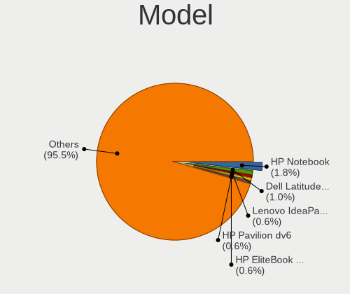
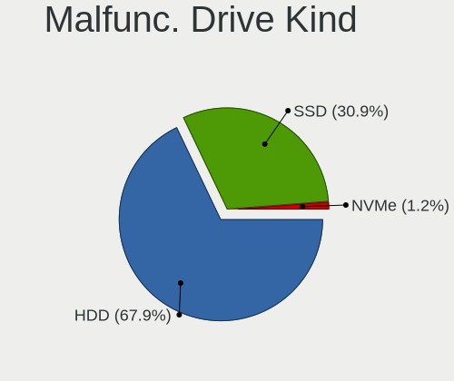
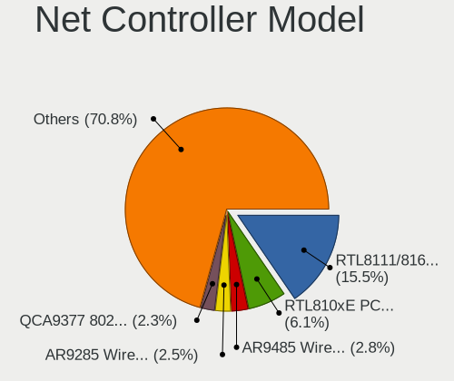
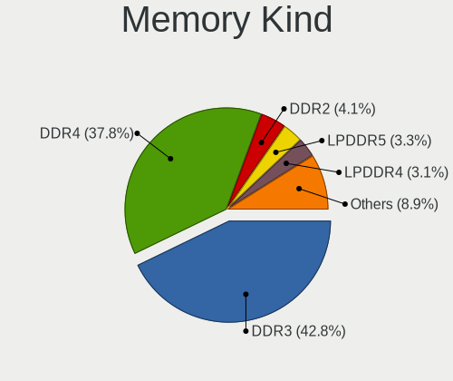

OpenMandriva - Hardware Trends (Notebooks)
------------------------------------------

A project to identify most popular hardware characteristics and track their change
over time based on data collected by Linux users at https://Linux-Hardware.org.

Anyone can contribute to this report by the [hw-probe](https://github.com/linuxhw/hw-probe) tool:

    sudo -E hw-probe -all -upload

This report is for one last month. Overall report since the beginning of time: [TestDays](https://github.com/linuxhw/TestDays)

Period: Nov, 2023.

Contents
--------

* [ System ](#system)
  - [ OS                       ](#os)
  - [ OS Family                ](#os-family)
  - [ Kernel                   ](#kernel)
  - [ Kernel Family            ](#kernel-family)
  - [ Kernel Major Ver.        ](#kernel-major-ver)
  - [ Arch                     ](#arch)
  - [ DE                       ](#de)
  - [ Display Server           ](#display-server)
  - [ Display Manager          ](#display-manager)
  - [ OS Lang                  ](#os-lang)
  - [ Boot Mode                ](#boot-mode)
  - [ Filesystem               ](#filesystem)
  - [ Part. scheme             ](#part-scheme)
  - [ Dual Boot with Linux/BSD ](#dual-boot-with-linuxbsd)
  - [ Dual Boot (Win)          ](#dual-boot-win)

* [ Board ](#board)
  - [ Vendor                   ](#vendor)
  - [ Model                    ](#model)
  - [ Model Family             ](#model-family)
  - [ MFG Year                 ](#mfg-year)
  - [ Form Factor              ](#form-factor)
  - [ Secure Boot              ](#secure-boot)
  - [ Coreboot                 ](#coreboot)
  - [ RAM Size                 ](#ram-size)
  - [ RAM Used                 ](#ram-used)
  - [ Total Drives             ](#total-drives)
  - [ Has CD-ROM               ](#has-cd-rom)
  - [ Has Ethernet             ](#has-ethernet)
  - [ Has WiFi                 ](#has-wifi)
  - [ Has Bluetooth            ](#has-bluetooth)

* [ Location ](#location)
  - [ Country                  ](#country)
  - [ City                     ](#city)

* [ Drives ](#drives)
  - [ Drive Vendor             ](#drive-vendor)
  - [ Drive Model              ](#drive-model)
  - [ HDD Vendor               ](#hdd-vendor)
  - [ SSD Vendor               ](#ssd-vendor)
  - [ Drive Kind               ](#drive-kind)
  - [ Drive Connector          ](#drive-connector)
  - [ Drive Size               ](#drive-size)
  - [ Space Total              ](#space-total)
  - [ Space Used               ](#space-used)
  - [ Malfunc. Drives          ](#malfunc-drives)
  - [ Malfunc. Drive Vendor    ](#malfunc-drive-vendor)
  - [ Malfunc. HDD Vendor      ](#malfunc-hdd-vendor)
  - [ Malfunc. Drive Kind      ](#malfunc-drive-kind)
  - [ Failed Drives            ](#failed-drives)
  - [ Failed Drive Vendor      ](#failed-drive-vendor)
  - [ Drive Status             ](#drive-status)

* [ Storage controller ](#storage-controller)
  - [ Storage Vendor           ](#storage-vendor)
  - [ Storage Model            ](#storage-model)
  - [ Storage Kind             ](#storage-kind)

* [ Processor ](#processor)
  - [ CPU Vendor               ](#cpu-vendor)
  - [ CPU Model                ](#cpu-model)
  - [ CPU Model Family         ](#cpu-model-family)
  - [ CPU Cores                ](#cpu-cores)
  - [ CPU Sockets              ](#cpu-sockets)
  - [ CPU Threads              ](#cpu-threads)
  - [ CPU Op-Modes             ](#cpu-op-modes)
  - [ CPU Microcode            ](#cpu-microcode)
  - [ CPU Microarch            ](#cpu-microarch)

* [ Graphics ](#graphics)
  - [ GPU Vendor               ](#gpu-vendor)
  - [ GPU Model                ](#gpu-model)
  - [ GPU Combo                ](#gpu-combo)
  - [ GPU Driver               ](#gpu-driver)
  - [ GPU Memory               ](#gpu-memory)

* [ Monitor ](#monitor)
  - [ Monitor Vendor           ](#monitor-vendor)
  - [ Monitor Model            ](#monitor-model)
  - [ Monitor Resolution       ](#monitor-resolution)
  - [ Monitor Diagonal         ](#monitor-diagonal)
  - [ Monitor Width            ](#monitor-width)
  - [ Aspect Ratio             ](#aspect-ratio)
  - [ Monitor Area             ](#monitor-area)
  - [ Pixel Density            ](#pixel-density)
  - [ Multiple Monitors        ](#multiple-monitors)

* [ Network ](#network)
  - [ Net Controller Vendor    ](#net-controller-vendor)
  - [ Net Controller Model     ](#net-controller-model)
  - [ Wireless Vendor          ](#wireless-vendor)
  - [ Wireless Model           ](#wireless-model)
  - [ Ethernet Vendor          ](#ethernet-vendor)
  - [ Ethernet Model           ](#ethernet-model)
  - [ Net Controller Kind      ](#net-controller-kind)
  - [ Used Controller          ](#used-controller)
  - [ NICs                     ](#nics)
  - [ IPv6                     ](#ipv6)

* [ Bluetooth ](#bluetooth)
  - [ Bluetooth Vendor         ](#bluetooth-vendor)
  - [ Bluetooth Model          ](#bluetooth-model)

* [ Sound ](#sound)
  - [ Sound Vendor             ](#sound-vendor)
  - [ Sound Model              ](#sound-model)

* [ Memory ](#memory)
  - [ Memory Vendor            ](#memory-vendor)
  - [ Memory Model             ](#memory-model)
  - [ Memory Kind              ](#memory-kind)
  - [ Memory Form Factor       ](#memory-form-factor)
  - [ Memory Size              ](#memory-size)
  - [ Memory Speed             ](#memory-speed)

* [ Printers & scanners ](#printers--scanners)
  - [ Printer Vendor           ](#printer-vendor)
  - [ Printer Model            ](#printer-model)
  - [ Scanner Vendor           ](#scanner-vendor)
  - [ Scanner Model            ](#scanner-model)

* [ Camera ](#camera)
  - [ Camera Vendor            ](#camera-vendor)
  - [ Camera Model             ](#camera-model)

* [ Security ](#security)
  - [ Fingerprint Vendor       ](#fingerprint-vendor)
  - [ Fingerprint Model        ](#fingerprint-model)
  - [ Chipcard Vendor          ](#chipcard-vendor)
  - [ Chipcard Model           ](#chipcard-model)

* [ Unsupported ](#unsupported)
  - [ Unsupported Devices      ](#unsupported-devices)
  - [ Unsupported Device Types ](#unsupported-device-types)

System
------

OS
--

Installed operating systems

| Name               | Notebooks | Percent |
|--------------------|-----------|---------|
| OpenMandriva 23.08 | 96        | 35.82%  |
| OpenMandriva 5.0   | 90        | 33.58%  |
| OpenMandriva 23.11 | 34        | 12.69%  |
| OpenMandriva 4.3   | 15        | 5.6%    |
| OpenMandriva 23.03 | 10        | 3.73%   |
| OpenMandriva 23.10 | 7         | 2.61%   |
| OpenMandriva 23.90 | 6         | 2.24%   |
| OpenMandriva 23.01 | 5         | 1.87%   |
| OpenMandriva 4.2   | 4         | 1.49%   |
| OpenMandriva 4.50  | 1         | 0.37%   |

OS Family
---------

OS without a version

| Name         | Notebooks | Percent |
|--------------|-----------|---------|
| OpenMandriva | 268       | 100%    |

Kernel
------

Version of the Linux kernel

| Version                      | Notebooks | Percent |
|------------------------------|-----------|---------|
| 6.6.2-desktop-1omv2390       | 97        | 36.19%  |
| 6.4.11-desktop-1omv2390      | 92        | 34.33%  |
| 6.6.1-desktop-1omv2390       | 14        | 5.22%   |
| 6.6.0-desktop-1omv2390       | 11        | 4.1%    |
| 5.16.7-desktop-1omv4003      | 11        | 4.1%    |
| 6.2.6-desktop-1omv2390       | 10        | 3.73%   |
| 6.5.5-desktop-1omv2390       | 9         | 3.36%   |
| 6.4.8-desktop-2omv2390       | 9         | 3.36%   |
| 6.1.1-desktop-1omv2290       | 4         | 1.49%   |
| 5.16.13-desktop-1omv4003     | 4         | 1.49%   |
| 5.10.14-desktop-1omv4002     | 4         | 1.49%   |
| 6.6.0-desktop-0.rc3.1omv2390 | 1         | 0.37%   |
| 5.19.12-desktop-2omv4090     | 1         | 0.37%   |
| 5.17.1-desktop-2omv4050      | 1         | 0.37%   |

Kernel Family
-------------

Linux kernel without a distro release

| Version | Notebooks | Percent |
|---------|-----------|---------|
| 6.6.2   | 97        | 36.19%  |
| 6.4.11  | 92        | 34.33%  |
| 6.6.1   | 14        | 5.22%   |
| 6.6.0   | 12        | 4.48%   |
| 5.16.7  | 11        | 4.1%    |
| 6.2.6   | 10        | 3.73%   |
| 6.5.5   | 9         | 3.36%   |
| 6.4.8   | 9         | 3.36%   |
| 6.1.1   | 4         | 1.49%   |
| 5.16.13 | 4         | 1.49%   |
| 5.10.14 | 4         | 1.49%   |
| 5.19.12 | 1         | 0.37%   |
| 5.17.1  | 1         | 0.37%   |

Kernel Major Ver.
-----------------

Linux kernel major version

| Version | Notebooks | Percent |
|---------|-----------|---------|
| 6.6     | 123       | 45.9%   |
| 6.4     | 101       | 37.69%  |
| 5.16    | 15        | 5.6%    |
| 6.2     | 10        | 3.73%   |
| 6.5     | 9         | 3.36%   |
| 6.1     | 4         | 1.49%   |
| 5.10    | 4         | 1.49%   |
| 5.19    | 1         | 0.37%   |
| 5.17    | 1         | 0.37%   |

Arch
----

OS architecture (x86_64, i586, etc.)

| Name   | Notebooks | Percent |
|--------|-----------|---------|
| x86_64 | 268       | 100%    |

DE
--

Desktop Environment

| Name    | Notebooks | Percent |
|---------|-----------|---------|
| KDE5    | 218       | 81.34%  |
| LXQt    | 24        | 8.96%   |
| GNOME   | 22        | 8.21%   |
| Unknown | 4         | 1.49%   |

Display Server
--------------

X11 or Wayland

| Name    | Notebooks | Percent |
|---------|-----------|---------|
| Wayland | 228       | 85.07%  |
| X11     | 39        | 14.55%  |
| Unknown | 1         | 0.37%   |

Display Manager
---------------

SDDM, LightDM, etc.

| Name | Notebooks | Percent |
|------|-----------|---------|
| SDDM | 246       | 91.79%  |
| GDM  | 22        | 8.21%   |

OS Lang
-------

Language

| Lang       | Notebooks | Percent |
|------------|-----------|---------|
| en_US      | 139       | 51.87%  |
| fr_FR      | 27        | 10.07%  |
| de_DE      | 19        | 7.09%   |
| ru_RU      | 16        | 5.97%   |
| pl_PL      | 11        | 4.1%    |
| it_IT      | 7         | 2.61%   |
| en_GB      | 6         | 2.24%   |
| pt_BR      | 5         | 1.87%   |
| es_ES      | 4         | 1.49%   |
| cs_CZ      | 4         | 1.49%   |
| en_CA      | 3         | 1.12%   |
| tr_TR      | 2         | 0.75%   |
| nl_BE      | 2         | 0.75%   |
| ja_JP      | 2         | 0.75%   |
| hu_HU      | 2         | 0.75%   |
| es_AR      | 2         | 0.75%   |
| en_AU      | 2         | 0.75%   |
| de_AT      | 2         | 0.75%   |
| ru_RU-UTF8 | 1         | 0.37%   |
| ro_RO      | 1         | 0.37%   |
| pt_PT      | 1         | 0.37%   |
| nl_NL      | 1         | 0.37%   |
| es_VE      | 1         | 0.37%   |
| es_MX      | 1         | 0.37%   |
| en_NZ      | 1         | 0.37%   |
| en_NG      | 1         | 0.37%   |
| en_IN      | 1         | 0.37%   |
| en_IE      | 1         | 0.37%   |
| en_AG      | 1         | 0.37%   |
| de_CH      | 1         | 0.37%   |
| ar_IQ      | 1         | 0.37%   |

Boot Mode
---------

EFI or BIOS

| Mode | Notebooks | Percent |
|------|-----------|---------|
| EFI  | 174       | 64.93%  |
| BIOS | 94        | 35.07%  |

Filesystem
----------

Type of filesystem

| Type    | Notebooks | Percent |
|---------|-----------|---------|
| Overlay | 151       | 56.34%  |
| Ext4    | 100       | 37.31%  |
| Btrfs   | 14        | 5.22%   |
| Xfs     | 2         | 0.75%   |
| F2fs    | 1         | 0.37%   |

Part. scheme
------------

Scheme of partitioning

| Type | Notebooks | Percent |
|------|-----------|---------|
| GPT  | 212       | 79.1%   |
| MBR  | 56        | 20.9%   |

Dual Boot with Linux/BSD
------------------------

Hosting more than one Linux/BSD

| Dual boot | Notebooks | Percent |
|-----------|-----------|---------|
| Yes       | 138       | 51.49%  |
| No        | 130       | 48.51%  |

Dual Boot (Win)
---------------

Hosting Linux and Windows

| Dual boot | Notebooks | Percent |
|-----------|-----------|---------|
| No        | 163       | 60.82%  |
| Yes       | 105       | 39.18%  |

Board
-----

Vendor
------

Motherboard manufacturer

| Name                | Notebooks | Percent |
|---------------------|-----------|---------|
| Lenovo              | 56        | 20.9%   |
| Hewlett-Packard     | 50        | 18.66%  |
| Dell                | 35        | 13.06%  |
| ASUSTek Computer    | 30        | 11.19%  |
| Acer                | 24        | 8.96%   |
| Toshiba             | 9         | 3.36%   |
| Samsung Electronics | 7         | 2.61%   |
| HUAWEI              | 6         | 2.24%   |
| MSI                 | 4         | 1.49%   |
| Apple               | 4         | 1.49%   |
| Packard Bell        | 3         | 1.12%   |
| Fujitsu             | 3         | 1.12%   |
| Unknown             | 3         | 1.12%   |
| TUXEDO              | 2         | 0.75%   |
| Sony                | 2         | 0.75%   |
| Philco              | 2         | 0.75%   |
| LG Electronics      | 2         | 0.75%   |
| Google              | 2         | 0.75%   |
| Fujitsu Siemens     | 2         | 0.75%   |
| Framework           | 2         | 0.75%   |
| Dynabook            | 2         | 0.75%   |
| Alienware           | 2         | 0.75%   |
| Timi                | 1         | 0.37%   |
| Teclast             | 1         | 0.37%   |
| SLIMBOOK            | 1         | 0.37%   |
| Medion              | 1         | 0.37%   |
| Machcreator         | 1         | 0.37%   |
| Juana Manso         | 1         | 0.37%   |
| Intel               | 1         | 0.37%   |
| GPU Company         | 1         | 0.37%   |
| Exo                 | 1         | 0.37%   |
| eMachines           | 1         | 0.37%   |
| Digibras            | 1         | 0.37%   |
| Clevo               | 1         | 0.37%   |
| Chuwi               | 1         | 0.37%   |
| AMI                 | 1         | 0.37%   |
| ALLDOCUBE           | 1         | 0.37%   |
| Acidanthera         | 1         | 0.37%   |

Model
-----

Motherboard model

| Name                                                  | Notebooks | Percent |
|-------------------------------------------------------|-----------|---------|
| Unknown                                               | 5         | 1.87%   |
| Dell Inspiron 15 3515                                 | 3         | 1.12%   |
| Philco 14H                                            | 2         | 0.75%   |
| Lenovo ThinkPad L13 Gen 3 21BAS0X700                  | 2         | 0.75%   |
| Lenovo IdeaPad 330S-15IKB 81F5                        | 2         | 0.75%   |
| Lenovo IdeaPad 3 15ITL05 81X8                         | 2         | 0.75%   |
| Lenovo IdeaPad 3 15ALC6 82MF                          | 2         | 0.75%   |
| Lenovo IdeaPad 1 15AMN7 82VG                          | 2         | 0.75%   |
| HP Pavilion g6                                        | 2         | 0.75%   |
| HP Laptop 15-bs0xx                                    | 2         | 0.75%   |
| Dell Latitude E6430                                   | 2         | 0.75%   |
| ASUS UL80VT                                           | 2         | 0.75%   |
| TUXEDO Pulse 15 Gen1                                  | 1         | 0.37%   |
| TUXEDO Book BA1510                                    | 1         | 0.37%   |
| Toshiba Satellite L855                                | 1         | 0.37%   |
| Toshiba Satellite L755                                | 1         | 0.37%   |
| Toshiba Satellite L55t-A                              | 1         | 0.37%   |
| Toshiba Satellite L300D                               | 1         | 0.37%   |
| Toshiba Satellite C855-10N                            | 1         | 0.37%   |
| Toshiba Satellite C850-19D                            | 1         | 0.37%   |
| Toshiba Satellite C660                                | 1         | 0.37%   |
| Toshiba Satellite C650                                | 1         | 0.37%   |
| Toshiba dynabook T552/36HR                            | 1         | 0.37%   |
| Timi TM1701                                           | 1         | 0.37%   |
| Teclast F15S                                          | 1         | 0.37%   |
| Sony VPCEL1E1E                                        | 1         | 0.37%   |
| Sony VPCEB1J8E                                        | 1         | 0.37%   |
| SLIMBOOK PROX-AMD5                                    | 1         | 0.37%   |
| Samsung RV413/RV513                                   | 1         | 0.37%   |
| Samsung RV411/RV511/E3511/S3511                       | 1         | 0.37%   |
| Samsung R430/R480/R440                                | 1         | 0.37%   |
| Samsung 910S3L/911S3L                                 | 1         | 0.37%   |
| Samsung 355V4C/356V4C/3445VC/3545VC                   | 1         | 0.37%   |
| Samsung 300E5EV/300E4EV/270E5EV/270E4EV/2470EV/2470EE | 1         | 0.37%   |
| Samsung 300E4Z/300E5Z/300E7Z                          | 1         | 0.37%   |
| Packard Bell EasyNote TS11HR                          | 1         | 0.37%   |
| Packard Bell EasyNote LJ75                            | 1         | 0.37%   |
| Packard Bell DOT S                                    | 1         | 0.37%   |
| MSI Stealth GS77 12UE                                 | 1         | 0.37%   |
| MSI GE70 2QD                                          | 1         | 0.37%   |

Model Family
------------

Motherboard model prefix

| Name                  | Notebooks | Percent |
|-----------------------|-----------|---------|
| Lenovo ThinkPad       | 27        | 10.07%  |
| Lenovo IdeaPad        | 19        | 7.09%   |
| Dell Latitude         | 18        | 6.72%   |
| Acer Aspire           | 18        | 6.72%   |
| HP Laptop             | 11        | 4.1%    |
| Dell Inspiron         | 9         | 3.36%   |
| Toshiba Satellite     | 8         | 2.99%   |
| HP Pavilion           | 8         | 2.99%   |
| ASUS VivoBook         | 8         | 2.99%   |
| HP ProBook            | 7         | 2.61%   |
| HP EliteBook          | 7         | 2.61%   |
| HP Compaq             | 7         | 2.61%   |
| Unknown               | 5         | 1.87%   |
| Dell Precision        | 4         | 1.49%   |
| Philco 14H            | 2         | 0.75%   |
| Packard Bell EasyNote | 2         | 0.75%   |
| Lenovo Yoga           | 2         | 0.75%   |
| Lenovo Legion         | 2         | 0.75%   |
| HP ENVY               | 2         | 0.75%   |
| HP 255                | 2         | 0.75%   |
| HP 250                | 2         | 0.75%   |
| Fujitsu Siemens AMILO | 2         | 0.75%   |
| Fujitsu LIFEBOOK      | 2         | 0.75%   |
| Framework Laptop      | 2         | 0.75%   |
| Dynabook Satellite    | 2         | 0.75%   |
| Dell Vostro           | 2         | 0.75%   |
| ASUS UL80VT           | 2         | 0.75%   |
| ASUS ROG              | 2         | 0.75%   |
| ASUS ASUS             | 2         | 0.75%   |
| Acer TravelMate       | 2         | 0.75%   |
| Acer Predator         | 2         | 0.75%   |
| TUXEDO Pulse          | 1         | 0.37%   |
| TUXEDO Book           | 1         | 0.37%   |
| Toshiba dynabook      | 1         | 0.37%   |
| Timi TM1701           | 1         | 0.37%   |
| Teclast F15S          | 1         | 0.37%   |
| Sony VPCEL1E1E        | 1         | 0.37%   |
| Sony VPCEB1J8E        | 1         | 0.37%   |
| SLIMBOOK PROX-AMD5    | 1         | 0.37%   |
| Samsung RV413         | 1         | 0.37%   |

MFG Year
--------

Motherboard manufacture year

| Year | Notebooks | Percent |
|------|-----------|---------|
| 2012 | 28        | 10.45%  |
| 2022 | 26        | 9.7%    |
| 2021 | 26        | 9.7%    |
| 2011 | 24        | 8.96%   |
| 2020 | 20        | 7.46%   |
| 2010 | 19        | 7.09%   |
| 2015 | 16        | 5.97%   |
| 2014 | 16        | 5.97%   |
| 2013 | 16        | 5.97%   |
| 2008 | 14        | 5.22%   |
| 2018 | 13        | 4.85%   |
| 2017 | 13        | 4.85%   |
| 2019 | 11        | 4.1%    |
| 2016 | 10        | 3.73%   |
| 2023 | 7         | 2.61%   |
| 2009 | 7         | 2.61%   |
| 2007 | 2         | 0.75%   |

Form Factor
-----------

Physical design of the computer

| Name     | Notebooks | Percent |
|----------|-----------|---------|
| Notebook | 268       | 100%    |

Secure Boot
-----------

Enabled or disabled

| State    | Notebooks | Percent |
|----------|-----------|---------|
| Disabled | 268       | 100%    |

Coreboot
--------

Have coreboot on board

| Used | Notebooks | Percent |
|------|-----------|---------|
| No   | 266       | 99.25%  |
| Yes  | 2         | 0.75%   |

RAM Size
--------

Total RAM memory

| Size in GB  | Notebooks | Percent |
|-------------|-----------|---------|
| 4.01-8.0    | 86        | 32.09%  |
| 3.01-4.0    | 62        | 23.13%  |
| 16.01-24.0  | 45        | 16.79%  |
| 8.01-16.0   | 43        | 16.04%  |
| 1.01-2.0    | 14        | 5.22%   |
| 32.01-64.0  | 10        | 3.73%   |
| 2.01-3.0    | 5         | 1.87%   |
| 24.01-32.0  | 2         | 0.75%   |
| 64.01-256.0 | 1         | 0.37%   |

RAM Used
--------

Used RAM memory

| Used GB  | Notebooks | Percent |
|----------|-----------|---------|
| 1.01-2.0 | 175       | 65.3%   |
| 2.01-3.0 | 54        | 20.15%  |
| 0.51-1.0 | 26        | 9.7%    |
| 3.01-4.0 | 9         | 3.36%   |
| 4.01-8.0 | 2         | 0.75%   |
| 0.01-0.5 | 2         | 0.75%   |

Total Drives
------------

Number of drives on board

| Drives | Notebooks | Percent |
|--------|-----------|---------|
| 1      | 188       | 70.15%  |
| 2      | 70        | 26.12%  |
| 3      | 8         | 2.99%   |
| 4      | 1         | 0.37%   |
| 0      | 1         | 0.37%   |

Has CD-ROM
----------

Has CD-ROM on board

| Presented | Notebooks | Percent |
|-----------|-----------|---------|
| No        | 161       | 60.07%  |
| Yes       | 107       | 39.93%  |

Has Ethernet
------------

Has Ethernet on board

| Presented | Notebooks | Percent |
|-----------|-----------|---------|
| Yes       | 215       | 80.22%  |
| No        | 53        | 19.78%  |

Has WiFi
--------

Has WiFi module

| Presented | Notebooks | Percent |
|-----------|-----------|---------|
| Yes       | 261       | 97.39%  |
| No        | 7         | 2.61%   |

Has Bluetooth
-------------

Has Bluetooth module

| Presented | Notebooks | Percent |
|-----------|-----------|---------|
| Yes       | 207       | 77.24%  |
| No        | 61        | 22.76%  |

Location
--------

Country
-------

Geographic location (country)

| Country             | Notebooks | Percent |
|---------------------|-----------|---------|
| USA                 | 41        | 15.3%   |
| Germany             | 31        | 11.57%  |
| France              | 28        | 10.45%  |
| Russia              | 25        | 9.33%   |
| Poland              | 13        | 4.85%   |
| Brazil              | 12        | 4.48%   |
| Italy               | 10        | 3.73%   |
| Spain               | 9         | 3.36%   |
| UK                  | 7         | 2.61%   |
| Turkey              | 6         | 2.24%   |
| Netherlands         | 6         | 2.24%   |
| Canada              | 5         | 1.87%   |
| Hungary             | 4         | 1.49%   |
| Czechia             | 4         | 1.49%   |
| Algeria             | 4         | 1.49%   |
| Thailand            | 3         | 1.12%   |
| Switzerland         | 3         | 1.12%   |
| Serbia              | 3         | 1.12%   |
| Greece              | 3         | 1.12%   |
| Argentina           | 3         | 1.12%   |
| Ukraine             | 2         | 0.75%   |
| Sweden              | 2         | 0.75%   |
| Romania             | 2         | 0.75%   |
| Palestine           | 2         | 0.75%   |
| Mexico              | 2         | 0.75%   |
| Malaysia            | 2         | 0.75%   |
| Lithuania           | 2         | 0.75%   |
| Japan               | 2         | 0.75%   |
| India               | 2         | 0.75%   |
| Haiti               | 2         | 0.75%   |
| Bulgaria            | 2         | 0.75%   |
| Belgium             | 2         | 0.75%   |
| Austria             | 2         | 0.75%   |
| Australia           | 2         | 0.75%   |
| Venezuela           | 1         | 0.37%   |
| Trinidad and Tobago | 1         | 0.37%   |
| Sudan               | 1         | 0.37%   |
| Slovenia            | 1         | 0.37%   |
| Slovakia            | 1         | 0.37%   |
| Singapore           | 1         | 0.37%   |

City
----

Geographic location (city)

| City            | Notebooks | Percent |
|-----------------|-----------|---------|
| Berlin          | 4         | 1.49%   |
| Voronezh        | 3         | 1.12%   |
| Oliveira        | 3         | 1.12%   |
| Moscow          | 3         | 1.12%   |
| Milan           | 3         | 1.12%   |
| Columbus        | 3         | 1.12%   |
| Wegberg         | 2         | 0.75%   |
| Warsaw          | 2         | 0.75%   |
| Ulyanovsk       | 2         | 0.75%   |
| Stuttgart       | 2         | 0.75%   |
| Paris           | 2         | 0.75%   |
| New York        | 2         | 0.75%   |
| Munich          | 2         | 0.75%   |
| Marseille       | 2         | 0.75%   |
| Krasnoyarsk     | 2         | 0.75%   |
| Istanbul        | 2         | 0.75%   |
| Hot Springs     | 2         | 0.75%   |
| Hanover         | 2         | 0.75%   |
| Don Mot Daeng   | 2         | 0.75%   |
| Compiègne      | 2         | 0.75%   |
| Carrefour       | 2         | 0.75%   |
| Budapest        | 2         | 0.75%   |
| Bucharest       | 2         | 0.75%   |
| Barcelona       | 2         | 0.75%   |
| Zurich          | 1         | 0.37%   |
| Zofingen        | 1         | 0.37%   |
| Zlotow          | 1         | 0.37%   |
| Zambrów        | 1         | 0.37%   |
| Wuxi            | 1         | 0.37%   |
| Wuppertal       | 1         | 0.37%   |
| Woerth am Rhein | 1         | 0.37%   |
| Winter Haven    | 1         | 0.37%   |
| Werdau          | 1         | 0.37%   |
| Wedel           | 1         | 0.37%   |
| Vsevolozhsk     | 1         | 0.37%   |
| Vlasikha        | 1         | 0.37%   |
| Vienna          | 1         | 0.37%   |
| Valencia        | 1         | 0.37%   |
| Vailhauques     | 1         | 0.37%   |
| Ulm             | 1         | 0.37%   |

Drives
------

Drive Vendor
------------

Hard drive vendors

| Vendor              | Notebooks | Drives | Percent |
|---------------------|-----------|--------|---------|
| WDC                 | 38        | 38     | 11.18%  |
| Samsung Electronics | 37        | 37     | 10.88%  |
| Seagate             | 27        | 27     | 7.94%   |
| Toshiba             | 22        | 22     | 6.47%   |
| Kingston            | 21        | 21     | 6.18%   |
| SanDisk             | 18        | 19     | 5.29%   |
| Crucial             | 16        | 18     | 4.71%   |
| Micron Technology   | 12        | 12     | 3.53%   |
| Hitachi             | 12        | 12     | 3.53%   |
| China               | 12        | 13     | 3.53%   |
| Unknown             | 10        | 10     | 2.94%   |
| SPCC                | 9         | 9      | 2.65%   |
| SK hynix            | 9         | 9      | 2.65%   |
| HGST                | 9         | 9      | 2.65%   |
| Intel               | 8         | 8      | 2.35%   |
| LITEON              | 5         | 5      | 1.47%   |
| JMicron Technology  | 5         | 5      | 1.47%   |
| Unknown             | 5         | 5      | 1.47%   |
| SSSTC               | 4         | 4      | 1.18%   |
| Phison              | 4         | 4      | 1.18%   |
| A-DATA Technology   | 4         | 4      | 1.18%   |
| UMIS                | 3         | 3      | 0.88%   |
| Transcend           | 3         | 3      | 0.88%   |
| Intenso             | 3         | 3      | 0.88%   |
| Apple               | 3         | 3      | 0.88%   |
| Silicon Motion      | 2         | 2      | 0.59%   |
| Lexar               | 2         | 2      | 0.59%   |
| Fujitsu             | 2         | 2      | 0.59%   |
| Zheino              | 1         | 1      | 0.29%   |
| XrayDisk            | 1         | 1      | 0.29%   |
| Wibtek              | 1         | 1      | 0.29%   |
| Verbatim            | 1         | 1      | 0.29%   |
| TO Exter            | 1         | 1      | 0.29%   |
| Teclast             | 1         | 1      | 0.29%   |
| SPCC M.2            | 1         | 1      | 0.29%   |
| SandForce           | 1         | 1      | 0.29%   |
| SABRENT             | 1         | 1      | 0.29%   |
| S3+                 | 1         | 1      | 0.29%   |
| Patriot             | 1         | 1      | 0.29%   |
| MSI                 | 1         | 1      | 0.29%   |

Drive Model
-----------

Hard drive models

| Model                              | Notebooks | Percent |
|------------------------------------|-----------|---------|
| Kingston SA400S37240G 240GB SSD    | 6         | 1.74%   |
| Toshiba MQ04ABF100 1TB             | 5         | 1.45%   |
| Toshiba MQ01ABD100 1TB             | 5         | 1.45%   |
| Unknown                            | 5         | 1.45%   |
| WDC WD5000LPVX-22V0TT0 500GB       | 4         | 1.16%   |
| WDC WD10SPZX-24Z10 1TB             | 4         | 1.16%   |
| SPCC Solid State Disk 512GB        | 4         | 1.16%   |
| Seagate ST9500325AS 500GB          | 4         | 1.16%   |
| Seagate ST500LT012-1DG142 500GB    | 4         | 1.16%   |
| SanDisk NVMe SSD Drive 1TB         | 4         | 1.16%   |
| JMicron Generic 250GB              | 4         | 1.16%   |
| Crucial CT1000BX500SSD1 1TB        | 4         | 1.16%   |
| Unknown SD/MMC/MS PRO 128GB        | 3         | 0.87%   |
| Kingston SNVS500G 500GB            | 3         | 0.87%   |
| Hitachi HTS543232A7A384 320GB      | 3         | 0.87%   |
| Crucial CT500MX500SSD1 500GB       | 3         | 0.87%   |
| China SSD 128GB                    | 3         | 0.87%   |
| WDC WDS500G2B0A-00SM50 500GB SSD   | 2         | 0.58%   |
| WDC WD5000LPCX-21VHAT0 500GB       | 2         | 0.58%   |
| WDC WD3200BEKT-08PVMT1 320GB       | 2         | 0.58%   |
| Unknown USB DISK 3.2 1TB           | 2         | 0.58%   |
| SSSTC CL1-4D256 256GB              | 2         | 0.58%   |
| SPCC Solid State Disk 256GB        | 2         | 0.58%   |
| SPCC M.2 PCIe SSD 512GB            | 2         | 0.58%   |
| Seagate ST9500423AS 500GB          | 2         | 0.58%   |
| Seagate ST1000LM035-1RK172 1TB     | 2         | 0.58%   |
| Seagate ST1000LM024 HN-M101MBB 1TB | 2         | 0.58%   |
| SanDisk SSD PLUS 480GB             | 2         | 0.58%   |
| SanDisk SDSSDA120G 120GB           | 2         | 0.58%   |
| SanDisk NVMe SSD Drive 512GB       | 2         | 0.58%   |
| Samsung MZALQ256HBJD-00BL2 256GB   | 2         | 0.58%   |
| Micron 2210_MTFDHBA512QFD 512GB    | 2         | 0.58%   |
| Kingston SA400S37480G 480GB SSD    | 2         | 0.58%   |
| Hitachi HTS545050B9A300 500GB      | 2         | 0.58%   |
| HGST HTS721010A9E630 1TB           | 2         | 0.58%   |
| HGST HTS545032A7E380 320GB         | 2         | 0.58%   |
| HGST HTS541075A9E680 752GB         | 2         | 0.58%   |
| Crucial CT240BX500SSD1 240GB       | 2         | 0.58%   |
| Zheino CHN mSATA01M 120 120GB SSD  | 1         | 0.29%   |
| XrayDisk 512GB SSD                 | 1         | 0.29%   |

HDD Vendor
----------

Hard disk drive vendors

| Vendor   | Notebooks | Drives | Percent |
|----------|-----------|--------|---------|
| Seagate  | 26        | 26     | 26.53%  |
| WDC      | 25        | 25     | 25.51%  |
| Toshiba  | 18        | 18     | 18.37%  |
| Hitachi  | 12        | 12     | 12.24%  |
| HGST     | 9         | 9      | 9.18%   |
| Unknown  | 3         | 3      | 3.06%   |
| Fujitsu  | 2         | 2      | 2.04%   |
| TO Exter | 1         | 1      | 1.02%   |
| MARSHAL  | 1         | 1      | 1.02%   |
| External | 1         | 1      | 1.02%   |

SSD Vendor
----------

Solid state drive vendors

| Vendor              | Notebooks | Drives | Percent |
|---------------------|-----------|--------|---------|
| Samsung Electronics | 17        | 17     | 12.41%  |
| Kingston            | 16        | 16     | 11.68%  |
| China               | 12        | 13     | 8.76%   |
| SanDisk             | 11        | 11     | 8.03%   |
| Crucial             | 10        | 10     | 7.3%    |
| SPCC                | 8         | 8      | 5.84%   |
| LITEON              | 5         | 5      | 3.65%   |
| Micron Technology   | 4         | 4      | 2.92%   |
| JMicron Technology  | 4         | 4      | 2.92%   |
| A-DATA Technology   | 4         | 4      | 2.92%   |
| WDC                 | 3         | 3      | 2.19%   |
| Transcend           | 3         | 3      | 2.19%   |
| Intenso             | 3         | 3      | 2.19%   |
| Intel               | 3         | 3      | 2.19%   |
| Apple               | 3         | 3      | 2.19%   |
| SK hynix            | 2         | 2      | 1.46%   |
| Phison              | 2         | 2      | 1.46%   |
| Zheino              | 1         | 1      | 0.73%   |
| XrayDisk            | 1         | 1      | 0.73%   |
| Wibtek              | 1         | 1      | 0.73%   |
| Verbatim            | 1         | 1      | 0.73%   |
| Toshiba             | 1         | 1      | 0.73%   |
| Teclast             | 1         | 1      | 0.73%   |
| SPCC M.2            | 1         | 1      | 0.73%   |
| SandForce           | 1         | 1      | 0.73%   |
| S3+                 | 1         | 1      | 0.73%   |
| Patriot             | 1         | 1      | 0.73%   |
| MidasForce          | 1         | 1      | 0.73%   |
| Lexar               | 1         | 1      | 0.73%   |
| KODAK               | 1         | 1      | 0.73%   |
| KingDian            | 1         | 1      | 0.73%   |
| Hoodisk             | 1         | 1      | 0.73%   |
| GOODRAM             | 1         | 1      | 0.73%   |
| FORESEE             | 1         | 1      | 0.73%   |
| Fanxiang            | 1         | 1      | 0.73%   |
| Emtec               | 1         | 1      | 0.73%   |
| EDILOCA             | 1         | 1      | 0.73%   |
| Drevo               | 1         | 1      | 0.73%   |
| Digma               | 1         | 1      | 0.73%   |
| Dell                | 1         | 1      | 0.73%   |

Drive Kind
----------

HDD or SSD

| Kind    | Notebooks | Drives | Percent |
|---------|-----------|--------|---------|
| SSD     | 136       | 138    | 41.09%  |
| HDD     | 96        | 98     | 29%     |
| NVMe    | 84        | 93     | 25.38%  |
| MMC     | 9         | 9      | 2.72%   |
| Unknown | 6         | 6      | 1.81%   |

Drive Connector
---------------

SATA, SAS, NVMe, etc.

| Type | Notebooks | Drives | Percent |
|------|-----------|--------|---------|
| SATA | 198       | 219    | 63.67%  |
| NVMe | 83        | 91     | 26.69%  |
| SAS  | 21        | 25     | 6.75%   |
| MMC  | 9         | 9      | 2.89%   |

Drive Size
----------

Size of hard drive

| Size in TB | Notebooks | Drives | Percent |
|------------|-----------|--------|---------|
| 0.01-0.5   | 156       | 168    | 70.59%  |
| 0.51-1.0   | 59        | 62     | 26.7%   |
| 1.01-2.0   | 5         | 5      | 2.26%   |
| 3.01-4.0   | 1         | 1      | 0.45%   |

Space Total
-----------

Amount of disk space available on the file system

| Size in GB     | Notebooks | Percent |
|----------------|-----------|---------|
| 1-20           | 112       | 41.79%  |
| 101-250        | 53        | 19.78%  |
| 251-500        | 35        | 13.06%  |
| 501-1000       | 16        | 5.97%   |
| 21-50          | 14        | 5.22%   |
| 51-100         | 14        | 5.22%   |
| Unknown        | 12        | 4.48%   |
| 1001-2000      | 7         | 2.61%   |
| 2001-3000      | 3         | 1.12%   |
| More than 3000 | 2         | 0.75%   |

Space Used
----------

Amount of used disk space

| Used GB   | Notebooks | Percent |
|-----------|-----------|---------|
| 1-20      | 219       | 81.72%  |
| 21-50     | 15        | 5.6%    |
| Unknown   | 12        | 4.48%   |
| 101-250   | 6         | 2.24%   |
| 51-100    | 6         | 2.24%   |
| 251-500   | 4         | 1.49%   |
| 0         | 4         | 1.49%   |
| 1001-2000 | 1         | 0.37%   |
| 501-1000  | 1         | 0.37%   |

Malfunc. Drives
---------------

Drive models with a malfunction

| Model                                | Notebooks | Drives | Percent |
|--------------------------------------|-----------|--------|---------|
| Toshiba MQ01ABD100 1TB               | 4         | 4      | 8.7%    |
| WDC WD5000LPVX-22V0TT0 500GB         | 3         | 3      | 6.52%   |
| Seagate ST9500325AS 500GB            | 3         | 3      | 6.52%   |
| Seagate ST9500423AS 500GB            | 2         | 2      | 4.35%   |
| SanDisk SSD PLUS 480GB               | 2         | 2      | 4.35%   |
| WDC WD3200BEKT-08PVMT1 320GB         | 1         | 1      | 2.17%   |
| WDC WD2500BEVT-60ZCT1 250GB          | 1         | 1      | 2.17%   |
| WDC WD1600BEKT-60F3T1 160GB          | 1         | 1      | 2.17%   |
| Transcend TS128GMTS430S 128GB SSD    | 1         | 1      | 2.17%   |
| Toshiba MQ01ABD050V 500GB            | 1         | 1      | 2.17%   |
| Toshiba MK6475GSX 640GB              | 1         | 1      | 2.17%   |
| Toshiba MK3261GSYN 320GB             | 1         | 1      | 2.17%   |
| Toshiba MK3259GSXP 320GB             | 1         | 1      | 2.17%   |
| Toshiba MK3252GSX 320GB              | 1         | 1      | 2.17%   |
| Toshiba MK1637GSX 160GB              | 1         | 1      | 2.17%   |
| Toshiba MK1032GSX 100GB              | 1         | 1      | 2.17%   |
| SK hynix SH920 2.5 7MM 256GB SSD     | 1         | 1      | 2.17%   |
| SK hynix BC711 HFM512GD3JX013N 512GB | 1         | 1      | 2.17%   |
| Seagate ST9320325AS 320GB            | 1         | 1      | 2.17%   |
| Seagate ST9250315AS 250GB            | 1         | 1      | 2.17%   |
| Seagate ST9250311CS 250GB            | 1         | 1      | 2.17%   |
| Seagate ST500LT012-1DG142 500GB      | 1         | 1      | 2.17%   |
| Seagate ST500LM000-SSHD-8GB          | 1         | 1      | 2.17%   |
| SandForce 113444 120GB SSD           | 1         | 1      | 2.17%   |
| LITEON IT LST-16S9G-HP 16GB SSD      | 1         | 1      | 2.17%   |
| Kingston SHFS37A120G 120GB SSD       | 1         | 1      | 2.17%   |
| Intenso SSD Sata III 120GB           | 1         | 1      | 2.17%   |
| Intel MEMPEK1J016GAL 16GB            | 1         | 1      | 2.17%   |
| Hitachi HTS727575A9E364 752GB        | 1         | 1      | 2.17%   |
| Hitachi HTS723232A7A364 320GB        | 1         | 1      | 2.17%   |
| Hitachi HTS723225A7A364 250GB        | 1         | 1      | 2.17%   |
| Hitachi HTS545050B9A300 500GB        | 1         | 1      | 2.17%   |
| HGST HTS545050A7E380 500GB           | 1         | 1      | 2.17%   |
| HGST HTS541075A9E680 752GB           | 1         | 1      | 2.17%   |
| HGST HTS541010A9E680 1TB             | 1         | 1      | 2.17%   |
| Fujitsu MHY2160BH 160GB              | 1         | 1      | 2.17%   |
| ACOS AS-512 512GB SSD                | 1         | 1      | 2.17%   |

Malfunc. Drive Vendor
---------------------

Vendors of faulty drives

| Vendor    | Notebooks | Drives | Percent |
|-----------|-----------|--------|---------|
| Toshiba   | 11        | 11     | 23.91%  |
| Seagate   | 10        | 10     | 21.74%  |
| WDC       | 6         | 6      | 13.04%  |
| Hitachi   | 4         | 4      | 8.7%    |
| HGST      | 3         | 3      | 6.52%   |
| SK hynix  | 2         | 2      | 4.35%   |
| SanDisk   | 2         | 2      | 4.35%   |
| Transcend | 1         | 1      | 2.17%   |
| SandForce | 1         | 1      | 2.17%   |
| LITEON    | 1         | 1      | 2.17%   |
| Kingston  | 1         | 1      | 2.17%   |
| Intenso   | 1         | 1      | 2.17%   |
| Intel     | 1         | 1      | 2.17%   |
| Fujitsu   | 1         | 1      | 2.17%   |
| ACOS      | 1         | 1      | 2.17%   |

Malfunc. HDD Vendor
-------------------

Vendors of faulty HDD drives

| Vendor  | Notebooks | Drives | Percent |
|---------|-----------|--------|---------|
| Toshiba | 11        | 11     | 31.43%  |
| Seagate | 10        | 10     | 28.57%  |
| WDC     | 6         | 6      | 17.14%  |
| Hitachi | 4         | 4      | 11.43%  |
| HGST    | 3         | 3      | 8.57%   |
| Fujitsu | 1         | 1      | 2.86%   |

Malfunc. Drive Kind
-------------------

Kinds of faulty drives

| Kind | Notebooks | Drives | Percent |
|------|-----------|--------|---------|
| HDD  | 34        | 35     | 75.56%  |
| SSD  | 9         | 9      | 20%     |
| NVMe | 2         | 2      | 4.44%   |

Failed Drives
-------------

Failed drive models

| Model                          | Notebooks | Drives | Percent |
|--------------------------------|-----------|--------|---------|
| Intel SSDSCKKF256H6 SATA 256GB | 1         | 1      | 100%    |

Failed Drive Vendor
-------------------

Failed drive vendors

| Vendor | Notebooks | Drives | Percent |
|--------|-----------|--------|---------|
| Intel  | 1         | 1      | 100%    |

Drive Status
------------

Number of failed and malfunc. drives

| Status   | Notebooks | Drives | Percent |
|----------|-----------|--------|---------|
| Works    | 220       | 257    | 73.58%  |
| Malfunc  | 45        | 46     | 15.05%  |
| Detected | 33        | 40     | 11.04%  |
| Failed   | 1         | 1      | 0.33%   |

Storage controller
------------------

Storage Vendor
--------------

Storage controller vendors

| Vendor                         | Notebooks | Percent |
|--------------------------------|-----------|---------|
| Intel                          | 187       | 60.13%  |
| AMD                            | 36        | 11.58%  |
| Samsung Electronics            | 20        | 6.43%   |
| Sandisk                        | 17        | 5.47%   |
| Micron Technology              | 9         | 2.89%   |
| SK hynix                       | 7         | 2.25%   |
| Phison Electronics             | 6         | 1.93%   |
| Micron/Crucial Technology      | 6         | 1.93%   |
| Kingston Technology Company    | 6         | 1.93%   |
| Solid State Storage Technology | 4         | 1.29%   |
| Union Memory (Shenzhen)        | 3         | 0.96%   |
| KIOXIA                         | 3         | 0.96%   |
| Silicon Motion                 | 2         | 0.64%   |
| Nvidia                         | 2         | 0.64%   |
| Toshiba America Info Systems   | 1         | 0.32%   |
| Shenzhen Longsys Electronics   | 1         | 0.32%   |
| Seagate Technology             | 1         | 0.32%   |

Storage Model
-------------

Storage controller models

| Model                                                                            | Notebooks | Percent |
|----------------------------------------------------------------------------------|-----------|---------|
| AMD FCH SATA Controller [AHCI mode]                                              | 30        | 9.06%   |
| Intel 7 Series Chipset Family 6-port SATA Controller [AHCI mode]                 | 25        | 7.55%   |
| Intel Sunrise Point-LP SATA Controller [AHCI mode]                               | 19        | 5.74%   |
| Intel 82801 Mobile SATA Controller [RAID mode]                                   | 14        | 4.23%   |
| Intel 6 Series/C200 Series Chipset Family 6 port Mobile SATA AHCI Controller     | 13        | 3.93%   |
| Intel 82801IBM/IEM (ICH9M/ICH9M-E) 4 port SATA Controller [AHCI mode]            | 12        | 3.63%   |
| Intel Wildcat Point-LP SATA Controller [AHCI Mode]                               | 11        | 3.32%   |
| Samsung NVMe SSD Controller SM981/PM981/PM983                                    | 8         | 2.42%   |
| Intel 5 Series/3400 Series Chipset 4 port SATA AHCI Controller                   | 8         | 2.42%   |
| Samsung NVMe SSD Controller 980 (DRAM-less)                                      | 7         | 2.11%   |
| Intel 8 Series/C220 Series Chipset Family 6-port SATA Controller 1 [AHCI mode]   | 7         | 2.11%   |
| Intel NM10/ICH7 Family SATA Controller [AHCI mode]                               | 6         | 1.81%   |
| Intel 8 Series SATA Controller 1 [AHCI mode]                                     | 6         | 1.81%   |
| Intel 5 Series/3400 Series Chipset 6 port SATA AHCI Controller                   | 6         | 1.81%   |
| Intel Volume Management Device NVMe RAID Controller                              | 5         | 1.51%   |
| Intel HM170/QM170 Chipset SATA Controller [AHCI Mode]                            | 5         | 1.51%   |
| Intel 82801HM/HEM (ICH8M/ICH8M-E) SATA Controller [AHCI mode]                    | 5         | 1.51%   |
| Intel 82801HM/HEM (ICH8M/ICH8M-E) IDE Controller                                 | 5         | 1.51%   |
| AMD SB7x0/SB8x0/SB9x0 SATA Controller [AHCI mode]                                | 5         | 1.51%   |
| Samsung NVMe SSD Controller PM9A1/PM9A3/980PRO                                   | 4         | 1.21%   |
| Intel Celeron/Pentium Silver Processor SATA Controller                           | 4         | 1.21%   |
| Intel Atom/Celeron/Pentium Processor x5-E8000/J3xxx/N3xxx Series SATA Controller | 4         | 1.21%   |
| Intel Atom Processor E3800 Series SATA AHCI Controller                           | 4         | 1.21%   |
| Intel 7 Series Chipset Family 4-port SATA Controller [IDE mode]                  | 4         | 1.21%   |
| Intel 7 Series Chipset Family 2-port SATA Controller [IDE mode]                  | 4         | 1.21%   |
| Solid State Storage CL1-3D256-Q11 NVMe SSD M.2                                   | 3         | 0.91%   |
| SanDisk WD Blue SN500 / PC SN520 x2 M.2 2280 NVMe SSD                            | 3         | 0.91%   |
| SanDisk WD Black SN770 / PC SN740 256GB / PC SN560 (DRAM-less) NVMe SSD          | 3         | 0.91%   |
| Phison PS5013-E13 PCIe3 NVMe Controller (DRAM-less)                              | 3         | 0.91%   |
| Micron/Crucial P2 [Nick P2] / P3 / P3 Plus NVMe PCIe SSD (DRAM-less)             | 3         | 0.91%   |
| Micron 2210 NVMe SSD [Cobain]                                                    | 3         | 0.91%   |
| Kingston Company NV1 NVMe SSD SM2263XT                                           | 3         | 0.91%   |
| Intel Tiger Lake-LP SATA Controller                                              | 3         | 0.91%   |
| Intel Jasper Lake SATA AHCI Controller                                           | 3         | 0.91%   |
| Intel Cannon Lake Mobile PCH SATA AHCI Controller                                | 3         | 0.91%   |
| Intel 400 Series Chipset Family SATA AHCI Controller                             | 3         | 0.91%   |
| SK hynix Gold P31/BC711/PC711 NVMe Solid State Drive                             | 2         | 0.6%    |
| SK hynix BC511 NVMe SSD                                                          | 2         | 0.6%    |
| Silicon Motion Non-Volatile memory controller                                    | 2         | 0.6%    |
| SanDisk WD PC SN810 / Black SN850 NVMe SSD                                       | 2         | 0.6%    |

Storage Kind
------------

Kind of storage controller (IDE, SATA, NVMe, SAS, ...)

| Kind | Notebooks | Percent |
|------|-----------|---------|
| SATA | 192       | 60.76%  |
| NVMe | 83        | 26.27%  |
| RAID | 21        | 6.65%   |
| IDE  | 20        | 6.33%   |

Processor
---------

CPU Vendor
----------

Processor vendors

| Vendor | Notebooks | Percent |
|--------|-----------|---------|
| Intel  | 213       | 79.48%  |
| AMD    | 55        | 20.52%  |

CPU Model
---------

Processor models

| Model                                         | Notebooks | Percent |
|-----------------------------------------------|-----------|---------|
| Intel Core i5-5300U CPU @ 2.30GHz             | 4         | 1.49%   |
| Intel Core i5-3320M CPU @ 2.60GHz             | 4         | 1.49%   |
| Intel Core i5-3210M CPU @ 2.50GHz             | 4         | 1.49%   |
| Intel Core i3-1005G1 CPU @ 1.20GHz            | 4         | 1.49%   |
| Intel 12th Gen Core i7-12700H                 | 4         | 1.49%   |
| Intel 11th Gen Core i5-1135G7 @ 2.40GHz       | 4         | 1.49%   |
| Intel Core i7-8550U CPU @ 1.80GHz             | 3         | 1.12%   |
| Intel Core i7-6500U CPU @ 2.50GHz             | 3         | 1.12%   |
| Intel Core i5-8250U CPU @ 1.60GHz             | 3         | 1.12%   |
| Intel Core i5-6300U CPU @ 2.40GHz             | 3         | 1.12%   |
| Intel Core i5-6200U CPU @ 2.30GHz             | 3         | 1.12%   |
| Intel Core i5-5200U CPU @ 2.20GHz             | 3         | 1.12%   |
| Intel Core i5-3230M CPU @ 2.60GHz             | 3         | 1.12%   |
| Intel Core i5 CPU M 560 @ 2.67GHz             | 3         | 1.12%   |
| Intel Core i5 CPU M 520 @ 2.40GHz             | 3         | 1.12%   |
| Intel Core i3-2350M CPU @ 2.30GHz             | 3         | 1.12%   |
| Intel Core i3-2310M CPU @ 2.10GHz             | 3         | 1.12%   |
| Intel Core 2 Duo CPU T5800 @ 2.00GHz          | 3         | 1.12%   |
| Intel Celeron N4020 CPU @ 1.10GHz             | 3         | 1.12%   |
| Intel Celeron CPU N3060 @ 1.60GHz             | 3         | 1.12%   |
| AMD Ryzen 7 5700U with Radeon Graphics        | 3         | 1.12%   |
| AMD Ryzen 5 3450U with Radeon Vega Mobile Gfx | 3         | 1.12%   |
| Intel Pentium Gold 7505 @ 2.00GHz             | 2         | 0.75%   |
| Intel Pentium CPU N3540 @ 2.16GHz             | 2         | 0.75%   |
| Intel Genuine CPU U7300 @ 1.30GHz             | 2         | 0.75%   |
| Intel Core i7-7700HQ CPU @ 2.80GHz            | 2         | 0.75%   |
| Intel Core i7-4700MQ CPU @ 2.40GHz            | 2         | 0.75%   |
| Intel Core i7-4600U CPU @ 2.10GHz             | 2         | 0.75%   |
| Intel Core i7-3610QM CPU @ 2.30GHz            | 2         | 0.75%   |
| Intel Core i7-2630QM CPU @ 2.00GHz            | 2         | 0.75%   |
| Intel Core i7-10850H CPU @ 2.70GHz            | 2         | 0.75%   |
| Intel Core i7-1065G7 CPU @ 1.30GHz            | 2         | 0.75%   |
| Intel Core i5-7200U CPU @ 2.50GHz             | 2         | 0.75%   |
| Intel Core i5-6300HQ CPU @ 2.30GHz            | 2         | 0.75%   |
| Intel Core i5-4210U CPU @ 1.70GHz             | 2         | 0.75%   |
| Intel Core i5-3337U CPU @ 1.80GHz             | 2         | 0.75%   |
| Intel Core i5-2540M CPU @ 2.60GHz             | 2         | 0.75%   |
| Intel Core i5-2410M CPU @ 2.30GHz             | 2         | 0.75%   |
| Intel Core i5-1035G1 CPU @ 1.00GHz            | 2         | 0.75%   |
| Intel Core i5-10210U CPU @ 1.60GHz            | 2         | 0.75%   |

CPU Model Family
----------------

Processor model prefix

| Model                   | Notebooks | Percent |
|-------------------------|-----------|---------|
| Intel Core i5           | 60        | 22.39%  |
| Intel Core i7           | 39        | 14.55%  |
| Intel Core i3           | 29        | 10.82%  |
| Other                   | 25        | 9.33%   |
| Intel Celeron           | 25        | 9.33%   |
| AMD Ryzen 5             | 13        | 4.85%   |
| Intel Core 2 Duo        | 11        | 4.1%    |
| AMD Ryzen 7             | 9         | 3.36%   |
| Intel Pentium           | 6         | 2.24%   |
| Intel Atom              | 6         | 2.24%   |
| AMD Ryzen 3             | 6         | 2.24%   |
| Intel Pentium Dual      | 3         | 1.12%   |
| AMD E                   | 3         | 1.12%   |
| AMD Athlon              | 3         | 1.12%   |
| AMD A6                  | 3         | 1.12%   |
| AMD A4                  | 3         | 1.12%   |
| Intel Pentium Gold      | 2         | 0.75%   |
| Intel Pentium Dual-Core | 2         | 0.75%   |
| Intel Genuine           | 2         | 0.75%   |
| Intel Core M            | 2         | 0.75%   |
| AMD Ryzen 9             | 2         | 0.75%   |
| AMD Ryzen 5 PRO         | 2         | 0.75%   |
| AMD Athlon X2           | 2         | 0.75%   |
| AMD A8                  | 2         | 0.75%   |
| Intel Pentium Silver    | 1         | 0.37%   |
| Intel Core 2 Solo       | 1         | 0.37%   |
| AMD V120                | 1         | 0.37%   |
| AMD Turion 64 X2 Mobile | 1         | 0.37%   |
| AMD E2                  | 1         | 0.37%   |
| AMD E1                  | 1         | 0.37%   |
| AMD A12                 | 1         | 0.37%   |
| AMD A10                 | 1         | 0.37%   |

CPU Cores
---------

Number of processor cores

| Number | Notebooks | Percent |
|--------|-----------|---------|
| 2      | 155       | 57.84%  |
| 4      | 66        | 24.63%  |
| 6      | 15        | 5.6%    |
| 8      | 9         | 3.36%   |
| 1      | 8         | 2.99%   |
| 12     | 7         | 2.61%   |
| 14     | 5         | 1.87%   |
| 24     | 1         | 0.37%   |
| 16     | 1         | 0.37%   |
| 10     | 1         | 0.37%   |

CPU Sockets
-----------

Number of sockets

| Number | Notebooks | Percent |
|--------|-----------|---------|
| 1      | 268       | 100%    |

CPU Threads
-----------

Threads per core (Hyper-Threading)

| Number | Notebooks | Percent |
|--------|-----------|---------|
| 2      | 186       | 69.4%   |
| 1      | 81        | 30.22%  |
| 4      | 1         | 0.37%   |

CPU Op-Modes
------------

CPU Operation Modes (32-bit, 64-bit)

| Op mode        | Notebooks | Percent |
|----------------|-----------|---------|
| 32-bit, 64-bit | 268       | 100%    |

CPU Microcode
-------------

Microcode number

| Number     | Notebooks | Percent |
|------------|-----------|---------|
| Unknown    | 194       | 72.39%  |
| 0x08108109 | 11        | 4.1%    |
| 0x306a9    | 5         | 1.87%   |
| 0x0a50000d | 4         | 1.49%   |
| 0x0a50000c | 4         | 1.49%   |
| 0x08608103 | 4         | 1.49%   |
| 0x6fd      | 3         | 1.12%   |
| 0x206a7    | 3         | 1.12%   |
| 0x08600106 | 3         | 1.12%   |
| 0x07030105 | 3         | 1.12%   |
| 0x40651    | 2         | 0.75%   |
| 0x08a00006 | 2         | 0.75%   |
| 0x08108102 | 2         | 0.75%   |
| 0x05000101 | 2         | 0.75%   |
| 0x03000027 | 2         | 0.75%   |
| 0x02000057 | 2         | 0.75%   |
| 0x806ec    | 1         | 0.37%   |
| 0x806c1    | 1         | 0.37%   |
| 0x706e5    | 1         | 0.37%   |
| 0x706a8    | 1         | 0.37%   |
| 0x506e3    | 1         | 0.37%   |
| 0x406c4    | 1         | 0.37%   |
| 0x30678    | 1         | 0.37%   |
| 0x0a704103 | 1         | 0.37%   |
| 0x0a404102 | 1         | 0.37%   |
| 0x08608102 | 1         | 0.37%   |
| 0x08600103 | 1         | 0.37%   |
| 0x08200103 | 1         | 0.37%   |
| 0x0810100b | 1         | 0.37%   |
| 0x07030104 | 1         | 0.37%   |
| 0x0700010f | 1         | 0.37%   |
| 0x07000106 | 1         | 0.37%   |
| 0x0600611a | 1         | 0.37%   |
| 0x06001119 | 1         | 0.37%   |
| 0x06001116 | 1         | 0.37%   |
| 0x05000028 | 1         | 0.37%   |
| 0x0300000f | 1         | 0.37%   |
| 0x010000b6 | 1         | 0.37%   |

CPU Microarch
-------------

Microarchitecture

| Name             | Notebooks | Percent |
|------------------|-----------|---------|
| IvyBridge        | 27        | 10.07%  |
| KabyLake         | 24        | 8.96%   |
| SandyBridge      | 19        | 7.09%   |
| Westmere         | 16        | 5.97%   |
| Alderlake Hybrid | 16        | 5.97%   |
| Haswell          | 15        | 5.6%    |
| Broadwell        | 14        | 5.22%   |
| Zen+             | 13        | 4.85%   |
| Skylake          | 13        | 4.85%   |
| Core             | 12        | 4.48%   |
| TigerLake        | 9         | 3.36%   |
| Silvermont       | 9         | 3.36%   |
| Unknown          | 9         | 3.36%   |
| Zen 3            | 8         | 2.99%   |
| Penryn           | 8         | 2.99%   |
| IceLake          | 8         | 2.99%   |
| Goldmont plus    | 6         | 2.24%   |
| Bonnell          | 6         | 2.24%   |
| Zen 2            | 4         | 1.49%   |
| Puma             | 4         | 1.49%   |
| CometLake        | 4         | 1.49%   |
| Tremont          | 3         | 1.12%   |
| K10 Llano        | 3         | 1.12%   |
| Bobcat           | 3         | 1.12%   |
| Zen              | 2         | 0.75%   |
| Piledriver       | 2         | 0.75%   |
| K8 & K10 hybrid  | 2         | 0.75%   |
| Jaguar           | 2         | 0.75%   |
| Goldmont         | 2         | 0.75%   |
| Nehalem          | 1         | 0.37%   |
| K8 Hammer        | 1         | 0.37%   |
| K10              | 1         | 0.37%   |
| Gracemont        | 1         | 0.37%   |
| Excavator        | 1         | 0.37%   |

Graphics
--------

GPU Vendor
----------

Vendors of graphics cards

| Vendor | Notebooks | Percent |
|--------|-----------|---------|
| Intel  | 194       | 61.59%  |
| Nvidia | 62        | 19.68%  |
| AMD    | 59        | 18.73%  |

GPU Model
---------

Graphics card models

| Model                                                                                    | Notebooks | Percent |
|------------------------------------------------------------------------------------------|-----------|---------|
| Intel 3rd Gen Core processor Graphics Controller                                         | 24        | 7.38%   |
| Intel 2nd Generation Core Processor Family Integrated Graphics Controller                | 18        | 5.54%   |
| AMD Picasso/Raven 2 [Radeon Vega Series / Radeon Vega Mobile Series]                     | 14        | 4.31%   |
| Intel Mobile 4 Series Chipset Integrated Graphics Controller                             | 11        | 3.38%   |
| Intel Core Processor Integrated Graphics Controller                                      | 11        | 3.38%   |
| Intel Skylake GT2 [HD Graphics 520]                                                      | 10        | 3.08%   |
| Intel HD Graphics 5500                                                                   | 10        | 3.08%   |
| Intel Alder Lake-P GT2 [Iris Xe Graphics]                                                | 10        | 3.08%   |
| Intel Haswell-ULT Integrated Graphics Controller                                         | 8         | 2.46%   |
| Intel UHD Graphics 620                                                                   | 7         | 2.15%   |
| Intel Iris Plus Graphics G1 (Ice Lake)                                                   | 6         | 1.85%   |
| Intel GeminiLake [UHD Graphics 600]                                                      | 6         | 1.85%   |
| Intel TigerLake-LP GT2 [Iris Xe Graphics]                                                | 5         | 1.54%   |
| Intel Mobile GM965/GL960 Integrated Graphics Controller (secondary)                      | 5         | 1.54%   |
| Intel Mobile GM965/GL960 Integrated Graphics Controller (primary)                        | 5         | 1.54%   |
| Intel HD Graphics 620                                                                    | 5         | 1.54%   |
| Intel Atom Processor Z36xxx/Z37xxx Series Graphics & Display                             | 5         | 1.54%   |
| Intel 4th Gen Core Processor Integrated Graphics Controller                              | 5         | 1.54%   |
| AMD Lucienne                                                                             | 5         | 1.54%   |
| AMD Barcelo                                                                              | 5         | 1.54%   |
| Intel Tiger Lake-LP GT2 [UHD Graphics G4]                                                | 4         | 1.23%   |
| Intel CometLake-H GT2 [UHD Graphics]                                                     | 4         | 1.23%   |
| Intel Atom/Celeron/Pentium Processor x5-E8000/J3xxx/N3xxx Integrated Graphics Controller | 4         | 1.23%   |
| AMD Renoir [Radeon RX Vega 6 (Ryzen 4000/5000 Mobile Series)]                            | 4         | 1.23%   |
| Nvidia GM108M [GeForce 940M]                                                             | 3         | 0.92%   |
| Nvidia GA106M [GeForce RTX 3060 Mobile / Max-Q]                                          | 3         | 0.92%   |
| Intel WhiskeyLake-U GT2 [UHD Graphics 620]                                               | 3         | 0.92%   |
| Intel JasperLake [UHD Graphics]                                                          | 3         | 0.92%   |
| Intel Atom Processor D4xx/D5xx/N4xx/N5xx Integrated Graphics Controller                  | 3         | 0.92%   |
| Intel Atom Processor D2xxx/N2xxx Integrated Graphics Controller                          | 3         | 0.92%   |
| AMD Mullins [Radeon R4/R5 Graphics]                                                      | 3         | 0.92%   |
| Nvidia TU117M [GeForce GTX 1650 Mobile / Max-Q]                                          | 2         | 0.62%   |
| Nvidia GT218M [GeForce G210M]                                                            | 2         | 0.62%   |
| Nvidia GP108M [GeForce MX330]                                                            | 2         | 0.62%   |
| Nvidia GP108M [GeForce MX150]                                                            | 2         | 0.62%   |
| Nvidia GP107M [GeForce GTX 1050 3 GB Max-Q]                                              | 2         | 0.62%   |
| Nvidia GP106M [GeForce GTX 1060 Mobile]                                                  | 2         | 0.62%   |
| Nvidia GM107M [GeForce GTX 950M]                                                         | 2         | 0.62%   |
| Nvidia GM107 [GeForce 940MX]                                                             | 2         | 0.62%   |
| Nvidia GK107M [GeForce GTX 660M]                                                         | 2         | 0.62%   |

GPU Combo
---------

Combinations of graphics cards

| Name           | Notebooks | Percent |
|----------------|-----------|---------|
| 1 x Intel      | 132       | 49.25%  |
| 1 x AMD        | 51        | 19.03%  |
| Intel + Nvidia | 44        | 16.42%  |
| 2 x Intel      | 17        | 6.34%   |
| 1 x Nvidia     | 16        | 5.97%   |
| 2 x AMD        | 5         | 1.87%   |
| AMD + Nvidia   | 2         | 0.75%   |
| Intel + AMD    | 1         | 0.37%   |

GPU Driver
----------

Free vs proprietary

| Driver      | Notebooks | Percent |
|-------------|-----------|---------|
| Free        | 262       | 97.76%  |
| Proprietary | 3         | 1.12%   |
| Unknown     | 3         | 1.12%   |

GPU Memory
----------

Total video memory

| Size in GB | Notebooks | Percent |
|------------|-----------|---------|
| Unknown    | 153       | 57.09%  |
| 1.01-2.0   | 39        | 14.55%  |
| 0.01-0.5   | 34        | 12.69%  |
| 0.51-1.0   | 19        | 7.09%   |
| 3.01-4.0   | 12        | 4.48%   |
| 7.01-8.0   | 4         | 1.49%   |
| 5.01-6.0   | 4         | 1.49%   |
| 2.01-3.0   | 3         | 1.12%   |

Monitor
-------

Monitor Vendor
--------------

Monitor vendors

| Vendor                  | Notebooks | Percent |
|-------------------------|-----------|---------|
| AU Optronics            | 64        | 22.38%  |
| BOE                     | 44        | 15.38%  |
| LG Display              | 41        | 14.34%  |
| Chimei Innolux          | 36        | 12.59%  |
| Samsung Electronics     | 32        | 11.19%  |
| Lenovo                  | 10        | 3.5%    |
| Chi Mei Optoelectronics | 9         | 3.15%   |
| LG Philips              | 8         | 2.8%    |
| Sharp                   | 6         | 2.1%    |
| InfoVision              | 5         | 1.75%   |
| Apple                   | 4         | 1.4%    |
| Philips                 | 2         | 0.7%    |
| PANDA                   | 2         | 0.7%    |
| Hewlett-Packard         | 2         | 0.7%    |
| CSO                     | 2         | 0.7%    |
| Acer                    | 2         | 0.7%    |
| ViewSonic               | 1         | 0.35%   |
| TMX                     | 1         | 0.35%   |
| TFT                     | 1         | 0.35%   |
| STA                     | 1         | 0.35%   |
| Sony                    | 1         | 0.35%   |
| Quanta Display          | 1         | 0.35%   |
| JDI                     | 1         | 0.35%   |
| ITE                     | 1         | 0.35%   |
| InnoLux Display         | 1         | 0.35%   |
| HUAWEI                  | 1         | 0.35%   |
| HKC                     | 1         | 0.35%   |
| HJW                     | 1         | 0.35%   |
| Hitachi                 | 1         | 0.35%   |
| Goldstar                | 1         | 0.35%   |
| Compal                  | 1         | 0.35%   |
| ASUSTek Computer        | 1         | 0.35%   |
| AGT                     | 1         | 0.35%   |

Monitor Model
-------------

Monitor models

| Model                                                                    | Notebooks | Percent |
|--------------------------------------------------------------------------|-----------|---------|
| Chimei Innolux LCD Monitor CMN15F5 1920x1080 344x193mm 15.5-inch         | 5         | 1.74%   |
| Chimei Innolux LCD Monitor CMN15E5 1920x1080 344x193mm 15.5-inch         | 5         | 1.74%   |
| AU Optronics LCD Monitor AUO38ED 1920x1080 344x193mm 15.5-inch           | 4         | 1.39%   |
| Lenovo LEN E2002bA LEN60BB 1600x900 432x240mm 19.5-inch                  | 3         | 1.05%   |
| Lenovo LCD Monitor LEN4011 1280x800 261x163mm 12.1-inch                  | 3         | 1.05%   |
| InfoVision LCD Monitor IVO03F4 1920x1080 309x173mm 13.9-inch             | 3         | 1.05%   |
| Sharp LQ156M1JW01 SHP14C3 1920x1080 344x194mm 15.5-inch                  | 2         | 0.7%    |
| Samsung Electronics LCD Monitor SDC5441 1366x768 344x194mm 15.5-inch     | 2         | 0.7%    |
| LG Display LCD Monitor LGD05E5 1920x1080 344x194mm 15.5-inch             | 2         | 0.7%    |
| LG Display LCD Monitor LGD0456 1366x768 344x194mm 15.5-inch              | 2         | 0.7%    |
| LG Display LCD Monitor LGD039F 1366x768 345x194mm 15.6-inch              | 2         | 0.7%    |
| LG Display LCD Monitor LGD0390 1600x900 382x215mm 17.3-inch              | 2         | 0.7%    |
| LG Display LCD Monitor LGD02DC 1366x768 344x194mm 15.5-inch              | 2         | 0.7%    |
| LG Display LCD Monitor LGD01DA 1366x768 294x166mm 13.3-inch              | 2         | 0.7%    |
| Lenovo G32qc-30 LEN66F2 2560x1440 697x392mm 31.5-inch                    | 2         | 0.7%    |
| Chi Mei Optoelectronics LCD Monitor CMO1721 1600x900 382x215mm 17.3-inch | 2         | 0.7%    |
| Chi Mei Optoelectronics LCD Monitor CMO1680 1366x768 344x193mm 15.5-inch | 2         | 0.7%    |
| BOE LCD Monitor BOE0A84 1920x1200 286x179mm 13.3-inch                    | 2         | 0.7%    |
| BOE LCD Monitor BOE0903 1920x1080 344x194mm 15.5-inch                    | 2         | 0.7%    |
| BOE LCD Monitor BOE0877 1920x1080 309x173mm 13.9-inch                    | 2         | 0.7%    |
| BOE LCD Monitor BOE0700 1920x1080 344x194mm 15.5-inch                    | 2         | 0.7%    |
| BOE LCD Monitor BOE06A5 1366x768 344x194mm 15.5-inch                     | 2         | 0.7%    |
| AU Optronics LCD Monitor AUO71EC 1366x768 344x193mm 15.5-inch            | 2         | 0.7%    |
| AU Optronics LCD Monitor AUO26EC 1366x768 344x193mm 15.5-inch            | 2         | 0.7%    |
| AU Optronics LCD Monitor AUO21EC 1366x768 344x193mm 15.5-inch            | 2         | 0.7%    |
| AU Optronics LCD Monitor AUO219D 1920x1080 381x214mm 17.2-inch           | 2         | 0.7%    |
| AU Optronics LCD Monitor AUO213C 1366x768 309x174mm 14.0-inch            | 2         | 0.7%    |
| AU Optronics LCD Monitor AUO20EC 1366x768 344x193mm 15.5-inch            | 2         | 0.7%    |
| AU Optronics LCD Monitor AUO119E 1600x900 382x214mm 17.2-inch            | 2         | 0.7%    |
| AU Optronics LCD Monitor AUO106C 1366x768 276x155mm 12.5-inch            | 2         | 0.7%    |
| Acer V193HQ ACR00F9 1366x768 410x230mm 18.5-inch                         | 2         | 0.7%    |
| ViewSonic VX2453 Series VSC0C28 1920x1080 520x290mm 23.4-inch            | 1         | 0.35%   |
| TMX TL140BDXP02-0 TMX1400 2560x1440 310x174mm 14.0-inch                  | 1         | 0.35%   |
| TFT 348.71385610 TFT3393 1920x1080                                       | 1         | 0.35%   |
| STA LCD Monitor STA8CA4 1366x768 310x174mm 14.0-inch                     | 1         | 0.35%   |
| Sony TV *00 SNY3705 3840x2160 1439x809mm 65.0-inch                       | 1         | 0.35%   |
| Sharp LCD Monitor SHP154D 1920x1080 309x174mm 14.0-inch                  | 1         | 0.35%   |
| Sharp LCD Monitor SHP153A 1366x768 309x174mm 14.0-inch                   | 1         | 0.35%   |
| Sharp LCD Monitor SHP14CC 3840x2400 288x180mm 13.4-inch                  | 1         | 0.35%   |
| Sharp LCD Monitor SHP1417 1366x768 256x144mm 11.6-inch                   | 1         | 0.35%   |

Monitor Resolution
------------------

Monitor screen resolution

| Resolution         | Notebooks | Percent |
|--------------------|-----------|---------|
| 1920x1080 (FHD)    | 99        | 35.61%  |
| 1366x768 (WXGA)    | 99        | 35.61%  |
| 1600x900 (HD+)     | 25        | 8.99%   |
| 1280x800 (WXGA)    | 13        | 4.68%   |
| 1920x1200 (WUXGA)  | 10        | 3.6%    |
| 1440x900 (WXGA+)   | 6         | 2.16%   |
| 2560x1600          | 5         | 1.8%    |
| 2560x1440 (QHD)    | 4         | 1.44%   |
| 3840x2160 (4K)     | 3         | 1.08%   |
| 2880x1800          | 3         | 1.08%   |
| 2256x1504          | 2         | 0.72%   |
| 1024x600           | 2         | 0.72%   |
| 3840x2400          | 1         | 0.36%   |
| 3000x2000          | 1         | 0.36%   |
| 2560x1080          | 1         | 0.36%   |
| 2520x1680          | 1         | 0.36%   |
| 2160x1440          | 1         | 0.36%   |
| 1680x1050 (WSXGA+) | 1         | 0.36%   |
| 1280x960           | 1         | 0.36%   |

Monitor Diagonal
----------------

Diagonal size in inches

| Inches  | Notebooks | Percent |
|---------|-----------|---------|
| 15      | 121       | 42.16%  |
| 13      | 40        | 13.94%  |
| 14      | 36        | 12.54%  |
| 17      | 34        | 11.85%  |
| 12      | 9         | 3.14%   |
| 11      | 9         | 3.14%   |
| 23      | 5         | 1.74%   |
| 18      | 5         | 1.74%   |
| 16      | 5         | 1.74%   |
| 27      | 4         | 1.39%   |
| 31      | 3         | 1.05%   |
| 21      | 3         | 1.05%   |
| 19      | 3         | 1.05%   |
| 10      | 2         | 0.7%    |
| 85      | 1         | 0.35%   |
| 84      | 1         | 0.35%   |
| 34      | 1         | 0.35%   |
| 28      | 1         | 0.35%   |
| 24      | 1         | 0.35%   |
| 22      | 1         | 0.35%   |
| 20      | 1         | 0.35%   |
| Unknown | 1         | 0.35%   |

Monitor Width
-------------

Physical width

| Width in mm | Notebooks | Percent |
|-------------|-----------|---------|
| 301-350     | 179       | 62.37%  |
| 201-300     | 42        | 14.63%  |
| 351-400     | 37        | 12.89%  |
| 401-500     | 11        | 3.83%   |
| 501-600     | 10        | 3.48%   |
| 601-700     | 4         | 1.39%   |
| 1501-2000   | 2         | 0.7%    |
| 701-800     | 1         | 0.35%   |
| Unknown     | 1         | 0.35%   |

Aspect Ratio
------------

Proportional relationship between the width and the height

| Ratio | Notebooks | Percent |
|-------|-----------|---------|
| 16/9  | 222       | 83.46%  |
| 16/10 | 35        | 13.16%  |
| 3/2   | 8         | 3.01%   |
| 21/9  | 1         | 0.38%   |

Monitor Area
------------

Area in inch²

| Area in inch² | Notebooks | Percent |
|----------------|-----------|---------|
| 101-110        | 121       | 42.16%  |
| 81-90          | 61        | 21.25%  |
| 121-130        | 28        | 9.76%   |
| 71-80          | 15        | 5.23%   |
| 61-70          | 9         | 3.14%   |
| 51-60          | 9         | 3.14%   |
| 201-250        | 8         | 2.79%   |
| 151-200        | 6         | 2.09%   |
| 131-140        | 6         | 2.09%   |
| 351-500        | 5         | 1.74%   |
| 141-150        | 5         | 1.74%   |
| 111-120        | 5         | 1.74%   |
| 301-350        | 4         | 1.39%   |
| More than 1000 | 2         | 0.7%    |
| 41-50          | 2         | 0.7%    |
| Unknown        | 1         | 0.35%   |

Pixel Density
-------------

Pixels per inch

| Density       | Notebooks | Percent |
|---------------|-----------|---------|
| 121-160       | 115       | 40.07%  |
| 101-120       | 104       | 36.24%  |
| 51-100        | 44        | 15.33%  |
| 161-240       | 19        | 6.62%   |
| More than 240 | 4         | 1.39%   |
| Unknown       | 1         | 0.35%   |

Multiple Monitors
-----------------

Total monitors connected

| Total | Notebooks | Percent |
|-------|-----------|---------|
| 1     | 238       | 88.81%  |
| 2     | 24        | 8.96%   |
| 0     | 5         | 1.87%   |
| 3     | 1         | 0.37%   |

Network
-------

Net Controller Vendor
---------------------

Controller vendors

| Vendor                            | Notebooks | Percent |
|-----------------------------------|-----------|---------|
| Realtek Semiconductor             | 144       | 33.96%  |
| Intel                             | 134       | 31.6%   |
| Qualcomm Atheros                  | 66        | 15.57%  |
| Broadcom                          | 29        | 6.84%   |
| Broadcom Limited                  | 9         | 2.12%   |
| MediaTek                          | 8         | 1.89%   |
| ASIX Electronics                  | 6         | 1.42%   |
| Marvell Technology Group          | 4         | 0.94%   |
| Ericsson Business Mobile Networks | 4         | 0.94%   |
| Dell                              | 3         | 0.71%   |
| TP-Link                           | 2         | 0.47%   |
| Ralink Technology                 | 2         | 0.47%   |
| Lenovo                            | 2         | 0.47%   |
| JMicron Technology                | 2         | 0.47%   |
| ZyXEL Communications              | 1         | 0.24%   |
| Sierra Wireless                   | 1         | 0.24%   |
| Samsung Electronics               | 1         | 0.24%   |
| Ralink                            | 1         | 0.24%   |
| Nvidia                            | 1         | 0.24%   |
| Huawei Technologies               | 1         | 0.24%   |
| Hewlett-Packard                   | 1         | 0.24%   |
| Fujitsu Siemens Computers         | 1         | 0.24%   |
| D-Link System                     | 1         | 0.24%   |

Net Controller Model
--------------------

Controller models

| Model                                                                   | Notebooks | Percent |
|-------------------------------------------------------------------------|-----------|---------|
| Realtek RTL8111/8168/8411 PCI Express Gigabit Ethernet Controller       | 70        | 14.03%  |
| Realtek RTL810xE PCI Express Fast Ethernet controller                   | 32        | 6.41%   |
| Realtek RTL8821CE 802.11ac PCIe Wireless Network Adapter                | 18        | 3.61%   |
| Realtek RTL8188CE 802.11b/g/n WiFi Adapter                              | 15        | 3.01%   |
| Intel 82579LM Gigabit Network Connection (Lewisville)                   | 15        | 3.01%   |
| Qualcomm Atheros QCA9377 802.11ac Wireless Network Adapter              | 12        | 2.4%    |
| Intel Wireless 7265                                                     | 11        | 2.2%    |
| Intel Centrino Advanced-N 6205 [Taylor Peak]                            | 11        | 2.2%    |
| Intel Alder Lake-P PCH CNVi WiFi                                        | 11        | 2.2%    |
| Qualcomm Atheros AR9285 Wireless Network Adapter (PCI-Express)          | 9         | 1.8%    |
| Qualcomm Atheros AR9485 Wireless Network Adapter                        | 8         | 1.6%    |
| Intel Wireless 7260                                                     | 8         | 1.6%    |
| Intel 82577LM Gigabit Network Connection                                | 8         | 1.6%    |
| Qualcomm Atheros QCA9565 / AR9565 Wireless Network Adapter              | 7         | 1.4%    |
| Intel Wi-Fi 6 AX201                                                     | 7         | 1.4%    |
| Broadcom BCM4313 802.11bgn Wireless Network Adapter                     | 7         | 1.4%    |
| Realtek RTL8822CE 802.11ac PCIe Wireless Network Adapter                | 6         | 1.2%    |
| Intel Wireless 8265 / 8275                                              | 6         | 1.2%    |
| Intel Wi-Fi 6 AX200                                                     | 6         | 1.2%    |
| Intel Ethernet Connection (3) I218-LM                                   | 6         | 1.2%    |
| Intel Centrino Ultimate-N 6300                                          | 6         | 1.2%    |
| Qualcomm Atheros QCA6174 802.11ac Wireless Network Adapter              | 5         | 1%      |
| Qualcomm Atheros AR8151 v2.0 Gigabit Ethernet                           | 5         | 1%      |
| Intel Wireless 8260                                                     | 5         | 1%      |
| Intel Ice Lake-LP PCH CNVi WiFi                                         | 5         | 1%      |
| Intel Dual Band Wireless-AC 3168NGW [Stone Peak]                        | 5         | 1%      |
| ASIX AX88179 Gigabit Ethernet                                           | 5         | 1%      |
| Realtek RTL8852BE PCIe 802.11ax Wireless Network Controller             | 4         | 0.8%    |
| Realtek RTL8153 Gigabit Ethernet Adapter                                | 4         | 0.8%    |
| Qualcomm Atheros AR928X Wireless Network Adapter (PCI-Express)          | 4         | 0.8%    |
| MediaTek MT7921 802.11ax PCI Express Wireless Network Adapter           | 4         | 0.8%    |
| Intel WiFi Link 5100                                                    | 4         | 0.8%    |
| Intel Ethernet Connection I218-LM                                       | 4         | 0.8%    |
| Qualcomm Atheros Killer E220x Gigabit Ethernet Controller               | 3         | 0.6%    |
| Qualcomm Atheros AR9462 Wireless Network Adapter                        | 3         | 0.6%    |
| Qualcomm Atheros AR8162 Fast Ethernet                                   | 3         | 0.6%    |
| Qualcomm Atheros AR8161 Gigabit Ethernet                                | 3         | 0.6%    |
| Qualcomm Atheros AR242x / AR542x Wireless Network Adapter (PCI-Express) | 3         | 0.6%    |
| MediaTek MT7922 802.11ax PCI Express Wireless Network Adapter           | 3         | 0.6%    |
| Intel Wi-Fi 6 AX210/AX211/AX411 160MHz                                  | 3         | 0.6%    |

Wireless Vendor
---------------

Wireless vendors

| Vendor                    | Notebooks | Percent |
|---------------------------|-----------|---------|
| Intel                     | 124       | 45.59%  |
| Realtek Semiconductor     | 53        | 19.49%  |
| Qualcomm Atheros          | 53        | 19.49%  |
| Broadcom                  | 21        | 7.72%   |
| MediaTek                  | 5         | 1.84%   |
| Broadcom Limited          | 4         | 1.47%   |
| Dell                      | 3         | 1.1%    |
| TP-Link                   | 2         | 0.74%   |
| Ralink Technology         | 2         | 0.74%   |
| ZyXEL Communications      | 1         | 0.37%   |
| Sierra Wireless           | 1         | 0.37%   |
| Ralink                    | 1         | 0.37%   |
| Fujitsu Siemens Computers | 1         | 0.37%   |
| D-Link System             | 1         | 0.37%   |

Wireless Model
--------------

Wireless models

| Model                                                                   | Notebooks | Percent |
|-------------------------------------------------------------------------|-----------|---------|
| Realtek RTL8821CE 802.11ac PCIe Wireless Network Adapter                | 18        | 6.62%   |
| Realtek RTL8188CE 802.11b/g/n WiFi Adapter                              | 15        | 5.51%   |
| Qualcomm Atheros QCA9377 802.11ac Wireless Network Adapter              | 12        | 4.41%   |
| Intel Wireless 7265                                                     | 11        | 4.04%   |
| Intel Centrino Advanced-N 6205 [Taylor Peak]                            | 11        | 4.04%   |
| Intel Alder Lake-P PCH CNVi WiFi                                        | 11        | 4.04%   |
| Qualcomm Atheros AR9285 Wireless Network Adapter (PCI-Express)          | 9         | 3.31%   |
| Qualcomm Atheros AR9485 Wireless Network Adapter                        | 8         | 2.94%   |
| Intel Wireless 7260                                                     | 8         | 2.94%   |
| Qualcomm Atheros QCA9565 / AR9565 Wireless Network Adapter              | 7         | 2.57%   |
| Intel Wi-Fi 6 AX201                                                     | 7         | 2.57%   |
| Broadcom BCM4313 802.11bgn Wireless Network Adapter                     | 7         | 2.57%   |
| Realtek RTL8822CE 802.11ac PCIe Wireless Network Adapter                | 6         | 2.21%   |
| Intel Wireless 8265 / 8275                                              | 6         | 2.21%   |
| Intel Wi-Fi 6 AX200                                                     | 6         | 2.21%   |
| Intel Centrino Ultimate-N 6300                                          | 6         | 2.21%   |
| Qualcomm Atheros QCA6174 802.11ac Wireless Network Adapter              | 5         | 1.84%   |
| Intel Wireless 8260                                                     | 5         | 1.84%   |
| Intel Ice Lake-LP PCH CNVi WiFi                                         | 5         | 1.84%   |
| Intel Dual Band Wireless-AC 3168NGW [Stone Peak]                        | 5         | 1.84%   |
| Realtek RTL8852BE PCIe 802.11ax Wireless Network Controller             | 4         | 1.47%   |
| Qualcomm Atheros AR928X Wireless Network Adapter (PCI-Express)          | 4         | 1.47%   |
| MediaTek MT7921 802.11ax PCI Express Wireless Network Adapter           | 4         | 1.47%   |
| Intel WiFi Link 5100                                                    | 4         | 1.47%   |
| Qualcomm Atheros AR9462 Wireless Network Adapter                        | 3         | 1.1%    |
| Qualcomm Atheros AR242x / AR542x Wireless Network Adapter (PCI-Express) | 3         | 1.1%    |
| Intel Wi-Fi 6 AX210/AX211/AX411 160MHz                                  | 3         | 1.1%    |
| Intel Centrino Advanced-N 6200                                          | 3         | 1.1%    |
| Broadcom BCM43224 802.11a/b/g/n                                         | 3         | 1.1%    |
| Broadcom BCM43142 802.11b/g/n                                           | 3         | 1.1%    |
| Realtek RTL8822BE 802.11a/b/g/n/ac WiFi adapter                         | 2         | 0.74%   |
| Realtek RTL8723BE PCIe Wireless Network Adapter                         | 2         | 0.74%   |
| Realtek RTL8188EE Wireless Network Adapter                              | 2         | 0.74%   |
| Ralink MT7601U Wireless Adapter                                         | 2         | 0.74%   |
| Intel Wireless 3165                                                     | 2         | 0.74%   |
| Intel Wireless 3160                                                     | 2         | 0.74%   |
| Intel Wi-Fi 6 AX201 160MHz                                              | 2         | 0.74%   |
| Intel PRO/Wireless 5100 AGN [Shiloh] Network Connection                 | 2         | 0.74%   |
| Intel PRO/Wireless 3945ABG [Golan] Network Connection                   | 2         | 0.74%   |
| Intel Comet Lake PCH-LP CNVi WiFi                                       | 2         | 0.74%   |

Ethernet Vendor
---------------

Ethernet vendors

| Vendor                   | Notebooks | Percent |
|--------------------------|-----------|---------|
| Realtek Semiconductor    | 113       | 51.13%  |
| Intel                    | 56        | 25.34%  |
| Qualcomm Atheros         | 18        | 8.14%   |
| Broadcom                 | 10        | 4.52%   |
| ASIX Electronics         | 6         | 2.71%   |
| Broadcom Limited         | 5         | 2.26%   |
| Marvell Technology Group | 4         | 1.81%   |
| MediaTek                 | 3         | 1.36%   |
| Lenovo                   | 2         | 0.9%    |
| JMicron Technology       | 2         | 0.9%    |
| Nvidia                   | 1         | 0.45%   |
| Huawei Technologies      | 1         | 0.45%   |

Ethernet Model
--------------

Ethernet models

| Model                                                                          | Notebooks | Percent |
|--------------------------------------------------------------------------------|-----------|---------|
| Realtek RTL8111/8168/8411 PCI Express Gigabit Ethernet Controller              | 70        | 31.67%  |
| Realtek RTL810xE PCI Express Fast Ethernet controller                          | 32        | 14.48%  |
| Intel 82579LM Gigabit Network Connection (Lewisville)                          | 15        | 6.79%   |
| Intel 82577LM Gigabit Network Connection                                       | 8         | 3.62%   |
| Intel Ethernet Connection (3) I218-LM                                          | 6         | 2.71%   |
| Qualcomm Atheros AR8151 v2.0 Gigabit Ethernet                                  | 5         | 2.26%   |
| ASIX AX88179 Gigabit Ethernet                                                  | 5         | 2.26%   |
| Realtek RTL8153 Gigabit Ethernet Adapter                                       | 4         | 1.81%   |
| Intel Ethernet Connection I218-LM                                              | 4         | 1.81%   |
| Qualcomm Atheros Killer E220x Gigabit Ethernet Controller                      | 3         | 1.36%   |
| Qualcomm Atheros AR8162 Fast Ethernet                                          | 3         | 1.36%   |
| Qualcomm Atheros AR8161 Gigabit Ethernet                                       | 3         | 1.36%   |
| Intel Ethernet Connection I219-LM                                              | 3         | 1.36%   |
| Intel Ethernet Connection I217-LM                                              | 3         | 1.36%   |
| Intel 82579V Gigabit Network Connection                                        | 3         | 1.36%   |
| Realtek RTL8152 Fast Ethernet Adapter                                          | 2         | 0.9%    |
| Realtek Killer E2600 Gigabit Ethernet Controller                               | 2         | 0.9%    |
| Qualcomm Atheros AR8131 Gigabit Ethernet                                       | 2         | 0.9%    |
| MediaTek MT7922 802.11ax PCI Express Wireless Network Adapter                  | 2         | 0.9%    |
| Marvell Group 88E8042 PCI-E Fast Ethernet Controller                           | 2         | 0.9%    |
| Lenovo USB-C to LAN                                                            | 2         | 0.9%    |
| Intel Ethernet Connection (6) I219-LM                                          | 2         | 0.9%    |
| Intel Ethernet Connection (4) I219-V                                           | 2         | 0.9%    |
| Intel Ethernet Connection (11) I219-LM                                         | 2         | 0.9%    |
| Broadcom NetLink BCM5906M Fast Ethernet PCI Express                            | 2         | 0.9%    |
| Broadcom Limited NetLink BCM5787M Gigabit Ethernet PCI Express                 | 2         | 0.9%    |
| Broadcom Limited NetLink BCM57780 Gigabit Ethernet PCIe                        | 2         | 0.9%    |
| Realtek USB 10/100/1G/2.5G LAN                                                 | 1         | 0.45%   |
| Realtek RTL8125 2.5GbE Controller                                              | 1         | 0.45%   |
| Realtek Killer E3000 2.5GbE Controller                                         | 1         | 0.45%   |
| Qualcomm Atheros QCA8171 Gigabit Ethernet                                      | 1         | 0.45%   |
| Qualcomm Atheros AR8152 v1.1 Fast Ethernet                                     | 1         | 0.45%   |
| Nvidia MCP51 Ethernet Controller                                               | 1         | 0.45%   |
| MediaTek P8                                                                    | 1         | 0.45%   |
| Marvell Group Yukon Optima 88E8059 [PCIe Gigabit Ethernet Controller with AVB] | 1         | 0.45%   |
| Marvell Group 88E8040 PCI-E Fast Ethernet Controller                           | 1         | 0.45%   |
| JMicron JMC260 PCI Express Fast Ethernet Controller                            | 1         | 0.45%   |
| JMicron JMC250 PCI Express Gigabit Ethernet Controller                         | 1         | 0.45%   |
| Intel Ethernet Connection I219-V                                               | 1         | 0.45%   |
| Intel Ethernet Connection I217-V                                               | 1         | 0.45%   |

Net Controller Kind
-------------------

Ethernet, WiFi or modem

| Kind     | Notebooks | Percent |
|----------|-----------|---------|
| WiFi     | 261       | 54.15%  |
| Ethernet | 215       | 44.61%  |
| Modem    | 6         | 1.24%   |

Used Controller
---------------

Currently used network controller

| Kind     | Notebooks | Percent |
|----------|-----------|---------|
| WiFi     | 199       | 73.43%  |
| Ethernet | 72        | 26.57%  |

NICs
----

Total network controllers on board

| Total | Notebooks | Percent |
|-------|-----------|---------|
| 2     | 197       | 73.51%  |
| 1     | 68        | 25.37%  |
| 0     | 3         | 1.12%   |

IPv6
----

IPv6 vs IPv4

| Used | Notebooks | Percent |
|------|-----------|---------|
| No   | 186       | 69.4%   |
| Yes  | 82        | 30.6%   |

Bluetooth
---------

Bluetooth Vendor
----------------

Controller vendors

| Vendor                          | Notebooks | Percent |
|---------------------------------|-----------|---------|
| Intel                           | 91        | 43.96%  |
| Realtek Semiconductor           | 26        | 12.56%  |
| Qualcomm Atheros Communications | 20        | 9.66%   |
| Broadcom                        | 16        | 7.73%   |
| IMC Networks                    | 15        | 7.25%   |
| Lite-On Technology              | 9         | 4.35%   |
| Foxconn / Hon Hai               | 9         | 4.35%   |
| Dell                            | 6         | 2.9%    |
| Hewlett-Packard                 | 5         | 2.42%   |
| Apple                           | 4         | 1.93%   |
| Cambridge Silicon Radio         | 2         | 0.97%   |
| Toshiba                         | 1         | 0.48%   |
| Realtek                         | 1         | 0.48%   |
| ASUSTek Computer                | 1         | 0.48%   |
| Askey Computer                  | 1         | 0.48%   |

Bluetooth Model
---------------

Controller models

| Model                                               | Notebooks | Percent |
|-----------------------------------------------------|-----------|---------|
| Intel Bluetooth wireless interface                  | 33        | 15.94%  |
| Realtek Bluetooth Radio                             | 18        | 8.7%    |
| Intel AX201 Bluetooth                               | 15        | 7.25%   |
| Intel Bluetooth 9460/9560 Jefferson Peak (JfP)      | 12        | 5.8%    |
| Qualcomm Atheros  Bluetooth Device                  | 11        | 5.31%   |
| Intel Bluetooth Device                              | 11        | 5.31%   |
| Realtek  Bluetooth 4.2 Adapter                      | 7         | 3.38%   |
| Intel AX200 Bluetooth                               | 6         | 2.9%    |
| Broadcom BCM2045B (BDC-2.1)                         | 6         | 2.9%    |
| Qualcomm Atheros AR3011 Bluetooth                   | 5         | 2.42%   |
| Intel Wireless-AC 3168 Bluetooth                    | 5         | 2.42%   |
| IMC Networks Bluetooth Radio                        | 5         | 2.42%   |
| IMC Networks Bluetooth Device                       | 5         | 2.42%   |
| HP Broadcom 2070 Bluetooth Combo                    | 4         | 1.93%   |
| Foxconn / Hon Hai Bluetooth Device                  | 4         | 1.93%   |
| Lite-On Bluetooth Device                            | 3         | 1.45%   |
| Intel Centrino Advanced-N 6230 Bluetooth adapter    | 3         | 1.45%   |
| Intel AX210 Bluetooth                               | 3         | 1.45%   |
| IMC Networks Wireless_Device                        | 3         | 1.45%   |
| Dell DW375 Bluetooth Module                         | 3         | 1.45%   |
| Dell BCM20702A0 Bluetooth Module                    | 3         | 1.45%   |
| Broadcom BCM20702 Bluetooth 4.0 [ThinkPad]          | 3         | 1.45%   |
| Qualcomm Atheros AR3012 Bluetooth 4.0               | 2         | 0.97%   |
| Lite-On Atheros AR3012 Bluetooth                    | 2         | 0.97%   |
| Intel Centrino Bluetooth Wireless Transceiver       | 2         | 0.97%   |
| Foxconn / Hon Hai Wireless_Device                   | 2         | 0.97%   |
| Cambridge Silicon Radio Bluetooth Dongle (HCI mode) | 2         | 0.97%   |
| Apple Bluetooth USB Host Controller                 | 2         | 0.97%   |
| Apple Bluetooth Host Controller                     | 2         | 0.97%   |
| Toshiba RT Bluetooth Radio                          | 1         | 0.48%   |
| Realtek 802.11ac WLAN Adapter                       | 1         | 0.48%   |
| Realtek 802.11ac WLAN Adapter                       | 1         | 0.48%   |
| Qualcomm Atheros QCA61x4 Bluetooth 4.0              | 1         | 0.48%   |
| Qualcomm Atheros AR9462 Bluetooth                   | 1         | 0.48%   |
| Lite-On Wireless_Device                             | 1         | 0.48%   |
| Lite-On Qualcomm Atheros QCA9377 Bluetooth          | 1         | 0.48%   |
| Lite-On BCM43142A0                                  | 1         | 0.48%   |
| Lite-On Atheros Bluetooth                           | 1         | 0.48%   |
| Intel Wireless-AC 9260 Bluetooth Adapter            | 1         | 0.48%   |
| IMC Networks BCM20702A0                             | 1         | 0.48%   |

Sound
-----

Sound Vendor
------------

Sound card vendors

| Vendor                                       | Notebooks | Percent |
|----------------------------------------------|-----------|---------|
| Intel                                        | 210       | 66.04%  |
| AMD                                          | 60        | 18.87%  |
| Nvidia                                       | 41        | 12.89%  |
| C-Media Electronics                          | 3         | 0.94%   |
| Zoran Co. Personal Media Division (Nogatech) | 1         | 0.31%   |
| Texas Instruments                            | 1         | 0.31%   |
| PreSonus Audio Electronics                   | 1         | 0.31%   |
| Generalplus Technology                       | 1         | 0.31%   |

Sound Model
-----------

Sound card models

| Model                                                                                             | Notebooks | Percent |
|---------------------------------------------------------------------------------------------------|-----------|---------|
| AMD Family 17h/19h HD Audio Controller                                                            | 36        | 9.11%   |
| Intel 7 Series/C216 Chipset Family High Definition Audio Controller                               | 31        | 7.85%   |
| Intel Sunrise Point-LP HD Audio                                                                   | 22        | 5.57%   |
| Intel 5 Series/3400 Series Chipset High Definition Audio                                          | 17        | 4.3%    |
| AMD Renoir Radeon High Definition Audio Controller                                                | 16        | 4.05%   |
| Intel 6 Series/C200 Series Chipset Family High Definition Audio Controller                        | 15        | 3.8%    |
| Intel Wildcat Point-LP High Definition Audio Controller                                           | 14        | 3.54%   |
| Intel Broadwell-U Audio Controller                                                                | 14        | 3.54%   |
| AMD Raven/Raven2/Fenghuang HDMI/DP Audio Controller                                               | 14        | 3.54%   |
| Intel 82801I (ICH9 Family) HD Audio Controller                                                    | 12        | 3.04%   |
| AMD FCH Azalia Controller                                                                         | 11        | 2.78%   |
| Intel Alder Lake PCH-P High Definition Audio Controller                                           | 10        | 2.53%   |
| Intel Tiger Lake-LP Smart Sound Technology Audio Controller                                       | 9         | 2.28%   |
| Intel Ice Lake-LP Smart Sound Technology Audio Controller                                         | 8         | 2.03%   |
| Intel Haswell-ULT HD Audio Controller                                                             | 8         | 2.03%   |
| Intel 8 Series HD Audio Controller                                                                | 8         | 2.03%   |
| Intel 82801H (ICH8 Family) HD Audio Controller                                                    | 7         | 1.77%   |
| Intel 8 Series/C220 Series Chipset High Definition Audio Controller                               | 7         | 1.77%   |
| AMD Kabini HDMI/DP Audio                                                                          | 7         | 1.77%   |
| Nvidia GF108 High Definition Audio Controller                                                     | 6         | 1.52%   |
| Intel NM10/ICH7 Family High Definition Audio Controller                                           | 6         | 1.52%   |
| Intel Celeron/Pentium Silver Processor High Definition Audio                                      | 6         | 1.52%   |
| AMD SBx00 Azalia (Intel HDA)                                                                      | 6         | 1.52%   |
| Intel Atom Processor Z36xxx/Z37xxx Series High Definition Audio Controller                        | 5         | 1.27%   |
| Nvidia GK107 HDMI Audio Controller                                                                | 4         | 1.01%   |
| Intel Xeon E3-1200 v3/4th Gen Core Processor HD Audio Controller                                  | 4         | 1.01%   |
| Intel Comet Lake PCH cAVS                                                                         | 4         | 1.01%   |
| Intel Atom/Celeron/Pentium Processor x5-E8000/J3xxx/N3xxx Series High Definition Audio Controller | 4         | 1.01%   |
| AMD Rembrandt Radeon High Definition Audio Controller                                             | 4         | 1.01%   |
| Nvidia TU107 GeForce GTX 1650 High Definition Audio Controller                                    | 3         | 0.76%   |
| Nvidia High Definition Audio Controller                                                           | 3         | 0.76%   |
| Nvidia GP106 High Definition Audio Controller                                                     | 3         | 0.76%   |
| Nvidia GM107 High Definition Audio Controller [GeForce 940MX]                                     | 3         | 0.76%   |
| Nvidia GA106 High Definition Audio Controller                                                     | 3         | 0.76%   |
| Nvidia GA104 High Definition Audio Controller                                                     | 3         | 0.76%   |
| Nvidia Audio device                                                                               | 3         | 0.76%   |
| Intel Jasper Lake HD Audio                                                                        | 3         | 0.76%   |
| Intel Comet Lake PCH-LP cAVS                                                                      | 3         | 0.76%   |
| Intel CM238 HD Audio Controller                                                                   | 3         | 0.76%   |
| Intel Cannon Point-LP High Definition Audio Controller                                            | 3         | 0.76%   |

Memory
------

Memory Vendor
-------------

Memory module vendors

| Vendor              | Notebooks | Percent |
|---------------------|-----------|---------|
| Samsung Electronics | 101       | 30.79%  |
| SK hynix            | 62        | 18.9%   |
| Micron Technology   | 39        | 11.89%  |
| Unknown             | 19        | 5.79%   |
| Kingston            | 17        | 5.18%   |
| Elpida              | 13        | 3.96%   |
| Crucial             | 11        | 3.35%   |
| Nanya Technology    | 10        | 3.05%   |
| Ramaxel Technology  | 8         | 2.44%   |
| A-DATA Technology   | 8         | 2.44%   |
| Corsair             | 6         | 1.83%   |
| Transcend           | 3         | 0.91%   |
| Team                | 3         | 0.91%   |
| Patriot             | 3         | 0.91%   |
| Juhor               | 3         | 0.91%   |
| G.Skill             | 3         | 0.91%   |
| Neo Forza           | 2         | 0.61%   |
| GOODRAM             | 2         | 0.61%   |
| 48spaces            | 2         | 0.61%   |
| Unknown (ABCD)      | 1         | 0.3%    |
| Unknown (0x5846)    | 1         | 0.3%    |
| Unknown (0x2C0C)    | 1         | 0.3%    |
| Smart Brazil        | 1         | 0.3%    |
| Smart               | 1         | 0.3%    |
| SHARETRONIC         | 1         | 0.3%    |
| Kingmax             | 1         | 0.3%    |
| Hikvision           | 1         | 0.3%    |
| BANK 2              | 1         | 0.3%    |
| BANK 0              | 1         | 0.3%    |
| AMD                 | 1         | 0.3%    |
| 8CFD000080CE        | 1         | 0.3%    |
| Unknown             | 1         | 0.3%    |

Memory Model
------------

Memory module models

| Model                                                        | Notebooks | Percent |
|--------------------------------------------------------------|-----------|---------|
| Samsung RAM M471B5273DH0-CH9 4GB SODIMM DDR3 1334MT/s        | 11        | 3.12%   |
| Samsung RAM M471A5244CB0-CTD 4GB SODIMM DDR4 3266MT/s        | 6         | 1.7%    |
| Samsung RAM M471B5173EB0-YK0 4GB SODIMM DDR3 1600MT/s        | 5         | 1.42%   |
| Samsung RAM M471B5173DB0-YK0 4GB SODIMM DDR3 1600MT/s        | 5         | 1.42%   |
| Unknown RAM Module 2GB SODIMM DDR2 667MT/s                   | 4         | 1.13%   |
| SK hynix RAM HMT451S6BFR8A-PB 4GB SODIMM DDR3 1600MT/s       | 4         | 1.13%   |
| SK hynix RAM HMA851S6AFR6N-UH 4GB SODIMM DDR4 2667MT/s       | 4         | 1.13%   |
| Samsung RAM M471B5773CHS-CH9 2GB SODIMM DDR3 4199MT/s        | 4         | 1.13%   |
| Samsung RAM M471B5273CH0-YK0 4GB SODIMM DDR3 1600MT/s        | 4         | 1.13%   |
| Samsung RAM M471A5244CB0-CWE 4GB Row Of Chips DDR4 3200MT/s  | 4         | 1.13%   |
| Unknown RAM Module 8GB SODIMM DDR4 2667MT/s                  | 3         | 0.85%   |
| SK hynix RAM HMT451S6CFR6A-PB 4GB SODIMM DDR3 1600MT/s       | 3         | 0.85%   |
| SK hynix RAM HMT451S6AFR8A-PB 4GB SODIMM DDR3 1600MT/s       | 3         | 0.85%   |
| SK hynix RAM HMT41GS6BFR8A-PB 8GB SODIMM DDR3 1600MT/s       | 3         | 0.85%   |
| SK hynix RAM HMT351S6EFR8A-PB 4096MB SODIMM DDR3 1600MT/s    | 3         | 0.85%   |
| SK hynix RAM HMT351S6CFR8C-PB 4GB SODIMM DDR3 1600MT/s       | 3         | 0.85%   |
| SK hynix RAM HMA81GS6DJR8N-XN 8GB SODIMM DDR4 3200MT/s       | 3         | 0.85%   |
| SK hynix RAM HMA81GS6AFR8N-UH 8GB SODIMM DDR4 2667MT/s       | 3         | 0.85%   |
| Samsung RAM M471B5273DH0-CK0 4GB SODIMM DDR3 1600MT/s        | 3         | 0.85%   |
| Samsung RAM M471B5273CH0-CH9 4GB SODIMM DDR3 1334MT/s        | 3         | 0.85%   |
| Samsung RAM M471B5173QH0-YK0 4GB SODIMM DDR3 1600MT/s        | 3         | 0.85%   |
| Samsung RAM M471B1G73QH0-YK0 8GB SODIMM DDR3 1867MT/s        | 3         | 0.85%   |
| Samsung RAM M471A5244CB0-CWE 4GB SODIMM DDR4 3200MT/s        | 3         | 0.85%   |
| Samsung RAM M471A2K43CB1-CTD 16GB SODIMM DDR4 8400MT/s       | 3         | 0.85%   |
| Samsung RAM K3LKBKB@BM-MGCP 2GB Row Of Chips LPDDR5 6400MT/s | 3         | 0.85%   |
| Ramaxel RAM RMT3170ME68F9F1600 4GB SODIMM DDR3 1600MT/s      | 3         | 0.85%   |
| Nanya RAM NT4GC64B8HB0NS-CG 4GB SODIMM DDR3 1334MT/s         | 3         | 0.85%   |
| Micron RAM 8ATF1G64HZ-2G6E1 8GB SODIMM DDR4 2667MT/s         | 3         | 0.85%   |
| Micron RAM 4ATF51264HZ-3G2J1 4GB SODIMM DDR4 3200MT/s        | 3         | 0.85%   |
| Micron RAM 4ATF1G64HZ-3G2E2 8GB SODIMM DDR4 3200MT/s         | 3         | 0.85%   |
| Micron RAM 16KTF51264HZ-1G6M1 4GB SODIMM DDR3 1600MT/s       | 3         | 0.85%   |
| Juhor RAM JHD2666S1908JG 8GB SODIMM DDR4 2667MT/s            | 3         | 0.85%   |
| Unknown RAM Module 8GB SODIMM DDR3 1600MT/s                  | 2         | 0.57%   |
| Unknown RAM Module 4GB SODIMM 1066MT/s                       | 2         | 0.57%   |
| Team RAM TEAMGROUP-SD4-3200 16GB SODIMM DDR4 3200MT/s        | 2         | 0.57%   |
| SK hynix RAM HMT351S6CFR8C-H9 4GB SODIMM DDR3 1333MT/s       | 2         | 0.57%   |
| SK hynix RAM HMT351S6BFR8C-H9 4GB SODIMM DDR3 1333MT/s       | 2         | 0.57%   |
| SK hynix RAM HMAA1GS6CJR6N-XN 8GB SODIMM DDR4 3200MT/s       | 2         | 0.57%   |
| SK hynix RAM HMA851S6CJR6N-VK 4GB SODIMM DDR4 2667MT/s       | 2         | 0.57%   |
| Samsung RAM M471B5773DH0-CH9 2GB SODIMM DDR3 1600MT/s        | 2         | 0.57%   |

Memory Kind
-----------

Memory module kinds

| Kind    | Notebooks | Percent |
|---------|-----------|---------|
| DDR3    | 128       | 46.21%  |
| DDR4    | 91        | 32.85%  |
| LPDDR4  | 12        | 4.33%   |
| DDR2    | 12        | 4.33%   |
| SDRAM   | 11        | 3.97%   |
| LPDDR5  | 10        | 3.61%   |
| DDR5    | 6         | 2.17%   |
| LPDDR3  | 4         | 1.44%   |
| Unknown | 2         | 0.72%   |
| DRAM    | 1         | 0.36%   |

Memory Form Factor
------------------

Physical design of the memory module

| Name            | Notebooks | Percent |
|-----------------|-----------|---------|
| SODIMM          | 242       | 88.97%  |
| Row Of Chips    | 26        | 9.56%   |
| Proprietary Car | 1         | 0.37%   |
| DIMM            | 1         | 0.37%   |
| Chip            | 1         | 0.37%   |
| Unknown         | 1         | 0.37%   |

Memory Size
-----------

Memory module size

| Size  | Notebooks | Percent |
|-------|-----------|---------|
| 4096  | 119       | 38.89%  |
| 8192  | 102       | 33.33%  |
| 2048  | 45        | 14.71%  |
| 16384 | 25        | 8.17%   |
| 1024  | 10        | 3.27%   |
| 32768 | 3         | 0.98%   |
| 65536 | 1         | 0.33%   |
| 512   | 1         | 0.33%   |

Memory Speed
------------

Memory module speed

| Speed   | Notebooks | Percent |
|---------|-----------|---------|
| 1600    | 82        | 27.24%  |
| 3200    | 41        | 13.62%  |
| 2667    | 39        | 12.96%  |
| 1334    | 29        | 9.63%   |
| 1333    | 15        | 4.98%   |
| 2400    | 12        | 3.99%   |
| 667     | 10        | 3.32%   |
| 6400    | 9         | 2.99%   |
| 1067    | 8         | 2.66%   |
| 2133    | 7         | 2.33%   |
| 3266    | 6         | 1.99%   |
| 4267    | 5         | 1.66%   |
| 4199    | 5         | 1.66%   |
| 2048    | 5         | 1.66%   |
| 4800    | 4         | 1.33%   |
| 800     | 4         | 1.33%   |
| 8400    | 3         | 1%      |
| 5600    | 2         | 0.66%   |
| 2933    | 2         | 0.66%   |
| 1866    | 2         | 0.66%   |
| 1066    | 2         | 0.66%   |
| 533     | 2         | 0.66%   |
| Unknown | 2         | 0.66%   |
| 5500    | 1         | 0.33%   |
| 1867    | 1         | 0.33%   |
| 1776    | 1         | 0.33%   |
| 1639    | 1         | 0.33%   |
| 975     | 1         | 0.33%   |

Printers & scanners
-------------------

Printer Vendor
--------------

Printer device vendors

| Vendor             | Notebooks | Percent |
|--------------------|-----------|---------|
| Brother Industries | 1         | 100%    |

Printer Model
-------------

Printer device models

| Model            | Notebooks | Percent |
|------------------|-----------|---------|
| Brother DCP-7010 | 1         | 100%    |

Scanner Vendor
--------------

Scanner device vendors

| Vendor | Notebooks | Percent |
|--------|-----------|---------|
| Canon  | 1         | 100%    |

Scanner Model
-------------

Scanner device models

| Model                   | Notebooks | Percent |
|-------------------------|-----------|---------|
| Canon CanoScan LiDE 110 | 1         | 100%    |

Camera
------

Camera Vendor
-------------

Camera device vendors

| Vendor                                 | Notebooks | Percent |
|----------------------------------------|-----------|---------|
| Chicony Electronics                    | 68        | 28.81%  |
| Microdia                               | 20        | 8.47%   |
| Realtek Semiconductor                  | 19        | 8.05%   |
| IMC Networks                           | 19        | 8.05%   |
| Bison Electronics                      | 15        | 6.36%   |
| Quanta                                 | 13        | 5.51%   |
| Sunplus Innovation Technology          | 11        | 4.66%   |
| Cheng Uei Precision Industry (Foxlink) | 11        | 4.66%   |
| Suyin                                  | 10        | 4.24%   |
| Syntek                                 | 8         | 3.39%   |
| Silicon Motion                         | 5         | 2.12%   |
| Lite-On Technology                     | 5         | 2.12%   |
| Lenovo                                 | 4         | 1.69%   |
| Importek                               | 4         | 1.69%   |
| Apple                                  | 4         | 1.69%   |
| Luxvisions Innotech Limited            | 3         | 1.27%   |
| SunplusIT                              | 2         | 0.85%   |
| Sonix Technology                       | 2         | 0.85%   |
| Ricoh                                  | 2         | 0.85%   |
| Acer                                   | 2         | 0.85%   |
| Z-Star Microelectronics                | 1         | 0.42%   |
| Sunplus Technology                     | 1         | 0.42%   |
| Primax Electronics                     | 1         | 0.42%   |
| kingcome                               | 1         | 0.42%   |
| Intel                                  | 1         | 0.42%   |
| HRY                                    | 1         | 0.42%   |
| Hangzhou Riyue Electronic              | 1         | 0.42%   |
| ALi                                    | 1         | 0.42%   |
| Alcor Micro                            | 1         | 0.42%   |

Camera Model
------------

Camera device models

| Model                                                          | Notebooks | Percent |
|----------------------------------------------------------------|-----------|---------|
| Chicony Integrated Camera                                      | 14        | 5.91%   |
| Chicony HD WebCam                                              | 8         | 3.38%   |
| Syntek Integrated Camera                                       | 6         | 2.53%   |
| Realtek Integrated_Webcam_HD                                   | 6         | 2.53%   |
| Microdia Integrated_Webcam_HD                                  | 6         | 2.53%   |
| Bison Integrated Camera                                        | 6         | 2.53%   |
| IMC Networks USB2.0 HD UVC WebCam                              | 5         | 2.11%   |
| Sunplus Integrated_Webcam_HD                                   | 4         | 1.69%   |
| Microdia Integrated Webcam                                     | 4         | 1.69%   |
| Lenovo Integrated Webcam                                       | 4         | 1.69%   |
| IMC Networks USB2.0 VGA UVC WebCam                             | 4         | 1.69%   |
| Sunplus HD WebCam                                              | 3         | 1.27%   |
| Realtek USB Camera                                             | 3         | 1.27%   |
| Quanta HD User Facing                                          | 3         | 1.27%   |
| Lite-On Integrated Camera                                      | 3         | 1.27%   |
| Chicony VGA WebCam                                             | 3         | 1.27%   |
| Chicony HP Webcam                                              | 3         | 1.27%   |
| Chicony HP TrueVision HD Camera                                | 3         | 1.27%   |
| Cheng Uei Precision Industry (Foxlink) HP TrueVision HD Camera | 3         | 1.27%   |
| Syntek EasyCamera                                              | 2         | 0.84%   |
| Suyin Acer/HP Integrated Webcam [CN0314]                       | 2         | 0.84%   |
| SunplusIT USB 2M Camera                                        | 2         | 0.84%   |
| Sunplus HP TrueVision HD Camera                                | 2         | 0.84%   |
| Sonix USB2.0 HD UVC WebCam                                     | 2         | 0.84%   |
| Silicon Motion WebCam SCB-0385N                                | 2         | 0.84%   |
| Realtek USB2.0 VGA UVC WebCam                                  | 2         | 0.84%   |
| Realtek Integrated Webcam                                      | 2         | 0.84%   |
| Quanta HP Webcam                                               | 2         | 0.84%   |
| Quanta HP TrueVision HD Camera                                 | 2         | 0.84%   |
| Microdia Webcam Vitade AF                                      | 2         | 0.84%   |
| Luxvisions Innotech Limited LGE Camera                         | 2         | 0.84%   |
| Lite-On HP HD Webcam                                           | 2         | 0.84%   |
| Importek TOSHIBA Web Camera - HD                               | 2         | 0.84%   |
| IMC Networks Lenovo EasyCamera                                 | 2         | 0.84%   |
| IMC Networks Integrated Camera                                 | 2         | 0.84%   |
| Chicony Webcam                                                 | 2         | 0.84%   |
| Chicony USB2.0 VGA UVC WebCam                                  | 2         | 0.84%   |
| Chicony USB2.0 HD UVC WebCam                                   | 2         | 0.84%   |
| Chicony Lenovo Integrated Camera (0.3MP)                       | 2         | 0.84%   |
| Chicony Integrated HP HD Webcam                                | 2         | 0.84%   |

Security
--------

Fingerprint Vendor
------------------

Fingerprint sensor vendors

| Vendor                     | Notebooks | Percent |
|----------------------------|-----------|---------|
| Validity Sensors           | 11        | 34.38%  |
| Shenzhen Goodix Technology | 6         | 18.75%  |
| AuthenTec                  | 5         | 15.63%  |
| Upek                       | 4         | 12.5%   |
| Synaptics                  | 3         | 9.38%   |
| Elan Microelectronics      | 2         | 6.25%   |
| Focal-systems.Corp         | 1         | 3.13%   |

Fingerprint Model
-----------------

Fingerprint sensor models

| Model                                                  | Notebooks | Percent |
|--------------------------------------------------------|-----------|---------|
| Shenzhen Goodix  Fingerprint Device                    | 5         | 15.63%  |
| Upek Biometric Touchchip/Touchstrip Fingerprint Sensor | 4         | 12.5%   |
| Validity Sensors VFS495 Fingerprint Reader             | 3         | 9.38%   |
| Validity Sensors VFS491                                | 2         | 6.25%   |
| Synaptics Prometheus MIS Touch Fingerprint Reader      | 2         | 6.25%   |
| AuthenTec AES2810                                      | 2         | 6.25%   |
| AuthenTec AES2501 Fingerprint Sensor                   | 2         | 6.25%   |
| Validity Sensors VFS5011 Fingerprint Reader            | 1         | 3.13%   |
| Validity Sensors VFS471 Fingerprint Reader             | 1         | 3.13%   |
| Validity Sensors VFS451 Fingerprint Reader             | 1         | 3.13%   |
| Validity Sensors VFS101 Fingerprint Reader             | 1         | 3.13%   |
| Validity Sensors Synaptics WBDI                        | 1         | 3.13%   |
| Validity Sensors Fingerprint scanner                   | 1         | 3.13%   |
| Synaptics Metallica MIS Touch Fingerprint Reader       | 1         | 3.13%   |
| Shenzhen Goodix FingerPrint                            | 1         | 3.13%   |
| Focal-systems.Corp FT9201Fingerprint.                  | 1         | 3.13%   |
| Elan ELAN:Fingerprint                                  | 1         | 3.13%   |
| Elan ELAN:ARM-M4                                       | 1         | 3.13%   |
| AuthenTec AES2550 Fingerprint Sensor                   | 1         | 3.13%   |

Chipcard Vendor
---------------

Chipcard module vendors

| Vendor      | Notebooks | Percent |
|-------------|-----------|---------|
| Broadcom    | 8         | 44.44%  |
| Alcor Micro | 6         | 33.33%  |
| Lenovo      | 2         | 11.11%  |
| Upek        | 1         | 5.56%   |
| O2 Micro    | 1         | 5.56%   |

Chipcard Model
--------------

Chipcard module models

| Model                                                                        | Notebooks | Percent |
|------------------------------------------------------------------------------|-----------|---------|
| Alcor Micro AU9540 Smartcard Reader                                          | 6         | 33.33%  |
| Broadcom BCM5880 Secure Applications Processor                               | 3         | 16.67%  |
| Broadcom 5880                                                                | 3         | 16.67%  |
| Lenovo Integrated Smart Card Reader                                          | 2         | 11.11%  |
| Broadcom BCM5880 Secure Applications Processor with fingerprint swipe sensor | 2         | 11.11%  |
| Upek TouchChip Fingerprint Coprocessor (WBF advanced mode)                   | 1         | 5.56%   |
| O2 Micro OZ776 CCID Smartcard Reader                                         | 1         | 5.56%   |

Unsupported
-----------

Unsupported Devices
-------------------

Total unsupported devices on board

| Total | Notebooks | Percent |
|-------|-----------|---------|
| 0     | 194       | 72.39%  |
| 1     | 61        | 22.76%  |
| 2     | 13        | 4.85%   |

Unsupported Device Types
------------------------

Types of unsupported devices

| Type                  | Notebooks | Percent |
|-----------------------|-----------|---------|
| Fingerprint reader    | 32        | 38.1%   |
| Graphics card         | 21        | 25%     |
| Chipcard              | 18        | 21.43%  |
| Net/wireless          | 4         | 4.76%   |
| Storage               | 3         | 3.57%   |
| Multimedia controller | 3         | 3.57%   |
| Network               | 1         | 1.19%   |
| Net/ethernet          | 1         | 1.19%   |
| Flash memory          | 1         | 1.19%   |

