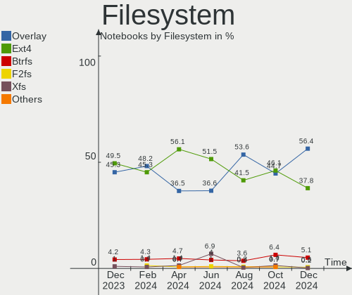
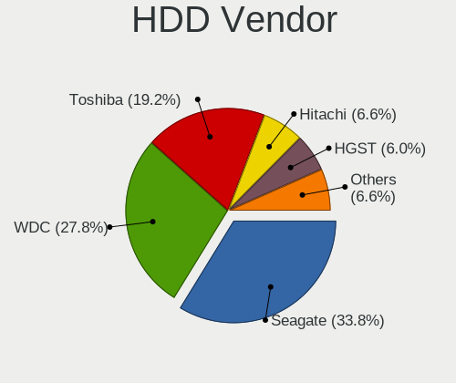
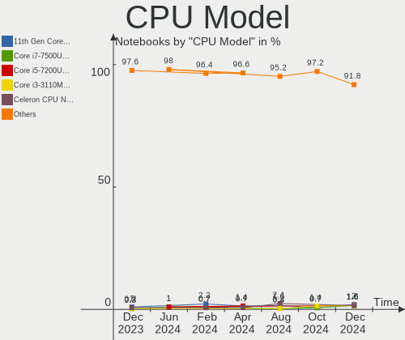
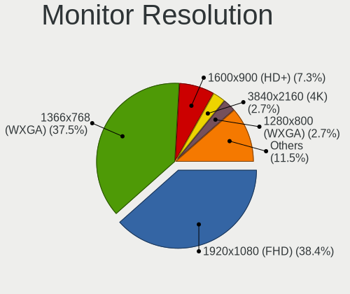
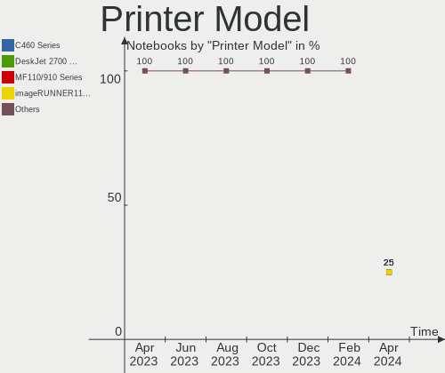

OpenMandriva Hardware Trends (Notebook)
---------------------------------------

A project to identify most popular hardware characteristics and track their change
over time based on data collected by OpenMandriva users at https://Linux-Hardware.org.

Anyone can contribute to the study by uploading probes of their computers by
the [hw-probe](https://github.com/linuxhw/hw-probe) tool:

    sudo -E hw-probe -all -upload

Full-feature report is available here: https://linux-hardware.org/?view=trends&formfactor=notebook

Period: Feb, 2021.

Contents
--------

- [ OS                       ](#os)
- [ OS Family                ](#os-family)
- [ Kernel                   ](#kernel)
- [ Kernel Family            ](#kernel-family)
- [ Kernel Major Ver.        ](#kernel-major-ver)
- [ Arch                     ](#arch)
- [ DE                       ](#de)
- [ Display Server           ](#display-server)
- [ Display Manager          ](#display-manager)
- [ OS Lang                  ](#os-lang)
- [ Boot Mode                ](#boot-mode)
- [ Filesystem               ](#filesystem)
- [ Part. scheme             ](#part-scheme)
- [ Dual Boot with Linux/BSD ](#dual-boot-with-linux/bsd)
- [ Dual Boot (Win)          ](#dual-boot-win)
- [ Country                  ](#country)
- [ City                     ](#city)
- [ Vendor                   ](#vendor)
- [ Model                    ](#model)
- [ Model Family             ](#model-family)
- [ MFG Year                 ](#mfg-year)
- [ Form Factor              ](#form-factor)
- [ Secure Boot              ](#secure-boot)
- [ Coreboot                 ](#coreboot)
- [ RAM Size                 ](#ram-size)
- [ RAM Used                 ](#ram-used)
- [ Has CD-ROM               ](#has-cd-rom)
- [ Total Drives             ](#total-drives)
- [ Has Ethernet             ](#has-ethernet)
- [ Drive Vendor             ](#drive-vendor)
- [ Drive Model              ](#drive-model)
- [ HDD Vendor               ](#hdd-vendor)
- [ SSD Vendor               ](#ssd-vendor)
- [ Drive Kind               ](#drive-kind)
- [ Drive Connector          ](#drive-connector)
- [ Drive Size               ](#drive-size)
- [ Space Total              ](#space-total)
- [ Space Used               ](#space-used)
- [ Malfunc. Drives          ](#malfunc-drives)
- [ Malfunc. Drive Vendor    ](#malfunc-drive-vendor)
- [ Malfunc. HDD Vendor      ](#malfunc-hdd-vendor)
- [ Malfunc. Drive Kind      ](#malfunc-drive-kind)
- [ Failed Drives            ](#failed-drives)
- [ Failed Drive Vendor      ](#failed-drive-vendor)
- [ Drive Status             ](#drive-status)
- [ Storage Vendor           ](#storage-vendor)
- [ Storage Model            ](#storage-model)
- [ Storage Kind             ](#storage-kind)
- [ CPU Vendor               ](#cpu-vendor)
- [ CPU Model                ](#cpu-model)
- [ CPU Model Family         ](#cpu-model-family)
- [ CPU Cores                ](#cpu-cores)
- [ CPU Sockets              ](#cpu-sockets)
- [ CPU Threads              ](#cpu-threads)
- [ CPU Op-Modes             ](#cpu-op-modes)
- [ CPU Microcode            ](#cpu-microcode)
- [ CPU Microarch            ](#cpu-microarch)
- [ GPU Vendor               ](#gpu-vendor)
- [ GPU Model                ](#gpu-model)
- [ GPU Combo                ](#gpu-combo)
- [ GPU Driver               ](#gpu-driver)
- [ GPU Memory               ](#gpu-memory)
- [ Monitor Vendor           ](#monitor-vendor)
- [ Monitor Model            ](#monitor-model)
- [ Monitor Resolution       ](#monitor-resolution)
- [ Monitor Diagonal         ](#monitor-diagonal)
- [ Monitor Width            ](#monitor-width)
- [ Aspect Ratio             ](#aspect-ratio)
- [ Monitor Area             ](#monitor-area)
- [ Pixel Density            ](#pixel-density)
- [ Multiple Monitors        ](#multiple-monitors)
- [ Net Controller Vendor    ](#net-controller-vendor)
- [ Net Controller Model     ](#net-controller-model)
- [ Wireless Vendor          ](#wireless-vendor)
- [ Wireless Model           ](#wireless-model)
- [ Ethernet Vendor          ](#ethernet-vendor)
- [ Ethernet Model           ](#ethernet-model)
- [ Net Controller Kind      ](#net-controller-kind)
- [ Used Controller          ](#used-controller)
- [ NICs                     ](#nics)
- [ Memory Vendor            ](#memory-vendor)
- [ Memory Model             ](#memory-model)
- [ Memory Kind              ](#memory-kind)
- [ Memory Form Factor       ](#memory-form-factor)
- [ Memory Size              ](#memory-size)
- [ Memory Speed             ](#memory-speed)
- [ Sound Vendor             ](#sound-vendor)
- [ Sound Model              ](#sound-model)
- [ Camera Vendor            ](#camera-vendor)
- [ Camera Model             ](#camera-model)
- [ Fingerprint Vendor       ](#fingerprint-vendor)
- [ Fingerprint Model        ](#fingerprint-model)
- [ Chipcard Vendor          ](#chipcard-vendor)
- [ Chipcard Model           ](#chipcard-model)
- [ Printer Vendor           ](#printer-vendor)
- [ Printer Model            ](#printer-model)
- [ Scanner Vendor           ](#scanner-vendor)
- [ Scanner Model            ](#scanner-model)
- [ Bluetooth Vendor         ](#bluetooth-vendor)
- [ Bluetooth Model          ](#bluetooth-model)
- [ Unsupported Devices      ](#unsupported-devices)
- [ Unsupported Device Types ](#unsupported-device-types)

OS
--

Installed operating systems

| Name             | Notebooks | Percent |
|------------------|-----------|---------|
| OpenMandriva 4.2 | 526       | 99.81%  |
| OpenMandriva 4.1 | 1         | 0.19%   |

OS Family
---------

OS without a version

| Name         | Notebooks | Percent |
|--------------|-----------|---------|
| OpenMandriva | 527       | 100%    |

Kernel
------

Version of the Linux kernel

| Version                        | Notebooks | Percent |
|--------------------------------|-----------|---------|
| 5.10.14-desktop-1omv4002       | 523       | 99.24%  |
| 5.5.12-desktop-1omv4001        | 1         | 0.19%   |
| 5.11.1-desktop-74.1.1bomv4002  | 1         | 0.19%   |
| 5.11.0-desktop-clang-1omv4002  | 1         | 0.19%   |
| 5.10.12-desktop-clang-1omv4002 | 1         | 0.19%   |

Kernel Family
-------------

Linux kernel without a distro release

| Version | Notebooks | Percent |
|---------|-----------|---------|
| 5.10.14 | 523       | 99.24%  |
| 5.5.12  | 1         | 0.19%   |
| 5.11.1  | 1         | 0.19%   |
| 5.11.0  | 1         | 0.19%   |
| 5.10.12 | 1         | 0.19%   |

Kernel Major Ver.
-----------------

Linux kernel major version

| Version | Notebooks | Percent |
|---------|-----------|---------|
| 5.10    | 524       | 99.43%  |
| 5.11    | 2         | 0.38%   |
| 5.5     | 1         | 0.19%   |

Arch
----

OS architecture (x86_64, i586, etc.)

| Name   | Notebooks | Percent |
|--------|-----------|---------|
| x86_64 | 527       | 100%    |

DE
--

Desktop Environment

| Name | Notebooks | Percent |
|------|-----------|---------|
| KDE5 | 527       | 100%    |

Display Server
--------------

X11 or Wayland

| Name    | Notebooks | Percent |
|---------|-----------|---------|
| X11     | 526       | 99.81%  |
| Wayland | 1         | 0.19%   |

Display Manager
---------------

SDDM, LightDM, etc.

| Name | Notebooks | Percent |
|------|-----------|---------|
| SDDM | 527       | 100%    |

OS Lang
-------

Language

| Lang  | Notebooks | Percent |
|-------|-----------|---------|
| en_US | 283       | 53.7%   |
| de_DE | 78        | 14.8%   |
| pt_BR | 27        | 5.12%   |
| ru_RU | 20        | 3.8%    |
| pl_PL | 19        | 3.61%   |
| it_IT | 17        | 3.23%   |
| fr_FR | 16        | 3.04%   |
| es_ES | 12        | 2.28%   |
| en_GB | 11        | 2.09%   |
| es_MX | 6         | 1.14%   |
| ro_RO | 3         | 0.57%   |
| nl_BE | 3         | 0.57%   |
| es_CL | 3         | 0.57%   |
| es_AR | 3         | 0.57%   |
| en_AU | 3         | 0.57%   |
| nl_NL | 2         | 0.38%   |
| nb_NO | 2         | 0.38%   |
| hu_HU | 2         | 0.38%   |
| es_CO | 2         | 0.38%   |
| en_ZA | 2         | 0.38%   |
| en_IE | 2         | 0.38%   |
| ru_UA | 1         | 0.19%   |
| it_CH | 1         | 0.19%   |
| fr_CH | 1         | 0.19%   |
| fr_CA | 1         | 0.19%   |
| en_NZ | 1         | 0.19%   |
| en_IN | 1         | 0.19%   |
| de_CH | 1         | 0.19%   |
| de_AT | 1         | 0.19%   |
| da_DK | 1         | 0.19%   |
| cs_CZ | 1         | 0.19%   |
| ar_DZ | 1         | 0.19%   |

Boot Mode
---------

EFI or BIOS

| Mode | Notebooks | Percent |
|------|-----------|---------|
| BIOS | 278       | 52.75%  |
| EFI  | 249       | 47.25%  |

Filesystem
----------

Type of filesystem

| Type    | Notebooks | Percent |
|---------|-----------|---------|
| Overlay | 437       | 82.92%  |
| Ext4    | 88        | 16.7%   |
| Xfs     | 1         | 0.19%   |
| F2fs    | 1         | 0.19%   |

Part. scheme
------------

Scheme of partitioning

| Type | Notebooks | Percent |
|------|-----------|---------|
| GPT  | 319       | 60.53%  |
| MBR  | 208       | 39.47%  |

Dual Boot with Linux/BSD
------------------------

Hosting more than one Linux/BSD

| Dual boot | Notebooks | Percent |
|-----------|-----------|---------|
| Yes       | 288       | 54.65%  |
| No        | 239       | 45.35%  |

Dual Boot (Win)
---------------

Hosting Linux and Windows

| Dual boot | Notebooks | Percent |
|-----------|-----------|---------|
| No        | 310       | 58.82%  |
| Yes       | 217       | 41.18%  |

Country
-------

Geographic location (country)

| Country          | Notebooks | Percent |
|------------------|-----------|---------|
| Germany          | 104       | 19.73%  |
| USA              | 44        | 8.35%   |
| Brazil           | 41        | 7.78%   |
| Russia           | 32        | 6.07%   |
| Italy            | 30        | 5.69%   |
| Poland           | 29        | 5.5%    |
| Spain            | 18        | 3.42%   |
| France           | 18        | 3.42%   |
| UK               | 17        | 3.23%   |
| Mexico           | 14        | 2.66%   |
| Canada           | 12        | 2.28%   |
| Sweden           | 11        | 2.09%   |
| Australia        | 9         | 1.71%   |
| Thailand         | 7         | 1.33%   |
| Romania          | 7         | 1.33%   |
| Ukraine          | 6         | 1.14%   |
| Norway           | 6         | 1.14%   |
| Bulgaria         | 6         | 1.14%   |
| Belarus          | 6         | 1.14%   |
| Netherlands      | 5         | 0.95%   |
| Japan            | 5         | 0.95%   |
| Indonesia        | 5         | 0.95%   |
| Hungary          | 5         | 0.95%   |
| Finland          | 5         | 0.95%   |
| Serbia           | 4         | 0.76%   |
| Portugal         | 4         | 0.76%   |
| India            | 4         | 0.76%   |
| Czech Republic   | 4         | 0.76%   |
| Belgium          | 4         | 0.76%   |
| Argentina        | 4         | 0.76%   |
| Turkey           | 3         | 0.57%   |
| Switzerland      | 3         | 0.57%   |
| South Africa     | 3         | 0.57%   |
| Philippines      | 3         | 0.57%   |
| Luxembourg       | 3         | 0.57%   |
| Ireland          | 3         | 0.57%   |
| Greece           | 3         | 0.57%   |
| Chile            | 3         | 0.57%   |
| Algeria          | 3         | 0.57%   |
| Puerto Rico      | 2         | 0.38%   |
| New Zealand      | 2         | 0.38%   |
| Malaysia         | 2         | 0.38%   |
| Kenya            | 2         | 0.38%   |
| Iran             | 2         | 0.38%   |
| Denmark          | 2         | 0.38%   |
| Costa Rica       | 2         | 0.38%   |
| Colombia         | 2         | 0.38%   |
| China            | 2         | 0.38%   |
| Taiwan           | 1         | 0.19%   |
| Sudan            | 1         | 0.19%   |
| Slovakia         | 1         | 0.19%   |
| Singapore        | 1         | 0.19%   |
| Senegal          | 1         | 0.19%   |
| Saudi Arabia     | 1         | 0.19%   |
| Saint Barthelemy | 1         | 0.19%   |
| Nicaragua        | 1         | 0.19%   |
| Morocco          | 1         | 0.19%   |
| Lithuania        | 1         | 0.19%   |
| Jordan           | 1         | 0.19%   |
| Honduras         | 1         | 0.19%   |

City
----

Geographic location (city)

| City                  | Notebooks | Percent |
|-----------------------|-----------|---------|
| Warsaw                | 12        | 2.28%   |
| Munich                | 6         | 1.14%   |
| Moscow                | 6         | 1.14%   |
| Mexico City           | 6         | 1.14%   |
| Berlin                | 6         | 1.14%   |
| Stuttgart             | 5         | 0.95%   |
| Hamburg               | 5         | 0.95%   |
| São Paulo            | 4         | 0.76%   |
| St Petersburg         | 4         | 0.76%   |
| Brisbane              | 4         | 0.76%   |
| Vantaa                | 3         | 0.57%   |
| Portland              | 3         | 0.57%   |
| Nuremberg             | 3         | 0.57%   |
| Milan                 | 3         | 0.57%   |
| Kristiansand          | 3         | 0.57%   |
| Chojnice              | 3         | 0.57%   |
| Belo Horizonte        | 3         | 0.57%   |
| Barcelona             | 3         | 0.57%   |
| Vitebsk               | 2         | 0.38%   |
| Târgu Mureş         | 2         | 0.38%   |
| Tlalnepantla          | 2         | 0.38%   |
| Thornton              | 2         | 0.38%   |
| Thanyaburi            | 2         | 0.38%   |
| Ternopil              | 2         | 0.38%   |
| Sofia                 | 2         | 0.38%   |
| Seattle               | 2         | 0.38%   |
| Santiago              | 2         | 0.38%   |
| Rome                  | 2         | 0.38%   |
| Rio de Janeiro        | 2         | 0.38%   |
| Prague                | 2         | 0.38%   |
| Paris                 | 2         | 0.38%   |
| Norrköping           | 2         | 0.38%   |
| Nogueira da Regedoura | 2         | 0.38%   |
| Niš                  | 2         | 0.38%   |
| Neuhof                | 2         | 0.38%   |
| Minsk                 | 2         | 0.38%   |
| Mannheim              | 2         | 0.38%   |
| Lviv                  | 2         | 0.38%   |
| Luxembourg            | 2         | 0.38%   |
| Ludwigshafen am Rhein | 2         | 0.38%   |
| Langenfeld            | 2         | 0.38%   |
| Kuala Lumpur          | 2         | 0.38%   |
| Kolln-Reisiek         | 2         | 0.38%   |
| Khimki                | 2         | 0.38%   |
| Johannesburg          | 2         | 0.38%   |
| Jacksonville          | 2         | 0.38%   |
| Horndean              | 2         | 0.38%   |
| Helsinki              | 2         | 0.38%   |
| Gdansk                | 2         | 0.38%   |
| Eustis                | 2         | 0.38%   |
| Düsseldorf           | 2         | 0.38%   |
| Dublin                | 2         | 0.38%   |
| Denia                 | 2         | 0.38%   |
| Curitiba              | 2         | 0.38%   |
| Croydon               | 2         | 0.38%   |
| Copenhagen            | 2         | 0.38%   |
| Cologne               | 2         | 0.38%   |
| Budapest              | 2         | 0.38%   |
| Broken Arrow          | 2         | 0.38%   |
| Berger                | 2         | 0.38%   |

Vendor
------

Motherboard manufacturer

| Name                | Notebooks | Percent |
|---------------------|-----------|---------|
| Hewlett-Packard     | 100       | 18.98%  |
| Lenovo              | 98        | 18.6%   |
| Dell                | 69        | 13.09%  |
| Acer                | 64        | 12.14%  |
| ASUSTek Computer    | 61        | 11.57%  |
| Toshiba             | 26        | 4.93%   |
| Sony                | 14        | 2.66%   |
| Apple               | 10        | 1.9%    |
| Samsung Electronics | 9         | 1.71%   |
| Packard Bell        | 7         | 1.33%   |
| MSI                 | 7         | 1.33%   |
| Medion              | 6         | 1.14%   |
| Fujitsu             | 6         | 1.14%   |
| Unknown             | 6         | 1.14%   |
| Positivo            | 5         | 0.95%   |
| Notebook            | 5         | 0.95%   |
| HUAWEI              | 4         | 0.76%   |
| Timi                | 3         | 0.57%   |
| Wortmann AG         | 2         | 0.38%   |
| TUXEDO              | 2         | 0.38%   |
| System76            | 2         | 0.38%   |
| Philco              | 2         | 0.38%   |
| Fujitsu Siemens     | 2         | 0.38%   |
| eMachines           | 2         | 0.38%   |
| BOX                 | 2         | 0.38%   |
| UMAX                | 1         | 0.19%   |
| Teclast             | 1         | 0.19%   |
| Purism              | 1         | 0.19%   |
| PC Specialist       | 1         | 0.19%   |
| Panasonic           | 1         | 0.19%   |
| Microtech           | 1         | 0.19%   |
| Maibenben           | 1         | 0.19%   |
| Jumper              | 1         | 0.19%   |
| Intel               | 1         | 0.19%   |
| HASEE Computer      | 1         | 0.19%   |
| Clevo               | 1         | 0.19%   |
| Chuwi               | 1         | 0.19%   |
| Alienware           | 1         | 0.19%   |

Model
-----

Motherboard model

| Name                           | Notebooks | Percent |
|--------------------------------|-----------|---------|
| Unknown                        | 8         | 1.52%   |
| HP Notebook                    | 6         | 1.14%   |
| HP Pavilion Notebook           | 5         | 0.95%   |
| Positivo MOBILE                | 4         | 0.76%   |
| Lenovo IdeaPad S145-15AST 81N3 | 3         | 0.57%   |
| HP Pavilion g6                 | 3         | 0.57%   |
| HP 1000                        | 3         | 0.57%   |
| Dell Latitude E6500            | 3         | 0.57%   |
| Dell Latitude E6430            | 3         | 0.57%   |
| Toshiba Satellite A300         | 2         | 0.38%   |
| Samsung 340XAA/350XAA/550XAA   | 2         | 0.38%   |
| Samsung 270E5J/2570EJ          | 2         | 0.38%   |
| Lenovo Z50-70 20354            | 2         | 0.38%   |
| Lenovo IdeaPad Z510 20287      | 2         | 0.38%   |
| Lenovo IdeaPad 330-15ARR 81D2  | 2         | 0.38%   |
| Lenovo IdeaPad 110-15ACL 80TJ  | 2         | 0.38%   |
| Lenovo G50-80 80E5             | 2         | 0.38%   |
| HUAWEI NBLK-WAX9X              | 2         | 0.38%   |
| HUAWEI BOHK-WAX9X              | 2         | 0.38%   |
| HP Pavilion 17                 | 2         | 0.38%   |
| HP Laptop 17-ca1xxx            | 2         | 0.38%   |
| HP Laptop 15s-fq1xxx           | 2         | 0.38%   |
| HP Laptop 15-bw0xx             | 2         | 0.38%   |
| HP EliteBook 8570w             | 2         | 0.38%   |
| HP EliteBook 6930p             | 2         | 0.38%   |
| HP Compaq Presario CQ61        | 2         | 0.38%   |
| Dell Latitude E6400            | 2         | 0.38%   |
| Dell Inspiron 3793             | 2         | 0.38%   |
| Dell Inspiron 15-3567          | 2         | 0.38%   |
| Dell Inspiron 1420             | 2         | 0.38%   |
| BOX W54_W94_W955TU,-T,-C       | 2         | 0.38%   |
| ASUS X555LD                    | 2         | 0.38%   |
| ASUS X551MA                    | 2         | 0.38%   |
| ASUS X540LJ                    | 2         | 0.38%   |
| ASUS K53E                      | 2         | 0.38%   |
| ASUS K52Je                     | 2         | 0.38%   |
| Apple MacBookPro8,2            | 2         | 0.38%   |
| Apple MacBookPro7,1            | 2         | 0.38%   |
| Acer Extensa 5230              | 2         | 0.38%   |
| Acer Aspire E5-774G            | 2         | 0.38%   |
| Acer Aspire E5-471G            | 2         | 0.38%   |
| Acer Aspire 7750G              | 2         | 0.38%   |
| Wortmann AG TERRA MOBILE 1220M | 1         | 0.19%   |
| Wortmann AG 1220558_1470105    | 1         | 0.19%   |
| UMAX Visionbook 14Wa Plus      | 1         | 0.19%   |
| TUXEDO P7xxTM1                 | 1         | 0.19%   |
| TUXEDO Book BA1510             | 1         | 0.19%   |
| Toshiba TECRA S11              | 1         | 0.19%   |
| Toshiba TECRA M10              | 1         | 0.19%   |
| Toshiba TECRA A11              | 1         | 0.19%   |
| Toshiba T20                    | 1         | 0.19%   |
| Toshiba Satellite Pro P300     | 1         | 0.19%   |
| Toshiba Satellite Pro C660     | 1         | 0.19%   |
| Toshiba Satellite Pro C650     | 1         | 0.19%   |
| Toshiba Satellite P300         | 1         | 0.19%   |
| Toshiba Satellite P200D        | 1         | 0.19%   |
| Toshiba Satellite L775D-106    | 1         | 0.19%   |
| Toshiba Satellite L50-B        | 1         | 0.19%   |
| Toshiba Satellite L300         | 1         | 0.19%   |
| Toshiba Satellite C855         | 1         | 0.19%   |

Model Family
------------

Motherboard model prefix

| Name                  | Notebooks | Percent |
|-----------------------|-----------|---------|
| Acer Aspire           | 46        | 8.73%   |
| Lenovo ThinkPad       | 41        | 7.78%   |
| Lenovo IdeaPad        | 32        | 6.07%   |
| Dell Latitude         | 30        | 5.69%   |
| Dell Inspiron         | 27        | 5.12%   |
| HP Pavilion           | 24        | 4.55%   |
| Toshiba Satellite     | 18        | 3.42%   |
| HP Laptop             | 17        | 3.23%   |
| HP EliteBook          | 13        | 2.47%   |
| HP ProBook            | 8         | 1.52%   |
| HP Compaq             | 8         | 1.52%   |
| Unknown               | 8         | 1.52%   |
| HP Notebook           | 6         | 1.14%   |
| Acer Extensa          | 6         | 1.14%   |
| Packard Bell EasyNote | 5         | 0.95%   |
| Dell Vostro           | 5         | 0.95%   |
| ASUS VivoBook         | 5         | 0.95%   |
| Acer TravelMate       | 5         | 0.95%   |
| Positivo MOBILE       | 4         | 0.76%   |
| HP ENVY               | 4         | 0.76%   |
| ASUS ZenBook          | 4         | 0.76%   |
| Toshiba TECRA         | 3         | 0.57%   |
| HP Stream             | 3         | 0.57%   |
| HP 1000               | 3         | 0.57%   |
| Fujitsu LIFEBOOK      | 3         | 0.57%   |
| ASUS TUF              | 3         | 0.57%   |
| Apple MacBookPro8     | 3         | 0.57%   |
| Acer Swift            | 3         | 0.57%   |
| Toshiba QOSMIO        | 2         | 0.38%   |
| Samsung 340XAA        | 2         | 0.38%   |
| Samsung 270E5J        | 2         | 0.38%   |
| Lenovo Z50-70         | 2         | 0.38%   |
| Lenovo Legion         | 2         | 0.38%   |
| Lenovo G50-80         | 2         | 0.38%   |
| Lenovo 3000           | 2         | 0.38%   |
| HUAWEI NBLK-WAX9X     | 2         | 0.38%   |
| HUAWEI BOHK-WAX9X     | 2         | 0.38%   |
| HP ZBook              | 2         | 0.38%   |
| Dell XPS              | 2         | 0.38%   |
| Dell Precision        | 2         | 0.38%   |
| Dell G5               | 2         | 0.38%   |
| BOX W54               | 2         | 0.38%   |
| ASUS X555LD           | 2         | 0.38%   |
| ASUS X551MA           | 2         | 0.38%   |
| ASUS X540LJ           | 2         | 0.38%   |
| ASUS K53E             | 2         | 0.38%   |
| ASUS K52Je            | 2         | 0.38%   |
| Apple MacBookPro7     | 2         | 0.38%   |
| Acer Nitro            | 2         | 0.38%   |
| Wortmann AG TERRA     | 1         | 0.19%   |
| Wortmann AG 1220558   | 1         | 0.19%   |
| UMAX Visionbook       | 1         | 0.19%   |
| TUXEDO P7xxTM1        | 1         | 0.19%   |
| TUXEDO Book           | 1         | 0.19%   |
| Toshiba T20           | 1         | 0.19%   |
| Toshiba KIRA          | 1         | 0.19%   |
| Toshiba dynabook      | 1         | 0.19%   |
| Timi TM1703           | 1         | 0.19%   |
| Timi TM1607           | 1         | 0.19%   |
| Timi TM1604           | 1         | 0.19%   |

MFG Year
--------

Motherboard manufacture year

| Year    | Notebooks | Percent |
|---------|-----------|---------|
| 2019    | 69        | 13.09%  |
| 2020    | 59        | 11.2%   |
| 2012    | 45        | 8.54%   |
| 2013    | 43        | 8.16%   |
| 2011    | 40        | 7.59%   |
| 2017    | 38        | 7.21%   |
| 2016    | 38        | 7.21%   |
| 2018    | 34        | 6.45%   |
| 2015    | 34        | 6.45%   |
| 2010    | 33        | 6.26%   |
| 2014    | 31        | 5.88%   |
| 2009    | 30        | 5.69%   |
| 2008    | 24        | 4.55%   |
| 2021    | 4         | 0.76%   |
| 2007    | 4         | 0.76%   |
| Unknown | 1         | 0.19%   |

Form Factor
-----------

Physical design of the computer

| Name     | Notebooks | Percent |
|----------|-----------|---------|
| Notebook | 527       | 100%    |

Secure Boot
-----------

Enabled or disabled

| State    | Notebooks | Percent |
|----------|-----------|---------|
| Disabled | 527       | 100%    |

Coreboot
--------

Have coreboot on board

| Used | Notebooks | Percent |
|------|-----------|---------|
| No   | 526       | 99.81%  |
| Yes  | 1         | 0.19%   |

RAM Size
--------

Total RAM memory

| Size in GB | Notebooks | Percent |
|------------|-----------|---------|
| 3.01-4.0   | 185       | 35.1%   |
| 4.01-8.0   | 177       | 33.59%  |
| 8.01-16.0  | 84        | 15.94%  |
| 16.01-24.0 | 45        | 8.54%   |
| 1.01-2.0   | 25        | 4.74%   |
| 2.01-3.0   | 6         | 1.14%   |
| 32.01-64.0 | 5         | 0.95%   |

RAM Used
--------

Used RAM memory

| Used GB  | Notebooks | Percent |
|----------|-----------|---------|
| 1.01-2.0 | 463       | 87.86%  |
| 0.51-1.0 | 40        | 7.59%   |
| 2.01-3.0 | 19        | 3.61%   |
| 0.01-0.5 | 3         | 0.57%   |
| 4.01-8.0 | 1         | 0.19%   |
| 3.01-4.0 | 1         | 0.19%   |

Has CD-ROM
----------

Has CD-ROM on board

| Presented | Notebooks | Percent |
|-----------|-----------|---------|
| Yes       | 309       | 58.63%  |
| No        | 218       | 41.37%  |

Total Drives
------------

Number of drives on board

| Drives | Notebooks | Percent |
|--------|-----------|---------|
| 1      | 384       | 72.87%  |
| 2      | 121       | 22.96%  |
| 3      | 14        | 2.66%   |
| 0      | 6         | 1.14%   |
| 4      | 2         | 0.38%   |

Has Ethernet
------------

Has Ethernet on board

| Presented | Notebooks | Percent |
|-----------|-----------|---------|
| Yes       | 474       | 89.94%  |
| No        | 53        | 10.06%  |

Drive Vendor
------------

Hard drive vendors

| Vendor              | Notebooks | Drives | Percent |
|---------------------|-----------|--------|---------|
| WDC                 | 105       | 106    | 16.83%  |
| Seagate             | 102       | 105    | 16.35%  |
| Samsung Electronics | 77        | 81     | 12.34%  |
| Toshiba             | 63        | 65     | 10.1%   |
| Kingston            | 33        | 33     | 5.29%   |
| Hitachi             | 32        | 32     | 5.13%   |
| SanDisk             | 30        | 33     | 4.81%   |
| Crucial             | 23        | 23     | 3.69%   |
| Unknown             | 20        | 20     | 3.21%   |
| Intel               | 20        | 21     | 3.21%   |
| HGST                | 15        | 16     | 2.4%    |
| SK Hynix            | 10        | 10     | 1.6%    |
| Micron Technology   | 10        | 10     | 1.6%    |
| A-DATA Technology   | 8         | 8      | 1.28%   |
| Fujitsu             | 6         | 6      | 0.96%   |
| China               | 5         | 5      | 0.8%    |
| Apple               | 5         | 5      | 0.8%    |
| PNY                 | 4         | 4      | 0.64%   |
| Intenso             | 4         | 5      | 0.64%   |
| Teclast             | 3         | 3      | 0.48%   |
| Patriot             | 3         | 3      | 0.48%   |
| OCZ                 | 3         | 3      | 0.48%   |
| LITEON              | 3         | 3      | 0.48%   |
| KingDian            | 3         | 3      | 0.48%   |
| JMicron             | 3         | 3      | 0.48%   |
| GOODRAM             | 3         | 3      | 0.48%   |
| Union Memory        | 2         | 2      | 0.32%   |
| Transcend           | 2         | 2      | 0.32%   |
| KingSpec            | 2         | 2      | 0.32%   |
| Colorful            | 2         | 2      | 0.32%   |
| Team                | 1         | 1      | 0.16%   |
| SPCC                | 1         | 1      | 0.16%   |
| sobetter            | 1         | 1      | 0.16%   |
| SABRENT             | 1         | 1      | 0.16%   |
| PLEXTOR             | 1         | 1      | 0.16%   |
| Phison Electronics  | 1         | 1      | 0.16%   |
| OWC                 | 1         | 1      | 0.16%   |
| Netac               | 1         | 1      | 0.16%   |
| Mushkin             | 1         | 1      | 0.16%   |
| LDLC                | 1         | 1      | 0.16%   |
| LaCie               | 1         | 1      | 0.16%   |
| Kston               | 1         | 1      | 0.16%   |
| KingFast            | 1         | 1      | 0.16%   |
| INNOVATION IT       | 1         | 1      | 0.16%   |
| FORESEE             | 1         | 1      | 0.16%   |
| CT240BX5            | 1         | 1      | 0.16%   |
| CT2000MX            | 1         | 1      | 0.16%   |
| Corsair             | 1         | 1      | 0.16%   |
| BT58SSD1            | 1         | 1      | 0.16%   |
| AS25                | 1         | 1      | 0.16%   |
| Apacer              | 1         | 1      | 0.16%   |
| 2-Power             | 1         | 1      | 0.16%   |
| 16GB SAT            | 1         | 1      | 0.16%   |

Drive Model
-----------

Hard drive models

| Model                               | Notebooks | Percent |
|-------------------------------------|-----------|---------|
| Seagate ST1000LM024 HN-M101MBB 1TB  | 15        | 2.37%   |
| Seagate ST1000LM035-1RK172 1TB      | 13        | 2.05%   |
| Toshiba MQ01ABF050 500GB            | 11        | 1.74%   |
| Toshiba MQ01ABD100 1TB              | 11        | 1.74%   |
| Seagate ST500LT012-1DG142 500GB     | 11        | 1.74%   |
| Samsung SSD 850 EVO 500GB           | 8         | 1.26%   |
| Seagate ST9500325AS 500GB           | 7         | 1.11%   |
| Crucial CT500MX500SSD1 500GB        | 7         | 1.11%   |
| Seagate ST9320325AS 320GB           | 5         | 0.79%   |
| Samsung SSD 860 EVO 500GB           | 5         | 0.79%   |
| Kingston SA400S37120G 120GB SSD     | 5         | 0.79%   |
| Intel SSDPEKNW512G8H 512GB          | 5         | 0.79%   |
| Crucial CT240BX500SSD1 240GB        | 5         | 0.79%   |
| WDC WD10SPZX-21Z10T0 1TB            | 4         | 0.63%   |
| WDC WD10JPVX-22JC3T0 1TB            | 4         | 0.63%   |
| Toshiba MQ04ABF100 1TB              | 4         | 0.63%   |
| Seagate ST500LM012 HN-M500MBB 500GB | 4         | 0.63%   |
| Seagate Expansion 500GB             | 4         | 0.63%   |
| Kingston SA400S37960G 960GB SSD     | 4         | 0.63%   |
| Kingston SA400S37240G 240GB SSD     | 4         | 0.63%   |
| Hitachi HTS547564A9E384 640GB       | 4         | 0.63%   |
| Hitachi HTS545050A7E380 500GB       | 4         | 0.63%   |
| WDC WDS500G2B0A-00SM50 500GB SSD    | 3         | 0.47%   |
| WDC WDS240G2G0B-00EPW0 240GB SSD    | 3         | 0.47%   |
| WDC WDS240G2G0A-00JH30 240GB SSD    | 3         | 0.47%   |
| WDC WD5000LPVX-80V0TT0 500GB        | 3         | 0.47%   |
| WDC WD5000LPCX-24VHAT0 500GB        | 3         | 0.47%   |
| WDC WD10SPZX-24Z10T0 1TB            | 3         | 0.47%   |
| WDC WD10JPCX-24UE4T0 1TB            | 3         | 0.47%   |
| Unknown SD/MMC/MS PRO 64GB          | 3         | 0.47%   |
| Toshiba MQ01ABD050 500GB            | 3         | 0.47%   |
| Seagate ST9750420AS 752GB           | 3         | 0.47%   |
| Seagate ST9500423AS 500GB           | 3         | 0.47%   |
| Seagate ST500LT012-9WS142 500GB     | 3         | 0.47%   |
| Seagate ST1000LM014-1EJ164 1TB      | 3         | 0.47%   |
| SanDisk SSD PLUS 240GB              | 3         | 0.47%   |
| SanDisk SDSSDA120G 120GB            | 3         | 0.47%   |
| Samsung SSD 860 EVO 250GB           | 3         | 0.47%   |
| Samsung SSD 850 EVO 250GB           | 3         | 0.47%   |
| PNY CS900 120GB SSD                 | 3         | 0.47%   |
| Micron 1100_MTFDDAV256TBN 256GB SSD | 3         | 0.47%   |
| Kingston SV300S37A240G 240GB SSD    | 3         | 0.47%   |
| Kingston SV300S37A120G 120GB SSD    | 3         | 0.47%   |
| Kingston SA400S37480G 480GB SSD     | 3         | 0.47%   |
| Hitachi HTS547575A9E384 752GB       | 3         | 0.47%   |
| Hitachi HTS543232A7A384 320GB       | 3         | 0.47%   |
| HGST HTS725050A7E630 500GB          | 3         | 0.47%   |
| HGST HTS721010A9E630 1TB            | 3         | 0.47%   |
| HGST HTS541010A9E680 1TB            | 3         | 0.47%   |
| WDC WDS120G2G0B-00EPW0 120GB SSD    | 2         | 0.32%   |
| WDC WD7500BPVT-22HXZT3 752GB        | 2         | 0.32%   |
| WDC WD5000LPVX-22V0TT0 500GB        | 2         | 0.32%   |
| WDC WD5000LPCX-24C6HT0 500GB        | 2         | 0.32%   |
| WDC WD5000BPVT-22HXZT3 500GB        | 2         | 0.32%   |
| WDC WD3200BEVT-75ZCT2 320GB         | 2         | 0.32%   |
| WDC WD2500BEVS-22UST0 250GB         | 2         | 0.32%   |
| WDC WD10SPZX-75Z10T3 1TB            | 2         | 0.32%   |
| WDC WD10SPZX-24Z10 1TB              | 2         | 0.32%   |
| Transcend TS256GSSD230S 256GB       | 2         | 0.32%   |
| Toshiba MK5076GSX 500GB             | 2         | 0.32%   |

HDD Vendor
----------

Hard disk drive vendors

| Vendor              | Notebooks | Drives | Percent |
|---------------------|-----------|--------|---------|
| Seagate             | 102       | 104    | 35.17%  |
| WDC                 | 79        | 79     | 27.24%  |
| Toshiba             | 50        | 50     | 17.24%  |
| Hitachi             | 32        | 32     | 11.03%  |
| HGST                | 15        | 16     | 5.17%   |
| Fujitsu             | 6         | 6      | 2.07%   |
| Samsung Electronics | 4         | 4      | 1.38%   |
| Apple               | 2         | 2      | 0.69%   |

SSD Vendor
----------

Solid state drive vendors

| Vendor              | Notebooks | Drives | Percent |
|---------------------|-----------|--------|---------|
| Samsung Electronics | 56        | 59     | 22.76%  |
| Kingston            | 31        | 31     | 12.6%   |
| SanDisk             | 26        | 28     | 10.57%  |
| Crucial             | 23        | 23     | 9.35%   |
| WDC                 | 16        | 16     | 6.5%    |
| Intel               | 11        | 11     | 4.47%   |
| Toshiba             | 9         | 11     | 3.66%   |
| Micron Technology   | 7         | 7      | 2.85%   |
| A-DATA Technology   | 7         | 7      | 2.85%   |
| China               | 5         | 5      | 2.03%   |
| Intenso             | 4         | 5      | 1.63%   |
| Teclast             | 3         | 3      | 1.22%   |
| PNY                 | 3         | 3      | 1.22%   |
| Patriot             | 3         | 3      | 1.22%   |
| OCZ                 | 3         | 3      | 1.22%   |
| LITEON              | 3         | 3      | 1.22%   |
| KingDian            | 3         | 3      | 1.22%   |
| GOODRAM             | 3         | 3      | 1.22%   |
| Apple               | 3         | 3      | 1.22%   |
| Transcend           | 2         | 2      | 0.81%   |
| SK Hynix            | 2         | 2      | 0.81%   |
| KingSpec            | 2         | 2      | 0.81%   |
| JMicron             | 2         | 2      | 0.81%   |
| Colorful            | 2         | 2      | 0.81%   |
| Union Memory        | 1         | 1      | 0.41%   |
| Team                | 1         | 1      | 0.41%   |
| SPCC                | 1         | 1      | 0.41%   |
| PLEXTOR             | 1         | 1      | 0.41%   |
| OWC                 | 1         | 1      | 0.41%   |
| Netac               | 1         | 1      | 0.41%   |
| Mushkin             | 1         | 1      | 0.41%   |
| LDLC                | 1         | 1      | 0.41%   |
| Kston               | 1         | 1      | 0.41%   |
| KingFast            | 1         | 1      | 0.41%   |
| INNOVATION IT       | 1         | 1      | 0.41%   |
| FORESEE             | 1         | 1      | 0.41%   |
| CT240BX5            | 1         | 1      | 0.41%   |
| CT2000MX            | 1         | 1      | 0.41%   |
| AS25                | 1         | 1      | 0.41%   |
| Apacer              | 1         | 1      | 0.41%   |
| 2-Power             | 1         | 1      | 0.41%   |

Drive Kind
----------

HDD or SSD

| Kind    | Notebooks | Drives | Percent |
|---------|-----------|--------|---------|
| HDD     | 281       | 293    | 46.68%  |
| SSD     | 232       | 254    | 38.54%  |
| NVMe    | 55        | 58     | 9.14%   |
| MMC     | 23        | 24     | 3.82%   |
| Unknown | 11        | 11     | 1.83%   |

Drive Connector
---------------

SATA, SAS, NVMe, etc.

| Type | Notebooks | Drives | Percent |
|------|-----------|--------|---------|
| SATA | 471       | 529    | 81.91%  |
| NVMe | 55        | 58     | 9.57%   |
| SAS  | 26        | 29     | 4.52%   |
| MMC  | 23        | 24     | 4%      |

Drive Size
----------

Size of hard drive

| Size in TB | Notebooks | Drives | Percent |
|------------|-----------|--------|---------|
| 0.01-0.5   | 368       | 407    | 72.87%  |
| 0.51-1.0   | 128       | 131    | 25.35%  |
| 1.01-2.0   | 8         | 8      | 1.58%   |
| 3.01-4.0   | 1         | 1      | 0.2%    |

Space Total
-----------

Amount of disk space available on the file system

| Size in GB | Notebooks | Percent |
|------------|-----------|---------|
| 1-20       | 308       | 58.44%  |
| 101-250    | 74        | 14.04%  |
| 251-500    | 60        | 11.39%  |
| 501-1000   | 24        | 4.55%   |
| 51-100     | 23        | 4.36%   |
| 21-50      | 16        | 3.04%   |
| Unknown    | 16        | 3.04%   |
| 1001-2000  | 5         | 0.95%   |
| 2001-3000  | 1         | 0.19%   |

Space Used
----------

Amount of used disk space

| Used GB   | Notebooks | Percent |
|-----------|-----------|---------|
| 1-20      | 474       | 89.94%  |
| Unknown   | 16        | 3.04%   |
| 51-100    | 11        | 2.09%   |
| 101-250   | 10        | 1.9%    |
| 21-50     | 8         | 1.52%   |
| 251-500   | 5         | 0.95%   |
| 501-1000  | 2         | 0.38%   |
| 1001-2000 | 1         | 0.19%   |

Malfunc. Drives
---------------

Drive models with a malfunction

| Model                                    | Notebooks | Drives | Percent |
|------------------------------------------|-----------|--------|---------|
| Seagate ST500LT012-1DG142 500GB          | 7         | 7      | 5.69%   |
| Seagate ST9500325AS 500GB                | 6         | 6      | 4.88%   |
| Seagate ST1000LM024 HN-M101MBB 1TB       | 6         | 6      | 4.88%   |
| Seagate ST9320325AS 320GB                | 4         | 4      | 3.25%   |
| Seagate ST1000LM035-1RK172 1TB           | 4         | 4      | 3.25%   |
| Hitachi HTS547564A9E384 640GB            | 4         | 4      | 3.25%   |
| Toshiba MQ01ABF050 500GB                 | 3         | 3      | 2.44%   |
| WDC WD7500BPVT-22HXZT3 752GB             | 2         | 2      | 1.63%   |
| Toshiba MQ01ABD050 500GB                 | 2         | 2      | 1.63%   |
| Seagate ST9500423AS 500GB                | 2         | 2      | 1.63%   |
| Seagate ST9500420AS 500GB                | 2         | 2      | 1.63%   |
| Seagate ST500LT012-9WS142 500GB          | 2         | 2      | 1.63%   |
| Seagate ST1000LM014-1EJ164 1TB           | 2         | 2      | 1.63%   |
| Hitachi HTS725016A9A364 160GB            | 2         | 2      | 1.63%   |
| Hitachi HTS547575A9E384 752GB            | 2         | 2      | 1.63%   |
| Hitachi HTS547550A9E384 500GB            | 2         | 2      | 1.63%   |
| HGST HTS725050A7E630 500GB               | 2         | 2      | 1.63%   |
| HGST HTS545050A7E680 500GB               | 2         | 2      | 1.63%   |
| HGST HTS541075A9E680 752GB               | 2         | 2      | 1.63%   |
| WDC WDS240G2G0B-00EPW0 240GB SSD         | 1         | 1      | 0.81%   |
| WDC WDS240G2G0A-00JH30 240GB SSD         | 1         | 1      | 0.81%   |
| WDC WD6400BPVT-80HXZT1 640GB             | 1         | 1      | 0.81%   |
| WDC WD5000LPCX-60VHAT1 500GB             | 1         | 1      | 0.81%   |
| WDC WD5000LPCX-24C6HT0 500GB             | 1         | 1      | 0.81%   |
| WDC WD5000BPVT-22HXZT3 500GB             | 1         | 1      | 0.81%   |
| WDC WD5000BPVT-22HXZT1 500GB             | 1         | 1      | 0.81%   |
| WDC WD5000BEVT-24A0RT0 500GB             | 1         | 1      | 0.81%   |
| WDC WD3200BEVT-00ZCT0 320GB              | 1         | 1      | 0.81%   |
| WDC WD3200BEKT-60F3T1 320GB              | 1         | 1      | 0.81%   |
| WDC WD2500BEVS-75UST0 250GB              | 1         | 1      | 0.81%   |
| WDC WD2500BEVS-60UST0 250GB              | 1         | 1      | 0.81%   |
| WDC WD1600BEVT-60ZCT1 160GB              | 1         | 1      | 0.81%   |
| WDC WD10SPZX-24Z10T0 1TB                 | 1         | 1      | 0.81%   |
| WDC WD10JPVX-60JC3T1 1TB                 | 1         | 1      | 0.81%   |
| WDC WD10JPVX-22JC3T0 1TB                 | 1         | 1      | 0.81%   |
| WDC PC SA530 SDASN8Y-256G-1006 256GB SSD | 1         | 1      | 0.81%   |
| Transcend TS256GSSD230S 256GB            | 1         | 1      | 0.81%   |
| Toshiba MQ02ABD100H 1TB                  | 1         | 1      | 0.81%   |
| Toshiba MK6476GSX 640GB                  | 1         | 1      | 0.81%   |
| Toshiba MK6465GSX 640GB                  | 1         | 1      | 0.81%   |
| Toshiba MK5076GSX 500GB                  | 1         | 1      | 0.81%   |
| Toshiba MK5065GSXF 500GB                 | 1         | 1      | 0.81%   |
| Toshiba MK5055GSX 500GB                  | 1         | 1      | 0.81%   |
| Toshiba MK3265GSXN 320GB                 | 1         | 1      | 0.81%   |
| Toshiba MK3265GSX 320GB                  | 1         | 1      | 0.81%   |
| Toshiba MK3252GSX 320GB                  | 1         | 1      | 0.81%   |
| Toshiba MK2555GSX 250GB                  | 1         | 1      | 0.81%   |
| Toshiba MK1646GSX 160GB                  | 1         | 1      | 0.81%   |
| Seagate ST9750420AS 752GB                | 1         | 1      | 0.81%   |
| Seagate ST9250410AS 250GB                | 1         | 1      | 0.81%   |
| Seagate ST9250320AS 250GB                | 1         | 1      | 0.81%   |
| Seagate ST9250315AS 250GB                | 1         | 1      | 0.81%   |
| Seagate ST9160411AS 160GB                | 1         | 1      | 0.81%   |
| Seagate ST500LM021-1KJ152 500GB          | 1         | 1      | 0.81%   |
| Seagate ST500LM000-SSHD-8GB              | 1         | 1      | 0.81%   |
| Seagate ST1000LM048-2E7172 1TB           | 1         | 1      | 0.81%   |
| SanDisk SSD PLUS 240GB                   | 1         | 1      | 0.81%   |
| SanDisk SDSSDP064G 64GB                  | 1         | 1      | 0.81%   |
| SanDisk SDSSDA120G 120GB                 | 1         | 1      | 0.81%   |
| Samsung Electronics SSD PM810 TM 128GB   | 1         | 1      | 0.81%   |

Malfunc. Drive Vendor
---------------------

Vendors of faulty drives

| Vendor              | Notebooks | Drives | Percent |
|---------------------|-----------|--------|---------|
| Seagate             | 43        | 43     | 34.96%  |
| WDC                 | 19        | 19     | 15.45%  |
| Hitachi             | 19        | 19     | 15.45%  |
| Toshiba             | 16        | 16     | 13.01%  |
| HGST                | 7         | 7      | 5.69%   |
| Samsung Electronics | 5         | 5      | 4.07%   |
| SanDisk             | 3         | 3      | 2.44%   |
| Kingston            | 2         | 2      | 1.63%   |
| Intel               | 2         | 2      | 1.63%   |
| Transcend           | 1         | 1      | 0.81%   |
| OCZ                 | 1         | 1      | 0.81%   |
| Micron Technology   | 1         | 1      | 0.81%   |
| KingSpec            | 1         | 1      | 0.81%   |
| KingDian            | 1         | 1      | 0.81%   |
| Fujitsu             | 1         | 1      | 0.81%   |
| Crucial             | 1         | 1      | 0.81%   |

Malfunc. HDD Vendor
-------------------

Vendors of faulty HDD drives

| Vendor              | Notebooks | Drives | Percent |
|---------------------|-----------|--------|---------|
| Seagate             | 43        | 43     | 41.35%  |
| Hitachi             | 19        | 19     | 18.27%  |
| WDC                 | 16        | 16     | 15.38%  |
| Toshiba             | 16        | 16     | 15.38%  |
| HGST                | 7         | 7      | 6.73%   |
| Samsung Electronics | 2         | 2      | 1.92%   |
| Fujitsu             | 1         | 1      | 0.96%   |

Malfunc. Drive Kind
-------------------

Kinds of faulty drives

| Kind | Notebooks | Drives | Percent |
|------|-----------|--------|---------|
| HDD  | 103       | 104    | 84.43%  |
| SSD  | 18        | 18     | 14.75%  |
| NVMe | 1         | 1      | 0.82%   |

Failed Drives
-------------

Failed drive models

| Model                         | Notebooks | Drives | Percent |
|-------------------------------|-----------|--------|---------|
| WDC WD2500BEVS-22UST0 250GB   | 1         | 1      | 50%     |
| Hitachi HTS545050A7E380 500GB | 1         | 1      | 50%     |

Failed Drive Vendor
-------------------

Failed drive vendors

| Vendor  | Notebooks | Drives | Percent |
|---------|-----------|--------|---------|
| WDC     | 1         | 1      | 50%     |
| Hitachi | 1         | 1      | 50%     |

Drive Status
------------

Number of failed and malfunc. drives

| Status   | Notebooks | Drives | Percent |
|----------|-----------|--------|---------|
| Works    | 402       | 462    | 70.4%   |
| Malfunc  | 122       | 123    | 21.37%  |
| Detected | 45        | 53     | 7.88%   |
| Failed   | 2         | 2      | 0.35%   |

Storage Vendor
--------------

Storage controller vendors

| Vendor                       | Notebooks | Percent |
|------------------------------|-----------|---------|
| Intel                        | 435       | 78.38%  |
| AMD                          | 62        | 11.17%  |
| Samsung Electronics          | 21        | 3.78%   |
| Sandisk                      | 10        | 1.8%    |
| Nvidia                       | 7         | 1.26%   |
| SK Hynix                     | 6         | 1.08%   |
| Toshiba America Info Systems | 3         | 0.54%   |
| Phison Electronics           | 3         | 0.54%   |
| Micron Technology            | 3         | 0.54%   |
| Kingston Technology Company  | 2         | 0.36%   |
| Union Memory (Shenzhen)      | 1         | 0.18%   |
| KIOXIA                       | 1         | 0.18%   |
| ADATA Technology             | 1         | 0.18%   |

Storage Model
-------------

Storage controller models

| Model                                                                                  | Notebooks | Percent |
|----------------------------------------------------------------------------------------|-----------|---------|
| Intel Sunrise Point-LP SATA Controller [AHCI mode]                                     | 58        | 9.68%   |
| Intel 7 Series Chipset Family 6-port SATA Controller [AHCI mode]                       | 55        | 9.18%   |
| AMD FCH SATA Controller [AHCI mode]                                                    | 48        | 8.01%   |
| Intel 82801IBM/IEM (ICH9M/ICH9M-E) 4 port SATA Controller [AHCI mode]                  | 46        | 7.68%   |
| Intel 6 Series/C200 Series Chipset Family 6 port Mobile SATA AHCI Controller           | 40        | 6.68%   |
| Intel 82801 Mobile SATA Controller [RAID mode]                                         | 39        | 6.51%   |
| Intel 8 Series SATA Controller 1 [AHCI mode]                                           | 32        | 5.34%   |
| Intel 5 Series/3400 Series Chipset 4 port SATA AHCI Controller                         | 20        | 3.34%   |
| Intel Wildcat Point-LP SATA Controller [AHCI Mode]                                     | 17        | 2.84%   |
| Intel 82801HM/HEM (ICH8M/ICH8M-E) IDE Controller                                       | 17        | 2.84%   |
| Intel 8 Series/C220 Series Chipset Family 6-port SATA Controller 1 [AHCI mode]         | 15        | 2.5%    |
| Intel 82801HM/HEM (ICH8M/ICH8M-E) SATA Controller [AHCI mode]                          | 14        | 2.34%   |
| Intel 5 Series/3400 Series Chipset 6 port SATA AHCI Controller                         | 13        | 2.17%   |
| AMD SB7x0/SB8x0/SB9x0 SATA Controller [AHCI mode]                                      | 10        | 1.67%   |
| Samsung NVMe SSD Controller SM981/PM981/PM983                                          | 9         | 1.5%    |
| Intel Celeron/Pentium Silver Processor SATA Controller                                 | 9         | 1.5%    |
| Intel HM170/QM170 Chipset SATA Controller [AHCI Mode]                                  | 8         | 1.34%   |
| Intel Atom/Celeron/Pentium Processor x5-E8000/J3xxx/N3xxx Series SATA Controller       | 8         | 1.34%   |
| Intel Atom Processor E3800 Series SATA AHCI Controller                                 | 8         | 1.34%   |
| Intel 82801IBM/IEM (ICH9M/ICH9M-E) 2 port SATA Controller [IDE mode]                   | 8         | 1.34%   |
| Intel SSD 660P Series                                                                  | 6         | 1%      |
| Samsung NVMe SSD Controller SM961/PM961/SM963                                          | 5         | 0.83%   |
| Intel Celeron N3350/Pentium N4200/Atom E3900 Series SATA AHCI Controller               | 5         | 0.83%   |
| Samsung Electronics Non-Volatile memory controller                                     | 4         | 0.67%   |
| Intel Cannon Lake Mobile PCH SATA AHCI Controller                                      | 4         | 0.67%   |
| Intel 7 Series Chipset Family 4-port SATA Controller [IDE mode]                        | 4         | 0.67%   |
| Intel 7 Series Chipset Family 2-port SATA Controller [IDE mode]                        | 4         | 0.67%   |
| Intel 6 Series/C200 Series Chipset Family Mobile SATA Controller (IDE mode, ports 0-3) | 4         | 0.67%   |
| SK Hynix BC511                                                                         | 3         | 0.5%    |
| Sandisk WD Blue SN500 / PC SN520 NVMe SSD                                              | 3         | 0.5%    |
| Sandisk WD Black SN750 / PC SN730 NVMe SSD                                             | 3         | 0.5%    |
| Phison E12 NVMe Controller                                                             | 3         | 0.5%    |
| Nvidia MCP89 SATA Controller (AHCI mode)                                               | 3         | 0.5%    |
| Nvidia MCP79 AHCI Controller                                                           | 3         | 0.5%    |
| Micron Non-Volatile memory controller                                                  | 3         | 0.5%    |
| Intel Ice Lake-LP SATA Controller [AHCI mode]                                          | 3         | 0.5%    |
| Intel 82801HM/HEM (ICH8M/ICH8M-E) SATA Controller [IDE mode]                           | 3         | 0.5%    |
| Intel 6 Series/C200 Series Chipset Family Mobile SATA Controller (IDE mode, ports 4-5) | 3         | 0.5%    |
| Intel 5 Series/3400 Series Chipset 4 port SATA IDE Controller                          | 3         | 0.5%    |
| Intel 5 Series/3400 Series Chipset 2 port SATA IDE Controller                          | 3         | 0.5%    |
| Toshiba America Info Systems BG3 NVMe SSD Controller                                   | 2         | 0.33%   |
| SK Hynix BC501 NVMe Solid State Drive 512GB                                            | 2         | 0.33%   |
| Sandisk WD Blue SN550 NVMe SSD                                                         | 2         | 0.33%   |
| Kingston Company Company Non-Volatile memory controller                                | 2         | 0.33%   |
| Intel Volume Management Device NVMe RAID Controller                                    | 2         | 0.33%   |
| Intel SSD 600P Series                                                                  | 2         | 0.33%   |
| Intel NM10/ICH7 Family SATA Controller [AHCI mode]                                     | 2         | 0.33%   |
| Intel 82801GBM/GHM (ICH7-M Family) SATA Controller [AHCI mode]                         | 2         | 0.33%   |
| Intel 82801G (ICH7 Family) IDE Controller                                              | 2         | 0.33%   |
| AMD SB7x0/SB8x0/SB9x0 IDE Controller                                                   | 2         | 0.33%   |
| AMD SB600 Non-Raid-5 SATA                                                              | 2         | 0.33%   |
| AMD SB600 IDE                                                                          | 2         | 0.33%   |
| AMD FCH IDE Controller                                                                 | 2         | 0.33%   |
| Union Memory (Shenzhen) Non-Volatile memory controller                                 | 1         | 0.17%   |
| Toshiba America Info Systems XG6 NVMe SSD Controller                                   | 1         | 0.17%   |
| SK Hynix Non-Volatile memory controller                                                | 1         | 0.17%   |
| Sandisk WD Black 2018/SN750 / PC SN720 NVMe SSD                                        | 1         | 0.17%   |
| Sandisk PC SN520 NVMe SSD                                                              | 1         | 0.17%   |
| Samsung XP941 PCIe SSD                                                                 | 1         | 0.17%   |
| Samsung Electronics SATA controller                                                    | 1         | 0.17%   |

Storage Kind
------------

Kind of storage controller (IDE, SATA, NVMe, SAS, ...)

| Kind | Notebooks | Percent |
|------|-----------|---------|
| SATA | 435       | 75%     |
| NVMe | 55        | 9.48%   |
| IDE  | 49        | 8.45%   |
| RAID | 41        | 7.07%   |

CPU Vendor
----------

Processor vendors

| Vendor | Notebooks | Percent |
|--------|-----------|---------|
| Intel  | 454       | 86.15%  |
| AMD    | 73        | 13.85%  |

CPU Model
---------

Processor models

| Model                                         | Notebooks | Percent |
|-----------------------------------------------|-----------|---------|
| Intel Core i5-7200U CPU @ 2.50GHz             | 14        | 2.66%   |
| AMD Ryzen 5 3500U with Radeon Vega Mobile Gfx | 11        | 2.09%   |
| Intel Core i5-2410M CPU @ 2.30GHz             | 10        | 1.9%    |
| Intel Core i5-3230M CPU @ 2.60GHz             | 8         | 1.52%   |
| Intel Core 2 Duo CPU P8600 @ 2.40GHz          | 8         | 1.52%   |
| Intel Core i5-6200U CPU @ 2.30GHz             | 7         | 1.33%   |
| Intel Core 2 Duo CPU P8400 @ 2.26GHz          | 7         | 1.33%   |
| Intel Core i7-7500U CPU @ 2.70GHz             | 6         | 1.14%   |
| Intel Core i5-8250U CPU @ 1.60GHz             | 6         | 1.14%   |
| Intel Core i5-2520M CPU @ 2.50GHz             | 6         | 1.14%   |
| Intel Core i5 CPU M 520 @ 2.40GHz             | 6         | 1.14%   |
| Intel Celeron CPU N3060 @ 1.60GHz             | 6         | 1.14%   |
| Intel Pentium Dual-Core CPU T4500 @ 2.30GHz   | 5         | 0.95%   |
| Intel Pentium Dual-Core CPU T4200 @ 2.00GHz   | 5         | 0.95%   |
| Intel Core i7-8550U CPU @ 1.80GHz             | 5         | 0.95%   |
| Intel Core i7-3630QM CPU @ 2.40GHz            | 5         | 0.95%   |
| Intel Core i5-5300U CPU @ 2.30GHz             | 5         | 0.95%   |
| Intel Core i5-4210U CPU @ 1.70GHz             | 5         | 0.95%   |
| Intel Core i5-3210M CPU @ 2.50GHz             | 5         | 0.95%   |
| Intel Core i5-2450M CPU @ 2.50GHz             | 5         | 0.95%   |
| Intel Core i3-7020U CPU @ 2.30GHz             | 5         | 0.95%   |
| Intel Core i3-5005U CPU @ 2.00GHz             | 5         | 0.95%   |
| Intel Core i3-3110M CPU @ 2.40GHz             | 5         | 0.95%   |
| Intel Core i3 CPU M 380 @ 2.53GHz             | 5         | 0.95%   |
| Intel Celeron CPU N2840 @ 2.16GHz             | 5         | 0.95%   |
| Intel Pentium Silver N5000 CPU @ 1.10GHz      | 4         | 0.76%   |
| Intel Pentium 3558U @ 1.70GHz                 | 4         | 0.76%   |
| Intel Core i7-6700HQ CPU @ 2.60GHz            | 4         | 0.76%   |
| Intel Core i7-6500U CPU @ 2.50GHz             | 4         | 0.76%   |
| Intel Core i7-4510U CPU @ 2.00GHz             | 4         | 0.76%   |
| Intel Core i7-2670QM CPU @ 2.20GHz            | 4         | 0.76%   |
| Intel Core i5-5200U CPU @ 2.20GHz             | 4         | 0.76%   |
| Intel Core i5-3320M CPU @ 2.60GHz             | 4         | 0.76%   |
| Intel Core i5-2430M CPU @ 2.40GHz             | 4         | 0.76%   |
| Intel Core i5 CPU M 540 @ 2.53GHz             | 4         | 0.76%   |
| Intel Core i3-4030U CPU @ 1.90GHz             | 4         | 0.76%   |
| Intel Core i3-4005U CPU @ 1.70GHz             | 4         | 0.76%   |
| Intel Core i3-3217U CPU @ 1.80GHz             | 4         | 0.76%   |
| Intel Core i3-2370M CPU @ 2.40GHz             | 4         | 0.76%   |
| Intel Core i3-2310M CPU @ 2.10GHz             | 4         | 0.76%   |
| Intel Core i3 CPU M 370 @ 2.40GHz             | 4         | 0.76%   |
| Intel Core 2 Duo CPU P8700 @ 2.53GHz          | 4         | 0.76%   |
| Intel Celeron N4000 CPU @ 1.10GHz             | 4         | 0.76%   |
| Intel Pentium Dual-Core CPU T4400 @ 2.20GHz   | 3         | 0.57%   |
| Intel Pentium Dual CPU T3400 @ 2.16GHz        | 3         | 0.57%   |
| Intel Pentium Dual CPU T2330 @ 1.60GHz        | 3         | 0.57%   |
| Intel Pentium CPU P6200 @ 2.13GHz             | 3         | 0.57%   |
| Intel Pentium CPU B980 @ 2.40GHz              | 3         | 0.57%   |
| Intel Core i7-8565U CPU @ 1.80GHz             | 3         | 0.57%   |
| Intel Core i7-7700HQ CPU @ 2.80GHz            | 3         | 0.57%   |
| Intel Core i7-6600U CPU @ 2.60GHz             | 3         | 0.57%   |
| Intel Core i7-5500U CPU @ 2.40GHz             | 3         | 0.57%   |
| Intel Core i7-3520M CPU @ 2.90GHz             | 3         | 0.57%   |
| Intel Core i7-1065G7 CPU @ 1.30GHz            | 3         | 0.57%   |
| Intel Core i5-7300HQ CPU @ 2.50GHz            | 3         | 0.57%   |
| Intel Core i5-4200U CPU @ 1.60GHz             | 3         | 0.57%   |
| Intel Core i5-3337U CPU @ 1.80GHz             | 3         | 0.57%   |
| Intel Core i5 CPU M 560 @ 2.67GHz             | 3         | 0.57%   |
| Intel Core i3-6100U CPU @ 2.30GHz             | 3         | 0.57%   |
| Intel Core i3-6006U CPU @ 2.00GHz             | 3         | 0.57%   |

CPU Model Family
----------------

Processor model prefix

| Model                   | Notebooks | Percent |
|-------------------------|-----------|---------|
| Intel Core i5           | 140       | 26.57%  |
| Intel Core i7           | 84        | 15.94%  |
| Intel Core i3           | 74        | 14.04%  |
| Intel Core 2 Duo        | 51        | 9.68%   |
| Intel Celeron           | 36        | 6.83%   |
| Intel Pentium           | 24        | 4.55%   |
| AMD Ryzen 5             | 17        | 3.23%   |
| Intel Pentium Dual-Core | 15        | 2.85%   |
| Intel Pentium Dual      | 9         | 1.71%   |
| AMD E                   | 8         | 1.52%   |
| AMD E2                  | 7         | 1.33%   |
| AMD A6                  | 7         | 1.33%   |
| Other                   | 5         | 0.95%   |
| AMD Ryzen 7             | 5         | 0.95%   |
| AMD Ryzen 3             | 5         | 0.95%   |
| AMD A8                  | 5         | 0.95%   |
| Intel Pentium Silver    | 4         | 0.76%   |
| Intel Atom              | 4         | 0.76%   |
| Intel Celeron Dual-Core | 3         | 0.57%   |
| AMD A4                  | 3         | 0.57%   |
| Intel Genuine           | 2         | 0.38%   |
| AMD E1                  | 2         | 0.38%   |
| AMD C-60                | 2         | 0.38%   |
| AMD Athlon 64 X2        | 2         | 0.38%   |
| AMD A10                 | 2         | 0.38%   |
| Intel Core m7           | 1         | 0.19%   |
| Intel Core m3           | 1         | 0.19%   |
| Intel Core 2 Solo       | 1         | 0.19%   |
| Intel Core 2 Extreme    | 1         | 0.19%   |
| Intel Core 2            | 1         | 0.19%   |
| Intel Celeron M         | 1         | 0.19%   |
| AMD Turion 64 X2 Mobile | 1         | 0.19%   |
| AMD Sempron             | 1         | 0.19%   |
| AMD Ryzen 5 PRO         | 1         | 0.19%   |
| AMD C-70                | 1         | 0.19%   |
| AMD C-50                | 1         | 0.19%   |

CPU Cores
---------

Number of processor cores

| Number | Notebooks | Percent |
|--------|-----------|---------|
| 2      | 392       | 74.38%  |
| 4      | 117       | 22.2%   |
| 6      | 8         | 1.52%   |
| 1      | 8         | 1.52%   |
| 8      | 2         | 0.38%   |

CPU Sockets
-----------

Number of sockets

| Number | Notebooks | Percent |
|--------|-----------|---------|
| 1      | 527       | 100%    |

CPU Threads
-----------

Threads per core (Hyper-Threading)

| Number | Notebooks | Percent |
|--------|-----------|---------|
| 2      | 331       | 62.81%  |
| 1      | 196       | 37.19%  |

CPU Op-Modes
------------

CPU Operation Modes (32-bit, 64-bit)

| Op mode        | Notebooks | Percent |
|----------------|-----------|---------|
| 32-bit, 64-bit | 527       | 100%    |

CPU Microcode
-------------

Microcode number

| Number     | Notebooks | Percent |
|------------|-----------|---------|
| 0x206a7    | 61        | 11.57%  |
| 0x306a9    | 50        | 9.49%   |
| 0x1067a    | 48        | 9.11%   |
| 0x40651    | 33        | 6.26%   |
| 0x806e9    | 29        | 5.5%    |
| 0x20655    | 29        | 5.5%    |
| 0x406e3    | 24        | 4.55%   |
| 0x306d4    | 19        | 3.61%   |
| 0x306c3    | 18        | 3.42%   |
| 0x10676    | 16        | 3.04%   |
| 0x806ea    | 14        | 2.66%   |
| 0x6fd      | 14        | 2.66%   |
| 0x706a1    | 10        | 1.9%    |
| Unknown    | 10        | 1.9%    |
| 0x406c4    | 9         | 1.71%   |
| 0x08108109 | 9         | 1.71%   |
| 0x706e5    | 8         | 1.52%   |
| 0x20652    | 8         | 1.52%   |
| 0x08108102 | 8         | 1.52%   |
| 0x07030105 | 8         | 1.52%   |
| 0x06006705 | 8         | 1.52%   |
| 0x906ea    | 7         | 1.33%   |
| 0x30678    | 7         | 1.33%   |
| 0x906e9    | 6         | 1.14%   |
| 0x806ec    | 5         | 0.95%   |
| 0x506e3    | 5         | 0.95%   |
| 0x506c9    | 5         | 0.95%   |
| 0x0500010d | 5         | 0.95%   |
| 0x6fb      | 4         | 0.76%   |
| 0x05000028 | 4         | 0.76%   |
| 0xa0652    | 3         | 0.57%   |
| 0x806eb    | 3         | 0.57%   |
| 0x406c3    | 3         | 0.57%   |
| 0x0810100b | 3         | 0.57%   |
| 0x806c1    | 2         | 0.38%   |
| 0x6f6      | 2         | 0.38%   |
| 0x30673    | 2         | 0.38%   |
| 0x30661    | 2         | 0.38%   |
| 0x10661    | 2         | 0.38%   |
| 0x06006704 | 2         | 0.38%   |
| 0x06003106 | 2         | 0.38%   |
| 0x05000119 | 2         | 0.38%   |
| 0xa0660    | 1         | 0.19%   |
| 0x40661    | 1         | 0.19%   |
| 0x106e5    | 1         | 0.19%   |
| 0x106ca    | 1         | 0.19%   |
| 0x08600106 | 1         | 0.19%   |
| 0x08600104 | 1         | 0.19%   |
| 0x08101007 | 1         | 0.19%   |
| 0x08008206 | 1         | 0.19%   |
| 0x07030106 | 1         | 0.19%   |
| 0x07030104 | 1         | 0.19%   |
| 0x0700010f | 1         | 0.19%   |
| 0x06006118 | 1         | 0.19%   |
| 0x06001119 | 1         | 0.19%   |
| 0x05000101 | 1         | 0.19%   |
| 0x05000029 | 1         | 0.19%   |
| 0x03000027 | 1         | 0.19%   |
| 0x03000014 | 1         | 0.19%   |
| 0x0300000f | 1         | 0.19%   |

CPU Microarch
-------------

Microarchitecture

| Name          | Notebooks | Percent |
|---------------|-----------|---------|
| Penryn        | 64        | 12.14%  |
| KabyLake      | 64        | 12.14%  |
| SandyBridge   | 61        | 11.57%  |
| Haswell       | 52        | 9.87%   |
| IvyBridge     | 50        | 9.49%   |
| Westmere      | 38        | 7.21%   |
| Skylake       | 29        | 5.5%    |
| Core          | 23        | 4.36%   |
| Zen+          | 21        | 3.98%   |
| Silvermont    | 21        | 3.98%   |
| Broadwell     | 19        | 3.61%   |
| Bobcat        | 13        | 2.47%   |
| Excavator     | 11        | 2.09%   |
| Puma          | 10        | 1.9%    |
| Goldmont plus | 10        | 1.9%    |
| IceLake       | 8         | 1.52%   |
| Goldmont      | 5         | 0.95%   |
| Zen           | 4         | 0.76%   |
| CometLake     | 4         | 0.76%   |
| Zen 2         | 3         | 0.57%   |
| K8 Hammer     | 3         | 0.57%   |
| K10 Llano     | 3         | 0.57%   |
| Bonnell       | 3         | 0.57%   |
| TigerLake     | 2         | 0.38%   |
| Steamroller   | 2         | 0.38%   |
| Piledriver    | 1         | 0.19%   |
| Nehalem       | 1         | 0.19%   |
| K10           | 1         | 0.19%   |
| Jaguar        | 1         | 0.19%   |

GPU Vendor
----------

Vendors of graphics cards

| Vendor | Notebooks | Percent |
|--------|-----------|---------|
| Intel  | 394       | 61.37%  |
| Nvidia | 130       | 20.25%  |
| AMD    | 118       | 18.38%  |

GPU Model
---------

Graphics card models

| Model                                                                                    | Notebooks | Percent |
|------------------------------------------------------------------------------------------|-----------|---------|
| Intel 2nd Generation Core Processor Family Integrated Graphics Controller                | 55        | 8.27%   |
| Intel 3rd Gen Core processor Graphics Controller                                         | 46        | 6.92%   |
| Intel Mobile 4 Series Chipset Integrated Graphics Controller                             | 43        | 6.47%   |
| Intel Haswell-ULT Integrated Graphics Controller                                         | 33        | 4.96%   |
| Intel Core Processor Integrated Graphics Controller                                      | 28        | 4.21%   |
| Intel HD Graphics 620                                                                    | 25        | 3.76%   |
| Intel Skylake GT2 [HD Graphics 520]                                                      | 21        | 3.16%   |
| AMD Picasso                                                                              | 20        | 3.01%   |
| Intel HD Graphics 5500                                                                   | 17        | 2.56%   |
| Intel 4th Gen Core Processor Integrated Graphics Controller                              | 14        | 2.11%   |
| Intel Mobile GM965/GL960 Integrated Graphics Controller (secondary)                      | 13        | 1.95%   |
| Intel Mobile GM965/GL960 Integrated Graphics Controller (primary)                        | 13        | 1.95%   |
| Intel UHD Graphics 620                                                                   | 12        | 1.8%    |
| Intel Atom/Celeron/Pentium Processor x5-E8000/J3xxx/N3xxx Integrated Graphics Controller | 12        | 1.8%    |
| Nvidia GF117M [GeForce 610M/710M/810M/820M / GT 620M/625M/630M/720M]                     | 11        | 1.65%   |
| AMD Stoney [Radeon R2/R3/R4/R5 Graphics]                                                 | 10        | 1.5%    |
| Intel Atom Processor Z36xxx/Z37xxx Series Graphics & Display                             | 9         | 1.35%   |
| Nvidia GP107M [GeForce GTX 1050 Mobile]                                                  | 8         | 1.2%    |
| AMD Seymour [Radeon HD 6400M/7400M Series]                                               | 8         | 1.2%    |
| AMD Wrestler [Radeon HD 6310]                                                            | 7         | 1.05%   |
| Nvidia TU117M [GeForce GTX 1650 Mobile / Max-Q]                                          | 6         | 0.9%    |
| Intel WhiskeyLake-U GT2 [UHD Graphics 620]                                               | 6         | 0.9%    |
| Intel GeminiLake [UHD Graphics 600]                                                      | 6         | 0.9%    |
| AMD Topaz XT [Radeon R7 M260/M265 / M340/M360 / M440/M445 / 530/535 / 620/625 Mobile]    | 6         | 0.9%    |
| AMD Thames [Radeon HD 7500M/7600M Series]                                                | 6         | 0.9%    |
| AMD Mullins [Radeon R4/R5 Graphics]                                                      | 6         | 0.9%    |
| Nvidia GM108M [GeForce 940M]                                                             | 5         | 0.75%   |
| Intel HD Graphics 630                                                                    | 5         | 0.75%   |
| Intel CoffeeLake-H GT2 [UHD Graphics 630]                                                | 5         | 0.75%   |
| AMD Sun XT [Radeon HD 8670A/8670M/8690M / R5 M330 / M430 / Radeon 520 Mobile]            | 5         | 0.75%   |
| AMD Park [Mobility Radeon HD 5430/5450/5470]                                             | 5         | 0.75%   |
| Nvidia GF108M [GeForce GT 620M/630M/635M/640M LE]                                        | 4         | 0.6%    |
| Intel Iris Plus Graphics G1 (Ice Lake)                                                   | 4         | 0.6%    |
| Intel GeminiLake [UHD Graphics 605]                                                      | 4         | 0.6%    |
| AMD Raven Ridge [Radeon Vega Series / Radeon Vega Mobile Series]                         | 4         | 0.6%    |
| Nvidia TU116M [GeForce GTX 1660 Ti Mobile]                                               | 3         | 0.45%   |
| Nvidia MCP89 [GeForce 320M]                                                              | 3         | 0.45%   |
| Nvidia GP104BM [GeForce GTX 1070 Mobile]                                                 | 3         | 0.45%   |
| Nvidia GM108M [GeForce 930MX]                                                            | 3         | 0.45%   |
| Nvidia GK208M [GeForce GT 740M]                                                          | 3         | 0.45%   |
| Nvidia GK107M [GeForce GT 750M]                                                          | 3         | 0.45%   |
| Nvidia GK107GLM [Quadro K1000M]                                                          | 3         | 0.45%   |
| Nvidia GF108M [GeForce GT 540M]                                                          | 3         | 0.45%   |
| Nvidia G96CM [GeForce 9600M GT]                                                          | 3         | 0.45%   |
| Intel Kaby Lake-U GT2f Integrated Graphics Controller                                    | 3         | 0.45%   |
| Intel Iris Plus Graphics G7                                                              | 3         | 0.45%   |
| Intel HD Graphics 530                                                                    | 3         | 0.45%   |
| Intel HD Graphics 500                                                                    | 3         | 0.45%   |
| Intel CometLake-H GT2 [UHD Graphics]                                                     | 3         | 0.45%   |
| AMD RV635/M86 [Mobility Radeon HD 3650]                                                  | 3         | 0.45%   |
| AMD RV620/M82 [Mobility Radeon HD 3450/3470]                                             | 3         | 0.45%   |
| AMD Renoir                                                                               | 3         | 0.45%   |
| AMD Jet PRO [Radeon R5 M230 / R7 M260DX / Radeon 520 Mobile]                             | 3         | 0.45%   |
| Nvidia GT218M [GeForce 315M]                                                             | 2         | 0.3%    |
| Nvidia GP108M [GeForce MX230]                                                            | 2         | 0.3%    |
| Nvidia GP108M [GeForce MX150]                                                            | 2         | 0.3%    |
| Nvidia GM204M [GeForce GTX 970M]                                                         | 2         | 0.3%    |
| Nvidia GM108M [GeForce 940MX]                                                            | 2         | 0.3%    |
| Nvidia GM108M [GeForce 840M]                                                             | 2         | 0.3%    |
| Nvidia GM107M [GeForce GTX 960M]                                                         | 2         | 0.3%    |

GPU Combo
---------

Combinations of graphics cards

| Name           | Notebooks | Percent |
|----------------|-----------|---------|
| 1 x Intel      | 282       | 53.51%  |
| Intel + Nvidia | 88        | 16.7%   |
| 1 x AMD        | 83        | 15.75%  |
| 1 x Nvidia     | 38        | 7.21%   |
| Intel + AMD    | 24        | 4.55%   |
| 2 x AMD        | 8         | 1.52%   |
| AMD + Nvidia   | 3         | 0.57%   |
| 2 x Nvidia     | 1         | 0.19%   |

GPU Driver
----------

Free vs proprietary

| Driver  | Notebooks | Percent |
|---------|-----------|---------|
| Free    | 524       | 99.43%  |
| Unknown | 3         | 0.57%   |

GPU Memory
----------

Total video memory

| Size in GB | Notebooks | Percent |
|------------|-----------|---------|
| Unknown    | 287       | 54.46%  |
| 1.01-2.0   | 83        | 15.75%  |
| 0.01-0.5   | 76        | 14.42%  |
| 0.51-1.0   | 49        | 9.3%    |
| 3.01-4.0   | 20        | 3.8%    |
| 5.01-6.0   | 5         | 0.95%   |
| 7.01-8.0   | 4         | 0.76%   |
| 2.01-3.0   | 3         | 0.57%   |

Monitor Vendor
--------------

Monitor vendors

| Vendor                  | Notebooks | Percent |
|-------------------------|-----------|---------|
| AU Optronics            | 124       | 23.18%  |
| LG Display              | 96        | 17.94%  |
| Chimei Innolux          | 75        | 14.02%  |
| Samsung Electronics     | 66        | 12.34%  |
| BOE                     | 65        | 12.15%  |
| Chi Mei Optoelectronics | 25        | 4.67%   |
| Lenovo                  | 15        | 2.8%    |
| Apple                   | 10        | 1.87%   |
| LG Philips              | 7         | 1.31%   |
| InfoVision              | 6         | 1.12%   |
| Sharp                   | 5         | 0.93%   |
| Dell                    | 5         | 0.93%   |
| Sony                    | 4         | 0.75%   |
| Philips                 | 3         | 0.56%   |
| HannStar                | 3         | 0.56%   |
| Goldstar                | 3         | 0.56%   |
| AOC                     | 3         | 0.56%   |
| Acer                    | 3         | 0.56%   |
| ViewSonic               | 2         | 0.37%   |
| InnoLux Display         | 2         | 0.37%   |
| Hewlett-Packard         | 2         | 0.37%   |
| CPT                     | 2         | 0.37%   |
| BenQ                    | 2         | 0.37%   |
| Vestel Elektronik       | 1         | 0.19%   |
| PANDA                   | 1         | 0.19%   |
| ONN                     | 1         | 0.19%   |
| Fujitsu Siemens         | 1         | 0.19%   |
| Envision Peripherals    | 1         | 0.19%   |
| Beko                    | 1         | 0.19%   |
| Ancor Communications    | 1         | 0.19%   |

Monitor Model
-------------

Monitor models

| Model                                                                  | Notebooks | Percent |
|------------------------------------------------------------------------|-----------|---------|
| AU Optronics LCD Monitor AUO38ED 1920x1080 340x190mm 15.3-inch         | 10        | 1.86%   |
| LG Display LCD Monitor LGD02DC 1366x768 344x194mm 15.5-inch            | 5         | 0.93%   |
| AU Optronics LCD Monitor AUO45EC 1366x768 340x190mm 15.3-inch          | 5         | 0.93%   |
| AU Optronics LCD Monitor AUO26EC 1366x768 344x193mm 15.5-inch          | 5         | 0.93%   |
| AU Optronics LCD Monitor AUO183C 1366x768 309x173mm 13.9-inch          | 5         | 0.93%   |
| Samsung Electronics LCD Monitor SEC544B 1600x900 382x214mm 17.2-inch   | 4         | 0.74%   |
| Samsung Electronics LCD Monitor SEC5441 1366x768 344x194mm 15.5-inch   | 4         | 0.74%   |
| Samsung Electronics LCD Monitor SEC3945 1280x800 331x207mm 15.4-inch   | 4         | 0.74%   |
| LG Display LCD Monitor LGD056D 1920x1080 380x210mm 17.1-inch           | 4         | 0.74%   |
| LG Display LCD Monitor LGD033A 1366x768 340x190mm 15.3-inch            | 4         | 0.74%   |
| Chimei Innolux LCD Monitor CMN1735 1920x1080 382x215mm 17.3-inch       | 4         | 0.74%   |
| Chimei Innolux LCD Monitor CMN1728 1600x900 382x215mm 17.3-inch        | 4         | 0.74%   |
| Chimei Innolux LCD Monitor CMN15F5 1920x1080 344x193mm 15.5-inch       | 4         | 0.74%   |
| AU Optronics LCD Monitor AUO61ED 1920x1080 340x190mm 15.3-inch         | 4         | 0.74%   |
| AU Optronics LCD Monitor AUO23EC 1366x768 344x193mm 15.5-inch          | 4         | 0.74%   |
| AU Optronics LCD Monitor AUO22EC 1366x768 344x193mm 15.5-inch          | 4         | 0.74%   |
| AU Optronics LCD Monitor AUO10EC 1366x768 340x190mm 15.3-inch          | 4         | 0.74%   |
| Samsung Electronics LCD Monitor SEC384A 1366x768 344x194mm 15.5-inch   | 3         | 0.56%   |
| Samsung Electronics LCD Monitor SEC3741 1280x800 331x207mm 15.4-inch   | 3         | 0.56%   |
| LG Display LCD Monitor LGD046F 1920x1080 344x194mm 15.5-inch           | 3         | 0.56%   |
| Chimei Innolux LCD Monitor CMN1738 1920x1080 381x214mm 17.2-inch       | 3         | 0.56%   |
| Chimei Innolux LCD Monitor CMN15DB 1366x768 344x193mm 15.5-inch        | 3         | 0.56%   |
| Chimei Innolux LCD Monitor CMN15D5 1920x1080 340x190mm 15.3-inch       | 3         | 0.56%   |
| Chimei Innolux LCD Monitor CMN1493 1366x768 310x170mm 13.9-inch        | 3         | 0.56%   |
| BOE LCD Monitor BOE0812 1920x1080 344x194mm 15.5-inch                  | 3         | 0.56%   |
| AU Optronics LCD Monitor AUO70EC 1366x768 340x190mm 15.3-inch          | 3         | 0.56%   |
| AU Optronics LCD Monitor AUO305C 1366x768 256x144mm 11.6-inch          | 3         | 0.56%   |
| AU Optronics LCD Monitor AUO21ED 1920x1080 344x194mm 15.5-inch         | 3         | 0.56%   |
| AU Optronics LCD Monitor AUO20EC 1366x768 344x193mm 15.5-inch          | 3         | 0.56%   |
| AU Optronics LCD Monitor AUO206C 1366x768 277x156mm 12.5-inch          | 3         | 0.56%   |
| AU Optronics LCD Monitor AUO129E 1600x900 382x214mm 17.2-inch          | 3         | 0.56%   |
| Sony Nvidia Defaul t Flat Panel MS_0025 1920x1080 531x299mm 24.0-inch  | 2         | 0.37%   |
| Sharp LCD Monitor SHP1447 1920x1080 290x170mm 13.2-inch                | 2         | 0.37%   |
| Samsung Electronics LCD Monitor SEC4C42 1280x800 303x190mm 14.1-inch   | 2         | 0.37%   |
| Samsung Electronics LCD Monitor SEC3959 1366x768 344x194mm 15.5-inch   | 2         | 0.37%   |
| Samsung Electronics LCD Monitor SEC3847 1440x900 367x230mm 17.1-inch   | 2         | 0.37%   |
| Samsung Electronics LCD Monitor SEC324A 1366x768 344x194mm 15.5-inch   | 2         | 0.37%   |
| Samsung Electronics LCD Monitor SEC3154 1366x768 293x165mm 13.2-inch   | 2         | 0.37%   |
| Samsung Electronics LCD Monitor SEC3152 1366x768 344x194mm 15.5-inch   | 2         | 0.37%   |
| Samsung Electronics LCD Monitor SDC5441 1366x768 340x190mm 15.3-inch   | 2         | 0.37%   |
| Samsung Electronics LCD Monitor SAM0A7A 1920x1080 1060x626mm 48.5-inch | 2         | 0.37%   |
| Samsung Electronics 173HT02-T01 SEC5044 1920x1080 380x210mm 17.1-inch  | 2         | 0.37%   |
| LG Display LP156WH2-TLE1 LGDCF01 1366x768 344x194mm 15.5-inch          | 2         | 0.37%   |
| LG Display LCD Monitor LGD046C 1920x1080 380x210mm 17.1-inch           | 2         | 0.37%   |
| LG Display LCD Monitor LGD046B 1366x768 340x190mm 15.3-inch            | 2         | 0.37%   |
| LG Display LCD Monitor LGD0465 1366x768 344x194mm 15.5-inch            | 2         | 0.37%   |
| LG Display LCD Monitor LGD045C 1366x768 350x190mm 15.7-inch            | 2         | 0.37%   |
| LG Display LCD Monitor LGD044F 1920x1080 350x190mm 15.7-inch           | 2         | 0.37%   |
| LG Display LCD Monitor LGD03A3 1366x768 277x156mm 12.5-inch            | 2         | 0.37%   |
| LG Display LCD Monitor LGD0372 1600x900 382x215mm 17.3-inch            | 2         | 0.37%   |
| LG Display LCD Monitor LGD02F7 1600x900 382x215mm 17.3-inch            | 2         | 0.37%   |
| LG Display LCD Monitor LGD02E3 1366x768 344x194mm 15.5-inch            | 2         | 0.37%   |
| LG Display LCD Monitor LGD0259 1920x1080 350x190mm 15.7-inch           | 2         | 0.37%   |
| LG Display LCD Monitor LGD01F4 1280x800 331x207mm 15.4-inch            | 2         | 0.37%   |
| Lenovo LCD Monitor LEN40B0 1366x768 344x194mm 15.5-inch                | 2         | 0.37%   |
| Lenovo LCD Monitor LEN4031 1280x800 303x190mm 14.1-inch                | 2         | 0.37%   |
| Lenovo LCD Monitor LEN4011 1280x800 261x163mm 12.1-inch                | 2         | 0.37%   |
| InfoVision LCD Monitor IVO04E3 1366x768 277x156mm 12.5-inch            | 2         | 0.37%   |
| InfoVision LCD Monitor IVO03F4 1920x1200 263x164mm 12.2-inch           | 2         | 0.37%   |
| Chimei Innolux LCD Monitor CMN1734 1600x900 382x214mm 17.2-inch        | 2         | 0.37%   |

Monitor Resolution
------------------

Monitor screen resolution

| Resolution         | Notebooks | Percent |
|--------------------|-----------|---------|
| 1366x768 (WXGA)    | 238       | 45.25%  |
| 1920x1080 (FHD)    | 160       | 30.42%  |
| 1600x900 (HD+)     | 49        | 9.32%   |
| 1280x800 (WXGA)    | 39        | 7.41%   |
| 1440x900 (WXGA+)   | 15        | 2.85%   |
| 2560x1440 (QHD)    | 7         | 1.33%   |
| 1920x1200 (WUXGA)  | 4         | 0.76%   |
| 3840x2160 (4K)     | 3         | 0.57%   |
| 1680x1050 (WSXGA+) | 2         | 0.38%   |
| 3300x2200          | 1         | 0.19%   |
| 3200x1800 (QHD+)   | 1         | 0.19%   |
| 2880x1800          | 1         | 0.19%   |
| 2256x1504          | 1         | 0.19%   |
| 1680x945           | 1         | 0.19%   |
| 1360x768           | 1         | 0.19%   |
| 1280x1024 (SXGA)   | 1         | 0.19%   |
| 1024x768 (XGA)     | 1         | 0.19%   |
| 1024x600           | 1         | 0.19%   |

Monitor Diagonal
----------------

Diagonal size in inches

| Inches | Notebooks | Percent |
|--------|-----------|---------|
| 15     | 258       | 48.13%  |
| 17     | 76        | 14.18%  |
| 13     | 65        | 12.13%  |
| 14     | 54        | 10.07%  |
| 12     | 24        | 4.48%   |
| 11     | 13        | 2.43%   |
| 23     | 10        | 1.87%   |
| 27     | 9         | 1.68%   |
| 24     | 6         | 1.12%   |
| 18     | 4         | 0.75%   |
| 21     | 3         | 0.56%   |
| 48     | 2         | 0.37%   |
| 31     | 2         | 0.37%   |
| 22     | 2         | 0.37%   |
| 84     | 1         | 0.19%   |
| 72     | 1         | 0.19%   |
| 46     | 1         | 0.19%   |
| 37     | 1         | 0.19%   |
| 25     | 1         | 0.19%   |
| 20     | 1         | 0.19%   |
| 16     | 1         | 0.19%   |
| 10     | 1         | 0.19%   |

Monitor Width
-------------

Physical width

| Width in mm | Notebooks | Percent |
|-------------|-----------|---------|
| 301-350     | 341       | 63.86%  |
| 351-400     | 82        | 15.36%  |
| 201-300     | 68        | 12.73%  |
| 501-600     | 26        | 4.87%   |
| 401-500     | 9         | 1.69%   |
| 1001-1500   | 3         | 0.56%   |
| 601-700     | 2         | 0.37%   |
| 1501-2000   | 2         | 0.37%   |
| 801-900     | 1         | 0.19%   |

Aspect Ratio
------------

Proportional relationship between the width and the height

| Ratio | Notebooks | Percent |
|-------|-----------|---------|
| 16/9  | 440       | 86.44%  |
| 16/10 | 62        | 12.18%  |
| 3/2   | 5         | 0.98%   |
| 5/4   | 1         | 0.2%    |
| 4/3   | 1         | 0.2%    |

Monitor Area
------------

Area in inch²

| Area in inch² | Notebooks | Percent |
|----------------|-----------|---------|
| 101-110        | 257       | 47.86%  |
| 81-90          | 98        | 18.25%  |
| 121-130        | 61        | 11.36%  |
| 71-80          | 23        | 4.28%   |
| 61-70          | 23        | 4.28%   |
| 201-250        | 20        | 3.72%   |
| 131-140        | 14        | 2.61%   |
| 51-60          | 13        | 2.42%   |
| 301-350        | 9         | 1.68%   |
| 141-150        | 5         | 0.93%   |
| More than 1000 | 4         | 0.74%   |
| 351-500        | 2         | 0.37%   |
| 151-200        | 2         | 0.37%   |
| 501-1000       | 2         | 0.37%   |
| 41-50          | 1         | 0.19%   |
| 251-300        | 1         | 0.19%   |
| 111-120        | 1         | 0.19%   |
| 91-100         | 1         | 0.19%   |

Pixel Density
-------------

Pixels per inch

| Density       | Notebooks | Percent |
|---------------|-----------|---------|
| 101-120       | 268       | 50.19%  |
| 121-160       | 170       | 31.84%  |
| 51-100        | 69        | 12.92%  |
| 161-240       | 19        | 3.56%   |
| 1-50          | 5         | 0.94%   |
| More than 240 | 3         | 0.56%   |

Multiple Monitors
-----------------

Total monitors connected

| Total | Notebooks | Percent |
|-------|-----------|---------|
| 1     | 486       | 92.22%  |
| 2     | 39        | 7.4%    |
| 0     | 2         | 0.38%   |

Net Controller Vendor
---------------------

Controller vendors

| Vendor                            | Notebooks | Percent |
|-----------------------------------|-----------|---------|
| Realtek Semiconductor             | 299       | 34.57%  |
| Intel                             | 232       | 26.82%  |
| Qualcomm Atheros                  | 192       | 22.2%   |
| Broadcom Inc. and subsidiaries    | 54        | 6.24%   |
| Broadcom Limited                  | 18        | 2.08%   |
| Ralink                            | 13        | 1.5%    |
| Marvell Technology Group          | 13        | 1.5%    |
| JMicron Technology                | 10        | 1.16%   |
| Dell                              | 7         | 0.81%   |
| Ericsson Business Mobile Networks | 4         | 0.46%   |
| Samsung Electronics               | 3         | 0.35%   |
| Ralink Technology                 | 3         | 0.35%   |
| Qualcomm Atheros Communications   | 3         | 0.35%   |
| Sierra Wireless                   | 2         | 0.23%   |
| Nvidia                            | 2         | 0.23%   |
| Xiaomi                            | 1         | 0.12%   |
| Toshiba                           | 1         | 0.12%   |
| Sitecom Europe                    | 1         | 0.12%   |
| OPPO Electronics                  | 1         | 0.12%   |
| Motorola PCS                      | 1         | 0.12%   |
| Edimax Technology                 | 1         | 0.12%   |
| Broadcom                          | 1         | 0.12%   |
| Attansic Technology               | 1         | 0.12%   |
| ASUSTek Computer                  | 1         | 0.12%   |
| ASIX Electronics                  | 1         | 0.12%   |

Net Controller Model
--------------------

Controller models

| Model                                                                     | Notebooks | Percent |
|---------------------------------------------------------------------------|-----------|---------|
| Realtek RTL8111/8168/8411 PCI Express Gigabit Ethernet Controller         | 170       | 16.49%  |
| Realtek RTL810xE PCI Express Fast Ethernet controller                     | 96        | 9.31%   |
| Qualcomm Atheros QCA9377 802.11ac Wireless Network Adapter                | 40        | 3.88%   |
| Qualcomm Atheros QCA9565 / AR9565 Wireless Network Adapter                | 33        | 3.2%    |
| Qualcomm Atheros AR9285 Wireless Network Adapter (PCI-Express)            | 32        | 3.1%    |
| Qualcomm Atheros AR9485 Wireless Network Adapter                          | 27        | 2.62%   |
| Intel 82579LM Gigabit Network Connection (Lewisville)                     | 21        | 2.04%   |
| Intel WiFi Link 5100                                                      | 18        | 1.75%   |
| Realtek RTL8723BE PCIe Wireless Network Adapter                           | 17        | 1.65%   |
| Intel Wireless 7260                                                       | 17        | 1.65%   |
| Realtek RTL8821CE 802.11ac PCIe Wireless Network Adapter                  | 16        | 1.55%   |
| Intel Wireless 8265 / 8275                                                | 16        | 1.55%   |
| Intel Centrino Advanced-N 6205 [Taylor Peak]                              | 16        | 1.55%   |
| Intel 82567LM Gigabit Network Connection                                  | 15        | 1.45%   |
| Realtek RTL8188CE 802.11b/g/n WiFi Adapter                                | 14        | 1.36%   |
| Intel Wireless 7265                                                       | 14        | 1.36%   |
| Intel 82577LM Gigabit Network Connection                                  | 14        | 1.36%   |
| Qualcomm Atheros AR8151 v2.0 Gigabit Ethernet                             | 13        | 1.26%   |
| Intel Centrino Wireless-N 1000 [Condor Peak]                              | 12        | 1.16%   |
| Intel Wireless 8260                                                       | 11        | 1.07%   |
| Intel Dual Band Wireless-AC 3168NGW [Stone Peak]                          | 10        | 0.97%   |
| Intel Centrino Advanced-N 6200                                            | 10        | 0.97%   |
| Qualcomm Atheros AR242x / AR542x Wireless Network Adapter (PCI-Express)   | 9         | 0.87%   |
| Intel PRO/Wireless 5100 AGN [Shiloh] Network Connection                   | 9         | 0.87%   |
| Qualcomm Atheros AR9462 Wireless Network Adapter                          | 8         | 0.78%   |
| Qualcomm Atheros AR928X Wireless Network Adapter (PCI-Express)            | 8         | 0.78%   |
| Qualcomm Atheros AR9287 Wireless Network Adapter (PCI-Express)            | 8         | 0.78%   |
| Qualcomm Atheros AR8131 Gigabit Ethernet                                  | 8         | 0.78%   |
| JMicron JMC250 PCI Express Gigabit Ethernet Controller                    | 8         | 0.78%   |
| Intel Wireless 3165                                                       | 8         | 0.78%   |
| Intel Centrino Wireless-N 2230                                            | 8         | 0.78%   |
| Intel Centrino Ultimate-N 6300                                            | 8         | 0.78%   |
| Intel PRO/Wireless 3945ABG [Golan] Network Connection                     | 7         | 0.68%   |
| Broadcom Inc. and subsidiaries NetXtreme BCM5764M Gigabit Ethernet PCIe   | 7         | 0.68%   |
| Realtek RTL8822CE 802.11ac PCIe Wireless Network Adapter                  | 6         | 0.58%   |
| Realtek RTL8191SEvB Wireless LAN Controller                               | 6         | 0.58%   |
| Intel Ethernet Connection (3) I218-LM                                     | 6         | 0.58%   |
| Broadcom Inc. and subsidiaries BCM43142 802.11b/g/n                       | 6         | 0.58%   |
| Broadcom Inc. and subsidiaries BCM4313 802.11bgn Wireless Network Adapter | 6         | 0.58%   |
| Realtek RTL8188EE Wireless Network Adapter                                | 5         | 0.48%   |
| Realtek RTL8153 Gigabit Ethernet Adapter                                  | 5         | 0.48%   |
| Ralink RT5390 Wireless 802.11n 1T/1R PCIe                                 | 5         | 0.48%   |
| Qualcomm Atheros QCA6174 802.11ac Wireless Network Adapter                | 5         | 0.48%   |
| Intel Wireless-AC 9560 [Jefferson Peak]                                   | 5         | 0.48%   |
| Intel Wireless 3160                                                       | 5         | 0.48%   |
| Intel Wi-Fi 6 AX200                                                       | 5         | 0.48%   |
| Intel Ultimate N WiFi Link 5300                                           | 5         | 0.48%   |
| Intel PRO/Wireless 4965 AG or AGN [Kedron] Network Connection             | 5         | 0.48%   |
| Intel Dual Band Wireless-AC 3165 Plus Bluetooth                           | 5         | 0.48%   |
| Broadcom Limited BCM4312 802.11b/g LP-PHY                                 | 5         | 0.48%   |
| Broadcom Inc. and subsidiaries NetLink BCM5906M Fast Ethernet PCI Express | 5         | 0.48%   |
| Realtek RTL8723DE Wireless Network Adapter                                | 4         | 0.39%   |
| Ralink RT3290 Wireless 802.11n 1T/1R PCIe                                 | 4         | 0.39%   |
| Qualcomm Atheros AR8162 Fast Ethernet                                     | 4         | 0.39%   |
| Qualcomm Atheros AR8161 Gigabit Ethernet                                  | 4         | 0.39%   |
| Qualcomm Atheros AR8152 v2.0 Fast Ethernet                                | 4         | 0.39%   |
| Qualcomm Atheros AR8132 Fast Ethernet                                     | 4         | 0.39%   |
| Marvell Group 88E8040 PCI-E Fast Ethernet Controller                      | 4         | 0.39%   |
| Intel Ethernet Connection I219-LM                                         | 4         | 0.39%   |
| Intel Ethernet Connection I218-LM                                         | 4         | 0.39%   |

Wireless Vendor
---------------

Wireless vendors

| Vendor                          | Notebooks | Percent |
|---------------------------------|-----------|---------|
| Intel                           | 221       | 41%     |
| Qualcomm Atheros                | 171       | 31.73%  |
| Realtek Semiconductor           | 83        | 15.4%   |
| Broadcom Inc. and subsidiaries  | 30        | 5.57%   |
| Ralink                          | 13        | 2.41%   |
| Broadcom Limited                | 7         | 1.3%    |
| Ralink Technology               | 3         | 0.56%   |
| Qualcomm Atheros Communications | 3         | 0.56%   |
| Dell                            | 3         | 0.56%   |
| Sierra Wireless                 | 2         | 0.37%   |
| Edimax Technology               | 1         | 0.19%   |
| Broadcom                        | 1         | 0.19%   |
| ASUSTek Computer                | 1         | 0.19%   |

Wireless Model
--------------

Wireless models

| Model                                                                        | Notebooks | Percent |
|------------------------------------------------------------------------------|-----------|---------|
| Qualcomm Atheros QCA9377 802.11ac Wireless Network Adapter                   | 40        | 7.39%   |
| Qualcomm Atheros QCA9565 / AR9565 Wireless Network Adapter                   | 33        | 6.1%    |
| Qualcomm Atheros AR9285 Wireless Network Adapter (PCI-Express)               | 32        | 5.91%   |
| Qualcomm Atheros AR9485 Wireless Network Adapter                             | 27        | 4.99%   |
| Intel WiFi Link 5100                                                         | 18        | 3.33%   |
| Realtek RTL8723BE PCIe Wireless Network Adapter                              | 17        | 3.14%   |
| Intel Wireless 7260                                                          | 17        | 3.14%   |
| Realtek RTL8821CE 802.11ac PCIe Wireless Network Adapter                     | 16        | 2.96%   |
| Intel Wireless 8265 / 8275                                                   | 16        | 2.96%   |
| Intel Centrino Advanced-N 6205 [Taylor Peak]                                 | 16        | 2.96%   |
| Realtek RTL8188CE 802.11b/g/n WiFi Adapter                                   | 14        | 2.59%   |
| Intel Wireless 7265                                                          | 14        | 2.59%   |
| Intel Centrino Wireless-N 1000 [Condor Peak]                                 | 12        | 2.22%   |
| Intel Wireless 8260                                                          | 11        | 2.03%   |
| Intel Dual Band Wireless-AC 3168NGW [Stone Peak]                             | 10        | 1.85%   |
| Intel Centrino Advanced-N 6200                                               | 10        | 1.85%   |
| Qualcomm Atheros AR242x / AR542x Wireless Network Adapter (PCI-Express)      | 9         | 1.66%   |
| Intel PRO/Wireless 5100 AGN [Shiloh] Network Connection                      | 9         | 1.66%   |
| Qualcomm Atheros AR9462 Wireless Network Adapter                             | 8         | 1.48%   |
| Qualcomm Atheros AR928X Wireless Network Adapter (PCI-Express)               | 8         | 1.48%   |
| Qualcomm Atheros AR9287 Wireless Network Adapter (PCI-Express)               | 8         | 1.48%   |
| Intel Wireless 3165                                                          | 8         | 1.48%   |
| Intel Centrino Wireless-N 2230                                               | 8         | 1.48%   |
| Intel Centrino Ultimate-N 6300                                               | 8         | 1.48%   |
| Intel PRO/Wireless 3945ABG [Golan] Network Connection                        | 7         | 1.29%   |
| Realtek RTL8822CE 802.11ac PCIe Wireless Network Adapter                     | 6         | 1.11%   |
| Realtek RTL8191SEvB Wireless LAN Controller                                  | 6         | 1.11%   |
| Broadcom Inc. and subsidiaries BCM43142 802.11b/g/n                          | 6         | 1.11%   |
| Broadcom Inc. and subsidiaries BCM4313 802.11bgn Wireless Network Adapter    | 6         | 1.11%   |
| Realtek RTL8188EE Wireless Network Adapter                                   | 5         | 0.92%   |
| Ralink RT5390 Wireless 802.11n 1T/1R PCIe                                    | 5         | 0.92%   |
| Qualcomm Atheros QCA6174 802.11ac Wireless Network Adapter                   | 5         | 0.92%   |
| Intel Wireless-AC 9560 [Jefferson Peak]                                      | 5         | 0.92%   |
| Intel Wireless 3160                                                          | 5         | 0.92%   |
| Intel Wi-Fi 6 AX200                                                          | 5         | 0.92%   |
| Intel Ultimate N WiFi Link 5300                                              | 5         | 0.92%   |
| Intel PRO/Wireless 4965 AG or AGN [Kedron] Network Connection                | 5         | 0.92%   |
| Intel Dual Band Wireless-AC 3165 Plus Bluetooth                              | 5         | 0.92%   |
| Broadcom Limited BCM4312 802.11b/g LP-PHY                                    | 5         | 0.92%   |
| Realtek RTL8723DE Wireless Network Adapter                                   | 4         | 0.74%   |
| Ralink RT3290 Wireless 802.11n 1T/1R PCIe                                    | 4         | 0.74%   |
| Intel Cannon Point-LP CNVi [Wireless-AC]                                     | 4         | 0.74%   |
| Broadcom Inc. and subsidiaries BCM4331 802.11a/b/g/n                         | 4         | 0.74%   |
| Broadcom Inc. and subsidiaries BCM4322 802.11a/b/g/n Wireless LAN Controller | 4         | 0.74%   |
| Realtek RTL8822BE 802.11a/b/g/n/ac WiFi adapter                              | 3         | 0.55%   |
| Realtek RTL8723AE PCIe Wireless Network Adapter                              | 3         | 0.55%   |
| Qualcomm Atheros AR9271 802.11n                                              | 3         | 0.55%   |
| Intel Wireless-AC 9260                                                       | 3         | 0.55%   |
| Intel Centrino Advanced-N 6235                                               | 3         | 0.55%   |
| Broadcom Inc. and subsidiaries BCM4312 802.11b/g LP-PHY                      | 3         | 0.55%   |
| Realtek RTL8191SEvA Wireless LAN Controller                                  | 2         | 0.37%   |
| Realtek RTL8188EUS 802.11n Wireless Network Adapter                          | 2         | 0.37%   |
| Ralink RT5370 Wireless Adapter                                               | 2         | 0.37%   |
| Ralink RT5390R 802.11bgn PCIe Wireless Network Adapter                       | 2         | 0.37%   |
| Intel Wi-Fi 6 AX201                                                          | 2         | 0.37%   |
| Intel Killer Wi-Fi 6 AX1650i 160MHz Wireless Network Adapter (201NGW)        | 2         | 0.37%   |
| Intel Comet Lake PCH-LP CNVi WiFi                                            | 2         | 0.37%   |
| Intel Comet Lake PCH CNVi WiFi                                               | 2         | 0.37%   |
| Intel Centrino Wireless-N 1030 [Rainbow Peak]                                | 2         | 0.37%   |
| Intel AC 1550i Wireless                                                      | 2         | 0.37%   |

Ethernet Vendor
---------------

Ethernet vendors

| Vendor                         | Notebooks | Percent |
|--------------------------------|-----------|---------|
| Realtek Semiconductor          | 273       | 56.99%  |
| Intel                          | 83        | 17.33%  |
| Qualcomm Atheros               | 46        | 9.6%    |
| Broadcom Inc. and subsidiaries | 33        | 6.89%   |
| Marvell Technology Group       | 13        | 2.71%   |
| Broadcom Limited               | 11        | 2.3%    |
| JMicron Technology             | 10        | 2.09%   |
| Samsung Electronics            | 3         | 0.63%   |
| Nvidia                         | 2         | 0.42%   |
| Xiaomi                         | 1         | 0.21%   |
| Sitecom Europe                 | 1         | 0.21%   |
| OPPO Electronics               | 1         | 0.21%   |
| Attansic Technology            | 1         | 0.21%   |
| ASIX Electronics               | 1         | 0.21%   |

Ethernet Model
--------------

Ethernet models

| Model                                                                          | Notebooks | Percent |
|--------------------------------------------------------------------------------|-----------|---------|
| Realtek RTL8111/8168/8411 PCI Express Gigabit Ethernet Controller              | 170       | 35.42%  |
| Realtek RTL810xE PCI Express Fast Ethernet controller                          | 96        | 20%     |
| Intel 82579LM Gigabit Network Connection (Lewisville)                          | 21        | 4.38%   |
| Intel 82567LM Gigabit Network Connection                                       | 15        | 3.13%   |
| Intel 82577LM Gigabit Network Connection                                       | 14        | 2.92%   |
| Qualcomm Atheros AR8151 v2.0 Gigabit Ethernet                                  | 13        | 2.71%   |
| Qualcomm Atheros AR8131 Gigabit Ethernet                                       | 8         | 1.67%   |
| JMicron JMC250 PCI Express Gigabit Ethernet Controller                         | 8         | 1.67%   |
| Broadcom Inc. and subsidiaries NetXtreme BCM5764M Gigabit Ethernet PCIe        | 7         | 1.46%   |
| Intel Ethernet Connection (3) I218-LM                                          | 6         | 1.25%   |
| Realtek RTL8153 Gigabit Ethernet Adapter                                       | 5         | 1.04%   |
| Broadcom Inc. and subsidiaries NetLink BCM5906M Fast Ethernet PCI Express      | 5         | 1.04%   |
| Qualcomm Atheros AR8162 Fast Ethernet                                          | 4         | 0.83%   |
| Qualcomm Atheros AR8161 Gigabit Ethernet                                       | 4         | 0.83%   |
| Qualcomm Atheros AR8152 v2.0 Fast Ethernet                                     | 4         | 0.83%   |
| Qualcomm Atheros AR8132 Fast Ethernet                                          | 4         | 0.83%   |
| Marvell Group 88E8040 PCI-E Fast Ethernet Controller                           | 4         | 0.83%   |
| Intel Ethernet Connection I219-LM                                              | 4         | 0.83%   |
| Intel Ethernet Connection I218-LM                                              | 4         | 0.83%   |
| Intel Ethernet Connection I217-LM                                              | 4         | 0.83%   |
| Intel Ethernet Connection (4) I219-LM                                          | 4         | 0.83%   |
| Broadcom Limited NetLink BCM5787M Gigabit Ethernet PCI Express                 | 4         | 0.83%   |
| Broadcom Inc. and subsidiaries NetXtreme BCM57765 Gigabit Ethernet PCIe        | 4         | 0.83%   |
| Broadcom Inc. and subsidiaries NetLink BCM5784M Gigabit Ethernet PCIe          | 4         | 0.83%   |
| Broadcom Inc. and subsidiaries NetLink BCM57785 Gigabit Ethernet PCIe          | 4         | 0.83%   |
| Broadcom Inc. and subsidiaries NetLink BCM57780 Gigabit Ethernet PCIe          | 4         | 0.83%   |
| Qualcomm Atheros Killer E2500 Gigabit Ethernet Controller                      | 3         | 0.63%   |
| Marvell Group Yukon Optima 88E8059 [PCIe Gigabit Ethernet Controller with AVB] | 3         | 0.63%   |
| Broadcom Inc. and subsidiaries NetLink BCM5787M Gigabit Ethernet PCI Express   | 3         | 0.63%   |
| Samsung Galaxy series, misc. (tethering mode)                                  | 2         | 0.42%   |
| Realtek RTL-8100/8101L/8139 PCI Fast Ethernet Adapter                          | 2         | 0.42%   |
| Qualcomm Atheros AR8152 v1.1 Fast Ethernet                                     | 2         | 0.42%   |
| Marvell Group 88E8055 PCI-E Gigabit Ethernet Controller                        | 2         | 0.42%   |
| JMicron JMC260 PCI Express Fast Ethernet Controller                            | 2         | 0.42%   |
| Intel Ethernet Connection I219-V                                               | 2         | 0.42%   |
| Intel Ethernet Connection (4) I219-V                                           | 2         | 0.42%   |
| Intel 82566MM Gigabit Network Connection                                       | 2         | 0.42%   |
| Broadcom Limited NetLink BCM57780 Gigabit Ethernet PCIe                        | 2         | 0.42%   |
| Xiaomi Mi/Redmi series (RNDIS)                                                 | 1         | 0.21%   |
| Sitecom Europe AX88179 Gigabit Ethernet [Sitecom]                              | 1         | 0.21%   |
| Samsung GT-I9070 (network tethering, USB debugging enabled)                    | 1         | 0.21%   |
| Realtek Killer E2500 Gigabit Ethernet Controller                               | 1         | 0.21%   |
| Qualcomm Atheros QCA8172 Fast Ethernet                                         | 1         | 0.21%   |
| Qualcomm Atheros QCA8171 Gigabit Ethernet                                      | 1         | 0.21%   |
| Qualcomm Atheros Killer E220x Gigabit Ethernet Controller                      | 1         | 0.21%   |
| Qualcomm Atheros AR8151 v1.0 Gigabit Ethernet                                  | 1         | 0.21%   |
| OPPO CPH1859                                                                   | 1         | 0.21%   |
| Nvidia MCP79 Ethernet                                                          | 1         | 0.21%   |
| Nvidia MCP67 Ethernet                                                          | 1         | 0.21%   |
| Marvell Group 88E8072 PCI-E Gigabit Ethernet Controller                        | 1         | 0.21%   |
| Marvell Group 88E8057 PCI-E Gigabit Ethernet Controller                        | 1         | 0.21%   |
| Marvell Group 88E8040T PCI-E Fast Ethernet Controller                          | 1         | 0.21%   |
| Marvell Group 88E8039 PCI-E Fast Ethernet Controller                           | 1         | 0.21%   |
| Intel WiMAX Connection 2400m                                                   | 1         | 0.21%   |
| Intel Ethernet Connection I217-V                                               | 1         | 0.21%   |
| Intel Ethernet Connection (6) I219-V                                           | 1         | 0.21%   |
| Intel Ethernet Connection (2) I219-LM                                          | 1         | 0.21%   |
| Intel Ethernet Connection (2) I218-V                                           | 1         | 0.21%   |
| Broadcom Limited NetXtreme BCM5761e Gigabit Ethernet PCIe                      | 1         | 0.21%   |
| Broadcom Limited NetXtreme BCM5753M Gigabit Ethernet PCI Express               | 1         | 0.21%   |

Net Controller Kind
-------------------

Ethernet, WiFi or modem

| Kind     | Notebooks | Percent |
|----------|-----------|---------|
| WiFi     | 524       | 51.98%  |
| Ethernet | 474       | 47.02%  |
| Modem    | 9         | 0.89%   |
| Unknown  | 1         | 0.1%    |

Used Controller
---------------

Currently used network controller

| Kind     | Notebooks | Percent |
|----------|-----------|---------|
| WiFi     | 378       | 71.46%  |
| Ethernet | 151       | 28.54%  |

NICs
----

Total network controllers on board

| Total | Notebooks | Percent |
|-------|-----------|---------|
| 2     | 461       | 87.48%  |
| 1     | 63        | 11.95%  |
| 0     | 2         | 0.38%   |
| 3     | 1         | 0.19%   |

Memory Vendor
-------------

Memory module vendors

| Vendor              | Notebooks | Percent |
|---------------------|-----------|---------|
| Samsung Electronics | 175       | 28.41%  |
| SK Hynix            | 132       | 21.43%  |
| Unknown             | 62        | 10.06%  |
| Micron Technology   | 57        | 9.25%   |
| Kingston            | 51        | 8.28%   |
| Crucial             | 23        | 3.73%   |
| Elpida              | 22        | 3.57%   |
| A-DATA Technology   | 15        | 2.44%   |
| Ramaxel Technology  | 12        | 1.95%   |
| Nanya Technology    | 12        | 1.95%   |
| Smart               | 9         | 1.46%   |
| Corsair             | 8         | 1.3%    |
| Unknown (ABCD)      | 5         | 0.81%   |
| Transcend           | 5         | 0.81%   |
| High Bridge         | 5         | 0.81%   |
| ASint Technology    | 3         | 0.49%   |
| Apacer              | 3         | 0.49%   |
| Qimonda             | 2         | 0.32%   |
| G.Skill             | 2         | 0.32%   |
| Unknown (02B5)      | 1         | 0.16%   |
| Toshiba             | 1         | 0.16%   |
| Teikon              | 1         | 0.16%   |
| Qumo                | 1         | 0.16%   |
| Positivo            | 1         | 0.16%   |
| Patriot             | 1         | 0.16%   |
| Kingmax             | 1         | 0.16%   |
| HEXON               | 1         | 0.16%   |
| GOODRAM             | 1         | 0.16%   |
| Carry               | 1         | 0.16%   |
| AMD                 | 1         | 0.16%   |
| A-DA                | 1         | 0.16%   |
| A Force             | 1         | 0.16%   |

Memory Model
------------

Memory module models

| Model                                                               | Notebooks | Percent |
|---------------------------------------------------------------------|-----------|---------|
| Samsung RAM M471B5273DH0-CH9 4096MB SODIMM DDR3 1334MT/s            | 21        | 3.16%   |
| SK Hynix RAM HMT451S6BFR8A-PB 4GB SODIMM DDR3 1600MT/s              | 19        | 2.86%   |
| Samsung RAM M471A5244CB0-CRC 4GB SODIMM DDR4 2667MT/s               | 13        | 1.95%   |
| Samsung RAM M471B5173QH0-YK0 4096MB SODIMM DDR3 1600MT/s            | 11        | 1.65%   |
| Samsung RAM M471A5244CB0-CTD 4GB SODIMM DDR4 2667MT/s               | 11        | 1.65%   |
| Samsung RAM M471B5173DB0-YK0 4GB SODIMM DDR3 1600MT/s               | 10        | 1.5%    |
| Samsung RAM M471B5173EB0-YK0 4096MB SODIMM DDR3 1600MT/s            | 9         | 1.35%   |
| SK Hynix RAM HMT41GS6BFR8A-PB 8GB SODIMM DDR3 1600MT/s              | 8         | 1.2%    |
| Samsung RAM M471B5273DH0-CK0 4GB SODIMM DDR3 1600MT/s               | 8         | 1.2%    |
| Unknown RAM Module 4GB SODIMM DDR3                                  | 7         | 1.05%   |
| Samsung RAM M471A1K43CB1-CRC 8192MB SODIMM DDR4 2667MT/s            | 7         | 1.05%   |
| Elpida RAM EBJ41UF8BCS0-DJ-F 4GB SODIMM DDR3 1334MT/s               | 7         | 1.05%   |
| Samsung RAM M471B5773DH0-CH9 2048MB SODIMM DDR3 1600MT/s            | 6         | 0.9%    |
| Samsung RAM M471B5273CH0-CH9 4096MB SODIMM DDR3 1334MT/s            | 6         | 0.9%    |
| Unknown SODIMM 2GB SODIMM DDR2 667MT/s                              | 5         | 0.75%   |
| Unknown RAM Module 1GB SODIMM DDR2                                  | 5         | 0.75%   |
| SK Hynix RAM HMT351S6CFR8C-PB 4096MB SODIMM DDR3 1600MT/s           | 5         | 0.75%   |
| Samsung RAM M471A1K43CB1-CTD 8GB SODIMM DDR4 2667MT/s               | 5         | 0.75%   |
| Unknown RAM Module 8GB SODIMM DDR3                                  | 4         | 0.6%    |
| Unknown RAM Module 4GB SODIMM DDR3 1600MT/s                         | 4         | 0.6%    |
| Unknown RAM Module 2GB SODIMM DDR3                                  | 4         | 0.6%    |
| Unknown RAM Module 2GB SODIMM DDR2 667MT/s                          | 4         | 0.6%    |
| Unknown RAM Module 2GB SODIMM DDR2                                  | 4         | 0.6%    |
| Unknown (ABCD) RAM 123456789012345678 2048MB SODIMM LPDDR4 2400MT/s | 4         | 0.6%    |
| SK Hynix RAM HYMP125S64CP8-Y5 2048MB SODIMM DDR2 667MT/s            | 4         | 0.6%    |
| SK Hynix RAM HMT425S6CFR6A-PB 2GB SODIMM DDR3 1600MT/s              | 4         | 0.6%    |
| SK Hynix RAM HMT351S6EFR8A-PB 4096MB SODIMM DDR3 1600MT/s           | 4         | 0.6%    |
| SK Hynix RAM HMT351S6CFR8C-H9 4096MB SODIMM DDR3 1334MT/s           | 4         | 0.6%    |
| SK Hynix RAM HMA851S6AFR6N-UH 4096MB SODIMM DDR4 2400MT/s           | 4         | 0.6%    |
| SK Hynix RAM HMA81GS6AFR8N-UH 8GB SODIMM DDR4 2667MT/s              | 4         | 0.6%    |
| Samsung RAM M471B5773CHS-CH9 2GB SODIMM DDR3 4199MT/s               | 4         | 0.6%    |
| Samsung RAM M471B5673FH0-CF8 2GB SODIMM DDR3 1067MT/s               | 4         | 0.6%    |
| Samsung RAM M471A1K43BB1-CRC 8192MB SODIMM DDR4 2667MT/s            | 4         | 0.6%    |
| Samsung RAM M4 70T5663QZ3-CF7 2048MB SODIMM DDR2 2048MT/s           | 4         | 0.6%    |
| Micron RAM 4ATF51264HZ-2G3B1 4GB SODIMM DDR4 2400MT/s               | 4         | 0.6%    |
| Kingston RAM ACR512X64D3S13C9G 4GB SODIMM DDR3 1333MT/s             | 4         | 0.6%    |
| Crucial RAM CT102464BF160B.M16 8GB SODIMM DDR3 1600MT/s             | 4         | 0.6%    |
| Unknown SODIMM 2GB SODIMM 800MT/s                                   | 3         | 0.45%   |
| SK Hynix RAM HMT451S6AFR8A-PB 4GB SODIMM DDR3 1600MT/s              | 3         | 0.45%   |
| SK Hynix RAM HMT451S6AFR8A-PB 4096MB SODIMM DDR3 1600MT/s           | 3         | 0.45%   |
| SK Hynix RAM HMT351S6CFR8C-PB 4GB SODIMM DDR3 1600MT/s              | 3         | 0.45%   |
| SK Hynix RAM HMT351S6BFR8C-H9 4096MB SODIMM DDR3 1334MT/s           | 3         | 0.45%   |
| SK Hynix RAM HMA851S6JJR6N-VK 4GB SODIMM DDR4 2667MT/s              | 3         | 0.45%   |
| SK Hynix RAM HMA851S6CJR6N-VK 4GB Row Of Chips DDR4 2667MT/s        | 3         | 0.45%   |
| SK Hynix RAM HMA451S6AFR8N-TF 4GB SODIMM DDR4 2133MT/s              | 3         | 0.45%   |
| Samsung RAM Module 2GB SODIMM DDR3 1067MT/s                         | 3         | 0.45%   |
| Samsung RAM M471B5673FH0-CH9 2048MB SODIMM DDR3 1334MT/s            | 3         | 0.45%   |
| Samsung RAM M471B1G73QH0-YK0 8192MB SODIMM DDR3 1600MT/s            | 3         | 0.45%   |
| Samsung RAM M471B1G73DB0-YK0 8GB SODIMM DDR3 1600MT/s               | 3         | 0.45%   |
| Samsung RAM M471A5244CB0-CWE 4GB SODIMM DDR4 3200MT/s               | 3         | 0.45%   |
| Samsung RAM M471A1K43BB0-CPB 8192MB SODIMM DDR4 2133MT/s            | 3         | 0.45%   |
| Nanya RAM NT4GC64B8HB0NS-CG 4GB SODIMM DDR3 1334MT/s                | 3         | 0.45%   |
| Nanya RAM NT2GC64B88B0NS-CG 2048MB SODIMM DDR3 1334MT/s             | 3         | 0.45%   |
| Micron RAM 8JSF25664HZ-1G4D1 2GB SODIMM DDR3 1334MT/s               | 3         | 0.45%   |
| Micron RAM 8ATF1G64HZ-2G3B1 8GB SODIMM DDR4 2400MT/s                | 3         | 0.45%   |
| Micron RAM 16JSF51264HZ-1G4D1 4096MB SODIMM DDR3 1334MT/s           | 3         | 0.45%   |
| Elpida RAM EBE21UE8AFSA-8G-F 2GB SODIMM DDR2 2048MT/s               | 3         | 0.45%   |
| A-DATA RAM AM1U16BC4P2-B19H 4GB SODIMM DDR3 1600MT/s                | 3         | 0.45%   |
| Unknown RAM Module 2GB SODIMM DDR3 1600MT/s                         | 2         | 0.3%    |
| Unknown RAM Module 2GB SODIMM DDR3 1333MT/s                         | 2         | 0.3%    |

Memory Kind
-----------

Memory module kinds

| Kind    | Notebooks | Percent |
|---------|-----------|---------|
| DDR3    | 289       | 56.34%  |
| DDR4    | 126       | 24.56%  |
| DDR2    | 53        | 10.33%  |
| SDRAM   | 21        | 4.09%   |
| LPDDR4  | 12        | 2.34%   |
| Unknown | 6         | 1.17%   |
| LPDDR3  | 4         | 0.78%   |
| DDR     | 2         | 0.39%   |

Memory Form Factor
------------------

Physical design of the memory module

| Name         | Notebooks | Percent |
|--------------|-----------|---------|
| SODIMM       | 487       | 96.25%  |
| Row Of Chips | 13        | 2.57%   |
| Chip         | 3         | 0.59%   |
| DIMM         | 2         | 0.4%    |
| Unknown      | 1         | 0.2%    |

Memory Size
-----------

Memory module size

| Size  | Notebooks | Percent |
|-------|-----------|---------|
| 4096  | 278       | 48.77%  |
| 2048  | 144       | 25.26%  |
| 8192  | 116       | 20.35%  |
| 1024  | 20        | 3.51%   |
| 16384 | 12        | 2.11%   |

Memory Speed
------------

Memory module speed

| Speed   | Notebooks | Percent |
|---------|-----------|---------|
| 1600    | 185       | 31.84%  |
| 2667    | 76        | 13.08%  |
| 1334    | 64        | 11.02%  |
| 2400    | 44        | 7.57%   |
| 1333    | 43        | 7.4%    |
| 667     | 27        | 4.65%   |
| 2133    | 24        | 4.13%   |
| 1067    | 20        | 3.44%   |
| 800     | 19        | 3.27%   |
| Unknown | 19        | 3.27%   |
| 2048    | 13        | 2.24%   |
| 3200    | 11        | 1.89%   |
| 4199    | 8         | 1.38%   |
| 975     | 6         | 1.03%   |
| 1066    | 5         | 0.86%   |
| 533     | 5         | 0.86%   |
| 1867    | 4         | 0.69%   |
| 4267    | 3         | 0.52%   |
| 2267    | 1         | 0.17%   |
| 1866    | 1         | 0.17%   |
| 400     | 1         | 0.17%   |
| 333     | 1         | 0.17%   |
| 266     | 1         | 0.17%   |

Sound Vendor
------------

Sound card vendors

| Vendor                               | Notebooks | Percent |
|--------------------------------------|-----------|---------|
| Intel                                | 447       | 72.21%  |
| AMD                                  | 93        | 15.02%  |
| Nvidia                               | 65        | 10.5%   |
| Logitech                             | 2         | 0.32%   |
| Thesycon Systemsoftware & Consulting | 1         | 0.16%   |
| Texas Instruments                    | 1         | 0.16%   |
| Realtek Semiconductor                | 1         | 0.16%   |
| Plantronics                          | 1         | 0.16%   |
| M-Audio                              | 1         | 0.16%   |
| Lenovo                               | 1         | 0.16%   |
| JMTek                                | 1         | 0.16%   |
| GN Netcom                            | 1         | 0.16%   |
| Elitegroup Computer Systems (ECS)    | 1         | 0.16%   |
| C-Media Electronics                  | 1         | 0.16%   |
| AudioQuest                           | 1         | 0.16%   |
| ASUSTek Computer                     | 1         | 0.16%   |

Sound Model
-----------

Sound card models

| Model                                                                                             | Notebooks | Percent |
|---------------------------------------------------------------------------------------------------|-----------|---------|
| Intel Sunrise Point-LP HD Audio                                                                   | 67        | 8.9%    |
| Intel 7 Series/C216 Chipset Family High Definition Audio Controller                               | 66        | 8.76%   |
| Intel 82801I (ICH9 Family) HD Audio Controller                                                    | 62        | 8.23%   |
| Intel 6 Series/C200 Series Chipset Family High Definition Audio Controller                        | 45        | 5.98%   |
| Intel 5 Series/3400 Series Chipset High Definition Audio                                          | 39        | 5.18%   |
| Intel 8 Series HD Audio Controller                                                                | 33        | 4.38%   |
| Intel Haswell-ULT HD Audio Controller                                                             | 32        | 4.25%   |
| AMD Family 17h (Models 10h-1fh) HD Audio Controller                                               | 27        | 3.59%   |
| AMD Raven/Raven2/Fenghuang HDMI/DP Audio Controller                                               | 22        | 2.92%   |
| AMD FCH Azalia Controller                                                                         | 20        | 2.66%   |
| Intel Wildcat Point-LP High Definition Audio Controller                                           | 19        | 2.52%   |
| Intel Broadwell-U Audio Controller                                                                | 19        | 2.52%   |
| Intel 8 Series/C220 Series Chipset High Definition Audio Controller                               | 19        | 2.52%   |
| Intel 82801H (ICH8 Family) HD Audio Controller                                                    | 17        | 2.26%   |
| Intel Xeon E3-1200 v3/4th Gen Core Processor HD Audio Controller                                  | 15        | 1.99%   |
| AMD SBx00 Azalia (Intel HDA)                                                                      | 13        | 1.73%   |
| AMD Kabini HDMI/DP Audio                                                                          | 12        | 1.59%   |
| Nvidia GF108 High Definition Audio Controller                                                     | 11        | 1.46%   |
| Intel Atom/Celeron/Pentium Processor x5-E8000/J3xxx/N3xxx Series High Definition Audio Controller | 11        | 1.46%   |
| AMD Family 15h (Models 60h-6fh) Audio Controller                                                  | 11        | 1.46%   |
| Intel Celeron/Pentium Silver Processor High Definition Audio                                      | 10        | 1.33%   |
| AMD Wrestler HDMI Audio                                                                           | 10        | 1.33%   |
| AMD High Definition Audio Controller                                                              | 10        | 1.33%   |
| Intel Atom Processor Z36xxx/Z37xxx Series High Definition Audio Controller                        | 9         | 1.2%    |
| Intel Ice Lake-LP Smart Sound Technology Audio Controller                                         | 8         | 1.06%   |
| AMD Cedar HDMI Audio [Radeon HD 5400/6300/7300 Series]                                            | 7         | 0.93%   |
| Nvidia TU107 GeForce GTX 1650 High Definition Audio Controller                                    | 6         | 0.8%    |
| Nvidia High Definition Audio Controller                                                           | 6         | 0.8%    |
| Nvidia GK107 HDMI Audio Controller                                                                | 6         | 0.8%    |
| Intel CM238 HD Audio Controller                                                                   | 6         | 0.8%    |
| Intel Cannon Point-LP High Definition Audio Controller                                            | 6         | 0.8%    |
| Intel Cannon Lake PCH cAVS                                                                        | 6         | 0.8%    |
| Intel NM10/ICH7 Family High Definition Audio Controller                                           | 5         | 0.66%   |
| Intel Celeron N3350/Pentium N4200/Atom E3900 Series Audio Cluster                                 | 5         | 0.66%   |
| Intel 100 Series/C230 Series Chipset Family HD Audio Controller                                   | 5         | 0.66%   |
| Nvidia GM204 High Definition Audio Controller                                                     | 4         | 0.53%   |
| Nvidia GK208 HDMI/DP Audio Controller                                                             | 4         | 0.53%   |
| Nvidia TU116 High Definition Audio Controller                                                     | 3         | 0.4%    |
| Nvidia MCP89 High Definition Audio                                                                | 3         | 0.4%    |
| Nvidia MCP79 High Definition Audio                                                                | 3         | 0.4%    |
| Nvidia GP107GL High Definition Audio Controller                                                   | 3         | 0.4%    |
| Nvidia GP104 High Definition Audio Controller                                                     | 3         | 0.4%    |
| Nvidia GM107 High Definition Audio Controller [GeForce 940MX]                                     | 3         | 0.4%    |
| Intel Comet Lake PCH-LP cAVS                                                                      | 3         | 0.4%    |
| Intel Comet Lake PCH cAVS                                                                         | 3         | 0.4%    |
| AMD RV635 HDMI Audio [Radeon HD 3650/3730/3750]                                                   | 3         | 0.4%    |
| AMD Caicos HDMI Audio [Radeon HD 6450 / 7450/8450/8490 OEM / R5 230/235/235X OEM]                 | 3         | 0.4%    |
| AMD BeaverCreek HDMI Audio [Radeon HD 6500D and 6400G-6600G series]                               | 3         | 0.4%    |
| Nvidia stereo controller                                                                          | 2         | 0.27%   |
| Nvidia GT216 HDMI Audio Controller                                                                | 2         | 0.27%   |
| Nvidia GF116 High Definition Audio Controller                                                     | 2         | 0.27%   |
| Nvidia GF106 High Definition Audio Controller                                                     | 2         | 0.27%   |
| Intel Tiger Lake-LP Smart Sound Technology Audio Controller                                       | 2         | 0.27%   |
| AMD RV710/730 HDMI Audio [Radeon HD 4000 series]                                                  | 2         | 0.27%   |
| AMD RV620 HDMI Audio [Radeon HD 3450/3470/3550/3570]                                              | 2         | 0.27%   |
| AMD Renoir Radeon High Definition Audio Controller                                                | 2         | 0.27%   |
| AMD Redwood HDMI Audio [Radeon HD 5000 Series]                                                    | 2         | 0.27%   |
| AMD Kaveri HDMI/DP Audio Controller                                                               | 2         | 0.27%   |
| Thesycon Systemsoftware & Consulting DX3 Pro                                                      | 1         | 0.13%   |
| Texas Instruments PCM2902 Audio Codec                                                             | 1         | 0.13%   |

Camera Vendor
-------------

Camera device vendors

| Vendor                                 | Notebooks | Percent |
|----------------------------------------|-----------|---------|
| Chicony Electronics                    | 124       | 27.62%  |
| IMC Networks                           | 43        | 9.58%   |
| Suyin                                  | 41        | 9.13%   |
| Realtek Semiconductor                  | 33        | 7.35%   |
| Acer                                   | 32        | 7.13%   |
| Microdia                               | 31        | 6.9%    |
| Sunplus Innovation Technology          | 27        | 6.01%   |
| Cheng Uei Precision Industry (Foxlink) | 25        | 5.57%   |
| Syntek                                 | 16        | 3.56%   |
| Quanta                                 | 13        | 2.9%    |
| Silicon Motion                         | 10        | 2.23%   |
| Lite-On Technology                     | 10        | 2.23%   |
| Apple                                  | 8         | 1.78%   |
| Alcor Micro                            | 8         | 1.78%   |
| Ricoh                                  | 7         | 1.56%   |
| OmniVision Technologies                | 4         | 0.89%   |
| Lenovo                                 | 4         | 0.89%   |
| Importek                               | 4         | 0.89%   |
| Primax Electronics                     | 2         | 0.45%   |
| Z-Star Microelectronics                | 1         | 0.22%   |
| Pixart Imaging                         | 1         | 0.22%   |
| Nokia Mobile Phones                    | 1         | 0.22%   |
| Luxvisions Innotech Limited            | 1         | 0.22%   |
| Logitech                               | 1         | 0.22%   |
| Foxconn / Hon Hai                      | 1         | 0.22%   |
| DigiTech                               | 1         | 0.22%   |

Camera Model
------------

Camera device models

| Model                                                       | Notebooks | Percent |
|-------------------------------------------------------------|-----------|---------|
| Chicony HD Webcam                                           | 17        | 3.79%   |
| Chicony USB 2.0 Camera                                      | 10        | 2.23%   |
| Chicony Integrated Camera                                   | 9         | 2%      |
| Microdia Integrated_Webcam_HD                               | 8         | 1.78%   |
| Suyin Acer/HP Integrated Webcam [CN0314]                    | 7         | 1.56%   |
| IMC Networks USB2.0 VGA UVC WebCam                          | 7         | 1.56%   |
| IMC Networks USB2.0 HD UVC WebCam                           | 7         | 1.56%   |
| Chicony USB2.0 HD UVC WebCam                                | 7         | 1.56%   |
| Acer Lenovo EasyCamera                                      | 7         | 1.56%   |
| Acer Integrated Camera                                      | 7         | 1.56%   |
| Syntek Lenovo EasyCamera                                    | 6         | 1.34%   |
| Sunplus Integrated_Webcam_HD                                | 6         | 1.34%   |
| Microdia Integrated Webcam                                  | 6         | 1.34%   |
| Lite-On Integrated Camera                                   | 6         | 1.34%   |
| IMC Networks UVC VGA Webcam                                 | 6         | 1.34%   |
| Chicony Lenovo EasyCamera                                   | 6         | 1.34%   |
| Cheng Uei Precision Industry (Foxlink) HP Truevision HD     | 6         | 1.34%   |
| Syntek Integrated Camera                                    | 5         | 1.11%   |
| Sunplus HD WebCam                                           | 5         | 1.11%   |
| Realtek USB Camera                                          | 5         | 1.11%   |
| Realtek Integrated_Webcam_HD                                | 5         | 1.11%   |
| Realtek HD WebCam                                           | 5         | 1.11%   |
| Chicony USB2.0 VGA UVC WebCam                               | 5         | 1.11%   |
| Chicony HP Truevision HD                                    | 5         | 1.11%   |
| Cheng Uei Precision Industry (Foxlink) HP Webcam            | 5         | 1.11%   |
| Acer BisonCam, NB Pro                                       | 5         | 1.11%   |
| Suyin HP Truevision HD                                      | 4         | 0.89%   |
| Suyin 1.3M HD WebCam                                        | 4         | 0.89%   |
| Quanta HP Webcam                                            | 4         | 0.89%   |
| OmniVision OV2640 Webcam                                    | 4         | 0.89%   |
| IMC Networks Integrated Webcam                              | 4         | 0.89%   |
| Chicony TOSHIBA Web Camera - HD                             | 4         | 0.89%   |
| Chicony HP HD Webcam                                        | 4         | 0.89%   |
| Chicony CNF9055 Toshiba Webcam                              | 4         | 0.89%   |
| Chicony Acer CrystalEye Webcam                              | 4         | 0.89%   |
| Apple FaceTime HD Camera                                    | 4         | 0.89%   |
| Alcor Micro USB 2.0 Web Camera                              | 4         | 0.89%   |
| Acer EasyCamera                                             | 4         | 0.89%   |
| Syntek EasyCamera                                           | 3         | 0.67%   |
| Suyin HP Webcam-101                                         | 3         | 0.67%   |
| Suyin HP TrueVision HD Integrated Webcam                    | 3         | 0.67%   |
| Suyin Acer CrystalEye Webcam                                | 3         | 0.67%   |
| Suyin 1.3M WebCam (notebook emachines E730, Acer sub-brand) | 3         | 0.67%   |
| Sunplus ASUS USB2.0 Webcam                                  | 3         | 0.67%   |
| Realtek Integrated Webcam HD                                | 3         | 0.67%   |
| Lenovo Integrated Webcam                                    | 3         | 0.67%   |
| IMC Networks USB2.0 UVC HD Webcam                           | 3         | 0.67%   |
| IMC Networks USB2.0 HD IR UVC WebCam                        | 3         | 0.67%   |
| IMC Networks ov9734_azurewave_camera                        | 3         | 0.67%   |
| IMC Networks EasyCamera                                     | 3         | 0.67%   |
| Chicony VGA Webcam                                          | 3         | 0.67%   |
| Chicony Integrated HP HD Webcam                             | 3         | 0.67%   |
| Chicony HP Webcam                                           | 3         | 0.67%   |
| Chicony FJ Camera                                           | 3         | 0.67%   |
| Apple Built-in iSight                                       | 3         | 0.67%   |
| Alcor Micro Asus Integrated Webcam                          | 3         | 0.67%   |
| Sunplus HP Wide Vision HD                                   | 2         | 0.45%   |
| Sunplus HP Truevision HD                                    | 2         | 0.45%   |
| Silicon Motion WebCam SCB-1100N                             | 2         | 0.45%   |
| Silicon Motion Web Camera                                   | 2         | 0.45%   |

Fingerprint Vendor
------------------

Fingerprint sensor vendors

| Vendor                     | Notebooks | Percent |
|----------------------------|-----------|---------|
| Validity Sensors           | 19        | 29.69%  |
| AuthenTec                  | 12        | 18.75%  |
| Upek                       | 9         | 14.06%  |
| LighTuning Technology      | 8         | 12.5%   |
| Shenzhen Goodix Technology | 6         | 9.38%   |
| Elan Microelectronics      | 5         | 7.81%   |
| Synaptics                  | 3         | 4.69%   |
| STMicroelectronics         | 1         | 1.56%   |
| Focal-systems.Corp         | 1         | 1.56%   |

Fingerprint Model
-----------------

Fingerprint sensor models

| Model                                                      | Notebooks | Percent |
|------------------------------------------------------------|-----------|---------|
| Upek Biometric Touchchip/Touchstrip Fingerprint Sensor     | 9         | 14.06%  |
| Shenzhen Goodix  FingerPrint Device                        | 5         | 7.81%   |
| LighTuning ES603 Swipe Fingerprint Sensor                  | 5         | 7.81%   |
| Elan ELAN:Fingerprint                                      | 5         | 7.81%   |
| Validity Sensors VFS5011 Fingerprint Reader                | 4         | 6.25%   |
| AuthenTec AES2501 Fingerprint Sensor                       | 4         | 6.25%   |
| Validity Sensors VFS495 Fingerprint Reader                 | 3         | 4.69%   |
| Validity Sensors VFS 5011 fingerprint sensor               | 3         | 4.69%   |
| Validity Sensors Fingerprint scanner                       | 3         | 4.69%   |
| LighTuning EgisTec Touch Fingerprint Sensor                | 3         | 4.69%   |
| AuthenTec AES1600                                          | 3         | 4.69%   |
| AuthenTec Fingerprint Sensor                               | 2         | 3.13%   |
| AuthenTec AES2810                                          | 2         | 3.13%   |
| Validity Sensors VFS7500 Touch Fingerprint Sensor          | 1         | 1.56%   |
| Validity Sensors VFS491                                    | 1         | 1.56%   |
| Validity Sensors VFS471 Fingerprint Reader                 | 1         | 1.56%   |
| Validity Sensors VFS451 Fingerprint Reader                 | 1         | 1.56%   |
| Validity Sensors VFS101 Fingerprint Reader                 | 1         | 1.56%   |
| Validity Sensors VFS Fingerprint sensor                    | 1         | 1.56%   |
| Synaptics WBDI Device                                      | 1         | 1.56%   |
| Synaptics  WBDI                                            | 1         | 1.56%   |
| Synaptics  VFS7552 Touch Fingerprint Sensor with PurePrint | 1         | 1.56%   |
| STMicroelectronics Fingerprint Reader                      | 1         | 1.56%   |
| Shenzhen Goodix Fingerprint Reader                         | 1         | 1.56%   |
| Focal-systems.Corp FT9201Fingerprint.                      | 1         | 1.56%   |
| AuthenTec AES1660 Fingerprint Sensor                       | 1         | 1.56%   |

Chipcard Vendor
---------------

Chipcard module vendors

| Vendor           | Notebooks | Percent |
|------------------|-----------|---------|
| Broadcom         | 21        | 56.76%  |
| O2 Micro         | 5         | 13.51%  |
| Alcor Micro      | 5         | 13.51%  |
| Lenovo           | 3         | 8.11%   |
| Upek             | 1         | 2.7%    |
| SCM Microsystems | 1         | 2.7%    |
| OmniKey          | 1         | 2.7%    |

Chipcard Model
--------------

Chipcard module models

| Model                                                                        | Notebooks | Percent |
|------------------------------------------------------------------------------|-----------|---------|
| Broadcom BCM5880 Secure Applications Processor                               | 13        | 35.14%  |
| O2 Micro OZ776 CCID Smartcard Reader                                         | 5         | 13.51%  |
| Broadcom BCM5880 Secure Applications Processor with fingerprint swipe sensor | 5         | 13.51%  |
| Alcor Micro AU9540 Smartcard Reader                                          | 5         | 13.51%  |
| Lenovo Integrated Smart Card Reader                                          | 3         | 8.11%   |
| Broadcom 5880                                                                | 3         | 8.11%   |
| Upek TouchChip Fingerprint Coprocessor (WBF advanced mode)                   | 1         | 2.7%    |
| SCM Microsystems SCR3340 - ExpressCard54 Smart Card Reader                   | 1         | 2.7%    |
| OmniKey CardMan 4321                                                         | 1         | 2.7%    |

Printer Vendor
--------------

Printer device vendors

| Vendor          | Notebooks | Percent |
|-----------------|-----------|---------|
| Seiko Epson     | 3         | 50%     |
| Canon           | 2         | 33.33%  |
| Hewlett-Packard | 1         | 16.67%  |

Printer Model
-------------

Printer device models

| Model                     | Notebooks | Percent |
|---------------------------|-----------|---------|
| Seiko Epson L350 Series   | 1         | 16.67%  |
| Seiko Epson L310 Series   | 1         | 16.67%  |
| Seiko Epson L220 Series   | 1         | 16.67%  |
| HP ENVY 6000 series       | 1         | 16.67%  |
| Canon PIXMA MG3500 Series | 1         | 16.67%  |
| Canon LBP2900             | 1         | 16.67%  |

Scanner Vendor
--------------

Scanner device vendors

| Vendor          | Notebooks | Percent |
|-----------------|-----------|---------|
| Hewlett-Packard | 1         | 100%    |

Scanner Model
-------------

Scanner device models

| Model           | Notebooks | Percent |
|-----------------|-----------|---------|
| HP ScanJet 5590 | 1         | 100%    |

Bluetooth Vendor
----------------

Controller vendors

| Vendor                          | Notebooks | Percent |
|---------------------------------|-----------|---------|
| Intel                           | 126       | 34.05%  |
| Qualcomm Atheros Communications | 58        | 15.68%  |
| Realtek Semiconductor           | 39        | 10.54%  |
| Lite-On Technology              | 26        | 7.03%   |
| Broadcom                        | 25        | 6.76%   |
| IMC Networks                    | 17        | 4.59%   |
| Foxconn / Hon Hai               | 16        | 4.32%   |
| Toshiba                         | 11        | 2.97%   |
| Dell                            | 10        | 2.7%    |
| Apple                           | 10        | 2.7%    |
| Hewlett-Packard                 | 8         | 2.16%   |
| Cambridge Silicon Radio         | 6         | 1.62%   |
| Realtek                         | 4         | 1.08%   |
| Ralink                          | 4         | 1.08%   |
| Askey Computer                  | 2         | 0.54%   |
| Alps Electric                   | 2         | 0.54%   |
| Taiyo Yuden                     | 1         | 0.27%   |
| Micro Star International        | 1         | 0.27%   |
| Fujitsu                         | 1         | 0.27%   |
| Foxconn International           | 1         | 0.27%   |
| Chicony Electronics             | 1         | 0.27%   |
| ASUSTek Computer                | 1         | 0.27%   |

Bluetooth Model
---------------

Controller models

| Model                                                                               | Notebooks | Percent |
|-------------------------------------------------------------------------------------|-----------|---------|
| Intel Bluetooth wireless interface                                                  | 75        | 20.27%  |
| Qualcomm Atheros  Bluetooth Device                                                  | 29        | 7.84%   |
| Realtek Bluetooth Radio                                                             | 21        | 5.68%   |
| Realtek  Bluetooth 4.2 Adapter                                                      | 15        | 4.05%   |
| Intel Bluetooth 9460/9560 Jefferson Peak (JfP)                                      | 13        | 3.51%   |
| Qualcomm Atheros AR3012 Bluetooth 4.0                                               | 11        | 2.97%   |
| Intel Centrino Bluetooth Wireless Transceiver                                       | 11        | 2.97%   |
| Lite-On Qualcomm Atheros QCA9377 Bluetooth                                          | 10        | 2.7%    |
| Intel Wireless-AC 3168 Bluetooth                                                    | 10        | 2.7%    |
| Intel Bluetooth Device                                                              | 10        | 2.7%    |
| Qualcomm Atheros AR3011 Bluetooth                                                   | 9         | 2.43%   |
| Broadcom BCM2045B (BDC-2.1)                                                         | 9         | 2.43%   |
| IMC Networks Bluetooth Device                                                       | 7         | 1.89%   |
| Apple Bluetooth Host Controller                                                     | 7         | 1.89%   |
| Toshiba Integrated Bluetooth HCI                                                    | 6         | 1.62%   |
| Lite-On Atheros AR3012 Bluetooth                                                    | 6         | 1.62%   |
| HP Bluetooth 2.0 Interface [Broadcom BCM2045]                                       | 6         | 1.62%   |
| Cambridge Silicon Radio Bluetooth Dongle (HCI mode)                                 | 6         | 1.62%   |
| Lite-On Bluetooth Device                                                            | 5         | 1.35%   |
| Intel AX200 Bluetooth                                                               | 5         | 1.35%   |
| Foxconn / Hon Hai Bluetooth USB Host Controller                                     | 5         | 1.35%   |
| Realtek Bluetooth Radio                                                             | 4         | 1.08%   |
| Ralink RT3290 Bluetooth                                                             | 4         | 1.08%   |
| Qualcomm Atheros AR9462 Bluetooth                                                   | 4         | 1.08%   |
| IMC Networks Bluetooth Radio                                                        | 4         | 1.08%   |
| Foxconn / Hon Hai Foxconn T77H114 BCM2070 [Single-Chip Bluetooth 2.1 + EDR Adapter] | 4         | 1.08%   |
| Foxconn / Hon Hai Bluetooth Device                                                  | 4         | 1.08%   |
| Toshiba Bluetooth Device                                                            | 3         | 0.81%   |
| Lite-On Qualcomm Atheros Bluetooth                                                  | 3         | 0.81%   |
| IMC Networks Atheros AR3012 Bluetooth 4.0 Adapter                                   | 3         | 0.81%   |
| Dell Wireless 355 Bluetooth                                                         | 3         | 0.81%   |
| Dell DW375 Bluetooth Module                                                         | 3         | 0.81%   |
| Broadcom BCM20702 Bluetooth 4.0 [ThinkPad]                                          | 3         | 0.81%   |
| Broadcom BCM2045B (BDC-2.1) [Bluetooth Controller]                                  | 3         | 0.81%   |
| Apple Bluetooth USB Host Controller                                                 | 3         | 0.81%   |
| Realtek RTL8723B Bluetooth                                                          | 2         | 0.54%   |
| Qualcomm Atheros Bluetooth                                                          | 2         | 0.54%   |
| Qualcomm Atheros AR3012 Bluetooth                                                   | 2         | 0.54%   |
| Intel Wireless-AC 9260 Bluetooth Adapter                                            | 2         | 0.54%   |
| HP Broadcom 2070 Bluetooth Combo                                                    | 2         | 0.54%   |
| Dell Wireless 360 Bluetooth                                                         | 2         | 0.54%   |
| Broadcom BCM43142 Bluetooth 4.0                                                     | 2         | 0.54%   |
| Broadcom BCM2045B (BDC-2) [Bluetooth Controller]                                    | 2         | 0.54%   |
| Askey Bluetooth Device                                                              | 2         | 0.54%   |
| Toshiba RT Bluetooth Radio                                                          | 1         | 0.27%   |
| Toshiba Integrated Bluetooth (Taiyo Yuden)                                          | 1         | 0.27%   |
| Taiyo Yuden Bluetooth Device                                                        | 1         | 0.27%   |
| Realtek RTL8723A Bluetooth                                                          | 1         | 0.27%   |
| Qualcomm Atheros QCA61x4 Bluetooth 4.0                                              | 1         | 0.27%   |
| Micro Star International Bluetooth EDR Device                                       | 1         | 0.27%   |
| Lite-On Broadcom BCM43142A0 Bluetooth Device                                        | 1         | 0.27%   |
| Lite-On Atheros Bluetooth                                                           | 1         | 0.27%   |
| IMC Networks Bluetooth USB Host Controller                                          | 1         | 0.27%   |
| IMC Networks Bluetooth module                                                       | 1         | 0.27%   |
| IMC Networks Bluetooth                                                              | 1         | 0.27%   |
| Fujitsu Bluetooth Device                                                            | 1         | 0.27%   |
| Foxconn International BCM43142A0 Bluetooth module                                   | 1         | 0.27%   |
| Foxconn / Hon Hai Broadcom Bluetooth 2.1 Device                                     | 1         | 0.27%   |
| Foxconn / Hon Hai BCM20702A0                                                        | 1         | 0.27%   |
| Foxconn / Hon Hai Acer Bluetooth module                                             | 1         | 0.27%   |

Unsupported Devices
-------------------

Total unsupported devices on board

| Total | Notebooks | Percent |
|-------|-----------|---------|
| 0     | 411       | 77.99%  |
| 1     | 99        | 18.79%  |
| 2     | 16        | 3.04%   |
| 3     | 1         | 0.19%   |

Unsupported Device Types
------------------------

Types of unsupported devices

| Type                     | Notebooks | Percent |
|--------------------------|-----------|---------|
| Fingerprint reader       | 64        | 48.48%  |
| Chipcard                 | 37        | 28.03%  |
| Storage                  | 7         | 5.3%    |
| Net/wireless             | 5         | 3.79%   |
| Multimedia controller    | 4         | 3.03%   |
| Bluetooth                | 4         | 3.03%   |
| Graphics card            | 3         | 2.27%   |
| Card reader              | 3         | 2.27%   |
| Camera                   | 3         | 2.27%   |
| Flash memory             | 1         | 0.76%   |
| Communication controller | 1         | 0.76%   |

