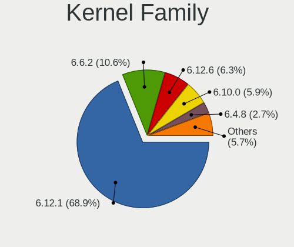
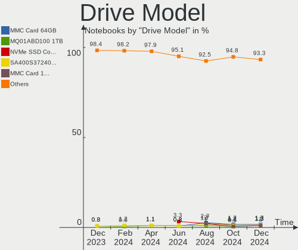
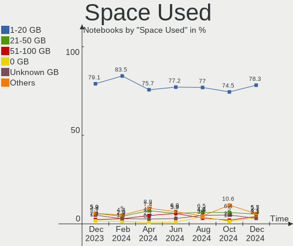
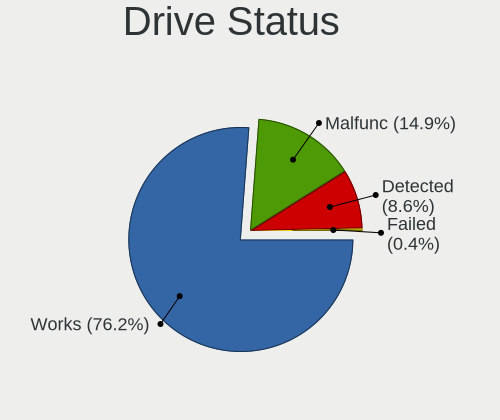
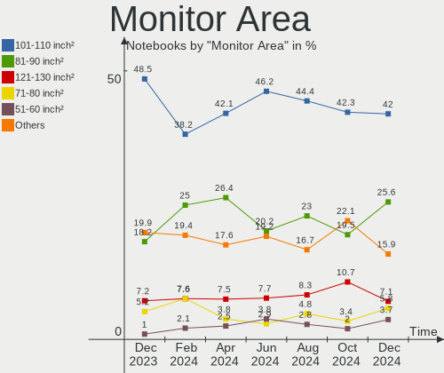
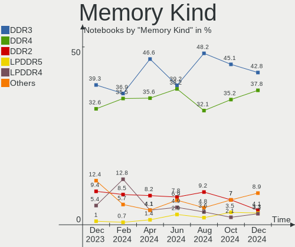
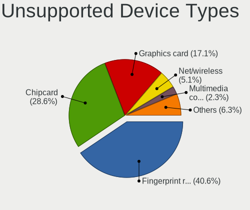

OpenMandriva - Hardware Trends (Notebooks)
------------------------------------------

A project to identify most popular hardware characteristics and track their change
over time based on data collected by Linux users at https://Linux-Hardware.org.

Anyone can contribute to this report by the [hw-probe](https://github.com/linuxhw/hw-probe) tool:

    sudo -E hw-probe -all -upload

This report is for one last month. Overall report since the beginning of time: [TestDays](https://github.com/linuxhw/TestDays)

Period: Jul, 2023.

Contents
--------

* [ System ](#system)
  - [ OS                       ](#os)
  - [ OS Family                ](#os-family)
  - [ Kernel                   ](#kernel)
  - [ Kernel Family            ](#kernel-family)
  - [ Kernel Major Ver.        ](#kernel-major-ver)
  - [ Arch                     ](#arch)
  - [ DE                       ](#de)
  - [ Display Server           ](#display-server)
  - [ Display Manager          ](#display-manager)
  - [ OS Lang                  ](#os-lang)
  - [ Boot Mode                ](#boot-mode)
  - [ Filesystem               ](#filesystem)
  - [ Part. scheme             ](#part-scheme)
  - [ Dual Boot with Linux/BSD ](#dual-boot-with-linuxbsd)
  - [ Dual Boot (Win)          ](#dual-boot-win)

* [ Board ](#board)
  - [ Vendor                   ](#vendor)
  - [ Model                    ](#model)
  - [ Model Family             ](#model-family)
  - [ MFG Year                 ](#mfg-year)
  - [ Form Factor              ](#form-factor)
  - [ Secure Boot              ](#secure-boot)
  - [ Coreboot                 ](#coreboot)
  - [ RAM Size                 ](#ram-size)
  - [ RAM Used                 ](#ram-used)
  - [ Total Drives             ](#total-drives)
  - [ Has CD-ROM               ](#has-cd-rom)
  - [ Has Ethernet             ](#has-ethernet)
  - [ Has WiFi                 ](#has-wifi)
  - [ Has Bluetooth            ](#has-bluetooth)

* [ Location ](#location)
  - [ Country                  ](#country)
  - [ City                     ](#city)

* [ Drives ](#drives)
  - [ Drive Vendor             ](#drive-vendor)
  - [ Drive Model              ](#drive-model)
  - [ HDD Vendor               ](#hdd-vendor)
  - [ SSD Vendor               ](#ssd-vendor)
  - [ Drive Kind               ](#drive-kind)
  - [ Drive Connector          ](#drive-connector)
  - [ Drive Size               ](#drive-size)
  - [ Space Total              ](#space-total)
  - [ Space Used               ](#space-used)
  - [ Malfunc. Drives          ](#malfunc-drives)
  - [ Malfunc. Drive Vendor    ](#malfunc-drive-vendor)
  - [ Malfunc. HDD Vendor      ](#malfunc-hdd-vendor)
  - [ Malfunc. Drive Kind      ](#malfunc-drive-kind)
  - [ Failed Drives            ](#failed-drives)
  - [ Failed Drive Vendor      ](#failed-drive-vendor)
  - [ Drive Status             ](#drive-status)

* [ Storage controller ](#storage-controller)
  - [ Storage Vendor           ](#storage-vendor)
  - [ Storage Model            ](#storage-model)
  - [ Storage Kind             ](#storage-kind)

* [ Processor ](#processor)
  - [ CPU Vendor               ](#cpu-vendor)
  - [ CPU Model                ](#cpu-model)
  - [ CPU Model Family         ](#cpu-model-family)
  - [ CPU Cores                ](#cpu-cores)
  - [ CPU Sockets              ](#cpu-sockets)
  - [ CPU Threads              ](#cpu-threads)
  - [ CPU Op-Modes             ](#cpu-op-modes)
  - [ CPU Microcode            ](#cpu-microcode)
  - [ CPU Microarch            ](#cpu-microarch)

* [ Graphics ](#graphics)
  - [ GPU Vendor               ](#gpu-vendor)
  - [ GPU Model                ](#gpu-model)
  - [ GPU Combo                ](#gpu-combo)
  - [ GPU Driver               ](#gpu-driver)
  - [ GPU Memory               ](#gpu-memory)

* [ Monitor ](#monitor)
  - [ Monitor Vendor           ](#monitor-vendor)
  - [ Monitor Model            ](#monitor-model)
  - [ Monitor Resolution       ](#monitor-resolution)
  - [ Monitor Diagonal         ](#monitor-diagonal)
  - [ Monitor Width            ](#monitor-width)
  - [ Aspect Ratio             ](#aspect-ratio)
  - [ Monitor Area             ](#monitor-area)
  - [ Pixel Density            ](#pixel-density)
  - [ Multiple Monitors        ](#multiple-monitors)

* [ Network ](#network)
  - [ Net Controller Vendor    ](#net-controller-vendor)
  - [ Net Controller Model     ](#net-controller-model)
  - [ Wireless Vendor          ](#wireless-vendor)
  - [ Wireless Model           ](#wireless-model)
  - [ Ethernet Vendor          ](#ethernet-vendor)
  - [ Ethernet Model           ](#ethernet-model)
  - [ Net Controller Kind      ](#net-controller-kind)
  - [ Used Controller          ](#used-controller)
  - [ NICs                     ](#nics)
  - [ IPv6                     ](#ipv6)

* [ Bluetooth ](#bluetooth)
  - [ Bluetooth Vendor         ](#bluetooth-vendor)
  - [ Bluetooth Model          ](#bluetooth-model)

* [ Sound ](#sound)
  - [ Sound Vendor             ](#sound-vendor)
  - [ Sound Model              ](#sound-model)

* [ Memory ](#memory)
  - [ Memory Vendor            ](#memory-vendor)
  - [ Memory Model             ](#memory-model)
  - [ Memory Kind              ](#memory-kind)
  - [ Memory Form Factor       ](#memory-form-factor)
  - [ Memory Size              ](#memory-size)
  - [ Memory Speed             ](#memory-speed)

* [ Printers & scanners ](#printers--scanners)
  - [ Printer Vendor           ](#printer-vendor)
  - [ Printer Model            ](#printer-model)
  - [ Scanner Vendor           ](#scanner-vendor)
  - [ Scanner Model            ](#scanner-model)

* [ Camera ](#camera)
  - [ Camera Vendor            ](#camera-vendor)
  - [ Camera Model             ](#camera-model)

* [ Security ](#security)
  - [ Fingerprint Vendor       ](#fingerprint-vendor)
  - [ Fingerprint Model        ](#fingerprint-model)
  - [ Chipcard Vendor          ](#chipcard-vendor)
  - [ Chipcard Model           ](#chipcard-model)

* [ Unsupported ](#unsupported)
  - [ Unsupported Devices      ](#unsupported-devices)
  - [ Unsupported Device Types ](#unsupported-device-types)

System
------

OS
--

Installed operating systems

| Name               | Notebooks | Percent |
|--------------------|-----------|---------|
| OpenMandriva 23.03 | 88        | 45.6%   |
| OpenMandriva 23.07 | 53        | 27.46%  |
| OpenMandriva 4.3   | 15        | 7.77%   |
| OpenMandriva 23.06 | 12        | 6.22%   |
| OpenMandriva 23.01 | 10        | 5.18%   |
| OpenMandriva 4.2   | 7         | 3.63%   |
| OpenMandriva 23.90 | 4         | 2.07%   |
| OpenMandriva 4.90  | 1         | 0.52%   |
| OpenMandriva 4.50  | 1         | 0.52%   |
| OpenMandriva 3.0   | 1         | 0.52%   |
| OpenMandriva 22.12 | 1         | 0.52%   |

OS Family
---------

OS without a version

| Name         | Notebooks | Percent |
|--------------|-----------|---------|
| OpenMandriva | 193       | 100%    |

Kernel
------

Version of the Linux kernel

| Version                      | Notebooks | Percent |
|------------------------------|-----------|---------|
| 6.2.6-desktop-1omv2390       | 88        | 45.6%   |
| 6.3.5-desktop-3omv2390       | 60        | 31.09%  |
| 6.1.1-desktop-1omv2290       | 11        | 5.7%    |
| 5.16.7-desktop-1omv4003      | 8         | 4.15%   |
| 5.16.13-desktop-1omv4003     | 7         | 3.63%   |
| 5.10.14-desktop-1omv4002     | 5         | 2.59%   |
| 6.4.3-desktop-2omv2390       | 3         | 1.55%   |
| 6.4.0-desktop-0.rc3.1omv2390 | 3         | 1.55%   |
| 5.11.12-desktop-1omv4002     | 2         | 1.04%   |
| 6.4.2-desktop-1omv2390       | 1         | 0.52%   |
| 6.2.2-desktop-1omv2390       | 1         | 0.52%   |
| 6.0.10-desktop-2omv22090     | 1         | 0.52%   |
| 5.19.5-desktop-1omv4090      | 1         | 0.52%   |
| 5.18.12-desktop-3omv4090     | 1         | 0.52%   |
| 4.9.0-desktop-4omv           | 1         | 0.52%   |

Kernel Family
-------------

Linux kernel without a distro release

| Version | Notebooks | Percent |
|---------|-----------|---------|
| 6.2.6   | 88        | 45.6%   |
| 6.3.5   | 60        | 31.09%  |
| 6.1.1   | 11        | 5.7%    |
| 5.16.7  | 8         | 4.15%   |
| 5.16.13 | 7         | 3.63%   |
| 5.10.14 | 5         | 2.59%   |
| 6.4.3   | 3         | 1.55%   |
| 6.4.0   | 3         | 1.55%   |
| 5.11.12 | 2         | 1.04%   |
| 6.4.2   | 1         | 0.52%   |
| 6.2.2   | 1         | 0.52%   |
| 6.0.10  | 1         | 0.52%   |
| 5.19.5  | 1         | 0.52%   |
| 5.18.12 | 1         | 0.52%   |
| 4.9.0   | 1         | 0.52%   |

Kernel Major Ver.
-----------------

Linux kernel major version

| Version | Notebooks | Percent |
|---------|-----------|---------|
| 6.2     | 89        | 46.11%  |
| 6.3     | 60        | 31.09%  |
| 5.16    | 15        | 7.77%   |
| 6.1     | 11        | 5.7%    |
| 6.4     | 7         | 3.63%   |
| 5.10    | 5         | 2.59%   |
| 5.11    | 2         | 1.04%   |
| 6.0     | 1         | 0.52%   |
| 5.19    | 1         | 0.52%   |
| 5.18    | 1         | 0.52%   |
| 4.9     | 1         | 0.52%   |

Arch
----

OS architecture (x86_64, i586, etc.)

| Name   | Notebooks | Percent |
|--------|-----------|---------|
| x86_64 | 193       | 100%    |

DE
--

Desktop Environment

| Name   | Notebooks | Percent |
|--------|-----------|---------|
| KDE5   | 167       | 86.53%  |
| GNOME  | 14        | 7.25%   |
| LXQt   | 10        | 5.18%   |
| DWM    | 1         | 0.52%   |
| Budgie | 1         | 0.52%   |

Display Server
--------------

X11 or Wayland

| Name    | Notebooks | Percent |
|---------|-----------|---------|
| X11     | 177       | 91.71%  |
| Wayland | 16        | 8.29%   |

Display Manager
---------------

SDDM, LightDM, etc.

| Name    | Notebooks | Percent |
|---------|-----------|---------|
| SDDM    | 177       | 91.71%  |
| GDM     | 13        | 6.74%   |
| LightDM | 3         | 1.55%   |

OS Lang
-------

Language

| Lang    | Notebooks | Percent |
|---------|-----------|---------|
| en_US   | 84        | 43.52%  |
| de_DE   | 14        | 7.25%   |
| fr_FR   | 13        | 6.74%   |
| en_GB   | 12        | 6.22%   |
| pl_PL   | 10        | 5.18%   |
| it_IT   | 10        | 5.18%   |
| pt_BR   | 8         | 4.15%   |
| es_MX   | 5         | 2.59%   |
| cs_CZ   | 5         | 2.59%   |
| en_CA   | 4         | 2.07%   |
| es_ES   | 3         | 1.55%   |
| de_AT   | 3         | 1.55%   |
| ru_RU   | 2         | 1.04%   |
| fr_CA   | 2         | 1.04%   |
| fr_BE   | 2         | 1.04%   |
| nl_NL   | 1         | 0.52%   |
| nb_NO   | 1         | 0.52%   |
| hu_HU   | 1         | 0.52%   |
| es_VE   | 1         | 0.52%   |
| es_PE   | 1         | 0.52%   |
| es_EC   | 1         | 0.52%   |
| es_CR   | 1         | 0.52%   |
| es_CL   | 1         | 0.52%   |
| es_AR   | 1         | 0.52%   |
| en_SG   | 1         | 0.52%   |
| en_PH   | 1         | 0.52%   |
| en_IN   | 1         | 0.52%   |
| en_HK   | 1         | 0.52%   |
| en_DK   | 1         | 0.52%   |
| de_CH   | 1         | 0.52%   |
| Unknown | 1         | 0.52%   |

Boot Mode
---------

EFI or BIOS

| Mode | Notebooks | Percent |
|------|-----------|---------|
| EFI  | 117       | 60.62%  |
| BIOS | 76        | 39.38%  |

Filesystem
----------

Type of filesystem

| Type    | Notebooks | Percent |
|---------|-----------|---------|
| Ext4    | 112       | 58.03%  |
| Overlay | 66        | 34.2%   |
| Btrfs   | 8         | 4.15%   |
| Xfs     | 6         | 3.11%   |
| F2fs    | 1         | 0.52%   |

Part. scheme
------------

Scheme of partitioning

| Type    | Notebooks | Percent |
|---------|-----------|---------|
| GPT     | 150       | 77.72%  |
| MBR     | 42        | 21.76%  |
| Unknown | 1         | 0.52%   |

Dual Boot with Linux/BSD
------------------------

Hosting more than one Linux/BSD

| Dual boot | Notebooks | Percent |
|-----------|-----------|---------|
| No        | 124       | 64.25%  |
| Yes       | 69        | 35.75%  |

Dual Boot (Win)
---------------

Hosting Linux and Windows

| Dual boot | Notebooks | Percent |
|-----------|-----------|---------|
| No        | 122       | 63.21%  |
| Yes       | 71        | 36.79%  |

Board
-----

Vendor
------

Motherboard manufacturer

| Name                  | Notebooks | Percent |
|-----------------------|-----------|---------|
| Lenovo                | 38        | 19.69%  |
| Hewlett-Packard       | 34        | 17.62%  |
| ASUSTek Computer      | 25        | 12.95%  |
| Acer                  | 23        | 11.92%  |
| Dell                  | 20        | 10.36%  |
| Toshiba               | 8         | 4.15%   |
| Apple                 | 5         | 2.59%   |
| Packard Bell          | 4         | 2.07%   |
| Fujitsu               | 4         | 2.07%   |
| GPU Company           | 3         | 1.55%   |
| Chuwi                 | 3         | 1.55%   |
| Standard              | 2         | 1.04%   |
| Samsung Electronics   | 2         | 1.04%   |
| Positivo              | 2         | 1.04%   |
| MSI                   | 2         | 1.04%   |
| LG Electronics        | 2         | 1.04%   |
| Google                | 2         | 1.04%   |
| Fujitsu Siemens       | 2         | 1.04%   |
| Alienware             | 2         | 1.04%   |
| Sony                  | 1         | 0.52%   |
| Semp Toshiba          | 1         | 0.52%   |
| Positivo Bahia - VAIO | 1         | 0.52%   |
| Medion                | 1         | 0.52%   |
| lapbook               | 1         | 0.52%   |
| Intel                 | 1         | 0.52%   |
| HUAWEI                | 1         | 0.52%   |
| Gigabyte Technology   | 1         | 0.52%   |
| eMachines             | 1         | 0.52%   |
| A14CR                 | 1         | 0.52%   |

Model
-----

Motherboard model

| Name                                           | Notebooks | Percent |
|------------------------------------------------|-----------|---------|
| Lenovo IdeaPad 3 15ADA05 81W1                  | 3         | 1.55%   |
| GPU Company GWNR71517                          | 3         | 1.55%   |
| Fujitsu LIFEBOOK A3510                         | 3         | 1.55%   |
| Unknown                                        | 3         | 1.55%   |
| Lenovo V145-15AST 81MT                         | 2         | 1.04%   |
| HP 550                                         | 2         | 1.04%   |
| Dell Inspiron N5110                            | 2         | 1.04%   |
| Dell Inspiron 1545                             | 2         | 1.04%   |
| ASUS UX31E                                     | 2         | 1.04%   |
| Apple MacBookAir9,1                            | 2         | 1.04%   |
| Toshiba TECRA A10                              | 1         | 0.52%   |
| Toshiba Satellite P200D                        | 1         | 0.52%   |
| Toshiba Satellite L755                         | 1         | 0.52%   |
| Toshiba Satellite L750                         | 1         | 0.52%   |
| Toshiba Satellite C650                         | 1         | 0.52%   |
| Toshiba Satellite C50D-A-11G                   | 1         | 0.52%   |
| Toshiba Satellite A135                         | 1         | 0.52%   |
| Toshiba dynabook R73/Y                         | 1         | 0.52%   |
| Standard ECT                                   | 1         | 0.52%   |
| Sony VPCCW2S8E                                 | 1         | 0.52%   |
| Semp Toshiba IS 1442                           | 1         | 0.52%   |
| Samsung 300E5M/300E5L                          | 1         | 0.52%   |
| Samsung 300E5EV/300E4EV/270E5EV/270E4EV/2470EV | 1         | 0.52%   |
| Positivo Mobile                                | 1         | 0.52%   |
| Positivo G800                                  | 1         | 0.52%   |
| Positivo Bahia - VAIO VJFE42F11X-XXXXXX        | 1         | 0.52%   |
| Packard Bell IPOWER                            | 1         | 0.52%   |
| Packard Bell EasyNote TSX66HR                  | 1         | 0.52%   |
| Packard Bell EasyNote SL65                     | 1         | 0.52%   |
| Packard Bell EasyNote LM85                     | 1         | 0.52%   |
| MSI GE70 2QD                                   | 1         | 0.52%   |
| MSI Alpha 15 B5EEK                             | 1         | 0.52%   |
| LG P420-G.BE42P1                               | 1         | 0.52%   |
| LG 17Z90P-K.AA78A1                             | 1         | 0.52%   |
| Lenovo V15 G2 ITL 82KB                         | 1         | 0.52%   |
| Lenovo ThinkPad X230 2325FG0                   | 1         | 0.52%   |
| Lenovo ThinkPad T570 W10DG 20JW0005US          | 1         | 0.52%   |
| Lenovo ThinkPad T510 4349RK6                   | 1         | 0.52%   |
| Lenovo ThinkPad T495 20NKS0T101                | 1         | 0.52%   |
| Lenovo ThinkPad T480 20L6S6FY01                | 1         | 0.52%   |

Model Family
------------

Motherboard model prefix

| Name                                    | Notebooks | Percent |
|-----------------------------------------|-----------|---------|
| Lenovo ThinkPad                         | 22        | 11.4%   |
| Acer Aspire                             | 14        | 7.25%   |
| Lenovo IdeaPad                          | 10        | 5.18%   |
| Dell Inspiron                           | 10        | 5.18%   |
| Dell Latitude                           | 9         | 4.66%   |
| HP Pavilion                             | 7         | 3.63%   |
| Toshiba Satellite                       | 6         | 3.11%   |
| HP Laptop                               | 6         | 3.11%   |
| Fujitsu LIFEBOOK                        | 4         | 2.07%   |
| Packard Bell EasyNote                   | 3         | 1.55%   |
| HP Stream                               | 3         | 1.55%   |
| HP ProBook                              | 3         | 1.55%   |
| HP EliteBook                            | 3         | 1.55%   |
| GPU Company GWNR71517                   | 3         | 1.55%   |
| Unknown                                 | 3         | 1.55%   |
| Lenovo V145-15AST                       | 2         | 1.04%   |
| HP Compaq                               | 2         | 1.04%   |
| HP 550                                  | 2         | 1.04%   |
| Fujitsu Siemens LIFEBOOK                | 2         | 1.04%   |
| ASUS VivoBook                           | 2         | 1.04%   |
| ASUS UX31E                              | 2         | 1.04%   |
| ASUS ASUS                               | 2         | 1.04%   |
| Apple MacBookAir9                       | 2         | 1.04%   |
| Acer Swift                              | 2         | 1.04%   |
| Acer Predator                           | 2         | 1.04%   |
| Acer Nitro                              | 2         | 1.04%   |
| Toshiba TECRA                           | 1         | 0.52%   |
| Toshiba dynabook                        | 1         | 0.52%   |
| Standard ECT                            | 1         | 0.52%   |
| Sony VPCCW2S8E                          | 1         | 0.52%   |
| Semp Toshiba IS                         | 1         | 0.52%   |
| Samsung 300E5M                          | 1         | 0.52%   |
| Samsung 300E5EV                         | 1         | 0.52%   |
| Positivo Mobile                         | 1         | 0.52%   |
| Positivo G800                           | 1         | 0.52%   |
| Positivo Bahia - VAIO VJFE42F11X-XXXXXX | 1         | 0.52%   |
| Packard Bell IPOWER                     | 1         | 0.52%   |
| MSI GE70                                | 1         | 0.52%   |
| MSI Alpha                               | 1         | 0.52%   |
| LG P420-G.BE42P1                        | 1         | 0.52%   |

MFG Year
--------

Motherboard manufacture year

| Year | Notebooks | Percent |
|------|-----------|---------|
| 2021 | 22        | 11.4%   |
| 2016 | 19        | 9.84%   |
| 2011 | 16        | 8.29%   |
| 2020 | 14        | 7.25%   |
| 2008 | 14        | 7.25%   |
| 2019 | 13        | 6.74%   |
| 2018 | 12        | 6.22%   |
| 2014 | 12        | 6.22%   |
| 2015 | 11        | 5.7%    |
| 2017 | 10        | 5.18%   |
| 2012 | 9         | 4.66%   |
| 2010 | 9         | 4.66%   |
| 2013 | 8         | 4.15%   |
| 2022 | 7         | 3.63%   |
| 2009 | 7         | 3.63%   |
| 2007 | 7         | 3.63%   |
| 2023 | 1         | 0.52%   |
| 2006 | 1         | 0.52%   |
| 2005 | 1         | 0.52%   |

Form Factor
-----------

Physical design of the computer

| Name     | Notebooks | Percent |
|----------|-----------|---------|
| Notebook | 193       | 100%    |

Secure Boot
-----------

Enabled or disabled

| State    | Notebooks | Percent |
|----------|-----------|---------|
| Disabled | 193       | 100%    |

Coreboot
--------

Have coreboot on board

| Used | Notebooks | Percent |
|------|-----------|---------|
| No   | 191       | 98.96%  |
| Yes  | 2         | 1.04%   |

RAM Size
--------

Total RAM memory

| Size in GB  | Notebooks | Percent |
|-------------|-----------|---------|
| 4.01-8.0    | 62        | 32.12%  |
| 3.01-4.0    | 48        | 24.87%  |
| 16.01-24.0  | 26        | 13.47%  |
| 8.01-16.0   | 26        | 13.47%  |
| 1.01-2.0    | 13        | 6.74%   |
| 32.01-64.0  | 8         | 4.15%   |
| 2.01-3.0    | 6         | 3.11%   |
| 0.51-1.0    | 2         | 1.04%   |
| 24.01-32.0  | 1         | 0.52%   |
| 64.01-256.0 | 1         | 0.52%   |

RAM Used
--------

Used RAM memory

| Used GB  | Notebooks | Percent |
|----------|-----------|---------|
| 1.01-2.0 | 111       | 57.51%  |
| 2.01-3.0 | 49        | 25.39%  |
| 0.51-1.0 | 21        | 10.88%  |
| 3.01-4.0 | 6         | 3.11%   |
| 4.01-8.0 | 4         | 2.07%   |
| 0.01-0.5 | 2         | 1.04%   |

Total Drives
------------

Number of drives on board

| Drives | Notebooks | Percent |
|--------|-----------|---------|
| 1      | 141       | 73.06%  |
| 2      | 46        | 23.83%  |
| 3      | 3         | 1.55%   |
| 0      | 3         | 1.55%   |

Has CD-ROM
----------

Has CD-ROM on board

| Presented | Notebooks | Percent |
|-----------|-----------|---------|
| No        | 114       | 59.07%  |
| Yes       | 79        | 40.93%  |

Has Ethernet
------------

Has Ethernet on board

| Presented | Notebooks | Percent |
|-----------|-----------|---------|
| Yes       | 155       | 80.31%  |
| No        | 38        | 19.69%  |

Has WiFi
--------

Has WiFi module

| Presented | Notebooks | Percent |
|-----------|-----------|---------|
| Yes       | 190       | 98.45%  |
| No        | 3         | 1.55%   |

Has Bluetooth
-------------

Has Bluetooth module

| Presented | Notebooks | Percent |
|-----------|-----------|---------|
| Yes       | 131       | 67.88%  |
| No        | 62        | 32.12%  |

Location
--------

Country
-------

Geographic location (country)

| Country     | Notebooks | Percent |
|-------------|-----------|---------|
| USA         | 26        | 13.47%  |
| Germany     | 16        | 8.29%   |
| Poland      | 14        | 7.25%   |
| France      | 14        | 7.25%   |
| Brazil      | 14        | 7.25%   |
| Italy       | 13        | 6.74%   |
| UK          | 9         | 4.66%   |
| Mexico      | 8         | 4.15%   |
| Canada      | 6         | 3.11%   |
| Spain       | 5         | 2.59%   |
| Japan       | 5         | 2.59%   |
| Czechia     | 5         | 2.59%   |
| Switzerland | 4         | 2.07%   |
| India       | 3         | 1.55%   |
| Greece      | 3         | 1.55%   |
| Austria     | 3         | 1.55%   |
| Argentina   | 3         | 1.55%   |
| Tunisia     | 2         | 1.04%   |
| Singapore   | 2         | 1.04%   |
| Philippines | 2         | 1.04%   |
| Norway      | 2         | 1.04%   |
| Lithuania   | 2         | 1.04%   |
| Latvia      | 2         | 1.04%   |
| Indonesia   | 2         | 1.04%   |
| Hungary     | 2         | 1.04%   |
| Hong Kong   | 2         | 1.04%   |
| Belgium     | 2         | 1.04%   |
| Vietnam     | 1         | 0.52%   |
| Venezuela   | 1         | 0.52%   |
| Thailand    | 1         | 0.52%   |
| Sweden      | 1         | 0.52%   |
| Slovakia    | 1         | 0.52%   |
| Serbia      | 1         | 0.52%   |
| Saint Lucia | 1         | 0.52%   |
| Russia      | 1         | 0.52%   |
| Romania     | 1         | 0.52%   |
| Peru        | 1         | 0.52%   |
| New Zealand | 1         | 0.52%   |
| Netherlands | 1         | 0.52%   |
| Myanmar     | 1         | 0.52%   |

City
----

Geographic location (city)

| City               | Notebooks | Percent |
|--------------------|-----------|---------|
| Warsaw             | 5         | 2.59%   |
| Vienna             | 3         | 1.55%   |
| Schwäbisch Gmünd | 3         | 1.55%   |
| Prague             | 3         | 1.55%   |
| Curitiba           | 3         | 1.55%   |
| Athens             | 3         | 1.55%   |
| Vecindario         | 2         | 1.04%   |
| Southwark          | 2         | 1.04%   |
| Singapore          | 2         | 1.04%   |
| Obernai            | 2         | 1.04%   |
| Niigata            | 2         | 1.04%   |
| New Baltimore      | 2         | 1.04%   |
| Naucalpan          | 2         | 1.04%   |
| Munich             | 2         | 1.04%   |
| Klaipėda          | 2         | 1.04%   |
| Katowice           | 2         | 1.04%   |
| Johnson City       | 2         | 1.04%   |
| Idaho Falls        | 2         | 1.04%   |
| Central            | 2         | 1.04%   |
| Capdenac-Gare      | 2         | 1.04%   |
| Żory              | 1         | 0.52%   |
| Yokohama           | 1         | 0.52%   |
| Yangon             | 1         | 0.52%   |
| Yamanashi          | 1         | 0.52%   |
| Weimar             | 1         | 0.52%   |
| Turin              | 1         | 0.52%   |
| Tunis              | 1         | 0.52%   |
| Tromsø            | 1         | 0.52%   |
| Trieste            | 1         | 0.52%   |
| Tlalnepantla       | 1         | 0.52%   |
| Telford            | 1         | 0.52%   |
| Tartu              | 1         | 0.52%   |
| Tarquinia          | 1         | 0.52%   |
| Tabarka            | 1         | 0.52%   |
| Szolnok            | 1         | 0.52%   |
| Surabaya           | 1         | 0.52%   |
| Stockholm          | 1         | 0.52%   |
| St. Moritz         | 1         | 0.52%   |
| St Petersburg      | 1         | 0.52%   |
| Smithfield         | 1         | 0.52%   |

Drives
------

Drive Vendor
------------

Hard drive vendors

| Vendor              | Notebooks | Drives | Percent |
|---------------------|-----------|--------|---------|
| Samsung Electronics | 35        | 38     | 15.7%   |
| WDC                 | 24        | 25     | 10.76%  |
| Seagate             | 19        | 19     | 8.52%   |
| Toshiba             | 18        | 18     | 8.07%   |
| SanDisk             | 13        | 14     | 5.83%   |
| Kingston            | 11        | 11     | 4.93%   |
| Unknown             | 10        | 10     | 4.48%   |
| Crucial             | 10        | 10     | 4.48%   |
| Hitachi             | 8         | 8      | 3.59%   |
| HGST                | 7         | 7      | 3.14%   |
| SK hynix            | 6         | 6      | 2.69%   |
| Intel               | 5         | 5      | 2.24%   |
| A-DATA Technology   | 5         | 5      | 2.24%   |
| Apple               | 4         | 4      | 1.79%   |
| Unknown             | 4         | 4      | 1.79%   |
| Wibtek              | 3         | 3      | 1.35%   |
| Micron Technology   | 3         | 3      | 1.35%   |
| UMIS                | 2         | 2      | 0.9%    |
| Transcend           | 2         | 2      | 0.9%    |
| PNY                 | 2         | 2      | 0.9%    |
| Patriot             | 2         | 2      | 0.9%    |
| Netac               | 2         | 2      | 0.9%    |
| Lenovo              | 2         | 2      | 0.9%    |
| KIOXIA              | 2         | 2      | 0.9%    |
| China               | 2         | 2      | 0.9%    |
| XPG                 | 1         | 1      | 0.45%   |
| Verbatim            | 1         | 1      | 0.45%   |
| Timetec             | 1         | 1      | 0.45%   |
| Team                | 1         | 1      | 0.45%   |
| SPCC                | 1         | 1      | 0.45%   |
| ShiJi               | 1         | 1      | 0.45%   |
| OCZ                 | 1         | 1      | 0.45%   |
| MidasForce          | 1         | 1      | 0.45%   |
| LITEON              | 1         | 1      | 0.45%   |
| Leven               | 1         | 1      | 0.45%   |
| LaCie               | 1         | 1      | 0.45%   |
| KingSpec            | 1         | 1      | 0.45%   |
| Intenso             | 1         | 1      | 0.45%   |
| INTEL SS            | 1         | 1      | 0.45%   |
| Hewlett-Packard     | 1         | 1      | 0.45%   |

Drive Model
-----------

Hard drive models

| Model                                     | Notebooks | Percent |
|-------------------------------------------|-----------|---------|
| Crucial CT1000MX500SSD1 1TB               | 4         | 1.77%   |
| Unknown                                   | 4         | 1.77%   |
| Wibtek W800S 512GB                        | 3         | 1.33%   |
| WDC WD10JPVX-22JC3T0 1TB                  | 3         | 1.33%   |
| Toshiba MQ04ABF100 1TB                    | 3         | 1.33%   |
| Toshiba MQ01ABF050 500GB                  | 3         | 1.33%   |
| Toshiba MQ01ABD100 1TB                    | 3         | 1.33%   |
| Kingston SA400S37480G 480GB SSD           | 3         | 1.33%   |
| WDC WD10SPZX-21Z10T0 1TB                  | 2         | 0.88%   |
| UMIS RPJTJ256MEE1OWX 256GB                | 2         | 0.88%   |
| SK hynix SKHynix_HFM256GDHTNI-87A0B 256GB | 2         | 0.88%   |
| Seagate ST9500325AS 500GB                 | 2         | 0.88%   |
| Seagate ST500LT012-9WS142 500GB           | 2         | 0.88%   |
| Seagate ST500LM030-1RK17D 500GB           | 2         | 0.88%   |
| Seagate ST1000LM035-1RK172 1TB            | 2         | 0.88%   |
| Seagate ST1000LM024 HN-M101MBB 1TB        | 2         | 0.88%   |
| SanDisk SSD U100 256GB                    | 2         | 0.88%   |
| SanDisk SSD U100 24GB                     | 2         | 0.88%   |
| SanDisk DF4032  32GB                      | 2         | 0.88%   |
| Samsung SSD 980 500GB                     | 2         | 0.88%   |
| Samsung SSD 860 EVO 500GB                 | 2         | 0.88%   |
| Samsung MZVLQ256HAJD-00007 256GB          | 2         | 0.88%   |
| Samsung MZVLB256HAHQ-000L7 256GB          | 2         | 0.88%   |
| Kingston SA400S37240G 240GB SSD           | 2         | 0.88%   |
| Hitachi HTS545050A7E380 500GB             | 2         | 0.88%   |
| Apple SSD AP0256N 256GB                   | 2         | 0.88%   |
| XPG GAMMIX S70 BLADE 2TB                  | 1         | 0.44%   |
| WDC WDS500G2B0A-00SM50 500GB SSD          | 1         | 0.44%   |
| WDC WDS500G1X0E-00AFY0 500GB              | 1         | 0.44%   |
| WDC WDS240G2G0A-00JH30 240GB SSD          | 1         | 0.44%   |
| WDC WD5000LPVX-80V0TT0 500GB              | 1         | 0.44%   |
| WDC WD5000LPLX-08ZNTT0 500GB              | 1         | 0.44%   |
| WDC WD3200BEVT-22ZCT0 320GB               | 1         | 0.44%   |
| WDC WD3200BEVS-26VAT0 320GB               | 1         | 0.44%   |
| WDC WD3200BEKT-08PVMT1 320GB              | 1         | 0.44%   |
| WDC WD2500BEVT-80A23T0 250GB              | 1         | 0.44%   |
| WDC WD2500BEVT-75ZCT2 250GB               | 1         | 0.44%   |
| WDC WD1600BEVT-60ZCT0 160GB               | 1         | 0.44%   |
| WDC WD1600BEVT-22ZCT0 160GB               | 1         | 0.44%   |
| WDC WD1600BEVS-08VAT2 160GB               | 1         | 0.44%   |

HDD Vendor
----------

Hard disk drive vendors

| Vendor              | Notebooks | Drives | Percent |
|---------------------|-----------|--------|---------|
| Seagate             | 19        | 19     | 26.39%  |
| WDC                 | 16        | 16     | 22.22%  |
| Toshiba             | 16        | 16     | 22.22%  |
| Hitachi             | 8         | 8      | 11.11%  |
| HGST                | 7         | 7      | 9.72%   |
| Samsung Electronics | 3         | 3      | 4.17%   |
| Hewlett-Packard     | 1         | 1      | 1.39%   |
| Fujitsu             | 1         | 1      | 1.39%   |
| ASMedia             | 1         | 1      | 1.39%   |

SSD Vendor
----------

Solid state drive vendors

| Vendor              | Notebooks | Drives | Percent |
|---------------------|-----------|--------|---------|
| Samsung Electronics | 14        | 16     | 17.07%  |
| Kingston            | 10        | 10     | 12.2%   |
| SanDisk             | 9         | 10     | 10.98%  |
| Crucial             | 8         | 8      | 9.76%   |
| Wibtek              | 3         | 3      | 3.66%   |
| A-DATA Technology   | 3         | 3      | 3.66%   |
| WDC                 | 2         | 2      | 2.44%   |
| Transcend           | 2         | 2      | 2.44%   |
| PNY                 | 2         | 2      | 2.44%   |
| Patriot             | 2         | 2      | 2.44%   |
| Netac               | 2         | 2      | 2.44%   |
| China               | 2         | 2      | 2.44%   |
| Verbatim            | 1         | 1      | 1.22%   |
| Toshiba             | 1         | 1      | 1.22%   |
| Timetec             | 1         | 1      | 1.22%   |
| Team                | 1         | 1      | 1.22%   |
| SPCC                | 1         | 1      | 1.22%   |
| SK hynix            | 1         | 1      | 1.22%   |
| ShiJi               | 1         | 1      | 1.22%   |
| OCZ                 | 1         | 1      | 1.22%   |
| MidasForce          | 1         | 1      | 1.22%   |
| Micron Technology   | 1         | 1      | 1.22%   |
| LITEON              | 1         | 1      | 1.22%   |
| Leven               | 1         | 1      | 1.22%   |
| KingSpec            | 1         | 1      | 1.22%   |
| Intenso             | 1         | 1      | 1.22%   |
| INTEL SS            | 1         | 1      | 1.22%   |
| Intel               | 1         | 1      | 1.22%   |
| GOODRAM             | 1         | 1      | 1.22%   |
| Gigabyte Technology | 1         | 1      | 1.22%   |
| Biostar             | 1         | 1      | 1.22%   |
| Apple               | 1         | 1      | 1.22%   |
| Apacer              | 1         | 1      | 1.22%   |
| Acer                | 1         | 1      | 1.22%   |
| Unknown             | 1         | 1      | 1.22%   |

Drive Kind
----------

HDD or SSD

| Kind    | Notebooks | Drives | Percent |
|---------|-----------|--------|---------|
| SSD     | 79        | 85     | 36.92%  |
| HDD     | 68        | 72     | 31.78%  |
| NVMe    | 50        | 53     | 23.36%  |
| MMC     | 16        | 17     | 7.48%   |
| Unknown | 1         | 1      | 0.47%   |

Drive Connector
---------------

SATA, SAS, NVMe, etc.

| Type | Notebooks | Drives | Percent |
|------|-----------|--------|---------|
| SATA | 136       | 150    | 64.76%  |
| NVMe | 50        | 53     | 23.81%  |
| MMC  | 16        | 17     | 7.62%   |
| SAS  | 8         | 8      | 3.81%   |

Drive Size
----------

Size of hard drive

| Size in TB | Notebooks | Drives | Percent |
|------------|-----------|--------|---------|
| 0.01-0.5   | 104       | 112    | 70.27%  |
| 0.51-1.0   | 40        | 41     | 27.03%  |
| 1.01-2.0   | 3         | 3      | 2.03%   |
| 3.01-4.0   | 1         | 1      | 0.68%   |

Space Total
-----------

Amount of disk space available on the file system

| Size in GB     | Notebooks | Percent |
|----------------|-----------|---------|
| 1-20           | 56        | 29.02%  |
| 101-250        | 42        | 21.76%  |
| 251-500        | 29        | 15.03%  |
| 501-1000       | 21        | 10.88%  |
| 21-50          | 16        | 8.29%   |
| 51-100         | 15        | 7.77%   |
| Unknown        | 6         | 3.11%   |
| 1001-2000      | 5         | 2.59%   |
| 2001-3000      | 2         | 1.04%   |
| More than 3000 | 1         | 0.52%   |

Space Used
----------

Amount of used disk space

| Used GB   | Notebooks | Percent |
|-----------|-----------|---------|
| 1-20      | 150       | 77.72%  |
| 21-50     | 17        | 8.81%   |
| 101-250   | 7         | 3.63%   |
| 51-100    | 7         | 3.63%   |
| Unknown   | 6         | 3.11%   |
| 251-500   | 2         | 1.04%   |
| 501-1000  | 2         | 1.04%   |
| 2001-3000 | 1         | 0.52%   |
| 1001-2000 | 1         | 0.52%   |

Malfunc. Drives
---------------

Drive models with a malfunction

| Model                                    | Notebooks | Drives | Percent |
|------------------------------------------|-----------|--------|---------|
| Seagate ST9500325AS 500GB                | 2         | 2      | 5.56%   |
| Seagate ST500LT012-9WS142 500GB          | 2         | 2      | 5.56%   |
| SanDisk SSD U100 256GB                   | 2         | 2      | 5.56%   |
| Hitachi HTS545050A7E380 500GB            | 2         | 2      | 5.56%   |
| WDC WD1600BEVT-60ZCT0 160GB              | 1         | 1      | 2.78%   |
| WDC WD1600BEVT-22ZCT0 160GB              | 1         | 1      | 2.78%   |
| Transcend TS256GSSD230S 256GB            | 1         | 1      | 2.78%   |
| Toshiba MQ01ABF050 500GB                 | 1         | 1      | 2.78%   |
| Toshiba MQ01ABD100V 1TB                  | 1         | 1      | 2.78%   |
| Toshiba MQ01ABD100 1TB                   | 1         | 1      | 2.78%   |
| Toshiba MQ01ABD050 500GB                 | 1         | 1      | 2.78%   |
| Toshiba MK7559GSXP 752GB                 | 1         | 1      | 2.78%   |
| Toshiba MK6465GSXN 640GB                 | 1         | 1      | 2.78%   |
| Toshiba MK3265GSXN 320GB                 | 1         | 1      | 2.78%   |
| Seagate ST9640320AS 640GB                | 1         | 1      | 2.78%   |
| Seagate ST9250827AS 250GB                | 1         | 1      | 2.78%   |
| Seagate ST500LM021-1KJ152 500GB          | 1         | 1      | 2.78%   |
| Seagate ST500LM012 HN-M500MBB 500GB      | 1         | 1      | 2.78%   |
| Seagate ST320LT012-9WS14C 320GB          | 1         | 1      | 2.78%   |
| Seagate ST1000LM024 HN-M101MBB 1TB       | 1         | 1      | 2.78%   |
| SanDisk SSD U100 24GB                    | 1         | 1      | 2.78%   |
| Samsung Electronics SSD 840 Series 500GB | 1         | 1      | 2.78%   |
| Samsung Electronics HM321HI 320GB        | 1         | 1      | 2.78%   |
| Samsung Electronics HM121HI 120GB        | 1         | 1      | 2.78%   |
| LITEON CV8-8E128-HP 128GB SSD            | 1         | 1      | 2.78%   |
| Kingston RBU-SMSM151S324GD 24GB SSD      | 1         | 1      | 2.78%   |
| Intel SSDSCKKF256G8 SATA 256GB           | 1         | 1      | 2.78%   |
| Hitachi HTS543225L9SA00 250GB            | 1         | 1      | 2.78%   |
| Hitachi HTS541680J9SA00 80GB             | 1         | 1      | 2.78%   |
| HGST HTS541010A9E680 1TB                 | 1         | 1      | 2.78%   |
| HGST HCC545050A7E380 500GB               | 1         | 1      | 2.78%   |
| Fujitsu MHZ2120BH G2 120GB               | 1         | 1      | 2.78%   |

Malfunc. Drive Vendor
---------------------

Vendors of faulty drives

| Vendor              | Notebooks | Drives | Percent |
|---------------------|-----------|--------|---------|
| Seagate             | 10        | 10     | 27.78%  |
| Toshiba             | 7         | 7      | 19.44%  |
| Hitachi             | 4         | 4      | 11.11%  |
| SanDisk             | 3         | 3      | 8.33%   |
| Samsung Electronics | 3         | 3      | 8.33%   |
| WDC                 | 2         | 2      | 5.56%   |
| HGST                | 2         | 2      | 5.56%   |
| Transcend           | 1         | 1      | 2.78%   |
| LITEON              | 1         | 1      | 2.78%   |
| Kingston            | 1         | 1      | 2.78%   |
| Intel               | 1         | 1      | 2.78%   |
| Fujitsu             | 1         | 1      | 2.78%   |

Malfunc. HDD Vendor
-------------------

Vendors of faulty HDD drives

| Vendor              | Notebooks | Drives | Percent |
|---------------------|-----------|--------|---------|
| Seagate             | 10        | 10     | 35.71%  |
| Toshiba             | 7         | 7      | 25%     |
| Hitachi             | 4         | 4      | 14.29%  |
| WDC                 | 2         | 2      | 7.14%   |
| Samsung Electronics | 2         | 2      | 7.14%   |
| HGST                | 2         | 2      | 7.14%   |
| Fujitsu             | 1         | 1      | 3.57%   |

Malfunc. Drive Kind
-------------------

Kinds of faulty drives

| Kind | Notebooks | Drives | Percent |
|------|-----------|--------|---------|
| HDD  | 25        | 28     | 75.76%  |
| SSD  | 8         | 8      | 24.24%  |

Failed Drives
-------------

Failed drive models

| Model                             | Notebooks | Drives | Percent |
|-----------------------------------|-----------|--------|---------|
| Samsung Electronics HM250HI 250GB | 1         | 1      | 100%    |

Failed Drive Vendor
-------------------

Failed drive vendors

| Vendor              | Notebooks | Drives | Percent |
|---------------------|-----------|--------|---------|
| Samsung Electronics | 1         | 1      | 100%    |

Drive Status
------------

Number of failed and malfunc. drives

| Status   | Notebooks | Drives | Percent |
|----------|-----------|--------|---------|
| Works    | 148       | 167    | 72.2%   |
| Malfunc  | 33        | 36     | 16.1%   |
| Detected | 23        | 24     | 11.22%  |
| Failed   | 1         | 1      | 0.49%   |

Storage controller
------------------

Storage Vendor
--------------

Storage controller vendors

| Vendor                       | Notebooks | Percent |
|------------------------------|-----------|---------|
| Intel                        | 138       | 64.79%  |
| AMD                          | 25        | 11.74%  |
| Samsung Electronics          | 20        | 9.39%   |
| SanDisk                      | 7         | 3.29%   |
| SK hynix                     | 4         | 1.88%   |
| Union Memory (Shenzhen)      | 2         | 0.94%   |
| Micron/Crucial Technology    | 2         | 0.94%   |
| Micron Technology            | 2         | 0.94%   |
| Lenovo                       | 2         | 0.94%   |
| KIOXIA                       | 2         | 0.94%   |
| Apple                        | 2         | 0.94%   |
| ADATA Technology             | 2         | 0.94%   |
| Toshiba America Info Systems | 1         | 0.47%   |
| Silicon Image                | 1         | 0.47%   |
| Realtek Semiconductor        | 1         | 0.47%   |
| Nvidia                       | 1         | 0.47%   |
| Kingston Technology Company  | 1         | 0.47%   |

Storage Model
-------------

Storage controller models

| Model                                                                          | Notebooks | Percent |
|--------------------------------------------------------------------------------|-----------|---------|
| AMD FCH SATA Controller [AHCI mode]                                            | 23        | 9.87%   |
| Intel Sunrise Point-LP SATA Controller [AHCI mode]                             | 19        | 8.15%   |
| Intel 82801IBM/IEM (ICH9M/ICH9M-E) 4 port SATA Controller [AHCI mode]          | 15        | 6.44%   |
| Intel 6 Series/C200 Series Chipset Family 6 port Mobile SATA AHCI Controller   | 13        | 5.58%   |
| Intel 82801HM/HEM (ICH8M/ICH8M-E) SATA Controller [AHCI mode]                  | 10        | 4.29%   |
| Intel 82801HM/HEM (ICH8M/ICH8M-E) IDE Controller                               | 10        | 4.29%   |
| Intel 7 Series Chipset Family 6-port SATA Controller [AHCI mode]               | 10        | 4.29%   |
| Samsung NVMe SSD Controller 980                                                | 9         | 3.86%   |
| Intel Wildcat Point-LP SATA Controller [AHCI Mode]                             | 9         | 3.86%   |
| Intel 82801 Mobile SATA Controller [RAID mode]                                 | 8         | 3.43%   |
| Intel Volume Management Device NVMe RAID Controller                            | 7         | 3%      |
| Intel Celeron/Pentium Silver Processor SATA Controller                         | 7         | 3%      |
| Samsung NVMe SSD Controller SM981/PM981/PM983                                  | 6         | 2.58%   |
| Intel 8 Series SATA Controller 1 [AHCI mode]                                   | 6         | 2.58%   |
| Intel 5 Series/3400 Series Chipset 6 port SATA AHCI Controller                 | 5         | 2.15%   |
| Intel NM10/ICH7 Family SATA Controller [AHCI mode]                             | 4         | 1.72%   |
| SanDisk WD Blue SN550 NVMe SSD                                                 | 3         | 1.29%   |
| Intel Tiger Lake-LP SATA Controller                                            | 3         | 1.29%   |
| Intel Ice Lake-LP SATA Controller [AHCI mode]                                  | 3         | 1.29%   |
| Intel 8 Series/C220 Series Chipset Family 6-port SATA Controller 1 [AHCI mode] | 3         | 1.29%   |
| Union Memory (Shenzhen) AM620 PCIe 3.0 NVMe SSD 256GB                          | 2         | 0.86%   |
| SK hynix BC511 NVMe SSD                                                        | 2         | 0.86%   |
| SanDisk WD Black SN750 / PC SN730 NVMe SSD                                     | 2         | 0.86%   |
| Samsung NVMe SSD Controller SM961/PM961/SM963                                  | 2         | 0.86%   |
| Micron/Crucial P2 [Nick P2] / P3 / P3 Plus NVMe PCIe SSD (DRAM-less)           | 2         | 0.86%   |
| Intel SSD DC P4101/Pro 7600p/760p/E 6100p Series                               | 2         | 0.86%   |
| Intel Q170/Q150/B150/H170/H110/Z170/CM236 Chipset SATA Controller [AHCI Mode]  | 2         | 0.86%   |
| Intel Comet Lake SATA AHCI Controller                                          | 2         | 0.86%   |
| Intel 82801GBM/GHM (ICH7-M Family) SATA Controller [IDE mode]                  | 2         | 0.86%   |
| Intel 5 Series/3400 Series Chipset 4 port SATA AHCI Controller                 | 2         | 0.86%   |
| Apple ANS2 NVMe Controller                                                     | 2         | 0.86%   |
| Toshiba America Info Systems BG3 NVMe SSD Controller                           | 1         | 0.43%   |
| SK hynix PC601 NVMe Solid State Drive                                          | 1         | 0.43%   |
| SK hynix Gold P31/BC711/PC711 NVMe Solid State Drive                           | 1         | 0.43%   |
| Silicon Image SiI 3531 [SATALink/SATARaid] Serial ATA Controller               | 1         | 0.43%   |
| SanDisk WD PC SN810 / Black SN850 NVMe SSD                                     | 1         | 0.43%   |
| SanDisk WD Green SN350 NVMe SSD 1 TB (DRAM-less)                               | 1         | 0.43%   |
| SanDisk WD Black 2018/SN750 / PC SN720 NVMe SSD                                | 1         | 0.43%   |
| Samsung S4LN058A01[SSUBX] AHCI SSD Controller (Apple slot)                     | 1         | 0.43%   |
| Samsung NVMe SSD Controller S4LV008[Pascal]                                    | 1         | 0.43%   |

Storage Kind
------------

Kind of storage controller (IDE, SATA, NVMe, SAS, ...)

| Kind | Notebooks | Percent |
|------|-----------|---------|
| SATA | 149       | 64.78%  |
| NVMe | 50        | 21.74%  |
| RAID | 16        | 6.96%   |
| IDE  | 15        | 6.52%   |

Processor
---------

CPU Vendor
----------

Processor vendors

| Vendor | Notebooks | Percent |
|--------|-----------|---------|
| Intel  | 155       | 80.31%  |
| AMD    | 38        | 19.69%  |

CPU Model
---------

Processor models

| Model                                         | Notebooks | Percent |
|-----------------------------------------------|-----------|---------|
| Intel Core 2 Duo CPU P8700 @ 2.53GHz          | 5         | 2.59%   |
| Intel Core i5-7200U CPU @ 2.50GHz             | 4         | 2.07%   |
| Intel Core i5-6200U CPU @ 2.30GHz             | 4         | 2.07%   |
| Intel Core i5-5200U CPU @ 2.20GHz             | 4         | 2.07%   |
| Intel Core i3-2310M CPU @ 2.10GHz             | 4         | 2.07%   |
| Intel Core i3-1005G1 CPU @ 1.20GHz            | 4         | 2.07%   |
| Intel Celeron N4020 CPU @ 1.10GHz             | 4         | 2.07%   |
| AMD Ryzen 7 5800H with Radeon Graphics        | 4         | 2.07%   |
| AMD Ryzen 5 3500U with Radeon Vega Mobile Gfx | 4         | 2.07%   |
| Intel Core i7-5500U CPU @ 2.40GHz             | 3         | 1.55%   |
| Intel Core i5-8250U CPU @ 1.60GHz             | 3         | 1.55%   |
| Intel Core i3-4030U CPU @ 1.90GHz             | 3         | 1.55%   |
| AMD Ryzen 7 3700U with Radeon Vega Mobile Gfx | 3         | 1.55%   |
| Intel Genuine CPU U4100 @ 1.30GHz             | 2         | 1.04%   |
| Intel Core i7-7500U CPU @ 2.70GHz             | 2         | 1.04%   |
| Intel Core i7-6820HQ CPU @ 2.70GHz            | 2         | 1.04%   |
| Intel Core i7-6500U CPU @ 2.50GHz             | 2         | 1.04%   |
| Intel Core i7-4700MQ CPU @ 2.40GHz            | 2         | 1.04%   |
| Intel Core i7-2677M CPU @ 1.80GHz             | 2         | 1.04%   |
| Intel Core i5-7300U CPU @ 2.60GHz             | 2         | 1.04%   |
| Intel Core i5-6300U CPU @ 2.40GHz             | 2         | 1.04%   |
| Intel Core i5-5300U CPU @ 2.30GHz             | 2         | 1.04%   |
| Intel Core i5-4200U CPU @ 1.60GHz             | 2         | 1.04%   |
| Intel Core i5-3320M CPU @ 2.60GHz             | 2         | 1.04%   |
| Intel Core i5-2520M CPU @ 2.50GHz             | 2         | 1.04%   |
| Intel Core i5-2410M CPU @ 2.30GHz             | 2         | 1.04%   |
| Intel Core i5 CPU M 520 @ 2.40GHz             | 2         | 1.04%   |
| Intel Core i3-6006U CPU @ 2.00GHz             | 2         | 1.04%   |
| Intel Core i3-1000NG4 CPU @ 1.10GHz           | 2         | 1.04%   |
| Intel Core i3 CPU M 330 @ 2.13GHz             | 2         | 1.04%   |
| Intel Celeron J4125 CPU @ 2.00GHz             | 2         | 1.04%   |
| Intel Celeron CPU N3060 @ 1.60GHz             | 2         | 1.04%   |
| Intel 12th Gen Core i7-12700H                 | 2         | 1.04%   |
| AMD A4-9125 RADEON R3, 4 COMPUTE CORES 2C+2G  | 2         | 1.04%   |
| Intel Pentium Silver N5030 CPU @ 1.10GHz      | 1         | 0.52%   |
| Intel Pentium Silver N5000 CPU @ 1.10GHz      | 1         | 0.52%   |
| Intel Pentium Gold 7505 @ 2.00GHz             | 1         | 0.52%   |
| Intel Pentium Dual CPU T2390 @ 1.86GHz        | 1         | 0.52%   |
| Intel Pentium Dual CPU T2370 @ 1.73GHz        | 1         | 0.52%   |
| Intel Pentium Dual CPU T2330 @ 1.60GHz        | 1         | 0.52%   |

CPU Model Family
----------------

Processor model prefix

| Model                   | Notebooks | Percent |
|-------------------------|-----------|---------|
| Intel Core i5           | 41        | 21.24%  |
| Intel Core i7           | 26        | 13.47%  |
| Intel Core i3           | 24        | 12.44%  |
| Intel Celeron           | 17        | 8.81%   |
| Intel Core 2 Duo        | 16        | 8.29%   |
| Other                   | 12        | 6.22%   |
| AMD Ryzen 7             | 9         | 4.66%   |
| AMD Ryzen 5             | 8         | 4.15%   |
| Intel Atom              | 6         | 3.11%   |
| AMD A4                  | 4         | 2.07%   |
| Intel Pentium Dual      | 3         | 1.55%   |
| AMD Ryzen 3             | 3         | 1.55%   |
| Intel Pentium Silver    | 2         | 1.04%   |
| Intel Pentium           | 2         | 1.04%   |
| Intel Genuine           | 2         | 1.04%   |
| Intel Celeron Dual-Core | 2         | 1.04%   |
| Intel Pentium Gold      | 1         | 0.52%   |
| Intel Core i9           | 1         | 0.52%   |
| Intel Core 2 Quad       | 1         | 0.52%   |
| Intel Core 2            | 1         | 0.52%   |
| Intel Celeron M         | 1         | 0.52%   |
| AMD Turion 64 X2 Mobile | 1         | 0.52%   |
| AMD Ryzen 5 PRO         | 1         | 0.52%   |
| AMD Ryzen 3 PRO         | 1         | 0.52%   |
| AMD E2                  | 1         | 0.52%   |
| AMD E1                  | 1         | 0.52%   |
| AMD Athlon X2           | 1         | 0.52%   |
| AMD Athlon II           | 1         | 0.52%   |
| AMD Athlon              | 1         | 0.52%   |
| AMD A8                  | 1         | 0.52%   |
| AMD A6                  | 1         | 0.52%   |
| AMD A12                 | 1         | 0.52%   |

CPU Cores
---------

Number of processor cores

| Number | Notebooks | Percent |
|--------|-----------|---------|
| 2      | 128       | 66.32%  |
| 4      | 37        | 19.17%  |
| 6      | 9         | 4.66%   |
| 1      | 9         | 4.66%   |
| 8      | 7         | 3.63%   |
| 14     | 2         | 1.04%   |
| 10     | 1         | 0.52%   |

CPU Sockets
-----------

Number of sockets

| Number | Notebooks | Percent |
|--------|-----------|---------|
| 1      | 193       | 100%    |

CPU Threads
-----------

Threads per core (Hyper-Threading)

| Number | Notebooks | Percent |
|--------|-----------|---------|
| 2      | 127       | 65.8%   |
| 1      | 64        | 33.16%  |
| 8      | 1         | 0.52%   |
| 4      | 1         | 0.52%   |

CPU Op-Modes
------------

CPU Operation Modes (32-bit, 64-bit)

| Op mode        | Notebooks | Percent |
|----------------|-----------|---------|
| 32-bit, 64-bit | 193       | 100%    |

CPU Microcode
-------------

Microcode number

| Number     | Notebooks | Percent |
|------------|-----------|---------|
| Unknown    | 129       | 66.84%  |
| 0x08108109 | 9         | 4.66%   |
| 0x406e3    | 4         | 2.07%   |
| 0x206a7    | 3         | 1.55%   |
| 0x0a50000d | 3         | 1.55%   |
| 0x0a50000c | 3         | 1.55%   |
| 0x08608103 | 3         | 1.55%   |
| 0x06006705 | 3         | 1.55%   |
| 0x6fd      | 2         | 1.04%   |
| 0x306d4    | 2         | 1.04%   |
| 0x20652    | 2         | 1.04%   |
| 0x106ca    | 2         | 1.04%   |
| 0x1067a    | 2         | 1.04%   |
| 0x08108102 | 2         | 1.04%   |
| 0x06006704 | 2         | 1.04%   |
| 0x906ea    | 1         | 0.52%   |
| 0x806e9    | 1         | 0.52%   |
| 0x706a8    | 1         | 0.52%   |
| 0x6f6      | 1         | 0.52%   |
| 0x40651    | 1         | 0.52%   |
| 0x306c3    | 1         | 0.52%   |
| 0x306a9    | 1         | 0.52%   |
| 0x30678    | 1         | 0.52%   |
| 0x20655    | 1         | 0.52%   |
| 0x10676    | 1         | 0.52%   |
| 0x0a704101 | 1         | 0.52%   |
| 0x08600102 | 1         | 0.52%   |
| 0x08200103 | 1         | 0.52%   |
| 0x0810100b | 1         | 0.52%   |
| 0x07030105 | 1         | 0.52%   |
| 0x0700010b | 1         | 0.52%   |
| 0x0600611a | 1         | 0.52%   |
| 0x06003106 | 1         | 0.52%   |
| 0x05000119 | 1         | 0.52%   |
| 0x0500010d | 1         | 0.52%   |
| 0x02000032 | 1         | 0.52%   |
| 0x010000b6 | 1         | 0.52%   |

CPU Microarch
-------------

Microarchitecture

| Name             | Notebooks | Percent |
|------------------|-----------|---------|
| KabyLake         | 19        | 9.84%   |
| Penryn           | 17        | 8.81%   |
| Skylake          | 16        | 8.29%   |
| SandyBridge      | 14        | 7.25%   |
| Core             | 12        | 6.22%   |
| Zen+             | 11        | 5.7%    |
| Haswell          | 11        | 5.7%    |
| Broadwell        | 11        | 5.7%    |
| IvyBridge        | 9         | 4.66%   |
| Goldmont plus    | 9         | 4.66%   |
| Westmere         | 7         | 3.63%   |
| Icelake          | 7         | 3.63%   |
| Zen 3            | 6         | 3.11%   |
| Silvermont       | 6         | 3.11%   |
| Excavator        | 6         | 3.11%   |
| TigerLake        | 5         | 2.59%   |
| Bonnell          | 5         | 2.59%   |
| Unknown          | 5         | 2.59%   |
| Alderlake Hybrid | 3         | 1.55%   |
| Zen              | 2         | 1.04%   |
| Bobcat           | 2         | 1.04%   |
| Zen 2            | 1         | 0.52%   |
| Tremont          | 1         | 0.52%   |
| Steamroller      | 1         | 0.52%   |
| Puma             | 1         | 0.52%   |
| K8 Hammer        | 1         | 0.52%   |
| K8 & K10 hybrid  | 1         | 0.52%   |
| K10              | 1         | 0.52%   |
| Jaguar           | 1         | 0.52%   |
| Goldmont         | 1         | 0.52%   |
| CometLake        | 1         | 0.52%   |

Graphics
--------

GPU Vendor
----------

Vendors of graphics cards

| Vendor | Notebooks | Percent |
|--------|-----------|---------|
| Intel  | 138       | 60.53%  |
| AMD    | 46        | 20.18%  |
| Nvidia | 44        | 19.3%   |

GPU Model
---------

Graphics card models

| Model                                                                                    | Notebooks | Percent |
|------------------------------------------------------------------------------------------|-----------|---------|
| Intel Mobile 4 Series Chipset Integrated Graphics Controller                             | 15        | 6.36%   |
| Intel 2nd Generation Core Processor Family Integrated Graphics Controller                | 12        | 5.08%   |
| AMD Picasso/Raven 2 [Radeon Vega Series / Radeon Vega Mobile Series]                     | 12        | 5.08%   |
| Intel Skylake GT2 [HD Graphics 520]                                                      | 11        | 4.66%   |
| Intel HD Graphics 5500                                                                   | 10        | 4.24%   |
| Intel HD Graphics 620                                                                    | 8         | 3.39%   |
| Intel 3rd Gen Core processor Graphics Controller                                         | 8         | 3.39%   |
| Intel Haswell-ULT Integrated Graphics Controller                                         | 7         | 2.97%   |
| Intel GeminiLake [UHD Graphics 600]                                                      | 7         | 2.97%   |
| Intel Mobile GM965/GL960 Integrated Graphics Controller (secondary)                      | 5         | 2.12%   |
| Intel Mobile GM965/GL960 Integrated Graphics Controller (primary)                        | 5         | 2.12%   |
| Intel Core Processor Integrated Graphics Controller                                      | 5         | 2.12%   |
| AMD Stoney [Radeon R2/R3/R4/R5 Graphics]                                                 | 5         | 2.12%   |
| AMD Cezanne [Radeon Vega Series / Radeon Vega Mobile Series]                             | 5         | 2.12%   |
| Nvidia GF117M [GeForce 610M/710M/810M/820M / GT 620M/625M/630M/720M]                     | 4         | 1.69%   |
| Nvidia GA106M [GeForce RTX 3060 Mobile / Max-Q]                                          | 4         | 1.69%   |
| Intel UHD Graphics 620                                                                   | 4         | 1.69%   |
| Intel Iris Plus Graphics G1 (Ice Lake)                                                   | 4         | 1.69%   |
| Intel Atom/Celeron/Pentium Processor x5-E8000/J3xxx/N3xxx Integrated Graphics Controller | 4         | 1.69%   |
| Nvidia GM107M [GeForce GTX 950M]                                                         | 3         | 1.27%   |
| Nvidia GK208BM [GeForce 920M]                                                            | 3         | 1.27%   |
| Intel TigerLake-LP GT2 [Iris Xe Graphics]                                                | 3         | 1.27%   |
| Intel HD Graphics 530                                                                    | 3         | 1.27%   |
| Intel Atom Processor D4xx/D5xx/N4xx/N5xx Integrated Graphics Controller                  | 3         | 1.27%   |
| AMD Lucienne                                                                             | 3         | 1.27%   |
| Nvidia TU117M [GeForce GTX 1650 Mobile / Max-Q]                                          | 2         | 0.85%   |
| Nvidia GF108M [GeForce GT 525M]                                                          | 2         | 0.85%   |
| Intel TigerLake-H GT1 [UHD Graphics]                                                     | 2         | 0.85%   |
| Intel Tiger Lake-LP GT2 [UHD Graphics G4]                                                | 2         | 0.85%   |
| Intel Mobile GME965/GLE960 Integrated Graphics Controller                                | 2         | 0.85%   |
| Intel Iris Plus Graphics G4 (Ice Lake)                                                   | 2         | 0.85%   |
| Intel GeminiLake [UHD Graphics 605]                                                      | 2         | 0.85%   |
| Intel CometLake-U GT2 [UHD Graphics]                                                     | 2         | 0.85%   |
| Intel CoffeeLake-H GT2 [UHD Graphics 630]                                                | 2         | 0.85%   |
| Intel Atom Processor Z36xxx/Z37xxx Series Graphics & Display                             | 2         | 0.85%   |
| Intel Alder Lake-P Integrated Graphics Controller                                        | 2         | 0.85%   |
| Intel 4th Gen Core Processor Integrated Graphics Controller                              | 2         | 0.85%   |
| AMD Navi 23 [Radeon RX 6600/6600 XT/6600M]                                               | 2         | 0.85%   |
| Nvidia TU106M [GeForce RTX 2070 Mobile]                                                  | 1         | 0.42%   |
| Nvidia TU106M [GeForce RTX 2060 Mobile]                                                  | 1         | 0.42%   |

GPU Combo
---------

Combinations of graphics cards

| Name           | Notebooks | Percent |
|----------------|-----------|---------|
| 1 x Intel      | 82        | 42.49%  |
| 1 x AMD        | 37        | 19.17%  |
| Intel + Nvidia | 28        | 14.51%  |
| 2 x Intel      | 24        | 12.44%  |
| 1 x Nvidia     | 13        | 6.74%   |
| Intel + AMD    | 4         | 2.07%   |
| AMD + Nvidia   | 3         | 1.55%   |
| 2 x AMD        | 2         | 1.04%   |

GPU Driver
----------

Free vs proprietary

| Driver      | Notebooks | Percent |
|-------------|-----------|---------|
| Free        | 188       | 97.41%  |
| Unknown     | 3         | 1.55%   |
| Proprietary | 2         | 1.04%   |

GPU Memory
----------

Total video memory

| Size in GB | Notebooks | Percent |
|------------|-----------|---------|
| Unknown    | 108       | 55.96%  |
| 1.01-2.0   | 28        | 14.51%  |
| 0.01-0.5   | 26        | 13.47%  |
| 0.51-1.0   | 15        | 7.77%   |
| 3.01-4.0   | 6         | 3.11%   |
| 7.01-8.0   | 5         | 2.59%   |
| 5.01-6.0   | 4         | 2.07%   |
| 2.01-3.0   | 1         | 0.52%   |

Monitor
-------

Monitor Vendor
--------------

Monitor vendors

| Vendor                  | Notebooks | Percent |
|-------------------------|-----------|---------|
| AU Optronics            | 38        | 18.81%  |
| BOE                     | 35        | 17.33%  |
| LG Display              | 34        | 16.83%  |
| Chimei Innolux          | 33        | 16.34%  |
| Samsung Electronics     | 17        | 8.42%   |
| LG Philips              | 5         | 2.48%   |
| Apple                   | 5         | 2.48%   |
| Acer                    | 5         | 2.48%   |
| Lenovo                  | 4         | 1.98%   |
| CPT                     | 3         | 1.49%   |
| MSD                     | 2         | 0.99%   |
| InfoVision              | 2         | 0.99%   |
| Goldstar                | 2         | 0.99%   |
| Eizo                    | 2         | 0.99%   |
| Dell                    | 2         | 0.99%   |
| Chi Mei Optoelectronics | 2         | 0.99%   |
| Sony                    | 1         | 0.5%    |
| Sharp                   | 1         | 0.5%    |
| Pixio                   | 1         | 0.5%    |
| Philips                 | 1         | 0.5%    |
| PANDA                   | 1         | 0.5%    |
| MStar                   | 1         | 0.5%    |
| Iiyama                  | 1         | 0.5%    |
| HKC                     | 1         | 0.5%    |
| Hewlett-Packard         | 1         | 0.5%    |
| HannStar                | 1         | 0.5%    |
| CMT                     | 1         | 0.5%    |

Monitor Model
-------------

Monitor models

| Model                                                                 | Notebooks | Percent |
|-----------------------------------------------------------------------|-----------|---------|
| Chimei Innolux LCD Monitor CMN1734 1600x900 382x214mm 17.2-inch       | 4         | 1.96%   |
| AU Optronics LCD Monitor AUO26EC 1366x768 344x193mm 15.5-inch         | 4         | 1.96%   |
| Chimei Innolux LCD Monitor CMN1521 1920x1080 344x193mm 15.5-inch      | 3         | 1.47%   |
| Chimei Innolux LCD Monitor CMN14C3 1366x768 309x173mm 13.9-inch       | 3         | 1.47%   |
| AU Optronics LCD Monitor AUO6287 1440x900 367x229mm 17.0-inch         | 3         | 1.47%   |
| Samsung Electronics LCD Monitor SEC5441 1366x768 344x194mm 15.5-inch  | 2         | 0.98%   |
| MSD MStar Demo MSD0030 3840x2160 708x398mm 32.0-inch                  | 2         | 0.98%   |
| LG Display LP156WH2-TLAA LGD0230 1366x768 344x194mm 15.5-inch         | 2         | 0.98%   |
| LG Display LCD Monitor LGD0680 1920x1080 344x194mm 15.5-inch          | 2         | 0.98%   |
| LG Display LCD Monitor LGD033C 1366x768 309x174mm 14.0-inch           | 2         | 0.98%   |
| Eizo EV3285 ENC2979 3840x2160 698x393mm 31.5-inch                     | 2         | 0.98%   |
| CPT LCD Monitor COR17DB 1600x900 293x164mm 13.2-inch                  | 2         | 0.98%   |
| Chimei Innolux LCD Monitor CMN1735 1920x1080 382x215mm 17.3-inch      | 2         | 0.98%   |
| Chimei Innolux LCD Monitor CMN15F5 1920x1080 344x193mm 15.5-inch      | 2         | 0.98%   |
| BOE LCD Monitor BOE07F6 1920x1080 309x174mm 14.0-inch                 | 2         | 0.98%   |
| BOE LCD Monitor BOE0672 1366x768 344x194mm 15.5-inch                  | 2         | 0.98%   |
| BOE LCD Monitor BOE0064 1920x1080 344x194mm 15.5-inch                 | 2         | 0.98%   |
| Apple Color LCD APPA041 2560x1600 286x179mm 13.3-inch                 | 2         | 0.98%   |
| Apple Cinema HD APP9223 1920x1200 490x310mm 22.8-inch                 | 2         | 0.98%   |
| Sony LCD Monitor SNY05FA 1366x768 340x190mm 15.3-inch                 | 1         | 0.49%   |
| Sharp LQ156M1JW26 SHP1532 1920x1080 344x194mm 15.5-inch               | 1         | 0.49%   |
| Samsung Electronics S20B300 SAM08A8 1600x900 443x249mm 20.0-inch      | 1         | 0.49%   |
| Samsung Electronics LCD Monitor SEC5145 1280x800 331x207mm 15.4-inch  | 1         | 0.49%   |
| Samsung Electronics LCD Monitor SEC4D45 1280x800 331x207mm 15.4-inch  | 1         | 0.49%   |
| Samsung Electronics LCD Monitor SEC4B45 1280x800 331x207mm 15.4-inch  | 1         | 0.49%   |
| Samsung Electronics LCD Monitor SEC3741 1280x800 331x207mm 15.4-inch  | 1         | 0.49%   |
| Samsung Electronics LCD Monitor SEC315A 1366x768 344x194mm 15.5-inch  | 1         | 0.49%   |
| Samsung Electronics LCD Monitor SEC3130 1024x600 220x130mm 10.1-inch  | 1         | 0.49%   |
| Samsung Electronics LCD Monitor SEC3052 1024x600 223x125mm 10.1-inch  | 1         | 0.49%   |
| Samsung Electronics LCD Monitor SDC8B4F 1920x1080 344x194mm 15.5-inch | 1         | 0.49%   |
| Samsung Electronics LCD Monitor SDC8648 1920x1080 276x155mm 12.5-inch | 1         | 0.49%   |
| Samsung Electronics LCD Monitor SDC4C48 1920x1080 344x194mm 15.5-inch | 1         | 0.49%   |
| Samsung Electronics LCD Monitor SDC4852 1920x1080 344x194mm 15.5-inch | 1         | 0.49%   |
| Samsung Electronics LCD Monitor SDC418D 3200x2000 344x215mm 16.0-inch | 1         | 0.49%   |
| Samsung Electronics LCD Monitor SDC3854 1920x1080 382x215mm 17.3-inch | 1         | 0.49%   |
| Samsung Electronics LCD Monitor SDC324C 1920x1080 344x194mm 15.5-inch | 1         | 0.49%   |
| Pixio EULCD-1950WA WAM1950 1600x900 410x230mm 18.5-inch               | 1         | 0.49%   |
| Philips PHL 227E7 PHLC100 1920x1080 476x268mm 21.5-inch               | 1         | 0.49%   |
| PANDA LCD Monitor NCP002D 1920x1080 344x194mm 15.5-inch               | 1         | 0.49%   |
| MStar TV MST0030 1920x1080 708x398mm 32.0-inch                        | 1         | 0.49%   |

Monitor Resolution
------------------

Monitor screen resolution

| Resolution         | Notebooks | Percent |
|--------------------|-----------|---------|
| 1366x768 (WXGA)    | 76        | 37.62%  |
| 1920x1080 (FHD)    | 65        | 32.18%  |
| 1600x900 (HD+)     | 15        | 7.43%   |
| 1440x900 (WXGA+)   | 9         | 4.46%   |
| 3840x2160 (4K)     | 8         | 3.96%   |
| 1280x800 (WXGA)    | 7         | 3.47%   |
| 2560x1600          | 4         | 1.98%   |
| 1920x1200 (WUXGA)  | 4         | 1.98%   |
| 2560x1440 (QHD)    | 3         | 1.49%   |
| 2880x1800          | 2         | 0.99%   |
| 2160x1440          | 2         | 0.99%   |
| 1680x1050 (WSXGA+) | 2         | 0.99%   |
| 1024x600           | 2         | 0.99%   |
| 3440x1440          | 1         | 0.5%    |
| 3200x2000          | 1         | 0.5%    |
| 1280x1024 (SXGA)   | 1         | 0.5%    |

Monitor Diagonal
----------------

Diagonal size in inches

| Inches | Notebooks | Percent |
|--------|-----------|---------|
| 15     | 86        | 42.16%  |
| 14     | 28        | 13.73%  |
| 13     | 26        | 12.75%  |
| 17     | 24        | 11.76%  |
| 11     | 5         | 2.45%   |
| 23     | 4         | 1.96%   |
| 12     | 4         | 1.96%   |
| 19     | 3         | 1.47%   |
| 18     | 3         | 1.47%   |
| 16     | 3         | 1.47%   |
| 10     | 3         | 1.47%   |
| 32     | 2         | 0.98%   |
| 31     | 2         | 0.98%   |
| 27     | 2         | 0.98%   |
| 21     | 2         | 0.98%   |
| 20     | 2         | 0.98%   |
| 52     | 1         | 0.49%   |
| 34     | 1         | 0.49%   |
| 26     | 1         | 0.49%   |
| 25     | 1         | 0.49%   |
| 9      | 1         | 0.49%   |

Monitor Width
-------------

Physical width

| Width in mm | Notebooks | Percent |
|-------------|-----------|---------|
| 301-350     | 131       | 64.22%  |
| 351-400     | 27        | 13.24%  |
| 201-300     | 22        | 10.78%  |
| 401-500     | 13        | 6.37%   |
| 501-600     | 5         | 2.45%   |
| 701-800     | 3         | 1.47%   |
| 601-700     | 2         | 0.98%   |
| 1001-1500   | 1         | 0.49%   |

Aspect Ratio
------------

Proportional relationship between the width and the height

| Ratio | Notebooks | Percent |
|-------|-----------|---------|
| 16/9  | 158       | 83.6%   |
| 16/10 | 26        | 13.76%  |
| 3/2   | 3         | 1.59%   |
| 5/4   | 1         | 0.53%   |
| 21/9  | 1         | 0.53%   |

Monitor Area
------------

Area in inch²

| Area in inch² | Notebooks | Percent |
|----------------|-----------|---------|
| 101-110        | 87        | 42.65%  |
| 81-90          | 46        | 22.55%  |
| 121-130        | 18        | 8.82%   |
| 71-80          | 8         | 3.92%   |
| 151-200        | 6         | 2.94%   |
| 51-60          | 5         | 2.45%   |
| 351-500        | 5         | 2.45%   |
| 201-250        | 5         | 2.45%   |
| 131-140        | 5         | 2.45%   |
| 61-70          | 4         | 1.96%   |
| 41-50          | 4         | 1.96%   |
| 141-150        | 4         | 1.96%   |
| 301-350        | 3         | 1.47%   |
| More than 1000 | 1         | 0.49%   |
| 251-300        | 1         | 0.49%   |
| 111-120        | 1         | 0.49%   |
| 91-100         | 1         | 0.49%   |

Pixel Density
-------------

Pixels per inch

| Density       | Notebooks | Percent |
|---------------|-----------|---------|
| 101-120       | 79        | 39.9%   |
| 121-160       | 72        | 36.36%  |
| 51-100        | 30        | 15.15%  |
| 161-240       | 15        | 7.58%   |
| More than 240 | 1         | 0.51%   |
| 1-50          | 1         | 0.51%   |

Multiple Monitors
-----------------

Total monitors connected

| Total | Notebooks | Percent |
|-------|-----------|---------|
| 1     | 171       | 88.6%   |
| 2     | 22        | 11.4%   |

Network
-------

Net Controller Vendor
---------------------

Controller vendors

| Vendor                     | Notebooks | Percent |
|----------------------------|-----------|---------|
| Realtek Semiconductor      | 106       | 34.3%   |
| Intel                      | 88        | 28.48%  |
| Qualcomm Atheros           | 53        | 17.15%  |
| Broadcom                   | 24        | 7.77%   |
| Broadcom Limited           | 7         | 2.27%   |
| Marvell Technology Group   | 6         | 1.94%   |
| MediaTek                   | 5         | 1.62%   |
| Samsung Electronics        | 3         | 0.97%   |
| JMicron Technology         | 3         | 0.97%   |
| ASUSTek Computer           | 3         | 0.97%   |
| Sierra Wireless            | 2         | 0.65%   |
| Dell                       | 2         | 0.65%   |
| ZTE WCDMA Technologies MSM | 1         | 0.32%   |
| Xiaomi                     | 1         | 0.32%   |
| Ralink Technology          | 1         | 0.32%   |
| Ralink                     | 1         | 0.32%   |
| Attansic Technology        | 1         | 0.32%   |
| ASIX Electronics           | 1         | 0.32%   |
| Apple                      | 1         | 0.32%   |

Net Controller Model
--------------------

Controller models

| Model                                                                   | Notebooks | Percent |
|-------------------------------------------------------------------------|-----------|---------|
| Realtek RTL8111/8168/8411 PCI Express Gigabit Ethernet Controller       | 58        | 16.16%  |
| Realtek RTL810xE PCI Express Fast Ethernet controller                   | 21        | 5.85%   |
| Qualcomm Atheros QCA9565 / AR9565 Wireless Network Adapter              | 10        | 2.79%   |
| Realtek RTL8821CE 802.11ac PCIe Wireless Network Adapter                | 9         | 2.51%   |
| Qualcomm Atheros AR9485 Wireless Network Adapter                        | 8         | 2.23%   |
| Intel Wireless 7265                                                     | 8         | 2.23%   |
| Intel Wireless 8260                                                     | 7         | 1.95%   |
| Qualcomm Atheros QCA9377 802.11ac Wireless Network Adapter              | 6         | 1.67%   |
| Realtek RTL8822CE 802.11ac PCIe Wireless Network Adapter                | 5         | 1.39%   |
| Qualcomm Atheros QCA6174 802.11ac Wireless Network Adapter              | 5         | 1.39%   |
| Qualcomm Atheros AR9285 Wireless Network Adapter (PCI-Express)          | 5         | 1.39%   |
| Intel Wireless 3165                                                     | 5         | 1.39%   |
| Intel Centrino Wireless-N 1000 [Condor Peak]                            | 5         | 1.39%   |
| Intel 82579LM Gigabit Network Connection (Lewisville)                   | 5         | 1.39%   |
| Intel 82567LM Gigabit Network Connection                                | 5         | 1.39%   |
| Realtek RTL8852AE 802.11ax PCIe Wireless Network Adapter                | 4         | 1.11%   |
| Qualcomm Atheros AR242x / AR542x Wireless Network Adapter (PCI-Express) | 4         | 1.11%   |
| MediaTek MT7921 802.11ax PCI Express Wireless Network Adapter           | 4         | 1.11%   |
| Intel Wireless 8265 / 8275                                              | 4         | 1.11%   |
| Intel Wireless 3160                                                     | 4         | 1.11%   |
| Intel WiFi Link 5100                                                    | 4         | 1.11%   |
| Intel PRO/Wireless 3945ABG [Golan] Network Connection                   | 4         | 1.11%   |
| Intel Ethernet Connection I219-V                                        | 4         | 1.11%   |
| Samsung Galaxy series, misc. (tethering mode)                           | 3         | 0.84%   |
| Realtek RTL8188EE Wireless Network Adapter                              | 3         | 0.84%   |
| Realtek RTL8188CE 802.11b/g/n WiFi Adapter                              | 3         | 0.84%   |
| Realtek Killer E2600 Gigabit Ethernet Controller                        | 3         | 0.84%   |
| Realtek 802.11ac NIC                                                    | 3         | 0.84%   |
| Qualcomm Atheros Killer E220x Gigabit Ethernet Controller               | 3         | 0.84%   |
| Qualcomm Atheros AR8131 Gigabit Ethernet                                | 3         | 0.84%   |
| Intel PRO/Wireless 5100 AGN [Shiloh] Network Connection                 | 3         | 0.84%   |
| Intel Ice Lake-LP PCH CNVi WiFi                                         | 3         | 0.84%   |
| Intel Gemini Lake PCH CNVi WiFi                                         | 3         | 0.84%   |
| Intel Ethernet Connection (4) I219-LM                                   | 3         | 0.84%   |
| Intel Centrino Advanced-N 6205 [Taylor Peak]                            | 3         | 0.84%   |
| Intel Cannon Lake PCH CNVi WiFi                                         | 3         | 0.84%   |
| Broadcom BCM43142 802.11b/g/n                                           | 3         | 0.84%   |
| Broadcom BCM4313 802.11bgn Wireless Network Adapter                     | 3         | 0.84%   |
| Broadcom BCM4312 802.11b/g LP-PHY                                       | 3         | 0.84%   |
| Sierra Wireless EM7455                                                  | 2         | 0.56%   |

Wireless Vendor
---------------

Wireless vendors

| Vendor                | Notebooks | Percent |
|-----------------------|-----------|---------|
| Intel                 | 83        | 42.35%  |
| Qualcomm Atheros      | 43        | 21.94%  |
| Realtek Semiconductor | 35        | 17.86%  |
| Broadcom              | 20        | 10.2%   |
| MediaTek              | 5         | 2.55%   |
| Broadcom Limited      | 3         | 1.53%   |
| Sierra Wireless       | 2         | 1.02%   |
| Dell                  | 2         | 1.02%   |
| Ralink Technology     | 1         | 0.51%   |
| Ralink                | 1         | 0.51%   |
| ASUSTek Computer      | 1         | 0.51%   |

Wireless Model
--------------

Wireless models

| Model                                                                   | Notebooks | Percent |
|-------------------------------------------------------------------------|-----------|---------|
| Qualcomm Atheros QCA9565 / AR9565 Wireless Network Adapter              | 10        | 5.1%    |
| Realtek RTL8821CE 802.11ac PCIe Wireless Network Adapter                | 9         | 4.59%   |
| Qualcomm Atheros AR9485 Wireless Network Adapter                        | 8         | 4.08%   |
| Intel Wireless 7265                                                     | 8         | 4.08%   |
| Intel Wireless 8260                                                     | 7         | 3.57%   |
| Qualcomm Atheros QCA9377 802.11ac Wireless Network Adapter              | 6         | 3.06%   |
| Realtek RTL8822CE 802.11ac PCIe Wireless Network Adapter                | 5         | 2.55%   |
| Qualcomm Atheros QCA6174 802.11ac Wireless Network Adapter              | 5         | 2.55%   |
| Qualcomm Atheros AR9285 Wireless Network Adapter (PCI-Express)          | 5         | 2.55%   |
| Intel Wireless 3165                                                     | 5         | 2.55%   |
| Intel Centrino Wireless-N 1000 [Condor Peak]                            | 5         | 2.55%   |
| Realtek RTL8852AE 802.11ax PCIe Wireless Network Adapter                | 4         | 2.04%   |
| Qualcomm Atheros AR242x / AR542x Wireless Network Adapter (PCI-Express) | 4         | 2.04%   |
| MediaTek MT7921 802.11ax PCI Express Wireless Network Adapter           | 4         | 2.04%   |
| Intel Wireless 8265 / 8275                                              | 4         | 2.04%   |
| Intel Wireless 3160                                                     | 4         | 2.04%   |
| Intel WiFi Link 5100                                                    | 4         | 2.04%   |
| Intel PRO/Wireless 3945ABG [Golan] Network Connection                   | 4         | 2.04%   |
| Realtek RTL8188EE Wireless Network Adapter                              | 3         | 1.53%   |
| Realtek RTL8188CE 802.11b/g/n WiFi Adapter                              | 3         | 1.53%   |
| Realtek 802.11ac NIC                                                    | 3         | 1.53%   |
| Intel PRO/Wireless 5100 AGN [Shiloh] Network Connection                 | 3         | 1.53%   |
| Intel Ice Lake-LP PCH CNVi WiFi                                         | 3         | 1.53%   |
| Intel Gemini Lake PCH CNVi WiFi                                         | 3         | 1.53%   |
| Intel Centrino Advanced-N 6205 [Taylor Peak]                            | 3         | 1.53%   |
| Intel Cannon Lake PCH CNVi WiFi                                         | 3         | 1.53%   |
| Broadcom BCM43142 802.11b/g/n                                           | 3         | 1.53%   |
| Broadcom BCM4313 802.11bgn Wireless Network Adapter                     | 3         | 1.53%   |
| Broadcom BCM4312 802.11b/g LP-PHY                                       | 3         | 1.53%   |
| Sierra Wireless EM7455                                                  | 2         | 1.02%   |
| Realtek RTL8822BE 802.11a/b/g/n/ac WiFi adapter                         | 2         | 1.02%   |
| Realtek RTL8723BE PCIe Wireless Network Adapter                         | 2         | 1.02%   |
| Qualcomm Atheros AR9462 Wireless Network Adapter                        | 2         | 1.02%   |
| Qualcomm Atheros AR9287 Wireless Network Adapter (PCI-Express)          | 2         | 1.02%   |
| Intel Wireless-AC 9260                                                  | 2         | 1.02%   |
| Intel Wireless 7260                                                     | 2         | 1.02%   |
| Intel Wi-Fi 6 AX201                                                     | 2         | 1.02%   |
| Intel Wi-Fi 6 AX200                                                     | 2         | 1.02%   |
| Intel Tiger Lake PCH CNVi WiFi                                          | 2         | 1.02%   |
| Intel PRO/Wireless 4965 AG or AGN [Kedron] Network Connection           | 2         | 1.02%   |

Ethernet Vendor
---------------

Ethernet vendors

| Vendor                     | Notebooks | Percent |
|----------------------------|-----------|---------|
| Realtek Semiconductor      | 87        | 54.38%  |
| Intel                      | 31        | 19.38%  |
| Qualcomm Atheros           | 13        | 8.13%   |
| Marvell Technology Group   | 6         | 3.75%   |
| Broadcom                   | 6         | 3.75%   |
| Broadcom Limited           | 4         | 2.5%    |
| Samsung Electronics        | 3         | 1.88%   |
| JMicron Technology         | 3         | 1.88%   |
| ASUSTek Computer           | 2         | 1.25%   |
| ZTE WCDMA Technologies MSM | 1         | 0.63%   |
| Xiaomi                     | 1         | 0.63%   |
| Attansic Technology        | 1         | 0.63%   |
| ASIX Electronics           | 1         | 0.63%   |
| Apple                      | 1         | 0.63%   |

Ethernet Model
--------------

Ethernet models

| Model                                                             | Notebooks | Percent |
|-------------------------------------------------------------------|-----------|---------|
| Realtek RTL8111/8168/8411 PCI Express Gigabit Ethernet Controller | 58        | 36.02%  |
| Realtek RTL810xE PCI Express Fast Ethernet controller             | 21        | 13.04%  |
| Intel 82579LM Gigabit Network Connection (Lewisville)             | 5         | 3.11%   |
| Intel 82567LM Gigabit Network Connection                          | 5         | 3.11%   |
| Intel Ethernet Connection I219-V                                  | 4         | 2.48%   |
| Samsung Galaxy series, misc. (tethering mode)                     | 3         | 1.86%   |
| Realtek Killer E2600 Gigabit Ethernet Controller                  | 3         | 1.86%   |
| Qualcomm Atheros Killer E220x Gigabit Ethernet Controller         | 3         | 1.86%   |
| Qualcomm Atheros AR8131 Gigabit Ethernet                          | 3         | 1.86%   |
| Intel Ethernet Connection (4) I219-LM                             | 3         | 1.86%   |
| Realtek RTL8153 Gigabit Ethernet Adapter                          | 2         | 1.24%   |
| Qualcomm Atheros AR8151 v2.0 Gigabit Ethernet                     | 2         | 1.24%   |
| Marvell Group 88E8055 PCI-E Gigabit Ethernet Controller           | 2         | 1.24%   |
| JMicron JMC250 PCI Express Gigabit Ethernet Controller            | 2         | 1.24%   |
| Intel Ethernet Connection I219-LM                                 | 2         | 1.24%   |
| Intel Ethernet Connection (3) I218-LM                             | 2         | 1.24%   |
| Intel Ethernet Connection (2) I219-LM                             | 2         | 1.24%   |
| Intel 82577LM Gigabit Network Connection                          | 2         | 1.24%   |
| Intel 82562GT 10/100 Network Connection                           | 2         | 1.24%   |
| Broadcom NetXtreme BCM57762 Gigabit Ethernet PCIe                 | 2         | 1.24%   |
| Broadcom Limited NetLink BCM57780 Gigabit Ethernet PCIe           | 2         | 1.24%   |
| ASUS USB 10/100/1G/2.5G LAN                                       | 2         | 1.24%   |
| ZTE WCDMA MSM USB SCSI CD-ROM                                     | 1         | 0.62%   |
| Xiaomi Mi/Redmi series (RNDIS)                                    | 1         | 0.62%   |
| Realtek RTL8125 2.5GbE Controller                                 | 1         | 0.62%   |
| Realtek RTL-8100/8101L/8139 PCI Fast Ethernet Adapter             | 1         | 0.62%   |
| Realtek Killer E3000 2.5GbE Controller                            | 1         | 0.62%   |
| Qualcomm Atheros Killer E2500 Gigabit Ethernet Controller         | 1         | 0.62%   |
| Qualcomm Atheros AR8152 v2.0 Fast Ethernet                        | 1         | 0.62%   |
| Qualcomm Atheros AR8152 v1.1 Fast Ethernet                        | 1         | 0.62%   |
| Qualcomm Atheros AR8132 Fast Ethernet                             | 1         | 0.62%   |
| Qualcomm Atheros AR8121/AR8113/AR8114 Gigabit or Fast Ethernet    | 1         | 0.62%   |
| Marvell Group 88E8071 PCI-E Gigabit Ethernet Controller           | 1         | 0.62%   |
| Marvell Group 88E8057 PCI-E Gigabit Ethernet Controller           | 1         | 0.62%   |
| Marvell Group 88E8040 PCI-E Fast Ethernet Controller              | 1         | 0.62%   |
| Marvell Group 88E8039 PCI-E Fast Ethernet Controller              | 1         | 0.62%   |
| JMicron JMC260 PCI Express Fast Ethernet Controller               | 1         | 0.62%   |
| Intel Ethernet Connection I218-LM                                 | 1         | 0.62%   |
| Intel Ethernet Connection (4) I219-V                              | 1         | 0.62%   |
| Intel Ethernet Connection (3) I218-V                              | 1         | 0.62%   |

Net Controller Kind
-------------------

Ethernet, WiFi or modem

| Kind     | Notebooks | Percent |
|----------|-----------|---------|
| WiFi     | 190       | 54.76%  |
| Ethernet | 155       | 44.67%  |
| Unknown  | 2         | 0.58%   |

Used Controller
---------------

Currently used network controller

| Kind     | Notebooks | Percent |
|----------|-----------|---------|
| WiFi     | 129       | 69.35%  |
| Ethernet | 57        | 30.65%  |

NICs
----

Total network controllers on board

| Total | Notebooks | Percent |
|-------|-----------|---------|
| 2     | 145       | 75.13%  |
| 1     | 42        | 21.76%  |
| 0     | 4         | 2.07%   |
| 3     | 2         | 1.04%   |

IPv6
----

IPv6 vs IPv4

| Used | Notebooks | Percent |
|------|-----------|---------|
| No   | 128       | 66.32%  |
| Yes  | 65        | 33.68%  |

Bluetooth
---------

Bluetooth Vendor
----------------

Controller vendors

| Vendor                          | Notebooks | Percent |
|---------------------------------|-----------|---------|
| Intel                           | 54        | 41.22%  |
| Realtek Semiconductor           | 21        | 16.03%  |
| IMC Networks                    | 13        | 9.92%   |
| Lite-On Technology              | 12        | 9.16%   |
| Qualcomm Atheros Communications | 9         | 6.87%   |
| Hewlett-Packard                 | 4         | 3.05%   |
| Foxconn / Hon Hai               | 4         | 3.05%   |
| Broadcom                        | 4         | 3.05%   |
| Toshiba                         | 3         | 2.29%   |
| Taiyo Yuden                     | 2         | 1.53%   |
| Cambridge Silicon Radio         | 2         | 1.53%   |
| Apple                           | 2         | 1.53%   |
| Realtek                         | 1         | 0.76%   |

Bluetooth Model
---------------

Controller models

| Model                                               | Notebooks | Percent |
|-----------------------------------------------------|-----------|---------|
| Intel Bluetooth wireless interface                  | 29        | 22.14%  |
| Realtek Bluetooth Radio                             | 15        | 11.45%  |
| Intel Bluetooth 9460/9560 Jefferson Peak (JfP)      | 10        | 7.63%   |
| Intel AX201 Bluetooth                               | 6         | 4.58%   |
| IMC Networks Bluetooth Device                       | 6         | 4.58%   |
| Qualcomm Atheros  Bluetooth Device                  | 4         | 3.05%   |
| Realtek  Bluetooth 4.2 Adapter                      | 3         | 2.29%   |
| Lite-On Qualcomm Atheros QCA9377 Bluetooth          | 3         | 2.29%   |
| Lite-On Bluetooth Device                            | 3         | 2.29%   |
| Toshiba Integrated Bluetooth HCI                    | 2         | 1.53%   |
| Qualcomm Atheros QCA61x4 Bluetooth 4.0              | 2         | 1.53%   |
| Lite-On Wireless_Device                             | 2         | 1.53%   |
| Lite-On Atheros AR3012 Bluetooth                    | 2         | 1.53%   |
| Intel Wireless-AC 9260 Bluetooth Adapter            | 2         | 1.53%   |
| Intel Bluetooth Device                              | 2         | 1.53%   |
| Intel AX200 Bluetooth                               | 2         | 1.53%   |
| IMC Networks Bluetooth Radio                        | 2         | 1.53%   |
| IMC Networks BCM20702A0                             | 2         | 1.53%   |
| HP Broadcom 2070 Bluetooth Combo                    | 2         | 1.53%   |
| HP Bluetooth 2.0 Interface [Broadcom BCM2045]       | 2         | 1.53%   |
| Foxconn / Hon Hai MediaTek Bluetooth Adapter        | 2         | 1.53%   |
| Cambridge Silicon Radio Bluetooth Dongle (HCI mode) | 2         | 1.53%   |
| Broadcom BCM43142A0 Bluetooth 4.0                   | 2         | 1.53%   |
| Apple Bluetooth Host Controller                     | 2         | 1.53%   |
| Toshiba Bluetooth Device                            | 1         | 0.76%   |
| Taiyo Yuden Bluetooth Device (V2.1+EDR)             | 1         | 0.76%   |
| Taiyo Yuden Bluetooth Device (V2.0+EDR)             | 1         | 0.76%   |
| Realtek RTL8822BE Bluetooth 4.2 Adapter             | 1         | 0.76%   |
| Realtek RTL8821A Bluetooth                          | 1         | 0.76%   |
| Realtek RTL8723B Bluetooth                          | 1         | 0.76%   |
| Realtek 802.11ac WLAN Adapter                       | 1         | 0.76%   |
| Qualcomm Atheros AR9462 Bluetooth                   | 1         | 0.76%   |
| Qualcomm Atheros AR3012 Bluetooth 4.0               | 1         | 0.76%   |
| Qualcomm Atheros AR3011 Bluetooth                   | 1         | 0.76%   |
| Lite-On Qualcomm Atheros Bluetooth                  | 1         | 0.76%   |
| Lite-On Atheros Bluetooth                           | 1         | 0.76%   |
| Intel Wireless-AC 3168 Bluetooth                    | 1         | 0.76%   |
| Intel Centrino Advanced-N 6230 Bluetooth adapter    | 1         | 0.76%   |
| Intel AX210 Bluetooth                               | 1         | 0.76%   |
| IMC Networks Bluetooth module                       | 1         | 0.76%   |

Sound
-----

Sound Vendor
------------

Sound card vendors

| Vendor              | Notebooks | Percent |
|---------------------|-----------|---------|
| Intel               | 154       | 67.25%  |
| AMD                 | 41        | 17.9%   |
| Nvidia              | 28        | 12.23%  |
| C-Media Electronics | 2         | 0.87%   |
| Apple               | 2         | 0.87%   |
| SAVITECH            | 1         | 0.44%   |
| Logitech            | 1         | 0.44%   |

Sound Model
-----------

Sound card models

| Model                                                                                             | Notebooks | Percent |
|---------------------------------------------------------------------------------------------------|-----------|---------|
| Intel Sunrise Point-LP HD Audio                                                                   | 25        | 8.74%   |
| AMD Family 17h/19h HD Audio Controller                                                            | 24        | 8.39%   |
| Intel 82801I (ICH9 Family) HD Audio Controller                                                    | 17        | 5.94%   |
| Intel 6 Series/C200 Series Chipset Family High Definition Audio Controller                        | 13        | 4.55%   |
| AMD Raven/Raven2/Fenghuang HDMI/DP Audio Controller                                               | 13        | 4.55%   |
| Intel Wildcat Point-LP High Definition Audio Controller                                           | 11        | 3.85%   |
| Intel Broadwell-U Audio Controller                                                                | 11        | 3.85%   |
| Intel 82801H (ICH8 Family) HD Audio Controller                                                    | 10        | 3.5%    |
| Intel 7 Series/C216 Chipset Family High Definition Audio Controller                               | 10        | 3.5%    |
| Intel Celeron/Pentium Silver Processor High Definition Audio                                      | 9         | 3.15%   |
| AMD Renoir Radeon High Definition Audio Controller                                                | 9         | 3.15%   |
| Intel NM10/ICH7 Family High Definition Audio Controller                                           | 7         | 2.45%   |
| Intel Haswell-ULT HD Audio Controller                                                             | 7         | 2.45%   |
| Intel 8 Series HD Audio Controller                                                                | 7         | 2.45%   |
| Intel 5 Series/3400 Series Chipset High Definition Audio                                          | 7         | 2.45%   |
| AMD Family 15h (Models 60h-6fh) Audio Controller                                                  | 6         | 2.1%    |
| Nvidia GF108 High Definition Audio Controller                                                     | 5         | 1.75%   |
| Intel Tiger Lake-LP Smart Sound Technology Audio Controller                                       | 5         | 1.75%   |
| AMD High Definition Audio Controller                                                              | 5         | 1.75%   |
| AMD FCH Azalia Controller                                                                         | 5         | 1.75%   |
| Nvidia GA106 High Definition Audio Controller                                                     | 4         | 1.4%    |
| Intel Ice Lake-LP Smart Sound Technology Audio Controller                                         | 4         | 1.4%    |
| Intel 8 Series/C220 Series Chipset High Definition Audio Controller                               | 4         | 1.4%    |
| Intel 100 Series/C230 Series Chipset Family HD Audio Controller                                   | 4         | 1.4%    |
| Nvidia GK208 HDMI/DP Audio Controller                                                             | 3         | 1.05%   |
| Intel Cannon Lake PCH cAVS                                                                        | 3         | 1.05%   |
| Intel Atom/Celeron/Pentium Processor x5-E8000/J3xxx/N3xxx Series High Definition Audio Controller | 3         | 1.05%   |
| Intel Alder Lake PCH-P High Definition Audio Controller                                           | 3         | 1.05%   |
| AMD Kabini HDMI/DP Audio                                                                          | 3         | 1.05%   |
| Nvidia TU107 GeForce GTX 1650 High Definition Audio Controller                                    | 2         | 0.7%    |
| Nvidia TU106 High Definition Audio Controller                                                     | 2         | 0.7%    |
| Nvidia GK107 HDMI Audio Controller                                                                | 2         | 0.7%    |
| Nvidia GK106 HDMI Audio Controller                                                                | 2         | 0.7%    |
| Intel Xeon E3-1200 v3/4th Gen Core Processor HD Audio Controller                                  | 2         | 0.7%    |
| Intel Tiger Lake-H HD Audio Controller                                                            | 2         | 0.7%    |
| Intel Smart Sound Technology Audio Controller                                                     | 2         | 0.7%    |
| Intel Comet Lake PCH-LP cAVS                                                                      | 2         | 0.7%    |
| Intel Atom Processor Z36xxx/Z37xxx Series High Definition Audio Controller                        | 2         | 0.7%    |
| C-Media Electronics Audio Adapter (Unitek Y-247A)                                                 | 2         | 0.7%    |
| Apple Audio Device                                                                                | 2         | 0.7%    |

Memory
------

Memory Vendor
-------------

Memory module vendors

| Vendor              | Notebooks | Percent |
|---------------------|-----------|---------|
| Samsung Electronics | 72        | 30.9%   |
| SK hynix            | 41        | 17.6%   |
| Unknown             | 21        | 9.01%   |
| Micron Technology   | 19        | 8.15%   |
| Kingston            | 16        | 6.87%   |
| Elpida              | 12        | 5.15%   |
| Crucial             | 11        | 4.72%   |
| Ramaxel Technology  | 9         | 3.86%   |
| Smart               | 5         | 2.15%   |
| Nanya Technology    | 5         | 2.15%   |
| Unknown (ABCD)      | 4         | 1.72%   |
| Unknown             | 3         | 1.29%   |
| G.Skill             | 2         | 0.86%   |
| A-DATA Technology   | 2         | 0.86%   |
| Walton Chaintech    | 1         | 0.43%   |
| Timetec             | 1         | 0.43%   |
| Team                | 1         | 0.43%   |
| Smart Brazil        | 1         | 0.43%   |
| PNY                 | 1         | 0.43%   |
| Patriot             | 1         | 0.43%   |
| Kingmax             | 1         | 0.43%   |
| High Bridge         | 1         | 0.43%   |
| GeIL                | 1         | 0.43%   |
| Carry               | 1         | 0.43%   |
| 48spaces            | 1         | 0.43%   |

Memory Model
------------

Memory module models

| Model                                                            | Notebooks | Percent |
|------------------------------------------------------------------|-----------|---------|
| Unknown RAM Module 2GB SODIMM DDR2 667MT/s                       | 6         | 2.48%   |
| Samsung RAM M471A1K43EB1-CWE 8GB SODIMM DDR4 3200MT/s            | 5         | 2.07%   |
| Unknown (ABCD) RAM 123456789012345678 2GB SODIMM LPDDR4 2400MT/s | 4         | 1.65%   |
| SK hynix RAM HMT451S6BFR8A-PB 4GB SODIMM DDR3 1600MT/s           | 4         | 1.65%   |
| Samsung RAM M471B5173DB0-YK0 4GB SODIMM DDR3 1600MT/s            | 4         | 1.65%   |
| Samsung RAM M471A1K43DB1-CWE 8192MB SODIMM DDR4 3200MT/s         | 4         | 1.65%   |
| Micron RAM 4ATF51264HZ-2G6E1 4GB SODIMM DDR4 2667MT/s            | 4         | 1.65%   |
| SK hynix RAM HMT351S6CFR8C-PB 4GB SODIMM DDR3 1600MT/s           | 3         | 1.24%   |
| SK hynix RAM HMA851S6AFR6N-UH 4096MB SODIMM DDR4 2667MT/s        | 3         | 1.24%   |
| SK hynix RAM HMA81GS6AFR8N-UH 8GB SODIMM DDR4 2667MT/s           | 3         | 1.24%   |
| Samsung RAM M471A5244CB0-CTD 4GB SODIMM DDR4 3266MT/s            | 3         | 1.24%   |
| Samsung RAM M471A1G44AB0-CWE 8GB SODIMM DDR4 3200MT/s            | 3         | 1.24%   |
| Samsung RAM M4 70T5663QZ3-CE6 2GB SODIMM DDR2 667MT/s            | 3         | 1.24%   |
| Elpida RAM EBE21UE8AFSA-8G-F 2GB SODIMM DDR2 2048MT/s            | 3         | 1.24%   |
| Crucial RAM CT102464BF160B.M16 8GB SODIMM DDR3 1600MT/s          | 3         | 1.24%   |
| Unknown                                                          | 3         | 1.24%   |
| Unknown RAM Module 1GB SODIMM DDR2 533MT/s                       | 2         | 0.83%   |
| SK hynix RAM HYMP125S64CP8-S6 2GB SODIMM DDR 975MT/s             | 2         | 0.83%   |
| SK hynix RAM HMT325S6BFR8C-H9 2GB SODIMM DDR3 1333MT/s           | 2         | 0.83%   |
| SK hynix RAM HMA851S6JJR6N-VK 4GB SODIMM DDR4 2667MT/s           | 2         | 0.83%   |
| SK hynix RAM HMA851S6CJR6N-VK 4GB SODIMM DDR4 2667MT/s           | 2         | 0.83%   |
| SK hynix RAM HMA82GS6JJR8N-VK 16GB SODIMM DDR4 2667MT/s          | 2         | 0.83%   |
| SK hynix RAM HMA81GS6CJR8N-VK 8GB SODIMM DDR4 2667MT/s           | 2         | 0.83%   |
| Samsung RAM M471B5773CHS-CH9 2048MB SODIMM DDR3 4199MT/s         | 2         | 0.83%   |
| Samsung RAM M471B5673EH1-CF8 2GB SODIMM 4199MT/s                 | 2         | 0.83%   |
| Samsung RAM M471B5273DH0-CH9 4GB SODIMM DDR3 1334MT/s            | 2         | 0.83%   |
| Samsung RAM M471B1G73EB0-YK0 8GB SODIMM DDR3 1600MT/s            | 2         | 0.83%   |
| Samsung RAM M471B1G73DB0-YK0 8GB SODIMM DDR3 1600MT/s            | 2         | 0.83%   |
| Samsung RAM M471A5244CB0-CRC 4GB SODIMM DDR4 2667MT/s            | 2         | 0.83%   |
| Samsung RAM M471A1K43CB1-CRC 8GB SODIMM DDR4 2667MT/s            | 2         | 0.83%   |
| Samsung RAM M471A1G44AB0-CWE 8GB Row Of Chips DDR4 3200MT/s      | 2         | 0.83%   |
| Samsung RAM M4 70T5663QZ3-CF7 2GB SODIMM DDR 2048MT/s            | 2         | 0.83%   |
| Ramaxel RAM RMT3170ME68F9F1600 4GB SODIMM DDR3 1600MT/s          | 2         | 0.83%   |
| Nanya RAM NT4GC64B8HB0NS-CG 4GB SODIMM DDR3 1334MT/s             | 2         | 0.83%   |
| Micron RAM MT53E512M64D4NW-053 4GB Row Of Chips LPDDR4 3733MT/s  | 2         | 0.83%   |
| Elpida RAM Module 2GB SODIMM DDR3 1333MT/s                       | 2         | 0.83%   |
| Elpida RAM EBJ41UF8BCS0-DJ-F 4GB SODIMM DDR3 1334MT/s            | 2         | 0.83%   |
| Walton Chaintech RAM AS2G733-13GH905 2GB SODIMM DDR3 1333MT/s    | 1         | 0.41%   |
| Unknown RAM Module 4GB SODIMM DDR3 800MT/s                       | 1         | 0.41%   |
| Unknown RAM Module 4GB SODIMM DDR3 1600MT/s                      | 1         | 0.41%   |

Memory Kind
-----------

Memory module kinds

| Kind    | Notebooks | Percent |
|---------|-----------|---------|
| DDR4    | 71        | 36.41%  |
| DDR3    | 69        | 35.38%  |
| DDR2    | 24        | 12.31%  |
| SDRAM   | 12        | 6.15%   |
| LPDDR4  | 11        | 5.64%   |
| LPDDR3  | 2         | 1.03%   |
| DDR5    | 2         | 1.03%   |
| Unknown | 2         | 1.03%   |
| LPDDR5  | 1         | 0.51%   |
| DDR     | 1         | 0.51%   |

Memory Form Factor
------------------

Physical design of the memory module

| Name         | Notebooks | Percent |
|--------------|-----------|---------|
| SODIMM       | 175       | 91.62%  |
| Row Of Chips | 14        | 7.33%   |
| DIMM         | 1         | 0.52%   |
| Unknown      | 1         | 0.52%   |

Memory Size
-----------

Memory module size

| Size  | Notebooks | Percent |
|-------|-----------|---------|
| 4096  | 71        | 33.81%  |
| 8192  | 65        | 30.95%  |
| 2048  | 46        | 21.9%   |
| 16384 | 12        | 5.71%   |
| 1024  | 12        | 5.71%   |
| 32768 | 4         | 1.9%    |

Memory Speed
------------

Memory module speed

| Speed   | Notebooks | Percent |
|---------|-----------|---------|
| 1600    | 47        | 22.27%  |
| 2667    | 37        | 17.54%  |
| 3200    | 29        | 13.74%  |
| 667     | 12        | 5.69%   |
| 2400    | 10        | 4.74%   |
| 1333    | 10        | 4.74%   |
| 1334    | 8         | 3.79%   |
| 800     | 8         | 3.79%   |
| 2133    | 7         | 3.32%   |
| 4199    | 6         | 2.84%   |
| 2048    | 6         | 2.84%   |
| Unknown | 5         | 2.37%   |
| 975     | 4         | 1.9%    |
| 3266    | 3         | 1.42%   |
| 1867    | 3         | 1.42%   |
| 1066    | 3         | 1.42%   |
| 533     | 3         | 1.42%   |
| 4800    | 2         | 0.95%   |
| 3733    | 2         | 0.95%   |
| 1067    | 2         | 0.95%   |
| 6400    | 1         | 0.47%   |
| 4267    | 1         | 0.47%   |
| 1866    | 1         | 0.47%   |
| 333     | 1         | 0.47%   |

Printers & scanners
-------------------

Printer Vendor
--------------

Printer device vendors

| Vendor          | Notebooks | Percent |
|-----------------|-----------|---------|
| Hewlett-Packard | 1         | 50%     |
| Canon           | 1         | 50%     |

Printer Model
-------------

Printer device models

| Model                     | Notebooks | Percent |
|---------------------------|-----------|---------|
| HP DeskJet 3700 series    | 1         | 50%     |
| Canon PIXMA MG3600 Series | 1         | 50%     |

Scanner Vendor
--------------

Scanner device vendors

Zero info for selected period =(

Scanner Model
-------------

Scanner device models

Zero info for selected period =(

Camera
------

Camera Vendor
-------------

Camera device vendors

| Vendor                                 | Notebooks | Percent |
|----------------------------------------|-----------|---------|
| Chicony Electronics                    | 49        | 29.88%  |
| IMC Networks                           | 16        | 9.76%   |
| Realtek Semiconductor                  | 12        | 7.32%   |
| Microdia                               | 12        | 7.32%   |
| Suyin                                  | 11        | 6.71%   |
| Quanta                                 | 10        | 6.1%    |
| Bison Electronics                      | 7         | 4.27%   |
| Syntek                                 | 6         | 3.66%   |
| Sunplus Innovation Technology          | 6         | 3.66%   |
| Cheng Uei Precision Industry (Foxlink) | 6         | 3.66%   |
| Ricoh                                  | 3         | 1.83%   |
| Luxvisions Innotech Limited            | 3         | 1.83%   |
| HRY                                    | 3         | 1.83%   |
| Apple                                  | 3         | 1.83%   |
| Silicon Motion                         | 2         | 1.22%   |
| Lenovo                                 | 2         | 1.22%   |
| BUFFALO                                | 2         | 1.22%   |
| Alcor Micro                            | 2         | 1.22%   |
| Acer                                   | 2         | 1.22%   |
| Sunplus Technology                     | 1         | 0.61%   |
| Sonix Technology                       | 1         | 0.61%   |
| Samsung Electronics                    | 1         | 0.61%   |
| Primax Electronics                     | 1         | 0.61%   |
| Lite-On Technology                     | 1         | 0.61%   |
| Intel                                  | 1         | 0.61%   |
| Importek                               | 1         | 0.61%   |

Camera Model
------------

Camera device models

| Model                                            | Notebooks | Percent |
|--------------------------------------------------|-----------|---------|
| Chicony Integrated Camera                        | 9         | 5.49%   |
| Chicony HD WebCam                                | 7         | 4.27%   |
| Syntek Integrated Camera                         | 5         | 3.05%   |
| IMC Networks Integrated Camera                   | 4         | 2.44%   |
| Chicony HP Truevision HD camera                  | 4         | 2.44%   |
| Cheng Uei Precision Industry (Foxlink) HP Webcam | 4         | 2.44%   |
| Quanta HD User Facing                            | 3         | 1.83%   |
| HRY USB Camera                                   | 3         | 1.83%   |
| Chicony FJ Camera                                | 3         | 1.83%   |
| Bison Integrated Camera                          | 3         | 1.83%   |
| Suyin Acer CrystalEye Webcam                     | 2         | 1.22%   |
| Sunplus HD WebCam                                | 2         | 1.22%   |
| Realtek USB2.0 VGA UVC WebCam                    | 2         | 1.22%   |
| Realtek Integrated_Webcam_HD                     | 2         | 1.22%   |
| Quanta HP Wide Vision HD Camera                  | 2         | 1.22%   |
| Microdia USB 2.0 Camera                          | 2         | 1.22%   |
| Microdia Laptop_Integrated_Webcam_FHD            | 2         | 1.22%   |
| Microdia Integrated_Webcam_HD                    | 2         | 1.22%   |
| IMC Networks USB2.0 VGA UVC WebCam               | 2         | 1.22%   |
| IMC Networks Integrated Webcam                   | 2         | 1.22%   |
| Chicony USB2.0 HD UVC WebCam                     | 2         | 1.22%   |
| Chicony Integrated Camera (1280x720@30)          | 2         | 1.22%   |
| Chicony HP HD Camera                             | 2         | 1.22%   |
| Chicony 4-Port Hub                               | 2         | 1.22%   |
| Chicony 1.3M Webcam                              | 2         | 1.22%   |
| BUFFALO USB 2.0 Camera                           | 2         | 1.22%   |
| Bison SunplusIT Integrated Camera                | 2         | 1.22%   |
| Apple FaceTime HD Camera (Built-in)              | 2         | 1.22%   |
| Syntek EasyCamera                                | 1         | 0.61%   |
| Suyin LG Webcam                                  | 1         | 0.61%   |
| Suyin Intel Webcam                               | 1         | 0.61%   |
| Suyin Integrated_Webcam_HD                       | 1         | 0.61%   |
| Suyin HP Webcam-101                              | 1         | 0.61%   |
| Suyin HD WebCam                                  | 1         | 0.61%   |
| Suyin HD Video WebCam                            | 1         | 0.61%   |
| Suyin Asus Integrated Webcam                     | 1         | 0.61%   |
| Suyin Acer/HP Integrated Webcam [CN0314]         | 1         | 0.61%   |
| Suyin 1.3M HD WebCam                             | 1         | 0.61%   |
| Sunplus 1.3M WebCam                              | 1         | 0.61%   |
| Sunplus Laptop Integrated Webcam HD              | 1         | 0.61%   |

Security
--------

Fingerprint Vendor
------------------

Fingerprint sensor vendors

| Vendor                     | Notebooks | Percent |
|----------------------------|-----------|---------|
| Validity Sensors           | 8         | 29.63%  |
| Synaptics                  | 5         | 18.52%  |
| AuthenTec                  | 5         | 18.52%  |
| Focal-systems.Corp         | 3         | 11.11%  |
| Elan Microelectronics      | 3         | 11.11%  |
| Shenzhen Goodix Technology | 2         | 7.41%   |
| Upek                       | 1         | 3.7%    |

Fingerprint Model
-----------------

Fingerprint sensor models

| Model                                                  | Notebooks | Percent |
|--------------------------------------------------------|-----------|---------|
| Focal-systems.Corp FT9201Fingerprint.                  | 3         | 11.11%  |
| AuthenTec AES2501 Fingerprint Sensor                   | 3         | 11.11%  |
| Validity Sensors VFS495 Fingerprint Reader             | 2         | 7.41%   |
| Validity Sensors Synaptics WBDI                        | 2         | 7.41%   |
| Synaptics Metallica MOH Touch Fingerprint Reader       | 2         | 7.41%   |
| Synaptics Metallica MIS Touch Fingerprint Reader       | 2         | 7.41%   |
| Shenzhen Goodix  FingerPrint Device                    | 2         | 7.41%   |
| Elan ELAN:ARM-M4                                       | 2         | 7.41%   |
| AuthenTec AES2810                                      | 2         | 7.41%   |
| Validity Sensors VFS5011 Fingerprint Reader            | 1         | 3.7%    |
| Validity Sensors VFS491                                | 1         | 3.7%    |
| Validity Sensors VFS471 Fingerprint Reader             | 1         | 3.7%    |
| Validity Sensors VFS Fingerprint sensor                | 1         | 3.7%    |
| Upek Biometric Touchchip/Touchstrip Fingerprint Sensor | 1         | 3.7%    |
| Synaptics Prometheus MIS Touch Fingerprint Reader      | 1         | 3.7%    |
| Elan ELAN:Fingerprint                                  | 1         | 3.7%    |

Chipcard Vendor
---------------

Chipcard module vendors

| Vendor      | Notebooks | Percent |
|-------------|-----------|---------|
| Broadcom    | 7         | 50%     |
| Alcor Micro | 4         | 28.57%  |
| Lenovo      | 2         | 14.29%  |
| O2 Micro    | 1         | 7.14%   |

Chipcard Model
--------------

Chipcard module models

| Model                                                                        | Notebooks | Percent |
|------------------------------------------------------------------------------|-----------|---------|
| Alcor Micro AU9540 Smartcard Reader                                          | 4         | 28.57%  |
| Lenovo Integrated Smart Card Reader                                          | 2         | 14.29%  |
| Broadcom BCM5880 Secure Applications Processor with fingerprint swipe sensor | 2         | 14.29%  |
| Broadcom BCM5880 Secure Applications Processor                               | 2         | 14.29%  |
| Broadcom 5880                                                                | 2         | 14.29%  |
| O2 Micro OZ776 CCID Smartcard Reader                                         | 1         | 7.14%   |
| Broadcom 58200                                                               | 1         | 7.14%   |

Unsupported
-----------

Unsupported Devices
-------------------

Total unsupported devices on board

| Total | Notebooks | Percent |
|-------|-----------|---------|
| 0     | 129       | 66.84%  |
| 1     | 54        | 27.98%  |
| 2     | 10        | 5.18%   |

Unsupported Device Types
------------------------

Types of unsupported devices

| Type                  | Notebooks | Percent |
|-----------------------|-----------|---------|
| Fingerprint reader    | 27        | 36.49%  |
| Graphics card         | 21        | 28.38%  |
| Chipcard              | 15        | 20.27%  |
| Storage               | 6         | 8.11%   |
| Camera                | 2         | 2.7%    |
| Net/ethernet          | 1         | 1.35%   |
| Multimedia controller | 1         | 1.35%   |
| Dvb card              | 1         | 1.35%   |

