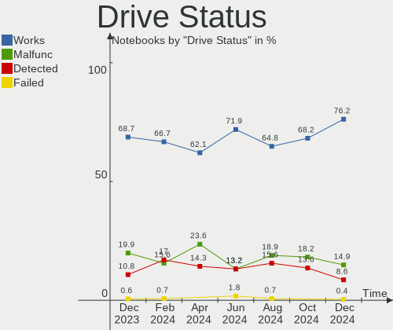
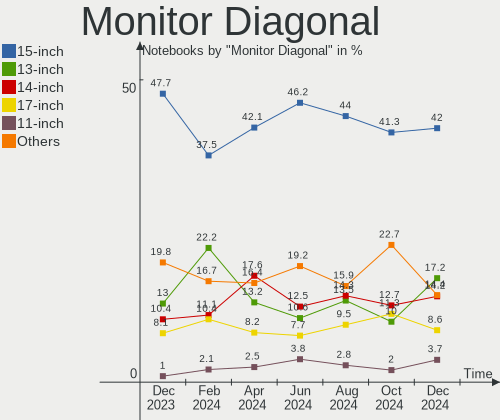
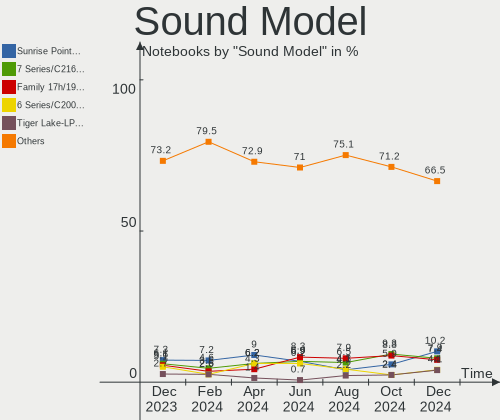

OpenMandriva - Hardware Trends (Notebooks)
------------------------------------------

A project to identify most popular hardware characteristics and track their change
over time based on data collected by Linux users at https://Linux-Hardware.org.

Anyone can contribute to this report by the [hw-probe](https://github.com/linuxhw/hw-probe) tool:

    sudo -E hw-probe -all -upload

This report is for one last month. Overall report since the beginning of time: [TestCoverage](https://github.com/linuxhw/TestCoverage)

Period: Sep, 2022.

Contents
--------

* [ System ](#system)
  - [ OS                       ](#os)
  - [ OS Family                ](#os-family)
  - [ Kernel                   ](#kernel)
  - [ Kernel Family            ](#kernel-family)
  - [ Kernel Major Ver.        ](#kernel-major-ver)
  - [ Arch                     ](#arch)
  - [ DE                       ](#de)
  - [ Display Server           ](#display-server)
  - [ Display Manager          ](#display-manager)
  - [ OS Lang                  ](#os-lang)
  - [ Boot Mode                ](#boot-mode)
  - [ Filesystem               ](#filesystem)
  - [ Part. scheme             ](#part-scheme)
  - [ Dual Boot with Linux/BSD ](#dual-boot-with-linuxbsd)
  - [ Dual Boot (Win)          ](#dual-boot-win)

* [ Board ](#board)
  - [ Vendor                   ](#vendor)
  - [ Model                    ](#model)
  - [ Model Family             ](#model-family)
  - [ MFG Year                 ](#mfg-year)
  - [ Form Factor              ](#form-factor)
  - [ Secure Boot              ](#secure-boot)
  - [ Coreboot                 ](#coreboot)
  - [ RAM Size                 ](#ram-size)
  - [ RAM Used                 ](#ram-used)
  - [ Total Drives             ](#total-drives)
  - [ Has CD-ROM               ](#has-cd-rom)
  - [ Has Ethernet             ](#has-ethernet)
  - [ Has WiFi                 ](#has-wifi)
  - [ Has Bluetooth            ](#has-bluetooth)

* [ Location ](#location)
  - [ Country                  ](#country)
  - [ City                     ](#city)

* [ Drives ](#drives)
  - [ Drive Vendor             ](#drive-vendor)
  - [ Drive Model              ](#drive-model)
  - [ HDD Vendor               ](#hdd-vendor)
  - [ SSD Vendor               ](#ssd-vendor)
  - [ Drive Kind               ](#drive-kind)
  - [ Drive Connector          ](#drive-connector)
  - [ Drive Size               ](#drive-size)
  - [ Space Total              ](#space-total)
  - [ Space Used               ](#space-used)
  - [ Malfunc. Drives          ](#malfunc-drives)
  - [ Malfunc. Drive Vendor    ](#malfunc-drive-vendor)
  - [ Malfunc. HDD Vendor      ](#malfunc-hdd-vendor)
  - [ Malfunc. Drive Kind      ](#malfunc-drive-kind)
  - [ Failed Drives            ](#failed-drives)
  - [ Failed Drive Vendor      ](#failed-drive-vendor)
  - [ Drive Status             ](#drive-status)

* [ Storage controller ](#storage-controller)
  - [ Storage Vendor           ](#storage-vendor)
  - [ Storage Model            ](#storage-model)
  - [ Storage Kind             ](#storage-kind)

* [ Processor ](#processor)
  - [ CPU Vendor               ](#cpu-vendor)
  - [ CPU Model                ](#cpu-model)
  - [ CPU Model Family         ](#cpu-model-family)
  - [ CPU Cores                ](#cpu-cores)
  - [ CPU Sockets              ](#cpu-sockets)
  - [ CPU Threads              ](#cpu-threads)
  - [ CPU Op-Modes             ](#cpu-op-modes)
  - [ CPU Microcode            ](#cpu-microcode)
  - [ CPU Microarch            ](#cpu-microarch)

* [ Graphics ](#graphics)
  - [ GPU Vendor               ](#gpu-vendor)
  - [ GPU Model                ](#gpu-model)
  - [ GPU Combo                ](#gpu-combo)
  - [ GPU Driver               ](#gpu-driver)
  - [ GPU Memory               ](#gpu-memory)

* [ Monitor ](#monitor)
  - [ Monitor Vendor           ](#monitor-vendor)
  - [ Monitor Model            ](#monitor-model)
  - [ Monitor Resolution       ](#monitor-resolution)
  - [ Monitor Diagonal         ](#monitor-diagonal)
  - [ Monitor Width            ](#monitor-width)
  - [ Aspect Ratio             ](#aspect-ratio)
  - [ Monitor Area             ](#monitor-area)
  - [ Pixel Density            ](#pixel-density)
  - [ Multiple Monitors        ](#multiple-monitors)

* [ Network ](#network)
  - [ Net Controller Vendor    ](#net-controller-vendor)
  - [ Net Controller Model     ](#net-controller-model)
  - [ Wireless Vendor          ](#wireless-vendor)
  - [ Wireless Model           ](#wireless-model)
  - [ Ethernet Vendor          ](#ethernet-vendor)
  - [ Ethernet Model           ](#ethernet-model)
  - [ Net Controller Kind      ](#net-controller-kind)
  - [ Used Controller          ](#used-controller)
  - [ NICs                     ](#nics)
  - [ IPv6                     ](#ipv6)

* [ Bluetooth ](#bluetooth)
  - [ Bluetooth Vendor         ](#bluetooth-vendor)
  - [ Bluetooth Model          ](#bluetooth-model)

* [ Sound ](#sound)
  - [ Sound Vendor             ](#sound-vendor)
  - [ Sound Model              ](#sound-model)

* [ Memory ](#memory)
  - [ Memory Vendor            ](#memory-vendor)
  - [ Memory Model             ](#memory-model)
  - [ Memory Kind              ](#memory-kind)
  - [ Memory Form Factor       ](#memory-form-factor)
  - [ Memory Size              ](#memory-size)
  - [ Memory Speed             ](#memory-speed)

* [ Printers & scanners ](#printers--scanners)
  - [ Printer Vendor           ](#printer-vendor)
  - [ Printer Model            ](#printer-model)
  - [ Scanner Vendor           ](#scanner-vendor)
  - [ Scanner Model            ](#scanner-model)

* [ Camera ](#camera)
  - [ Camera Vendor            ](#camera-vendor)
  - [ Camera Model             ](#camera-model)

* [ Security ](#security)
  - [ Fingerprint Vendor       ](#fingerprint-vendor)
  - [ Fingerprint Model        ](#fingerprint-model)
  - [ Chipcard Vendor          ](#chipcard-vendor)
  - [ Chipcard Model           ](#chipcard-model)

* [ Unsupported ](#unsupported)
  - [ Unsupported Devices      ](#unsupported-devices)
  - [ Unsupported Device Types ](#unsupported-device-types)

System
------

OS
--

Installed operating systems

| Name              | Notebooks | Percent |
|-------------------|-----------|---------|
| OpenMandriva 4.3  | 149       | 72.68%  |
| OpenMandriva 4.50 | 33        | 16.1%   |
| OpenMandriva 4.90 | 14        | 6.83%   |
| OpenMandriva 4.2  | 9         | 4.39%   |

OS Family
---------

OS without a version

| Name         | Notebooks | Percent |
|--------------|-----------|---------|
| OpenMandriva | 205       | 100%    |

Kernel
------

Version of the Linux kernel

| Version                     | Notebooks | Percent |
|-----------------------------|-----------|---------|
| 5.16.7-desktop-1omv4003     | 146       | 71.22%  |
| 5.19.5-desktop-1omv4090     | 32        | 15.61%  |
| 5.10.14-desktop-1omv4002    | 9         | 4.39%   |
| 5.18.12-desktop-3omv4090    | 8         | 3.9%    |
| 5.19.1-desktop-1omv4090     | 3         | 1.46%   |
| 5.16.13-desktop-1omv4003    | 3         | 1.46%   |
| 5.19.3-desktop-1omv4090     | 1         | 0.49%   |
| 5.19.11-desktop-2omv4090    | 1         | 0.49%   |
| 5.18.9-desktop-gcc-1omv4090 | 1         | 0.49%   |
| 5.14.14-desktop-1omv4050    | 1         | 0.49%   |

Kernel Family
-------------

Linux kernel without a distro release

| Version | Notebooks | Percent |
|---------|-----------|---------|
| 5.16.7  | 146       | 71.22%  |
| 5.19.5  | 32        | 15.61%  |
| 5.10.14 | 9         | 4.39%   |
| 5.18.12 | 8         | 3.9%    |
| 5.19.1  | 3         | 1.46%   |
| 5.16.13 | 3         | 1.46%   |
| 5.19.3  | 1         | 0.49%   |
| 5.19.11 | 1         | 0.49%   |
| 5.18.9  | 1         | 0.49%   |
| 5.14.14 | 1         | 0.49%   |

Kernel Major Ver.
-----------------

Linux kernel major version

| Version | Notebooks | Percent |
|---------|-----------|---------|
| 5.16    | 149       | 72.68%  |
| 5.19    | 37        | 18.05%  |
| 5.18    | 9         | 4.39%   |
| 5.10    | 9         | 4.39%   |
| 5.14    | 1         | 0.49%   |

Arch
----

OS architecture (x86_64, i586, etc.)

| Name   | Notebooks | Percent |
|--------|-----------|---------|
| x86_64 | 205       | 100%    |

DE
--

Desktop Environment

| Name    | Notebooks | Percent |
|---------|-----------|---------|
| KDE5    | 203       | 99.02%  |
| Budgie  | 1         | 0.49%   |
| Unknown | 1         | 0.49%   |

Display Server
--------------

X11 or Wayland

| Name | Notebooks | Percent |
|------|-----------|---------|
| X11  | 205       | 100%    |

Display Manager
---------------

SDDM, LightDM, etc.

| Name    | Notebooks | Percent |
|---------|-----------|---------|
| SDDM    | 204       | 99.51%  |
| LightDM | 1         | 0.49%   |

OS Lang
-------

Language

| Lang  | Notebooks | Percent |
|-------|-----------|---------|
| en_US | 127       | 61.95%  |
| ru_RU | 12        | 5.85%   |
| pt_BR | 11        | 5.37%   |
| fr_FR | 10        | 4.88%   |
| pl_PL | 9         | 4.39%   |
| de_DE | 9         | 4.39%   |
| en_GB | 7         | 3.41%   |
| pt_PT | 3         | 1.46%   |
| cs_CZ | 3         | 1.46%   |
| ro_RO | 2         | 0.98%   |
| it_IT | 2         | 0.98%   |
| es_ES | 2         | 0.98%   |
| es_AR | 2         | 0.98%   |
| tr_TR | 1         | 0.49%   |
| fr_CH | 1         | 0.49%   |
| fr_BE | 1         | 0.49%   |
| es_MX | 1         | 0.49%   |
| es_CL | 1         | 0.49%   |
| de_AT | 1         | 0.49%   |

Boot Mode
---------

EFI or BIOS

| Mode | Notebooks | Percent |
|------|-----------|---------|
| EFI  | 125       | 60.98%  |
| BIOS | 80        | 39.02%  |

Filesystem
----------

Type of filesystem

| Type    | Notebooks | Percent |
|---------|-----------|---------|
| Overlay | 152       | 74.15%  |
| Ext4    | 53        | 25.85%  |

Part. scheme
------------

Scheme of partitioning

| Type | Notebooks | Percent |
|------|-----------|---------|
| GPT  | 149       | 72.68%  |
| MBR  | 56        | 27.32%  |

Dual Boot with Linux/BSD
------------------------

Hosting more than one Linux/BSD

| Dual boot | Notebooks | Percent |
|-----------|-----------|---------|
| No        | 113       | 55.12%  |
| Yes       | 92        | 44.88%  |

Dual Boot (Win)
---------------

Hosting Linux and Windows

| Dual boot | Notebooks | Percent |
|-----------|-----------|---------|
| No        | 116       | 56.59%  |
| Yes       | 89        | 43.41%  |

Board
-----

Vendor
------

Motherboard manufacturer

| Name                | Notebooks | Percent |
|---------------------|-----------|---------|
| Dell                | 46        | 22.44%  |
| Lenovo              | 40        | 19.51%  |
| Hewlett-Packard     | 35        | 17.07%  |
| ASUSTek Computer    | 18        | 8.78%   |
| Toshiba             | 15        | 7.32%   |
| Acer                | 13        | 6.34%   |
| Samsung Electronics | 6         | 2.93%   |
| Sony                | 4         | 1.95%   |
| Positivo            | 4         | 1.95%   |
| Apple               | 4         | 1.95%   |
| Packard Bell        | 2         | 0.98%   |
| NEC Computers       | 2         | 0.98%   |
| MSI                 | 2         | 0.98%   |
| LG Electronics      | 2         | 0.98%   |
| Fujitsu             | 2         | 0.98%   |
| Valve               | 1         | 0.49%   |
| UMAX                | 1         | 0.49%   |
| Timi                | 1         | 0.49%   |
| Medion              | 1         | 0.49%   |
| Jumper              | 1         | 0.49%   |
| HUAWEI              | 1         | 0.49%   |
| Getac               | 1         | 0.49%   |
| Compal              | 1         | 0.49%   |
| Chuwi               | 1         | 0.49%   |
| CCE                 | 1         | 0.49%   |

Model
-----

Motherboard model

| Name                                     | Notebooks | Percent |
|------------------------------------------|-----------|---------|
| Dell Latitude 3310                       | 9         | 4.39%   |
| Toshiba dynabook T653/46JR               | 4         | 1.95%   |
| Lenovo IdeaPad 1 14ADA05 82GW            | 3         | 1.46%   |
| HP Notebook                              | 3         | 1.46%   |
| Toshiba Satellite C660                   | 2         | 0.98%   |
| HP ProBook 450 G1                        | 2         | 0.98%   |
| HP Laptop 14s-fq1xxx                     | 2         | 0.98%   |
| HP 250 G5 Notebook PC                    | 2         | 0.98%   |
| Dell XPS 15 9530                         | 2         | 0.98%   |
| Dell Latitude E4300                      | 2         | 0.98%   |
| Dell Latitude 3300                       | 2         | 0.98%   |
| Dell Latitude 3120                       | 2         | 0.98%   |
| Dell Inspiron 3451                       | 2         | 0.98%   |
| Dell G5 5505                             | 2         | 0.98%   |
| ASUS VivoBook_ASUSLaptop X515EA_X515EA   | 2         | 0.98%   |
| ASUS UX31E                               | 2         | 0.98%   |
| Acer Nitro AN515-31                      | 2         | 0.98%   |
| Valve Jupiter                            | 1         | 0.49%   |
| UMAX VisionBook 14Wr Plus                | 1         | 0.49%   |
| Toshiba TECRA S10                        | 1         | 0.49%   |
| Toshiba Satellite P845T                  | 1         | 0.49%   |
| Toshiba Satellite L55-B                  | 1         | 0.49%   |
| Toshiba Satellite L505                   | 1         | 0.49%   |
| Toshiba Satellite C850-1LK               | 1         | 0.49%   |
| Toshiba Satellite C75D-B                 | 1         | 0.49%   |
| Toshiba Satellite C655                   | 1         | 0.49%   |
| Toshiba Satellite C55-A-157              | 1         | 0.49%   |
| Toshiba PORTEGE Z30-A                    | 1         | 0.49%   |
| Timi TM1612                              | 1         | 0.49%   |
| Sony VPCSB3X9E                           | 1         | 0.49%   |
| Sony VPCEH2D0E                           | 1         | 0.49%   |
| Sony VPCEH1S1R                           | 1         | 0.49%   |
| Sony VGN-FZ31Z                           | 1         | 0.49%   |
| Samsung SX60P                            | 1         | 0.49%   |
| Samsung RC420/RC520/RC720                | 1         | 0.49%   |
| Samsung R530/R730/R540                   | 1         | 0.49%   |
| Samsung R530/R730                        | 1         | 0.49%   |
| Samsung 3570R/370R/470R/450R/510R/4450RV | 1         | 0.49%   |
| Samsung 300E5M/300E5L                    | 1         | 0.49%   |
| Positivo SW6H                            | 1         | 0.49%   |

Model Family
------------

Motherboard model prefix

| Name              | Notebooks | Percent |
|-------------------|-----------|---------|
| Dell Latitude     | 26        | 12.68%  |
| Lenovo ThinkPad   | 14        | 6.83%   |
| Lenovo IdeaPad    | 14        | 6.83%   |
| HP Laptop         | 11        | 5.37%   |
| Toshiba Satellite | 9         | 4.39%   |
| Acer Aspire       | 9         | 4.39%   |
| Dell Inspiron     | 8         | 3.9%    |
| HP ProBook        | 5         | 2.44%   |
| ASUS VivoBook     | 5         | 2.44%   |
| Toshiba dynabook  | 4         | 1.95%   |
| HP Pavilion       | 4         | 1.95%   |
| HP Compaq         | 4         | 1.95%   |
| Dell XPS          | 4         | 1.95%   |
| HP Notebook       | 3         | 1.46%   |
| Dell Vostro       | 3         | 1.46%   |
| Dell Precision    | 3         | 1.46%   |
| Samsung R530      | 2         | 0.98%   |
| Lenovo ThinkBook  | 2         | 0.98%   |
| HP 250            | 2         | 0.98%   |
| Fujitsu LIFEBOOK  | 2         | 0.98%   |
| Dell G5           | 2         | 0.98%   |
| ASUS UX31E        | 2         | 0.98%   |
| Acer Nitro        | 2         | 0.98%   |
| Valve Jupiter     | 1         | 0.49%   |
| UMAX VisionBook   | 1         | 0.49%   |
| Toshiba TECRA     | 1         | 0.49%   |
| Toshiba PORTEGE   | 1         | 0.49%   |
| Timi TM1612       | 1         | 0.49%   |
| Sony VPCSB3X9E    | 1         | 0.49%   |
| Sony VPCEH2D0E    | 1         | 0.49%   |
| Sony VPCEH1S1R    | 1         | 0.49%   |
| Sony VGN-FZ31Z    | 1         | 0.49%   |
| Samsung SX60P     | 1         | 0.49%   |
| Samsung RC420     | 1         | 0.49%   |
| Samsung 3570R     | 1         | 0.49%   |
| Samsung 300E5M    | 1         | 0.49%   |
| Positivo SW6H     | 1         | 0.49%   |
| Positivo Mobile   | 1         | 0.49%   |
| Positivo H14BT58  | 1         | 0.49%   |
| Positivo C14CR21  | 1         | 0.49%   |

MFG Year
--------

Motherboard manufacture year

| Year | Notebooks | Percent |
|------|-----------|---------|
| 2019 | 24        | 11.71%  |
| 2011 | 21        | 10.24%  |
| 2014 | 18        | 8.78%   |
| 2013 | 17        | 8.29%   |
| 2020 | 16        | 7.8%    |
| 2012 | 16        | 7.8%    |
| 2010 | 15        | 7.32%   |
| 2017 | 14        | 6.83%   |
| 2021 | 13        | 6.34%   |
| 2016 | 10        | 4.88%   |
| 2018 | 9         | 4.39%   |
| 2008 | 9         | 4.39%   |
| 2015 | 8         | 3.9%    |
| 2009 | 8         | 3.9%    |
| 2007 | 4         | 1.95%   |
| 2022 | 2         | 0.98%   |
| 2006 | 1         | 0.49%   |

Form Factor
-----------

Physical design of the computer

| Name     | Notebooks | Percent |
|----------|-----------|---------|
| Notebook | 205       | 100%    |

Secure Boot
-----------

Enabled or disabled

| State    | Notebooks | Percent |
|----------|-----------|---------|
| Disabled | 205       | 100%    |

Coreboot
--------

Have coreboot on board

| Used | Notebooks | Percent |
|------|-----------|---------|
| No   | 204       | 99.51%  |
| Yes  | 1         | 0.49%   |

RAM Size
--------

Total RAM memory

| Size in GB | Notebooks | Percent |
|------------|-----------|---------|
| 4.01-8.0   | 79        | 38.54%  |
| 3.01-4.0   | 72        | 35.12%  |
| 8.01-16.0  | 23        | 11.22%  |
| 16.01-24.0 | 15        | 7.32%   |
| 1.01-2.0   | 7         | 3.41%   |
| 2.01-3.0   | 5         | 2.44%   |
| 32.01-64.0 | 3         | 1.46%   |
| 0.51-1.0   | 1         | 0.49%   |

RAM Used
--------

Used RAM memory

| Used GB  | Notebooks | Percent |
|----------|-----------|---------|
| 1.01-2.0 | 162       | 79.02%  |
| 0.51-1.0 | 26        | 12.68%  |
| 2.01-3.0 | 12        | 5.85%   |
| 0.01-0.5 | 3         | 1.46%   |
| 4.01-8.0 | 1         | 0.49%   |
| 3.01-4.0 | 1         | 0.49%   |

Total Drives
------------

Number of drives on board

| Drives | Notebooks | Percent |
|--------|-----------|---------|
| 1      | 155       | 75.61%  |
| 2      | 41        | 20%     |
| 3      | 6         | 2.93%   |
| 0      | 3         | 1.46%   |

Has CD-ROM
----------

Has CD-ROM on board

| Presented | Notebooks | Percent |
|-----------|-----------|---------|
| No        | 114       | 55.61%  |
| Yes       | 91        | 44.39%  |

Has Ethernet
------------

Has Ethernet on board

| Presented | Notebooks | Percent |
|-----------|-----------|---------|
| Yes       | 173       | 84.39%  |
| No        | 32        | 15.61%  |

Has WiFi
--------

Has WiFi module

| Presented | Notebooks | Percent |
|-----------|-----------|---------|
| Yes       | 205       | 100%    |

Has Bluetooth
-------------

Has Bluetooth module

| Presented | Notebooks | Percent |
|-----------|-----------|---------|
| Yes       | 149       | 72.68%  |
| No        | 56        | 27.32%  |

Location
--------

Country
-------

Geographic location (country)

| Country               | Notebooks | Percent |
|-----------------------|-----------|---------|
| USA                   | 23        | 11.22%  |
| Brazil                | 20        | 9.76%   |
| Russia                | 15        | 7.32%   |
| Netherlands           | 15        | 7.32%   |
| Poland                | 14        | 6.83%   |
| Germany               | 14        | 6.83%   |
| UK                    | 11        | 5.37%   |
| France                | 10        | 4.88%   |
| Romania               | 6         | 2.93%   |
| Portugal              | 6         | 2.93%   |
| Japan                 | 6         | 2.93%   |
| Spain                 | 5         | 2.44%   |
| Czechia               | 5         | 2.44%   |
| Italy                 | 4         | 1.95%   |
| Indonesia             | 4         | 1.95%   |
| Switzerland           | 3         | 1.46%   |
| India                 | 3         | 1.46%   |
| Austria               | 3         | 1.46%   |
| Argentina             | 3         | 1.46%   |
| Ukraine               | 2         | 0.98%   |
| South Africa          | 2         | 0.98%   |
| Slovakia              | 2         | 0.98%   |
| Mexico                | 2         | 0.98%   |
| Greece                | 2         | 0.98%   |
| Finland               | 2         | 0.98%   |
| Colombia              | 2         | 0.98%   |
| Turkey                | 1         | 0.49%   |
| South Korea           | 1         | 0.49%   |
| Slovenia              | 1         | 0.49%   |
| Saudi Arabia          | 1         | 0.49%   |
| Republic of the Congo | 1         | 0.49%   |
| Puerto Rico           | 1         | 0.49%   |
| Peru                  | 1         | 0.49%   |
| Panama                | 1         | 0.49%   |
| Lithuania             | 1         | 0.49%   |
| Israel                | 1         | 0.49%   |
| Iran                  | 1         | 0.49%   |
| Hong Kong             | 1         | 0.49%   |
| Estonia               | 1         | 0.49%   |
| DR Congo              | 1         | 0.49%   |

City
----

Geographic location (city)

| City                | Notebooks | Percent |
|---------------------|-----------|---------|
| Schagen             | 15        | 7.32%   |
| Paris               | 4         | 1.95%   |
| Moscow              | 4         | 1.95%   |
| Warsaw              | 3         | 1.46%   |
| Munich              | 3         | 1.46%   |
| Falkirk             | 3         | 1.46%   |
| Cascais             | 3         | 1.46%   |
| Vienna              | 2         | 0.98%   |
| Thessaloniki        | 2         | 0.98%   |
| Semarang            | 2         | 0.98%   |
| Rio de Janeiro      | 2         | 0.98%   |
| Mława              | 2         | 0.98%   |
| Madrid              | 2         | 0.98%   |
| Krakow              | 2         | 0.98%   |
| Cluj-Napoca         | 2         | 0.98%   |
| Campo Grande        | 2         | 0.98%   |
| Buenos Aires        | 2         | 0.98%   |
| Zurich              | 1         | 0.49%   |
| Wola Rzedzinska     | 1         | 0.49%   |
| Wałbrzych          | 1         | 0.49%   |
| Valparaiso de Goias | 1         | 0.49%   |
| Ufa                 | 1         | 0.49%   |
| Tsuchiura           | 1         | 0.49%   |
| Trenton             | 1         | 0.49%   |
| Tijuana             | 1         | 0.49%   |
| Tehran              | 1         | 0.49%   |
| Targu Neamt         | 1         | 0.49%   |
| Taito               | 1         | 0.49%   |
| Syktyvkar           | 1         | 0.49%   |
| Surat               | 1         | 0.49%   |
| Surabaya            | 1         | 0.49%   |
| Sumaré             | 1         | 0.49%   |
| Stenovice           | 1         | 0.49%   |
| Solingen            | 1         | 0.49%   |
| Simferopol          | 1         | 0.49%   |
| Sidrolandia         | 1         | 0.49%   |
| Seattle             | 1         | 0.49%   |
| Schwerin            | 1         | 0.49%   |
| Sassnitz            | 1         | 0.49%   |
| Sao Paulo           | 1         | 0.49%   |

Drives
------

Drive Vendor
------------

Hard drive vendors

| Vendor              | Notebooks | Drives | Percent |
|---------------------|-----------|--------|---------|
| WDC                 | 36        | 37     | 15.13%  |
| Samsung Electronics | 26        | 27     | 10.92%  |
| SK hynix            | 19        | 19     | 7.98%   |
| Seagate             | 19        | 19     | 7.98%   |
| Toshiba             | 18        | 18     | 7.56%   |
| Kingston            | 15        | 15     | 6.3%    |
| SanDisk             | 14        | 14     | 5.88%   |
| Unknown             | 13        | 13     | 5.46%   |
| Hitachi             | 13        | 13     | 5.46%   |
| KIOXIA              | 7         | 7      | 2.94%   |
| A-DATA Technology   | 5         | 5      | 2.1%    |
| PNY                 | 4         | 4      | 1.68%   |
| Micron Technology   | 4         | 4      | 1.68%   |
| Intel               | 4         | 5      | 1.68%   |
| HGST                | 4         | 4      | 1.68%   |
| Crucial             | 4         | 5      | 1.68%   |
| China               | 4         | 4      | 1.68%   |
| Unknown             | 4         | 4      | 1.68%   |
| Transcend           | 2         | 2      | 0.84%   |
| Intenso             | 2         | 2      | 0.84%   |
| GOODRAM             | 2         | 2      | 0.84%   |
| Fujitsu             | 2         | 2      | 0.84%   |
| Biostar             | 2         | 2      | 0.84%   |
| ASMT                | 2         | 2      | 0.84%   |
| UMIS                | 1         | 1      | 0.42%   |
| Team                | 1         | 1      | 0.42%   |
| SSSTC               | 1         | 1      | 0.42%   |
| Pioneer             | 1         | 1      | 0.42%   |
| OWC                 | 1         | 1      | 0.42%   |
| NGFF                | 1         | 1      | 0.42%   |
| Lexar               | 1         | 1      | 0.42%   |
| Leven               | 1         | 1      | 0.42%   |
| Hewlett-Packard     | 1         | 1      | 0.42%   |
| Gigabyte Technology | 1         | 1      | 0.42%   |
| Emtec               | 1         | 1      | 0.42%   |
| BHT                 | 1         | 1      | 0.42%   |
| ASENNO              | 1         | 1      | 0.42%   |

Drive Model
-----------

Hard drive models

| Model                            | Notebooks | Percent |
|----------------------------------|-----------|---------|
| SK hynix BC511 NVMe 256GB        | 6         | 2.49%   |
| Toshiba MQ01ABD075 752GB         | 4         | 1.66%   |
| Seagate ST500LT012-1DG142 500GB  | 4         | 1.66%   |
| Unknown                          | 4         | 1.66%   |
| Unknown SD/MMC/MS PRO 2GB        | 3         | 1.24%   |
| Unknown MMC64G  64GB             | 3         | 1.24%   |
| Toshiba MQ01ABF050 500GB         | 3         | 1.24%   |
| Seagate ST9500325AS 500GB        | 3         | 1.24%   |
| Samsung SSD 860 EVO 250GB        | 3         | 1.24%   |
| Kingston SA400S37240G 240GB SSD  | 3         | 1.24%   |
| WDC WDS120G2G0B-00EPW0 120GB SSD | 2         | 0.83%   |
| WDC WD5000LPCX-22VHAT1 500GB     | 2         | 0.83%   |
| WDC WD5000LPCX-00VHAT0 500GB     | 2         | 0.83%   |
| WDC WD3200BEVT-22A23T0 320GB     | 2         | 0.83%   |
| Toshiba MQ01ABD100 1TB           | 2         | 0.83%   |
| Toshiba MQ01ABD050 500GB         | 2         | 0.83%   |
| SK hynix BC711 NVMe 128GB        | 2         | 0.83%   |
| SK hynix BC501 NVMe 128GB        | 2         | 0.83%   |
| SanDisk Ultra II 240GB SSD       | 2         | 0.83%   |
| SanDisk SSD U100 256GB           | 2         | 0.83%   |
| SanDisk DF4032  32GB             | 2         | 0.83%   |
| Samsung MZVLB512HBJQ-000L2 512GB | 2         | 0.83%   |
| KIOXIA KBG40ZNV512G 512GB        | 2         | 0.83%   |
| KIOXIA KBG40ZNV1T02 1TB          | 2         | 0.83%   |
| KIOXIA KBG40ZNS256G NVMe 256GB   | 2         | 0.83%   |
| Kingston SUV500MS480G 480GB SSD  | 2         | 0.83%   |
| Kingston SA400S37120G 120GB SSD  | 2         | 0.83%   |
| Hitachi HTS725032A7E630 320GB    | 2         | 0.83%   |
| Hitachi HTS547550A9E384 500GB    | 2         | 0.83%   |
| Hitachi HTS545032B9A300 320GB    | 2         | 0.83%   |
| HGST HTS541010A9E680 1TB         | 2         | 0.83%   |
| Crucial CT240BX500SSD1 240GB     | 2         | 0.83%   |
| China SSD 120GB                  | 2         | 0.83%   |
| WDC WDS240G2G0B-00EPW0 240GB SSD | 1         | 0.41%   |
| WDC WDS240G2G0A-00JH30 240GB SSD | 1         | 0.41%   |
| WDC WDS120G2G0A-00JH30 120GB SSD | 1         | 0.41%   |
| WDC WD5000LPVX-75V0TT0 500GB     | 1         | 0.41%   |
| WDC WD5000LPVX-22V0TT0 500GB     | 1         | 0.41%   |
| WDC WD5000LPVT-08G33T1 500GB     | 1         | 0.41%   |
| WDC WD5000BEVT-22ZAT0 500GB      | 1         | 0.41%   |

HDD Vendor
----------

Hard disk drive vendors

| Vendor              | Notebooks | Drives | Percent |
|---------------------|-----------|--------|---------|
| WDC                 | 25        | 25     | 29.76%  |
| Toshiba             | 16        | 16     | 19.05%  |
| Seagate             | 16        | 16     | 19.05%  |
| Hitachi             | 13        | 13     | 15.48%  |
| Samsung Electronics | 4         | 4      | 4.76%   |
| HGST                | 4         | 4      | 4.76%   |
| Unknown             | 3         | 3      | 3.57%   |
| Fujitsu             | 2         | 2      | 2.38%   |
| ASMT                | 1         | 1      | 1.19%   |

SSD Vendor
----------

Solid state drive vendors

| Vendor              | Notebooks | Drives | Percent |
|---------------------|-----------|--------|---------|
| Samsung Electronics | 13        | 13     | 15.48%  |
| Kingston            | 13        | 13     | 15.48%  |
| SanDisk             | 11        | 11     | 13.1%   |
| WDC                 | 5         | 5      | 5.95%   |
| PNY                 | 4         | 4      | 4.76%   |
| Crucial             | 4         | 5      | 4.76%   |
| China               | 4         | 4      | 4.76%   |
| A-DATA Technology   | 4         | 4      | 4.76%   |
| SK hynix            | 3         | 3      | 3.57%   |
| Transcend           | 2         | 2      | 2.38%   |
| Toshiba             | 2         | 2      | 2.38%   |
| Intel               | 2         | 2      | 2.38%   |
| GOODRAM             | 2         | 2      | 2.38%   |
| Unknown             | 2         | 2      | 2.38%   |
| Pioneer             | 1         | 1      | 1.19%   |
| OWC                 | 1         | 1      | 1.19%   |
| NGFF                | 1         | 1      | 1.19%   |
| Micron Technology   | 1         | 1      | 1.19%   |
| Lexar               | 1         | 1      | 1.19%   |
| Leven               | 1         | 1      | 1.19%   |
| Intenso             | 1         | 1      | 1.19%   |
| Hewlett-Packard     | 1         | 1      | 1.19%   |
| Emtec               | 1         | 1      | 1.19%   |
| Biostar             | 1         | 1      | 1.19%   |
| BHT                 | 1         | 1      | 1.19%   |
| ASMT                | 1         | 1      | 1.19%   |
| ASENNO              | 1         | 1      | 1.19%   |

Drive Kind
----------

HDD or SSD

| Kind    | Notebooks | Drives | Percent |
|---------|-----------|--------|---------|
| HDD     | 83        | 84     | 35.62%  |
| SSD     | 80        | 85     | 34.33%  |
| NVMe    | 51        | 54     | 21.89%  |
| MMC     | 15        | 15     | 6.44%   |
| Unknown | 4         | 4      | 1.72%   |

Drive Connector
---------------

SATA, SAS, NVMe, etc.

| Type | Notebooks | Drives | Percent |
|------|-----------|--------|---------|
| SATA | 146       | 161    | 65.77%  |
| NVMe | 51        | 54     | 22.97%  |
| MMC  | 15        | 15     | 6.76%   |
| SAS  | 10        | 12     | 4.5%    |

Drive Size
----------

Size of hard drive

| Size in TB | Notebooks | Drives | Percent |
|------------|-----------|--------|---------|
| 0.01-0.5   | 127       | 141    | 82.47%  |
| 0.51-1.0   | 27        | 28     | 17.53%  |

Space Total
-----------

Amount of disk space available on the file system

| Size in GB     | Notebooks | Percent |
|----------------|-----------|---------|
| 1-20           | 114       | 55.61%  |
| 101-250        | 37        | 18.05%  |
| 251-500        | 25        | 12.2%   |
| 21-50          | 7         | 3.41%   |
| 501-1000       | 7         | 3.41%   |
| Unknown        | 6         | 2.93%   |
| 51-100         | 5         | 2.44%   |
| 1001-2000      | 3         | 1.46%   |
| More than 3000 | 1         | 0.49%   |

Space Used
----------

Amount of used disk space

| Used GB   | Notebooks | Percent |
|-----------|-----------|---------|
| 1-20      | 183       | 89.27%  |
| 21-50     | 7         | 3.41%   |
| Unknown   | 6         | 2.93%   |
| 101-250   | 3         | 1.46%   |
| 51-100    | 3         | 1.46%   |
| 501-1000  | 2         | 0.98%   |
| 2001-3000 | 1         | 0.49%   |

Malfunc. Drives
---------------

Drive models with a malfunction

| Model                                          | Notebooks | Drives | Percent |
|------------------------------------------------|-----------|--------|---------|
| Toshiba MQ01ABD075 752GB                       | 4         | 4      | 8.7%    |
| Toshiba MQ01ABD050 500GB                       | 2         | 2      | 4.35%   |
| Seagate ST9500325AS 500GB                      | 2         | 2      | 4.35%   |
| SanDisk SSD U100 256GB                         | 2         | 2      | 4.35%   |
| Hitachi HTS725032A7E630 320GB                  | 2         | 2      | 4.35%   |
| HGST HTS541010A9E680 1TB                       | 2         | 2      | 4.35%   |
| WDC WDS240G2G0A-00JH30 240GB SSD               | 1         | 1      | 2.17%   |
| WDC WD5000LPVX-22V0TT0 500GB                   | 1         | 1      | 2.17%   |
| WDC WD3200BEVT-22A23T0 320GB                   | 1         | 1      | 2.17%   |
| WDC WD3200BEKT-60PVMT0 320GB                   | 1         | 1      | 2.17%   |
| WDC WD2500BEVT-22A23T0 250GB                   | 1         | 1      | 2.17%   |
| WDC WD10JPVX-22JC3T0 1TB                       | 1         | 1      | 2.17%   |
| Toshiba MK6037GSX 64GB                         | 1         | 1      | 2.17%   |
| Toshiba MK5061GSYN 500GB                       | 1         | 1      | 2.17%   |
| Toshiba HDWJ110 1TB                            | 1         | 1      | 2.17%   |
| Seagate ST9500420AS 500GB                      | 1         | 1      | 2.17%   |
| Seagate ST9160314AS 160GB                      | 1         | 1      | 2.17%   |
| Seagate ST500LT012-9WS142 500GB                | 1         | 1      | 2.17%   |
| Seagate ST500LT012-1DG142 500GB                | 1         | 1      | 2.17%   |
| Seagate ST320LT007-9ZV142 320GB                | 1         | 1      | 2.17%   |
| Seagate ST320LM001 HN-M320MBB 320GB            | 1         | 1      | 2.17%   |
| SanDisk SSD U100 24GB                          | 1         | 1      | 2.17%   |
| SanDisk SSD PLUS 480GB                         | 1         | 1      | 2.17%   |
| Samsung Electronics SG9MSM6D024GPM00 24GB SSD  | 1         | 1      | 2.17%   |
| Samsung Electronics MZVLB512HAJQ-000L7 512GB   | 1         | 1      | 2.17%   |
| Samsung Electronics HM320JI 320GB              | 1         | 1      | 2.17%   |
| Samsung Electronics HM320HJ 320GB              | 1         | 1      | 2.17%   |
| PNY SSD2SC120G3LC709B121-460I 120GB            | 1         | 1      | 2.17%   |
| Micron Technology 1100_MTFDDAV256TBN 256GB SSD | 1         | 1      | 2.17%   |
| Intel SSDSCKKF256G8H 256GB                     | 1         | 1      | 2.17%   |
| Hitachi HTS723232A7A364 320GB                  | 1         | 1      | 2.17%   |
| Hitachi HTS545032B9A300 320GB                  | 1         | 1      | 2.17%   |
| Hitachi HTS543225L9SA00 250GB                  | 1         | 1      | 2.17%   |
| Hitachi HTS542512K9SA00 120GB                  | 1         | 1      | 2.17%   |
| HGST HTS545050A7E680 500GB                     | 1         | 1      | 2.17%   |
| Crucial CT240M500SSD1 240GB                    | 1         | 1      | 2.17%   |
| China SSD 120GB                                | 1         | 1      | 2.17%   |
| A-DATA Technology SU800 256GB SSD              | 1         | 1      | 2.17%   |

Malfunc. Drive Vendor
---------------------

Vendors of faulty drives

| Vendor              | Notebooks | Drives | Percent |
|---------------------|-----------|--------|---------|
| Toshiba             | 9         | 9      | 19.57%  |
| Seagate             | 8         | 8      | 17.39%  |
| WDC                 | 6         | 6      | 13.04%  |
| Hitachi             | 6         | 6      | 13.04%  |
| SanDisk             | 4         | 4      | 8.7%    |
| Samsung Electronics | 4         | 4      | 8.7%    |
| HGST                | 3         | 3      | 6.52%   |
| PNY                 | 1         | 1      | 2.17%   |
| Micron Technology   | 1         | 1      | 2.17%   |
| Intel               | 1         | 1      | 2.17%   |
| Crucial             | 1         | 1      | 2.17%   |
| China               | 1         | 1      | 2.17%   |
| A-DATA Technology   | 1         | 1      | 2.17%   |

Malfunc. HDD Vendor
-------------------

Vendors of faulty HDD drives

| Vendor              | Notebooks | Drives | Percent |
|---------------------|-----------|--------|---------|
| Toshiba             | 9         | 9      | 27.27%  |
| Seagate             | 8         | 8      | 24.24%  |
| Hitachi             | 6         | 6      | 18.18%  |
| WDC                 | 5         | 5      | 15.15%  |
| HGST                | 3         | 3      | 9.09%   |
| Samsung Electronics | 2         | 2      | 6.06%   |

Malfunc. Drive Kind
-------------------

Kinds of faulty drives

| Kind | Notebooks | Drives | Percent |
|------|-----------|--------|---------|
| HDD  | 33        | 33     | 71.74%  |
| SSD  | 12        | 12     | 26.09%  |
| NVMe | 1         | 1      | 2.17%   |

Failed Drives
-------------

Failed drive models

| Model                         | Notebooks | Drives | Percent |
|-------------------------------|-----------|--------|---------|
| WDC WD5000BEVT-22ZAT0 500GB   | 1         | 1      | 50%     |
| Hitachi HTS545050A7E380 500GB | 1         | 1      | 50%     |

Failed Drive Vendor
-------------------

Failed drive vendors

| Vendor  | Notebooks | Drives | Percent |
|---------|-----------|--------|---------|
| WDC     | 1         | 1      | 50%     |
| Hitachi | 1         | 1      | 50%     |

Drive Status
------------

Number of failed and malfunc. drives

| Status   | Notebooks | Drives | Percent |
|----------|-----------|--------|---------|
| Works    | 150       | 166    | 67.57%  |
| Malfunc  | 45        | 46     | 20.27%  |
| Detected | 25        | 28     | 11.26%  |
| Failed   | 2         | 2      | 0.9%    |

Storage controller
------------------

Storage Vendor
--------------

Storage controller vendors

| Vendor                         | Notebooks | Percent |
|--------------------------------|-----------|---------|
| Intel                          | 139       | 62.9%   |
| AMD                            | 28        | 12.67%  |
| SK hynix                       | 15        | 6.79%   |
| Samsung Electronics            | 10        | 4.52%   |
| KIOXIA                         | 7         | 3.17%   |
| SanDisk                        | 6         | 2.71%   |
| Nvidia                         | 3         | 1.36%   |
| Micron Technology              | 3         | 1.36%   |
| Silicon Motion                 | 2         | 0.9%    |
| Kingston Technology Company    | 2         | 0.9%    |
| Union Memory (Shenzhen)        | 1         | 0.45%   |
| Solid State Storage Technology | 1         | 0.45%   |
| Seagate Technology             | 1         | 0.45%   |
| Realtek Semiconductor          | 1         | 0.45%   |
| Phison Electronics             | 1         | 0.45%   |
| Marvell Technology Group       | 1         | 0.45%   |

Storage Model
-------------

Storage controller models

| Model                                                                                  | Notebooks | Percent |
|----------------------------------------------------------------------------------------|-----------|---------|
| Intel 7 Series Chipset Family 6-port SATA Controller [AHCI mode]                       | 23        | 9.47%   |
| AMD FCH SATA Controller [AHCI mode]                                                    | 23        | 9.47%   |
| Intel 6 Series/C200 Series Chipset Family 6 port Mobile SATA AHCI Controller           | 16        | 6.58%   |
| Intel Sunrise Point-LP SATA Controller [AHCI mode]                                     | 14        | 5.76%   |
| Intel 82801 Mobile SATA Controller [RAID mode]                                         | 13        | 5.35%   |
| Intel 82801IBM/IEM (ICH9M/ICH9M-E) 4 port SATA Controller [AHCI mode]                  | 11        | 4.53%   |
| SK hynix BC511                                                                         | 7         | 2.88%   |
| Intel 8 Series/C220 Series Chipset Family 6-port SATA Controller 1 [AHCI mode]         | 7         | 2.88%   |
| Samsung NVMe SSD Controller SM981/PM981/PM983                                          | 6         | 2.47%   |
| KIOXIA NVMe SSD Controller BG4                                                         | 6         | 2.47%   |
| Intel Wildcat Point-LP SATA Controller [AHCI Mode]                                     | 6         | 2.47%   |
| Intel Celeron/Pentium Silver Processor SATA Controller                                 | 6         | 2.47%   |
| Intel Tiger Lake-LP SATA Controller                                                    | 5         | 2.06%   |
| Intel 82801HM/HEM (ICH8M/ICH8M-E) SATA Controller [AHCI mode]                          | 5         | 2.06%   |
| Intel 82801HM/HEM (ICH8M/ICH8M-E) IDE Controller                                       | 5         | 2.06%   |
| SK hynix Gold P31 SSD                                                                  | 4         | 1.65%   |
| Intel Volume Management Device NVMe RAID Controller                                    | 4         | 1.65%   |
| Intel Atom Processor E3800 Series SATA AHCI Controller                                 | 4         | 1.65%   |
| Intel 5 Series/3400 Series Chipset 6 port SATA AHCI Controller                         | 4         | 1.65%   |
| Intel 5 Series/3400 Series Chipset 4 port SATA AHCI Controller                         | 4         | 1.65%   |
| SK hynix BC501 NVMe Solid State Drive                                                  | 3         | 1.23%   |
| Samsung NVMe SSD Controller 980                                                        | 3         | 1.23%   |
| Micron Non-Volatile memory controller                                                  | 3         | 1.23%   |
| Intel 8 Series SATA Controller 1 [AHCI mode]                                           | 3         | 1.23%   |
| Intel 7 Series Chipset Family 4-port SATA Controller [IDE mode]                        | 3         | 1.23%   |
| Intel 7 Series Chipset Family 2-port SATA Controller [IDE mode]                        | 3         | 1.23%   |
| Silicon Motion SM2263EN/SM2263XT SSD Controller                                        | 2         | 0.82%   |
| SanDisk WD PC SN810 / Black SN850 NVMe SSD                                             | 2         | 0.82%   |
| SanDisk WD Blue SN550 NVMe SSD                                                         | 2         | 0.82%   |
| SanDisk PC SN520 NVMe SSD                                                              | 2         | 0.82%   |
| Intel Non-Volatile memory controller                                                   | 2         | 0.82%   |
| Intel Cannon Lake Mobile PCH SATA AHCI Controller                                      | 2         | 0.82%   |
| Intel Atom/Celeron/Pentium Processor x5-E8000/J3xxx/N3xxx Series SATA Controller       | 2         | 0.82%   |
| Intel 6 Series/C200 Series Chipset Family Mobile SATA Controller (IDE mode, ports 4-5) | 2         | 0.82%   |
| Intel 6 Series/C200 Series Chipset Family Mobile SATA Controller (IDE mode, ports 0-3) | 2         | 0.82%   |
| AMD SB7x0/SB8x0/SB9x0 SATA Controller [IDE mode]                                       | 2         | 0.82%   |
| AMD SB7x0/SB8x0/SB9x0 SATA Controller [AHCI mode]                                      | 2         | 0.82%   |
| AMD SB7x0/SB8x0/SB9x0 IDE Controller                                                   | 2         | 0.82%   |
| Union Memory (Shenzhen) Non-Volatile memory controller                                 | 1         | 0.41%   |
| Solid State Storage Non-Volatile memory controller                                     | 1         | 0.41%   |

Storage Kind
------------

Kind of storage controller (IDE, SATA, NVMe, SAS, ...)

| Kind | Notebooks | Percent |
|------|-----------|---------|
| SATA | 148       | 63.25%  |
| NVMe | 51        | 21.79%  |
| IDE  | 18        | 7.69%   |
| RAID | 17        | 7.26%   |

Processor
---------

CPU Vendor
----------

Processor vendors

| Vendor | Notebooks | Percent |
|--------|-----------|---------|
| Intel  | 165       | 80.49%  |
| AMD    | 40        | 19.51%  |

CPU Model
---------

Processor models

| Model                                         | Notebooks | Percent |
|-----------------------------------------------|-----------|---------|
| Intel Core i5-8265U CPU @ 1.60GHz             | 6         | 2.93%   |
| Intel Celeron CPU N3060 @ 1.60GHz             | 5         | 2.44%   |
| Intel Core i5-8250U CPU @ 1.60GHz             | 4         | 1.95%   |
| Intel Core i5-2520M CPU @ 2.50GHz             | 4         | 1.95%   |
| Intel Core i3-8145U CPU @ 2.10GHz             | 4         | 1.95%   |
| Intel Celeron CPU 847 @ 1.10GHz               | 4         | 1.95%   |
| Intel Pentium Dual-Core CPU T4400 @ 2.20GHz   | 3         | 1.46%   |
| Intel Core i5-7200U CPU @ 2.50GHz             | 3         | 1.46%   |
| Intel Core i3-5005U CPU @ 2.00GHz             | 3         | 1.46%   |
| Intel Core 2 Duo CPU T8300 @ 2.40GHz          | 3         | 1.46%   |
| Intel Celeron CPU N2840 @ 2.16GHz             | 3         | 1.46%   |
| AMD Ryzen 7 5700U with Radeon Graphics        | 3         | 1.46%   |
| AMD Ryzen 5 3500U with Radeon Vega Mobile Gfx | 3         | 1.46%   |
| AMD 3020e with Radeon Graphics                | 3         | 1.46%   |
| Intel Pentium Silver N6000 @ 1.10GHz          | 2         | 0.98%   |
| Intel Pentium CPU B950 @ 2.10GHz              | 2         | 0.98%   |
| Intel Core i7-4712HQ CPU @ 2.30GHz            | 2         | 0.98%   |
| Intel Core i7-2677M CPU @ 1.80GHz             | 2         | 0.98%   |
| Intel Core i7-2640M CPU @ 2.80GHz             | 2         | 0.98%   |
| Intel Core i7-10510U CPU @ 1.80GHz            | 2         | 0.98%   |
| Intel Core i5-8350U CPU @ 1.70GHz             | 2         | 0.98%   |
| Intel Core i5-6300U CPU @ 2.40GHz             | 2         | 0.98%   |
| Intel Core i5-5200U CPU @ 2.20GHz             | 2         | 0.98%   |
| Intel Core i5-4200U CPU @ 1.60GHz             | 2         | 0.98%   |
| Intel Core i5-4200M CPU @ 2.50GHz             | 2         | 0.98%   |
| Intel Core i5-3320M CPU @ 2.60GHz             | 2         | 0.98%   |
| Intel Core i5-3210M CPU @ 2.50GHz             | 2         | 0.98%   |
| Intel Core i5-2410M CPU @ 2.30GHz             | 2         | 0.98%   |
| Intel Core i3-7020U CPU @ 2.30GHz             | 2         | 0.98%   |
| Intel Core i3-4000M CPU @ 2.40GHz             | 2         | 0.98%   |
| Intel Core i3-3120M CPU @ 2.50GHz             | 2         | 0.98%   |
| Intel Core i3-2365M CPU @ 1.40GHz             | 2         | 0.98%   |
| Intel Core i3-2350M CPU @ 2.30GHz             | 2         | 0.98%   |
| Intel Core i3 CPU M 380 @ 2.53GHz             | 2         | 0.98%   |
| Intel Core 2 Duo CPU P8600 @ 2.40GHz          | 2         | 0.98%   |
| Intel Celeron N4120 CPU @ 1.10GHz             | 2         | 0.98%   |
| Intel 11th Gen Core i7-1165G7 @ 2.80GHz       | 2         | 0.98%   |
| Intel 11th Gen Core i5-1135G7 @ 2.40GHz       | 2         | 0.98%   |
| AMD A6-7310 APU with AMD Radeon R4 Graphics   | 2         | 0.98%   |
| AMD A6-6310 APU with AMD Radeon R4 Graphics   | 2         | 0.98%   |

CPU Model Family
----------------

Processor model prefix

| Model                   | Notebooks | Percent |
|-------------------------|-----------|---------|
| Intel Core i5           | 50        | 24.39%  |
| Intel Core i3           | 28        | 13.66%  |
| Intel Core i7           | 25        | 12.2%   |
| Intel Celeron           | 22        | 10.73%  |
| Other                   | 14        | 6.83%   |
| Intel Core 2 Duo        | 12        | 5.85%   |
| AMD Ryzen 5             | 7         | 3.41%   |
| Intel Pentium           | 6         | 2.93%   |
| AMD A6                  | 5         | 2.44%   |
| Intel Pentium Dual-Core | 4         | 1.95%   |
| Intel Pentium Silver    | 3         | 1.46%   |
| AMD Ryzen 7             | 3         | 1.46%   |
| AMD Ryzen 3             | 3         | 1.46%   |
| AMD A10                 | 3         | 1.46%   |
| Intel Atom              | 2         | 0.98%   |
| AMD Ryzen 9             | 2         | 0.98%   |
| AMD E1                  | 2         | 0.98%   |
| Intel Pentium Dual      | 1         | 0.49%   |
| Intel Core m3           | 1         | 0.49%   |
| Intel Core 2            | 1         | 0.49%   |
| Intel Celeron M         | 1         | 0.49%   |
| Intel Celeron Dual-Core | 1         | 0.49%   |
| AMD V120                | 1         | 0.49%   |
| AMD Turion II Dual-Core | 1         | 0.49%   |
| AMD Turion 64 X2 Mobile | 1         | 0.49%   |
| AMD Sempron             | 1         | 0.49%   |
| AMD E2                  | 1         | 0.49%   |
| AMD E                   | 1         | 0.49%   |
| AMD C-60                | 1         | 0.49%   |
| AMD Athlon              | 1         | 0.49%   |
| AMD A4                  | 1         | 0.49%   |

CPU Cores
---------

Number of processor cores

| Number | Notebooks | Percent |
|--------|-----------|---------|
| 2      | 136       | 66.34%  |
| 4      | 51        | 24.88%  |
| 8      | 6         | 2.93%   |
| 6      | 6         | 2.93%   |
| 1      | 5         | 2.44%   |
| 12     | 1         | 0.49%   |

CPU Sockets
-----------

Number of sockets

| Number | Notebooks | Percent |
|--------|-----------|---------|
| 1      | 205       | 100%    |

CPU Threads
-----------

Threads per core (Hyper-Threading)

| Number | Notebooks | Percent |
|--------|-----------|---------|
| 2      | 131       | 63.9%   |
| 1      | 73        | 35.61%  |
| 8      | 1         | 0.49%   |

CPU Op-Modes
------------

CPU Operation Modes (32-bit, 64-bit)

| Op mode        | Notebooks | Percent |
|----------------|-----------|---------|
| 32-bit, 64-bit | 205       | 100%    |

CPU Microcode
-------------

Microcode number

| Number     | Notebooks | Percent |
|------------|-----------|---------|
| 0x206a7    | 28        | 13.66%  |
| 0x306a9    | 15        | 7.32%   |
| 0x806ec    | 11        | 5.37%   |
| 0x1067a    | 10        | 4.88%   |
| 0x806ea    | 8         | 3.9%    |
| 0x306c3    | 8         | 3.9%    |
| 0x806e9    | 7         | 3.41%   |
| 0x306d4    | 7         | 3.41%   |
| 0x10676    | 7         | 3.41%   |
| Unknown    | 7         | 3.41%   |
| 0x806c1    | 6         | 2.93%   |
| 0x406e3    | 6         | 2.93%   |
| 0x406c4    | 5         | 2.44%   |
| 0x20655    | 5         | 2.44%   |
| 0x08608103 | 5         | 2.44%   |
| 0x08108109 | 5         | 2.44%   |
| 0x07030105 | 5         | 2.44%   |
| 0x706a8    | 4         | 1.95%   |
| 0x30678    | 4         | 1.95%   |
| 0x20652    | 4         | 1.95%   |
| 0x40651    | 3         | 1.46%   |
| 0x08200103 | 3         | 1.46%   |
| 0x06006705 | 3         | 1.46%   |
| 0x906ea    | 2         | 0.98%   |
| 0x906c0    | 2         | 0.98%   |
| 0x706e5    | 2         | 0.98%   |
| 0x706a1    | 2         | 0.98%   |
| 0x506e3    | 2         | 0.98%   |
| 0x08600104 | 2         | 0.98%   |
| 0xa0652    | 1         | 0.49%   |
| 0x906ed    | 1         | 0.49%   |
| 0x906e9    | 1         | 0.49%   |
| 0x906a3    | 1         | 0.49%   |
| 0x806eb    | 1         | 0.49%   |
| 0x806d1    | 1         | 0.49%   |
| 0x6fd      | 1         | 0.49%   |
| 0x6fa      | 1         | 0.49%   |
| 0x6f6      | 1         | 0.49%   |
| 0x506c9    | 1         | 0.49%   |
| 0x406c3    | 1         | 0.49%   |

CPU Microarch
-------------

Microarchitecture

| Name             | Notebooks | Percent |
|------------------|-----------|---------|
| KabyLake         | 32        | 15.61%  |
| SandyBridge      | 29        | 14.15%  |
| Penryn           | 17        | 8.29%   |
| IvyBridge        | 16        | 7.8%    |
| Haswell          | 12        | 5.85%   |
| Silvermont       | 10        | 4.88%   |
| Westmere         | 9         | 4.39%   |
| Skylake          | 8         | 3.9%    |
| Broadwell        | 7         | 3.41%   |
| Zen+             | 6         | 2.93%   |
| TigerLake        | 6         | 2.93%   |
| Goldmont plus    | 6         | 2.93%   |
| Unknown          | 6         | 2.93%   |
| Puma             | 5         | 2.44%   |
| Zen              | 4         | 1.95%   |
| Excavator        | 4         | 1.95%   |
| Zen 2            | 3         | 1.46%   |
| IceLake          | 3         | 1.46%   |
| Core             | 3         | 1.46%   |
| Tremont          | 2         | 0.98%   |
| K10 Llano        | 2         | 0.98%   |
| K10              | 2         | 0.98%   |
| Bonnell          | 2         | 0.98%   |
| Bobcat           | 2         | 0.98%   |
| Zen 3            | 1         | 0.49%   |
| Steamroller      | 1         | 0.49%   |
| Piledriver       | 1         | 0.49%   |
| K8 Hammer        | 1         | 0.49%   |
| K8 & K10 hybrid  | 1         | 0.49%   |
| Jaguar           | 1         | 0.49%   |
| Goldmont         | 1         | 0.49%   |
| CometLake        | 1         | 0.49%   |
| Alderlake Hybrid | 1         | 0.49%   |

Graphics
--------

GPU Vendor
----------

Vendors of graphics cards

| Vendor | Notebooks | Percent |
|--------|-----------|---------|
| Intel  | 151       | 64.81%  |
| AMD    | 45        | 19.31%  |
| Nvidia | 37        | 15.88%  |

GPU Model
---------

Graphics card models

| Model                                                                                    | Notebooks | Percent |
|------------------------------------------------------------------------------------------|-----------|---------|
| Intel 2nd Generation Core Processor Family Integrated Graphics Controller                | 27        | 11.16%  |
| Intel 3rd Gen Core processor Graphics Controller                                         | 16        | 6.61%   |
| Intel WhiskeyLake-U GT2 [UHD Graphics 620]                                               | 10        | 4.13%   |
| AMD Picasso/Raven 2 [Radeon Vega Series / Radeon Vega Mobile Series]                     | 9         | 3.72%   |
| Intel UHD Graphics 620                                                                   | 8         | 3.31%   |
| Intel Mobile 4 Series Chipset Integrated Graphics Controller                             | 8         | 3.31%   |
| Intel Core Processor Integrated Graphics Controller                                      | 8         | 3.31%   |
| Intel 4th Gen Core Processor Integrated Graphics Controller                              | 8         | 3.31%   |
| Intel HD Graphics 5500                                                                   | 7         | 2.89%   |
| Intel Atom/Celeron/Pentium Processor x5-E8000/J3xxx/N3xxx Integrated Graphics Controller | 6         | 2.48%   |
| Intel HD Graphics 620                                                                    | 5         | 2.07%   |
| Intel GeminiLake [UHD Graphics 600]                                                      | 5         | 2.07%   |
| AMD Lucienne                                                                             | 5         | 2.07%   |
| Intel TigerLake-LP GT2 [Iris Xe Graphics]                                                | 4         | 1.65%   |
| Intel Skylake GT2 [HD Graphics 520]                                                      | 4         | 1.65%   |
| Intel Atom Processor Z36xxx/Z37xxx Series Graphics & Display                             | 4         | 1.65%   |
| AMD Mullins [Radeon R4/R5 Graphics]                                                      | 4         | 1.65%   |
| Nvidia GF108M [GeForce GT 620M/630M/635M/640M LE]                                        | 3         | 1.24%   |
| Intel Mobile GM965/GL960 Integrated Graphics Controller (secondary)                      | 3         | 1.24%   |
| Intel Mobile GM965/GL960 Integrated Graphics Controller (primary)                        | 3         | 1.24%   |
| Intel Haswell-ULT Integrated Graphics Controller                                         | 3         | 1.24%   |
| Intel CometLake-U GT2 [UHD Graphics]                                                     | 3         | 1.24%   |
| AMD Stoney [Radeon R2/R3/R4/R5 Graphics]                                                 | 3         | 1.24%   |
| AMD Seymour [Radeon HD 6400M/7400M Series]                                               | 3         | 1.24%   |
| AMD Renoir                                                                               | 3         | 1.24%   |
| Nvidia TU117M [GeForce GTX 1650 Mobile / Max-Q]                                          | 2         | 0.83%   |
| Nvidia GP108M [GeForce MX150]                                                            | 2         | 0.83%   |
| Nvidia GK107M [GeForce GT 750M]                                                          | 2         | 0.83%   |
| Nvidia G98M [GeForce G 105M]                                                             | 2         | 0.83%   |
| Intel Tiger Lake UHD Graphics                                                            | 2         | 0.83%   |
| Intel Kaby Lake-U GT2f HD 620 Graphics Controller                                        | 2         | 0.83%   |
| Intel JasperLake [UHD Graphics]                                                          | 2         | 0.83%   |
| Intel CoffeeLake-H GT2 [UHD Graphics 630]                                                | 2         | 0.83%   |
| AMD Topaz XT [Radeon R7 M260/M265 / M340/M360 / M440/M445 / 530/535 / 620/625 Mobile]    | 2         | 0.83%   |
| AMD Navi 10 [Radeon RX 5600 OEM/5600 XT / 5700/5700 XT]                                  | 2         | 0.83%   |
| AMD Mars [Radeon HD 8670A/8670M/8750M / R7 M370]                                         | 2         | 0.83%   |
| Nvidia TU104BM [GeForce RTX 2070 SUPER Mobile / Max-Q]                                   | 1         | 0.41%   |
| Nvidia MCP89 [GeForce 320M]                                                              | 1         | 0.41%   |
| Nvidia GT218M [GeForce 310M]                                                             | 1         | 0.41%   |
| Nvidia GT216M [GeForce GT 320M]                                                          | 1         | 0.41%   |

GPU Combo
---------

Combinations of graphics cards

| Name           | Notebooks | Percent |
|----------------|-----------|---------|
| 1 x Intel      | 119       | 58.05%  |
| 1 x AMD        | 34        | 16.59%  |
| Intel + Nvidia | 23        | 11.22%  |
| 1 x Nvidia     | 14        | 6.83%   |
| 2 x AMD        | 6         | 2.93%   |
| Intel + AMD    | 5         | 2.44%   |
| 2 x Intel      | 4         | 1.95%   |

GPU Driver
----------

Free vs proprietary

| Driver  | Notebooks | Percent |
|---------|-----------|---------|
| Free    | 203       | 99.02%  |
| Unknown | 2         | 0.98%   |

GPU Memory
----------

Total video memory

| Size in GB | Notebooks | Percent |
|------------|-----------|---------|
| Unknown    | 128       | 62.44%  |
| 0.01-0.5   | 32        | 15.61%  |
| 1.01-2.0   | 22        | 10.73%  |
| 0.51-1.0   | 13        | 6.34%   |
| 5.01-6.0   | 4         | 1.95%   |
| 3.01-4.0   | 4         | 1.95%   |
| 7.01-8.0   | 2         | 0.98%   |

Monitor
-------

Monitor Vendor
--------------

Monitor vendors

| Vendor                  | Notebooks | Percent |
|-------------------------|-----------|---------|
| LG Display              | 40        | 18.43%  |
| AU Optronics            | 39        | 17.97%  |
| BOE                     | 38        | 17.51%  |
| Chimei Innolux          | 35        | 16.13%  |
| Samsung Electronics     | 20        | 9.22%   |
| Goldstar                | 6         | 2.76%   |
| Sharp                   | 5         | 2.3%    |
| Chi Mei Optoelectronics | 4         | 1.84%   |
| Toshiba                 | 3         | 1.38%   |
| Lenovo                  | 3         | 1.38%   |
| CPT                     | 3         | 1.38%   |
| Apple                   | 3         | 1.38%   |
| Philips                 | 2         | 0.92%   |
| LG Philips              | 2         | 0.92%   |
| Hewlett-Packard         | 2         | 0.92%   |
| Eizo                    | 2         | 0.92%   |
| Valve                   | 1         | 0.46%   |
| TCL                     | 1         | 0.46%   |
| PANDA                   | 1         | 0.46%   |
| NEC Computers           | 1         | 0.46%   |
| InfoVision              | 1         | 0.46%   |
| Higer                   | 1         | 0.46%   |
| HannStar                | 1         | 0.46%   |
| Fujitsu Siemens         | 1         | 0.46%   |
| CSO                     | 1         | 0.46%   |
| BenQ                    | 1         | 0.46%   |

Monitor Model
-------------

Monitor models

| Model                                                                 | Notebooks | Percent |
|-----------------------------------------------------------------------|-----------|---------|
| AU Optronics LCD Monitor AUO202D 1920x1080 293x165mm 13.2-inch        | 7         | 3.23%   |
| LG Display LCD Monitor LGD039F 1366x768 345x194mm 15.6-inch           | 5         | 2.3%    |
| Samsung Electronics LCD Monitor SEC5441 1366x768 353x198mm 15.9-inch  | 4         | 1.84%   |
| Sharp LCD Monitor SHP13F8 3200x1800 346x194mm 15.6-inch               | 3         | 1.38%   |
| BOE LCD Monitor BOE07B9 1920x1080 293x165mm 13.2-inch                 | 3         | 1.38%   |
| AU Optronics LCD Monitor AUO723C 1366x768 309x173mm 13.9-inch         | 3         | 1.38%   |
| Toshiba LCD Monitor LCD2207 1280x800 287x180mm 13.3-inch              | 2         | 0.92%   |
| LG Display LCD Monitor LGD0590 1920x1080 344x194mm 15.5-inch          | 2         | 0.92%   |
| LG Display LCD Monitor LGD045C 1366x768 345x194mm 15.6-inch           | 2         | 0.92%   |
| LG Display LCD Monitor LGD033A 1366x768 344x194mm 15.5-inch           | 2         | 0.92%   |
| LG Display LCD Monitor LGD0259 1920x1080 345x194mm 15.6-inch          | 2         | 0.92%   |
| Hewlett-Packard M24f FHD HPN3706 1920x1080 527x296mm 23.8-inch        | 2         | 0.92%   |
| Eizo EV3285 ENC2979 3840x2160 698x393mm 31.5-inch                     | 2         | 0.92%   |
| CPT LCD Monitor COR17DB 1600x900 293x164mm 13.2-inch                  | 2         | 0.92%   |
| Chimei Innolux LCD Monitor CMN15C5 1366x768 344x193mm 15.5-inch       | 2         | 0.92%   |
| Chimei Innolux LCD Monitor CMN15BC 1366x768 344x193mm 15.5-inch       | 2         | 0.92%   |
| Chimei Innolux LCD Monitor CMN14C4 1366x768 309x173mm 13.9-inch       | 2         | 0.92%   |
| Chimei Innolux LCD Monitor CMN1437 1920x1080 309x173mm 13.9-inch      | 2         | 0.92%   |
| BOE LCD Monitor BOE07A8 1366x768 256x144mm 11.6-inch                  | 2         | 0.92%   |
| BOE LCD Monitor BOE06A5 1366x768 344x194mm 15.5-inch                  | 2         | 0.92%   |
| BOE LCD Monitor BOE0629 1366x768 309x173mm 13.9-inch                  | 2         | 0.92%   |
| BOE LCD Monitor BOE0586 1366x768 309x173mm 13.9-inch                  | 2         | 0.92%   |
| AU Optronics LCD Monitor AUO61ED 1920x1080 344x194mm 15.5-inch        | 2         | 0.92%   |
| AU Optronics LCD Monitor AUO46EC 1366x768 344x193mm 15.5-inch         | 2         | 0.92%   |
| AU Optronics LCD Monitor AUO26EC 1366x768 344x193mm 15.5-inch         | 2         | 0.92%   |
| Valve ANX7530 U VLV3001 800x1280 100x150mm 7.1-inch                   | 1         | 0.46%   |
| Toshiba TV TSB0110 1920x1080 706x398mm 31.9-inch                      | 1         | 0.46%   |
| TCL SMART TV TCL5655 1920x1080 1209x680mm 54.6-inch                   | 1         | 0.46%   |
| Sharp LCD Monitor SHP1479 1920x1280 259x173mm 12.3-inch               | 1         | 0.46%   |
| Sharp LCD Monitor SHP1449 1920x1080 294x165mm 13.3-inch               | 1         | 0.46%   |
| Samsung Electronics T22B300 SAM092D 1920x1080 477x268mm 21.5-inch     | 1         | 0.46%   |
| Samsung Electronics LCD Monitor SEC5641 1366x768 344x193mm 15.5-inch  | 1         | 0.46%   |
| Samsung Electronics LCD Monitor SEC544B 1600x900 382x215mm 17.3-inch  | 1         | 0.46%   |
| Samsung Electronics LCD Monitor SEC4B45 1366x768 309x174mm 14.0-inch  | 1         | 0.46%   |
| Samsung Electronics LCD Monitor SEC4545 1280x800 331x207mm 15.4-inch  | 1         | 0.46%   |
| Samsung Electronics LCD Monitor SEC4251 1366x768 344x194mm 15.5-inch  | 1         | 0.46%   |
| Samsung Electronics LCD Monitor SEC3945 1280x800 331x207mm 15.4-inch  | 1         | 0.46%   |
| Samsung Electronics LCD Monitor SEC3253 1366x768 344x194mm 15.5-inch  | 1         | 0.46%   |
| Samsung Electronics LCD Monitor SEC3246 1680x1050 331x207mm 15.4-inch | 1         | 0.46%   |
| Samsung Electronics LCD Monitor SEC3150 1366x768 344x193mm 15.5-inch  | 1         | 0.46%   |

Monitor Resolution
------------------

Monitor screen resolution

| Resolution         | Notebooks | Percent |
|--------------------|-----------|---------|
| 1366x768 (WXGA)    | 97        | 45.54%  |
| 1920x1080 (FHD)    | 72        | 33.8%   |
| 1280x800 (WXGA)    | 14        | 6.57%   |
| 1600x900 (HD+)     | 12        | 5.63%   |
| 3840x2160 (4K)     | 3         | 1.41%   |
| 3200x1800 (QHD+)   | 3         | 1.41%   |
| 1680x1050 (WSXGA+) | 2         | 0.94%   |
| 800x1280           | 1         | 0.47%   |
| 3456x2160          | 1         | 0.47%   |
| 3440x1440          | 1         | 0.47%   |
| 2560x1600          | 1         | 0.47%   |
| 1920x1280          | 1         | 0.47%   |
| 1920x1200 (WUXGA)  | 1         | 0.47%   |
| 1440x900 (WXGA+)   | 1         | 0.47%   |
| 1360x768           | 1         | 0.47%   |
| 1280x1024 (SXGA)   | 1         | 0.47%   |
| 1024x600           | 1         | 0.47%   |

Monitor Diagonal
----------------

Diagonal size in inches

| Inches  | Notebooks | Percent |
|---------|-----------|---------|
| 15      | 95        | 43.78%  |
| 13      | 50        | 23.04%  |
| 14      | 23        | 10.6%   |
| 17      | 12        | 5.53%   |
| 12      | 8         | 3.69%   |
| 11      | 6         | 2.76%   |
| 31      | 3         | 1.38%   |
| 27      | 3         | 1.38%   |
| 24      | 3         | 1.38%   |
| 23      | 2         | 0.92%   |
| 21      | 2         | 0.92%   |
| 18      | 2         | 0.92%   |
| 54      | 1         | 0.46%   |
| 50      | 1         | 0.46%   |
| 34      | 1         | 0.46%   |
| 20      | 1         | 0.46%   |
| 19      | 1         | 0.46%   |
| 10      | 1         | 0.46%   |
| 7       | 1         | 0.46%   |
| Unknown | 1         | 0.46%   |

Monitor Width
-------------

Physical width

| Width in mm | Notebooks | Percent |
|-------------|-----------|---------|
| 301-350     | 136       | 62.67%  |
| 201-300     | 43        | 19.82%  |
| 351-400     | 17        | 7.83%   |
| 501-600     | 8         | 3.69%   |
| 401-500     | 5         | 2.3%    |
| 601-700     | 3         | 1.38%   |
| 1001-1500   | 2         | 0.92%   |
| 701-800     | 1         | 0.46%   |
| 1-100       | 1         | 0.46%   |
| Unknown     | 1         | 0.46%   |

Aspect Ratio
------------

Proportional relationship between the width and the height

| Ratio | Notebooks | Percent |
|-------|-----------|---------|
| 16/9  | 177       | 87.62%  |
| 16/10 | 21        | 10.4%   |
| 5/4   | 1         | 0.5%    |
| 3/2   | 1         | 0.5%    |
| 21/9  | 1         | 0.5%    |
| 0.67  | 1         | 0.5%    |

Monitor Area
------------

Area in inch²

| Area in inch² | Notebooks | Percent |
|----------------|-----------|---------|
| 101-110        | 95        | 43.78%  |
| 81-90          | 47        | 21.66%  |
| 71-80          | 27        | 12.44%  |
| 121-130        | 12        | 5.53%   |
| 61-70          | 7         | 3.23%   |
| 51-60          | 6         | 2.76%   |
| 201-250        | 5         | 2.3%    |
| 351-500        | 4         | 1.84%   |
| 151-200        | 4         | 1.84%   |
| 301-350        | 3         | 1.38%   |
| More than 1000 | 2         | 0.92%   |
| 41-50          | 1         | 0.46%   |
| 1-40           | 1         | 0.46%   |
| 251-300        | 1         | 0.46%   |
| 141-150        | 1         | 0.46%   |
| Unknown        | 1         | 0.46%   |

Pixel Density
-------------

Pixels per inch

| Density       | Notebooks | Percent |
|---------------|-----------|---------|
| 101-120       | 83        | 38.79%  |
| 121-160       | 68        | 31.78%  |
| 51-100        | 36        | 16.82%  |
| 161-240       | 23        | 10.75%  |
| 1-50          | 2         | 0.93%   |
| More than 240 | 1         | 0.47%   |
| Unknown       | 1         | 0.47%   |

Multiple Monitors
-----------------

Total monitors connected

| Total | Notebooks | Percent |
|-------|-----------|---------|
| 1     | 184       | 89.76%  |
| 2     | 20        | 9.76%   |
| 0     | 1         | 0.49%   |

Network
-------

Net Controller Vendor
---------------------

Controller vendors

| Vendor                            | Notebooks | Percent |
|-----------------------------------|-----------|---------|
| Realtek Semiconductor             | 123       | 36.61%  |
| Intel                             | 86        | 25.6%   |
| Qualcomm Atheros                  | 71        | 21.13%  |
| Broadcom                          | 15        | 4.46%   |
| Broadcom Limited                  | 6         | 1.79%   |
| TP-Link                           | 5         | 1.49%   |
| Ralink                            | 4         | 1.19%   |
| Marvell Technology Group          | 4         | 1.19%   |
| Dell                              | 4         | 1.19%   |
| Samsung Electronics               | 3         | 0.89%   |
| Nvidia                            | 3         | 0.89%   |
| Huawei Technologies               | 3         | 0.89%   |
| Ralink Technology                 | 2         | 0.6%    |
| Sierra Wireless                   | 1         | 0.3%    |
| NetGear                           | 1         | 0.3%    |
| MediaTek                          | 1         | 0.3%    |
| JMicron Technology                | 1         | 0.3%    |
| Ericsson Business Mobile Networks | 1         | 0.3%    |
| DisplayLink                       | 1         | 0.3%    |
| ASIX Electronics                  | 1         | 0.3%    |

Net Controller Model
--------------------

Controller models

| Model                                                                   | Notebooks | Percent |
|-------------------------------------------------------------------------|-----------|---------|
| Realtek RTL8111/8168/8411 PCI Express Gigabit Ethernet Controller       | 68        | 17.35%  |
| Realtek RTL810xE PCI Express Fast Ethernet controller                   | 25        | 6.38%   |
| Qualcomm Atheros QCA9565 / AR9565 Wireless Network Adapter              | 19        | 4.85%   |
| Realtek RTL8821CE 802.11ac PCIe Wireless Network Adapter                | 12        | 3.06%   |
| Intel Wireless 8265 / 8275                                              | 11        | 2.81%   |
| Realtek RTL8153 Gigabit Ethernet Adapter                                | 10        | 2.55%   |
| Qualcomm Atheros QCA9377 802.11ac Wireless Network Adapter              | 10        | 2.55%   |
| Qualcomm Atheros AR9285 Wireless Network Adapter (PCI-Express)          | 9         | 2.3%    |
| Intel Cannon Point-LP CNVi [Wireless-AC]                                | 9         | 2.3%    |
| Intel 82579LM Gigabit Network Connection (Lewisville)                   | 9         | 2.3%    |
| Realtek RTL8822CE 802.11ac PCIe Wireless Network Adapter                | 7         | 1.79%   |
| Realtek RTL8188CE 802.11b/g/n WiFi Adapter                              | 7         | 1.79%   |
| Qualcomm Atheros QCA6174 802.11ac Wireless Network Adapter              | 7         | 1.79%   |
| Qualcomm Atheros AR9485 Wireless Network Adapter                        | 7         | 1.79%   |
| Intel Centrino Advanced-N 6205 [Taylor Peak]                            | 7         | 1.79%   |
| Qualcomm Atheros AR8162 Fast Ethernet                                   | 5         | 1.28%   |
| Intel Wireless 3165                                                     | 5         | 1.28%   |
| Intel 82567LM Gigabit Network Connection                                | 5         | 1.28%   |
| TP-Link UE300 10/100/1000 LAN (ethernet mode) [Realtek RTL8153]         | 4         | 1.02%   |
| Qualcomm Atheros AR8151 v2.0 Gigabit Ethernet                           | 4         | 1.02%   |
| Qualcomm Atheros AR242x / AR542x Wireless Network Adapter (PCI-Express) | 4         | 1.02%   |
| Intel Wireless 7260                                                     | 4         | 1.02%   |
| Samsung Galaxy series, misc. (tethering mode)                           | 3         | 0.77%   |
| Realtek RTL8188EE Wireless Network Adapter                              | 3         | 0.77%   |
| Ralink RT3090 Wireless 802.11n 1T/1R PCIe                               | 3         | 0.77%   |
| Qualcomm Atheros AR9462 Wireless Network Adapter                        | 3         | 0.77%   |
| Intel Wireless 3160                                                     | 3         | 0.77%   |
| Intel Ethernet Connection (4) I219-LM                                   | 3         | 0.77%   |
| Intel Dual Band Wireless-AC 3168NGW [Stone Peak]                        | 3         | 0.77%   |
| Intel Dual Band Wireless-AC 3165 Plus Bluetooth                         | 3         | 0.77%   |
| Intel 82577LM Gigabit Network Connection                                | 3         | 0.77%   |
| Realtek RTL8723DE Wireless Network Adapter                              | 2         | 0.51%   |
| Realtek RTL8723BU 802.11b/g/n WLAN Adapter                              | 2         | 0.51%   |
| Realtek RTL8723BE PCIe Wireless Network Adapter                         | 2         | 0.51%   |
| Realtek RTL8152 Fast Ethernet Adapter                                   | 2         | 0.51%   |
| Qualcomm Atheros AR928X Wireless Network Adapter (PCI-Express)          | 2         | 0.51%   |
| Marvell Group 88E8040 PCI-E Fast Ethernet Controller                    | 2         | 0.51%   |
| Intel Wireless 8260                                                     | 2         | 0.51%   |
| Intel Wireless 7265                                                     | 2         | 0.51%   |
| Intel Wi-Fi 6 AX201 160MHz                                              | 2         | 0.51%   |

Wireless Vendor
---------------

Wireless vendors

| Vendor                | Notebooks | Percent |
|-----------------------|-----------|---------|
| Intel                 | 81        | 38.76%  |
| Qualcomm Atheros      | 63        | 30.14%  |
| Realtek Semiconductor | 40        | 19.14%  |
| Broadcom              | 11        | 5.26%   |
| Ralink                | 4         | 1.91%   |
| Broadcom Limited      | 4         | 1.91%   |
| Ralink Technology     | 2         | 0.96%   |
| TP-Link               | 1         | 0.48%   |
| Sierra Wireless       | 1         | 0.48%   |
| MediaTek              | 1         | 0.48%   |
| Dell                  | 1         | 0.48%   |

Wireless Model
--------------

Wireless models

| Model                                                                   | Notebooks | Percent |
|-------------------------------------------------------------------------|-----------|---------|
| Qualcomm Atheros QCA9565 / AR9565 Wireless Network Adapter              | 19        | 9.09%   |
| Realtek RTL8821CE 802.11ac PCIe Wireless Network Adapter                | 12        | 5.74%   |
| Intel Wireless 8265 / 8275                                              | 11        | 5.26%   |
| Qualcomm Atheros QCA9377 802.11ac Wireless Network Adapter              | 10        | 4.78%   |
| Qualcomm Atheros AR9285 Wireless Network Adapter (PCI-Express)          | 9         | 4.31%   |
| Intel Cannon Point-LP CNVi [Wireless-AC]                                | 9         | 4.31%   |
| Realtek RTL8822CE 802.11ac PCIe Wireless Network Adapter                | 7         | 3.35%   |
| Realtek RTL8188CE 802.11b/g/n WiFi Adapter                              | 7         | 3.35%   |
| Qualcomm Atheros QCA6174 802.11ac Wireless Network Adapter              | 7         | 3.35%   |
| Qualcomm Atheros AR9485 Wireless Network Adapter                        | 7         | 3.35%   |
| Intel Centrino Advanced-N 6205 [Taylor Peak]                            | 7         | 3.35%   |
| Intel Wireless 3165                                                     | 5         | 2.39%   |
| Qualcomm Atheros AR242x / AR542x Wireless Network Adapter (PCI-Express) | 4         | 1.91%   |
| Intel Wireless 7260                                                     | 4         | 1.91%   |
| Realtek RTL8188EE Wireless Network Adapter                              | 3         | 1.44%   |
| Ralink RT3090 Wireless 802.11n 1T/1R PCIe                               | 3         | 1.44%   |
| Qualcomm Atheros AR9462 Wireless Network Adapter                        | 3         | 1.44%   |
| Intel Wireless 3160                                                     | 3         | 1.44%   |
| Intel Dual Band Wireless-AC 3168NGW [Stone Peak]                        | 3         | 1.44%   |
| Intel Dual Band Wireless-AC 3165 Plus Bluetooth                         | 3         | 1.44%   |
| Realtek RTL8723DE Wireless Network Adapter                              | 2         | 0.96%   |
| Realtek RTL8723BU 802.11b/g/n WLAN Adapter                              | 2         | 0.96%   |
| Realtek RTL8723BE PCIe Wireless Network Adapter                         | 2         | 0.96%   |
| Qualcomm Atheros AR928X Wireless Network Adapter (PCI-Express)          | 2         | 0.96%   |
| Intel Wireless 8260                                                     | 2         | 0.96%   |
| Intel Wireless 7265                                                     | 2         | 0.96%   |
| Intel Wi-Fi 6 AX201 160MHz                                              | 2         | 0.96%   |
| Intel Wi-Fi 6 AX201                                                     | 2         | 0.96%   |
| Intel Wi-Fi 6 AX200                                                     | 2         | 0.96%   |
| Intel PRO/Wireless 5100 AGN [Shiloh] Network Connection                 | 2         | 0.96%   |
| Intel Comet Lake PCH-LP CNVi WiFi                                       | 2         | 0.96%   |
| Intel Centrino Wireless-N 1000 [Condor Peak]                            | 2         | 0.96%   |
| Intel Centrino Advanced-N 6200                                          | 2         | 0.96%   |
| Intel Cannon Lake PCH CNVi WiFi                                         | 2         | 0.96%   |
| Broadcom BCM4350 802.11ac Wireless Network Adapter                      | 2         | 0.96%   |
| Broadcom BCM43224 802.11a/b/g/n                                         | 2         | 0.96%   |
| Broadcom BCM4313 802.11bgn Wireless Network Adapter                     | 2         | 0.96%   |
| Broadcom BCM4311 802.11b/g WLAN                                         | 2         | 0.96%   |
| TP-Link AC600 wireless Realtek RTL8811AU [Archer T2U Nano]              | 1         | 0.48%   |
| Sierra Wireless EM7305                                                  | 1         | 0.48%   |

Ethernet Vendor
---------------

Ethernet vendors

| Vendor                   | Notebooks | Percent |
|--------------------------|-----------|---------|
| Realtek Semiconductor    | 104       | 59.09%  |
| Intel                    | 29        | 16.48%  |
| Qualcomm Atheros         | 15        | 8.52%   |
| Broadcom                 | 6         | 3.41%   |
| TP-Link                  | 4         | 2.27%   |
| Marvell Technology Group | 4         | 2.27%   |
| Samsung Electronics      | 3         | 1.7%    |
| Nvidia                   | 3         | 1.7%    |
| Huawei Technologies      | 2         | 1.14%   |
| Broadcom Limited         | 2         | 1.14%   |
| NetGear                  | 1         | 0.57%   |
| JMicron Technology       | 1         | 0.57%   |
| DisplayLink              | 1         | 0.57%   |
| ASIX Electronics         | 1         | 0.57%   |

Ethernet Model
--------------

Ethernet models

| Model                                                             | Notebooks | Percent |
|-------------------------------------------------------------------|-----------|---------|
| Realtek RTL8111/8168/8411 PCI Express Gigabit Ethernet Controller | 68        | 38.2%   |
| Realtek RTL810xE PCI Express Fast Ethernet controller             | 25        | 14.04%  |
| Realtek RTL8153 Gigabit Ethernet Adapter                          | 10        | 5.62%   |
| Intel 82579LM Gigabit Network Connection (Lewisville)             | 9         | 5.06%   |
| Qualcomm Atheros AR8162 Fast Ethernet                             | 5         | 2.81%   |
| Intel 82567LM Gigabit Network Connection                          | 5         | 2.81%   |
| TP-Link UE300 10/100/1000 LAN (ethernet mode) [Realtek RTL8153]   | 4         | 2.25%   |
| Qualcomm Atheros AR8151 v2.0 Gigabit Ethernet                     | 4         | 2.25%   |
| Samsung Galaxy series, misc. (tethering mode)                     | 3         | 1.69%   |
| Intel Ethernet Connection (4) I219-LM                             | 3         | 1.69%   |
| Intel 82577LM Gigabit Network Connection                          | 3         | 1.69%   |
| Realtek RTL8152 Fast Ethernet Adapter                             | 2         | 1.12%   |
| Marvell Group 88E8040 PCI-E Fast Ethernet Controller              | 2         | 1.12%   |
| Huawei E353/E3131                                                 | 2         | 1.12%   |
| Qualcomm Atheros QCA8172 Fast Ethernet                            | 1         | 0.56%   |
| Qualcomm Atheros Killer E2400 Gigabit Ethernet Controller         | 1         | 0.56%   |
| Qualcomm Atheros AR8152 v2.0 Fast Ethernet                        | 1         | 0.56%   |
| Qualcomm Atheros AR8151 v1.0 Gigabit Ethernet                     | 1         | 0.56%   |
| Qualcomm Atheros AR8131 Gigabit Ethernet                          | 1         | 0.56%   |
| Qualcomm Atheros AR8121/AR8113/AR8114 Gigabit or Fast Ethernet    | 1         | 0.56%   |
| Nvidia MCP89 Ethernet                                             | 1         | 0.56%   |
| Nvidia MCP79 Ethernet                                             | 1         | 0.56%   |
| Nvidia MCP77 Ethernet                                             | 1         | 0.56%   |
| NetGear LB1120-100NAS                                             | 1         | 0.56%   |
| Marvell Group 88E8058 PCI-E Gigabit Ethernet Controller           | 1         | 0.56%   |
| Marvell Group 88E8036 PCI-E Fast Ethernet Controller              | 1         | 0.56%   |
| JMicron JMC250 PCI Express Gigabit Ethernet Controller            | 1         | 0.56%   |
| Intel WiMAX Connection 2400m                                      | 1         | 0.56%   |
| Intel Ethernet Connection I219-LM                                 | 1         | 0.56%   |
| Intel Ethernet Connection I218-V                                  | 1         | 0.56%   |
| Intel Ethernet Connection I217-V                                  | 1         | 0.56%   |
| Intel Ethernet Connection I217-LM                                 | 1         | 0.56%   |
| Intel Ethernet Connection (3) I218-LM                             | 1         | 0.56%   |
| Intel Ethernet Connection (14) I219-LM                            | 1         | 0.56%   |
| Intel 82579V Gigabit Network Connection                           | 1         | 0.56%   |
| Intel 82573L Gigabit Ethernet Controller                          | 1         | 0.56%   |
| Intel 82562GT 10/100 Network Connection                           | 1         | 0.56%   |
| DisplayLink USB3.0 Dual Video Dock                                | 1         | 0.56%   |
| Broadcom NetXtreme BCM57786 Gigabit Ethernet PCIe                 | 1         | 0.56%   |
| Broadcom NetXtreme BCM57765 Gigabit Ethernet PCIe                 | 1         | 0.56%   |

Net Controller Kind
-------------------

Ethernet, WiFi or modem

| Kind     | Notebooks | Percent |
|----------|-----------|---------|
| WiFi     | 205       | 53.52%  |
| Ethernet | 173       | 45.17%  |
| Modem    | 5         | 1.31%   |

Used Controller
---------------

Currently used network controller

| Kind     | Notebooks | Percent |
|----------|-----------|---------|
| WiFi     | 136       | 67.33%  |
| Ethernet | 66        | 32.67%  |

NICs
----

Total network controllers on board

| Total | Notebooks | Percent |
|-------|-----------|---------|
| 2     | 152       | 74.15%  |
| 1     | 51        | 24.88%  |
| 0     | 2         | 0.98%   |

IPv6
----

IPv6 vs IPv4

| Used | Notebooks | Percent |
|------|-----------|---------|
| No   | 159       | 77.56%  |
| Yes  | 46        | 22.44%  |

Bluetooth
---------

Bluetooth Vendor
----------------

Controller vendors

| Vendor                          | Notebooks | Percent |
|---------------------------------|-----------|---------|
| Intel                           | 57        | 38.26%  |
| Qualcomm Atheros Communications | 24        | 16.11%  |
| Realtek Semiconductor           | 19        | 12.75%  |
| Broadcom                        | 12        | 8.05%   |
| Lite-On Technology              | 9         | 6.04%   |
| IMC Networks                    | 9         | 6.04%   |
| Foxconn / Hon Hai               | 5         | 3.36%   |
| Apple                           | 4         | 2.68%   |
| Toshiba                         | 3         | 2.01%   |
| Hewlett-Packard                 | 2         | 1.34%   |
| Ralink Technology               | 1         | 0.67%   |
| MediaTek                        | 1         | 0.67%   |
| Dell                            | 1         | 0.67%   |
| ASUSTek Computer                | 1         | 0.67%   |
| Askey Computer                  | 1         | 0.67%   |

Bluetooth Model
---------------

Controller models

| Model                                              | Notebooks | Percent |
|----------------------------------------------------|-----------|---------|
| Intel Bluetooth wireless interface                 | 29        | 19.46%  |
| Intel Bluetooth 9460/9560 Jefferson Peak (JfP)     | 16        | 10.74%  |
| Realtek Bluetooth Radio                            | 14        | 9.4%    |
| Qualcomm Atheros  Bluetooth Device                 | 8         | 5.37%   |
| Qualcomm Atheros QCA61x4 Bluetooth 4.0             | 5         | 3.36%   |
| Lite-On Bluetooth Device                           | 5         | 3.36%   |
| Realtek  Bluetooth 4.2 Adapter                     | 4         | 2.68%   |
| Qualcomm Atheros AR3011 Bluetooth                  | 4         | 2.68%   |
| Intel AX201 Bluetooth                              | 4         | 2.68%   |
| IMC Networks Bluetooth Device                      | 4         | 2.68%   |
| Qualcomm Atheros AR3012 Bluetooth 4.0              | 3         | 2.01%   |
| Qualcomm Atheros AR3012 Bluetooth                  | 3         | 2.01%   |
| Intel Wireless-AC 3168 Bluetooth                   | 3         | 2.01%   |
| IMC Networks Bluetooth Radio                       | 3         | 2.01%   |
| Broadcom BCM20702 Bluetooth 4.0 [ThinkPad]         | 3         | 2.01%   |
| Apple Bluetooth Host Controller                    | 3         | 2.01%   |
| Intel AX200 Bluetooth                              | 2         | 1.34%   |
| HP Broadcom 2070 Bluetooth Combo                   | 2         | 1.34%   |
| Foxconn / Hon Hai Broadcom Bluetooth 2.1 Device    | 2         | 1.34%   |
| Foxconn / Hon Hai Bluetooth Device                 | 2         | 1.34%   |
| Broadcom BCM2045B (BDC-2.1) [Bluetooth Controller] | 2         | 1.34%   |
| Broadcom BCM2045B (BDC-2.1)                        | 2         | 1.34%   |
| Broadcom BCM2045A0                                 | 2         | 1.34%   |
| Toshiba Integrated Bluetooth HCI                   | 1         | 0.67%   |
| Toshiba Bluetooth Device                           | 1         | 0.67%   |
| Toshiba Atheros AR3012 Bluetooth                   | 1         | 0.67%   |
| Realtek RTL8723A Bluetooth                         | 1         | 0.67%   |
| Ralink Motorola BC4 Bluetooth 3.0+HS Adapter       | 1         | 0.67%   |
| Qualcomm Atheros AR9462 Bluetooth                  | 1         | 0.67%   |
| MediaTek MT7630e Bluetooth Adapter                 | 1         | 0.67%   |
| Lite-On Qualcomm Atheros QCA9377 Bluetooth         | 1         | 0.67%   |
| Lite-On Bluetooth Radio                            | 1         | 0.67%   |
| Lite-On BCM20702A0                                 | 1         | 0.67%   |
| Lite-On Atheros AR3012 Bluetooth                   | 1         | 0.67%   |
| Intel Wireless-AC 9260 Bluetooth Adapter           | 1         | 0.67%   |
| Intel Centrino Bluetooth Wireless Transceiver      | 1         | 0.67%   |
| Intel AX210 Bluetooth                              | 1         | 0.67%   |
| IMC Networks Atheros AR3012 Bluetooth 4.0 Adapter  | 1         | 0.67%   |
| IMC Networks 802.11ac WLAN Adapter                 | 1         | 0.67%   |
| Foxconn / Hon Hai Acer Bluetooth module            | 1         | 0.67%   |

Sound
-----

Sound Vendor
------------

Sound card vendors

| Vendor              | Notebooks | Percent |
|---------------------|-----------|---------|
| Intel               | 163       | 71.81%  |
| AMD                 | 39        | 17.18%  |
| Nvidia              | 21        | 9.25%   |
| Logitech            | 2         | 0.88%   |
| C-Media Electronics | 2         | 0.88%   |

Sound Model
-----------

Sound card models

| Model                                                                                             | Notebooks | Percent |
|---------------------------------------------------------------------------------------------------|-----------|---------|
| Intel 7 Series/C216 Chipset Family High Definition Audio Controller                               | 26        | 9.15%   |
| Intel Sunrise Point-LP HD Audio                                                                   | 21        | 7.39%   |
| Intel 6 Series/C200 Series Chipset Family High Definition Audio Controller                        | 19        | 6.69%   |
| AMD Family 17h/19h HD Audio Controller                                                            | 19        | 6.69%   |
| Intel 82801I (ICH9 Family) HD Audio Controller                                                    | 12        | 4.23%   |
| Intel Cannon Point-LP High Definition Audio Controller                                            | 10        | 3.52%   |
| AMD Raven/Raven2/Fenghuang HDMI/DP Audio Controller                                               | 10        | 3.52%   |
| AMD FCH Azalia Controller                                                                         | 10        | 3.52%   |
| Intel 8 Series/C220 Series Chipset High Definition Audio Controller                               | 9         | 3.17%   |
| Intel 5 Series/3400 Series Chipset High Definition Audio                                          | 9         | 3.17%   |
| AMD Renoir Radeon High Definition Audio Controller                                                | 9         | 3.17%   |
| Intel Xeon E3-1200 v3/4th Gen Core Processor HD Audio Controller                                  | 8         | 2.82%   |
| Intel Wildcat Point-LP High Definition Audio Controller                                           | 7         | 2.46%   |
| Intel Broadwell-U Audio Controller                                                                | 7         | 2.46%   |
| AMD Kabini HDMI/DP Audio                                                                          | 7         | 2.46%   |
| Intel Tiger Lake-LP Smart Sound Technology Audio Controller                                       | 6         | 2.11%   |
| Intel Celeron/Pentium Silver Processor High Definition Audio                                      | 6         | 2.11%   |
| Intel Atom/Celeron/Pentium Processor x5-E8000/J3xxx/N3xxx Series High Definition Audio Controller | 6         | 2.11%   |
| Nvidia GF108 High Definition Audio Controller                                                     | 5         | 1.76%   |
| Intel 82801H (ICH8 Family) HD Audio Controller                                                    | 5         | 1.76%   |
| AMD SBx00 Azalia (Intel HDA)                                                                      | 5         | 1.76%   |
| Intel Atom Processor Z36xxx/Z37xxx Series High Definition Audio Controller                        | 4         | 1.41%   |
| AMD Family 15h (Models 60h-6fh) Audio Controller                                                  | 4         | 1.41%   |
| Nvidia GF119 HDMI Audio Controller                                                                | 3         | 1.06%   |
| Intel NM10/ICH7 Family High Definition Audio Controller                                           | 3         | 1.06%   |
| Intel Haswell-ULT HD Audio Controller                                                             | 3         | 1.06%   |
| Intel Comet Lake PCH-LP cAVS                                                                      | 3         | 1.06%   |
| Intel Cannon Lake PCH cAVS                                                                        | 3         | 1.06%   |
| Intel 8 Series HD Audio Controller                                                                | 3         | 1.06%   |
| AMD High Definition Audio Controller                                                              | 3         | 1.06%   |
| Nvidia TU107 GeForce GTX 1650 High Definition Audio Controller                                    | 2         | 0.7%    |
| Intel Jasper Lake HD Audio                                                                        | 2         | 0.7%    |
| Intel Ice Lake-LP Smart Sound Technology Audio Controller                                         | 2         | 0.7%    |
| Intel CM238 HD Audio Controller                                                                   | 2         | 0.7%    |
| AMD Wrestler HDMI Audio                                                                           | 2         | 0.7%    |
| AMD Navi 10 HDMI Audio                                                                            | 2         | 0.7%    |
| AMD BeaverCreek HDMI Audio [Radeon HD 6500D and 6400G-6600G series]                               | 2         | 0.7%    |
| Nvidia TU104 HD Audio Controller                                                                  | 1         | 0.35%   |
| Nvidia MCP89 High Definition Audio                                                                | 1         | 0.35%   |
| Nvidia MCP79 High Definition Audio                                                                | 1         | 0.35%   |

Memory
------

Memory Vendor
-------------

Memory module vendors

| Vendor              | Notebooks | Percent |
|---------------------|-----------|---------|
| Samsung Electronics | 77        | 30.8%   |
| SK hynix            | 61        | 24.4%   |
| Micron Technology   | 25        | 10%     |
| Unknown             | 17        | 6.8%    |
| Kingston            | 17        | 6.8%    |
| Smart               | 6         | 2.4%    |
| A-DATA Technology   | 6         | 2.4%    |
| Elpida              | 5         | 2%      |
| Unknown (ABCD)      | 4         | 1.6%    |
| Ramaxel Technology  | 4         | 1.6%    |
| Crucial             | 4         | 1.6%    |
| Teikon              | 3         | 1.2%    |
| Patriot             | 2         | 0.8%    |
| Nanya Technology    | 2         | 0.8%    |
| ASint Technology    | 2         | 0.8%    |
| Apacer              | 2         | 0.8%    |
| Unknown             | 2         | 0.8%    |
| V-Color             | 1         | 0.4%    |
| Unknown (8A02)      | 1         | 0.4%    |
| Timetec             | 1         | 0.4%    |
| Team                | 1         | 0.4%    |
| Qimonda             | 1         | 0.4%    |
| High Bridge         | 1         | 0.4%    |
| DATEN               | 1         | 0.4%    |
| Corsair             | 1         | 0.4%    |
| Atermiter           | 1         | 0.4%    |
| AMD                 | 1         | 0.4%    |
| 48spaces            | 1         | 0.4%    |

Memory Model
------------

Memory module models

| Model                                                            | Notebooks | Percent |
|------------------------------------------------------------------|-----------|---------|
| Samsung RAM M471B5273DH0-CH9 4GB SODIMM DDR3 1334MT/s            | 7         | 2.59%   |
| SK hynix RAM HMT351S6CFR8C-PB 4GB SODIMM DDR3 1600MT/s           | 6         | 2.22%   |
| Samsung RAM M471B5773DH0-CH9 2GB SODIMM DDR3 1600MT/s            | 6         | 2.22%   |
| Samsung RAM M471B5173QH0-YK0 4GB SODIMM DDR3 1600MT/s            | 6         | 2.22%   |
| Samsung RAM M471B5173DB0-YK0 4GB SODIMM DDR3 1600MT/s            | 6         | 2.22%   |
| SK hynix RAM HMAA1GS6CJR6N-XN 8GB SODIMM DDR4 3200MT/s           | 5         | 1.85%   |
| SK hynix RAM HMA81GS6DJR8N-XN 8GB SODIMM DDR4 3200MT/s           | 5         | 1.85%   |
| Samsung RAM M471B5273CH0-CK0 4GB SODIMM DDR3 1600MT/s            | 5         | 1.85%   |
| Samsung RAM M471A5244CB0-CWE 4GB SODIMM DDR4 3200MT/s            | 5         | 1.85%   |
| Unknown (ABCD) RAM 123456789012345678 1GB SODIMM LPDDR4 2400MT/s | 4         | 1.48%   |
| SK hynix RAM HMA81GS6JJR8N-VK 8GB SODIMM DDR4 2667MT/s           | 4         | 1.48%   |
| Samsung RAM M471B5173EB0-YK0 4GB SODIMM DDR3 1600MT/s            | 4         | 1.48%   |
| Samsung RAM M471A1K43CB1-CRC 8GB SODIMM DDR4 2667MT/s            | 4         | 1.48%   |
| Unknown RAM Module 4GB SODIMM DDR3                               | 3         | 1.11%   |
| SK hynix RAM HMT451S6BFR8A-PB 4096MB SODIMM DDR3 1600MT/s        | 3         | 1.11%   |
| SK hynix RAM HMT41GS6BFR8A-PB 8GB SODIMM DDR3 1600MT/s           | 3         | 1.11%   |
| SK hynix RAM HMT41GS6AFR8A-PB 8GB SODIMM DDR3 1600MT/s           | 3         | 1.11%   |
| Samsung RAM M471A5244CB0-CWE 4GB Row Of Chips DDR4 3200MT/s      | 3         | 1.11%   |
| Samsung RAM M471A5244CB0-CTD 4GB SODIMM DDR4 3266MT/s            | 3         | 1.11%   |
| Samsung RAM M471A1K43CB1-CTD 8GB SODIMM DDR4 2667MT/s            | 3         | 1.11%   |
| Micron RAM 4ATF51264HZ-2G3B1 4GB SODIMM DDR4 2400MT/s            | 3         | 1.11%   |
| Micron RAM 16JSF25664HZ-1G1F1 2GB SODIMM DDR3 1067MT/s           | 3         | 1.11%   |
| Unknown RAM Module 4GB SODIMM DDR4 2400MT/s                      | 2         | 0.74%   |
| Unknown RAM Module 2GB SODIMM DDR2 667MT/s                       | 2         | 0.74%   |
| SK hynix RAM HMT451S6AFR8A-PB 4GB SODIMM DDR3 1600MT/s           | 2         | 0.74%   |
| SK hynix RAM HMT351S6CFR8C-H9 4GB SODIMM DDR3 1334MT/s           | 2         | 0.74%   |
| SK hynix RAM HMA851S6JJR6N-VK 4GB SODIMM DDR4 2667MT/s           | 2         | 0.74%   |
| SK hynix RAM HMA81GS6CJR8N-XN 8GB SODIMM DDR4 3200MT/s           | 2         | 0.74%   |
| SK hynix RAM HMA425S6BJR6N-UH 2GB SODIMM DDR4 2667MT/s           | 2         | 0.74%   |
| SK hynix RAM HCNNNBKMMLXR-NEE 4GB Row Of Chips LPDDR4 4267MT/s   | 2         | 0.74%   |
| Samsung RAM M471B5673FH0-CH9 2GB SODIMM DDR3 1334MT/s            | 2         | 0.74%   |
| Samsung RAM M471B5673EH1-CF8 2GB SODIMM 4199MT/s                 | 2         | 0.74%   |
| Samsung RAM M471B5173BH0-YK0 4GB SODIMM DDR3 1600MT/s            | 2         | 0.74%   |
| Samsung RAM M471B1G73DB0-YK0 8GB SODIMM DDR3 1600MT/s            | 2         | 0.74%   |
| Samsung RAM M471A5244CB0-CRC 4GB SODIMM DDR4 2667MT/s            | 2         | 0.74%   |
| Samsung RAM M471A1K43DB1-CTD 8GB SODIMM DDR4 2667MT/s            | 2         | 0.74%   |
| Micron RAM 8KTF51264HZ-1G6E1 4096MB SODIMM DDR3 1600MT/s         | 2         | 0.74%   |
| Micron RAM 4ATF51264HZ-3G2J1 4GB Row Of Chips DDR4 3200MT/s      | 2         | 0.74%   |
| Kingston RAM KNWMX1-ETB 4GB SODIMM DDR3 1600MT/s                 | 2         | 0.74%   |
| Kingston RAM HP16D3LS1KBGH/4G 4GB SODIMM DDR3 1600MT/s           | 2         | 0.74%   |

Memory Kind
-----------

Memory module kinds

| Kind    | Notebooks | Percent |
|---------|-----------|---------|
| DDR3    | 105       | 51.22%  |
| DDR4    | 68        | 33.17%  |
| DDR2    | 8         | 3.9%    |
| LPDDR4  | 7         | 3.41%   |
| SDRAM   | 5         | 2.44%   |
| LPDDR3  | 5         | 2.44%   |
| DDR     | 3         | 1.46%   |
| Unknown | 2         | 0.98%   |
| LPDDR5  | 1         | 0.49%   |
| DRAM    | 1         | 0.49%   |

Memory Form Factor
------------------

Physical design of the memory module

| Name         | Notebooks | Percent |
|--------------|-----------|---------|
| SODIMM       | 189       | 92.2%   |
| Row Of Chips | 15        | 7.32%   |
| DIMM         | 1         | 0.49%   |

Memory Size
-----------

Memory module size

| Size  | Notebooks | Percent |
|-------|-----------|---------|
| 4096  | 117       | 51.54%  |
| 8192  | 49        | 21.59%  |
| 2048  | 48        | 21.15%  |
| 1024  | 6         | 2.64%   |
| 16384 | 5         | 2.2%    |
| 32768 | 1         | 0.44%   |
| 512   | 1         | 0.44%   |

Memory Speed
------------

Memory module speed

| Speed   | Notebooks | Percent |
|---------|-----------|---------|
| 1600    | 70        | 29.91%  |
| 2667    | 30        | 12.82%  |
| 3200    | 28        | 11.97%  |
| 1334    | 24        | 10.26%  |
| 2400    | 19        | 8.12%   |
| 1333    | 14        | 5.98%   |
| 1067    | 8         | 3.42%   |
| 667     | 7         | 2.99%   |
| Unknown | 5         | 2.14%   |
| 2133    | 4         | 1.71%   |
| 1867    | 4         | 1.71%   |
| 3266    | 3         | 1.28%   |
| 800     | 3         | 1.28%   |
| 4267    | 2         | 0.85%   |
| 4266    | 2         | 0.85%   |
| 4199    | 2         | 0.85%   |
| 2048    | 2         | 0.85%   |
| 1866    | 2         | 0.85%   |
| 533     | 2         | 0.85%   |
| 6400    | 1         | 0.43%   |
| 1639    | 1         | 0.43%   |
| 333     | 1         | 0.43%   |

Printers & scanners
-------------------

Printer Vendor
--------------

Printer device vendors

Zero info for selected period =(

Printer Model
-------------

Printer device models

Zero info for selected period =(

Scanner Vendor
--------------

Scanner device vendors

Zero info for selected period =(

Scanner Model
-------------

Scanner device models

Zero info for selected period =(

Camera
------

Camera Vendor
-------------

Camera device vendors

| Vendor                                 | Notebooks | Percent |
|----------------------------------------|-----------|---------|
| Chicony Electronics                    | 43        | 24.86%  |
| Realtek Semiconductor                  | 27        | 15.61%  |
| Microdia                               | 19        | 10.98%  |
| Suyin                                  | 13        | 7.51%   |
| IMC Networks                           | 9         | 5.2%    |
| Cheng Uei Precision Industry (Foxlink) | 9         | 5.2%    |
| Sunplus Innovation Technology          | 8         | 4.62%   |
| Quanta                                 | 7         | 4.05%   |
| Acer                                   | 7         | 4.05%   |
| Alcor Micro                            | 5         | 2.89%   |
| Sonix Technology                       | 3         | 1.73%   |
| Silicon Motion                         | 3         | 1.73%   |
| Luxvisions Innotech Limited            | 3         | 1.73%   |
| Lite-On Technology                     | 3         | 1.73%   |
| DigiTech                               | 3         | 1.73%   |
| Apple                                  | 3         | 1.73%   |
| Syntek                                 | 1         | 0.58%   |
| Samsung Electronics                    | 1         | 0.58%   |
| Ricoh                                  | 1         | 0.58%   |
| Primax Electronics                     | 1         | 0.58%   |
| Lenovo                                 | 1         | 0.58%   |
| Importek                               | 1         | 0.58%   |
| GEMBIRD                                | 1         | 0.58%   |
| Cubeternet                             | 1         | 0.58%   |

Camera Model
------------

Camera device models

| Model                                                       | Notebooks | Percent |
|-------------------------------------------------------------|-----------|---------|
| Microdia Integrated_Webcam_HD                               | 13        | 7.47%   |
| Realtek Integrated_Webcam_HD                                | 11        | 6.32%   |
| Chicony integrated camera                                   | 11        | 6.32%   |
| Realtek EasyCamera                                          | 4         | 2.3%    |
| Chicony HP Webcam                                           | 4         | 2.3%    |
| Suyin Integrated_Webcam_HD                                  | 3         | 1.72%   |
| Sunplus Integrated_Webcam_HD                                | 3         | 1.72%   |
| Realtek Lenovo EasyCamera                                   | 3         | 1.72%   |
| Luxvisions Innotech Limited HP TrueVision HD Camera         | 3         | 1.72%   |
| Chicony HD WebCam                                           | 3         | 1.72%   |
| Sonix USB2.0 HD UVC WebCam                                  | 2         | 1.15%   |
| Realtek USB Camera                                          | 2         | 1.15%   |
| Realtek HD WebCam                                           | 2         | 1.15%   |
| Quanta HP TrueVision HD Camera                              | 2         | 1.15%   |
| IMC Networks USB2.0 HD UVC WebCam                           | 2         | 1.15%   |
| IMC Networks Integrated Camera                              | 2         | 1.15%   |
| DigiTech USB 2.0 PC Camera                                  | 2         | 1.15%   |
| Chicony TOSHIBA Web Camera - HD                             | 2         | 1.15%   |
| Chicony Lenovo EasyCamera                                   | 2         | 1.15%   |
| Chicony Integrated Camera [ThinkPad]                        | 2         | 1.15%   |
| Chicony HP Truevision HD camera                             | 2         | 1.15%   |
| Chicony HP HD Webcam                                        | 2         | 1.15%   |
| Cheng Uei Precision Industry (Foxlink) Webcam               | 2         | 1.15%   |
| Apple Built-in iSight                                       | 2         | 1.15%   |
| Alcor Micro TOSHIBA Web Camera                              | 2         | 1.15%   |
| Acer Integrated Camera                                      | 2         | 1.15%   |
| Acer EasyCamera                                             | 2         | 1.15%   |
| Syntek Integrated Camera                                    | 1         | 0.57%   |
| Suyin WebCam                                                | 1         | 0.57%   |
| Suyin USB Webcam                                            | 1         | 0.57%   |
| Suyin USB 2.0 Camera                                        | 1         | 0.57%   |
| Suyin Sony Visual Communication Camera                      | 1         | 0.57%   |
| Suyin Laptop_Integrated_Webcam_HD                           | 1         | 0.57%   |
| Suyin HP webcam [dv6-1190en]                                | 1         | 0.57%   |
| Suyin Asus Integrated Webcam                                | 1         | 0.57%   |
| Suyin Acer CrystalEye Webcam                                | 1         | 0.57%   |
| Suyin 1.3M WebCam (notebook emachines E730, Acer sub-brand) | 1         | 0.57%   |
| Suyin 1.3M HD WebCam                                        | 1         | 0.57%   |
| Sunplus Lenovo EasyCamera                                   | 1         | 0.57%   |
| Sunplus Laptop_Integrated_Webcam_HD                         | 1         | 0.57%   |

Security
--------

Fingerprint Vendor
------------------

Fingerprint sensor vendors

| Vendor                     | Notebooks | Percent |
|----------------------------|-----------|---------|
| Validity Sensors           | 12        | 50%     |
| AuthenTec                  | 5         | 20.83%  |
| Elan Microelectronics      | 4         | 16.67%  |
| Upek                       | 1         | 4.17%   |
| Synaptics                  | 1         | 4.17%   |
| Shenzhen Goodix Technology | 1         | 4.17%   |

Fingerprint Model
-----------------

Fingerprint sensor models

| Model                                                  | Notebooks | Percent |
|--------------------------------------------------------|-----------|---------|
| Validity Sensors VFS5011 Fingerprint Reader            | 4         | 16.67%  |
| Validity Sensors VFS495 Fingerprint Reader             | 4         | 16.67%  |
| Elan ELAN:ARM-M4                                       | 3         | 12.5%   |
| AuthenTec AES2550 Fingerprint Sensor                   | 2         | 8.33%   |
| Validity Sensors VFS491                                | 1         | 4.17%   |
| Validity Sensors VFS451 Fingerprint Reader             | 1         | 4.17%   |
| Validity Sensors VFS Fingerprint sensor                | 1         | 4.17%   |
| Validity Sensors Synaptics WBDI                        | 1         | 4.17%   |
| Upek Biometric Touchchip/Touchstrip Fingerprint Sensor | 1         | 4.17%   |
| Synaptics  WBDI                                        | 1         | 4.17%   |
| Shenzhen Goodix  FingerPrint Device                    | 1         | 4.17%   |
| Elan ELAN:Fingerprint                                  | 1         | 4.17%   |
| AuthenTec Fingerprint Sensor                           | 1         | 4.17%   |
| AuthenTec AES1660 Fingerprint Sensor                   | 1         | 4.17%   |
| AuthenTec AES1600                                      | 1         | 4.17%   |

Chipcard Vendor
---------------

Chipcard module vendors

| Vendor                | Notebooks | Percent |
|-----------------------|-----------|---------|
| Broadcom              | 8         | 47.06%  |
| O2 Micro              | 3         | 17.65%  |
| Lenovo                | 3         | 17.65%  |
| Upek                  | 1         | 5.88%   |
| Gemalto (was Gemplus) | 1         | 5.88%   |
| Alcor Micro           | 1         | 5.88%   |

Chipcard Model
--------------

Chipcard module models

| Model                                                      | Notebooks | Percent |
|------------------------------------------------------------|-----------|---------|
| Broadcom BCM5880 Secure Applications Processor             | 4         | 23.53%  |
| Broadcom 5880                                              | 4         | 23.53%  |
| O2 Micro OZ776 CCID Smartcard Reader                       | 3         | 17.65%  |
| Lenovo Integrated Smart Card Reader                        | 3         | 17.65%  |
| Upek TouchChip Fingerprint Coprocessor (WBF advanced mode) | 1         | 5.88%   |
| Gemalto (was Gemplus) Compact Smart Card Reader Writer     | 1         | 5.88%   |
| Alcor Micro EMV Smartcard Reader                           | 1         | 5.88%   |

Unsupported
-----------

Unsupported Devices
-------------------

Total unsupported devices on board

| Total | Notebooks | Percent |
|-------|-----------|---------|
| 0     | 155       | 75.61%  |
| 1     | 41        | 20%     |
| 2     | 9         | 4.39%   |

Unsupported Device Types
------------------------

Types of unsupported devices

| Type                  | Notebooks | Percent |
|-----------------------|-----------|---------|
| Fingerprint reader    | 24        | 41.38%  |
| Chipcard              | 16        | 27.59%  |
| Graphics card         | 9         | 15.52%  |
| Multimedia controller | 3         | 5.17%   |
| Storage               | 2         | 3.45%   |
| Bluetooth             | 2         | 3.45%   |
| Net/wireless          | 1         | 1.72%   |
| Camera                | 1         | 1.72%   |

