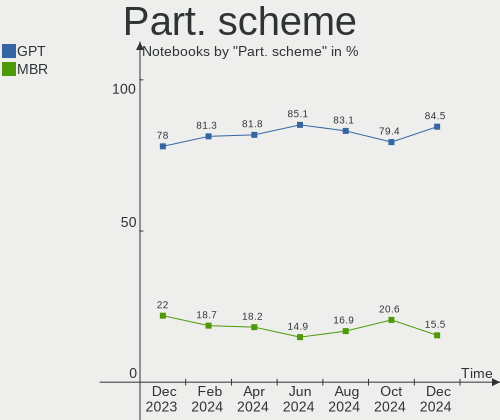
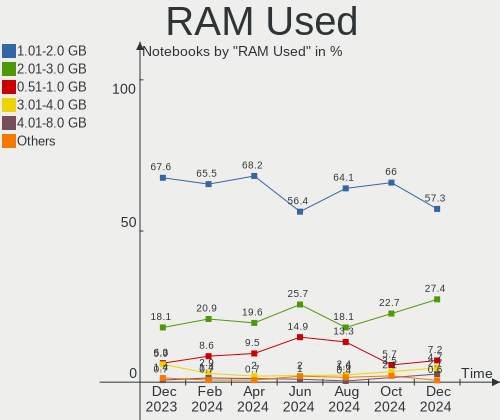
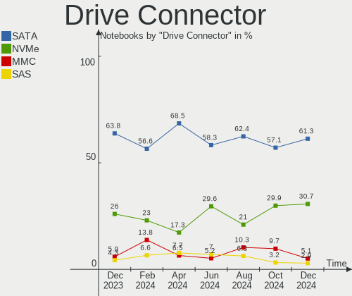
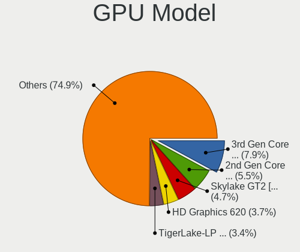
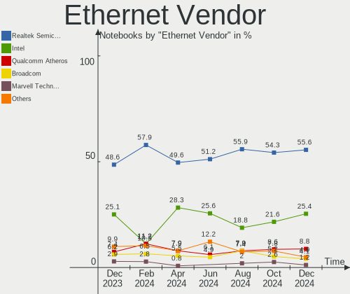
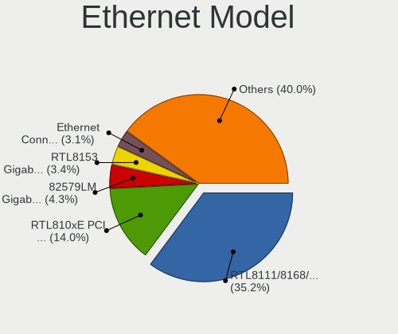
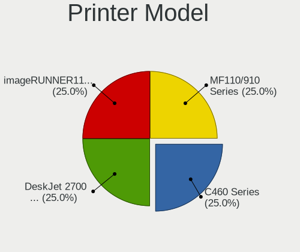

OpenMandriva - Hardware Trends (Notebooks)
------------------------------------------

A project to identify most popular hardware characteristics and track their change
over time based on data collected by Linux users at https://Linux-Hardware.org.

Anyone can contribute to this report by the [hw-probe](https://github.com/linuxhw/hw-probe) tool:

    sudo -E hw-probe -all -upload

This report is for one last month. Overall report since the beginning of time: [TestCoverage](https://github.com/linuxhw/TestCoverage)

Period: Jun, 2022.

Contents
--------

* [ System ](#system)
  - [ OS                       ](#os)
  - [ OS Family                ](#os-family)
  - [ Kernel                   ](#kernel)
  - [ Kernel Family            ](#kernel-family)
  - [ Kernel Major Ver.        ](#kernel-major-ver)
  - [ Arch                     ](#arch)
  - [ DE                       ](#de)
  - [ Display Server           ](#display-server)
  - [ Display Manager          ](#display-manager)
  - [ OS Lang                  ](#os-lang)
  - [ Boot Mode                ](#boot-mode)
  - [ Filesystem               ](#filesystem)
  - [ Part. scheme             ](#part-scheme)
  - [ Dual Boot with Linux/BSD ](#dual-boot-with-linuxbsd)
  - [ Dual Boot (Win)          ](#dual-boot-win)

* [ Board ](#board)
  - [ Vendor                   ](#vendor)
  - [ Model                    ](#model)
  - [ Model Family             ](#model-family)
  - [ MFG Year                 ](#mfg-year)
  - [ Form Factor              ](#form-factor)
  - [ Secure Boot              ](#secure-boot)
  - [ Coreboot                 ](#coreboot)
  - [ RAM Size                 ](#ram-size)
  - [ RAM Used                 ](#ram-used)
  - [ Total Drives             ](#total-drives)
  - [ Has CD-ROM               ](#has-cd-rom)
  - [ Has Ethernet             ](#has-ethernet)
  - [ Has WiFi                 ](#has-wifi)
  - [ Has Bluetooth            ](#has-bluetooth)

* [ Location ](#location)
  - [ Country                  ](#country)
  - [ City                     ](#city)

* [ Drives ](#drives)
  - [ Drive Vendor             ](#drive-vendor)
  - [ Drive Model              ](#drive-model)
  - [ HDD Vendor               ](#hdd-vendor)
  - [ SSD Vendor               ](#ssd-vendor)
  - [ Drive Kind               ](#drive-kind)
  - [ Drive Connector          ](#drive-connector)
  - [ Drive Size               ](#drive-size)
  - [ Space Total              ](#space-total)
  - [ Space Used               ](#space-used)
  - [ Malfunc. Drives          ](#malfunc-drives)
  - [ Malfunc. Drive Vendor    ](#malfunc-drive-vendor)
  - [ Malfunc. HDD Vendor      ](#malfunc-hdd-vendor)
  - [ Malfunc. Drive Kind      ](#malfunc-drive-kind)
  - [ Failed Drives            ](#failed-drives)
  - [ Failed Drive Vendor      ](#failed-drive-vendor)
  - [ Drive Status             ](#drive-status)

* [ Storage controller ](#storage-controller)
  - [ Storage Vendor           ](#storage-vendor)
  - [ Storage Model            ](#storage-model)
  - [ Storage Kind             ](#storage-kind)

* [ Processor ](#processor)
  - [ CPU Vendor               ](#cpu-vendor)
  - [ CPU Model                ](#cpu-model)
  - [ CPU Model Family         ](#cpu-model-family)
  - [ CPU Cores                ](#cpu-cores)
  - [ CPU Sockets              ](#cpu-sockets)
  - [ CPU Threads              ](#cpu-threads)
  - [ CPU Op-Modes             ](#cpu-op-modes)
  - [ CPU Microcode            ](#cpu-microcode)
  - [ CPU Microarch            ](#cpu-microarch)

* [ Graphics ](#graphics)
  - [ GPU Vendor               ](#gpu-vendor)
  - [ GPU Model                ](#gpu-model)
  - [ GPU Combo                ](#gpu-combo)
  - [ GPU Driver               ](#gpu-driver)
  - [ GPU Memory               ](#gpu-memory)

* [ Monitor ](#monitor)
  - [ Monitor Vendor           ](#monitor-vendor)
  - [ Monitor Model            ](#monitor-model)
  - [ Monitor Resolution       ](#monitor-resolution)
  - [ Monitor Diagonal         ](#monitor-diagonal)
  - [ Monitor Width            ](#monitor-width)
  - [ Aspect Ratio             ](#aspect-ratio)
  - [ Monitor Area             ](#monitor-area)
  - [ Pixel Density            ](#pixel-density)
  - [ Multiple Monitors        ](#multiple-monitors)

* [ Network ](#network)
  - [ Net Controller Vendor    ](#net-controller-vendor)
  - [ Net Controller Model     ](#net-controller-model)
  - [ Wireless Vendor          ](#wireless-vendor)
  - [ Wireless Model           ](#wireless-model)
  - [ Ethernet Vendor          ](#ethernet-vendor)
  - [ Ethernet Model           ](#ethernet-model)
  - [ Net Controller Kind      ](#net-controller-kind)
  - [ Used Controller          ](#used-controller)
  - [ NICs                     ](#nics)
  - [ IPv6                     ](#ipv6)

* [ Bluetooth ](#bluetooth)
  - [ Bluetooth Vendor         ](#bluetooth-vendor)
  - [ Bluetooth Model          ](#bluetooth-model)

* [ Sound ](#sound)
  - [ Sound Vendor             ](#sound-vendor)
  - [ Sound Model              ](#sound-model)

* [ Memory ](#memory)
  - [ Memory Vendor            ](#memory-vendor)
  - [ Memory Model             ](#memory-model)
  - [ Memory Kind              ](#memory-kind)
  - [ Memory Form Factor       ](#memory-form-factor)
  - [ Memory Size              ](#memory-size)
  - [ Memory Speed             ](#memory-speed)

* [ Printers & scanners ](#printers--scanners)
  - [ Printer Vendor           ](#printer-vendor)
  - [ Printer Model            ](#printer-model)
  - [ Scanner Vendor           ](#scanner-vendor)
  - [ Scanner Model            ](#scanner-model)

* [ Camera ](#camera)
  - [ Camera Vendor            ](#camera-vendor)
  - [ Camera Model             ](#camera-model)

* [ Security ](#security)
  - [ Fingerprint Vendor       ](#fingerprint-vendor)
  - [ Fingerprint Model        ](#fingerprint-model)
  - [ Chipcard Vendor          ](#chipcard-vendor)
  - [ Chipcard Model           ](#chipcard-model)

* [ Unsupported ](#unsupported)
  - [ Unsupported Devices      ](#unsupported-devices)
  - [ Unsupported Device Types ](#unsupported-device-types)

System
------

OS
--

Installed operating systems

| Name              | Notebooks | Percent |
|-------------------|-----------|---------|
| OpenMandriva 4.3  | 114       | 85.07%  |
| OpenMandriva 4.2  | 16        | 11.94%  |
| OpenMandriva 4.50 | 3         | 2.24%   |
| OpenMandriva 4.90 | 1         | 0.75%   |

OS Family
---------

OS without a version

| Name         | Notebooks | Percent |
|--------------|-----------|---------|
| OpenMandriva | 134       | 100%    |

Kernel
------

Version of the Linux kernel

| Version                       | Notebooks | Percent |
|-------------------------------|-----------|---------|
| 5.16.7-desktop-1omv4003       | 100       | 74.63%  |
| 5.10.14-desktop-1omv4002      | 15        | 11.19%  |
| 5.16.13-desktop-1omv4003      | 10        | 7.46%   |
| 5.17.1-desktop-2omv4050       | 3         | 2.24%   |
| 5.14.7-desktop-1omv4050       | 3         | 2.24%   |
| 5.17.1-desktop-clang-2omv4050 | 1         | 0.75%   |
| 5.14.14-desktop-1omv4050      | 1         | 0.75%   |
| 5.11.12-desktop-1omv4002      | 1         | 0.75%   |

Kernel Family
-------------

Linux kernel without a distro release

| Version | Notebooks | Percent |
|---------|-----------|---------|
| 5.16.7  | 100       | 74.63%  |
| 5.10.14 | 15        | 11.19%  |
| 5.16.13 | 10        | 7.46%   |
| 5.17.1  | 4         | 2.99%   |
| 5.14.7  | 3         | 2.24%   |
| 5.14.14 | 1         | 0.75%   |
| 5.11.12 | 1         | 0.75%   |

Kernel Major Ver.
-----------------

Linux kernel major version

| Version | Notebooks | Percent |
|---------|-----------|---------|
| 5.16    | 110       | 82.09%  |
| 5.10    | 15        | 11.19%  |
| 5.17    | 4         | 2.99%   |
| 5.14    | 4         | 2.99%   |
| 5.11    | 1         | 0.75%   |

Arch
----

OS architecture (x86_64, i586, etc.)

| Name   | Notebooks | Percent |
|--------|-----------|---------|
| x86_64 | 134       | 100%    |

DE
--

Desktop Environment

| Name    | Notebooks | Percent |
|---------|-----------|---------|
| KDE5    | 132       | 98.51%  |
| LXQt    | 1         | 0.75%   |
| Unknown | 1         | 0.75%   |

Display Server
--------------

X11 or Wayland

| Name | Notebooks | Percent |
|------|-----------|---------|
| X11  | 134       | 100%    |

Display Manager
---------------

SDDM, LightDM, etc.

| Name | Notebooks | Percent |
|------|-----------|---------|
| SDDM | 134       | 100%    |

OS Lang
-------

Language

| Lang  | Notebooks | Percent |
|-------|-----------|---------|
| en_US | 76        | 56.72%  |
| pl_PL | 12        | 8.96%   |
| de_DE | 9         | 6.72%   |
| fr_FR | 6         | 4.48%   |
| ru_RU | 5         | 3.73%   |
| en_CA | 4         | 2.99%   |
| cs_CZ | 4         | 2.99%   |
| pt_BR | 3         | 2.24%   |
| it_IT | 3         | 2.24%   |
| en_GB | 3         | 2.24%   |
| es_CO | 2         | 1.49%   |
| uk_UA | 1         | 0.75%   |
| tr_TR | 1         | 0.75%   |
| ru_UA | 1         | 0.75%   |
| nl_NL | 1         | 0.75%   |
| es_MX | 1         | 0.75%   |
| es_ES | 1         | 0.75%   |
| en_AU | 1         | 0.75%   |

Boot Mode
---------

EFI or BIOS

| Mode | Notebooks | Percent |
|------|-----------|---------|
| EFI  | 75        | 55.97%  |
| BIOS | 59        | 44.03%  |

Filesystem
----------

Type of filesystem

| Type    | Notebooks | Percent |
|---------|-----------|---------|
| Overlay | 88        | 65.67%  |
| Ext4    | 46        | 34.33%  |

Part. scheme
------------

Scheme of partitioning

| Type | Notebooks | Percent |
|------|-----------|---------|
| GPT  | 83        | 61.94%  |
| MBR  | 51        | 38.06%  |

Dual Boot with Linux/BSD
------------------------

Hosting more than one Linux/BSD

| Dual boot | Notebooks | Percent |
|-----------|-----------|---------|
| No        | 81        | 60.45%  |
| Yes       | 53        | 39.55%  |

Dual Boot (Win)
---------------

Hosting Linux and Windows

| Dual boot | Notebooks | Percent |
|-----------|-----------|---------|
| No        | 69        | 51.49%  |
| Yes       | 65        | 48.51%  |

Board
-----

Vendor
------

Motherboard manufacturer

| Name                | Notebooks | Percent |
|---------------------|-----------|---------|
| Dell                | 35        | 26.12%  |
| Hewlett-Packard     | 27        | 20.15%  |
| Acer                | 19        | 14.18%  |
| Lenovo              | 15        | 11.19%  |
| ASUSTek Computer    | 11        | 8.21%   |
| Sony                | 4         | 2.99%   |
| LG Electronics      | 3         | 2.24%   |
| TUXEDO              | 2         | 1.49%   |
| Toshiba             | 2         | 1.49%   |
| Fujitsu             | 2         | 1.49%   |
| Unknown             | 2         | 1.49%   |
| Shuttle             | 1         | 0.75%   |
| Samsung Electronics | 1         | 0.75%   |
| Medion              | 1         | 0.75%   |
| HYPA                | 1         | 0.75%   |
| HUAWEI              | 1         | 0.75%   |
| Fujitsu Siemens     | 1         | 0.75%   |
| eMachines           | 1         | 0.75%   |
| DNS                 | 1         | 0.75%   |
| AZW                 | 1         | 0.75%   |
| Apple               | 1         | 0.75%   |
| AMI                 | 1         | 0.75%   |
| Alienware           | 1         | 0.75%   |

Model
-----

Motherboard model

| Name                                     | Notebooks | Percent |
|------------------------------------------|-----------|---------|
| Dell Inspiron 3451                       | 6         | 4.48%   |
| HP Laptop 14-fq0xxx                      | 4         | 2.99%   |
| Unknown                                  | 4         | 2.99%   |
| LG 15Z970-E.BH71P1                       | 3         | 2.24%   |
| Dell Precision M6800                     | 3         | 2.24%   |
| ASUS UX31E                               | 3         | 2.24%   |
| HP Pavilion dv6                          | 2         | 1.49%   |
| Dell Latitude 3420                       | 2         | 1.49%   |
| Dell Latitude 3310                       | 2         | 1.49%   |
| Dell Latitude 3300                       | 2         | 1.49%   |
| Acer Aspire A315-32                      | 2         | 1.49%   |
| Acer AO722                               | 2         | 1.49%   |
| Toshiba Satellite C855-2CF               | 1         | 0.75%   |
| Toshiba Satellite C660D                  | 1         | 0.75%   |
| Sony VPCSB4AFX                           | 1         | 0.75%   |
| Sony VGN-Z71JB                           | 1         | 0.75%   |
| Sony VGN-NW310F                          | 1         | 0.75%   |
| Sony VGN-FZ31Z                           | 1         | 0.75%   |
| Shuttle DS47D                            | 1         | 0.75%   |
| Samsung 355V4C/356V4C/3445VC/3545VC      | 1         | 0.75%   |
| Medion E7220                             | 1         | 0.75%   |
| Lenovo Z40-75 80DW                       | 1         | 0.75%   |
| Lenovo Yoga 2 11 20332                   | 1         | 0.75%   |
| Lenovo ThinkPad X1 Carbon 3rd 20BSCTO1WW | 1         | 0.75%   |
| Lenovo ThinkPad T60 2007FUG              | 1         | 0.75%   |
| Lenovo ThinkPad T460s 20FAS76R00         | 1         | 0.75%   |
| Lenovo ThinkPad T400 2767AL9             | 1         | 0.75%   |
| Lenovo ThinkPad S2 3rd Gen 20L1A001CD    | 1         | 0.75%   |
| Lenovo S20-30 Touch 20434                | 1         | 0.75%   |
| Lenovo Legion 5 15ACH6H 82JU             | 1         | 0.75%   |
| Lenovo IdeaPad Z570 HuronRiver Platform  | 1         | 0.75%   |
| Lenovo IdeaPad S145-15AST 81N3           | 1         | 0.75%   |
| Lenovo IdeaPad S145-14IIL 81W6           | 1         | 0.75%   |
| Lenovo IdeaPad 330-15IKB 81DE            | 1         | 0.75%   |
| Lenovo IdeaPad 3 15ITL05 81X8            | 1         | 0.75%   |
| Lenovo IdeaPad 3 15ADA05 81W1            | 1         | 0.75%   |
| HYPA FLUX                                | 1         | 0.75%   |
| HUAWEI HN-WX9X                           | 1         | 0.75%   |
| HP ZBook 15 G2                           | 1         | 0.75%   |
| HP Spectre x2 Detachable                 | 1         | 0.75%   |
| HP ProBook 640 G1                        | 1         | 0.75%   |
| HP ProBook 4530s                         | 1         | 0.75%   |
| HP ProBook 450 G5                        | 1         | 0.75%   |
| HP ProBook 450 G0                        | 1         | 0.75%   |
| HP Pavilion Laptop 17-ar0xx              | 1         | 0.75%   |
| HP Pavilion Gaming Laptop 15-dk1xxx      | 1         | 0.75%   |
| HP Pavilion g6                           | 1         | 0.75%   |
| HP Pavilion g4                           | 1         | 0.75%   |
| HP Pavilion dv6700                       | 1         | 0.75%   |
| HP Pavilion 15                           | 1         | 0.75%   |
| HP OMEN by Laptop 15-ce0xx               | 1         | 0.75%   |
| HP Laptop 17-by4xxx                      | 1         | 0.75%   |
| HP Laptop 17-bs0xx                       | 1         | 0.75%   |
| HP Laptop 15-bs1xx                       | 1         | 0.75%   |
| HP Laptop 14-dk1xxx                      | 1         | 0.75%   |
| HP EliteBook 8570p                       | 1         | 0.75%   |
| HP EliteBook 840 G2                      | 1         | 0.75%   |
| HP Compaq Presario CQ41                  | 1         | 0.75%   |
| HP Compaq CQ45                           | 1         | 0.75%   |
| Fujitsu Siemens AMILO Li3910             | 1         | 0.75%   |

Model Family
------------

Motherboard model prefix

| Name                  | Notebooks | Percent |
|-----------------------|-----------|---------|
| Dell Latitude         | 20        | 14.93%  |
| Acer Aspire           | 11        | 8.21%   |
| Dell Inspiron         | 10        | 7.46%   |
| HP Pavilion           | 8         | 5.97%   |
| HP Laptop             | 8         | 5.97%   |
| Lenovo IdeaPad        | 6         | 4.48%   |
| Lenovo ThinkPad       | 5         | 3.73%   |
| HP ProBook            | 4         | 2.99%   |
| Unknown               | 4         | 2.99%   |
| LG 15Z970-E.BH71P1    | 3         | 2.24%   |
| Dell Precision        | 3         | 2.24%   |
| ASUS UX31E            | 3         | 2.24%   |
| Toshiba Satellite     | 2         | 1.49%   |
| HP EliteBook          | 2         | 1.49%   |
| HP Compaq             | 2         | 1.49%   |
| Dell Vostro           | 2         | 1.49%   |
| Acer Swift            | 2         | 1.49%   |
| Acer Extensa          | 2         | 1.49%   |
| Acer AO722            | 2         | 1.49%   |
| Sony VPCSB4AFX        | 1         | 0.75%   |
| Sony VGN-Z71JB        | 1         | 0.75%   |
| Sony VGN-NW310F       | 1         | 0.75%   |
| Sony VGN-FZ31Z        | 1         | 0.75%   |
| Shuttle DS47D         | 1         | 0.75%   |
| Samsung 355V4C        | 1         | 0.75%   |
| Medion E7220          | 1         | 0.75%   |
| Lenovo Z40-75         | 1         | 0.75%   |
| Lenovo Yoga           | 1         | 0.75%   |
| Lenovo S20-30         | 1         | 0.75%   |
| Lenovo Legion         | 1         | 0.75%   |
| HYPA FLUX             | 1         | 0.75%   |
| HUAWEI HN-WX9X        | 1         | 0.75%   |
| HP ZBook              | 1         | 0.75%   |
| HP Spectre            | 1         | 0.75%   |
| HP OMEN               | 1         | 0.75%   |
| Fujitsu Siemens AMILO | 1         | 0.75%   |
| Fujitsu FMVS02003     | 1         | 0.75%   |
| Fujitsu FMVA0800C     | 1         | 0.75%   |
| eMachines E527        | 1         | 0.75%   |
| DNS MB50II1           | 1         | 0.75%   |
| AZW GT-R              | 1         | 0.75%   |
| ASUS X555QG           | 1         | 0.75%   |
| ASUS X553MA           | 1         | 0.75%   |
| ASUS X551MA           | 1         | 0.75%   |
| ASUS N71Vg            | 1         | 0.75%   |
| ASUS N61Vn            | 1         | 0.75%   |
| ASUS N53SV            | 1         | 0.75%   |
| ASUS K53BR            | 1         | 0.75%   |
| ASUS ET2040I          | 1         | 0.75%   |
| Apple MacBookPro8     | 1         | 0.75%   |
| AMI Intel             | 1         | 0.75%   |
| Alienware 13          | 1         | 0.75%   |
| Acer AOD260           | 1         | 0.75%   |
| Acer AO756            | 1         | 0.75%   |

MFG Year
--------

Motherboard manufacture year

| Year | Notebooks | Percent |
|------|-----------|---------|
| 2011 | 16        | 11.94%  |
| 2019 | 15        | 11.19%  |
| 2014 | 13        | 9.7%    |
| 2017 | 12        | 8.96%   |
| 2020 | 11        | 8.21%   |
| 2013 | 11        | 8.21%   |
| 2021 | 9         | 6.72%   |
| 2015 | 7         | 5.22%   |
| 2012 | 7         | 5.22%   |
| 2008 | 7         | 5.22%   |
| 2010 | 6         | 4.48%   |
| 2009 | 6         | 4.48%   |
| 2016 | 5         | 3.73%   |
| 2018 | 4         | 2.99%   |
| 2007 | 4         | 2.99%   |
| 2006 | 1         | 0.75%   |

Form Factor
-----------

Physical design of the computer

| Name     | Notebooks | Percent |
|----------|-----------|---------|
| Notebook | 134       | 100%    |

Secure Boot
-----------

Enabled or disabled

| State    | Notebooks | Percent |
|----------|-----------|---------|
| Disabled | 134       | 100%    |

Coreboot
--------

Have coreboot on board

| Used | Notebooks | Percent |
|------|-----------|---------|
| No   | 134       | 100%    |

RAM Size
--------

Total RAM memory

| Size in GB | Notebooks | Percent |
|------------|-----------|---------|
| 3.01-4.0   | 54        | 40.3%   |
| 4.01-8.0   | 41        | 30.6%   |
| 8.01-16.0  | 14        | 10.45%  |
| 32.01-64.0 | 8         | 5.97%   |
| 16.01-24.0 | 8         | 5.97%   |
| 1.01-2.0   | 7         | 5.22%   |
| 24.01-32.0 | 1         | 0.75%   |
| 2.01-3.0   | 1         | 0.75%   |

RAM Used
--------

Used RAM memory

| Used GB   | Notebooks | Percent |
|-----------|-----------|---------|
| 1.01-2.0  | 102       | 76.12%  |
| 0.51-1.0  | 17        | 12.69%  |
| 2.01-3.0  | 13        | 9.7%    |
| 8.01-16.0 | 1         | 0.75%   |
| 0.01-0.5  | 1         | 0.75%   |

Total Drives
------------

Number of drives on board

| Drives | Notebooks | Percent |
|--------|-----------|---------|
| 1      | 100       | 74.63%  |
| 2      | 26        | 19.4%   |
| 4      | 3         | 2.24%   |
| 0      | 3         | 2.24%   |
| 5      | 1         | 0.75%   |
| 3      | 1         | 0.75%   |

Has CD-ROM
----------

Has CD-ROM on board

| Presented | Notebooks | Percent |
|-----------|-----------|---------|
| No        | 81        | 60.45%  |
| Yes       | 53        | 39.55%  |

Has Ethernet
------------

Has Ethernet on board

| Presented | Notebooks | Percent |
|-----------|-----------|---------|
| Yes       | 112       | 83.58%  |
| No        | 22        | 16.42%  |

Has WiFi
--------

Has WiFi module

| Presented | Notebooks | Percent |
|-----------|-----------|---------|
| Yes       | 133       | 99.25%  |
| No        | 1         | 0.75%   |

Has Bluetooth
-------------

Has Bluetooth module

| Presented | Notebooks | Percent |
|-----------|-----------|---------|
| Yes       | 97        | 72.39%  |
| No        | 37        | 27.61%  |

Location
--------

Country
-------

Geographic location (country)

| Country               | Notebooks | Percent |
|-----------------------|-----------|---------|
| USA                   | 13        | 9.7%    |
| Poland                | 13        | 9.7%    |
| Germany               | 11        | 8.21%   |
| Netherlands           | 10        | 7.46%   |
| France                | 9         | 6.72%   |
| Brazil                | 9         | 6.72%   |
| Canada                | 6         | 4.48%   |
| Russia                | 5         | 3.73%   |
| Sweden                | 4         | 2.99%   |
| Italy                 | 4         | 2.99%   |
| Indonesia             | 4         | 2.99%   |
| Czechia               | 4         | 2.99%   |
| UK                    | 3         | 2.24%   |
| Turkey                | 3         | 2.24%   |
| Mexico                | 3         | 2.24%   |
| Colombia              | 3         | 2.24%   |
| Ukraine               | 2         | 1.49%   |
| Portugal              | 2         | 1.49%   |
| Japan                 | 2         | 1.49%   |
| Egypt                 | 2         | 1.49%   |
| Australia             | 2         | 1.49%   |
| Uruguay               | 1         | 0.75%   |
| Thailand              | 1         | 0.75%   |
| Tanzania              | 1         | 0.75%   |
| Spain                 | 1         | 0.75%   |
| Slovakia              | 1         | 0.75%   |
| Serbia                | 1         | 0.75%   |
| Peru                  | 1         | 0.75%   |
| Paraguay              | 1         | 0.75%   |
| Palestinian Territory | 1         | 0.75%   |
| Latvia                | 1         | 0.75%   |
| India                 | 1         | 0.75%   |
| Greece                | 1         | 0.75%   |
| Ecuador               | 1         | 0.75%   |
| Denmark               | 1         | 0.75%   |
| Croatia               | 1         | 0.75%   |
| China                 | 1         | 0.75%   |
| Bulgaria              | 1         | 0.75%   |
| Benin                 | 1         | 0.75%   |
| Belarus               | 1         | 0.75%   |
| Azerbaijan            | 1         | 0.75%   |

City
----

Geographic location (city)

| City                 | Notebooks | Percent |
|----------------------|-----------|---------|
| Schagen              | 9         | 6.72%   |
| Krakow               | 6         | 4.48%   |
| Vancouver            | 3         | 2.24%   |
| Teresopolis          | 3         | 2.24%   |
| Skierniewice         | 3         | 2.24%   |
| Prague               | 3         | 2.24%   |
| Moscow               | 3         | 2.24%   |
| Paris                | 2         | 1.49%   |
| Munich               | 2         | 1.49%   |
| Mexico City          | 2         | 1.49%   |
| Dortmund             | 2         | 1.49%   |
| Zgierz               | 1         | 0.75%   |
| Zagreb               | 1         | 0.75%   |
| Włocławek          | 1         | 0.75%   |
| Werkendam            | 1         | 0.75%   |
| Warsaw               | 1         | 0.75%   |
| Vysoke Myto          | 1         | 0.75%   |
| Victoria             | 1         | 0.75%   |
| Vaxjo                | 1         | 0.75%   |
| Varna                | 1         | 0.75%   |
| Thessaloniki         | 1         | 0.75%   |
| Taroona              | 1         | 0.75%   |
| Sydney               | 1         | 0.75%   |
| Surzur               | 1         | 0.75%   |
| Surabaya             | 1         | 0.75%   |
| St Louis             | 1         | 0.75%   |
| Spring Hill          | 1         | 0.75%   |
| Soblahov             | 1         | 0.75%   |
| Slagelse             | 1         | 0.75%   |
| Shizuoka             | 1         | 0.75%   |
| Sevastopol           | 1         | 0.75%   |
| Sestri Ponente       | 1         | 0.75%   |
| Serra                | 1         | 0.75%   |
| Senhor do Bonfim     | 1         | 0.75%   |
| Scranton             | 1         | 0.75%   |
| Sciacca              | 1         | 0.75%   |
| Schwabach            | 1         | 0.75%   |
| Schenectady          | 1         | 0.75%   |
| Sao Paulo            | 1         | 0.75%   |
| Sao José dos Campos | 1         | 0.75%   |
| Santa Rita           | 1         | 0.75%   |
| Rho                  | 1         | 0.75%   |
| Rennes               | 1         | 0.75%   |
| Radwanice            | 1         | 0.75%   |
| Quito                | 1         | 0.75%   |
| Queens               | 1         | 0.75%   |
| Punta del Este       | 1         | 0.75%   |
| Polatsk              | 1         | 0.75%   |
| Pearland             | 1         | 0.75%   |
| Paderborn            | 1         | 0.75%   |
| Örebro              | 1         | 0.75%   |
| Odessa               | 1         | 0.75%   |
| Northampton          | 1         | 0.75%   |
| Niš                 | 1         | 0.75%   |
| Montreal             | 1         | 0.75%   |
| Millau               | 1         | 0.75%   |
| Milan                | 1         | 0.75%   |
| Memphis              | 1         | 0.75%   |
| McKinleyville        | 1         | 0.75%   |
| Manado               | 1         | 0.75%   |

Drives
------

Drive Vendor
------------

Hard drive vendors

| Vendor              | Notebooks | Drives | Percent |
|---------------------|-----------|--------|---------|
| Seagate             | 24        | 26     | 15.48%  |
| Samsung Electronics | 24        | 25     | 15.48%  |
| WDC                 | 23        | 24     | 14.84%  |
| Toshiba             | 13        | 14     | 8.39%   |
| Hitachi             | 8         | 8      | 5.16%   |
| SanDisk             | 7         | 7      | 4.52%   |
| Unknown             | 6         | 6      | 3.87%   |
| SK hynix            | 6         | 6      | 3.87%   |
| LITEON              | 5         | 5      | 3.23%   |
| Crucial             | 5         | 5      | 3.23%   |
| Kingston            | 4         | 4      | 2.58%   |
| A-DATA Technology   | 4         | 4      | 2.58%   |
| KIOXIA              | 3         | 3      | 1.94%   |
| Goodram             | 3         | 3      | 1.94%   |
| Apacer              | 3         | 3      | 1.94%   |
| Transcend           | 2         | 2      | 1.29%   |
| SSSTC               | 2         | 2      | 1.29%   |
| Silicon Motion      | 2         | 2      | 1.29%   |
| China               | 2         | 2      | 1.29%   |
| Verbatim            | 1         | 1      | 0.65%   |
| V-GeN               | 1         | 1      | 0.65%   |
| Team                | 1         | 1      | 0.65%   |
| PNY                 | 1         | 1      | 0.65%   |
| Micron Technology   | 1         | 1      | 0.65%   |
| Kston               | 1         | 1      | 0.65%   |
| HGST                | 1         | 1      | 0.65%   |
| Fujitsu             | 1         | 1      | 0.65%   |
| Unknown             | 1         | 1      | 0.65%   |

Drive Model
-----------

Hard drive models

| Model                                   | Notebooks | Percent |
|-----------------------------------------|-----------|---------|
| Seagate ST500LT012-1DG142 500GB         | 7         | 4.38%   |
| Unknown DA4064  64GB                    | 4         | 2.5%    |
| Samsung SSD 850 EVO 500GB               | 4         | 2.5%    |
| Toshiba MQ01ABD100 1TB                  | 3         | 1.88%   |
| Toshiba MK3265GSX 320GB                 | 3         | 1.88%   |
| Seagate ST2000LM015-2E8174 2TB          | 3         | 1.88%   |
| SanDisk SSD U100 256GB                  | 3         | 1.88%   |
| LITEON CV1-8B128 128GB SSD              | 3         | 1.88%   |
| Kingston SA400S37240G 240GB SSD         | 3         | 1.88%   |
| Crucial M4-CT256M4SSD3 256GB            | 3         | 1.88%   |
| Apacer AS350 240GB SSD                  | 3         | 1.88%   |
| Transcend TS120GMTS420S 120GB SSD       | 2         | 1.25%   |
| SanDisk SD9SN8W-128G-1006 128GB SSD     | 2         | 1.25%   |
| Samsung SSD 860 EVO M.2 2TB             | 2         | 1.25%   |
| KIOXIA KBG40ZNS128G NVMe 128GB          | 2         | 1.25%   |
| Goodram SSDPR-CX400-256-G2 256GB        | 2         | 1.25%   |
| WDC WDS500G2B0A-00SM50 500GB SSD        | 1         | 0.63%   |
| WDC WDS240G2G0A-00JH30 240GB SSD        | 1         | 0.63%   |
| WDC WD5000MPCK-24AWHT0 500GB            | 1         | 0.63%   |
| WDC WD5000LPVX-80V0TT0 500GB            | 1         | 0.63%   |
| WDC WD5000BPVT-80HXZT3 500GB            | 1         | 0.63%   |
| WDC WD3200BPVT-22JJ5T0 320GB            | 1         | 0.63%   |
| WDC WD3200BEVT-75ZCT2 320GB             | 1         | 0.63%   |
| WDC WD3200BEVT-60ZCT1 320GB             | 1         | 0.63%   |
| WDC WD3200BEVT-60A23T0 320GB            | 1         | 0.63%   |
| WDC WD3200BEKT-75PVMT1 320GB            | 1         | 0.63%   |
| WDC WD3200BEKT-60V5T1 320GB             | 1         | 0.63%   |
| WDC WD32 00BEKX-75B7WT0 320GB           | 1         | 0.63%   |
| WDC WD2500BEVT-22ZCT0 250GB             | 1         | 0.63%   |
| WDC WD1600BEVT-60ZCT0 160GB             | 1         | 0.63%   |
| WDC WD1600BEVT-22ZCT0 160GB             | 1         | 0.63%   |
| WDC WD10SPZX-24Z10T0 1TB                | 1         | 0.63%   |
| WDC WD10SPZX-21Z10T0 1TB                | 1         | 0.63%   |
| WDC WD10SPZX-08Z10 1TB                  | 1         | 0.63%   |
| WDC WD10SPZX-00Z10T0 1TB                | 1         | 0.63%   |
| WDC WD10JPVX-60JC3T1 1TB                | 1         | 0.63%   |
| WDC WD10JPCX-24UE4T0 1TB                | 1         | 0.63%   |
| WDC PC SN530 SDBPNPZ-512G-1027 512GB    | 1         | 0.63%   |
| WDC PC SN520 SDAPNUW-128G-1014 128GB    | 1         | 0.63%   |
| WDC PC SN520 NVMe 128GB                 | 1         | 0.63%   |
| Verbatim Vi550 S3 SSD 128GB             | 1         | 0.63%   |
| V-GeN V-GEN10SM21AR256HY 256GB SSD      | 1         | 0.63%   |
| Unknown SD32G  32GB                     | 1         | 0.63%   |
| Unknown ISOCOM  64GB                    | 1         | 0.63%   |
| Toshiba THNSN5128GPU7 128GB             | 1         | 0.63%   |
| Toshiba MQ01ABF050 500GB                | 1         | 0.63%   |
| Toshiba MQ01ABD050 500GB                | 1         | 0.63%   |
| Toshiba MK5059GSXP 500GB                | 1         | 0.63%   |
| Toshiba MK2576GSX 250GB                 | 1         | 0.63%   |
| Toshiba MK1255GSX H 120GB               | 1         | 0.63%   |
| Toshiba KXG50ZNV512G NVMe 512GB         | 1         | 0.63%   |
| Toshiba KSG60ZMV256G M.2 2280 256GB SSD | 1         | 0.63%   |
| Team TM8PS7512G 512GB SSD               | 1         | 0.63%   |
| SSSTC CV8-8E128-11 SATA 128GB SSD       | 1         | 0.63%   |
| SSSTC CL1-3D128-Q11 NVMe 128GB          | 1         | 0.63%   |
| SK hynix SKHynix_HFS512GDE9X084N 512GB  | 1         | 0.63%   |
| SK hynix SKHynix_HFM128GD3HX015N 128GB  | 1         | 0.63%   |
| SK hynix SC311 SATA 128GB SSD           | 1         | 0.63%   |
| SK hynix HFS128G39TND-N210A 128GB SSD   | 1         | 0.63%   |
| SK hynix HFM256GDJTNG-8310A 256GB       | 1         | 0.63%   |

HDD Vendor
----------

Hard disk drive vendors

| Vendor              | Notebooks | Drives | Percent |
|---------------------|-----------|--------|---------|
| Seagate             | 24        | 25     | 37.5%   |
| WDC                 | 18        | 19     | 28.13%  |
| Toshiba             | 11        | 11     | 17.19%  |
| Hitachi             | 8         | 8      | 12.5%   |
| Samsung Electronics | 1         | 1      | 1.56%   |
| HGST                | 1         | 1      | 1.56%   |
| Fujitsu             | 1         | 1      | 1.56%   |

SSD Vendor
----------

Solid state drive vendors

| Vendor              | Notebooks | Drives | Percent |
|---------------------|-----------|--------|---------|
| Samsung Electronics | 16        | 16     | 25.81%  |
| SanDisk             | 7         | 7      | 11.29%  |
| LITEON              | 5         | 5      | 8.06%   |
| Crucial             | 5         | 5      | 8.06%   |
| Kingston            | 4         | 4      | 6.45%   |
| Goodram             | 3         | 3      | 4.84%   |
| Apacer              | 3         | 3      | 4.84%   |
| A-DATA Technology   | 3         | 3      | 4.84%   |
| WDC                 | 2         | 2      | 3.23%   |
| Transcend           | 2         | 2      | 3.23%   |
| SK hynix            | 2         | 2      | 3.23%   |
| China               | 2         | 2      | 3.23%   |
| Verbatim            | 1         | 1      | 1.61%   |
| V-GeN               | 1         | 1      | 1.61%   |
| Toshiba             | 1         | 1      | 1.61%   |
| Team                | 1         | 1      | 1.61%   |
| SSSTC               | 1         | 1      | 1.61%   |
| PNY                 | 1         | 1      | 1.61%   |
| Micron Technology   | 1         | 1      | 1.61%   |
| Kston               | 1         | 1      | 1.61%   |

Drive Kind
----------

HDD or SSD

| Kind    | Notebooks | Drives | Percent |
|---------|-----------|--------|---------|
| HDD     | 63        | 66     | 42.86%  |
| SSD     | 53        | 62     | 36.05%  |
| NVMe    | 23        | 24     | 15.65%  |
| MMC     | 7         | 7      | 4.76%   |
| Unknown | 1         | 1      | 0.68%   |

Drive Connector
---------------

SATA, SAS, NVMe, etc.

| Type | Notebooks | Drives | Percent |
|------|-----------|--------|---------|
| SATA | 107       | 122    | 75.89%  |
| NVMe | 23        | 24     | 16.31%  |
| MMC  | 7         | 7      | 4.96%   |
| SAS  | 4         | 7      | 2.84%   |

Drive Size
----------

Size of hard drive

| Size in TB | Notebooks | Drives | Percent |
|------------|-----------|--------|---------|
| 0.01-0.5   | 88        | 98     | 74.58%  |
| 0.51-1.0   | 20        | 20     | 16.95%  |
| 1.01-2.0   | 9         | 9      | 7.63%   |
| 4.01-10.0  | 1         | 1      | 0.85%   |

Space Total
-----------

Amount of disk space available on the file system

| Size in GB | Notebooks | Percent |
|------------|-----------|---------|
| 1-20       | 70        | 52.24%  |
| 101-250    | 27        | 20.15%  |
| 251-500    | 9         | 6.72%   |
| 51-100     | 9         | 6.72%   |
| Unknown    | 8         | 5.97%   |
| 501-1000   | 6         | 4.48%   |
| 1001-2000  | 3         | 2.24%   |
| 21-50      | 2         | 1.49%   |

Space Used
----------

Amount of used disk space

| Used GB | Notebooks | Percent |
|---------|-----------|---------|
| 1-20    | 115       | 85.82%  |
| Unknown | 8         | 5.97%   |
| 251-500 | 4         | 2.99%   |
| 21-50   | 4         | 2.99%   |
| 51-100  | 2         | 1.49%   |
| 101-250 | 1         | 0.75%   |

Malfunc. Drives
---------------

Drive models with a malfunction

| Model                                         | Notebooks | Drives | Percent |
|-----------------------------------------------|-----------|--------|---------|
| SanDisk SSD U100 256GB                        | 3         | 3      | 8.57%   |
| Crucial M4-CT256M4SSD3 256GB                  | 3         | 3      | 8.57%   |
| Toshiba MK3265GSX 320GB                       | 2         | 2      | 5.71%   |
| SanDisk SD9SN8W-128G-1006 128GB SSD           | 2         | 2      | 5.71%   |
| WDC WD5000BPVT-80HXZT3 500GB                  | 1         | 1      | 2.86%   |
| WDC WD3200BEVT-60A23T0 320GB                  | 1         | 1      | 2.86%   |
| WDC WD3200BEKT-60V5T1 320GB                   | 1         | 1      | 2.86%   |
| WDC WD1600BEVT-60ZCT0 160GB                   | 1         | 1      | 2.86%   |
| WDC WD10SPZX-24Z10T0 1TB                      | 1         | 1      | 2.86%   |
| Toshiba MQ01ABD050 500GB                      | 1         | 1      | 2.86%   |
| Toshiba MK5059GSXP 500GB                      | 1         | 1      | 2.86%   |
| Toshiba MK1255GSX H 120GB                     | 1         | 1      | 2.86%   |
| Toshiba KSG60ZMV256G M.2 2280 256GB SSD       | 1         | 1      | 2.86%   |
| Seagate ST9750420AS 752GB                     | 1         | 1      | 2.86%   |
| Seagate ST9320320AS 320GB                     | 1         | 1      | 2.86%   |
| Seagate ST9250315AS 250GB                     | 1         | 1      | 2.86%   |
| Seagate ST500LT012-9WS142 500GB               | 1         | 1      | 2.86%   |
| Kingston SUV400S37240G 240GB SSD              | 1         | 1      | 2.86%   |
| Hitachi HTS547575A9E384 752GB                 | 1         | 1      | 2.86%   |
| Hitachi HTS547550A9E384 500GB                 | 1         | 1      | 2.86%   |
| Hitachi HTS545050A7E380 500GB                 | 1         | 1      | 2.86%   |
| Hitachi HTS545025B9A300 250GB                 | 1         | 1      | 2.86%   |
| Hitachi HTS543225L9A300 250GB                 | 1         | 1      | 2.86%   |
| Hitachi HTS542520K9SA00 200GB                 | 1         | 1      | 2.86%   |
| HGST HTS541010A9E680 1TB                      | 1         | 1      | 2.86%   |
| Fujitsu MHW2160BH 160GB                       | 1         | 1      | 2.86%   |
| Crucial CT240M500SSD1 240GB                   | 1         | 1      | 2.86%   |
| China SATA3 1TB SSD                           | 1         | 1      | 2.86%   |
| A-DATA Technology IM2S3138E-128GM-B 128GB SSD | 1         | 1      | 2.86%   |

Malfunc. Drive Vendor
---------------------

Vendors of faulty drives

| Vendor            | Notebooks | Drives | Percent |
|-------------------|-----------|--------|---------|
| Toshiba           | 6         | 6      | 17.14%  |
| Hitachi           | 6         | 6      | 17.14%  |
| WDC               | 5         | 5      | 14.29%  |
| SanDisk           | 5         | 5      | 14.29%  |
| Seagate           | 4         | 4      | 11.43%  |
| Crucial           | 4         | 4      | 11.43%  |
| Kingston          | 1         | 1      | 2.86%   |
| HGST              | 1         | 1      | 2.86%   |
| Fujitsu           | 1         | 1      | 2.86%   |
| China             | 1         | 1      | 2.86%   |
| A-DATA Technology | 1         | 1      | 2.86%   |

Malfunc. HDD Vendor
-------------------

Vendors of faulty HDD drives

| Vendor  | Notebooks | Drives | Percent |
|---------|-----------|--------|---------|
| Hitachi | 6         | 6      | 27.27%  |
| WDC     | 5         | 5      | 22.73%  |
| Toshiba | 5         | 5      | 22.73%  |
| Seagate | 4         | 4      | 18.18%  |
| HGST    | 1         | 1      | 4.55%   |
| Fujitsu | 1         | 1      | 4.55%   |

Malfunc. Drive Kind
-------------------

Kinds of faulty drives

| Kind | Notebooks | Drives | Percent |
|------|-----------|--------|---------|
| HDD  | 22        | 22     | 62.86%  |
| SSD  | 13        | 13     | 37.14%  |

Failed Drives
-------------

Failed drive models

Zero info for selected period =(

Failed Drive Vendor
-------------------

Failed drive vendors

Zero info for selected period =(

Drive Status
------------

Number of failed and malfunc. drives

| Status   | Notebooks | Drives | Percent |
|----------|-----------|--------|---------|
| Works    | 98        | 112    | 68.06%  |
| Malfunc  | 35        | 35     | 24.31%  |
| Detected | 11        | 13     | 7.64%   |

Storage controller
------------------

Storage Vendor
--------------

Storage controller vendors

| Vendor                         | Notebooks | Percent |
|--------------------------------|-----------|---------|
| Intel                          | 100       | 69.93%  |
| AMD                            | 20        | 13.99%  |
| Samsung Electronics            | 7         | 4.9%    |
| SK hynix                       | 4         | 2.8%    |
| SanDisk                        | 3         | 2.1%    |
| KIOXIA                         | 3         | 2.1%    |
| Silicon Motion                 | 2         | 1.4%    |
| Toshiba America Info Systems   | 1         | 0.7%    |
| Solid State Storage Technology | 1         | 0.7%    |
| ASMedia Technology             | 1         | 0.7%    |
| ADATA Technology               | 1         | 0.7%    |

Storage Model
-------------

Storage controller models

| Model                                                                                  | Notebooks | Percent |
|----------------------------------------------------------------------------------------|-----------|---------|
| AMD FCH SATA Controller [AHCI mode]                                                    | 14        | 8.81%   |
| Intel Sunrise Point-LP SATA Controller [AHCI mode]                                     | 12        | 7.55%   |
| Intel Atom Processor E3800 Series SATA AHCI Controller                                 | 11        | 6.92%   |
| Intel 82801IBM/IEM (ICH9M/ICH9M-E) 4 port SATA Controller [AHCI mode]                  | 10        | 6.29%   |
| Intel 6 Series/C200 Series Chipset Family 6 port Mobile SATA AHCI Controller           | 10        | 6.29%   |
| Intel 7 Series Chipset Family 6-port SATA Controller [AHCI mode]                       | 7         | 4.4%    |
| Intel 8 Series/C220 Series Chipset Family 6-port SATA Controller 1 [AHCI mode]         | 6         | 3.77%   |
| AMD SB7x0/SB8x0/SB9x0 SATA Controller [AHCI mode]                                      | 6         | 3.77%   |
| Intel Tiger Lake-LP SATA Controller [AHCI mode]                                        | 5         | 3.14%   |
| Intel 82801HM/HEM (ICH8M/ICH8M-E) IDE Controller                                       | 5         | 3.14%   |
| Intel 82801 Mobile SATA Controller [RAID mode]                                         | 5         | 3.14%   |
| Samsung NVMe SSD Controller 980                                                        | 4         | 2.52%   |
| Intel Wildcat Point-LP SATA Controller [AHCI Mode]                                     | 4         | 2.52%   |
| Intel Celeron/Pentium Silver Processor SATA Controller                                 | 4         | 2.52%   |
| Intel 82801HM/HEM (ICH8M/ICH8M-E) SATA Controller [AHCI mode]                          | 4         | 2.52%   |
| KIOXIA Non-Volatile memory controller                                                  | 3         | 1.89%   |
| Intel Volume Management Device NVMe RAID Controller                                    | 3         | 1.89%   |
| SK hynix Gold P31 SSD                                                                  | 2         | 1.26%   |
| SK hynix BC501 NVMe Solid State Drive                                                  | 2         | 1.26%   |
| Silicon Motion SM2263EN/SM2263XT SSD Controller                                        | 2         | 1.26%   |
| Samsung NVMe SSD Controller SM961/PM961/SM963                                          | 2         | 1.26%   |
| Intel Celeron N3350/Pentium N4200/Atom E3900 Series SATA AHCI Controller               | 2         | 1.26%   |
| Intel Cannon Lake Mobile PCH SATA AHCI Controller                                      | 2         | 1.26%   |
| Intel 8 Series SATA Controller 1 [AHCI mode]                                           | 2         | 1.26%   |
| Intel 5 Series/3400 Series Chipset 6 port SATA AHCI Controller                         | 2         | 1.26%   |
| Toshiba America Info Systems Toshiba America Info Non-Volatile memory controller       | 1         | 0.63%   |
| Toshiba America Info Systems NVMe Controller                                           | 1         | 0.63%   |
| Solid State Storage Non-Volatile memory controller                                     | 1         | 0.63%   |
| SanDisk WD Blue SN550 NVMe SSD                                                         | 1         | 0.63%   |
| SanDisk WD Blue SN500 / PC SN520 NVMe SSD                                              | 1         | 0.63%   |
| SanDisk PC SN520 NVMe SSD                                                              | 1         | 0.63%   |
| Samsung NVMe SSD Controller PM9A1/PM9A3/980PRO                                         | 1         | 0.63%   |
| Intel Q170/Q150/B150/H170/H110/Z170/CM236 Chipset SATA Controller [AHCI Mode]          | 1         | 0.63%   |
| Intel NM10/ICH7 Family SATA Controller [IDE mode]                                      | 1         | 0.63%   |
| Intel Mobile 4 Series Chipset PT IDER Controller                                       | 1         | 0.63%   |
| Intel Jasper Lake SATA AHCI Controller                                                 | 1         | 0.63%   |
| Intel Ice Lake-LP SATA Controller [AHCI mode]                                          | 1         | 0.63%   |
| Intel HM170/QM170 Chipset SATA Controller [AHCI Mode]                                  | 1         | 0.63%   |
| Intel Atom/Celeron/Pentium Processor x5-E8000/J3xxx/N3xxx Series SATA Controller       | 1         | 0.63%   |
| Intel 82801IBM/IEM (ICH9M/ICH9M-E) 2 port SATA Controller [IDE mode]                   | 1         | 0.63%   |
| Intel 82801HM/HEM (ICH8M/ICH8M-E) SATA Controller [IDE mode]                           | 1         | 0.63%   |
| Intel 82801GBM/GHM (ICH7-M Family) SATA Controller [AHCI mode]                         | 1         | 0.63%   |
| Intel 82801G (ICH7 Family) IDE Controller                                              | 1         | 0.63%   |
| Intel 8 Series Chipset Family 4-port SATA Controller 1 [IDE mode] - Mobile             | 1         | 0.63%   |
| Intel 7 Series Chipset Family 4-port SATA Controller [IDE mode]                        | 1         | 0.63%   |
| Intel 7 Series Chipset Family 2-port SATA Controller [IDE mode]                        | 1         | 0.63%   |
| Intel 6 Series/C200 Series Chipset Family Mobile SATA Controller (IDE mode, ports 4-5) | 1         | 0.63%   |
| Intel 6 Series/C200 Series Chipset Family Mobile SATA Controller (IDE mode, ports 0-3) | 1         | 0.63%   |
| Intel 5 Series/3400 Series Chipset 4 port SATA IDE Controller                          | 1         | 0.63%   |
| Intel 5 Series/3400 Series Chipset 4 port SATA AHCI Controller                         | 1         | 0.63%   |
| Intel 5 Series/3400 Series Chipset 2 port SATA IDE Controller                          | 1         | 0.63%   |
| ASMedia ASM1062 Serial ATA Controller                                                  | 1         | 0.63%   |
| AMD SB7x0/SB8x0/SB9x0 IDE Controller                                                   | 1         | 0.63%   |
| AMD FCH IDE Controller                                                                 | 1         | 0.63%   |
| ADATA Non-Volatile memory controller                                                   | 1         | 0.63%   |

Storage Kind
------------

Kind of storage controller (IDE, SATA, NVMe, SAS, ...)

| Kind | Notebooks | Percent |
|------|-----------|---------|
| SATA | 108       | 70.59%  |
| NVMe | 22        | 14.38%  |
| IDE  | 15        | 9.8%    |
| RAID | 8         | 5.23%   |

Processor
---------

CPU Vendor
----------

Processor vendors

| Vendor | Notebooks | Percent |
|--------|-----------|---------|
| Intel  | 105       | 78.36%  |
| AMD    | 29        | 21.64%  |

CPU Model
---------

Processor models

| Model                                           | Notebooks | Percent |
|-------------------------------------------------|-----------|---------|
| Intel Celeron CPU N2840 @ 2.16GHz               | 7         | 5.22%   |
| Intel Core i5-7200U CPU @ 2.50GHz               | 5         | 3.73%   |
| Intel Core i5-5300U CPU @ 2.30GHz               | 5         | 3.73%   |
| AMD 3020e with Radeon Graphics                  | 4         | 2.99%   |
| Intel Core i7-4900MQ CPU @ 2.80GHz              | 3         | 2.24%   |
| Intel Core i7-2677M CPU @ 1.80GHz               | 3         | 2.24%   |
| Intel Core i5-8250U CPU @ 1.60GHz               | 3         | 2.24%   |
| Intel Core i3-7020U CPU @ 2.30GHz               | 3         | 2.24%   |
| Intel Celeron CPU N2930 @ 1.83GHz               | 3         | 2.24%   |
| Intel 11th Gen Core i3-1115G4 @ 3.00GHz         | 3         | 2.24%   |
| Intel Pentium Silver N5000 CPU @ 1.10GHz        | 2         | 1.49%   |
| Intel Pentium Dual-Core CPU T4400 @ 2.20GHz     | 2         | 1.49%   |
| Intel Pentium Dual-Core CPU T4300 @ 2.10GHz     | 2         | 1.49%   |
| Intel Core i7-9750H CPU @ 2.60GHz               | 2         | 1.49%   |
| Intel Core i7-7700HQ CPU @ 2.80GHz              | 2         | 1.49%   |
| Intel Core i5-2450M CPU @ 2.50GHz               | 2         | 1.49%   |
| Intel Core i3-2330M CPU @ 2.20GHz               | 2         | 1.49%   |
| Intel Celeron CPU 1000M @ 1.80GHz               | 2         | 1.49%   |
| Intel 11th Gen Core i5-1135G7 @ 2.40GHz         | 2         | 1.49%   |
| AMD Ryzen 3 3250U with Radeon Graphics          | 2         | 1.49%   |
| AMD E-450 APU with Radeon HD Graphics           | 2         | 1.49%   |
| AMD C-60 APU with Radeon HD Graphics            | 2         | 1.49%   |
| AMD A10-9620P RADEON R5, 10 COMPUTE CORES 4C+6G | 2         | 1.49%   |
| Intel Pentium Silver N5030 CPU @ 1.10GHz        | 1         | 0.75%   |
| Intel Pentium Dual-Core CPU T4200 @ 2.00GHz     | 1         | 0.75%   |
| Intel Pentium Dual CPU T3400 @ 2.16GHz          | 1         | 0.75%   |
| Intel Pentium CPU N4200 @ 1.10GHz               | 1         | 0.75%   |
| Intel Pentium CPU J2900 @ 2.41GHz               | 1         | 0.75%   |
| Intel Pentium CPU 5405U @ 2.30GHz               | 1         | 0.75%   |
| Intel Core m5-6Y54 CPU @ 1.10GHz                | 1         | 0.75%   |
| Intel Core i7-4910MQ CPU @ 2.90GHz              | 1         | 0.75%   |
| Intel Core i7-4800MQ CPU @ 2.70GHz              | 1         | 0.75%   |
| Intel Core i7-3740QM CPU @ 2.70GHz              | 1         | 0.75%   |
| Intel Core i7-3632QM CPU @ 2.20GHz              | 1         | 0.75%   |
| Intel Core i7-10750H CPU @ 2.60GHz              | 1         | 0.75%   |
| Intel Core i7 CPU Q 720 @ 1.60GHz               | 1         | 0.75%   |
| Intel Core i7 CPU M 640 @ 2.80GHz               | 1         | 0.75%   |
| Intel Core i5-7300U CPU @ 2.60GHz               | 1         | 0.75%   |
| Intel Core i5-6440HQ CPU @ 2.60GHz              | 1         | 0.75%   |
| Intel Core i5-6300U CPU @ 2.40GHz               | 1         | 0.75%   |
| Intel Core i5-5200U CPU @ 2.20GHz               | 1         | 0.75%   |
| Intel Core i5-4300U CPU @ 1.90GHz               | 1         | 0.75%   |
| Intel Core i5-4210U CPU @ 1.70GHz               | 1         | 0.75%   |
| Intel Core i5-4210M CPU @ 2.60GHz               | 1         | 0.75%   |
| Intel Core i5-3360M CPU @ 2.80GHz               | 1         | 0.75%   |
| Intel Core i5-3340M CPU @ 2.70GHz               | 1         | 0.75%   |
| Intel Core i5-2435M CPU @ 2.40GHz               | 1         | 0.75%   |
| Intel Core i5-2430M CPU @ 2.40GHz               | 1         | 0.75%   |
| Intel Core i5-1035G4 CPU @ 1.10GHz              | 1         | 0.75%   |
| Intel Core i5 CPU M 520 @ 2.40GHz               | 1         | 0.75%   |
| Intel Core i3-8145U CPU @ 2.10GHz               | 1         | 0.75%   |
| Intel Core i3-6006U CPU @ 2.00GHz               | 1         | 0.75%   |
| Intel Core i3-2350M CPU @ 2.30GHz               | 1         | 0.75%   |
| Intel Core i3-2348M CPU @ 2.30GHz               | 1         | 0.75%   |
| Intel Core i3-2310M CPU @ 2.10GHz               | 1         | 0.75%   |
| Intel Core i3 CPU M 350 @ 2.27GHz               | 1         | 0.75%   |
| Intel Core 2 Duo CPU T9500 @ 2.60GHz            | 1         | 0.75%   |
| Intel Core 2 Duo CPU T8300 @ 2.40GHz            | 1         | 0.75%   |
| Intel Core 2 Duo CPU T8100 @ 2.10GHz            | 1         | 0.75%   |
| Intel Core 2 Duo CPU T7700 @ 2.40GHz            | 1         | 0.75%   |

CPU Model Family
----------------

Processor model prefix

| Model                   | Notebooks | Percent |
|-------------------------|-----------|---------|
| Intel Core i5           | 28        | 20.9%   |
| Intel Celeron           | 19        | 14.18%  |
| Intel Core i7           | 17        | 12.69%  |
| Intel Core i3           | 11        | 8.21%   |
| Other                   | 9         | 6.72%   |
| Intel Core 2 Duo        | 9         | 6.72%   |
| Intel Pentium Dual-Core | 5         | 3.73%   |
| AMD Ryzen 5             | 5         | 3.73%   |
| AMD A10                 | 5         | 3.73%   |
| Intel Pentium Silver    | 3         | 2.24%   |
| Intel Pentium           | 3         | 2.24%   |
| AMD Ryzen 3             | 3         | 2.24%   |
| AMD E                   | 2         | 1.49%   |
| AMD C-60                | 2         | 1.49%   |
| AMD A4                  | 2         | 1.49%   |
| Intel Pentium Dual      | 1         | 0.75%   |
| Intel Core m5           | 1         | 0.75%   |
| Intel Core 2            | 1         | 0.75%   |
| Intel Celeron Dual-Core | 1         | 0.75%   |
| Intel Atom              | 1         | 0.75%   |
| AMD Turion II           | 1         | 0.75%   |
| AMD Ryzen 7             | 1         | 0.75%   |
| AMD E1                  | 1         | 0.75%   |
| AMD Athlon II           | 1         | 0.75%   |
| AMD Athlon              | 1         | 0.75%   |
| AMD A12                 | 1         | 0.75%   |

CPU Cores
---------

Number of processor cores

| Number | Notebooks | Percent |
|--------|-----------|---------|
| 2      | 97        | 72.39%  |
| 4      | 30        | 22.39%  |
| 6      | 6         | 4.48%   |
| 1      | 1         | 0.75%   |

CPU Sockets
-----------

Number of sockets

| Number | Notebooks | Percent |
|--------|-----------|---------|
| 1      | 134       | 100%    |

CPU Threads
-----------

Threads per core (Hyper-Threading)

| Number | Notebooks | Percent |
|--------|-----------|---------|
| 2      | 77        | 57.46%  |
| 1      | 57        | 42.54%  |

CPU Op-Modes
------------

CPU Operation Modes (32-bit, 64-bit)

| Op mode        | Notebooks | Percent |
|----------------|-----------|---------|
| 32-bit, 64-bit | 134       | 100%    |

CPU Microcode
-------------

Microcode number

| Number     | Notebooks | Percent |
|------------|-----------|---------|
| 0x206a7    | 14        | 10.45%  |
| 0x30678    | 11        | 8.21%   |
| 0x1067a    | 9         | 6.72%   |
| 0x806e9    | 8         | 5.97%   |
| 0x306c3    | 7         | 5.22%   |
| 0x306d4    | 6         | 4.48%   |
| 0x306a9    | 6         | 4.48%   |
| 0x08108109 | 6         | 4.48%   |
| 0x806c1    | 5         | 3.73%   |
| 0x806ea    | 4         | 2.99%   |
| 0x10676    | 4         | 2.99%   |
| 0x08200103 | 4         | 2.99%   |
| 0x706a1    | 3         | 2.24%   |
| 0x406e3    | 3         | 2.24%   |
| 0x906ea    | 2         | 1.49%   |
| 0x906e9    | 2         | 1.49%   |
| 0x806ec    | 2         | 1.49%   |
| 0x506c9    | 2         | 1.49%   |
| 0x40651    | 2         | 1.49%   |
| 0x20652    | 2         | 1.49%   |
| 0x0600611a | 2         | 1.49%   |
| 0x06001119 | 2         | 1.49%   |
| 0x05000119 | 2         | 1.49%   |
| 0x010000c8 | 2         | 1.49%   |
| 0xa0652    | 1         | 0.75%   |
| 0x906c0    | 1         | 0.75%   |
| 0x706e5    | 1         | 0.75%   |
| 0x706a8    | 1         | 0.75%   |
| 0x6fd      | 1         | 0.75%   |
| 0x6fb      | 1         | 0.75%   |
| 0x6fa      | 1         | 0.75%   |
| 0x6f2      | 1         | 0.75%   |
| 0x506e3    | 1         | 0.75%   |
| 0x406c4    | 1         | 0.75%   |
| 0x20655    | 1         | 0.75%   |
| 0x106e5    | 1         | 0.75%   |
| 0x106ca    | 1         | 0.75%   |
| 0x0a50000c | 1         | 0.75%   |
| 0x08608103 | 1         | 0.75%   |
| 0x08600103 | 1         | 0.75%   |
| 0x08108102 | 1         | 0.75%   |
| 0x07030105 | 1         | 0.75%   |
| 0x06006705 | 1         | 0.75%   |
| 0x06006118 | 1         | 0.75%   |
| 0x06003106 | 1         | 0.75%   |
| 0x0500010d | 1         | 0.75%   |
| 0x05000101 | 1         | 0.75%   |
| 0x03000027 | 1         | 0.75%   |

CPU Microarch
-------------

Microarchitecture

| Name          | Notebooks | Percent |
|---------------|-----------|---------|
| KabyLake      | 18        | 13.43%  |
| SandyBridge   | 14        | 10.45%  |
| Penryn        | 13        | 9.7%    |
| Silvermont    | 12        | 8.96%   |
| Haswell       | 9         | 6.72%   |
| Zen+          | 7         | 5.22%   |
| IvyBridge     | 6         | 4.48%   |
| Broadwell     | 6         | 4.48%   |
| TigerLake     | 5         | 3.73%   |
| Zen           | 4         | 2.99%   |
| Skylake       | 4         | 2.99%   |
| Goldmont plus | 4         | 2.99%   |
| Excavator     | 4         | 2.99%   |
| Core          | 4         | 2.99%   |
| Bobcat        | 4         | 2.99%   |
| Westmere      | 3         | 2.24%   |
| Piledriver    | 2         | 1.49%   |
| K10           | 2         | 1.49%   |
| Goldmont      | 2         | 1.49%   |
| Zen 3         | 1         | 0.75%   |
| Zen 2         | 1         | 0.75%   |
| Tremont       | 1         | 0.75%   |
| Steamroller   | 1         | 0.75%   |
| Puma          | 1         | 0.75%   |
| Nehalem       | 1         | 0.75%   |
| K10 Llano     | 1         | 0.75%   |
| IceLake       | 1         | 0.75%   |
| CometLake     | 1         | 0.75%   |
| Bonnell       | 1         | 0.75%   |
| Unknown       | 1         | 0.75%   |

Graphics
--------

GPU Vendor
----------

Vendors of graphics cards

| Vendor | Notebooks | Percent |
|--------|-----------|---------|
| Intel  | 91        | 60.26%  |
| AMD    | 34        | 22.52%  |
| Nvidia | 26        | 17.22%  |

GPU Model
---------

Graphics card models

| Model                                                                                    | Notebooks | Percent |
|------------------------------------------------------------------------------------------|-----------|---------|
| Intel 2nd Generation Core Processor Family Integrated Graphics Controller                | 14        | 8.7%    |
| Intel Atom Processor Z36xxx/Z37xxx Series Graphics & Display                             | 11        | 6.83%   |
| AMD Picasso/Raven 2 [Radeon Vega Series / Radeon Vega Mobile Series]                     | 11        | 6.83%   |
| Intel Mobile 4 Series Chipset Integrated Graphics Controller                             | 8         | 4.97%   |
| Intel HD Graphics 620                                                                    | 7         | 4.35%   |
| Intel HD Graphics 5500                                                                   | 6         | 3.73%   |
| Intel 3rd Gen Core processor Graphics Controller                                         | 6         | 3.73%   |
| Nvidia GK104GLM [Quadro K3100M]                                                          | 3         | 1.86%   |
| Intel UHD Graphics 620                                                                   | 3         | 1.86%   |
| Intel Tiger Lake UHD Graphics                                                            | 3         | 1.86%   |
| Intel GeminiLake [UHD Graphics 605]                                                      | 3         | 1.86%   |
| Intel 4th Gen Core Processor Integrated Graphics Controller                              | 3         | 1.86%   |
| AMD Wani [Radeon R5/R6/R7 Graphics]                                                      | 3         | 1.86%   |
| Nvidia TU106M [GeForce RTX 2070 Mobile]                                                  | 2         | 1.24%   |
| Nvidia GF108M [GeForce GT 540M]                                                          | 2         | 1.24%   |
| Intel TigerLake-LP GT2 [Iris Xe Graphics]                                                | 2         | 1.24%   |
| Intel Skylake GT2 [HD Graphics 520]                                                      | 2         | 1.24%   |
| Intel Mobile GM965/GL960 Integrated Graphics Controller (secondary)                      | 2         | 1.24%   |
| Intel Mobile GM965/GL960 Integrated Graphics Controller (primary)                        | 2         | 1.24%   |
| Intel Kaby Lake-U GT2f HD 620 Graphics Controller                                        | 2         | 1.24%   |
| Intel Haswell-ULT Integrated Graphics Controller                                         | 2         | 1.24%   |
| Intel CoffeeLake-H GT2 [UHD Graphics 630]                                                | 2         | 1.24%   |
| AMD Wrestler [Radeon HD 6320]                                                            | 2         | 1.24%   |
| AMD Wrestler [Radeon HD 6290]                                                            | 2         | 1.24%   |
| AMD Seymour [Radeon HD 6400M/7400M Series]                                               | 2         | 1.24%   |
| AMD RV620/M82 [Mobility Radeon HD 3450/3470]                                             | 2         | 1.24%   |
| AMD RS880M [Mobility Radeon HD 4225/4250]                                                | 2         | 1.24%   |
| Nvidia TU116M [GeForce GTX 1660 Ti Mobile]                                               | 1         | 0.62%   |
| Nvidia GT218M [NVS 3100M]                                                                | 1         | 0.62%   |
| Nvidia GT218M [GeForce 310M]                                                             | 1         | 0.62%   |
| Nvidia GT216M [GeForce GT 240M]                                                          | 1         | 0.62%   |
| Nvidia GT216M [GeForce GT 230M]                                                          | 1         | 0.62%   |
| Nvidia GP108M [GeForce MX150]                                                            | 1         | 0.62%   |
| Nvidia GP106M [GeForce GTX 1060 Mobile]                                                  | 1         | 0.62%   |
| Nvidia GP106BM [GeForce GTX 1060 Mobile 6GB]                                             | 1         | 0.62%   |
| Nvidia GM108M [GeForce 940MX]                                                            | 1         | 0.62%   |
| Nvidia GM108M [GeForce 930MX]                                                            | 1         | 0.62%   |
| Nvidia GM108M [GeForce 840M]                                                             | 1         | 0.62%   |
| Nvidia GK106GLM [Quadro K2100M]                                                          | 1         | 0.62%   |
| Nvidia GF108GLM [NVS 5200M]                                                              | 1         | 0.62%   |
| Nvidia GA104M [GeForce RTX 3070 Mobile / Max-Q]                                          | 1         | 0.62%   |
| Nvidia G98M [GeForce G 105M]                                                             | 1         | 0.62%   |
| Nvidia G98M [GeForce 9300M GS]                                                           | 1         | 0.62%   |
| Nvidia G96CM [GeForce GT 220M]                                                           | 1         | 0.62%   |
| Nvidia G86M [GeForce 8600M GS]                                                           | 1         | 0.62%   |
| Nvidia G86M [GeForce 8400M GS]                                                           | 1         | 0.62%   |
| Intel WhiskeyLake-U GT2 [UHD Graphics 620]                                               | 1         | 0.62%   |
| Intel JasperLake [UHD Graphics]                                                          | 1         | 0.62%   |
| Intel Iris Plus Graphics G4 (Ice Lake)                                                   | 1         | 0.62%   |
| Intel HD Graphics 630                                                                    | 1         | 0.62%   |
| Intel HD Graphics 530                                                                    | 1         | 0.62%   |
| Intel HD Graphics 515                                                                    | 1         | 0.62%   |
| Intel HD Graphics 500                                                                    | 1         | 0.62%   |
| Intel Haswell Integrated Graphics Controller                                             | 1         | 0.62%   |
| Intel GeminiLake [UHD Graphics 600]                                                      | 1         | 0.62%   |
| Intel Core Processor Integrated Graphics Controller                                      | 1         | 0.62%   |
| Intel CometLake-H GT2 [UHD Graphics]                                                     | 1         | 0.62%   |
| Intel Coffee Lake UHD 610 Graphics Controller                                            | 1         | 0.62%   |
| Intel Celeron N3350/Pentium N4200/Atom E3900 Series Integrated Graphics Controller       | 1         | 0.62%   |
| Intel Atom/Celeron/Pentium Processor x5-E8000/J3xxx/N3xxx Integrated Graphics Controller | 1         | 0.62%   |

GPU Combo
---------

Combinations of graphics cards

| Name           | Notebooks | Percent |
|----------------|-----------|---------|
| 1 x Intel      | 74        | 55.22%  |
| 1 x AMD        | 23        | 17.16%  |
| Intel + Nvidia | 14        | 10.45%  |
| 1 x Nvidia     | 12        | 8.96%   |
| 2 x AMD        | 8         | 5.97%   |
| Intel + AMD    | 3         | 2.24%   |

GPU Driver
----------

Free vs proprietary

| Driver  | Notebooks | Percent |
|---------|-----------|---------|
| Free    | 131       | 97.76%  |
| Unknown | 3         | 2.24%   |

GPU Memory
----------

Total video memory

| Size in GB | Notebooks | Percent |
|------------|-----------|---------|
| Unknown    | 80        | 59.7%   |
| 0.01-0.5   | 27        | 20.15%  |
| 1.01-2.0   | 9         | 6.72%   |
| 0.51-1.0   | 9         | 6.72%   |
| 7.01-8.0   | 3         | 2.24%   |
| 5.01-6.0   | 3         | 2.24%   |
| 3.01-4.0   | 3         | 2.24%   |

Monitor
-------

Monitor Vendor
--------------

Monitor vendors

| Vendor                  | Notebooks | Percent |
|-------------------------|-----------|---------|
| AU Optronics            | 32        | 24.06%  |
| BOE                     | 22        | 16.54%  |
| Samsung Electronics     | 18        | 13.53%  |
| Chimei Innolux          | 17        | 12.78%  |
| LG Display              | 15        | 11.28%  |
| Chi Mei Optoelectronics | 6         | 4.51%   |
| CPT                     | 4         | 3.01%   |
| Dell                    | 3         | 2.26%   |
| BenQ                    | 3         | 2.26%   |
| LG Philips              | 2         | 1.5%    |
| Lenovo                  | 2         | 1.5%    |
| Eizo                    | 2         | 1.5%    |
| ViewSonic               | 1         | 0.75%   |
| Sony                    | 1         | 0.75%   |
| Philips                 | 1         | 0.75%   |
| InfoVision              | 1         | 0.75%   |
| CHR                     | 1         | 0.75%   |
| Apple                   | 1         | 0.75%   |
| Acer                    | 1         | 0.75%   |

Monitor Model
-------------

Monitor models

| Model                                                                    | Notebooks | Percent |
|--------------------------------------------------------------------------|-----------|---------|
| BOE LCD Monitor BOE0629 1366x768 309x173mm 13.9-inch                     | 6         | 4.51%   |
| AU Optronics LCD Monitor AUO733C 1366x768 309x173mm 13.9-inch            | 4         | 3.01%   |
| LG Display LCD Monitor LGD04EB 1920x1080 344x194mm 15.5-inch             | 3         | 2.26%   |
| LG Display LCD Monitor LGD02DA 1920x1080 382x215mm 17.3-inch             | 3         | 2.26%   |
| Dell P2219H DELA115 1920x1080 476x267mm 21.5-inch                        | 3         | 2.26%   |
| CPT LCD Monitor COR17DB 1600x900 293x164mm 13.2-inch                     | 3         | 2.26%   |
| Chi Mei Optoelectronics LCD Monitor CMO15A7 1366x768 344x193mm 15.5-inch | 3         | 2.26%   |
| BenQ G2220HD BNQ7821 1920x1080 477x268mm 21.5-inch                       | 3         | 2.26%   |
| AU Optronics LCD Monitor AUO202D 1920x1080 293x165mm 13.2-inch           | 3         | 2.26%   |
| Samsung Electronics LCD Monitor SEC5441 1366x768 344x194mm 15.5-inch     | 2         | 1.5%    |
| Samsung Electronics LCD Monitor SEC3651 1366x768 344x194mm 15.5-inch     | 2         | 1.5%    |
| Samsung Electronics LCD Monitor SDC4C48 1920x1080 344x194mm 15.5-inch    | 2         | 1.5%    |
| Eizo EV3285 ENC2979 3840x2160 698x393mm 31.5-inch                        | 2         | 1.5%    |
| Chimei Innolux LCD Monitor CMN1602 1920x1080 355x199mm 16.0-inch         | 2         | 1.5%    |
| Chimei Innolux LCD Monitor CMN14E7 1920x1080 309x173mm 13.9-inch         | 2         | 1.5%    |
| BOE LCD Monitor BOE0672 1366x768 344x194mm 15.5-inch                     | 2         | 1.5%    |
| AU Optronics LCD Monitor AUO403D 1920x1080 309x174mm 14.0-inch           | 2         | 1.5%    |
| AU Optronics LCD Monitor AUO38ED 1920x1080 344x193mm 15.5-inch           | 2         | 1.5%    |
| ViewSonic VA2719-2K VSC6B34 2560x1440 597x336mm 27.0-inch                | 1         | 0.75%   |
| Sony TV SNY2C02 1920x1080 1018x573mm 46.0-inch                           | 1         | 0.75%   |
| Samsung Electronics S23C550 SAM0A42 1920x1080 510x287mm 23.0-inch        | 1         | 0.75%   |
| Samsung Electronics LCD Monitor SEC5742 1366x768 309x174mm 14.0-inch     | 1         | 0.75%   |
| Samsung Electronics LCD Monitor SEC544B 1600x900 310x174mm 14.0-inch     | 1         | 0.75%   |
| Samsung Electronics LCD Monitor SEC524D 1366x768 353x198mm 15.9-inch     | 1         | 0.75%   |
| Samsung Electronics LCD Monitor SEC4351 1366x768 344x194mm 15.5-inch     | 1         | 0.75%   |
| Samsung Electronics LCD Monitor SEC3945 1280x800 331x207mm 15.4-inch     | 1         | 0.75%   |
| Samsung Electronics LCD Monitor SEC324A 1366x768 344x194mm 15.5-inch     | 1         | 0.75%   |
| Samsung Electronics LCD Monitor SEC3150 1366x768 340x190mm 15.3-inch     | 1         | 0.75%   |
| Samsung Electronics LCD Monitor SEC314B 1600x900 344x194mm 15.5-inch     | 1         | 0.75%   |
| Samsung Electronics LCD Monitor SDC5441 1366x768 344x193mm 15.5-inch     | 1         | 0.75%   |
| Samsung Electronics LCD Monitor SAM0B30 1920x1080 885x498mm 40.0-inch    | 1         | 0.75%   |
| Samsung Electronics Color LCD SDCA029 2160x1440 252x168mm 11.9-inch      | 1         | 0.75%   |
| Philips PHL 241E1 PHLC207 1920x1080 527x296mm 23.8-inch                  | 1         | 0.75%   |
| LG Philips LCD Monitor LPL0701 1280x800 331x207mm 15.4-inch              | 1         | 0.75%   |
| LG Philips LCD Monitor LPL0132 1280x800 304x190mm 14.1-inch              | 1         | 0.75%   |
| LG Display LCD Monitor LGDD801 1366x768 344x194mm 15.5-inch              | 1         | 0.75%   |
| LG Display LCD Monitor LGD056D 1920x1080 382x215mm 17.3-inch             | 1         | 0.75%   |
| LG Display LCD Monitor LGD0532 1920x1080 344x194mm 15.5-inch             | 1         | 0.75%   |
| LG Display LCD Monitor LGD04A5 1920x1280 253x169mm 12.0-inch             | 1         | 0.75%   |
| LG Display LCD Monitor LGD0395 1366x768 344x194mm 15.5-inch              | 1         | 0.75%   |
| LG Display LCD Monitor LGD038E 1366x768 344x194mm 15.5-inch              | 1         | 0.75%   |
| LG Display LCD Monitor LGD02DC 1366x768 344x194mm 15.5-inch              | 1         | 0.75%   |
| LG Display LCD Monitor LGD02A6 1366x768 345x194mm 15.6-inch              | 1         | 0.75%   |
| LG Display LCD Monitor LGD028A 1366x768 344x194mm 15.5-inch              | 1         | 0.75%   |
| Lenovo LCD Monitor LEN4033 1440x900 303x190mm 14.1-inch                  | 1         | 0.75%   |
| Lenovo LCD Monitor LEN4022 1400x1050 287x215mm 14.1-inch                 | 1         | 0.75%   |
| InfoVision LCD Monitor IVO0489 1366x768 256x144mm 11.6-inch              | 1         | 0.75%   |
| CPT LCD Monitor CPT1F42 1600x900 382x215mm 17.3-inch                     | 1         | 0.75%   |
| CHR CH7511B CHR7511 1920x1080 519x324mm 24.1-inch                        | 1         | 0.75%   |
| Chimei Innolux LCD Monitor CMN1746 1600x900 382x214mm 17.2-inch          | 1         | 0.75%   |
| Chimei Innolux LCD Monitor CMN15E6 1366x768 344x193mm 15.5-inch          | 1         | 0.75%   |
| Chimei Innolux LCD Monitor CMN15D5 1920x1080 344x193mm 15.5-inch         | 1         | 0.75%   |
| Chimei Innolux LCD Monitor CMN15C5 1366x768 344x193mm 15.5-inch          | 1         | 0.75%   |
| Chimei Innolux LCD Monitor CMN15BC 1366x768 344x193mm 15.5-inch          | 1         | 0.75%   |
| Chimei Innolux LCD Monitor CMN15B9 1920x1080 344x193mm 15.5-inch         | 1         | 0.75%   |
| Chimei Innolux LCD Monitor CMN14E3 1366x768 309x173mm 13.9-inch          | 1         | 0.75%   |
| Chimei Innolux LCD Monitor CMN14D6 1366x768 309x173mm 13.9-inch          | 1         | 0.75%   |
| Chimei Innolux LCD Monitor CMN14B1 1920x1080 308x173mm 13.9-inch         | 1         | 0.75%   |
| Chimei Innolux LCD Monitor CMN14A8 1920x1080 308x173mm 13.9-inch         | 1         | 0.75%   |
| Chimei Innolux LCD Monitor CMN1495 1366x768 309x174mm 14.0-inch          | 1         | 0.75%   |

Monitor Resolution
------------------

Monitor screen resolution

| Resolution       | Notebooks | Percent |
|------------------|-----------|---------|
| 1366x768 (WXGA)  | 60        | 47.24%  |
| 1920x1080 (FHD)  | 44        | 34.65%  |
| 1600x900 (HD+)   | 7         | 5.51%   |
| 1280x800 (WXGA)  | 4         | 3.15%   |
| 3840x2160 (4K)   | 3         | 2.36%   |
| 2560x1440 (QHD)  | 2         | 1.57%   |
| 1440x900 (WXGA+) | 2         | 1.57%   |
| 2160x1440        | 1         | 0.79%   |
| 1920x1280        | 1         | 0.79%   |
| 1680x945         | 1         | 0.79%   |
| 1400x1050        | 1         | 0.79%   |
| 1024x600         | 1         | 0.79%   |

Monitor Diagonal
----------------

Diagonal size in inches

| Inches | Notebooks | Percent |
|--------|-----------|---------|
| 15     | 53        | 39.85%  |
| 13     | 33        | 24.81%  |
| 17     | 9         | 6.77%   |
| 14     | 8         | 6.02%   |
| 21     | 6         | 4.51%   |
| 11     | 6         | 4.51%   |
| 31     | 3         | 2.26%   |
| 18     | 3         | 2.26%   |
| 12     | 3         | 2.26%   |
| 24     | 2         | 1.5%    |
| 16     | 2         | 1.5%    |
| 55     | 1         | 0.75%   |
| 54     | 1         | 0.75%   |
| 27     | 1         | 0.75%   |
| 23     | 1         | 0.75%   |
| 10     | 1         | 0.75%   |

Monitor Width
-------------

Physical width

| Width in mm | Notebooks | Percent |
|-------------|-----------|---------|
| 301-350     | 80        | 60.15%  |
| 201-300     | 21        | 15.79%  |
| 351-400     | 14        | 10.53%  |
| 401-500     | 9         | 6.77%   |
| 501-600     | 4         | 3.01%   |
| 601-700     | 3         | 2.26%   |
| 1001-1500   | 2         | 1.5%    |

Aspect Ratio
------------

Proportional relationship between the width and the height

| Ratio | Notebooks | Percent |
|-------|-----------|---------|
| 16/9  | 114       | 91.94%  |
| 16/10 | 7         | 5.65%   |
| 3/2   | 2         | 1.61%   |
| 4/3   | 1         | 0.81%   |

Monitor Area
------------

Area in inch²

| Area in inch² | Notebooks | Percent |
|----------------|-----------|---------|
| 101-110        | 55        | 41.35%  |
| 81-90          | 31        | 23.31%  |
| 71-80          | 9         | 6.77%   |
| 121-130        | 9         | 6.77%   |
| 201-250        | 8         | 6.02%   |
| 51-60          | 6         | 4.51%   |
| 61-70          | 3         | 2.26%   |
| 351-500        | 3         | 2.26%   |
| 141-150        | 3         | 2.26%   |
| More than 1000 | 2         | 1.5%    |
| 41-50          | 1         | 0.75%   |
| 301-350        | 1         | 0.75%   |
| 251-300        | 1         | 0.75%   |
| 91-100         | 1         | 0.75%   |

Pixel Density
-------------

Pixels per inch

| Density       | Notebooks | Percent |
|---------------|-----------|---------|
| 101-120       | 61        | 46.56%  |
| 121-160       | 47        | 35.88%  |
| 51-100        | 14        | 10.69%  |
| 161-240       | 6         | 4.58%   |
| 1-50          | 2         | 1.53%   |
| More than 240 | 1         | 0.76%   |

Multiple Monitors
-----------------

Total monitors connected

| Total | Notebooks | Percent |
|-------|-----------|---------|
| 1     | 123       | 91.79%  |
| 2     | 10        | 7.46%   |
| 0     | 1         | 0.75%   |

Network
-------

Net Controller Vendor
---------------------

Controller vendors

| Vendor                   | Notebooks | Percent |
|--------------------------|-----------|---------|
| Realtek Semiconductor    | 75        | 34.88%  |
| Intel                    | 53        | 24.65%  |
| Qualcomm Atheros         | 45        | 20.93%  |
| Broadcom                 | 15        | 6.98%   |
| Huawei Technologies      | 6         | 2.79%   |
| Marvell Technology Group | 4         | 1.86%   |
| Samsung Electronics      | 3         | 1.4%    |
| Google                   | 3         | 1.4%    |
| Ralink                   | 2         | 0.93%   |
| Dell                     | 2         | 0.93%   |
| D-Link                   | 2         | 0.93%   |
| Ralink Technology        | 1         | 0.47%   |
| Motorola PCS             | 1         | 0.47%   |
| MediaTek                 | 1         | 0.47%   |
| D-Link System            | 1         | 0.47%   |
| Broadcom Limited         | 1         | 0.47%   |

Net Controller Model
--------------------

Controller models

| Model                                                             | Notebooks | Percent |
|-------------------------------------------------------------------|-----------|---------|
| Realtek RTL8111/8168/8411 PCI Express Gigabit Ethernet Controller | 45        | 17.44%  |
| Realtek RTL810xE PCI Express Fast Ethernet controller             | 14        | 5.43%   |
| Intel Wireless 7265                                               | 11        | 4.26%   |
| Qualcomm Atheros AR9285 Wireless Network Adapter (PCI-Express)    | 10        | 3.88%   |
| Qualcomm Atheros QCA9565 / AR9565 Wireless Network Adapter        | 8         | 3.1%    |
| Qualcomm Atheros AR9485 Wireless Network Adapter                  | 8         | 3.1%    |
| Intel Wireless 8265 / 8275                                        | 8         | 3.1%    |
| Realtek RTL8822CE 802.11ac PCIe Wireless Network Adapter          | 7         | 2.71%   |
| Realtek RTL8821CE 802.11ac PCIe Wireless Network Adapter          | 6         | 2.33%   |
| Qualcomm Atheros QCA6174 802.11ac Wireless Network Adapter        | 6         | 2.33%   |
| Huawei E353/E3131                                                 | 6         | 2.33%   |
| Realtek RTL8188CE 802.11b/g/n WiFi Adapter                        | 5         | 1.94%   |
| Qualcomm Atheros QCA9377 802.11ac Wireless Network Adapter        | 5         | 1.94%   |
| Realtek RTL88x2bu [AC1200 Techkey]                                | 4         | 1.55%   |
| Intel Wireless 8260                                               | 4         | 1.55%   |
| Intel Ethernet Connection (3) I218-LM                             | 4         | 1.55%   |
| Intel Dual Band Wireless-AC 3168NGW [Stone Peak]                  | 4         | 1.55%   |
| Samsung Galaxy series, misc. (tethering mode)                     | 3         | 1.16%   |
| Qualcomm Atheros AR8131 Gigabit Ethernet                          | 3         | 1.16%   |
| Intel Wi-Fi 6 AX201                                               | 3         | 1.16%   |
| Intel Wi-Fi 6 AX200                                               | 3         | 1.16%   |
| Intel Centrino Wireless-N 1000 [Condor Peak]                      | 3         | 1.16%   |
| Google Pixel 6                                                    | 3         | 1.16%   |
| Broadcom BCM43224 802.11a/b/g/n                                   | 3         | 1.16%   |
| Broadcom BCM4313 802.11bgn Wireless Network Adapter               | 3         | 1.16%   |
| Realtek RTL8723BE PCIe Wireless Network Adapter                   | 2         | 0.78%   |
| Realtek RTL8152 Fast Ethernet Adapter                             | 2         | 0.78%   |
| Qualcomm Atheros AR928X Wireless Network Adapter (PCI-Express)    | 2         | 0.78%   |
| Qualcomm Atheros AR8152 v2.0 Fast Ethernet                        | 2         | 0.78%   |
| Qualcomm Atheros AR8132 Fast Ethernet                             | 2         | 0.78%   |
| Intel Wireless 7260                                               | 2         | 0.78%   |
| Intel PRO/Wireless 5100 AGN [Shiloh] Network Connection           | 2         | 0.78%   |
| Intel PRO/Wireless 3945ABG [Golan] Network Connection             | 2         | 0.78%   |
| Intel Ethernet Connection I217-LM                                 | 2         | 0.78%   |
| Intel Cannon Point-LP CNVi [Wireless-AC]                          | 2         | 0.78%   |
| Intel 82579LM Gigabit Network Connection (Lewisville)             | 2         | 0.78%   |
| Intel 82567LM Gigabit Network Connection                          | 2         | 0.78%   |
| Broadcom NetLink BCM5787M Gigabit Ethernet PCI Express            | 2         | 0.78%   |
| Broadcom NetLink BCM57785 Gigabit Ethernet PCIe                   | 2         | 0.78%   |
| Realtek RTL8822BE 802.11a/b/g/n/ac WiFi adapter                   | 1         | 0.39%   |
| Realtek RTL8821AE 802.11ac PCIe Wireless Network Adapter          | 1         | 0.39%   |
| Realtek RTL8723DE Wireless Network Adapter                        | 1         | 0.39%   |
| Realtek RTL8723BU 802.11b/g/n WLAN Adapter                        | 1         | 0.39%   |
| Realtek RTL8723AE PCIe Wireless Network Adapter                   | 1         | 0.39%   |
| Realtek RTL8187B Wireless 802.11g 54Mbps Network Adapter          | 1         | 0.39%   |
| Realtek RTL8153 Gigabit Ethernet Adapter                          | 1         | 0.39%   |
| Ralink MT7610U ("Archer T2U" 2.4G+5G WLAN Adapter                 | 1         | 0.39%   |
| Ralink RT5390R 802.11bgn PCIe Wireless Network Adapter            | 1         | 0.39%   |
| Ralink RT3290 Wireless 802.11n 1T/1R PCIe                         | 1         | 0.39%   |
| Qualcomm Atheros QCA6164 802.11ac Wireless Network Adapter        | 1         | 0.39%   |
| Qualcomm Atheros Killer E2500 Gigabit Ethernet Controller         | 1         | 0.39%   |
| Qualcomm Atheros AR9462 Wireless Network Adapter                  | 1         | 0.39%   |
| Qualcomm Atheros AR8151 v2.0 Gigabit Ethernet                     | 1         | 0.39%   |
| Qualcomm Atheros AR8121/AR8113/AR8114 Gigabit or Fast Ethernet    | 1         | 0.39%   |
| Motorola PCS moto g stylus                                        | 1         | 0.39%   |
| MediaTek MT7921 802.11ax PCI Express Wireless Network Adapter     | 1         | 0.39%   |
| Marvell Group 88E8071 PCI-E Gigabit Ethernet Controller           | 1         | 0.39%   |
| Marvell Group 88E8057 PCI-E Gigabit Ethernet Controller           | 1         | 0.39%   |
| Marvell Group 88E8040 PCI-E Fast Ethernet Controller              | 1         | 0.39%   |
| Marvell Group 88E8036 PCI-E Fast Ethernet Controller              | 1         | 0.39%   |

Wireless Vendor
---------------

Wireless vendors

| Vendor                | Notebooks | Percent |
|-----------------------|-----------|---------|
| Intel                 | 51        | 35.66%  |
| Qualcomm Atheros      | 41        | 28.67%  |
| Realtek Semiconductor | 30        | 20.98%  |
| Broadcom              | 11        | 7.69%   |
| Ralink                | 2         | 1.4%    |
| Dell                  | 2         | 1.4%    |
| D-Link                | 2         | 1.4%    |
| Ralink Technology     | 1         | 0.7%    |
| MediaTek              | 1         | 0.7%    |
| D-Link System         | 1         | 0.7%    |
| Broadcom Limited      | 1         | 0.7%    |

Wireless Model
--------------

Wireless models

| Model                                                                | Notebooks | Percent |
|----------------------------------------------------------------------|-----------|---------|
| Intel Wireless 7265                                                  | 11        | 7.69%   |
| Qualcomm Atheros AR9285 Wireless Network Adapter (PCI-Express)       | 10        | 6.99%   |
| Qualcomm Atheros QCA9565 / AR9565 Wireless Network Adapter           | 8         | 5.59%   |
| Qualcomm Atheros AR9485 Wireless Network Adapter                     | 8         | 5.59%   |
| Intel Wireless 8265 / 8275                                           | 8         | 5.59%   |
| Realtek RTL8822CE 802.11ac PCIe Wireless Network Adapter             | 7         | 4.9%    |
| Realtek RTL8821CE 802.11ac PCIe Wireless Network Adapter             | 6         | 4.2%    |
| Qualcomm Atheros QCA6174 802.11ac Wireless Network Adapter           | 6         | 4.2%    |
| Realtek RTL8188CE 802.11b/g/n WiFi Adapter                           | 5         | 3.5%    |
| Qualcomm Atheros QCA9377 802.11ac Wireless Network Adapter           | 5         | 3.5%    |
| Realtek RTL88x2bu [AC1200 Techkey]                                   | 4         | 2.8%    |
| Intel Wireless 8260                                                  | 4         | 2.8%    |
| Intel Dual Band Wireless-AC 3168NGW [Stone Peak]                     | 4         | 2.8%    |
| Intel Wi-Fi 6 AX201                                                  | 3         | 2.1%    |
| Intel Wi-Fi 6 AX200                                                  | 3         | 2.1%    |
| Intel Centrino Wireless-N 1000 [Condor Peak]                         | 3         | 2.1%    |
| Broadcom BCM43224 802.11a/b/g/n                                      | 3         | 2.1%    |
| Broadcom BCM4313 802.11bgn Wireless Network Adapter                  | 3         | 2.1%    |
| Realtek RTL8723BE PCIe Wireless Network Adapter                      | 2         | 1.4%    |
| Qualcomm Atheros AR928X Wireless Network Adapter (PCI-Express)       | 2         | 1.4%    |
| Intel Wireless 7260                                                  | 2         | 1.4%    |
| Intel PRO/Wireless 5100 AGN [Shiloh] Network Connection              | 2         | 1.4%    |
| Intel PRO/Wireless 3945ABG [Golan] Network Connection                | 2         | 1.4%    |
| Intel Cannon Point-LP CNVi [Wireless-AC]                             | 2         | 1.4%    |
| Realtek RTL8822BE 802.11a/b/g/n/ac WiFi adapter                      | 1         | 0.7%    |
| Realtek RTL8821AE 802.11ac PCIe Wireless Network Adapter             | 1         | 0.7%    |
| Realtek RTL8723DE Wireless Network Adapter                           | 1         | 0.7%    |
| Realtek RTL8723BU 802.11b/g/n WLAN Adapter                           | 1         | 0.7%    |
| Realtek RTL8723AE PCIe Wireless Network Adapter                      | 1         | 0.7%    |
| Realtek RTL8187B Wireless 802.11g 54Mbps Network Adapter             | 1         | 0.7%    |
| Ralink MT7610U ("Archer T2U" 2.4G+5G WLAN Adapter                    | 1         | 0.7%    |
| Ralink RT5390R 802.11bgn PCIe Wireless Network Adapter               | 1         | 0.7%    |
| Ralink RT3290 Wireless 802.11n 1T/1R PCIe                            | 1         | 0.7%    |
| Qualcomm Atheros QCA6164 802.11ac Wireless Network Adapter           | 1         | 0.7%    |
| Qualcomm Atheros AR9462 Wireless Network Adapter                     | 1         | 0.7%    |
| MediaTek MT7921 802.11ax PCI Express Wireless Network Adapter        | 1         | 0.7%    |
| Intel WiFi Link 5100                                                 | 1         | 0.7%    |
| Intel PRO/Wireless 4965 AG or AGN [Kedron] Network Connection        | 1         | 0.7%    |
| Intel Centrino Wireless-N 1030 [Rainbow Peak]                        | 1         | 0.7%    |
| Intel Centrino Ultimate-N 6300                                       | 1         | 0.7%    |
| Intel Centrino Advanced-N 6230 [Rainbow Peak]                        | 1         | 0.7%    |
| Intel Centrino Advanced-N 6205 [Taylor Peak]                         | 1         | 0.7%    |
| Intel Centrino Advanced-N + WiMAX 6250 [Kilmer Peak]                 | 1         | 0.7%    |
| Dell Wireless 5809e Gobi™ 4G LTE Mobile Broadband Card          | 1         | 0.7%    |
| Dell Hub of E-Port Replicator                                        | 1         | 0.7%    |
| D-Link System DWA-125 Wireless N 150 Adapter(rev.A2) [Ralink RT3070] | 1         | 0.7%    |
| D-Link DWA-140 RangeBooster N Adapter(rev.B3) [Ralink RT5372]        | 1         | 0.7%    |
| D-Link DWA-131 Wireless N Nano Adapter (Rev. E1) [Realtek RTL8192EU] | 1         | 0.7%    |
| Broadcom Limited BCM4312 802.11b/g LP-PHY                            | 1         | 0.7%    |
| Broadcom BCM4331 802.11a/b/g/n                                       | 1         | 0.7%    |
| Broadcom BCM43228 802.11a/b/g/n                                      | 1         | 0.7%    |
| Broadcom BCM43142 802.11b/g/n                                        | 1         | 0.7%    |
| Broadcom BCM4312 802.11b/g LP-PHY                                    | 1         | 0.7%    |
| Broadcom BCM4311 802.11b/g WLAN                                      | 1         | 0.7%    |

Ethernet Vendor
---------------

Ethernet vendors

| Vendor                   | Notebooks | Percent |
|--------------------------|-----------|---------|
| Realtek Semiconductor    | 61        | 53.98%  |
| Intel                    | 18        | 15.93%  |
| Qualcomm Atheros         | 10        | 8.85%   |
| Broadcom                 | 7         | 6.19%   |
| Huawei Technologies      | 6         | 5.31%   |
| Marvell Technology Group | 4         | 3.54%   |
| Samsung Electronics      | 3         | 2.65%   |
| Google                   | 3         | 2.65%   |
| Motorola PCS             | 1         | 0.88%   |

Ethernet Model
--------------

Ethernet models

| Model                                                             | Notebooks | Percent |
|-------------------------------------------------------------------|-----------|---------|
| Realtek RTL8111/8168/8411 PCI Express Gigabit Ethernet Controller | 45        | 39.13%  |
| Realtek RTL810xE PCI Express Fast Ethernet controller             | 14        | 12.17%  |
| Huawei E353/E3131                                                 | 6         | 5.22%   |
| Intel Ethernet Connection (3) I218-LM                             | 4         | 3.48%   |
| Samsung Galaxy series, misc. (tethering mode)                     | 3         | 2.61%   |
| Qualcomm Atheros AR8131 Gigabit Ethernet                          | 3         | 2.61%   |
| Google Pixel 6                                                    | 3         | 2.61%   |
| Realtek RTL8152 Fast Ethernet Adapter                             | 2         | 1.74%   |
| Qualcomm Atheros AR8152 v2.0 Fast Ethernet                        | 2         | 1.74%   |
| Qualcomm Atheros AR8132 Fast Ethernet                             | 2         | 1.74%   |
| Intel Ethernet Connection I217-LM                                 | 2         | 1.74%   |
| Intel 82579LM Gigabit Network Connection (Lewisville)             | 2         | 1.74%   |
| Intel 82567LM Gigabit Network Connection                          | 2         | 1.74%   |
| Broadcom NetLink BCM5787M Gigabit Ethernet PCI Express            | 2         | 1.74%   |
| Broadcom NetLink BCM57785 Gigabit Ethernet PCIe                   | 2         | 1.74%   |
| Realtek RTL8153 Gigabit Ethernet Adapter                          | 1         | 0.87%   |
| Qualcomm Atheros Killer E2500 Gigabit Ethernet Controller         | 1         | 0.87%   |
| Qualcomm Atheros AR8151 v2.0 Gigabit Ethernet                     | 1         | 0.87%   |
| Qualcomm Atheros AR8121/AR8113/AR8114 Gigabit or Fast Ethernet    | 1         | 0.87%   |
| Motorola PCS moto g stylus                                        | 1         | 0.87%   |
| Marvell Group 88E8071 PCI-E Gigabit Ethernet Controller           | 1         | 0.87%   |
| Marvell Group 88E8057 PCI-E Gigabit Ethernet Controller           | 1         | 0.87%   |
| Marvell Group 88E8040 PCI-E Fast Ethernet Controller              | 1         | 0.87%   |
| Marvell Group 88E8036 PCI-E Fast Ethernet Controller              | 1         | 0.87%   |
| Intel WiMAX Connection 2400m                                      | 1         | 0.87%   |
| Intel Ethernet Connection I219-LM                                 | 1         | 0.87%   |
| Intel Ethernet Connection I218-LM                                 | 1         | 0.87%   |
| Intel Ethernet Connection I217-V                                  | 1         | 0.87%   |
| Intel Ethernet Connection (4) I219-V                              | 1         | 0.87%   |
| Intel Ethernet Connection (4) I219-LM                             | 1         | 0.87%   |
| Intel Ethernet Connection (3) I218-V                              | 1         | 0.87%   |
| Intel 82577LM Gigabit Network Connection                          | 1         | 0.87%   |
| Intel 82573L Gigabit Ethernet Controller                          | 1         | 0.87%   |
| Broadcom NetXtreme BCM57765 Gigabit Ethernet PCIe                 | 1         | 0.87%   |
| Broadcom NetXtreme BCM5761 Gigabit Ethernet PCIe                  | 1         | 0.87%   |
| Broadcom NetXtreme BCM5755M Gigabit Ethernet PCI Express          | 1         | 0.87%   |

Net Controller Kind
-------------------

Ethernet, WiFi or modem

| Kind     | Notebooks | Percent |
|----------|-----------|---------|
| WiFi     | 133       | 54.29%  |
| Ethernet | 112       | 45.71%  |

Used Controller
---------------

Currently used network controller

| Kind     | Notebooks | Percent |
|----------|-----------|---------|
| WiFi     | 88        | 68.75%  |
| Ethernet | 40        | 31.25%  |

NICs
----

Total network controllers on board

| Total | Notebooks | Percent |
|-------|-----------|---------|
| 2     | 93        | 69.4%   |
| 1     | 37        | 27.61%  |
| 3     | 3         | 2.24%   |
| 0     | 1         | 0.75%   |

IPv6
----

IPv6 vs IPv4

| Used | Notebooks | Percent |
|------|-----------|---------|
| No   | 96        | 71.64%  |
| Yes  | 38        | 28.36%  |

Bluetooth
---------

Bluetooth Vendor
----------------

Controller vendors

| Vendor                          | Notebooks | Percent |
|---------------------------------|-----------|---------|
| Intel                           | 37        | 37.37%  |
| Realtek Semiconductor           | 16        | 16.16%  |
| Qualcomm Atheros Communications | 16        | 16.16%  |
| Lite-On Technology              | 8         | 8.08%   |
| Broadcom                        | 4         | 4.04%   |
| IMC Networks                    | 3         | 3.03%   |
| Foxconn / Hon Hai               | 3         | 3.03%   |
| Cambridge Silicon Radio         | 2         | 2.02%   |
| Toshiba                         | 1         | 1.01%   |
| Realtek                         | 1         | 1.01%   |
| Ralink                          | 1         | 1.01%   |
| Hewlett-Packard                 | 1         | 1.01%   |
| Fujitsu                         | 1         | 1.01%   |
| Foxconn International           | 1         | 1.01%   |
| Dell                            | 1         | 1.01%   |
| ASUSTek Computer                | 1         | 1.01%   |
| Apple                           | 1         | 1.01%   |
| Alps Electric                   | 1         | 1.01%   |

Bluetooth Model
---------------

Controller models

| Model                                               | Notebooks | Percent |
|-----------------------------------------------------|-----------|---------|
| Intel Bluetooth wireless interface                  | 23        | 23.23%  |
| Realtek Bluetooth Radio                             | 13        | 13.13%  |
| Qualcomm Atheros  Bluetooth Device                  | 8         | 8.08%   |
| Lite-On Qualcomm Atheros QCA9377 Bluetooth          | 4         | 4.04%   |
| Lite-On Bluetooth Device                            | 4         | 4.04%   |
| Intel Wireless-AC 3168 Bluetooth                    | 4         | 4.04%   |
| Realtek  Bluetooth 4.2 Adapter                      | 3         | 3.03%   |
| Qualcomm Atheros QCA61x4 Bluetooth 4.0              | 3         | 3.03%   |
| Qualcomm Atheros AR3011 Bluetooth                   | 3         | 3.03%   |
| Intel Bluetooth 9460/9560 Jefferson Peak (JfP)      | 3         | 3.03%   |
| Intel AX200 Bluetooth                               | 3         | 3.03%   |
| Qualcomm Atheros AR3012 Bluetooth 4.0               | 2         | 2.02%   |
| Intel Centrino Advanced-N 6230 Bluetooth adapter    | 2         | 2.02%   |
| Intel Bluetooth Device                              | 2         | 2.02%   |
| IMC Networks Atheros AR3012 Bluetooth 4.0 Adapter   | 2         | 2.02%   |
| Cambridge Silicon Radio Bluetooth Dongle (HCI mode) | 2         | 2.02%   |
| Toshiba RT Bluetooth Radio                          | 1         | 1.01%   |
| Realtek Bluetooth Radio                             | 1         | 1.01%   |
| Ralink RT3290 Bluetooth                             | 1         | 1.01%   |
| IMC Networks Bluetooth Radio                        | 1         | 1.01%   |
| HP Broadcom 2070 Bluetooth Combo                    | 1         | 1.01%   |
| Fujitsu Bluetooth Device                            | 1         | 1.01%   |
| Foxconn International BCM43142A0 Bluetooth module   | 1         | 1.01%   |
| Foxconn / Hon Hai Wireless_Device                   | 1         | 1.01%   |
| Foxconn / Hon Hai Broadcom Bluetooth 2.1 Device     | 1         | 1.01%   |
| Foxconn / Hon Hai Bluetooth USB Host Controller     | 1         | 1.01%   |
| Dell BCM20702A0 Bluetooth Module                    | 1         | 1.01%   |
| Broadcom HP Portable SoftSailing                    | 1         | 1.01%   |
| Broadcom HP Portable Bumble Bee                     | 1         | 1.01%   |
| Broadcom BCM2070 Bluetooth 2.1 + EDR                | 1         | 1.01%   |
| Broadcom BCM2045B (BDC-2.1) [Bluetooth Controller]  | 1         | 1.01%   |
| ASUS BT-253 Bluetooth Adapter                       | 1         | 1.01%   |
| Apple Bluetooth Host Controller                     | 1         | 1.01%   |
| Alps Electric BCM2046 Bluetooth Device              | 1         | 1.01%   |

Sound
-----

Sound Vendor
------------

Sound card vendors

| Vendor                                       | Notebooks | Percent |
|----------------------------------------------|-----------|---------|
| Intel                                        | 105       | 66.04%  |
| AMD                                          | 31        | 19.5%   |
| Nvidia                                       | 17        | 10.69%  |
| Generalplus Technology                       | 3         | 1.89%   |
| Zoran Co. Personal Media Division (Nogatech) | 1         | 0.63%   |
| Samsung Electronics                          | 1         | 0.63%   |
| Plantronics                                  | 1         | 0.63%   |

Sound Model
-----------

Sound card models

| Model                                                                                             | Notebooks | Percent |
|---------------------------------------------------------------------------------------------------|-----------|---------|
| Intel Sunrise Point-LP HD Audio                                                                   | 15        | 7.58%   |
| AMD Family 17h/19h HD Audio Controller                                                            | 14        | 7.07%   |
| Intel Atom Processor Z36xxx/Z37xxx Series High Definition Audio Controller                        | 11        | 5.56%   |
| Intel 82801I (ICH9 Family) HD Audio Controller                                                    | 11        | 5.56%   |
| Intel 6 Series/C200 Series Chipset Family High Definition Audio Controller                        | 11        | 5.56%   |
| AMD Raven/Raven2/Fenghuang HDMI/DP Audio Controller                                               | 11        | 5.56%   |
| Intel 7 Series/C216 Chipset Family High Definition Audio Controller                               | 9         | 4.55%   |
| Intel 8 Series/C220 Series Chipset High Definition Audio Controller                               | 7         | 3.54%   |
| Intel Wildcat Point-LP High Definition Audio Controller                                           | 6         | 3.03%   |
| Intel Broadwell-U Audio Controller                                                                | 6         | 3.03%   |
| AMD SBx00 Azalia (Intel HDA)                                                                      | 6         | 3.03%   |
| Intel Tiger Lake-LP Smart Sound Technology Audio Controller                                       | 5         | 2.53%   |
| Intel 82801H (ICH8 Family) HD Audio Controller                                                    | 5         | 2.53%   |
| AMD FCH Azalia Controller                                                                         | 5         | 2.53%   |
| Intel Xeon E3-1200 v3/4th Gen Core Processor HD Audio Controller                                  | 4         | 2.02%   |
| Intel Celeron/Pentium Silver Processor High Definition Audio                                      | 4         | 2.02%   |
| Intel 5 Series/3400 Series Chipset High Definition Audio                                          | 4         | 2.02%   |
| AMD Kabini HDMI/DP Audio                                                                          | 4         | 2.02%   |
| AMD Family 15h (Models 60h-6fh) Audio Controller                                                  | 4         | 2.02%   |
| Nvidia GK104 HDMI Audio Controller                                                                | 3         | 1.52%   |
| Nvidia GF108 High Definition Audio Controller                                                     | 3         | 1.52%   |
| Generalplus Technology USB Audio Device                                                           | 3         | 1.52%   |
| AMD Wrestler HDMI Audio                                                                           | 3         | 1.52%   |
| Nvidia TU106 High Definition Audio Controller                                                     | 2         | 1.01%   |
| Nvidia High Definition Audio Controller                                                           | 2         | 1.01%   |
| Nvidia GT216 HDMI Audio Controller                                                                | 2         | 1.01%   |
| Nvidia GP106 High Definition Audio Controller                                                     | 2         | 1.01%   |
| Intel NM10/ICH7 Family High Definition Audio Controller                                           | 2         | 1.01%   |
| Intel Haswell-ULT HD Audio Controller                                                             | 2         | 1.01%   |
| Intel CM238 HD Audio Controller                                                                   | 2         | 1.01%   |
| Intel Celeron N3350/Pentium N4200/Atom E3900 Series Audio Cluster                                 | 2         | 1.01%   |
| Intel Cannon Point-LP High Definition Audio Controller                                            | 2         | 1.01%   |
| Intel Cannon Lake PCH cAVS                                                                        | 2         | 1.01%   |
| Intel 8 Series HD Audio Controller                                                                | 2         | 1.01%   |
| AMD Trinity HDMI Audio Controller                                                                 | 2         | 1.01%   |
| AMD Renoir Radeon High Definition Audio Controller                                                | 2         | 1.01%   |
| Zoran Co. Personal Media Division (Nogatech) USB Audio and HID                                    | 1         | 0.51%   |
| Samsung Electronics USBC Headset                                                                  | 1         | 0.51%   |
| Plantronics Blackwire 5220 Series                                                                 | 1         | 0.51%   |
| Nvidia TU116 High Definition Audio Controller                                                     | 1         | 0.51%   |
| Nvidia GK106 HDMI Audio Controller                                                                | 1         | 0.51%   |
| Nvidia GA104 High Definition Audio Controller                                                     | 1         | 0.51%   |
| Intel Jasper Lake HD Audio                                                                        | 1         | 0.51%   |
| Intel Ice Lake-LP Smart Sound Technology Audio Controller                                         | 1         | 0.51%   |
| Intel Comet Lake PCH cAVS                                                                         | 1         | 0.51%   |
| Intel Atom/Celeron/Pentium Processor x5-E8000/J3xxx/N3xxx Series High Definition Audio Controller | 1         | 0.51%   |
| Intel 100 Series/C230 Series Chipset Family HD Audio Controller                                   | 1         | 0.51%   |
| AMD RV710/730 HDMI Audio [Radeon HD 4000 series]                                                  | 1         | 0.51%   |
| AMD RV620 HDMI Audio [Radeon HD 3450/3470/3550/3570]                                              | 1         | 0.51%   |
| AMD RS880 HDMI Audio [Radeon HD 4200 Series]                                                      | 1         | 0.51%   |
| AMD Kaveri HDMI/DP Audio Controller                                                               | 1         | 0.51%   |
| AMD High Definition Audio Controller                                                              | 1         | 0.51%   |
| AMD Cedar HDMI Audio [Radeon HD 5400/6300/7300 Series]                                            | 1         | 0.51%   |
| AMD BeaverCreek HDMI Audio [Radeon HD 6500D and 6400G-6600G series]                               | 1         | 0.51%   |

Memory
------

Memory Vendor
-------------

Memory module vendors

| Vendor                     | Notebooks | Percent |
|----------------------------|-----------|---------|
| Samsung Electronics        | 47        | 30.72%  |
| SK hynix                   | 38        | 24.84%  |
| Unknown                    | 17        | 11.11%  |
| Micron Technology          | 11        | 7.19%   |
| Kingston                   | 6         | 3.92%   |
| Smart                      | 5         | 3.27%   |
| Elpida                     | 5         | 3.27%   |
| A-DATA Technology          | 5         | 3.27%   |
| Crucial                    | 4         | 2.61%   |
| Nanya Technology           | 3         | 1.96%   |
| Unknown (ABCD)             | 2         | 1.31%   |
| Unknown                    | 2         | 1.31%   |
| Unknown (0xAD0A)           | 1         | 0.65%   |
| Unknown (0x0C26)           | 1         | 0.65%   |
| Teikon                     | 1         | 0.65%   |
| High Bridge                | 1         | 0.65%   |
| Goodram                    | 1         | 0.65%   |
| G.Skill                    | 1         | 0.65%   |
| Apacer                     | 1         | 0.65%   |
| Anucell Technology Holding | 1         | 0.65%   |

Memory Model
------------

Memory module models

| Model                                                               | Notebooks | Percent |
|---------------------------------------------------------------------|-----------|---------|
| Samsung RAM M471B5173BH0-YK0 4GB SODIMM DDR3 1600MT/s               | 7         | 4.17%   |
| Unknown RAM Module 2GB SODIMM DDR2 667MT/s                          | 5         | 2.98%   |
| SK hynix RAM HMT451S6AFR8A-PB 4GB SODIMM DDR3 1600MT/s              | 5         | 2.98%   |
| Samsung RAM M471B5173QH0-YK0 4GB SODIMM DDR3 1600MT/s               | 5         | 2.98%   |
| SK hynix RAM HMT451S6BFR8A-PB 4096MB SODIMM DDR3 1600MT/s           | 4         | 2.38%   |
| Samsung RAM M471B1G73DB0-YK0 8GB SODIMM DDR3 1600MT/s               | 4         | 2.38%   |
| Samsung RAM M471A5244CB0-CWE 4GB SODIMM DDR4 3200MT/s               | 4         | 2.38%   |
| Samsung RAM M471A5244CB0-CTD 4GB SODIMM DDR4 3266MT/s               | 4         | 2.38%   |
| Smart RAM SF4641G8CKHIWDFSEG 8GB SODIMM DDR4 2133MT/s               | 3         | 1.79%   |
| SK hynix RAM HMA81GS6AFR8N-UH 8GB SODIMM DDR4 2667MT/s              | 3         | 1.79%   |
| Samsung RAM M471B5273DH0-CH9 4GB SODIMM DDR3 1334MT/s               | 3         | 1.79%   |
| Samsung RAM M471A4G43MB1-CTD 32GB SODIMM DDR4 2667MT/s              | 3         | 1.79%   |
| Elpida RAM Module 2GB SODIMM DDR3 1333MT/s                          | 3         | 1.79%   |
| Unknown RAM Module 2GB SODIMM DDR2                                  | 2         | 1.19%   |
| Unknown RAM Module 2GB SODIMM 800MT/s                               | 2         | 1.19%   |
| Unknown RAM Module 1GB SODIMM DDR2 667MT/s                          | 2         | 1.19%   |
| Unknown (ABCD) RAM 123456789012345678 2048MB SODIMM LPDDR4 2400MT/s | 2         | 1.19%   |
| SK hynix RAM Module 4GB SODIMM DDR4 2400MT/s                        | 2         | 1.19%   |
| SK hynix RAM HMT451S6BFR8A-PB 4GB SODIMM DDR3 1600MT/s              | 2         | 1.19%   |
| SK hynix RAM HMT351S6CFR8C-PB 4GB SODIMM DDR3 1600MT/s              | 2         | 1.19%   |
| SK hynix RAM HMT351S6CFR8C-H9 4GB SODIMM DDR3 1333MT/s              | 2         | 1.19%   |
| SK hynix RAM HMT351S6BFR8C-H9 4GB SODIMM DDR3 1333MT/s              | 2         | 1.19%   |
| SK hynix RAM HMAA1GS6CJR6N-XN 8GB SODIMM DDR4 3200MT/s              | 2         | 1.19%   |
| SK hynix RAM HMA851S6CJR6N-VK 4GB SODIMM DDR4 2667MT/s              | 2         | 1.19%   |
| SK hynix RAM HMA851S6AFR6N-UH 4GB SODIMM DDR4 2667MT/s              | 2         | 1.19%   |
| SK hynix RAM HMA81GS6JJR8N-VK 8GB SODIMM DDR4 2667MT/s              | 2         | 1.19%   |
| Samsung RAM M471B5673FH0-CH9 2GB SODIMM DDR3 1334MT/s               | 2         | 1.19%   |
| Samsung RAM M471B5173EB0-YK0 4GB SODIMM DDR3 1600MT/s               | 2         | 1.19%   |
| Samsung RAM M471B5173DB0-YK0 4GB SODIMM DDR3 1600MT/s               | 2         | 1.19%   |
| Samsung RAM M471A2K43CB1-CRC 16GB SODIMM DDR4 2667MT/s              | 2         | 1.19%   |
| Nanya RAM NT2GC64B88G0NS-CG 2GB SODIMM DDR3 1600MT/s                | 2         | 1.19%   |
| Unknown                                                             | 2         | 1.19%   |
| Unknown RAM Module 8GB SODIMM DDR4 2667MT/s                         | 1         | 0.6%    |
| Unknown RAM Module 4GB SODIMM DDR3                                  | 1         | 0.6%    |
| Unknown RAM Module 4GB Chip DDR4 2133MT/s                           | 1         | 0.6%    |
| Unknown RAM Module 2GB SODIMM DDR3 1333MT/s                         | 1         | 0.6%    |
| Unknown RAM Module 2GB SODIMM DDR2 800MT/s                          | 1         | 0.6%    |
| Unknown RAM Module 2GB SODIMM 1067MT/s                              | 1         | 0.6%    |
| Unknown RAM Module 2GB DIMM DDR3 1333MT/s                           | 1         | 0.6%    |
| Unknown RAM Module 1GB SODIMM DDR2                                  | 1         | 0.6%    |
| Unknown (0xAD0A) RAM PJ16TFK1GM8 16GB SODIMM DDR4 2400MT/s          | 1         | 0.6%    |
| Unknown (0x0C26) RAM TIMETEC-SD4-2666 32GB SODIMM DDR4 2667MT/s     | 1         | 0.6%    |
| Teikon RAM TMT351S6EFR8A-PBHJ 4GB SODIMM DDR3 1600MT/s              | 1         | 0.6%    |
| Teikon RAM TMT251S6FR8C-H9HC 4GB SODIMM DDR3 1333MT/s               | 1         | 0.6%    |
| Smart RAM SH564128FJ8NWRNSQR 4GB SODIMM DDR3 1600MT/s               | 1         | 0.6%    |
| Smart RAM SH564128FH8NZPHSCG 4GB SODIMM DDR3 1334MT/s               | 1         | 0.6%    |
| SK hynix RAM HYMP125S64CP8-S6 2048MB SODIMM DDR2 975MT/s            | 1         | 0.6%    |
| SK hynix RAM HMT425S6AFR6A-H9 2GB SODIMM DDR3 1333MT/s              | 1         | 0.6%    |
| SK hynix RAM HMT41GS6BFR8A-PB 8GB SODIMM DDR3 1600MT/s              | 1         | 0.6%    |
| SK hynix RAM HMT351S6CFR8C-H9 4GB SODIMM DDR3 1600MT/s              | 1         | 0.6%    |
| SK hynix RAM HMT325S6CFR8C-H9 2GB SODIMM DDR3 1334MT/s              | 1         | 0.6%    |
| SK hynix RAM HMAA1GS6CJR6N-XN 8192MB SODIMM DDR4 3200MT/s           | 1         | 0.6%    |
| SK hynix RAM HMA851S6DJR6N-VK 4GB SODIMM DDR4 2667MT/s              | 1         | 0.6%    |
| SK hynix RAM HMA851S6CJR6N-XN 4096MB Row Of Chips DDR4 3200MT/s     | 1         | 0.6%    |
| SK hynix RAM HMA451S6AFR8N-TF 4GB SODIMM DDR4 2133MT/s              | 1         | 0.6%    |
| SK hynix RAM H9CCNNN8PTBLBR-NUD 2GB SODIMM LPDDR3 1600MT/s          | 1         | 0.6%    |
| SK hynix RAM 0000000000-00000 8GB SODIMM DDR4 2400MT/s              | 1         | 0.6%    |
| Samsung RAM Module 8GB SODIMM DDR4 2400MT/s                         | 1         | 0.6%    |
| Samsung RAM Module 2GB SODIMM DDR3 1333MT/s                         | 1         | 0.6%    |
| Samsung RAM M471B5773DH0-CH9 2GB SODIMM DDR3 1600MT/s               | 1         | 0.6%    |

Memory Kind
-----------

Memory module kinds

| Kind    | Notebooks | Percent |
|---------|-----------|---------|
| DDR3    | 62        | 44.93%  |
| DDR4    | 50        | 36.23%  |
| DDR2    | 14        | 10.14%  |
| LPDDR4  | 4         | 2.9%    |
| Unknown | 4         | 2.9%    |
| SDRAM   | 2         | 1.45%   |
| LPDDR3  | 1         | 0.72%   |
| DDR     | 1         | 0.72%   |

Memory Form Factor
------------------

Physical design of the memory module

| Name         | Notebooks | Percent |
|--------------|-----------|---------|
| SODIMM       | 131       | 96.32%  |
| Row Of Chips | 2         | 1.47%   |
| Chip         | 2         | 1.47%   |
| DIMM         | 1         | 0.74%   |

Memory Size
-----------

Memory module size

| Size  | Notebooks | Percent |
|-------|-----------|---------|
| 4096  | 64        | 43.24%  |
| 2048  | 36        | 24.32%  |
| 8192  | 35        | 23.65%  |
| 16384 | 5         | 3.38%   |
| 32768 | 4         | 2.7%    |
| 1024  | 4         | 2.7%    |

Memory Speed
------------

Memory module speed

| Speed   | Notebooks | Percent |
|---------|-----------|---------|
| 1600    | 40        | 26.67%  |
| 2667    | 24        | 16%     |
| 1333    | 14        | 9.33%   |
| 3200    | 13        | 8.67%   |
| 1334    | 13        | 8.67%   |
| 2400    | 11        | 7.33%   |
| 667     | 8         | 5.33%   |
| 2133    | 6         | 4%      |
| 3266    | 4         | 2.67%   |
| 800     | 4         | 2.67%   |
| Unknown | 4         | 2.67%   |
| 4199    | 2         | 1.33%   |
| 1066    | 2         | 1.33%   |
| 975     | 2         | 1.33%   |
| 1867    | 1         | 0.67%   |
| 1866    | 1         | 0.67%   |
| 1067    | 1         | 0.67%   |

Printers & scanners
-------------------

Printer Vendor
--------------

Printer device vendors

| Vendor             | Notebooks | Percent |
|--------------------|-----------|---------|
| Brother Industries | 3         | 100%    |

Printer Model
-------------

Printer device models

| Model             | Notebooks | Percent |
|-------------------|-----------|---------|
| Brother DCP-7055W | 3         | 100%    |

Scanner Vendor
--------------

Scanner device vendors

Zero info for selected period =(

Scanner Model
-------------

Scanner device models

Zero info for selected period =(

Camera
------

Camera Vendor
-------------

Camera device vendors

| Vendor                                 | Notebooks | Percent |
|----------------------------------------|-----------|---------|
| Chicony Electronics                    | 18        | 15.93%  |
| Suyin                                  | 13        | 11.5%   |
| Microdia                               | 13        | 11.5%   |
| Sunplus Innovation Technology          | 11        | 9.73%   |
| Realtek Semiconductor                  | 10        | 8.85%   |
| IMC Networks                           | 7         | 6.19%   |
| Cheng Uei Precision Industry (Foxlink) | 7         | 6.19%   |
| Syntek                                 | 6         | 5.31%   |
| Quanta                                 | 6         | 5.31%   |
| Lite-On Technology                     | 6         | 5.31%   |
| Silicon Motion                         | 4         | 3.54%   |
| Ricoh                                  | 3         | 2.65%   |
| ALi                                    | 2         | 1.77%   |
| Acer                                   | 2         | 1.77%   |
| Primax Electronics                     | 1         | 0.88%   |
| Lenovo                                 | 1         | 0.88%   |
| Intel                                  | 1         | 0.88%   |
| Apple                                  | 1         | 0.88%   |
| Alcor Micro                            | 1         | 0.88%   |

Camera Model
------------

Camera device models

| Model                                                       | Notebooks | Percent |
|-------------------------------------------------------------|-----------|---------|
| Sunplus Integrated_Webcam_HD                                | 7         | 6.19%   |
| Suyin Integrated_Webcam_HD                                  | 6         | 5.31%   |
| Microdia Integrated_Webcam_HD                               | 6         | 5.31%   |
| IMC Networks HP TrueVision HD Camera                        | 4         | 3.54%   |
| Chicony HD WebCam                                           | 4         | 3.54%   |
| Syntek Integrated Camera                                    | 3         | 2.65%   |
| Silicon Motion LG HD WebCam                                 | 3         | 2.65%   |
| Suyin Acer/HP Integrated Webcam [CN0314]                    | 2         | 1.77%   |
| Ricoh Sony Vaio Integrated Webcam                           | 2         | 1.77%   |
| Realtek Integrated_Webcam_HD                                | 2         | 1.77%   |
| Realtek Integrated Webcam HD                                | 2         | 1.77%   |
| Lite-On Integrated Camera                                   | 2         | 1.77%   |
| Lite-On HP HD Webcam                                        | 2         | 1.77%   |
| Chicony USB2.0 VGA UVC WebCam                               | 2         | 1.77%   |
| Chicony USB2.0 HD UVC WebCam                                | 2         | 1.77%   |
| Chicony Integrated HP HD Webcam                             | 2         | 1.77%   |
| Syntek USB Camera Device                                    | 1         | 0.88%   |
| Syntek Lenovo EasyCamera                                    | 1         | 0.88%   |
| Syntek EasyCamera                                           | 1         | 0.88%   |
| Suyin UVC 1.3MPixel WebCam                                  | 1         | 0.88%   |
| Suyin Integrated Webcam                                     | 1         | 0.88%   |
| Suyin HP Webcam                                             | 1         | 0.88%   |
| Suyin HP TrueVision HD Integrated Webcam                    | 1         | 0.88%   |
| Suyin 1.3M WebCam (notebook emachines E730, Acer sub-brand) | 1         | 0.88%   |
| Sunplus Lenovo EasyCamera                                   | 1         | 0.88%   |
| Sunplus Laptop Integrated Webcam HD                         | 1         | 0.88%   |
| Sunplus HD WebCam                                           | 1         | 0.88%   |
| Sunplus HD User Facing                                      | 1         | 0.88%   |
| Silicon Motion 300k Pixel Camera                            | 1         | 0.88%   |
| Ricoh Visual Communication Camera VGP-VCC8 [R5U870]         | 1         | 0.88%   |
| Realtek VGA WebCam                                          | 1         | 0.88%   |
| Realtek MTD Camera                                          | 1         | 0.88%   |
| Realtek Lenovo easy camera                                  | 1         | 0.88%   |
| Realtek HP Wide Vision HD Camera                            | 1         | 0.88%   |
| Realtek HP "Truevision HD" laptop camera                    | 1         | 0.88%   |
| Realtek Acer 640 x 480 laptop camera                        | 1         | 0.88%   |
| Quanta VGA WebCam                                           | 1         | 0.88%   |
| Quanta HP Wide Vision HD Camera                             | 1         | 0.88%   |
| Quanta HP Webcam                                            | 1         | 0.88%   |
| Quanta HP TrueVision HD Camera                              | 1         | 0.88%   |
| Quanta HD Webcam                                            | 1         | 0.88%   |
| Quanta HD User Facing                                       | 1         | 0.88%   |
| Primax webcam                                               | 1         | 0.88%   |
| Microdia WebCam SC-13HDL12639P                              | 1         | 0.88%   |
| Microdia USB 2.0 Camera                                     | 1         | 0.88%   |
| Microdia Sonix USB 2.0 Camera                               | 1         | 0.88%   |
| Microdia Laptop_Integrated_Webcam_E4HD                      | 1         | 0.88%   |
| Microdia Laptop_Integrated_Webcam_2M                        | 1         | 0.88%   |
| Microdia Integrated_Webcam_1.3M                             | 1         | 0.88%   |
| Microdia Integrated Webcam                                  | 1         | 0.88%   |
| Lite-On TOSHIBA Web Camera - HD                             | 1         | 0.88%   |
| Lite-On HP HD Camera                                        | 1         | 0.88%   |
| Lenovo Integrated Webcam                                    | 1         | 0.88%   |
| Intel RealSense 3D Camera R200                              | 1         | 0.88%   |
| IMC Networks Lenovo EasyCamera                              | 1         | 0.88%   |
| IMC Networks Integrated Camera                              | 1         | 0.88%   |
| IMC Networks 2M Integrated Webcam                           | 1         | 0.88%   |
| Chicony VGA Webcam                                          | 1         | 0.88%   |
| Chicony HP Webcam                                           | 1         | 0.88%   |
| Chicony FJ Camera                                           | 1         | 0.88%   |

Security
--------

Fingerprint Vendor
------------------

Fingerprint sensor vendors

| Vendor                     | Notebooks | Percent |
|----------------------------|-----------|---------|
| Validity Sensors           | 7         | 46.67%  |
| Upek                       | 2         | 13.33%  |
| Synaptics                  | 2         | 13.33%  |
| STMicroelectronics         | 1         | 6.67%   |
| Shenzhen Goodix Technology | 1         | 6.67%   |
| LighTuning Technology      | 1         | 6.67%   |
| AuthenTec                  | 1         | 6.67%   |

Fingerprint Model
-----------------

Fingerprint sensor models

| Model                                                  | Notebooks | Percent |
|--------------------------------------------------------|-----------|---------|
| Validity Sensors VFS495 Fingerprint Reader             | 2         | 13.33%  |
| Upek Biometric Touchchip/Touchstrip Fingerprint Sensor | 2         | 13.33%  |
| Unknown                                                | 2         | 13.33%  |
| Validity Sensors VFS491                                | 1         | 6.67%   |
| Validity Sensors VFS301 Fingerprint Reader             | 1         | 6.67%   |
| Validity Sensors VFS300 Fingerprint Reader             | 1         | 6.67%   |
| Validity Sensors VFS 5011 fingerprint sensor           | 1         | 6.67%   |
| Validity Sensors Swipe Fingerprint Sensor              | 1         | 6.67%   |
| STMicroelectronics Fingerprint Reader                  | 1         | 6.67%   |
| Shenzhen Goodix Fingerprint Reader                     | 1         | 6.67%   |
| LighTuning EgisTec Touch Fingerprint Sensor            | 1         | 6.67%   |
| AuthenTec AES2810                                      | 1         | 6.67%   |

Chipcard Vendor
---------------

Chipcard module vendors

| Vendor   | Notebooks | Percent |
|----------|-----------|---------|
| Broadcom | 5         | 71.43%  |
| O2 Micro | 2         | 28.57%  |

Chipcard Model
--------------

Chipcard module models

| Model                                                                        | Notebooks | Percent |
|------------------------------------------------------------------------------|-----------|---------|
| O2 Micro OZ776 CCID Smartcard Reader                                         | 2         | 28.57%  |
| Broadcom BCM5880 Secure Applications Processor with fingerprint swipe sensor | 2         | 28.57%  |
| Broadcom BCM5880 Secure Applications Processor                               | 2         | 28.57%  |
| Broadcom 5880                                                                | 1         | 14.29%  |

Unsupported
-----------

Unsupported Devices
-------------------

Total unsupported devices on board

| Total | Notebooks | Percent |
|-------|-----------|---------|
| 0     | 102       | 76.12%  |
| 1     | 29        | 21.64%  |
| 2     | 3         | 2.24%   |

Unsupported Device Types
------------------------

Types of unsupported devices

| Type                  | Notebooks | Percent |
|-----------------------|-----------|---------|
| Fingerprint reader    | 15        | 42.86%  |
| Chipcard              | 7         | 20%     |
| Graphics card         | 6         | 17.14%  |
| Net/wireless          | 4         | 11.43%  |
| Multimedia controller | 1         | 2.86%   |
| Camera                | 1         | 2.86%   |
| Bluetooth             | 1         | 2.86%   |

