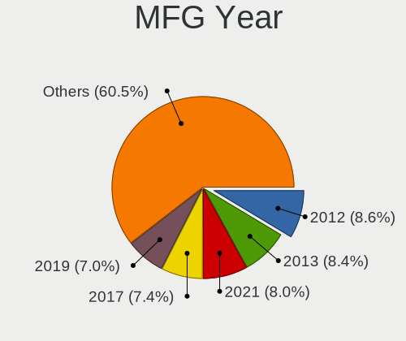
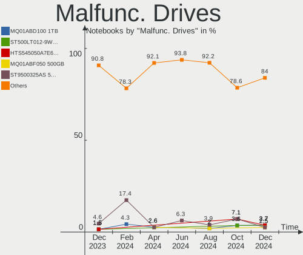
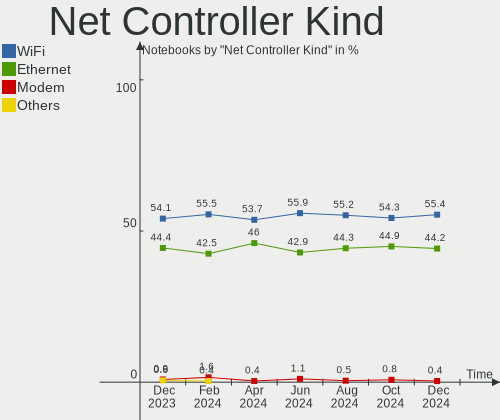
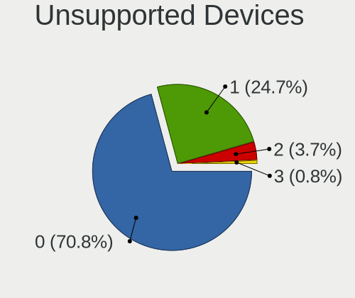

OpenMandriva Hardware Trends (Notebooks)
----------------------------------------

A project to identify most popular hardware characteristics and track their change
over time based on data collected by OpenMandriva users at https://Linux-Hardware.org.

Anyone can contribute to this report by the [hw-probe](https://github.com/linuxhw/hw-probe) tool:

    sudo -E hw-probe -all -upload

Full-feature report is available here: https://linux-hardware.org/?view=trends&formfactor=notebook

Period: Sep, 2021.

Contents
--------

* [ System ](#system)
  - [ OS                       ](#os)
  - [ OS Family                ](#os-family)
  - [ Kernel                   ](#kernel)
  - [ Kernel Family            ](#kernel-family)
  - [ Kernel Major Ver.        ](#kernel-major-ver)
  - [ Arch                     ](#arch)
  - [ DE                       ](#de)
  - [ Display Server           ](#display-server)
  - [ Display Manager          ](#display-manager)
  - [ OS Lang                  ](#os-lang)
  - [ Boot Mode                ](#boot-mode)
  - [ Filesystem               ](#filesystem)
  - [ Part. scheme             ](#part-scheme)
  - [ Dual Boot with Linux/BSD ](#dual-boot-with-linuxbsd)
  - [ Dual Boot (Win)          ](#dual-boot-win)

* [ Board ](#board)
  - [ Vendor                   ](#vendor)
  - [ Model                    ](#model)
  - [ Model Family             ](#model-family)
  - [ MFG Year                 ](#mfg-year)
  - [ Form Factor              ](#form-factor)
  - [ Secure Boot              ](#secure-boot)
  - [ Coreboot                 ](#coreboot)
  - [ RAM Size                 ](#ram-size)
  - [ RAM Used                 ](#ram-used)
  - [ Total Drives             ](#total-drives)
  - [ Has CD-ROM               ](#has-cd-rom)
  - [ Has Ethernet             ](#has-ethernet)
  - [ Has WiFi                 ](#has-wifi)
  - [ Has Bluetooth            ](#has-bluetooth)

* [ Location ](#location)
  - [ Country                  ](#country)
  - [ City                     ](#city)

* [ Drives ](#drives)
  - [ Drive Vendor             ](#drive-vendor)
  - [ Drive Model              ](#drive-model)
  - [ HDD Vendor               ](#hdd-vendor)
  - [ SSD Vendor               ](#ssd-vendor)
  - [ Drive Kind               ](#drive-kind)
  - [ Drive Connector          ](#drive-connector)
  - [ Drive Size               ](#drive-size)
  - [ Space Total              ](#space-total)
  - [ Space Used               ](#space-used)
  - [ Malfunc. Drives          ](#malfunc-drives)
  - [ Malfunc. Drive Vendor    ](#malfunc-drive-vendor)
  - [ Malfunc. HDD Vendor      ](#malfunc-hdd-vendor)
  - [ Malfunc. Drive Kind      ](#malfunc-drive-kind)
  - [ Failed Drives            ](#failed-drives)
  - [ Failed Drive Vendor      ](#failed-drive-vendor)
  - [ Drive Status             ](#drive-status)

* [ Storage controller ](#storage-controller)
  - [ Storage Vendor           ](#storage-vendor)
  - [ Storage Model            ](#storage-model)
  - [ Storage Kind             ](#storage-kind)

* [ Processor ](#processor)
  - [ CPU Vendor               ](#cpu-vendor)
  - [ CPU Model                ](#cpu-model)
  - [ CPU Model Family         ](#cpu-model-family)
  - [ CPU Cores                ](#cpu-cores)
  - [ CPU Sockets              ](#cpu-sockets)
  - [ CPU Threads              ](#cpu-threads)
  - [ CPU Op-Modes             ](#cpu-op-modes)
  - [ CPU Microcode            ](#cpu-microcode)
  - [ CPU Microarch            ](#cpu-microarch)

* [ Graphics ](#graphics)
  - [ GPU Vendor               ](#gpu-vendor)
  - [ GPU Model                ](#gpu-model)
  - [ GPU Combo                ](#gpu-combo)
  - [ GPU Driver               ](#gpu-driver)
  - [ GPU Memory               ](#gpu-memory)

* [ Monitor ](#monitor)
  - [ Monitor Vendor           ](#monitor-vendor)
  - [ Monitor Model            ](#monitor-model)
  - [ Monitor Resolution       ](#monitor-resolution)
  - [ Monitor Diagonal         ](#monitor-diagonal)
  - [ Monitor Width            ](#monitor-width)
  - [ Aspect Ratio             ](#aspect-ratio)
  - [ Monitor Area             ](#monitor-area)
  - [ Pixel Density            ](#pixel-density)
  - [ Multiple Monitors        ](#multiple-monitors)

* [ Network ](#network)
  - [ Net Controller Vendor    ](#net-controller-vendor)
  - [ Net Controller Model     ](#net-controller-model)
  - [ Wireless Vendor          ](#wireless-vendor)
  - [ Wireless Model           ](#wireless-model)
  - [ Ethernet Vendor          ](#ethernet-vendor)
  - [ Ethernet Model           ](#ethernet-model)
  - [ Net Controller Kind      ](#net-controller-kind)
  - [ Used Controller          ](#used-controller)
  - [ NICs                     ](#nics)
  - [ IPv6                     ](#ipv6)

* [ Bluetooth ](#bluetooth)
  - [ Bluetooth Vendor         ](#bluetooth-vendor)
  - [ Bluetooth Model          ](#bluetooth-model)

* [ Sound ](#sound)
  - [ Sound Vendor             ](#sound-vendor)
  - [ Sound Model              ](#sound-model)

* [ Memory ](#memory)
  - [ Memory Vendor            ](#memory-vendor)
  - [ Memory Model             ](#memory-model)
  - [ Memory Kind              ](#memory-kind)
  - [ Memory Form Factor       ](#memory-form-factor)
  - [ Memory Size              ](#memory-size)
  - [ Memory Speed             ](#memory-speed)

* [ Printers & scanners ](#printers--scanners)
  - [ Printer Vendor           ](#printer-vendor)
  - [ Printer Model            ](#printer-model)
  - [ Scanner Vendor           ](#scanner-vendor)
  - [ Scanner Model            ](#scanner-model)

* [ Camera ](#camera)
  - [ Camera Vendor            ](#camera-vendor)
  - [ Camera Model             ](#camera-model)

* [ Security ](#security)
  - [ Fingerprint Vendor       ](#fingerprint-vendor)
  - [ Fingerprint Model        ](#fingerprint-model)
  - [ Chipcard Vendor          ](#chipcard-vendor)
  - [ Chipcard Model           ](#chipcard-model)

* [ Unsupported ](#unsupported)
  - [ Unsupported Devices      ](#unsupported-devices)
  - [ Unsupported Device Types ](#unsupported-device-types)

System
------

OS
--

Installed operating systems

| Name              | Notebooks | Percent |
|-------------------|-----------|---------|
| OpenMandriva 4.2  | 100       | 90.91%  |
| OpenMandriva 4.50 | 10        | 9.09%   |

OS Family
---------

OS without a version

| Name         | Notebooks | Percent |
|--------------|-----------|---------|
| OpenMandriva | 110       | 100%    |

Kernel
------

Version of the Linux kernel

| Version                  | Notebooks | Percent |
|--------------------------|-----------|---------|
| 5.10.14-desktop-1omv4002 | 94        | 85.45%  |
| 5.12.4-desktop-1omv4050  | 7         | 6.36%   |
| 5.11.12-desktop-1omv4002 | 6         | 5.45%   |
| 5.12.7-desktop-1omv4003  | 3         | 2.73%   |

Kernel Family
-------------

Linux kernel without a distro release

| Version | Notebooks | Percent |
|---------|-----------|---------|
| 5.10.14 | 94        | 85.45%  |
| 5.12.4  | 7         | 6.36%   |
| 5.11.12 | 6         | 5.45%   |
| 5.12.7  | 3         | 2.73%   |

Kernel Major Ver.
-----------------

Linux kernel major version

| Version | Notebooks | Percent |
|---------|-----------|---------|
| 5.10    | 94        | 85.45%  |
| 5.12    | 10        | 9.09%   |
| 5.11    | 6         | 5.45%   |

Arch
----

OS architecture (x86_64, i586, etc.)

| Name   | Notebooks | Percent |
|--------|-----------|---------|
| x86_64 | 110       | 100%    |

DE
--

Desktop Environment

| Name | Notebooks | Percent |
|------|-----------|---------|
| KDE5 | 110       | 100%    |

Display Server
--------------

X11 or Wayland

| Name    | Notebooks | Percent |
|---------|-----------|---------|
| X11     | 109       | 99.09%  |
| Wayland | 1         | 0.91%   |

Display Manager
---------------

SDDM, LightDM, etc.

| Name | Notebooks | Percent |
|------|-----------|---------|
| SDDM | 110       | 100%    |

OS Lang
-------

Language

| Lang  | Notebooks | Percent |
|-------|-----------|---------|
| en_US | 46        | 41.82%  |
| cs_CZ | 15        | 13.64%  |
| fr_FR | 8         | 7.27%   |
| ru_RU | 6         | 5.45%   |
| pl_PL | 6         | 5.45%   |
| pt_BR | 5         | 4.55%   |
| es_ES | 4         | 3.64%   |
| en_GB | 4         | 3.64%   |
| it_IT | 3         | 2.73%   |
| fr_BE | 3         | 2.73%   |
| de_DE | 3         | 2.73%   |
| ru_UA | 1         | 0.91%   |
| nl_NL | 1         | 0.91%   |
| es_MX | 1         | 0.91%   |
| es_CR | 1         | 0.91%   |
| es_AR | 1         | 0.91%   |
| en_AU | 1         | 0.91%   |
| de_AT | 1         | 0.91%   |

Boot Mode
---------

EFI or BIOS

| Mode | Notebooks | Percent |
|------|-----------|---------|
| BIOS | 75        | 68.18%  |
| EFI  | 35        | 31.82%  |

Filesystem
----------

Type of filesystem

| Type    | Notebooks | Percent |
|---------|-----------|---------|
| Overlay | 78        | 70.91%  |
| Ext4    | 31        | 28.18%  |
| Ext2    | 1         | 0.91%   |

Part. scheme
------------

Scheme of partitioning

| Type | Notebooks | Percent |
|------|-----------|---------|
| MBR  | 55        | 50%     |
| GPT  | 55        | 50%     |

Dual Boot with Linux/BSD
------------------------

Hosting more than one Linux/BSD

| Dual boot | Notebooks | Percent |
|-----------|-----------|---------|
| No        | 62        | 56.36%  |
| Yes       | 48        | 43.64%  |

Dual Boot (Win)
---------------

Hosting Linux and Windows

| Dual boot | Notebooks | Percent |
|-----------|-----------|---------|
| No        | 60        | 54.55%  |
| Yes       | 50        | 45.45%  |

Board
-----

Vendor
------

Motherboard manufacturer

| Name                | Notebooks | Percent |
|---------------------|-----------|---------|
| ASUSTek Computer    | 27        | 24.55%  |
| Lenovo              | 17        | 15.45%  |
| Hewlett-Packard     | 15        | 13.64%  |
| Dell                | 13        | 11.82%  |
| Acer                | 12        | 10.91%  |
| Toshiba             | 7         | 6.36%   |
| Sony                | 5         | 4.55%   |
| Samsung Electronics | 4         | 3.64%   |
| Positivo            | 2         | 1.82%   |
| MSI                 | 2         | 1.82%   |
| Packard Bell        | 1         | 0.91%   |
| Fujitsu Siemens     | 1         | 0.91%   |
| Fujitsu             | 1         | 0.91%   |
| Chuwi               | 1         | 0.91%   |
| Apple               | 1         | 0.91%   |
| AMI                 | 1         | 0.91%   |

Model
-----

Motherboard model

| Name                                 | Notebooks | Percent |
|--------------------------------------|-----------|---------|
| ASUS UX31E                           | 14        | 12.73%  |
| Sony VGN-FZ31Z                       | 3         | 2.73%   |
| Toshiba TECRA M9                     | 1         | 0.91%   |
| Toshiba Satellite P870               | 1         | 0.91%   |
| Toshiba Satellite P845               | 1         | 0.91%   |
| Toshiba Satellite P750               | 1         | 0.91%   |
| Toshiba Satellite C850D-11R          | 1         | 0.91%   |
| Toshiba Satellite A200               | 1         | 0.91%   |
| Toshiba dynabook R73/A               | 1         | 0.91%   |
| Sony VPCF23S1E                       | 1         | 0.91%   |
| Sony VGN-FZ21M                       | 1         | 0.91%   |
| Samsung RV415                        | 1         | 0.91%   |
| Samsung RF510/RF410/RF710            | 1         | 0.91%   |
| Samsung R428/P428/R478               | 1         | 0.91%   |
| Samsung 550XCJ/550XCR                | 1         | 0.91%   |
| Positivo SW6H                        | 1         | 0.91%   |
| Positivo MOBILE                      | 1         | 0.91%   |
| Packard Bell EasyNote LM85           | 1         | 0.91%   |
| MSI GS65 Stealth Thin 8RF            | 1         | 0.91%   |
| MSI GE72 2QD                         | 1         | 0.91%   |
| Lenovo Z50-70 20354                  | 1         | 0.91%   |
| Lenovo ThinkPad X230 2306A44         | 1         | 0.91%   |
| Lenovo ThinkPad X130e 06222EU        | 1         | 0.91%   |
| Lenovo ThinkPad T61 7661BM5          | 1         | 0.91%   |
| Lenovo ThinkPad T61 7659AB7          | 1         | 0.91%   |
| Lenovo ThinkPad T530 2429B14         | 1         | 0.91%   |
| Lenovo ThinkPad T420 4236A22         | 1         | 0.91%   |
| Lenovo ThinkPad T400 2767C44         | 1         | 0.91%   |
| Lenovo ThinkPad P50 20EQS3BT2E       | 1         | 0.91%   |
| Lenovo ThinkPad E495 20NECTO1WW      | 1         | 0.91%   |
| Lenovo IdeaPad G485 QAWGE            | 1         | 0.91%   |
| Lenovo IdeaPad 520-15IKB 80YL        | 1         | 0.91%   |
| Lenovo IdeaPad 510-15ISK 80SR        | 1         | 0.91%   |
| Lenovo IdeaPad 120S-11IAP 81A4       | 1         | 0.91%   |
| Lenovo G510 20238                    | 1         | 0.91%   |
| Lenovo G500 20236                    | 1         | 0.91%   |
| Lenovo B570 HuronRiver Platform      | 1         | 0.91%   |
| HP ProBook 450 G3                    | 1         | 0.91%   |
| HP Pavilion dv6                      | 1         | 0.91%   |
| HP Pavilion dm4                      | 1         | 0.91%   |
| HP OMEN by HP Laptop 15-dc0xxx       | 1         | 0.91%   |
| HP Notebook                          | 1         | 0.91%   |
| HP Laptop 15s-fq2xxx                 | 1         | 0.91%   |
| HP ENVY 4                            | 1         | 0.91%   |
| HP EliteBook 8560p                   | 1         | 0.91%   |
| HP EliteBook 8540p                   | 1         | 0.91%   |
| HP EliteBook 8530p                   | 1         | 0.91%   |
| HP EliteBook 820 G1                  | 1         | 0.91%   |
| HP EliteBook 2570p                   | 1         | 0.91%   |
| HP Compaq Presario CQ40              | 1         | 0.91%   |
| HP Compaq 2510p                      | 1         | 0.91%   |
| HP 15                                | 1         | 0.91%   |
| Fujitsu Siemens ESPRIMO Mobile V5535 | 1         | 0.91%   |
| Fujitsu LIFEBOOK A555                | 1         | 0.91%   |
| Dell Latitude E6500                  | 1         | 0.91%   |
| Dell Latitude E6410                  | 1         | 0.91%   |
| Dell Latitude E6400                  | 1         | 0.91%   |
| Dell Latitude E6220                  | 1         | 0.91%   |
| Dell Latitude E5510                  | 1         | 0.91%   |
| Dell Latitude E5440                  | 1         | 0.91%   |

Model Family
------------

Motherboard model prefix

| Name                    | Notebooks | Percent |
|-------------------------|-----------|---------|
| ASUS UX31E              | 14        | 12.73%  |
| Lenovo ThinkPad         | 9         | 8.18%   |
| Dell Latitude           | 8         | 7.27%   |
| Acer Aspire             | 8         | 7.27%   |
| Toshiba Satellite       | 5         | 4.55%   |
| HP EliteBook            | 5         | 4.55%   |
| Dell Inspiron           | 5         | 4.55%   |
| Lenovo IdeaPad          | 4         | 3.64%   |
| Sony VGN-FZ31Z          | 3         | 2.73%   |
| HP Pavilion             | 2         | 1.82%   |
| HP Compaq               | 2         | 1.82%   |
| ASUS VivoBook           | 2         | 1.82%   |
| Acer TravelMate         | 2         | 1.82%   |
| Toshiba TECRA           | 1         | 0.91%   |
| Toshiba dynabook        | 1         | 0.91%   |
| Sony VPCF23S1E          | 1         | 0.91%   |
| Sony VGN-FZ21M          | 1         | 0.91%   |
| Samsung RV415           | 1         | 0.91%   |
| Samsung RF510           | 1         | 0.91%   |
| Samsung R428            | 1         | 0.91%   |
| Samsung 550XCJ          | 1         | 0.91%   |
| Positivo SW6H           | 1         | 0.91%   |
| Positivo MOBILE         | 1         | 0.91%   |
| Packard Bell EasyNote   | 1         | 0.91%   |
| MSI GS65                | 1         | 0.91%   |
| MSI GE72                | 1         | 0.91%   |
| Lenovo Z50-70           | 1         | 0.91%   |
| Lenovo G510             | 1         | 0.91%   |
| Lenovo G500             | 1         | 0.91%   |
| Lenovo B570             | 1         | 0.91%   |
| HP ProBook              | 1         | 0.91%   |
| HP OMEN                 | 1         | 0.91%   |
| HP Notebook             | 1         | 0.91%   |
| HP Laptop               | 1         | 0.91%   |
| HP ENVY                 | 1         | 0.91%   |
| HP 15                   | 1         | 0.91%   |
| Fujitsu Siemens ESPRIMO | 1         | 0.91%   |
| Fujitsu LIFEBOOK        | 1         | 0.91%   |
| Chuwi CoreBook          | 1         | 0.91%   |
| ASUS X751SA             | 1         | 0.91%   |
| ASUS X555DG             | 1         | 0.91%   |
| ASUS X550CA             | 1         | 0.91%   |
| ASUS X540LJ             | 1         | 0.91%   |
| ASUS UX305UA            | 1         | 0.91%   |
| ASUS K73SV              | 1         | 0.91%   |
| ASUS K53U               | 1         | 0.91%   |
| ASUS K53SD              | 1         | 0.91%   |
| ASUS K53E               | 1         | 0.91%   |
| ASUS G750JX             | 1         | 0.91%   |
| ASUS A6Je               | 1         | 0.91%   |
| Apple MacBookPro8       | 1         | 0.91%   |
| AMI Intel               | 1         | 0.91%   |
| Acer Swift              | 1         | 0.91%   |
| Acer Extensa            | 1         | 0.91%   |

MFG Year
--------

Motherboard manufacture year

| Year | Notebooks | Percent |
|------|-----------|---------|
| 2012 | 24        | 21.82%  |
| 2011 | 11        | 10%     |
| 2013 | 10        | 9.09%   |
| 2019 | 8         | 7.27%   |
| 2021 | 7         | 6.36%   |
| 2020 | 7         | 6.36%   |
| 2010 | 7         | 6.36%   |
| 2007 | 7         | 6.36%   |
| 2016 | 6         | 5.45%   |
| 2008 | 6         | 5.45%   |
| 2015 | 5         | 4.55%   |
| 2014 | 5         | 4.55%   |
| 2018 | 2         | 1.82%   |
| 2017 | 2         | 1.82%   |
| 2009 | 2         | 1.82%   |
| 2005 | 1         | 0.91%   |

Form Factor
-----------

Physical design of the computer

| Name     | Notebooks | Percent |
|----------|-----------|---------|
| Notebook | 110       | 100%    |

Secure Boot
-----------

Enabled or disabled

| State    | Notebooks | Percent |
|----------|-----------|---------|
| Disabled | 110       | 100%    |

Coreboot
--------

Have coreboot on board

| Used | Notebooks | Percent |
|------|-----------|---------|
| No   | 110       | 100%    |

RAM Size
--------

Total RAM memory

| Size in GB | Notebooks | Percent |
|------------|-----------|---------|
| 3.01-4.0   | 52        | 47.27%  |
| 4.01-8.0   | 27        | 24.55%  |
| 8.01-16.0  | 12        | 10.91%  |
| 16.01-24.0 | 7         | 6.36%   |
| 1.01-2.0   | 7         | 6.36%   |
| 2.01-3.0   | 4         | 3.64%   |
| 32.01-64.0 | 1         | 0.91%   |

RAM Used
--------

Used RAM memory

| Used GB  | Notebooks | Percent |
|----------|-----------|---------|
| 1.01-2.0 | 90        | 81.82%  |
| 0.51-1.0 | 14        | 12.73%  |
| 2.01-3.0 | 4         | 3.64%   |
| 0.01-0.5 | 2         | 1.82%   |

Total Drives
------------

Number of drives on board

| Drives | Notebooks | Percent |
|--------|-----------|---------|
| 1      | 89        | 80.91%  |
| 2      | 20        | 18.18%  |
| 3      | 1         | 0.91%   |

Has CD-ROM
----------

Has CD-ROM on board

| Presented | Notebooks | Percent |
|-----------|-----------|---------|
| Yes       | 65        | 59.09%  |
| No        | 45        | 40.91%  |

Has Ethernet
------------

Has Ethernet on board

| Presented | Notebooks | Percent |
|-----------|-----------|---------|
| Yes       | 103       | 93.64%  |
| No        | 7         | 6.36%   |

Has WiFi
--------

Has WiFi module

| Presented | Notebooks | Percent |
|-----------|-----------|---------|
| Yes       | 110       | 100%    |

Has Bluetooth
-------------

Has Bluetooth module

| Presented | Notebooks | Percent |
|-----------|-----------|---------|
| Yes       | 59        | 53.64%  |
| No        | 51        | 46.36%  |

Location
--------

Country
-------

Geographic location (country)

| Country      | Notebooks | Percent |
|--------------|-----------|---------|
| Czechia      | 15        | 13.64%  |
| France       | 10        | 9.09%   |
| Russia       | 7         | 6.36%   |
| Poland       | 7         | 6.36%   |
| Brazil       | 6         | 5.45%   |
| USA          | 5         | 4.55%   |
| Spain        | 5         | 4.55%   |
| Portugal     | 5         | 4.55%   |
| Germany      | 5         | 4.55%   |
| UK           | 4         | 3.64%   |
| Mexico       | 3         | 2.73%   |
| Italy        | 3         | 2.73%   |
| Belgium      | 3         | 2.73%   |
| Ukraine      | 2         | 1.82%   |
| Saudi Arabia | 2         | 1.82%   |
| Netherlands  | 2         | 1.82%   |
| Japan        | 2         | 1.82%   |
| Greece       | 2         | 1.82%   |
| Finland      | 2         | 1.82%   |
| Canada       | 2         | 1.82%   |
| Austria      | 2         | 1.82%   |
| Romania      | 1         | 0.91%   |
| Philippines  | 1         | 0.91%   |
| New Zealand  | 1         | 0.91%   |
| Malaysia     | 1         | 0.91%   |
| Madagascar   | 1         | 0.91%   |
| Jamaica      | 1         | 0.91%   |
| Israel       | 1         | 0.91%   |
| Indonesia    | 1         | 0.91%   |
| India        | 1         | 0.91%   |
| Hungary      | 1         | 0.91%   |
| Croatia      | 1         | 0.91%   |
| Costa Rica   | 1         | 0.91%   |
| China        | 1         | 0.91%   |
| Australia    | 1         | 0.91%   |
| Argentina    | 1         | 0.91%   |
| Algeria      | 1         | 0.91%   |

City
----

Geographic location (city)

| City                   | Notebooks | Percent |
|------------------------|-----------|---------|
| Prague                 | 14        | 12.73%  |
| Funchal                | 4         | 3.64%   |
| Mexico City            | 3         | 2.73%   |
| Vienna                 | 2         | 1.82%   |
| Thessaloniki           | 2         | 1.82%   |
| Madrid                 | 2         | 1.82%   |
| Limeira                | 2         | 1.82%   |
| Kyiv                   | 2         | 1.82%   |
| Jeddah                 | 2         | 1.82%   |
| Helsinki               | 2         | 1.82%   |
| Bristol                | 2         | 1.82%   |
| Zl?­n                  | 1         | 0.91%   |
| Zdunska Wola           | 1         | 0.91%   |
| Worcester              | 1         | 0.91%   |
| Willingboro            | 1         | 0.91%   |
| Warsaw                 | 1         | 0.91%   |
| Vidnoye                | 1         | 0.91%   |
| Toulouse               | 1         | 0.91%   |
| Soustons               | 1         | 0.91%   |
| Shah Alam              | 1         | 0.91%   |
| Severodvinsk           | 1         | 0.91%   |
| Schoten                | 1         | 0.91%   |
| S??o Bernardo do Campo | 1         | 0.91%   |
| Savona                 | 1         | 0.91%   |
| Sangamner              | 1         | 0.91%   |
| Saint-Ouen             | 1         | 0.91%   |
| Rome                   | 1         | 0.91%   |
| Rianxo                 | 1         | 0.91%   |
| Qiryat Mo??•qin        | 1         | 0.91%   |
| Potters Bar            | 1         | 0.91%   |
| Ploie??ti              | 1         | 0.91%   |
| Pilisvorosvar          | 1         | 0.91%   |
| Perpignan              | 1         | 0.91%   |
| Pati                   | 1         | 0.91%   |
| Paris                  | 1         | 0.91%   |
| Palam??s               | 1         | 0.91%   |
| Nova Friburgo          | 1         | 0.91%   |
| Nepean                 | 1         | 0.91%   |
| Namur                  | 1         | 0.91%   |
| Naga                   | 1         | 0.91%   |
| Munich                 | 1         | 0.91%   |
| Molchanovo             | 1         | 0.91%   |
| Mindelheim             | 1         | 0.91%   |
| Melbourne              | 1         | 0.91%   |
| Mandeville             | 1         | 0.91%   |
| Macei??                | 1         | 0.91%   |
| London                 | 1         | 0.91%   |
| Lomas del Mirador      | 1         | 0.91%   |
| Lochem                 | 1         | 0.91%   |
| Lisbon                 | 1         | 0.91%   |
| Limoges                | 1         | 0.91%   |
| Landshut               | 1         | 0.91%   |
| Laguna                 | 1         | 0.91%   |
| Krasnodar              | 1         | 0.91%   |
| Krakow                 | 1         | 0.91%   |
| Koto                   | 1         | 0.91%   |
| Kochubeyevskoye        | 1         | 0.91%   |
| Kirov                  | 1         | 0.91%   |
| Kingston               | 1         | 0.91%   |
| Kielce                 | 1         | 0.91%   |

Drives
------

Drive Vendor
------------

Hard drive vendors

| Vendor              | Notebooks | Drives | Percent |
|---------------------|-----------|--------|---------|
| Seagate             | 19        | 19     | 15.45%  |
| SanDisk             | 18        | 19     | 14.63%  |
| WDC                 | 16        | 16     | 13.01%  |
| Hitachi             | 11        | 11     | 8.94%   |
| Toshiba             | 8         | 8      | 6.5%    |
| Samsung Electronics | 7         | 9      | 5.69%   |
| Unknown             | 6         | 6      | 4.88%   |
| Kingston            | 4         | 4      | 3.25%   |
| HGST                | 4         | 4      | 3.25%   |
| Crucial             | 4         | 4      | 3.25%   |
| SK Hynix            | 3         | 3      | 2.44%   |
| Micron Technology   | 3         | 3      | 2.44%   |
| GOODRAM             | 3         | 3      | 2.44%   |
| A-DATA Technology   | 3         | 3      | 2.44%   |
| PNY                 | 2         | 2      | 1.63%   |
| Intel               | 2         | 2      | 1.63%   |
| Fujitsu             | 2         | 2      | 1.63%   |
| LITEON              | 1         | 1      | 0.81%   |
| JMicron             | 1         | 1      | 0.81%   |
| IBM/Hitachi         | 1         | 1      | 0.81%   |
| HS-SSD-C100         | 1         | 1      | 0.81%   |
| Hewlett-Packard     | 1         | 1      | 0.81%   |
| External            | 1         | 1      | 0.81%   |
| China               | 1         | 1      | 0.81%   |
| Biostar             | 1         | 1      | 0.81%   |

Drive Model
-----------

Hard drive models

| Model                                 | Notebooks | Percent |
|---------------------------------------|-----------|---------|
| SanDisk SSD U100 256GB                | 14        | 11.11%  |
| Seagate ST9500325AS 500GB             | 3         | 2.38%   |
| Seagate ST500LT012-1DG142 500GB       | 3         | 2.38%   |
| Seagate ST500LM012 HN-M500MBB 500GB   | 3         | 2.38%   |
| HGST HTS721010A9E630 1TB              | 3         | 2.38%   |
| WDC WDS120G2G0A-00JH30 120GB SSD      | 2         | 1.59%   |
| WDC WD1200BEVS-22UST0 120GB           | 2         | 1.59%   |
| WDC WD10JPVX-22JC3T0 1TB              | 2         | 1.59%   |
| Toshiba MQ01ABF050 500GB              | 2         | 1.59%   |
| Seagate ST750LM022 HN-M750MBB 752GB   | 2         | 1.59%   |
| Seagate ST1000LM024 HN-M101MBB 1TB    | 2         | 1.59%   |
| Kingston SV300S37A120G 120GB SSD      | 2         | 1.59%   |
| Crucial CT240M500SSD1 240GB           | 2         | 1.59%   |
| WDC WD5000LPCX-60VHAT0 500GB          | 1         | 0.79%   |
| WDC WD5000BEVT-22A0RT0 500GB          | 1         | 0.79%   |
| WDC WD50 00BEVT-11ZAT0 500GB          | 1         | 0.79%   |
| WDC WD3200BPVT-75ZEST0 320GB          | 1         | 0.79%   |
| WDC WD3200BPVT-24JJ5T0 320GB          | 1         | 0.79%   |
| WDC WD3200BPVT-22ZEST0 320GB          | 1         | 0.79%   |
| WDC WD2500BEVS-22UST0 250GB           | 1         | 0.79%   |
| WDC WD1600BEVT-75A23T0 160GB          | 1         | 0.79%   |
| WDC WD10SPZX-21Z10T0 1TB              | 1         | 0.79%   |
| WDC WD10JPCX-24UE4T0 1TB              | 1         | 0.79%   |
| Unknown USD00  32GB                   | 1         | 0.79%   |
| Unknown SDU1  64GB                    | 1         | 0.79%   |
| Unknown SC32G  32GB                   | 1         | 0.79%   |
| Unknown M.2 2280 SATA SSD 128GB       | 1         | 0.79%   |
| Unknown HBG4a2  32GB                  | 1         | 0.79%   |
| Unknown DA4128  128GB                 | 1         | 0.79%   |
| Toshiba MQ04ABF100 1TB                | 1         | 0.79%   |
| Toshiba MK7575GSX 752GB               | 1         | 0.79%   |
| Toshiba MK3261GSYN 320GB              | 1         | 0.79%   |
| Toshiba MK2556GSY 250GB               | 1         | 0.79%   |
| Toshiba MK1656GSY 160GB               | 1         | 0.79%   |
| Toshiba MK1214GAH 120GB               | 1         | 0.79%   |
| SK Hynix SC401 SATA 256GB SSD         | 1         | 0.79%   |
| SK Hynix SC308 SATA 512GB SSD         | 1         | 0.79%   |
| SK Hynix HFS256G39MND-3310A 256GB SSD | 1         | 0.79%   |
| Seagate ST98823AS 80GB                | 1         | 0.79%   |
| Seagate ST9750423AS 752GB             | 1         | 0.79%   |
| Seagate ST95005620AS 500GB            | 1         | 0.79%   |
| Seagate ST9250827AS 250GB             | 1         | 0.79%   |
| Seagate ST500LM000-1EJ162 500GB       | 1         | 0.79%   |
| Seagate ST2000LM007-1R8174 2TB        | 1         | 0.79%   |
| SanDisk SSD U100 64GB                 | 1         | 0.79%   |
| SanDisk SSD PLUS 120GB                | 1         | 0.79%   |
| SanDisk SSD PLUS 1000GB               | 1         | 0.79%   |
| SanDisk SDSSDP128G 128GB              | 1         | 0.79%   |
| SanDisk SD9SN8W256G1102 256GB SSD     | 1         | 0.79%   |
| Samsung SSD PM810 2.5 7mm 256GB       | 1         | 0.79%   |
| Samsung SSD 980 1TB                   | 1         | 0.79%   |
| Samsung SSD 970 EVO 500GB             | 1         | 0.79%   |
| Samsung SSD 870 QVO 1TB               | 1         | 0.79%   |
| Samsung SSD 860 EVO 500GB             | 1         | 0.79%   |
| Samsung SSD 860 EVO 1TB               | 1         | 0.79%   |
| Samsung MZVLB512HAJQ-00000 512GB      | 1         | 0.79%   |
| Samsung MZVLB256HBHQ-000L7 256GB      | 1         | 0.79%   |
| Samsung MZMPC032HBCD-000H1 32GB SSD   | 1         | 0.79%   |
| PNY CS900 500GB SSD                   | 1         | 0.79%   |
| PNY CS900 120GB SSD                   | 1         | 0.79%   |

HDD Vendor
----------

Hard disk drive vendors

| Vendor      | Notebooks | Drives | Percent |
|-------------|-----------|--------|---------|
| Seagate     | 19        | 19     | 32.2%   |
| WDC         | 14        | 14     | 23.73%  |
| Hitachi     | 11        | 11     | 18.64%  |
| Toshiba     | 8         | 8      | 13.56%  |
| HGST        | 4         | 4      | 6.78%   |
| Fujitsu     | 2         | 2      | 3.39%   |
| IBM/Hitachi | 1         | 1      | 1.69%   |

SSD Vendor
----------

Solid state drive vendors

| Vendor              | Notebooks | Drives | Percent |
|---------------------|-----------|--------|---------|
| SanDisk             | 18        | 19     | 35.29%  |
| Samsung Electronics | 5         | 5      | 9.8%    |
| Crucial             | 4         | 4      | 7.84%   |
| SK Hynix            | 3         | 3      | 5.88%   |
| Kingston            | 3         | 3      | 5.88%   |
| GOODRAM             | 3         | 3      | 5.88%   |
| WDC                 | 2         | 2      | 3.92%   |
| PNY                 | 2         | 2      | 3.92%   |
| Micron Technology   | 2         | 2      | 3.92%   |
| A-DATA Technology   | 2         | 2      | 3.92%   |
| Unknown             | 1         | 1      | 1.96%   |
| LITEON              | 1         | 1      | 1.96%   |
| Intel               | 1         | 1      | 1.96%   |
| HS-SSD-C100         | 1         | 1      | 1.96%   |
| Hewlett-Packard     | 1         | 1      | 1.96%   |
| China               | 1         | 1      | 1.96%   |
| Biostar             | 1         | 1      | 1.96%   |

Drive Kind
----------

HDD or SSD

| Kind | Notebooks | Drives | Percent |
|------|-----------|--------|---------|
| HDD  | 58        | 59     | 47.54%  |
| SSD  | 50        | 52     | 40.98%  |
| NVMe | 9         | 10     | 7.38%   |
| MMC  | 5         | 5      | 4.1%    |

Drive Connector
---------------

SATA, SAS, NVMe, etc.

| Type | Notebooks | Drives | Percent |
|------|-----------|--------|---------|
| SATA | 104       | 110    | 87.39%  |
| NVMe | 7         | 8      | 5.88%   |
| MMC  | 5         | 5      | 4.2%    |
| SAS  | 3         | 3      | 2.52%   |

Drive Size
----------

Size of hard drive

| Size in TB | Notebooks | Drives | Percent |
|------------|-----------|--------|---------|
| 0.01-0.5   | 85        | 89     | 79.44%  |
| 0.51-1.0   | 21        | 21     | 19.63%  |
| 1.01-2.0   | 1         | 1      | 0.93%   |

Space Total
-----------

Amount of disk space available on the file system

| Size in GB | Notebooks | Percent |
|------------|-----------|---------|
| 1-20       | 57        | 51.82%  |
| 101-250    | 18        | 16.36%  |
| 251-500    | 13        | 11.82%  |
| Unknown    | 8         | 7.27%   |
| 51-100     | 7         | 6.36%   |
| 21-50      | 4         | 3.64%   |
| 501-1000   | 2         | 1.82%   |
| 1001-2000  | 1         | 0.91%   |

Space Used
----------

Amount of used disk space

| Used GB  | Notebooks | Percent |
|----------|-----------|---------|
| 1-20     | 97        | 88.18%  |
| Unknown  | 8         | 7.27%   |
| 21-50    | 3         | 2.73%   |
| 101-250  | 1         | 0.91%   |
| 501-1000 | 1         | 0.91%   |

Malfunc. Drives
---------------

Drive models with a malfunction

| Model                                       | Notebooks | Drives | Percent |
|---------------------------------------------|-----------|--------|---------|
| SanDisk SSD U100 256GB                      | 14        | 14     | 29.17%  |
| Seagate ST9500325AS 500GB                   | 2         | 2      | 4.17%   |
| Seagate ST500LT012-1DG142 500GB             | 2         | 2      | 4.17%   |
| Kingston SV300S37A120G 120GB SSD            | 2         | 2      | 4.17%   |
| Crucial CT240M500SSD1 240GB                 | 2         | 2      | 4.17%   |
| WDC WDS120G2G0A-00JH30 120GB SSD            | 1         | 1      | 2.08%   |
| WDC WD5000LPCX-60VHAT0 500GB                | 1         | 1      | 2.08%   |
| WDC WD50 00BEVT-11ZAT0 500GB                | 1         | 1      | 2.08%   |
| WDC WD3200BPVT-75ZEST0 320GB                | 1         | 1      | 2.08%   |
| WDC WD10JPVX-22JC3T0 1TB                    | 1         | 1      | 2.08%   |
| WDC WD10JPCX-24UE4T0 1TB                    | 1         | 1      | 2.08%   |
| Toshiba MQ01ABF050 500GB                    | 1         | 1      | 2.08%   |
| Toshiba MK7575GSX 752GB                     | 1         | 1      | 2.08%   |
| Toshiba MK2556GSY 250GB                     | 1         | 1      | 2.08%   |
| Toshiba MK1656GSY 160GB                     | 1         | 1      | 2.08%   |
| Toshiba MK1214GAH 120GB                     | 1         | 1      | 2.08%   |
| Seagate ST9750423AS 752GB                   | 1         | 1      | 2.08%   |
| Seagate ST9250827AS 250GB                   | 1         | 1      | 2.08%   |
| Seagate ST750LM022 HN-M750MBB 752GB         | 1         | 1      | 2.08%   |
| Seagate ST500LM012 HN-M500MBB 500GB         | 1         | 1      | 2.08%   |
| Seagate ST500LM000-1EJ162 500GB             | 1         | 1      | 2.08%   |
| Seagate ST2000LM007-1R8174 2TB              | 1         | 1      | 2.08%   |
| Seagate ST1000LM024 HN-M101MBB 1TB          | 1         | 1      | 2.08%   |
| Samsung Electronics SSD PM810 2.5 7mm 256GB | 1         | 1      | 2.08%   |
| IBM/Hitachi IC25N030ATCS04-0 32GB           | 1         | 1      | 2.08%   |
| Hitachi HTS725032A9A364 320GB               | 1         | 1      | 2.08%   |
| Hitachi HTS545025B9A300 250GB               | 1         | 1      | 2.08%   |
| Hitachi HTS542516K9SA00 160GB               | 1         | 1      | 2.08%   |
| HGST HTS721010A9E630 1TB                    | 1         | 1      | 2.08%   |
| HGST HTS541075A9E680 752GB                  | 1         | 1      | 2.08%   |
| A-DATA Technology SU630 240GB SSD           | 1         | 1      | 2.08%   |

Malfunc. Drive Vendor
---------------------

Vendors of faulty drives

| Vendor              | Notebooks | Drives | Percent |
|---------------------|-----------|--------|---------|
| SanDisk             | 14        | 14     | 29.17%  |
| Seagate             | 11        | 11     | 22.92%  |
| WDC                 | 6         | 6      | 12.5%   |
| Toshiba             | 5         | 5      | 10.42%  |
| Hitachi             | 3         | 3      | 6.25%   |
| Kingston            | 2         | 2      | 4.17%   |
| HGST                | 2         | 2      | 4.17%   |
| Crucial             | 2         | 2      | 4.17%   |
| Samsung Electronics | 1         | 1      | 2.08%   |
| IBM/Hitachi         | 1         | 1      | 2.08%   |
| A-DATA Technology   | 1         | 1      | 2.08%   |

Malfunc. HDD Vendor
-------------------

Vendors of faulty HDD drives

| Vendor      | Notebooks | Drives | Percent |
|-------------|-----------|--------|---------|
| Seagate     | 11        | 11     | 40.74%  |
| WDC         | 5         | 5      | 18.52%  |
| Toshiba     | 5         | 5      | 18.52%  |
| Hitachi     | 3         | 3      | 11.11%  |
| HGST        | 2         | 2      | 7.41%   |
| IBM/Hitachi | 1         | 1      | 3.7%    |

Malfunc. Drive Kind
-------------------

Kinds of faulty drives

| Kind | Notebooks | Drives | Percent |
|------|-----------|--------|---------|
| HDD  | 27        | 27     | 56.25%  |
| SSD  | 21        | 21     | 43.75%  |

Failed Drives
-------------

Failed drive models

Zero info for selected period =(

Failed Drive Vendor
-------------------

Failed drive vendors

Zero info for selected period =(

Drive Status
------------

Number of failed and malfunc. drives

| Status   | Notebooks | Drives | Percent |
|----------|-----------|--------|---------|
| Works    | 64        | 71     | 53.78%  |
| Malfunc  | 48        | 48     | 40.34%  |
| Detected | 7         | 7      | 5.88%   |

Storage controller
------------------

Storage Vendor
--------------

Storage controller vendors

| Vendor                           | Notebooks | Percent |
|----------------------------------|-----------|---------|
| Intel                            | 93        | 81.58%  |
| AMD                              | 14        | 12.28%  |
| Samsung Electronics              | 3         | 2.63%   |
| Silicon Integrated Systems [SiS] | 1         | 0.88%   |
| Realtek Semiconductor            | 1         | 0.88%   |
| Micron Technology                | 1         | 0.88%   |
| Kingston Technology Company      | 1         | 0.88%   |

Storage Model
-------------

Storage controller models

| Model                                                                            | Notebooks | Percent |
|----------------------------------------------------------------------------------|-----------|---------|
| Intel 6 Series/C200 Series Chipset Family 6 port Mobile SATA AHCI Controller     | 26        | 19.85%  |
| Intel 82801 Mobile SATA Controller [RAID mode]                                   | 12        | 9.16%   |
| Intel 82801HM/HEM (ICH8M/ICH8M-E) IDE Controller                                 | 10        | 7.63%   |
| Intel Sunrise Point-LP SATA Controller [AHCI mode]                               | 7         | 5.34%   |
| Intel 82801HM/HEM (ICH8M/ICH8M-E) SATA Controller [AHCI mode]                    | 7         | 5.34%   |
| Intel 7 Series Chipset Family 6-port SATA Controller [AHCI mode]                 | 7         | 5.34%   |
| AMD FCH SATA Controller [AHCI mode]                                              | 7         | 5.34%   |
| AMD SB7x0/SB8x0/SB9x0 SATA Controller [AHCI mode]                                | 6         | 4.58%   |
| Intel 82801IBM/IEM (ICH9M/ICH9M-E) 4 port SATA Controller [AHCI mode]            | 5         | 3.82%   |
| Intel 5 Series/3400 Series Chipset 4 port SATA AHCI Controller                   | 4         | 3.05%   |
| Samsung NVMe SSD Controller SM981/PM981/PM983                                    | 3         | 2.29%   |
| Intel Wildcat Point-LP SATA Controller [AHCI Mode]                               | 3         | 2.29%   |
| Intel 82801HM/HEM (ICH8M/ICH8M-E) SATA Controller [IDE mode]                     | 3         | 2.29%   |
| Intel 8 Series/C220 Series Chipset Family 6-port SATA Controller 1 [AHCI mode]   | 3         | 2.29%   |
| Intel Volume Management Device NVMe RAID Controller                              | 2         | 1.53%   |
| Intel Mobile 4 Series Chipset PT IDER Controller                                 | 2         | 1.53%   |
| Intel Celeron N3350/Pentium N4200/Atom E3900 Series SATA AHCI Controller         | 2         | 1.53%   |
| Intel Atom/Celeron/Pentium Processor x5-E8000/J3xxx/N3xxx Series SATA Controller | 2         | 1.53%   |
| Intel 8 Series SATA Controller 1 [AHCI mode]                                     | 2         | 1.53%   |
| Intel 5 Series/3400 Series Chipset 6 port SATA AHCI Controller                   | 2         | 1.53%   |
| Silicon Integrated Systems [SiS] SATA Controller / IDE mode                      | 1         | 0.76%   |
| Silicon Integrated Systems [SiS] 5513 IDE Controller                             | 1         | 0.76%   |
| Samsung NVMe SSD Controller 980                                                  | 1         | 0.76%   |
| Realtek Realtek Non-Volatile memory controller                                   | 1         | 0.76%   |
| Micron Non-Volatile memory controller                                            | 1         | 0.76%   |
| Kingston Company A2000 NVMe SSD                                                  | 1         | 0.76%   |
| Intel SSD 660P Series                                                            | 1         | 0.76%   |
| Intel Q170/Q150/B150/H170/H110/Z170/CM236 Chipset SATA Controller [AHCI Mode]    | 1         | 0.76%   |
| Intel Mobile PM965/GM965 PT IDER Controller                                      | 1         | 0.76%   |
| Intel Comet Lake SATA AHCI Controller                                            | 1         | 0.76%   |
| Intel Celeron/Pentium Silver Processor SATA Controller                           | 1         | 0.76%   |
| Intel 82801GBM/GHM (ICH7-M Family) SATA Controller [IDE mode]                    | 1         | 0.76%   |
| Intel 7 Series Chipset Family 4-port SATA Controller [IDE mode]                  | 1         | 0.76%   |
| Intel 7 Series Chipset Family 2-port SATA Controller [IDE mode]                  | 1         | 0.76%   |
| AMD SB7x0/SB8x0/SB9x0 IDE Controller                                             | 1         | 0.76%   |
| AMD IXP SB4x0 IDE Controller                                                     | 1         | 0.76%   |

Storage Kind
------------

Kind of storage controller (IDE, SATA, NVMe, SAS, ...)

| Kind | Notebooks | Percent |
|------|-----------|---------|
| SATA | 86        | 68.8%   |
| IDE  | 18        | 14.4%   |
| RAID | 14        | 11.2%   |
| NVMe | 7         | 5.6%    |

Processor
---------

CPU Vendor
----------

Processor vendors

| Vendor | Notebooks | Percent |
|--------|-----------|---------|
| Intel  | 95        | 86.36%  |
| AMD    | 15        | 13.64%  |

CPU Model
---------

Processor models

| Model                                  | Notebooks | Percent |
|----------------------------------------|-----------|---------|
| Intel Core i7-2677M CPU @ 1.80GHz      | 14        | 12.73%  |
| Intel Core 2 Duo CPU T8300 @ 2.40GHz   | 3         | 2.73%   |
| AMD E-450 APU with Radeon HD Graphics  | 3         | 2.73%   |
| Intel Core i7-6500U CPU @ 2.50GHz      | 2         | 1.82%   |
| Intel Core i7-2720QM CPU @ 2.20GHz     | 2         | 1.82%   |
| Intel Core i5-7200U CPU @ 2.50GHz      | 2         | 1.82%   |
| Intel Core i5-6300U CPU @ 2.40GHz      | 2         | 1.82%   |
| Intel Core i5-3320M CPU @ 2.60GHz      | 2         | 1.82%   |
| Intel Core i5-2410M CPU @ 2.30GHz      | 2         | 1.82%   |
| Intel Core i3-5005U CPU @ 2.00GHz      | 2         | 1.82%   |
| Intel Core i3-2330M CPU @ 2.20GHz      | 2         | 1.82%   |
| Intel Core i3-2310M CPU @ 2.10GHz      | 2         | 1.82%   |
| Intel Core 2 Duo CPU T7500 @ 2.20GHz   | 2         | 1.82%   |
| Intel Core 2 Duo CPU T7300 @ 2.00GHz   | 2         | 1.82%   |
| Intel Core 2 Duo CPU P8700 @ 2.53GHz   | 2         | 1.82%   |
| Intel Core 2 Duo CPU P8600 @ 2.40GHz   | 2         | 1.82%   |
| AMD E-300 APU with Radeon HD Graphics  | 2         | 1.82%   |
| Intel Pentium Dual CPU T3200 @ 2.00GHz | 1         | 0.91%   |
| Intel Pentium Dual CPU T2390 @ 1.86GHz | 1         | 0.91%   |
| Intel Pentium CPU P6100 @ 2.00GHz      | 1         | 0.91%   |
| Intel Pentium CPU N3710 @ 1.60GHz      | 1         | 0.91%   |
| Intel Pentium CPU N3700 @ 1.60GHz      | 1         | 0.91%   |
| Intel Pentium CPU B970 @ 2.30GHz       | 1         | 0.91%   |
| Intel Core i7-8850H CPU @ 2.60GHz      | 1         | 0.91%   |
| Intel Core i7-8750H CPU @ 2.20GHz      | 1         | 0.91%   |
| Intel Core i7-6820HQ CPU @ 2.70GHz     | 1         | 0.91%   |
| Intel Core i7-5700HQ CPU @ 2.70GHz     | 1         | 0.91%   |
| Intel Core i7-5500U CPU @ 2.40GHz      | 1         | 0.91%   |
| Intel Core i7-4720HQ CPU @ 2.60GHz     | 1         | 0.91%   |
| Intel Core i7-4700HQ CPU @ 2.40GHz     | 1         | 0.91%   |
| Intel Core i7-3520M CPU @ 2.90GHz      | 1         | 0.91%   |
| Intel Core i7-2670QM CPU @ 2.20GHz     | 1         | 0.91%   |
| Intel Core i7-2630QM CPU @ 2.00GHz     | 1         | 0.91%   |
| Intel Core i5-8300H CPU @ 2.30GHz      | 1         | 0.91%   |
| Intel Core i5-6200U CPU @ 2.30GHz      | 1         | 0.91%   |
| Intel Core i5-4300U CPU @ 1.90GHz      | 1         | 0.91%   |
| Intel Core i5-4210U CPU @ 1.70GHz      | 1         | 0.91%   |
| Intel Core i5-3337U CPU @ 1.80GHz      | 1         | 0.91%   |
| Intel Core i5-3317U CPU @ 1.70GHz      | 1         | 0.91%   |
| Intel Core i5-3230M CPU @ 2.60GHz      | 1         | 0.91%   |
| Intel Core i5-3210M CPU @ 2.50GHz      | 1         | 0.91%   |
| Intel Core i5-2520M CPU @ 2.50GHz      | 1         | 0.91%   |
| Intel Core i5-1035G1 CPU @ 1.00GHz     | 1         | 0.91%   |
| Intel Core i5-10210U CPU @ 1.60GHz     | 1         | 0.91%   |
| Intel Core i5 CPU M 560 @ 2.67GHz      | 1         | 0.91%   |
| Intel Core i5 CPU M 540 @ 2.53GHz      | 1         | 0.91%   |
| Intel Core i5 CPU M 520 @ 2.40GHz      | 1         | 0.91%   |
| Intel Core i5 CPU M 460 @ 2.53GHz      | 1         | 0.91%   |
| Intel Core i5 CPU M 430 @ 2.27GHz      | 1         | 0.91%   |
| Intel Core i3-7020U CPU @ 2.30GHz      | 1         | 0.91%   |
| Intel Core i3-6157U CPU @ 2.40GHz      | 1         | 0.91%   |
| Intel Core i3-6100U CPU @ 2.30GHz      | 1         | 0.91%   |
| Intel Core i3-4030U CPU @ 1.90GHz      | 1         | 0.91%   |
| Intel Core i3-3217U CPU @ 1.80GHz      | 1         | 0.91%   |
| Intel Core i3-2367M CPU @ 1.40GHz      | 1         | 0.91%   |
| Intel Core i3-2350M CPU @ 2.30GHz      | 1         | 0.91%   |
| Intel Core i3 CPU M 380 @ 2.53GHz      | 1         | 0.91%   |
| Intel Core 2 Duo CPU U7700 @ 1.33GHz   | 1         | 0.91%   |
| Intel Core 2 Duo CPU T7250 @ 2.00GHz   | 1         | 0.91%   |
| Intel Core 2 Duo CPU T5800 @ 2.00GHz   | 1         | 0.91%   |

CPU Model Family
----------------

Processor model prefix

| Model                   | Notebooks | Percent |
|-------------------------|-----------|---------|
| Intel Core i7           | 28        | 25.45%  |
| Intel Core i5           | 24        | 21.82%  |
| Intel Core 2 Duo        | 15        | 13.64%  |
| Intel Core i3           | 14        | 12.73%  |
| AMD E                   | 5         | 4.55%   |
| Intel Pentium           | 4         | 3.64%   |
| Intel Celeron           | 3         | 2.73%   |
| Other                   | 2         | 1.82%   |
| Intel Pentium Dual      | 2         | 1.82%   |
| AMD A8                  | 2         | 1.82%   |
| Intel Core 2            | 1         | 0.91%   |
| Intel Celeron Dual-Core | 1         | 0.91%   |
| Intel Atom              | 1         | 0.91%   |
| AMD Turion 64 Mobile    | 1         | 0.91%   |
| AMD Ryzen 5             | 1         | 0.91%   |
| AMD FX                  | 1         | 0.91%   |
| AMD E1                  | 1         | 0.91%   |
| AMD C-70                | 1         | 0.91%   |
| AMD Athlon II Dual-Core | 1         | 0.91%   |
| AMD A4                  | 1         | 0.91%   |
| AMD A10                 | 1         | 0.91%   |

CPU Cores
---------

Number of processor cores

| Number | Notebooks | Percent |
|--------|-----------|---------|
| 2      | 87        | 79.09%  |
| 4      | 19        | 17.27%  |
| 6      | 2         | 1.82%   |
| 1      | 2         | 1.82%   |

CPU Sockets
-----------

Number of sockets

| Number | Notebooks | Percent |
|--------|-----------|---------|
| 1      | 110       | 100%    |

CPU Threads
-----------

Threads per core (Hyper-Threading)

| Number | Notebooks | Percent |
|--------|-----------|---------|
| 2      | 72        | 65.45%  |
| 1      | 38        | 34.55%  |

CPU Op-Modes
------------

CPU Operation Modes (32-bit, 64-bit)

| Op mode        | Notebooks | Percent |
|----------------|-----------|---------|
| 32-bit, 64-bit | 110       | 100%    |

CPU Microcode
-------------

Microcode number

| Number     | Notebooks | Percent |
|------------|-----------|---------|
| 0x206a7    | 28        | 25.45%  |
| 0x306a9    | 8         | 7.27%   |
| 0x406e3    | 7         | 6.36%   |
| 0x6fd      | 6         | 5.45%   |
| 0x20655    | 5         | 4.55%   |
| 0x1067a    | 5         | 4.55%   |
| 0x906ea    | 3         | 2.73%   |
| 0x806e9    | 3         | 2.73%   |
| 0x40651    | 3         | 2.73%   |
| 0x306d4    | 3         | 2.73%   |
| 0x10676    | 3         | 2.73%   |
| 0x05000119 | 3         | 2.73%   |
| Unknown    | 3         | 2.73%   |
| 0x806c1    | 2         | 1.82%   |
| 0x6fb      | 2         | 1.82%   |
| 0x6fa      | 2         | 1.82%   |
| 0x506c9    | 2         | 1.82%   |
| 0x306c3    | 2         | 1.82%   |
| 0x20652    | 2         | 1.82%   |
| 0x05000101 | 2         | 1.82%   |
| 0xa0660    | 1         | 0.91%   |
| 0x706e5    | 1         | 0.91%   |
| 0x706a8    | 1         | 0.91%   |
| 0x6f6      | 1         | 0.91%   |
| 0x506e3    | 1         | 0.91%   |
| 0x406c4    | 1         | 0.91%   |
| 0x406c3    | 1         | 0.91%   |
| 0x40671    | 1         | 0.91%   |
| 0x10661    | 1         | 0.91%   |
| 0x08108102 | 1         | 0.91%   |
| 0x07030105 | 1         | 0.91%   |
| 0x0700010f | 1         | 0.91%   |
| 0x06006110 | 1         | 0.91%   |
| 0x06003106 | 1         | 0.91%   |
| 0x06001119 | 1         | 0.91%   |
| 0x0500010d | 1         | 0.91%   |

CPU Microarch
-------------

Microarchitecture

| Name          | Notebooks | Percent |
|---------------|-----------|---------|
| SandyBridge   | 28        | 25.45%  |
| Core          | 12        | 10.91%  |
| Skylake       | 8         | 7.27%   |
| Penryn        | 8         | 7.27%   |
| IvyBridge     | 8         | 7.27%   |
| Westmere      | 7         | 6.36%   |
| Bobcat        | 7         | 6.36%   |
| KabyLake      | 6         | 5.45%   |
| Haswell       | 5         | 4.55%   |
| Broadwell     | 4         | 3.64%   |
| TigerLake     | 2         | 1.82%   |
| Silvermont    | 2         | 1.82%   |
| Goldmont      | 2         | 1.82%   |
| Zen+          | 1         | 0.91%   |
| Steamroller   | 1         | 0.91%   |
| Puma          | 1         | 0.91%   |
| Piledriver    | 1         | 0.91%   |
| K8 Hammer     | 1         | 0.91%   |
| K10           | 1         | 0.91%   |
| Jaguar        | 1         | 0.91%   |
| IceLake       | 1         | 0.91%   |
| Goldmont plus | 1         | 0.91%   |
| Excavator     | 1         | 0.91%   |
| CometLake     | 1         | 0.91%   |

Graphics
--------

GPU Vendor
----------

Vendors of graphics cards

| Vendor                           | Notebooks | Percent |
|----------------------------------|-----------|---------|
| Intel                            | 78        | 62.4%   |
| Nvidia                           | 24        | 19.2%   |
| AMD                              | 22        | 17.6%   |
| Silicon Integrated Systems [SiS] | 1         | 0.8%    |

GPU Model
---------

Graphics card models

| Model                                                                                    | Notebooks | Percent |
|------------------------------------------------------------------------------------------|-----------|---------|
| Intel 2nd Generation Core Processor Family Integrated Graphics Controller                | 26        | 19.55%  |
| Intel 3rd Gen Core processor Graphics Controller                                         | 8         | 6.02%   |
| Intel Skylake GT2 [HD Graphics 520]                                                      | 6         | 4.51%   |
| Intel Mobile GM965/GL960 Integrated Graphics Controller (secondary)                      | 6         | 4.51%   |
| Intel Mobile GM965/GL960 Integrated Graphics Controller (primary)                        | 6         | 4.51%   |
| Intel Mobile 4 Series Chipset Integrated Graphics Controller                             | 4         | 3.01%   |
| Nvidia GF108M [GeForce GT 540M]                                                          | 3         | 2.26%   |
| Nvidia G86M [GeForce 8600M GS]                                                           | 3         | 2.26%   |
| Intel HD Graphics 5500                                                                   | 3         | 2.26%   |
| Intel Haswell-ULT Integrated Graphics Controller                                         | 3         | 2.26%   |
| Intel Core Processor Integrated Graphics Controller                                      | 3         | 2.26%   |
| Intel CoffeeLake-H GT2 [UHD Graphics 630]                                                | 3         | 2.26%   |
| AMD Wrestler [Radeon HD 6320]                                                            | 3         | 2.26%   |
| Nvidia GM108M [GeForce 940MX]                                                            | 2         | 1.5%    |
| Nvidia GK208BM [GeForce 920M]                                                            | 2         | 1.5%    |
| Intel TigerLake-LP GT2 [Iris Xe Graphics]                                                | 2         | 1.5%    |
| Intel HD Graphics 620                                                                    | 2         | 1.5%    |
| Intel Atom/Celeron/Pentium Processor x5-E8000/J3xxx/N3xxx Integrated Graphics Controller | 2         | 1.5%    |
| AMD Wrestler [Radeon HD 6310]                                                            | 2         | 1.5%    |
| Silicon Integrated Systems [SiS] 771/671 PCIE VGA Display Adapter                        | 1         | 0.75%   |
| Nvidia GT218M [NVS 3100M]                                                                | 1         | 0.75%   |
| Nvidia GT216M [NVS 5100M]                                                                | 1         | 0.75%   |
| Nvidia GT216M [GeForce GT 330M]                                                          | 1         | 0.75%   |
| Nvidia GP107M [GeForce GTX 1050 Mobile]                                                  | 1         | 0.75%   |
| Nvidia GP104M [GeForce GTX 1070 Mobile]                                                  | 1         | 0.75%   |
| Nvidia GM107M [GeForce GTX 960M]                                                         | 1         | 0.75%   |
| Nvidia GM107GLM [Quadro M2000M]                                                          | 1         | 0.75%   |
| Nvidia GK106M [GeForce GTX 770M]                                                         | 1         | 0.75%   |
| Nvidia GF119M [GeForce 610M]                                                             | 1         | 0.75%   |
| Nvidia GF108M [GeForce GT 620M/630M/635M/640M LE]                                        | 1         | 0.75%   |
| Nvidia G98M [Quadro NVS 160M]                                                            | 1         | 0.75%   |
| Nvidia G96CM [GeForce 9600M GT]                                                          | 1         | 0.75%   |
| Nvidia G86M [Quadro NVS 130M]                                                            | 1         | 0.75%   |
| Nvidia G86M [GeForce 8400M GT]                                                           | 1         | 0.75%   |
| Intel Kaby Lake-U GT2f HD 620 Graphics Controller                                        | 1         | 0.75%   |
| Intel Iris Plus Graphics G1 (Ice Lake)                                                   | 1         | 0.75%   |
| Intel Iris Graphics 550                                                                  | 1         | 0.75%   |
| Intel HD Graphics 5600                                                                   | 1         | 0.75%   |
| Intel HD Graphics 530                                                                    | 1         | 0.75%   |
| Intel HD Graphics 500                                                                    | 1         | 0.75%   |
| Intel GeminiLake [UHD Graphics 600]                                                      | 1         | 0.75%   |
| Intel Comet Lake UHD Graphics                                                            | 1         | 0.75%   |
| Intel Celeron N3350/Pentium N4200/Atom E3900 Series Integrated Graphics Controller       | 1         | 0.75%   |
| Intel 4th Gen Core Processor Integrated Graphics Controller                              | 1         | 0.75%   |
| AMD Wrestler [Radeon HD 7310]                                                            | 1         | 0.75%   |
| AMD Wrestler [Radeon HD 7290]                                                            | 1         | 0.75%   |
| AMD Whistler [Radeon HD 6630M/6650M/6750M/7670M/7690M]                                   | 1         | 0.75%   |
| AMD Wani [Radeon R5/R6/R7 Graphics]                                                      | 1         | 0.75%   |
| AMD Sun XT [Radeon HD 8670A/8670M/8690M / R5 M330 / M430 / Radeon 520 Mobile]            | 1         | 0.75%   |
| AMD Sun PRO [Radeon HD 8570A/8570M]                                                      | 1         | 0.75%   |
| AMD Seymour [Radeon HD 6400M/7400M Series]                                               | 1         | 0.75%   |
| AMD RV710/M92 [Mobility Radeon HD 4530/4570/545v]                                        | 1         | 0.75%   |
| AMD RV635/M86 [Mobility Radeon HD 3650]                                                  | 1         | 0.75%   |
| AMD RV620/M82 [Mobility Radeon HD 3450/3470]                                             | 1         | 0.75%   |
| AMD RV516/M64 [Mobility Radeon X1450]                                                    | 1         | 0.75%   |
| AMD RV410/M26 [Mobility Radeon X700]                                                     | 1         | 0.75%   |
| AMD Richland [Radeon HD 8550G]                                                           | 1         | 0.75%   |
| AMD Picasso                                                                              | 1         | 0.75%   |
| AMD Park [Mobility Radeon HD 5430/5450/5470]                                             | 1         | 0.75%   |
| AMD Mullins [Radeon R4/R5 Graphics]                                                      | 1         | 0.75%   |

GPU Combo
---------

Combinations of graphics cards

| Name           | Notebooks | Percent |
|----------------|-----------|---------|
| 1 x Intel      | 63        | 57.27%  |
| 1 x AMD        | 17        | 15.45%  |
| 1 x Nvidia     | 12        | 10.91%  |
| Intel + Nvidia | 12        | 10.91%  |
| Intel + AMD    | 3         | 2.73%   |
| 2 x AMD        | 2         | 1.82%   |
| 1 x SiS        | 1         | 0.91%   |

GPU Driver
----------

Free vs proprietary

| Driver  | Notebooks | Percent |
|---------|-----------|---------|
| Free    | 109       | 99.09%  |
| Unknown | 1         | 0.91%   |

GPU Memory
----------

Total video memory

| Size in GB | Notebooks | Percent |
|------------|-----------|---------|
| Unknown    | 66        | 60%     |
| 0.01-0.5   | 23        | 20.91%  |
| 1.01-2.0   | 9         | 8.18%   |
| 0.51-1.0   | 6         | 5.45%   |
| 3.01-4.0   | 4         | 3.64%   |
| 7.01-8.0   | 1         | 0.91%   |
| 2.01-3.0   | 1         | 0.91%   |

Monitor
-------

Monitor Vendor
--------------

Monitor vendors

| Vendor                  | Notebooks | Percent |
|-------------------------|-----------|---------|
| LG Display              | 19        | 17.76%  |
| AU Optronics            | 19        | 17.76%  |
| CPT                     | 15        | 14.02%  |
| Chimei Innolux          | 14        | 13.08%  |
| Samsung Electronics     | 13        | 12.15%  |
| BOE                     | 12        | 11.21%  |
| LG Philips              | 3         | 2.8%    |
| Lenovo                  | 3         | 2.8%    |
| Chi Mei Optoelectronics | 3         | 2.8%    |
| Toshiba                 | 1         | 0.93%   |
| InnoLux Display         | 1         | 0.93%   |
| HB@                     | 1         | 0.93%   |
| Goldstar                | 1         | 0.93%   |
| Apple                   | 1         | 0.93%   |
| Acer                    | 1         | 0.93%   |

Monitor Model
-------------

Monitor models

| Model                                                                     | Notebooks | Percent |
|---------------------------------------------------------------------------|-----------|---------|
| CPT LCD Monitor COR17DB 1600x900 293x164mm 13.2-inch                      | 14        | 13.08%  |
| LG Display LCD Monitor LGD02DC 1366x768 344x194mm 15.5-inch               | 3         | 2.8%    |
| Lenovo LCD Monitor LEN4033 1440x900 304x190mm 14.1-inch                   | 2         | 1.87%   |
| Chimei Innolux LCD Monitor CMN15CA 1366x768 340x190mm 15.3-inch           | 2         | 1.87%   |
| Toshiba LCD Monitor LCD58EF 1280x800 261x163mm 12.1-inch                  | 1         | 0.93%   |
| Samsung Electronics S22D300 SAM0B3F 1920x1080 477x268mm 21.5-inch         | 1         | 0.93%   |
| Samsung Electronics LCD Monitor SEC544B 1600x900 382x214mm 17.2-inch      | 1         | 0.93%   |
| Samsung Electronics LCD Monitor SEC5441 1366x768 344x194mm 15.5-inch      | 1         | 0.93%   |
| Samsung Electronics LCD Monitor SEC4D42 1280x800 303x190mm 14.1-inch      | 1         | 0.93%   |
| Samsung Electronics LCD Monitor SEC4542 1280x800 303x190mm 14.1-inch      | 1         | 0.93%   |
| Samsung Electronics LCD Monitor SEC4149 1366x768 292x174mm 13.4-inch      | 1         | 0.93%   |
| Samsung Electronics LCD Monitor SEC3945 1280x800 331x207mm 15.4-inch      | 1         | 0.93%   |
| Samsung Electronics LCD Monitor SEC3143 1366x768 256x144mm 11.6-inch      | 1         | 0.93%   |
| Samsung Electronics LCD Monitor SEC304A 1920x1080 367x230mm 17.1-inch     | 1         | 0.93%   |
| Samsung Electronics LCD Monitor SEC3047 1366x768 277x156mm 12.5-inch      | 1         | 0.93%   |
| Samsung Electronics LCD Monitor SDC4C51 1366x768 344x194mm 15.5-inch      | 1         | 0.93%   |
| Samsung Electronics LCD Monitor SDC4752 1366x768 340x190mm 15.3-inch      | 1         | 0.93%   |
| Samsung Electronics LCD Monitor SAM0B5C 1920x1080 1212x682mm 54.8-inch    | 1         | 0.93%   |
| LG Philips LCD Monitor LPLDC00 1280x800 331x207mm 15.4-inch               | 1         | 0.93%   |
| LG Philips LCD Monitor LPL3701 1680x1050 331x207mm 15.4-inch              | 1         | 0.93%   |
| LG Philips LCD Monitor LGP0657 1024x768 304x228mm 15.0-inch               | 1         | 0.93%   |
| LG Display LP156WH2-TLR2 LGD027D 1366x768 344x194mm 15.5-inch             | 1         | 0.93%   |
| LG Display LP156WH2-TLQA LGD026A 1366x768 344x194mm 15.5-inch             | 1         | 0.93%   |
| LG Display LP156WH2-TLQ1 LGD021B 1366x768 344x194mm 15.5-inch             | 1         | 0.93%   |
| LG Display LP140WH2-TLA1 LGD0201 1366x768 310x174mm 14.0-inch             | 1         | 0.93%   |
| LG Display LCD Monitor LGD0ABC 1280x800 304x190mm 14.1-inch               | 1         | 0.93%   |
| LG Display LCD Monitor LGD054F 1920x1080 344x194mm 15.5-inch              | 1         | 0.93%   |
| LG Display LCD Monitor LGD0511 1920x1080 344x194mm 15.5-inch              | 1         | 0.93%   |
| LG Display LCD Monitor LGD03DB 1366x768 345x194mm 15.6-inch               | 1         | 0.93%   |
| LG Display LCD Monitor LGD03AB 1366x768 344x194mm 15.5-inch               | 1         | 0.93%   |
| LG Display LCD Monitor LGD038E 1366x768 340x190mm 15.3-inch               | 1         | 0.93%   |
| LG Display LCD Monitor LGD0340 1600x900 380x220mm 17.3-inch               | 1         | 0.93%   |
| LG Display LCD Monitor LGD033A 1366x768 340x190mm 15.3-inch               | 1         | 0.93%   |
| LG Display LCD Monitor LGD02E9 1366x768 309x174mm 14.0-inch               | 1         | 0.93%   |
| LG Display LCD Monitor LGD0258 1600x900 345x194mm 15.6-inch               | 1         | 0.93%   |
| LG Display LCD Monitor LGD0257 1440x900 304x190mm 14.1-inch               | 1         | 0.93%   |
| LG Display LCD Monitor LGD01F4 1280x800 331x207mm 15.4-inch               | 1         | 0.93%   |
| Lenovo LCD Monitor LEN40A0 1366x768 309x174mm 14.0-inch                   | 1         | 0.93%   |
| InnoLux Display LCD Monitor INL0015 1366x768 309x174mm 14.0-inch          | 1         | 0.93%   |
| HB@ HBTV-32D03HD HB@0B01 1920x540 708x398mm 32.0-inch                     | 1         | 0.93%   |
| Goldstar LX742P GSM449F 1280x1024 338x270mm 17.0-inch                     | 1         | 0.93%   |
| CPT LCD Monitor CPT14C5 1366x768 344x194mm 15.5-inch                      | 1         | 0.93%   |
| Chimei Innolux P130ZDZ-EF1 CMN8201 2160x1440 275x183mm 13.0-inch          | 1         | 0.93%   |
| Chimei Innolux LCD Monitor CMN1738 1920x1080 381x214mm 17.2-inch          | 1         | 0.93%   |
| Chimei Innolux LCD Monitor CMN1735 1920x1080 382x215mm 17.3-inch          | 1         | 0.93%   |
| Chimei Innolux LCD Monitor CMN1734 1600x900 382x214mm 17.2-inch           | 1         | 0.93%   |
| Chimei Innolux LCD Monitor CMN15E6 1366x768 344x193mm 15.5-inch           | 1         | 0.93%   |
| Chimei Innolux LCD Monitor CMN15DB 1366x768 344x193mm 15.5-inch           | 1         | 0.93%   |
| Chimei Innolux LCD Monitor CMN15BF 1366x768 344x193mm 15.5-inch           | 1         | 0.93%   |
| Chimei Innolux LCD Monitor CMN15AB 1366x768 350x190mm 15.7-inch           | 1         | 0.93%   |
| Chimei Innolux LCD Monitor CMN14D4 1920x1080 309x173mm 13.9-inch          | 1         | 0.93%   |
| Chimei Innolux LCD Monitor CMN1494 1366x768 309x173mm 13.9-inch           | 1         | 0.93%   |
| Chimei Innolux LCD Monitor CMN1472 1366x768 309x174mm 14.0-inch           | 1         | 0.93%   |
| Chimei Innolux LCD Monitor CMN1364 1366x768 293x164mm 13.2-inch           | 1         | 0.93%   |
| Chi Mei Optoelectronics LCD Monitor CMO1601 1920x1080 374x192mm 16.6-inch | 1         | 0.93%   |
| Chi Mei Optoelectronics LCD Monitor CMO15A7 1366x768 350x190mm 15.7-inch  | 1         | 0.93%   |
| Chi Mei Optoelectronics LCD Monitor CMO1426 1280x800 303x190mm 14.1-inch  | 1         | 0.93%   |
| BOE LCD Monitor BOE0991 1920x1080 344x194mm 15.5-inch                     | 1         | 0.93%   |
| BOE LCD Monitor BOE08EF 1366x768 344x194mm 15.5-inch                      | 1         | 0.93%   |
| BOE LCD Monitor BOE07F1 1920x1080 344x193mm 15.5-inch                     | 1         | 0.93%   |

Monitor Resolution
------------------

Monitor screen resolution

| Resolution         | Notebooks | Percent |
|--------------------|-----------|---------|
| 1366x768 (WXGA)    | 48        | 45.28%  |
| 1600x900 (HD+)     | 20        | 18.87%  |
| 1920x1080 (FHD)    | 19        | 17.92%  |
| 1280x800 (WXGA)    | 9         | 8.49%   |
| 1440x900 (WXGA+)   | 4         | 3.77%   |
| 1680x1050 (WSXGA+) | 2         | 1.89%   |
| 2160x1440          | 1         | 0.94%   |
| 1920x540           | 1         | 0.94%   |
| 1280x1024 (SXGA)   | 1         | 0.94%   |
| 1024x768 (XGA)     | 1         | 0.94%   |

Monitor Diagonal
----------------

Diagonal size in inches

| Inches | Notebooks | Percent |
|--------|-----------|---------|
| 15     | 46        | 42.99%  |
| 13     | 27        | 25.23%  |
| 14     | 14        | 13.08%  |
| 17     | 9         | 8.41%   |
| 12     | 5         | 4.67%   |
| 54     | 1         | 0.93%   |
| 32     | 1         | 0.93%   |
| 21     | 1         | 0.93%   |
| 20     | 1         | 0.93%   |
| 16     | 1         | 0.93%   |
| 11     | 1         | 0.93%   |

Monitor Width
-------------

Physical width

| Width in mm | Notebooks | Percent |
|-------------|-----------|---------|
| 301-350     | 67        | 63.21%  |
| 201-300     | 25        | 23.58%  |
| 351-400     | 10        | 9.43%   |
| 401-500     | 2         | 1.89%   |
| 701-800     | 1         | 0.94%   |
| 1001-1500   | 1         | 0.94%   |

Aspect Ratio
------------

Proportional relationship between the width and the height

| Ratio | Notebooks | Percent |
|-------|-----------|---------|
| 16/9  | 84        | 80.77%  |
| 16/10 | 17        | 16.35%  |
| 5/4   | 1         | 0.96%   |
| 4/3   | 1         | 0.96%   |
| 3/2   | 1         | 0.96%   |

Monitor Area
------------

Area in inch²

| Area in inch² | Notebooks | Percent |
|----------------|-----------|---------|
| 101-110        | 46        | 42.99%  |
| 81-90          | 22        | 20.56%  |
| 71-80          | 20        | 18.69%  |
| 121-130        | 7         | 6.54%   |
| 61-70          | 4         | 3.74%   |
| More than 1000 | 1         | 0.93%   |
| 51-60          | 1         | 0.93%   |
| 351-500        | 1         | 0.93%   |
| 201-250        | 1         | 0.93%   |
| 151-200        | 1         | 0.93%   |
| 141-150        | 1         | 0.93%   |
| 131-140        | 1         | 0.93%   |
| 111-120        | 1         | 0.93%   |

Pixel Density
-------------

Pixels per inch

| Density | Notebooks | Percent |
|---------|-----------|---------|
| 101-120 | 49        | 46.23%  |
| 121-160 | 40        | 37.74%  |
| 51-100  | 13        | 12.26%  |
| 161-240 | 3         | 2.83%   |
| 1-50    | 1         | 0.94%   |

Multiple Monitors
-----------------

Total monitors connected

| Total | Notebooks | Percent |
|-------|-----------|---------|
| 1     | 104       | 94.55%  |
| 2     | 5         | 4.55%   |
| 0     | 1         | 0.91%   |

Network
-------

Net Controller Vendor
---------------------

Controller vendors

| Vendor                           | Notebooks | Percent |
|----------------------------------|-----------|---------|
| Qualcomm Atheros                 | 55        | 28.65%  |
| Intel                            | 47        | 24.48%  |
| Realtek Semiconductor            | 40        | 20.83%  |
| Samsung Electronics              | 15        | 7.81%   |
| Broadcom                         | 12        | 6.25%   |
| Marvell Technology Group         | 6         | 3.13%   |
| Dell                             | 3         | 1.56%   |
| TP-Link                          | 2         | 1.04%   |
| Hewlett-Packard                  | 2         | 1.04%   |
| Broadcom Limited                 | 2         | 1.04%   |
| Silicon Integrated Systems [SiS] | 1         | 0.52%   |
| Ralink                           | 1         | 0.52%   |
| Qualcomm                         | 1         | 0.52%   |
| Linksys                          | 1         | 0.52%   |
| JMicron Technology               | 1         | 0.52%   |
| D-Link                           | 1         | 0.52%   |
| AMD                              | 1         | 0.52%   |
| Allwinner Technology             | 1         | 0.52%   |

Net Controller Model
--------------------

Controller models

| Model                                                                          | Notebooks | Percent |
|--------------------------------------------------------------------------------|-----------|---------|
| Realtek RTL8111/8168/8411 PCI Express Gigabit Ethernet Controller              | 24        | 10.67%  |
| Qualcomm Atheros AR9485 Wireless Network Adapter                               | 19        | 8.44%   |
| Samsung Galaxy series, misc. (tethering mode)                                  | 15        | 6.67%   |
| Realtek RTL810xE PCI Express Fast Ethernet controller                          | 11        | 4.89%   |
| Intel PRO/Wireless 4965 AG or AGN [Kedron] Network Connection                  | 8         | 3.56%   |
| Qualcomm Atheros AR9285 Wireless Network Adapter (PCI-Express)                 | 7         | 3.11%   |
| Qualcomm Atheros QCA9565 / AR9565 Wireless Network Adapter                     | 6         | 2.67%   |
| Intel 82579LM Gigabit Network Connection (Lewisville)                          | 6         | 2.67%   |
| Qualcomm Atheros QCA9377 802.11ac Wireless Network Adapter                     | 5         | 2.22%   |
| Qualcomm Atheros AR8151 v2.0 Gigabit Ethernet                                  | 5         | 2.22%   |
| Qualcomm Atheros AR8152 v2.0 Fast Ethernet                                     | 4         | 1.78%   |
| Marvell Group 88E8036 PCI-E Fast Ethernet Controller                           | 4         | 1.78%   |
| Intel 82567LM Gigabit Network Connection                                       | 4         | 1.78%   |
| Intel 82566MM Gigabit Network Connection                                       | 4         | 1.78%   |
| Realtek RTL8188CE 802.11b/g/n WiFi Adapter                                     | 3         | 1.33%   |
| Intel Wireless 7265                                                            | 3         | 1.33%   |
| Intel WiFi Link 5100                                                           | 3         | 1.33%   |
| Intel PRO/Wireless 3945ABG [Golan] Network Connection                          | 3         | 1.33%   |
| Intel Centrino Advanced-N 6205 [Taylor Peak]                                   | 3         | 1.33%   |
| Intel Centrino Advanced-N 6200                                                 | 3         | 1.33%   |
| Intel Cannon Lake PCH CNVi WiFi                                                | 3         | 1.33%   |
| Broadcom BCM4313 802.11bgn Wireless Network Adapter                            | 3         | 1.33%   |
| Realtek RTL8821CE 802.11ac PCIe Wireless Network Adapter                       | 2         | 0.89%   |
| Realtek RTL8188EE Wireless Network Adapter                                     | 2         | 0.89%   |
| Qualcomm Atheros QCA8171 Gigabit Ethernet                                      | 2         | 0.89%   |
| Qualcomm Atheros AR242x / AR542x Wireless Network Adapter (PCI-Express)        | 2         | 0.89%   |
| Intel Wireless 8260                                                            | 2         | 0.89%   |
| Intel Wireless 3165                                                            | 2         | 0.89%   |
| Intel Wireless 3160                                                            | 2         | 0.89%   |
| Intel Ultimate N WiFi Link 5300                                                | 2         | 0.89%   |
| Intel Ethernet Connection I218-LM                                              | 2         | 0.89%   |
| Intel Centrino Wireless-N 1000 [Condor Peak]                                   | 2         | 0.89%   |
| Intel 82577LM Gigabit Network Connection                                       | 2         | 0.89%   |
| Broadcom NetLink BCM5787M Gigabit Ethernet PCI Express                         | 2         | 0.89%   |
| Broadcom BCM43142 802.11b/g/n                                                  | 2         | 0.89%   |
| TP-Link UE300 10/100/1000 LAN (ethernet mode) [Realtek RTL8153]                | 1         | 0.44%   |
| TP-Link TL-WN823N v2/v3 [Realtek RTL8192EU]                                    | 1         | 0.44%   |
| Silicon Integrated Systems [SiS] 191 Gigabit Ethernet Adapter                  | 1         | 0.44%   |
| Realtek RTL8822CE 802.11ac PCIe Wireless Network Adapter                       | 1         | 0.44%   |
| Realtek RTL8822BE 802.11a/b/g/n/ac WiFi adapter                                | 1         | 0.44%   |
| Realtek RTL8821AE 802.11ac PCIe Wireless Network Adapter                       | 1         | 0.44%   |
| Realtek RTL8169 PCI Gigabit Ethernet Controller                                | 1         | 0.44%   |
| Realtek RTL8153 Gigabit Ethernet Adapter                                       | 1         | 0.44%   |
| Ralink RT5390 Wireless 802.11n 1T/1R PCIe                                      | 1         | 0.44%   |
| Qualcomm SM8250-APOLLO _SN:B760817D                                            | 1         | 0.44%   |
| Qualcomm Atheros QCA8172 Fast Ethernet                                         | 1         | 0.44%   |
| Qualcomm Atheros QCA6174 802.11ac Wireless Network Adapter                     | 1         | 0.44%   |
| Qualcomm Atheros Killer E2500 Gigabit Ethernet Controller                      | 1         | 0.44%   |
| Qualcomm Atheros Killer E220x Gigabit Ethernet Controller                      | 1         | 0.44%   |
| Qualcomm Atheros AR9462 Wireless Network Adapter                               | 1         | 0.44%   |
| Qualcomm Atheros AR9287 Wireless Network Adapter (PCI-Express)                 | 1         | 0.44%   |
| Qualcomm Atheros AR8162 Fast Ethernet                                          | 1         | 0.44%   |
| Qualcomm Atheros AR8161 Gigabit Ethernet                                       | 1         | 0.44%   |
| Qualcomm Atheros AR8121/AR8113/AR8114 Gigabit or Fast Ethernet                 | 1         | 0.44%   |
| Marvell Group Yukon Optima 88E8059 [PCIe Gigabit Ethernet Controller with AVB] | 1         | 0.44%   |
| Marvell Group 88E8040 PCI-E Fast Ethernet Controller                           | 1         | 0.44%   |
| Linksys Gigabit Ethernet Adapter                                               | 1         | 0.44%   |
| JMicron JMC250 PCI Express Gigabit Ethernet Controller                         | 1         | 0.44%   |
| Intel Wireless 8265 / 8275                                                     | 1         | 0.44%   |
| Intel Wireless 7260                                                            | 1         | 0.44%   |

Wireless Vendor
---------------

Wireless vendors

| Vendor                | Notebooks | Percent |
|-----------------------|-----------|---------|
| Intel                 | 46        | 41.07%  |
| Qualcomm Atheros      | 42        | 37.5%   |
| Realtek Semiconductor | 10        | 8.93%   |
| Broadcom              | 9         | 8.04%   |
| TP-Link               | 1         | 0.89%   |
| Ralink                | 1         | 0.89%   |
| Dell                  | 1         | 0.89%   |
| D-Link                | 1         | 0.89%   |
| Broadcom Limited      | 1         | 0.89%   |

Wireless Model
--------------

Wireless models

| Model                                                                   | Notebooks | Percent |
|-------------------------------------------------------------------------|-----------|---------|
| Qualcomm Atheros AR9485 Wireless Network Adapter                        | 19        | 16.96%  |
| Intel PRO/Wireless 4965 AG or AGN [Kedron] Network Connection           | 8         | 7.14%   |
| Qualcomm Atheros AR9285 Wireless Network Adapter (PCI-Express)          | 7         | 6.25%   |
| Qualcomm Atheros QCA9565 / AR9565 Wireless Network Adapter              | 6         | 5.36%   |
| Qualcomm Atheros QCA9377 802.11ac Wireless Network Adapter              | 5         | 4.46%   |
| Realtek RTL8188CE 802.11b/g/n WiFi Adapter                              | 3         | 2.68%   |
| Intel Wireless 7265                                                     | 3         | 2.68%   |
| Intel WiFi Link 5100                                                    | 3         | 2.68%   |
| Intel PRO/Wireless 3945ABG [Golan] Network Connection                   | 3         | 2.68%   |
| Intel Centrino Advanced-N 6205 [Taylor Peak]                            | 3         | 2.68%   |
| Intel Centrino Advanced-N 6200                                          | 3         | 2.68%   |
| Intel Cannon Lake PCH CNVi WiFi                                         | 3         | 2.68%   |
| Broadcom BCM4313 802.11bgn Wireless Network Adapter                     | 3         | 2.68%   |
| Realtek RTL8821CE 802.11ac PCIe Wireless Network Adapter                | 2         | 1.79%   |
| Realtek RTL8188EE Wireless Network Adapter                              | 2         | 1.79%   |
| Qualcomm Atheros AR242x / AR542x Wireless Network Adapter (PCI-Express) | 2         | 1.79%   |
| Intel Wireless 8260                                                     | 2         | 1.79%   |
| Intel Wireless 3165                                                     | 2         | 1.79%   |
| Intel Wireless 3160                                                     | 2         | 1.79%   |
| Intel Ultimate N WiFi Link 5300                                         | 2         | 1.79%   |
| Intel Centrino Wireless-N 1000 [Condor Peak]                            | 2         | 1.79%   |
| Broadcom BCM43142 802.11b/g/n                                           | 2         | 1.79%   |
| TP-Link TL-WN823N v2/v3 [Realtek RTL8192EU]                             | 1         | 0.89%   |
| Realtek RTL8822CE 802.11ac PCIe Wireless Network Adapter                | 1         | 0.89%   |
| Realtek RTL8822BE 802.11a/b/g/n/ac WiFi adapter                         | 1         | 0.89%   |
| Realtek RTL8821AE 802.11ac PCIe Wireless Network Adapter                | 1         | 0.89%   |
| Ralink RT5390 Wireless 802.11n 1T/1R PCIe                               | 1         | 0.89%   |
| Qualcomm Atheros QCA6174 802.11ac Wireless Network Adapter              | 1         | 0.89%   |
| Qualcomm Atheros AR9462 Wireless Network Adapter                        | 1         | 0.89%   |
| Qualcomm Atheros AR9287 Wireless Network Adapter (PCI-Express)          | 1         | 0.89%   |
| Intel Wireless 8265 / 8275                                              | 1         | 0.89%   |
| Intel Wireless 7260                                                     | 1         | 0.89%   |
| Intel Wi-Fi 6 AX201                                                     | 1         | 0.89%   |
| Intel PRO/Wireless 5100 AGN [Shiloh] Network Connection                 | 1         | 0.89%   |
| Intel Comet Lake PCH-LP CNVi WiFi                                       | 1         | 0.89%   |
| Intel Centrino Wireless-N 2230                                          | 1         | 0.89%   |
| Intel Centrino Wireless-N 2200                                          | 1         | 0.89%   |
| Intel Centrino Wireless-N 135                                           | 1         | 0.89%   |
| Intel Centrino Wireless-N 100                                           | 1         | 0.89%   |
| Intel Centrino Ultimate-N 6300                                          | 1         | 0.89%   |
| Dell DW5811e Snapdragon???„?? X7 LTE                                    | 1         | 0.89%   |
| D-Link DWA-140 RangeBooster N Adapter(rev.B3) [Ralink RT5372]           | 1         | 0.89%   |
| Broadcom Limited BCM4313 802.11bgn Wireless Network Adapter             | 1         | 0.89%   |
| Broadcom BCM4352 802.11ac Wireless Network Adapter                      | 1         | 0.89%   |
| Broadcom BCM4331 802.11a/b/g/n                                          | 1         | 0.89%   |
| Broadcom BCM4318 [AirForce One 54g] 802.11g Wireless LAN Controller     | 1         | 0.89%   |
| Broadcom BCM4312 802.11b/g LP-PHY                                       | 1         | 0.89%   |

Ethernet Vendor
---------------

Ethernet vendors

| Vendor                           | Notebooks | Percent |
|----------------------------------|-----------|---------|
| Realtek Semiconductor            | 36        | 33.64%  |
| Intel                            | 22        | 20.56%  |
| Qualcomm Atheros                 | 17        | 15.89%  |
| Samsung Electronics              | 15        | 14.02%  |
| Marvell Technology Group         | 6         | 5.61%   |
| Broadcom                         | 4         | 3.74%   |
| TP-Link                          | 1         | 0.93%   |
| Silicon Integrated Systems [SiS] | 1         | 0.93%   |
| Qualcomm                         | 1         | 0.93%   |
| Linksys                          | 1         | 0.93%   |
| JMicron Technology               | 1         | 0.93%   |
| Broadcom Limited                 | 1         | 0.93%   |
| Allwinner Technology             | 1         | 0.93%   |

Ethernet Model
--------------

Ethernet models

| Model                                                                          | Notebooks | Percent |
|--------------------------------------------------------------------------------|-----------|---------|
| Realtek RTL8111/8168/8411 PCI Express Gigabit Ethernet Controller              | 24        | 22.22%  |
| Samsung Galaxy series, misc. (tethering mode)                                  | 15        | 13.89%  |
| Realtek RTL810xE PCI Express Fast Ethernet controller                          | 11        | 10.19%  |
| Intel 82579LM Gigabit Network Connection (Lewisville)                          | 6         | 5.56%   |
| Qualcomm Atheros AR8151 v2.0 Gigabit Ethernet                                  | 5         | 4.63%   |
| Qualcomm Atheros AR8152 v2.0 Fast Ethernet                                     | 4         | 3.7%    |
| Marvell Group 88E8036 PCI-E Fast Ethernet Controller                           | 4         | 3.7%    |
| Intel 82567LM Gigabit Network Connection                                       | 4         | 3.7%    |
| Intel 82566MM Gigabit Network Connection                                       | 4         | 3.7%    |
| Qualcomm Atheros QCA8171 Gigabit Ethernet                                      | 2         | 1.85%   |
| Intel Ethernet Connection I218-LM                                              | 2         | 1.85%   |
| Intel 82577LM Gigabit Network Connection                                       | 2         | 1.85%   |
| Broadcom NetLink BCM5787M Gigabit Ethernet PCI Express                         | 2         | 1.85%   |
| TP-Link UE300 10/100/1000 LAN (ethernet mode) [Realtek RTL8153]                | 1         | 0.93%   |
| Silicon Integrated Systems [SiS] 191 Gigabit Ethernet Adapter                  | 1         | 0.93%   |
| Realtek RTL8169 PCI Gigabit Ethernet Controller                                | 1         | 0.93%   |
| Realtek RTL8153 Gigabit Ethernet Adapter                                       | 1         | 0.93%   |
| Qualcomm SM8250-APOLLO _SN:B760817D                                            | 1         | 0.93%   |
| Qualcomm Atheros QCA8172 Fast Ethernet                                         | 1         | 0.93%   |
| Qualcomm Atheros Killer E2500 Gigabit Ethernet Controller                      | 1         | 0.93%   |
| Qualcomm Atheros Killer E220x Gigabit Ethernet Controller                      | 1         | 0.93%   |
| Qualcomm Atheros AR8162 Fast Ethernet                                          | 1         | 0.93%   |
| Qualcomm Atheros AR8161 Gigabit Ethernet                                       | 1         | 0.93%   |
| Qualcomm Atheros AR8121/AR8113/AR8114 Gigabit or Fast Ethernet                 | 1         | 0.93%   |
| Marvell Group Yukon Optima 88E8059 [PCIe Gigabit Ethernet Controller with AVB] | 1         | 0.93%   |
| Marvell Group 88E8040 PCI-E Fast Ethernet Controller                           | 1         | 0.93%   |
| Linksys Gigabit Ethernet Adapter                                               | 1         | 0.93%   |
| JMicron JMC250 PCI Express Gigabit Ethernet Controller                         | 1         | 0.93%   |
| Intel Ethernet Connection I219-V                                               | 1         | 0.93%   |
| Intel Ethernet Connection (7) I219-LM                                          | 1         | 0.93%   |
| Intel Ethernet Connection (4) I219-LM                                          | 1         | 0.93%   |
| Intel Ethernet Connection (2) I219-LM                                          | 1         | 0.93%   |
| Broadcom NetXtreme BCM57765 Gigabit Ethernet PCIe                              | 1         | 0.93%   |
| Broadcom NetLink BCM57780 Gigabit Ethernet PCIe                                | 1         | 0.93%   |
| Broadcom Limited NetXtreme BCM5761e Gigabit Ethernet PCIe                      | 1         | 0.93%   |
| Allwinner T8100                                                                | 1         | 0.93%   |

Net Controller Kind
-------------------

Ethernet, WiFi or modem

| Kind     | Notebooks | Percent |
|----------|-----------|---------|
| WiFi     | 110       | 50.46%  |
| Ethernet | 103       | 47.25%  |
| Modem    | 5         | 2.29%   |

Used Controller
---------------

Currently used network controller

| Kind     | Notebooks | Percent |
|----------|-----------|---------|
| WiFi     | 64        | 60.38%  |
| Ethernet | 42        | 39.62%  |

NICs
----

Total network controllers on board

| Total | Notebooks | Percent |
|-------|-----------|---------|
| 2     | 87        | 79.09%  |
| 1     | 23        | 20.91%  |

IPv6
----

IPv6 vs IPv4

| Used | Notebooks | Percent |
|------|-----------|---------|
| No   | 84        | 76.36%  |
| Yes  | 26        | 23.64%  |

Bluetooth
---------

Bluetooth Vendor
----------------

Controller vendors

| Vendor                          | Notebooks | Percent |
|---------------------------------|-----------|---------|
| Intel                           | 17        | 28.81%  |
| Qualcomm Atheros Communications | 9         | 15.25%  |
| Broadcom                        | 8         | 13.56%  |
| IMC Networks                    | 6         | 10.17%  |
| Hewlett-Packard                 | 4         | 6.78%   |
| Lite-On Technology              | 3         | 5.08%   |
| Foxconn / Hon Hai               | 3         | 5.08%   |
| Toshiba                         | 2         | 3.39%   |
| Realtek Semiconductor           | 2         | 3.39%   |
| Realtek                         | 1         | 1.69%   |
| Dell                            | 1         | 1.69%   |
| Cambridge Silicon Radio         | 1         | 1.69%   |
| ASUSTek Computer                | 1         | 1.69%   |
| Apple                           | 1         | 1.69%   |

Bluetooth Model
---------------

Controller models

| Model                                               | Notebooks | Percent |
|-----------------------------------------------------|-----------|---------|
| Intel Bluetooth wireless interface                  | 5         | 8.47%   |
| Intel Bluetooth Device                              | 5         | 8.47%   |
| Intel Bluetooth 9460/9560 Jefferson Peak (JfP)      | 4         | 6.78%   |
| Qualcomm Atheros  Bluetooth Device                  | 3         | 5.08%   |
| Qualcomm Atheros AR3011 Bluetooth                   | 3         | 5.08%   |
| IMC Networks Bluetooth Device                       | 3         | 5.08%   |
| HP Broadcom 2070 Bluetooth Combo                    | 3         | 5.08%   |
| Toshiba Integrated Bluetooth HCI                    | 2         | 3.39%   |
| Realtek Bluetooth Radio                             | 2         | 3.39%   |
| Intel Centrino Bluetooth Wireless Transceiver       | 2         | 3.39%   |
| Broadcom BCM2045B (BDC-2) [Bluetooth Controller]    | 2         | 3.39%   |
| Realtek Bluetooth Radio                             | 1         | 1.69%   |
| Qualcomm Atheros QCA61x4 Bluetooth 4.0              | 1         | 1.69%   |
| Qualcomm Atheros AR9462 Bluetooth                   | 1         | 1.69%   |
| Qualcomm Atheros AR3012 Bluetooth 4.0               | 1         | 1.69%   |
| Lite-On Qualcomm Atheros QCA9377 Bluetooth          | 1         | 1.69%   |
| Lite-On Qualcomm Atheros Bluetooth                  | 1         | 1.69%   |
| Lite-On Atheros AR3012 Bluetooth                    | 1         | 1.69%   |
| Intel AX201 Bluetooth                               | 1         | 1.69%   |
| IMC Networks Bluetooth Radio                        | 1         | 1.69%   |
| IMC Networks BCM20702A0                             | 1         | 1.69%   |
| IMC Networks Atheros AR3012 Bluetooth 4.0 Adapter   | 1         | 1.69%   |
| HP Bluetooth 2.0 Interface [Broadcom BCM2045]       | 1         | 1.69%   |
| Foxconn / Hon Hai Broadcom Bluetooth 2.1 Device     | 1         | 1.69%   |
| Foxconn / Hon Hai Bluetooth Device                  | 1         | 1.69%   |
| Foxconn / Hon Hai BCM43142A0 broadcom bluetooth     | 1         | 1.69%   |
| Dell DW375 Bluetooth Module                         | 1         | 1.69%   |
| Cambridge Silicon Radio Bluetooth Dongle (HCI mode) | 1         | 1.69%   |
| Broadcom HP Portable SoftSailing                    | 1         | 1.69%   |
| Broadcom BCM20702 Bluetooth 4.0 [ThinkPad]          | 1         | 1.69%   |
| Broadcom BCM2070 Bluetooth 2.1 + EDR                | 1         | 1.69%   |
| Broadcom BCM2045B (BDC-2.1) [Bluetooth Controller]  | 1         | 1.69%   |
| Broadcom BCM2045B (BDC-2.1)                         | 1         | 1.69%   |
| Broadcom BCM2045 Bluetooth                          | 1         | 1.69%   |
| ASUS BT-183 Bluetooth 2.0+EDR adapter               | 1         | 1.69%   |
| Apple Bluetooth Host Controller                     | 1         | 1.69%   |

Sound
-----

Sound Vendor
------------

Sound card vendors

| Vendor                           | Notebooks | Percent |
|----------------------------------|-----------|---------|
| Intel                            | 94        | 74.02%  |
| AMD                              | 19        | 14.96%  |
| Nvidia                           | 13        | 10.24%  |
| Silicon Integrated Systems [SiS] | 1         | 0.79%   |

Sound Model
-----------

Sound card models

| Model                                                                                             | Notebooks | Percent |
|---------------------------------------------------------------------------------------------------|-----------|---------|
| Intel 6 Series/C200 Series Chipset Family High Definition Audio Controller                        | 27        | 18.24%  |
| Intel 82801H (ICH8 Family) HD Audio Controller                                                    | 11        | 7.43%   |
| Intel Sunrise Point-LP HD Audio                                                                   | 10        | 6.76%   |
| Intel 7 Series/C216 Chipset Family High Definition Audio Controller                               | 9         | 6.08%   |
| Intel 82801I (ICH9 Family) HD Audio Controller                                                    | 7         | 4.73%   |
| Intel 5 Series/3400 Series Chipset High Definition Audio                                          | 7         | 4.73%   |
| AMD Wrestler HDMI Audio                                                                           | 6         | 4.05%   |
| AMD SBx00 Azalia (Intel HDA)                                                                      | 6         | 4.05%   |
| AMD FCH Azalia Controller                                                                         | 6         | 4.05%   |
| Nvidia GF108 High Definition Audio Controller                                                     | 4         | 2.7%    |
| Intel Broadwell-U Audio Controller                                                                | 4         | 2.7%    |
| Intel Wildcat Point-LP High Definition Audio Controller                                           | 3         | 2.03%   |
| Intel Haswell-ULT HD Audio Controller                                                             | 3         | 2.03%   |
| Intel Cannon Lake PCH cAVS                                                                        | 3         | 2.03%   |
| Intel 8 Series/C220 Series Chipset High Definition Audio Controller                               | 3         | 2.03%   |
| Intel 8 Series HD Audio Controller                                                                | 3         | 2.03%   |
| AMD Kabini HDMI/DP Audio                                                                          | 3         | 2.03%   |
| Nvidia GT216 HDMI Audio Controller                                                                | 2         | 1.35%   |
| Nvidia GK208 HDMI/DP Audio Controller                                                             | 2         | 1.35%   |
| Intel Tiger Lake-LP Smart Sound Technology Audio Controller                                       | 2         | 1.35%   |
| Intel Celeron N3350/Pentium N4200/Atom E3900 Series Audio Cluster                                 | 2         | 1.35%   |
| Intel Atom/Celeron/Pentium Processor x5-E8000/J3xxx/N3xxx Series High Definition Audio Controller | 2         | 1.35%   |
| Silicon Integrated Systems [SiS] Azalia Audio Controller                                          | 1         | 0.68%   |
| Nvidia High Definition Audio Controller                                                           | 1         | 0.68%   |
| Nvidia GP107GL High Definition Audio Controller                                                   | 1         | 0.68%   |
| Nvidia GP104 High Definition Audio Controller                                                     | 1         | 0.68%   |
| Nvidia GM107 High Definition Audio Controller [GeForce 940MX]                                     | 1         | 0.68%   |
| Nvidia GK106 HDMI Audio Controller                                                                | 1         | 0.68%   |
| Intel Xeon E3-1200 v3/4th Gen Core Processor HD Audio Controller                                  | 1         | 0.68%   |
| Intel NM10/ICH7 Family High Definition Audio Controller                                           | 1         | 0.68%   |
| Intel Ice Lake-LP Smart Sound Technology Audio Controller                                         | 1         | 0.68%   |
| Intel Comet Lake PCH-LP cAVS                                                                      | 1         | 0.68%   |
| Intel Celeron/Pentium Silver Processor High Definition Audio                                      | 1         | 0.68%   |
| Intel 100 Series/C230 Series Chipset Family HD Audio Controller                                   | 1         | 0.68%   |
| AMD Turks HDMI Audio [Radeon HD 6500/6600 / 6700M Series]                                         | 1         | 0.68%   |
| AMD Trinity HDMI Audio Controller                                                                 | 1         | 0.68%   |
| AMD RV710/730 HDMI Audio [Radeon HD 4000 series]                                                  | 1         | 0.68%   |
| AMD RV635 HDMI Audio [Radeon HD 3650/3730/3750]                                                   | 1         | 0.68%   |
| AMD Raven/Raven2/Fenghuang HDMI/DP Audio Controller                                               | 1         | 0.68%   |
| AMD Kaveri HDMI/DP Audio Controller                                                               | 1         | 0.68%   |
| AMD IXP SB400 AC'97 Audio Controller                                                              | 1         | 0.68%   |
| AMD Family 17h (Models 10h-1fh) HD Audio Controller                                               | 1         | 0.68%   |
| AMD Family 15h (Models 60h-6fh) Audio Controller                                                  | 1         | 0.68%   |
| AMD Cedar HDMI Audio [Radeon HD 5400/6300/7300 Series]                                            | 1         | 0.68%   |
| AMD Caicos HDMI Audio [Radeon HD 6450 / 7450/8450/8490 OEM / R5 230/235/235X OEM]                 | 1         | 0.68%   |

Memory
------

Memory Vendor
-------------

Memory module vendors

| Vendor              | Notebooks | Percent |
|---------------------|-----------|---------|
| SK Hynix            | 25        | 18.8%   |
| Samsung Electronics | 23        | 17.29%  |
| Elpida              | 20        | 15.04%  |
| Kingston            | 17        | 12.78%  |
| Unknown             | 16        | 12.03%  |
| Micron Technology   | 13        | 9.77%   |
| Smart               | 4         | 3.01%   |
| Nanya Technology    | 3         | 2.26%   |
| Crucial             | 2         | 1.5%    |
| Corsair             | 2         | 1.5%    |
| Transcend           | 1         | 0.75%   |
| Ramaxel Technology  | 1         | 0.75%   |
| Patriot             | 1         | 0.75%   |
| Kingmax             | 1         | 0.75%   |
| High Bridge         | 1         | 0.75%   |
| G.Skill             | 1         | 0.75%   |
| ASint Technology    | 1         | 0.75%   |
| Unknown             | 1         | 0.75%   |

Memory Model
------------

Memory module models

| Model                                                          | Notebooks | Percent |
|----------------------------------------------------------------|-----------|---------|
| Elpida RAM Module 2GB SODIMM DDR3 1333MT/s                     | 14        | 10.07%  |
| Unknown RAM Module 2GB SODIMM DDR2                             | 4         | 2.88%   |
| Samsung RAM M471B5273CH0-CH9 4096MB SODIMM DDR3 1334MT/s       | 4         | 2.88%   |
| SK Hynix RAM HMT451S6BFR8A-PB 4GB SODIMM DDR3 1600MT/s         | 3         | 2.16%   |
| SK Hynix RAM HMA851S6AFR6N-UH 4GB SODIMM DDR4 2667MT/s         | 3         | 2.16%   |
| Samsung RAM M471B5173QH0-YK0 4GB SODIMM DDR3 1600MT/s          | 3         | 2.16%   |
| Samsung RAM M471B5173EB0-YK0 4GB SODIMM DDR3 1600MT/s          | 3         | 2.16%   |
| Unknown RAM Module 2GB SODIMM DDR2 667MT/s                     | 2         | 1.44%   |
| SK Hynix RAM HYMP125S64CP8-S6 2GB SODIMM DDR2 975MT/s          | 2         | 1.44%   |
| SK Hynix RAM HMT451S6AFR8A-PB 4096MB SODIMM DDR3 1600MT/s      | 2         | 1.44%   |
| SK Hynix RAM HMA41GS6AFR8N-TF 8GB SODIMM DDR4 2667MT/s         | 2         | 1.44%   |
| Samsung RAM M471B5773DH0-CH9 2048MB SODIMM DDR3 1600MT/s       | 2         | 1.44%   |
| Elpida RAM EBJ40UG8BBU0-GN-F 4096MB SODIMM DDR3 1600MT/s       | 2         | 1.44%   |
| Unknown SODIMM 4GB SODIMM DDR2 800MT/s                         | 1         | 0.72%   |
| Unknown SODIMM 2GB SODIMM DDR2 533MT/s                         | 1         | 0.72%   |
| Unknown SODIMM 1GB SODIMM DDR2 667MT/s                         | 1         | 0.72%   |
| Unknown RAM Module 4GB SODIMM DDR3                             | 1         | 0.72%   |
| Unknown RAM Module 2GB SODIMM LPDDR4 2133MT/s                  | 1         | 0.72%   |
| Unknown RAM Module 2GB SODIMM DRAM                             | 1         | 0.72%   |
| Unknown RAM Module 1GB SODIMM SDRAM                            | 1         | 0.72%   |
| Unknown RAM Module 1GB SODIMM DRAM                             | 1         | 0.72%   |
| Unknown RAM Module 1GB SODIMM DDR2 667MT/s                     | 1         | 0.72%   |
| Unknown RAM DDR3-1600-4GB1.35V 4GB SODIMM DDR3 1333MT/s        | 1         | 0.72%   |
| Transcend RAM JM1600KSN-4G 4GB SODIMM DDR3 1600MT/s            | 1         | 0.72%   |
| Smart RAM SH564568FH8NZPHSCT 2GB SODIMM DDR3 1333MT/s          | 1         | 0.72%   |
| Smart RAM SH564568FH8NZPHSCR 2GB SODIMM DDR3 1333MT/s          | 1         | 0.72%   |
| Smart RAM SH564568FH8NWPHSFG 2GB SODIMM DDR3 1067MT/s          | 1         | 0.72%   |
| Smart RAM SH564128FH8NZPHSCG 4GB SODIMM DDR3 1333MT/s          | 1         | 0.72%   |
| Smart RAM SF4641G8CK8IEHLSBG 8GB DDR4 2667MT/s                 | 1         | 0.72%   |
| SK Hynix RAM Module 4GB SODIMM DDR3 1600MT/s                   | 1         | 0.72%   |
| SK Hynix RAM HYMP125S64CP8-S6 2048MB SODIMM DDR2 800MT/s       | 1         | 0.72%   |
| SK Hynix RAM HMT451S6MFR8A-PB 4GB SODIMM DDR3 1600MT/s         | 1         | 0.72%   |
| SK Hynix RAM HMT451S6BFR8A-PB 4096MB SODIMM DDR3 1600MT/s      | 1         | 0.72%   |
| SK Hynix RAM HMT425S6AFR6A-PB 2GB SODIMM DDR3 1600MT/s         | 1         | 0.72%   |
| SK Hynix RAM HMT351S6EFR8C-PB 4GB SODIMM DDR3 1600MT/s         | 1         | 0.72%   |
| SK Hynix RAM HMT351S6CFR8C-PB 4GB SODIMM DDR3 1600MT/s         | 1         | 0.72%   |
| SK Hynix RAM HMT325S6CFR8C-H9 2GB SODIMM DDR3 1333MT/s         | 1         | 0.72%   |
| SK Hynix RAM HMT325S6BFR8C-H9 2048MB SODIMM DDR3 1333MT/s      | 1         | 0.72%   |
| SK Hynix RAM HMA81GS6MFR8N-UH 8GB SODIMM DDR4 2400MT/s         | 1         | 0.72%   |
| SK Hynix RAM HMA81GS6CJR8N-VK 8GB SODIMM DDR4 2667MT/s         | 1         | 0.72%   |
| SK Hynix RAM HCNNNCPMBLHR-NEE 2GB Row Of Chips LPDDR4 4267MT/s | 1         | 0.72%   |
| SK Hynix RAM H9HCNNN8KUMLHR 1GB SODIMM LPDDR4 2133MT/s         | 1         | 0.72%   |
| Samsung RAM M471B5773CHS-CF8 2GB SODIMM DDR3 1067MT/s          | 1         | 0.72%   |
| Samsung RAM M471B5673FH0-CH9 2048MB SODIMM DDR3 1334MT/s       | 1         | 0.72%   |
| Samsung RAM M471B5673FH0-CF8 2048MB SODIMM DDR3 1067MT/s       | 1         | 0.72%   |
| Samsung RAM M471B5273DH0-CK0 4096MB SODIMM DDR3 1600MT/s       | 1         | 0.72%   |
| Samsung RAM M471B5273DH0-CH9 4096MB SODIMM DDR3 1334MT/s       | 1         | 0.72%   |
| Samsung RAM M471B5173DB0-YK0 4GB SODIMM DDR3 1600MT/s          | 1         | 0.72%   |
| Samsung RAM M471B2873FHS-CH9 1GB SODIMM DDR3 1334MT/s          | 1         | 0.72%   |
| Samsung RAM M471B1G73QH0-YK0 8GB SODIMM DDR3 2667MT/s          | 1         | 0.72%   |
| Samsung RAM M471A5244CB0-CRC 4096MB SODIMM DDR4 2667MT/s       | 1         | 0.72%   |
| Samsung RAM M471A1K43CB1-CTD 8192MB SODIMM DDR4 2667MT/s       | 1         | 0.72%   |
| Samsung RAM M471A1K43CB1-CRC 8192MB SODIMM DDR4 2667MT/s       | 1         | 0.72%   |
| Samsung RAM M4 70T5663EH3-CF7 2048MB SODIMM DDR2 2048MT/s      | 1         | 0.72%   |
| Samsung RAM M4 70T5663CZ3-CE6 2048MB SODIMM DDR2 1639MT/s      | 1         | 0.72%   |
| Samsung RAM M4 70T2864EH3-CE6 1GB SODIMM DDR2 800MT/s          | 1         | 0.72%   |
| Samsung RAM 4G1600HS 4GB SODIMM DDR3 1600MT/s                  | 1         | 0.72%   |
| Ramaxel RAM RMSA3230KE68H9F2133 4GB SODIMM DDR4 2133MT/s       | 1         | 0.72%   |
| Patriot RAM PSD48G266681S 8GB SODIMM DDR4 2667MT/s             | 1         | 0.72%   |
| Nanya RAM NT2GC64B8HC0NS-CG 2GB SODIMM DDR3 1334MT/s           | 1         | 0.72%   |

Memory Kind
-----------

Memory module kinds

| Kind    | Notebooks | Percent |
|---------|-----------|---------|
| DDR3    | 68        | 61.26%  |
| DDR2    | 17        | 15.32%  |
| DDR4    | 13        | 11.71%  |
| LPDDR4  | 6         | 5.41%   |
| SDRAM   | 3         | 2.7%    |
| DRAM    | 2         | 1.8%    |
| LPDDR3  | 1         | 0.9%    |
| Unknown | 1         | 0.9%    |

Memory Form Factor
------------------

Physical design of the memory module

| Name         | Notebooks | Percent |
|--------------|-----------|---------|
| SODIMM       | 107       | 98.17%  |
| Row Of Chips | 1         | 0.92%   |
| Unknown      | 1         | 0.92%   |

Memory Size
-----------

Memory module size

| Size | Notebooks | Percent |
|------|-----------|---------|
| 4096 | 49        | 40.5%   |
| 2048 | 45        | 37.19%  |
| 8192 | 19        | 15.7%   |
| 1024 | 8         | 6.61%   |

Memory Speed
------------

Memory module speed

| Speed   | Notebooks | Percent |
|---------|-----------|---------|
| 1600    | 34        | 27.64%  |
| 1333    | 24        | 19.51%  |
| 2667    | 13        | 10.57%  |
| 1334    | 12        | 9.76%   |
| Unknown | 8         | 6.5%    |
| 667     | 6         | 4.88%   |
| 1067    | 5         | 4.07%   |
| 800     | 5         | 4.07%   |
| 2133    | 4         | 3.25%   |
| 2400    | 3         | 2.44%   |
| 975     | 2         | 1.63%   |
| 4267    | 1         | 0.81%   |
| 3200    | 1         | 0.81%   |
| 2048    | 1         | 0.81%   |
| 1867    | 1         | 0.81%   |
| 1639    | 1         | 0.81%   |
| 1066    | 1         | 0.81%   |
| 533     | 1         | 0.81%   |

Printers & scanners
-------------------

Printer Vendor
--------------

Printer device vendors

Zero info for selected period =(

Printer Model
-------------

Printer device models

Zero info for selected period =(

Scanner Vendor
--------------

Scanner device vendors

Zero info for selected period =(

Scanner Model
-------------

Scanner device models

Zero info for selected period =(

Camera
------

Camera Vendor
-------------

Camera device vendors

| Vendor                                 | Notebooks | Percent |
|----------------------------------------|-----------|---------|
| Chicony Electronics                    | 21        | 28%     |
| Realtek Semiconductor                  | 8         | 10.67%  |
| IMC Networks                           | 6         | 8%      |
| Microdia                               | 5         | 6.67%   |
| Acer                                   | 5         | 6.67%   |
| Suyin                                  | 4         | 5.33%   |
| Ricoh                                  | 4         | 5.33%   |
| Lite-On Technology                     | 4         | 5.33%   |
| Syntek                                 | 3         | 4%      |
| Sunplus Innovation Technology          | 3         | 4%      |
| Silicon Motion                         | 3         | 4%      |
| Quanta                                 | 2         | 2.67%   |
| Importek                               | 2         | 2.67%   |
| Z-Star Microelectronics                | 1         | 1.33%   |
| Lenovo                                 | 1         | 1.33%   |
| Cheng Uei Precision Industry (Foxlink) | 1         | 1.33%   |
| Apple                                  | 1         | 1.33%   |
| ALi                                    | 1         | 1.33%   |

Camera Model
------------

Camera device models

| Model                                                       | Notebooks | Percent |
|-------------------------------------------------------------|-----------|---------|
| Ricoh Visual Communication Camera VGP-VCC8 [R5U870]         | 3         | 4%      |
| IMC Networks UVC VGA Webcam                                 | 3         | 4%      |
| Syntek EasyCamera                                           | 2         | 2.67%   |
| Sunplus HD WebCam                                           | 2         | 2.67%   |
| Realtek USB Camera                                          | 2         | 2.67%   |
| Realtek Integrated_Webcam_HD                                | 2         | 2.67%   |
| Chicony USB 2.0 Camera                                      | 2         | 2.67%   |
| Acer Lenovo Integrated Webcam                               | 2         | 2.67%   |
| Z-Star Webcam                                               | 1         | 1.33%   |
| Syntek Lenovo EasyCamera                                    | 1         | 1.33%   |
| Suyin WebCam                                                | 1         | 1.33%   |
| Suyin USB Webcam                                            | 1         | 1.33%   |
| Suyin HP TrueVision HD                                      | 1         | 1.33%   |
| Suyin Acer CrystalEye Webcam                                | 1         | 1.33%   |
| Sunplus Integrated_Webcam_HD                                | 1         | 1.33%   |
| Silicon Motion WebCam SCB-1100N                             | 1         | 1.33%   |
| Silicon Motion WebCam SCB-0370N                             | 1         | 1.33%   |
| Silicon Motion Web Camera                                   | 1         | 1.33%   |
| Ricoh USB2.0 Camera                                         | 1         | 1.33%   |
| Realtek USB2.0 HD UVC WebCam                                | 1         | 1.33%   |
| Realtek Integrated Webcam_HD                                | 1         | 1.33%   |
| Realtek HP Truevision HD                                    | 1         | 1.33%   |
| Realtek HD WebCam                                           | 1         | 1.33%   |
| Quanta HP Webcam                                            | 1         | 1.33%   |
| Quanta HP TrueVision HD Camera                              | 1         | 1.33%   |
| Microdia Webcam Vitade AF                                   | 1         | 1.33%   |
| Microdia PC Microscope camera                               | 1         | 1.33%   |
| Microdia Laptop_Integrated_Webcam_HD                        | 1         | 1.33%   |
| Microdia Integrated Webcam                                  | 1         | 1.33%   |
| Microdia HP Webcam                                          | 1         | 1.33%   |
| Lite-On TOSHIBA Web Camera - HD                             | 1         | 1.33%   |
| Lite-On HP Wide Vision HD Camera                            | 1         | 1.33%   |
| Lite-On HP HD Webcam                                        | 1         | 1.33%   |
| Lite-On HP HD Camera                                        | 1         | 1.33%   |
| Lenovo Integrated Webcam                                    | 1         | 1.33%   |
| Importek TOSHIBA Web Camera - HD                            | 1         | 1.33%   |
| Importek HP Webcam                                          | 1         | 1.33%   |
| IMC Networks USB2.0 VGA UVC WebCam                          | 1         | 1.33%   |
| IMC Networks USB2.0 UVC HD Webcam                           | 1         | 1.33%   |
| IMC Networks USB2.0 HD UVC WebCam                           | 1         | 1.33%   |
| Chicony WebCam                                              | 1         | 1.33%   |
| Chicony VGA Webcam                                          | 1         | 1.33%   |
| Chicony USB2.0 VGA UVC WebCam                               | 1         | 1.33%   |
| Chicony USB2.0 HD UVC WebCam                                | 1         | 1.33%   |
| Chicony USB 2.0 Webcam Device                               | 1         | 1.33%   |
| Chicony TOSHIBA Web Camera - HD                             | 1         | 1.33%   |
| Chicony TOSHIBA Web Camera - FHD                            | 1         | 1.33%   |
| Chicony Toshiba Integrated Webcam                           | 1         | 1.33%   |
| Chicony Lenovo EasyCamera                                   | 1         | 1.33%   |
| Chicony Integrated HP HD Webcam                             | 1         | 1.33%   |
| Chicony Integrated Camera                                   | 1         | 1.33%   |
| Chicony HP Webcam [2 MP Macro]                              | 1         | 1.33%   |
| Chicony HD WebCam                                           | 1         | 1.33%   |
| Chicony HD User Facing                                      | 1         | 1.33%   |
| Chicony FJ Camera                                           | 1         | 1.33%   |
| Chicony EasyCamera                                          | 1         | 1.33%   |
| Chicony CNFA078                                             | 1         | 1.33%   |
| Chicony CNF7062                                             | 1         | 1.33%   |
| Chicony CKA7216                                             | 1         | 1.33%   |
| Cheng Uei Precision Industry (Foxlink) HP HD Webcam [Fixed] | 1         | 1.33%   |

Security
--------

Fingerprint Vendor
------------------

Fingerprint sensor vendors

| Vendor                | Notebooks | Percent |
|-----------------------|-----------|---------|
| Validity Sensors      | 7         | 50%     |
| AuthenTec             | 3         | 21.43%  |
| STMicroelectronics    | 2         | 14.29%  |
| Synaptics             | 1         | 7.14%   |
| LighTuning Technology | 1         | 7.14%   |

Fingerprint Model
-----------------

Fingerprint sensor models

| Model                                             | Notebooks | Percent |
|---------------------------------------------------|-----------|---------|
| STMicroelectronics Fingerprint Reader             | 2         | 14.29%  |
| AuthenTec AES2810                                 | 2         | 14.29%  |
| Validity Sensors VFS7500 Touch Fingerprint Sensor | 1         | 7.14%   |
| Validity Sensors VFS495 Fingerprint Reader        | 1         | 7.14%   |
| Validity Sensors VFS491                           | 1         | 7.14%   |
| Validity Sensors VFS471 Fingerprint Reader        | 1         | 7.14%   |
| Validity Sensors VFS451 Fingerprint Reader        | 1         | 7.14%   |
| Validity Sensors VFS301 Fingerprint Reader        | 1         | 7.14%   |
| Validity Sensors VFS101 Fingerprint Reader        | 1         | 7.14%   |
| Synaptics  WBDI                                   | 1         | 7.14%   |
| LighTuning ES603 Swipe Fingerprint Sensor         | 1         | 7.14%   |
| AuthenTec AES2501 Fingerprint Sensor              | 1         | 7.14%   |

Chipcard Vendor
---------------

Chipcard module vendors

| Vendor   | Notebooks | Percent |
|----------|-----------|---------|
| Broadcom | 4         | 80%     |
| Upek     | 1         | 20%     |

Chipcard Model
--------------

Chipcard module models

| Model                                                      | Notebooks | Percent |
|------------------------------------------------------------|-----------|---------|
| Broadcom BCM5880 Secure Applications Processor             | 4         | 80%     |
| Upek TouchChip Fingerprint Coprocessor (WBF advanced mode) | 1         | 20%     |

Unsupported
-----------

Unsupported Devices
-------------------

Total unsupported devices on board

| Total | Notebooks | Percent |
|-------|-----------|---------|
| 0     | 86        | 78.18%  |
| 1     | 22        | 20%     |
| 2     | 2         | 1.82%   |

Unsupported Device Types
------------------------

Types of unsupported devices

| Type               | Notebooks | Percent |
|--------------------|-----------|---------|
| Fingerprint reader | 14        | 53.85%  |
| Chipcard           | 5         | 19.23%  |
| Net/wireless       | 2         | 7.69%   |
| Graphics card      | 2         | 7.69%   |
| Storage            | 1         | 3.85%   |
| Sound              | 1         | 3.85%   |
| Modem              | 1         | 3.85%   |

