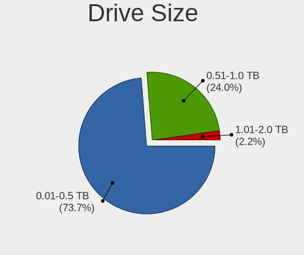
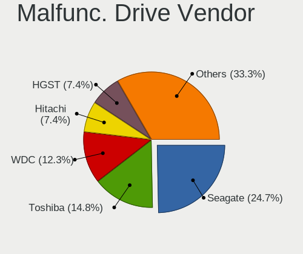

OpenMandriva - Hardware Trends (Notebooks)
------------------------------------------

A project to identify most popular hardware characteristics and track their change
over time based on data collected by Linux users at https://Linux-Hardware.org.

Anyone can contribute to this report by the [hw-probe](https://github.com/linuxhw/hw-probe) tool:

    sudo -E hw-probe -all -upload

This report is for one last month. Overall report since the beginning of time: [TestDays](https://github.com/linuxhw/TestDays)

Period: Aug, 2023.

Contents
--------

* [ System ](#system)
  - [ OS                       ](#os)
  - [ OS Family                ](#os-family)
  - [ Kernel                   ](#kernel)
  - [ Kernel Family            ](#kernel-family)
  - [ Kernel Major Ver.        ](#kernel-major-ver)
  - [ Arch                     ](#arch)
  - [ DE                       ](#de)
  - [ Display Server           ](#display-server)
  - [ Display Manager          ](#display-manager)
  - [ OS Lang                  ](#os-lang)
  - [ Boot Mode                ](#boot-mode)
  - [ Filesystem               ](#filesystem)
  - [ Part. scheme             ](#part-scheme)
  - [ Dual Boot with Linux/BSD ](#dual-boot-with-linuxbsd)
  - [ Dual Boot (Win)          ](#dual-boot-win)

* [ Board ](#board)
  - [ Vendor                   ](#vendor)
  - [ Model                    ](#model)
  - [ Model Family             ](#model-family)
  - [ MFG Year                 ](#mfg-year)
  - [ Form Factor              ](#form-factor)
  - [ Secure Boot              ](#secure-boot)
  - [ Coreboot                 ](#coreboot)
  - [ RAM Size                 ](#ram-size)
  - [ RAM Used                 ](#ram-used)
  - [ Total Drives             ](#total-drives)
  - [ Has CD-ROM               ](#has-cd-rom)
  - [ Has Ethernet             ](#has-ethernet)
  - [ Has WiFi                 ](#has-wifi)
  - [ Has Bluetooth            ](#has-bluetooth)

* [ Location ](#location)
  - [ Country                  ](#country)
  - [ City                     ](#city)

* [ Drives ](#drives)
  - [ Drive Vendor             ](#drive-vendor)
  - [ Drive Model              ](#drive-model)
  - [ HDD Vendor               ](#hdd-vendor)
  - [ SSD Vendor               ](#ssd-vendor)
  - [ Drive Kind               ](#drive-kind)
  - [ Drive Connector          ](#drive-connector)
  - [ Drive Size               ](#drive-size)
  - [ Space Total              ](#space-total)
  - [ Space Used               ](#space-used)
  - [ Malfunc. Drives          ](#malfunc-drives)
  - [ Malfunc. Drive Vendor    ](#malfunc-drive-vendor)
  - [ Malfunc. HDD Vendor      ](#malfunc-hdd-vendor)
  - [ Malfunc. Drive Kind      ](#malfunc-drive-kind)
  - [ Failed Drives            ](#failed-drives)
  - [ Failed Drive Vendor      ](#failed-drive-vendor)
  - [ Drive Status             ](#drive-status)

* [ Storage controller ](#storage-controller)
  - [ Storage Vendor           ](#storage-vendor)
  - [ Storage Model            ](#storage-model)
  - [ Storage Kind             ](#storage-kind)

* [ Processor ](#processor)
  - [ CPU Vendor               ](#cpu-vendor)
  - [ CPU Model                ](#cpu-model)
  - [ CPU Model Family         ](#cpu-model-family)
  - [ CPU Cores                ](#cpu-cores)
  - [ CPU Sockets              ](#cpu-sockets)
  - [ CPU Threads              ](#cpu-threads)
  - [ CPU Op-Modes             ](#cpu-op-modes)
  - [ CPU Microcode            ](#cpu-microcode)
  - [ CPU Microarch            ](#cpu-microarch)

* [ Graphics ](#graphics)
  - [ GPU Vendor               ](#gpu-vendor)
  - [ GPU Model                ](#gpu-model)
  - [ GPU Combo                ](#gpu-combo)
  - [ GPU Driver               ](#gpu-driver)
  - [ GPU Memory               ](#gpu-memory)

* [ Monitor ](#monitor)
  - [ Monitor Vendor           ](#monitor-vendor)
  - [ Monitor Model            ](#monitor-model)
  - [ Monitor Resolution       ](#monitor-resolution)
  - [ Monitor Diagonal         ](#monitor-diagonal)
  - [ Monitor Width            ](#monitor-width)
  - [ Aspect Ratio             ](#aspect-ratio)
  - [ Monitor Area             ](#monitor-area)
  - [ Pixel Density            ](#pixel-density)
  - [ Multiple Monitors        ](#multiple-monitors)

* [ Network ](#network)
  - [ Net Controller Vendor    ](#net-controller-vendor)
  - [ Net Controller Model     ](#net-controller-model)
  - [ Wireless Vendor          ](#wireless-vendor)
  - [ Wireless Model           ](#wireless-model)
  - [ Ethernet Vendor          ](#ethernet-vendor)
  - [ Ethernet Model           ](#ethernet-model)
  - [ Net Controller Kind      ](#net-controller-kind)
  - [ Used Controller          ](#used-controller)
  - [ NICs                     ](#nics)
  - [ IPv6                     ](#ipv6)

* [ Bluetooth ](#bluetooth)
  - [ Bluetooth Vendor         ](#bluetooth-vendor)
  - [ Bluetooth Model          ](#bluetooth-model)

* [ Sound ](#sound)
  - [ Sound Vendor             ](#sound-vendor)
  - [ Sound Model              ](#sound-model)

* [ Memory ](#memory)
  - [ Memory Vendor            ](#memory-vendor)
  - [ Memory Model             ](#memory-model)
  - [ Memory Kind              ](#memory-kind)
  - [ Memory Form Factor       ](#memory-form-factor)
  - [ Memory Size              ](#memory-size)
  - [ Memory Speed             ](#memory-speed)

* [ Printers & scanners ](#printers--scanners)
  - [ Printer Vendor           ](#printer-vendor)
  - [ Printer Model            ](#printer-model)
  - [ Scanner Vendor           ](#scanner-vendor)
  - [ Scanner Model            ](#scanner-model)

* [ Camera ](#camera)
  - [ Camera Vendor            ](#camera-vendor)
  - [ Camera Model             ](#camera-model)

* [ Security ](#security)
  - [ Fingerprint Vendor       ](#fingerprint-vendor)
  - [ Fingerprint Model        ](#fingerprint-model)
  - [ Chipcard Vendor          ](#chipcard-vendor)
  - [ Chipcard Model           ](#chipcard-model)

* [ Unsupported ](#unsupported)
  - [ Unsupported Devices      ](#unsupported-devices)
  - [ Unsupported Device Types ](#unsupported-device-types)

System
------

OS
--

Installed operating systems

| Name               | Notebooks | Percent |
|--------------------|-----------|---------|
| OpenMandriva 23.08 | 238       | 69.59%  |
| OpenMandriva 23.03 | 51        | 14.91%  |
| OpenMandriva 4.3   | 18        | 5.26%   |
| OpenMandriva 23.90 | 10        | 2.92%   |
| OpenMandriva 23.07 | 10        | 2.92%   |
| OpenMandriva 23.01 | 7         | 2.05%   |
| OpenMandriva 4.2   | 5         | 1.46%   |
| OpenMandriva 23.06 | 2         | 0.58%   |
| OpenMandriva 4.50  | 1         | 0.29%   |

OS Family
---------

OS without a version

| Name         | Notebooks | Percent |
|--------------|-----------|---------|
| OpenMandriva | 342       | 100%    |

Kernel
------

Version of the Linux kernel

| Version                      | Notebooks | Percent |
|------------------------------|-----------|---------|
| 6.4.11-desktop-1omv2390      | 150       | 43.86%  |
| 6.4.8-desktop-2omv2390       | 94        | 27.49%  |
| 6.2.6-desktop-1omv2390       | 50        | 14.62%  |
| 5.16.7-desktop-1omv4003      | 15        | 4.39%   |
| 6.3.5-desktop-3omv2390       | 10        | 2.92%   |
| 6.1.1-desktop-1omv2290       | 7         | 2.05%   |
| 5.10.14-desktop-1omv4002     | 5         | 1.46%   |
| 5.16.13-desktop-1omv4003     | 3         | 0.88%   |
| 6.4.7-desktop-1omv2390       | 2         | 0.58%   |
| 6.5.0-desktop-1omv2390       | 1         | 0.29%   |
| 6.5.0-desktop-0.rc4.1omv2390 | 1         | 0.29%   |
| 6.4.0-desktop-0.rc3.1omv2390 | 1         | 0.29%   |
| 6.2.1-desktop-1omv2390       | 1         | 0.29%   |
| 5.19.5-desktop-1omv4090      | 1         | 0.29%   |
| 5.16.5-desktop-2omv4003      | 1         | 0.29%   |

Kernel Family
-------------

Linux kernel without a distro release

| Version | Notebooks | Percent |
|---------|-----------|---------|
| 6.4.11  | 150       | 43.86%  |
| 6.4.8   | 94        | 27.49%  |
| 6.2.6   | 50        | 14.62%  |
| 5.16.7  | 15        | 4.39%   |
| 6.3.5   | 10        | 2.92%   |
| 6.1.1   | 7         | 2.05%   |
| 5.10.14 | 5         | 1.46%   |
| 5.16.13 | 3         | 0.88%   |
| 6.5.0   | 2         | 0.58%   |
| 6.4.7   | 2         | 0.58%   |
| 6.4.0   | 1         | 0.29%   |
| 6.2.1   | 1         | 0.29%   |
| 5.19.5  | 1         | 0.29%   |
| 5.16.5  | 1         | 0.29%   |

Kernel Major Ver.
-----------------

Linux kernel major version

| Version | Notebooks | Percent |
|---------|-----------|---------|
| 6.4     | 247       | 72.22%  |
| 6.2     | 51        | 14.91%  |
| 5.16    | 19        | 5.56%   |
| 6.3     | 10        | 2.92%   |
| 6.1     | 7         | 2.05%   |
| 5.10    | 5         | 1.46%   |
| 6.5     | 2         | 0.58%   |
| 5.19    | 1         | 0.29%   |

Arch
----

OS architecture (x86_64, i586, etc.)

| Name   | Notebooks | Percent |
|--------|-----------|---------|
| x86_64 | 342       | 100%    |

DE
--

Desktop Environment

| Name     | Notebooks | Percent |
|----------|-----------|---------|
| KDE5     | 287       | 83.92%  |
| GNOME    | 24        | 7.02%   |
| LXQt     | 21        | 6.14%   |
| Unknown  | 8         | 2.34%   |
| Cinnamon | 2         | 0.58%   |

Display Server
--------------

X11 or Wayland

| Name    | Notebooks | Percent |
|---------|-----------|---------|
| Wayland | 239       | 69.88%  |
| X11     | 103       | 30.12%  |

Display Manager
---------------

SDDM, LightDM, etc.

| Name | Notebooks | Percent |
|------|-----------|---------|
| SDDM | 318       | 92.98%  |
| GDM  | 24        | 7.02%   |

OS Lang
-------

Language

| Lang  | Notebooks | Percent |
|-------|-----------|---------|
| en_US | 167       | 48.83%  |
| pt_BR | 28        | 8.19%   |
| fr_FR | 25        | 7.31%   |
| en_GB | 20        | 5.85%   |
| de_DE | 18        | 5.26%   |
| ru_RU | 14        | 4.09%   |
| pl_PL | 8         | 2.34%   |
| es_ES | 8         | 2.34%   |
| it_IT | 7         | 2.05%   |
| en_CA | 7         | 2.05%   |
| fr_CH | 4         | 1.17%   |
| fr_CA | 4         | 1.17%   |
| en_IN | 4         | 1.17%   |
| cs_CZ | 4         | 1.17%   |
| nl_BE | 3         | 0.88%   |
| es_MX | 3         | 0.88%   |
| pt_PT | 2         | 0.58%   |
| hu_HU | 2         | 0.58%   |
| es_CL | 2         | 0.58%   |
| en_IE | 2         | 0.58%   |
| en_AU | 2         | 0.58%   |
| nl_NL | 1         | 0.29%   |
| nb_NO | 1         | 0.29%   |
| es_CO | 1         | 0.29%   |
| es_AR | 1         | 0.29%   |
| en_ZA | 1         | 0.29%   |
| en_SG | 1         | 0.29%   |
| en_NZ | 1         | 0.29%   |
| de_BE | 1         | 0.29%   |

Boot Mode
---------

EFI or BIOS

| Mode | Notebooks | Percent |
|------|-----------|---------|
| EFI  | 220       | 64.33%  |
| BIOS | 122       | 35.67%  |

Filesystem
----------

Type of filesystem

| Type    | Notebooks | Percent |
|---------|-----------|---------|
| Overlay | 167       | 48.83%  |
| Ext4    | 148       | 43.27%  |
| Btrfs   | 21        | 6.14%   |
| F2fs    | 3         | 0.88%   |
| Xfs     | 2         | 0.58%   |
| Ext2    | 1         | 0.29%   |

Part. scheme
------------

Scheme of partitioning

| Type | Notebooks | Percent |
|------|-----------|---------|
| GPT  | 273       | 79.82%  |
| MBR  | 69        | 20.18%  |

Dual Boot with Linux/BSD
------------------------

Hosting more than one Linux/BSD

| Dual boot | Notebooks | Percent |
|-----------|-----------|---------|
| Yes       | 171       | 50%     |
| No        | 171       | 50%     |

Dual Boot (Win)
---------------

Hosting Linux and Windows

| Dual boot | Notebooks | Percent |
|-----------|-----------|---------|
| No        | 204       | 59.65%  |
| Yes       | 138       | 40.35%  |

Board
-----

Vendor
------

Motherboard manufacturer

| Name                  | Notebooks | Percent |
|-----------------------|-----------|---------|
| Lenovo                | 80        | 23.39%  |
| Dell                  | 55        | 16.08%  |
| Hewlett-Packard       | 54        | 15.79%  |
| Acer                  | 37        | 10.82%  |
| ASUSTek Computer      | 30        | 8.77%   |
| Toshiba               | 10        | 2.92%   |
| MSI                   | 8         | 2.34%   |
| Samsung Electronics   | 7         | 2.05%   |
| Apple                 | 6         | 1.75%   |
| Chuwi                 | 5         | 1.46%   |
| Sony                  | 4         | 1.17%   |
| Packard Bell          | 4         | 1.17%   |
| HUAWEI                | 4         | 1.17%   |
| Fujitsu               | 4         | 1.17%   |
| Positivo              | 3         | 0.88%   |
| Panasonic             | 3         | 0.88%   |
| Unknown               | 3         | 0.88%   |
| System76              | 2         | 0.58%   |
| Positivo Bahia - VAIO | 2         | 0.58%   |
| Medion                | 2         | 0.58%   |
| ZOOSTORM              | 1         | 0.29%   |
| VALE                  | 1         | 0.29%   |
| UMAX                  | 1         | 0.29%   |
| TUXEDO                | 1         | 0.29%   |
| Thomson               | 1         | 0.29%   |
| Star Labs             | 1         | 0.29%   |
| Semp Toshiba          | 1         | 0.29%   |
| Notebook              | 1         | 0.29%   |
| LG Electronics        | 1         | 0.29%   |
| GPU Company           | 1         | 0.29%   |
| GPD                   | 1         | 0.29%   |
| Google                | 1         | 0.29%   |
| Gigabyte Technology   | 1         | 0.29%   |
| GFAST                 | 1         | 0.29%   |
| Framework             | 1         | 0.29%   |
| eMachines             | 1         | 0.29%   |
| Danew                 | 1         | 0.29%   |
| Clevo                 | 1         | 0.29%   |
| Alurin                | 1         | 0.29%   |

Model
-----

Motherboard model

| Name                                    | Notebooks | Percent |
|-----------------------------------------|-----------|---------|
| Lenovo ThinkPad L13 Gen 3 21BAS0X700    | 6         | 1.75%   |
| HP Compaq Presario CQ60                 | 3         | 0.88%   |
| Dell Latitude 7480                      | 3         | 0.88%   |
| Unknown                                 | 3         | 0.88%   |
| Positivo C14CU51                        | 2         | 0.58%   |
| Lenovo Yoga 300-11IBY 80M0              | 2         | 0.58%   |
| Lenovo IdeaPad Z570 HuronRiver Platform | 2         | 0.58%   |
| Lenovo IdeaPad 3 15ALC6 82MF            | 2         | 0.58%   |
| HP Stream Laptop 14-ax0XX               | 2         | 0.58%   |
| HP Laptop 17-cp0xxx                     | 2         | 0.58%   |
| HP Laptop 15s-eq1xxx                    | 2         | 0.58%   |
| HP Laptop 15-db0xxx                     | 2         | 0.58%   |
| HP EliteBook 840 G3                     | 2         | 0.58%   |
| Dell Latitude E6440                     | 2         | 0.58%   |
| Dell Inspiron N4050                     | 2         | 0.58%   |
| Dell Inspiron 1720                      | 2         | 0.58%   |
| Dell Inspiron 1545                      | 2         | 0.58%   |
| Chuwi GemiBook Pro                      | 2         | 0.58%   |
| Acer Aspire V5-573G                     | 2         | 0.58%   |
| Acer Aspire ES1-431                     | 2         | 0.58%   |
| Acer Aspire A315-23                     | 2         | 0.58%   |
| ZOOSTORM 7200-9062A                     | 1         | 0.29%   |
| VALE Notebook Classic C140              | 1         | 0.29%   |
| UMAX VisionBook 15Wg Plus               | 1         | 0.29%   |
| TUXEDO Book XA15 / XA17 Gen10           | 1         | 0.29%   |
| Toshiba Satellite Pro C850-10N          | 1         | 0.29%   |
| Toshiba Satellite L670                  | 1         | 0.29%   |
| Toshiba Satellite L510                  | 1         | 0.29%   |
| Toshiba Satellite C855D                 | 1         | 0.29%   |
| Toshiba Satellite C850-B239             | 1         | 0.29%   |
| Toshiba Satellite C55-A                 | 1         | 0.29%   |
| Toshiba Satellite C50-B                 | 1         | 0.29%   |
| Toshiba PORTEGE Z930                    | 1         | 0.29%   |
| Toshiba PORTEGE R705                    | 1         | 0.29%   |
| Toshiba dynabook B350/22A               | 1         | 0.29%   |
| Thomson GENEO14C-4WH128                 | 1         | 0.29%   |
| System76 Gazelle                        | 1         | 0.29%   |
| System76 Galago Pro                     | 1         | 0.29%   |
| Star Labs Lite                          | 1         | 0.29%   |
| Sony VPCEG15FB                          | 1         | 0.29%   |

Model Family
------------

Motherboard model prefix

| Name                    | Notebooks | Percent |
|-------------------------|-----------|---------|
| Lenovo ThinkPad         | 39        | 11.4%   |
| Acer Aspire             | 30        | 8.77%   |
| Dell Latitude           | 24        | 7.02%   |
| Lenovo IdeaPad          | 22        | 6.43%   |
| Dell Inspiron           | 19        | 5.56%   |
| HP Laptop               | 15        | 4.39%   |
| HP EliteBook            | 10        | 2.92%   |
| ASUS VivoBook           | 10        | 2.92%   |
| HP ProBook              | 9         | 2.63%   |
| HP Pavilion             | 8         | 2.34%   |
| Toshiba Satellite       | 7         | 2.05%   |
| HP Compaq               | 5         | 1.46%   |
| Dell Precision          | 5         | 1.46%   |
| Packard Bell EasyNote   | 4         | 1.17%   |
| Chuwi GemiBook          | 4         | 1.17%   |
| Lenovo Yoga             | 3         | 0.88%   |
| Unknown                 | 3         | 0.88%   |
| Toshiba PORTEGE         | 2         | 0.58%   |
| Positivo C14CU51        | 2         | 0.58%   |
| Lenovo ThinkBook        | 2         | 0.58%   |
| Lenovo Legion           | 2         | 0.58%   |
| HP Stream               | 2         | 0.58%   |
| Fujitsu LIFEBOOK        | 2         | 0.58%   |
| Dell XPS                | 2         | 0.58%   |
| Dell Studio             | 2         | 0.58%   |
| Acer Nitro              | 2         | 0.58%   |
| Acer Extensa            | 2         | 0.58%   |
| ZOOSTORM 7200-9062A     | 1         | 0.29%   |
| VALE Notebook           | 1         | 0.29%   |
| UMAX VisionBook         | 1         | 0.29%   |
| TUXEDO Book             | 1         | 0.29%   |
| Toshiba dynabook        | 1         | 0.29%   |
| Thomson GENEO14C-4WH128 | 1         | 0.29%   |
| System76 Gazelle        | 1         | 0.29%   |
| System76 Galago         | 1         | 0.29%   |
| Star Labs Lite          | 1         | 0.29%   |
| Sony VPCEG15FB          | 1         | 0.29%   |
| Sony VPCEB43FG          | 1         | 0.29%   |
| Sony VGN-NW2SRF         | 1         | 0.29%   |
| Sony SVE1112M1EW        | 1         | 0.29%   |

MFG Year
--------

Motherboard manufacture year

| Year    | Notebooks | Percent |
|---------|-----------|---------|
| 2011    | 40        | 11.7%   |
| 2021    | 39        | 11.4%   |
| 2012    | 30        | 8.77%   |
| 2018    | 26        | 7.6%    |
| 2013    | 25        | 7.31%   |
| 2022    | 23        | 6.73%   |
| 2017    | 23        | 6.73%   |
| 2019    | 20        | 5.85%   |
| 2020    | 19        | 5.56%   |
| 2010    | 18        | 5.26%   |
| 2016    | 15        | 4.39%   |
| 2014    | 15        | 4.39%   |
| 2008    | 15        | 4.39%   |
| 2015    | 11        | 3.22%   |
| 2009    | 8         | 2.34%   |
| 2023    | 6         | 1.75%   |
| 2007    | 6         | 1.75%   |
| 2006    | 2         | 0.58%   |
| Unknown | 1         | 0.29%   |

Form Factor
-----------

Physical design of the computer

| Name     | Notebooks | Percent |
|----------|-----------|---------|
| Notebook | 342       | 100%    |

Secure Boot
-----------

Enabled or disabled

| State    | Notebooks | Percent |
|----------|-----------|---------|
| Disabled | 342       | 100%    |

Coreboot
--------

Have coreboot on board

| Used | Notebooks | Percent |
|------|-----------|---------|
| No   | 340       | 99.42%  |
| Yes  | 2         | 0.58%   |

RAM Size
--------

Total RAM memory

| Size in GB  | Notebooks | Percent |
|-------------|-----------|---------|
| 4.01-8.0    | 123       | 35.96%  |
| 3.01-4.0    | 83        | 24.27%  |
| 16.01-24.0  | 53        | 15.5%   |
| 8.01-16.0   | 45        | 13.16%  |
| 32.01-64.0  | 14        | 4.09%   |
| 1.01-2.0    | 9         | 2.63%   |
| 2.01-3.0    | 8         | 2.34%   |
| 64.01-256.0 | 5         | 1.46%   |
| 24.01-32.0  | 2         | 0.58%   |

RAM Used
--------

Used RAM memory

| Used GB  | Notebooks | Percent |
|----------|-----------|---------|
| 1.01-2.0 | 220       | 64.33%  |
| 2.01-3.0 | 70        | 20.47%  |
| 0.51-1.0 | 29        | 8.48%   |
| 3.01-4.0 | 18        | 5.26%   |
| 4.01-8.0 | 4         | 1.17%   |
| 0.01-0.5 | 1         | 0.29%   |

Total Drives
------------

Number of drives on board

| Drives | Notebooks | Percent |
|--------|-----------|---------|
| 1      | 229       | 66.96%  |
| 2      | 96        | 28.07%  |
| 3      | 12        | 3.51%   |
| 0      | 5         | 1.46%   |

Has CD-ROM
----------

Has CD-ROM on board

| Presented | Notebooks | Percent |
|-----------|-----------|---------|
| No        | 216       | 63.16%  |
| Yes       | 126       | 36.84%  |

Has Ethernet
------------

Has Ethernet on board

| Presented | Notebooks | Percent |
|-----------|-----------|---------|
| Yes       | 277       | 80.99%  |
| No        | 65        | 19.01%  |

Has WiFi
--------

Has WiFi module

| Presented | Notebooks | Percent |
|-----------|-----------|---------|
| Yes       | 340       | 99.42%  |
| No        | 2         | 0.58%   |

Has Bluetooth
-------------

Has Bluetooth module

| Presented | Notebooks | Percent |
|-----------|-----------|---------|
| Yes       | 270       | 78.95%  |
| No        | 72        | 21.05%  |

Location
--------

Country
-------

Geographic location (country)

| Country      | Notebooks | Percent |
|--------------|-----------|---------|
| USA          | 37        | 10.82%  |
| Brazil       | 35        | 10.23%  |
| Germany      | 29        | 8.48%   |
| France       | 29        | 8.48%   |
| UK           | 18        | 5.26%   |
| Russia       | 16        | 4.68%   |
| Italy        | 15        | 4.39%   |
| Canada       | 15        | 4.39%   |
| Poland       | 14        | 4.09%   |
| Spain        | 9         | 2.63%   |
| India        | 9         | 2.63%   |
| Indonesia    | 8         | 2.34%   |
| Australia    | 8         | 2.34%   |
| Switzerland  | 5         | 1.46%   |
| Portugal     | 5         | 1.46%   |
| Belgium      | 5         | 1.46%   |
| Sweden       | 4         | 1.17%   |
| Romania      | 4         | 1.17%   |
| Netherlands  | 4         | 1.17%   |
| Greece       | 4         | 1.17%   |
| Czechia      | 4         | 1.17%   |
| Slovakia     | 3         | 0.88%   |
| Norway       | 3         | 0.88%   |
| Malaysia     | 3         | 0.88%   |
| Japan        | 3         | 0.88%   |
| Ireland      | 3         | 0.88%   |
| Colombia     | 3         | 0.88%   |
| Chile        | 3         | 0.88%   |
| Bulgaria     | 3         | 0.88%   |
| Turkey       | 2         | 0.58%   |
| South Africa | 2         | 0.58%   |
| New Zealand  | 2         | 0.58%   |
| Moldova      | 2         | 0.58%   |
| Mexico       | 2         | 0.58%   |
| Israel       | 2         | 0.58%   |
| Hungary      | 2         | 0.58%   |
| Finland      | 2         | 0.58%   |
| Egypt        | 2         | 0.58%   |
| Argentina    | 2         | 0.58%   |
| Algeria      | 2         | 0.58%   |

City
----

Geographic location (city)

| City               | Notebooks | Percent |
|--------------------|-----------|---------|
| Rio de Janeiro     | 5         | 1.46%   |
| Paris              | 4         | 1.17%   |
| La Baule-Escoublac | 4         | 1.17%   |
| Geneva             | 4         | 1.17%   |
| Berlin             | 4         | 1.17%   |
| Athens             | 4         | 1.17%   |
| Žilina            | 3         | 0.88%   |
| Vancouver          | 3         | 0.88%   |
| Dublin             | 3         | 0.88%   |
| Brisbane           | 3         | 0.88%   |
| Wuppertal          | 2         | 0.58%   |
| Warsaw             | 2         | 0.58%   |
| Stuttgart          | 2         | 0.58%   |
| Stockholm          | 2         | 0.58%   |
| Prague             | 2         | 0.58%   |
| Porto              | 2         | 0.58%   |
| Moscow             | 2         | 0.58%   |
| Milan              | 2         | 0.58%   |
| Mexico City        | 2         | 0.58%   |
| Melbourne          | 2         | 0.58%   |
| Madrid             | 2         | 0.58%   |
| Lodz               | 2         | 0.58%   |
| Kitchener          | 2         | 0.58%   |
| Dearborn Heights   | 2         | 0.58%   |
| Curitiba           | 2         | 0.58%   |
| Concepción        | 2         | 0.58%   |
| Castelnaudary      | 2         | 0.58%   |
| Braunschweig       | 2         | 0.58%   |
| Bengaluru          | 2         | 0.58%   |
| Begles             | 2         | 0.58%   |
| Bad Liebenzell     | 2         | 0.58%   |
| Zottegem           | 1         | 0.29%   |
| Yukon              | 1         | 0.29%   |
| Yogyakarta         | 1         | 0.29%   |
| Wroclaw            | 1         | 0.29%   |
| Wolfenbüttel      | 1         | 0.29%   |
| Winsen             | 1         | 0.29%   |
| Weckolsheim        | 1         | 0.29%   |
| Volgograd          | 1         | 0.29%   |
| Voelklingen        | 1         | 0.29%   |

Drives
------

Drive Vendor
------------

Hard drive vendors

| Vendor              | Notebooks | Drives | Percent |
|---------------------|-----------|--------|---------|
| Samsung Electronics | 62        | 67     | 14.76%  |
| WDC                 | 61        | 68     | 14.52%  |
| Toshiba             | 38        | 39     | 9.05%   |
| Seagate             | 31        | 31     | 7.38%   |
| Kingston            | 27        | 28     | 6.43%   |
| Hitachi             | 20        | 20     | 4.76%   |
| SanDisk             | 18        | 18     | 4.29%   |
| Unknown             | 13        | 15     | 3.1%    |
| SK hynix            | 13        | 13     | 3.1%    |
| Crucial             | 11        | 11     | 2.62%   |
| Micron Technology   | 10        | 10     | 2.38%   |
| Intel               | 10        | 10     | 2.38%   |
| A-DATA Technology   | 7         | 7      | 1.67%   |
| Netac               | 6         | 7      | 1.43%   |
| China               | 6         | 6      | 1.43%   |
| Unknown             | 5         | 5      | 1.19%   |
| SSSTC               | 4         | 4      | 0.95%   |
| Silicon Motion      | 4         | 4      | 0.95%   |
| HGST                | 4         | 4      | 0.95%   |
| GOODRAM             | 4         | 4      | 0.95%   |
| Apple               | 4         | 4      | 0.95%   |
| SPCC                | 3         | 4      | 0.71%   |
| PNY                 | 3         | 4      | 0.71%   |
| Phison              | 3         | 3      | 0.71%   |
| KIOXIA              | 3         | 3      | 0.71%   |
| Intenso             | 3         | 3      | 0.71%   |
| UMIS                | 2         | 2      | 0.48%   |
| Patriot             | 2         | 2      | 0.48%   |
| Fanxiang            | 2         | 2      | 0.48%   |
| BIWIN               | 2         | 2      | 0.48%   |
| Verbatim            | 1         | 1      | 0.24%   |
| USB3.0              | 1         | 1      | 0.24%   |
| USB                 | 1         | 1      | 0.24%   |
| Union Memory        | 1         | 1      | 0.24%   |
| UMAX                | 1         | 1      | 0.24%   |
| TwinMOS             | 1         | 1      | 0.24%   |
| TO Exter            | 1         | 1      | 0.24%   |
| Teclast             | 1         | 1      | 0.24%   |
| Team                | 1         | 1      | 0.24%   |
| T-FORCE             | 1         | 1      | 0.24%   |

Drive Model
-----------

Hard drive models

| Model                                        | Notebooks | Percent |
|----------------------------------------------|-----------|---------|
| Kingston SA400S37240G 240GB SSD              | 7         | 1.61%   |
| Toshiba MQ04ABF100 1TB                       | 6         | 1.38%   |
| Unknown                                      | 5         | 1.15%   |
| WDC PC SN530 SDBPNPZ-512G-1114 512GB         | 4         | 0.92%   |
| Samsung SSD 860 EVO 500GB                    | 4         | 0.92%   |
| Kingston SA400S37480G 480GB SSD              | 4         | 0.92%   |
| WDC WDS240G2G0A-00JH30 240GB SSD             | 3         | 0.69%   |
| Toshiba MQ01ABF050 500GB                     | 3         | 0.69%   |
| Toshiba MQ01ABD100 1TB                       | 3         | 0.69%   |
| SK hynix BC511 HFM256GDJTNI-82A0A 256GB      | 3         | 0.69%   |
| Seagate ST9500325AS 500GB                    | 3         | 0.69%   |
| SanDisk NVMe SSD Drive 1TB                   | 3         | 0.69%   |
| Samsung SSD 970 EVO Plus 2TB S6P1NS0W312579L | 3         | 0.69%   |
| Samsung SSD 970 EVO Plus 2TB                 | 3         | 0.69%   |
| Samsung SSD 870 EVO 250GB                    | 3         | 0.69%   |
| Samsung PSSD T7 1TB                          | 3         | 0.69%   |
| Netac SSD 256GB                              | 3         | 0.69%   |
| Micron 1100_MTFDDAV256TBN 256GB SSD          | 3         | 0.69%   |
| WDC WDS500G2B0C-00PXH0 500GB                 | 2         | 0.46%   |
| WDC WDS480G2G0A-00JH30 480GB SSD             | 2         | 0.46%   |
| WDC WDS240G2G0B-00EPW0 240GB SSD             | 2         | 0.46%   |
| WDC WD5000LPVX-22V0TT0 500GB                 | 2         | 0.46%   |
| WDC WD2500BEVT-22A23T0 208GB                 | 2         | 0.46%   |
| WDC WD10SPZX-24Z10 1TB                       | 2         | 0.46%   |
| WDC WD10JPVX-22JC3T0 1TB                     | 2         | 0.46%   |
| WDC WD Blue SA510 M.2 2280 1000GB            | 2         | 0.46%   |
| WDC PC SN730 SDBPNTY-256G-1006 256GB         | 2         | 0.46%   |
| WDC PC SN530 SDBPNPZ-256G-1114 256GB         | 2         | 0.46%   |
| Unknown SD32G  32GB                          | 2         | 0.46%   |
| Toshiba MQ01ABD100M 1TB                      | 2         | 0.46%   |
| Toshiba MQ01ABD075 752GB                     | 2         | 0.46%   |
| Toshiba MK2555GSX 250GB                      | 2         | 0.46%   |
| Toshiba KSG60ZMV256G M.2 2280 256GB SSD      | 2         | 0.46%   |
| SK hynix HBG4e  32GB                         | 2         | 0.46%   |
| Seagate ST980811AS 80GB                      | 2         | 0.46%   |
| Seagate ST500LM012 HN-M500MBB 500GB          | 2         | 0.46%   |
| Seagate ST500LM000-1EJ162 500GB              | 2         | 0.46%   |
| Seagate ST2000LM007-1R8174 2TB               | 2         | 0.46%   |
| Seagate ST1000LM024 HN-M101MBB 1TB           | 2         | 0.46%   |
| SanDisk DF4032  32GB                         | 2         | 0.46%   |

HDD Vendor
----------

Hard disk drive vendors

| Vendor              | Notebooks | Drives | Percent |
|---------------------|-----------|--------|---------|
| WDC                 | 32        | 33     | 26.67%  |
| Toshiba             | 30        | 30     | 25%     |
| Seagate             | 28        | 28     | 23.33%  |
| Hitachi             | 20        | 20     | 16.67%  |
| HGST                | 4         | 4      | 3.33%   |
| USB3.0              | 1         | 1      | 0.83%   |
| USB                 | 1         | 1      | 0.83%   |
| Unknown             | 1         | 1      | 0.83%   |
| Samsung Electronics | 1         | 1      | 0.83%   |
| External            | 1         | 1      | 0.83%   |
| Apple               | 1         | 1      | 0.83%   |

SSD Vendor
----------

Solid state drive vendors

| Vendor              | Notebooks | Drives | Percent |
|---------------------|-----------|--------|---------|
| Samsung Electronics | 31        | 31     | 18.56%  |
| Kingston            | 20        | 20     | 11.98%  |
| WDC                 | 13        | 15     | 7.78%   |
| SanDisk             | 11        | 11     | 6.59%   |
| Crucial             | 9         | 9      | 5.39%   |
| Micron Technology   | 8         | 8      | 4.79%   |
| Toshiba             | 6         | 7      | 3.59%   |
| Netac               | 6         | 7      | 3.59%   |
| China               | 6         | 6      | 3.59%   |
| GOODRAM             | 4         | 4      | 2.4%    |
| A-DATA Technology   | 4         | 4      | 2.4%    |
| SPCC                | 3         | 3      | 1.8%    |
| SK hynix            | 3         | 3      | 1.8%    |
| Seagate             | 3         | 3      | 1.8%    |
| Intenso             | 3         | 3      | 1.8%    |
| PNY                 | 2         | 3      | 1.2%    |
| Patriot             | 2         | 2      | 1.2%    |
| Intel               | 2         | 2      | 1.2%    |
| Fanxiang            | 2         | 2      | 1.2%    |
| Apple               | 2         | 2      | 1.2%    |
| Verbatim            | 1         | 1      | 0.6%    |
| Union Memory        | 1         | 1      | 0.6%    |
| UMAX                | 1         | 1      | 0.6%    |
| TwinMOS             | 1         | 1      | 0.6%    |
| TO Exter            | 1         | 1      | 0.6%    |
| Teclast             | 1         | 1      | 0.6%    |
| T-FORCE             | 1         | 1      | 0.6%    |
| SUNTRSI             | 1         | 1      | 0.6%    |
| Star                | 1         | 1      | 0.6%    |
| RDM-II              | 1         | 1      | 0.6%    |
| Pioneer             | 1         | 1      | 0.6%    |
| MMY                 | 1         | 1      | 0.6%    |
| Mercury             | 1         | 1      | 0.6%    |
| LITEONIT            | 1         | 1      | 0.6%    |
| LITEON              | 1         | 1      | 0.6%    |
| Lexar               | 1         | 1      | 0.6%    |
| KIOXIA-EXCERIA      | 1         | 1      | 0.6%    |
| KingSpec            | 1         | 1      | 0.6%    |
| KingDian            | 1         | 1      | 0.6%    |
| INNOVATION IT       | 1         | 1      | 0.6%    |

Drive Kind
----------

HDD or SSD

| Kind    | Notebooks | Drives | Percent |
|---------|-----------|--------|---------|
| SSD     | 155       | 172    | 38.85%  |
| HDD     | 118       | 121    | 29.57%  |
| NVMe    | 102       | 119    | 25.56%  |
| MMC     | 20        | 23     | 5.01%   |
| Unknown | 4         | 4      | 1%      |

Drive Connector
---------------

SATA, SAS, NVMe, etc.

| Type | Notebooks | Drives | Percent |
|------|-----------|--------|---------|
| SATA | 243       | 273    | 62.63%  |
| NVMe | 102       | 118    | 26.29%  |
| SAS  | 23        | 25     | 5.93%   |
| MMC  | 20        | 23     | 5.15%   |

Drive Size
----------

Size of hard drive

| Size in TB | Notebooks | Drives | Percent |
|------------|-----------|--------|---------|
| 0.01-0.5   | 196       | 215    | 71.79%  |
| 0.51-1.0   | 71        | 72     | 26.01%  |
| 1.01-2.0   | 6         | 6      | 2.2%    |

Space Total
-----------

Amount of disk space available on the file system

| Size in GB     | Notebooks | Percent |
|----------------|-----------|---------|
| 1-20           | 137       | 40.06%  |
| 101-250        | 77        | 22.51%  |
| 251-500        | 41        | 11.99%  |
| 501-1000       | 30        | 8.77%   |
| 21-50          | 20        | 5.85%   |
| 51-100         | 18        | 5.26%   |
| 1001-2000      | 8         | 2.34%   |
| 2001-3000      | 5         | 1.46%   |
| Unknown        | 5         | 1.46%   |
| More than 3000 | 1         | 0.29%   |

Space Used
----------

Amount of used disk space

| Used GB  | Notebooks | Percent |
|----------|-----------|---------|
| 1-20     | 281       | 82.16%  |
| 21-50    | 19        | 5.56%   |
| 51-100   | 16        | 4.68%   |
| 101-250  | 12        | 3.51%   |
| 501-1000 | 5         | 1.46%   |
| Unknown  | 5         | 1.46%   |
| 251-500  | 4         | 1.17%   |

Malfunc. Drives
---------------

Drive models with a malfunction

| Model                                   | Notebooks | Drives | Percent |
|-----------------------------------------|-----------|--------|---------|
| Seagate ST9500325AS 500GB               | 3         | 3      | 4.69%   |
| Toshiba MK2555GSX 250GB                 | 2         | 2      | 3.13%   |
| Seagate ST500LM000-1EJ162 500GB         | 2         | 2      | 3.13%   |
| Hitachi HTS545050A7E380 500GB           | 2         | 2      | 3.13%   |
| Hitachi HTS543216L9A300 160GB           | 2         | 2      | 3.13%   |
| WDC WDS480G2G0A-00JH30 480GB SSD        | 1         | 1      | 1.56%   |
| WDC WDS240G2G0B-00EPW0 240GB SSD        | 1         | 1      | 1.56%   |
| WDC WD6400BEVT-75A0RT0 640GB            | 1         | 1      | 1.56%   |
| WDC WD5000BPVT-00HXZT3 500GB            | 1         | 1      | 1.56%   |
| WDC WD5000BEVT-00A0RT0 500GB            | 1         | 1      | 1.56%   |
| WDC WD3200BEKT-60V5T1 320GB             | 1         | 1      | 1.56%   |
| WDC WD2500BEVT-22A23T0 208GB            | 1         | 1      | 1.56%   |
| WDC WD10SPZX-24Z10T0 1TB                | 1         | 1      | 1.56%   |
| WDC WD10JPVX-60JC3T1 1TB                | 1         | 1      | 1.56%   |
| WDC WD10JPVX-00JC3T0 1TB                | 1         | 1      | 1.56%   |
| WDC WD Blue SA510 2.5 500GB             | 1         | 2      | 1.56%   |
| WDC WD Blue SA510 2.5 1000GB            | 1         | 1      | 1.56%   |
| Toshiba MQ01ABF050 500GB                | 1         | 1      | 1.56%   |
| Toshiba MQ01ABD100 1TB                  | 1         | 1      | 1.56%   |
| Toshiba MQ01ABD050 500GB                | 1         | 1      | 1.56%   |
| Toshiba MQ01ABD032 320GB                | 1         | 1      | 1.56%   |
| Toshiba MK6475GSX 640GB                 | 1         | 1      | 1.56%   |
| Toshiba MK3263GSX 320GB                 | 1         | 1      | 1.56%   |
| Toshiba MK3256GSY 320GB                 | 1         | 1      | 1.56%   |
| Toshiba KSG60ZMV256G M.2 2280 256GB SSD | 1         | 1      | 1.56%   |
| SK hynix SC210 2.5 7MM 256GB SSD        | 1         | 1      | 1.56%   |
| SK hynix BC711 HFM256GD3JX013N 256GB    | 1         | 1      | 1.56%   |
| SK hynix BC501 HFM256GDJTNG-8310A 256GB | 1         | 1      | 1.56%   |
| Seagate ST9250827AS 250GB               | 1         | 1      | 1.56%   |
| Seagate ST9160412AS 160GB               | 1         | 1      | 1.56%   |
| Seagate ST500VT000-1DK142 500GB         | 1         | 1      | 1.56%   |
| Seagate ST500LT012-1DG142 500GB         | 1         | 1      | 1.56%   |
| Seagate ST500LM030-2E717D 500GB         | 1         | 1      | 1.56%   |
| Seagate ST500LM012 HN-M500MBB 500GB     | 1         | 1      | 1.56%   |
| Seagate ST320LT012-9WS14C 320GB         | 1         | 1      | 1.56%   |
| Seagate ST1000LM048-2E7172 1TB          | 1         | 1      | 1.56%   |
| Seagate ST1000LM024 HN-M101MBB 1TB      | 1         | 1      | 1.56%   |
| SanDisk SSD U100 256GB                  | 1         | 1      | 1.56%   |
| Samsung Electronics HM641JI 640GB       | 1         | 1      | 1.56%   |
| RDM-II XM020C024G 24GB SSD              | 1         | 1      | 1.56%   |

Malfunc. Drive Vendor
---------------------

Vendors of faulty drives

| Vendor              | Notebooks | Drives | Percent |
|---------------------|-----------|--------|---------|
| Seagate             | 14        | 14     | 21.88%  |
| Hitachi             | 13        | 13     | 20.31%  |
| WDC                 | 12        | 13     | 18.75%  |
| Toshiba             | 10        | 10     | 15.63%  |
| SK hynix            | 3         | 3      | 4.69%   |
| Micron Technology   | 2         | 2      | 3.13%   |
| SanDisk             | 1         | 1      | 1.56%   |
| Samsung Electronics | 1         | 1      | 1.56%   |
| RDM-II              | 1         | 1      | 1.56%   |
| Netac               | 1         | 1      | 1.56%   |
| KingDian            | 1         | 1      | 1.56%   |
| Intel               | 1         | 1      | 1.56%   |
| HGST                | 1         | 1      | 1.56%   |
| Crucial             | 1         | 1      | 1.56%   |
| China               | 1         | 1      | 1.56%   |
| A-DATA Technology   | 1         | 1      | 1.56%   |

Malfunc. HDD Vendor
-------------------

Vendors of faulty HDD drives

| Vendor              | Notebooks | Drives | Percent |
|---------------------|-----------|--------|---------|
| Seagate             | 14        | 14     | 30.43%  |
| Hitachi             | 13        | 13     | 28.26%  |
| Toshiba             | 9         | 9      | 19.57%  |
| WDC                 | 8         | 8      | 17.39%  |
| Samsung Electronics | 1         | 1      | 2.17%   |
| HGST                | 1         | 1      | 2.17%   |

Malfunc. Drive Kind
-------------------

Kinds of faulty drives

| Kind | Notebooks | Drives | Percent |
|------|-----------|--------|---------|
| HDD  | 45        | 46     | 71.43%  |
| SSD  | 16        | 17     | 25.4%   |
| NVMe | 2         | 2      | 3.17%   |

Failed Drives
-------------

Failed drive models

| Model                         | Notebooks | Drives | Percent |
|-------------------------------|-----------|--------|---------|
| Hitachi HTS545050B9SA00 500GB | 1         | 1      | 50%     |
| Hitachi HTS545032B9A300 320GB | 1         | 1      | 50%     |

Failed Drive Vendor
-------------------

Failed drive vendors

| Vendor  | Notebooks | Drives | Percent |
|---------|-----------|--------|---------|
| Hitachi | 2         | 2      | 100%    |

Drive Status
------------

Number of failed and malfunc. drives

| Status   | Notebooks | Drives | Percent |
|----------|-----------|--------|---------|
| Works    | 270       | 324    | 72.19%  |
| Malfunc  | 62        | 65     | 16.58%  |
| Detected | 40        | 48     | 10.7%   |
| Failed   | 2         | 2      | 0.53%   |

Storage controller
------------------

Storage Vendor
--------------

Storage controller vendors

| Vendor                           | Notebooks | Percent |
|----------------------------------|-----------|---------|
| Intel                            | 253       | 64.21%  |
| AMD                              | 33        | 8.38%   |
| Samsung Electronics              | 32        | 8.12%   |
| SanDisk                          | 23        | 5.84%   |
| SK hynix                         | 8         | 2.03%   |
| Silicon Motion                   | 6         | 1.52%   |
| Kingston Technology Company      | 6         | 1.52%   |
| Phison Electronics               | 5         | 1.27%   |
| Solid State Storage Technology   | 4         | 1.02%   |
| ADATA Technology                 | 4         | 1.02%   |
| Nvidia                           | 3         | 0.76%   |
| KIOXIA                           | 3         | 0.76%   |
| Union Memory (Shenzhen)          | 2         | 0.51%   |
| Toshiba America Info Systems     | 2         | 0.51%   |
| Micron/Crucial Technology        | 2         | 0.51%   |
| Micron Technology                | 2         | 0.51%   |
| Silicon Integrated Systems [SiS] | 1         | 0.25%   |
| Shenzhen Longsys Electronics     | 1         | 0.25%   |
| Realtek Semiconductor            | 1         | 0.25%   |
| Marvell Technology Group         | 1         | 0.25%   |
| Biwin Storage Technology         | 1         | 0.25%   |
| Apple                            | 1         | 0.25%   |

Storage Model
-------------

Storage controller models

| Model                                                                          | Notebooks | Percent |
|--------------------------------------------------------------------------------|-----------|---------|
| Intel 7 Series Chipset Family 6-port SATA Controller [AHCI mode]               | 36        | 8.39%   |
| Intel 6 Series/C200 Series Chipset Family 6 port Mobile SATA AHCI Controller   | 31        | 7.23%   |
| AMD FCH SATA Controller [AHCI mode]                                            | 30        | 6.99%   |
| Intel Sunrise Point-LP SATA Controller [AHCI mode]                             | 29        | 6.76%   |
| Intel 82801 Mobile SATA Controller [RAID mode]                                 | 19        | 4.43%   |
| Samsung NVMe SSD Controller 980                                                | 14        | 3.26%   |
| Intel Celeron/Pentium Silver Processor SATA Controller                         | 13        | 3.03%   |
| SanDisk WD Blue SN550 NVMe SSD                                                 | 12        | 2.8%    |
| Intel 5 Series/3400 Series Chipset 4 port SATA AHCI Controller                 | 12        | 2.8%    |
| Intel 8 Series SATA Controller 1 [AHCI mode]                                   | 11        | 2.56%   |
| Samsung NVMe SSD Controller SM981/PM981/PM983                                  | 10        | 2.33%   |
| Intel Atom Processor E3800 Series SATA AHCI Controller                         | 10        | 2.33%   |
| Intel 82801IBM/IEM (ICH9M/ICH9M-E) 4 port SATA Controller [AHCI mode]          | 10        | 2.33%   |
| Intel Volume Management Device NVMe RAID Controller                            | 9         | 2.1%    |
| Intel Tiger Lake-LP SATA Controller                                            | 8         | 1.86%   |
| Intel 5 Series/3400 Series Chipset 6 port SATA AHCI Controller                 | 8         | 1.86%   |
| Samsung NVMe SSD Controller PM9A1/PM9A3/980PRO                                 | 7         | 1.63%   |
| Intel 82801HM/HEM (ICH8M/ICH8M-E) SATA Controller [AHCI mode]                  | 7         | 1.63%   |
| Intel 82801HM/HEM (ICH8M/ICH8M-E) IDE Controller                               | 7         | 1.63%   |
| Intel Wildcat Point-LP SATA Controller [AHCI Mode]                             | 5         | 1.17%   |
| Intel SSD 670p Series [Keystone Harbor]                                        | 5         | 1.17%   |
| Intel HM170/QM170 Chipset SATA Controller [AHCI Mode]                          | 5         | 1.17%   |
| Intel Cannon Lake Mobile PCH SATA AHCI Controller                              | 5         | 1.17%   |
| Solid State Storage CL1-3D256-Q11 NVMe SSD M.2                                 | 4         | 0.93%   |
| SK hynix BC511 NVMe SSD                                                        | 4         | 0.93%   |
| Silicon Motion SM2263EN/SM2263XT (DRAM-less) NVMe SSD Controllers              | 4         | 0.93%   |
| Intel Cannon Point-LP SATA Controller [AHCI Mode]                              | 4         | 0.93%   |
| Intel 8 Series/C220 Series Chipset Family 6-port SATA Controller 1 [AHCI mode] | 4         | 0.93%   |
| SanDisk WD Black SN750 / PC SN730 NVMe SSD                                     | 3         | 0.7%    |
| Phison E12 NVMe Controller                                                     | 3         | 0.7%    |
| Nvidia MCP78S [GeForce 8200] SATA Controller (non-AHCI mode)                   | 3         | 0.7%    |
| Nvidia MCP78S [GeForce 8200] IDE                                               | 3         | 0.7%    |
| Intel Jasper Lake SATA AHCI Controller                                         | 3         | 0.7%    |
| Intel Comet Lake SATA AHCI Controller                                          | 3         | 0.7%    |
| Intel Celeron N3350/Pentium N4200/Atom E3900 Series SATA AHCI Controller       | 3         | 0.7%    |
| Intel 7 Series Chipset Family 4-port SATA Controller [IDE mode]                | 3         | 0.7%    |
| Intel 7 Series Chipset Family 2-port SATA Controller [IDE mode]                | 3         | 0.7%    |
| SK hynix Gold P31/BC711/PC711 NVMe Solid State Drive                           | 2         | 0.47%   |
| SK hynix BC501 NVMe Solid State Drive                                          | 2         | 0.47%   |
| Silicon Motion Non-Volatile memory controller                                  | 2         | 0.47%   |

Storage Kind
------------

Kind of storage controller (IDE, SATA, NVMe, SAS, ...)

| Kind | Notebooks | Percent |
|------|-----------|---------|
| SATA | 253       | 62.32%  |
| NVMe | 101       | 24.88%  |
| RAID | 29        | 7.14%   |
| IDE  | 23        | 5.67%   |

Processor
---------

CPU Vendor
----------

Processor vendors

| Vendor | Notebooks | Percent |
|--------|-----------|---------|
| Intel  | 284       | 83.04%  |
| AMD    | 58        | 16.96%  |

CPU Model
---------

Processor models

| Model                                         | Notebooks | Percent |
|-----------------------------------------------|-----------|---------|
| Intel Core i5-3320M CPU @ 2.60GHz             | 7         | 2.05%   |
| Intel Core i3-2350M CPU @ 2.30GHz             | 6         | 1.75%   |
| Intel 11th Gen Core i5-1135G7 @ 2.40GHz       | 6         | 1.75%   |
| AMD Ryzen 5 PRO 5675U with Radeon Graphics    | 6         | 1.75%   |
| Intel Core i5-7200U CPU @ 2.50GHz             | 5         | 1.46%   |
| Intel Core i5-2410M CPU @ 2.30GHz             | 5         | 1.46%   |
| Intel Core i5 CPU M 520 @ 2.40GHz             | 5         | 1.46%   |
| Intel Core i3-2310M CPU @ 2.10GHz             | 5         | 1.46%   |
| Intel Celeron N4020 CPU @ 1.10GHz             | 5         | 1.46%   |
| Intel Celeron CPU N3060 @ 1.60GHz             | 5         | 1.46%   |
| AMD Ryzen 5 3500U with Radeon Vega Mobile Gfx | 5         | 1.46%   |
| Intel Core i7-4500U CPU @ 1.80GHz             | 4         | 1.17%   |
| Intel Core i5-8265U CPU @ 1.60GHz             | 4         | 1.17%   |
| Intel Core i5-6300U CPU @ 2.40GHz             | 4         | 1.17%   |
| Intel Core i5-6200U CPU @ 2.30GHz             | 4         | 1.17%   |
| Intel Core i5-2520M CPU @ 2.50GHz             | 4         | 1.17%   |
| Intel Celeron CPU N2840 @ 2.16GHz             | 4         | 1.17%   |
| Intel 11th Gen Core i7-1165G7 @ 2.80GHz       | 4         | 1.17%   |
| AMD Ryzen 7 5700U with Radeon Graphics        | 4         | 1.17%   |
| Intel Core i7-8750H CPU @ 2.20GHz             | 3         | 0.88%   |
| Intel Core i7-8650U CPU @ 1.90GHz             | 3         | 0.88%   |
| Intel Core i7-8550U CPU @ 1.80GHz             | 3         | 0.88%   |
| Intel Core i5-8250U CPU @ 1.60GHz             | 3         | 0.88%   |
| Intel Core i5-4210U CPU @ 1.70GHz             | 3         | 0.88%   |
| Intel Core i5-3230M CPU @ 2.60GHz             | 3         | 0.88%   |
| Intel Core i5-3210M CPU @ 2.50GHz             | 3         | 0.88%   |
| Intel Core i5-2540M CPU @ 2.60GHz             | 3         | 0.88%   |
| Intel Core i5-2450M CPU @ 2.50GHz             | 3         | 0.88%   |
| Intel Core i5-1035G1 CPU @ 1.00GHz            | 3         | 0.88%   |
| Intel Core i3-8130U CPU @ 2.20GHz             | 3         | 0.88%   |
| Intel Core i3-7020U CPU @ 2.30GHz             | 3         | 0.88%   |
| Intel Core i3 CPU M 370 @ 2.40GHz             | 3         | 0.88%   |
| Intel 11th Gen Core i7-11800H @ 2.30GHz       | 3         | 0.88%   |
| AMD Ryzen 5 5500U with Radeon Graphics        | 3         | 0.88%   |
| AMD Ryzen 5 2500U with Radeon Vega Mobile Gfx | 3         | 0.88%   |
| Intel Pentium Silver N6000 @ 1.10GHz          | 2         | 0.58%   |
| Intel Pentium Dual-Core CPU T4300 @ 2.10GHz   | 2         | 0.58%   |
| Intel Pentium CPU P6000 @ 1.87GHz             | 2         | 0.58%   |
| Intel Pentium CPU N4200 @ 1.10GHz             | 2         | 0.58%   |
| Intel Pentium CPU B970 @ 2.30GHz              | 2         | 0.58%   |

CPU Model Family
----------------

Processor model prefix

| Model                   | Notebooks | Percent |
|-------------------------|-----------|---------|
| Intel Core i5           | 91        | 26.61%  |
| Intel Core i7           | 43        | 12.57%  |
| Intel Core i3           | 41        | 11.99%  |
| Intel Celeron           | 38        | 11.11%  |
| Other                   | 28        | 8.19%   |
| Intel Pentium           | 16        | 4.68%   |
| AMD Ryzen 5             | 14        | 4.09%   |
| Intel Core 2 Duo        | 13        | 3.8%    |
| AMD Ryzen 7             | 11        | 3.22%   |
| AMD Ryzen 5 PRO         | 6         | 1.75%   |
| AMD A6                  | 5         | 1.46%   |
| Intel Pentium Dual-Core | 4         | 1.17%   |
| Intel Genuine           | 4         | 1.17%   |
| AMD Ryzen 3             | 4         | 1.17%   |
| AMD Athlon              | 4         | 1.17%   |
| Intel Pentium Silver    | 3         | 0.88%   |
| Intel Core 2            | 2         | 0.58%   |
| AMD Sempron             | 2         | 0.58%   |
| AMD Ryzen 9             | 2         | 0.58%   |
| AMD E2                  | 2         | 0.58%   |
| AMD E1                  | 2         | 0.58%   |
| Intel Pentium Gold      | 1         | 0.29%   |
| Intel Pentium Dual      | 1         | 0.29%   |
| AMD Ryzen 7 PRO         | 1         | 0.29%   |
| AMD Ryzen 3 PRO         | 1         | 0.29%   |
| AMD E                   | 1         | 0.29%   |
| AMD A12                 | 1         | 0.29%   |
| AMD A10                 | 1         | 0.29%   |

CPU Cores
---------

Number of processor cores

| Number | Notebooks | Percent |
|--------|-----------|---------|
| 2      | 209       | 61.11%  |
| 4      | 85        | 24.85%  |
| 6      | 18        | 5.26%   |
| 8      | 15        | 4.39%   |
| 1      | 7         | 2.05%   |
| 14     | 3         | 0.88%   |
| 12     | 3         | 0.88%   |
| 24     | 1         | 0.29%   |
| 10     | 1         | 0.29%   |

CPU Sockets
-----------

Number of sockets

| Number | Notebooks | Percent |
|--------|-----------|---------|
| 1      | 342       | 100%    |

CPU Threads
-----------

Threads per core (Hyper-Threading)

| Number | Notebooks | Percent |
|--------|-----------|---------|
| 2      | 240       | 70.18%  |
| 1      | 101       | 29.53%  |
| 4      | 1         | 0.29%   |

CPU Op-Modes
------------

CPU Operation Modes (32-bit, 64-bit)

| Op mode        | Notebooks | Percent |
|----------------|-----------|---------|
| 32-bit, 64-bit | 342       | 100%    |

CPU Microcode
-------------

Microcode number

| Number     | Notebooks | Percent |
|------------|-----------|---------|
| Unknown    | 254       | 74.27%  |
| 0x08108109 | 8         | 2.34%   |
| 0x08608103 | 7         | 2.05%   |
| 0x206a7    | 6         | 1.75%   |
| 0x0a50000d | 6         | 1.75%   |
| 0x08108102 | 4         | 1.17%   |
| 0x1067a    | 3         | 0.88%   |
| 0x0a50000c | 3         | 0.88%   |
| 0x08600106 | 3         | 0.88%   |
| 0x0810100b | 3         | 0.88%   |
| 0x0600611a | 3         | 0.88%   |
| 0x0500010d | 3         | 0.88%   |
| 0x02000057 | 3         | 0.88%   |
| 0x406e3    | 2         | 0.58%   |
| 0x40651    | 2         | 0.58%   |
| 0x306d4    | 2         | 0.58%   |
| 0x306a9    | 2         | 0.58%   |
| 0x20655    | 2         | 0.58%   |
| 0x0a404102 | 2         | 0.58%   |
| 0x08101007 | 2         | 0.58%   |
| 0x06006705 | 2         | 0.58%   |
| 0x806eb    | 1         | 0.29%   |
| 0x806ea    | 1         | 0.29%   |
| 0x806c1    | 1         | 0.29%   |
| 0x706a8    | 1         | 0.29%   |
| 0x706a1    | 1         | 0.29%   |
| 0x6fd      | 1         | 0.29%   |
| 0x6fb      | 1         | 0.29%   |
| 0x6f2      | 1         | 0.29%   |
| 0x406c4    | 1         | 0.29%   |
| 0x306c3    | 1         | 0.29%   |
| 0x10676    | 1         | 0.29%   |
| 0x08a00006 | 1         | 0.29%   |
| 0x08701013 | 1         | 0.29%   |
| 0x08608102 | 1         | 0.29%   |
| 0x08600104 | 1         | 0.29%   |
| 0x07000106 | 1         | 0.29%   |
| 0x05000028 | 1         | 0.29%   |
| 0x03000027 | 1         | 0.29%   |
| 0x03000014 | 1         | 0.29%   |

CPU Microarch
-------------

Microarchitecture

| Name             | Notebooks | Percent |
|------------------|-----------|---------|
| KabyLake         | 49        | 14.33%  |
| SandyBridge      | 42        | 12.28%  |
| IvyBridge        | 33        | 9.65%   |
| Westmere         | 21        | 6.14%   |
| Haswell          | 19        | 5.56%   |
| Skylake          | 17        | 4.97%   |
| Silvermont       | 17        | 4.97%   |
| Penryn           | 15        | 4.39%   |
| TigerLake        | 13        | 3.8%    |
| Goldmont plus    | 13        | 3.8%    |
| Zen+             | 12        | 3.51%   |
| Unknown          | 12        | 3.51%   |
| IceLake          | 10        | 2.92%   |
| Core             | 10        | 2.92%   |
| Zen 3            | 9         | 2.63%   |
| Alderlake Hybrid | 9         | 2.63%   |
| Zen 2            | 5         | 1.46%   |
| Zen              | 5         | 1.46%   |
| Excavator        | 5         | 1.46%   |
| Broadwell        | 5         | 1.46%   |
| Bobcat           | 4         | 1.17%   |
| Tremont          | 3         | 0.88%   |
| K8 & K10 hybrid  | 3         | 0.88%   |
| K10 Llano        | 3         | 0.88%   |
| Goldmont         | 3         | 0.88%   |
| Nehalem          | 2         | 0.58%   |
| Jaguar           | 1         | 0.29%   |
| Gracemont        | 1         | 0.29%   |
| CometLake        | 1         | 0.29%   |

Graphics
--------

GPU Vendor
----------

Vendors of graphics cards

| Vendor                           | Notebooks | Percent |
|----------------------------------|-----------|---------|
| Intel                            | 260       | 65.33%  |
| AMD                              | 72        | 18.09%  |
| Nvidia                           | 65        | 16.33%  |
| Silicon Integrated Systems [SiS] | 1         | 0.25%   |

GPU Model
---------

Graphics card models

| Model                                                                                    | Notebooks | Percent |
|------------------------------------------------------------------------------------------|-----------|---------|
| Intel 2nd Generation Core Processor Family Integrated Graphics Controller                | 39        | 9.56%   |
| Intel 3rd Gen Core processor Graphics Controller                                         | 33        | 8.09%   |
| Intel Core Processor Integrated Graphics Controller                                      | 16        | 3.92%   |
| Intel UHD Graphics 620                                                                   | 14        | 3.43%   |
| Intel Haswell-ULT Integrated Graphics Controller                                         | 13        | 3.19%   |
| Intel TigerLake-LP GT2 [Iris Xe Graphics]                                                | 12        | 2.94%   |
| Intel Skylake GT2 [HD Graphics 520]                                                      | 12        | 2.94%   |
| Intel HD Graphics 620                                                                    | 12        | 2.94%   |
| Intel GeminiLake [UHD Graphics 600]                                                      | 12        | 2.94%   |
| AMD Picasso/Raven 2 [Radeon Vega Series / Radeon Vega Mobile Series]                     | 12        | 2.94%   |
| Intel Atom Processor Z36xxx/Z37xxx Series Graphics & Display                             | 11        | 2.7%    |
| Intel Mobile 4 Series Chipset Integrated Graphics Controller                             | 8         | 1.96%   |
| AMD Lucienne                                                                             | 8         | 1.96%   |
| Nvidia GP107M [GeForce GTX 1050 Mobile]                                                  | 6         | 1.47%   |
| Intel Atom/Celeron/Pentium Processor x5-E8000/J3xxx/N3xxx Integrated Graphics Controller | 6         | 1.47%   |
| AMD Barcelo                                                                              | 6         | 1.47%   |
| Intel TigerLake-H GT1 [UHD Graphics]                                                     | 5         | 1.23%   |
| Intel Mobile GM965/GL960 Integrated Graphics Controller (secondary)                      | 5         | 1.23%   |
| Intel Mobile GM965/GL960 Integrated Graphics Controller (primary)                        | 5         | 1.23%   |
| Intel HD Graphics 5500                                                                   | 5         | 1.23%   |
| Intel CoffeeLake-H GT2 [UHD Graphics 630]                                                | 5         | 1.23%   |
| Intel 4th Gen Core Processor Integrated Graphics Controller                              | 5         | 1.23%   |
| AMD Raven Ridge [Radeon Vega Series / Radeon Vega Mobile Series]                         | 5         | 1.23%   |
| Intel WhiskeyLake-U GT2 [UHD Graphics 620]                                               | 4         | 0.98%   |
| Intel JasperLake [UHD Graphics]                                                          | 4         | 0.98%   |
| Intel Iris Plus Graphics G1 (Ice Lake)                                                   | 4         | 0.98%   |
| Intel HD Graphics 630                                                                    | 4         | 0.98%   |
| Intel HD Graphics 530                                                                    | 4         | 0.98%   |
| Intel CometLake-U GT2 [UHD Graphics]                                                     | 4         | 0.98%   |
| Intel Alder Lake-P Integrated Graphics Controller                                        | 4         | 0.98%   |
| AMD Renoir                                                                               | 4         | 0.98%   |
| Nvidia TU117M [GeForce GTX 1650 Mobile / Max-Q]                                          | 3         | 0.74%   |
| Nvidia GT218M [NVS 3100M]                                                                | 3         | 0.74%   |
| Nvidia GF117M [GeForce 610M/710M/810M/820M / GT 620M/625M/630M/720M]                     | 3         | 0.74%   |
| Nvidia GF108M [GeForce GT 540M]                                                          | 3         | 0.74%   |
| Nvidia C77 [GeForce 8200M G]                                                             | 3         | 0.74%   |
| AMD Wani [Radeon R5/R6/R7 Graphics]                                                      | 3         | 0.74%   |
| AMD Sumo [Radeon HD 6520G]                                                               | 3         | 0.74%   |
| Nvidia TU106M [GeForce RTX 2060 Mobile]                                                  | 2         | 0.49%   |
| Nvidia GM107M [GeForce GTX 960M]                                                         | 2         | 0.49%   |

GPU Combo
---------

Combinations of graphics cards

| Name           | Notebooks | Percent |
|----------------|-----------|---------|
| 1 x Intel      | 196       | 57.31%  |
| 1 x AMD        | 55        | 16.08%  |
| Intel + Nvidia | 43        | 12.57%  |
| 1 x Nvidia     | 18        | 5.26%   |
| 2 x Intel      | 12        | 3.51%   |
| Intel + AMD    | 9         | 2.63%   |
| 2 x AMD        | 4         | 1.17%   |
| AMD + Nvidia   | 4         | 1.17%   |
| 1 x SiS        | 1         | 0.29%   |

GPU Driver
----------

Free vs proprietary

| Driver      | Notebooks | Percent |
|-------------|-----------|---------|
| Free        | 332       | 97.08%  |
| Proprietary | 5         | 1.46%   |
| Unknown     | 5         | 1.46%   |

GPU Memory
----------

Total video memory

| Size in GB | Notebooks | Percent |
|------------|-----------|---------|
| Unknown    | 217       | 63.45%  |
| 0.01-0.5   | 40        | 11.7%   |
| 1.01-2.0   | 39        | 11.4%   |
| 0.51-1.0   | 23        | 6.73%   |
| 3.01-4.0   | 18        | 5.26%   |
| 7.01-8.0   | 4         | 1.17%   |
| 5.01-6.0   | 1         | 0.29%   |

Monitor
-------

Monitor Vendor
--------------

Monitor vendors

| Vendor                  | Notebooks | Percent |
|-------------------------|-----------|---------|
| AU Optronics            | 83        | 22.74%  |
| BOE                     | 67        | 18.36%  |
| LG Display              | 50        | 13.7%   |
| Chimei Innolux          | 43        | 11.78%  |
| Samsung Electronics     | 36        | 9.86%   |
| Chi Mei Optoelectronics | 13        | 3.56%   |
| Lenovo                  | 8         | 2.19%   |
| InfoVision              | 7         | 1.92%   |
| Dell                    | 7         | 1.92%   |
| Apple                   | 7         | 1.92%   |
| LG Philips              | 5         | 1.37%   |
| PANDA                   | 4         | 1.1%    |
| Goldstar                | 4         | 1.1%    |
| CHI                     | 4         | 1.1%    |
| Sharp                   | 3         | 0.82%   |
| Acer                    | 3         | 0.82%   |
| ViewSonic               | 2         | 0.55%   |
| ___                     | 1         | 0.27%   |
| Unknown                 | 1         | 0.27%   |
| Sony                    | 1         | 0.27%   |
| Sceptre Tech            | 1         | 0.27%   |
| Philips                 | 1         | 0.27%   |
| MSI                     | 1         | 0.27%   |
| Mi                      | 1         | 0.27%   |
| KGS                     | 1         | 0.27%   |
| HYO                     | 1         | 0.27%   |
| GJX                     | 1         | 0.27%   |
| Eizo                    | 1         | 0.27%   |
| CVT                     | 1         | 0.27%   |
| CS_                     | 1         | 0.27%   |
| CSO                     | 1         | 0.27%   |
| CPT                     | 1         | 0.27%   |
| BenQ                    | 1         | 0.27%   |
| ASUSTek Computer        | 1         | 0.27%   |
| AOC                     | 1         | 0.27%   |
| Ancor Communications    | 1         | 0.27%   |

Monitor Model
-------------

Monitor models

| Model                                                                    | Notebooks | Percent |
|--------------------------------------------------------------------------|-----------|---------|
| BOE LCD Monitor BOE0A84 1920x1200 286x179mm 13.3-inch                    | 6         | 1.64%   |
| Samsung Electronics LCD Monitor SEC5441 1280x800 331x207mm 15.4-inch     | 5         | 1.37%   |
| Chimei Innolux LCD Monitor CMN15F5 1920x1080 344x193mm 15.5-inch         | 5         | 1.37%   |
| AU Optronics LCD Monitor AUO21ED 1920x1080 344x193mm 15.5-inch           | 5         | 1.37%   |
| LG Display LCD Monitor LGD02DC 1366x768 344x194mm 15.5-inch              | 4         | 1.09%   |
| Chimei Innolux LCD Monitor CMN15E7 1920x1080 344x193mm 15.5-inch         | 4         | 1.09%   |
| CHI VGA DISPLAY CHIBD1B 1920x1080 880x500mm 39.8-inch                    | 4         | 1.09%   |
| AU Optronics LCD Monitor AUO2D3C 1366x768 309x173mm 13.9-inch            | 4         | 1.09%   |
| AU Optronics LCD Monitor AUO22EC 1366x768 344x193mm 15.5-inch            | 4         | 1.09%   |
| Samsung Electronics LCD Monitor SEC5442 1440x900 303x190mm 14.1-inch     | 3         | 0.82%   |
| LG Display LCD Monitor LGD0395 1366x768 344x194mm 15.5-inch              | 3         | 0.82%   |
| Chimei Innolux LCD Monitor CMN14D4 1920x1080 309x173mm 13.9-inch         | 3         | 0.82%   |
| BOE LCD Monitor BOE08D5 1920x1080 344x194mm 15.5-inch                    | 3         | 0.82%   |
| BOE LCD Monitor BOE084E 1920x1080 382x215mm 17.3-inch                    | 3         | 0.82%   |
| AU Optronics LCD Monitor AUO81EC 1366x768 344x193mm 15.5-inch            | 3         | 0.82%   |
| AU Optronics LCD Monitor AUO26EC 1366x768 344x193mm 15.5-inch            | 3         | 0.82%   |
| AU Optronics LCD Monitor AUO183C 1366x768 309x173mm 13.9-inch            | 3         | 0.82%   |
| ViewSonic E70-3 VSC2301 1280x1024 300x225mm 14.8-inch                    | 2         | 0.55%   |
| Samsung Electronics LCD Monitor SEC3047 1366x768 277x156mm 12.5-inch     | 2         | 0.55%   |
| LG Philips LCD Monitor LPL3B01 1280x800 331x207mm 15.4-inch              | 2         | 0.55%   |
| LG Display LCD Monitor LGD03B8 1366x768 310x174mm 14.0-inch              | 2         | 0.55%   |
| Lenovo LCD Monitor LEN4036 1440x900 303x190mm 14.1-inch                  | 2         | 0.55%   |
| Chimei Innolux LCD Monitor CMN176F 1920x1080 381x214mm 17.2-inch         | 2         | 0.55%   |
| Chimei Innolux LCD Monitor CMN15DB 1366x768 344x193mm 15.5-inch          | 2         | 0.55%   |
| Chimei Innolux LCD Monitor CMN15D5 1920x1080 344x193mm 15.5-inch         | 2         | 0.55%   |
| Chimei Innolux LCD Monitor CMN14D6 1366x768 309x173mm 13.9-inch          | 2         | 0.55%   |
| Chimei Innolux LCD Monitor CMN1118 1366x768 256x144mm 11.6-inch          | 2         | 0.55%   |
| Chimei Innolux HJ140BB-02A CMN8C03 2160x1440 296x197mm 14.0-inch         | 2         | 0.55%   |
| Chi Mei Optoelectronics LCD Monitor CMO1592 1366x768 344x193mm 15.5-inch | 2         | 0.55%   |
| BOE LCD Monitor BOE09AE 1920x1080 309x174mm 14.0-inch                    | 2         | 0.55%   |
| BOE LCD Monitor BOE07F6 1920x1080 309x174mm 14.0-inch                    | 2         | 0.55%   |
| BOE LCD Monitor BOE0700 1920x1080 344x194mm 15.5-inch                    | 2         | 0.55%   |
| BOE LCD Monitor BOE06A7 1920x1080 294x165mm 13.3-inch                    | 2         | 0.55%   |
| BOE LCD Monitor BOE06A5 1366x768 344x194mm 15.5-inch                     | 2         | 0.55%   |
| BOE LCD Monitor BOE0690 1920x1080 344x193mm 15.5-inch                    | 2         | 0.55%   |
| BOE LCD Monitor BOE0672 1366x768 344x194mm 15.5-inch                     | 2         | 0.55%   |
| AU Optronics LCD Monitor AUOF992 1920x1080 382x215mm 17.3-inch           | 2         | 0.55%   |
| AU Optronics LCD Monitor AUO978F 1920x1080 382x215mm 17.3-inch           | 2         | 0.55%   |
| AU Optronics LCD Monitor AUO71EC 1366x768 344x193mm 15.5-inch            | 2         | 0.55%   |
| AU Optronics LCD Monitor AUO41EC 1366x768 344x193mm 15.5-inch            | 2         | 0.55%   |

Monitor Resolution
------------------

Monitor screen resolution

| Resolution         | Notebooks | Percent |
|--------------------|-----------|---------|
| 1366x768 (WXGA)    | 137       | 38.38%  |
| 1920x1080 (FHD)    | 132       | 36.97%  |
| 1600x900 (HD+)     | 18        | 5.04%   |
| 1280x800 (WXGA)    | 11        | 3.08%   |
| 1440x900 (WXGA+)   | 10        | 2.8%    |
| 1920x1200 (WUXGA)  | 9         | 2.52%   |
| 3840x2160 (4K)     | 8         | 2.24%   |
| 2560x1440 (QHD)    | 6         | 1.68%   |
| 2560x1600          | 5         | 1.4%    |
| 2160x1440          | 5         | 1.4%    |
| 1680x1050 (WSXGA+) | 4         | 1.12%   |
| 2560x1080          | 2         | 0.56%   |
| 2288x1287          | 2         | 0.56%   |
| 1152x864           | 2         | 0.56%   |
| 3840x2400          | 1         | 0.28%   |
| 3440x1440          | 1         | 0.28%   |
| 3200x1800 (QHD+)   | 1         | 0.28%   |
| 3072x1920          | 1         | 0.28%   |
| 2880x1800          | 1         | 0.28%   |
| 2256x1504          | 1         | 0.28%   |

Monitor Diagonal
----------------

Diagonal size in inches

| Inches  | Notebooks | Percent |
|---------|-----------|---------|
| 15      | 150       | 40.98%  |
| 13      | 67        | 18.31%  |
| 14      | 48        | 13.11%  |
| 17      | 33        | 9.02%   |
| 12      | 9         | 2.46%   |
| 27      | 8         | 2.19%   |
| 11      | 7         | 1.91%   |
| 16      | 6         | 1.64%   |
| 39      | 4         | 1.09%   |
| 34      | 3         | 0.82%   |
| 24      | 3         | 0.82%   |
| 23      | 3         | 0.82%   |
| 21      | 3         | 0.82%   |
| 20      | 3         | 0.82%   |
| Unknown | 3         | 0.82%   |
| 31      | 2         | 0.55%   |
| 26      | 2         | 0.55%   |
| 19      | 2         | 0.55%   |
| 18      | 2         | 0.55%   |
| 142     | 1         | 0.27%   |
| 84      | 1         | 0.27%   |
| 46      | 1         | 0.27%   |
| 40      | 1         | 0.27%   |
| 32      | 1         | 0.27%   |
| 25      | 1         | 0.27%   |
| 22      | 1         | 0.27%   |
| 10      | 1         | 0.27%   |

Monitor Width
-------------

Physical width

| Width in mm    | Notebooks | Percent |
|----------------|-----------|---------|
| 301-350        | 226       | 62.09%  |
| 201-300        | 55        | 15.11%  |
| 351-400        | 38        | 10.44%  |
| 501-600        | 15        | 4.12%   |
| 401-500        | 12        | 3.3%    |
| 801-900        | 5         | 1.37%   |
| 701-800        | 4         | 1.1%    |
| 601-700        | 3         | 0.82%   |
| Unknown        | 3         | 0.82%   |
| More than 2000 | 1         | 0.27%   |
| 1501-2000      | 1         | 0.27%   |
| 1001-1500      | 1         | 0.27%   |

Aspect Ratio
------------

Proportional relationship between the width and the height

| Ratio   | Notebooks | Percent |
|---------|-----------|---------|
| 16/9    | 287       | 82.95%  |
| 16/10   | 42        | 12.14%  |
| 3/2     | 9         | 2.6%    |
| 21/9    | 3         | 0.87%   |
| 4/3     | 2         | 0.58%   |
| 2.65    | 1         | 0.29%   |
| 1.00    | 1         | 0.29%   |
| Unknown | 1         | 0.29%   |

Monitor Area
------------

Area in inch²

| Area in inch² | Notebooks | Percent |
|----------------|-----------|---------|
| 101-110        | 151       | 41.26%  |
| 81-90          | 81        | 22.13%  |
| 71-80          | 32        | 8.74%   |
| 121-130        | 27        | 7.38%   |
| 61-70          | 9         | 2.46%   |
| 301-350        | 9         | 2.46%   |
| 201-250        | 9         | 2.46%   |
| 51-60          | 7         | 1.91%   |
| 351-500        | 6         | 1.64%   |
| 151-200        | 6         | 1.64%   |
| 131-140        | 6         | 1.64%   |
| 111-120        | 6         | 1.64%   |
| 501-1000       | 6         | 1.64%   |
| Unknown        | 3         | 0.82%   |
| More than 1000 | 2         | 0.55%   |
| 251-300        | 2         | 0.55%   |
| 141-150        | 2         | 0.55%   |
| 41-50          | 1         | 0.27%   |
| 91-100         | 1         | 0.27%   |

Pixel Density
-------------

Pixels per inch

| Density       | Notebooks | Percent |
|---------------|-----------|---------|
| 101-120       | 140       | 39.11%  |
| 121-160       | 134       | 37.43%  |
| 51-100        | 44        | 12.29%  |
| 161-240       | 31        | 8.66%   |
| More than 240 | 4         | 1.12%   |
| Unknown       | 3         | 0.84%   |
| 1-50          | 2         | 0.56%   |

Multiple Monitors
-----------------

Total monitors connected

| Total | Notebooks | Percent |
|-------|-----------|---------|
| 1     | 296       | 86.55%  |
| 2     | 37        | 10.82%  |
| 0     | 7         | 2.05%   |
| 3     | 2         | 0.58%   |

Network
-------

Net Controller Vendor
---------------------

Controller vendors

| Vendor                            | Notebooks | Percent |
|-----------------------------------|-----------|---------|
| Realtek Semiconductor             | 174       | 31.64%  |
| Intel                             | 170       | 30.91%  |
| Qualcomm Atheros                  | 83        | 15.09%  |
| Broadcom                          | 32        | 5.82%   |
| Broadcom Limited                  | 14        | 2.55%   |
| MediaTek                          | 13        | 2.36%   |
| ASIX Electronics                  | 11        | 2%      |
| Ralink                            | 7         | 1.27%   |
| Dell                              | 7         | 1.27%   |
| Ralink Technology                 | 6         | 1.09%   |
| TP-Link                           | 4         | 0.73%   |
| Marvell Technology Group          | 4         | 0.73%   |
| OPPO Electronics                  | 3         | 0.55%   |
| Nvidia                            | 3         | 0.55%   |
| DisplayLink                       | 3         | 0.55%   |
| Lenovo                            | 2         | 0.36%   |
| Ericsson Business Mobile Networks | 2         | 0.36%   |
| D-Link                            | 2         | 0.36%   |
| Xiaomi                            | 1         | 0.18%   |
| Toshiba                           | 1         | 0.18%   |
| Silicon Integrated Systems [SiS]  | 1         | 0.18%   |
| Sierra Wireless                   | 1         | 0.18%   |
| Qualcomm Atheros Communications   | 1         | 0.18%   |
| Qualcomm                          | 1         | 0.18%   |
| Mercucys                          | 1         | 0.18%   |
| JMicron Technology                | 1         | 0.18%   |
| Huawei Technologies               | 1         | 0.18%   |
| Hewlett-Packard                   | 1         | 0.18%   |

Net Controller Model
--------------------

Controller models

| Model                                                                   | Notebooks | Percent |
|-------------------------------------------------------------------------|-----------|---------|
| Realtek RTL8111/8168/8411 PCI Express Gigabit Ethernet Controller       | 91        | 13.83%  |
| Realtek RTL810xE PCI Express Fast Ethernet controller                   | 36        | 5.47%   |
| Intel 82579LM Gigabit Network Connection (Lewisville)                   | 25        | 3.8%    |
| Qualcomm Atheros QCA9377 802.11ac Wireless Network Adapter              | 19        | 2.89%   |
| Realtek RTL8821CE 802.11ac PCIe Wireless Network Adapter                | 18        | 2.74%   |
| Intel Wireless 8265 / 8275                                              | 17        | 2.58%   |
| Qualcomm Atheros QCA9565 / AR9565 Wireless Network Adapter              | 16        | 2.43%   |
| Intel Centrino Advanced-N 6205 [Taylor Peak]                            | 15        | 2.28%   |
| Realtek RTL8153 Gigabit Ethernet Adapter                                | 13        | 1.98%   |
| Intel Ethernet Connection (4) I219-LM                                   | 12        | 1.82%   |
| Realtek RTL8822CE 802.11ac PCIe Wireless Network Adapter                | 11        | 1.67%   |
| Intel Wireless 7265                                                     | 11        | 1.67%   |
| ASIX AX88179 Gigabit Ethernet                                           | 10        | 1.52%   |
| Intel Wireless 8260                                                     | 9         | 1.37%   |
| Intel Wireless 7260                                                     | 9         | 1.37%   |
| Qualcomm Atheros AR9285 Wireless Network Adapter (PCI-Express)          | 8         | 1.22%   |
| Qualcomm Atheros AR9485 Wireless Network Adapter                        | 7         | 1.06%   |
| Qualcomm Atheros AR8151 v2.0 Gigabit Ethernet                           | 7         | 1.06%   |
| MediaTek MT7922 802.11ax PCI Express Wireless Network Adapter           | 7         | 1.06%   |
| Intel Wi-Fi 6 AX201                                                     | 7         | 1.06%   |
| Intel 82577LM Gigabit Network Connection                                | 7         | 1.06%   |
| Realtek RTL8723BE PCIe Wireless Network Adapter                         | 6         | 0.91%   |
| Realtek RTL8188CE 802.11b/g/n WiFi Adapter                              | 6         | 0.91%   |
| Intel Wireless 3165                                                     | 6         | 0.91%   |
| Intel Dual Band Wireless-AC 3168NGW [Stone Peak]                        | 6         | 0.91%   |
| Intel Centrino Advanced-N 6200                                          | 6         | 0.91%   |
| Qualcomm Atheros AR9462 Wireless Network Adapter                        | 5         | 0.76%   |
| Qualcomm Atheros AR242x / AR542x Wireless Network Adapter (PCI-Express) | 5         | 0.76%   |
| Intel Wi-Fi 6 AX200                                                     | 5         | 0.76%   |
| Intel PRO/Wireless 3945ABG [Golan] Network Connection                   | 5         | 0.76%   |
| Intel Ethernet Connection I219-LM                                       | 5         | 0.76%   |
| Intel Centrino Wireless-N 1000 [Condor Peak]                            | 5         | 0.76%   |
| Intel Centrino Advanced-N 6235                                          | 5         | 0.76%   |
| Broadcom NetLink BCM57785 Gigabit Ethernet PCIe                         | 5         | 0.76%   |
| Broadcom BCM4313 802.11bgn Wireless Network Adapter                     | 5         | 0.76%   |
| Realtek RTL8822BE 802.11a/b/g/n/ac WiFi adapter                         | 4         | 0.61%   |
| Realtek RTL8191SEvB Wireless LAN Controller                             | 4         | 0.61%   |
| Ralink RT5390 Wireless 802.11n 1T/1R PCIe                               | 4         | 0.61%   |
| Qualcomm Atheros AR928X Wireless Network Adapter (PCI-Express)          | 4         | 0.61%   |
| MediaTek MT7921 802.11ax PCI Express Wireless Network Adapter           | 4         | 0.61%   |

Wireless Vendor
---------------

Wireless vendors

| Vendor                          | Notebooks | Percent |
|---------------------------------|-----------|---------|
| Intel                           | 161       | 45.35%  |
| Qualcomm Atheros                | 69        | 19.44%  |
| Realtek Semiconductor           | 67        | 18.87%  |
| Broadcom                        | 14        | 3.94%   |
| MediaTek                        | 13        | 3.66%   |
| Broadcom Limited                | 8         | 2.25%   |
| Ralink                          | 7         | 1.97%   |
| Ralink Technology               | 6         | 1.69%   |
| Dell                            | 3         | 0.85%   |
| D-Link                          | 2         | 0.56%   |
| TP-Link                         | 1         | 0.28%   |
| Sierra Wireless                 | 1         | 0.28%   |
| Qualcomm Atheros Communications | 1         | 0.28%   |
| Qualcomm                        | 1         | 0.28%   |
| Mercucys                        | 1         | 0.28%   |

Wireless Model
--------------

Wireless models

| Model                                                                   | Notebooks | Percent |
|-------------------------------------------------------------------------|-----------|---------|
| Qualcomm Atheros QCA9377 802.11ac Wireless Network Adapter              | 19        | 5.34%   |
| Realtek RTL8821CE 802.11ac PCIe Wireless Network Adapter                | 18        | 5.06%   |
| Intel Wireless 8265 / 8275                                              | 17        | 4.78%   |
| Qualcomm Atheros QCA9565 / AR9565 Wireless Network Adapter              | 16        | 4.49%   |
| Intel Centrino Advanced-N 6205 [Taylor Peak]                            | 15        | 4.21%   |
| Realtek RTL8822CE 802.11ac PCIe Wireless Network Adapter                | 11        | 3.09%   |
| Intel Wireless 7265                                                     | 11        | 3.09%   |
| Intel Wireless 8260                                                     | 9         | 2.53%   |
| Intel Wireless 7260                                                     | 9         | 2.53%   |
| Qualcomm Atheros AR9285 Wireless Network Adapter (PCI-Express)          | 8         | 2.25%   |
| Qualcomm Atheros AR9485 Wireless Network Adapter                        | 7         | 1.97%   |
| MediaTek MT7922 802.11ax PCI Express Wireless Network Adapter           | 7         | 1.97%   |
| Intel Wi-Fi 6 AX201                                                     | 7         | 1.97%   |
| Realtek RTL8723BE PCIe Wireless Network Adapter                         | 6         | 1.69%   |
| Realtek RTL8188CE 802.11b/g/n WiFi Adapter                              | 6         | 1.69%   |
| Intel Wireless 3165                                                     | 6         | 1.69%   |
| Intel Dual Band Wireless-AC 3168NGW [Stone Peak]                        | 6         | 1.69%   |
| Intel Centrino Advanced-N 6200                                          | 6         | 1.69%   |
| Qualcomm Atheros AR9462 Wireless Network Adapter                        | 5         | 1.4%    |
| Qualcomm Atheros AR242x / AR542x Wireless Network Adapter (PCI-Express) | 5         | 1.4%    |
| Intel Wi-Fi 6 AX200                                                     | 5         | 1.4%    |
| Intel PRO/Wireless 3945ABG [Golan] Network Connection                   | 5         | 1.4%    |
| Intel Centrino Wireless-N 1000 [Condor Peak]                            | 5         | 1.4%    |
| Intel Centrino Advanced-N 6235                                          | 5         | 1.4%    |
| Broadcom BCM4313 802.11bgn Wireless Network Adapter                     | 5         | 1.4%    |
| Realtek RTL8822BE 802.11a/b/g/n/ac WiFi adapter                         | 4         | 1.12%   |
| Realtek RTL8191SEvB Wireless LAN Controller                             | 4         | 1.12%   |
| Ralink RT5390 Wireless 802.11n 1T/1R PCIe                               | 4         | 1.12%   |
| Qualcomm Atheros AR928X Wireless Network Adapter (PCI-Express)          | 4         | 1.12%   |
| MediaTek MT7921 802.11ax PCI Express Wireless Network Adapter           | 4         | 1.12%   |
| Intel WiFi Link 5100                                                    | 4         | 1.12%   |
| Intel Gemini Lake PCH CNVi WiFi                                         | 4         | 1.12%   |
| Intel Dual Band Wireless-AC 3165 Plus Bluetooth                         | 4         | 1.12%   |
| Intel Comet Lake PCH-LP CNVi WiFi                                       | 4         | 1.12%   |
| Intel Cannon Lake PCH CNVi WiFi                                         | 4         | 1.12%   |
| Intel Alder Lake-P PCH CNVi WiFi                                        | 4         | 1.12%   |
| Realtek RTL8188EE Wireless Network Adapter                              | 3         | 0.84%   |
| Ralink MT7601U Wireless Adapter                                         | 3         | 0.84%   |
| Qualcomm Atheros AR9287 Wireless Network Adapter (PCI-Express)          | 3         | 0.84%   |
| Intel Wireless 3160                                                     | 3         | 0.84%   |

Ethernet Vendor
---------------

Ethernet vendors

| Vendor                           | Notebooks | Percent |
|----------------------------------|-----------|---------|
| Realtek Semiconductor            | 141       | 48.79%  |
| Intel                            | 67        | 23.18%  |
| Broadcom                         | 23        | 7.96%   |
| Qualcomm Atheros                 | 19        | 6.57%   |
| ASIX Electronics                 | 11        | 3.81%   |
| Broadcom Limited                 | 7         | 2.42%   |
| Marvell Technology Group         | 4         | 1.38%   |
| TP-Link                          | 3         | 1.04%   |
| OPPO Electronics                 | 3         | 1.04%   |
| Nvidia                           | 3         | 1.04%   |
| DisplayLink                      | 3         | 1.04%   |
| Lenovo                           | 2         | 0.69%   |
| Xiaomi                           | 1         | 0.35%   |
| Silicon Integrated Systems [SiS] | 1         | 0.35%   |
| JMicron Technology               | 1         | 0.35%   |

Ethernet Model
--------------

Ethernet models

| Model                                                                          | Notebooks | Percent |
|--------------------------------------------------------------------------------|-----------|---------|
| Realtek RTL8111/8168/8411 PCI Express Gigabit Ethernet Controller              | 91        | 31.16%  |
| Realtek RTL810xE PCI Express Fast Ethernet controller                          | 36        | 12.33%  |
| Intel 82579LM Gigabit Network Connection (Lewisville)                          | 25        | 8.56%   |
| Realtek RTL8153 Gigabit Ethernet Adapter                                       | 13        | 4.45%   |
| Intel Ethernet Connection (4) I219-LM                                          | 12        | 4.11%   |
| ASIX AX88179 Gigabit Ethernet                                                  | 10        | 3.42%   |
| Qualcomm Atheros AR8151 v2.0 Gigabit Ethernet                                  | 7         | 2.4%    |
| Intel 82577LM Gigabit Network Connection                                       | 7         | 2.4%    |
| Intel Ethernet Connection I219-LM                                              | 5         | 1.71%   |
| Broadcom NetLink BCM57785 Gigabit Ethernet PCIe                                | 5         | 1.71%   |
| Broadcom NetLink BCM57780 Gigabit Ethernet PCIe                                | 4         | 1.37%   |
| TP-Link UE300 10/100/1000 LAN (ethernet mode) [Realtek RTL8153]                | 3         | 1.03%   |
| OPPO OnePlus Nord                                                              | 3         | 1.03%   |
| Nvidia MCP77 Ethernet                                                          | 3         | 1.03%   |
| Intel Ethernet Connection I217-LM                                              | 3         | 1.03%   |
| Intel 82567LM Gigabit Network Connection                                       | 3         | 1.03%   |
| Broadcom NetLink BCM5784M Gigabit Ethernet PCIe                                | 3         | 1.03%   |
| Qualcomm Atheros Killer E2400 Gigabit Ethernet Controller                      | 2         | 0.68%   |
| Qualcomm Atheros AR8162 Fast Ethernet                                          | 2         | 0.68%   |
| Qualcomm Atheros AR8161 Gigabit Ethernet                                       | 2         | 0.68%   |
| Qualcomm Atheros AR8131 Gigabit Ethernet                                       | 2         | 0.68%   |
| Intel Ethernet Controller I225-V                                               | 2         | 0.68%   |
| Intel 82577LC Gigabit Network Connection                                       | 2         | 0.68%   |
| Broadcom NetXtreme BCM57786 Gigabit Ethernet PCIe                              | 2         | 0.68%   |
| Broadcom NetXtreme BCM57765 Gigabit Ethernet PCIe                              | 2         | 0.68%   |
| Broadcom NetXtreme BCM5764M Gigabit Ethernet PCIe                              | 2         | 0.68%   |
| Broadcom NetXtreme BCM5761 Gigabit Ethernet PCIe                               | 2         | 0.68%   |
| Broadcom Limited NetLink BCM5906M Fast Ethernet PCI Express                    | 2         | 0.68%   |
| Broadcom Limited BCM4401-B0 100Base-TX                                         | 2         | 0.68%   |
| Xiaomi Mi/Redmi series (RNDIS)                                                 | 1         | 0.34%   |
| Silicon Integrated Systems [SiS] 191 Gigabit Ethernet Adapter                  | 1         | 0.34%   |
| Realtek RTL8152 Fast Ethernet Adapter                                          | 1         | 0.34%   |
| Realtek Killer E3000 2.5GbE Controller                                         | 1         | 0.34%   |
| Realtek Killer E2600 Gigabit Ethernet Controller                               | 1         | 0.34%   |
| Qualcomm Atheros QCA8171 Gigabit Ethernet                                      | 1         | 0.34%   |
| Qualcomm Atheros Attansic L1 Gigabit Ethernet                                  | 1         | 0.34%   |
| Qualcomm Atheros AR8152 v1.1 Fast Ethernet                                     | 1         | 0.34%   |
| Qualcomm Atheros AR8151 v1.0 Gigabit Ethernet                                  | 1         | 0.34%   |
| Marvell Group Yukon Optima 88E8059 [PCIe Gigabit Ethernet Controller with AVB] | 1         | 0.34%   |
| Marvell Group 88E8072 PCI-E Gigabit Ethernet Controller                        | 1         | 0.34%   |

Net Controller Kind
-------------------

Ethernet, WiFi or modem

| Kind     | Notebooks | Percent |
|----------|-----------|---------|
| WiFi     | 340       | 54.23%  |
| Ethernet | 277       | 44.18%  |
| Modem    | 9         | 1.44%   |
| Unknown  | 1         | 0.16%   |

Used Controller
---------------

Currently used network controller

| Kind     | Notebooks | Percent |
|----------|-----------|---------|
| WiFi     | 257       | 74.93%  |
| Ethernet | 86        | 25.07%  |

NICs
----

Total network controllers on board

| Total | Notebooks | Percent |
|-------|-----------|---------|
| 2     | 253       | 73.98%  |
| 1     | 82        | 23.98%  |
| 0     | 7         | 2.05%   |

IPv6
----

IPv6 vs IPv4

| Used | Notebooks | Percent |
|------|-----------|---------|
| No   | 218       | 63.74%  |
| Yes  | 124       | 36.26%  |

Bluetooth
---------

Bluetooth Vendor
----------------

Controller vendors

| Vendor                          | Notebooks | Percent |
|---------------------------------|-----------|---------|
| Intel                           | 114       | 41.76%  |
| Realtek Semiconductor           | 37        | 13.55%  |
| Qualcomm Atheros Communications | 28        | 10.26%  |
| Foxconn / Hon Hai               | 20        | 7.33%   |
| Lite-On Technology              | 14        | 5.13%   |
| Broadcom                        | 14        | 5.13%   |
| IMC Networks                    | 13        | 4.76%   |
| Dell                            | 9         | 3.3%    |
| Apple                           | 5         | 1.83%   |
| Toshiba                         | 4         | 1.47%   |
| Hewlett-Packard                 | 4         | 1.47%   |
| TP-Link                         | 2         | 0.73%   |
| Ralink                          | 2         | 0.73%   |
| Cambridge Silicon Radio         | 2         | 0.73%   |
| USI                             | 1         | 0.37%   |
| MediaTek                        | 1         | 0.37%   |
| ASUSTek Computer                | 1         | 0.37%   |
| Alps Electric                   | 1         | 0.37%   |
| Unknown                         | 1         | 0.37%   |

Bluetooth Model
---------------

Controller models

| Model                                               | Notebooks | Percent |
|-----------------------------------------------------|-----------|---------|
| Intel Bluetooth wireless interface                  | 57        | 20.88%  |
| Realtek Bluetooth Radio                             | 25        | 9.16%   |
| Qualcomm Atheros  Bluetooth Device                  | 17        | 6.23%   |
| Intel Bluetooth 9460/9560 Jefferson Peak (JfP)      | 16        | 5.86%   |
| Intel AX201 Bluetooth                               | 13        | 4.76%   |
| Realtek  Bluetooth 4.2 Adapter                      | 10        | 3.66%   |
| Intel Bluetooth Device                              | 10        | 3.66%   |
| Intel Centrino Bluetooth Wireless Transceiver       | 9         | 3.3%    |
| Broadcom BCM2045B (BDC-2.1)                         | 8         | 2.93%   |
| Foxconn / Hon Hai Wireless_Device                   | 7         | 2.56%   |
| IMC Networks Bluetooth Radio                        | 6         | 2.2%    |
| Qualcomm Atheros AR3011 Bluetooth                   | 5         | 1.83%   |
| Lite-On Atheros AR3012 Bluetooth                    | 5         | 1.83%   |
| Intel AX200 Bluetooth                               | 5         | 1.83%   |
| Qualcomm Atheros AR3012 Bluetooth 4.0               | 4         | 1.47%   |
| Lite-On Qualcomm Atheros QCA9377 Bluetooth          | 4         | 1.47%   |
| IMC Networks Bluetooth Device                       | 4         | 1.47%   |
| Broadcom BCM20702 Bluetooth 4.0 [ThinkPad]          | 4         | 1.47%   |
| HP Broadcom 2070 Bluetooth Combo                    | 3         | 1.1%    |
| Foxconn / Hon Hai MediaTek Bluetooth Adapter        | 3         | 1.1%    |
| Foxconn / Hon Hai Broadcom Bluetooth 2.1 Device     | 3         | 1.1%    |
| Dell DW375 Bluetooth Module                         | 3         | 1.1%    |
| Dell BCM20702A0 Bluetooth Module                    | 3         | 1.1%    |
| TP-Link UB5A Adapter                                | 2         | 0.73%   |
| Toshiba RT Bluetooth Radio                          | 2         | 0.73%   |
| Ralink RT3290 Bluetooth                             | 2         | 0.73%   |
| Lite-On Wireless_Device                             | 2         | 0.73%   |
| Lite-On Bluetooth Device                            | 2         | 0.73%   |
| Intel AX210 Bluetooth                               | 2         | 0.73%   |
| IMC Networks Bluetooth USB Host Controller          | 2         | 0.73%   |
| Foxconn / Hon Hai Bluetooth Device                  | 2         | 0.73%   |
| Foxconn / Hon Hai BCM20702A0                        | 2         | 0.73%   |
| Dell Wireless 355 Bluetooth                         | 2         | 0.73%   |
| Cambridge Silicon Radio Bluetooth Dongle (HCI mode) | 2         | 0.73%   |
| Apple Bluetooth USB Host Controller                 | 2         | 0.73%   |
| Apple Bluetooth Host Controller                     | 2         | 0.73%   |
| USI Bluetooth Device                                | 1         | 0.37%   |
| Toshiba Integrated Bluetooth HCI                    | 1         | 0.37%   |
| Toshiba Bluetooth Device                            | 1         | 0.37%   |
| Realtek RTL8822BE Bluetooth 4.2 Adapter             | 1         | 0.37%   |

Sound
-----

Sound Vendor
------------

Sound card vendors

| Vendor                           | Notebooks | Percent |
|----------------------------------|-----------|---------|
| Intel                            | 283       | 71.11%  |
| AMD                              | 63        | 15.83%  |
| Nvidia                           | 38        | 9.55%   |
| Realtek Semiconductor            | 3         | 0.75%   |
| Lenovo                           | 2         | 0.5%    |
| GN Netcom                        | 2         | 0.5%    |
| Silicon Integrated Systems [SiS] | 1         | 0.25%   |
| Plantronics                      | 1         | 0.25%   |
| Nordic Semiconductor ASA         | 1         | 0.25%   |
| No brand                         | 1         | 0.25%   |
| Jieli Technology                 | 1         | 0.25%   |
| C-Media Electronics              | 1         | 0.25%   |
| Apple                            | 1         | 0.25%   |

Sound Model
-----------

Sound card models

| Model                                                                                             | Notebooks | Percent |
|---------------------------------------------------------------------------------------------------|-----------|---------|
| Intel Sunrise Point-LP HD Audio                                                                   | 42        | 8.84%   |
| Intel 7 Series/C216 Chipset Family High Definition Audio Controller                               | 41        | 8.63%   |
| AMD Family 17h/19h HD Audio Controller                                                            | 41        | 8.63%   |
| Intel 6 Series/C200 Series Chipset Family High Definition Audio Controller                        | 34        | 7.16%   |
| Intel 5 Series/3400 Series Chipset High Definition Audio                                          | 23        | 4.84%   |
| AMD Renoir Radeon High Definition Audio Controller                                                | 18        | 3.79%   |
| AMD Raven/Raven2/Fenghuang HDMI/DP Audio Controller                                               | 17        | 3.58%   |
| Intel Tiger Lake-LP Smart Sound Technology Audio Controller                                       | 13        | 2.74%   |
| Intel Haswell-ULT HD Audio Controller                                                             | 13        | 2.74%   |
| Intel Celeron/Pentium Silver Processor High Definition Audio                                      | 13        | 2.74%   |
| Intel 82801I (ICH9 Family) HD Audio Controller                                                    | 13        | 2.74%   |
| Intel 8 Series HD Audio Controller                                                                | 13        | 2.74%   |
| Intel Atom Processor Z36xxx/Z37xxx Series High Definition Audio Controller                        | 11        | 2.32%   |
| Intel 82801H (ICH8 Family) HD Audio Controller                                                    | 9         | 1.89%   |
| Nvidia GF108 High Definition Audio Controller                                                     | 8         | 1.68%   |
| Intel Alder Lake PCH-P High Definition Audio Controller                                           | 7         | 1.47%   |
| AMD FCH Azalia Controller                                                                         | 7         | 1.47%   |
| Intel Cannon Point-LP High Definition Audio Controller                                            | 6         | 1.26%   |
| Intel Cannon Lake PCH cAVS                                                                        | 6         | 1.26%   |
| Intel Atom/Celeron/Pentium Processor x5-E8000/J3xxx/N3xxx Series High Definition Audio Controller | 6         | 1.26%   |
| Intel 8 Series/C220 Series Chipset High Definition Audio Controller                               | 6         | 1.26%   |
| Nvidia TU107 GeForce GTX 1650 High Definition Audio Controller                                    | 5         | 1.05%   |
| Intel Xeon E3-1200 v3/4th Gen Core Processor HD Audio Controller                                  | 5         | 1.05%   |
| Intel Wildcat Point-LP High Definition Audio Controller                                           | 5         | 1.05%   |
| Intel Tiger Lake-H HD Audio Controller                                                            | 5         | 1.05%   |
| Intel CM238 HD Audio Controller                                                                   | 5         | 1.05%   |
| Intel Broadwell-U Audio Controller                                                                | 5         | 1.05%   |
| AMD Family 15h (Models 60h-6fh) Audio Controller                                                  | 5         | 1.05%   |
| Nvidia High Definition Audio Controller                                                           | 4         | 0.84%   |
| Intel Jasper Lake HD Audio                                                                        | 4         | 0.84%   |
| Intel Ice Lake-LP Smart Sound Technology Audio Controller                                         | 4         | 0.84%   |
| Intel Comet Lake PCH-LP cAVS                                                                      | 4         | 0.84%   |
| AMD Wrestler HDMI Audio                                                                           | 4         | 0.84%   |
| AMD Kabini HDMI/DP Audio                                                                          | 4         | 0.84%   |
| Nvidia MCP72XE/MCP72P/MCP78U/MCP78S High Definition Audio                                         | 3         | 0.63%   |
| Nvidia GT216 HDMI Audio Controller                                                                | 3         | 0.63%   |
| Nvidia GP107GL High Definition Audio Controller                                                   | 3         | 0.63%   |
| Nvidia GP104 High Definition Audio Controller                                                     | 3         | 0.63%   |
| Nvidia Audio device                                                                               | 3         | 0.63%   |
| Intel Celeron N3350/Pentium N4200/Atom E3900 Series Audio Cluster                                 | 3         | 0.63%   |

Memory
------

Memory Vendor
-------------

Memory module vendors

| Vendor                       | Notebooks | Percent |
|------------------------------|-----------|---------|
| Samsung Electronics          | 106       | 24.71%  |
| SK hynix                     | 83        | 19.35%  |
| Micron Technology            | 59        | 13.75%  |
| Kingston                     | 35        | 8.16%   |
| Unknown                      | 24        | 5.59%   |
| Crucial                      | 16        | 3.73%   |
| Elpida                       | 12        | 2.8%    |
| Ramaxel Technology           | 11        | 2.56%   |
| A-DATA Technology            | 11        | 2.56%   |
| Unknown (ABCD)               | 10        | 2.33%   |
| Smart                        | 10        | 2.33%   |
| Nanya Technology             | 10        | 2.33%   |
| G.Skill                      | 4         | 0.93%   |
| Teikon                       | 3         | 0.7%    |
| AMD                          | 3         | 0.7%    |
| Unknown                      | 3         | 0.7%    |
| Transcend                    | 2         | 0.47%   |
| Smart Brazil                 | 2         | 0.47%   |
| Patriot                      | 2         | 0.47%   |
| High Bridge                  | 2         | 0.47%   |
| Corsair                      | 2         | 0.47%   |
| Apacer                       | 2         | 0.47%   |
| V-GeN                        | 1         | 0.23%   |
| Unknown (7A89)               | 1         | 0.23%   |
| Unknown (268C)               | 1         | 0.23%   |
| Unknown (0x7F7FBA00FFFFFFFF) | 1         | 0.23%   |
| Multilaser                   | 1         | 0.23%   |
| Kllisre                      | 1         | 0.23%   |
| Kingmax                      | 1         | 0.23%   |
| KingFast                     | 1         | 0.23%   |
| Innodisk                     | 1         | 0.23%   |
| GOODRAM                      | 1         | 0.23%   |
| Goldkey                      | 1         | 0.23%   |
| CSX                          | 1         | 0.23%   |
| Avant                        | 1         | 0.23%   |
| Atermiter                    | 1         | 0.23%   |
| ASint Technology             | 1         | 0.23%   |
| A Force                      | 1         | 0.23%   |
| 4ea5                         | 1         | 0.23%   |

Memory Model
------------

Memory module models

| Model                                                            | Notebooks | Percent |
|------------------------------------------------------------------|-----------|---------|
| Unknown (ABCD) RAM 123456789012345678 4GB SODIMM LPDDR4 2400MT/s | 10        | 2.14%   |
| Samsung RAM M471B5273DH0-CH9 4GB SODIMM DDR3 1334MT/s            | 8         | 1.71%   |
| Samsung RAM M471A1G44BB0-CWE 8GB SODIMM DDR4 3200MT/s            | 7         | 1.5%    |
| Samsung RAM M471A5244CB0-CWE 4GB SODIMM DDR4 3200MT/s            | 6         | 1.28%   |
| Micron RAM 4ATF51264HZ-2G6E1 4GB SODIMM DDR4 2667MT/s            | 6         | 1.28%   |
| SK hynix RAM HYMP125S64CP8-S6 2GB SODIMM DDR 975MT/s             | 5         | 1.07%   |
| SK hynix RAM HMT351S6BFR8C-H9 4GB SODIMM DDR3 1333MT/s           | 5         | 1.07%   |
| SK hynix RAM HMA81GS6AFR8N-UH 8GB SODIMM DDR4 2667MT/s           | 5         | 1.07%   |
| Samsung RAM M471B5173DB0-YK0 4GB SODIMM DDR3 1600MT/s            | 5         | 1.07%   |
| Samsung RAM M471A5244CB0-CTD 4GB SODIMM DDR4 3266MT/s            | 5         | 1.07%   |
| Samsung RAM M471A5244CB0-CRC 4GB SODIMM DDR4 2667MT/s            | 5         | 1.07%   |
| SK hynix RAM HMT351S6CFR8C-PB 4GB SODIMM DDR3 1600MT/s           | 4         | 0.86%   |
| SK hynix RAM HMA81GS6DJR8N-XN 8GB SODIMM DDR4 3200MT/s           | 4         | 0.86%   |
| Samsung RAM M471B5773CHS-CH9 2048MB SODIMM DDR3 4199MT/s         | 4         | 0.86%   |
| Samsung RAM M471B5273CH0-CH9 4GB SODIMM DDR3 1334MT/s            | 4         | 0.86%   |
| Samsung RAM M471B5173EB0-YK0 4GB SODIMM DDR3 1600MT/s            | 4         | 0.86%   |
| Samsung RAM M471A1K43DB1-CWE 8GB SODIMM DDR4 3200MT/s            | 4         | 0.86%   |
| Unknown RAM Module 2GB SODIMM DRAM 667MT/s                       | 3         | 0.64%   |
| SK hynix RAM HMA851S6JJR6N-VK 4GB SODIMM DDR4 2667MT/s           | 3         | 0.64%   |
| Samsung RAM M471A1K43DB1-CTD 8GB SODIMM DDR4 2667MT/s            | 3         | 0.64%   |
| Samsung RAM M471A1G44AB0-CWE 8GB SODIMM DDR4 3200MT/s            | 3         | 0.64%   |
| Nanya RAM NT2GC64B88B0NS-CG 2GB SODIMM DDR3 1334MT/s             | 3         | 0.64%   |
| Micron RAM 8KTF51264HZ-1G6E1 4GB SODIMM DDR3 1600MT/s            | 3         | 0.64%   |
| Micron RAM 4ATF51264HZ-2G3E1 4GB SODIMM DDR4 2667MT/s            | 3         | 0.64%   |
| Micron RAM 4ATF1G64HZ-3G2E1 8GB SODIMM DDR4 3200MT/s             | 3         | 0.64%   |
| Unknown                                                          | 3         | 0.64%   |
| Unknown RAM Module 4GB SODIMM DDR3                               | 2         | 0.43%   |
| Unknown RAM Module 2GB SODIMM DDR2 533MT/s                       | 2         | 0.43%   |
| Unknown RAM Module 2GB Row Of Chips LPDDR4 4267MT/s              | 2         | 0.43%   |
| Unknown RAM Module 1GB SODIMM DDR2 533MT/s                       | 2         | 0.43%   |
| Smart RAM SH564568FH8NWPHSFR 2GB SODIMM DDR3 1334MT/s            | 2         | 0.43%   |
| Smart RAM SH564128FJ8NZRNSDR 4GB SODIMM DDR3 1600MT/s            | 2         | 0.43%   |
| Smart RAM SH564128FH8NZPHSCR 4GB SODIMM DDR3 1333MT/s            | 2         | 0.43%   |
| Smart RAM SF464128CKHIWDFSEG 4GB SODIMM DDR4 2133MT/s            | 2         | 0.43%   |
| SK hynix RAM Module 4GB SODIMM DDR3 1600MT/s                     | 2         | 0.43%   |
| SK hynix RAM HMT451S6MFR6A-PB 4GB SODIMM DDR3 1600MT/s           | 2         | 0.43%   |
| SK hynix RAM HMT351S6EFR8C-PB 4GB SODIMM DDR3 1600MT/s           | 2         | 0.43%   |
| SK hynix RAM HMT351S6EFR8A-PB 4096MB SODIMM DDR3 1600MT/s        | 2         | 0.43%   |
| SK hynix RAM HMT351S6CFR8C-H9 4GB SODIMM DDR3 1334MT/s           | 2         | 0.43%   |
| SK hynix RAM HMT351S6BFR8C-H9 4GB SODIMM DDR3 1334MT/s           | 2         | 0.43%   |

Memory Kind
-----------

Memory module kinds

| Kind    | Notebooks | Percent |
|---------|-----------|---------|
| DDR3    | 146       | 42.82%  |
| DDR4    | 133       | 39%     |
| LPDDR4  | 19        | 5.57%   |
| DDR2    | 18        | 5.28%   |
| SDRAM   | 8         | 2.35%   |
| LPDDR5  | 6         | 1.76%   |
| DRAM    | 4         | 1.17%   |
| Unknown | 3         | 0.88%   |
| LPDDR3  | 2         | 0.59%   |
| DDR5    | 2         | 0.59%   |

Memory Form Factor
------------------

Physical design of the memory module

| Name         | Notebooks | Percent |
|--------------|-----------|---------|
| SODIMM       | 316       | 91.86%  |
| Row Of Chips | 23        | 6.69%   |
| DIMM         | 3         | 0.87%   |
| Unknown      | 2         | 0.58%   |

Memory Size
-----------

Memory module size

| Size  | Notebooks | Percent |
|-------|-----------|---------|
| 4096  | 143       | 35.75%  |
| 8192  | 129       | 32.25%  |
| 2048  | 75        | 18.75%  |
| 16384 | 34        | 8.5%    |
| 1024  | 10        | 2.5%    |
| 32768 | 9         | 2.25%   |

Memory Speed
------------

Memory module speed

| Speed   | Notebooks | Percent |
|---------|-----------|---------|
| 1600    | 91        | 23.21%  |
| 3200    | 58        | 14.8%   |
| 2667    | 52        | 13.27%  |
| 1334    | 41        | 10.46%  |
| 2400    | 37        | 9.44%   |
| 1333    | 29        | 7.4%    |
| 2133    | 14        | 3.57%   |
| 667     | 12        | 3.06%   |
| 1067    | 9         | 2.3%    |
| 6400    | 6         | 1.53%   |
| 975     | 6         | 1.53%   |
| Unknown | 6         | 1.53%   |
| 4199    | 5         | 1.28%   |
| 3266    | 5         | 1.28%   |
| 4267    | 4         | 1.02%   |
| 2048    | 3         | 0.77%   |
| 1867    | 3         | 0.77%   |
| 800     | 3         | 0.77%   |
| 4800    | 2         | 0.51%   |
| 3733    | 2         | 0.51%   |
| 1066    | 2         | 0.51%   |
| 533     | 2         | 0.51%   |

Printers & scanners
-------------------

Printer Vendor
--------------

Printer device vendors

| Vendor             | Notebooks | Percent |
|--------------------|-----------|---------|
| Brother Industries | 1         | 100%    |

Printer Model
-------------

Printer device models

| Model                            | Notebooks | Percent |
|----------------------------------|-----------|---------|
| Brother DCP-7057 scanner/printer | 1         | 100%    |

Scanner Vendor
--------------

Scanner device vendors

Zero info for selected period =(

Scanner Model
-------------

Scanner device models

Zero info for selected period =(

Camera
------

Camera Vendor
-------------

Camera device vendors

| Vendor                                 | Notebooks | Percent |
|----------------------------------------|-----------|---------|
| Chicony Electronics                    | 85        | 29.11%  |
| Microdia                               | 31        | 10.62%  |
| Realtek Semiconductor                  | 27        | 9.25%   |
| IMC Networks                           | 27        | 9.25%   |
| Bison Electronics                      | 24        | 8.22%   |
| Quanta                                 | 16        | 5.48%   |
| Suyin                                  | 14        | 4.79%   |
| Cheng Uei Precision Industry (Foxlink) | 13        | 4.45%   |
| Sunplus Innovation Technology          | 10        | 3.42%   |
| Syntek                                 | 6         | 2.05%   |
| Apple                                  | 5         | 1.71%   |
| Silicon Motion                         | 4         | 1.37%   |
| Luxvisions Innotech Limited            | 4         | 1.37%   |
| Lenovo                                 | 3         | 1.03%   |
| ALi                                    | 3         | 1.03%   |
| Ricoh                                  | 2         | 0.68%   |
| OmniVision Technologies                | 2         | 0.68%   |
| Logitech                               | 2         | 0.68%   |
| Lite-On Technology                     | 2         | 0.68%   |
| icSpring                               | 2         | 0.68%   |
| Acer                                   | 2         | 0.68%   |
| Tripath Technology                     | 1         | 0.34%   |
| SunplusIT                              | 1         | 0.34%   |
| Sonix Technology                       | 1         | 0.34%   |
| kingcome                               | 1         | 0.34%   |
| Importek                               | 1         | 0.34%   |
| BKX-210918                             | 1         | 0.34%   |
| Alcor Micro                            | 1         | 0.34%   |
| Unknown                                | 1         | 0.34%   |

Camera Model
------------

Camera device models

| Model                                                          | Notebooks | Percent |
|----------------------------------------------------------------|-----------|---------|
| Chicony Integrated Camera                                      | 17        | 5.8%    |
| Bison Integrated Camera                                        | 10        | 3.41%   |
| Realtek Integrated_Webcam_HD                                   | 7         | 2.39%   |
| Microdia Integrated_Webcam_HD                                  | 7         | 2.39%   |
| Chicony HD WebCam                                              | 6         | 2.05%   |
| Syntek Integrated Camera                                       | 5         | 1.71%   |
| IMC Networks USB2.0 HD UVC WebCam                              | 5         | 1.71%   |
| IMC Networks Integrated Camera                                 | 5         | 1.71%   |
| Cheng Uei Precision Industry (Foxlink) HP TrueVision HD Camera | 5         | 1.71%   |
| Bison Lenovo EasyCamera                                        | 5         | 1.71%   |
| Suyin Acer/HP Integrated Webcam [CN0314]                       | 4         | 1.37%   |
| Microdia USB 2.0 Camera                                        | 4         | 1.37%   |
| Microdia Integrated Webcam                                     | 4         | 1.37%   |
| Luxvisions Innotech Limited HP TrueVision HD Camera            | 4         | 1.37%   |
| IMC Networks UVC VGA Webcam                                    | 4         | 1.37%   |
| Chicony USB2.0 Camera                                          | 4         | 1.37%   |
| Chicony HP TrueVision HD Camera                                | 4         | 1.37%   |
| Sunplus Integrated_Webcam_HD                                   | 3         | 1.02%   |
| Sunplus HD WebCam                                              | 3         | 1.02%   |
| Realtek USB Camera                                             | 3         | 1.02%   |
| Realtek Integrated Webcam HD                                   | 3         | 1.02%   |
| Realtek Integrated Webcam                                      | 3         | 1.02%   |
| Quanta VGA WebCam                                              | 3         | 1.02%   |
| Quanta HD User Facing                                          | 3         | 1.02%   |
| Microdia Webcam Vitade AF                                      | 3         | 1.02%   |
| Microdia Laptop_Integrated_Webcam_2M                           | 3         | 1.02%   |
| Microdia HP Integrated Webcam                                  | 3         | 1.02%   |
| IMC Networks USB2.0 VGA UVC WebCam                             | 3         | 1.02%   |
| Chicony VGA WebCam                                             | 3         | 1.02%   |
| Chicony USB2.0 VGA UVC WebCam                                  | 3         | 1.02%   |
| Chicony thinkpad t430s camera                                  | 3         | 1.02%   |
| Chicony HP HD Camera                                           | 3         | 1.02%   |
| Chicony FJ Camera                                              | 3         | 1.02%   |
| Bison BisonCam, NB Pro                                         | 3         | 1.02%   |
| Apple iPhone 5/5C/5S/6/SE/7/8/X                                | 3         | 1.02%   |
| ALi Gateway Webcam                                             | 3         | 1.02%   |
| Suyin Integrated Webcam                                        | 2         | 0.68%   |
| Suyin HD WebCam                                                | 2         | 0.68%   |
| Sunplus HP HD Webcam [Fixed]                                   | 2         | 0.68%   |
| Silicon Motion Web Camera                                      | 2         | 0.68%   |

Security
--------

Fingerprint Vendor
------------------

Fingerprint sensor vendors

| Vendor                     | Notebooks | Percent |
|----------------------------|-----------|---------|
| Validity Sensors           | 21        | 45.65%  |
| Synaptics                  | 7         | 15.22%  |
| Upek                       | 6         | 13.04%  |
| AuthenTec                  | 4         | 8.7%    |
| LighTuning Technology      | 3         | 6.52%   |
| Shenzhen Goodix Technology | 2         | 4.35%   |
| Elan Microelectronics      | 2         | 4.35%   |
| STMicroelectronics         | 1         | 2.17%   |

Fingerprint Model
-----------------

Fingerprint sensor models

| Model                                                                      | Notebooks | Percent |
|----------------------------------------------------------------------------|-----------|---------|
| Upek Biometric Touchchip/Touchstrip Fingerprint Sensor                     | 5         | 10.87%  |
| Validity Sensors VFS495 Fingerprint Reader                                 | 4         | 8.7%    |
| Validity Sensors VFS491                                                    | 4         | 8.7%    |
| Validity Sensors Synaptics WBDI                                            | 3         | 6.52%   |
| Validity Sensors VFS471 Fingerprint Reader                                 | 2         | 4.35%   |
| Validity Sensors VFS451 Fingerprint Reader                                 | 2         | 4.35%   |
| Validity Sensors VFS 5011 fingerprint sensor                               | 2         | 4.35%   |
| Synaptics UWP WBDI Device                                                  | 2         | 4.35%   |
| Synaptics Prometheus MIS Touch Fingerprint Reader                          | 2         | 4.35%   |
| Shenzhen Goodix  FingerPrint Device                                        | 2         | 4.35%   |
| AuthenTec Fingerprint Sensor                                               | 2         | 4.35%   |
| AuthenTec AES2810                                                          | 2         | 4.35%   |
| Validity Sensors VFS300 Fingerprint Reader                                 | 1         | 2.17%   |
| Validity Sensors Synaptics VFS7552 Touch Fingerprint Sensor with PurePrint | 1         | 2.17%   |
| Validity Sensors Swipe Fingerprint Sensor                                  | 1         | 2.17%   |
| Validity Sensors Fingerprint scanner                                       | 1         | 2.17%   |
| Upek TCS5B Fingerprint sensor                                              | 1         | 2.17%   |
| Synaptics  WBDI Fingerprint Reader - USB 052                               | 1         | 2.17%   |
| Synaptics Metallica MIS Touch Fingerprint Reader                           | 1         | 2.17%   |
| STMicroelectronics Fingerprint Reader                                      | 1         | 2.17%   |
| LighTuning Fingerprint Reader                                              | 1         | 2.17%   |
| LighTuning ES603 Swipe Fingerprint Sensor                                  | 1         | 2.17%   |
| LighTuning EgisTec Touch Fingerprint Sensor                                | 1         | 2.17%   |
| Elan WBF Fingerprint Sensor                                                | 1         | 2.17%   |
| Elan ELAN:ARM-M4                                                           | 1         | 2.17%   |
| Unknown                                                                    | 1         | 2.17%   |

Chipcard Vendor
---------------

Chipcard module vendors

| Vendor                | Notebooks | Percent |
|-----------------------|-----------|---------|
| Broadcom              | 14        | 56%     |
| Upek                  | 4         | 16%     |
| Lenovo                | 2         | 8%      |
| Alcor Micro           | 2         | 8%      |
| O2 Micro              | 1         | 4%      |
| Gemalto (was Gemplus) | 1         | 4%      |
| Cherry                | 1         | 4%      |

Chipcard Model
--------------

Chipcard module models

| Model                                                      | Notebooks | Percent |
|------------------------------------------------------------|-----------|---------|
| Broadcom BCM5880 Secure Applications Processor             | 8         | 32%     |
| Broadcom 5880                                              | 6         | 24%     |
| Upek TouchChip Fingerprint Coprocessor (WBF advanced mode) | 4         | 16%     |
| Lenovo Integrated Smart Card Reader                        | 2         | 8%      |
| Alcor Micro AU9540 Smartcard Reader                        | 2         | 8%      |
| O2 Micro OZ776 CCID Smartcard Reader                       | 1         | 4%      |
| Gemalto (was Gemplus) Compact Smart Card Reader Writer     | 1         | 4%      |
| Cherry SmartCard Reader Keyboard KC 1000 SC                | 1         | 4%      |

Unsupported
-----------

Unsupported Devices
-------------------

Total unsupported devices on board

| Total | Notebooks | Percent |
|-------|-----------|---------|
| 0     | 245       | 71.64%  |
| 1     | 79        | 23.1%   |
| 2     | 18        | 5.26%   |

Unsupported Device Types
------------------------

Types of unsupported devices

| Type                     | Notebooks | Percent |
|--------------------------|-----------|---------|
| Fingerprint reader       | 46        | 41.07%  |
| Chipcard                 | 23        | 20.54%  |
| Graphics card            | 22        | 19.64%  |
| Storage                  | 8         | 7.14%   |
| Multimedia controller    | 4         | 3.57%   |
| Net/wireless             | 3         | 2.68%   |
| Bluetooth                | 3         | 2.68%   |
| Communication controller | 2         | 1.79%   |
| Card reader              | 1         | 0.89%   |

