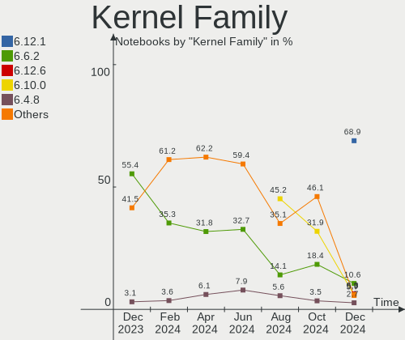
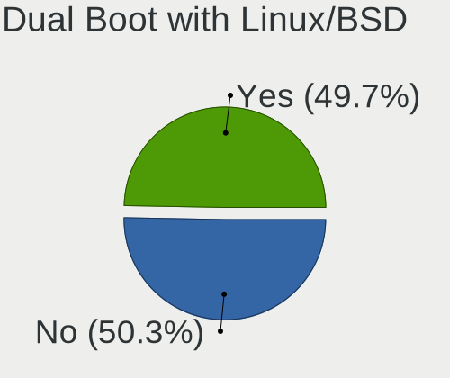
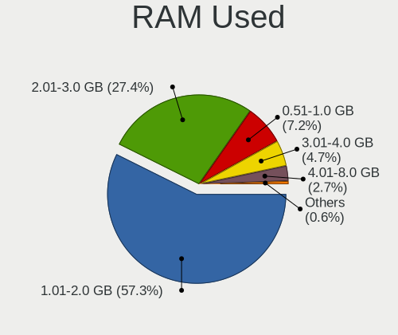
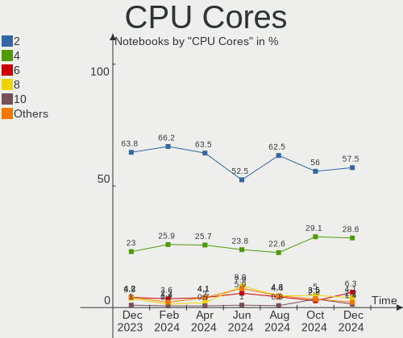
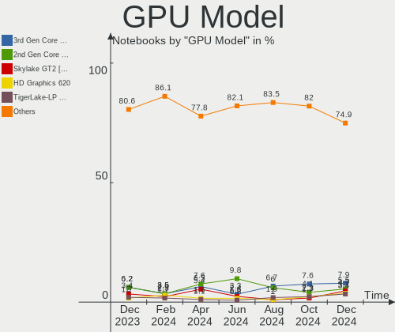
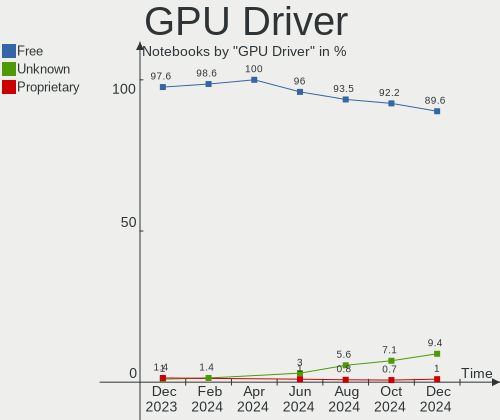
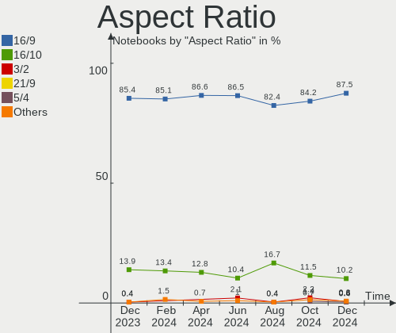
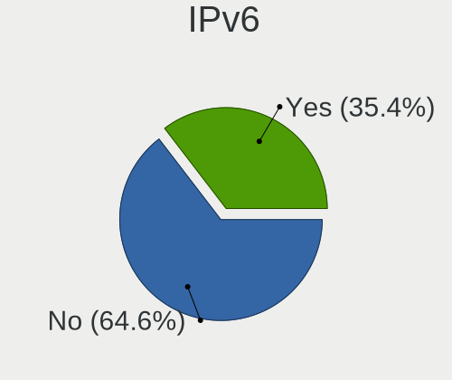

OpenMandriva Hardware Trends (Notebooks)
----------------------------------------

A project to identify most popular hardware characteristics and track their change
over time based on data collected by OpenMandriva users at https://Linux-Hardware.org.

Anyone can contribute to this report by the [hw-probe](https://github.com/linuxhw/hw-probe) tool:

    sudo -E hw-probe -all -upload

Full-feature report is available here: https://linux-hardware.org/?view=trends&formfactor=notebook

Period: Aug, 2021.

Contents
--------

* [ System ](#system)
  - [ OS                       ](#os)
  - [ OS Family                ](#os-family)
  - [ Kernel                   ](#kernel)
  - [ Kernel Family            ](#kernel-family)
  - [ Kernel Major Ver.        ](#kernel-major-ver)
  - [ Arch                     ](#arch)
  - [ DE                       ](#de)
  - [ Display Server           ](#display-server)
  - [ Display Manager          ](#display-manager)
  - [ OS Lang                  ](#os-lang)
  - [ Boot Mode                ](#boot-mode)
  - [ Filesystem               ](#filesystem)
  - [ Part. scheme             ](#part-scheme)
  - [ Dual Boot with Linux/BSD ](#dual-boot-with-linuxbsd)
  - [ Dual Boot (Win)          ](#dual-boot-win)

* [ Board ](#board)
  - [ Vendor                   ](#vendor)
  - [ Model                    ](#model)
  - [ Model Family             ](#model-family)
  - [ MFG Year                 ](#mfg-year)
  - [ Form Factor              ](#form-factor)
  - [ Secure Boot              ](#secure-boot)
  - [ Coreboot                 ](#coreboot)
  - [ RAM Size                 ](#ram-size)
  - [ RAM Used                 ](#ram-used)
  - [ Total Drives             ](#total-drives)
  - [ Has CD-ROM               ](#has-cd-rom)
  - [ Has Ethernet             ](#has-ethernet)
  - [ Has WiFi                 ](#has-wifi)
  - [ Has Bluetooth            ](#has-bluetooth)

* [ Location ](#location)
  - [ Country                  ](#country)
  - [ City                     ](#city)

* [ Drives ](#drives)
  - [ Drive Vendor             ](#drive-vendor)
  - [ Drive Model              ](#drive-model)
  - [ HDD Vendor               ](#hdd-vendor)
  - [ SSD Vendor               ](#ssd-vendor)
  - [ Drive Kind               ](#drive-kind)
  - [ Drive Connector          ](#drive-connector)
  - [ Drive Size               ](#drive-size)
  - [ Space Total              ](#space-total)
  - [ Space Used               ](#space-used)
  - [ Malfunc. Drives          ](#malfunc-drives)
  - [ Malfunc. Drive Vendor    ](#malfunc-drive-vendor)
  - [ Malfunc. HDD Vendor      ](#malfunc-hdd-vendor)
  - [ Malfunc. Drive Kind      ](#malfunc-drive-kind)
  - [ Failed Drives            ](#failed-drives)
  - [ Failed Drive Vendor      ](#failed-drive-vendor)
  - [ Drive Status             ](#drive-status)

* [ Storage controller ](#storage-controller)
  - [ Storage Vendor           ](#storage-vendor)
  - [ Storage Model            ](#storage-model)
  - [ Storage Kind             ](#storage-kind)

* [ Processor ](#processor)
  - [ CPU Vendor               ](#cpu-vendor)
  - [ CPU Model                ](#cpu-model)
  - [ CPU Model Family         ](#cpu-model-family)
  - [ CPU Cores                ](#cpu-cores)
  - [ CPU Sockets              ](#cpu-sockets)
  - [ CPU Threads              ](#cpu-threads)
  - [ CPU Op-Modes             ](#cpu-op-modes)
  - [ CPU Microcode            ](#cpu-microcode)
  - [ CPU Microarch            ](#cpu-microarch)

* [ Graphics ](#graphics)
  - [ GPU Vendor               ](#gpu-vendor)
  - [ GPU Model                ](#gpu-model)
  - [ GPU Combo                ](#gpu-combo)
  - [ GPU Driver               ](#gpu-driver)
  - [ GPU Memory               ](#gpu-memory)

* [ Monitor ](#monitor)
  - [ Monitor Vendor           ](#monitor-vendor)
  - [ Monitor Model            ](#monitor-model)
  - [ Monitor Resolution       ](#monitor-resolution)
  - [ Monitor Diagonal         ](#monitor-diagonal)
  - [ Monitor Width            ](#monitor-width)
  - [ Aspect Ratio             ](#aspect-ratio)
  - [ Monitor Area             ](#monitor-area)
  - [ Pixel Density            ](#pixel-density)
  - [ Multiple Monitors        ](#multiple-monitors)

* [ Network ](#network)
  - [ Net Controller Vendor    ](#net-controller-vendor)
  - [ Net Controller Model     ](#net-controller-model)
  - [ Wireless Vendor          ](#wireless-vendor)
  - [ Wireless Model           ](#wireless-model)
  - [ Ethernet Vendor          ](#ethernet-vendor)
  - [ Ethernet Model           ](#ethernet-model)
  - [ Net Controller Kind      ](#net-controller-kind)
  - [ Used Controller          ](#used-controller)
  - [ NICs                     ](#nics)
  - [ IPv6                     ](#ipv6)

* [ Bluetooth ](#bluetooth)
  - [ Bluetooth Vendor         ](#bluetooth-vendor)
  - [ Bluetooth Model          ](#bluetooth-model)

* [ Sound ](#sound)
  - [ Sound Vendor             ](#sound-vendor)
  - [ Sound Model              ](#sound-model)

* [ Memory ](#memory)
  - [ Memory Vendor            ](#memory-vendor)
  - [ Memory Model             ](#memory-model)
  - [ Memory Kind              ](#memory-kind)
  - [ Memory Form Factor       ](#memory-form-factor)
  - [ Memory Size              ](#memory-size)
  - [ Memory Speed             ](#memory-speed)

* [ Printers & scanners ](#printers--scanners)
  - [ Printer Vendor           ](#printer-vendor)
  - [ Printer Model            ](#printer-model)
  - [ Scanner Vendor           ](#scanner-vendor)
  - [ Scanner Model            ](#scanner-model)

* [ Camera ](#camera)
  - [ Camera Vendor            ](#camera-vendor)
  - [ Camera Model             ](#camera-model)

* [ Security ](#security)
  - [ Fingerprint Vendor       ](#fingerprint-vendor)
  - [ Fingerprint Model        ](#fingerprint-model)
  - [ Chipcard Vendor          ](#chipcard-vendor)
  - [ Chipcard Model           ](#chipcard-model)

* [ Unsupported ](#unsupported)
  - [ Unsupported Devices      ](#unsupported-devices)
  - [ Unsupported Device Types ](#unsupported-device-types)

System
------

OS
--

Installed operating systems

| Name              | Notebooks | Percent |
|-------------------|-----------|---------|
| OpenMandriva 4.2  | 126       | 93.33%  |
| OpenMandriva 4.50 | 9         | 6.67%   |

OS Family
---------

OS without a version

| Name         | Notebooks | Percent |
|--------------|-----------|---------|
| OpenMandriva | 135       | 100%    |

Kernel
------

Version of the Linux kernel

| Version                  | Notebooks | Percent |
|--------------------------|-----------|---------|
| 5.10.14-desktop-1omv4002 | 119       | 88.15%  |
| 5.12.4-desktop-1omv4050  | 8         | 5.93%   |
| 5.11.12-desktop-1omv4002 | 6         | 4.44%   |
| 5.12.7-desktop-1omv4003  | 1         | 0.74%   |
| Unknown                  | 1         | 0.74%   |

Kernel Family
-------------

Linux kernel without a distro release

| Version | Notebooks | Percent |
|---------|-----------|---------|
| 5.10.14 | 119       | 88.15%  |
| 5.12.4  | 8         | 5.93%   |
| 5.11.12 | 6         | 4.44%   |
| 5.12.7  | 1         | 0.74%   |
| Unknown | 1         | 0.74%   |

Kernel Major Ver.
-----------------

Linux kernel major version

| Version | Notebooks | Percent |
|---------|-----------|---------|
| 5.10    | 119       | 88.15%  |
| 5.12    | 9         | 6.67%   |
| 5.11    | 6         | 4.44%   |
| Unknown | 1         | 0.74%   |

Arch
----

OS architecture (x86_64, i586, etc.)

| Name    | Notebooks | Percent |
|---------|-----------|---------|
| x86_64  | 134       | 99.26%  |
| Unknown | 1         | 0.74%   |

DE
--

Desktop Environment

| Name     | Notebooks | Percent |
|----------|-----------|---------|
| KDE5     | 133       | 98.52%  |
| Cinnamon | 1         | 0.74%   |
| Unknown  | 1         | 0.74%   |

Display Server
--------------

X11 or Wayland

| Name | Notebooks | Percent |
|------|-----------|---------|
| X11  | 135       | 100%    |

Display Manager
---------------

SDDM, LightDM, etc.

| Name    | Notebooks | Percent |
|---------|-----------|---------|
| SDDM    | 134       | 99.26%  |
| Unknown | 1         | 0.74%   |

OS Lang
-------

Language

| Lang    | Notebooks | Percent |
|---------|-----------|---------|
| en_US   | 73        | 54.07%  |
| cs_CZ   | 16        | 11.85%  |
| ru_RU   | 10        | 7.41%   |
| de_DE   | 7         | 5.19%   |
| es_ES   | 5         | 3.7%    |
| it_IT   | 4         | 2.96%   |
| pt_BR   | 3         | 2.22%   |
| pl_PL   | 3         | 2.22%   |
| fr_FR   | 3         | 2.22%   |
| es_AR   | 3         | 2.22%   |
| hu_HU   | 2         | 1.48%   |
| en_GB   | 2         | 1.48%   |
| fr_CH   | 1         | 0.74%   |
| es_PE   | 1         | 0.74%   |
| es_EC   | 1         | 0.74%   |
| Unknown | 1         | 0.74%   |

Boot Mode
---------

EFI or BIOS

| Mode | Notebooks | Percent |
|------|-----------|---------|
| BIOS | 87        | 64.44%  |
| EFI  | 48        | 35.56%  |

Filesystem
----------

Type of filesystem

| Type    | Notebooks | Percent |
|---------|-----------|---------|
| Overlay | 112       | 82.96%  |
| Ext4    | 20        | 14.81%  |
| Btrfs   | 2         | 1.48%   |
| Unknown | 1         | 0.74%   |

Part. scheme
------------

Scheme of partitioning

| Type    | Notebooks | Percent |
|---------|-----------|---------|
| GPT     | 70        | 51.85%  |
| MBR     | 64        | 47.41%  |
| Unknown | 1         | 0.74%   |

Dual Boot with Linux/BSD
------------------------

Hosting more than one Linux/BSD

| Dual boot | Notebooks | Percent |
|-----------|-----------|---------|
| No        | 85        | 62.96%  |
| Yes       | 50        | 37.04%  |

Dual Boot (Win)
---------------

Hosting Linux and Windows

| Dual boot | Notebooks | Percent |
|-----------|-----------|---------|
| Yes       | 73        | 54.07%  |
| No        | 62        | 45.93%  |

Board
-----

Vendor
------

Motherboard manufacturer

| Name                | Notebooks | Percent |
|---------------------|-----------|---------|
| Lenovo              | 24        | 17.78%  |
| ASUSTek Computer    | 24        | 17.78%  |
| Hewlett-Packard     | 20        | 14.81%  |
| Dell                | 16        | 11.85%  |
| Acer                | 16        | 11.85%  |
| Toshiba             | 7         | 5.19%   |
| MSI                 | 6         | 4.44%   |
| Samsung Electronics | 5         | 3.7%    |
| Sony                | 4         | 2.96%   |
| eMachines           | 2         | 1.48%   |
| Apple               | 2         | 1.48%   |
| Positivo            | 1         | 0.74%   |
| Philco              | 1         | 0.74%   |
| Packard Bell        | 1         | 0.74%   |
| HUAWEI              | 1         | 0.74%   |
| GEO                 | 1         | 0.74%   |
| Fujitsu             | 1         | 0.74%   |
| BANGHO              | 1         | 0.74%   |
| AVITA               | 1         | 0.74%   |
| Unknown             | 1         | 0.74%   |

Model
-----

Motherboard model

| Name                                | Notebooks | Percent |
|-------------------------------------|-----------|---------|
| ASUS UX31E                          | 16        | 11.85%  |
| HP Notebook                         | 3         | 2.22%   |
| Dell Latitude E6410                 | 3         | 2.22%   |
| Lenovo IdeaPad 330-15IKB 81DE       | 2         | 1.48%   |
| HP Pavilion g6                      | 2         | 1.48%   |
| ASUS X555QA                         | 2         | 1.48%   |
| Acer Extensa 5620                   | 2         | 1.48%   |
| Unknown                             | 2         | 1.48%   |
| Toshiba Satellite Pro L300          | 1         | 0.74%   |
| Toshiba Satellite P200              | 1         | 0.74%   |
| Toshiba Satellite L750              | 1         | 0.74%   |
| Toshiba Satellite L675D             | 1         | 0.74%   |
| Toshiba Satellite L300              | 1         | 0.74%   |
| Toshiba Satellite A300              | 1         | 0.74%   |
| Toshiba Satellite A200              | 1         | 0.74%   |
| Sony VPCEB43FG                      | 1         | 0.74%   |
| Sony VPCEB15FB                      | 1         | 0.74%   |
| Sony VPCCW2S8E                      | 1         | 0.74%   |
| Sony VGN-FW235J                     | 1         | 0.74%   |
| Samsung SBBA                        | 1         | 0.74%   |
| Samsung R59P/R60P/R61P              | 1         | 0.74%   |
| Samsung R530/R730                   | 1         | 0.74%   |
| Samsung 905S3G/906S3G/915S3G/9305SG | 1         | 0.74%   |
| Samsung 300E4C/300E5C/300E7C        | 1         | 0.74%   |
| Philco 14L                          | 1         | 0.74%   |
| Packard Bell EasyNote TK85          | 1         | 0.74%   |
| MSI VR601                           | 1         | 0.74%   |
| MSI GT60 2OC/2OD                    | 1         | 0.74%   |
| MSI GP63 Leopard 8RE                | 1         | 0.74%   |
| MSI GL75 Leopard 10SCSR             | 1         | 0.74%   |
| MSI GF65 Thin 9SE                   | 1         | 0.74%   |
| MSI CR610M                          | 1         | 0.74%   |
| Lenovo Zhaoyang E49L 20178          | 1         | 0.74%   |
| Lenovo Z50-75 80EC                  | 1         | 0.74%   |
| Lenovo Y50-70 20378                 | 1         | 0.74%   |
| Lenovo V15-ADA 82C7                 | 1         | 0.74%   |
| Lenovo ThinkPad W530 2447A55        | 1         | 0.74%   |
| Lenovo ThinkPad T500 224235U        | 1         | 0.74%   |
| Lenovo ThinkPad T420s 4174FM9       | 1         | 0.74%   |
| Lenovo ThinkPad SL 27464RM          | 1         | 0.74%   |
| Lenovo ThinkPad E455 20DEA027CD     | 1         | 0.74%   |
| Lenovo IdeaPad Yoga 11S 20246       | 1         | 0.74%   |
| Lenovo IdeaPad S340-15API 81NC      | 1         | 0.74%   |
| Lenovo IdeaPad 320-15ISK 80XH       | 1         | 0.74%   |
| Lenovo IdeaPad 320-15IAP 80XR       | 1         | 0.74%   |
| Lenovo IdeaPad 320-15ABR 80XS       | 1         | 0.74%   |
| Lenovo IdeaPad 3 15ADA05 81W1       | 1         | 0.74%   |
| Lenovo IdeaPad 3 14ADA05 81W0       | 1         | 0.74%   |
| Lenovo IdeaPad 110-15ACL 80TJ       | 1         | 0.74%   |
| Lenovo IdeaPad 1 14IGL05 81VU       | 1         | 0.74%   |
| Lenovo G505 20240                   | 1         | 0.74%   |
| Lenovo G400s 20244                  | 1         | 0.74%   |
| Lenovo B590 20208                   | 1         | 0.74%   |
| Lenovo B50-70 80EU                  | 1         | 0.74%   |
| HUAWEI HVY-WXX9                     | 1         | 0.74%   |
| HP ProBook 470 G0                   | 1         | 0.74%   |
| HP ProBook 4430s                    | 1         | 0.74%   |
| HP ProBook 440 G3                   | 1         | 0.74%   |
| HP Pavilion Gaming Laptop 15-ec1xxx | 1         | 0.74%   |
| HP Pavilion g4                      | 1         | 0.74%   |

Model Family
------------

Motherboard model prefix

| Name                  | Notebooks | Percent |
|-----------------------|-----------|---------|
| ASUS UX31E            | 16        | 11.85%  |
| Acer Aspire           | 12        | 8.89%   |
| Lenovo IdeaPad        | 11        | 8.15%   |
| Dell Inspiron         | 8         | 5.93%   |
| Toshiba Satellite     | 7         | 5.19%   |
| Dell Latitude         | 7         | 5.19%   |
| HP Pavilion           | 6         | 4.44%   |
| Lenovo ThinkPad       | 5         | 3.7%    |
| HP Laptop             | 4         | 2.96%   |
| HP ProBook            | 3         | 2.22%   |
| HP Notebook           | 3         | 2.22%   |
| Acer Extensa          | 3         | 2.22%   |
| ASUS X555QA           | 2         | 1.48%   |
| Unknown               | 2         | 1.48%   |
| Sony VPCEB43FG        | 1         | 0.74%   |
| Sony VPCEB15FB        | 1         | 0.74%   |
| Sony VPCCW2S8E        | 1         | 0.74%   |
| Sony VGN-FW235J       | 1         | 0.74%   |
| Samsung SBBA          | 1         | 0.74%   |
| Samsung R59P          | 1         | 0.74%   |
| Samsung R530          | 1         | 0.74%   |
| Samsung 905S3G        | 1         | 0.74%   |
| Samsung 300E4C        | 1         | 0.74%   |
| Philco 14L            | 1         | 0.74%   |
| Packard Bell EasyNote | 1         | 0.74%   |
| MSI VR601             | 1         | 0.74%   |
| MSI GT60              | 1         | 0.74%   |
| MSI GP63              | 1         | 0.74%   |
| MSI GL75              | 1         | 0.74%   |
| MSI GF65              | 1         | 0.74%   |
| MSI CR610M            | 1         | 0.74%   |
| Lenovo Zhaoyang       | 1         | 0.74%   |
| Lenovo Z50-75         | 1         | 0.74%   |
| Lenovo Y50-70         | 1         | 0.74%   |
| Lenovo V15-ADA        | 1         | 0.74%   |
| Lenovo G505           | 1         | 0.74%   |
| Lenovo G400s          | 1         | 0.74%   |
| Lenovo B590           | 1         | 0.74%   |
| Lenovo B50-70         | 1         | 0.74%   |
| HUAWEI HVY-WXX9       | 1         | 0.74%   |
| HP EliteBook          | 1         | 0.74%   |
| HP Compaq             | 1         | 0.74%   |
| HP 650                | 1         | 0.74%   |
| HP 620                | 1         | 0.74%   |
| GEO GeoBook3          | 1         | 0.74%   |
| Fujitsu LIFEBOOK      | 1         | 0.74%   |
| eMachines eMG620      | 1         | 0.74%   |
| eMachines eMachiens   | 1         | 0.74%   |
| Dell Precision        | 1         | 0.74%   |
| BANGHO MAX            | 1         | 0.74%   |
| AVITA NE14A2          | 1         | 0.74%   |
| ASUS X556URK          | 1         | 0.74%   |
| ASUS X555LAB          | 1         | 0.74%   |
| ASUS X455LA           | 1         | 0.74%   |
| ASUS VivoBook         | 1         | 0.74%   |
| ASUS M51Vr            | 1         | 0.74%   |
| ASUS K75VM            | 1         | 0.74%   |
| Apple MacBookPro9     | 1         | 0.74%   |
| Apple MacBookPro8     | 1         | 0.74%   |
| Acer Nitro            | 1         | 0.74%   |

MFG Year
--------

Motherboard manufacture year

| Year | Notebooks | Percent |
|------|-----------|---------|
| 2012 | 19        | 14.07%  |
| 2020 | 13        | 9.63%   |
| 2018 | 12        | 8.89%   |
| 2010 | 12        | 8.89%   |
| 2015 | 11        | 8.15%   |
| 2013 | 11        | 8.15%   |
| 2008 | 11        | 8.15%   |
| 2011 | 9         | 6.67%   |
| 2021 | 8         | 5.93%   |
| 2014 | 8         | 5.93%   |
| 2017 | 7         | 5.19%   |
| 2019 | 4         | 2.96%   |
| 2016 | 4         | 2.96%   |
| 2007 | 3         | 2.22%   |
| 2009 | 2         | 1.48%   |
| 2006 | 1         | 0.74%   |

Form Factor
-----------

Physical design of the computer

| Name     | Notebooks | Percent |
|----------|-----------|---------|
| Notebook | 135       | 100%    |

Secure Boot
-----------

Enabled or disabled

| State    | Notebooks | Percent |
|----------|-----------|---------|
| Disabled | 135       | 100%    |

Coreboot
--------

Have coreboot on board

| Used | Notebooks | Percent |
|------|-----------|---------|
| No   | 135       | 100%    |

RAM Size
--------

Total RAM memory

| Size in GB | Notebooks | Percent |
|------------|-----------|---------|
| 3.01-4.0   | 68        | 50.37%  |
| 4.01-8.0   | 35        | 25.93%  |
| 8.01-16.0  | 14        | 10.37%  |
| 16.01-24.0 | 9         | 6.67%   |
| 1.01-2.0   | 7         | 5.19%   |
| 2.01-3.0   | 1         | 0.74%   |
| Unknown    | 1         | 0.74%   |

RAM Used
--------

Used RAM memory

| Used GB  | Notebooks | Percent |
|----------|-----------|---------|
| 1.01-2.0 | 109       | 80.74%  |
| 2.01-3.0 | 12        | 8.89%   |
| 0.51-1.0 | 11        | 8.15%   |
| 0.01-0.5 | 2         | 1.48%   |
| Unknown  | 1         | 0.74%   |

Total Drives
------------

Number of drives on board

| Drives | Notebooks | Percent |
|--------|-----------|---------|
| 1      | 105       | 77.78%  |
| 2      | 26        | 19.26%  |
| 3      | 3         | 2.22%   |
| 0      | 1         | 0.74%   |

Has CD-ROM
----------

Has CD-ROM on board

| Presented | Notebooks | Percent |
|-----------|-----------|---------|
| Yes       | 73        | 54.07%  |
| No        | 62        | 45.93%  |

Has Ethernet
------------

Has Ethernet on board

| Presented | Notebooks | Percent |
|-----------|-----------|---------|
| Yes       | 125       | 92.59%  |
| No        | 10        | 7.41%   |

Has WiFi
--------

Has WiFi module

| Presented | Notebooks | Percent |
|-----------|-----------|---------|
| Yes       | 133       | 98.52%  |
| No        | 2         | 1.48%   |

Has Bluetooth
-------------

Has Bluetooth module

| Presented | Notebooks | Percent |
|-----------|-----------|---------|
| Yes       | 86        | 63.7%   |
| No        | 49        | 36.3%   |

Location
--------

Country
-------

Geographic location (country)

| Country      | Notebooks | Percent |
|--------------|-----------|---------|
| USA          | 17        | 12.59%  |
| Czechia      | 16        | 11.85%  |
| Russia       | 13        | 9.63%   |
| Germany      | 8         | 5.93%   |
| Spain        | 7         | 5.19%   |
| France       | 7         | 5.19%   |
| Brazil       | 7         | 5.19%   |
| Poland       | 6         | 4.44%   |
| Italy        | 6         | 4.44%   |
| UK           | 5         | 3.7%    |
| Mexico       | 4         | 2.96%   |
| China        | 4         | 2.96%   |
| Ukraine      | 3         | 2.22%   |
| Hungary      | 3         | 2.22%   |
| Argentina    | 3         | 2.22%   |
| Indonesia    | 2         | 1.48%   |
| Canada       | 2         | 1.48%   |
| Belarus      | 2         | 1.48%   |
| Algeria      | 2         | 1.48%   |
| Taiwan       | 1         | 0.74%   |
| Switzerland  | 1         | 0.74%   |
| Sweden       | 1         | 0.74%   |
| Saudi Arabia | 1         | 0.74%   |
| Portugal     | 1         | 0.74%   |
| Peru         | 1         | 0.74%   |
| New Zealand  | 1         | 0.74%   |
| Netherlands  | 1         | 0.74%   |
| Latvia       | 1         | 0.74%   |
| Ireland      | 1         | 0.74%   |
| India        | 1         | 0.74%   |
| Greece       | 1         | 0.74%   |
| Estonia      | 1         | 0.74%   |
| Ecuador      | 1         | 0.74%   |
| Chile        | 1         | 0.74%   |
| Bangladesh   | 1         | 0.74%   |
| Austria      | 1         | 0.74%   |
| Australia    | 1         | 0.74%   |

City
----

Geographic location (city)

| City                      | Notebooks | Percent |
|---------------------------|-----------|---------|
| Prague                    | 14        | 10.37%  |
| Moscow                    | 3         | 2.22%   |
| St Petersburg             | 2         | 1.48%   |
| Sapulpa                   | 2         | 1.48%   |
| Paris                     | 2         | 1.48%   |
| Brno                      | 2         | 1.48%   |
| Zirndorf                  | 1         | 0.74%   |
| York                      | 1         | 0.74%   |
| Yaroslavl                 | 1         | 0.74%   |
| Xiamen                    | 1         | 0.74%   |
| Wiesbaden                 | 1         | 0.74%   |
| White River Junction      | 1         | 0.74%   |
| West Hoxton               | 1         | 0.74%   |
| W??rzburg                 | 1         | 0.74%   |
| Wassigny                  | 1         | 0.74%   |
| Warsaw                    | 1         | 0.74%   |
| Walla Walla               | 1         | 0.74%   |
| Waimea                    | 1         | 0.74%   |
| Wa?‚brzych                | 1         | 0.74%   |
| Voronezh                  | 1         | 0.74%   |
| Vinnytsia                 | 1         | 0.74%   |
| Veszpr?©m                 | 1         | 0.74%   |
| Verbicaro                 | 1         | 0.74%   |
| Valparaiso de Goias       | 1         | 0.74%   |
| Vall d'Alba               | 1         | 0.74%   |
| Tymoshivka                | 1         | 0.74%   |
| Tuam                      | 1         | 0.74%   |
| Tatu?­                    | 1         | 0.74%   |
| Tafi Viejo                | 1         | 0.74%   |
| Stuttgart                 | 1         | 0.74%   |
| Sosnowiec                 | 1         | 0.74%   |
| Solingen                  | 1         | 0.74%   |
| Seppois-le-Bas            | 1         | 0.74%   |
| Sao Jose do Goiabal       | 1         | 0.74%   |
| Santiago                  | 1         | 0.74%   |
| San Nicol??s de los Garza | 1         | 0.74%   |
| Salvador                  | 1         | 0.74%   |
| Sahibganj                 | 1         | 0.74%   |
| Rybinsk                   | 1         | 0.74%   |
| Rullstorf                 | 1         | 0.74%   |
| Riyadh                    | 1         | 0.74%   |
| Riga                      | 1         | 0.74%   |
| Quilmes                   | 1         | 0.74%   |
| Portoviejo                | 1         | 0.74%   |
| Porto Alegre              | 1         | 0.74%   |
| Piraeus                   | 1         | 0.74%   |
| Pamplona                  | 1         | 0.74%   |
| Oxford                    | 1         | 0.74%   |
| Osielsko                  | 1         | 0.74%   |
| Omsk                      | 1         | 0.74%   |
| Novosibirsk               | 1         | 0.74%   |
| Novorossiysk              | 1         | 0.74%   |
| Noumerat                  | 1         | 0.74%   |
| Northolt                  | 1         | 0.74%   |
| Neuchatel                 | 1         | 0.74%   |
| Mogilev                   | 1         | 0.74%   |
| Mexico City               | 1         | 0.74%   |
| Matane                    | 1         | 0.74%   |
| Marcellus                 | 1         | 0.74%   |
| Maardu                    | 1         | 0.74%   |

Drives
------

Drive Vendor
------------

Hard drive vendors

| Vendor              | Notebooks | Drives | Percent |
|---------------------|-----------|--------|---------|
| WDC                 | 32        | 32     | 20.51%  |
| SanDisk             | 22        | 22     | 14.1%   |
| Toshiba             | 18        | 18     | 11.54%  |
| Seagate             | 15        | 15     | 9.62%   |
| Samsung Electronics | 13        | 13     | 8.33%   |
| Hitachi             | 10        | 10     | 6.41%   |
| Unknown             | 6         | 6      | 3.85%   |
| Kingston            | 5         | 6      | 3.21%   |
| HGST                | 5         | 5      | 3.21%   |
| Fujitsu             | 3         | 3      | 1.92%   |
| Crucial             | 3         | 3      | 1.92%   |
| OCZ                 | 2         | 2      | 1.28%   |
| KingSpec            | 2         | 2      | 1.28%   |
| Zheino              | 1         | 1      | 0.64%   |
| Verbatim            | 1         | 1      | 0.64%   |
| Union Memory        | 1         | 1      | 0.64%   |
| Teclast             | 1         | 1      | 0.64%   |
| SK Hynix            | 1         | 1      | 0.64%   |
| Silicon Motion      | 1         | 1      | 0.64%   |
| PNY                 | 1         | 1      | 0.64%   |
| Phison              | 1         | 1      | 0.64%   |
| Micron Technology   | 1         | 1      | 0.64%   |
| LITEONIT            | 1         | 1      | 0.64%   |
| Leven               | 1         | 1      | 0.64%   |
| LenovoSPEED         | 1         | 1      | 0.64%   |
| KIOXIA              | 1         | 1      | 0.64%   |
| JMicron             | 1         | 1      | 0.64%   |
| Intel               | 1         | 1      | 0.64%   |
| INNOVATION IT       | 1         | 1      | 0.64%   |
| China               | 1         | 1      | 0.64%   |
| Apple               | 1         | 1      | 0.64%   |
| Apacer              | 1         | 1      | 0.64%   |
| A-DATA Technology   | 1         | 1      | 0.64%   |

Drive Model
-----------

Hard drive models

| Model                                   | Notebooks | Percent |
|-----------------------------------------|-----------|---------|
| SanDisk SSD U100 256GB                  | 16        | 10.26%  |
| WDC WD10JPVX-22JC3T0 1TB                | 3         | 1.92%   |
| Toshiba MQ01ABD100 1TB                  | 3         | 1.92%   |
| WDC WDS120G2G0A-00JH30 120GB SSD        | 2         | 1.28%   |
| WDC WD10SPZX-24Z10 1TB                  | 2         | 1.28%   |
| Toshiba MQ01ABF050 500GB                | 2         | 1.28%   |
| Seagate ST500LT012-9WS142 500GB         | 2         | 1.28%   |
| Seagate ST500LT012-1DG142 500GB         | 2         | 1.28%   |
| Hitachi HTS547550A9E384 500GB           | 2         | 1.28%   |
| Hitachi HTS545025B9A300 250GB           | 2         | 1.28%   |
| HGST HTS721010A9E630 1TB                | 2         | 1.28%   |
| Zheino CHN-mSATAQ3-480 480GB SSD        | 1         | 0.64%   |
| WDC WDS240G2G0A-00JH30 240GB SSD        | 1         | 0.64%   |
| WDC WDS100T2B0B-00YS70 1TB SSD          | 1         | 0.64%   |
| WDC WD6400BEVT-22A0RT0 640GB            | 1         | 0.64%   |
| WDC WD5000LPVX-22V0TT0 500GB            | 1         | 0.64%   |
| WDC WD5000LPCX-60VHAT0 500GB            | 1         | 0.64%   |
| WDC WD5000LPCX-24VHAT0 500GB            | 1         | 0.64%   |
| WDC WD5000LPCX-24C6HT0 500GB            | 1         | 0.64%   |
| WDC WD5000BPVT-60HXZT1 500GB            | 1         | 0.64%   |
| WDC WD5000BPVT-22HXZT3 500GB            | 1         | 0.64%   |
| WDC WD5000BPKX-22HPJT0 500GB            | 1         | 0.64%   |
| WDC WD5000BEVT-00A0RT0 500GB            | 1         | 0.64%   |
| WDC WD3200BEVT-22ZCT0 320GB             | 1         | 0.64%   |
| WDC WD3200BEVS-26VAT0 320GB             | 1         | 0.64%   |
| WDC WD2500BEVT-22ZCT0 250GB             | 1         | 0.64%   |
| WDC WD2500BEVS-08VAT2 250GB             | 1         | 0.64%   |
| WDC WD1600BEVT-22ZCT0 160GB             | 1         | 0.64%   |
| WDC WD1600BEVS-75RST0 160GB             | 1         | 0.64%   |
| WDC WD10SPZX-21Z10T0 1TB                | 1         | 0.64%   |
| WDC WD10JPVX-60JC3T1 1TB                | 1         | 0.64%   |
| WDC PC SN730 SDBPNTY-512G-1027 512GB    | 1         | 0.64%   |
| WDC PC SN530 SDBPMPZ-256G-1101 256GB    | 1         | 0.64%   |
| WDC PC SN520 SDAPNUW-256G-1014 256GB    | 1         | 0.64%   |
| WDC PC SN520 SDAPNUW-256G               | 1         | 0.64%   |
| WDC PC SN520 SDAPNUW-128G-1006 128GB    | 1         | 0.64%   |
| WDC PC SN520 SDAPMUW-512G-1101 512GB    | 1         | 0.64%   |
| Verbatim Vi500 S3 120GB SSD             | 1         | 0.64%   |
| Unknown SSD0256XQC82X200M34237 256GB    | 1         | 0.64%   |
| Unknown SSD0128S00 128GB                | 1         | 0.64%   |
| Unknown SD64G  64GB                     | 1         | 0.64%   |
| Unknown SD/MMC/MS PRO 128GB             | 1         | 0.64%   |
| Unknown BJNB4R  32GB                    | 1         | 0.64%   |
| Unknown Biwin  32GB                     | 1         | 0.64%   |
| Union Memory UMIS RPJTJ128MEE1MWX 128GB | 1         | 0.64%   |
| Toshiba MQ04ABF100 1TB                  | 1         | 0.64%   |
| Toshiba MK6475GSX 640GB                 | 1         | 0.64%   |
| Toshiba MK6461GSYN 640GB                | 1         | 0.64%   |
| Toshiba MK5076GSX 500GB                 | 1         | 0.64%   |
| Toshiba MK5059GSXP 500GB                | 1         | 0.64%   |
| Toshiba MK3276GSX -63 320GB             | 1         | 0.64%   |
| Toshiba MK3275GSX 320GB                 | 1         | 0.64%   |
| Toshiba MK3265GSX 320GB                 | 1         | 0.64%   |
| Toshiba MK3259GSXP 320GB                | 1         | 0.64%   |
| Toshiba MK1661GSYN 160GB                | 1         | 0.64%   |
| Toshiba MK1652GSX 160GB                 | 1         | 0.64%   |
| Toshiba MK1252GSX 120GB                 | 1         | 0.64%   |
| Toshiba HDWL110 1TB                     | 1         | 0.64%   |
| Teclast 480GB A900 SSD                  | 1         | 0.64%   |
| SK Hynix HFM256GDJTNI-82A0A 256GB       | 1         | 0.64%   |

HDD Vendor
----------

Hard disk drive vendors

| Vendor              | Notebooks | Drives | Percent |
|---------------------|-----------|--------|---------|
| WDC                 | 22        | 22     | 28.21%  |
| Toshiba             | 18        | 18     | 23.08%  |
| Seagate             | 15        | 15     | 19.23%  |
| Hitachi             | 10        | 10     | 12.82%  |
| HGST                | 5         | 5      | 6.41%   |
| Samsung Electronics | 4         | 4      | 5.13%   |
| Fujitsu             | 3         | 3      | 3.85%   |
| Apple               | 1         | 1      | 1.28%   |

SSD Vendor
----------

Solid state drive vendors

| Vendor              | Notebooks | Drives | Percent |
|---------------------|-----------|--------|---------|
| SanDisk             | 22        | 22     | 38.6%   |
| Samsung Electronics | 5         | 5      | 8.77%   |
| Kingston            | 5         | 6      | 8.77%   |
| WDC                 | 4         | 4      | 7.02%   |
| Unknown             | 2         | 2      | 3.51%   |
| OCZ                 | 2         | 2      | 3.51%   |
| KingSpec            | 2         | 2      | 3.51%   |
| Crucial             | 2         | 2      | 3.51%   |
| Zheino              | 1         | 1      | 1.75%   |
| Verbatim            | 1         | 1      | 1.75%   |
| Teclast             | 1         | 1      | 1.75%   |
| PNY                 | 1         | 1      | 1.75%   |
| Micron Technology   | 1         | 1      | 1.75%   |
| LITEONIT            | 1         | 1      | 1.75%   |
| Leven               | 1         | 1      | 1.75%   |
| LenovoSPEED         | 1         | 1      | 1.75%   |
| Intel               | 1         | 1      | 1.75%   |
| INNOVATION IT       | 1         | 1      | 1.75%   |
| China               | 1         | 1      | 1.75%   |
| Apacer              | 1         | 1      | 1.75%   |
| A-DATA Technology   | 1         | 1      | 1.75%   |

Drive Kind
----------

HDD or SSD

| Kind    | Notebooks | Drives | Percent |
|---------|-----------|--------|---------|
| HDD     | 76        | 78     | 50%     |
| SSD     | 56        | 58     | 36.84%  |
| NVMe    | 15        | 16     | 9.87%   |
| MMC     | 3         | 3      | 1.97%   |
| Unknown | 2         | 2      | 1.32%   |

Drive Connector
---------------

SATA, SAS, NVMe, etc.

| Type | Notebooks | Drives | Percent |
|------|-----------|--------|---------|
| SATA | 122       | 135    | 85.31%  |
| NVMe | 15        | 16     | 10.49%  |
| SAS  | 3         | 3      | 2.1%    |
| MMC  | 3         | 3      | 2.1%    |

Drive Size
----------

Size of hard drive

| Size in TB | Notebooks | Drives | Percent |
|------------|-----------|--------|---------|
| 0.01-0.5   | 99        | 108    | 78.57%  |
| 0.51-1.0   | 25        | 26     | 19.84%  |
| 1.01-2.0   | 2         | 2      | 1.59%   |

Space Total
-----------

Amount of disk space available on the file system

| Size in GB | Notebooks | Percent |
|------------|-----------|---------|
| 1-20       | 85        | 62.96%  |
| 101-250    | 14        | 10.37%  |
| 251-500    | 11        | 8.15%   |
| Unknown    | 7         | 5.19%   |
| 21-50      | 6         | 4.44%   |
| 501-1000   | 6         | 4.44%   |
| 51-100     | 6         | 4.44%   |

Space Used
----------

Amount of used disk space

| Used GB | Notebooks | Percent |
|---------|-----------|---------|
| 1-20    | 124       | 91.85%  |
| Unknown | 7         | 5.19%   |
| 21-50   | 2         | 1.48%   |
| 101-250 | 2         | 1.48%   |

Malfunc. Drives
---------------

Drive models with a malfunction

| Model                                            | Notebooks | Drives | Percent |
|--------------------------------------------------|-----------|--------|---------|
| SanDisk SSD U100 256GB                           | 16        | 16     | 31.37%  |
| Seagate ST500LT012-9WS142 500GB                  | 2         | 2      | 3.92%   |
| Seagate ST500LT012-1DG142 500GB                  | 2         | 2      | 3.92%   |
| WDC WD5000LPCX-60VHAT0 500GB                     | 1         | 1      | 1.96%   |
| WDC WD5000BPVT-22HXZT3 500GB                     | 1         | 1      | 1.96%   |
| WDC WD5000BEVT-00A0RT0 500GB                     | 1         | 1      | 1.96%   |
| WDC WD1600BEVT-22ZCT0 160GB                      | 1         | 1      | 1.96%   |
| WDC WD10SPZX-24Z10 1TB                           | 1         | 1      | 1.96%   |
| WDC WD10JPVX-22JC3T0 1TB                         | 1         | 1      | 1.96%   |
| Toshiba MQ01ABF050 500GB                         | 1         | 1      | 1.96%   |
| Toshiba MQ01ABD100 1TB                           | 1         | 1      | 1.96%   |
| Toshiba MK5076GSX 500GB                          | 1         | 1      | 1.96%   |
| Toshiba MK5059GSXP 500GB                         | 1         | 1      | 1.96%   |
| Toshiba MK3265GSX 320GB                          | 1         | 1      | 1.96%   |
| Toshiba MK1652GSX 160GB                          | 1         | 1      | 1.96%   |
| Seagate ST9500420AS 500GB                        | 1         | 1      | 1.96%   |
| Seagate ST9500325AS 500GB                        | 1         | 1      | 1.96%   |
| Seagate ST9320423AS 320GB                        | 1         | 1      | 1.96%   |
| Seagate ST9320325AS 320GB                        | 1         | 1      | 1.96%   |
| Samsung Electronics MZ7PA128HMCD-010L1 128GB SSD | 1         | 1      | 1.96%   |
| Samsung Electronics HM501II 500GB                | 1         | 1      | 1.96%   |
| Hitachi HTS723225L9A360 250GB                    | 1         | 1      | 1.96%   |
| Hitachi HTS722012K9A300 120GB                    | 1         | 1      | 1.96%   |
| Hitachi HTS547550A9E384 500GB                    | 1         | 1      | 1.96%   |
| Hitachi HTS545050A7E380 500GB                    | 1         | 1      | 1.96%   |
| Hitachi HTS545032B9SA00 320GB                    | 1         | 1      | 1.96%   |
| Hitachi HTS545025B9A300 250GB                    | 1         | 1      | 1.96%   |
| Hitachi HTS542525K9SA00 250GB                    | 1         | 1      | 1.96%   |
| Hitachi HTS541060G9SA00 64GB                     | 1         | 1      | 1.96%   |
| HGST HTS725050A7E630 500GB                       | 1         | 1      | 1.96%   |
| HGST HTS545050A7E380 500GB                       | 1         | 1      | 1.96%   |
| Fujitsu MHZ2250BH G1 250GB                       | 1         | 1      | 1.96%   |
| Fujitsu MHY2120BH 120GB                          | 1         | 1      | 1.96%   |
| Fujitsu MHX2250BT 250GB                          | 1         | 1      | 1.96%   |

Malfunc. Drive Vendor
---------------------

Vendors of faulty drives

| Vendor              | Notebooks | Drives | Percent |
|---------------------|-----------|--------|---------|
| SanDisk             | 16        | 16     | 31.37%  |
| Seagate             | 8         | 8      | 15.69%  |
| Hitachi             | 8         | 8      | 15.69%  |
| WDC                 | 6         | 6      | 11.76%  |
| Toshiba             | 6         | 6      | 11.76%  |
| Fujitsu             | 3         | 3      | 5.88%   |
| Samsung Electronics | 2         | 2      | 3.92%   |
| HGST                | 2         | 2      | 3.92%   |

Malfunc. HDD Vendor
-------------------

Vendors of faulty HDD drives

| Vendor              | Notebooks | Drives | Percent |
|---------------------|-----------|--------|---------|
| Seagate             | 8         | 8      | 23.53%  |
| Hitachi             | 8         | 8      | 23.53%  |
| WDC                 | 6         | 6      | 17.65%  |
| Toshiba             | 6         | 6      | 17.65%  |
| Fujitsu             | 3         | 3      | 8.82%   |
| HGST                | 2         | 2      | 5.88%   |
| Samsung Electronics | 1         | 1      | 2.94%   |

Malfunc. Drive Kind
-------------------

Kinds of faulty drives

| Kind | Notebooks | Drives | Percent |
|------|-----------|--------|---------|
| HDD  | 34        | 34     | 66.67%  |
| SSD  | 17        | 17     | 33.33%  |

Failed Drives
-------------

Failed drive models

| Model                        | Notebooks | Drives | Percent |
|------------------------------|-----------|--------|---------|
| WDC WD5000BPVT-60HXZT1 500GB | 1         | 1      | 33.33%  |
| Toshiba MK3259GSXP 320GB     | 1         | 1      | 33.33%  |
| HGST HTS541010A9E680 1TB     | 1         | 1      | 33.33%  |

Failed Drive Vendor
-------------------

Failed drive vendors

| Vendor  | Notebooks | Drives | Percent |
|---------|-----------|--------|---------|
| WDC     | 1         | 1      | 33.33%  |
| Toshiba | 1         | 1      | 33.33%  |
| HGST    | 1         | 1      | 33.33%  |

Drive Status
------------

Number of failed and malfunc. drives

| Status   | Notebooks | Drives | Percent |
|----------|-----------|--------|---------|
| Works    | 84        | 96     | 57.93%  |
| Malfunc  | 51        | 51     | 35.17%  |
| Detected | 7         | 7      | 4.83%   |
| Failed   | 3         | 3      | 2.07%   |

Storage controller
------------------

Storage Vendor
--------------

Storage controller vendors

| Vendor                    | Notebooks | Percent |
|---------------------------|-----------|---------|
| Intel                     | 105       | 73.43%  |
| AMD                       | 22        | 15.38%  |
| Sandisk                   | 6         | 4.2%    |
| Samsung Electronics       | 4         | 2.8%    |
| Union Memory (Shenzhen)   | 1         | 0.7%    |
| SK Hynix                  | 1         | 0.7%    |
| Silicon Motion            | 1         | 0.7%    |
| Phison Electronics        | 1         | 0.7%    |
| Nvidia                    | 1         | 0.7%    |
| Micron/Crucial Technology | 1         | 0.7%    |

Storage Model
-------------

Storage controller models

| Model                                                                                  | Notebooks | Percent |
|----------------------------------------------------------------------------------------|-----------|---------|
| Intel 6 Series/C200 Series Chipset Family 6 port Mobile SATA AHCI Controller           | 24        | 15.38%  |
| Intel 7 Series Chipset Family 6-port SATA Controller [AHCI mode]                       | 15        | 9.62%   |
| AMD FCH SATA Controller [AHCI mode]                                                    | 15        | 9.62%   |
| Intel 82801HM/HEM (ICH8M/ICH8M-E) IDE Controller                                       | 9         | 5.77%   |
| Intel 82801HM/HEM (ICH8M/ICH8M-E) SATA Controller [AHCI mode]                          | 7         | 4.49%   |
| Intel 82801 Mobile SATA Controller [RAID mode]                                         | 7         | 4.49%   |
| Intel Sunrise Point-LP SATA Controller [AHCI mode]                                     | 6         | 3.85%   |
| Intel 82801IBM/IEM (ICH9M/ICH9M-E) 4 port SATA Controller [AHCI mode]                  | 6         | 3.85%   |
| Intel 8 Series SATA Controller 1 [AHCI mode]                                           | 5         | 3.21%   |
| Intel 5 Series/3400 Series Chipset 4 port SATA AHCI Controller                         | 5         | 3.21%   |
| Intel Atom/Celeron/Pentium Processor x5-E8000/J3xxx/N3xxx Series SATA Controller       | 4         | 2.56%   |
| Intel 8 Series/C220 Series Chipset Family 6-port SATA Controller 1 [AHCI mode]         | 4         | 2.56%   |
| Sandisk WD Blue SN500 / PC SN520 NVMe SSD                                              | 3         | 1.92%   |
| Samsung NVMe Controller                                                                | 3         | 1.92%   |
| Intel 82801HM/HEM (ICH8M/ICH8M-E) SATA Controller [IDE mode]                           | 3         | 1.92%   |
| Intel 5 Series/3400 Series Chipset 6 port SATA AHCI Controller                         | 3         | 1.92%   |
| AMD FCH SATA Controller [IDE mode]                                                     | 3         | 1.92%   |
| Intel Wildcat Point-LP SATA Controller [AHCI Mode]                                     | 2         | 1.28%   |
| Intel Celeron/Pentium Silver Processor SATA Controller                                 | 2         | 1.28%   |
| Intel Atom Processor E3800 Series SATA AHCI Controller                                 | 2         | 1.28%   |
| Intel 82801IBM/IEM (ICH9M/ICH9M-E) 2 port SATA Controller [IDE mode]                   | 2         | 1.28%   |
| AMD SB7x0/SB8x0/SB9x0 SATA Controller [AHCI mode]                                      | 2         | 1.28%   |
| AMD SB600 Non-Raid-5 SATA                                                              | 2         | 1.28%   |
| AMD SB600 IDE                                                                          | 2         | 1.28%   |
| Union Memory (Shenzhen) Non-Volatile memory controller                                 | 1         | 0.64%   |
| SK Hynix BC511                                                                         | 1         | 0.64%   |
| Silicon Motion SM2263EN/SM2263XT SSD Controller                                        | 1         | 0.64%   |
| Sandisk WD Black SN750 / PC SN730 NVMe SSD                                             | 1         | 0.64%   |
| Sandisk PC SN520 NVMe SSD                                                              | 1         | 0.64%   |
| Sandisk Non-Volatile memory controller                                                 | 1         | 0.64%   |
| Samsung NVMe SSD Controller SM981/PM981/PM983                                          | 1         | 0.64%   |
| Phison PS5013 E13 NVMe Controller                                                      | 1         | 0.64%   |
| Nvidia nForce SATA Controller                                                          | 1         | 0.64%   |
| Micron/Crucial NVMe Controller                                                         | 1         | 0.64%   |
| Intel NM10/ICH7 Family SATA Controller [AHCI mode]                                     | 1         | 0.64%   |
| Intel Ice Lake-LP SATA Controller [AHCI mode]                                          | 1         | 0.64%   |
| Intel Comet Lake SATA AHCI Controller                                                  | 1         | 0.64%   |
| Intel Celeron N3350/Pentium N4200/Atom E3900 Series SATA AHCI Controller               | 1         | 0.64%   |
| Intel Cannon Lake Mobile PCH SATA AHCI Controller                                      | 1         | 0.64%   |
| Intel 8 Series/C220 Series Chipset Family 2-port SATA Controller 2 [IDE mode]          | 1         | 0.64%   |
| Intel 8 Series Chipset Family 4-port SATA Controller 1 [IDE mode] - Mobile             | 1         | 0.64%   |
| Intel 6 Series/C200 Series Chipset Family Mobile SATA Controller (IDE mode, ports 4-5) | 1         | 0.64%   |
| Intel 6 Series/C200 Series Chipset Family Mobile SATA Controller (IDE mode, ports 0-3) | 1         | 0.64%   |
| Intel 400 Series Chipset Family SATA AHCI Controller                                   | 1         | 0.64%   |

Storage Kind
------------

Kind of storage controller (IDE, SATA, NVMe, SAS, ...)

| Kind | Notebooks | Percent |
|------|-----------|---------|
| SATA | 115       | 76.16%  |
| IDE  | 16        | 10.6%   |
| NVMe | 14        | 9.27%   |
| RAID | 6         | 3.97%   |

Processor
---------

CPU Vendor
----------

Processor vendors

| Vendor | Notebooks | Percent |
|--------|-----------|---------|
| Intel  | 108       | 80%     |
| AMD    | 27        | 20%     |

CPU Model
---------

Processor models

| Model                                           | Notebooks | Percent |
|-------------------------------------------------|-----------|---------|
| Intel Core i7-2677M CPU @ 1.80GHz               | 16        | 11.85%  |
| AMD A12-9720P RADEON R7, 12 COMPUTE CORES 4C+8G | 3         | 2.22%   |
| Intel Pentium CPU P6100 @ 2.00GHz               | 2         | 1.48%   |
| Intel Core i7-2620M CPU @ 2.70GHz               | 2         | 1.48%   |
| Intel Core i5-7200U CPU @ 2.50GHz               | 2         | 1.48%   |
| Intel Core i5-3210M CPU @ 2.50GHz               | 2         | 1.48%   |
| Intel Core i5-2410M CPU @ 2.30GHz               | 2         | 1.48%   |
| Intel Core i3-6006U CPU @ 2.00GHz               | 2         | 1.48%   |
| Intel Core i3-4030U CPU @ 1.90GHz               | 2         | 1.48%   |
| Intel Core i3-3120M CPU @ 2.50GHz               | 2         | 1.48%   |
| Intel Core i3-2350M CPU @ 2.30GHz               | 2         | 1.48%   |
| Intel Core i3 CPU M 330 @ 2.13GHz               | 2         | 1.48%   |
| Intel Core 2 Duo CPU T5800 @ 2.00GHz            | 2         | 1.48%   |
| Intel Core 2 Duo CPU P8400 @ 2.26GHz            | 2         | 1.48%   |
| Intel Celeron N4020 CPU @ 1.10GHz               | 2         | 1.48%   |
| Intel Celeron CPU N3060 @ 1.60GHz               | 2         | 1.48%   |
| AMD Ryzen 5 4600H with Radeon Graphics          | 2         | 1.48%   |
| AMD Ryzen 5 3500U with Radeon Vega Mobile Gfx   | 2         | 1.48%   |
| AMD Athlon Silver 3050U with Radeon Graphics    | 2         | 1.48%   |
| AMD A4-5000 APU with Radeon HD Graphics         | 2         | 1.48%   |
| AMD A10-7300 Radeon R6, 10 Compute Cores 4C+6G  | 2         | 1.48%   |
| Intel Pentium Dual-Core CPU T4500 @ 2.30GHz     | 1         | 0.74%   |
| Intel Pentium Dual-Core CPU T4400 @ 2.20GHz     | 1         | 0.74%   |
| Intel Pentium Dual CPU T2390 @ 1.86GHz          | 1         | 0.74%   |
| Intel Pentium Dual CPU T2370 @ 1.73GHz          | 1         | 0.74%   |
| Intel Pentium Dual CPU T2330 @ 1.60GHz          | 1         | 0.74%   |
| Intel Pentium Dual CPU T2310 @ 1.46GHz          | 1         | 0.74%   |
| Intel Pentium CPU N3710 @ 1.60GHz               | 1         | 0.74%   |
| Intel Pentium CPU N3700 @ 1.60GHz               | 1         | 0.74%   |
| Intel Pentium CPU N3540 @ 2.16GHz               | 1         | 0.74%   |
| Intel Pentium CPU B980 @ 2.40GHz                | 1         | 0.74%   |
| Intel Pentium CPU 3560M @ 2.40GHz               | 1         | 0.74%   |
| Intel Pentium CPU 2129Y @ 1.10GHz               | 1         | 0.74%   |
| Intel Pentium 3805U @ 1.90GHz                   | 1         | 0.74%   |
| Intel Core i7-9750H CPU @ 2.60GHz               | 1         | 0.74%   |
| Intel Core i7-8750H CPU @ 2.20GHz               | 1         | 0.74%   |
| Intel Core i7-8550U CPU @ 1.80GHz               | 1         | 0.74%   |
| Intel Core i7-4710HQ CPU @ 2.50GHz              | 1         | 0.74%   |
| Intel Core i7-4702HQ CPU @ 2.20GHz              | 1         | 0.74%   |
| Intel Core i7-4700MQ CPU @ 2.40GHz              | 1         | 0.74%   |
| Intel Core i7-4600U CPU @ 2.10GHz               | 1         | 0.74%   |
| Intel Core i7-3520M CPU @ 2.90GHz               | 1         | 0.74%   |
| Intel Core i7 CPU Q 720 @ 1.60GHz               | 1         | 0.74%   |
| Intel Core i7 CPU M 640 @ 2.80GHz               | 1         | 0.74%   |
| Intel Core i5-9300H CPU @ 2.40GHz               | 1         | 0.74%   |
| Intel Core i5-8250U CPU @ 1.60GHz               | 1         | 0.74%   |
| Intel Core i5-6200U CPU @ 2.30GHz               | 1         | 0.74%   |
| Intel Core i5-5200U CPU @ 2.20GHz               | 1         | 0.74%   |
| Intel Core i5-4310M CPU @ 2.70GHz               | 1         | 0.74%   |
| Intel Core i5-4210U CPU @ 1.70GHz               | 1         | 0.74%   |
| Intel Core i5-4200U CPU @ 1.60GHz               | 1         | 0.74%   |
| Intel Core i5-4200M CPU @ 2.50GHz               | 1         | 0.74%   |
| Intel Core i5-3337U CPU @ 1.80GHz               | 1         | 0.74%   |
| Intel Core i5-3320M CPU @ 2.60GHz               | 1         | 0.74%   |
| Intel Core i5-3230M CPU @ 2.60GHz               | 1         | 0.74%   |
| Intel Core i5-2430M CPU @ 2.40GHz               | 1         | 0.74%   |
| Intel Core i5-1035G1 CPU @ 1.00GHz              | 1         | 0.74%   |
| Intel Core i5-10300H CPU @ 2.50GHz              | 1         | 0.74%   |
| Intel Core i5-10210U CPU @ 1.60GHz              | 1         | 0.74%   |
| Intel Core i5 CPU M 560 @ 2.67GHz               | 1         | 0.74%   |

CPU Model Family
----------------

Processor model prefix

| Model                   | Notebooks | Percent |
|-------------------------|-----------|---------|
| Intel Core i7           | 28        | 20.74%  |
| Intel Core i5           | 24        | 17.78%  |
| Intel Core i3           | 17        | 12.59%  |
| Intel Core 2 Duo        | 13        | 9.63%   |
| Intel Celeron           | 10        | 7.41%   |
| Intel Pentium           | 9         | 6.67%   |
| AMD Ryzen 5             | 5         | 3.7%    |
| Intel Pentium Dual      | 4         | 2.96%   |
| AMD A8                  | 3         | 2.22%   |
| AMD A4                  | 3         | 2.22%   |
| AMD A12                 | 3         | 2.22%   |
| AMD A10                 | 3         | 2.22%   |
| Intel Pentium Dual-Core | 2         | 1.48%   |
| AMD Athlon              | 2         | 1.48%   |
| Other                   | 1         | 0.74%   |
| Intel Atom              | 1         | 0.74%   |
| AMD Turion II           | 1         | 0.74%   |
| AMD Ryzen 3             | 1         | 0.74%   |
| AMD Quad-Core           | 1         | 0.74%   |
| AMD Mobile Sempron      | 1         | 0.74%   |
| AMD E                   | 1         | 0.74%   |
| AMD Athlon X2           | 1         | 0.74%   |
| AMD A6                  | 1         | 0.74%   |

CPU Cores
---------

Number of processor cores

| Number | Notebooks | Percent |
|--------|-----------|---------|
| 2      | 104       | 77.04%  |
| 4      | 24        | 17.78%  |
| 6      | 5         | 3.7%    |
| 1      | 2         | 1.48%   |

CPU Sockets
-----------

Number of sockets

| Number | Notebooks | Percent |
|--------|-----------|---------|
| 1      | 135       | 100%    |

CPU Threads
-----------

Threads per core (Hyper-Threading)

| Number | Notebooks | Percent |
|--------|-----------|---------|
| 2      | 81        | 60%     |
| 1      | 54        | 40%     |

CPU Op-Modes
------------

CPU Operation Modes (32-bit, 64-bit)

| Op mode        | Notebooks | Percent |
|----------------|-----------|---------|
| 32-bit, 64-bit | 134       | 99.26%  |
| Unknown        | 1         | 0.74%   |

CPU Microcode
-------------

Microcode number

| Number     | Notebooks | Percent |
|------------|-----------|---------|
| 0x206a7    | 30        | 22.22%  |
| 0x6fd      | 11        | 8.15%   |
| 0x306a9    | 10        | 7.41%   |
| 0x20655    | 7         | 5.19%   |
| 0x306c3    | 6         | 4.44%   |
| 0x40651    | 5         | 3.7%    |
| 0x1067a    | 5         | 3.7%    |
| 0x08108109 | 4         | 2.96%   |
| Unknown    | 4         | 2.96%   |
| 0x906ea    | 3         | 2.22%   |
| 0x406c4    | 3         | 2.22%   |
| 0x07030105 | 3         | 2.22%   |
| 0x0600611a | 3         | 2.22%   |
| 0x806ea    | 2         | 1.48%   |
| 0x806e9    | 2         | 1.48%   |
| 0x706e5    | 2         | 1.48%   |
| 0x706a8    | 2         | 1.48%   |
| 0x406e3    | 2         | 1.48%   |
| 0x306d4    | 2         | 1.48%   |
| 0x30678    | 2         | 1.48%   |
| 0x20652    | 2         | 1.48%   |
| 0x10676    | 2         | 1.48%   |
| 0x0700010b | 2         | 1.48%   |
| 0xa0660    | 1         | 0.74%   |
| 0xa0652    | 1         | 0.74%   |
| 0x706a1    | 1         | 0.74%   |
| 0x6fa      | 1         | 0.74%   |
| 0x506c9    | 1         | 0.74%   |
| 0x406c3    | 1         | 0.74%   |
| 0x30661    | 1         | 0.74%   |
| 0x106e5    | 1         | 0.74%   |
| 0x10661    | 1         | 0.74%   |
| 0x08600106 | 1         | 0.74%   |
| 0x08600103 | 1         | 0.74%   |
| 0x08108102 | 1         | 0.74%   |
| 0x07000106 | 1         | 0.74%   |
| 0x06006705 | 1         | 0.74%   |
| 0x06006118 | 1         | 0.74%   |
| 0x06003109 | 1         | 0.74%   |
| 0x06003106 | 1         | 0.74%   |
| 0x05000029 | 1         | 0.74%   |
| 0x03000027 | 1         | 0.74%   |
| 0x02000032 | 1         | 0.74%   |
| 0x010000b6 | 1         | 0.74%   |

CPU Microarch
-------------

Microarchitecture

| Name            | Notebooks | Percent |
|-----------------|-----------|---------|
| SandyBridge     | 30        | 22.22%  |
| Core            | 13        | 9.63%   |
| Haswell         | 11        | 8.15%   |
| IvyBridge       | 10        | 7.41%   |
| Westmere        | 9         | 6.67%   |
| Penryn          | 7         | 5.19%   |
| KabyLake        | 7         | 5.19%   |
| Silvermont      | 6         | 4.44%   |
| Zen+            | 5         | 3.7%    |
| Excavator       | 5         | 3.7%    |
| Zen 2           | 3         | 2.22%   |
| Steamroller     | 3         | 2.22%   |
| Skylake         | 3         | 2.22%   |
| Puma            | 3         | 2.22%   |
| Jaguar          | 3         | 2.22%   |
| Goldmont plus   | 3         | 2.22%   |
| IceLake         | 2         | 1.48%   |
| CometLake       | 2         | 1.48%   |
| Broadwell       | 2         | 1.48%   |
| Nehalem         | 1         | 0.74%   |
| K8 Hammer       | 1         | 0.74%   |
| K8 & K10 hybrid | 1         | 0.74%   |
| K10 Llano       | 1         | 0.74%   |
| K10             | 1         | 0.74%   |
| Goldmont        | 1         | 0.74%   |
| Bonnell         | 1         | 0.74%   |
| Bobcat          | 1         | 0.74%   |

Graphics
--------

GPU Vendor
----------

Vendors of graphics cards

| Vendor | Notebooks | Percent |
|--------|-----------|---------|
| Intel  | 98        | 61.25%  |
| AMD    | 35        | 21.88%  |
| Nvidia | 27        | 16.88%  |

GPU Model
---------

Graphics card models

| Model                                                                                    | Notebooks | Percent |
|------------------------------------------------------------------------------------------|-----------|---------|
| Intel 2nd Generation Core Processor Family Integrated Graphics Controller                | 29        | 16.76%  |
| Intel 3rd Gen Core processor Graphics Controller                                         | 10        | 5.78%   |
| Intel Mobile GM965/GL960 Integrated Graphics Controller (secondary)                      | 8         | 4.62%   |
| Intel Mobile GM965/GL960 Integrated Graphics Controller (primary)                        | 8         | 4.62%   |
| Intel Mobile 4 Series Chipset Integrated Graphics Controller                             | 7         | 4.05%   |
| Intel Core Processor Integrated Graphics Controller                                      | 6         | 3.47%   |
| Intel Haswell-ULT Integrated Graphics Controller                                         | 5         | 2.89%   |
| Intel 4th Gen Core Processor Integrated Graphics Controller                              | 5         | 2.89%   |
| AMD Picasso                                                                              | 5         | 2.89%   |
| Nvidia GF117M [GeForce 610M/710M/810M/820M / GT 620M/625M/630M/720M]                     | 4         | 2.31%   |
| Intel Atom/Celeron/Pentium Processor x5-E8000/J3xxx/N3xxx Integrated Graphics Controller | 4         | 2.31%   |
| AMD Wani [Radeon R5/R6/R7 Graphics]                                                      | 4         | 2.31%   |
| Intel GeminiLake [UHD Graphics 600]                                                      | 3         | 1.73%   |
| Intel CoffeeLake-H GT2 [UHD Graphics 630]                                                | 3         | 1.73%   |
| AMD Sun XT [Radeon HD 8670A/8670M/8690M / R5 M330 / M430 / Radeon 520 Mobile]            | 3         | 1.73%   |
| AMD Renoir                                                                               | 3         | 1.73%   |
| Nvidia GT218M [NVS 3100M]                                                                | 2         | 1.16%   |
| Intel UHD Graphics 620                                                                   | 2         | 1.16%   |
| Intel Skylake GT2 [HD Graphics 520]                                                      | 2         | 1.16%   |
| Intel Iris Plus Graphics G1 (Ice Lake)                                                   | 2         | 1.16%   |
| Intel HD Graphics 620                                                                    | 2         | 1.16%   |
| Intel Atom Processor Z36xxx/Z37xxx Series Graphics & Display                             | 2         | 1.16%   |
| AMD Sun PRO [Radeon HD 8570A/8570M]                                                      | 2         | 1.16%   |
| AMD Mullins [Radeon R4/R5 Graphics]                                                      | 2         | 1.16%   |
| AMD Kaveri [Radeon R6 Graphics]                                                          | 2         | 1.16%   |
| AMD Kabini [Radeon HD 8330]                                                              | 2         | 1.16%   |
| Nvidia TU117M [GeForce GTX 1650 Ti Mobile]                                               | 1         | 0.58%   |
| Nvidia TU117M [GeForce GTX 1650 Mobile / Max-Q]                                          | 1         | 0.58%   |
| Nvidia TU106M [GeForce RTX 2060 Mobile]                                                  | 1         | 0.58%   |
| Nvidia GT216M [GeForce GT 320M]                                                          | 1         | 0.58%   |
| Nvidia GT216M [GeForce GT 230M]                                                          | 1         | 0.58%   |
| Nvidia GP107M [GeForce GTX 1050 3 GB Max-Q]                                              | 1         | 0.58%   |
| Nvidia GP106M [GeForce GTX 1060 Mobile]                                                  | 1         | 0.58%   |
| Nvidia GM108M [GeForce 930MX]                                                            | 1         | 0.58%   |
| Nvidia GM107M [GeForce GTX 860M]                                                         | 1         | 0.58%   |
| Nvidia GK208BM [GeForce 920M]                                                            | 1         | 0.58%   |
| Nvidia GK107GLM [Quadro K1100M]                                                          | 1         | 0.58%   |
| Nvidia GK107GLM [Quadro K1000M]                                                          | 1         | 0.58%   |
| Nvidia GK104M [GeForce GTX 780M]                                                         | 1         | 0.58%   |
| Nvidia GF119M [NVS 4200M]                                                                | 1         | 0.58%   |
| Nvidia GF119M [GeForce GT 520M]                                                          | 1         | 0.58%   |
| Nvidia GF108M [GeForce GT 620M]                                                          | 1         | 0.58%   |
| Nvidia GF108M [GeForce GT 620M/630M/635M/640M LE]                                        | 1         | 0.58%   |
| Nvidia GF108M [GeForce GT 540M]                                                          | 1         | 0.58%   |
| Nvidia GF108M [GeForce GT 420M]                                                          | 1         | 0.58%   |
| Nvidia G86M [GeForce 8400M GS]                                                           | 1         | 0.58%   |
| Nvidia C77 [GeForce 9100M G]                                                             | 1         | 0.58%   |
| Intel HD Graphics 5500                                                                   | 1         | 0.58%   |
| Intel HD Graphics 520                                                                    | 1         | 0.58%   |
| Intel HD Graphics 500                                                                    | 1         | 0.58%   |
| Intel HD Graphics                                                                        | 1         | 0.58%   |
| Intel Haswell Integrated Graphics Controller                                             | 1         | 0.58%   |
| Intel CometLake-H GT2 [UHD Graphics]                                                     | 1         | 0.58%   |
| Intel Comet Lake UHD Graphics                                                            | 1         | 0.58%   |
| Intel Atom Processor D2xxx/N2xxx Integrated Graphics Controller                          | 1         | 0.58%   |
| AMD Wrestler [Radeon HD 6310]                                                            | 1         | 0.58%   |
| AMD Topaz XT [Radeon R7 M260/M265 / M340/M360 / M440/M445 / 530/535 / 620/625 Mobile]    | 1         | 0.58%   |
| AMD Thames [Radeon HD 7500M/7600M Series]                                                | 1         | 0.58%   |
| AMD Temash [Radeon HD 8250/8280G]                                                        | 1         | 0.58%   |
| AMD Sumo [Radeon HD 6620G]                                                               | 1         | 0.58%   |

GPU Combo
---------

Combinations of graphics cards

| Name           | Notebooks | Percent |
|----------------|-----------|---------|
| 1 x Intel      | 74        | 54.81%  |
| 1 x AMD        | 24        | 17.78%  |
| Intel + Nvidia | 19        | 14.07%  |
| 1 x Nvidia     | 7         | 5.19%   |
| 2 x AMD        | 5         | 3.7%    |
| Intel + AMD    | 5         | 3.7%    |
| AMD + Nvidia   | 1         | 0.74%   |

GPU Driver
----------

Free vs proprietary

| Driver      | Notebooks | Percent |
|-------------|-----------|---------|
| Free        | 132       | 97.78%  |
| Unknown     | 2         | 1.48%   |
| Proprietary | 1         | 0.74%   |

GPU Memory
----------

Total video memory

| Size in GB | Notebooks | Percent |
|------------|-----------|---------|
| Unknown    | 78        | 57.78%  |
| 0.01-0.5   | 24        | 17.78%  |
| 0.51-1.0   | 15        | 11.11%  |
| 1.01-2.0   | 13        | 9.63%   |
| 3.01-4.0   | 3         | 2.22%   |
| 5.01-6.0   | 2         | 1.48%   |

Monitor
-------

Monitor Vendor
--------------

Monitor vendors

| Vendor                  | Notebooks | Percent |
|-------------------------|-----------|---------|
| AU Optronics            | 23        | 17.42%  |
| Samsung Electronics     | 21        | 15.91%  |
| LG Display              | 18        | 13.64%  |
| CPT                     | 17        | 12.88%  |
| BOE                     | 17        | 12.88%  |
| Chimei Innolux          | 16        | 12.12%  |
| Lenovo                  | 3         | 2.27%   |
| Chi Mei Optoelectronics | 3         | 2.27%   |
| Apple                   | 2         | 1.52%   |
| ViewSonic               | 1         | 0.76%   |
| Sony                    | 1         | 0.76%   |
| Sharp                   | 1         | 0.76%   |
| RTK                     | 1         | 0.76%   |
| PANDA                   | 1         | 0.76%   |
| Panasonic               | 1         | 0.76%   |
| LG Philips              | 1         | 0.76%   |
| InnoLux Display         | 1         | 0.76%   |
| InfoVision              | 1         | 0.76%   |
| ASUSTek Computer        | 1         | 0.76%   |
| AOC                     | 1         | 0.76%   |
| Acer                    | 1         | 0.76%   |

Monitor Model
-------------

Monitor models

| Model                                                                 | Notebooks | Percent |
|-----------------------------------------------------------------------|-----------|---------|
| CPT LCD Monitor COR17DB 1600x900 293x164mm 13.2-inch                  | 16        | 12.12%  |
| LG Display LCD Monitor LGD0456 1366x768 344x194mm 15.5-inch           | 3         | 2.27%   |
| BOE LCD Monitor BOE0675 1366x768 344x194mm 15.5-inch                  | 3         | 2.27%   |
| Samsung Electronics LCD Monitor SEC544B 1600x900 382x214mm 17.2-inch  | 2         | 1.52%   |
| Samsung Electronics LCD Monitor SEC3945 1280x800 331x207mm 15.4-inch  | 2         | 1.52%   |
| Samsung Electronics LCD Monitor SEC3741 1280x800 331x207mm 15.4-inch  | 2         | 1.52%   |
| Samsung Electronics LCD Monitor SEC3245 1366x768 344x194mm 15.5-inch  | 2         | 1.52%   |
| Chimei Innolux LCD Monitor CMN15DB 1366x768 344x193mm 15.5-inch       | 2         | 1.52%   |
| Chimei Innolux LCD Monitor CMN14D6 1366x768 309x173mm 13.9-inch       | 2         | 1.52%   |
| BOE LCD Monitor BOE069B 1600x900 382x215mm 17.3-inch                  | 2         | 1.52%   |
| AU Optronics LCD Monitor AUO71EC 1366x768 340x190mm 15.3-inch         | 2         | 1.52%   |
| AU Optronics LCD Monitor AUO21ED 1920x1080 344x194mm 15.5-inch        | 2         | 1.52%   |
| Apple LCD Monitor APP9CC5 1280x800 286x179mm 13.3-inch                | 2         | 1.52%   |
| ViewSonic VE510s-4 VSC481C 1024x768 300x230mm 14.9-inch               | 1         | 0.76%   |
| Sony Nvidia Defaul SNY05FA 1366x768 290x170mm 13.2-inch               | 1         | 0.76%   |
| Sharp LCD Monitor SHP1431 3840x2160 350x190mm 15.7-inch               | 1         | 0.76%   |
| Samsung Electronics LCD Monitor SEC5742 1366x768 309x174mm 14.0-inch  | 1         | 0.76%   |
| Samsung Electronics LCD Monitor SEC5541 1366x768 344x193mm 15.5-inch  | 1         | 0.76%   |
| Samsung Electronics LCD Monitor SEC5441 1366x768 344x194mm 15.5-inch  | 1         | 0.76%   |
| Samsung Electronics LCD Monitor SEC4D45 1280x800 331x207mm 15.4-inch  | 1         | 0.76%   |
| Samsung Electronics LCD Monitor SEC4845 1280x800 331x207mm 15.4-inch  | 1         | 0.76%   |
| Samsung Electronics LCD Monitor SEC384A 1366x768 344x194mm 15.5-inch  | 1         | 0.76%   |
| Samsung Electronics LCD Monitor SEC3847 1440x900 367x230mm 17.1-inch  | 1         | 0.76%   |
| Samsung Electronics LCD Monitor SEC364C 1366x768 309x174mm 14.0-inch  | 1         | 0.76%   |
| Samsung Electronics LCD Monitor SEC3645 1280x800 331x207mm 15.4-inch  | 1         | 0.76%   |
| Samsung Electronics LCD Monitor SEC325A 1366x768 344x194mm 15.5-inch  | 1         | 0.76%   |
| Samsung Electronics LCD Monitor SDC3652 1366x768 340x190mm 15.3-inch  | 1         | 0.76%   |
| Samsung Electronics LCD Monitor SAM0B30 1920x1080 890x500mm 40.2-inch | 1         | 0.76%   |
| Samsung Electronics LCD Monitor SAM07BA 1920x1080 890x500mm 40.2-inch | 1         | 0.76%   |
| RTK ZZX-FHD-HDR RTKBC33 1920x1080 597x336mm 27.0-inch                 | 1         | 0.76%   |
| PANDA LCD Monitor NCP0058 1920x1080 344x194mm 15.5-inch               | 1         | 0.76%   |
| Panasonic TV MEIC328 1920x1080 698x392mm 31.5-inch                    | 1         | 0.76%   |
| LG Philips LP154WX4-TLC8 LPL0120 1280x800 331x207mm 15.4-inch         | 1         | 0.76%   |
| LG Display LP156WH2-TLQ1 LGD021B 1366x768 344x194mm 15.5-inch         | 1         | 0.76%   |
| LG Display LCD Monitor LGDD801 1366x768 344x194mm 15.5-inch           | 1         | 0.76%   |
| LG Display LCD Monitor LGD0ABC 1280x800 304x190mm 14.1-inch           | 1         | 0.76%   |
| LG Display LCD Monitor LGD065A 1920x1080 344x194mm 15.5-inch          | 1         | 0.76%   |
| LG Display LCD Monitor LGD0533 1920x1080 344x194mm 15.5-inch          | 1         | 0.76%   |
| LG Display LCD Monitor LGD04E2 1366x768 344x194mm 15.5-inch           | 1         | 0.76%   |
| LG Display LCD Monitor LGD046A 1366x768 344x194mm 15.5-inch           | 1         | 0.76%   |
| LG Display LCD Monitor LGD0430 1366x768 345x194mm 15.6-inch           | 1         | 0.76%   |
| LG Display LCD Monitor LGD0395 1366x768 344x194mm 15.5-inch           | 1         | 0.76%   |
| LG Display LCD Monitor LGD02F8 1366x768 309x174mm 14.0-inch           | 1         | 0.76%   |
| LG Display LCD Monitor LGD02F2 1366x768 344x194mm 15.5-inch           | 1         | 0.76%   |
| LG Display LCD Monitor LGD02E9 1366x768 309x174mm 14.0-inch           | 1         | 0.76%   |
| LG Display LCD Monitor LGD02E2 1600x900 310x174mm 14.0-inch           | 1         | 0.76%   |
| LG Display LCD Monitor LGD02AD 1366x768 344x194mm 15.5-inch           | 1         | 0.76%   |
| LG Display LCD Monitor LGD02AC 1366x768 344x194mm 15.5-inch           | 1         | 0.76%   |
| Lenovo LCD Monitor LEN40B1 1600x900 344x194mm 15.5-inch               | 1         | 0.76%   |
| Lenovo LCD Monitor LEN4057 1280x800 331x207mm 15.4-inch               | 1         | 0.76%   |
| Lenovo LCD Monitor LEN4050 1280x800 331x207mm 15.4-inch               | 1         | 0.76%   |
| InnoLux Display LCD Monitor INL000A 1366x768 344x194mm 15.5-inch      | 1         | 0.76%   |
| InfoVision LCD Monitor IVO03F4 1920x1200 263x164mm 12.2-inch          | 1         | 0.76%   |
| CPT LCD Monitor CPT141F 1280x800 331x207mm 15.4-inch                  | 1         | 0.76%   |
| Chimei Innolux LCD Monitor CMN1604 1920x1080 355x199mm 16.0-inch      | 1         | 0.76%   |
| Chimei Innolux LCD Monitor CMN15F5 1920x1080 344x193mm 15.5-inch      | 1         | 0.76%   |
| Chimei Innolux LCD Monitor CMN15E6 1366x768 344x193mm 15.5-inch       | 1         | 0.76%   |
| Chimei Innolux LCD Monitor CMN15CB 1920x1080 344x193mm 15.5-inch      | 1         | 0.76%   |
| Chimei Innolux LCD Monitor CMN15C9 1366x768 344x193mm 15.5-inch       | 1         | 0.76%   |
| Chimei Innolux LCD Monitor CMN15BF 1366x768 344x193mm 15.5-inch       | 1         | 0.76%   |

Monitor Resolution
------------------

Monitor screen resolution

| Resolution        | Notebooks | Percent |
|-------------------|-----------|---------|
| 1366x768 (WXGA)   | 58        | 44.27%  |
| 1600x900 (HD+)    | 28        | 21.37%  |
| 1920x1080 (FHD)   | 25        | 19.08%  |
| 1280x800 (WXGA)   | 15        | 11.45%  |
| 1440x900 (WXGA+)  | 2         | 1.53%   |
| 3840x2160 (4K)    | 1         | 0.76%   |
| 1920x1200 (WUXGA) | 1         | 0.76%   |
| 1024x768 (XGA)    | 1         | 0.76%   |

Monitor Diagonal
----------------

Diagonal size in inches

| Inches | Notebooks | Percent |
|--------|-----------|---------|
| 15     | 67        | 50.76%  |
| 13     | 30        | 22.73%  |
| 14     | 13        | 9.85%   |
| 17     | 12        | 9.09%   |
| 40     | 2         | 1.52%   |
| 11     | 2         | 1.52%   |
| 31     | 1         | 0.76%   |
| 27     | 1         | 0.76%   |
| 24     | 1         | 0.76%   |
| 23     | 1         | 0.76%   |
| 18     | 1         | 0.76%   |
| 16     | 1         | 0.76%   |

Monitor Width
-------------

Physical width

| Width in mm | Notebooks | Percent |
|-------------|-----------|---------|
| 301-350     | 89        | 67.42%  |
| 201-300     | 22        | 16.67%  |
| 351-400     | 14        | 10.61%  |
| 501-600     | 3         | 2.27%   |
| 801-900     | 2         | 1.52%   |
| 601-700     | 1         | 0.76%   |
| 401-500     | 1         | 0.76%   |

Aspect Ratio
------------

Proportional relationship between the width and the height

| Ratio | Notebooks | Percent |
|-------|-----------|---------|
| 16/9  | 106       | 84.13%  |
| 16/10 | 19        | 15.08%  |
| 4/3   | 1         | 0.79%   |

Monitor Area
------------

Area in inch²

| Area in inch² | Notebooks | Percent |
|----------------|-----------|---------|
| 101-110        | 68        | 51.52%  |
| 81-90          | 25        | 18.94%  |
| 71-80          | 17        | 12.88%  |
| 121-130        | 10        | 7.58%   |
| 51-60          | 2         | 1.52%   |
| 201-250        | 2         | 1.52%   |
| 131-140        | 2         | 1.52%   |
| 501-1000       | 2         | 1.52%   |
| 351-500        | 1         | 0.76%   |
| 301-350        | 1         | 0.76%   |
| 141-150        | 1         | 0.76%   |
| 91-100         | 1         | 0.76%   |

Pixel Density
-------------

Pixels per inch

| Density       | Notebooks | Percent |
|---------------|-----------|---------|
| 101-120       | 67        | 50.76%  |
| 121-160       | 40        | 30.3%   |
| 51-100        | 24        | 18.18%  |
| More than 240 | 1         | 0.76%   |

Multiple Monitors
-----------------

Total monitors connected

| Total | Notebooks | Percent |
|-------|-----------|---------|
| 1     | 127       | 94.07%  |
| 2     | 6         | 4.44%   |
| 0     | 2         | 1.48%   |

Network
-------

Net Controller Vendor
---------------------

Controller vendors

| Vendor                            | Notebooks | Percent |
|-----------------------------------|-----------|---------|
| Realtek Semiconductor             | 73        | 31.33%  |
| Qualcomm Atheros                  | 64        | 27.47%  |
| Intel                             | 38        | 16.31%  |
| Samsung Electronics               | 16        | 6.87%   |
| Broadcom                          | 13        | 5.58%   |
| Marvell Technology Group          | 7         | 3%      |
| Ralink                            | 4         | 1.72%   |
| Broadcom Limited                  | 4         | 1.72%   |
| Xiaomi                            | 2         | 0.86%   |
| Ericsson Business Mobile Networks | 2         | 0.86%   |
| TP-Link                           | 1         | 0.43%   |
| Sitecom Europe                    | 1         | 0.43%   |
| Shenzhen Goodix Technology        | 1         | 0.43%   |
| Senao                             | 1         | 0.43%   |
| JMicron Technology                | 1         | 0.43%   |
| Huawei Technologies               | 1         | 0.43%   |
| DisplayLink                       | 1         | 0.43%   |
| Dell                              | 1         | 0.43%   |
| D-Link                            | 1         | 0.43%   |
| AVM                               | 1         | 0.43%   |

Net Controller Model
--------------------

Controller models

| Model                                                                          | Notebooks | Percent |
|--------------------------------------------------------------------------------|-----------|---------|
| Realtek RTL8111/8168/8411 PCI Express Gigabit Ethernet Controller              | 45        | 16.73%  |
| Realtek RTL810xE PCI Express Fast Ethernet controller                          | 21        | 7.81%   |
| Qualcomm Atheros AR9485 Wireless Network Adapter                               | 21        | 7.81%   |
| Samsung Galaxy series, misc. (tethering mode)                                  | 16        | 5.95%   |
| Qualcomm Atheros QCA9565 / AR9565 Wireless Network Adapter                     | 15        | 5.58%   |
| Qualcomm Atheros AR9285 Wireless Network Adapter (PCI-Express)                 | 10        | 3.72%   |
| Qualcomm Atheros QCA9377 802.11ac Wireless Network Adapter                     | 7         | 2.6%    |
| Realtek RTL8723BE PCIe Wireless Network Adapter                                | 6         | 2.23%   |
| Qualcomm Atheros AR242x / AR542x Wireless Network Adapter (PCI-Express)        | 4         | 1.49%   |
| Intel WiFi Link 5100                                                           | 4         | 1.49%   |
| Intel 82579LM Gigabit Network Connection (Lewisville)                          | 4         | 1.49%   |
| Realtek RTL8821AE 802.11ac PCIe Wireless Network Adapter                       | 3         | 1.12%   |
| Qualcomm Atheros QCA6174 802.11ac Wireless Network Adapter                     | 3         | 1.12%   |
| Qualcomm Atheros AR8152 v2.0 Fast Ethernet                                     | 3         | 1.12%   |
| Intel Wireless 7260                                                            | 3         | 1.12%   |
| Intel Centrino Ultimate-N 6300                                                 | 3         | 1.12%   |
| Intel 82577LM Gigabit Network Connection                                       | 3         | 1.12%   |
| Broadcom BCM4311 802.11b/g WLAN                                                | 3         | 1.12%   |
| Xiaomi Mi/Redmi series (RNDIS)                                                 | 2         | 0.74%   |
| Realtek RTL8822CE 802.11ac PCIe Wireless Network Adapter                       | 2         | 0.74%   |
| Realtek RTL8821CE 802.11ac PCIe Wireless Network Adapter                       | 2         | 0.74%   |
| Realtek RTL8723DE Wireless Network Adapter                                     | 2         | 0.74%   |
| Realtek RTL8188CE 802.11b/g/n WiFi Adapter                                     | 2         | 0.74%   |
| Realtek RTL8187B Wireless Adapter                                              | 2         | 0.74%   |
| Ralink RT3290 Wireless 802.11n 1T/1R PCIe                                      | 2         | 0.74%   |
| Qualcomm Atheros QCA8172 Fast Ethernet                                         | 2         | 0.74%   |
| Qualcomm Atheros AR9287 Wireless Network Adapter (PCI-Express)                 | 2         | 0.74%   |
| Marvell Group Yukon Optima 88E8059 [PCIe Gigabit Ethernet Controller with AVB] | 2         | 0.74%   |
| Marvell Group 88E8040 PCI-E Fast Ethernet Controller                           | 2         | 0.74%   |
| Intel Wireless 3165                                                            | 2         | 0.74%   |
| Intel Wi-Fi 6 AX200                                                            | 2         | 0.74%   |
| Intel PRO/Wireless 5100 AGN [Shiloh] Network Connection                        | 2         | 0.74%   |
| Intel PRO/Wireless 4965 AG or AGN [Kedron] Network Connection                  | 2         | 0.74%   |
| Intel Dual Band Wireless-AC 3168NGW [Stone Peak]                               | 2         | 0.74%   |
| Intel Centrino Advanced-N 6235                                                 | 2         | 0.74%   |
| Intel Centrino Advanced-N 6200                                                 | 2         | 0.74%   |
| Intel Cannon Lake PCH CNVi WiFi                                                | 2         | 0.74%   |
| Broadcom NetXtreme BCM57765 Gigabit Ethernet PCIe                              | 2         | 0.74%   |
| Broadcom NetLink BCM5787M Gigabit Ethernet PCI Express                         | 2         | 0.74%   |
| Broadcom NetLink BCM57780 Gigabit Ethernet PCIe                                | 2         | 0.74%   |
| Broadcom Limited NetLink BCM57780 Gigabit Ethernet PCIe                        | 2         | 0.74%   |
| Broadcom Limited BCM4312 802.11b/g LP-PHY                                      | 2         | 0.74%   |
| Broadcom BCM4401-B0 100Base-TX                                                 | 2         | 0.74%   |
| Broadcom BCM4331 802.11a/b/g/n                                                 | 2         | 0.74%   |
| Broadcom BCM4313 802.11bgn Wireless Network Adapter                            | 2         | 0.74%   |
| TP-Link USB 10/100/1000 LAN                                                    | 1         | 0.37%   |
| Sitecom Europe 802.11n WLAN Adapter                                            | 1         | 0.37%   |
| Shenzhen Goodix Unknow device                                                  | 1         | 0.37%   |
| Senao EUB9706 802.11n Wireless Adapter [Ralink RT3072]                         | 1         | 0.37%   |
| Realtek RTL88x2bu [AC1200 Techkey]                                             | 1         | 0.37%   |
| Realtek RTL8723AU 802.11n WLAN Adapter                                         | 1         | 0.37%   |
| Realtek RTL8191SEvB Wireless LAN Controller                                    | 1         | 0.37%   |
| Realtek RTL8153 Gigabit Ethernet Adapter                                       | 1         | 0.37%   |
| Realtek RTL-8100/8101L/8139 PCI Fast Ethernet Adapter                          | 1         | 0.37%   |
| Ralink RT5390 Wireless 802.11n 1T/1R PCIe                                      | 1         | 0.37%   |
| Ralink RT3090 Wireless 802.11n 1T/1R PCIe                                      | 1         | 0.37%   |
| Qualcomm Atheros Killer E2400 Gigabit Ethernet Controller                      | 1         | 0.37%   |
| Qualcomm Atheros Killer E220x Gigabit Ethernet Controller                      | 1         | 0.37%   |
| Marvell Group 88E8057 PCI-E Gigabit Ethernet Controller                        | 1         | 0.37%   |
| Marvell Group 88E8055 PCI-E Gigabit Ethernet Controller                        | 1         | 0.37%   |

Wireless Vendor
---------------

Wireless vendors

| Vendor                | Notebooks | Percent |
|-----------------------|-----------|---------|
| Qualcomm Atheros      | 62        | 45.59%  |
| Intel                 | 36        | 26.47%  |
| Realtek Semiconductor | 21        | 15.44%  |
| Broadcom              | 7         | 5.15%   |
| Ralink                | 4         | 2.94%   |
| Broadcom Limited      | 2         | 1.47%   |
| Sitecom Europe        | 1         | 0.74%   |
| Senao                 | 1         | 0.74%   |
| D-Link                | 1         | 0.74%   |
| AVM                   | 1         | 0.74%   |

Wireless Model
--------------

Wireless models

| Model                                                                   | Notebooks | Percent |
|-------------------------------------------------------------------------|-----------|---------|
| Qualcomm Atheros AR9485 Wireless Network Adapter                        | 21        | 15.44%  |
| Qualcomm Atheros QCA9565 / AR9565 Wireless Network Adapter              | 15        | 11.03%  |
| Qualcomm Atheros AR9285 Wireless Network Adapter (PCI-Express)          | 10        | 7.35%   |
| Qualcomm Atheros QCA9377 802.11ac Wireless Network Adapter              | 7         | 5.15%   |
| Realtek RTL8723BE PCIe Wireless Network Adapter                         | 6         | 4.41%   |
| Qualcomm Atheros AR242x / AR542x Wireless Network Adapter (PCI-Express) | 4         | 2.94%   |
| Intel WiFi Link 5100                                                    | 4         | 2.94%   |
| Realtek RTL8821AE 802.11ac PCIe Wireless Network Adapter                | 3         | 2.21%   |
| Qualcomm Atheros QCA6174 802.11ac Wireless Network Adapter              | 3         | 2.21%   |
| Intel Wireless 7260                                                     | 3         | 2.21%   |
| Intel Centrino Ultimate-N 6300                                          | 3         | 2.21%   |
| Broadcom BCM4311 802.11b/g WLAN                                         | 3         | 2.21%   |
| Realtek RTL8821CE 802.11ac PCIe Wireless Network Adapter                | 2         | 1.47%   |
| Realtek RTL8723DE Wireless Network Adapter                              | 2         | 1.47%   |
| Realtek RTL8188CE 802.11b/g/n WiFi Adapter                              | 2         | 1.47%   |
| Realtek RTL8187B Wireless Adapter                                       | 2         | 1.47%   |
| Ralink RT3290 Wireless 802.11n 1T/1R PCIe                               | 2         | 1.47%   |
| Qualcomm Atheros AR9287 Wireless Network Adapter (PCI-Express)          | 2         | 1.47%   |
| Intel Wireless 3165                                                     | 2         | 1.47%   |
| Intel Wi-Fi 6 AX200                                                     | 2         | 1.47%   |
| Intel PRO/Wireless 5100 AGN [Shiloh] Network Connection                 | 2         | 1.47%   |
| Intel PRO/Wireless 4965 AG or AGN [Kedron] Network Connection           | 2         | 1.47%   |
| Intel Dual Band Wireless-AC 3168NGW [Stone Peak]                        | 2         | 1.47%   |
| Intel Centrino Advanced-N 6235                                          | 2         | 1.47%   |
| Intel Centrino Advanced-N 6200                                          | 2         | 1.47%   |
| Intel Cannon Lake PCH CNVi WiFi                                         | 2         | 1.47%   |
| Broadcom Limited BCM4312 802.11b/g LP-PHY                               | 2         | 1.47%   |
| Broadcom BCM4331 802.11a/b/g/n                                          | 2         | 1.47%   |
| Broadcom BCM4313 802.11bgn Wireless Network Adapter                     | 2         | 1.47%   |
| Sitecom Europe 802.11n WLAN Adapter                                     | 1         | 0.74%   |
| Senao EUB9706 802.11n Wireless Adapter [Ralink RT3072]                  | 1         | 0.74%   |
| Realtek RTL88x2bu [AC1200 Techkey]                                      | 1         | 0.74%   |
| Realtek RTL8822CE 802.11ac PCIe Wireless Network Adapter                | 1         | 0.74%   |
| Realtek RTL8723AU 802.11n WLAN Adapter                                  | 1         | 0.74%   |
| Realtek RTL8191SEvB Wireless LAN Controller                             | 1         | 0.74%   |
| Ralink RT5390 Wireless 802.11n 1T/1R PCIe                               | 1         | 0.74%   |
| Ralink RT3090 Wireless 802.11n 1T/1R PCIe                               | 1         | 0.74%   |
| Intel Wireless 8265 / 8275                                              | 1         | 0.74%   |
| Intel Wireless 3160                                                     | 1         | 0.74%   |
| Intel PRO/Wireless 3945ABG [Golan] Network Connection                   | 1         | 0.74%   |
| Intel Gemini Lake PCH CNVi WiFi                                         | 1         | 0.74%   |
| Intel Dual Band Wireless-AC 3165 Plus Bluetooth                         | 1         | 0.74%   |
| Intel Comet Lake PCH CNVi WiFi                                          | 1         | 0.74%   |
| Intel Centrino Wireless-N 2230                                          | 1         | 0.74%   |
| Intel Centrino Wireless-N 135                                           | 1         | 0.74%   |
| Intel Centrino Wireless-N 1030 [Rainbow Peak]                           | 1         | 0.74%   |
| Intel Centrino Advanced-N 6205 [Taylor Peak]                            | 1         | 0.74%   |
| D-Link 802.11 n WLAN                                                    | 1         | 0.74%   |
| AVM FRITZ!WLAN AC 860                                                   | 1         | 0.74%   |

Ethernet Vendor
---------------

Ethernet vendors

| Vendor                   | Notebooks | Percent |
|--------------------------|-----------|---------|
| Realtek Semiconductor    | 68        | 53.13%  |
| Samsung Electronics      | 16        | 12.5%   |
| Intel                    | 11        | 8.59%   |
| Broadcom                 | 11        | 8.59%   |
| Qualcomm Atheros         | 7         | 5.47%   |
| Marvell Technology Group | 7         | 5.47%   |
| Xiaomi                   | 2         | 1.56%   |
| Broadcom Limited         | 2         | 1.56%   |
| TP-Link                  | 1         | 0.78%   |
| JMicron Technology       | 1         | 0.78%   |
| Huawei Technologies      | 1         | 0.78%   |
| DisplayLink              | 1         | 0.78%   |

Ethernet Model
--------------

Ethernet models

| Model                                                                          | Notebooks | Percent |
|--------------------------------------------------------------------------------|-----------|---------|
| Realtek RTL8111/8168/8411 PCI Express Gigabit Ethernet Controller              | 45        | 34.88%  |
| Realtek RTL810xE PCI Express Fast Ethernet controller                          | 21        | 16.28%  |
| Samsung Galaxy series, misc. (tethering mode)                                  | 16        | 12.4%   |
| Intel 82579LM Gigabit Network Connection (Lewisville)                          | 4         | 3.1%    |
| Qualcomm Atheros AR8152 v2.0 Fast Ethernet                                     | 3         | 2.33%   |
| Intel 82577LM Gigabit Network Connection                                       | 3         | 2.33%   |
| Xiaomi Mi/Redmi series (RNDIS)                                                 | 2         | 1.55%   |
| Qualcomm Atheros QCA8172 Fast Ethernet                                         | 2         | 1.55%   |
| Marvell Group Yukon Optima 88E8059 [PCIe Gigabit Ethernet Controller with AVB] | 2         | 1.55%   |
| Marvell Group 88E8040 PCI-E Fast Ethernet Controller                           | 2         | 1.55%   |
| Broadcom NetXtreme BCM57765 Gigabit Ethernet PCIe                              | 2         | 1.55%   |
| Broadcom NetLink BCM5787M Gigabit Ethernet PCI Express                         | 2         | 1.55%   |
| Broadcom NetLink BCM57780 Gigabit Ethernet PCIe                                | 2         | 1.55%   |
| Broadcom Limited NetLink BCM57780 Gigabit Ethernet PCIe                        | 2         | 1.55%   |
| Broadcom BCM4401-B0 100Base-TX                                                 | 2         | 1.55%   |
| TP-Link USB 10/100/1000 LAN                                                    | 1         | 0.78%   |
| Realtek RTL8822CE 802.11ac PCIe Wireless Network Adapter                       | 1         | 0.78%   |
| Realtek RTL8153 Gigabit Ethernet Adapter                                       | 1         | 0.78%   |
| Realtek RTL-8100/8101L/8139 PCI Fast Ethernet Adapter                          | 1         | 0.78%   |
| Qualcomm Atheros Killer E2400 Gigabit Ethernet Controller                      | 1         | 0.78%   |
| Qualcomm Atheros Killer E220x Gigabit Ethernet Controller                      | 1         | 0.78%   |
| Marvell Group 88E8057 PCI-E Gigabit Ethernet Controller                        | 1         | 0.78%   |
| Marvell Group 88E8055 PCI-E Gigabit Ethernet Controller                        | 1         | 0.78%   |
| Marvell Group 88E8039 PCI-E Fast Ethernet Controller                           | 1         | 0.78%   |
| JMicron JMC250 PCI Express Gigabit Ethernet Controller                         | 1         | 0.78%   |
| Intel Ethernet Connection I218-LM                                              | 1         | 0.78%   |
| Intel Ethernet Connection I217-LM                                              | 1         | 0.78%   |
| Intel 82567LM Gigabit Network Connection                                       | 1         | 0.78%   |
| Intel 82567LF Gigabit Network Connection                                       | 1         | 0.78%   |
| Huawei MYA-U29                                                                 | 1         | 0.78%   |
| DisplayLink Dell D3100 Docking Station                                         | 1         | 0.78%   |
| Broadcom NetXtreme BCM57786 Gigabit Ethernet PCIe                              | 1         | 0.78%   |
| Broadcom NetXtreme BCM5764M Gigabit Ethernet PCIe                              | 1         | 0.78%   |
| Broadcom NetLink BCM5784M Gigabit Ethernet PCIe                                | 1         | 0.78%   |

Net Controller Kind
-------------------

Ethernet, WiFi or modem

| Kind     | Notebooks | Percent |
|----------|-----------|---------|
| WiFi     | 133       | 50.76%  |
| Ethernet | 125       | 47.71%  |
| Modem    | 3         | 1.15%   |
| Unknown  | 1         | 0.38%   |

Used Controller
---------------

Currently used network controller

| Kind     | Notebooks | Percent |
|----------|-----------|---------|
| WiFi     | 83        | 62.88%  |
| Ethernet | 49        | 37.12%  |

NICs
----

Total network controllers on board

| Total | Notebooks | Percent |
|-------|-----------|---------|
| 2     | 100       | 74.07%  |
| 1     | 33        | 24.44%  |
| 3     | 1         | 0.74%   |
| 0     | 1         | 0.74%   |

IPv6
----

IPv6 vs IPv4

| Used | Notebooks | Percent |
|------|-----------|---------|
| No   | 107       | 79.26%  |
| Yes  | 28        | 20.74%  |

Bluetooth
---------

Bluetooth Vendor
----------------

Controller vendors

| Vendor                          | Notebooks | Percent |
|---------------------------------|-----------|---------|
| Intel                           | 21        | 24.42%  |
| Qualcomm Atheros Communications | 19        | 22.09%  |
| Realtek Semiconductor           | 13        | 15.12%  |
| Lite-On Technology              | 8         | 9.3%    |
| Foxconn / Hon Hai               | 6         | 6.98%   |
| Broadcom                        | 6         | 6.98%   |
| Dell                            | 3         | 3.49%   |
| Ralink                          | 2         | 2.33%   |
| IMC Networks                    | 2         | 2.33%   |
| Apple                           | 2         | 2.33%   |
| Taiyo Yuden                     | 1         | 1.16%   |
| Ralink Technology               | 1         | 1.16%   |
| Cambridge Silicon Radio         | 1         | 1.16%   |
| Alps Electric                   | 1         | 1.16%   |

Bluetooth Model
---------------

Controller models

| Model                                                                               | Notebooks | Percent |
|-------------------------------------------------------------------------------------|-----------|---------|
| Realtek Bluetooth Radio                                                             | 8         | 9.3%    |
| Qualcomm Atheros  Bluetooth Device                                                  | 8         | 9.3%    |
| Intel Bluetooth wireless interface                                                  | 8         | 9.3%    |
| Qualcomm Atheros AR3012 Bluetooth 4.0                                               | 4         | 4.65%   |
| Lite-On Atheros AR3012 Bluetooth                                                    | 4         | 4.65%   |
| Intel Centrino Bluetooth Wireless Transceiver                                       | 4         | 4.65%   |
| Realtek RTL8723B Bluetooth                                                          | 3         | 3.49%   |
| Qualcomm Atheros AR3011 Bluetooth                                                   | 3         | 3.49%   |
| Lite-On Bluetooth Device                                                            | 3         | 3.49%   |
| Intel Bluetooth 9460/9560 Jefferson Peak (JfP)                                      | 3         | 3.49%   |
| Foxconn / Hon Hai Foxconn T77H114 BCM2070 [Single-Chip Bluetooth 2.1 + EDR Adapter] | 3         | 3.49%   |
| Foxconn / Hon Hai Bluetooth Device                                                  | 3         | 3.49%   |
| Realtek 802.11n WLAN Adapter                                                        | 2         | 2.33%   |
| Ralink RT3290 Bluetooth                                                             | 2         | 2.33%   |
| Qualcomm Atheros QCA61x4 Bluetooth 4.0                                              | 2         | 2.33%   |
| Intel Wireless-AC 3168 Bluetooth                                                    | 2         | 2.33%   |
| Intel AX200 Bluetooth                                                               | 2         | 2.33%   |
| IMC Networks Bluetooth Radio                                                        | 2         | 2.33%   |
| Dell DW375 Bluetooth Module                                                         | 2         | 2.33%   |
| Broadcom BCM2045B (BDC-2.1) [Bluetooth Controller]                                  | 2         | 2.33%   |
| Taiyo Yuden Bluetooth Device                                                        | 1         | 1.16%   |
| Ralink Motorola BC4 Bluetooth 3.0+HS Adapter                                        | 1         | 1.16%   |
| Qualcomm Atheros AR9462 Bluetooth                                                   | 1         | 1.16%   |
| Qualcomm Atheros AR3012 Bluetooth                                                   | 1         | 1.16%   |
| Lite-On Qualcomm Atheros QCA9377 Bluetooth                                          | 1         | 1.16%   |
| Intel Centrino Advanced-N 6230 Bluetooth adapter                                    | 1         | 1.16%   |
| Intel Bluetooth Device                                                              | 1         | 1.16%   |
| Dell BCM20702A0 Bluetooth Module                                                    | 1         | 1.16%   |
| Cambridge Silicon Radio Bluetooth Dongle (HCI mode)                                 | 1         | 1.16%   |
| Broadcom HP Portable Valentine                                                      | 1         | 1.16%   |
| Broadcom BCM20702 Bluetooth 4.0 [ThinkPad]                                          | 1         | 1.16%   |
| Broadcom BCM2045B (BDC-2.1)                                                         | 1         | 1.16%   |
| Broadcom BCM2045 Bluetooth                                                          | 1         | 1.16%   |
| Apple Bluetooth USB Host Controller                                                 | 1         | 1.16%   |
| Apple Bluetooth Host Controller                                                     | 1         | 1.16%   |
| Alps Electric BCM2046 Bluetooth Device                                              | 1         | 1.16%   |

Sound
-----

Sound Vendor
------------

Sound card vendors

| Vendor | Notebooks | Percent |
|--------|-----------|---------|
| Intel  | 107       | 69.48%  |
| AMD    | 29        | 18.83%  |
| Nvidia | 18        | 11.69%  |

Sound Model
-----------

Sound card models

| Model                                                                                             | Notebooks | Percent |
|---------------------------------------------------------------------------------------------------|-----------|---------|
| Intel 6 Series/C200 Series Chipset Family High Definition Audio Controller                        | 25        | 13.16%  |
| Intel 7 Series/C216 Chipset Family High Definition Audio Controller                               | 15        | 7.89%   |
| Intel 82801H (ICH8 Family) HD Audio Controller                                                    | 10        | 5.26%   |
| Intel 5 Series/3400 Series Chipset High Definition Audio                                          | 10        | 5.26%   |
| AMD Kabini HDMI/DP Audio                                                                          | 10        | 5.26%   |
| AMD FCH Azalia Controller                                                                         | 10        | 5.26%   |
| Intel 82801I (ICH9 Family) HD Audio Controller                                                    | 9         | 4.74%   |
| AMD Family 17h (Models 10h-1fh) HD Audio Controller                                               | 8         | 4.21%   |
| Intel Sunrise Point-LP HD Audio                                                                   | 7         | 3.68%   |
| Intel 8 Series/C220 Series Chipset High Definition Audio Controller                               | 6         | 3.16%   |
| Intel Xeon E3-1200 v3/4th Gen Core Processor HD Audio Controller                                  | 5         | 2.63%   |
| Intel Haswell-ULT HD Audio Controller                                                             | 5         | 2.63%   |
| Intel 8 Series HD Audio Controller                                                                | 5         | 2.63%   |
| AMD Raven/Raven2/Fenghuang HDMI/DP Audio Controller                                               | 5         | 2.63%   |
| AMD Family 15h (Models 60h-6fh) Audio Controller                                                  | 5         | 2.63%   |
| Nvidia GF108 High Definition Audio Controller                                                     | 4         | 2.11%   |
| Intel Atom/Celeron/Pentium Processor x5-E8000/J3xxx/N3xxx Series High Definition Audio Controller | 4         | 2.11%   |
| AMD SBx00 Azalia (Intel HDA)                                                                      | 4         | 2.11%   |
| Intel Celeron/Pentium Silver Processor High Definition Audio                                      | 3         | 1.58%   |
| Intel Cannon Lake PCH cAVS                                                                        | 3         | 1.58%   |
| AMD Kaveri HDMI/DP Audio Controller                                                               | 3         | 1.58%   |
| Nvidia High Definition Audio Controller                                                           | 2         | 1.05%   |
| Nvidia GT216 HDMI Audio Controller                                                                | 2         | 1.05%   |
| Nvidia GF119 HDMI Audio Controller                                                                | 2         | 1.05%   |
| Intel Wildcat Point-LP High Definition Audio Controller                                           | 2         | 1.05%   |
| Intel Ice Lake-LP Smart Sound Technology Audio Controller                                         | 2         | 1.05%   |
| Intel Broadwell-U Audio Controller                                                                | 2         | 1.05%   |
| Intel Atom Processor Z36xxx/Z37xxx Series High Definition Audio Controller                        | 2         | 1.05%   |
| AMD Renoir Radeon High Definition Audio Controller                                                | 2         | 1.05%   |
| Nvidia TU107 GeForce GTX 1650 High Definition Audio Controller                                    | 1         | 0.53%   |
| Nvidia TU106 High Definition Audio Controller                                                     | 1         | 0.53%   |
| Nvidia MCP72XE/MCP72P/MCP78U/MCP78S High Definition Audio                                         | 1         | 0.53%   |
| Nvidia GP107GL High Definition Audio Controller                                                   | 1         | 0.53%   |
| Nvidia GP106 High Definition Audio Controller                                                     | 1         | 0.53%   |
| Nvidia GK208 HDMI/DP Audio Controller                                                             | 1         | 0.53%   |
| Nvidia GK107 HDMI Audio Controller                                                                | 1         | 0.53%   |
| Nvidia GK104 HDMI Audio Controller                                                                | 1         | 0.53%   |
| Intel NM10/ICH7 Family High Definition Audio Controller                                           | 1         | 0.53%   |
| Intel Comet Lake PCH-LP cAVS                                                                      | 1         | 0.53%   |
| Intel Comet Lake PCH cAVS                                                                         | 1         | 0.53%   |
| Intel Celeron N3350/Pentium N4200/Atom E3900 Series Audio Cluster                                 | 1         | 0.53%   |
| AMD Wrestler HDMI Audio                                                                           | 1         | 0.53%   |
| AMD RV620 HDMI Audio [Radeon HD 3450/3470/3550/3570]                                              | 1         | 0.53%   |
| AMD RS880 HDMI Audio [Radeon HD 4200 Series]                                                      | 1         | 0.53%   |
| AMD Redwood HDMI Audio [Radeon HD 5000 Series]                                                    | 1         | 0.53%   |
| AMD High Definition Audio Controller                                                              | 1         | 0.53%   |
| AMD BeaverCreek HDMI Audio [Radeon HD 6500D and 6400G-6600G series]                               | 1         | 0.53%   |

Memory
------

Memory Vendor
-------------

Memory module vendors

| Vendor              | Notebooks | Percent |
|---------------------|-----------|---------|
| Samsung Electronics | 39        | 22.94%  |
| SK Hynix            | 28        | 16.47%  |
| Unknown             | 18        | 10.59%  |
| Elpida              | 17        | 10%     |
| Micron Technology   | 16        | 9.41%   |
| Kingston            | 13        | 7.65%   |
| Crucial             | 8         | 4.71%   |
| Ramaxel Technology  | 7         | 4.12%   |
| Transcend           | 5         | 2.94%   |
| Nanya Technology    | 5         | 2.94%   |
| A-DATA Technology   | 3         | 1.76%   |
| Unknown (ABCD)      | 2         | 1.18%   |
| Teikon              | 1         | 0.59%   |
| Team                | 1         | 0.59%   |
| Smart               | 1         | 0.59%   |
| Qimonda             | 1         | 0.59%   |
| Magnum Tech         | 1         | 0.59%   |
| G.Skill             | 1         | 0.59%   |
| Corsair             | 1         | 0.59%   |
| Carry               | 1         | 0.59%   |
| AMD                 | 1         | 0.59%   |

Memory Model
------------

Memory module models

| Model                                                            | Notebooks | Percent |
|------------------------------------------------------------------|-----------|---------|
| Elpida RAM Module 2GB SODIMM DDR3 1333MT/s                       | 16        | 9.04%   |
| SK Hynix RAM HMT351S6EFR8C-PB 4GB SODIMM DDR3 1600MT/s           | 5         | 2.82%   |
| Samsung RAM M471B5773CHS-CH9 2048MB SODIMM DDR3 4199MT/s         | 5         | 2.82%   |
| Samsung RAM M471B5173EB0-YK0 4096MB SODIMM DDR3 1600MT/s         | 4         | 2.26%   |
| Samsung RAM M471B5173DB0-YK0 4GB SODIMM DDR3 1600MT/s            | 4         | 2.26%   |
| Unknown RAM Module 2GB SODIMM DDR3                               | 3         | 1.69%   |
| Unknown RAM Module 2GB SODIMM DDR2 667MT/s                       | 3         | 1.69%   |
| Samsung RAM M471B1G73EB0-YK0 8192MB SODIMM DDR3 1600MT/s         | 3         | 1.69%   |
| Samsung RAM M471A5244CB0-CRC 4GB SODIMM DDR4 2667MT/s            | 3         | 1.69%   |
| Micron RAM 4ATF51264HZ-2G6E1 4096MB SODIMM DDR4 2667MT/s         | 3         | 1.69%   |
| Unknown RAM Module 2GB SODIMM DRAM                               | 2         | 1.13%   |
| Unknown RAM Module 2GB SODIMM DDR2                               | 2         | 1.13%   |
| Unknown (ABCD) RAM 123456789012345678 2GB SODIMM LPDDR4 2400MT/s | 2         | 1.13%   |
| Transcend RAM TS512MSK64W6H 4GB SODIMM DDR3 1600MT/s             | 2         | 1.13%   |
| SK Hynix RAM HMT451S6AFR8A-PB 4GB SODIMM DDR3 1600MT/s           | 2         | 1.13%   |
| SK Hynix RAM HMT41GS6BFR8A-PB 8GB SODIMM DDR3 1600MT/s           | 2         | 1.13%   |
| SK Hynix RAM HMT351S6CFR8C-PB 4GB SODIMM DDR3 1600MT/s           | 2         | 1.13%   |
| SK Hynix RAM HMA451S6AFR8N-TF 4GB SODIMM DDR4 2133MT/s           | 2         | 1.13%   |
| Samsung RAM M471B5773DH0-CH9 2048MB SODIMM DDR3 1600MT/s         | 2         | 1.13%   |
| Samsung RAM M471B5273DH0-CH9 4GB SODIMM DDR3 1334MT/s            | 2         | 1.13%   |
| Samsung RAM M471B5273CH0-CH9 4096MB SODIMM DDR3 1334MT/s         | 2         | 1.13%   |
| Samsung RAM M471B5173QH0-YK0 4GB SODIMM DDR3 1600MT/s            | 2         | 1.13%   |
| Samsung RAM M471A5143EB1-CPB 4GB SODIMM DDR4 2133MT/s            | 2         | 1.13%   |
| Samsung RAM M471A1K43CB1-CTD 8192MB SODIMM DDR4 2667MT/s         | 2         | 1.13%   |
| Ramaxel RAM RMT3170ME68F9F1600 4GB SODIMM DDR3 1600MT/s          | 2         | 1.13%   |
| Nanya RAM NT2GC64B88B0NS-CG 2GB SODIMM DDR3 1334MT/s             | 2         | 1.13%   |
| Micron RAM 4ATF51264HZ-3G2J1 4096MB SODIMM DDR4 3200MT/s         | 2         | 1.13%   |
| Kingston RAM 99U5469-045.A00LF 4GB SODIMM DDR3 1600MT/s          | 2         | 1.13%   |
| Unknown SODIMM 2GB SODIMM DDR2 800MT/s                           | 1         | 0.56%   |
| Unknown SODIMM 1GB SODIMM DDR2 667MT/s                           | 1         | 0.56%   |
| Unknown SODIMM 1GB SODIMM DDR2 533MT/s                           | 1         | 0.56%   |
| Unknown RAM Module 4GB SODIMM DDR4 2667MT/s                      | 1         | 0.56%   |
| Unknown RAM Module 4GB SODIMM DDR3 1067MT/s                      | 1         | 0.56%   |
| Unknown RAM Module 4GB SODIMM DDR3                               | 1         | 0.56%   |
| Unknown RAM Module 2GB SODIMM DDR2 800MT/s                       | 1         | 0.56%   |
| Unknown RAM Module 2GB SODIMM DDR2 266MT/s                       | 1         | 0.56%   |
| Unknown RAM Module 1GB SODIMM DDR2 800MT/s                       | 1         | 0.56%   |
| Unknown RAM Module 1GB SODIMM DDR2 667MT/s                       | 1         | 0.56%   |
| Unknown RAM Module 1GB SODIMM DDR2 266MT/s                       | 1         | 0.56%   |
| Unknown RAM Module 1GB SODIMM DDR2                               | 1         | 0.56%   |
| Transcend RAM Module 2GB SODIMM DDR2 533MT/s                     | 1         | 0.56%   |
| Transcend RAM Module 1GB SODIMM DDR2 533MT/s                     | 1         | 0.56%   |
| Transcend RAM JM1333KSN-2G 2GB SODIMM DDR3 1333MT/s              | 1         | 0.56%   |
| Teikon RAM TMT451S6BFR8A-PBHJ 4GB SODIMM DDR3 1600MT/s           | 1         | 0.56%   |
| Team RAM TEAMGROUP-SD3-1600 8GB SODIMM DDR3 1600MT/s             | 1         | 0.56%   |
| Smart RAM SF4641G8CK8IEHLSBG 8GB SODIMM DDR4 2667MT/s            | 1         | 0.56%   |
| SK Hynix RAM Module 2GB SODIMM DDR3 1333MT/s                     | 1         | 0.56%   |
| SK Hynix RAM Module 1GB SODIMM DDR2 533MT/s                      | 1         | 0.56%   |
| SK Hynix RAM HYMP125S64CP8-S6 2048MB SODIMM DDR 975MT/s          | 1         | 0.56%   |
| SK Hynix RAM HMT451S6BFR8A-PB 4096MB SODIMM DDR3 1600MT/s        | 1         | 0.56%   |
| SK Hynix RAM HMT425S6CFR6A-PB 2GB SODIMM DDR3 1600MT/s           | 1         | 0.56%   |
| SK Hynix RAM HMT41GS6AFR8A-PB 8GB SODIMM DDR3 1600MT/s           | 1         | 0.56%   |
| SK Hynix RAM HMT351S6EFR8A-PB 4GB SODIMM DDR3 1600MT/s           | 1         | 0.56%   |
| SK Hynix RAM HMT351S6CFR8A-PB 4GB SODIMM DDR3 1600MT/s           | 1         | 0.56%   |
| SK Hynix RAM HMT351S6BFR8C-H9 4GB SODIMM DDR3 1334MT/s           | 1         | 0.56%   |
| SK Hynix RAM HMT351S6AFR8C-G7 4GB SODIMM 1066MT/s                | 1         | 0.56%   |
| SK Hynix RAM HMT325S6CFR8C-H9 2GB SODIMM DDR3 1333MT/s           | 1         | 0.56%   |
| SK Hynix RAM HMAA1GS6CMR6N-VK 8GB SODIMM DDR4 2667MT/s           | 1         | 0.56%   |
| SK Hynix RAM HMA851S6JJR6N-VK 4GB SODIMM DDR4 2667MT/s           | 1         | 0.56%   |
| SK Hynix RAM HMA851S6CJR6N-VK 4096MB SODIMM DDR4 2667MT/s        | 1         | 0.56%   |

Memory Kind
-----------

Memory module kinds

| Kind    | Notebooks | Percent |
|---------|-----------|---------|
| DDR3    | 81        | 57.86%  |
| DDR4    | 29        | 20.71%  |
| DDR2    | 17        | 12.14%  |
| SDRAM   | 8         | 5.71%   |
| LPDDR4  | 2         | 1.43%   |
| DRAM    | 2         | 1.43%   |
| Unknown | 1         | 0.71%   |

Memory Form Factor
------------------

Physical design of the memory module

| Name         | Notebooks | Percent |
|--------------|-----------|---------|
| SODIMM       | 133       | 97.79%  |
| Row Of Chips | 3         | 2.21%   |

Memory Size
-----------

Memory module size

| Size  | Notebooks | Percent |
|-------|-----------|---------|
| 4096  | 70        | 45.16%  |
| 2048  | 49        | 31.61%  |
| 8192  | 25        | 16.13%  |
| 1024  | 9         | 5.81%   |
| 16384 | 2         | 1.29%   |

Memory Speed
------------

Memory module speed

| Speed   | Notebooks | Percent |
|---------|-----------|---------|
| 1600    | 48        | 32.43%  |
| 1333    | 21        | 14.19%  |
| 2667    | 17        | 11.49%  |
| 1334    | 10        | 6.76%   |
| 4199    | 8         | 5.41%   |
| Unknown | 8         | 5.41%   |
| 2400    | 7         | 4.73%   |
| 3200    | 5         | 3.38%   |
| 2133    | 5         | 3.38%   |
| 667     | 5         | 3.38%   |
| 533     | 4         | 2.7%    |
| 1066    | 3         | 2.03%   |
| 800     | 3         | 2.03%   |
| 1067    | 2         | 1.35%   |
| 975     | 1         | 0.68%   |
| 266     | 1         | 0.68%   |

Printers & scanners
-------------------

Printer Vendor
--------------

Printer device vendors

| Vendor              | Notebooks | Percent |
|---------------------|-----------|---------|
| Samsung Electronics | 1         | 50%     |
| Canon               | 1         | 50%     |

Printer Model
-------------

Printer device models

| Model                     | Notebooks | Percent |
|---------------------------|-----------|---------|
| Samsung M2070 Series      | 1         | 50%     |
| Canon PIXMA MG2500 Series | 1         | 50%     |

Scanner Vendor
--------------

Scanner device vendors

Zero info for selected period =(

Scanner Model
-------------

Scanner device models

Zero info for selected period =(

Camera
------

Camera Vendor
-------------

Camera device vendors

| Vendor                                 | Notebooks | Percent |
|----------------------------------------|-----------|---------|
| Chicony Electronics                    | 27        | 27%     |
| Realtek Semiconductor                  | 13        | 13%     |
| Acer                                   | 8         | 8%      |
| Cheng Uei Precision Industry (Foxlink) | 7         | 7%      |
| Suyin                                  | 6         | 6%      |
| IMC Networks                           | 6         | 6%      |
| Syntek                                 | 5         | 5%      |
| Sunplus Innovation Technology          | 5         | 5%      |
| Microdia                               | 5         | 5%      |
| Quanta                                 | 3         | 3%      |
| Ricoh                                  | 2         | 2%      |
| Apple                                  | 2         | 2%      |
| Alcor Micro                            | 2         | 2%      |
| Z-Star Microelectronics                | 1         | 1%      |
| Silicon Motion                         | 1         | 1%      |
| Primax Electronics                     | 1         | 1%      |
| OmniVision Technologies                | 1         | 1%      |
| Luxvisions Innotech Limited            | 1         | 1%      |
| Lite-On Technology                     | 1         | 1%      |
| Lenovo                                 | 1         | 1%      |
| DigiTech                               | 1         | 1%      |
| ALi                                    | 1         | 1%      |

Camera Model
------------

Camera device models

| Model                                               | Notebooks | Percent |
|-----------------------------------------------------|-----------|---------|
| Chicony EasyCamera                                  | 4         | 4%      |
| Realtek USB Camera                                  | 3         | 3%      |
| Realtek Integrated_Webcam_HD                        | 3         | 3%      |
| IMC Networks USB2.0 VGA UVC WebCam                  | 3         | 3%      |
| Chicony USB 2.0 Camera                              | 3         | 3%      |
| Chicony integrated camera                           | 3         | 3%      |
| Syntek Integrated Camera                            | 2         | 2%      |
| Suyin Acer/HP Integrated Webcam [CN0314]            | 2         | 2%      |
| Ricoh Sony Vaio Integrated Webcam                   | 2         | 2%      |
| IMC Networks EasyCamera                             | 2         | 2%      |
| Chicony VGA Webcam                                  | 2         | 2%      |
| Chicony Lenovo EasyCamera                           | 2         | 2%      |
| Chicony 1.3M Webcam                                 | 2         | 2%      |
| Apple FaceTime HD Camera                            | 2         | 2%      |
| Acer Lenovo Integrated Webcam                       | 2         | 2%      |
| Acer Lenovo EasyCamera                              | 2         | 2%      |
| Acer HD Webcam                                      | 2         | 2%      |
| Z-Star WebCam SC-03FFL11739P                        | 1         | 1%      |
| Syntek Sonix USB 2.0 Camera                         | 1         | 1%      |
| Syntek Lenovo EasyCamera                            | 1         | 1%      |
| Syntek EasyCamera                                   | 1         | 1%      |
| Suyin WebCam                                        | 1         | 1%      |
| Suyin USB 2.0 Camera                                | 1         | 1%      |
| Suyin Integrated_Webcam_HD                          | 1         | 1%      |
| Suyin HP Truevision HD                              | 1         | 1%      |
| Sunplus Laptop_Integrated_Webcam_HD                 | 1         | 1%      |
| Sunplus HP TrueVision HD Camera                     | 1         | 1%      |
| Sunplus HP HD Webcam [Fixed]                        | 1         | 1%      |
| Sunplus HD WebCam                                   | 1         | 1%      |
| Sunplus Dell HD Webcam                              | 1         | 1%      |
| Silicon Motion WebCam SC-10HDD13335N                | 1         | 1%      |
| Realtek USB2.0 camera                               | 1         | 1%      |
| Realtek Lenovo EasyCamera                           | 1         | 1%      |
| Realtek Integrated Webcam                           | 1         | 1%      |
| Realtek HP Webcam                                   | 1         | 1%      |
| Realtek HP Truevision HD                            | 1         | 1%      |
| Realtek HD Webcam - Realtek                         | 1         | 1%      |
| Realtek Acer 640 x 480 laptop camera                | 1         | 1%      |
| Quanta VGA WebCam                                   | 1         | 1%      |
| Quanta HP Webcam                                    | 1         | 1%      |
| Quanta HD User Facing                               | 1         | 1%      |
| Primax webcam                                       | 1         | 1%      |
| OmniVision OV2640 Webcam                            | 1         | 1%      |
| Microdia Webcam                                     | 1         | 1%      |
| Microdia Laptop_Integrated_Webcam_HD                | 1         | 1%      |
| Microdia Integrated Webcam                          | 1         | 1%      |
| Microdia HP Webcam                                  | 1         | 1%      |
| Microdia Dell Integrated HD Webcam                  | 1         | 1%      |
| Luxvisions Innotech Limited HP TrueVision HD Camera | 1         | 1%      |
| Lite-On HP Webcam                                   | 1         | 1%      |
| Lenovo CNF7237&CNF7238                              | 1         | 1%      |
| IMC Networks USB2.0 HD UVC WebCam                   | 1         | 1%      |
| DigiTech USB 2.0 PC Camera                          | 1         | 1%      |
| Chicony WebCam                                      | 1         | 1%      |
| Chicony Lenovo Integrated Webcam                    | 1         | 1%      |
| Chicony integrated USB webcam                       | 1         | 1%      |
| Chicony HP TrueVision HD Camera                     | 1         | 1%      |
| Chicony HP Laptop Integrated Webcam [2 MP Fixed]    | 1         | 1%      |
| Chicony HD WebCam (Acer)                            | 1         | 1%      |
| Chicony HD WebCam                                   | 1         | 1%      |

Security
--------

Fingerprint Vendor
------------------

Fingerprint sensor vendors

| Vendor           | Notebooks | Percent |
|------------------|-----------|---------|
| Validity Sensors | 3         | 60%     |
| Upek             | 1         | 20%     |
| AuthenTec        | 1         | 20%     |

Fingerprint Model
-----------------

Fingerprint sensor models

| Model                                                  | Notebooks | Percent |
|--------------------------------------------------------|-----------|---------|
| Validity Sensors VFS495 Fingerprint Reader             | 1         | 20%     |
| Validity Sensors VFS491                                | 1         | 20%     |
| Validity Sensors VFS471 Fingerprint Reader             | 1         | 20%     |
| Upek Biometric Touchchip/Touchstrip Fingerprint Sensor | 1         | 20%     |
| AuthenTec AES2810                                      | 1         | 20%     |

Chipcard Vendor
---------------

Chipcard module vendors

| Vendor          | Notebooks | Percent |
|-----------------|-----------|---------|
| Broadcom        | 6         | 66.67%  |
| Upek            | 1         | 11.11%  |
| Lenovo          | 1         | 11.11%  |
| Hewlett-Packard | 1         | 11.11%  |

Chipcard Model
--------------

Chipcard module models

| Model                                                                        | Notebooks | Percent |
|------------------------------------------------------------------------------|-----------|---------|
| Broadcom BCM5880 Secure Applications Processor                               | 4         | 44.44%  |
| Broadcom BCM5880 Secure Applications Processor with fingerprint swipe sensor | 2         | 22.22%  |
| Upek TouchChip Fingerprint Coprocessor (WBF advanced mode)                   | 1         | 11.11%  |
| Lenovo Integrated Smart Card Reader                                          | 1         | 11.11%  |
| Hewlett-Packard SC Keyboard - Apollo (Liteon)                                | 1         | 11.11%  |

Unsupported
-----------

Unsupported Devices
-------------------

Total unsupported devices on board

| Total | Notebooks | Percent |
|-------|-----------|---------|
| 0     | 115       | 85.19%  |
| 1     | 17        | 12.59%  |
| 2     | 3         | 2.22%   |

Unsupported Device Types
------------------------

Types of unsupported devices

| Type                     | Notebooks | Percent |
|--------------------------|-----------|---------|
| Chipcard                 | 8         | 38.1%   |
| Fingerprint reader       | 5         | 23.81%  |
| Graphics card            | 2         | 9.52%   |
| Bluetooth                | 2         | 9.52%   |
| Storage                  | 1         | 4.76%   |
| Network                  | 1         | 4.76%   |
| Net/wireless             | 1         | 4.76%   |
| Communication controller | 1         | 4.76%   |

