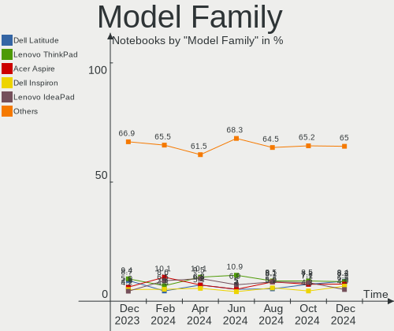

OpenMandriva Hardware Trends (Notebooks)
----------------------------------------

A project to identify most popular hardware characteristics and track their change
over time based on data collected by OpenMandriva users at https://Linux-Hardware.org.

Anyone can contribute to this report by the [hw-probe](https://github.com/linuxhw/hw-probe) tool:

    sudo -E hw-probe -all -upload

Full-feature report is available here: https://linux-hardware.org/?view=trends

Period: Nov, 2021.

Contents
--------

* [ System ](#system)
  - [ OS                       ](#os)
  - [ OS Family                ](#os-family)
  - [ Kernel                   ](#kernel)
  - [ Kernel Family            ](#kernel-family)
  - [ Kernel Major Ver.        ](#kernel-major-ver)
  - [ Arch                     ](#arch)
  - [ DE                       ](#de)
  - [ Display Server           ](#display-server)
  - [ Display Manager          ](#display-manager)
  - [ OS Lang                  ](#os-lang)
  - [ Boot Mode                ](#boot-mode)
  - [ Filesystem               ](#filesystem)
  - [ Part. scheme             ](#part-scheme)
  - [ Dual Boot with Linux/BSD ](#dual-boot-with-linuxbsd)
  - [ Dual Boot (Win)          ](#dual-boot-win)

* [ Board ](#board)
  - [ Vendor                   ](#vendor)
  - [ Model                    ](#model)
  - [ Model Family             ](#model-family)
  - [ MFG Year                 ](#mfg-year)
  - [ Form Factor              ](#form-factor)
  - [ Secure Boot              ](#secure-boot)
  - [ Coreboot                 ](#coreboot)
  - [ RAM Size                 ](#ram-size)
  - [ RAM Used                 ](#ram-used)
  - [ Total Drives             ](#total-drives)
  - [ Has CD-ROM               ](#has-cd-rom)
  - [ Has Ethernet             ](#has-ethernet)
  - [ Has WiFi                 ](#has-wifi)
  - [ Has Bluetooth            ](#has-bluetooth)

* [ Location ](#location)
  - [ Country                  ](#country)
  - [ City                     ](#city)

* [ Drives ](#drives)
  - [ Drive Vendor             ](#drive-vendor)
  - [ Drive Model              ](#drive-model)
  - [ HDD Vendor               ](#hdd-vendor)
  - [ SSD Vendor               ](#ssd-vendor)
  - [ Drive Kind               ](#drive-kind)
  - [ Drive Connector          ](#drive-connector)
  - [ Drive Size               ](#drive-size)
  - [ Space Total              ](#space-total)
  - [ Space Used               ](#space-used)
  - [ Malfunc. Drives          ](#malfunc-drives)
  - [ Malfunc. Drive Vendor    ](#malfunc-drive-vendor)
  - [ Malfunc. HDD Vendor      ](#malfunc-hdd-vendor)
  - [ Malfunc. Drive Kind      ](#malfunc-drive-kind)
  - [ Failed Drives            ](#failed-drives)
  - [ Failed Drive Vendor      ](#failed-drive-vendor)
  - [ Drive Status             ](#drive-status)

* [ Storage controller ](#storage-controller)
  - [ Storage Vendor           ](#storage-vendor)
  - [ Storage Model            ](#storage-model)
  - [ Storage Kind             ](#storage-kind)

* [ Processor ](#processor)
  - [ CPU Vendor               ](#cpu-vendor)
  - [ CPU Model                ](#cpu-model)
  - [ CPU Model Family         ](#cpu-model-family)
  - [ CPU Cores                ](#cpu-cores)
  - [ CPU Sockets              ](#cpu-sockets)
  - [ CPU Threads              ](#cpu-threads)
  - [ CPU Op-Modes             ](#cpu-op-modes)
  - [ CPU Microcode            ](#cpu-microcode)
  - [ CPU Microarch            ](#cpu-microarch)

* [ Graphics ](#graphics)
  - [ GPU Vendor               ](#gpu-vendor)
  - [ GPU Model                ](#gpu-model)
  - [ GPU Combo                ](#gpu-combo)
  - [ GPU Driver               ](#gpu-driver)
  - [ GPU Memory               ](#gpu-memory)

* [ Monitor ](#monitor)
  - [ Monitor Vendor           ](#monitor-vendor)
  - [ Monitor Model            ](#monitor-model)
  - [ Monitor Resolution       ](#monitor-resolution)
  - [ Monitor Diagonal         ](#monitor-diagonal)
  - [ Monitor Width            ](#monitor-width)
  - [ Aspect Ratio             ](#aspect-ratio)
  - [ Monitor Area             ](#monitor-area)
  - [ Pixel Density            ](#pixel-density)
  - [ Multiple Monitors        ](#multiple-monitors)

* [ Network ](#network)
  - [ Net Controller Vendor    ](#net-controller-vendor)
  - [ Net Controller Model     ](#net-controller-model)
  - [ Wireless Vendor          ](#wireless-vendor)
  - [ Wireless Model           ](#wireless-model)
  - [ Ethernet Vendor          ](#ethernet-vendor)
  - [ Ethernet Model           ](#ethernet-model)
  - [ Net Controller Kind      ](#net-controller-kind)
  - [ Used Controller          ](#used-controller)
  - [ NICs                     ](#nics)
  - [ IPv6                     ](#ipv6)

* [ Bluetooth ](#bluetooth)
  - [ Bluetooth Vendor         ](#bluetooth-vendor)
  - [ Bluetooth Model          ](#bluetooth-model)

* [ Sound ](#sound)
  - [ Sound Vendor             ](#sound-vendor)
  - [ Sound Model              ](#sound-model)

* [ Memory ](#memory)
  - [ Memory Vendor            ](#memory-vendor)
  - [ Memory Model             ](#memory-model)
  - [ Memory Kind              ](#memory-kind)
  - [ Memory Form Factor       ](#memory-form-factor)
  - [ Memory Size              ](#memory-size)
  - [ Memory Speed             ](#memory-speed)

* [ Printers & scanners ](#printers--scanners)
  - [ Printer Vendor           ](#printer-vendor)
  - [ Printer Model            ](#printer-model)
  - [ Scanner Vendor           ](#scanner-vendor)
  - [ Scanner Model            ](#scanner-model)

* [ Camera ](#camera)
  - [ Camera Vendor            ](#camera-vendor)
  - [ Camera Model             ](#camera-model)

* [ Security ](#security)
  - [ Fingerprint Vendor       ](#fingerprint-vendor)
  - [ Fingerprint Model        ](#fingerprint-model)
  - [ Chipcard Vendor          ](#chipcard-vendor)
  - [ Chipcard Model           ](#chipcard-model)

* [ Unsupported ](#unsupported)
  - [ Unsupported Devices      ](#unsupported-devices)
  - [ Unsupported Device Types ](#unsupported-device-types)

System
------

OS
--

Installed operating systems

| Name              | Notebooks | Percent |
|-------------------|-----------|---------|
| OpenMandriva 4.2  | 100       | 86.96%  |
| OpenMandriva 4.50 | 15        | 13.04%  |

OS Family
---------

OS without a version

| Name         | Notebooks | Percent |
|--------------|-----------|---------|
| OpenMandriva | 115       | 100%    |

Kernel
------

Version of the Linux kernel

| Version                  | Notebooks | Percent |
|--------------------------|-----------|---------|
| 5.10.14-desktop-1omv4002 | 98        | 85.22%  |
| 5.12.4-desktop-1omv4050  | 8         | 6.96%   |
| 5.14.7-desktop-1omv4050  | 4         | 3.48%   |
| 5.14.14-desktop-1omv4050 | 2         | 1.74%   |
| 5.11.12-desktop-1omv4002 | 2         | 1.74%   |
| 5.12.7-desktop-1omv4003  | 1         | 0.87%   |

Kernel Family
-------------

Linux kernel without a distro release

| Version | Notebooks | Percent |
|---------|-----------|---------|
| 5.10.14 | 98        | 85.22%  |
| 5.12.4  | 8         | 6.96%   |
| 5.14.7  | 4         | 3.48%   |
| 5.14.14 | 2         | 1.74%   |
| 5.11.12 | 2         | 1.74%   |
| 5.12.7  | 1         | 0.87%   |

Kernel Major Ver.
-----------------

Linux kernel major version

| Version | Notebooks | Percent |
|---------|-----------|---------|
| 5.10    | 98        | 85.22%  |
| 5.12    | 9         | 7.83%   |
| 5.14    | 6         | 5.22%   |
| 5.11    | 2         | 1.74%   |

Arch
----

OS architecture (x86_64, i586, etc.)

| Name   | Notebooks | Percent |
|--------|-----------|---------|
| x86_64 | 115       | 100%    |

DE
--

Desktop Environment

| Name | Notebooks | Percent |
|------|-----------|---------|
| KDE5 | 115       | 100%    |

Display Server
--------------

X11 or Wayland

| Name | Notebooks | Percent |
|------|-----------|---------|
| X11  | 115       | 100%    |

Display Manager
---------------

SDDM, LightDM, etc.

| Name | Notebooks | Percent |
|------|-----------|---------|
| SDDM | 115       | 100%    |

OS Lang
-------

Language

| Lang  | Notebooks | Percent |
|-------|-----------|---------|
| en_US | 51        | 44.35%  |
| de_DE | 11        | 9.57%   |
| fr_FR | 10        | 8.7%    |
| pt_BR | 8         | 6.96%   |
| ru_RU | 7         | 6.09%   |
| cs_CZ | 6         | 5.22%   |
| pl_PL | 5         | 4.35%   |
| it_IT | 2         | 1.74%   |
| es_CO | 2         | 1.74%   |
| en_GB | 2         | 1.74%   |
| en_CA | 2         | 1.74%   |
| uk_UA | 1         | 0.87%   |
| ro_RO | 1         | 0.87%   |
| fr_CH | 1         | 0.87%   |
| fr_BE | 1         | 0.87%   |
| es_ES | 1         | 0.87%   |
| es_CL | 1         | 0.87%   |
| es_AR | 1         | 0.87%   |
| de_AT | 1         | 0.87%   |
| da_DK | 1         | 0.87%   |

Boot Mode
---------

EFI or BIOS

| Mode | Notebooks | Percent |
|------|-----------|---------|
| BIOS | 59        | 51.3%   |
| EFI  | 56        | 48.7%   |

Filesystem
----------

Type of filesystem

| Type    | Notebooks | Percent |
|---------|-----------|---------|
| Overlay | 93        | 80.87%  |
| Ext4    | 22        | 19.13%  |

Part. scheme
------------

Scheme of partitioning

| Type | Notebooks | Percent |
|------|-----------|---------|
| GPT  | 73        | 63.48%  |
| MBR  | 42        | 36.52%  |

Dual Boot with Linux/BSD
------------------------

Hosting more than one Linux/BSD

| Dual boot | Notebooks | Percent |
|-----------|-----------|---------|
| No        | 63        | 54.78%  |
| Yes       | 52        | 45.22%  |

Dual Boot (Win)
---------------

Hosting Linux and Windows

| Dual boot | Notebooks | Percent |
|-----------|-----------|---------|
| No        | 64        | 55.65%  |
| Yes       | 51        | 44.35%  |

Board
-----

Vendor
------

Motherboard manufacturer

| Name                  | Notebooks | Percent |
|-----------------------|-----------|---------|
| Hewlett-Packard       | 24        | 20.87%  |
| Lenovo                | 22        | 19.13%  |
| Acer                  | 18        | 15.65%  |
| Dell                  | 12        | 10.43%  |
| ASUSTek Computer      | 11        | 9.57%   |
| Toshiba               | 4         | 3.48%   |
| Sony                  | 4         | 3.48%   |
| Samsung Electronics   | 4         | 3.48%   |
| Medion                | 3         | 2.61%   |
| Apple                 | 3         | 2.61%   |
| MSI                   | 2         | 1.74%   |
| Fujitsu               | 2         | 1.74%   |
| SLIMBOOK              | 1         | 0.87%   |
| SIEMENS               | 1         | 0.87%   |
| Positivo Bahia - VAIO | 1         | 0.87%   |
| PERSONA               | 1         | 0.87%   |
| Gateway               | 1         | 0.87%   |
| CSL-Computer          | 1         | 0.87%   |

Model
-----

Motherboard model

| Name                                           | Notebooks | Percent |
|------------------------------------------------|-----------|---------|
| ASUS UX31E                                     | 3         | 2.61%   |
| Sony VGN-FZ31Z                                 | 2         | 1.74%   |
| Lenovo IdeaPad 330S-15IKB 81F5                 | 2         | 1.74%   |
| HP Notebook                                    | 2         | 1.74%   |
| Toshiba Satellite L500                         | 1         | 0.87%   |
| Toshiba Satellite L50-A-1EL                    | 1         | 0.87%   |
| Toshiba Satellite C855-27U                     | 1         | 0.87%   |
| Toshiba Satellite A300                         | 1         | 0.87%   |
| Sony VPCEB1E9R                                 | 1         | 0.87%   |
| Sony SVT13115FGS                               | 1         | 0.87%   |
| SLIMBOOK PRO                                   | 1         | 0.87%   |
| SIEMENS SIMATIC Field PG M5                    | 1         | 0.87%   |
| Samsung R530/R730/R540                         | 1         | 0.87%   |
| Samsung R430/R480/R440                         | 1         | 0.87%   |
| Samsung 300E5EV/300E4EV/270E5EV/270E4EV/2470EV | 1         | 0.87%   |
| Samsung 300E4C/300E5C/300E7C                   | 1         | 0.87%   |
| Positivo Bahia - VAIO VJFE43F11X-XXXXXX        | 1         | 0.87%   |
| PERSONA MYBOOK 14                              | 1         | 0.87%   |
| MSI GL72M 7RDX                                 | 1         | 0.87%   |
| MSI GE70 2QE                                   | 1         | 0.87%   |
| Medion ERAZER X7857 MD60893                    | 1         | 0.87%   |
| Medion Akoya P6638                             | 1         | 0.87%   |
| Medion A17                                     | 1         | 0.87%   |
| Lenovo V155-15API 81V5                         | 1         | 0.87%   |
| Lenovo ThinkPad X230 2330A17                   | 1         | 0.87%   |
| Lenovo ThinkPad T61 64669YG                    | 1         | 0.87%   |
| Lenovo ThinkPad T520 4243ED3                   | 1         | 0.87%   |
| Lenovo ThinkPad T520 42433VG                   | 1         | 0.87%   |
| Lenovo ThinkPad T460 20FMS78014                | 1         | 0.87%   |
| Lenovo ThinkPad T460 .MFG_IN_GO                | 1         | 0.87%   |
| Lenovo ThinkPad T430 2347CL1                   | 1         | 0.87%   |
| Lenovo ThinkPad T410 25222AU                   | 1         | 0.87%   |
| Lenovo ThinkPad R61 8935W7T                    | 1         | 0.87%   |
| Lenovo ThinkPad L530 24792T1                   | 1         | 0.87%   |
| Lenovo ThinkPad E490 20N8CTO1WW                | 1         | 0.87%   |
| Lenovo IdeaPad S145-15IWL 81S9                 | 1         | 0.87%   |
| Lenovo IdeaPad S145-15IGM 81MX                 | 1         | 0.87%   |
| Lenovo IdeaPad 5 14ALC05 82LM                  | 1         | 0.87%   |
| Lenovo IdeaPad 320-15IKB 80XL                  | 1         | 0.87%   |
| Lenovo IdeaPad 100-15IBY 80MJ                  | 1         | 0.87%   |
| Lenovo G475 20080                              | 1         | 0.87%   |
| Lenovo B590 20206                              | 1         | 0.87%   |
| Lenovo B50-10 80QR                             | 1         | 0.87%   |
| HP ProBook 640 G1                              | 1         | 0.87%   |
| HP ProBook 470 G3                              | 1         | 0.87%   |
| HP Pavilion dv6                                | 1         | 0.87%   |
| HP Pavilion dv4                                | 1         | 0.87%   |
| HP OMEN by Laptop                              | 1         | 0.87%   |
| HP Laptop 15-da2xxx                            | 1         | 0.87%   |
| HP Laptop 15-bs0xx                             | 1         | 0.87%   |
| HP Laptop 14-cm0xxx                            | 1         | 0.87%   |
| HP G62                                         | 1         | 0.87%   |
| HP ENVY Notebook                               | 1         | 0.87%   |
| HP EliteBook 8470p                             | 1         | 0.87%   |
| HP EliteBook 840 G3                            | 1         | 0.87%   |
| HP EliteBook 2560p                             | 1         | 0.87%   |
| HP Compaq Presario C700                        | 1         | 0.87%   |
| HP Compaq CQ58                                 | 1         | 0.87%   |
| HP Compaq CQ45                                 | 1         | 0.87%   |
| HP Compaq 15                                   | 1         | 0.87%   |

Model Family
------------

Motherboard model prefix

| Name                                    | Notebooks | Percent |
|-----------------------------------------|-----------|---------|
| Lenovo ThinkPad                         | 11        | 9.57%   |
| Acer Aspire                             | 11        | 9.57%   |
| Lenovo IdeaPad                          | 7         | 6.09%   |
| Dell Latitude                           | 5         | 4.35%   |
| Toshiba Satellite                       | 4         | 3.48%   |
| HP Compaq                               | 4         | 3.48%   |
| HP Laptop                               | 3         | 2.61%   |
| HP EliteBook                            | 3         | 2.61%   |
| Dell Inspiron                           | 3         | 2.61%   |
| ASUS UX31E                              | 3         | 2.61%   |
| Sony VGN-FZ31Z                          | 2         | 1.74%   |
| HP ProBook                              | 2         | 1.74%   |
| HP Pavilion                             | 2         | 1.74%   |
| HP Notebook                             | 2         | 1.74%   |
| Fujitsu LIFEBOOK                        | 2         | 1.74%   |
| Dell Vostro                             | 2         | 1.74%   |
| Sony VPCEB1E9R                          | 1         | 0.87%   |
| Sony SVT13115FGS                        | 1         | 0.87%   |
| SLIMBOOK PRO                            | 1         | 0.87%   |
| SIEMENS SIMATIC                         | 1         | 0.87%   |
| Samsung R530                            | 1         | 0.87%   |
| Samsung R430                            | 1         | 0.87%   |
| Samsung 300E5EV                         | 1         | 0.87%   |
| Samsung 300E4C                          | 1         | 0.87%   |
| Positivo Bahia - VAIO VJFE43F11X-XXXXXX | 1         | 0.87%   |
| PERSONA MYBOOK                          | 1         | 0.87%   |
| MSI GL72M                               | 1         | 0.87%   |
| MSI GE70                                | 1         | 0.87%   |
| Medion ERAZER                           | 1         | 0.87%   |
| Medion Akoya                            | 1         | 0.87%   |
| Medion A17                              | 1         | 0.87%   |
| Lenovo V155-15API                       | 1         | 0.87%   |
| Lenovo G475                             | 1         | 0.87%   |
| Lenovo B590                             | 1         | 0.87%   |
| Lenovo B50-10                           | 1         | 0.87%   |
| HP OMEN                                 | 1         | 0.87%   |
| HP G62                                  | 1         | 0.87%   |
| HP ENVY                                 | 1         | 0.87%   |
| HP 255                                  | 1         | 0.87%   |
| HP 245                                  | 1         | 0.87%   |
| HP 2000                                 | 1         | 0.87%   |
| HP 15                                   | 1         | 0.87%   |
| HP 14                                   | 1         | 0.87%   |
| Gateway NV42                            | 1         | 0.87%   |
| Dell XPS                                | 1         | 0.87%   |
| Dell G5                                 | 1         | 0.87%   |
| CSL-Computer R                          | 1         | 0.87%   |
| ASUS X75VC                              | 1         | 0.87%   |
| ASUS X751LJ                             | 1         | 0.87%   |
| ASUS VivoBook                           | 1         | 0.87%   |
| ASUS ROG                                | 1         | 0.87%   |
| ASUS K73SD                              | 1         | 0.87%   |
| ASUS K53SC                              | 1         | 0.87%   |
| ASUS K50IN                              | 1         | 0.87%   |
| ASUS K50IJ                              | 1         | 0.87%   |
| Apple MacBookPro9                       | 1         | 0.87%   |
| Apple MacBookPro5                       | 1         | 0.87%   |
| Apple MacBookPro11                      | 1         | 0.87%   |
| Acer TravelMate                         | 1         | 0.87%   |
| Acer Swift                              | 1         | 0.87%   |

MFG Year
--------

Motherboard manufacture year

| Year | Notebooks | Percent |
|------|-----------|---------|
| 2021 | 13        | 11.3%   |
| 2012 | 12        | 10.43%  |
| 2018 | 11        | 9.57%   |
| 2013 | 11        | 9.57%   |
| 2020 | 10        | 8.7%    |
| 2014 | 10        | 8.7%    |
| 2019 | 9         | 7.83%   |
| 2011 | 9         | 7.83%   |
| 2009 | 7         | 6.09%   |
| 2015 | 6         | 5.22%   |
| 2010 | 6         | 5.22%   |
| 2017 | 4         | 3.48%   |
| 2008 | 4         | 3.48%   |
| 2007 | 2         | 1.74%   |
| 2016 | 1         | 0.87%   |

Form Factor
-----------

Physical design of the computer

| Name     | Notebooks | Percent |
|----------|-----------|---------|
| Notebook | 115       | 100%    |

Secure Boot
-----------

Enabled or disabled

| State    | Notebooks | Percent |
|----------|-----------|---------|
| Disabled | 115       | 100%    |

Coreboot
--------

Have coreboot on board

| Used | Notebooks | Percent |
|------|-----------|---------|
| No   | 115       | 100%    |

RAM Size
--------

Total RAM memory

| Size in GB | Notebooks | Percent |
|------------|-----------|---------|
| 3.01-4.0   | 49        | 42.61%  |
| 4.01-8.0   | 34        | 29.57%  |
| 16.01-24.0 | 13        | 11.3%   |
| 8.01-16.0  | 10        | 8.7%    |
| 2.01-3.0   | 4         | 3.48%   |
| 1.01-2.0   | 3         | 2.61%   |
| 32.01-64.0 | 2         | 1.74%   |

RAM Used
--------

Used RAM memory

| Used GB  | Notebooks | Percent |
|----------|-----------|---------|
| 1.01-2.0 | 98        | 85.22%  |
| 0.51-1.0 | 9         | 7.83%   |
| 2.01-3.0 | 7         | 6.09%   |
| 4.01-8.0 | 1         | 0.87%   |

Total Drives
------------

Number of drives on board

| Drives | Notebooks | Percent |
|--------|-----------|---------|
| 1      | 90        | 78.26%  |
| 2      | 19        | 16.52%  |
| 3      | 5         | 4.35%   |
| 0      | 1         | 0.87%   |

Has CD-ROM
----------

Has CD-ROM on board

| Presented | Notebooks | Percent |
|-----------|-----------|---------|
| Yes       | 65        | 56.52%  |
| No        | 50        | 43.48%  |

Has Ethernet
------------

Has Ethernet on board

| Presented | Notebooks | Percent |
|-----------|-----------|---------|
| Yes       | 107       | 93.04%  |
| No        | 8         | 6.96%   |

Has WiFi
--------

Has WiFi module

| Presented | Notebooks | Percent |
|-----------|-----------|---------|
| Yes       | 114       | 99.13%  |
| No        | 1         | 0.87%   |

Has Bluetooth
-------------

Has Bluetooth module

| Presented | Notebooks | Percent |
|-----------|-----------|---------|
| Yes       | 78        | 67.83%  |
| No        | 37        | 32.17%  |

Location
--------

Country
-------

Geographic location (country)

| Country      | Notebooks | Percent |
|--------------|-----------|---------|
| Germany      | 16        | 13.91%  |
| Brazil       | 11        | 9.57%   |
| France       | 10        | 8.7%    |
| USA          | 9         | 7.83%   |
| Russia       | 8         | 6.96%   |
| Poland       | 8         | 6.96%   |
| Czechia      | 8         | 6.96%   |
| Italy        | 4         | 3.48%   |
| Spain        | 3         | 2.61%   |
| Mexico       | 3         | 2.61%   |
| India        | 3         | 2.61%   |
| Belgium      | 3         | 2.61%   |
| Portugal     | 2         | 1.74%   |
| Philippines  | 2         | 1.74%   |
| Greece       | 2         | 1.74%   |
| Colombia     | 2         | 1.74%   |
| Chile        | 2         | 1.74%   |
| Canada       | 2         | 1.74%   |
| Vietnam      | 1         | 0.87%   |
| Ukraine      | 1         | 0.87%   |
| Thailand     | 1         | 0.87%   |
| Taiwan       | 1         | 0.87%   |
| Switzerland  | 1         | 0.87%   |
| Sweden       | 1         | 0.87%   |
| Saudi Arabia | 1         | 0.87%   |
| Romania      | 1         | 0.87%   |
| Norway       | 1         | 0.87%   |
| Netherlands  | 1         | 0.87%   |
| Morocco      | 1         | 0.87%   |
| Hungary      | 1         | 0.87%   |
| Denmark      | 1         | 0.87%   |
| Cyprus       | 1         | 0.87%   |
| Burkina Faso | 1         | 0.87%   |
| Australia    | 1         | 0.87%   |
| Argentina    | 1         | 0.87%   |

City
----

Geographic location (city)

| City                     | Notebooks | Percent |
|--------------------------|-----------|---------|
| Prague                   | 5         | 4.35%   |
| Milan                    | 3         | 2.61%   |
| Warsaw                   | 2         | 1.74%   |
| Stuttgart                | 2         | 1.74%   |
| S??o Paulo               | 2         | 1.74%   |
| Moscow                   | 2         | 1.74%   |
| Funchal                  | 2         | 1.74%   |
| Athens                   | 2         | 1.74%   |
| Zhigulevsk               | 1         | 0.87%   |
| Zawiercie                | 1         | 0.87%   |
| Wiesbaden                | 1         | 0.87%   |
| Vancouver                | 1         | 0.87%   |
| Ulan-Ude                 | 1         | 0.87%   |
| Torrent                  | 1         | 0.87%   |
| Teresina                 | 1         | 0.87%   |
| Surrey                   | 1         | 0.87%   |
| Starovelichkovskaya      | 1         | 0.87%   |
| Spokane                  | 1         | 0.87%   |
| Skutec                   | 1         | 0.87%   |
| Six-Fours-les-Plages     | 1         | 0.87%   |
| Serris                   | 1         | 0.87%   |
| S??o Lu?­s               | 1         | 0.87%   |
| Savigny-sur-Orge         | 1         | 0.87%   |
| Santiago de Cali         | 1         | 0.87%   |
| San Pablo de las Salinas | 1         | 0.87%   |
| Samara                   | 1         | 0.87%   |
| Saarlouis                | 1         | 0.87%   |
| Royan                    | 1         | 0.87%   |
| Rostock                  | 1         | 0.87%   |
| Rossrueti                | 1         | 0.87%   |
| Reutlingen               | 1         | 0.87%   |
| Quezon City              | 1         | 0.87%   |
| Porto Alegre             | 1         | 0.87%   |
| Poplar Bluff             | 1         | 0.87%   |
| Pinellas Park            | 1         | 0.87%   |
| Piekary Slaskie          | 1         | 0.87%   |
| Perpignan                | 1         | 0.87%   |
| Perm                     | 1         | 0.87%   |
| Paris                    | 1         | 0.87%   |
| Osasco                   | 1         | 0.87%   |
| Nizhniy Novgorod         | 1         | 0.87%   |
| New Taipei               | 1         | 0.87%   |
| New Delhi                | 1         | 0.87%   |
| Navalcarnero             | 1         | 0.87%   |
| Natal                    | 1         | 0.87%   |
| Munich                   | 1         | 0.87%   |
| Monte San Pietrangeli    | 1         | 0.87%   |
| Mieuxce                  | 1         | 0.87%   |
| Middelkerke              | 1         | 0.87%   |
| Marialva                 | 1         | 0.87%   |
| Manzanillo               | 1         | 0.87%   |
| Lviv                     | 1         | 0.87%   |
| Limassol                 | 1         | 0.87%   |
| Leuna                    | 1         | 0.87%   |
| Leipzig                  | 1         | 0.87%   |
| La Serena                | 1         | 0.87%   |
| La Florida               | 1         | 0.87%   |
| Krakow                   | 1         | 0.87%   |
| Kielczow                 | 1         | 0.87%   |
| Karlsruhe                | 1         | 0.87%   |

Drives
------

Drive Vendor
------------

Hard drive vendors

| Vendor              | Notebooks | Drives | Percent |
|---------------------|-----------|--------|---------|
| Seagate             | 20        | 20     | 15.15%  |
| WDC                 | 18        | 20     | 13.64%  |
| Samsung Electronics | 13        | 13     | 9.85%   |
| Kingston            | 12        | 12     | 9.09%   |
| Toshiba             | 11        | 11     | 8.33%   |
| Hitachi             | 8         | 8      | 6.06%   |
| HGST                | 8         | 8      | 6.06%   |
| Crucial             | 8         | 8      | 6.06%   |
| SanDisk             | 6         | 6      | 4.55%   |
| Unknown             | 5         | 7      | 3.79%   |
| SK Hynix            | 3         | 3      | 2.27%   |
| PNY                 | 2         | 2      | 1.52%   |
| JMicron             | 2         | 2      | 1.52%   |
| Intel               | 2         | 2      | 1.52%   |
| A-DATA Technology   | 2         | 2      | 1.52%   |
| UMIS                | 1         | 1      | 0.76%   |
| Transcend           | 1         | 1      | 0.76%   |
| SABRENT             | 1         | 1      | 0.76%   |
| Patriot             | 1         | 1      | 0.76%   |
| OCZ                 | 1         | 1      | 0.76%   |
| Micron Technology   | 1         | 1      | 0.76%   |
| LITEONIT            | 1         | 1      | 0.76%   |
| Lexar               | 1         | 1      | 0.76%   |
| JASTER              | 1         | 1      | 0.76%   |
| Colorful            | 1         | 1      | 0.76%   |
| BHT                 | 1         | 1      | 0.76%   |
| Apple               | 1         | 1      | 0.76%   |

Drive Model
-----------

Hard drive models

| Model                                 | Notebooks | Percent |
|---------------------------------------|-----------|---------|
| Seagate ST500LT012-1DG142 500GB       | 3         | 2.22%   |
| SanDisk SSD U100 256GB                | 3         | 2.22%   |
| Samsung HM321HI 320GB                 | 3         | 2.22%   |
| Unknown SD32G  32GB                   | 2         | 1.48%   |
| Toshiba MQ01ABF050 500GB              | 2         | 1.48%   |
| Seagate ST9500420AS 500GB             | 2         | 1.48%   |
| Seagate ST500LT012-9WS142 500GB       | 2         | 1.48%   |
| Seagate ST500LM012 HN-M500MBB 500GB   | 2         | 1.48%   |
| SanDisk SSD PLUS 1000GB               | 2         | 1.48%   |
| Kingston SV300S37A120G 120GB SSD      | 2         | 1.48%   |
| Kingston SA400S37240G 240GB SSD       | 2         | 1.48%   |
| Kingston SA400S37120G 120GB SSD       | 2         | 1.48%   |
| Kingston OM8PCP3512F-AA 512GB         | 2         | 1.48%   |
| JMicron Generic 1TB                   | 2         | 1.48%   |
| HGST HTS545050A7E680 500GB            | 2         | 1.48%   |
| HGST HTS541010A9E680 1TB              | 2         | 1.48%   |
| Crucial CT240M500SSD1 240GB           | 2         | 1.48%   |
| Crucial CT1000MX500SSD1 1TB           | 2         | 1.48%   |
| A-DATA SU630 240GB SSD                | 2         | 1.48%   |
| WDC WDS500G2B0A-00SM50 500GB SSD      | 1         | 0.74%   |
| WDC WDS100T2B0C-00PXH0 1TB            | 1         | 0.74%   |
| WDC WD5000LPVX-80V0TT0 500GB          | 1         | 0.74%   |
| WDC WD5000LPLX-00ZNTT0 500GB          | 1         | 0.74%   |
| WDC WD5000LPCX-60VHAT0 500GB          | 1         | 0.74%   |
| WDC WD5000LPCX-24VHAT0 500GB          | 1         | 0.74%   |
| WDC WD5000LPCX-21VHAT0 500GB          | 1         | 0.74%   |
| WDC WD5000BEVT-22ZAT0 500GB           | 1         | 0.74%   |
| WDC WD3200BEVT-22ZCT0 320GB           | 1         | 0.74%   |
| WDC WD3200BEVT-00ZCT0 320GB           | 1         | 0.74%   |
| WDC WD3200BEKT-60PVMT0 320GB          | 1         | 0.74%   |
| WDC WD2500BEVS-75UST0 250GB           | 1         | 0.74%   |
| WDC WD1600BEVT-22ZCT0 160GB           | 1         | 0.74%   |
| WDC WD10SPZX-24Z10T0 1TB              | 1         | 0.74%   |
| WDC WD10SPZX-21Z10T0 1TB              | 1         | 0.74%   |
| WDC WD10JPVX-60JC3T0 1TB              | 1         | 0.74%   |
| WDC WD10JPVX-22JC3T0 1TB              | 1         | 0.74%   |
| WDC PC SN530 SDBPNPZ-1T00-1014 1TB    | 1         | 0.74%   |
| WDC PC SN530 SDBPMPZ-512G-1101 512GB  | 1         | 0.74%   |
| Unknown SD64G  64GB                   | 1         | 0.74%   |
| Unknown NVMe SSD Drive 256GB          | 1         | 0.74%   |
| Unknown MMC64G  64GB                  | 1         | 0.74%   |
| Unknown DA4064  64GB                  | 1         | 0.74%   |
| Unknown DA4032  32GB                  | 1         | 0.74%   |
| UMIS RPFTJ128PDD2EWX 128GB            | 1         | 0.74%   |
| Transcend TS256GMTE220S 256GB         | 1         | 0.74%   |
| Toshiba MQ04ABF100 1TB                | 1         | 0.74%   |
| Toshiba MQ01ABF032 320GB              | 1         | 0.74%   |
| Toshiba MQ01ABD100 1TB                | 1         | 0.74%   |
| Toshiba MQ01ABD050 500GB              | 1         | 0.74%   |
| Toshiba MQ01ABD032 320GB              | 1         | 0.74%   |
| Toshiba MK3261GSY 320GB               | 1         | 0.74%   |
| Toshiba MK2552GSX 250GB               | 1         | 0.74%   |
| Toshiba KXG60ZNV256G NVMe 256GB       | 1         | 0.74%   |
| Toshiba KBG30ZMT256G 256GB            | 1         | 0.74%   |
| SK Hynix SC300 M.2 2280 128GB SSD     | 1         | 0.74%   |
| SK Hynix HFS128G39TND-N210A 128GB SSD | 1         | 0.74%   |
| SK Hynix BC511 NVMe 512GB             | 1         | 0.74%   |
| Seagate ST9500325ASG 500GB            | 1         | 0.74%   |
| Seagate ST9500325AS 500GB             | 1         | 0.74%   |
| Seagate ST500LM021-1KJ152 500GB       | 1         | 0.74%   |

HDD Vendor
----------

Hard disk drive vendors

| Vendor              | Notebooks | Drives | Percent |
|---------------------|-----------|--------|---------|
| Seagate             | 20        | 20     | 31.75%  |
| WDC                 | 15        | 15     | 23.81%  |
| Toshiba             | 9         | 9      | 14.29%  |
| Hitachi             | 8         | 8      | 12.7%   |
| HGST                | 8         | 8      | 12.7%   |
| Samsung Electronics | 3         | 3      | 4.76%   |

SSD Vendor
----------

Solid state drive vendors

| Vendor              | Notebooks | Drives | Percent |
|---------------------|-----------|--------|---------|
| Kingston            | 10        | 10     | 20%     |
| Samsung Electronics | 9         | 9      | 18%     |
| Crucial             | 8         | 8      | 16%     |
| SanDisk             | 6         | 6      | 12%     |
| SK Hynix            | 2         | 2      | 4%      |
| PNY                 | 2         | 2      | 4%      |
| JMicron             | 2         | 2      | 4%      |
| A-DATA Technology   | 2         | 2      | 4%      |
| WDC                 | 1         | 1      | 2%      |
| Patriot             | 1         | 1      | 2%      |
| OCZ                 | 1         | 1      | 2%      |
| Micron Technology   | 1         | 1      | 2%      |
| LITEONIT            | 1         | 1      | 2%      |
| JASTER              | 1         | 1      | 2%      |
| Colorful            | 1         | 1      | 2%      |
| BHT                 | 1         | 1      | 2%      |
| Apple               | 1         | 1      | 2%      |

Drive Kind
----------

HDD or SSD

| Kind    | Notebooks | Drives | Percent |
|---------|-----------|--------|---------|
| HDD     | 63        | 63     | 48.46%  |
| SSD     | 47        | 50     | 36.15%  |
| NVMe    | 15        | 16     | 11.54%  |
| MMC     | 4         | 6      | 3.08%   |
| Unknown | 1         | 1      | 0.77%   |

Drive Connector
---------------

SATA, SAS, NVMe, etc.

| Type | Notebooks | Drives | Percent |
|------|-----------|--------|---------|
| SATA | 102       | 111    | 82.26%  |
| NVMe | 14        | 15     | 11.29%  |
| SAS  | 4         | 4      | 3.23%   |
| MMC  | 4         | 6      | 3.23%   |

Drive Size
----------

Size of hard drive

| Size in TB | Notebooks | Drives | Percent |
|------------|-----------|--------|---------|
| 0.01-0.5   | 84        | 90     | 79.25%  |
| 0.51-1.0   | 20        | 21     | 18.87%  |
| 1.01-2.0   | 2         | 2      | 1.89%   |

Space Total
-----------

Amount of disk space available on the file system

| Size in GB | Notebooks | Percent |
|------------|-----------|---------|
| 1-20       | 58        | 50.43%  |
| 101-250    | 18        | 15.65%  |
| 251-500    | 16        | 13.91%  |
| 501-1000   | 7         | 6.09%   |
| Unknown    | 7         | 6.09%   |
| 21-50      | 6         | 5.22%   |
| 51-100     | 3         | 2.61%   |

Space Used
----------

Amount of used disk space

| Used GB  | Notebooks | Percent |
|----------|-----------|---------|
| 1-20     | 101       | 87.83%  |
| Unknown  | 7         | 6.09%   |
| 21-50    | 2         | 1.74%   |
| 51-100   | 2         | 1.74%   |
| 251-500  | 1         | 0.87%   |
| 101-250  | 1         | 0.87%   |
| 501-1000 | 1         | 0.87%   |

Malfunc. Drives
---------------

Drive models with a malfunction

| Model                             | Notebooks | Drives | Percent |
|-----------------------------------|-----------|--------|---------|
| SanDisk SSD U100 256GB            | 3         | 3      | 8.82%   |
| Seagate ST9500420AS 500GB         | 2         | 2      | 5.88%   |
| Seagate ST500LT012-9WS142 500GB   | 2         | 2      | 5.88%   |
| Samsung Electronics HM321HI 320GB | 2         | 2      | 5.88%   |
| HGST HTS545050A7E680 500GB        | 2         | 2      | 5.88%   |
| HGST HTS541010A9E680 1TB          | 2         | 2      | 5.88%   |
| Crucial CT240M500SSD1 240GB       | 2         | 2      | 5.88%   |
| WDC WD5000BEVT-22ZAT0 500GB       | 1         | 1      | 2.94%   |
| WDC WD3200BEKT-60PVMT0 320GB      | 1         | 1      | 2.94%   |
| Toshiba MQ01ABD050 500GB          | 1         | 1      | 2.94%   |
| Toshiba MQ01ABD032 320GB          | 1         | 1      | 2.94%   |
| Seagate ST500LT012-1DG142 500GB   | 1         | 1      | 2.94%   |
| Seagate ST500LM000-SSHD-8GB       | 1         | 1      | 2.94%   |
| Seagate ST320LT007-9ZV142 320GB   | 1         | 1      | 2.94%   |
| LITEONIT LAT-128M2S 128GB SSD     | 1         | 1      | 2.94%   |
| Kingston SUV400S37240G 240GB SSD  | 1         | 1      | 2.94%   |
| Hitachi HTS725050A7E635 500GB     | 1         | 1      | 2.94%   |
| Hitachi HTS545050A7E380 500GB     | 1         | 1      | 2.94%   |
| Hitachi HTS545025B9SA02 250GB     | 1         | 1      | 2.94%   |
| Hitachi HTS543232A7A384 320GB     | 1         | 1      | 2.94%   |
| Hitachi HTS542516K9SA00 160GB     | 1         | 1      | 2.94%   |
| Hitachi HTS541680J9SA00 80GB      | 1         | 1      | 2.94%   |
| HGST HTS725050A7E630 500GB        | 1         | 1      | 2.94%   |
| HGST HTS545050B7E660 500GB        | 1         | 1      | 2.94%   |
| Crucial CT525MX300SSD1 528GB      | 1         | 1      | 2.94%   |
| Colorful SL300 128GB              | 1         | 1      | 2.94%   |

Malfunc. Drive Vendor
---------------------

Vendors of faulty drives

| Vendor              | Notebooks | Drives | Percent |
|---------------------|-----------|--------|---------|
| Seagate             | 7         | 7      | 20.59%  |
| Hitachi             | 6         | 6      | 17.65%  |
| HGST                | 6         | 6      | 17.65%  |
| SanDisk             | 3         | 3      | 8.82%   |
| Crucial             | 3         | 3      | 8.82%   |
| WDC                 | 2         | 2      | 5.88%   |
| Toshiba             | 2         | 2      | 5.88%   |
| Samsung Electronics | 2         | 2      | 5.88%   |
| LITEONIT            | 1         | 1      | 2.94%   |
| Kingston            | 1         | 1      | 2.94%   |
| Colorful            | 1         | 1      | 2.94%   |

Malfunc. HDD Vendor
-------------------

Vendors of faulty HDD drives

| Vendor              | Notebooks | Drives | Percent |
|---------------------|-----------|--------|---------|
| Seagate             | 7         | 7      | 28%     |
| Hitachi             | 6         | 6      | 24%     |
| HGST                | 6         | 6      | 24%     |
| WDC                 | 2         | 2      | 8%      |
| Toshiba             | 2         | 2      | 8%      |
| Samsung Electronics | 2         | 2      | 8%      |

Malfunc. Drive Kind
-------------------

Kinds of faulty drives

| Kind | Notebooks | Drives | Percent |
|------|-----------|--------|---------|
| HDD  | 25        | 25     | 73.53%  |
| SSD  | 9         | 9      | 26.47%  |

Failed Drives
-------------

Failed drive models

| Model                                 | Notebooks | Drives | Percent |
|---------------------------------------|-----------|--------|---------|
| SK Hynix HFS128G39TND-N210A 128GB SSD | 1         | 1      | 50%     |
| Samsung Electronics HM321HI 320GB     | 1         | 1      | 50%     |

Failed Drive Vendor
-------------------

Failed drive vendors

| Vendor              | Notebooks | Drives | Percent |
|---------------------|-----------|--------|---------|
| SK Hynix            | 1         | 1      | 50%     |
| Samsung Electronics | 1         | 1      | 50%     |

Drive Status
------------

Number of failed and malfunc. drives

| Status   | Notebooks | Drives | Percent |
|----------|-----------|--------|---------|
| Works    | 79        | 90     | 64.75%  |
| Malfunc  | 33        | 34     | 27.05%  |
| Detected | 8         | 10     | 6.56%   |
| Failed   | 2         | 2      | 1.64%   |

Storage controller
------------------

Storage Vendor
--------------

Storage controller vendors

| Vendor                         | Notebooks | Percent |
|--------------------------------|-----------|---------|
| Intel                          | 96        | 76.19%  |
| AMD                            | 15        | 11.9%   |
| Sandisk                        | 3         | 2.38%   |
| Toshiba America Info Systems   | 2         | 1.59%   |
| Samsung Electronics            | 2         | 1.59%   |
| Nvidia                         | 2         | 1.59%   |
| Kingston Technology Company    | 2         | 1.59%   |
| Union Memory (Shenzhen)        | 1         | 0.79%   |
| Solid State Storage Technology | 1         | 0.79%   |
| SK Hynix                       | 1         | 0.79%   |
| Silicon Motion                 | 1         | 0.79%   |

Storage Model
-------------

Storage controller models

| Model                                                                            | Notebooks | Percent |
|----------------------------------------------------------------------------------|-----------|---------|
| Intel 7 Series Chipset Family 6-port SATA Controller [AHCI mode]                 | 15        | 11.19%  |
| Intel Sunrise Point-LP SATA Controller [AHCI mode]                               | 13        | 9.7%    |
| Intel 6 Series/C200 Series Chipset Family 6 port Mobile SATA AHCI Controller     | 12        | 8.96%   |
| AMD FCH SATA Controller [AHCI mode]                                              | 10        | 7.46%   |
| Intel 82801HM/HEM (ICH8M/ICH8M-E) SATA Controller [AHCI mode]                    | 7         | 5.22%   |
| Intel 82801HM/HEM (ICH8M/ICH8M-E) IDE Controller                                 | 7         | 5.22%   |
| Intel 5 Series/3400 Series Chipset 4 port SATA AHCI Controller                   | 5         | 3.73%   |
| Intel HM170/QM170 Chipset SATA Controller [AHCI Mode]                            | 4         | 2.99%   |
| Intel 82801IBM/IEM (ICH9M/ICH9M-E) 4 port SATA Controller [AHCI mode]            | 4         | 2.99%   |
| Intel 8 Series/C220 Series Chipset Family 6-port SATA Controller 1 [AHCI mode]   | 4         | 2.99%   |
| Intel 8 Series SATA Controller 1 [AHCI mode]                                     | 4         | 2.99%   |
| AMD SB7x0/SB8x0/SB9x0 SATA Controller [AHCI mode]                                | 4         | 2.99%   |
| Intel Celeron/Pentium Silver Processor SATA Controller                           | 3         | 2.24%   |
| Intel Atom/Celeron/Pentium Processor x5-E8000/J3xxx/N3xxx Series SATA Controller | 3         | 2.24%   |
| Intel 82801 Mobile SATA Controller [RAID mode]                                   | 3         | 2.24%   |
| Intel 5 Series/3400 Series Chipset 6 port SATA AHCI Controller                   | 3         | 2.24%   |
| Sandisk WD Blue SN550 NVMe SSD                                                   | 2         | 1.49%   |
| Nvidia MCP79 AHCI Controller                                                     | 2         | 1.49%   |
| Kingston Company Company Non-Volatile memory controller                          | 2         | 1.49%   |
| Intel Wildcat Point-LP SATA Controller [AHCI Mode]                               | 2         | 1.49%   |
| Intel Ice Lake-LP SATA Controller [AHCI mode]                                    | 2         | 1.49%   |
| Intel Comet Lake SATA AHCI Controller                                            | 2         | 1.49%   |
| Intel Cannon Point-LP SATA Controller [AHCI Mode]                                | 2         | 1.49%   |
| Intel Atom Processor E3800 Series SATA AHCI Controller                           | 2         | 1.49%   |
| Union Memory (Shenzhen) Non-Volatile memory controller                           | 1         | 0.75%   |
| Toshiba America Info Systems XG6 NVMe SSD Controller                             | 1         | 0.75%   |
| Toshiba America Info Systems BG3 NVMe SSD Controller                             | 1         | 0.75%   |
| Solid State Storage Non-Volatile memory controller                               | 1         | 0.75%   |
| SK Hynix BC511                                                                   | 1         | 0.75%   |
| Silicon Motion SM2262/SM2262EN SSD Controller                                    | 1         | 0.75%   |
| Sandisk Non-Volatile memory controller                                           | 1         | 0.75%   |
| Samsung NVMe SSD Controller SM981/PM981/PM983                                    | 1         | 0.75%   |
| Samsung Electronics SATA controller                                              | 1         | 0.75%   |
| Intel SSD 660P Series                                                            | 1         | 0.75%   |
| Intel SSD 600P Series                                                            | 1         | 0.75%   |
| Intel Comet Lake PCH-H RAID                                                      | 1         | 0.75%   |
| Intel Celeron N3350/Pentium N4200/Atom E3900 Series SATA AHCI Controller         | 1         | 0.75%   |
| Intel Cannon Lake Mobile PCH SATA AHCI Controller                                | 1         | 0.75%   |
| Intel 400 Series Chipset Family SATA AHCI Controller                             | 1         | 0.75%   |
| AMD SB7x0/SB8x0/SB9x0 SATA Controller [IDE mode]                                 | 1         | 0.75%   |
| AMD SB7x0/SB8x0/SB9x0 IDE Controller                                             | 1         | 0.75%   |

Storage Kind
------------

Kind of storage controller (IDE, SATA, NVMe, SAS, ...)

| Kind | Notebooks | Percent |
|------|-----------|---------|
| SATA | 108       | 80.6%   |
| NVMe | 14        | 10.45%  |
| IDE  | 8         | 5.97%   |
| RAID | 4         | 2.99%   |

Processor
---------

CPU Vendor
----------

Processor vendors

| Vendor | Notebooks | Percent |
|--------|-----------|---------|
| Intel  | 100       | 86.96%  |
| AMD    | 15        | 13.04%  |

CPU Model
---------

Processor models

| Model                                       | Notebooks | Percent |
|---------------------------------------------|-----------|---------|
| Intel Core i5-8250U CPU @ 1.60GHz           | 4         | 3.48%   |
| Intel Core i5-2520M CPU @ 2.50GHz           | 4         | 3.48%   |
| Intel Pentium CPU N3710 @ 1.60GHz           | 3         | 2.61%   |
| Intel Core i7-2677M CPU @ 1.80GHz           | 3         | 2.61%   |
| Intel Core i5-6300U CPU @ 2.40GHz           | 3         | 2.61%   |
| Intel Core i3-3120M CPU @ 2.50GHz           | 3         | 2.61%   |
| Intel Pentium Dual CPU T2390 @ 1.86GHz      | 2         | 1.74%   |
| Intel Core i7-8550U CPU @ 1.80GHz           | 2         | 1.74%   |
| Intel Core i7-7700HQ CPU @ 2.80GHz          | 2         | 1.74%   |
| Intel Core i7-6500U CPU @ 2.50GHz           | 2         | 1.74%   |
| Intel Core i7-10750H CPU @ 2.60GHz          | 2         | 1.74%   |
| Intel Core i5-5200U CPU @ 2.20GHz           | 2         | 1.74%   |
| Intel Core i5-4210U CPU @ 1.70GHz           | 2         | 1.74%   |
| Intel Core i5-3320M CPU @ 2.60GHz           | 2         | 1.74%   |
| Intel Core i3-2330M CPU @ 2.20GHz           | 2         | 1.74%   |
| Intel Core 2 Duo CPU T8300 @ 2.40GHz        | 2         | 1.74%   |
| Intel Core 2 Duo CPU T7250 @ 2.00GHz        | 2         | 1.74%   |
| Intel Celeron N4020 CPU @ 1.10GHz           | 2         | 1.74%   |
| Intel Celeron CPU N2840 @ 2.16GHz           | 2         | 1.74%   |
| Intel Pentium Dual-Core CPU T4300 @ 2.10GHz | 1         | 0.87%   |
| Intel Pentium CPU P6100 @ 2.00GHz           | 1         | 0.87%   |
| Intel Pentium CPU B940 @ 2.00GHz            | 1         | 0.87%   |
| Intel Pentium CPU 6405U @ 2.40GHz           | 1         | 0.87%   |
| Intel Pentium CPU 2020M @ 2.40GHz           | 1         | 0.87%   |
| Intel Core i7-9750H CPU @ 2.60GHz           | 1         | 0.87%   |
| Intel Core i7-6820EQ CPU @ 2.80GHz          | 1         | 0.87%   |
| Intel Core i7-6560U CPU @ 2.20GHz           | 1         | 0.87%   |
| Intel Core i7-4870HQ CPU @ 2.50GHz          | 1         | 0.87%   |
| Intel Core i7-4720HQ CPU @ 2.60GHz          | 1         | 0.87%   |
| Intel Core i7-4700MQ CPU @ 2.40GHz          | 1         | 0.87%   |
| Intel Core i7-3720QM CPU @ 2.60GHz          | 1         | 0.87%   |
| Intel Core i7-2620M CPU @ 2.70GHz           | 1         | 0.87%   |
| Intel Core i7-10510U CPU @ 1.80GHz          | 1         | 0.87%   |
| Intel Core i7 CPU Q 720 @ 1.60GHz           | 1         | 0.87%   |
| Intel Core i5-8300H CPU @ 2.30GHz           | 1         | 0.87%   |
| Intel Core i5-7200U CPU @ 2.50GHz           | 1         | 0.87%   |
| Intel Core i5-6300HQ CPU @ 2.30GHz          | 1         | 0.87%   |
| Intel Core i5-6200U CPU @ 2.30GHz           | 1         | 0.87%   |
| Intel Core i5-4310M CPU @ 2.70GHz           | 1         | 0.87%   |
| Intel Core i5-4300M CPU @ 2.60GHz           | 1         | 0.87%   |
| Intel Core i5-4200U CPU @ 1.60GHz           | 1         | 0.87%   |
| Intel Core i5-3317U CPU @ 1.70GHz           | 1         | 0.87%   |
| Intel Core i5-3230M CPU @ 2.60GHz           | 1         | 0.87%   |
| Intel Core i5-3210M CPU @ 2.50GHz           | 1         | 0.87%   |
| Intel Core i5-2540M CPU @ 2.60GHz           | 1         | 0.87%   |
| Intel Core i5-1035G1 CPU @ 1.00GHz          | 1         | 0.87%   |
| Intel Core i5 CPU M 520 @ 2.40GHz           | 1         | 0.87%   |
| Intel Core i5 CPU M 480 @ 2.67GHz           | 1         | 0.87%   |
| Intel Core i5 CPU M 430 @ 2.27GHz           | 1         | 0.87%   |
| Intel Core i3-8145U CPU @ 2.10GHz           | 1         | 0.87%   |
| Intel Core i3-6100U CPU @ 2.30GHz           | 1         | 0.87%   |
| Intel Core i3-6006U CPU @ 2.00GHz           | 1         | 0.87%   |
| Intel Core i3-4005U CPU @ 1.70GHz           | 1         | 0.87%   |
| Intel Core i3-3217U CPU @ 1.80GHz           | 1         | 0.87%   |
| Intel Core i3-3110M CPU @ 2.40GHz           | 1         | 0.87%   |
| Intel Core i3-2370M CPU @ 2.40GHz           | 1         | 0.87%   |
| Intel Core i3-2365M CPU @ 1.40GHz           | 1         | 0.87%   |
| Intel Core i3-1005G1 CPU @ 1.20GHz          | 1         | 0.87%   |
| Intel Core i3 CPU M 370 @ 2.40GHz           | 1         | 0.87%   |
| Intel Core i3 CPU M 350 @ 2.27GHz           | 1         | 0.87%   |

CPU Model Family
----------------

Processor model prefix

| Model                   | Notebooks | Percent |
|-------------------------|-----------|---------|
| Intel Core i5           | 32        | 27.83%  |
| Intel Core i7           | 21        | 18.26%  |
| Intel Core i3           | 17        | 14.78%  |
| Intel Celeron           | 10        | 8.7%    |
| Intel Core 2 Duo        | 9         | 7.83%   |
| Intel Pentium           | 7         | 6.09%   |
| AMD E2                  | 3         | 2.61%   |
| AMD E1                  | 3         | 2.61%   |
| Intel Pentium Dual      | 2         | 1.74%   |
| AMD Ryzen 5             | 2         | 1.74%   |
| AMD E                   | 2         | 1.74%   |
| Intel Pentium Dual-Core | 1         | 0.87%   |
| Intel Celeron Dual-Core | 1         | 0.87%   |
| AMD Phenom II           | 1         | 0.87%   |
| AMD C-70                | 1         | 0.87%   |
| AMD Athlon X2           | 1         | 0.87%   |
| AMD Athlon 64 X2        | 1         | 0.87%   |
| AMD A4                  | 1         | 0.87%   |

CPU Cores
---------

Number of processor cores

| Number | Notebooks | Percent |
|--------|-----------|---------|
| 2      | 86        | 74.78%  |
| 4      | 24        | 20.87%  |
| 6      | 4         | 3.48%   |
| 1      | 1         | 0.87%   |

CPU Sockets
-----------

Number of sockets

| Number | Notebooks | Percent |
|--------|-----------|---------|
| 1      | 115       | 100%    |

CPU Threads
-----------

Threads per core (Hyper-Threading)

| Number | Notebooks | Percent |
|--------|-----------|---------|
| 2      | 72        | 62.61%  |
| 1      | 43        | 37.39%  |

CPU Op-Modes
------------

CPU Operation Modes (32-bit, 64-bit)

| Op mode        | Notebooks | Percent |
|----------------|-----------|---------|
| 32-bit, 64-bit | 115       | 100%    |

CPU Microcode
-------------

Microcode number

| Number     | Notebooks | Percent |
|------------|-----------|---------|
| 0x206a7    | 15        | 13.04%  |
| 0x306a9    | 12        | 10.43%  |
| 0x406e3    | 9         | 7.83%   |
| 0x806ea    | 6         | 5.22%   |
| 0x6fd      | 5         | 4.35%   |
| 0x20655    | 5         | 4.35%   |
| 0x1067a    | 5         | 4.35%   |
| 0x40651    | 4         | 3.48%   |
| 0x306c3    | 4         | 3.48%   |
| 0x806ec    | 3         | 2.61%   |
| 0x706a8    | 3         | 2.61%   |
| 0x406c4    | 3         | 2.61%   |
| 0x10676    | 3         | 2.61%   |
| 0x0500010d | 3         | 2.61%   |
| Unknown    | 3         | 2.61%   |
| 0xa0652    | 2         | 1.74%   |
| 0x906ea    | 2         | 1.74%   |
| 0x906e9    | 2         | 1.74%   |
| 0x706e5    | 2         | 1.74%   |
| 0x506e3    | 2         | 1.74%   |
| 0x306d4    | 2         | 1.74%   |
| 0x30678    | 2         | 1.74%   |
| 0x20652    | 2         | 1.74%   |
| 0x806eb    | 1         | 0.87%   |
| 0x806e9    | 1         | 0.87%   |
| 0x706a1    | 1         | 0.87%   |
| 0x506c9    | 1         | 0.87%   |
| 0x40661    | 1         | 0.87%   |
| 0x106e5    | 1         | 0.87%   |
| 0x08608103 | 1         | 0.87%   |
| 0x08108102 | 1         | 0.87%   |
| 0x07030106 | 1         | 0.87%   |
| 0x0700010f | 1         | 0.87%   |
| 0x06006705 | 1         | 0.87%   |
| 0x06006704 | 1         | 0.87%   |
| 0x05000119 | 1         | 0.87%   |
| 0x05000101 | 1         | 0.87%   |
| 0x05000028 | 1         | 0.87%   |
| 0x010000c8 | 1         | 0.87%   |

CPU Microarch
-------------

Microarchitecture

| Name          | Notebooks | Percent |
|---------------|-----------|---------|
| SandyBridge   | 16        | 13.91%  |
| KabyLake      | 15        | 13.04%  |
| IvyBridge     | 12        | 10.43%  |
| Skylake       | 11        | 9.57%   |
| Haswell       | 9         | 7.83%   |
| Penryn        | 8         | 6.96%   |
| Westmere      | 7         | 6.09%   |
| Bobcat        | 6         | 5.22%   |
| Silvermont    | 5         | 4.35%   |
| Core          | 5         | 4.35%   |
| Goldmont plus | 4         | 3.48%   |
| K8 Hammer     | 2         | 1.74%   |
| IceLake       | 2         | 1.74%   |
| Excavator     | 2         | 1.74%   |
| CometLake     | 2         | 1.74%   |
| Broadwell     | 2         | 1.74%   |
| Zen+          | 1         | 0.87%   |
| Puma          | 1         | 0.87%   |
| Nehalem       | 1         | 0.87%   |
| K10           | 1         | 0.87%   |
| Jaguar        | 1         | 0.87%   |
| Goldmont      | 1         | 0.87%   |
| Unknown       | 1         | 0.87%   |

Graphics
--------

GPU Vendor
----------

Vendors of graphics cards

| Vendor | Notebooks | Percent |
|--------|-----------|---------|
| Intel  | 90        | 62.5%   |
| Nvidia | 27        | 18.75%  |
| AMD    | 27        | 18.75%  |

GPU Model
---------

Graphics card models

| Model                                                                                    | Notebooks | Percent |
|------------------------------------------------------------------------------------------|-----------|---------|
| Intel 2nd Generation Core Processor Family Integrated Graphics Controller                | 16        | 10.81%  |
| Intel 3rd Gen Core processor Graphics Controller                                         | 11        | 7.43%   |
| Intel Skylake GT2 [HD Graphics 520]                                                      | 8         | 5.41%   |
| Intel Core Processor Integrated Graphics Controller                                      | 7         | 4.73%   |
| Intel UHD Graphics 620                                                                   | 6         | 4.05%   |
| Intel Mobile GM965/GL960 Integrated Graphics Controller (secondary)                      | 4         | 2.7%    |
| Intel Mobile GM965/GL960 Integrated Graphics Controller (primary)                        | 4         | 2.7%    |
| Intel Haswell-ULT Integrated Graphics Controller                                         | 4         | 2.7%    |
| Intel GeminiLake [UHD Graphics 600]                                                      | 4         | 2.7%    |
| Intel 4th Gen Core Processor Integrated Graphics Controller                              | 4         | 2.7%    |
| AMD Topaz XT [Radeon R7 M260/M265 / M340/M360 / M440/M445 / 530/535 / 620/625 Mobile]    | 4         | 2.7%    |
| Intel Mobile 4 Series Chipset Integrated Graphics Controller                             | 3         | 2.03%   |
| Intel Atom/Celeron/Pentium Processor x5-E8000/J3xxx/N3xxx Integrated Graphics Controller | 3         | 2.03%   |
| AMD Sun XT [Radeon HD 8670A/8670M/8690M / R5 M330 / M430 / Radeon 520 Mobile]            | 3         | 2.03%   |
| Nvidia TU106M [GeForce RTX 2060 Mobile]                                                  | 2         | 1.35%   |
| Nvidia GM107M [GeForce GTX 950M]                                                         | 2         | 1.35%   |
| Nvidia GK208BM [GeForce 920M]                                                            | 2         | 1.35%   |
| Nvidia G86M [GeForce 8600M GS]                                                           | 2         | 1.35%   |
| Intel Iris Plus Graphics G1 (Ice Lake)                                                   | 2         | 1.35%   |
| Intel HD Graphics 5500                                                                   | 2         | 1.35%   |
| Intel HD Graphics 530                                                                    | 2         | 1.35%   |
| Intel CometLake-H GT2 [UHD Graphics]                                                     | 2         | 1.35%   |
| Intel CoffeeLake-H GT2 [UHD Graphics 630]                                                | 2         | 1.35%   |
| Intel Atom Processor Z36xxx/Z37xxx Series Graphics & Display                             | 2         | 1.35%   |
| AMD Wrestler [Radeon HD 7310]                                                            | 2         | 1.35%   |
| AMD Wrestler [Radeon HD 6310]                                                            | 2         | 1.35%   |
| AMD Stoney [Radeon R2/R3/R4/R5 Graphics]                                                 | 2         | 1.35%   |
| AMD RS780M [Mobility Radeon HD 3200]                                                     | 2         | 1.35%   |
| Nvidia TU117M                                                                            | 1         | 0.68%   |
| Nvidia GT216M [GeForce GT 330M]                                                          | 1         | 0.68%   |
| Nvidia GT216M [GeForce GT 230M]                                                          | 1         | 0.68%   |
| Nvidia GP108M [GeForce MX230]                                                            | 1         | 0.68%   |
| Nvidia GP107M [GeForce GTX 1050 Ti Mobile]                                               | 1         | 0.68%   |
| Nvidia GP107M [GeForce GTX 1050 Mobile]                                                  | 1         | 0.68%   |
| Nvidia GP104BM [GeForce GTX 1070 Mobile]                                                 | 1         | 0.68%   |
| Nvidia GM107M [GeForce GTX 960M]                                                         | 1         | 0.68%   |
| Nvidia GK208M [GeForce GT 740M]                                                          | 1         | 0.68%   |
| Nvidia GK107M [GeForce GT 650M Mac Edition]                                              | 1         | 0.68%   |
| Nvidia GF119M [Quadro NVS 4200M]                                                         | 1         | 0.68%   |
| Nvidia GF119M [GeForce GT 520MX]                                                         | 1         | 0.68%   |
| Nvidia GF119M [GeForce 610M]                                                             | 1         | 0.68%   |
| Nvidia GF117M [GeForce 610M/710M/810M/820M / GT 620M/625M/630M/720M]                     | 1         | 0.68%   |
| Nvidia GF108M [GeForce GT 635M]                                                          | 1         | 0.68%   |
| Nvidia GF108M [GeForce GT 540M]                                                          | 1         | 0.68%   |
| Nvidia G86M [GeForce 8400M GS]                                                           | 1         | 0.68%   |
| Nvidia C79 [GeForce G102M]                                                               | 1         | 0.68%   |
| Nvidia C79 [GeForce 9400M]                                                               | 1         | 0.68%   |
| Intel WhiskeyLake-U GT2 [UHD Graphics 620]                                               | 1         | 0.68%   |
| Intel Iris Graphics 540                                                                  | 1         | 0.68%   |
| Intel HD Graphics 630                                                                    | 1         | 0.68%   |
| Intel HD Graphics 620                                                                    | 1         | 0.68%   |
| Intel HD Graphics 500                                                                    | 1         | 0.68%   |
| Intel CometLake-U GT2 [UHD Graphics]                                                     | 1         | 0.68%   |
| Intel Comet Lake UHD Graphics                                                            | 1         | 0.68%   |
| Intel Coffee Lake UHD 610 Graphics Controller                                            | 1         | 0.68%   |
| AMD Wrestler [Radeon HD 7340]                                                            | 1         | 0.68%   |
| AMD Wrestler [Radeon HD 7290]                                                            | 1         | 0.68%   |
| AMD Whistler LE [Radeon HD 6610M/7610M]                                                  | 1         | 0.68%   |
| AMD Venus XT [Radeon HD 8870M / R9 M270X/M370X]                                          | 1         | 0.68%   |
| AMD RV710/M92 [Mobility Radeon HD 4350/4550]                                             | 1         | 0.68%   |

GPU Combo
---------

Combinations of graphics cards

| Name           | Notebooks | Percent |
|----------------|-----------|---------|
| 1 x Intel      | 61        | 53.04%  |
| Intel + Nvidia | 20        | 17.39%  |
| 1 x AMD        | 18        | 15.65%  |
| Intel + AMD    | 9         | 7.83%   |
| 1 x Nvidia     | 7         | 6.09%   |

GPU Driver
----------

Free vs proprietary

| Driver | Notebooks | Percent |
|--------|-----------|---------|
| Free   | 115       | 100%    |

GPU Memory
----------

Total video memory

| Size in GB | Notebooks | Percent |
|------------|-----------|---------|
| Unknown    | 62        | 53.91%  |
| 0.01-0.5   | 21        | 18.26%  |
| 1.01-2.0   | 16        | 13.91%  |
| 0.51-1.0   | 9         | 7.83%   |
| 3.01-4.0   | 4         | 3.48%   |
| 5.01-6.0   | 2         | 1.74%   |
| 7.01-8.0   | 1         | 0.87%   |

Monitor
-------

Monitor Vendor
--------------

Monitor vendors

| Vendor                  | Notebooks | Percent |
|-------------------------|-----------|---------|
| Chimei Innolux          | 22        | 18.33%  |
| AU Optronics            | 22        | 18.33%  |
| Samsung Electronics     | 17        | 14.17%  |
| LG Display              | 15        | 12.5%   |
| BOE                     | 14        | 11.67%  |
| Chi Mei Optoelectronics | 8         | 6.67%   |
| Lenovo                  | 4         | 3.33%   |
| Goldstar                | 4         | 3.33%   |
| CPT                     | 4         | 3.33%   |
| Apple                   | 3         | 2.5%    |
| Unknown                 | 1         | 0.83%   |
| Sharp                   | 1         | 0.83%   |
| LG Philips              | 1         | 0.83%   |
| Hewlett-Packard         | 1         | 0.83%   |
| Envision                | 1         | 0.83%   |
| ASUSTek Computer        | 1         | 0.83%   |
| Acer                    | 1         | 0.83%   |

Monitor Model
-------------

Monitor models

| Model                                                                    | Notebooks | Percent |
|--------------------------------------------------------------------------|-----------|---------|
| Samsung Electronics LCD Monitor SEC5441 1366x768 344x194mm 15.5-inch     | 3         | 2.5%    |
| CPT LCD Monitor COR17DB 1600x900 293x164mm 13.2-inch                     | 3         | 2.5%    |
| Chimei Innolux LCD Monitor CMN1735 1920x1080 382x215mm 17.3-inch         | 3         | 2.5%    |
| Chi Mei Optoelectronics LCD Monitor CMO15A3 1366x768 344x193mm 15.5-inch | 3         | 2.5%    |
| Samsung Electronics LCD Monitor SEC314F 1600x900 382x215mm 17.3-inch     | 2         | 1.67%   |
| LG Display LCD Monitor LGD044F 1920x1080 350x190mm 15.7-inch             | 2         | 1.67%   |
| Lenovo LCD Monitor LEN4050 1280x800 331x207mm 15.4-inch                  | 2         | 1.67%   |
| Chimei Innolux LCD Monitor CMN15E7 1920x1080 344x193mm 15.5-inch         | 2         | 1.67%   |
| Chimei Innolux LCD Monitor CMN14A7 1920x1080 308x173mm 13.9-inch         | 2         | 1.67%   |
| BOE LCD Monitor BOE07CB 1920x1080 344x193mm 15.5-inch                    | 2         | 1.67%   |
| AU Optronics LCD Monitor AUO243D 1920x1080 309x173mm 13.9-inch           | 2         | 1.67%   |
| AU Optronics LCD Monitor AUO20EC 1366x768 344x193mm 15.5-inch            | 2         | 1.67%   |
| AU Optronics LCD Monitor AUO129E 1600x900 382x214mm 17.2-inch            | 2         | 1.67%   |
| Apple LCD Monitor APP9CA3 1440x900 330x210mm 15.4-inch                   | 2         | 1.67%   |
| Unknown SMART TV 6488 3840x2160 1209x680mm 54.6-inch                     | 1         | 0.83%   |
| Sharp LCD Monitor SHP144A 3200x1800 294x165mm 13.3-inch                  | 1         | 0.83%   |
| Samsung Electronics S24E450 SAM0CA5 1920x1080 531x299mm 24.0-inch        | 1         | 0.83%   |
| Samsung Electronics LCD Monitor SEC4542 1280x800 303x190mm 14.1-inch     | 1         | 0.83%   |
| Samsung Electronics LCD Monitor SEC4149 1366x768 292x174mm 13.4-inch     | 1         | 0.83%   |
| Samsung Electronics LCD Monitor SEC384A 1366x768 344x194mm 15.5-inch     | 1         | 0.83%   |
| Samsung Electronics LCD Monitor SEC3741 1280x800 331x207mm 15.4-inch     | 1         | 0.83%   |
| Samsung Electronics LCD Monitor SEC3541 1366x768 344x194mm 15.5-inch     | 1         | 0.83%   |
| Samsung Electronics LCD Monitor SEC3251 1366x768 344x194mm 15.5-inch     | 1         | 0.83%   |
| Samsung Electronics LCD Monitor SEC315A 1366x768 344x194mm 15.5-inch     | 1         | 0.83%   |
| Samsung Electronics LCD Monitor SEC3052 1366x768 256x144mm 11.6-inch     | 1         | 0.83%   |
| Samsung Electronics LCD Monitor SDC4E51 1366x768 340x190mm 15.3-inch     | 1         | 0.83%   |
| Samsung Electronics LCD Monitor SDC4A52 1366x768 344x194mm 15.5-inch     | 1         | 0.83%   |
| Samsung Electronics LCD Monitor SDC424A 3200x1800 293x165mm 13.2-inch    | 1         | 0.83%   |
| LG Philips LCD Monitor LPL0301 1280x800 331x207mm 15.4-inch              | 1         | 0.83%   |
| LG Display LCD Monitor LGD05F2 1920x1080 344x194mm 15.5-inch             | 1         | 0.83%   |
| LG Display LCD Monitor LGD058C 1920x1080 344x194mm 15.5-inch             | 1         | 0.83%   |
| LG Display LCD Monitor LGD056D 1920x1080 380x210mm 17.1-inch             | 1         | 0.83%   |
| LG Display LCD Monitor LGD04F9 1920x1080 309x174mm 14.0-inch             | 1         | 0.83%   |
| LG Display LCD Monitor LGD04D5 1920x1080 344x194mm 15.5-inch             | 1         | 0.83%   |
| LG Display LCD Monitor LGD04CD 1366x768 309x174mm 14.0-inch              | 1         | 0.83%   |
| LG Display LCD Monitor LGD04B3 1920x1080 350x190mm 15.7-inch             | 1         | 0.83%   |
| LG Display LCD Monitor LGD0490 1920x1080 309x174mm 14.0-inch             | 1         | 0.83%   |
| LG Display LCD Monitor LGD0430 1366x768 345x194mm 15.6-inch              | 1         | 0.83%   |
| LG Display LCD Monitor LGD033A 1366x768 340x190mm 15.3-inch              | 1         | 0.83%   |
| LG Display LCD Monitor LGD02DF 1600x900 310x174mm 14.0-inch              | 1         | 0.83%   |
| LG Display LCD Monitor LGD02DC 1366x768 344x194mm 15.5-inch              | 1         | 0.83%   |
| LG Display LCD Monitor LGD018B 1366x768 310x174mm 14.0-inch              | 1         | 0.83%   |
| Lenovo LCD Monitor LEN40B2 1920x1080 344x193mm 15.5-inch                 | 1         | 0.83%   |
| Lenovo LCD Monitor LEN4036 1440x900 304x190mm 14.1-inch                  | 1         | 0.83%   |
| Hewlett-Packard L2035 HWP2612 1600x1200 408x306mm 20.1-inch              | 1         | 0.83%   |
| Goldstar TV GSM2411 1366x768 700x390mm 31.5-inch                         | 1         | 0.83%   |
| Goldstar FULL HD GSM5B55 1920x1080 480x270mm 21.7-inch                   | 1         | 0.83%   |
| Goldstar 32LG7000 GSM765E 1920x1080 700x390mm 31.5-inch                  | 1         | 0.83%   |
| Goldstar 2D HD LG TV GSM59CA 1920x1080 510x290mm 23.1-inch               | 1         | 0.83%   |
| Envision L32W931 EPI2009 1360x768 696x392mm 31.4-inch                    | 1         | 0.83%   |
| CPT LCD Monitor CPT14C7 1366x768 344x194mm 15.5-inch                     | 1         | 0.83%   |
| Chimei Innolux LCD Monitor CMN175C 1920x1080 381x214mm 17.2-inch         | 1         | 0.83%   |
| Chimei Innolux LCD Monitor CMN1738 1920x1080 381x214mm 17.2-inch         | 1         | 0.83%   |
| Chimei Innolux LCD Monitor CMN1728 1600x900 382x215mm 17.3-inch          | 1         | 0.83%   |
| Chimei Innolux LCD Monitor CMN15E6 1366x768 344x193mm 15.5-inch          | 1         | 0.83%   |
| Chimei Innolux LCD Monitor CMN15D5 1920x1080 340x190mm 15.3-inch         | 1         | 0.83%   |
| Chimei Innolux LCD Monitor CMN15AB 1366x768 350x190mm 15.7-inch          | 1         | 0.83%   |
| Chimei Innolux LCD Monitor CMN14D4 1920x1080 309x173mm 13.9-inch         | 1         | 0.83%   |
| Chimei Innolux LCD Monitor CMN14C4 1366x768 309x173mm 13.9-inch          | 1         | 0.83%   |
| Chimei Innolux LCD Monitor CMN14A1 1366x768 309x174mm 14.0-inch          | 1         | 0.83%   |

Monitor Resolution
------------------

Monitor screen resolution

| Resolution       | Notebooks | Percent |
|------------------|-----------|---------|
| 1366x768 (WXGA)  | 55        | 46.22%  |
| 1920x1080 (FHD)  | 38        | 31.93%  |
| 1600x900 (HD+)   | 9         | 7.56%   |
| 1280x800 (WXGA)  | 5         | 4.2%    |
| 1440x900 (WXGA+) | 3         | 2.52%   |
| 3840x2160 (4K)   | 2         | 1.68%   |
| 3200x1800 (QHD+) | 2         | 1.68%   |
| 2880x1800        | 1         | 0.84%   |
| 2560x1440 (QHD)  | 1         | 0.84%   |
| 1600x1200        | 1         | 0.84%   |
| 1360x768         | 1         | 0.84%   |
| 1280x1024 (SXGA) | 1         | 0.84%   |

Monitor Diagonal
----------------

Diagonal size in inches

| Inches | Notebooks | Percent |
|--------|-----------|---------|
| 15     | 54        | 45%     |
| 13     | 25        | 20.83%  |
| 14     | 15        | 12.5%   |
| 17     | 13        | 10.83%  |
| 31     | 3         | 2.5%    |
| 11     | 3         | 2.5%    |
| 54     | 1         | 0.83%   |
| 27     | 1         | 0.83%   |
| 24     | 1         | 0.83%   |
| 23     | 1         | 0.83%   |
| 21     | 1         | 0.83%   |
| 20     | 1         | 0.83%   |
| 12     | 1         | 0.83%   |

Monitor Width
-------------

Physical width

| Width in mm | Notebooks | Percent |
|-------------|-----------|---------|
| 301-350     | 81        | 68.07%  |
| 351-400     | 15        | 12.61%  |
| 201-300     | 14        | 11.76%  |
| 601-700     | 3         | 2.52%   |
| 501-600     | 3         | 2.52%   |
| 401-500     | 2         | 1.68%   |
| 1001-1500   | 1         | 0.84%   |

Aspect Ratio
------------

Proportional relationship between the width and the height

| Ratio | Notebooks | Percent |
|-------|-----------|---------|
| 16/9  | 99        | 88.39%  |
| 16/10 | 11        | 9.82%   |
| 5/4   | 1         | 0.89%   |
| 4/3   | 1         | 0.89%   |

Monitor Area
------------

Area in inch²

| Area in inch² | Notebooks | Percent |
|----------------|-----------|---------|
| 101-110        | 54        | 45%     |
| 81-90          | 30        | 25%     |
| 121-130        | 11        | 9.17%   |
| 71-80          | 10        | 8.33%   |
| 51-60          | 3         | 2.5%    |
| 351-500        | 3         | 2.5%    |
| 201-250        | 3         | 2.5%    |
| More than 1000 | 1         | 0.83%   |
| 61-70          | 1         | 0.83%   |
| 301-350        | 1         | 0.83%   |
| 151-200        | 1         | 0.83%   |
| 141-150        | 1         | 0.83%   |
| 131-140        | 1         | 0.83%   |

Pixel Density
-------------

Pixels per inch

| Density       | Notebooks | Percent |
|---------------|-----------|---------|
| 101-120       | 48        | 40.68%  |
| 121-160       | 43        | 36.44%  |
| 51-100        | 20        | 16.95%  |
| 161-240       | 3         | 2.54%   |
| More than 240 | 2         | 1.69%   |
| 1-50          | 2         | 1.69%   |

Multiple Monitors
-----------------

Total monitors connected

| Total | Notebooks | Percent |
|-------|-----------|---------|
| 1     | 104       | 90.43%  |
| 2     | 11        | 9.57%   |

Network
-------

Net Controller Vendor
---------------------

Controller vendors

| Vendor                            | Notebooks | Percent |
|-----------------------------------|-----------|---------|
| Realtek Semiconductor             | 65        | 34.21%  |
| Intel                             | 47        | 24.74%  |
| Qualcomm Atheros                  | 42        | 22.11%  |
| Broadcom                          | 16        | 8.42%   |
| Marvell Technology Group          | 6         | 3.16%   |
| Ralink                            | 4         | 2.11%   |
| Samsung Electronics               | 3         | 1.58%   |
| Dell                              | 2         | 1.05%   |
| TP-Link                           | 1         | 0.53%   |
| Nvidia                            | 1         | 0.53%   |
| Motorola PCS                      | 1         | 0.53%   |
| Ericsson Business Mobile Networks | 1         | 0.53%   |
| Broadcom Limited                  | 1         | 0.53%   |

Net Controller Model
--------------------

Controller models

| Model                                                                          | Notebooks | Percent |
|--------------------------------------------------------------------------------|-----------|---------|
| Realtek RTL8111/8168/8411 PCI Express Gigabit Ethernet Controller              | 38        | 16.59%  |
| Realtek RTL810xE PCI Express Fast Ethernet controller                          | 17        | 7.42%   |
| Qualcomm Atheros AR9485 Wireless Network Adapter                               | 11        | 4.8%    |
| Qualcomm Atheros QCA9377 802.11ac Wireless Network Adapter                     | 9         | 3.93%   |
| Intel 82579LM Gigabit Network Connection (Lewisville)                          | 8         | 3.49%   |
| Realtek RTL8723BE PCIe Wireless Network Adapter                                | 6         | 2.62%   |
| Qualcomm Atheros AR9285 Wireless Network Adapter (PCI-Express)                 | 6         | 2.62%   |
| Intel Centrino Advanced-N 6205 [Taylor Peak]                                   | 6         | 2.62%   |
| Qualcomm Atheros QCA9565 / AR9565 Wireless Network Adapter                     | 5         | 2.18%   |
| Intel Wireless 8260                                                            | 5         | 2.18%   |
| Intel Wireless 7265                                                            | 5         | 2.18%   |
| Ralink RT3290 Wireless 802.11n 1T/1R PCIe                                      | 4         | 1.75%   |
| Samsung Galaxy series, misc. (tethering mode)                                  | 3         | 1.31%   |
| Realtek RTL8723DE Wireless Network Adapter                                     | 3         | 1.31%   |
| Realtek RTL8153 Gigabit Ethernet Adapter                                       | 3         | 1.31%   |
| Qualcomm Atheros AR928X Wireless Network Adapter (PCI-Express)                 | 3         | 1.31%   |
| Marvell Group 88E8040 PCI-E Fast Ethernet Controller                           | 3         | 1.31%   |
| Intel PRO/Wireless 4965 AG or AGN [Kedron] Network Connection                  | 3         | 1.31%   |
| Intel Ethernet Connection I219-LM                                              | 3         | 1.31%   |
| Intel Centrino Ultimate-N 6300                                                 | 3         | 1.31%   |
| Broadcom BCM4313 802.11bgn Wireless Network Adapter                            | 3         | 1.31%   |
| Realtek RTL8821CE 802.11ac PCIe Wireless Network Adapter                       | 2         | 0.87%   |
| Qualcomm Atheros QCA8171 Gigabit Ethernet                                      | 2         | 0.87%   |
| Qualcomm Atheros AR8152 v2.0 Fast Ethernet                                     | 2         | 0.87%   |
| Qualcomm Atheros AR8151 v2.0 Gigabit Ethernet                                  | 2         | 0.87%   |
| Marvell Group 88E8036 PCI-E Fast Ethernet Controller                           | 2         | 0.87%   |
| Intel Wireless 8265 / 8275                                                     | 2         | 0.87%   |
| Intel Wi-Fi 6 AX200                                                            | 2         | 0.87%   |
| Intel Dual Band Wireless-AC 3165 Plus Bluetooth                                | 2         | 0.87%   |
| Intel Comet Lake PCH CNVi WiFi                                                 | 2         | 0.87%   |
| Intel Centrino Wireless-N 2230                                                 | 2         | 0.87%   |
| Intel Cannon Lake PCH CNVi WiFi                                                | 2         | 0.87%   |
| Dell DW5811e Snapdragon???„?? X7 LTE                                           | 2         | 0.87%   |
| Broadcom NetXtreme BCM57786 Gigabit Ethernet PCIe                              | 2         | 0.87%   |
| Broadcom NetLink BCM5784M Gigabit Ethernet PCIe                                | 2         | 0.87%   |
| TP-Link TL-WN722N v2/v3 [Realtek RTL8188EUS]                                   | 1         | 0.44%   |
| Realtek RTL8723BU 802.11b/g/n WLAN Adapter                                     | 1         | 0.44%   |
| Realtek RTL8723AE PCIe Wireless Network Adapter                                | 1         | 0.44%   |
| Realtek RTL8188CE 802.11b/g/n WiFi Adapter                                     | 1         | 0.44%   |
| Realtek RTL8187B Wireless Adapter                                              | 1         | 0.44%   |
| Realtek RTL8187B Wireless 802.11g 54Mbps Network Adapter                       | 1         | 0.44%   |
| Realtek RTL8152 Fast Ethernet Adapter                                          | 1         | 0.44%   |
| Realtek RTL-8100/8101L/8139 PCI Fast Ethernet Adapter                          | 1         | 0.44%   |
| Realtek Killer E2600 Gigabit Ethernet Controller                               | 1         | 0.44%   |
| Realtek Killer E2500 Gigabit Ethernet Controller                               | 1         | 0.44%   |
| Qualcomm Atheros QCA6174 802.11ac Wireless Network Adapter                     | 1         | 0.44%   |
| Qualcomm Atheros Killer E220x Gigabit Ethernet Controller                      | 1         | 0.44%   |
| Qualcomm Atheros AR9462 Wireless Network Adapter                               | 1         | 0.44%   |
| Qualcomm Atheros AR9287 Wireless Network Adapter (PCI-Express)                 | 1         | 0.44%   |
| Qualcomm Atheros AR8161 Gigabit Ethernet                                       | 1         | 0.44%   |
| Qualcomm Atheros AR8131 Gigabit Ethernet                                       | 1         | 0.44%   |
| Qualcomm Atheros AR8121/AR8113/AR8114 Gigabit or Fast Ethernet                 | 1         | 0.44%   |
| Qualcomm Atheros AR5212 802.11abg NIC                                          | 1         | 0.44%   |
| Qualcomm Atheros AR242x / AR542x Wireless Network Adapter (PCI-Express)        | 1         | 0.44%   |
| Nvidia MCP79 Ethernet                                                          | 1         | 0.44%   |
| Motorola PCS moto g(6) plus                                                    | 1         | 0.44%   |
| Marvell Group Yukon Optima 88E8059 [PCIe Gigabit Ethernet Controller with AVB] | 1         | 0.44%   |
| Intel Wireless-AC 9260                                                         | 1         | 0.44%   |
| Intel Wireless 7260                                                            | 1         | 0.44%   |
| Intel Wireless 3165                                                            | 1         | 0.44%   |

Wireless Vendor
---------------

Wireless vendors

| Vendor                | Notebooks | Percent |
|-----------------------|-----------|---------|
| Intel                 | 46        | 38.98%  |
| Qualcomm Atheros      | 39        | 33.05%  |
| Realtek Semiconductor | 16        | 13.56%  |
| Broadcom              | 9         | 7.63%   |
| Ralink                | 4         | 3.39%   |
| Dell                  | 2         | 1.69%   |
| TP-Link               | 1         | 0.85%   |
| Broadcom Limited      | 1         | 0.85%   |

Wireless Model
--------------

Wireless models

| Model                                                                   | Notebooks | Percent |
|-------------------------------------------------------------------------|-----------|---------|
| Qualcomm Atheros AR9485 Wireless Network Adapter                        | 11        | 9.32%   |
| Qualcomm Atheros QCA9377 802.11ac Wireless Network Adapter              | 9         | 7.63%   |
| Realtek RTL8723BE PCIe Wireless Network Adapter                         | 6         | 5.08%   |
| Qualcomm Atheros AR9285 Wireless Network Adapter (PCI-Express)          | 6         | 5.08%   |
| Intel Centrino Advanced-N 6205 [Taylor Peak]                            | 6         | 5.08%   |
| Qualcomm Atheros QCA9565 / AR9565 Wireless Network Adapter              | 5         | 4.24%   |
| Intel Wireless 8260                                                     | 5         | 4.24%   |
| Intel Wireless 7265                                                     | 5         | 4.24%   |
| Ralink RT3290 Wireless 802.11n 1T/1R PCIe                               | 4         | 3.39%   |
| Realtek RTL8723DE Wireless Network Adapter                              | 3         | 2.54%   |
| Qualcomm Atheros AR928X Wireless Network Adapter (PCI-Express)          | 3         | 2.54%   |
| Intel PRO/Wireless 4965 AG or AGN [Kedron] Network Connection           | 3         | 2.54%   |
| Intel Centrino Ultimate-N 6300                                          | 3         | 2.54%   |
| Broadcom BCM4313 802.11bgn Wireless Network Adapter                     | 3         | 2.54%   |
| Realtek RTL8821CE 802.11ac PCIe Wireless Network Adapter                | 2         | 1.69%   |
| Intel Wireless 8265 / 8275                                              | 2         | 1.69%   |
| Intel Wi-Fi 6 AX200                                                     | 2         | 1.69%   |
| Intel Dual Band Wireless-AC 3165 Plus Bluetooth                         | 2         | 1.69%   |
| Intel Comet Lake PCH CNVi WiFi                                          | 2         | 1.69%   |
| Intel Centrino Wireless-N 2230                                          | 2         | 1.69%   |
| Intel Cannon Lake PCH CNVi WiFi                                         | 2         | 1.69%   |
| Dell DW5811e Snapdragon???„?? X7 LTE                                    | 2         | 1.69%   |
| TP-Link TL-WN722N v2/v3 [Realtek RTL8188EUS]                            | 1         | 0.85%   |
| Realtek RTL8723BU 802.11b/g/n WLAN Adapter                              | 1         | 0.85%   |
| Realtek RTL8723AE PCIe Wireless Network Adapter                         | 1         | 0.85%   |
| Realtek RTL8188CE 802.11b/g/n WiFi Adapter                              | 1         | 0.85%   |
| Realtek RTL8187B Wireless Adapter                                       | 1         | 0.85%   |
| Realtek RTL8187B Wireless 802.11g 54Mbps Network Adapter                | 1         | 0.85%   |
| Qualcomm Atheros QCA6174 802.11ac Wireless Network Adapter              | 1         | 0.85%   |
| Qualcomm Atheros AR9462 Wireless Network Adapter                        | 1         | 0.85%   |
| Qualcomm Atheros AR9287 Wireless Network Adapter (PCI-Express)          | 1         | 0.85%   |
| Qualcomm Atheros AR5212 802.11abg NIC                                   | 1         | 0.85%   |
| Qualcomm Atheros AR242x / AR542x Wireless Network Adapter (PCI-Express) | 1         | 0.85%   |
| Intel Wireless-AC 9260                                                  | 1         | 0.85%   |
| Intel Wireless 7260                                                     | 1         | 0.85%   |
| Intel Wireless 3165                                                     | 1         | 0.85%   |
| Intel Wireless 3160                                                     | 1         | 0.85%   |
| Intel WiFi Link 5100                                                    | 1         | 0.85%   |
| Intel PRO/Wireless 3945ABG [Golan] Network Connection                   | 1         | 0.85%   |
| Intel Ice Lake-LP PCH CNVi WiFi                                         | 1         | 0.85%   |
| Intel Gemini Lake PCH CNVi WiFi                                         | 1         | 0.85%   |
| Intel Dual Band Wireless-AC 3168NGW [Stone Peak]                        | 1         | 0.85%   |
| Intel Centrino Wireless-N 1000 [Condor Peak]                            | 1         | 0.85%   |
| Intel Centrino Advanced-N 6235                                          | 1         | 0.85%   |
| Intel Centrino Advanced-N 6200                                          | 1         | 0.85%   |
| Broadcom Limited BCM43225 802.11b/g/n                                   | 1         | 0.85%   |
| Broadcom BCM43602 802.11ac Wireless LAN SoC                             | 1         | 0.85%   |
| Broadcom BCM4331 802.11a/b/g/n                                          | 1         | 0.85%   |
| Broadcom BCM43228 802.11a/b/g/n                                         | 1         | 0.85%   |
| Broadcom BCM4322 802.11a/b/g/n Wireless LAN Controller                  | 1         | 0.85%   |
| Broadcom BCM43142 802.11b/g/n                                           | 1         | 0.85%   |
| Broadcom BCM4312 802.11b/g LP-PHY                                       | 1         | 0.85%   |

Ethernet Vendor
---------------

Ethernet vendors

| Vendor                   | Notebooks | Percent |
|--------------------------|-----------|---------|
| Realtek Semiconductor    | 62        | 56.88%  |
| Intel                    | 18        | 16.51%  |
| Qualcomm Atheros         | 10        | 9.17%   |
| Broadcom                 | 8         | 7.34%   |
| Marvell Technology Group | 6         | 5.5%    |
| Samsung Electronics      | 3         | 2.75%   |
| Nvidia                   | 1         | 0.92%   |
| Motorola PCS             | 1         | 0.92%   |

Ethernet Model
--------------

Ethernet models

| Model                                                                          | Notebooks | Percent |
|--------------------------------------------------------------------------------|-----------|---------|
| Realtek RTL8111/8168/8411 PCI Express Gigabit Ethernet Controller              | 38        | 34.55%  |
| Realtek RTL810xE PCI Express Fast Ethernet controller                          | 17        | 15.45%  |
| Intel 82579LM Gigabit Network Connection (Lewisville)                          | 8         | 7.27%   |
| Samsung Galaxy series, misc. (tethering mode)                                  | 3         | 2.73%   |
| Realtek RTL8153 Gigabit Ethernet Adapter                                       | 3         | 2.73%   |
| Marvell Group 88E8040 PCI-E Fast Ethernet Controller                           | 3         | 2.73%   |
| Intel Ethernet Connection I219-LM                                              | 3         | 2.73%   |
| Qualcomm Atheros QCA8171 Gigabit Ethernet                                      | 2         | 1.82%   |
| Qualcomm Atheros AR8152 v2.0 Fast Ethernet                                     | 2         | 1.82%   |
| Qualcomm Atheros AR8151 v2.0 Gigabit Ethernet                                  | 2         | 1.82%   |
| Marvell Group 88E8036 PCI-E Fast Ethernet Controller                           | 2         | 1.82%   |
| Broadcom NetXtreme BCM57786 Gigabit Ethernet PCIe                              | 2         | 1.82%   |
| Broadcom NetLink BCM5784M Gigabit Ethernet PCIe                                | 2         | 1.82%   |
| Realtek RTL8152 Fast Ethernet Adapter                                          | 1         | 0.91%   |
| Realtek RTL-8100/8101L/8139 PCI Fast Ethernet Adapter                          | 1         | 0.91%   |
| Realtek Killer E2600 Gigabit Ethernet Controller                               | 1         | 0.91%   |
| Realtek Killer E2500 Gigabit Ethernet Controller                               | 1         | 0.91%   |
| Qualcomm Atheros Killer E220x Gigabit Ethernet Controller                      | 1         | 0.91%   |
| Qualcomm Atheros AR8161 Gigabit Ethernet                                       | 1         | 0.91%   |
| Qualcomm Atheros AR8131 Gigabit Ethernet                                       | 1         | 0.91%   |
| Qualcomm Atheros AR8121/AR8113/AR8114 Gigabit or Fast Ethernet                 | 1         | 0.91%   |
| Nvidia MCP79 Ethernet                                                          | 1         | 0.91%   |
| Motorola PCS moto g(6) plus                                                    | 1         | 0.91%   |
| Marvell Group Yukon Optima 88E8059 [PCIe Gigabit Ethernet Controller with AVB] | 1         | 0.91%   |
| Intel I210 Gigabit Network Connection                                          | 1         | 0.91%   |
| Intel Ethernet Connection I219-V                                               | 1         | 0.91%   |
| Intel Ethernet Connection I217-V                                               | 1         | 0.91%   |
| Intel Ethernet Connection I217-LM                                              | 1         | 0.91%   |
| Intel Ethernet Connection (4) I219-LM                                          | 1         | 0.91%   |
| Intel Ethernet Connection (2) I219-LM                                          | 1         | 0.91%   |
| Intel 82577LM Gigabit Network Connection                                       | 1         | 0.91%   |
| Intel 82566MM Gigabit Network Connection                                       | 1         | 0.91%   |
| Broadcom NetXtreme BCM57765 Gigabit Ethernet PCIe                              | 1         | 0.91%   |
| Broadcom NetXtreme BCM5761 Gigabit Ethernet PCIe                               | 1         | 0.91%   |
| Broadcom NetLink BCM5787M Gigabit Ethernet PCI Express                         | 1         | 0.91%   |
| Broadcom NetLink BCM57780 Gigabit Ethernet PCIe                                | 1         | 0.91%   |

Net Controller Kind
-------------------

Ethernet, WiFi or modem

| Kind     | Notebooks | Percent |
|----------|-----------|---------|
| WiFi     | 114       | 51.35%  |
| Ethernet | 107       | 48.2%   |
| Modem    | 1         | 0.45%   |

Used Controller
---------------

Currently used network controller

| Kind     | Notebooks | Percent |
|----------|-----------|---------|
| WiFi     | 79        | 66.39%  |
| Ethernet | 40        | 33.61%  |

NICs
----

Total network controllers on board

| Total | Notebooks | Percent |
|-------|-----------|---------|
| 2     | 98        | 85.22%  |
| 1     | 15        | 13.04%  |
| 3     | 1         | 0.87%   |
| 0     | 1         | 0.87%   |

IPv6
----

IPv6 vs IPv4

| Used | Notebooks | Percent |
|------|-----------|---------|
| No   | 82        | 71.3%   |
| Yes  | 33        | 28.7%   |

Bluetooth
---------

Bluetooth Vendor
----------------

Controller vendors

| Vendor                          | Notebooks | Percent |
|---------------------------------|-----------|---------|
| Intel                           | 29        | 37.18%  |
| Qualcomm Atheros Communications | 8         | 10.26%  |
| Realtek Semiconductor           | 7         | 8.97%   |
| Lite-On Technology              | 7         | 8.97%   |
| Broadcom                        | 7         | 8.97%   |
| Toshiba                         | 4         | 5.13%   |
| Ralink                          | 4         | 5.13%   |
| Apple                           | 3         | 3.85%   |
| Foxconn / Hon Hai               | 2         | 2.56%   |
| Dell                            | 2         | 2.56%   |
| Chicony Electronics             | 2         | 2.56%   |
| IMC Networks                    | 1         | 1.28%   |
| Hewlett-Packard                 | 1         | 1.28%   |
| Foxconn International           | 1         | 1.28%   |

Bluetooth Model
---------------

Controller models

| Model                                                                               | Notebooks | Percent |
|-------------------------------------------------------------------------------------|-----------|---------|
| Intel Bluetooth wireless interface                                                  | 17        | 21.79%  |
| Qualcomm Atheros  Bluetooth Device                                                  | 6         | 7.69%   |
| Realtek Bluetooth Radio                                                             | 4         | 5.13%   |
| Ralink RT3290 Bluetooth                                                             | 4         | 5.13%   |
| Lite-On Qualcomm Atheros QCA9377 Bluetooth                                          | 4         | 5.13%   |
| Intel Bluetooth Device                                                              | 4         | 5.13%   |
| Intel Bluetooth 9460/9560 Jefferson Peak (JfP)                                      | 4         | 5.13%   |
| Realtek 802.11n WLAN Adapter                                                        | 3         | 3.85%   |
| Broadcom BCM2045B (BDC-2.1)                                                         | 3         | 3.85%   |
| Qualcomm Atheros AR3012 Bluetooth 4.0                                               | 2         | 2.56%   |
| Lite-On Atheros AR3012 Bluetooth                                                    | 2         | 2.56%   |
| Intel AX200 Bluetooth                                                               | 2         | 2.56%   |
| Chicony Bluetooth (RTL8723BE)                                                       | 2         | 2.56%   |
| Broadcom BCM2045B (BDC-2) [Bluetooth Controller]                                    | 2         | 2.56%   |
| Apple Bluetooth Host Controller                                                     | 2         | 2.56%   |
| Toshiba RT Bluetooth Radio                                                          | 1         | 1.28%   |
| Toshiba Integrated Bluetooth (Taiyo Yuden)                                          | 1         | 1.28%   |
| Toshiba Bluetooth Device                                                            | 1         | 1.28%   |
| Toshiba Askey for                                                                   | 1         | 1.28%   |
| Lite-On Bluetooth Device                                                            | 1         | 1.28%   |
| Intel Wireless-AC 9260 Bluetooth Adapter                                            | 1         | 1.28%   |
| Intel Wireless-AC 3168 Bluetooth                                                    | 1         | 1.28%   |
| IMC Networks Bluetooth Device                                                       | 1         | 1.28%   |
| HP Broadcom 2070 Bluetooth Combo                                                    | 1         | 1.28%   |
| Foxconn International BCM43142A0 Bluetooth module                                   | 1         | 1.28%   |
| Foxconn / Hon Hai Foxconn T77H114 BCM2070 [Single-Chip Bluetooth 2.1 + EDR Adapter] | 1         | 1.28%   |
| Foxconn / Hon Hai Bluetooth USB Host Controller                                     | 1         | 1.28%   |
| Dell Wireless 360 Bluetooth                                                         | 1         | 1.28%   |
| Dell DW375 Bluetooth Module                                                         | 1         | 1.28%   |
| Broadcom HP Portable SoftSailing                                                    | 1         | 1.28%   |
| Broadcom BCM2070 Bluetooth Device                                                   | 1         | 1.28%   |
| Apple Bluetooth USB Host Controller                                                 | 1         | 1.28%   |

Sound
-----

Sound Vendor
------------

Sound card vendors

| Vendor                | Notebooks | Percent |
|-----------------------|-----------|---------|
| Intel                 | 98        | 72.59%  |
| AMD                   | 19        | 14.07%  |
| Nvidia                | 16        | 11.85%  |
| Realtek Semiconductor | 1         | 0.74%   |
| JMTek                 | 1         | 0.74%   |

Sound Model
-----------

Sound card models

| Model                                                                                             | Notebooks | Percent |
|---------------------------------------------------------------------------------------------------|-----------|---------|
| Intel Sunrise Point-LP HD Audio                                                                   | 16        | 10.19%  |
| Intel 7 Series/C216 Chipset Family High Definition Audio Controller                               | 16        | 10.19%  |
| Intel 6 Series/C200 Series Chipset Family High Definition Audio Controller                        | 12        | 7.64%   |
| Intel 5 Series/3400 Series Chipset High Definition Audio                                          | 8         | 5.1%    |
| Intel 82801H (ICH8 Family) HD Audio Controller                                                    | 7         | 4.46%   |
| AMD FCH Azalia Controller                                                                         | 6         | 3.82%   |
| Intel 8 Series/C220 Series Chipset High Definition Audio Controller                               | 5         | 3.18%   |
| AMD SBx00 Azalia (Intel HDA)                                                                      | 5         | 3.18%   |
| Intel Xeon E3-1200 v3/4th Gen Core Processor HD Audio Controller                                  | 4         | 2.55%   |
| Intel Haswell-ULT HD Audio Controller                                                             | 4         | 2.55%   |
| Intel Celeron/Pentium Silver Processor High Definition Audio                                      | 4         | 2.55%   |
| Intel 82801I (ICH9 Family) HD Audio Controller                                                    | 4         | 2.55%   |
| Intel 8 Series HD Audio Controller                                                                | 4         | 2.55%   |
| AMD Wrestler HDMI Audio                                                                           | 4         | 2.55%   |
| Intel Atom/Celeron/Pentium Processor x5-E8000/J3xxx/N3xxx Series High Definition Audio Controller | 3         | 1.91%   |
| Nvidia TU106 High Definition Audio Controller                                                     | 2         | 1.27%   |
| Nvidia MCP79 High Definition Audio                                                                | 2         | 1.27%   |
| Nvidia GT216 HDMI Audio Controller                                                                | 2         | 1.27%   |
| Nvidia GK208 HDMI/DP Audio Controller                                                             | 2         | 1.27%   |
| Nvidia GF108 High Definition Audio Controller                                                     | 2         | 1.27%   |
| Intel Wildcat Point-LP High Definition Audio Controller                                           | 2         | 1.27%   |
| Intel Ice Lake-LP Smart Sound Technology Audio Controller                                         | 2         | 1.27%   |
| Intel Comet Lake PCH-LP cAVS                                                                      | 2         | 1.27%   |
| Intel Comet Lake PCH cAVS                                                                         | 2         | 1.27%   |
| Intel CM238 HD Audio Controller                                                                   | 2         | 1.27%   |
| Intel Cannon Point-LP High Definition Audio Controller                                            | 2         | 1.27%   |
| Intel Cannon Lake PCH cAVS                                                                        | 2         | 1.27%   |
| Intel Broadwell-U Audio Controller                                                                | 2         | 1.27%   |
| Intel Atom Processor Z36xxx/Z37xxx Series High Definition Audio Controller                        | 2         | 1.27%   |
| Intel 100 Series/C230 Series Chipset Family HD Audio Controller                                   | 2         | 1.27%   |
| AMD Kabini HDMI/DP Audio                                                                          | 2         | 1.27%   |
| AMD High Definition Audio Controller                                                              | 2         | 1.27%   |
| AMD Family 17h (Models 10h-1fh) HD Audio Controller                                               | 2         | 1.27%   |
| AMD Family 15h (Models 60h-6fh) Audio Controller                                                  | 2         | 1.27%   |
| Realtek Semiconductor USB Audio                                                                   | 1         | 0.64%   |
| Nvidia TU107 GeForce GTX 1650 High Definition Audio Controller                                    | 1         | 0.64%   |
| Nvidia GP107GL High Definition Audio Controller                                                   | 1         | 0.64%   |
| Nvidia GP104 High Definition Audio Controller                                                     | 1         | 0.64%   |
| Nvidia GM107 High Definition Audio Controller [GeForce 940MX]                                     | 1         | 0.64%   |
| Nvidia GK107 HDMI Audio Controller                                                                | 1         | 0.64%   |
| Nvidia GF119 HDMI Audio Controller                                                                | 1         | 0.64%   |
| JMTek USB PnP Audio Device                                                                        | 1         | 0.64%   |
| Intel Celeron N3350/Pentium N4200/Atom E3900 Series Audio Cluster                                 | 1         | 0.64%   |
| AMD Turks HDMI Audio [Radeon HD 6500/6600 / 6700M Series]                                         | 1         | 0.64%   |
| AMD RV710/730 HDMI Audio [Radeon HD 4000 series]                                                  | 1         | 0.64%   |
| AMD RV620 HDMI Audio [Radeon HD 3450/3470/3550/3570]                                              | 1         | 0.64%   |
| AMD RS880 HDMI Audio [Radeon HD 4200 Series]                                                      | 1         | 0.64%   |
| AMD RS780 HDMI Audio [Radeon 3000/3100 / HD 3200/3300]                                            | 1         | 0.64%   |
| AMD Renoir Radeon High Definition Audio Controller                                                | 1         | 0.64%   |
| AMD Raven/Raven2/Fenghuang HDMI/DP Audio Controller                                               | 1         | 0.64%   |
| AMD Oland/Hainan/Cape Verde/Pitcairn HDMI Audio [Radeon HD 7000 Series]                           | 1         | 0.64%   |

Memory
------

Memory Vendor
-------------

Memory module vendors

| Vendor              | Notebooks | Percent |
|---------------------|-----------|---------|
| Samsung Electronics | 37        | 26.62%  |
| SK Hynix            | 32        | 23.02%  |
| Micron Technology   | 14        | 10.07%  |
| Unknown             | 13        | 9.35%   |
| Kingston            | 12        | 8.63%   |
| Elpida              | 6         | 4.32%   |
| Smart               | 4         | 2.88%   |
| Ramaxel Technology  | 3         | 2.16%   |
| Crucial             | 3         | 2.16%   |
| A-DATA Technology   | 3         | 2.16%   |
| Unknown (ABCD)      | 2         | 1.44%   |
| Nanya Technology    | 2         | 1.44%   |
| Toshiba             | 1         | 0.72%   |
| SMART Brazil        | 1         | 0.72%   |
| SHARETRONIC         | 1         | 0.72%   |
| PNY                 | 1         | 0.72%   |
| KingFast            | 1         | 0.72%   |
| High Bridge         | 1         | 0.72%   |
| ASint Technology    | 1         | 0.72%   |
| AMD                 | 1         | 0.72%   |

Memory Model
------------

Memory module models

| Model                                                          | Notebooks | Percent |
|----------------------------------------------------------------|-----------|---------|
| Unknown RAM Module 2GB SODIMM DDR2 667MT/s                     | 4         | 2.7%    |
| SK Hynix RAM HMT451S6BFR8A-PB 4GB SODIMM DDR3 1600MT/s         | 4         | 2.7%    |
| SK Hynix RAM HMT41GS6AFR8A-PB 8GB SODIMM DDR3 1600MT/s         | 3         | 2.03%   |
| Samsung RAM M471B5273DH0-CH9 4096MB SODIMM DDR3 1334MT/s       | 3         | 2.03%   |
| Micron RAM 4ATF51264HZ-2G3B1 4GB SODIMM DDR4 2400MT/s          | 3         | 2.03%   |
| Elpida RAM Module 2GB SODIMM DDR3 1333MT/s                     | 3         | 2.03%   |
| Unknown RAM Module 4GB SODIMM DDR3 1067MT/s                    | 2         | 1.35%   |
| Unknown RAM Module 2GB SODIMM DDR2                             | 2         | 1.35%   |
| Unknown (ABCD) RAM 123456789012345678 2GB SODIMM DDR4 2400MT/s | 2         | 1.35%   |
| SK Hynix RAM HMT325S6CFR8C-H9 2GB SODIMM DDR3 1333MT/s         | 2         | 1.35%   |
| SK Hynix RAM HMT325S6BFR8C-H9 2GB SODIMM DDR3 1333MT/s         | 2         | 1.35%   |
| Samsung RAM M471B5773CHS-CH9 2048MB SODIMM DDR3 4199MT/s       | 2         | 1.35%   |
| Samsung RAM M471B5273CH0-CK0 4GB SODIMM DDR3 1600MT/s          | 2         | 1.35%   |
| Samsung RAM M471B5273CH0-CH9 4096MB SODIMM DDR3 1334MT/s       | 2         | 1.35%   |
| Samsung RAM M471B5173EB0-YK0 4096MB SODIMM DDR3 1600MT/s       | 2         | 1.35%   |
| Samsung RAM M471B1G73EB0-YK0 8GB SODIMM DDR3 1600MT/s          | 2         | 1.35%   |
| Samsung RAM M471A1K43CB1-CRC 8GB SODIMM DDR4 2667MT/s          | 2         | 1.35%   |
| Micron RAM 4ATF51264HZ-2G6E1 4GB SODIMM DDR4 2667MT/s          | 2         | 1.35%   |
| Kingston RAM KMKYF9-MID 8GB SODIMM DDR4 2400MT/s               | 2         | 1.35%   |
| Unknown RAM Module 8GB SODIMM DDR4 2133MT/s                    | 1         | 0.68%   |
| Unknown RAM Module 4GB SODIMM DDR4 2400MT/s                    | 1         | 0.68%   |
| Unknown RAM Module 4GB SODIMM DDR3 1333MT/s                    | 1         | 0.68%   |
| Unknown RAM Module 4GB SODIMM DDR3                             | 1         | 0.68%   |
| Unknown RAM Module 2GB SODIMM DDR2 533MT/s                     | 1         | 0.68%   |
| Toshiba RAM 8HTF12864HDY-800G1 2GB SODIMM 1066MT/s             | 1         | 0.68%   |
| Toshiba RAM 64T128020EDL2.5C2 2GB SODIMM 1066MT/s              | 1         | 0.68%   |
| Smart RAM SH564568FJ8NZRNSDR 2GB SODIMM DDR3 1600MT/s          | 1         | 0.68%   |
| Smart RAM SH564288FH8NWLCSFR 1GB SODIMM DDR3 533MT/s           | 1         | 0.68%   |
| Smart RAM SH564128FJ8NZRNSDR 4GB SODIMM DDR3 1600MT/s          | 1         | 0.68%   |
| Smart RAM SH564128FJ8NZRNSDG 4096MB SODIMM DDR3 1600MT/s       | 1         | 0.68%   |
| Smart RAM SH564128FH8NZPHSCG 4GB SODIMM DDR3 1333MT/s          | 1         | 0.68%   |
| SMART Brazil RAM SMS4TDC3C0K0446SCG 4GB SODIMM DDR4 2667MT/s   | 1         | 0.68%   |
| SK Hynix RAM Module 8GB SODIMM DDR3 1600MT/s                   | 1         | 0.68%   |
| SK Hynix RAM Module 4GB SODIMM DDR4 2400MT/s                   | 1         | 0.68%   |
| SK Hynix RAM Module 4GB SODIMM DDR4 2133MT/s                   | 1         | 0.68%   |
| SK Hynix RAM Module 4GB SODIMM DDR3 1333MT/s                   | 1         | 0.68%   |
| SK Hynix RAM Module 1GB SODIMM DDR2 533MT/s                    | 1         | 0.68%   |
| SK Hynix RAM HMT451S6MFR8C-PB 4GB SODIMM DDR3 1600MT/s         | 1         | 0.68%   |
| SK Hynix RAM HMT351S6EFR8C-PB 4GB SODIMM DDR3 1600MT/s         | 1         | 0.68%   |
| SK Hynix RAM HMT351S6EFR8A-PB 4GB SODIMM DDR3 1600MT/s         | 1         | 0.68%   |
| SK Hynix RAM HMT351S6CFR8C-PB 4GB SODIMM DDR3 1600MT/s         | 1         | 0.68%   |
| SK Hynix RAM HMT351S6CFR8C-H9 4096MB SODIMM DDR3 1333MT/s      | 1         | 0.68%   |
| SK Hynix RAM HMT325S6EFR8A-PB 2048MB SODIMM DDR3 1600MT/s      | 1         | 0.68%   |
| SK Hynix RAM HMT325S6CFR8C-H9 2GB SODIMM DDR3 1334MT/s         | 1         | 0.68%   |
| SK Hynix RAM HMT325S6BFR8C-H9 2GB SODIMM DDR3 1334MT/s         | 1         | 0.68%   |
| SK Hynix RAM HMT125S6BFR8C-G7 2GB SODIMM DDR3 1333MT/s         | 1         | 0.68%   |
| SK Hynix RAM HMAA2GS6AJR8N-XN 16GB SODIMM DDR4 3200MT/s        | 1         | 0.68%   |
| SK Hynix RAM HMA851S6JJR6N-VK 4GB SODIMM DDR4 2667MT/s         | 1         | 0.68%   |
| SK Hynix RAM HMA851S6CJR6N-VK 4096MB SODIMM DDR4 2667MT/s      | 1         | 0.68%   |
| SK Hynix RAM HMA851S6AFR6N-UH 4GB SODIMM DDR4 2400MT/s         | 1         | 0.68%   |
| SK Hynix RAM HMA81GS6DJR8N-XN 8GB SODIMM DDR4 3200MT/s         | 1         | 0.68%   |
| SK Hynix RAM HMA81GS6CJR8N-VK 8192MB SODIMM DDR4 2667MT/s      | 1         | 0.68%   |
| SK Hynix RAM HMA41GS6AFR8N-TF 8192MB SODIMM DDR4 2667MT/s      | 1         | 0.68%   |
| SHARETRONIC RAM Module 2GB SODIMM DDR3 1066MT/s                | 1         | 0.68%   |
| Samsung RAM Module 4GB SODIMM DDR4 2133MT/s                    | 1         | 0.68%   |
| Samsung RAM Module 4GB SODIMM DDR3 1600MT/s                    | 1         | 0.68%   |
| Samsung RAM M471B5673FH0-CF8 2GB SODIMM 1067MT/s               | 1         | 0.68%   |
| Samsung RAM M471B5273EB0-CK0 4096MB SODIMM DDR3 4199MT/s       | 1         | 0.68%   |
| Samsung RAM M471B5273DH0-CK0 4GB SODIMM DDR3 1600MT/s          | 1         | 0.68%   |
| Samsung RAM M471B5173DB0-YK0 4GB SODIMM DDR3 1600MT/s          | 1         | 0.68%   |

Memory Kind
-----------

Memory module kinds

| Kind   | Notebooks | Percent |
|--------|-----------|---------|
| DDR3   | 64        | 55.17%  |
| DDR4   | 31        | 26.72%  |
| DDR2   | 13        | 11.21%  |
| SDRAM  | 5         | 4.31%   |
| LPDDR4 | 2         | 1.72%   |
| LPDDR3 | 1         | 0.86%   |

Memory Form Factor
------------------

Physical design of the memory module

| Name         | Notebooks | Percent |
|--------------|-----------|---------|
| SODIMM       | 112       | 98.25%  |
| Row Of Chips | 1         | 0.88%   |
| Chip         | 1         | 0.88%   |

Memory Size
-----------

Memory module size

| Size  | Notebooks | Percent |
|-------|-----------|---------|
| 4096  | 56        | 43.75%  |
| 2048  | 34        | 26.56%  |
| 8192  | 27        | 21.09%  |
| 1024  | 6         | 4.69%   |
| 16384 | 5         | 3.91%   |

Memory Speed
------------

Memory module speed

| Speed   | Notebooks | Percent |
|---------|-----------|---------|
| 1600    | 41        | 30.15%  |
| 1333    | 19        | 13.97%  |
| 2667    | 17        | 12.5%   |
| 2400    | 14        | 10.29%  |
| 1334    | 8         | 5.88%   |
| 1067    | 6         | 4.41%   |
| 667     | 6         | 4.41%   |
| 3200    | 5         | 3.68%   |
| 4199    | 3         | 2.21%   |
| 2133    | 3         | 2.21%   |
| 533     | 3         | 2.21%   |
| Unknown | 3         | 2.21%   |
| 2048    | 2         | 1.47%   |
| 1066    | 2         | 1.47%   |
| 3266    | 1         | 0.74%   |
| 1867    | 1         | 0.74%   |
| 975     | 1         | 0.74%   |
| 800     | 1         | 0.74%   |

Printers & scanners
-------------------

Printer Vendor
--------------

Printer device vendors

| Vendor          | Notebooks | Percent |
|-----------------|-----------|---------|
| Hewlett-Packard | 1         | 100%    |

Printer Model
-------------

Printer device models

| Model             | Notebooks | Percent |
|-------------------|-----------|---------|
| HP LaserJet P1102 | 1         | 100%    |

Scanner Vendor
--------------

Scanner device vendors

Zero info for selected period =(

Scanner Model
-------------

Scanner device models

Zero info for selected period =(

Camera
------

Camera Vendor
-------------

Camera device vendors

| Vendor                                 | Notebooks | Percent |
|----------------------------------------|-----------|---------|
| Chicony Electronics                    | 39        | 39.8%   |
| Microdia                               | 8         | 8.16%   |
| Syntek                                 | 6         | 6.12%   |
| Realtek Semiconductor                  | 6         | 6.12%   |
| Cheng Uei Precision Industry (Foxlink) | 6         | 6.12%   |
| Suyin                                  | 5         | 5.1%    |
| Quanta                                 | 5         | 5.1%    |
| Lite-On Technology                     | 4         | 4.08%   |
| Acer                                   | 3         | 3.06%   |
| Sunplus Innovation Technology          | 2         | 2.04%   |
| Silicon Motion                         | 2         | 2.04%   |
| Ricoh                                  | 2         | 2.04%   |
| IMC Networks                           | 2         | 2.04%   |
| Apple                                  | 2         | 2.04%   |
| Z-Star Microelectronics                | 1         | 1.02%   |
| WaveRider Communications               | 1         | 1.02%   |
| Primax Electronics                     | 1         | 1.02%   |
| Lenovo                                 | 1         | 1.02%   |
| DigiTech                               | 1         | 1.02%   |
| Alcor Micro                            | 1         | 1.02%   |

Camera Model
------------

Camera device models

| Model                                                          | Notebooks | Percent |
|----------------------------------------------------------------|-----------|---------|
| Chicony HP Truevision HD                                       | 6         | 6.12%   |
| Chicony HD WebCam                                              | 4         | 4.08%   |
| Syntek Integrated Camera                                       | 3         | 3.06%   |
| Chicony USB 2.0 Camera                                         | 3         | 3.06%   |
| Chicony Integrated Camera                                      | 3         | 3.06%   |
| Cheng Uei Precision Industry (Foxlink) HP TrueVision HD Camera | 3         | 3.06%   |
| Acer Integrated Camera                                         | 3         | 3.06%   |
| Syntek Lenovo EasyCamera                                       | 2         | 2.04%   |
| Suyin 1.3M HD WebCam                                           | 2         | 2.04%   |
| Sunplus Laptop_Integrated_Webcam_FHD                           | 2         | 2.04%   |
| Ricoh Visual Communication Camera VGP-VCC8 [R5U870]            | 2         | 2.04%   |
| Realtek USB Camera                                             | 2         | 2.04%   |
| Realtek Integrated_Webcam_HD                                   | 2         | 2.04%   |
| Quanta HD User Facing                                          | 2         | 2.04%   |
| Microdia Integrated_Webcam_HD                                  | 2         | 2.04%   |
| Lite-On TOSHIBA Web Camera - HD                                | 2         | 2.04%   |
| Chicony VGA WebCam                                             | 2         | 2.04%   |
| Chicony Lenovo Integrated Camera (0.3MP)                       | 2         | 2.04%   |
| Chicony Acer CrystalEye Webcam                                 | 2         | 2.04%   |
| Chicony 2.0M UVC Webcam / CNF7129                              | 2         | 2.04%   |
| Z-Star Webcam                                                  | 1         | 1.02%   |
| WaveRider USB 2.0 Camera                                       | 1         | 1.02%   |
| Syntek EasyCamera                                              | 1         | 1.02%   |
| Suyin HP Webcam-101                                            | 1         | 1.02%   |
| Suyin HP Truevision HD                                         | 1         | 1.02%   |
| Suyin HD WebCam                                                | 1         | 1.02%   |
| Silicon Motion WebCam SC-13HDL11939N                           | 1         | 1.02%   |
| Silicon Motion WebCam SC-10HDD12636N                           | 1         | 1.02%   |
| Realtek HP Truevision HD integrated webcam                     | 1         | 1.02%   |
| Realtek HD Webcam - Realtek                                    | 1         | 1.02%   |
| Quanta VGA WebCam                                              | 1         | 1.02%   |
| Quanta HP Webcam                                               | 1         | 1.02%   |
| Quanta HD Webcam                                               | 1         | 1.02%   |
| Primax HP HD Webcam [Fixed]                                    | 1         | 1.02%   |
| Microdia Webcam                                                | 1         | 1.02%   |
| Microdia USB 2.0 Camera                                        | 1         | 1.02%   |
| Microdia Sonix USB 2.0 Camera                                  | 1         | 1.02%   |
| Microdia Sonix Integrated Webcam                               | 1         | 1.02%   |
| Microdia Laptop_Integrated_Webcam_2M                           | 1         | 1.02%   |
| Microdia Laptop Integrated Webcam HD (Composite Device)        | 1         | 1.02%   |
| Lite-On HP HD Webcam                                           | 1         | 1.02%   |
| Lite-On HP HD Camera                                           | 1         | 1.02%   |
| Lenovo Integrated Webcam [R5U877]                              | 1         | 1.02%   |
| IMC Networks UVC VGA Webcam                                    | 1         | 1.02%   |
| IMC Networks USB2.0 VGA UVC WebCam                             | 1         | 1.02%   |
| DigiTech USB 2.0 PC Camera                                     | 1         | 1.02%   |
| Chicony WebCam                                                 | 1         | 1.02%   |
| Chicony UVC 1.00 device HD UVC WebCam                          | 1         | 1.02%   |
| Chicony USB2.0 UVC WebCam                                      | 1         | 1.02%   |
| Chicony USB2.0 Camera                                          | 1         | 1.02%   |
| Chicony thinkpad t430s camera                                  | 1         | 1.02%   |
| Chicony Lenovo EasyCamera                                      | 1         | 1.02%   |
| Chicony Integrated HP HD Webcam                                | 1         | 1.02%   |
| Chicony Integrated Camera [ThinkPad]                           | 1         | 1.02%   |
| Chicony Integrated Camera (1280x720@30)                        | 1         | 1.02%   |
| Chicony HP Wide Vision HD                                      | 1         | 1.02%   |
| Chicony HP Webcam                                              | 1         | 1.02%   |
| Chicony HP Truevision HD camera                                | 1         | 1.02%   |
| Chicony HD WebCam (Acer)                                       | 1         | 1.02%   |
| Chicony FJ Camera                                              | 1         | 1.02%   |

Security
--------

Fingerprint Vendor
------------------

Fingerprint sensor vendors

| Vendor                     | Notebooks | Percent |
|----------------------------|-----------|---------|
| Validity Sensors           | 8         | 57.14%  |
| Upek                       | 2         | 14.29%  |
| Synaptics                  | 1         | 7.14%   |
| STMicroelectronics         | 1         | 7.14%   |
| Shenzhen Goodix Technology | 1         | 7.14%   |
| LighTuning Technology      | 1         | 7.14%   |

Fingerprint Model
-----------------

Fingerprint sensor models

| Model                                                  | Notebooks | Percent |
|--------------------------------------------------------|-----------|---------|
| Validity Sensors VFS495 Fingerprint Reader             | 2         | 14.29%  |
| Validity Sensors VFS 5011 fingerprint sensor           | 2         | 14.29%  |
| Upek Biometric Touchchip/Touchstrip Fingerprint Sensor | 2         | 14.29%  |
| Validity Sensors VFS471 Fingerprint Reader             | 1         | 7.14%   |
| Validity Sensors VFS301 Fingerprint Reader             | 1         | 7.14%   |
| Validity Sensors VFS300 Fingerprint Reader             | 1         | 7.14%   |
| Validity Sensors Swipe Fingerprint Sensor              | 1         | 7.14%   |
| Synaptics Metallica MOH Touch Fingerprint Reader       | 1         | 7.14%   |
| STMicroelectronics Fingerprint Reader                  | 1         | 7.14%   |
| Shenzhen Goodix  FingerPrint Device                    | 1         | 7.14%   |
| LighTuning EgisTec Touch Fingerprint Sensor            | 1         | 7.14%   |

Chipcard Vendor
---------------

Chipcard module vendors

| Vendor               | Notebooks | Percent |
|----------------------|-----------|---------|
| Broadcom             | 3         | 50%     |
| O2 Micro             | 1         | 16.67%  |
| Microchip Technology | 1         | 16.67%  |
| Alcor Micro          | 1         | 16.67%  |

Chipcard Model
--------------

Chipcard module models

| Model                                          | Notebooks | Percent |
|------------------------------------------------|-----------|---------|
| Broadcom BCM5880 Secure Applications Processor | 2         | 33.33%  |
| O2 Micro OZ776 CCID Smartcard Reader           | 1         | 16.67%  |
| Microchip Technology SMSC USX101x Reader       | 1         | 16.67%  |
| Broadcom 5880                                  | 1         | 16.67%  |
| Alcor Micro AU9540 Smartcard Reader            | 1         | 16.67%  |

Unsupported
-----------

Unsupported Devices
-------------------

Total unsupported devices on board

| Total | Notebooks | Percent |
|-------|-----------|---------|
| 0     | 88        | 76.52%  |
| 1     | 24        | 20.87%  |
| 2     | 3         | 2.61%   |

Unsupported Device Types
------------------------

Types of unsupported devices

| Type                  | Notebooks | Percent |
|-----------------------|-----------|---------|
| Fingerprint reader    | 14        | 46.67%  |
| Chipcard              | 6         | 20%     |
| Bluetooth             | 4         | 13.33%  |
| Storage               | 3         | 10%     |
| Multimedia controller | 2         | 6.67%   |
| Net/wireless          | 1         | 3.33%   |

