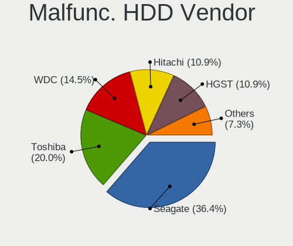
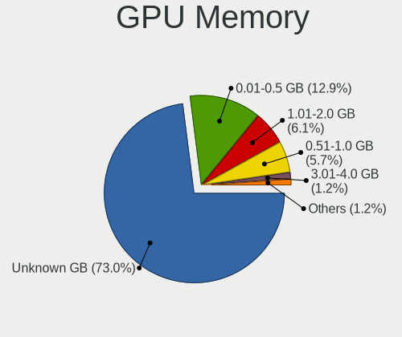
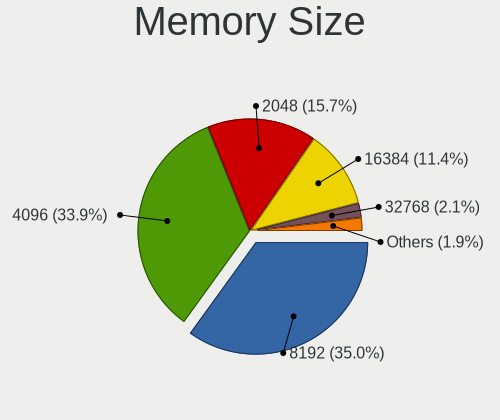

OpenMandriva Hardware Trends (Notebooks)
----------------------------------------

A project to identify most popular hardware characteristics and track their change
over time based on data collected by OpenMandriva users at https://Linux-Hardware.org.

Anyone can contribute to this report by the [hw-probe](https://github.com/linuxhw/hw-probe) tool:

    sudo -E hw-probe -all -upload

Full-feature report is available here: https://linux-hardware.org/?view=trends

Period: Mar, 2022.

Contents
--------

* [ System ](#system)
  - [ OS                       ](#os)
  - [ OS Family                ](#os-family)
  - [ Kernel                   ](#kernel)
  - [ Kernel Family            ](#kernel-family)
  - [ Kernel Major Ver.        ](#kernel-major-ver)
  - [ Arch                     ](#arch)
  - [ DE                       ](#de)
  - [ Display Server           ](#display-server)
  - [ Display Manager          ](#display-manager)
  - [ OS Lang                  ](#os-lang)
  - [ Boot Mode                ](#boot-mode)
  - [ Filesystem               ](#filesystem)
  - [ Part. scheme             ](#part-scheme)
  - [ Dual Boot with Linux/BSD ](#dual-boot-with-linuxbsd)
  - [ Dual Boot (Win)          ](#dual-boot-win)

* [ Board ](#board)
  - [ Vendor                   ](#vendor)
  - [ Model                    ](#model)
  - [ Model Family             ](#model-family)
  - [ MFG Year                 ](#mfg-year)
  - [ Form Factor              ](#form-factor)
  - [ Secure Boot              ](#secure-boot)
  - [ Coreboot                 ](#coreboot)
  - [ RAM Size                 ](#ram-size)
  - [ RAM Used                 ](#ram-used)
  - [ Total Drives             ](#total-drives)
  - [ Has CD-ROM               ](#has-cd-rom)
  - [ Has Ethernet             ](#has-ethernet)
  - [ Has WiFi                 ](#has-wifi)
  - [ Has Bluetooth            ](#has-bluetooth)

* [ Location ](#location)
  - [ Country                  ](#country)
  - [ City                     ](#city)

* [ Drives ](#drives)
  - [ Drive Vendor             ](#drive-vendor)
  - [ Drive Model              ](#drive-model)
  - [ HDD Vendor               ](#hdd-vendor)
  - [ SSD Vendor               ](#ssd-vendor)
  - [ Drive Kind               ](#drive-kind)
  - [ Drive Connector          ](#drive-connector)
  - [ Drive Size               ](#drive-size)
  - [ Space Total              ](#space-total)
  - [ Space Used               ](#space-used)
  - [ Malfunc. Drives          ](#malfunc-drives)
  - [ Malfunc. Drive Vendor    ](#malfunc-drive-vendor)
  - [ Malfunc. HDD Vendor      ](#malfunc-hdd-vendor)
  - [ Malfunc. Drive Kind      ](#malfunc-drive-kind)
  - [ Failed Drives            ](#failed-drives)
  - [ Failed Drive Vendor      ](#failed-drive-vendor)
  - [ Drive Status             ](#drive-status)

* [ Storage controller ](#storage-controller)
  - [ Storage Vendor           ](#storage-vendor)
  - [ Storage Model            ](#storage-model)
  - [ Storage Kind             ](#storage-kind)

* [ Processor ](#processor)
  - [ CPU Vendor               ](#cpu-vendor)
  - [ CPU Model                ](#cpu-model)
  - [ CPU Model Family         ](#cpu-model-family)
  - [ CPU Cores                ](#cpu-cores)
  - [ CPU Sockets              ](#cpu-sockets)
  - [ CPU Threads              ](#cpu-threads)
  - [ CPU Op-Modes             ](#cpu-op-modes)
  - [ CPU Microcode            ](#cpu-microcode)
  - [ CPU Microarch            ](#cpu-microarch)

* [ Graphics ](#graphics)
  - [ GPU Vendor               ](#gpu-vendor)
  - [ GPU Model                ](#gpu-model)
  - [ GPU Combo                ](#gpu-combo)
  - [ GPU Driver               ](#gpu-driver)
  - [ GPU Memory               ](#gpu-memory)

* [ Monitor ](#monitor)
  - [ Monitor Vendor           ](#monitor-vendor)
  - [ Monitor Model            ](#monitor-model)
  - [ Monitor Resolution       ](#monitor-resolution)
  - [ Monitor Diagonal         ](#monitor-diagonal)
  - [ Monitor Width            ](#monitor-width)
  - [ Aspect Ratio             ](#aspect-ratio)
  - [ Monitor Area             ](#monitor-area)
  - [ Pixel Density            ](#pixel-density)
  - [ Multiple Monitors        ](#multiple-monitors)

* [ Network ](#network)
  - [ Net Controller Vendor    ](#net-controller-vendor)
  - [ Net Controller Model     ](#net-controller-model)
  - [ Wireless Vendor          ](#wireless-vendor)
  - [ Wireless Model           ](#wireless-model)
  - [ Ethernet Vendor          ](#ethernet-vendor)
  - [ Ethernet Model           ](#ethernet-model)
  - [ Net Controller Kind      ](#net-controller-kind)
  - [ Used Controller          ](#used-controller)
  - [ NICs                     ](#nics)
  - [ IPv6                     ](#ipv6)

* [ Bluetooth ](#bluetooth)
  - [ Bluetooth Vendor         ](#bluetooth-vendor)
  - [ Bluetooth Model          ](#bluetooth-model)

* [ Sound ](#sound)
  - [ Sound Vendor             ](#sound-vendor)
  - [ Sound Model              ](#sound-model)

* [ Memory ](#memory)
  - [ Memory Vendor            ](#memory-vendor)
  - [ Memory Model             ](#memory-model)
  - [ Memory Kind              ](#memory-kind)
  - [ Memory Form Factor       ](#memory-form-factor)
  - [ Memory Size              ](#memory-size)
  - [ Memory Speed             ](#memory-speed)

* [ Printers & scanners ](#printers--scanners)
  - [ Printer Vendor           ](#printer-vendor)
  - [ Printer Model            ](#printer-model)
  - [ Scanner Vendor           ](#scanner-vendor)
  - [ Scanner Model            ](#scanner-model)

* [ Camera ](#camera)
  - [ Camera Vendor            ](#camera-vendor)
  - [ Camera Model             ](#camera-model)

* [ Security ](#security)
  - [ Fingerprint Vendor       ](#fingerprint-vendor)
  - [ Fingerprint Model        ](#fingerprint-model)
  - [ Chipcard Vendor          ](#chipcard-vendor)
  - [ Chipcard Model           ](#chipcard-model)

* [ Unsupported ](#unsupported)
  - [ Unsupported Devices      ](#unsupported-devices)
  - [ Unsupported Device Types ](#unsupported-device-types)

System
------

OS
--

Installed operating systems

| Name              | Notebooks | Percent |
|-------------------|-----------|---------|
| OpenMandriva 4.3  | 189       | 86.7%   |
| OpenMandriva 4.50 | 14        | 6.42%   |
| OpenMandriva 4.2  | 14        | 6.42%   |
| OpenMandriva 4.90 | 1         | 0.46%   |

OS Family
---------

OS without a version

| Name         | Notebooks | Percent |
|--------------|-----------|---------|
| OpenMandriva | 218       | 100%    |

Kernel
------

Version of the Linux kernel

| Version                  | Notebooks | Percent |
|--------------------------|-----------|---------|
| 5.16.7-desktop-1omv4003  | 184       | 84.4%   |
| 5.10.14-desktop-1omv4002 | 13        | 5.96%   |
| 5.14.7-desktop-1omv4050  | 12        | 5.5%    |
| 5.16.13-desktop-1omv4003 | 3         | 1.38%   |
| 5.16.9-desktop-1omv4003  | 2         | 0.92%   |
| 5.16.3-desktop-2omv4050  | 1         | 0.46%   |
| 5.16.13-desktop-1omv4050 | 1         | 0.46%   |
| 5.14.14-desktop-1omv4050 | 1         | 0.46%   |
| 5.11.12-desktop-1omv4002 | 1         | 0.46%   |

Kernel Family
-------------

Linux kernel without a distro release

| Version | Notebooks | Percent |
|---------|-----------|---------|
| 5.16.7  | 184       | 84.4%   |
| 5.10.14 | 13        | 5.96%   |
| 5.14.7  | 12        | 5.5%    |
| 5.16.13 | 4         | 1.83%   |
| 5.16.9  | 2         | 0.92%   |
| 5.16.3  | 1         | 0.46%   |
| 5.14.14 | 1         | 0.46%   |
| 5.11.12 | 1         | 0.46%   |

Kernel Major Ver.
-----------------

Linux kernel major version

| Version | Notebooks | Percent |
|---------|-----------|---------|
| 5.16    | 191       | 87.61%  |
| 5.14    | 13        | 5.96%   |
| 5.10    | 13        | 5.96%   |
| 5.11    | 1         | 0.46%   |

Arch
----

OS architecture (x86_64, i586, etc.)

| Name   | Notebooks | Percent |
|--------|-----------|---------|
| x86_64 | 218       | 100%    |

DE
--

Desktop Environment

| Name | Notebooks | Percent |
|------|-----------|---------|
| KDE5 | 218       | 100%    |

Display Server
--------------

X11 or Wayland

| Name    | Notebooks | Percent |
|---------|-----------|---------|
| X11     | 217       | 99.54%  |
| Wayland | 1         | 0.46%   |

Display Manager
---------------

SDDM, LightDM, etc.

| Name | Notebooks | Percent |
|------|-----------|---------|
| SDDM | 218       | 100%    |

OS Lang
-------

Language

| Lang  | Notebooks | Percent |
|-------|-----------|---------|
| en_US | 116       | 53.21%  |
| cs_CZ | 16        | 7.34%   |
| fr_FR | 13        | 5.96%   |
| pl_PL | 12        | 5.5%    |
| de_DE | 11        | 5.05%   |
| pt_BR | 8         | 3.67%   |
| ru_RU | 6         | 2.75%   |
| es_ES | 6         | 2.75%   |
| it_IT | 5         | 2.29%   |
| es_CO | 4         | 1.83%   |
| es_AR | 4         | 1.83%   |
| nl_BE | 2         | 0.92%   |
| es_VE | 2         | 0.92%   |
| es_MX | 2         | 0.92%   |
| en_GB | 2         | 0.92%   |
| de_AT | 2         | 0.92%   |
| tr_CY | 1         | 0.46%   |
| ru_UA | 1         | 0.46%   |
| fr_CA | 1         | 0.46%   |
| es_PE | 1         | 0.46%   |
| es_EC | 1         | 0.46%   |
| en_IN | 1         | 0.46%   |
| en_CA | 1         | 0.46%   |

Boot Mode
---------

EFI or BIOS

| Mode | Notebooks | Percent |
|------|-----------|---------|
| BIOS | 119       | 54.59%  |
| EFI  | 99        | 45.41%  |

Filesystem
----------

Type of filesystem

| Type    | Notebooks | Percent |
|---------|-----------|---------|
| Overlay | 166       | 76.15%  |
| Ext4    | 51        | 23.39%  |
| Btrfs   | 1         | 0.46%   |

Part. scheme
------------

Scheme of partitioning

| Type | Notebooks | Percent |
|------|-----------|---------|
| GPT  | 137       | 62.84%  |
| MBR  | 81        | 37.16%  |

Dual Boot with Linux/BSD
------------------------

Hosting more than one Linux/BSD

| Dual boot | Notebooks | Percent |
|-----------|-----------|---------|
| No        | 135       | 61.93%  |
| Yes       | 83        | 38.07%  |

Dual Boot (Win)
---------------

Hosting Linux and Windows

| Dual boot | Notebooks | Percent |
|-----------|-----------|---------|
| No        | 125       | 57.34%  |
| Yes       | 93        | 42.66%  |

Board
-----

Vendor
------

Motherboard manufacturer

| Name                  | Notebooks | Percent |
|-----------------------|-----------|---------|
| Lenovo                | 37        | 16.97%  |
| Dell                  | 36        | 16.51%  |
| ASUSTek Computer      | 36        | 16.51%  |
| Hewlett-Packard       | 33        | 15.14%  |
| Acer                  | 18        | 8.26%   |
| Toshiba               | 13        | 5.96%   |
| Fujitsu               | 6         | 2.75%   |
| Sony                  | 5         | 2.29%   |
| MSI                   | 5         | 2.29%   |
| Samsung Electronics   | 4         | 1.83%   |
| Apple                 | 4         | 1.83%   |
| Packard Bell          | 3         | 1.38%   |
| Fujitsu Siemens       | 3         | 1.38%   |
| Positivo              | 2         | 0.92%   |
| Philco                | 2         | 0.92%   |
| Medion                | 2         | 0.92%   |
| VIT                   | 1         | 0.46%   |
| Positivo Bahia - VAIO | 1         | 0.46%   |
| Panasonic             | 1         | 0.46%   |
| Intel                 | 1         | 0.46%   |
| Infinix               | 1         | 0.46%   |
| HUAWEI                | 1         | 0.46%   |
| eMachines             | 1         | 0.46%   |
| Coradir               | 1         | 0.46%   |
| Unknown               | 1         | 0.46%   |

Model
-----

Motherboard model

| Name                                              | Notebooks | Percent |
|---------------------------------------------------|-----------|---------|
| ASUS UX31E                                        | 13        | 5.96%   |
| Unknown                                           | 4         | 1.83%   |
| MSI GE72VR 6RF                                    | 3         | 1.38%   |
| Dell XPS 13 9360                                  | 3         | 1.38%   |
| Dell Latitude 3189                                | 3         | 1.38%   |
| Sony VGN-FZ31Z                                    | 2         | 0.92%   |
| HP Pavilion dv6                                   | 2         | 0.92%   |
| HP Pavilion dv5                                   | 2         | 0.92%   |
| Dell Latitude 3310                                | 2         | 0.92%   |
| VIT P2402                                         | 1         | 0.46%   |
| Toshiba TECRA M11                                 | 1         | 0.46%   |
| Toshiba Satellite U400                            | 1         | 0.46%   |
| Toshiba Satellite Pro S500                        | 1         | 0.46%   |
| Toshiba Satellite Pro P200                        | 1         | 0.46%   |
| Toshiba Satellite Pro C660                        | 1         | 0.46%   |
| Toshiba Satellite L450D                           | 1         | 0.46%   |
| Toshiba Satellite L350D                           | 1         | 0.46%   |
| Toshiba Satellite C855-2G8                        | 1         | 0.46%   |
| Toshiba Satellite C70                             | 1         | 0.46%   |
| Toshiba Satellite C55D-A                          | 1         | 0.46%   |
| Toshiba QOSMIO X770                               | 1         | 0.46%   |
| Toshiba PORTEGE R935                              | 1         | 0.46%   |
| Toshiba PORTEGE R835                              | 1         | 0.46%   |
| Sony VPCEB4E1E                                    | 1         | 0.46%   |
| Sony VGN-Z690N                                    | 1         | 0.46%   |
| Sony SVE1711G1RB                                  | 1         | 0.46%   |
| Samsung RV420/RV520/RV720/E3530/S3530/E3420/E3520 | 1         | 0.46%   |
| Samsung 950XCJ/951XCJ/950XCR                      | 1         | 0.46%   |
| Samsung 530U3BI/530U4BI/530U4BH                   | 1         | 0.46%   |
| Samsung 300E4A/300E5A/300E7A/3430EA/3530EA        | 1         | 0.46%   |
| Positivo Z100                                     | 1         | 0.46%   |
| Positivo Mobile                                   | 1         | 0.46%   |
| Positivo Bahia - VAIO VJFE52F11X-XXXXXX           | 1         | 0.46%   |
| Philco 14I                                        | 1         | 0.46%   |
| Philco 10D                                        | 1         | 0.46%   |
| Panasonic CF-30KTPA9NP                            | 1         | 0.46%   |
| Packard Bell EasyNote TK11BZ                      | 1         | 0.46%   |
| Packard Bell EasyNote ENTG71BM                    | 1         | 0.46%   |
| Packard Bell DOT S                                | 1         | 0.46%   |
| MSI GF63 Thin 9SCXR                               | 1         | 0.46%   |
| MSI Alpha 15 A3DDK                                | 1         | 0.46%   |
| Medion E6228                                      | 1         | 0.46%   |
| Medion Akoya E7221                                | 1         | 0.46%   |
| Lenovo V15-IIL 82C5                               | 1         | 0.46%   |
| Lenovo ThinkPad X61s 7667CB5                      | 1         | 0.46%   |
| Lenovo ThinkPad X260 20F5S2C600                   | 1         | 0.46%   |
| Lenovo ThinkPad X260 20F5S1MN00                   | 1         | 0.46%   |
| Lenovo ThinkPad X230 Tablet 343522U               | 1         | 0.46%   |
| Lenovo ThinkPad X230 23331D9                      | 1         | 0.46%   |
| Lenovo ThinkPad X230 2325DV5                      | 1         | 0.46%   |
| Lenovo ThinkPad X230 2325BA3                      | 1         | 0.46%   |
| Lenovo ThinkPad X220 Tablet 4298R65               | 1         | 0.46%   |
| Lenovo ThinkPad W541 20EGS03100                   | 1         | 0.46%   |
| Lenovo ThinkPad T61 6464W4J                       | 1         | 0.46%   |
| Lenovo ThinkPad T520 4243M75                      | 1         | 0.46%   |
| Lenovo ThinkPad T460 20FN003LUK                   | 1         | 0.46%   |
| Lenovo ThinkPad T450s 20BXCTO1WW                  | 1         | 0.46%   |
| Lenovo ThinkPad T430 2349T7Z                      | 1         | 0.46%   |
| Lenovo ThinkPad T420 4177R3U                      | 1         | 0.46%   |
| Lenovo ThinkPad R61 7733B46                       | 1         | 0.46%   |

Model Family
------------

Motherboard model prefix

| Name                                    | Notebooks | Percent |
|-----------------------------------------|-----------|---------|
| Dell Latitude                           | 19        | 8.72%   |
| Lenovo ThinkPad                         | 18        | 8.26%   |
| HP Pavilion                             | 13        | 5.96%   |
| ASUS UX31E                              | 13        | 5.96%   |
| Acer Aspire                             | 13        | 5.96%   |
| Toshiba Satellite                       | 9         | 4.13%   |
| Dell Inspiron                           | 9         | 4.13%   |
| Lenovo IdeaPad                          | 5         | 2.29%   |
| HP Laptop                               | 5         | 2.29%   |
| Dell XPS                                | 4         | 1.83%   |
| ASUS VivoBook                           | 4         | 1.83%   |
| Unknown                                 | 4         | 1.83%   |
| MSI GE72VR                              | 3         | 1.38%   |
| HP EliteBook                            | 3         | 1.38%   |
| Fujitsu LIFEBOOK                        | 3         | 1.38%   |
| Toshiba PORTEGE                         | 2         | 0.92%   |
| Sony VGN-FZ31Z                          | 2         | 0.92%   |
| Packard Bell EasyNote                   | 2         | 0.92%   |
| Lenovo Legion                           | 2         | 0.92%   |
| HP ProBook                              | 2         | 0.92%   |
| Dell Precision                          | 2         | 0.92%   |
| ASUS TUF                                | 2         | 0.92%   |
| Acer Extensa                            | 2         | 0.92%   |
| VIT P2402                               | 1         | 0.46%   |
| Toshiba TECRA                           | 1         | 0.46%   |
| Toshiba QOSMIO                          | 1         | 0.46%   |
| Sony VPCEB4E1E                          | 1         | 0.46%   |
| Sony VGN-Z690N                          | 1         | 0.46%   |
| Sony SVE1711G1RB                        | 1         | 0.46%   |
| Samsung RV420                           | 1         | 0.46%   |
| Samsung 950XCJ                          | 1         | 0.46%   |
| Samsung 530U3BI                         | 1         | 0.46%   |
| Samsung 300E4A                          | 1         | 0.46%   |
| Positivo Z100                           | 1         | 0.46%   |
| Positivo Mobile                         | 1         | 0.46%   |
| Positivo Bahia - VAIO VJFE52F11X-XXXXXX | 1         | 0.46%   |
| Philco 14I                              | 1         | 0.46%   |
| Philco 10D                              | 1         | 0.46%   |
| Panasonic CF-30KTPA9NP                  | 1         | 0.46%   |
| Packard Bell DOT                        | 1         | 0.46%   |
| MSI GF63                                | 1         | 0.46%   |
| MSI Alpha                               | 1         | 0.46%   |
| Medion E6228                            | 1         | 0.46%   |
| Medion Akoya                            | 1         | 0.46%   |
| Lenovo V15-IIL                          | 1         | 0.46%   |
| Lenovo N22                              | 1         | 0.46%   |
| Lenovo IdeaPadFlex                      | 1         | 0.46%   |
| Lenovo G570                             | 1         | 0.46%   |
| Lenovo G505s                            | 1         | 0.46%   |
| Lenovo G50-45                           | 1         | 0.46%   |
| Lenovo G40-45                           | 1         | 0.46%   |
| Lenovo G40-30                           | 1         | 0.46%   |
| Lenovo Flex                             | 1         | 0.46%   |
| Lenovo B590                             | 1         | 0.46%   |
| Lenovo B560                             | 1         | 0.46%   |
| Infinix INBook                          | 1         | 0.46%   |
| HUAWEI MACH-WX9                         | 1         | 0.46%   |
| HP ZBook                                | 1         | 0.46%   |
| HP Presario                             | 1         | 0.46%   |
| HP OMEN                                 | 1         | 0.46%   |

MFG Year
--------

Motherboard manufacture year

| Year | Notebooks | Percent |
|------|-----------|---------|
| 2011 | 37        | 16.97%  |
| 2012 | 21        | 9.63%   |
| 2016 | 20        | 9.17%   |
| 2020 | 17        | 7.8%    |
| 2014 | 16        | 7.34%   |
| 2013 | 15        | 6.88%   |
| 2008 | 13        | 5.96%   |
| 2007 | 13        | 5.96%   |
| 2015 | 12        | 5.5%    |
| 2021 | 11        | 5.05%   |
| 2018 | 10        | 4.59%   |
| 2010 | 10        | 4.59%   |
| 2009 | 10        | 4.59%   |
| 2019 | 8         | 3.67%   |
| 2017 | 4         | 1.83%   |
| 2006 | 1         | 0.46%   |

Form Factor
-----------

Physical design of the computer

| Name     | Notebooks | Percent |
|----------|-----------|---------|
| Notebook | 218       | 100%    |

Secure Boot
-----------

Enabled or disabled

| State    | Notebooks | Percent |
|----------|-----------|---------|
| Disabled | 218       | 100%    |

Coreboot
--------

Have coreboot on board

| Used | Notebooks | Percent |
|------|-----------|---------|
| No   | 218       | 100%    |

RAM Size
--------

Total RAM memory

| Size in GB | Notebooks | Percent |
|------------|-----------|---------|
| 3.01-4.0   | 79        | 36.24%  |
| 4.01-8.0   | 70        | 32.11%  |
| 8.01-16.0  | 25        | 11.47%  |
| 16.01-24.0 | 18        | 8.26%   |
| 1.01-2.0   | 12        | 5.5%    |
| 32.01-64.0 | 4         | 1.83%   |
| 2.01-3.0   | 4         | 1.83%   |
| 0.51-1.0   | 4         | 1.83%   |
| 24.01-32.0 | 2         | 0.92%   |

RAM Used
--------

Used RAM memory

| Used GB  | Notebooks | Percent |
|----------|-----------|---------|
| 1.01-2.0 | 166       | 76.15%  |
| 0.51-1.0 | 26        | 11.93%  |
| 2.01-3.0 | 21        | 9.63%   |
| 0.01-0.5 | 3         | 1.38%   |
| 3.01-4.0 | 2         | 0.92%   |

Total Drives
------------

Number of drives on board

| Drives | Notebooks | Percent |
|--------|-----------|---------|
| 1      | 158       | 72.48%  |
| 2      | 50        | 22.94%  |
| 0      | 6         | 2.75%   |
| 3      | 3         | 1.38%   |
| 4      | 1         | 0.46%   |

Has CD-ROM
----------

Has CD-ROM on board

| Presented | Notebooks | Percent |
|-----------|-----------|---------|
| No        | 111       | 50.92%  |
| Yes       | 107       | 49.08%  |

Has Ethernet
------------

Has Ethernet on board

| Presented | Notebooks | Percent |
|-----------|-----------|---------|
| Yes       | 188       | 86.24%  |
| No        | 30        | 13.76%  |

Has WiFi
--------

Has WiFi module

| Presented | Notebooks | Percent |
|-----------|-----------|---------|
| Yes       | 216       | 99.08%  |
| No        | 2         | 0.92%   |

Has Bluetooth
-------------

Has Bluetooth module

| Presented | Notebooks | Percent |
|-----------|-----------|---------|
| Yes       | 150       | 68.81%  |
| No        | 68        | 31.19%  |

Location
--------

Country
-------

Geographic location (country)

| Country     | Notebooks | Percent |
|-------------|-----------|---------|
| USA         | 26        | 11.93%  |
| France      | 20        | 9.17%   |
| Poland      | 19        | 8.72%   |
| Germany     | 19        | 8.72%   |
| Czechia     | 16        | 7.34%   |
| Brazil      | 14        | 6.42%   |
| Spain       | 11        | 5.05%   |
| Indonesia   | 11        | 5.05%   |
| Netherlands | 9         | 4.13%   |
| Russia      | 8         | 3.67%   |
| Italy       | 8         | 3.67%   |
| Argentina   | 6         | 2.75%   |
| Colombia    | 4         | 1.83%   |
| Bulgaria    | 4         | 1.83%   |
| Portugal    | 3         | 1.38%   |
| Finland     | 3         | 1.38%   |
| Switzerland | 2         | 0.92%   |
| Sweden      | 2         | 0.92%   |
| Mexico      | 2         | 0.92%   |
| Japan       | 2         | 0.92%   |
| Greece      | 2         | 0.92%   |
| Ecuador     | 2         | 0.92%   |
| Canada      | 2         | 0.92%   |
| Belgium     | 2         | 0.92%   |
| Austria     | 2         | 0.92%   |
| Australia   | 2         | 0.92%   |
| Venezuela   | 1         | 0.46%   |
| Uruguay     | 1         | 0.46%   |
| Ukraine     | 1         | 0.46%   |
| UK          | 1         | 0.46%   |
| Turkey      | 1         | 0.46%   |
| Slovenia    | 1         | 0.46%   |
| Serbia      | 1         | 0.46%   |
| Peru        | 1         | 0.46%   |
| Norway      | 1         | 0.46%   |
| Israel      | 1         | 0.46%   |
| India       | 1         | 0.46%   |
| Hungary     | 1         | 0.46%   |
| Georgia     | 1         | 0.46%   |
| Egypt       | 1         | 0.46%   |
| Croatia     | 1         | 0.46%   |
| Costa Rica  | 1         | 0.46%   |
| China       | 1         | 0.46%   |

City
----

Geographic location (city)

| City                        | Notebooks | Percent |
|-----------------------------|-----------|---------|
| Prague                      | 12        | 5.5%    |
| Schagen                     | 7         | 3.21%   |
| Krakow                      | 4         | 1.83%   |
| Wroclaw                     | 3         | 1.38%   |
| Warsaw                      | 3         | 1.38%   |
| Hamburg                     | 3         | 1.38%   |
| Barcelona                   | 3         | 1.38%   |
| Turnhout                    | 2         | 0.92%   |
| Surabaya                    | 2         | 0.92%   |
| Queens                      | 2         | 0.92%   |
| Paris                       | 2         | 0.92%   |
| Milan                       | 2         | 0.92%   |
| Helsinki                    | 2         | 0.92%   |
| Funchal                     | 2         | 0.92%   |
| Ciapus                      | 2         | 0.92%   |
| Bucaramanga                 | 2         | 0.92%   |
| Bogor                       | 2         | 0.92%   |
| Athens                      | 2         | 0.92%   |
| Łomża                     | 1         | 0.46%   |
| Zaporizhzhya                | 1         | 0.46%   |
| Zanica                      | 1         | 0.46%   |
| Yogyakarta                  | 1         | 0.46%   |
| Yambol                      | 1         | 0.46%   |
| Williamsport                | 1         | 0.46%   |
| Wigan                       | 1         | 0.46%   |
| Whitestown                  | 1         | 0.46%   |
| Wesel                       | 1         | 0.46%   |
| Wassy                       | 1         | 0.46%   |
| Villeurbanne                | 1         | 0.46%   |
| Vienna                      | 1         | 0.46%   |
| Verona                      | 1         | 0.46%   |
| Valladolid                  | 1         | 0.46%   |
| Uhldingen-Muhlhofen         | 1         | 0.46%   |
| Trenkovo                    | 1         | 0.46%   |
| Toowong                     | 1         | 0.46%   |
| Tilton                      | 1         | 0.46%   |
| Tilburg                     | 1         | 0.46%   |
| Sydney                      | 1         | 0.46%   |
| Sofia                       | 1         | 0.46%   |
| Soest                       | 1         | 0.46%   |
| Smolensk                    | 1         | 0.46%   |
| Setagaya-ku                 | 1         | 0.46%   |
| Semur-en-Auxois             | 1         | 0.46%   |
| Santa Clara                 | 1         | 0.46%   |
| Sant Andreu de la Barca     | 1         | 0.46%   |
| Sankt Georgen an der Gusen  | 1         | 0.46%   |
| Sangerhausen                | 1         | 0.46%   |
| San Nicolás de los Arroyos | 1         | 0.46%   |
| Saint-Denis                 | 1         | 0.46%   |
| Ribeirao Pires              | 1         | 0.46%   |
| Reno                        | 1         | 0.46%   |
| Reiskirchen                 | 1         | 0.46%   |
| Reignier-Esery              | 1         | 0.46%   |
| Regensburg                  | 1         | 0.46%   |
| Příbram                   | 1         | 0.46%   |
| Powell                      | 1         | 0.46%   |
| Pola de Laviana             | 1         | 0.46%   |
| Plovdiv                     | 1         | 0.46%   |
| Pinellas Park               | 1         | 0.46%   |
| Paulinia                    | 1         | 0.46%   |

Drives
------

Drive Vendor
------------

Hard drive vendors

| Vendor              | Notebooks | Drives | Percent |
|---------------------|-----------|--------|---------|
| WDC                 | 35        | 36     | 14.11%  |
| Samsung Electronics | 33        | 34     | 13.31%  |
| Seagate             | 27        | 27     | 10.89%  |
| SanDisk             | 21        | 21     | 8.47%   |
| Toshiba             | 15        | 17     | 6.05%   |
| Hitachi             | 15        | 15     | 6.05%   |
| Kingston            | 12        | 12     | 4.84%   |
| HGST                | 12        | 12     | 4.84%   |
| SK Hynix            | 8         | 9      | 3.23%   |
| Crucial             | 7         | 8      | 2.82%   |
| Unknown             | 6         | 6      | 2.42%   |
| Micron Technology   | 4         | 4      | 1.61%   |
| KIOXIA              | 4         | 4      | 1.61%   |
| GOODRAM             | 4         | 4      | 1.61%   |
| A-DATA Technology   | 4         | 4      | 1.61%   |
| Intel               | 3         | 4      | 1.21%   |
| Fujitsu             | 3         | 3      | 1.21%   |
| Unknown             | 3         | 3      | 1.21%   |
| LITEON              | 2         | 2      | 0.81%   |
| KingDian            | 2         | 2      | 0.81%   |
| Verbatim            | 1         | 1      | 0.4%    |
| Vaseky              | 1         | 1      | 0.4%    |
| Transcend           | 1         | 1      | 0.4%    |
| TCSUNBOW            | 1         | 1      | 0.4%    |
| SPCC M.2            | 1         | 1      | 0.4%    |
| PNY                 | 1         | 1      | 0.4%    |
| PLEXTOR             | 1         | 1      | 0.4%    |
| Phison              | 1         | 1      | 0.4%    |
| MidasForce          | 1         | 1      | 0.4%    |
| LS600               | 1         | 1      | 0.4%    |
| LITEONIT            | 1         | 1      | 0.4%    |
| Lenovo              | 1         | 1      | 0.4%    |
| KingSpec            | 1         | 1      | 0.4%    |
| KingFast            | 1         | 1      | 0.4%    |
| JMicron             | 1         | 1      | 0.4%    |
| Intenso             | 1         | 1      | 0.4%    |
| INNOVATION IT       | 1         | 1      | 0.4%    |
| INDMEM              | 1         | 1      | 0.4%    |
| HS-SSD-E100N        | 1         | 1      | 0.4%    |
| Hewlett-Packard     | 1         | 1      | 0.4%    |
| GOLDEN              | 1         | 1      | 0.4%    |
| Gigabyte Technology | 1         | 1      | 0.4%    |
| DOGFISH             | 1         | 1      | 0.4%    |
| China               | 1         | 1      | 0.4%    |
| BIZE                | 1         | 1      | 0.4%    |
| ASMT                | 1         | 1      | 0.4%    |
| ASMedia             | 1         | 1      | 0.4%    |
| Apacer              | 1         | 1      | 0.4%    |

Drive Model
-----------

Hard drive models

| Model                                 | Notebooks | Percent |
|---------------------------------------|-----------|---------|
| SanDisk SSD U100 256GB                | 13        | 5.16%   |
| HGST HTS721010A9E630 1TB              | 6         | 2.38%   |
| Seagate ST500LT012-1DG142 500GB       | 5         | 1.98%   |
| Kingston SA400S37240G 240GB SSD       | 5         | 1.98%   |
| Toshiba MQ01ABF050 500GB              | 4         | 1.59%   |
| Seagate ST1000LM024 HN-M101MBB 1TB    | 4         | 1.59%   |
| WDC WD5000LPVX-22V0TT0 500GB          | 3         | 1.19%   |
| SK Hynix HFS256G39MND-3510A 256GB SSD | 3         | 1.19%   |
| Samsung SSD 850 EVO 250GB             | 3         | 1.19%   |
| Unknown                               | 3         | 1.19%   |
| WDC WD5000LPCX-24C6HT0 500GB          | 2         | 0.79%   |
| WDC WD2500BEVT-22ZCT0 250GB           | 2         | 0.79%   |
| Toshiba MQ04ABF100 1TB                | 2         | 0.79%   |
| Toshiba KXG50ZNV512G NVMe 512GB       | 2         | 0.79%   |
| Seagate ST750LM022 HN-M750MBB 752GB   | 2         | 0.79%   |
| Seagate ST500LM012 HN-M500MBB 500GB   | 2         | 0.79%   |
| Seagate ST320LT012-1DG14C 320GB       | 2         | 0.79%   |
| Seagate ST1000LM035-1RK172 1TB        | 2         | 0.79%   |
| Samsung SSD 860 QVO 1TB               | 2         | 0.79%   |
| Samsung HM160HI 160GB                 | 2         | 0.79%   |
| LITEON CV8-8E128-11 SATA 128GB SSD    | 2         | 0.79%   |
| KingDian S280 120GB SSD               | 2         | 0.79%   |
| Hitachi HTS547575A9E384 752GB         | 2         | 0.79%   |
| Hitachi HTS545025B9SA02 250GB         | 2         | 0.79%   |
| Crucial CT240BX500SSD1 240GB          | 2         | 0.79%   |
| WDC WDS500G2B0A-00SM50 500GB SSD      | 1         | 0.4%    |
| WDC WDS240G2G0A-00JH30 240GB SSD      | 1         | 0.4%    |
| WDC WDS200T3X0C-00SJG0 2TB            | 1         | 0.4%    |
| WDC WDS100T2B0A-00SM50 1TB SSD        | 1         | 0.4%    |
| WDC WD6400BPVT-00HXZT1 640GB          | 1         | 0.4%    |
| WDC WD6400BEVT-22A0RT0 640GB          | 1         | 0.4%    |
| WDC WD5000LPVX-80V0TT0 500GB          | 1         | 0.4%    |
| WDC WD5000LPVT-24G33T1 500GB          | 1         | 0.4%    |
| WDC WD5000LPCX-75VHAT0 500GB          | 1         | 0.4%    |
| WDC WD5000BEVT-22A0RT0 500GB          | 1         | 0.4%    |
| WDC WD5000BEKT-75KA9T0 500GB          | 1         | 0.4%    |
| WDC WD5000BEKT-60KA9T0 500GB          | 1         | 0.4%    |
| WDC WD3200BPVT-80ZEST0 320GB          | 1         | 0.4%    |
| WDC WD3200BPVT-24JJ5T0 320GB          | 1         | 0.4%    |
| WDC WD3200BPVT-22JJ5T0 320GB          | 1         | 0.4%    |
| WDC WD3200BEVT-22ZCT0 320GB           | 1         | 0.4%    |
| WDC WD3200BEVT-22A23T0 320GB          | 1         | 0.4%    |
| WDC WD1600BEVT-22ZCT0 160GB           | 1         | 0.4%    |
| WDC WD10SPZX-24Z10T0 1TB              | 1         | 0.4%    |
| WDC WD10SPZX-24Z10 1TB                | 1         | 0.4%    |
| WDC WD10JPVX-60JC3T0 1TB              | 1         | 0.4%    |
| WDC WD10JPVX-22JC3T0 1TB              | 1         | 0.4%    |
| WDC WD10JPCX-24UE4T0 1TB              | 1         | 0.4%    |
| WDC WD easystore 240GB SSD            | 1         | 0.4%    |
| WDC PC SN730 SDBPNTY-1T00-1101 1TB    | 1         | 0.4%    |
| WDC PC SN730 SDBPNTY-1T00-1006 1TB    | 1         | 0.4%    |
| WDC PC SN530 SDBPNPZ-512G-1032 512GB  | 1         | 0.4%    |
| WDC PC SN530 SDBPNPZ-256G-1114 256GB  | 1         | 0.4%    |
| WDC PC SN530 SDBPNPZ-256G-1014 256GB  | 1         | 0.4%    |
| Verbatim Portable Drive 1TB           | 1         | 0.4%    |
| Vaseky V800/60G 64GB SSD              | 1         | 0.4%    |
| Unknown SU32G  32GB                   | 1         | 0.4%    |
| Unknown SD  128GB                     | 1         | 0.4%    |
| Unknown S0J38Y  64GB                  | 1         | 0.4%    |
| Unknown ISOCOM  64GB                  | 1         | 0.4%    |

HDD Vendor
----------

Hard disk drive vendors

| Vendor              | Notebooks | Drives | Percent |
|---------------------|-----------|--------|---------|
| Seagate             | 27        | 27     | 27.27%  |
| WDC                 | 26        | 26     | 26.26%  |
| Hitachi             | 15        | 15     | 15.15%  |
| Toshiba             | 12        | 14     | 12.12%  |
| HGST                | 12        | 12     | 12.12%  |
| Fujitsu             | 3         | 3      | 3.03%   |
| Samsung Electronics | 2         | 2      | 2.02%   |
| Hewlett-Packard     | 1         | 1      | 1.01%   |
| ASMedia             | 1         | 1      | 1.01%   |

SSD Vendor
----------

Solid state drive vendors

| Vendor              | Notebooks | Drives | Percent |
|---------------------|-----------|--------|---------|
| Samsung Electronics | 21        | 22     | 19.63%  |
| SanDisk             | 20        | 20     | 18.69%  |
| Kingston            | 10        | 10     | 9.35%   |
| Crucial             | 7         | 8      | 6.54%   |
| SK Hynix            | 5         | 6      | 4.67%   |
| WDC                 | 4         | 4      | 3.74%   |
| Micron Technology   | 4         | 4      | 3.74%   |
| GOODRAM             | 4         | 4      | 3.74%   |
| A-DATA Technology   | 3         | 3      | 2.8%    |
| Unknown             | 3         | 3      | 2.8%    |
| LITEON              | 2         | 2      | 1.87%   |
| KingDian            | 2         | 2      | 1.87%   |
| Vaseky              | 1         | 1      | 0.93%   |
| Transcend           | 1         | 1      | 0.93%   |
| Toshiba             | 1         | 1      | 0.93%   |
| TCSUNBOW            | 1         | 1      | 0.93%   |
| SPCC M.2            | 1         | 1      | 0.93%   |
| PNY                 | 1         | 1      | 0.93%   |
| PLEXTOR             | 1         | 1      | 0.93%   |
| MidasForce          | 1         | 1      | 0.93%   |
| LS600               | 1         | 1      | 0.93%   |
| LITEONIT            | 1         | 1      | 0.93%   |
| KingSpec            | 1         | 1      | 0.93%   |
| KingFast            | 1         | 1      | 0.93%   |
| JMicron             | 1         | 1      | 0.93%   |
| Intenso             | 1         | 1      | 0.93%   |
| INNOVATION IT       | 1         | 1      | 0.93%   |
| HS-SSD-E100N        | 1         | 1      | 0.93%   |
| GOLDEN              | 1         | 1      | 0.93%   |
| Gigabyte Technology | 1         | 1      | 0.93%   |
| DOGFISH             | 1         | 1      | 0.93%   |
| China               | 1         | 1      | 0.93%   |
| ASMT                | 1         | 1      | 0.93%   |
| Apacer              | 1         | 1      | 0.93%   |

Drive Kind
----------

HDD or SSD

| Kind    | Notebooks | Drives | Percent |
|---------|-----------|--------|---------|
| SSD     | 103       | 110    | 42.56%  |
| HDD     | 97        | 101    | 40.08%  |
| NVMe    | 32        | 34     | 13.22%  |
| MMC     | 7         | 7      | 2.89%   |
| Unknown | 3         | 3      | 1.24%   |

Drive Connector
---------------

SATA, SAS, NVMe, etc.

| Type | Notebooks | Drives | Percent |
|------|-----------|--------|---------|
| SATA | 180       | 204    | 78.6%   |
| NVMe | 32        | 34     | 13.97%  |
| SAS  | 10        | 10     | 4.37%   |
| MMC  | 7         | 7      | 3.06%   |

Drive Size
----------

Size of hard drive

| Size in TB | Notebooks | Drives | Percent |
|------------|-----------|--------|---------|
| 0.01-0.5   | 146       | 162    | 75.65%  |
| 0.51-1.0   | 39        | 41     | 20.21%  |
| 1.01-2.0   | 8         | 8      | 4.15%   |

Space Total
-----------

Amount of disk space available on the file system

| Size in GB | Notebooks | Percent |
|------------|-----------|---------|
| 1-20       | 123       | 56.42%  |
| 101-250    | 41        | 18.81%  |
| 251-500    | 25        | 11.47%  |
| 51-100     | 8         | 3.67%   |
| 501-1000   | 7         | 3.21%   |
| 21-50      | 6         | 2.75%   |
| Unknown    | 5         | 2.29%   |
| 1001-2000  | 3         | 1.38%   |

Space Used
----------

Amount of used disk space

| Used GB | Notebooks | Percent |
|---------|-----------|---------|
| 1-20    | 193       | 88.53%  |
| 21-50   | 10        | 4.59%   |
| Unknown | 5         | 2.29%   |
| 251-500 | 4         | 1.83%   |
| 101-250 | 3         | 1.38%   |
| 51-100  | 3         | 1.38%   |

Malfunc. Drives
---------------

Drive models with a malfunction

| Model                                            | Notebooks | Drives | Percent |
|--------------------------------------------------|-----------|--------|---------|
| SanDisk SSD U100 256GB                           | 13        | 13     | 17.11%  |
| WDC WD5000LPVX-22V0TT0 500GB                     | 2         | 2      | 2.63%   |
| Toshiba MQ01ABF050 500GB                         | 2         | 2      | 2.63%   |
| Seagate ST750LM022 HN-M750MBB 752GB              | 2         | 2      | 2.63%   |
| Seagate ST500LT012-1DG142 500GB                  | 2         | 2      | 2.63%   |
| Seagate ST1000LM024 HN-M101MBB 1TB               | 2         | 2      | 2.63%   |
| Samsung Electronics HM160HI 160GB                | 2         | 2      | 2.63%   |
| WDC WD5000LPCX-24C6HT0 500GB                     | 1         | 1      | 1.32%   |
| WDC WD5000BEVT-22A0RT0 500GB                     | 1         | 1      | 1.32%   |
| WDC WD5000BEKT-75KA9T0 500GB                     | 1         | 1      | 1.32%   |
| WDC WD5000BEKT-60KA9T0 500GB                     | 1         | 1      | 1.32%   |
| WDC WD3200BPVT-80ZEST0 320GB                     | 1         | 1      | 1.32%   |
| WDC WD3200BPVT-24JJ5T0 320GB                     | 1         | 1      | 1.32%   |
| WDC WD3200BEVT-22A23T0 320GB                     | 1         | 1      | 1.32%   |
| WDC WD2500BEVT-22ZCT0 250GB                      | 1         | 1      | 1.32%   |
| WDC WD1600BEVT-22ZCT0 160GB                      | 1         | 1      | 1.32%   |
| WDC WD10JPVX-22JC3T0 1TB                         | 1         | 1      | 1.32%   |
| Vaseky V800/60G 64GB SSD                         | 1         | 1      | 1.32%   |
| Toshiba MQ04ABF100 1TB                           | 1         | 1      | 1.32%   |
| Toshiba MQ01ABD050 500GB                         | 1         | 1      | 1.32%   |
| Toshiba MK3252GSX 320GB                          | 1         | 1      | 1.32%   |
| SK Hynix HFS128G39TND-N210A 128GB SSD            | 1         | 2      | 1.32%   |
| Seagate ST9500325AS 500GB                        | 1         | 1      | 1.32%   |
| Seagate ST94019A 40GB                            | 1         | 1      | 1.32%   |
| Seagate ST9320325AS 320GB                        | 1         | 1      | 1.32%   |
| Seagate ST9320320AS 320GB                        | 1         | 1      | 1.32%   |
| Seagate ST500LM021-1KJ152 500GB                  | 1         | 1      | 1.32%   |
| Seagate ST500LM012 HN-M500MBB 500GB              | 1         | 1      | 1.32%   |
| Seagate ST1000LX015-1U7172 1TB                   | 1         | 1      | 1.32%   |
| SanDisk SSD PLUS 480GB                           | 1         | 1      | 1.32%   |
| SanDisk iSSD P4 16GB                             | 1         | 1      | 1.32%   |
| Samsung Electronics SSD 830 Series 512GB         | 1         | 1      | 1.32%   |
| Samsung Electronics MZNLH128HBHQ-000H1 128GB SSD | 1         | 1      | 1.32%   |
| Samsung Electronics 470 Series SSD 64GB          | 1         | 1      | 1.32%   |
| Micron Technology C400-MTFDDAK256MAM 256GB SSD   | 1         | 1      | 1.32%   |
| Kingston SV300S37A120G 120GB SSD                 | 1         | 1      | 1.32%   |
| Kingston SA400S37240G 240GB SSD                  | 1         | 1      | 1.32%   |
| Hitachi HTS723232L9SA60 320GB                    | 1         | 1      | 1.32%   |
| Hitachi HTS547575A9E384 752GB                    | 1         | 1      | 1.32%   |
| Hitachi HTS547550A9E384 500GB                    | 1         | 1      | 1.32%   |
| Hitachi HTS545050B9SA02 500GB                    | 1         | 1      | 1.32%   |
| Hitachi HTS543232A7A384 320GB                    | 1         | 1      | 1.32%   |
| Hitachi HTS543216L9SA00 160GB                    | 1         | 1      | 1.32%   |
| Hitachi HTS542516K9SA00 160GB                    | 1         | 1      | 1.32%   |
| Hitachi HTS542512K9SA00 120GB                    | 1         | 1      | 1.32%   |
| Hitachi HTS541612J9SA00 120GB                    | 1         | 1      | 1.32%   |
| Hitachi HCC547550A9E380 500GB                    | 1         | 1      | 1.32%   |
| HGST HTS725050A7E630 500GB                       | 1         | 1      | 1.32%   |
| HGST HTS721010A9E630 1TB                         | 1         | 1      | 1.32%   |
| HGST HTS545050A7E680 500GB                       | 1         | 1      | 1.32%   |
| HGST HTS545050A7E380 500GB                       | 1         | 1      | 1.32%   |
| HGST HTS541010A9E680 1TB                         | 1         | 1      | 1.32%   |
| Fujitsu MHZ2160BH G1 160GB                       | 1         | 1      | 1.32%   |
| Fujitsu MHZ2080BH G2 80GB                        | 1         | 1      | 1.32%   |
| Fujitsu MHY2120BH 120GB                          | 1         | 1      | 1.32%   |
| DOGFISH SSD 250GB                                | 1         | 1      | 1.32%   |
| Crucial CT240M500SSD1 240GB                      | 1         | 1      | 1.32%   |
| ASMedia USB 3.0 Device 2TB                       | 1         | 1      | 1.32%   |

Malfunc. Drive Vendor
---------------------

Vendors of faulty drives

| Vendor              | Notebooks | Drives | Percent |
|---------------------|-----------|--------|---------|
| SanDisk             | 15        | 15     | 19.74%  |
| Seagate             | 13        | 13     | 17.11%  |
| WDC                 | 12        | 12     | 15.79%  |
| Hitachi             | 10        | 10     | 13.16%  |
| Toshiba             | 5         | 5      | 6.58%   |
| Samsung Electronics | 5         | 5      | 6.58%   |
| HGST                | 5         | 5      | 6.58%   |
| Fujitsu             | 3         | 3      | 3.95%   |
| Kingston            | 2         | 2      | 2.63%   |
| Vaseky              | 1         | 1      | 1.32%   |
| SK Hynix            | 1         | 2      | 1.32%   |
| Micron Technology   | 1         | 1      | 1.32%   |
| DOGFISH             | 1         | 1      | 1.32%   |
| Crucial             | 1         | 1      | 1.32%   |
| ASMedia             | 1         | 1      | 1.32%   |

Malfunc. HDD Vendor
-------------------

Vendors of faulty HDD drives

| Vendor              | Notebooks | Drives | Percent |
|---------------------|-----------|--------|---------|
| Seagate             | 13        | 13     | 25.49%  |
| WDC                 | 12        | 12     | 23.53%  |
| Hitachi             | 10        | 10     | 19.61%  |
| Toshiba             | 5         | 5      | 9.8%    |
| HGST                | 5         | 5      | 9.8%    |
| Fujitsu             | 3         | 3      | 5.88%   |
| Samsung Electronics | 2         | 2      | 3.92%   |
| ASMedia             | 1         | 1      | 1.96%   |

Malfunc. Drive Kind
-------------------

Kinds of faulty drives

| Kind | Notebooks | Drives | Percent |
|------|-----------|--------|---------|
| HDD  | 50        | 51     | 66.67%  |
| SSD  | 25        | 26     | 33.33%  |

Failed Drives
-------------

Failed drive models

Zero info for selected period =(

Failed Drive Vendor
-------------------

Failed drive vendors

Zero info for selected period =(

Drive Status
------------

Number of failed and malfunc. drives

| Status   | Notebooks | Drives | Percent |
|----------|-----------|--------|---------|
| Works    | 143       | 164    | 61.9%   |
| Malfunc  | 74        | 77     | 32.03%  |
| Detected | 14        | 14     | 6.06%   |

Storage controller
------------------

Storage Vendor
--------------

Storage controller vendors

| Vendor                       | Notebooks | Percent |
|------------------------------|-----------|---------|
| Intel                        | 168       | 72.41%  |
| AMD                          | 31        | 13.36%  |
| Samsung Electronics          | 10        | 4.31%   |
| Sandisk                      | 5         | 2.16%   |
| Toshiba America Info Systems | 4         | 1.72%   |
| SK Hynix                     | 3         | 1.29%   |
| Nvidia                       | 3         | 1.29%   |
| Phison Electronics           | 2         | 0.86%   |
| KIOXIA                       | 2         | 0.86%   |
| Kingston Technology Company  | 2         | 0.86%   |
| JMicron Technology           | 1         | 0.43%   |
| ADATA Technology             | 1         | 0.43%   |

Storage Model
-------------

Storage controller models

| Model                                                                                  | Notebooks | Percent |
|----------------------------------------------------------------------------------------|-----------|---------|
| Intel 6 Series/C200 Series Chipset Family 6 port Mobile SATA AHCI Controller           | 27        | 10.47%  |
| Intel 7 Series Chipset Family 6-port SATA Controller [AHCI mode]                       | 23        | 8.91%   |
| AMD FCH SATA Controller [AHCI mode]                                                    | 19        | 7.36%   |
| Intel 82801IBM/IEM (ICH9M/ICH9M-E) 4 port SATA Controller [AHCI mode]                  | 14        | 5.43%   |
| Intel 82801HM/HEM (ICH8M/ICH8M-E) IDE Controller                                       | 14        | 5.43%   |
| Intel 82801 Mobile SATA Controller [RAID mode]                                         | 13        | 5.04%   |
| Intel Wildcat Point-LP SATA Controller [AHCI Mode]                                     | 11        | 4.26%   |
| Intel Sunrise Point-LP SATA Controller [AHCI mode]                                     | 11        | 4.26%   |
| Intel 82801HM/HEM (ICH8M/ICH8M-E) SATA Controller [AHCI mode]                          | 10        | 3.88%   |
| Intel 5 Series/3400 Series Chipset 4 port SATA AHCI Controller                         | 9         | 3.49%   |
| AMD SB7x0/SB8x0/SB9x0 SATA Controller [AHCI mode]                                      | 9         | 3.49%   |
| Intel HM170/QM170 Chipset SATA Controller [AHCI Mode]                                  | 6         | 2.33%   |
| AMD SB7x0/SB8x0/SB9x0 IDE Controller                                                   | 6         | 2.33%   |
| Samsung NVMe SSD Controller SM981/PM981/PM983                                          | 5         | 1.94%   |
| Intel Ice Lake-LP SATA Controller [AHCI mode]                                          | 5         | 1.94%   |
| Intel Celeron N3350/Pentium N4200/Atom E3900 Series SATA AHCI Controller               | 4         | 1.55%   |
| Intel Atom Processor E3800 Series SATA AHCI Controller                                 | 4         | 1.55%   |
| Intel 82801HM/HEM (ICH8M/ICH8M-E) SATA Controller [IDE mode]                           | 4         | 1.55%   |
| Sandisk WD Blue SN550 NVMe SSD                                                         | 3         | 1.16%   |
| Samsung NVMe SSD Controller 980                                                        | 3         | 1.16%   |
| Intel Cannon Lake Mobile PCH SATA AHCI Controller                                      | 3         | 1.16%   |
| Intel Atom/Celeron/Pentium Processor x5-E8000/J3xxx/N3xxx Series SATA Controller       | 3         | 1.16%   |
| Intel 8 Series/C220 Series Chipset Family 6-port SATA Controller 1 [AHCI mode]         | 3         | 1.16%   |
| Intel 8 Series SATA Controller 1 [AHCI mode]                                           | 3         | 1.16%   |
| Toshiba America Info Systems XG6 NVMe SSD Controller                                   | 2         | 0.78%   |
| Toshiba America Info Systems Toshiba America Info Non-Volatile memory controller       | 2         | 0.78%   |
| SK Hynix BC501 NVMe Solid State Drive                                                  | 2         | 0.78%   |
| Sandisk WD Black SN750 / PC SN730 NVMe SSD                                             | 2         | 0.78%   |
| Nvidia MCP79 AHCI Controller                                                           | 2         | 0.78%   |
| KIOXIA Non-Volatile memory controller                                                  | 2         | 0.78%   |
| Kingston Company Company Non-Volatile memory controller                                | 2         | 0.78%   |
| Intel NM10/ICH7 Family SATA Controller [AHCI mode]                                     | 2         | 0.78%   |
| SK Hynix Gold P31 SSD                                                                  | 1         | 0.39%   |
| Sandisk WD Black 2018/SN750 / PC SN720 NVMe SSD                                        | 1         | 0.39%   |
| Samsung NVMe SSD Controller SM961/PM961/SM963                                          | 1         | 0.39%   |
| Samsung NVMe SSD Controller SM951/PM951                                                | 1         | 0.39%   |
| Phison PS5013 E13 NVMe Controller                                                      | 1         | 0.39%   |
| Phison NVMe Storage Controller                                                         | 1         | 0.39%   |
| Nvidia MCP89 SATA Controller (AHCI mode)                                               | 1         | 0.39%   |
| JMicron JMB360 AHCI Controller                                                         | 1         | 0.39%   |
| Intel Tiger Lake-LP SATA Controller [AHCI mode]                                        | 1         | 0.39%   |
| Intel SSD 660P Series                                                                  | 1         | 0.39%   |
| Intel SSD 600P Series                                                                  | 1         | 0.39%   |
| Intel SATA Controller [RAID mode]                                                      | 1         | 0.39%   |
| Intel Non-Volatile memory controller                                                   | 1         | 0.39%   |
| Intel NM10/ICH7 Family SATA Controller [IDE mode]                                      | 1         | 0.39%   |
| Intel Mobile PM965/GM965 PT IDER Controller                                            | 1         | 0.39%   |
| Intel Jasper Lake SATA AHCI Controller                                                 | 1         | 0.39%   |
| Intel Comet Lake SATA AHCI Controller                                                  | 1         | 0.39%   |
| Intel Celeron/Pentium Silver Processor SATA Controller                                 | 1         | 0.39%   |
| Intel Cannon Point-LP SATA Controller [AHCI Mode]                                      | 1         | 0.39%   |
| Intel Atom Processor E3800 Series SATA IDE Controller                                  | 1         | 0.39%   |
| Intel 7 Series Chipset Family 4-port SATA Controller [IDE mode]                        | 1         | 0.39%   |
| Intel 7 Series Chipset Family 2-port SATA Controller [IDE mode]                        | 1         | 0.39%   |
| Intel 6 Series/C200 Series Chipset Family Mobile SATA Controller (IDE mode, ports 4-5) | 1         | 0.39%   |
| Intel 6 Series/C200 Series Chipset Family Mobile SATA Controller (IDE mode, ports 0-3) | 1         | 0.39%   |
| Intel 5 Series/3400 Series Chipset 6 port SATA AHCI Controller                         | 1         | 0.39%   |
| Intel 400 Series Chipset Family SATA AHCI Controller                                   | 1         | 0.39%   |
| AMD SB7x0/SB8x0/SB9x0 SATA Controller [IDE mode]                                       | 1         | 0.39%   |
| AMD IXP SB4x0 IDE Controller                                                           | 1         | 0.39%   |

Storage Kind
------------

Kind of storage controller (IDE, SATA, NVMe, SAS, ...)

| Kind | Notebooks | Percent |
|------|-----------|---------|
| SATA | 178       | 71.49%  |
| NVMe | 32        | 12.85%  |
| IDE  | 25        | 10.04%  |
| RAID | 14        | 5.62%   |

Processor
---------

CPU Vendor
----------

Processor vendors

| Vendor | Notebooks | Percent |
|--------|-----------|---------|
| Intel  | 182       | 83.49%  |
| AMD    | 36        | 16.51%  |

CPU Model
---------

Processor models

| Model                                         | Notebooks | Percent |
|-----------------------------------------------|-----------|---------|
| Intel Core i7-2677M CPU @ 1.80GHz             | 13        | 5.96%   |
| Intel Core i7-6700HQ CPU @ 2.60GHz            | 6         | 2.75%   |
| Intel Core i5-3320M CPU @ 2.60GHz             | 6         | 2.75%   |
| Intel Core i5-5200U CPU @ 2.20GHz             | 5         | 2.29%   |
| Intel Core i5-1035G1 CPU @ 1.00GHz            | 5         | 2.29%   |
| Intel Pentium CPU N4200 @ 1.10GHz             | 3         | 1.38%   |
| Intel Core i5-8300H CPU @ 2.30GHz             | 3         | 1.38%   |
| Intel Core i5-6300U CPU @ 2.40GHz             | 3         | 1.38%   |
| Intel Core i3-3120M CPU @ 2.50GHz             | 3         | 1.38%   |
| Intel Core i3-2310M CPU @ 2.10GHz             | 3         | 1.38%   |
| Intel Core i3 CPU M 380 @ 2.53GHz             | 3         | 1.38%   |
| Intel Atom CPU N2600 @ 1.60GHz                | 3         | 1.38%   |
| AMD E1-6010 APU with AMD Radeon R2 Graphics   | 3         | 1.38%   |
| Intel Pentium CPU N3700 @ 1.60GHz             | 2         | 0.92%   |
| Intel Core i7-7560U CPU @ 2.40GHz             | 2         | 0.92%   |
| Intel Core i7-6500U CPU @ 2.50GHz             | 2         | 0.92%   |
| Intel Core i7-5500U CPU @ 2.40GHz             | 2         | 0.92%   |
| Intel Core i7-3630QM CPU @ 2.40GHz            | 2         | 0.92%   |
| Intel Core i7-2620M CPU @ 2.70GHz             | 2         | 0.92%   |
| Intel Core i7-10510U CPU @ 1.80GHz            | 2         | 0.92%   |
| Intel Core i5-8265U CPU @ 1.60GHz             | 2         | 0.92%   |
| Intel Core i5-8250U CPU @ 1.60GHz             | 2         | 0.92%   |
| Intel Core i5-6200U CPU @ 2.30GHz             | 2         | 0.92%   |
| Intel Core i5-5300U CPU @ 2.30GHz             | 2         | 0.92%   |
| Intel Core i5-4210U CPU @ 1.70GHz             | 2         | 0.92%   |
| Intel Core i5-3230M CPU @ 2.60GHz             | 2         | 0.92%   |
| Intel Core i5-3210M CPU @ 2.50GHz             | 2         | 0.92%   |
| Intel Core i5-2467M CPU @ 1.60GHz             | 2         | 0.92%   |
| Intel Core i5 CPU M 480 @ 2.67GHz             | 2         | 0.92%   |
| Intel Core i3-7020U CPU @ 2.30GHz             | 2         | 0.92%   |
| Intel Core i3-5005U CPU @ 2.00GHz             | 2         | 0.92%   |
| Intel Core i3-2370M CPU @ 2.40GHz             | 2         | 0.92%   |
| Intel Core i3-1005G1 CPU @ 1.20GHz            | 2         | 0.92%   |
| Intel Core 2 Duo CPU T8300 @ 2.40GHz          | 2         | 0.92%   |
| Intel Core 2 Duo CPU T7300 @ 2.00GHz          | 2         | 0.92%   |
| Intel Core 2 Duo CPU P8600 @ 2.40GHz          | 2         | 0.92%   |
| Intel Core 2 Duo CPU P8400 @ 2.26GHz          | 2         | 0.92%   |
| Intel Celeron CPU N2840 @ 2.16GHz             | 2         | 0.92%   |
| Intel Celeron CPU 540 @ 1.86GHz               | 2         | 0.92%   |
| AMD Ryzen 7 4800H with Radeon Graphics        | 2         | 0.92%   |
| AMD Ryzen 7 3750H with Radeon Vega Mobile Gfx | 2         | 0.92%   |
| AMD Ryzen 5 3500U with Radeon Vega Mobile Gfx | 2         | 0.92%   |
| AMD C-60 APU with Radeon HD Graphics          | 2         | 0.92%   |
| AMD Athlon II P360 Dual-Core Processor        | 2         | 0.92%   |
| Intel Pentium Silver N6000 @ 1.10GHz          | 1         | 0.46%   |
| Intel Pentium Silver N5030 CPU @ 1.10GHz      | 1         | 0.46%   |
| Intel Pentium Dual-Core CPU T4500 @ 2.30GHz   | 1         | 0.46%   |
| Intel Pentium Dual-Core CPU T4400 @ 2.20GHz   | 1         | 0.46%   |
| Intel Pentium Dual-Core CPU T4300 @ 2.10GHz   | 1         | 0.46%   |
| Intel Pentium Dual-Core CPU T4200 @ 2.00GHz   | 1         | 0.46%   |
| Intel Pentium Dual CPU T2370 @ 1.73GHz        | 1         | 0.46%   |
| Intel Pentium CPU P6200 @ 2.13GHz             | 1         | 0.46%   |
| Intel Pentium CPU P6100 @ 2.00GHz             | 1         | 0.46%   |
| Intel Pentium CPU N3710 @ 1.60GHz             | 1         | 0.46%   |
| Intel Pentium CPU B970 @ 2.30GHz              | 1         | 0.46%   |
| Intel Pentium CPU B960 @ 2.20GHz              | 1         | 0.46%   |
| Intel Pentium CPU B950 @ 2.10GHz              | 1         | 0.46%   |
| Intel Pentium CPU 2020M @ 2.40GHz             | 1         | 0.46%   |
| Intel Genuine CPU U2300 @ 1.20GHz             | 1         | 0.46%   |
| Intel Core m5-6Y57 CPU @ 1.10GHz              | 1         | 0.46%   |

CPU Model Family
----------------

Processor model prefix

| Model                   | Notebooks | Percent |
|-------------------------|-----------|---------|
| Intel Core i5           | 49        | 22.48%  |
| Intel Core i7           | 46        | 21.1%   |
| Intel Core i3           | 24        | 11.01%  |
| Intel Core 2 Duo        | 22        | 10.09%  |
| Intel Celeron           | 13        | 5.96%   |
| Intel Pentium           | 12        | 5.5%    |
| Intel Atom              | 5         | 2.29%   |
| AMD Ryzen 7             | 5         | 2.29%   |
| Intel Pentium Dual-Core | 4         | 1.83%   |
| AMD E1                  | 4         | 1.83%   |
| AMD Ryzen 5             | 3         | 1.38%   |
| AMD A10                 | 3         | 1.38%   |
| Other                   | 2         | 0.92%   |
| Intel Pentium Silver    | 2         | 0.92%   |
| AMD Phenom II           | 2         | 0.92%   |
| AMD E2                  | 2         | 0.92%   |
| AMD E                   | 2         | 0.92%   |
| AMD C-60                | 2         | 0.92%   |
| AMD Athlon II           | 2         | 0.92%   |
| AMD A6                  | 2         | 0.92%   |
| Intel Pentium Dual      | 1         | 0.46%   |
| Intel Genuine           | 1         | 0.46%   |
| Intel Core m5           | 1         | 0.46%   |
| Intel Core M            | 1         | 0.46%   |
| AMD Turion 64 Mobile    | 1         | 0.46%   |
| AMD Sempron             | 1         | 0.46%   |
| AMD Ryzen 7 PRO         | 1         | 0.46%   |
| AMD Ryzen 5 PRO         | 1         | 0.46%   |
| AMD Ryzen 3             | 1         | 0.46%   |
| AMD Athlon X2           | 1         | 0.46%   |
| AMD A8                  | 1         | 0.46%   |
| AMD A4                  | 1         | 0.46%   |

CPU Cores
---------

Number of processor cores

| Number | Notebooks | Percent |
|--------|-----------|---------|
| 2      | 151       | 69.27%  |
| 4      | 51        | 23.39%  |
| 1      | 9         | 4.13%   |
| 8      | 4         | 1.83%   |
| 6      | 3         | 1.38%   |

CPU Sockets
-----------

Number of sockets

| Number | Notebooks | Percent |
|--------|-----------|---------|
| 1      | 218       | 100%    |

CPU Threads
-----------

Threads per core (Hyper-Threading)

| Number | Notebooks | Percent |
|--------|-----------|---------|
| 2      | 138       | 63.3%   |
| 1      | 78        | 35.78%  |
| 8      | 2         | 0.92%   |

CPU Op-Modes
------------

CPU Operation Modes (32-bit, 64-bit)

| Op mode        | Notebooks | Percent |
|----------------|-----------|---------|
| 32-bit, 64-bit | 218       | 100%    |

CPU Microcode
-------------

Microcode number

| Number     | Notebooks | Percent |
|------------|-----------|---------|
| 0x206a7    | 32        | 14.68%  |
| 0x306a9    | 23        | 10.55%  |
| 0x1067a    | 14        | 6.42%   |
| 0x306d4    | 12        | 5.5%    |
| 0x406e3    | 9         | 4.13%   |
| 0x20655    | 9         | 4.13%   |
| 0x706e5    | 8         | 3.67%   |
| 0x806e9    | 6         | 2.75%   |
| 0x6fd      | 6         | 2.75%   |
| 0x506e3    | 6         | 2.75%   |
| 0x806ec    | 5         | 2.29%   |
| 0x906ea    | 4         | 1.83%   |
| 0x806ea    | 4         | 1.83%   |
| 0x506c9    | 4         | 1.83%   |
| 0x306c3    | 4         | 1.83%   |
| 0x30678    | 4         | 1.83%   |
| 0x10676    | 4         | 1.83%   |
| 0x07030104 | 4         | 1.83%   |
| Unknown    | 4         | 1.83%   |
| 0x406c4    | 3         | 1.38%   |
| 0x40651    | 3         | 1.38%   |
| 0x30661    | 3         | 1.38%   |
| 0x10661    | 3         | 1.38%   |
| 0x0500010d | 3         | 1.38%   |
| 0x6fb      | 2         | 0.92%   |
| 0x6fa      | 2         | 0.92%   |
| 0x406c3    | 2         | 0.92%   |
| 0x0a50000c | 2         | 0.92%   |
| 0x08608103 | 2         | 0.92%   |
| 0x08108109 | 2         | 0.92%   |
| 0x08108102 | 2         | 0.92%   |
| 0x05000101 | 2         | 0.92%   |
| 0x03000027 | 2         | 0.92%   |
| 0x02000057 | 2         | 0.92%   |
| 0x010000c8 | 2         | 0.92%   |
| 0x010000b6 | 2         | 0.92%   |
| 0xa0652    | 1         | 0.46%   |
| 0x906e9    | 1         | 0.46%   |
| 0x906c0    | 1         | 0.46%   |
| 0x806c1    | 1         | 0.46%   |
| 0x706a8    | 1         | 0.46%   |
| 0x30673    | 1         | 0.46%   |
| 0x106e5    | 1         | 0.46%   |
| 0x106ca    | 1         | 0.46%   |
| 0x08600104 | 1         | 0.46%   |
| 0x08200103 | 1         | 0.46%   |
| 0x08101007 | 1         | 0.46%   |
| 0x07030105 | 1         | 0.46%   |
| 0x0700010b | 1         | 0.46%   |
| 0x06006118 | 1         | 0.46%   |
| 0x06006115 | 1         | 0.46%   |
| 0x06001119 | 1         | 0.46%   |
| 0x06001116 | 1         | 0.46%   |

CPU Microarch
-------------

Microarchitecture

| Name            | Notebooks | Percent |
|-----------------|-----------|---------|
| SandyBridge     | 32        | 14.68%  |
| IvyBridge       | 23        | 10.55%  |
| KabyLake        | 21        | 9.63%   |
| Penryn          | 18        | 8.26%   |
| Skylake         | 16        | 7.34%   |
| Core            | 13        | 5.96%   |
| Broadwell       | 12        | 5.5%    |
| Silvermont      | 10        | 4.59%   |
| Westmere        | 9         | 4.13%   |
| IceLake         | 8         | 3.67%   |
| Haswell         | 7         | 3.21%   |
| Puma            | 5         | 2.29%   |
| Bobcat          | 5         | 2.29%   |
| Zen+            | 4         | 1.83%   |
| K10             | 4         | 1.83%   |
| Goldmont        | 4         | 1.83%   |
| Bonnell         | 4         | 1.83%   |
| Zen 3           | 2         | 0.92%   |
| Zen 2           | 2         | 0.92%   |
| Zen             | 2         | 0.92%   |
| Piledriver      | 2         | 0.92%   |
| K8 & K10 hybrid | 2         | 0.92%   |
| K10 Llano       | 2         | 0.92%   |
| Excavator       | 2         | 0.92%   |
| Unknown         | 2         | 0.92%   |
| Tremont         | 1         | 0.46%   |
| TigerLake       | 1         | 0.46%   |
| Nehalem         | 1         | 0.46%   |
| K8 Hammer       | 1         | 0.46%   |
| Jaguar          | 1         | 0.46%   |
| Goldmont plus   | 1         | 0.46%   |
| CometLake       | 1         | 0.46%   |

Graphics
--------

GPU Vendor
----------

Vendors of graphics cards

| Vendor | Notebooks | Percent |
|--------|-----------|---------|
| Intel  | 167       | 66.01%  |
| Nvidia | 43        | 17%     |
| AMD    | 43        | 17%     |

GPU Model
---------

Graphics card models

| Model                                                                                    | Notebooks | Percent |
|------------------------------------------------------------------------------------------|-----------|---------|
| Intel 2nd Generation Core Processor Family Integrated Graphics Controller                | 32        | 11.99%  |
| Intel 3rd Gen Core processor Graphics Controller                                         | 22        | 8.24%   |
| Intel HD Graphics 5500                                                                   | 11        | 4.12%   |
| Intel Mobile GM965/GL960 Integrated Graphics Controller (secondary)                      | 10        | 3.75%   |
| Intel Mobile GM965/GL960 Integrated Graphics Controller (primary)                        | 10        | 3.75%   |
| Intel Mobile 4 Series Chipset Integrated Graphics Controller                             | 10        | 3.75%   |
| Intel Skylake GT2 [HD Graphics 520]                                                      | 8         | 3%      |
| Intel Core Processor Integrated Graphics Controller                                      | 8         | 3%      |
| Intel Iris Plus Graphics G1 (Ice Lake)                                                   | 7         | 2.62%   |
| Intel HD Graphics 530                                                                    | 7         | 2.62%   |
| Intel Atom/Celeron/Pentium Processor x5-E8000/J3xxx/N3xxx Integrated Graphics Controller | 5         | 1.87%   |
| Intel Atom Processor Z36xxx/Z37xxx Series Graphics & Display                             | 5         | 1.87%   |
| AMD Picasso/Raven 2 [Radeon Vega Series / Radeon Vega Mobile Series]                     | 5         | 1.87%   |
| Intel UHD Graphics 620                                                                   | 4         | 1.5%    |
| Intel CoffeeLake-H GT2 [UHD Graphics 630]                                                | 4         | 1.5%    |
| Intel 4th Gen Core Processor Integrated Graphics Controller                              | 4         | 1.5%    |
| AMD RS880M [Mobility Radeon HD 4225/4250]                                                | 4         | 1.5%    |
| Nvidia GP106M [GeForce GTX 1060 Mobile]                                                  | 3         | 1.12%   |
| Intel WhiskeyLake-U GT2 [UHD Graphics 620]                                               | 3         | 1.12%   |
| Intel HD Graphics 620                                                                    | 3         | 1.12%   |
| Intel Haswell-ULT Integrated Graphics Controller                                         | 3         | 1.12%   |
| Intel CometLake-U GT2 [UHD Graphics]                                                     | 3         | 1.12%   |
| Intel Celeron N3350/Pentium N4200/Atom E3900 Series Integrated Graphics Controller       | 3         | 1.12%   |
| Intel Atom Processor D2xxx/N2xxx Integrated Graphics Controller                          | 3         | 1.12%   |
| AMD Sun XT [Radeon HD 8670A/8670M/8690M / R5 M330 / M430 / Radeon 520 Mobile]            | 3         | 1.12%   |
| AMD Mullins [Radeon R2 Graphics]                                                         | 3         | 1.12%   |
| Nvidia TU117M [GeForce GTX 1650 Mobile / Max-Q]                                          | 2         | 0.75%   |
| Nvidia GP108M [GeForce MX330]                                                            | 2         | 0.75%   |
| Nvidia GP107M [GeForce GTX 1050 Mobile]                                                  | 2         | 0.75%   |
| Nvidia GM107M [GeForce GTX 950M]                                                         | 2         | 0.75%   |
| Nvidia GK107GLM [Quadro K1100M]                                                          | 2         | 0.75%   |
| Nvidia GF117M [GeForce 610M/710M/810M/820M / GT 620M/625M/630M/720M]                     | 2         | 0.75%   |
| Nvidia G98M [GeForce 9300M GS]                                                           | 2         | 0.75%   |
| Nvidia G86M [GeForce 8600M GS]                                                           | 2         | 0.75%   |
| Intel Iris Plus Graphics 640                                                             | 2         | 0.75%   |
| AMD Wrestler [Radeon HD 6290]                                                            | 2         | 0.75%   |
| AMD Wani [Radeon R5/R6/R7 Graphics]                                                      | 2         | 0.75%   |
| AMD Lucienne                                                                             | 2         | 0.75%   |
| AMD Cezanne                                                                              | 2         | 0.75%   |
| Nvidia TU117M                                                                            | 1         | 0.37%   |
| Nvidia TU116M [GeForce GTX 1660 Ti Mobile]                                               | 1         | 0.37%   |
| Nvidia TU106M [GeForce RTX 2060 Mobile]                                                  | 1         | 0.37%   |
| Nvidia MCP89 [GeForce 320M]                                                              | 1         | 0.37%   |
| Nvidia GT216M [GeForce GT 240M]                                                          | 1         | 0.37%   |
| Nvidia GT216M [GeForce GT 230M]                                                          | 1         | 0.37%   |
| Nvidia GP108M [GeForce MX230]                                                            | 1         | 0.37%   |
| Nvidia GP108M [GeForce MX150]                                                            | 1         | 0.37%   |
| Nvidia GP108GLM [Quadro P520]                                                            | 1         | 0.37%   |
| Nvidia GP104BM [GeForce GTX 1070 Mobile]                                                 | 1         | 0.37%   |
| Nvidia GM108M [GeForce MX130]                                                            | 1         | 0.37%   |
| Nvidia GM108M [GeForce 840M]                                                             | 1         | 0.37%   |
| Nvidia GM107M [GeForce GTX 960M]                                                         | 1         | 0.37%   |
| Nvidia GK208BM [GeForce 920M]                                                            | 1         | 0.37%   |
| Nvidia GK104M [GeForce GTX 670MX]                                                        | 1         | 0.37%   |
| Nvidia GF119M [GeForce GT 520MX]                                                         | 1         | 0.37%   |
| Nvidia GF119M [GeForce 410M]                                                             | 1         | 0.37%   |
| Nvidia GF116M [GeForce GT 560M]                                                          | 1         | 0.37%   |
| Nvidia GF108M [GeForce GT 635M]                                                          | 1         | 0.37%   |
| Nvidia GF108M [GeForce GT 525M]                                                          | 1         | 0.37%   |
| Nvidia GF106GLM [Quadro 2000M]                                                           | 1         | 0.37%   |

GPU Combo
---------

Combinations of graphics cards

| Name           | Notebooks | Percent |
|----------------|-----------|---------|
| 1 x Intel      | 134       | 61.47%  |
| 1 x AMD        | 34        | 15.6%   |
| Intel + Nvidia | 29        | 13.3%   |
| 1 x Nvidia     | 11        | 5.05%   |
| Intel + AMD    | 4         | 1.83%   |
| 2 x AMD        | 3         | 1.38%   |
| AMD + Nvidia   | 2         | 0.92%   |
| 2 x Nvidia     | 1         | 0.46%   |

GPU Driver
----------

Free vs proprietary

| Driver  | Notebooks | Percent |
|---------|-----------|---------|
| Free    | 217       | 99.54%  |
| Unknown | 1         | 0.46%   |

GPU Memory
----------

Total video memory

| Size in GB | Notebooks | Percent |
|------------|-----------|---------|
| Unknown    | 140       | 64.22%  |
| 0.01-0.5   | 35        | 16.06%  |
| 1.01-2.0   | 17        | 7.8%    |
| 0.51-1.0   | 13        | 5.96%   |
| 3.01-4.0   | 7         | 3.21%   |
| 5.01-6.0   | 4         | 1.83%   |
| 7.01-8.0   | 1         | 0.46%   |
| 2.01-3.0   | 1         | 0.46%   |

Monitor
-------

Monitor Vendor
--------------

Monitor vendors

| Vendor                  | Notebooks | Percent |
|-------------------------|-----------|---------|
| LG Display              | 42        | 18.18%  |
| AU Optronics            | 40        | 17.32%  |
| Chimei Innolux          | 27        | 11.69%  |
| BOE                     | 26        | 11.26%  |
| Samsung Electronics     | 23        | 9.96%   |
| CPT                     | 15        | 6.49%   |
| Eizo                    | 13        | 5.63%   |
| Chi Mei Optoelectronics | 5         | 2.16%   |
| Sharp                   | 4         | 1.73%   |
| InfoVision              | 4         | 1.73%   |
| Apple                   | 4         | 1.73%   |
| LG Philips              | 3         | 1.3%    |
| Lenovo                  | 3         | 1.3%    |
| Hewlett-Packard         | 3         | 1.3%    |
| Goldstar                | 2         | 0.87%   |
| AOC                     | 2         | 0.87%   |
| Toshiba                 | 1         | 0.43%   |
| Q@L                     | 1         | 0.43%   |
| Philips                 | 1         | 0.43%   |
| NEC Computers           | 1         | 0.43%   |
| L                       | 1         | 0.43%   |
| KDC                     | 1         | 0.43%   |
| JDI                     | 1         | 0.43%   |
| InnoLux Display         | 1         | 0.43%   |
| Iiyama                  | 1         | 0.43%   |
| HannStar                | 1         | 0.43%   |
| Grundig                 | 1         | 0.43%   |
| Dell                    | 1         | 0.43%   |
| CSO                     | 1         | 0.43%   |
| BenQ                    | 1         | 0.43%   |
| Acer                    | 1         | 0.43%   |

Monitor Model
-------------

Monitor models

| Model                                                                 | Notebooks | Percent |
|-----------------------------------------------------------------------|-----------|---------|
| Eizo EV3285 ENC2979 3840x2160 698x393mm 31.5-inch                     | 13        | 5.63%   |
| CPT LCD Monitor COR17DB 1600x900 293x164mm 13.2-inch                  | 13        | 5.63%   |
| LG Display LCD Monitor LGD02DC 1366x768 344x194mm 15.5-inch           | 5         | 2.16%   |
| LG Display LCD Monitor LGD02D8 1366x768 277x156mm 12.5-inch           | 3         | 1.3%    |
| Chimei Innolux LCD Monitor CMN1747 1920x1080 381x214mm 17.2-inch      | 3         | 1.3%    |
| Chimei Innolux LCD Monitor CMN1362 1366x768 293x164mm 13.2-inch       | 3         | 1.3%    |
| BOE LCD Monitor BOE06E4 1366x768 256x144mm 11.6-inch                  | 3         | 1.3%    |
| BOE LCD Monitor BOE0687 1920x1080 344x193mm 15.5-inch                 | 3         | 1.3%    |
| Sharp LCD Monitor SHP144A 3200x1800 294x165mm 13.3-inch               | 2         | 0.87%   |
| Sharp LCD Monitor SHP1449 1920x1080 294x165mm 13.3-inch               | 2         | 0.87%   |
| Samsung Electronics LCD Monitor SEC3152 1366x768 344x194mm 15.5-inch  | 2         | 0.87%   |
| Samsung Electronics LCD Monitor SDC5441 1366x768 344x194mm 15.5-inch  | 2         | 0.87%   |
| LG Display LCD Monitor LGD03A3 1366x768 277x156mm 12.5-inch           | 2         | 0.87%   |
| LG Display LCD Monitor LGD0293 1366x768 321x181mm 14.5-inch           | 2         | 0.87%   |
| InfoVision LCD Monitor IVO03F4 1024x600 223x125mm 10.1-inch           | 2         | 0.87%   |
| Chimei Innolux LCD Monitor CMN15F5 1920x1080 344x193mm 15.5-inch      | 2         | 0.87%   |
| Chimei Innolux LCD Monitor CMN1499 1366x768 309x174mm 14.0-inch       | 2         | 0.87%   |
| BOE LCD Monitor BOE0718 1920x1080 309x173mm 13.9-inch                 | 2         | 0.87%   |
| AU Optronics LCD Monitor AUO21ED 1920x1080 344x194mm 15.5-inch        | 2         | 0.87%   |
| AU Optronics LCD Monitor AUO206C 1366x768 277x156mm 12.5-inch         | 2         | 0.87%   |
| AU Optronics LCD Monitor AUO202D 1920x1080 293x165mm 13.2-inch        | 2         | 0.87%   |
| AU Optronics LCD Monitor AUO139E 1600x900 382x214mm 17.2-inch         | 2         | 0.87%   |
| AU Optronics LCD Monitor AUO109D 1920x1080 381x214mm 17.2-inch        | 2         | 0.87%   |
| AU Optronics LCD Monitor AUO106C 1366x768 277x156mm 12.5-inch         | 2         | 0.87%   |
| Toshiba LCD Monitor LCD58E1 1280x800 261x163mm 12.1-inch              | 1         | 0.43%   |
| Samsung Electronics LCD Monitor SEC5541 1366x768 344x193mm 15.5-inch  | 1         | 0.43%   |
| Samsung Electronics LCD Monitor SEC5442 1440x900 303x190mm 14.1-inch  | 1         | 0.43%   |
| Samsung Electronics LCD Monitor SEC5441 1366x768 256x144mm 11.6-inch  | 1         | 0.43%   |
| Samsung Electronics LCD Monitor SEC4945 1280x800 331x207mm 15.4-inch  | 1         | 0.43%   |
| Samsung Electronics LCD Monitor SEC4542 1366x768 309x174mm 14.0-inch  | 1         | 0.43%   |
| Samsung Electronics LCD Monitor SEC3945 1280x800 331x207mm 15.4-inch  | 1         | 0.43%   |
| Samsung Electronics LCD Monitor SEC384A 1366x768 344x194mm 15.5-inch  | 1         | 0.43%   |
| Samsung Electronics LCD Monitor SEC3741 1280x800 331x207mm 15.4-inch  | 1         | 0.43%   |
| Samsung Electronics LCD Monitor SEC3651 1366x768 344x194mm 15.5-inch  | 1         | 0.43%   |
| Samsung Electronics LCD Monitor SEC3645 1280x800 331x207mm 15.4-inch  | 1         | 0.43%   |
| Samsung Electronics LCD Monitor SEC3641 1366x768 353x198mm 15.9-inch  | 1         | 0.43%   |
| Samsung Electronics LCD Monitor SEC3354 1280x800 303x190mm 14.1-inch  | 1         | 0.43%   |
| Samsung Electronics LCD Monitor SEC314B 1680x945 409x230mm 18.5-inch  | 1         | 0.43%   |
| Samsung Electronics LCD Monitor SEC3046 1366x768 344x193mm 15.5-inch  | 1         | 0.43%   |
| Samsung Electronics LCD Monitor SDC534B 1600x900 382x215mm 17.3-inch  | 1         | 0.43%   |
| Samsung Electronics LCD Monitor SDC4C48 1920x1080 309x174mm 14.0-inch | 1         | 0.43%   |
| Samsung Electronics LCD Monitor SDC4347 1366x768 344x193mm 15.5-inch  | 1         | 0.43%   |
| Samsung Electronics LCD Monitor SDC374A 3200x1800 293x165mm 13.2-inch | 1         | 0.43%   |
| Samsung Electronics LCD Monitor SDC3654 1600x900 382x215mm 17.3-inch  | 1         | 0.43%   |
| Q@L LCD Monitor Q@L0056 1680x1050 330x210mm 15.4-inch                 | 1         | 0.43%   |
| Philips FTV PHL01EA 1920x1080 1440x810mm 65.0-inch                    | 1         | 0.43%   |
| NEC Computers EA241WM NEC674F 1920x1200 518x324mm 24.1-inch           | 1         | 0.43%   |
| LG Philips LCD Monitor LPLA101 1440x900 367x230mm 17.1-inch           | 1         | 0.43%   |
| LG Philips LCD Monitor LPLA002 1440x900 367x230mm 17.1-inch           | 1         | 0.43%   |
| LG Philips LCD Monitor LPL0301 1280x800 331x207mm 15.4-inch           | 1         | 0.43%   |
| LG Display LP156WH2-TLQ1 LGD021B 1366x768 344x194mm 15.5-inch         | 1         | 0.43%   |
| LG Display LCD Monitor LGD6302 1366x768 344x194mm 15.5-inch           | 1         | 0.43%   |
| LG Display LCD Monitor LGD40A0 1366x768 310x174mm 14.0-inch           | 1         | 0.43%   |
| LG Display LCD Monitor LGD2297 1366x768 345x194mm 15.6-inch           | 1         | 0.43%   |
| LG Display LCD Monitor LGD0671 1920x1080 382x215mm 17.3-inch          | 1         | 0.43%   |
| LG Display LCD Monitor LGD05FE 1920x1080 344x194mm 15.5-inch          | 1         | 0.43%   |
| LG Display LCD Monitor LGD05E5 1920x1080 344x194mm 15.5-inch          | 1         | 0.43%   |
| LG Display LCD Monitor LGD0563 1920x1080 344x194mm 15.5-inch          | 1         | 0.43%   |
| LG Display LCD Monitor LGD04E8 1920x1080 382x215mm 17.3-inch          | 1         | 0.43%   |
| LG Display LCD Monitor LGD04A5 1920x1280 253x169mm 12.0-inch          | 1         | 0.43%   |

Monitor Resolution
------------------

Monitor screen resolution

| Resolution         | Notebooks | Percent |
|--------------------|-----------|---------|
| 1366x768 (WXGA)    | 90        | 39.65%  |
| 1920x1080 (FHD)    | 62        | 27.31%  |
| 1600x900 (HD+)     | 26        | 11.45%  |
| 3840x2160 (4K)     | 15        | 6.61%   |
| 1280x800 (WXGA)    | 13        | 5.73%   |
| 1920x1200 (WUXGA)  | 5         | 2.2%    |
| 3200x1800 (QHD+)   | 3         | 1.32%   |
| 1440x900 (WXGA+)   | 3         | 1.32%   |
| 3000x2000          | 1         | 0.44%   |
| 2880x1800          | 1         | 0.44%   |
| 2560x1440 (QHD)    | 1         | 0.44%   |
| 2560x1080          | 1         | 0.44%   |
| 1920x1280          | 1         | 0.44%   |
| 1680x945           | 1         | 0.44%   |
| 1680x1050 (WSXGA+) | 1         | 0.44%   |
| 1360x768           | 1         | 0.44%   |
| 1280x1024 (SXGA)   | 1         | 0.44%   |
| 1024x600           | 1         | 0.44%   |

Monitor Diagonal
----------------

Diagonal size in inches

| Inches | Notebooks | Percent |
|--------|-----------|---------|
| 15     | 77        | 33.48%  |
| 13     | 49        | 21.3%   |
| 17     | 27        | 11.74%  |
| 14     | 24        | 10.43%  |
| 12     | 14        | 6.09%   |
| 31     | 13        | 5.65%   |
| 11     | 6         | 2.61%   |
| 24     | 4         | 1.74%   |
| 18     | 4         | 1.74%   |
| 23     | 3         | 1.3%    |
| 21     | 2         | 0.87%   |
| 10     | 2         | 0.87%   |
| 65     | 1         | 0.43%   |
| 54     | 1         | 0.43%   |
| 34     | 1         | 0.43%   |
| 22     | 1         | 0.43%   |
| 19     | 1         | 0.43%   |

Monitor Width
-------------

Physical width

| Width in mm | Notebooks | Percent |
|-------------|-----------|---------|
| 301-350     | 114       | 49.57%  |
| 201-300     | 56        | 24.35%  |
| 351-400     | 30        | 13.04%  |
| 601-700     | 13        | 5.65%   |
| 501-600     | 7         | 3.04%   |
| 401-500     | 7         | 3.04%   |
| 1001-1500   | 2         | 0.87%   |
| 701-800     | 1         | 0.43%   |

Aspect Ratio
------------

Proportional relationship between the width and the height

| Ratio | Notebooks | Percent |
|-------|-----------|---------|
| 16/9  | 182       | 87.08%  |
| 16/10 | 23        | 11%     |
| 3/2   | 2         | 0.96%   |
| 5/4   | 1         | 0.48%   |
| 21/9  | 1         | 0.48%   |

Monitor Area
------------

Area in inch²

| Area in inch² | Notebooks | Percent |
|----------------|-----------|---------|
| 101-110        | 77        | 33.48%  |
| 81-90          | 42        | 18.26%  |
| 71-80          | 31        | 13.48%  |
| 121-130        | 21        | 9.13%   |
| 61-70          | 14        | 6.09%   |
| 351-500        | 14        | 6.09%   |
| 201-250        | 8         | 3.48%   |
| 51-60          | 6         | 2.61%   |
| 131-140        | 6         | 2.61%   |
| 141-150        | 4         | 1.74%   |
| More than 1000 | 2         | 0.87%   |
| 41-50          | 2         | 0.87%   |
| 251-300        | 2         | 0.87%   |
| 151-200        | 1         | 0.43%   |

Pixel Density
-------------

Pixels per inch

| Density       | Notebooks | Percent |
|---------------|-----------|---------|
| 101-120       | 88        | 40.74%  |
| 121-160       | 84        | 38.89%  |
| 51-100        | 28        | 12.96%  |
| 161-240       | 9         | 4.17%   |
| More than 240 | 6         | 2.78%   |
| 1-50          | 1         | 0.46%   |

Multiple Monitors
-----------------

Total monitors connected

| Total | Notebooks | Percent |
|-------|-----------|---------|
| 1     | 192       | 88.07%  |
| 2     | 26        | 11.93%  |

Network
-------

Net Controller Vendor
---------------------

Controller vendors

| Vendor                                | Notebooks | Percent |
|---------------------------------------|-----------|---------|
| Realtek Semiconductor                 | 108       | 30.08%  |
| Intel                                 | 101       | 28.13%  |
| Qualcomm Atheros                      | 73        | 20.33%  |
| Broadcom                              | 24        | 6.69%   |
| Samsung Electronics                   | 14        | 3.9%    |
| Ralink                                | 8         | 2.23%   |
| Marvell Technology Group              | 6         | 1.67%   |
| Broadcom Limited                      | 6         | 1.67%   |
| Nvidia                                | 2         | 0.56%   |
| MEDIATEK                              | 2         | 0.56%   |
| JMicron Technology                    | 2         | 0.56%   |
| Huawei Technologies                   | 2         | 0.56%   |
| Hewlett-Packard                       | 2         | 0.56%   |
| Ericsson Business Mobile Networks     | 2         | 0.56%   |
| TP-Link                               | 1         | 0.28%   |
| Ralink Technology                     | 1         | 0.28%   |
| Dell                                  | 1         | 0.28%   |
| D-Link                                | 1         | 0.28%   |
| ASIX Electronics                      | 1         | 0.28%   |
| AMD                                   | 1         | 0.28%   |
| 802.11g Adapter [Linksys WUSB54GC v3] | 1         | 0.28%   |

Net Controller Model
--------------------

Controller models

| Model                                                                   | Notebooks | Percent |
|-------------------------------------------------------------------------|-----------|---------|
| Realtek RTL8111/8168/8411 PCI Express Gigabit Ethernet Controller       | 66        | 15.49%  |
| Qualcomm Atheros AR9485 Wireless Network Adapter                        | 27        | 6.34%   |
| Realtek RTL810xE PCI Express Fast Ethernet controller                   | 21        | 4.93%   |
| Samsung Galaxy series, misc. (tethering mode)                           | 14        | 3.29%   |
| Intel Wireless 7265                                                     | 13        | 3.05%   |
| Intel 82579LM Gigabit Network Connection (Lewisville)                   | 13        | 3.05%   |
| Qualcomm Atheros QCA9565 / AR9565 Wireless Network Adapter              | 8         | 1.88%   |
| Intel Centrino Advanced-N 6205 [Taylor Peak]                            | 8         | 1.88%   |
| Realtek RTL8153 Gigabit Ethernet Adapter                                | 7         | 1.64%   |
| Broadcom BCM4313 802.11bgn Wireless Network Adapter                     | 7         | 1.64%   |
| Realtek RTL8188CE 802.11b/g/n WiFi Adapter                              | 6         | 1.41%   |
| Qualcomm Atheros QCA9377 802.11ac Wireless Network Adapter              | 6         | 1.41%   |
| Intel Wireless 8260                                                     | 6         | 1.41%   |
| Intel Wireless 3165                                                     | 6         | 1.41%   |
| Intel Centrino Wireless-N 2230                                          | 6         | 1.41%   |
| Realtek RTL8821CE 802.11ac PCIe Wireless Network Adapter                | 5         | 1.17%   |
| Qualcomm Atheros QCA6174 802.11ac Wireless Network Adapter              | 5         | 1.17%   |
| Qualcomm Atheros AR9285 Wireless Network Adapter (PCI-Express)          | 5         | 1.17%   |
| Intel Wireless 8265 / 8275                                              | 5         | 1.17%   |
| Intel WiFi Link 5100                                                    | 5         | 1.17%   |
| Realtek RTL8822CE 802.11ac PCIe Wireless Network Adapter                | 4         | 0.94%   |
| Realtek RTL8723BE PCIe Wireless Network Adapter                         | 4         | 0.94%   |
| Ralink RT3290 Wireless 802.11n 1T/1R PCIe                               | 4         | 0.94%   |
| Qualcomm Atheros Killer E2400 Gigabit Ethernet Controller               | 4         | 0.94%   |
| Intel PRO/Wireless 4965 AG or AGN [Kedron] Network Connection           | 4         | 0.94%   |
| Intel 82567LM Gigabit Network Connection                                | 4         | 0.94%   |
| Qualcomm Atheros AR9287 Wireless Network Adapter (PCI-Express)          | 3         | 0.7%    |
| Qualcomm Atheros AR8151 v2.0 Gigabit Ethernet                           | 3         | 0.7%    |
| Qualcomm Atheros AR242x / AR542x Wireless Network Adapter (PCI-Express) | 3         | 0.7%    |
| Intel Wireless 3160                                                     | 3         | 0.7%    |
| Intel Ice Lake-LP PCH CNVi WiFi                                         | 3         | 0.7%    |
| Intel Ethernet Connection I219-LM                                       | 3         | 0.7%    |
| Intel Ethernet Connection (3) I218-LM                                   | 3         | 0.7%    |
| Intel Comet Lake PCH-LP CNVi WiFi                                       | 3         | 0.7%    |
| Intel Cannon Point-LP CNVi [Wireless-AC]                                | 3         | 0.7%    |
| Broadcom NetLink BCM57780 Gigabit Ethernet PCIe                         | 3         | 0.7%    |
| Broadcom Limited BCM4312 802.11b/g LP-PHY                               | 3         | 0.7%    |
| Broadcom BCM4322 802.11a/b/g/n Wireless LAN Controller                  | 3         | 0.7%    |
| Realtek RTL8723DE Wireless Network Adapter                              | 2         | 0.47%   |
| Realtek RTL8723AE PCIe Wireless Network Adapter                         | 2         | 0.47%   |
| Realtek RTL8188EUS 802.11n Wireless Network Adapter                     | 2         | 0.47%   |
| Realtek RTL8188EE Wireless Network Adapter                              | 2         | 0.47%   |
| Ralink RT5390 Wireless 802.11n 1T/1R PCIe                               | 2         | 0.47%   |
| Qualcomm Atheros AR9462 Wireless Network Adapter                        | 2         | 0.47%   |
| Qualcomm Atheros AR8161 Gigabit Ethernet                                | 2         | 0.47%   |
| Qualcomm Atheros AR8152 v2.0 Fast Ethernet                              | 2         | 0.47%   |
| Qualcomm Atheros AR8132 Fast Ethernet                                   | 2         | 0.47%   |
| Nvidia MCP79 Ethernet                                                   | 2         | 0.47%   |
| MEDIATEK MT7921 802.11ax PCI Express Wireless Network Adapter           | 2         | 0.47%   |
| Marvell Group 88E8040 PCI-E Fast Ethernet Controller                    | 2         | 0.47%   |
| Marvell Group 88E8036 PCI-E Fast Ethernet Controller                    | 2         | 0.47%   |
| JMicron JMC250 PCI Express Gigabit Ethernet Controller                  | 2         | 0.47%   |
| Intel Wireless 7260                                                     | 2         | 0.47%   |
| Intel WiMAX Connection 2400m                                            | 2         | 0.47%   |
| Intel Wi-Fi 6 AX200                                                     | 2         | 0.47%   |
| Intel Ultimate N WiFi Link 5300                                         | 2         | 0.47%   |
| Intel PRO/Wireless 3945ABG [Golan] Network Connection                   | 2         | 0.47%   |
| Intel Ethernet Connection I218-LM                                       | 2         | 0.47%   |
| Intel Ethernet Connection I217-LM                                       | 2         | 0.47%   |
| Intel Dual Band Wireless-AC 3165 Plus Bluetooth                         | 2         | 0.47%   |

Wireless Vendor
---------------

Wireless vendors

| Vendor                                | Notebooks | Percent |
|---------------------------------------|-----------|---------|
| Intel                                 | 91        | 40.44%  |
| Qualcomm Atheros                      | 62        | 27.56%  |
| Realtek Semiconductor                 | 34        | 15.11%  |
| Broadcom                              | 18        | 8%      |
| Ralink                                | 8         | 3.56%   |
| Broadcom Limited                      | 5         | 2.22%   |
| MEDIATEK                              | 2         | 0.89%   |
| TP-Link                               | 1         | 0.44%   |
| Ralink Technology                     | 1         | 0.44%   |
| Hewlett-Packard                       | 1         | 0.44%   |
| Dell                                  | 1         | 0.44%   |
| 802.11g Adapter [Linksys WUSB54GC v3] | 1         | 0.44%   |

Wireless Model
--------------

Wireless models

| Model                                                                                 | Notebooks | Percent |
|---------------------------------------------------------------------------------------|-----------|---------|
| Qualcomm Atheros AR9485 Wireless Network Adapter                                      | 27        | 12%     |
| Intel Wireless 7265                                                                   | 13        | 5.78%   |
| Qualcomm Atheros QCA9565 / AR9565 Wireless Network Adapter                            | 8         | 3.56%   |
| Intel Centrino Advanced-N 6205 [Taylor Peak]                                          | 8         | 3.56%   |
| Broadcom BCM4313 802.11bgn Wireless Network Adapter                                   | 7         | 3.11%   |
| Realtek RTL8188CE 802.11b/g/n WiFi Adapter                                            | 6         | 2.67%   |
| Qualcomm Atheros QCA9377 802.11ac Wireless Network Adapter                            | 6         | 2.67%   |
| Intel Wireless 8260                                                                   | 6         | 2.67%   |
| Intel Wireless 3165                                                                   | 6         | 2.67%   |
| Intel Centrino Wireless-N 2230                                                        | 6         | 2.67%   |
| Realtek RTL8821CE 802.11ac PCIe Wireless Network Adapter                              | 5         | 2.22%   |
| Qualcomm Atheros QCA6174 802.11ac Wireless Network Adapter                            | 5         | 2.22%   |
| Qualcomm Atheros AR9285 Wireless Network Adapter (PCI-Express)                        | 5         | 2.22%   |
| Intel Wireless 8265 / 8275                                                            | 5         | 2.22%   |
| Intel WiFi Link 5100                                                                  | 5         | 2.22%   |
| Realtek RTL8822CE 802.11ac PCIe Wireless Network Adapter                              | 4         | 1.78%   |
| Realtek RTL8723BE PCIe Wireless Network Adapter                                       | 4         | 1.78%   |
| Ralink RT3290 Wireless 802.11n 1T/1R PCIe                                             | 4         | 1.78%   |
| Intel PRO/Wireless 4965 AG or AGN [Kedron] Network Connection                         | 4         | 1.78%   |
| Qualcomm Atheros AR9287 Wireless Network Adapter (PCI-Express)                        | 3         | 1.33%   |
| Qualcomm Atheros AR242x / AR542x Wireless Network Adapter (PCI-Express)               | 3         | 1.33%   |
| Intel Wireless 3160                                                                   | 3         | 1.33%   |
| Intel Ice Lake-LP PCH CNVi WiFi                                                       | 3         | 1.33%   |
| Intel Comet Lake PCH-LP CNVi WiFi                                                     | 3         | 1.33%   |
| Intel Cannon Point-LP CNVi [Wireless-AC]                                              | 3         | 1.33%   |
| Broadcom Limited BCM4312 802.11b/g LP-PHY                                             | 3         | 1.33%   |
| Broadcom BCM4322 802.11a/b/g/n Wireless LAN Controller                                | 3         | 1.33%   |
| Realtek RTL8723DE Wireless Network Adapter                                            | 2         | 0.89%   |
| Realtek RTL8723AE PCIe Wireless Network Adapter                                       | 2         | 0.89%   |
| Realtek RTL8188EUS 802.11n Wireless Network Adapter                                   | 2         | 0.89%   |
| Realtek RTL8188EE Wireless Network Adapter                                            | 2         | 0.89%   |
| Ralink RT5390 Wireless 802.11n 1T/1R PCIe                                             | 2         | 0.89%   |
| Qualcomm Atheros AR9462 Wireless Network Adapter                                      | 2         | 0.89%   |
| MEDIATEK MT7921 802.11ax PCI Express Wireless Network Adapter                         | 2         | 0.89%   |
| Intel Wireless 7260                                                                   | 2         | 0.89%   |
| Intel Wi-Fi 6 AX200                                                                   | 2         | 0.89%   |
| Intel Ultimate N WiFi Link 5300                                                       | 2         | 0.89%   |
| Intel PRO/Wireless 3945ABG [Golan] Network Connection                                 | 2         | 0.89%   |
| Intel Dual Band Wireless-AC 3165 Plus Bluetooth                                       | 2         | 0.89%   |
| Intel Centrino Wireless-N 1030 [Rainbow Peak]                                         | 2         | 0.89%   |
| Intel Centrino Wireless-N 1000 [Condor Peak]                                          | 2         | 0.89%   |
| Intel Centrino Ultimate-N 6300                                                        | 2         | 0.89%   |
| Intel Centrino Advanced-N + WiMAX 6250 [Kilmer Peak]                                  | 2         | 0.89%   |
| Intel Cannon Lake PCH CNVi WiFi                                                       | 2         | 0.89%   |
| Broadcom BCM4312 802.11b/g LP-PHY                                                     | 2         | 0.89%   |
| TP-Link TL-WN823N v2/v3 [Realtek RTL8192EU]                                           | 1         | 0.44%   |
| Realtek RTL8822BE 802.11a/b/g/n/ac WiFi adapter                                       | 1         | 0.44%   |
| Realtek RTL8723BU 802.11b/g/n WLAN Adapter                                            | 1         | 0.44%   |
| Realtek RTL8191SU 802.11n WLAN Adapter                                                | 1         | 0.44%   |
| Realtek RTL8191SEvB Wireless LAN Controller                                           | 1         | 0.44%   |
| Realtek RTL8191SEvA Wireless LAN Controller                                           | 1         | 0.44%   |
| Realtek RTL8187SE Wireless LAN Controller                                             | 1         | 0.44%   |
| Realtek RTL8187B Wireless Adapter                                                     | 1         | 0.44%   |
| Ralink MT7601U Wireless Adapter                                                       | 1         | 0.44%   |
| Ralink RT3090 Wireless 802.11n 1T/1R PCIe                                             | 1         | 0.44%   |
| Ralink RT2561/RT61 802.11g PCI                                                        | 1         | 0.44%   |
| Qualcomm Atheros AR928X Wireless Network Adapter (PCI-Express)                        | 1         | 0.44%   |
| Qualcomm Atheros AR5418 Wireless Network Adapter [AR5008E 802.11(a)bgn] (PCI-Express) | 1         | 0.44%   |
| Qualcomm Atheros AR5212 802.11abg NIC                                                 | 1         | 0.44%   |
| Intel Wi-Fi 6 AX201 160MHz                                                            | 1         | 0.44%   |

Ethernet Vendor
---------------

Ethernet vendors

| Vendor                   | Notebooks | Percent |
|--------------------------|-----------|---------|
| Realtek Semiconductor    | 95        | 48.72%  |
| Intel                    | 41        | 21.03%  |
| Qualcomm Atheros         | 20        | 10.26%  |
| Samsung Electronics      | 14        | 7.18%   |
| Broadcom                 | 10        | 5.13%   |
| Marvell Technology Group | 6         | 3.08%   |
| Nvidia                   | 2         | 1.03%   |
| JMicron Technology       | 2         | 1.03%   |
| Huawei Technologies      | 1         | 0.51%   |
| Hewlett-Packard          | 1         | 0.51%   |
| D-Link                   | 1         | 0.51%   |
| Broadcom Limited         | 1         | 0.51%   |
| ASIX Electronics         | 1         | 0.51%   |

Ethernet Model
--------------

Ethernet models

| Model                                                                          | Notebooks | Percent |
|--------------------------------------------------------------------------------|-----------|---------|
| Realtek RTL8111/8168/8411 PCI Express Gigabit Ethernet Controller              | 66        | 33.5%   |
| Realtek RTL810xE PCI Express Fast Ethernet controller                          | 21        | 10.66%  |
| Samsung Galaxy series, misc. (tethering mode)                                  | 14        | 7.11%   |
| Intel 82579LM Gigabit Network Connection (Lewisville)                          | 13        | 6.6%    |
| Realtek RTL8153 Gigabit Ethernet Adapter                                       | 7         | 3.55%   |
| Qualcomm Atheros Killer E2400 Gigabit Ethernet Controller                      | 4         | 2.03%   |
| Intel 82567LM Gigabit Network Connection                                       | 4         | 2.03%   |
| Qualcomm Atheros AR8151 v2.0 Gigabit Ethernet                                  | 3         | 1.52%   |
| Intel Ethernet Connection I219-LM                                              | 3         | 1.52%   |
| Intel Ethernet Connection (3) I218-LM                                          | 3         | 1.52%   |
| Broadcom NetLink BCM57780 Gigabit Ethernet PCIe                                | 3         | 1.52%   |
| Qualcomm Atheros AR8161 Gigabit Ethernet                                       | 2         | 1.02%   |
| Qualcomm Atheros AR8152 v2.0 Fast Ethernet                                     | 2         | 1.02%   |
| Qualcomm Atheros AR8132 Fast Ethernet                                          | 2         | 1.02%   |
| Nvidia MCP79 Ethernet                                                          | 2         | 1.02%   |
| Marvell Group 88E8040 PCI-E Fast Ethernet Controller                           | 2         | 1.02%   |
| Marvell Group 88E8036 PCI-E Fast Ethernet Controller                           | 2         | 1.02%   |
| JMicron JMC250 PCI Express Gigabit Ethernet Controller                         | 2         | 1.02%   |
| Intel WiMAX Connection 2400m                                                   | 2         | 1.02%   |
| Intel Ethernet Connection I218-LM                                              | 2         | 1.02%   |
| Intel Ethernet Connection I217-LM                                              | 2         | 1.02%   |
| Intel 82579V Gigabit Network Connection                                        | 2         | 1.02%   |
| Intel 82577LC Gigabit Network Connection                                       | 2         | 1.02%   |
| Intel 82566MM Gigabit Network Connection                                       | 2         | 1.02%   |
| Broadcom NetLink BCM5906M Fast Ethernet PCI Express                            | 2         | 1.02%   |
| Broadcom NetLink BCM5787M Gigabit Ethernet PCI Express                         | 2         | 1.02%   |
| Realtek RTL-8100/8101L/8139 PCI Fast Ethernet Adapter                          | 1         | 0.51%   |
| Realtek Killer E2600 Gigabit Ethernet Controller                               | 1         | 0.51%   |
| Qualcomm Atheros QCA8172 Fast Ethernet                                         | 1         | 0.51%   |
| Qualcomm Atheros Attansic L1 Gigabit Ethernet                                  | 1         | 0.51%   |
| Qualcomm Atheros AR8162 Fast Ethernet                                          | 1         | 0.51%   |
| Qualcomm Atheros AR8152 v1.1 Fast Ethernet                                     | 1         | 0.51%   |
| Qualcomm Atheros AR8151 v1.0 Gigabit Ethernet                                  | 1         | 0.51%   |
| Qualcomm Atheros AR8131 Gigabit Ethernet                                       | 1         | 0.51%   |
| Qualcomm Atheros AR8121/AR8113/AR8114 Gigabit or Fast Ethernet                 | 1         | 0.51%   |
| Marvell Group Yukon Optima 88E8059 [PCIe Gigabit Ethernet Controller with AVB] | 1         | 0.51%   |
| Marvell Group 88E8040T PCI-E Fast Ethernet Controller                          | 1         | 0.51%   |
| Intel Ethernet Connection I219-V                                               | 1         | 0.51%   |
| Intel Ethernet Connection (4) I219-LM                                          | 1         | 0.51%   |
| Intel Ethernet Connection (3) I218-V                                           | 1         | 0.51%   |
| Intel Ethernet Connection (2) I219-LM                                          | 1         | 0.51%   |
| Intel Ethernet Connection (11) I219-LM                                         | 1         | 0.51%   |
| Intel 82567LF Gigabit Network Connection                                       | 1         | 0.51%   |
| Intel 82566MC Gigabit Network Connection                                       | 1         | 0.51%   |
| Huawei SNE-LX3                                                                 | 1         | 0.51%   |
| HP lt4120 Snapdragon X5 LTE                                                    | 1         | 0.51%   |
| D-Link DUB-E100 Fast Ethernet Adapter(rev.B1) [ASIX AX88772]                   | 1         | 0.51%   |
| Broadcom NetXtreme BCM57765 Gigabit Ethernet PCIe                              | 1         | 0.51%   |
| Broadcom NetXtreme BCM5764M Gigabit Ethernet PCIe                              | 1         | 0.51%   |
| Broadcom NetXtreme BCM5755M Gigabit Ethernet PCI Express                       | 1         | 0.51%   |
| Broadcom Limited NetXtreme BCM5755M Gigabit Ethernet PCI Express               | 1         | 0.51%   |
| ASIX AX88772                                                                   | 1         | 0.51%   |

Net Controller Kind
-------------------

Ethernet, WiFi or modem

| Kind     | Notebooks | Percent |
|----------|-----------|---------|
| WiFi     | 216       | 52.94%  |
| Ethernet | 188       | 46.08%  |
| Modem    | 4         | 0.98%   |

Used Controller
---------------

Currently used network controller

| Kind     | Notebooks | Percent |
|----------|-----------|---------|
| WiFi     | 150       | 68.81%  |
| Ethernet | 68        | 31.19%  |

NICs
----

Total network controllers on board

| Total | Notebooks | Percent |
|-------|-----------|---------|
| 2     | 165       | 75.69%  |
| 1     | 50        | 22.94%  |
| 3     | 2         | 0.92%   |
| 0     | 1         | 0.46%   |

IPv6
----

IPv6 vs IPv4

| Used | Notebooks | Percent |
|------|-----------|---------|
| No   | 157       | 72.02%  |
| Yes  | 61        | 27.98%  |

Bluetooth
---------

Bluetooth Vendor
----------------

Controller vendors

| Vendor                          | Notebooks | Percent |
|---------------------------------|-----------|---------|
| Intel                           | 61        | 40.67%  |
| Qualcomm Atheros Communications | 16        | 10.67%  |
| Broadcom                        | 13        | 8.67%   |
| IMC Networks                    | 12        | 8%      |
| Realtek Semiconductor           | 10        | 6.67%   |
| Foxconn / Hon Hai               | 7         | 4.67%   |
| Toshiba                         | 5         | 3.33%   |
| Ralink                          | 4         | 2.67%   |
| Dell                            | 4         | 2.67%   |
| Cambridge Silicon Radio         | 4         | 2.67%   |
| Apple                           | 4         | 2.67%   |
| Lite-On Technology              | 3         | 2%      |
| Alps Electric                   | 2         | 1.33%   |
| Taiyo Yuden                     | 1         | 0.67%   |
| Ralink Technology               | 1         | 0.67%   |
| Hewlett-Packard                 | 1         | 0.67%   |
| Fujitsu                         | 1         | 0.67%   |
| ASUSTek Computer                | 1         | 0.67%   |

Bluetooth Model
---------------

Controller models

| Model                                                                               | Notebooks | Percent |
|-------------------------------------------------------------------------------------|-----------|---------|
| Intel Bluetooth wireless interface                                                  | 34        | 22.67%  |
| Intel Bluetooth 9460/9560 Jefferson Peak (JfP)                                      | 10        | 6.67%   |
| Qualcomm Atheros  Bluetooth Device                                                  | 8         | 5.33%   |
| Intel Centrino Bluetooth Wireless Transceiver                                       | 7         | 4.67%   |
| Realtek Bluetooth Radio                                                             | 6         | 4%      |
| IMC Networks Atheros AR3012 Bluetooth 4.0 Adapter                                   | 5         | 3.33%   |
| Ralink RT3290 Bluetooth                                                             | 4         | 2.67%   |
| Qualcomm Atheros AR3012 Bluetooth 4.0                                               | 4         | 2.67%   |
| Intel Centrino Advanced-N 6230 Bluetooth adapter                                    | 4         | 2.67%   |
| Intel AX201 Bluetooth                                                               | 4         | 2.67%   |
| IMC Networks Bluetooth Radio                                                        | 4         | 2.67%   |
| Cambridge Silicon Radio Bluetooth Dongle (HCI mode)                                 | 4         | 2.67%   |
| Realtek  Bluetooth 4.2 Adapter                                                      | 3         | 2%      |
| Qualcomm Atheros QCA61x4 Bluetooth 4.0                                              | 3         | 2%      |
| Broadcom BCM20702 Bluetooth 4.0 [ThinkPad]                                          | 3         | 2%      |
| Toshiba Integrated Bluetooth HCI                                                    | 2         | 1.33%   |
| Intel AX200 Bluetooth                                                               | 2         | 1.33%   |
| IMC Networks Bluetooth Device                                                       | 2         | 1.33%   |
| Foxconn / Hon Hai Wireless_Device                                                   | 2         | 1.33%   |
| Foxconn / Hon Hai Bluetooth Device                                                  | 2         | 1.33%   |
| Dell DW375 Bluetooth Module                                                         | 2         | 1.33%   |
| Broadcom BCM2070 Bluetooth 2.1 + EDR                                                | 2         | 1.33%   |
| Broadcom BCM2045B (BDC-2.1)                                                         | 2         | 1.33%   |
| Broadcom BCM2045B (BDC-2) [Bluetooth Controller]                                    | 2         | 1.33%   |
| Apple Bluetooth USB Host Controller                                                 | 2         | 1.33%   |
| Toshiba RT Bluetooth Radio                                                          | 1         | 0.67%   |
| Toshiba Integrated Bluetooth (Taiyo Yuden)                                          | 1         | 0.67%   |
| Toshiba Bluetooth Radio                                                             | 1         | 0.67%   |
| Taiyo Yuden Bluetooth Device (V2.1+EDR)                                             | 1         | 0.67%   |
| Realtek RTL8822BE Bluetooth 4.2 Adapter                                             | 1         | 0.67%   |
| Ralink Motorola BC4 Bluetooth 3.0+HS Adapter                                        | 1         | 0.67%   |
| Qualcomm Atheros Bluetooth USB Host Controller                                      | 1         | 0.67%   |
| Lite-On Bluetooth USB Host Controller                                               | 1         | 0.67%   |
| Lite-On Bluetooth Device                                                            | 1         | 0.67%   |
| Lite-On Atheros AR3012 Bluetooth                                                    | 1         | 0.67%   |
| IMC Networks Bluetooth                                                              | 1         | 0.67%   |
| HP Broadcom 2070 Bluetooth Combo                                                    | 1         | 0.67%   |
| Fujitsu Bluetooth Device                                                            | 1         | 0.67%   |
| Foxconn / Hon Hai Foxconn T77H114 BCM2070 [Single-Chip Bluetooth 2.1 + EDR Adapter] | 1         | 0.67%   |
| Foxconn / Hon Hai Bluetooth USB Host Controller                                     | 1         | 0.67%   |
| Foxconn / Hon Hai BCM20702A0                                                        | 1         | 0.67%   |
| Dell Wireless 360 Bluetooth                                                         | 1         | 0.67%   |
| Dell Broadcom BCM20702A0 Bluetooth                                                  | 1         | 0.67%   |
| Broadcom Bluetooth 2.1 Device                                                       | 1         | 0.67%   |
| Broadcom BCM43142 Bluetooth 4.0                                                     | 1         | 0.67%   |
| Broadcom BCM2045A0                                                                  | 1         | 0.67%   |
| Broadcom BCM2045 Bluetooth                                                          | 1         | 0.67%   |
| ASUS BT-253 Bluetooth Adapter                                                       | 1         | 0.67%   |
| Apple Built-in Bluetooth 2.0+EDR HCI                                                | 1         | 0.67%   |
| Apple Bluetooth Host Controller                                                     | 1         | 0.67%   |
| Alps Electric UGTZ4 Bluetooth                                                       | 1         | 0.67%   |
| Alps Electric BCM2046 Bluetooth Device                                              | 1         | 0.67%   |

Sound
-----

Sound Vendor
------------

Sound card vendors

| Vendor                | Notebooks | Percent |
|-----------------------|-----------|---------|
| Intel                 | 178       | 72.95%  |
| AMD                   | 40        | 16.39%  |
| Nvidia                | 23        | 9.43%   |
| Realtek Semiconductor | 1         | 0.41%   |
| Native Instruments    | 1         | 0.41%   |
| Logitech              | 1         | 0.41%   |

Sound Model
-----------

Sound card models

| Model                                                                                             | Notebooks | Percent |
|---------------------------------------------------------------------------------------------------|-----------|---------|
| Intel 6 Series/C200 Series Chipset Family High Definition Audio Controller                        | 29        | 9.93%   |
| Intel 7 Series/C216 Chipset Family High Definition Audio Controller                               | 26        | 8.9%    |
| Intel Sunrise Point-LP HD Audio                                                                   | 19        | 6.51%   |
| Intel 82801I (ICH9 Family) HD Audio Controller                                                    | 14        | 4.79%   |
| Intel 82801H (ICH8 Family) HD Audio Controller                                                    | 14        | 4.79%   |
| Intel Wildcat Point-LP High Definition Audio Controller                                           | 12        | 4.11%   |
| Intel Broadwell-U Audio Controller                                                                | 12        | 4.11%   |
| AMD Family 17h/19h HD Audio Controller                                                            | 12        | 4.11%   |
| AMD FCH Azalia Controller                                                                         | 11        | 3.77%   |
| Intel 5 Series/3400 Series Chipset High Definition Audio                                          | 10        | 3.42%   |
| AMD SBx00 Azalia (Intel HDA)                                                                      | 10        | 3.42%   |
| Intel Ice Lake-LP Smart Sound Technology Audio Controller                                         | 8         | 2.74%   |
| AMD Kabini HDMI/DP Audio                                                                          | 8         | 2.74%   |
| Intel 100 Series/C230 Series Chipset Family HD Audio Controller                                   | 7         | 2.4%    |
| Intel Atom Processor Z36xxx/Z37xxx Series High Definition Audio Controller                        | 5         | 1.71%   |
| AMD Wrestler HDMI Audio                                                                           | 5         | 1.71%   |
| Intel Xeon E3-1200 v3/4th Gen Core Processor HD Audio Controller                                  | 4         | 1.37%   |
| Intel NM10/ICH7 Family High Definition Audio Controller                                           | 4         | 1.37%   |
| Intel Celeron N3350/Pentium N4200/Atom E3900 Series Audio Cluster                                 | 4         | 1.37%   |
| Intel Cannon Lake PCH cAVS                                                                        | 4         | 1.37%   |
| Intel Atom/Celeron/Pentium Processor x5-E8000/J3xxx/N3xxx Series High Definition Audio Controller | 4         | 1.37%   |
| Intel 8 Series/C220 Series Chipset High Definition Audio Controller                               | 4         | 1.37%   |
| AMD Renoir Radeon High Definition Audio Controller                                                | 4         | 1.37%   |
| AMD Raven/Raven2/Fenghuang HDMI/DP Audio Controller                                               | 4         | 1.37%   |
| Nvidia GP106 High Definition Audio Controller                                                     | 3         | 1.03%   |
| Intel Haswell-ULT HD Audio Controller                                                             | 3         | 1.03%   |
| Intel Comet Lake PCH-LP cAVS                                                                      | 3         | 1.03%   |
| Intel Cannon Point-LP High Definition Audio Controller                                            | 3         | 1.03%   |
| Intel 8 Series HD Audio Controller                                                                | 3         | 1.03%   |
| Nvidia MCP79 High Definition Audio                                                                | 2         | 0.68%   |
| Nvidia GT216 HDMI Audio Controller                                                                | 2         | 0.68%   |
| Nvidia GM107 High Definition Audio Controller [GeForce 940MX]                                     | 2         | 0.68%   |
| Nvidia GK107 HDMI Audio Controller                                                                | 2         | 0.68%   |
| Nvidia GF108 High Definition Audio Controller                                                     | 2         | 0.68%   |
| AMD Trinity HDMI Audio Controller                                                                 | 2         | 0.68%   |
| AMD RS880 HDMI Audio [Radeon HD 4200 Series]                                                      | 2         | 0.68%   |
| AMD Family 15h (Models 60h-6fh) Audio Controller                                                  | 2         | 0.68%   |
| AMD Cedar HDMI Audio [Radeon HD 5400/6300/7300 Series]                                            | 2         | 0.68%   |
| AMD BeaverCreek HDMI Audio [Radeon HD 6500D and 6400G-6600G series]                               | 2         | 0.68%   |
| Realtek Semiconductor USB Audio                                                                   | 1         | 0.34%   |
| Nvidia TU116 High Definition Audio Controller                                                     | 1         | 0.34%   |
| Nvidia TU107 GeForce GTX 1650 High Definition Audio Controller                                    | 1         | 0.34%   |
| Nvidia TU106 High Definition Audio Controller                                                     | 1         | 0.34%   |
| Nvidia MCP89 High Definition Audio                                                                | 1         | 0.34%   |
| Nvidia GP107GL High Definition Audio Controller                                                   | 1         | 0.34%   |
| Nvidia GP104 High Definition Audio Controller                                                     | 1         | 0.34%   |
| Nvidia GK208 HDMI/DP Audio Controller                                                             | 1         | 0.34%   |
| Nvidia GK104 HDMI Audio Controller                                                                | 1         | 0.34%   |
| Nvidia GF116 High Definition Audio Controller                                                     | 1         | 0.34%   |
| Nvidia GF106 High Definition Audio Controller                                                     | 1         | 0.34%   |
| Native Instruments Komplete Audio 1                                                               | 1         | 0.34%   |
| Logitech Headset H340                                                                             | 1         | 0.34%   |
| Intel Tiger Lake-LP Smart Sound Technology Audio Controller                                       | 1         | 0.34%   |
| Intel Jasper Lake HD Audio                                                                        | 1         | 0.34%   |
| Intel Comet Lake PCH cAVS                                                                         | 1         | 0.34%   |
| Intel CM238 HD Audio Controller                                                                   | 1         | 0.34%   |
| Intel Celeron/Pentium Silver Processor High Definition Audio                                      | 1         | 0.34%   |
| AMD RV635 HDMI Audio [Radeon HD 3650/3730/3750]                                                   | 1         | 0.34%   |
| AMD RV630 HDMI Audio [Radeon HD 2600 PRO/XT / HD 3610]                                            | 1         | 0.34%   |
| AMD RS780 HDMI Audio [Radeon 3000/3100 / HD 3200/3300]                                            | 1         | 0.34%   |

Memory
------

Memory Vendor
-------------

Memory module vendors

| Vendor              | Notebooks | Percent |
|---------------------|-----------|---------|
| Samsung Electronics | 68        | 26.05%  |
| SK Hynix            | 58        | 22.22%  |
| Micron Technology   | 31        | 11.88%  |
| Unknown             | 27        | 10.34%  |
| Kingston            | 20        | 7.66%   |
| Elpida              | 19        | 7.28%   |
| Crucial             | 8         | 3.07%   |
| Unknown             | 4         | 1.53%   |
| Nanya Technology    | 3         | 1.15%   |
| Toshiba             | 2         | 0.77%   |
| Team                | 2         | 0.77%   |
| Apacer              | 2         | 0.77%   |
| A-DATA Technology   | 2         | 0.77%   |
| Unknown (ABCD)      | 1         | 0.38%   |
| Unknown (081A)      | 1         | 0.38%   |
| Unifosa             | 1         | 0.38%   |
| Teikon              | 1         | 0.38%   |
| SMART Brazil        | 1         | 0.38%   |
| Smart               | 1         | 0.38%   |
| Silicon Power       | 1         | 0.38%   |
| Ramaxel Technology  | 1         | 0.38%   |
| Qimonda             | 1         | 0.38%   |
| Patriot             | 1         | 0.38%   |
| High Bridge         | 1         | 0.38%   |
| GOODRAM             | 1         | 0.38%   |
| Goldkey             | 1         | 0.38%   |
| ASint Technology    | 1         | 0.38%   |
| 48spaces            | 1         | 0.38%   |

Memory Model
------------

Memory module models

| Model                                                               | Notebooks | Percent |
|---------------------------------------------------------------------|-----------|---------|
| Elpida RAM Module 2GB SODIMM DDR3 1333MT/s                          | 13        | 4.58%   |
| Samsung RAM M471B5173DB0-YK0 4GB SODIMM DDR3 1600MT/s               | 9         | 3.17%   |
| Samsung RAM M471B5273DH0-CH9 4096MB SODIMM DDR3 1334MT/s            | 8         | 2.82%   |
| SK Hynix RAM HMT451S6BFR8A-PB 4GB SODIMM DDR3 1600MT/s              | 6         | 2.11%   |
| SK Hynix RAM HMT351S6CFR8C-PB 4GB SODIMM DDR3 1600MT/s              | 6         | 2.11%   |
| Samsung RAM M471B5173QH0-YK0 4096MB SODIMM DDR3 1600MT/s            | 6         | 2.11%   |
| SK Hynix RAM HMA81GS6AFR8N-UH 8GB SODIMM DDR4 2667MT/s              | 5         | 1.76%   |
| Unknown RAM Module 2GB SODIMM DDR2 667MT/s                          | 4         | 1.41%   |
| Unknown RAM Module 1GB SODIMM DDR2 667MT/s                          | 4         | 1.41%   |
| Samsung RAM M471B5273CH0-CH9 4096MB SODIMM DDR3 1334MT/s            | 4         | 1.41%   |
| Crucial RAM CT102464BF160B.C16 8GB SODIMM DDR3 1600MT/s             | 4         | 1.41%   |
| Unknown                                                             | 4         | 1.41%   |
| Unknown RAM Module 2GB SODIMM DDR2 800MT/s                          | 3         | 1.06%   |
| Unknown RAM Module 2GB SODIMM DDR2                                  | 3         | 1.06%   |
| Unknown RAM Module 1GB SODIMM DDR2 533MT/s                          | 3         | 1.06%   |
| SK Hynix RAM HYMP125S64CP8-S6 2GB SODIMM DDR 975MT/s                | 3         | 1.06%   |
| SK Hynix RAM HMA851S6DJR6N-XN 4GB SODIMM DDR4 3200MT/s              | 3         | 1.06%   |
| SK Hynix RAM HMA81GS6CJR8N-VK 8192MB SODIMM DDR4 2667MT/s           | 3         | 1.06%   |
| Samsung RAM M471B5773DH0-CH9 2GB SODIMM DDR3 1600MT/s               | 3         | 1.06%   |
| Samsung RAM M471B5773CHS-CH9 2GB SODIMM DDR3 4199MT/s               | 3         | 1.06%   |
| Samsung RAM M471B5273DH0-CK0 4GB SODIMM DDR3 1600MT/s               | 3         | 1.06%   |
| Samsung RAM M471B5273CH0-CK0 4GB SODIMM DDR3 1600MT/s               | 3         | 1.06%   |
| Samsung RAM M471B5173EB0-YK0 4GB SODIMM DDR3 1600MT/s               | 3         | 1.06%   |
| Samsung RAM M471B1G73EB0-YK0 8GB SODIMM DDR3 1600MT/s               | 3         | 1.06%   |
| Samsung RAM M471A1K43CB1-CTD 8192MB SODIMM DDR4 2667MT/s            | 3         | 1.06%   |
| Samsung RAM M471A1K43CB1-CRC 8GB SODIMM DDR4 2667MT/s               | 3         | 1.06%   |
| Micron RAM MT52L1G32D4PG-093 8GB Row Of Chips LPDDR3 2133MT/s       | 3         | 1.06%   |
| Micron RAM 4ATF51264HZ-3G2J1 4096MB SODIMM DDR4 3200MT/s            | 3         | 1.06%   |
| Micron RAM 4ATF51264HZ-2G6E1 4GB SODIMM DDR4 2667MT/s               | 3         | 1.06%   |
| Kingston RAM MSI24D4S7S8MB-8 8GB SODIMM DDR4 2400MT/s               | 3         | 1.06%   |
| Unknown RAM Module 2GB SODIMM DDR2 533MT/s                          | 2         | 0.7%    |
| Toshiba RAM 8HTF12864HDY-800G1 2GB SODIMM 1066MT/s                  | 2         | 0.7%    |
| Toshiba RAM 64T128020EDL2.5C2 2GB SODIMM 1066MT/s                   | 2         | 0.7%    |
| SK Hynix RAM Module 4GB SODIMM DDR3 1600MT/s                        | 2         | 0.7%    |
| SK Hynix RAM HMT425S6AFR6A-PB 2GB SODIMM DDR3 1600MT/s              | 2         | 0.7%    |
| SK Hynix RAM HMT351S6EFR8C-PB 4GB SODIMM DDR3 1600MT/s              | 2         | 0.7%    |
| SK Hynix RAM HMT351S6BFR8C-H9 4GB SODIMM DDR3 1334MT/s              | 2         | 0.7%    |
| SK Hynix RAM HMT351S6BFR8C-H9 4GB SODIMM DDR3 1333MT/s              | 2         | 0.7%    |
| Samsung RAM M471B1G73DB0-YK0 8GB SODIMM DDR3 1600MT/s               | 2         | 0.7%    |
| Samsung RAM M471A5244CB0-CTD 4096MB SODIMM DDR4 3266MT/s            | 2         | 0.7%    |
| Samsung RAM M471A1K43DB1-CWE 8192MB SODIMM DDR4 3200MT/s            | 2         | 0.7%    |
| Samsung RAM M4 70T5663QZ3-CF7 2GB SODIMM DDR2 2048MT/s              | 2         | 0.7%    |
| Micron RAM 4ATF51264HZ-2G3B1 4GB SODIMM DDR4 2400MT/s               | 2         | 0.7%    |
| Kingston RAM ACR16D3LS1NGG/4G 4GB SODIMM DDR3 1600MT/s              | 2         | 0.7%    |
| Elpida RAM EBJ41UF8BCS0-DJ-F 4096MB SODIMM DDR3 1334MT/s            | 2         | 0.7%    |
| Unknown RAM Module 8GB SODIMM DDR4 2667MT/s                         | 1         | 0.35%   |
| Unknown RAM Module 8GB SODIMM DDR4 2400MT/s                         | 1         | 0.35%   |
| Unknown RAM Module 4GB SODIMM LPDDR3 1600MT/s                       | 1         | 0.35%   |
| Unknown RAM Module 4GB SODIMM DDR3 1333MT/s                         | 1         | 0.35%   |
| Unknown RAM Module 2GB SODIMM DDR3 1333MT/s                         | 1         | 0.35%   |
| Unknown RAM Module 2GB SODIMM DDR3                                  | 1         | 0.35%   |
| Unknown RAM Module 2GB SODIMM DDR2 400MT/s                          | 1         | 0.35%   |
| Unknown RAM Module 2GB SODIMM 533MT/s                               | 1         | 0.35%   |
| Unknown RAM Module 2GB SODIMM 1067MT/s                              | 1         | 0.35%   |
| Unknown RAM Module 1GB SODIMM DRAM                                  | 1         | 0.35%   |
| Unknown RAM Module 16GB SODIMM DDR4 2667MT/s                        | 1         | 0.35%   |
| Unknown (ABCD) RAM 123456789012345678 2048MB SODIMM LPDDR4 2400MT/s | 1         | 0.35%   |
| Unknown (081A) RAM HXMSH2GS03A2F1CL16 2GB SODIMM DDR3 1600MT/s      | 1         | 0.35%   |
| Unifosa RAM GU672203EP0200 1GB SODIMM DDR3 1333MT/s                 | 1         | 0.35%   |
| Teikon RAM TMT451S6BFR8A-PBHJ 4GB SODIMM DDR3 1600MT/s              | 1         | 0.35%   |

Memory Kind
-----------

Memory module kinds

| Kind    | Notebooks | Percent |
|---------|-----------|---------|
| DDR3    | 119       | 54.84%  |
| DDR4    | 52        | 23.96%  |
| DDR2    | 28        | 12.9%   |
| LPDDR3  | 7         | 3.23%   |
| SDRAM   | 6         | 2.76%   |
| LPDDR4  | 2         | 0.92%   |
| Unknown | 2         | 0.92%   |
| DRAM    | 1         | 0.46%   |

Memory Form Factor
------------------

Physical design of the memory module

| Name         | Notebooks | Percent |
|--------------|-----------|---------|
| SODIMM       | 206       | 94.93%  |
| Row Of Chips | 8         | 3.69%   |
| DIMM         | 1         | 0.46%   |
| Chip         | 1         | 0.46%   |
| Unknown      | 1         | 0.46%   |

Memory Size
-----------

Memory module size

| Size  | Notebooks | Percent |
|-------|-----------|---------|
| 4096  | 95        | 39.58%  |
| 2048  | 60        | 25%     |
| 8192  | 57        | 23.75%  |
| 1024  | 18        | 7.5%    |
| 16384 | 9         | 3.75%   |
| 32768 | 1         | 0.42%   |

Memory Speed
------------

Memory module speed

| Speed   | Notebooks | Percent |
|---------|-----------|---------|
| 1600    | 74        | 30.96%  |
| 2667    | 31        | 12.97%  |
| 1333    | 22        | 9.21%   |
| 1334    | 20        | 8.37%   |
| 3200    | 15        | 6.28%   |
| 2400    | 12        | 5.02%   |
| 667     | 12        | 5.02%   |
| 1067    | 6         | 2.51%   |
| 1066    | 6         | 2.51%   |
| 2133    | 5         | 2.09%   |
| 800     | 5         | 2.09%   |
| 533     | 5         | 2.09%   |
| Unknown | 5         | 2.09%   |
| 4199    | 4         | 1.67%   |
| 975     | 4         | 1.67%   |
| 1867    | 3         | 1.26%   |
| 1866    | 3         | 1.26%   |
| 3266    | 2         | 0.84%   |
| 2048    | 2         | 0.84%   |
| 4266    | 1         | 0.42%   |
| 2933    | 1         | 0.42%   |
| 400     | 1         | 0.42%   |

Printers & scanners
-------------------

Printer Vendor
--------------

Printer device vendors

Zero info for selected period =(

Printer Model
-------------

Printer device models

Zero info for selected period =(

Scanner Vendor
--------------

Scanner device vendors

Zero info for selected period =(

Scanner Model
-------------

Scanner device models

Zero info for selected period =(

Camera
------

Camera Vendor
-------------

Camera device vendors

| Vendor                                 | Notebooks | Percent |
|----------------------------------------|-----------|---------|
| Chicony Electronics                    | 54        | 30.34%  |
| Microdia                               | 19        | 10.67%  |
| Realtek Semiconductor                  | 15        | 8.43%   |
| Sunplus Innovation Technology          | 11        | 6.18%   |
| Suyin                                  | 10        | 5.62%   |
| IMC Networks                           | 10        | 5.62%   |
| Acer                                   | 10        | 5.62%   |
| Cheng Uei Precision Industry (Foxlink) | 9         | 5.06%   |
| Ricoh                                  | 5         | 2.81%   |
| Syntek                                 | 4         | 2.25%   |
| Luxvisions Innotech Limited            | 4         | 2.25%   |
| Lite-On Technology                     | 4         | 2.25%   |
| Importek                               | 4         | 2.25%   |
| Quanta                                 | 3         | 1.69%   |
| Apple                                  | 3         | 1.69%   |
| ALi                                    | 3         | 1.69%   |
| Silicon Motion                         | 2         | 1.12%   |
| Alcor Micro                            | 2         | 1.12%   |
| Z-Star Microelectronics                | 1         | 0.56%   |
| Unknown                                | 1         | 0.56%   |
| Sunplus Technology                     | 1         | 0.56%   |
| Primax Electronics                     | 1         | 0.56%   |
| OmniVision Technologies                | 1         | 0.56%   |
| Nebraska Furniture Mart                | 1         | 0.56%   |

Camera Model
------------

Camera device models

| Model                                               | Notebooks | Percent |
|-----------------------------------------------------|-----------|---------|
| Microdia Integrated_Webcam_HD                       | 7         | 3.91%   |
| Chicony Integrated Camera                           | 7         | 3.91%   |
| Chicony HD Webcam                                   | 7         | 3.91%   |
| Realtek Integrated_Webcam_HD                        | 5         | 2.79%   |
| Luxvisions Innotech Limited HP TrueVision HD Camera | 4         | 2.23%   |
| IMC Networks USB2.0 HD UVC WebCam                   | 4         | 2.23%   |
| Acer Lenovo EasyCamera                              | 4         | 2.23%   |
| Sunplus Integrated_Webcam_HD                        | 3         | 1.68%   |
| Realtek USB Camera                                  | 3         | 1.68%   |
| Microdia USB 2.0 Camera                             | 3         | 1.68%   |
| Microdia Integrated Webcam HD                       | 3         | 1.68%   |
| Microdia Integrated Webcam                          | 3         | 1.68%   |
| IMC Networks Integrated Camera                      | 3         | 1.68%   |
| Chicony USB 2.0 Camera                              | 3         | 1.68%   |
| Chicony Lenovo EasyCamera                           | 3         | 1.68%   |
| Chicony FJ Camera                                   | 3         | 1.68%   |
| Cheng Uei Precision Industry (Foxlink) Webcam       | 3         | 1.68%   |
| Syntek Integrated Camera                            | 2         | 1.12%   |
| Suyin HP Truevision HD                              | 2         | 1.12%   |
| Suyin Asus Integrated Webcam                        | 2         | 1.12%   |
| Suyin Acer/HP Integrated Webcam [CN0314]            | 2         | 1.12%   |
| Suyin Acer CrystalEye Webcam                        | 2         | 1.12%   |
| Suyin 1.3M HD WebCam                                | 2         | 1.12%   |
| Sunplus Laptop_Integrated_Webcam_HD                 | 2         | 1.12%   |
| Sunplus Asus Webcam                                 | 2         | 1.12%   |
| Ricoh Visual Communication Camera VGP-VCC8 [R5U870] | 2         | 1.12%   |
| Ricoh Integrated Webcam                             | 2         | 1.12%   |
| Lite-On Integrated Camera                           | 2         | 1.12%   |
| Importek HP Webcam                                  | 2         | 1.12%   |
| Chicony WebCam                                      | 2         | 1.12%   |
| Chicony USB2.0 UVC WebCam                           | 2         | 1.12%   |
| Chicony TOSHIBA Web Camera - HD                     | 2         | 1.12%   |
| Chicony Lenovo Integrated Camera (0.3MP)            | 2         | 1.12%   |
| Chicony Fujitsu Integrated Camera                   | 2         | 1.12%   |
| Chicony CNFA078                                     | 2         | 1.12%   |
| Chicony Camera                                      | 2         | 1.12%   |
| Apple Built-in iSight                               | 2         | 1.12%   |
| ALi Gateway Webcam                                  | 2         | 1.12%   |
| Acer Integrated Camera                              | 2         | 1.12%   |
| Z-Star WebCam SC-03FFL11739P                        | 1         | 0.56%   |
| Unknown 720p HD Camera                              | 1         | 0.56%   |
| Syntek Sonix 1.3MPixel USB 2.0 Camera               | 1         | 0.56%   |
| Syntek EasyCamera                                   | 1         | 0.56%   |
| Sunplus 1.3M HD WebCam                              | 1         | 0.56%   |
| Sunplus TOSHIBA Web Camera - HD                     | 1         | 0.56%   |
| Sunplus MTD Camera                                  | 1         | 0.56%   |
| Sunplus Integrated Webcam                           | 1         | 0.56%   |
| Sunplus HD WebCam                                   | 1         | 0.56%   |
| Silicon Motion WebCam SCB-0385N                     | 1         | 0.56%   |
| Silicon Motion WebCam SC-13HDL11431N                | 1         | 0.56%   |
| Ricoh Sony Vaio Integrated Webcam                   | 1         | 0.56%   |
| Realtek USB2.0 VGA UVC WebCam                       | 1         | 0.56%   |
| Realtek USB2.0 HD UVC WebCam                        | 1         | 0.56%   |
| Realtek Lenovo EasyCamera                           | 1         | 0.56%   |
| Realtek HP Webcam                                   | 1         | 0.56%   |
| Realtek HP Truevision HD integrated webcam          | 1         | 0.56%   |
| Realtek Acer 640 x 480 laptop camera                | 1         | 0.56%   |
| Realtek 2SF001                                      | 1         | 0.56%   |
| Quanta VGA WebCam                                   | 1         | 0.56%   |
| Quanta VGA User Facing                              | 1         | 0.56%   |

Security
--------

Fingerprint Vendor
------------------

Fingerprint sensor vendors

| Vendor                     | Notebooks | Percent |
|----------------------------|-----------|---------|
| Validity Sensors           | 6         | 28.57%  |
| Synaptics                  | 4         | 19.05%  |
| Upek                       | 2         | 9.52%   |
| STMicroelectronics         | 2         | 9.52%   |
| LighTuning Technology      | 2         | 9.52%   |
| Elan Microelectronics      | 2         | 9.52%   |
| Shenzhen Goodix Technology | 1         | 4.76%   |
| Samsung Electronics        | 1         | 4.76%   |
| AuthenTec                  | 1         | 4.76%   |

Fingerprint Model
-----------------

Fingerprint sensor models

| Model                                                      | Notebooks | Percent |
|------------------------------------------------------------|-----------|---------|
| Validity Sensors VFS 5011 fingerprint sensor               | 2         | 9.52%   |
| Upek Biometric Touchchip/Touchstrip Fingerprint Sensor     | 2         | 9.52%   |
| STMicroelectronics Fingerprint Reader                      | 2         | 9.52%   |
| Validity Sensors VFS491                                    | 1         | 4.76%   |
| Validity Sensors VFS301 Fingerprint Reader                 | 1         | 4.76%   |
| Validity Sensors Swipe Fingerprint Sensor                  | 1         | 4.76%   |
| Validity Sensors Fingerprint scanner                       | 1         | 4.76%   |
| Synaptics  VFS7552 Touch Fingerprint Sensor with PurePrint | 1         | 4.76%   |
| Synaptics  FS7604 Touch Fingerprint Sensor with PurePrint  | 1         | 4.76%   |
| Synaptics Prometheus MIS Touch Fingerprint Reader          | 1         | 4.76%   |
| Synaptics Metallica MIS Touch Fingerprint Reader           | 1         | 4.76%   |
| Shenzhen Goodix  FingerPrint Device                        | 1         | 4.76%   |
| Samsung Fingerprint Sensor Device - 730B                   | 1         | 4.76%   |
| LighTuning Fingerprint Reader                              | 1         | 4.76%   |
| LighTuning EgisTec Touch Fingerprint Sensor                | 1         | 4.76%   |
| Elan ELAN:Fingerprint                                      | 1         | 4.76%   |
| Elan ELAN:ARM-M4                                           | 1         | 4.76%   |
| AuthenTec Fingerprint Sensor                               | 1         | 4.76%   |

Chipcard Vendor
---------------

Chipcard module vendors

| Vendor      | Notebooks | Percent |
|-------------|-----------|---------|
| Broadcom    | 7         | 46.67%  |
| O2 Micro    | 3         | 20%     |
| Alcor Micro | 3         | 20%     |
| Upek        | 2         | 13.33%  |

Chipcard Model
--------------

Chipcard module models

| Model                                                                        | Notebooks | Percent |
|------------------------------------------------------------------------------|-----------|---------|
| O2 Micro OZ776 CCID Smartcard Reader                                         | 3         | 20%     |
| Broadcom BCM5880 Secure Applications Processor                               | 3         | 20%     |
| Alcor Micro AU9540 Smartcard Reader                                          | 3         | 20%     |
| Upek TouchChip Fingerprint Coprocessor (WBF advanced mode)                   | 2         | 13.33%  |
| Broadcom BCM5880 Secure Applications Processor with fingerprint swipe sensor | 2         | 13.33%  |
| Broadcom 5880                                                                | 1         | 6.67%   |
| Broadcom 58200                                                               | 1         | 6.67%   |

Unsupported
-----------

Unsupported Devices
-------------------

Total unsupported devices on board

| Total | Notebooks | Percent |
|-------|-----------|---------|
| 0     | 166       | 76.15%  |
| 1     | 43        | 19.72%  |
| 2     | 8         | 3.67%   |
| 3     | 1         | 0.46%   |

Unsupported Device Types
------------------------

Types of unsupported devices

| Type                  | Notebooks | Percent |
|-----------------------|-----------|---------|
| Fingerprint reader    | 21        | 33.87%  |
| Chipcard              | 15        | 24.19%  |
| Graphics card         | 6         | 9.68%   |
| Bluetooth             | 6         | 9.68%   |
| Storage               | 4         | 6.45%   |
| Multimedia controller | 4         | 6.45%   |
| Net/wireless          | 3         | 4.84%   |
| Camera                | 2         | 3.23%   |
| Sound                 | 1         | 1.61%   |

