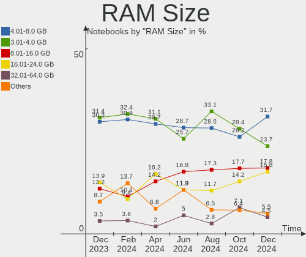
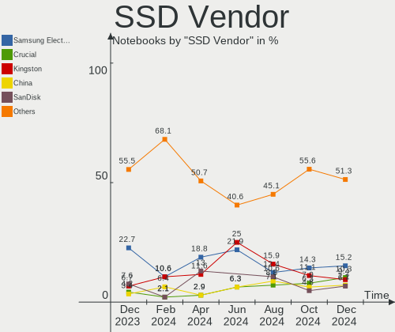
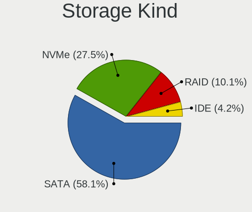
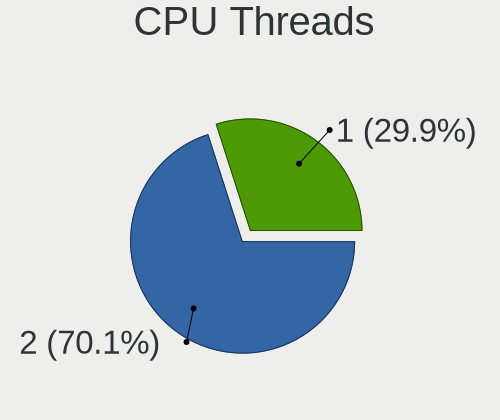
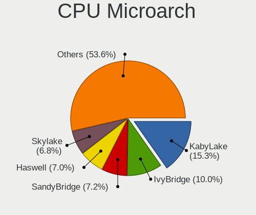
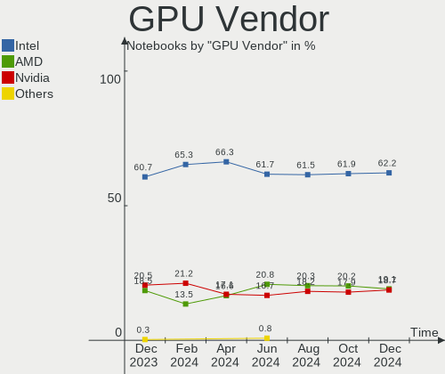
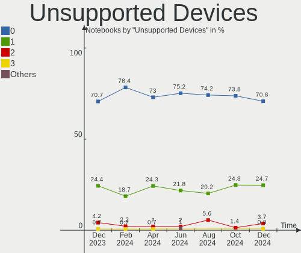

OpenMandriva Hardware Trends (Notebooks)
----------------------------------------

A project to identify most popular hardware characteristics and track their change
over time based on data collected by OpenMandriva users at https://Linux-Hardware.org.

Anyone can contribute to this report by the [hw-probe](https://github.com/linuxhw/hw-probe) tool:

    sudo -E hw-probe -all -upload

This report is for one last month. Overall report since the beginning of time: [TestCoverage](https://github.com/linuxhw/TestCoverage)

Period: Apr, 2022.

Contents
--------

* [ System ](#system)
  - [ OS                       ](#os)
  - [ OS Family                ](#os-family)
  - [ Kernel                   ](#kernel)
  - [ Kernel Family            ](#kernel-family)
  - [ Kernel Major Ver.        ](#kernel-major-ver)
  - [ Arch                     ](#arch)
  - [ DE                       ](#de)
  - [ Display Server           ](#display-server)
  - [ Display Manager          ](#display-manager)
  - [ OS Lang                  ](#os-lang)
  - [ Boot Mode                ](#boot-mode)
  - [ Filesystem               ](#filesystem)
  - [ Part. scheme             ](#part-scheme)
  - [ Dual Boot with Linux/BSD ](#dual-boot-with-linuxbsd)
  - [ Dual Boot (Win)          ](#dual-boot-win)

* [ Board ](#board)
  - [ Vendor                   ](#vendor)
  - [ Model                    ](#model)
  - [ Model Family             ](#model-family)
  - [ MFG Year                 ](#mfg-year)
  - [ Form Factor              ](#form-factor)
  - [ Secure Boot              ](#secure-boot)
  - [ Coreboot                 ](#coreboot)
  - [ RAM Size                 ](#ram-size)
  - [ RAM Used                 ](#ram-used)
  - [ Total Drives             ](#total-drives)
  - [ Has CD-ROM               ](#has-cd-rom)
  - [ Has Ethernet             ](#has-ethernet)
  - [ Has WiFi                 ](#has-wifi)
  - [ Has Bluetooth            ](#has-bluetooth)

* [ Location ](#location)
  - [ Country                  ](#country)
  - [ City                     ](#city)

* [ Drives ](#drives)
  - [ Drive Vendor             ](#drive-vendor)
  - [ Drive Model              ](#drive-model)
  - [ HDD Vendor               ](#hdd-vendor)
  - [ SSD Vendor               ](#ssd-vendor)
  - [ Drive Kind               ](#drive-kind)
  - [ Drive Connector          ](#drive-connector)
  - [ Drive Size               ](#drive-size)
  - [ Space Total              ](#space-total)
  - [ Space Used               ](#space-used)
  - [ Malfunc. Drives          ](#malfunc-drives)
  - [ Malfunc. Drive Vendor    ](#malfunc-drive-vendor)
  - [ Malfunc. HDD Vendor      ](#malfunc-hdd-vendor)
  - [ Malfunc. Drive Kind      ](#malfunc-drive-kind)
  - [ Failed Drives            ](#failed-drives)
  - [ Failed Drive Vendor      ](#failed-drive-vendor)
  - [ Drive Status             ](#drive-status)

* [ Storage controller ](#storage-controller)
  - [ Storage Vendor           ](#storage-vendor)
  - [ Storage Model            ](#storage-model)
  - [ Storage Kind             ](#storage-kind)

* [ Processor ](#processor)
  - [ CPU Vendor               ](#cpu-vendor)
  - [ CPU Model                ](#cpu-model)
  - [ CPU Model Family         ](#cpu-model-family)
  - [ CPU Cores                ](#cpu-cores)
  - [ CPU Sockets              ](#cpu-sockets)
  - [ CPU Threads              ](#cpu-threads)
  - [ CPU Op-Modes             ](#cpu-op-modes)
  - [ CPU Microcode            ](#cpu-microcode)
  - [ CPU Microarch            ](#cpu-microarch)

* [ Graphics ](#graphics)
  - [ GPU Vendor               ](#gpu-vendor)
  - [ GPU Model                ](#gpu-model)
  - [ GPU Combo                ](#gpu-combo)
  - [ GPU Driver               ](#gpu-driver)
  - [ GPU Memory               ](#gpu-memory)

* [ Monitor ](#monitor)
  - [ Monitor Vendor           ](#monitor-vendor)
  - [ Monitor Model            ](#monitor-model)
  - [ Monitor Resolution       ](#monitor-resolution)
  - [ Monitor Diagonal         ](#monitor-diagonal)
  - [ Monitor Width            ](#monitor-width)
  - [ Aspect Ratio             ](#aspect-ratio)
  - [ Monitor Area             ](#monitor-area)
  - [ Pixel Density            ](#pixel-density)
  - [ Multiple Monitors        ](#multiple-monitors)

* [ Network ](#network)
  - [ Net Controller Vendor    ](#net-controller-vendor)
  - [ Net Controller Model     ](#net-controller-model)
  - [ Wireless Vendor          ](#wireless-vendor)
  - [ Wireless Model           ](#wireless-model)
  - [ Ethernet Vendor          ](#ethernet-vendor)
  - [ Ethernet Model           ](#ethernet-model)
  - [ Net Controller Kind      ](#net-controller-kind)
  - [ Used Controller          ](#used-controller)
  - [ NICs                     ](#nics)
  - [ IPv6                     ](#ipv6)

* [ Bluetooth ](#bluetooth)
  - [ Bluetooth Vendor         ](#bluetooth-vendor)
  - [ Bluetooth Model          ](#bluetooth-model)

* [ Sound ](#sound)
  - [ Sound Vendor             ](#sound-vendor)
  - [ Sound Model              ](#sound-model)

* [ Memory ](#memory)
  - [ Memory Vendor            ](#memory-vendor)
  - [ Memory Model             ](#memory-model)
  - [ Memory Kind              ](#memory-kind)
  - [ Memory Form Factor       ](#memory-form-factor)
  - [ Memory Size              ](#memory-size)
  - [ Memory Speed             ](#memory-speed)

* [ Printers & scanners ](#printers--scanners)
  - [ Printer Vendor           ](#printer-vendor)
  - [ Printer Model            ](#printer-model)
  - [ Scanner Vendor           ](#scanner-vendor)
  - [ Scanner Model            ](#scanner-model)

* [ Camera ](#camera)
  - [ Camera Vendor            ](#camera-vendor)
  - [ Camera Model             ](#camera-model)

* [ Security ](#security)
  - [ Fingerprint Vendor       ](#fingerprint-vendor)
  - [ Fingerprint Model        ](#fingerprint-model)
  - [ Chipcard Vendor          ](#chipcard-vendor)
  - [ Chipcard Model           ](#chipcard-model)

* [ Unsupported ](#unsupported)
  - [ Unsupported Devices      ](#unsupported-devices)
  - [ Unsupported Device Types ](#unsupported-device-types)

System
------

OS
--

Installed operating systems

| Name              | Notebooks | Percent |
|-------------------|-----------|---------|
| OpenMandriva 4.3  | 146       | 87.43%  |
| OpenMandriva 4.2  | 15        | 8.98%   |
| OpenMandriva 4.50 | 6         | 3.59%   |

OS Family
---------

OS without a version

| Name         | Notebooks | Percent |
|--------------|-----------|---------|
| OpenMandriva | 167       | 100%    |

Kernel
------

Version of the Linux kernel

| Version                  | Notebooks | Percent |
|--------------------------|-----------|---------|
| 5.16.7-desktop-1omv4003  | 139       | 83.23%  |
| 5.10.14-desktop-1omv4002 | 14        | 8.38%   |
| 5.16.13-desktop-1omv4003 | 7         | 4.19%   |
| 5.14.7-desktop-1omv4050  | 6         | 3.59%   |
| 5.11.12-desktop-1omv4002 | 1         | 0.6%    |

Kernel Family
-------------

Linux kernel without a distro release

| Version | Notebooks | Percent |
|---------|-----------|---------|
| 5.16.7  | 139       | 83.23%  |
| 5.10.14 | 14        | 8.38%   |
| 5.16.13 | 7         | 4.19%   |
| 5.14.7  | 6         | 3.59%   |
| 5.11.12 | 1         | 0.6%    |

Kernel Major Ver.
-----------------

Linux kernel major version

| Version | Notebooks | Percent |
|---------|-----------|---------|
| 5.16    | 146       | 87.43%  |
| 5.10    | 14        | 8.38%   |
| 5.14    | 6         | 3.59%   |
| 5.11    | 1         | 0.6%    |

Arch
----

OS architecture (x86_64, i586, etc.)

| Name   | Notebooks | Percent |
|--------|-----------|---------|
| x86_64 | 167       | 100%    |

DE
--

Desktop Environment

| Name | Notebooks | Percent |
|------|-----------|---------|
| KDE5 | 167       | 100%    |

Display Server
--------------

X11 or Wayland

| Name    | Notebooks | Percent |
|---------|-----------|---------|
| X11     | 166       | 99.4%   |
| Wayland | 1         | 0.6%    |

Display Manager
---------------

SDDM, LightDM, etc.

| Name | Notebooks | Percent |
|------|-----------|---------|
| SDDM | 167       | 100%    |

OS Lang
-------

Language

| Lang  | Notebooks | Percent |
|-------|-----------|---------|
| en_US | 86        | 51.5%   |
| de_DE | 14        | 8.38%   |
| pt_BR | 10        | 5.99%   |
| it_IT | 8         | 4.79%   |
| fr_FR | 7         | 4.19%   |
| cs_CZ | 7         | 4.19%   |
| pl_PL | 6         | 3.59%   |
| en_GB | 5         | 2.99%   |
| es_MX | 3         | 1.8%    |
| es_ES | 3         | 1.8%    |
| ru_RU | 2         | 1.2%    |
| hu_HU | 2         | 1.2%    |
| es_CL | 2         | 1.2%    |
| es_AR | 2         | 1.2%    |
| en_IN | 2         | 1.2%    |
| de_AT | 2         | 1.2%    |
| tr_TR | 1         | 0.6%    |
| nl_BE | 1         | 0.6%    |
| es_UY | 1         | 0.6%    |
| en_ZW | 1         | 0.6%    |
| en_AU | 1         | 0.6%    |
| de_CH | 1         | 0.6%    |

Boot Mode
---------

EFI or BIOS

| Mode | Notebooks | Percent |
|------|-----------|---------|
| EFI  | 87        | 52.1%   |
| BIOS | 80        | 47.9%   |

Filesystem
----------

Type of filesystem

| Type    | Notebooks | Percent |
|---------|-----------|---------|
| Overlay | 132       | 79.04%  |
| Ext4    | 35        | 20.96%  |

Part. scheme
------------

Scheme of partitioning

| Type | Notebooks | Percent |
|------|-----------|---------|
| GPT  | 108       | 64.67%  |
| MBR  | 59        | 35.33%  |

Dual Boot with Linux/BSD
------------------------

Hosting more than one Linux/BSD

| Dual boot | Notebooks | Percent |
|-----------|-----------|---------|
| No        | 97        | 58.08%  |
| Yes       | 70        | 41.92%  |

Dual Boot (Win)
---------------

Hosting Linux and Windows

| Dual boot | Notebooks | Percent |
|-----------|-----------|---------|
| No        | 87        | 52.1%   |
| Yes       | 80        | 47.9%   |

Board
-----

Vendor
------

Motherboard manufacturer

| Name                  | Notebooks | Percent |
|-----------------------|-----------|---------|
| Hewlett-Packard       | 32        | 19.16%  |
| Dell                  | 25        | 14.97%  |
| Lenovo                | 22        | 13.17%  |
| ASUSTek Computer      | 22        | 13.17%  |
| Acer                  | 18        | 10.78%  |
| Toshiba               | 8         | 4.79%   |
| Apple                 | 7         | 4.19%   |
| Samsung Electronics   | 5         | 2.99%   |
| Sony                  | 4         | 2.4%    |
| Positivo              | 4         | 2.4%    |
| Fujitsu               | 4         | 2.4%    |
| Philco                | 3         | 1.8%    |
| TUXEDO                | 1         | 0.6%    |
| Positivo Bahia - VAIO | 1         | 0.6%    |
| PC Specialist         | 1         | 0.6%    |
| Packard Bell          | 1         | 0.6%    |
| Notebook              | 1         | 0.6%    |
| MSI                   | 1         | 0.6%    |
| Medion                | 1         | 0.6%    |
| Intel                 | 1         | 0.6%    |
| HUAWEI                | 1         | 0.6%    |
| Gigabyte Technology   | 1         | 0.6%    |
| Chuwi                 | 1         | 0.6%    |
| AWOW                  | 1         | 0.6%    |
| ARKA                  | 1         | 0.6%    |

Model
-----

Motherboard model

| Name                                     | Notebooks | Percent |
|------------------------------------------|-----------|---------|
| ASUS UX31E                               | 6         | 3.59%   |
| Acer Aspire R3-131T                      | 3         | 1.8%    |
| Unknown                                  | 3         | 1.8%    |
| Positivo S14SL01                         | 2         | 1.2%    |
| Lenovo ThinkPad X220 42875TU             | 2         | 1.2%    |
| HP Pavilion Laptop 15-eh0xxx             | 2         | 1.2%    |
| HP Pavilion dv6                          | 2         | 1.2%    |
| HP 255 G7 Notebook PC                    | 2         | 1.2%    |
| Dell Latitude E4310                      | 2         | 1.2%    |
| Dell Latitude 3310                       | 2         | 1.2%    |
| ASUS VivoBook_ASUSLaptop X515EA_X515EA   | 2         | 1.2%    |
| Apple MacBookPro9,2                      | 2         | 1.2%    |
| Apple MacBookAir4,2                      | 2         | 1.2%    |
| TUXEDO Book BM15 Gen10                   | 1         | 0.6%    |
| Toshiba TECRA A10                        | 1         | 0.6%    |
| Toshiba Satellite S855D                  | 1         | 0.6%    |
| Toshiba Satellite Pro C660               | 1         | 0.6%    |
| Toshiba Satellite P200                   | 1         | 0.6%    |
| Toshiba Satellite C850-A786              | 1         | 0.6%    |
| Toshiba Satellite A350D                  | 1         | 0.6%    |
| Toshiba dynabook Satellite B552/G        | 1         | 0.6%    |
| Toshiba dynabook R73/BN                  | 1         | 0.6%    |
| Sony VPCEE23FX                           | 1         | 0.6%    |
| Sony VGN-FZ31M                           | 1         | 0.6%    |
| Sony VGN-FZ11M                           | 1         | 0.6%    |
| Sony SVE1713A1EW                         | 1         | 0.6%    |
| Samsung RC530/RC730                      | 1         | 0.6%    |
| Samsung RC410/RC510/RC710                | 1         | 0.6%    |
| Samsung 750XDA                           | 1         | 0.6%    |
| Samsung 700T                             | 1         | 0.6%    |
| Samsung 340XAA/350XAA/550XAA             | 1         | 0.6%    |
| Positivo NB50TH                          | 1         | 0.6%    |
| Positivo Mobile                          | 1         | 0.6%    |
| Positivo Bahia - VAIO VJFE41F11X-XXXXXX  | 1         | 0.6%    |
| Philco 14I                               | 1         | 0.6%    |
| Philco 14H                               | 1         | 0.6%    |
| PC Specialist NJ50_70CU                  | 1         | 0.6%    |
| Packard Bell EasyNote TJ71               | 1         | 0.6%    |
| Notebook W130SV                          | 1         | 0.6%    |
| MSI GE62 6QD                             | 1         | 0.6%    |
| Medion S17402 MD63000                    | 1         | 0.6%    |
| Lenovo Z50-70 20354                      | 1         | 0.6%    |
| Lenovo Yoga Slim 7 14ARE05 82A2          | 1         | 0.6%    |
| Lenovo V145-15AST 81MT                   | 1         | 0.6%    |
| Lenovo ThinkPad X61 7675LG2              | 1         | 0.6%    |
| Lenovo ThinkPad X100e 0022CTO            | 1         | 0.6%    |
| Lenovo ThinkPad X1 Carbon 4th 20FB003RGE | 1         | 0.6%    |
| Lenovo ThinkPad W520 4284BL9             | 1         | 0.6%    |
| Lenovo ThinkPad Helix 36986CG            | 1         | 0.6%    |
| Lenovo ThinkPad E460 20ET000YLM          | 1         | 0.6%    |
| Lenovo ThinkBook 15 G3 ACL 21A4          | 1         | 0.6%    |
| Lenovo IdeaPad Y700-17ISK 80Q0           | 1         | 0.6%    |
| Lenovo IdeaPad Y500 20193                | 1         | 0.6%    |
| Lenovo IdeaPad S510p 20298               | 1         | 0.6%    |
| Lenovo IdeaPad 510-15IKB 80SV            | 1         | 0.6%    |
| Lenovo IdeaPad 330-15IKB 81FE            | 1         | 0.6%    |
| Lenovo IdeaPad 320-14IKB 80YF            | 1         | 0.6%    |
| Lenovo IdeaPad 3 17IIL05 81WF            | 1         | 0.6%    |
| Lenovo IdeaPad 3 15ALC6 82MF             | 1         | 0.6%    |
| Lenovo G405 20239                        | 1         | 0.6%    |

Model Family
------------

Motherboard model prefix

| Name                                    | Notebooks | Percent |
|-----------------------------------------|-----------|---------|
| Dell Latitude                           | 14        | 8.38%   |
| Acer Aspire                             | 14        | 8.38%   |
| HP Pavilion                             | 9         | 5.39%   |
| Lenovo ThinkPad                         | 8         | 4.79%   |
| Lenovo IdeaPad                          | 8         | 4.79%   |
| HP Laptop                               | 7         | 4.19%   |
| Dell Inspiron                           | 7         | 4.19%   |
| ASUS UX31E                              | 6         | 3.59%   |
| Toshiba Satellite                       | 5         | 2.99%   |
| HP ProBook                              | 5         | 2.99%   |
| ASUS VivoBook                           | 4         | 2.4%    |
| Fujitsu LIFEBOOK                        | 3         | 1.8%    |
| Unknown                                 | 3         | 1.8%    |
| Toshiba dynabook                        | 2         | 1.2%    |
| Positivo S14SL01                        | 2         | 1.2%    |
| HP 255                                  | 2         | 1.2%    |
| Dell Precision                          | 2         | 1.2%    |
| Apple MacBookPro9                       | 2         | 1.2%    |
| Apple MacBookAir4                       | 2         | 1.2%    |
| Acer Nitro                              | 2         | 1.2%    |
| Acer Extensa                            | 2         | 1.2%    |
| TUXEDO Book                             | 1         | 0.6%    |
| Toshiba TECRA                           | 1         | 0.6%    |
| Sony VPCEE23FX                          | 1         | 0.6%    |
| Sony VGN-FZ31M                          | 1         | 0.6%    |
| Sony VGN-FZ11M                          | 1         | 0.6%    |
| Sony SVE1713A1EW                        | 1         | 0.6%    |
| Samsung RC530                           | 1         | 0.6%    |
| Samsung RC410                           | 1         | 0.6%    |
| Samsung 750XDA                          | 1         | 0.6%    |
| Samsung 700T                            | 1         | 0.6%    |
| Samsung 340XAA                          | 1         | 0.6%    |
| Positivo NB50TH                         | 1         | 0.6%    |
| Positivo Mobile                         | 1         | 0.6%    |
| Positivo Bahia - VAIO VJFE41F11X-XXXXXX | 1         | 0.6%    |
| Philco 14I                              | 1         | 0.6%    |
| Philco 14H                              | 1         | 0.6%    |
| PC Specialist NJ50                      | 1         | 0.6%    |
| Packard Bell EasyNote                   | 1         | 0.6%    |
| Notebook W130SV                         | 1         | 0.6%    |
| MSI GE62                                | 1         | 0.6%    |
| Medion S17402                           | 1         | 0.6%    |
| Lenovo Z50-70                           | 1         | 0.6%    |
| Lenovo Yoga                             | 1         | 0.6%    |
| Lenovo V145-15AST                       | 1         | 0.6%    |
| Lenovo ThinkBook                        | 1         | 0.6%    |
| Lenovo G405                             | 1         | 0.6%    |
| Lenovo 3000                             | 1         | 0.6%    |
| HUAWEI NBM-WXX9                         | 1         | 0.6%    |
| HP ZBook                                | 1         | 0.6%    |
| HP Presario                             | 1         | 0.6%    |
| HP Notebook                             | 1         | 0.6%    |
| HP Elite                                | 1         | 0.6%    |
| HP Compaq                               | 1         | 0.6%    |
| HP 650                                  | 1         | 0.6%    |
| HP 2000                                 | 1         | 0.6%    |
| HP 15                                   | 1         | 0.6%    |
| Gigabyte G5                             | 1         | 0.6%    |
| Fujitsu FMVA06004                       | 1         | 0.6%    |
| Dell XPS                                | 1         | 0.6%    |

MFG Year
--------

Motherboard manufacture year

| Year    | Notebooks | Percent |
|---------|-----------|---------|
| 2011    | 19        | 11.38%  |
| 2012    | 18        | 10.78%  |
| 2019    | 13        | 7.78%   |
| 2021    | 12        | 7.19%   |
| 2020    | 12        | 7.19%   |
| 2018    | 11        | 6.59%   |
| 2017    | 11        | 6.59%   |
| 2016    | 11        | 6.59%   |
| 2013    | 11        | 6.59%   |
| 2015    | 10        | 5.99%   |
| 2008    | 10        | 5.99%   |
| 2014    | 8         | 4.79%   |
| 2010    | 8         | 4.79%   |
| 2009    | 6         | 3.59%   |
| 2007    | 6         | 3.59%   |
| Unknown | 1         | 0.6%    |

Form Factor
-----------

Physical design of the computer

| Name     | Notebooks | Percent |
|----------|-----------|---------|
| Notebook | 167       | 100%    |

Secure Boot
-----------

Enabled or disabled

| State    | Notebooks | Percent |
|----------|-----------|---------|
| Disabled | 167       | 100%    |

Coreboot
--------

Have coreboot on board

| Used | Notebooks | Percent |
|------|-----------|---------|
| No   | 167       | 100%    |

RAM Size
--------

Total RAM memory

| Size in GB | Notebooks | Percent |
|------------|-----------|---------|
| 3.01-4.0   | 61        | 36.53%  |
| 4.01-8.0   | 54        | 32.34%  |
| 8.01-16.0  | 23        | 13.77%  |
| 16.01-24.0 | 19        | 11.38%  |
| 1.01-2.0   | 7         | 4.19%   |
| 2.01-3.0   | 2         | 1.2%    |
| 32.01-64.0 | 1         | 0.6%    |

RAM Used
--------

Used RAM memory

| Used GB  | Notebooks | Percent |
|----------|-----------|---------|
| 1.01-2.0 | 136       | 81.44%  |
| 0.51-1.0 | 18        | 10.78%  |
| 2.01-3.0 | 9         | 5.39%   |
| 0.01-0.5 | 2         | 1.2%    |
| 4.01-8.0 | 1         | 0.6%    |
| 3.01-4.0 | 1         | 0.6%    |

Total Drives
------------

Number of drives on board

| Drives | Notebooks | Percent |
|--------|-----------|---------|
| 1      | 134       | 80.24%  |
| 2      | 28        | 16.77%  |
| 0      | 3         | 1.8%    |
| 3      | 2         | 1.2%    |

Has CD-ROM
----------

Has CD-ROM on board

| Presented | Notebooks | Percent |
|-----------|-----------|---------|
| No        | 95        | 56.89%  |
| Yes       | 72        | 43.11%  |

Has Ethernet
------------

Has Ethernet on board

| Presented | Notebooks | Percent |
|-----------|-----------|---------|
| Yes       | 145       | 86.83%  |
| No        | 22        | 13.17%  |

Has WiFi
--------

Has WiFi module

| Presented | Notebooks | Percent |
|-----------|-----------|---------|
| Yes       | 166       | 99.4%   |
| No        | 1         | 0.6%    |

Has Bluetooth
-------------

Has Bluetooth module

| Presented | Notebooks | Percent |
|-----------|-----------|---------|
| Yes       | 127       | 76.05%  |
| No        | 40        | 23.95%  |

Location
--------

Country
-------

Geographic location (country)

| Country        | Notebooks | Percent |
|----------------|-----------|---------|
| Germany        | 19        | 11.38%  |
| Brazil         | 16        | 9.58%   |
| USA            | 14        | 8.38%   |
| Italy          | 14        | 8.38%   |
| Netherlands    | 8         | 4.79%   |
| France         | 8         | 4.79%   |
| Czechia        | 8         | 4.79%   |
| Russia         | 7         | 4.19%   |
| Poland         | 7         | 4.19%   |
| UK             | 6         | 3.59%   |
| Mexico         | 6         | 3.59%   |
| Spain          | 5         | 2.99%   |
| Slovakia       | 3         | 1.8%    |
| Romania        | 3         | 1.8%    |
| India          | 3         | 1.8%    |
| Hungary        | 3         | 1.8%    |
| Chile          | 3         | 1.8%    |
| Canada         | 3         | 1.8%    |
| Bulgaria       | 3         | 1.8%    |
| Australia      | 3         | 1.8%    |
| Switzerland    | 2         | 1.2%    |
| Philippines    | 2         | 1.2%    |
| Argentina      | 2         | 1.2%    |
| Zimbabwe       | 1         | 0.6%    |
| Vietnam        | 1         | 0.6%    |
| Venezuela      | 1         | 0.6%    |
| Uruguay        | 1         | 0.6%    |
| Turkey         | 1         | 0.6%    |
| Sweden         | 1         | 0.6%    |
| Serbia         | 1         | 0.6%    |
| New Zealand    | 1         | 0.6%    |
| Kazakhstan     | 1         | 0.6%    |
| Jordan         | 1         | 0.6%    |
| Japan          | 1         | 0.6%    |
| Iran           | 1         | 0.6%    |
| Indonesia      | 1         | 0.6%    |
| Egypt          | 1         | 0.6%    |
| Croatia        | 1         | 0.6%    |
| Congo Republic | 1         | 0.6%    |
| Colombia       | 1         | 0.6%    |
| China          | 1         | 0.6%    |
| Belgium        | 1         | 0.6%    |

City
----

Geographic location (city)

| City                   | Notebooks | Percent |
|------------------------|-----------|---------|
| Prague                 | 6         | 3.59%   |
| Schagen                | 4         | 2.4%    |
| Milan                  | 4         | 2.4%    |
| Schijndel              | 3         | 1.8%    |
| Sao Paulo              | 3         | 1.8%    |
| Inman                  | 3         | 1.8%    |
| Sydney                 | 2         | 1.2%    |
| Senigallia             | 2         | 1.2%    |
| Rio de Janeiro         | 2         | 1.2%    |
| Moscow                 | 2         | 1.2%    |
| Leipzig                | 2         | 1.2%    |
| Ilkley                 | 2         | 1.2%    |
| Foggia                 | 2         | 1.2%    |
| Bratislava             | 2         | 1.2%    |
| Albano Laziale         | 2         | 1.2%    |
| Zhukovskiy             | 1         | 0.6%    |
| Yekaterinburg          | 1         | 0.6%    |
| Yaroslavl              | 1         | 0.6%    |
| Yambol                 | 1         | 0.6%    |
| Wroclaw                | 1         | 0.6%    |
| Worcester              | 1         | 0.6%    |
| Werder                 | 1         | 0.6%    |
| Wembley                | 1         | 0.6%    |
| Wegberg                | 1         | 0.6%    |
| Warsaw                 | 1         | 0.6%    |
| Wamel                  | 1         | 0.6%    |
| Villeurbanne           | 1         | 0.6%    |
| Villa Nueva            | 1         | 0.6%    |
| Vieux-Boucau-les-Bains | 1         | 0.6%    |
| Totteridge             | 1         | 0.6%    |
| Teófilo Otoni         | 1         | 0.6%    |
| Tehran                 | 1         | 0.6%    |
| Târgu Mureş          | 1         | 0.6%    |
| Talcahuano             | 1         | 0.6%    |
| Tain                   | 1         | 0.6%    |
| Szombathely            | 1         | 0.6%    |
| Szolnok                | 1         | 0.6%    |
| Stuttgart              | 1         | 0.6%    |
| Spinetoli              | 1         | 0.6%    |
| Sofia                  | 1         | 0.6%    |
| Signal Mountain        | 1         | 0.6%    |
| Shefford               | 1         | 0.6%    |
| Santeramo in Colle     | 1         | 0.6%    |
| San Miguel             | 1         | 0.6%    |
| San Luis               | 1         | 0.6%    |
| Saint-Denis            | 1         | 0.6%    |
| Šahy                  | 1         | 0.6%    |
| Reynosa                | 1         | 0.6%    |
| Regina                 | 1         | 0.6%    |
| Quissama               | 1         | 0.6%    |
| Quezon City            | 1         | 0.6%    |
| Québec                | 1         | 0.6%    |
| Pune                   | 1         | 0.6%    |
| Porto Alegre           | 1         | 0.6%    |
| Portland               | 1         | 0.6%    |
| Port Orange            | 1         | 0.6%    |
| Piteşti               | 1         | 0.6%    |
| Piatra Neamţ          | 1         | 0.6%    |
| Perpignan              | 1         | 0.6%    |
| Paysandú              | 1         | 0.6%    |

Drives
------

Drive Vendor
------------

Hard drive vendors

| Vendor              | Notebooks | Drives | Percent |
|---------------------|-----------|--------|---------|
| Seagate             | 29        | 29     | 15.34%  |
| WDC                 | 24        | 24     | 12.7%   |
| Toshiba             | 22        | 22     | 11.64%  |
| Samsung Electronics | 17        | 18     | 8.99%   |
| Kingston            | 13        | 13     | 6.88%   |
| SanDisk             | 8         | 8      | 4.23%   |
| Intel               | 8         | 8      | 4.23%   |
| Hitachi             | 7         | 7      | 3.7%    |
| HGST                | 7         | 7      | 3.7%    |
| Micron Technology   | 6         | 6      | 3.17%   |
| SK Hynix            | 5         | 5      | 2.65%   |
| Unknown             | 4         | 4      | 2.12%   |
| A-DATA Technology   | 4         | 4      | 2.12%   |
| Fujitsu             | 3         | 3      | 1.59%   |
| Crucial             | 3         | 3      | 1.59%   |
| Apple               | 3         | 3      | 1.59%   |
| XrayDisk            | 2         | 2      | 1.06%   |
| SPCC                | 2         | 2      | 1.06%   |
| Phison              | 2         | 2      | 1.06%   |
| ASMT                | 2         | 2      | 1.06%   |
| Wdxsky              | 1         | 1      | 0.53%   |
| Transcend           | 1         | 1      | 0.53%   |
| T-FORCE             | 1         | 1      | 0.53%   |
| SUNTRSI             | 1         | 1      | 0.53%   |
| SSSTC               | 1         | 1      | 0.53%   |
| Silicon Motion      | 1         | 1      | 0.53%   |
| SABRENT             | 1         | 1      | 0.53%   |
| PNY                 | 1         | 1      | 0.53%   |
| LITEON              | 1         | 1      | 0.53%   |
| Lexar               | 1         | 1      | 0.53%   |
| KLEVV               | 1         | 1      | 0.53%   |
| KIOXIA              | 1         | 1      | 0.53%   |
| KingSpec            | 1         | 1      | 0.53%   |
| INDMEM              | 1         | 1      | 0.53%   |
| Drevo               | 1         | 1      | 0.53%   |
| DOGFISH             | 1         | 1      | 0.53%   |
| China               | 1         | 1      | 0.53%   |
| Unknown             | 1         | 1      | 0.53%   |

Drive Model
-----------

Hard drive models

| Model                                    | Notebooks | Percent |
|------------------------------------------|-----------|---------|
| SanDisk SSD U100 256GB                   | 6         | 3.16%   |
| Seagate ST1000LM035-1RK172 1TB           | 4         | 2.11%   |
| Seagate ST1000LM024 HN-M101MBB 1TB       | 4         | 2.11%   |
| Toshiba MQ04ABF100 1TB                   | 3         | 1.58%   |
| Toshiba MQ01ABF050 500GB                 | 3         | 1.58%   |
| Toshiba MQ01ABD100 1TB                   | 3         | 1.58%   |
| Seagate ST500LT012-1DG142 500GB          | 3         | 1.58%   |
| WDC WD10SPZX-22Z10T0 1TB                 | 2         | 1.05%   |
| Toshiba MQ01ABF032 320GB                 | 2         | 1.05%   |
| Toshiba MK1246GSX 120GB                  | 2         | 1.05%   |
| SK Hynix HBG4e  32GB                     | 2         | 1.05%   |
| Seagate ST9250410AS 250GB                | 2         | 1.05%   |
| Seagate ST9250315AS 250GB                | 2         | 1.05%   |
| Samsung SSD 860 EVO 500GB                | 2         | 1.05%   |
| Samsung HM321HI 320GB                    | 2         | 1.05%   |
| Micron MTFDDAV256TDL-1AW1ZABHA 256GB SSD | 2         | 1.05%   |
| Kingston SNVS500G 500GB                  | 2         | 1.05%   |
| Kingston SA400S37480G 480GB SSD          | 2         | 1.05%   |
| Kingston SA400S37240G 240GB SSD          | 2         | 1.05%   |
| Intel SSDPEKNU512GZ 512GB                | 2         | 1.05%   |
| Hitachi HTS547575A9E384 752GB            | 2         | 1.05%   |
| HGST HTS721010A9E630 1TB                 | 2         | 1.05%   |
| HGST HTS545050A7E380 500GB               | 2         | 1.05%   |
| ASMT 2115 1TB                            | 2         | 1.05%   |
| XrayDisk SSD 256GB                       | 1         | 0.53%   |
| XrayDisk SSD 240GB                       | 1         | 0.53%   |
| Wdxsky M720k/128 128GB SSD               | 1         | 0.53%   |
| WDC WDS250G2B0A-00SM50 250GB SSD         | 1         | 0.53%   |
| WDC WDS250G1B0B-00AS40 250GB SSD         | 1         | 0.53%   |
| WDC WDS240G2G0A-00JH30 240GB SSD         | 1         | 0.53%   |
| WDC WD5000LPVX-22V0TT0 500GB             | 1         | 0.53%   |
| WDC WD5000LPVX-00V0TT0 500GB             | 1         | 0.53%   |
| WDC WD5000LPCX-24VHAT0 500GB             | 1         | 0.53%   |
| WDC WD5000BEVT-22A0RT0 500GB             | 1         | 0.53%   |
| WDC WD5000BEKT-75KA9T0 500GB             | 1         | 0.53%   |
| WDC WD3200LPLX-75ZNTT0 320GB             | 1         | 0.53%   |
| WDC WD3200BUDT-63DPZY0 320GB             | 1         | 0.53%   |
| WDC WD3200BEVT-11ZCT0 320GB              | 1         | 0.53%   |
| WDC WD20SPZX-21UA7T0 2TB                 | 1         | 0.53%   |
| WDC WD1600BEVT-75ZCT2 160GB              | 1         | 0.53%   |
| WDC WD1600BEVT-22ZCT0 160GB              | 1         | 0.53%   |
| WDC WD1600BEVS-60RST0 160GB              | 1         | 0.53%   |
| WDC WD1600BEVS-08VAT2 160GB              | 1         | 0.53%   |
| WDC WD1600BEKT-00F3T0 160GB              | 1         | 0.53%   |
| WDC WD10SPZX-24Z10 1TB                   | 1         | 0.53%   |
| WDC WD10JPVX-60JC3T0 1TB                 | 1         | 0.53%   |
| WDC PC SN530 SDBPNPZ-512G-1027 512GB     | 1         | 0.53%   |
| WDC PC SN530 SDBPNPZ-256G-1002 256GB     | 1         | 0.53%   |
| WDC PC SN520 SDAPNUW-512G-1014 512GB     | 1         | 0.53%   |
| Unknown SD64G  64GB                      | 1         | 0.53%   |
| Unknown SD32G  32GB                      | 1         | 0.53%   |
| Unknown ISOCOM  64GB                     | 1         | 0.53%   |
| Unknown ASTC  16GB                       | 1         | 0.53%   |
| Transcend TS128GSSD230S 128GB            | 1         | 0.53%   |
| Toshiba TR200 240GB SSD                  | 1         | 0.53%   |
| Toshiba THNSNF256GMCS 256GB SSD          | 1         | 0.53%   |
| Toshiba MK6476GSX 640GB                  | 1         | 0.53%   |
| Toshiba MK3259GSXP 320GB                 | 1         | 0.53%   |
| Toshiba MK3256GSY 320GB                  | 1         | 0.53%   |
| Toshiba MK2555GSX 250GB                  | 1         | 0.53%   |

HDD Vendor
----------

Hard disk drive vendors

| Vendor              | Notebooks | Drives | Percent |
|---------------------|-----------|--------|---------|
| Seagate             | 28        | 28     | 32.18%  |
| Toshiba             | 19        | 19     | 21.84%  |
| WDC                 | 18        | 18     | 20.69%  |
| Hitachi             | 7         | 7      | 8.05%   |
| HGST                | 7         | 7      | 8.05%   |
| Fujitsu             | 3         | 3      | 3.45%   |
| Samsung Electronics | 2         | 2      | 2.3%    |
| ASMT                | 2         | 2      | 2.3%    |
| SABRENT             | 1         | 1      | 1.15%   |

SSD Vendor
----------

Solid state drive vendors

| Vendor              | Notebooks | Drives | Percent |
|---------------------|-----------|--------|---------|
| Samsung Electronics | 11        | 11     | 15.49%  |
| Kingston            | 9         | 9      | 12.68%  |
| SanDisk             | 8         | 8      | 11.27%  |
| Micron Technology   | 6         | 6      | 8.45%   |
| A-DATA Technology   | 4         | 4      | 5.63%   |
| WDC                 | 3         | 3      | 4.23%   |
| Intel               | 3         | 3      | 4.23%   |
| Crucial             | 3         | 3      | 4.23%   |
| Apple               | 3         | 3      | 4.23%   |
| XrayDisk            | 2         | 2      | 2.82%   |
| Toshiba             | 2         | 2      | 2.82%   |
| SPCC                | 2         | 2      | 2.82%   |
| SK Hynix            | 2         | 2      | 2.82%   |
| Wdxsky              | 1         | 1      | 1.41%   |
| Transcend           | 1         | 1      | 1.41%   |
| T-FORCE             | 1         | 1      | 1.41%   |
| SUNTRSI             | 1         | 1      | 1.41%   |
| Seagate             | 1         | 1      | 1.41%   |
| PNY                 | 1         | 1      | 1.41%   |
| Lexar               | 1         | 1      | 1.41%   |
| KLEVV               | 1         | 1      | 1.41%   |
| KingSpec            | 1         | 1      | 1.41%   |
| Drevo               | 1         | 1      | 1.41%   |
| DOGFISH             | 1         | 1      | 1.41%   |
| China               | 1         | 1      | 1.41%   |
| Unknown             | 1         | 1      | 1.41%   |

Drive Kind
----------

HDD or SSD

| Kind    | Notebooks | Drives | Percent |
|---------|-----------|--------|---------|
| HDD     | 84        | 87     | 45.65%  |
| SSD     | 69        | 71     | 37.5%   |
| NVMe    | 24        | 25     | 13.04%  |
| MMC     | 6         | 6      | 3.26%   |
| Unknown | 1         | 1      | 0.54%   |

Drive Connector
---------------

SATA, SAS, NVMe, etc.

| Type | Notebooks | Drives | Percent |
|------|-----------|--------|---------|
| SATA | 141       | 155    | 80.57%  |
| NVMe | 24        | 25     | 13.71%  |
| MMC  | 6         | 6      | 3.43%   |
| SAS  | 4         | 4      | 2.29%   |

Drive Size
----------

Size of hard drive

| Size in TB | Notebooks | Drives | Percent |
|------------|-----------|--------|---------|
| 0.01-0.5   | 107       | 112    | 70.86%  |
| 0.51-1.0   | 40        | 42     | 26.49%  |
| 1.01-2.0   | 4         | 4      | 2.65%   |

Space Total
-----------

Amount of disk space available on the file system

| Size in GB | Notebooks | Percent |
|------------|-----------|---------|
| 1-20       | 95        | 56.89%  |
| 101-250    | 28        | 16.77%  |
| 251-500    | 21        | 12.57%  |
| 21-50      | 7         | 4.19%   |
| Unknown    | 6         | 3.59%   |
| 501-1000   | 5         | 2.99%   |
| 51-100     | 4         | 2.4%    |
| 1001-2000  | 1         | 0.6%    |

Space Used
----------

Amount of used disk space

| Used GB | Notebooks | Percent |
|---------|-----------|---------|
| 1-20    | 149       | 89.22%  |
| 51-100  | 7         | 4.19%   |
| Unknown | 6         | 3.59%   |
| 21-50   | 2         | 1.2%    |
| 101-250 | 2         | 1.2%    |
| 251-500 | 1         | 0.6%    |

Malfunc. Drives
---------------

Drive models with a malfunction

| Model                                               | Notebooks | Drives | Percent |
|-----------------------------------------------------|-----------|--------|---------|
| SanDisk SSD U100 256GB                              | 6         | 6      | 11.54%  |
| Seagate ST1000LM035-1RK172 1TB                      | 3         | 3      | 5.77%   |
| Toshiba MK1246GSX 120GB                             | 2         | 2      | 3.85%   |
| Micron Technology MTFDDAV256TDL-1AW1ZABHA 256GB SSD | 2         | 2      | 3.85%   |
| Hitachi HTS547575A9E384 752GB                       | 2         | 2      | 3.85%   |
| HGST HTS545050A7E380 500GB                          | 2         | 2      | 3.85%   |
| WDC WD5000LPVX-22V0TT0 500GB                        | 1         | 1      | 1.92%   |
| WDC WD5000BEKT-75KA9T0 500GB                        | 1         | 1      | 1.92%   |
| WDC WD3200BUDT-63DPZY0 320GB                        | 1         | 1      | 1.92%   |
| WDC WD1600BEVS-60RST0 160GB                         | 1         | 1      | 1.92%   |
| Toshiba MQ04ABF100 1TB                              | 1         | 1      | 1.92%   |
| Toshiba MQ01ABF050 500GB                            | 1         | 1      | 1.92%   |
| Toshiba MQ01ABF032 320GB                            | 1         | 1      | 1.92%   |
| Toshiba MQ01ABD100 1TB                              | 1         | 1      | 1.92%   |
| Toshiba MK6476GSX 640GB                             | 1         | 1      | 1.92%   |
| Toshiba MK3259GSXP 320GB                            | 1         | 1      | 1.92%   |
| Toshiba MK3256GSY 320GB                             | 1         | 1      | 1.92%   |
| Toshiba MK2555GSX 250GB                             | 1         | 1      | 1.92%   |
| Toshiba MK1652GSX 160GB                             | 1         | 1      | 1.92%   |
| Seagate ST9320325AS 320GB                           | 1         | 1      | 1.92%   |
| Seagate ST9250827AS 250GB                           | 1         | 1      | 1.92%   |
| Seagate ST9250410AS 250GB                           | 1         | 1      | 1.92%   |
| Seagate ST9250315AS 250GB                           | 1         | 1      | 1.92%   |
| Seagate ST500LT012-9WS142 500GB                     | 1         | 1      | 1.92%   |
| Seagate ST500LM021-1KJ152 500GB                     | 1         | 1      | 1.92%   |
| Seagate ST500LM012 HN-M500MBB 500GB                 | 1         | 1      | 1.92%   |
| Seagate ST500LM000-1EJ162 500GB                     | 1         | 1      | 1.92%   |
| Seagate ST1000LM024 HN-M101MBB 1TB                  | 1         | 1      | 1.92%   |
| Micron Technology MTFDDAK256MAY-1AH12ABHA 256GB SSD | 1         | 1      | 1.92%   |
| Intel SSDSCKKF128G8 SATA 128GB                      | 1         | 1      | 1.92%   |
| Intel SSDSC2BF180A4L 180GB                          | 1         | 1      | 1.92%   |
| Hitachi HTS543232A7A384 320GB                       | 1         | 1      | 1.92%   |
| Hitachi HTS542525K9SA00 250GB                       | 1         | 1      | 1.92%   |
| Hitachi HTS541612J9SA00 120GB                       | 1         | 1      | 1.92%   |
| HGST HTS725050A7E630 500GB                          | 1         | 1      | 1.92%   |
| HGST HTS721010A9E630 1TB                            | 1         | 1      | 1.92%   |
| HGST HTS541075A9E680 752GB                          | 1         | 1      | 1.92%   |
| Fujitsu MJA2250BH FFS G1 250GB                      | 1         | 1      | 1.92%   |
| Apple SSD SM256C 256GB                              | 1         | 1      | 1.92%   |
| A-DATA Technology SX300 64GB SSD                    | 1         | 1      | 1.92%   |
| A-DATA Technology SSD 32GB                          | 1         | 1      | 1.92%   |

Malfunc. Drive Vendor
---------------------

Vendors of faulty drives

| Vendor            | Notebooks | Drives | Percent |
|-------------------|-----------|--------|---------|
| Seagate           | 12        | 12     | 23.08%  |
| Toshiba           | 11        | 11     | 21.15%  |
| SanDisk           | 6         | 6      | 11.54%  |
| Hitachi           | 5         | 5      | 9.62%   |
| HGST              | 5         | 5      | 9.62%   |
| WDC               | 4         | 4      | 7.69%   |
| Micron Technology | 3         | 3      | 5.77%   |
| Intel             | 2         | 2      | 3.85%   |
| A-DATA Technology | 2         | 2      | 3.85%   |
| Fujitsu           | 1         | 1      | 1.92%   |
| Apple             | 1         | 1      | 1.92%   |

Malfunc. HDD Vendor
-------------------

Vendors of faulty HDD drives

| Vendor  | Notebooks | Drives | Percent |
|---------|-----------|--------|---------|
| Seagate | 12        | 12     | 31.58%  |
| Toshiba | 11        | 11     | 28.95%  |
| Hitachi | 5         | 5      | 13.16%  |
| HGST    | 5         | 5      | 13.16%  |
| WDC     | 4         | 4      | 10.53%  |
| Fujitsu | 1         | 1      | 2.63%   |

Malfunc. Drive Kind
-------------------

Kinds of faulty drives

| Kind | Notebooks | Drives | Percent |
|------|-----------|--------|---------|
| HDD  | 38        | 38     | 73.08%  |
| SSD  | 14        | 14     | 26.92%  |

Failed Drives
-------------

Failed drive models

| Model                        | Notebooks | Drives | Percent |
|------------------------------|-----------|--------|---------|
| WDC WD5000BEVT-22A0RT0 500GB | 1         | 1      | 33.33%  |
| WDC WD3200BEVT-11ZCT0 320GB  | 1         | 1      | 33.33%  |
| WDC WD10JPVX-60JC3T0 1TB     | 1         | 1      | 33.33%  |

Failed Drive Vendor
-------------------

Failed drive vendors

| Vendor | Notebooks | Drives | Percent |
|--------|-----------|--------|---------|
| WDC    | 3         | 3      | 100%    |

Drive Status
------------

Number of failed and malfunc. drives

| Status   | Notebooks | Drives | Percent |
|----------|-----------|--------|---------|
| Works    | 112       | 125    | 63.28%  |
| Malfunc  | 52        | 52     | 29.38%  |
| Detected | 10        | 10     | 5.65%   |
| Failed   | 3         | 3      | 1.69%   |

Storage controller
------------------

Storage Vendor
--------------

Storage controller vendors

| Vendor                           | Notebooks | Percent |
|----------------------------------|-----------|---------|
| Intel                            | 130       | 72.63%  |
| AMD                              | 24        | 13.41%  |
| Samsung Electronics              | 5         | 2.79%   |
| Kingston Technology Company      | 4         | 2.23%   |
| Sandisk                          | 3         | 1.68%   |
| Phison Electronics               | 2         | 1.12%   |
| Nvidia                           | 2         | 1.12%   |
| KIOXIA                           | 2         | 1.12%   |
| Solid State Storage Technology   | 1         | 0.56%   |
| SK Hynix                         | 1         | 0.56%   |
| Silicon Motion                   | 1         | 0.56%   |
| Silicon Integrated Systems [SiS] | 1         | 0.56%   |
| Lite-On Technology               | 1         | 0.56%   |
| JMicron Technology               | 1         | 0.56%   |
| ASMedia Technology               | 1         | 0.56%   |

Storage Model
-------------

Storage controller models

| Model                                                                            | Notebooks | Percent |
|----------------------------------------------------------------------------------|-----------|---------|
| Intel Sunrise Point-LP SATA Controller [AHCI mode]                               | 19        | 9.31%   |
| Intel 7 Series Chipset Family 6-port SATA Controller [AHCI mode]                 | 16        | 7.84%   |
| Intel 6 Series/C200 Series Chipset Family 6 port Mobile SATA AHCI Controller     | 16        | 7.84%   |
| AMD FCH SATA Controller [AHCI mode]                                              | 16        | 7.84%   |
| Intel 82801 Mobile SATA Controller [RAID mode]                                   | 15        | 7.35%   |
| Intel 82801HM/HEM (ICH8M/ICH8M-E) SATA Controller [AHCI mode]                    | 8         | 3.92%   |
| Intel 82801HM/HEM (ICH8M/ICH8M-E) IDE Controller                                 | 8         | 3.92%   |
| Intel 82801IBM/IEM (ICH9M/ICH9M-E) 4 port SATA Controller [AHCI mode]            | 7         | 3.43%   |
| Intel Volume Management Device NVMe RAID Controller                              | 6         | 2.94%   |
| AMD SB7x0/SB8x0/SB9x0 SATA Controller [AHCI mode]                                | 6         | 2.94%   |
| Intel Tiger Lake-LP SATA Controller [AHCI mode]                                  | 5         | 2.45%   |
| Intel 8 Series SATA Controller 1 [AHCI mode]                                     | 5         | 2.45%   |
| Intel Wildcat Point-LP SATA Controller [AHCI Mode]                               | 4         | 1.96%   |
| Intel HM170/QM170 Chipset SATA Controller [AHCI Mode]                            | 4         | 1.96%   |
| Intel Atom/Celeron/Pentium Processor x5-E8000/J3xxx/N3xxx Series SATA Controller | 4         | 1.96%   |
| Intel 5 Series/3400 Series Chipset 4 port SATA AHCI Controller                   | 4         | 1.96%   |
| Samsung NVMe SSD Controller 980                                                  | 3         | 1.47%   |
| Intel Non-Volatile memory controller                                             | 3         | 1.47%   |
| Intel Ice Lake-LP SATA Controller [AHCI mode]                                    | 3         | 1.47%   |
| Intel Comet Lake SATA AHCI Controller                                            | 3         | 1.47%   |
| Intel Celeron N3350/Pentium N4200/Atom E3900 Series SATA AHCI Controller         | 3         | 1.47%   |
| Sandisk WD Blue SN550 NVMe SSD                                                   | 2         | 0.98%   |
| Samsung NVMe SSD Controller SM981/PM981/PM983                                    | 2         | 0.98%   |
| Nvidia MCP79 AHCI Controller                                                     | 2         | 0.98%   |
| KIOXIA Non-Volatile memory controller                                            | 2         | 0.98%   |
| Kingston Company SNVS2000G [NV1 NVMe PCIe SSD 2TB]                               | 2         | 0.98%   |
| Intel 82801IBM/IEM (ICH9M/ICH9M-E) 2 port SATA Controller [IDE mode]             | 2         | 0.98%   |
| Intel 8 Series/C220 Series Chipset Family 6-port SATA Controller 1 [AHCI mode]   | 2         | 0.98%   |
| Intel 5 Series/3400 Series Chipset 4 port SATA IDE Controller                    | 2         | 0.98%   |
| Intel 5 Series/3400 Series Chipset 2 port SATA IDE Controller                    | 2         | 0.98%   |
| AMD SB7x0/SB8x0/SB9x0 IDE Controller                                             | 2         | 0.98%   |
| Solid State Storage Non-Volatile memory controller                               | 1         | 0.49%   |
| SK Hynix BC511                                                                   | 1         | 0.49%   |
| Silicon Motion SM2263EN/SM2263XT SSD Controller                                  | 1         | 0.49%   |
| Silicon Integrated Systems [SiS] SATA Controller / IDE mode                      | 1         | 0.49%   |
| Silicon Integrated Systems [SiS] 5513 IDE Controller                             | 1         | 0.49%   |
| Sandisk WD Blue SN500 / PC SN520 NVMe SSD                                        | 1         | 0.49%   |
| Phison E16 PCIe4 NVMe Controller                                                 | 1         | 0.49%   |
| Phison E12 NVMe Controller                                                       | 1         | 0.49%   |
| Lite-On NVMe Controller                                                          | 1         | 0.49%   |
| Kingston Company Company Non-Volatile memory controller                          | 1         | 0.49%   |
| Kingston Company OM3PDP3 NVMe SSD                                                | 1         | 0.49%   |
| JMicron JMB360 AHCI Controller                                                   | 1         | 0.49%   |
| Intel SSD 660P Series                                                            | 1         | 0.49%   |
| Intel SSD 600P Series                                                            | 1         | 0.49%   |
| Intel Q170/Q150/B150/H170/H110/Z170/CM236 Chipset SATA Controller [AHCI Mode]    | 1         | 0.49%   |
| Intel NM10/ICH7 Family SATA Controller [AHCI mode]                               | 1         | 0.49%   |
| Intel Mobile 4 Series Chipset PT IDER Controller                                 | 1         | 0.49%   |
| Intel Celeron/Pentium Silver Processor SATA Controller                           | 1         | 0.49%   |
| Intel Cannon Point-LP SATA Controller [AHCI Mode]                                | 1         | 0.49%   |
| Intel Cannon Lake PCH SATA AHCI Controller                                       | 1         | 0.49%   |
| Intel Atom Processor E3800 Series SATA AHCI Controller                           | 1         | 0.49%   |
| Intel 500 Series Chipset Family SATA AHCI Controller                             | 1         | 0.49%   |
| ASMedia ASM1062 Serial ATA Controller                                            | 1         | 0.49%   |
| AMD SB7x0/SB8x0/SB9x0 SATA Controller [IDE mode]                                 | 1         | 0.49%   |
| AMD FCH SATA Controller [IDE mode]                                               | 1         | 0.49%   |
| AMD FCH IDE Controller                                                           | 1         | 0.49%   |

Storage Kind
------------

Kind of storage controller (IDE, SATA, NVMe, SAS, ...)

| Kind | Notebooks | Percent |
|------|-----------|---------|
| SATA | 137       | 68.84%  |
| NVMe | 24        | 12.06%  |
| RAID | 21        | 10.55%  |
| IDE  | 17        | 8.54%   |

Processor
---------

CPU Vendor
----------

Processor vendors

| Vendor | Notebooks | Percent |
|--------|-----------|---------|
| Intel  | 138       | 82.63%  |
| AMD    | 29        | 17.37%  |

CPU Model
---------

Processor models

| Model                                        | Notebooks | Percent |
|----------------------------------------------|-----------|---------|
| Intel Core i7-2677M CPU @ 1.80GHz            | 6         | 3.59%   |
| Intel Core i5-8250U CPU @ 1.60GHz            | 6         | 3.59%   |
| Intel 11th Gen Core i5-1135G7 @ 2.40GHz      | 6         | 3.59%   |
| Intel Core i5-7200U CPU @ 2.50GHz            | 4         | 2.4%    |
| Intel Core i5-3210M CPU @ 2.50GHz            | 4         | 2.4%    |
| Intel Core i5-2520M CPU @ 2.50GHz            | 3         | 1.8%    |
| Intel Core i5-10210U CPU @ 1.60GHz           | 3         | 1.8%    |
| Intel Celeron CPU N3060 @ 1.60GHz            | 3         | 1.8%    |
| Intel Pentium Dual-Core CPU T4300 @ 2.10GHz  | 2         | 1.2%    |
| Intel Pentium Dual CPU T3200 @ 2.00GHz       | 2         | 1.2%    |
| Intel Core i7-7500U CPU @ 2.70GHz            | 2         | 1.2%    |
| Intel Core i7-6700HQ CPU @ 2.60GHz           | 2         | 1.2%    |
| Intel Core i7-6500U CPU @ 2.50GHz            | 2         | 1.2%    |
| Intel Core i5-8265U CPU @ 1.60GHz            | 2         | 1.2%    |
| Intel Core i5-6200U CPU @ 2.30GHz            | 2         | 1.2%    |
| Intel Core i5-4210U CPU @ 1.70GHz            | 2         | 1.2%    |
| Intel Core i5-4200U CPU @ 1.60GHz            | 2         | 1.2%    |
| Intel Core i5-3337U CPU @ 1.80GHz            | 2         | 1.2%    |
| Intel Core i5-2557M CPU @ 1.70GHz            | 2         | 1.2%    |
| Intel Core i5-2450M CPU @ 2.50GHz            | 2         | 1.2%    |
| Intel Core i5 CPU M 480 @ 2.67GHz            | 2         | 1.2%    |
| Intel Core i3-6006U CPU @ 2.00GHz            | 2         | 1.2%    |
| Intel Core 2 Duo CPU T7100 @ 1.80GHz         | 2         | 1.2%    |
| Intel Core 2 Duo CPU P8700 @ 2.53GHz         | 2         | 1.2%    |
| Intel Celeron CPU N3050 @ 1.60GHz            | 2         | 1.2%    |
| AMD Ryzen 5 5500U with Radeon Graphics       | 2         | 1.2%    |
| AMD Ryzen 3 4300U with Radeon Graphics       | 2         | 1.2%    |
| AMD A6-9225 RADEON R4, 5 COMPUTE CORES 2C+3G | 2         | 1.2%    |
| AMD A4-9125 RADEON R3, 4 COMPUTE CORES 2C+2G | 2         | 1.2%    |
| Intel Pentium CPU N4200 @ 1.10GHz            | 1         | 0.6%    |
| Intel Pentium CPU B960 @ 2.20GHz             | 1         | 0.6%    |
| Intel Pentium CPU 5405U @ 2.30GHz            | 1         | 0.6%    |
| Intel Pentium CPU 3825U @ 1.90GHz            | 1         | 0.6%    |
| Intel Pentium CPU 2020M @ 2.40GHz            | 1         | 0.6%    |
| Intel Genuine CPU T1600 @ 1.66GHz            | 1         | 0.6%    |
| Intel Core m5-6Y57 CPU @ 1.10GHz             | 1         | 0.6%    |
| Intel Core m3-8100Y CPU @ 1.10GHz            | 1         | 0.6%    |
| Intel Core i7-9700 CPU @ 3.00GHz             | 1         | 0.6%    |
| Intel Core i7-8550U CPU @ 1.80GHz            | 1         | 0.6%    |
| Intel Core i7-6820HQ CPU @ 2.70GHz           | 1         | 0.6%    |
| Intel Core i7-6600U CPU @ 2.60GHz            | 1         | 0.6%    |
| Intel Core i7-5500U CPU @ 2.40GHz            | 1         | 0.6%    |
| Intel Core i7-4810MQ CPU @ 2.80GHz           | 1         | 0.6%    |
| Intel Core i7-4600M CPU @ 2.90GHz            | 1         | 0.6%    |
| Intel Core i7-3820QM CPU @ 2.70GHz           | 1         | 0.6%    |
| Intel Core i7-3667U CPU @ 2.00GHz            | 1         | 0.6%    |
| Intel Core i7-3630QM CPU @ 2.40GHz           | 1         | 0.6%    |
| Intel Core i7-2860QM CPU @ 2.50GHz           | 1         | 0.6%    |
| Intel Core i7-1065G7 CPU @ 1.30GHz           | 1         | 0.6%    |
| Intel Core i7 CPU M 620 @ 2.67GHz            | 1         | 0.6%    |
| Intel Core i5-8365U CPU @ 1.60GHz            | 1         | 0.6%    |
| Intel Core i5-8300H CPU @ 2.30GHz            | 1         | 0.6%    |
| Intel Core i5-7300HQ CPU @ 2.50GHz           | 1         | 0.6%    |
| Intel Core i5-6300U CPU @ 2.40GHz            | 1         | 0.6%    |
| Intel Core i5-6300HQ CPU @ 2.30GHz           | 1         | 0.6%    |
| Intel Core i5-5200U CPU @ 2.20GHz            | 1         | 0.6%    |
| Intel Core i5-4210M CPU @ 2.60GHz            | 1         | 0.6%    |
| Intel Core i5-3320M CPU @ 2.60GHz            | 1         | 0.6%    |
| Intel Core i5-3317U CPU @ 1.70GHz            | 1         | 0.6%    |
| Intel Core i5-2410M CPU @ 2.30GHz            | 1         | 0.6%    |

CPU Model Family
----------------

Processor model prefix

| Model                                | Notebooks | Percent |
|--------------------------------------|-----------|---------|
| Intel Core i5                        | 49        | 29.34%  |
| Intel Core i7                        | 25        | 14.97%  |
| Intel Core 2 Duo                     | 16        | 9.58%   |
| Intel Core i3                        | 13        | 7.78%   |
| Intel Celeron                        | 13        | 7.78%   |
| Other                                | 11        | 6.59%   |
| Intel Pentium                        | 5         | 2.99%   |
| AMD A4                               | 4         | 2.4%    |
| AMD Ryzen 7                          | 3         | 1.8%    |
| AMD A8                               | 3         | 1.8%    |
| AMD A6                               | 3         | 1.8%    |
| Intel Pentium Dual-Core              | 2         | 1.2%    |
| Intel Pentium Dual                   | 2         | 1.2%    |
| AMD Ryzen 5                          | 2         | 1.2%    |
| AMD Ryzen 3                          | 2         | 1.2%    |
| Intel Genuine                        | 1         | 0.6%    |
| Intel Core m5                        | 1         | 0.6%    |
| Intel Core m3                        | 1         | 0.6%    |
| Intel Atom                           | 1         | 0.6%    |
| AMD Turion X2 Ultra Dual-Core Mobile | 1         | 0.6%    |
| AMD Turion II Dual-Core              | 1         | 0.6%    |
| AMD FX                               | 1         | 0.6%    |
| AMD E2                               | 1         | 0.6%    |
| AMD E1                               | 1         | 0.6%    |
| AMD E                                | 1         | 0.6%    |
| AMD C-60                             | 1         | 0.6%    |
| AMD C-50                             | 1         | 0.6%    |
| AMD Athlon Neo                       | 1         | 0.6%    |
| AMD Athlon II                        | 1         | 0.6%    |

CPU Cores
---------

Number of processor cores

| Number | Notebooks | Percent |
|--------|-----------|---------|
| 2      | 118       | 70.66%  |
| 4      | 39        | 23.35%  |
| 8      | 5         | 2.99%   |
| 6      | 3         | 1.8%    |
| 1      | 2         | 1.2%    |

CPU Sockets
-----------

Number of sockets

| Number | Notebooks | Percent |
|--------|-----------|---------|
| 1      | 167       | 100%    |

CPU Threads
-----------

Threads per core (Hyper-Threading)

| Number | Notebooks | Percent |
|--------|-----------|---------|
| 2      | 106       | 63.47%  |
| 1      | 61        | 36.53%  |

CPU Op-Modes
------------

CPU Operation Modes (32-bit, 64-bit)

| Op mode        | Notebooks | Percent |
|----------------|-----------|---------|
| 32-bit, 64-bit | 167       | 100%    |

CPU Microcode
-------------

Microcode number

| Number     | Notebooks | Percent |
|------------|-----------|---------|
| 0x206a7    | 21        | 12.57%  |
| 0x306a9    | 14        | 8.38%   |
| 0x6fd      | 10        | 5.99%   |
| 0x406e3    | 10        | 5.99%   |
| 0x806ec    | 7         | 4.19%   |
| 0x806ea    | 7         | 4.19%   |
| 0x806e9    | 7         | 4.19%   |
| 0x806c1    | 7         | 4.19%   |
| 0x20655    | 7         | 4.19%   |
| 0x1067a    | 7         | 4.19%   |
| 0x06006705 | 6         | 3.59%   |
| 0x40651    | 5         | 2.99%   |
| Unknown    | 5         | 2.99%   |
| 0x506e3    | 4         | 2.4%    |
| 0x306d4    | 4         | 2.4%    |
| 0x10676    | 4         | 2.4%    |
| 0x706e5    | 3         | 1.8%    |
| 0x506c9    | 3         | 1.8%    |
| 0x406c4    | 3         | 1.8%    |
| 0x306c3    | 3         | 1.8%    |
| 0x08608103 | 3         | 1.8%    |
| 0x08600106 | 3         | 1.8%    |
| 0x406c3    | 2         | 1.2%    |
| 0x05000028 | 2         | 1.2%    |
| 0x906ed    | 1         | 0.6%    |
| 0x906ea    | 1         | 0.6%    |
| 0x906e9    | 1         | 0.6%    |
| 0x806eb    | 1         | 0.6%    |
| 0x806d1    | 1         | 0.6%    |
| 0x706a8    | 1         | 0.6%    |
| 0x30673    | 1         | 0.6%    |
| 0x30661    | 1         | 0.6%    |
| 0x08200103 | 1         | 0.6%    |
| 0x07030105 | 1         | 0.6%    |
| 0x0700010f | 1         | 0.6%    |
| 0x07000106 | 1         | 0.6%    |
| 0x06006118 | 1         | 0.6%    |
| 0x06003106 | 1         | 0.6%    |
| 0x06001119 | 1         | 0.6%    |
| 0x0600110f | 1         | 0.6%    |
| 0x0500010d | 1         | 0.6%    |
| 0x03000027 | 1         | 0.6%    |
| 0x02000032 | 1         | 0.6%    |
| 0x010000b6 | 1         | 0.6%    |

CPU Microarch
-------------

Microarchitecture

| Name            | Notebooks | Percent |
|-----------------|-----------|---------|
| KabyLake        | 25        | 14.97%  |
| SandyBridge     | 22        | 13.17%  |
| Skylake         | 14        | 8.38%   |
| IvyBridge       | 14        | 8.38%   |
| Penryn          | 11        | 6.59%   |
| Core            | 10        | 5.99%   |
| Haswell         | 8         | 4.79%   |
| Westmere        | 7         | 4.19%   |
| TigerLake       | 7         | 4.19%   |
| Excavator       | 7         | 4.19%   |
| Silvermont      | 6         | 3.59%   |
| Unknown         | 5         | 2.99%   |
| Broadwell       | 4         | 2.4%    |
| Zen 2           | 3         | 1.8%    |
| IceLake         | 3         | 1.8%    |
| Goldmont        | 3         | 1.8%    |
| Bobcat          | 3         | 1.8%    |
| Piledriver      | 2         | 1.2%    |
| K10             | 2         | 1.2%    |
| Jaguar          | 2         | 1.2%    |
| Zen 3           | 1         | 0.6%    |
| Zen             | 1         | 0.6%    |
| Steamroller     | 1         | 0.6%    |
| Puma            | 1         | 0.6%    |
| K8 Hammer       | 1         | 0.6%    |
| K8 & K10 hybrid | 1         | 0.6%    |
| K10 Llano       | 1         | 0.6%    |
| Goldmont plus   | 1         | 0.6%    |
| Bonnell         | 1         | 0.6%    |

Graphics
--------

GPU Vendor
----------

Vendors of graphics cards

| Vendor                           | Notebooks | Percent |
|----------------------------------|-----------|---------|
| Intel                            | 123       | 60.59%  |
| Nvidia                           | 44        | 21.67%  |
| AMD                              | 35        | 17.24%  |
| Silicon Integrated Systems [SiS] | 1         | 0.49%   |

GPU Model
---------

Graphics card models

| Model                                                                                    | Notebooks | Percent |
|------------------------------------------------------------------------------------------|-----------|---------|
| Intel 2nd Generation Core Processor Family Integrated Graphics Controller                | 22        | 10.53%  |
| Intel 3rd Gen Core processor Graphics Controller                                         | 12        | 5.74%   |
| Intel Skylake GT2 [HD Graphics 520]                                                      | 9         | 4.31%   |
| Intel Mobile 4 Series Chipset Integrated Graphics Controller                             | 8         | 3.83%   |
| Intel UHD Graphics 620                                                                   | 7         | 3.35%   |
| Intel TigerLake-LP GT2 [Iris Xe Graphics]                                                | 7         | 3.35%   |
| Intel HD Graphics 620                                                                    | 6         | 2.87%   |
| Intel Core Processor Integrated Graphics Controller                                      | 6         | 2.87%   |
| AMD Stoney [Radeon R2/R3/R4/R5 Graphics]                                                 | 6         | 2.87%   |
| Intel Haswell-ULT Integrated Graphics Controller                                         | 5         | 2.39%   |
| Intel Atom/Celeron/Pentium Processor x5-E8000/J3xxx/N3xxx Integrated Graphics Controller | 5         | 2.39%   |
| Nvidia GM108M [GeForce 940MX]                                                            | 4         | 1.91%   |
| Intel WhiskeyLake-U GT2 [UHD Graphics 620]                                               | 4         | 1.91%   |
| Nvidia GM108M [GeForce 840M]                                                             | 3         | 1.44%   |
| Intel Mobile GM965/GL960 Integrated Graphics Controller (secondary)                      | 3         | 1.44%   |
| Intel Mobile GM965/GL960 Integrated Graphics Controller (primary)                        | 3         | 1.44%   |
| Intel HD Graphics 5500                                                                   | 3         | 1.44%   |
| Intel CometLake-U GT2 [UHD Graphics]                                                     | 3         | 1.44%   |
| Intel 4th Gen Core Processor Integrated Graphics Controller                              | 3         | 1.44%   |
| AMD Renoir                                                                               | 3         | 1.44%   |
| AMD Lucienne                                                                             | 3         | 1.44%   |
| Nvidia GM108M [GeForce MX110]                                                            | 2         | 0.96%   |
| Nvidia GM107M [GeForce GTX 960M]                                                         | 2         | 0.96%   |
| Nvidia GF117M [GeForce 610M/710M/810M/820M / GT 620M/625M/630M/720M]                     | 2         | 0.96%   |
| Nvidia GF108M [GeForce GT 540M]                                                          | 2         | 0.96%   |
| Nvidia G86M [GeForce 8400M GT]                                                           | 2         | 0.96%   |
| Nvidia C79 [GeForce 9400M]                                                               | 2         | 0.96%   |
| Intel TigerLake-H GT1 [UHD Graphics]                                                     | 2         | 0.96%   |
| Intel Iris Plus Graphics G1 (Ice Lake)                                                   | 2         | 0.96%   |
| Intel HD Graphics 530                                                                    | 2         | 0.96%   |
| Intel HD Graphics 500                                                                    | 2         | 0.96%   |
| AMD Sun XT [Radeon HD 8670A/8670M/8690M / R5 M330 / M430 / Radeon 520 Mobile]            | 2         | 0.96%   |
| Silicon Integrated Systems [SiS] 771/671 PCIE VGA Display Adapter                        | 1         | 0.48%   |
| Nvidia TU117GLM [Quadro T500 Mobile]                                                     | 1         | 0.48%   |
| Nvidia GT218M [GeForce 315M]                                                             | 1         | 0.48%   |
| Nvidia GP108M [GeForce MX330]                                                            | 1         | 0.48%   |
| Nvidia GP108M [GeForce MX250]                                                            | 1         | 0.48%   |
| Nvidia GP108M [GeForce MX230]                                                            | 1         | 0.48%   |
| Nvidia GP108M [GeForce MX150]                                                            | 1         | 0.48%   |
| Nvidia GP107M [GeForce GTX 1050 Ti Mobile]                                               | 1         | 0.48%   |
| Nvidia GP107M [GeForce GTX 1050 Mobile]                                                  | 1         | 0.48%   |
| Nvidia GP107M [GeForce GTX 1050 3 GB Max-Q]                                              | 1         | 0.48%   |
| Nvidia GP106BM [GeForce GTX 1060 Mobile 6GB]                                             | 1         | 0.48%   |
| Nvidia GM204GLM [Quadro M5000M / M5000 SE]                                               | 1         | 0.48%   |
| Nvidia GM107 [GeForce 940MX]                                                             | 1         | 0.48%   |
| Nvidia GK208BM [GeForce 920M]                                                            | 1         | 0.48%   |
| Nvidia GK107M [GeForce GT 650M]                                                          | 1         | 0.48%   |
| Nvidia GK104GLM [Quadro K4100M]                                                          | 1         | 0.48%   |
| Nvidia GF119M [GeForce 610M]                                                             | 1         | 0.48%   |
| Nvidia GF108M [GeForce GT 525M]                                                          | 1         | 0.48%   |
| Nvidia GF108GLM [NVS 5200M]                                                              | 1         | 0.48%   |
| Nvidia GF106GLM [Quadro 2000M]                                                           | 1         | 0.48%   |
| Nvidia GA107M [GeForce RTX 3050 Ti Mobile]                                               | 1         | 0.48%   |
| Nvidia GA107M [GeForce RTX 3050 Mobile]                                                  | 1         | 0.48%   |
| Nvidia GA106M [GeForce RTX 3060 Mobile / Max-Q]                                          | 1         | 0.48%   |
| Nvidia G98M [GeForce G 105M]                                                             | 1         | 0.48%   |
| Nvidia G98M [GeForce 9200M GS]                                                           | 1         | 0.48%   |
| Nvidia G86M [GeForce 8400M GS]                                                           | 1         | 0.48%   |
| Intel UHD Graphics 615                                                                   | 1         | 0.48%   |
| Intel Iris Plus Graphics G7                                                              | 1         | 0.48%   |

GPU Combo
---------

Combinations of graphics cards

| Name           | Notebooks | Percent |
|----------------|-----------|---------|
| 1 x Intel      | 88        | 52.69%  |
| Intel + Nvidia | 33        | 19.76%  |
| 1 x AMD        | 29        | 17.37%  |
| 1 x Nvidia     | 10        | 5.99%   |
| 2 x AMD        | 3         | 1.8%    |
| Intel + AMD    | 2         | 1.2%    |
| 1 x SiS        | 1         | 0.6%    |
| AMD + Nvidia   | 1         | 0.6%    |

GPU Driver
----------

Free vs proprietary

| Driver  | Notebooks | Percent |
|---------|-----------|---------|
| Free    | 164       | 98.2%   |
| Unknown | 3         | 1.8%    |

GPU Memory
----------

Total video memory

| Size in GB | Notebooks | Percent |
|------------|-----------|---------|
| Unknown    | 97        | 58.08%  |
| 0.01-0.5   | 31        | 18.56%  |
| 1.01-2.0   | 20        | 11.98%  |
| 0.51-1.0   | 9         | 5.39%   |
| 3.01-4.0   | 8         | 4.79%   |
| 7.01-8.0   | 1         | 0.6%    |
| 5.01-6.0   | 1         | 0.6%    |

Monitor
-------

Monitor Vendor
--------------

Monitor vendors

| Vendor                  | Notebooks | Percent |
|-------------------------|-----------|---------|
| AU Optronics            | 35        | 20.11%  |
| LG Display              | 34        | 19.54%  |
| BOE                     | 22        | 12.64%  |
| Samsung Electronics     | 21        | 12.07%  |
| Chimei Innolux          | 21        | 12.07%  |
| Eizo                    | 6         | 3.45%   |
| CPT                     | 6         | 3.45%   |
| Apple                   | 6         | 3.45%   |
| Lenovo                  | 3         | 1.72%   |
| Chi Mei Optoelectronics | 3         | 1.72%   |
| Acer                    | 3         | 1.72%   |
| LG Philips              | 2         | 1.15%   |
| Goldstar                | 2         | 1.15%   |
| Dell                    | 2         | 1.15%   |
| Unknown                 | 1         | 0.57%   |
| Philips                 | 1         | 0.57%   |
| PANDA                   | 1         | 0.57%   |
| Panasonic               | 1         | 0.57%   |
| LP133WP1-TJAA           | 1         | 0.57%   |
| InfoVision              | 1         | 0.57%   |
| Hewlett-Packard         | 1         | 0.57%   |
| AOC                     | 1         | 0.57%   |

Monitor Model
-------------

Monitor models

| Model                                                                 | Notebooks | Percent |
|-----------------------------------------------------------------------|-----------|---------|
| Eizo EV3285 ENC2979 3840x2160 698x393mm 31.5-inch                     | 6         | 3.43%   |
| CPT LCD Monitor COR17DB 1600x900 293x164mm 13.2-inch                  | 6         | 3.43%   |
| Samsung Electronics LCD Monitor SEC5441 1366x768 309x174mm 14.0-inch  | 5         | 2.86%   |
| Chimei Innolux LCD Monitor CMN15E7 1920x1080 344x193mm 15.5-inch      | 3         | 1.71%   |
| AU Optronics LCD Monitor AUO71EC 1366x768 344x193mm 15.5-inch         | 3         | 1.71%   |
| AU Optronics LCD Monitor AUO38ED 1920x1080 344x193mm 15.5-inch        | 3         | 1.71%   |
| AU Optronics LCD Monitor AUO21ED 1920x1080 344x194mm 15.5-inch        | 3         | 1.71%   |
| AU Optronics LCD Monitor AUO105C 1366x768 256x144mm 11.6-inch         | 3         | 1.71%   |
| Samsung Electronics LCD Monitor SEC3245 1366x768 344x194mm 15.5-inch  | 2         | 1.14%   |
| LG Display LCD Monitor LGD033B 1366x768 344x194mm 15.5-inch           | 2         | 1.14%   |
| LG Display LCD Monitor LGD033A 1366x768 344x194mm 15.5-inch           | 2         | 1.14%   |
| LG Display LCD Monitor LGD02DC 1366x768 344x194mm 15.5-inch           | 2         | 1.14%   |
| LG Display LCD Monitor LGD02D3 1366x768 277x156mm 12.5-inch           | 2         | 1.14%   |
| Chimei Innolux LCD Monitor CMN15F5 1920x1080 344x193mm 15.5-inch      | 2         | 1.14%   |
| Chimei Innolux LCD Monitor CMN15BF 1366x768 344x193mm 15.5-inch       | 2         | 1.14%   |
| BOE LCD Monitor BOE0920 1366x768 344x194mm 15.5-inch                  | 2         | 1.14%   |
| BOE LCD Monitor BOE0696 1366x768 309x173mm 13.9-inch                  | 2         | 1.14%   |
| AU Optronics LCD Monitor AUO429D 1920x1080 382x215mm 17.3-inch        | 2         | 1.14%   |
| AU Optronics LCD Monitor AUO219E 1600x900 382x214mm 17.2-inch         | 2         | 1.14%   |
| Unknown LCD Monitor FFFF 2288x1287 2550x2550mm 142.0-inch             | 1         | 0.57%   |
| Samsung Electronics SyncMaster SAM05CB 1920x1080 530x300mm 24.0-inch  | 1         | 0.57%   |
| Samsung Electronics LCD Monitor SEC5541 1366x768 344x193mm 15.5-inch  | 1         | 0.57%   |
| Samsung Electronics LCD Monitor SEC544B 1600x900 382x214mm 17.2-inch  | 1         | 0.57%   |
| Samsung Electronics LCD Monitor SEC4F45 1280x800 331x207mm 15.4-inch  | 1         | 0.57%   |
| Samsung Electronics LCD Monitor SEC4445 1280x800 331x207mm 15.4-inch  | 1         | 0.57%   |
| Samsung Electronics LCD Monitor SEC4145 1366x768 310x170mm 13.9-inch  | 1         | 0.57%   |
| Samsung Electronics LCD Monitor SEC3847 1440x900 367x230mm 17.1-inch  | 1         | 0.57%   |
| Samsung Electronics LCD Monitor SEC3046 1366x768 344x193mm 15.5-inch  | 1         | 0.57%   |
| Samsung Electronics LCD Monitor SEC3041 1366x768 353x198mm 15.9-inch  | 1         | 0.57%   |
| Samsung Electronics LCD Monitor SDC8648 1920x1080 276x155mm 12.5-inch | 1         | 0.57%   |
| Samsung Electronics LCD Monitor SDC5441 1366x768 309x174mm 14.0-inch  | 1         | 0.57%   |
| Samsung Electronics LCD Monitor SDC414D 3456x2160 336x210mm 15.6-inch | 1         | 0.57%   |
| Samsung Electronics LCD Monitor SDC3654 1600x900 382x215mm 17.3-inch  | 1         | 0.57%   |
| Samsung Electronics LCD Monitor SAM04FD 1280x720                      | 1         | 0.57%   |
| Samsung Electronics LC27G5xT SAM7079 2560x1440 597x336mm 27.0-inch    | 1         | 0.57%   |
| Philips 247EL PHLC084 1920x1080 521x293mm 23.5-inch                   | 1         | 0.57%   |
| PANDA LCD Monitor NCP0025 1920x1080 344x194mm 15.5-inch               | 1         | 0.57%   |
| Panasonic LCD Monitor MEI96A2 2560x1440 309x173mm 13.9-inch           | 1         | 0.57%   |
| LP133WP1-TJAA Color LCD 9CDF 1440x900 286x179mm 13.3-inch             | 1         | 0.57%   |
| LG Philips LCD Monitor LPLBC00 1280x800 331x207mm 15.4-inch           | 1         | 0.57%   |
| LG Philips LCD Monitor LPLA101 1440x900 367x230mm 17.1-inch           | 1         | 0.57%   |
| LG Display LP156WH1-TLA3 LGD01C2 1366x768 344x194mm 15.5-inch         | 1         | 0.57%   |
| LG Display LCD Monitor LGDD901 1366x768 344x194mm 15.5-inch           | 1         | 0.57%   |
| LG Display LCD Monitor LGD0590 1920x1080 344x194mm 15.5-inch          | 1         | 0.57%   |
| LG Display LCD Monitor LGD056D 1920x1080 382x215mm 17.3-inch          | 1         | 0.57%   |
| LG Display LCD Monitor LGD053F 1920x1080 344x194mm 15.5-inch          | 1         | 0.57%   |
| LG Display LCD Monitor LGD053C 1920x1080 309x174mm 14.0-inch          | 1         | 0.57%   |
| LG Display LCD Monitor LGD0534 1920x1080 344x194mm 15.5-inch          | 1         | 0.57%   |
| LG Display LCD Monitor LGD0533 1920x1080 344x194mm 15.5-inch          | 1         | 0.57%   |
| LG Display LCD Monitor LGD04E8 1920x1080 380x210mm 17.1-inch          | 1         | 0.57%   |
| LG Display LCD Monitor LGD04E2 1366x768 344x194mm 15.5-inch           | 1         | 0.57%   |
| LG Display LCD Monitor LGD04A5 1920x1280 253x169mm 12.0-inch          | 1         | 0.57%   |
| LG Display LCD Monitor LGD0493 1366x768 344x194mm 15.5-inch           | 1         | 0.57%   |
| LG Display LCD Monitor LGD046F 1920x1080 344x194mm 15.5-inch          | 1         | 0.57%   |
| LG Display LCD Monitor LGD0465 1366x768 344x194mm 15.5-inch           | 1         | 0.57%   |
| LG Display LCD Monitor LGD045C 1366x768 345x194mm 15.6-inch           | 1         | 0.57%   |
| LG Display LCD Monitor LGD0456 1366x768 344x194mm 15.5-inch           | 1         | 0.57%   |
| LG Display LCD Monitor LGD0395 1366x768 344x194mm 15.5-inch           | 1         | 0.57%   |
| LG Display LCD Monitor LGD038E 1366x768 344x194mm 15.5-inch           | 1         | 0.57%   |
| LG Display LCD Monitor LGD0362 1600x900 309x174mm 14.0-inch           | 1         | 0.57%   |

Monitor Resolution
------------------

Monitor screen resolution

| Resolution         | Notebooks | Percent |
|--------------------|-----------|---------|
| 1366x768 (WXGA)    | 76        | 44.19%  |
| 1920x1080 (FHD)    | 52        | 30.23%  |
| 1600x900 (HD+)     | 15        | 8.72%   |
| 1280x800 (WXGA)    | 8         | 4.65%   |
| 3840x2160 (4K)     | 7         | 4.07%   |
| 1440x900 (WXGA+)   | 6         | 3.49%   |
| 2560x1440 (QHD)    | 2         | 1.16%   |
| 3456x2160          | 1         | 0.58%   |
| 2288x1287          | 1         | 0.58%   |
| 1920x1280          | 1         | 0.58%   |
| 1680x1050 (WSXGA+) | 1         | 0.58%   |
| 1280x1024 (SXGA)   | 1         | 0.58%   |
| 1024x768 (XGA)     | 1         | 0.58%   |

Monitor Diagonal
----------------

Diagonal size in inches

| Inches | Notebooks | Percent |
|--------|-----------|---------|
| 15     | 86        | 49.43%  |
| 13     | 23        | 13.22%  |
| 17     | 18        | 10.34%  |
| 14     | 13        | 7.47%   |
| 11     | 8         | 4.6%    |
| 31     | 7         | 4.02%   |
| 24     | 6         | 3.45%   |
| 12     | 6         | 3.45%   |
| 23     | 2         | 1.15%   |
| 142    | 1         | 0.57%   |
| 27     | 1         | 0.57%   |
| 20     | 1         | 0.57%   |
| 19     | 1         | 0.57%   |
| 16     | 1         | 0.57%   |

Monitor Width
-------------

Physical width

| Width in mm    | Notebooks | Percent |
|----------------|-----------|---------|
| 301-350        | 100       | 57.8%   |
| 201-300        | 31        | 17.92%  |
| 351-400        | 24        | 13.87%  |
| 501-600        | 9         | 5.2%    |
| 601-700        | 7         | 4.05%   |
| More than 2000 | 1         | 0.58%   |
| 401-500        | 1         | 0.58%   |

Aspect Ratio
------------

Proportional relationship between the width and the height

| Ratio | Notebooks | Percent |
|-------|-----------|---------|
| 16/9  | 141       | 86.5%   |
| 16/10 | 17        | 10.43%  |
| 4/3   | 2         | 1.23%   |
| 5/4   | 1         | 0.61%   |
| 3/2   | 1         | 0.61%   |
| 1.00  | 1         | 0.61%   |

Monitor Area
------------

Area in inch²

| Area in inch² | Notebooks | Percent |
|----------------|-----------|---------|
| 101-110        | 86        | 49.14%  |
| 81-90          | 20        | 11.43%  |
| 121-130        | 17        | 9.71%   |
| 71-80          | 16        | 9.14%   |
| 51-60          | 8         | 4.57%   |
| 351-500        | 7         | 4%      |
| 61-70          | 6         | 3.43%   |
| 201-250        | 6         | 3.43%   |
| 251-300        | 2         | 1.14%   |
| 151-200        | 2         | 1.14%   |
| 131-140        | 2         | 1.14%   |
| More than 1000 | 1         | 0.57%   |
| 301-350        | 1         | 0.57%   |
| 111-120        | 1         | 0.57%   |

Pixel Density
-------------

Pixels per inch

| Density       | Notebooks | Percent |
|---------------|-----------|---------|
| 101-120       | 70        | 41.67%  |
| 121-160       | 63        | 37.5%   |
| 51-100        | 27        | 16.07%  |
| 161-240       | 5         | 2.98%   |
| More than 240 | 2         | 1.19%   |
| 1-50          | 1         | 0.6%    |

Multiple Monitors
-----------------

Total monitors connected

| Total | Notebooks | Percent |
|-------|-----------|---------|
| 1     | 149       | 89.22%  |
| 2     | 16        | 9.58%   |
| 3     | 1         | 0.6%    |
| 0     | 1         | 0.6%    |

Network
-------

Net Controller Vendor
---------------------

Controller vendors

| Vendor                            | Notebooks | Percent |
|-----------------------------------|-----------|---------|
| Realtek Semiconductor             | 91        | 33.7%   |
| Intel                             | 79        | 29.26%  |
| Qualcomm Atheros                  | 44        | 16.3%   |
| Broadcom                          | 17        | 6.3%    |
| Samsung Electronics               | 6         | 2.22%   |
| Marvell Technology Group          | 5         | 1.85%   |
| JMicron Technology                | 4         | 1.48%   |
| Sierra Wireless                   | 3         | 1.11%   |
| MEDIATEK                          | 3         | 1.11%   |
| Huawei Technologies               | 3         | 1.11%   |
| Ralink                            | 2         | 0.74%   |
| Nvidia                            | 2         | 0.74%   |
| Hewlett-Packard                   | 2         | 0.74%   |
| Dell                              | 2         | 0.74%   |
| Broadcom Limited                  | 2         | 0.74%   |
| Silicon Integrated Systems [SiS]  | 1         | 0.37%   |
| Shenzhen Goodix Technology        | 1         | 0.37%   |
| Ralink Technology                 | 1         | 0.37%   |
| Motorola PCS                      | 1         | 0.37%   |
| Ericsson Business Mobile Networks | 1         | 0.37%   |

Net Controller Model
--------------------

Controller models

| Model                                                             | Notebooks | Percent |
|-------------------------------------------------------------------|-----------|---------|
| Realtek RTL8111/8168/8411 PCI Express Gigabit Ethernet Controller | 59        | 18.1%   |
| Realtek RTL810xE PCI Express Fast Ethernet controller             | 18        | 5.52%   |
| Realtek RTL8821CE 802.11ac PCIe Wireless Network Adapter          | 12        | 3.68%   |
| Qualcomm Atheros QCA9377 802.11ac Wireless Network Adapter        | 9         | 2.76%   |
| Qualcomm Atheros AR9485 Wireless Network Adapter                  | 9         | 2.76%   |
| Qualcomm Atheros QCA9565 / AR9565 Wireless Network Adapter        | 7         | 2.15%   |
| Intel Wireless 3165                                               | 7         | 2.15%   |
| Intel 82579LM Gigabit Network Connection (Lewisville)             | 7         | 2.15%   |
| Samsung Galaxy series, misc. (tethering mode)                     | 6         | 1.84%   |
| Realtek RTL8188CE 802.11b/g/n WiFi Adapter                        | 5         | 1.53%   |
| Intel Wireless 8260                                               | 5         | 1.53%   |
| Intel Wi-Fi 6 AX200                                               | 5         | 1.53%   |
| Intel PRO/Wireless 3945ABG [Golan] Network Connection             | 5         | 1.53%   |
| Intel Centrino Advanced-N 6205 [Taylor Peak]                      | 5         | 1.53%   |
| Realtek RTL8153 Gigabit Ethernet Adapter                          | 4         | 1.23%   |
| Qualcomm Atheros QCA6174 802.11ac Wireless Network Adapter        | 4         | 1.23%   |
| Qualcomm Atheros AR9285 Wireless Network Adapter (PCI-Express)    | 4         | 1.23%   |
| Intel Wireless 8265 / 8275                                        | 4         | 1.23%   |
| Intel Wi-Fi 6 AX201                                               | 4         | 1.23%   |
| Realtek RTL8723DE Wireless Network Adapter                        | 3         | 0.92%   |
| Realtek RTL8723BE PCIe Wireless Network Adapter                   | 3         | 0.92%   |
| Qualcomm Atheros AR928X Wireless Network Adapter (PCI-Express)    | 3         | 0.92%   |
| JMicron JMC250 PCI Express Gigabit Ethernet Controller            | 3         | 0.92%   |
| Intel Wireless 7265                                               | 3         | 0.92%   |
| Intel Wireless 7260                                               | 3         | 0.92%   |
| Intel PRO/Wireless 4965 AG or AGN [Kedron] Network Connection     | 3         | 0.92%   |
| Intel Dual Band Wireless-AC 3165 Plus Bluetooth                   | 3         | 0.92%   |
| Intel Centrino Wireless-N 1000 [Condor Peak]                      | 3         | 0.92%   |
| Intel Centrino Advanced-N 6200                                    | 3         | 0.92%   |
| Intel Cannon Point-LP CNVi [Wireless-AC]                          | 3         | 0.92%   |
| Intel 82579V Gigabit Network Connection                           | 3         | 0.92%   |
| Broadcom BCM43224 802.11a/b/g/n                                   | 3         | 0.92%   |
| Broadcom BCM4322 802.11a/b/g/n Wireless LAN Controller            | 3         | 0.92%   |
| Sierra Wireless MC8305 Modem                                      | 2         | 0.61%   |
| Realtek RTL8822CE 802.11ac PCIe Wireless Network Adapter          | 2         | 0.61%   |
| Realtek RTL8723AE PCIe Wireless Network Adapter                   | 2         | 0.61%   |
| Ralink RT3290 Wireless 802.11n 1T/1R PCIe                         | 2         | 0.61%   |
| Qualcomm Atheros QCA8172 Fast Ethernet                            | 2         | 0.61%   |
| Qualcomm Atheros AR8131 Gigabit Ethernet                          | 2         | 0.61%   |
| Nvidia MCP79 Ethernet                                             | 2         | 0.61%   |
| MEDIATEK MT7921 802.11ax PCI Express Wireless Network Adapter     | 2         | 0.61%   |
| Marvell Group 88E8036 PCI-E Fast Ethernet Controller              | 2         | 0.61%   |
| Intel Wireless 3160                                               | 2         | 0.61%   |
| Intel Tiger Lake PCH CNVi WiFi                                    | 2         | 0.61%   |
| Intel PRO/Wireless 5100 AGN [Shiloh] Network Connection           | 2         | 0.61%   |
| Intel Ethernet Connection I219-V                                  | 2         | 0.61%   |
| Intel Ethernet Connection I219-LM                                 | 2         | 0.61%   |
| Intel Ethernet Connection I217-LM                                 | 2         | 0.61%   |
| Intel Centrino Wireless-N 2230                                    | 2         | 0.61%   |
| Intel Centrino Advanced-N 6235                                    | 2         | 0.61%   |
| Intel Cannon Lake PCH CNVi WiFi                                   | 2         | 0.61%   |
| Intel 82577LM Gigabit Network Connection                          | 2         | 0.61%   |
| Broadcom NetXtreme BCM57765 Gigabit Ethernet PCIe                 | 2         | 0.61%   |
| Broadcom BCM4331 802.11a/b/g/n                                    | 2         | 0.61%   |
| Broadcom BCM43142 802.11b/g/n                                     | 2         | 0.61%   |
| Broadcom BCM4313 802.11bgn Wireless Network Adapter               | 2         | 0.61%   |
| Silicon Integrated Systems [SiS] 191 Gigabit Ethernet Adapter     | 1         | 0.31%   |
| Sierra Wireless EM7455 Qualcomm Snapdragon X7 LTE-A               | 1         | 0.31%   |
| Shenzhen Goodix Unknow deviced                                    | 1         | 0.31%   |
| Realtek RTL8723BU 802.11b/g/n WLAN Adapter                        | 1         | 0.31%   |

Wireless Vendor
---------------

Wireless vendors

| Vendor                | Notebooks | Percent |
|-----------------------|-----------|---------|
| Intel                 | 76        | 44.19%  |
| Qualcomm Atheros      | 39        | 22.67%  |
| Realtek Semiconductor | 32        | 18.6%   |
| Broadcom              | 14        | 8.14%   |
| Sierra Wireless       | 3         | 1.74%   |
| MEDIATEK              | 3         | 1.74%   |
| Ralink                | 2         | 1.16%   |
| Ralink Technology     | 1         | 0.58%   |
| Hewlett-Packard       | 1         | 0.58%   |
| Broadcom Limited      | 1         | 0.58%   |

Wireless Model
--------------

Wireless models

| Model                                                          | Notebooks | Percent |
|----------------------------------------------------------------|-----------|---------|
| Realtek RTL8821CE 802.11ac PCIe Wireless Network Adapter       | 12        | 6.94%   |
| Qualcomm Atheros QCA9377 802.11ac Wireless Network Adapter     | 9         | 5.2%    |
| Qualcomm Atheros AR9485 Wireless Network Adapter               | 9         | 5.2%    |
| Qualcomm Atheros QCA9565 / AR9565 Wireless Network Adapter     | 7         | 4.05%   |
| Intel Wireless 3165                                            | 7         | 4.05%   |
| Realtek RTL8188CE 802.11b/g/n WiFi Adapter                     | 5         | 2.89%   |
| Intel Wireless 8260                                            | 5         | 2.89%   |
| Intel Wi-Fi 6 AX200                                            | 5         | 2.89%   |
| Intel PRO/Wireless 3945ABG [Golan] Network Connection          | 5         | 2.89%   |
| Intel Centrino Advanced-N 6205 [Taylor Peak]                   | 5         | 2.89%   |
| Qualcomm Atheros QCA6174 802.11ac Wireless Network Adapter     | 4         | 2.31%   |
| Qualcomm Atheros AR9285 Wireless Network Adapter (PCI-Express) | 4         | 2.31%   |
| Intel Wireless 8265 / 8275                                     | 4         | 2.31%   |
| Intel Wi-Fi 6 AX201                                            | 4         | 2.31%   |
| Realtek RTL8723DE Wireless Network Adapter                     | 3         | 1.73%   |
| Realtek RTL8723BE PCIe Wireless Network Adapter                | 3         | 1.73%   |
| Qualcomm Atheros AR928X Wireless Network Adapter (PCI-Express) | 3         | 1.73%   |
| Intel Wireless 7265                                            | 3         | 1.73%   |
| Intel Wireless 7260                                            | 3         | 1.73%   |
| Intel PRO/Wireless 4965 AG or AGN [Kedron] Network Connection  | 3         | 1.73%   |
| Intel Dual Band Wireless-AC 3165 Plus Bluetooth                | 3         | 1.73%   |
| Intel Centrino Wireless-N 1000 [Condor Peak]                   | 3         | 1.73%   |
| Intel Centrino Advanced-N 6200                                 | 3         | 1.73%   |
| Intel Cannon Point-LP CNVi [Wireless-AC]                       | 3         | 1.73%   |
| Broadcom BCM43224 802.11a/b/g/n                                | 3         | 1.73%   |
| Broadcom BCM4322 802.11a/b/g/n Wireless LAN Controller         | 3         | 1.73%   |
| Sierra Wireless MC8305 Modem                                   | 2         | 1.16%   |
| Realtek RTL8822CE 802.11ac PCIe Wireless Network Adapter       | 2         | 1.16%   |
| Realtek RTL8723AE PCIe Wireless Network Adapter                | 2         | 1.16%   |
| Ralink RT3290 Wireless 802.11n 1T/1R PCIe                      | 2         | 1.16%   |
| MEDIATEK MT7921 802.11ax PCI Express Wireless Network Adapter  | 2         | 1.16%   |
| Intel Wireless 3160                                            | 2         | 1.16%   |
| Intel Tiger Lake PCH CNVi WiFi                                 | 2         | 1.16%   |
| Intel PRO/Wireless 5100 AGN [Shiloh] Network Connection        | 2         | 1.16%   |
| Intel Centrino Wireless-N 2230                                 | 2         | 1.16%   |
| Intel Centrino Advanced-N 6235                                 | 2         | 1.16%   |
| Intel Cannon Lake PCH CNVi WiFi                                | 2         | 1.16%   |
| Broadcom BCM4331 802.11a/b/g/n                                 | 2         | 1.16%   |
| Broadcom BCM43142 802.11b/g/n                                  | 2         | 1.16%   |
| Broadcom BCM4313 802.11bgn Wireless Network Adapter            | 2         | 1.16%   |
| Sierra Wireless EM7455 Qualcomm Snapdragon X7 LTE-A            | 1         | 0.58%   |
| Realtek RTL8723BU 802.11b/g/n WLAN Adapter                     | 1         | 0.58%   |
| Realtek RTL8191SEvB Wireless LAN Controller                    | 1         | 0.58%   |
| Realtek RTL8188EUS 802.11n Wireless Network Adapter            | 1         | 0.58%   |
| Realtek RTL8188EE Wireless Network Adapter                     | 1         | 0.58%   |
| Realtek RTL8187B Wireless 802.11g 54Mbps Network Adapter       | 1         | 0.58%   |
| Realtek 802.11ac NIC                                           | 1         | 0.58%   |
| Ralink MT7601U Wireless Adapter                                | 1         | 0.58%   |
| Qualcomm Atheros AR9462 Wireless Network Adapter               | 1         | 0.58%   |
| Qualcomm Atheros AR93xx Wireless Network Adapter               | 1         | 0.58%   |
| Qualcomm Atheros AR9287 Wireless Network Adapter (PCI-Express) | 1         | 0.58%   |
| MEDIATEK MT7630e 802.11bgn Wireless Network Adapter            | 1         | 0.58%   |
| Intel WiFi Link 5100                                           | 1         | 0.58%   |
| Intel Ultimate N WiFi Link 5300                                | 1         | 0.58%   |
| Intel Dual Band Wireless-AC 3168NGW [Stone Peak]               | 1         | 0.58%   |
| Intel Centrino Wireless-N 105                                  | 1         | 0.58%   |
| Intel Centrino Wireless-N 1030 [Rainbow Peak]                  | 1         | 0.58%   |
| Intel Centrino Wireless-N 100                                  | 1         | 0.58%   |
| Intel Centrino Ultimate-N 6300                                 | 1         | 0.58%   |
| Intel Centrino Advanced-N 6230 [Rainbow Peak]                  | 1         | 0.58%   |

Ethernet Vendor
---------------

Ethernet vendors

| Vendor                           | Notebooks | Percent |
|----------------------------------|-----------|---------|
| Realtek Semiconductor            | 83        | 56.46%  |
| Intel                            | 28        | 19.05%  |
| Qualcomm Atheros                 | 7         | 4.76%   |
| Broadcom                         | 7         | 4.76%   |
| Samsung Electronics              | 6         | 4.08%   |
| Marvell Technology Group         | 5         | 3.4%    |
| JMicron Technology               | 4         | 2.72%   |
| Nvidia                           | 2         | 1.36%   |
| Huawei Technologies              | 2         | 1.36%   |
| Silicon Integrated Systems [SiS] | 1         | 0.68%   |
| Hewlett-Packard                  | 1         | 0.68%   |
| Broadcom Limited                 | 1         | 0.68%   |

Ethernet Model
--------------

Ethernet models

| Model                                                             | Notebooks | Percent |
|-------------------------------------------------------------------|-----------|---------|
| Realtek RTL8111/8168/8411 PCI Express Gigabit Ethernet Controller | 59        | 40.14%  |
| Realtek RTL810xE PCI Express Fast Ethernet controller             | 18        | 12.24%  |
| Intel 82579LM Gigabit Network Connection (Lewisville)             | 7         | 4.76%   |
| Samsung Galaxy series, misc. (tethering mode)                     | 6         | 4.08%   |
| Realtek RTL8153 Gigabit Ethernet Adapter                          | 4         | 2.72%   |
| JMicron JMC250 PCI Express Gigabit Ethernet Controller            | 3         | 2.04%   |
| Intel 82579V Gigabit Network Connection                           | 3         | 2.04%   |
| Qualcomm Atheros QCA8172 Fast Ethernet                            | 2         | 1.36%   |
| Qualcomm Atheros AR8131 Gigabit Ethernet                          | 2         | 1.36%   |
| Nvidia MCP79 Ethernet                                             | 2         | 1.36%   |
| Marvell Group 88E8036 PCI-E Fast Ethernet Controller              | 2         | 1.36%   |
| Intel Ethernet Connection I219-V                                  | 2         | 1.36%   |
| Intel Ethernet Connection I219-LM                                 | 2         | 1.36%   |
| Intel Ethernet Connection I217-LM                                 | 2         | 1.36%   |
| Intel 82577LM Gigabit Network Connection                          | 2         | 1.36%   |
| Broadcom NetXtreme BCM57765 Gigabit Ethernet PCIe                 | 2         | 1.36%   |
| Silicon Integrated Systems [SiS] 191 Gigabit Ethernet Adapter     | 1         | 0.68%   |
| Realtek RTL8152 Fast Ethernet Adapter                             | 1         | 0.68%   |
| Realtek Killer E2600 Gigabit Ethernet Controller                  | 1         | 0.68%   |
| Qualcomm Atheros Killer E2400 Gigabit Ethernet Controller         | 1         | 0.68%   |
| Qualcomm Atheros AR8162 Fast Ethernet                             | 1         | 0.68%   |
| Qualcomm Atheros AR8161 Gigabit Ethernet                          | 1         | 0.68%   |
| Marvell Group 88E8071 PCI-E Gigabit Ethernet Controller           | 1         | 0.68%   |
| Marvell Group 88E8055 PCI-E Gigabit Ethernet Controller           | 1         | 0.68%   |
| Marvell Group 88E8040 PCI-E Fast Ethernet Controller              | 1         | 0.68%   |
| JMicron JMC260 PCI Express Fast Ethernet Controller               | 1         | 0.68%   |
| Intel Ethernet Connection I217-V                                  | 1         | 0.68%   |
| Intel Ethernet Connection (6) I219-LM                             | 1         | 0.68%   |
| Intel Ethernet Connection (4) I219-V                              | 1         | 0.68%   |
| Intel Ethernet Connection (2) I219-LM                             | 1         | 0.68%   |
| Intel Ethernet Connection (13) I219-V                             | 1         | 0.68%   |
| Intel Ethernet Connection (10) I219-V                             | 1         | 0.68%   |
| Intel 82567V Gigabit Network Connection                           | 1         | 0.68%   |
| Intel 82567LM Gigabit Network Connection                          | 1         | 0.68%   |
| Intel 82566MM Gigabit Network Connection                          | 1         | 0.68%   |
| Intel 82562GT 10/100 Network Connection                           | 1         | 0.68%   |
| Huawei JNY-LX1                                                    | 1         | 0.68%   |
| Huawei HUAWEI                                                     | 1         | 0.68%   |
| HP HP lt4120 Snapdragon X5 LTE                                    | 1         | 0.68%   |
| Broadcom NetXtreme BCM5761e Gigabit Ethernet PCIe                 | 1         | 0.68%   |
| Broadcom NetLink BCM5906M Fast Ethernet PCI Express               | 1         | 0.68%   |
| Broadcom NetLink BCM5784M Gigabit Ethernet PCIe                   | 1         | 0.68%   |
| Broadcom NetLink BCM57785 Gigabit Ethernet PCIe                   | 1         | 0.68%   |
| Broadcom NetLink BCM57780 Gigabit Ethernet PCIe                   | 1         | 0.68%   |
| Broadcom Limited NetLink BCM5787M Gigabit Ethernet PCI Express    | 1         | 0.68%   |

Net Controller Kind
-------------------

Ethernet, WiFi or modem

| Kind     | Notebooks | Percent |
|----------|-----------|---------|
| WiFi     | 166       | 52.37%  |
| Ethernet | 145       | 45.74%  |
| Modem    | 4         | 1.26%   |
| Unknown  | 2         | 0.63%   |

Used Controller
---------------

Currently used network controller

| Kind     | Notebooks | Percent |
|----------|-----------|---------|
| WiFi     | 115       | 70.99%  |
| Ethernet | 47        | 29.01%  |

NICs
----

Total network controllers on board

| Total | Notebooks | Percent |
|-------|-----------|---------|
| 2     | 131       | 78.44%  |
| 1     | 35        | 20.96%  |
| 0     | 1         | 0.6%    |

IPv6
----

IPv6 vs IPv4

| Used | Notebooks | Percent |
|------|-----------|---------|
| No   | 124       | 74.25%  |
| Yes  | 43        | 25.75%  |

Bluetooth
---------

Bluetooth Vendor
----------------

Controller vendors

| Vendor                          | Notebooks | Percent |
|---------------------------------|-----------|---------|
| Intel                           | 49        | 38.28%  |
| Realtek Semiconductor           | 18        | 14.06%  |
| Lite-On Technology              | 10        | 7.81%   |
| Broadcom                        | 10        | 7.81%   |
| Qualcomm Atheros Communications | 7         | 5.47%   |
| Foxconn / Hon Hai               | 7         | 5.47%   |
| Apple                           | 7         | 5.47%   |
| Dell                            | 5         | 3.91%   |
| IMC Networks                    | 4         | 3.13%   |
| Toshiba                         | 3         | 2.34%   |
| Ralink                          | 2         | 1.56%   |
| Cambridge Silicon Radio         | 2         | 1.56%   |
| Unknown                         | 1         | 0.78%   |
| Foxconn International           | 1         | 0.78%   |
| ASUSTek Computer                | 1         | 0.78%   |
| Alps Electric                   | 1         | 0.78%   |

Bluetooth Model
---------------

Controller models

| Model                                               | Notebooks | Percent |
|-----------------------------------------------------|-----------|---------|
| Intel Bluetooth wireless interface                  | 26        | 20.31%  |
| Realtek  Bluetooth 4.2 Adapter                      | 10        | 7.81%   |
| Lite-On Bluetooth Device                            | 8         | 6.25%   |
| Realtek Bluetooth Radio                             | 7         | 5.47%   |
| Intel Bluetooth 9460/9560 Jefferson Peak (JfP)      | 6         | 4.69%   |
| Qualcomm Atheros  Bluetooth Device                  | 5         | 3.91%   |
| Intel Bluetooth Device                              | 5         | 3.91%   |
| Intel AX200 Bluetooth                               | 5         | 3.91%   |
| Intel Centrino Bluetooth Wireless Transceiver       | 4         | 3.13%   |
| Dell DW375 Bluetooth Module                         | 4         | 3.13%   |
| Broadcom BCM2045B (BDC-2.1)                         | 3         | 2.34%   |
| Apple Built-in Bluetooth 2.0+EDR HCI                | 3         | 2.34%   |
| Apple Bluetooth USB Host Controller                 | 3         | 2.34%   |
| Toshiba RT Bluetooth Radio                          | 2         | 1.56%   |
| Ralink RT3290 Bluetooth                             | 2         | 1.56%   |
| Intel Centrino Advanced-N 6230 Bluetooth adapter    | 2         | 1.56%   |
| IMC Networks Bluetooth Radio                        | 2         | 1.56%   |
| IMC Networks Bluetooth Device                       | 2         | 1.56%   |
| Foxconn / Hon Hai BCM20702A0                        | 2         | 1.56%   |
| Cambridge Silicon Radio Bluetooth Dongle (HCI mode) | 2         | 1.56%   |
| Broadcom BCM2070 Bluetooth 2.1 + EDR                | 2         | 1.56%   |
| Unknown Bluetooth Device                            | 1         | 0.78%   |
| Toshiba Integrated Bluetooth (Taiyo Yuden)          | 1         | 0.78%   |
| Realtek RTL8723B Bluetooth                          | 1         | 0.78%   |
| Qualcomm Atheros AR9462 Bluetooth                   | 1         | 0.78%   |
| Qualcomm Atheros AR3012 Bluetooth 4.0               | 1         | 0.78%   |
| Lite-On Wireless_Device                             | 1         | 0.78%   |
| Lite-On Atheros AR3012 Bluetooth                    | 1         | 0.78%   |
| Intel Wireless-AC 3168 Bluetooth                    | 1         | 0.78%   |
| Foxconn International BCM43142A0 Bluetooth module   | 1         | 0.78%   |
| Foxconn / Hon Hai Wireless_Device                   | 1         | 0.78%   |
| Foxconn / Hon Hai BT                                | 1         | 0.78%   |
| Foxconn / Hon Hai Bluetooth USB Host Controller     | 1         | 0.78%   |
| Foxconn / Hon Hai Bluetooth Device                  | 1         | 0.78%   |
| Foxconn / Hon Hai Acer Bluetooth module             | 1         | 0.78%   |
| Dell BCM20702A0 Bluetooth Module                    | 1         | 0.78%   |
| Broadcom Bluetooth 2.0+eDR dongle                   | 1         | 0.78%   |
| Broadcom BCM43142A0 Bluetooth 4.0                   | 1         | 0.78%   |
| Broadcom BCM20702 Bluetooth 4.0 [ThinkPad]          | 1         | 0.78%   |
| Broadcom BCM2070 Bluetooth Device                   | 1         | 0.78%   |
| Broadcom BCM2045 Bluetooth                          | 1         | 0.78%   |
| ASUS BT-253 Bluetooth Adapter                       | 1         | 0.78%   |
| Apple Bluetooth Host Controller                     | 1         | 0.78%   |
| Alps Electric Bluetooth Controller (ALPS/UGPZ6)     | 1         | 0.78%   |

Sound
-----

Sound Vendor
------------

Sound card vendors

| Vendor                           | Notebooks | Percent |
|----------------------------------|-----------|---------|
| Intel                            | 135       | 70.31%  |
| AMD                              | 33        | 17.19%  |
| Nvidia                           | 19        | 9.9%    |
| Silicon Integrated Systems [SiS] | 1         | 0.52%   |
| Samson Technologies              | 1         | 0.52%   |
| Realtek Semiconductor            | 1         | 0.52%   |
| Focusrite-Novation               | 1         | 0.52%   |
| Conexant Systems                 | 1         | 0.52%   |

Sound Model
-----------

Sound card models

| Model                                                                                             | Notebooks | Percent |
|---------------------------------------------------------------------------------------------------|-----------|---------|
| Intel Sunrise Point-LP HD Audio                                                                   | 24        | 10.48%  |
| Intel 7 Series/C216 Chipset Family High Definition Audio Controller                               | 18        | 7.86%   |
| Intel 6 Series/C200 Series Chipset Family High Definition Audio Controller                        | 18        | 7.86%   |
| Intel 82801I (ICH9 Family) HD Audio Controller                                                    | 10        | 4.37%   |
| Intel 82801H (ICH8 Family) HD Audio Controller                                                    | 8         | 3.49%   |
| AMD Family 17h/19h HD Audio Controller                                                            | 8         | 3.49%   |
| Intel Tiger Lake-LP Smart Sound Technology Audio Controller                                       | 7         | 3.06%   |
| Intel 5 Series/3400 Series Chipset High Definition Audio                                          | 7         | 3.06%   |
| AMD SBx00 Azalia (Intel HDA)                                                                      | 7         | 3.06%   |
| AMD FCH Azalia Controller                                                                         | 7         | 3.06%   |
| AMD Family 15h (Models 60h-6fh) Audio Controller                                                  | 7         | 3.06%   |
| AMD Renoir Radeon High Definition Audio Controller                                                | 6         | 2.62%   |
| AMD High Definition Audio Controller                                                              | 6         | 2.62%   |
| Intel Haswell-ULT HD Audio Controller                                                             | 5         | 2.18%   |
| Intel Cannon Point-LP High Definition Audio Controller                                            | 5         | 2.18%   |
| Intel Atom/Celeron/Pentium Processor x5-E8000/J3xxx/N3xxx Series High Definition Audio Controller | 5         | 2.18%   |
| Intel 8 Series HD Audio Controller                                                                | 5         | 2.18%   |
| Nvidia GF108 High Definition Audio Controller                                                     | 4         | 1.75%   |
| Intel Wildcat Point-LP High Definition Audio Controller                                           | 4         | 1.75%   |
| Intel Broadwell-U Audio Controller                                                                | 4         | 1.75%   |
| Intel 100 Series/C230 Series Chipset Family HD Audio Controller                                   | 4         | 1.75%   |
| AMD Kabini HDMI/DP Audio                                                                          | 4         | 1.75%   |
| Nvidia GP107GL High Definition Audio Controller                                                   | 3         | 1.31%   |
| Intel Xeon E3-1200 v3/4th Gen Core Processor HD Audio Controller                                  | 3         | 1.31%   |
| Intel Ice Lake-LP Smart Sound Technology Audio Controller                                         | 3         | 1.31%   |
| Intel Comet Lake PCH-LP cAVS                                                                      | 3         | 1.31%   |
| Intel Celeron N3350/Pentium N4200/Atom E3900 Series Audio Cluster                                 | 3         | 1.31%   |
| Intel 8 Series/C220 Series Chipset High Definition Audio Controller                               | 3         | 1.31%   |
| Nvidia MCP79 High Definition Audio                                                                | 2         | 0.87%   |
| Nvidia Audio device                                                                               | 2         | 0.87%   |
| Intel Tiger Lake-H HD Audio Controller                                                            | 2         | 0.87%   |
| Intel Cannon Lake PCH cAVS                                                                        | 2         | 0.87%   |
| AMD Trinity HDMI Audio Controller                                                                 | 2         | 0.87%   |
| Silicon Integrated Systems [SiS] Azalia Audio Controller                                          | 1         | 0.44%   |
| Samson Technologies GoMic compact condenser mic                                                   | 1         | 0.44%   |
| Realtek Semiconductor USB Audio                                                                   | 1         | 0.44%   |
| Nvidia High Definition Audio Controller                                                           | 1         | 0.44%   |
| Nvidia GP106 High Definition Audio Controller                                                     | 1         | 0.44%   |
| Nvidia GM204 High Definition Audio Controller                                                     | 1         | 0.44%   |
| Nvidia GM107 High Definition Audio Controller [GeForce 940MX]                                     | 1         | 0.44%   |
| Nvidia GK208 HDMI/DP Audio Controller                                                             | 1         | 0.44%   |
| Nvidia GK107 HDMI Audio Controller                                                                | 1         | 0.44%   |
| Nvidia GK104 HDMI Audio Controller                                                                | 1         | 0.44%   |
| Nvidia GF106 High Definition Audio Controller                                                     | 1         | 0.44%   |
| Intel NM10/ICH7 Family High Definition Audio Controller                                           | 1         | 0.44%   |
| Intel CM238 HD Audio Controller                                                                   | 1         | 0.44%   |
| Intel Celeron/Pentium Silver Processor High Definition Audio                                      | 1         | 0.44%   |
| Intel Atom Processor Z36xxx/Z37xxx Series High Definition Audio Controller                        | 1         | 0.44%   |
| Focusrite-Novation Scarlett 8i6 USB                                                               | 1         | 0.44%   |
| Conexant Systems USB Audio                                                                        | 1         | 0.44%   |
| AMD Wrestler HDMI Audio                                                                           | 1         | 0.44%   |
| AMD Turks HDMI Audio [Radeon HD 6500/6600 / 6700M Series]                                         | 1         | 0.44%   |
| AMD RV710/730 HDMI Audio [Radeon HD 4000 series]                                                  | 1         | 0.44%   |
| AMD RV635 HDMI Audio [Radeon HD 3650/3730/3750]                                                   | 1         | 0.44%   |
| AMD RV630 HDMI Audio [Radeon HD 2600 PRO/XT / HD 3610]                                            | 1         | 0.44%   |
| AMD RV620 HDMI Audio [Radeon HD 3450/3470/3550/3570]                                              | 1         | 0.44%   |
| AMD RS880 HDMI Audio [Radeon HD 4200 Series]                                                      | 1         | 0.44%   |
| AMD Raven/Raven2/Fenghuang HDMI/DP Audio Controller                                               | 1         | 0.44%   |
| AMD Kaveri HDMI/DP Audio Controller                                                               | 1         | 0.44%   |
| AMD Cedar HDMI Audio [Radeon HD 5400/6300/7300 Series]                                            | 1         | 0.44%   |

Memory
------

Memory Vendor
-------------

Memory module vendors

| Vendor              | Notebooks | Percent |
|---------------------|-----------|---------|
| Samsung Electronics | 44        | 21.36%  |
| SK Hynix            | 42        | 20.39%  |
| Micron Technology   | 25        | 12.14%  |
| Unknown             | 18        | 8.74%   |
| Kingston            | 13        | 6.31%   |
| Crucial             | 12        | 5.83%   |
| Elpida              | 11        | 5.34%   |
| A-DATA Technology   | 9         | 4.37%   |
| Ramaxel Technology  | 8         | 3.88%   |
| Nanya Technology    | 4         | 1.94%   |
| Unknown (ABCD)      | 3         | 1.46%   |
| Corsair             | 3         | 1.46%   |
| SMART Brazil        | 2         | 0.97%   |
| Smart               | 2         | 0.97%   |
| Qimonda             | 2         | 0.97%   |
| Unknown (0x89AD)    | 1         | 0.49%   |
| Toshiba             | 1         | 0.49%   |
| Teikon              | 1         | 0.49%   |
| Multilaser          | 1         | 0.49%   |
| G.Skill             | 1         | 0.49%   |
| CSX                 | 1         | 0.49%   |
| AXIOM               | 1         | 0.49%   |
| Unknown             | 1         | 0.49%   |

Memory Model
------------

Memory module models

| Model                                                            | Notebooks | Percent |
|------------------------------------------------------------------|-----------|---------|
| Unknown RAM Module 2GB SODIMM DDR2 667MT/s                       | 6         | 2.78%   |
| Elpida RAM Module 2GB SODIMM DDR3 1333MT/s                       | 6         | 2.78%   |
| Samsung RAM M471B5273CH0-CH9 4GB SODIMM DDR3 1334MT/s            | 4         | 1.85%   |
| Samsung RAM M471B5173QH0-YK0 4GB SODIMM DDR3 1600MT/s            | 4         | 1.85%   |
| Ramaxel RAM RMT3160ED58E9W1600 4GB SODIMM DDR3 1600MT/s          | 4         | 1.85%   |
| Unknown (ABCD) RAM 123456789012345678 3GB SODIMM LPDDR4 2400MT/s | 3         | 1.39%   |
| SK Hynix RAM HMA81GS6CJR8N-XN 8GB SODIMM DDR4 3200MT/s           | 3         | 1.39%   |
| SK Hynix RAM HMA81GS6AFR8N-UH 8GB SODIMM DDR4 2667MT/s           | 3         | 1.39%   |
| Samsung RAM M471A5244CB0-CWE 4GB SODIMM DDR4 3200MT/s            | 3         | 1.39%   |
| Samsung RAM M471A5244CB0-CRC 4GB SODIMM DDR4 2667MT/s            | 3         | 1.39%   |
| Unknown RAM Module 2GB SODIMM 800MT/s                            | 2         | 0.93%   |
| Unknown RAM Module 1GB SODIMM DDR2 667MT/s                       | 2         | 0.93%   |
| SK Hynix RAM Module 2GB SODIMM DDR3 1333MT/s                     | 2         | 0.93%   |
| SK Hynix RAM HMT451S6BFR8A-PB 4096MB SODIMM DDR3 1600MT/s        | 2         | 0.93%   |
| SK Hynix RAM HMT351S6BFR8C-H9 4GB SODIMM DDR3 1334MT/s           | 2         | 0.93%   |
| SK Hynix RAM HMT325S6BFR8C-H9 2GB SODIMM DDR3 1600MT/s           | 2         | 0.93%   |
| SK Hynix RAM HMA81GS6DJR8N-XN 8GB SODIMM DDR4 3200MT/s           | 2         | 0.93%   |
| Samsung RAM M471A5244CB0-CTD 4096MB SODIMM DDR4 3266MT/s         | 2         | 0.93%   |
| Samsung RAM M471A1K43CB1-CTD 8192MB SODIMM DDR4 2667MT/s         | 2         | 0.93%   |
| Samsung RAM M4 70T5663QZ3-CF7 2GB SODIMM DDR2 2048MT/s           | 2         | 0.93%   |
| Samsung RAM M4 70T5663EH3-CF7 2GB SODIMM DDR 975MT/s             | 2         | 0.93%   |
| Ramaxel RAM RMT3170ME68F9F1600 4096MB SODIMM DDR3 1600MT/s       | 2         | 0.93%   |
| Nanya RAM NT4GC64B8HG0NS-CG 4GB SODIMM DDR3 1334MT/s             | 2         | 0.93%   |
| Micron RAM 4ATF1G64HZ-3G2E2 8GB SODIMM DDR4 3200MT/s             | 2         | 0.93%   |
| Micron RAM 4ATF1G64HZ-3G2E1 8GB SODIMM DDR4 3200MT/s             | 2         | 0.93%   |
| Micron RAM 16JSF51264HZ-1G4D1 4GB SODIMM DDR3 1334MT/s           | 2         | 0.93%   |
| Elpida RAM EBJ41UF8BCS0-DJ-F 4GB SODIMM DDR3 1334MT/s            | 2         | 0.93%   |
| Crucial RAM CT8G4SFRA32A.M8FRS 8192MB SODIMM DDR4 3200MT/s       | 2         | 0.93%   |
| Crucial RAM CT51264BC1067.M16F 4GB SODIMM DDR3 1067MT/s          | 2         | 0.93%   |
| A-DATA RAM AM1P26KC8T1-BAAS 8GB SODIMM DDR4 2667MT/s             | 2         | 0.93%   |
| Unknown RAM Module 8GB SODIMM DDR3 1600MT/s                      | 1         | 0.46%   |
| Unknown RAM Module 4GB SODIMM DDR4 2667MT/s                      | 1         | 0.46%   |
| Unknown RAM Module 4GB SODIMM DDR3 1600MT/s                      | 1         | 0.46%   |
| Unknown RAM Module 2GB SODIMM DDR3                               | 1         | 0.46%   |
| Unknown RAM Module 2GB SODIMM DDR2 800MT/s                       | 1         | 0.46%   |
| Unknown RAM Module 2GB SODIMM DDR2                               | 1         | 0.46%   |
| Unknown RAM Module 2GB SODIMM DDR 800MT/s                        | 1         | 0.46%   |
| Unknown RAM Module 1GB SODIMM DRAM                               | 1         | 0.46%   |
| Unknown RAM Module 1GB SODIMM DDR2                               | 1         | 0.46%   |
| Unknown (0x89AD) RAM Module 8GB SODIMM DDR3 1600MT/s             | 1         | 0.46%   |
| Toshiba RAM 8HTF12864HDY-800G1 4GB SODIMM 1066MT/s               | 1         | 0.46%   |
| Toshiba RAM 64T128020EDL2.5C2 2048MB SODIMM 1066MT/s             | 1         | 0.46%   |
| Teikon RAM TMT451S6BFR8A-PBHC 4GB SODIMM DDR3 1600MT/s           | 1         | 0.46%   |
| Smart RAM SH564128FJ8NWRNSQG 4GB SODIMM DDR3 1600MT/s            | 1         | 0.46%   |
| Smart RAM SH564128FJ8NWRNFBS 4GB SODIMM DDR3 1333MT/s            | 1         | 0.46%   |
| SMART Brazil RAM SMS4WEC3C0K0446SCG 4GB SODIMM DDR4 3200MT/s     | 1         | 0.46%   |
| SMART Brazil RAM SMS4TDC3C0K0446SCG 4GB SODIMM DDR4 2667MT/s     | 1         | 0.46%   |
| SMART Brazil RAM SF464128CK8IWGKFEG 4GB SODIMM DDR4 2400MT/s     | 1         | 0.46%   |
| SMART Brazil RAM Module 4GB Row Of Chips DDR4 3200MT/s           | 1         | 0.46%   |
| SK Hynix RAM Module 8GB SODIMM DDR4 2667MT/s                     | 1         | 0.46%   |
| SK Hynix RAM Module 8GB SODIMM DDR3 1600MT/s                     | 1         | 0.46%   |
| SK Hynix RAM Module 4GB SODIMM LPDDR3 1867MT/s                   | 1         | 0.46%   |
| SK Hynix RAM Module 2GB SODIMM DDR3 1067MT/s                     | 1         | 0.46%   |
| SK Hynix RAM HYMP125S64CP8-S6 2GB SODIMM DDR 975MT/s             | 1         | 0.46%   |
| SK Hynix RAM HMT451S6MFR8C-PB 4GB SODIMM DDR3 1600MT/s           | 1         | 0.46%   |
| SK Hynix RAM HMT451S6DFR8A-PB 4GB SODIMM DDR3 1600MT/s           | 1         | 0.46%   |
| SK Hynix RAM HMT451S6CFR6A-PB 4GB SODIMM DDR3 1600MT/s           | 1         | 0.46%   |
| SK Hynix RAM HMT425S6AFR6A-PB 2GB SODIMM DDR3 1600MT/s           | 1         | 0.46%   |
| SK Hynix RAM HMT41GS6MFR8C-PB 8GB SODIMM DDR3 1600MT/s           | 1         | 0.46%   |
| SK Hynix RAM HMT351S6EFR8A-PB 4GB SODIMM DDR3 1600MT/s           | 1         | 0.46%   |

Memory Kind
-----------

Memory module kinds

| Kind    | Notebooks | Percent |
|---------|-----------|---------|
| DDR3    | 75        | 45.18%  |
| DDR4    | 57        | 34.34%  |
| DDR2    | 15        | 9.04%   |
| SDRAM   | 6         | 3.61%   |
| LPDDR4  | 5         | 3.01%   |
| LPDDR3  | 3         | 1.81%   |
| Unknown | 3         | 1.81%   |
| DRAM    | 1         | 0.6%    |
| DDR     | 1         | 0.6%    |

Memory Form Factor
------------------

Physical design of the memory module

| Name         | Notebooks | Percent |
|--------------|-----------|---------|
| SODIMM       | 158       | 94.61%  |
| Row Of Chips | 7         | 4.19%   |
| Chip         | 2         | 1.2%    |

Memory Size
-----------

Memory module size

| Size  | Notebooks | Percent |
|-------|-----------|---------|
| 4096  | 76        | 42.22%  |
| 8192  | 53        | 29.44%  |
| 2048  | 39        | 21.67%  |
| 1024  | 8         | 4.44%   |
| 16384 | 4         | 2.22%   |

Memory Speed
------------

Memory module speed

| Speed   | Notebooks | Percent |
|---------|-----------|---------|
| 1600    | 49        | 27.22%  |
| 2667    | 23        | 12.78%  |
| 3200    | 19        | 10.56%  |
| 1333    | 15        | 8.33%   |
| 1334    | 14        | 7.78%   |
| 2400    | 13        | 7.22%   |
| 667     | 8         | 4.44%   |
| 2133    | 7         | 3.89%   |
| 800     | 6         | 3.33%   |
| 2048    | 5         | 2.78%   |
| 1067    | 5         | 2.78%   |
| Unknown | 4         | 2.22%   |
| 1867    | 3         | 1.67%   |
| 3266    | 2         | 1.11%   |
| 975     | 2         | 1.11%   |
| 4267    | 1         | 0.56%   |
| 4266    | 1         | 0.56%   |
| 4199    | 1         | 0.56%   |
| 1866    | 1         | 0.56%   |
| 1066    | 1         | 0.56%   |

Printers & scanners
-------------------

Printer Vendor
--------------

Printer device vendors

| Vendor          | Notebooks | Percent |
|-----------------|-----------|---------|
| Hewlett-Packard | 1         | 50%     |
| Canon           | 1         | 50%     |

Printer Model
-------------

Printer device models

| Model            | Notebooks | Percent |
|------------------|-----------|---------|
| HP LaserJet 1018 | 1         | 50%     |
| Canon MP160      | 1         | 50%     |

Scanner Vendor
--------------

Scanner device vendors

Zero info for selected period =(

Scanner Model
-------------

Scanner device models

Zero info for selected period =(

Camera
------

Camera Vendor
-------------

Camera device vendors

| Vendor                                 | Notebooks | Percent |
|----------------------------------------|-----------|---------|
| Chicony Electronics                    | 37        | 28.03%  |
| Realtek Semiconductor                  | 14        | 10.61%  |
| Microdia                               | 13        | 9.85%   |
| IMC Networks                           | 8         | 6.06%   |
| Cheng Uei Precision Industry (Foxlink) | 8         | 6.06%   |
| Apple                                  | 7         | 5.3%    |
| Acer                                   | 7         | 5.3%    |
| Quanta                                 | 6         | 4.55%   |
| Suyin                                  | 5         | 3.79%   |
| Sunplus Innovation Technology          | 5         | 3.79%   |
| Silicon Motion                         | 4         | 3.03%   |
| Syntek                                 | 3         | 2.27%   |
| Sonix Technology                       | 2         | 1.52%   |
| Ricoh                                  | 2         | 1.52%   |
| Lite-On Technology                     | 2         | 1.52%   |
| DigiTech                               | 2         | 1.52%   |
| Alcor Micro                            | 2         | 1.52%   |
| Z-Star Microelectronics                | 1         | 0.76%   |
| SunplusIT                              | 1         | 0.76%   |
| Sunplus Technology                     | 1         | 0.76%   |
| Importek                               | 1         | 0.76%   |
| ALi                                    | 1         | 0.76%   |

Camera Model
------------

Camera device models

| Model                                                           | Notebooks | Percent |
|-----------------------------------------------------------------|-----------|---------|
| Chicony HD Webcam                                               | 8         | 6.02%   |
| Chicony HP Truevision HD camera                                 | 4         | 3.01%   |
| Suyin Acer/HP Integrated Webcam [CN0314]                        | 3         | 2.26%   |
| Realtek USB Camera                                              | 3         | 2.26%   |
| Microdia Integrated_Webcam_HD                                   | 3         | 2.26%   |
| Microdia Integrated Webcam                                      | 3         | 2.26%   |
| IMC Networks USB2.0 VGA UVC WebCam                              | 3         | 2.26%   |
| IMC Networks Integrated Camera                                  | 3         | 2.26%   |
| Chicony USB2.0 Camera                                           | 3         | 2.26%   |
| Cheng Uei Precision Industry (Foxlink) HP Wide Vision HD Camera | 3         | 2.26%   |
| Sunplus Integrated_Webcam_HD                                    | 2         | 1.5%    |
| Sonix USB2.0 HD UVC WebCam                                      | 2         | 1.5%    |
| Realtek USB2.0 VGA UVC WebCam                                   | 2         | 1.5%    |
| Realtek Integrated_Webcam_HD                                    | 2         | 1.5%    |
| Quanta HP TrueVision HD Camera                                  | 2         | 1.5%    |
| Quanta HD WebCam                                                | 2         | 1.5%    |
| Microdia USB 2.0 Camera                                         | 2         | 1.5%    |
| Microdia Laptop_Integrated_Webcam_HD                            | 2         | 1.5%    |
| Chicony VGA WebCam                                              | 2         | 1.5%    |
| Chicony USB2.0 0.3M UVC WebCam                                  | 2         | 1.5%    |
| Chicony USB 2.0 Camera                                          | 2         | 1.5%    |
| Chicony Integrated Camera                                       | 2         | 1.5%    |
| Chicony HP HD Camera                                            | 2         | 1.5%    |
| Cheng Uei Precision Industry (Foxlink) HP TrueVision HD Camera  | 2         | 1.5%    |
| Apple FaceTime HD Camera                                        | 2         | 1.5%    |
| Apple FaceTime Camera                                           | 2         | 1.5%    |
| Apple Built-in iSight                                           | 2         | 1.5%    |
| Acer Lenovo Integrated Webcam                                   | 2         | 1.5%    |
| Z-Star Laptop_Integrated_Webcam_2M                              | 1         | 0.75%   |
| Syntek USB2.0 Camera                                            | 1         | 0.75%   |
| Syntek Sonix 1.3MPixel USB 2.0 Camera                           | 1         | 0.75%   |
| Syntek EasyCamera                                               | 1         | 0.75%   |
| Suyin HP TrueVision HD Integrated Webcam                        | 1         | 0.75%   |
| Suyin HP Truevision HD                                          | 1         | 0.75%   |
| SunplusIT 720p HD Camera                                        | 1         | 0.75%   |
| Sunplus 1.3M HD WebCam                                          | 1         | 0.75%   |
| Sunplus Laptop_Integrated_Webcam_HD                             | 1         | 0.75%   |
| Sunplus Laptop_Integrated_Webcam_FHD                            | 1         | 0.75%   |
| Sunplus Integrated_Webcam_FHD                                   | 1         | 0.75%   |
| Silicon Motion WebCam SCB-1100N                                 | 1         | 0.75%   |
| Silicon Motion WebCam SC-20FHM11347N                            | 1         | 0.75%   |
| Silicon Motion Web Camera                                       | 1         | 0.75%   |
| Silicon Motion PC Cam                                           | 1         | 0.75%   |
| Ricoh Visual Communication Camera VGP-VCC8 [R5U870]             | 1         | 0.75%   |
| Ricoh Visual Communication Camera VGP-VCC4 [R5U870]             | 1         | 0.75%   |
| Realtek USB2.0 HD UVC WebCam                                    | 1         | 0.75%   |
| Realtek Lenovo EasyCamera                                       | 1         | 0.75%   |
| Realtek Integrated Webcam HD                                    | 1         | 0.75%   |
| Realtek Integrated Camera                                       | 1         | 0.75%   |
| Realtek HP Webcam                                               | 1         | 0.75%   |
| Realtek HD Webcam - Realtek                                     | 1         | 0.75%   |
| Realtek EasyCamera                                              | 1         | 0.75%   |
| Quanta VGA WebCam                                               | 1         | 0.75%   |
| Quanta HD User Facing                                           | 1         | 0.75%   |
| Microdia Laptop Integrated Webcam HD (Composite Device)         | 1         | 0.75%   |
| Microdia Integrated_Webcam_1.3M                                 | 1         | 0.75%   |
| Microdia HP Webcam                                              | 1         | 0.75%   |
| Lite-On Integrated Rear Camera                                  | 1         | 0.75%   |
| Lite-On Integrated Camera                                       | 1         | 0.75%   |
| Lite-On HP HD Webcam                                            | 1         | 0.75%   |

Security
--------

Fingerprint Vendor
------------------

Fingerprint sensor vendors

| Vendor                     | Notebooks | Percent |
|----------------------------|-----------|---------|
| Validity Sensors           | 4         | 40%     |
| AuthenTec                  | 2         | 20%     |
| Shenzhen Goodix Technology | 1         | 10%     |
| LighTuning Technology      | 1         | 10%     |
| HOLTEK                     | 1         | 10%     |
| Elan Microelectronics      | 1         | 10%     |

Fingerprint Model
-----------------

Fingerprint sensor models

| Model                                             | Notebooks | Percent |
|---------------------------------------------------|-----------|---------|
| Validity Sensors VFS495 Fingerprint Reader        | 2         | 20%     |
| AuthenTec AES1600                                 | 2         | 20%     |
| Validity Sensors VFS7500 Touch Fingerprint Sensor | 1         | 10%     |
| Validity Sensors VFS5011 Fingerprint Reader       | 1         | 10%     |
| Shenzhen Goodix  FingerPrint Device               | 1         | 10%     |
| LighTuning ES603 Swipe Fingerprint Sensor         | 1         | 10%     |
| HOLTEK FocalTech Fingerprint Device               | 1         | 10%     |
| Elan ELAN:ARM-M4                                  | 1         | 10%     |

Chipcard Vendor
---------------

Chipcard module vendors

| Vendor   | Notebooks | Percent |
|----------|-----------|---------|
| Broadcom | 8         | 72.73%  |
| O2 Micro | 3         | 27.27%  |

Chipcard Model
--------------

Chipcard module models

| Model                                                                        | Notebooks | Percent |
|------------------------------------------------------------------------------|-----------|---------|
| Broadcom BCM5880 Secure Applications Processor                               | 5         | 45.45%  |
| O2 Micro OZ776 CCID Smartcard Reader                                         | 3         | 27.27%  |
| Broadcom BCM5880 Secure Applications Processor with fingerprint swipe sensor | 1         | 9.09%   |
| Broadcom 5880                                                                | 1         | 9.09%   |
| Broadcom 58200                                                               | 1         | 9.09%   |

Unsupported
-----------

Unsupported Devices
-------------------

Total unsupported devices on board

| Total | Notebooks | Percent |
|-------|-----------|---------|
| 0     | 130       | 77.84%  |
| 1     | 31        | 18.56%  |
| 2     | 5         | 2.99%   |
| 3     | 1         | 0.6%    |

Unsupported Device Types
------------------------

Types of unsupported devices

| Type                     | Notebooks | Percent |
|--------------------------|-----------|---------|
| Fingerprint reader       | 10        | 22.73%  |
| Chipcard                 | 10        | 22.73%  |
| Graphics card            | 8         | 18.18%  |
| Bluetooth                | 6         | 13.64%  |
| Net/wireless             | 4         | 9.09%   |
| Network                  | 2         | 4.55%   |
| Storage                  | 1         | 2.27%   |
| Multimedia controller    | 1         | 2.27%   |
| Communication controller | 1         | 2.27%   |
| Camera                   | 1         | 2.27%   |

