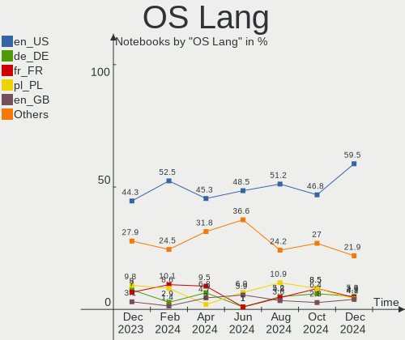
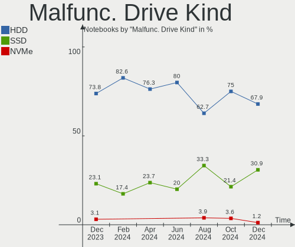
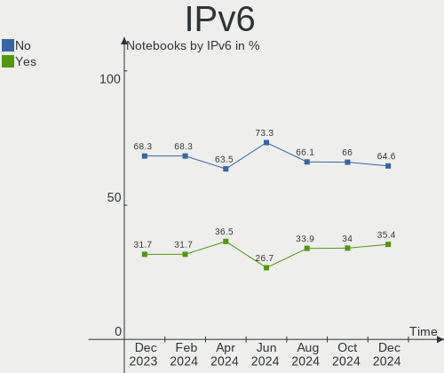

OpenMandriva - Hardware Trends (Notebooks)
------------------------------------------

A project to identify most popular hardware characteristics and track their change
over time based on data collected by Linux users at https://Linux-Hardware.org.

Anyone can contribute to this report by the [hw-probe](https://github.com/linuxhw/hw-probe) tool:

    sudo -E hw-probe -all -upload

This report is for one last month. Overall report since the beginning of time: [TestDays](https://github.com/linuxhw/TestDays)

Period: Apr, 2024.

Contents
--------

* [ System ](#system)
  - [ OS                       ](#os)
  - [ OS Family                ](#os-family)
  - [ Kernel                   ](#kernel)
  - [ Kernel Family            ](#kernel-family)
  - [ Kernel Major Ver.        ](#kernel-major-ver)
  - [ Arch                     ](#arch)
  - [ DE                       ](#de)
  - [ Display Server           ](#display-server)
  - [ Display Manager          ](#display-manager)
  - [ OS Lang                  ](#os-lang)
  - [ Boot Mode                ](#boot-mode)
  - [ Filesystem               ](#filesystem)
  - [ Part. scheme             ](#part-scheme)
  - [ Dual Boot with Linux/BSD ](#dual-boot-with-linuxbsd)
  - [ Dual Boot (Win)          ](#dual-boot-win)

* [ Board ](#board)
  - [ Vendor                   ](#vendor)
  - [ Model                    ](#model)
  - [ Model Family             ](#model-family)
  - [ MFG Year                 ](#mfg-year)
  - [ Form Factor              ](#form-factor)
  - [ Secure Boot              ](#secure-boot)
  - [ Coreboot                 ](#coreboot)
  - [ RAM Size                 ](#ram-size)
  - [ RAM Used                 ](#ram-used)
  - [ Total Drives             ](#total-drives)
  - [ Has CD-ROM               ](#has-cd-rom)
  - [ Has Ethernet             ](#has-ethernet)
  - [ Has WiFi                 ](#has-wifi)
  - [ Has Bluetooth            ](#has-bluetooth)

* [ Location ](#location)
  - [ Country                  ](#country)
  - [ City                     ](#city)

* [ Drives ](#drives)
  - [ Drive Vendor             ](#drive-vendor)
  - [ Drive Model              ](#drive-model)
  - [ HDD Vendor               ](#hdd-vendor)
  - [ SSD Vendor               ](#ssd-vendor)
  - [ Drive Kind               ](#drive-kind)
  - [ Drive Connector          ](#drive-connector)
  - [ Drive Size               ](#drive-size)
  - [ Space Total              ](#space-total)
  - [ Space Used               ](#space-used)
  - [ Malfunc. Drives          ](#malfunc-drives)
  - [ Malfunc. Drive Vendor    ](#malfunc-drive-vendor)
  - [ Malfunc. HDD Vendor      ](#malfunc-hdd-vendor)
  - [ Malfunc. Drive Kind      ](#malfunc-drive-kind)
  - [ Failed Drives            ](#failed-drives)
  - [ Failed Drive Vendor      ](#failed-drive-vendor)
  - [ Drive Status             ](#drive-status)

* [ Storage controller ](#storage-controller)
  - [ Storage Vendor           ](#storage-vendor)
  - [ Storage Model            ](#storage-model)
  - [ Storage Kind             ](#storage-kind)

* [ Processor ](#processor)
  - [ CPU Vendor               ](#cpu-vendor)
  - [ CPU Model                ](#cpu-model)
  - [ CPU Model Family         ](#cpu-model-family)
  - [ CPU Cores                ](#cpu-cores)
  - [ CPU Sockets              ](#cpu-sockets)
  - [ CPU Threads              ](#cpu-threads)
  - [ CPU Op-Modes             ](#cpu-op-modes)
  - [ CPU Microcode            ](#cpu-microcode)
  - [ CPU Microarch            ](#cpu-microarch)

* [ Graphics ](#graphics)
  - [ GPU Vendor               ](#gpu-vendor)
  - [ GPU Model                ](#gpu-model)
  - [ GPU Combo                ](#gpu-combo)
  - [ GPU Driver               ](#gpu-driver)
  - [ GPU Memory               ](#gpu-memory)

* [ Monitor ](#monitor)
  - [ Monitor Vendor           ](#monitor-vendor)
  - [ Monitor Model            ](#monitor-model)
  - [ Monitor Resolution       ](#monitor-resolution)
  - [ Monitor Diagonal         ](#monitor-diagonal)
  - [ Monitor Width            ](#monitor-width)
  - [ Aspect Ratio             ](#aspect-ratio)
  - [ Monitor Area             ](#monitor-area)
  - [ Pixel Density            ](#pixel-density)
  - [ Multiple Monitors        ](#multiple-monitors)

* [ Network ](#network)
  - [ Net Controller Vendor    ](#net-controller-vendor)
  - [ Net Controller Model     ](#net-controller-model)
  - [ Wireless Vendor          ](#wireless-vendor)
  - [ Wireless Model           ](#wireless-model)
  - [ Ethernet Vendor          ](#ethernet-vendor)
  - [ Ethernet Model           ](#ethernet-model)
  - [ Net Controller Kind      ](#net-controller-kind)
  - [ Used Controller          ](#used-controller)
  - [ NICs                     ](#nics)
  - [ IPv6                     ](#ipv6)

* [ Bluetooth ](#bluetooth)
  - [ Bluetooth Vendor         ](#bluetooth-vendor)
  - [ Bluetooth Model          ](#bluetooth-model)

* [ Sound ](#sound)
  - [ Sound Vendor             ](#sound-vendor)
  - [ Sound Model              ](#sound-model)

* [ Memory ](#memory)
  - [ Memory Vendor            ](#memory-vendor)
  - [ Memory Model             ](#memory-model)
  - [ Memory Kind              ](#memory-kind)
  - [ Memory Form Factor       ](#memory-form-factor)
  - [ Memory Size              ](#memory-size)
  - [ Memory Speed             ](#memory-speed)

* [ Printers & scanners ](#printers--scanners)
  - [ Printer Vendor           ](#printer-vendor)
  - [ Printer Model            ](#printer-model)
  - [ Scanner Vendor           ](#scanner-vendor)
  - [ Scanner Model            ](#scanner-model)

* [ Camera ](#camera)
  - [ Camera Vendor            ](#camera-vendor)
  - [ Camera Model             ](#camera-model)

* [ Security ](#security)
  - [ Fingerprint Vendor       ](#fingerprint-vendor)
  - [ Fingerprint Model        ](#fingerprint-model)
  - [ Chipcard Vendor          ](#chipcard-vendor)
  - [ Chipcard Model           ](#chipcard-model)

* [ Unsupported ](#unsupported)
  - [ Unsupported Devices      ](#unsupported-devices)
  - [ Unsupported Device Types ](#unsupported-device-types)

System
------

OS
--

Installed operating systems

| Name               | Notebooks | Percent |
|--------------------|-----------|---------|
| OpenMandriva 23.08 | 69        | 46.62%  |
| OpenMandriva 5.0   | 37        | 25%     |
| OpenMandriva 24.03 | 10        | 6.76%   |
| OpenMandriva 24.01 | 8         | 5.41%   |
| OpenMandriva 4.2   | 6         | 4.05%   |
| OpenMandriva 23.01 | 6         | 4.05%   |
| OpenMandriva 4.3   | 4         | 2.7%    |
| OpenMandriva 23.11 | 3         | 2.03%   |
| OpenMandriva 24.90 | 2         | 1.35%   |
| OpenMandriva 23.03 | 2         | 1.35%   |
| OpenMandriva 4.50  | 1         | 0.68%   |

OS Family
---------

OS without a version

| Name         | Notebooks | Percent |
|--------------|-----------|---------|
| OpenMandriva | 148       | 100%    |

Kernel
------

Version of the Linux kernel

| Version                      | Notebooks | Percent |
|------------------------------|-----------|---------|
| 6.4.11-desktop-1omv2390      | 59        | 39.86%  |
| 6.6.2-desktop-1omv2390       | 47        | 31.76%  |
| 6.4.8-desktop-2omv2390       | 9         | 6.08%   |
| 6.8.1-desktop-3omv2490       | 8         | 5.41%   |
| 6.1.1-desktop-1omv2290       | 6         | 4.05%   |
| 5.10.14-desktop-1omv4002     | 5         | 3.38%   |
| 5.16.7-desktop-1omv4003      | 4         | 2.7%    |
| 6.8.7-desktop-1omv2490       | 2         | 1.35%   |
| 6.2.6-desktop-1omv2390       | 2         | 1.35%   |
| 6.8.8-desktop-1omv2490       | 1         | 0.68%   |
| 6.8.1-desktop-gcc-4omv2490   | 1         | 0.68%   |
| 6.7.0-desktop-0.rc2.1omv2390 | 1         | 0.68%   |
| 6.5.5-desktop-1omv2390       | 1         | 0.68%   |
| 5.19.12-desktop-2omv4090     | 1         | 0.68%   |
| 5.11.12-desktop-1omv4002     | 1         | 0.68%   |

Kernel Family
-------------

Linux kernel without a distro release

| Version | Notebooks | Percent |
|---------|-----------|---------|
| 6.4.11  | 59        | 39.86%  |
| 6.6.2   | 47        | 31.76%  |
| 6.8.1   | 9         | 6.08%   |
| 6.4.8   | 9         | 6.08%   |
| 6.1.1   | 6         | 4.05%   |
| 5.10.14 | 5         | 3.38%   |
| 5.16.7  | 4         | 2.7%    |
| 6.8.7   | 2         | 1.35%   |
| 6.2.6   | 2         | 1.35%   |
| 6.8.8   | 1         | 0.68%   |
| 6.7.0   | 1         | 0.68%   |
| 6.5.5   | 1         | 0.68%   |
| 5.19.12 | 1         | 0.68%   |
| 5.11.12 | 1         | 0.68%   |

Kernel Major Ver.
-----------------

Linux kernel major version

| Version | Notebooks | Percent |
|---------|-----------|---------|
| 6.4     | 68        | 45.95%  |
| 6.6     | 47        | 31.76%  |
| 6.8     | 12        | 8.11%   |
| 6.1     | 6         | 4.05%   |
| 5.10    | 5         | 3.38%   |
| 5.16    | 4         | 2.7%    |
| 6.2     | 2         | 1.35%   |
| 6.7     | 1         | 0.68%   |
| 6.5     | 1         | 0.68%   |
| 5.19    | 1         | 0.68%   |
| 5.11    | 1         | 0.68%   |

Arch
----

OS architecture (x86_64, i586, etc.)

| Name   | Notebooks | Percent |
|--------|-----------|---------|
| x86_64 | 148       | 100%    |

DE
--

Desktop Environment

| Name    | Notebooks | Percent |
|---------|-----------|---------|
| KDE5    | 126       | 85.14%  |
| LXQt    | 15        | 10.14%  |
| GNOME   | 5         | 3.38%   |
| Unknown | 2         | 1.35%   |

Display Server
--------------

X11 or Wayland

| Name    | Notebooks | Percent |
|---------|-----------|---------|
| Wayland | 128       | 86.49%  |
| X11     | 20        | 13.51%  |

Display Manager
---------------

SDDM, LightDM, etc.

| Name    | Notebooks | Percent |
|---------|-----------|---------|
| SDDM    | 142       | 95.95%  |
| GDM     | 5         | 3.38%   |
| LightDM | 1         | 0.68%   |

OS Lang
-------

Language

| Lang  | Notebooks | Percent |
|-------|-----------|---------|
| en_US | 67        | 45.27%  |
| fr_FR | 14        | 9.46%   |
| ru_RU | 10        | 6.76%   |
| de_DE | 10        | 6.76%   |
| it_IT | 7         | 4.73%   |
| en_GB | 7         | 4.73%   |
| pt_BR | 6         | 4.05%   |
| tr_TR | 3         | 2.03%   |
| pl_PL | 3         | 2.03%   |
| en_CA | 3         | 2.03%   |
| ja_JP | 2         | 1.35%   |
| es_VE | 2         | 1.35%   |
| es_ES | 2         | 1.35%   |
| en_IN | 2         | 1.35%   |
| pt_PT | 1         | 0.68%   |
| hu_HU | 1         | 0.68%   |
| fr_CA | 1         | 0.68%   |
| es_PE | 1         | 0.68%   |
| es_BO | 1         | 0.68%   |
| en_NZ | 1         | 0.68%   |
| en_AU | 1         | 0.68%   |
| de_CH | 1         | 0.68%   |
| de_AT | 1         | 0.68%   |
| cs_CZ | 1         | 0.68%   |

Boot Mode
---------

EFI or BIOS

| Mode | Notebooks | Percent |
|------|-----------|---------|
| EFI  | 88        | 59.46%  |
| BIOS | 60        | 40.54%  |

Filesystem
----------

Type of filesystem

| Type     | Notebooks | Percent |
|----------|-----------|---------|
| Ext4     | 83        | 56.08%  |
| Overlay  | 54        | 36.49%  |
| Btrfs    | 7         | 4.73%   |
| Xfs      | 2         | 1.35%   |
| F2fs     | 1         | 0.68%   |
| Bcachefs | 1         | 0.68%   |

Part. scheme
------------

Scheme of partitioning

| Type | Notebooks | Percent |
|------|-----------|---------|
| GPT  | 121       | 81.76%  |
| MBR  | 27        | 18.24%  |

Dual Boot with Linux/BSD
------------------------

Hosting more than one Linux/BSD

| Dual boot | Notebooks | Percent |
|-----------|-----------|---------|
| No        | 87        | 58.78%  |
| Yes       | 61        | 41.22%  |

Dual Boot (Win)
---------------

Hosting Linux and Windows

| Dual boot | Notebooks | Percent |
|-----------|-----------|---------|
| No        | 90        | 60.81%  |
| Yes       | 58        | 39.19%  |

Board
-----

Vendor
------

Motherboard manufacturer

| Name                    | Notebooks | Percent |
|-------------------------|-----------|---------|
| Lenovo                  | 35        | 23.65%  |
| Hewlett-Packard         | 24        | 16.22%  |
| Dell                    | 21        | 14.19%  |
| ASUSTek Computer        | 21        | 14.19%  |
| Acer                    | 13        | 8.78%   |
| Toshiba                 | 4         | 2.7%    |
| MSI                     | 4         | 2.7%    |
| Samsung Electronics     | 3         | 2.03%   |
| Sony                    | 2         | 1.35%   |
| Notebook                | 2         | 1.35%   |
| Fujitsu                 | 2         | 1.35%   |
| Unknown                 | 2         | 1.35%   |
| TUXEDO                  | 1         | 0.68%   |
| Shuttle                 | 1         | 0.68%   |
| Quanta                  | 1         | 0.68%   |
| Positivo                | 1         | 0.68%   |
| Philco                  | 1         | 0.68%   |
| Packard Bell            | 1         | 0.68%   |
| Login Informatica       | 1         | 0.68%   |
| Intel                   | 1         | 0.68%   |
| Info Quest Technologies | 1         | 0.68%   |
| HUAWEI                  | 1         | 0.68%   |
| Google                  | 1         | 0.68%   |
| Fujitsu Siemens         | 1         | 0.68%   |
| Core Innovations        | 1         | 0.68%   |
| Computer Depot          | 1         | 0.68%   |
| Chuwi                   | 1         | 0.68%   |

Model
-----

Motherboard model

| Name                                                                                     | Notebooks | Percent |
|------------------------------------------------------------------------------------------|-----------|---------|
| Lenovo IdeaPad Slim 1-14AST-05 81VS                                                      | 3         | 2.03%   |
| Unknown                                                                                  | 3         | 2.03%   |
| Lenovo IdeaPad 1 14IGL7 82V6                                                             | 2         | 1.35%   |
| HP EliteBook 840 G2                                                                      | 2         | 1.35%   |
| TUXEDO InfinityBook S 14 v5                                                              | 1         | 0.68%   |
| Toshiba Satellite U500                                                                   | 1         | 0.68%   |
| Toshiba Satellite S855D                                                                  | 1         | 0.68%   |
| Toshiba Satellite C50-A                                                                  | 1         | 0.68%   |
| Toshiba Satellite A205                                                                   | 1         | 0.68%   |
| Sony VPCEH30EB                                                                           | 1         | 0.68%   |
| Sony SVE1111M1EW                                                                         | 1         | 0.68%   |
| Shuttle X50V6                                                                            | 1         | 0.68%   |
| Samsung 370E4K                                                                           | 1         | 0.68%   |
| Samsung 355V4C/355V4X/355V5C/355V5X/356V4C/356V4X/356V5C/356V5X/3445VC/3445VX/3545VC/354 | 1         | 0.68%   |
| Samsung 300E4A/300E5A/300E7A/3430EA/3530EA                                               | 1         | 0.68%   |
| Quanta R480-L.BA31P1                                                                     | 1         | 0.68%   |
| Positivo S14BW01                                                                         | 1         | 0.68%   |
| Philco 14H                                                                               | 1         | 0.68%   |
| Packard Bell EasyNote TJ66                                                               | 1         | 0.68%   |
| Notebook W54BL                                                                           | 1         | 0.68%   |
| Notebook NJx0PU                                                                          | 1         | 0.68%   |
| MSI Raider GE78HX SmartTP 13VG                                                           | 1         | 0.68%   |
| MSI Prestige 14Evo B13M                                                                  | 1         | 0.68%   |
| MSI GP60 2OD                                                                             | 1         | 0.68%   |
| MSI GE72 2QD                                                                             | 1         | 0.68%   |
| Login Informatica LOG-M301H                                                              | 1         | 0.68%   |
| Lenovo Y50-70 20378                                                                      | 1         | 0.68%   |
| Lenovo ThinkPad X280 20KESA5000                                                          | 1         | 0.68%   |
| Lenovo ThinkPad X270 20HN0015GE                                                          | 1         | 0.68%   |
| Lenovo ThinkPad X260 20F5S4CC00                                                          | 1         | 0.68%   |
| Lenovo ThinkPad X220 4290RW1                                                             | 1         | 0.68%   |
| Lenovo ThinkPad X1 Carbon 6th 20KH002JUS                                                 | 1         | 0.68%   |
| Lenovo ThinkPad W530 24476F1                                                             | 1         | 0.68%   |
| Lenovo ThinkPad T470 W10DG 20JNS5TE00                                                    | 1         | 0.68%   |
| Lenovo ThinkPad T430 23492F5                                                             | 1         | 0.68%   |
| Lenovo ThinkPad T420 4236L35                                                             | 1         | 0.68%   |
| Lenovo ThinkPad T420 423663U                                                             | 1         | 0.68%   |
| Lenovo ThinkPad T400 6474W7T                                                             | 1         | 0.68%   |
| Lenovo ThinkPad R61e 7650DHU                                                             | 1         | 0.68%   |
| Lenovo ThinkPad L560 20F2S0TB00                                                          | 1         | 0.68%   |

Model Family
------------

Motherboard model prefix

| Name                        | Notebooks | Percent |
|-----------------------------|-----------|---------|
| Lenovo ThinkPad             | 15        | 10.14%  |
| Lenovo IdeaPad              | 14        | 9.46%   |
| Dell Latitude               | 10        | 6.76%   |
| Acer Aspire                 | 10        | 6.76%   |
| Dell Inspiron               | 8         | 5.41%   |
| HP EliteBook                | 7         | 4.73%   |
| Toshiba Satellite           | 4         | 2.7%    |
| HP Pavilion                 | 3         | 2.03%   |
| HP Laptop                   | 3         | 2.03%   |
| HP 250                      | 3         | 2.03%   |
| ASUS VivoBook               | 3         | 2.03%   |
| Unknown                     | 3         | 2.03%   |
| HP ZBook                    | 2         | 1.35%   |
| HP 240                      | 2         | 1.35%   |
| Dell Studio                 | 2         | 1.35%   |
| TUXEDO InfinityBook         | 1         | 0.68%   |
| Sony VPCEH30EB              | 1         | 0.68%   |
| Sony SVE1111M1EW            | 1         | 0.68%   |
| Shuttle X50V6               | 1         | 0.68%   |
| Samsung 370E4K              | 1         | 0.68%   |
| Samsung 355V4C              | 1         | 0.68%   |
| Samsung 300E4A              | 1         | 0.68%   |
| Quanta R480-L.BA31P1        | 1         | 0.68%   |
| Positivo S14BW01            | 1         | 0.68%   |
| Philco 14H                  | 1         | 0.68%   |
| Packard Bell EasyNote       | 1         | 0.68%   |
| Notebook W54BL              | 1         | 0.68%   |
| Notebook NJx0PU             | 1         | 0.68%   |
| MSI Raider                  | 1         | 0.68%   |
| MSI Prestige                | 1         | 0.68%   |
| MSI GP60                    | 1         | 0.68%   |
| MSI GE72                    | 1         | 0.68%   |
| Login Informatica LOG-M301H | 1         | 0.68%   |
| Lenovo Y50-70               | 1         | 0.68%   |
| Lenovo Slim                 | 1         | 0.68%   |
| Lenovo G50-30               | 1         | 0.68%   |
| Lenovo G40-80               | 1         | 0.68%   |
| Lenovo B590                 | 1         | 0.68%   |
| Lenovo 100-14IBY            | 1         | 0.68%   |
| Intel Exomate               | 1         | 0.68%   |

MFG Year
--------

Motherboard manufacture year

| Year | Notebooks | Percent |
|------|-----------|---------|
| 2016 | 14        | 9.46%   |
| 2012 | 14        | 9.46%   |
| 2011 | 14        | 9.46%   |
| 2015 | 13        | 8.78%   |
| 2019 | 10        | 6.76%   |
| 2017 | 10        | 6.76%   |
| 2022 | 9         | 6.08%   |
| 2018 | 8         | 5.41%   |
| 2013 | 8         | 5.41%   |
| 2020 | 7         | 4.73%   |
| 2010 | 7         | 4.73%   |
| 2023 | 6         | 4.05%   |
| 2021 | 6         | 4.05%   |
| 2009 | 6         | 4.05%   |
| 2008 | 6         | 4.05%   |
| 2014 | 5         | 3.38%   |
| 2007 | 4         | 2.7%    |
| 2006 | 1         | 0.68%   |

Form Factor
-----------

Physical design of the computer

| Name     | Notebooks | Percent |
|----------|-----------|---------|
| Notebook | 148       | 100%    |

Secure Boot
-----------

Enabled or disabled

| State    | Notebooks | Percent |
|----------|-----------|---------|
| Disabled | 148       | 100%    |

Coreboot
--------

Have coreboot on board

| Used | Notebooks | Percent |
|------|-----------|---------|
| No   | 147       | 99.32%  |
| Yes  | 1         | 0.68%   |

RAM Size
--------

Total RAM memory

| Size in GB  | Notebooks | Percent |
|-------------|-----------|---------|
| 3.01-4.0    | 46        | 31.08%  |
| 4.01-8.0    | 44        | 29.73%  |
| 16.01-24.0  | 24        | 16.22%  |
| 8.01-16.0   | 21        | 14.19%  |
| 2.01-3.0    | 4         | 2.7%    |
| 32.01-64.0  | 3         | 2.03%   |
| 1.01-2.0    | 2         | 1.35%   |
| 0.51-1.0    | 2         | 1.35%   |
| 24.01-32.0  | 1         | 0.68%   |
| 64.01-256.0 | 1         | 0.68%   |

RAM Used
--------

Used RAM memory

| Used GB  | Notebooks | Percent |
|----------|-----------|---------|
| 1.01-2.0 | 101       | 68.24%  |
| 2.01-3.0 | 29        | 19.59%  |
| 0.51-1.0 | 14        | 9.46%   |
| 3.01-4.0 | 3         | 2.03%   |
| 0.01-0.5 | 1         | 0.68%   |

Total Drives
------------

Number of drives on board

| Drives | Notebooks | Percent |
|--------|-----------|---------|
| 1      | 104       | 70.27%  |
| 2      | 35        | 23.65%  |
| 3      | 6         | 4.05%   |
| 0      | 3         | 2.03%   |

Has CD-ROM
----------

Has CD-ROM on board

| Presented | Notebooks | Percent |
|-----------|-----------|---------|
| No        | 87        | 58.78%  |
| Yes       | 61        | 41.22%  |

Has Ethernet
------------

Has Ethernet on board

| Presented | Notebooks | Percent |
|-----------|-----------|---------|
| Yes       | 124       | 83.78%  |
| No        | 24        | 16.22%  |

Has WiFi
--------

Has WiFi module

| Presented | Notebooks | Percent |
|-----------|-----------|---------|
| Yes       | 148       | 100%    |

Has Bluetooth
-------------

Has Bluetooth module

| Presented | Notebooks | Percent |
|-----------|-----------|---------|
| Yes       | 112       | 75.68%  |
| No        | 36        | 24.32%  |

Location
--------

Country
-------

Geographic location (country)

| Country     | Notebooks | Percent |
|-------------|-----------|---------|
| USA         | 25        | 16.89%  |
| Russia      | 15        | 10.14%  |
| France      | 14        | 9.46%   |
| Brazil      | 13        | 8.78%   |
| Germany     | 10        | 6.76%   |
| Canada      | 8         | 5.41%   |
| Italy       | 6         | 4.05%   |
| UK          | 5         | 3.38%   |
| Turkey      | 4         | 2.7%    |
| Spain       | 4         | 2.7%    |
| Poland      | 3         | 2.03%   |
| India       | 3         | 2.03%   |
| Greece      | 3         | 2.03%   |
| Venezuela   | 2         | 1.35%   |
| Switzerland | 2         | 1.35%   |
| Nigeria     | 2         | 1.35%   |
| New Zealand | 2         | 1.35%   |
| Japan       | 2         | 1.35%   |
| Austria     | 2         | 1.35%   |
| Vietnam     | 1         | 0.68%   |
| Ukraine     | 1         | 0.68%   |
| Tunisia     | 1         | 0.68%   |
| Sweden      | 1         | 0.68%   |
| Slovakia    | 1         | 0.68%   |
| Portugal    | 1         | 0.68%   |
| Philippines | 1         | 0.68%   |
| Peru        | 1         | 0.68%   |
| Norway      | 1         | 0.68%   |
| Mexico      | 1         | 0.68%   |
| Kazakhstan  | 1         | 0.68%   |
| Jamaica     | 1         | 0.68%   |
| Indonesia   | 1         | 0.68%   |
| Hungary     | 1         | 0.68%   |
| Finland     | 1         | 0.68%   |
| Czechia     | 1         | 0.68%   |
| Cyprus      | 1         | 0.68%   |
| China       | 1         | 0.68%   |
| Chile       | 1         | 0.68%   |
| Bolivia     | 1         | 0.68%   |
| Australia   | 1         | 0.68%   |

City
----

Geographic location (city)

| City                 | Notebooks | Percent |
|----------------------|-----------|---------|
| Moscow               | 5         | 3.38%   |
| Berlin               | 4         | 2.7%    |
| Montreal             | 3         | 2.03%   |
| Los Angeles          | 3         | 2.03%   |
| Turin                | 2         | 1.35%   |
| Topeka               | 2         | 1.35%   |
| Sao Paulo            | 2         | 1.35%   |
| Sao Joao de Meriti   | 2         | 1.35%   |
| Rio de Janeiro       | 2         | 1.35%   |
| Dudley               | 2         | 1.35%   |
| Beverly Hills        | 2         | 1.35%   |
| Bengaluru            | 2         | 1.35%   |
| Yekaterinburg        | 1         | 0.68%   |
| Whanganui            | 1         | 0.68%   |
| Wels                 | 1         | 0.68%   |
| Warsaw               | 1         | 0.68%   |
| Wandsworth           | 1         | 0.68%   |
| Valencia             | 1         | 0.68%   |
| Treguaco             | 1         | 0.68%   |
| Thun                 | 1         | 0.68%   |
| Thessaloniki         | 1         | 0.68%   |
| Tasikmalaya          | 1         | 0.68%   |
| Steinkjer            | 1         | 0.68%   |
| Stafford             | 1         | 0.68%   |
| St Petersburg        | 1         | 0.68%   |
| Sorel-Tracy          | 1         | 0.68%   |
| Sochi                | 1         | 0.68%   |
| Sobinka              | 1         | 0.68%   |
| Seattle              | 1         | 0.68%   |
| Sao Goncalo          | 1         | 0.68%   |
| Sanliurfa            | 1         | 0.68%   |
| San Jose de Guanipa  | 1         | 0.68%   |
| San Diego            | 1         | 0.68%   |
| Samara               | 1         | 0.68%   |
| Salvador             | 1         | 0.68%   |
| Saint-Jerome         | 1         | 0.68%   |
| Ryazan               | 1         | 0.68%   |
| Rozzano              | 1         | 0.68%   |
| Roznov pod Radhostem | 1         | 0.68%   |
| Rosny-sous-Bois      | 1         | 0.68%   |

Drives
------

Drive Vendor
------------

Hard drive vendors

| Vendor              | Notebooks | Drives | Percent |
|---------------------|-----------|--------|---------|
| WDC                 | 24        | 25     | 12.97%  |
| Samsung Electronics | 24        | 25     | 12.97%  |
| Toshiba             | 15        | 15     | 8.11%   |
| Seagate             | 14        | 14     | 7.57%   |
| SanDisk             | 13        | 14     | 7.03%   |
| Kingston            | 11        | 11     | 5.95%   |
| Unknown             | 9         | 9      | 4.86%   |
| Hitachi             | 9         | 9      | 4.86%   |
| HGST                | 7         | 7      | 3.78%   |
| SK hynix            | 5         | 5      | 2.7%    |
| Micron Technology   | 5         | 5      | 2.7%    |
| Intel               | 5         | 5      | 2.7%    |
| KingSpec            | 4         | 4      | 2.16%   |
| Unknown             | 4         | 4      | 2.16%   |
| JMicron Technology  | 3         | 3      | 1.62%   |
| Crucial             | 3         | 3      | 1.62%   |
| AMD                 | 3         | 3      | 1.62%   |
| Team                | 2         | 2      | 1.08%   |
| Patriot             | 2         | 2      | 1.08%   |
| China               | 2         | 2      | 1.08%   |
| A-DATA Technology   | 2         | 2      | 1.08%   |
| Verbatim            | 1         | 1      | 0.54%   |
| UMIS                | 1         | 1      | 0.54%   |
| SBe                 | 1         | 1      | 0.54%   |
| Realtek             | 1         | 1      | 0.54%   |
| QUANXING            | 1         | 1      | 0.54%   |
| OCZ                 | 1         | 1      | 0.54%   |
| NT-128              | 1         | 1      | 0.54%   |
| Mushkin             | 1         | 1      | 0.54%   |
| Lexar               | 1         | 1      | 0.54%   |
| KIOXIA              | 1         | 1      | 0.54%   |
| JetFlash            | 1         | 1      | 0.54%   |
| ICY BOX             | 1         | 1      | 0.54%   |
| HS-SSD-E100N        | 1         | 1      | 0.54%   |
| HS-SSD-E100         | 1         | 1      | 0.54%   |
| Hikvision           | 1         | 1      | 0.54%   |
| Gigabyte Technology | 1         | 1      | 0.54%   |
| Emtec               | 1         | 1      | 0.54%   |
| Dahua               | 1         | 1      | 0.54%   |
| ASMT                | 1         | 1      | 0.54%   |

Drive Model
-----------

Hard drive models

| Model                                | Notebooks | Percent |
|--------------------------------------|-----------|---------|
| Seagate ST1000LM035-1RK172 1TB       | 4         | 2.13%   |
| Unknown                              | 4         | 2.13%   |
| Unknown SD/MMC/MS PRO 128GB          | 3         | 1.6%    |
| Seagate ST500LT012-1DG142 500GB      | 3         | 1.6%    |
| SanDisk 3.2 Gen 1 250GB SSD          | 3         | 1.6%    |
| HGST HTS721010A9E630 1TB             | 3         | 1.6%    |
| WDC WD1600BEVS-00VAT0 160GB          | 2         | 1.06%   |
| WDC WD10SPZX-24Z10 1TB               | 2         | 1.06%   |
| WDC WD10JPVX-22JC3T0 1TB             | 2         | 1.06%   |
| Unknown MMC64G  64GB                 | 2         | 1.06%   |
| Toshiba MQ01ABD100 1TB               | 2         | 1.06%   |
| Seagate ST9500325AS 500GB            | 2         | 1.06%   |
| Seagate ST1000LX015-1U7172 1TB       | 2         | 1.06%   |
| SanDisk SSD PLUS 240GB               | 2         | 1.06%   |
| Samsung SSD 980 500GB                | 2         | 1.06%   |
| Samsung SSD 860 EVO 250GB            | 2         | 1.06%   |
| Samsung SSD 850 EVO 250GB            | 2         | 1.06%   |
| Samsung MZ7TD256HAFV-000L7 256GB SSD | 2         | 1.06%   |
| Kingston SA400S37240G 240GB SSD      | 2         | 1.06%   |
| Kingston SA400S37120G 120GB SSD      | 2         | 1.06%   |
| KingSpec P3-512 512GB SSD            | 2         | 1.06%   |
| JMicron Generic 320GB                | 2         | 1.06%   |
| Hitachi HTS545050A7E380 500GB        | 2         | 1.06%   |
| Crucial CT500MX500SSD1 500GB         | 2         | 1.06%   |
| WDC WDS480G2G0C-00AJM0 480GB         | 1         | 0.53%   |
| WDC WDS250G2B0A 250GB SSD            | 1         | 0.53%   |
| WDC WDS200T2B0B-00YS70 2TB SSD       | 1         | 0.53%   |
| WDC WD7500BPVX-22JC3T0 752GB         | 1         | 0.53%   |
| WDC WD5000LPVX-00V0TT0 500GB         | 1         | 0.53%   |
| WDC WD5000LPLX-08ZNTT0 500GB         | 1         | 0.53%   |
| WDC WD5000LPCX-24C6HT0 500GB         | 1         | 0.53%   |
| WDC WD5000BPVT-55A1YT0 500GB         | 1         | 0.53%   |
| WDC WD3200BEVT-26A23T0 320GB         | 1         | 0.53%   |
| WDC WD3200BEVT-22A23T0 320GB         | 1         | 0.53%   |
| WDC WD2500BEVT-24A23T0 250GB         | 1         | 0.53%   |
| WDC WD1600BEVT-22ZCT0 160GB          | 1         | 0.53%   |
| WDC WD10SPZX-75Z10T3 1TB             | 1         | 0.53%   |
| WDC WD10JPVX-75JC3T0 1TB             | 1         | 0.53%   |
| WDC WD10JPCX-24UE4T0 1TB             | 1         | 0.53%   |
| WDC WD Blue SA510 2.5 1000GB SSD     | 1         | 0.53%   |

HDD Vendor
----------

Hard disk drive vendors

| Vendor              | Notebooks | Drives | Percent |
|---------------------|-----------|--------|---------|
| WDC                 | 18        | 18     | 26.09%  |
| Toshiba             | 14        | 14     | 20.29%  |
| Seagate             | 14        | 14     | 20.29%  |
| Hitachi             | 8         | 8      | 11.59%  |
| HGST                | 7         | 7      | 10.14%  |
| Unknown             | 3         | 3      | 4.35%   |
| Samsung Electronics | 3         | 3      | 4.35%   |
| JMicron Technology  | 2         | 2      | 2.9%    |

SSD Vendor
----------

Solid state drive vendors

| Vendor              | Notebooks | Drives | Percent |
|---------------------|-----------|--------|---------|
| Samsung Electronics | 13        | 14     | 18.57%  |
| SanDisk             | 9         | 10     | 12.86%  |
| Kingston            | 8         | 8      | 11.43%  |
| KingSpec            | 4         | 4      | 5.71%   |
| WDC                 | 3         | 3      | 4.29%   |
| Intel               | 3         | 3      | 4.29%   |
| AMD                 | 3         | 3      | 4.29%   |
| Team                | 2         | 2      | 2.86%   |
| Patriot             | 2         | 2      | 2.86%   |
| Micron Technology   | 2         | 2      | 2.86%   |
| Crucial             | 2         | 2      | 2.86%   |
| China               | 2         | 2      | 2.86%   |
| Unknown             | 2         | 2      | 2.86%   |
| Verbatim            | 1         | 1      | 1.43%   |
| Toshiba             | 1         | 1      | 1.43%   |
| SBe                 | 1         | 1      | 1.43%   |
| QUANXING            | 1         | 1      | 1.43%   |
| OCZ                 | 1         | 1      | 1.43%   |
| NT-128              | 1         | 1      | 1.43%   |
| HS-SSD-E100N        | 1         | 1      | 1.43%   |
| HS-SSD-E100         | 1         | 1      | 1.43%   |
| Hitachi             | 1         | 1      | 1.43%   |
| Hikvision           | 1         | 1      | 1.43%   |
| Gigabyte Technology | 1         | 1      | 1.43%   |
| Emtec               | 1         | 1      | 1.43%   |
| Dahua               | 1         | 1      | 1.43%   |
| ASMT                | 1         | 1      | 1.43%   |
| A-DATA Technology   | 1         | 1      | 1.43%   |

Drive Kind
----------

HDD or SSD

| Kind    | Notebooks | Drives | Percent |
|---------|-----------|--------|---------|
| SSD     | 66        | 72     | 37.71%  |
| HDD     | 66        | 69     | 37.71%  |
| NVMe    | 29        | 33     | 16.57%  |
| MMC     | 11        | 11     | 6.29%   |
| Unknown | 3         | 3      | 1.71%   |

Drive Connector
---------------

SATA, SAS, NVMe, etc.

| Type | Notebooks | Drives | Percent |
|------|-----------|--------|---------|
| SATA | 115       | 128    | 68.45%  |
| NVMe | 29        | 32     | 17.26%  |
| SAS  | 13        | 17     | 7.74%   |
| MMC  | 11        | 11     | 6.55%   |

Drive Size
----------

Size of hard drive

| Size in TB | Notebooks | Drives | Percent |
|------------|-----------|--------|---------|
| 0.01-0.5   | 92        | 100    | 69.17%  |
| 0.51-1.0   | 36        | 36     | 27.07%  |
| 1.01-2.0   | 4         | 4      | 3.01%   |
| 10.01-20.0 | 1         | 1      | 0.75%   |

Space Total
-----------

Amount of disk space available on the file system

| Size in GB | Notebooks | Percent |
|------------|-----------|---------|
| 101-250    | 45        | 30.41%  |
| 1-20       | 36        | 24.32%  |
| 251-500    | 25        | 16.89%  |
| 51-100     | 12        | 8.11%   |
| 21-50      | 11        | 7.43%   |
| 501-1000   | 10        | 6.76%   |
| 1001-2000  | 4         | 2.7%    |
| Unknown    | 4         | 2.7%    |
| 2001-3000  | 1         | 0.68%   |

Space Used
----------

Amount of used disk space

| Used GB  | Notebooks | Percent |
|----------|-----------|---------|
| 1-20     | 112       | 75.68%  |
| 21-50    | 11        | 7.43%   |
| 101-250  | 9         | 6.08%   |
| 51-100   | 7         | 4.73%   |
| Unknown  | 4         | 2.7%    |
| 251-500  | 3         | 2.03%   |
| 501-1000 | 1         | 0.68%   |
| 0        | 1         | 0.68%   |

Malfunc. Drives
---------------

Drive models with a malfunction

| Model                                            | Notebooks | Drives | Percent |
|--------------------------------------------------|-----------|--------|---------|
| WDC WD1600BEVS-00VAT0 160GB                      | 2         | 2      | 5.26%   |
| WDC WD10SPZX-24Z10 1TB                           | 2         | 2      | 5.26%   |
| Seagate ST1000LM035-1RK172 1TB                   | 2         | 2      | 5.26%   |
| SanDisk SSD PLUS 240GB                           | 2         | 2      | 5.26%   |
| Hitachi HTS545050A7E380 500GB                    | 2         | 2      | 5.26%   |
| WDC WD5000LPLX-08ZNTT0 500GB                     | 1         | 1      | 2.63%   |
| WDC WD5000LPCX-24C6HT0 500GB                     | 1         | 1      | 2.63%   |
| WDC WD3200BEVT-26A23T0 320GB                     | 1         | 1      | 2.63%   |
| WDC WD3200BEVT-22A23T0 320GB                     | 1         | 1      | 2.63%   |
| WDC WD1600BEVT-22ZCT0 160GB                      | 1         | 1      | 2.63%   |
| Toshiba MQ01ABF050 500GB                         | 1         | 1      | 2.63%   |
| Toshiba MQ01ABD100 1TB                           | 1         | 1      | 2.63%   |
| Toshiba MK3265GSX 320GB                          | 1         | 1      | 2.63%   |
| Toshiba MK3263GSX 320GB                          | 1         | 1      | 2.63%   |
| Toshiba MK2565GSXN 250GB                         | 1         | 1      | 2.63%   |
| Toshiba MK1665GSX 160GB                          | 1         | 1      | 2.63%   |
| Seagate ST9500325AS 500GB                        | 1         | 1      | 2.63%   |
| Seagate ST500LT012-1DG142 500GB                  | 1         | 1      | 2.63%   |
| Samsung Electronics MZ7PD256HCGM-000H7 256GB SSD | 1         | 1      | 2.63%   |
| Samsung Electronics HM321HI 320GB                | 1         | 1      | 2.63%   |
| Samsung Electronics HM160HI 160GB                | 1         | 1      | 2.63%   |
| Samsung Electronics HM121HI 120GB                | 1         | 1      | 2.63%   |
| OCZ VERTEX2 64GB SSD                             | 1         | 1      | 2.63%   |
| Kingston SA400S37120G 120GB SSD                  | 1         | 1      | 2.63%   |
| KingSpec NT-256 256GB SSD                        | 1         | 1      | 2.63%   |
| Intel SSDSCKKF256G8H 256GB                       | 1         | 1      | 2.63%   |
| Intel SSDSCKJF180A5L 180GB                       | 1         | 1      | 2.63%   |
| Hitachi HTS723225A7A364 250GB                    | 1         | 1      | 2.63%   |
| Hitachi HTS723216L9A362 160GB                    | 1         | 1      | 2.63%   |
| Hitachi HTS542580K9SA00 80GB                     | 1         | 1      | 2.63%   |
| Hitachi HTS541680J9SA00 80GB                     | 1         | 1      | 2.63%   |
| HGST HTS541010A9E680 1TB                         | 1         | 1      | 2.63%   |
| China SSD 128GB                                  | 1         | 1      | 2.63%   |

Malfunc. Drive Vendor
---------------------

Vendors of faulty drives

| Vendor              | Notebooks | Drives | Percent |
|---------------------|-----------|--------|---------|
| WDC                 | 9         | 9      | 23.68%  |
| Toshiba             | 6         | 6      | 15.79%  |
| Hitachi             | 6         | 6      | 15.79%  |
| Seagate             | 4         | 4      | 10.53%  |
| Samsung Electronics | 4         | 4      | 10.53%  |
| SanDisk             | 2         | 2      | 5.26%   |
| Intel               | 2         | 2      | 5.26%   |
| OCZ                 | 1         | 1      | 2.63%   |
| Kingston            | 1         | 1      | 2.63%   |
| KingSpec            | 1         | 1      | 2.63%   |
| HGST                | 1         | 1      | 2.63%   |
| China               | 1         | 1      | 2.63%   |

Malfunc. HDD Vendor
-------------------

Vendors of faulty HDD drives

| Vendor              | Notebooks | Drives | Percent |
|---------------------|-----------|--------|---------|
| WDC                 | 9         | 9      | 31.03%  |
| Toshiba             | 6         | 6      | 20.69%  |
| Hitachi             | 6         | 6      | 20.69%  |
| Seagate             | 4         | 4      | 13.79%  |
| Samsung Electronics | 3         | 3      | 10.34%  |
| HGST                | 1         | 1      | 3.45%   |

Malfunc. Drive Kind
-------------------

Kinds of faulty drives

| Kind | Notebooks | Drives | Percent |
|------|-----------|--------|---------|
| HDD  | 29        | 29     | 76.32%  |
| SSD  | 9         | 9      | 23.68%  |

Failed Drives
-------------

Failed drive models

Zero info for selected period =(

Failed Drive Vendor
-------------------

Failed drive vendors

Zero info for selected period =(

Drive Status
------------

Number of failed and malfunc. drives

| Status   | Notebooks | Drives | Percent |
|----------|-----------|--------|---------|
| Works    | 100       | 123    | 62.11%  |
| Malfunc  | 38        | 38     | 23.6%   |
| Detected | 23        | 27     | 14.29%  |

Storage controller
------------------

Storage Vendor
--------------

Storage controller vendors

| Vendor                       | Notebooks | Percent |
|------------------------------|-----------|---------|
| Intel                        | 118       | 71.08%  |
| AMD                          | 17        | 10.24%  |
| Samsung Electronics          | 8         | 4.82%   |
| SanDisk                      | 6         | 3.61%   |
| SK hynix                     | 4         | 2.41%   |
| Micron Technology            | 3         | 1.81%   |
| Kingston Technology Company  | 3         | 1.81%   |
| Union Memory (Shenzhen)      | 1         | 0.6%    |
| Toshiba America Info Systems | 1         | 0.6%    |
| Silicon Motion               | 1         | 0.6%    |
| Shenzhen Longsys Electronics | 1         | 0.6%    |
| Realtek Semiconductor        | 1         | 0.6%    |
| Nvidia                       | 1         | 0.6%    |
| Micron/Crucial Technology    | 1         | 0.6%    |

Storage Model
-------------

Storage controller models

| Model                                                                          | Notebooks | Percent |
|--------------------------------------------------------------------------------|-----------|---------|
| Intel Sunrise Point-LP SATA Controller [AHCI mode]                             | 16        | 8.84%   |
| Intel 6 Series/C200 Series Chipset Family 6 port Mobile SATA AHCI Controller   | 13        | 7.18%   |
| AMD FCH SATA Controller [AHCI mode]                                            | 13        | 7.18%   |
| Intel 82801 Mobile SATA Controller [RAID mode]                                 | 11        | 6.08%   |
| Intel Wildcat Point-LP SATA Controller [AHCI Mode]                             | 9         | 4.97%   |
| Intel 7 Series Chipset Family 6-port SATA Controller [AHCI mode]               | 9         | 4.97%   |
| Intel 82801IBM/IEM (ICH9M/ICH9M-E) 4 port SATA Controller [AHCI mode]          | 8         | 4.42%   |
| Intel Celeron N3350/Pentium N4200/Atom E3900 Series SATA AHCI Controller       | 7         | 3.87%   |
| Intel 82801HM/HEM (ICH8M/ICH8M-E) SATA Controller [AHCI mode]                  | 4         | 2.21%   |
| Intel 82801HM/HEM (ICH8M/ICH8M-E) IDE Controller                               | 4         | 2.21%   |
| Intel Volume Management Device NVMe RAID Controller                            | 3         | 1.66%   |
| Intel HM170/QM170 Chipset SATA Controller [AHCI Mode]                          | 3         | 1.66%   |
| Intel Celeron/Pentium Silver Processor SATA Controller                         | 3         | 1.66%   |
| Intel Cannon Point-LP SATA Controller [AHCI Mode]                              | 3         | 1.66%   |
| Intel Atom Processor E3800 Series SATA AHCI Controller                         | 3         | 1.66%   |
| Intel 8 Series SATA Controller 1 [AHCI mode]                                   | 3         | 1.66%   |
| Intel 7 Series Chipset Family 4-port SATA Controller [IDE mode]                | 3         | 1.66%   |
| Intel 7 Series Chipset Family 2-port SATA Controller [IDE mode]                | 3         | 1.66%   |
| Intel 5 Series/3400 Series Chipset 4 port SATA AHCI Controller                 | 3         | 1.66%   |
| AMD SB7x0/SB8x0/SB9x0 SATA Controller [AHCI mode]                              | 3         | 1.66%   |
| SanDisk Ultra 3D / WD Blue SN550 NVMe SSD                                      | 2         | 1.1%    |
| Samsung NVMe SSD Controller SM981/PM981/PM983                                  | 2         | 1.1%    |
| Samsung NVMe SSD Controller SM961/PM961/SM963                                  | 2         | 1.1%    |
| Samsung NVMe SSD Controller 980 (DRAM-less)                                    | 2         | 1.1%    |
| Micron 3400 NVMe SSD [Hendrix]                                                 | 2         | 1.1%    |
| Intel Tiger Lake-LP SATA Controller                                            | 2         | 1.1%    |
| Intel SATA Controller [RAID mode]                                              | 2         | 1.1%    |
| Intel NM10/ICH7 Family SATA Controller [AHCI mode]                             | 2         | 1.1%    |
| Intel Ice Lake-LP SATA Controller [AHCI mode]                                  | 2         | 1.1%    |
| Intel Alder Lake-P SATA AHCI Controller                                        | 2         | 1.1%    |
| Intel 8 Series/C220 Series Chipset Family 6-port SATA Controller 1 [AHCI mode] | 2         | 1.1%    |
| Union Memory (Shenzhen) AM630 PCIe 4.0 x4 NVMe SSD Controller                  | 1         | 0.55%   |
| Toshiba America Info Systems BG3 x2 NVMe SSD Controller (DRAM-less)            | 1         | 0.55%   |
| SK hynix Platinum P41/PC801 NVMe Solid State Drive                             | 1         | 0.55%   |
| SK hynix Gold P31/BC711/PC711 NVMe Solid State Drive                           | 1         | 0.55%   |
| SK hynix BC511 NVMe SSD                                                        | 1         | 0.55%   |
| SK hynix BC501 NVMe Solid State Drive                                          | 1         | 0.55%   |
| Silicon Motion SM2263EN/SM2263XT (DRAM-less) NVMe SSD Controllers              | 1         | 0.55%   |
| Shenzhen Longsys Lexar NM790 NVME SSD (DRAM-less)                              | 1         | 0.55%   |
| SanDisk WD Green SN350 240GB (DRAM-less) / SN560E NVMe SSD                     | 1         | 0.55%   |

Storage Kind
------------

Kind of storage controller (IDE, SATA, NVMe, SAS, ...)

| Kind | Notebooks | Percent |
|------|-----------|---------|
| SATA | 117       | 66.86%  |
| NVMe | 29        | 16.57%  |
| RAID | 17        | 9.71%   |
| IDE  | 12        | 6.86%   |

Processor
---------

CPU Vendor
----------

Processor vendors

| Vendor | Notebooks | Percent |
|--------|-----------|---------|
| Intel  | 125       | 84.46%  |
| AMD    | 23        | 15.54%  |

CPU Model
---------

Processor models

| Model                                         | Notebooks | Percent |
|-----------------------------------------------|-----------|---------|
| Intel Core i5-5200U CPU @ 2.20GHz             | 4         | 2.7%    |
| Intel Core 2 Duo CPU P8400 @ 2.26GHz          | 4         | 2.7%    |
| Intel Celeron CPU N3350 @ 1.10GHz             | 4         | 2.7%    |
| Intel Core i5-6300U CPU @ 2.40GHz             | 3         | 2.03%   |
| Intel Core i5-3230M CPU @ 2.60GHz             | 3         | 2.03%   |
| Intel Core i3-1005G1 CPU @ 1.20GHz            | 3         | 2.03%   |
| AMD A9-9420e RADEON R5, 5 COMPUTE CORES 2C+3G | 3         | 2.03%   |
| Intel Pentium Dual-Core CPU T4400 @ 2.20GHz   | 2         | 1.35%   |
| Intel Pentium CPU N4200 @ 1.10GHz             | 2         | 1.35%   |
| Intel Core i7-8650U CPU @ 1.90GHz             | 2         | 1.35%   |
| Intel Core i7-8565U CPU @ 1.80GHz             | 2         | 1.35%   |
| Intel Core i7-7700HQ CPU @ 2.80GHz            | 2         | 1.35%   |
| Intel Core i5-7200U CPU @ 2.50GHz             | 2         | 1.35%   |
| Intel Core i5-6200U CPU @ 2.30GHz             | 2         | 1.35%   |
| Intel Core i5-3427U CPU @ 1.80GHz             | 2         | 1.35%   |
| Intel Core i5-2450M CPU @ 2.50GHz             | 2         | 1.35%   |
| Intel Core i5-2430M CPU @ 2.40GHz             | 2         | 1.35%   |
| Intel Core i5-1035G1 CPU @ 1.00GHz            | 2         | 1.35%   |
| Intel Core i5 CPU M 560 @ 2.67GHz             | 2         | 1.35%   |
| Intel Core i3-6100U CPU @ 2.30GHz             | 2         | 1.35%   |
| Intel Core i3-6006U CPU @ 2.00GHz             | 2         | 1.35%   |
| Intel Core i3-4005U CPU @ 1.70GHz             | 2         | 1.35%   |
| Intel Celeron N4020 CPU @ 1.10GHz             | 2         | 1.35%   |
| Intel Celeron CPU 3215U @ 1.70GHz             | 2         | 1.35%   |
| Intel 12th Gen Core i3-1215U                  | 2         | 1.35%   |
| Intel 11th Gen Core i5-1135G7 @ 2.40GHz       | 2         | 1.35%   |
| AMD Ryzen 5 3500U with Radeon Vega Mobile Gfx | 2         | 1.35%   |
| AMD E2-1800 APU with Radeon HD Graphics       | 2         | 1.35%   |
| Intel Pentium Dual-Core CPU T4500 @ 2.30GHz   | 1         | 0.68%   |
| Intel Pentium Dual-Core CPU T4200 @ 2.00GHz   | 1         | 0.68%   |
| Intel Pentium Dual CPU T2390 @ 1.86GHz        | 1         | 0.68%   |
| Intel Pentium Dual CPU T2370 @ 1.73GHz        | 1         | 0.68%   |
| Intel Pentium CPU N3540 @ 2.16GHz             | 1         | 0.68%   |
| Intel Pentium CPU B970 @ 2.30GHz              | 1         | 0.68%   |
| Intel Genuine CPU U7300 @ 1.30GHz             | 1         | 0.68%   |
| Intel Core i7-8750H CPU @ 2.20GHz             | 1         | 0.68%   |
| Intel Core i7-7820HQ CPU @ 2.90GHz            | 1         | 0.68%   |
| Intel Core i7-6820HQ CPU @ 2.70GHz            | 1         | 0.68%   |
| Intel Core i7-6700HQ CPU @ 2.60GHz            | 1         | 0.68%   |
| Intel Core i7-6500U CPU @ 2.50GHz             | 1         | 0.68%   |

CPU Model Family
----------------

Processor model prefix

| Model                   | Notebooks | Percent |
|-------------------------|-----------|---------|
| Intel Core i5           | 37        | 25%     |
| Intel Core i7           | 25        | 16.89%  |
| Intel Celeron           | 19        | 12.84%  |
| Other                   | 13        | 8.78%   |
| Intel Core i3           | 13        | 8.78%   |
| Intel Core 2 Duo        | 7         | 4.73%   |
| AMD Ryzen 5             | 5         | 3.38%   |
| Intel Pentium Dual-Core | 4         | 2.7%    |
| Intel Pentium           | 4         | 2.7%    |
| AMD Ryzen 7             | 3         | 2.03%   |
| Intel Pentium Dual      | 2         | 1.35%   |
| Intel Atom              | 2         | 1.35%   |
| AMD E2                  | 2         | 1.35%   |
| AMD A6                  | 2         | 1.35%   |
| AMD A10                 | 2         | 1.35%   |
| Intel Genuine           | 1         | 0.68%   |
| Intel Core 2            | 1         | 0.68%   |
| AMD Ryzen 5 PRO         | 1         | 0.68%   |
| AMD Phenom II           | 1         | 0.68%   |
| AMD E                   | 1         | 0.68%   |
| AMD C-70                | 1         | 0.68%   |
| AMD C-60                | 1         | 0.68%   |
| AMD Athlon X2           | 1         | 0.68%   |

CPU Cores
---------

Number of processor cores

| Number | Notebooks | Percent |
|--------|-----------|---------|
| 2      | 94        | 63.51%  |
| 4      | 38        | 25.68%  |
| 6      | 6         | 4.05%   |
| 8      | 3         | 2.03%   |
| 1      | 3         | 2.03%   |
| 24     | 1         | 0.68%   |
| 14     | 1         | 0.68%   |
| 12     | 1         | 0.68%   |
| 10     | 1         | 0.68%   |

CPU Sockets
-----------

Number of sockets

| Number | Notebooks | Percent |
|--------|-----------|---------|
| 1      | 148       | 100%    |

CPU Threads
-----------

Threads per core (Hyper-Threading)

| Number | Notebooks | Percent |
|--------|-----------|---------|
| 2      | 95        | 64.19%  |
| 1      | 52        | 35.14%  |
| 8      | 1         | 0.68%   |

CPU Op-Modes
------------

CPU Operation Modes (32-bit, 64-bit)

| Op mode        | Notebooks | Percent |
|----------------|-----------|---------|
| 32-bit, 64-bit | 148       | 100%    |

CPU Microcode
-------------

Microcode number

| Number     | Notebooks | Percent |
|------------|-----------|---------|
| Unknown    | 110       | 74.32%  |
| 0x08108109 | 4         | 2.7%    |
| 0x06006705 | 4         | 2.7%    |
| 0x0500010d | 4         | 2.7%    |
| 0x206a7    | 3         | 2.03%   |
| 0x1067a    | 3         | 2.03%   |
| 0x506c9    | 2         | 1.35%   |
| 0x906a4    | 1         | 0.68%   |
| 0x806e9    | 1         | 0.68%   |
| 0x6fd      | 1         | 0.68%   |
| 0x6f6      | 1         | 0.68%   |
| 0x506e3    | 1         | 0.68%   |
| 0x406e3    | 1         | 0.68%   |
| 0x406c4    | 1         | 0.68%   |
| 0x30661    | 1         | 0.68%   |
| 0x0a50000f | 1         | 0.68%   |
| 0x0a50000d | 1         | 0.68%   |
| 0x0a404102 | 1         | 0.68%   |
| 0x08608103 | 1         | 0.68%   |
| 0x06003106 | 1         | 0.68%   |
| 0x06001116 | 1         | 0.68%   |
| 0x05000101 | 1         | 0.68%   |
| 0x03000027 | 1         | 0.68%   |
| 0x02000057 | 1         | 0.68%   |
| 0x010000c8 | 1         | 0.68%   |

CPU Microarch
-------------

Microarchitecture

| Name             | Notebooks | Percent |
|------------------|-----------|---------|
| KabyLake         | 16        | 10.81%  |
| Skylake          | 14        | 9.46%   |
| SandyBridge      | 14        | 9.46%   |
| IvyBridge        | 12        | 8.11%   |
| Penryn           | 11        | 7.43%   |
| Broadwell        | 10        | 6.76%   |
| Goldmont         | 7         | 4.73%   |
| Silvermont       | 6         | 4.05%   |
| Icelake          | 6         | 4.05%   |
| Alderlake Hybrid | 6         | 4.05%   |
| Haswell          | 5         | 3.38%   |
| Core             | 5         | 3.38%   |
| Bobcat           | 5         | 3.38%   |
| Zen+             | 4         | 2.7%    |
| Westmere         | 4         | 2.7%    |
| Excavator        | 4         | 2.7%    |
| Zen 3            | 3         | 2.03%   |
| TigerLake        | 3         | 2.03%   |
| Goldmont plus    | 3         | 2.03%   |
| Bonnell          | 2         | 1.35%   |
| Unknown          | 2         | 1.35%   |
| Steamroller      | 1         | 0.68%   |
| Piledriver       | 1         | 0.68%   |
| Nehalem          | 1         | 0.68%   |
| K8 & K10 hybrid  | 1         | 0.68%   |
| K10 Llano        | 1         | 0.68%   |
| K10              | 1         | 0.68%   |

Graphics
--------

GPU Vendor
----------

Vendors of graphics cards

| Vendor | Notebooks | Percent |
|--------|-----------|---------|
| Intel  | 116       | 66.29%  |
| Nvidia | 30        | 17.14%  |
| AMD    | 29        | 16.57%  |

GPU Model
---------

Graphics card models

| Model                                                                                    | Notebooks | Percent |
|------------------------------------------------------------------------------------------|-----------|---------|
| Intel 2nd Generation Core Processor Family Integrated Graphics Controller                | 14        | 7.57%   |
| Intel 3rd Gen Core processor Graphics Controller                                         | 12        | 6.49%   |
| Intel Skylake GT2 [HD Graphics 520]                                                      | 10        | 5.41%   |
| Intel Mobile 4 Series Chipset Integrated Graphics Controller                             | 7         | 3.78%   |
| Intel Iris Plus Graphics G1 (Ice Lake)                                                   | 5         | 2.7%    |
| Intel HD Graphics 5500                                                                   | 5         | 2.7%    |
| Intel HD Graphics 500                                                                    | 5         | 2.7%    |
| Intel UHD Graphics 620                                                                   | 4         | 2.16%   |
| Intel Mobile GM965/GL960 Integrated Graphics Controller (secondary)                      | 4         | 2.16%   |
| Intel Mobile GM965/GL960 Integrated Graphics Controller (primary)                        | 4         | 2.16%   |
| Intel Core Processor Integrated Graphics Controller                                      | 4         | 2.16%   |
| Intel Atom Processor Z36xxx/Z37xxx Series Graphics & Display                             | 4         | 2.16%   |
| AMD Stoney [Radeon R2/R3/R4/R5 Graphics]                                                 | 4         | 2.16%   |
| AMD Picasso/Raven 2 [Radeon Vega Series / Radeon Vega Mobile Series]                     | 4         | 2.16%   |
| Nvidia GK208BM [GeForce 920M]                                                            | 3         | 1.62%   |
| Intel WhiskeyLake-U GT2 [UHD Graphics 620]                                               | 3         | 1.62%   |
| Intel HD Graphics 620                                                                    | 3         | 1.62%   |
| Intel HD Graphics                                                                        | 3         | 1.62%   |
| Intel Haswell-ULT Integrated Graphics Controller                                         | 3         | 1.62%   |
| Intel GeminiLake [UHD Graphics 600]                                                      | 3         | 1.62%   |
| AMD Sun XT [Radeon HD 8670A/8670M/8690M / R5 M330 / M430 / Radeon 520 Mobile]            | 3         | 1.62%   |
| AMD Barcelo                                                                              | 3         | 1.62%   |
| Intel TigerLake-LP GT2 [Iris Xe Graphics]                                                | 2         | 1.08%   |
| Intel Atom/Celeron/Pentium Processor x5-E8000/J3xxx/N3xxx Integrated Graphics Controller | 2         | 1.08%   |
| Intel Apollo Lake [HD Graphics 505]                                                      | 2         | 1.08%   |
| Intel Alder Lake-UP3 GT1 [UHD Graphics]                                                  | 2         | 1.08%   |
| Intel 4th Gen Core Processor Integrated Graphics Controller                              | 2         | 1.08%   |
| AMD Wrestler [Radeon HD 7340]                                                            | 2         | 1.08%   |
| AMD Whistler [Radeon HD 6630M/6650M/6750M/7670M/7690M]                                   | 2         | 1.08%   |
| AMD Topaz XT [Radeon R7 M260/M265 / M340/M360 / M440/M445 / 530/535 / 620/625 Mobile]    | 2         | 1.08%   |
| Nvidia GT218M [GeForce G210M]                                                            | 1         | 0.54%   |
| Nvidia GT216M [GeForce GT 240M]                                                          | 1         | 0.54%   |
| Nvidia GP107M [GeForce GTX 1050 Ti Mobile]                                               | 1         | 0.54%   |
| Nvidia GP106M [GeForce GTX 1060 Mobile]                                                  | 1         | 0.54%   |
| Nvidia GP106BM [GeForce GTX 1060 Mobile 6GB]                                             | 1         | 0.54%   |
| Nvidia GP104BM [GeForce GTX 1070 Mobile]                                                 | 1         | 0.54%   |
| Nvidia GN20-P0-R-K2 [GeForce RTX 3050 6GB Laptop GPU]                                    | 1         | 0.54%   |
| Nvidia GM204GLM [Quadro M3000M]                                                          | 1         | 0.54%   |
| Nvidia GM108M [GeForce 940MX]                                                            | 1         | 0.54%   |
| Nvidia GM107M [GeForce GTX 960M]                                                         | 1         | 0.54%   |

GPU Combo
---------

Combinations of graphics cards

| Name           | Notebooks | Percent |
|----------------|-----------|---------|
| 1 x Intel      | 79        | 53.38%  |
| Intel + Nvidia | 22        | 14.86%  |
| 1 x AMD        | 20        | 13.51%  |
| 2 x Intel      | 11        | 7.43%   |
| 1 x Nvidia     | 6         | 4.05%   |
| 2 x AMD        | 4         | 2.7%    |
| Intel + AMD    | 4         | 2.7%    |
| 2 x Nvidia     | 1         | 0.68%   |
| AMD + Nvidia   | 1         | 0.68%   |

GPU Driver
----------

Free vs proprietary

| Driver | Notebooks | Percent |
|--------|-----------|---------|
| Free   | 148       | 100%    |

GPU Memory
----------

Total video memory

| Size in GB | Notebooks | Percent |
|------------|-----------|---------|
| Unknown    | 92        | 62.16%  |
| 1.01-2.0   | 18        | 12.16%  |
| 0.01-0.5   | 18        | 12.16%  |
| 0.51-1.0   | 11        | 7.43%   |
| 3.01-4.0   | 4         | 2.7%    |
| 7.01-8.0   | 2         | 1.35%   |
| 5.01-6.0   | 2         | 1.35%   |
| 2.01-3.0   | 1         | 0.68%   |

Monitor
-------

Monitor Vendor
--------------

Monitor vendors

| Vendor                  | Notebooks | Percent |
|-------------------------|-----------|---------|
| AU Optronics            | 34        | 21.38%  |
| LG Display              | 30        | 18.87%  |
| BOE                     | 26        | 16.35%  |
| Chimei Innolux          | 25        | 15.72%  |
| Samsung Electronics     | 15        | 9.43%   |
| Chi Mei Optoelectronics | 8         | 5.03%   |
| LG Philips              | 3         | 1.89%   |
| Lenovo                  | 3         | 1.89%   |
| Toshiba                 | 2         | 1.26%   |
| InfoVision              | 2         | 1.26%   |
| TCL                     | 1         | 0.63%   |
| SANYO                   | 1         | 0.63%   |
| RGT                     | 1         | 0.63%   |
| Quanta Display          | 1         | 0.63%   |
| Panasonic               | 1         | 0.63%   |
| InnoLux Display         | 1         | 0.63%   |
| HKC                     | 1         | 0.63%   |
| Hewlett-Packard         | 1         | 0.63%   |
| Dell                    | 1         | 0.63%   |
| Ancor Communications    | 1         | 0.63%   |
| Acer                    | 1         | 0.63%   |

Monitor Model
-------------

Monitor models

| Model                                                                    | Notebooks | Percent |
|--------------------------------------------------------------------------|-----------|---------|
| Samsung Electronics LCD Monitor SEC5441 1366x768 344x194mm 15.5-inch     | 4         | 2.52%   |
| LG Display LCD Monitor LGD02DC 1366x768 344x194mm 15.5-inch              | 3         | 1.89%   |
| Chi Mei Optoelectronics LCD Monitor CMO15A7 1366x768 344x193mm 15.5-inch | 3         | 1.89%   |
| AU Optronics LCD Monitor AUO203D 1920x1080 309x174mm 14.0-inch           | 3         | 1.89%   |
| Samsung Electronics LF27T35 SAM707F 1920x1080 598x337mm 27.0-inch        | 2         | 1.26%   |
| Chimei Innolux LCD Monitor CMN15E7 1920x1080 344x193mm 15.5-inch         | 2         | 1.26%   |
| Chimei Innolux LCD Monitor CMN14D6 1366x768 309x173mm 13.9-inch          | 2         | 1.26%   |
| AU Optronics LCD Monitor AUO343C 1366x768 309x173mm 13.9-inch            | 2         | 1.26%   |
| AU Optronics LCD Monitor AUO226D 1920x1080 276x155mm 12.5-inch           | 2         | 1.26%   |
| AU Optronics LCD Monitor AUO139E 1600x900 382x214mm 17.2-inch            | 2         | 1.26%   |
| Toshiba TMDISPLAY LCD0825 1280x800 287x180mm 13.3-inch                   | 1         | 0.63%   |
| Toshiba LCD Monitor LCD2207 1280x800 287x180mm 13.3-inch                 | 1         | 0.63%   |
| TCL Beyond TV TCL9653 3840x2160 1209x680mm 54.6-inch                     | 1         | 0.63%   |
| SANYO LCD SAN1206 1360x768                                               | 1         | 0.63%   |
| Samsung Electronics SyncMaster SAM060A 1920x1080                         | 1         | 0.63%   |
| Samsung Electronics S27B350 SAM08DB 1920x1080 598x336mm 27.0-inch        | 1         | 0.63%   |
| Samsung Electronics S22B300 SAM08AC 1920x1080 477x268mm 21.5-inch        | 1         | 0.63%   |
| Samsung Electronics LS24C36x SAM7314 1920x1080 598x336mm 27.0-inch       | 1         | 0.63%   |
| Samsung Electronics LCD Monitor SEC454C 1366x768 309x174mm 14.0-inch     | 1         | 0.63%   |
| Samsung Electronics LCD Monitor SEC3953 1366x768 256x144mm 11.6-inch     | 1         | 0.63%   |
| Samsung Electronics LCD Monitor SEC324A 1366x768 344x194mm 15.5-inch     | 1         | 0.63%   |
| Samsung Electronics LCD Monitor SDC5441 1366x768 293x165mm 13.2-inch     | 1         | 0.63%   |
| Samsung Electronics LCD Monitor SDC4C48 1920x1080 344x194mm 15.5-inch    | 1         | 0.63%   |
| RGT LCD Monitor RGT5211 1366x768 518x333mm 24.2-inch                     | 1         | 0.63%   |
| Quanta Display LCD Monitor QDS0033 1024x768 304x228mm 15.0-inch          | 1         | 0.63%   |
| Panasonic TV MEIC312 1920x1080 698x392mm 31.5-inch                       | 1         | 0.63%   |
| LG Philips LP154WX4-TLCB LPL3101 1280x800 331x207mm 15.4-inch            | 1         | 0.63%   |
| LG Philips LP154WX4-TLC8 LPL0120 1280x800 331x207mm 15.4-inch            | 1         | 0.63%   |
| LG Philips LCD Monitor LPL0140 1440x900 304x190mm 14.1-inch              | 1         | 0.63%   |
| LG Display LP156WH2-TLE1 LGDCF01 1366x768 344x194mm 15.5-inch            | 1         | 0.63%   |
| LG Display LCD Monitor LGD062B 1920x1080 344x194mm 15.5-inch             | 1         | 0.63%   |
| LG Display LCD Monitor LGD0616 1920x1080 344x194mm 15.5-inch             | 1         | 0.63%   |
| LG Display LCD Monitor LGD053F 1920x1080 344x194mm 15.5-inch             | 1         | 0.63%   |
| LG Display LCD Monitor LGD04E3 1366x768 309x174mm 14.0-inch              | 1         | 0.63%   |
| LG Display LCD Monitor LGD04BA 1600x900 382x215mm 17.3-inch              | 1         | 0.63%   |
| LG Display LCD Monitor LGD0484 1366x768 344x194mm 15.5-inch              | 1         | 0.63%   |
| LG Display LCD Monitor LGD046F 1920x1080 340x190mm 15.3-inch             | 1         | 0.63%   |
| LG Display LCD Monitor LGD0465 1366x768 344x194mm 15.5-inch              | 1         | 0.63%   |
| LG Display LCD Monitor LGD045D 1366x768 345x194mm 15.6-inch              | 1         | 0.63%   |
| LG Display LCD Monitor LGD044B 1366x768 344x194mm 15.5-inch              | 1         | 0.63%   |

Monitor Resolution
------------------

Monitor screen resolution

| Resolution        | Notebooks | Percent |
|-------------------|-----------|---------|
| 1366x768 (WXGA)   | 68        | 44.44%  |
| 1920x1080 (FHD)   | 53        | 34.64%  |
| 1600x900 (HD+)    | 9         | 5.88%   |
| 1920x1200 (WUXGA) | 7         | 4.58%   |
| 1280x800 (WXGA)   | 7         | 4.58%   |
| 2560x1600         | 2         | 1.31%   |
| 1440x900 (WXGA+)  | 2         | 1.31%   |
| 3840x2160 (4K)    | 1         | 0.65%   |
| 2560x1440 (QHD)   | 1         | 0.65%   |
| 1360x768          | 1         | 0.65%   |
| 1024x768 (XGA)    | 1         | 0.65%   |
| 1024x600          | 1         | 0.65%   |

Monitor Diagonal
----------------

Diagonal size in inches

| Inches  | Notebooks | Percent |
|---------|-----------|---------|
| 15      | 68        | 42.77%  |
| 14      | 28        | 17.61%  |
| 13      | 21        | 13.21%  |
| 17      | 13        | 8.18%   |
| 12      | 5         | 3.14%   |
| 27      | 4         | 2.52%   |
| 11      | 4         | 2.52%   |
| 24      | 3         | 1.89%   |
| 18      | 3         | 1.89%   |
| 16      | 3         | 1.89%   |
| Unknown | 2         | 1.26%   |
| 54      | 1         | 0.63%   |
| 31      | 1         | 0.63%   |
| 23      | 1         | 0.63%   |
| 21      | 1         | 0.63%   |
| 10      | 1         | 0.63%   |

Monitor Width
-------------

Physical width

| Width in mm | Notebooks | Percent |
|-------------|-----------|---------|
| 301-350     | 110       | 69.62%  |
| 351-400     | 17        | 10.76%  |
| 201-300     | 16        | 10.13%  |
| 501-600     | 7         | 4.43%   |
| 401-500     | 4         | 2.53%   |
| Unknown     | 2         | 1.27%   |
| 601-700     | 1         | 0.63%   |
| 1001-1500   | 1         | 0.63%   |

Aspect Ratio
------------

Proportional relationship between the width and the height

| Ratio | Notebooks | Percent |
|-------|-----------|---------|
| 16/9  | 129       | 86.58%  |
| 16/10 | 19        | 12.75%  |
| 4/3   | 1         | 0.67%   |

Monitor Area
------------

Area in inch

| Area in inch | Notebooks | Percent |
|----------------|-----------|---------|
| 101-110        | 68        | 42.77%  |
| 81-90          | 42        | 26.42%  |
| 121-130        | 12        | 7.55%   |
| 71-80          | 6         | 3.77%   |
| 61-70          | 5         | 3.14%   |
| 51-60          | 4         | 2.52%   |
| 301-350        | 4         | 2.52%   |
| 201-250        | 3         | 1.89%   |
| 141-150        | 3         | 1.89%   |
| 111-120        | 3         | 1.89%   |
| 251-300        | 2         | 1.26%   |
| Unknown        | 2         | 1.26%   |
| More than 1000 | 1         | 0.63%   |
| 351-500        | 1         | 0.63%   |
| 41-50          | 1         | 0.63%   |
| 131-140        | 1         | 0.63%   |
| 91-100         | 1         | 0.63%   |

Pixel Density
-------------

Pixels per inch

| Density | Notebooks | Percent |
|---------|-----------|---------|
| 101-120 | 65        | 41.14%  |
| 121-160 | 57        | 36.08%  |
| 51-100  | 25        | 15.82%  |
| 161-240 | 9         | 5.7%    |
| Unknown | 2         | 1.27%   |

Multiple Monitors
-----------------

Total monitors connected

| Total | Notebooks | Percent |
|-------|-----------|---------|
| 1     | 136       | 91.89%  |
| 2     | 11        | 7.43%   |
| 3     | 1         | 0.68%   |

Network
-------

Net Controller Vendor
---------------------

Controller vendors

| Vendor                   | Notebooks | Percent |
|--------------------------|-----------|---------|
| Realtek Semiconductor    | 81        | 36.16%  |
| Intel                    | 70        | 31.25%  |
| Qualcomm Atheros         | 40        | 17.86%  |
| Broadcom                 | 10        | 4.46%   |
| MediaTek                 | 4         | 1.79%   |
| ASIX Electronics         | 4         | 1.79%   |
| Ralink Technology        | 2         | 0.89%   |
| Ralink                   | 2         | 0.89%   |
| FIBOCOM                  | 2         | 0.89%   |
| ZyDAS                    | 1         | 0.45%   |
| Sierra Wireless          | 1         | 0.45%   |
| Nvidia                   | 1         | 0.45%   |
| Marvell Technology Group | 1         | 0.45%   |
| JMicron Technology       | 1         | 0.45%   |
| Huawei Technologies      | 1         | 0.45%   |
| Hewlett-Packard          | 1         | 0.45%   |
| Dell                     | 1         | 0.45%   |
| Broadcom Limited         | 1         | 0.45%   |

Net Controller Model
--------------------

Controller models

| Model                                                                   | Notebooks | Percent |
|-------------------------------------------------------------------------|-----------|---------|
| Realtek RTL8111/8168/8211/8411 PCI Express Gigabit Ethernet Controller  | 44        | 15.66%  |
| Realtek RTL810xE PCI Express Fast Ethernet controller                   | 14        | 4.98%   |
| Intel 82579LM Gigabit Network Connection (Lewisville)                   | 10        | 3.56%   |
| Intel Wireless 8260                                                     | 9         | 3.2%    |
| Qualcomm Atheros QCA9377 802.11ac Wireless Network Adapter              | 8         | 2.85%   |
| Realtek RTL8821CE 802.11ac PCIe Wireless Network Adapter                | 7         | 2.49%   |
| Realtek RTL8723BE PCIe Wireless Network Adapter                         | 7         | 2.49%   |
| Qualcomm Atheros QCA9565 / AR9565 Wireless Network Adapter              | 6         | 2.14%   |
| Qualcomm Atheros AR9285 Wireless Network Adapter (PCI-Express)          | 6         | 2.14%   |
| Intel Wireless 8265 / 8275                                              | 6         | 2.14%   |
| Intel Wireless 3165                                                     | 6         | 2.14%   |
| Qualcomm Atheros AR242x / AR542x Wireless Network Adapter (PCI-Express) | 5         | 1.78%   |
| Intel Centrino Advanced-N 6205 [Taylor Peak]                            | 5         | 1.78%   |
| Qualcomm Atheros AR9485 Wireless Network Adapter                        | 4         | 1.42%   |
| Intel WiFi Link 5100                                                    | 4         | 1.42%   |
| Intel Ethernet Connection (4) I219-LM                                   | 4         | 1.42%   |
| Realtek RTL8852BE PCIe 802.11ax Wireless Network Controller             | 3         | 1.07%   |
| Realtek RTL8822CE 802.11ac PCIe Wireless Network Adapter                | 3         | 1.07%   |
| Realtek RTL8723AE PCIe Wireless Network Adapter                         | 3         | 1.07%   |
| Realtek RTL8188CE 802.11b/g/n WiFi Adapter                              | 3         | 1.07%   |
| Qualcomm Atheros AR928X Wireless Network Adapter (PCI-Express)          | 3         | 1.07%   |
| Intel Wireless 7265                                                     | 3         | 1.07%   |
| Intel Wireless 3160                                                     | 3         | 1.07%   |
| Intel Ethernet Connection I219-LM                                       | 3         | 1.07%   |
| Intel Ethernet Connection (3) I218-LM                                   | 3         | 1.07%   |
| Intel Dual Band Wireless-AC 3168NGW [Stone Peak]                        | 3         | 1.07%   |
| Intel Centrino Ultimate-N 6300                                          | 3         | 1.07%   |
| Intel Centrino Advanced-N 6235                                          | 3         | 1.07%   |
| Intel Alder Lake-P PCH CNVi WiFi                                        | 3         | 1.07%   |
| Intel 82567LM Gigabit Network Connection                                | 3         | 1.07%   |
| ASIX AX88179 Gigabit Ethernet                                           | 3         | 1.07%   |
| Realtek RTL8822BE 802.11a/b/g/n/ac WiFi adapter                         | 2         | 0.71%   |
| Realtek RTL8191SEvB Wireless LAN Controller                             | 2         | 0.71%   |
| Realtek RTL8153 Gigabit Ethernet Adapter                                | 2         | 0.71%   |
| Qualcomm Atheros AR9287 Wireless Network Adapter (PCI-Express)          | 2         | 0.71%   |
| Qualcomm Atheros AR8162 Fast Ethernet                                   | 2         | 0.71%   |
| Qualcomm Atheros AR8151 v2.0 Gigabit Ethernet                           | 2         | 0.71%   |
| MediaTek MT7922 802.11ax PCI Express Wireless Network Adapter           | 2         | 0.71%   |
| Intel Wireless 7260                                                     | 2         | 0.71%   |
| Intel Wi-Fi 6 AX200                                                     | 2         | 0.71%   |

Wireless Vendor
---------------

Wireless vendors

| Vendor                | Notebooks | Percent |
|-----------------------|-----------|---------|
| Intel                 | 70        | 45.16%  |
| Realtek Semiconductor | 35        | 22.58%  |
| Qualcomm Atheros      | 34        | 21.94%  |
| MediaTek              | 4         | 2.58%   |
| Broadcom              | 3         | 1.94%   |
| Ralink Technology     | 2         | 1.29%   |
| Ralink                | 2         | 1.29%   |
| FIBOCOM               | 2         | 1.29%   |
| ZyDAS                 | 1         | 0.65%   |
| Sierra Wireless       | 1         | 0.65%   |
| Dell                  | 1         | 0.65%   |

Wireless Model
--------------

Wireless models

| Model                                                                   | Notebooks | Percent |
|-------------------------------------------------------------------------|-----------|---------|
| Intel Wireless 8260                                                     | 9         | 5.81%   |
| Qualcomm Atheros QCA9377 802.11ac Wireless Network Adapter              | 8         | 5.16%   |
| Realtek RTL8821CE 802.11ac PCIe Wireless Network Adapter                | 7         | 4.52%   |
| Realtek RTL8723BE PCIe Wireless Network Adapter                         | 7         | 4.52%   |
| Qualcomm Atheros QCA9565 / AR9565 Wireless Network Adapter              | 6         | 3.87%   |
| Qualcomm Atheros AR9285 Wireless Network Adapter (PCI-Express)          | 6         | 3.87%   |
| Intel Wireless 8265 / 8275                                              | 6         | 3.87%   |
| Intel Wireless 3165                                                     | 6         | 3.87%   |
| Qualcomm Atheros AR242x / AR542x Wireless Network Adapter (PCI-Express) | 5         | 3.23%   |
| Intel Centrino Advanced-N 6205 [Taylor Peak]                            | 5         | 3.23%   |
| Qualcomm Atheros AR9485 Wireless Network Adapter                        | 4         | 2.58%   |
| Intel WiFi Link 5100                                                    | 4         | 2.58%   |
| Realtek RTL8852BE PCIe 802.11ax Wireless Network Controller             | 3         | 1.94%   |
| Realtek RTL8822CE 802.11ac PCIe Wireless Network Adapter                | 3         | 1.94%   |
| Realtek RTL8723AE PCIe Wireless Network Adapter                         | 3         | 1.94%   |
| Realtek RTL8188CE 802.11b/g/n WiFi Adapter                              | 3         | 1.94%   |
| Qualcomm Atheros AR928X Wireless Network Adapter (PCI-Express)          | 3         | 1.94%   |
| Intel Wireless 7265                                                     | 3         | 1.94%   |
| Intel Wireless 3160                                                     | 3         | 1.94%   |
| Intel Dual Band Wireless-AC 3168NGW [Stone Peak]                        | 3         | 1.94%   |
| Intel Centrino Ultimate-N 6300                                          | 3         | 1.94%   |
| Intel Centrino Advanced-N 6235                                          | 3         | 1.94%   |
| Intel Alder Lake-P PCH CNVi WiFi                                        | 3         | 1.94%   |
| Realtek RTL8822BE 802.11a/b/g/n/ac WiFi adapter                         | 2         | 1.29%   |
| Realtek RTL8191SEvB Wireless LAN Controller                             | 2         | 1.29%   |
| Qualcomm Atheros AR9287 Wireless Network Adapter (PCI-Express)          | 2         | 1.29%   |
| MediaTek MT7922 802.11ax PCI Express Wireless Network Adapter           | 2         | 1.29%   |
| Intel Wireless 7260                                                     | 2         | 1.29%   |
| Intel Wi-Fi 6 AX200                                                     | 2         | 1.29%   |
| Intel PRO/Wireless 3945ABG [Golan] Network Connection                   | 2         | 1.29%   |
| Intel Ice Lake-LP PCH CNVi WiFi                                         | 2         | 1.29%   |
| Intel Centrino Wireless-N 2230                                          | 2         | 1.29%   |
| Intel Centrino Wireless-N 100                                           | 2         | 1.29%   |
| Broadcom BCM4313 802.11bgn Wireless Network Adapter                     | 2         | 1.29%   |
| ZyDAS ZD1211 802.11g                                                    | 1         | 0.65%   |
| Sierra Wireless EM7305 Modem                                            | 1         | 0.65%   |
| Realtek RTL88x2bu [AC1200 Techkey]                                      | 1         | 0.65%   |
| Realtek RTL8723DE Wireless Network Adapter                              | 1         | 0.65%   |
| Realtek RTL8723BU 802.11b/g/n WLAN Adapter                              | 1         | 0.65%   |
| Realtek RTL8188EE Wireless Network Adapter                              | 1         | 0.65%   |

Ethernet Vendor
---------------

Ethernet vendors

| Vendor                   | Notebooks | Percent |
|--------------------------|-----------|---------|
| Realtek Semiconductor    | 63        | 50.4%   |
| Intel                    | 36        | 28.8%   |
| Qualcomm Atheros         | 10        | 8%      |
| Broadcom                 | 7         | 5.6%    |
| ASIX Electronics         | 4         | 3.2%    |
| Nvidia                   | 1         | 0.8%    |
| Marvell Technology Group | 1         | 0.8%    |
| JMicron Technology       | 1         | 0.8%    |
| Hewlett-Packard          | 1         | 0.8%    |
| Broadcom Limited         | 1         | 0.8%    |

Ethernet Model
--------------

Ethernet models

| Model                                                                  | Notebooks | Percent |
|------------------------------------------------------------------------|-----------|---------|
| Realtek RTL8111/8168/8211/8411 PCI Express Gigabit Ethernet Controller | 44        | 35.2%   |
| Realtek RTL810xE PCI Express Fast Ethernet controller                  | 14        | 11.2%   |
| Intel 82579LM Gigabit Network Connection (Lewisville)                  | 10        | 8%      |
| Intel Ethernet Connection (4) I219-LM                                  | 4         | 3.2%    |
| Intel Ethernet Connection I219-LM                                      | 3         | 2.4%    |
| Intel Ethernet Connection (3) I218-LM                                  | 3         | 2.4%    |
| Intel 82567LM Gigabit Network Connection                               | 3         | 2.4%    |
| ASIX AX88179 Gigabit Ethernet                                          | 3         | 2.4%    |
| Realtek RTL8153 Gigabit Ethernet Adapter                               | 2         | 1.6%    |
| Qualcomm Atheros AR8162 Fast Ethernet                                  | 2         | 1.6%    |
| Qualcomm Atheros AR8151 v2.0 Gigabit Ethernet                          | 2         | 1.6%    |
| Intel Ethernet Connection I219-V                                       | 2         | 1.6%    |
| Intel Ethernet Connection (2) I219-LM                                  | 2         | 1.6%    |
| Intel 82577LM Gigabit Network Connection                               | 2         | 1.6%    |
| Broadcom NetLink BCM5784M Gigabit Ethernet PCIe                        | 2         | 1.6%    |
| Realtek RTL-8100/8101L/8139 PCI Fast Ethernet Adapter                  | 1         | 0.8%    |
| Realtek Killer E3000 2.5GbE Controller                                 | 1         | 0.8%    |
| Realtek Killer E2600 GbE Controller                                    | 1         | 0.8%    |
| Qualcomm Atheros Killer E220x Gigabit Ethernet Controller              | 1         | 0.8%    |
| Qualcomm Atheros AR8161 Gigabit Ethernet                               | 1         | 0.8%    |
| Qualcomm Atheros AR8151 v1.0 Gigabit Ethernet                          | 1         | 0.8%    |
| Qualcomm Atheros AR8132 Fast Ethernet                                  | 1         | 0.8%    |
| Qualcomm Atheros AR8131 Gigabit Ethernet                               | 1         | 0.8%    |
| Qualcomm Atheros AR8121/AR8113/AR8114 Gigabit or Fast Ethernet         | 1         | 0.8%    |
| Nvidia MCP79 Ethernet                                                  | 1         | 0.8%    |
| Marvell Group 88E8055 PCI-E Gigabit Ethernet Controller                | 1         | 0.8%    |
| JMicron JMC250 PCI Express Gigabit Ethernet Controller                 | 1         | 0.8%    |
| Intel Ethernet Connection I218-LM                                      | 1         | 0.8%    |
| Intel Ethernet Connection (6) I219-V                                   | 1         | 0.8%    |
| Intel Ethernet Connection (6) I219-LM                                  | 1         | 0.8%    |
| Intel Ethernet Connection (5) I219-LM                                  | 1         | 0.8%    |
| Intel Ethernet Connection (4) I219-V                                   | 1         | 0.8%    |
| Intel Ethernet Connection (16) I219-V                                  | 1         | 0.8%    |
| Intel Centrino Advanced-N + WiMAX 6250                                 | 1         | 0.8%    |
| HP lt4120 Snapdragon X5 LTE                                            | 1         | 0.8%    |
| Broadcom NetXtreme BCM57786 Gigabit Ethernet PCIe                      | 1         | 0.8%    |
| Broadcom NetXtreme BCM57761 Gigabit Ethernet PCIe                      | 1         | 0.8%    |
| Broadcom NetXtreme BCM5764M Gigabit Ethernet PCIe                      | 1         | 0.8%    |
| Broadcom NetLink BCM5787M Gigabit Ethernet PCI Express                 | 1         | 0.8%    |
| Broadcom NetLink BCM57785 Gigabit Ethernet PCIe                        | 1         | 0.8%    |

Net Controller Kind
-------------------

Ethernet, WiFi or modem

| Kind     | Notebooks | Percent |
|----------|-----------|---------|
| WiFi     | 148       | 54.21%  |
| Ethernet | 124       | 45.42%  |
| Modem    | 1         | 0.37%   |

Used Controller
---------------

Currently used network controller

| Kind     | Notebooks | Percent |
|----------|-----------|---------|
| WiFi     | 122       | 80.79%  |
| Ethernet | 29        | 19.21%  |

NICs
----

Total network controllers on board

| Total | Notebooks | Percent |
|-------|-----------|---------|
| 2     | 116       | 78.38%  |
| 1     | 30        | 20.27%  |
| 0     | 2         | 1.35%   |

IPv6
----

IPv6 vs IPv4

| Used | Notebooks | Percent |
|------|-----------|---------|
| No   | 94        | 63.51%  |
| Yes  | 54        | 36.49%  |

Bluetooth
---------

Bluetooth Vendor
----------------

Controller vendors

| Vendor                          | Notebooks | Percent |
|---------------------------------|-----------|---------|
| Intel                           | 48        | 41.74%  |
| Realtek Semiconductor           | 22        | 19.13%  |
| Qualcomm Atheros Communications | 9         | 7.83%   |
| Foxconn / Hon Hai               | 8         | 6.96%   |
| IMC Networks                    | 6         | 5.22%   |
| Broadcom                        | 6         | 5.22%   |
| Lite-On Technology              | 5         | 4.35%   |
| Dell                            | 2         | 1.74%   |
| Cambridge Silicon Radio         | 2         | 1.74%   |
| Toshiba                         | 1         | 0.87%   |
| Taiyo Yuden                     | 1         | 0.87%   |
| Realtek                         | 1         | 0.87%   |
| Qcom                            | 1         | 0.87%   |
| Hewlett-Packard                 | 1         | 0.87%   |
| Chicony Electronics             | 1         | 0.87%   |
| Actions                         | 1         | 0.87%   |

Bluetooth Model
---------------

Controller models

| Model                                               | Notebooks | Percent |
|-----------------------------------------------------|-----------|---------|
| Intel Bluetooth Device                              | 14        | 12.17%  |
| Intel Bluetooth wireless interface                  | 13        | 11.3%   |
| Realtek Bluetooth Radio                             | 10        | 8.7%    |
| Qualcomm Atheros  Bluetooth Device                  | 5         | 4.35%   |
| Intel Centrino Bluetooth Wireless Transceiver       | 5         | 4.35%   |
| Intel AX201 Bluetooth                               | 5         | 4.35%   |
| Realtek  Bluetooth 4.2 Adapter                      | 4         | 3.48%   |
| Realtek RTL8723B Bluetooth                          | 3         | 2.61%   |
| Intel Wireless-AC 3168 Bluetooth                    | 3         | 2.61%   |
| Intel Bluetooth 9460/9560 Jefferson Peak (JfP)      | 3         | 2.61%   |
| IMC Networks Bluetooth Device                       | 3         | 2.61%   |
| Realtek RTL8723A Bluetooth                          | 2         | 1.74%   |
| Qualcomm Atheros AR3012 Bluetooth 4.0               | 2         | 1.74%   |
| Qualcomm Atheros AR3011 Bluetooth                   | 2         | 1.74%   |
| Lite-On Qualcomm Atheros QCA9377 Bluetooth          | 2         | 1.74%   |
| Lite-On Atheros AR3012 Bluetooth                    | 2         | 1.74%   |
| Intel AX211 Bluetooth                               | 2         | 1.74%   |
| Intel AX200 Bluetooth                               | 2         | 1.74%   |
| Foxconn / Hon Hai Wireless_Device                   | 2         | 1.74%   |
| Cambridge Silicon Radio Bluetooth Dongle (HCI mode) | 2         | 1.74%   |
| Broadcom BCM2070 Bluetooth 2.1 + EDR                | 2         | 1.74%   |
| Broadcom BCM2045B (BDC-2.1)                         | 2         | 1.74%   |
| Toshiba Bluetooth Device                            | 1         | 0.87%   |
| Taiyo Yuden Bluetooth Device (V2.0+EDR)             | 1         | 0.87%   |
| Realtek RTL8822BE Bluetooth 4.2 Adapter             | 1         | 0.87%   |
| Realtek Bluetooth 5.3 Radio                         | 1         | 0.87%   |
| Realtek 802.11ac WLAN Adapter                       | 1         | 0.87%   |
| Realtek Bluetooth Radio                             | 1         | 0.87%   |
| Qcom Broadcom Bluetooth USB                         | 1         | 0.87%   |
| Lite-On Broadcom BCM43142A0 Bluetooth Device        | 1         | 0.87%   |
| Intel AX210 Bluetooth                               | 1         | 0.87%   |
| IMC Networks Bluetooth Radio                        | 1         | 0.87%   |
| IMC Networks Bluetooth                              | 1         | 0.87%   |
| IMC Networks Atheros AR3012 Bluetooth 4.0 Adapter   | 1         | 0.87%   |
| HP Bluetooth 2.0 Interface [Broadcom BCM2045]       | 1         | 0.87%   |
| Foxconn / Hon Hai MediaTek MT7921 Bluetooth         | 1         | 0.87%   |
| Foxconn / Hon Hai BT                                | 1         | 0.87%   |
| Foxconn / Hon Hai Broadcom Bluetooth 2.1 Device     | 1         | 0.87%   |
| Foxconn / Hon Hai Bluetooth USB Host Controller     | 1         | 0.87%   |
| Foxconn / Hon Hai Bluetooth Device                  | 1         | 0.87%   |

Sound
-----

Sound Vendor
------------

Sound card vendors

| Vendor                 | Notebooks | Percent |
|------------------------|-----------|---------|
| Intel                  | 123       | 71.51%  |
| AMD                    | 25        | 14.53%  |
| Nvidia                 | 19        | 11.05%  |
| C-Media Electronics    | 2         | 1.16%   |
| Microsoft              | 1         | 0.58%   |
| Generalplus Technology | 1         | 0.58%   |
| Creative Technology    | 1         | 0.58%   |

Sound Model
-----------

Sound card models

| Model                                                                                             | Notebooks | Percent |
|---------------------------------------------------------------------------------------------------|-----------|---------|
| Intel Sunrise Point-LP HD Audio                                                                   | 19        | 9.05%   |
| Intel 7 Series/C216 Chipset Family High Definition Audio Controller                               | 13        | 6.19%   |
| Intel 6 Series/C200 Series Chipset Family High Definition Audio Controller                        | 13        | 6.19%   |
| Intel Broadwell-U Audio Controller                                                                | 10        | 4.76%   |
| Intel 82801I (ICH9 Family) HD Audio Controller                                                    | 10        | 4.76%   |
| Intel Wildcat Point-LP High Definition Audio Controller                                           | 9         | 4.29%   |
| AMD Family 17h/19h HD Audio Controller                                                            | 9         | 4.29%   |
| Intel Celeron N3350/Pentium N4200/Atom E3900 Series Audio Cluster                                 | 7         | 3.33%   |
| AMD FCH Azalia Controller                                                                         | 7         | 3.33%   |
| Intel 5 Series/3400 Series Chipset High Definition Audio                                          | 5         | 2.38%   |
| AMD Wrestler HDMI Audio                                                                           | 5         | 2.38%   |
| Nvidia GF108 High Definition Audio Controller                                                     | 4         | 1.9%    |
| Intel Ice Lake-LP Smart Sound Technology Audio Controller                                         | 4         | 1.9%    |
| Intel Atom Processor Z36xxx/Z37xxx Series High Definition Audio Controller                        | 4         | 1.9%    |
| Intel Alder Lake PCH-P High Definition Audio Controller                                           | 4         | 1.9%    |
| Intel 82801H (ICH8 Family) HD Audio Controller                                                    | 4         | 1.9%    |
| AMD Renoir Radeon High Definition Audio Controller                                                | 4         | 1.9%    |
| AMD Raven/Raven2/Fenghuang HDMI/DP Audio Controller                                               | 4         | 1.9%    |
| AMD High Definition Audio Controller                                                              | 4         | 1.9%    |
| AMD Family 15h (Models 60h-6fh) Audio Controller                                                  | 4         | 1.9%    |
| Nvidia GK208 HDMI/DP Audio Controller                                                             | 3         | 1.43%   |
| Intel Tiger Lake-LP Smart Sound Technology Audio Controller                                       | 3         | 1.43%   |
| Intel NM10/ICH7 Family High Definition Audio Controller                                           | 3         | 1.43%   |
| Intel Haswell-ULT HD Audio Controller                                                             | 3         | 1.43%   |
| Intel CM238 HD Audio Controller                                                                   | 3         | 1.43%   |
| Intel Celeron/Pentium Silver Processor High Definition Audio                                      | 3         | 1.43%   |
| Intel Cannon Point-LP High Definition Audio Controller                                            | 3         | 1.43%   |
| Intel 8 Series/C220 Series Chipset High Definition Audio Controller                               | 3         | 1.43%   |
| Intel 8 Series HD Audio Controller                                                                | 3         | 1.43%   |
| Intel 100 Series/C230 Series Chipset Family HD Audio Controller                                   | 3         | 1.43%   |
| AMD SBx00 Azalia (Intel HDA)                                                                      | 3         | 1.43%   |
| Nvidia GP106 High Definition Audio Controller                                                     | 2         | 0.95%   |
| Nvidia GK107 HDMI Audio Controller                                                                | 2         | 0.95%   |
| Nvidia Audio device                                                                               | 2         | 0.95%   |
| Intel Xeon E3-1200 v3/4th Gen Core Processor HD Audio Controller                                  | 2         | 0.95%   |
| Intel Atom/Celeron/Pentium Processor x5-E8000/J3xxx/N3xxx Series High Definition Audio Controller | 2         | 0.95%   |
| Nvidia MCP79 High Definition Audio                                                                | 1         | 0.48%   |
| Nvidia High Definition Audio Controller                                                           | 1         | 0.48%   |
| Nvidia GT216 HDMI Audio Controller                                                                | 1         | 0.48%   |
| Nvidia GP104 High Definition Audio Controller                                                     | 1         | 0.48%   |

Memory
------

Memory Vendor
-------------

Memory module vendors

| Vendor                 | Notebooks | Percent |
|------------------------|-----------|---------|
| Samsung Electronics    | 41        | 23.7%   |
| SK hynix               | 38        | 21.97%  |
| Kingston               | 20        | 11.56%  |
| Micron Technology      | 18        | 10.4%   |
| Unknown                | 13        | 7.51%   |
| Smart                  | 6         | 3.47%   |
| Crucial                | 5         | 2.89%   |
| Unknown (ABCD)         | 4         | 2.31%   |
| Nanya Technology       | 4         | 2.31%   |
| Elpida                 | 4         | 2.31%   |
| Ramaxel Technology     | 3         | 1.73%   |
| Corsair                | 2         | 1.16%   |
| A-DATA Technology      | 2         | 1.16%   |
| Unknown                | 2         | 1.16%   |
| V-GeN                  | 1         | 0.58%   |
| Unknown (0000000080CE) | 1         | 0.58%   |
| Unifosa                | 1         | 0.58%   |
| Timetec                | 1         | 0.58%   |
| SHARETRONIC            | 1         | 0.58%   |
| RZX                    | 1         | 0.58%   |
| Multilaser             | 1         | 0.58%   |
| KingTiger              | 1         | 0.58%   |
| Goldkey                | 1         | 0.58%   |
| ASint Technology       | 1         | 0.58%   |
| 48spaces               | 1         | 0.58%   |

Memory Model
------------

Memory module models

| Model                                                                 | Notebooks | Percent |
|-----------------------------------------------------------------------|-----------|---------|
| Samsung RAM M471B5173DB0-YK0 4GB SODIMM DDR3 1600MT/s                 | 4         | 2.14%   |
| Unknown (ABCD) RAM 123456789012345678 2GB SODIMM LPDDR4 2400MT/s      | 3         | 1.6%    |
| SK hynix RAM HMA851S6CJR6N-VK 4GB Row Of Chips DDR4 1866MT/s          | 3         | 1.6%    |
| SK hynix RAM HMA81GS6AFR8N-UH 8GB SODIMM DDR4 2667MT/s                | 3         | 1.6%    |
| Samsung RAM M471B5173EB0-YK0 4GB SODIMM DDR3 1600MT/s                 | 3         | 1.6%    |
| Unknown RAM Module 4GB SODIMM DDR3                                    | 2         | 1.07%   |
| Unknown RAM Module 2GB SODIMM DDR2 667MT/s                            | 2         | 1.07%   |
| Unknown RAM Module 1GB SODIMM DDR2 533MT/s                            | 2         | 1.07%   |
| Smart RAM SF564128CJ8NWMNSEG 4GB SODIMM DDR3 1600MT/s                 | 2         | 1.07%   |
| SK hynix RAM Module 8GB SODIMM DDR4 2133MT/s                          | 2         | 1.07%   |
| SK hynix RAM HMT451S6BFR8A-PB 4GB SODIMM DDR3 1600MT/s                | 2         | 1.07%   |
| SK hynix RAM HMT351S6EFR8C-PB 4096MB SODIMM DDR3 1600MT/s             | 2         | 1.07%   |
| SK hynix RAM HMT351S6CFR8C-PB 4GB SODIMM DDR3 1600MT/s                | 2         | 1.07%   |
| SK hynix RAM HMT351S6BFR8C-H9 4GB SODIMM DDR3 1333MT/s                | 2         | 1.07%   |
| Samsung RAM Module 4GB Row Of Chips DDR4 2400MT/s                     | 2         | 1.07%   |
| Samsung RAM M471B5273DH0-CH9 4GB SODIMM DDR3 1334MT/s                 | 2         | 1.07%   |
| Samsung RAM M471A5244CB0-CTD 4GB SODIMM DDR4 3266MT/s                 | 2         | 1.07%   |
| Samsung RAM M471A1K43EB1-CWE 8GB SODIMM DDR4 3200MT/s                 | 2         | 1.07%   |
| Samsung RAM M471A1K43CB1-CRC 8GB SODIMM DDR4 2667MT/s                 | 2         | 1.07%   |
| Samsung RAM M471A1K43BB0-CPB 8GB SODIMM DDR4 2133MT/s                 | 2         | 1.07%   |
| Samsung RAM M471A1G44BB0-CWE 8GB SODIMM DDR4 3200MT/s                 | 2         | 1.07%   |
| Samsung RAM M4 70T5663RZ3-CF7 2GB SODIMM DDR2 975MT/s                 | 2         | 1.07%   |
| Ramaxel RAM RMSA3260ME78HAF-2666 8GB SODIMM DDR4 2667MT/s             | 2         | 1.07%   |
| Micron RAM 8KTF51264HZ-1G9P1 4GB SODIMM DDR3 1867MT/s                 | 2         | 1.07%   |
| Kingston RAM ACR26D4S9S1KA-4 4GB SODIMM DDR4 2667MT/s                 | 2         | 1.07%   |
| Elpida RAM EBJ41UF8BCS0-DJ-F 4GB SODIMM DDR3 1334MT/s                 | 2         | 1.07%   |
| Crucial RAM CT8G4SFD8213.C16FBD1 8GB SODIMM DDR4 2133MT/s             | 2         | 1.07%   |
| Unknown                                                               | 2         | 1.07%   |
| V-GeN RAM D4H16GS24A8 16GB SODIMM DDR4 2400MT/s                       | 1         | 0.53%   |
| Unknown RAM Module 8GB SODIMM DDR4 2400MT/s                           | 1         | 0.53%   |
| Unknown RAM Module 4GB SODIMM DDR3 1600MT/s                           | 1         | 0.53%   |
| Unknown RAM Module 4GB SODIMM 1066MT/s                                | 1         | 0.53%   |
| Unknown RAM Module 2GB SODIMM DDR2 800MT/s                            | 1         | 0.53%   |
| Unknown RAM Module 2GB SODIMM DDR2 333MT/s                            | 1         | 0.53%   |
| Unknown RAM Module 2GB SODIMM 800MT/s                                 | 1         | 0.53%   |
| Unknown RAM Module 1GB SODIMM DDR3 1600MT/s                           | 1         | 0.53%   |
| Unknown RAM Module 1GB SODIMM DDR2 800MT/s                            | 1         | 0.53%   |
| Unknown RAM Module 1GB SODIMM DDR2 667MT/s                            | 1         | 0.53%   |
| Unknown (ABCD) RAM 123456789012345678 4GB DIMM DDR4 2400MT/s          | 1         | 0.53%   |
| Unknown (0000000080CE) RAM K4UBE3D4AA-MGCR 8GB SODIMM LPDDR4 4266MT/s | 1         | 0.53%   |

Memory Kind
-----------

Memory module kinds

| Kind    | Notebooks | Percent |
|---------|-----------|---------|
| DDR3    | 68        | 46.58%  |
| DDR4    | 52        | 35.62%  |
| DDR2    | 12        | 8.22%   |
| LPDDR4  | 6         | 4.11%   |
| SDRAM   | 2         | 1.37%   |
| LPDDR5  | 2         | 1.37%   |
| Unknown | 2         | 1.37%   |
| LPDDR3  | 1         | 0.68%   |
| DDR5    | 1         | 0.68%   |

Memory Form Factor
------------------

Physical design of the memory module

| Name         | Notebooks | Percent |
|--------------|-----------|---------|
| SODIMM       | 130       | 90.91%  |
| Row Of Chips | 12        | 8.39%   |
| DIMM         | 1         | 0.7%    |

Memory Size
-----------

Memory module size

| Size  | Notebooks | Percent |
|-------|-----------|---------|
| 4096  | 64        | 39.51%  |
| 8192  | 55        | 33.95%  |
| 2048  | 25        | 15.43%  |
| 16384 | 9         | 5.56%   |
| 1024  | 7         | 4.32%   |
| 32768 | 2         | 1.23%   |

Memory Speed
------------

Memory module speed

| Speed   | Notebooks | Percent |
|---------|-----------|---------|
| 1600    | 42        | 25.45%  |
| 2667    | 21        | 12.73%  |
| 3200    | 17        | 10.3%   |
| 2400    | 13        | 7.88%   |
| 1334    | 12        | 7.27%   |
| 2133    | 10        | 6.06%   |
| 1333    | 8         | 4.85%   |
| 800     | 6         | 3.64%   |
| 667     | 6         | 3.64%   |
| 1867    | 4         | 2.42%   |
| 1866    | 4         | 2.42%   |
| 533     | 4         | 2.42%   |
| 1066    | 3         | 1.82%   |
| 6400    | 2         | 1.21%   |
| 4199    | 2         | 1.21%   |
| 3266    | 2         | 1.21%   |
| 1067    | 2         | 1.21%   |
| 975     | 2         | 1.21%   |
| Unknown | 2         | 1.21%   |
| 5600    | 1         | 0.61%   |
| 4266    | 1         | 0.61%   |
| 333     | 1         | 0.61%   |

Printers & scanners
-------------------

Printer Vendor
--------------

Printer device vendors

| Vendor              | Notebooks | Percent |
|---------------------|-----------|---------|
| Canon               | 2         | 50%     |
| Samsung Electronics | 1         | 25%     |
| Hewlett-Packard     | 1         | 25%     |

Printer Model
-------------

Printer device models

| Model                        | Notebooks | Percent |
|------------------------------|-----------|---------|
| Samsung C460 Series          | 1         | 25%     |
| HP DeskJet 2700 series       | 1         | 25%     |
| Canon MF110/910 Series       | 1         | 25%     |
| Canon imageRUNNER1133 series | 1         | 25%     |

Scanner Vendor
--------------

Scanner device vendors

Zero info for selected period =(

Scanner Model
-------------

Scanner device models

Zero info for selected period =(

Camera
------

Camera Vendor
-------------

Camera device vendors

| Vendor                                 | Notebooks | Percent |
|----------------------------------------|-----------|---------|
| Chicony Electronics                    | 40        | 30.77%  |
| IMC Networks                           | 18        | 13.85%  |
| Realtek Semiconductor                  | 12        | 9.23%   |
| Microdia                               | 11        | 8.46%   |
| Bison Electronics                      | 9         | 6.92%   |
| Cheng Uei Precision Industry (Foxlink) | 7         | 5.38%   |
| Quanta                                 | 4         | 3.08%   |
| Syntek                                 | 3         | 2.31%   |
| Sunplus Innovation Technology          | 3         | 2.31%   |
| Luxvisions Innotech Limited            | 3         | 2.31%   |
| Lite-On Technology                     | 3         | 2.31%   |
| icSpring                               | 3         | 2.31%   |
| Suyin                                  | 2         | 1.54%   |
| Silicon Motion                         | 2         | 1.54%   |
| Acer                                   | 2         | 1.54%   |
| Ricoh                                  | 1         | 0.77%   |
| Primax Electronics                     | 1         | 0.77%   |
| Logitech                               | 1         | 0.77%   |
| lihappe8                               | 1         | 0.77%   |
| LG Electronics                         | 1         | 0.77%   |
| Importek                               | 1         | 0.77%   |
| ALi                                    | 1         | 0.77%   |
| Alcor Micro                            | 1         | 0.77%   |

Camera Model
------------

Camera device models

| Model                                                                      | Notebooks | Percent |
|----------------------------------------------------------------------------|-----------|---------|
| Chicony integrated camera                                                  | 11        | 8.46%   |
| IMC Networks USB2.0 HD UVC WebCam                                          | 6         | 4.62%   |
| Microdia Integrated_Webcam_HD                                              | 4         | 3.08%   |
| Realtek EasyCamera                                                         | 3         | 2.31%   |
| Quanta VGA Webcam                                                          | 3         | 2.31%   |
| Luxvisions Innotech Limited HP TrueVision HD Camera                        | 3         | 2.31%   |
| IMC Networks Integrated Camera                                             | 3         | 2.31%   |
| icSpring camera                                                            | 3         | 2.31%   |
| Syntek Lenovo EasyCamera                                                   | 2         | 1.54%   |
| Realtek USB Camera                                                         | 2         | 1.54%   |
| Realtek Integrated_Webcam_HD                                               | 2         | 1.54%   |
| Lite-On HP HD Camera                                                       | 2         | 1.54%   |
| IMC Networks UVC VGA Webcam                                                | 2         | 1.54%   |
| Chicony VGA WebCam                                                         | 2         | 1.54%   |
| Chicony HP HD Webcam [Fixed]                                               | 2         | 1.54%   |
| Chicony HP HD Camera                                                       | 2         | 1.54%   |
| Chicony HD WebCam                                                          | 2         | 1.54%   |
| Chicony CNFA078                                                            | 2         | 1.54%   |
| Cheng Uei Precision Industry (Foxlink) HP Wide Vision HD Integrated Webcam | 2         | 1.54%   |
| Bison Integrated Camera                                                    | 2         | 1.54%   |
| Syntek USB 2.0 UVC PC Camera                                               | 1         | 0.77%   |
| Suyin TOSHIBA Web Camera - HD                                              | 1         | 0.77%   |
| Suyin 1.3M HD WebCam                                                       | 1         | 0.77%   |
| Sunplus Laptop Integrated Webcam HD                                        | 1         | 0.77%   |
| Sunplus Integrated_Webcam_HD                                               | 1         | 0.77%   |
| Sunplus Dell E5570 integrated webcam                                       | 1         | 0.77%   |
| Silicon Motion WebCam SC-0311139N                                          | 1         | 0.77%   |
| Silicon Motion ATIV VGA Camera                                             | 1         | 0.77%   |
| Ricoh Integrated Webcam                                                    | 1         | 0.77%   |
| Realtek Lenovo EasyCamera                                                  | 1         | 0.77%   |
| Realtek Laptop_Integrated_Webcam_HD                                        | 1         | 0.77%   |
| Realtek Integrated_Webcam_FHD                                              | 1         | 0.77%   |
| Realtek Integrated Webcam HD                                               | 1         | 0.77%   |
| Realtek HD WebCam                                                          | 1         | 0.77%   |
| Quanta HD User Facing                                                      | 1         | 0.77%   |
| Primax Dell Laptop Integrated Webcam 2Mpix                                 | 1         | 0.77%   |
| Microdia WebCam SC-13HDL12639P                                             | 1         | 0.77%   |
| Microdia Lenovo EasyCamera                                                 | 1         | 0.77%   |
| Microdia Integrated_Webcam_2M                                              | 1         | 0.77%   |
| Microdia Integrated_Webcam_1.3M                                            | 1         | 0.77%   |

Security
--------

Fingerprint Vendor
------------------

Fingerprint sensor vendors

| Vendor                     | Notebooks | Percent |
|----------------------------|-----------|---------|
| Validity Sensors           | 7         | 38.89%  |
| Upek                       | 4         | 22.22%  |
| AuthenTec                  | 3         | 16.67%  |
| Shenzhen Goodix Technology | 2         | 11.11%  |
| Synaptics                  | 1         | 5.56%   |
| LighTuning Technology      | 1         | 5.56%   |

Fingerprint Model
-----------------

Fingerprint sensor models

| Model                                                  | Notebooks | Percent |
|--------------------------------------------------------|-----------|---------|
| Upek Biometric Touchchip/Touchstrip Fingerprint Sensor | 4         | 22.22%  |
| Validity Sensors VFS495 Fingerprint Reader             | 3         | 16.67%  |
| Validity Sensors VFS491                                | 2         | 11.11%  |
| AuthenTec AES2810                                      | 2         | 11.11%  |
| Validity Sensors VFS5011 Fingerprint Reader            | 1         | 5.56%   |
| Validity Sensors Fingerprint scanner                   | 1         | 5.56%   |
| Synaptics Metallica MIS Touch Fingerprint Reader       | 1         | 5.56%   |
| Shenzhen Goodix  Fingerprint Device                    | 1         | 5.56%   |
| Shenzhen Goodix Fingerprint Reader                     | 1         | 5.56%   |
| LighTuning ES603 Swipe Fingerprint Sensor              | 1         | 5.56%   |
| AuthenTec Fingerprint Sensor                           | 1         | 5.56%   |

Chipcard Vendor
---------------

Chipcard module vendors

| Vendor                | Notebooks | Percent |
|-----------------------|-----------|---------|
| Broadcom              | 6         | 54.55%  |
| Upek                  | 1         | 9.09%   |
| O2 Micro              | 1         | 9.09%   |
| Lenovo                | 1         | 9.09%   |
| Gemalto (was Gemplus) | 1         | 9.09%   |
| Alcor Micro           | 1         | 9.09%   |

Chipcard Model
--------------

Chipcard module models

| Model                                                      | Notebooks | Percent |
|------------------------------------------------------------|-----------|---------|
| Broadcom BCM5880 Secure Applications Processor             | 4         | 36.36%  |
| Broadcom 5880                                              | 2         | 18.18%  |
| Upek TouchChip Fingerprint Coprocessor (WBF advanced mode) | 1         | 9.09%   |
| O2 Micro OZ776 CCID Smartcard Reader                       | 1         | 9.09%   |
| Lenovo Integrated Smart Card Reader                        | 1         | 9.09%   |
| Gemalto (was Gemplus) GemPC Twin SmartCard Reader          | 1         | 9.09%   |
| Alcor Micro AU9540 Smartcard Reader                        | 1         | 9.09%   |

Unsupported
-----------

Unsupported Devices
-------------------

Total unsupported devices on board

| Total | Notebooks | Percent |
|-------|-----------|---------|
| 0     | 106       | 71.62%  |
| 1     | 38        | 25.68%  |
| 2     | 4         | 2.7%    |

Unsupported Device Types
------------------------

Types of unsupported devices

| Type                     | Notebooks | Percent |
|--------------------------|-----------|---------|
| Fingerprint reader       | 18        | 40%     |
| Chipcard                 | 11        | 24.44%  |
| Graphics card            | 10        | 22.22%  |
| Net/wireless             | 2         | 4.44%   |
| Storage                  | 1         | 2.22%   |
| Communication controller | 1         | 2.22%   |
| Camera                   | 1         | 2.22%   |
| Bluetooth                | 1         | 2.22%   |

