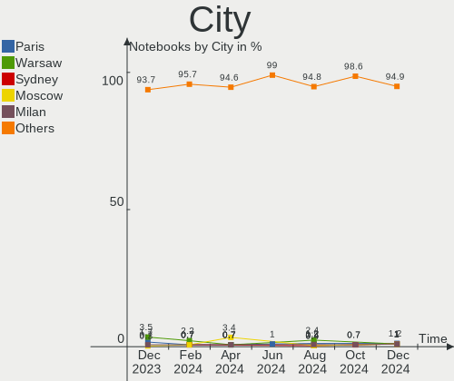
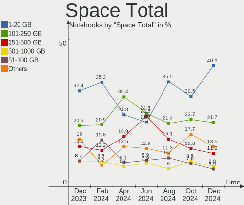
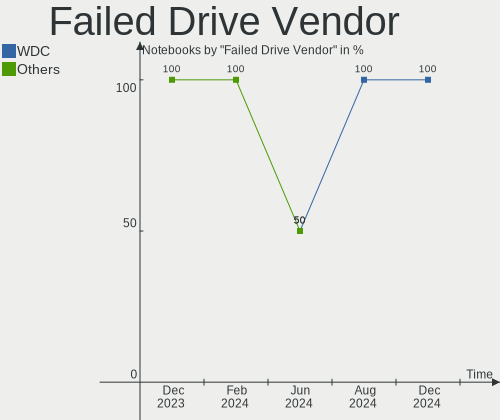
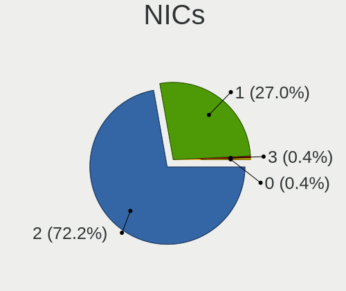
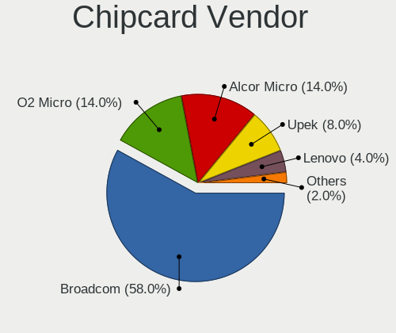

OpenMandriva - Hardware Trends (Notebooks)
------------------------------------------

A project to identify most popular hardware characteristics and track their change
over time based on data collected by Linux users at https://Linux-Hardware.org.

Anyone can contribute to this report by the [hw-probe](https://github.com/linuxhw/hw-probe) tool:

    sudo -E hw-probe -all -upload

This report is for one last month. Overall report since the beginning of time: [TestDays](https://github.com/linuxhw/TestDays)

Period: Feb, 2023.

Contents
--------

* [ System ](#system)
  - [ OS                       ](#os)
  - [ OS Family                ](#os-family)
  - [ Kernel                   ](#kernel)
  - [ Kernel Family            ](#kernel-family)
  - [ Kernel Major Ver.        ](#kernel-major-ver)
  - [ Arch                     ](#arch)
  - [ DE                       ](#de)
  - [ Display Server           ](#display-server)
  - [ Display Manager          ](#display-manager)
  - [ OS Lang                  ](#os-lang)
  - [ Boot Mode                ](#boot-mode)
  - [ Filesystem               ](#filesystem)
  - [ Part. scheme             ](#part-scheme)
  - [ Dual Boot with Linux/BSD ](#dual-boot-with-linuxbsd)
  - [ Dual Boot (Win)          ](#dual-boot-win)

* [ Board ](#board)
  - [ Vendor                   ](#vendor)
  - [ Model                    ](#model)
  - [ Model Family             ](#model-family)
  - [ MFG Year                 ](#mfg-year)
  - [ Form Factor              ](#form-factor)
  - [ Secure Boot              ](#secure-boot)
  - [ Coreboot                 ](#coreboot)
  - [ RAM Size                 ](#ram-size)
  - [ RAM Used                 ](#ram-used)
  - [ Total Drives             ](#total-drives)
  - [ Has CD-ROM               ](#has-cd-rom)
  - [ Has Ethernet             ](#has-ethernet)
  - [ Has WiFi                 ](#has-wifi)
  - [ Has Bluetooth            ](#has-bluetooth)

* [ Location ](#location)
  - [ Country                  ](#country)
  - [ City                     ](#city)

* [ Drives ](#drives)
  - [ Drive Vendor             ](#drive-vendor)
  - [ Drive Model              ](#drive-model)
  - [ HDD Vendor               ](#hdd-vendor)
  - [ SSD Vendor               ](#ssd-vendor)
  - [ Drive Kind               ](#drive-kind)
  - [ Drive Connector          ](#drive-connector)
  - [ Drive Size               ](#drive-size)
  - [ Space Total              ](#space-total)
  - [ Space Used               ](#space-used)
  - [ Malfunc. Drives          ](#malfunc-drives)
  - [ Malfunc. Drive Vendor    ](#malfunc-drive-vendor)
  - [ Malfunc. HDD Vendor      ](#malfunc-hdd-vendor)
  - [ Malfunc. Drive Kind      ](#malfunc-drive-kind)
  - [ Failed Drives            ](#failed-drives)
  - [ Failed Drive Vendor      ](#failed-drive-vendor)
  - [ Drive Status             ](#drive-status)

* [ Storage controller ](#storage-controller)
  - [ Storage Vendor           ](#storage-vendor)
  - [ Storage Model            ](#storage-model)
  - [ Storage Kind             ](#storage-kind)

* [ Processor ](#processor)
  - [ CPU Vendor               ](#cpu-vendor)
  - [ CPU Model                ](#cpu-model)
  - [ CPU Model Family         ](#cpu-model-family)
  - [ CPU Cores                ](#cpu-cores)
  - [ CPU Sockets              ](#cpu-sockets)
  - [ CPU Threads              ](#cpu-threads)
  - [ CPU Op-Modes             ](#cpu-op-modes)
  - [ CPU Microcode            ](#cpu-microcode)
  - [ CPU Microarch            ](#cpu-microarch)

* [ Graphics ](#graphics)
  - [ GPU Vendor               ](#gpu-vendor)
  - [ GPU Model                ](#gpu-model)
  - [ GPU Combo                ](#gpu-combo)
  - [ GPU Driver               ](#gpu-driver)
  - [ GPU Memory               ](#gpu-memory)

* [ Monitor ](#monitor)
  - [ Monitor Vendor           ](#monitor-vendor)
  - [ Monitor Model            ](#monitor-model)
  - [ Monitor Resolution       ](#monitor-resolution)
  - [ Monitor Diagonal         ](#monitor-diagonal)
  - [ Monitor Width            ](#monitor-width)
  - [ Aspect Ratio             ](#aspect-ratio)
  - [ Monitor Area             ](#monitor-area)
  - [ Pixel Density            ](#pixel-density)
  - [ Multiple Monitors        ](#multiple-monitors)

* [ Network ](#network)
  - [ Net Controller Vendor    ](#net-controller-vendor)
  - [ Net Controller Model     ](#net-controller-model)
  - [ Wireless Vendor          ](#wireless-vendor)
  - [ Wireless Model           ](#wireless-model)
  - [ Ethernet Vendor          ](#ethernet-vendor)
  - [ Ethernet Model           ](#ethernet-model)
  - [ Net Controller Kind      ](#net-controller-kind)
  - [ Used Controller          ](#used-controller)
  - [ NICs                     ](#nics)
  - [ IPv6                     ](#ipv6)

* [ Bluetooth ](#bluetooth)
  - [ Bluetooth Vendor         ](#bluetooth-vendor)
  - [ Bluetooth Model          ](#bluetooth-model)

* [ Sound ](#sound)
  - [ Sound Vendor             ](#sound-vendor)
  - [ Sound Model              ](#sound-model)

* [ Memory ](#memory)
  - [ Memory Vendor            ](#memory-vendor)
  - [ Memory Model             ](#memory-model)
  - [ Memory Kind              ](#memory-kind)
  - [ Memory Form Factor       ](#memory-form-factor)
  - [ Memory Size              ](#memory-size)
  - [ Memory Speed             ](#memory-speed)

* [ Printers & scanners ](#printers--scanners)
  - [ Printer Vendor           ](#printer-vendor)
  - [ Printer Model            ](#printer-model)
  - [ Scanner Vendor           ](#scanner-vendor)
  - [ Scanner Model            ](#scanner-model)

* [ Camera ](#camera)
  - [ Camera Vendor            ](#camera-vendor)
  - [ Camera Model             ](#camera-model)

* [ Security ](#security)
  - [ Fingerprint Vendor       ](#fingerprint-vendor)
  - [ Fingerprint Model        ](#fingerprint-model)
  - [ Chipcard Vendor          ](#chipcard-vendor)
  - [ Chipcard Model           ](#chipcard-model)

* [ Unsupported ](#unsupported)
  - [ Unsupported Devices      ](#unsupported-devices)
  - [ Unsupported Device Types ](#unsupported-device-types)

System
------

OS
--

Installed operating systems

| Name               | Notebooks | Percent |
|--------------------|-----------|---------|
| OpenMandriva 23.01 | 207       | 71.38%  |
| OpenMandriva 4.3   | 53        | 18.28%  |
| OpenMandriva 4.2   | 12        | 4.14%   |
| OpenMandriva 4.90  | 6         | 2.07%   |
| OpenMandriva 4.50  | 6         | 2.07%   |
| OpenMandriva 23.90 | 3         | 1.03%   |
| OpenMandriva 22.12 | 3         | 1.03%   |

OS Family
---------

OS without a version

| Name         | Notebooks | Percent |
|--------------|-----------|---------|
| OpenMandriva | 290       | 100%    |

Kernel
------

Version of the Linux kernel

| Version                      | Notebooks | Percent |
|------------------------------|-----------|---------|
| 6.1.1-desktop-1omv2290       | 158       | 54.48%  |
| 6.1.4-desktop-1omv2301       | 40        | 13.79%  |
| 5.16.7-desktop-1omv4003      | 29        | 10%     |
| 5.16.13-desktop-1omv4003     | 24        | 8.28%   |
| 5.10.14-desktop-1omv4002     | 10        | 3.45%   |
| 6.0.10-desktop-2omv22090     | 4         | 1.38%   |
| 6.2.1-desktop-1omv2390       | 3         | 1.03%   |
| 6.0.2-desktop-1omv4090       | 3         | 1.03%   |
| 5.18.12-desktop-3omv4090     | 3         | 1.03%   |
| 5.14.7-desktop-1omv4050      | 3         | 1.03%   |
| 5.11.12-desktop-1omv4002     | 3         | 1.03%   |
| 6.2.0-desktop-0.rc2.1omv2301 | 2         | 0.69%   |
| 6.1.11-desktop-1omv2390      | 2         | 0.69%   |
| 6.1.4-desktop-gcc-1omv2301   | 1         | 0.34%   |
| 6.1.10                       | 1         | 0.34%   |
| 6.0.0-desktop-1omv4050       | 1         | 0.34%   |
| 5.19.5-desktop-1omv4090      | 1         | 0.34%   |
| 5.19.12-desktop-2omv4090     | 1         | 0.34%   |
| 5.17.1-desktop-2omv4050      | 1         | 0.34%   |

Kernel Family
-------------

Linux kernel without a distro release

| Version | Notebooks | Percent |
|---------|-----------|---------|
| 6.1.1   | 158       | 54.48%  |
| 6.1.4   | 41        | 14.14%  |
| 5.16.7  | 29        | 10%     |
| 5.16.13 | 24        | 8.28%   |
| 5.10.14 | 10        | 3.45%   |
| 6.0.10  | 4         | 1.38%   |
| 6.2.1   | 3         | 1.03%   |
| 6.0.2   | 3         | 1.03%   |
| 5.18.12 | 3         | 1.03%   |
| 5.14.7  | 3         | 1.03%   |
| 5.11.12 | 3         | 1.03%   |
| 6.2.0   | 2         | 0.69%   |
| 6.1.11  | 2         | 0.69%   |
| 6.1.10  | 1         | 0.34%   |
| 6.0.0   | 1         | 0.34%   |
| 5.19.5  | 1         | 0.34%   |
| 5.19.12 | 1         | 0.34%   |
| 5.17.1  | 1         | 0.34%   |

Kernel Major Ver.
-----------------

Linux kernel major version

| Version | Notebooks | Percent |
|---------|-----------|---------|
| 6.1     | 202       | 69.66%  |
| 5.16    | 53        | 18.28%  |
| 5.10    | 10        | 3.45%   |
| 6.0     | 8         | 2.76%   |
| 6.2     | 5         | 1.72%   |
| 5.18    | 3         | 1.03%   |
| 5.14    | 3         | 1.03%   |
| 5.11    | 3         | 1.03%   |
| 5.19    | 2         | 0.69%   |
| 5.17    | 1         | 0.34%   |

Arch
----

OS architecture (x86_64, i586, etc.)

| Name   | Notebooks | Percent |
|--------|-----------|---------|
| x86_64 | 290       | 100%    |

DE
--

Desktop Environment

| Name     | Notebooks | Percent |
|----------|-----------|---------|
| KDE5     | 270       | 93.1%   |
| GNOME    | 17        | 5.86%   |
| Unknown  | 2         | 0.69%   |
| Cinnamon | 1         | 0.34%   |

Display Server
--------------

X11 or Wayland

| Name    | Notebooks | Percent |
|---------|-----------|---------|
| X11     | 272       | 93.79%  |
| Wayland | 18        | 6.21%   |

Display Manager
---------------

SDDM, LightDM, etc.

| Name | Notebooks | Percent |
|------|-----------|---------|
| SDDM | 273       | 94.14%  |
| GDM  | 17        | 5.86%   |

OS Lang
-------

Language

| Lang  | Notebooks | Percent |
|-------|-----------|---------|
| en_US | 137       | 47.24%  |
| fr_FR | 23        | 7.93%   |
| de_DE | 20        | 6.9%    |
| ru_RU | 16        | 5.52%   |
| pt_BR | 15        | 5.17%   |
| it_IT | 12        | 4.14%   |
| en_GB | 12        | 4.14%   |
| pl_PL | 8         | 2.76%   |
| es_ES | 7         | 2.41%   |
| cs_CZ | 7         | 2.41%   |
| nl_NL | 4         | 1.38%   |
| es_MX | 4         | 1.38%   |
| es_CL | 3         | 1.03%   |
| tr_TR | 2         | 0.69%   |
| pt_PT | 2         | 0.69%   |
| es_UY | 2         | 0.69%   |
| es_CO | 2         | 0.69%   |
| es_AR | 2         | 0.69%   |
| de_AT | 2         | 0.69%   |
| uk_UA | 1         | 0.34%   |
| ro_RO | 1         | 0.34%   |
| nl_BE | 1         | 0.34%   |
| hu_HU | 1         | 0.34%   |
| es_PE | 1         | 0.34%   |
| es_EC | 1         | 0.34%   |
| en_NZ | 1         | 0.34%   |
| en_IN | 1         | 0.34%   |
| en_DK | 1         | 0.34%   |
| de_CH | 1         | 0.34%   |

Boot Mode
---------

EFI or BIOS

| Mode | Notebooks | Percent |
|------|-----------|---------|
| EFI  | 172       | 59.31%  |
| BIOS | 118       | 40.69%  |

Filesystem
----------

Type of filesystem

| Type     | Notebooks | Percent |
|----------|-----------|---------|
| Overlay  | 140       | 48.28%  |
| Ext4     | 137       | 47.24%  |
| Btrfs    | 10        | 3.45%   |
| Reiserfs | 1         | 0.34%   |
| Jfs      | 1         | 0.34%   |
| F2fs     | 1         | 0.34%   |

Part. scheme
------------

Scheme of partitioning

| Type | Notebooks | Percent |
|------|-----------|---------|
| GPT  | 218       | 75.17%  |
| MBR  | 72        | 24.83%  |

Dual Boot with Linux/BSD
------------------------

Hosting more than one Linux/BSD

| Dual boot | Notebooks | Percent |
|-----------|-----------|---------|
| No        | 158       | 54.48%  |
| Yes       | 132       | 45.52%  |

Dual Boot (Win)
---------------

Hosting Linux and Windows

| Dual boot | Notebooks | Percent |
|-----------|-----------|---------|
| No        | 178       | 61.38%  |
| Yes       | 112       | 38.62%  |

Board
-----

Vendor
------

Motherboard manufacturer

| Name                | Notebooks | Percent |
|---------------------|-----------|---------|
| Hewlett-Packard     | 56        | 19.31%  |
| Lenovo              | 52        | 17.93%  |
| ASUSTek Computer    | 42        | 14.48%  |
| Dell                | 38        | 13.1%   |
| Acer                | 29        | 10%     |
| Toshiba             | 12        | 4.14%   |
| Samsung Electronics | 10        | 3.45%   |
| Sony                | 6         | 2.07%   |
| Apple               | 6         | 2.07%   |
| Positivo            | 4         | 1.38%   |
| Google              | 4         | 1.38%   |
| Medion              | 3         | 1.03%   |
| Unknown             | 3         | 1.03%   |
| Philco              | 2         | 0.69%   |
| MSI                 | 2         | 0.69%   |
| Gigabyte Technology | 2         | 0.69%   |
| Gateway             | 2         | 0.69%   |
| Fujitsu             | 2         | 0.69%   |
| eMachines           | 2         | 0.69%   |
| Wortmann AG         | 1         | 0.34%   |
| Timi                | 1         | 0.34%   |
| Standard            | 1         | 0.34%   |
| Quanta              | 1         | 0.34%   |
| PCsmart             | 1         | 0.34%   |
| PC Specialist       | 1         | 0.34%   |
| Packard Bell        | 1         | 0.34%   |
| Notebook            | 1         | 0.34%   |
| NEC Computers       | 1         | 0.34%   |
| Insyde              | 1         | 0.34%   |
| HUAWEI              | 1         | 0.34%   |
| Fujitsu Siemens     | 1         | 0.34%   |
| EXTRA Computer      | 1         | 0.34%   |

Model
-----

Motherboard model

| Name                               | Notebooks | Percent |
|------------------------------------|-----------|---------|
| HP Notebook                        | 9         | 3.1%    |
| Unknown                            | 5         | 1.72%   |
| ASUS UX31E                         | 4         | 1.38%   |
| Toshiba dynabook T653/46JR         | 3         | 1.03%   |
| Lenovo IdeaPad 3 15ALC6 82KU       | 3         | 1.03%   |
| HP Pavilion 17                     | 3         | 1.03%   |
| HP 15                              | 3         | 1.03%   |
| Dell Latitude D630                 | 3         | 1.03%   |
| Apple MacBookPro8,1                | 3         | 1.03%   |
| Samsung 300E4C/300E5C/300E7C       | 2         | 0.69%   |
| Lenovo IdeaPad S145-15AST 81N3     | 2         | 0.69%   |
| Lenovo IdeaPad 330S-15IKB 81F5     | 2         | 0.69%   |
| HP ProBook 4530s                   | 2         | 0.69%   |
| HP 255 G8 Notebook PC              | 2         | 0.69%   |
| HP 250 G6 Notebook PC              | 2         | 0.69%   |
| Dell Latitude E7440                | 2         | 0.69%   |
| ASUS X555DG                        | 2         | 0.69%   |
| ASUS S551LN                        | 2         | 0.69%   |
| ASUS GL553VD                       | 2         | 0.69%   |
| Acer Aspire A715-42G               | 2         | 0.69%   |
| Wortmann AG TERRA_MOBILE_1512/1712 | 1         | 0.34%   |
| Toshiba TECRA R850                 | 1         | 0.34%   |
| Toshiba Satellite P875             | 1         | 0.34%   |
| Toshiba Satellite L750             | 1         | 0.34%   |
| Toshiba Satellite C855-1LG         | 1         | 0.34%   |
| Toshiba Satellite C850-1GF         | 1         | 0.34%   |
| Toshiba Satellite C850             | 1         | 0.34%   |
| Toshiba Satellite C70-C-18E        | 1         | 0.34%   |
| Toshiba Satellite C55-A-168        | 1         | 0.34%   |
| Toshiba dynabook R73/BN            | 1         | 0.34%   |
| Timi TM1707                        | 1         | 0.34%   |
| Sony VPCZ21Z9R                     | 1         | 0.34%   |
| Sony VGN-NW240F                    | 1         | 0.34%   |
| Sony VGN-FW270J                    | 1         | 0.34%   |
| Sony VGN-FW11M                     | 1         | 0.34%   |
| Sony SVE1513U1ESI                  | 1         | 0.34%   |
| Sony SVE1513B1EW                   | 1         | 0.34%   |
| Samsung RV419/RV420                | 1         | 0.34%   |
| Samsung RV413/RV513                | 1         | 0.34%   |
| Samsung RF511/RF411/RF711          | 1         | 0.34%   |

Model Family
------------

Motherboard model prefix

| Name              | Notebooks | Percent |
|-------------------|-----------|---------|
| Acer Aspire       | 24        | 8.28%   |
| Lenovo ThinkPad   | 22        | 7.59%   |
| Lenovo IdeaPad    | 18        | 6.21%   |
| Dell Latitude     | 15        | 5.17%   |
| Dell Inspiron     | 13        | 4.48%   |
| HP Pavilion       | 10        | 3.45%   |
| HP ProBook        | 9         | 3.1%    |
| HP Notebook       | 9         | 3.1%    |
| Toshiba Satellite | 7         | 2.41%   |
| ASUS VivoBook     | 7         | 2.41%   |
| Unknown           | 5         | 1.72%   |
| Toshiba dynabook  | 4         | 1.38%   |
| HP Laptop         | 4         | 1.38%   |
| ASUS UX31E        | 4         | 1.38%   |
| HP EliteBook      | 3         | 1.03%   |
| HP 255            | 3         | 1.03%   |
| HP 250            | 3         | 1.03%   |
| HP 15             | 3         | 1.03%   |
| Apple MacBookPro8 | 3         | 1.03%   |
| Samsung 300E4C    | 2         | 0.69%   |
| Lenovo V15        | 2         | 0.69%   |
| Lenovo Legion     | 2         | 0.69%   |
| HP Compaq         | 2         | 0.69%   |
| Fujitsu LIFEBOOK  | 2         | 0.69%   |
| Dell XPS          | 2         | 0.69%   |
| Dell Vostro       | 2         | 0.69%   |
| Dell Studio       | 2         | 0.69%   |
| Dell Precision    | 2         | 0.69%   |
| ASUS X555DG       | 2         | 0.69%   |
| ASUS TUF          | 2         | 0.69%   |
| ASUS S551LN       | 2         | 0.69%   |
| ASUS GL553VD      | 2         | 0.69%   |
| ASUS ASUS         | 2         | 0.69%   |
| Wortmann AG TERRA | 1         | 0.34%   |
| Toshiba TECRA     | 1         | 0.34%   |
| Timi TM1707       | 1         | 0.34%   |
| Sony VPCZ21Z9R    | 1         | 0.34%   |
| Sony VGN-NW240F   | 1         | 0.34%   |
| Sony VGN-FW270J   | 1         | 0.34%   |
| Sony VGN-FW11M    | 1         | 0.34%   |

MFG Year
--------

Motherboard manufacture year

| Year | Notebooks | Percent |
|------|-----------|---------|
| 2012 | 36        | 12.41%  |
| 2011 | 34        | 11.72%  |
| 2013 | 25        | 8.62%   |
| 2020 | 24        | 8.28%   |
| 2021 | 21        | 7.24%   |
| 2019 | 20        | 6.9%    |
| 2017 | 20        | 6.9%    |
| 2018 | 18        | 6.21%   |
| 2015 | 18        | 6.21%   |
| 2010 | 17        | 5.86%   |
| 2016 | 14        | 4.83%   |
| 2014 | 11        | 3.79%   |
| 2008 | 10        | 3.45%   |
| 2009 | 8         | 2.76%   |
| 2007 | 7         | 2.41%   |
| 2022 | 5         | 1.72%   |
| 2023 | 1         | 0.34%   |
| 2004 | 1         | 0.34%   |

Form Factor
-----------

Physical design of the computer

| Name     | Notebooks | Percent |
|----------|-----------|---------|
| Notebook | 290       | 100%    |

Secure Boot
-----------

Enabled or disabled

| State    | Notebooks | Percent |
|----------|-----------|---------|
| Disabled | 290       | 100%    |

Coreboot
--------

Have coreboot on board

| Used | Notebooks | Percent |
|------|-----------|---------|
| No   | 286       | 98.62%  |
| Yes  | 4         | 1.38%   |

RAM Size
--------

Total RAM memory

| Size in GB  | Notebooks | Percent |
|-------------|-----------|---------|
| 3.01-4.0    | 92        | 31.72%  |
| 4.01-8.0    | 87        | 30%     |
| 8.01-16.0   | 53        | 18.28%  |
| 16.01-24.0  | 37        | 12.76%  |
| 1.01-2.0    | 11        | 3.79%   |
| 32.01-64.0  | 5         | 1.72%   |
| 2.01-3.0    | 3         | 1.03%   |
| 24.01-32.0  | 1         | 0.34%   |
| 64.01-256.0 | 1         | 0.34%   |

RAM Used
--------

Used RAM memory

| Used GB  | Notebooks | Percent |
|----------|-----------|---------|
| 1.01-2.0 | 215       | 74.14%  |
| 2.01-3.0 | 55        | 18.97%  |
| 0.51-1.0 | 10        | 3.45%   |
| 3.01-4.0 | 9         | 3.1%    |
| 0.01-0.5 | 1         | 0.34%   |

Total Drives
------------

Number of drives on board

| Drives | Notebooks | Percent |
|--------|-----------|---------|
| 1      | 207       | 71.38%  |
| 2      | 74        | 25.52%  |
| 3      | 5         | 1.72%   |
| 4      | 2         | 0.69%   |
| 0      | 2         | 0.69%   |

Has CD-ROM
----------

Has CD-ROM on board

| Presented | Notebooks | Percent |
|-----------|-----------|---------|
| No        | 148       | 51.03%  |
| Yes       | 142       | 48.97%  |

Has Ethernet
------------

Has Ethernet on board

| Presented | Notebooks | Percent |
|-----------|-----------|---------|
| Yes       | 248       | 85.52%  |
| No        | 42        | 14.48%  |

Has WiFi
--------

Has WiFi module

| Presented | Notebooks | Percent |
|-----------|-----------|---------|
| Yes       | 287       | 98.97%  |
| No        | 3         | 1.03%   |

Has Bluetooth
-------------

Has Bluetooth module

| Presented | Notebooks | Percent |
|-----------|-----------|---------|
| Yes       | 218       | 75.17%  |
| No        | 72        | 24.83%  |

Location
--------

Country
-------

Geographic location (country)

| Country      | Notebooks | Percent |
|--------------|-----------|---------|
| USA          | 34        | 11.72%  |
| Germany      | 33        | 11.38%  |
| France       | 25        | 8.62%   |
| Brazil       | 20        | 6.9%    |
| Russia       | 16        | 5.52%   |
| Poland       | 15        | 5.17%   |
| Italy        | 14        | 4.83%   |
| UK           | 10        | 3.45%   |
| Czechia      | 9         | 3.1%    |
| Spain        | 8         | 2.76%   |
| Finland      | 8         | 2.76%   |
| Japan        | 6         | 2.07%   |
| Turkey       | 5         | 1.72%   |
| Netherlands  | 5         | 1.72%   |
| India        | 4         | 1.38%   |
| Chile        | 4         | 1.38%   |
| Belgium      | 4         | 1.38%   |
| Serbia       | 3         | 1.03%   |
| Portugal     | 3         | 1.03%   |
| New Zealand  | 3         | 1.03%   |
| Morocco      | 3         | 1.03%   |
| Mexico       | 3         | 1.03%   |
| Indonesia    | 3         | 1.03%   |
| Colombia     | 3         | 1.03%   |
| Canada       | 3         | 1.03%   |
| Austria      | 3         | 1.03%   |
| Australia    | 3         | 1.03%   |
| Argentina    | 3         | 1.03%   |
| Uruguay      | 2         | 0.69%   |
| Ukraine      | 2         | 0.69%   |
| Switzerland  | 2         | 0.69%   |
| South Africa | 2         | 0.69%   |
| Peru         | 2         | 0.69%   |
| Hungary      | 2         | 0.69%   |
| Egypt        | 2         | 0.69%   |
| Vietnam      | 1         | 0.34%   |
| Sweden       | 1         | 0.34%   |
| Slovenia     | 1         | 0.34%   |
| Slovakia     | 1         | 0.34%   |
| Saudi Arabia | 1         | 0.34%   |

City
----

Geographic location (city)

| City                | Notebooks | Percent |
|---------------------|-----------|---------|
| Prague              | 4         | 1.38%   |
| Helsinki            | 4         | 1.38%   |
| Warsaw              | 3         | 1.03%   |
| Santiago            | 3         | 1.03%   |
| Rio de Janeiro      | 3         | 1.03%   |
| Paris               | 3         | 1.03%   |
| Moscow              | 3         | 1.03%   |
| Dortmund            | 3         | 1.03%   |
| Willingboro         | 2         | 0.69%   |
| St Petersburg       | 2         | 0.69%   |
| Queens              | 2         | 0.69%   |
| Piura               | 2         | 0.69%   |
| Pinellas Park       | 2         | 0.69%   |
| Petrikov            | 2         | 0.69%   |
| Montpellier         | 2         | 0.69%   |
| Montevideo          | 2         | 0.69%   |
| Melbourne           | 2         | 0.69%   |
| Medellín           | 2         | 0.69%   |
| Luechow             | 2         | 0.69%   |
| Jakarta             | 2         | 0.69%   |
| Hanover             | 2         | 0.69%   |
| Fortaleza           | 2         | 0.69%   |
| Cuautitlán Izcalli | 2         | 0.69%   |
| Córdoba            | 2         | 0.69%   |
| Cologne             | 2         | 0.69%   |
| Cascina             | 2         | 0.69%   |
| Berlin              | 2         | 0.69%   |
| Bauru               | 2         | 0.69%   |
| Auckland            | 2         | 0.69%   |
| Alcobendas          | 2         | 0.69%   |
| Zaporizhzhya        | 1         | 0.34%   |
| Zaporizhzhia        | 1         | 0.34%   |
| Yokohama            | 1         | 0.34%   |
| Yemanzhelinsk       | 1         | 0.34%   |
| Wurzen              | 1         | 0.34%   |
| Worcester           | 1         | 0.34%   |
| Wilhelmshaven       | 1         | 0.34%   |
| Wenatchee           | 1         | 0.34%   |
| Wels                | 1         | 0.34%   |
| Wallsend            | 1         | 0.34%   |

Drives
------

Drive Vendor
------------

Hard drive vendors

| Vendor                      | Notebooks | Drives | Percent |
|-----------------------------|-----------|--------|---------|
| WDC                         | 44        | 44     | 12.5%   |
| Seagate                     | 39        | 41     | 11.08%  |
| Samsung Electronics         | 39        | 42     | 11.08%  |
| Toshiba                     | 33        | 33     | 9.38%   |
| Kingston                    | 22        | 22     | 6.25%   |
| Crucial                     | 21        | 22     | 5.97%   |
| HGST                        | 19        | 19     | 5.4%    |
| SanDisk                     | 17        | 19     | 4.83%   |
| Hitachi                     | 15        | 15     | 4.26%   |
| Micron Technology           | 12        | 12     | 3.41%   |
| Unknown                     | 10        | 10     | 2.84%   |
| Intel                       | 10        | 10     | 2.84%   |
| SK hynix                    | 9         | 9      | 2.56%   |
| China                       | 5         | 5      | 1.42%   |
| A-DATA Technology           | 5         | 5      | 1.42%   |
| SPCC                        | 4         | 4      | 1.14%   |
| JMicron Technology          | 4         | 4      | 1.14%   |
| PNY                         | 3         | 3      | 0.85%   |
| GOODRAM                     | 3         | 3      | 0.85%   |
| Unknown                     | 3         | 3      | 0.85%   |
| Transcend                   | 2         | 2      | 0.57%   |
| Silicon Motion              | 2         | 2      | 0.57%   |
| Phison                      | 2         | 2      | 0.57%   |
| LITEON                      | 2         | 2      | 0.57%   |
| Lexar                       | 2         | 2      | 0.57%   |
| KLEVV                       | 2         | 2      | 0.57%   |
| External                    | 2         | 2      | 0.57%   |
| Corsair                     | 2         | 2      | 0.57%   |
| XUM                         | 1         | 1      | 0.28%   |
| VISIPRO                     | 1         | 1      | 0.28%   |
| Team                        | 1         | 1      | 0.28%   |
| SSSTC                       | 1         | 1      | 0.28%   |
| Smartbuy                    | 1         | 1      | 0.28%   |
| SemsoTai                    | 1         | 1      | 0.28%   |
| SABRENT                     | 1         | 1      | 0.28%   |
| Phison Electronics          | 1         | 1      | 0.28%   |
| Netac                       | 1         | 1      | 0.28%   |
| KIOXIA-EXCERIA              | 1         | 1      | 0.28%   |
| KIOXIA                      | 1         | 1      | 0.28%   |
| Kingston Technology Company | 1         | 1      | 0.28%   |

Drive Model
-----------

Hard drive models

| Model                                | Notebooks | Percent |
|--------------------------------------|-----------|---------|
| Toshiba MQ01ABD075 752GB             | 6         | 1.68%   |
| Kingston SA400S37240G 240GB SSD      | 6         | 1.68%   |
| HGST HTS545050A7E680 500GB           | 6         | 1.68%   |
| Seagate ST500LT012-1DG142 500GB      | 5         | 1.4%    |
| Seagate ST1000LM024 HN-M101MBB 1TB   | 5         | 1.4%    |
| HGST HTS721010A9E630 1TB             | 5         | 1.4%    |
| Crucial CT240BX500SSD1 240GB         | 5         | 1.4%    |
| Toshiba MQ04ABF100 1TB               | 4         | 1.12%   |
| SanDisk SSD U100 256GB               | 4         | 1.12%   |
| HGST HTS541010A9E680 1TB             | 4         | 1.12%   |
| Crucial CT1000MX500SSD1 1TB          | 4         | 1.12%   |
| Crucial CT1000BX500SSD1 1TB          | 4         | 1.12%   |
| WDC WD10SPZX-21Z10T0 1TB             | 3         | 0.84%   |
| Toshiba MQ01ABD100 1TB               | 3         | 0.84%   |
| Seagate ST9320325AS 320GB            | 3         | 0.84%   |
| Seagate ST500LT012-9WS142 500GB      | 3         | 0.84%   |
| Seagate ST1000LM035-1RK172 1TB       | 3         | 0.84%   |
| SanDisk SDSSDP064G 64GB              | 3         | 0.84%   |
| Micron MTFDHBA512QFD 512GB           | 3         | 0.84%   |
| Unknown                              | 3         | 0.84%   |
| WDC WDS240G2G0A-00JH30 240GB SSD     | 2         | 0.56%   |
| WDC WD5000LPCX-24VHAT0 500GB         | 2         | 0.56%   |
| WDC WD3200BEVT-75ZCT2 320GB          | 2         | 0.56%   |
| WDC WD1600BEVT-22ZCT0 160GB          | 2         | 0.56%   |
| WDC PC SN530 SDBPMPZ-256G-1101 256GB | 2         | 0.56%   |
| Transcend TS256GMTS430S 256GB SSD    | 2         | 0.56%   |
| Toshiba MQ01ABD050 500GB             | 2         | 0.56%   |
| Toshiba MK3265GSX 320GB              | 2         | 0.56%   |
| SPCC Solid State Disk 512GB          | 2         | 0.56%   |
| SK hynix HFM512GD3JX016N 512GB       | 2         | 0.56%   |
| SK hynix BC711 HFM256GD3JX013N 256GB | 2         | 0.56%   |
| Seagate ST500LM012 HN-M500MBB 500GB  | 2         | 0.56%   |
| Seagate ST320LT020-9YG142 320GB      | 2         | 0.56%   |
| SanDisk SL32G  32GB                  | 2         | 0.56%   |
| Samsung SSD 980 1TB                  | 2         | 0.56%   |
| Samsung SSD 860 EVO 250GB            | 2         | 0.56%   |
| Samsung SSD 850 EVO 250GB            | 2         | 0.56%   |
| Samsung MZALQ256HAJD-000L2 256GB     | 2         | 0.56%   |
| Micron 2210_MTFDHBA1T0QFD 1TB        | 2         | 0.56%   |
| Kingston SA400S37480G 480GB SSD      | 2         | 0.56%   |

HDD Vendor
----------

Hard disk drive vendors

| Vendor              | Notebooks | Drives | Percent |
|---------------------|-----------|--------|---------|
| Seagate             | 38        | 39     | 27.34%  |
| WDC                 | 33        | 33     | 23.74%  |
| Toshiba             | 30        | 30     | 21.58%  |
| HGST                | 19        | 19     | 13.67%  |
| Hitachi             | 15        | 15     | 10.79%  |
| Samsung Electronics | 2         | 2      | 1.44%   |
| SABRENT             | 1         | 1      | 0.72%   |
| Fujitsu             | 1         | 1      | 0.72%   |

SSD Vendor
----------

Solid state drive vendors

| Vendor              | Notebooks | Drives | Percent |
|---------------------|-----------|--------|---------|
| Samsung Electronics | 20        | 20     | 15.27%  |
| Kingston            | 20        | 20     | 15.27%  |
| Crucial             | 19        | 19     | 14.5%   |
| SanDisk             | 15        | 16     | 11.45%  |
| WDC                 | 6         | 6      | 4.58%   |
| China               | 5         | 5      | 3.82%   |
| A-DATA Technology   | 5         | 5      | 3.82%   |
| SPCC                | 4         | 4      | 3.05%   |
| Micron Technology   | 3         | 3      | 2.29%   |
| Intel               | 3         | 3      | 2.29%   |
| GOODRAM             | 3         | 3      | 2.29%   |
| Transcend           | 2         | 2      | 1.53%   |
| PNY                 | 2         | 2      | 1.53%   |
| LITEON              | 2         | 2      | 1.53%   |
| Lexar               | 2         | 2      | 1.53%   |
| JMicron Technology  | 2         | 2      | 1.53%   |
| Corsair             | 2         | 2      | 1.53%   |
| XUM                 | 1         | 1      | 0.76%   |
| VISIPRO             | 1         | 1      | 0.76%   |
| Toshiba             | 1         | 1      | 0.76%   |
| Team                | 1         | 1      | 0.76%   |
| Smartbuy            | 1         | 1      | 0.76%   |
| SemsoTai            | 1         | 1      | 0.76%   |
| Seagate             | 1         | 1      | 0.76%   |
| Netac               | 1         | 1      | 0.76%   |
| KLEVV               | 1         | 1      | 0.76%   |
| KingSpec            | 1         | 1      | 0.76%   |
| Intenso             | 1         | 1      | 0.76%   |
| HS-SSD-C100         | 1         | 1      | 0.76%   |
| Hewlett-Packard     | 1         | 1      | 0.76%   |
| Apple               | 1         | 1      | 0.76%   |
| Acer                | 1         | 1      | 0.76%   |
| Unknown             | 1         | 1      | 0.76%   |

Drive Kind
----------

HDD or SSD

| Kind    | Notebooks | Drives | Percent |
|---------|-----------|--------|---------|
| HDD     | 134       | 140    | 40%     |
| SSD     | 120       | 132    | 35.82%  |
| NVMe    | 62        | 69     | 18.51%  |
| MMC     | 16        | 16     | 4.78%   |
| Unknown | 3         | 3      | 0.9%    |

Drive Connector
---------------

SATA, SAS, NVMe, etc.

| Type | Notebooks | Drives | Percent |
|------|-----------|--------|---------|
| SATA | 230       | 263    | 71.88%  |
| NVMe | 61        | 67     | 19.06%  |
| MMC  | 16        | 16     | 5%      |
| SAS  | 13        | 14     | 4.06%   |

Drive Size
----------

Size of hard drive

| Size in TB | Notebooks | Drives | Percent |
|------------|-----------|--------|---------|
| 0.01-0.5   | 165       | 178    | 65.74%  |
| 0.51-1.0   | 80        | 86     | 31.87%  |
| 1.01-2.0   | 6         | 8      | 2.39%   |

Space Total
-----------

Amount of disk space available on the file system

| Size in GB     | Notebooks | Percent |
|----------------|-----------|---------|
| 1-20           | 100       | 34.48%  |
| 101-250        | 68        | 23.45%  |
| 251-500        | 42        | 14.48%  |
| 501-1000       | 22        | 7.59%   |
| 51-100         | 22        | 7.59%   |
| 21-50          | 13        | 4.48%   |
| Unknown        | 10        | 3.45%   |
| 1001-2000      | 9         | 3.1%    |
| 2001-3000      | 3         | 1.03%   |
| More than 3000 | 1         | 0.34%   |

Space Used
----------

Amount of used disk space

| Used GB   | Notebooks | Percent |
|-----------|-----------|---------|
| 1-20      | 214       | 73.79%  |
| 21-50     | 25        | 8.62%   |
| 51-100    | 17        | 5.86%   |
| 101-250   | 12        | 4.14%   |
| Unknown   | 10        | 3.45%   |
| 251-500   | 6         | 2.07%   |
| 501-1000  | 5         | 1.72%   |
| 1001-2000 | 1         | 0.34%   |

Malfunc. Drives
---------------

Drive models with a malfunction

| Model                                | Notebooks | Drives | Percent |
|--------------------------------------|-----------|--------|---------|
| Toshiba MQ01ABD075 752GB             | 4         | 4      | 4.88%   |
| SanDisk SSD U100 256GB               | 4         | 4      | 4.88%   |
| Seagate ST9320325AS 320GB            | 3         | 3      | 3.66%   |
| Seagate ST500LT012-1DG142 500GB      | 3         | 3      | 3.66%   |
| HGST HTS545050A7E680 500GB           | 3         | 3      | 3.66%   |
| HGST HTS541010A9E680 1TB             | 3         | 3      | 3.66%   |
| Toshiba MK3265GSX 320GB              | 2         | 2      | 2.44%   |
| Seagate ST500LT012-9WS142 500GB      | 2         | 2      | 2.44%   |
| Seagate ST500LM012 HN-M500MBB 500GB  | 2         | 2      | 2.44%   |
| Seagate ST320LT020-9YG142 320GB      | 2         | 2      | 2.44%   |
| Seagate ST1000LM035-1RK172 1TB       | 2         | 2      | 2.44%   |
| Seagate ST1000LM024 HN-M101MBB 1TB   | 2         | 2      | 2.44%   |
| HGST HTS541075A9E680 752GB           | 2         | 2      | 2.44%   |
| WDC WD7500BPVT-55HXZT4 752GB         | 1         | 1      | 1.22%   |
| WDC WD5000LPCX-24VHAT0 500GB         | 1         | 1      | 1.22%   |
| WDC WD5000BPVT-22HXZT3 500GB         | 1         | 1      | 1.22%   |
| WDC WD3200BEKT-60V5T1 320GB          | 1         | 1      | 1.22%   |
| WDC WD3200BEKT-60PVMT0 320GB         | 1         | 1      | 1.22%   |
| WDC WD1600BEVS-60RST0 160GB          | 1         | 1      | 1.22%   |
| WDC WD10JPVX-22JC3T0 1TB             | 1         | 1      | 1.22%   |
| WDC WD10JPVX-00JC3T0 1TB             | 1         | 1      | 1.22%   |
| Toshiba MQ01ACF050 500GB             | 1         | 1      | 1.22%   |
| Toshiba MQ01ABD100 1TB               | 1         | 1      | 1.22%   |
| Toshiba MK7559GSXF 752GB             | 1         | 1      | 1.22%   |
| Toshiba MK6465GSXN 640GB             | 1         | 1      | 1.22%   |
| Toshiba MK5075GSX 500GB              | 1         | 1      | 1.22%   |
| Toshiba MK3276GSX H 320GB            | 1         | 1      | 1.22%   |
| Toshiba MK3261GSYN 320GB             | 1         | 1      | 1.22%   |
| Toshiba MK2561GSYN 250GB             | 1         | 1      | 1.22%   |
| Toshiba MK1656GSY 160GB              | 1         | 1      | 1.22%   |
| SK hynix BC711 HFM256GD3JX013N 256GB | 1         | 1      | 1.22%   |
| Seagate ST9500325AS 500GB            | 1         | 1      | 1.22%   |
| Seagate ST9320423AS 320GB            | 1         | 1      | 1.22%   |
| Seagate ST9320320AS 320GB            | 1         | 1      | 1.22%   |
| Seagate ST9320310AS 320GB            | 1         | 1      | 1.22%   |
| Seagate ST9250827AS 250GB            | 1         | 1      | 1.22%   |
| Seagate ST9200420ASG 200GB           | 1         | 1      | 1.22%   |
| Seagate ST9160412AS 160GB            | 1         | 1      | 1.22%   |
| Seagate ST320LT007-9ZV142 320GB      | 1         | 1      | 1.22%   |
| Seagate ST2000LM003 HN-M201RAD 2TB   | 1         | 1      | 1.22%   |

Malfunc. Drive Vendor
---------------------

Vendors of faulty drives

| Vendor              | Notebooks | Drives | Percent |
|---------------------|-----------|--------|---------|
| Seagate             | 25        | 25     | 30.49%  |
| Toshiba             | 15        | 15     | 18.29%  |
| HGST                | 9         | 9      | 10.98%  |
| WDC                 | 8         | 8      | 9.76%   |
| Hitachi             | 7         | 7      | 8.54%   |
| SanDisk             | 5         | 5      | 6.1%    |
| Samsung Electronics | 3         | 3      | 3.66%   |
| Micron Technology   | 2         | 2      | 2.44%   |
| SK hynix            | 1         | 1      | 1.22%   |
| KLEVV               | 1         | 1      | 1.22%   |
| Kingston            | 1         | 1      | 1.22%   |
| Intel               | 1         | 1      | 1.22%   |
| Corsair             | 1         | 1      | 1.22%   |
| China               | 1         | 1      | 1.22%   |
| Apple               | 1         | 1      | 1.22%   |
| Unknown             | 1         | 1      | 1.22%   |

Malfunc. HDD Vendor
-------------------

Vendors of faulty HDD drives

| Vendor              | Notebooks | Drives | Percent |
|---------------------|-----------|--------|---------|
| Seagate             | 25        | 25     | 37.88%  |
| Toshiba             | 15        | 15     | 22.73%  |
| HGST                | 9         | 9      | 13.64%  |
| WDC                 | 8         | 8      | 12.12%  |
| Hitachi             | 7         | 7      | 10.61%  |
| Samsung Electronics | 2         | 2      | 3.03%   |

Malfunc. Drive Kind
-------------------

Kinds of faulty drives

| Kind | Notebooks | Drives | Percent |
|------|-----------|--------|---------|
| HDD  | 66        | 66     | 80.49%  |
| SSD  | 14        | 14     | 17.07%  |
| NVMe | 2         | 2      | 2.44%   |

Failed Drives
-------------

Failed drive models

| Model                        | Notebooks | Drives | Percent |
|------------------------------|-----------|--------|---------|
| WDC WD2500BEVT-35A23T0 250GB | 1         | 1      | 50%     |
| Toshiba MK3259GSXP 320GB     | 1         | 1      | 50%     |

Failed Drive Vendor
-------------------

Failed drive vendors

| Vendor  | Notebooks | Drives | Percent |
|---------|-----------|--------|---------|
| WDC     | 1         | 1      | 50%     |
| Toshiba | 1         | 1      | 50%     |

Drive Status
------------

Number of failed and malfunc. drives

| Status   | Notebooks | Drives | Percent |
|----------|-----------|--------|---------|
| Works    | 210       | 246    | 66.04%  |
| Malfunc  | 81        | 82     | 25.47%  |
| Detected | 25        | 30     | 7.86%   |
| Failed   | 2         | 2      | 0.63%   |

Storage controller
------------------

Storage Vendor
--------------

Storage controller vendors

| Vendor                         | Notebooks | Percent |
|--------------------------------|-----------|---------|
| Intel                          | 212       | 64.05%  |
| AMD                            | 61        | 18.43%  |
| Samsung Electronics            | 18        | 5.44%   |
| Micron Technology              | 9         | 2.72%   |
| SK hynix                       | 8         | 2.42%   |
| SanDisk                        | 5         | 1.51%   |
| Phison Electronics             | 4         | 1.21%   |
| Silicon Motion                 | 3         | 0.91%   |
| Micron/Crucial Technology      | 3         | 0.91%   |
| KIOXIA                         | 3         | 0.91%   |
| Kingston Technology Company    | 3         | 0.91%   |
| Toshiba America Info Systems   | 1         | 0.3%    |
| Solid State Storage Technology | 1         | 0.3%    |

Storage Model
-------------

Storage controller models

| Model                                                                            | Notebooks | Percent |
|----------------------------------------------------------------------------------|-----------|---------|
| AMD FCH SATA Controller [AHCI mode]                                              | 49        | 13.92%  |
| Intel 7 Series Chipset Family 6-port SATA Controller [AHCI mode]                 | 36        | 10.23%  |
| Intel Sunrise Point-LP SATA Controller [AHCI mode]                               | 25        | 7.1%    |
| Intel 6 Series/C200 Series Chipset Family 6 port Mobile SATA AHCI Controller     | 25        | 7.1%    |
| Intel 8 Series SATA Controller 1 [AHCI mode]                                     | 14        | 3.98%   |
| Intel 82801IBM/IEM (ICH9M/ICH9M-E) 4 port SATA Controller [AHCI mode]            | 13        | 3.69%   |
| Intel 82801 Mobile SATA Controller [RAID mode]                                   | 13        | 3.69%   |
| Intel Wildcat Point-LP SATA Controller [AHCI Mode]                               | 11        | 3.13%   |
| AMD SB7x0/SB8x0/SB9x0 SATA Controller [AHCI mode]                                | 11        | 3.13%   |
| Samsung NVMe SSD Controller 980                                                  | 9         | 2.56%   |
| Micron Non-Volatile memory controller                                            | 9         | 2.56%   |
| Intel 82801HM/HEM (ICH8M/ICH8M-E) IDE Controller                                 | 9         | 2.56%   |
| Intel 5 Series/3400 Series Chipset 4 port SATA AHCI Controller                   | 9         | 2.56%   |
| Samsung NVMe SSD Controller SM981/PM981/PM983                                    | 7         | 1.99%   |
| Intel Volume Management Device NVMe RAID Controller                              | 7         | 1.99%   |
| Intel 82801HM/HEM (ICH8M/ICH8M-E) SATA Controller [AHCI mode]                    | 7         | 1.99%   |
| SK hynix Gold P31/PC711 NVMe Solid State Drive                                   | 6         | 1.7%    |
| Intel HM170/QM170 Chipset SATA Controller [AHCI Mode]                            | 6         | 1.7%    |
| Intel 8 Series/C220 Series Chipset Family 6-port SATA Controller 1 [AHCI mode]   | 6         | 1.7%    |
| Intel 5 Series/3400 Series Chipset 6 port SATA AHCI Controller                   | 6         | 1.7%    |
| Intel Tiger Lake-LP SATA Controller                                              | 5         | 1.42%   |
| Intel SSD 660P Series                                                            | 4         | 1.14%   |
| Intel Celeron/Pentium Silver Processor SATA Controller                           | 4         | 1.14%   |
| Intel Atom Processor E3800 Series SATA AHCI Controller                           | 4         | 1.14%   |
| Silicon Motion SM2263EN/SM2263XT SSD Controller                                  | 3         | 0.85%   |
| Intel Ice Lake-LP SATA Controller [AHCI mode]                                    | 3         | 0.85%   |
| Intel Cannon Point-LP SATA Controller [AHCI Mode]                                | 3         | 0.85%   |
| SanDisk WD Blue SN550 NVMe SSD                                                   | 2         | 0.57%   |
| SanDisk Non-Volatile memory controller                                           | 2         | 0.57%   |
| Samsung NVMe SSD Controller SM961/PM961/SM963                                    | 2         | 0.57%   |
| Phison PS5013 E13 NVMe Controller                                                | 2         | 0.57%   |
| KIOXIA NVMe SSD Controller BG4                                                   | 2         | 0.57%   |
| Kingston Company Company Non-Volatile memory controller                          | 2         | 0.57%   |
| Intel Non-Volatile memory controller                                             | 2         | 0.57%   |
| Intel Celeron N3350/Pentium N4200/Atom E3900 Series SATA AHCI Controller         | 2         | 0.57%   |
| Intel Cannon Lake Mobile PCH SATA AHCI Controller                                | 2         | 0.57%   |
| Intel Atom/Celeron/Pentium Processor x5-E8000/J3xxx/N3xxx Series SATA Controller | 2         | 0.57%   |
| Intel 82801IBM/IEM (ICH9M/ICH9M-E) 2 port SATA Controller [IDE mode]             | 2         | 0.57%   |
| Intel 82801HM/HEM (ICH8M/ICH8M-E) SATA Controller [IDE mode]                     | 2         | 0.57%   |
| Intel 400 Series Chipset Family SATA AHCI Controller                             | 2         | 0.57%   |

Storage Kind
------------

Kind of storage controller (IDE, SATA, NVMe, SAS, ...)

| Kind | Notebooks | Percent |
|------|-----------|---------|
| SATA | 248       | 72.3%   |
| NVMe | 61        | 17.78%  |
| RAID | 20        | 5.83%   |
| IDE  | 14        | 4.08%   |

Processor
---------

CPU Vendor
----------

Processor vendors

| Vendor | Notebooks | Percent |
|--------|-----------|---------|
| Intel  | 224       | 77.24%  |
| AMD    | 66        | 22.76%  |

CPU Model
---------

Processor models

| Model                                       | Notebooks | Percent |
|---------------------------------------------|-----------|---------|
| Intel Core i5-2450M CPU @ 2.50GHz           | 6         | 2.07%   |
| Intel Core i3-5005U CPU @ 2.00GHz           | 6         | 2.07%   |
| Intel Core i7-8550U CPU @ 1.80GHz           | 5         | 1.72%   |
| Intel Core i7-3630QM CPU @ 2.40GHz          | 5         | 1.72%   |
| Intel Core i5-7200U CPU @ 2.50GHz           | 5         | 1.72%   |
| AMD Ryzen 5 5500U with Radeon Graphics      | 5         | 1.72%   |
| AMD Ryzen 3 5300U with Radeon Graphics      | 5         | 1.72%   |
| Intel Core i7-7700HQ CPU @ 2.80GHz          | 4         | 1.38%   |
| Intel Core i7-7500U CPU @ 2.70GHz           | 4         | 1.38%   |
| Intel Core i7-2677M CPU @ 1.80GHz           | 4         | 1.38%   |
| Intel Core i5-6200U CPU @ 2.30GHz           | 4         | 1.38%   |
| Intel Core i5-4210U CPU @ 1.70GHz           | 4         | 1.38%   |
| Intel Core i5-3210M CPU @ 2.50GHz           | 4         | 1.38%   |
| Intel Core i7-6500U CPU @ 2.50GHz           | 3         | 1.03%   |
| Intel Core i5-8250U CPU @ 1.60GHz           | 3         | 1.03%   |
| Intel Core i5-3320M CPU @ 2.60GHz           | 3         | 1.03%   |
| Intel Core i5-3230M CPU @ 2.60GHz           | 3         | 1.03%   |
| Intel Core i5-2430M CPU @ 2.40GHz           | 3         | 1.03%   |
| Intel Core i3-2310M CPU @ 2.10GHz           | 3         | 1.03%   |
| Intel Core 2 Duo CPU T8300 @ 2.40GHz        | 3         | 1.03%   |
| Intel Celeron CPU 847 @ 1.10GHz             | 3         | 1.03%   |
| Intel 11th Gen Core i7-1165G7 @ 2.80GHz     | 3         | 1.03%   |
| Intel 11th Gen Core i5-1135G7 @ 2.40GHz     | 3         | 1.03%   |
| AMD Ryzen 3 3250U with Radeon Graphics      | 3         | 1.03%   |
| AMD C-60 APU with Radeon HD Graphics        | 3         | 1.03%   |
| AMD A8-7410 APU with AMD Radeon R5 Graphics | 3         | 1.03%   |
| Intel Pentium Dual-Core CPU T4300 @ 2.10GHz | 2         | 0.69%   |
| Intel Core i7-8565U CPU @ 1.80GHz           | 2         | 0.69%   |
| Intel Core i7-6700HQ CPU @ 2.60GHz          | 2         | 0.69%   |
| Intel Core i7-4600U CPU @ 2.10GHz           | 2         | 0.69%   |
| Intel Core i7-2640M CPU @ 2.80GHz           | 2         | 0.69%   |
| Intel Core i7-2620M CPU @ 2.70GHz           | 2         | 0.69%   |
| Intel Core i7-10870H CPU @ 2.20GHz          | 2         | 0.69%   |
| Intel Core i7-10750H CPU @ 2.60GHz          | 2         | 0.69%   |
| Intel Core i7-1065G7 CPU @ 1.30GHz          | 2         | 0.69%   |
| Intel Core i7 CPU M 640 @ 2.80GHz           | 2         | 0.69%   |
| Intel Core i5-8265U CPU @ 1.60GHz           | 2         | 0.69%   |
| Intel Core i5-6300U CPU @ 2.40GHz           | 2         | 0.69%   |
| Intel Core i5-2520M CPU @ 2.50GHz           | 2         | 0.69%   |
| Intel Core i5-2415M CPU @ 2.30GHz           | 2         | 0.69%   |

CPU Model Family
----------------

Processor model prefix

| Model                          | Notebooks | Percent |
|--------------------------------|-----------|---------|
| Intel Core i5                  | 64        | 22.07%  |
| Intel Core i7                  | 55        | 18.97%  |
| Intel Core i3                  | 31        | 10.69%  |
| Intel Celeron                  | 28        | 9.66%   |
| Intel Core 2 Duo               | 17        | 5.86%   |
| Other                          | 12        | 4.14%   |
| AMD Ryzen 5                    | 11        | 3.79%   |
| AMD Ryzen 3                    | 10        | 3.45%   |
| Intel Pentium                  | 8         | 2.76%   |
| AMD Ryzen 7                    | 6         | 2.07%   |
| AMD A6                         | 6         | 2.07%   |
| AMD A8                         | 5         | 1.72%   |
| AMD E                          | 4         | 1.38%   |
| AMD A10                        | 4         | 1.38%   |
| Intel Pentium Dual-Core        | 3         | 1.03%   |
| AMD E1                         | 3         | 1.03%   |
| AMD C-60                       | 3         | 1.03%   |
| Intel Pentium Dual             | 2         | 0.69%   |
| Intel Atom                     | 2         | 0.69%   |
| AMD Phenom II                  | 2         | 0.69%   |
| AMD A4                         | 2         | 0.69%   |
| Intel Pentium Silver           | 1         | 0.34%   |
| Intel Genuine                  | 1         | 0.34%   |
| Intel Core                     | 1         | 0.34%   |
| Intel Celeron Dual-Core        | 1         | 0.34%   |
| AMD Turion X2 Dual-Core Mobile | 1         | 0.34%   |
| AMD Turion II                  | 1         | 0.34%   |
| AMD Ryzen 9                    | 1         | 0.34%   |
| AMD FX                         | 1         | 0.34%   |
| AMD E2                         | 1         | 0.34%   |
| AMD C-70                       | 1         | 0.34%   |
| AMD Athlon II                  | 1         | 0.34%   |
| AMD Athlon                     | 1         | 0.34%   |

CPU Cores
---------

Number of processor cores

| Number | Notebooks | Percent |
|--------|-----------|---------|
| 2      | 196       | 67.59%  |
| 4      | 69        | 23.79%  |
| 6      | 11        | 3.79%   |
| 8      | 10        | 3.45%   |
| 14     | 2         | 0.69%   |
| 1      | 2         | 0.69%   |

CPU Sockets
-----------

Number of sockets

| Number | Notebooks | Percent |
|--------|-----------|---------|
| 1      | 290       | 100%    |

CPU Threads
-----------

Threads per core (Hyper-Threading)

| Number | Notebooks | Percent |
|--------|-----------|---------|
| 2      | 192       | 66.21%  |
| 1      | 96        | 33.1%   |
| 4      | 2         | 0.69%   |

CPU Op-Modes
------------

CPU Operation Modes (32-bit, 64-bit)

| Op mode        | Notebooks | Percent |
|----------------|-----------|---------|
| 32-bit, 64-bit | 290       | 100%    |

CPU Microcode
-------------

Microcode number

| Number     | Notebooks | Percent |
|------------|-----------|---------|
| 0x206a7    | 38        | 13.1%   |
| 0x306a9    | 25        | 8.62%   |
| 0x40651    | 14        | 4.83%   |
| 0x806e9    | 12        | 4.14%   |
| 0x20655    | 12        | 4.14%   |
| 0x1067a    | 12        | 4.14%   |
| Unknown    | 12        | 4.14%   |
| 0x306d4    | 11        | 3.79%   |
| 0x08608103 | 10        | 3.45%   |
| 0x406e3    | 9         | 3.1%    |
| 0x806ea    | 8         | 2.76%   |
| 0x806c1    | 8         | 2.76%   |
| 0x306c3    | 6         | 2.07%   |
| 0x10676    | 6         | 2.07%   |
| 0xa0652    | 5         | 1.72%   |
| 0x07030106 | 5         | 1.72%   |
| 0x906e9    | 4         | 1.38%   |
| 0x706e5    | 4         | 1.38%   |
| 0x08108109 | 4         | 1.38%   |
| 0x06006705 | 4         | 1.38%   |
| 0x0500010d | 4         | 1.38%   |
| 0x906ea    | 3         | 1.03%   |
| 0x806ec    | 3         | 1.03%   |
| 0x806eb    | 3         | 1.03%   |
| 0x6fd      | 3         | 1.03%   |
| 0x406c4    | 3         | 1.03%   |
| 0x406c3    | 3         | 1.03%   |
| 0x30678    | 3         | 1.03%   |
| 0x106e5    | 3         | 1.03%   |
| 0x08108102 | 3         | 1.03%   |
| 0x05000101 | 3         | 1.03%   |
| 0x010000c8 | 3         | 1.03%   |
| 0x906a3    | 2         | 0.69%   |
| 0x706a8    | 2         | 0.69%   |
| 0x706a1    | 2         | 0.69%   |
| 0x6fa      | 2         | 0.69%   |
| 0x506e3    | 2         | 0.69%   |
| 0x506c9    | 2         | 0.69%   |
| 0x08101007 | 2         | 0.69%   |
| 0x07030105 | 2         | 0.69%   |

CPU Microarch
-------------

Microarchitecture

| Name             | Notebooks | Percent |
|------------------|-----------|---------|
| SandyBridge      | 40        | 13.79%  |
| KabyLake         | 33        | 11.38%  |
| IvyBridge        | 27        | 9.31%   |
| Haswell          | 20        | 6.9%    |
| Penryn           | 18        | 6.21%   |
| Skylake          | 14        | 4.83%   |
| Westmere         | 13        | 4.48%   |
| Unknown          | 13        | 4.48%   |
| Broadwell        | 12        | 4.14%   |
| Silvermont       | 10        | 3.45%   |
| Excavator        | 9         | 3.1%    |
| Bobcat           | 9         | 3.1%    |
| Zen+             | 8         | 2.76%   |
| TigerLake        | 8         | 2.76%   |
| Puma             | 7         | 2.41%   |
| Core             | 6         | 2.07%   |
| CometLake        | 5         | 1.72%   |
| Zen 2            | 4         | 1.38%   |
| Zen              | 4         | 1.38%   |
| K10              | 4         | 1.38%   |
| IceLake          | 4         | 1.38%   |
| Goldmont plus    | 4         | 1.38%   |
| Nehalem          | 3         | 1.03%   |
| Jaguar           | 3         | 1.03%   |
| Zen 3            | 2         | 0.69%   |
| Piledriver       | 2         | 0.69%   |
| Goldmont         | 2         | 0.69%   |
| Alderlake Hybrid | 2         | 0.69%   |
| Tremont          | 1         | 0.34%   |
| K8 & K10 hybrid  | 1         | 0.34%   |
| K10 Llano        | 1         | 0.34%   |
| Bonnell          | 1         | 0.34%   |

Graphics
--------

GPU Vendor
----------

Vendors of graphics cards

| Vendor | Notebooks | Percent |
|--------|-----------|---------|
| Intel  | 207       | 58.31%  |
| AMD    | 84        | 23.66%  |
| Nvidia | 64        | 18.03%  |

GPU Model
---------

Graphics card models

| Model                                                                                    | Notebooks | Percent |
|------------------------------------------------------------------------------------------|-----------|---------|
| Intel 2nd Generation Core Processor Family Integrated Graphics Controller                | 38        | 10.27%  |
| Intel 3rd Gen Core processor Graphics Controller                                         | 24        | 6.49%   |
| Intel Mobile 4 Series Chipset Integrated Graphics Controller                             | 13        | 3.51%   |
| Intel Skylake GT2 [HD Graphics 520]                                                      | 12        | 3.24%   |
| Intel HD Graphics 620                                                                    | 12        | 3.24%   |
| Intel Haswell-ULT Integrated Graphics Controller                                         | 12        | 3.24%   |
| Intel HD Graphics 5500                                                                   | 11        | 2.97%   |
| Intel Core Processor Integrated Graphics Controller                                      | 11        | 2.97%   |
| AMD Sun XT [Radeon HD 8670A/8670M/8690M / R5 M330 / M430 / Radeon 520 Mobile]            | 11        | 2.97%   |
| AMD Lucienne                                                                             | 11        | 2.97%   |
| AMD Picasso/Raven 2 [Radeon Vega Series / Radeon Vega Mobile Series]                     | 9         | 2.43%   |
| Intel UHD Graphics 620                                                                   | 8         | 2.16%   |
| Intel TigerLake-LP GT2 [Iris Xe Graphics]                                                | 6         | 1.62%   |
| Intel Mobile GM965/GL960 Integrated Graphics Controller (secondary)                      | 6         | 1.62%   |
| Intel Mobile GM965/GL960 Integrated Graphics Controller (primary)                        | 6         | 1.62%   |
| Intel Atom/Celeron/Pentium Processor x5-E8000/J3xxx/N3xxx Integrated Graphics Controller | 6         | 1.62%   |
| AMD Mullins [Radeon R4/R5 Graphics]                                                      | 6         | 1.62%   |
| Nvidia GP107M [GeForce GTX 1050 Mobile]                                                  | 5         | 1.35%   |
| Intel CometLake-H GT2 [UHD Graphics]                                                     | 5         | 1.35%   |
| Intel 4th Gen Core Processor Integrated Graphics Controller                              | 5         | 1.35%   |
| AMD Stoney [Radeon R2/R3/R4/R5 Graphics]                                                 | 5         | 1.35%   |
| AMD Seymour [Radeon HD 6400M/7400M Series]                                               | 5         | 1.35%   |
| Intel WhiskeyLake-U GT2 [UHD Graphics 620]                                               | 4         | 1.08%   |
| Intel GeminiLake [UHD Graphics 600]                                                      | 4         | 1.08%   |
| Intel Atom Processor Z36xxx/Z37xxx Series Graphics & Display                             | 4         | 1.08%   |
| AMD Wani [Radeon R5/R6/R7 Graphics]                                                      | 4         | 1.08%   |
| AMD RS880M [Mobility Radeon HD 4225/4250]                                                | 4         | 1.08%   |
| AMD Renoir                                                                               | 4         | 1.08%   |
| Nvidia TU117M [GeForce GTX 1650 Mobile / Max-Q]                                          | 3         | 0.81%   |
| Nvidia GM108M [GeForce 840M]                                                             | 3         | 0.81%   |
| Nvidia GK107M [GeForce GT 650M]                                                          | 3         | 0.81%   |
| Nvidia GF117M [GeForce 610M/710M/810M/820M / GT 620M/625M/630M/720M]                     | 3         | 0.81%   |
| Intel HD Graphics 630                                                                    | 3         | 0.81%   |
| Intel CoffeeLake-H GT2 [UHD Graphics 630]                                                | 3         | 0.81%   |
| AMD Wrestler [Radeon HD 6290]                                                            | 3         | 0.81%   |
| AMD Thames [Radeon HD 7550M/7570M/7650M]                                                 | 3         | 0.81%   |
| Nvidia TU117M                                                                            | 2         | 0.54%   |
| Nvidia GP106BM [GeForce GTX 1060 Mobile 6GB]                                             | 2         | 0.54%   |
| Nvidia GM108M [GeForce MX130]                                                            | 2         | 0.54%   |
| Nvidia GM108M [GeForce MX110]                                                            | 2         | 0.54%   |

GPU Combo
---------

Combinations of graphics cards

| Name           | Notebooks | Percent |
|----------------|-----------|---------|
| 1 x Intel      | 136       | 46.9%   |
| 1 x AMD        | 57        | 19.66%  |
| Intel + Nvidia | 47        | 16.21%  |
| 2 x Intel      | 13        | 4.48%   |
| Intel + AMD    | 11        | 3.79%   |
| 1 x Nvidia     | 10        | 3.45%   |
| 2 x AMD        | 9         | 3.1%    |
| AMD + Nvidia   | 7         | 2.41%   |

GPU Driver
----------

Free vs proprietary

| Driver  | Notebooks | Percent |
|---------|-----------|---------|
| Free    | 288       | 99.31%  |
| Unknown | 2         | 0.69%   |

GPU Memory
----------

Total video memory

| Size in GB | Notebooks | Percent |
|------------|-----------|---------|
| Unknown    | 157       | 54.14%  |
| 0.01-0.5   | 41        | 14.14%  |
| 1.01-2.0   | 40        | 13.79%  |
| 0.51-1.0   | 28        | 9.66%   |
| 3.01-4.0   | 18        | 6.21%   |
| 5.01-6.0   | 4         | 1.38%   |
| 7.01-8.0   | 2         | 0.69%   |

Monitor
-------

Monitor Vendor
--------------

Monitor vendors

| Vendor                  | Notebooks | Percent |
|-------------------------|-----------|---------|
| AU Optronics            | 63        | 21.28%  |
| LG Display              | 55        | 18.58%  |
| Chimei Innolux          | 42        | 14.19%  |
| Samsung Electronics     | 41        | 13.85%  |
| BOE                     | 37        | 12.5%   |
| Chi Mei Optoelectronics | 12        | 4.05%   |
| Apple                   | 6         | 2.03%   |
| Lenovo                  | 5         | 1.69%   |
| CPT                     | 5         | 1.69%   |
| Panasonic               | 4         | 1.35%   |
| PANDA                   | 3         | 1.01%   |
| Eizo                    | 3         | 1.01%   |
| Sharp                   | 2         | 0.68%   |
| InfoVision              | 2         | 0.68%   |
| Dell                    | 2         | 0.68%   |
| AOC                     | 2         | 0.68%   |
| Vestel Elektronik       | 1         | 0.34%   |
| TRI                     | 1         | 0.34%   |
| Toshiba                 | 1         | 0.34%   |
| Sony                    | 1         | 0.34%   |
| Philips                 | 1         | 0.34%   |
| LG Philips              | 1         | 0.34%   |
| KDC                     | 1         | 0.34%   |
| InnoLux Display         | 1         | 0.34%   |
| Hewlett-Packard         | 1         | 0.34%   |
| HannStar                | 1         | 0.34%   |
| CSO                     | 1         | 0.34%   |
| BenQ                    | 1         | 0.34%   |

Monitor Model
-------------

Monitor models

| Model                                                                     | Notebooks | Percent |
|---------------------------------------------------------------------------|-----------|---------|
| Chimei Innolux LCD Monitor CMN15F5 1920x1080 344x193mm 15.5-inch          | 7         | 2.36%   |
| LG Display LCD Monitor LGD039F 1366x768 345x194mm 15.6-inch               | 5         | 1.69%   |
| CPT LCD Monitor COR17DB 1600x900 293x164mm 13.2-inch                      | 4         | 1.35%   |
| LG Display LCD Monitor LGD0395 1366x768 344x194mm 15.5-inch               | 3         | 1.01%   |
| Eizo EV3285 ENC2979 3840x2160 698x393mm 31.5-inch                         | 3         | 1.01%   |
| Chimei Innolux LCD Monitor CMN15DB 1366x768 344x193mm 15.5-inch           | 3         | 1.01%   |
| Chimei Innolux LCD Monitor CMN14D4 1920x1080 309x173mm 13.9-inch          | 3         | 1.01%   |
| BOE LCD Monitor BOE0812 1920x1080 344x194mm 15.5-inch                     | 3         | 1.01%   |
| BOE LCD Monitor BOE069C 1920x1080 344x193mm 15.5-inch                     | 3         | 1.01%   |
| AU Optronics LCD Monitor AUO71EC 1366x768 344x193mm 15.5-inch             | 3         | 1.01%   |
| AU Optronics LCD Monitor AUO45EC 1366x768 344x193mm 15.5-inch             | 3         | 1.01%   |
| AU Optronics LCD Monitor AUO38ED 1920x1080 344x193mm 15.5-inch            | 3         | 1.01%   |
| Apple Color LCD APP9CC7 1280x800 286x179mm 13.3-inch                      | 3         | 1.01%   |
| Samsung Electronics LCD Monitor SEC364A 1366x768 344x194mm 15.5-inch      | 2         | 0.68%   |
| Samsung Electronics LCD Monitor SEC324A 1366x768 344x194mm 15.5-inch      | 2         | 0.68%   |
| Samsung Electronics LCD Monitor SEC3157 1280x800 303x190mm 14.1-inch      | 2         | 0.68%   |
| Samsung Electronics LCD Monitor SDC4C51 1366x768 344x194mm 15.5-inch      | 2         | 0.68%   |
| Panasonic TV MEIA0A6 1920x1080 698x392mm 31.5-inch                        | 2         | 0.68%   |
| LG Display LCD Monitor LGD04E8 1920x1080 382x215mm 17.3-inch              | 2         | 0.68%   |
| LG Display LCD Monitor LGD046D 1920x1080 309x174mm 14.0-inch              | 2         | 0.68%   |
| LG Display LCD Monitor LGD03CD 1366x768 277x156mm 12.5-inch               | 2         | 0.68%   |
| LG Display LCD Monitor LGD038E 1366x768 344x194mm 15.5-inch               | 2         | 0.68%   |
| LG Display LCD Monitor LGD0384 1366x768 344x194mm 15.5-inch               | 2         | 0.68%   |
| LG Display LCD Monitor LGD02F1 1366x768 344x194mm 15.5-inch               | 2         | 0.68%   |
| LG Display LCD Monitor LGD02E3 1366x768 344x194mm 15.5-inch               | 2         | 0.68%   |
| LG Display LCD Monitor LGD02DC 1366x768 344x194mm 15.5-inch               | 2         | 0.68%   |
| Lenovo LCD Monitor LEN40A0 1366x768 309x173mm 13.9-inch                   | 2         | 0.68%   |
| Chimei Innolux LCD Monitor CMN1738 1920x1080 381x214mm 17.2-inch          | 2         | 0.68%   |
| Chimei Innolux LCD Monitor CMN15DC 1366x768 344x193mm 15.5-inch           | 2         | 0.68%   |
| Chimei Innolux LCD Monitor CMN15C9 1366x768 344x193mm 15.5-inch           | 2         | 0.68%   |
| Chimei Innolux LCD Monitor CMN1132 1366x768 256x144mm 11.6-inch           | 2         | 0.68%   |
| Chi Mei Optoelectronics LCD Monitor CMO1720 1920x1080 382x215mm 17.3-inch | 2         | 0.68%   |
| BOE LCD Monitor BOE0696 1366x768 309x173mm 13.9-inch                      | 2         | 0.68%   |
| AU Optronics LCD Monitor AUOD1ED 1920x1080 344x193mm 15.5-inch            | 2         | 0.68%   |
| AU Optronics LCD Monitor AUO61ED 1920x1080 344x193mm 15.5-inch            | 2         | 0.68%   |
| AU Optronics LCD Monitor AUO40EC 1366x768 344x193mm 15.5-inch             | 2         | 0.68%   |
| AU Optronics LCD Monitor AUO36ED 1920x1080 344x193mm 15.5-inch            | 2         | 0.68%   |
| AU Optronics LCD Monitor AUO325C 1366x768 256x144mm 11.6-inch             | 2         | 0.68%   |
| AU Optronics LCD Monitor AUO21ED 1920x1080 344x193mm 15.5-inch            | 2         | 0.68%   |
| AU Optronics LCD Monitor AUO159E 1600x900 382x214mm 17.2-inch             | 2         | 0.68%   |

Monitor Resolution
------------------

Monitor screen resolution

| Resolution        | Notebooks | Percent |
|-------------------|-----------|---------|
| 1366x768 (WXGA)   | 123       | 42.41%  |
| 1920x1080 (FHD)   | 110       | 37.93%  |
| 1600x900 (HD+)    | 27        | 9.31%   |
| 1280x800 (WXGA)   | 11        | 3.79%   |
| 3840x2160 (4K)    | 6         | 2.07%   |
| 1440x900 (WXGA+)  | 6         | 2.07%   |
| 2560x1440 (QHD)   | 3         | 1.03%   |
| 2560x1600         | 1         | 0.34%   |
| 1920x540          | 1         | 0.34%   |
| 1920x1200 (WUXGA) | 1         | 0.34%   |
| 1680x945          | 1         | 0.34%   |

Monitor Diagonal
----------------

Diagonal size in inches

| Inches  | Notebooks | Percent |
|---------|-----------|---------|
| 15      | 156       | 52.7%   |
| 17      | 40        | 13.51%  |
| 14      | 31        | 10.47%  |
| 13      | 29        | 9.8%    |
| 12      | 8         | 2.7%    |
| 31      | 6         | 2.03%   |
| 11      | 6         | 2.03%   |
| 18      | 4         | 1.35%   |
| 27      | 2         | 0.68%   |
| 23      | 2         | 0.68%   |
| 10      | 2         | 0.68%   |
| Unknown | 2         | 0.68%   |
| 84      | 1         | 0.34%   |
| 65      | 1         | 0.34%   |
| 54      | 1         | 0.34%   |
| 40      | 1         | 0.34%   |
| 24      | 1         | 0.34%   |
| 21      | 1         | 0.34%   |
| 19      | 1         | 0.34%   |
| 16      | 1         | 0.34%   |

Monitor Width
-------------

Physical width

| Width in mm | Notebooks | Percent |
|-------------|-----------|---------|
| 301-350     | 200       | 67.57%  |
| 351-400     | 43        | 14.53%  |
| 201-300     | 30        | 10.14%  |
| 601-700     | 6         | 2.03%   |
| 401-500     | 6         | 2.03%   |
| 501-600     | 5         | 1.69%   |
| 1001-1500   | 2         | 0.68%   |
| Unknown     | 2         | 0.68%   |
| 801-900     | 1         | 0.34%   |
| 1501-2000   | 1         | 0.34%   |

Aspect Ratio
------------

Proportional relationship between the width and the height

| Ratio | Notebooks | Percent |
|-------|-----------|---------|
| 16/9  | 262       | 92.91%  |
| 16/10 | 19        | 6.74%   |
| 32/9  | 1         | 0.35%   |

Monitor Area
------------

Area in inch²

| Area in inch² | Notebooks | Percent |
|----------------|-----------|---------|
| 101-110        | 156       | 52.7%   |
| 81-90          | 50        | 16.89%  |
| 121-130        | 36        | 12.16%  |
| 71-80          | 10        | 3.38%   |
| 61-70          | 8         | 2.7%    |
| 51-60          | 6         | 2.03%   |
| 351-500        | 6         | 2.03%   |
| 141-150        | 4         | 1.35%   |
| 131-140        | 4         | 1.35%   |
| More than 1000 | 3         | 1.01%   |
| 201-250        | 3         | 1.01%   |
| 41-50          | 2         | 0.68%   |
| 301-350        | 2         | 0.68%   |
| 151-200        | 2         | 0.68%   |
| Unknown        | 2         | 0.68%   |
| 111-120        | 1         | 0.34%   |
| 501-1000       | 1         | 0.34%   |

Pixel Density
-------------

Pixels per inch

| Density       | Notebooks | Percent |
|---------------|-----------|---------|
| 101-120       | 135       | 46.23%  |
| 121-160       | 116       | 39.73%  |
| 51-100        | 27        | 9.25%   |
| 161-240       | 8         | 2.74%   |
| More than 240 | 2         | 0.68%   |
| 1-50          | 2         | 0.68%   |
| Unknown       | 2         | 0.68%   |

Multiple Monitors
-----------------

Total monitors connected

| Total | Notebooks | Percent |
|-------|-----------|---------|
| 1     | 270       | 93.1%   |
| 2     | 19        | 6.55%   |
| 0     | 1         | 0.34%   |

Network
-------

Net Controller Vendor
---------------------

Controller vendors

| Vendor                            | Notebooks | Percent |
|-----------------------------------|-----------|---------|
| Realtek Semiconductor             | 170       | 36.88%  |
| Intel                             | 114       | 24.73%  |
| Qualcomm Atheros                  | 100       | 21.69%  |
| Broadcom                          | 23        | 4.99%   |
| Broadcom Limited                  | 8         | 1.74%   |
| Ralink                            | 7         | 1.52%   |
| MediaTek                          | 6         | 1.3%    |
| Marvell Technology Group          | 6         | 1.3%    |
| Samsung Electronics               | 5         | 1.08%   |
| JMicron Technology                | 5         | 1.08%   |
| Linksys                           | 2         | 0.43%   |
| Hewlett-Packard                   | 2         | 0.43%   |
| ASIX Electronics                  | 2         | 0.43%   |
| Toshiba                           | 1         | 0.22%   |
| Sierra Wireless                   | 1         | 0.22%   |
| Qualcomm                          | 1         | 0.22%   |
| NetGear                           | 1         | 0.22%   |
| Motorola PCS                      | 1         | 0.22%   |
| Huawei Technologies               | 1         | 0.22%   |
| FIBOCOM                           | 1         | 0.22%   |
| Ericsson Business Mobile Networks | 1         | 0.22%   |
| Edimax Technology                 | 1         | 0.22%   |
| Dell                              | 1         | 0.22%   |
| D-Link                            | 1         | 0.22%   |

Net Controller Model
--------------------

Controller models

| Model                                                             | Notebooks | Percent |
|-------------------------------------------------------------------|-----------|---------|
| Realtek RTL8111/8168/8411 PCI Express Gigabit Ethernet Controller | 98        | 17.63%  |
| Realtek RTL810xE PCI Express Fast Ethernet controller             | 48        | 8.63%   |
| Qualcomm Atheros AR9285 Wireless Network Adapter (PCI-Express)    | 19        | 3.42%   |
| Qualcomm Atheros QCA9377 802.11ac Wireless Network Adapter        | 17        | 3.06%   |
| Qualcomm Atheros AR9485 Wireless Network Adapter                  | 16        | 2.88%   |
| Qualcomm Atheros QCA9565 / AR9565 Wireless Network Adapter        | 15        | 2.7%    |
| Realtek RTL8723BE PCIe Wireless Network Adapter                   | 14        | 2.52%   |
| Intel Wireless 7265                                               | 10        | 1.8%    |
| Intel Wireless 7260                                               | 10        | 1.8%    |
| Intel 82579LM Gigabit Network Connection (Lewisville)             | 10        | 1.8%    |
| Realtek RTL8822CE 802.11ac PCIe Wireless Network Adapter          | 8         | 1.44%   |
| Realtek RTL8821CE 802.11ac PCIe Wireless Network Adapter          | 8         | 1.44%   |
| Broadcom BCM4313 802.11bgn Wireless Network Adapter               | 8         | 1.44%   |
| Qualcomm Atheros AR8162 Fast Ethernet                             | 7         | 1.26%   |
| Intel Wireless 8260                                               | 7         | 1.26%   |
| Realtek RTL8188EE Wireless Network Adapter                        | 6         | 1.08%   |
| Qualcomm Atheros AR8161 Gigabit Ethernet                          | 6         | 1.08%   |
| Intel Wireless 8265 / 8275                                        | 6         | 1.08%   |
| Intel Wi-Fi 6 AX201                                               | 6         | 1.08%   |
| Intel Wi-Fi 6 AX200                                               | 6         | 1.08%   |
| Realtek RTL8852AE 802.11ax PCIe Wireless Network Adapter          | 5         | 0.9%    |
| Realtek RTL8822BE 802.11a/b/g/n/ac WiFi adapter                   | 5         | 0.9%    |
| Realtek RTL8188CE 802.11b/g/n WiFi Adapter                        | 5         | 0.9%    |
| Qualcomm Atheros AR9462 Wireless Network Adapter                  | 5         | 0.9%    |
| JMicron JMC250 PCI Express Gigabit Ethernet Controller            | 5         | 0.9%    |
| Intel Wireless 3165                                               | 5         | 0.9%    |
| Intel Wireless 3160                                               | 5         | 0.9%    |
| Intel Ethernet Connection I218-LM                                 | 5         | 0.9%    |
| Intel Centrino Wireless-N 2230                                    | 5         | 0.9%    |
| Intel Centrino Ultimate-N 6300                                    | 5         | 0.9%    |
| Samsung Galaxy series, misc. (tethering mode)                     | 4         | 0.72%   |
| Qualcomm Atheros AR9287 Wireless Network Adapter (PCI-Express)    | 4         | 0.72%   |
| Qualcomm Atheros AR8151 v2.0 Gigabit Ethernet                     | 4         | 0.72%   |
| Qualcomm Atheros AR8131 Gigabit Ethernet                          | 4         | 0.72%   |
| MediaTek MT7921 802.11ax PCI Express Wireless Network Adapter     | 4         | 0.72%   |
| Intel WiFi Link 5100                                              | 4         | 0.72%   |
| Intel Ethernet Connection I219-LM                                 | 4         | 0.72%   |
| Intel Centrino Advanced-N 6205 [Taylor Peak]                      | 4         | 0.72%   |
| Intel 82577LM Gigabit Network Connection                          | 4         | 0.72%   |
| Broadcom NetXtreme BCM57765 Gigabit Ethernet PCIe                 | 4         | 0.72%   |

Wireless Vendor
---------------

Wireless vendors

| Vendor                | Notebooks | Percent |
|-----------------------|-----------|---------|
| Intel                 | 112       | 37.97%  |
| Qualcomm Atheros      | 82        | 27.8%   |
| Realtek Semiconductor | 61        | 20.68%  |
| Broadcom              | 17        | 5.76%   |
| Ralink                | 7         | 2.37%   |
| MediaTek              | 5         | 1.69%   |
| Broadcom Limited      | 4         | 1.36%   |
| Linksys               | 2         | 0.68%   |
| Sierra Wireless       | 1         | 0.34%   |
| Hewlett-Packard       | 1         | 0.34%   |
| FIBOCOM               | 1         | 0.34%   |
| Edimax Technology     | 1         | 0.34%   |
| D-Link                | 1         | 0.34%   |

Wireless Model
--------------

Wireless models

| Model                                                          | Notebooks | Percent |
|----------------------------------------------------------------|-----------|---------|
| Qualcomm Atheros AR9285 Wireless Network Adapter (PCI-Express) | 19        | 6.42%   |
| Qualcomm Atheros QCA9377 802.11ac Wireless Network Adapter     | 17        | 5.74%   |
| Qualcomm Atheros AR9485 Wireless Network Adapter               | 16        | 5.41%   |
| Qualcomm Atheros QCA9565 / AR9565 Wireless Network Adapter     | 15        | 5.07%   |
| Realtek RTL8723BE PCIe Wireless Network Adapter                | 14        | 4.73%   |
| Intel Wireless 7265                                            | 10        | 3.38%   |
| Intel Wireless 7260                                            | 10        | 3.38%   |
| Realtek RTL8822CE 802.11ac PCIe Wireless Network Adapter       | 8         | 2.7%    |
| Realtek RTL8821CE 802.11ac PCIe Wireless Network Adapter       | 8         | 2.7%    |
| Broadcom BCM4313 802.11bgn Wireless Network Adapter            | 8         | 2.7%    |
| Intel Wireless 8260                                            | 7         | 2.36%   |
| Realtek RTL8188EE Wireless Network Adapter                     | 6         | 2.03%   |
| Intel Wireless 8265 / 8275                                     | 6         | 2.03%   |
| Intel Wi-Fi 6 AX201                                            | 6         | 2.03%   |
| Intel Wi-Fi 6 AX200                                            | 6         | 2.03%   |
| Realtek RTL8852AE 802.11ax PCIe Wireless Network Adapter       | 5         | 1.69%   |
| Realtek RTL8822BE 802.11a/b/g/n/ac WiFi adapter                | 5         | 1.69%   |
| Realtek RTL8188CE 802.11b/g/n WiFi Adapter                     | 5         | 1.69%   |
| Qualcomm Atheros AR9462 Wireless Network Adapter               | 5         | 1.69%   |
| Intel Wireless 3165                                            | 5         | 1.69%   |
| Intel Wireless 3160                                            | 5         | 1.69%   |
| Intel Centrino Wireless-N 2230                                 | 5         | 1.69%   |
| Intel Centrino Ultimate-N 6300                                 | 5         | 1.69%   |
| Qualcomm Atheros AR9287 Wireless Network Adapter (PCI-Express) | 4         | 1.35%   |
| MediaTek MT7921 802.11ax PCI Express Wireless Network Adapter  | 4         | 1.35%   |
| Intel WiFi Link 5100                                           | 4         | 1.35%   |
| Intel Centrino Advanced-N 6205 [Taylor Peak]                   | 4         | 1.35%   |
| Broadcom BCM4331 802.11a/b/g/n                                 | 4         | 1.35%   |
| Realtek RTL8723AE PCIe Wireless Network Adapter                | 3         | 1.01%   |
| Ralink RT5390 Wireless 802.11n 1T/1R PCIe                      | 3         | 1.01%   |
| Ralink RT3290 Wireless 802.11n 1T/1R PCIe                      | 3         | 1.01%   |
| Intel PRO/Wireless 3945ABG [Golan] Network Connection          | 3         | 1.01%   |
| Intel Dual Band Wireless-AC 3168NGW [Stone Peak]               | 3         | 1.01%   |
| Intel Dual Band Wireless-AC 3165 Plus Bluetooth                | 3         | 1.01%   |
| Intel Comet Lake PCH CNVi WiFi                                 | 3         | 1.01%   |
| Intel Centrino Wireless-N 1000 [Condor Peak]                   | 3         | 1.01%   |
| Intel Centrino Advanced-N 6200                                 | 3         | 1.01%   |
| Broadcom BCM43142 802.11b/g/n                                  | 3         | 1.01%   |
| Realtek RTL8723BU 802.11b/g/n WLAN Adapter                     | 2         | 0.68%   |
| Qualcomm Atheros QCA6174 802.11ac Wireless Network Adapter     | 2         | 0.68%   |

Ethernet Vendor
---------------

Ethernet vendors

| Vendor                   | Notebooks | Percent |
|--------------------------|-----------|---------|
| Realtek Semiconductor    | 149       | 58.89%  |
| Intel                    | 35        | 13.83%  |
| Qualcomm Atheros         | 31        | 12.25%  |
| Broadcom                 | 12        | 4.74%   |
| Marvell Technology Group | 6         | 2.37%   |
| Samsung Electronics      | 5         | 1.98%   |
| JMicron Technology       | 5         | 1.98%   |
| Broadcom Limited         | 4         | 1.58%   |
| ASIX Electronics         | 2         | 0.79%   |
| Qualcomm                 | 1         | 0.4%    |
| NetGear                  | 1         | 0.4%    |
| Motorola PCS             | 1         | 0.4%    |
| MediaTek                 | 1         | 0.4%    |

Ethernet Model
--------------

Ethernet models

| Model                                                             | Notebooks | Percent |
|-------------------------------------------------------------------|-----------|---------|
| Realtek RTL8111/8168/8411 PCI Express Gigabit Ethernet Controller | 98        | 38.43%  |
| Realtek RTL810xE PCI Express Fast Ethernet controller             | 48        | 18.82%  |
| Intel 82579LM Gigabit Network Connection (Lewisville)             | 10        | 3.92%   |
| Qualcomm Atheros AR8162 Fast Ethernet                             | 7         | 2.75%   |
| Qualcomm Atheros AR8161 Gigabit Ethernet                          | 6         | 2.35%   |
| JMicron JMC250 PCI Express Gigabit Ethernet Controller            | 5         | 1.96%   |
| Intel Ethernet Connection I218-LM                                 | 5         | 1.96%   |
| Samsung Galaxy series, misc. (tethering mode)                     | 4         | 1.57%   |
| Qualcomm Atheros AR8151 v2.0 Gigabit Ethernet                     | 4         | 1.57%   |
| Qualcomm Atheros AR8131 Gigabit Ethernet                          | 4         | 1.57%   |
| Intel Ethernet Connection I219-LM                                 | 4         | 1.57%   |
| Intel 82577LM Gigabit Network Connection                          | 4         | 1.57%   |
| Broadcom NetXtreme BCM57765 Gigabit Ethernet PCIe                 | 4         | 1.57%   |
| Realtek RTL8125 2.5GbE Controller                                 | 3         | 1.18%   |
| Qualcomm Atheros AR8152 v2.0 Fast Ethernet                        | 3         | 1.18%   |
| Qualcomm Atheros AR8121/AR8113/AR8114 Gigabit or Fast Ethernet    | 3         | 1.18%   |
| Marvell Group 88E8055 PCI-E Gigabit Ethernet Controller           | 2         | 0.78%   |
| Marvell Group 88E8040 PCI-E Fast Ethernet Controller              | 2         | 0.78%   |
| Intel Ethernet Connection (4) I219-V                              | 2         | 0.78%   |
| Intel Ethernet Connection (3) I218-LM                             | 2         | 0.78%   |
| Broadcom NetXtreme BCM5755M Gigabit Ethernet PCI Express          | 2         | 0.78%   |
| Broadcom NetLink BCM5906M Fast Ethernet PCI Express               | 2         | 0.78%   |
| Broadcom Limited NetLink BCM57780 Gigabit Ethernet PCIe           | 2         | 0.78%   |
| ASIX AX88179 Gigabit Ethernet                                     | 2         | 0.78%   |
| Samsung GT-I9070 (network tethering, USB debugging enabled)       | 1         | 0.39%   |
| Realtek RTL8153 Gigabit Ethernet Adapter                          | 1         | 0.39%   |
| Qualcomm Redmi 9T                                                 | 1         | 0.39%   |
| Qualcomm Atheros QCA8172 Fast Ethernet                            | 1         | 0.39%   |
| Qualcomm Atheros QCA8171 Gigabit Ethernet                         | 1         | 0.39%   |
| Qualcomm Atheros Killer E2400 Gigabit Ethernet Controller         | 1         | 0.39%   |
| Qualcomm Atheros AR8151 v1.0 Gigabit Ethernet                     | 1         | 0.39%   |
| NetGear LB1120-100NAS                                             | 1         | 0.39%   |
| Motorola PCS moto g(8) plus                                       | 1         | 0.39%   |
| MediaTek moto e(6) plus                                           | 1         | 0.39%   |
| Marvell Group 88E8058 PCI-E Gigabit Ethernet Controller           | 1         | 0.39%   |
| Marvell Group 88E8057 PCI-E Gigabit Ethernet Controller           | 1         | 0.39%   |
| Intel WiMAX Connection 2400m                                      | 1         | 0.39%   |
| Intel Ethernet Connection I219-V                                  | 1         | 0.39%   |
| Intel Ethernet Connection I217-V                                  | 1         | 0.39%   |
| Intel Ethernet Connection I217-LM                                 | 1         | 0.39%   |

Net Controller Kind
-------------------

Ethernet, WiFi or modem

| Kind     | Notebooks | Percent |
|----------|-----------|---------|
| WiFi     | 287       | 53.15%  |
| Ethernet | 248       | 45.93%  |
| Modem    | 5         | 0.93%   |

Used Controller
---------------

Currently used network controller

| Kind     | Notebooks | Percent |
|----------|-----------|---------|
| WiFi     | 216       | 76.06%  |
| Ethernet | 68        | 23.94%  |

NICs
----

Total network controllers on board

| Total | Notebooks | Percent |
|-------|-----------|---------|
| 2     | 236       | 81.38%  |
| 1     | 49        | 16.9%   |
| 0     | 4         | 1.38%   |
| 3     | 1         | 0.34%   |

IPv6
----

IPv6 vs IPv4

| Used | Notebooks | Percent |
|------|-----------|---------|
| No   | 184       | 63.45%  |
| Yes  | 106       | 36.55%  |

Bluetooth
---------

Bluetooth Vendor
----------------

Controller vendors

| Vendor                          | Notebooks | Percent |
|---------------------------------|-----------|---------|
| Intel                           | 82        | 37.61%  |
| Realtek Semiconductor           | 34        | 15.6%   |
| Qualcomm Atheros Communications | 21        | 9.63%   |
| Lite-On Technology              | 16        | 7.34%   |
| IMC Networks                    | 15        | 6.88%   |
| Broadcom                        | 13        | 5.96%   |
| Foxconn / Hon Hai               | 9         | 4.13%   |
| Dell                            | 6         | 2.75%   |
| Apple                           | 6         | 2.75%   |
| Toshiba                         | 3         | 1.38%   |
| Ralink                          | 3         | 1.38%   |
| Cambridge Silicon Radio         | 3         | 1.38%   |
| Hewlett-Packard                 | 2         | 0.92%   |
| Alps Electric                   | 2         | 0.92%   |
| Realtek                         | 1         | 0.46%   |
| Foxconn International           | 1         | 0.46%   |
| Askey Computer                  | 1         | 0.46%   |

Bluetooth Model
---------------

Controller models

| Model                                               | Notebooks | Percent |
|-----------------------------------------------------|-----------|---------|
| Intel Bluetooth wireless interface                  | 44        | 20.18%  |
| Realtek Bluetooth Radio                             | 28        | 12.84%  |
| Qualcomm Atheros  Bluetooth Device                  | 13        | 5.96%   |
| Intel Bluetooth 9460/9560 Jefferson Peak (JfP)      | 9         | 4.13%   |
| Intel AX201 Bluetooth                               | 7         | 3.21%   |
| Qualcomm Atheros AR3011 Bluetooth                   | 6         | 2.75%   |
| Intel Centrino Bluetooth Wireless Transceiver       | 6         | 2.75%   |
| Intel AX200 Bluetooth                               | 6         | 2.75%   |
| Foxconn / Hon Hai Bluetooth Device                  | 6         | 2.75%   |
| Realtek  Bluetooth 4.2 Adapter                      | 5         | 2.29%   |
| IMC Networks Bluetooth Radio                        | 5         | 2.29%   |
| Lite-On Wireless_Device                             | 4         | 1.83%   |
| Lite-On Qualcomm Atheros QCA9377 Bluetooth          | 4         | 1.83%   |
| IMC Networks Bluetooth Device                       | 4         | 1.83%   |
| Broadcom BCM2045B (BDC-2.1)                         | 4         | 1.83%   |
| Ralink RT3290 Bluetooth                             | 3         | 1.38%   |
| Lite-On Bluetooth Device                            | 3         | 1.38%   |
| Intel Wireless-AC 3168 Bluetooth                    | 3         | 1.38%   |
| Intel Centrino Advanced-N 6230 Bluetooth adapter    | 3         | 1.38%   |
| IMC Networks Atheros AR3012 Bluetooth 4.0 Adapter   | 3         | 1.38%   |
| Dell Wireless 360 Bluetooth                         | 3         | 1.38%   |
| Cambridge Silicon Radio Bluetooth Dongle (HCI mode) | 3         | 1.38%   |
| Apple Bluetooth Host Controller                     | 3         | 1.38%   |
| Qualcomm Atheros AR3012 Bluetooth 4.0               | 2         | 0.92%   |
| Lite-On Atheros AR3012 Bluetooth                    | 2         | 0.92%   |
| Intel AX210 Bluetooth                               | 2         | 0.92%   |
| HP Broadcom 2070 Bluetooth Combo                    | 2         | 0.92%   |
| Foxconn / Hon Hai Bluetooth USB Host Controller     | 2         | 0.92%   |
| Dell DW375 Bluetooth Module                         | 2         | 0.92%   |
| Broadcom BCM43142A0 Bluetooth 4.0                   | 2         | 0.92%   |
| Broadcom BCM20702 Bluetooth 4.0 [ThinkPad]          | 2         | 0.92%   |
| Broadcom BCM2070 Bluetooth Device                   | 2         | 0.92%   |
| Alps Electric BCM2046 Bluetooth Device              | 2         | 0.92%   |
| Toshiba RT Bluetooth Radio                          | 1         | 0.46%   |
| Toshiba Bluetooth Radio                             | 1         | 0.46%   |
| Toshiba Bluetooth Device                            | 1         | 0.46%   |
| Realtek RTL8723B Bluetooth                          | 1         | 0.46%   |
| Realtek Bluetooth Radio                             | 1         | 0.46%   |
| Lite-On Qualcomm Atheros Bluetooth                  | 1         | 0.46%   |
| Lite-On Bluetooth USB Host Controller               | 1         | 0.46%   |

Sound
-----

Sound Vendor
------------

Sound card vendors

| Vendor           | Notebooks | Percent |
|------------------|-----------|---------|
| Intel            | 223       | 68.62%  |
| AMD              | 72        | 22.15%  |
| Nvidia           | 28        | 8.62%   |
| JMTek            | 1         | 0.31%   |
| ASUSTek Computer | 1         | 0.31%   |

Sound Model
-----------

Sound card models

| Model                                                                                             | Notebooks | Percent |
|---------------------------------------------------------------------------------------------------|-----------|---------|
| Intel 7 Series/C216 Chipset Family High Definition Audio Controller                               | 39        | 9.29%   |
| Intel Sunrise Point-LP HD Audio                                                                   | 32        | 7.62%   |
| Intel 6 Series/C200 Series Chipset Family High Definition Audio Controller                        | 28        | 6.67%   |
| AMD Family 17h/19h HD Audio Controller                                                            | 28        | 6.67%   |
| Intel 5 Series/3400 Series Chipset High Definition Audio                                          | 16        | 3.81%   |
| AMD Renoir Radeon High Definition Audio Controller                                                | 16        | 3.81%   |
| AMD FCH Azalia Controller                                                                         | 16        | 3.81%   |
| Intel 82801I (ICH9 Family) HD Audio Controller                                                    | 15        | 3.57%   |
| Intel Haswell-ULT HD Audio Controller                                                             | 14        | 3.33%   |
| Intel 8 Series HD Audio Controller                                                                | 14        | 3.33%   |
| AMD Kabini HDMI/DP Audio                                                                          | 14        | 3.33%   |
| Intel Wildcat Point-LP High Definition Audio Controller                                           | 12        | 2.86%   |
| Intel Broadwell-U Audio Controller                                                                | 12        | 2.86%   |
| AMD SBx00 Azalia (Intel HDA)                                                                      | 11        | 2.62%   |
| AMD Raven/Raven2/Fenghuang HDMI/DP Audio Controller                                               | 10        | 2.38%   |
| Intel 82801H (ICH8 Family) HD Audio Controller                                                    | 9         | 2.14%   |
| AMD Wrestler HDMI Audio                                                                           | 9         | 2.14%   |
| AMD Family 15h (Models 60h-6fh) Audio Controller                                                  | 9         | 2.14%   |
| Intel Tiger Lake-LP Smart Sound Technology Audio Controller                                       | 8         | 1.9%    |
| Intel Xeon E3-1200 v3/4th Gen Core Processor HD Audio Controller                                  | 6         | 1.43%   |
| Intel 8 Series/C220 Series Chipset High Definition Audio Controller                               | 6         | 1.43%   |
| Intel Comet Lake PCH cAVS                                                                         | 5         | 1.19%   |
| Intel Cannon Point-LP High Definition Audio Controller                                            | 5         | 1.19%   |
| Intel Atom/Celeron/Pentium Processor x5-E8000/J3xxx/N3xxx Series High Definition Audio Controller | 5         | 1.19%   |
| AMD High Definition Audio Controller                                                              | 5         | 1.19%   |
| Intel Ice Lake-LP Smart Sound Technology Audio Controller                                         | 4         | 0.95%   |
| Intel CM238 HD Audio Controller                                                                   | 4         | 0.95%   |
| Intel Celeron/Pentium Silver Processor High Definition Audio                                      | 4         | 0.95%   |
| Intel Atom Processor Z36xxx/Z37xxx Series High Definition Audio Controller                        | 4         | 0.95%   |
| Nvidia TU107 GeForce GTX 1650 High Definition Audio Controller                                    | 3         | 0.71%   |
| Nvidia GP106 High Definition Audio Controller                                                     | 3         | 0.71%   |
| Nvidia GA104 High Definition Audio Controller                                                     | 3         | 0.71%   |
| Intel Cannon Lake PCH cAVS                                                                        | 3         | 0.71%   |
| AMD Turks HDMI Audio [Radeon HD 6500/6600 / 6700M Series]                                         | 3         | 0.71%   |
| AMD RS880 HDMI Audio [Radeon HD 4200 Series]                                                      | 3         | 0.71%   |
| Nvidia High Definition Audio Controller                                                           | 2         | 0.48%   |
| Nvidia GT216 HDMI Audio Controller                                                                | 2         | 0.48%   |
| Nvidia GP107GL High Definition Audio Controller                                                   | 2         | 0.48%   |
| Nvidia GM107 High Definition Audio Controller [GeForce 940MX]                                     | 2         | 0.48%   |
| Nvidia GK107 HDMI Audio Controller                                                                | 2         | 0.48%   |

Memory
------

Memory Vendor
-------------

Memory module vendors

| Vendor              | Notebooks | Percent |
|---------------------|-----------|---------|
| Samsung Electronics | 84        | 23.33%  |
| SK hynix            | 78        | 21.67%  |
| Micron Technology   | 49        | 13.61%  |
| Kingston            | 37        | 10.28%  |
| Unknown             | 23        | 6.39%   |
| Crucial             | 18        | 5%      |
| Ramaxel Technology  | 11        | 3.06%   |
| Elpida              | 9         | 2.5%    |
| A-DATA Technology   | 9         | 2.5%    |
| Corsair             | 7         | 1.94%   |
| Nanya Technology    | 6         | 1.67%   |
| Smart               | 5         | 1.39%   |
| Transcend           | 3         | 0.83%   |
| Team                | 3         | 0.83%   |
| GOODRAM             | 3         | 0.83%   |
| Super Talent        | 2         | 0.56%   |
| Multilaser          | 2         | 0.56%   |
| Unknown (89F7)      | 1         | 0.28%   |
| Teikon              | 1         | 0.28%   |
| Smart Brazil        | 1         | 0.28%   |
| PNY                 | 1         | 0.28%   |
| Patriot             | 1         | 0.28%   |
| Lexar               | 1         | 0.28%   |
| High Bridge         | 1         | 0.28%   |
| G.Skill             | 1         | 0.28%   |
| ASint Technology    | 1         | 0.28%   |
| Apacer              | 1         | 0.28%   |
| Unknown             | 1         | 0.28%   |

Memory Model
------------

Memory module models

| Model                                                        | Notebooks | Percent |
|--------------------------------------------------------------|-----------|---------|
| SK hynix RAM HMT451S6BFR8A-PB 4GB SODIMM DDR3 1600MT/s       | 9         | 2.43%   |
| SK hynix RAM HMT351S6CFR8C-PB 4GB SODIMM DDR3 1600MT/s       | 7         | 1.89%   |
| Samsung RAM M471B5273CH0-CH9 4GB SODIMM DDR3 1334MT/s        | 7         | 1.89%   |
| Samsung RAM M471B5773DH0-CH9 2GB SODIMM DDR3 1600MT/s        | 6         | 1.62%   |
| Samsung RAM M471A5244CB0-CTD 4GB SODIMM DDR4 3266MT/s        | 6         | 1.62%   |
| Samsung RAM M471B5273DH0-CH9 4GB SODIMM DDR3 1334MT/s        | 5         | 1.35%   |
| Micron RAM 4ATF51264HZ-2G3B1 4096MB SODIMM DDR4 2400MT/s     | 5         | 1.35%   |
| Unknown RAM Module 2GB SODIMM DDR2                           | 4         | 1.08%   |
| SK hynix RAM HMT425S6AFR6A-PB 2GB SODIMM DDR3 3200MT/s       | 4         | 1.08%   |
| Samsung RAM M471B5273CH0-CK0 4GB SODIMM DDR3 1600MT/s        | 4         | 1.08%   |
| Samsung RAM M471B5173QH0-YK0 4GB SODIMM DDR3 1600MT/s        | 4         | 1.08%   |
| Samsung RAM M471B5173EB0-YK0 4GB SODIMM DDR3 1600MT/s        | 4         | 1.08%   |
| Samsung RAM M471A1K43CB1-CRC 8GB SODIMM DDR4 2667MT/s        | 4         | 1.08%   |
| Elpida RAM Module 2GB SODIMM DDR3 1333MT/s                   | 4         | 1.08%   |
| Unknown RAM Module 4GB SODIMM DDR3                           | 3         | 0.81%   |
| Unknown RAM Module 2GB SODIMM DDR2 667MT/s                   | 3         | 0.81%   |
| Unknown RAM Module 2GB SODIMM 800MT/s                        | 3         | 0.81%   |
| SK hynix RAM HYMP125S64CP8-S6 2GB SODIMM DDR2 800MT/s        | 3         | 0.81%   |
| SK hynix RAM HMA851S6DJR6N-XN 4GB Row Of Chips DDR4 3200MT/s | 3         | 0.81%   |
| SK hynix RAM HMA81GS6AFR8N-UH 8GB SODIMM DDR4 2667MT/s       | 3         | 0.81%   |
| Samsung RAM M471B5773CHS-CH9 2GB SODIMM DDR3 4199MT/s        | 3         | 0.81%   |
| Samsung RAM M471B1G73DB0-YK0 8192MB SODIMM DDR3 1600MT/s     | 3         | 0.81%   |
| Ramaxel RAM RMSA3310MJ86H9F-3200 4GB SODIMM DDR4 3200MT/s    | 3         | 0.81%   |
| Micron RAM Module 4GB SODIMM DDR3 1600MT/s                   | 3         | 0.81%   |
| Micron RAM 8KTF51264HZ-1G6N1 4GB SODIMM DDR3 1600MT/s        | 3         | 0.81%   |
| Micron RAM 8KTF51264HDZ-1G4E1 4GB SODIMM DDR3 1333MT/s       | 3         | 0.81%   |
| Micron RAM 4ATF1G64HZ-3G2E2 8GB SODIMM DDR4 3200MT/s         | 3         | 0.81%   |
| Unknown RAM Module 4GB SODIMM DDR3 1333MT/s                  | 2         | 0.54%   |
| SK hynix RAM HMT41GS6BFR8A-PB 8GB SODIMM DDR3 1600MT/s       | 2         | 0.54%   |
| SK hynix RAM HMT351S6BFR8C-H9 4GB SODIMM DDR3 1333MT/s       | 2         | 0.54%   |
| SK hynix RAM HMT325S6BFR8C-H9 2GB SODIMM 1600MT/s            | 2         | 0.54%   |
| SK hynix RAM HMA81GS6DJR8N-VK 8GB SODIMM DDR4 2667MT/s       | 2         | 0.54%   |
| Samsung RAM M471B5773DH0-CK0 2GB SODIMM DDR3 1600MT/s        | 2         | 0.54%   |
| Samsung RAM M471B5173DB0-YK0 4GB SODIMM DDR3 1600MT/s        | 2         | 0.54%   |
| Samsung RAM M471B1G73QH0-YK0 8GB SODIMM DDR3 1867MT/s        | 2         | 0.54%   |
| Samsung RAM M471B1G73EB0-YK0 8192MB SODIMM DDR3 1600MT/s     | 2         | 0.54%   |
| Samsung RAM M471A5244CB0-CWE 4GB SODIMM DDR4 3200MT/s        | 2         | 0.54%   |
| Samsung RAM M471A5244CB0-CWE 4GB Row Of Chips DDR4 3200MT/s  | 2         | 0.54%   |
| Samsung RAM M471A5244CB0-CRC 4GB SODIMM DDR4 2667MT/s        | 2         | 0.54%   |
| Samsung RAM M471A1K43EB1-CWE 8GB SODIMM DDR4 3200MT/s        | 2         | 0.54%   |

Memory Kind
-----------

Memory module kinds

| Kind    | Notebooks | Percent |
|---------|-----------|---------|
| DDR3    | 154       | 53.29%  |
| DDR4    | 96        | 33.22%  |
| DDR2    | 17        | 5.88%   |
| SDRAM   | 9         | 3.11%   |
| LPDDR4  | 4         | 1.38%   |
| LPDDR3  | 3         | 1.04%   |
| DDR5    | 3         | 1.04%   |
| Unknown | 3         | 1.04%   |

Memory Form Factor
------------------

Physical design of the memory module

| Name         | Notebooks | Percent |
|--------------|-----------|---------|
| SODIMM       | 276       | 94.85%  |
| Row Of Chips | 13        | 4.47%   |
| DIMM         | 1         | 0.34%   |
| Unknown      | 1         | 0.34%   |

Memory Size
-----------

Memory module size

| Size  | Notebooks | Percent |
|-------|-----------|---------|
| 4096  | 148       | 45.12%  |
| 8192  | 93        | 28.35%  |
| 2048  | 61        | 18.6%   |
| 16384 | 16        | 4.88%   |
| 1024  | 7         | 2.13%   |
| 32768 | 3         | 0.91%   |

Memory Speed
------------

Memory module speed

| Speed   | Notebooks | Percent |
|---------|-----------|---------|
| 1600    | 100       | 31.45%  |
| 3200    | 41        | 12.89%  |
| 2667    | 40        | 12.58%  |
| 1334    | 28        | 8.81%   |
| 2400    | 22        | 6.92%   |
| 1333    | 21        | 6.6%    |
| 2133    | 10        | 3.14%   |
| 667     | 8         | 2.52%   |
| Unknown | 7         | 2.2%    |
| 3266    | 6         | 1.89%   |
| 1067    | 6         | 1.89%   |
| 4199    | 5         | 1.57%   |
| 1867    | 5         | 1.57%   |
| 800     | 5         | 1.57%   |
| 4800    | 3         | 0.94%   |
| 2048    | 3         | 0.94%   |
| 975     | 3         | 0.94%   |
| 1066    | 2         | 0.63%   |
| 4267    | 1         | 0.31%   |
| 1639    | 1         | 0.31%   |
| 533     | 1         | 0.31%   |

Printers & scanners
-------------------

Printer Vendor
--------------

Printer device vendors

| Vendor | Notebooks | Percent |
|--------|-----------|---------|
| Canon  | 1         | 100%    |

Printer Model
-------------

Printer device models

| Model               | Notebooks | Percent |
|---------------------|-----------|---------|
| Canon TR8500 series | 1         | 100%    |

Scanner Vendor
--------------

Scanner device vendors

Zero info for selected period =(

Scanner Model
-------------

Scanner device models

Zero info for selected period =(

Camera
------

Camera Vendor
-------------

Camera device vendors

| Vendor                                 | Notebooks | Percent |
|----------------------------------------|-----------|---------|
| Chicony Electronics                    | 70        | 28%     |
| Realtek Semiconductor                  | 26        | 10.4%   |
| Acer                                   | 17        | 6.8%    |
| Suyin                                  | 16        | 6.4%    |
| Microdia                               | 16        | 6.4%    |
| Quanta                                 | 14        | 5.6%    |
| IMC Networks                           | 14        | 5.6%    |
| Cheng Uei Precision Industry (Foxlink) | 14        | 5.6%    |
| Sunplus Innovation Technology          | 12        | 4.8%    |
| Syntek                                 | 9         | 3.6%    |
| Silicon Motion                         | 7         | 2.8%    |
| Apple                                  | 6         | 2.4%    |
| Ricoh                                  | 4         | 1.6%    |
| Lite-On Technology                     | 4         | 1.6%    |
| Primax Electronics                     | 3         | 1.2%    |
| Alcor Micro                            | 3         | 1.2%    |
| Sonix Technology                       | 2         | 0.8%    |
| Lenovo                                 | 2         | 0.8%    |
| Importek                               | 2         | 0.8%    |
| DLEQNA19IFK6G2                         | 2         | 0.8%    |
| OmniVision Technologies                | 1         | 0.4%    |
| Omnivision                             | 1         | 0.4%    |
| Luxvisions Innotech Limited            | 1         | 0.4%    |
| Logitech                               | 1         | 0.4%    |
| DigiTech                               | 1         | 0.4%    |
| Cubeternet                             | 1         | 0.4%    |
| Bison Electronics                      | 1         | 0.4%    |

Camera Model
------------

Camera device models

| Model                                                   | Notebooks | Percent |
|---------------------------------------------------------|-----------|---------|
| Acer Integrated Camera                                  | 11        | 4.38%   |
| Realtek USB Camera                                      | 8         | 3.19%   |
| Chicony Integrated Camera                               | 8         | 3.19%   |
| Syntek Integrated Camera                                | 7         | 2.79%   |
| Chicony HP TrueVision HD                                | 7         | 2.79%   |
| IMC Networks USB2.0 HD UVC WebCam                       | 6         | 2.39%   |
| Chicony HD User Facing                                  | 6         | 2.39%   |
| Microdia Integrated_Webcam_HD                           | 5         | 1.99%   |
| Microdia Integrated Webcam                              | 5         | 1.99%   |
| Sunplus Integrated_Webcam_HD                            | 4         | 1.59%   |
| Realtek Integrated_Webcam_HD                            | 4         | 1.59%   |
| Cheng Uei Precision Industry (Foxlink) HP TrueVision HD | 4         | 1.59%   |
| Apple FaceTime HD Camera                                | 4         | 1.59%   |
| Suyin Acer/HP Integrated Webcam [CN0314]                | 3         | 1.2%    |
| Sunplus HD WebCam                                       | 3         | 1.2%    |
| Sunplus Asus Webcam                                     | 3         | 1.2%    |
| Realtek USB2.0 HD UVC WebCam                            | 3         | 1.2%    |
| IMC Networks USB2.0 VGA UVC WebCam                      | 3         | 1.2%    |
| Chicony VGA Webcam                                      | 3         | 1.2%    |
| Chicony USB 2.0 Camera                                  | 3         | 1.2%    |
| Chicony TOSHIBA Web Camera - HD                         | 3         | 1.2%    |
| Chicony Lenovo EasyCamera                               | 3         | 1.2%    |
| Chicony Integrated Camera [ThinkPad]                    | 3         | 1.2%    |
| Chicony HP Webcam                                       | 3         | 1.2%    |
| Chicony HD WebCam                                       | 3         | 1.2%    |
| Chicony EasyCamera                                      | 3         | 1.2%    |
| Cheng Uei Precision Industry (Foxlink) HP Webcam        | 3         | 1.2%    |
| Syntek Lenovo EasyCamera                                | 2         | 0.8%    |
| Suyin HD WebCam                                         | 2         | 0.8%    |
| Suyin 1.3M HD WebCam                                    | 2         | 0.8%    |
| Sonix USB2.0 HD UVC WebCam                              | 2         | 0.8%    |
| Silicon Motion WebCam SCB-1100N                         | 2         | 0.8%    |
| Silicon Motion WebCam SC-13HDL11939N                    | 2         | 0.8%    |
| Ricoh Sony Vaio Integrated Webcam                       | 2         | 0.8%    |
| Realtek HP Truevision HD integrated webcam              | 2         | 0.8%    |
| Realtek HD WebCam                                       | 2         | 0.8%    |
| Quanta USB2.0 VGA UVC WebCam                            | 2         | 0.8%    |
| Quanta USB2.0 HD UVC WebCam                             | 2         | 0.8%    |
| Quanta HP Wide Vision HD Camera                         | 2         | 0.8%    |
| Quanta HD Webcam                                        | 2         | 0.8%    |

Security
--------

Fingerprint Vendor
------------------

Fingerprint sensor vendors

| Vendor                     | Notebooks | Percent |
|----------------------------|-----------|---------|
| Validity Sensors           | 12        | 44.44%  |
| Upek                       | 4         | 14.81%  |
| Elan Microelectronics      | 3         | 11.11%  |
| Shenzhen Goodix Technology | 2         | 7.41%   |
| LighTuning Technology      | 2         | 7.41%   |
| AuthenTec                  | 2         | 7.41%   |
| Synaptics                  | 1         | 3.7%    |
| STMicroelectronics         | 1         | 3.7%    |

Fingerprint Model
-----------------

Fingerprint sensor models

| Model                                                  | Notebooks | Percent |
|--------------------------------------------------------|-----------|---------|
| Validity Sensors VFS471 Fingerprint Reader             | 3         | 11.11%  |
| Upek Biometric Touchchip/Touchstrip Fingerprint Sensor | 3         | 11.11%  |
| Elan ELAN:Fingerprint                                  | 3         | 11.11%  |
| Validity Sensors VFS495 Fingerprint Reader             | 2         | 7.41%   |
| Validity Sensors VFS451 Fingerprint Reader             | 2         | 7.41%   |
| Validity Sensors Synaptics WBDI                        | 2         | 7.41%   |
| Shenzhen Goodix Fingerprint Reader                     | 2         | 7.41%   |
| Validity Sensors VFS491                                | 1         | 3.7%    |
| Validity Sensors VFS101 Fingerprint Reader             | 1         | 3.7%    |
| Validity Sensors Swipe Fingerprint Sensor              | 1         | 3.7%    |
| Upek TCS5B Fingerprint sensor                          | 1         | 3.7%    |
| Synaptics Metallica MOH Touch Fingerprint Reader       | 1         | 3.7%    |
| STMicroelectronics Fingerprint Reader                  | 1         | 3.7%    |
| LighTuning Fingerprint Reader                          | 1         | 3.7%    |
| LighTuning ES603 Swipe Fingerprint Sensor              | 1         | 3.7%    |
| AuthenTec Fingerprint Sensor                           | 1         | 3.7%    |
| AuthenTec AES1660 Fingerprint Sensor                   | 1         | 3.7%    |

Chipcard Vendor
---------------

Chipcard module vendors

| Vendor      | Notebooks | Percent |
|-------------|-----------|---------|
| Broadcom    | 8         | 42.11%  |
| O2 Micro    | 3         | 15.79%  |
| Lenovo      | 3         | 15.79%  |
| Alcor Micro | 3         | 15.79%  |
| Upek        | 2         | 10.53%  |

Chipcard Model
--------------

Chipcard module models

| Model                                                                        | Notebooks | Percent |
|------------------------------------------------------------------------------|-----------|---------|
| Broadcom BCM5880 Secure Applications Processor                               | 4         | 21.05%  |
| O2 Micro OZ776 CCID Smartcard Reader                                         | 3         | 15.79%  |
| Lenovo Integrated Smart Card Reader                                          | 3         | 15.79%  |
| Alcor Micro AU9540 Smartcard Reader                                          | 3         | 15.79%  |
| Upek TouchChip Fingerprint Coprocessor (WBF advanced mode)                   | 2         | 10.53%  |
| Broadcom BCM5880 Secure Applications Processor with fingerprint swipe sensor | 2         | 10.53%  |
| Broadcom 5880                                                                | 1         | 5.26%   |
| Broadcom 58200                                                               | 1         | 5.26%   |

Unsupported
-----------

Unsupported Devices
-------------------

Total unsupported devices on board

| Total | Notebooks | Percent |
|-------|-----------|---------|
| 0     | 218       | 75.17%  |
| 1     | 64        | 22.07%  |
| 2     | 8         | 2.76%   |

Unsupported Device Types
------------------------

Types of unsupported devices

| Type               | Notebooks | Percent |
|--------------------|-----------|---------|
| Fingerprint reader | 27        | 33.75%  |
| Graphics card      | 23        | 28.75%  |
| Chipcard           | 19        | 23.75%  |
| Net/wireless       | 4         | 5%      |
| Storage            | 3         | 3.75%   |
| Bluetooth          | 3         | 3.75%   |
| Sound              | 1         | 1.25%   |

