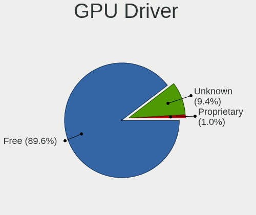
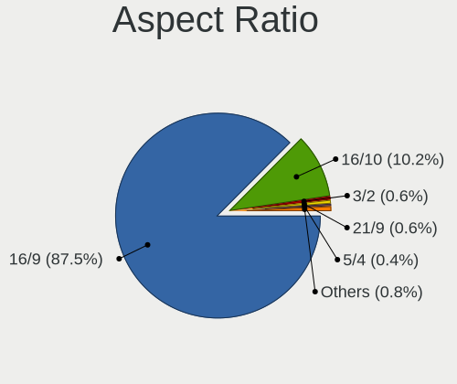

OpenMandriva Hardware Trends (Notebooks)
----------------------------------------

A project to identify most popular hardware characteristics and track their change
over time based on data collected by OpenMandriva users at https://Linux-Hardware.org.

Anyone can contribute to this report by the [hw-probe](https://github.com/linuxhw/hw-probe) tool:

    sudo -E hw-probe -all -upload

Full-feature report is available here: https://linux-hardware.org/?view=trends

Period: Feb, 2022.

Contents
--------

* [ System ](#system)
  - [ OS                       ](#os)
  - [ OS Family                ](#os-family)
  - [ Kernel                   ](#kernel)
  - [ Kernel Family            ](#kernel-family)
  - [ Kernel Major Ver.        ](#kernel-major-ver)
  - [ Arch                     ](#arch)
  - [ DE                       ](#de)
  - [ Display Server           ](#display-server)
  - [ Display Manager          ](#display-manager)
  - [ OS Lang                  ](#os-lang)
  - [ Boot Mode                ](#boot-mode)
  - [ Filesystem               ](#filesystem)
  - [ Part. scheme             ](#part-scheme)
  - [ Dual Boot with Linux/BSD ](#dual-boot-with-linuxbsd)
  - [ Dual Boot (Win)          ](#dual-boot-win)

* [ Board ](#board)
  - [ Vendor                   ](#vendor)
  - [ Model                    ](#model)
  - [ Model Family             ](#model-family)
  - [ MFG Year                 ](#mfg-year)
  - [ Form Factor              ](#form-factor)
  - [ Secure Boot              ](#secure-boot)
  - [ Coreboot                 ](#coreboot)
  - [ RAM Size                 ](#ram-size)
  - [ RAM Used                 ](#ram-used)
  - [ Total Drives             ](#total-drives)
  - [ Has CD-ROM               ](#has-cd-rom)
  - [ Has Ethernet             ](#has-ethernet)
  - [ Has WiFi                 ](#has-wifi)
  - [ Has Bluetooth            ](#has-bluetooth)

* [ Location ](#location)
  - [ Country                  ](#country)
  - [ City                     ](#city)

* [ Drives ](#drives)
  - [ Drive Vendor             ](#drive-vendor)
  - [ Drive Model              ](#drive-model)
  - [ HDD Vendor               ](#hdd-vendor)
  - [ SSD Vendor               ](#ssd-vendor)
  - [ Drive Kind               ](#drive-kind)
  - [ Drive Connector          ](#drive-connector)
  - [ Drive Size               ](#drive-size)
  - [ Space Total              ](#space-total)
  - [ Space Used               ](#space-used)
  - [ Malfunc. Drives          ](#malfunc-drives)
  - [ Malfunc. Drive Vendor    ](#malfunc-drive-vendor)
  - [ Malfunc. HDD Vendor      ](#malfunc-hdd-vendor)
  - [ Malfunc. Drive Kind      ](#malfunc-drive-kind)
  - [ Failed Drives            ](#failed-drives)
  - [ Failed Drive Vendor      ](#failed-drive-vendor)
  - [ Drive Status             ](#drive-status)

* [ Storage controller ](#storage-controller)
  - [ Storage Vendor           ](#storage-vendor)
  - [ Storage Model            ](#storage-model)
  - [ Storage Kind             ](#storage-kind)

* [ Processor ](#processor)
  - [ CPU Vendor               ](#cpu-vendor)
  - [ CPU Model                ](#cpu-model)
  - [ CPU Model Family         ](#cpu-model-family)
  - [ CPU Cores                ](#cpu-cores)
  - [ CPU Sockets              ](#cpu-sockets)
  - [ CPU Threads              ](#cpu-threads)
  - [ CPU Op-Modes             ](#cpu-op-modes)
  - [ CPU Microcode            ](#cpu-microcode)
  - [ CPU Microarch            ](#cpu-microarch)

* [ Graphics ](#graphics)
  - [ GPU Vendor               ](#gpu-vendor)
  - [ GPU Model                ](#gpu-model)
  - [ GPU Combo                ](#gpu-combo)
  - [ GPU Driver               ](#gpu-driver)
  - [ GPU Memory               ](#gpu-memory)

* [ Monitor ](#monitor)
  - [ Monitor Vendor           ](#monitor-vendor)
  - [ Monitor Model            ](#monitor-model)
  - [ Monitor Resolution       ](#monitor-resolution)
  - [ Monitor Diagonal         ](#monitor-diagonal)
  - [ Monitor Width            ](#monitor-width)
  - [ Aspect Ratio             ](#aspect-ratio)
  - [ Monitor Area             ](#monitor-area)
  - [ Pixel Density            ](#pixel-density)
  - [ Multiple Monitors        ](#multiple-monitors)

* [ Network ](#network)
  - [ Net Controller Vendor    ](#net-controller-vendor)
  - [ Net Controller Model     ](#net-controller-model)
  - [ Wireless Vendor          ](#wireless-vendor)
  - [ Wireless Model           ](#wireless-model)
  - [ Ethernet Vendor          ](#ethernet-vendor)
  - [ Ethernet Model           ](#ethernet-model)
  - [ Net Controller Kind      ](#net-controller-kind)
  - [ Used Controller          ](#used-controller)
  - [ NICs                     ](#nics)
  - [ IPv6                     ](#ipv6)

* [ Bluetooth ](#bluetooth)
  - [ Bluetooth Vendor         ](#bluetooth-vendor)
  - [ Bluetooth Model          ](#bluetooth-model)

* [ Sound ](#sound)
  - [ Sound Vendor             ](#sound-vendor)
  - [ Sound Model              ](#sound-model)

* [ Memory ](#memory)
  - [ Memory Vendor            ](#memory-vendor)
  - [ Memory Model             ](#memory-model)
  - [ Memory Kind              ](#memory-kind)
  - [ Memory Form Factor       ](#memory-form-factor)
  - [ Memory Size              ](#memory-size)
  - [ Memory Speed             ](#memory-speed)

* [ Printers & scanners ](#printers--scanners)
  - [ Printer Vendor           ](#printer-vendor)
  - [ Printer Model            ](#printer-model)
  - [ Scanner Vendor           ](#scanner-vendor)
  - [ Scanner Model            ](#scanner-model)

* [ Camera ](#camera)
  - [ Camera Vendor            ](#camera-vendor)
  - [ Camera Model             ](#camera-model)

* [ Security ](#security)
  - [ Fingerprint Vendor       ](#fingerprint-vendor)
  - [ Fingerprint Model        ](#fingerprint-model)
  - [ Chipcard Vendor          ](#chipcard-vendor)
  - [ Chipcard Model           ](#chipcard-model)

* [ Unsupported ](#unsupported)
  - [ Unsupported Devices      ](#unsupported-devices)
  - [ Unsupported Device Types ](#unsupported-device-types)

System
------

OS
--

Installed operating systems

| Name              | Notebooks | Percent |
|-------------------|-----------|---------|
| OpenMandriva 4.3  | 583       | 89.28%  |
| OpenMandriva 4.2  | 51        | 7.81%   |
| OpenMandriva 4.50 | 19        | 2.91%   |

OS Family
---------

OS without a version

| Name         | Notebooks | Percent |
|--------------|-----------|---------|
| OpenMandriva | 653       | 100%    |

Kernel
------

Version of the Linux kernel

| Version                  | Notebooks | Percent |
|--------------------------|-----------|---------|
| 5.16.7-desktop-1omv4003  | 583       | 89.28%  |
| 5.10.14-desktop-1omv4002 | 46        | 7.04%   |
| 5.14.7-desktop-1omv4050  | 9         | 1.38%   |
| 5.12.4-desktop-1omv4050  | 5         | 0.77%   |
| 5.11.12-desktop-1omv4002 | 5         | 0.77%   |
| 5.14.14-desktop-1omv4050 | 2         | 0.31%   |
| 5.16.9-desktop-1omv4050  | 1         | 0.15%   |
| 5.16.7-desktop-2omv4050  | 1         | 0.15%   |
| 5.16.5-desktop-2omv4003  | 1         | 0.15%   |

Kernel Family
-------------

Linux kernel without a distro release

| Version | Notebooks | Percent |
|---------|-----------|---------|
| 5.16.7  | 584       | 89.43%  |
| 5.10.14 | 46        | 7.04%   |
| 5.14.7  | 9         | 1.38%   |
| 5.12.4  | 5         | 0.77%   |
| 5.11.12 | 5         | 0.77%   |
| 5.14.14 | 2         | 0.31%   |
| 5.16.9  | 1         | 0.15%   |
| 5.16.5  | 1         | 0.15%   |

Kernel Major Ver.
-----------------

Linux kernel major version

| Version | Notebooks | Percent |
|---------|-----------|---------|
| 5.16    | 586       | 89.74%  |
| 5.10    | 46        | 7.04%   |
| 5.14    | 11        | 1.68%   |
| 5.12    | 5         | 0.77%   |
| 5.11    | 5         | 0.77%   |

Arch
----

OS architecture (x86_64, i586, etc.)

| Name   | Notebooks | Percent |
|--------|-----------|---------|
| x86_64 | 653       | 100%    |

DE
--

Desktop Environment

| Name    | Notebooks | Percent |
|---------|-----------|---------|
| KDE5    | 652       | 99.85%  |
| Unknown | 1         | 0.15%   |

Display Server
--------------

X11 or Wayland

| Name | Notebooks | Percent |
|------|-----------|---------|
| X11  | 653       | 100%    |

Display Manager
---------------

SDDM, LightDM, etc.

| Name | Notebooks | Percent |
|------|-----------|---------|
| SDDM | 653       | 100%    |

OS Lang
-------

Language

| Lang  | Notebooks | Percent |
|-------|-----------|---------|
| en_US | 346       | 52.99%  |
| de_DE | 93        | 14.24%  |
| fr_FR | 30        | 4.59%   |
| it_IT | 27        | 4.13%   |
| pt_BR | 22        | 3.37%   |
| pl_PL | 21        | 3.22%   |
| en_GB | 15        | 2.3%    |
| es_ES | 13        | 1.99%   |
| ru_RU | 12        | 1.84%   |
| de_AT | 10        | 1.53%   |
| cs_CZ | 10        | 1.53%   |
| es_MX | 7         | 1.07%   |
| hu_HU | 6         | 0.92%   |
| tr_TR | 4         | 0.61%   |
| nl_NL | 4         | 0.61%   |
| nl_BE | 4         | 0.61%   |
| pt_PT | 3         | 0.46%   |
| de_CH | 3         | 0.46%   |
| da_DK | 3         | 0.46%   |
| fr_CA | 2         | 0.31%   |
| fr_BE | 2         | 0.31%   |
| es_BO | 2         | 0.31%   |
| es_AR | 2         | 0.31%   |
| en_CA | 2         | 0.31%   |
| nb_NO | 1         | 0.15%   |
| fr_CH | 1         | 0.15%   |
| es_PY | 1         | 0.15%   |
| es_PR | 1         | 0.15%   |
| es_CR | 1         | 0.15%   |
| es_CO | 1         | 0.15%   |
| es_CL | 1         | 0.15%   |
| en_ZA | 1         | 0.15%   |
| en_SG | 1         | 0.15%   |
| en_AU | 1         | 0.15%   |

Boot Mode
---------

EFI or BIOS

| Mode | Notebooks | Percent |
|------|-----------|---------|
| EFI  | 344       | 52.68%  |
| BIOS | 309       | 47.32%  |

Filesystem
----------

Type of filesystem

| Type    | Notebooks | Percent |
|---------|-----------|---------|
| Overlay | 531       | 81.32%  |
| Ext4    | 119       | 18.22%  |
| Xfs     | 2         | 0.31%   |
| Jfs     | 1         | 0.15%   |

Part. scheme
------------

Scheme of partitioning

| Type | Notebooks | Percent |
|------|-----------|---------|
| GPT  | 435       | 66.62%  |
| MBR  | 218       | 33.38%  |

Dual Boot with Linux/BSD
------------------------

Hosting more than one Linux/BSD

| Dual boot | Notebooks | Percent |
|-----------|-----------|---------|
| Yes       | 357       | 54.67%  |
| No        | 296       | 45.33%  |

Dual Boot (Win)
---------------

Hosting Linux and Windows

| Dual boot | Notebooks | Percent |
|-----------|-----------|---------|
| No        | 389       | 59.57%  |
| Yes       | 264       | 40.43%  |

Board
-----

Vendor
------

Motherboard manufacturer

| Name                                      | Notebooks | Percent |
|-------------------------------------------|-----------|---------|
| Lenovo                                    | 139       | 21.29%  |
| Hewlett-Packard                           | 119       | 18.22%  |
| ASUSTek Computer                          | 82        | 12.56%  |
| Dell                                      | 80        | 12.25%  |
| Acer                                      | 75        | 11.49%  |
| Toshiba                                   | 38        | 5.82%   |
| Sony                                      | 16        | 2.45%   |
| Samsung Electronics                       | 14        | 2.14%   |
| MSI                                       | 10        | 1.53%   |
| Fujitsu                                   | 10        | 1.53%   |
| TUXEDO                                    | 6         | 0.92%   |
| Apple                                     | 6         | 0.92%   |
| Packard Bell                              | 5         | 0.77%   |
| HUAWEI                                    | 5         | 0.77%   |
| Medion                                    | 4         | 0.61%   |
| Clevo                                     | 4         | 0.61%   |
| Positivo Bahia - VAIO                     | 2         | 0.31%   |
| Positivo                                  | 2         | 0.31%   |
| PC Specialist                             | 2         | 0.31%   |
| Notebook                                  | 2         | 0.31%   |
| Gateway                                   | 2         | 0.31%   |
| eMachines                                 | 2         | 0.31%   |
| Chuwi                                     | 2         | 0.31%   |
| Alienware                                 | 2         | 0.31%   |
| Unknown                                   | 2         | 0.31%   |
| Wortmann AG                               | 1         | 0.15%   |
| UMAX                                      | 1         | 0.15%   |
| Teclast                                   | 1         | 0.15%   |
| Talal Abu-Ghazaleh for Technology TAGTECH | 1         | 0.15%   |
| SLIMBOOK                                  | 1         | 0.15%   |
| Schenker                                  | 1         | 0.15%   |
| Radio Victoria Fueguina                   | 1         | 0.15%   |
| Quanta                                    | 1         | 0.15%   |
| Philco                                    | 1         | 0.15%   |
| LincPlus                                  | 1         | 0.15%   |
| Lanix                                     | 1         | 0.15%   |
| GPD                                       | 1         | 0.15%   |
| Gigabyte Technology                       | 1         | 0.15%   |
| Fujitsu Siemens                           | 1         | 0.15%   |
| Framework                                 | 1         | 0.15%   |
| EVOO                                      | 1         | 0.15%   |
| Digibras                                  | 1         | 0.15%   |
| Dataton                                   | 1         | 0.15%   |
| Computer Depot                            | 1         | 0.15%   |
| Compaq                                    | 1         | 0.15%   |
| Beelink                                   | 1         | 0.15%   |
| AZW                                       | 1         | 0.15%   |

Model
-----

Motherboard model

| Name                                       | Notebooks | Percent |
|--------------------------------------------|-----------|---------|
| ASUS UX31E                                 | 8         | 1.23%   |
| HP Notebook                                | 7         | 1.07%   |
| Lenovo IdeaPad S340-14API 81NB             | 4         | 0.61%   |
| HP Pavilion g6                             | 4         | 0.61%   |
| Sony VGN-FZ31Z                             | 3         | 0.46%   |
| HUAWEI NBLK-WAX9X                          | 3         | 0.46%   |
| HP Pavilion dv6                            | 3         | 0.46%   |
| HP Laptop 17-ak0xx                         | 3         | 0.46%   |
| Dell Latitude E5410                        | 3         | 0.46%   |
| Dell Latitude D630                         | 3         | 0.46%   |
| Acer Swift SF114-34                        | 3         | 0.46%   |
| Acer Aspire A515-51G                       | 3         | 0.46%   |
| Unknown                                    | 3         | 0.46%   |
| TUXEDO Aura 15 Gen1                        | 2         | 0.31%   |
| Toshiba Satellite Pro R50-C                | 2         | 0.31%   |
| Toshiba Satellite P200                     | 2         | 0.31%   |
| Toshiba Satellite L755                     | 2         | 0.31%   |
| Samsung 300E4A/300E5A/300E7A/3430EA/3530EA | 2         | 0.31%   |
| Positivo Bahia - VAIO VJFE42F11X-XXXXXX    | 2         | 0.31%   |
| Lenovo IdeaPad Z580                        | 2         | 0.31%   |
| Lenovo IdeaPad Y700-17ISK 80Q0             | 2         | 0.31%   |
| Lenovo IdeaPad S145-15API 81UT             | 2         | 0.31%   |
| Lenovo IdeaPad 5 15ALC05 82LN              | 2         | 0.31%   |
| Lenovo G510 20238                          | 2         | 0.31%   |
| Lenovo G50-70 20351                        | 2         | 0.31%   |
| Lenovo G50-30 80G0                         | 2         | 0.31%   |
| HP Pavilion Laptop 15-cs3xxx               | 2         | 0.31%   |
| HP Pavilion g7                             | 2         | 0.31%   |
| HP Pavilion dv7                            | 2         | 0.31%   |
| HP Pavilion dv6500                         | 2         | 0.31%   |
| HP Pavilion dm1                            | 2         | 0.31%   |
| HP Pavilion Aero Laptop 13-be0xxx          | 2         | 0.31%   |
| HP Pavilion 15                             | 2         | 0.31%   |
| HP Pavilion 11 x360 PC                     | 2         | 0.31%   |
| HP OMEN by Laptop 15-dc0xxx                | 2         | 0.31%   |
| HP Laptop 15s-fq1xxx                       | 2         | 0.31%   |
| HP Laptop 15-db0xxx                        | 2         | 0.31%   |
| HP ENVY 15                                 | 2         | 0.31%   |
| HP EliteBook 820 G1                        | 2         | 0.31%   |
| HP Compaq Presario CQ61                    | 2         | 0.31%   |
| HP Compaq CQ58                             | 2         | 0.31%   |
| HP 355 G2                                  | 2         | 0.31%   |
| HP 250 G6 Notebook PC                      | 2         | 0.31%   |
| HP 2000                                    | 2         | 0.31%   |
| Dell Latitude E7450                        | 2         | 0.31%   |
| Dell Latitude E7440                        | 2         | 0.31%   |
| Dell Latitude E7240                        | 2         | 0.31%   |
| Dell Latitude E6540                        | 2         | 0.31%   |
| Dell Latitude E6520                        | 2         | 0.31%   |
| Dell Latitude E6440                        | 2         | 0.31%   |
| Dell Latitude E6420                        | 2         | 0.31%   |
| Dell Latitude E6410                        | 2         | 0.31%   |
| Dell Latitude E6230                        | 2         | 0.31%   |
| Dell Latitude E5570                        | 2         | 0.31%   |
| Dell Latitude E5450                        | 2         | 0.31%   |
| Dell Inspiron 5558                         | 2         | 0.31%   |
| Dell Inspiron 3451                         | 2         | 0.31%   |
| Dell Inspiron 1525                         | 2         | 0.31%   |
| ASUS X202E                                 | 2         | 0.31%   |
| ASUS VivoBook 15_ASUS Laptop X540BA        | 2         | 0.31%   |

Model Family
------------

Motherboard model prefix

| Name                                    | Notebooks | Percent |
|-----------------------------------------|-----------|---------|
| Lenovo ThinkPad                         | 61        | 9.34%   |
| Acer Aspire                             | 51        | 7.81%   |
| Dell Latitude                           | 47        | 7.2%    |
| Lenovo IdeaPad                          | 45        | 6.89%   |
| Toshiba Satellite                       | 35        | 5.36%   |
| HP Pavilion                             | 29        | 4.44%   |
| Dell Inspiron                           | 18        | 2.76%   |
| HP Laptop                               | 15        | 2.3%    |
| ASUS VivoBook                           | 15        | 2.3%    |
| HP ProBook                              | 13        | 1.99%   |
| HP Compaq                               | 11        | 1.68%   |
| HP EliteBook                            | 10        | 1.53%   |
| Acer Swift                              | 9         | 1.38%   |
| Fujitsu LIFEBOOK                        | 8         | 1.23%   |
| ASUS UX31E                              | 8         | 1.23%   |
| HP Notebook                             | 7         | 1.07%   |
| Packard Bell EasyNote                   | 5         | 0.77%   |
| Acer Extensa                            | 5         | 0.77%   |
| HP OMEN                                 | 4         | 0.61%   |
| HP ENVY                                 | 4         | 0.61%   |
| Dell System                             | 4         | 0.61%   |
| Sony VGN-FZ31Z                          | 3         | 0.46%   |
| Lenovo Yoga                             | 3         | 0.46%   |
| HUAWEI NBLK-WAX9X                       | 3         | 0.46%   |
| HP Stream                               | 3         | 0.46%   |
| HP 250                                  | 3         | 0.46%   |
| Dell Vostro                             | 3         | 0.46%   |
| ASUS ZenBook                            | 3         | 0.46%   |
| Acer TravelMate                         | 3         | 0.46%   |
| Acer Nitro                              | 3         | 0.46%   |
| Unknown                                 | 3         | 0.46%   |
| TUXEDO Pulse                            | 2         | 0.31%   |
| TUXEDO InfinityBook                     | 2         | 0.31%   |
| TUXEDO Aura                             | 2         | 0.31%   |
| Toshiba dynabook                        | 2         | 0.31%   |
| Samsung 300E4A                          | 2         | 0.31%   |
| Positivo Bahia - VAIO VJFE42F11X-XXXXXX | 2         | 0.31%   |
| Medion Akoya                            | 2         | 0.31%   |
| Lenovo Legion                           | 2         | 0.31%   |
| Lenovo G580                             | 2         | 0.31%   |
| Lenovo G560                             | 2         | 0.31%   |
| Lenovo G510                             | 2         | 0.31%   |
| Lenovo G50-70                           | 2         | 0.31%   |
| Lenovo G50-30                           | 2         | 0.31%   |
| Lenovo Flex                             | 2         | 0.31%   |
| HP Presario                             | 2         | 0.31%   |
| HP 355                                  | 2         | 0.31%   |
| HP 245                                  | 2         | 0.31%   |
| HP 2000                                 | 2         | 0.31%   |
| Dell XPS                                | 2         | 0.31%   |
| Dell Studio                             | 2         | 0.31%   |
| Dell G3                                 | 2         | 0.31%   |
| ASUS X202E                              | 2         | 0.31%   |
| ASUS TUF                                | 2         | 0.31%   |
| ASUS K50IJ                              | 2         | 0.31%   |
| Wortmann AG TERRA                       | 1         | 0.15%   |
| UMAX VisionBook                         | 1         | 0.15%   |
| Toshiba TECRA                           | 1         | 0.15%   |
| Teclast F7                              | 1         | 0.15%   |
| Talal Abu-Ghazaleh for TAGTECH TAGITOP- | 1         | 0.15%   |

MFG Year
--------

Motherboard manufacture year

| Year | Notebooks | Percent |
|------|-----------|---------|
| 2012 | 70        | 10.72%  |
| 2011 | 67        | 10.26%  |
| 2013 | 57        | 8.73%   |
| 2014 | 48        | 7.35%   |
| 2020 | 47        | 7.2%    |
| 2019 | 47        | 7.2%    |
| 2010 | 47        | 7.2%    |
| 2016 | 40        | 6.13%   |
| 2015 | 39        | 5.97%   |
| 2018 | 35        | 5.36%   |
| 2017 | 33        | 5.05%   |
| 2021 | 32        | 4.9%    |
| 2009 | 31        | 4.75%   |
| 2008 | 30        | 4.59%   |
| 2007 | 28        | 4.29%   |
| 2006 | 2         | 0.31%   |

Form Factor
-----------

Physical design of the computer

| Name     | Notebooks | Percent |
|----------|-----------|---------|
| Notebook | 653       | 100%    |

Secure Boot
-----------

Enabled or disabled

| State    | Notebooks | Percent |
|----------|-----------|---------|
| Disabled | 653       | 100%    |

Coreboot
--------

Have coreboot on board

| Used | Notebooks | Percent |
|------|-----------|---------|
| No   | 653       | 100%    |

RAM Size
--------

Total RAM memory

| Size in GB  | Notebooks | Percent |
|-------------|-----------|---------|
| 3.01-4.0    | 217       | 33.23%  |
| 4.01-8.0    | 214       | 32.77%  |
| 8.01-16.0   | 100       | 15.31%  |
| 16.01-24.0  | 71        | 10.87%  |
| 1.01-2.0    | 22        | 3.37%   |
| 32.01-64.0  | 12        | 1.84%   |
| 2.01-3.0    | 11        | 1.68%   |
| 64.01-256.0 | 4         | 0.61%   |
| 24.01-32.0  | 2         | 0.31%   |

RAM Used
--------

Used RAM memory

| Used GB   | Notebooks | Percent |
|-----------|-----------|---------|
| 1.01-2.0  | 533       | 81.62%  |
| 0.51-1.0  | 70        | 10.72%  |
| 2.01-3.0  | 42        | 6.43%   |
| 0.01-0.5  | 3         | 0.46%   |
| 4.01-8.0  | 2         | 0.31%   |
| 8.01-16.0 | 2         | 0.31%   |
| 3.01-4.0  | 1         | 0.15%   |

Total Drives
------------

Number of drives on board

| Drives | Notebooks | Percent |
|--------|-----------|---------|
| 1      | 471       | 72.13%  |
| 2      | 150       | 22.97%  |
| 3      | 21        | 3.22%   |
| 0      | 7         | 1.07%   |
| 4      | 4         | 0.61%   |

Has CD-ROM
----------

Has CD-ROM on board

| Presented | Notebooks | Percent |
|-----------|-----------|---------|
| No        | 337       | 51.61%  |
| Yes       | 316       | 48.39%  |

Has Ethernet
------------

Has Ethernet on board

| Presented | Notebooks | Percent |
|-----------|-----------|---------|
| Yes       | 560       | 85.76%  |
| No        | 93        | 14.24%  |

Has WiFi
--------

Has WiFi module

| Presented | Notebooks | Percent |
|-----------|-----------|---------|
| Yes       | 647       | 99.08%  |
| No        | 6         | 0.92%   |

Has Bluetooth
-------------

Has Bluetooth module

| Presented | Notebooks | Percent |
|-----------|-----------|---------|
| Yes       | 479       | 73.35%  |
| No        | 174       | 26.65%  |

Location
--------

Country
-------

Geographic location (country)

| Country                | Notebooks | Percent |
|------------------------|-----------|---------|
| Germany                | 120       | 18.38%  |
| USA                    | 79        | 12.1%   |
| France                 | 37        | 5.67%   |
| Poland                 | 36        | 5.51%   |
| Italy                  | 32        | 4.9%    |
| Brazil                 | 28        | 4.29%   |
| Canada                 | 20        | 3.06%   |
| Spain                  | 19        | 2.91%   |
| Russia                 | 19        | 2.91%   |
| UK                     | 18        | 2.76%   |
| Czechia                | 16        | 2.45%   |
| Austria                | 14        | 2.14%   |
| Portugal               | 11        | 1.68%   |
| Netherlands            | 11        | 1.68%   |
| Mexico                 | 11        | 1.68%   |
| Turkey                 | 9         | 1.38%   |
| Japan                  | 9         | 1.38%   |
| Australia              | 9         | 1.38%   |
| Indonesia              | 8         | 1.23%   |
| Belgium                | 8         | 1.23%   |
| Ukraine                | 7         | 1.07%   |
| Switzerland            | 7         | 1.07%   |
| India                  | 7         | 1.07%   |
| Hungary                | 7         | 1.07%   |
| Slovakia               | 6         | 0.92%   |
| China                  | 6         | 0.92%   |
| Sweden                 | 5         | 0.77%   |
| Greece                 | 5         | 0.77%   |
| Finland                | 5         | 0.77%   |
| Colombia               | 5         | 0.77%   |
| Bulgaria               | 5         | 0.77%   |
| Serbia                 | 4         | 0.61%   |
| Romania                | 4         | 0.61%   |
| New Zealand            | 4         | 0.61%   |
| South Africa           | 3         | 0.46%   |
| Denmark                | 3         | 0.46%   |
| Croatia                | 3         | 0.46%   |
| Argentina              | 3         | 0.46%   |
| Venezuela              | 2         | 0.31%   |
| Trinidad and Tobago    | 2         | 0.31%   |
| Singapore              | 2         | 0.31%   |
| Norway                 | 2         | 0.31%   |
| Morocco                | 2         | 0.31%   |
| Costa Rica             | 2         | 0.31%   |
| Chile                  | 2         | 0.31%   |
| Bosnia and Herzegovina | 2         | 0.31%   |
| Bolivia                | 2         | 0.31%   |
| Vietnam                | 1         | 0.15%   |
| Uzbekistan             | 1         | 0.15%   |
| UAE                    | 1         | 0.15%   |
| Tunisia                | 1         | 0.15%   |
| Thailand               | 1         | 0.15%   |
| Taiwan                 | 1         | 0.15%   |
| Sudan                  | 1         | 0.15%   |
| South Korea            | 1         | 0.15%   |
| Réunion             | 1         | 0.15%   |
| Qatar                  | 1         | 0.15%   |
| Puerto Rico            | 1         | 0.15%   |
| Peru                   | 1         | 0.15%   |
| Paraguay               | 1         | 0.15%   |

City
----

Geographic location (city)

| City                   | Notebooks | Percent |
|------------------------|-----------|---------|
| Berlin                 | 14        | 2.14%   |
| Paris                  | 10        | 1.53%   |
| São Paulo           | 8         | 1.23%   |
| Vienna                 | 7         | 1.07%   |
| Salach                 | 6         | 0.92%   |
| Prague                 | 6         | 0.92%   |
| Krakow                 | 6         | 0.92%   |
| Warsaw                 | 5         | 0.77%   |
| Istanbul               | 5         | 0.77%   |
| Padova                 | 4         | 0.61%   |
| Memphis                | 4         | 0.61%   |
| Belgrade               | 4         | 0.61%   |
| Werdau                 | 3         | 0.46%   |
| Sydney                 | 3         | 0.46%   |
| Rome                   | 3         | 0.46%   |
| Richmond Hill          | 3         | 0.46%   |
| Moscow                 | 3         | 0.46%   |
| Milan                  | 3         | 0.46%   |
| Mexico City            | 3         | 0.46%   |
| Medellín            | 3         | 0.46%   |
| Mérida              | 3         | 0.46%   |
| Gorzów Wielkopolski | 3         | 0.46%   |
| Funchal                | 3         | 0.46%   |
| Cologne                | 3         | 0.46%   |
| Champaign              | 3         | 0.46%   |
| Bologna                | 3         | 0.46%   |
| Auckland               | 3         | 0.46%   |
| Zagreb                 | 2         | 0.31%   |
| Yekaterinburg          | 2         | 0.31%   |
| Wroclaw                | 2         | 0.31%   |
| Umhausen               | 2         | 0.31%   |
| Thessaloniki           | 2         | 0.31%   |
| The Hague              | 2         | 0.31%   |
| St Petersburg          | 2         | 0.31%   |
| Sofia                  | 2         | 0.31%   |
| Singapore              | 2         | 0.31%   |
| Seattle                | 2         | 0.31%   |
| Scarborough            | 2         | 0.31%   |
| Sault Ste. Marie       | 2         | 0.31%   |
| Sarajevo               | 2         | 0.31%   |
| Sapporo                | 2         | 0.31%   |
| Santa Cruz de Tenerife | 2         | 0.31%   |
| Santa Cruz             | 2         | 0.31%   |
| Sangerhausen           | 2         | 0.31%   |
| San José            | 2         | 0.31%   |
| Roznov pod Radhostem   | 2         | 0.31%   |
| Rio de Janeiro         | 2         | 0.31%   |
| Regina                 | 2         | 0.31%   |
| Orono                  | 2         | 0.31%   |
| Nuremberg              | 2         | 0.31%   |
| Novosibirsk            | 2         | 0.31%   |
| Naples                 | 2         | 0.31%   |
| Montreal               | 2         | 0.31%   |
| Melbourne              | 2         | 0.31%   |
| MediaÅŸ              | 2         | 0.31%   |
| Madrid                 | 2         | 0.31%   |
| Leeuwarden             | 2         | 0.31%   |
| Leer                   | 2         | 0.31%   |
| Kyiv                   | 2         | 0.31%   |
| Krefeld                | 2         | 0.31%   |

Drives
------

Drive Vendor
------------

Hard drive vendors

| Vendor              | Notebooks | Drives | Percent |
|---------------------|-----------|--------|---------|
| Samsung Electronics | 103       | 110    | 13.02%  |
| WDC                 | 95        | 96     | 12.01%  |
| Toshiba             | 86        | 86     | 10.87%  |
| Seagate             | 86        | 90     | 10.87%  |
| Kingston            | 54        | 55     | 6.83%   |
| Crucial             | 42        | 43     | 5.31%   |
| SanDisk             | 35        | 35     | 4.42%   |
| Unknown             | 30        | 31     | 3.79%   |
| Hitachi             | 27        | 27     | 3.41%   |
| HGST                | 26        | 26     | 3.29%   |
| SK Hynix            | 22        | 25     | 2.78%   |
| A-DATA Technology   | 20        | 20     | 2.53%   |
| Micron Technology   | 16        | 16     | 2.02%   |
| Intel               | 13        | 13     | 1.64%   |
| LITEON              | 9         | 9      | 1.14%   |
| Intenso             | 9         | 9      | 1.14%   |
| Fujitsu             | 9         | 9      | 1.14%   |
| Unknown             | 9         | 9      | 1.14%   |
| Patriot             | 7         | 7      | 0.88%   |
| JMicron             | 6         | 6      | 0.76%   |
| Corsair             | 6         | 6      | 0.76%   |
| ASMT                | 5         | 5      | 0.63%   |
| Transcend           | 4         | 4      | 0.51%   |
| SSSTC               | 4         | 4      | 0.51%   |
| Sabrent             | 4         | 4      | 0.51%   |
| GOODRAM             | 4         | 4      | 0.51%   |
| Apple               | 4         | 4      | 0.51%   |
| UMIS                | 3         | 3      | 0.38%   |
| SPCC                | 3         | 3      | 0.38%   |
| Silicon Motion      | 3         | 4      | 0.38%   |
| OCZ                 | 3         | 3      | 0.38%   |
| LITEONIT            | 3         | 3      | 0.38%   |
| KingSpec            | 3         | 3      | 0.38%   |
| China               | 3         | 3      | 0.38%   |
| PLEXTOR             | 2         | 2      | 0.25%   |
| Phison              | 2         | 2      | 0.25%   |
| Lexar               | 2         | 2      | 0.25%   |
| WD MediaMax         | 1         | 1      | 0.13%   |
| TCSUNBOW            | 1         | 1      | 0.13%   |
| SSK                 | 1         | 1      | 0.13%   |
| RX7                 | 1         | 1      | 0.13%   |
| ROG                 | 1         | 1      | 0.13%   |
| PNY                 | 1         | 1      | 0.13%   |
| Phison Electronics  | 1         | 1      | 0.13%   |
| Leven               | 1         | 1      | 0.13%   |
| KIOXIA-EXCERIA      | 1         | 1      | 0.13%   |
| KIOXIA              | 1         | 1      | 0.13%   |
| KingDian            | 1         | 1      | 0.13%   |
| Kingchuxing         | 1         | 1      | 0.13%   |
| Kingchux            | 1         | 1      | 0.13%   |
| INNOVATION IT       | 1         | 1      | 0.13%   |
| InnoDisk            | 1         | 1      | 0.13%   |
| inateck             | 1         | 1      | 0.13%   |
| imation             | 1         | 1      | 0.13%   |
| HGST HTS            | 1         | 1      | 0.13%   |
| Hewlett-Packard     | 1         | 1      | 0.13%   |
| Gigabyte Technology | 1         | 1      | 0.13%   |
| FORESEE             | 1         | 1      | 0.13%   |
| External            | 1         | 1      | 0.13%   |
| DREVO               | 1         | 1      | 0.13%   |

Drive Model
-----------

Hard drive models

| Model                                   | Notebooks | Percent |
|-----------------------------------------|-----------|---------|
| Seagate ST1000LM024 HN-M101MBB 1TB      | 17        | 2.12%   |
| Toshiba MQ01ABF050 500GB                | 13        | 1.62%   |
| Toshiba MQ04ABF100 1TB                  | 12        | 1.49%   |
| Kingston SA400S37240G 240GB SSD         | 12        | 1.49%   |
| Hitachi HTS543232A7A384 320GB           | 9         | 1.12%   |
| Unknown                                 | 9         | 1.12%   |
| Seagate ST500LT012-1DG142 500GB         | 8         | 1%      |
| SanDisk SSD U100 256GB                  | 8         | 1%      |
| Samsung SSD 860 EVO 500GB               | 8         | 1%      |
| Samsung SSD 850 EVO 250GB               | 8         | 1%      |
| Toshiba MQ01ABD100 1TB                  | 7         | 0.87%   |
| Seagate ST9500325AS 500GB               | 7         | 0.87%   |
| WDC WDS500G2B0A-00SM50 500GB SSD        | 6         | 0.75%   |
| WDC WD5000LPVX-22V0TT0 500GB            | 6         | 0.75%   |
| Seagate ST1000LM035-1RK172 1TB          | 6         | 0.75%   |
| Kingston SA400S37480G 480GB SSD         | 6         | 0.75%   |
| Kingston SA400S37120G 120GB SSD         | 6         | 0.75%   |
| HGST HTS541010A9E680 1TB                | 6         | 0.75%   |
| Crucial CT240BX500SSD1 240GB            | 6         | 0.75%   |
| SanDisk SSD PLUS 480GB                  | 5         | 0.62%   |
| Samsung SSD 860 QVO 1TB                 | 5         | 0.62%   |
| Micron 1100_MTFDDAV256TBN 256GB SSD     | 5         | 0.62%   |
| JMicron Generic 2TB                     | 5         | 0.62%   |
| HGST HTS721010A9E630 1TB                | 5         | 0.62%   |
| Crucial CT1000BX500SSD1 1TB             | 5         | 0.62%   |
| A-DATA SX8200PNP 512GB                  | 5         | 0.62%   |
| Unknown SD/MMC/MS PRO 64GB              | 4         | 0.5%    |
| Seagate ST9320325AS 320GB               | 4         | 0.5%    |
| Seagate ST500LM021-1KJ152 500GB         | 4         | 0.5%    |
| Samsung SSD 860 EVO 250GB               | 4         | 0.5%    |
| Intenso SSD Sata III 256GB              | 4         | 0.5%    |
| HGST HTS545050A7E380 500GB              | 4         | 0.5%    |
| Crucial CT500MX500SSD1 500GB            | 4         | 0.5%    |
| Crucial CT1000MX500SSD1 1TB             | 4         | 0.5%    |
| A-DATA ED600 160GB SSD                  | 4         | 0.5%    |
| WDC WD10JPCX-24UE4T0 1TB                | 3         | 0.37%   |
| Unknown SD64G  64GB                     | 3         | 0.37%   |
| Toshiba MQ01ACF050 500GB                | 3         | 0.37%   |
| Toshiba MK1246GSX 120GB                 | 3         | 0.37%   |
| Toshiba KSG60ZMV256G M.2 2280 256GB SSD | 3         | 0.37%   |
| SK Hynix HFS256G39TND-N210A 256GB SSD   | 3         | 0.37%   |
| Seagate ST9320423AS 320GB               | 3         | 0.37%   |
| Seagate ST500LM012 HN-M500MBB 500GB     | 3         | 0.37%   |
| Samsung SSD 860 EVO M.2 250GB           | 3         | 0.37%   |
| Kingston SA400S37960G 960GB SSD         | 3         | 0.37%   |
| HGST HTS545050A7E680 500GB              | 3         | 0.37%   |
| Crucial CT250MX500SSD1 250GB            | 3         | 0.37%   |
| WDC WDS240G2G0B-00EPW0 240GB SSD        | 2         | 0.25%   |
| WDC WDS100T2B0A-00SM50 1TB SSD          | 2         | 0.25%   |
| WDC WD5000LPCX-24C6HT0 500GB            | 2         | 0.25%   |
| WDC WD5000LPCX-21VHAT0 500GB            | 2         | 0.25%   |
| WDC WD5000BPVT-22HXZT3 500GB            | 2         | 0.25%   |
| WDC WD2500BEVS-22UST0 250GB             | 2         | 0.25%   |
| WDC WD10SPZX-24Z10 1TB                  | 2         | 0.25%   |
| WDC WD10SPZX-21Z10T0 1TB                | 2         | 0.25%   |
| WDC WD10SPCX-24HWST1 1TB                | 2         | 0.25%   |
| WDC WD10JPVX-60JC3T0 1TB                | 2         | 0.25%   |
| WDC PC SN730 SDBPNTY-512G-1027 512GB    | 2         | 0.25%   |
| WDC PC SN530 SDBPNPZ-256G-1002 256GB    | 2         | 0.25%   |
| WDC PC SN520 SDAPNUW-128G-1014 128GB    | 2         | 0.25%   |

HDD Vendor
----------

Hard disk drive vendors

| Vendor              | Notebooks | Drives | Percent |
|---------------------|-----------|--------|---------|
| Seagate             | 85        | 89     | 27.87%  |
| Toshiba             | 72        | 72     | 23.61%  |
| WDC                 | 70        | 70     | 22.95%  |
| Hitachi             | 27        | 27     | 8.85%   |
| HGST                | 26        | 26     | 8.52%   |
| Fujitsu             | 9         | 9      | 2.95%   |
| Samsung Electronics | 5         | 5      | 1.64%   |
| Unknown             | 4         | 4      | 1.31%   |
| SABRENT             | 2         | 2      | 0.66%   |
| Apple               | 2         | 2      | 0.66%   |
| WD MediaMax         | 1         | 1      | 0.33%   |
| HGST HTS            | 1         | 1      | 0.33%   |
| ASMT                | 1         | 1      | 0.33%   |

SSD Vendor
----------

Solid state drive vendors

| Vendor              | Notebooks | Drives | Percent |
|---------------------|-----------|--------|---------|
| Samsung Electronics | 74        | 78     | 22.77%  |
| Kingston            | 44        | 45     | 13.54%  |
| Crucial             | 38        | 39     | 11.69%  |
| SanDisk             | 32        | 32     | 9.85%   |
| WDC                 | 14        | 14     | 4.31%   |
| Micron Technology   | 12        | 12     | 3.69%   |
| A-DATA Technology   | 12        | 12     | 3.69%   |
| Toshiba             | 11        | 11     | 3.38%   |
| Intenso             | 9         | 9      | 2.77%   |
| SK Hynix            | 8         | 8      | 2.46%   |
| LITEON              | 8         | 8      | 2.46%   |
| Patriot             | 7         | 7      | 2.15%   |
| Transcend           | 4         | 4      | 1.23%   |
| Intel               | 4         | 4      | 1.23%   |
| GOODRAM             | 4         | 4      | 1.23%   |
| Corsair             | 4         | 4      | 1.23%   |
| OCZ                 | 3         | 3      | 0.92%   |
| LITEONIT            | 3         | 3      | 0.92%   |
| KingSpec            | 3         | 3      | 0.92%   |
| China               | 3         | 3      | 0.92%   |
| Unknown             | 3         | 3      | 0.92%   |
| PLEXTOR             | 2         | 2      | 0.62%   |
| Lexar               | 2         | 2      | 0.62%   |
| Apple               | 2         | 2      | 0.62%   |
| TCSUNBOW            | 1         | 1      | 0.31%   |
| SPCC                | 1         | 1      | 0.31%   |
| RX7                 | 1         | 1      | 0.31%   |
| PNY                 | 1         | 1      | 0.31%   |
| Leven               | 1         | 1      | 0.31%   |
| KIOXIA-EXCERIA      | 1         | 1      | 0.31%   |
| KingDian            | 1         | 1      | 0.31%   |
| Kingchuxing         | 1         | 1      | 0.31%   |
| INNOVATION IT       | 1         | 1      | 0.31%   |
| InnoDisk            | 1         | 1      | 0.31%   |
| imation             | 1         | 1      | 0.31%   |
| Hewlett-Packard     | 1         | 1      | 0.31%   |
| FORESEE             | 1         | 1      | 0.31%   |
| DREVO               | 1         | 1      | 0.31%   |
| BHT                 | 1         | 1      | 0.31%   |
| ASMT                | 1         | 1      | 0.31%   |
| ASMedia             | 1         | 1      | 0.31%   |
| Apacer              | 1         | 1      | 0.31%   |
| 2.5"                | 1         | 1      | 0.31%   |

Drive Kind
----------

HDD or SSD

| Kind    | Notebooks | Drives | Percent |
|---------|-----------|--------|---------|
| SSD     | 302       | 331    | 40%     |
| HDD     | 299       | 309    | 39.6%   |
| NVMe    | 112       | 124    | 14.83%  |
| MMC     | 33        | 36     | 4.37%   |
| Unknown | 9         | 10     | 1.19%   |

Drive Connector
---------------

SATA, SAS, NVMe, etc.

| Type | Notebooks | Drives | Percent |
|------|-----------|--------|---------|
| SATA | 555       | 613    | 75.41%  |
| NVMe | 107       | 117    | 14.54%  |
| SAS  | 41        | 44     | 5.57%   |
| MMC  | 33        | 36     | 4.48%   |

Drive Size
----------

Size of hard drive

| Size in TB | Notebooks | Drives | Percent |
|------------|-----------|--------|---------|
| 0.01-0.5   | 443       | 480    | 73.96%  |
| 0.51-1.0   | 142       | 145    | 23.71%  |
| 1.01-2.0   | 11        | 12     | 1.84%   |
| 3.01-4.0   | 2         | 2      | 0.33%   |
| 4.01-10.0  | 1         | 1      | 0.17%   |

Space Total
-----------

Amount of disk space available on the file system

| Size in GB | Notebooks | Percent |
|------------|-----------|---------|
| 1-20       | 396       | 60.64%  |
| 101-250    | 97        | 14.85%  |
| 251-500    | 53        | 8.12%   |
| 51-100     | 36        | 5.51%   |
| 501-1000   | 29        | 4.44%   |
| 21-50      | 19        | 2.91%   |
| Unknown    | 17        | 2.6%    |
| 1001-2000  | 6         | 0.92%   |

Space Used
----------

Amount of used disk space

| Used GB   | Notebooks | Percent |
|-----------|-----------|---------|
| 1-20      | 593       | 90.81%  |
| Unknown   | 17        | 2.6%    |
| 51-100    | 15        | 2.3%    |
| 101-250   | 12        | 1.84%   |
| 21-50     | 10        | 1.53%   |
| 251-500   | 3         | 0.46%   |
| 1001-2000 | 2         | 0.31%   |
| 501-1000  | 1         | 0.15%   |

Malfunc. Drives
---------------

Drive models with a malfunction

| Model                                   | Notebooks | Drives | Percent |
|-----------------------------------------|-----------|--------|---------|
| Seagate ST1000LM024 HN-M101MBB 1TB      | 8         | 8      | 5.84%   |
| SanDisk SSD U100 256GB                  | 8         | 8      | 5.84%   |
| Hitachi HTS543232A7A384 320GB           | 7         | 7      | 5.11%   |
| Toshiba MQ01ABF050 500GB                | 6         | 6      | 4.38%   |
| Seagate ST9500325AS 500GB               | 4         | 4      | 2.92%   |
| Seagate ST9320325AS 320GB               | 4         | 4      | 2.92%   |
| HGST HTS541010A9E680 1TB                | 4         | 4      | 2.92%   |
| Toshiba MQ01ABD100 1TB                  | 3         | 3      | 2.19%   |
| Seagate ST500LT012-1DG142 500GB         | 3         | 3      | 2.19%   |
| HGST HTS721010A9E630 1TB                | 3         | 3      | 2.19%   |
| Toshiba MK2035GSS 200GB                 | 2         | 2      | 1.46%   |
| Toshiba MK1246GSX 120GB                 | 2         | 2      | 1.46%   |
| Toshiba KSG60ZMV256G M.2 2280 256GB SSD | 2         | 2      | 1.46%   |
| Seagate ST9320423AS 320GB               | 2         | 2      | 1.46%   |
| Seagate ST9250827AS 250GB               | 2         | 2      | 1.46%   |
| Seagate ST500LM021-1KJ152 500GB         | 2         | 2      | 1.46%   |
| Kingston SV300S37A120G 120GB SSD        | 2         | 2      | 1.46%   |
| Hitachi HTS543232L9A300 320GB           | 2         | 2      | 1.46%   |
| HGST HTS545050A7E380 500GB              | 2         | 2      | 1.46%   |
| HGST HTS541075A9E680 752GB              | 2         | 2      | 1.46%   |
| Crucial CT240M500SSD1 240GB             | 2         | 2      | 1.46%   |
| WDC WD7500BPVT-60HXZT1 752GB            | 1         | 1      | 0.73%   |
| WDC WD5000LPCX-60VHAT0 500GB            | 1         | 1      | 0.73%   |
| WDC WD5000BPVT-55HXZT3 500GB            | 1         | 1      | 0.73%   |
| WDC WD5000BPVT-22HXZT3 500GB            | 1         | 1      | 0.73%   |
| WDC WD5000BPVT-00HXZT1 500GB            | 1         | 1      | 0.73%   |
| WDC WD3200BPVT-24JJ5T0 320GB            | 1         | 1      | 0.73%   |
| WDC WD3200BEVT-60ZCT1 320GB             | 1         | 1      | 0.73%   |
| WDC WD32 00BEVT-24A23 320GB             | 1         | 1      | 0.73%   |
| WDC WD2500BEVS-22UST0 250GB             | 1         | 1      | 0.73%   |
| WDC WD1200BEVS-22LAT0 120GB             | 1         | 1      | 0.73%   |
| WDC WD10SPZX-60Z10T0 1TB                | 1         | 1      | 0.73%   |
| WDC WD10SPZX-24Z10T0 1TB                | 1         | 1      | 0.73%   |
| WDC WD10JPVX-60JC3T0 1TB                | 1         | 1      | 0.73%   |
| WDC WD10JPCX-24UE4T0 1TB                | 1         | 1      | 0.73%   |
| Transcend TS128XBTMT3D58G 128GB SSD     | 1         | 1      | 0.73%   |
| Toshiba MQ01ABD100M 1TB                 | 1         | 1      | 0.73%   |
| Toshiba MQ01ABD075 752GB                | 1         | 1      | 0.73%   |
| Toshiba MQ01ABD050 500GB                | 1         | 1      | 0.73%   |
| Toshiba MK6459GSXP 640GB                | 1         | 1      | 0.73%   |
| Toshiba MK5065GSXN 500GB                | 1         | 1      | 0.73%   |
| Toshiba MK5061GSYN 500GB                | 1         | 1      | 0.73%   |
| Toshiba MK5055GSX 500GB                 | 1         | 1      | 0.73%   |
| Toshiba MK3265GSX 320GB                 | 1         | 1      | 0.73%   |
| Toshiba MK3263GSX 320GB                 | 1         | 1      | 0.73%   |
| Toshiba MK2561GSYN 250GB                | 1         | 1      | 0.73%   |
| Toshiba MK2555GSX 250GB                 | 1         | 1      | 0.73%   |
| Toshiba MK2552GSX 250GB                 | 1         | 1      | 0.73%   |
| Toshiba MK1255GSX H 120GB               | 1         | 1      | 0.73%   |
| Toshiba MK1059GSMP 1TB                  | 1         | 1      | 0.73%   |
| SK Hynix HFS256G39TND-N210A 256GB SSD   | 1         | 1      | 0.73%   |
| Seagate ST980811AS 80GB                 | 1         | 1      | 0.73%   |
| Seagate ST9500423AS 500GB               | 1         | 1      | 0.73%   |
| Seagate ST9250315AS 250GB               | 1         | 1      | 0.73%   |
| Seagate ST9200420ASG 200GB              | 1         | 1      | 0.73%   |
| Seagate ST750LX003-1AC154 752GB         | 1         | 1      | 0.73%   |
| Seagate ST500LT012-9WS142 500GB         | 1         | 1      | 0.73%   |
| Seagate ST500LM012 HN-M500MBB 500GB     | 1         | 1      | 0.73%   |
| Seagate ST500LM000-1EJ162 500GB         | 1         | 1      | 0.73%   |
| Seagate ST320LT012-9WS14C 320GB         | 1         | 1      | 0.73%   |

Malfunc. Drive Vendor
---------------------

Vendors of faulty drives

| Vendor              | Notebooks | Drives | Percent |
|---------------------|-----------|--------|---------|
| Seagate             | 36        | 36     | 26.28%  |
| Toshiba             | 29        | 29     | 21.17%  |
| Hitachi             | 16        | 16     | 11.68%  |
| WDC                 | 14        | 14     | 10.22%  |
| HGST                | 13        | 13     | 9.49%   |
| SanDisk             | 8         | 8      | 5.84%   |
| Fujitsu             | 4         | 4      | 2.92%   |
| Crucial             | 4         | 4      | 2.92%   |
| Kingston            | 3         | 3      | 2.19%   |
| A-DATA Technology   | 3         | 3      | 2.19%   |
| Samsung Electronics | 2         | 2      | 1.46%   |
| Transcend           | 1         | 1      | 0.73%   |
| SK Hynix            | 1         | 1      | 0.73%   |
| LITEON              | 1         | 1      | 0.73%   |
| DREVO               | 1         | 1      | 0.73%   |
| Corsair             | 1         | 1      | 0.73%   |

Malfunc. HDD Vendor
-------------------

Vendors of faulty HDD drives

| Vendor              | Notebooks | Drives | Percent |
|---------------------|-----------|--------|---------|
| Seagate             | 36        | 36     | 32.14%  |
| Toshiba             | 27        | 27     | 24.11%  |
| Hitachi             | 16        | 16     | 14.29%  |
| WDC                 | 14        | 14     | 12.5%   |
| HGST                | 13        | 13     | 11.61%  |
| Fujitsu             | 4         | 4      | 3.57%   |
| Samsung Electronics | 2         | 2      | 1.79%   |

Malfunc. Drive Kind
-------------------

Kinds of faulty drives

| Kind | Notebooks | Drives | Percent |
|------|-----------|--------|---------|
| HDD  | 112       | 112    | 81.75%  |
| SSD  | 24        | 24     | 17.52%  |
| NVMe | 1         | 1      | 0.73%   |

Failed Drives
-------------

Failed drive models

| Model                               | Notebooks | Drives | Percent |
|-------------------------------------|-----------|--------|---------|
| WDC WD2500BEVT-60ZCT1 250GB         | 1         | 1      | 25%     |
| Toshiba MK3265GSXN 320GB            | 1         | 1      | 25%     |
| Seagate ST500LM012 HN-M500MBB 500GB | 1         | 1      | 25%     |
| Apple HDD HTS545050A7E362 500GB     | 1         | 1      | 25%     |

Failed Drive Vendor
-------------------

Failed drive vendors

| Vendor  | Notebooks | Drives | Percent |
|---------|-----------|--------|---------|
| WDC     | 1         | 1      | 25%     |
| Toshiba | 1         | 1      | 25%     |
| Seagate | 1         | 1      | 25%     |
| Apple   | 1         | 1      | 25%     |

Drive Status
------------

Number of failed and malfunc. drives

| Status   | Notebooks | Drives | Percent |
|----------|-----------|--------|---------|
| Works    | 513       | 596    | 71.65%  |
| Malfunc  | 136       | 137    | 18.99%  |
| Detected | 63        | 73     | 8.8%    |
| Failed   | 4         | 4      | 0.56%   |

Storage controller
------------------

Storage Vendor
--------------

Storage controller vendors

| Vendor                           | Notebooks | Percent |
|----------------------------------|-----------|---------|
| Intel                            | 506       | 70.47%  |
| AMD                              | 103       | 14.35%  |
| Samsung Electronics              | 29        | 4.04%   |
| SK Hynix                         | 13        | 1.81%   |
| Sandisk                          | 13        | 1.81%   |
| Kingston Technology Company      | 10        | 1.39%   |
| Phison Electronics               | 7         | 0.97%   |
| ADATA Technology                 | 6         | 0.84%   |
| Micron Technology                | 5         | 0.7%    |
| Solid State Storage Technology   | 4         | 0.56%   |
| Silicon Motion                   | 4         | 0.56%   |
| Union Memory (Shenzhen)          | 3         | 0.42%   |
| Toshiba America Info Systems     | 3         | 0.42%   |
| Micron/Crucial Technology        | 3         | 0.42%   |
| Realtek Semiconductor            | 2         | 0.28%   |
| Nvidia                           | 2         | 0.28%   |
| Silicon Integrated Systems [SiS] | 1         | 0.14%   |
| Seagate Technology               | 1         | 0.14%   |
| Lite-On Technology               | 1         | 0.14%   |
| KIOXIA                           | 1         | 0.14%   |
| Biwin Storage Technology         | 1         | 0.14%   |

Storage Model
-------------

Storage controller models

| Model                                                                            | Notebooks | Percent |
|----------------------------------------------------------------------------------|-----------|---------|
| AMD FCH SATA Controller [AHCI mode]                                              | 84        | 10.77%  |
| Intel 7 Series Chipset Family 6-port SATA Controller [AHCI mode]                 | 70        | 8.97%   |
| Intel Sunrise Point-LP SATA Controller [AHCI mode]                               | 50        | 6.41%   |
| Intel 6 Series/C200 Series Chipset Family 6 port Mobile SATA AHCI Controller     | 49        | 6.28%   |
| Intel 82801IBM/IEM (ICH9M/ICH9M-E) 4 port SATA Controller [AHCI mode]            | 44        | 5.64%   |
| Intel 82801 Mobile SATA Controller [RAID mode]                                   | 32        | 4.1%    |
| Intel 5 Series/3400 Series Chipset 4 port SATA AHCI Controller                   | 30        | 3.85%   |
| Intel 82801HM/HEM (ICH8M/ICH8M-E) IDE Controller                                 | 27        | 3.46%   |
| Intel 8 Series SATA Controller 1 [AHCI mode]                                     | 25        | 3.21%   |
| Intel Wildcat Point-LP SATA Controller [AHCI Mode]                               | 22        | 2.82%   |
| Intel Atom Processor E3800 Series SATA AHCI Controller                           | 19        | 2.44%   |
| Intel 82801HM/HEM (ICH8M/ICH8M-E) SATA Controller [AHCI mode]                    | 19        | 2.44%   |
| Samsung NVMe SSD Controller SM981/PM981/PM983                                    | 17        | 2.18%   |
| Intel Celeron/Pentium Silver Processor SATA Controller                           | 15        | 1.92%   |
| Intel 8 Series/C220 Series Chipset Family 6-port SATA Controller 1 [AHCI mode]   | 15        | 1.92%   |
| AMD SB7x0/SB8x0/SB9x0 SATA Controller [AHCI mode]                                | 15        | 1.92%   |
| Intel Atom/Celeron/Pentium Processor x5-E8000/J3xxx/N3xxx Series SATA Controller | 14        | 1.79%   |
| Intel 5 Series/3400 Series Chipset 6 port SATA AHCI Controller                   | 13        | 1.67%   |
| Intel HM170/QM170 Chipset SATA Controller [AHCI Mode]                            | 12        | 1.54%   |
| Intel 82801HM/HEM (ICH8M/ICH8M-E) SATA Controller [IDE mode]                     | 9         | 1.15%   |
| Intel SSD 660P Series                                                            | 7         | 0.9%    |
| Intel Cannon Point-LP SATA Controller [AHCI Mode]                                | 7         | 0.9%    |
| Intel Cannon Lake Mobile PCH SATA AHCI Controller                                | 7         | 0.9%    |
| Intel 7 Series Chipset Family 4-port SATA Controller [IDE mode]                  | 7         | 0.9%    |
| Intel 7 Series Chipset Family 2-port SATA Controller [IDE mode]                  | 7         | 0.9%    |
| Samsung NVMe SSD Controller 980                                                  | 6         | 0.77%   |
| Intel Comet Lake SATA AHCI Controller                                            | 6         | 0.77%   |
| SK Hynix BC501 NVMe Solid State Drive                                            | 5         | 0.64%   |
| Sandisk WD Blue SN550 NVMe SSD                                                   | 5         | 0.64%   |
| Sandisk WD Black SN750 / PC SN730 NVMe SSD                                       | 5         | 0.64%   |
| Phison E12 NVMe Controller                                                       | 5         | 0.64%   |
| Micron Non-Volatile memory controller                                            | 5         | 0.64%   |
| Intel 82801GBM/GHM (ICH7-M Family) SATA Controller [IDE mode]                    | 5         | 0.64%   |
| ADATA XPG SX8200 Pro PCIe Gen3x4 M.2 2280 Solid State Drive                      | 5         | 0.64%   |
| Solid State Storage Non-Volatile memory controller                               | 4         | 0.51%   |
| SK Hynix Gold P31 SSD                                                            | 4         | 0.51%   |
| Silicon Motion SM2263EN/SM2263XT SSD Controller                                  | 4         | 0.51%   |
| Intel Q170/Q150/B150/H170/H110/Z170/CM236 Chipset SATA Controller [AHCI Mode]    | 4         | 0.51%   |
| Intel Celeron N3350/Pentium N4200/Atom E3900 Series SATA AHCI Controller         | 4         | 0.51%   |
| Union Memory (Shenzhen) Non-Volatile memory controller                           | 3         | 0.38%   |
| Samsung Electronics SATA controller                                              | 3         | 0.38%   |
| Micron/Crucial P2 NVMe PCIe SSD                                                  | 3         | 0.38%   |
| Kingston Company U-SNS8154P3 NVMe SSD                                            | 3         | 0.38%   |
| Kingston Company OM3PDP3 NVMe SSD                                                | 3         | 0.38%   |
| Intel Volume Management Device NVMe RAID Controller                              | 3         | 0.38%   |
| Intel Tiger Lake-LP SATA Controller [AHCI mode]                                  | 3         | 0.38%   |
| Intel Mobile 4 Series Chipset PT IDER Controller                                 | 3         | 0.38%   |
| Intel Ice Lake-LP SATA Controller [AHCI mode]                                    | 3         | 0.38%   |
| Intel 5 Series/3400 Series Chipset 4 port SATA IDE Controller                    | 3         | 0.38%   |
| Intel 400 Series Chipset Family SATA AHCI Controller                             | 3         | 0.38%   |
| AMD SB7x0/SB8x0/SB9x0 IDE Controller                                             | 3         | 0.38%   |
| SK Hynix BC511                                                                   | 2         | 0.26%   |
| Sandisk WD Blue SN500 / PC SN520 NVMe SSD                                        | 2         | 0.26%   |
| Samsung NVMe SSD Controller SM961/PM961/SM963                                    | 2         | 0.26%   |
| Realtek Realtek Non-Volatile memory controller                                   | 2         | 0.26%   |
| Phison PS5013 E13 NVMe Controller                                                | 2         | 0.26%   |
| Kingston Company KC2000 NVMe SSD                                                 | 2         | 0.26%   |
| Intel SATA Controller [RAID mode]                                                | 2         | 0.26%   |
| Intel Mobile PM965/GM965 PT IDER Controller                                      | 2         | 0.26%   |
| Intel 82801IBM/IEM (ICH9M/ICH9M-E) 2 port SATA Controller [IDE mode]             | 2         | 0.26%   |

Storage Kind
------------

Kind of storage controller (IDE, SATA, NVMe, SAS, ...)

| Kind | Notebooks | Percent |
|------|-----------|---------|
| SATA | 541       | 72.42%  |
| NVMe | 107       | 14.32%  |
| IDE  | 61        | 8.17%   |
| RAID | 38        | 5.09%   |

Processor
---------

CPU Vendor
----------

Processor vendors

| Vendor | Notebooks | Percent |
|--------|-----------|---------|
| Intel  | 526       | 80.55%  |
| AMD    | 127       | 19.45%  |

CPU Model
---------

Processor models

| Model                                         | Notebooks | Percent |
|-----------------------------------------------|-----------|---------|
| Intel Core i5-3320M CPU @ 2.60GHz             | 14        | 2.14%   |
| AMD Ryzen 5 3500U with Radeon Vega Mobile Gfx | 12        | 1.84%   |
| Intel Core i5-5200U CPU @ 2.20GHz             | 10        | 1.53%   |
| Intel Core i7-2677M CPU @ 1.80GHz             | 8         | 1.23%   |
| Intel Core i5-8250U CPU @ 1.60GHz             | 8         | 1.23%   |
| Intel Core i5-6300U CPU @ 2.40GHz             | 8         | 1.23%   |
| Intel Celeron CPU N3060 @ 1.60GHz             | 8         | 1.23%   |
| Intel Core i5-4300U CPU @ 1.90GHz             | 7         | 1.07%   |
| Intel Celeron N4020 CPU @ 1.10GHz             | 7         | 1.07%   |
| Intel Core i7-6700HQ CPU @ 2.60GHz            | 6         | 0.92%   |
| Intel Core i5-8265U CPU @ 1.60GHz             | 6         | 0.92%   |
| Intel Core i5-6200U CPU @ 2.30GHz             | 6         | 0.92%   |
| Intel Core i5-3230M CPU @ 2.60GHz             | 6         | 0.92%   |
| Intel Core i5-3210M CPU @ 2.50GHz             | 6         | 0.92%   |
| Intel Core i3-2350M CPU @ 2.30GHz             | 6         | 0.92%   |
| Intel Celeron CPU N2840 @ 2.16GHz             | 6         | 0.92%   |
| Intel Core i7-7700HQ CPU @ 2.80GHz            | 5         | 0.77%   |
| Intel Core i5-7200U CPU @ 2.50GHz             | 5         | 0.77%   |
| Intel Core i5-5300U CPU @ 2.30GHz             | 5         | 0.77%   |
| Intel Core i5-2520M CPU @ 2.50GHz             | 5         | 0.77%   |
| Intel Core i5-2450M CPU @ 2.50GHz             | 5         | 0.77%   |
| Intel Core i5-2430M CPU @ 2.40GHz             | 5         | 0.77%   |
| Intel Core i5-2410M CPU @ 2.30GHz             | 5         | 0.77%   |
| Intel Core i5 CPU M 560 @ 2.67GHz             | 5         | 0.77%   |
| Intel Core i5 CPU M 520 @ 2.40GHz             | 5         | 0.77%   |
| Intel Core i5 CPU M 480 @ 2.67GHz             | 5         | 0.77%   |
| Intel Core i3-3217U CPU @ 1.80GHz             | 5         | 0.77%   |
| Intel Core i3 CPU M 370 @ 2.40GHz             | 5         | 0.77%   |
| Intel Celeron N4000 CPU @ 1.10GHz             | 5         | 0.77%   |
| Intel Celeron CPU N2940 @ 1.83GHz             | 5         | 0.77%   |
| Intel Celeron CPU 900 @ 2.20GHz               | 5         | 0.77%   |
| AMD Ryzen 7 4800H with Radeon Graphics        | 5         | 0.77%   |
| AMD A8-7410 APU with AMD Radeon R5 Graphics   | 5         | 0.77%   |
| Intel Pentium Dual-Core CPU T4300 @ 2.10GHz   | 4         | 0.61%   |
| Intel Core i7-8750H CPU @ 2.20GHz             | 4         | 0.61%   |
| Intel Core i7-8550U CPU @ 1.80GHz             | 4         | 0.61%   |
| Intel Core i7-7500U CPU @ 2.70GHz             | 4         | 0.61%   |
| Intel Core i7-6500U CPU @ 2.50GHz             | 4         | 0.61%   |
| Intel Core i5-4200U CPU @ 1.60GHz             | 4         | 0.61%   |
| Intel Core i5 CPU M 460 @ 2.53GHz             | 4         | 0.61%   |
| Intel Core i3-6006U CPU @ 2.00GHz             | 4         | 0.61%   |
| Intel Core i3-5005U CPU @ 2.00GHz             | 4         | 0.61%   |
| Intel Core i3-4005U CPU @ 1.70GHz             | 4         | 0.61%   |
| Intel Core i3-1005G1 CPU @ 1.20GHz            | 4         | 0.61%   |
| Intel Core i3 CPU M 330 @ 2.13GHz             | 4         | 0.61%   |
| Intel Core 2 Duo CPU T8300 @ 2.40GHz          | 4         | 0.61%   |
| Intel Core 2 Duo CPU T7250 @ 2.00GHz          | 4         | 0.61%   |
| Intel Core 2 CPU T5500 @ 1.66GHz              | 4         | 0.61%   |
| Intel Celeron CPU B830 @ 1.80GHz              | 4         | 0.61%   |
| Intel Celeron CPU 1000M @ 1.80GHz             | 4         | 0.61%   |
| AMD Ryzen 7 5700U with Radeon Graphics        | 4         | 0.61%   |
| AMD Ryzen 5 5500U with Radeon Graphics        | 4         | 0.61%   |
| AMD E-450 APU with Radeon HD Graphics         | 4         | 0.61%   |
| Intel Pentium Silver N6000 @ 1.10GHz          | 3         | 0.46%   |
| Intel Pentium CPU N3710 @ 1.60GHz             | 3         | 0.46%   |
| Intel Pentium CPU B970 @ 2.30GHz              | 3         | 0.46%   |
| Intel Core i7-9750H CPU @ 2.60GHz             | 3         | 0.46%   |
| Intel Core i7-8565U CPU @ 1.80GHz             | 3         | 0.46%   |
| Intel Core i7-3612QM CPU @ 2.10GHz            | 3         | 0.46%   |
| Intel Core i7-3610QM CPU @ 2.30GHz            | 3         | 0.46%   |

CPU Model Family
----------------

Processor model prefix

| Model                   | Notebooks | Percent |
|-------------------------|-----------|---------|
| Intel Core i5           | 166       | 25.42%  |
| Intel Core i7           | 90        | 13.78%  |
| Intel Core i3           | 74        | 11.33%  |
| Intel Celeron           | 73        | 11.18%  |
| Intel Core 2 Duo        | 49        | 7.5%    |
| Intel Pentium           | 28        | 4.29%   |
| AMD Ryzen 5             | 28        | 4.29%   |
| AMD Ryzen 7             | 18        | 2.76%   |
| Other                   | 13        | 1.99%   |
| AMD A6                  | 12        | 1.84%   |
| AMD A8                  | 10        | 1.53%   |
| AMD E                   | 9         | 1.38%   |
| AMD A4                  | 9         | 1.38%   |
| AMD E1                  | 8         | 1.23%   |
| Intel Pentium Dual-Core | 7         | 1.07%   |
| Intel Pentium Dual      | 6         | 0.92%   |
| AMD Ryzen 3             | 6         | 0.92%   |
| Intel Genuine           | 5         | 0.77%   |
| Intel Core 2            | 5         | 0.77%   |
| AMD A10                 | 5         | 0.77%   |
| Intel Pentium Silver    | 4         | 0.61%   |
| AMD Athlon              | 4         | 0.61%   |
| AMD E2                  | 3         | 0.46%   |
| Intel Core i9           | 2         | 0.31%   |
| Intel Core 2 Quad       | 2         | 0.31%   |
| AMD Athlon 64 X2        | 2         | 0.31%   |
| Intel Core m3           | 1         | 0.15%   |
| Intel Core M            | 1         | 0.15%   |
| Intel Core 2 Extreme    | 1         | 0.15%   |
| Intel Celeron Dual-Core | 1         | 0.15%   |
| Intel Atom              | 1         | 0.15%   |
| AMD Turion II           | 1         | 0.15%   |
| AMD Ryzen 9             | 1         | 0.15%   |
| AMD Ryzen 7 PRO         | 1         | 0.15%   |
| AMD Phenom II           | 1         | 0.15%   |
| AMD GX                  | 1         | 0.15%   |
| AMD FX                  | 1         | 0.15%   |
| AMD C-70                | 1         | 0.15%   |
| AMD C-60                | 1         | 0.15%   |
| AMD Athlon Neo X2       | 1         | 0.15%   |
| AMD Athlon II           | 1         | 0.15%   |

CPU Cores
---------

Number of processor cores

| Number | Notebooks | Percent |
|--------|-----------|---------|
| 2      | 456       | 69.83%  |
| 4      | 138       | 21.13%  |
| 6      | 26        | 3.98%   |
| 8      | 19        | 2.91%   |
| 1      | 12        | 1.84%   |
| 10     | 1         | 0.15%   |
| 3      | 1         | 0.15%   |

CPU Sockets
-----------

Number of sockets

| Number | Notebooks | Percent |
|--------|-----------|---------|
| 1      | 653       | 100%    |

CPU Threads
-----------

Threads per core (Hyper-Threading)

| Number | Notebooks | Percent |
|--------|-----------|---------|
| 2      | 402       | 61.56%  |
| 1      | 249       | 38.13%  |
| 8      | 2         | 0.31%   |

CPU Op-Modes
------------

CPU Operation Modes (32-bit, 64-bit)

| Op mode        | Notebooks | Percent |
|----------------|-----------|---------|
| 32-bit, 64-bit | 652       | 99.85%  |
| Unknown        | 1         | 0.15%   |

CPU Microcode
-------------

Microcode number

| Number     | Notebooks | Percent |
|------------|-----------|---------|
| 0x206a7    | 70        | 10.72%  |
| 0x306a9    | 61        | 9.34%   |
| 0x1067a    | 36        | 5.51%   |
| 0x20655    | 33        | 5.05%   |
| 0x40651    | 27        | 4.13%   |
| 0x306d4    | 26        | 3.98%   |
| 0x406e3    | 24        | 3.68%   |
| 0x6fd      | 21        | 3.22%   |
| 0x806ea    | 19        | 2.91%   |
| Unknown    | 18        | 2.76%   |
| 0x306c3    | 17        | 2.6%    |
| 0x30678    | 17        | 2.6%    |
| 0x806e9    | 14        | 2.14%   |
| 0x20652    | 14        | 2.14%   |
| 0x10676    | 13        | 1.99%   |
| 0x806ec    | 12        | 1.84%   |
| 0x08108109 | 12        | 1.84%   |
| 0x06006705 | 12        | 1.84%   |
| 0x506e3    | 11        | 1.68%   |
| 0x406c4    | 11        | 1.68%   |
| 0x08108102 | 10        | 1.53%   |
| 0x906ea    | 9         | 1.38%   |
| 0x706a1    | 9         | 1.38%   |
| 0x706e5    | 8         | 1.23%   |
| 0x706a8    | 8         | 1.23%   |
| 0x07030105 | 7         | 1.07%   |
| 0x0700010b | 7         | 1.07%   |
| 0x0500010d | 7         | 1.07%   |
| 0xa0652    | 6         | 0.92%   |
| 0x906e9    | 6         | 0.92%   |
| 0x806c1    | 6         | 0.92%   |
| 0x0a50000c | 6         | 0.92%   |
| 0x08600106 | 6         | 0.92%   |
| 0x806eb    | 5         | 0.77%   |
| 0x6fb      | 5         | 0.77%   |
| 0x6f6      | 5         | 0.77%   |
| 0x506c9    | 4         | 0.61%   |
| 0x406c3    | 4         | 0.61%   |
| 0x08608103 | 4         | 0.61%   |
| 0x08608102 | 4         | 0.61%   |
| 0x05000101 | 4         | 0.61%   |
| 0x906c0    | 3         | 0.46%   |
| 0x30673    | 3         | 0.46%   |
| 0x08600104 | 3         | 0.46%   |
| 0x08600103 | 3         | 0.46%   |
| 0x07030104 | 3         | 0.46%   |
| 0x0600111f | 3         | 0.46%   |
| 0x06001119 | 3         | 0.46%   |
| 0x03000027 | 3         | 0.46%   |
| 0x10661    | 2         | 0.31%   |
| 0x0810100b | 2         | 0.31%   |
| 0x06006704 | 2         | 0.31%   |
| 0x0600611a | 2         | 0.31%   |
| 0x05000029 | 2         | 0.31%   |
| 0x010000c8 | 2         | 0.31%   |
| 0xa0660    | 1         | 0.15%   |
| 0xa0655    | 1         | 0.15%   |
| 0x806d1    | 1         | 0.15%   |
| 0x806c2    | 1         | 0.15%   |
| 0x6fa      | 1         | 0.15%   |

CPU Microarch
-------------

Microarchitecture

| Name          | Notebooks | Percent |
|---------------|-----------|---------|
| SandyBridge   | 70        | 10.72%  |
| KabyLake      | 67        | 10.26%  |
| IvyBridge     | 62        | 9.49%   |
| Penryn        | 49        | 7.5%    |
| Westmere      | 48        | 7.35%   |
| Haswell       | 45        | 6.89%   |
| Skylake       | 37        | 5.67%   |
| Silvermont    | 35        | 5.36%   |
| Core          | 34        | 5.21%   |
| Broadwell     | 27        | 4.13%   |
| Zen+          | 23        | 3.52%   |
| Goldmont plus | 17        | 2.6%    |
| Excavator     | 16        | 2.45%   |
| Bobcat        | 15        | 2.3%    |
| Zen 2         | 14        | 2.14%   |
| Puma          | 11        | 1.68%   |
| Jaguar        | 10        | 1.53%   |
| Zen 3         | 9         | 1.38%   |
| TigerLake     | 9         | 1.38%   |
| Unknown       | 9         | 1.38%   |
| Piledriver    | 8         | 1.23%   |
| IceLake       | 8         | 1.23%   |
| CometLake     | 8         | 1.23%   |
| K8 Hammer     | 4         | 0.61%   |
| Goldmont      | 4         | 0.61%   |
| Zen           | 3         | 0.46%   |
| Tremont       | 3         | 0.46%   |
| K10 Llano     | 3         | 0.46%   |
| K10           | 3         | 0.46%   |
| Nehalem       | 1         | 0.15%   |
| Bonnell       | 1         | 0.15%   |

Graphics
--------

GPU Vendor
----------

Vendors of graphics cards

| Vendor                           | Notebooks | Percent |
|----------------------------------|-----------|---------|
| Intel                            | 465       | 59.92%  |
| AMD                              | 167       | 21.52%  |
| Nvidia                           | 143       | 18.43%  |
| Silicon Integrated Systems [SiS] | 1         | 0.13%   |

GPU Model
---------

Graphics card models

| Model                                                                                    | Notebooks | Percent |
|------------------------------------------------------------------------------------------|-----------|---------|
| Intel 3rd Gen Core processor Graphics Controller                                         | 61        | 7.56%   |
| Intel 2nd Generation Core Processor Family Integrated Graphics Controller                | 60        | 7.43%   |
| Intel Core Processor Integrated Graphics Controller                                      | 34        | 4.21%   |
| Intel Mobile 4 Series Chipset Integrated Graphics Controller                             | 32        | 3.97%   |
| Intel Haswell-ULT Integrated Graphics Controller                                         | 27        | 3.35%   |
| Intel Skylake GT2 [HD Graphics 520]                                                      | 25        | 3.1%    |
| Intel HD Graphics 5500                                                                   | 23        | 2.85%   |
| AMD Picasso/Raven 2 [Radeon Vega Series / Radeon Vega Mobile Series]                     | 23        | 2.85%   |
| Intel Atom Processor Z36xxx/Z37xxx Series Graphics & Display                             | 20        | 2.48%   |
| Intel Mobile GM965/GL960 Integrated Graphics Controller (secondary)                      | 18        | 2.23%   |
| Intel Mobile GM965/GL960 Integrated Graphics Controller (primary)                        | 18        | 2.23%   |
| Intel UHD Graphics 620                                                                   | 16        | 1.98%   |
| Intel GeminiLake [UHD Graphics 600]                                                      | 16        | 1.98%   |
| Intel 4th Gen Core Processor Integrated Graphics Controller                              | 16        | 1.98%   |
| Intel HD Graphics 620                                                                    | 15        | 1.86%   |
| Intel Atom/Celeron/Pentium Processor x5-E8000/J3xxx/N3xxx Integrated Graphics Controller | 15        | 1.86%   |
| AMD Stoney [Radeon R2/R3/R4/R5 Graphics]                                                 | 14        | 1.73%   |
| AMD Renoir                                                                               | 13        | 1.61%   |
| Intel WhiskeyLake-U GT2 [UHD Graphics 620]                                               | 10        | 1.24%   |
| AMD Mullins [Radeon R4/R5 Graphics]                                                      | 10        | 1.24%   |
| Intel CoffeeLake-H GT2 [UHD Graphics 630]                                                | 9         | 1.12%   |
| AMD Cezanne                                                                              | 9         | 1.12%   |
| Nvidia GF117M [GeForce 610M/710M/810M/820M / GT 620M/625M/630M/720M]                     | 8         | 0.99%   |
| Intel TigerLake-LP GT2 [Iris Xe Graphics]                                                | 8         | 0.99%   |
| Intel HD Graphics 530                                                                    | 8         | 0.99%   |
| AMD Sun XT [Radeon HD 8670A/8670M/8690M / R5 M330 / M430 / Radeon 520 Mobile]            | 8         | 0.99%   |
| AMD Lucienne                                                                             | 8         | 0.99%   |
| Intel HD Graphics 630                                                                    | 7         | 0.87%   |
| Intel CometLake-U GT2 [UHD Graphics]                                                     | 7         | 0.87%   |
| Nvidia GP107M [GeForce GTX 1050 Mobile]                                                  | 6         | 0.74%   |
| Nvidia GF108M [GeForce GT 525M]                                                          | 6         | 0.74%   |
| Intel Iris Plus Graphics G1 (Ice Lake)                                                   | 6         | 0.74%   |
| Intel CometLake-H GT2 [UHD Graphics]                                                     | 6         | 0.74%   |
| AMD Park [Mobility Radeon HD 5430/5450/5470]                                             | 6         | 0.74%   |
| Nvidia TU117M                                                                            | 4         | 0.5%    |
| Nvidia GP107M [GeForce GTX 1050 Ti Mobile]                                               | 4         | 0.5%    |
| Nvidia GM108M [GeForce 940MX]                                                            | 4         | 0.5%    |
| Nvidia GM107M [GeForce GTX 960M]                                                         | 4         | 0.5%    |
| Intel HD Graphics 500                                                                    | 4         | 0.5%    |
| AMD Wrestler [Radeon HD 6320]                                                            | 4         | 0.5%    |
| AMD Wrestler [Radeon HD 6310]                                                            | 4         | 0.5%    |
| AMD Topaz XT [Radeon R7 M260/M265 / M340/M360 / M440/M445 / 530/535 / 620/625 Mobile]    | 4         | 0.5%    |
| AMD Seymour [Radeon HD 6400M/7400M Series]                                               | 4         | 0.5%    |
| AMD Madison [Mobility Radeon HD 5650/5750 / 6530M/6550M]                                 | 4         | 0.5%    |
| AMD Kabini [Radeon HD 8210]                                                              | 4         | 0.5%    |
| Nvidia TU117M [GeForce GTX 1650 Mobile / Max-Q]                                          | 3         | 0.37%   |
| Nvidia TU116M [GeForce GTX 1660 Ti Mobile]                                               | 3         | 0.37%   |
| Nvidia GT218M [GeForce 310M]                                                             | 3         | 0.37%   |
| Nvidia GT216M [GeForce GT 330M]                                                          | 3         | 0.37%   |
| Nvidia GP106M [GeForce GTX 1060 Mobile]                                                  | 3         | 0.37%   |
| Nvidia GM107GLM [Quadro M1000M]                                                          | 3         | 0.37%   |
| Nvidia GK208M [GeForce GT 740M]                                                          | 3         | 0.37%   |
| Nvidia GK208BM [GeForce 920M]                                                            | 3         | 0.37%   |
| Nvidia GF119M [NVS 4200M]                                                                | 3         | 0.37%   |
| Nvidia GF108M [GeForce GT 635M]                                                          | 3         | 0.37%   |
| Nvidia GA106M [GeForce RTX 3060 Mobile / Max-Q]                                          | 3         | 0.37%   |
| Nvidia G98M [GeForce 9200M GS]                                                           | 3         | 0.37%   |
| Nvidia G96CM [GeForce 9600M GT]                                                          | 3         | 0.37%   |
| Nvidia G86M [GeForce 8600M GS]                                                           | 3         | 0.37%   |
| Intel JasperLake [UHD Graphics]                                                          | 3         | 0.37%   |

GPU Combo
---------

Combinations of graphics cards

| Name           | Notebooks | Percent |
|----------------|-----------|---------|
| 1 x Intel      | 351       | 53.75%  |
| 1 x AMD        | 125       | 19.14%  |
| Intel + Nvidia | 89        | 13.63%  |
| 1 x Nvidia     | 44        | 6.74%   |
| Intel + AMD    | 23        | 3.52%   |
| 2 x AMD        | 11        | 1.68%   |
| AMD + Nvidia   | 8         | 1.23%   |
| 2 x Nvidia     | 1         | 0.15%   |
| 1 x SiS        | 1         | 0.15%   |

GPU Driver
----------

Free vs proprietary

| Driver      | Notebooks | Percent |
|-------------|-----------|---------|
| Free        | 646       | 98.93%  |
| Unknown     | 6         | 0.92%   |
| Proprietary | 1         | 0.15%   |

GPU Memory
----------

Total video memory

| Size in GB | Notebooks | Percent |
|------------|-----------|---------|
| Unknown    | 369       | 56.51%  |
| 0.01-0.5   | 115       | 17.61%  |
| 1.01-2.0   | 64        | 9.8%    |
| 0.51-1.0   | 63        | 9.65%   |
| 3.01-4.0   | 29        | 4.44%   |
| 5.01-6.0   | 7         | 1.07%   |
| 2.01-3.0   | 3         | 0.46%   |
| 7.01-8.0   | 2         | 0.31%   |
| 8.01-16.0  | 1         | 0.15%   |

Monitor
-------

Monitor Vendor
--------------

Monitor vendors

| Vendor                  | Notebooks | Percent |
|-------------------------|-----------|---------|
| LG Display              | 135       | 19.97%  |
| AU Optronics            | 131       | 19.38%  |
| Chimei Innolux          | 101       | 14.94%  |
| Samsung Electronics     | 77        | 11.39%  |
| BOE                     | 77        | 11.39%  |
| Chi Mei Optoelectronics | 34        | 5.03%   |
| Lenovo                  | 15        | 2.22%   |
| CPT                     | 11        | 1.63%   |
| LG Philips              | 10        | 1.48%   |
| PANDA                   | 8         | 1.18%   |
| InfoVision              | 7         | 1.04%   |
| Sharp                   | 6         | 0.89%   |
| Apple                   | 6         | 0.89%   |
| Hewlett-Packard         | 5         | 0.74%   |
| Goldstar                | 5         | 0.74%   |
| Dell                    | 5         | 0.74%   |
| Toshiba                 | 4         | 0.59%   |
| Sony                    | 4         | 0.59%   |
| CSO                     | 4         | 0.59%   |
| Philips                 | 3         | 0.44%   |
| Iiyama                  | 3         | 0.44%   |
| Eizo                    | 3         | 0.44%   |
| BenQ                    | 3         | 0.44%   |
| ___                     | 2         | 0.3%    |
| Vizio                   | 2         | 0.3%    |
| Unknown                 | 2         | 0.3%    |
| ASUSTek Computer        | 2         | 0.3%    |
| AOC                     | 2         | 0.3%    |
| Ancor Communications    | 2         | 0.3%    |
| Xiaomi                  | 1         | 0.15%   |
| Vestel Elektronik       | 1         | 0.15%   |
| KTC                     | 1         | 0.15%   |
| KDC                     | 1         | 0.15%   |
| Hitachi                 | 1         | 0.15%   |
| Gigabyte Technology     | 1         | 0.15%   |
| Acer                    | 1         | 0.15%   |

Monitor Model
-------------

Monitor models

| Model                                                                    | Notebooks | Percent |
|--------------------------------------------------------------------------|-----------|---------|
| Chimei Innolux LCD Monitor CMN15F5 1920x1080 344x193mm 15.5-inch         | 9         | 1.33%   |
| Chimei Innolux LCD Monitor CMN15DB 1366x768 344x193mm 15.5-inch          | 9         | 1.33%   |
| CPT LCD Monitor COR17DB 1600x900 293x164mm 13.2-inch                     | 8         | 1.18%   |
| LG Display LCD Monitor LGD02DC 1366x768 344x194mm 15.5-inch              | 7         | 1.03%   |
| Chi Mei Optoelectronics LCD Monitor CMO15A7 1366x768 344x193mm 15.5-inch | 7         | 1.03%   |
| LG Display LCD Monitor LGD033A 1366x768 344x194mm 15.5-inch              | 6         | 0.88%   |
| Chimei Innolux LCD Monitor CMN15CA 1366x768 344x193mm 15.5-inch          | 6         | 0.88%   |
| BOE LCD Monitor BOE0812 1920x1080 344x194mm 15.5-inch                    | 6         | 0.88%   |
| AU Optronics LCD Monitor AUO22EC 1366x768 344x193mm 15.5-inch            | 6         | 0.88%   |
| Chimei Innolux LCD Monitor CMN14D4 1920x1080 309x173mm 13.9-inch         | 5         | 0.74%   |
| LG Display LCD Monitor LGD0395 1366x768 344x194mm 15.5-inch              | 4         | 0.59%   |
| BOE LCD Monitor BOE06A4 1366x768 344x194mm 15.5-inch                     | 4         | 0.59%   |
| AU Optronics LCD Monitor AUO71EC 1366x768 344x193mm 15.5-inch            | 4         | 0.59%   |
| AU Optronics LCD Monitor AUO26EC 1366x768 344x193mm 15.5-inch            | 4         | 0.59%   |
| AU Optronics LCD Monitor AUO213E 1600x900 309x174mm 14.0-inch            | 4         | 0.59%   |
| AU Optronics LCD Monitor AUO203D 1920x1080 309x174mm 14.0-inch           | 4         | 0.59%   |
| AU Optronics LCD Monitor AUO183C 1366x768 309x173mm 13.9-inch            | 4         | 0.59%   |
| AU Optronics LCD Monitor AUO106C 1366x768 277x156mm 12.5-inch            | 4         | 0.59%   |
| Samsung Electronics LCD Monitor SEC4251 1366x768 344x194mm 15.5-inch     | 3         | 0.44%   |
| Samsung Electronics LCD Monitor SDC4347 1366x768 344x193mm 15.5-inch     | 3         | 0.44%   |
| LG Display LCD Monitor LGD04E8 1920x1080 382x215mm 17.3-inch             | 3         | 0.44%   |
| LG Display LCD Monitor LGD046F 1920x1080 344x194mm 15.5-inch             | 3         | 0.44%   |
| LG Display LCD Monitor LGD0469 1920x1080 382x215mm 17.3-inch             | 3         | 0.44%   |
| LG Display LCD Monitor LGD039F 1366x768 345x194mm 15.6-inch              | 3         | 0.44%   |
| LG Display LCD Monitor LGD02F2 1366x768 344x194mm 15.5-inch              | 3         | 0.44%   |
| LG Display LCD Monitor LGD0289 1600x900 382x215mm 17.3-inch              | 3         | 0.44%   |
| Chimei Innolux LCD Monitor CMN15C9 1366x768 344x193mm 15.5-inch          | 3         | 0.44%   |
| Chimei Innolux LCD Monitor CMN15C5 1366x768 344x193mm 15.5-inch          | 3         | 0.44%   |
| Chimei Innolux LCD Monitor CMN15BF 1366x768 344x194mm 15.5-inch          | 3         | 0.44%   |
| Chimei Innolux LCD Monitor CMN15BE 1366x768 344x194mm 15.5-inch          | 3         | 0.44%   |
| Chimei Innolux LCD Monitor CMN15AB 1366x768 344x193mm 15.5-inch          | 3         | 0.44%   |
| Chimei Innolux LCD Monitor CMN14D6 1366x768 309x173mm 13.9-inch          | 3         | 0.44%   |
| Chimei Innolux LCD Monitor CMN14D5 1920x1080 309x173mm 13.9-inch         | 3         | 0.44%   |
| Chi Mei Optoelectronics LCD Monitor CMO15A3 1366x768 344x193mm 15.5-inch | 3         | 0.44%   |
| Chi Mei Optoelectronics LCD Monitor CMO1592 1366x768 344x193mm 15.5-inch | 3         | 0.44%   |
| BOE LCD Monitor BOE07F6 1920x1080 309x174mm 14.0-inch                    | 3         | 0.44%   |
| AU Optronics LCD Monitor AUO61ED 1920x1080 344x194mm 15.5-inch           | 3         | 0.44%   |
| AU Optronics LCD Monitor AUO45EC 1366x768 344x193mm 15.5-inch            | 3         | 0.44%   |
| AU Optronics LCD Monitor AUO403D 1920x1080 309x174mm 14.0-inch           | 3         | 0.44%   |
| AU Optronics LCD Monitor AUO305C 1366x768 256x144mm 11.6-inch            | 3         | 0.44%   |
| AU Optronics LCD Monitor AUO21ED 1920x1080 344x194mm 15.5-inch           | 3         | 0.44%   |
| AU Optronics LCD Monitor AUO219E 1600x900 382x214mm 17.2-inch            | 3         | 0.44%   |
| AU Optronics LCD Monitor AUO10EC 1366x768 344x193mm 15.5-inch            | 3         | 0.44%   |
| ___ LCDTV16 ___0101 1360x768                                             | 2         | 0.29%   |
| Vizio D32x-D1 VIZ1005 1920x1080 698x392mm 31.5-inch                      | 2         | 0.29%   |
| Sony LCD Monitor SNY05FA 1366x768 340x190mm 15.3-inch                    | 2         | 0.29%   |
| Sharp LCD Monitor SHP141B 1920x1080 294x165mm 13.3-inch                  | 2         | 0.29%   |
| Samsung Electronics LCD Monitor SEC544B 1600x900 382x214mm 17.2-inch     | 2         | 0.29%   |
| Samsung Electronics LCD Monitor SEC5442 1440x900 367x230mm 17.1-inch     | 2         | 0.29%   |
| Samsung Electronics LCD Monitor SEC5441 1366x768 344x194mm 15.5-inch     | 2         | 0.29%   |
| Samsung Electronics LCD Monitor SEC4252 1366x768 344x194mm 15.5-inch     | 2         | 0.29%   |
| Samsung Electronics LCD Monitor SEC3945 1280x800 331x207mm 15.4-inch     | 2         | 0.29%   |
| Samsung Electronics LCD Monitor SEC3254 1600x900 367x230mm 17.1-inch     | 2         | 0.29%   |
| Samsung Electronics LCD Monitor SEC3150 1366x768 344x193mm 15.5-inch     | 2         | 0.29%   |
| Samsung Electronics LCD Monitor SEC3046 1366x768 344x193mm 15.5-inch     | 2         | 0.29%   |
| Samsung Electronics LCD Monitor SDC5441 1366x768 344x194mm 15.5-inch     | 2         | 0.29%   |
| Samsung Electronics LCD Monitor SDC4C48 1920x1080 293x165mm 13.2-inch    | 2         | 0.29%   |
| Samsung Electronics LCD Monitor SDC4A51 1366x768 344x194mm 15.5-inch     | 2         | 0.29%   |
| LG Philips LCD Monitor LPLE100 1280x800 331x207mm 15.4-inch              | 2         | 0.29%   |
| LG Philips LCD Monitor LPLA002 1440x900 367x230mm 17.1-inch              | 2         | 0.29%   |

Monitor Resolution
------------------

Monitor screen resolution

| Resolution         | Notebooks | Percent |
|--------------------|-----------|---------|
| 1366x768 (WXGA)    | 293       | 44.19%  |
| 1920x1080 (FHD)    | 206       | 31.07%  |
| 1600x900 (HD+)     | 64        | 9.65%   |
| 1280x800 (WXGA)    | 36        | 5.43%   |
| 1440x900 (WXGA+)   | 17        | 2.56%   |
| 3840x2160 (4K)     | 14        | 2.11%   |
| 2560x1440 (QHD)    | 8         | 1.21%   |
| 2560x1600          | 5         | 0.75%   |
| 1680x1050 (WSXGA+) | 5         | 0.75%   |
| 1920x1200 (WUXGA)  | 4         | 0.6%    |
| 1280x1024 (SXGA)   | 3         | 0.45%   |
| 2880x1800          | 2         | 0.3%    |
| 2160x1440          | 2         | 0.3%    |
| 2256x1504          | 1         | 0.15%   |
| 1680x945           | 1         | 0.15%   |
| 1360x768           | 1         | 0.15%   |
| 1024x768 (XGA)     | 1         | 0.15%   |

Monitor Diagonal
----------------

Diagonal size in inches

| Inches  | Notebooks | Percent |
|---------|-----------|---------|
| 15      | 323       | 47.57%  |
| 13      | 96        | 14.14%  |
| 17      | 75        | 11.05%  |
| 14      | 64        | 9.43%   |
| 12      | 27        | 3.98%   |
| 11      | 22        | 3.24%   |
| 27      | 15        | 2.21%   |
| 23      | 8         | 1.18%   |
| 21      | 6         | 0.88%   |
| 24      | 5         | 0.74%   |
| 18      | 5         | 0.74%   |
| 31      | 4         | 0.59%   |
| 16      | 4         | 0.59%   |
| 32      | 3         | 0.44%   |
| 19      | 3         | 0.44%   |
| 84      | 2         | 0.29%   |
| 72      | 2         | 0.29%   |
| 65      | 2         | 0.29%   |
| 10      | 2         | 0.29%   |
| Unknown | 2         | 0.29%   |
| 74      | 1         | 0.15%   |
| 47      | 1         | 0.15%   |
| 40      | 1         | 0.15%   |
| 39      | 1         | 0.15%   |
| 36      | 1         | 0.15%   |
| 28      | 1         | 0.15%   |
| 26      | 1         | 0.15%   |
| 22      | 1         | 0.15%   |
| 20      | 1         | 0.15%   |

Monitor Width
-------------

Physical width

| Width in mm | Notebooks | Percent |
|-------------|-----------|---------|
| 301-350     | 442       | 65.1%   |
| 201-300     | 90        | 13.25%  |
| 351-400     | 82        | 12.08%  |
| 501-600     | 25        | 3.68%   |
| 401-500     | 15        | 2.21%   |
| 601-700     | 9         | 1.33%   |
| 1501-2000   | 5         | 0.74%   |
| 701-800     | 4         | 0.59%   |
| 1001-1500   | 3         | 0.44%   |
| 801-900     | 2         | 0.29%   |
| Unknown     | 2         | 0.29%   |

Aspect Ratio
------------

Proportional relationship between the width and the height

| Ratio | Notebooks | Percent |
|-------|-----------|---------|
| 16/9  | 561       | 87.79%  |
| 16/10 | 69        | 10.8%   |
| 3/2   | 5         | 0.78%   |
| 5/4   | 2         | 0.31%   |
| 4/3   | 2         | 0.31%   |

Monitor Area
------------

Area in inch²

| Area in inch² | Notebooks | Percent |
|----------------|-----------|---------|
| 101-110        | 321       | 47.28%  |
| 81-90          | 126       | 18.56%  |
| 121-130        | 63        | 9.28%   |
| 71-80          | 35        | 5.15%   |
| 61-70          | 26        | 3.83%   |
| 51-60          | 22        | 3.24%   |
| 201-250        | 17        | 2.5%    |
| 301-350        | 16        | 2.36%   |
| 131-140        | 11        | 1.62%   |
| 351-500        | 8         | 1.18%   |
| More than 1000 | 7         | 1.03%   |
| 151-200        | 5         | 0.74%   |
| 141-150        | 5         | 0.74%   |
| 111-120        | 4         | 0.59%   |
| 501-1000       | 4         | 0.59%   |
| 251-300        | 3         | 0.44%   |
| 41-50          | 2         | 0.29%   |
| 91-100         | 2         | 0.29%   |
| Unknown        | 2         | 0.29%   |

Pixel Density
-------------

Pixels per inch

| Density       | Notebooks | Percent |
|---------------|-----------|---------|
| 101-120       | 292       | 43.52%  |
| 121-160       | 244       | 36.36%  |
| 51-100        | 97        | 14.46%  |
| 161-240       | 26        | 3.87%   |
| 1-50          | 6         | 0.89%   |
| More than 240 | 4         | 0.6%    |
| Unknown       | 2         | 0.3%    |

Multiple Monitors
-----------------

Total monitors connected

| Total | Notebooks | Percent |
|-------|-----------|---------|
| 1     | 595       | 91.12%  |
| 2     | 52        | 7.96%   |
| 3     | 3         | 0.46%   |
| 0     | 3         | 0.46%   |

Network
-------

Net Controller Vendor
---------------------

Controller vendors

| Vendor                            | Notebooks | Percent |
|-----------------------------------|-----------|---------|
| Realtek Semiconductor             | 358       | 34.52%  |
| Intel                             | 293       | 28.25%  |
| Qualcomm Atheros                  | 205       | 19.77%  |
| Broadcom                          | 67        | 6.46%   |
| Ralink                            | 19        | 1.83%   |
| Marvell Technology Group          | 17        | 1.64%   |
| Samsung Electronics               | 10        | 0.96%   |
| Ericsson Business Mobile Networks | 9         | 0.87%   |
| JMicron Technology                | 8         | 0.77%   |
| Broadcom Limited                  | 8         | 0.77%   |
| MEDIATEK                          | 7         | 0.68%   |
| Huawei Technologies               | 6         | 0.58%   |
| Sierra Wireless                   | 3         | 0.29%   |
| Ralink Technology                 | 3         | 0.29%   |
| Qualcomm Atheros Communications   | 2         | 0.19%   |
| Nvidia                            | 2         | 0.19%   |
| NetGear                           | 2         | 0.19%   |
| Linksys                           | 2         | 0.19%   |
| Hewlett-Packard                   | 2         | 0.19%   |
| Dell                              | 2         | 0.19%   |
| AVM                               | 2         | 0.19%   |
| ASIX Electronics                  | 2         | 0.19%   |
| Xiaomi                            | 1         | 0.1%    |
| U-Blox                            | 1         | 0.1%    |
| TP-Link                           | 1         | 0.1%    |
| Silicon Integrated Systems [SiS]  | 1         | 0.1%    |
| OPPO Electronics                  | 1         | 0.1%    |
| Motorola PCS                      | 1         | 0.1%    |
| Lenovo                            | 1         | 0.1%    |
| ASUSTek Computer                  | 1         | 0.1%    |

Net Controller Model
--------------------

Controller models

| Model                                                                          | Notebooks | Percent |
|--------------------------------------------------------------------------------|-----------|---------|
| Realtek RTL8111/8168/8411 PCI Express Gigabit Ethernet Controller              | 208       | 16.55%  |
| Realtek RTL810xE PCI Express Fast Ethernet controller                          | 86        | 6.84%   |
| Qualcomm Atheros AR9285 Wireless Network Adapter (PCI-Express)                 | 38        | 3.02%   |
| Qualcomm Atheros QCA9565 / AR9565 Wireless Network Adapter                     | 36        | 2.86%   |
| Qualcomm Atheros QCA9377 802.11ac Wireless Network Adapter                     | 31        | 2.47%   |
| Intel 82579LM Gigabit Network Connection (Lewisville)                          | 30        | 2.39%   |
| Qualcomm Atheros AR9485 Wireless Network Adapter                               | 29        | 2.31%   |
| Realtek RTL8821CE 802.11ac PCIe Wireless Network Adapter                       | 22        | 1.75%   |
| Intel Wireless 7260                                                            | 22        | 1.75%   |
| Intel Centrino Advanced-N 6205 [Taylor Peak]                                   | 20        | 1.59%   |
| Broadcom BCM4313 802.11bgn Wireless Network Adapter                            | 20        | 1.59%   |
| Intel Wireless 3160                                                            | 19        | 1.51%   |
| Intel Wireless 8260                                                            | 17        | 1.35%   |
| Intel Wi-Fi 6 AX200                                                            | 17        | 1.35%   |
| Realtek RTL8188CE 802.11b/g/n WiFi Adapter                                     | 16        | 1.27%   |
| Realtek RTL8723BE PCIe Wireless Network Adapter                                | 15        | 1.19%   |
| Qualcomm Atheros QCA6174 802.11ac Wireless Network Adapter                     | 14        | 1.11%   |
| Intel Wireless 7265                                                            | 14        | 1.11%   |
| Realtek RTL8822CE 802.11ac PCIe Wireless Network Adapter                       | 13        | 1.03%   |
| Intel Centrino Ultimate-N 6300                                                 | 12        | 0.95%   |
| Realtek RTL8723DE Wireless Network Adapter                                     | 11        | 0.88%   |
| Qualcomm Atheros AR242x / AR542x Wireless Network Adapter (PCI-Express)        | 11        | 0.88%   |
| Intel Wireless 8265 / 8275                                                     | 11        | 0.88%   |
| Intel PRO/Wireless 4965 AG or AGN [Kedron] Network Connection                  | 11        | 0.88%   |
| Intel 82577LM Gigabit Network Connection                                       | 11        | 0.88%   |
| Realtek RTL8153 Gigabit Ethernet Adapter                                       | 10        | 0.8%    |
| Intel Wireless 3165                                                            | 10        | 0.8%    |
| Intel Ethernet Connection I218-LM                                              | 10        | 0.8%    |
| Intel Centrino Advanced-N 6200                                                 | 10        | 0.8%    |
| Samsung Galaxy series, misc. (tethering mode)                                  | 9         | 0.72%   |
| Qualcomm Atheros AR8151 v2.0 Gigabit Ethernet                                  | 9         | 0.72%   |
| Intel WiFi Link 5100                                                           | 9         | 0.72%   |
| Realtek RTL8188EE Wireless Network Adapter                                     | 8         | 0.64%   |
| Ralink RT3290 Wireless 802.11n 1T/1R PCIe                                      | 8         | 0.64%   |
| Qualcomm Atheros QCA8172 Fast Ethernet                                         | 8         | 0.64%   |
| Qualcomm Atheros AR9462 Wireless Network Adapter                               | 8         | 0.64%   |
| Qualcomm Atheros AR8162 Fast Ethernet                                          | 8         | 0.64%   |
| Intel PRO/Wireless 3945ABG [Golan] Network Connection                          | 8         | 0.64%   |
| Intel Ethernet Connection I219-LM                                              | 8         | 0.64%   |
| Intel Centrino Wireless-N 2230                                                 | 8         | 0.64%   |
| Intel Centrino Wireless-N 1000 [Condor Peak]                                   | 8         | 0.64%   |
| Qualcomm Atheros AR8152 v2.0 Fast Ethernet                                     | 7         | 0.56%   |
| JMicron JMC250 PCI Express Gigabit Ethernet Controller                         | 7         | 0.56%   |
| Intel Dual Band Wireless-AC 3165 Plus Bluetooth                                | 7         | 0.56%   |
| Intel Wi-Fi 6 AX201                                                            | 6         | 0.48%   |
| Intel PRO/Wireless 5100 AGN [Shiloh] Network Connection                        | 6         | 0.48%   |
| Intel Ethernet Connection (3) I218-LM                                          | 6         | 0.48%   |
| Intel Dual Band Wireless-AC 3168NGW [Stone Peak]                               | 6         | 0.48%   |
| Intel Comet Lake PCH CNVi WiFi                                                 | 6         | 0.48%   |
| Intel Centrino Advanced-N 6235                                                 | 6         | 0.48%   |
| Intel 82566MM Gigabit Network Connection                                       | 6         | 0.48%   |
| Realtek RTL8821AE 802.11ac PCIe Wireless Network Adapter                       | 5         | 0.4%    |
| Realtek RTL8723AE PCIe Wireless Network Adapter                                | 5         | 0.4%    |
| Realtek RTL8191SEvB Wireless LAN Controller                                    | 5         | 0.4%    |
| Ralink RT3090 Wireless 802.11n 1T/1R PCIe                                      | 5         | 0.4%    |
| Qualcomm Atheros AR928X Wireless Network Adapter (PCI-Express)                 | 5         | 0.4%    |
| Qualcomm Atheros AR8161 Gigabit Ethernet                                       | 5         | 0.4%    |
| Marvell Group Yukon Optima 88E8059 [PCIe Gigabit Ethernet Controller with AVB] | 5         | 0.4%    |
| Intel Ethernet Connection I217-LM                                              | 5         | 0.4%    |
| Intel Ethernet Connection (4) I219-LM                                          | 5         | 0.4%    |

Wireless Vendor
---------------

Wireless vendors

| Vendor                          | Notebooks | Percent |
|---------------------------------|-----------|---------|
| Intel                           | 282       | 42.15%  |
| Qualcomm Atheros                | 175       | 26.16%  |
| Realtek Semiconductor           | 121       | 18.09%  |
| Broadcom                        | 44        | 6.58%   |
| Ralink                          | 19        | 2.84%   |
| MEDIATEK                        | 7         | 1.05%   |
| Broadcom Limited                | 4         | 0.6%    |
| Sierra Wireless                 | 3         | 0.45%   |
| Ralink Technology               | 3         | 0.45%   |
| Qualcomm Atheros Communications | 2         | 0.3%    |
| Linksys                         | 2         | 0.3%    |
| Dell                            | 2         | 0.3%    |
| AVM                             | 2         | 0.3%    |
| NetGear                         | 1         | 0.15%   |
| Hewlett-Packard                 | 1         | 0.15%   |
| ASUSTek Computer                | 1         | 0.15%   |

Wireless Model
--------------

Wireless models

| Model                                                                   | Notebooks | Percent |
|-------------------------------------------------------------------------|-----------|---------|
| Qualcomm Atheros AR9285 Wireless Network Adapter (PCI-Express)          | 38        | 5.66%   |
| Qualcomm Atheros QCA9565 / AR9565 Wireless Network Adapter              | 36        | 5.37%   |
| Qualcomm Atheros QCA9377 802.11ac Wireless Network Adapter              | 31        | 4.62%   |
| Qualcomm Atheros AR9485 Wireless Network Adapter                        | 29        | 4.32%   |
| Realtek RTL8821CE 802.11ac PCIe Wireless Network Adapter                | 22        | 3.28%   |
| Intel Wireless 7260                                                     | 22        | 3.28%   |
| Intel Centrino Advanced-N 6205 [Taylor Peak]                            | 20        | 2.98%   |
| Broadcom BCM4313 802.11bgn Wireless Network Adapter                     | 20        | 2.98%   |
| Intel Wireless 3160                                                     | 19        | 2.83%   |
| Intel Wireless 8260                                                     | 17        | 2.53%   |
| Intel Wi-Fi 6 AX200                                                     | 17        | 2.53%   |
| Realtek RTL8188CE 802.11b/g/n WiFi Adapter                              | 16        | 2.38%   |
| Realtek RTL8723BE PCIe Wireless Network Adapter                         | 15        | 2.24%   |
| Qualcomm Atheros QCA6174 802.11ac Wireless Network Adapter              | 14        | 2.09%   |
| Intel Wireless 7265                                                     | 14        | 2.09%   |
| Realtek RTL8822CE 802.11ac PCIe Wireless Network Adapter                | 13        | 1.94%   |
| Intel Centrino Ultimate-N 6300                                          | 12        | 1.79%   |
| Realtek RTL8723DE Wireless Network Adapter                              | 11        | 1.64%   |
| Qualcomm Atheros AR242x / AR542x Wireless Network Adapter (PCI-Express) | 11        | 1.64%   |
| Intel Wireless 8265 / 8275                                              | 11        | 1.64%   |
| Intel PRO/Wireless 4965 AG or AGN [Kedron] Network Connection           | 11        | 1.64%   |
| Intel Wireless 3165                                                     | 10        | 1.49%   |
| Intel Centrino Advanced-N 6200                                          | 10        | 1.49%   |
| Intel WiFi Link 5100                                                    | 9         | 1.34%   |
| Realtek RTL8188EE Wireless Network Adapter                              | 8         | 1.19%   |
| Ralink RT3290 Wireless 802.11n 1T/1R PCIe                               | 8         | 1.19%   |
| Qualcomm Atheros AR9462 Wireless Network Adapter                        | 8         | 1.19%   |
| Intel PRO/Wireless 3945ABG [Golan] Network Connection                   | 8         | 1.19%   |
| Intel Centrino Wireless-N 2230                                          | 8         | 1.19%   |
| Intel Centrino Wireless-N 1000 [Condor Peak]                            | 8         | 1.19%   |
| Intel Dual Band Wireless-AC 3165 Plus Bluetooth                         | 7         | 1.04%   |
| Intel Wi-Fi 6 AX201                                                     | 6         | 0.89%   |
| Intel PRO/Wireless 5100 AGN [Shiloh] Network Connection                 | 6         | 0.89%   |
| Intel Dual Band Wireless-AC 3168NGW [Stone Peak]                        | 6         | 0.89%   |
| Intel Comet Lake PCH CNVi WiFi                                          | 6         | 0.89%   |
| Intel Centrino Advanced-N 6235                                          | 6         | 0.89%   |
| Realtek RTL8821AE 802.11ac PCIe Wireless Network Adapter                | 5         | 0.75%   |
| Realtek RTL8723AE PCIe Wireless Network Adapter                         | 5         | 0.75%   |
| Realtek RTL8191SEvB Wireless LAN Controller                             | 5         | 0.75%   |
| Ralink RT3090 Wireless 802.11n 1T/1R PCIe                               | 5         | 0.75%   |
| Qualcomm Atheros AR928X Wireless Network Adapter (PCI-Express)          | 5         | 0.75%   |
| Intel Comet Lake PCH-LP CNVi WiFi                                       | 5         | 0.75%   |
| Intel Cannon Lake PCH CNVi WiFi                                         | 5         | 0.75%   |
| Broadcom BCM43142 802.11b/g/n                                           | 5         | 0.75%   |
| Realtek RTL8822BE 802.11a/b/g/n/ac WiFi adapter                         | 4         | 0.6%    |
| MEDIATEK MT7921 802.11ax PCI Express Wireless Network Adapter           | 4         | 0.6%    |
| Intel Wireless-AC 9260                                                  | 4         | 0.6%    |
| Intel Wi-Fi 6 AX210/AX211/AX411 160MHz                                  | 4         | 0.6%    |
| Intel Ice Lake-LP PCH CNVi WiFi                                         | 4         | 0.6%    |
| Intel Gemini Lake PCH CNVi WiFi                                         | 4         | 0.6%    |
| Broadcom BCM43228 802.11a/b/g/n                                         | 4         | 0.6%    |
| Realtek RTL8852AE 802.11ax PCIe Wireless Network Adapter                | 3         | 0.45%   |
| Intel Wi-Fi 6 AX201 160MHz                                              | 3         | 0.45%   |
| Intel Ultimate N WiFi Link 5300                                         | 3         | 0.45%   |
| Intel Centrino Wireless-N 1030 [Rainbow Peak]                           | 3         | 0.45%   |
| Intel Centrino Advanced-N 6230 [Rainbow Peak]                           | 3         | 0.45%   |
| Intel Cannon Point-LP CNVi [Wireless-AC]                                | 3         | 0.45%   |
| Broadcom BCM43225 802.11b/g/n                                           | 3         | 0.45%   |
| Broadcom BCM43224 802.11a/b/g/n                                         | 3         | 0.45%   |
| Realtek RTL88x2bu [AC1200 Techkey]                                      | 2         | 0.3%    |

Ethernet Vendor
---------------

Ethernet vendors

| Vendor                           | Notebooks | Percent |
|----------------------------------|-----------|---------|
| Realtek Semiconductor            | 309       | 54.12%  |
| Intel                            | 114       | 19.96%  |
| Qualcomm Atheros                 | 60        | 10.51%  |
| Broadcom                         | 31        | 5.43%   |
| Marvell Technology Group         | 17        | 2.98%   |
| Samsung Electronics              | 10        | 1.75%   |
| JMicron Technology               | 8         | 1.4%    |
| Huawei Technologies              | 5         | 0.88%   |
| Broadcom Limited                 | 5         | 0.88%   |
| Nvidia                           | 2         | 0.35%   |
| ASIX Electronics                 | 2         | 0.35%   |
| Xiaomi                           | 1         | 0.18%   |
| TP-Link                          | 1         | 0.18%   |
| Silicon Integrated Systems [SiS] | 1         | 0.18%   |
| OPPO Electronics                 | 1         | 0.18%   |
| NetGear                          | 1         | 0.18%   |
| Motorola PCS                     | 1         | 0.18%   |
| Lenovo                           | 1         | 0.18%   |
| Hewlett-Packard                  | 1         | 0.18%   |

Ethernet Model
--------------

Ethernet models

| Model                                                                          | Notebooks | Percent |
|--------------------------------------------------------------------------------|-----------|---------|
| Realtek RTL8111/8168/8411 PCI Express Gigabit Ethernet Controller              | 208       | 36.17%  |
| Realtek RTL810xE PCI Express Fast Ethernet controller                          | 86        | 14.96%  |
| Intel 82579LM Gigabit Network Connection (Lewisville)                          | 30        | 5.22%   |
| Intel 82577LM Gigabit Network Connection                                       | 11        | 1.91%   |
| Realtek RTL8153 Gigabit Ethernet Adapter                                       | 10        | 1.74%   |
| Intel Ethernet Connection I218-LM                                              | 10        | 1.74%   |
| Samsung Galaxy series, misc. (tethering mode)                                  | 9         | 1.57%   |
| Qualcomm Atheros AR8151 v2.0 Gigabit Ethernet                                  | 9         | 1.57%   |
| Qualcomm Atheros QCA8172 Fast Ethernet                                         | 8         | 1.39%   |
| Qualcomm Atheros AR8162 Fast Ethernet                                          | 8         | 1.39%   |
| Intel Ethernet Connection I219-LM                                              | 8         | 1.39%   |
| Qualcomm Atheros AR8152 v2.0 Fast Ethernet                                     | 7         | 1.22%   |
| JMicron JMC250 PCI Express Gigabit Ethernet Controller                         | 7         | 1.22%   |
| Intel Ethernet Connection (3) I218-LM                                          | 6         | 1.04%   |
| Intel 82566MM Gigabit Network Connection                                       | 6         | 1.04%   |
| Qualcomm Atheros AR8161 Gigabit Ethernet                                       | 5         | 0.87%   |
| Marvell Group Yukon Optima 88E8059 [PCIe Gigabit Ethernet Controller with AVB] | 5         | 0.87%   |
| Intel Ethernet Connection I217-LM                                              | 5         | 0.87%   |
| Intel Ethernet Connection (4) I219-LM                                          | 5         | 0.87%   |
| Intel 82579V Gigabit Network Connection                                        | 5         | 0.87%   |
| Intel 82567LM Gigabit Network Connection                                       | 5         | 0.87%   |
| Broadcom NetLink BCM57785 Gigabit Ethernet PCIe                                | 5         | 0.87%   |
| Qualcomm Atheros AR8152 v1.1 Fast Ethernet                                     | 4         | 0.7%    |
| Qualcomm Atheros AR8132 Fast Ethernet                                          | 4         | 0.7%    |
| Huawei E353/E3131                                                              | 4         | 0.7%    |
| Realtek RTL8125 2.5GbE Controller                                              | 3         | 0.52%   |
| Realtek RTL-8100/8101L/8139 PCI Fast Ethernet Adapter                          | 3         | 0.52%   |
| Qualcomm Atheros AR8151 v1.0 Gigabit Ethernet                                  | 3         | 0.52%   |
| Qualcomm Atheros AR8131 Gigabit Ethernet                                       | 3         | 0.52%   |
| Qualcomm Atheros AR8121/AR8113/AR8114 Gigabit or Fast Ethernet                 | 3         | 0.52%   |
| Marvell Group 88E8055 PCI-E Gigabit Ethernet Controller                        | 3         | 0.52%   |
| Marvell Group 88E8036 PCI-E Fast Ethernet Controller                           | 3         | 0.52%   |
| Intel Ethernet Connection I219-V                                               | 3         | 0.52%   |
| Intel Ethernet Connection (4) I219-V                                           | 3         | 0.52%   |
| Broadcom NetXtreme BCM5764M Gigabit Ethernet PCIe                              | 3         | 0.52%   |
| Broadcom NetXtreme BCM5761e Gigabit Ethernet PCIe                              | 3         | 0.52%   |
| Broadcom NetLink BCM5906M Fast Ethernet PCI Express                            | 3         | 0.52%   |
| Broadcom NetLink BCM5787M Gigabit Ethernet PCI Express                         | 3         | 0.52%   |
| Broadcom NetLink BCM57780 Gigabit Ethernet PCIe                                | 3         | 0.52%   |
| Qualcomm Atheros QCA8171 Gigabit Ethernet                                      | 2         | 0.35%   |
| Qualcomm Atheros Killer E2500 Gigabit Ethernet Controller                      | 2         | 0.35%   |
| Marvell Group 88E8040 PCI-E Fast Ethernet Controller                           | 2         | 0.35%   |
| Intel Ethernet Connection I217-V                                               | 2         | 0.35%   |
| Intel Ethernet Connection (2) I219-V                                           | 2         | 0.35%   |
| Intel Ethernet Connection (2) I219-LM                                          | 2         | 0.35%   |
| Broadcom NetXtreme BCM57786 Gigabit Ethernet PCIe                              | 2         | 0.35%   |
| Broadcom NetXtreme BCM5761 Gigabit Ethernet PCIe                               | 2         | 0.35%   |
| Broadcom NetXtreme BCM5755M Gigabit Ethernet PCI Express                       | 2         | 0.35%   |
| Broadcom NetLink BCM5784M Gigabit Ethernet PCIe                                | 2         | 0.35%   |
| ASIX AX88179 Gigabit Ethernet                                                  | 2         | 0.35%   |
| Xiaomi Mi/Redmi series (RNDIS)                                                 | 1         | 0.17%   |
| TP-Link UE300 10/100/1000 LAN (ethernet mode) [Realtek RTL8153]                | 1         | 0.17%   |
| Silicon Integrated Systems [SiS] 191 Gigabit Ethernet Adapter                  | 1         | 0.17%   |
| Samsung GT-I9070 (network tethering, USB debugging enabled)                    | 1         | 0.17%   |
| Realtek Killer E3000 2.5GbE Controller                                         | 1         | 0.17%   |
| Realtek Killer E2600 Gigabit Ethernet Controller                               | 1         | 0.17%   |
| Qualcomm Atheros Killer E220x Gigabit Ethernet Controller                      | 1         | 0.17%   |
| Qualcomm Atheros Attansic L1 Gigabit Ethernet                                  | 1         | 0.17%   |
| OPPO SM6115-QRD _SN:D6BC0450                                                   | 1         | 0.17%   |
| Nvidia MCP79 Ethernet                                                          | 1         | 0.17%   |

Net Controller Kind
-------------------

Ethernet, WiFi or modem

| Kind     | Notebooks | Percent |
|----------|-----------|---------|
| WiFi     | 648       | 53.11%  |
| Ethernet | 561       | 45.98%  |
| Modem    | 11        | 0.9%    |

Used Controller
---------------

Currently used network controller

| Kind     | Notebooks | Percent |
|----------|-----------|---------|
| WiFi     | 460       | 69.91%  |
| Ethernet | 198       | 30.09%  |

NICs
----

Total network controllers on board

| Total | Notebooks | Percent |
|-------|-----------|---------|
| 2     | 527       | 80.7%   |
| 1     | 123       | 18.84%  |
| 0     | 3         | 0.46%   |

IPv6
----

IPv6 vs IPv4

| Used | Notebooks | Percent |
|------|-----------|---------|
| No   | 440       | 67.38%  |
| Yes  | 213       | 32.62%  |

Bluetooth
---------

Bluetooth Vendor
----------------

Controller vendors

| Vendor                          | Notebooks | Percent |
|---------------------------------|-----------|---------|
| Intel                           | 185       | 38.46%  |
| Realtek Semiconductor           | 54        | 11.23%  |
| Qualcomm Atheros Communications | 39        | 8.11%   |
| Broadcom                        | 37        | 7.69%   |
| Lite-On Technology              | 34        | 7.07%   |
| IMC Networks                    | 28        | 5.82%   |
| Foxconn / Hon Hai               | 21        | 4.37%   |
| Toshiba                         | 12        | 2.49%   |
| Dell                            | 12        | 2.49%   |
| Qualcomm Atheros                | 11        | 2.29%   |
| Ralink                          | 8         | 1.66%   |
| Hewlett-Packard                 | 8         | 1.66%   |
| Cambridge Silicon Radio         | 6         | 1.25%   |
| Apple                           | 6         | 1.25%   |
| Realtek                         | 5         | 1.04%   |
| Ralink Technology               | 3         | 0.62%   |
| Chicony Electronics             | 2         | 0.42%   |
| ASUSTek Computer                | 2         | 0.42%   |
| Alps Electric                   | 2         | 0.42%   |
| Micro Star International        | 1         | 0.21%   |
| Fujitsu                         | 1         | 0.21%   |
| Foxconn International           | 1         | 0.21%   |
| Edimax Technology               | 1         | 0.21%   |
| D-Link System                   | 1         | 0.21%   |
| Askey Computer                  | 1         | 0.21%   |

Bluetooth Model
---------------

Controller models

| Model                                                                               | Notebooks | Percent |
|-------------------------------------------------------------------------------------|-----------|---------|
| Intel Bluetooth wireless interface                                                  | 70        | 14.55%  |
| Intel Bluetooth Device                                                              | 56        | 11.64%  |
| Realtek Bluetooth Radio                                                             | 35        | 7.28%   |
| Qualcomm Atheros  Bluetooth Device                                                  | 23        | 4.78%   |
| Lite-On Bluetooth Device                                                            | 19        | 3.95%   |
| Intel AX201 Bluetooth                                                               | 18        | 3.74%   |
| Intel AX200 Bluetooth                                                               | 17        | 3.53%   |
| Realtek  Bluetooth 4.2 Adapter                                                      | 15        | 3.12%   |
| Intel Centrino Bluetooth Wireless Transceiver                                       | 14        | 2.91%   |
| Qualcomm Atheros AR3011 Bluetooth                                                   | 12        | 2.49%   |
| Broadcom BCM20702 Bluetooth 4.0 [ThinkPad]                                          | 12        | 2.49%   |
| Qualcomm Atheros AR3012 Bluetooth 4.0                                               | 11        | 2.29%   |
| IMC Networks Bluetooth Device                                                       | 11        | 2.29%   |
| Lite-On Atheros AR3012 Bluetooth                                                    | 10        | 2.08%   |
| IMC Networks Bluetooth Radio                                                        | 9         | 1.87%   |
| Ralink RT3290 Bluetooth                                                             | 8         | 1.66%   |
| IMC Networks Atheros AR3012 Bluetooth 4.0 Adapter                                   | 7         | 1.46%   |
| Broadcom BCM2045B (BDC-2.1)                                                         | 7         | 1.46%   |
| Intel Wireless-AC 3168 Bluetooth                                                    | 6         | 1.25%   |
| Foxconn / Hon Hai Bluetooth Device                                                  | 6         | 1.25%   |
| Cambridge Silicon Radio Bluetooth Dongle (HCI mode)                                 | 6         | 1.25%   |
| Realtek Bluetooth Radio                                                             | 5         | 1.04%   |
| HP Broadcom 2070 Bluetooth Combo                                                    | 5         | 1.04%   |
| Apple Bluetooth Host Controller                                                     | 5         | 1.04%   |
| Toshiba Bluetooth Device                                                            | 4         | 0.83%   |
| Intel Wireless-AC 9260 Bluetooth Adapter                                            | 4         | 0.83%   |
| Foxconn / Hon Hai Foxconn T77H114 BCM2070 [Single-Chip Bluetooth 2.1 + EDR Adapter] | 4         | 0.83%   |
| Dell DW375 Bluetooth Module                                                         | 4         | 0.83%   |
| Dell BCM20702A0                                                                     | 4         | 0.83%   |
| Toshiba RT Bluetooth Radio                                                          | 3         | 0.62%   |
| Realtek RTL8821A Bluetooth                                                          | 3         | 0.62%   |
| Lite-On Wireless_Device                                                             | 3         | 0.62%   |
| HP Bluetooth 2.0 Interface [Broadcom BCM2045]                                       | 3         | 0.62%   |
| Broadcom BCM2070 Bluetooth 2.1 + EDR                                                | 3         | 0.62%   |
| Toshiba Atheros AR3012 Bluetooth                                                    | 2         | 0.42%   |
| Ralink Motorola BC4 Bluetooth 3.0+HS Adapter                                        | 2         | 0.42%   |
| Qualcomm Atheros Bluetooth USB Host Controller                                      | 2         | 0.42%   |
| Foxconn / Hon Hai BT                                                                | 2         | 0.42%   |
| Foxconn / Hon Hai Broadcom Bluetooth 2.1 Device                                     | 2         | 0.42%   |
| Foxconn / Hon Hai Broadcom BCM20702 Bluetooth                                       | 2         | 0.42%   |
| Foxconn / Hon Hai BCM20702A0                                                        | 2         | 0.42%   |
| Dell Wireless 360 Bluetooth                                                         | 2         | 0.42%   |
| Chicony Bluetooth (RTL8723BE)                                                       | 2         | 0.42%   |
| Broadcom HP Portable Valentine                                                      | 2         | 0.42%   |
| Broadcom HP Portable Bumble Bee                                                     | 2         | 0.42%   |
| Broadcom BCM2045B (BDC-2.1) [Bluetooth Controller]                                  | 2         | 0.42%   |
| Broadcom BCM2045B (BDC-2) [Bluetooth Controller]                                    | 2         | 0.42%   |
| Broadcom BCM2045 Bluetooth                                                          | 2         | 0.42%   |
| ASUS BT-183 Bluetooth 2.0+EDR adapter                                               | 2         | 0.42%   |
| Alps Electric BCM2046 Bluetooth Device                                              | 2         | 0.42%   |
| Toshiba Bluetooth Radio                                                             | 1         | 0.21%   |
| Toshiba Askey for                                                                   | 1         | 0.21%   |
| Toshiba Askey Bluetooth Module                                                      | 1         | 0.21%   |
| Realtek RTL8723A Bluetooth                                                          | 1         | 0.21%   |
| Ralink CSR BS8510                                                                   | 1         | 0.21%   |
| Qualcomm Atheros AR9462 Bluetooth                                                   | 1         | 0.21%   |
| Qualcomm Atheros AR3012 Bluetooth                                                   | 1         | 0.21%   |
| Micro Star International Bluetooth EDR Device                                       | 1         | 0.21%   |
| Lite-On Bluetooth Radio                                                             | 1         | 0.21%   |
| Lite-On Atheros Bluetooth                                                           | 1         | 0.21%   |

Sound
-----

Sound Vendor
------------

Sound card vendors

| Vendor                           | Notebooks | Percent |
|----------------------------------|-----------|---------|
| Intel                            | 525       | 68.9%   |
| AMD                              | 144       | 18.9%   |
| Nvidia                           | 80        | 10.5%   |
| Logitech                         | 3         | 0.39%   |
| Lenovo                           | 2         | 0.26%   |
| XMOS                             | 1         | 0.13%   |
| Silicon Integrated Systems [SiS] | 1         | 0.13%   |
| Realtek Semiconductor            | 1         | 0.13%   |
| M-Audio                          | 1         | 0.13%   |
| JMTek                            | 1         | 0.13%   |
| Generalplus Technology           | 1         | 0.13%   |
| Conexant Systems                 | 1         | 0.13%   |
| Apple                            | 1         | 0.13%   |

Sound Model
-----------

Sound card models

| Model                                                                                             | Notebooks | Percent |
|---------------------------------------------------------------------------------------------------|-----------|---------|
| Intel 7 Series/C216 Chipset Family High Definition Audio Controller                               | 79        | 8.32%   |
| Intel Sunrise Point-LP HD Audio                                                                   | 59        | 6.21%   |
| AMD Family 17h/19h HD Audio Controller                                                            | 56        | 5.89%   |
| Intel 6 Series/C200 Series Chipset Family High Definition Audio Controller                        | 53        | 5.58%   |
| Intel 5 Series/3400 Series Chipset High Definition Audio                                          | 49        | 5.16%   |
| Intel 82801I (ICH9 Family) HD Audio Controller                                                    | 48        | 5.05%   |
| AMD FCH Azalia Controller                                                                         | 36        | 3.79%   |
| Intel 82801H (ICH8 Family) HD Audio Controller                                                    | 28        | 2.95%   |
| Intel Wildcat Point-LP High Definition Audio Controller                                           | 27        | 2.84%   |
| Intel Haswell-ULT HD Audio Controller                                                             | 27        | 2.84%   |
| Intel Broadwell-U Audio Controller                                                                | 27        | 2.84%   |
| Intel 8 Series HD Audio Controller                                                                | 27        | 2.84%   |
| AMD Raven/Raven2/Fenghuang HDMI/DP Audio Controller                                               | 24        | 2.53%   |
| AMD Renoir Radeon High Definition Audio Controller                                                | 23        | 2.42%   |
| AMD Kabini HDMI/DP Audio                                                                          | 23        | 2.42%   |
| Intel Atom Processor Z36xxx/Z37xxx Series High Definition Audio Controller                        | 20        | 2.11%   |
| Intel 8 Series/C220 Series Chipset High Definition Audio Controller                               | 19        | 2%      |
| Nvidia GF108 High Definition Audio Controller                                                     | 18        | 1.89%   |
| Intel Xeon E3-1200 v3/4th Gen Core Processor HD Audio Controller                                  | 17        | 1.79%   |
| Intel Celeron/Pentium Silver Processor High Definition Audio                                      | 17        | 1.79%   |
| AMD SBx00 Azalia (Intel HDA)                                                                      | 17        | 1.79%   |
| AMD Family 15h (Models 60h-6fh) Audio Controller                                                  | 16        | 1.68%   |
| Intel Atom/Celeron/Pentium Processor x5-E8000/J3xxx/N3xxx Series High Definition Audio Controller | 15        | 1.58%   |
| AMD Wrestler HDMI Audio                                                                           | 14        | 1.47%   |
| AMD High Definition Audio Controller                                                              | 14        | 1.47%   |
| Intel Cannon Point-LP High Definition Audio Controller                                            | 11        | 1.16%   |
| Intel 100 Series/C230 Series Chipset Family HD Audio Controller                                   | 11        | 1.16%   |
| Intel Tiger Lake-LP Smart Sound Technology Audio Controller                                       | 9         | 0.95%   |
| Intel Cannon Lake PCH cAVS                                                                        | 9         | 0.95%   |
| Nvidia TU107 GeForce GTX 1650 High Definition Audio Controller                                    | 8         | 0.84%   |
| Intel Ice Lake-LP Smart Sound Technology Audio Controller                                         | 8         | 0.84%   |
| Intel Comet Lake PCH-LP cAVS                                                                      | 8         | 0.84%   |
| AMD Trinity HDMI Audio Controller                                                                 | 8         | 0.84%   |
| Nvidia GT216 HDMI Audio Controller                                                                | 7         | 0.74%   |
| Intel Comet Lake PCH cAVS                                                                         | 7         | 0.74%   |
| Intel CM238 HD Audio Controller                                                                   | 7         | 0.74%   |
| AMD Cedar HDMI Audio [Radeon HD 5400/6300/7300 Series]                                            | 7         | 0.74%   |
| Nvidia GP107GL High Definition Audio Controller                                                   | 6         | 0.63%   |
| Nvidia GM107 High Definition Audio Controller [GeForce 940MX]                                     | 6         | 0.63%   |
| Intel NM10/ICH7 Family High Definition Audio Controller                                           | 6         | 0.63%   |
| Nvidia GF119 HDMI Audio Controller                                                                | 5         | 0.53%   |
| AMD RV710/730 HDMI Audio [Radeon HD 4000 series]                                                  | 5         | 0.53%   |
| Nvidia High Definition Audio Controller                                                           | 4         | 0.42%   |
| Nvidia GP106 High Definition Audio Controller                                                     | 4         | 0.42%   |
| Nvidia Audio device                                                                               | 4         | 0.42%   |
| Intel Celeron N3350/Pentium N4200/Atom E3900 Series Audio Cluster                                 | 4         | 0.42%   |
| AMD Redwood HDMI Audio [Radeon HD 5000 Series]                                                    | 4         | 0.42%   |
| Nvidia TU116 High Definition Audio Controller                                                     | 3         | 0.32%   |
| Nvidia GK208 HDMI/DP Audio Controller                                                             | 3         | 0.32%   |
| Intel Jasper Lake HD Audio                                                                        | 3         | 0.32%   |
| AMD BeaverCreek HDMI Audio [Radeon HD 6500D and 6400G-6600G series]                               | 3         | 0.32%   |
| Nvidia GK107 HDMI Audio Controller                                                                | 2         | 0.21%   |
| Nvidia GF116 High Definition Audio Controller                                                     | 2         | 0.21%   |
| Nvidia GA104 High Definition Audio Controller                                                     | 2         | 0.21%   |
| AMD RV630 HDMI Audio [Radeon HD 2600 PRO/XT / HD 3610]                                            | 2         | 0.21%   |
| XMOS JDS Labs Atom DAC                                                                            | 1         | 0.11%   |
| Silicon Integrated Systems [SiS] Azalia Audio Controller                                          | 1         | 0.11%   |
| Realtek Semiconductor USB Audio                                                                   | 1         | 0.11%   |
| Nvidia TU106 High Definition Audio Controller                                                     | 1         | 0.11%   |
| Nvidia TU104 HD Audio Controller                                                                  | 1         | 0.11%   |

Memory
------

Memory Vendor
-------------

Memory module vendors

| Vendor                                           | Notebooks | Percent |
|--------------------------------------------------|-----------|---------|
| Samsung Electronics                              | 217       | 27.75%  |
| SK Hynix                                         | 157       | 20.08%  |
| Kingston                                         | 75        | 9.59%   |
| Micron Technology                                | 74        | 9.46%   |
| Unknown                                          | 62        | 7.93%   |
| Elpida                                           | 28        | 3.58%   |
| Ramaxel Technology                               | 27        | 3.45%   |
| Crucial                                          | 27        | 3.45%   |
| A-DATA Technology                                | 20        | 2.56%   |
| Corsair                                          | 15        | 1.92%   |
| Nanya Technology                                 | 11        | 1.41%   |
| Smart                                            | 10        | 1.28%   |
| Unknown (ABCD)                                   | 6         | 0.77%   |
| G.Skill                                          | 5         | 0.64%   |
| Patriot                                          | 4         | 0.51%   |
| ASint Technology                                 | 4         | 0.51%   |
| SMART Brazil                                     | 3         | 0.38%   |
| Teikon                                           | 2         | 0.26%   |
| Team                                             | 2         | 0.26%   |
| Netlist                                          | 2         | 0.26%   |
| GOODRAM                                          | 2         | 0.26%   |
| Avant                                            | 2         | 0.26%   |
| AMD                                              | 2         | 0.26%   |
| Unknown                                          | 2         | 0.26%   |
| ZIFEI                                            | 1         | 0.13%   |
| Unknown (0x505344323247363637325300000000000000) | 1         | 0.13%   |
| Unknown (0x4D342037305432383634515A332D43453620) | 1         | 0.13%   |
| Unknown (0B45)                                   | 1         | 0.13%   |
| Unknown (09C7)                                   | 1         | 0.13%   |
| Unknown (08AE)                                   | 1         | 0.13%   |
| Unigen                                           | 1         | 0.13%   |
| Transcend                                        | 1         | 0.13%   |
| TIMETEC                                          | 1         | 0.13%   |
| Sesame                                           | 1         | 0.13%   |
| Qimonda                                          | 1         | 0.13%   |
| PNY                                              | 1         | 0.13%   |
| OCZ                                              | 1         | 0.13%   |
| Novatech                                         | 1         | 0.13%   |
| Multilaser                                       | 1         | 0.13%   |
| Lexar                                            | 1         | 0.13%   |
| Kllisre                                          | 1         | 0.13%   |
| Kembona                                          | 1         | 0.13%   |
| HT Micron                                        | 1         | 0.13%   |
| High Bridge                                      | 1         | 0.13%   |
| Goldkey                                          | 1         | 0.13%   |
| CSX                                              | 1         | 0.13%   |
| Carry                                            | 1         | 0.13%   |

Memory Model
------------

Memory module models

| Model                                                            | Notebooks | Percent |
|------------------------------------------------------------------|-----------|---------|
| Samsung RAM M471B5273DH0-CH9 4GB SODIMM DDR3 1334MT/s            | 16        | 1.92%   |
| SK Hynix RAM HMT351S6CFR8C-PB 4GB SODIMM DDR3 1600MT/s           | 15        | 1.8%    |
| Samsung RAM M471B5173QH0-YK0 4096MB SODIMM DDR3 1600MT/s         | 14        | 1.68%   |
| Unknown RAM Module 2GB SODIMM DDR2 667MT/s                       | 13        | 1.56%   |
| Samsung RAM M471B5173EB0-YK0 4GB SODIMM DDR3 1600MT/s            | 13        | 1.56%   |
| SK Hynix RAM HMT451S6BFR8A-PB 4096MB SODIMM DDR3 1600MT/s        | 12        | 1.44%   |
| Samsung RAM M471B5273CH0-CH9 4GB SODIMM DDR3 1334MT/s            | 11        | 1.32%   |
| Samsung RAM M471B5173DB0-YK0 4GB SODIMM DDR3 1600MT/s            | 11        | 1.32%   |
| Samsung RAM M471A5244CB0-CTD 4096MB SODIMM DDR4 3266MT/s         | 11        | 1.32%   |
| Unknown RAM Module 2GB SODIMM DDR2                               | 10        | 1.2%    |
| SK Hynix RAM HMA81GS6AFR8N-UH 8192MB SODIMM DDR4 2667MT/s        | 10        | 1.2%    |
| Micron RAM 4ATF51264HZ-2G6E1 4GB SODIMM DDR4 2667MT/s            | 8         | 0.96%   |
| Elpida RAM Module 2GB SODIMM DDR3 1333MT/s                       | 8         | 0.96%   |
| SK Hynix RAM HMT41GS6BFR8A-PB 8192MB SODIMM DDR3 1600MT/s        | 7         | 0.84%   |
| SK Hynix RAM HMT351S6BFR8C-H9 4GB SODIMM DDR3 1333MT/s           | 7         | 0.84%   |
| Samsung RAM M471B5673FH0-CF8 2GB SODIMM DDR3 1067MT/s            | 7         | 0.84%   |
| Samsung RAM M471B5273DH0-CK0 4GB SODIMM DDR3 1600MT/s            | 7         | 0.84%   |
| Samsung RAM M471A5244CB0-CRC 4096MB SODIMM DDR4 2667MT/s         | 7         | 0.84%   |
| Unknown (ABCD) RAM 123456789012345678 2GB SODIMM LPDDR4 2400MT/s | 6         | 0.72%   |
| Samsung RAM M471A1K43DB1-CTD 8GB SODIMM DDR4 2667MT/s            | 6         | 0.72%   |
| Samsung RAM M471A1G44AB0-CWE 8GB SODIMM DDR4 3200MT/s            | 6         | 0.72%   |
| Micron RAM 8KTF51264HZ-1G6N1 4GB SODIMM DDR3 1600MT/s            | 6         | 0.72%   |
| Micron RAM 4ATF51264HZ-2G3B1 4GB SODIMM DDR4 2400MT/s            | 6         | 0.72%   |
| Crucial RAM CT102464BF160B.M16 8GB SODIMM DDR3 1600MT/s          | 6         | 0.72%   |
| Unknown RAM Module 4GB SODIMM DDR3                               | 5         | 0.6%    |
| Samsung RAM M471B5773DH0-CH9 2GB SODIMM DDR3 1600MT/s            | 5         | 0.6%    |
| Samsung RAM M471B5773CHS-CH9 2GB SODIMM DDR3 4199MT/s            | 5         | 0.6%    |
| Samsung RAM M471B5273CH0-CK0 4GB SODIMM DDR3 1600MT/s            | 5         | 0.6%    |
| Samsung RAM M471A2K43CB1-CTD 16GB SODIMM DDR4 2667MT/s           | 5         | 0.6%    |
| Samsung RAM M471A1K43DB1-CWE 8GB SODIMM DDR4 3200MT/s            | 5         | 0.6%    |
| Samsung RAM M471A1G43DB0-CPB 8GB SODIMM DDR4 2400MT/s            | 5         | 0.6%    |
| Unknown RAM Module 4GB SODIMM DDR3 1333MT/s                      | 4         | 0.48%   |
| Unknown RAM Module 2GB SODIMM 800MT/s                            | 4         | 0.48%   |
| Unknown RAM Module 1GB SODIMM DDR2 667MT/s                       | 4         | 0.48%   |
| SK Hynix RAM HMT451S6AFR8A-PB 4GB SODIMM DDR3 1600MT/s           | 4         | 0.48%   |
| SK Hynix RAM HMT425S6CFR6A-PB 2GB SODIMM DDR3 1600MT/s           | 4         | 0.48%   |
| SK Hynix RAM HMT41GS6BFR8A-PB 8GB SODIMM DDR3 1600MT/s           | 4         | 0.48%   |
| SK Hynix RAM HMT325S6BFR8C-H9 2GB SODIMM DDR3 1600MT/s           | 4         | 0.48%   |
| SK Hynix RAM HMA851S6CJR6N-VK 4GB SODIMM DDR4 2667MT/s           | 4         | 0.48%   |
| SK Hynix RAM HMA851S6AFR6N-UH 4GB SODIMM DDR4 2667MT/s           | 4         | 0.48%   |
| Samsung RAM M471B1G73DB0-YK0 8GB SODIMM DDR3 1600MT/s            | 4         | 0.48%   |
| Samsung RAM M471A5244CB0-CTD 4GB Row Of Chips DDR4 2667MT/s      | 4         | 0.48%   |
| Samsung RAM M471A5244BB0-CRC 4GB SODIMM DDR4 2667MT/s            | 4         | 0.48%   |
| Samsung RAM M471A1K43CB1-CRC 8192MB SODIMM DDR4 2667MT/s         | 4         | 0.48%   |
| Samsung RAM M471A1K43BB0-CPB 8192MB SODIMM DDR4 2133MT/s         | 4         | 0.48%   |
| Samsung RAM M4 70T5663QZ3-CF7 2048MB SODIMM DDR2 2048MT/s        | 4         | 0.48%   |
| Ramaxel RAM RMT3170ME68F9F1600 4096MB SODIMM DDR3 1600MT/s       | 4         | 0.48%   |
| Micron RAM 4ATF51264HZ-3G2J1 4GB SODIMM DDR4 3200MT/s            | 4         | 0.48%   |
| Micron RAM 16KTF51264HZ-1G6M1 4096MB SODIMM DDR3 1600MT/s        | 4         | 0.48%   |
| Kingston RAM 99U5428-018.A00LF 8GB SODIMM DDR3 1600MT/s          | 4         | 0.48%   |
| Unknown RAM Module 2GB SODIMM DDR3                               | 3         | 0.36%   |
| SMART Brazil RAM SMS4TDC3C0K0446SCG 4096MB SODIMM DDR4 2667MT/s  | 3         | 0.36%   |
| SK Hynix RAM HYMP125S64CP8-S6 2GB SODIMM DDR2 975MT/s            | 3         | 0.36%   |
| SK Hynix RAM HYMP125S64CP8-S6 2048MB SODIMM DDR2 800MT/s         | 3         | 0.36%   |
| SK Hynix RAM HMT451S6CFR6A-PB 4GB SODIMM DDR3 1600MT/s           | 3         | 0.36%   |
| SK Hynix RAM HMT351S6EFR8A-PB 4GB SODIMM DDR3 1600MT/s           | 3         | 0.36%   |
| SK Hynix RAM HMT351S6CFR8C-H9 4GB SODIMM DDR3 1333MT/s           | 3         | 0.36%   |
| SK Hynix RAM HMT325S6CFR8C-PB 2GB SODIMM DDR3 1600MT/s           | 3         | 0.36%   |
| SK Hynix RAM HMT325S6BFR8C-H9 2GB SODIMM DDR3 1334MT/s           | 3         | 0.36%   |
| Samsung RAM M471B5673FH0-CH9 2048MB SODIMM DDR3 1334MT/s         | 3         | 0.36%   |

Memory Kind
-----------

Memory module kinds

| Kind    | Notebooks | Percent |
|---------|-----------|---------|
| DDR3    | 349       | 53.2%   |
| DDR4    | 192       | 29.27%  |
| DDR2    | 58        | 8.84%   |
| SDRAM   | 22        | 3.35%   |
| LPDDR4  | 21        | 3.2%    |
| LPDDR3  | 5         | 0.76%   |
| Unknown | 5         | 0.76%   |
| DDR     | 3         | 0.46%   |
| DRAM    | 1         | 0.15%   |

Memory Form Factor
------------------

Physical design of the memory module

| Name         | Notebooks | Percent |
|--------------|-----------|---------|
| SODIMM       | 618       | 95.08%  |
| Row Of Chips | 25        | 3.85%   |
| DIMM         | 3         | 0.46%   |
| Chip         | 3         | 0.46%   |
| Unknown      | 1         | 0.15%   |

Memory Size
-----------

Memory module size

| Size  | Notebooks | Percent |
|-------|-----------|---------|
| 4096  | 319       | 44.24%  |
| 8192  | 184       | 25.52%  |
| 2048  | 160       | 22.19%  |
| 16384 | 27        | 3.74%   |
| 1024  | 24        | 3.33%   |
| 32768 | 7         | 0.97%   |

Memory Speed
------------

Memory module speed

| Speed   | Notebooks | Percent |
|---------|-----------|---------|
| 1600    | 232       | 32.22%  |
| 2667    | 101       | 14.03%  |
| 1334    | 59        | 8.19%   |
| 1333    | 58        | 8.06%   |
| 2400    | 55        | 7.64%   |
| 3200    | 39        | 5.42%   |
| 667     | 31        | 4.31%   |
| Unknown | 23        | 3.19%   |
| 1067    | 20        | 2.78%   |
| 2133    | 18        | 2.5%    |
| 800     | 17        | 2.36%   |
| 3266    | 11        | 1.53%   |
| 4199    | 10        | 1.39%   |
| 2048    | 9         | 1.25%   |
| 4267    | 7         | 0.97%   |
| 975     | 6         | 0.83%   |
| 1867    | 4         | 0.56%   |
| 1866    | 4         | 0.56%   |
| 4266    | 3         | 0.42%   |
| 1066    | 3         | 0.42%   |
| 2933    | 2         | 0.28%   |
| 1639    | 2         | 0.28%   |
| 533     | 2         | 0.28%   |
| 8400    | 1         | 0.14%   |
| 2666    | 1         | 0.14%   |
| 2267    | 1         | 0.14%   |
| 666     | 1         | 0.14%   |

Printers & scanners
-------------------

Printer Vendor
--------------

Printer device vendors

| Vendor              | Notebooks | Percent |
|---------------------|-----------|---------|
| Hewlett-Packard     | 3         | 50%     |
| Canon               | 2         | 33.33%  |
| Samsung Electronics | 1         | 16.67%  |

Printer Model
-------------

Printer device models

| Model                                | Notebooks | Percent |
|--------------------------------------|-----------|---------|
| Samsung ML-1640 Series Laser Printer | 1         | 16.67%  |
| HP OfficeJet 4300                    | 1         | 16.67%  |
| HP DeskJet D1360                     | 1         | 16.67%  |
| HP DeskJet 3630 series               | 1         | 16.67%  |
| Canon PIXMA MP280                    | 1         | 16.67%  |
| Canon G3000 series                   | 1         | 16.67%  |

Scanner Vendor
--------------

Scanner device vendors

| Vendor      | Notebooks | Percent |
|-------------|-----------|---------|
| Seiko Epson | 1         | 100%    |

Scanner Model
-------------

Scanner device models

| Model                                                    | Notebooks | Percent |
|----------------------------------------------------------|-----------|---------|
| Seiko Epson GT-F500/GT-F550 [Perfection 2480/2580 PHOTO] | 1         | 100%    |

Camera
------

Camera Vendor
-------------

Camera device vendors

| Vendor                                 | Notebooks | Percent |
|----------------------------------------|-----------|---------|
| Chicony Electronics                    | 157       | 27.99%  |
| Acer                                   | 50        | 8.91%   |
| Realtek Semiconductor                  | 49        | 8.73%   |
| IMC Networks                           | 46        | 8.2%    |
| Microdia                               | 42        | 7.49%   |
| Suyin                                  | 31        | 5.53%   |
| Quanta                                 | 27        | 4.81%   |
| Syntek                                 | 24        | 4.28%   |
| Sunplus Innovation Technology          | 24        | 4.28%   |
| Lite-On Technology                     | 20        | 3.57%   |
| Cheng Uei Precision Industry (Foxlink) | 19        | 3.39%   |
| Silicon Motion                         | 14        | 2.5%    |
| Ricoh                                  | 12        | 2.14%   |
| Importek                               | 7         | 1.25%   |
| Alcor Micro                            | 7         | 1.25%   |
| Lenovo                                 | 6         | 1.07%   |
| Apple                                  | 4         | 0.71%   |
| Z-Star Microelectronics                | 3         | 0.53%   |
| ALi                                    | 3         | 0.53%   |
| Primax Electronics                     | 2         | 0.36%   |
| Logitech                               | 2         | 0.36%   |
| WaveRider Communications               | 1         | 0.18%   |
| Tobii Technology AB                    | 1         | 0.18%   |
| Sonix Technology                       | 1         | 0.18%   |
| OmniVision Technologies                | 1         | 0.18%   |
| Novatek Microelectronics               | 1         | 0.18%   |
| Nebraska Furniture Mart                | 1         | 0.18%   |
| Luxvisions Innotech Limited            | 1         | 0.18%   |
| LG Electronics                         | 1         | 0.18%   |
| GEMBIRD                                | 1         | 0.18%   |
| DJKANA1BIF866I                         | 1         | 0.18%   |
| DigiTech                               | 1         | 0.18%   |
| Cubeternet                             | 1         | 0.18%   |

Camera Model
------------

Camera device models

| Model                                                | Notebooks | Percent |
|------------------------------------------------------|-----------|---------|
| Chicony HD WebCam                                    | 20        | 3.56%   |
| Chicony Integrated Camera                            | 19        | 3.38%   |
| IMC Networks USB2.0 VGA UVC WebCam                   | 12        | 2.14%   |
| Syntek Integrated Camera                             | 9         | 1.6%    |
| Realtek Lenovo EasyCamera                            | 9         | 1.6%    |
| Acer Integrated Camera                               | 9         | 1.6%    |
| Realtek USB2.0 HD UVC WebCam                         | 8         | 1.42%   |
| Microdia Integrated_Webcam_HD                        | 8         | 1.42%   |
| Lite-On Integrated Camera                            | 8         | 1.42%   |
| IMC Networks USB2.0 HD UVC WebCam                    | 8         | 1.42%   |
| Chicony TOSHIBA Web Camera - HD                      | 8         | 1.42%   |
| Chicony FJ Camera                                    | 8         | 1.42%   |
| Realtek USB Camera                                   | 7         | 1.25%   |
| Quanta HD User Facing                                | 7         | 1.25%   |
| Microdia Integrated Webcam                           | 7         | 1.25%   |
| IMC Networks Integrated Camera                       | 7         | 1.25%   |
| Chicony VGA WebCam                                   | 7         | 1.25%   |
| Chicony USB2.0 VGA UVC WebCam                        | 7         | 1.25%   |
| Syntek Lenovo EasyCamera                             | 6         | 1.07%   |
| Suyin HP Truevision HD                               | 6         | 1.07%   |
| Sunplus HD WebCam                                    | 6         | 1.07%   |
| Chicony USB 2.0 Camera                               | 6         | 1.07%   |
| Chicony HD User Facing                               | 6         | 1.07%   |
| Chicony EasyCamera                                   | 6         | 1.07%   |
| Acer Lenovo EasyCamera                               | 6         | 1.07%   |
| Acer BisonCam, NB Pro                                | 6         | 1.07%   |
| Syntek EasyCamera                                    | 5         | 0.89%   |
| Suyin Acer/HP Integrated Webcam [CN0314]             | 5         | 0.89%   |
| Realtek Integrated_Webcam_HD                         | 5         | 0.89%   |
| Quanta HD Webcam                                     | 5         | 0.89%   |
| Microdia HP Webcam                                   | 5         | 0.89%   |
| Microdia Dell Integrated HD Webcam                   | 5         | 0.89%   |
| IMC Networks ov9734_azurewave_camera                 | 5         | 0.89%   |
| Chicony USB2.0 HD UVC WebCam                         | 5         | 0.89%   |
| Chicony Lenovo EasyCamera                            | 5         | 0.89%   |
| Chicony HP TrueVision HD                             | 5         | 0.89%   |
| Sunplus Integrated_Webcam_HD                         | 4         | 0.71%   |
| Quanta HP TrueVision HD Camera                       | 4         | 0.71%   |
| Lite-On HP Wide Vision HD Camera                     | 4         | 0.71%   |
| Lite-On HP HD Webcam                                 | 4         | 0.71%   |
| Importek TOSHIBA Web Camera - HD                     | 4         | 0.71%   |
| Chicony CNF9055 Toshiba Webcam                       | 4         | 0.71%   |
| Acer Lenovo Integrated Webcam                        | 4         | 0.71%   |
| Suyin Integrated_Webcam_HD                           | 3         | 0.53%   |
| Suyin HD WebCam                                      | 3         | 0.53%   |
| Sunplus Asus Webcam                                  | 3         | 0.53%   |
| Ricoh Visual Communication Camera VGP-VCC8 [R5U870]  | 3         | 0.53%   |
| Realtek USB2.0 VGA UVC WebCam                        | 3         | 0.53%   |
| Realtek HP Webcam                                    | 3         | 0.53%   |
| Quanta HP Webcam                                     | 3         | 0.53%   |
| Microdia Webcam                                      | 3         | 0.53%   |
| Microdia USB 2.0 Camera                              | 3         | 0.53%   |
| IMC Networks UVC VGA Webcam                          | 3         | 0.53%   |
| IMC Networks Integrated Webcam                       | 3         | 0.53%   |
| Chicony thinkpad t430s camera                        | 3         | 0.53%   |
| Chicony Integrated HP HD Webcam                      | 3         | 0.53%   |
| Chicony HP Webcam                                    | 3         | 0.53%   |
| Chicony HP TrueVision HD Camera                      | 3         | 0.53%   |
| Cheng Uei Precision Industry (Foxlink) HP Webcam-101 | 3         | 0.53%   |
| Cheng Uei Precision Industry (Foxlink) HP Webcam     | 3         | 0.53%   |

Security
--------

Fingerprint Vendor
------------------

Fingerprint sensor vendors

| Vendor                     | Notebooks | Percent |
|----------------------------|-----------|---------|
| Validity Sensors           | 23        | 37.7%   |
| AuthenTec                  | 12        | 19.67%  |
| Shenzhen Goodix Technology | 6         | 9.84%   |
| Upek                       | 5         | 8.2%    |
| Elan Microelectronics      | 5         | 8.2%    |
| Synaptics                  | 4         | 6.56%   |
| LighTuning Technology      | 4         | 6.56%   |
| STMicroelectronics         | 2         | 3.28%   |

Fingerprint Model
-----------------

Fingerprint sensor models

| Model                                                  | Notebooks | Percent |
|--------------------------------------------------------|-----------|---------|
| Validity Sensors VFS495 Fingerprint Reader             | 7         | 11.48%  |
| Shenzhen Goodix  Fingerprint Device                    | 6         | 9.84%   |
| Elan ELAN:Fingerprint                                  | 5         | 8.2%    |
| Validity Sensors VFS7500 Touch Fingerprint Sensor      | 4         | 6.56%   |
| Validity Sensors Swipe Fingerprint Sensor              | 4         | 6.56%   |
| Upek Biometric Touchchip/Touchstrip Fingerprint Sensor | 4         | 6.56%   |
| AuthenTec AES2810                                      | 4         | 6.56%   |
| AuthenTec AES2501 Fingerprint Sensor                   | 4         | 6.56%   |
| LighTuning EgisTec Touch Fingerprint Sensor            | 3         | 4.92%   |
| Validity Sensors VFS451 Fingerprint Reader             | 2         | 3.28%   |
| Validity Sensors VFS301 Fingerprint Reader             | 2         | 3.28%   |
| Validity Sensors VFS101 Fingerprint Reader             | 2         | 3.28%   |
| Synaptics Prometheus MIS Touch Fingerprint Reader      | 2         | 3.28%   |
| STMicroelectronics Fingerprint Reader                  | 2         | 3.28%   |
| AuthenTec AES1600                                      | 2         | 3.28%   |
| Validity Sensors VFS5011 Fingerprint Reader            | 1         | 1.64%   |
| Validity Sensors VFS 5011 fingerprint sensor           | 1         | 1.64%   |
| Upek TCS5B Fingerprint sensor                          | 1         | 1.64%   |
| Synaptics WBDI Device                                  | 1         | 1.64%   |
| Synaptics Metallica MOH Touch Fingerprint Reader       | 1         | 1.64%   |
| LighTuning ES603 Swipe Fingerprint Sensor              | 1         | 1.64%   |
| AuthenTec Fingerprint Sensor                           | 1         | 1.64%   |
| AuthenTec AES2550 Fingerprint Sensor                   | 1         | 1.64%   |

Chipcard Vendor
---------------

Chipcard module vendors

| Vendor           | Notebooks | Percent |
|------------------|-----------|---------|
| Broadcom         | 22        | 48.89%  |
| Alcor Micro      | 8         | 17.78%  |
| O2 Micro         | 5         | 11.11%  |
| Upek             | 4         | 8.89%   |
| Lenovo           | 4         | 8.89%   |
| SCM Microsystems | 2         | 4.44%   |

Chipcard Model
--------------

Chipcard module models

| Model                                                                        | Notebooks | Percent |
|------------------------------------------------------------------------------|-----------|---------|
| Broadcom BCM5880 Secure Applications Processor                               | 9         | 20%     |
| Alcor Micro AU9540 Smartcard Reader                                          | 8         | 17.78%  |
| Broadcom BCM5880 Secure Applications Processor with fingerprint swipe sensor | 7         | 15.56%  |
| Upek TouchChip Fingerprint Coprocessor (WBF advanced mode)                   | 4         | 8.89%   |
| O2 Micro OZ776 CCID Smartcard Reader                                         | 4         | 8.89%   |
| Lenovo Integrated Smart Card Reader                                          | 4         | 8.89%   |
| Broadcom 5880                                                                | 4         | 8.89%   |
| SCM Microsystems SCR3340 - ExpressCard54 Smart Card Reader                   | 2         | 4.44%   |
| Broadcom 58200                                                               | 2         | 4.44%   |
| O2 Micro Oz776 SmartCard Reader                                              | 1         | 2.22%   |

Unsupported
-----------

Unsupported Devices
-------------------

Total unsupported devices on board

| Total | Notebooks | Percent |
|-------|-----------|---------|
| 0     | 516       | 79.02%  |
| 1     | 117       | 17.92%  |
| 2     | 17        | 2.6%    |
| 3     | 3         | 0.46%   |

Unsupported Device Types
------------------------

Types of unsupported devices

| Type                  | Notebooks | Percent |
|-----------------------|-----------|---------|
| Fingerprint reader    | 61        | 38.61%  |
| Chipcard              | 45        | 28.48%  |
| Bluetooth             | 15        | 9.49%   |
| Graphics card         | 12        | 7.59%   |
| Net/wireless          | 10        | 6.33%   |
| Storage               | 8         | 5.06%   |
| Camera                | 4         | 2.53%   |
| Multimedia controller | 3         | 1.9%    |

