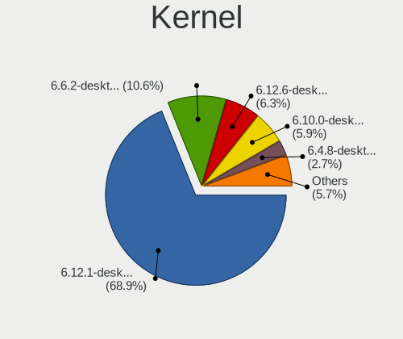
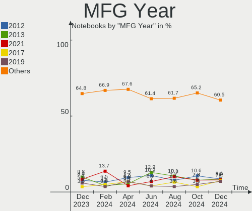
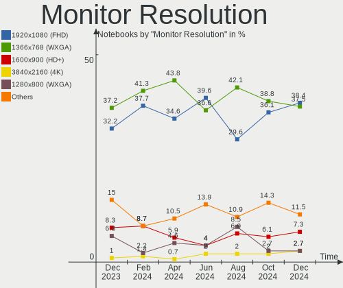
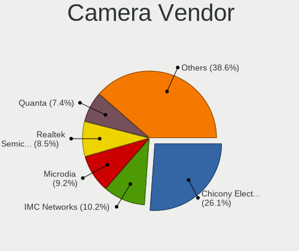
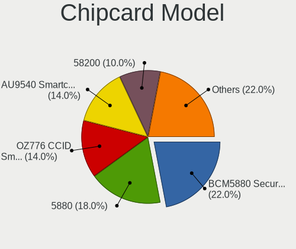

OpenMandriva - Hardware Trends (Notebooks)
------------------------------------------

A project to identify most popular hardware characteristics and track their change
over time based on data collected by Linux users at https://Linux-Hardware.org.

Anyone can contribute to this report by the [hw-probe](https://github.com/linuxhw/hw-probe) tool:

    sudo -E hw-probe -all -upload

This report is for one last month. Overall report since the beginning of time: [TestCoverage](https://github.com/linuxhw/TestCoverage)

Period: Nov, 2022.

Contents
--------

* [ System ](#system)
  - [ OS                       ](#os)
  - [ OS Family                ](#os-family)
  - [ Kernel                   ](#kernel)
  - [ Kernel Family            ](#kernel-family)
  - [ Kernel Major Ver.        ](#kernel-major-ver)
  - [ Arch                     ](#arch)
  - [ DE                       ](#de)
  - [ Display Server           ](#display-server)
  - [ Display Manager          ](#display-manager)
  - [ OS Lang                  ](#os-lang)
  - [ Boot Mode                ](#boot-mode)
  - [ Filesystem               ](#filesystem)
  - [ Part. scheme             ](#part-scheme)
  - [ Dual Boot with Linux/BSD ](#dual-boot-with-linuxbsd)
  - [ Dual Boot (Win)          ](#dual-boot-win)

* [ Board ](#board)
  - [ Vendor                   ](#vendor)
  - [ Model                    ](#model)
  - [ Model Family             ](#model-family)
  - [ MFG Year                 ](#mfg-year)
  - [ Form Factor              ](#form-factor)
  - [ Secure Boot              ](#secure-boot)
  - [ Coreboot                 ](#coreboot)
  - [ RAM Size                 ](#ram-size)
  - [ RAM Used                 ](#ram-used)
  - [ Total Drives             ](#total-drives)
  - [ Has CD-ROM               ](#has-cd-rom)
  - [ Has Ethernet             ](#has-ethernet)
  - [ Has WiFi                 ](#has-wifi)
  - [ Has Bluetooth            ](#has-bluetooth)

* [ Location ](#location)
  - [ Country                  ](#country)
  - [ City                     ](#city)

* [ Drives ](#drives)
  - [ Drive Vendor             ](#drive-vendor)
  - [ Drive Model              ](#drive-model)
  - [ HDD Vendor               ](#hdd-vendor)
  - [ SSD Vendor               ](#ssd-vendor)
  - [ Drive Kind               ](#drive-kind)
  - [ Drive Connector          ](#drive-connector)
  - [ Drive Size               ](#drive-size)
  - [ Space Total              ](#space-total)
  - [ Space Used               ](#space-used)
  - [ Malfunc. Drives          ](#malfunc-drives)
  - [ Malfunc. Drive Vendor    ](#malfunc-drive-vendor)
  - [ Malfunc. HDD Vendor      ](#malfunc-hdd-vendor)
  - [ Malfunc. Drive Kind      ](#malfunc-drive-kind)
  - [ Failed Drives            ](#failed-drives)
  - [ Failed Drive Vendor      ](#failed-drive-vendor)
  - [ Drive Status             ](#drive-status)

* [ Storage controller ](#storage-controller)
  - [ Storage Vendor           ](#storage-vendor)
  - [ Storage Model            ](#storage-model)
  - [ Storage Kind             ](#storage-kind)

* [ Processor ](#processor)
  - [ CPU Vendor               ](#cpu-vendor)
  - [ CPU Model                ](#cpu-model)
  - [ CPU Model Family         ](#cpu-model-family)
  - [ CPU Cores                ](#cpu-cores)
  - [ CPU Sockets              ](#cpu-sockets)
  - [ CPU Threads              ](#cpu-threads)
  - [ CPU Op-Modes             ](#cpu-op-modes)
  - [ CPU Microcode            ](#cpu-microcode)
  - [ CPU Microarch            ](#cpu-microarch)

* [ Graphics ](#graphics)
  - [ GPU Vendor               ](#gpu-vendor)
  - [ GPU Model                ](#gpu-model)
  - [ GPU Combo                ](#gpu-combo)
  - [ GPU Driver               ](#gpu-driver)
  - [ GPU Memory               ](#gpu-memory)

* [ Monitor ](#monitor)
  - [ Monitor Vendor           ](#monitor-vendor)
  - [ Monitor Model            ](#monitor-model)
  - [ Monitor Resolution       ](#monitor-resolution)
  - [ Monitor Diagonal         ](#monitor-diagonal)
  - [ Monitor Width            ](#monitor-width)
  - [ Aspect Ratio             ](#aspect-ratio)
  - [ Monitor Area             ](#monitor-area)
  - [ Pixel Density            ](#pixel-density)
  - [ Multiple Monitors        ](#multiple-monitors)

* [ Network ](#network)
  - [ Net Controller Vendor    ](#net-controller-vendor)
  - [ Net Controller Model     ](#net-controller-model)
  - [ Wireless Vendor          ](#wireless-vendor)
  - [ Wireless Model           ](#wireless-model)
  - [ Ethernet Vendor          ](#ethernet-vendor)
  - [ Ethernet Model           ](#ethernet-model)
  - [ Net Controller Kind      ](#net-controller-kind)
  - [ Used Controller          ](#used-controller)
  - [ NICs                     ](#nics)
  - [ IPv6                     ](#ipv6)

* [ Bluetooth ](#bluetooth)
  - [ Bluetooth Vendor         ](#bluetooth-vendor)
  - [ Bluetooth Model          ](#bluetooth-model)

* [ Sound ](#sound)
  - [ Sound Vendor             ](#sound-vendor)
  - [ Sound Model              ](#sound-model)

* [ Memory ](#memory)
  - [ Memory Vendor            ](#memory-vendor)
  - [ Memory Model             ](#memory-model)
  - [ Memory Kind              ](#memory-kind)
  - [ Memory Form Factor       ](#memory-form-factor)
  - [ Memory Size              ](#memory-size)
  - [ Memory Speed             ](#memory-speed)

* [ Printers & scanners ](#printers--scanners)
  - [ Printer Vendor           ](#printer-vendor)
  - [ Printer Model            ](#printer-model)
  - [ Scanner Vendor           ](#scanner-vendor)
  - [ Scanner Model            ](#scanner-model)

* [ Camera ](#camera)
  - [ Camera Vendor            ](#camera-vendor)
  - [ Camera Model             ](#camera-model)

* [ Security ](#security)
  - [ Fingerprint Vendor       ](#fingerprint-vendor)
  - [ Fingerprint Model        ](#fingerprint-model)
  - [ Chipcard Vendor          ](#chipcard-vendor)
  - [ Chipcard Model           ](#chipcard-model)

* [ Unsupported ](#unsupported)
  - [ Unsupported Devices      ](#unsupported-devices)
  - [ Unsupported Device Types ](#unsupported-device-types)

System
------

OS
--

Installed operating systems

| Name               | Notebooks | Percent |
|--------------------|-----------|---------|
| OpenMandriva 4.3   | 108       | 66.67%  |
| OpenMandriva 4.50  | 44        | 27.16%  |
| OpenMandriva 4.90  | 6         | 3.7%    |
| OpenMandriva 4.2   | 3         | 1.85%   |
| OpenMandriva 22.90 | 1         | 0.62%   |

OS Family
---------

OS without a version

| Name         | Notebooks | Percent |
|--------------|-----------|---------|
| OpenMandriva | 162       | 100%    |

Kernel
------

Version of the Linux kernel

| Version                  | Notebooks | Percent |
|--------------------------|-----------|---------|
| 5.16.7-desktop-1omv4003  | 103       | 63.58%  |
| 5.19.12-desktop-2omv4090 | 28        | 17.28%  |
| 5.19.5-desktop-1omv4090  | 14        | 8.64%   |
| 5.16.13-desktop-1omv4003 | 6         | 3.7%    |
| 6.0.2-desktop-1omv4090   | 3         | 1.85%   |
| 5.10.14-desktop-1omv4002 | 3         | 1.85%   |
| 5.18.12-desktop-3omv4090 | 2         | 1.23%   |
| 6.0.9-desktop-1omv22090  | 1         | 0.62%   |
| 6.0.5-desktop-1omv4090   | 1         | 0.62%   |
| 6.0.2-desktop-1omv4050   | 1         | 0.62%   |

Kernel Family
-------------

Linux kernel without a distro release

| Version | Notebooks | Percent |
|---------|-----------|---------|
| 5.16.7  | 103       | 63.58%  |
| 5.19.12 | 28        | 17.28%  |
| 5.19.5  | 14        | 8.64%   |
| 5.16.13 | 6         | 3.7%    |
| 6.0.2   | 4         | 2.47%   |
| 5.10.14 | 3         | 1.85%   |
| 5.18.12 | 2         | 1.23%   |
| 6.0.9   | 1         | 0.62%   |
| 6.0.5   | 1         | 0.62%   |

Kernel Major Ver.
-----------------

Linux kernel major version

| Version | Notebooks | Percent |
|---------|-----------|---------|
| 5.16    | 109       | 67.28%  |
| 5.19    | 42        | 25.93%  |
| 6.0     | 6         | 3.7%    |
| 5.10    | 3         | 1.85%   |
| 5.18    | 2         | 1.23%   |

Arch
----

OS architecture (x86_64, i586, etc.)

| Name   | Notebooks | Percent |
|--------|-----------|---------|
| x86_64 | 162       | 100%    |

DE
--

Desktop Environment

| Name  | Notebooks | Percent |
|-------|-----------|---------|
| KDE5  | 159       | 98.15%  |
| GNOME | 3         | 1.85%   |

Display Server
--------------

X11 or Wayland

| Name    | Notebooks | Percent |
|---------|-----------|---------|
| X11     | 159       | 98.15%  |
| Wayland | 3         | 1.85%   |

Display Manager
---------------

SDDM, LightDM, etc.

| Name | Notebooks | Percent |
|------|-----------|---------|
| SDDM | 159       | 98.15%  |
| GDM  | 3         | 1.85%   |

OS Lang
-------

Language

| Lang  | Notebooks | Percent |
|-------|-----------|---------|
| en_US | 97        | 59.88%  |
| pl_PL | 7         | 4.32%   |
| ru_RU | 6         | 3.7%    |
| fr_FR | 6         | 3.7%    |
| es_ES | 6         | 3.7%    |
| en_GB | 6         | 3.7%    |
| it_IT | 5         | 3.09%   |
| de_DE | 5         | 3.09%   |
| pt_BR | 4         | 2.47%   |
| cs_CZ | 3         | 1.85%   |
| tr_TR | 2         | 1.23%   |
| hu_HU | 2         | 1.23%   |
| fr_BE | 2         | 1.23%   |
| es_VE | 2         | 1.23%   |
| nl_NL | 1         | 0.62%   |
| ja_JP | 1         | 0.62%   |
| fr_CA | 1         | 0.62%   |
| es_UY | 1         | 0.62%   |
| es_PE | 1         | 0.62%   |
| es_MX | 1         | 0.62%   |
| es_AR | 1         | 0.62%   |
| en_AU | 1         | 0.62%   |
| en_AG | 1         | 0.62%   |

Boot Mode
---------

EFI or BIOS

| Mode | Notebooks | Percent |
|------|-----------|---------|
| EFI  | 82        | 50.62%  |
| BIOS | 80        | 49.38%  |

Filesystem
----------

Type of filesystem

| Type    | Notebooks | Percent |
|---------|-----------|---------|
| Overlay | 129       | 79.63%  |
| Ext4    | 30        | 18.52%  |
| Btrfs   | 3         | 1.85%   |

Part. scheme
------------

Scheme of partitioning

| Type | Notebooks | Percent |
|------|-----------|---------|
| GPT  | 100       | 61.73%  |
| MBR  | 62        | 38.27%  |

Dual Boot with Linux/BSD
------------------------

Hosting more than one Linux/BSD

| Dual boot | Notebooks | Percent |
|-----------|-----------|---------|
| Yes       | 83        | 51.23%  |
| No        | 79        | 48.77%  |

Dual Boot (Win)
---------------

Hosting Linux and Windows

| Dual boot | Notebooks | Percent |
|-----------|-----------|---------|
| No        | 91        | 56.17%  |
| Yes       | 71        | 43.83%  |

Board
-----

Vendor
------

Motherboard manufacturer

| Name                | Notebooks | Percent |
|---------------------|-----------|---------|
| Hewlett-Packard     | 32        | 19.75%  |
| Lenovo              | 31        | 19.14%  |
| Dell                | 17        | 10.49%  |
| Acer                | 16        | 9.88%   |
| ASUSTek Computer    | 15        | 9.26%   |
| Toshiba             | 11        | 6.79%   |
| Samsung Electronics | 6         | 3.7%    |
| Apple               | 6         | 3.7%    |
| Sony                | 5         | 3.09%   |
| Packard Bell        | 3         | 1.85%   |
| Fujitsu             | 3         | 1.85%   |
| MSI                 | 2         | 1.23%   |
| Medion              | 2         | 1.23%   |
| Unknown             | 2         | 1.23%   |
| Philco              | 1         | 0.62%   |
| Panasonic           | 1         | 0.62%   |
| Notebook            | 1         | 0.62%   |
| LDLC                | 1         | 0.62%   |
| Intel               | 1         | 0.62%   |
| HUAWEI              | 1         | 0.62%   |
| Gateway             | 1         | 0.62%   |
| Fujitsu Siemens     | 1         | 0.62%   |
| Compaq              | 1         | 0.62%   |
| Chuwi               | 1         | 0.62%   |
| Alienware           | 1         | 0.62%   |

Model
-----

Motherboard model

| Name                                                  | Notebooks | Percent |
|-------------------------------------------------------|-----------|---------|
| HP Notebook                                           | 5         | 3.09%   |
| Toshiba dynabook T653/46JR                            | 3         | 1.85%   |
| Lenovo Yoga Slim 7 13ACN5 82CY                        | 2         | 1.23%   |
| Lenovo IdeaPad 3 15ADA05 81W1                         | 2         | 1.23%   |
| ASUS UX31E                                            | 2         | 1.23%   |
| Apple MacBookPro12,1                                  | 2         | 1.23%   |
| Acer Aspire 7741                                      | 2         | 1.23%   |
| Unknown                                               | 2         | 1.23%   |
| Toshiba Satellite Pro U500                            | 1         | 0.62%   |
| Toshiba Satellite Pro A200                            | 1         | 0.62%   |
| Toshiba Satellite L875                                | 1         | 0.62%   |
| Toshiba Satellite L40                                 | 1         | 0.62%   |
| Toshiba Satellite C870-D7K                            | 1         | 0.62%   |
| Toshiba Satellite C75D-B                              | 1         | 0.62%   |
| Toshiba Satellite C660                                | 1         | 0.62%   |
| Toshiba PORTEGE Z30t-A                                | 1         | 0.62%   |
| Sony VPCYB1S1E                                        | 1         | 0.62%   |
| Sony VPCEG16EG                                        | 1         | 0.62%   |
| Sony VPCEB2M1E                                        | 1         | 0.62%   |
| Sony VGN-NS150FJ                                      | 1         | 0.62%   |
| Sony SVE1411EGXB                                      | 1         | 0.62%   |
| Samsung 550XDA                                        | 1         | 0.62%   |
| Samsung 400B2B/400B2B                                 | 1         | 0.62%   |
| Samsung 3570R/370R/470R/450R/510R/4450RV              | 1         | 0.62%   |
| Samsung 300V3A/300V4A/300V5A/200A4B/200A5B            | 1         | 0.62%   |
| Samsung 300E5K/300E5Q                                 | 1         | 0.62%   |
| Samsung 300E5EV/300E4EV/270E5EV/270E4EV/2470EV/2470EE | 1         | 0.62%   |
| Philco 14H                                            | 1         | 0.62%   |
| Panasonic CF-C1BWFBZ1M                                | 1         | 0.62%   |
| Packard Bell EasyNote TK81                            | 1         | 0.62%   |
| Packard Bell EasyNote MZ45                            | 1         | 0.62%   |
| Packard Bell DOT S                                    | 1         | 0.62%   |
| Notebook NJ50_70CU                                    | 1         | 0.62%   |
| MSI U270DX                                            | 1         | 0.62%   |
| MSI CR620                                             | 1         | 0.62%   |
| Medion E6246 MD63200                                  | 1         | 0.62%   |
| Medion E11201                                         | 1         | 0.62%   |
| Lenovo Z50-70 20354                                   | 1         | 0.62%   |
| Lenovo V15 G1 IML 82NB                                | 1         | 0.62%   |
| Lenovo ThinkPad T530 24297ZG                          | 1         | 0.62%   |

Model Family
------------

Motherboard model prefix

| Name                   | Notebooks | Percent |
|------------------------|-----------|---------|
| Lenovo IdeaPad         | 10        | 6.17%   |
| Acer Aspire            | 10        | 6.17%   |
| Lenovo ThinkPad        | 9         | 5.56%   |
| Dell Inspiron          | 9         | 5.56%   |
| Toshiba Satellite      | 7         | 4.32%   |
| HP Pavilion            | 6         | 3.7%    |
| HP ProBook             | 5         | 3.09%   |
| HP Notebook            | 5         | 3.09%   |
| Dell Latitude          | 5         | 3.09%   |
| HP EliteBook           | 4         | 2.47%   |
| Toshiba dynabook       | 3         | 1.85%   |
| HP Compaq              | 3         | 1.85%   |
| Acer TravelMate        | 3         | 1.85%   |
| Packard Bell EasyNote  | 2         | 1.23%   |
| Lenovo Yoga            | 2         | 1.23%   |
| HP Stream              | 2         | 1.23%   |
| Fujitsu LIFEBOOK       | 2         | 1.23%   |
| Dell XPS               | 2         | 1.23%   |
| ASUS UX31E             | 2         | 1.23%   |
| Apple MacBookPro12     | 2         | 1.23%   |
| Acer Nitro             | 2         | 1.23%   |
| Unknown                | 2         | 1.23%   |
| Toshiba PORTEGE        | 1         | 0.62%   |
| Sony VPCYB1S1E         | 1         | 0.62%   |
| Sony VPCEG16EG         | 1         | 0.62%   |
| Sony VPCEB2M1E         | 1         | 0.62%   |
| Sony VGN-NS150FJ       | 1         | 0.62%   |
| Sony SVE1411EGXB       | 1         | 0.62%   |
| Samsung 550XDA         | 1         | 0.62%   |
| Samsung 400B2B         | 1         | 0.62%   |
| Samsung 3570R          | 1         | 0.62%   |
| Samsung 300V3A         | 1         | 0.62%   |
| Samsung 300E5K         | 1         | 0.62%   |
| Samsung 300E5EV        | 1         | 0.62%   |
| Philco 14H             | 1         | 0.62%   |
| Panasonic CF-C1BWFBZ1M | 1         | 0.62%   |
| Packard Bell DOT       | 1         | 0.62%   |
| Notebook NJ50          | 1         | 0.62%   |
| MSI U270DX             | 1         | 0.62%   |
| MSI CR620              | 1         | 0.62%   |

MFG Year
--------

Motherboard manufacture year

| Year | Notebooks | Percent |
|------|-----------|---------|
| 2011 | 22        | 13.58%  |
| 2012 | 14        | 8.64%   |
| 2010 | 13        | 8.02%   |
| 2015 | 12        | 7.41%   |
| 2014 | 12        | 7.41%   |
| 2008 | 11        | 6.79%   |
| 2019 | 10        | 6.17%   |
| 2016 | 10        | 6.17%   |
| 2021 | 9         | 5.56%   |
| 2017 | 9         | 5.56%   |
| 2013 | 9         | 5.56%   |
| 2018 | 8         | 4.94%   |
| 2020 | 6         | 3.7%    |
| 2009 | 6         | 3.7%    |
| 2007 | 6         | 3.7%    |
| 2022 | 4         | 2.47%   |
| 2005 | 1         | 0.62%   |

Form Factor
-----------

Physical design of the computer

| Name     | Notebooks | Percent |
|----------|-----------|---------|
| Notebook | 162       | 100%    |

Secure Boot
-----------

Enabled or disabled

| State    | Notebooks | Percent |
|----------|-----------|---------|
| Disabled | 162       | 100%    |

Coreboot
--------

Have coreboot on board

| Used | Notebooks | Percent |
|------|-----------|---------|
| No   | 162       | 100%    |

RAM Size
--------

Total RAM memory

| Size in GB | Notebooks | Percent |
|------------|-----------|---------|
| 3.01-4.0   | 64        | 39.51%  |
| 4.01-8.0   | 47        | 29.01%  |
| 8.01-16.0  | 26        | 16.05%  |
| 16.01-24.0 | 13        | 8.02%   |
| 1.01-2.0   | 8         | 4.94%   |
| 24.01-32.0 | 2         | 1.23%   |
| 32.01-64.0 | 1         | 0.62%   |
| 2.01-3.0   | 1         | 0.62%   |

RAM Used
--------

Used RAM memory

| Used GB  | Notebooks | Percent |
|----------|-----------|---------|
| 1.01-2.0 | 135       | 83.33%  |
| 0.51-1.0 | 15        | 9.26%   |
| 2.01-3.0 | 8         | 4.94%   |
| 3.01-4.0 | 2         | 1.23%   |
| 0.01-0.5 | 2         | 1.23%   |

Total Drives
------------

Number of drives on board

| Drives | Notebooks | Percent |
|--------|-----------|---------|
| 1      | 121       | 74.69%  |
| 2      | 30        | 18.52%  |
| 3      | 9         | 5.56%   |
| 4      | 1         | 0.62%   |
| 0      | 1         | 0.62%   |

Has CD-ROM
----------

Has CD-ROM on board

| Presented | Notebooks | Percent |
|-----------|-----------|---------|
| No        | 84        | 51.85%  |
| Yes       | 78        | 48.15%  |

Has Ethernet
------------

Has Ethernet on board

| Presented | Notebooks | Percent |
|-----------|-----------|---------|
| Yes       | 142       | 87.65%  |
| No        | 20        | 12.35%  |

Has WiFi
--------

Has WiFi module

| Presented | Notebooks | Percent |
|-----------|-----------|---------|
| Yes       | 161       | 99.38%  |
| No        | 1         | 0.62%   |

Has Bluetooth
-------------

Has Bluetooth module

| Presented | Notebooks | Percent |
|-----------|-----------|---------|
| Yes       | 115       | 70.99%  |
| No        | 47        | 29.01%  |

Location
--------

Country
-------

Geographic location (country)

| Country         | Notebooks | Percent |
|-----------------|-----------|---------|
| Germany         | 15        | 9.26%   |
| Brazil          | 11        | 6.79%   |
| USA             | 10        | 6.17%   |
| Russia          | 10        | 6.17%   |
| Italy           | 10        | 6.17%   |
| UK              | 9         | 5.56%   |
| Spain           | 9         | 5.56%   |
| France          | 9         | 5.56%   |
| Poland          | 8         | 4.94%   |
| Mexico          | 6         | 3.7%    |
| Turkey          | 5         | 3.09%   |
| Netherlands     | 5         | 3.09%   |
| Japan           | 5         | 3.09%   |
| Czechia         | 5         | 3.09%   |
| Belgium         | 5         | 3.09%   |
| Romania         | 4         | 2.47%   |
| India           | 3         | 1.85%   |
| Chile           | 3         | 1.85%   |
| Venezuela       | 2         | 1.23%   |
| Uruguay         | 2         | 1.23%   |
| Sri Lanka       | 2         | 1.23%   |
| Hungary         | 2         | 1.23%   |
| Congo Republic  | 2         | 1.23%   |
| Australia       | 2         | 1.23%   |
| Taiwan          | 1         | 0.62%   |
| Slovenia        | 1         | 0.62%   |
| Serbia          | 1         | 0.62%   |
| Réunion        | 1         | 0.62%   |
| Peru            | 1         | 0.62%   |
| Pakistan        | 1         | 0.62%   |
| Norway          | 1         | 0.62%   |
| North Macedonia | 1         | 0.62%   |
| Morocco         | 1         | 0.62%   |
| Malaysia        | 1         | 0.62%   |
| Lithuania       | 1         | 0.62%   |
| Greece          | 1         | 0.62%   |
| El Salvador     | 1         | 0.62%   |
| China           | 1         | 0.62%   |
| Canada          | 1         | 0.62%   |
| Belarus         | 1         | 0.62%   |

City
----

Geographic location (city)

| City                 | Notebooks | Percent |
|----------------------|-----------|---------|
| Prague               | 4         | 2.47%   |
| Salzgitter           | 3         | 1.85%   |
| Moscow               | 3         | 1.85%   |
| Madison              | 3         | 1.85%   |
| Istanbul             | 3         | 1.85%   |
| Warsaw               | 2         | 1.23%   |
| Wangen               | 2         | 1.23%   |
| Tijuana              | 2         | 1.23%   |
| Pointe Noire         | 2         | 1.23%   |
| Montevideo           | 2         | 1.23%   |
| Mexico City          | 2         | 1.23%   |
| Maringá             | 2         | 1.23%   |
| Madrid               | 2         | 1.23%   |
| Köthen              | 2         | 1.23%   |
| Kagoshima            | 2         | 1.23%   |
| Herten               | 2         | 1.23%   |
| Colombo              | 2         | 1.23%   |
| Winston-Salem        | 1         | 0.62%   |
| Villars              | 1         | 0.62%   |
| Vilhena              | 1         | 0.62%   |
| Valladolid           | 1         | 0.62%   |
| Valencia             | 1         | 0.62%   |
| Ulyanovsk            | 1         | 0.62%   |
| Tulancingo           | 1         | 0.62%   |
| Tula                 | 1         | 0.62%   |
| Szczecin             | 1         | 0.62%   |
| Supraśl             | 1         | 0.62%   |
| Stuttgart            | 1         | 0.62%   |
| St Petersburg        | 1         | 0.62%   |
| South Jordan         | 1         | 0.62%   |
| Souillac             | 1         | 0.62%   |
| Somerset             | 1         | 0.62%   |
| Solapur              | 1         | 0.62%   |
| Six-Fours-les-Plages | 1         | 0.62%   |
| Šiauliai            | 1         | 0.62%   |
| Sherburn in Elmet    | 1         | 0.62%   |
| Seraing              | 1         | 0.62%   |
| Santana do Ipanema   | 1         | 0.62%   |
| San Salvador         | 1         | 0.62%   |
| San Pedro de la Paz  | 1         | 0.62%   |

Drives
------

Drive Vendor
------------

Hard drive vendors

| Vendor              | Notebooks | Drives | Percent |
|---------------------|-----------|--------|---------|
| WDC                 | 24        | 24     | 12.37%  |
| Toshiba             | 21        | 22     | 10.82%  |
| Seagate             | 17        | 17     | 8.76%   |
| Samsung Electronics | 17        | 19     | 8.76%   |
| SanDisk             | 13        | 15     | 6.7%    |
| Kingston            | 12        | 12     | 6.19%   |
| Hitachi             | 9         | 9      | 4.64%   |
| Unknown             | 8         | 8      | 4.12%   |
| Crucial             | 7         | 8      | 3.61%   |
| Intel               | 6         | 7      | 3.09%   |
| HGST                | 6         | 6      | 3.09%   |
| SK hynix            | 5         | 5      | 2.58%   |
| China               | 5         | 5      | 2.58%   |
| SSSTC               | 3         | 3      | 1.55%   |
| SPCC                | 3         | 3      | 1.55%   |
| Netac               | 3         | 3      | 1.55%   |
| GOODRAM             | 3         | 3      | 1.55%   |
| Apple               | 3         | 3      | 1.55%   |
| A-DATA Technology   | 3         | 3      | 1.55%   |
| PNY                 | 2         | 2      | 1.03%   |
| Intenso             | 2         | 2      | 1.03%   |
| Fujitsu             | 2         | 2      | 1.03%   |
| FORESEE             | 2         | 2      | 1.03%   |
| Unknown             | 2         | 3      | 1.03%   |
| XrayDisk            | 1         | 1      | 0.52%   |
| WDC WDS1            | 1         | 1      | 0.52%   |
| V Series            | 1         | 1      | 0.52%   |
| USB2.0              | 1         | 1      | 0.52%   |
| USB                 | 1         | 1      | 0.52%   |
| UMIS                | 1         | 1      | 0.52%   |
| Team                | 1         | 1      | 0.52%   |
| StoreJet            | 1         | 1      | 0.52%   |
| SAGE                | 1         | 1      | 0.52%   |
| Phison Electronics  | 1         | 1      | 0.52%   |
| Phison              | 1         | 1      | 0.52%   |
| OCZ                 | 1         | 1      | 0.52%   |
| LITEONIT            | 1         | 1      | 0.52%   |
| Lexar               | 1         | 1      | 0.52%   |
| Dahua               | 1         | 1      | 0.52%   |
| Apacer              | 1         | 1      | 0.52%   |

Drive Model
-----------

Hard drive models

| Model                                     | Notebooks | Percent |
|-------------------------------------------|-----------|---------|
| Toshiba MQ01ABD100 1TB                    | 5         | 2.5%    |
| Kingston SA400S37240G 240GB SSD           | 4         | 2%      |
| WDC WD3200BPVT-22JJ5T0 320GB              | 3         | 1.5%    |
| Toshiba MQ01ABD075 752GB                  | 3         | 1.5%    |
| SanDisk DF4032  32GB                      | 3         | 1.5%    |
| Samsung SSD 970 EVO Plus 1TB              | 3         | 1.5%    |
| Toshiba MQ04ABF100 1TB                    | 2         | 1%      |
| Toshiba MK3275GSX 320GB                   | 2         | 1%      |
| Toshiba MK3265GSXN 320GB                  | 2         | 1%      |
| SSSTC CL1-4D256 256GB                     | 2         | 1%      |
| SK hynix SKHynix_HFS512GD9TNI-L2A0B 512GB | 2         | 1%      |
| Seagate ST500LT012-9WS142 500GB           | 2         | 1%      |
| Seagate ST500LT012-1DG142 500GB           | 2         | 1%      |
| Seagate ST1000LM035-1RK172 1TB            | 2         | 1%      |
| SanDisk SSD U100 256GB                    | 2         | 1%      |
| SanDisk SSD PLUS 240GB                    | 2         | 1%      |
| Intel SSDPEKNW010T8 1TB                   | 2         | 1%      |
| Hitachi HTS547575A9E384 752GB             | 2         | 1%      |
| Hitachi HTS545025B9A300 250GB             | 2         | 1%      |
| HGST HTS545050A7E680 500GB                | 2         | 1%      |
| HGST HTS541010A9E680 1TB                  | 2         | 1%      |
| Unknown                                   | 2         | 1%      |
| XrayDisk 1TB SSD                          | 1         | 0.5%    |
| WDC WDS500G2B0B-00YS70 500GB SSD          | 1         | 0.5%    |
| WDC WDS500G2B0A-00SM50 500GB SSD          | 1         | 0.5%    |
| WDC WDS240G2G0A-00JH30 240GB SSD          | 1         | 0.5%    |
| WDC WDS1 00T2B0C 1TB SSD                  | 1         | 0.5%    |
| WDC WD6400BPVT-60HXZT1 640GB              | 1         | 0.5%    |
| WDC WD5000LPLX-08ZNTT0 500GB              | 1         | 0.5%    |
| WDC WD5000LPCX-60VHAT0 500GB              | 1         | 0.5%    |
| WDC WD5000BPKX-22HPJT0 500GB              | 1         | 0.5%    |
| WDC WD5000BEVT-24A0RT0 500GB              | 1         | 0.5%    |
| WDC WD5000BEKT-60KA9T0 500GB              | 1         | 0.5%    |
| WDC WD3200LPVX-75V0TT0 320GB              | 1         | 0.5%    |
| WDC WD3200BPVT-55JJ5T0 320GB              | 1         | 0.5%    |
| WDC WD3200BEKT-60KA9T0 320GB              | 1         | 0.5%    |
| WDC WD2500BEVS-22UST0 250GB               | 1         | 0.5%    |
| WDC WD1600BEVT-22ZCT0 160GB               | 1         | 0.5%    |
| WDC WD1200BEVS-75UST0 120GB               | 1         | 0.5%    |
| WDC WD1200BEVS-60UST0 120GB               | 1         | 0.5%    |

HDD Vendor
----------

Hard disk drive vendors

| Vendor              | Notebooks | Drives | Percent |
|---------------------|-----------|--------|---------|
| WDC                 | 20        | 20     | 25.97%  |
| Toshiba             | 19        | 19     | 24.68%  |
| Seagate             | 17        | 17     | 22.08%  |
| Hitachi             | 9         | 9      | 11.69%  |
| HGST                | 6         | 6      | 7.79%   |
| Fujitsu             | 2         | 2      | 2.6%    |
| USB                 | 1         | 1      | 1.3%    |
| Unknown             | 1         | 1      | 1.3%    |
| Samsung Electronics | 1         | 1      | 1.3%    |
| SAGE                | 1         | 1      | 1.3%    |

SSD Vendor
----------

Solid state drive vendors

| Vendor              | Notebooks | Drives | Percent |
|---------------------|-----------|--------|---------|
| Kingston            | 12        | 12     | 15%     |
| Samsung Electronics | 11        | 11     | 13.75%  |
| SanDisk             | 9         | 11     | 11.25%  |
| Crucial             | 5         | 6      | 6.25%   |
| China               | 5         | 5      | 6.25%   |
| WDC                 | 3         | 3      | 3.75%   |
| Toshiba             | 3         | 3      | 3.75%   |
| SPCC                | 3         | 3      | 3.75%   |
| Netac               | 3         | 3      | 3.75%   |
| GOODRAM             | 3         | 3      | 3.75%   |
| Apple               | 3         | 3      | 3.75%   |
| PNY                 | 2         | 2      | 2.5%    |
| Intenso             | 2         | 2      | 2.5%    |
| Intel               | 2         | 2      | 2.5%    |
| A-DATA Technology   | 2         | 2      | 2.5%    |
| XrayDisk            | 1         | 1      | 1.25%   |
| WDC WDS1            | 1         | 1      | 1.25%   |
| V Series            | 1         | 1      | 1.25%   |
| Team                | 1         | 1      | 1.25%   |
| StoreJet            | 1         | 1      | 1.25%   |
| Phison              | 1         | 1      | 1.25%   |
| OCZ                 | 1         | 1      | 1.25%   |
| LITEONIT            | 1         | 1      | 1.25%   |
| Lexar               | 1         | 1      | 1.25%   |
| FORESEE             | 1         | 1      | 1.25%   |
| Dahua               | 1         | 1      | 1.25%   |
| Apacer              | 1         | 1      | 1.25%   |

Drive Kind
----------

HDD or SSD

| Kind    | Notebooks | Drives | Percent |
|---------|-----------|--------|---------|
| HDD     | 76        | 77     | 40.64%  |
| SSD     | 73        | 83     | 39.04%  |
| NVMe    | 25        | 27     | 13.37%  |
| MMC     | 12        | 14     | 6.42%   |
| Unknown | 1         | 1      | 0.53%   |

Drive Connector
---------------

SATA, SAS, NVMe, etc.

| Type | Notebooks | Drives | Percent |
|------|-----------|--------|---------|
| SATA | 137       | 153    | 75.27%  |
| NVMe | 25        | 27     | 13.74%  |
| MMC  | 12        | 14     | 6.59%   |
| SAS  | 8         | 8      | 4.4%    |

Drive Size
----------

Size of hard drive

| Size in TB | Notebooks | Drives | Percent |
|------------|-----------|--------|---------|
| 0.01-0.5   | 104       | 117    | 71.23%  |
| 0.51-1.0   | 41        | 42     | 28.08%  |
| 1.01-2.0   | 1         | 1      | 0.68%   |

Space Total
-----------

Amount of disk space available on the file system

| Size in GB | Notebooks | Percent |
|------------|-----------|---------|
| 1-20       | 92        | 56.79%  |
| 101-250    | 24        | 14.81%  |
| 251-500    | 21        | 12.96%  |
| 21-50      | 9         | 5.56%   |
| 51-100     | 6         | 3.7%    |
| 501-1000   | 5         | 3.09%   |
| Unknown    | 5         | 3.09%   |

Space Used
----------

Amount of used disk space

| Used GB | Notebooks | Percent |
|---------|-----------|---------|
| 1-20    | 144       | 88.89%  |
| 21-50   | 5         | 3.09%   |
| Unknown | 5         | 3.09%   |
| 101-250 | 4         | 2.47%   |
| 251-500 | 2         | 1.23%   |
| 51-100  | 2         | 1.23%   |

Malfunc. Drives
---------------

Drive models with a malfunction

| Model                            | Notebooks | Drives | Percent |
|----------------------------------|-----------|--------|---------|
| Toshiba MQ01ABD075 752GB         | 3         | 3      | 6.67%   |
| Toshiba MK3275GSX 320GB          | 2         | 2      | 4.44%   |
| Toshiba MK3265GSXN 320GB         | 2         | 2      | 4.44%   |
| Seagate ST500LT012-9WS142 500GB  | 2         | 2      | 4.44%   |
| SanDisk SSD U100 256GB           | 2         | 2      | 4.44%   |
| Hitachi HTS547575A9E384 752GB    | 2         | 2      | 4.44%   |
| HGST HTS545050A7E680 500GB       | 2         | 2      | 4.44%   |
| WDC WD6400BPVT-60HXZT1 640GB     | 1         | 1      | 2.22%   |
| WDC WD5000LPCX-60VHAT0 500GB     | 1         | 1      | 2.22%   |
| WDC WD5000BEKT-60KA9T0 500GB     | 1         | 1      | 2.22%   |
| WDC WD3200BPVT-55JJ5T0 320GB     | 1         | 1      | 2.22%   |
| WDC WD3200BPVT-22JJ5T0 320GB     | 1         | 1      | 2.22%   |
| WDC WD1200BEVS-60UST0 120GB      | 1         | 1      | 2.22%   |
| WDC WD10JPVT-60A1YT0 1TB         | 1         | 1      | 2.22%   |
| Toshiba MQ02ABD100H 1TB          | 1         | 1      | 2.22%   |
| Toshiba MQ01ABD050 500GB         | 1         | 1      | 2.22%   |
| Toshiba MQ01ABD032 320GB         | 1         | 1      | 2.22%   |
| Toshiba MK2552GSX 250GB          | 1         | 1      | 2.22%   |
| Seagate ST9750420AS 752GB        | 1         | 1      | 2.22%   |
| Seagate ST9500420ASG 500GB       | 1         | 1      | 2.22%   |
| Seagate ST9320325AS 320GB        | 1         | 1      | 2.22%   |
| Seagate ST9160412AS 160GB        | 1         | 1      | 2.22%   |
| Seagate ST9120822AS 120GB        | 1         | 1      | 2.22%   |
| Seagate ST500LM021-1KJ152 500GB  | 1         | 1      | 2.22%   |
| Seagate ST1000LM014-SSHD-8GB     | 1         | 1      | 2.22%   |
| SanDisk SSD U100 24GB            | 1         | 1      | 2.22%   |
| SanDisk SSD PLUS 240GB           | 1         | 1      | 2.22%   |
| OCZ VERTEX460 240GB SSD          | 1         | 1      | 2.22%   |
| Kingston SUV400S37240G 240GB SSD | 1         | 1      | 2.22%   |
| Intel SSDSCKKF256G8H 256GB       | 1         | 1      | 2.22%   |
| Intel SSDSC2KW240H6 240GB        | 1         | 1      | 2.22%   |
| Hitachi HTS725050A9A364 500GB    | 1         | 1      | 2.22%   |
| Hitachi HTS725032A7E630 320GB    | 1         | 1      | 2.22%   |
| Hitachi HTS543225L9SA00 250GB    | 1         | 1      | 2.22%   |
| HGST HTS541075A9E680 752GB       | 1         | 1      | 2.22%   |
| China SSD 120GB                  | 1         | 1      | 2.22%   |
| Apple SSD SM128C 121GB           | 1         | 1      | 2.22%   |

Malfunc. Drive Vendor
---------------------

Vendors of faulty drives

| Vendor   | Notebooks | Drives | Percent |
|----------|-----------|--------|---------|
| Toshiba  | 11        | 11     | 24.44%  |
| Seagate  | 9         | 9      | 20%     |
| WDC      | 7         | 7      | 15.56%  |
| Hitachi  | 5         | 5      | 11.11%  |
| SanDisk  | 4         | 4      | 8.89%   |
| HGST     | 3         | 3      | 6.67%   |
| Intel    | 2         | 2      | 4.44%   |
| OCZ      | 1         | 1      | 2.22%   |
| Kingston | 1         | 1      | 2.22%   |
| China    | 1         | 1      | 2.22%   |
| Apple    | 1         | 1      | 2.22%   |

Malfunc. HDD Vendor
-------------------

Vendors of faulty HDD drives

| Vendor  | Notebooks | Drives | Percent |
|---------|-----------|--------|---------|
| Toshiba | 11        | 11     | 31.43%  |
| Seagate | 9         | 9      | 25.71%  |
| WDC     | 7         | 7      | 20%     |
| Hitachi | 5         | 5      | 14.29%  |
| HGST    | 3         | 3      | 8.57%   |

Malfunc. Drive Kind
-------------------

Kinds of faulty drives

| Kind | Notebooks | Drives | Percent |
|------|-----------|--------|---------|
| HDD  | 35        | 35     | 77.78%  |
| SSD  | 10        | 10     | 22.22%  |

Failed Drives
-------------

Failed drive models

| Model                        | Notebooks | Drives | Percent |
|------------------------------|-----------|--------|---------|
| WDC WD3200BEKT-60KA9T0 320GB | 1         | 1      | 50%     |
| Toshiba MQ01ABD100 1TB       | 1         | 1      | 50%     |

Failed Drive Vendor
-------------------

Failed drive vendors

| Vendor  | Notebooks | Drives | Percent |
|---------|-----------|--------|---------|
| WDC     | 1         | 1      | 50%     |
| Toshiba | 1         | 1      | 50%     |

Drive Status
------------

Number of failed and malfunc. drives

| Status   | Notebooks | Drives | Percent |
|----------|-----------|--------|---------|
| Works    | 115       | 132    | 63.89%  |
| Malfunc  | 45        | 45     | 25%     |
| Detected | 18        | 23     | 10%     |
| Failed   | 2         | 2      | 1.11%   |

Storage controller
------------------

Storage Vendor
--------------

Storage controller vendors

| Vendor                         | Notebooks | Percent |
|--------------------------------|-----------|---------|
| Intel                          | 127       | 73.84%  |
| AMD                            | 18        | 10.47%  |
| Samsung Electronics            | 9         | 5.23%   |
| SK hynix                       | 4         | 2.33%   |
| Solid State Storage Technology | 3         | 1.74%   |
| Nvidia                         | 3         | 1.74%   |
| SanDisk                        | 2         | 1.16%   |
| Micron/Crucial Technology      | 2         | 1.16%   |
| Union Memory (Shenzhen)        | 1         | 0.58%   |
| Shenzhen Longsys Electronics   | 1         | 0.58%   |
| Phison Electronics             | 1         | 0.58%   |
| ADATA Technology               | 1         | 0.58%   |

Storage Model
-------------

Storage controller models

| Model                                                                            | Notebooks | Percent |
|----------------------------------------------------------------------------------|-----------|---------|
| Intel 6 Series/C200 Series Chipset Family 6 port Mobile SATA AHCI Controller     | 24        | 12.83%  |
| Intel 7 Series Chipset Family 6-port SATA Controller [AHCI mode]                 | 16        | 8.56%   |
| AMD FCH SATA Controller [AHCI mode]                                              | 14        | 7.49%   |
| Intel Sunrise Point-LP SATA Controller [AHCI mode]                               | 9         | 4.81%   |
| Intel 82801IBM/IEM (ICH9M/ICH9M-E) 4 port SATA Controller [AHCI mode]            | 9         | 4.81%   |
| Intel 82801 Mobile SATA Controller [RAID mode]                                   | 7         | 3.74%   |
| Intel Wildcat Point-LP SATA Controller [AHCI Mode]                               | 6         | 3.21%   |
| Intel 82801HM/HEM (ICH8M/ICH8M-E) IDE Controller                                 | 6         | 3.21%   |
| Intel 5 Series/3400 Series Chipset 4 port SATA AHCI Controller                   | 6         | 3.21%   |
| Intel Atom Processor E3800 Series SATA AHCI Controller                           | 5         | 2.67%   |
| Intel 82801HM/HEM (ICH8M/ICH8M-E) SATA Controller [AHCI mode]                    | 5         | 2.67%   |
| Intel 8 Series SATA Controller 1 [AHCI mode]                                     | 5         | 2.67%   |
| Samsung NVMe SSD Controller SM981/PM981/PM983                                    | 4         | 2.14%   |
| Intel Comet Lake SATA AHCI Controller                                            | 4         | 2.14%   |
| Intel Celeron/Pentium Silver Processor SATA Controller                           | 4         | 2.14%   |
| Solid State Storage Non-Volatile memory controller                               | 3         | 1.6%    |
| Samsung NVMe SSD Controller 980                                                  | 3         | 1.6%    |
| Intel HM170/QM170 Chipset SATA Controller [AHCI Mode]                            | 3         | 1.6%    |
| Intel Celeron N3350/Pentium N4200/Atom E3900 Series SATA AHCI Controller         | 3         | 1.6%    |
| Intel 5 Series/3400 Series Chipset 6 port SATA AHCI Controller                   | 3         | 1.6%    |
| AMD SB7x0/SB8x0/SB9x0 SATA Controller [AHCI mode]                                | 3         | 1.6%    |
| SK hynix Non-Volatile memory controller                                          | 2         | 1.07%   |
| Samsung Electronics SATA controller                                              | 2         | 1.07%   |
| Nvidia MCP79 AHCI Controller                                                     | 2         | 1.07%   |
| Micron/Crucial P2 NVMe PCIe SSD                                                  | 2         | 1.07%   |
| Intel Volume Management Device NVMe RAID Controller                              | 2         | 1.07%   |
| Intel SSD 660P Series                                                            | 2         | 1.07%   |
| Intel NM10/ICH7 Family SATA Controller [AHCI mode]                               | 2         | 1.07%   |
| Intel Atom/Celeron/Pentium Processor x5-E8000/J3xxx/N3xxx Series SATA Controller | 2         | 1.07%   |
| Intel 8 Series/C220 Series Chipset Family 6-port SATA Controller 1 [AHCI mode]   | 2         | 1.07%   |
| AMD FCH IDE Controller                                                           | 2         | 1.07%   |
| Union Memory (Shenzhen) Non-Volatile memory controller                           | 1         | 0.53%   |
| SK hynix BC511                                                                   | 1         | 0.53%   |
| SK hynix BC501 NVMe Solid State Drive                                            | 1         | 0.53%   |
| Shenzhen Longsys Electronics Non-Volatile memory controller                      | 1         | 0.53%   |
| SanDisk WD Blue SN550 NVMe SSD                                                   | 1         | 0.53%   |
| SanDisk WD Black SN750 / PC SN730 NVMe SSD                                       | 1         | 0.53%   |
| Phison Electronics Non-Volatile memory controller                                | 1         | 0.53%   |
| Nvidia MCP78S [GeForce 8200] SATA Controller (non-AHCI mode)                     | 1         | 0.53%   |
| Nvidia MCP78S [GeForce 8200] IDE                                                 | 1         | 0.53%   |

Storage Kind
------------

Kind of storage controller (IDE, SATA, NVMe, SAS, ...)

| Kind | Notebooks | Percent |
|------|-----------|---------|
| SATA | 135       | 73.77%  |
| NVMe | 25        | 13.66%  |
| IDE  | 14        | 7.65%   |
| RAID | 9         | 4.92%   |

Processor
---------

CPU Vendor
----------

Processor vendors

| Vendor | Notebooks | Percent |
|--------|-----------|---------|
| Intel  | 136       | 83.95%  |
| AMD    | 26        | 16.05%  |

CPU Model
---------

Processor models

| Model                                         | Notebooks | Percent |
|-----------------------------------------------|-----------|---------|
| Intel Core i3-2310M CPU @ 2.10GHz             | 5         | 3.09%   |
| Intel Core i5-3210M CPU @ 2.50GHz             | 4         | 2.47%   |
| Intel Core i5-2520M CPU @ 2.50GHz             | 4         | 2.47%   |
| Intel Celeron CPU N2840 @ 2.16GHz             | 4         | 2.47%   |
| Intel Core i5-2450M CPU @ 2.50GHz             | 3         | 1.85%   |
| Intel Core i3-5005U CPU @ 2.00GHz             | 3         | 1.85%   |
| Intel Celeron CPU 847 @ 1.10GHz               | 3         | 1.85%   |
| Intel Pentium Dual-Core CPU T4400 @ 2.20GHz   | 2         | 1.23%   |
| Intel Pentium Dual CPU T3400 @ 2.16GHz        | 2         | 1.23%   |
| Intel Pentium CPU P6100 @ 2.00GHz             | 2         | 1.23%   |
| Intel Core i7-7500U CPU @ 2.70GHz             | 2         | 1.23%   |
| Intel Core i7-6700HQ CPU @ 2.60GHz            | 2         | 1.23%   |
| Intel Core i7-2677M CPU @ 1.80GHz             | 2         | 1.23%   |
| Intel Core i7-2670QM CPU @ 2.20GHz            | 2         | 1.23%   |
| Intel Core i5-7300HQ CPU @ 2.50GHz            | 2         | 1.23%   |
| Intel Core i5-7200U CPU @ 2.50GHz             | 2         | 1.23%   |
| Intel Core i5-6300U CPU @ 2.40GHz             | 2         | 1.23%   |
| Intel Core i5-4210U CPU @ 1.70GHz             | 2         | 1.23%   |
| Intel Core i5-3317U CPU @ 1.70GHz             | 2         | 1.23%   |
| Intel Core i5 CPU M 460 @ 2.53GHz             | 2         | 1.23%   |
| Intel Core i3-10110U CPU @ 2.10GHz            | 2         | 1.23%   |
| Intel Core 2 Duo CPU P8700 @ 2.53GHz          | 2         | 1.23%   |
| Intel Celeron CPU N3450 @ 1.10GHz             | 2         | 1.23%   |
| Intel Celeron CPU N3060 @ 1.60GHz             | 2         | 1.23%   |
| Intel Celeron CPU N3050 @ 1.60GHz             | 2         | 1.23%   |
| AMD Ryzen 7 5800U with Radeon Graphics        | 2         | 1.23%   |
| AMD Ryzen 5 3500U with Radeon Vega Mobile Gfx | 2         | 1.23%   |
| AMD E1-7010 APU with AMD Radeon R2 Graphics   | 2         | 1.23%   |
| Intel Pentium Silver N5030 CPU @ 1.10GHz      | 1         | 0.62%   |
| Intel Pentium Silver N5000 CPU @ 1.10GHz      | 1         | 0.62%   |
| Intel Pentium Dual-Core CPU T4300 @ 2.10GHz   | 1         | 0.62%   |
| Intel Pentium Dual-Core CPU T4200 @ 2.00GHz   | 1         | 0.62%   |
| Intel Pentium Dual CPU T3200 @ 2.00GHz        | 1         | 0.62%   |
| Intel Pentium Dual CPU T2370 @ 1.73GHz        | 1         | 0.62%   |
| Intel Pentium Dual CPU T2330 @ 1.60GHz        | 1         | 0.62%   |
| Intel Pentium Dual CPU T2310 @ 1.46GHz        | 1         | 0.62%   |
| Intel Pentium CPU P6200 @ 2.13GHz             | 1         | 0.62%   |
| Intel Pentium CPU N3700 @ 1.60GHz             | 1         | 0.62%   |
| Intel Pentium CPU B970 @ 2.30GHz              | 1         | 0.62%   |
| Intel Pentium CPU B940 @ 2.00GHz              | 1         | 0.62%   |

CPU Model Family
----------------

Processor model prefix

| Model                   | Notebooks | Percent |
|-------------------------|-----------|---------|
| Intel Core i5           | 44        | 27.16%  |
| Intel Core i3           | 22        | 13.58%  |
| Intel Celeron           | 20        | 12.35%  |
| Intel Core i7           | 17        | 10.49%  |
| Intel Core 2 Duo        | 8         | 4.94%   |
| Intel Pentium           | 7         | 4.32%   |
| Intel Pentium Dual      | 6         | 3.7%    |
| Other                   | 5         | 3.09%   |
| Intel Pentium Dual-Core | 4         | 2.47%   |
| AMD Ryzen 7             | 4         | 2.47%   |
| AMD Ryzen 5             | 3         | 1.85%   |
| AMD Ryzen 3             | 3         | 1.85%   |
| AMD E1                  | 3         | 1.85%   |
| Intel Pentium Silver    | 2         | 1.23%   |
| Intel Atom              | 2         | 1.23%   |
| AMD E                   | 2         | 1.23%   |
| AMD A6                  | 2         | 1.23%   |
| Intel Core 2            | 1         | 0.62%   |
| AMD Turion 64 X2 Mobile | 1         | 0.62%   |
| AMD Phenom II           | 1         | 0.62%   |
| AMD E2                  | 1         | 0.62%   |
| AMD Athlon II           | 1         | 0.62%   |
| AMD Athlon              | 1         | 0.62%   |
| AMD A4                  | 1         | 0.62%   |
| AMD A10                 | 1         | 0.62%   |

CPU Cores
---------

Number of processor cores

| Number | Notebooks | Percent |
|--------|-----------|---------|
| 2      | 124       | 76.54%  |
| 4      | 31        | 19.14%  |
| 8      | 3         | 1.85%   |
| 6      | 2         | 1.23%   |
| 10     | 1         | 0.62%   |
| 1      | 1         | 0.62%   |

CPU Sockets
-----------

Number of sockets

| Number | Notebooks | Percent |
|--------|-----------|---------|
| 1      | 162       | 100%    |

CPU Threads
-----------

Threads per core (Hyper-Threading)

| Number | Notebooks | Percent |
|--------|-----------|---------|
| 2      | 96        | 59.26%  |
| 1      | 66        | 40.74%  |

CPU Op-Modes
------------

CPU Operation Modes (32-bit, 64-bit)

| Op mode        | Notebooks | Percent |
|----------------|-----------|---------|
| 32-bit, 64-bit | 162       | 100%    |

CPU Microcode
-------------

Microcode number

| Number     | Notebooks | Percent |
|------------|-----------|---------|
| 0x206a7    | 29        | 17.9%   |
| 0x306a9    | 13        | 8.02%   |
| 0x6fd      | 9         | 5.56%   |
| 0x306d4    | 8         | 4.94%   |
| 0x20655    | 8         | 4.94%   |
| 0x1067a    | 8         | 4.94%   |
| 0x806ec    | 5         | 3.09%   |
| 0x806e9    | 5         | 3.09%   |
| 0x406e3    | 5         | 3.09%   |
| 0x40651    | 5         | 3.09%   |
| 0x08108109 | 5         | 3.09%   |
| 0x30678    | 4         | 2.47%   |
| 0x07030105 | 4         | 2.47%   |
| 0x506c9    | 3         | 1.85%   |
| 0x406c3    | 3         | 1.85%   |
| 0x306c3    | 3         | 1.85%   |
| 0x0a50000c | 3         | 1.85%   |
| Unknown    | 3         | 1.85%   |
| 0x906e9    | 2         | 1.23%   |
| 0x806ea    | 2         | 1.23%   |
| 0x706a8    | 2         | 1.23%   |
| 0x706a1    | 2         | 1.23%   |
| 0x506e3    | 2         | 1.23%   |
| 0x406c4    | 2         | 1.23%   |
| 0x20652    | 2         | 1.23%   |
| 0x0500010d | 2         | 1.23%   |
| 0xa0652    | 1         | 0.62%   |
| 0x906ea    | 1         | 0.62%   |
| 0x906c0    | 1         | 0.62%   |
| 0x906a4    | 1         | 0.62%   |
| 0x806eb    | 1         | 0.62%   |
| 0x806c1    | 1         | 0.62%   |
| 0x706e5    | 1         | 0.62%   |
| 0x6f6      | 1         | 0.62%   |
| 0x30673    | 1         | 0.62%   |
| 0x30661    | 1         | 0.62%   |
| 0x106ca    | 1         | 0.62%   |
| 0x10676    | 1         | 0.62%   |
| 0x10661    | 1         | 0.62%   |
| 0x0a50000d | 1         | 0.62%   |

CPU Microarch
-------------

Microarchitecture

| Name             | Notebooks | Percent |
|------------------|-----------|---------|
| SandyBridge      | 29        | 17.9%   |
| KabyLake         | 16        | 9.88%   |
| IvyBridge        | 13        | 8.02%   |
| Core             | 11        | 6.79%   |
| Westmere         | 10        | 6.17%   |
| Silvermont       | 10        | 6.17%   |
| Penryn           | 9         | 5.56%   |
| Haswell          | 8         | 4.94%   |
| Broadwell        | 8         | 4.94%   |
| Skylake          | 7         | 4.32%   |
| Zen+             | 6         | 3.7%    |
| Puma             | 5         | 3.09%   |
| Zen 3            | 4         | 2.47%   |
| Goldmont plus    | 4         | 2.47%   |
| Goldmont         | 3         | 1.85%   |
| Bobcat           | 3         | 1.85%   |
| K10              | 2         | 1.23%   |
| Bonnell          | 2         | 1.23%   |
| Zen              | 1         | 0.62%   |
| Tremont          | 1         | 0.62%   |
| TigerLake        | 1         | 0.62%   |
| Steamroller      | 1         | 0.62%   |
| K8 Hammer        | 1         | 0.62%   |
| K8 & K10 hybrid  | 1         | 0.62%   |
| K10 Llano        | 1         | 0.62%   |
| IceLake          | 1         | 0.62%   |
| Excavator        | 1         | 0.62%   |
| CometLake        | 1         | 0.62%   |
| Alderlake Hybrid | 1         | 0.62%   |
| Unknown          | 1         | 0.62%   |

Graphics
--------

GPU Vendor
----------

Vendors of graphics cards

| Vendor | Notebooks | Percent |
|--------|-----------|---------|
| Intel  | 124       | 66.67%  |
| AMD    | 34        | 18.28%  |
| Nvidia | 28        | 15.05%  |

GPU Model
---------

Graphics card models

| Model                                                                                    | Notebooks | Percent |
|------------------------------------------------------------------------------------------|-----------|---------|
| Intel 2nd Generation Core Processor Family Integrated Graphics Controller                | 27        | 13.92%  |
| Intel 3rd Gen Core processor Graphics Controller                                         | 13        | 6.7%    |
| Intel Mobile 4 Series Chipset Integrated Graphics Controller                             | 8         | 4.12%   |
| Intel Core Processor Integrated Graphics Controller                                      | 8         | 4.12%   |
| AMD Picasso/Raven 2 [Radeon Vega Series / Radeon Vega Mobile Series]                     | 7         | 3.61%   |
| Intel HD Graphics 5500                                                                   | 6         | 3.09%   |
| Intel Skylake GT2 [HD Graphics 520]                                                      | 5         | 2.58%   |
| Intel Mobile GM965/GL960 Integrated Graphics Controller (secondary)                      | 5         | 2.58%   |
| Intel Mobile GM965/GL960 Integrated Graphics Controller (primary)                        | 5         | 2.58%   |
| Intel HD Graphics 620                                                                    | 5         | 2.58%   |
| Intel Haswell-ULT Integrated Graphics Controller                                         | 5         | 2.58%   |
| Intel Atom/Celeron/Pentium Processor x5-E8000/J3xxx/N3xxx Integrated Graphics Controller | 5         | 2.58%   |
| Intel Atom Processor Z36xxx/Z37xxx Series Graphics & Display                             | 5         | 2.58%   |
| Intel CometLake-U GT2 [UHD Graphics]                                                     | 4         | 2.06%   |
| AMD Seymour [Radeon HD 6400M/7400M Series]                                               | 4         | 2.06%   |
| Intel HD Graphics 500                                                                    | 3         | 1.55%   |
| Intel 4th Gen Core Processor Integrated Graphics Controller                              | 3         | 1.55%   |
| AMD Sun XT [Radeon HD 8670A/8670M/8690M / R5 M330 / M430 / Radeon 520 Mobile]            | 3         | 1.55%   |
| AMD Mullins [Radeon R2 Graphics]                                                         | 3         | 1.55%   |
| AMD Cezanne [Radeon Vega Series / Radeon Vega Mobile Series]                             | 3         | 1.55%   |
| Nvidia G98M [GeForce 9300M GS]                                                           | 2         | 1.03%   |
| Intel WhiskeyLake-U GT2 [UHD Graphics 620]                                               | 2         | 1.03%   |
| Intel UHD Graphics 620                                                                   | 2         | 1.03%   |
| Intel Iris Graphics 6100                                                                 | 2         | 1.03%   |
| Intel HD Graphics 630                                                                    | 2         | 1.03%   |
| Intel GeminiLake [UHD Graphics 605]                                                      | 2         | 1.03%   |
| Intel GeminiLake [UHD Graphics 600]                                                      | 2         | 1.03%   |
| AMD Wrestler [Radeon HD 6310]                                                            | 2         | 1.03%   |
| AMD Madison [Mobility Radeon HD 5650/5750 / 6530M/6550M]                                 | 2         | 1.03%   |
| Nvidia TU117M [GeForce GTX 1650 Ti Mobile]                                               | 1         | 0.52%   |
| Nvidia TU117M [GeForce GTX 1650 Mobile / Max-Q]                                          | 1         | 0.52%   |
| Nvidia GT218M [NVS 3100M]                                                                | 1         | 0.52%   |
| Nvidia GT218M [GeForce G210M]                                                            | 1         | 0.52%   |
| Nvidia GT218M [GeForce 315M]                                                             | 1         | 0.52%   |
| Nvidia GT218M [GeForce 310M]                                                             | 1         | 0.52%   |
| Nvidia GP107M [GeForce GTX 1050 Ti Mobile]                                               | 1         | 0.52%   |
| Nvidia GP107M [GeForce GTX 1050 3 GB Max-Q]                                              | 1         | 0.52%   |
| Nvidia GM108M [GeForce 940MX]                                                            | 1         | 0.52%   |
| Nvidia GM108M [GeForce 840M]                                                             | 1         | 0.52%   |
| Nvidia GM107M [GeForce GTX 960M]                                                         | 1         | 0.52%   |

GPU Combo
---------

Combinations of graphics cards

| Name           | Notebooks | Percent |
|----------------|-----------|---------|
| 1 x Intel      | 95        | 58.64%  |
| 1 x AMD        | 23        | 14.2%   |
| Intel + Nvidia | 16        | 9.88%   |
| 1 x Nvidia     | 11        | 6.79%   |
| Intel + AMD    | 7         | 4.32%   |
| 2 x Intel      | 6         | 3.7%    |
| 2 x AMD        | 3         | 1.85%   |
| AMD + Nvidia   | 1         | 0.62%   |

GPU Driver
----------

Free vs proprietary

| Driver  | Notebooks | Percent |
|---------|-----------|---------|
| Free    | 160       | 98.77%  |
| Unknown | 2         | 1.23%   |

GPU Memory
----------

Total video memory

| Size in GB | Notebooks | Percent |
|------------|-----------|---------|
| Unknown    | 104       | 64.2%   |
| 0.01-0.5   | 21        | 12.96%  |
| 0.51-1.0   | 16        | 9.88%   |
| 1.01-2.0   | 12        | 7.41%   |
| 3.01-4.0   | 7         | 4.32%   |
| 5.01-6.0   | 1         | 0.62%   |
| 2.01-3.0   | 1         | 0.62%   |

Monitor
-------

Monitor Vendor
--------------

Monitor vendors

| Vendor                  | Notebooks | Percent |
|-------------------------|-----------|---------|
| AU Optronics            | 38        | 23.31%  |
| LG Display              | 26        | 15.95%  |
| Samsung Electronics     | 23        | 14.11%  |
| Chimei Innolux          | 22        | 13.5%   |
| BOE                     | 19        | 11.66%  |
| Chi Mei Optoelectronics | 6         | 3.68%   |
| Apple                   | 6         | 3.68%   |
| Sharp                   | 4         | 2.45%   |
| InfoVision              | 3         | 1.84%   |
| Lenovo                  | 2         | 1.23%   |
| KDC                     | 2         | 1.23%   |
| CPT                     | 2         | 1.23%   |
| Sony                    | 1         | 0.61%   |
| Quanta Display          | 1         | 0.61%   |
| Philips                 | 1         | 0.61%   |
| PANDA                   | 1         | 0.61%   |
| MTD                     | 1         | 0.61%   |
| LG Philips              | 1         | 0.61%   |
| Eizo                    | 1         | 0.61%   |
| Dell                    | 1         | 0.61%   |
| ASUSTek Computer        | 1         | 0.61%   |
| AOC                     | 1         | 0.61%   |

Monitor Model
-------------

Monitor models

| Model                                                                | Notebooks | Percent |
|----------------------------------------------------------------------|-----------|---------|
| LG Display LCD Monitor LGD039F 1366x768 345x194mm 15.6-inch          | 4         | 2.45%   |
| Chimei Innolux LCD Monitor CMN15F5 1920x1080 344x193mm 15.5-inch     | 3         | 1.84%   |
| AU Optronics LCD Monitor AUO20EC 1366x768 344x193mm 15.5-inch        | 3         | 1.84%   |
| Samsung Electronics LCD Monitor SEC5341 1366x768 344x193mm 15.5-inch | 2         | 1.23%   |
| LG Display LCD Monitor LGD02DC 1366x768 344x194mm 15.5-inch          | 2         | 1.23%   |
| CPT LCD Monitor COR17DB 1600x900 293x164mm 13.2-inch                 | 2         | 1.23%   |
| Chimei Innolux LCD Monitor CMN15E6 1366x768 344x193mm 15.5-inch      | 2         | 1.23%   |
| Chimei Innolux LCD Monitor CMN15DB 1366x768 344x193mm 15.5-inch      | 2         | 1.23%   |
| Chimei Innolux LCD Monitor CMN15CA 1366x768 344x193mm 15.5-inch      | 2         | 1.23%   |
| Chimei Innolux LCD Monitor CMN1472 1366x768 309x174mm 14.0-inch      | 2         | 1.23%   |
| Chimei Innolux LCD Monitor CMN13B0 2560x1600 286x178mm 13.3-inch     | 2         | 1.23%   |
| BOE LCD Monitor BOE0812 1920x1080 344x194mm 15.5-inch                | 2         | 1.23%   |
| BOE LCD Monitor BOE0675 1366x768 344x194mm 15.5-inch                 | 2         | 1.23%   |
| AU Optronics LCD Monitor AUO243D 1920x1080 309x173mm 13.9-inch       | 2         | 1.23%   |
| AU Optronics LCD Monitor AUO22EC 1366x768 344x193mm 15.5-inch        | 2         | 1.23%   |
| AU Optronics LCD Monitor AUO139E 1600x900 382x214mm 17.2-inch        | 2         | 1.23%   |
| AU Optronics LCD Monitor AUO10EC 1366x768 344x193mm 15.5-inch        | 2         | 1.23%   |
| Apple Color LCD APPA02A 2560x1600 286x179mm 13.3-inch                | 2         | 1.23%   |
| Apple Color LCD APP9CC7 1280x800 286x179mm 13.3-inch                 | 2         | 1.23%   |
| Sony TV SNY4201 1360x768 710x400mm 32.1-inch                         | 1         | 0.61%   |
| Sharp LQ133M1JW08 SHP1425 1920x1080 294x165mm 13.3-inch              | 1         | 0.61%   |
| Sharp LCD Monitor SHP1548 1920x1200 288x180mm 13.4-inch              | 1         | 0.61%   |
| Sharp LCD Monitor SHP1447 1920x1080 294x165mm 13.3-inch              | 1         | 0.61%   |
| Sharp LCD Monitor SHP13F8 3200x1800 346x194mm 15.6-inch              | 1         | 0.61%   |
| Samsung Electronics S24B300 SAM08B4 1920x1080 521x293mm 23.5-inch    | 1         | 0.61%   |
| Samsung Electronics LCD Monitor SEC5742 1366x768 309x174mm 14.0-inch | 1         | 0.61%   |
| Samsung Electronics LCD Monitor SEC5541 1366x768 344x193mm 15.5-inch | 1         | 0.61%   |
| Samsung Electronics LCD Monitor SEC544B 1600x900 310x174mm 14.0-inch | 1         | 0.61%   |
| Samsung Electronics LCD Monitor SEC5442 1440x900 367x230mm 17.1-inch | 1         | 0.61%   |
| Samsung Electronics LCD Monitor SEC5244 1600x900 360x210mm 16.4-inch | 1         | 0.61%   |
| Samsung Electronics LCD Monitor SEC4E41 1366x768 353x198mm 15.9-inch | 1         | 0.61%   |
| Samsung Electronics LCD Monitor SEC3945 1280x800 331x207mm 15.4-inch | 1         | 0.61%   |
| Samsung Electronics LCD Monitor SEC3942 1366x768 309x174mm 14.0-inch | 1         | 0.61%   |
| Samsung Electronics LCD Monitor SEC3741 1280x800 331x207mm 15.4-inch | 1         | 0.61%   |
| Samsung Electronics LCD Monitor SEC3645 1280x800 331x207mm 15.4-inch | 1         | 0.61%   |
| Samsung Electronics LCD Monitor SEC325A 1366x768 344x194mm 15.5-inch | 1         | 0.61%   |
| Samsung Electronics LCD Monitor SEC324A 1366x768 344x194mm 15.5-inch | 1         | 0.61%   |
| Samsung Electronics LCD Monitor SEC3154 1600x900 382x215mm 17.3-inch | 1         | 0.61%   |
| Samsung Electronics LCD Monitor SEC3152 1366x768 344x194mm 15.5-inch | 1         | 0.61%   |
| Samsung Electronics LCD Monitor SEC3145 1366x768 268x151mm 12.1-inch | 1         | 0.61%   |

Monitor Resolution
------------------

Monitor screen resolution

| Resolution         | Notebooks | Percent |
|--------------------|-----------|---------|
| 1366x768 (WXGA)    | 81        | 49.69%  |
| 1920x1080 (FHD)    | 36        | 22.09%  |
| 1280x800 (WXGA)    | 13        | 7.98%   |
| 1600x900 (HD+)     | 12        | 7.36%   |
| 2560x1600          | 5         | 3.07%   |
| 3840x2160 (4K)     | 4         | 2.45%   |
| 1440x900 (WXGA+)   | 4         | 2.45%   |
| 1920x1200 (WUXGA)  | 2         | 1.23%   |
| 1360x768           | 2         | 1.23%   |
| 3200x1800 (QHD+)   | 1         | 0.61%   |
| 1680x1050 (WSXGA+) | 1         | 0.61%   |
| 1280x1024 (SXGA)   | 1         | 0.61%   |
| 1024x600           | 1         | 0.61%   |

Monitor Diagonal
----------------

Diagonal size in inches

| Inches | Notebooks | Percent |
|--------|-----------|---------|
| 15     | 81        | 49.69%  |
| 13     | 32        | 19.63%  |
| 14     | 18        | 11.04%  |
| 17     | 16        | 9.82%   |
| 11     | 3         | 1.84%   |
| 23     | 2         | 1.23%   |
| 16     | 2         | 1.23%   |
| 12     | 2         | 1.23%   |
| 10     | 2         | 1.23%   |
| 32     | 1         | 0.61%   |
| 31     | 1         | 0.61%   |
| 27     | 1         | 0.61%   |
| 26     | 1         | 0.61%   |
| 22     | 1         | 0.61%   |

Monitor Width
-------------

Physical width

| Width in mm | Notebooks | Percent |
|-------------|-----------|---------|
| 301-350     | 110       | 67.48%  |
| 201-300     | 28        | 17.18%  |
| 351-400     | 18        | 11.04%  |
| 501-600     | 4         | 2.45%   |
| 701-800     | 1         | 0.61%   |
| 601-700     | 1         | 0.61%   |
| 401-500     | 1         | 0.61%   |

Aspect Ratio
------------

Proportional relationship between the width and the height

| Ratio | Notebooks | Percent |
|-------|-----------|---------|
| 16/9  | 131       | 83.44%  |
| 16/10 | 25        | 15.92%  |
| 5/4   | 1         | 0.64%   |

Monitor Area
------------

Area in inch²

| Area in inch² | Notebooks | Percent |
|----------------|-----------|---------|
| 101-110        | 81        | 49.69%  |
| 81-90          | 34        | 20.86%  |
| 71-80          | 16        | 9.82%   |
| 121-130        | 13        | 7.98%   |
| 51-60          | 3         | 1.84%   |
| 201-250        | 3         | 1.84%   |
| 61-70          | 2         | 1.23%   |
| 351-500        | 2         | 1.23%   |
| 41-50          | 2         | 1.23%   |
| 131-140        | 2         | 1.23%   |
| 111-120        | 2         | 1.23%   |
| 301-350        | 1         | 0.61%   |
| 251-300        | 1         | 0.61%   |
| 141-150        | 1         | 0.61%   |

Pixel Density
-------------

Pixels per inch

| Density       | Notebooks | Percent |
|---------------|-----------|---------|
| 101-120       | 83        | 51.23%  |
| 121-160       | 40        | 24.69%  |
| 51-100        | 25        | 15.43%  |
| 161-240       | 12        | 7.41%   |
| More than 240 | 1         | 0.62%   |
| 1-50          | 1         | 0.62%   |

Multiple Monitors
-----------------

Total monitors connected

| Total | Notebooks | Percent |
|-------|-----------|---------|
| 1     | 154       | 95.06%  |
| 2     | 8         | 4.94%   |

Network
-------

Net Controller Vendor
---------------------

Controller vendors

| Vendor                   | Notebooks | Percent |
|--------------------------|-----------|---------|
| Realtek Semiconductor    | 93        | 35.63%  |
| Intel                    | 64        | 24.52%  |
| Qualcomm Atheros         | 50        | 19.16%  |
| Broadcom                 | 25        | 9.58%   |
| Ralink                   | 7         | 2.68%   |
| Samsung Electronics      | 4         | 1.53%   |
| Marvell Technology Group | 4         | 1.53%   |
| TP-Link                  | 2         | 0.77%   |
| Nvidia                   | 2         | 0.77%   |
| Broadcom Limited         | 2         | 0.77%   |
| Ralink Technology        | 1         | 0.38%   |
| MediaTek                 | 1         | 0.38%   |
| JMicron Technology       | 1         | 0.38%   |
| ICS Advent               | 1         | 0.38%   |
| Huawei Technologies      | 1         | 0.38%   |
| Edimax Technology        | 1         | 0.38%   |
| Belkin Components        | 1         | 0.38%   |
| ASIX Electronics         | 1         | 0.38%   |

Net Controller Model
--------------------

Controller models

| Model                                                                   | Notebooks | Percent |
|-------------------------------------------------------------------------|-----------|---------|
| Realtek RTL8111/8168/8411 PCI Express Gigabit Ethernet Controller       | 49        | 15.56%  |
| Realtek RTL810xE PCI Express Fast Ethernet controller                   | 28        | 8.89%   |
| Qualcomm Atheros AR9285 Wireless Network Adapter (PCI-Express)          | 12        | 3.81%   |
| Qualcomm Atheros QCA9565 / AR9565 Wireless Network Adapter              | 8         | 2.54%   |
| Qualcomm Atheros AR9485 Wireless Network Adapter                        | 7         | 2.22%   |
| Realtek RTL8153 Gigabit Ethernet Adapter                                | 6         | 1.9%    |
| Qualcomm Atheros QCA9377 802.11ac Wireless Network Adapter              | 6         | 1.9%    |
| Qualcomm Atheros AR8151 v2.0 Gigabit Ethernet                           | 6         | 1.9%    |
| Intel 82579LM Gigabit Network Connection (Lewisville)                   | 6         | 1.9%    |
| Realtek RTL8723BE PCIe Wireless Network Adapter                         | 5         | 1.59%   |
| Intel Wireless 7260                                                     | 5         | 1.59%   |
| Intel Wireless 3165                                                     | 5         | 1.59%   |
| Broadcom BCM4313 802.11bgn Wireless Network Adapter                     | 5         | 1.59%   |
| Samsung Galaxy series, misc. (tethering mode)                           | 4         | 1.27%   |
| Realtek RTL8821CE 802.11ac PCIe Wireless Network Adapter                | 4         | 1.27%   |
| Ralink RT3290 Wireless 802.11n 1T/1R PCIe                               | 4         | 1.27%   |
| Qualcomm Atheros AR9287 Wireless Network Adapter (PCI-Express)          | 4         | 1.27%   |
| Qualcomm Atheros AR8162 Fast Ethernet                                   | 4         | 1.27%   |
| Intel Wireless 3160                                                     | 4         | 1.27%   |
| Intel WiFi Link 5100                                                    | 4         | 1.27%   |
| Intel Wi-Fi 6 AX200                                                     | 4         | 1.27%   |
| Intel Comet Lake PCH-LP CNVi WiFi                                       | 4         | 1.27%   |
| Intel Centrino Advanced-N 6205 [Taylor Peak]                            | 4         | 1.27%   |
| Realtek RTL8822CE 802.11ac PCIe Wireless Network Adapter                | 3         | 0.95%   |
| Ralink RT5390 Wireless 802.11n 1T/1R PCIe                               | 3         | 0.95%   |
| Intel Wireless 8265 / 8275                                              | 3         | 0.95%   |
| Intel Wireless 8260                                                     | 3         | 0.95%   |
| Intel Wireless 7265                                                     | 3         | 0.95%   |
| Intel Dual Band Wireless-AC 3165 Plus Bluetooth                         | 3         | 0.95%   |
| Broadcom NetLink BCM5787M Gigabit Ethernet PCI Express                  | 3         | 0.95%   |
| Broadcom NetLink BCM57780 Gigabit Ethernet PCIe                         | 3         | 0.95%   |
| TP-Link Archer T3U [Realtek RTL8812BU]                                  | 2         | 0.63%   |
| Realtek RTL8821AE 802.11ac PCIe Wireless Network Adapter                | 2         | 0.63%   |
| Realtek RTL8723AE PCIe Wireless Network Adapter                         | 2         | 0.63%   |
| Realtek RTL8188CE 802.11b/g/n WiFi Adapter                              | 2         | 0.63%   |
| Realtek RTL-8100/8101L/8139 PCI Fast Ethernet Adapter                   | 2         | 0.63%   |
| Qualcomm Atheros AR8131 Gigabit Ethernet                                | 2         | 0.63%   |
| Qualcomm Atheros AR8121/AR8113/AR8114 Gigabit or Fast Ethernet          | 2         | 0.63%   |
| Qualcomm Atheros AR242x / AR542x Wireless Network Adapter (PCI-Express) | 2         | 0.63%   |
| Marvell Group 88E8039 PCI-E Fast Ethernet Controller                    | 2         | 0.63%   |

Wireless Vendor
---------------

Wireless vendors

| Vendor                | Notebooks | Percent |
|-----------------------|-----------|---------|
| Intel                 | 63        | 37.95%  |
| Qualcomm Atheros      | 44        | 26.51%  |
| Realtek Semiconductor | 28        | 16.87%  |
| Broadcom              | 18        | 10.84%  |
| Ralink                | 7         | 4.22%   |
| TP-Link               | 2         | 1.2%    |
| Ralink Technology     | 1         | 0.6%    |
| MediaTek              | 1         | 0.6%    |
| Edimax Technology     | 1         | 0.6%    |
| Broadcom Limited      | 1         | 0.6%    |

Wireless Model
--------------

Wireless models

| Model                                                                   | Notebooks | Percent |
|-------------------------------------------------------------------------|-----------|---------|
| Qualcomm Atheros AR9285 Wireless Network Adapter (PCI-Express)          | 12        | 7.23%   |
| Qualcomm Atheros QCA9565 / AR9565 Wireless Network Adapter              | 8         | 4.82%   |
| Qualcomm Atheros AR9485 Wireless Network Adapter                        | 7         | 4.22%   |
| Qualcomm Atheros QCA9377 802.11ac Wireless Network Adapter              | 6         | 3.61%   |
| Realtek RTL8723BE PCIe Wireless Network Adapter                         | 5         | 3.01%   |
| Intel Wireless 7260                                                     | 5         | 3.01%   |
| Intel Wireless 3165                                                     | 5         | 3.01%   |
| Broadcom BCM4313 802.11bgn Wireless Network Adapter                     | 5         | 3.01%   |
| Realtek RTL8821CE 802.11ac PCIe Wireless Network Adapter                | 4         | 2.41%   |
| Ralink RT3290 Wireless 802.11n 1T/1R PCIe                               | 4         | 2.41%   |
| Qualcomm Atheros AR9287 Wireless Network Adapter (PCI-Express)          | 4         | 2.41%   |
| Intel Wireless 3160                                                     | 4         | 2.41%   |
| Intel WiFi Link 5100                                                    | 4         | 2.41%   |
| Intel Wi-Fi 6 AX200                                                     | 4         | 2.41%   |
| Intel Comet Lake PCH-LP CNVi WiFi                                       | 4         | 2.41%   |
| Intel Centrino Advanced-N 6205 [Taylor Peak]                            | 4         | 2.41%   |
| Realtek RTL8822CE 802.11ac PCIe Wireless Network Adapter                | 3         | 1.81%   |
| Ralink RT5390 Wireless 802.11n 1T/1R PCIe                               | 3         | 1.81%   |
| Intel Wireless 8265 / 8275                                              | 3         | 1.81%   |
| Intel Wireless 8260                                                     | 3         | 1.81%   |
| Intel Wireless 7265                                                     | 3         | 1.81%   |
| Intel Dual Band Wireless-AC 3165 Plus Bluetooth                         | 3         | 1.81%   |
| TP-Link Archer T3U [Realtek RTL8812BU]                                  | 2         | 1.2%    |
| Realtek RTL8821AE 802.11ac PCIe Wireless Network Adapter                | 2         | 1.2%    |
| Realtek RTL8723AE PCIe Wireless Network Adapter                         | 2         | 1.2%    |
| Realtek RTL8188CE 802.11b/g/n WiFi Adapter                              | 2         | 1.2%    |
| Qualcomm Atheros AR242x / AR542x Wireless Network Adapter (PCI-Express) | 2         | 1.2%    |
| Intel PRO/Wireless 5100 AGN [Shiloh] Network Connection                 | 2         | 1.2%    |
| Intel Gemini Lake PCH CNVi WiFi                                         | 2         | 1.2%    |
| Broadcom BCM43602 802.11ac Wireless LAN SoC                             | 2         | 1.2%    |
| Broadcom BCM4331 802.11a/b/g/n                                          | 2         | 1.2%    |
| Broadcom BCM43224 802.11a/b/g/n                                         | 2         | 1.2%    |
| Broadcom BCM43142 802.11b/g/n                                           | 2         | 1.2%    |
| Broadcom BCM4312 802.11b/g LP-PHY                                       | 2         | 1.2%    |
| Realtek RTL8852AE 802.11ax PCIe Wireless Network Adapter                | 1         | 0.6%    |
| Realtek RTL8822BE 802.11a/b/g/n/ac WiFi adapter                         | 1         | 0.6%    |
| Realtek RTL8723BU 802.11b/g/n WLAN Adapter                              | 1         | 0.6%    |
| Realtek RTL8191SEvB Wireless LAN Controller                             | 1         | 0.6%    |
| Realtek RTL8188EE Wireless Network Adapter                              | 1         | 0.6%    |
| Realtek RTL8187SE Wireless LAN Controller                               | 1         | 0.6%    |

Ethernet Vendor
---------------

Ethernet vendors

| Vendor                   | Notebooks | Percent |
|--------------------------|-----------|---------|
| Realtek Semiconductor    | 85        | 57.43%  |
| Intel                    | 21        | 14.19%  |
| Qualcomm Atheros         | 15        | 10.14%  |
| Broadcom                 | 11        | 7.43%   |
| Samsung Electronics      | 4         | 2.7%    |
| Marvell Technology Group | 4         | 2.7%    |
| Nvidia                   | 2         | 1.35%   |
| JMicron Technology       | 1         | 0.68%   |
| ICS Advent               | 1         | 0.68%   |
| Huawei Technologies      | 1         | 0.68%   |
| Broadcom Limited         | 1         | 0.68%   |
| Belkin Components        | 1         | 0.68%   |
| ASIX Electronics         | 1         | 0.68%   |

Ethernet Model
--------------

Ethernet models

| Model                                                                          | Notebooks | Percent |
|--------------------------------------------------------------------------------|-----------|---------|
| Realtek RTL8111/8168/8411 PCI Express Gigabit Ethernet Controller              | 49        | 32.89%  |
| Realtek RTL810xE PCI Express Fast Ethernet controller                          | 28        | 18.79%  |
| Realtek RTL8153 Gigabit Ethernet Adapter                                       | 6         | 4.03%   |
| Qualcomm Atheros AR8151 v2.0 Gigabit Ethernet                                  | 6         | 4.03%   |
| Intel 82579LM Gigabit Network Connection (Lewisville)                          | 6         | 4.03%   |
| Samsung Galaxy series, misc. (tethering mode)                                  | 4         | 2.68%   |
| Qualcomm Atheros AR8162 Fast Ethernet                                          | 4         | 2.68%   |
| Broadcom NetLink BCM5787M Gigabit Ethernet PCI Express                         | 3         | 2.01%   |
| Broadcom NetLink BCM57780 Gigabit Ethernet PCIe                                | 3         | 2.01%   |
| Realtek RTL-8100/8101L/8139 PCI Fast Ethernet Adapter                          | 2         | 1.34%   |
| Qualcomm Atheros AR8131 Gigabit Ethernet                                       | 2         | 1.34%   |
| Qualcomm Atheros AR8121/AR8113/AR8114 Gigabit or Fast Ethernet                 | 2         | 1.34%   |
| Marvell Group 88E8039 PCI-E Fast Ethernet Controller                           | 2         | 1.34%   |
| Intel WiMAX Connection 2400m                                                   | 2         | 1.34%   |
| Intel Ethernet Connection I219-LM                                              | 2         | 1.34%   |
| Broadcom NetXtreme BCM57765 Gigabit Ethernet PCIe                              | 2         | 1.34%   |
| Broadcom NetLink BCM5906M Fast Ethernet PCI Express                            | 2         | 1.34%   |
| Realtek Killer E2600 Gigabit Ethernet Controller                               | 1         | 0.67%   |
| Qualcomm Atheros AR8152 v1.1 Fast Ethernet                                     | 1         | 0.67%   |
| Nvidia MCP79 Ethernet                                                          | 1         | 0.67%   |
| Nvidia MCP77 Ethernet                                                          | 1         | 0.67%   |
| Marvell Group Yukon Optima 88E8059 [PCIe Gigabit Ethernet Controller with AVB] | 1         | 0.67%   |
| Marvell Group 88E8055 PCI-E Gigabit Ethernet Controller                        | 1         | 0.67%   |
| JMicron JMC260 PCI Express Fast Ethernet Controller                            | 1         | 0.67%   |
| Intel Ethernet Connection I218-V                                               | 1         | 0.67%   |
| Intel Ethernet Connection I218-LM                                              | 1         | 0.67%   |
| Intel Ethernet Connection (6) I219-V                                           | 1         | 0.67%   |
| Intel Ethernet Connection (6) I219-LM                                          | 1         | 0.67%   |
| Intel Ethernet Connection (5) I219-V                                           | 1         | 0.67%   |
| Intel Ethernet Connection (4) I219-V                                           | 1         | 0.67%   |
| Intel Ethernet Connection (4) I219-LM                                          | 1         | 0.67%   |
| Intel Ethernet Connection (3) I218-LM                                          | 1         | 0.67%   |
| Intel Ethernet Connection (2) I219-LM                                          | 1         | 0.67%   |
| Intel 82577LM Gigabit Network Connection                                       | 1         | 0.67%   |
| Intel 82567LM Gigabit Network Connection                                       | 1         | 0.67%   |
| ICS Advent DM9601 Fast Ethernet Adapter                                        | 1         | 0.67%   |
| Huawei E353/E3131                                                              | 1         | 0.67%   |
| Broadcom NetLink BCM57785 Gigabit Ethernet PCIe                                | 1         | 0.67%   |
| Broadcom Limited BCM4401-B0 100Base-TX                                         | 1         | 0.67%   |
| Belkin Components Belkin USB 3.0 Hub                                           | 1         | 0.67%   |

Net Controller Kind
-------------------

Ethernet, WiFi or modem

| Kind     | Notebooks | Percent |
|----------|-----------|---------|
| WiFi     | 161       | 53.14%  |
| Ethernet | 142       | 46.86%  |

Used Controller
---------------

Currently used network controller

| Kind     | Notebooks | Percent |
|----------|-----------|---------|
| WiFi     | 112       | 71.34%  |
| Ethernet | 45        | 28.66%  |

NICs
----

Total network controllers on board

| Total | Notebooks | Percent |
|-------|-----------|---------|
| 2     | 130       | 80.25%  |
| 1     | 30        | 18.52%  |
| 0     | 2         | 1.23%   |

IPv6
----

IPv6 vs IPv4

| Used | Notebooks | Percent |
|------|-----------|---------|
| No   | 118       | 72.84%  |
| Yes  | 44        | 27.16%  |

Bluetooth
---------

Bluetooth Vendor
----------------

Controller vendors

| Vendor                          | Notebooks | Percent |
|---------------------------------|-----------|---------|
| Intel                           | 44        | 38.26%  |
| Realtek Semiconductor           | 15        | 13.04%  |
| Qualcomm Atheros Communications | 13        | 11.3%   |
| Broadcom                        | 9         | 7.83%   |
| Foxconn / Hon Hai               | 6         | 5.22%   |
| Apple                           | 6         | 5.22%   |
| IMC Networks                    | 5         | 4.35%   |
| Ralink                          | 4         | 3.48%   |
| Lite-On Technology              | 4         | 3.48%   |
| Toshiba                         | 3         | 2.61%   |
| Hewlett-Packard                 | 2         | 1.74%   |
| Dell                            | 2         | 1.74%   |
| Realtek                         | 1         | 0.87%   |
| Alps Electric                   | 1         | 0.87%   |

Bluetooth Model
---------------

Controller models

| Model                                                                               | Notebooks | Percent |
|-------------------------------------------------------------------------------------|-----------|---------|
| Intel Bluetooth wireless interface                                                  | 23        | 20%     |
| Realtek Bluetooth Radio                                                             | 10        | 8.7%    |
| Intel Bluetooth 9460/9560 Jefferson Peak (JfP)                                      | 7         | 6.09%   |
| Qualcomm Atheros AR3011 Bluetooth                                                   | 5         | 4.35%   |
| Ralink RT3290 Bluetooth                                                             | 4         | 3.48%   |
| Qualcomm Atheros AR3012 Bluetooth 4.0                                               | 4         | 3.48%   |
| Intel AX200 Bluetooth                                                               | 4         | 3.48%   |
| Apple Bluetooth Host Controller                                                     | 4         | 3.48%   |
| Intel Centrino Advanced-N 6230 Bluetooth adapter                                    | 3         | 2.61%   |
| Intel AX201 Bluetooth                                                               | 3         | 2.61%   |
| Realtek RTL8821A Bluetooth                                                          | 2         | 1.74%   |
| Realtek  Bluetooth 4.2 Adapter                                                      | 2         | 1.74%   |
| Qualcomm Atheros  Bluetooth Device                                                  | 2         | 1.74%   |
| Lite-On Qualcomm Atheros QCA9377 Bluetooth                                          | 2         | 1.74%   |
| IMC Networks Atheros AR3012 Bluetooth 4.0 Adapter                                   | 2         | 1.74%   |
| Foxconn / Hon Hai Foxconn T77H114 BCM2070 [Single-Chip Bluetooth 2.1 + EDR Adapter] | 2         | 1.74%   |
| Dell DW375 Bluetooth Module                                                         | 2         | 1.74%   |
| Broadcom BCM2045B (BDC-2.1)                                                         | 2         | 1.74%   |
| Toshiba RT Bluetooth Radio                                                          | 1         | 0.87%   |
| Toshiba Integrated Bluetooth HCI                                                    | 1         | 0.87%   |
| Toshiba Bluetooth Device                                                            | 1         | 0.87%   |
| Realtek RTL8723B Bluetooth                                                          | 1         | 0.87%   |
| Realtek Bluetooth Radio                                                             | 1         | 0.87%   |
| Qualcomm Atheros QCA61x4 Bluetooth 4.0                                              | 1         | 0.87%   |
| Qualcomm Atheros Bluetooth USB Host Controller                                      | 1         | 0.87%   |
| Lite-On Bluetooth Device                                                            | 1         | 0.87%   |
| Lite-On Atheros AR3012 Bluetooth                                                    | 1         | 0.87%   |
| Intel Wireless-AC 9260 Bluetooth Adapter                                            | 1         | 0.87%   |
| Intel Wireless-AC 3168 Bluetooth                                                    | 1         | 0.87%   |
| Intel Centrino Bluetooth Wireless Transceiver                                       | 1         | 0.87%   |
| Intel Bluetooth Device                                                              | 1         | 0.87%   |
| IMC Networks Bluetooth Device                                                       | 1         | 0.87%   |
| IMC Networks Bluetooth                                                              | 1         | 0.87%   |
| IMC Networks Atheros AR3012 Bluetooth                                               | 1         | 0.87%   |
| HP Broadcom 2070 Bluetooth Combo                                                    | 1         | 0.87%   |
| HP Bluetooth 2.0 Interface [Broadcom BCM2045]                                       | 1         | 0.87%   |
| Foxconn / Hon Hai BT                                                                | 1         | 0.87%   |
| Foxconn / Hon Hai Bluetooth USB Host Controller                                     | 1         | 0.87%   |
| Foxconn / Hon Hai Bluetooth Device                                                  | 1         | 0.87%   |
| Foxconn / Hon Hai BCM20702A0                                                        | 1         | 0.87%   |

Sound
-----

Sound Vendor
------------

Sound card vendors

| Vendor              | Notebooks | Percent |
|---------------------|-----------|---------|
| Intel               | 134       | 74.86%  |
| AMD                 | 27        | 15.08%  |
| Nvidia              | 15        | 8.38%   |
| Yamaha              | 1         | 0.56%   |
| Focusrite-Novation  | 1         | 0.56%   |
| Creative Technology | 1         | 0.56%   |

Sound Model
-----------

Sound card models

| Model                                                                                             | Notebooks | Percent |
|---------------------------------------------------------------------------------------------------|-----------|---------|
| Intel 6 Series/C200 Series Chipset Family High Definition Audio Controller                        | 24        | 11.01%  |
| Intel 7 Series/C216 Chipset Family High Definition Audio Controller                               | 18        | 8.26%   |
| Intel Sunrise Point-LP HD Audio                                                                   | 12        | 5.5%    |
| Intel 82801I (ICH9 Family) HD Audio Controller                                                    | 11        | 5.05%   |
| AMD Family 17h/19h HD Audio Controller                                                            | 11        | 5.05%   |
| Intel 5 Series/3400 Series Chipset High Definition Audio                                          | 10        | 4.59%   |
| AMD FCH Azalia Controller                                                                         | 9         | 4.13%   |
| Intel Wildcat Point-LP High Definition Audio Controller                                           | 8         | 3.67%   |
| Intel Broadwell-U Audio Controller                                                                | 8         | 3.67%   |
| AMD Raven/Raven2/Fenghuang HDMI/DP Audio Controller                                               | 7         | 3.21%   |
| Intel 82801H (ICH8 Family) HD Audio Controller                                                    | 6         | 2.75%   |
| Intel Haswell-ULT HD Audio Controller                                                             | 5         | 2.29%   |
| Intel Atom/Celeron/Pentium Processor x5-E8000/J3xxx/N3xxx Series High Definition Audio Controller | 5         | 2.29%   |
| Intel Atom Processor Z36xxx/Z37xxx Series High Definition Audio Controller                        | 5         | 2.29%   |
| Intel 8 Series HD Audio Controller                                                                | 5         | 2.29%   |
| AMD Kabini HDMI/DP Audio                                                                          | 5         | 2.29%   |
| Nvidia High Definition Audio Controller                                                           | 4         | 1.83%   |
| Intel Comet Lake PCH-LP cAVS                                                                      | 4         | 1.83%   |
| Intel Celeron/Pentium Silver Processor High Definition Audio                                      | 4         | 1.83%   |
| AMD SBx00 Azalia (Intel HDA)                                                                      | 4         | 1.83%   |
| Intel Xeon E3-1200 v3/4th Gen Core Processor HD Audio Controller                                  | 3         | 1.38%   |
| Intel NM10/ICH7 Family High Definition Audio Controller                                           | 3         | 1.38%   |
| Intel Celeron N3350/Pentium N4200/Atom E3900 Series Audio Cluster                                 | 3         | 1.38%   |
| Intel 8 Series/C220 Series Chipset High Definition Audio Controller                               | 3         | 1.38%   |
| AMD Renoir Radeon High Definition Audio Controller                                                | 3         | 1.38%   |
| Nvidia MCP79 High Definition Audio                                                                | 2         | 0.92%   |
| Nvidia GP107GL High Definition Audio Controller                                                   | 2         | 0.92%   |
| Nvidia GF108 High Definition Audio Controller                                                     | 2         | 0.92%   |
| Intel CM238 HD Audio Controller                                                                   | 2         | 0.92%   |
| Intel Cannon Point-LP High Definition Audio Controller                                            | 2         | 0.92%   |
| Intel 100 Series/C230 Series Chipset Family HD Audio Controller                                   | 2         | 0.92%   |
| AMD Wrestler HDMI Audio                                                                           | 2         | 0.92%   |
| AMD Redwood HDMI Audio [Radeon HD 5000 Series]                                                    | 2         | 0.92%   |
| Yamaha P-105                                                                                      | 1         | 0.46%   |
| Nvidia TU107 GeForce GTX 1650 High Definition Audio Controller                                    | 1         | 0.46%   |
| Nvidia MCP72XE/MCP72P/MCP78U/MCP78S High Definition Audio                                         | 1         | 0.46%   |
| Nvidia GM107 High Definition Audio Controller [GeForce 940MX]                                     | 1         | 0.46%   |
| Nvidia GA106 High Definition Audio Controller                                                     | 1         | 0.46%   |
| Nvidia Audio device                                                                               | 1         | 0.46%   |
| Intel Tiger Lake-LP Smart Sound Technology Audio Controller                                       | 1         | 0.46%   |

Memory
------

Memory Vendor
-------------

Memory module vendors

| Vendor              | Notebooks | Percent |
|---------------------|-----------|---------|
| Samsung Electronics | 48        | 24.87%  |
| SK hynix            | 31        | 16.06%  |
| Unknown             | 20        | 10.36%  |
| Kingston            | 18        | 9.33%   |
| Micron Technology   | 14        | 7.25%   |
| Elpida              | 10        | 5.18%   |
| A-DATA Technology   | 10        | 5.18%   |
| Ramaxel Technology  | 8         | 4.15%   |
| Crucial             | 7         | 3.63%   |
| Unknown (ABCD)      | 4         | 2.07%   |
| Smart               | 3         | 1.55%   |
| Nanya Technology    | 3         | 1.55%   |
| Corsair             | 3         | 1.55%   |
| Unknown             | 3         | 1.55%   |
| Unknown (8ECE)      | 1         | 0.52%   |
| Timetec             | 1         | 0.52%   |
| Team                | 1         | 0.52%   |
| Silicon Power       | 1         | 0.52%   |
| pqi                 | 1         | 0.52%   |
| Patriot             | 1         | 0.52%   |
| High Bridge         | 1         | 0.52%   |
| Hewlett-Packard     | 1         | 0.52%   |
| Avant               | 1         | 0.52%   |
| ASint Technology    | 1         | 0.52%   |
| AMD                 | 1         | 0.52%   |

Memory Model
------------

Memory module models

| Model                                                            | Notebooks | Percent |
|------------------------------------------------------------------|-----------|---------|
| Unknown RAM Module 2GB SODIMM DDR2 667MT/s                       | 6         | 2.76%   |
| Unknown (ABCD) RAM 123456789012345678 2GB SODIMM LPDDR4 2400MT/s | 4         | 1.84%   |
| Samsung RAM M471B5273DH0-CH9 4GB SODIMM DDR3 1334MT/s            | 4         | 1.84%   |
| Samsung RAM M471B5273CH0-CH9 4GB SODIMM DDR3 1334MT/s            | 4         | 1.84%   |
| Samsung RAM M471B5173EB0-YK0 4GB SODIMM DDR3 1600MT/s            | 4         | 1.84%   |
| Samsung RAM M471A5244CB0-CRC 4GB SODIMM DDR4 2667MT/s            | 4         | 1.84%   |
| SK hynix RAM HMT451S6BFR8A-PB 4GB SODIMM DDR3 1600MT/s           | 3         | 1.38%   |
| SK hynix RAM HMA81GS6AFR8N-UH 8GB SODIMM DDR4 2667MT/s           | 3         | 1.38%   |
| Samsung RAM M471B5673FH0-CF8 2GB SODIMM DDR3 1067MT/s            | 3         | 1.38%   |
| Samsung RAM M471B5273DH0-CK0 4GB SODIMM DDR3 1600MT/s            | 3         | 1.38%   |
| Samsung RAM M471B5273CH0-CK0 4GB SODIMM DDR3 1600MT/s            | 3         | 1.38%   |
| Samsung RAM M471B5173DB0-YK0 4096MB SODIMM DDR3 1600MT/s         | 3         | 1.38%   |
| Unknown                                                          | 3         | 1.38%   |
| Unknown RAM Module 4GB SODIMM DDR3 1067MT/s                      | 2         | 0.92%   |
| Unknown RAM Module 2GB SODIMM DDR2                               | 2         | 0.92%   |
| Unknown RAM Module 1GB SODIMM DDR2 667MT/s                       | 2         | 0.92%   |
| SK hynix RAM Module 4GB SODIMM DDR3 1600MT/s                     | 2         | 0.92%   |
| SK hynix RAM HMT41GS6BFR8A-PB 8GB SODIMM DDR3 1600MT/s           | 2         | 0.92%   |
| SK hynix RAM HMT351S6CFR8C-PB 4GB SODIMM DDR3 1600MT/s           | 2         | 0.92%   |
| SK hynix RAM H9HCNNNCPMMLXR-NEE 8GB Row Of Chips LPDDR4 4266MT/s | 2         | 0.92%   |
| Samsung RAM Module 4GB SODIMM DDR3 1867MT/s                      | 2         | 0.92%   |
| Samsung RAM M471B5673EH1-CF8 2GB SODIMM DDR3 4199MT/s            | 2         | 0.92%   |
| Samsung RAM M471A5244CB0-CTD 4GB SODIMM DDR4 3266MT/s            | 2         | 0.92%   |
| Samsung RAM M471A1K43CB1-CRC 8GB SODIMM DDR4 2667MT/s            | 2         | 0.92%   |
| Samsung RAM M471A1K43BB1-CRC 8GB SODIMM DDR4 2667MT/s            | 2         | 0.92%   |
| Ramaxel RAM RMT3170EF68F9W1600 4GB SODIMM DDR3 1600MT/s          | 2         | 0.92%   |
| Micron RAM 8KTF51264HZ-1G6E1 4GB SODIMM DDR3 1600MT/s            | 2         | 0.92%   |
| Micron RAM 4ATF51264HZ-3G2J1 4GB SODIMM DDR4 3200MT/s            | 2         | 0.92%   |
| Micron RAM 16JSF51264HZ-1G4D1 4096MB SODIMM DDR3 1334MT/s        | 2         | 0.92%   |
| Elpida RAM Module 2GB SODIMM DDR3 1333MT/s                       | 2         | 0.92%   |
| Elpida RAM EBJ41UF8BCS0-DJ-F 4GB SODIMM DDR3 1334MT/s            | 2         | 0.92%   |
| Elpida RAM EBJ21UE8BDS0-DJ-F 2048MB SODIMM DDR3 1334MT/s         | 2         | 0.92%   |
| Crucial RAM CT102464BF160B.C16 8GB SODIMM DDR3 1600MT/s          | 2         | 0.92%   |
| A-DATA RAM AD73I1C1674EV 4GB SODIMM DDR3 1334MT/s                | 2         | 0.92%   |
| Unknown RAM Module 8GB SODIMM DDR4 2667MT/s                      | 1         | 0.46%   |
| Unknown RAM Module 8GB SODIMM DDR3 1600MT/s                      | 1         | 0.46%   |
| Unknown RAM Module 8GB SODIMM DDR3 1333MT/s                      | 1         | 0.46%   |
| Unknown RAM Module 8GB SODIMM DDR3                               | 1         | 0.46%   |
| Unknown RAM Module 2GB SODIMM DRAM 667MT/s                       | 1         | 0.46%   |
| Unknown RAM Module 2GB SODIMM DDR3 1067MT/s                      | 1         | 0.46%   |

Memory Kind
-----------

Memory module kinds

| Kind   | Notebooks | Percent |
|--------|-----------|---------|
| DDR3   | 99        | 60%     |
| DDR4   | 37        | 22.42%  |
| DDR2   | 15        | 9.09%   |
| LPDDR4 | 6         | 3.64%   |
| SDRAM  | 5         | 3.03%   |
| LPDDR5 | 1         | 0.61%   |
| LPDDR3 | 1         | 0.61%   |
| DRAM   | 1         | 0.61%   |

Memory Form Factor
------------------

Physical design of the memory module

| Name         | Notebooks | Percent |
|--------------|-----------|---------|
| SODIMM       | 156       | 95.12%  |
| Row Of Chips | 8         | 4.88%   |

Memory Size
-----------

Memory module size

| Size  | Notebooks | Percent |
|-------|-----------|---------|
| 4096  | 84        | 44.68%  |
| 2048  | 45        | 23.94%  |
| 8192  | 44        | 23.4%   |
| 16384 | 8         | 4.26%   |
| 1024  | 7         | 3.72%   |

Memory Speed
------------

Memory module speed

| Speed   | Notebooks | Percent |
|---------|-----------|---------|
| 1600    | 56        | 30.77%  |
| 1334    | 22        | 12.09%  |
| 2667    | 21        | 11.54%  |
| 2400    | 13        | 7.14%   |
| 1067    | 12        | 6.59%   |
| 3200    | 10        | 5.49%   |
| 1333    | 10        | 5.49%   |
| 667     | 10        | 5.49%   |
| Unknown | 4         | 2.2%    |
| 4199    | 3         | 1.65%   |
| 2133    | 3         | 1.65%   |
| 1867    | 3         | 1.65%   |
| 533     | 3         | 1.65%   |
| 4266    | 2         | 1.1%    |
| 3266    | 2         | 1.1%    |
| 2048    | 2         | 1.1%    |
| 1066    | 2         | 1.1%    |
| 8400    | 1         | 0.55%   |
| 6400    | 1         | 0.55%   |
| 975     | 1         | 0.55%   |
| 800     | 1         | 0.55%   |

Printers & scanners
-------------------

Printer Vendor
--------------

Printer device vendors

| Vendor          | Notebooks | Percent |
|-----------------|-----------|---------|
| Hewlett-Packard | 2         | 100%    |

Printer Model
-------------

Printer device models

| Model                     | Notebooks | Percent |
|---------------------------|-----------|---------|
| HP ENVY Photo 6200 series | 1         | 50%     |
| HP Deskjet 2050 J510      | 1         | 50%     |

Scanner Vendor
--------------

Scanner device vendors

Zero info for selected period =(

Scanner Model
-------------

Scanner device models

Zero info for selected period =(

Camera
------

Camera Vendor
-------------

Camera device vendors

| Vendor                                 | Notebooks | Percent |
|----------------------------------------|-----------|---------|
| Chicony Electronics                    | 41        | 30.6%   |
| IMC Networks                           | 12        | 8.96%   |
| Microdia                               | 11        | 8.21%   |
| Suyin                                  | 10        | 7.46%   |
| Realtek Semiconductor                  | 8         | 5.97%   |
| Syntek                                 | 7         | 5.22%   |
| Silicon Motion                         | 7         | 5.22%   |
| Cheng Uei Precision Industry (Foxlink) | 7         | 5.22%   |
| Acer                                   | 6         | 4.48%   |
| Sunplus Innovation Technology          | 4         | 2.99%   |
| Apple                                  | 4         | 2.99%   |
| Quanta                                 | 3         | 2.24%   |
| Z-Star Microelectronics                | 2         | 1.49%   |
| Primax Electronics                     | 2         | 1.49%   |
| Lite-On Technology                     | 2         | 1.49%   |
| ALi                                    | 2         | 1.49%   |
| Samsung Electronics                    | 1         | 0.75%   |
| Ricoh                                  | 1         | 0.75%   |
| OYT Tech                               | 1         | 0.75%   |
| Lenovo                                 | 1         | 0.75%   |
| Importek                               | 1         | 0.75%   |
| DJKANA19IDX53W                         | 1         | 0.75%   |

Camera Model
------------

Camera device models

| Model                                            | Notebooks | Percent |
|--------------------------------------------------|-----------|---------|
| Chicony Integrated Camera                        | 6         | 4.48%   |
| Syntek EasyCamera                                | 4         | 2.99%   |
| IMC Networks Integrated Camera                   | 4         | 2.99%   |
| Chicony VGA WebCam                               | 4         | 2.99%   |
| Suyin HP TrueVision HD                           | 3         | 2.24%   |
| Realtek USB Camera                               | 3         | 2.24%   |
| Microdia Integrated_Webcam_HD                    | 3         | 2.24%   |
| IMC Networks UVC VGA Webcam                      | 3         | 2.24%   |
| Chicony HD User Facing                           | 3         | 2.24%   |
| Suyin Acer/HP Integrated Webcam [CN0314]         | 2         | 1.49%   |
| Suyin 1.3M HD WebCam                             | 2         | 1.49%   |
| Sunplus Integrated_Webcam_HD                     | 2         | 1.49%   |
| Silicon Motion WebCam SC-10HDD12636N             | 2         | 1.49%   |
| Primax HP HD Webcam [Fixed]                      | 2         | 1.49%   |
| Microdia HP Webcam                               | 2         | 1.49%   |
| Lite-On Integrated Camera                        | 2         | 1.49%   |
| Chicony Webcam                                   | 2         | 1.49%   |
| Chicony USB2.0 HD UVC WebCam                     | 2         | 1.49%   |
| Chicony TOSHIBA Web Camera - HD                  | 2         | 1.49%   |
| Chicony Lenovo EasyCamera                        | 2         | 1.49%   |
| Chicony HP Webcam                                | 2         | 1.49%   |
| Chicony HP HD Camera                             | 2         | 1.49%   |
| Chicony FJ Camera                                | 2         | 1.49%   |
| Cheng Uei Precision Industry (Foxlink) HP Webcam | 2         | 1.49%   |
| Apple FaceTime HD Camera                         | 2         | 1.49%   |
| ALi Gateway Webcam                               | 2         | 1.49%   |
| Z-Star Vimicro USB Camera (Altair)               | 1         | 0.75%   |
| Z-Star Venus USB2.0 Camera                       | 1         | 0.75%   |
| Syntek USB 2.0 UVC PC Camera                     | 1         | 0.75%   |
| Syntek Lenovo EasyCamera                         | 1         | 0.75%   |
| Syntek Integrated Camera                         | 1         | 0.75%   |
| Suyin VGA Webcam                                 | 1         | 0.75%   |
| Suyin UVC 1.3MPixel WebCam                       | 1         | 0.75%   |
| Suyin Integrated_Webcam_HD                       | 1         | 0.75%   |
| Sunplus MTD camera                               | 1         | 0.75%   |
| Sunplus Camera                                   | 1         | 0.75%   |
| Silicon Motion WebCam SCB-1100N                  | 1         | 0.75%   |
| Silicon Motion WebCam SC-13HDN10939N             | 1         | 0.75%   |
| Silicon Motion Web Camera                        | 1         | 0.75%   |
| Silicon Motion Lenovo EasyCamera                 | 1         | 0.75%   |

Security
--------

Fingerprint Vendor
------------------

Fingerprint sensor vendors

| Vendor                     | Notebooks | Percent |
|----------------------------|-----------|---------|
| Validity Sensors           | 7         | 35%     |
| Upek                       | 4         | 20%     |
| AuthenTec                  | 4         | 20%     |
| Synaptics                  | 2         | 10%     |
| Elan Microelectronics      | 2         | 10%     |
| Shenzhen Goodix Technology | 1         | 5%      |

Fingerprint Model
-----------------

Fingerprint sensor models

| Model                                                      | Notebooks | Percent |
|------------------------------------------------------------|-----------|---------|
| Upek Biometric Touchchip/Touchstrip Fingerprint Sensor     | 4         | 20%     |
| Validity Sensors Fingerprint scanner                       | 3         | 15%     |
| Elan ELAN:Fingerprint                                      | 2         | 10%     |
| AuthenTec Fingerprint Sensor                               | 2         | 10%     |
| Validity Sensors VFS495 Fingerprint Reader                 | 1         | 5%      |
| Validity Sensors VFS471 Fingerprint Reader                 | 1         | 5%      |
| Validity Sensors VFS300 Fingerprint Reader                 | 1         | 5%      |
| Validity Sensors Synaptics WBDI                            | 1         | 5%      |
| Synaptics  VFS7552 Touch Fingerprint Sensor with PurePrint | 1         | 5%      |
| Synaptics Prometheus MIS Touch Fingerprint Reader          | 1         | 5%      |
| Shenzhen Goodix  Fingerprint Device                        | 1         | 5%      |
| AuthenTec AES2810                                          | 1         | 5%      |
| AuthenTec AES2501 Fingerprint Sensor                       | 1         | 5%      |

Chipcard Vendor
---------------

Chipcard module vendors

| Vendor      | Notebooks | Percent |
|-------------|-----------|---------|
| Broadcom    | 5         | 41.67%  |
| Alcor Micro | 3         | 25%     |
| Lenovo      | 2         | 16.67%  |
| Upek        | 1         | 8.33%   |
| O2 Micro    | 1         | 8.33%   |

Chipcard Model
--------------

Chipcard module models

| Model                                                      | Notebooks | Percent |
|------------------------------------------------------------|-----------|---------|
| Broadcom BCM5880 Secure Applications Processor             | 3         | 25%     |
| Alcor Micro AU9540 Smartcard Reader                        | 3         | 25%     |
| Lenovo Integrated Smart Card Reader                        | 2         | 16.67%  |
| Broadcom 5880                                              | 2         | 16.67%  |
| Upek TouchChip Fingerprint Coprocessor (WBF advanced mode) | 1         | 8.33%   |
| O2 Micro OZ776 CCID Smartcard Reader                       | 1         | 8.33%   |

Unsupported
-----------

Unsupported Devices
-------------------

Total unsupported devices on board

| Total | Notebooks | Percent |
|-------|-----------|---------|
| 0     | 113       | 69.75%  |
| 1     | 41        | 25.31%  |
| 2     | 7         | 4.32%   |
| 3     | 1         | 0.62%   |

Unsupported Device Types
------------------------

Types of unsupported devices

| Type                     | Notebooks | Percent |
|--------------------------|-----------|---------|
| Fingerprint reader       | 20        | 35.09%  |
| Chipcard                 | 11        | 19.3%   |
| Bluetooth                | 7         | 12.28%  |
| Graphics card            | 6         | 10.53%  |
| Net/wireless             | 4         | 7.02%   |
| Multimedia controller    | 3         | 5.26%   |
| Camera                   | 3         | 5.26%   |
| Storage                  | 1         | 1.75%   |
| Network                  | 1         | 1.75%   |
| Communication controller | 1         | 1.75%   |

