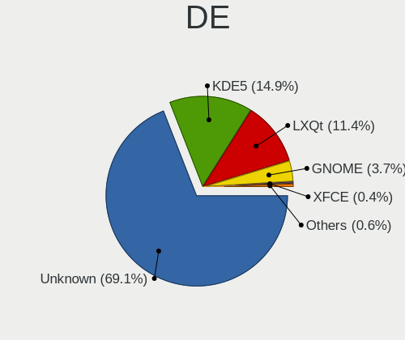
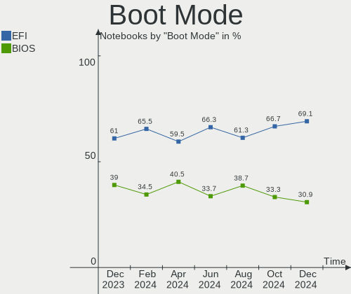
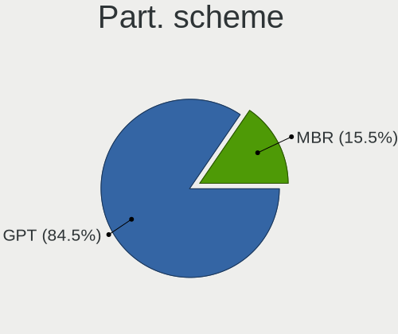
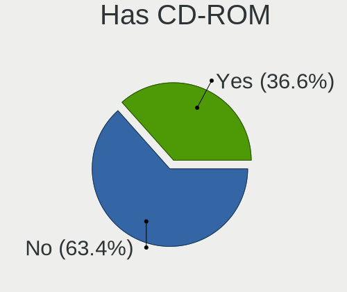
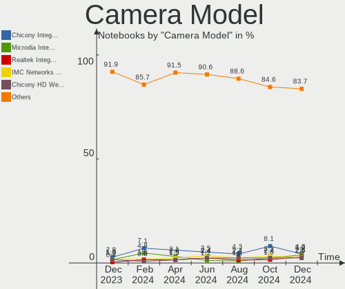

OpenMandriva Hardware Trends (Notebooks)
----------------------------------------

A project to identify most popular hardware characteristics and track their change
over time based on data collected by OpenMandriva users at https://Linux-Hardware.org.

Anyone can contribute to this report by the [hw-probe](https://github.com/linuxhw/hw-probe) tool:

    sudo -E hw-probe -all -upload

Full-feature report is available here: https://linux-hardware.org/?view=trends

Period: Dec, 2021.

Contents
--------

* [ System ](#system)
  - [ OS                       ](#os)
  - [ OS Family                ](#os-family)
  - [ Kernel                   ](#kernel)
  - [ Kernel Family            ](#kernel-family)
  - [ Kernel Major Ver.        ](#kernel-major-ver)
  - [ Arch                     ](#arch)
  - [ DE                       ](#de)
  - [ Display Server           ](#display-server)
  - [ Display Manager          ](#display-manager)
  - [ OS Lang                  ](#os-lang)
  - [ Boot Mode                ](#boot-mode)
  - [ Filesystem               ](#filesystem)
  - [ Part. scheme             ](#part-scheme)
  - [ Dual Boot with Linux/BSD ](#dual-boot-with-linuxbsd)
  - [ Dual Boot (Win)          ](#dual-boot-win)

* [ Board ](#board)
  - [ Vendor                   ](#vendor)
  - [ Model                    ](#model)
  - [ Model Family             ](#model-family)
  - [ MFG Year                 ](#mfg-year)
  - [ Form Factor              ](#form-factor)
  - [ Secure Boot              ](#secure-boot)
  - [ Coreboot                 ](#coreboot)
  - [ RAM Size                 ](#ram-size)
  - [ RAM Used                 ](#ram-used)
  - [ Total Drives             ](#total-drives)
  - [ Has CD-ROM               ](#has-cd-rom)
  - [ Has Ethernet             ](#has-ethernet)
  - [ Has WiFi                 ](#has-wifi)
  - [ Has Bluetooth            ](#has-bluetooth)

* [ Location ](#location)
  - [ Country                  ](#country)
  - [ City                     ](#city)

* [ Drives ](#drives)
  - [ Drive Vendor             ](#drive-vendor)
  - [ Drive Model              ](#drive-model)
  - [ HDD Vendor               ](#hdd-vendor)
  - [ SSD Vendor               ](#ssd-vendor)
  - [ Drive Kind               ](#drive-kind)
  - [ Drive Connector          ](#drive-connector)
  - [ Drive Size               ](#drive-size)
  - [ Space Total              ](#space-total)
  - [ Space Used               ](#space-used)
  - [ Malfunc. Drives          ](#malfunc-drives)
  - [ Malfunc. Drive Vendor    ](#malfunc-drive-vendor)
  - [ Malfunc. HDD Vendor      ](#malfunc-hdd-vendor)
  - [ Malfunc. Drive Kind      ](#malfunc-drive-kind)
  - [ Failed Drives            ](#failed-drives)
  - [ Failed Drive Vendor      ](#failed-drive-vendor)
  - [ Drive Status             ](#drive-status)

* [ Storage controller ](#storage-controller)
  - [ Storage Vendor           ](#storage-vendor)
  - [ Storage Model            ](#storage-model)
  - [ Storage Kind             ](#storage-kind)

* [ Processor ](#processor)
  - [ CPU Vendor               ](#cpu-vendor)
  - [ CPU Model                ](#cpu-model)
  - [ CPU Model Family         ](#cpu-model-family)
  - [ CPU Cores                ](#cpu-cores)
  - [ CPU Sockets              ](#cpu-sockets)
  - [ CPU Threads              ](#cpu-threads)
  - [ CPU Op-Modes             ](#cpu-op-modes)
  - [ CPU Microcode            ](#cpu-microcode)
  - [ CPU Microarch            ](#cpu-microarch)

* [ Graphics ](#graphics)
  - [ GPU Vendor               ](#gpu-vendor)
  - [ GPU Model                ](#gpu-model)
  - [ GPU Combo                ](#gpu-combo)
  - [ GPU Driver               ](#gpu-driver)
  - [ GPU Memory               ](#gpu-memory)

* [ Monitor ](#monitor)
  - [ Monitor Vendor           ](#monitor-vendor)
  - [ Monitor Model            ](#monitor-model)
  - [ Monitor Resolution       ](#monitor-resolution)
  - [ Monitor Diagonal         ](#monitor-diagonal)
  - [ Monitor Width            ](#monitor-width)
  - [ Aspect Ratio             ](#aspect-ratio)
  - [ Monitor Area             ](#monitor-area)
  - [ Pixel Density            ](#pixel-density)
  - [ Multiple Monitors        ](#multiple-monitors)

* [ Network ](#network)
  - [ Net Controller Vendor    ](#net-controller-vendor)
  - [ Net Controller Model     ](#net-controller-model)
  - [ Wireless Vendor          ](#wireless-vendor)
  - [ Wireless Model           ](#wireless-model)
  - [ Ethernet Vendor          ](#ethernet-vendor)
  - [ Ethernet Model           ](#ethernet-model)
  - [ Net Controller Kind      ](#net-controller-kind)
  - [ Used Controller          ](#used-controller)
  - [ NICs                     ](#nics)
  - [ IPv6                     ](#ipv6)

* [ Bluetooth ](#bluetooth)
  - [ Bluetooth Vendor         ](#bluetooth-vendor)
  - [ Bluetooth Model          ](#bluetooth-model)

* [ Sound ](#sound)
  - [ Sound Vendor             ](#sound-vendor)
  - [ Sound Model              ](#sound-model)

* [ Memory ](#memory)
  - [ Memory Vendor            ](#memory-vendor)
  - [ Memory Model             ](#memory-model)
  - [ Memory Kind              ](#memory-kind)
  - [ Memory Form Factor       ](#memory-form-factor)
  - [ Memory Size              ](#memory-size)
  - [ Memory Speed             ](#memory-speed)

* [ Printers & scanners ](#printers--scanners)
  - [ Printer Vendor           ](#printer-vendor)
  - [ Printer Model            ](#printer-model)
  - [ Scanner Vendor           ](#scanner-vendor)
  - [ Scanner Model            ](#scanner-model)

* [ Camera ](#camera)
  - [ Camera Vendor            ](#camera-vendor)
  - [ Camera Model             ](#camera-model)

* [ Security ](#security)
  - [ Fingerprint Vendor       ](#fingerprint-vendor)
  - [ Fingerprint Model        ](#fingerprint-model)
  - [ Chipcard Vendor          ](#chipcard-vendor)
  - [ Chipcard Model           ](#chipcard-model)

* [ Unsupported ](#unsupported)
  - [ Unsupported Devices      ](#unsupported-devices)
  - [ Unsupported Device Types ](#unsupported-device-types)

System
------

OS
--

Installed operating systems

| Name              | Notebooks | Percent |
|-------------------|-----------|---------|
| OpenMandriva 4.2  | 105       | 86.07%  |
| OpenMandriva 4.50 | 17        | 13.93%  |

OS Family
---------

OS without a version

| Name         | Notebooks | Percent |
|--------------|-----------|---------|
| OpenMandriva | 122       | 100%    |

Kernel
------

Version of the Linux kernel

| Version                  | Notebooks | Percent |
|--------------------------|-----------|---------|
| 5.10.14-desktop-1omv4002 | 102       | 83.61%  |
| 5.14.7-desktop-1omv4050  | 14        | 11.48%  |
| 5.14.14-desktop-1omv4050 | 3         | 2.46%   |
| 5.11.12-desktop-1omv4002 | 3         | 2.46%   |

Kernel Family
-------------

Linux kernel without a distro release

| Version | Notebooks | Percent |
|---------|-----------|---------|
| 5.10.14 | 102       | 83.61%  |
| 5.14.7  | 14        | 11.48%  |
| 5.14.14 | 3         | 2.46%   |
| 5.11.12 | 3         | 2.46%   |

Kernel Major Ver.
-----------------

Linux kernel major version

| Version | Notebooks | Percent |
|---------|-----------|---------|
| 5.10    | 102       | 83.61%  |
| 5.14    | 17        | 13.93%  |
| 5.11    | 3         | 2.46%   |

Arch
----

OS architecture (x86_64, i586, etc.)

| Name   | Notebooks | Percent |
|--------|-----------|---------|
| x86_64 | 122       | 100%    |

DE
--

Desktop Environment

| Name | Notebooks | Percent |
|------|-----------|---------|
| KDE5 | 122       | 100%    |

Display Server
--------------

X11 or Wayland

| Name | Notebooks | Percent |
|------|-----------|---------|
| X11  | 122       | 100%    |

Display Manager
---------------

SDDM, LightDM, etc.

| Name | Notebooks | Percent |
|------|-----------|---------|
| SDDM | 122       | 100%    |

OS Lang
-------

Language

| Lang  | Notebooks | Percent |
|-------|-----------|---------|
| en_US | 64        | 52.46%  |
| fr_FR | 9         | 7.38%   |
| pl_PL | 7         | 5.74%   |
| ru_RU | 6         | 4.92%   |
| cs_CZ | 6         | 4.92%   |
| pt_BR | 5         | 4.1%    |
| de_DE | 4         | 3.28%   |
| ru_UA | 3         | 2.46%   |
| es_ES | 3         | 2.46%   |
| it_IT | 2         | 1.64%   |
| hu_HU | 2         | 1.64%   |
| en_GB | 2         | 1.64%   |
| uk_UA | 1         | 0.82%   |
| nb_NO | 1         | 0.82%   |
| fr_CH | 1         | 0.82%   |
| es_MX | 1         | 0.82%   |
| es_AR | 1         | 0.82%   |
| de_CH | 1         | 0.82%   |
| da_DK | 1         | 0.82%   |
| ar_TN | 1         | 0.82%   |
| af_ZA | 1         | 0.82%   |

Boot Mode
---------

EFI or BIOS

| Mode | Notebooks | Percent |
|------|-----------|---------|
| BIOS | 80        | 65.57%  |
| EFI  | 42        | 34.43%  |

Filesystem
----------

Type of filesystem

| Type    | Notebooks | Percent |
|---------|-----------|---------|
| Overlay | 103       | 84.43%  |
| Ext4    | 17        | 13.93%  |
| F2fs    | 1         | 0.82%   |
| Btrfs   | 1         | 0.82%   |

Part. scheme
------------

Scheme of partitioning

| Type | Notebooks | Percent |
|------|-----------|---------|
| GPT  | 65        | 53.28%  |
| MBR  | 57        | 46.72%  |

Dual Boot with Linux/BSD
------------------------

Hosting more than one Linux/BSD

| Dual boot | Notebooks | Percent |
|-----------|-----------|---------|
| Yes       | 61        | 50%     |
| No        | 61        | 50%     |

Dual Boot (Win)
---------------

Hosting Linux and Windows

| Dual boot | Notebooks | Percent |
|-----------|-----------|---------|
| Yes       | 61        | 50%     |
| No        | 61        | 50%     |

Board
-----

Vendor
------

Motherboard manufacturer

| Name                | Notebooks | Percent |
|---------------------|-----------|---------|
| Dell                | 19        | 15.57%  |
| ASUSTek Computer    | 17        | 13.93%  |
| Acer                | 17        | 13.93%  |
| Hewlett-Packard     | 16        | 13.11%  |
| Lenovo              | 15        | 12.3%   |
| Sony                | 7         | 5.74%   |
| Toshiba             | 6         | 4.92%   |
| Samsung Electronics | 3         | 2.46%   |
| Positivo            | 3         | 2.46%   |
| eMachines           | 3         | 2.46%   |
| Medion              | 2         | 1.64%   |
| LG Electronics      | 2         | 1.64%   |
| Fujitsu             | 2         | 1.64%   |
| Chuwi               | 2         | 1.64%   |
| TUXEDO              | 1         | 0.82%   |
| RM                  | 1         | 0.82%   |
| Philco              | 1         | 0.82%   |
| MSI                 | 1         | 0.82%   |
| LEADER              | 1         | 0.82%   |
| HUAWEI              | 1         | 0.82%   |
| Fujitsu Siemens     | 1         | 0.82%   |
| Unknown             | 1         | 0.82%   |

Model
-----

Motherboard model

| Name                                  | Notebooks | Percent |
|---------------------------------------|-----------|---------|
| ASUS UX31E                            | 6         | 4.92%   |
| Sony VGN-FZ31Z                        | 3         | 2.46%   |
| HP Notebook                           | 3         | 2.46%   |
| Dell Latitude E6430                   | 3         | 2.46%   |
| Dell Inspiron 3451                    | 3         | 2.46%   |
| Acer Aspire ES1-571                   | 3         | 2.46%   |
| Unknown                               | 3         | 2.46%   |
| Dell Latitude E6510                   | 2         | 1.64%   |
| Acer Aspire 5733                      | 2         | 1.64%   |
| Toshiba TE5                           | 1         | 0.82%   |
| Toshiba Satellite L750                | 1         | 0.82%   |
| Toshiba Satellite L655                | 1         | 0.82%   |
| Toshiba Satellite L355                | 1         | 0.82%   |
| Toshiba Satellite C870D-119           | 1         | 0.82%   |
| Toshiba Satellite C855D               | 1         | 0.82%   |
| Sony VPCEF3E1E                        | 1         | 0.82%   |
| Sony VPCEB1M1E                        | 1         | 0.82%   |
| Sony SVT11125CBS                      | 1         | 0.82%   |
| Sony SVE1513B1EW                      | 1         | 0.82%   |
| Samsung R540/SA41/E452                | 1         | 0.82%   |
| Samsung 550XDA                        | 1         | 0.82%   |
| Samsung 3570R/370R/470R/450R/510R     | 1         | 0.82%   |
| RM NOTEBOOK 320                       | 1         | 0.82%   |
| Positivo S14BW01                      | 1         | 0.82%   |
| Positivo J14AL11                      | 1         | 0.82%   |
| Positivo H14BT58                      | 1         | 0.82%   |
| Philco 14F                            | 1         | 0.82%   |
| MSI GE72 2QC                          | 1         | 0.82%   |
| Medion P6630                          | 1         | 0.82%   |
| Medion Akoya E1317T                   | 1         | 0.82%   |
| LG S460-G.BG31P1                      | 1         | 0.82%   |
| LG A410-G.BC49P1                      | 1         | 0.82%   |
| Lenovo ZIWB2                          | 1         | 0.82%   |
| Lenovo V145-15AST 81MT                | 1         | 0.82%   |
| Lenovo ThinkPad T500 2087A75          | 1         | 0.82%   |
| Lenovo ThinkPad T410 2537Z7A          | 1         | 0.82%   |
| Lenovo ThinkPad T410 25376B8          | 1         | 0.82%   |
| Lenovo ThinkPad E550 20DF002YUS       | 1         | 0.82%   |
| Lenovo ThinkPad E460 20ETCTO1WW       | 1         | 0.82%   |
| Lenovo M30-70 20446                   | 1         | 0.82%   |
| Lenovo IdeaPad S145-15IIL 81W8        | 1         | 0.82%   |
| Lenovo IdeaPad P500 20210             | 1         | 0.82%   |
| Lenovo IdeaPad L340-15IRH Gaming 81LK | 1         | 0.82%   |
| Lenovo IdeaPad 5 14ALC05 82LM         | 1         | 0.82%   |
| Lenovo IdeaPad 110-15ISK 80UD         | 1         | 0.82%   |
| Lenovo IdeaPad 100-15IBD 80QQ         | 1         | 0.82%   |
| Lenovo B590 20208                     | 1         | 0.82%   |
| LEADER NH5BT11                        | 1         | 0.82%   |
| HUAWEI BOHB-WAX9                      | 1         | 0.82%   |
| HP ProBook 450 G4                     | 1         | 0.82%   |
| HP Pavilion g7                        | 1         | 0.82%   |
| HP Pavilion 15                        | 1         | 0.82%   |
| HP Laptop 15s-eq2xxx                  | 1         | 0.82%   |
| HP Laptop 15-dw0xxx                   | 1         | 0.82%   |
| HP EliteBook 8740w                    | 1         | 0.82%   |
| HP EliteBook 8470p                    | 1         | 0.82%   |
| HP EliteBook 8460p                    | 1         | 0.82%   |
| HP EliteBook 6930p                    | 1         | 0.82%   |
| HP 650                                | 1         | 0.82%   |
| HP 620                                | 1         | 0.82%   |

Model Family
------------

Motherboard model prefix

| Name                  | Notebooks | Percent |
|-----------------------|-----------|---------|
| Acer Aspire           | 13        | 10.66%  |
| Dell Latitude         | 10        | 8.2%    |
| Dell Inspiron         | 8         | 6.56%   |
| Lenovo IdeaPad        | 6         | 4.92%   |
| ASUS UX31E            | 6         | 4.92%   |
| Toshiba Satellite     | 5         | 4.1%    |
| Lenovo ThinkPad       | 5         | 4.1%    |
| HP EliteBook          | 4         | 3.28%   |
| Sony VGN-FZ31Z        | 3         | 2.46%   |
| HP Notebook           | 3         | 2.46%   |
| Unknown               | 3         | 2.46%   |
| HP Pavilion           | 2         | 1.64%   |
| HP Laptop             | 2         | 1.64%   |
| HP 250                | 2         | 1.64%   |
| Toshiba TE5           | 1         | 0.82%   |
| Sony VPCEF3E1E        | 1         | 0.82%   |
| Sony VPCEB1M1E        | 1         | 0.82%   |
| Sony SVT11125CBS      | 1         | 0.82%   |
| Sony SVE1513B1EW      | 1         | 0.82%   |
| Samsung R540          | 1         | 0.82%   |
| Samsung 550XDA        | 1         | 0.82%   |
| Samsung 3570R         | 1         | 0.82%   |
| RM NOTEBOOK           | 1         | 0.82%   |
| Positivo S14BW01      | 1         | 0.82%   |
| Positivo J14AL11      | 1         | 0.82%   |
| Positivo H14BT58      | 1         | 0.82%   |
| Philco 14F            | 1         | 0.82%   |
| MSI GE72              | 1         | 0.82%   |
| Medion P6630          | 1         | 0.82%   |
| Medion Akoya          | 1         | 0.82%   |
| LG S460-G.BG31P1      | 1         | 0.82%   |
| LG A410-G.BC49P1      | 1         | 0.82%   |
| Lenovo ZIWB2          | 1         | 0.82%   |
| Lenovo V145-15AST     | 1         | 0.82%   |
| Lenovo M30-70         | 1         | 0.82%   |
| Lenovo B590           | 1         | 0.82%   |
| LEADER NH5BT11        | 1         | 0.82%   |
| HUAWEI BOHB-WAX9      | 1         | 0.82%   |
| HP ProBook            | 1         | 0.82%   |
| HP 650                | 1         | 0.82%   |
| HP 620                | 1         | 0.82%   |
| Fujitsu Siemens AMILO | 1         | 0.82%   |
| Fujitsu LIFEBOOK      | 1         | 0.82%   |
| Fujitsu FMVNA7BEC     | 1         | 0.82%   |
| eMachines E525        | 1         | 0.82%   |
| eMachines D520        | 1         | 0.82%   |
| Dell G5               | 1         | 0.82%   |
| Chuwi LapBook         | 1         | 0.82%   |
| Chuwi Hero            | 1         | 0.82%   |
| ASUS ZenBook          | 1         | 0.82%   |
| ASUS X550CL           | 1         | 0.82%   |
| ASUS X541NA           | 1         | 0.82%   |
| ASUS X45U             | 1         | 0.82%   |
| ASUS VivoBook         | 1         | 0.82%   |
| ASUS UL30A            | 1         | 0.82%   |
| ASUS ROG              | 1         | 0.82%   |
| ASUS N75SF            | 1         | 0.82%   |
| ASUS K84L             | 1         | 0.82%   |
| ASUS K60IJ            | 1         | 0.82%   |
| ASUS K53SJ            | 1         | 0.82%   |

MFG Year
--------

Motherboard manufacture year

| Year | Notebooks | Percent |
|------|-----------|---------|
| 2012 | 20        | 16.39%  |
| 2011 | 15        | 12.3%   |
| 2021 | 13        | 10.66%  |
| 2013 | 13        | 10.66%  |
| 2018 | 9         | 7.38%   |
| 2019 | 8         | 6.56%   |
| 2015 | 8         | 6.56%   |
| 2010 | 7         | 5.74%   |
| 2009 | 7         | 5.74%   |
| 2016 | 5         | 4.1%    |
| 2014 | 5         | 4.1%    |
| 2020 | 4         | 3.28%   |
| 2008 | 3         | 2.46%   |
| 2007 | 3         | 2.46%   |
| 2017 | 2         | 1.64%   |

Form Factor
-----------

Physical design of the computer

| Name     | Notebooks | Percent |
|----------|-----------|---------|
| Notebook | 122       | 100%    |

Secure Boot
-----------

Enabled or disabled

| State    | Notebooks | Percent |
|----------|-----------|---------|
| Disabled | 122       | 100%    |

Coreboot
--------

Have coreboot on board

| Used | Notebooks | Percent |
|------|-----------|---------|
| No   | 122       | 100%    |

RAM Size
--------

Total RAM memory

| Size in GB  | Notebooks | Percent |
|-------------|-----------|---------|
| 3.01-4.0    | 58        | 47.54%  |
| 4.01-8.0    | 38        | 31.15%  |
| 8.01-16.0   | 13        | 10.66%  |
| 16.01-24.0  | 4         | 3.28%   |
| 1.01-2.0    | 4         | 3.28%   |
| 32.01-64.0  | 3         | 2.46%   |
| 2.01-3.0    | 1         | 0.82%   |
| 64.01-256.0 | 1         | 0.82%   |

RAM Used
--------

Used RAM memory

| Used GB  | Notebooks | Percent |
|----------|-----------|---------|
| 1.01-2.0 | 91        | 74.59%  |
| 0.51-1.0 | 17        | 13.93%  |
| 2.01-3.0 | 12        | 9.84%   |
| 3.01-4.0 | 2         | 1.64%   |

Total Drives
------------

Number of drives on board

| Drives | Notebooks | Percent |
|--------|-----------|---------|
| 1      | 95        | 77.87%  |
| 2      | 27        | 22.13%  |

Has CD-ROM
----------

Has CD-ROM on board

| Presented | Notebooks | Percent |
|-----------|-----------|---------|
| Yes       | 76        | 62.3%   |
| No        | 46        | 37.7%   |

Has Ethernet
------------

Has Ethernet on board

| Presented | Notebooks | Percent |
|-----------|-----------|---------|
| Yes       | 112       | 91.8%   |
| No        | 10        | 8.2%    |

Has WiFi
--------

Has WiFi module

| Presented | Notebooks | Percent |
|-----------|-----------|---------|
| Yes       | 120       | 98.36%  |
| No        | 2         | 1.64%   |

Has Bluetooth
-------------

Has Bluetooth module

| Presented | Notebooks | Percent |
|-----------|-----------|---------|
| Yes       | 68        | 55.74%  |
| No        | 54        | 44.26%  |

Location
--------

Country
-------

Geographic location (country)

| Country               | Notebooks | Percent |
|-----------------------|-----------|---------|
| Brazil                | 13        | 10.66%  |
| Poland                | 12        | 9.84%   |
| France                | 10        | 8.2%    |
| USA                   | 8         | 6.56%   |
| Russia                | 8         | 6.56%   |
| Italy                 | 8         | 6.56%   |
| Czechia               | 7         | 5.74%   |
| Germany               | 6         | 4.92%   |
| Canada                | 4         | 3.28%   |
| Switzerland           | 3         | 2.46%   |
| Spain                 | 3         | 2.46%   |
| Portugal              | 3         | 2.46%   |
| Hungary               | 3         | 2.46%   |
| Ukraine               | 2         | 1.64%   |
| UK                    | 2         | 1.64%   |
| Tunisia               | 2         | 1.64%   |
| Norway                | 2         | 1.64%   |
| Netherlands           | 2         | 1.64%   |
| Morocco               | 2         | 1.64%   |
| Mexico                | 2         | 1.64%   |
| Indonesia             | 2         | 1.64%   |
| Denmark               | 2         | 1.64%   |
| Australia             | 2         | 1.64%   |
| South Africa          | 1         | 0.82%   |
| Slovakia              | 1         | 0.82%   |
| Serbia                | 1         | 0.82%   |
| Romania               | 1         | 0.82%   |
| Republic of the Congo | 1         | 0.82%   |
| Moldova               | 1         | 0.82%   |
| India                 | 1         | 0.82%   |
| Hong Kong             | 1         | 0.82%   |
| Haiti                 | 1         | 0.82%   |
| Greece                | 1         | 0.82%   |
| Chile                 | 1         | 0.82%   |
| Belarus               | 1         | 0.82%   |
| Bangladesh            | 1         | 0.82%   |
| Argentina             | 1         | 0.82%   |

City
----

Geographic location (city)

| City               | Notebooks | Percent |
|--------------------|-----------|---------|
| Prague             | 6         | 4.92%   |
| Krakow             | 4         | 3.28%   |
| Rome               | 3         | 2.46%   |
| Funchal            | 3         | 2.46%   |
| Yekaterinburg      | 2         | 1.64%   |
| Warsaw             | 2         | 1.64%   |
| S??o Paulo         | 2         | 1.64%   |
| Jakarta            | 2         | 1.64%   |
| Fribourg           | 2         | 1.64%   |
| Edmonton           | 2         | 1.64%   |
| Berlin             | 2         | 1.64%   |
| Zaragoza           | 1         | 0.82%   |
| Verona             | 1         | 0.82%   |
| Veliky Novgorod    | 1         | 0.82%   |
| Ussac              | 1         | 0.82%   |
| Tunis              | 1         | 0.82%   |
| Torun              | 1         | 0.82%   |
| Tlalnepantla       | 1         | 0.82%   |
| Tiszafured         | 1         | 0.82%   |
| Temuco             | 1         | 0.82%   |
| Taubate            | 1         | 0.82%   |
| Sydney             | 1         | 0.82%   |
| Strasbourg         | 1         | 0.82%   |
| St Petersburg      | 1         | 0.82%   |
| Sheffield          | 1         | 0.82%   |
| Schijndel          | 1         | 0.82%   |
| Sao Pedro          | 1         | 0.82%   |
| Santana do Ipanema | 1         | 0.82%   |
| Saint-Brieuc       | 1         | 0.82%   |
| Sacile             | 1         | 0.82%   |
| Rostov-on-Don      | 1         | 0.82%   |
| Rio Branco         | 1         | 0.82%   |
| Rho                | 1         | 0.82%   |
| Remscheid          | 1         | 0.82%   |
| Red Deer           | 1         | 0.82%   |
| R?­o Gallegos      | 1         | 0.82%   |
| Port-au-Prince     | 1         | 0.82%   |
| Pointe-Noire       | 1         | 0.82%   |
| Peoria             | 1         | 0.82%   |
| Paris              | 1         | 0.82%   |
| Ozorkow            | 1         | 0.82%   |
| Oujda              | 1         | 0.82%   |
| Oslo               | 1         | 0.82%   |
| Orgon              | 1         | 0.82%   |
| Newnan             | 1         | 0.82%   |
| New Belgrade       | 1         | 0.82%   |
| Natal              | 1         | 0.82%   |
| Nabeul             | 1         | 0.82%   |
| Myrtle Beach       | 1         | 0.82%   |
| Munich             | 1         | 0.82%   |
| Mumbai             | 1         | 0.82%   |
| Moscow             | 1         | 0.82%   |
| Mosbach            | 1         | 0.82%   |
| Minsk              | 1         | 0.82%   |
| Milan              | 1         | 0.82%   |
| Melbourne          | 1         | 0.82%   |
| Marrakesh          | 1         | 0.82%   |
| Marquion           | 1         | 0.82%   |
| Lyubertsy          | 1         | 0.82%   |
| Lublin             | 1         | 0.82%   |

Drives
------

Drive Vendor
------------

Hard drive vendors

| Vendor              | Notebooks | Drives | Percent |
|---------------------|-----------|--------|---------|
| WDC                 | 23        | 23     | 17.42%  |
| Seagate             | 21        | 22     | 15.91%  |
| Toshiba             | 13        | 13     | 9.85%   |
| SanDisk             | 12        | 12     | 9.09%   |
| Hitachi             | 12        | 12     | 9.09%   |
| Samsung Electronics | 11        | 12     | 8.33%   |
| Kingston            | 8         | 8      | 6.06%   |
| HGST                | 5         | 5      | 3.79%   |
| SK Hynix            | 4         | 4      | 3.03%   |
| Unknown             | 3         | 3      | 2.27%   |
| Crucial             | 3         | 3      | 2.27%   |
| Netac               | 2         | 2      | 1.52%   |
| Intel               | 2         | 2      | 1.52%   |
| Transcend           | 1         | 1      | 0.76%   |
| SPCC                | 1         | 1      | 0.76%   |
| Silicon Motion      | 1         | 1      | 0.76%   |
| PNY                 | 1         | 1      | 0.76%   |
| Micron Technology   | 1         | 1      | 0.76%   |
| LITEON              | 1         | 1      | 0.76%   |
| Lexar               | 1         | 1      | 0.76%   |
| LaCie               | 1         | 1      | 0.76%   |
| Integral            | 1         | 1      | 0.76%   |
| Gigabyte Technology | 1         | 1      | 0.76%   |
| CS900               | 1         | 1      | 0.76%   |
| BHT                 | 1         | 1      | 0.76%   |
| Unknown             | 1         | 1      | 0.76%   |

Drive Model
-----------

Hard drive models

| Model                                       | Notebooks | Percent |
|---------------------------------------------|-----------|---------|
| SanDisk SSD U100 256GB                      | 6         | 4.51%   |
| Seagate ST500LT012-1DG142 500GB             | 5         | 3.76%   |
| Toshiba MQ04ABF100 1TB                      | 3         | 2.26%   |
| Toshiba MQ01ABF050 500GB                    | 3         | 2.26%   |
| Seagate ST9320325AS 320GB                   | 3         | 2.26%   |
| WDC WD5000LPLX-60ZNTT1 500GB                | 2         | 1.5%    |
| Toshiba MQ01ABD100 1TB                      | 2         | 1.5%    |
| Seagate ST9500325AS 500GB                   | 2         | 1.5%    |
| Samsung SSD 750 EVO 250GB                   | 2         | 1.5%    |
| Kingston SV300S37A240G 240GB SSD            | 2         | 1.5%    |
| Hitachi HTS543232A7A384 320GB               | 2         | 1.5%    |
| HGST HTS721010A9E630 1TB                    | 2         | 1.5%    |
| WDC WDS500G2B0A-00SM50 500GB SSD            | 1         | 0.75%   |
| WDC WDS480G2G0A-00JH30 480GB SSD            | 1         | 0.75%   |
| WDC WDS120G1G0A-00SS50 120GB SSD            | 1         | 0.75%   |
| WDC WD5000LPCX-21VHAT0 500GB                | 1         | 0.75%   |
| WDC WD5000BPVT-80HXZT3 500GB                | 1         | 0.75%   |
| WDC WD5000BPVT-55HXZT4 500GB                | 1         | 0.75%   |
| WDC WD5000BPVT-22HXZT3 500GB                | 1         | 0.75%   |
| WDC WD5000BPVT-22HXZT1 500GB                | 1         | 0.75%   |
| WDC WD5000BEVT-60ZAT1 500GB                 | 1         | 0.75%   |
| WDC WD5000BEVT-26A0RT0 500GB                | 1         | 0.75%   |
| WDC WD3200BPVT-75ZEST0 320GB                | 1         | 0.75%   |
| WDC WD3200BPVT-22JJ5T0 320GB                | 1         | 0.75%   |
| WDC WD3200BEKT-75PVMT1 320GB                | 1         | 0.75%   |
| WDC WD3200BEKT-60PVMT0 320GB                | 1         | 0.75%   |
| WDC WD2500BPVT-22ZEST0 250GB                | 1         | 0.75%   |
| WDC WD2500BEVT-75A23T0 250GB                | 1         | 0.75%   |
| WDC WD2500BEVS-22UST0 250GB                 | 1         | 0.75%   |
| WDC WD10JPVX-22JC3T0 1TB                    | 1         | 0.75%   |
| WDC PC SN530 SDBPNPZ-512G-1027 512GB        | 1         | 0.75%   |
| WDC PC SN530 SDBPNPZ-256G-1006 256GB        | 1         | 0.75%   |
| WDC PC SN530 SDBPMPZ-512G-1101 512GB        | 1         | 0.75%   |
| Unknown SL16G  16GB                         | 1         | 0.75%   |
| Unknown MMC Card  16GB                      | 1         | 0.75%   |
| Unknown M0S002  64GB                        | 1         | 0.75%   |
| Transcend TS240GMTS820S 240GB SSD           | 1         | 0.75%   |
| Toshiba TR150 240GB SSD                     | 1         | 0.75%   |
| Toshiba THNSNH128GMCT 128GB SSD             | 1         | 0.75%   |
| Toshiba MQ01ACF032 320GB                    | 1         | 0.75%   |
| Toshiba MQ01ABD100V 1TB                     | 1         | 0.75%   |
| Toshiba MK3265GSX 320GB                     | 1         | 0.75%   |
| SPCC Solid State Disk 120GB                 | 1         | 0.75%   |
| SK Hynix SKHynix_HFM512GDHTNI-87A0B 512GB   | 1         | 0.75%   |
| SK Hynix HFM001TD3JX013N 1TB                | 1         | 0.75%   |
| SK Hynix BC511 NVMe 512GB                   | 1         | 0.75%   |
| SK Hynix BC511 HFM256GDJTNI-82A0A 256GB     | 1         | 0.75%   |
| Silicon Motion NVME SSD 2TB                 | 1         | 0.75%   |
| Seagate ST980813AS 80GB                     | 1         | 0.75%   |
| Seagate ST500LT012-9WS142 500GB             | 1         | 0.75%   |
| Seagate ST500LM021-1KJ152 500GB             | 1         | 0.75%   |
| Seagate ST500LM012 HN-M500MBB 500GB         | 1         | 0.75%   |
| Seagate ST500LM000-SSHD-8GB                 | 1         | 0.75%   |
| Seagate ST320LT007-9ZV142 320GB             | 1         | 0.75%   |
| Seagate ST320LM001 HN-M320MBB 320GB         | 1         | 0.75%   |
| Seagate ST2000LX001-1RG174 2TB              | 1         | 0.75%   |
| Seagate ST1000LX015-1U7172 1TB              | 1         | 0.75%   |
| Seagate ST1000LM035-1RK172 1TB              | 1         | 0.75%   |
| Seagate BarraCuda 120 SSD ZA1000CM10003 1TB | 1         | 0.75%   |
| SanDisk SSD PLUS 240GB                      | 1         | 0.75%   |

HDD Vendor
----------

Hard disk drive vendors

| Vendor  | Notebooks | Drives | Percent |
|---------|-----------|--------|---------|
| Seagate | 20        | 21     | 30.77%  |
| WDC     | 17        | 17     | 26.15%  |
| Hitachi | 12        | 12     | 18.46%  |
| Toshiba | 11        | 11     | 16.92%  |
| HGST    | 5         | 5      | 7.69%   |

SSD Vendor
----------

Solid state drive vendors

| Vendor              | Notebooks | Drives | Percent |
|---------------------|-----------|--------|---------|
| SanDisk             | 11        | 11     | 22.92%  |
| Samsung Electronics | 10        | 10     | 20.83%  |
| Kingston            | 6         | 6      | 12.5%   |
| WDC                 | 3         | 3      | 6.25%   |
| Crucial             | 3         | 3      | 6.25%   |
| Toshiba             | 2         | 2      | 4.17%   |
| Netac               | 2         | 2      | 4.17%   |
| Transcend           | 1         | 1      | 2.08%   |
| SPCC                | 1         | 1      | 2.08%   |
| Seagate             | 1         | 1      | 2.08%   |
| PNY                 | 1         | 1      | 2.08%   |
| LITEON              | 1         | 1      | 2.08%   |
| Intel               | 1         | 1      | 2.08%   |
| Integral            | 1         | 1      | 2.08%   |
| Gigabyte Technology | 1         | 1      | 2.08%   |
| CS900               | 1         | 1      | 2.08%   |
| BHT                 | 1         | 1      | 2.08%   |
| Unknown             | 1         | 1      | 2.08%   |

Drive Kind
----------

HDD or SSD

| Kind    | Notebooks | Drives | Percent |
|---------|-----------|--------|---------|
| HDD     | 65        | 66     | 50.39%  |
| SSD     | 46        | 48     | 35.66%  |
| NVMe    | 13        | 15     | 10.08%  |
| MMC     | 3         | 3      | 2.33%   |
| Unknown | 2         | 2      | 1.55%   |

Drive Connector
---------------

SATA, SAS, NVMe, etc.

| Type | Notebooks | Drives | Percent |
|------|-----------|--------|---------|
| SATA | 108       | 113    | 85.71%  |
| NVMe | 13        | 15     | 10.32%  |
| MMC  | 3         | 3      | 2.38%   |
| SAS  | 2         | 3      | 1.59%   |

Drive Size
----------

Size of hard drive

| Size in TB | Notebooks | Drives | Percent |
|------------|-----------|--------|---------|
| 0.01-0.5   | 89        | 92     | 80.91%  |
| 0.51-1.0   | 18        | 19     | 16.36%  |
| 1.01-2.0   | 2         | 2      | 1.82%   |
| 3.01-4.0   | 1         | 1      | 0.91%   |

Space Total
-----------

Amount of disk space available on the file system

| Size in GB | Notebooks | Percent |
|------------|-----------|---------|
| 1-20       | 70        | 57.38%  |
| 101-250    | 17        | 13.93%  |
| 251-500    | 14        | 11.48%  |
| Unknown    | 11        | 9.02%   |
| 51-100     | 5         | 4.1%    |
| 21-50      | 2         | 1.64%   |
| 501-1000   | 2         | 1.64%   |
| 1001-2000  | 1         | 0.82%   |

Space Used
----------

Amount of used disk space

| Used GB | Notebooks | Percent |
|---------|-----------|---------|
| 1-20    | 100       | 81.97%  |
| Unknown | 11        | 9.02%   |
| 21-50   | 7         | 5.74%   |
| 251-500 | 1         | 0.82%   |
| 101-250 | 1         | 0.82%   |
| 51-100  | 1         | 0.82%   |
| 0       | 1         | 0.82%   |

Malfunc. Drives
---------------

Drive models with a malfunction

| Model                                           | Notebooks | Drives | Percent |
|-------------------------------------------------|-----------|--------|---------|
| SanDisk SSD U100 256GB                          | 6         | 6      | 14.29%  |
| Seagate ST9500325AS 500GB                       | 2         | 3      | 4.76%   |
| Seagate ST9320325AS 320GB                       | 2         | 2      | 4.76%   |
| Kingston SV300S37A240G 240GB SSD                | 2         | 2      | 4.76%   |
| WDC WDS480G2G0A-00JH30 480GB SSD                | 1         | 1      | 2.38%   |
| WDC WD5000LPLX-60ZNTT1 500GB                    | 1         | 1      | 2.38%   |
| WDC WD5000BPVT-22HXZT3 500GB                    | 1         | 1      | 2.38%   |
| WDC WD5000BEVT-60ZAT1 500GB                     | 1         | 1      | 2.38%   |
| WDC WD3200BPVT-75ZEST0 320GB                    | 1         | 1      | 2.38%   |
| WDC WD3200BPVT-22JJ5T0 320GB                    | 1         | 1      | 2.38%   |
| WDC WD2500BEVT-75A23T0 250GB                    | 1         | 1      | 2.38%   |
| WDC WD10JPVX-22JC3T0 1TB                        | 1         | 1      | 2.38%   |
| Toshiba MQ01ABF050 500GB                        | 1         | 1      | 2.38%   |
| Toshiba MQ01ABD100 1TB                          | 1         | 1      | 2.38%   |
| Toshiba MK3265GSX 320GB                         | 1         | 1      | 2.38%   |
| Seagate ST980813AS 80GB                         | 1         | 1      | 2.38%   |
| Seagate ST500LT012-9WS142 500GB                 | 1         | 1      | 2.38%   |
| Seagate ST500LT012-1DG142 500GB                 | 1         | 1      | 2.38%   |
| Seagate ST500LM021-1KJ152 500GB                 | 1         | 1      | 2.38%   |
| Seagate ST500LM012 HN-M500MBB 500GB             | 1         | 1      | 2.38%   |
| Seagate ST500LM000-SSHD-8GB                     | 1         | 1      | 2.38%   |
| Seagate ST320LT007-9ZV142 320GB                 | 1         | 1      | 2.38%   |
| Seagate ST1000LX015-1U7172 1TB                  | 1         | 1      | 2.38%   |
| SanDisk SSD PLUS 120GB                          | 1         | 1      | 2.38%   |
| SanDisk SDSSDHP128G 128GB                       | 1         | 1      | 2.38%   |
| Samsung Electronics MZMPC032HBCD-00000 32GB SSD | 1         | 1      | 2.38%   |
| Hitachi HTS547564A9E384 640GB                   | 1         | 1      | 2.38%   |
| Hitachi HTS547550A9E384 500GB                   | 1         | 1      | 2.38%   |
| Hitachi HTS545050A7E380 500GB                   | 1         | 1      | 2.38%   |
| Hitachi HTS543225L9A300 250GB                   | 1         | 1      | 2.38%   |
| Hitachi HTS543216L9A300 160GB                   | 1         | 1      | 2.38%   |
| Hitachi HTS543216A7A384 160GB                   | 1         | 1      | 2.38%   |
| HGST HTS545050A7E380 500GB                      | 1         | 1      | 2.38%   |
| Crucial CT240M500SSD1 240GB                     | 1         | 1      | 2.38%   |

Malfunc. Drive Vendor
---------------------

Vendors of faulty drives

| Vendor              | Notebooks | Drives | Percent |
|---------------------|-----------|--------|---------|
| Seagate             | 12        | 13     | 28.57%  |
| WDC                 | 8         | 8      | 19.05%  |
| SanDisk             | 8         | 8      | 19.05%  |
| Hitachi             | 6         | 6      | 14.29%  |
| Toshiba             | 3         | 3      | 7.14%   |
| Kingston            | 2         | 2      | 4.76%   |
| Samsung Electronics | 1         | 1      | 2.38%   |
| HGST                | 1         | 1      | 2.38%   |
| Crucial             | 1         | 1      | 2.38%   |

Malfunc. HDD Vendor
-------------------

Vendors of faulty HDD drives

| Vendor  | Notebooks | Drives | Percent |
|---------|-----------|--------|---------|
| Seagate | 12        | 13     | 41.38%  |
| WDC     | 7         | 7      | 24.14%  |
| Hitachi | 6         | 6      | 20.69%  |
| Toshiba | 3         | 3      | 10.34%  |
| HGST    | 1         | 1      | 3.45%   |

Malfunc. Drive Kind
-------------------

Kinds of faulty drives

| Kind | Notebooks | Drives | Percent |
|------|-----------|--------|---------|
| HDD  | 29        | 30     | 69.05%  |
| SSD  | 13        | 13     | 30.95%  |

Failed Drives
-------------

Failed drive models

| Model                       | Notebooks | Drives | Percent |
|-----------------------------|-----------|--------|---------|
| WDC WD2500BEVS-22UST0 250GB | 1         | 1      | 100%    |

Failed Drive Vendor
-------------------

Failed drive vendors

| Vendor | Notebooks | Drives | Percent |
|--------|-----------|--------|---------|
| WDC    | 1         | 1      | 100%    |

Drive Status
------------

Number of failed and malfunc. drives

| Status   | Notebooks | Drives | Percent |
|----------|-----------|--------|---------|
| Works    | 78        | 83     | 61.42%  |
| Malfunc  | 42        | 43     | 33.07%  |
| Detected | 6         | 7      | 4.72%   |
| Failed   | 1         | 1      | 0.79%   |

Storage controller
------------------

Storage Vendor
--------------

Storage controller vendors

| Vendor                      | Notebooks | Percent |
|-----------------------------|-----------|---------|
| Intel                       | 102       | 77.27%  |
| AMD                         | 17        | 12.88%  |
| SK Hynix                    | 4         | 3.03%   |
| Sandisk                     | 3         | 2.27%   |
| Samsung Electronics         | 2         | 1.52%   |
| Kingston Technology Company | 2         | 1.52%   |
| Silicon Motion              | 1         | 0.76%   |
| Micron Technology           | 1         | 0.76%   |

Storage Model
-------------

Storage controller models

| Model                                                                                  | Notebooks | Percent |
|----------------------------------------------------------------------------------------|-----------|---------|
| Intel 7 Series Chipset Family 6-port SATA Controller [AHCI mode]                       | 13        | 8.97%   |
| Intel 82801IBM/IEM (ICH9M/ICH9M-E) 4 port SATA Controller [AHCI mode]                  | 11        | 7.59%   |
| AMD FCH SATA Controller [AHCI mode]                                                    | 11        | 7.59%   |
| Intel 6 Series/C200 Series Chipset Family 6 port Mobile SATA AHCI Controller           | 10        | 6.9%    |
| Intel 5 Series/3400 Series Chipset 4 port SATA AHCI Controller                         | 9         | 6.21%   |
| Intel Sunrise Point-LP SATA Controller [AHCI mode]                                     | 7         | 4.83%   |
| Intel 82801 Mobile SATA Controller [RAID mode]                                         | 7         | 4.83%   |
| Intel 5 Series/3400 Series Chipset 6 port SATA AHCI Controller                         | 7         | 4.83%   |
| Intel 8 Series SATA Controller 1 [AHCI mode]                                           | 6         | 4.14%   |
| Intel Atom Processor E3800 Series SATA AHCI Controller                                 | 5         | 3.45%   |
| Intel 82801HM/HEM (ICH8M/ICH8M-E) IDE Controller                                       | 5         | 3.45%   |
| AMD SB7x0/SB8x0/SB9x0 SATA Controller [AHCI mode]                                      | 5         | 3.45%   |
| Intel 82801HM/HEM (ICH8M/ICH8M-E) SATA Controller [AHCI mode]                          | 4         | 2.76%   |
| SK Hynix BC511                                                                         | 3         | 2.07%   |
| Intel Volume Management Device NVMe RAID Controller                                    | 3         | 2.07%   |
| Intel Cannon Lake Mobile PCH SATA AHCI Controller                                      | 3         | 2.07%   |
| Intel Atom/Celeron/Pentium Processor x5-E8000/J3xxx/N3xxx Series SATA Controller       | 3         | 2.07%   |
| Intel 6 Series/C200 Series Chipset Family Mobile SATA Controller (IDE mode, ports 4-5) | 3         | 2.07%   |
| Intel 6 Series/C200 Series Chipset Family Mobile SATA Controller (IDE mode, ports 0-3) | 3         | 2.07%   |
| Sandisk WD Blue SN550 NVMe SSD                                                         | 2         | 1.38%   |
| Intel Tiger Lake-LP SATA Controller [AHCI mode]                                        | 2         | 1.38%   |
| Intel Celeron N3350/Pentium N4200/Atom E3900 Series SATA AHCI Controller               | 2         | 1.38%   |
| SK Hynix Gold P31 SSD                                                                  | 1         | 0.69%   |
| Silicon Motion SM2262/SM2262EN SSD Controller                                          | 1         | 0.69%   |
| Sandisk WD PC SN810 / Black SN850 NVMe SSD                                             | 1         | 0.69%   |
| Sandisk Non-Volatile memory controller                                                 | 1         | 0.69%   |
| Samsung NVMe SSD Controller SM961/PM961/SM963                                          | 1         | 0.69%   |
| Samsung NVMe SSD Controller 980                                                        | 1         | 0.69%   |
| Micron Non-Volatile memory controller                                                  | 1         | 0.69%   |
| Kingston Company U-SNS8154P3 NVMe SSD                                                  | 1         | 0.69%   |
| Kingston Company Company Non-Volatile memory controller                                | 1         | 0.69%   |
| Intel Wildcat Point-LP SATA Controller [AHCI Mode]                                     | 1         | 0.69%   |
| Intel SSD 660P Series                                                                  | 1         | 0.69%   |
| Intel Mobile 4 Series Chipset PT IDER Controller                                       | 1         | 0.69%   |
| Intel Ice Lake-LP SATA Controller [AHCI mode]                                          | 1         | 0.69%   |
| Intel Comet Lake SATA AHCI Controller                                                  | 1         | 0.69%   |
| Intel Comet Lake PCH-H RAID                                                            | 1         | 0.69%   |
| Intel Celeron/Pentium Silver Processor SATA Controller                                 | 1         | 0.69%   |
| Intel 82801IBM/IEM (ICH9M/ICH9M-E) 2 port SATA Controller [IDE mode]                   | 1         | 0.69%   |
| Intel 82801HM/HEM (ICH8M/ICH8M-E) SATA Controller [IDE mode]                           | 1         | 0.69%   |
| Intel 8 Series/C220 Series Chipset Family 6-port SATA Controller 1 [AHCI mode]         | 1         | 0.69%   |
| AMD SB7x0/SB8x0/SB9x0 IDE Controller                                                   | 1         | 0.69%   |
| AMD FCH SATA Controller [IDE mode]                                                     | 1         | 0.69%   |

Storage Kind
------------

Kind of storage controller (IDE, SATA, NVMe, SAS, ...)

| Kind | Notebooks | Percent |
|------|-----------|---------|
| SATA | 104       | 74.82%  |
| NVMe | 13        | 9.35%   |
| RAID | 11        | 7.91%   |
| IDE  | 11        | 7.91%   |

Processor
---------

CPU Vendor
----------

Processor vendors

| Vendor | Notebooks | Percent |
|--------|-----------|---------|
| Intel  | 103       | 84.43%  |
| AMD    | 19        | 15.57%  |

CPU Model
---------

Processor models

| Model                                       | Notebooks | Percent |
|---------------------------------------------|-----------|---------|
| Intel Core i7-2677M CPU @ 1.80GHz           | 6         | 4.92%   |
| Intel Core i3 CPU M 380 @ 2.53GHz           | 4         | 3.28%   |
| Intel Core i5 CPU M 520 @ 2.40GHz           | 3         | 2.46%   |
| Intel Core 2 Duo CPU T8300 @ 2.40GHz        | 3         | 2.46%   |
| Intel Celeron CPU N2840 @ 2.16GHz           | 3         | 2.46%   |
| AMD E1-1200 APU with Radeon HD Graphics     | 3         | 2.46%   |
| Intel Pentium Dual-Core CPU T4500 @ 2.30GHz | 2         | 1.64%   |
| Intel Pentium CPU B960 @ 2.20GHz            | 2         | 1.64%   |
| Intel Core i7-9750H CPU @ 2.60GHz           | 2         | 1.64%   |
| Intel Core i7-2630QM CPU @ 2.00GHz          | 2         | 1.64%   |
| Intel Core i5-7200U CPU @ 2.50GHz           | 2         | 1.64%   |
| Intel Core i5-3340M CPU @ 2.70GHz           | 2         | 1.64%   |
| Intel Core i5-3210M CPU @ 2.50GHz           | 2         | 1.64%   |
| Intel Core i5 CPU M 460 @ 2.53GHz           | 2         | 1.64%   |
| Intel Core i3-6006U CPU @ 2.00GHz           | 2         | 1.64%   |
| Intel Core i3-3110M CPU @ 2.40GHz           | 2         | 1.64%   |
| Intel Core i3 CPU M 390 @ 2.67GHz           | 2         | 1.64%   |
| Intel Core 2 Duo CPU T9600 @ 2.80GHz        | 2         | 1.64%   |
| Intel Core 2 Duo CPU T7500 @ 2.20GHz        | 2         | 1.64%   |
| Intel Celeron CPU N3060 @ 1.60GHz           | 2         | 1.64%   |
| AMD C-60 APU with Radeon HD Graphics        | 2         | 1.64%   |
| Intel Pentium Dual CPU T3400 @ 2.16GHz      | 1         | 0.82%   |
| Intel Pentium CPU P6200 @ 2.13GHz           | 1         | 0.82%   |
| Intel Pentium CPU N4200 @ 1.10GHz           | 1         | 0.82%   |
| Intel Pentium CPU N3510 @ 1.99GHz           | 1         | 0.82%   |
| Intel Pentium CPU 2020M @ 2.40GHz           | 1         | 0.82%   |
| Intel Pentium 3558U @ 1.70GHz               | 1         | 0.82%   |
| Intel Genuine CPU U7300 @ 1.30GHz           | 1         | 0.82%   |
| Intel Genuine CPU 585 @ 2.16GHz             | 1         | 0.82%   |
| Intel Core i7-8550U CPU @ 1.80GHz           | 1         | 0.82%   |
| Intel Core i7-4720HQ CPU @ 2.60GHz          | 1         | 0.82%   |
| Intel Core i7-3537U CPU @ 2.00GHz           | 1         | 0.82%   |
| Intel Core i7-3520M CPU @ 2.90GHz           | 1         | 0.82%   |
| Intel Core i7-2670QM CPU @ 2.20GHz          | 1         | 0.82%   |
| Intel Core i7-10870H CPU @ 2.20GHz          | 1         | 0.82%   |
| Intel Core i7 CPU M 640 @ 2.80GHz           | 1         | 0.82%   |
| Intel Core i5-9300H CPU @ 2.40GHz           | 1         | 0.82%   |
| Intel Core i5-6300U CPU @ 2.40GHz           | 1         | 0.82%   |
| Intel Core i5-6200U CPU @ 2.30GHz           | 1         | 0.82%   |
| Intel Core i5-4210U CPU @ 1.70GHz           | 1         | 0.82%   |
| Intel Core i5-4200U CPU @ 1.60GHz           | 1         | 0.82%   |
| Intel Core i5-3360M CPU @ 2.80GHz           | 1         | 0.82%   |
| Intel Core i5-3337U CPU @ 1.80GHz           | 1         | 0.82%   |
| Intel Core i5-3320M CPU @ 2.60GHz           | 1         | 0.82%   |
| Intel Core i5-2520M CPU @ 2.50GHz           | 1         | 0.82%   |
| Intel Core i5-10210U CPU @ 1.60GHz          | 1         | 0.82%   |
| Intel Core i5 CPU M 560 @ 2.67GHz           | 1         | 0.82%   |
| Intel Core i5 CPU M 540 @ 2.53GHz           | 1         | 0.82%   |
| Intel Core i3-8145U CPU @ 2.10GHz           | 1         | 0.82%   |
| Intel Core i3-7020U CPU @ 2.30GHz           | 1         | 0.82%   |
| Intel Core i3-5005U CPU @ 2.00GHz           | 1         | 0.82%   |
| Intel Core i3-4030U CPU @ 1.90GHz           | 1         | 0.82%   |
| Intel Core i3-4005U CPU @ 1.70GHz           | 1         | 0.82%   |
| Intel Core i3-3217U CPU @ 1.80GHz           | 1         | 0.82%   |
| Intel Core i3-2370M CPU @ 2.40GHz           | 1         | 0.82%   |
| Intel Core i3-2365M CPU @ 1.40GHz           | 1         | 0.82%   |
| Intel Core i3-2330M CPU @ 2.20GHz           | 1         | 0.82%   |
| Intel Core i3-1005G1 CPU @ 1.20GHz          | 1         | 0.82%   |
| Intel Core i3 CPU M 370 @ 2.40GHz           | 1         | 0.82%   |
| Intel Core i3 CPU M 330 @ 2.13GHz           | 1         | 0.82%   |

CPU Model Family
----------------

Processor model prefix

| Model                   | Notebooks | Percent |
|-------------------------|-----------|---------|
| Intel Core i5           | 23        | 18.85%  |
| Intel Core i3           | 22        | 18.03%  |
| Intel Core i7           | 17        | 13.93%  |
| Intel Celeron           | 13        | 10.66%  |
| Intel Core 2 Duo        | 12        | 9.84%   |
| Intel Pentium           | 7         | 5.74%   |
| Other                   | 4         | 3.28%   |
| AMD E1                  | 3         | 2.46%   |
| Intel Pentium Dual-Core | 2         | 1.64%   |
| Intel Genuine           | 2         | 1.64%   |
| AMD Ryzen 7             | 2         | 1.64%   |
| AMD E2                  | 2         | 1.64%   |
| AMD C-60                | 2         | 1.64%   |
| AMD A4                  | 2         | 1.64%   |
| Intel Pentium Dual      | 1         | 0.82%   |
| Intel Atom              | 1         | 0.82%   |
| AMD V120                | 1         | 0.82%   |
| AMD Ryzen 9             | 1         | 0.82%   |
| AMD Ryzen 5             | 1         | 0.82%   |
| AMD C-50                | 1         | 0.82%   |
| AMD Athlon II Dual-Core | 1         | 0.82%   |
| AMD Athlon II           | 1         | 0.82%   |
| AMD A6                  | 1         | 0.82%   |

CPU Cores
---------

Number of processor cores

| Number | Notebooks | Percent |
|--------|-----------|---------|
| 2      | 95        | 77.87%  |
| 4      | 17        | 13.93%  |
| 8      | 4         | 3.28%   |
| 1      | 3         | 2.46%   |
| 6      | 2         | 1.64%   |
| 5      | 1         | 0.82%   |

CPU Sockets
-----------

Number of sockets

| Number | Notebooks | Percent |
|--------|-----------|---------|
| 1      | 122       | 100%    |

CPU Threads
-----------

Threads per core (Hyper-Threading)

| Number | Notebooks | Percent |
|--------|-----------|---------|
| 2      | 69        | 56.56%  |
| 1      | 53        | 43.44%  |

CPU Op-Modes
------------

CPU Operation Modes (32-bit, 64-bit)

| Op mode        | Notebooks | Percent |
|----------------|-----------|---------|
| 32-bit, 64-bit | 122       | 100%    |

CPU Microcode
-------------

Microcode number

| Number     | Notebooks | Percent |
|------------|-----------|---------|
| 0x206a7    | 16        | 13.11%  |
| 0x20655    | 15        | 12.3%   |
| 0x306a9    | 12        | 9.84%   |
| 0x1067a    | 9         | 7.38%   |
| 0x40651    | 6         | 4.92%   |
| 0x406e3    | 4         | 3.28%   |
| 0x406c4    | 4         | 3.28%   |
| 0x30678    | 4         | 3.28%   |
| 0x10676    | 4         | 3.28%   |
| 0x906ea    | 3         | 2.46%   |
| 0x806e9    | 3         | 2.46%   |
| 0x806c1    | 3         | 2.46%   |
| 0x6fd      | 3         | 2.46%   |
| 0x0500010d | 3         | 2.46%   |
| 0x806ec    | 2         | 1.64%   |
| 0x506c9    | 2         | 1.64%   |
| 0x20652    | 2         | 1.64%   |
| 0x07030105 | 2         | 1.64%   |
| Unknown    | 2         | 1.64%   |
| 0xa0652    | 1         | 0.82%   |
| 0x806ea    | 1         | 0.82%   |
| 0x806d1    | 1         | 0.82%   |
| 0x706e5    | 1         | 0.82%   |
| 0x706a1    | 1         | 0.82%   |
| 0x6fb      | 1         | 0.82%   |
| 0x6fa      | 1         | 0.82%   |
| 0x306d4    | 1         | 0.82%   |
| 0x306c3    | 1         | 0.82%   |
| 0x30673    | 1         | 0.82%   |
| 0x0a50000c | 1         | 0.82%   |
| 0x08608103 | 1         | 0.82%   |
| 0x08608102 | 1         | 0.82%   |
| 0x08108102 | 1         | 0.82%   |
| 0x07030104 | 1         | 0.82%   |
| 0x0700010b | 1         | 0.82%   |
| 0x06006705 | 1         | 0.82%   |
| 0x05000119 | 1         | 0.82%   |
| 0x05000101 | 1         | 0.82%   |
| 0x05000028 | 1         | 0.82%   |
| 0x03000027 | 1         | 0.82%   |
| 0x010000c8 | 1         | 0.82%   |
| 0x010000b6 | 1         | 0.82%   |

CPU Microarch
-------------

Microarchitecture

| Name          | Notebooks | Percent |
|---------------|-----------|---------|
| Westmere      | 17        | 13.93%  |
| SandyBridge   | 16        | 13.11%  |
| Penryn        | 13        | 10.66%  |
| IvyBridge     | 13        | 10.66%  |
| Silvermont    | 9         | 7.38%   |
| KabyLake      | 9         | 7.38%   |
| Haswell       | 7         | 5.74%   |
| Bobcat        | 6         | 4.92%   |
| Core          | 5         | 4.1%    |
| Skylake       | 4         | 3.28%   |
| TigerLake     | 3         | 2.46%   |
| Puma          | 3         | 2.46%   |
| K10           | 3         | 2.46%   |
| Icelake       | 2         | 1.64%   |
| Goldmont      | 2         | 1.64%   |
| Unknown       | 2         | 1.64%   |
| Zen+          | 1         | 0.82%   |
| Zen 3         | 1         | 0.82%   |
| K10 Llano     | 1         | 0.82%   |
| Jaguar        | 1         | 0.82%   |
| Goldmont plus | 1         | 0.82%   |
| Excavator     | 1         | 0.82%   |
| CometLake     | 1         | 0.82%   |
| Broadwell     | 1         | 0.82%   |

Graphics
--------

GPU Vendor
----------

Vendors of graphics cards

| Vendor | Notebooks | Percent |
|--------|-----------|---------|
| Intel  | 92        | 66.19%  |
| AMD    | 28        | 20.14%  |
| Nvidia | 19        | 13.67%  |

GPU Model
---------

Graphics card models

| Model                                                                                    | Notebooks | Percent |
|------------------------------------------------------------------------------------------|-----------|---------|
| Intel 2nd Generation Core Processor Family Integrated Graphics Controller                | 16        | 11.35%  |
| Intel 3rd Gen Core processor Graphics Controller                                         | 13        | 9.22%   |
| Intel Mobile 4 Series Chipset Integrated Graphics Controller                             | 12        | 8.51%   |
| Intel Core Processor Integrated Graphics Controller                                      | 11        | 7.8%    |
| Intel Haswell-ULT Integrated Graphics Controller                                         | 6         | 4.26%   |
| Intel Atom Processor Z36xxx/Z37xxx Series Graphics & Display                             | 5         | 3.55%   |
| Intel Skylake GT2 [HD Graphics 520]                                                      | 4         | 2.84%   |
| Intel Atom/Celeron/Pentium Processor x5-E8000/J3xxx/N3xxx Integrated Graphics Controller | 4         | 2.84%   |
| Nvidia G86M [GeForce 8600M GS]                                                           | 3         | 2.13%   |
| Intel HD Graphics 620                                                                    | 3         | 2.13%   |
| Intel CoffeeLake-H GT2 [UHD Graphics 630]                                                | 3         | 2.13%   |
| AMD Wrestler [Radeon HD 7310]                                                            | 3         | 2.13%   |
| Nvidia GT218M [NVS 3100M]                                                                | 2         | 1.42%   |
| Nvidia GF108M [GeForce GT 540M]                                                          | 2         | 1.42%   |
| Intel TigerLake-LP GT2 [Iris Xe Graphics]                                                | 2         | 1.42%   |
| AMD Wrestler [Radeon HD 6290]                                                            | 2         | 1.42%   |
| AMD RV710/M92 [Mobility Radeon HD 4530/4570/545v]                                        | 2         | 1.42%   |
| AMD RV620/M82 [Mobility Radeon HD 3450/3470]                                             | 2         | 1.42%   |
| AMD RS880M [Mobility Radeon HD 4225/4250]                                                | 2         | 1.42%   |
| AMD Mullins [Radeon R4/R5 Graphics]                                                      | 2         | 1.42%   |
| AMD Lucienne                                                                             | 2         | 1.42%   |
| Nvidia TU106M [GeForce RTX 2070 Mobile]                                                  | 1         | 0.71%   |
| Nvidia TU106M [GeForce RTX 2060 Mobile]                                                  | 1         | 0.71%   |
| Nvidia GP108M [GeForce MX150]                                                            | 1         | 0.71%   |
| Nvidia GP107M [GeForce GTX 1050 3 GB Max-Q]                                              | 1         | 0.71%   |
| Nvidia GM107M [GeForce GTX 960M]                                                         | 1         | 0.71%   |
| Nvidia GM107 [GeForce 940MX]                                                             | 1         | 0.71%   |
| Nvidia GF119M [GeForce GT 520M]                                                          | 1         | 0.71%   |
| Nvidia GF117M [GeForce 610M/710M/810M/820M / GT 620M/625M/630M/720M]                     | 1         | 0.71%   |
| Nvidia GF116M [GeForce GT 555M/635M]                                                     | 1         | 0.71%   |
| Nvidia GF108GLM [NVS 5200M]                                                              | 1         | 0.71%   |
| Nvidia GA106M [GeForce RTX 3060 Mobile / Max-Q]                                          | 1         | 0.71%   |
| Nvidia GA104M [GeForce RTX 3070 Mobile / Max-Q]                                          | 1         | 0.71%   |
| Intel WhiskeyLake-U GT2 [UHD Graphics 620]                                               | 1         | 0.71%   |
| Intel UHD Graphics 620                                                                   | 1         | 0.71%   |
| Intel TigerLake-H GT1 [UHD Graphics]                                                     | 1         | 0.71%   |
| Intel Tiger Lake UHD Graphics                                                            | 1         | 0.71%   |
| Intel Mobile GM965/GL960 Integrated Graphics Controller (secondary)                      | 1         | 0.71%   |
| Intel Mobile GM965/GL960 Integrated Graphics Controller (primary)                        | 1         | 0.71%   |
| Intel Iris Plus Graphics G1 (Ice Lake)                                                   | 1         | 0.71%   |
| Intel HD Graphics 5500                                                                   | 1         | 0.71%   |
| Intel HD Graphics 500                                                                    | 1         | 0.71%   |
| Intel GeminiLake [UHD Graphics 600]                                                      | 1         | 0.71%   |
| Intel CometLake-U GT2 [UHD Graphics]                                                     | 1         | 0.71%   |
| Intel CometLake-H GT2 [UHD Graphics]                                                     | 1         | 0.71%   |
| Intel Celeron N3350/Pentium N4200/Atom E3900 Series Integrated Graphics Controller       | 1         | 0.71%   |
| Intel 4th Gen Core Processor Integrated Graphics Controller                              | 1         | 0.71%   |
| AMD Wrestler [Radeon HD 6250]                                                            | 1         | 0.71%   |
| AMD Topaz XT [Radeon R7 M260/M265 / M340/M360 / M440/M445 / 530/535 / 620/625 Mobile]    | 1         | 0.71%   |
| AMD SuperSumo [Radeon HD 6380G]                                                          | 1         | 0.71%   |
| AMD Sun LE [Radeon HD 8550M / R5 M230]                                                   | 1         | 0.71%   |
| AMD Stoney [Radeon R2/R3/R4/R5 Graphics]                                                 | 1         | 0.71%   |
| AMD RV635/M86 [Mobility Radeon HD 3650]                                                  | 1         | 0.71%   |
| AMD Picasso/Raven 2 [Radeon Vega Series / Radeon Vega Mobile Series]                     | 1         | 0.71%   |
| AMD Park [Mobility Radeon HD 5430]                                                       | 1         | 0.71%   |
| AMD Mullins [Radeon R3 Graphics]                                                         | 1         | 0.71%   |
| AMD Madison [Mobility Radeon HD 5650/5750 / 6530M/6550M]                                 | 1         | 0.71%   |
| AMD Kabini [Radeon HD 8180]                                                              | 1         | 0.71%   |
| AMD Jet XT [Radeon R5 M240]                                                              | 1         | 0.71%   |
| AMD Cezanne                                                                              | 1         | 0.71%   |

GPU Combo
---------

Combinations of graphics cards

| Name           | Notebooks | Percent |
|----------------|-----------|---------|
| 1 x Intel      | 75        | 61.48%  |
| 1 x AMD        | 24        | 19.67%  |
| Intel + Nvidia | 14        | 11.48%  |
| 1 x Nvidia     | 5         | 4.1%    |
| Intel + AMD    | 3         | 2.46%   |
| 2 x AMD        | 1         | 0.82%   |

GPU Driver
----------

Free vs proprietary

| Driver | Notebooks | Percent |
|--------|-----------|---------|
| Free   | 122       | 100%    |

GPU Memory
----------

Total video memory

| Size in GB | Notebooks | Percent |
|------------|-----------|---------|
| Unknown    | 77        | 63.11%  |
| 0.01-0.5   | 26        | 21.31%  |
| 1.01-2.0   | 8         | 6.56%   |
| 0.51-1.0   | 8         | 6.56%   |
| 7.01-8.0   | 1         | 0.82%   |
| 5.01-6.0   | 1         | 0.82%   |
| 2.01-3.0   | 1         | 0.82%   |

Monitor
-------

Monitor Vendor
--------------

Monitor vendors

| Vendor                  | Notebooks | Percent |
|-------------------------|-----------|---------|
| LG Display              | 23        | 18.85%  |
| AU Optronics            | 23        | 18.85%  |
| BOE                     | 19        | 15.57%  |
| Chimei Innolux          | 16        | 13.11%  |
| Samsung Electronics     | 15        | 12.3%   |
| CPT                     | 7         | 5.74%   |
| Lenovo                  | 5         | 4.1%    |
| Chi Mei Optoelectronics | 4         | 3.28%   |
| Philips                 | 2         | 1.64%   |
| Goldstar                | 2         | 1.64%   |
| Sony                    | 1         | 0.82%   |
| S2-Tek                  | 1         | 0.82%   |
| InnoLux Display         | 1         | 0.82%   |
| Hewlett-Packard         | 1         | 0.82%   |
| Dell                    | 1         | 0.82%   |
| AOC                     | 1         | 0.82%   |

Monitor Model
-------------

Monitor models

| Model                                                                    | Notebooks | Percent |
|--------------------------------------------------------------------------|-----------|---------|
| CPT LCD Monitor COR17DB 1600x900 293x164mm 13.2-inch                     | 6         | 4.92%   |
| AU Optronics LCD Monitor AUO71EC 1366x768 340x190mm 15.3-inch            | 4         | 3.28%   |
| Samsung Electronics LCD Monitor SEC5441 1366x768 344x194mm 15.5-inch     | 3         | 2.46%   |
| BOE LCD Monitor BOE0629 1366x768 309x173mm 13.9-inch                     | 3         | 2.46%   |
| AU Optronics LCD Monitor AUO23EC 1366x768 344x193mm 15.5-inch            | 3         | 2.46%   |
| LG Display LCD Monitor LGD02E9 1366x768 309x174mm 14.0-inch              | 2         | 1.64%   |
| LG Display LCD Monitor LGD02DC 1366x768 344x194mm 15.5-inch              | 2         | 1.64%   |
| Lenovo LCD Monitor LEN4035 1280x800 304x190mm 14.1-inch                  | 2         | 1.64%   |
| Chimei Innolux LCD Monitor CMN14D4 1920x1080 309x173mm 13.9-inch         | 2         | 1.64%   |
| Chi Mei Optoelectronics LCD Monitor CMO1592 1366x768 344x193mm 15.5-inch | 2         | 1.64%   |
| BOE LCD Monitor BOE0812 1920x1080 344x194mm 15.5-inch                    | 2         | 1.64%   |
| AU Optronics LCD Monitor AUO313C 1366x768 310x170mm 13.9-inch            | 2         | 1.64%   |
| Sony Nvidia Defaul SNY05FA 1366x768 290x170mm 13.2-inch                  | 1         | 0.82%   |
| Samsung Electronics LCD Monitor SEC544B 1600x900 382x214mm 17.2-inch     | 1         | 0.82%   |
| Samsung Electronics LCD Monitor SEC5442 1440x900 367x230mm 17.1-inch     | 1         | 0.82%   |
| Samsung Electronics LCD Monitor SEC4442 1280x800 303x190mm 14.1-inch     | 1         | 0.82%   |
| Samsung Electronics LCD Monitor SEC3847 1440x900 367x230mm 17.1-inch     | 1         | 0.82%   |
| Samsung Electronics LCD Monitor SEC3741 1280x800 331x207mm 15.4-inch     | 1         | 0.82%   |
| Samsung Electronics LCD Monitor SEC354B 1440x900 367x230mm 17.1-inch     | 1         | 0.82%   |
| Samsung Electronics LCD Monitor SEC3245 1366x768 344x194mm 15.5-inch     | 1         | 0.82%   |
| Samsung Electronics LCD Monitor SEC315A 1366x768 344x194mm 15.5-inch     | 1         | 0.82%   |
| Samsung Electronics LCD Monitor SEC3150 1366x768 344x193mm 15.5-inch     | 1         | 0.82%   |
| Samsung Electronics LCD Monitor SEC314B 1680x945 409x230mm 18.5-inch     | 1         | 0.82%   |
| Samsung Electronics LCD Monitor SDC4143 3840x2160 344x194mm 15.5-inch    | 1         | 0.82%   |
| Samsung Electronics LCD Monitor SDC324A 1366x768 290x170mm 13.2-inch     | 1         | 0.82%   |
| S2-Tek TV STK531A 1920x1080 930x530mm 42.1-inch                          | 1         | 0.82%   |
| Philips PHL 276E8V PHLC18F 3840x2160 597x336mm 27.0-inch                 | 1         | 0.82%   |
| Philips 273ELH PHLC07D 1920x1080 598x336mm 27.0-inch                     | 1         | 0.82%   |
| LG Display LCD Monitor LGD05F2 1920x1080 344x194mm 15.5-inch             | 1         | 0.82%   |
| LG Display LCD Monitor LGD046D 1920x1080 309x174mm 14.0-inch             | 1         | 0.82%   |
| LG Display LCD Monitor LGD0465 1366x768 344x194mm 15.5-inch              | 1         | 0.82%   |
| LG Display LCD Monitor LGD0455 1366x768 310x170mm 13.9-inch              | 1         | 0.82%   |
| LG Display LCD Monitor LGD039F 1366x768 345x194mm 15.6-inch              | 1         | 0.82%   |
| LG Display LCD Monitor LGD0396 1600x900 382x215mm 17.3-inch              | 1         | 0.82%   |
| LG Display LCD Monitor LGD038E 1366x768 340x190mm 15.3-inch              | 1         | 0.82%   |
| LG Display LCD Monitor LGD036C 1366x768 277x156mm 12.5-inch              | 1         | 0.82%   |
| LG Display LCD Monitor LGD034C 1366x768 293x165mm 13.2-inch              | 1         | 0.82%   |
| LG Display LCD Monitor LGD033E 1366x768 309x174mm 14.0-inch              | 1         | 0.82%   |
| LG Display LCD Monitor LGD033C 1366x768 309x174mm 14.0-inch              | 1         | 0.82%   |
| LG Display LCD Monitor LGD033A 1366x768 340x190mm 15.3-inch              | 1         | 0.82%   |
| LG Display LCD Monitor LGD02F8 1366x768 309x174mm 14.0-inch              | 1         | 0.82%   |
| LG Display LCD Monitor LGD02E3 1366x768 344x194mm 15.5-inch              | 1         | 0.82%   |
| LG Display LCD Monitor LGD02DF 1600x900 310x174mm 14.0-inch              | 1         | 0.82%   |
| LG Display LCD Monitor LGD027A 1600x900 380x210mm 17.1-inch              | 1         | 0.82%   |
| LG Display LCD Monitor LGD024B 1366x768 344x194mm 15.5-inch              | 1         | 0.82%   |
| LG Display LCD Monitor LGD0217 1366x768 293x165mm 13.2-inch              | 1         | 0.82%   |
| LG Display LCD Monitor LGD01CA 1600x900 382x215mm 17.3-inch              | 1         | 0.82%   |
| Lenovo LEN LT2323pwA LEN0BD0 1920x1080 510x287mm 23.0-inch               | 1         | 0.82%   |
| Lenovo LEN L1900pA LEN114F 1280x1024 376x301mm 19.0-inch                 | 1         | 0.82%   |
| Lenovo LCD Monitor LEN4053 1680x1050 331x207mm 15.4-inch                 | 1         | 0.82%   |
| InnoLux Display LCD Monitor INL0014 1366x768 309x174mm 14.0-inch         | 1         | 0.82%   |
| Hewlett-Packard w1858 HWP2835 1366x768 413x234mm 18.7-inch               | 1         | 0.82%   |
| Goldstar W1642 GSM3E86 1360x768 344x194mm 15.5-inch                      | 1         | 0.82%   |
| Goldstar IPS FULLHD GSM5AB6 1920x1080 480x270mm 21.7-inch                | 1         | 0.82%   |
| Dell D2015H DELF063 1920x1080 435x239mm 19.5-inch                        | 1         | 0.82%   |
| CPT LCD Monitor CPT1F42 1600x900 382x215mm 17.3-inch                     | 1         | 0.82%   |
| Chimei Innolux LCD Monitor CMN1735 1920x1080 382x215mm 17.3-inch         | 1         | 0.82%   |
| Chimei Innolux LCD Monitor CMN1602 1920x1080 355x199mm 16.0-inch         | 1         | 0.82%   |
| Chimei Innolux LCD Monitor CMN15FD 1366x768 344x193mm 15.5-inch          | 1         | 0.82%   |
| Chimei Innolux LCD Monitor CMN15E7 1920x1080 344x193mm 15.5-inch         | 1         | 0.82%   |

Monitor Resolution
------------------

Monitor screen resolution

| Resolution         | Notebooks | Percent |
|--------------------|-----------|---------|
| 1366x768 (WXGA)    | 64        | 52.89%  |
| 1920x1080 (FHD)    | 26        | 21.49%  |
| 1600x900 (HD+)     | 13        | 10.74%  |
| 1280x800 (WXGA)    | 6         | 4.96%   |
| 1440x900 (WXGA+)   | 3         | 2.48%   |
| 3840x2160 (4K)     | 2         | 1.65%   |
| 3840x1100          | 1         | 0.83%   |
| 2560x1600          | 1         | 0.83%   |
| 1680x945           | 1         | 0.83%   |
| 1680x1050 (WSXGA+) | 1         | 0.83%   |
| 1360x768           | 1         | 0.83%   |
| 1280x1024 (SXGA)   | 1         | 0.83%   |
| 1024x600           | 1         | 0.83%   |

Monitor Diagonal
----------------

Diagonal size in inches

| Inches | Notebooks | Percent |
|--------|-----------|---------|
| 15     | 53        | 43.8%   |
| 13     | 24        | 19.83%  |
| 14     | 16        | 13.22%  |
| 17     | 11        | 9.09%   |
| 27     | 2         | 1.65%   |
| 23     | 2         | 1.65%   |
| 18     | 2         | 1.65%   |
| 16     | 2         | 1.65%   |
| 11     | 2         | 1.65%   |
| 10     | 2         | 1.65%   |
| 42     | 1         | 0.83%   |
| 21     | 1         | 0.83%   |
| 20     | 1         | 0.83%   |
| 19     | 1         | 0.83%   |
| 12     | 1         | 0.83%   |

Monitor Width
-------------

Physical width

| Width in mm | Notebooks | Percent |
|-------------|-----------|---------|
| 301-350     | 80        | 66.67%  |
| 351-400     | 16        | 13.33%  |
| 201-300     | 15        | 12.5%   |
| 501-600     | 4         | 3.33%   |
| 401-500     | 4         | 3.33%   |
| 901-1000    | 1         | 0.83%   |

Aspect Ratio
------------

Proportional relationship between the width and the height

| Ratio | Notebooks | Percent |
|-------|-----------|---------|
| 16/9  | 103       | 88.03%  |
| 16/10 | 12        | 10.26%  |
| 5/4   | 1         | 0.85%   |
| 3.40  | 1         | 0.85%   |

Monitor Area
------------

Area in inch²

| Area in inch² | Notebooks | Percent |
|----------------|-----------|---------|
| 101-110        | 53        | 43.8%   |
| 81-90          | 29        | 23.97%  |
| 71-80          | 10        | 8.26%   |
| 121-130        | 8         | 6.61%   |
| 51-60          | 3         | 2.48%   |
| 201-250        | 3         | 2.48%   |
| 131-140        | 3         | 2.48%   |
| 41-50          | 2         | 1.65%   |
| 301-350        | 2         | 1.65%   |
| 151-200        | 2         | 1.65%   |
| 141-150        | 2         | 1.65%   |
| 61-70          | 1         | 0.83%   |
| 111-120        | 1         | 0.83%   |
| 501-1000       | 1         | 0.83%   |
| 91-100         | 1         | 0.83%   |

Pixel Density
-------------

Pixels per inch

| Density       | Notebooks | Percent |
|---------------|-----------|---------|
| 101-120       | 67        | 55.83%  |
| 121-160       | 30        | 25%     |
| 51-100        | 19        | 15.83%  |
| 161-240       | 3         | 2.5%    |
| More than 240 | 1         | 0.83%   |

Multiple Monitors
-----------------

Total monitors connected

| Total | Notebooks | Percent |
|-------|-----------|---------|
| 1     | 113       | 92.62%  |
| 2     | 9         | 7.38%   |

Network
-------

Net Controller Vendor
---------------------

Controller vendors

| Vendor                   | Notebooks | Percent |
|--------------------------|-----------|---------|
| Realtek Semiconductor    | 61        | 31.28%  |
| Qualcomm Atheros         | 50        | 25.64%  |
| Intel                    | 41        | 21.03%  |
| Broadcom                 | 15        | 7.69%   |
| Samsung Electronics      | 7         | 3.59%   |
| Marvell Technology Group | 7         | 3.59%   |
| Huawei Technologies      | 5         | 2.56%   |
| Ralink                   | 2         | 1.03%   |
| MEDIATEK                 | 2         | 1.03%   |
| Dell                     | 2         | 1.03%   |
| JMicron Technology       | 1         | 0.51%   |
| DisplayLink              | 1         | 0.51%   |
| Broadcom Limited         | 1         | 0.51%   |

Net Controller Model
--------------------

Controller models

| Model                                                                          | Notebooks | Percent |
|--------------------------------------------------------------------------------|-----------|---------|
| Realtek RTL8111/8168/8411 PCI Express Gigabit Ethernet Controller              | 33        | 13.75%  |
| Realtek RTL810xE PCI Express Fast Ethernet controller                          | 18        | 7.5%    |
| Qualcomm Atheros AR9285 Wireless Network Adapter (PCI-Express)                 | 13        | 5.42%   |
| Qualcomm Atheros AR9485 Wireless Network Adapter                               | 12        | 5%      |
| Qualcomm Atheros QCA9565 / AR9565 Wireless Network Adapter                     | 10        | 4.17%   |
| Samsung Galaxy series, misc. (tethering mode)                                  | 7         | 2.92%   |
| Intel 82579LM Gigabit Network Connection (Lewisville)                          | 7         | 2.92%   |
| Realtek RTL8723BE PCIe Wireless Network Adapter                                | 6         | 2.5%    |
| Intel 82577LM Gigabit Network Connection                                       | 6         | 2.5%    |
| Realtek RTL8822CE 802.11ac PCIe Wireless Network Adapter                       | 4         | 1.67%   |
| Qualcomm Atheros AR8152 v2.0 Fast Ethernet                                     | 4         | 1.67%   |
| Intel Centrino Advanced-N 6205 [Taylor Peak]                                   | 4         | 1.67%   |
| Intel Centrino Advanced-N 6200                                                 | 4         | 1.67%   |
| Huawei E353/E3131                                                              | 4         | 1.67%   |
| Broadcom NetLink BCM57780 Gigabit Ethernet PCIe                                | 4         | 1.67%   |
| Realtek RTL8821CE 802.11ac PCIe Wireless Network Adapter                       | 3         | 1.25%   |
| Realtek RTL8723AE PCIe Wireless Network Adapter                                | 3         | 1.25%   |
| Realtek RTL8188CE 802.11b/g/n WiFi Adapter                                     | 3         | 1.25%   |
| Qualcomm Atheros AR9287 Wireless Network Adapter (PCI-Express)                 | 3         | 1.25%   |
| Marvell Group 88E8036 PCI-E Fast Ethernet Controller                           | 3         | 1.25%   |
| Intel Wireless 3165                                                            | 3         | 1.25%   |
| Intel Wireless 3160                                                            | 3         | 1.25%   |
| Intel PRO/Wireless 4965 AG or AGN [Kedron] Network Connection                  | 3         | 1.25%   |
| Intel 82567LM Gigabit Network Connection                                       | 3         | 1.25%   |
| Broadcom BCM4313 802.11bgn Wireless Network Adapter                            | 3         | 1.25%   |
| Realtek RTL8191SEvB Wireless LAN Controller                                    | 2         | 0.83%   |
| Realtek RTL8191SEvA Wireless LAN Controller                                    | 2         | 0.83%   |
| Realtek RTL8188EE Wireless Network Adapter                                     | 2         | 0.83%   |
| Realtek RTL8153 Gigabit Ethernet Adapter                                       | 2         | 0.83%   |
| Qualcomm Atheros QCA9377 802.11ac Wireless Network Adapter                     | 2         | 0.83%   |
| Qualcomm Atheros AR8161 Gigabit Ethernet                                       | 2         | 0.83%   |
| Qualcomm Atheros AR8152 v1.1 Fast Ethernet                                     | 2         | 0.83%   |
| Qualcomm Atheros AR8151 v2.0 Gigabit Ethernet                                  | 2         | 0.83%   |
| Qualcomm Atheros AR8132 Fast Ethernet                                          | 2         | 0.83%   |
| Marvell Group 88E8040 PCI-E Fast Ethernet Controller                           | 2         | 0.83%   |
| Intel Wireless 7265                                                            | 2         | 0.83%   |
| Intel Wi-Fi 6 AX201                                                            | 2         | 0.83%   |
| Intel Wi-Fi 6 AX200                                                            | 2         | 0.83%   |
| Intel PRO/Wireless 5100 AGN [Shiloh] Network Connection                        | 2         | 0.83%   |
| Intel Centrino Ultimate-N 6300                                                 | 2         | 0.83%   |
| Dell Hub of E-Port Replicator                                                  | 2         | 0.83%   |
| Broadcom BCM43142 802.11b/g/n                                                  | 2         | 0.83%   |
| Realtek RTL8821AE 802.11ac PCIe Wireless Network Adapter                       | 1         | 0.42%   |
| Realtek RTL8723BU 802.11b/g/n WLAN Adapter                                     | 1         | 0.42%   |
| Realtek RTL8188EUS 802.11n Wireless Network Adapter                            | 1         | 0.42%   |
| Realtek RTL8187B Wireless 802.11g 54Mbps Network Adapter                       | 1         | 0.42%   |
| Realtek RTL8125 2.5GbE Controller                                              | 1         | 0.42%   |
| Ralink RT5390 Wireless 802.11n 1T/1R PCIe                                      | 1         | 0.42%   |
| Ralink RT3090 Wireless 802.11n 1T/1R PCIe                                      | 1         | 0.42%   |
| Qualcomm Atheros Killer E220x Gigabit Ethernet Controller                      | 1         | 0.42%   |
| Qualcomm Atheros AR9462 Wireless Network Adapter                               | 1         | 0.42%   |
| Qualcomm Atheros AR928X Wireless Network Adapter (PCI-Express)                 | 1         | 0.42%   |
| Qualcomm Atheros AR8131 Gigabit Ethernet                                       | 1         | 0.42%   |
| Qualcomm Atheros AR8121/AR8113/AR8114 Gigabit or Fast Ethernet                 | 1         | 0.42%   |
| Qualcomm Atheros AR242x / AR542x Wireless Network Adapter (PCI-Express)        | 1         | 0.42%   |
| MediaTek WP5 Pro                                                               | 1         | 0.42%   |
| MEDIATEK Network controller                                                    | 1         | 0.42%   |
| Marvell Group Yukon Optima 88E8059 [PCIe Gigabit Ethernet Controller with AVB] | 1         | 0.42%   |
| Marvell Group 88E8055 PCI-E Gigabit Ethernet Controller                        | 1         | 0.42%   |
| JMicron JMC250 PCI Express Gigabit Ethernet Controller                         | 1         | 0.42%   |

Wireless Vendor
---------------

Wireless vendors

| Vendor                | Notebooks | Percent |
|-----------------------|-----------|---------|
| Qualcomm Atheros      | 43        | 35.25%  |
| Intel                 | 37        | 30.33%  |
| Realtek Semiconductor | 28        | 22.95%  |
| Broadcom              | 8         | 6.56%   |
| Ralink                | 2         | 1.64%   |
| Dell                  | 2         | 1.64%   |
| MEDIATEK              | 1         | 0.82%   |
| Broadcom Limited      | 1         | 0.82%   |

Wireless Model
--------------

Wireless models

| Model                                                                   | Notebooks | Percent |
|-------------------------------------------------------------------------|-----------|---------|
| Qualcomm Atheros AR9285 Wireless Network Adapter (PCI-Express)          | 13        | 10.57%  |
| Qualcomm Atheros AR9485 Wireless Network Adapter                        | 12        | 9.76%   |
| Qualcomm Atheros QCA9565 / AR9565 Wireless Network Adapter              | 10        | 8.13%   |
| Realtek RTL8723BE PCIe Wireless Network Adapter                         | 6         | 4.88%   |
| Realtek RTL8822CE 802.11ac PCIe Wireless Network Adapter                | 4         | 3.25%   |
| Intel Centrino Advanced-N 6205 [Taylor Peak]                            | 4         | 3.25%   |
| Intel Centrino Advanced-N 6200                                          | 4         | 3.25%   |
| Realtek RTL8821CE 802.11ac PCIe Wireless Network Adapter                | 3         | 2.44%   |
| Realtek RTL8723AE PCIe Wireless Network Adapter                         | 3         | 2.44%   |
| Realtek RTL8188CE 802.11b/g/n WiFi Adapter                              | 3         | 2.44%   |
| Qualcomm Atheros AR9287 Wireless Network Adapter (PCI-Express)          | 3         | 2.44%   |
| Intel Wireless 3165                                                     | 3         | 2.44%   |
| Intel Wireless 3160                                                     | 3         | 2.44%   |
| Intel PRO/Wireless 4965 AG or AGN [Kedron] Network Connection           | 3         | 2.44%   |
| Broadcom BCM4313 802.11bgn Wireless Network Adapter                     | 3         | 2.44%   |
| Realtek RTL8191SEvB Wireless LAN Controller                             | 2         | 1.63%   |
| Realtek RTL8191SEvA Wireless LAN Controller                             | 2         | 1.63%   |
| Realtek RTL8188EE Wireless Network Adapter                              | 2         | 1.63%   |
| Qualcomm Atheros QCA9377 802.11ac Wireless Network Adapter              | 2         | 1.63%   |
| Intel Wireless 7265                                                     | 2         | 1.63%   |
| Intel Wi-Fi 6 AX201                                                     | 2         | 1.63%   |
| Intel Wi-Fi 6 AX200                                                     | 2         | 1.63%   |
| Intel PRO/Wireless 5100 AGN [Shiloh] Network Connection                 | 2         | 1.63%   |
| Intel Centrino Ultimate-N 6300                                          | 2         | 1.63%   |
| Dell Hub of E-Port Replicator                                           | 2         | 1.63%   |
| Broadcom BCM43142 802.11b/g/n                                           | 2         | 1.63%   |
| Realtek RTL8821AE 802.11ac PCIe Wireless Network Adapter                | 1         | 0.81%   |
| Realtek RTL8723BU 802.11b/g/n WLAN Adapter                              | 1         | 0.81%   |
| Realtek RTL8188EUS 802.11n Wireless Network Adapter                     | 1         | 0.81%   |
| Realtek RTL8187B Wireless 802.11g 54Mbps Network Adapter                | 1         | 0.81%   |
| Ralink RT5390 Wireless 802.11n 1T/1R PCIe                               | 1         | 0.81%   |
| Ralink RT3090 Wireless 802.11n 1T/1R PCIe                               | 1         | 0.81%   |
| Qualcomm Atheros AR9462 Wireless Network Adapter                        | 1         | 0.81%   |
| Qualcomm Atheros AR928X Wireless Network Adapter (PCI-Express)          | 1         | 0.81%   |
| Qualcomm Atheros AR242x / AR542x Wireless Network Adapter (PCI-Express) | 1         | 0.81%   |
| MEDIATEK Network controller                                             | 1         | 0.81%   |
| Intel WiFi Link 5100                                                    | 1         | 0.81%   |
| Intel PRO/Wireless 3945ABG [Golan] Network Connection                   | 1         | 0.81%   |
| Intel Dual Band Wireless-AC 3168NGW [Stone Peak]                        | 1         | 0.81%   |
| Intel Dual Band Wireless-AC 3165 Plus Bluetooth                         | 1         | 0.81%   |
| Intel Comet Lake PCH-LP CNVi WiFi                                       | 1         | 0.81%   |
| Intel Comet Lake PCH CNVi WiFi                                          | 1         | 0.81%   |
| Intel Centrino Wireless-N 2230                                          | 1         | 0.81%   |
| Intel Centrino Wireless-N 1000 [Condor Peak]                            | 1         | 0.81%   |
| Intel Centrino Wireless-N 100                                           | 1         | 0.81%   |
| Intel Cannon Lake PCH CNVi WiFi                                         | 1         | 0.81%   |
| Broadcom Limited BCM4312 802.11b/g LP-PHY                               | 1         | 0.81%   |
| Broadcom BCM43228 802.11a/b/g/n                                         | 1         | 0.81%   |
| Broadcom BCM43224 802.11a/b/g/n                                         | 1         | 0.81%   |
| Broadcom BCM4311 802.11b/g WLAN                                         | 1         | 0.81%   |

Ethernet Vendor
---------------

Ethernet vendors

| Vendor                   | Notebooks | Percent |
|--------------------------|-----------|---------|
| Realtek Semiconductor    | 53        | 46.09%  |
| Intel                    | 18        | 15.65%  |
| Qualcomm Atheros         | 15        | 13.04%  |
| Samsung Electronics      | 7         | 6.09%   |
| Marvell Technology Group | 7         | 6.09%   |
| Broadcom                 | 7         | 6.09%   |
| Huawei Technologies      | 4         | 3.48%   |
| MediaTek                 | 1         | 0.87%   |
| JMicron Technology       | 1         | 0.87%   |
| DisplayLink              | 1         | 0.87%   |
| Broadcom Limited         | 1         | 0.87%   |

Ethernet Model
--------------

Ethernet models

| Model                                                                          | Notebooks | Percent |
|--------------------------------------------------------------------------------|-----------|---------|
| Realtek RTL8111/8168/8411 PCI Express Gigabit Ethernet Controller              | 33        | 28.45%  |
| Realtek RTL810xE PCI Express Fast Ethernet controller                          | 18        | 15.52%  |
| Samsung Galaxy series, misc. (tethering mode)                                  | 7         | 6.03%   |
| Intel 82579LM Gigabit Network Connection (Lewisville)                          | 7         | 6.03%   |
| Intel 82577LM Gigabit Network Connection                                       | 6         | 5.17%   |
| Qualcomm Atheros AR8152 v2.0 Fast Ethernet                                     | 4         | 3.45%   |
| Huawei E353/E3131                                                              | 4         | 3.45%   |
| Broadcom NetLink BCM57780 Gigabit Ethernet PCIe                                | 4         | 3.45%   |
| Marvell Group 88E8036 PCI-E Fast Ethernet Controller                           | 3         | 2.59%   |
| Intel 82567LM Gigabit Network Connection                                       | 3         | 2.59%   |
| Realtek RTL8153 Gigabit Ethernet Adapter                                       | 2         | 1.72%   |
| Qualcomm Atheros AR8161 Gigabit Ethernet                                       | 2         | 1.72%   |
| Qualcomm Atheros AR8152 v1.1 Fast Ethernet                                     | 2         | 1.72%   |
| Qualcomm Atheros AR8151 v2.0 Gigabit Ethernet                                  | 2         | 1.72%   |
| Qualcomm Atheros AR8132 Fast Ethernet                                          | 2         | 1.72%   |
| Marvell Group 88E8040 PCI-E Fast Ethernet Controller                           | 2         | 1.72%   |
| Realtek RTL8125 2.5GbE Controller                                              | 1         | 0.86%   |
| Qualcomm Atheros Killer E220x Gigabit Ethernet Controller                      | 1         | 0.86%   |
| Qualcomm Atheros AR8131 Gigabit Ethernet                                       | 1         | 0.86%   |
| Qualcomm Atheros AR8121/AR8113/AR8114 Gigabit or Fast Ethernet                 | 1         | 0.86%   |
| MediaTek WP5 Pro                                                               | 1         | 0.86%   |
| Marvell Group Yukon Optima 88E8059 [PCIe Gigabit Ethernet Controller with AVB] | 1         | 0.86%   |
| Marvell Group 88E8055 PCI-E Gigabit Ethernet Controller                        | 1         | 0.86%   |
| JMicron JMC250 PCI Express Gigabit Ethernet Controller                         | 1         | 0.86%   |
| Intel Ethernet Connection I219-V                                               | 1         | 0.86%   |
| Intel Ethernet Connection I218-V                                               | 1         | 0.86%   |
| DisplayLink Plugable UD-6950 Docking Station                                   | 1         | 0.86%   |
| Broadcom NetLink BCM5787M Gigabit Ethernet PCI Express                         | 1         | 0.86%   |
| Broadcom NetLink BCM5784M Gigabit Ethernet PCIe                                | 1         | 0.86%   |
| Broadcom NetLink BCM57785 Gigabit Ethernet PCIe                                | 1         | 0.86%   |
| Broadcom Limited NetXtreme BCM5761e Gigabit Ethernet PCIe                      | 1         | 0.86%   |

Net Controller Kind
-------------------

Ethernet, WiFi or modem

| Kind     | Notebooks | Percent |
|----------|-----------|---------|
| WiFi     | 120       | 51.5%   |
| Ethernet | 112       | 48.07%  |
| Modem    | 1         | 0.43%   |

Used Controller
---------------

Currently used network controller

| Kind     | Notebooks | Percent |
|----------|-----------|---------|
| WiFi     | 72        | 59.02%  |
| Ethernet | 50        | 40.98%  |

NICs
----

Total network controllers on board

| Total | Notebooks | Percent |
|-------|-----------|---------|
| 2     | 98        | 80.33%  |
| 1     | 23        | 18.85%  |
| 0     | 1         | 0.82%   |

IPv6
----

IPv6 vs IPv4

| Used | Notebooks | Percent |
|------|-----------|---------|
| No   | 92        | 75.41%  |
| Yes  | 30        | 24.59%  |

Bluetooth
---------

Bluetooth Vendor
----------------

Controller vendors

| Vendor                          | Notebooks | Percent |
|---------------------------------|-----------|---------|
| Intel                           | 17        | 25%     |
| Realtek Semiconductor           | 11        | 16.18%  |
| Qualcomm Atheros Communications | 9         | 13.24%  |
| Lite-On Technology              | 7         | 10.29%  |
| IMC Networks                    | 6         | 8.82%   |
| Dell                            | 5         | 7.35%   |
| Broadcom                        | 3         | 4.41%   |
| Toshiba                         | 2         | 2.94%   |
| Hewlett-Packard                 | 2         | 2.94%   |
| Foxconn / Hon Hai               | 2         | 2.94%   |
| Ralink Technology               | 1         | 1.47%   |
| Foxconn International           | 1         | 1.47%   |
| ASUSTek Computer                | 1         | 1.47%   |
| Askey Computer                  | 1         | 1.47%   |

Bluetooth Model
---------------

Controller models

| Model                                             | Notebooks | Percent |
|---------------------------------------------------|-----------|---------|
| Realtek Bluetooth Radio                           | 10        | 14.71%  |
| Intel Bluetooth wireless interface                | 8         | 11.76%  |
| Intel Bluetooth Device                            | 5         | 7.35%   |
| Dell BCM20702A0 Bluetooth Module                  | 4         | 5.88%   |
| Qualcomm Atheros  Bluetooth Device                | 3         | 4.41%   |
| Qualcomm Atheros AR3012 Bluetooth 4.0             | 3         | 4.41%   |
| Qualcomm Atheros AR3011 Bluetooth                 | 2         | 2.94%   |
| Lite-On Qualcomm Atheros QCA9377 Bluetooth        | 2         | 2.94%   |
| Lite-On Qualcomm Atheros Bluetooth                | 2         | 2.94%   |
| Intel Wireless-AC 3168 Bluetooth                  | 2         | 2.94%   |
| Intel AX200 Bluetooth                             | 2         | 2.94%   |
| IMC Networks Bluetooth                            | 2         | 2.94%   |
| Foxconn / Hon Hai Bluetooth USB Host Controller   | 2         | 2.94%   |
| Broadcom BCM2045B (BDC-2.1)                       | 2         | 2.94%   |
| Toshiba RT Bluetooth Radio                        | 1         | 1.47%   |
| Toshiba Bluetooth Device                          | 1         | 1.47%   |
| Realtek RTL8723B Bluetooth                        | 1         | 1.47%   |
| Ralink Motorola BC4 Bluetooth 3.0+HS Adapter      | 1         | 1.47%   |
| Qualcomm Atheros AR3012 Bluetooth                 | 1         | 1.47%   |
| Lite-On Bluetooth Radio                           | 1         | 1.47%   |
| Lite-On Bluetooth Device                          | 1         | 1.47%   |
| Lite-On Atheros AR3012 Bluetooth                  | 1         | 1.47%   |
| IMC Networks Wireless_Device                      | 1         | 1.47%   |
| IMC Networks Bluetooth Radio                      | 1         | 1.47%   |
| IMC Networks Bluetooth Device                     | 1         | 1.47%   |
| IMC Networks Atheros AR3012 Bluetooth 4.0 Adapter | 1         | 1.47%   |
| HP Broadcom 2070 Bluetooth Combo                  | 1         | 1.47%   |
| HP Bluetooth 2.0 Interface [Broadcom BCM2045]     | 1         | 1.47%   |
| Foxconn International BCM43142A0 Bluetooth module | 1         | 1.47%   |
| Dell DW375 Bluetooth Module                       | 1         | 1.47%   |
| Broadcom HP Portable SoftSailing                  | 1         | 1.47%   |
| ASUS BT-253 Bluetooth Adapter                     | 1         | 1.47%   |
| Askey Bluetooth Device                            | 1         | 1.47%   |

Sound
-----

Sound Vendor
------------

Sound card vendors

| Vendor                | Notebooks | Percent |
|-----------------------|-----------|---------|
| Intel                 | 103       | 73.05%  |
| AMD                   | 23        | 16.31%  |
| Nvidia                | 12        | 8.51%   |
| TEAC                  | 1         | 0.71%   |
| Realtek Semiconductor | 1         | 0.71%   |
| C-Media Electronics   | 1         | 0.71%   |

Sound Model
-----------

Sound card models

| Model                                                                                             | Notebooks | Percent |
|---------------------------------------------------------------------------------------------------|-----------|---------|
| Intel 5 Series/3400 Series Chipset High Definition Audio                                          | 17        | 10.3%   |
| Intel 7 Series/C216 Chipset Family High Definition Audio Controller                               | 16        | 9.7%    |
| Intel 82801I (ICH9 Family) HD Audio Controller                                                    | 13        | 7.88%   |
| Intel 6 Series/C200 Series Chipset Family High Definition Audio Controller                        | 13        | 7.88%   |
| AMD FCH Azalia Controller                                                                         | 9         | 5.45%   |
| Intel Sunrise Point-LP HD Audio                                                                   | 8         | 4.85%   |
| Intel Haswell-ULT HD Audio Controller                                                             | 6         | 3.64%   |
| Intel 8 Series HD Audio Controller                                                                | 6         | 3.64%   |
| Intel Atom Processor Z36xxx/Z37xxx Series High Definition Audio Controller                        | 5         | 3.03%   |
| Intel 82801H (ICH8 Family) HD Audio Controller                                                    | 5         | 3.03%   |
| AMD SBx00 Azalia (Intel HDA)                                                                      | 5         | 3.03%   |
| Intel Atom/Celeron/Pentium Processor x5-E8000/J3xxx/N3xxx Series High Definition Audio Controller | 4         | 2.42%   |
| AMD Wrestler HDMI Audio                                                                           | 4         | 2.42%   |
| AMD Kabini HDMI/DP Audio                                                                          | 4         | 2.42%   |
| AMD Family 17h (Models 10h-1fh) HD Audio Controller                                               | 4         | 2.42%   |
| Nvidia GF108 High Definition Audio Controller                                                     | 3         | 1.82%   |
| Intel Tiger Lake-LP Smart Sound Technology Audio Controller                                       | 3         | 1.82%   |
| Intel Cannon Lake PCH cAVS                                                                        | 3         | 1.82%   |
| AMD Renoir Radeon High Definition Audio Controller                                                | 3         | 1.82%   |
| Nvidia TU106 High Definition Audio Controller                                                     | 2         | 1.21%   |
| Nvidia High Definition Audio Controller                                                           | 2         | 1.21%   |
| Intel Celeron N3350/Pentium N4200/Atom E3900 Series Audio Cluster                                 | 2         | 1.21%   |
| AMD RV710/730 HDMI Audio [Radeon HD 4000 series]                                                  | 2         | 1.21%   |
| TEAC US-1x2                                                                                       | 1         | 0.61%   |
| Realtek Semiconductor KM-HIFI-384KHZ                                                              | 1         | 0.61%   |
| Nvidia GP107GL High Definition Audio Controller                                                   | 1         | 0.61%   |
| Nvidia GM107 High Definition Audio Controller [GeForce 940MX]                                     | 1         | 0.61%   |
| Nvidia GF116 High Definition Audio Controller                                                     | 1         | 0.61%   |
| Nvidia GA104 High Definition Audio Controller                                                     | 1         | 0.61%   |
| Nvidia Audio device                                                                               | 1         | 0.61%   |
| Intel Xeon E3-1200 v3/4th Gen Core Processor HD Audio Controller                                  | 1         | 0.61%   |
| Intel Wildcat Point-LP High Definition Audio Controller                                           | 1         | 0.61%   |
| Intel Tiger Lake-H HD Audio Controller                                                            | 1         | 0.61%   |
| Intel Ice Lake-LP Smart Sound Technology Audio Controller                                         | 1         | 0.61%   |
| Intel Comet Lake PCH-LP cAVS                                                                      | 1         | 0.61%   |
| Intel Comet Lake PCH cAVS                                                                         | 1         | 0.61%   |
| Intel Celeron/Pentium Silver Processor High Definition Audio                                      | 1         | 0.61%   |
| Intel Cannon Point-LP High Definition Audio Controller                                            | 1         | 0.61%   |
| Intel Broadwell-U Audio Controller                                                                | 1         | 0.61%   |
| Intel 8 Series/C220 Series Chipset High Definition Audio Controller                               | 1         | 0.61%   |
| C-Media Electronics USB Audio Device                                                              | 1         | 0.61%   |
| AMD RV620 HDMI Audio [Radeon HD 3450/3470/3550/3570]                                              | 1         | 0.61%   |
| AMD RS880 HDMI Audio [Radeon HD 4200 Series]                                                      | 1         | 0.61%   |
| AMD Redwood HDMI Audio [Radeon HD 5000 Series]                                                    | 1         | 0.61%   |
| AMD Raven/Raven2/Fenghuang HDMI/DP Audio Controller                                               | 1         | 0.61%   |
| AMD Juniper HDMI Audio [Radeon HD 5700 Series]                                                    | 1         | 0.61%   |
| AMD High Definition Audio Controller                                                              | 1         | 0.61%   |
| AMD Family 15h (Models 60h-6fh) Audio Controller                                                  | 1         | 0.61%   |
| AMD BeaverCreek HDMI Audio [Radeon HD 6500D and 6400G-6600G series]                               | 1         | 0.61%   |

Memory
------

Memory Vendor
-------------

Memory module vendors

| Vendor              | Notebooks | Percent |
|---------------------|-----------|---------|
| Samsung Electronics | 31        | 20.95%  |
| SK Hynix            | 27        | 18.24%  |
| Unknown             | 18        | 12.16%  |
| Kingston            | 15        | 10.14%  |
| Micron Technology   | 11        | 7.43%   |
| Nanya Technology    | 8         | 5.41%   |
| Elpida              | 7         | 4.73%   |
| A-DATA Technology   | 6         | 4.05%   |
| Smart               | 4         | 2.7%    |
| Ramaxel Technology  | 4         | 2.7%    |
| Crucial             | 3         | 2.03%   |
| Corsair             | 3         | 2.03%   |
| Unknown (ABCD)      | 2         | 1.35%   |
| High Bridge         | 2         | 1.35%   |
| Teikon              | 1         | 0.68%   |
| pqi                 | 1         | 0.68%   |
| PNY                 | 1         | 0.68%   |
| Patriot             | 1         | 0.68%   |
| Kingmax             | 1         | 0.68%   |
| Apacer              | 1         | 0.68%   |
| Unknown             | 1         | 0.68%   |

Memory Model
------------

Memory module models

| Model                                                                     | Notebooks | Percent |
|---------------------------------------------------------------------------|-----------|---------|
| Elpida RAM Module 2GB SODIMM DDR3 1333MT/s                                | 7         | 4.43%   |
| Unknown RAM Module 2GB SODIMM DDR2 667MT/s                                | 4         | 2.53%   |
| Samsung RAM M471B5273DH0-CH9 4096MB SODIMM DDR3 1334MT/s                  | 4         | 2.53%   |
| Unknown RAM Module 2GB SODIMM DDR2                                        | 3         | 1.9%    |
| Samsung RAM M471B5273CH0-CH9 4GB SODIMM DDR3 1334MT/s                     | 3         | 1.9%    |
| Samsung RAM M471B5173BH0-YK0 4GB SODIMM DDR3 1600MT/s                     | 3         | 1.9%    |
| Samsung RAM M471B5173BH0-CK0 4GB SODIMM DDR3 1600MT/s                     | 3         | 1.9%    |
| Unknown RAM Module 4GB SODIMM DDR3 1600MT/s                               | 2         | 1.27%   |
| Unknown RAM Module 4GB SODIMM DDR3                                        | 2         | 1.27%   |
| Smart RAM SH564128FJ8NZRNSDR 4096MB SODIMM DDR3 1600MT/s                  | 2         | 1.27%   |
| SK Hynix RAM HMT351S6EFR8A-PB 4GB SODIMM DDR3 1600MT/s                    | 2         | 1.27%   |
| SK Hynix RAM HMT351S6CFR8C-PB 4GB SODIMM DDR3 1600MT/s                    | 2         | 1.27%   |
| SK Hynix RAM HMT351S6CFR8C-PB 4096MB SODIMM DDR3 1600MT/s                 | 2         | 1.27%   |
| SK Hynix RAM HMT351S6BFR8C-H9 4GB SODIMM DDR3 1333MT/s                    | 2         | 1.27%   |
| SK Hynix RAM HMT351S6BFR8C-H9 4096MB SODIMM DDR3 1333MT/s                 | 2         | 1.27%   |
| SK Hynix RAM HMT325S6BFR8C-H9 2GB SODIMM DDR3 1333MT/s                    | 2         | 1.27%   |
| Samsung RAM M471B5773CHS-CH9 2GB SODIMM DDR3 4199MT/s                     | 2         | 1.27%   |
| Samsung RAM M471B5273DH0-CK0 4096MB SODIMM DDR3 1600MT/s                  | 2         | 1.27%   |
| Samsung RAM M471B5173DB0-YK0 4096MB SODIMM DDR3 1600MT/s                  | 2         | 1.27%   |
| Samsung RAM M471A5244CB0-CTD 4GB SODIMM DDR4 3266MT/s                     | 2         | 1.27%   |
| Samsung RAM M471A5244CB0-CRC 4096MB SODIMM DDR4 2667MT/s                  | 2         | 1.27%   |
| Samsung RAM M471A4G43MB1-CTD 32GB SODIMM DDR4 2667MT/s                    | 2         | 1.27%   |
| Samsung RAM M471A1G44AB0-CWE 8GB SODIMM DDR4 3200MT/s                     | 2         | 1.27%   |
| Micron RAM 8KTF51264HZ-1G9P1 4GB SODIMM DDR3 1866MT/s                     | 2         | 1.27%   |
| Micron RAM 4ATF1G64HZ-3G2E2 8192MB SODIMM DDR4 3200MT/s                   | 2         | 1.27%   |
| Unknown RAM Module 4GB SODIMM DDR4 2667MT/s                               | 1         | 0.63%   |
| Unknown RAM Module 4GB SODIMM DDR4 2400MT/s                               | 1         | 0.63%   |
| Unknown RAM Module 4GB SODIMM DDR3 1333MT/s                               | 1         | 0.63%   |
| Unknown RAM Module 4GB SODIMM 800MT/s                                     | 1         | 0.63%   |
| Unknown RAM Module 2GB SODIMM DDR3 1066MT/s                               | 1         | 0.63%   |
| Unknown RAM Module 2GB SODIMM DDR3                                        | 1         | 0.63%   |
| Unknown RAM Module 2GB SODIMM 800MT/s                                     | 1         | 0.63%   |
| Unknown RAM Module 1GB SODIMM DDR2 667MT/s                                | 1         | 0.63%   |
| Unknown RAM Module 1GB SODIMM DDR2 333MT/s                                | 1         | 0.63%   |
| Unknown (ABCD) RAM 123456789012345678 4GB DIMM DDR4 2400MT/s              | 1         | 0.63%   |
| Unknown (ABCD) RAM 123456789012345678 2GB SODIMM LPDDR4 2400MT/s          | 1         | 0.63%   |
| Teikon RAM TMT451S6BFR8A-PBHJ 4GB SODIMM DDR3 1600MT/s                    | 1         | 0.63%   |
| Smart RAM SH564568FH8NZPHSCR 2GB SODIMM DDR3 1333MT/s                     | 1         | 0.63%   |
| Smart RAM SH564568FH8NWPHSFG 2GB SODIMM DDR3 1333MT/s                     | 1         | 0.63%   |
| Smart RAM SH564288FH8NWPHSFG 1GB SODIMM DDR3 1333MT/s                     | 1         | 0.63%   |
| SK Hynix RAM HYMP125S64CP8-S6 2048MB SODIMM DDR2 975MT/s                  | 1         | 0.63%   |
| SK Hynix RAM HMT41GS6DFR8A-PB 8GB SODIMM DDR3 1600MT/s                    | 1         | 0.63%   |
| SK Hynix RAM HMT41GS6BFR8A-PB 8192MB SODIMM DDR3 1600MT/s                 | 1         | 0.63%   |
| SK Hynix RAM HMT351S6CFR8C-H9 4GB SODIMM DDR3 1334MT/s                    | 1         | 0.63%   |
| SK Hynix RAM HMT351S6CFR8A-PB 4GB SODIMM DDR3 1600MT/s                    | 1         | 0.63%   |
| SK Hynix RAM HMT351S6BFR8C-H9 4GB SODIMM DDR3 1334MT/s                    | 1         | 0.63%   |
| SK Hynix RAM HMT325S6BFR8C-H9 2048MB SODIMM DDR3 1600MT/s                 | 1         | 0.63%   |
| SK Hynix RAM HMT125S6TFR8C-G7 2GB SODIMM DDR3 1067MT/s                    | 1         | 0.63%   |
| SK Hynix RAM HMT112S6TFR8C-H9 1GB SODIMM DDR3 1333MT/s                    | 1         | 0.63%   |
| SK Hynix RAM HMA851S6JJR6N-VK 4GB SODIMM DDR4 2667MT/s                    | 1         | 0.63%   |
| SK Hynix RAM HMA851S6CJR6N-VK 4096MB SODIMM DDR4 2667MT/s                 | 1         | 0.63%   |
| SK Hynix RAM HMA82GS6AFR8N-UH 16GB SODIMM DDR4 2667MT/s                   | 1         | 0.63%   |
| SK Hynix RAM HMA81GS6JJR8N-VK 8GB SODIMM DDR4 2667MT/s                    | 1         | 0.63%   |
| SK Hynix RAM HCNNNCPMBLHR-NEE 2GB Row Of Chips LPDDR4 4267MT/s            | 1         | 0.63%   |
| SK Hynix RAM H5AN8G6NCJR-VKC 4GB SODIMM DDR4 2667MT/s                     | 1         | 0.63%   |
| SK Hynix RAM 767676767676767676767676767676767676 2GB SODIMM DDR2 667MT/s | 1         | 0.63%   |
| Samsung RAM Module 4GB SODIMM DDR4 2133MT/s                               | 1         | 0.63%   |
| Samsung RAM M471B5773DH0-CH9 2048MB SODIMM DDR3 1600MT/s                  | 1         | 0.63%   |
| Samsung RAM M471B5173EB0-YK0 4GB SODIMM DDR3 1600MT/s                     | 1         | 0.63%   |
| Samsung RAM M471B2873FHS-CH9 1GB SODIMM DDR3 1334MT/s                     | 1         | 0.63%   |

Memory Kind
-----------

Memory module kinds

| Kind    | Notebooks | Percent |
|---------|-----------|---------|
| DDR3    | 78        | 63.93%  |
| DDR4    | 22        | 18.03%  |
| DDR2    | 14        | 11.48%  |
| LPDDR4  | 3         | 2.46%   |
| Unknown | 3         | 2.46%   |
| SDRAM   | 2         | 1.64%   |

Memory Form Factor
------------------

Physical design of the memory module

| Name         | Notebooks | Percent |
|--------------|-----------|---------|
| SODIMM       | 117       | 95.9%   |
| Row Of Chips | 3         | 2.46%   |
| DIMM         | 2         | 1.64%   |

Memory Size
-----------

Memory module size

| Size  | Notebooks | Percent |
|-------|-----------|---------|
| 4096  | 69        | 50%     |
| 2048  | 43        | 31.16%  |
| 8192  | 16        | 11.59%  |
| 1024  | 4         | 2.9%    |
| 32768 | 3         | 2.17%   |
| 16384 | 3         | 2.17%   |

Memory Speed
------------

Memory module speed

| Speed   | Notebooks | Percent |
|---------|-----------|---------|
| 1600    | 44        | 30.77%  |
| 1333    | 23        | 16.08%  |
| 1334    | 18        | 12.59%  |
| 2667    | 13        | 9.09%   |
| 667     | 8         | 5.59%   |
| Unknown | 6         | 4.2%    |
| 3200    | 5         | 3.5%    |
| 2400    | 4         | 2.8%    |
| 1067    | 4         | 2.8%    |
| 800     | 4         | 2.8%    |
| 2133    | 3         | 2.1%    |
| 4199    | 2         | 1.4%    |
| 3266    | 2         | 1.4%    |
| 1866    | 2         | 1.4%    |
| 975     | 2         | 1.4%    |
| 4267    | 1         | 0.7%    |
| 1066    | 1         | 0.7%    |
| 333     | 1         | 0.7%    |

Printers & scanners
-------------------

Printer Vendor
--------------

Printer device vendors

Zero info for selected period =(

Printer Model
-------------

Printer device models

Zero info for selected period =(

Scanner Vendor
--------------

Scanner device vendors

Zero info for selected period =(

Scanner Model
-------------

Scanner device models

Zero info for selected period =(

Camera
------

Camera Vendor
-------------

Camera device vendors

| Vendor                                 | Notebooks | Percent |
|----------------------------------------|-----------|---------|
| Chicony Electronics                    | 26        | 26.8%   |
| Microdia                               | 11        | 11.34%  |
| Suyin                                  | 9         | 9.28%   |
| IMC Networks                           | 9         | 9.28%   |
| Quanta                                 | 8         | 8.25%   |
| Ricoh                                  | 7         | 7.22%   |
| Sunplus Innovation Technology          | 6         | 6.19%   |
| Syntek                                 | 4         | 4.12%   |
| Cheng Uei Precision Industry (Foxlink) | 3         | 3.09%   |
| Acer                                   | 3         | 3.09%   |
| Realtek Semiconductor                  | 2         | 2.06%   |
| Lenovo                                 | 2         | 2.06%   |
| Silicon Motion                         | 1         | 1.03%   |
| Logitech                               | 1         | 1.03%   |
| Lite-On Technology                     | 1         | 1.03%   |
| DLEQNA1G4FA2WJ                         | 1         | 1.03%   |
| DigiTech                               | 1         | 1.03%   |
| ALi                                    | 1         | 1.03%   |
| Alcor Micro                            | 1         | 1.03%   |

Camera Model
------------

Camera device models

| Model                                                       | Notebooks | Percent |
|-------------------------------------------------------------|-----------|---------|
| Suyin Integrated_Webcam_HD                                  | 3         | 3.09%   |
| Ricoh Visual Communication Camera VGP-VCC8 [R5U870]         | 3         | 3.09%   |
| IMC Networks USB2.0 HD UVC WebCam                           | 3         | 3.09%   |
| Chicony VGA Webcam                                          | 3         | 3.09%   |
| Chicony CNF9055 Toshiba Webcam                              | 3         | 3.09%   |
| Syntek Integrated Camera                                    | 2         | 2.06%   |
| Suyin Acer/HP Integrated Webcam [CN0314]                    | 2         | 2.06%   |
| Suyin 1.3M WebCam (notebook emachines E730, Acer sub-brand) | 2         | 2.06%   |
| Sunplus HD WebCam                                           | 2         | 2.06%   |
| Sunplus Asus Webcam                                         | 2         | 2.06%   |
| Ricoh USB2.0 Camera                                         | 2         | 2.06%   |
| Ricoh HD Webcam                                             | 2         | 2.06%   |
| Quanta VGA WebCam                                           | 2         | 2.06%   |
| Quanta HP TrueVision HD Camera                              | 2         | 2.06%   |
| Microdia HP Integrated Webcam                               | 2         | 2.06%   |
| Microdia 1.3 MPixel Integrated Webcam                       | 2         | 2.06%   |
| Chicony USB2.0 HD UVC WebCam                                | 2         | 2.06%   |
| Chicony Integrated Camera                                   | 2         | 2.06%   |
| Cheng Uei Precision Industry (Foxlink) HP TrueVision HD     | 2         | 2.06%   |
| Syntek Lenovo EasyCamera                                    | 1         | 1.03%   |
| Syntek EasyCamera                                           | 1         | 1.03%   |
| Suyin WebCam                                                | 1         | 1.03%   |
| Suyin Asus Integrated Webcam [CN031B]                       | 1         | 1.03%   |
| Sunplus HP HD Webcam [Fixed]                                | 1         | 1.03%   |
| Sunplus 1.3M HD WebCam                                      | 1         | 1.03%   |
| Silicon Motion WebCam SC-10HDD12636N                        | 1         | 1.03%   |
| Realtek Integrated_Webcam_HD                                | 1         | 1.03%   |
| Realtek Acer 640 x 480 laptop camera                        | 1         | 1.03%   |
| Quanta USB Webcam                                           | 1         | 1.03%   |
| Quanta Sony Visual Communication Camera                     | 1         | 1.03%   |
| Quanta HP Webcam                                            | 1         | 1.03%   |
| Quanta HD User Facing                                       | 1         | 1.03%   |
| Microdia Webcam Vitade AF                                   | 1         | 1.03%   |
| Microdia Webcam                                             | 1         | 1.03%   |
| Microdia Laptop_Integrated_Webcam_E4HD                      | 1         | 1.03%   |
| Microdia Laptop_Integrated_Webcam_0.3M                      | 1         | 1.03%   |
| Microdia Integrated_Webcam_HD                               | 1         | 1.03%   |
| Microdia Integrated_Webcam_2M                               | 1         | 1.03%   |
| Microdia Integrated Webcam                                  | 1         | 1.03%   |
| Logitech Webcam Pro 9000                                    | 1         | 1.03%   |
| Lite-On TOSHIBA Web Camera - HD                             | 1         | 1.03%   |
| Lenovo UVC Camera                                           | 1         | 1.03%   |
| Lenovo Integrated Webcam [R5U877]                           | 1         | 1.03%   |
| IMC Networks VGA camera                                     | 1         | 1.03%   |
| IMC Networks UVC VGA Webcam                                 | 1         | 1.03%   |
| IMC Networks USB2.0 VGA UVC WebCam                          | 1         | 1.03%   |
| IMC Networks Lenovo EasyCamera                              | 1         | 1.03%   |
| IMC Networks Integrated Webcam                              | 1         | 1.03%   |
| IMC Networks HD Camera                                      | 1         | 1.03%   |
| DLEQNA1G4FA2WJ HP TrueVision HD Camera                      | 1         | 1.03%   |
| DigiTech USB 2.0 PC Camera                                  | 1         | 1.03%   |
| Chicony WebCam                                              | 1         | 1.03%   |
| Chicony USB 2.0 Webcam Device                               | 1         | 1.03%   |
| Chicony USB 2.0 Camera                                      | 1         | 1.03%   |
| Chicony Lenovo Integrated Webcam                            | 1         | 1.03%   |
| Chicony Lenovo EasyCamera                                   | 1         | 1.03%   |
| Chicony HP Webcam [2 MP Macro]                              | 1         | 1.03%   |
| Chicony HP Webcam                                           | 1         | 1.03%   |
| Chicony HP Truevision HD camera                             | 1         | 1.03%   |
| Chicony HP TrueVision HD                                    | 1         | 1.03%   |

Security
--------

Fingerprint Vendor
------------------

Fingerprint sensor vendors

| Vendor           | Notebooks | Percent |
|------------------|-----------|---------|
| Validity Sensors | 4         | 57.14%  |
| Upek             | 1         | 14.29%  |
| Synaptics        | 1         | 14.29%  |
| AuthenTec        | 1         | 14.29%  |

Fingerprint Model
-----------------

Fingerprint sensor models

| Model                                                  | Notebooks | Percent |
|--------------------------------------------------------|-----------|---------|
| Validity Sensors VFS5011 Fingerprint Reader            | 2         | 28.57%  |
| Validity Sensors VFS495 Fingerprint Reader             | 1         | 14.29%  |
| Validity Sensors VFS471 Fingerprint Reader             | 1         | 14.29%  |
| Upek Biometric Touchchip/Touchstrip Fingerprint Sensor | 1         | 14.29%  |
| AuthenTec AES2810                                      | 1         | 14.29%  |
| Unknown                                                | 1         | 14.29%  |

Chipcard Vendor
---------------

Chipcard module vendors

| Vendor   | Notebooks | Percent |
|----------|-----------|---------|
| Broadcom | 4         | 66.67%  |
| Lenovo   | 2         | 33.33%  |

Chipcard Model
--------------

Chipcard module models

| Model                                                                        | Notebooks | Percent |
|------------------------------------------------------------------------------|-----------|---------|
| Lenovo Integrated Smart Card Reader                                          | 2         | 33.33%  |
| Broadcom BCM5880 Secure Applications Processor with fingerprint swipe sensor | 2         | 33.33%  |
| Broadcom BCM5880 Secure Applications Processor                               | 2         | 33.33%  |

Unsupported
-----------

Unsupported Devices
-------------------

Total unsupported devices on board

| Total | Notebooks | Percent |
|-------|-----------|---------|
| 0     | 106       | 86.89%  |
| 1     | 14        | 11.48%  |
| 2     | 2         | 1.64%   |

Unsupported Device Types
------------------------

Types of unsupported devices

| Type               | Notebooks | Percent |
|--------------------|-----------|---------|
| Fingerprint reader | 7         | 38.89%  |
| Chipcard           | 6         | 33.33%  |
| Net/wireless       | 3         | 16.67%  |
| Graphics card      | 2         | 11.11%  |

