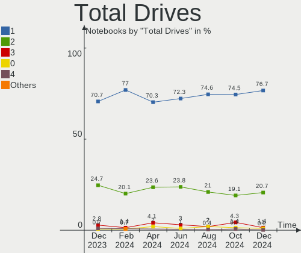
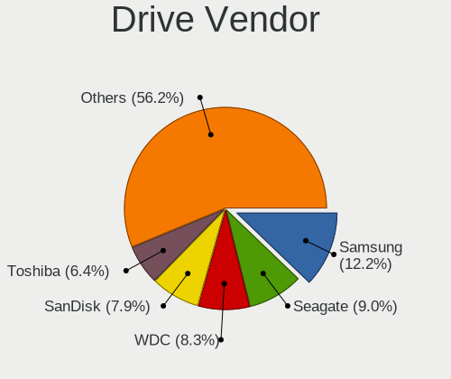
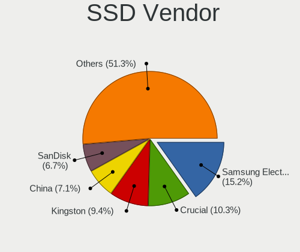
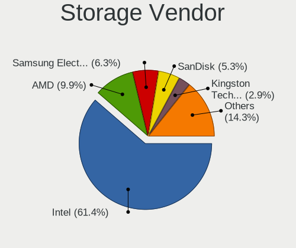

OpenMandriva Hardware Trends (Notebook)
---------------------------------------

A project to identify most popular hardware characteristics and track their change
over time based on data collected by OpenMandriva users at https://Linux-Hardware.org.

Anyone can contribute to the study by uploading probes of their computers by
the [hw-probe](https://github.com/linuxhw/hw-probe) tool:

    sudo -E hw-probe -all -upload

Full-feature report is available here: https://linux-hardware.org/?view=trends&formfactor=notebook

Period: Apr, 2021.

Contents
--------

- [ OS                       ](#os)
- [ OS Family                ](#os-family)
- [ Kernel                   ](#kernel)
- [ Kernel Family            ](#kernel-family)
- [ Kernel Major Ver.        ](#kernel-major-ver)
- [ Arch                     ](#arch)
- [ DE                       ](#de)
- [ Display Server           ](#display-server)
- [ Display Manager          ](#display-manager)
- [ OS Lang                  ](#os-lang)
- [ Boot Mode                ](#boot-mode)
- [ Filesystem               ](#filesystem)
- [ Part. scheme             ](#part-scheme)
- [ Dual Boot with Linux/BSD ](#dual-boot-with-linux/bsd)
- [ Dual Boot (Win)          ](#dual-boot-win)
- [ Country                  ](#country)
- [ City                     ](#city)
- [ Vendor                   ](#vendor)
- [ Model                    ](#model)
- [ Model Family             ](#model-family)
- [ MFG Year                 ](#mfg-year)
- [ Form Factor              ](#form-factor)
- [ Secure Boot              ](#secure-boot)
- [ Coreboot                 ](#coreboot)
- [ RAM Size                 ](#ram-size)
- [ RAM Used                 ](#ram-used)
- [ Has CD-ROM               ](#has-cd-rom)
- [ Total Drives             ](#total-drives)
- [ Has Ethernet             ](#has-ethernet)
- [ Has WiFi                 ](#has-wifi)
- [ Has Bluetooth            ](#has-bluetooth)
- [ Drive Vendor             ](#drive-vendor)
- [ Drive Model              ](#drive-model)
- [ HDD Vendor               ](#hdd-vendor)
- [ SSD Vendor               ](#ssd-vendor)
- [ Drive Kind               ](#drive-kind)
- [ Drive Connector          ](#drive-connector)
- [ Drive Size               ](#drive-size)
- [ Space Total              ](#space-total)
- [ Space Used               ](#space-used)
- [ Malfunc. Drives          ](#malfunc-drives)
- [ Malfunc. Drive Vendor    ](#malfunc-drive-vendor)
- [ Malfunc. HDD Vendor      ](#malfunc-hdd-vendor)
- [ Malfunc. Drive Kind      ](#malfunc-drive-kind)
- [ Failed Drives            ](#failed-drives)
- [ Failed Drive Vendor      ](#failed-drive-vendor)
- [ Drive Status             ](#drive-status)
- [ Storage Vendor           ](#storage-vendor)
- [ Storage Model            ](#storage-model)
- [ Storage Kind             ](#storage-kind)
- [ CPU Vendor               ](#cpu-vendor)
- [ CPU Model                ](#cpu-model)
- [ CPU Model Family         ](#cpu-model-family)
- [ CPU Cores                ](#cpu-cores)
- [ CPU Sockets              ](#cpu-sockets)
- [ CPU Threads              ](#cpu-threads)
- [ CPU Op-Modes             ](#cpu-op-modes)
- [ CPU Microcode            ](#cpu-microcode)
- [ CPU Microarch            ](#cpu-microarch)
- [ GPU Vendor               ](#gpu-vendor)
- [ GPU Model                ](#gpu-model)
- [ GPU Combo                ](#gpu-combo)
- [ GPU Driver               ](#gpu-driver)
- [ GPU Memory               ](#gpu-memory)
- [ Monitor Vendor           ](#monitor-vendor)
- [ Monitor Model            ](#monitor-model)
- [ Monitor Resolution       ](#monitor-resolution)
- [ Monitor Diagonal         ](#monitor-diagonal)
- [ Monitor Width            ](#monitor-width)
- [ Aspect Ratio             ](#aspect-ratio)
- [ Monitor Area             ](#monitor-area)
- [ Pixel Density            ](#pixel-density)
- [ Multiple Monitors        ](#multiple-monitors)
- [ Net Controller Vendor    ](#net-controller-vendor)
- [ Net Controller Model     ](#net-controller-model)
- [ Wireless Vendor          ](#wireless-vendor)
- [ Wireless Model           ](#wireless-model)
- [ Ethernet Vendor          ](#ethernet-vendor)
- [ Ethernet Model           ](#ethernet-model)
- [ Net Controller Kind      ](#net-controller-kind)
- [ Used Controller          ](#used-controller)
- [ NICs                     ](#nics)
- [ IPv6                     ](#ipv6)
- [ Memory Vendor            ](#memory-vendor)
- [ Memory Model             ](#memory-model)
- [ Memory Kind              ](#memory-kind)
- [ Memory Form Factor       ](#memory-form-factor)
- [ Memory Size              ](#memory-size)
- [ Memory Speed             ](#memory-speed)
- [ Sound Vendor             ](#sound-vendor)
- [ Sound Model              ](#sound-model)
- [ Camera Vendor            ](#camera-vendor)
- [ Camera Model             ](#camera-model)
- [ Fingerprint Vendor       ](#fingerprint-vendor)
- [ Fingerprint Model        ](#fingerprint-model)
- [ Chipcard Vendor          ](#chipcard-vendor)
- [ Chipcard Model           ](#chipcard-model)
- [ Printer Vendor           ](#printer-vendor)
- [ Printer Model            ](#printer-model)
- [ Scanner Vendor           ](#scanner-vendor)
- [ Scanner Model            ](#scanner-model)
- [ Bluetooth Vendor         ](#bluetooth-vendor)
- [ Bluetooth Model          ](#bluetooth-model)
- [ Unsupported Devices      ](#unsupported-devices)
- [ Unsupported Device Types ](#unsupported-device-types)

OS
--

Installed operating systems

| Name              | Notebooks | Percent |
|-------------------|-----------|---------|
| OpenMandriva 4.2  | 173       | 98.86%  |
| OpenMandriva 4.50 | 2         | 1.14%   |

OS Family
---------

OS without a version

| Name         | Notebooks | Percent |
|--------------|-----------|---------|
| OpenMandriva | 175       | 100%    |

Kernel
------

Version of the Linux kernel

| Version                        | Notebooks | Percent |
|--------------------------------|-----------|---------|
| 5.10.14-desktop-1omv4002       | 165       | 94.29%  |
| 5.11.12-desktop-1omv4002       | 5         | 2.86%   |
| 5.11.0-desktop-clang-1omv4002  | 3         | 1.71%   |
| 5.11.14-desktop-clang-1omv4050 | 1         | 0.57%   |
| 5.11.13-desktop-clang-1omv4050 | 1         | 0.57%   |

Kernel Family
-------------

Linux kernel without a distro release

| Version | Notebooks | Percent |
|---------|-----------|---------|
| 5.10.14 | 165       | 94.29%  |
| 5.11.12 | 5         | 2.86%   |
| 5.11.0  | 3         | 1.71%   |
| 5.11.14 | 1         | 0.57%   |
| 5.11.13 | 1         | 0.57%   |

Kernel Major Ver.
-----------------

Linux kernel major version

| Version | Notebooks | Percent |
|---------|-----------|---------|
| 5.10    | 165       | 94.29%  |
| 5.11    | 10        | 5.71%   |

Arch
----

OS architecture (x86_64, i586, etc.)

| Name   | Notebooks | Percent |
|--------|-----------|---------|
| x86_64 | 175       | 100%    |

DE
--

Desktop Environment

| Name | Notebooks | Percent |
|------|-----------|---------|
| KDE5 | 175       | 100%    |

Display Server
--------------

X11 or Wayland

| Name | Notebooks | Percent |
|------|-----------|---------|
| X11  | 175       | 100%    |

Display Manager
---------------

SDDM, LightDM, etc.

| Name | Notebooks | Percent |
|------|-----------|---------|
| SDDM | 175       | 100%    |

OS Lang
-------

Language

| Lang  | Notebooks | Percent |
|-------|-----------|---------|
| en_US | 93        | 53.14%  |
| de_DE | 12        | 6.86%   |
| pl_PL | 11        | 6.29%   |
| fr_FR | 11        | 6.29%   |
| es_ES | 6         | 3.43%   |
| en_GB | 6         | 3.43%   |
| cs_CZ | 6         | 3.43%   |
| ru_RU | 5         | 2.86%   |
| pt_BR | 5         | 2.86%   |
| it_IT | 5         | 2.86%   |
| en_AU | 3         | 1.71%   |
| hu_HU | 2         | 1.14%   |
| fr_CA | 2         | 1.14%   |
| en_NZ | 2         | 1.14%   |
| uk_UA | 1         | 0.57%   |
| ru_UA | 1         | 0.57%   |
| pt_PT | 1         | 0.57%   |
| en_IN | 1         | 0.57%   |
| de_LI | 1         | 0.57%   |
| de_AT | 1         | 0.57%   |

Boot Mode
---------

EFI or BIOS

| Mode | Notebooks | Percent |
|------|-----------|---------|
| BIOS | 103       | 58.86%  |
| EFI  | 72        | 41.14%  |

Filesystem
----------

Type of filesystem

| Type    | Notebooks | Percent |
|---------|-----------|---------|
| Overlay | 132       | 75.43%  |
| Ext4    | 38        | 21.71%  |
| Btrfs   | 4         | 2.29%   |
| F2fs    | 1         | 0.57%   |

Part. scheme
------------

Scheme of partitioning

| Type | Notebooks | Percent |
|------|-----------|---------|
| GPT  | 101       | 57.71%  |
| MBR  | 74        | 42.29%  |

Dual Boot with Linux/BSD
------------------------

Hosting more than one Linux/BSD

| Dual boot | Notebooks | Percent |
|-----------|-----------|---------|
| No        | 93        | 53.14%  |
| Yes       | 82        | 46.86%  |

Dual Boot (Win)
---------------

Hosting Linux and Windows

| Dual boot | Notebooks | Percent |
|-----------|-----------|---------|
| No        | 104       | 59.43%  |
| Yes       | 71        | 40.57%  |

Country
-------

Geographic location (country)

| Country      | Notebooks | Percent |
|--------------|-----------|---------|
| Germany      | 21        | 12%     |
| Poland       | 16        | 9.14%   |
| Russia       | 15        | 8.57%   |
| France       | 14        | 8%      |
| USA          | 13        | 7.43%   |
| Italy        | 11        | 6.29%   |
| Brazil       | 9         | 5.14%   |
| Spain        | 8         | 4.57%   |
| UK           | 7         | 4%      |
| Czechia      | 5         | 2.86%   |
| India        | 4         | 2.29%   |
| Canada       | 4         | 2.29%   |
| Ukraine      | 3         | 1.71%   |
| Japan        | 3         | 1.71%   |
| Australia    | 3         | 1.71%   |
| Vietnam      | 2         | 1.14%   |
| Portugal     | 2         | 1.14%   |
| New Zealand  | 2         | 1.14%   |
| Mexico       | 2         | 1.14%   |
| Jamaica      | 2         | 1.14%   |
| Iran         | 2         | 1.14%   |
| Indonesia    | 2         | 1.14%   |
| Hungary      | 2         | 1.14%   |
| Cyprus       | 2         | 1.14%   |
| Bulgaria     | 2         | 1.14%   |
| Austria      | 2         | 1.14%   |
| Turkey       | 1         | 0.57%   |
| Sweden       | 1         | 0.57%   |
| South Africa | 1         | 0.57%   |
| Slovakia     | 1         | 0.57%   |
| Qatar        | 1         | 0.57%   |
| Pakistan     | 1         | 0.57%   |
| Netherlands  | 1         | 0.57%   |
| Malaysia     | 1         | 0.57%   |
| Guadeloupe   | 1         | 0.57%   |
| Estonia      | 1         | 0.57%   |
| Denmark      | 1         | 0.57%   |
| Croatia      | 1         | 0.57%   |
| Colombia     | 1         | 0.57%   |
| China        | 1         | 0.57%   |
| Chile        | 1         | 0.57%   |
| Belarus      | 1         | 0.57%   |
| Algeria      | 1         | 0.57%   |

City
----

Geographic location (city)

| City                      | Notebooks | Percent |
|---------------------------|-----------|---------|
| Warsaw                    | 4         | 2.29%   |
| Rome                      | 3         | 1.71%   |
| Madrid                    | 3         | 1.71%   |
| Krasnodar                 | 3         | 1.71%   |
| Tehran                    | 2         | 1.14%   |
| Prague                    | 2         | 1.14%   |
| Portsmouth                | 2         | 1.14%   |
| Munich                    | 2         | 1.14%   |
| Moscow                    | 2         | 1.14%   |
| Milford                   | 2         | 1.14%   |
| Lyubertsy                 | 2         | 1.14%   |
| Lyon                      | 2         | 1.14%   |
| Lucea                     | 2         | 1.14%   |
| Kharkiv                   | 2         | 1.14%   |
| Carpentras                | 2         | 1.14%   |
| Berlin                    | 2         | 1.14%   |
| Bengaluru                 | 2         | 1.14%   |
| Zhukovskiy                | 1         | 0.57%   |
| Zaragoza                  | 1         | 0.57%   |
| Windsor                   | 1         | 0.57%   |
| Wellington                | 1         | 0.57%   |
| Wallers                   | 1         | 0.57%   |
| Vladimir                  | 1         | 0.57%   |
| Villahermosa              | 1         | 0.57%   |
| Veresegyhaz               | 1         | 0.57%   |
| Uppsala                   | 1         | 0.57%   |
| Toulouse                  | 1         | 0.57%   |
| Tochigi                   | 1         | 0.57%   |
| Thetford-Mines            | 1         | 0.57%   |
| Tarnowo Podgorne          | 1         | 0.57%   |
| Tangerang                 | 1         | 0.57%   |
| Tallinn                   | 1         | 0.57%   |
| Szekszárd                | 1         | 0.57%   |
| Sydney                    | 1         | 0.57%   |
| Sulzbach-Rosenberg        | 1         | 0.57%   |
| Stuttgart                 | 1         | 0.57%   |
| Stordorf                  | 1         | 0.57%   |
| Stone                     | 1         | 0.57%   |
| St Petersburg             | 1         | 0.57%   |
| Split                     | 1         | 0.57%   |
| Sofia                     | 1         | 0.57%   |
| Slough                    | 1         | 0.57%   |
| Severodvinsk              | 1         | 0.57%   |
| Schwetzingen              | 1         | 0.57%   |
| Scarlino                  | 1         | 0.57%   |
| Sarandi                   | 1         | 0.57%   |
| Santo André              | 1         | 0.57%   |
| Sankt Pölten             | 1         | 0.57%   |
| Sankt Georgen im Attergau | 1         | 0.57%   |
| Saint-Erblon              | 1         | 0.57%   |
| Safonovo                  | 1         | 0.57%   |
| Rzeszów                  | 1         | 0.57%   |
| Ruda Śląska             | 1         | 0.57%   |
| Rodeio Bonito             | 1         | 0.57%   |
| Roanoke                   | 1         | 0.57%   |
| Richmond                  | 1         | 0.57%   |
| Ravensburg                | 1         | 0.57%   |
| Puławy                   | 1         | 0.57%   |
| Pretoria                  | 1         | 0.57%   |
| Poznan                    | 1         | 0.57%   |

Vendor
------

Motherboard manufacturer

| Name                | Notebooks | Percent |
|---------------------|-----------|---------|
| Dell                | 34        | 19.43%  |
| Hewlett-Packard     | 31        | 17.71%  |
| Lenovo              | 29        | 16.57%  |
| Acer                | 27        | 15.43%  |
| ASUSTek Computer    | 13        | 7.43%   |
| Toshiba             | 9         | 5.14%   |
| Samsung Electronics | 9         | 5.14%   |
| MSI                 | 5         | 2.86%   |
| Sony                | 4         | 2.29%   |
| Fujitsu             | 3         | 1.71%   |
| Notebook            | 2         | 1.14%   |
| Apple               | 2         | 1.14%   |
| TEKNOSERVICE        | 1         | 0.57%   |
| Shuttle             | 1         | 0.57%   |
| Positivo            | 1         | 0.57%   |
| Packard Bell        | 1         | 0.57%   |
| HASEE Computer      | 1         | 0.57%   |
| Getac               | 1         | 0.57%   |
| Datto               | 1         | 0.57%   |

Model
-----

Motherboard model

| Name                                        | Notebooks | Percent |
|---------------------------------------------|-----------|---------|
| Samsung 550P5C/550P7C                       | 2         | 1.14%   |
| Samsung 300E4A/300E5A/300E7A/3430EA/3530EA  | 2         | 1.14%   |
| Lenovo IdeaPad S145-15AST 81N3              | 2         | 1.14%   |
| HP Presario CQ57                            | 2         | 1.14%   |
| HP Pavilion 15                              | 2         | 1.14%   |
| Fujitsu LIFEBOOK A555                       | 2         | 1.14%   |
| Dell Latitude E5440                         | 2         | 1.14%   |
| Dell Latitude E5420                         | 2         | 1.14%   |
| Dell Latitude D630                          | 2         | 1.14%   |
| Dell Inspiron N5110                         | 2         | 1.14%   |
| Toshiba Satellite U400                      | 1         | 0.57%   |
| Toshiba Satellite P755                      | 1         | 0.57%   |
| Toshiba Satellite L500D                     | 1         | 0.57%   |
| Toshiba Satellite L500                      | 1         | 0.57%   |
| Toshiba Satellite C850D-13F                 | 1         | 0.57%   |
| Toshiba Satellite C850D-119                 | 1         | 0.57%   |
| Toshiba Satellite C55-A-1T6                 | 1         | 0.57%   |
| Toshiba Satellite C50-B                     | 1         | 0.57%   |
| Toshiba dynabook CX/48F                     | 1         | 0.57%   |
| TEKNOSERVICE NJ5x_NJ7xLU                    | 1         | 0.57%   |
| Sony VPCCA3C5E                              | 1         | 0.57%   |
| Sony VGN-CR343N_B                           | 1         | 0.57%   |
| Sony VGN-AR61M                              | 1         | 0.57%   |
| Sony SVT15112CXS                            | 1         | 0.57%   |
| Shuttle DS67U                               | 1         | 0.57%   |
| Samsung RV411/RV511/E3511/S3511/RV711/E3411 | 1         | 0.57%   |
| Samsung RF511/RF411/RF711                   | 1         | 0.57%   |
| Samsung RC530/RC730                         | 1         | 0.57%   |
| Samsung 355V4C/356V4C/3445VC/3545VC         | 1         | 0.57%   |
| Samsung 300E4C/300E5C/300E7C                | 1         | 0.57%   |
| Positivo C14CR21                            | 1         | 0.57%   |
| Packard Bell EasyNote TS11HR                | 1         | 0.57%   |
| Notebook N7x0WU                             | 1         | 0.57%   |
| Notebook N750BU                             | 1         | 0.57%   |
| MSI GL75 9SD                                | 1         | 0.57%   |
| MSI GL62 7QF                                | 1         | 0.57%   |
| MSI GE70 2OC\2OE                            | 1         | 0.57%   |
| MSI GE60 2OC\2OD\2OE                        | 1         | 0.57%   |
| MSI CR610M                                  | 1         | 0.57%   |
| Lenovo Z50-70 20354                         | 1         | 0.57%   |
| Lenovo Yoga 2 11 20332                      | 1         | 0.57%   |
| Lenovo V110-15IAP 80TG                      | 1         | 0.57%   |
| Lenovo U41-70 80JV                          | 1         | 0.57%   |
| Lenovo ThinkPad X260 20F5A0HB00             | 1         | 0.57%   |
| Lenovo ThinkPad X230 2325BF1                | 1         | 0.57%   |
| Lenovo ThinkPad X220 Tablet 42992QG         | 1         | 0.57%   |
| Lenovo ThinkPad T60 20076RG                 | 1         | 0.57%   |
| Lenovo ThinkPad T540p 20BFS03V00            | 1         | 0.57%   |
| Lenovo ThinkPad T440 20B7S05Y00             | 1         | 0.57%   |
| Lenovo ThinkPad T430s 2356GW2               | 1         | 0.57%   |
| Lenovo ThinkPad T430s 23551M9               | 1         | 0.57%   |
| Lenovo ThinkPad T430 23501F9                | 1         | 0.57%   |
| Lenovo ThinkPad T420 42367H8                | 1         | 0.57%   |
| Lenovo ThinkPad T400 6474AH2                | 1         | 0.57%   |
| Lenovo ThinkPad R61e 7650E8G                | 1         | 0.57%   |
| Lenovo ThinkPad R500 2714AAG                | 1         | 0.57%   |
| Lenovo ThinkPad R400 7440AU5                | 1         | 0.57%   |
| Lenovo ThinkPad L430 24641J9                | 1         | 0.57%   |
| Lenovo IdeaPad Y700-14ISK 80NU              | 1         | 0.57%   |
| Lenovo IdeaPad S145-15IGM 81WT              | 1         | 0.57%   |

Model Family
------------

Motherboard model prefix

| Name                  | Notebooks | Percent |
|-----------------------|-----------|---------|
| Acer Aspire           | 25        | 14.29%  |
| Lenovo ThinkPad       | 15        | 8.57%   |
| Dell Inspiron         | 15        | 8.57%   |
| Dell Latitude         | 13        | 7.43%   |
| HP Pavilion           | 9         | 5.14%   |
| Toshiba Satellite     | 8         | 4.57%   |
| Lenovo IdeaPad        | 7         | 4%      |
| HP ProBook            | 5         | 2.86%   |
| HP Laptop             | 4         | 2.29%   |
| ASUS VivoBook         | 4         | 2.29%   |
| HP EliteBook          | 3         | 1.71%   |
| Fujitsu LIFEBOOK      | 3         | 1.71%   |
| Samsung 550P5C        | 2         | 1.14%   |
| Samsung 300E4A        | 2         | 1.14%   |
| HP Presario           | 2         | 1.14%   |
| HP 250                | 2         | 1.14%   |
| Dell XPS              | 2         | 1.14%   |
| Toshiba dynabook      | 1         | 0.57%   |
| TEKNOSERVICE NJ5x     | 1         | 0.57%   |
| Sony VPCCA3C5E        | 1         | 0.57%   |
| Sony VGN-CR343N       | 1         | 0.57%   |
| Sony VGN-AR61M        | 1         | 0.57%   |
| Sony SVT15112CXS      | 1         | 0.57%   |
| Shuttle DS67U         | 1         | 0.57%   |
| Samsung RV411         | 1         | 0.57%   |
| Samsung RF511         | 1         | 0.57%   |
| Samsung RC530         | 1         | 0.57%   |
| Samsung 355V4C        | 1         | 0.57%   |
| Samsung 300E4C        | 1         | 0.57%   |
| Positivo C14CR21      | 1         | 0.57%   |
| Packard Bell EasyNote | 1         | 0.57%   |
| Notebook N7x0WU       | 1         | 0.57%   |
| Notebook N750BU       | 1         | 0.57%   |
| MSI GL75              | 1         | 0.57%   |
| MSI GL62              | 1         | 0.57%   |
| MSI GE70              | 1         | 0.57%   |
| MSI GE60              | 1         | 0.57%   |
| MSI CR610M            | 1         | 0.57%   |
| Lenovo Z50-70         | 1         | 0.57%   |
| Lenovo Yoga           | 1         | 0.57%   |
| Lenovo V110-15IAP     | 1         | 0.57%   |
| Lenovo U41-70         | 1         | 0.57%   |
| Lenovo G50-70         | 1         | 0.57%   |
| Lenovo G50-30         | 1         | 0.57%   |
| Lenovo Flex           | 1         | 0.57%   |
| HP OMEN               | 1         | 0.57%   |
| HP Notebook           | 1         | 0.57%   |
| HP G72                | 1         | 0.57%   |
| HP Compaq             | 1         | 0.57%   |
| HP 255                | 1         | 0.57%   |
| HASEE QTC6            | 1         | 0.57%   |
| Getac F110G2          | 1         | 0.57%   |
| Dell Vostro           | 1         | 0.57%   |
| Dell Precision        | 1         | 0.57%   |
| Dell G5               | 1         | 0.57%   |
| Dell G3               | 1         | 0.57%   |
| Datto DATTO-1000      | 1         | 0.57%   |
| ASUS ZenBook          | 1         | 0.57%   |
| ASUS X541NA           | 1         | 0.57%   |
| ASUS X453SA           | 1         | 0.57%   |

MFG Year
--------

Motherboard manufacture year

| Year | Notebooks | Percent |
|------|-----------|---------|
| 2019 | 25        | 14.29%  |
| 2012 | 25        | 14.29%  |
| 2020 | 17        | 9.71%   |
| 2011 | 17        | 9.71%   |
| 2014 | 15        | 8.57%   |
| 2018 | 12        | 6.86%   |
| 2013 | 12        | 6.86%   |
| 2015 | 9         | 5.14%   |
| 2009 | 9         | 5.14%   |
| 2016 | 7         | 4%      |
| 2010 | 7         | 4%      |
| 2008 | 7         | 4%      |
| 2017 | 5         | 2.86%   |
| 2007 | 4         | 2.29%   |
| 2021 | 3         | 1.71%   |
| 2006 | 1         | 0.57%   |

Form Factor
-----------

Physical design of the computer

| Name     | Notebooks | Percent |
|----------|-----------|---------|
| Notebook | 175       | 100%    |

Secure Boot
-----------

Enabled or disabled

| State    | Notebooks | Percent |
|----------|-----------|---------|
| Disabled | 175       | 100%    |

Coreboot
--------

Have coreboot on board

| Used | Notebooks | Percent |
|------|-----------|---------|
| No   | 175       | 100%    |

RAM Size
--------

Total RAM memory

| Size in GB | Notebooks | Percent |
|------------|-----------|---------|
| 3.01-4.0   | 63        | 36%     |
| 4.01-8.0   | 55        | 31.43%  |
| 8.01-16.0  | 21        | 12%     |
| 16.01-24.0 | 17        | 9.71%   |
| 1.01-2.0   | 12        | 6.86%   |
| 2.01-3.0   | 5         | 2.86%   |
| 32.01-64.0 | 1         | 0.57%   |
| 24.01-32.0 | 1         | 0.57%   |

RAM Used
--------

Used RAM memory

| Used GB  | Notebooks | Percent |
|----------|-----------|---------|
| 1.01-2.0 | 134       | 76.57%  |
| 0.51-1.0 | 25        | 14.29%  |
| 2.01-3.0 | 15        | 8.57%   |
| 3.01-4.0 | 1         | 0.57%   |

Has CD-ROM
----------

Has CD-ROM on board

| Presented | Notebooks | Percent |
|-----------|-----------|---------|
| Yes       | 109       | 62.29%  |
| No        | 66        | 37.71%  |

Total Drives
------------

Number of drives on board

| Drives | Notebooks | Percent |
|--------|-----------|---------|
| 1      | 131       | 74.86%  |
| 2      | 34        | 19.43%  |
| 3      | 5         | 2.86%   |
| 0      | 5         | 2.86%   |

Has Ethernet
------------

Has Ethernet on board

| Presented | Notebooks | Percent |
|-----------|-----------|---------|
| Yes       | 156       | 89.14%  |
| No        | 19        | 10.86%  |

Has WiFi
--------

Has WiFi module

| Presented | Notebooks | Percent |
|-----------|-----------|---------|
| Yes       | 175       | 100%    |

Has Bluetooth
-------------

Has Bluetooth module

| Presented | Notebooks | Percent |
|-----------|-----------|---------|
| Yes       | 123       | 70.29%  |
| No        | 52        | 29.71%  |

Drive Vendor
------------

Hard drive vendors

| Vendor              | Notebooks | Drives | Percent |
|---------------------|-----------|--------|---------|
| WDC                 | 37        | 37     | 18.97%  |
| Samsung Electronics | 25        | 27     | 12.82%  |
| Toshiba             | 24        | 25     | 12.31%  |
| Seagate             | 24        | 24     | 12.31%  |
| Kingston            | 13        | 13     | 6.67%   |
| HGST                | 7         | 7      | 3.59%   |
| SanDisk             | 5         | 5      | 2.56%   |
| Hitachi             | 5         | 5      | 2.56%   |
| GOODRAM             | 5         | 5      | 2.56%   |
| Crucial             | 5         | 5      | 2.56%   |
| SK Hynix            | 4         | 4      | 2.05%   |
| Micron Technology   | 4         | 4      | 2.05%   |
| Fujitsu             | 4         | 4      | 2.05%   |
| A-DATA Technology   | 4         | 4      | 2.05%   |
| Unknown             | 3         | 3      | 1.54%   |
| Phison              | 3         | 3      | 1.54%   |
| Transcend           | 2         | 2      | 1.03%   |
| Sabrent             | 2         | 4      | 1.03%   |
| JMicron             | 2         | 2      | 1.03%   |
| Apple               | 2         | 3      | 1.03%   |
| Smartbuy            | 1         | 1      | 0.51%   |
| Realtek             | 1         | 1      | 0.51%   |
| PNY CS90            | 1         | 1      | 0.51%   |
| PNY                 | 1         | 1      | 0.51%   |
| Phison Electronics  | 1         | 1      | 0.51%   |
| Patriot             | 1         | 1      | 0.51%   |
| OCZ                 | 1         | 1      | 0.51%   |
| LITEONIT            | 1         | 1      | 0.51%   |
| KingFast            | 1         | 1      | 0.51%   |
| Intel               | 1         | 1      | 0.51%   |
| Hikvision           | 1         | 1      | 0.51%   |
| Hewlett-Packard     | 1         | 1      | 0.51%   |
| China               | 1         | 1      | 0.51%   |
| ASMT                | 1         | 1      | 0.51%   |
| Apacer              | 1         | 1      | 0.51%   |

Drive Model
-----------

Hard drive models

| Model                                | Notebooks | Percent |
|--------------------------------------|-----------|---------|
| Toshiba MQ01ABF050 500GB             | 6         | 3.02%   |
| Kingston SA400S37240G 240GB SSD      | 5         | 2.51%   |
| WDC WDS500G2B0A-00SM50 500GB SSD     | 4         | 2.01%   |
| WDC WD10JPVX-22JC3T0 1TB             | 3         | 1.51%   |
| Seagate ST9500325AS 500GB            | 3         | 1.51%   |
| Seagate ST1000LM024 HN-M101MBB 1TB   | 3         | 1.51%   |
| Samsung HM641JI 640GB                | 3         | 1.51%   |
| WDC WD5000LPVX-75V0TT0 500GB         | 2         | 1.01%   |
| WDC WD5000LPCX-24VHAT0 500GB         | 2         | 1.01%   |
| WDC WD10SPZX-60Z10T0 1TB             | 2         | 1.01%   |
| WDC WD10SPZX-21Z10T0 1TB             | 2         | 1.01%   |
| Toshiba MQ04ABF100 1TB               | 2         | 1.01%   |
| Toshiba MQ01ACF032 320GB             | 2         | 1.01%   |
| Toshiba MQ01ABD100 1TB               | 2         | 1.01%   |
| Seagate ST500VT000-1DK142 500GB      | 2         | 1.01%   |
| Seagate ST500LM000-1EJ162 500GB      | 2         | 1.01%   |
| Seagate ST1000LM035-1RK172 1TB       | 2         | 1.01%   |
| Samsung SSD 970 EVO 1TB              | 2         | 1.01%   |
| Samsung SSD 860 EVO 500GB            | 2         | 1.01%   |
| Samsung MZ7TY256HDHP-00000 256GB SSD | 2         | 1.01%   |
| Samsung MZ7LN256HAJQ-000L2 256GB SSD | 2         | 1.01%   |
| Sabrent Dual SATA Bridge             | 2         | 1.01%   |
| JMicron Generic 240GB                | 2         | 1.01%   |
| Hitachi HTS542516K9SA00 160GB        | 2         | 1.01%   |
| HGST HTS545050A7E680 500GB           | 2         | 1.01%   |
| HGST HTS541010A9E680 1TB             | 2         | 1.01%   |
| GOODRAM SSDPR-CX400-256 256GB        | 2         | 1.01%   |
| Crucial CT500MX500SSD1 500GB         | 2         | 1.01%   |
| A-DATA SP600 256GB SSD               | 2         | 1.01%   |
| WDC WDS240G2G0A-00JH30 240GB SSD     | 1         | 0.5%    |
| WDC WDS120G2G0A-00JH30 120GB SSD     | 1         | 0.5%    |
| WDC WD7500BPVT-22HXZT3 752GB         | 1         | 0.5%    |
| WDC WD5000M22K-24Z1LT0-SSHD-16GB     | 1         | 0.5%    |
| WDC WD5000LPVX-60V0TT0 500GB         | 1         | 0.5%    |
| WDC WD5000LPCX-75VHAT0 500GB         | 1         | 0.5%    |
| WDC WD5000BPVT-22HXZT3 500GB         | 1         | 0.5%    |
| WDC WD5000BPKT-00PK4T0 500GB         | 1         | 0.5%    |
| WDC WD3200LPVX-08V0TT5 320GB         | 1         | 0.5%    |
| WDC WD3200BEVT-80A0RT0 320GB         | 1         | 0.5%    |
| WDC WD3200BEVT-60A23T0 320GB         | 1         | 0.5%    |
| WDC WD3200BEKT-60F3T1 320GB          | 1         | 0.5%    |
| WDC WD2500BEVT-22ZCT0 250GB          | 1         | 0.5%    |
| WDC WD2500BEVT-22A23T0 250GB         | 1         | 0.5%    |
| WDC WD2500BEVS-22UST0 250GB          | 1         | 0.5%    |
| WDC WD1600BEVT-75A23T0 160GB         | 1         | 0.5%    |
| WDC WD10SPZX-08Z10 1TB               | 1         | 0.5%    |
| WDC WD10SPCX-24HWST1 1TB             | 1         | 0.5%    |
| WDC PC SN530 SDBPNPZ-1T00-1002 1TB   | 1         | 0.5%    |
| WDC PC SN520 SDAPNUW-512G-1032 512GB | 1         | 0.5%    |
| WDC PC SN520 SDAPNUW-512G-1014 512GB | 1         | 0.5%    |
| WDC PC SN520 NVMe 512GB              | 1         | 0.5%    |
| Unknown KE-SSDIS12G 120GB            | 1         | 0.5%    |
| Unknown DA4064  64GB                 | 1         | 0.5%    |
| Unknown Bamba-240GB SSD              | 1         | 0.5%    |
| Transcend TS64GSSD370 64GB           | 1         | 0.5%    |
| Transcend TS120GMTS420S 120GB SSD    | 1         | 0.5%    |
| Toshiba THNSNF128GCSS 128GB SSD      | 1         | 0.5%    |
| Toshiba MQ01ABD050V 500GB            | 1         | 0.5%    |
| Toshiba MQ01ABD050 500GB             | 1         | 0.5%    |
| Toshiba MQ01ABD032 320GB             | 1         | 0.5%    |

HDD Vendor
----------

Hard disk drive vendors

| Vendor              | Notebooks | Drives | Percent |
|---------------------|-----------|--------|---------|
| WDC                 | 27        | 27     | 27.55%  |
| Toshiba             | 24        | 24     | 24.49%  |
| Seagate             | 24        | 24     | 24.49%  |
| HGST                | 7         | 7      | 7.14%   |
| Hitachi             | 5         | 5      | 5.1%    |
| Fujitsu             | 4         | 4      | 4.08%   |
| Samsung Electronics | 3         | 3      | 3.06%   |
| Sabrent             | 2         | 3      | 2.04%   |
| ASMT                | 1         | 1      | 1.02%   |
| Apple               | 1         | 1      | 1.02%   |

SSD Vendor
----------

Solid state drive vendors

| Vendor              | Notebooks | Drives | Percent |
|---------------------|-----------|--------|---------|
| Samsung Electronics | 16        | 16     | 20.78%  |
| Kingston            | 10        | 10     | 12.99%  |
| WDC                 | 6         | 6      | 7.79%   |
| SanDisk             | 5         | 5      | 6.49%   |
| GOODRAM             | 5         | 5      | 6.49%   |
| Crucial             | 5         | 5      | 6.49%   |
| A-DATA Technology   | 4         | 4      | 5.19%   |
| SK Hynix            | 3         | 3      | 3.9%    |
| Micron Technology   | 3         | 3      | 3.9%    |
| Unknown             | 2         | 2      | 2.6%    |
| Transcend           | 2         | 2      | 2.6%    |
| JMicron             | 2         | 2      | 2.6%    |
| Toshiba             | 1         | 1      | 1.3%    |
| Smartbuy            | 1         | 1      | 1.3%    |
| SABRENT             | 1         | 1      | 1.3%    |
| PNY CS90            | 1         | 1      | 1.3%    |
| PNY                 | 1         | 1      | 1.3%    |
| Patriot             | 1         | 1      | 1.3%    |
| OCZ                 | 1         | 1      | 1.3%    |
| LITEONIT            | 1         | 1      | 1.3%    |
| KingFast            | 1         | 1      | 1.3%    |
| Intel               | 1         | 1      | 1.3%    |
| Hikvision           | 1         | 1      | 1.3%    |
| Hewlett-Packard     | 1         | 1      | 1.3%    |
| China               | 1         | 1      | 1.3%    |
| Apacer              | 1         | 1      | 1.3%    |

Drive Kind
----------

HDD or SSD

| Kind    | Notebooks | Drives | Percent |
|---------|-----------|--------|---------|
| HDD     | 97        | 99     | 50.52%  |
| SSD     | 73        | 77     | 38.02%  |
| NVMe    | 20        | 23     | 10.42%  |
| MMC     | 1         | 1      | 0.52%   |
| Unknown | 1         | 1      | 0.52%   |

Drive Connector
---------------

SATA, SAS, NVMe, etc.

| Type | Notebooks | Drives | Percent |
|------|-----------|--------|---------|
| SATA | 155       | 167    | 84.24%  |
| NVMe | 20        | 22     | 10.87%  |
| SAS  | 8         | 11     | 4.35%   |
| MMC  | 1         | 1      | 0.54%   |

Drive Size
----------

Size of hard drive

| Size in TB | Notebooks | Drives | Percent |
|------------|-----------|--------|---------|
| 0.01-0.5   | 130       | 137    | 76.92%  |
| 0.51-1.0   | 37        | 37     | 21.89%  |
| 1.01-2.0   | 2         | 2      | 1.18%   |

Space Total
-----------

Amount of disk space available on the file system

| Size in GB | Notebooks | Percent |
|------------|-----------|---------|
| 1-20       | 100       | 57.14%  |
| 101-250    | 22        | 12.57%  |
| 251-500    | 19        | 10.86%  |
| 501-1000   | 9         | 5.14%   |
| 51-100     | 8         | 4.57%   |
| Unknown    | 8         | 4.57%   |
| 21-50      | 6         | 3.43%   |
| 1001-2000  | 3         | 1.71%   |

Space Used
----------

Amount of used disk space

| Used GB   | Notebooks | Percent |
|-----------|-----------|---------|
| 1-20      | 152       | 86.86%  |
| Unknown   | 8         | 4.57%   |
| 251-500   | 5         | 2.86%   |
| 101-250   | 4         | 2.29%   |
| 51-100    | 3         | 1.71%   |
| 21-50     | 2         | 1.14%   |
| 1001-2000 | 1         | 0.57%   |

Malfunc. Drives
---------------

Drive models with a malfunction

| Model                              | Notebooks | Drives | Percent |
|------------------------------------|-----------|--------|---------|
| Seagate ST9500325AS 500GB          | 3         | 3      | 8.33%   |
| Samsung Electronics HM641JI 640GB  | 2         | 2      | 5.56%   |
| WDC WDS240G2G0A-00JH30 240GB SSD   | 1         | 1      | 2.78%   |
| WDC WD5000LPVX-75V0TT0 500GB       | 1         | 1      | 2.78%   |
| WDC WD3200LPVX-08V0TT5 320GB       | 1         | 1      | 2.78%   |
| WDC WD3200BEVT-80A0RT0 320GB       | 1         | 1      | 2.78%   |
| WDC WD3200BEVT-60A23T0 320GB       | 1         | 1      | 2.78%   |
| WDC WD3200BEKT-60F3T1 320GB        | 1         | 1      | 2.78%   |
| Unknown Bamba-240GB SSD            | 1         | 1      | 2.78%   |
| Toshiba MQ01ACF032 320GB           | 1         | 1      | 2.78%   |
| Toshiba MQ01ABF050 500GB           | 1         | 1      | 2.78%   |
| Toshiba MQ01ABD050 500GB           | 1         | 1      | 2.78%   |
| Toshiba MK8046GSX 80GB             | 1         | 1      | 2.78%   |
| Toshiba MK7559GSXP 752GB           | 1         | 1      | 2.78%   |
| Toshiba MK5065GSX 500GB            | 1         | 1      | 2.78%   |
| Toshiba MK3259GSXP 320GB           | 1         | 1      | 2.78%   |
| Toshiba MK2575GSX 250GB            | 1         | 1      | 2.78%   |
| Toshiba MK1633GSG 160GB            | 1         | 1      | 2.78%   |
| SK Hynix SC308 SATA 512GB SSD      | 1         | 1      | 2.78%   |
| Seagate ST500LT012-9WS142 500GB    | 1         | 1      | 2.78%   |
| Seagate ST320LT020-9YG142 320GB    | 1         | 1      | 2.78%   |
| Seagate ST2000LM003 HN-M201RAD 2TB | 1         | 1      | 2.78%   |
| Seagate ST1000LM024 HN-M101MBB 1TB | 1         | 1      | 2.78%   |
| SanDisk SSD U100 256GB             | 1         | 1      | 2.78%   |
| OCZ AGILITY3 120GB SSD             | 1         | 1      | 2.78%   |
| Hitachi HTS545050A7E380 500GB      | 1         | 1      | 2.78%   |
| Hitachi HTS545032B9SA02 320GB      | 1         | 1      | 2.78%   |
| Hitachi HTS542516K9SA00 160GB      | 1         | 1      | 2.78%   |
| HGST HTS725032A7E630 320GB         | 1         | 1      | 2.78%   |
| HGST HTS541010A9E680 1TB           | 1         | 1      | 2.78%   |
| Fujitsu MHX2300BT 304GB            | 1         | 1      | 2.78%   |
| ASMT 2115 64GB                     | 1         | 1      | 2.78%   |
| Apple HDD HTS547550A9E384 500GB    | 1         | 1      | 2.78%   |

Malfunc. Drive Vendor
---------------------

Vendors of faulty drives

| Vendor              | Notebooks | Drives | Percent |
|---------------------|-----------|--------|---------|
| Toshiba             | 9         | 9      | 25%     |
| Seagate             | 7         | 7      | 19.44%  |
| WDC                 | 6         | 6      | 16.67%  |
| Hitachi             | 3         | 3      | 8.33%   |
| Samsung Electronics | 2         | 2      | 5.56%   |
| HGST                | 2         | 2      | 5.56%   |
| Unknown             | 1         | 1      | 2.78%   |
| SK Hynix            | 1         | 1      | 2.78%   |
| SanDisk             | 1         | 1      | 2.78%   |
| OCZ                 | 1         | 1      | 2.78%   |
| Fujitsu             | 1         | 1      | 2.78%   |
| ASMT                | 1         | 1      | 2.78%   |
| Apple               | 1         | 1      | 2.78%   |

Malfunc. HDD Vendor
-------------------

Vendors of faulty HDD drives

| Vendor              | Notebooks | Drives | Percent |
|---------------------|-----------|--------|---------|
| Toshiba             | 9         | 9      | 29.03%  |
| Seagate             | 7         | 7      | 22.58%  |
| WDC                 | 5         | 5      | 16.13%  |
| Hitachi             | 3         | 3      | 9.68%   |
| Samsung Electronics | 2         | 2      | 6.45%   |
| HGST                | 2         | 2      | 6.45%   |
| Fujitsu             | 1         | 1      | 3.23%   |
| ASMT                | 1         | 1      | 3.23%   |
| Apple               | 1         | 1      | 3.23%   |

Malfunc. Drive Kind
-------------------

Kinds of faulty drives

| Kind | Notebooks | Drives | Percent |
|------|-----------|--------|---------|
| HDD  | 30        | 31     | 85.71%  |
| SSD  | 5         | 5      | 14.29%  |

Failed Drives
-------------

Failed drive models

| Model                            | Notebooks | Drives | Percent |
|----------------------------------|-----------|--------|---------|
| WDC WD5000M22K-24Z1LT0-SSHD-16GB | 1         | 1      | 100%    |

Failed Drive Vendor
-------------------

Failed drive vendors

| Vendor | Notebooks | Drives | Percent |
|--------|-----------|--------|---------|
| WDC    | 1         | 1      | 100%    |

Drive Status
------------

Number of failed and malfunc. drives

| Status   | Notebooks | Drives | Percent |
|----------|-----------|--------|---------|
| Works    | 138       | 155    | 76.24%  |
| Malfunc  | 35        | 36     | 19.34%  |
| Detected | 7         | 9      | 3.87%   |
| Failed   | 1         | 1      | 0.55%   |

Storage Vendor
--------------

Storage controller vendors

| Vendor                      | Notebooks | Percent |
|-----------------------------|-----------|---------|
| Intel                       | 140       | 72.92%  |
| AMD                         | 28        | 14.58%  |
| Samsung Electronics         | 8         | 4.17%   |
| Sandisk                     | 4         | 2.08%   |
| Phison Electronics          | 3         | 1.56%   |
| Nvidia                      | 3         | 1.56%   |
| Kingston Technology Company | 3         | 1.56%   |
| SK Hynix                    | 1         | 0.52%   |
| Micron Technology           | 1         | 0.52%   |
| Apple                       | 1         | 0.52%   |

Storage Model
-------------

Storage controller models

| Model                                                                                  | Notebooks | Percent |
|----------------------------------------------------------------------------------------|-----------|---------|
| AMD FCH SATA Controller [AHCI mode]                                                    | 24        | 11.71%  |
| Intel 6 Series/C200 Series Chipset Family 6 port Mobile SATA AHCI Controller           | 23        | 11.22%  |
| Intel 7 Series Chipset Family 6-port SATA Controller [AHCI mode]                       | 20        | 9.76%   |
| Intel Sunrise Point-LP SATA Controller [AHCI mode]                                     | 15        | 7.32%   |
| Intel 82801IBM/IEM (ICH9M/ICH9M-E) 4 port SATA Controller [AHCI mode]                  | 10        | 4.88%   |
| Intel Wildcat Point-LP SATA Controller [AHCI Mode]                                     | 9         | 4.39%   |
| Intel 82801HM/HEM (ICH8M/ICH8M-E) IDE Controller                                       | 7         | 3.41%   |
| Intel 5 Series/3400 Series Chipset 4 port SATA AHCI Controller                         | 7         | 3.41%   |
| Samsung NVMe SSD Controller SM981/PM981/PM983                                          | 6         | 2.93%   |
| Intel 82801HM/HEM (ICH8M/ICH8M-E) SATA Controller [AHCI mode]                          | 6         | 2.93%   |
| Intel 8 Series SATA Controller 1 [AHCI mode]                                           | 6         | 2.93%   |
| Intel 82801 Mobile SATA Controller [RAID mode]                                         | 5         | 2.44%   |
| Intel Atom Processor E3800 Series SATA AHCI Controller                                 | 4         | 1.95%   |
| Intel 82801HM/HEM (ICH8M/ICH8M-E) SATA Controller [IDE mode]                           | 4         | 1.95%   |
| Intel 5 Series/3400 Series Chipset 6 port SATA AHCI Controller                         | 4         | 1.95%   |
| AMD SB7x0/SB8x0/SB9x0 SATA Controller [AHCI mode]                                      | 4         | 1.95%   |
| Intel Ice Lake-LP SATA Controller [AHCI mode]                                          | 3         | 1.46%   |
| Intel Celeron/Pentium Silver Processor SATA Controller                                 | 3         | 1.46%   |
| Intel Atom/Celeron/Pentium Processor x5-E8000/J3xxx/N3xxx Series SATA Controller       | 3         | 1.46%   |
| Intel 8 Series/C220 Series Chipset Family 6-port SATA Controller 1 [AHCI mode]         | 3         | 1.46%   |
| Sandisk WD Blue SN500 / PC SN520 NVMe SSD                                              | 2         | 0.98%   |
| Samsung NVMe Controller                                                                | 2         | 0.98%   |
| Phison PS5013 E13 NVMe Controller                                                      | 2         | 0.98%   |
| Kingston Company U-SNS8154P3 NVMe SSD                                                  | 2         | 0.98%   |
| Intel HM170/QM170 Chipset SATA Controller [AHCI Mode]                                  | 2         | 0.98%   |
| Intel Celeron N3350/Pentium N4200/Atom E3900 Series SATA AHCI Controller               | 2         | 0.98%   |
| Intel Cannon Lake Mobile PCH SATA AHCI Controller                                      | 2         | 0.98%   |
| SK Hynix Non-Volatile memory controller                                                | 1         | 0.49%   |
| Sandisk WD Blue SN550 NVMe SSD                                                         | 1         | 0.49%   |
| Sandisk PC SN520 NVMe SSD                                                              | 1         | 0.49%   |
| Phison E12 NVMe Controller                                                             | 1         | 0.49%   |
| Nvidia nForce SATA Controller                                                          | 1         | 0.49%   |
| Nvidia MCP89 SATA Controller (AHCI mode)                                               | 1         | 0.49%   |
| Nvidia MCP65 SATA Controller                                                           | 1         | 0.49%   |
| Nvidia MCP65 IDE                                                                       | 1         | 0.49%   |
| Micron Non-Volatile memory controller                                                  | 1         | 0.49%   |
| Kingston Company Company Non-Volatile memory controller                                | 1         | 0.49%   |
| Intel SATA Controller [RAID mode]                                                      | 1         | 0.49%   |
| Intel NM10/ICH7 Family SATA Controller [AHCI mode]                                     | 1         | 0.49%   |
| Intel Cannon Point-LP SATA Controller [AHCI Mode]                                      | 1         | 0.49%   |
| Intel Atom Processor E3800 Series SATA IDE Controller                                  | 1         | 0.49%   |
| Intel 82801IBM/IEM (ICH9M/ICH9M-E) 2 port SATA Controller [IDE mode]                   | 1         | 0.49%   |
| Intel 82801GBM/GHM (ICH7-M Family) SATA Controller [IDE mode]                          | 1         | 0.49%   |
| Intel 82801GBM/GHM (ICH7-M Family) SATA Controller [AHCI mode]                         | 1         | 0.49%   |
| Intel 82801G (ICH7 Family) IDE Controller                                              | 1         | 0.49%   |
| Intel 6 Series/C200 Series Chipset Family Mobile SATA Controller (IDE mode, ports 4-5) | 1         | 0.49%   |
| Intel 6 Series/C200 Series Chipset Family Mobile SATA Controller (IDE mode, ports 0-3) | 1         | 0.49%   |
| Intel 5 Series/3400 Series Chipset 4 port SATA IDE Controller                          | 1         | 0.49%   |
| Intel 5 Series/3400 Series Chipset 2 port SATA IDE Controller                          | 1         | 0.49%   |
| Apple S3X NVMe Controller                                                              | 1         | 0.49%   |
| AMD SB7x0/SB8x0/SB9x0 IDE Controller                                                   | 1         | 0.49%   |
| AMD FCH IDE Controller                                                                 | 1         | 0.49%   |

Storage Kind
------------

Kind of storage controller (IDE, SATA, NVMe, SAS, ...)

| Kind | Notebooks | Percent |
|------|-----------|---------|
| SATA | 155       | 77.89%  |
| NVMe | 20        | 10.05%  |
| IDE  | 18        | 9.05%   |
| RAID | 6         | 3.02%   |

CPU Vendor
----------

Processor vendors

| Vendor | Notebooks | Percent |
|--------|-----------|---------|
| Intel  | 144       | 82.29%  |
| AMD    | 31        | 17.71%  |

CPU Model
---------

Processor models

| Model                                         | Notebooks | Percent |
|-----------------------------------------------|-----------|---------|
| Intel Core i5-2520M CPU @ 2.50GHz             | 5         | 2.86%   |
| Intel Core i3-5005U CPU @ 2.00GHz             | 5         | 2.86%   |
| Intel Core i5-5200U CPU @ 2.20GHz             | 4         | 2.29%   |
| Intel Core i5-3320M CPU @ 2.60GHz             | 4         | 2.29%   |
| Intel Core i5-2430M CPU @ 2.40GHz             | 4         | 2.29%   |
| Intel Core i3-2350M CPU @ 2.30GHz             | 4         | 2.29%   |
| Intel Core i5-7200U CPU @ 2.50GHz             | 3         | 1.71%   |
| Intel Core i5-4300U CPU @ 1.90GHz             | 3         | 1.71%   |
| Intel Core i5-3210M CPU @ 2.50GHz             | 3         | 1.71%   |
| Intel Core i5-2410M CPU @ 2.30GHz             | 3         | 1.71%   |
| Intel Celeron N4000 CPU @ 1.10GHz             | 3         | 1.71%   |
| Intel Pentium Dual-Core CPU T4200 @ 2.00GHz   | 2         | 1.14%   |
| Intel Core i7-7500U CPU @ 2.70GHz             | 2         | 1.14%   |
| Intel Core i7-4700MQ CPU @ 2.40GHz            | 2         | 1.14%   |
| Intel Core i7-2670QM CPU @ 2.20GHz            | 2         | 1.14%   |
| Intel Core i5-8250U CPU @ 1.60GHz             | 2         | 1.14%   |
| Intel Core i5-4210U CPU @ 1.70GHz             | 2         | 1.14%   |
| Intel Core i5-1035G1 CPU @ 1.00GHz            | 2         | 1.14%   |
| Intel Core i3-7100U CPU @ 2.40GHz             | 2         | 1.14%   |
| Intel Core i3-7020U CPU @ 2.30GHz             | 2         | 1.14%   |
| Intel Core i3 CPU M 380 @ 2.53GHz             | 2         | 1.14%   |
| Intel Core i3 CPU M 350 @ 2.27GHz             | 2         | 1.14%   |
| Intel Core 2 Duo CPU T8100 @ 2.10GHz          | 2         | 1.14%   |
| Intel Celeron CPU N3060 @ 1.60GHz             | 2         | 1.14%   |
| Intel Celeron CPU N2830 @ 2.16GHz             | 2         | 1.14%   |
| AMD Ryzen 7 4800H with Radeon Graphics        | 2         | 1.14%   |
| AMD Ryzen 5 2500U with Radeon Vega Mobile Gfx | 2         | 1.14%   |
| AMD A6-9225 RADEON R4, 5 COMPUTE CORES 2C+3G  | 2         | 1.14%   |
| Intel Pentium Dual-Core CPU T4500 @ 2.30GHz   | 1         | 0.57%   |
| Intel Pentium Dual-Core CPU T4300 @ 2.10GHz   | 1         | 0.57%   |
| Intel Pentium Dual CPU T3400 @ 2.16GHz        | 1         | 0.57%   |
| Intel Pentium Dual CPU T3200 @ 2.00GHz        | 1         | 0.57%   |
| Intel Pentium CPU P6200 @ 2.13GHz             | 1         | 0.57%   |
| Intel Pentium CPU P6100 @ 2.00GHz             | 1         | 0.57%   |
| Intel Pentium CPU N3530 @ 2.16GHz             | 1         | 0.57%   |
| Intel Pentium CPU N3520 @ 2.16GHz             | 1         | 0.57%   |
| Intel Pentium CPU B960 @ 2.20GHz              | 1         | 0.57%   |
| Intel Pentium CPU 2020M @ 2.40GHz             | 1         | 0.57%   |
| Intel Core m7-6Y75 CPU @ 1.20GHz              | 1         | 0.57%   |
| Intel Core m3-7Y32 CPU @ 1.10GHz              | 1         | 0.57%   |
| Intel Core i7-9750H CPU @ 2.60GHz             | 1         | 0.57%   |
| Intel Core i7-8550U CPU @ 1.80GHz             | 1         | 0.57%   |
| Intel Core i7-6700HQ CPU @ 2.60GHz            | 1         | 0.57%   |
| Intel Core i7-4600M CPU @ 2.90GHz             | 1         | 0.57%   |
| Intel Core i7-4510U CPU @ 2.00GHz             | 1         | 0.57%   |
| Intel Core i7-3630QM CPU @ 2.40GHz            | 1         | 0.57%   |
| Intel Core i7-3612QM CPU @ 2.10GHz            | 1         | 0.57%   |
| Intel Core i7-3610QM CPU @ 2.30GHz            | 1         | 0.57%   |
| Intel Core i7-2677M CPU @ 1.80GHz             | 1         | 0.57%   |
| Intel Core i7-2640M CPU @ 2.80GHz             | 1         | 0.57%   |
| Intel Core i7-10750H CPU @ 2.60GHz            | 1         | 0.57%   |
| Intel Core i7 CPU Q 820 @ 1.73GHz             | 1         | 0.57%   |
| Intel Core i7 CPU M 620 @ 2.67GHz             | 1         | 0.57%   |
| Intel Core i5-9300H CPU @ 2.40GHz             | 1         | 0.57%   |
| Intel Core i5-7440HQ CPU @ 2.80GHz            | 1         | 0.57%   |
| Intel Core i5-7300HQ CPU @ 2.50GHz            | 1         | 0.57%   |
| Intel Core i5-6300U CPU @ 2.40GHz             | 1         | 0.57%   |
| Intel Core i5-6267U CPU @ 2.90GHz             | 1         | 0.57%   |
| Intel Core i5-6200U CPU @ 2.30GHz             | 1         | 0.57%   |
| Intel Core i5-5300U CPU @ 2.30GHz             | 1         | 0.57%   |

CPU Model Family
----------------

Processor model prefix

| Model                          | Notebooks | Percent |
|--------------------------------|-----------|---------|
| Intel Core i5                  | 49        | 28%     |
| Intel Core i3                  | 28        | 16%     |
| Intel Core i7                  | 19        | 10.86%  |
| Intel Core 2 Duo               | 16        | 9.14%   |
| Intel Celeron                  | 15        | 8.57%   |
| Intel Pentium                  | 6         | 3.43%   |
| AMD Ryzen 7                    | 5         | 2.86%   |
| Intel Pentium Dual-Core        | 4         | 2.29%   |
| AMD Ryzen 5                    | 3         | 1.71%   |
| AMD Ryzen 3                    | 3         | 1.71%   |
| AMD E1                         | 3         | 1.71%   |
| AMD A6                         | 3         | 1.71%   |
| Intel Pentium Dual             | 2         | 1.14%   |
| Intel Core 2                   | 2         | 1.14%   |
| AMD E                          | 2         | 1.14%   |
| AMD A8                         | 2         | 1.14%   |
| AMD A10                        | 2         | 1.14%   |
| Other                          | 1         | 0.57%   |
| Intel Core m7                  | 1         | 0.57%   |
| Intel Core m3                  | 1         | 0.57%   |
| Intel Atom                     | 1         | 0.57%   |
| AMD Turion X2 Dual-Core Mobile | 1         | 0.57%   |
| AMD Turion II Dual-Core        | 1         | 0.57%   |
| AMD Ryzen 9                    | 1         | 0.57%   |
| AMD GX                         | 1         | 0.57%   |
| AMD E2                         | 1         | 0.57%   |
| AMD Athlon X2                  | 1         | 0.57%   |
| AMD Athlon 64 X2               | 1         | 0.57%   |

CPU Cores
---------

Number of processor cores

| Number | Notebooks | Percent |
|--------|-----------|---------|
| 2      | 138       | 78.86%  |
| 4      | 28        | 16%     |
| 8      | 5         | 2.86%   |
| 6      | 2         | 1.14%   |
| 1      | 2         | 1.14%   |

CPU Sockets
-----------

Number of sockets

| Number | Notebooks | Percent |
|--------|-----------|---------|
| 1      | 175       | 100%    |

CPU Threads
-----------

Threads per core (Hyper-Threading)

| Number | Notebooks | Percent |
|--------|-----------|---------|
| 2      | 111       | 63.43%  |
| 1      | 64        | 36.57%  |

CPU Op-Modes
------------

CPU Operation Modes (32-bit, 64-bit)

| Op mode        | Notebooks | Percent |
|----------------|-----------|---------|
| 32-bit, 64-bit | 175       | 100%    |

CPU Microcode
-------------

Microcode number

| Number     | Notebooks | Percent |
|------------|-----------|---------|
| 0x206a7    | 26        | 14.86%  |
| 0x306a9    | 18        | 10.29%  |
| 0x306d4    | 10        | 5.71%   |
| 0x6fd      | 9         | 5.14%   |
| 0x40651    | 9         | 5.14%   |
| 0x806e9    | 8         | 4.57%   |
| 0x20655    | 8         | 4.57%   |
| 0x1067a    | 8         | 4.57%   |
| Unknown    | 8         | 4.57%   |
| 0x406e3    | 4         | 2.29%   |
| 0x30678    | 4         | 2.29%   |
| 0x806ea    | 3         | 1.71%   |
| 0x706e5    | 3         | 1.71%   |
| 0x706a1    | 3         | 1.71%   |
| 0x306c3    | 3         | 1.71%   |
| 0x10676    | 3         | 1.71%   |
| 0x906ea    | 2         | 1.14%   |
| 0x906e9    | 2         | 1.14%   |
| 0x806ec    | 2         | 1.14%   |
| 0x6f6      | 2         | 1.14%   |
| 0x406c4    | 2         | 1.14%   |
| 0x20652    | 2         | 1.14%   |
| 0x08600106 | 2         | 1.14%   |
| 0x08108109 | 2         | 1.14%   |
| 0x08108102 | 2         | 1.14%   |
| 0x0810100b | 2         | 1.14%   |
| 0x07030105 | 2         | 1.14%   |
| 0x07000106 | 2         | 1.14%   |
| 0x06006705 | 2         | 1.14%   |
| 0x06001116 | 2         | 1.14%   |
| 0x0500010d | 2         | 1.14%   |
| 0xa0652    | 1         | 0.57%   |
| 0x6fb      | 1         | 0.57%   |
| 0x6fa      | 1         | 0.57%   |
| 0x506e3    | 1         | 0.57%   |
| 0x506c9    | 1         | 0.57%   |
| 0x406c3    | 1         | 0.57%   |
| 0x30673    | 1         | 0.57%   |
| 0x30661    | 1         | 0.57%   |
| 0x106e5    | 1         | 0.57%   |
| 0x08600104 | 1         | 0.57%   |
| 0x08101007 | 1         | 0.57%   |
| 0x06006704 | 1         | 0.57%   |
| 0x0600111f | 1         | 0.57%   |
| 0x06001119 | 1         | 0.57%   |
| 0x05000119 | 1         | 0.57%   |
| 0x05000028 | 1         | 0.57%   |
| 0x02000057 | 1         | 0.57%   |
| 0x02000032 | 1         | 0.57%   |

CPU Microarch
-------------

Microarchitecture

| Name            | Notebooks | Percent |
|-----------------|-----------|---------|
| SandyBridge     | 26        | 14.86%  |
| KabyLake        | 19        | 10.86%  |
| IvyBridge       | 18        | 10.29%  |
| Core            | 13        | 7.43%   |
| Haswell         | 12        | 6.86%   |
| Westmere        | 11        | 6.29%   |
| Penryn          | 11        | 6.29%   |
| Broadwell       | 10        | 5.71%   |
| Silvermont      | 8         | 4.57%   |
| Zen 2           | 5         | 2.86%   |
| Skylake         | 5         | 2.86%   |
| Zen+            | 4         | 2.29%   |
| Piledriver      | 4         | 2.29%   |
| Bobcat          | 4         | 2.29%   |
| Zen             | 3         | 1.71%   |
| IceLake         | 3         | 1.71%   |
| Goldmont plus   | 3         | 1.71%   |
| Excavator       | 3         | 1.71%   |
| Puma            | 2         | 1.14%   |
| K8 & K10 hybrid | 2         | 1.14%   |
| Jaguar          | 2         | 1.14%   |
| Goldmont        | 2         | 1.14%   |
| Nehalem         | 1         | 0.57%   |
| K8 Hammer       | 1         | 0.57%   |
| K10             | 1         | 0.57%   |
| CometLake       | 1         | 0.57%   |
| Bonnell         | 1         | 0.57%   |

GPU Vendor
----------

Vendors of graphics cards

| Vendor | Notebooks | Percent |
|--------|-----------|---------|
| Intel  | 135       | 63.68%  |
| AMD    | 40        | 18.87%  |
| Nvidia | 37        | 17.45%  |

GPU Model
---------

Graphics card models

| Model                                                                                    | Notebooks | Percent |
|------------------------------------------------------------------------------------------|-----------|---------|
| Intel 2nd Generation Core Processor Family Integrated Graphics Controller                | 26        | 11.56%  |
| Intel 3rd Gen Core processor Graphics Controller                                         | 18        | 8%      |
| Intel Mobile 4 Series Chipset Integrated Graphics Controller                             | 10        | 4.44%   |
| Intel HD Graphics 5500                                                                   | 10        | 4.44%   |
| Intel HD Graphics 620                                                                    | 9         | 4%      |
| Intel Haswell-ULT Integrated Graphics Controller                                         | 9         | 4%      |
| Intel Core Processor Integrated Graphics Controller                                      | 9         | 4%      |
| Intel Mobile GM965/GL960 Integrated Graphics Controller (secondary)                      | 7         | 3.11%   |
| Intel Mobile GM965/GL960 Integrated Graphics Controller (primary)                        | 7         | 3.11%   |
| Intel Atom Processor Z36xxx/Z37xxx Series Graphics & Display                             | 5         | 2.22%   |
| AMD Renoir                                                                               | 5         | 2.22%   |
| AMD Picasso                                                                              | 4         | 1.78%   |
| Nvidia TU116M [GeForce GTX 1660 Ti Mobile]                                               | 3         | 1.33%   |
| Nvidia GF108M [GeForce GT 540M]                                                          | 3         | 1.33%   |
| Intel UHD Graphics 620                                                                   | 3         | 1.33%   |
| Intel Iris Plus Graphics G1 (Ice Lake)                                                   | 3         | 1.33%   |
| Intel GeminiLake [UHD Graphics 600]                                                      | 3         | 1.33%   |
| Intel Atom/Celeron/Pentium Processor x5-E8000/J3xxx/N3xxx Integrated Graphics Controller | 3         | 1.33%   |
| Intel 4th Gen Core Processor Integrated Graphics Controller                              | 3         | 1.33%   |
| AMD Stoney [Radeon R2/R3/R4/R5 Graphics]                                                 | 3         | 1.33%   |
| AMD Raven Ridge [Radeon Vega Series / Radeon Vega Mobile Series]                         | 3         | 1.33%   |
| Nvidia GM108M [GeForce 840M]                                                             | 2         | 0.89%   |
| Nvidia GK107M [GeForce GT 750M]                                                          | 2         | 0.89%   |
| Nvidia GK107M [GeForce GT 650M]                                                          | 2         | 0.89%   |
| Nvidia GF119M [GeForce GT 520MX]                                                         | 2         | 0.89%   |
| Nvidia GF117M [GeForce 610M/710M/810M/820M / GT 620M/625M/630M/720M]                     | 2         | 0.89%   |
| Nvidia GF108M [GeForce GT 525M]                                                          | 2         | 0.89%   |
| Intel Skylake GT2 [HD Graphics 520]                                                      | 2         | 0.89%   |
| Intel HD Graphics 630                                                                    | 2         | 0.89%   |
| Intel HD Graphics 500                                                                    | 2         | 0.89%   |
| Intel CoffeeLake-H GT2 [UHD Graphics 630]                                                | 2         | 0.89%   |
| AMD Topaz XT [Radeon R7 M260/M265 / M340/M360 / M440/M445 / 530/535 / 620/625 Mobile]    | 2         | 0.89%   |
| AMD Thames [Radeon HD 7500M/7600M Series]                                                | 2         | 0.89%   |
| Nvidia TU117M [GeForce GTX 1650 Ti Mobile]                                               | 1         | 0.44%   |
| Nvidia TU117M [GeForce GTX 1650 Mobile / Max-Q]                                          | 1         | 0.44%   |
| Nvidia TU106M [GeForce RTX 2060 Max-Q]                                                   | 1         | 0.44%   |
| Nvidia MCP89 [GeForce 320M]                                                              | 1         | 0.44%   |
| Nvidia GT216GLM [Quadro FX 880M]                                                         | 1         | 0.44%   |
| Nvidia GP108M [GeForce MX230]                                                            | 1         | 0.44%   |
| Nvidia GM108M [GeForce 940MX]                                                            | 1         | 0.44%   |
| Nvidia GM107M [GeForce GTX 960M]                                                         | 1         | 0.44%   |
| Nvidia GM107 [GeForce 940MX]                                                             | 1         | 0.44%   |
| Nvidia GK208BM [GeForce 920M]                                                            | 1         | 0.44%   |
| Nvidia GK106M [GeForce GTX 765M]                                                         | 1         | 0.44%   |
| Nvidia GF119M [GeForce GT 520M]                                                          | 1         | 0.44%   |
| Nvidia GF119M [GeForce 610M]                                                             | 1         | 0.44%   |
| Nvidia GF108M [GeForce GT 620M/630M/635M/640M LE]                                        | 1         | 0.44%   |
| Nvidia GF108M [GeForce 610M]                                                             | 1         | 0.44%   |
| Nvidia G96CM [GeForce 9600M GS]                                                          | 1         | 0.44%   |
| Nvidia G86M [Quadro NVS 135M]                                                            | 1         | 0.44%   |
| Nvidia G86M [GeForce 8400M GT]                                                           | 1         | 0.44%   |
| Nvidia G86M [GeForce 8400M GS]                                                           | 1         | 0.44%   |
| Nvidia C77 [GeForce 9100M G]                                                             | 1         | 0.44%   |
| Intel WhiskeyLake-U GT2 [UHD Graphics 620]                                               | 1         | 0.44%   |
| Intel Mobile GME965/GLE960 Integrated Graphics Controller                                | 1         | 0.44%   |
| Intel Iris Graphics 550                                                                  | 1         | 0.44%   |
| Intel HD Graphics 615                                                                    | 1         | 0.44%   |
| Intel HD Graphics 530                                                                    | 1         | 0.44%   |
| Intel HD Graphics 515                                                                    | 1         | 0.44%   |
| Intel CometLake-U GT2 [UHD Graphics]                                                     | 1         | 0.44%   |

GPU Combo
---------

Combinations of graphics cards

| Name           | Notebooks | Percent |
|----------------|-----------|---------|
| 1 x Intel      | 101       | 57.71%  |
| Intel + Nvidia | 28        | 16%     |
| 1 x AMD        | 26        | 14.86%  |
| Intel + AMD    | 6         | 3.43%   |
| 2 x AMD        | 5         | 2.86%   |
| 1 x Nvidia     | 5         | 2.86%   |
| AMD + Nvidia   | 3         | 1.71%   |
| 2 x Nvidia     | 1         | 0.57%   |

GPU Driver
----------

Free vs proprietary

| Driver | Notebooks | Percent |
|--------|-----------|---------|
| Free   | 175       | 100%    |

GPU Memory
----------

Total video memory

| Size in GB | Notebooks | Percent |
|------------|-----------|---------|
| Unknown    | 104       | 59.43%  |
| 0.01-0.5   | 25        | 14.29%  |
| 1.01-2.0   | 19        | 10.86%  |
| 0.51-1.0   | 19        | 10.86%  |
| 3.01-4.0   | 5         | 2.86%   |
| 5.01-6.0   | 3         | 1.71%   |

Monitor Vendor
--------------

Monitor vendors

| Vendor                  | Notebooks | Percent |
|-------------------------|-----------|---------|
| AU Optronics            | 42        | 23.33%  |
| LG Display              | 35        | 19.44%  |
| Samsung Electronics     | 27        | 15%     |
| BOE                     | 20        | 11.11%  |
| Chimei Innolux          | 18        | 10%     |
| Chi Mei Optoelectronics | 12        | 6.67%   |
| Lenovo                  | 6         | 3.33%   |
| Sharp                   | 3         | 1.67%   |
| Apple                   | 3         | 1.67%   |
| Iiyama                  | 2         | 1.11%   |
| Fujitsu Siemens         | 2         | 1.11%   |
| SNC                     | 1         | 0.56%   |
| Quanta Display          | 1         | 0.56%   |
| Philips                 | 1         | 0.56%   |
| NEC Computers           | 1         | 0.56%   |
| Goldstar                | 1         | 0.56%   |
| Eizo                    | 1         | 0.56%   |
| CPT                     | 1         | 0.56%   |
| BenQ                    | 1         | 0.56%   |
| BBK                     | 1         | 0.56%   |
| AOC                     | 1         | 0.56%   |

Monitor Model
-------------

Monitor models

| Model                                                                    | Notebooks | Percent |
|--------------------------------------------------------------------------|-----------|---------|
| AU Optronics LCD Monitor AUO61ED 1920x1080 340x190mm 15.3-inch           | 5         | 2.78%   |
| Samsung Electronics LCD Monitor SEC5441 1366x768 344x194mm 15.5-inch     | 4         | 2.22%   |
| LG Display LCD Monitor LGD02DC 1366x768 344x194mm 15.5-inch              | 4         | 2.22%   |
| Chi Mei Optoelectronics LCD Monitor CMO1592 1366x768 344x193mm 15.5-inch | 4         | 2.22%   |
| Samsung Electronics LCD Monitor SEC324C 1366x768 353x198mm 15.9-inch     | 3         | 1.67%   |
| LG Display LCD Monitor LGD033A 1366x768 340x190mm 15.3-inch              | 3         | 1.67%   |
| AU Optronics LCD Monitor AUO71EC 1366x768 340x190mm 15.3-inch            | 3         | 1.67%   |
| AU Optronics LCD Monitor AUO26EC 1366x768 344x193mm 15.5-inch            | 3         | 1.67%   |
| Samsung Electronics LCD Monitor SEC324A 1366x768 344x194mm 15.5-inch     | 2         | 1.11%   |
| Samsung Electronics LCD Monitor SEC3157 1280x800 300x190mm 14.0-inch     | 2         | 1.11%   |
| LG Display LCD Monitor LGD0395 1366x768 344x194mm 15.5-inch              | 2         | 1.11%   |
| LG Display LCD Monitor LGD027A 1600x900 380x210mm 17.1-inch              | 2         | 1.11%   |
| Lenovo LCD Monitor LEN4031 1280x800 303x190mm 14.1-inch                  | 2         | 1.11%   |
| Chimei Innolux LCD Monitor CMN15DB 1366x768 344x193mm 15.5-inch          | 2         | 1.11%   |
| Chimei Innolux LCD Monitor CMN15BD 1366x768 344x194mm 15.5-inch          | 2         | 1.11%   |
| Chi Mei Optoelectronics LCD Monitor CMO15A3 1366x768 344x193mm 15.5-inch | 2         | 1.11%   |
| BOE LCD Monitor BOE06A5 1366x768 344x194mm 15.5-inch                     | 2         | 1.11%   |
| BOE LCD Monitor BOE0671 1366x768 344x194mm 15.5-inch                     | 2         | 1.11%   |
| AU Optronics LCD Monitor AUO70EC 1366x768 340x190mm 15.3-inch            | 2         | 1.11%   |
| AU Optronics LCD Monitor AUO6287 1440x900 367x229mm 17.0-inch            | 2         | 1.11%   |
| AU Optronics LCD Monitor AUO20EC 1366x768 344x193mm 15.5-inch            | 2         | 1.11%   |
| SNC SKP_E5-24 SNC2360 1920x1080 521x293mm 23.5-inch                      | 1         | 0.56%   |
| Sharp LQ140M1JW46 SHP14F1 1920x1080 309x174mm 14.0-inch                  | 1         | 0.56%   |
| Sharp LCD Monitor SHP14D7 1920x1200 366x229mm 17.0-inch                  | 1         | 0.56%   |
| Sharp LCD Monitor SHP143D 3840x2160 276x156mm 12.5-inch                  | 1         | 0.56%   |
| Samsung Electronics LCD Monitor SEC5742 1366x768 309x174mm 14.0-inch     | 1         | 0.56%   |
| Samsung Electronics LCD Monitor SEC5448 1920x1080 344x194mm 15.5-inch    | 1         | 0.56%   |
| Samsung Electronics LCD Monitor SEC4C42 1280x800 303x190mm 14.1-inch     | 1         | 0.56%   |
| Samsung Electronics LCD Monitor SEC4C41 1280x800 261x163mm 12.1-inch     | 1         | 0.56%   |
| Samsung Electronics LCD Monitor SEC3953 1366x768 256x144mm 11.6-inch     | 1         | 0.56%   |
| Samsung Electronics LCD Monitor SEC3945 1280x800 331x207mm 15.4-inch     | 1         | 0.56%   |
| Samsung Electronics LCD Monitor SEC3741 1280x800 331x207mm 15.4-inch     | 1         | 0.56%   |
| Samsung Electronics LCD Monitor SEC334D 1600x900 382x214mm 17.2-inch     | 1         | 0.56%   |
| Samsung Electronics LCD Monitor SEC3150 1366x768 344x193mm 15.5-inch     | 1         | 0.56%   |
| Samsung Electronics LCD Monitor SEC314C 1920x1080 344x194mm 15.5-inch    | 1         | 0.56%   |
| Samsung Electronics LCD Monitor SEC314B 1680x945 409x230mm 18.5-inch     | 1         | 0.56%   |
| Samsung Electronics LCD Monitor SEC3041 1366x768 353x198mm 15.9-inch     | 1         | 0.56%   |
| Samsung Electronics LCD Monitor SDC4C51 1366x768 344x194mm 15.5-inch     | 1         | 0.56%   |
| Samsung Electronics LCD Monitor SDC4C48 1920x1080 409x230mm 18.5-inch    | 1         | 0.56%   |
| Samsung Electronics LCD Monitor SDC4852 3840x2160 340x190mm 15.3-inch    | 1         | 0.56%   |
| Samsung Electronics C32F391 SAM0D35 1920x1080 698x393mm 31.5-inch        | 1         | 0.56%   |
| Quanta Display LCD Monitor QDS0040 1280x800 331x207mm 15.4-inch          | 1         | 0.56%   |
| Philips PHL 276E8V PHLC18F 3840x2160 597x336mm 27.0-inch                 | 1         | 0.56%   |
| NEC Computers LCD19WV NEC671C 1440x900 410x256mm 19.0-inch               | 1         | 0.56%   |
| LG Display LP156WH2-TLC2 LGD0222 1366x768 344x194mm 15.5-inch            | 1         | 0.56%   |
| LG Display LP156WH1-TLA3 LGD01C2 1366x768 344x194mm 15.5-inch            | 1         | 0.56%   |
| LG Display LP156WH1-TLA1 LGD6301 1366x768 344x194mm 15.5-inch            | 1         | 0.56%   |
| LG Display LCD Monitor LGDD801 1366x768 344x194mm 15.5-inch              | 1         | 0.56%   |
| LG Display LCD Monitor LGD05FE 1920x1080 344x194mm 15.5-inch             | 1         | 0.56%   |
| LG Display LCD Monitor LGD05EC 1920x1080 309x174mm 14.0-inch             | 1         | 0.56%   |
| LG Display LCD Monitor LGD04C0 1366x768 309x174mm 14.0-inch              | 1         | 0.56%   |
| LG Display LCD Monitor LGD04BE 1366x768 344x194mm 15.5-inch              | 1         | 0.56%   |
| LG Display LCD Monitor LGD04BD 1366x768 344x194mm 15.5-inch              | 1         | 0.56%   |
| LG Display LCD Monitor LGD04A4 1920x1080 309x174mm 14.0-inch             | 1         | 0.56%   |
| LG Display LCD Monitor LGD03F8 1366x768 345x194mm 15.6-inch              | 1         | 0.56%   |
| LG Display LCD Monitor LGD03DE 1600x900 380x210mm 17.1-inch              | 1         | 0.56%   |
| LG Display LCD Monitor LGD03D9 1366x768 350x190mm 15.7-inch              | 1         | 0.56%   |
| LG Display LCD Monitor LGD03A3 1366x768 277x156mm 12.5-inch              | 1         | 0.56%   |
| LG Display LCD Monitor LGD038E 1366x768 340x190mm 15.3-inch              | 1         | 0.56%   |
| LG Display LCD Monitor LGD0385 1366x768 309x174mm 14.0-inch              | 1         | 0.56%   |

Monitor Resolution
------------------

Monitor screen resolution

| Resolution         | Notebooks | Percent |
|--------------------|-----------|---------|
| 1366x768 (WXGA)    | 87        | 49.43%  |
| 1920x1080 (FHD)    | 45        | 25.57%  |
| 1600x900 (HD+)     | 15        | 8.52%   |
| 1280x800 (WXGA)    | 11        | 6.25%   |
| 1440x900 (WXGA+)   | 6         | 3.41%   |
| 3840x2160 (4K)     | 4         | 2.27%   |
| 1920x1200 (WUXGA)  | 2         | 1.14%   |
| 1680x1050 (WSXGA+) | 2         | 1.14%   |
| 2304x1440          | 1         | 0.57%   |
| 1680x945           | 1         | 0.57%   |
| 1400x1050          | 1         | 0.57%   |
| 1024x600           | 1         | 0.57%   |

Monitor Diagonal
----------------

Diagonal size in inches

| Inches | Notebooks | Percent |
|--------|-----------|---------|
| 15     | 100       | 55.56%  |
| 14     | 24        | 13.33%  |
| 17     | 15        | 8.33%   |
| 13     | 13        | 7.22%   |
| 12     | 6         | 3.33%   |
| 23     | 4         | 2.22%   |
| 18     | 4         | 2.22%   |
| 11     | 4         | 2.22%   |
| 21     | 2         | 1.11%   |
| 19     | 2         | 1.11%   |
| 31     | 1         | 0.56%   |
| 27     | 1         | 0.56%   |
| 26     | 1         | 0.56%   |
| 25     | 1         | 0.56%   |
| 22     | 1         | 0.56%   |
| 10     | 1         | 0.56%   |

Monitor Width
-------------

Physical width

| Width in mm | Notebooks | Percent |
|-------------|-----------|---------|
| 301-350     | 123       | 68.33%  |
| 351-400     | 25        | 13.89%  |
| 201-300     | 16        | 8.89%   |
| 401-500     | 8         | 4.44%   |
| 501-600     | 7         | 3.89%   |
| 601-700     | 1         | 0.56%   |

Aspect Ratio
------------

Proportional relationship between the width and the height

| Ratio | Notebooks | Percent |
|-------|-----------|---------|
| 16/9  | 147       | 86.47%  |
| 16/10 | 21        | 12.35%  |
| 5/4   | 1         | 0.59%   |
| 4/3   | 1         | 0.59%   |

Monitor Area
------------

Area in inch²

| Area in inch² | Notebooks | Percent |
|----------------|-----------|---------|
| 101-110        | 100       | 55.56%  |
| 81-90          | 33        | 18.33%  |
| 121-130        | 13        | 7.22%   |
| 61-70          | 6         | 3.33%   |
| 201-250        | 6         | 3.33%   |
| 51-60          | 4         | 2.22%   |
| 141-150        | 4         | 2.22%   |
| 71-80          | 3         | 1.67%   |
| 151-200        | 3         | 1.67%   |
| 251-300        | 2         | 1.11%   |
| 131-140        | 2         | 1.11%   |
| 351-500        | 1         | 0.56%   |
| 41-50          | 1         | 0.56%   |
| 301-350        | 1         | 0.56%   |
| 91-100         | 1         | 0.56%   |

Pixel Density
-------------

Pixels per inch

| Density       | Notebooks | Percent |
|---------------|-----------|---------|
| 101-120       | 85        | 47.75%  |
| 121-160       | 50        | 28.09%  |
| 51-100        | 37        | 20.79%  |
| 161-240       | 5         | 2.81%   |
| More than 240 | 1         | 0.56%   |

Multiple Monitors
-----------------

Total monitors connected

| Total | Notebooks | Percent |
|-------|-----------|---------|
| 1     | 163       | 93.14%  |
| 2     | 12        | 6.86%   |

Net Controller Vendor
---------------------

Controller vendors

| Vendor                            | Notebooks | Percent |
|-----------------------------------|-----------|---------|
| Realtek Semiconductor             | 96        | 33.22%  |
| Intel                             | 79        | 27.34%  |
| Qualcomm Atheros                  | 54        | 18.69%  |
| Broadcom                          | 30        | 10.38%  |
| Broadcom Limited                  | 8         | 2.77%   |
| Marvell Technology Group          | 6         | 2.08%   |
| Ericsson Business Mobile Networks | 3         | 1.04%   |
| Dell                              | 3         | 1.04%   |
| Samsung Electronics               | 2         | 0.69%   |
| Ralink                            | 2         | 0.69%   |
| Nvidia                            | 2         | 0.69%   |
| Sierra Wireless                   | 1         | 0.35%   |
| Qualcomm Atheros Communications   | 1         | 0.35%   |
| MediaTek                          | 1         | 0.35%   |
| JMicron Technology                | 1         | 0.35%   |

Net Controller Model
--------------------

Controller models

| Model                                                                   | Notebooks | Percent |
|-------------------------------------------------------------------------|-----------|---------|
| Realtek RTL8111/8168/8411 PCI Express Gigabit Ethernet Controller       | 55        | 15.9%   |
| Realtek RTL810xE PCI Express Fast Ethernet controller                   | 30        | 8.67%   |
| Qualcomm Atheros QCA9377 802.11ac Wireless Network Adapter              | 13        | 3.76%   |
| Qualcomm Atheros QCA9565 / AR9565 Wireless Network Adapter              | 12        | 3.47%   |
| Qualcomm Atheros AR9485 Wireless Network Adapter                        | 11        | 3.18%   |
| Realtek RTL8723BE PCIe Wireless Network Adapter                         | 9         | 2.6%    |
| Intel Centrino Advanced-N 6205 [Taylor Peak]                            | 9         | 2.6%    |
| Intel 82579LM Gigabit Network Connection (Lewisville)                   | 8         | 2.31%   |
| Intel Wireless 7265                                                     | 7         | 2.02%   |
| Intel PRO/Wireless 3945ABG [Golan] Network Connection                   | 7         | 2.02%   |
| Broadcom BCM4313 802.11bgn Wireless Network Adapter                     | 6         | 1.73%   |
| Realtek RTL8188CE 802.11b/g/n WiFi Adapter                              | 5         | 1.45%   |
| Intel Wireless 7260                                                     | 5         | 1.45%   |
| Qualcomm Atheros AR928X Wireless Network Adapter (PCI-Express)          | 4         | 1.16%   |
| Qualcomm Atheros AR8151 v2.0 Gigabit Ethernet                           | 4         | 1.16%   |
| Intel Wi-Fi 6 AX200                                                     | 4         | 1.16%   |
| Intel Ethernet Connection I218-LM                                       | 4         | 1.16%   |
| Intel Dual Band Wireless-AC 3168NGW [Stone Peak]                        | 4         | 1.16%   |
| Realtek RTL8821CE 802.11ac PCIe Wireless Network Adapter                | 3         | 0.87%   |
| Realtek RTL8723AE PCIe Wireless Network Adapter                         | 3         | 0.87%   |
| Realtek RTL8153 Gigabit Ethernet Adapter                                | 3         | 0.87%   |
| Qualcomm Atheros AR8152 v2.0 Fast Ethernet                              | 3         | 0.87%   |
| Intel Wireless 3165                                                     | 3         | 0.87%   |
| Intel PRO/Wireless 5100 AGN [Shiloh] Network Connection                 | 3         | 0.87%   |
| Intel Centrino Wireless-N 1030 [Rainbow Peak]                           | 3         | 0.87%   |
| Intel Centrino Advanced-N 6200                                          | 3         | 0.87%   |
| Intel 82577LM Gigabit Network Connection                                | 3         | 0.87%   |
| Broadcom NetXtreme BCM57786 Gigabit Ethernet PCIe                       | 3         | 0.87%   |
| Broadcom NetLink BCM5787M Gigabit Ethernet PCI Express                  | 3         | 0.87%   |
| Samsung Galaxy series, misc. (tethering mode)                           | 2         | 0.58%   |
| Realtek RTL8822CE 802.11ac PCIe Wireless Network Adapter                | 2         | 0.58%   |
| Realtek RTL8822BE 802.11a/b/g/n/ac WiFi adapter                         | 2         | 0.58%   |
| Realtek RTL8821AE 802.11ac PCIe Wireless Network Adapter                | 2         | 0.58%   |
| Realtek RTL8187B Wireless Adapter                                       | 2         | 0.58%   |
| Ralink RT3290 Wireless 802.11n 1T/1R PCIe                               | 2         | 0.58%   |
| Qualcomm Atheros QCA8171 Gigabit Ethernet                               | 2         | 0.58%   |
| Qualcomm Atheros Killer E220x Gigabit Ethernet Controller               | 2         | 0.58%   |
| Qualcomm Atheros AR9285 Wireless Network Adapter (PCI-Express)          | 2         | 0.58%   |
| Qualcomm Atheros AR8161 Gigabit Ethernet                                | 2         | 0.58%   |
| Qualcomm Atheros AR242x / AR542x Wireless Network Adapter (PCI-Express) | 2         | 0.58%   |
| Marvell Group 88E8071 PCI-E Gigabit Ethernet Controller                 | 2         | 0.58%   |
| Marvell Group 88E8040T PCI-E Fast Ethernet Controller                   | 2         | 0.58%   |
| Intel Wireless 8260                                                     | 2         | 0.58%   |
| Intel Wireless 3160                                                     | 2         | 0.58%   |
| Intel PRO/Wireless 4965 AG or AGN [Kedron] Network Connection           | 2         | 0.58%   |
| Intel Killer Wi-Fi 6 AX1650i 160MHz Wireless Network Adapter (201NGW)   | 2         | 0.58%   |
| Intel Ethernet Connection I219-LM                                       | 2         | 0.58%   |
| Intel Ethernet Connection (3) I218-LM                                   | 2         | 0.58%   |
| Intel Dual Band Wireless-AC 3165 Plus Bluetooth                         | 2         | 0.58%   |
| Intel Centrino Wireless-N 2230                                          | 2         | 0.58%   |
| Intel Centrino Wireless-N 100                                           | 2         | 0.58%   |
| Intel Centrino Advanced-N 6235                                          | 2         | 0.58%   |
| Intel 82567LM Gigabit Network Connection                                | 2         | 0.58%   |
| Broadcom NetXtreme BCM5755M Gigabit Ethernet PCI Express                | 2         | 0.58%   |
| Broadcom NetLink BCM57780 Gigabit Ethernet PCIe                         | 2         | 0.58%   |
| Broadcom Limited NetXtreme BCM5761 Gigabit Ethernet PCIe                | 2         | 0.58%   |
| Broadcom Limited NetLink BCM5787M Gigabit Ethernet PCI Express          | 2         | 0.58%   |
| Broadcom Limited BCM4313 802.11bgn Wireless Network Adapter             | 2         | 0.58%   |
| Broadcom BCM43225 802.11b/g/n                                           | 2         | 0.58%   |
| Broadcom BCM43224 802.11a/b/g/n                                         | 2         | 0.58%   |

Wireless Vendor
---------------

Wireless vendors

| Vendor                          | Notebooks | Percent |
|---------------------------------|-----------|---------|
| Intel                           | 76        | 41.99%  |
| Qualcomm Atheros                | 45        | 24.86%  |
| Realtek Semiconductor           | 31        | 17.13%  |
| Broadcom                        | 18        | 9.94%   |
| Broadcom Limited                | 4         | 2.21%   |
| Ralink                          | 2         | 1.1%    |
| Dell                            | 2         | 1.1%    |
| Sierra Wireless                 | 1         | 0.55%   |
| Qualcomm Atheros Communications | 1         | 0.55%   |
| MediaTek                        | 1         | 0.55%   |

Wireless Model
--------------

Wireless models

| Model                                                                   | Notebooks | Percent |
|-------------------------------------------------------------------------|-----------|---------|
| Qualcomm Atheros QCA9377 802.11ac Wireless Network Adapter              | 13        | 7.1%    |
| Qualcomm Atheros QCA9565 / AR9565 Wireless Network Adapter              | 12        | 6.56%   |
| Qualcomm Atheros AR9485 Wireless Network Adapter                        | 11        | 6.01%   |
| Realtek RTL8723BE PCIe Wireless Network Adapter                         | 9         | 4.92%   |
| Intel Centrino Advanced-N 6205 [Taylor Peak]                            | 9         | 4.92%   |
| Intel Wireless 7265                                                     | 7         | 3.83%   |
| Intel PRO/Wireless 3945ABG [Golan] Network Connection                   | 7         | 3.83%   |
| Broadcom BCM4313 802.11bgn Wireless Network Adapter                     | 6         | 3.28%   |
| Realtek RTL8188CE 802.11b/g/n WiFi Adapter                              | 5         | 2.73%   |
| Intel Wireless 7260                                                     | 5         | 2.73%   |
| Qualcomm Atheros AR928X Wireless Network Adapter (PCI-Express)          | 4         | 2.19%   |
| Intel Wi-Fi 6 AX200                                                     | 4         | 2.19%   |
| Intel Dual Band Wireless-AC 3168NGW [Stone Peak]                        | 4         | 2.19%   |
| Realtek RTL8821CE 802.11ac PCIe Wireless Network Adapter                | 3         | 1.64%   |
| Realtek RTL8723AE PCIe Wireless Network Adapter                         | 3         | 1.64%   |
| Intel Wireless 3165                                                     | 3         | 1.64%   |
| Intel PRO/Wireless 5100 AGN [Shiloh] Network Connection                 | 3         | 1.64%   |
| Intel Centrino Wireless-N 1030 [Rainbow Peak]                           | 3         | 1.64%   |
| Intel Centrino Advanced-N 6200                                          | 3         | 1.64%   |
| Realtek RTL8822CE 802.11ac PCIe Wireless Network Adapter                | 2         | 1.09%   |
| Realtek RTL8822BE 802.11a/b/g/n/ac WiFi adapter                         | 2         | 1.09%   |
| Realtek RTL8821AE 802.11ac PCIe Wireless Network Adapter                | 2         | 1.09%   |
| Realtek RTL8187B Wireless Adapter                                       | 2         | 1.09%   |
| Ralink RT3290 Wireless 802.11n 1T/1R PCIe                               | 2         | 1.09%   |
| Qualcomm Atheros AR9285 Wireless Network Adapter (PCI-Express)          | 2         | 1.09%   |
| Qualcomm Atheros AR242x / AR542x Wireless Network Adapter (PCI-Express) | 2         | 1.09%   |
| Intel Wireless 8260                                                     | 2         | 1.09%   |
| Intel Wireless 3160                                                     | 2         | 1.09%   |
| Intel PRO/Wireless 4965 AG or AGN [Kedron] Network Connection           | 2         | 1.09%   |
| Intel Killer Wi-Fi 6 AX1650i 160MHz Wireless Network Adapter (201NGW)   | 2         | 1.09%   |
| Intel Dual Band Wireless-AC 3165 Plus Bluetooth                         | 2         | 1.09%   |
| Intel Centrino Wireless-N 2230                                          | 2         | 1.09%   |
| Intel Centrino Wireless-N 100                                           | 2         | 1.09%   |
| Intel Centrino Advanced-N 6235                                          | 2         | 1.09%   |
| Broadcom Limited BCM4313 802.11bgn Wireless Network Adapter             | 2         | 1.09%   |
| Broadcom BCM43225 802.11b/g/n                                           | 2         | 1.09%   |
| Broadcom BCM43224 802.11a/b/g/n                                         | 2         | 1.09%   |
| Broadcom BCM43142 802.11b/g/n                                           | 2         | 1.09%   |
| Broadcom BCM4312 802.11b/g LP-PHY                                       | 2         | 1.09%   |
| Broadcom BCM4311 802.11b/g WLAN                                         | 2         | 1.09%   |
| Sierra Wireless EM7305 Modem                                            | 1         | 0.55%   |
| Realtek RTL8191SEvB Wireless LAN Controller                             | 1         | 0.55%   |
| Realtek RTL8191SEvA Wireless LAN Controller                             | 1         | 0.55%   |
| Realtek RTL8188EUS 802.11n Wireless Network Adapter                     | 1         | 0.55%   |
| Qualcomm Atheros AR9271 802.11n                                         | 1         | 0.55%   |
| Qualcomm Atheros AR9462 Wireless Network Adapter                        | 1         | 0.55%   |
| MediaTek 802.11 n WLAN                                                  | 1         | 0.55%   |
| Intel Wireless-AC 9560 [Jefferson Peak]                                 | 1         | 0.55%   |
| Intel Wireless-AC 9260                                                  | 1         | 0.55%   |
| Intel Wireless Gigabit 17265                                            | 1         | 0.55%   |
| Intel Wireless 8265 / 8275                                              | 1         | 0.55%   |
| Intel Comet Lake PCH-LP CNVi WiFi                                       | 1         | 0.55%   |
| Intel Comet Lake PCH CNVi WiFi                                          | 1         | 0.55%   |
| Intel Centrino Wireless-N 6150                                          | 1         | 0.55%   |
| Intel Centrino Wireless-N 135                                           | 1         | 0.55%   |
| Intel Centrino Wireless-N 130                                           | 1         | 0.55%   |
| Intel Centrino Wireless-N 1000 [Condor Peak]                            | 1         | 0.55%   |
| Intel Centrino Wireless-N + WiMAX 6150                                  | 1         | 0.55%   |
| Intel Centrino Ultimate-N 6300                                          | 1         | 0.55%   |
| Intel Centrino Advanced-N 6230 [Rainbow Peak]                           | 1         | 0.55%   |

Ethernet Vendor
---------------

Ethernet vendors

| Vendor                   | Notebooks | Percent |
|--------------------------|-----------|---------|
| Realtek Semiconductor    | 87        | 55.41%  |
| Intel                    | 25        | 15.92%  |
| Qualcomm Atheros         | 15        | 9.55%   |
| Broadcom                 | 15        | 9.55%   |
| Marvell Technology Group | 6         | 3.82%   |
| Broadcom Limited         | 4         | 2.55%   |
| Samsung Electronics      | 2         | 1.27%   |
| Nvidia                   | 2         | 1.27%   |
| JMicron Technology       | 1         | 0.64%   |

Ethernet Model
--------------

Ethernet models

| Model                                                             | Notebooks | Percent |
|-------------------------------------------------------------------|-----------|---------|
| Realtek RTL8111/8168/8411 PCI Express Gigabit Ethernet Controller | 55        | 34.59%  |
| Realtek RTL810xE PCI Express Fast Ethernet controller             | 30        | 18.87%  |
| Intel 82579LM Gigabit Network Connection (Lewisville)             | 8         | 5.03%   |
| Qualcomm Atheros AR8151 v2.0 Gigabit Ethernet                     | 4         | 2.52%   |
| Intel Ethernet Connection I218-LM                                 | 4         | 2.52%   |
| Realtek RTL8153 Gigabit Ethernet Adapter                          | 3         | 1.89%   |
| Qualcomm Atheros AR8152 v2.0 Fast Ethernet                        | 3         | 1.89%   |
| Intel 82577LM Gigabit Network Connection                          | 3         | 1.89%   |
| Broadcom NetXtreme BCM57786 Gigabit Ethernet PCIe                 | 3         | 1.89%   |
| Broadcom NetLink BCM5787M Gigabit Ethernet PCI Express            | 3         | 1.89%   |
| Samsung Galaxy series, misc. (tethering mode)                     | 2         | 1.26%   |
| Qualcomm Atheros QCA8171 Gigabit Ethernet                         | 2         | 1.26%   |
| Qualcomm Atheros Killer E220x Gigabit Ethernet Controller         | 2         | 1.26%   |
| Qualcomm Atheros AR8161 Gigabit Ethernet                          | 2         | 1.26%   |
| Marvell Group 88E8071 PCI-E Gigabit Ethernet Controller           | 2         | 1.26%   |
| Marvell Group 88E8040T PCI-E Fast Ethernet Controller             | 2         | 1.26%   |
| Intel Ethernet Connection I219-LM                                 | 2         | 1.26%   |
| Intel Ethernet Connection (3) I218-LM                             | 2         | 1.26%   |
| Intel 82567LM Gigabit Network Connection                          | 2         | 1.26%   |
| Broadcom NetXtreme BCM5755M Gigabit Ethernet PCI Express          | 2         | 1.26%   |
| Broadcom NetLink BCM57780 Gigabit Ethernet PCIe                   | 2         | 1.26%   |
| Broadcom Limited NetXtreme BCM5761 Gigabit Ethernet PCIe          | 2         | 1.26%   |
| Broadcom Limited NetLink BCM5787M Gigabit Ethernet PCI Express    | 2         | 1.26%   |
| Qualcomm Atheros QCA8172 Fast Ethernet                            | 1         | 0.63%   |
| Qualcomm Atheros AR8132 Fast Ethernet                             | 1         | 0.63%   |
| Nvidia MCP89 Ethernet                                             | 1         | 0.63%   |
| Nvidia MCP65 Ethernet                                             | 1         | 0.63%   |
| Marvell Group 88E8072 PCI-E Gigabit Ethernet Controller           | 1         | 0.63%   |
| Marvell Group 88E8055 PCI-E Gigabit Ethernet Controller           | 1         | 0.63%   |
| JMicron JMC250 PCI Express Gigabit Ethernet Controller            | 1         | 0.63%   |
| Intel I211 Gigabit Network Connection                             | 1         | 0.63%   |
| Intel Ethernet Connection I217-LM                                 | 1         | 0.63%   |
| Intel Ethernet Connection (5) I219-LM                             | 1         | 0.63%   |
| Intel 82573L Gigabit Ethernet Controller                          | 1         | 0.63%   |
| Intel 82562GT 10/100 Network Connection                           | 1         | 0.63%   |
| Broadcom NetXtreme BCM5764M Gigabit Ethernet PCIe                 | 1         | 0.63%   |
| Broadcom NetXtreme BCM5761e Gigabit Ethernet PCIe                 | 1         | 0.63%   |
| Broadcom NetXtreme BCM5761 Gigabit Ethernet PCIe                  | 1         | 0.63%   |
| Broadcom NetLink BCM5784M Gigabit Ethernet PCIe                   | 1         | 0.63%   |
| Broadcom NetLink BCM57785 Gigabit Ethernet PCIe                   | 1         | 0.63%   |

Net Controller Kind
-------------------

Ethernet, WiFi or modem

| Kind     | Notebooks | Percent |
|----------|-----------|---------|
| WiFi     | 175       | 52.24%  |
| Ethernet | 156       | 46.57%  |
| Modem    | 4         | 1.19%   |

Used Controller
---------------

Currently used network controller

| Kind     | Notebooks | Percent |
|----------|-----------|---------|
| WiFi     | 119       | 68.39%  |
| Ethernet | 55        | 31.61%  |

NICs
----

Total network controllers on board

| Total | Notebooks | Percent |
|-------|-----------|---------|
| 2     | 148       | 84.57%  |
| 1     | 24        | 13.71%  |
| 3     | 3         | 1.71%   |

IPv6
----

IPv6 vs IPv4

| Used | Notebooks | Percent |
|------|-----------|---------|
| No   | 134       | 76.57%  |
| Yes  | 41        | 23.43%  |

Memory Vendor
-------------

Memory module vendors

| Vendor              | Notebooks | Percent |
|---------------------|-----------|---------|
| Samsung Electronics | 61        | 30.96%  |
| SK Hynix            | 46        | 23.35%  |
| Kingston            | 24        | 12.18%  |
| Unknown             | 18        | 9.14%   |
| Micron Technology   | 14        | 7.11%   |
| Crucial             | 7         | 3.55%   |
| Elpida              | 6         | 3.05%   |
| Nanya Technology    | 5         | 2.54%   |
| A-DATA Technology   | 4         | 2.03%   |
| Transcend           | 3         | 1.52%   |
| Toshiba             | 1         | 0.51%   |
| Team                | 1         | 0.51%   |
| Ramaxel Technology  | 1         | 0.51%   |
| High Bridge         | 1         | 0.51%   |
| GOODRAM             | 1         | 0.51%   |
| G.Skill             | 1         | 0.51%   |
| Corsair             | 1         | 0.51%   |
| Apacer              | 1         | 0.51%   |
| AMD                 | 1         | 0.51%   |

Memory Model
------------

Memory module models

| Model                                                     | Notebooks | Percent |
|-----------------------------------------------------------|-----------|---------|
| Samsung RAM M471B5273DH0-CH9 4GB SODIMM DDR3 1334MT/s     | 8         | 3.74%   |
| Samsung RAM M471B5273CH0-CH9 4GB SODIMM DDR3 1334MT/s     | 8         | 3.74%   |
| SK Hynix RAM HMT451S6BFR8A-PB 4096MB SODIMM DDR3 1600MT/s | 5         | 2.34%   |
| SK Hynix RAM HMT41GS6BFR8A-PB 8GB SODIMM DDR3 1600MT/s    | 5         | 2.34%   |
| Samsung RAM M471B5173EB0-YK0 4GB SODIMM DDR3 1600MT/s     | 5         | 2.34%   |
| Samsung RAM M471B5173DB0-YK0 4GB SODIMM DDR3 1600MT/s     | 4         | 1.87%   |
| Unknown SODIMM 1GB SODIMM DDR2 667MT/s                    | 3         | 1.4%    |
| Unknown RAM Module 2GB SODIMM DDR2                        | 3         | 1.4%    |
| Unknown RAM Module 1GB SODIMM DDR2                        | 3         | 1.4%    |
| SK Hynix RAM HMA851S6AFR6N-UH 4GB SODIMM DDR4 2667MT/s    | 3         | 1.4%    |
| Samsung RAM M471B5673FH0-CH9 2GB SODIMM DDR3 1334MT/s     | 3         | 1.4%    |
| Samsung RAM M471B5173QH0-YK0 4096MB SODIMM DDR3 1600MT/s  | 3         | 1.4%    |
| Samsung RAM M471A5244CB0-CTD 4GB SODIMM DDR4 2667MT/s     | 3         | 1.4%    |
| Kingston RAM 99U5428-018.A00LF 8GB SODIMM DDR3 1600MT/s   | 3         | 1.4%    |
| Unknown SODIMM 2GB SODIMM DDR2 667MT/s                    | 2         | 0.93%   |
| SK Hynix RAM HMT451S6AFR8C-PB 4GB SODIMM DDR3 1600MT/s    | 2         | 0.93%   |
| SK Hynix RAM HMT351S6EFR8A-PB 4GB SODIMM DDR3 1600MT/s    | 2         | 0.93%   |
| SK Hynix RAM HMT351S6CFR8C-H9 4GB SODIMM DDR3 1334MT/s    | 2         | 0.93%   |
| SK Hynix RAM HMT351S6BFR8C-H9 4GB SODIMM DDR3 1333MT/s    | 2         | 0.93%   |
| SK Hynix RAM HMA851S6JJR6N-VK 4GB SODIMM DDR4 2667MT/s    | 2         | 0.93%   |
| SK Hynix RAM HMA851S6AFR6N-UH 4GB SODIMM DDR4 2400MT/s    | 2         | 0.93%   |
| SK Hynix RAM HMA81GS6AFR8N-UH 8GB SODIMM DDR4 2400MT/s    | 2         | 0.93%   |
| Samsung RAM M471B5273DM0-CH9 4GB SODIMM DDR3 1334MT/s     | 2         | 0.93%   |
| Samsung RAM M471B5273DH0-CK0 4GB SODIMM DDR3 1600MT/s     | 2         | 0.93%   |
| Samsung RAM M471A1K43DB1-CWE 8192MB SODIMM DDR4 3200MT/s  | 2         | 0.93%   |
| Samsung RAM M4 70T2953EZ3-CE6 1GB SODIMM DDR 667MT/s      | 2         | 0.93%   |
| Nanya RAM NT2GC64B88B0NS-CG 2GB SODIMM DDR3 1334MT/s      | 2         | 0.93%   |
| Micron RAM 8HTF12864HDY-667E1 1GB SODIMM DDR2 667MT/s     | 2         | 0.93%   |
| Micron RAM 4ATF51264HZ-2G3B1 4GB SODIMM DDR4 2400MT/s     | 2         | 0.93%   |
| Micron RAM 16KTF51264HZ-1G6M1 4GB SODIMM DDR3 1600MT/s    | 2         | 0.93%   |
| Kingston RAM HP16D3LS1KBG/4G 4GB SODIMM DDR3 1600MT/s     | 2         | 0.93%   |
| Kingston RAM ACR16D3LS1NGG/2G 2GB SODIMM DDR3 1600MT/s    | 2         | 0.93%   |
| Elpida RAM EBJ41UF8BCS0-DJ-F 4GB SODIMM DDR3 1334MT/s     | 2         | 0.93%   |
| A-DATA RAM AM1U16BC4P2-B19C 4GB SODIMM DDR3 1600MT/s      | 2         | 0.93%   |
| Unknown RAM Module 8GB SODIMM DDR3 800MT/s                | 1         | 0.47%   |
| Unknown RAM Module 8GB SODIMM DDR3 1600MT/s               | 1         | 0.47%   |
| Unknown RAM Module 4GB SODIMM DDR3 1600MT/s               | 1         | 0.47%   |
| Unknown RAM Module 4GB SODIMM DDR3 1333MT/s               | 1         | 0.47%   |
| Unknown RAM Module 4GB SODIMM DDR3                        | 1         | 0.47%   |
| Unknown RAM Module 2GB SODIMM DDR2 667MT/s                | 1         | 0.47%   |
| Unknown RAM Module 2GB SODIMM 667MT/s                     | 1         | 0.47%   |
| Unknown RAM Module 1GB SODIMM DDR2 667MT/s                | 1         | 0.47%   |
| Unknown RAM Module 1GB SODIMM 800MT/s                     | 1         | 0.47%   |
| Transcend RAM TS1GSK64W6H 8GB SODIMM DDR3 1600MT/s        | 1         | 0.47%   |
| Transcend RAM JM667QSU-2G 2GB SODIMM DDR2 667MT/s         | 1         | 0.47%   |
| Transcend RAM JM2400HSB-8G 8GB SODIMM DDR4 2400MT/s       | 1         | 0.47%   |
| Toshiba RAM 8HTF12864HDY-800G1 2GB SODIMM DDR2 1066MT/s   | 1         | 0.47%   |
| Toshiba RAM 64T128020EDL2.5C2 2048MB SODIMM 1066MT/s      | 1         | 0.47%   |
| Team RAM TEAMGROUP-SD4-2400 16GB SODIMM DDR4 2667MT/s     | 1         | 0.47%   |
| SK Hynix RAM HYMP125S64CP8-S6 2GB SODIMM DDR2 975MT/s     | 1         | 0.47%   |
| SK Hynix RAM HMT425S6AFR6A-H9 2GB SODIMM DDR3 1333MT/s    | 1         | 0.47%   |
| SK Hynix RAM HMT41GS6AFR8A-PB 8GB SODIMM DDR3 1600MT/s    | 1         | 0.47%   |
| SK Hynix RAM HMT351S6EFR8C-PB 4GB SODIMM DDR3 1600MT/s    | 1         | 0.47%   |
| SK Hynix RAM HMT351S6CFR8C-PB 4096MB SODIMM DDR3 1600MT/s | 1         | 0.47%   |
| SK Hynix RAM HMT351S6BFR8C-H9 4GB SODIMM DDR3 1334MT/s    | 1         | 0.47%   |
| SK Hynix RAM HMT351S6AFR8C-G7 4GB SODIMM DDR3 1067MT/s    | 1         | 0.47%   |
| SK Hynix RAM HMT325S6CFR8C-PB 2GB SODIMM DDR3 1600MT/s    | 1         | 0.47%   |
| SK Hynix RAM HMT325S6CFR8A-PB 2GB SODIMM DDR3 1600MT/s    | 1         | 0.47%   |
| SK Hynix RAM HMT325S6BFR8C-H9 2048MB SODIMM DDR3 1600MT/s | 1         | 0.47%   |
| SK Hynix RAM HMT125S6TFR8C-H9 2GB SODIMM DDR3 1333MT/s    | 1         | 0.47%   |

Memory Kind
-----------

Memory module kinds

| Kind    | Notebooks | Percent |
|---------|-----------|---------|
| DDR3    | 102       | 60%     |
| DDR4    | 35        | 20.59%  |
| DDR2    | 19        | 11.18%  |
| LPDDR4  | 5         | 2.94%   |
| SDRAM   | 4         | 2.35%   |
| LPDDR3  | 3         | 1.76%   |
| Unknown | 2         | 1.18%   |

Memory Form Factor
------------------

Physical design of the memory module

| Name         | Notebooks | Percent |
|--------------|-----------|---------|
| SODIMM       | 165       | 98.8%   |
| Row Of Chips | 2         | 1.2%    |

Memory Size
-----------

Memory module size

| Size  | Notebooks | Percent |
|-------|-----------|---------|
| 4096  | 93        | 49.47%  |
| 8192  | 39        | 20.74%  |
| 2048  | 35        | 18.62%  |
| 1024  | 15        | 7.98%   |
| 16384 | 6         | 3.19%   |

Memory Speed
------------

Memory module speed

| Speed   | Notebooks | Percent |
|---------|-----------|---------|
| 1600    | 63        | 34.05%  |
| 1334    | 31        | 16.76%  |
| 2667    | 18        | 9.73%   |
| 2400    | 16        | 8.65%   |
| 667     | 13        | 7.03%   |
| 1333    | 9         | 4.86%   |
| Unknown | 6         | 3.24%   |
| 3200    | 5         | 2.7%    |
| 2133    | 5         | 2.7%    |
| 1067    | 5         | 2.7%    |
| 1066    | 3         | 1.62%   |
| 4199    | 2         | 1.08%   |
| 2048    | 2         | 1.08%   |
| 1867    | 2         | 1.08%   |
| 975     | 2         | 1.08%   |
| 800     | 2         | 1.08%   |
| 3733    | 1         | 0.54%   |

Sound Vendor
------------

Sound card vendors

| Vendor | Notebooks | Percent |
|--------|-----------|---------|
| Intel  | 143       | 73.71%  |
| AMD    | 32        | 16.49%  |
| Nvidia | 19        | 9.79%   |

Sound Model
-----------

Sound card models

| Model                                                                                             | Notebooks | Percent |
|---------------------------------------------------------------------------------------------------|-----------|---------|
| Intel 6 Series/C200 Series Chipset Family High Definition Audio Controller                        | 24        | 9.92%   |
| Intel 7 Series/C216 Chipset Family High Definition Audio Controller                               | 20        | 8.26%   |
| Intel Sunrise Point-LP HD Audio                                                                   | 17        | 7.02%   |
| Intel 5 Series/3400 Series Chipset High Definition Audio                                          | 12        | 4.96%   |
| AMD Family 17h (Models 10h-1fh) HD Audio Controller                                               | 12        | 4.96%   |
| Intel 82801I (ICH9 Family) HD Audio Controller                                                    | 11        | 4.55%   |
| Intel Wildcat Point-LP High Definition Audio Controller                                           | 10        | 4.13%   |
| Intel Broadwell-U Audio Controller                                                                | 10        | 4.13%   |
| Intel 82801H (ICH8 Family) HD Audio Controller                                                    | 10        | 4.13%   |
| AMD FCH Azalia Controller                                                                         | 10        | 4.13%   |
| Intel Haswell-ULT HD Audio Controller                                                             | 9         | 3.72%   |
| Intel 8 Series HD Audio Controller                                                                | 9         | 3.72%   |
| Nvidia GF108 High Definition Audio Controller                                                     | 7         | 2.89%   |
| AMD Raven/Raven2/Fenghuang HDMI/DP Audio Controller                                               | 6         | 2.48%   |
| Intel Atom Processor Z36xxx/Z37xxx Series High Definition Audio Controller                        | 5         | 2.07%   |
| AMD Trinity HDMI Audio Controller                                                                 | 4         | 1.65%   |
| AMD SBx00 Azalia (Intel HDA)                                                                      | 4         | 1.65%   |
| AMD Renoir Radeon High Definition Audio Controller                                                | 4         | 1.65%   |
| AMD Kabini HDMI/DP Audio                                                                          | 4         | 1.65%   |
| Nvidia TU116 High Definition Audio Controller                                                     | 3         | 1.24%   |
| Intel Xeon E3-1200 v3/4th Gen Core Processor HD Audio Controller                                  | 3         | 1.24%   |
| Intel NM10/ICH7 Family High Definition Audio Controller                                           | 3         | 1.24%   |
| Intel Ice Lake-LP Smart Sound Technology Audio Controller                                         | 3         | 1.24%   |
| Intel Celeron/Pentium Silver Processor High Definition Audio                                      | 3         | 1.24%   |
| Intel Atom/Celeron/Pentium Processor x5-E8000/J3xxx/N3xxx Series High Definition Audio Controller | 3         | 1.24%   |
| Intel 8 Series/C220 Series Chipset High Definition Audio Controller                               | 3         | 1.24%   |
| AMD Wrestler HDMI Audio                                                                           | 3         | 1.24%   |
| AMD High Definition Audio Controller                                                              | 3         | 1.24%   |
| AMD Family 15h (Models 60h-6fh) Audio Controller                                                  | 3         | 1.24%   |
| Intel CM238 HD Audio Controller                                                                   | 2         | 0.83%   |
| Intel Celeron N3350/Pentium N4200/Atom E3900 Series Audio Cluster                                 | 2         | 0.83%   |
| Intel Cannon Lake PCH cAVS                                                                        | 2         | 0.83%   |
| AMD RV710/730 HDMI Audio [Radeon HD 4000 series]                                                  | 2         | 0.83%   |
| Nvidia TU107 GeForce GTX 1650 High Definition Audio Controller                                    | 1         | 0.41%   |
| Nvidia TU106 High Definition Audio Controller                                                     | 1         | 0.41%   |
| Nvidia MCP89 High Definition Audio                                                                | 1         | 0.41%   |
| Nvidia MCP72XE/MCP72P/MCP78U/MCP78S High Definition Audio                                         | 1         | 0.41%   |
| Nvidia MCP65 High Definition Audio                                                                | 1         | 0.41%   |
| Nvidia GT216 HDMI Audio Controller                                                                | 1         | 0.41%   |
| Nvidia GM107 High Definition Audio Controller [GeForce 940MX]                                     | 1         | 0.41%   |
| Nvidia GK208 HDMI/DP Audio Controller                                                             | 1         | 0.41%   |
| Nvidia GF119 HDMI Audio Controller                                                                | 1         | 0.41%   |
| Intel Comet Lake PCH-LP cAVS                                                                      | 1         | 0.41%   |
| Intel Comet Lake PCH cAVS                                                                         | 1         | 0.41%   |
| Intel Cannon Point-LP High Definition Audio Controller                                            | 1         | 0.41%   |
| Intel 100 Series/C230 Series Chipset Family HD Audio Controller                                   | 1         | 0.41%   |
| AMD RV620 HDMI Audio [Radeon HD 3450/3470/3550/3570]                                              | 1         | 0.41%   |
| AMD Navi 10 HDMI Audio                                                                            | 1         | 0.41%   |
| AMD Cedar HDMI Audio [Radeon HD 5400/6300/7300 Series]                                            | 1         | 0.41%   |

Camera Vendor
-------------

Camera device vendors

| Vendor                                 | Notebooks | Percent |
|----------------------------------------|-----------|---------|
| Chicony Electronics                    | 40        | 27.21%  |
| Sunplus Innovation Technology          | 13        | 8.84%   |
| Realtek Semiconductor                  | 11        | 7.48%   |
| Microdia                               | 11        | 7.48%   |
| IMC Networks                           | 11        | 7.48%   |
| Acer                                   | 11        | 7.48%   |
| Silicon Motion                         | 9         | 6.12%   |
| Quanta                                 | 8         | 5.44%   |
| Suyin                                  | 7         | 4.76%   |
| Cheng Uei Precision Industry (Foxlink) | 6         | 4.08%   |
| Ricoh                                  | 5         | 3.4%    |
| Syntek                                 | 4         | 2.72%   |
| ALi                                    | 3         | 2.04%   |
| Lite-On Technology                     | 2         | 1.36%   |
| Primax Electronics                     | 1         | 0.68%   |
| Lenovo                                 | 1         | 0.68%   |
| Importek                               | 1         | 0.68%   |
| Genesys Logic                          | 1         | 0.68%   |
| Apple                                  | 1         | 0.68%   |
| Alcor Micro                            | 1         | 0.68%   |

Camera Model
------------

Camera device models

| Model                                               | Notebooks | Percent |
|-----------------------------------------------------|-----------|---------|
| Realtek Integrated_Webcam_HD                        | 4         | 2.72%   |
| Microdia Integrated_Webcam_HD                       | 4         | 2.72%   |
| Chicony TOSHIBA Web Camera - HD                     | 4         | 2.72%   |
| Chicony HD WebCam                                   | 4         | 2.72%   |
| Suyin Acer/HP Integrated Webcam [CN0314]            | 3         | 2.04%   |
| Sunplus Integrated_Webcam_HD                        | 3         | 2.04%   |
| Sunplus HD WebCam                                   | 3         | 2.04%   |
| Silicon Motion WebCam SC-13HDL11939N                | 3         | 2.04%   |
| Quanta VGA WebCam                                   | 3         | 2.04%   |
| IMC Networks USB2.0 VGA UVC WebCam                  | 3         | 2.04%   |
| IMC Networks USB2.0 HD UVC WebCam                   | 3         | 2.04%   |
| IMC Networks Integrated Camera                      | 3         | 2.04%   |
| Chicony USB2.0 Camera                               | 3         | 2.04%   |
| Acer Lenovo EasyCamera                              | 3         | 2.04%   |
| Sunplus Dell HD Webcam                              | 2         | 1.36%   |
| Silicon Motion WebCam SCB-1100N                     | 2         | 1.36%   |
| Silicon Motion WebCam SC-0311139N                   | 2         | 1.36%   |
| Ricoh USB2.0 Camera                                 | 2         | 1.36%   |
| Realtek Integrated Webcam                           | 2         | 1.36%   |
| Quanta HP Webcam                                    | 2         | 1.36%   |
| Quanta HP TrueVision HD Camera                      | 2         | 1.36%   |
| Chicony WebCam                                      | 2         | 1.36%   |
| Chicony USB 2.0 Camera                              | 2         | 1.36%   |
| Chicony Integrated Camera                           | 2         | 1.36%   |
| Chicony HP Truevision HD camera                     | 2         | 1.36%   |
| Chicony FJ Camera                                   | 2         | 1.36%   |
| Cheng Uei Precision Industry (Foxlink) Webcam       | 2         | 1.36%   |
| ALi Gateway Webcam                                  | 2         | 1.36%   |
| Acer Integrated Camera                              | 2         | 1.36%   |
| Syntek USB Video Device                             | 1         | 0.68%   |
| Syntek Lenovo EasyCamera                            | 1         | 0.68%   |
| Syntek Laptop_Integrated_Webcam_1.3M                | 1         | 0.68%   |
| Syntek Integrated Camera                            | 1         | 0.68%   |
| Suyin WebCam                                        | 1         | 0.68%   |
| Suyin HP Webcam                                     | 1         | 0.68%   |
| Suyin HD WebCam                                     | 1         | 0.68%   |
| Suyin Acer CrystalEye Webcam                        | 1         | 0.68%   |
| Sunplus Lenovo EasyCamera                           | 1         | 0.68%   |
| Sunplus Laptop_Integrated_Webcam_HD                 | 1         | 0.68%   |
| Sunplus Laptop Integrated Webcam FHD                | 1         | 0.68%   |
| Sunplus HP TrueVision HD Camera                     | 1         | 0.68%   |
| Sunplus Asus Webcam                                 | 1         | 0.68%   |
| Silicon Motion WebCam SCB-0385N                     | 1         | 0.68%   |
| Silicon Motion HP Webcam                            | 1         | 0.68%   |
| Ricoh Visual Communication Camera VGP-VCC6 [R5U870] | 1         | 0.68%   |
| Ricoh Laptop_Integrated_Webcam_FHD                  | 1         | 0.68%   |
| Ricoh HD Webcam                                     | 1         | 0.68%   |
| Realtek Lenovo EasyCamera                           | 1         | 0.68%   |
| Realtek Laptop_Integrated_Webcam_HD                 | 1         | 0.68%   |
| Realtek HP Wide Vision HD Camera                    | 1         | 0.68%   |
| Realtek HP Truevision HD                            | 1         | 0.68%   |
| Realtek Acer 640 x 480 laptop camera                | 1         | 0.68%   |
| Quanta HD User Facing                               | 1         | 0.68%   |
| Primax HP Webcam-101                                | 1         | 0.68%   |
| Microdia WebCam SC-13HDL12639P                      | 1         | 0.68%   |
| Microdia Sonix Integrated Webcam                    | 1         | 0.68%   |
| Microdia Laptop_Integrated_Webcam_HD                | 1         | 0.68%   |
| Microdia Laptop_Integrated_Webcam_0.3M              | 1         | 0.68%   |
| Microdia Integrated Webcam                          | 1         | 0.68%   |
| Microdia HP Integrated Webcam                       | 1         | 0.68%   |

Fingerprint Vendor
------------------

Fingerprint sensor vendors

| Vendor                     | Notebooks | Percent |
|----------------------------|-----------|---------|
| Validity Sensors           | 7         | 31.82%  |
| AuthenTec                  | 4         | 18.18%  |
| Upek                       | 3         | 13.64%  |
| STMicroelectronics         | 3         | 13.64%  |
| Shenzhen Goodix Technology | 2         | 9.09%   |
| Elan Microelectronics      | 2         | 9.09%   |
| Synaptics                  | 1         | 4.55%   |

Fingerprint Model
-----------------

Fingerprint sensor models

| Model                                                     | Notebooks | Percent |
|-----------------------------------------------------------|-----------|---------|
| Validity Sensors VFS451 Fingerprint Reader                | 3         | 13.64%  |
| Upek Biometric Touchchip/Touchstrip Fingerprint Sensor    | 3         | 13.64%  |
| STMicroelectronics Fingerprint Reader                     | 3         | 13.64%  |
| Validity Sensors VFS495 Fingerprint Reader                | 2         | 9.09%   |
| Validity Sensors VFS 5011 fingerprint sensor              | 2         | 9.09%   |
| Elan ELAN:Fingerprint                                     | 2         | 9.09%   |
| AuthenTec AES2810                                         | 2         | 9.09%   |
| Synaptics  FS7604 Touch Fingerprint Sensor with PurePrint | 1         | 4.55%   |
| Shenzhen Goodix  FingerPrint Device                       | 1         | 4.55%   |
| Shenzhen Goodix FingerPrint                               | 1         | 4.55%   |
| AuthenTec AES2501 Fingerprint Sensor                      | 1         | 4.55%   |
| AuthenTec AES1600                                         | 1         | 4.55%   |

Chipcard Vendor
---------------

Chipcard module vendors

| Vendor      | Notebooks | Percent |
|-------------|-----------|---------|
| Broadcom    | 3         | 33.33%  |
| O2 Micro    | 2         | 22.22%  |
| Lenovo      | 2         | 22.22%  |
| Upek        | 1         | 11.11%  |
| Alcor Micro | 1         | 11.11%  |

Chipcard Model
--------------

Chipcard module models

| Model                                                      | Notebooks | Percent |
|------------------------------------------------------------|-----------|---------|
| Broadcom BCM5880 Secure Applications Processor             | 3         | 33.33%  |
| O2 Micro OZ776 CCID Smartcard Reader                       | 2         | 22.22%  |
| Lenovo Integrated Smart Card Reader                        | 2         | 22.22%  |
| Upek TouchChip Fingerprint Coprocessor (WBF advanced mode) | 1         | 11.11%  |
| Alcor Micro AU9540 Smartcard Reader                        | 1         | 11.11%  |

Printer Vendor
--------------

Printer device vendors

Zero info for selected period =(

Printer Model
-------------

Printer device models

Zero info for selected period =(

Scanner Vendor
--------------

Scanner device vendors

Zero info for selected period =(

Scanner Model
-------------

Scanner device models

Zero info for selected period =(

Bluetooth Vendor
----------------

Controller vendors

| Vendor                          | Notebooks | Percent |
|---------------------------------|-----------|---------|
| Intel                           | 44        | 35.77%  |
| Realtek Semiconductor           | 13        | 10.57%  |
| Qualcomm Atheros Communications | 13        | 10.57%  |
| Broadcom                        | 12        | 9.76%   |
| Lite-On Technology              | 10        | 8.13%   |
| IMC Networks                    | 7         | 5.69%   |
| Dell                            | 7         | 5.69%   |
| Foxconn / Hon Hai               | 5         | 4.07%   |
| Toshiba                         | 4         | 3.25%   |
| Hewlett-Packard                 | 3         | 2.44%   |
| Ralink                          | 2         | 1.63%   |
| Cambridge Silicon Radio         | 2         | 1.63%   |
| Apple                           | 1         | 0.81%   |

Bluetooth Model
---------------

Controller models

| Model                                               | Notebooks | Percent |
|-----------------------------------------------------|-----------|---------|
| Intel Bluetooth Device                              | 21        | 17.07%  |
| Intel Bluetooth wireless interface                  | 10        | 8.13%   |
| Qualcomm Atheros  Bluetooth Device                  | 9         | 7.32%   |
| Realtek Bluetooth Radio                             | 7         | 5.69%   |
| Lite-On Qualcomm Atheros QCA9377 Bluetooth          | 5         | 4.07%   |
| Intel Centrino Advanced-N 6230 Bluetooth adapter    | 5         | 4.07%   |
| Dell DW375 Bluetooth Module                         | 5         | 4.07%   |
| Realtek RTL8723B Bluetooth                          | 4         | 3.25%   |
| Lite-On Atheros AR3012 Bluetooth                    | 4         | 3.25%   |
| Intel Wireless-AC 3168 Bluetooth                    | 4         | 3.25%   |
| Qualcomm Atheros AR3012 Bluetooth 4.0               | 3         | 2.44%   |
| Intel Bluetooth 9460/9560 Jefferson Peak (JfP)      | 3         | 2.44%   |
| IMC Networks Bluetooth Radio                        | 3         | 2.44%   |
| Foxconn / Hon Hai Bluetooth Device                  | 3         | 2.44%   |
| Broadcom BCM2070 Bluetooth 2.1 + EDR                | 3         | 2.44%   |
| Toshiba Bluetooth Device                            | 2         | 1.63%   |
| Realtek  Bluetooth 4.2 Adapter                      | 2         | 1.63%   |
| Ralink RT3290 Bluetooth                             | 2         | 1.63%   |
| IMC Networks Bluetooth Device                       | 2         | 1.63%   |
| IMC Networks Bluetooth                              | 2         | 1.63%   |
| HP Bluetooth 2.0 Interface [Broadcom BCM2045]       | 2         | 1.63%   |
| Dell Wireless 360 Bluetooth                         | 2         | 1.63%   |
| Cambridge Silicon Radio Bluetooth Dongle (HCI mode) | 2         | 1.63%   |
| Broadcom BCM20702 Bluetooth 4.0 [ThinkPad]          | 2         | 1.63%   |
| Broadcom BCM2070 Bluetooth Device                   | 2         | 1.63%   |
| Toshiba RT Bluetooth Radio                          | 1         | 0.81%   |
| Toshiba Integrated Bluetooth (Taiyo Yuden)          | 1         | 0.81%   |
| Qualcomm Atheros Bluetooth USB Host Controller      | 1         | 0.81%   |
| Lite-On Bluetooth Radio                             | 1         | 0.81%   |
| Intel Wireless-AC 9260 Bluetooth Adapter            | 1         | 0.81%   |
| HP Broadcom 2070 Bluetooth Combo                    | 1         | 0.81%   |
| Foxconn / Hon Hai Bluetooth USB Host Controller     | 1         | 0.81%   |
| Foxconn / Hon Hai BCM20702A0                        | 1         | 0.81%   |
| Broadcom HP Portable SoftSailing                    | 1         | 0.81%   |
| Broadcom BCM43142A0 Bluetooth Device                | 1         | 0.81%   |
| Broadcom BCM2045B (BDC-2.1) [Bluetooth Controller]  | 1         | 0.81%   |
| Broadcom BCM2045B (BDC-2.1)                         | 1         | 0.81%   |
| Broadcom BCM2045B (BDC-2) [Bluetooth Controller]    | 1         | 0.81%   |
| Apple Bluetooth Host Controller                     | 1         | 0.81%   |

Unsupported Devices
-------------------

Total unsupported devices on board

| Total | Notebooks | Percent |
|-------|-----------|---------|
| 0     | 135       | 77.14%  |
| 1     | 34        | 19.43%  |
| 2     | 6         | 3.43%   |

Unsupported Device Types
------------------------

Types of unsupported devices

| Type                  | Notebooks | Percent |
|-----------------------|-----------|---------|
| Fingerprint reader    | 22        | 50%     |
| Storage               | 8         | 18.18%  |
| Chipcard              | 8         | 18.18%  |
| Net/wireless          | 2         | 4.55%   |
| Bluetooth             | 2         | 4.55%   |
| Multimedia controller | 1         | 2.27%   |
| Graphics card         | 1         | 2.27%   |

