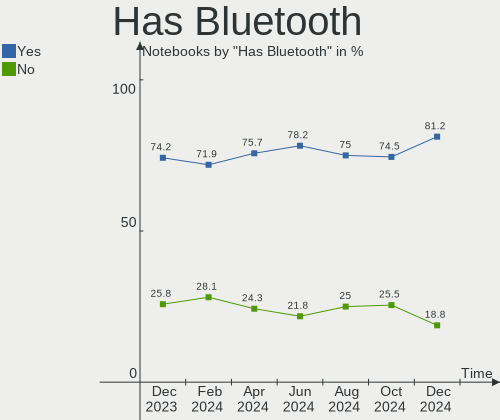
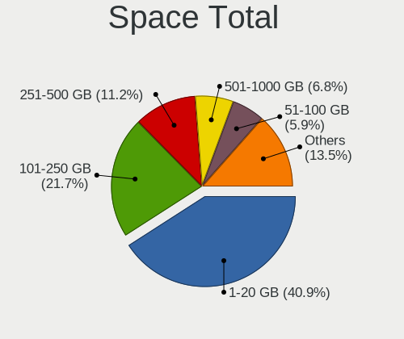
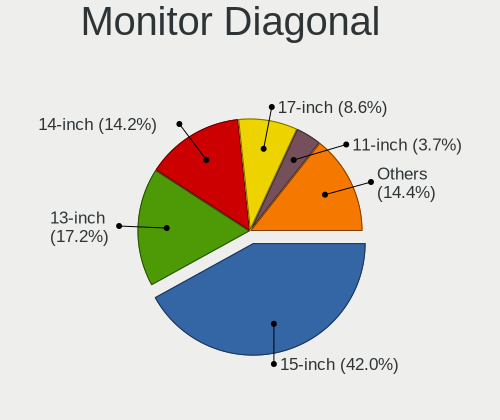
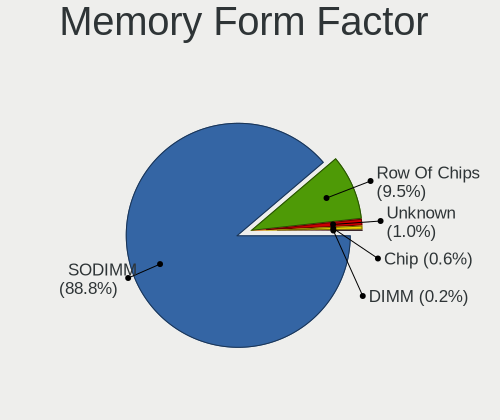
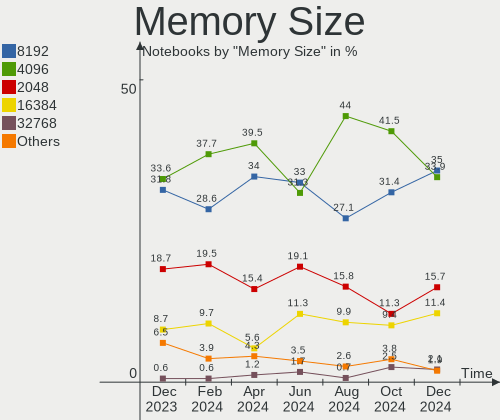

OpenMandriva - Hardware Trends (Notebooks)
------------------------------------------

A project to identify most popular hardware characteristics and track their change
over time based on data collected by Linux users at https://Linux-Hardware.org.

Anyone can contribute to this report by the [hw-probe](https://github.com/linuxhw/hw-probe) tool:

    sudo -E hw-probe -all -upload

This report is for one last month. Overall report since the beginning of time: [TestDays](https://github.com/linuxhw/TestDays)

Period: May, 2023.

Contents
--------

* [ System ](#system)
  - [ OS                       ](#os)
  - [ OS Family                ](#os-family)
  - [ Kernel                   ](#kernel)
  - [ Kernel Family            ](#kernel-family)
  - [ Kernel Major Ver.        ](#kernel-major-ver)
  - [ Arch                     ](#arch)
  - [ DE                       ](#de)
  - [ Display Server           ](#display-server)
  - [ Display Manager          ](#display-manager)
  - [ OS Lang                  ](#os-lang)
  - [ Boot Mode                ](#boot-mode)
  - [ Filesystem               ](#filesystem)
  - [ Part. scheme             ](#part-scheme)
  - [ Dual Boot with Linux/BSD ](#dual-boot-with-linuxbsd)
  - [ Dual Boot (Win)          ](#dual-boot-win)

* [ Board ](#board)
  - [ Vendor                   ](#vendor)
  - [ Model                    ](#model)
  - [ Model Family             ](#model-family)
  - [ MFG Year                 ](#mfg-year)
  - [ Form Factor              ](#form-factor)
  - [ Secure Boot              ](#secure-boot)
  - [ Coreboot                 ](#coreboot)
  - [ RAM Size                 ](#ram-size)
  - [ RAM Used                 ](#ram-used)
  - [ Total Drives             ](#total-drives)
  - [ Has CD-ROM               ](#has-cd-rom)
  - [ Has Ethernet             ](#has-ethernet)
  - [ Has WiFi                 ](#has-wifi)
  - [ Has Bluetooth            ](#has-bluetooth)

* [ Location ](#location)
  - [ Country                  ](#country)
  - [ City                     ](#city)

* [ Drives ](#drives)
  - [ Drive Vendor             ](#drive-vendor)
  - [ Drive Model              ](#drive-model)
  - [ HDD Vendor               ](#hdd-vendor)
  - [ SSD Vendor               ](#ssd-vendor)
  - [ Drive Kind               ](#drive-kind)
  - [ Drive Connector          ](#drive-connector)
  - [ Drive Size               ](#drive-size)
  - [ Space Total              ](#space-total)
  - [ Space Used               ](#space-used)
  - [ Malfunc. Drives          ](#malfunc-drives)
  - [ Malfunc. Drive Vendor    ](#malfunc-drive-vendor)
  - [ Malfunc. HDD Vendor      ](#malfunc-hdd-vendor)
  - [ Malfunc. Drive Kind      ](#malfunc-drive-kind)
  - [ Failed Drives            ](#failed-drives)
  - [ Failed Drive Vendor      ](#failed-drive-vendor)
  - [ Drive Status             ](#drive-status)

* [ Storage controller ](#storage-controller)
  - [ Storage Vendor           ](#storage-vendor)
  - [ Storage Model            ](#storage-model)
  - [ Storage Kind             ](#storage-kind)

* [ Processor ](#processor)
  - [ CPU Vendor               ](#cpu-vendor)
  - [ CPU Model                ](#cpu-model)
  - [ CPU Model Family         ](#cpu-model-family)
  - [ CPU Cores                ](#cpu-cores)
  - [ CPU Sockets              ](#cpu-sockets)
  - [ CPU Threads              ](#cpu-threads)
  - [ CPU Op-Modes             ](#cpu-op-modes)
  - [ CPU Microcode            ](#cpu-microcode)
  - [ CPU Microarch            ](#cpu-microarch)

* [ Graphics ](#graphics)
  - [ GPU Vendor               ](#gpu-vendor)
  - [ GPU Model                ](#gpu-model)
  - [ GPU Combo                ](#gpu-combo)
  - [ GPU Driver               ](#gpu-driver)
  - [ GPU Memory               ](#gpu-memory)

* [ Monitor ](#monitor)
  - [ Monitor Vendor           ](#monitor-vendor)
  - [ Monitor Model            ](#monitor-model)
  - [ Monitor Resolution       ](#monitor-resolution)
  - [ Monitor Diagonal         ](#monitor-diagonal)
  - [ Monitor Width            ](#monitor-width)
  - [ Aspect Ratio             ](#aspect-ratio)
  - [ Monitor Area             ](#monitor-area)
  - [ Pixel Density            ](#pixel-density)
  - [ Multiple Monitors        ](#multiple-monitors)

* [ Network ](#network)
  - [ Net Controller Vendor    ](#net-controller-vendor)
  - [ Net Controller Model     ](#net-controller-model)
  - [ Wireless Vendor          ](#wireless-vendor)
  - [ Wireless Model           ](#wireless-model)
  - [ Ethernet Vendor          ](#ethernet-vendor)
  - [ Ethernet Model           ](#ethernet-model)
  - [ Net Controller Kind      ](#net-controller-kind)
  - [ Used Controller          ](#used-controller)
  - [ NICs                     ](#nics)
  - [ IPv6                     ](#ipv6)

* [ Bluetooth ](#bluetooth)
  - [ Bluetooth Vendor         ](#bluetooth-vendor)
  - [ Bluetooth Model          ](#bluetooth-model)

* [ Sound ](#sound)
  - [ Sound Vendor             ](#sound-vendor)
  - [ Sound Model              ](#sound-model)

* [ Memory ](#memory)
  - [ Memory Vendor            ](#memory-vendor)
  - [ Memory Model             ](#memory-model)
  - [ Memory Kind              ](#memory-kind)
  - [ Memory Form Factor       ](#memory-form-factor)
  - [ Memory Size              ](#memory-size)
  - [ Memory Speed             ](#memory-speed)

* [ Printers & scanners ](#printers--scanners)
  - [ Printer Vendor           ](#printer-vendor)
  - [ Printer Model            ](#printer-model)
  - [ Scanner Vendor           ](#scanner-vendor)
  - [ Scanner Model            ](#scanner-model)

* [ Camera ](#camera)
  - [ Camera Vendor            ](#camera-vendor)
  - [ Camera Model             ](#camera-model)

* [ Security ](#security)
  - [ Fingerprint Vendor       ](#fingerprint-vendor)
  - [ Fingerprint Model        ](#fingerprint-model)
  - [ Chipcard Vendor          ](#chipcard-vendor)
  - [ Chipcard Model           ](#chipcard-model)

* [ Unsupported ](#unsupported)
  - [ Unsupported Devices      ](#unsupported-devices)
  - [ Unsupported Device Types ](#unsupported-device-types)

System
------

OS
--

Installed operating systems

| Name               | Notebooks | Percent |
|--------------------|-----------|---------|
| OpenMandriva 23.03 | 133       | 77.33%  |
| OpenMandriva 4.3   | 19        | 11.05%  |
| OpenMandriva 23.01 | 11        | 6.4%    |
| OpenMandriva 23.90 | 5         | 2.91%   |
| OpenMandriva 4.2   | 2         | 1.16%   |
| OpenMandriva 4.50  | 1         | 0.58%   |
| OpenMandriva 23.06 | 1         | 0.58%   |

OS Family
---------

OS without a version

| Name         | Notebooks | Percent |
|--------------|-----------|---------|
| OpenMandriva | 172       | 100%    |

Kernel
------

Version of the Linux kernel

| Version                  | Notebooks | Percent |
|--------------------------|-----------|---------|
| 6.2.6-desktop-1omv2390   | 134       | 77.91%  |
| 6.1.1-desktop-1omv2290   | 10        | 5.81%   |
| 5.16.7-desktop-1omv4003  | 8         | 4.65%   |
| 5.16.13-desktop-1omv4003 | 8         | 4.65%   |
| 6.3.1-desktop-1omv2390   | 2         | 1.16%   |
| 5.14.14-desktop-1omv4050 | 2         | 1.16%   |
| 5.10.14-desktop-1omv4002 | 2         | 1.16%   |
| 6.3.5-desktop-3omv2390   | 1         | 0.58%   |
| 6.3.2-desktop-1omv2390   | 1         | 0.58%   |
| 6.3.0-desktop-2omv2390   | 1         | 0.58%   |
| 6.1.2-desktop-1omv2301   | 1         | 0.58%   |
| 5.19.5-desktop-1omv4090  | 1         | 0.58%   |
| 5.16.5-desktop-2omv4003  | 1         | 0.58%   |

Kernel Family
-------------

Linux kernel without a distro release

| Version | Notebooks | Percent |
|---------|-----------|---------|
| 6.2.6   | 134       | 77.91%  |
| 6.1.1   | 10        | 5.81%   |
| 5.16.7  | 8         | 4.65%   |
| 5.16.13 | 8         | 4.65%   |
| 6.3.1   | 2         | 1.16%   |
| 5.14.14 | 2         | 1.16%   |
| 5.10.14 | 2         | 1.16%   |
| 6.3.5   | 1         | 0.58%   |
| 6.3.2   | 1         | 0.58%   |
| 6.3.0   | 1         | 0.58%   |
| 6.1.2   | 1         | 0.58%   |
| 5.19.5  | 1         | 0.58%   |
| 5.16.5  | 1         | 0.58%   |

Kernel Major Ver.
-----------------

Linux kernel major version

| Version | Notebooks | Percent |
|---------|-----------|---------|
| 6.2     | 134       | 77.91%  |
| 5.16    | 17        | 9.88%   |
| 6.1     | 11        | 6.4%    |
| 6.3     | 5         | 2.91%   |
| 5.14    | 2         | 1.16%   |
| 5.10    | 2         | 1.16%   |
| 5.19    | 1         | 0.58%   |

Arch
----

OS architecture (x86_64, i586, etc.)

| Name   | Notebooks | Percent |
|--------|-----------|---------|
| x86_64 | 172       | 100%    |

DE
--

Desktop Environment

| Name    | Notebooks | Percent |
|---------|-----------|---------|
| KDE5    | 149       | 86.63%  |
| LXQt    | 11        | 6.4%    |
| GNOME   | 9         | 5.23%   |
| XFCE    | 1         | 0.58%   |
| Budgie  | 1         | 0.58%   |
| Unknown | 1         | 0.58%   |

Display Server
--------------

X11 or Wayland

| Name    | Notebooks | Percent |
|---------|-----------|---------|
| X11     | 163       | 94.77%  |
| Wayland | 9         | 5.23%   |

Display Manager
---------------

SDDM, LightDM, etc.

| Name    | Notebooks | Percent |
|---------|-----------|---------|
| SDDM    | 162       | 94.19%  |
| GDM     | 9         | 5.23%   |
| LightDM | 1         | 0.58%   |

OS Lang
-------

Language

| Lang  | Notebooks | Percent |
|-------|-----------|---------|
| en_US | 87        | 50.58%  |
| de_DE | 13        | 7.56%   |
| fr_FR | 10        | 5.81%   |
| en_GB | 10        | 5.81%   |
| it_IT | 8         | 4.65%   |
| pl_PL | 7         | 4.07%   |
| es_ES | 7         | 4.07%   |
| ru_RU | 6         | 3.49%   |
| es_MX | 6         | 3.49%   |
| cs_CZ | 4         | 2.33%   |
| pt_BR | 3         | 1.74%   |
| en_IN | 2         | 1.16%   |
| pt_PT | 1         | 0.58%   |
| nl_NL | 1         | 0.58%   |
| fr_CA | 1         | 0.58%   |
| es_PE | 1         | 0.58%   |
| es_CL | 1         | 0.58%   |
| en_NZ | 1         | 0.58%   |
| en_IE | 1         | 0.58%   |
| en_CA | 1         | 0.58%   |
| en_AU | 1         | 0.58%   |

Boot Mode
---------

EFI or BIOS

| Mode | Notebooks | Percent |
|------|-----------|---------|
| EFI  | 97        | 56.4%   |
| BIOS | 75        | 43.6%   |

Filesystem
----------

Type of filesystem

| Type    | Notebooks | Percent |
|---------|-----------|---------|
| Ext4    | 89        | 51.74%  |
| Overlay | 64        | 37.21%  |
| Btrfs   | 11        | 6.4%    |
| Xfs     | 4         | 2.33%   |
| F2fs    | 4         | 2.33%   |

Part. scheme
------------

Scheme of partitioning

| Type | Notebooks | Percent |
|------|-----------|---------|
| GPT  | 124       | 72.09%  |
| MBR  | 48        | 27.91%  |

Dual Boot with Linux/BSD
------------------------

Hosting more than one Linux/BSD

| Dual boot | Notebooks | Percent |
|-----------|-----------|---------|
| No        | 103       | 59.88%  |
| Yes       | 69        | 40.12%  |

Dual Boot (Win)
---------------

Hosting Linux and Windows

| Dual boot | Notebooks | Percent |
|-----------|-----------|---------|
| No        | 106       | 61.63%  |
| Yes       | 66        | 38.37%  |

Board
-----

Vendor
------

Motherboard manufacturer

| Name                | Notebooks | Percent |
|---------------------|-----------|---------|
| Lenovo              | 37        | 21.51%  |
| Hewlett-Packard     | 28        | 16.28%  |
| Dell                | 21        | 12.21%  |
| Acer                | 19        | 11.05%  |
| ASUSTek Computer    | 14        | 8.14%   |
| Toshiba             | 13        | 7.56%   |
| Samsung Electronics | 9         | 5.23%   |
| Fujitsu             | 4         | 2.33%   |
| Sony                | 3         | 1.74%   |
| Apple               | 3         | 1.74%   |
| Timi                | 2         | 1.16%   |
| MSI                 | 2         | 1.16%   |
| Google              | 2         | 1.16%   |
| Chuwi               | 2         | 1.16%   |
| Wortmann AG         | 1         | 0.58%   |
| TUXEDO              | 1         | 0.58%   |
| Thomson             | 1         | 0.58%   |
| Quanta              | 1         | 0.58%   |
| Philco              | 1         | 0.58%   |
| Panasonic           | 1         | 0.58%   |
| Medion              | 1         | 0.58%   |
| lapbook             | 1         | 0.58%   |
| Infinix             | 1         | 0.58%   |
| Gateway             | 1         | 0.58%   |
| eMachines           | 1         | 0.58%   |
| Dynabook            | 1         | 0.58%   |
| Alienware           | 1         | 0.58%   |

Model
-----

Motherboard model

| Name                                  | Notebooks | Percent |
|---------------------------------------|-----------|---------|
| Sony VGN-FZ31Z                        | 2         | 1.16%   |
| Lenovo V15-ADA 82C7                   | 2         | 1.16%   |
| Lenovo IdeaPad 3 15ADA05 81W1         | 2         | 1.16%   |
| HP Pavilion dv7                       | 2         | 1.16%   |
| HP 255 G8 Notebook PC                 | 2         | 1.16%   |
| HP 15 Notebook PC                     | 2         | 1.16%   |
| HP 15                                 | 2         | 1.16%   |
| Google Auron_Paine                    | 2         | 1.16%   |
| Fujitsu LIFEBOOK S752                 | 2         | 1.16%   |
| ASUS UX31E                            | 2         | 1.16%   |
| Acer Aspire A114-32                   | 2         | 1.16%   |
| Wortmann AG TERRA_MOBILE_1528P/1748P  | 1         | 0.58%   |
| TUXEDO InfinityBook Pro Gen7 (MK1)    | 1         | 0.58%   |
| Toshiba Satellite P300                | 1         | 0.58%   |
| Toshiba Satellite L850-1HQ            | 1         | 0.58%   |
| Toshiba Satellite L755                | 1         | 0.58%   |
| Toshiba Satellite L655                | 1         | 0.58%   |
| Toshiba Satellite L500                | 1         | 0.58%   |
| Toshiba Satellite L50-B               | 1         | 0.58%   |
| Toshiba Satellite L300D               | 1         | 0.58%   |
| Toshiba Satellite C75-A               | 1         | 0.58%   |
| Toshiba Satellite C660D               | 1         | 0.58%   |
| Toshiba Satellite C645D               | 1         | 0.58%   |
| Toshiba Satellite C640                | 1         | 0.58%   |
| Toshiba Satellite C55-A-1KZ           | 1         | 0.58%   |
| Toshiba dynabook SS M42 210E/3W       | 1         | 0.58%   |
| Timi TM1701                           | 1         | 0.58%   |
| Timi RedmiBook 14 II                  | 1         | 0.58%   |
| Thomson N14C64WF                      | 1         | 0.58%   |
| Sony VGN-AW11M_H                      | 1         | 0.58%   |
| Samsung X420/X520                     | 1         | 0.58%   |
| Samsung RV419/RV420                   | 1         | 0.58%   |
| Samsung RV411/RV511/E3511/S3511/RV711 | 1         | 0.58%   |
| Samsung RF510/RF410/RF710             | 1         | 0.58%   |
| Samsung R530/R730                     | 1         | 0.58%   |
| Samsung R428/P428                     | 1         | 0.58%   |
| Samsung 600B4B/600B5B                 | 1         | 0.58%   |
| Samsung 300E5K/300E5Q                 | 1         | 0.58%   |
| Samsung 270E5J/2570EJ                 | 1         | 0.58%   |
| Quanta JW2                            | 1         | 0.58%   |

Model Family
------------

Motherboard model prefix

| Name                | Notebooks | Percent |
|---------------------|-----------|---------|
| Lenovo ThinkPad     | 19        | 11.05%  |
| Acer Aspire         | 16        | 9.3%    |
| Toshiba Satellite   | 12        | 6.98%   |
| Lenovo IdeaPad      | 8         | 4.65%   |
| Dell Latitude       | 8         | 4.65%   |
| HP Pavilion         | 7         | 4.07%   |
| Dell Inspiron       | 7         | 4.07%   |
| HP Laptop           | 5         | 2.91%   |
| HP 15               | 4         | 2.33%   |
| HP EliteBook        | 3         | 1.74%   |
| HP Compaq           | 3         | 1.74%   |
| Sony VGN-FZ31Z      | 2         | 1.16%   |
| Lenovo V15-ADA      | 2         | 1.16%   |
| HP ProBook          | 2         | 1.16%   |
| HP 255              | 2         | 1.16%   |
| Google Auron        | 2         | 1.16%   |
| Fujitsu LIFEBOOK    | 2         | 1.16%   |
| Dell System         | 2         | 1.16%   |
| Dell Precision      | 2         | 1.16%   |
| ASUS VivoBook       | 2         | 1.16%   |
| ASUS UX31E          | 2         | 1.16%   |
| Wortmann AG TERRA   | 1         | 0.58%   |
| TUXEDO InfinityBook | 1         | 0.58%   |
| Toshiba dynabook    | 1         | 0.58%   |
| Timi TM1701         | 1         | 0.58%   |
| Timi RedmiBook      | 1         | 0.58%   |
| Thomson N14C64WF    | 1         | 0.58%   |
| Sony VGN-AW11M      | 1         | 0.58%   |
| Samsung X420        | 1         | 0.58%   |
| Samsung RV419       | 1         | 0.58%   |
| Samsung RV411       | 1         | 0.58%   |
| Samsung RF510       | 1         | 0.58%   |
| Samsung R530        | 1         | 0.58%   |
| Samsung R428        | 1         | 0.58%   |
| Samsung 600B4B      | 1         | 0.58%   |
| Samsung 300E5K      | 1         | 0.58%   |
| Samsung 270E5J      | 1         | 0.58%   |
| Quanta JW2          | 1         | 0.58%   |
| Philco 14H          | 1         | 0.58%   |
| Panasonic CF-54-1   | 1         | 0.58%   |

MFG Year
--------

Motherboard manufacture year

| Year | Notebooks | Percent |
|------|-----------|---------|
| 2020 | 21        | 12.21%  |
| 2012 | 18        | 10.47%  |
| 2013 | 14        | 8.14%   |
| 2011 | 14        | 8.14%   |
| 2010 | 13        | 7.56%   |
| 2021 | 12        | 6.98%   |
| 2008 | 11        | 6.4%    |
| 2014 | 10        | 5.81%   |
| 2018 | 9         | 5.23%   |
| 2016 | 9         | 5.23%   |
| 2015 | 9         | 5.23%   |
| 2007 | 7         | 4.07%   |
| 2022 | 6         | 3.49%   |
| 2017 | 6         | 3.49%   |
| 2009 | 5         | 2.91%   |
| 2019 | 4         | 2.33%   |
| 2023 | 3         | 1.74%   |
| 2006 | 1         | 0.58%   |

Form Factor
-----------

Physical design of the computer

| Name     | Notebooks | Percent |
|----------|-----------|---------|
| Notebook | 172       | 100%    |

Secure Boot
-----------

Enabled or disabled

| State    | Notebooks | Percent |
|----------|-----------|---------|
| Disabled | 172       | 100%    |

Coreboot
--------

Have coreboot on board

| Used | Notebooks | Percent |
|------|-----------|---------|
| No   | 170       | 98.84%  |
| Yes  | 2         | 1.16%   |

RAM Size
--------

Total RAM memory

| Size in GB  | Notebooks | Percent |
|-------------|-----------|---------|
| 4.01-8.0    | 69        | 40.12%  |
| 3.01-4.0    | 46        | 26.74%  |
| 16.01-24.0  | 21        | 12.21%  |
| 8.01-16.0   | 18        | 10.47%  |
| 32.01-64.0  | 5         | 2.91%   |
| 2.01-3.0    | 5         | 2.91%   |
| 1.01-2.0    | 4         | 2.33%   |
| 24.01-32.0  | 2         | 1.16%   |
| 64.01-256.0 | 2         | 1.16%   |

RAM Used
--------

Used RAM memory

| Used GB  | Notebooks | Percent |
|----------|-----------|---------|
| 1.01-2.0 | 106       | 61.63%  |
| 2.01-3.0 | 38        | 22.09%  |
| 0.51-1.0 | 20        | 11.63%  |
| 3.01-4.0 | 7         | 4.07%   |
| 4.01-8.0 | 1         | 0.58%   |

Total Drives
------------

Number of drives on board

| Drives | Notebooks | Percent |
|--------|-----------|---------|
| 1      | 122       | 70.93%  |
| 2      | 43        | 25%     |
| 3      | 4         | 2.33%   |
| 0      | 2         | 1.16%   |
| 4      | 1         | 0.58%   |

Has CD-ROM
----------

Has CD-ROM on board

| Presented | Notebooks | Percent |
|-----------|-----------|---------|
| No        | 95        | 55.23%  |
| Yes       | 77        | 44.77%  |

Has Ethernet
------------

Has Ethernet on board

| Presented | Notebooks | Percent |
|-----------|-----------|---------|
| Yes       | 144       | 83.72%  |
| No        | 28        | 16.28%  |

Has WiFi
--------

Has WiFi module

| Presented | Notebooks | Percent |
|-----------|-----------|---------|
| Yes       | 171       | 99.42%  |
| No        | 1         | 0.58%   |

Has Bluetooth
-------------

Has Bluetooth module

| Presented | Notebooks | Percent |
|-----------|-----------|---------|
| Yes       | 119       | 69.19%  |
| No        | 53        | 30.81%  |

Location
--------

Country
-------

Geographic location (country)

| Country                | Notebooks | Percent |
|------------------------|-----------|---------|
| USA                    | 23        | 13.37%  |
| Germany                | 19        | 11.05%  |
| Poland                 | 12        | 6.98%   |
| Spain                  | 9         | 5.23%   |
| Italy                  | 9         | 5.23%   |
| France                 | 8         | 4.65%   |
| Brazil                 | 7         | 4.07%   |
| Russia                 | 6         | 3.49%   |
| Japan                  | 6         | 3.49%   |
| UK                     | 5         | 2.91%   |
| India                  | 5         | 2.91%   |
| Netherlands            | 4         | 2.33%   |
| Mexico                 | 4         | 2.33%   |
| Czechia                | 4         | 2.33%   |
| Sweden                 | 3         | 1.74%   |
| Portugal               | 3         | 1.74%   |
| Canada                 | 3         | 1.74%   |
| Uruguay                | 2         | 1.16%   |
| Saint Lucia            | 2         | 1.16%   |
| Peru                   | 2         | 1.16%   |
| Iceland                | 2         | 1.16%   |
| Greece                 | 2         | 1.16%   |
| Bosnia and Herzegovina | 2         | 1.16%   |
| Turkey                 | 1         | 0.58%   |
| Switzerland            | 1         | 0.58%   |
| Slovenia               | 1         | 0.58%   |
| Slovakia               | 1         | 0.58%   |
| Singapore              | 1         | 0.58%   |
| Serbia                 | 1         | 0.58%   |
| Romania                | 1         | 0.58%   |
| Réunion               | 1         | 0.58%   |
| Pakistan               | 1         | 0.58%   |
| North Macedonia        | 1         | 0.58%   |
| New Zealand            | 1         | 0.58%   |
| Mauritius              | 1         | 0.58%   |
| Lithuania              | 1         | 0.58%   |
| Ireland                | 1         | 0.58%   |
| Iran                   | 1         | 0.58%   |
| Indonesia              | 1         | 0.58%   |
| Hungary                | 1         | 0.58%   |

City
----

Geographic location (city)

| City                   | Notebooks | Percent |
|------------------------|-----------|---------|
| Skierniewice           | 3         | 1.74%   |
| Milan                  | 3         | 1.74%   |
| Warsaw                 | 2         | 1.16%   |
| Sarajevo               | 2         | 1.16%   |
| Reykjavik              | 2         | 1.16%   |
| Munich                 | 2         | 1.16%   |
| Moscow                 | 2         | 1.16%   |
| Montevideo             | 2         | 1.16%   |
| Louisville             | 2         | 1.16%   |
| Funchal                | 2         | 1.16%   |
| Chennai                | 2         | 1.16%   |
| Castries               | 2         | 1.16%   |
| Łomża                | 1         | 0.58%   |
| Zabrze                 | 1         | 0.58%   |
| Xàtiva                | 1         | 0.58%   |
| Weert                  | 1         | 0.58%   |
| Wassenberg             | 1         | 0.58%   |
| Voronezh               | 1         | 0.58%   |
| Villanueva del Trabuco | 1         | 0.58%   |
| Vilhena                | 1         | 0.58%   |
| Victoria               | 1         | 0.58%   |
| Van                    | 1         | 0.58%   |
| Valparaiso de Goias    | 1         | 0.58%   |
| Valencia               | 1         | 0.58%   |
| Ube                    | 1         | 0.58%   |
| Tuxford                | 1         | 0.58%   |
| Torrance               | 1         | 0.58%   |
| Tokyo                  | 1         | 0.58%   |
| Thessaloniki           | 1         | 0.58%   |
| Surgut                 | 1         | 0.58%   |
| St. Moritz             | 1         | 0.58%   |
| St. Albert             | 1         | 0.58%   |
| St Petersburg          | 1         | 0.58%   |
| Spring Valley          | 1         | 0.58%   |
| Sofia                  | 1         | 0.58%   |
| Smithville             | 1         | 0.58%   |
| Skopje                 | 1         | 0.58%   |
| Sioux Falls            | 1         | 0.58%   |
| Singapore              | 1         | 0.58%   |
| Šiauliai              | 1         | 0.58%   |

Drives
------

Drive Vendor
------------

Hard drive vendors

| Vendor              | Notebooks | Drives | Percent |
|---------------------|-----------|--------|---------|
| Samsung Electronics | 25        | 26     | 11.85%  |
| WDC                 | 24        | 24     | 11.37%  |
| Toshiba             | 24        | 24     | 11.37%  |
| Seagate             | 23        | 23     | 10.9%   |
| Crucial             | 15        | 17     | 7.11%   |
| Hitachi             | 13        | 13     | 6.16%   |
| SanDisk             | 10        | 10     | 4.74%   |
| Unknown             | 8         | 8      | 3.79%   |
| Kingston            | 6         | 6      | 2.84%   |
| SK hynix            | 5         | 5      | 2.37%   |
| Netac               | 4         | 4      | 1.9%    |
| Intel               | 4         | 4      | 1.9%    |
| KIOXIA              | 3         | 3      | 1.42%   |
| KingSpec            | 3         | 3      | 1.42%   |
| Apple               | 3         | 3      | 1.42%   |
| Apacer              | 3         | 3      | 1.42%   |
| UMIS                | 2         | 2      | 0.95%   |
| SSSTC               | 2         | 2      | 0.95%   |
| Phison              | 2         | 2      | 0.95%   |
| GOODRAM             | 2         | 2      | 0.95%   |
| Fujitsu             | 2         | 2      | 0.95%   |
| Unknown             | 2         | 2      | 0.95%   |
| Win Memory          | 1         | 1      | 0.47%   |
| Verbatim            | 1         | 1      | 0.47%   |
| Union Memory        | 1         | 1      | 0.47%   |
| Transcend           | 1         | 1      | 0.47%   |
| Silicon Motion      | 1         | 1      | 0.47%   |
| ShiJi               | 1         | 1      | 0.47%   |
| SAGE                | 1         | 1      | 0.47%   |
| Reletech-P400       | 1         | 1      | 0.47%   |
| PNY CS90            | 1         | 1      | 0.47%   |
| PNY                 | 1         | 1      | 0.47%   |
| Patriot             | 1         | 1      | 0.47%   |
| OCZ                 | 1         | 1      | 0.47%   |
| Micron Technology   | 1         | 1      | 0.47%   |
| LITEON              | 1         | 1      | 0.47%   |
| Leven               | 1         | 1      | 0.47%   |
| LaCie               | 1         | 1      | 0.47%   |
| JMicron Technology  | 1         | 1      | 0.47%   |
| Hikvision           | 1         | 1      | 0.47%   |

Drive Model
-----------

Hard drive models

| Model                                | Notebooks | Percent |
|--------------------------------------|-----------|---------|
| Toshiba MQ01ABD100 1TB               | 6         | 2.8%    |
| Toshiba MQ04ABF100 1TB               | 4         | 1.87%   |
| Toshiba MQ01ABF050 500GB             | 4         | 1.87%   |
| Seagate ST1000LM035-1RK172 1TB       | 4         | 1.87%   |
| Samsung SSD 860 EVO 500GB            | 3         | 1.4%    |
| Intel SSDPEKNU512GZ 512GB            | 3         | 1.4%    |
| Hitachi HTS547575A9E384 752GB        | 3         | 1.4%    |
| Crucial CT500MX500SSD1 500GB         | 3         | 1.4%    |
| Apacer AS350 512GB SSD               | 3         | 1.4%    |
| WDC WDS240G2G0A-00JH30 240GB SSD     | 2         | 0.93%   |
| WDC WD2500BEVS-22UST0 250GB          | 2         | 0.93%   |
| WDC PC SN530 SDBPMPZ-512G-1101 512GB | 2         | 0.93%   |
| Unknown SD32G  32GB                  | 2         | 0.93%   |
| SSSTC CL1-4D256 256GB                | 2         | 0.93%   |
| Seagate ST500LT012-1DG142 500GB      | 2         | 0.93%   |
| Seagate ST1000LM024 HN-M101MBB 1TB   | 2         | 0.93%   |
| SanDisk SSD U100 256GB               | 2         | 0.93%   |
| SanDisk NVMe SSD Drive 1TB           | 2         | 0.93%   |
| Netac SSD 256GB                      | 2         | 0.93%   |
| KIOXIA KBG40ZNV256G 256GB            | 2         | 0.93%   |
| Crucial CT480BX500SSD1 480GB         | 2         | 0.93%   |
| Crucial CT240M500SSD1 240GB          | 2         | 0.93%   |
| Crucial CT240BX500SSD1 240GB         | 2         | 0.93%   |
| Unknown                              | 2         | 0.93%   |
| Win Memory SWR256G-301II 256GB SSD   | 1         | 0.47%   |
| WDC WDS500G2B0C-00PXH0 500GB         | 1         | 0.47%   |
| WDC WD7500BPVX-60JC3T0 752GB         | 1         | 0.47%   |
| WDC WD7500BPVX-08JC3T5 752GB         | 1         | 0.47%   |
| WDC WD7500BPVT-24HXZT1 752GB         | 1         | 0.47%   |
| WDC WD6400BPVT-60HXZT1 640GB         | 1         | 0.47%   |
| WDC WD5000LPVX-60V0TT0 500GB         | 1         | 0.47%   |
| WDC WD5000LPCX-24VHAT0 500GB         | 1         | 0.47%   |
| WDC WD3200BUDT-63DPZY0 320GB         | 1         | 0.47%   |
| WDC WD3200BPVT-00JJ5T0 320GB         | 1         | 0.47%   |
| WDC WD3200BEVT-80A0RT0 320GB         | 1         | 0.47%   |
| WDC WD3200BEVT-26ZCT0 320GB          | 1         | 0.47%   |
| WDC WD3200BEKT-75PVMT0 320GB         | 1         | 0.47%   |
| WDC WD3200BEKT-08PVMT1 320GB         | 1         | 0.47%   |
| WDC WD10JPVX-75JC3T0 1TB             | 1         | 0.47%   |
| WDC WD10JPVX-60JC3T1 1TB             | 1         | 0.47%   |

HDD Vendor
----------

Hard disk drive vendors

| Vendor              | Notebooks | Drives | Percent |
|---------------------|-----------|--------|---------|
| Toshiba             | 22        | 22     | 27.5%   |
| Seagate             | 21        | 21     | 26.25%  |
| WDC                 | 17        | 17     | 21.25%  |
| Hitachi             | 13        | 13     | 16.25%  |
| Fujitsu             | 2         | 2      | 2.5%    |
| Samsung Electronics | 1         | 1      | 1.25%   |
| SAGE                | 1         | 1      | 1.25%   |
| LaCie               | 1         | 1      | 1.25%   |
| HGST                | 1         | 1      | 1.25%   |
| Apple               | 1         | 1      | 1.25%   |

SSD Vendor
----------

Solid state drive vendors

| Vendor              | Notebooks | Drives | Percent |
|---------------------|-----------|--------|---------|
| Samsung Electronics | 13        | 14     | 16.25%  |
| Crucial             | 13        | 14     | 16.25%  |
| SanDisk             | 8         | 8      | 10%     |
| Kingston            | 6         | 6      | 7.5%    |
| Netac               | 4         | 4      | 5%      |
| Apacer              | 3         | 3      | 3.75%   |
| WDC                 | 2         | 2      | 2.5%    |
| SK hynix            | 2         | 2      | 2.5%    |
| KingSpec            | 2         | 2      | 2.5%    |
| GOODRAM             | 2         | 2      | 2.5%    |
| Win Memory          | 1         | 1      | 1.25%   |
| Verbatim            | 1         | 1      | 1.25%   |
| Union Memory        | 1         | 1      | 1.25%   |
| Transcend           | 1         | 1      | 1.25%   |
| Toshiba             | 1         | 1      | 1.25%   |
| ShiJi               | 1         | 1      | 1.25%   |
| Seagate             | 1         | 1      | 1.25%   |
| Reletech-P400       | 1         | 1      | 1.25%   |
| PNY CS90            | 1         | 1      | 1.25%   |
| PNY                 | 1         | 1      | 1.25%   |
| Patriot             | 1         | 1      | 1.25%   |
| OCZ                 | 1         | 1      | 1.25%   |
| Micron Technology   | 1         | 1      | 1.25%   |
| LITEON              | 1         | 1      | 1.25%   |
| Leven               | 1         | 1      | 1.25%   |
| JMicron Technology  | 1         | 1      | 1.25%   |
| Intel               | 1         | 1      | 1.25%   |
| Gigabyte Technology | 1         | 1      | 1.25%   |
| FORESEE             | 1         | 1      | 1.25%   |
| Emtec               | 1         | 1      | 1.25%   |
| Dogfish             | 1         | 1      | 1.25%   |
| Dahua               | 1         | 1      | 1.25%   |
| Apple               | 1         | 1      | 1.25%   |
| Acer                | 1         | 1      | 1.25%   |
| A-DATA Technology   | 1         | 1      | 1.25%   |

Drive Kind
----------

HDD or SSD

| Kind    | Notebooks | Drives | Percent |
|---------|-----------|--------|---------|
| HDD     | 76        | 80     | 38%     |
| SSD     | 75        | 82     | 37.5%   |
| NVMe    | 37        | 40     | 18.5%   |
| MMC     | 9         | 9      | 4.5%    |
| Unknown | 3         | 3      | 1.5%    |

Drive Connector
---------------

SATA, SAS, NVMe, etc.

| Type | Notebooks | Drives | Percent |
|------|-----------|--------|---------|
| SATA | 133       | 153    | 69.63%  |
| NVMe | 37        | 40     | 19.37%  |
| SAS  | 12        | 12     | 6.28%   |
| MMC  | 9         | 9      | 4.71%   |

Drive Size
----------

Size of hard drive

| Size in TB | Notebooks | Drives | Percent |
|------------|-----------|--------|---------|
| 0.01-0.5   | 93        | 107    | 63.7%   |
| 0.51-1.0   | 50        | 52     | 34.25%  |
| 1.01-2.0   | 2         | 2      | 1.37%   |
| 4.01-10.0  | 1         | 1      | 0.68%   |

Space Total
-----------

Amount of disk space available on the file system

| Size in GB     | Notebooks | Percent |
|----------------|-----------|---------|
| 1-20           | 48        | 27.91%  |
| 101-250        | 36        | 20.93%  |
| 251-500        | 26        | 15.12%  |
| 51-100         | 17        | 9.88%   |
| 501-1000       | 16        | 9.3%    |
| 21-50          | 14        | 8.14%   |
| 1001-2000      | 6         | 3.49%   |
| Unknown        | 6         | 3.49%   |
| More than 3000 | 2         | 1.16%   |
| 2001-3000      | 1         | 0.58%   |

Space Used
----------

Amount of used disk space

| Used GB   | Notebooks | Percent |
|-----------|-----------|---------|
| 1-20      | 136       | 79.07%  |
| 21-50     | 13        | 7.56%   |
| 51-100    | 7         | 4.07%   |
| 101-250   | 6         | 3.49%   |
| Unknown   | 6         | 3.49%   |
| 251-500   | 2         | 1.16%   |
| 1001-2000 | 1         | 0.58%   |
| 501-1000  | 1         | 0.58%   |

Malfunc. Drives
---------------

Drive models with a malfunction

| Model                                   | Notebooks | Drives | Percent |
|-----------------------------------------|-----------|--------|---------|
| SanDisk SSD U100 256GB                  | 2         | 2      | 5.26%   |
| Crucial CT240M500SSD1 240GB             | 2         | 2      | 5.26%   |
| WDC WD7500BPVT-24HXZT1 752GB            | 1         | 1      | 2.63%   |
| WDC WD6400BPVT-60HXZT1 640GB            | 1         | 1      | 2.63%   |
| WDC WD5000LPCX-24VHAT0 500GB            | 1         | 1      | 2.63%   |
| WDC WD3200BUDT-63DPZY0 320GB            | 1         | 1      | 2.63%   |
| WDC WD3200BEVT-26ZCT0 320GB             | 1         | 1      | 2.63%   |
| WDC WD3200BEKT-75PVMT0 320GB            | 1         | 1      | 2.63%   |
| WDC WD2500BEVS-22UST0 250GB             | 1         | 1      | 2.63%   |
| Union Memory RTOTJ128VGD2EYX 128GB      | 1         | 1      | 2.63%   |
| Toshiba MK6475GSX 640GB                 | 1         | 1      | 2.63%   |
| Toshiba MK5075GSX 500GB                 | 1         | 1      | 2.63%   |
| Toshiba MK5065GSXN 500GB                | 1         | 1      | 2.63%   |
| Toshiba MK3265GSXN 320GB                | 1         | 1      | 2.63%   |
| Toshiba MK2529GSG 250GB                 | 1         | 1      | 2.63%   |
| Seagate ST980813AS 80GB                 | 1         | 1      | 2.63%   |
| Seagate ST9750420AS 752GB               | 1         | 1      | 2.63%   |
| Seagate ST9500423AS 500GB               | 1         | 1      | 2.63%   |
| Seagate ST9160314AS 160GB               | 1         | 1      | 2.63%   |
| Seagate ST320LT012-1DG14C 320GB         | 1         | 1      | 2.63%   |
| Seagate ST1000LM035-1RK172 1TB          | 1         | 1      | 2.63%   |
| Seagate ST1000LM024 HN-M101MBB 1TB      | 1         | 1      | 2.63%   |
| Samsung Electronics HM321HI 320GB       | 1         | 1      | 2.63%   |
| LITEON CV8-8E128-HP 128GB SSD           | 1         | 1      | 2.63%   |
| Kingston SNS4151S316GD 16GB SSD         | 1         | 1      | 2.63%   |
| Kingston RBU-SNS8350DES3128GP 128GB SSD | 1         | 1      | 2.63%   |
| KingSpec NT-512 512GB SSD               | 1         | 1      | 2.63%   |
| Intel SSDSA2M080G2GC 80GB               | 1         | 1      | 2.63%   |
| Hitachi HTS547575A9E384 752GB           | 1         | 1      | 2.63%   |
| Hitachi HTS547564A9E384 640GB           | 1         | 1      | 2.63%   |
| Hitachi HTS545025B9SA02 250GB           | 1         | 1      | 2.63%   |
| Hitachi HTS543232L9SA00 320GB           | 1         | 1      | 2.63%   |
| Hitachi HTS543232L9A300 320GB           | 1         | 1      | 2.63%   |
| Fujitsu MHZ2320BH G2 320GB              | 1         | 1      | 2.63%   |
| Fujitsu MHY2160BH 160GB                 | 1         | 1      | 2.63%   |
| A-DATA Technology SU760 256GB SSD       | 1         | 1      | 2.63%   |

Malfunc. Drive Vendor
---------------------

Vendors of faulty drives

| Vendor              | Notebooks | Drives | Percent |
|---------------------|-----------|--------|---------|
| WDC                 | 7         | 7      | 18.42%  |
| Seagate             | 7         | 7      | 18.42%  |
| Toshiba             | 5         | 5      | 13.16%  |
| Hitachi             | 5         | 5      | 13.16%  |
| SanDisk             | 2         | 2      | 5.26%   |
| Kingston            | 2         | 2      | 5.26%   |
| Fujitsu             | 2         | 2      | 5.26%   |
| Crucial             | 2         | 2      | 5.26%   |
| Union Memory        | 1         | 1      | 2.63%   |
| Samsung Electronics | 1         | 1      | 2.63%   |
| LITEON              | 1         | 1      | 2.63%   |
| KingSpec            | 1         | 1      | 2.63%   |
| Intel               | 1         | 1      | 2.63%   |
| A-DATA Technology   | 1         | 1      | 2.63%   |

Malfunc. HDD Vendor
-------------------

Vendors of faulty HDD drives

| Vendor              | Notebooks | Drives | Percent |
|---------------------|-----------|--------|---------|
| WDC                 | 7         | 7      | 25.93%  |
| Seagate             | 7         | 7      | 25.93%  |
| Toshiba             | 5         | 5      | 18.52%  |
| Hitachi             | 5         | 5      | 18.52%  |
| Fujitsu             | 2         | 2      | 7.41%   |
| Samsung Electronics | 1         | 1      | 3.7%    |

Malfunc. Drive Kind
-------------------

Kinds of faulty drives

| Kind | Notebooks | Drives | Percent |
|------|-----------|--------|---------|
| HDD  | 26        | 27     | 72.22%  |
| SSD  | 10        | 11     | 27.78%  |

Failed Drives
-------------

Failed drive models

Zero info for selected period =(

Failed Drive Vendor
-------------------

Failed drive vendors

Zero info for selected period =(

Drive Status
------------

Number of failed and malfunc. drives

| Status   | Notebooks | Drives | Percent |
|----------|-----------|--------|---------|
| Works    | 134       | 153    | 70.9%   |
| Malfunc  | 34        | 38     | 17.99%  |
| Detected | 21        | 23     | 11.11%  |

Storage controller
------------------

Storage Vendor
--------------

Storage controller vendors

| Vendor                                  | Notebooks | Percent |
|-----------------------------------------|-----------|---------|
| Intel                                   | 124       | 65.61%  |
| AMD                                     | 26        | 13.76%  |
| Samsung Electronics                     | 12        | 6.35%   |
| SanDisk                                 | 7         | 3.7%    |
| KIOXIA                                  | 4         | 2.12%   |
| SK hynix                                | 3         | 1.59%   |
| Solid State Storage Technology          | 2         | 1.06%   |
| Phison Electronics                      | 2         | 1.06%   |
| Micron/Crucial Technology               | 2         | 1.06%   |
| Union Memory (Shenzhen)                 | 1         | 0.53%   |
| Silicon Motion                          | 1         | 0.53%   |
| Shenzhen Unionmemory Information System | 1         | 0.53%   |
| Nvidia                                  | 1         | 0.53%   |
| MAXIO Technology (Hangzhou)             | 1         | 0.53%   |
| JMicron Technology                      | 1         | 0.53%   |
| Apple                                   | 1         | 0.53%   |

Storage Model
-------------

Storage controller models

| Model                                                                          | Notebooks | Percent |
|--------------------------------------------------------------------------------|-----------|---------|
| AMD FCH SATA Controller [AHCI mode]                                            | 17        | 7.91%   |
| Intel 7 Series Chipset Family 6-port SATA Controller [AHCI mode]               | 16        | 7.44%   |
| Intel Sunrise Point-LP SATA Controller [AHCI mode]                             | 14        | 6.51%   |
| Intel 6 Series/C200 Series Chipset Family 6 port Mobile SATA AHCI Controller   | 12        | 5.58%   |
| Intel 82801HM/HEM (ICH8M/ICH8M-E) IDE Controller                               | 9         | 4.19%   |
| Intel Atom Processor E3800 Series SATA AHCI Controller                         | 8         | 3.72%   |
| Intel 82801IBM/IEM (ICH9M/ICH9M-E) 4 port SATA Controller [AHCI mode]          | 8         | 3.72%   |
| Intel 82801HM/HEM (ICH8M/ICH8M-E) SATA Controller [AHCI mode]                  | 8         | 3.72%   |
| Intel Celeron/Pentium Silver Processor SATA Controller                         | 7         | 3.26%   |
| Intel 8 Series/C220 Series Chipset Family 6-port SATA Controller 1 [AHCI mode] | 7         | 3.26%   |
| AMD SB7x0/SB8x0/SB9x0 SATA Controller [AHCI mode]                              | 7         | 3.26%   |
| Intel Wildcat Point-LP SATA Controller [AHCI Mode]                             | 6         | 2.79%   |
| Intel 82801 Mobile SATA Controller [RAID mode]                                 | 6         | 2.79%   |
| Samsung NVMe SSD Controller SM981/PM981/PM983                                  | 5         | 2.33%   |
| Intel Volume Management Device NVMe RAID Controller                            | 5         | 2.33%   |
| Intel Tiger Lake-LP SATA Controller                                            | 5         | 2.33%   |
| Intel 5 Series/3400 Series Chipset 4 port SATA AHCI Controller                 | 5         | 2.33%   |
| Samsung NVMe SSD Controller 980                                                | 4         | 1.86%   |
| KIOXIA NVMe SSD Controller BG4                                                 | 4         | 1.86%   |
| Intel 8 Series SATA Controller 1 [AHCI mode]                                   | 4         | 1.86%   |
| SanDisk WD Blue SN550 NVMe SSD                                                 | 3         | 1.4%    |
| Intel Non-Volatile memory controller                                           | 3         | 1.4%    |
| Intel HM170/QM170 Chipset SATA Controller [AHCI Mode]                          | 3         | 1.4%    |
| Intel 5 Series/3400 Series Chipset 6 port SATA AHCI Controller                 | 3         | 1.4%    |
| AMD SB7x0/SB8x0/SB9x0 IDE Controller                                           | 3         | 1.4%    |
| Solid State Storage Non-Volatile memory controller                             | 2         | 0.93%   |
| SanDisk NVMe Controller                                                        | 2         | 0.93%   |
| Samsung NVMe SSD Controller PM9A1/PM9A3/980PRO                                 | 2         | 0.93%   |
| Micron/Crucial P2 NVMe PCIe SSD                                                | 2         | 0.93%   |
| Intel NM10/ICH7 Family SATA Controller [AHCI mode]                             | 2         | 0.93%   |
| Intel Mobile PM965/GM965 PT IDER Controller                                    | 2         | 0.93%   |
| Intel Comet Lake SATA AHCI Controller                                          | 2         | 0.93%   |
| Intel Celeron N3350/Pentium N4200/Atom E3900 Series SATA AHCI Controller       | 2         | 0.93%   |
| AMD FCH IDE Controller                                                         | 2         | 0.93%   |
| Union Memory (Shenzhen) AM630 PCIe 4.0 x4 NVMe SSD Controller                  | 1         | 0.47%   |
| SK hynix Gold P31/PC711 NVMe Solid State Drive                                 | 1         | 0.47%   |
| SK hynix BC511                                                                 | 1         | 0.47%   |
| SK hynix BC501 NVMe Solid State Drive                                          | 1         | 0.47%   |
| Silicon Motion SM2263EN/SM2263XT SSD Controller                                | 1         | 0.47%   |
| Shenzhen Unionmemory Information System Non-Volatile memory controller         | 1         | 0.47%   |

Storage Kind
------------

Kind of storage controller (IDE, SATA, NVMe, SAS, ...)

| Kind | Notebooks | Percent |
|------|-----------|---------|
| SATA | 142       | 68.27%  |
| NVMe | 37        | 17.79%  |
| IDE  | 17        | 8.17%   |
| RAID | 12        | 5.77%   |

Processor
---------

CPU Vendor
----------

Processor vendors

| Vendor | Notebooks | Percent |
|--------|-----------|---------|
| Intel  | 136       | 79.07%  |
| AMD    | 36        | 20.93%  |

CPU Model
---------

Processor models

| Model                                       | Notebooks | Percent |
|---------------------------------------------|-----------|---------|
| Intel 11th Gen Core i5-1135G7 @ 2.40GHz     | 4         | 2.33%   |
| Intel Core i7-8550U CPU @ 1.80GHz           | 3         | 1.74%   |
| Intel Core i5-2520M CPU @ 2.50GHz           | 3         | 1.74%   |
| Intel Core i5-2410M CPU @ 2.30GHz           | 3         | 1.74%   |
| Intel Core i5-10210U CPU @ 1.60GHz          | 3         | 1.74%   |
| Intel Core i5 CPU M 480 @ 2.67GHz           | 3         | 1.74%   |
| Intel Core i3-4000M CPU @ 2.40GHz           | 3         | 1.74%   |
| Intel Core i3-3110M CPU @ 2.40GHz           | 3         | 1.74%   |
| Intel Core 2 Duo CPU T8300 @ 2.40GHz        | 3         | 1.74%   |
| Intel Celeron CPU N2840 @ 2.16GHz           | 3         | 1.74%   |
| AMD Ryzen 3 3250U with Radeon Graphics      | 3         | 1.74%   |
| AMD E-450 APU with Radeon HD Graphics       | 3         | 1.74%   |
| Intel Pentium CPU N3540 @ 2.16GHz           | 2         | 1.16%   |
| Intel Core i7-7500U CPU @ 2.70GHz           | 2         | 1.16%   |
| Intel Core i7-6700HQ CPU @ 2.60GHz          | 2         | 1.16%   |
| Intel Core i7-4510U CPU @ 2.00GHz           | 2         | 1.16%   |
| Intel Core i7-2677M CPU @ 1.80GHz           | 2         | 1.16%   |
| Intel Core i5-7300U CPU @ 2.60GHz           | 2         | 1.16%   |
| Intel Core i5-5200U CPU @ 2.20GHz           | 2         | 1.16%   |
| Intel Core i5-4300U CPU @ 1.90GHz           | 2         | 1.16%   |
| Intel Core i5-3320M CPU @ 2.60GHz           | 2         | 1.16%   |
| Intel Core i5-3210M CPU @ 2.50GHz           | 2         | 1.16%   |
| Intel Core i5-1035G1 CPU @ 1.00GHz          | 2         | 1.16%   |
| Intel Core i3-3120M CPU @ 2.50GHz           | 2         | 1.16%   |
| Intel Celeron N4020 CPU @ 1.10GHz           | 2         | 1.16%   |
| Intel Celeron CPU N2830 @ 2.16GHz           | 2         | 1.16%   |
| Intel Celeron 3205U @ 1.50GHz               | 2         | 1.16%   |
| AMD Ryzen 5 4500U with Radeon Graphics      | 2         | 1.16%   |
| AMD 3020e with Radeon Graphics              | 2         | 1.16%   |
| Intel Pentium Silver N5000 CPU @ 1.10GHz    | 1         | 0.58%   |
| Intel Pentium Dual-Core CPU T4400 @ 2.20GHz | 1         | 0.58%   |
| Intel Pentium Dual-Core CPU T4300 @ 2.10GHz | 1         | 0.58%   |
| Intel Pentium Dual-Core CPU T4200 @ 2.00GHz | 1         | 0.58%   |
| Intel Pentium CPU P6200 @ 2.13GHz           | 1         | 0.58%   |
| Intel Pentium CPU N4200 @ 1.10GHz           | 1         | 0.58%   |
| Intel Pentium CPU N3510 @ 1.99GHz           | 1         | 0.58%   |
| Intel Pentium CPU 4405U @ 2.10GHz           | 1         | 0.58%   |
| Intel Pentium CPU 2020M @ 2.40GHz           | 1         | 0.58%   |
| Intel Genuine CPU U4100 @ 1.30GHz           | 1         | 0.58%   |
| Intel Genuine CPU @ 2.60GHz                 | 1         | 0.58%   |

CPU Model Family
----------------

Processor model prefix

| Model                          | Notebooks | Percent |
|--------------------------------|-----------|---------|
| Intel Core i5                  | 37        | 21.51%  |
| Intel Core i7                  | 23        | 13.37%  |
| Other                          | 18        | 10.47%  |
| Intel Core i3                  | 18        | 10.47%  |
| Intel Celeron                  | 18        | 10.47%  |
| Intel Core 2 Duo               | 12        | 6.98%   |
| Intel Pentium                  | 7         | 4.07%   |
| AMD Ryzen 5                    | 4         | 2.33%   |
| AMD Ryzen 3                    | 4         | 2.33%   |
| AMD E                          | 4         | 2.33%   |
| Intel Pentium Dual-Core        | 3         | 1.74%   |
| AMD A8                         | 3         | 1.74%   |
| Intel Genuine                  | 2         | 1.16%   |
| Intel Atom                     | 2         | 1.16%   |
| AMD Ryzen 7                    | 2         | 1.16%   |
| AMD Athlon X2                  | 2         | 1.16%   |
| AMD Athlon                     | 2         | 1.16%   |
| Intel Pentium Silver           | 1         | 0.58%   |
| AMD Turion X2 Dual-Core Mobile | 1         | 0.58%   |
| AMD Turion 64 X2 Mobile        | 1         | 0.58%   |
| AMD Ryzen 9                    | 1         | 0.58%   |
| AMD Ryzen 7 PRO                | 1         | 0.58%   |
| AMD Ryzen 5 PRO                | 1         | 0.58%   |
| AMD Phenom II                  | 1         | 0.58%   |
| AMD Athlon Neo                 | 1         | 0.58%   |
| AMD Athlon II Dual-Core        | 1         | 0.58%   |
| AMD A6                         | 1         | 0.58%   |
| AMD A10                        | 1         | 0.58%   |

CPU Cores
---------

Number of processor cores

| Number | Notebooks | Percent |
|--------|-----------|---------|
| 2      | 109       | 63.37%  |
| 4      | 41        | 23.84%  |
| 1      | 8         | 4.65%   |
| 6      | 7         | 4.07%   |
| 8      | 4         | 2.33%   |
| 14     | 2         | 1.16%   |
| 24     | 1         | 0.58%   |

CPU Sockets
-----------

Number of sockets

| Number | Notebooks | Percent |
|--------|-----------|---------|
| 1      | 172       | 100%    |

CPU Threads
-----------

Threads per core (Hyper-Threading)

| Number | Notebooks | Percent |
|--------|-----------|---------|
| 2      | 104       | 60.47%  |
| 1      | 64        | 37.21%  |
| 4      | 3         | 1.74%   |
| 8      | 1         | 0.58%   |

CPU Op-Modes
------------

CPU Operation Modes (32-bit, 64-bit)

| Op mode        | Notebooks | Percent |
|----------------|-----------|---------|
| 32-bit, 64-bit | 172       | 100%    |

CPU Microcode
-------------

Microcode number

| Number     | Notebooks | Percent |
|------------|-----------|---------|
| Unknown    | 116       | 67.44%  |
| 0x08108109 | 5         | 2.91%   |
| 0x206a7    | 4         | 2.33%   |
| 0x10676    | 3         | 1.74%   |
| 0x08608103 | 3         | 1.74%   |
| 0x08600106 | 3         | 1.74%   |
| 0x706e5    | 2         | 1.16%   |
| 0x0a50000d | 2         | 1.16%   |
| 0x08200103 | 2         | 1.16%   |
| 0x06006704 | 2         | 1.16%   |
| 0x0500010d | 2         | 1.16%   |
| 0x05000101 | 2         | 1.16%   |
| 0x03000027 | 2         | 1.16%   |
| 0x02000057 | 2         | 1.16%   |
| 0x806ec    | 1         | 0.58%   |
| 0x806ea    | 1         | 0.58%   |
| 0x706a8    | 1         | 0.58%   |
| 0x6fd      | 1         | 0.58%   |
| 0x506c9    | 1         | 0.58%   |
| 0x406e3    | 1         | 0.58%   |
| 0x40651    | 1         | 0.58%   |
| 0x306c3    | 1         | 0.58%   |
| 0x306a9    | 1         | 0.58%   |
| 0x306a5    | 1         | 0.58%   |
| 0x30678    | 1         | 0.58%   |
| 0x20655    | 1         | 0.58%   |
| 0x106ca    | 1         | 0.58%   |
| 0x1067a    | 1         | 0.58%   |
| 0x0a404102 | 1         | 0.58%   |
| 0x08108102 | 1         | 0.58%   |
| 0x07030105 | 1         | 0.58%   |
| 0x0600611a | 1         | 0.58%   |
| 0x0600111f | 1         | 0.58%   |
| 0x0600110f | 1         | 0.58%   |
| 0x02000032 | 1         | 0.58%   |
| 0x010000c8 | 1         | 0.58%   |

CPU Microarch
-------------

Microarchitecture

| Name             | Notebooks | Percent |
|------------------|-----------|---------|
| KabyLake         | 16        | 9.3%    |
| IvyBridge        | 16        | 9.3%    |
| Haswell          | 15        | 8.72%   |
| SandyBridge      | 14        | 8.14%   |
| Penryn           | 13        | 7.56%   |
| TigerLake        | 8         | 4.65%   |
| Silvermont       | 8         | 4.65%   |
| Westmere         | 7         | 4.07%   |
| Skylake          | 7         | 4.07%   |
| Goldmont plus    | 7         | 4.07%   |
| Zen+             | 6         | 3.49%   |
| Broadwell        | 6         | 3.49%   |
| IceLake          | 4         | 2.33%   |
| Core             | 4         | 2.33%   |
| Bobcat           | 4         | 2.33%   |
| Alderlake Hybrid | 4         | 2.33%   |
| Unknown          | 4         | 2.33%   |
| Zen 2            | 3         | 1.74%   |
| K8 & K10 hybrid  | 3         | 1.74%   |
| Excavator        | 3         | 1.74%   |
| Zen 3            | 2         | 1.16%   |
| Zen              | 2         | 1.16%   |
| Piledriver       | 2         | 1.16%   |
| Nehalem          | 2         | 1.16%   |
| K8 Hammer        | 2         | 1.16%   |
| K10 Llano        | 2         | 1.16%   |
| K10              | 2         | 1.16%   |
| Goldmont         | 2         | 1.16%   |
| Bonnell          | 2         | 1.16%   |
| Puma             | 1         | 0.58%   |
| CometLake        | 1         | 0.58%   |

Graphics
--------

GPU Vendor
----------

Vendors of graphics cards

| Vendor | Notebooks | Percent |
|--------|-----------|---------|
| Intel  | 121       | 61.73%  |
| AMD    | 45        | 22.96%  |
| Nvidia | 30        | 15.31%  |

GPU Model
---------

Graphics card models

| Model                                                                                 | Notebooks | Percent |
|---------------------------------------------------------------------------------------|-----------|---------|
| Intel 3rd Gen Core processor Graphics Controller                                      | 15        | 7.25%   |
| Intel 2nd Generation Core Processor Family Integrated Graphics Controller             | 14        | 6.76%   |
| Intel 4th Gen Core Processor Integrated Graphics Controller                           | 9         | 4.35%   |
| Intel Atom Processor Z36xxx/Z37xxx Series Graphics & Display                          | 8         | 3.86%   |
| AMD Picasso/Raven 2 [Radeon Vega Series / Radeon Vega Mobile Series]                  | 8         | 3.86%   |
| Intel TigerLake-LP GT2 [Iris Xe Graphics]                                             | 7         | 3.38%   |
| Intel Mobile 4 Series Chipset Integrated Graphics Controller                          | 6         | 2.9%    |
| Intel HD Graphics 620                                                                 | 6         | 2.9%    |
| Intel GeminiLake [UHD Graphics 600]                                                   | 6         | 2.9%    |
| Intel Haswell-ULT Integrated Graphics Controller                                      | 5         | 2.42%   |
| Intel UHD Graphics 620                                                                | 4         | 1.93%   |
| Intel Skylake GT2 [HD Graphics 520]                                                   | 4         | 1.93%   |
| Intel HD Graphics 5500                                                                | 4         | 1.93%   |
| Intel CometLake-U GT2 [UHD Graphics]                                                  | 4         | 1.93%   |
| Intel Mobile GM965/GL960 Integrated Graphics Controller (secondary)                   | 3         | 1.45%   |
| Intel Mobile GM965/GL960 Integrated Graphics Controller (primary)                     | 3         | 1.45%   |
| Intel Core Processor Integrated Graphics Controller                                   | 3         | 1.45%   |
| AMD Wrestler [Radeon HD 6320]                                                         | 3         | 1.45%   |
| AMD Topaz XT [Radeon R7 M260/M265 / M340/M360 / M440/M445 / 530/535 / 620/625 Mobile] | 3         | 1.45%   |
| AMD Thames [Radeon HD 7500M/7600M Series]                                             | 3         | 1.45%   |
| AMD RS780M [Mobility Radeon HD 3200]                                                  | 3         | 1.45%   |
| AMD Lucienne                                                                          | 3         | 1.45%   |
| Nvidia GM107M [GeForce GTX 960M]                                                      | 2         | 0.97%   |
| Nvidia GF117M [GeForce 610M/710M/810M/820M / GT 620M/625M/630M/720M]                  | 2         | 0.97%   |
| Nvidia G86M [GeForce 8600M GS]                                                        | 2         | 0.97%   |
| Intel Iris Plus Graphics G1 (Ice Lake)                                                | 2         | 0.97%   |
| Intel HD Graphics 530                                                                 | 2         | 0.97%   |
| Intel HD Graphics                                                                     | 2         | 0.97%   |
| Intel Alder Lake-P Integrated Graphics Controller                                     | 2         | 0.97%   |
| AMD Sun XT [Radeon HD 8670A/8670M/8690M / R5 M330 / M430 / Radeon 520 Mobile]         | 2         | 0.97%   |
| AMD Stoney [Radeon R2/R3/R4/R5 Graphics]                                              | 2         | 0.97%   |
| AMD Seymour [Radeon HD 6400M/7400M Series]                                            | 2         | 0.97%   |
| AMD Renoir                                                                            | 2         | 0.97%   |
| Nvidia TU117M [GeForce GTX 1650 Mobile / Max-Q]                                       | 1         | 0.48%   |
| Nvidia TU117M                                                                         | 1         | 0.48%   |
| Nvidia TU116M [GeForce GTX 1660 Ti Mobile]                                            | 1         | 0.48%   |
| Nvidia GT218M [GeForce 315M]                                                          | 1         | 0.48%   |
| Nvidia GT216M [NVS 5100M]                                                             | 1         | 0.48%   |
| Nvidia GT216M [GeForce GT 330M]                                                       | 1         | 0.48%   |
| Nvidia GT216M [GeForce GT 230M]                                                       | 1         | 0.48%   |

GPU Combo
---------

Combinations of graphics cards

| Name           | Notebooks | Percent |
|----------------|-----------|---------|
| 1 x Intel      | 90        | 52.33%  |
| 1 x AMD        | 31        | 18.02%  |
| Intel + Nvidia | 18        | 10.47%  |
| 1 x Nvidia     | 11        | 6.4%    |
| 2 x Intel      | 8         | 4.65%   |
| 2 x AMD        | 8         | 4.65%   |
| Intel + AMD    | 5         | 2.91%   |
| AMD + Nvidia   | 1         | 0.58%   |

GPU Driver
----------

Free vs proprietary

| Driver      | Notebooks | Percent |
|-------------|-----------|---------|
| Free        | 163       | 94.77%  |
| Proprietary | 6         | 3.49%   |
| Unknown     | 3         | 1.74%   |

GPU Memory
----------

Total video memory

| Size in GB | Notebooks | Percent |
|------------|-----------|---------|
| Unknown    | 103       | 59.88%  |
| 0.01-0.5   | 32        | 18.6%   |
| 1.01-2.0   | 19        | 11.05%  |
| 0.51-1.0   | 8         | 4.65%   |
| 3.01-4.0   | 7         | 4.07%   |
| 5.01-6.0   | 1         | 0.58%   |
| 2.01-3.0   | 1         | 0.58%   |
| 8.01-16.0  | 1         | 0.58%   |

Monitor
-------

Monitor Vendor
--------------

Monitor vendors

| Vendor                  | Notebooks | Percent |
|-------------------------|-----------|---------|
| AU Optronics            | 36        | 20.93%  |
| LG Display              | 31        | 18.02%  |
| BOE                     | 24        | 13.95%  |
| Samsung Electronics     | 19        | 11.05%  |
| Chimei Innolux          | 19        | 11.05%  |
| LG Philips              | 5         | 2.91%   |
| Dell                    | 5         | 2.91%   |
| Chi Mei Optoelectronics | 5         | 2.91%   |
| Sharp                   | 4         | 2.33%   |
| Lenovo                  | 4         | 2.33%   |
| Apple                   | 3         | 1.74%   |
| InfoVision              | 2         | 1.16%   |
| HKC                     | 2         | 1.16%   |
| CPT                     | 2         | 1.16%   |
| Unknown                 | 1         | 0.58%   |
| Sony                    | 1         | 0.58%   |
| Sceptre Tech            | 1         | 0.58%   |
| PANDA                   | 1         | 0.58%   |
| Panasonic               | 1         | 0.58%   |
| HUAWEI                  | 1         | 0.58%   |
| Hewlett-Packard         | 1         | 0.58%   |
| HannStar                | 1         | 0.58%   |
| Eizo                    | 1         | 0.58%   |
| CSO                     | 1         | 0.58%   |
| Acer                    | 1         | 0.58%   |

Monitor Model
-------------

Monitor models

| Model                                                                 | Notebooks | Percent |
|-----------------------------------------------------------------------|-----------|---------|
| AU Optronics LCD Monitor AUO183C 1366x768 309x173mm 13.9-inch         | 3         | 1.72%   |
| Samsung Electronics LCD Monitor SEC3741 1280x800 331x207mm 15.4-inch  | 2         | 1.15%   |
| LG Philips LCD Monitor LPLA101 1440x900 367x230mm 17.1-inch           | 2         | 1.15%   |
| LG Display LCD Monitor LGD0456 1366x768 344x194mm 15.5-inch           | 2         | 1.15%   |
| LG Display LCD Monitor LGD033E 1366x768 309x174mm 14.0-inch           | 2         | 1.15%   |
| LG Display LCD Monitor LGD02DC 1366x768 344x194mm 15.5-inch           | 2         | 1.15%   |
| InfoVision LCD Monitor IVO03F4 1024x600 223x125mm 10.1-inch           | 2         | 1.15%   |
| CPT LCD Monitor COR17DB 1600x900 293x164mm 13.2-inch                  | 2         | 1.15%   |
| Chimei Innolux LCD Monitor CMN1132 1366x768 256x144mm 11.6-inch       | 2         | 1.15%   |
| BOE LCD Monitor BOE0660 1600x900 382x215mm 17.3-inch                  | 2         | 1.15%   |
| AU Optronics LCD Monitor AUO70EC 1366x768 344x193mm 15.5-inch         | 2         | 1.15%   |
| AU Optronics LCD Monitor AUO61ED 1920x1080 344x193mm 15.5-inch        | 2         | 1.15%   |
| AU Optronics LCD Monitor AUO313C 1366x768 309x173mm 13.9-inch         | 2         | 1.15%   |
| AU Optronics LCD Monitor AUO26EC 1366x768 344x193mm 15.5-inch         | 2         | 1.15%   |
| AU Optronics LCD Monitor AUO11ED 1920x1080 344x193mm 15.5-inch        | 2         | 1.15%   |
| AU Optronics LCD Monitor AUO106C 1366x768 276x155mm 12.5-inch         | 2         | 1.15%   |
| Unknown LCD Monitor FFFF 2288x1287 2550x2550mm 142.0-inch             | 1         | 0.57%   |
| Sony TV SNY4201 1360x768 710x400mm 32.1-inch                          | 1         | 0.57%   |
| Sharp LQ156M1JW01 SHP14C3 1920x1080 344x194mm 15.5-inch               | 1         | 0.57%   |
| Sharp LCD Monitor SHP14F9 1920x1200 288x180mm 13.4-inch               | 1         | 0.57%   |
| Sharp LCD Monitor SHP1479 1920x1280 259x173mm 12.3-inch               | 1         | 0.57%   |
| Sharp LCD Monitor SHP13F8 3200x1800 346x194mm 15.6-inch               | 1         | 0.57%   |
| Sceptre Tech Sceptre F24 SPT09AB 1920x1080 521x293mm 23.5-inch        | 1         | 0.57%   |
| Samsung Electronics S24A31x SAM7115 1920x1080 527x296mm 23.8-inch     | 1         | 0.57%   |
| Samsung Electronics S19D300 SAM0B34 1366x768 410x230mm 18.5-inch      | 1         | 0.57%   |
| Samsung Electronics LF22T35 SAM707B 1920x1080 477x268mm 21.5-inch     | 1         | 0.57%   |
| Samsung Electronics LCD Monitor SEC5641 1366x768 344x193mm 15.5-inch  | 1         | 0.57%   |
| Samsung Electronics LCD Monitor SEC544B 1600x900 310x174mm 14.0-inch  | 1         | 0.57%   |
| Samsung Electronics LCD Monitor SEC5442 1440x900 303x190mm 14.1-inch  | 1         | 0.57%   |
| Samsung Electronics LCD Monitor SEC504B 1600x900 382x215mm 17.3-inch  | 1         | 0.57%   |
| Samsung Electronics LCD Monitor SEC4346 1920x1200 331x207mm 15.4-inch | 1         | 0.57%   |
| Samsung Electronics LCD Monitor SEC3942 1366x768 309x174mm 14.0-inch  | 1         | 0.57%   |
| Samsung Electronics LCD Monitor SEC384A 1366x768 344x194mm 15.5-inch  | 1         | 0.57%   |
| Samsung Electronics LCD Monitor SEC3449 1366x768 309x174mm 14.0-inch  | 1         | 0.57%   |
| Samsung Electronics LCD Monitor SEC3250 1366x768 309x174mm 14.0-inch  | 1         | 0.57%   |
| Samsung Electronics LCD Monitor SEC3245 1366x768 344x194mm 15.5-inch  | 1         | 0.57%   |
| Samsung Electronics LCD Monitor SEC314F 1600x900 382x215mm 17.3-inch  | 1         | 0.57%   |
| Samsung Electronics LCD Monitor SDCC34F 3840x2160 344x194mm 15.5-inch | 1         | 0.57%   |
| Samsung Electronics LCD Monitor SDC4651 1366x768 344x194mm 15.5-inch  | 1         | 0.57%   |
| Samsung Electronics LCD Monitor SDC4158 1920x1080 294x165mm 13.3-inch | 1         | 0.57%   |

Monitor Resolution
------------------

Monitor screen resolution

| Resolution         | Notebooks | Percent |
|--------------------|-----------|---------|
| 1366x768 (WXGA)    | 69        | 40.59%  |
| 1920x1080 (FHD)    | 53        | 31.18%  |
| 1600x900 (HD+)     | 13        | 7.65%   |
| 1920x1200 (WUXGA)  | 8         | 4.71%   |
| 1440x900 (WXGA+)   | 5         | 2.94%   |
| 3840x2160 (4K)     | 4         | 2.35%   |
| 1280x800 (WXGA)    | 4         | 2.35%   |
| 2560x1600          | 3         | 1.76%   |
| 2560x1440 (QHD)    | 2         | 1.18%   |
| 3200x1800 (QHD+)   | 1         | 0.59%   |
| 2880x1800          | 1         | 0.59%   |
| 2288x1287          | 1         | 0.59%   |
| 2160x1440          | 1         | 0.59%   |
| 2160x1350          | 1         | 0.59%   |
| 1920x1280          | 1         | 0.59%   |
| 1680x1050 (WSXGA+) | 1         | 0.59%   |
| 1360x768           | 1         | 0.59%   |
| 1024x768 (XGA)     | 1         | 0.59%   |

Monitor Diagonal
----------------

Diagonal size in inches

| Inches  | Notebooks | Percent |
|---------|-----------|---------|
| 15      | 72        | 41.38%  |
| 13      | 26        | 14.94%  |
| 14      | 23        | 13.22%  |
| 17      | 21        | 12.07%  |
| 12      | 6         | 3.45%   |
| 11      | 5         | 2.87%   |
| 24      | 4         | 2.3%    |
| 23      | 3         | 1.72%   |
| 18      | 3         | 1.72%   |
| 32      | 2         | 1.15%   |
| 31      | 2         | 1.15%   |
| 27      | 2         | 1.15%   |
| 142     | 1         | 0.57%   |
| 21      | 1         | 0.57%   |
| 19      | 1         | 0.57%   |
| 16      | 1         | 0.57%   |
| Unknown | 1         | 0.57%   |

Monitor Width
-------------

Physical width

| Width in mm    | Notebooks | Percent |
|----------------|-----------|---------|
| 301-350        | 112       | 64.37%  |
| 351-400        | 22        | 12.64%  |
| 201-300        | 21        | 12.07%  |
| 501-600        | 8         | 4.6%    |
| 401-500        | 5         | 2.87%   |
| 701-800        | 2         | 1.15%   |
| 601-700        | 2         | 1.15%   |
| More than 2000 | 1         | 0.57%   |
| Unknown        | 1         | 0.57%   |

Aspect Ratio
------------

Proportional relationship between the width and the height

| Ratio   | Notebooks | Percent |
|---------|-----------|---------|
| 16/9    | 138       | 84.15%  |
| 16/10   | 20        | 12.2%   |
| 3/2     | 3         | 1.83%   |
| 4/3     | 1         | 0.61%   |
| 1.00    | 1         | 0.61%   |
| Unknown | 1         | 0.61%   |

Monitor Area
------------

Area in inch²

| Area in inch² | Notebooks | Percent |
|----------------|-----------|---------|
| 101-110        | 72        | 41.38%  |
| 81-90          | 40        | 22.99%  |
| 121-130        | 16        | 9.2%    |
| 71-80          | 9         | 5.17%   |
| 201-250        | 7         | 4.02%   |
| 61-70          | 6         | 3.45%   |
| 51-60          | 5         | 2.87%   |
| 131-140        | 5         | 2.87%   |
| 351-500        | 4         | 2.3%    |
| 141-150        | 3         | 1.72%   |
| 301-350        | 2         | 1.15%   |
| More than 1000 | 1         | 0.57%   |
| 251-300        | 1         | 0.57%   |
| 151-200        | 1         | 0.57%   |
| 111-120        | 1         | 0.57%   |
| Unknown        | 1         | 0.57%   |

Pixel Density
-------------

Pixels per inch

| Density       | Notebooks | Percent |
|---------------|-----------|---------|
| 101-120       | 74        | 43.02%  |
| 121-160       | 56        | 32.56%  |
| 51-100        | 23        | 13.37%  |
| 161-240       | 13        | 7.56%   |
| More than 240 | 3         | 1.74%   |
| 1-50          | 2         | 1.16%   |
| Unknown       | 1         | 0.58%   |

Multiple Monitors
-----------------

Total monitors connected

| Total | Notebooks | Percent |
|-------|-----------|---------|
| 1     | 158       | 91.86%  |
| 2     | 14        | 8.14%   |

Network
-------

Net Controller Vendor
---------------------

Controller vendors

| Vendor                            | Notebooks | Percent |
|-----------------------------------|-----------|---------|
| Realtek Semiconductor             | 96        | 35.16%  |
| Intel                             | 76        | 27.84%  |
| Qualcomm Atheros                  | 51        | 18.68%  |
| Broadcom                          | 16        | 5.86%   |
| Marvell Technology Group          | 8         | 2.93%   |
| MediaTek                          | 5         | 1.83%   |
| Samsung Electronics               | 4         | 1.47%   |
| Ralink                            | 3         | 1.1%    |
| Ralink Technology                 | 2         | 0.73%   |
| Ericsson Business Mobile Networks | 2         | 0.73%   |
| ZTE WCDMA Technologies MSM        | 1         | 0.37%   |
| Sierra Wireless                   | 1         | 0.37%   |
| Linksys                           | 1         | 0.37%   |
| LG Electronics                    | 1         | 0.37%   |
| JMicron Technology                | 1         | 0.37%   |
| ICS Advent                        | 1         | 0.37%   |
| Holtek Semiconductor              | 1         | 0.37%   |
| Dell                              | 1         | 0.37%   |
| Broadcom Limited                  | 1         | 0.37%   |
| Apple                             | 1         | 0.37%   |

Net Controller Model
--------------------

Controller models

| Model                                                             | Notebooks | Percent |
|-------------------------------------------------------------------|-----------|---------|
| Realtek RTL8111/8168/8411 PCI Express Gigabit Ethernet Controller | 54        | 16.27%  |
| Realtek RTL810xE PCI Express Fast Ethernet controller             | 22        | 6.63%   |
| Qualcomm Atheros QCA9565 / AR9565 Wireless Network Adapter        | 12        | 3.61%   |
| Qualcomm Atheros QCA9377 802.11ac Wireless Network Adapter        | 10        | 3.01%   |
| Qualcomm Atheros AR9485 Wireless Network Adapter                  | 10        | 3.01%   |
| Intel Wi-Fi 6 AX201                                               | 8         | 2.41%   |
| Intel PRO/Wireless 4965 AG or AGN [Kedron] Network Connection     | 7         | 2.11%   |
| Realtek RTL8822CE 802.11ac PCIe Wireless Network Adapter          | 6         | 1.81%   |
| Realtek RTL8188CE 802.11b/g/n WiFi Adapter                        | 6         | 1.81%   |
| Realtek RTL8153 Gigabit Ethernet Adapter                          | 6         | 1.81%   |
| Realtek RTL8821CE 802.11ac PCIe Wireless Network Adapter          | 5         | 1.51%   |
| Qualcomm Atheros AR9285 Wireless Network Adapter (PCI-Express)    | 5         | 1.51%   |
| Intel Wireless 7260                                               | 5         | 1.51%   |
| Intel 82579LM Gigabit Network Connection (Lewisville)             | 5         | 1.51%   |
| Realtek RTL8188EE Wireless Network Adapter                        | 4         | 1.2%    |
| Intel Wireless 8265 / 8275                                        | 4         | 1.2%    |
| Intel Wireless 7265                                               | 4         | 1.2%    |
| Intel Ethernet Connection I217-LM                                 | 4         | 1.2%    |
| Intel Centrino Advanced-N 6205 [Taylor Peak]                      | 4         | 1.2%    |
| Realtek RTL8191SEvB Wireless LAN Controller                       | 3         | 0.9%    |
| Qualcomm Atheros QCA6174 802.11ac Wireless Network Adapter        | 3         | 0.9%    |
| Qualcomm Atheros AR928X Wireless Network Adapter (PCI-Express)    | 3         | 0.9%    |
| Qualcomm Atheros AR8151 v2.0 Gigabit Ethernet                     | 3         | 0.9%    |
| Intel Wireless 8260                                               | 3         | 0.9%    |
| Intel Wireless 3165                                               | 3         | 0.9%    |
| Intel WiFi Link 5100                                              | 3         | 0.9%    |
| Intel Comet Lake PCH-LP CNVi WiFi                                 | 3         | 0.9%    |
| Intel Centrino Ultimate-N 6300                                    | 3         | 0.9%    |
| Intel Alder Lake-P PCH CNVi WiFi                                  | 3         | 0.9%    |
| Intel 82577LM Gigabit Network Connection                          | 3         | 0.9%    |
| Intel 82566MM Gigabit Network Connection                          | 3         | 0.9%    |
| Broadcom BCM4313 802.11bgn Wireless Network Adapter               | 3         | 0.9%    |
| Samsung Galaxy series, misc. (tethering mode)                     | 2         | 0.6%    |
| Realtek RTL8723BE PCIe Wireless Network Adapter                   | 2         | 0.6%    |
| Ralink MT7601U Wireless Adapter                                   | 2         | 0.6%    |
| Ralink RT5390 Wireless 802.11n 1T/1R PCIe                         | 2         | 0.6%    |
| Qualcomm Atheros QCA8172 Fast Ethernet                            | 2         | 0.6%    |
| Qualcomm Atheros AR9462 Wireless Network Adapter                  | 2         | 0.6%    |
| Qualcomm Atheros AR8161 Gigabit Ethernet                          | 2         | 0.6%    |
| Qualcomm Atheros AR8152 v2.0 Fast Ethernet                        | 2         | 0.6%    |

Wireless Vendor
---------------

Wireless vendors

| Vendor                | Notebooks | Percent |
|-----------------------|-----------|---------|
| Intel                 | 73        | 41.71%  |
| Qualcomm Atheros      | 47        | 26.86%  |
| Realtek Semiconductor | 32        | 18.29%  |
| Broadcom              | 11        | 6.29%   |
| Ralink                | 3         | 1.71%   |
| MediaTek              | 3         | 1.71%   |
| Ralink Technology     | 2         | 1.14%   |
| Sierra Wireless       | 1         | 0.57%   |
| Linksys               | 1         | 0.57%   |
| Dell                  | 1         | 0.57%   |
| Broadcom Limited      | 1         | 0.57%   |

Wireless Model
--------------

Wireless models

| Model                                                          | Notebooks | Percent |
|----------------------------------------------------------------|-----------|---------|
| Qualcomm Atheros QCA9565 / AR9565 Wireless Network Adapter     | 12        | 6.82%   |
| Qualcomm Atheros QCA9377 802.11ac Wireless Network Adapter     | 10        | 5.68%   |
| Qualcomm Atheros AR9485 Wireless Network Adapter               | 10        | 5.68%   |
| Intel Wi-Fi 6 AX201                                            | 8         | 4.55%   |
| Intel PRO/Wireless 4965 AG or AGN [Kedron] Network Connection  | 7         | 3.98%   |
| Realtek RTL8822CE 802.11ac PCIe Wireless Network Adapter       | 6         | 3.41%   |
| Realtek RTL8188CE 802.11b/g/n WiFi Adapter                     | 6         | 3.41%   |
| Realtek RTL8821CE 802.11ac PCIe Wireless Network Adapter       | 5         | 2.84%   |
| Qualcomm Atheros AR9285 Wireless Network Adapter (PCI-Express) | 5         | 2.84%   |
| Intel Wireless 7260                                            | 5         | 2.84%   |
| Realtek RTL8188EE Wireless Network Adapter                     | 4         | 2.27%   |
| Intel Wireless 8265 / 8275                                     | 4         | 2.27%   |
| Intel Wireless 7265                                            | 4         | 2.27%   |
| Intel Centrino Advanced-N 6205 [Taylor Peak]                   | 4         | 2.27%   |
| Realtek RTL8191SEvB Wireless LAN Controller                    | 3         | 1.7%    |
| Qualcomm Atheros QCA6174 802.11ac Wireless Network Adapter     | 3         | 1.7%    |
| Qualcomm Atheros AR928X Wireless Network Adapter (PCI-Express) | 3         | 1.7%    |
| Intel Wireless 8260                                            | 3         | 1.7%    |
| Intel Wireless 3165                                            | 3         | 1.7%    |
| Intel WiFi Link 5100                                           | 3         | 1.7%    |
| Intel Comet Lake PCH-LP CNVi WiFi                              | 3         | 1.7%    |
| Intel Centrino Ultimate-N 6300                                 | 3         | 1.7%    |
| Intel Alder Lake-P PCH CNVi WiFi                               | 3         | 1.7%    |
| Broadcom BCM4313 802.11bgn Wireless Network Adapter            | 3         | 1.7%    |
| Realtek RTL8723BE PCIe Wireless Network Adapter                | 2         | 1.14%   |
| Ralink MT7601U Wireless Adapter                                | 2         | 1.14%   |
| Ralink RT5390 Wireless 802.11n 1T/1R PCIe                      | 2         | 1.14%   |
| Qualcomm Atheros AR9462 Wireless Network Adapter               | 2         | 1.14%   |
| MediaTek MT7921 802.11ax PCI Express Wireless Network Adapter  | 2         | 1.14%   |
| Intel Wireless 3160                                            | 2         | 1.14%   |
| Intel Ice Lake-LP PCH CNVi WiFi                                | 2         | 1.14%   |
| Intel Gemini Lake PCH CNVi WiFi                                | 2         | 1.14%   |
| Intel Dual Band Wireless-AC 3168NGW [Stone Peak]               | 2         | 1.14%   |
| Intel Centrino Wireless-N 1030 [Rainbow Peak]                  | 2         | 1.14%   |
| Intel Centrino Advanced-N 6235                                 | 2         | 1.14%   |
| Broadcom BCM4311 802.11b/g WLAN                                | 2         | 1.14%   |
| Sierra Wireless EM7305 Modem                                   | 1         | 0.57%   |
| Realtek RTL88x2bu [AC1200 Techkey]                             | 1         | 0.57%   |
| Realtek RTL8822BE 802.11a/b/g/n/ac WiFi adapter                | 1         | 0.57%   |
| Realtek RTL8723BU 802.11b/g/n WLAN Adapter                     | 1         | 0.57%   |

Ethernet Vendor
---------------

Ethernet vendors

| Vendor                     | Notebooks | Percent |
|----------------------------|-----------|---------|
| Realtek Semiconductor      | 84        | 56%     |
| Intel                      | 28        | 18.67%  |
| Qualcomm Atheros           | 12        | 8%      |
| Marvell Technology Group   | 8         | 5.33%   |
| Broadcom                   | 8         | 5.33%   |
| Samsung Electronics        | 3         | 2%      |
| MediaTek                   | 2         | 1.33%   |
| ZTE WCDMA Technologies MSM | 1         | 0.67%   |
| LG Electronics             | 1         | 0.67%   |
| JMicron Technology         | 1         | 0.67%   |
| ICS Advent                 | 1         | 0.67%   |
| Apple                      | 1         | 0.67%   |

Ethernet Model
--------------

Ethernet models

| Model                                                                          | Notebooks | Percent |
|--------------------------------------------------------------------------------|-----------|---------|
| Realtek RTL8111/8168/8411 PCI Express Gigabit Ethernet Controller              | 54        | 35.76%  |
| Realtek RTL810xE PCI Express Fast Ethernet controller                          | 22        | 14.57%  |
| Realtek RTL8153 Gigabit Ethernet Adapter                                       | 6         | 3.97%   |
| Intel 82579LM Gigabit Network Connection (Lewisville)                          | 5         | 3.31%   |
| Intel Ethernet Connection I217-LM                                              | 4         | 2.65%   |
| Qualcomm Atheros AR8151 v2.0 Gigabit Ethernet                                  | 3         | 1.99%   |
| Intel 82577LM Gigabit Network Connection                                       | 3         | 1.99%   |
| Intel 82566MM Gigabit Network Connection                                       | 3         | 1.99%   |
| Samsung Galaxy series, misc. (tethering mode)                                  | 2         | 1.32%   |
| Qualcomm Atheros QCA8172 Fast Ethernet                                         | 2         | 1.32%   |
| Qualcomm Atheros AR8161 Gigabit Ethernet                                       | 2         | 1.32%   |
| Qualcomm Atheros AR8152 v2.0 Fast Ethernet                                     | 2         | 1.32%   |
| Qualcomm Atheros AR8152 v1.1 Fast Ethernet                                     | 2         | 1.32%   |
| MediaTek TECNO SPARK 9T                                                        | 2         | 1.32%   |
| Marvell Group 88E8055 PCI-E Gigabit Ethernet Controller                        | 2         | 1.32%   |
| Marvell Group 88E8040 PCI-E Fast Ethernet Controller                           | 2         | 1.32%   |
| Marvell Group 88E8036 PCI-E Fast Ethernet Controller                           | 2         | 1.32%   |
| Intel Ethernet Connection I219-LM                                              | 2         | 1.32%   |
| Intel Ethernet Connection I218-LM                                              | 2         | 1.32%   |
| Intel Ethernet Connection (3) I218-LM                                          | 2         | 1.32%   |
| Intel 82579V Gigabit Network Connection                                        | 2         | 1.32%   |
| Broadcom NetLink BCM5787M Gigabit Ethernet PCI Express                         | 2         | 1.32%   |
| ZTE WCDMA MSM DEMO Mobile Boardband                                            | 1         | 0.66%   |
| Samsung Kiera                                                                  | 1         | 0.66%   |
| Realtek RTL8152 Fast Ethernet Adapter                                          | 1         | 0.66%   |
| Realtek RTL8125 2.5GbE Controller                                              | 1         | 0.66%   |
| Realtek Killer E2600 Gigabit Ethernet Controller                               | 1         | 0.66%   |
| Qualcomm Atheros AR8162 Fast Ethernet                                          | 1         | 0.66%   |
| Marvell Group Yukon Optima 88E8059 [PCIe Gigabit Ethernet Controller with AVB] | 1         | 0.66%   |
| Marvell Group 88E8040T PCI-E Fast Ethernet Controller                          | 1         | 0.66%   |
| LG LM-X420xxx/G2 Android Phone (USB tethering mode)                            | 1         | 0.66%   |
| JMicron JMC260 PCI Express Fast Ethernet Controller                            | 1         | 0.66%   |
| Intel Ethernet Connection (6) I219-LM                                          | 1         | 0.66%   |
| Intel Ethernet Connection (4) I219-LM                                          | 1         | 0.66%   |
| Intel Ethernet Connection (13) I219-LM                                         | 1         | 0.66%   |
| Intel Ethernet Connection (10) I219-V                                          | 1         | 0.66%   |
| Intel 82567LM Gigabit Network Connection                                       | 1         | 0.66%   |
| ICS Advent DM9601 Fast Ethernet Adapter                                        | 1         | 0.66%   |
| Broadcom NetXtreme BCM57765 Gigabit Ethernet PCIe                              | 1         | 0.66%   |
| Broadcom NetXtreme BCM5764M Gigabit Ethernet PCIe                              | 1         | 0.66%   |

Net Controller Kind
-------------------

Ethernet, WiFi or modem

| Kind     | Notebooks | Percent |
|----------|-----------|---------|
| WiFi     | 171       | 53.44%  |
| Ethernet | 144       | 45%     |
| Modem    | 3         | 0.94%   |
| Unknown  | 2         | 0.63%   |

Used Controller
---------------

Currently used network controller

| Kind     | Notebooks | Percent |
|----------|-----------|---------|
| WiFi     | 125       | 74.85%  |
| Ethernet | 42        | 25.15%  |

NICs
----

Total network controllers on board

| Total | Notebooks | Percent |
|-------|-----------|---------|
| 2     | 131       | 76.16%  |
| 1     | 37        | 21.51%  |
| 0     | 3         | 1.74%   |
| 3     | 1         | 0.58%   |

IPv6
----

IPv6 vs IPv4

| Used | Notebooks | Percent |
|------|-----------|---------|
| No   | 115       | 66.86%  |
| Yes  | 57        | 33.14%  |

Bluetooth
---------

Bluetooth Vendor
----------------

Controller vendors

| Vendor                          | Notebooks | Percent |
|---------------------------------|-----------|---------|
| Intel                           | 49        | 41.18%  |
| Qualcomm Atheros Communications | 15        | 12.61%  |
| Realtek Semiconductor           | 12        | 10.08%  |
| Lite-On Technology              | 9         | 7.56%   |
| Broadcom                        | 7         | 5.88%   |
| Hewlett-Packard                 | 5         | 4.2%    |
| Foxconn / Hon Hai               | 5         | 4.2%    |
| Toshiba                         | 4         | 3.36%   |
| IMC Networks                    | 3         | 2.52%   |
| Dell                            | 3         | 2.52%   |
| Apple                           | 2         | 1.68%   |
| Ralink                          | 1         | 0.84%   |
| Fujitsu                         | 1         | 0.84%   |
| Cambridge Silicon Radio         | 1         | 0.84%   |
| ASUSTek Computer                | 1         | 0.84%   |
| Alps Electric                   | 1         | 0.84%   |

Bluetooth Model
---------------

Controller models

| Model                                               | Notebooks | Percent |
|-----------------------------------------------------|-----------|---------|
| Intel Bluetooth wireless interface                  | 20        | 16.81%  |
| Intel AX201 Bluetooth                               | 10        | 8.4%    |
| Realtek Bluetooth Radio                             | 9         | 7.56%   |
| Intel Bluetooth 9460/9560 Jefferson Peak (JfP)      | 9         | 7.56%   |
| Qualcomm Atheros  Bluetooth Device                  | 6         | 5.04%   |
| Qualcomm Atheros AR3012 Bluetooth 4.0               | 5         | 4.2%    |
| Lite-On Qualcomm Atheros QCA9377 Bluetooth          | 5         | 4.2%    |
| Realtek  Bluetooth 4.2 Adapter                      | 3         | 2.52%   |
| Intel Centrino Bluetooth Wireless Transceiver       | 3         | 2.52%   |
| Intel Bluetooth Device                              | 3         | 2.52%   |
| HP Bluetooth 2.0 Interface [Broadcom BCM2045]       | 3         | 2.52%   |
| Toshiba Bluetooth Device                            | 2         | 1.68%   |
| Qualcomm Atheros QCA61x4 Bluetooth 4.0              | 2         | 1.68%   |
| Lite-On Atheros AR3012 Bluetooth                    | 2         | 1.68%   |
| Intel Wireless-AC 3168 Bluetooth                    | 2         | 1.68%   |
| HP Broadcom 2070 Bluetooth Combo                    | 2         | 1.68%   |
| Foxconn / Hon Hai Wireless_Device                   | 2         | 1.68%   |
| Foxconn / Hon Hai Bluetooth Device                  | 2         | 1.68%   |
| Dell DW375 Bluetooth Module                         | 2         | 1.68%   |
| Broadcom BCM2045B (BDC-2.1)                         | 2         | 1.68%   |
| Toshiba Bluetooth USB Host Controller               | 1         | 0.84%   |
| Toshiba BCM43142A0                                  | 1         | 0.84%   |
| Ralink RT3290 Bluetooth                             | 1         | 0.84%   |
| Qualcomm Atheros AR3012 Bluetooth                   | 1         | 0.84%   |
| Qualcomm Atheros AR3011 Bluetooth                   | 1         | 0.84%   |
| Lite-On Bluetooth Device                            | 1         | 0.84%   |
| Lite-On Atheros Bluetooth                           | 1         | 0.84%   |
| Intel AX210 Bluetooth                               | 1         | 0.84%   |
| Intel AX200 Bluetooth                               | 1         | 0.84%   |
| IMC Networks Wireless_Device                        | 1         | 0.84%   |
| IMC Networks Bluetooth Radio                        | 1         | 0.84%   |
| IMC Networks Bluetooth Device                       | 1         | 0.84%   |
| Fujitsu Bluetooth Device                            | 1         | 0.84%   |
| Foxconn / Hon Hai BCM20702A0                        | 1         | 0.84%   |
| Dell BCM20702A0 Bluetooth Module                    | 1         | 0.84%   |
| Cambridge Silicon Radio Bluetooth Dongle (HCI mode) | 1         | 0.84%   |
| Broadcom HP Portable Bumble Bee                     | 1         | 0.84%   |
| Broadcom Bluetooth 2.1 Device                       | 1         | 0.84%   |
| Broadcom Bluetooth                                  | 1         | 0.84%   |
| Broadcom BCM2070 Bluetooth 2.1 + EDR                | 1         | 0.84%   |

Sound
-----

Sound Vendor
------------

Sound card vendors

| Vendor                 | Notebooks | Percent |
|------------------------|-----------|---------|
| Intel                  | 136       | 69.74%  |
| AMD                    | 39        | 20%     |
| Nvidia                 | 15        | 7.69%   |
| C-Media Electronics    | 2         | 1.03%   |
| Hewlett-Packard        | 1         | 0.51%   |
| Generalplus Technology | 1         | 0.51%   |
| Apple                  | 1         | 0.51%   |

Sound Model
-----------

Sound card models

| Model                                                                      | Notebooks | Percent |
|----------------------------------------------------------------------------|-----------|---------|
| Intel 7 Series/C216 Chipset Family High Definition Audio Controller        | 17        | 6.94%   |
| AMD Family 17h/19h HD Audio Controller                                     | 17        | 6.94%   |
| Intel Sunrise Point-LP HD Audio                                            | 15        | 6.12%   |
| Intel 6 Series/C200 Series Chipset Family High Definition Audio Controller | 13        | 5.31%   |
| Intel 8 Series/C220 Series Chipset High Definition Audio Controller        | 10        | 4.08%   |
| Intel Xeon E3-1200 v3/4th Gen Core Processor HD Audio Controller           | 9         | 3.67%   |
| Intel 82801H (ICH8 Family) HD Audio Controller                             | 9         | 3.67%   |
| Intel 5 Series/3400 Series Chipset High Definition Audio                   | 9         | 3.67%   |
| AMD SBx00 Azalia (Intel HDA)                                               | 9         | 3.67%   |
| Intel Tiger Lake-LP Smart Sound Technology Audio Controller                | 8         | 3.27%   |
| Intel Atom Processor Z36xxx/Z37xxx Series High Definition Audio Controller | 8         | 3.27%   |
| Intel 82801I (ICH9 Family) HD Audio Controller                             | 8         | 3.27%   |
| Intel Celeron/Pentium Silver Processor High Definition Audio               | 7         | 2.86%   |
| AMD Renoir Radeon High Definition Audio Controller                         | 7         | 2.86%   |
| AMD Raven/Raven2/Fenghuang HDMI/DP Audio Controller                        | 7         | 2.86%   |
| Intel Wildcat Point-LP High Definition Audio Controller                    | 6         | 2.45%   |
| Intel Broadwell-U Audio Controller                                         | 6         | 2.45%   |
| AMD FCH Azalia Controller                                                  | 6         | 2.45%   |
| Intel Haswell-ULT HD Audio Controller                                      | 5         | 2.04%   |
| Intel 8 Series HD Audio Controller                                         | 5         | 2.04%   |
| Nvidia GT216 HDMI Audio Controller                                         | 4         | 1.63%   |
| Intel Comet Lake PCH-LP cAVS                                               | 4         | 1.63%   |
| Intel Alder Lake PCH-P High Definition Audio Controller                    | 3         | 1.22%   |
| AMD Family 15h (Models 60h-6fh) Audio Controller                           | 3         | 1.22%   |
| Nvidia TU107 GeForce GTX 1650 High Definition Audio Controller             | 2         | 0.82%   |
| Nvidia Audio device                                                        | 2         | 0.82%   |
| Intel NM10/ICH7 Family High Definition Audio Controller                    | 2         | 0.82%   |
| Intel Ice Lake-LP Smart Sound Technology Audio Controller                  | 2         | 0.82%   |
| Intel Celeron N3350/Pentium N4200/Atom E3900 Series Audio Cluster          | 2         | 0.82%   |
| Intel 100 Series/C230 Series Chipset Family HD Audio Controller            | 2         | 0.82%   |
| AMD Wrestler HDMI Audio                                                    | 2         | 0.82%   |
| AMD Trinity HDMI Audio Controller                                          | 2         | 0.82%   |
| AMD Kabini HDMI/DP Audio                                                   | 2         | 0.82%   |
| AMD High Definition Audio Controller                                       | 2         | 0.82%   |
| AMD BeaverCreek HDMI Audio [Radeon HD 6500D and 6400G-6600G series]        | 2         | 0.82%   |
| Nvidia TU116 High Definition Audio Controller                              | 1         | 0.41%   |
| Nvidia MCP72XE/MCP72P/MCP78U/MCP78S High Definition Audio                  | 1         | 0.41%   |
| Nvidia High Definition Audio Controller                                    | 1         | 0.41%   |
| Nvidia GK107 HDMI Audio Controller                                         | 1         | 0.41%   |
| Nvidia GK106 HDMI Audio Controller                                         | 1         | 0.41%   |

Memory
------

Memory Vendor
-------------

Memory module vendors

| Vendor              | Notebooks | Percent |
|---------------------|-----------|---------|
| Samsung Electronics | 56        | 26.92%  |
| SK hynix            | 35        | 16.83%  |
| Kingston            | 27        | 12.98%  |
| Micron Technology   | 26        | 12.5%   |
| Unknown             | 20        | 9.62%   |
| Ramaxel Technology  | 8         | 3.85%   |
| Crucial             | 6         | 2.88%   |
| Nanya Technology    | 5         | 2.4%    |
| Elpida              | 5         | 2.4%    |
| A-DATA Technology   | 5         | 2.4%    |
| Unknown (ABCD)      | 4         | 1.92%   |
| Smart               | 3         | 1.44%   |
| G.Skill             | 2         | 0.96%   |
| Corsair             | 2         | 0.96%   |
| Transcend           | 1         | 0.48%   |
| Toshiba             | 1         | 0.48%   |
| Qimonda             | 1         | 0.48%   |
| Patriot             | 1         | 0.48%   |

Memory Model
------------

Memory module models

| Model                                                            | Notebooks | Percent |
|------------------------------------------------------------------|-----------|---------|
| Samsung RAM M471B5173QH0-YK0 4GB SODIMM DDR3 1600MT/s            | 9         | 4.05%   |
| Unknown RAM Module 2GB SODIMM DDR2 667MT/s                       | 5         | 2.25%   |
| Samsung RAM M471B5173DB0-YK0 4GB SODIMM DDR3 1600MT/s            | 5         | 2.25%   |
| Unknown RAM Module 2GB SODIMM DDR2                               | 4         | 1.8%    |
| Unknown (ABCD) RAM 123456789012345678 2GB SODIMM LPDDR4 2400MT/s | 4         | 1.8%    |
| SK hynix RAM HMT351S6BFR8C-H9 4GB SODIMM DDR3 1333MT/s           | 4         | 1.8%    |
| Samsung RAM M471A1G44AB0-CWE 8GB SODIMM DDR4 3200MT/s            | 4         | 1.8%    |
| SK hynix RAM HMT451S6BFR8A-PB 4GB SODIMM DDR3 1600MT/s           | 3         | 1.35%   |
| Samsung RAM M471B5273DH0-CH9 4GB SODIMM DDR3 1334MT/s            | 3         | 1.35%   |
| Samsung RAM M471B5173EB0-YK0 4GB SODIMM DDR3 1600MT/s            | 3         | 1.35%   |
| Kingston RAM 99U5428-018.A00LF 8GB SODIMM DDR3 1600MT/s          | 3         | 1.35%   |
| Unknown RAM Module 4GB SODIMM DDR2 800MT/s                       | 2         | 0.9%    |
| SK hynix RAM HYMP125S64CP8-S6 2GB SODIMM DDR2 800MT/s            | 2         | 0.9%    |
| SK hynix RAM HMT425S6CFR6A-PB 2GB SODIMM DDR3 1600MT/s           | 2         | 0.9%    |
| SK hynix RAM HMT41GS6BFR8A-PB 8GB SODIMM DDR3 1600MT/s           | 2         | 0.9%    |
| SK hynix RAM HMT351S6CFR8C-PB 4GB SODIMM DDR3 1600MT/s           | 2         | 0.9%    |
| SK hynix RAM HMT325S6BFR8C-H9 2GB SODIMM DDR3 1600MT/s           | 2         | 0.9%    |
| SK hynix RAM HMA851S6DJR6N-XN 4GB Row Of Chips DDR4 3200MT/s     | 2         | 0.9%    |
| SK hynix RAM HMA82GS6AFR8N-UH 16GB SODIMM DDR4 2667MT/s          | 2         | 0.9%    |
| Samsung RAM M471B5273CH0-YK0 4GB SODIMM DDR3 1600MT/s            | 2         | 0.9%    |
| Samsung RAM M471B5273CH0-CH9 4GB SODIMM DDR3 1334MT/s            | 2         | 0.9%    |
| Samsung RAM M471B1G73EB0-YK0 8GB SODIMM DDR3 1600MT/s            | 2         | 0.9%    |
| Samsung RAM M471B1G73DB0-YK0 8GB SODIMM DDR3 1600MT/s            | 2         | 0.9%    |
| Samsung RAM M471A5244CB0-CWE 4GB Row Of Chips DDR4 3200MT/s      | 2         | 0.9%    |
| Samsung RAM M471A5244CB0-CTD 4GB SODIMM DDR4 3266MT/s            | 2         | 0.9%    |
| Samsung RAM M471A1K43EB1-CWE 8GB SODIMM DDR4 3200MT/s            | 2         | 0.9%    |
| Samsung RAM M471A1G44BB0-CWE 8GB SODIMM DDR4 3200MT/s            | 2         | 0.9%    |
| Micron RAM Module 4GB SODIMM DDR4 2400MT/s                       | 2         | 0.9%    |
| Micron RAM 4ATF51264HZ-2G6E1 4GB SODIMM DDR4 2667MT/s            | 2         | 0.9%    |
| Kingston RAM HP16D3LS1KFG/4G 4GB SODIMM DDR3 1600MT/s            | 2         | 0.9%    |
| Kingston RAM 9905428-123.A00LF 8GB SODIMM DDR3 1600MT/s          | 2         | 0.9%    |
| Elpida RAM Module 2GB SODIMM DDR3 1333MT/s                       | 2         | 0.9%    |
| Unknown RAM Module 8GB SODIMM DDR3 1600MT/s                      | 1         | 0.45%   |
| Unknown RAM Module 4GB SODIMM DDR3 1333MT/s                      | 1         | 0.45%   |
| Unknown RAM Module 4GB SODIMM DDR2                               | 1         | 0.45%   |
| Unknown RAM Module 4GB Row Of Chips LPDDR3 1867MT/s              | 1         | 0.45%   |
| Unknown RAM Module 4GB Chip DDR4 2133MT/s                        | 1         | 0.45%   |
| Unknown RAM Module 2GB SODIMM DRAM                               | 1         | 0.45%   |
| Unknown RAM Module 2GB SODIMM DDR2 800MT/s                       | 1         | 0.45%   |
| Unknown RAM Module 2GB SODIMM DDR2 533MT/s                       | 1         | 0.45%   |

Memory Kind
-----------

Memory module kinds

| Kind    | Notebooks | Percent |
|---------|-----------|---------|
| DDR3    | 81        | 46.02%  |
| DDR4    | 53        | 30.11%  |
| DDR2    | 19        | 10.8%   |
| LPDDR4  | 10        | 5.68%   |
| SDRAM   | 6         | 3.41%   |
| DDR5    | 2         | 1.14%   |
| Unknown | 2         | 1.14%   |
| LPDDR5  | 1         | 0.57%   |
| LPDDR3  | 1         | 0.57%   |
| DRAM    | 1         | 0.57%   |

Memory Form Factor
------------------

Physical design of the memory module

| Name         | Notebooks | Percent |
|--------------|-----------|---------|
| SODIMM       | 160       | 90.91%  |
| Row Of Chips | 15        | 8.52%   |
| Chip         | 1         | 0.57%   |

Memory Size
-----------

Memory module size

| Size  | Notebooks | Percent |
|-------|-----------|---------|
| 4096  | 80        | 41.45%  |
| 8192  | 57        | 29.53%  |
| 2048  | 40        | 20.73%  |
| 16384 | 8         | 4.15%   |
| 1024  | 5         | 2.59%   |
| 32768 | 3         | 1.55%   |

Memory Speed
------------

Memory module speed

| Speed   | Notebooks | Percent |
|---------|-----------|---------|
| 1600    | 53        | 28.65%  |
| 3200    | 25        | 13.51%  |
| 1334    | 18        | 9.73%   |
| 2667    | 17        | 9.19%   |
| 1333    | 14        | 7.57%   |
| 2400    | 13        | 7.03%   |
| 667     | 8         | 4.32%   |
| 800     | 6         | 3.24%   |
| Unknown | 5         | 2.7%    |
| 2048    | 4         | 2.16%   |
| 4267    | 3         | 1.62%   |
| 2133    | 3         | 1.62%   |
| 1067    | 3         | 1.62%   |
| 4199    | 2         | 1.08%   |
| 3266    | 2         | 1.08%   |
| 6400    | 1         | 0.54%   |
| 5600    | 1         | 0.54%   |
| 4800    | 1         | 0.54%   |
| 4266    | 1         | 0.54%   |
| 3733    | 1         | 0.54%   |
| 1867    | 1         | 0.54%   |
| 1066    | 1         | 0.54%   |
| 975     | 1         | 0.54%   |
| 533     | 1         | 0.54%   |

Printers & scanners
-------------------

Printer Vendor
--------------

Printer device vendors

| Vendor              | Notebooks | Percent |
|---------------------|-----------|---------|
| Prolific Technology | 1         | 50%     |
| Hewlett-Packard     | 1         | 50%     |

Printer Model
-------------

Printer device models

| Model                         | Notebooks | Percent |
|-------------------------------|-----------|---------|
| Prolific PL2305 Parallel Port | 1         | 50%     |
| HP DeskJet 6122               | 1         | 50%     |

Scanner Vendor
--------------

Scanner device vendors

Zero info for selected period =(

Scanner Model
-------------

Scanner device models

Zero info for selected period =(

Camera
------

Camera Vendor
-------------

Camera device vendors

| Vendor                                 | Notebooks | Percent |
|----------------------------------------|-----------|---------|
| Chicony Electronics                    | 37        | 26.43%  |
| IMC Networks                           | 11        | 7.86%   |
| Sunplus Innovation Technology          | 10        | 7.14%   |
| Cheng Uei Precision Industry (Foxlink) | 9         | 6.43%   |
| Syntek                                 | 8         | 5.71%   |
| Quanta                                 | 8         | 5.71%   |
| Microdia                               | 8         | 5.71%   |
| Suyin                                  | 6         | 4.29%   |
| Silicon Motion                         | 6         | 4.29%   |
| Realtek Semiconductor                  | 5         | 3.57%   |
| Bison Electronics                      | 5         | 3.57%   |
| Importek                               | 4         | 2.86%   |
| Acer                                   | 4         | 2.86%   |
| Ricoh                                  | 3         | 2.14%   |
| Apple                                  | 3         | 2.14%   |
| Z-Star Microelectronics                | 2         | 1.43%   |
| Luxvisions Innotech Limited            | 2         | 1.43%   |
| Lite-On Technology                     | 2         | 1.43%   |
| Y Media                                | 1         | 0.71%   |
| Sonix Technology                       | 1         | 0.71%   |
| Primax Electronics                     | 1         | 0.71%   |
| Logitech                               | 1         | 0.71%   |
| Intel                                  | 1         | 0.71%   |
| DigiTech                               | 1         | 0.71%   |
| Alcor Micro                            | 1         | 0.71%   |

Camera Model
------------

Camera device models

| Model                                               | Notebooks | Percent |
|-----------------------------------------------------|-----------|---------|
| Chicony Integrated Camera                           | 9         | 6.43%   |
| Syntek Integrated Camera                            | 5         | 3.57%   |
| IMC Networks Integrated Camera                      | 5         | 3.57%   |
| Chicony HD WebCam                                   | 5         | 3.57%   |
| Cheng Uei Precision Industry (Foxlink) HP Webcam    | 4         | 2.86%   |
| Sunplus Integrated_Webcam_HD                        | 3         | 2.14%   |
| Chicony TOSHIBA Web Camera - HD                     | 3         | 2.14%   |
| Z-Star Webcam                                       | 2         | 1.43%   |
| Suyin Acer/HP Integrated Webcam [CN0314]            | 2         | 1.43%   |
| Sunplus HD WebCam                                   | 2         | 1.43%   |
| Sunplus ASUS Webcam                                 | 2         | 1.43%   |
| Ricoh Visual Communication Camera VGP-VCC8 [R5U870] | 2         | 1.43%   |
| Realtek Integrated_Webcam_HD                        | 2         | 1.43%   |
| Quanta VGA WebCam                                   | 2         | 1.43%   |
| Quanta HP Webcam                                    | 2         | 1.43%   |
| Microdia Webcam Vitade AF                           | 2         | 1.43%   |
| Microdia Integrated_Webcam_HD                       | 2         | 1.43%   |
| Microdia Integrated Webcam                          | 2         | 1.43%   |
| Importek Laptop Integrated Webcam                   | 2         | 1.43%   |
| IMC Networks USB2.0 VGA UVC WebCam                  | 2         | 1.43%   |
| Chicony HP Truevision HD                            | 2         | 1.43%   |
| Chicony HD User Facing                              | 2         | 1.43%   |
| Chicony FJ Camera                                   | 2         | 1.43%   |
| Cheng Uei Precision Industry (Foxlink) Webcam       | 2         | 1.43%   |
| Acer Integrated Camera                              | 2         | 1.43%   |
| Y Media USB Camera                                  | 1         | 0.71%   |
| Syntek Lenovo EasyCamera                            | 1         | 0.71%   |
| Syntek HP Webcam                                    | 1         | 0.71%   |
| Syntek EasyCamera                                   | 1         | 0.71%   |
| Suyin USB 2.0 Camera                                | 1         | 0.71%   |
| Suyin Integrated Camera                             | 1         | 0.71%   |
| Suyin HD WebCam                                     | 1         | 0.71%   |
| Suyin 1.3M HD WebCam                                | 1         | 0.71%   |
| Sunplus MTD Camera                                  | 1         | 0.71%   |
| Sunplus Laptop_Integrated_Webcam_FHD                | 1         | 0.71%   |
| Sunplus Integrated Webcam                           | 1         | 0.71%   |
| Sonix USB2.0 HD UVC WebCam                          | 1         | 0.71%   |
| Silicon Motion WebCam SCB-0385N                     | 1         | 0.71%   |
| Silicon Motion WebCam SCB-0370N                     | 1         | 0.71%   |
| Silicon Motion WebCam SC-13HDN10939N                | 1         | 0.71%   |

Security
--------

Fingerprint Vendor
------------------

Fingerprint sensor vendors

| Vendor                     | Notebooks | Percent |
|----------------------------|-----------|---------|
| Validity Sensors           | 9         | 40.91%  |
| Synaptics                  | 4         | 18.18%  |
| AuthenTec                  | 4         | 18.18%  |
| STMicroelectronics         | 2         | 9.09%   |
| Shenzhen Goodix Technology | 2         | 9.09%   |
| Upek                       | 1         | 4.55%   |

Fingerprint Model
-----------------

Fingerprint sensor models

| Model                                                  | Notebooks | Percent |
|--------------------------------------------------------|-----------|---------|
| Synaptics Prometheus MIS Touch Fingerprint Reader      | 4         | 18.18%  |
| Validity Sensors Fingerprint scanner                   | 3         | 13.64%  |
| Validity Sensors VFS5011 Fingerprint Reader            | 2         | 9.09%   |
| STMicroelectronics Fingerprint Reader                  | 2         | 9.09%   |
| AuthenTec AES2501 Fingerprint Sensor                   | 2         | 9.09%   |
| Validity Sensors VFS495 Fingerprint Reader             | 1         | 4.55%   |
| Validity Sensors VFS301 Fingerprint Reader             | 1         | 4.55%   |
| Validity Sensors VFS 5011 fingerprint sensor           | 1         | 4.55%   |
| Validity Sensors Synaptics WBDI                        | 1         | 4.55%   |
| Upek Biometric Touchchip/Touchstrip Fingerprint Sensor | 1         | 4.55%   |
| Shenzhen Goodix  FingerPrint Device                    | 1         | 4.55%   |
| Shenzhen Goodix FingerPrint                            | 1         | 4.55%   |
| AuthenTec AES2810                                      | 1         | 4.55%   |
| AuthenTec AES2550 Fingerprint Sensor                   | 1         | 4.55%   |

Chipcard Vendor
---------------

Chipcard module vendors

| Vendor      | Notebooks | Percent |
|-------------|-----------|---------|
| Alcor Micro | 4         | 33.33%  |
| O2 Micro    | 3         | 25%     |
| Broadcom    | 3         | 25%     |
| Upek        | 1         | 8.33%   |
| Lenovo      | 1         | 8.33%   |

Chipcard Model
--------------

Chipcard module models

| Model                                                                        | Notebooks | Percent |
|------------------------------------------------------------------------------|-----------|---------|
| Alcor Micro AU9540 Smartcard Reader                                          | 4         | 33.33%  |
| O2 Micro OZ776 CCID Smartcard Reader                                         | 3         | 25%     |
| Upek TouchChip Fingerprint Coprocessor (WBF advanced mode)                   | 1         | 8.33%   |
| Lenovo Integrated Smart Card Reader                                          | 1         | 8.33%   |
| Broadcom BCM5880 Secure Applications Processor with fingerprint swipe sensor | 1         | 8.33%   |
| Broadcom BCM5880 Secure Applications Processor                               | 1         | 8.33%   |
| Broadcom 5880                                                                | 1         | 8.33%   |

Unsupported
-----------

Unsupported Devices
-------------------

Total unsupported devices on board

| Total | Notebooks | Percent |
|-------|-----------|---------|
| 0     | 123       | 71.51%  |
| 1     | 40        | 23.26%  |
| 2     | 9         | 5.23%   |

Unsupported Device Types
------------------------

Types of unsupported devices

| Type                  | Notebooks | Percent |
|-----------------------|-----------|---------|
| Fingerprint reader    | 22        | 39.29%  |
| Graphics card         | 12        | 21.43%  |
| Chipcard              | 12        | 21.43%  |
| Net/wireless          | 3         | 5.36%   |
| Storage               | 2         | 3.57%   |
| Multimedia controller | 2         | 3.57%   |
| Network               | 1         | 1.79%   |
| Camera                | 1         | 1.79%   |
| Bluetooth             | 1         | 1.79%   |

