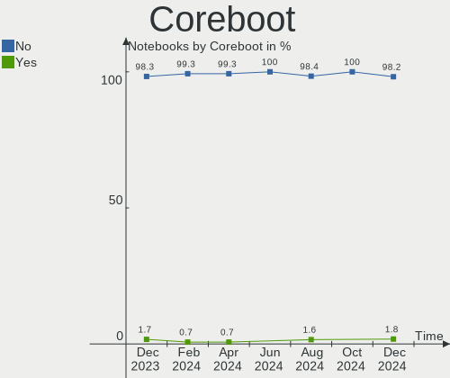
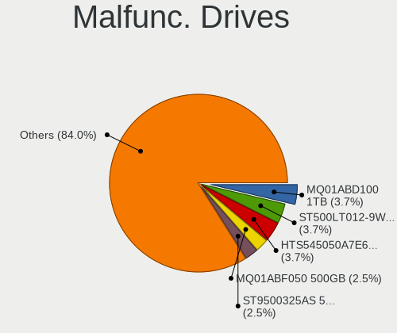
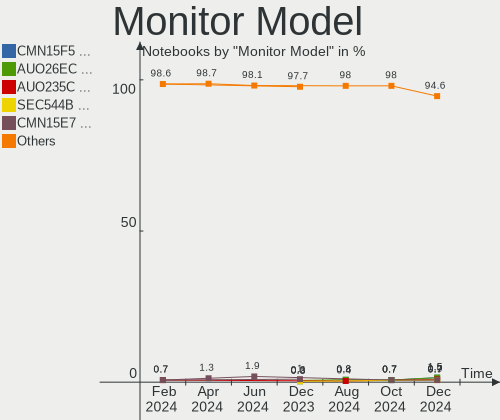
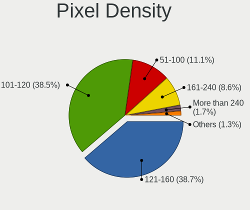
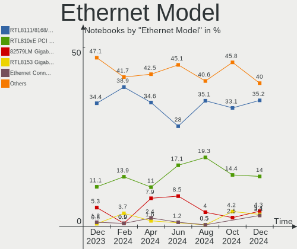

OpenMandriva - Hardware Trends (Notebooks)
------------------------------------------

A project to identify most popular hardware characteristics and track their change
over time based on data collected by Linux users at https://Linux-Hardware.org.

Anyone can contribute to this report by the [hw-probe](https://github.com/linuxhw/hw-probe) tool:

    sudo -E hw-probe -all -upload

This report is for one last month. Overall report since the beginning of time: [TestCoverage](https://github.com/linuxhw/TestCoverage)

Period: May, 2022.

Contents
--------

* [ System ](#system)
  - [ OS                       ](#os)
  - [ OS Family                ](#os-family)
  - [ Kernel                   ](#kernel)
  - [ Kernel Family            ](#kernel-family)
  - [ Kernel Major Ver.        ](#kernel-major-ver)
  - [ Arch                     ](#arch)
  - [ DE                       ](#de)
  - [ Display Server           ](#display-server)
  - [ Display Manager          ](#display-manager)
  - [ OS Lang                  ](#os-lang)
  - [ Boot Mode                ](#boot-mode)
  - [ Filesystem               ](#filesystem)
  - [ Part. scheme             ](#part-scheme)
  - [ Dual Boot with Linux/BSD ](#dual-boot-with-linuxbsd)
  - [ Dual Boot (Win)          ](#dual-boot-win)

* [ Board ](#board)
  - [ Vendor                   ](#vendor)
  - [ Model                    ](#model)
  - [ Model Family             ](#model-family)
  - [ MFG Year                 ](#mfg-year)
  - [ Form Factor              ](#form-factor)
  - [ Secure Boot              ](#secure-boot)
  - [ Coreboot                 ](#coreboot)
  - [ RAM Size                 ](#ram-size)
  - [ RAM Used                 ](#ram-used)
  - [ Total Drives             ](#total-drives)
  - [ Has CD-ROM               ](#has-cd-rom)
  - [ Has Ethernet             ](#has-ethernet)
  - [ Has WiFi                 ](#has-wifi)
  - [ Has Bluetooth            ](#has-bluetooth)

* [ Location ](#location)
  - [ Country                  ](#country)
  - [ City                     ](#city)

* [ Drives ](#drives)
  - [ Drive Vendor             ](#drive-vendor)
  - [ Drive Model              ](#drive-model)
  - [ HDD Vendor               ](#hdd-vendor)
  - [ SSD Vendor               ](#ssd-vendor)
  - [ Drive Kind               ](#drive-kind)
  - [ Drive Connector          ](#drive-connector)
  - [ Drive Size               ](#drive-size)
  - [ Space Total              ](#space-total)
  - [ Space Used               ](#space-used)
  - [ Malfunc. Drives          ](#malfunc-drives)
  - [ Malfunc. Drive Vendor    ](#malfunc-drive-vendor)
  - [ Malfunc. HDD Vendor      ](#malfunc-hdd-vendor)
  - [ Malfunc. Drive Kind      ](#malfunc-drive-kind)
  - [ Failed Drives            ](#failed-drives)
  - [ Failed Drive Vendor      ](#failed-drive-vendor)
  - [ Drive Status             ](#drive-status)

* [ Storage controller ](#storage-controller)
  - [ Storage Vendor           ](#storage-vendor)
  - [ Storage Model            ](#storage-model)
  - [ Storage Kind             ](#storage-kind)

* [ Processor ](#processor)
  - [ CPU Vendor               ](#cpu-vendor)
  - [ CPU Model                ](#cpu-model)
  - [ CPU Model Family         ](#cpu-model-family)
  - [ CPU Cores                ](#cpu-cores)
  - [ CPU Sockets              ](#cpu-sockets)
  - [ CPU Threads              ](#cpu-threads)
  - [ CPU Op-Modes             ](#cpu-op-modes)
  - [ CPU Microcode            ](#cpu-microcode)
  - [ CPU Microarch            ](#cpu-microarch)

* [ Graphics ](#graphics)
  - [ GPU Vendor               ](#gpu-vendor)
  - [ GPU Model                ](#gpu-model)
  - [ GPU Combo                ](#gpu-combo)
  - [ GPU Driver               ](#gpu-driver)
  - [ GPU Memory               ](#gpu-memory)

* [ Monitor ](#monitor)
  - [ Monitor Vendor           ](#monitor-vendor)
  - [ Monitor Model            ](#monitor-model)
  - [ Monitor Resolution       ](#monitor-resolution)
  - [ Monitor Diagonal         ](#monitor-diagonal)
  - [ Monitor Width            ](#monitor-width)
  - [ Aspect Ratio             ](#aspect-ratio)
  - [ Monitor Area             ](#monitor-area)
  - [ Pixel Density            ](#pixel-density)
  - [ Multiple Monitors        ](#multiple-monitors)

* [ Network ](#network)
  - [ Net Controller Vendor    ](#net-controller-vendor)
  - [ Net Controller Model     ](#net-controller-model)
  - [ Wireless Vendor          ](#wireless-vendor)
  - [ Wireless Model           ](#wireless-model)
  - [ Ethernet Vendor          ](#ethernet-vendor)
  - [ Ethernet Model           ](#ethernet-model)
  - [ Net Controller Kind      ](#net-controller-kind)
  - [ Used Controller          ](#used-controller)
  - [ NICs                     ](#nics)
  - [ IPv6                     ](#ipv6)

* [ Bluetooth ](#bluetooth)
  - [ Bluetooth Vendor         ](#bluetooth-vendor)
  - [ Bluetooth Model          ](#bluetooth-model)

* [ Sound ](#sound)
  - [ Sound Vendor             ](#sound-vendor)
  - [ Sound Model              ](#sound-model)

* [ Memory ](#memory)
  - [ Memory Vendor            ](#memory-vendor)
  - [ Memory Model             ](#memory-model)
  - [ Memory Kind              ](#memory-kind)
  - [ Memory Form Factor       ](#memory-form-factor)
  - [ Memory Size              ](#memory-size)
  - [ Memory Speed             ](#memory-speed)

* [ Printers & scanners ](#printers--scanners)
  - [ Printer Vendor           ](#printer-vendor)
  - [ Printer Model            ](#printer-model)
  - [ Scanner Vendor           ](#scanner-vendor)
  - [ Scanner Model            ](#scanner-model)

* [ Camera ](#camera)
  - [ Camera Vendor            ](#camera-vendor)
  - [ Camera Model             ](#camera-model)

* [ Security ](#security)
  - [ Fingerprint Vendor       ](#fingerprint-vendor)
  - [ Fingerprint Model        ](#fingerprint-model)
  - [ Chipcard Vendor          ](#chipcard-vendor)
  - [ Chipcard Model           ](#chipcard-model)

* [ Unsupported ](#unsupported)
  - [ Unsupported Devices      ](#unsupported-devices)
  - [ Unsupported Device Types ](#unsupported-device-types)

System
------

OS
--

Installed operating systems

| Name              | Notebooks | Percent |
|-------------------|-----------|---------|
| OpenMandriva 4.3  | 124       | 86.11%  |
| OpenMandriva 4.2  | 14        | 9.72%   |
| OpenMandriva 4.50 | 5         | 3.47%   |
| OpenMandriva 3.0  | 1         | 0.69%   |

OS Family
---------

OS without a version

| Name         | Notebooks | Percent |
|--------------|-----------|---------|
| OpenMandriva | 144       | 100%    |

Kernel
------

Version of the Linux kernel

| Version                  | Notebooks | Percent |
|--------------------------|-----------|---------|
| 5.16.7-desktop-1omv4003  | 118       | 81.94%  |
| 5.10.14-desktop-1omv4002 | 12        | 8.33%   |
| 5.14.7-desktop-1omv4050  | 5         | 3.47%   |
| 5.16.13-desktop-1omv4003 | 3         | 2.08%   |
| 5.17.1-desktop-2omv4050  | 2         | 1.39%   |
| 5.11.12-desktop-1omv4002 | 2         | 1.39%   |
| 5.14.14-desktop-1omv4050 | 1         | 0.69%   |
| 4.19.38-desktop-1omv     | 1         | 0.69%   |

Kernel Family
-------------

Linux kernel without a distro release

| Version | Notebooks | Percent |
|---------|-----------|---------|
| 5.16.7  | 118       | 81.94%  |
| 5.10.14 | 12        | 8.33%   |
| 5.14.7  | 5         | 3.47%   |
| 5.16.13 | 3         | 2.08%   |
| 5.17.1  | 2         | 1.39%   |
| 5.11.12 | 2         | 1.39%   |
| 5.14.14 | 1         | 0.69%   |
| 4.19.38 | 1         | 0.69%   |

Kernel Major Ver.
-----------------

Linux kernel major version

| Version | Notebooks | Percent |
|---------|-----------|---------|
| 5.16    | 121       | 84.03%  |
| 5.10    | 12        | 8.33%   |
| 5.14    | 6         | 4.17%   |
| 5.17    | 2         | 1.39%   |
| 5.11    | 2         | 1.39%   |
| 4.19    | 1         | 0.69%   |

Arch
----

OS architecture (x86_64, i586, etc.)

| Name   | Notebooks | Percent |
|--------|-----------|---------|
| x86_64 | 144       | 100%    |

DE
--

Desktop Environment

| Name | Notebooks | Percent |
|------|-----------|---------|
| KDE5 | 143       | 99.31%  |
| LXQt | 1         | 0.69%   |

Display Server
--------------

X11 or Wayland

| Name    | Notebooks | Percent |
|---------|-----------|---------|
| X11     | 143       | 99.31%  |
| Wayland | 1         | 0.69%   |

Display Manager
---------------

SDDM, LightDM, etc.

| Name | Notebooks | Percent |
|------|-----------|---------|
| SDDM | 144       | 100%    |

OS Lang
-------

Language

| Lang    | Notebooks | Percent |
|---------|-----------|---------|
| en_US   | 70        | 48.61%  |
| de_DE   | 10        | 6.94%   |
| fr_FR   | 9         | 6.25%   |
| ru_RU   | 7         | 4.86%   |
| pt_BR   | 7         | 4.86%   |
| pl_PL   | 7         | 4.86%   |
| it_IT   | 7         | 4.86%   |
| cs_CZ   | 6         | 4.17%   |
| es_CO   | 5         | 3.47%   |
| en_GB   | 4         | 2.78%   |
| es_ES   | 3         | 2.08%   |
| es_MX   | 2         | 1.39%   |
| tr_TR   | 1         | 0.69%   |
| es_VE   | 1         | 0.69%   |
| es_CR   | 1         | 0.69%   |
| es_CL   | 1         | 0.69%   |
| en_IN   | 1         | 0.69%   |
| en_CA   | 1         | 0.69%   |
| Unknown | 1         | 0.69%   |

Boot Mode
---------

EFI or BIOS

| Mode | Notebooks | Percent |
|------|-----------|---------|
| BIOS | 86        | 59.72%  |
| EFI  | 58        | 40.28%  |

Filesystem
----------

Type of filesystem

| Type    | Notebooks | Percent |
|---------|-----------|---------|
| Overlay | 117       | 81.25%  |
| Ext4    | 26        | 18.06%  |
| Unknown | 1         | 0.69%   |

Part. scheme
------------

Scheme of partitioning

| Type | Notebooks | Percent |
|------|-----------|---------|
| GPT  | 80        | 55.56%  |
| MBR  | 64        | 44.44%  |

Dual Boot with Linux/BSD
------------------------

Hosting more than one Linux/BSD

| Dual boot | Notebooks | Percent |
|-----------|-----------|---------|
| No        | 75        | 52.08%  |
| Yes       | 69        | 47.92%  |

Dual Boot (Win)
---------------

Hosting Linux and Windows

| Dual boot | Notebooks | Percent |
|-----------|-----------|---------|
| No        | 83        | 57.64%  |
| Yes       | 61        | 42.36%  |

Board
-----

Vendor
------

Motherboard manufacturer

| Name                | Notebooks | Percent |
|---------------------|-----------|---------|
| Lenovo              | 28        | 19.44%  |
| Dell                | 28        | 19.44%  |
| ASUSTek Computer    | 21        | 14.58%  |
| Hewlett-Packard     | 19        | 13.19%  |
| Acer                | 10        | 6.94%   |
| Toshiba             | 7         | 4.86%   |
| Sony                | 3         | 2.08%   |
| Samsung Electronics | 3         | 2.08%   |
| Packard Bell        | 3         | 2.08%   |
| Apple               | 3         | 2.08%   |
| TUXEDO              | 2         | 1.39%   |
| Positivo            | 2         | 1.39%   |
| Fujitsu             | 2         | 1.39%   |
| Compaq              | 2         | 1.39%   |
| System76            | 1         | 0.69%   |
| Philco              | 1         | 0.69%   |
| Notebook            | 1         | 0.69%   |
| MSI                 | 1         | 0.69%   |
| Medion              | 1         | 0.69%   |
| HYPA                | 1         | 0.69%   |
| Fujitsu Siemens     | 1         | 0.69%   |
| Clevo               | 1         | 0.69%   |
| AZW                 | 1         | 0.69%   |
| Alienware           | 1         | 0.69%   |
| Unknown             | 1         | 0.69%   |

Model
-----

Motherboard model

| Name                                       | Notebooks | Percent |
|--------------------------------------------|-----------|---------|
| ASUS UX31E                                 | 6         | 4.17%   |
| Dell Inspiron 3451                         | 4         | 2.78%   |
| Unknown                                    | 3         | 2.08%   |
| Lenovo IdeaPad 100-15IBY 80MJ              | 2         | 1.39%   |
| Lenovo G50-70 20351                        | 2         | 1.39%   |
| HP Compaq 15                               | 2         | 1.39%   |
| Toshiba Satellite L350D                    | 1         | 0.69%   |
| Toshiba Satellite C850-1KN                 | 1         | 0.69%   |
| Toshiba Satellite C850                     | 1         | 0.69%   |
| Toshiba Satellite C670D-126                | 1         | 0.69%   |
| Toshiba Satellite C670D                    | 1         | 0.69%   |
| Toshiba Satellite C645D                    | 1         | 0.69%   |
| Toshiba Satellite A100                     | 1         | 0.69%   |
| System76 Lemur Pro                         | 1         | 0.69%   |
| Sony VPCCB3S1E                             | 1         | 0.69%   |
| Sony VGN-NR32L_S                           | 1         | 0.69%   |
| Sony VGN-FZ31Z                             | 1         | 0.69%   |
| Samsung R519/R719                          | 1         | 0.69%   |
| Samsung 350V5C/351V5C/3540VC/3440VC        | 1         | 0.69%   |
| Samsung 300V3A/300V4A/300V5A/200A4B/200A5B | 1         | 0.69%   |
| Positivo S15KL                             | 1         | 0.69%   |
| Positivo Mobile                            | 1         | 0.69%   |
| Philco 10D                                 | 1         | 0.69%   |
| Packard Bell EasyNote TS44HR               | 1         | 0.69%   |
| Packard Bell EasyNote MH35                 | 1         | 0.69%   |
| Packard Bell EasyNote ENTF71BM             | 1         | 0.69%   |
| Notebook N8xxEP6                           | 1         | 0.69%   |
| MSI GF63 Thin 8RCS                         | 1         | 0.69%   |
| Medion P6624                               | 1         | 0.69%   |
| Lenovo Z710 20250                          | 1         | 0.69%   |
| Lenovo Z50-75 80EC                         | 1         | 0.69%   |
| Lenovo V15-ADA 82C7                        | 1         | 0.69%   |
| Lenovo V110-15ISK 80TL                     | 1         | 0.69%   |
| Lenovo ThinkPad X230 Tablet 3434CTO        | 1         | 0.69%   |
| Lenovo ThinkPad W530 2463A64               | 1         | 0.69%   |
| Lenovo ThinkPad W520 428223G               | 1         | 0.69%   |
| Lenovo ThinkPad T61 7661BM5                | 1         | 0.69%   |
| Lenovo ThinkPad T61 6463Y3W                | 1         | 0.69%   |
| Lenovo ThinkPad T530 24296G9               | 1         | 0.69%   |
| Lenovo ThinkPad T530 23594LU               | 1         | 0.69%   |
| Lenovo ThinkPad T510 43147UG               | 1         | 0.69%   |
| Lenovo ThinkPad T430 2349BS7               | 1         | 0.69%   |
| Lenovo ThinkPad T410 2522W6S               | 1         | 0.69%   |
| Lenovo ThinkPad R500 27326FG               | 1         | 0.69%   |
| Lenovo ThinkPad Edge E430 32543XS          | 1         | 0.69%   |
| Lenovo IdeaPad Z500 20202                  | 1         | 0.69%   |
| Lenovo IdeaPad Z370                        | 1         | 0.69%   |
| Lenovo IdeaPad S300 20197                  | 1         | 0.69%   |
| Lenovo IdeaPad Gaming 3 15ARH05 82EY       | 1         | 0.69%   |
| Lenovo IdeaPad 330S-14IKB 81JM             | 1         | 0.69%   |
| Lenovo IdeaPad 100-14IBY 80MH              | 1         | 0.69%   |
| Lenovo G710 20252                          | 1         | 0.69%   |
| Lenovo B70-80 80MR                         | 1         | 0.69%   |
| HYPA FLUX                                  | 1         | 0.69%   |
| HP ProBook 6560b                           | 1         | 0.69%   |
| HP ProBook 6475b                           | 1         | 0.69%   |
| HP ProBook 470 G0                          | 1         | 0.69%   |
| HP ProBook 450 G1                          | 1         | 0.69%   |
| HP Pavilion Laptop 15-cc5xx                | 1         | 0.69%   |
| HP Pavilion Laptop 15-cc0xx                | 1         | 0.69%   |

Model Family
------------

Motherboard model prefix

| Name                     | Notebooks | Percent |
|--------------------------|-----------|---------|
| Lenovo ThinkPad          | 12        | 8.33%   |
| Dell Latitude            | 12        | 8.33%   |
| Dell Inspiron            | 12        | 8.33%   |
| Lenovo IdeaPad           | 8         | 5.56%   |
| Acer Aspire              | 8         | 5.56%   |
| Toshiba Satellite        | 7         | 4.86%   |
| ASUS UX31E               | 6         | 4.17%   |
| HP ProBook               | 4         | 2.78%   |
| HP Pavilion              | 4         | 2.78%   |
| Packard Bell EasyNote    | 3         | 2.08%   |
| HP Compaq                | 3         | 2.08%   |
| Unknown                  | 3         | 2.08%   |
| Lenovo G50-70            | 2         | 1.39%   |
| HP EliteBook             | 2         | 1.39%   |
| HP 255                   | 2         | 1.39%   |
| Dell Studio              | 2         | 1.39%   |
| ASUS VivoBook            | 2         | 1.39%   |
| System76 Lemur           | 1         | 0.69%   |
| Sony VPCCB3S1E           | 1         | 0.69%   |
| Sony VGN-NR32L           | 1         | 0.69%   |
| Sony VGN-FZ31Z           | 1         | 0.69%   |
| Samsung R519             | 1         | 0.69%   |
| Samsung 350V5C           | 1         | 0.69%   |
| Samsung 300V3A           | 1         | 0.69%   |
| Positivo S15KL           | 1         | 0.69%   |
| Positivo Mobile          | 1         | 0.69%   |
| Philco 10D               | 1         | 0.69%   |
| Notebook N8xxEP6         | 1         | 0.69%   |
| MSI GF63                 | 1         | 0.69%   |
| Medion P6624             | 1         | 0.69%   |
| Lenovo Z710              | 1         | 0.69%   |
| Lenovo Z50-75            | 1         | 0.69%   |
| Lenovo V15-ADA           | 1         | 0.69%   |
| Lenovo V110-15ISK        | 1         | 0.69%   |
| Lenovo G710              | 1         | 0.69%   |
| Lenovo B70-80            | 1         | 0.69%   |
| HYPA FLUX                | 1         | 0.69%   |
| HP Laptop                | 1         | 0.69%   |
| HP ENVY                  | 1         | 0.69%   |
| HP 240                   | 1         | 0.69%   |
| HP 1000                  | 1         | 0.69%   |
| Fujitsu Siemens LIFEBOOK | 1         | 0.69%   |
| Fujitsu LIFEBOOK         | 1         | 0.69%   |
| Fujitsu FMVNTCAKB        | 1         | 0.69%   |
| Dell Vostro              | 1         | 0.69%   |
| Dell Precision           | 1         | 0.69%   |
| Compaq Presario          | 1         | 0.69%   |
| Compaq 420               | 1         | 0.69%   |
| Clevo W55xEU             | 1         | 0.69%   |
| AZW GT-R                 | 1         | 0.69%   |
| ASUS X75A1               | 1         | 0.69%   |
| ASUS X551MA              | 1         | 0.69%   |
| ASUS X540LJ              | 1         | 0.69%   |
| ASUS UX305FA             | 1         | 0.69%   |
| ASUS U31Jg               | 1         | 0.69%   |
| ASUS TUF                 | 1         | 0.69%   |
| ASUS Strix               | 1         | 0.69%   |
| ASUS ROG                 | 1         | 0.69%   |
| ASUS N501VW              | 1         | 0.69%   |
| ASUS K73SD               | 1         | 0.69%   |

MFG Year
--------

Motherboard manufacture year

| Year    | Notebooks | Percent |
|---------|-----------|---------|
| 2011    | 22        | 15.28%  |
| 2012    | 18        | 12.5%   |
| 2014    | 14        | 9.72%   |
| 2013    | 14        | 9.72%   |
| 2015    | 11        | 7.64%   |
| 2010    | 10        | 6.94%   |
| 2016    | 8         | 5.56%   |
| 2021    | 7         | 4.86%   |
| 2020    | 7         | 4.86%   |
| 2009    | 7         | 4.86%   |
| 2019    | 6         | 4.17%   |
| 2008    | 5         | 3.47%   |
| 2018    | 4         | 2.78%   |
| 2007    | 4         | 2.78%   |
| 2017    | 3         | 2.08%   |
| 2006    | 2         | 1.39%   |
| 2022    | 1         | 0.69%   |
| Unknown | 1         | 0.69%   |

Form Factor
-----------

Physical design of the computer

| Name     | Notebooks | Percent |
|----------|-----------|---------|
| Notebook | 144       | 100%    |

Secure Boot
-----------

Enabled or disabled

| State    | Notebooks | Percent |
|----------|-----------|---------|
| Disabled | 144       | 100%    |

Coreboot
--------

Have coreboot on board

| Used | Notebooks | Percent |
|------|-----------|---------|
| No   | 143       | 99.31%  |
| Yes  | 1         | 0.69%   |

RAM Size
--------

Total RAM memory

| Size in GB | Notebooks | Percent |
|------------|-----------|---------|
| 3.01-4.0   | 56        | 38.89%  |
| 4.01-8.0   | 42        | 29.17%  |
| 8.01-16.0  | 18        | 12.5%   |
| 16.01-24.0 | 12        | 8.33%   |
| 1.01-2.0   | 9         | 6.25%   |
| 32.01-64.0 | 3         | 2.08%   |
| 24.01-32.0 | 2         | 1.39%   |
| 2.01-3.0   | 2         | 1.39%   |

RAM Used
--------

Used RAM memory

| Used GB  | Notebooks | Percent |
|----------|-----------|---------|
| 1.01-2.0 | 114       | 79.17%  |
| 0.51-1.0 | 20        | 13.89%  |
| 2.01-3.0 | 8         | 5.56%   |
| 0.01-0.5 | 2         | 1.39%   |

Total Drives
------------

Number of drives on board

| Drives | Notebooks | Percent |
|--------|-----------|---------|
| 1      | 108       | 75%     |
| 2      | 32        | 22.22%  |
| 3      | 2         | 1.39%   |
| 4      | 1         | 0.69%   |
| 0      | 1         | 0.69%   |

Has CD-ROM
----------

Has CD-ROM on board

| Presented | Notebooks | Percent |
|-----------|-----------|---------|
| Yes       | 83        | 57.64%  |
| No        | 61        | 42.36%  |

Has Ethernet
------------

Has Ethernet on board

| Presented | Notebooks | Percent |
|-----------|-----------|---------|
| Yes       | 127       | 88.19%  |
| No        | 17        | 11.81%  |

Has WiFi
--------

Has WiFi module

| Presented | Notebooks | Percent |
|-----------|-----------|---------|
| Yes       | 144       | 100%    |

Has Bluetooth
-------------

Has Bluetooth module

| Presented | Notebooks | Percent |
|-----------|-----------|---------|
| Yes       | 93        | 64.58%  |
| No        | 51        | 35.42%  |

Location
--------

Country
-------

Geographic location (country)

| Country      | Notebooks | Percent |
|--------------|-----------|---------|
| Germany      | 14        | 9.72%   |
| USA          | 13        | 9.03%   |
| Poland       | 12        | 8.33%   |
| France       | 11        | 7.64%   |
| Brazil       | 11        | 7.64%   |
| Italy        | 9         | 6.25%   |
| UK           | 7         | 4.86%   |
| Russia       | 7         | 4.86%   |
| Colombia     | 7         | 4.86%   |
| Czechia      | 6         | 4.17%   |
| Mexico       | 5         | 3.47%   |
| Netherlands  | 4         | 2.78%   |
| Spain        | 3         | 2.08%   |
| Canada       | 3         | 2.08%   |
| Turkey       | 2         | 1.39%   |
| Serbia       | 2         | 1.39%   |
| Morocco      | 2         | 1.39%   |
| Japan        | 2         | 1.39%   |
| Indonesia    | 2         | 1.39%   |
| India        | 2         | 1.39%   |
| Australia    | 2         | 1.39%   |
| Venezuela    | 1         | 0.69%   |
| Uruguay      | 1         | 0.69%   |
| Switzerland  | 1         | 0.69%   |
| Sweden       | 1         | 0.69%   |
| Saudi Arabia | 1         | 0.69%   |
| Portugal     | 1         | 0.69%   |
| Philippines  | 1         | 0.69%   |
| Peru         | 1         | 0.69%   |
| Palestine    | 1         | 0.69%   |
| Moldova      | 1         | 0.69%   |
| Malaysia     | 1         | 0.69%   |
| Lithuania    | 1         | 0.69%   |
| Jordan       | 1         | 0.69%   |
| Costa Rica   | 1         | 0.69%   |
| Chile        | 1         | 0.69%   |
| Belgium      | 1         | 0.69%   |
| Belarus      | 1         | 0.69%   |
| Argentina    | 1         | 0.69%   |

City
----

Geographic location (city)

| City                       | Notebooks | Percent |
|----------------------------|-----------|---------|
| Prague                     | 5         | 3.47%   |
| Taranto                    | 2         | 1.39%   |
| Spring Hill                | 2         | 1.39%   |
| Schagen                    | 2         | 1.39%   |
| Sao Paulo                  | 2         | 1.39%   |
| Przeclaw                   | 2         | 1.39%   |
| Paris                      | 2         | 1.39%   |
| Milan                      | 2         | 1.39%   |
| Krakow                     | 2         | 1.39%   |
| Dortmund                   | 2         | 1.39%   |
| Belgrade                   | 2         | 1.39%   |
| Barranquilla               | 2         | 1.39%   |
| Yekaterinburg              | 1         | 0.69%   |
| Wroclaw                    | 1         | 0.69%   |
| Woodmere                   | 1         | 0.69%   |
| Warsaw                     | 1         | 0.69%   |
| Wageningen                 | 1         | 0.69%   |
| Volgograd                  | 1         | 0.69%   |
| Villa Santa Rita           | 1         | 0.69%   |
| Venice                     | 1         | 0.69%   |
| Vancouver                  | 1         | 0.69%   |
| Valledupar                 | 1         | 0.69%   |
| Toulouse                   | 1         | 0.69%   |
| Tighina                    | 1         | 0.69%   |
| Surat                      | 1         | 0.69%   |
| Surabaya                   | 1         | 0.69%   |
| Stuttgart                  | 1         | 0.69%   |
| Siemianowice Śląskie     | 1         | 0.69%   |
| Semarang                   | 1         | 0.69%   |
| Santo André               | 1         | 0.69%   |
| Santiago                   | 1         | 0.69%   |
| San José                  | 1         | 0.69%   |
| Salvador                   | 1         | 0.69%   |
| Saint-Didier-de-la-Tour    | 1         | 0.69%   |
| Sabadell                   | 1         | 0.69%   |
| Ryazan                     | 1         | 0.69%   |
| Rome                       | 1         | 0.69%   |
| Riverdale                  | 1         | 0.69%   |
| Rimsting                   | 1         | 0.69%   |
| Rijswijk                   | 1         | 0.69%   |
| Reynosa                    | 1         | 0.69%   |
| Rabat                      | 1         | 0.69%   |
| Quezon City                | 1         | 0.69%   |
| Puerto Ordaz and San Felix | 1         | 0.69%   |
| Puebla City                | 1         | 0.69%   |
| Popayán                   | 1         | 0.69%   |
| Pontes e Lacerda           | 1         | 0.69%   |
| Pereira                    | 1         | 0.69%   |
| Paulinia                   | 1         | 0.69%   |
| Olesnik                    | 1         | 0.69%   |
| Nizhny Tagil               | 1         | 0.69%   |
| New Bern                   | 1         | 0.69%   |
| Nelson                     | 1         | 0.69%   |
| Namps-Maisnil              | 1         | 0.69%   |
| Munich                     | 1         | 0.69%   |
| Munchenstein               | 1         | 0.69%   |
| Mount Waverley             | 1         | 0.69%   |
| Moscow                     | 1         | 0.69%   |
| Montevideo                 | 1         | 0.69%   |
| Miradolo Terme             | 1         | 0.69%   |

Drives
------

Drive Vendor
------------

Hard drive vendors

| Vendor              | Notebooks | Drives | Percent |
|---------------------|-----------|--------|---------|
| Seagate             | 29        | 30     | 17.58%  |
| WDC                 | 27        | 28     | 16.36%  |
| Toshiba             | 15        | 16     | 9.09%   |
| Samsung Electronics | 15        | 16     | 9.09%   |
| SanDisk             | 11        | 11     | 6.67%   |
| Kingston            | 10        | 10     | 6.06%   |
| Hitachi             | 8         | 8      | 4.85%   |
| Crucial             | 8         | 8      | 4.85%   |
| Unknown             | 5         | 5      | 3.03%   |
| HGST                | 5         | 5      | 3.03%   |
| SK Hynix            | 3         | 3      | 1.82%   |
| Patriot             | 3         | 3      | 1.82%   |
| Micron Technology   | 3         | 3      | 1.82%   |
| Intel               | 3         | 4      | 1.82%   |
| A-DATA Technology   | 3         | 3      | 1.82%   |
| Hewlett-Packard     | 2         | 2      | 1.21%   |
| Fujitsu             | 2         | 2      | 1.21%   |
| XPG                 | 1         | 1      | 0.61%   |
| USB3.0              | 1         | 1      | 0.61%   |
| RX7                 | 1         | 1      | 0.61%   |
| QC-FT-D             | 1         | 1      | 0.61%   |
| OCZ                 | 1         | 1      | 0.61%   |
| KIOXIA-EXCERIA      | 1         | 1      | 0.61%   |
| KingSpec            | 1         | 1      | 0.61%   |
| Intenso             | 1         | 1      | 0.61%   |
| HS-SSD-C100         | 1         | 1      | 0.61%   |
| GOODRAM             | 1         | 1      | 0.61%   |
| China               | 1         | 1      | 0.61%   |
| Apple               | 1         | 1      | 0.61%   |
| Apacer              | 1         | 1      | 0.61%   |

Drive Model
-----------

Hard drive models

| Model                                | Notebooks | Percent |
|--------------------------------------|-----------|---------|
| Seagate ST500LT012-1DG142 500GB      | 9         | 5.36%   |
| SanDisk SSD U100 256GB               | 6         | 3.57%   |
| Toshiba MQ01ABF050 500GB             | 3         | 1.79%   |
| Toshiba MQ01ABD100 1TB               | 3         | 1.79%   |
| Seagate ST2000LM015-2E8174 2TB       | 3         | 1.79%   |
| Kingston SA400S37120G 120GB SSD      | 3         | 1.79%   |
| Hitachi HTS547550A9E384 500GB        | 3         | 1.79%   |
| HGST HTS545050A7E680 500GB           | 3         | 1.79%   |
| WDC WD5000LPVX-22V0TT0 500GB         | 2         | 1.19%   |
| Toshiba MQ04ABF100 1TB               | 2         | 1.19%   |
| Toshiba MK1637GSX 160GB              | 2         | 1.19%   |
| Seagate ST1000LM035-1RK172 1TB       | 2         | 1.19%   |
| Seagate ST1000LM024 HN-M101MBB 1TB   | 2         | 1.19%   |
| Samsung SSD 860 EVO M.2 2TB          | 2         | 1.19%   |
| Kingston RBUSNS8154P3128GJ 128GB     | 2         | 1.19%   |
| XPG GAMMIX S11 Pro 256GB             | 1         | 0.6%    |
| WDC WDS250G3X0C-00SJG0 250GB         | 1         | 0.6%    |
| WDC WDS240G2G0B-00EPW0 240GB SSD     | 1         | 0.6%    |
| WDC WDS120G2G0A-00JH30 120GB SSD     | 1         | 0.6%    |
| WDC WD800BEVS-07RST0 80GB            | 1         | 0.6%    |
| WDC WD7500BPKT-00PK4T0 752GB         | 1         | 0.6%    |
| WDC WD5000LPZX-60Z10T0 500GB         | 1         | 0.6%    |
| WDC WD5000LPVX-80V0TT0 500GB         | 1         | 0.6%    |
| WDC WD5000LPVX-60V0TT0 500GB         | 1         | 0.6%    |
| WDC WD5000LPVX-00V0TT0 500GB         | 1         | 0.6%    |
| WDC WD5000LPVT-75G33T0 500GB         | 1         | 0.6%    |
| WDC WD5000BPVT-22HXZT1 500GB         | 1         | 0.6%    |
| WDC WD5000BEKT-60KA9T0 500GB         | 1         | 0.6%    |
| WDC WD3200BUCT-62TWBY0 320GB         | 1         | 0.6%    |
| WDC WD3200BPVT-80JJ5T0 320GB         | 1         | 0.6%    |
| WDC WD3200BPVT-24JJ5T0 320GB         | 1         | 0.6%    |
| WDC WD3200BPVT-22JJ5T0 320GB         | 1         | 0.6%    |
| WDC WD3200BEVT-08A23T1 320GB         | 1         | 0.6%    |
| WDC WD2500BEVT-75A23T0 250GB         | 1         | 0.6%    |
| WDC WD1600BUCT-63TWBY0 160GB         | 1         | 0.6%    |
| WDC WD1600BEVT-80A23T0 160GB         | 1         | 0.6%    |
| WDC WD10SPZX-60Z10T0 1TB             | 1         | 0.6%    |
| WDC WD10SPZX-22Z10T0 1TB             | 1         | 0.6%    |
| WDC WD10JPVX-08JC3T2 1TB             | 1         | 0.6%    |
| WDC WD10JPCX-24UE4T0 1TB             | 1         | 0.6%    |
| WDC PC SN520 SDAPNUW-256G-1006 256GB | 1         | 0.6%    |
| USB3.0 Super Speed 240GB             | 1         | 0.6%    |
| Unknown SD32G  32GB                  | 1         | 0.6%    |
| Unknown SD16G  64GB                  | 1         | 0.6%    |
| Unknown SD128  128GB                 | 1         | 0.6%    |
| Unknown SD/MMC/MS PRO 999GB          | 1         | 0.6%    |
| Unknown ISOCOM  64GB                 | 1         | 0.6%    |
| Toshiba MQ01ACF050R 500GB            | 1         | 0.6%    |
| Toshiba MQ01ABF032 320GB             | 1         | 0.6%    |
| Toshiba MK5061GSYN 500GB             | 1         | 0.6%    |
| Toshiba MK2546GSX 200 200GB          | 1         | 0.6%    |
| Toshiba MK1252GSX 120GB              | 1         | 0.6%    |
| Toshiba KBG40ZNT512G MEMORY 512GB    | 1         | 0.6%    |
| SK Hynix SC308 SATA 128GB SSD        | 1         | 0.6%    |
| SK Hynix BC711 NVMe 256GB            | 1         | 0.6%    |
| SK Hynix BC711 NVMe 128GB            | 1         | 0.6%    |
| Seagate ST9500325AS 500GB            | 1         | 0.6%    |
| Seagate ST9320421ASG 320GB           | 1         | 0.6%    |
| Seagate ST9250410AS 250GB            | 1         | 0.6%    |
| Seagate ST9250315AS 250GB            | 1         | 0.6%    |

HDD Vendor
----------

Hard disk drive vendors

| Vendor              | Notebooks | Drives | Percent |
|---------------------|-----------|--------|---------|
| Seagate             | 29        | 30     | 33.72%  |
| WDC                 | 23        | 24     | 26.74%  |
| Toshiba             | 15        | 15     | 17.44%  |
| Hitachi             | 8         | 8      | 9.3%    |
| HGST                | 5         | 5      | 5.81%   |
| Samsung Electronics | 2         | 2      | 2.33%   |
| Fujitsu             | 2         | 2      | 2.33%   |
| Unknown             | 1         | 1      | 1.16%   |
| QC-FT-D             | 1         | 1      | 1.16%   |

SSD Vendor
----------

Solid state drive vendors

| Vendor              | Notebooks | Drives | Percent |
|---------------------|-----------|--------|---------|
| SanDisk             | 10        | 10     | 18.18%  |
| Samsung Electronics | 9         | 9      | 16.36%  |
| Kingston            | 7         | 7      | 12.73%  |
| Crucial             | 6         | 6      | 10.91%  |
| Patriot             | 3         | 3      | 5.45%   |
| A-DATA Technology   | 3         | 3      | 5.45%   |
| WDC                 | 2         | 2      | 3.64%   |
| Intel               | 2         | 2      | 3.64%   |
| USB3.0              | 1         | 1      | 1.82%   |
| SK Hynix            | 1         | 1      | 1.82%   |
| RX7                 | 1         | 1      | 1.82%   |
| OCZ                 | 1         | 1      | 1.82%   |
| Micron Technology   | 1         | 1      | 1.82%   |
| KIOXIA-EXCERIA      | 1         | 1      | 1.82%   |
| KingSpec            | 1         | 1      | 1.82%   |
| HS-SSD-C100         | 1         | 1      | 1.82%   |
| Hewlett-Packard     | 1         | 1      | 1.82%   |
| GOODRAM             | 1         | 1      | 1.82%   |
| China               | 1         | 1      | 1.82%   |
| Apple               | 1         | 1      | 1.82%   |
| Apacer              | 1         | 1      | 1.82%   |

Drive Kind
----------

HDD or SSD

| Kind    | Notebooks | Drives | Percent |
|---------|-----------|--------|---------|
| HDD     | 85        | 88     | 51.83%  |
| SSD     | 54        | 55     | 32.93%  |
| NVMe    | 19        | 21     | 11.59%  |
| MMC     | 5         | 5      | 3.05%   |
| Unknown | 1         | 1      | 0.61%   |

Drive Connector
---------------

SATA, SAS, NVMe, etc.

| Type | Notebooks | Drives | Percent |
|------|-----------|--------|---------|
| SATA | 130       | 138    | 81.76%  |
| NVMe | 19        | 21     | 11.95%  |
| SAS  | 5         | 6      | 3.14%   |
| MMC  | 5         | 5      | 3.14%   |

Drive Size
----------

Size of hard drive

| Size in TB | Notebooks | Drives | Percent |
|------------|-----------|--------|---------|
| 0.01-0.5   | 107       | 112    | 78.1%   |
| 0.51-1.0   | 22        | 23     | 16.06%  |
| 1.01-2.0   | 6         | 6      | 4.38%   |
| 3.01-4.0   | 1         | 1      | 0.73%   |
| 4.01-10.0  | 1         | 1      | 0.73%   |

Space Total
-----------

Amount of disk space available on the file system

| Size in GB | Notebooks | Percent |
|------------|-----------|---------|
| 1-20       | 89        | 61.81%  |
| 101-250    | 19        | 13.19%  |
| 251-500    | 14        | 9.72%   |
| Unknown    | 8         | 5.56%   |
| 21-50      | 6         | 4.17%   |
| 501-1000   | 3         | 2.08%   |
| 51-100     | 3         | 2.08%   |
| 1001-2000  | 2         | 1.39%   |

Space Used
----------

Amount of used disk space

| Used GB | Notebooks | Percent |
|---------|-----------|---------|
| 1-20    | 124       | 86.11%  |
| Unknown | 8         | 5.56%   |
| 101-250 | 6         | 4.17%   |
| 21-50   | 3         | 2.08%   |
| 251-500 | 2         | 1.39%   |
| 51-100  | 1         | 0.69%   |

Malfunc. Drives
---------------

Drive models with a malfunction

| Model                                       | Notebooks | Drives | Percent |
|---------------------------------------------|-----------|--------|---------|
| SanDisk SSD U100 256GB                      | 6         | 6      | 13.64%  |
| Toshiba MK1637GSX 160GB                     | 2         | 2      | 4.55%   |
| Seagate ST500LT012-1DG142 500GB             | 2         | 2      | 4.55%   |
| Seagate ST2000LM015-2E8174 2TB              | 2         | 2      | 4.55%   |
| HGST HTS545050A7E680 500GB                  | 2         | 2      | 4.55%   |
| WDC WDS240G2G0B-00EPW0 240GB SSD            | 1         | 1      | 2.27%   |
| WDC WD5000BPVT-22HXZT1 500GB                | 1         | 1      | 2.27%   |
| WDC WD5000BEKT-60KA9T0 500GB                | 1         | 1      | 2.27%   |
| WDC WD3200BPVT-24JJ5T0 320GB                | 1         | 1      | 2.27%   |
| WDC WD2500BEVT-75A23T0 250GB                | 1         | 1      | 2.27%   |
| WDC WD10JPVX-08JC3T2 1TB                    | 1         | 1      | 2.27%   |
| Toshiba MQ01ABF050 500GB                    | 1         | 1      | 2.27%   |
| Toshiba MK5061GSYN 500GB                    | 1         | 1      | 2.27%   |
| Toshiba MK2546GSX 200 200GB                 | 1         | 1      | 2.27%   |
| Seagate ST9320421ASG 320GB                  | 1         | 1      | 2.27%   |
| Seagate ST9250410AS 250GB                   | 1         | 1      | 2.27%   |
| Seagate ST500LM000-1EJ162 500GB             | 1         | 1      | 2.27%   |
| Seagate ST1000LX015-1U7172 1TB              | 1         | 1      | 2.27%   |
| Seagate ST1000LM024 HN-M101MBB 1TB          | 1         | 1      | 2.27%   |
| Samsung Electronics SSD PM810 2.5 7mm 128GB | 1         | 1      | 2.27%   |
| Samsung Electronics SSD 840 Series 500GB    | 1         | 1      | 2.27%   |
| Samsung Electronics HM320JI 320GB           | 1         | 1      | 2.27%   |
| KingSpec V-32 32GB SSD                      | 1         | 1      | 2.27%   |
| Intel SSDMCEAC120B3 120GB                   | 1         | 1      | 2.27%   |
| Intel SSDMAEMC080G2L 80GB                   | 1         | 1      | 2.27%   |
| Hitachi HTS547550A9E384 500GB               | 1         | 1      | 2.27%   |
| Hitachi HTS543216L9A300 160GB               | 1         | 1      | 2.27%   |
| Hitachi HTS542525K9SA00 250GB               | 1         | 1      | 2.27%   |
| Hitachi HTS541616J9SA00 160GB               | 1         | 1      | 2.27%   |
| Hitachi HTS541612J9SA00 120GB               | 1         | 1      | 2.27%   |
| HGST HTS545050A7E380 500GB                  | 1         | 1      | 2.27%   |
| HGST HTS545032A7E380 320GB                  | 1         | 1      | 2.27%   |
| Crucial CT512MX100SSD1 512GB                | 1         | 1      | 2.27%   |
| Crucial CT240M500SSD1 240GB                 | 1         | 1      | 2.27%   |
| China SATA SSD 120GB                        | 1         | 1      | 2.27%   |

Malfunc. Drive Vendor
---------------------

Vendors of faulty drives

| Vendor              | Notebooks | Drives | Percent |
|---------------------|-----------|--------|---------|
| Seagate             | 9         | 9      | 20.45%  |
| WDC                 | 6         | 6      | 13.64%  |
| SanDisk             | 6         | 6      | 13.64%  |
| Toshiba             | 5         | 5      | 11.36%  |
| Hitachi             | 5         | 5      | 11.36%  |
| HGST                | 4         | 4      | 9.09%   |
| Samsung Electronics | 3         | 3      | 6.82%   |
| Intel               | 2         | 2      | 4.55%   |
| Crucial             | 2         | 2      | 4.55%   |
| KingSpec            | 1         | 1      | 2.27%   |
| China               | 1         | 1      | 2.27%   |

Malfunc. HDD Vendor
-------------------

Vendors of faulty HDD drives

| Vendor              | Notebooks | Drives | Percent |
|---------------------|-----------|--------|---------|
| Seagate             | 9         | 9      | 31.03%  |
| WDC                 | 5         | 5      | 17.24%  |
| Toshiba             | 5         | 5      | 17.24%  |
| Hitachi             | 5         | 5      | 17.24%  |
| HGST                | 4         | 4      | 13.79%  |
| Samsung Electronics | 1         | 1      | 3.45%   |

Malfunc. Drive Kind
-------------------

Kinds of faulty drives

| Kind | Notebooks | Drives | Percent |
|------|-----------|--------|---------|
| HDD  | 29        | 29     | 65.91%  |
| SSD  | 15        | 15     | 34.09%  |

Failed Drives
-------------

Failed drive models

Zero info for selected period =(

Failed Drive Vendor
-------------------

Failed drive vendors

Zero info for selected period =(

Drive Status
------------

Number of failed and malfunc. drives

| Status   | Notebooks | Drives | Percent |
|----------|-----------|--------|---------|
| Works    | 101       | 115    | 66.89%  |
| Malfunc  | 42        | 44     | 27.81%  |
| Detected | 8         | 11     | 5.3%    |

Storage controller
------------------

Storage Vendor
--------------

Storage controller vendors

| Vendor                           | Notebooks | Percent |
|----------------------------------|-----------|---------|
| Intel                            | 114       | 72.15%  |
| AMD                              | 20        | 12.66%  |
| Samsung Electronics              | 5         | 3.16%   |
| Kingston Technology Company      | 3         | 1.9%    |
| SK Hynix                         | 2         | 1.27%   |
| Silicon Integrated Systems [SiS] | 2         | 1.27%   |
| Sandisk                          | 2         | 1.27%   |
| Nvidia                           | 2         | 1.27%   |
| Micron/Crucial Technology        | 2         | 1.27%   |
| Micron Technology                | 2         | 1.27%   |
| KIOXIA                           | 1         | 0.63%   |
| Biwin Storage Technology         | 1         | 0.63%   |
| ASMedia Technology               | 1         | 0.63%   |
| ADATA Technology                 | 1         | 0.63%   |

Storage Model
-------------

Storage controller models

| Model                                                                                  | Notebooks | Percent |
|----------------------------------------------------------------------------------------|-----------|---------|
| Intel 7 Series Chipset Family 6-port SATA Controller [AHCI mode]                       | 19        | 10.86%  |
| Intel 6 Series/C200 Series Chipset Family 6 port Mobile SATA AHCI Controller           | 15        | 8.57%   |
| AMD FCH SATA Controller [AHCI mode]                                                    | 15        | 8.57%   |
| Intel Sunrise Point-LP SATA Controller [AHCI mode]                                     | 11        | 6.29%   |
| Intel Atom Processor E3800 Series SATA AHCI Controller                                 | 10        | 5.71%   |
| Intel 82801 Mobile SATA Controller [RAID mode]                                         | 10        | 5.71%   |
| Intel Cannon Lake Mobile PCH SATA AHCI Controller                                      | 5         | 2.86%   |
| Intel 82801HM/HEM (ICH8M/ICH8M-E) SATA Controller [AHCI mode]                          | 5         | 2.86%   |
| Intel 82801HM/HEM (ICH8M/ICH8M-E) IDE Controller                                       | 5         | 2.86%   |
| Intel 8 Series SATA Controller 1 [AHCI mode]                                           | 5         | 2.86%   |
| Intel 5 Series/3400 Series Chipset 4 port SATA AHCI Controller                         | 5         | 2.86%   |
| AMD SB7x0/SB8x0/SB9x0 SATA Controller [AHCI mode]                                      | 5         | 2.86%   |
| Intel Wildcat Point-LP SATA Controller [AHCI Mode]                                     | 4         | 2.29%   |
| Intel 82801IBM/IEM (ICH9M/ICH9M-E) 4 port SATA Controller [AHCI mode]                  | 3         | 1.71%   |
| Intel 8 Series/C220 Series Chipset Family 6-port SATA Controller 1 [AHCI mode]         | 3         | 1.71%   |
| Intel 5 Series/3400 Series Chipset 6 port SATA AHCI Controller                         | 3         | 1.71%   |
| AMD SB7x0/SB8x0/SB9x0 IDE Controller                                                   | 3         | 1.71%   |
| SK Hynix Gold P31 SSD                                                                  | 2         | 1.14%   |
| Silicon Integrated Systems [SiS] 5513 IDE Controller                                   | 2         | 1.14%   |
| Samsung NVMe SSD Controller SM981/PM981/PM983                                          | 2         | 1.14%   |
| Micron/Crucial P2 NVMe PCIe SSD                                                        | 2         | 1.14%   |
| Micron Non-Volatile memory controller                                                  | 2         | 1.14%   |
| Kingston Company U-SNS8154P3 NVMe SSD                                                  | 2         | 1.14%   |
| Intel NM10/ICH7 Family SATA Controller [AHCI mode]                                     | 2         | 1.14%   |
| Intel Atom/Celeron/Pentium Processor x5-E8000/J3xxx/N3xxx Series SATA Controller       | 2         | 1.14%   |
| Intel 82801IBM/IEM (ICH9M/ICH9M-E) 2 port SATA Controller [IDE mode]                   | 2         | 1.14%   |
| Intel 82801GBM/GHM (ICH7-M Family) SATA Controller [IDE mode]                          | 2         | 1.14%   |
| Intel 6 Series/C200 Series Chipset Family Mobile SATA Controller (IDE mode, ports 4-5) | 2         | 1.14%   |
| Intel 6 Series/C200 Series Chipset Family Mobile SATA Controller (IDE mode, ports 0-3) | 2         | 1.14%   |
| Silicon Integrated Systems [SiS] SATA Controller / IDE mode                            | 1         | 0.57%   |
| Silicon Integrated Systems [SiS] AHCI IDE Controller (0106)                            | 1         | 0.57%   |
| Sandisk WD Blue SN500 / PC SN520 NVMe SSD                                              | 1         | 0.57%   |
| Sandisk WD Black SN750 / PC SN730 NVMe SSD                                             | 1         | 0.57%   |
| Samsung NVMe SSD Controller SM951/PM951                                                | 1         | 0.57%   |
| Samsung NVMe SSD Controller 980                                                        | 1         | 0.57%   |
| Samsung Electronics SATA controller                                                    | 1         | 0.57%   |
| Nvidia MCP89 SATA Controller (AHCI mode)                                               | 1         | 0.57%   |
| Nvidia MCP79 AHCI Controller                                                           | 1         | 0.57%   |
| KIOXIA Non-Volatile memory controller                                                  | 1         | 0.57%   |
| Kingston Company Company Non-Volatile memory controller                                | 1         | 0.57%   |
| Intel Non-Volatile memory controller                                                   | 1         | 0.57%   |
| Intel Ice Lake-LP SATA Controller [AHCI mode]                                          | 1         | 0.57%   |
| Intel HM170/QM170 Chipset SATA Controller [AHCI Mode]                                  | 1         | 0.57%   |
| Intel Comet Lake SATA AHCI Controller                                                  | 1         | 0.57%   |
| Intel Celeron/Pentium Silver Processor SATA Controller                                 | 1         | 0.57%   |
| Intel Celeron N3350/Pentium N4200/Atom E3900 Series SATA AHCI Controller               | 1         | 0.57%   |
| Intel 82801G (ICH7 Family) IDE Controller                                              | 1         | 0.57%   |
| Intel 7 Series Chipset Family 4-port SATA Controller [IDE mode]                        | 1         | 0.57%   |
| Intel 7 Series Chipset Family 2-port SATA Controller [IDE mode]                        | 1         | 0.57%   |
| Intel 5 Series/3400 Series Chipset PT IDER Controller                                  | 1         | 0.57%   |
| Biwin Storage Non-Volatile memory controller                                           | 1         | 0.57%   |
| ASMedia ASM1062 Serial ATA Controller                                                  | 1         | 0.57%   |
| AMD FCH IDE Controller                                                                 | 1         | 0.57%   |
| ADATA XPG SX8200 Pro PCIe Gen3x4 M.2 2280 Solid State Drive                            | 1         | 0.57%   |

Storage Kind
------------

Kind of storage controller (IDE, SATA, NVMe, SAS, ...)

| Kind | Notebooks | Percent |
|------|-----------|---------|
| SATA | 121       | 71.6%   |
| NVMe | 19        | 11.24%  |
| IDE  | 19        | 11.24%  |
| RAID | 10        | 5.92%   |

Processor
---------

CPU Vendor
----------

Processor vendors

| Vendor | Notebooks | Percent |
|--------|-----------|---------|
| Intel  | 122       | 84.72%  |
| AMD    | 22        | 15.28%  |

CPU Model
---------

Processor models

| Model                                       | Notebooks | Percent |
|---------------------------------------------|-----------|---------|
| Intel Celeron CPU N2840 @ 2.16GHz           | 8         | 5.56%   |
| Intel Core i7-2677M CPU @ 1.80GHz           | 6         | 4.17%   |
| Intel Core i5-3210M CPU @ 2.50GHz           | 4         | 2.78%   |
| Intel Pentium Dual CPU T2390 @ 1.86GHz      | 3         | 2.08%   |
| Intel Core i7-8750H CPU @ 2.20GHz           | 3         | 2.08%   |
| Intel Core i5-7200U CPU @ 2.50GHz           | 3         | 2.08%   |
| Intel Core i5-2450M CPU @ 2.50GHz           | 3         | 2.08%   |
| Intel Core i5 CPU M 520 @ 2.40GHz           | 3         | 2.08%   |
| Intel Pentium CPU N3700 @ 1.60GHz           | 2         | 1.39%   |
| Intel Pentium 3558U @ 1.70GHz               | 2         | 1.39%   |
| Intel Core i7-9750H CPU @ 2.60GHz           | 2         | 1.39%   |
| Intel Core i7-3632QM CPU @ 2.20GHz          | 2         | 1.39%   |
| Intel Core i7-3520M CPU @ 2.90GHz           | 2         | 1.39%   |
| Intel Core i5-5300U CPU @ 2.30GHz           | 2         | 1.39%   |
| Intel Core i5-4200M CPU @ 2.50GHz           | 2         | 1.39%   |
| Intel Core i5-2430M CPU @ 2.40GHz           | 2         | 1.39%   |
| Intel Core i3-7100U CPU @ 2.40GHz           | 2         | 1.39%   |
| Intel Core i3-6006U CPU @ 2.00GHz           | 2         | 1.39%   |
| Intel Core i3-5005U CPU @ 2.00GHz           | 2         | 1.39%   |
| Intel Core i3-2310M CPU @ 2.10GHz           | 2         | 1.39%   |
| Intel Core 2 Duo CPU P8600 @ 2.40GHz        | 2         | 1.39%   |
| AMD E1-2100 APU with Radeon HD Graphics     | 2         | 1.39%   |
| AMD E-300 APU with Radeon HD Graphics       | 2         | 1.39%   |
| Intel Pentium Silver N6000 @ 1.10GHz        | 1         | 0.69%   |
| Intel Pentium Dual-Core CPU T4400 @ 2.20GHz | 1         | 0.69%   |
| Intel Pentium Dual-Core CPU T4300 @ 2.10GHz | 1         | 0.69%   |
| Intel Pentium CPU B960 @ 2.20GHz            | 1         | 0.69%   |
| Intel Pentium CPU 2020M @ 2.40GHz           | 1         | 0.69%   |
| Intel Core M-5Y10c CPU @ 0.80GHz            | 1         | 0.69%   |
| Intel Core i7-8665U CPU @ 1.90GHz           | 1         | 0.69%   |
| Intel Core i7-8550U CPU @ 1.80GHz           | 1         | 0.69%   |
| Intel Core i7-6700HQ CPU @ 2.60GHz          | 1         | 0.69%   |
| Intel Core i7-6500U CPU @ 2.50GHz           | 1         | 0.69%   |
| Intel Core i7-4710MQ CPU @ 2.50GHz          | 1         | 0.69%   |
| Intel Core i7-4700MQ CPU @ 2.40GHz          | 1         | 0.69%   |
| Intel Core i7-4558U CPU @ 2.80GHz           | 1         | 0.69%   |
| Intel Core i7-3740QM CPU @ 2.70GHz          | 1         | 0.69%   |
| Intel Core i7-3720QM CPU @ 2.60GHz          | 1         | 0.69%   |
| Intel Core i7-2820QM CPU @ 2.30GHz          | 1         | 0.69%   |
| Intel Core i7-1065G7 CPU @ 1.30GHz          | 1         | 0.69%   |
| Intel Core i7 CPU Q 720 @ 1.60GHz           | 1         | 0.69%   |
| Intel Core i5-8265U CPU @ 1.60GHz           | 1         | 0.69%   |
| Intel Core i5-6300U CPU @ 2.40GHz           | 1         | 0.69%   |
| Intel Core i5-6200U CPU @ 2.30GHz           | 1         | 0.69%   |
| Intel Core i5-5350U CPU @ 1.80GHz           | 1         | 0.69%   |
| Intel Core i5-5200U CPU @ 2.20GHz           | 1         | 0.69%   |
| Intel Core i5-4300U CPU @ 1.90GHz           | 1         | 0.69%   |
| Intel Core i5-4200U CPU @ 1.60GHz           | 1         | 0.69%   |
| Intel Core i5-3360M CPU @ 2.80GHz           | 1         | 0.69%   |
| Intel Core i5-3230M CPU @ 2.60GHz           | 1         | 0.69%   |
| Intel Core i5-2410M CPU @ 2.30GHz           | 1         | 0.69%   |
| Intel Core i5-1035G1 CPU @ 1.00GHz          | 1         | 0.69%   |
| Intel Core i5-10210U CPU @ 1.60GHz          | 1         | 0.69%   |
| Intel Core i5 CPU M 540 @ 2.53GHz           | 1         | 0.69%   |
| Intel Core i5 CPU M 460 @ 2.53GHz           | 1         | 0.69%   |
| Intel Core i5 CPU M 430 @ 2.27GHz           | 1         | 0.69%   |
| Intel Core i3-4005U CPU @ 1.70GHz           | 1         | 0.69%   |
| Intel Core i3-4000M CPU @ 2.40GHz           | 1         | 0.69%   |
| Intel Core i3-3120M CPU @ 2.50GHz           | 1         | 0.69%   |
| Intel Core i3-3110M CPU @ 2.40GHz           | 1         | 0.69%   |

CPU Model Family
----------------

Processor model prefix

| Model                   | Notebooks | Percent |
|-------------------------|-----------|---------|
| Intel Core i5           | 34        | 23.61%  |
| Intel Core i7           | 27        | 18.75%  |
| Intel Core i3           | 18        | 12.5%   |
| Intel Celeron           | 18        | 12.5%   |
| Intel Core 2 Duo        | 8         | 5.56%   |
| Intel Pentium           | 6         | 4.17%   |
| AMD E1                  | 4         | 2.78%   |
| Intel Pentium Dual      | 3         | 2.08%   |
| AMD Ryzen 7             | 3         | 2.08%   |
| AMD E                   | 3         | 2.08%   |
| Intel Pentium Dual-Core | 2         | 1.39%   |
| Intel Core 2            | 2         | 1.39%   |
| Intel Atom              | 2         | 1.39%   |
| AMD Ryzen 5             | 2         | 1.39%   |
| Intel Pentium Silver    | 1         | 0.69%   |
| Intel Core M            | 1         | 0.69%   |
| AMD Ryzen 9             | 1         | 0.69%   |
| AMD Ryzen 3             | 1         | 0.69%   |
| AMD FX                  | 1         | 0.69%   |
| AMD E2                  | 1         | 0.69%   |
| AMD C-60                | 1         | 0.69%   |
| AMD Athlon X2           | 1         | 0.69%   |
| AMD Athlon              | 1         | 0.69%   |
| AMD A8                  | 1         | 0.69%   |
| AMD A6                  | 1         | 0.69%   |
| AMD A4                  | 1         | 0.69%   |

CPU Cores
---------

Number of processor cores

| Number | Notebooks | Percent |
|--------|-----------|---------|
| 2      | 111       | 77.08%  |
| 4      | 19        | 13.19%  |
| 1      | 6         | 4.17%   |
| 6      | 5         | 3.47%   |
| 8      | 3         | 2.08%   |

CPU Sockets
-----------

Number of sockets

| Number | Notebooks | Percent |
|--------|-----------|---------|
| 1      | 144       | 100%    |

CPU Threads
-----------

Threads per core (Hyper-Threading)

| Number | Notebooks | Percent |
|--------|-----------|---------|
| 2      | 89        | 61.81%  |
| 1      | 53        | 36.81%  |
| 8      | 2         | 1.39%   |

CPU Op-Modes
------------

CPU Operation Modes (32-bit, 64-bit)

| Op mode        | Notebooks | Percent |
|----------------|-----------|---------|
| 32-bit, 64-bit | 144       | 100%    |

CPU Microcode
-------------

Microcode number

| Number     | Notebooks | Percent |
|------------|-----------|---------|
| 0x206a7    | 21        | 14.58%  |
| 0x306a9    | 16        | 11.11%  |
| 0x30678    | 9         | 6.25%   |
| 0x306d4    | 7         | 4.86%   |
| 0x40651    | 6         | 4.17%   |
| 0x1067a    | 6         | 4.17%   |
| 0x906ea    | 5         | 3.47%   |
| 0x806e9    | 5         | 3.47%   |
| 0x406e3    | 5         | 3.47%   |
| 0x306c3    | 5         | 3.47%   |
| 0x20655    | 4         | 2.78%   |
| 0x20652    | 4         | 2.78%   |
| 0x08108109 | 4         | 2.78%   |
| Unknown    | 4         | 2.78%   |
| 0x706e5    | 3         | 2.08%   |
| 0x6fd      | 3         | 2.08%   |
| 0x10676    | 3         | 2.08%   |
| 0x806ec    | 2         | 1.39%   |
| 0x406c3    | 2         | 1.39%   |
| 0x0700010b | 2         | 1.39%   |
| 0x05000119 | 2         | 1.39%   |
| 0x0500010d | 2         | 1.39%   |
| 0x906c0    | 1         | 0.69%   |
| 0x806ea    | 1         | 0.69%   |
| 0x706a8    | 1         | 0.69%   |
| 0x6fb      | 1         | 0.69%   |
| 0x6fa      | 1         | 0.69%   |
| 0x6f6      | 1         | 0.69%   |
| 0x6f2      | 1         | 0.69%   |
| 0x506c9    | 1         | 0.69%   |
| 0x406c4    | 1         | 0.69%   |
| 0x30673    | 1         | 0.69%   |
| 0x30661    | 1         | 0.69%   |
| 0x106e5    | 1         | 0.69%   |
| 0x106ca    | 1         | 0.69%   |
| 0x10661    | 1         | 0.69%   |
| 0x0a404101 | 1         | 0.69%   |
| 0x08600104 | 1         | 0.69%   |
| 0x07030104 | 1         | 0.69%   |
| 0x06003106 | 1         | 0.69%   |
| 0x06001119 | 1         | 0.69%   |
| 0x06001116 | 1         | 0.69%   |
| 0x05000101 | 1         | 0.69%   |
| 0x05000028 | 1         | 0.69%   |
| 0x03000027 | 1         | 0.69%   |
| 0x02000032 | 1         | 0.69%   |

CPU Microarch
-------------

Microarchitecture

| Name            | Notebooks | Percent |
|-----------------|-----------|---------|
| SandyBridge     | 21        | 14.58%  |
| IvyBridge       | 16        | 11.11%  |
| KabyLake        | 14        | 9.72%   |
| Silvermont      | 13        | 9.03%   |
| Haswell         | 11        | 7.64%   |
| Penryn          | 9         | 6.25%   |
| Westmere        | 8         | 5.56%   |
| Core            | 8         | 5.56%   |
| Broadwell       | 7         | 4.86%   |
| Skylake         | 6         | 4.17%   |
| Bobcat          | 6         | 4.17%   |
| Zen+            | 5         | 3.47%   |
| IceLake         | 3         | 2.08%   |
| Piledriver      | 2         | 1.39%   |
| Jaguar          | 2         | 1.39%   |
| Bonnell         | 2         | 1.39%   |
| Zen 3           | 1         | 0.69%   |
| Zen 2           | 1         | 0.69%   |
| Tremont         | 1         | 0.69%   |
| Steamroller     | 1         | 0.69%   |
| Puma            | 1         | 0.69%   |
| Nehalem         | 1         | 0.69%   |
| K8 & K10 hybrid | 1         | 0.69%   |
| K10 Llano       | 1         | 0.69%   |
| Goldmont plus   | 1         | 0.69%   |
| Goldmont        | 1         | 0.69%   |
| Unknown         | 1         | 0.69%   |

Graphics
--------

GPU Vendor
----------

Vendors of graphics cards

| Vendor                           | Notebooks | Percent |
|----------------------------------|-----------|---------|
| Intel                            | 110       | 63.58%  |
| AMD                              | 34        | 19.65%  |
| Nvidia                           | 27        | 15.61%  |
| Silicon Integrated Systems [SiS] | 2         | 1.16%   |

GPU Model
---------

Graphics card models

| Model                                                                                    | Notebooks | Percent |
|------------------------------------------------------------------------------------------|-----------|---------|
| Intel 2nd Generation Core Processor Family Integrated Graphics Controller                | 20        | 11.17%  |
| Intel 3rd Gen Core processor Graphics Controller                                         | 16        | 8.94%   |
| Intel Atom Processor Z36xxx/Z37xxx Series Graphics & Display                             | 10        | 5.59%   |
| Intel Core Processor Integrated Graphics Controller                                      | 8         | 4.47%   |
| Intel Haswell-ULT Integrated Graphics Controller                                         | 6         | 3.35%   |
| Intel HD Graphics 620                                                                    | 5         | 2.79%   |
| Intel HD Graphics 5500                                                                   | 5         | 2.79%   |
| Intel CoffeeLake-H GT2 [UHD Graphics 630]                                                | 5         | 2.79%   |
| AMD Picasso/Raven 2 [Radeon Vega Series / Radeon Vega Mobile Series]                     | 5         | 2.79%   |
| Intel Skylake GT2 [HD Graphics 520]                                                      | 4         | 2.23%   |
| Intel Mobile GM965/GL960 Integrated Graphics Controller (secondary)                      | 4         | 2.23%   |
| Intel Mobile GM965/GL960 Integrated Graphics Controller (primary)                        | 4         | 2.23%   |
| Intel 4th Gen Core Processor Integrated Graphics Controller                              | 4         | 2.23%   |
| Intel Mobile 4 Series Chipset Integrated Graphics Controller                             | 3         | 1.68%   |
| Intel Atom/Celeron/Pentium Processor x5-E8000/J3xxx/N3xxx Integrated Graphics Controller | 3         | 1.68%   |
| AMD Wrestler [Radeon HD 6310]                                                            | 3         | 1.68%   |
| AMD Thames [Radeon HD 7500M/7600M Series]                                                | 3         | 1.68%   |
| Silicon Integrated Systems [SiS] 771/671 PCIE VGA Display Adapter                        | 2         | 1.12%   |
| Nvidia TU106M [GeForce RTX 2070 Mobile]                                                  | 2         | 1.12%   |
| Nvidia GF117M [GeForce 610M/710M/810M/820M / GT 620M/625M/630M/720M]                     | 2         | 1.12%   |
| Intel WhiskeyLake-U GT2 [UHD Graphics 620]                                               | 2         | 1.12%   |
| Intel Iris Plus Graphics G1 (Ice Lake)                                                   | 2         | 1.12%   |
| AMD Kabini [Radeon HD 8210]                                                              | 2         | 1.12%   |
| Nvidia TU117M [GeForce GTX 1650 Ti Mobile]                                               | 1         | 0.56%   |
| Nvidia TU116M [GeForce GTX 1660 Ti Mobile]                                               | 1         | 0.56%   |
| Nvidia MCP89 [GeForce 320M]                                                              | 1         | 0.56%   |
| Nvidia GP107M [GeForce GTX 1050 Ti Mobile]                                               | 1         | 0.56%   |
| Nvidia GP107M [GeForce GTX 1050 Mobile]                                                  | 1         | 0.56%   |
| Nvidia GP106M [GeForce GTX 1060 Mobile]                                                  | 1         | 0.56%   |
| Nvidia GM108M [GeForce 840M]                                                             | 1         | 0.56%   |
| Nvidia GM107M [GeForce GTX 960M]                                                         | 1         | 0.56%   |
| Nvidia GK208BM [GeForce 920M]                                                            | 1         | 0.56%   |
| Nvidia GK107GLM [Quadro K1000M]                                                          | 1         | 0.56%   |
| Nvidia GK106M [GeForce GTX 770M]                                                         | 1         | 0.56%   |
| Nvidia GF119M [GeForce GT 520M]                                                          | 1         | 0.56%   |
| Nvidia GF119M [GeForce GT 520MX]                                                         | 1         | 0.56%   |
| Nvidia GF119M [GeForce 610M]                                                             | 1         | 0.56%   |
| Nvidia GF108M [NVS 5400M]                                                                | 1         | 0.56%   |
| Nvidia GF108M [GeForce GT 425M]                                                          | 1         | 0.56%   |
| Nvidia GF108M [GeForce GT 415M]                                                          | 1         | 0.56%   |
| Nvidia GF106GLM [Quadro 2000M]                                                           | 1         | 0.56%   |
| Nvidia GA106M [GeForce RTX 3060 Mobile / Max-Q]                                          | 1         | 0.56%   |
| Nvidia G98M [Quadro NVS 160M]                                                            | 1         | 0.56%   |
| Nvidia G86M [GeForce 8600M GS]                                                           | 1         | 0.56%   |
| Nvidia G73M [GeForce Go 7600]                                                            | 1         | 0.56%   |
| Nvidia C79 [GeForce 9400M]                                                               | 1         | 0.56%   |
| Intel UHD Graphics 620                                                                   | 1         | 0.56%   |
| Intel Mobile 945GM/GMS/GME, 943/940GML Express Integrated Graphics Controller            | 1         | 0.56%   |
| Intel Mobile 945GM/GMS, 943/940GML Express Integrated Graphics Controller                | 1         | 0.56%   |
| Intel JasperLake [UHD Graphics]                                                          | 1         | 0.56%   |
| Intel Iris Plus Graphics G7                                                              | 1         | 0.56%   |
| Intel HD Graphics 6000                                                                   | 1         | 0.56%   |
| Intel HD Graphics 5300                                                                   | 1         | 0.56%   |
| Intel HD Graphics 530                                                                    | 1         | 0.56%   |
| Intel HD Graphics 520                                                                    | 1         | 0.56%   |
| Intel HD Graphics 500                                                                    | 1         | 0.56%   |
| Intel GeminiLake [UHD Graphics 600]                                                      | 1         | 0.56%   |
| Intel CometLake-U GT2 [UHD Graphics]                                                     | 1         | 0.56%   |
| Intel Atom Processor D4xx/D5xx/N4xx/N5xx Integrated Graphics Controller                  | 1         | 0.56%   |
| Intel Atom Processor D2xxx/N2xxx Integrated Graphics Controller                          | 1         | 0.56%   |

GPU Combo
---------

Combinations of graphics cards

| Name           | Notebooks | Percent |
|----------------|-----------|---------|
| 1 x Intel      | 84        | 58.33%  |
| 1 x AMD        | 22        | 15.28%  |
| Intel + Nvidia | 18        | 12.5%   |
| Intel + AMD    | 8         | 5.56%   |
| 1 x Nvidia     | 6         | 4.17%   |
| AMD + Nvidia   | 3         | 2.08%   |
| 1 x SiS        | 2         | 1.39%   |
| 2 x AMD        | 1         | 0.69%   |

GPU Driver
----------

Free vs proprietary

| Driver  | Notebooks | Percent |
|---------|-----------|---------|
| Free    | 140       | 97.22%  |
| Unknown | 4         | 2.78%   |

GPU Memory
----------

Total video memory

| Size in GB | Notebooks | Percent |
|------------|-----------|---------|
| Unknown    | 89        | 61.81%  |
| 0.01-0.5   | 21        | 14.58%  |
| 1.01-2.0   | 14        | 9.72%   |
| 0.51-1.0   | 12        | 8.33%   |
| 7.01-8.0   | 3         | 2.08%   |
| 3.01-4.0   | 3         | 2.08%   |
| 5.01-6.0   | 1         | 0.69%   |
| 2.01-3.0   | 1         | 0.69%   |

Monitor
-------

Monitor Vendor
--------------

Monitor vendors

| Vendor                  | Notebooks | Percent |
|-------------------------|-----------|---------|
| AU Optronics            | 27        | 17.88%  |
| Chimei Innolux          | 24        | 15.89%  |
| LG Display              | 23        | 15.23%  |
| Samsung Electronics     | 19        | 12.58%  |
| BOE                     | 16        | 10.6%   |
| Chi Mei Optoelectronics | 7         | 4.64%   |
| CPT                     | 6         | 3.97%   |
| Lenovo                  | 5         | 3.31%   |
| Eizo                    | 5         | 3.31%   |
| Dell                    | 4         | 2.65%   |
| Apple                   | 3         | 1.99%   |
| SLD                     | 1         | 0.66%   |
| Sharp                   | 1         | 0.66%   |
| Philips                 | 1         | 0.66%   |
| PANDA                   | 1         | 0.66%   |
| LG Philips              | 1         | 0.66%   |
| InnoLux Display         | 1         | 0.66%   |
| InfoVision              | 1         | 0.66%   |
| Iiyama                  | 1         | 0.66%   |
| IBM                     | 1         | 0.66%   |
| Hewlett-Packard         | 1         | 0.66%   |
| HannStar                | 1         | 0.66%   |
| Ancor Communications    | 1         | 0.66%   |

Monitor Model
-------------

Monitor models

| Model                                                                    | Notebooks | Percent |
|--------------------------------------------------------------------------|-----------|---------|
| CPT LCD Monitor COR17DB 1600x900 293x164mm 13.2-inch                     | 6         | 3.95%   |
| Eizo EV3285 ENC2979 3840x2160 698x393mm 31.5-inch                        | 5         | 3.29%   |
| BOE LCD Monitor BOE0629 1366x768 309x173mm 13.9-inch                     | 4         | 2.63%   |
| Samsung Electronics LCD Monitor SDC4852 1366x768 344x194mm 15.5-inch     | 2         | 1.32%   |
| LG Display LCD Monitor LGD0468 1366x768 344x194mm 15.5-inch              | 2         | 1.32%   |
| LG Display LCD Monitor LGD02F7 1600x900 382x215mm 17.3-inch              | 2         | 1.32%   |
| Lenovo LCD Monitor LEN40B2 1920x1080 344x193mm 15.5-inch                 | 2         | 1.32%   |
| Dell 2208WFP DEL403B 1680x1050 473x296mm 22.0-inch                       | 2         | 1.32%   |
| Chimei Innolux LCD Monitor CMN1728 1600x900 382x215mm 17.3-inch          | 2         | 1.32%   |
| Chimei Innolux LCD Monitor CMN1602 1920x1080 355x199mm 16.0-inch         | 2         | 1.32%   |
| Chimei Innolux LCD Monitor CMN15E7 1920x1080 344x193mm 15.5-inch         | 2         | 1.32%   |
| Chimei Innolux LCD Monitor CMN15DB 1366x768 344x193mm 15.5-inch          | 2         | 1.32%   |
| Chi Mei Optoelectronics LCD Monitor CMO1721 1600x900 382x215mm 17.3-inch | 2         | 1.32%   |
| AU Optronics LCD Monitor AUO723C 1366x768 309x173mm 13.9-inch            | 2         | 1.32%   |
| SLD LCD Monitor SLD003C 1366x768 309x173mm 13.9-inch                     | 1         | 0.66%   |
| Sharp LC-32LB261U SHP3243 1920x1080 698x392mm 31.5-inch                  | 1         | 0.66%   |
| Samsung Electronics LCD Monitor SEC544B 1600x900 310x174mm 14.0-inch     | 1         | 0.66%   |
| Samsung Electronics LCD Monitor SEC5442 1440x900 303x190mm 14.1-inch     | 1         | 0.66%   |
| Samsung Electronics LCD Monitor SEC5441 1366x768 309x174mm 14.0-inch     | 1         | 0.66%   |
| Samsung Electronics LCD Monitor SEC4542 1366x768 309x174mm 14.0-inch     | 1         | 0.66%   |
| Samsung Electronics LCD Monitor SEC3847 1440x900 367x230mm 17.1-inch     | 1         | 0.66%   |
| Samsung Electronics LCD Monitor SEC3754 1366x768 293x165mm 13.2-inch     | 1         | 0.66%   |
| Samsung Electronics LCD Monitor SEC3741 1280x800 286x179mm 13.3-inch     | 1         | 0.66%   |
| Samsung Electronics LCD Monitor SEC325A 1366x768 344x194mm 15.5-inch     | 1         | 0.66%   |
| Samsung Electronics LCD Monitor SEC324A 1366x768 344x194mm 15.5-inch     | 1         | 0.66%   |
| Samsung Electronics LCD Monitor SEC3150 1366x768 344x193mm 15.5-inch     | 1         | 0.66%   |
| Samsung Electronics LCD Monitor SEC314F 1600x900 382x215mm 17.3-inch     | 1         | 0.66%   |
| Samsung Electronics LCD Monitor SDC5441 1366x768 344x193mm 15.5-inch     | 1         | 0.66%   |
| Samsung Electronics LCD Monitor SDC4552 1366x768 344x194mm 15.5-inch     | 1         | 0.66%   |
| Samsung Electronics LCD Monitor SDC434B 3840x2160 344x194mm 15.5-inch    | 1         | 0.66%   |
| Samsung Electronics LCD Monitor SDC415A 3200x1800 293x165mm 13.2-inch    | 1         | 0.66%   |
| Samsung Electronics LCD Monitor SAM0A7C 1366x768 698x393mm 31.5-inch     | 1         | 0.66%   |
| Samsung Electronics C27F390 SAM0D32 1920x1080 598x336mm 27.0-inch        | 1         | 0.66%   |
| Philips 206V4 PHLC0B4 1600x900 443x249mm 20.0-inch                       | 1         | 0.66%   |
| PANDA LCD Monitor NCP004D 1920x1080 344x194mm 15.5-inch                  | 1         | 0.66%   |
| LG Philips LCD Monitor LPL0140 1440x900 304x190mm 14.1-inch              | 1         | 0.66%   |
| LG Display LCD Monitor LGD6616 1366x768 277x156mm 12.5-inch              | 1         | 0.66%   |
| LG Display LCD Monitor LGD066D 1920x1080 340x190mm 15.3-inch             | 1         | 0.66%   |
| LG Display LCD Monitor LGD0505 1366x768 344x194mm 15.5-inch              | 1         | 0.66%   |
| LG Display LCD Monitor LGD046F 1920x1080 344x194mm 15.5-inch             | 1         | 0.66%   |
| LG Display LCD Monitor LGD046B 1366x768 344x194mm 15.5-inch              | 1         | 0.66%   |
| LG Display LCD Monitor LGD03D9 1366x768 345x194mm 15.6-inch              | 1         | 0.66%   |
| LG Display LCD Monitor LGD039F 1366x768 345x194mm 15.6-inch              | 1         | 0.66%   |
| LG Display LCD Monitor LGD0395 1366x768 344x194mm 15.5-inch              | 1         | 0.66%   |
| LG Display LCD Monitor LGD037E 1920x1080 345x194mm 15.6-inch             | 1         | 0.66%   |
| LG Display LCD Monitor LGD034D 1366x768 344x194mm 15.5-inch              | 1         | 0.66%   |
| LG Display LCD Monitor LGD034C 1366x768 293x165mm 13.2-inch              | 1         | 0.66%   |
| LG Display LCD Monitor LGD033E 1366x768 309x174mm 14.0-inch              | 1         | 0.66%   |
| LG Display LCD Monitor LGD033A 1366x768 344x194mm 15.5-inch              | 1         | 0.66%   |
| LG Display LCD Monitor LGD02F8 1366x768 309x174mm 14.0-inch              | 1         | 0.66%   |
| LG Display LCD Monitor LGD02F1 1366x768 344x194mm 15.5-inch              | 1         | 0.66%   |
| LG Display LCD Monitor LGD02DA 1920x1080 382x215mm 17.3-inch             | 1         | 0.66%   |
| LG Display LCD Monitor LGD02D8 1366x768 277x156mm 12.5-inch              | 1         | 0.66%   |
| LG Display LCD Monitor LGD01F0 1280x800 261x163mm 12.1-inch              | 1         | 0.66%   |
| LG Display LCD Monitor LGD01E9 1920x1080 345x194mm 15.6-inch             | 1         | 0.66%   |
| Lenovo LCD Monitor LEN40B0 1366x768 345x194mm 15.6-inch                  | 1         | 0.66%   |
| Lenovo LCD Monitor LEN4050 1280x800 331x207mm 15.4-inch                  | 1         | 0.66%   |
| Lenovo LCD Monitor LEN4035 1280x800 303x190mm 14.1-inch                  | 1         | 0.66%   |
| InnoLux Display LCD Monitor INL0005 1366x768 344x194mm 15.5-inch         | 1         | 0.66%   |
| InfoVision LCD Monitor IVO03F4 1024x600 223x125mm 10.1-inch              | 1         | 0.66%   |

Monitor Resolution
------------------

Monitor screen resolution

| Resolution         | Notebooks | Percent |
|--------------------|-----------|---------|
| 1366x768 (WXGA)    | 74        | 50%     |
| 1920x1080 (FHD)    | 27        | 18.24%  |
| 1600x900 (HD+)     | 18        | 12.16%  |
| 3840x2160 (4K)     | 8         | 5.41%   |
| 1280x800 (WXGA)    | 7         | 4.73%   |
| 1440x900 (WXGA+)   | 5         | 3.38%   |
| 1920x1200 (WUXGA)  | 3         | 2.03%   |
| 1680x1050 (WSXGA+) | 3         | 2.03%   |
| 3200x1800 (QHD+)   | 1         | 0.68%   |
| 2560x1600          | 1         | 0.68%   |
| 1024x600           | 1         | 0.68%   |

Monitor Diagonal
----------------

Diagonal size in inches

| Inches | Notebooks | Percent |
|--------|-----------|---------|
| 15     | 58        | 38.41%  |
| 13     | 31        | 20.53%  |
| 17     | 18        | 11.92%  |
| 14     | 17        | 11.26%  |
| 31     | 7         | 4.64%   |
| 24     | 3         | 1.99%   |
| 12     | 3         | 1.99%   |
| 11     | 3         | 1.99%   |
| 22     | 2         | 1.32%   |
| 21     | 2         | 1.32%   |
| 16     | 2         | 1.32%   |
| 27     | 1         | 0.66%   |
| 26     | 1         | 0.66%   |
| 23     | 1         | 0.66%   |
| 20     | 1         | 0.66%   |
| 10     | 1         | 0.66%   |

Monitor Width
-------------

Physical width

| Width in mm | Notebooks | Percent |
|-------------|-----------|---------|
| 301-350     | 89        | 59.33%  |
| 201-300     | 23        | 15.33%  |
| 351-400     | 21        | 14%     |
| 601-700     | 7         | 4.67%   |
| 501-600     | 5         | 3.33%   |
| 401-500     | 5         | 3.33%   |

Aspect Ratio
------------

Proportional relationship between the width and the height

| Ratio | Notebooks | Percent |
|-------|-----------|---------|
| 16/9  | 120       | 86.33%  |
| 16/10 | 19        | 13.67%  |

Monitor Area
------------

Area in inch²

| Area in inch² | Notebooks | Percent |
|----------------|-----------|---------|
| 101-110        | 60        | 39.74%  |
| 81-90          | 34        | 22.52%  |
| 71-80          | 14        | 9.27%   |
| 121-130        | 12        | 7.95%   |
| 351-500        | 7         | 4.64%   |
| 201-250        | 6         | 3.97%   |
| 131-140        | 6         | 3.97%   |
| 61-70          | 3         | 1.99%   |
| 51-60          | 3         | 1.99%   |
| 301-350        | 2         | 1.32%   |
| 251-300        | 2         | 1.32%   |
| 41-50          | 1         | 0.66%   |
| 151-200        | 1         | 0.66%   |

Pixel Density
-------------

Pixels per inch

| Density       | Notebooks | Percent |
|---------------|-----------|---------|
| 101-120       | 80        | 55.56%  |
| 121-160       | 37        | 25.69%  |
| 51-100        | 21        | 14.58%  |
| 161-240       | 3         | 2.08%   |
| More than 240 | 2         | 1.39%   |
| 1-50          | 1         | 0.69%   |

Multiple Monitors
-----------------

Total monitors connected

| Total | Notebooks | Percent |
|-------|-----------|---------|
| 1     | 129       | 89.58%  |
| 2     | 11        | 7.64%   |
| 0     | 2         | 1.39%   |
| 4     | 1         | 0.69%   |
| 3     | 1         | 0.69%   |

Network
-------

Net Controller Vendor
---------------------

Controller vendors

| Vendor                           | Notebooks | Percent |
|----------------------------------|-----------|---------|
| Realtek Semiconductor            | 78        | 32.77%  |
| Intel                            | 58        | 24.37%  |
| Qualcomm Atheros                 | 49        | 20.59%  |
| Broadcom                         | 15        | 6.3%    |
| Samsung Electronics              | 7         | 2.94%   |
| Huawei Technologies              | 5         | 2.1%    |
| Ralink                           | 4         | 1.68%   |
| Marvell Technology Group         | 4         | 1.68%   |
| Dell                             | 3         | 1.26%   |
| Broadcom Limited                 | 3         | 1.26%   |
| Silicon Integrated Systems [SiS] | 2         | 0.84%   |
| OnePlus Technology (Shenzhen)    | 2         | 0.84%   |
| MEDIATEK                         | 2         | 0.84%   |
| JMicron Technology               | 2         | 0.84%   |
| Qcom                             | 1         | 0.42%   |
| Nvidia                           | 1         | 0.42%   |
| HTC (High Tech Computer)         | 1         | 0.42%   |
| D-Link                           | 1         | 0.42%   |

Net Controller Model
--------------------

Controller models

| Model                                                             | Notebooks | Percent |
|-------------------------------------------------------------------|-----------|---------|
| Realtek RTL8111/8168/8411 PCI Express Gigabit Ethernet Controller | 38        | 13.38%  |
| Realtek RTL810xE PCI Express Fast Ethernet controller             | 26        | 9.15%   |
| Qualcomm Atheros AR9485 Wireless Network Adapter                  | 16        | 5.63%   |
| Qualcomm Atheros QCA9565 / AR9565 Wireless Network Adapter        | 14        | 4.93%   |
| Intel 82579LM Gigabit Network Connection (Lewisville)             | 8         | 2.82%   |
| Intel Wireless 7265                                               | 7         | 2.46%   |
| Samsung Galaxy series, misc. (tethering mode)                     | 6         | 2.11%   |
| Intel Centrino Advanced-N 6205 [Taylor Peak]                      | 5         | 1.76%   |
| Broadcom BCM4313 802.11bgn Wireless Network Adapter               | 5         | 1.76%   |
| Realtek RTL8188EE Wireless Network Adapter                        | 4         | 1.41%   |
| Realtek RTL8188CE 802.11b/g/n WiFi Adapter                        | 4         | 1.41%   |
| Qualcomm Atheros AR9285 Wireless Network Adapter (PCI-Express)    | 4         | 1.41%   |
| Intel 82577LM Gigabit Network Connection                          | 4         | 1.41%   |
| Huawei E353/E3131                                                 | 4         | 1.41%   |
| Realtek RTL8821CE 802.11ac PCIe Wireless Network Adapter          | 3         | 1.06%   |
| Realtek RTL8723BU 802.11b/g/n WLAN Adapter                        | 3         | 1.06%   |
| Realtek RTL8723BE PCIe Wireless Network Adapter                   | 3         | 1.06%   |
| Realtek RTL8188EUS 802.11n Wireless Network Adapter               | 3         | 1.06%   |
| Ralink RT3290 Wireless 802.11n 1T/1R PCIe                         | 3         | 1.06%   |
| Qualcomm Atheros AR9287 Wireless Network Adapter (PCI-Express)    | 3         | 1.06%   |
| Qualcomm Atheros AR8151 v2.0 Gigabit Ethernet                     | 3         | 1.06%   |
| Intel Wi-Fi 6 AX200                                               | 3         | 1.06%   |
| Intel PRO/Wireless 3945ABG [Golan] Network Connection             | 3         | 1.06%   |
| Intel Ethernet Connection (3) I218-LM                             | 3         | 1.06%   |
| Intel Centrino Wireless-N 2230                                    | 3         | 1.06%   |
| Intel Cannon Lake PCH CNVi WiFi                                   | 3         | 1.06%   |
| Silicon Integrated Systems [SiS] 191 Gigabit Ethernet Adapter     | 2         | 0.7%    |
| Realtek RTL8822CE 802.11ac PCIe Wireless Network Adapter          | 2         | 0.7%    |
| Qualcomm Atheros AR928X Wireless Network Adapter (PCI-Express)    | 2         | 0.7%    |
| Qualcomm Atheros AR8152 v2.0 Fast Ethernet                        | 2         | 0.7%    |
| Qualcomm Atheros AR8132 Fast Ethernet                             | 2         | 0.7%    |
| OnePlus (Shenzhen) OnePlus                                        | 2         | 0.7%    |
| JMicron JMC250 PCI Express Gigabit Ethernet Controller            | 2         | 0.7%    |
| Intel Wireless 7260                                               | 2         | 0.7%    |
| Intel Wireless 3165                                               | 2         | 0.7%    |
| Intel Wireless 3160                                               | 2         | 0.7%    |
| Intel WiFi Link 5100                                              | 2         | 0.7%    |
| Intel PRO/Wireless 4965 AG or AGN [Kedron] Network Connection     | 2         | 0.7%    |
| Intel Dual Band Wireless-AC 3165 Plus Bluetooth                   | 2         | 0.7%    |
| Intel Centrino Ultimate-N 6300                                    | 2         | 0.7%    |
| Intel Cannon Point-LP CNVi [Wireless-AC]                          | 2         | 0.7%    |
| Intel 82579V Gigabit Network Connection                           | 2         | 0.7%    |
| Intel 82566MM Gigabit Network Connection                          | 2         | 0.7%    |
| Broadcom BCM43224 802.11a/b/g/n                                   | 2         | 0.7%    |
| Broadcom BCM4322 802.11a/b/g/n Wireless LAN Controller            | 2         | 0.7%    |
| Samsung GT-I9070 (network tethering, USB debugging enabled)       | 1         | 0.35%   |
| Realtek RTL88x2bu [AC1200 Techkey]                                | 1         | 0.35%   |
| Realtek RTL8723AE PCIe Wireless Network Adapter                   | 1         | 0.35%   |
| Realtek RTL8192CU 802.11n WLAN Adapter                            | 1         | 0.35%   |
| Realtek RTL8191SEvB Wireless LAN Controller                       | 1         | 0.35%   |
| Realtek RTL8191SEvA Wireless LAN Controller                       | 1         | 0.35%   |
| Realtek RTL8187SE Wireless LAN Controller                         | 1         | 0.35%   |
| Realtek RTL8187B Wireless Adapter                                 | 1         | 0.35%   |
| Realtek RTL8187B Wireless 802.11g 54Mbps Network Adapter          | 1         | 0.35%   |
| Realtek RTL8153 Gigabit Ethernet Adapter                          | 1         | 0.35%   |
| Realtek Killer E2600 Gigabit Ethernet Controller                  | 1         | 0.35%   |
| Realtek 802.11ac NIC                                              | 1         | 0.35%   |
| Ralink RT3090 Wireless 802.11n 1T/1R PCIe                         | 1         | 0.35%   |
| Qualcomm Atheros QCA9377 802.11ac Wireless Network Adapter        | 1         | 0.35%   |
| Qualcomm Atheros QCA8172 Fast Ethernet                            | 1         | 0.35%   |

Wireless Vendor
---------------

Wireless vendors

| Vendor                | Notebooks | Percent |
|-----------------------|-----------|---------|
| Intel                 | 53        | 35.57%  |
| Qualcomm Atheros      | 43        | 28.86%  |
| Realtek Semiconductor | 30        | 20.13%  |
| Broadcom              | 12        | 8.05%   |
| Ralink                | 4         | 2.68%   |
| MEDIATEK              | 2         | 1.34%   |
| Broadcom Limited      | 2         | 1.34%   |
| Qcom                  | 1         | 0.67%   |
| Dell                  | 1         | 0.67%   |
| D-Link                | 1         | 0.67%   |

Wireless Model
--------------

Wireless models

| Model                                                                   | Notebooks | Percent |
|-------------------------------------------------------------------------|-----------|---------|
| Qualcomm Atheros AR9485 Wireless Network Adapter                        | 16        | 10.67%  |
| Qualcomm Atheros QCA9565 / AR9565 Wireless Network Adapter              | 14        | 9.33%   |
| Intel Wireless 7265                                                     | 7         | 4.67%   |
| Intel Centrino Advanced-N 6205 [Taylor Peak]                            | 5         | 3.33%   |
| Broadcom BCM4313 802.11bgn Wireless Network Adapter                     | 5         | 3.33%   |
| Realtek RTL8188EE Wireless Network Adapter                              | 4         | 2.67%   |
| Realtek RTL8188CE 802.11b/g/n WiFi Adapter                              | 4         | 2.67%   |
| Qualcomm Atheros AR9285 Wireless Network Adapter (PCI-Express)          | 4         | 2.67%   |
| Realtek RTL8821CE 802.11ac PCIe Wireless Network Adapter                | 3         | 2%      |
| Realtek RTL8723BU 802.11b/g/n WLAN Adapter                              | 3         | 2%      |
| Realtek RTL8723BE PCIe Wireless Network Adapter                         | 3         | 2%      |
| Realtek RTL8188EUS 802.11n Wireless Network Adapter                     | 3         | 2%      |
| Ralink RT3290 Wireless 802.11n 1T/1R PCIe                               | 3         | 2%      |
| Qualcomm Atheros AR9287 Wireless Network Adapter (PCI-Express)          | 3         | 2%      |
| Intel Wi-Fi 6 AX200                                                     | 3         | 2%      |
| Intel PRO/Wireless 3945ABG [Golan] Network Connection                   | 3         | 2%      |
| Intel Centrino Wireless-N 2230                                          | 3         | 2%      |
| Intel Cannon Lake PCH CNVi WiFi                                         | 3         | 2%      |
| Realtek RTL8822CE 802.11ac PCIe Wireless Network Adapter                | 2         | 1.33%   |
| Qualcomm Atheros AR928X Wireless Network Adapter (PCI-Express)          | 2         | 1.33%   |
| Intel Wireless 7260                                                     | 2         | 1.33%   |
| Intel Wireless 3165                                                     | 2         | 1.33%   |
| Intel Wireless 3160                                                     | 2         | 1.33%   |
| Intel WiFi Link 5100                                                    | 2         | 1.33%   |
| Intel PRO/Wireless 4965 AG or AGN [Kedron] Network Connection           | 2         | 1.33%   |
| Intel Dual Band Wireless-AC 3165 Plus Bluetooth                         | 2         | 1.33%   |
| Intel Centrino Ultimate-N 6300                                          | 2         | 1.33%   |
| Intel Cannon Point-LP CNVi [Wireless-AC]                                | 2         | 1.33%   |
| Broadcom BCM43224 802.11a/b/g/n                                         | 2         | 1.33%   |
| Broadcom BCM4322 802.11a/b/g/n Wireless LAN Controller                  | 2         | 1.33%   |
| Realtek RTL88x2bu [AC1200 Techkey]                                      | 1         | 0.67%   |
| Realtek RTL8723AE PCIe Wireless Network Adapter                         | 1         | 0.67%   |
| Realtek RTL8192CU 802.11n WLAN Adapter                                  | 1         | 0.67%   |
| Realtek RTL8191SEvB Wireless LAN Controller                             | 1         | 0.67%   |
| Realtek RTL8191SEvA Wireless LAN Controller                             | 1         | 0.67%   |
| Realtek RTL8187SE Wireless LAN Controller                               | 1         | 0.67%   |
| Realtek RTL8187B Wireless Adapter                                       | 1         | 0.67%   |
| Realtek RTL8187B Wireless 802.11g 54Mbps Network Adapter                | 1         | 0.67%   |
| Realtek 802.11ac NIC                                                    | 1         | 0.67%   |
| Ralink RT3090 Wireless 802.11n 1T/1R PCIe                               | 1         | 0.67%   |
| Qualcomm Atheros QCA9377 802.11ac Wireless Network Adapter              | 1         | 0.67%   |
| Qualcomm Atheros QCA6174 802.11ac Wireless Network Adapter              | 1         | 0.67%   |
| Qualcomm Atheros QCA6164 802.11ac Wireless Network Adapter              | 1         | 0.67%   |
| Qualcomm Atheros AR242x / AR542x Wireless Network Adapter (PCI-Express) | 1         | 0.67%   |
| Qcom RT2573                                                             | 1         | 0.67%   |
| MEDIATEK WLAN controller                                                | 1         | 0.67%   |
| MEDIATEK MT7921 802.11ax PCI Express Wireless Network Adapter           | 1         | 0.67%   |
| Intel Wireless 8260                                                     | 1         | 0.67%   |
| Intel Wi-Fi 6 AX201 160MHz                                              | 1         | 0.67%   |
| Intel Ultimate N WiFi Link 5300                                         | 1         | 0.67%   |
| Intel PRO/Wireless 5100 AGN [Shiloh] Network Connection                 | 1         | 0.67%   |
| Intel Ice Lake-LP PCH CNVi WiFi                                         | 1         | 0.67%   |
| Intel Gemini Lake PCH CNVi WiFi                                         | 1         | 0.67%   |
| Intel Dual Band Wireless-AC 3168NGW [Stone Peak]                        | 1         | 0.67%   |
| Intel Comet Lake PCH-LP CNVi WiFi                                       | 1         | 0.67%   |
| Intel Centrino Wireless-N 2200                                          | 1         | 0.67%   |
| Intel Centrino Wireless-N 130                                           | 1         | 0.67%   |
| Intel Centrino Wireless-N 1000 [Condor Peak]                            | 1         | 0.67%   |
| Intel Centrino Advanced-N 6235                                          | 1         | 0.67%   |
| Intel Centrino Advanced-N 6200                                          | 1         | 0.67%   |

Ethernet Vendor
---------------

Ethernet vendors

| Vendor                           | Notebooks | Percent |
|----------------------------------|-----------|---------|
| Realtek Semiconductor            | 66        | 50%     |
| Intel                            | 24        | 18.18%  |
| Qualcomm Atheros                 | 12        | 9.09%   |
| Samsung Electronics              | 7         | 5.3%    |
| Huawei Technologies              | 5         | 3.79%   |
| Broadcom                         | 5         | 3.79%   |
| Marvell Technology Group         | 4         | 3.03%   |
| Silicon Integrated Systems [SiS] | 2         | 1.52%   |
| OnePlus Technology (Shenzhen)    | 2         | 1.52%   |
| JMicron Technology               | 2         | 1.52%   |
| Nvidia                           | 1         | 0.76%   |
| HTC (High Tech Computer)         | 1         | 0.76%   |
| Broadcom Limited                 | 1         | 0.76%   |

Ethernet Model
--------------

Ethernet models

| Model                                                             | Notebooks | Percent |
|-------------------------------------------------------------------|-----------|---------|
| Realtek RTL8111/8168/8411 PCI Express Gigabit Ethernet Controller | 38        | 28.79%  |
| Realtek RTL810xE PCI Express Fast Ethernet controller             | 26        | 19.7%   |
| Intel 82579LM Gigabit Network Connection (Lewisville)             | 8         | 6.06%   |
| Samsung Galaxy series, misc. (tethering mode)                     | 6         | 4.55%   |
| Intel 82577LM Gigabit Network Connection                          | 4         | 3.03%   |
| Huawei E353/E3131                                                 | 4         | 3.03%   |
| Qualcomm Atheros AR8151 v2.0 Gigabit Ethernet                     | 3         | 2.27%   |
| Intel Ethernet Connection (3) I218-LM                             | 3         | 2.27%   |
| Silicon Integrated Systems [SiS] 191 Gigabit Ethernet Adapter     | 2         | 1.52%   |
| Qualcomm Atheros AR8152 v2.0 Fast Ethernet                        | 2         | 1.52%   |
| Qualcomm Atheros AR8132 Fast Ethernet                             | 2         | 1.52%   |
| OnePlus (Shenzhen) OnePlus                                        | 2         | 1.52%   |
| JMicron JMC250 PCI Express Gigabit Ethernet Controller            | 2         | 1.52%   |
| Intel 82579V Gigabit Network Connection                           | 2         | 1.52%   |
| Intel 82566MM Gigabit Network Connection                          | 2         | 1.52%   |
| Samsung GT-I9070 (network tethering, USB debugging enabled)       | 1         | 0.76%   |
| Realtek RTL8153 Gigabit Ethernet Adapter                          | 1         | 0.76%   |
| Realtek Killer E2600 Gigabit Ethernet Controller                  | 1         | 0.76%   |
| Qualcomm Atheros QCA8172 Fast Ethernet                            | 1         | 0.76%   |
| Qualcomm Atheros QCA8171 Gigabit Ethernet                         | 1         | 0.76%   |
| Qualcomm Atheros Killer E220x Gigabit Ethernet Controller         | 1         | 0.76%   |
| Qualcomm Atheros AR8161 Gigabit Ethernet                          | 1         | 0.76%   |
| Qualcomm Atheros AR8131 Gigabit Ethernet                          | 1         | 0.76%   |
| Nvidia MCP79 Ethernet                                             | 1         | 0.76%   |
| Marvell Group 88E8055 PCI-E Gigabit Ethernet Controller           | 1         | 0.76%   |
| Marvell Group 88E8040 PCI-E Fast Ethernet Controller              | 1         | 0.76%   |
| Marvell Group 88E8039 PCI-E Fast Ethernet Controller              | 1         | 0.76%   |
| Marvell Group 88E8036 PCI-E Fast Ethernet Controller              | 1         | 0.76%   |
| Intel PRO/100 VE Network Connection                               | 1         | 0.76%   |
| Intel Ethernet Connection I219-LM                                 | 1         | 0.76%   |
| Intel Ethernet Connection I218-LM                                 | 1         | 0.76%   |
| Intel Ethernet Connection I217-LM                                 | 1         | 0.76%   |
| Intel 82567LM Gigabit Network Connection                          | 1         | 0.76%   |
| Huawei MAR-LX1A                                                   | 1         | 0.76%   |
| HTC (High Tech Computer) UMI HAMMER                               | 1         | 0.76%   |
| Broadcom NetXtreme BCM57786 Gigabit Ethernet PCIe                 | 1         | 0.76%   |
| Broadcom NetXtreme BCM5764M Gigabit Ethernet PCIe                 | 1         | 0.76%   |
| Broadcom NetXtreme BCM5761e Gigabit Ethernet PCIe                 | 1         | 0.76%   |
| Broadcom NetLink BCM5787M Gigabit Ethernet PCI Express            | 1         | 0.76%   |
| Broadcom NetLink BCM57785 Gigabit Ethernet PCIe                   | 1         | 0.76%   |
| Broadcom Limited NetLink BCM5784M Gigabit Ethernet PCIe           | 1         | 0.76%   |

Net Controller Kind
-------------------

Ethernet, WiFi or modem

| Kind     | Notebooks | Percent |
|----------|-----------|---------|
| WiFi     | 144       | 52.75%  |
| Ethernet | 127       | 46.52%  |
| Modem    | 2         | 0.73%   |

Used Controller
---------------

Currently used network controller

| Kind     | Notebooks | Percent |
|----------|-----------|---------|
| WiFi     | 85        | 63.91%  |
| Ethernet | 48        | 36.09%  |

NICs
----

Total network controllers on board

| Total | Notebooks | Percent |
|-------|-----------|---------|
| 2     | 109       | 75.69%  |
| 1     | 30        | 20.83%  |
| 0     | 3         | 2.08%   |
| 3     | 2         | 1.39%   |

IPv6
----

IPv6 vs IPv4

| Used | Notebooks | Percent |
|------|-----------|---------|
| No   | 94        | 65.28%  |
| Yes  | 50        | 34.72%  |

Bluetooth
---------

Bluetooth Vendor
----------------

Controller vendors

| Vendor                          | Notebooks | Percent |
|---------------------------------|-----------|---------|
| Intel                           | 32        | 34.41%  |
| Qualcomm Atheros Communications | 13        | 13.98%  |
| Broadcom                        | 10        | 10.75%  |
| Lite-On Technology              | 7         | 7.53%   |
| Realtek Semiconductor           | 6         | 6.45%   |
| IMC Networks                    | 6         | 6.45%   |
| Ralink                          | 3         | 3.23%   |
| Dell                            | 3         | 3.23%   |
| Apple                           | 3         | 3.23%   |
| Foxconn / Hon Hai               | 2         | 2.15%   |
| Cambridge Silicon Radio         | 2         | 2.15%   |
| ASUSTek Computer                | 2         | 2.15%   |
| USI                             | 1         | 1.08%   |
| Toshiba                         | 1         | 1.08%   |
| Hewlett-Packard                 | 1         | 1.08%   |
| Chicony Electronics             | 1         | 1.08%   |

Bluetooth Model
---------------

Controller models

| Model                                               | Notebooks | Percent |
|-----------------------------------------------------|-----------|---------|
| Intel Bluetooth wireless interface                  | 15        | 16.13%  |
| Qualcomm Atheros  Bluetooth Device                  | 7         | 7.53%   |
| Intel Bluetooth 9460/9560 Jefferson Peak (JfP)      | 6         | 6.45%   |
| Ralink RT3290 Bluetooth                             | 3         | 3.23%   |
| Qualcomm Atheros AR3012 Bluetooth 4.0               | 3         | 3.23%   |
| Lite-On Atheros AR3012 Bluetooth                    | 3         | 3.23%   |
| Intel Centrino Bluetooth Wireless Transceiver       | 3         | 3.23%   |
| Intel AX201 Bluetooth                               | 3         | 3.23%   |
| Intel AX200 Bluetooth                               | 3         | 3.23%   |
| Dell DW375 Bluetooth Module                         | 3         | 3.23%   |
| Broadcom BCM20702 Bluetooth 4.0 [ThinkPad]          | 3         | 3.23%   |
| Realtek RTL8723B Bluetooth                          | 2         | 2.15%   |
| Realtek  Bluetooth 4.2 Adapter                      | 2         | 2.15%   |
| Realtek Bluetooth Radio                             | 2         | 2.15%   |
| Qualcomm Atheros QCA61x4 Bluetooth 4.0              | 2         | 2.15%   |
| IMC Networks Bluetooth Radio                        | 2         | 2.15%   |
| Cambridge Silicon Radio Bluetooth Dongle (HCI mode) | 2         | 2.15%   |
| Broadcom HP Portable SoftSailing                    | 2         | 2.15%   |
| Broadcom BCM2045B (BDC-2) [Bluetooth Controller]    | 2         | 2.15%   |
| ASUS BT-270 Bluetooth Adapter                       | 2         | 2.15%   |
| Apple Bluetooth Host Controller                     | 2         | 2.15%   |
| USI Bluetooth Module BCM92070                       | 1         | 1.08%   |
| Toshiba Integrated Bluetooth HCI                    | 1         | 1.08%   |
| Qualcomm Atheros AR3011 Bluetooth                   | 1         | 1.08%   |
| Lite-On Wireless_Device                             | 1         | 1.08%   |
| Lite-On Qualcomm Atheros QCA9377 Bluetooth          | 1         | 1.08%   |
| Lite-On Qualcomm Atheros Bluetooth                  | 1         | 1.08%   |
| Lite-On Broadcom BCM43142A0 Bluetooth Device        | 1         | 1.08%   |
| Intel Wireless-AC 3168 Bluetooth                    | 1         | 1.08%   |
| Intel Centrino Advanced-N 6230 Bluetooth adapter    | 1         | 1.08%   |
| IMC Networks Wireless_Device                        | 1         | 1.08%   |
| IMC Networks Bluetooth Device                       | 1         | 1.08%   |
| IMC Networks BCM20702A0                             | 1         | 1.08%   |
| IMC Networks Atheros AR3012 Bluetooth 4.0 Adapter   | 1         | 1.08%   |
| HP Broadcom 2070 Bluetooth Combo                    | 1         | 1.08%   |
| Foxconn / Hon Hai Bluetooth USB Host Controller     | 1         | 1.08%   |
| Foxconn / Hon Hai Bluetooth Device                  | 1         | 1.08%   |
| Chicony Bluetooth Radio                             | 1         | 1.08%   |
| Broadcom BCM20702A0                                 | 1         | 1.08%   |
| Broadcom BCM2045B (BDC-2.1) [Bluetooth Controller]  | 1         | 1.08%   |
| Broadcom BCM2045B (BDC-2.1)                         | 1         | 1.08%   |
| Apple Bluetooth USB Host Controller                 | 1         | 1.08%   |

Sound
-----

Sound Vendor
------------

Sound card vendors

| Vendor                           | Notebooks | Percent |
|----------------------------------|-----------|---------|
| Intel                            | 118       | 71.08%  |
| AMD                              | 25        | 15.06%  |
| Nvidia                           | 16        | 9.64%   |
| Texas Instruments                | 2         | 1.2%    |
| Silicon Integrated Systems [SiS] | 2         | 1.2%    |
| Schiit Audio                     | 1         | 0.6%    |
| JMTek                            | 1         | 0.6%    |
| Cambridge Audio                  | 1         | 0.6%    |

Sound Model
-----------

Sound card models

| Model                                                                                             | Notebooks | Percent |
|---------------------------------------------------------------------------------------------------|-----------|---------|
| Intel 7 Series/C216 Chipset Family High Definition Audio Controller                               | 20        | 10%     |
| Intel 6 Series/C200 Series Chipset Family High Definition Audio Controller                        | 17        | 8.5%    |
| Intel Sunrise Point-LP HD Audio                                                                   | 11        | 5.5%    |
| Intel Atom Processor Z36xxx/Z37xxx Series High Definition Audio Controller                        | 10        | 5%      |
| Intel 5 Series/3400 Series Chipset High Definition Audio                                          | 9         | 4.5%    |
| AMD FCH Azalia Controller                                                                         | 9         | 4.5%    |
| AMD Family 17h/19h HD Audio Controller                                                            | 8         | 4%      |
| Intel Wildcat Point-LP High Definition Audio Controller                                           | 7         | 3.5%    |
| Intel Broadwell-U Audio Controller                                                                | 7         | 3.5%    |
| Intel Haswell-ULT HD Audio Controller                                                             | 6         | 3%      |
| Intel 82801I (ICH9 Family) HD Audio Controller                                                    | 6         | 3%      |
| Intel 8 Series HD Audio Controller                                                                | 6         | 3%      |
| Intel Cannon Lake PCH cAVS                                                                        | 5         | 2.5%    |
| Intel 82801H (ICH8 Family) HD Audio Controller                                                    | 5         | 2.5%    |
| Intel 8 Series/C220 Series Chipset High Definition Audio Controller                               | 5         | 2.5%    |
| AMD SBx00 Azalia (Intel HDA)                                                                      | 5         | 2.5%    |
| Intel Xeon E3-1200 v3/4th Gen Core Processor HD Audio Controller                                  | 4         | 2%      |
| Intel NM10/ICH7 Family High Definition Audio Controller                                           | 4         | 2%      |
| AMD Raven/Raven2/Fenghuang HDMI/DP Audio Controller                                               | 4         | 2%      |
| Nvidia GF108 High Definition Audio Controller                                                     | 3         | 1.5%    |
| Intel Ice Lake-LP Smart Sound Technology Audio Controller                                         | 3         | 1.5%    |
| Intel Atom/Celeron/Pentium Processor x5-E8000/J3xxx/N3xxx Series High Definition Audio Controller | 3         | 1.5%    |
| AMD Wrestler HDMI Audio                                                                           | 3         | 1.5%    |
| AMD Kabini HDMI/DP Audio                                                                          | 3         | 1.5%    |
| Silicon Integrated Systems [SiS] Azalia Audio Controller                                          | 2         | 1%      |
| Nvidia TU106 High Definition Audio Controller                                                     | 2         | 1%      |
| Intel Cannon Point-LP High Definition Audio Controller                                            | 2         | 1%      |
| AMD Trinity HDMI Audio Controller                                                                 | 2         | 1%      |
| Texas Instruments SMSL M-3 Desktop DAC                                                            | 1         | 0.5%    |
| Texas Instruments PCM2906C Audio CODEC                                                            | 1         | 0.5%    |
| Schiit Audio I'm Fulla Schiit                                                                     | 1         | 0.5%    |
| Nvidia TU116 High Definition Audio Controller                                                     | 1         | 0.5%    |
| Nvidia TU107 GeForce GTX 1650 High Definition Audio Controller                                    | 1         | 0.5%    |
| Nvidia MCP89 High Definition Audio                                                                | 1         | 0.5%    |
| Nvidia MCP79 High Definition Audio                                                                | 1         | 0.5%    |
| Nvidia GP106 High Definition Audio Controller                                                     | 1         | 0.5%    |
| Nvidia GK208 HDMI/DP Audio Controller                                                             | 1         | 0.5%    |
| Nvidia GK107 HDMI Audio Controller                                                                | 1         | 0.5%    |
| Nvidia GK106 HDMI Audio Controller                                                                | 1         | 0.5%    |
| Nvidia GF119 HDMI Audio Controller                                                                | 1         | 0.5%    |
| Nvidia GF106 High Definition Audio Controller                                                     | 1         | 0.5%    |
| Nvidia Audio device                                                                               | 1         | 0.5%    |
| JMTek USB Speaker                                                                                 | 1         | 0.5%    |
| Intel USB PnP Sound Device                                                                        | 1         | 0.5%    |
| Intel Jasper Lake HD Audio                                                                        | 1         | 0.5%    |
| Intel Comet Lake PCH-LP cAVS                                                                      | 1         | 0.5%    |
| Intel Celeron/Pentium Silver Processor High Definition Audio                                      | 1         | 0.5%    |
| Intel Celeron N3350/Pentium N4200/Atom E3900 Series Audio Cluster                                 | 1         | 0.5%    |
| Intel 100 Series/C230 Series Chipset Family HD Audio Controller                                   | 1         | 0.5%    |
| Cambridge Audio Azur DacMagic 100                                                                 | 1         | 0.5%    |
| AMD Turks HDMI Audio [Radeon HD 6500/6600 / 6700M Series]                                         | 1         | 0.5%    |
| AMD RV710/730 HDMI Audio [Radeon HD 4000 series]                                                  | 1         | 0.5%    |
| AMD Rembrandt Radeon High Definition Audio Controller                                             | 1         | 0.5%    |
| AMD Navi 21/23 HDMI/DP Audio Controller                                                           | 1         | 0.5%    |
| AMD Kaveri HDMI/DP Audio Controller                                                               | 1         | 0.5%    |
| AMD Cedar HDMI Audio [Radeon HD 5400/6300/7300 Series]                                            | 1         | 0.5%    |
| AMD BeaverCreek HDMI Audio [Radeon HD 6500D and 6400G-6600G series]                               | 1         | 0.5%    |

Memory
------

Memory Vendor
-------------

Memory module vendors

| Vendor                                           | Notebooks | Percent |
|--------------------------------------------------|-----------|---------|
| Samsung Electronics                              | 43        | 24.71%  |
| SK Hynix                                         | 39        | 22.41%  |
| Kingston                                         | 20        | 11.49%  |
| Unknown                                          | 17        | 9.77%   |
| Micron Technology                                | 15        | 8.62%   |
| Elpida                                           | 7         | 4.02%   |
| Ramaxel Technology                               | 4         | 2.3%    |
| Crucial                                          | 4         | 2.3%    |
| Smart                                            | 3         | 1.72%   |
| Nanya Technology                                 | 3         | 1.72%   |
| Corsair                                          | 3         | 1.72%   |
| A-DATA Technology                                | 3         | 1.72%   |
| CSX                                              | 2         | 1.15%   |
| Unknown (ABCD)                                   | 1         | 0.57%   |
| Unknown (0x48594D503132355336344350382D53362020) | 1         | 0.57%   |
| Unknown (0x48594D503131325336344350362D53362020) | 1         | 0.57%   |
| Teikon                                           | 1         | 0.57%   |
| Team                                             | 1         | 0.57%   |
| SHARETRONIC                                      | 1         | 0.57%   |
| Patriot                                          | 1         | 0.57%   |
| HT Micron                                        | 1         | 0.57%   |
| Goldkey                                          | 1         | 0.57%   |
| ASint Technology                                 | 1         | 0.57%   |
| Unknown                                          | 1         | 0.57%   |

Memory Model
------------

Memory module models

| Model                                                                              | Notebooks | Percent |
|------------------------------------------------------------------------------------|-----------|---------|
| SK Hynix RAM HMT351S6CFR8C-PB 4GB SODIMM DDR3 1600MT/s                             | 7         | 3.72%   |
| Elpida RAM Module 2GB SODIMM DDR3 1333MT/s                                         | 6         | 3.19%   |
| Samsung RAM M471B5173QH0-YK0 4GB SODIMM DDR3 1600MT/s                              | 5         | 2.66%   |
| SK Hynix RAM HMT451S6BFR8A-PB 4GB SODIMM DDR3 1600MT/s                             | 4         | 2.13%   |
| Samsung RAM M471B5273DH0-CH9 4GB SODIMM DDR3 1334MT/s                              | 4         | 2.13%   |
| Samsung RAM M471B5273CH0-CH9 4GB SODIMM DDR3 1334MT/s                              | 4         | 2.13%   |
| Samsung RAM M471B5173BH0-YK0 4GB SODIMM DDR3 1600MT/s                              | 4         | 2.13%   |
| Unknown RAM Module 2GB SODIMM DDR2 667MT/s                                         | 3         | 1.6%    |
| SK Hynix RAM HMT451S6AFR8A-PB 4GB SODIMM DDR3 1600MT/s                             | 3         | 1.6%    |
| Samsung RAM M471B5773CHS-CH9 2GB SODIMM DDR3 4199MT/s                              | 3         | 1.6%    |
| Unknown RAM Module 2GB SODIMM DRAM                                                 | 2         | 1.06%   |
| Unknown RAM Module 2GB SODIMM DDR2                                                 | 2         | 1.06%   |
| Smart RAM SH564128FJ8NWRNSQG 4096MB SODIMM DDR3 1600MT/s                           | 2         | 1.06%   |
| SK Hynix RAM HYMP125S64CP8-S6 2GB SODIMM DDR 975MT/s                               | 2         | 1.06%   |
| SK Hynix RAM HMT425S6AFR6A-PB 2GB SODIMM DDR3 1600MT/s                             | 2         | 1.06%   |
| SK Hynix RAM HMT325S6EFR8A-PB 2GB SODIMM DDR3 1600MT/s                             | 2         | 1.06%   |
| SK Hynix RAM HMA851S6CJR6N-VK 4GB SODIMM DDR4 2667MT/s                             | 2         | 1.06%   |
| SK Hynix RAM HMA851S6AFR6N-UH 4GB SODIMM DDR4 2667MT/s                             | 2         | 1.06%   |
| SK Hynix RAM HMA41GS6AFR8N-TF 8GB SODIMM DDR4 2667MT/s                             | 2         | 1.06%   |
| Samsung RAM M471B5173DB0-YK0 4GB SODIMM DDR3 1600MT/s                              | 2         | 1.06%   |
| Samsung RAM M471B1G73EB0-YK0 8192MB SODIMM DDR3 1600MT/s                           | 2         | 1.06%   |
| Samsung RAM M471B1G73DB0-YK0 8192MB SODIMM DDR3 1600MT/s                           | 2         | 1.06%   |
| Samsung RAM M471A5244CB0-CWE 4GB SODIMM DDR4 3200MT/s                              | 2         | 1.06%   |
| Samsung RAM M471A4G43MB1-CTD 32GB SODIMM DDR4 2667MT/s                             | 2         | 1.06%   |
| Samsung RAM M471A1K43BB1-CRC 8GB SODIMM DDR4 2667MT/s                              | 2         | 1.06%   |
| Micron RAM 4ATF1G64HZ-3G2E2 8GB SODIMM DDR4 3200MT/s                               | 2         | 1.06%   |
| Unknown RAM Module 8GB SODIMM DDR3 1600MT/s                                        | 1         | 0.53%   |
| Unknown RAM Module 4GB SODIMM LPDDR3 1600MT/s                                      | 1         | 0.53%   |
| Unknown RAM Module 4GB SODIMM DDR3                                                 | 1         | 0.53%   |
| Unknown RAM Module 2GB SODIMM DDR3 1600MT/s                                        | 1         | 0.53%   |
| Unknown RAM Module 2GB SODIMM DDR2 800MT/s                                         | 1         | 0.53%   |
| Unknown RAM Module 2GB SODIMM DDR2 533MT/s                                         | 1         | 0.53%   |
| Unknown RAM Module 1GB SODIMM DDR2 667MT/s                                         | 1         | 0.53%   |
| Unknown RAM Module 1GB SODIMM DDR2 533MT/s                                         | 1         | 0.53%   |
| Unknown RAM Module 1GB SODIMM DDR2 333MT/s                                         | 1         | 0.53%   |
| Unknown RAM Module 1GB SODIMM DDR2                                                 | 1         | 0.53%   |
| Unknown RAM Module 1GB SODIMM 800MT/s                                              | 1         | 0.53%   |
| Unknown RAM DDR4 16GB 2666MHz 16GB SODIMM DDR4 2667MT/s                            | 1         | 0.53%   |
| Unknown (ABCD) RAM 123456789012345678 2GB SODIMM DDR4 2400MT/s                     | 1         | 0.53%   |
| Unknown (0x48594D503132355336344350382D53362020) RAM Module 2GB SODIMM DDR 667MT/s | 1         | 0.53%   |
| Unknown (0x48594D503131325336344350362D53362020) RAM Module 1GB SODIMM DDR 667MT/s | 1         | 0.53%   |
| Teikon RAM TMA851S6AFR6N-UHHC 4GB SODIMM DDR4 2400MT/s                             | 1         | 0.53%   |
| Team RAM TEAMGROUP-Ind-2400 4GB SODIMM DDR4 2400MT/s                               | 1         | 0.53%   |
| Smart RAM SH564568FH8NZPHSCR 2GB SODIMM DDR3 1333MT/s                              | 1         | 0.53%   |
| Smart RAM SH564128FJ8NWRNSQR 4GB SODIMM DDR3 1600MT/s                              | 1         | 0.53%   |
| SK Hynix RAM HMT451S6DFR8A-PB 4GB SODIMM DDR3 1600MT/s                             | 1         | 0.53%   |
| SK Hynix RAM HMT451S6AFR8C-PB 4GB SODIMM DDR3 1600MT/s                             | 1         | 0.53%   |
| SK Hynix RAM HMT41GS6MFR8C-PB 8GB SODIMM DDR3 1600MT/s                             | 1         | 0.53%   |
| SK Hynix RAM HMT41GS6BFR8A-PB 8GB SODIMM DDR3 1600MT/s                             | 1         | 0.53%   |
| SK Hynix RAM HMT41GS6AFR8A-PB 8GB SODIMM DDR3 1600MT/s                             | 1         | 0.53%   |
| SK Hynix RAM HMT351S6EFR8C-PB 4GB SODIMM DDR3 1600MT/s                             | 1         | 0.53%   |
| SK Hynix RAM HMT351S6EFR8A-PB 4GB SODIMM DDR3 1600MT/s                             | 1         | 0.53%   |
| SK Hynix RAM HMT351S6CFR8C-H9 4096MB SODIMM DDR3 1334MT/s                          | 1         | 0.53%   |
| SK Hynix RAM HMT351S6BFR8C-H9 4GB SODIMM DDR3 1333MT/s                             | 1         | 0.53%   |
| SK Hynix RAM HMT351S6AFR6N-PB 8GB SODIMM DDR3 1600MT/s                             | 1         | 0.53%   |
| SK Hynix RAM HMT325S6CFR8C-PB 2GB SODIMM DDR3 1600MT/s                             | 1         | 0.53%   |
| SK Hynix RAM HMT325S6CFR8A-PB 2GB SODIMM 1600MT/s                                  | 1         | 0.53%   |
| SK Hynix RAM HMT325S6BFR8C-H9 2GB SODIMM DDR3 1600MT/s                             | 1         | 0.53%   |
| SK Hynix RAM HMA851S6DJR6N-XN 4GB SODIMM DDR4 3200MT/s                             | 1         | 0.53%   |
| SK Hynix RAM HMA851S6CJR6N-XN 4GB SODIMM DDR4 3200MT/s                             | 1         | 0.53%   |

Memory Kind
-----------

Memory module kinds

| Kind    | Notebooks | Percent |
|---------|-----------|---------|
| DDR3    | 88        | 61.54%  |
| DDR4    | 27        | 18.88%  |
| DDR2    | 12        | 8.39%   |
| SDRAM   | 5         | 3.5%    |
| LPDDR4  | 4         | 2.8%    |
| LPDDR3  | 2         | 1.4%    |
| DRAM    | 2         | 1.4%    |
| Unknown | 2         | 1.4%    |
| DDR     | 1         | 0.7%    |

Memory Form Factor
------------------

Physical design of the memory module

| Name         | Notebooks | Percent |
|--------------|-----------|---------|
| SODIMM       | 138       | 97.87%  |
| Row Of Chips | 3         | 2.13%   |

Memory Size
-----------

Memory module size

| Size  | Notebooks | Percent |
|-------|-----------|---------|
| 4096  | 83        | 51.55%  |
| 2048  | 38        | 23.6%   |
| 8192  | 30        | 18.63%  |
| 1024  | 5         | 3.11%   |
| 16384 | 3         | 1.86%   |
| 32768 | 2         | 1.24%   |

Memory Speed
------------

Memory module speed

| Speed   | Notebooks | Percent |
|---------|-----------|---------|
| 1600    | 60        | 37.5%   |
| 2667    | 18        | 11.25%  |
| 1334    | 16        | 10%     |
| 1333    | 16        | 10%     |
| 3200    | 8         | 5%      |
| 2400    | 7         | 4.38%   |
| 667     | 6         | 3.75%   |
| Unknown | 5         | 3.13%   |
| 4199    | 4         | 2.5%    |
| 1067    | 4         | 2.5%    |
| 1867    | 3         | 1.88%   |
| 800     | 3         | 1.88%   |
| 2133    | 2         | 1.25%   |
| 975     | 2         | 1.25%   |
| 533     | 2         | 1.25%   |
| 4800    | 1         | 0.63%   |
| 4267    | 1         | 0.63%   |
| 2048    | 1         | 0.63%   |
| 333     | 1         | 0.63%   |

Printers & scanners
-------------------

Printer Vendor
--------------

Printer device vendors

| Vendor             | Notebooks | Percent |
|--------------------|-----------|---------|
| Brother Industries | 1         | 100%    |

Printer Model
-------------

Printer device models

| Model                       | Notebooks | Percent |
|-----------------------------|-----------|---------|
| Brother DCP-L3550CDW series | 1         | 100%    |

Scanner Vendor
--------------

Scanner device vendors

Zero info for selected period =(

Scanner Model
-------------

Scanner device models

Zero info for selected period =(

Camera
------

Camera Vendor
-------------

Camera device vendors

| Vendor                                 | Notebooks | Percent |
|----------------------------------------|-----------|---------|
| Chicony Electronics                    | 22        | 18.97%  |
| Microdia                               | 15        | 12.93%  |
| IMC Networks                           | 13        | 11.21%  |
| Realtek Semiconductor                  | 12        | 10.34%  |
| Suyin                                  | 8         | 6.9%    |
| Acer                                   | 7         | 6.03%   |
| Cheng Uei Precision Industry (Foxlink) | 6         | 5.17%   |
| Sunplus Innovation Technology          | 5         | 4.31%   |
| Syntek                                 | 4         | 3.45%   |
| Ricoh                                  | 4         | 3.45%   |
| Silicon Motion                         | 3         | 2.59%   |
| Lite-On Technology                     | 3         | 2.59%   |
| Sunplus Technology                     | 2         | 1.72%   |
| Quanta                                 | 2         | 1.72%   |
| Primax Electronics                     | 2         | 1.72%   |
| Lenovo                                 | 2         | 1.72%   |
| Apple                                  | 2         | 1.72%   |
| ALi                                    | 2         | 1.72%   |
| Sonix Technology                       | 1         | 0.86%   |
| Importek                               | 1         | 0.86%   |

Camera Model
------------

Camera device models

| Model                                                   | Notebooks | Percent |
|---------------------------------------------------------|-----------|---------|
| Syntek Lenovo EasyCamera                                | 4         | 3.45%   |
| Suyin Integrated_Webcam_HD                              | 4         | 3.45%   |
| Microdia Integrated_Webcam_HD                           | 4         | 3.45%   |
| IMC Networks USB2.0 HD UVC WebCam                       | 4         | 3.45%   |
| Microdia Integrated Webcam                              | 3         | 2.59%   |
| IMC Networks Integrated Camera                          | 3         | 2.59%   |
| Suyin HP TrueVision HD Integrated Webcam                | 2         | 1.72%   |
| Sunplus Integrated_Webcam_HD                            | 2         | 1.72%   |
| Realtek Lenovo EasyCamera                               | 2         | 1.72%   |
| Realtek Integrated_Webcam_HD                            | 2         | 1.72%   |
| Realtek HD WebCam                                       | 2         | 1.72%   |
| Primax HP HD Webcam [Fixed]                             | 2         | 1.72%   |
| Microdia Laptop_Integrated_Webcam_HD                    | 2         | 1.72%   |
| IMC Networks UVC VGA Webcam                             | 2         | 1.72%   |
| IMC Networks Lenovo EasyCamera                          | 2         | 1.72%   |
| Chicony Lenovo Integrated Camera (0.3MP)                | 2         | 1.72%   |
| Cheng Uei Precision Industry (Foxlink) HP HD Webcam     | 2         | 1.72%   |
| Apple Built-in iSight                                   | 2         | 1.72%   |
| Acer ThinkPad Integrated Camera                         | 2         | 1.72%   |
| Acer Lenovo Integrated Webcam                           | 2         | 1.72%   |
| Suyin Asus Integrated Webcam                            | 1         | 0.86%   |
| Suyin Acer/HP Integrated Webcam [CN0314]                | 1         | 0.86%   |
| Sunplus 1.3M WebCam                                     | 1         | 0.86%   |
| Sunplus 1.3M HD WebCam                                  | 1         | 0.86%   |
| Sunplus Laptop_Integrated_Webcam_HD                     | 1         | 0.86%   |
| Sunplus Laptop Integrated Webcam HD                     | 1         | 0.86%   |
| Sunplus HP Truevision HD                                | 1         | 0.86%   |
| Sonix USB2.0 HD UVC WebCam                              | 1         | 0.86%   |
| Silicon Motion WebCam SCB-1100N                         | 1         | 0.86%   |
| Silicon Motion WebCam SC-03FFL11939N                    | 1         | 0.86%   |
| Silicon Motion 300k Pixel Camera                        | 1         | 0.86%   |
| Ricoh Visual Communication Camera VGP-VCC8 [R5U870]     | 1         | 0.86%   |
| Ricoh USB2.0 Camera                                     | 1         | 0.86%   |
| Ricoh Integrated Camera                                 | 1         | 0.86%   |
| Ricoh HD Webcam                                         | 1         | 0.86%   |
| Realtek USB2.0-Camera                                   | 1         | 0.86%   |
| Realtek MTD camera                                      | 1         | 0.86%   |
| Realtek HP Wide Vision HD Camera                        | 1         | 0.86%   |
| Realtek HP Truevision HD integrated webcam              | 1         | 0.86%   |
| Realtek HP Truevision HD                                | 1         | 0.86%   |
| Realtek Acer 640 x 480 laptop camera                    | 1         | 0.86%   |
| Quanta VGA WebCam                                       | 1         | 0.86%   |
| Quanta HP Wide Vision HD Camera                         | 1         | 0.86%   |
| Microdia Sonix Integrated Webcam                        | 1         | 0.86%   |
| Microdia Laptop_Integrated_Webcam_FHD                   | 1         | 0.86%   |
| Microdia Laptop_Integrated_Webcam_2M                    | 1         | 0.86%   |
| Microdia Laptop Integrated Webcam HD (Composite Device) | 1         | 0.86%   |
| Microdia Integrated_Webcam_1.3M                         | 1         | 0.86%   |
| Microdia Dell Laptop Integrated Webcam HD               | 1         | 0.86%   |
| Lite-On TOSHIBA Web Camera - HD                         | 1         | 0.86%   |
| Lite-On TOSHIBA Web Camera                              | 1         | 0.86%   |
| Lite-On HP HD Webcam                                    | 1         | 0.86%   |
| Lenovo Integrated Webcam [R5U877]                       | 1         | 0.86%   |
| Lenovo Integrated Webcam                                | 1         | 0.86%   |
| Importek TOSHIBA Web Camera                             | 1         | 0.86%   |
| IMC Networks Integrated Webcam                          | 1         | 0.86%   |
| IMC Networks HP TrueVision HD                           | 1         | 0.86%   |
| Chicony WebCam                                          | 1         | 0.86%   |
| Chicony VGA WebCam                                      | 1         | 0.86%   |
| Chicony UVC 1.00 device HD UVC WebCam                   | 1         | 0.86%   |

Security
--------

Fingerprint Vendor
------------------

Fingerprint sensor vendors

| Vendor             | Notebooks | Percent |
|--------------------|-----------|---------|
| Validity Sensors   | 3         | 33.33%  |
| Upek               | 2         | 22.22%  |
| Synaptics          | 2         | 22.22%  |
| STMicroelectronics | 1         | 11.11%  |
| AuthenTec          | 1         | 11.11%  |

Fingerprint Model
-----------------

Fingerprint sensor models

| Model                                                  | Notebooks | Percent |
|--------------------------------------------------------|-----------|---------|
| Validity Sensors VFS491                                | 2         | 22.22%  |
| Upek Biometric Touchchip/Touchstrip Fingerprint Sensor | 2         | 22.22%  |
| Unknown                                                | 2         | 22.22%  |
| Validity Sensors VFS471 Fingerprint Reader             | 1         | 11.11%  |
| STMicroelectronics Fingerprint Reader                  | 1         | 11.11%  |
| AuthenTec AES2810                                      | 1         | 11.11%  |

Chipcard Vendor
---------------

Chipcard module vendors

| Vendor   | Notebooks | Percent |
|----------|-----------|---------|
| Broadcom | 7         | 77.78%  |
| Upek     | 1         | 11.11%  |
| O2 Micro | 1         | 11.11%  |

Chipcard Model
--------------

Chipcard module models

| Model                                                      | Notebooks | Percent |
|------------------------------------------------------------|-----------|---------|
| Broadcom BCM5880 Secure Applications Processor             | 5         | 55.56%  |
| Upek TouchChip Fingerprint Coprocessor (WBF advanced mode) | 1         | 11.11%  |
| O2 Micro OZ776 CCID Smartcard Reader                       | 1         | 11.11%  |
| Broadcom 5880                                              | 1         | 11.11%  |
| Broadcom 58200                                             | 1         | 11.11%  |

Unsupported
-----------

Unsupported Devices
-------------------

Total unsupported devices on board

| Total | Notebooks | Percent |
|-------|-----------|---------|
| 0     | 115       | 79.86%  |
| 1     | 27        | 18.75%  |
| 2     | 2         | 1.39%   |

Unsupported Device Types
------------------------

Types of unsupported devices

| Type                  | Notebooks | Percent |
|-----------------------|-----------|---------|
| Fingerprint reader    | 9         | 29.03%  |
| Chipcard              | 9         | 29.03%  |
| Graphics card         | 4         | 12.9%   |
| Net/wireless          | 3         | 9.68%   |
| Bluetooth             | 3         | 9.68%   |
| Multimedia controller | 2         | 6.45%   |
| Storage               | 1         | 3.23%   |

