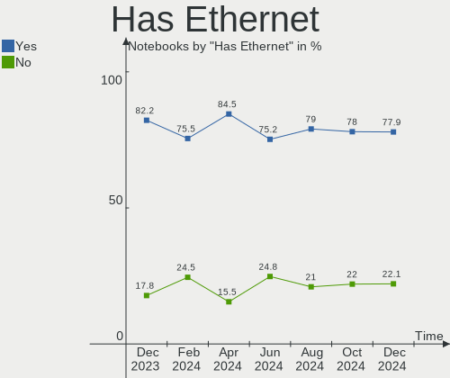
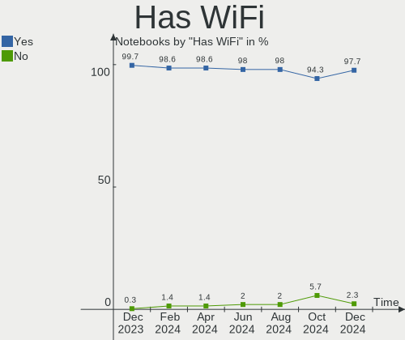
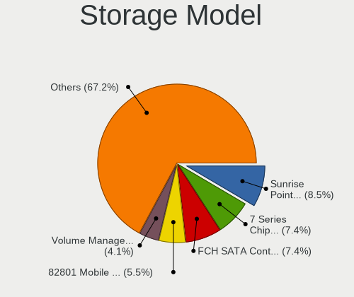
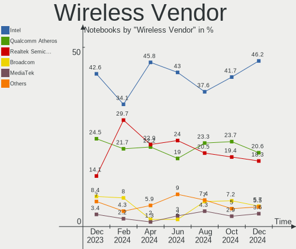
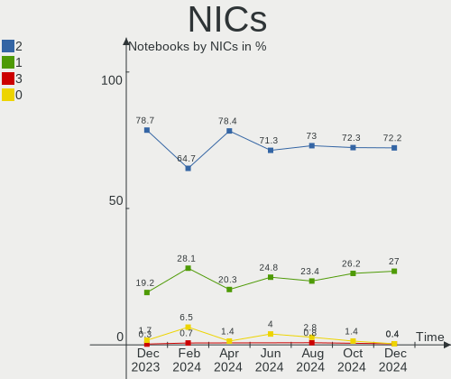
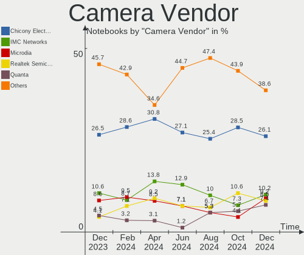
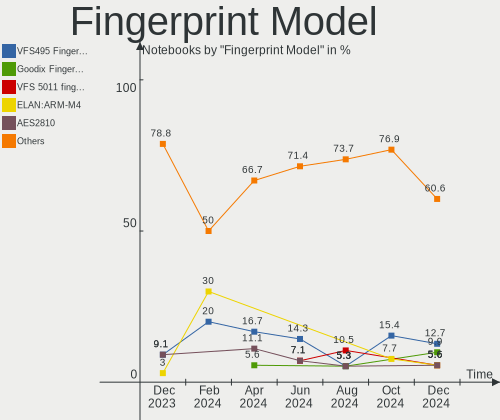

OpenMandriva - Hardware Trends (Notebooks)
------------------------------------------

A project to identify most popular hardware characteristics and track their change
over time based on data collected by Linux users at https://Linux-Hardware.org.

Anyone can contribute to this report by the [hw-probe](https://github.com/linuxhw/hw-probe) tool:

    sudo -E hw-probe -all -upload

This report is for one last month. Overall report since the beginning of time: [TestCoverage](https://github.com/linuxhw/TestCoverage)

Period: Aug, 2022.

Contents
--------

* [ System ](#system)
  - [ OS                       ](#os)
  - [ OS Family                ](#os-family)
  - [ Kernel                   ](#kernel)
  - [ Kernel Family            ](#kernel-family)
  - [ Kernel Major Ver.        ](#kernel-major-ver)
  - [ Arch                     ](#arch)
  - [ DE                       ](#de)
  - [ Display Server           ](#display-server)
  - [ Display Manager          ](#display-manager)
  - [ OS Lang                  ](#os-lang)
  - [ Boot Mode                ](#boot-mode)
  - [ Filesystem               ](#filesystem)
  - [ Part. scheme             ](#part-scheme)
  - [ Dual Boot with Linux/BSD ](#dual-boot-with-linuxbsd)
  - [ Dual Boot (Win)          ](#dual-boot-win)

* [ Board ](#board)
  - [ Vendor                   ](#vendor)
  - [ Model                    ](#model)
  - [ Model Family             ](#model-family)
  - [ MFG Year                 ](#mfg-year)
  - [ Form Factor              ](#form-factor)
  - [ Secure Boot              ](#secure-boot)
  - [ Coreboot                 ](#coreboot)
  - [ RAM Size                 ](#ram-size)
  - [ RAM Used                 ](#ram-used)
  - [ Total Drives             ](#total-drives)
  - [ Has CD-ROM               ](#has-cd-rom)
  - [ Has Ethernet             ](#has-ethernet)
  - [ Has WiFi                 ](#has-wifi)
  - [ Has Bluetooth            ](#has-bluetooth)

* [ Location ](#location)
  - [ Country                  ](#country)
  - [ City                     ](#city)

* [ Drives ](#drives)
  - [ Drive Vendor             ](#drive-vendor)
  - [ Drive Model              ](#drive-model)
  - [ HDD Vendor               ](#hdd-vendor)
  - [ SSD Vendor               ](#ssd-vendor)
  - [ Drive Kind               ](#drive-kind)
  - [ Drive Connector          ](#drive-connector)
  - [ Drive Size               ](#drive-size)
  - [ Space Total              ](#space-total)
  - [ Space Used               ](#space-used)
  - [ Malfunc. Drives          ](#malfunc-drives)
  - [ Malfunc. Drive Vendor    ](#malfunc-drive-vendor)
  - [ Malfunc. HDD Vendor      ](#malfunc-hdd-vendor)
  - [ Malfunc. Drive Kind      ](#malfunc-drive-kind)
  - [ Failed Drives            ](#failed-drives)
  - [ Failed Drive Vendor      ](#failed-drive-vendor)
  - [ Drive Status             ](#drive-status)

* [ Storage controller ](#storage-controller)
  - [ Storage Vendor           ](#storage-vendor)
  - [ Storage Model            ](#storage-model)
  - [ Storage Kind             ](#storage-kind)

* [ Processor ](#processor)
  - [ CPU Vendor               ](#cpu-vendor)
  - [ CPU Model                ](#cpu-model)
  - [ CPU Model Family         ](#cpu-model-family)
  - [ CPU Cores                ](#cpu-cores)
  - [ CPU Sockets              ](#cpu-sockets)
  - [ CPU Threads              ](#cpu-threads)
  - [ CPU Op-Modes             ](#cpu-op-modes)
  - [ CPU Microcode            ](#cpu-microcode)
  - [ CPU Microarch            ](#cpu-microarch)

* [ Graphics ](#graphics)
  - [ GPU Vendor               ](#gpu-vendor)
  - [ GPU Model                ](#gpu-model)
  - [ GPU Combo                ](#gpu-combo)
  - [ GPU Driver               ](#gpu-driver)
  - [ GPU Memory               ](#gpu-memory)

* [ Monitor ](#monitor)
  - [ Monitor Vendor           ](#monitor-vendor)
  - [ Monitor Model            ](#monitor-model)
  - [ Monitor Resolution       ](#monitor-resolution)
  - [ Monitor Diagonal         ](#monitor-diagonal)
  - [ Monitor Width            ](#monitor-width)
  - [ Aspect Ratio             ](#aspect-ratio)
  - [ Monitor Area             ](#monitor-area)
  - [ Pixel Density            ](#pixel-density)
  - [ Multiple Monitors        ](#multiple-monitors)

* [ Network ](#network)
  - [ Net Controller Vendor    ](#net-controller-vendor)
  - [ Net Controller Model     ](#net-controller-model)
  - [ Wireless Vendor          ](#wireless-vendor)
  - [ Wireless Model           ](#wireless-model)
  - [ Ethernet Vendor          ](#ethernet-vendor)
  - [ Ethernet Model           ](#ethernet-model)
  - [ Net Controller Kind      ](#net-controller-kind)
  - [ Used Controller          ](#used-controller)
  - [ NICs                     ](#nics)
  - [ IPv6                     ](#ipv6)

* [ Bluetooth ](#bluetooth)
  - [ Bluetooth Vendor         ](#bluetooth-vendor)
  - [ Bluetooth Model          ](#bluetooth-model)

* [ Sound ](#sound)
  - [ Sound Vendor             ](#sound-vendor)
  - [ Sound Model              ](#sound-model)

* [ Memory ](#memory)
  - [ Memory Vendor            ](#memory-vendor)
  - [ Memory Model             ](#memory-model)
  - [ Memory Kind              ](#memory-kind)
  - [ Memory Form Factor       ](#memory-form-factor)
  - [ Memory Size              ](#memory-size)
  - [ Memory Speed             ](#memory-speed)

* [ Printers & scanners ](#printers--scanners)
  - [ Printer Vendor           ](#printer-vendor)
  - [ Printer Model            ](#printer-model)
  - [ Scanner Vendor           ](#scanner-vendor)
  - [ Scanner Model            ](#scanner-model)

* [ Camera ](#camera)
  - [ Camera Vendor            ](#camera-vendor)
  - [ Camera Model             ](#camera-model)

* [ Security ](#security)
  - [ Fingerprint Vendor       ](#fingerprint-vendor)
  - [ Fingerprint Model        ](#fingerprint-model)
  - [ Chipcard Vendor          ](#chipcard-vendor)
  - [ Chipcard Model           ](#chipcard-model)

* [ Unsupported ](#unsupported)
  - [ Unsupported Devices      ](#unsupported-devices)
  - [ Unsupported Device Types ](#unsupported-device-types)

System
------

OS
--

Installed operating systems

| Name              | Notebooks | Percent |
|-------------------|-----------|---------|
| OpenMandriva 4.3  | 130       | 65.99%  |
| OpenMandriva 4.90 | 59        | 29.95%  |
| OpenMandriva 4.2  | 6         | 3.05%   |
| OpenMandriva 4.50 | 2         | 1.02%   |

OS Family
---------

OS without a version

| Name         | Notebooks | Percent |
|--------------|-----------|---------|
| OpenMandriva | 197       | 100%    |

Kernel
------

Version of the Linux kernel

| Version                     | Notebooks | Percent |
|-----------------------------|-----------|---------|
| 5.16.7-desktop-1omv4003     | 123       | 62.44%  |
| 5.18.12-desktop-3omv4090    | 54        | 27.41%  |
| 5.10.14-desktop-1omv4002    | 6         | 3.05%   |
| 5.17.1-desktop-2omv4050     | 4         | 2.03%   |
| 5.16.13-desktop-1omv4003    | 4         | 2.03%   |
| 5.19.1-desktop-1omv4090     | 2         | 1.02%   |
| 5.19.3-desktop-1omv4090     | 1         | 0.51%   |
| 5.19.2-desktop-1omv4090     | 1         | 0.51%   |
| 5.18.9-desktop-gcc-1omv4090 | 1         | 0.51%   |
| 5.14.7-desktop-1omv4050     | 1         | 0.51%   |

Kernel Family
-------------

Linux kernel without a distro release

| Version | Notebooks | Percent |
|---------|-----------|---------|
| 5.16.7  | 123       | 62.44%  |
| 5.18.12 | 54        | 27.41%  |
| 5.10.14 | 6         | 3.05%   |
| 5.17.1  | 4         | 2.03%   |
| 5.16.13 | 4         | 2.03%   |
| 5.19.1  | 2         | 1.02%   |
| 5.19.3  | 1         | 0.51%   |
| 5.19.2  | 1         | 0.51%   |
| 5.18.9  | 1         | 0.51%   |
| 5.14.7  | 1         | 0.51%   |

Kernel Major Ver.
-----------------

Linux kernel major version

| Version | Notebooks | Percent |
|---------|-----------|---------|
| 5.16    | 127       | 64.47%  |
| 5.18    | 55        | 27.92%  |
| 5.10    | 6         | 3.05%   |
| 5.19    | 4         | 2.03%   |
| 5.17    | 4         | 2.03%   |
| 5.14    | 1         | 0.51%   |

Arch
----

OS architecture (x86_64, i586, etc.)

| Name   | Notebooks | Percent |
|--------|-----------|---------|
| x86_64 | 197       | 100%    |

DE
--

Desktop Environment

| Name    | Notebooks | Percent |
|---------|-----------|---------|
| KDE5    | 195       | 98.98%  |
| LXQt    | 1         | 0.51%   |
| Unknown | 1         | 0.51%   |

Display Server
--------------

X11 or Wayland

| Name    | Notebooks | Percent |
|---------|-----------|---------|
| X11     | 196       | 99.49%  |
| Wayland | 1         | 0.51%   |

Display Manager
---------------

SDDM, LightDM, etc.

| Name | Notebooks | Percent |
|------|-----------|---------|
| SDDM | 197       | 100%    |

OS Lang
-------

Language

| Lang  | Notebooks | Percent |
|-------|-----------|---------|
| en_US | 129       | 65.48%  |
| fr_FR | 10        | 5.08%   |
| pt_BR | 9         | 4.57%   |
| it_IT | 7         | 3.55%   |
| de_DE | 7         | 3.55%   |
| ru_RU | 6         | 3.05%   |
| pl_PL | 4         | 2.03%   |
| es_ES | 4         | 2.03%   |
| pt_PT | 3         | 1.52%   |
| es_MX | 2         | 1.02%   |
| es_CL | 2         | 1.02%   |
| en_IN | 2         | 1.02%   |
| en_GB | 2         | 1.02%   |
| cs_CZ | 2         | 1.02%   |
| UTF-8 | 1         | 0.51%   |
| ro_RO | 1         | 0.51%   |
| nl_NL | 1         | 0.51%   |
| hu_HU | 1         | 0.51%   |
| fr_BE | 1         | 0.51%   |
| es_EC | 1         | 0.51%   |
| en_AU | 1         | 0.51%   |
| ar_SD | 1         | 0.51%   |

Boot Mode
---------

EFI or BIOS

| Mode | Notebooks | Percent |
|------|-----------|---------|
| EFI  | 116       | 58.88%  |
| BIOS | 81        | 41.12%  |

Filesystem
----------

Type of filesystem

| Type    | Notebooks | Percent |
|---------|-----------|---------|
| Overlay | 155       | 78.68%  |
| Ext4    | 39        | 19.8%   |
| Xfs     | 1         | 0.51%   |
| F2fs    | 1         | 0.51%   |
| Btrfs   | 1         | 0.51%   |

Part. scheme
------------

Scheme of partitioning

| Type | Notebooks | Percent |
|------|-----------|---------|
| GPT  | 146       | 74.11%  |
| MBR  | 51        | 25.89%  |

Dual Boot with Linux/BSD
------------------------

Hosting more than one Linux/BSD

| Dual boot | Notebooks | Percent |
|-----------|-----------|---------|
| Yes       | 108       | 54.82%  |
| No        | 89        | 45.18%  |

Dual Boot (Win)
---------------

Hosting Linux and Windows

| Dual boot | Notebooks | Percent |
|-----------|-----------|---------|
| No        | 115       | 58.38%  |
| Yes       | 82        | 41.62%  |

Board
-----

Vendor
------

Motherboard manufacturer

| Name                  | Notebooks | Percent |
|-----------------------|-----------|---------|
| Hewlett-Packard       | 39        | 19.8%   |
| Dell                  | 38        | 19.29%  |
| Lenovo                | 35        | 17.77%  |
| ASUSTek Computer      | 25        | 12.69%  |
| Acer                  | 24        | 12.18%  |
| Toshiba               | 7         | 3.55%   |
| Apple                 | 4         | 2.03%   |
| Packard Bell          | 3         | 1.52%   |
| MSI                   | 3         | 1.52%   |
| Fujitsu               | 3         | 1.52%   |
| Samsung Electronics   | 2         | 1.02%   |
| Positivo              | 2         | 1.02%   |
| Compaq                | 2         | 1.02%   |
| TUXEDO                | 1         | 0.51%   |
| Timi                  | 1         | 0.51%   |
| Sony                  | 1         | 0.51%   |
| Positivo Bahia - VAIO | 1         | 0.51%   |
| NEC Computers         | 1         | 0.51%   |
| Medion                | 1         | 0.51%   |
| HUAWEI                | 1         | 0.51%   |
| GPU Company           | 1         | 0.51%   |
| Google                | 1         | 0.51%   |
| Gateway               | 1         | 0.51%   |

Model
-----

Motherboard model

| Name                                                                                     | Notebooks | Percent |
|------------------------------------------------------------------------------------------|-----------|---------|
| Dell Latitude 3310                                                                       | 5         | 2.54%   |
| HP Notebook                                                                              | 4         | 2.03%   |
| Lenovo IdeaPad 1 14ADA05 82GW                                                            | 3         | 1.52%   |
| HP 15                                                                                    | 3         | 1.52%   |
| Dell Latitude E6430                                                                      | 3         | 1.52%   |
| Toshiba Satellite L500                                                                   | 2         | 1.02%   |
| Toshiba dynabook T653/46JR                                                               | 2         | 1.02%   |
| HP Laptop 15-dy2xxx                                                                      | 2         | 1.02%   |
| Dell Latitude E5510                                                                      | 2         | 1.02%   |
| Dell Latitude E5470                                                                      | 2         | 1.02%   |
| Dell Latitude 3410                                                                       | 2         | 1.02%   |
| Dell Latitude 3300                                                                       | 2         | 1.02%   |
| ASUS ZenBook UX425QA_UM425QA                                                             | 2         | 1.02%   |
| ASUS VivoBook_ASUS Laptop E510MA_R522MA                                                  | 2         | 1.02%   |
| Apple MacBookPro9,2                                                                      | 2         | 1.02%   |
| Apple MacBookPro5,5                                                                      | 2         | 1.02%   |
| Acer Nitro AN515-31                                                                      | 2         | 1.02%   |
| Unknown                                                                                  | 2         | 1.02%   |
| TUXEDO Book BA1510                                                                       | 1         | 0.51%   |
| Toshiba Satellite-C845                                                                   | 1         | 0.51%   |
| Toshiba Satellite P200                                                                   | 1         | 0.51%   |
| Toshiba Satellite A300                                                                   | 1         | 0.51%   |
| Timi RedmiBook Pro 15S                                                                   | 1         | 0.51%   |
| Sony VPCYB3V1E                                                                           | 1         | 0.51%   |
| Samsung NC210/NC110                                                                      | 1         | 0.51%   |
| Samsung 355V4C/355V4X/355V5C/355V5X/356V4C/356V4X/356V5C/356V5X/3445VC/3445VX/3545VC/354 | 1         | 0.51%   |
| Positivo Mobile                                                                          | 1         | 0.51%   |
| Positivo EC10IS1                                                                         | 1         | 0.51%   |
| Positivo Bahia - VAIO S14SL03                                                            | 1         | 0.51%   |
| Packard Bell EasyNote TK37                                                               | 1         | 0.51%   |
| Packard Bell EasyNote TK13BZ                                                             | 1         | 0.51%   |
| Packard Bell EasyNote TE11BZ                                                             | 1         | 0.51%   |
| NEC Computers PC-LJ730MG6W                                                               | 1         | 0.51%   |
| MSI GL75 Leopard 10SDK                                                                   | 1         | 0.51%   |
| MSI GE70 0NC/GE70 0ND                                                                    | 1         | 0.51%   |
| MSI GE62VR 7RF                                                                           | 1         | 0.51%   |
| Medion Akoya E6418 MD99620                                                               | 1         | 0.51%   |
| Lenovo V14-ADA 82C6                                                                      | 1         | 0.51%   |
| Lenovo ThinkPad X270 20HN0015GE                                                          | 1         | 0.51%   |
| Lenovo ThinkPad X230 2325U9T                                                             | 1         | 0.51%   |
| Lenovo ThinkPad X220 Tablet 4299Y1B                                                      | 1         | 0.51%   |
| Lenovo ThinkPad X201 3626HMG                                                             | 1         | 0.51%   |
| Lenovo ThinkPad X200 7458FZ3                                                             | 1         | 0.51%   |
| Lenovo ThinkPad T61 76653JG                                                              | 1         | 0.51%   |
| Lenovo ThinkPad T61 64665DG                                                              | 1         | 0.51%   |
| Lenovo ThinkPad T530 2429W4Z                                                             | 1         | 0.51%   |
| Lenovo ThinkPad T430s 2356LNG                                                            | 1         | 0.51%   |
| Lenovo ThinkPad T420 4180F75                                                             | 1         | 0.51%   |
| Lenovo ThinkPad SL510 28477NG                                                            | 1         | 0.51%   |
| Lenovo ThinkPad R500 27148UG                                                             | 1         | 0.51%   |
| Lenovo ThinkPad L470 20J4002FMX                                                          | 1         | 0.51%   |
| Lenovo ThinkPad L412 0585A84                                                             | 1         | 0.51%   |
| Lenovo ThinkPad E590 20NB0029GE                                                          | 1         | 0.51%   |
| Lenovo IdeaPad Slim 1-14AST-05 81VS                                                      | 1         | 0.51%   |
| Lenovo IdeaPad S145-15IKB 81VD                                                           | 1         | 0.51%   |
| Lenovo IdeaPad S145-14AST 81ST                                                           | 1         | 0.51%   |
| Lenovo IdeaPad S130-14IGM 81J2                                                           | 1         | 0.51%   |
| Lenovo IdeaPad 500S-14ISK 80Q3                                                           | 1         | 0.51%   |
| Lenovo IdeaPad 330-15IKB 81DE                                                            | 1         | 0.51%   |
| Lenovo IdeaPad 320-15IAP 81A3                                                            | 1         | 0.51%   |

Model Family
------------

Motherboard model prefix

| Name                          | Notebooks | Percent |
|-------------------------------|-----------|---------|
| Dell Latitude                 | 26        | 13.2%   |
| Lenovo IdeaPad                | 16        | 8.12%   |
| Lenovo ThinkPad               | 15        | 7.61%   |
| Acer Aspire                   | 13        | 6.6%    |
| HP Pavilion                   | 11        | 5.58%   |
| ASUS VivoBook                 | 8         | 4.06%   |
| HP Laptop                     | 7         | 3.55%   |
| HP ProBook                    | 5         | 2.54%   |
| Toshiba Satellite             | 4         | 2.03%   |
| HP Notebook                   | 4         | 2.03%   |
| Packard Bell EasyNote         | 3         | 1.52%   |
| HP 15                         | 3         | 1.52%   |
| Fujitsu LIFEBOOK              | 3         | 1.52%   |
| Dell XPS                      | 3         | 1.52%   |
| ASUS ZenBook                  | 3         | 1.52%   |
| Toshiba dynabook              | 2         | 1.02%   |
| HP Stream                     | 2         | 1.02%   |
| HP EliteBook                  | 2         | 1.02%   |
| Dell Vostro                   | 2         | 1.02%   |
| Dell Precision                | 2         | 1.02%   |
| Dell Inspiron                 | 2         | 1.02%   |
| Apple MacBookPro9             | 2         | 1.02%   |
| Apple MacBookPro5             | 2         | 1.02%   |
| Acer TravelMate               | 2         | 1.02%   |
| Acer Nitro                    | 2         | 1.02%   |
| Unknown                       | 2         | 1.02%   |
| TUXEDO Book                   | 1         | 0.51%   |
| Toshiba Satellite-C845        | 1         | 0.51%   |
| Timi RedmiBook                | 1         | 0.51%   |
| Sony VPCYB3V1E                | 1         | 0.51%   |
| Samsung NC210                 | 1         | 0.51%   |
| Samsung 355V4C                | 1         | 0.51%   |
| Positivo Mobile               | 1         | 0.51%   |
| Positivo EC10IS1              | 1         | 0.51%   |
| Positivo Bahia - VAIO S14SL03 | 1         | 0.51%   |
| NEC Computers PC-LJ730MG6W    | 1         | 0.51%   |
| MSI GL75                      | 1         | 0.51%   |
| MSI GE70                      | 1         | 0.51%   |
| MSI GE62VR                    | 1         | 0.51%   |
| Medion Akoya                  | 1         | 0.51%   |
| Lenovo V14-ADA                | 1         | 0.51%   |
| Lenovo G570                   | 1         | 0.51%   |
| Lenovo G50-30                 | 1         | 0.51%   |
| HUAWEI BOHB-WAX9              | 1         | 0.51%   |
| HP Compaq                     | 1         | 0.51%   |
| HP 630                        | 1         | 0.51%   |
| HP 620                        | 1         | 0.51%   |
| HP 240                        | 1         | 0.51%   |
| GPU Company GWNR71517         | 1         | 0.51%   |
| Google Galtic                 | 1         | 0.51%   |
| Gateway MT6723                | 1         | 0.51%   |
| Dell System                   | 1         | 0.51%   |
| Dell Studio                   | 1         | 0.51%   |
| Dell G5                       | 1         | 0.51%   |
| Compaq Presario               | 1         | 0.51%   |
| Compaq 430                    | 1         | 0.51%   |
| ASUS Z550SA                   | 1         | 0.51%   |
| ASUS X75A1                    | 1         | 0.51%   |
| ASUS X555LN                   | 1         | 0.51%   |
| ASUS X555LAB                  | 1         | 0.51%   |

MFG Year
--------

Motherboard manufacture year

| Year    | Notebooks | Percent |
|---------|-----------|---------|
| 2012    | 21        | 10.66%  |
| 2020    | 20        | 10.15%  |
| 2019    | 20        | 10.15%  |
| 2011    | 20        | 10.15%  |
| 2021    | 19        | 9.64%   |
| 2016    | 14        | 7.11%   |
| 2014    | 12        | 6.09%   |
| 2017    | 11        | 5.58%   |
| 2010    | 11        | 5.58%   |
| 2013    | 10        | 5.08%   |
| 2018    | 8         | 4.06%   |
| 2009    | 8         | 4.06%   |
| 2008    | 8         | 4.06%   |
| 2015    | 6         | 3.05%   |
| 2007    | 5         | 2.54%   |
| 2006    | 2         | 1.02%   |
| 2022    | 1         | 0.51%   |
| Unknown | 1         | 0.51%   |

Form Factor
-----------

Physical design of the computer

| Name     | Notebooks | Percent |
|----------|-----------|---------|
| Notebook | 197       | 100%    |

Secure Boot
-----------

Enabled or disabled

| State    | Notebooks | Percent |
|----------|-----------|---------|
| Disabled | 197       | 100%    |

Coreboot
--------

Have coreboot on board

| Used | Notebooks | Percent |
|------|-----------|---------|
| No   | 196       | 99.49%  |
| Yes  | 1         | 0.51%   |

RAM Size
--------

Total RAM memory

| Size in GB | Notebooks | Percent |
|------------|-----------|---------|
| 4.01-8.0   | 75        | 38.07%  |
| 3.01-4.0   | 68        | 34.52%  |
| 8.01-16.0  | 22        | 11.17%  |
| 16.01-24.0 | 14        | 7.11%   |
| 1.01-2.0   | 9         | 4.57%   |
| 2.01-3.0   | 5         | 2.54%   |
| 32.01-64.0 | 4         | 2.03%   |

RAM Used
--------

Used RAM memory

| Used GB  | Notebooks | Percent |
|----------|-----------|---------|
| 1.01-2.0 | 159       | 80.71%  |
| 0.51-1.0 | 20        | 10.15%  |
| 2.01-3.0 | 16        | 8.12%   |
| 0.01-0.5 | 2         | 1.02%   |

Total Drives
------------

Number of drives on board

| Drives | Notebooks | Percent |
|--------|-----------|---------|
| 1      | 137       | 69.54%  |
| 2      | 51        | 25.89%  |
| 3      | 5         | 2.54%   |
| 0      | 4         | 2.03%   |

Has CD-ROM
----------

Has CD-ROM on board

| Presented | Notebooks | Percent |
|-----------|-----------|---------|
| No        | 110       | 55.84%  |
| Yes       | 87        | 44.16%  |

Has Ethernet
------------

Has Ethernet on board

| Presented | Notebooks | Percent |
|-----------|-----------|---------|
| Yes       | 166       | 84.26%  |
| No        | 31        | 15.74%  |

Has WiFi
--------

Has WiFi module

| Presented | Notebooks | Percent |
|-----------|-----------|---------|
| Yes       | 196       | 99.49%  |
| No        | 1         | 0.51%   |

Has Bluetooth
-------------

Has Bluetooth module

| Presented | Notebooks | Percent |
|-----------|-----------|---------|
| Yes       | 149       | 75.63%  |
| No        | 48        | 24.37%  |

Location
--------

Country
-------

Geographic location (country)

| Country      | Notebooks | Percent |
|--------------|-----------|---------|
| USA          | 26        | 13.2%   |
| France       | 15        | 7.61%   |
| Germany      | 14        | 7.11%   |
| Brazil       | 13        | 6.6%    |
| Netherlands  | 12        | 6.09%   |
| UK           | 11        | 5.58%   |
| Italy        | 10        | 5.08%   |
| Russia       | 7         | 3.55%   |
| Poland       | 7         | 3.55%   |
| Romania      | 6         | 3.05%   |
| Spain        | 5         | 2.54%   |
| India        | 5         | 2.54%   |
| Portugal     | 4         | 2.03%   |
| Finland      | 4         | 2.03%   |
| Czechia      | 4         | 2.03%   |
| Canada       | 4         | 2.03%   |
| Australia    | 4         | 2.03%   |
| Switzerland  | 3         | 1.52%   |
| Mexico       | 3         | 1.52%   |
| Japan        | 3         | 1.52%   |
| Argentina    | 3         | 1.52%   |
| Turkey       | 2         | 1.02%   |
| New Zealand  | 2         | 1.02%   |
| Indonesia    | 2         | 1.02%   |
| Chile        | 2         | 1.02%   |
| Uruguay      | 1         | 0.51%   |
| Ukraine      | 1         | 0.51%   |
| UAE          | 1         | 0.51%   |
| Thailand     | 1         | 0.51%   |
| Sweden       | 1         | 0.51%   |
| Sudan        | 1         | 0.51%   |
| South Africa | 1         | 0.51%   |
| Slovakia     | 1         | 0.51%   |
| Réunion     | 1         | 0.51%   |
| Puerto Rico  | 1         | 0.51%   |
| Philippines  | 1         | 0.51%   |
| Peru         | 1         | 0.51%   |
| Panama       | 1         | 0.51%   |
| Norway       | 1         | 0.51%   |
| Morocco      | 1         | 0.51%   |
| Montenegro   | 1         | 0.51%   |
| Lithuania    | 1         | 0.51%   |
| Hungary      | 1         | 0.51%   |
| Gibraltar    | 1         | 0.51%   |
| Ecuador      | 1         | 0.51%   |
| Denmark      | 1         | 0.51%   |
| Croatia      | 1         | 0.51%   |
| Belarus      | 1         | 0.51%   |
| Bangladesh   | 1         | 0.51%   |
| Bahrain      | 1         | 0.51%   |
| Algeria      | 1         | 0.51%   |

City
----

Geographic location (city)

| City                     | Notebooks | Percent |
|--------------------------|-----------|---------|
| Schagen                  | 10        | 5.08%   |
| Thiers                   | 3         | 1.52%   |
| Paris                    | 3         | 1.52%   |
| Moscow                   | 3         | 1.52%   |
| Connersville             | 3         | 1.52%   |
| Cascais                  | 3         | 1.52%   |
| Tomsk                    | 2         | 1.02%   |
| Sydney                   | 2         | 1.02%   |
| Soure                    | 2         | 1.02%   |
| Sao Paulo                | 2         | 1.02%   |
| Prague                   | 2         | 1.02%   |
| Munich                   | 2         | 1.02%   |
| Las Vegas                | 2         | 1.02%   |
| Jastrzębie Zdrój       | 2         | 1.02%   |
| Hitachi                  | 2         | 1.02%   |
| Helsinki                 | 2         | 1.02%   |
| Fritch                   | 2         | 1.02%   |
| Châtellerault           | 2         | 1.02%   |
| Bucharest                | 2         | 1.02%   |
| Bengaluru                | 2         | 1.02%   |
| Zurich                   | 1         | 0.51%   |
| Zubri                    | 1         | 0.51%   |
| Zegrze                   | 1         | 0.51%   |
| Zaragoza                 | 1         | 0.51%   |
| Zamboanga City           | 1         | 0.51%   |
| Zagreb                   | 1         | 0.51%   |
| Zacatecas City           | 1         | 0.51%   |
| Yokohama                 | 1         | 0.51%   |
| Wolverhampton            | 1         | 0.51%   |
| Weilmuenster             | 1         | 0.51%   |
| Voronezh                 | 1         | 0.51%   |
| Viña del Mar            | 1         | 0.51%   |
| Vilnius                  | 1         | 0.51%   |
| Vermand                  | 1         | 0.51%   |
| Valkeakoski              | 1         | 0.51%   |
| Valencia                 | 1         | 0.51%   |
| Unai                     | 1         | 0.51%   |
| Ubatuba                  | 1         | 0.51%   |
| Teresopolis              | 1         | 0.51%   |
| Tampere                  | 1         | 0.51%   |
| Talcahuano               | 1         | 0.51%   |
| Surprise                 | 1         | 0.51%   |
| Stradella                | 1         | 0.51%   |
| Stone                    | 1         | 0.51%   |
| Stockton                 | 1         | 0.51%   |
| St. Moritz               | 1         | 0.51%   |
| St Louis                 | 1         | 0.51%   |
| Spring Hill              | 1         | 0.51%   |
| Sindelfingen             | 1         | 0.51%   |
| Silver Spring            | 1         | 0.51%   |
| Sherburn in Elmet        | 1         | 0.51%   |
| Sherbrooke               | 1         | 0.51%   |
| Santo André             | 1         | 0.51%   |
| Santa Rosa               | 1         | 0.51%   |
| Santa Lucia              | 1         | 0.51%   |
| San Juan                 | 1         | 0.51%   |
| San Gennaro Vesuviano    | 1         | 0.51%   |
| Salford                  | 1         | 0.51%   |
| Salamanca                | 1         | 0.51%   |
| Saint-Mitre-les-Remparts | 1         | 0.51%   |

Drives
------

Drive Vendor
------------

Hard drive vendors

| Vendor              | Notebooks | Drives | Percent |
|---------------------|-----------|--------|---------|
| WDC                 | 37        | 38     | 15.68%  |
| Seagate             | 30        | 31     | 12.71%  |
| Samsung Electronics | 22        | 23     | 9.32%   |
| Unknown             | 16        | 16     | 6.78%   |
| Toshiba             | 16        | 17     | 6.78%   |
| Kingston            | 14        | 14     | 5.93%   |
| SK hynix            | 11        | 11     | 4.66%   |
| Crucial             | 10        | 13     | 4.24%   |
| SanDisk             | 9         | 9      | 3.81%   |
| Hitachi             | 9         | 9      | 3.81%   |
| HGST                | 8         | 8      | 3.39%   |
| KIOXIA              | 5         | 5      | 2.12%   |
| A-DATA Technology   | 5         | 5      | 2.12%   |
| LITEON              | 4         | 4      | 1.69%   |
| Intel               | 4         | 4      | 1.69%   |
| PNY                 | 3         | 3      | 1.27%   |
| Unknown             | 3         | 3      | 1.27%   |
| SAGE                | 2         | 2      | 0.85%   |
| Patriot             | 2         | 2      | 0.85%   |
| Micron Technology   | 2         | 2      | 0.85%   |
| KingSpec            | 2         | 2      | 0.85%   |
| Intenso             | 2         | 2      | 0.85%   |
| Fujitsu             | 2         | 2      | 0.85%   |
| China               | 2         | 2      | 0.85%   |
| ZTE                 | 1         | 1      | 0.42%   |
| UMIS                | 1         | 1      | 0.42%   |
| Transcend           | 1         | 1      | 0.42%   |
| TCSUNBOW            | 1         | 1      | 0.42%   |
| Silicon Motion      | 1         | 1      | 0.42%   |
| SABRENT             | 1         | 1      | 0.42%   |
| Phison              | 1         | 1      | 0.42%   |
| Magnetic Data       | 1         | 1      | 0.42%   |
| LITEONIT            | 1         | 1      | 0.42%   |
| KingDian            | 1         | 1      | 0.42%   |
| JMicron Technology  | 1         | 1      | 0.42%   |
| Hewlett-Packard     | 1         | 1      | 0.42%   |
| GOODRAM             | 1         | 1      | 0.42%   |
| Gigabyte Technology | 1         | 1      | 0.42%   |
| GALAX               | 1         | 1      | 0.42%   |
| Apple               | 1         | 1      | 0.42%   |

Drive Model
-----------

Hard drive models

| Model                                | Notebooks | Percent |
|--------------------------------------|-----------|---------|
| Seagate ST1000LM035-1RK172 1TB       | 5         | 2.07%   |
| Unknown SD/MMC/MS PRO 128GB          | 3         | 1.24%   |
| Unknown MMC64G  64GB                 | 3         | 1.24%   |
| Unknown DA4128  128GB                | 3         | 1.24%   |
| Toshiba MQ01ABF050 500GB             | 3         | 1.24%   |
| Seagate ST1000LM024 HN-M101MBB 1TB   | 3         | 1.24%   |
| Samsung MZVLQ512HALU-00000 512GB     | 3         | 1.24%   |
| Kingston SA400S37240G 240GB SSD      | 3         | 1.24%   |
| HGST HTS545050A7E680 500GB           | 3         | 1.24%   |
| Unknown                              | 3         | 1.24%   |
| WDC WDS120G2G0B-00EPW0 120GB SSD     | 2         | 0.83%   |
| WDC WDBNCE0010PNC 1TB SSD            | 2         | 0.83%   |
| WDC WD1600BEVT-22A23T0 160GB         | 2         | 0.83%   |
| Toshiba MQ01ABD075 752GB             | 2         | 0.83%   |
| Seagate ST9250827AS 250GB            | 2         | 0.83%   |
| Seagate ST500LT012-1DG142 500GB      | 2         | 0.83%   |
| Seagate ST1000LM048-2E7172 1TB       | 2         | 0.83%   |
| Seagate Expansion 500GB              | 2         | 0.83%   |
| SanDisk DF4032  32GB                 | 2         | 0.83%   |
| Samsung MZNLN128HAHQ-000H1 128GB SSD | 2         | 0.83%   |
| SAGE 3639S 120GB                     | 2         | 0.83%   |
| PNY CS900 120GB SSD                  | 2         | 0.83%   |
| Kingston SFYRS500G 500GB             | 2         | 0.83%   |
| Kingston SA400S37120G 120GB SSD      | 2         | 0.83%   |
| Hitachi HTS547550A9E384 500GB        | 2         | 0.83%   |
| HGST HTS545050A7E380 500GB           | 2         | 0.83%   |
| Crucial CT500MX500SSD1 500GB         | 2         | 0.83%   |
| Crucial CT240BX500SSD1 240GB         | 2         | 0.83%   |
| A-DATA SX6000LNP 128GB               | 2         | 0.83%   |
| ZTE MMC Storage 942MB                | 1         | 0.41%   |
| WDC WDS120G2G0A-00JH30 120GB SSD     | 1         | 0.41%   |
| WDC WD7500BPKT-22PK4T0 752GB         | 1         | 0.41%   |
| WDC WD5000LPZX-08Z10 500GB           | 1         | 0.41%   |
| WDC WD5000LPVX-22V0TT0 500GB         | 1         | 0.41%   |
| WDC WD5000LPVT-22G33T0 500GB         | 1         | 0.41%   |
| WDC WD5000LPCX-22VHAT0 500GB         | 1         | 0.41%   |
| WDC WD5000LPCX-00VHAT0 500GB         | 1         | 0.41%   |
| WDC WD5000BPVT-80HXZT3 500GB         | 1         | 0.41%   |
| WDC WD5000BPKX-22HPJT0 500GB         | 1         | 0.41%   |
| WDC WD3200LPLX-66ZNTT0 320GB         | 1         | 0.41%   |
| WDC WD3200BUCT-63TWBY0 320GB         | 1         | 0.41%   |
| WDC WD3200BPVT-22ZEST0 320GB         | 1         | 0.41%   |
| WDC WD3200BEVT-75A23T0 320GB         | 1         | 0.41%   |
| WDC WD3200BEVT-63ZCT0 320GB          | 1         | 0.41%   |
| WDC WD3200BEVT-60A23T0 320GB         | 1         | 0.41%   |
| WDC WD3200BEKX-75B7WT0 320GB         | 1         | 0.41%   |
| WDC WD3200BEKT-75PVMT0 320GB         | 1         | 0.41%   |
| WDC WD1600BEVT-75A23T0 160GB         | 1         | 0.41%   |
| WDC WD1200BEVS-08UST0 120GB          | 1         | 0.41%   |
| WDC WD10SPZX-80Z10T2 1TB             | 1         | 0.41%   |
| WDC WD10SPZX-24Z10T0 1TB             | 1         | 0.41%   |
| WDC WD10SPZX-24Z10 1TB               | 1         | 0.41%   |
| WDC WD10SPZX-21Z10T0 1TB             | 1         | 0.41%   |
| WDC WD10SPZX-08Z10 1TB               | 1         | 0.41%   |
| WDC WD10SPCX-24HWST1 1TB             | 1         | 0.41%   |
| WDC WD10JPVX-60JC3T1 1TB             | 1         | 0.41%   |
| WDC PC SN530 SDBPNPZ-512G-1114 512GB | 1         | 0.41%   |
| WDC PC SN530 SDBPNPZ-256G-1114 256GB | 1         | 0.41%   |
| WDC PC SN530 SDBPNPZ-256G-1002 256GB | 1         | 0.41%   |
| WDC PC SN530 SDBPMPZ-256G-1101 256GB | 1         | 0.41%   |

HDD Vendor
----------

Hard disk drive vendors

| Vendor              | Notebooks | Drives | Percent |
|---------------------|-----------|--------|---------|
| Seagate             | 30        | 31     | 30%     |
| WDC                 | 27        | 27     | 27%     |
| Toshiba             | 15        | 15     | 15%     |
| Hitachi             | 9         | 9      | 9%      |
| HGST                | 8         | 8      | 8%      |
| Unknown             | 3         | 3      | 3%      |
| SAGE                | 2         | 2      | 2%      |
| Fujitsu             | 2         | 2      | 2%      |
| Samsung Electronics | 1         | 1      | 1%      |
| SABRENT             | 1         | 1      | 1%      |
| Magnetic Data       | 1         | 1      | 1%      |
| Apple               | 1         | 1      | 1%      |

SSD Vendor
----------

Solid state drive vendors

| Vendor              | Notebooks | Drives | Percent |
|---------------------|-----------|--------|---------|
| Samsung Electronics | 12        | 13     | 16.22%  |
| Kingston            | 10        | 10     | 13.51%  |
| Crucial             | 10        | 13     | 13.51%  |
| SanDisk             | 7         | 7      | 9.46%   |
| WDC                 | 5         | 5      | 6.76%   |
| LITEON              | 4         | 4      | 5.41%   |
| PNY                 | 3         | 3      | 4.05%   |
| SK hynix            | 2         | 2      | 2.7%    |
| Patriot             | 2         | 2      | 2.7%    |
| KingSpec            | 2         | 2      | 2.7%    |
| Intenso             | 2         | 2      | 2.7%    |
| China               | 2         | 2      | 2.7%    |
| A-DATA Technology   | 2         | 2      | 2.7%    |
| Unknown             | 2         | 2      | 2.7%    |
| Transcend           | 1         | 1      | 1.35%   |
| Toshiba             | 1         | 2      | 1.35%   |
| TCSUNBOW            | 1         | 1      | 1.35%   |
| Phison              | 1         | 1      | 1.35%   |
| LITEONIT            | 1         | 1      | 1.35%   |
| KingDian            | 1         | 1      | 1.35%   |
| JMicron Technology  | 1         | 1      | 1.35%   |
| GOODRAM             | 1         | 1      | 1.35%   |
| GALAX               | 1         | 1      | 1.35%   |

Drive Kind
----------

HDD or SSD

| Kind    | Notebooks | Drives | Percent |
|---------|-----------|--------|---------|
| HDD     | 95        | 101    | 42.41%  |
| SSD     | 67        | 79     | 29.91%  |
| NVMe    | 45        | 46     | 20.09%  |
| MMC     | 16        | 16     | 7.14%   |
| Unknown | 1         | 1      | 0.45%   |

Drive Connector
---------------

SATA, SAS, NVMe, etc.

| Type | Notebooks | Drives | Percent |
|------|-----------|--------|---------|
| SATA | 143       | 168    | 66.51%  |
| NVMe | 45        | 46     | 20.93%  |
| MMC  | 16        | 16     | 7.44%   |
| SAS  | 11        | 13     | 5.12%   |

Drive Size
----------

Size of hard drive

| Size in TB | Notebooks | Drives | Percent |
|------------|-----------|--------|---------|
| 0.01-0.5   | 116       | 137    | 73.89%  |
| 0.51-1.0   | 37        | 39     | 23.57%  |
| 3.01-4.0   | 2         | 2      | 1.27%   |
| 1.01-2.0   | 2         | 2      | 1.27%   |

Space Total
-----------

Amount of disk space available on the file system

| Size in GB | Notebooks | Percent |
|------------|-----------|---------|
| 1-20       | 110       | 55.84%  |
| 101-250    | 40        | 20.3%   |
| 251-500    | 17        | 8.63%   |
| 501-1000   | 8         | 4.06%   |
| 51-100     | 7         | 3.55%   |
| Unknown    | 7         | 3.55%   |
| 21-50      | 6         | 3.05%   |
| 1001-2000  | 2         | 1.02%   |

Space Used
----------

Amount of used disk space

| Used GB | Notebooks | Percent |
|---------|-----------|---------|
| 1-20    | 178       | 90.36%  |
| Unknown | 7         | 3.55%   |
| 51-100  | 4         | 2.03%   |
| 251-500 | 3         | 1.52%   |
| 101-250 | 3         | 1.52%   |
| 21-50   | 2         | 1.02%   |

Malfunc. Drives
---------------

Drive models with a malfunction

| Model                                 | Notebooks | Drives | Percent |
|---------------------------------------|-----------|--------|---------|
| HGST HTS545050A7E680 500GB            | 3         | 3      | 6.52%   |
| WDC WD1600BEVT-22A23T0 160GB          | 2         | 2      | 4.35%   |
| Toshiba MQ01ABD075 752GB              | 2         | 2      | 4.35%   |
| Seagate ST9250827AS 250GB             | 2         | 2      | 4.35%   |
| WDC WD5000LPCX-22VHAT0 500GB          | 1         | 1      | 2.17%   |
| WDC WD3200BPVT-22ZEST0 320GB          | 1         | 1      | 2.17%   |
| WDC WD3200BEVT-60A23T0 320GB          | 1         | 1      | 2.17%   |
| WDC WD3200BEKT-75PVMT0 320GB          | 1         | 1      | 2.17%   |
| WDC WD10SPZX-24Z10T0 1TB              | 1         | 1      | 2.17%   |
| WDC WD10SPZX-08Z10 1TB                | 1         | 1      | 2.17%   |
| WDC WD10SPCX-24HWST1 1TB              | 1         | 1      | 2.17%   |
| WDC WD10JPVX-60JC3T1 1TB              | 1         | 1      | 2.17%   |
| Toshiba MQ01ABF050M 500GB             | 1         | 1      | 2.17%   |
| Toshiba MK3276GSX 320GB               | 1         | 1      | 2.17%   |
| Toshiba MK2561GSYN 250GB              | 1         | 1      | 2.17%   |
| Toshiba MK1255GSX H 120GB             | 1         | 1      | 2.17%   |
| Seagate STM980215AS 80GB              | 1         | 1      | 2.17%   |
| Seagate ST9640320AS 640GB             | 1         | 1      | 2.17%   |
| Seagate ST9320328CS 320GB             | 1         | 1      | 2.17%   |
| Seagate ST9320310AS 320GB             | 1         | 1      | 2.17%   |
| Seagate ST9250410AS 250GB             | 1         | 1      | 2.17%   |
| Seagate ST9120823AS 120GB             | 1         | 1      | 2.17%   |
| Seagate ST500LT012-9WS142 500GB       | 1         | 1      | 2.17%   |
| Seagate ST500LM012 HN-M500MBB 500GB   | 1         | 1      | 2.17%   |
| Seagate ST1000LM048-2E7172 1TB        | 1         | 1      | 2.17%   |
| Seagate ST1000LM024 HN-M101MBB 1TB    | 1         | 1      | 2.17%   |
| SanDisk SSD U100 256GB                | 1         | 1      | 2.17%   |
| SanDisk SDSSDP128G 128GB              | 1         | 1      | 2.17%   |
| Magnetic Data MD01600-AVDW-RO 160GB   | 1         | 1      | 2.17%   |
| LITEON LMH-256V2M-11 MSATA 256GB SSD  | 1         | 1      | 2.17%   |
| Kingston RBU-SNS8100S3128GD 128GB SSD | 1         | 1      | 2.17%   |
| Hitachi HTS725032A7E630 320GB         | 1         | 1      | 2.17%   |
| Hitachi HTS543216L9A300 160GB         | 1         | 1      | 2.17%   |
| Hitachi HTS541680J9SA00 80GB          | 1         | 1      | 2.17%   |
| Hitachi HTS541616J9SA00 160GB         | 1         | 1      | 2.17%   |
| HGST HTS545050A7E660 500GB            | 1         | 1      | 2.17%   |
| Hewlett-Packard SSD EX900 500GB       | 1         | 1      | 2.17%   |
| Fujitsu MJA2320BH G1 320GB            | 1         | 1      | 2.17%   |
| Crucial CT240BX500SSD1 240GB          | 1         | 1      | 2.17%   |
| Apple HDD HTS547550A9E384 500GB       | 1         | 1      | 2.17%   |
| A-DATA Technology SU650 120GB SSD     | 1         | 1      | 2.17%   |

Malfunc. Drive Vendor
---------------------

Vendors of faulty drives

| Vendor            | Notebooks | Drives | Percent |
|-------------------|-----------|--------|---------|
| Seagate           | 11        | 12     | 24.44%  |
| WDC               | 10        | 10     | 22.22%  |
| Toshiba           | 6         | 6      | 13.33%  |
| Hitachi           | 4         | 4      | 8.89%   |
| HGST              | 4         | 4      | 8.89%   |
| SanDisk           | 2         | 2      | 4.44%   |
| Magnetic Data     | 1         | 1      | 2.22%   |
| LITEON            | 1         | 1      | 2.22%   |
| Kingston          | 1         | 1      | 2.22%   |
| Hewlett-Packard   | 1         | 1      | 2.22%   |
| Fujitsu           | 1         | 1      | 2.22%   |
| Crucial           | 1         | 1      | 2.22%   |
| Apple             | 1         | 1      | 2.22%   |
| A-DATA Technology | 1         | 1      | 2.22%   |

Malfunc. HDD Vendor
-------------------

Vendors of faulty HDD drives

| Vendor        | Notebooks | Drives | Percent |
|---------------|-----------|--------|---------|
| Seagate       | 11        | 12     | 28.95%  |
| WDC           | 10        | 10     | 26.32%  |
| Toshiba       | 6         | 6      | 15.79%  |
| Hitachi       | 4         | 4      | 10.53%  |
| HGST          | 4         | 4      | 10.53%  |
| Magnetic Data | 1         | 1      | 2.63%   |
| Fujitsu       | 1         | 1      | 2.63%   |
| Apple         | 1         | 1      | 2.63%   |

Malfunc. Drive Kind
-------------------

Kinds of faulty drives

| Kind | Notebooks | Drives | Percent |
|------|-----------|--------|---------|
| HDD  | 38        | 39     | 84.44%  |
| SSD  | 6         | 6      | 13.33%  |
| NVMe | 1         | 1      | 2.22%   |

Failed Drives
-------------

Failed drive models

| Model                             | Notebooks | Drives | Percent |
|-----------------------------------|-----------|--------|---------|
| WDC WD1600BEVT-75A23T0 160GB      | 1         | 1      | 50%     |
| Samsung Electronics HM251JI 250GB | 1         | 1      | 50%     |

Failed Drive Vendor
-------------------

Failed drive vendors

| Vendor              | Notebooks | Drives | Percent |
|---------------------|-----------|--------|---------|
| WDC                 | 1         | 1      | 50%     |
| Samsung Electronics | 1         | 1      | 50%     |

Drive Status
------------

Number of failed and malfunc. drives

| Status   | Notebooks | Drives | Percent |
|----------|-----------|--------|---------|
| Works    | 142       | 167    | 66.05%  |
| Malfunc  | 45        | 46     | 20.93%  |
| Detected | 26        | 28     | 12.09%  |
| Failed   | 2         | 2      | 0.93%   |

Storage controller
------------------

Storage Vendor
--------------

Storage controller vendors

| Vendor                           | Notebooks | Percent |
|----------------------------------|-----------|---------|
| Intel                            | 138       | 63.3%   |
| AMD                              | 33        | 15.14%  |
| SK hynix                         | 9         | 4.13%   |
| Samsung Electronics              | 9         | 4.13%   |
| SanDisk                          | 6         | 2.75%   |
| KIOXIA                           | 5         | 2.29%   |
| Kingston Technology Company      | 4         | 1.83%   |
| Nvidia                           | 3         | 1.38%   |
| Silicon Motion                   | 2         | 0.92%   |
| Realtek Semiconductor            | 2         | 0.92%   |
| Micron Technology                | 2         | 0.92%   |
| Union Memory (Shenzhen)          | 1         | 0.46%   |
| Silicon Integrated Systems [SiS] | 1         | 0.46%   |
| Silicon Image                    | 1         | 0.46%   |
| Phison Electronics               | 1         | 0.46%   |
| ADATA Technology                 | 1         | 0.46%   |

Storage Model
-------------

Storage controller models

| Model                                                                            | Notebooks | Percent |
|----------------------------------------------------------------------------------|-----------|---------|
| AMD FCH SATA Controller [AHCI mode]                                              | 26        | 11.21%  |
| Intel 7 Series Chipset Family 6-port SATA Controller [AHCI mode]                 | 18        | 7.76%   |
| Intel Sunrise Point-LP SATA Controller [AHCI mode]                               | 17        | 7.33%   |
| Intel 82801 Mobile SATA Controller [RAID mode]                                   | 17        | 7.33%   |
| Intel 6 Series/C200 Series Chipset Family 6 port Mobile SATA AHCI Controller     | 12        | 5.17%   |
| Intel 82801IBM/IEM (ICH9M/ICH9M-E) 4 port SATA Controller [AHCI mode]            | 9         | 3.88%   |
| Intel 82801HM/HEM (ICH8M/ICH8M-E) SATA Controller [AHCI mode]                    | 8         | 3.45%   |
| Samsung NVMe SSD Controller 980                                                  | 7         | 3.02%   |
| Intel 82801HM/HEM (ICH8M/ICH8M-E) IDE Controller                                 | 7         | 3.02%   |
| Intel 8 Series SATA Controller 1 [AHCI mode]                                     | 7         | 3.02%   |
| AMD SB7x0/SB8x0/SB9x0 SATA Controller [AHCI mode]                                | 6         | 2.59%   |
| KIOXIA NVMe SSD Controller BG4                                                   | 5         | 2.16%   |
| Intel Wildcat Point-LP SATA Controller [AHCI Mode]                               | 5         | 2.16%   |
| Intel Volume Management Device NVMe RAID Controller                              | 5         | 2.16%   |
| Intel 5 Series/3400 Series Chipset 4 port SATA AHCI Controller                   | 5         | 2.16%   |
| SK hynix Gold P31 SSD                                                            | 4         | 1.72%   |
| Intel Celeron/Pentium Silver Processor SATA Controller                           | 4         | 1.72%   |
| Intel Atom/Celeron/Pentium Processor x5-E8000/J3xxx/N3xxx Series SATA Controller | 4         | 1.72%   |
| SK hynix BC501 NVMe Solid State Drive                                            | 3         | 1.29%   |
| SanDisk WD Blue SN550 NVMe SSD                                                   | 3         | 1.29%   |
| Nvidia MCP79 AHCI Controller                                                     | 3         | 1.29%   |
| Intel Tiger Lake-LP SATA Controller                                              | 3         | 1.29%   |
| Intel Comet Lake SATA AHCI Controller                                            | 3         | 1.29%   |
| Intel Atom Processor E3800 Series SATA AHCI Controller                           | 3         | 1.29%   |
| SK hynix BC511                                                                   | 2         | 0.86%   |
| SanDisk Non-Volatile memory controller                                           | 2         | 0.86%   |
| Realtek Realtek Non-Volatile memory controller                                   | 2         | 0.86%   |
| Micron Non-Volatile memory controller                                            | 2         | 0.86%   |
| Kingston Company Company Non-Volatile memory controller                          | 2         | 0.86%   |
| Intel SSD 660P Series                                                            | 2         | 0.86%   |
| Intel HM170/QM170 Chipset SATA Controller [AHCI Mode]                            | 2         | 0.86%   |
| Intel Celeron N3350/Pentium N4200/Atom E3900 Series SATA AHCI Controller         | 2         | 0.86%   |
| Intel 8 Series/C220 Series Chipset Family 6-port SATA Controller 1 [AHCI mode]   | 2         | 0.86%   |
| Union Memory (Shenzhen) Non-Volatile memory controller                           | 1         | 0.43%   |
| Silicon Motion SM2263EN/SM2263XT SSD Controller                                  | 1         | 0.43%   |
| Silicon Motion Non-Volatile memory controller                                    | 1         | 0.43%   |
| Silicon Integrated Systems [SiS] SATA Controller / IDE mode                      | 1         | 0.43%   |
| Silicon Integrated Systems [SiS] 5513 IDE Controller                             | 1         | 0.43%   |
| Silicon Image SiI 3531 [SATALink/SATARaid] Serial ATA Controller                 | 1         | 0.43%   |
| SanDisk WD Blue SN500 / PC SN520 NVMe SSD                                        | 1         | 0.43%   |
| Samsung NVMe SSD Controller SM981/PM981/PM983                                    | 1         | 0.43%   |
| Samsung NVMe SSD Controller SM961/PM961/SM963                                    | 1         | 0.43%   |
| Phison E16 PCIe4 NVMe Controller                                                 | 1         | 0.43%   |
| Kingston Company SNVS2000G [NV1 NVMe PCIe SSD 2TB]                               | 1         | 0.43%   |
| Kingston Company A2000 NVMe SSD                                                  | 1         | 0.43%   |
| Intel SSD 600P Series                                                            | 1         | 0.43%   |
| Intel SATA Controller [RAID mode]                                                | 1         | 0.43%   |
| Intel Non-Volatile memory controller                                             | 1         | 0.43%   |
| Intel NM10/ICH7 Family SATA Controller [IDE mode]                                | 1         | 0.43%   |
| Intel NM10/ICH7 Family SATA Controller [AHCI mode]                               | 1         | 0.43%   |
| Intel Ice Lake-LP SATA Controller [AHCI mode]                                    | 1         | 0.43%   |
| Intel Comet Lake PCH-LP SATA RAID Premium Controller                             | 1         | 0.43%   |
| Intel 82801IBM/IEM (ICH9M/ICH9M-E) 2 port SATA Controller [IDE mode]             | 1         | 0.43%   |
| Intel 82801HM/HEM (ICH8M/ICH8M-E) SATA Controller [IDE mode]                     | 1         | 0.43%   |
| Intel 82801GBM/GHM (ICH7-M Family) SATA Controller [IDE mode]                    | 1         | 0.43%   |
| Intel 5 Series/3400 Series Chipset 6 port SATA AHCI Controller                   | 1         | 0.43%   |
| Intel 5 Series/3400 Series Chipset 4 port SATA IDE Controller                    | 1         | 0.43%   |
| Intel 5 Series/3400 Series Chipset 2 port SATA IDE Controller                    | 1         | 0.43%   |
| Intel 400 Series Chipset Family SATA AHCI Controller                             | 1         | 0.43%   |
| AMD SB7x0/SB8x0/SB9x0 IDE Controller                                             | 1         | 0.43%   |

Storage Kind
------------

Kind of storage controller (IDE, SATA, NVMe, SAS, ...)

| Kind | Notebooks | Percent |
|------|-----------|---------|
| SATA | 144       | 62.88%  |
| NVMe | 45        | 19.65%  |
| RAID | 25        | 10.92%  |
| IDE  | 15        | 6.55%   |

Processor
---------

CPU Vendor
----------

Processor vendors

| Vendor | Notebooks | Percent |
|--------|-----------|---------|
| Intel  | 153       | 77.66%  |
| AMD    | 44        | 22.34%  |

CPU Model
---------

Processor models

| Model                                         | Notebooks | Percent |
|-----------------------------------------------|-----------|---------|
| Intel Core i5-7200U CPU @ 2.50GHz             | 6         | 3.05%   |
| Intel Core i5-3320M CPU @ 2.60GHz             | 6         | 3.05%   |
| AMD Ryzen 5 3500U with Radeon Vega Mobile Gfx | 5         | 2.54%   |
| Intel Core i5-8250U CPU @ 1.60GHz             | 4         | 2.03%   |
| Intel Core 2 Duo CPU T6570 @ 2.10GHz          | 4         | 2.03%   |
| Intel Celeron N4020 CPU @ 1.10GHz             | 4         | 2.03%   |
| Intel Celeron CPU N3060 @ 1.60GHz             | 4         | 2.03%   |
| Intel 11th Gen Core i5-1135G7 @ 2.40GHz       | 4         | 2.03%   |
| AMD 3020e with Radeon Graphics                | 4         | 2.03%   |
| Intel Core i5-4210U CPU @ 1.70GHz             | 3         | 1.52%   |
| Intel Core i5 CPU M 520 @ 2.40GHz             | 3         | 1.52%   |
| Intel Core i3-8145U CPU @ 2.10GHz             | 3         | 1.52%   |
| AMD C-60 APU with Radeon HD Graphics          | 3         | 1.52%   |
| Intel Pentium Dual-Core CPU T4500 @ 2.30GHz   | 2         | 1.02%   |
| Intel Pentium CPU N3710 @ 1.60GHz             | 2         | 1.02%   |
| Intel Pentium CPU B960 @ 2.20GHz              | 2         | 1.02%   |
| Intel Core i7-5600U CPU @ 2.60GHz             | 2         | 1.02%   |
| Intel Core i7-3740QM CPU @ 2.70GHz            | 2         | 1.02%   |
| Intel Core i7-2620M CPU @ 2.70GHz             | 2         | 1.02%   |
| Intel Core i5-8265U CPU @ 1.60GHz             | 2         | 1.02%   |
| Intel Core i5-6200U CPU @ 2.30GHz             | 2         | 1.02%   |
| Intel Core i5-3317U CPU @ 1.70GHz             | 2         | 1.02%   |
| Intel Core i5-3210M CPU @ 2.50GHz             | 2         | 1.02%   |
| Intel Core i5-2520M CPU @ 2.50GHz             | 2         | 1.02%   |
| Intel Core i5-2450M CPU @ 2.50GHz             | 2         | 1.02%   |
| Intel Core i3-8130U CPU @ 2.20GHz             | 2         | 1.02%   |
| Intel Core i3-6100U CPU @ 2.30GHz             | 2         | 1.02%   |
| Intel Core i3-6006U CPU @ 2.00GHz             | 2         | 1.02%   |
| Intel Core i3-5005U CPU @ 2.00GHz             | 2         | 1.02%   |
| Intel Core i3-10110U CPU @ 2.10GHz            | 2         | 1.02%   |
| Intel Core i3-1005G1 CPU @ 1.20GHz            | 2         | 1.02%   |
| Intel Core 2 Duo CPU T5450 @ 1.66GHz          | 2         | 1.02%   |
| Intel Core 2 Duo CPU P7550 @ 2.26GHz          | 2         | 1.02%   |
| Intel Celeron CPU 847 @ 1.10GHz               | 2         | 1.02%   |
| AMD Ryzen 5 5600H with Radeon Graphics        | 2         | 1.02%   |
| AMD Ryzen 3 3250U with Radeon Graphics        | 2         | 1.02%   |
| AMD E1-2100 APU with Radeon HD Graphics       | 2         | 1.02%   |
| AMD E-450 APU with Radeon HD Graphics         | 2         | 1.02%   |
| Intel Pentium Silver N6000 @ 1.10GHz          | 1         | 0.51%   |
| Intel Pentium Dual-Core CPU T4400 @ 2.20GHz   | 1         | 0.51%   |
| Intel Pentium Dual CPU T2310 @ 1.46GHz        | 1         | 0.51%   |
| Intel Pentium CPU N4200 @ 1.10GHz             | 1         | 0.51%   |
| Intel Pentium CPU N3530 @ 2.16GHz             | 1         | 0.51%   |
| Intel Pentium CPU B940 @ 2.00GHz              | 1         | 0.51%   |
| Intel Pentium CPU 4415U @ 2.30GHz             | 1         | 0.51%   |
| Intel Pentium CPU 2020M @ 2.40GHz             | 1         | 0.51%   |
| Intel Genuine CPU 575 @ 2.00GHz               | 1         | 0.51%   |
| Intel Core i7-8565U CPU @ 1.80GHz             | 1         | 0.51%   |
| Intel Core i7-8550U CPU @ 1.80GHz             | 1         | 0.51%   |
| Intel Core i7-7700HQ CPU @ 2.80GHz            | 1         | 0.51%   |
| Intel Core i7-6820HQ CPU @ 2.70GHz            | 1         | 0.51%   |
| Intel Core i7-6700HQ CPU @ 2.60GHz            | 1         | 0.51%   |
| Intel Core i7-6500U CPU @ 2.50GHz             | 1         | 0.51%   |
| Intel Core i7-4712HQ CPU @ 2.30GHz            | 1         | 0.51%   |
| Intel Core i7-4510U CPU @ 2.00GHz             | 1         | 0.51%   |
| Intel Core i7-3630QM CPU @ 2.40GHz            | 1         | 0.51%   |
| Intel Core i7-3612QM CPU @ 2.10GHz            | 1         | 0.51%   |
| Intel Core i7-3520M CPU @ 2.90GHz             | 1         | 0.51%   |
| Intel Core i7-2677M CPU @ 1.80GHz             | 1         | 0.51%   |
| Intel Core i7-2670QM CPU @ 2.20GHz            | 1         | 0.51%   |

CPU Model Family
----------------

Processor model prefix

| Model                   | Notebooks | Percent |
|-------------------------|-----------|---------|
| Intel Core i5           | 49        | 24.87%  |
| Intel Core i3           | 23        | 11.68%  |
| Intel Core i7           | 22        | 11.17%  |
| Intel Core 2 Duo        | 18        | 9.14%   |
| Intel Celeron           | 17        | 8.63%   |
| Other                   | 12        | 6.09%   |
| Intel Pentium           | 9         | 4.57%   |
| AMD Ryzen 5             | 9         | 4.57%   |
| AMD Ryzen 3             | 5         | 2.54%   |
| AMD Ryzen 7             | 4         | 2.03%   |
| AMD E1                  | 4         | 2.03%   |
| Intel Pentium Dual-Core | 3         | 1.52%   |
| AMD E                   | 3         | 1.52%   |
| AMD C-60                | 3         | 1.52%   |
| Intel Atom              | 2         | 1.02%   |
| AMD Ryzen 9             | 2         | 1.02%   |
| AMD E2                  | 2         | 1.02%   |
| AMD A6                  | 2         | 1.02%   |
| Intel Pentium Silver    | 1         | 0.51%   |
| Intel Pentium Dual      | 1         | 0.51%   |
| Intel Genuine           | 1         | 0.51%   |
| Intel Core 2            | 1         | 0.51%   |
| AMD Mobile Sempron      | 1         | 0.51%   |
| AMD Athlon Neo X2       | 1         | 0.51%   |
| AMD A8                  | 1         | 0.51%   |
| AMD A10                 | 1         | 0.51%   |

CPU Cores
---------

Number of processor cores

| Number | Notebooks | Percent |
|--------|-----------|---------|
| 2      | 140       | 71.07%  |
| 4      | 42        | 21.32%  |
| 8      | 5         | 2.54%   |
| 6      | 5         | 2.54%   |
| 1      | 5         | 2.54%   |

CPU Sockets
-----------

Number of sockets

| Number | Notebooks | Percent |
|--------|-----------|---------|
| 1      | 197       | 100%    |

CPU Threads
-----------

Threads per core (Hyper-Threading)

| Number | Notebooks | Percent |
|--------|-----------|---------|
| 2      | 119       | 60.41%  |
| 1      | 77        | 39.09%  |
| 8      | 1         | 0.51%   |

CPU Op-Modes
------------

CPU Operation Modes (32-bit, 64-bit)

| Op mode        | Notebooks | Percent |
|----------------|-----------|---------|
| 32-bit, 64-bit | 197       | 100%    |

CPU Microcode
-------------

Microcode number

| Number     | Notebooks | Percent |
|------------|-----------|---------|
| 0x206a7    | 18        | 9.14%   |
| 0x306a9    | 17        | 8.63%   |
| 0x1067a    | 13        | 6.6%    |
| 0x806ec    | 10        | 5.08%   |
| 0x806e9    | 10        | 5.08%   |
| 0x6fd      | 9         | 4.57%   |
| 0x406e3    | 9         | 4.57%   |
| 0x806ea    | 7         | 3.55%   |
| 0x406c4    | 7         | 3.55%   |
| 0x40651    | 7         | 3.55%   |
| 0x08108109 | 7         | 3.55%   |
| 0x806c1    | 6         | 3.05%   |
| 0x306d4    | 6         | 3.05%   |
| 0x20655    | 6         | 3.05%   |
| 0x706a8    | 4         | 2.03%   |
| 0x0a50000c | 4         | 2.03%   |
| 0x08200103 | 4         | 2.03%   |
| Unknown    | 4         | 2.03%   |
| 0x306c3    | 3         | 1.52%   |
| 0x08608103 | 3         | 1.52%   |
| 0x07030106 | 3         | 1.52%   |
| 0x0500010d | 3         | 1.52%   |
| 0x05000101 | 3         | 1.52%   |
| 0x706e5    | 2         | 1.02%   |
| 0x506e3    | 2         | 1.02%   |
| 0x506c9    | 2         | 1.02%   |
| 0x30678    | 2         | 1.02%   |
| 0x20652    | 2         | 1.02%   |
| 0x08600106 | 2         | 1.02%   |
| 0x08108102 | 2         | 1.02%   |
| 0x07030105 | 2         | 1.02%   |
| 0x0700010f | 2         | 1.02%   |
| 0x06006705 | 2         | 1.02%   |
| 0xa0652    | 1         | 0.51%   |
| 0x906e9    | 1         | 0.51%   |
| 0x906c0    | 1         | 0.51%   |
| 0x706a1    | 1         | 0.51%   |
| 0x6fb      | 1         | 0.51%   |
| 0x6f6      | 1         | 0.51%   |
| 0x30673    | 1         | 0.51%   |
| 0x30661    | 1         | 0.51%   |
| 0x106ca    | 1         | 0.51%   |
| 0x10676    | 1         | 0.51%   |
| 0x08600104 | 1         | 0.51%   |
| 0x0600611a | 1         | 0.51%   |
| 0x05000119 | 1         | 0.51%   |
| 0x05000028 | 1         | 0.51%   |

CPU Microarch
-------------

Microarchitecture

| Name          | Notebooks | Percent |
|---------------|-----------|---------|
| KabyLake      | 29        | 14.72%  |
| SandyBridge   | 18        | 9.14%   |
| IvyBridge     | 17        | 8.63%   |
| Penryn        | 14        | 7.11%   |
| Skylake       | 11        | 5.58%   |
| Core          | 11        | 5.58%   |
| Silvermont    | 10        | 5.08%   |
| Haswell       | 10        | 5.08%   |
| Zen+          | 9         | 4.57%   |
| Westmere      | 8         | 4.06%   |
| Bobcat        | 8         | 4.06%   |
| TigerLake     | 6         | 3.05%   |
| Broadwell     | 6         | 3.05%   |
| Zen 3         | 5         | 2.54%   |
| Puma          | 5         | 2.54%   |
| Goldmont plus | 5         | 2.54%   |
| Zen           | 4         | 2.03%   |
| Zen 2         | 3         | 1.52%   |
| Excavator     | 3         | 1.52%   |
| Unknown       | 3         | 1.52%   |
| K8 Hammer     | 2         | 1.02%   |
| Jaguar        | 2         | 1.02%   |
| IceLake       | 2         | 1.02%   |
| Goldmont      | 2         | 1.02%   |
| Bonnell       | 2         | 1.02%   |
| Tremont       | 1         | 0.51%   |
| CometLake     | 1         | 0.51%   |

Graphics
--------

GPU Vendor
----------

Vendors of graphics cards

| Vendor                           | Notebooks | Percent |
|----------------------------------|-----------|---------|
| Intel                            | 140       | 62.78%  |
| AMD                              | 54        | 24.22%  |
| Nvidia                           | 28        | 12.56%  |
| Silicon Integrated Systems [SiS] | 1         | 0.45%   |

GPU Model
---------

Graphics card models

| Model                                                                                    | Notebooks | Percent |
|------------------------------------------------------------------------------------------|-----------|---------|
| Intel 3rd Gen Core processor Graphics Controller                                         | 17        | 7.39%   |
| Intel 2nd Generation Core Processor Family Integrated Graphics Controller                | 17        | 7.39%   |
| AMD Picasso/Raven 2 [Radeon Vega Series / Radeon Vega Mobile Series]                     | 13        | 5.65%   |
| Intel Mobile 4 Series Chipset Integrated Graphics Controller                             | 10        | 4.35%   |
| Intel Skylake GT2 [HD Graphics 520]                                                      | 8         | 3.48%   |
| Intel HD Graphics 620                                                                    | 8         | 3.48%   |
| Intel UHD Graphics 620                                                                   | 7         | 3.04%   |
| Intel Haswell-ULT Integrated Graphics Controller                                         | 7         | 3.04%   |
| Intel Core Processor Integrated Graphics Controller                                      | 7         | 3.04%   |
| Intel Atom/Celeron/Pentium Processor x5-E8000/J3xxx/N3xxx Integrated Graphics Controller | 7         | 3.04%   |
| Intel WhiskeyLake-U GT2 [UHD Graphics 620]                                               | 6         | 2.61%   |
| Intel TigerLake-LP GT2 [Iris Xe Graphics]                                                | 5         | 2.17%   |
| Intel HD Graphics 5500                                                                   | 5         | 2.17%   |
| Intel GeminiLake [UHD Graphics 600]                                                      | 5         | 2.17%   |
| Intel CometLake-U GT2 [UHD Graphics]                                                     | 5         | 2.17%   |
| AMD Cezanne                                                                              | 5         | 2.17%   |
| Intel Mobile GM965/GL960 Integrated Graphics Controller (secondary)                      | 4         | 1.74%   |
| Intel Mobile GM965/GL960 Integrated Graphics Controller (primary)                        | 4         | 1.74%   |
| AMD Seymour [Radeon HD 6400M/7400M Series]                                               | 4         | 1.74%   |
| Intel Atom Processor Z36xxx/Z37xxx Series Graphics & Display                             | 3         | 1.3%    |
| Intel 4th Gen Core Processor Integrated Graphics Controller                              | 3         | 1.3%    |
| AMD Wrestler [Radeon HD 6290]                                                            | 3         | 1.3%    |
| AMD Sun XT [Radeon HD 8670A/8670M/8690M / R5 M330 / M430 / Radeon 520 Mobile]            | 3         | 1.3%    |
| AMD Renoir                                                                               | 3         | 1.3%    |
| AMD Mullins [Radeon R4/R5 Graphics]                                                      | 3         | 1.3%    |
| AMD Lucienne                                                                             | 3         | 1.3%    |
| Nvidia GP108M [GeForce MX330]                                                            | 2         | 0.87%   |
| Nvidia GP108M [GeForce MX150]                                                            | 2         | 0.87%   |
| Nvidia C79 [GeForce 9400M]                                                               | 2         | 0.87%   |
| Intel Iris Plus Graphics G1 (Ice Lake)                                                   | 2         | 0.87%   |
| Intel HD Graphics 530                                                                    | 2         | 0.87%   |
| AMD Stoney [Radeon R2/R3/R4/R5 Graphics]                                                 | 2         | 0.87%   |
| AMD Kabini [Radeon HD 8210]                                                              | 2         | 0.87%   |
| Silicon Integrated Systems [SiS] 771/671 PCIE VGA Display Adapter                        | 1         | 0.43%   |
| Nvidia TU116M [GeForce GTX 1660 Ti Mobile]                                               | 1         | 0.43%   |
| Nvidia GT218M [GeForce 310M]                                                             | 1         | 0.43%   |
| Nvidia GP108M [GeForce MX250]                                                            | 1         | 0.43%   |
| Nvidia GP106M [GeForce GTX 1060 Mobile]                                                  | 1         | 0.43%   |
| Nvidia GM204M [GeForce GTX 980M]                                                         | 1         | 0.43%   |
| Nvidia GM108M [GeForce 940MX]                                                            | 1         | 0.43%   |
| Nvidia GM108M [GeForce 920MX]                                                            | 1         | 0.43%   |
| Nvidia GM108M [GeForce 840M]                                                             | 1         | 0.43%   |
| Nvidia GM107M [GeForce GTX 850M]                                                         | 1         | 0.43%   |
| Nvidia GK107M [GeForce GT 750M]                                                          | 1         | 0.43%   |
| Nvidia GK107M [GeForce GT 650M]                                                          | 1         | 0.43%   |
| Nvidia GK107GLM [Quadro K2000M]                                                          | 1         | 0.43%   |
| Nvidia GF119M [Quadro NVS 4200M]                                                         | 1         | 0.43%   |
| Nvidia GF117M [GeForce 610M/710M/810M/820M / GT 620M/625M/630M/720M]                     | 1         | 0.43%   |
| Nvidia GF116M [GeForce GT 555M/635M]                                                     | 1         | 0.43%   |
| Nvidia GF108GLM [NVS 5200M]                                                              | 1         | 0.43%   |
| Nvidia GA104M [GeForce RTX 3070 Mobile / Max-Q]                                          | 1         | 0.43%   |
| Nvidia G94GLM [Quadro FX 2700M]                                                          | 1         | 0.43%   |
| Nvidia G92M [GeForce 8800M GTS]                                                          | 1         | 0.43%   |
| Nvidia G86M [Quadro NVS 140M]                                                            | 1         | 0.43%   |
| Nvidia G86M [GeForce 8600M GS]                                                           | 1         | 0.43%   |
| Nvidia G73M [GeForce Go 7600]                                                            | 1         | 0.43%   |
| Intel Tiger Lake UHD Graphics                                                            | 1         | 0.43%   |
| Intel Kaby Lake-U GT2f HD 620 Graphics Controller                                        | 1         | 0.43%   |
| Intel Kaby Lake-U GT1 Integrated Graphics Controller                                     | 1         | 0.43%   |
| Intel JasperLake [UHD Graphics]                                                          | 1         | 0.43%   |

GPU Combo
---------

Combinations of graphics cards

| Name           | Notebooks | Percent |
|----------------|-----------|---------|
| 1 x Intel      | 112       | 56.85%  |
| 1 x AMD        | 44        | 22.34%  |
| Intel + Nvidia | 19        | 9.64%   |
| 1 x Nvidia     | 8         | 4.06%   |
| Intel + AMD    | 6         | 3.05%   |
| 2 x Intel      | 3         | 1.52%   |
| 2 x AMD        | 3         | 1.52%   |
| 1 x SiS        | 1         | 0.51%   |
| AMD + Nvidia   | 1         | 0.51%   |

GPU Driver
----------

Free vs proprietary

| Driver  | Notebooks | Percent |
|---------|-----------|---------|
| Free    | 196       | 99.49%  |
| Unknown | 1         | 0.51%   |

GPU Memory
----------

Total video memory

| Size in GB | Notebooks | Percent |
|------------|-----------|---------|
| Unknown    | 122       | 61.93%  |
| 0.01-0.5   | 37        | 18.78%  |
| 1.01-2.0   | 21        | 10.66%  |
| 0.51-1.0   | 12        | 6.09%   |
| 5.01-6.0   | 2         | 1.02%   |
| 3.01-4.0   | 2         | 1.02%   |
| 2.01-3.0   | 1         | 0.51%   |

Monitor
-------

Monitor Vendor
--------------

Monitor vendors

| Vendor                  | Notebooks | Percent |
|-------------------------|-----------|---------|
| AU Optronics            | 48        | 23.08%  |
| Chimei Innolux          | 39        | 18.75%  |
| LG Display              | 33        | 15.87%  |
| BOE                     | 25        | 12.02%  |
| Samsung Electronics     | 17        | 8.17%   |
| Lenovo                  | 7         | 3.37%   |
| Chi Mei Optoelectronics | 5         | 2.4%    |
| Sharp                   | 4         | 1.92%   |
| Apple                   | 4         | 1.92%   |
| LG Philips              | 3         | 1.44%   |
| Hewlett-Packard         | 3         | 1.44%   |
| Toshiba                 | 2         | 0.96%   |
| InfoVision              | 2         | 0.96%   |
| AOC                     | 2         | 0.96%   |
| Vizio                   | 1         | 0.48%   |
| ViewSonic               | 1         | 0.48%   |
| TMX                     | 1         | 0.48%   |
| STA                     | 1         | 0.48%   |
| Sceptre Tech            | 1         | 0.48%   |
| PANDA                   | 1         | 0.48%   |
| Orion                   | 1         | 0.48%   |
| Insignia                | 1         | 0.48%   |
| HKC                     | 1         | 0.48%   |
| Goldstar                | 1         | 0.48%   |
| Eizo                    | 1         | 0.48%   |
| Dell                    | 1         | 0.48%   |
| CPT                     | 1         | 0.48%   |
| BenQ                    | 1         | 0.48%   |

Monitor Model
-------------

Monitor models

| Model                                                                 | Notebooks | Percent |
|-----------------------------------------------------------------------|-----------|---------|
| Chimei Innolux LCD Monitor CMN14D6 1366x768 309x173mm 13.9-inch       | 5         | 2.4%    |
| Chimei Innolux LCD Monitor CMN15F5 1920x1080 344x193mm 15.5-inch      | 3         | 1.44%   |
| Chimei Innolux LCD Monitor CMN15E6 1366x768 344x193mm 15.5-inch       | 3         | 1.44%   |
| Chimei Innolux LCD Monitor CMN15AB 1366x768 344x193mm 15.5-inch       | 3         | 1.44%   |
| AU Optronics LCD Monitor AUO723C 1366x768 309x173mm 13.9-inch         | 3         | 1.44%   |
| Samsung Electronics LCD Monitor SEC544B 1600x900 382x215mm 17.3-inch  | 2         | 0.96%   |
| Samsung Electronics LCD Monitor SDC4951 1366x768 344x194mm 15.5-inch  | 2         | 0.96%   |
| LG Display LCD Monitor LGD0590 1920x1080 344x194mm 15.5-inch          | 2         | 0.96%   |
| LG Display LCD Monitor LGD039F 1366x768 345x194mm 15.6-inch           | 2         | 0.96%   |
| LG Display LCD Monitor LGD02DF 1600x900 310x174mm 14.0-inch           | 2         | 0.96%   |
| LG Display LCD Monitor LGD02DC 1366x768 344x194mm 15.5-inch           | 2         | 0.96%   |
| LG Display LCD Monitor LGD0250 1366x768 345x194mm 15.6-inch           | 2         | 0.96%   |
| Hewlett-Packard M24f FHD HPN3706 1920x1080 527x296mm 23.8-inch        | 2         | 0.96%   |
| Chimei Innolux LCD Monitor CMN14D5 1920x1080 309x173mm 13.9-inch      | 2         | 0.96%   |
| Chimei Innolux LCD Monitor CMN14C3 1366x768 309x173mm 13.9-inch       | 2         | 0.96%   |
| BOE LCD Monitor BOE0991 1920x1080 344x194mm 15.5-inch                 | 2         | 0.96%   |
| BOE LCD Monitor BOE07B9 1920x1080 293x165mm 13.2-inch                 | 2         | 0.96%   |
| BOE LCD Monitor BOE0697 1366x768 309x173mm 13.9-inch                  | 2         | 0.96%   |
| BOE LCD Monitor BOE0672 1366x768 344x194mm 15.5-inch                  | 2         | 0.96%   |
| BOE LCD Monitor BOE05B0 1366x768 309x173mm 13.9-inch                  | 2         | 0.96%   |
| AU Optronics LCD Monitor AUO81EC 1366x768 344x193mm 15.5-inch         | 2         | 0.96%   |
| AU Optronics LCD Monitor AUO2D3C 1366x768 309x173mm 13.9-inch         | 2         | 0.96%   |
| AU Optronics LCD Monitor AUO22EC 1366x768 344x193mm 15.5-inch         | 2         | 0.96%   |
| AU Optronics LCD Monitor AUO202D 1920x1080 293x165mm 13.2-inch        | 2         | 0.96%   |
| AU Optronics LCD Monitor AUO162C 1366x768 293x164mm 13.2-inch         | 2         | 0.96%   |
| AU Optronics LCD Monitor AUO106C 1366x768 277x156mm 12.5-inch         | 2         | 0.96%   |
| Vizio D24f4-J01 VIZ1044 1920x1080 527x296mm 23.8-inch                 | 1         | 0.48%   |
| ViewSonic VG2448 VSC3B35 1920x1080 527x296mm 23.8-inch                | 1         | 0.48%   |
| Toshiba TV TSB0206 1920x1080 886x498mm 40.0-inch                      | 1         | 0.48%   |
| Toshiba LTD121EWJN LCD0407 1280x800 261x163mm 12.1-inch               | 1         | 0.48%   |
| TMX TL156MDMP11-0 TMX1560 3200x2000 336x210mm 15.6-inch               | 1         | 0.48%   |
| STA LCD Monitor STABB81 1920x1080 309x174mm 14.0-inch                 | 1         | 0.48%   |
| Sharp LQ133M1JW01 SHP141B 1920x1080 294x165mm 13.3-inch               | 1         | 0.48%   |
| Sharp LCD Monitor SHP14AD 3840x2160 294x165mm 13.3-inch               | 1         | 0.48%   |
| Sharp LCD Monitor SHP1449 1920x1080 294x165mm 13.3-inch               | 1         | 0.48%   |
| Sharp LCD Monitor SHP13F8 3200x1800 346x194mm 15.6-inch               | 1         | 0.48%   |
| Sceptre Tech Sceptre F24 SPT09AB 1920x1080 522x293mm 23.6-inch        | 1         | 0.48%   |
| Samsung Electronics S24B300 SAM08B4 1920x1080 521x293mm 23.5-inch     | 1         | 0.48%   |
| Samsung Electronics LCD Monitor SEC5541 1366x768 344x193mm 15.5-inch  | 1         | 0.48%   |
| Samsung Electronics LCD Monitor SEC5443 1920x1200 367x230mm 17.1-inch | 1         | 0.48%   |
| Samsung Electronics LCD Monitor SEC5441 1366x768 344x194mm 15.5-inch  | 1         | 0.48%   |
| Samsung Electronics LCD Monitor SEC4145 1366x768 309x174mm 14.0-inch  | 1         | 0.48%   |
| Samsung Electronics LCD Monitor SEC3847 1440x900 367x230mm 17.1-inch  | 1         | 0.48%   |
| Samsung Electronics LCD Monitor SEC3845 1280x800 331x207mm 15.4-inch  | 1         | 0.48%   |
| Samsung Electronics LCD Monitor SEC3742 1366x768 309x174mm 14.0-inch  | 1         | 0.48%   |
| Samsung Electronics LCD Monitor SEC354C 1366x768 353x198mm 15.9-inch  | 1         | 0.48%   |
| Samsung Electronics LCD Monitor SEC324A 1366x768 344x194mm 15.5-inch  | 1         | 0.48%   |
| Samsung Electronics LCD Monitor SEC3242 1024x600 223x125mm 10.1-inch  | 1         | 0.48%   |
| Samsung Electronics LCD Monitor SEC3142 1366x768 256x144mm 11.6-inch  | 1         | 0.48%   |
| Samsung Electronics LCD Monitor SDC4161 1920x1080 344x194mm 15.5-inch | 1         | 0.48%   |
| PANDA LCD Monitor NCP0035 1920x1080 309x174mm 14.0-inch               | 1         | 0.48%   |
| Orion ORION ORN1209 1920x1080                                         | 1         | 0.48%   |
| LG Philips LCD Monitor LPLC100 1280x800 331x207mm 15.4-inch           | 1         | 0.48%   |
| LG Philips LCD Monitor LPLA900 1280x800 331x207mm 15.4-inch           | 1         | 0.48%   |
| LG Philips LCD Monitor LPL0050 1680x1050 433x271mm 20.1-inch          | 1         | 0.48%   |
| LG Display LP156WH2-TLAA LGD0230 1366x768 344x194mm 15.5-inch         | 1         | 0.48%   |
| LG Display LCD Monitor LGD068D 1920x1080 309x174mm 14.0-inch          | 1         | 0.48%   |
| LG Display LCD Monitor LGD05F3 1920x1080 309x174mm 14.0-inch          | 1         | 0.48%   |
| LG Display LCD Monitor LGD05F2 1920x1080 344x194mm 15.5-inch          | 1         | 0.48%   |
| LG Display LCD Monitor LGD0503 1366x768 344x194mm 15.5-inch           | 1         | 0.48%   |

Monitor Resolution
------------------

Monitor screen resolution

| Resolution         | Notebooks | Percent |
|--------------------|-----------|---------|
| 1366x768 (WXGA)    | 101       | 49.75%  |
| 1920x1080 (FHD)    | 56        | 27.59%  |
| 1280x800 (WXGA)    | 15        | 7.39%   |
| 1600x900 (HD+)     | 12        | 5.91%   |
| 1440x900 (WXGA+)   | 5         | 2.46%   |
| 3840x2160 (4K)     | 4         | 1.97%   |
| 2560x1440 (QHD)    | 4         | 1.97%   |
| 1920x1200 (WUXGA)  | 2         | 0.99%   |
| 3200x2000          | 1         | 0.49%   |
| 3200x1800 (QHD+)   | 1         | 0.49%   |
| 1920x540           | 1         | 0.49%   |
| 1680x1050 (WSXGA+) | 1         | 0.49%   |

Monitor Diagonal
----------------

Diagonal size in inches

| Inches | Notebooks | Percent |
|--------|-----------|---------|
| 15     | 89        | 42.79%  |
| 13     | 48        | 23.08%  |
| 14     | 28        | 13.46%  |
| 17     | 13        | 6.25%   |
| 12     | 10        | 4.81%   |
| 23     | 5         | 2.4%    |
| 11     | 3         | 1.44%   |
| 27     | 2         | 0.96%   |
| 74     | 1         | 0.48%   |
| 72     | 1         | 0.48%   |
| 54     | 1         | 0.48%   |
| 33     | 1         | 0.48%   |
| 32     | 1         | 0.48%   |
| 31     | 1         | 0.48%   |
| 24     | 1         | 0.48%   |
| 21     | 1         | 0.48%   |
| 20     | 1         | 0.48%   |
| 19     | 1         | 0.48%   |

Monitor Width
-------------

Physical width

| Width in mm | Notebooks | Percent |
|-------------|-----------|---------|
| 301-350     | 143       | 68.75%  |
| 201-300     | 33        | 15.87%  |
| 351-400     | 16        | 7.69%   |
| 501-600     | 8         | 3.85%   |
| 701-800     | 2         | 0.96%   |
| 401-500     | 2         | 0.96%   |
| 1501-2000   | 2         | 0.96%   |
| 601-700     | 1         | 0.48%   |
| 1001-1500   | 1         | 0.48%   |

Aspect Ratio
------------

Proportional relationship between the width and the height

| Ratio | Notebooks | Percent |
|-------|-----------|---------|
| 16/9  | 171       | 87.69%  |
| 16/10 | 22        | 11.28%  |
| 5/4   | 1         | 0.51%   |
| 3/2   | 1         | 0.51%   |

Monitor Area
------------

Area in inch²

| Area in inch² | Notebooks | Percent |
|----------------|-----------|---------|
| 101-110        | 89        | 42.79%  |
| 81-90          | 60        | 28.85%  |
| 71-80          | 16        | 7.69%   |
| 61-70          | 10        | 4.81%   |
| 121-130        | 9         | 4.33%   |
| 201-250        | 7         | 3.37%   |
| 131-140        | 4         | 1.92%   |
| More than 1000 | 3         | 1.44%   |
| 51-60          | 3         | 1.44%   |
| 351-500        | 3         | 1.44%   |
| 301-350        | 2         | 0.96%   |
| 151-200        | 2         | 0.96%   |

Pixel Density
-------------

Pixels per inch

| Density       | Notebooks | Percent |
|---------------|-----------|---------|
| 101-120       | 92        | 45.1%   |
| 121-160       | 63        | 30.88%  |
| 51-100        | 32        | 15.69%  |
| 161-240       | 11        | 5.39%   |
| More than 240 | 3         | 1.47%   |
| 1-50          | 3         | 1.47%   |

Multiple Monitors
-----------------

Total monitors connected

| Total | Notebooks | Percent |
|-------|-----------|---------|
| 1     | 181       | 91.88%  |
| 2     | 15        | 7.61%   |
| 0     | 1         | 0.51%   |

Network
-------

Net Controller Vendor
---------------------

Controller vendors

| Vendor                            | Notebooks | Percent |
|-----------------------------------|-----------|---------|
| Realtek Semiconductor             | 113       | 35.76%  |
| Intel                             | 94        | 29.75%  |
| Qualcomm Atheros                  | 51        | 16.14%  |
| Broadcom                          | 19        | 6.01%   |
| Broadcom Limited                  | 7         | 2.22%   |
| TP-Link                           | 5         | 1.58%   |
| Ralink                            | 4         | 1.27%   |
| Ericsson Business Mobile Networks | 4         | 1.27%   |
| MediaTek                          | 3         | 0.95%   |
| Xiaomi                            | 2         | 0.63%   |
| Ralink Technology                 | 2         | 0.63%   |
| Nvidia                            | 2         | 0.63%   |
| Marvell Technology Group          | 2         | 0.63%   |
| ASIX Electronics                  | 2         | 0.63%   |
| ZTE WCDMA Technologies MSM        | 1         | 0.32%   |
| Silicon Integrated Systems [SiS]  | 1         | 0.32%   |
| Sierra Wireless                   | 1         | 0.32%   |
| Samsung Electronics               | 1         | 0.32%   |
| ICS Advent                        | 1         | 0.32%   |
| Dell                              | 1         | 0.32%   |

Net Controller Model
--------------------

Controller models

| Model                                                              | Notebooks | Percent |
|--------------------------------------------------------------------|-----------|---------|
| Realtek RTL8111/8168/8411 PCI Express Gigabit Ethernet Controller  | 59        | 15.69%  |
| Realtek RTL810xE PCI Express Fast Ethernet controller              | 28        | 7.45%   |
| Realtek RTL8821CE 802.11ac PCIe Wireless Network Adapter           | 13        | 3.46%   |
| Intel 82579LM Gigabit Network Connection (Lewisville)              | 12        | 3.19%   |
| Qualcomm Atheros QCA6174 802.11ac Wireless Network Adapter         | 10        | 2.66%   |
| Qualcomm Atheros QCA9565 / AR9565 Wireless Network Adapter         | 9         | 2.39%   |
| Intel Centrino Advanced-N 6205 [Taylor Peak]                       | 9         | 2.39%   |
| Qualcomm Atheros QCA9377 802.11ac Wireless Network Adapter         | 8         | 2.13%   |
| Qualcomm Atheros AR9285 Wireless Network Adapter (PCI-Express)     | 8         | 2.13%   |
| Intel Wireless 7265                                                | 8         | 2.13%   |
| Realtek RTL8723BE PCIe Wireless Network Adapter                    | 7         | 1.86%   |
| Qualcomm Atheros AR9485 Wireless Network Adapter                   | 7         | 1.86%   |
| Intel Wireless 8265 / 8275                                         | 7         | 1.86%   |
| Realtek RTL8153 Gigabit Ethernet Adapter                           | 6         | 1.6%    |
| Intel Dual Band Wireless-AC 3168NGW [Stone Peak]                   | 6         | 1.6%    |
| Qualcomm Atheros AR8151 v2.0 Gigabit Ethernet                      | 5         | 1.33%   |
| Intel Centrino Ultimate-N 6300                                     | 5         | 1.33%   |
| Intel Cannon Point-LP CNVi [Wireless-AC]                           | 5         | 1.33%   |
| TP-Link UE300 10/100/1000 LAN (ethernet mode) [Realtek RTL8153]    | 4         | 1.06%   |
| Intel Wireless 3165                                                | 4         | 1.06%   |
| Intel Wi-Fi 6 AX201                                                | 4         | 1.06%   |
| Intel PRO/Wireless 4965 AG or AGN [Kedron] Network Connection      | 4         | 1.06%   |
| Intel PRO/Wireless 3945ABG [Golan] Network Connection              | 4         | 1.06%   |
| Broadcom BCM4313 802.11bgn Wireless Network Adapter                | 4         | 1.06%   |
| Realtek RTL8822CE 802.11ac PCIe Wireless Network Adapter           | 3         | 0.8%    |
| Qualcomm Atheros AR8152 v2.0 Fast Ethernet                         | 3         | 0.8%    |
| Intel Wi-Fi 6 AX200                                                | 3         | 0.8%    |
| Intel Comet Lake PCH-LP CNVi WiFi                                  | 3         | 0.8%    |
| Broadcom Limited NetXtreme BCM5761e Gigabit Ethernet PCIe          | 3         | 0.8%    |
| Broadcom BCM4322 802.11a/b/g/n Wireless LAN Controller             | 3         | 0.8%    |
| Xiaomi Mi/Redmi series (RNDIS + ADB)                               | 2         | 0.53%   |
| Realtek RTL8188EUS 802.11n Wireless Network Adapter                | 2         | 0.53%   |
| Realtek RTL8188EE Wireless Network Adapter                         | 2         | 0.53%   |
| Realtek RTL8188CE 802.11b/g/n WiFi Adapter                         | 2         | 0.53%   |
| Realtek RTL8187B Wireless 802.11g 54Mbps Network Adapter           | 2         | 0.53%   |
| Ralink RT5390 Wireless 802.11n 1T/1R PCIe                          | 2         | 0.53%   |
| Qualcomm Atheros AR9462 Wireless Network Adapter                   | 2         | 0.53%   |
| Qualcomm Atheros AR9287 Wireless Network Adapter (PCI-Express)     | 2         | 0.53%   |
| Qualcomm Atheros AR8162 Fast Ethernet                              | 2         | 0.53%   |
| Nvidia MCP79 Ethernet                                              | 2         | 0.53%   |
| MediaTek MT7921 802.11ax PCI Express Wireless Network Adapter      | 2         | 0.53%   |
| Intel Wireless 8260                                                | 2         | 0.53%   |
| Intel Wireless 7260                                                | 2         | 0.53%   |
| Intel Wireless 3160                                                | 2         | 0.53%   |
| Intel WiFi Link 5100                                               | 2         | 0.53%   |
| Intel Wi-Fi 6 AX210/AX211/AX411 160MHz                             | 2         | 0.53%   |
| Intel PRO/Wireless 5100 AGN [Shiloh] Network Connection            | 2         | 0.53%   |
| Intel Ethernet Connection I218-LM                                  | 2         | 0.53%   |
| Intel Ethernet Connection (4) I219-V                               | 2         | 0.53%   |
| Intel Ethernet Connection (3) I218-LM                              | 2         | 0.53%   |
| Intel Dual Band Wireless-AC 3165 Plus Bluetooth                    | 2         | 0.53%   |
| Intel Centrino Advanced-N 6200                                     | 2         | 0.53%   |
| Intel 82577LM Gigabit Network Connection                           | 2         | 0.53%   |
| Intel 82566MM Gigabit Network Connection                           | 2         | 0.53%   |
| Ericsson Business Mobile Networks H5321 gw Mobile Broadband Module | 2         | 0.53%   |
| Broadcom NetXtreme BCM57765 Gigabit Ethernet PCIe                  | 2         | 0.53%   |
| Broadcom NetLink BCM57785 Gigabit Ethernet PCIe                    | 2         | 0.53%   |
| Broadcom NetLink BCM57780 Gigabit Ethernet PCIe                    | 2         | 0.53%   |
| Broadcom Limited BCM4352 802.11ac Wireless Network Adapter         | 2         | 0.53%   |
| Broadcom Limited BCM4312 802.11b/g LP-PHY                          | 2         | 0.53%   |

Wireless Vendor
---------------

Wireless vendors

| Vendor                            | Notebooks | Percent |
|-----------------------------------|-----------|---------|
| Intel                             | 89        | 43.84%  |
| Qualcomm Atheros                  | 47        | 23.15%  |
| Realtek Semiconductor             | 39        | 19.21%  |
| Broadcom                          | 13        | 6.4%    |
| Ralink                            | 4         | 1.97%   |
| Broadcom Limited                  | 4         | 1.97%   |
| Ralink Technology                 | 2         | 0.99%   |
| MediaTek                          | 2         | 0.99%   |
| Sierra Wireless                   | 1         | 0.49%   |
| Ericsson Business Mobile Networks | 1         | 0.49%   |
| Dell                              | 1         | 0.49%   |

Wireless Model
--------------

Wireless models

| Model                                                          | Notebooks | Percent |
|----------------------------------------------------------------|-----------|---------|
| Realtek RTL8821CE 802.11ac PCIe Wireless Network Adapter       | 13        | 6.4%    |
| Qualcomm Atheros QCA6174 802.11ac Wireless Network Adapter     | 10        | 4.93%   |
| Qualcomm Atheros QCA9565 / AR9565 Wireless Network Adapter     | 9         | 4.43%   |
| Intel Centrino Advanced-N 6205 [Taylor Peak]                   | 9         | 4.43%   |
| Qualcomm Atheros QCA9377 802.11ac Wireless Network Adapter     | 8         | 3.94%   |
| Qualcomm Atheros AR9285 Wireless Network Adapter (PCI-Express) | 8         | 3.94%   |
| Intel Wireless 7265                                            | 8         | 3.94%   |
| Realtek RTL8723BE PCIe Wireless Network Adapter                | 7         | 3.45%   |
| Qualcomm Atheros AR9485 Wireless Network Adapter               | 7         | 3.45%   |
| Intel Wireless 8265 / 8275                                     | 7         | 3.45%   |
| Intel Dual Band Wireless-AC 3168NGW [Stone Peak]               | 6         | 2.96%   |
| Intel Centrino Ultimate-N 6300                                 | 5         | 2.46%   |
| Intel Cannon Point-LP CNVi [Wireless-AC]                       | 5         | 2.46%   |
| Intel Wireless 3165                                            | 4         | 1.97%   |
| Intel Wi-Fi 6 AX201                                            | 4         | 1.97%   |
| Intel PRO/Wireless 4965 AG or AGN [Kedron] Network Connection  | 4         | 1.97%   |
| Intel PRO/Wireless 3945ABG [Golan] Network Connection          | 4         | 1.97%   |
| Broadcom BCM4313 802.11bgn Wireless Network Adapter            | 4         | 1.97%   |
| Realtek RTL8822CE 802.11ac PCIe Wireless Network Adapter       | 3         | 1.48%   |
| Intel Wi-Fi 6 AX200                                            | 3         | 1.48%   |
| Intel Comet Lake PCH-LP CNVi WiFi                              | 3         | 1.48%   |
| Broadcom BCM4322 802.11a/b/g/n Wireless LAN Controller         | 3         | 1.48%   |
| Realtek RTL8188EUS 802.11n Wireless Network Adapter            | 2         | 0.99%   |
| Realtek RTL8188EE Wireless Network Adapter                     | 2         | 0.99%   |
| Realtek RTL8188CE 802.11b/g/n WiFi Adapter                     | 2         | 0.99%   |
| Realtek RTL8187B Wireless 802.11g 54Mbps Network Adapter       | 2         | 0.99%   |
| Ralink RT5390 Wireless 802.11n 1T/1R PCIe                      | 2         | 0.99%   |
| Qualcomm Atheros AR9462 Wireless Network Adapter               | 2         | 0.99%   |
| Qualcomm Atheros AR9287 Wireless Network Adapter (PCI-Express) | 2         | 0.99%   |
| MediaTek MT7921 802.11ax PCI Express Wireless Network Adapter  | 2         | 0.99%   |
| Intel Wireless 8260                                            | 2         | 0.99%   |
| Intel Wireless 7260                                            | 2         | 0.99%   |
| Intel Wireless 3160                                            | 2         | 0.99%   |
| Intel WiFi Link 5100                                           | 2         | 0.99%   |
| Intel Wi-Fi 6 AX210/AX211/AX411 160MHz                         | 2         | 0.99%   |
| Intel PRO/Wireless 5100 AGN [Shiloh] Network Connection        | 2         | 0.99%   |
| Intel Dual Band Wireless-AC 3165 Plus Bluetooth                | 2         | 0.99%   |
| Intel Centrino Advanced-N 6200                                 | 2         | 0.99%   |
| Broadcom Limited BCM4352 802.11ac Wireless Network Adapter     | 2         | 0.99%   |
| Broadcom Limited BCM4312 802.11b/g LP-PHY                      | 2         | 0.99%   |
| Broadcom BCM4331 802.11a/b/g/n                                 | 2         | 0.99%   |
| Sierra Wireless EM7305 Modem                                   | 1         | 0.49%   |
| Realtek RTL8852AE 802.11ax PCIe Wireless Network Adapter       | 1         | 0.49%   |
| Realtek RTL8821AE 802.11ac PCIe Wireless Network Adapter       | 1         | 0.49%   |
| Realtek RTL8812AU 802.11a/b/g/n/ac 2T2R DB WLAN Adapter        | 1         | 0.49%   |
| Realtek RTL8723DE Wireless Network Adapter                     | 1         | 0.49%   |
| Realtek RTL8723BU 802.11b/g/n WLAN Adapter                     | 1         | 0.49%   |
| Realtek RTL8192SE Wireless LAN Controller                      | 1         | 0.49%   |
| Realtek RTL8191SEvB Wireless LAN Controller                    | 1         | 0.49%   |
| Realtek 802.11ac NIC                                           | 1         | 0.49%   |
| Ralink RT2870/RT3070 Wireless Adapter                          | 1         | 0.49%   |
| Ralink MT7601U Wireless Adapter                                | 1         | 0.49%   |
| Ralink RT3290 Wireless 802.11n 1T/1R PCIe                      | 1         | 0.49%   |
| Ralink RT3090 Wireless 802.11n 1T/1R PCIe                      | 1         | 0.49%   |
| Qualcomm Atheros AR93xx Wireless Network Adapter               | 1         | 0.49%   |
| Intel Wireless-AC 9260                                         | 1         | 0.49%   |
| Intel Wi-Fi 6 AX201 160MHz                                     | 1         | 0.49%   |
| Intel Gemini Lake PCH CNVi WiFi                                | 1         | 0.49%   |
| Intel Comet Lake PCH CNVi WiFi                                 | 1         | 0.49%   |
| Intel Centrino Wireless-N 2230                                 | 1         | 0.49%   |

Ethernet Vendor
---------------

Ethernet vendors

| Vendor                           | Notebooks | Percent |
|----------------------------------|-----------|---------|
| Realtek Semiconductor            | 93        | 55.36%  |
| Intel                            | 30        | 17.86%  |
| Qualcomm Atheros                 | 14        | 8.33%   |
| Broadcom                         | 11        | 6.55%   |
| TP-Link                          | 5         | 2.98%   |
| Broadcom Limited                 | 3         | 1.79%   |
| Xiaomi                           | 2         | 1.19%   |
| Nvidia                           | 2         | 1.19%   |
| Marvell Technology Group         | 2         | 1.19%   |
| ASIX Electronics                 | 2         | 1.19%   |
| Silicon Integrated Systems [SiS] | 1         | 0.6%    |
| Samsung Electronics              | 1         | 0.6%    |
| MediaTek                         | 1         | 0.6%    |
| ICS Advent                       | 1         | 0.6%    |

Ethernet Model
--------------

Ethernet models

| Model                                                             | Notebooks | Percent |
|-------------------------------------------------------------------|-----------|---------|
| Realtek RTL8111/8168/8411 PCI Express Gigabit Ethernet Controller | 59        | 34.91%  |
| Realtek RTL810xE PCI Express Fast Ethernet controller             | 28        | 16.57%  |
| Intel 82579LM Gigabit Network Connection (Lewisville)             | 12        | 7.1%    |
| Realtek RTL8153 Gigabit Ethernet Adapter                          | 6         | 3.55%   |
| Qualcomm Atheros AR8151 v2.0 Gigabit Ethernet                     | 5         | 2.96%   |
| TP-Link UE300 10/100/1000 LAN (ethernet mode) [Realtek RTL8153]   | 4         | 2.37%   |
| Qualcomm Atheros AR8152 v2.0 Fast Ethernet                        | 3         | 1.78%   |
| Broadcom Limited NetXtreme BCM5761e Gigabit Ethernet PCIe         | 3         | 1.78%   |
| Xiaomi Mi/Redmi series (RNDIS + ADB)                              | 2         | 1.18%   |
| Qualcomm Atheros AR8162 Fast Ethernet                             | 2         | 1.18%   |
| Nvidia MCP79 Ethernet                                             | 2         | 1.18%   |
| Intel Ethernet Connection I218-LM                                 | 2         | 1.18%   |
| Intel Ethernet Connection (4) I219-V                              | 2         | 1.18%   |
| Intel Ethernet Connection (3) I218-LM                             | 2         | 1.18%   |
| Intel 82577LM Gigabit Network Connection                          | 2         | 1.18%   |
| Intel 82566MM Gigabit Network Connection                          | 2         | 1.18%   |
| Broadcom NetXtreme BCM57765 Gigabit Ethernet PCIe                 | 2         | 1.18%   |
| Broadcom NetLink BCM57785 Gigabit Ethernet PCIe                   | 2         | 1.18%   |
| Broadcom NetLink BCM57780 Gigabit Ethernet PCIe                   | 2         | 1.18%   |
| ASIX AX88179 Gigabit Ethernet                                     | 2         | 1.18%   |
| TP-Link USB 10/100 LAN                                            | 1         | 0.59%   |
| Silicon Integrated Systems [SiS] 191 Gigabit Ethernet Adapter     | 1         | 0.59%   |
| Samsung Galaxy series, misc. (tethering mode)                     | 1         | 0.59%   |
| Qualcomm Atheros Killer E2500 Gigabit Ethernet Controller         | 1         | 0.59%   |
| Qualcomm Atheros Killer E2400 Gigabit Ethernet Controller         | 1         | 0.59%   |
| Qualcomm Atheros AR8161 Gigabit Ethernet                          | 1         | 0.59%   |
| Qualcomm Atheros AR8131 Gigabit Ethernet                          | 1         | 0.59%   |
| MediaTek moto e6s                                                 | 1         | 0.59%   |
| Marvell Group 88E8055 PCI-E Gigabit Ethernet Controller           | 1         | 0.59%   |
| Marvell Group 88E8040T PCI-E Fast Ethernet Controller             | 1         | 0.59%   |
| Intel WiMAX Connection 2400m                                      | 1         | 0.59%   |
| Intel Ethernet Controller I225-V                                  | 1         | 0.59%   |
| Intel Ethernet Connection I219-V                                  | 1         | 0.59%   |
| Intel Ethernet Connection I219-LM                                 | 1         | 0.59%   |
| Intel Ethernet Connection I217-LM                                 | 1         | 0.59%   |
| Intel Ethernet Connection (2) I219-LM                             | 1         | 0.59%   |
| Intel 82577LC Gigabit Network Connection                          | 1         | 0.59%   |
| Intel 82567LM Gigabit Network Connection                          | 1         | 0.59%   |
| Intel 82566MC Gigabit Network Connection                          | 1         | 0.59%   |
| ICS Advent DM9601 Fast Ethernet Adapter                           | 1         | 0.59%   |
| Broadcom NetXtreme BCM5764M Gigabit Ethernet PCIe                 | 1         | 0.59%   |
| Broadcom NetLink BCM5789 Gigabit Ethernet PCI Express             | 1         | 0.59%   |
| Broadcom NetLink BCM5787M Gigabit Ethernet PCI Express            | 1         | 0.59%   |
| Broadcom NetLink BCM5784M Gigabit Ethernet PCIe                   | 1         | 0.59%   |
| Broadcom BCM4401-B0 100Base-TX                                    | 1         | 0.59%   |

Net Controller Kind
-------------------

Ethernet, WiFi or modem

| Kind     | Notebooks | Percent |
|----------|-----------|---------|
| WiFi     | 196       | 53.55%  |
| Ethernet | 166       | 45.36%  |
| Modem    | 4         | 1.09%   |

Used Controller
---------------

Currently used network controller

| Kind     | Notebooks | Percent |
|----------|-----------|---------|
| WiFi     | 133       | 68.56%  |
| Ethernet | 61        | 31.44%  |

NICs
----

Total network controllers on board

| Total | Notebooks | Percent |
|-------|-----------|---------|
| 2     | 143       | 72.59%  |
| 1     | 52        | 26.4%   |
| 3     | 1         | 0.51%   |
| 0     | 1         | 0.51%   |

IPv6
----

IPv6 vs IPv4

| Used | Notebooks | Percent |
|------|-----------|---------|
| No   | 142       | 72.08%  |
| Yes  | 55        | 27.92%  |

Bluetooth
---------

Bluetooth Vendor
----------------

Controller vendors

| Vendor                          | Notebooks | Percent |
|---------------------------------|-----------|---------|
| Intel                           | 53        | 35.33%  |
| Realtek Semiconductor           | 19        | 12.67%  |
| Qualcomm Atheros Communications | 18        | 12%     |
| Broadcom                        | 15        | 10%     |
| Lite-On Technology              | 10        | 6.67%   |
| IMC Networks                    | 10        | 6.67%   |
| Dell                            | 8         | 5.33%   |
| Apple                           | 4         | 2.67%   |
| Hewlett-Packard                 | 3         | 2%      |
| Foxconn / Hon Hai               | 3         | 2%      |
| Toshiba                         | 2         | 1.33%   |
| Realtek                         | 1         | 0.67%   |
| Ralink Technology               | 1         | 0.67%   |
| Ralink                          | 1         | 0.67%   |
| Opticis                         | 1         | 0.67%   |
| Cambridge Silicon Radio         | 1         | 0.67%   |

Bluetooth Model
---------------

Controller models

| Model                                                                               | Notebooks | Percent |
|-------------------------------------------------------------------------------------|-----------|---------|
| Intel Bluetooth wireless interface                                                  | 26        | 17.33%  |
| Realtek Bluetooth Radio                                                             | 14        | 9.33%   |
| Intel Bluetooth 9460/9560 Jefferson Peak (JfP)                                      | 8         | 5.33%   |
| Qualcomm Atheros  Bluetooth Device                                                  | 7         | 4.67%   |
| Intel AX201 Bluetooth                                                               | 7         | 4.67%   |
| Qualcomm Atheros QCA61x4 Bluetooth 4.0                                              | 6         | 4%      |
| Intel Wireless-AC 3168 Bluetooth                                                    | 6         | 4%      |
| IMC Networks Bluetooth Radio                                                        | 5         | 3.33%   |
| Realtek  Bluetooth 4.2 Adapter                                                      | 4         | 2.67%   |
| Lite-On Bluetooth Device                                                            | 4         | 2.67%   |
| Broadcom BCM2045B (BDC-2.1)                                                         | 4         | 2.67%   |
| Qualcomm Atheros AR3011 Bluetooth                                                   | 3         | 2%      |
| Lite-On Qualcomm Atheros QCA9377 Bluetooth                                          | 3         | 2%      |
| Lite-On Atheros AR3012 Bluetooth                                                    | 3         | 2%      |
| Intel AX200 Bluetooth                                                               | 3         | 2%      |
| Dell DW375 Bluetooth Module                                                         | 3         | 2%      |
| Dell BCM20702A0 Bluetooth Module                                                    | 3         | 2%      |
| Broadcom BCM20702 Bluetooth 4.0 [ThinkPad]                                          | 3         | 2%      |
| Toshiba Integrated Bluetooth HCI                                                    | 2         | 1.33%   |
| Intel AX210 Bluetooth                                                               | 2         | 1.33%   |
| IMC Networks Wireless_Device                                                        | 2         | 1.33%   |
| IMC Networks Bluetooth Device                                                       | 2         | 1.33%   |
| HP Bluetooth 2.0 Interface [Broadcom BCM2045]                                       | 2         | 1.33%   |
| Broadcom BCM2045 Bluetooth                                                          | 2         | 1.33%   |
| Apple Bluetooth USB Host Controller                                                 | 2         | 1.33%   |
| Apple Bluetooth Host Controller                                                     | 2         | 1.33%   |
| Realtek RTL8723B Bluetooth                                                          | 1         | 0.67%   |
| Realtek Bluetooth Radio                                                             | 1         | 0.67%   |
| Ralink Motorola BC4 Bluetooth 3.0+HS Adapter                                        | 1         | 0.67%   |
| Ralink RT3290 Bluetooth                                                             | 1         | 0.67%   |
| Qualcomm Atheros AR3012 Bluetooth 4.0                                               | 1         | 0.67%   |
| Qualcomm Atheros AR3012 Bluetooth                                                   | 1         | 0.67%   |
| Opticis Bluetooth Radio                                                             | 1         | 0.67%   |
| Intel Centrino Advanced-N 6230 Bluetooth adapter                                    | 1         | 0.67%   |
| IMC Networks Atheros AR3012 Bluetooth 4.0 Adapter                                   | 1         | 0.67%   |
| HP Broadcom 2070 Bluetooth Combo                                                    | 1         | 0.67%   |
| Foxconn / Hon Hai Foxconn T77H114 BCM2070 [Single-Chip Bluetooth 2.1 + EDR Adapter] | 1         | 0.67%   |
| Foxconn / Hon Hai Bluetooth Device                                                  | 1         | 0.67%   |
| Foxconn / Hon Hai BCM20702A0                                                        | 1         | 0.67%   |
| Dell Wireless 355 Bluetooth                                                         | 1         | 0.67%   |
| Dell Broadcom BCM20702A0 Bluetooth                                                  | 1         | 0.67%   |
| Cambridge Silicon Radio Bluetooth Dongle (HCI mode)                                 | 1         | 0.67%   |
| Broadcom HP Portable SoftSailing                                                    | 1         | 0.67%   |
| Broadcom BCM43142A0 Bluetooth Device                                                | 1         | 0.67%   |
| Broadcom BCM2070 Bluetooth Device                                                   | 1         | 0.67%   |
| Broadcom BCM2045B (BDC-2.1) [Bluetooth Controller]                                  | 1         | 0.67%   |
| Broadcom BCM2045B (BDC-2) [Bluetooth Controller]                                    | 1         | 0.67%   |
| Broadcom BCM2045A0                                                                  | 1         | 0.67%   |

Sound
-----

Sound Vendor
------------

Sound card vendors

| Vendor                           | Notebooks | Percent |
|----------------------------------|-----------|---------|
| Intel                            | 149       | 70.95%  |
| AMD                              | 48        | 22.86%  |
| Nvidia                           | 11        | 5.24%   |
| Silicon Integrated Systems [SiS] | 1         | 0.48%   |
| Creative Technology              | 1         | 0.48%   |

Sound Model
-----------

Sound card models

| Model                                                                                             | Notebooks | Percent |
|---------------------------------------------------------------------------------------------------|-----------|---------|
| Intel Sunrise Point-LP HD Audio                                                                   | 26        | 9.59%   |
| AMD Family 17h/19h HD Audio Controller                                                            | 24        | 8.86%   |
| Intel 7 Series/C216 Chipset Family High Definition Audio Controller                               | 21        | 7.75%   |
| Intel 6 Series/C200 Series Chipset Family High Definition Audio Controller                        | 14        | 5.17%   |
| AMD Raven/Raven2/Fenghuang HDMI/DP Audio Controller                                               | 13        | 4.8%    |
| Intel 82801I (ICH9 Family) HD Audio Controller                                                    | 11        | 4.06%   |
| AMD Renoir Radeon High Definition Audio Controller                                                | 11        | 4.06%   |
| AMD FCH Azalia Controller                                                                         | 10        | 3.69%   |
| Intel 82801H (ICH8 Family) HD Audio Controller                                                    | 9         | 3.32%   |
| Intel 5 Series/3400 Series Chipset High Definition Audio                                          | 8         | 2.95%   |
| AMD Kabini HDMI/DP Audio                                                                          | 8         | 2.95%   |
| Intel Haswell-ULT HD Audio Controller                                                             | 7         | 2.58%   |
| Intel Atom/Celeron/Pentium Processor x5-E8000/J3xxx/N3xxx Series High Definition Audio Controller | 7         | 2.58%   |
| Intel 8 Series HD Audio Controller                                                                | 7         | 2.58%   |
| AMD SBx00 Azalia (Intel HDA)                                                                      | 7         | 2.58%   |
| Intel Wildcat Point-LP High Definition Audio Controller                                           | 6         | 2.21%   |
| Intel Tiger Lake-LP Smart Sound Technology Audio Controller                                       | 6         | 2.21%   |
| Intel Cannon Point-LP High Definition Audio Controller                                            | 6         | 2.21%   |
| Intel Broadwell-U Audio Controller                                                                | 6         | 2.21%   |
| AMD Wrestler HDMI Audio                                                                           | 6         | 2.21%   |
| Intel Comet Lake PCH-LP cAVS                                                                      | 5         | 1.85%   |
| Intel Celeron/Pentium Silver Processor High Definition Audio                                      | 5         | 1.85%   |
| Nvidia MCP79 High Definition Audio                                                                | 3         | 1.11%   |
| Intel Xeon E3-1200 v3/4th Gen Core Processor HD Audio Controller                                  | 3         | 1.11%   |
| Intel NM10/ICH7 Family High Definition Audio Controller                                           | 3         | 1.11%   |
| Intel Atom Processor Z36xxx/Z37xxx Series High Definition Audio Controller                        | 3         | 1.11%   |
| Intel 8 Series/C220 Series Chipset High Definition Audio Controller                               | 3         | 1.11%   |
| AMD Family 15h (Models 60h-6fh) Audio Controller                                                  | 3         | 1.11%   |
| AMD Caicos HDMI Audio [Radeon HD 6450 / 7450/8450/8490 OEM / R5 230/235/235X OEM]                 | 3         | 1.11%   |
| Intel Ice Lake-LP Smart Sound Technology Audio Controller                                         | 2         | 0.74%   |
| Intel Celeron N3350/Pentium N4200/Atom E3900 Series Audio Cluster                                 | 2         | 0.74%   |
| Intel 100 Series/C230 Series Chipset Family HD Audio Controller                                   | 2         | 0.74%   |
| AMD High Definition Audio Controller                                                              | 2         | 0.74%   |
| Silicon Integrated Systems [SiS] Azalia Audio Controller                                          | 1         | 0.37%   |
| Nvidia TU116 High Definition Audio Controller                                                     | 1         | 0.37%   |
| Nvidia High Definition Audio Controller                                                           | 1         | 0.37%   |
| Nvidia GP106 High Definition Audio Controller                                                     | 1         | 0.37%   |
| Nvidia GM204 High Definition Audio Controller                                                     | 1         | 0.37%   |
| Nvidia GK107 HDMI Audio Controller                                                                | 1         | 0.37%   |
| Nvidia GF119 HDMI Audio Controller                                                                | 1         | 0.37%   |
| Nvidia GF116 High Definition Audio Controller                                                     | 1         | 0.37%   |
| Nvidia GF108 High Definition Audio Controller                                                     | 1         | 0.37%   |
| Nvidia GA104 High Definition Audio Controller                                                     | 1         | 0.37%   |
| Intel Jasper Lake HD Audio                                                                        | 1         | 0.37%   |
| Intel Comet Lake PCH cAVS                                                                         | 1         | 0.37%   |
| Intel CM238 HD Audio Controller                                                                   | 1         | 0.37%   |
| Creative Technology SB X-Fi Surround 5.1 Pro                                                      | 1         | 0.37%   |
| AMD RV710/730 HDMI Audio [Radeon HD 4000 series]                                                  | 1         | 0.37%   |
| AMD RV635 HDMI Audio [Radeon HD 3650/3730/3750]                                                   | 1         | 0.37%   |
| AMD RV630 HDMI Audio [Radeon HD 2600 PRO/XT / HD 3610]                                            | 1         | 0.37%   |
| AMD RS780 HDMI Audio [Radeon 3000/3100 / HD 3200/3300]                                            | 1         | 0.37%   |
| AMD Navi 10 HDMI Audio                                                                            | 1         | 0.37%   |

Memory
------

Memory Vendor
-------------

Memory module vendors

| Vendor                             | Notebooks | Percent |
|------------------------------------|-----------|---------|
| Samsung Electronics                | 73        | 30.67%  |
| SK hynix                           | 52        | 21.85%  |
| Micron Technology                  | 28        | 11.76%  |
| Unknown                            | 19        | 7.98%   |
| Kingston                           | 12        | 5.04%   |
| Nanya Technology                   | 7         | 2.94%   |
| Elpida                             | 7         | 2.94%   |
| Crucial                            | 6         | 2.52%   |
| A-DATA Technology                  | 6         | 2.52%   |
| Ramaxel Technology                 | 5         | 2.1%    |
| G.Skill                            | 4         | 1.68%   |
| Multilaser                         | 3         | 1.26%   |
| ASint Technology                   | 2         | 0.84%   |
| Unknown                            | 2         | 0.84%   |
| Toshiba                            | 1         | 0.42%   |
| Teikon                             | 1         | 0.42%   |
| Smart                              | 1         | 0.42%   |
| Silicon Power                      | 1         | 0.42%   |
| Sesame                             | 1         | 0.42%   |
| Qumo                               | 1         | 0.42%   |
| Kreton                             | 1         | 0.42%   |
| KomputerBay                        | 1         | 0.42%   |
| Kimtigo Semiconductor (HK) Limited | 1         | 0.42%   |
| Goldkey                            | 1         | 0.42%   |
| CSX                                | 1         | 0.42%   |
| 48spaces                           | 1         | 0.42%   |

Memory Model
------------

Memory module models

| Model                                                         | Notebooks | Percent |
|---------------------------------------------------------------|-----------|---------|
| Samsung RAM M471B5173DB0-YK0 4096MB SODIMM DDR3 1600MT/s      | 9         | 3.5%    |
| SK hynix RAM HMT451S6BFR8A-PB 4GB SODIMM DDR3 1600MT/s        | 7         | 2.72%   |
| Unknown RAM Module 2GB SODIMM DDR2 667MT/s                    | 5         | 1.95%   |
| Samsung RAM M471B5273CH0-CK0 4GB SODIMM DDR3 1600MT/s         | 5         | 1.95%   |
| SK hynix RAM HMT41GS6AFR8A-PB 8GB SODIMM DDR3 1600MT/s        | 4         | 1.56%   |
| Samsung RAM M471B5273DH0-CH9 4096MB SODIMM DDR3 1334MT/s      | 4         | 1.56%   |
| Samsung RAM M471A5244CB0-CWE 4GB Row Of Chips DDR4 3200MT/s   | 4         | 1.56%   |
| Samsung RAM M471A1G44AB0-CWE 8GB SODIMM DDR4 3200MT/s         | 4         | 1.56%   |
| Micron RAM 4ATF51264HZ-2G6E1 4GB SODIMM DDR4 2667MT/s         | 4         | 1.56%   |
| Unknown RAM Module 4GB SODIMM DDR3 1600MT/s                   | 3         | 1.17%   |
| SK hynix RAM HMT41GS6BFR8A-PB 8GB SODIMM DDR3 1600MT/s        | 3         | 1.17%   |
| SK hynix RAM HMA851S6AFR6N-UH 4GB SODIMM DDR4 2667MT/s        | 3         | 1.17%   |
| Samsung RAM M471A5244CB0-CWE 4GB SODIMM DDR4 3200MT/s         | 3         | 1.17%   |
| Unknown RAM Module 1GB SODIMM DDR2 667MT/s                    | 2         | 0.78%   |
| SK hynix RAM Module 2GB SODIMM DDR3 1600MT/s                  | 2         | 0.78%   |
| SK hynix RAM HMT425S6AFR6A-PB 2GB SODIMM DDR3 3200MT/s        | 2         | 0.78%   |
| SK hynix RAM HMT351S6CFR8C-PB 4GB SODIMM DDR3 1600MT/s        | 2         | 0.78%   |
| SK hynix RAM HMA81GS6DJR8N-XN 8GB SODIMM DDR4 3200MT/s        | 2         | 0.78%   |
| SK hynix RAM HMA81GS6DJR8N-VK 8GB SODIMM DDR4 2667MT/s        | 2         | 0.78%   |
| SK hynix RAM HMA81GS6CJR8N-XN 8GB SODIMM DDR4 3200MT/s        | 2         | 0.78%   |
| SK hynix RAM HMA425S6BJR6N-UH 2GB SODIMM DDR4 2667MT/s        | 2         | 0.78%   |
| SK hynix RAM H9HCNNNBKMMLXR-NEE 4096MB SODIMM LPDDR4 4266MT/s | 2         | 0.78%   |
| Samsung RAM M471B5773DH0-CH9 2048MB SODIMM DDR3 1600MT/s      | 2         | 0.78%   |
| Samsung RAM M471B5673FH0-CF8 2048MB SODIMM DDR3 1067MT/s      | 2         | 0.78%   |
| Samsung RAM M471B5273CH0-CH9 4096MB SODIMM DDR3 1334MT/s      | 2         | 0.78%   |
| Samsung RAM M471B5173QH0-YK0 4GB SODIMM DDR3 1600MT/s         | 2         | 0.78%   |
| Samsung RAM M471B5173EB0-YK0 4GB SODIMM DDR3 1600MT/s         | 2         | 0.78%   |
| Samsung RAM M471A5244CB0-CTD 4096MB SODIMM DDR4 3266MT/s      | 2         | 0.78%   |
| Samsung RAM M471A5244CB0-CRC 4GB SODIMM DDR4 2667MT/s         | 2         | 0.78%   |
| Samsung RAM M471A5244BB0-CRC 4GB SODIMM DDR4 2667MT/s         | 2         | 0.78%   |
| Samsung RAM M471A1K43DB1-CWE 8GB SODIMM DDR4 3200MT/s         | 2         | 0.78%   |
| Samsung RAM M471A1K43CB1-CRC 8GB SODIMM DDR4 2667MT/s         | 2         | 0.78%   |
| Samsung RAM M4 70T5663QZ3-CE6 2GB SODIMM DDR2 667MT/s         | 2         | 0.78%   |
| Nanya RAM NT4GC64B8HG0NS-CG 4GB SODIMM DDR3 1334MT/s          | 2         | 0.78%   |
| Multilaser RAM MS3512NSZ-CA3G1 4GB SODIMM DDR3 1600MT/s       | 2         | 0.78%   |
| Micron RAM 8KTF51264HZ-1G6E1 4096MB SODIMM DDR3 1600MT/s      | 2         | 0.78%   |
| Micron RAM 4ATF51264HZ-3G2J1 4GB SODIMM DDR4 3200MT/s         | 2         | 0.78%   |
| Micron RAM 4ATF51264HZ-2G3B1 4GB SODIMM DDR4 2400MT/s         | 2         | 0.78%   |
| Micron RAM 4ATF1G64HZ-3G2E2 8GB SODIMM DDR4 3200MT/s          | 2         | 0.78%   |
| Micron RAM 4ATF1264HZ-2G6E1 4GB SODIMM DDR4 2400MT/s          | 2         | 0.78%   |
| Micron RAM 16KTF51264HZ-1G6M1 4GB SODIMM DDR3 1600MT/s        | 2         | 0.78%   |
| G.Skill RAM F4-3200C22-16GRS 16GB SODIMM DDR4 3200MT/s        | 2         | 0.78%   |
| Elpida RAM Module 2GB SODIMM DDR3 1333MT/s                    | 2         | 0.78%   |
| Elpida RAM EBJ41UF8BCS0-DJ-F 4GB SODIMM DDR3 1334MT/s         | 2         | 0.78%   |
| Elpida RAM EBJ21UE8BDS0-AE-F 2GB SODIMM DDR3 1067MT/s         | 2         | 0.78%   |
| Crucial RAM Module 4GB SODIMM DDR3 1067MT/s                   | 2         | 0.78%   |
| Crucial RAM CT8G4SFRA32A.M8FRS 8GB SODIMM DDR4 3200MT/s       | 2         | 0.78%   |
| Unknown                                                       | 2         | 0.78%   |
| Unknown RAM Module 8GB SODIMM DDR4 3200MT/s                   | 1         | 0.39%   |
| Unknown RAM Module 8GB SODIMM DDR4 2667MT/s                   | 1         | 0.39%   |
| Unknown RAM Module 512MB SODIMM DDR2                          | 1         | 0.39%   |
| Unknown RAM Module 4GB SODIMM DDR4 2667MT/s                   | 1         | 0.39%   |
| Unknown RAM Module 4GB SODIMM DDR4 2400MT/s                   | 1         | 0.39%   |
| Unknown RAM Module 2GB SODIMM DRAM                            | 1         | 0.39%   |
| Unknown RAM Module 2GB SODIMM DDR3 1600MT/s                   | 1         | 0.39%   |
| Unknown RAM Module 2GB SODIMM DDR2 533MT/s                    | 1         | 0.39%   |
| Unknown RAM Module 2GB SODIMM DDR2                            | 1         | 0.39%   |
| Unknown RAM Module 2GB SODIMM 800MT/s                         | 1         | 0.39%   |
| Unknown RAM Module 1GB SODIMM DRAM                            | 1         | 0.39%   |
| Unknown RAM Module 1GB SODIMM DDR2 533MT/s                    | 1         | 0.39%   |

Memory Kind
-----------

Memory module kinds

| Kind    | Notebooks | Percent |
|---------|-----------|---------|
| DDR3    | 96        | 48.48%  |
| DDR4    | 69        | 34.85%  |
| DDR2    | 16        | 8.08%   |
| LPDDR4  | 8         | 4.04%   |
| SDRAM   | 4         | 2.02%   |
| LPDDR3  | 2         | 1.01%   |
| DRAM    | 2         | 1.01%   |
| Unknown | 1         | 0.51%   |

Memory Form Factor
------------------

Physical design of the memory module

| Name         | Notebooks | Percent |
|--------------|-----------|---------|
| SODIMM       | 183       | 91.96%  |
| Row Of Chips | 13        | 6.53%   |
| Unknown      | 2         | 1.01%   |
| Chip         | 1         | 0.5%    |

Memory Size
-----------

Memory module size

| Size  | Notebooks | Percent |
|-------|-----------|---------|
| 4096  | 106       | 48.4%   |
| 8192  | 51        | 23.29%  |
| 2048  | 43        | 19.63%  |
| 1024  | 10        | 4.57%   |
| 16384 | 7         | 3.2%    |
| 512   | 2         | 0.91%   |

Memory Speed
------------

Memory module speed

| Speed   | Notebooks | Percent |
|---------|-----------|---------|
| 1600    | 66        | 29.6%   |
| 2667    | 31        | 13.9%   |
| 3200    | 30        | 13.45%  |
| 1334    | 17        | 7.62%   |
| 2400    | 16        | 7.17%   |
| 1333    | 10        | 4.48%   |
| 667     | 10        | 4.48%   |
| 1067    | 9         | 4.04%   |
| 2133    | 6         | 2.69%   |
| 800     | 4         | 1.79%   |
| 4199    | 3         | 1.35%   |
| 975     | 3         | 1.35%   |
| Unknown | 3         | 1.35%   |
| 4266    | 2         | 0.9%    |
| 3266    | 2         | 0.9%    |
| 1867    | 2         | 0.9%    |
| 1866    | 2         | 0.9%    |
| 533     | 2         | 0.9%    |
| 4267    | 1         | 0.45%   |
| 3733    | 1         | 0.45%   |
| 2048    | 1         | 0.45%   |
| 1066    | 1         | 0.45%   |
| 333     | 1         | 0.45%   |

Printers & scanners
-------------------

Printer Vendor
--------------

Printer device vendors

| Vendor          | Notebooks | Percent |
|-----------------|-----------|---------|
| Hewlett-Packard | 2         | 100%    |

Printer Model
-------------

Printer device models

| Model               | Notebooks | Percent |
|---------------------|-----------|---------|
| HP OfficeJet Pro 69 | 1         | 50%     |
| HP DeskJet 6122     | 1         | 50%     |

Scanner Vendor
--------------

Scanner device vendors

| Vendor | Notebooks | Percent |
|--------|-----------|---------|
| Canon  | 1         | 100%    |

Scanner Model
-------------

Scanner device models

| Model                    | Notebooks | Percent |
|--------------------------|-----------|---------|
| Canon CanoScan LiDE 600F | 1         | 100%    |

Camera
------

Camera Vendor
-------------

Camera device vendors

| Vendor                                 | Notebooks | Percent |
|----------------------------------------|-----------|---------|
| Chicony Electronics                    | 47        | 27.49%  |
| Microdia                               | 20        | 11.7%   |
| Realtek Semiconductor                  | 18        | 10.53%  |
| IMC Networks                           | 15        | 8.77%   |
| Cheng Uei Precision Industry (Foxlink) | 11        | 6.43%   |
| Acer                                   | 9         | 5.26%   |
| Sunplus Innovation Technology          | 8         | 4.68%   |
| Quanta                                 | 8         | 4.68%   |
| Suyin                                  | 7         | 4.09%   |
| Lenovo                                 | 5         | 2.92%   |
| Apple                                  | 4         | 2.34%   |
| Luxvisions Innotech Limited            | 3         | 1.75%   |
| ALi                                    | 3         | 1.75%   |
| Alcor Micro                            | 3         | 1.75%   |
| Silicon Motion                         | 2         | 1.17%   |
| Lite-On Technology                     | 2         | 1.17%   |
| Syntek                                 | 1         | 0.58%   |
| Samsung Electronics                    | 1         | 0.58%   |
| Ricoh                                  | 1         | 0.58%   |
| Primax Electronics                     | 1         | 0.58%   |
| Importek                               | 1         | 0.58%   |
| HRY                                    | 1         | 0.58%   |

Camera Model
------------

Camera device models

| Model                                                          | Notebooks | Percent |
|----------------------------------------------------------------|-----------|---------|
| Microdia Integrated_Webcam_HD                                  | 10        | 5.85%   |
| IMC Networks USB2.0 HD UVC WebCam                              | 7         | 4.09%   |
| Chicony Integrated Camera                                      | 6         | 3.51%   |
| Chicony USB2.0 VGA UVC WebCam                                  | 5         | 2.92%   |
| Chicony HD Webcam                                              | 5         | 2.92%   |
| Sunplus HD WebCam                                              | 4         | 2.34%   |
| Realtek Integrated_Webcam_HD                                   | 4         | 2.34%   |
| Realtek Integrated Webcam                                      | 4         | 2.34%   |
| Realtek EasyCamera                                             | 4         | 2.34%   |
| Microdia Integrated Webcam                                     | 4         | 2.34%   |
| Lenovo Integrated Webcam                                       | 4         | 2.34%   |
| Chicony HP TrueVision HD                                       | 4         | 2.34%   |
| Microdia Laptop_Integrated_Webcam_E4HD                         | 3         | 1.75%   |
| Luxvisions Innotech Limited HP TrueVision HD Camera            | 3         | 1.75%   |
| IMC Networks USB2.0 VGA UVC WebCam                             | 3         | 1.75%   |
| Chicony HP Truevision HD camera                                | 3         | 1.75%   |
| Cheng Uei Precision Industry (Foxlink) Webcam                  | 3         | 1.75%   |
| Suyin HD WebCam                                                | 2         | 1.17%   |
| Suyin Acer CrystalEye Webcam                                   | 2         | 1.17%   |
| Realtek HD WebCam                                              | 2         | 1.17%   |
| Quanta VGA WebCam                                              | 2         | 1.17%   |
| Chicony USB2.0 HD UVC WebCam                                   | 2         | 1.17%   |
| Chicony USB 2.0 Camera                                         | 2         | 1.17%   |
| Chicony Lenovo EasyCamera                                      | 2         | 1.17%   |
| Chicony EasyCamera                                             | 2         | 1.17%   |
| Cheng Uei Precision Industry (Foxlink) HP Webcam               | 2         | 1.17%   |
| Cheng Uei Precision Industry (Foxlink) HP TrueVision HD Camera | 2         | 1.17%   |
| Apple FaceTime HD Camera                                       | 2         | 1.17%   |
| Apple Built-in iSight                                          | 2         | 1.17%   |
| ALi Gateway Webcam                                             | 2         | 1.17%   |
| Acer Lenovo EasyCamera                                         | 2         | 1.17%   |
| Acer Integrated Camera                                         | 2         | 1.17%   |
| Syntek Integrated Camera                                       | 1         | 0.58%   |
| Suyin VGA Webcam                                               | 1         | 0.58%   |
| Suyin HP TrueVision HD Integrated Webcam                       | 1         | 0.58%   |
| Suyin Acer/HP Integrated Webcam [CN0314]                       | 1         | 0.58%   |
| Sunplus XiaoMi USB 2.0 Webcam                                  | 1         | 0.58%   |
| Sunplus Laptop_Integrated_Webcam_FHD                           | 1         | 0.58%   |
| Sunplus Integrated_Webcam_HD                                   | 1         | 0.58%   |
| Sunplus Dell HD Webcam                                         | 1         | 0.58%   |
| Silicon Motion WebCam SCB-0385N                                | 1         | 0.58%   |
| Silicon Motion WebCam SC-13HDL11939N                           | 1         | 0.58%   |
| Samsung Galaxy series, misc. (MTP mode)                        | 1         | 0.58%   |
| Ricoh Integrated Webcam                                        | 1         | 0.58%   |
| Realtek USB2.0 camera                                          | 1         | 0.58%   |
| Realtek HP Wide Vision HD Camera                               | 1         | 0.58%   |
| Realtek Built-In Video Camera                                  | 1         | 0.58%   |
| Realtek Acer 640 x 480 laptop camera                           | 1         | 0.58%   |
| Quanta USB2.0 HD UVC WebCam                                    | 1         | 0.58%   |
| Quanta HP Wide Vision HD Camera                                | 1         | 0.58%   |
| Quanta HP TrueVision HD Camera                                 | 1         | 0.58%   |
| Quanta HD Webcam                                               | 1         | 0.58%   |
| Quanta HD User Facing                                          | 1         | 0.58%   |
| Quanta HD Camera                                               | 1         | 0.58%   |
| Primax HP HD Webcam [Fixed]                                    | 1         | 0.58%   |
| Microdia Integrated Webcam HD                                  | 1         | 0.58%   |
| Microdia HP Integrated Webcam                                  | 1         | 0.58%   |
| Microdia Dell Integrated HD Webcam                             | 1         | 0.58%   |
| Lite-On HP HD Webcam                                           | 1         | 0.58%   |
| Lite-On HP HD Camera                                           | 1         | 0.58%   |

Security
--------

Fingerprint Vendor
------------------

Fingerprint sensor vendors

| Vendor                     | Notebooks | Percent |
|----------------------------|-----------|---------|
| Validity Sensors           | 7         | 31.82%  |
| Elan Microelectronics      | 4         | 18.18%  |
| Upek                       | 3         | 13.64%  |
| AuthenTec                  | 3         | 13.64%  |
| STMicroelectronics         | 2         | 9.09%   |
| Synaptics                  | 1         | 4.55%   |
| Shenzhen Goodix Technology | 1         | 4.55%   |
| Focal-systems.Corp         | 1         | 4.55%   |

Fingerprint Model
-----------------

Fingerprint sensor models

| Model                                                       | Notebooks | Percent |
|-------------------------------------------------------------|-----------|---------|
| Upek Biometric Touchchip/Touchstrip Fingerprint Sensor      | 3         | 13.64%  |
| Elan ELAN:ARM-M4                                            | 3         | 13.64%  |
| Validity Sensors VFS495 Fingerprint Reader                  | 2         | 9.09%   |
| STMicroelectronics Fingerprint Reader                       | 2         | 9.09%   |
| Validity Sensors VFS491                                     | 1         | 4.55%   |
| Validity Sensors VFS471 Fingerprint Reader                  | 1         | 4.55%   |
| Validity Sensors VFS 5011 fingerprint sensor                | 1         | 4.55%   |
| Validity Sensors Synaptics VFS7552 Touch Fingerprint Sensor | 1         | 4.55%   |
| Validity Sensors Swipe Fingerprint Sensor                   | 1         | 4.55%   |
| Synaptics Metallica MOH Touch Fingerprint Reader            | 1         | 4.55%   |
| Shenzhen Goodix  FingerPrint Device                         | 1         | 4.55%   |
| Focal-systems.Corp FT9201Fingerprint.                       | 1         | 4.55%   |
| Elan ELAN:Fingerprint                                       | 1         | 4.55%   |
| AuthenTec Fingerprint Sensor                                | 1         | 4.55%   |
| AuthenTec AES2810                                           | 1         | 4.55%   |
| AuthenTec AES2501 Fingerprint Sensor                        | 1         | 4.55%   |

Chipcard Vendor
---------------

Chipcard module vendors

| Vendor      | Notebooks | Percent |
|-------------|-----------|---------|
| Broadcom    | 7         | 58.33%  |
| Upek        | 2         | 16.67%  |
| O2 Micro    | 1         | 8.33%   |
| Lenovo      | 1         | 8.33%   |
| Alcor Micro | 1         | 8.33%   |

Chipcard Model
--------------

Chipcard module models

| Model                                                                        | Notebooks | Percent |
|------------------------------------------------------------------------------|-----------|---------|
| Broadcom BCM5880 Secure Applications Processor with fingerprint swipe sensor | 3         | 25%     |
| Broadcom BCM5880 Secure Applications Processor                               | 3         | 25%     |
| Upek TouchChip Fingerprint Coprocessor (WBF advanced mode)                   | 2         | 16.67%  |
| O2 Micro OZ776 CCID Smartcard Reader                                         | 1         | 8.33%   |
| Lenovo Integrated Smart Card Reader                                          | 1         | 8.33%   |
| Broadcom 5880                                                                | 1         | 8.33%   |
| Alcor Micro AU9540 Smartcard Reader                                          | 1         | 8.33%   |

Unsupported
-----------

Unsupported Devices
-------------------

Total unsupported devices on board

| Total | Notebooks | Percent |
|-------|-----------|---------|
| 0     | 141       | 71.57%  |
| 1     | 48        | 24.37%  |
| 2     | 8         | 4.06%   |

Unsupported Device Types
------------------------

Types of unsupported devices

| Type                     | Notebooks | Percent |
|--------------------------|-----------|---------|
| Fingerprint reader       | 22        | 35.48%  |
| Chipcard                 | 12        | 19.35%  |
| Graphics card            | 11        | 17.74%  |
| Storage                  | 4         | 6.45%   |
| Net/wireless             | 3         | 4.84%   |
| Camera                   | 3         | 4.84%   |
| Multimedia controller    | 2         | 3.23%   |
| Communication controller | 2         | 3.23%   |
| Bluetooth                | 2         | 3.23%   |
| Flash memory             | 1         | 1.61%   |

