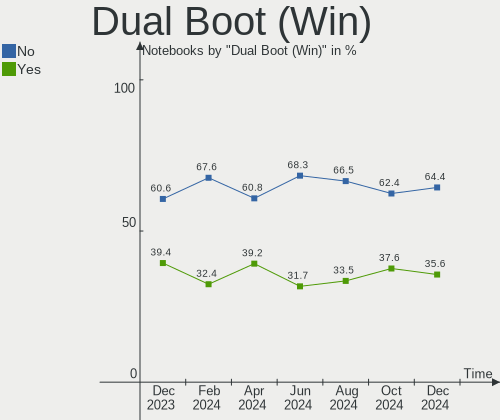
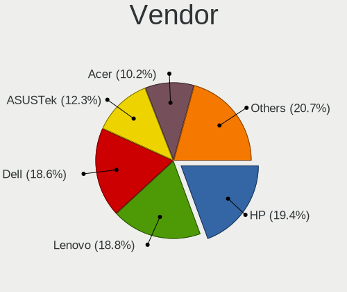
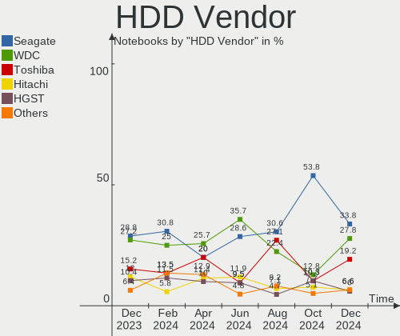
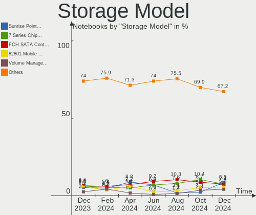
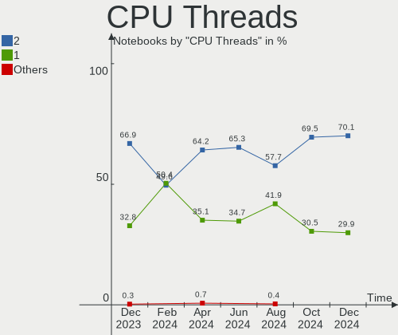
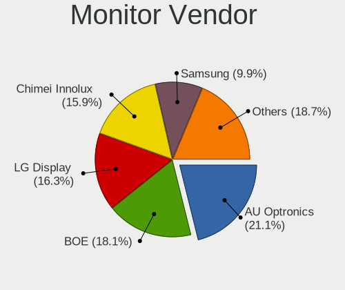

OpenMandriva - Hardware Trends (Notebooks)
------------------------------------------

A project to identify most popular hardware characteristics and track their change
over time based on data collected by Linux users at https://Linux-Hardware.org.

Anyone can contribute to this report by the [hw-probe](https://github.com/linuxhw/hw-probe) tool:

    sudo -E hw-probe -all -upload

This report is for one last month. Overall report since the beginning of time: [TestDays](https://github.com/linuxhw/TestDays)

Period: Jun, 2023.

Contents
--------

* [ System ](#system)
  - [ OS                       ](#os)
  - [ OS Family                ](#os-family)
  - [ Kernel                   ](#kernel)
  - [ Kernel Family            ](#kernel-family)
  - [ Kernel Major Ver.        ](#kernel-major-ver)
  - [ Arch                     ](#arch)
  - [ DE                       ](#de)
  - [ Display Server           ](#display-server)
  - [ Display Manager          ](#display-manager)
  - [ OS Lang                  ](#os-lang)
  - [ Boot Mode                ](#boot-mode)
  - [ Filesystem               ](#filesystem)
  - [ Part. scheme             ](#part-scheme)
  - [ Dual Boot with Linux/BSD ](#dual-boot-with-linuxbsd)
  - [ Dual Boot (Win)          ](#dual-boot-win)

* [ Board ](#board)
  - [ Vendor                   ](#vendor)
  - [ Model                    ](#model)
  - [ Model Family             ](#model-family)
  - [ MFG Year                 ](#mfg-year)
  - [ Form Factor              ](#form-factor)
  - [ Secure Boot              ](#secure-boot)
  - [ Coreboot                 ](#coreboot)
  - [ RAM Size                 ](#ram-size)
  - [ RAM Used                 ](#ram-used)
  - [ Total Drives             ](#total-drives)
  - [ Has CD-ROM               ](#has-cd-rom)
  - [ Has Ethernet             ](#has-ethernet)
  - [ Has WiFi                 ](#has-wifi)
  - [ Has Bluetooth            ](#has-bluetooth)

* [ Location ](#location)
  - [ Country                  ](#country)
  - [ City                     ](#city)

* [ Drives ](#drives)
  - [ Drive Vendor             ](#drive-vendor)
  - [ Drive Model              ](#drive-model)
  - [ HDD Vendor               ](#hdd-vendor)
  - [ SSD Vendor               ](#ssd-vendor)
  - [ Drive Kind               ](#drive-kind)
  - [ Drive Connector          ](#drive-connector)
  - [ Drive Size               ](#drive-size)
  - [ Space Total              ](#space-total)
  - [ Space Used               ](#space-used)
  - [ Malfunc. Drives          ](#malfunc-drives)
  - [ Malfunc. Drive Vendor    ](#malfunc-drive-vendor)
  - [ Malfunc. HDD Vendor      ](#malfunc-hdd-vendor)
  - [ Malfunc. Drive Kind      ](#malfunc-drive-kind)
  - [ Failed Drives            ](#failed-drives)
  - [ Failed Drive Vendor      ](#failed-drive-vendor)
  - [ Drive Status             ](#drive-status)

* [ Storage controller ](#storage-controller)
  - [ Storage Vendor           ](#storage-vendor)
  - [ Storage Model            ](#storage-model)
  - [ Storage Kind             ](#storage-kind)

* [ Processor ](#processor)
  - [ CPU Vendor               ](#cpu-vendor)
  - [ CPU Model                ](#cpu-model)
  - [ CPU Model Family         ](#cpu-model-family)
  - [ CPU Cores                ](#cpu-cores)
  - [ CPU Sockets              ](#cpu-sockets)
  - [ CPU Threads              ](#cpu-threads)
  - [ CPU Op-Modes             ](#cpu-op-modes)
  - [ CPU Microcode            ](#cpu-microcode)
  - [ CPU Microarch            ](#cpu-microarch)

* [ Graphics ](#graphics)
  - [ GPU Vendor               ](#gpu-vendor)
  - [ GPU Model                ](#gpu-model)
  - [ GPU Combo                ](#gpu-combo)
  - [ GPU Driver               ](#gpu-driver)
  - [ GPU Memory               ](#gpu-memory)

* [ Monitor ](#monitor)
  - [ Monitor Vendor           ](#monitor-vendor)
  - [ Monitor Model            ](#monitor-model)
  - [ Monitor Resolution       ](#monitor-resolution)
  - [ Monitor Diagonal         ](#monitor-diagonal)
  - [ Monitor Width            ](#monitor-width)
  - [ Aspect Ratio             ](#aspect-ratio)
  - [ Monitor Area             ](#monitor-area)
  - [ Pixel Density            ](#pixel-density)
  - [ Multiple Monitors        ](#multiple-monitors)

* [ Network ](#network)
  - [ Net Controller Vendor    ](#net-controller-vendor)
  - [ Net Controller Model     ](#net-controller-model)
  - [ Wireless Vendor          ](#wireless-vendor)
  - [ Wireless Model           ](#wireless-model)
  - [ Ethernet Vendor          ](#ethernet-vendor)
  - [ Ethernet Model           ](#ethernet-model)
  - [ Net Controller Kind      ](#net-controller-kind)
  - [ Used Controller          ](#used-controller)
  - [ NICs                     ](#nics)
  - [ IPv6                     ](#ipv6)

* [ Bluetooth ](#bluetooth)
  - [ Bluetooth Vendor         ](#bluetooth-vendor)
  - [ Bluetooth Model          ](#bluetooth-model)

* [ Sound ](#sound)
  - [ Sound Vendor             ](#sound-vendor)
  - [ Sound Model              ](#sound-model)

* [ Memory ](#memory)
  - [ Memory Vendor            ](#memory-vendor)
  - [ Memory Model             ](#memory-model)
  - [ Memory Kind              ](#memory-kind)
  - [ Memory Form Factor       ](#memory-form-factor)
  - [ Memory Size              ](#memory-size)
  - [ Memory Speed             ](#memory-speed)

* [ Printers & scanners ](#printers--scanners)
  - [ Printer Vendor           ](#printer-vendor)
  - [ Printer Model            ](#printer-model)
  - [ Scanner Vendor           ](#scanner-vendor)
  - [ Scanner Model            ](#scanner-model)

* [ Camera ](#camera)
  - [ Camera Vendor            ](#camera-vendor)
  - [ Camera Model             ](#camera-model)

* [ Security ](#security)
  - [ Fingerprint Vendor       ](#fingerprint-vendor)
  - [ Fingerprint Model        ](#fingerprint-model)
  - [ Chipcard Vendor          ](#chipcard-vendor)
  - [ Chipcard Model           ](#chipcard-model)

* [ Unsupported ](#unsupported)
  - [ Unsupported Devices      ](#unsupported-devices)
  - [ Unsupported Device Types ](#unsupported-device-types)

System
------

OS
--

Installed operating systems

| Name               | Notebooks | Percent |
|--------------------|-----------|---------|
| OpenMandriva 23.03 | 75        | 51.37%  |
| OpenMandriva 23.06 | 41        | 28.08%  |
| OpenMandriva 4.3   | 15        | 10.27%  |
| OpenMandriva 23.01 | 7         | 4.79%   |
| OpenMandriva 4.2   | 4         | 2.74%   |
| OpenMandriva 4.50  | 2         | 1.37%   |
| OpenMandriva 4.90  | 1         | 0.68%   |
| OpenMandriva 23.90 | 1         | 0.68%   |

OS Family
---------

OS without a version

| Name         | Notebooks | Percent |
|--------------|-----------|---------|
| OpenMandriva | 146       | 100%    |

Kernel
------

Version of the Linux kernel

| Version                  | Notebooks | Percent |
|--------------------------|-----------|---------|
| 6.2.6-desktop-1omv2390   | 75        | 51.37%  |
| 6.3.5-desktop-3omv2390   | 42        | 28.77%  |
| 5.16.7-desktop-1omv4003  | 8         | 5.48%   |
| 6.1.1-desktop-1omv2290   | 7         | 4.79%   |
| 5.16.13-desktop-1omv4003 | 7         | 4.79%   |
| 5.10.14-desktop-1omv4002 | 3         | 2.05%   |
| 5.19.12-desktop-2omv4090 | 1         | 0.68%   |
| 5.18.12-desktop-3omv4090 | 1         | 0.68%   |
| 5.16.0-desktop-2omv4050  | 1         | 0.68%   |
| 5.11.12-desktop-1omv4002 | 1         | 0.68%   |

Kernel Family
-------------

Linux kernel without a distro release

| Version | Notebooks | Percent |
|---------|-----------|---------|
| 6.2.6   | 75        | 51.37%  |
| 6.3.5   | 42        | 28.77%  |
| 5.16.7  | 8         | 5.48%   |
| 6.1.1   | 7         | 4.79%   |
| 5.16.13 | 7         | 4.79%   |
| 5.10.14 | 3         | 2.05%   |
| 5.19.12 | 1         | 0.68%   |
| 5.18.12 | 1         | 0.68%   |
| 5.16.0  | 1         | 0.68%   |
| 5.11.12 | 1         | 0.68%   |

Kernel Major Ver.
-----------------

Linux kernel major version

| Version | Notebooks | Percent |
|---------|-----------|---------|
| 6.2     | 75        | 51.37%  |
| 6.3     | 42        | 28.77%  |
| 5.16    | 16        | 10.96%  |
| 6.1     | 7         | 4.79%   |
| 5.10    | 3         | 2.05%   |
| 5.19    | 1         | 0.68%   |
| 5.18    | 1         | 0.68%   |
| 5.11    | 1         | 0.68%   |

Arch
----

OS architecture (x86_64, i586, etc.)

| Name   | Notebooks | Percent |
|--------|-----------|---------|
| x86_64 | 146       | 100%    |

DE
--

Desktop Environment

| Name   | Notebooks | Percent |
|--------|-----------|---------|
| KDE5   | 130       | 89.04%  |
| GNOME  | 9         | 6.16%   |
| LXQt   | 6         | 4.11%   |
| Budgie | 1         | 0.68%   |

Display Server
--------------

X11 or Wayland

| Name    | Notebooks | Percent |
|---------|-----------|---------|
| X11     | 137       | 93.84%  |
| Wayland | 9         | 6.16%   |

Display Manager
---------------

SDDM, LightDM, etc.

| Name    | Notebooks | Percent |
|---------|-----------|---------|
| SDDM    | 136       | 93.15%  |
| GDM     | 9         | 6.16%   |
| LightDM | 1         | 0.68%   |

OS Lang
-------

Language

| Lang  | Notebooks | Percent |
|-------|-----------|---------|
| en_US | 75        | 51.37%  |
| fr_FR | 9         | 6.16%   |
| pl_PL | 8         | 5.48%   |
| pt_BR | 7         | 4.79%   |
| it_IT | 7         | 4.79%   |
| en_GB | 5         | 3.42%   |
| de_DE | 5         | 3.42%   |
| tr_TR | 4         | 2.74%   |
| ru_RU | 3         | 2.05%   |
| cs_CZ | 3         | 2.05%   |
| nl_BE | 2         | 1.37%   |
| hu_HU | 2         | 1.37%   |
| es_ES | 2         | 1.37%   |
| es_CO | 2         | 1.37%   |
| en_IN | 2         | 1.37%   |
| da_DK | 2         | 1.37%   |
| ro_RO | 1         | 0.68%   |
| fr_CH | 1         | 0.68%   |
| es_PE | 1         | 0.68%   |
| es_MX | 1         | 0.68%   |
| es_CL | 1         | 0.68%   |
| en_PH | 1         | 0.68%   |
| en_NZ | 1         | 0.68%   |
| de_CH | 1         | 0.68%   |

Boot Mode
---------

EFI or BIOS

| Mode | Notebooks | Percent |
|------|-----------|---------|
| EFI  | 85        | 58.22%  |
| BIOS | 61        | 41.78%  |

Filesystem
----------

Type of filesystem

| Type    | Notebooks | Percent |
|---------|-----------|---------|
| Ext4    | 83        | 56.85%  |
| Overlay | 55        | 37.67%  |
| F2fs    | 3         | 2.05%   |
| Btrfs   | 3         | 2.05%   |
| Xfs     | 2         | 1.37%   |

Part. scheme
------------

Scheme of partitioning

| Type | Notebooks | Percent |
|------|-----------|---------|
| GPT  | 111       | 76.03%  |
| MBR  | 35        | 23.97%  |

Dual Boot with Linux/BSD
------------------------

Hosting more than one Linux/BSD

| Dual boot | Notebooks | Percent |
|-----------|-----------|---------|
| No        | 87        | 59.59%  |
| Yes       | 59        | 40.41%  |

Dual Boot (Win)
---------------

Hosting Linux and Windows

| Dual boot | Notebooks | Percent |
|-----------|-----------|---------|
| No        | 93        | 63.7%   |
| Yes       | 53        | 36.3%   |

Board
-----

Vendor
------

Motherboard manufacturer

| Name                | Notebooks | Percent |
|---------------------|-----------|---------|
| Lenovo              | 31        | 21.23%  |
| Hewlett-Packard     | 26        | 17.81%  |
| ASUSTek Computer    | 24        | 16.44%  |
| Dell                | 19        | 13.01%  |
| Acer                | 14        | 9.59%   |
| Toshiba             | 7         | 4.79%   |
| Samsung Electronics | 3         | 2.05%   |
| MSI                 | 3         | 2.05%   |
| Apple               | 3         | 2.05%   |
| Packard Bell        | 2         | 1.37%   |
| Valve               | 1         | 0.68%   |
| TUXEDO              | 1         | 0.68%   |
| Sony                | 1         | 0.68%   |
| Semp Toshiba        | 1         | 0.68%   |
| Razer               | 1         | 0.68%   |
| Positivo            | 1         | 0.68%   |
| PCsmart             | 1         | 0.68%   |
| Monster             | 1         | 0.68%   |
| Medion              | 1         | 0.68%   |
| LincPlus            | 1         | 0.68%   |
| eMachines           | 1         | 0.68%   |
| Compaq              | 1         | 0.68%   |
| Clevo               | 1         | 0.68%   |
| Chuwi               | 1         | 0.68%   |

Model
-----

Motherboard model

| Name                                                                                     | Notebooks | Percent |
|------------------------------------------------------------------------------------------|-----------|---------|
| Dell Inspiron 1545                                                                       | 3         | 2.05%   |
| HP Notebook                                                                              | 2         | 1.37%   |
| HP Laptop 15-dw3xxx                                                                      | 2         | 1.37%   |
| ASUS UX31E                                                                               | 2         | 1.37%   |
| Apple MacBookAir9,1                                                                      | 2         | 1.37%   |
| Valve Jupiter                                                                            | 1         | 0.68%   |
| TUXEDO Pulse 15 Gen1                                                                     | 1         | 0.68%   |
| Toshiba Satellite Pro L500                                                               | 1         | 0.68%   |
| Toshiba Satellite L635                                                                   | 1         | 0.68%   |
| Toshiba Satellite L45-B                                                                  | 1         | 0.68%   |
| Toshiba Satellite C650                                                                   | 1         | 0.68%   |
| Toshiba Satellite C50-B                                                                  | 1         | 0.68%   |
| Toshiba Satellite A300                                                                   | 1         | 0.68%   |
| Toshiba PORTEGE R705                                                                     | 1         | 0.68%   |
| Sony VGN-NS21M_W                                                                         | 1         | 0.68%   |
| Semp Toshiba IS 1413G                                                                    | 1         | 0.68%   |
| Samsung 670Z5E                                                                           | 1         | 0.68%   |
| Samsung 355V4C/355V4X/355V5C/355V5X/356V4C/356V4X/356V5C/356V5X/3445VC/3445VX/3545VC/354 | 1         | 0.68%   |
| Samsung 300E4A/300E5A/300E7A/3430EA/3530EA                                               | 1         | 0.68%   |
| Razer Blade 15 Advanced Model (Early 2020) - RZ09-033                                    | 1         | 0.68%   |
| Positivo C14CR01                                                                         | 1         | 0.68%   |
| PCsmart PCSGOB14p-C                                                                      | 1         | 0.68%   |
| Packard Bell EasyNote TK85                                                               | 1         | 0.68%   |
| Packard Bell EasyNote TJ65                                                               | 1         | 0.68%   |
| MSI S12T 3M/S12 3M                                                                       | 1         | 0.68%   |
| MSI GS63VR 6RF                                                                           | 1         | 0.68%   |
| MSI GF63 Thin 9RCX                                                                       | 1         | 0.68%   |
| Monster HUMA H4 V5.2                                                                     | 1         | 0.68%   |
| Medion Akoya E7226                                                                       | 1         | 0.68%   |
| LincPlus LINNCPLUS P1                                                                    | 1         | 0.68%   |
| Lenovo Z50-70 20354                                                                      | 1         | 0.68%   |
| Lenovo V15 G2 ITL 82ME                                                                   | 1         | 0.68%   |
| Lenovo V110-15IAP 80TG                                                                   | 1         | 0.68%   |
| Lenovo ThinkPad X230 Tablet 3434CTO                                                      | 1         | 0.68%   |
| Lenovo ThinkPad X1 Carbon 4th 20FCS1F800                                                 | 1         | 0.68%   |
| Lenovo ThinkPad T61 7660A25                                                              | 1         | 0.68%   |
| Lenovo ThinkPad T480 20L6S01G00                                                          | 1         | 0.68%   |
| Lenovo ThinkPad T470s W10DG 20JTS1MR08                                                   | 1         | 0.68%   |
| Lenovo ThinkPad T450 20BUS0EW1K                                                          | 1         | 0.68%   |
| Lenovo ThinkPad P52 20M9CTO1WW                                                           | 1         | 0.68%   |

Model Family
------------

Motherboard model prefix

| Name                  | Notebooks | Percent |
|-----------------------|-----------|---------|
| Lenovo ThinkPad       | 16        | 10.96%  |
| Acer Aspire           | 10        | 6.85%   |
| Dell Inspiron         | 9         | 6.16%   |
| Lenovo IdeaPad        | 7         | 4.79%   |
| Toshiba Satellite     | 6         | 4.11%   |
| ASUS VivoBook         | 6         | 4.11%   |
| HP Laptop             | 5         | 3.42%   |
| HP Pavilion           | 4         | 2.74%   |
| Dell Latitude         | 4         | 2.74%   |
| HP Stream             | 3         | 2.05%   |
| HP EliteBook          | 3         | 2.05%   |
| HP Compaq             | 3         | 2.05%   |
| Packard Bell EasyNote | 2         | 1.37%   |
| Lenovo Legion         | 2         | 1.37%   |
| HP Notebook           | 2         | 1.37%   |
| Dell System           | 2         | 1.37%   |
| ASUS UX31E            | 2         | 1.37%   |
| ASUS ASUS             | 2         | 1.37%   |
| Apple MacBookAir9     | 2         | 1.37%   |
| Acer Nitro            | 2         | 1.37%   |
| Valve Jupiter         | 1         | 0.68%   |
| TUXEDO Pulse          | 1         | 0.68%   |
| Toshiba PORTEGE       | 1         | 0.68%   |
| Sony VGN-NS21M        | 1         | 0.68%   |
| Semp Toshiba IS       | 1         | 0.68%   |
| Samsung 670Z5E        | 1         | 0.68%   |
| Samsung 355V4C        | 1         | 0.68%   |
| Samsung 300E4A        | 1         | 0.68%   |
| Razer Blade           | 1         | 0.68%   |
| Positivo C14CR01      | 1         | 0.68%   |
| PCsmart PCSGOB14p-C   | 1         | 0.68%   |
| MSI S12T              | 1         | 0.68%   |
| MSI GS63VR            | 1         | 0.68%   |
| MSI GF63              | 1         | 0.68%   |
| Monster HUMA          | 1         | 0.68%   |
| Medion Akoya          | 1         | 0.68%   |
| LincPlus LINNCPLUS    | 1         | 0.68%   |
| Lenovo Z50-70         | 1         | 0.68%   |
| Lenovo V15            | 1         | 0.68%   |
| Lenovo V110-15IAP     | 1         | 0.68%   |

MFG Year
--------

Motherboard manufacture year

| Year    | Notebooks | Percent |
|---------|-----------|---------|
| 2021    | 15        | 10.27%  |
| 2011    | 15        | 10.27%  |
| 2012    | 13        | 8.9%    |
| 2020    | 11        | 7.53%   |
| 2016    | 11        | 7.53%   |
| 2014    | 11        | 7.53%   |
| 2010    | 10        | 6.85%   |
| 2009    | 10        | 6.85%   |
| 2018    | 9         | 6.16%   |
| 2015    | 9         | 6.16%   |
| 2008    | 8         | 5.48%   |
| 2013    | 6         | 4.11%   |
| 2019    | 5         | 3.42%   |
| 2017    | 5         | 3.42%   |
| 2023    | 2         | 1.37%   |
| 2022    | 2         | 1.37%   |
| 2007    | 2         | 1.37%   |
| 2006    | 1         | 0.68%   |
| Unknown | 1         | 0.68%   |

Form Factor
-----------

Physical design of the computer

| Name     | Notebooks | Percent |
|----------|-----------|---------|
| Notebook | 146       | 100%    |

Secure Boot
-----------

Enabled or disabled

| State    | Notebooks | Percent |
|----------|-----------|---------|
| Disabled | 146       | 100%    |

Coreboot
--------

Have coreboot on board

| Used | Notebooks | Percent |
|------|-----------|---------|
| No   | 146       | 100%    |

RAM Size
--------

Total RAM memory

| Size in GB  | Notebooks | Percent |
|-------------|-----------|---------|
| 4.01-8.0    | 53        | 36.3%   |
| 3.01-4.0    | 53        | 36.3%   |
| 8.01-16.0   | 14        | 9.59%   |
| 16.01-24.0  | 13        | 8.9%    |
| 32.01-64.0  | 4         | 2.74%   |
| 2.01-3.0    | 4         | 2.74%   |
| 1.01-2.0    | 4         | 2.74%   |
| 64.01-256.0 | 1         | 0.68%   |

RAM Used
--------

Used RAM memory

| Used GB  | Notebooks | Percent |
|----------|-----------|---------|
| 1.01-2.0 | 99        | 67.81%  |
| 2.01-3.0 | 27        | 18.49%  |
| 0.51-1.0 | 15        | 10.27%  |
| 3.01-4.0 | 4         | 2.74%   |
| 4.01-8.0 | 1         | 0.68%   |

Total Drives
------------

Number of drives on board

| Drives | Notebooks | Percent |
|--------|-----------|---------|
| 1      | 112       | 76.71%  |
| 2      | 30        | 20.55%  |
| 3      | 3         | 2.05%   |
| 0      | 1         | 0.68%   |

Has CD-ROM
----------

Has CD-ROM on board

| Presented | Notebooks | Percent |
|-----------|-----------|---------|
| No        | 81        | 55.48%  |
| Yes       | 65        | 44.52%  |

Has Ethernet
------------

Has Ethernet on board

| Presented | Notebooks | Percent |
|-----------|-----------|---------|
| Yes       | 122       | 83.56%  |
| No        | 24        | 16.44%  |

Has WiFi
--------

Has WiFi module

| Presented | Notebooks | Percent |
|-----------|-----------|---------|
| Yes       | 144       | 98.63%  |
| No        | 2         | 1.37%   |

Has Bluetooth
-------------

Has Bluetooth module

| Presented | Notebooks | Percent |
|-----------|-----------|---------|
| Yes       | 105       | 71.92%  |
| No        | 41        | 28.08%  |

Location
--------

Country
-------

Geographic location (country)

| Country      | Notebooks | Percent |
|--------------|-----------|---------|
| USA          | 20        | 13.7%   |
| Brazil       | 11        | 7.53%   |
| Poland       | 10        | 6.85%   |
| Italy        | 10        | 6.85%   |
| France       | 9         | 6.16%   |
| Germany      | 7         | 4.79%   |
| Japan        | 6         | 4.11%   |
| India        | 6         | 4.11%   |
| Russia       | 5         | 3.42%   |
| Mexico       | 5         | 3.42%   |
| UK           | 4         | 2.74%   |
| Switzerland  | 4         | 2.74%   |
| Turkey       | 3         | 2.05%   |
| Czechia      | 3         | 2.05%   |
| Colombia     | 3         | 2.05%   |
| Canada       | 3         | 2.05%   |
| Belgium      | 3         | 2.05%   |
| Ukraine      | 2         | 1.37%   |
| Spain        | 2         | 1.37%   |
| Peru         | 2         | 1.37%   |
| Netherlands  | 2         | 1.37%   |
| Indonesia    | 2         | 1.37%   |
| Hungary      | 2         | 1.37%   |
| Finland      | 2         | 1.37%   |
| Denmark      | 2         | 1.37%   |
| Bulgaria     | 2         | 1.37%   |
| Uruguay      | 1         | 0.68%   |
| Tunisia      | 1         | 0.68%   |
| Taiwan       | 1         | 0.68%   |
| Slovakia     | 1         | 0.68%   |
| Saudi Arabia | 1         | 0.68%   |
| Romania      | 1         | 0.68%   |
| Philippines  | 1         | 0.68%   |
| New Zealand  | 1         | 0.68%   |
| Lithuania    | 1         | 0.68%   |
| Guatemala    | 1         | 0.68%   |
| Cyprus       | 1         | 0.68%   |
| China        | 1         | 0.68%   |
| Chile        | 1         | 0.68%   |
| Belarus      | 1         | 0.68%   |

City
----

Geographic location (city)

| City                       | Notebooks | Percent |
|----------------------------|-----------|---------|
| La Fleche                  | 3         | 2.05%   |
| Zurich                     | 2         | 1.37%   |
| Warsaw                     | 2         | 1.37%   |
| Omaha                      | 2         | 1.37%   |
| Niigata                    | 2         | 1.37%   |
| Maceió                    | 2         | 1.37%   |
| Columbus                   | 2         | 1.37%   |
| Budapest                   | 2         | 1.37%   |
| Batesville                 | 2         | 1.37%   |
| Barranquilla               | 2         | 1.37%   |
| Antalya                    | 2         | 1.37%   |
| Żory                      | 1         | 0.68%   |
| Zawiercie                  | 1         | 0.68%   |
| Yokohama                   | 1         | 0.68%   |
| Yaroslavl                  | 1         | 0.68%   |
| Würzburg                  | 1         | 0.68%   |
| Wezemaal                   | 1         | 0.68%   |
| Villa San Pietro           | 1         | 0.68%   |
| Vilhena                    | 1         | 0.68%   |
| Vicenza                    | 1         | 0.68%   |
| Valdosta                   | 1         | 0.68%   |
| Tula                       | 1         | 0.68%   |
| Tsukuba                    | 1         | 0.68%   |
| Troyan Municipality        | 1         | 0.68%   |
| Troy                       | 1         | 0.68%   |
| Tomisato                   | 1         | 0.68%   |
| Tijuana                    | 1         | 0.68%   |
| Tampere                    | 1         | 0.68%   |
| Taipei                     | 1         | 0.68%   |
| Surabaya                   | 1         | 0.68%   |
| Suffolk                    | 1         | 0.68%   |
| Skierniewice               | 1         | 0.68%   |
| Sion                       | 1         | 0.68%   |
| Simferopol                 | 1         | 0.68%   |
| Silver Spring              | 1         | 0.68%   |
| Sfax                       | 1         | 0.68%   |
| Sao Paulo                  | 1         | 0.68%   |
| Santiago                   | 1         | 0.68%   |
| Sant Hipòlit de Voltregà | 1         | 0.68%   |
| Rozzano                    | 1         | 0.68%   |

Drives
------

Drive Vendor
------------

Hard drive vendors

| Vendor              | Notebooks | Drives | Percent |
|---------------------|-----------|--------|---------|
| Seagate             | 24        | 24     | 13.87%  |
| WDC                 | 23        | 23     | 13.29%  |
| Toshiba             | 19        | 19     | 10.98%  |
| Samsung Electronics | 14        | 14     | 8.09%   |
| Hitachi             | 12        | 12     | 6.94%   |
| Unknown             | 8         | 8      | 4.62%   |
| SanDisk             | 7         | 7      | 4.05%   |
| Kingston            | 7         | 7      | 4.05%   |
| Crucial             | 7         | 7      | 4.05%   |
| SK hynix            | 6         | 6      | 3.47%   |
| HGST                | 5         | 5      | 2.89%   |
| China               | 5         | 5      | 2.89%   |
| PNY                 | 4         | 5      | 2.31%   |
| Micron Technology   | 3         | 3      | 1.73%   |
| Intel               | 3         | 3      | 1.73%   |
| Apple               | 3         | 3      | 1.73%   |
| Acer                | 3         | 3      | 1.73%   |
| SPCC                | 2         | 2      | 1.16%   |
| Phison              | 2         | 2      | 1.16%   |
| Patriot             | 2         | 2      | 1.16%   |
| Verbatim            | 1         | 1      | 0.58%   |
| SSSTC               | 1         | 1      | 0.58%   |
| RX7                 | 1         | 1      | 0.58%   |
| Netac               | 1         | 1      | 0.58%   |
| LaCie               | 1         | 1      | 0.58%   |
| KingSpec            | 1         | 1      | 0.58%   |
| JMicron Technology  | 1         | 1      | 0.58%   |
| Intenso             | 1         | 1      | 0.58%   |
| Gigabyte Technology | 1         | 1      | 0.58%   |
| Fujitsu             | 1         | 1      | 0.58%   |
| CF500               | 1         | 1      | 0.58%   |
| ADATA Technology    | 1         | 1      | 0.58%   |
| A-DATA Technology   | 1         | 1      | 0.58%   |
| Unknown             | 1         | 1      | 0.58%   |

Drive Model
-----------

Hard drive models

| Model                                | Notebooks | Percent |
|--------------------------------------|-----------|---------|
| Seagate ST1000LM035-1RK172 1TB       | 5         | 2.89%   |
| Unknown SD32G  32GB                  | 3         | 1.73%   |
| Seagate ST500LT012-1DG142 500GB      | 3         | 1.73%   |
| Kingston SA400S37240G 240GB SSD      | 3         | 1.73%   |
| Toshiba MQ04ABF100 1TB               | 2         | 1.16%   |
| Toshiba MQ01ABD100 1TB               | 2         | 1.16%   |
| Seagate ST320LM001 HN-M320MBB 320GB  | 2         | 1.16%   |
| SanDisk SSD U100 256GB               | 2         | 1.16%   |
| Hitachi HTS543225L9SA00 250GB        | 2         | 1.16%   |
| Crucial CT240BX500SSD1 240GB         | 2         | 1.16%   |
| Crucial CT1000P1SSD8 1TB             | 2         | 1.16%   |
| Apple SSD AP0256N 256GB              | 2         | 1.16%   |
| Acer SSD RE100 2.5 256GB             | 2         | 1.16%   |
| WDC WDS240G2G0B-00EPW0 240GB SSD     | 1         | 0.58%   |
| WDC WDS100T2G0A-00JH30 1TB SSD       | 1         | 0.58%   |
| WDC WDS100T2B0A-00SM50 1TB SSD       | 1         | 0.58%   |
| WDC WD7500BPVT-22HXZT3 752GB         | 1         | 0.58%   |
| WDC WD5000LPCX-24VHAT0 500GB         | 1         | 0.58%   |
| WDC WD5000BEVT-22A0RT0 500GB         | 1         | 0.58%   |
| WDC WD3200BUCT-63TWBY0 320GB         | 1         | 0.58%   |
| WDC WD3200BPVT-24JJ5T0 320GB         | 1         | 0.58%   |
| WDC WD3200BPVT-22ZEST0 320GB         | 1         | 0.58%   |
| WDC WD3200BEVT-80A0RT0 320GB         | 1         | 0.58%   |
| WDC WD3200BEVT-75ZCT2 320GB          | 1         | 0.58%   |
| WDC WD20SPZX-60UA7T0 2TB             | 1         | 0.58%   |
| WDC WD16 00AVBB-63SYA0 160GB         | 1         | 0.58%   |
| WDC WD10SPZX-08Z10 1TB               | 1         | 0.58%   |
| WDC WD10JUCT-63CYNY0 1TB             | 1         | 0.58%   |
| WDC WD10JPVX-60JC3T1 1TB             | 1         | 0.58%   |
| WDC WD10JPVX-60JC3T0 1TB             | 1         | 0.58%   |
| WDC WD10JPVX-22JC3T0 1TB             | 1         | 0.58%   |
| WDC WD Blue SA510 M.2 2280 500GB SSD | 1         | 0.58%   |
| WDC SSC-D0256SC-2100 256GB SSD       | 1         | 0.58%   |
| WDC PC SN730 SDBPNTY-1T00-1101 1TB   | 1         | 0.58%   |
| WDC PC SN530 SDBPNPZ-256G-1002 256GB | 1         | 0.58%   |
| WDC PC SN520 SDAPNUW-256G-1202 256GB | 1         | 0.58%   |
| Verbatim Vi550 S3 512GB              | 1         | 0.58%   |
| Unknown SD/MMC/MS PRO 250GB          | 1         | 0.58%   |
| Unknown MBG4GC  32GB                 | 1         | 0.58%   |
| Unknown GD4QT  128GB                 | 1         | 0.58%   |

HDD Vendor
----------

Hard disk drive vendors

| Vendor  | Notebooks | Drives | Percent |
|---------|-----------|--------|---------|
| Seagate | 24        | 24     | 34.29%  |
| WDC     | 15        | 15     | 21.43%  |
| Toshiba | 12        | 12     | 17.14%  |
| Hitachi | 12        | 12     | 17.14%  |
| HGST    | 5         | 5      | 7.14%   |
| Unknown | 1         | 1      | 1.43%   |
| Fujitsu | 1         | 1      | 1.43%   |

SSD Vendor
----------

Solid state drive vendors

| Vendor              | Notebooks | Drives | Percent |
|---------------------|-----------|--------|---------|
| Samsung Electronics | 8         | 8      | 13.79%  |
| SanDisk             | 6         | 6      | 10.34%  |
| WDC                 | 5         | 5      | 8.62%   |
| Crucial             | 5         | 5      | 8.62%   |
| China               | 5         | 5      | 8.62%   |
| Kingston            | 4         | 4      | 6.9%    |
| Toshiba             | 3         | 3      | 5.17%   |
| SK hynix            | 3         | 3      | 5.17%   |
| PNY                 | 3         | 3      | 5.17%   |
| Acer                | 3         | 3      | 5.17%   |
| Patriot             | 2         | 2      | 3.45%   |
| Verbatim            | 1         | 1      | 1.72%   |
| SPCC                | 1         | 1      | 1.72%   |
| RX7                 | 1         | 1      | 1.72%   |
| Netac               | 1         | 1      | 1.72%   |
| Micron Technology   | 1         | 1      | 1.72%   |
| KingSpec            | 1         | 1      | 1.72%   |
| Intel               | 1         | 1      | 1.72%   |
| Gigabyte Technology | 1         | 1      | 1.72%   |
| CF500               | 1         | 1      | 1.72%   |
| Apple               | 1         | 1      | 1.72%   |
| A-DATA Technology   | 1         | 1      | 1.72%   |

Drive Kind
----------

HDD or SSD

| Kind    | Notebooks | Drives | Percent |
|---------|-----------|--------|---------|
| HDD     | 67        | 70     | 41.36%  |
| SSD     | 54        | 58     | 33.33%  |
| NVMe    | 32        | 36     | 19.75%  |
| MMC     | 8         | 9      | 4.94%   |
| Unknown | 1         | 1      | 0.62%   |

Drive Connector
---------------

SATA, SAS, NVMe, etc.

| Type | Notebooks | Drives | Percent |
|------|-----------|--------|---------|
| SATA | 113       | 124    | 71.52%  |
| NVMe | 31        | 35     | 19.62%  |
| MMC  | 8         | 9      | 5.06%   |
| SAS  | 6         | 6      | 3.8%    |

Drive Size
----------

Size of hard drive

| Size in TB | Notebooks | Drives | Percent |
|------------|-----------|--------|---------|
| 0.01-0.5   | 84        | 88     | 68.85%  |
| 0.51-1.0   | 35        | 36     | 28.69%  |
| 1.01-2.0   | 3         | 4      | 2.46%   |

Space Total
-----------

Amount of disk space available on the file system

| Size in GB     | Notebooks | Percent |
|----------------|-----------|---------|
| 1-20           | 45        | 30.82%  |
| 101-250        | 35        | 23.97%  |
| 251-500        | 23        | 15.75%  |
| 501-1000       | 18        | 12.33%  |
| 51-100         | 12        | 8.22%   |
| 21-50          | 7         | 4.79%   |
| More than 3000 | 2         | 1.37%   |
| 1001-2000      | 2         | 1.37%   |
| Unknown        | 2         | 1.37%   |

Space Used
----------

Amount of used disk space

| Used GB        | Notebooks | Percent |
|----------------|-----------|---------|
| 1-20           | 118       | 80.82%  |
| 21-50          | 9         | 6.16%   |
| 51-100         | 7         | 4.79%   |
| 251-500        | 4         | 2.74%   |
| 101-250        | 4         | 2.74%   |
| Unknown        | 2         | 1.37%   |
| More than 3000 | 1         | 0.68%   |
| 501-1000       | 1         | 0.68%   |

Malfunc. Drives
---------------

Drive models with a malfunction

| Model                                          | Notebooks | Drives | Percent |
|------------------------------------------------|-----------|--------|---------|
| SanDisk SSD U100 256GB                         | 2         | 2      | 5.13%   |
| WDC WDS240G2G0B-00EPW0 240GB SSD               | 1         | 1      | 2.56%   |
| WDC WD7500BPVT-22HXZT3 752GB                   | 1         | 1      | 2.56%   |
| WDC WD3200BPVT-24JJ5T0 320GB                   | 1         | 1      | 2.56%   |
| WDC WD3200BPVT-22ZEST0 320GB                   | 1         | 1      | 2.56%   |
| WDC WD20SPZX-60UA7T0 2TB                       | 1         | 1      | 2.56%   |
| WDC WD Blue SA510 M.2 2280 500GB SSD           | 1         | 1      | 2.56%   |
| Toshiba MQ01ABD100 1TB                         | 1         | 1      | 2.56%   |
| Toshiba MK5075GSX 500GB                        | 1         | 1      | 2.56%   |
| Toshiba MK2555GSX 250GB                        | 1         | 1      | 2.56%   |
| Toshiba MK1652GSX 160GB                        | 1         | 1      | 2.56%   |
| SPCC M.2 PCIe SSD 256GB                        | 1         | 1      | 2.56%   |
| SK hynix HFS128G32TND-N210A 128GB SSD          | 1         | 1      | 2.56%   |
| SK hynix BC711 HFM512GD3JX013N 512GB           | 1         | 1      | 2.56%   |
| Seagate ST9750420AS 752GB                      | 1         | 1      | 2.56%   |
| Seagate ST9500325AS 500GB                      | 1         | 1      | 2.56%   |
| Seagate ST320LM001 HN-M320MBB 320GB            | 1         | 1      | 2.56%   |
| Seagate ST1000LX015-1U7172 1TB                 | 1         | 1      | 2.56%   |
| Seagate ST1000LM035-1RK172 1TB                 | 1         | 1      | 2.56%   |
| Seagate ST1000LM024 HN-M101MBB 1TB             | 1         | 1      | 2.56%   |
| Seagate ST1000DM003-9YN162 1TB                 | 1         | 1      | 2.56%   |
| PNY CS3030 1TB SSD                             | 1         | 2      | 2.56%   |
| Micron Technology 5100_MTFDDAK960TCB 960GB SSD | 1         | 1      | 2.56%   |
| Intel SSDSA1M160G2LE 160GB                     | 1         | 1      | 2.56%   |
| Hitachi HTS725032A9A364 320GB                  | 1         | 1      | 2.56%   |
| Hitachi HTS723232A7A364 320GB                  | 1         | 1      | 2.56%   |
| Hitachi HTS723216L9A362 160GB                  | 1         | 1      | 2.56%   |
| Hitachi HTS547575A9E384 752GB                  | 1         | 1      | 2.56%   |
| Hitachi HTS547550A9E384 500GB                  | 1         | 1      | 2.56%   |
| Hitachi HTS545032B9A300 320GB                  | 1         | 1      | 2.56%   |
| Hitachi HTS543232L9A300 320GB                  | 1         | 1      | 2.56%   |
| Hitachi HTS543232A7A384 320GB                  | 1         | 1      | 2.56%   |
| Hitachi HTS543225L9SA00 250GB                  | 1         | 1      | 2.56%   |
| Hitachi HTS542516K9SA00 160GB                  | 1         | 1      | 2.56%   |
| HGST HTS545032A7E380 320GB                     | 1         | 1      | 2.56%   |
| HGST HTS541010A9E680 1TB                       | 1         | 1      | 2.56%   |
| HGST HTS541010A7E630 1TB                       | 1         | 1      | 2.56%   |
| China SSD 120GB                                | 1         | 1      | 2.56%   |

Malfunc. Drive Vendor
---------------------

Vendors of faulty drives

| Vendor            | Notebooks | Drives | Percent |
|-------------------|-----------|--------|---------|
| Hitachi           | 10        | 10     | 25.64%  |
| Seagate           | 7         | 7      | 17.95%  |
| WDC               | 6         | 6      | 15.38%  |
| Toshiba           | 4         | 4      | 10.26%  |
| HGST              | 3         | 3      | 7.69%   |
| SK hynix          | 2         | 2      | 5.13%   |
| SanDisk           | 2         | 2      | 5.13%   |
| SPCC              | 1         | 1      | 2.56%   |
| PNY               | 1         | 2      | 2.56%   |
| Micron Technology | 1         | 1      | 2.56%   |
| Intel             | 1         | 1      | 2.56%   |
| China             | 1         | 1      | 2.56%   |

Malfunc. HDD Vendor
-------------------

Vendors of faulty HDD drives

| Vendor  | Notebooks | Drives | Percent |
|---------|-----------|--------|---------|
| Hitachi | 10        | 10     | 35.71%  |
| Seagate | 7         | 7      | 25%     |
| WDC     | 4         | 4      | 14.29%  |
| Toshiba | 4         | 4      | 14.29%  |
| HGST    | 3         | 3      | 10.71%  |

Malfunc. Drive Kind
-------------------

Kinds of faulty drives

| Kind | Notebooks | Drives | Percent |
|------|-----------|--------|---------|
| HDD  | 28        | 28     | 71.79%  |
| SSD  | 8         | 8      | 20.51%  |
| NVMe | 3         | 4      | 7.69%   |

Failed Drives
-------------

Failed drive models

| Model                        | Notebooks | Drives | Percent |
|------------------------------|-----------|--------|---------|
| WDC WD3200BUCT-63TWBY0 320GB | 1         | 1      | 100%    |

Failed Drive Vendor
-------------------

Failed drive vendors

| Vendor | Notebooks | Drives | Percent |
|--------|-----------|--------|---------|
| WDC    | 1         | 1      | 100%    |

Drive Status
------------

Number of failed and malfunc. drives

| Status   | Notebooks | Drives | Percent |
|----------|-----------|--------|---------|
| Works    | 107       | 119    | 67.3%   |
| Malfunc  | 38        | 40     | 23.9%   |
| Detected | 13        | 14     | 8.18%   |
| Failed   | 1         | 1      | 0.63%   |

Storage controller
------------------

Storage Vendor
--------------

Storage controller vendors

| Vendor                           | Notebooks | Percent |
|----------------------------------|-----------|---------|
| Intel                            | 111       | 67.27%  |
| AMD                              | 20        | 12.12%  |
| Samsung Electronics              | 7         | 4.24%   |
| Toshiba America Info Systems     | 4         | 2.42%   |
| SK hynix                         | 3         | 1.82%   |
| SanDisk                          | 3         | 1.82%   |
| Phison Electronics               | 3         | 1.82%   |
| Kingston Technology Company      | 3         | 1.82%   |
| Realtek Semiconductor            | 2         | 1.21%   |
| Micron/Crucial Technology        | 2         | 1.21%   |
| Micron Technology                | 2         | 1.21%   |
| Apple                            | 2         | 1.21%   |
| Solid State Storage Technology   | 1         | 0.61%   |
| Silicon Integrated Systems [SiS] | 1         | 0.61%   |
| ADATA Technology                 | 1         | 0.61%   |

Storage Model
-------------

Storage controller models

| Model                                                                            | Notebooks | Percent |
|----------------------------------------------------------------------------------|-----------|---------|
| AMD FCH SATA Controller [AHCI mode]                                              | 16        | 8.79%   |
| Intel 7 Series Chipset Family 6-port SATA Controller [AHCI mode]                 | 14        | 7.69%   |
| Intel Sunrise Point-LP SATA Controller [AHCI mode]                               | 12        | 6.59%   |
| Intel 82801IBM/IEM (ICH9M/ICH9M-E) 4 port SATA Controller [AHCI mode]            | 12        | 6.59%   |
| Intel 6 Series/C200 Series Chipset Family 6 port Mobile SATA AHCI Controller     | 12        | 6.59%   |
| Intel Volume Management Device NVMe RAID Controller                              | 10        | 5.49%   |
| Intel Tiger Lake-LP SATA Controller                                              | 7         | 3.85%   |
| Intel Wildcat Point-LP SATA Controller [AHCI Mode]                               | 6         | 3.3%    |
| Intel 5 Series/3400 Series Chipset 4 port SATA AHCI Controller                   | 6         | 3.3%    |
| Intel 8 Series SATA Controller 1 [AHCI mode]                                     | 5         | 2.75%   |
| Intel Atom/Celeron/Pentium Processor x5-E8000/J3xxx/N3xxx Series SATA Controller | 4         | 2.2%    |
| Intel Atom Processor E3800 Series SATA AHCI Controller                           | 4         | 2.2%    |
| Intel 82801 Mobile SATA Controller [RAID mode]                                   | 4         | 2.2%    |
| Samsung NVMe SSD Controller 980                                                  | 3         | 1.65%   |
| Intel Celeron/Pentium Silver Processor SATA Controller                           | 3         | 1.65%   |
| Intel 82801IBM/IEM (ICH9M/ICH9M-E) 2 port SATA Controller [IDE mode]             | 3         | 1.65%   |
| Toshiba America Info Systems XG6 NVMe SSD Controller                             | 2         | 1.1%    |
| SK hynix Gold P31/BC711/PC711 NVMe Solid State Drive                             | 2         | 1.1%    |
| Samsung NVMe SSD Controller SM981/PM981/PM983                                    | 2         | 1.1%    |
| Phison E12 NVMe Controller                                                       | 2         | 1.1%    |
| Micron/Crucial NVMe Storage Controller                                           | 2         | 1.1%    |
| Kingston Company OM3PDP3 NVMe SSD                                                | 2         | 1.1%    |
| Intel Non-Volatile memory controller                                             | 2         | 1.1%    |
| Intel Celeron N3350/Pentium N4200/Atom E3900 Series SATA AHCI Controller         | 2         | 1.1%    |
| Intel Cannon Lake Mobile PCH SATA AHCI Controller                                | 2         | 1.1%    |
| Intel 82801HM/HEM (ICH8M/ICH8M-E) SATA Controller [AHCI mode]                    | 2         | 1.1%    |
| Intel 82801HM/HEM (ICH8M/ICH8M-E) IDE Controller                                 | 2         | 1.1%    |
| Intel 8 Series/C220 Series Chipset Family 6-port SATA Controller 1 [AHCI mode]   | 2         | 1.1%    |
| Intel 5 Series/3400 Series Chipset 6 port SATA AHCI Controller                   | 2         | 1.1%    |
| Apple ANS2 NVMe Controller                                                       | 2         | 1.1%    |
| AMD SB7x0/SB8x0/SB9x0 SATA Controller [AHCI mode]                                | 2         | 1.1%    |
| AMD SB600 Non-Raid-5 SATA                                                        | 2         | 1.1%    |
| AMD SB600 IDE                                                                    | 2         | 1.1%    |
| Toshiba America Info Systems XG5 NVMe SSD Controller                             | 1         | 0.55%   |
| Toshiba America Info Systems BG3 NVMe SSD Controller                             | 1         | 0.55%   |
| Solid State Storage CL1-3D256-Q11 NVMe SSD M.2                                   | 1         | 0.55%   |
| SK hynix BC511 NVMe SSD                                                          | 1         | 0.55%   |
| Silicon Integrated Systems [SiS] AHCI IDE Controller (0106)                      | 1         | 0.55%   |
| Silicon Integrated Systems [SiS] 5513 IDE Controller                             | 1         | 0.55%   |
| SanDisk WD Blue SN550 NVMe SSD                                                   | 1         | 0.55%   |

Storage Kind
------------

Kind of storage controller (IDE, SATA, NVMe, SAS, ...)

| Kind | Notebooks | Percent |
|------|-----------|---------|
| SATA | 121       | 68.36%  |
| NVMe | 31        | 17.51%  |
| RAID | 14        | 7.91%   |
| IDE  | 11        | 6.21%   |

Processor
---------

CPU Vendor
----------

Processor vendors

| Vendor | Notebooks | Percent |
|--------|-----------|---------|
| Intel  | 121       | 82.88%  |
| AMD    | 25        | 17.12%  |

CPU Model
---------

Processor models

| Model                                         | Notebooks | Percent |
|-----------------------------------------------|-----------|---------|
| Intel Core i5-4210U CPU @ 1.70GHz             | 3         | 2.05%   |
| Intel Celeron CPU N2840 @ 2.16GHz             | 3         | 2.05%   |
| Intel 11th Gen Core i3-1115G4 @ 3.00GHz       | 3         | 2.05%   |
| Intel Pentium CPU 4405U @ 2.10GHz             | 2         | 1.37%   |
| Intel Core i7-8750H CPU @ 2.20GHz             | 2         | 1.37%   |
| Intel Core i7-7500U CPU @ 2.70GHz             | 2         | 1.37%   |
| Intel Core i7-6700HQ CPU @ 2.60GHz            | 2         | 1.37%   |
| Intel Core i7-3630QM CPU @ 2.40GHz            | 2         | 1.37%   |
| Intel Core i7-2677M CPU @ 1.80GHz             | 2         | 1.37%   |
| Intel Core i5-8250U CPU @ 1.60GHz             | 2         | 1.37%   |
| Intel Core i5-5200U CPU @ 2.20GHz             | 2         | 1.37%   |
| Intel Core i5-3210M CPU @ 2.50GHz             | 2         | 1.37%   |
| Intel Core i3-5005U CPU @ 2.00GHz             | 2         | 1.37%   |
| Intel Core i3-2350M CPU @ 2.30GHz             | 2         | 1.37%   |
| Intel Core i3-1000NG4 CPU @ 1.10GHz           | 2         | 1.37%   |
| Intel Core 2 Duo CPU T6600 @ 2.20GHz          | 2         | 1.37%   |
| Intel Core 2 Duo CPU P8700 @ 2.53GHz          | 2         | 1.37%   |
| Intel Celeron N4020 CPU @ 1.10GHz             | 2         | 1.37%   |
| Intel Celeron CPU N3350 @ 1.10GHz             | 2         | 1.37%   |
| Intel Celeron CPU N3050 @ 1.60GHz             | 2         | 1.37%   |
| Intel Celeron CPU B830 @ 1.80GHz              | 2         | 1.37%   |
| Intel 11th Gen Core i5-11400H @ 2.70GHz       | 2         | 1.37%   |
| Intel 11th Gen Core i5-1135G7 @ 2.40GHz       | 2         | 1.37%   |
| AMD Ryzen 7 4800H with Radeon Graphics        | 2         | 1.37%   |
| AMD Ryzen 5 3500U with Radeon Vega Mobile Gfx | 2         | 1.37%   |
| AMD Ryzen 3 3250U with Radeon Graphics        | 2         | 1.37%   |
| Intel Pentium Gold 7505 @ 2.00GHz             | 1         | 0.68%   |
| Intel Pentium Dual-Core CPU T4300 @ 2.10GHz   | 1         | 0.68%   |
| Intel Pentium Dual-Core CPU T4200 @ 2.00GHz   | 1         | 0.68%   |
| Intel Pentium Dual CPU T3400 @ 2.16GHz        | 1         | 0.68%   |
| Intel Pentium Dual CPU T3200 @ 2.00GHz        | 1         | 0.68%   |
| Intel Pentium Dual CPU T2310 @ 1.46GHz        | 1         | 0.68%   |
| Intel Pentium CPU N4200 @ 1.10GHz             | 1         | 0.68%   |
| Intel Pentium CPU N3700 @ 1.60GHz             | 1         | 0.68%   |
| Intel Pentium CPU B960 @ 2.20GHz              | 1         | 0.68%   |
| Intel Pentium CPU B940 @ 2.00GHz              | 1         | 0.68%   |
| Intel Pentium CPU 4415U @ 2.30GHz             | 1         | 0.68%   |
| Intel Pentium CPU 2117U @ 1.80GHz             | 1         | 0.68%   |
| Intel Genuine CPU 0000 @ 1.87GHz              | 1         | 0.68%   |
| Intel Core i7-9750H CPU @ 2.60GHz             | 1         | 0.68%   |

CPU Model Family
----------------

Processor model prefix

| Model                   | Notebooks | Percent |
|-------------------------|-----------|---------|
| Intel Core i5           | 27        | 18.49%  |
| Intel Core i7           | 23        | 15.75%  |
| Intel Celeron           | 17        | 11.64%  |
| Intel Core i3           | 14        | 9.59%   |
| Intel Core 2 Duo        | 13        | 8.9%    |
| Other                   | 11        | 7.53%   |
| Intel Pentium           | 8         | 5.48%   |
| AMD Ryzen 7             | 6         | 4.11%   |
| Intel Pentium Dual      | 3         | 2.05%   |
| AMD Ryzen 5             | 3         | 2.05%   |
| Intel Pentium Dual-Core | 2         | 1.37%   |
| Intel Celeron Dual-Core | 2         | 1.37%   |
| AMD Ryzen 9             | 2         | 1.37%   |
| AMD Ryzen 3             | 2         | 1.37%   |
| Intel Pentium Gold      | 1         | 0.68%   |
| Intel Genuine           | 1         | 0.68%   |
| Intel Atom              | 1         | 0.68%   |
| AMD Turion 64 X2 Mobile | 1         | 0.68%   |
| AMD Phenom II           | 1         | 0.68%   |
| AMD E2                  | 1         | 0.68%   |
| AMD E1                  | 1         | 0.68%   |
| AMD C-60                | 1         | 0.68%   |
| AMD Athlon Neo          | 1         | 0.68%   |
| AMD Athlon              | 1         | 0.68%   |
| AMD A6                  | 1         | 0.68%   |
| AMD A4                  | 1         | 0.68%   |
| AMD A12                 | 1         | 0.68%   |

CPU Cores
---------

Number of processor cores

| Number | Notebooks | Percent |
|--------|-----------|---------|
| 2      | 104       | 71.23%  |
| 4      | 26        | 17.81%  |
| 8      | 8         | 5.48%   |
| 6      | 6         | 4.11%   |
| 10     | 1         | 0.68%   |
| 1      | 1         | 0.68%   |

CPU Sockets
-----------

Number of sockets

| Number | Notebooks | Percent |
|--------|-----------|---------|
| 1      | 146       | 100%    |

CPU Threads
-----------

Threads per core (Hyper-Threading)

| Number | Notebooks | Percent |
|--------|-----------|---------|
| 2      | 93        | 63.7%   |
| 1      | 53        | 36.3%   |

CPU Op-Modes
------------

CPU Operation Modes (32-bit, 64-bit)

| Op mode        | Notebooks | Percent |
|----------------|-----------|---------|
| 32-bit, 64-bit | 146       | 100%    |

CPU Microcode
-------------

Microcode number

| Number     | Notebooks | Percent |
|------------|-----------|---------|
| Unknown    | 99        | 67.81%  |
| 0x1067a    | 5         | 3.42%   |
| 0x08108109 | 5         | 3.42%   |
| 0x206a7    | 4         | 2.74%   |
| 0x0a50000c | 3         | 2.05%   |
| 0x406e3    | 2         | 1.37%   |
| 0x306a9    | 2         | 1.37%   |
| 0x30678    | 2         | 1.37%   |
| 0x08600103 | 2         | 1.37%   |
| 0x0700010b | 2         | 1.37%   |
| 0x06006705 | 2         | 1.37%   |
| 0x906ea    | 1         | 0.68%   |
| 0x806ec    | 1         | 0.68%   |
| 0x806e9    | 1         | 0.68%   |
| 0x506c9    | 1         | 0.68%   |
| 0x406c3    | 1         | 0.68%   |
| 0x306d4    | 1         | 0.68%   |
| 0x20652    | 1         | 0.68%   |
| 0x106f1    | 1         | 0.68%   |
| 0x10676    | 1         | 0.68%   |
| 0x0a704103 | 1         | 0.68%   |
| 0x0a404102 | 1         | 0.68%   |
| 0x08900201 | 1         | 0.68%   |
| 0x08608103 | 1         | 0.68%   |
| 0x08108102 | 1         | 0.68%   |
| 0x0600611a | 1         | 0.68%   |
| 0x0500010d | 1         | 0.68%   |
| 0x05000101 | 1         | 0.68%   |
| 0x010000c8 | 1         | 0.68%   |

CPU Microarch
-------------

Microarchitecture

| Name             | Notebooks | Percent |
|------------------|-----------|---------|
| SandyBridge      | 16        | 10.96%  |
| Penryn           | 15        | 10.27%  |
| KabyLake         | 12        | 8.22%   |
| IvyBridge        | 11        | 7.53%   |
| Silvermont       | 10        | 6.85%   |
| Skylake          | 9         | 6.16%   |
| Westmere         | 8         | 5.48%   |
| TigerLake        | 7         | 4.79%   |
| Haswell          | 7         | 4.79%   |
| Broadwell        | 7         | 4.79%   |
| Zen+             | 6         | 4.11%   |
| Unknown          | 6         | 4.11%   |
| Core             | 5         | 3.42%   |
| Goldmont plus    | 4         | 2.74%   |
| Zen 3            | 3         | 2.05%   |
| IceLake          | 3         | 2.05%   |
| Goldmont         | 3         | 2.05%   |
| Excavator        | 3         | 2.05%   |
| Zen 2            | 2         | 1.37%   |
| K8 Hammer        | 2         | 1.37%   |
| Jaguar           | 2         | 1.37%   |
| Bobcat           | 2         | 1.37%   |
| K10              | 1         | 0.68%   |
| CometLake        | 1         | 0.68%   |
| Alderlake Hybrid | 1         | 0.68%   |

Graphics
--------

GPU Vendor
----------

Vendors of graphics cards

| Vendor                           | Notebooks | Percent |
|----------------------------------|-----------|---------|
| Intel                            | 109       | 63.37%  |
| Nvidia                           | 31        | 18.02%  |
| AMD                              | 31        | 18.02%  |
| Silicon Integrated Systems [SiS] | 1         | 0.58%   |

GPU Model
---------

Graphics card models

| Model                                                                                    | Notebooks | Percent |
|------------------------------------------------------------------------------------------|-----------|---------|
| Intel 2nd Generation Core Processor Family Integrated Graphics Controller                | 15        | 8.57%   |
| Intel 3rd Gen Core processor Graphics Controller                                         | 11        | 6.29%   |
| Intel Mobile 4 Series Chipset Integrated Graphics Controller                             | 10        | 5.71%   |
| Intel HD Graphics 5500                                                                   | 6         | 3.43%   |
| Intel Core Processor Integrated Graphics Controller                                      | 6         | 3.43%   |
| Intel Atom Processor Z36xxx/Z37xxx Series Graphics & Display                             | 6         | 3.43%   |
| AMD Picasso/Raven 2 [Radeon Vega Series / Radeon Vega Mobile Series]                     | 6         | 3.43%   |
| Intel Tiger Lake-LP GT2 [UHD Graphics G4]                                                | 5         | 2.86%   |
| Intel Haswell-ULT Integrated Graphics Controller                                         | 5         | 2.86%   |
| Intel UHD Graphics 620                                                                   | 4         | 2.29%   |
| Intel Skylake GT2 [HD Graphics 520]                                                      | 4         | 2.29%   |
| Intel GeminiLake [UHD Graphics 600]                                                      | 4         | 2.29%   |
| Intel Atom/Celeron/Pentium Processor x5-E8000/J3xxx/N3xxx Integrated Graphics Controller | 4         | 2.29%   |
| Intel HD Graphics 620                                                                    | 3         | 1.71%   |
| Intel HD Graphics 530                                                                    | 3         | 1.71%   |
| Intel CoffeeLake-H GT2 [UHD Graphics 630]                                                | 3         | 1.71%   |
| Nvidia GF108M [GeForce GT 540M]                                                          | 2         | 1.14%   |
| Nvidia GA106M [GeForce RTX 3060 Mobile / Max-Q]                                          | 2         | 1.14%   |
| Intel TigerLake-LP GT2 [Iris Xe Graphics]                                                | 2         | 1.14%   |
| Intel TigerLake-H GT1 [UHD Graphics]                                                     | 2         | 1.14%   |
| Intel Mobile GM965/GL960 Integrated Graphics Controller (secondary)                      | 2         | 1.14%   |
| Intel Mobile GM965/GL960 Integrated Graphics Controller (primary)                        | 2         | 1.14%   |
| Intel Iris Plus Graphics G4 (Ice Lake)                                                   | 2         | 1.14%   |
| Intel HD Graphics 510                                                                    | 2         | 1.14%   |
| Intel HD Graphics 500                                                                    | 2         | 1.14%   |
| Intel 4th Gen Core Processor Integrated Graphics Controller                              | 2         | 1.14%   |
| AMD Stoney [Radeon R2/R3/R4/R5 Graphics]                                                 | 2         | 1.14%   |
| AMD RV620/M82 [Mobility Radeon HD 3450/3470]                                             | 2         | 1.14%   |
| AMD Renoir                                                                               | 2         | 1.14%   |
| AMD Park [Mobility Radeon HD 5430/5450/5470]                                             | 2         | 1.14%   |
| Silicon Integrated Systems [SiS] 771/671 PCIE VGA Display Adapter                        | 1         | 0.57%   |
| Nvidia TU117M [GeForce GTX 1650 Ti Mobile]                                               | 1         | 0.57%   |
| Nvidia TU104M [GeForce RTX 2070 SUPER Mobile / Max-Q]                                    | 1         | 0.57%   |
| Nvidia GT216M [GeForce GT 240M]                                                          | 1         | 0.57%   |
| Nvidia GP107M [GeForce GTX 1050 Ti Max-Q]                                                | 1         | 0.57%   |
| Nvidia GP107M [GeForce GTX 1050 Mobile]                                                  | 1         | 0.57%   |
| Nvidia GP107GLM [Quadro P1000 Mobile]                                                    | 1         | 0.57%   |
| Nvidia GP106M [GeForce GTX 1060 Mobile]                                                  | 1         | 0.57%   |
| Nvidia GM108M [GeForce MX110]                                                            | 1         | 0.57%   |
| Nvidia GM108M [GeForce 930M]                                                             | 1         | 0.57%   |

GPU Combo
---------

Combinations of graphics cards

| Name           | Notebooks | Percent |
|----------------|-----------|---------|
| 1 x Intel      | 75        | 51.37%  |
| 1 x AMD        | 25        | 17.12%  |
| Intel + Nvidia | 21        | 14.38%  |
| 2 x Intel      | 11        | 7.53%   |
| 1 x Nvidia     | 7         | 4.79%   |
| AMD + Nvidia   | 3         | 2.05%   |
| Intel + AMD    | 2         | 1.37%   |
| 2 x AMD        | 1         | 0.68%   |
| 1 x SiS        | 1         | 0.68%   |

GPU Driver
----------

Free vs proprietary

| Driver  | Notebooks | Percent |
|---------|-----------|---------|
| Free    | 145       | 99.32%  |
| Unknown | 1         | 0.68%   |

GPU Memory
----------

Total video memory

| Size in GB | Notebooks | Percent |
|------------|-----------|---------|
| Unknown    | 89        | 60.96%  |
| 0.01-0.5   | 19        | 13.01%  |
| 1.01-2.0   | 14        | 9.59%   |
| 3.01-4.0   | 10        | 6.85%   |
| 0.51-1.0   | 8         | 5.48%   |
| 7.01-8.0   | 2         | 1.37%   |
| 5.01-6.0   | 2         | 1.37%   |
| 2.01-3.0   | 1         | 0.68%   |
| 8.01-16.0  | 1         | 0.68%   |

Monitor
-------

Monitor Vendor
--------------

Monitor vendors

| Vendor                  | Notebooks | Percent |
|-------------------------|-----------|---------|
| AU Optronics            | 34        | 22.67%  |
| LG Display              | 23        | 15.33%  |
| Samsung Electronics     | 20        | 13.33%  |
| Chimei Innolux          | 20        | 13.33%  |
| BOE                     | 19        | 12.67%  |
| Chi Mei Optoelectronics | 7         | 4.67%   |
| Apple                   | 4         | 2.67%   |
| PANDA                   | 3         | 2%      |
| Goldstar                | 3         | 2%      |
| Sharp                   | 2         | 1.33%   |
| Eizo                    | 2         | 1.33%   |
| Dell                    | 2         | 1.33%   |
| CPT                     | 2         | 1.33%   |
| ViewSonic               | 1         | 0.67%   |
| Valve                   | 1         | 0.67%   |
| Toshiba                 | 1         | 0.67%   |
| Sony                    | 1         | 0.67%   |
| MTD                     | 1         | 0.67%   |
| Hewlett-Packard         | 1         | 0.67%   |
| CSO                     | 1         | 0.67%   |
| ASUSTek Computer        | 1         | 0.67%   |
| AOC                     | 1         | 0.67%   |

Monitor Model
-------------

Monitor models

| Model                                                                 | Notebooks | Percent |
|-----------------------------------------------------------------------|-----------|---------|
| LG Display LCD Monitor LGD0563 1920x1080 344x194mm 15.5-inch          | 2         | 1.32%   |
| LG Display LCD Monitor LGD02DC 1366x768 344x194mm 15.5-inch           | 2         | 1.32%   |
| Eizo EV3285 ENC2979 3840x2160 698x393mm 31.5-inch                     | 2         | 1.32%   |
| Dell D2015H DELF063 1920x1080 435x239mm 19.5-inch                     | 2         | 1.32%   |
| CPT LCD Monitor COR17DB 1600x900 293x164mm 13.2-inch                  | 2         | 1.32%   |
| Chimei Innolux LCD Monitor CMN15BF 1366x768 344x193mm 15.5-inch       | 2         | 1.32%   |
| Chimei Innolux LCD Monitor CMN1521 1920x1080 344x193mm 15.5-inch      | 2         | 1.32%   |
| BOE LCD Monitor BOE08D5 1920x1080 344x194mm 15.5-inch                 | 2         | 1.32%   |
| AU Optronics LCD Monitor AUO71EC 1366x768 344x193mm 15.5-inch         | 2         | 1.32%   |
| AU Optronics LCD Monitor AUO46EC 1366x768 344x193mm 15.5-inch         | 2         | 1.32%   |
| AU Optronics LCD Monitor AUO26EC 1366x768 344x193mm 15.5-inch         | 2         | 1.32%   |
| AU Optronics LCD Monitor AUO235C 1366x768 256x144mm 11.6-inch         | 2         | 1.32%   |
| Apple Color LCD APPA041 2560x1600 286x179mm 13.3-inch                 | 2         | 1.32%   |
| Apple Cinema HD APP9223 1920x1200 495x310mm 23.0-inch                 | 2         | 1.32%   |
| ViewSonic VX3276-QHD VSCE635 2560x1440 698x393mm 31.5-inch            | 1         | 0.66%   |
| Valve ANX7530 U VLV3001 800x1280 100x150mm 7.1-inch                   | 1         | 0.66%   |
| Toshiba LCD Monitor LCD2207 1280x800 287x180mm 13.3-inch              | 1         | 0.66%   |
| Sony TV SNY4402 1360x768                                              | 1         | 0.66%   |
| Sharp LQ156M1JW01 SHP14C3 1920x1080 344x194mm 15.5-inch               | 1         | 0.66%   |
| Sharp LCD Monitor SHP143E 3840x2160 346x194mm 15.6-inch               | 1         | 0.66%   |
| Samsung Electronics S19D300 SAM0B34 1366x768 410x230mm 18.5-inch      | 1         | 0.66%   |
| Samsung Electronics LCD Monitor SEC5742 1366x768 309x174mm 14.0-inch  | 1         | 0.66%   |
| Samsung Electronics LCD Monitor SEC5541 1366x768 344x193mm 15.5-inch  | 1         | 0.66%   |
| Samsung Electronics LCD Monitor SEC544B 1600x900 382x215mm 17.3-inch  | 1         | 0.66%   |
| Samsung Electronics LCD Monitor SEC5443 1920x1200 367x230mm 17.1-inch | 1         | 0.66%   |
| Samsung Electronics LCD Monitor SEC5441 1366x768 293x165mm 13.2-inch  | 1         | 0.66%   |
| Samsung Electronics LCD Monitor SEC4D42 1280x800 303x190mm 14.1-inch  | 1         | 0.66%   |
| Samsung Electronics LCD Monitor SEC434E 1600x900 310x174mm 14.0-inch  | 1         | 0.66%   |
| Samsung Electronics LCD Monitor SEC4252 1366x768 344x194mm 15.5-inch  | 1         | 0.66%   |
| Samsung Electronics LCD Monitor SEC4251 1366x768 344x194mm 15.5-inch  | 1         | 0.66%   |
| Samsung Electronics LCD Monitor SEC4141 1366x768 344x193mm 15.5-inch  | 1         | 0.66%   |
| Samsung Electronics LCD Monitor SEC3953 1366x768 256x144mm 11.6-inch  | 1         | 0.66%   |
| Samsung Electronics LCD Monitor SEC3741 1280x800 331x207mm 15.4-inch  | 1         | 0.66%   |
| Samsung Electronics LCD Monitor SEC364D 1600x900 382x214mm 17.2-inch  | 1         | 0.66%   |
| Samsung Electronics LCD Monitor SEC335A 1366x768 309x174mm 14.0-inch  | 1         | 0.66%   |
| Samsung Electronics LCD Monitor SEC3154 1600x900 382x215mm 17.3-inch  | 1         | 0.66%   |
| Samsung Electronics LCD Monitor SDC5344 1920x1080 344x194mm 15.5-inch | 1         | 0.66%   |
| Samsung Electronics LCD Monitor SDC4E51 1366x768 344x194mm 15.5-inch  | 1         | 0.66%   |
| Samsung Electronics LCD Monitor SDC4A52 1366x768 344x194mm 15.5-inch  | 1         | 0.66%   |
| Samsung Electronics C24F390 SAM0D2C 1920x1080 521x293mm 23.5-inch     | 1         | 0.66%   |

Monitor Resolution
------------------

Monitor screen resolution

| Resolution        | Notebooks | Percent |
|-------------------|-----------|---------|
| 1366x768 (WXGA)   | 65        | 42.76%  |
| 1920x1080 (FHD)   | 44        | 28.95%  |
| 1600x900 (HD+)    | 14        | 9.21%   |
| 1280x800 (WXGA)   | 8         | 5.26%   |
| 3840x2160 (4K)    | 4         | 2.63%   |
| 2560x1600         | 4         | 2.63%   |
| 1920x1200 (WUXGA) | 3         | 1.97%   |
| 3440x1440         | 2         | 1.32%   |
| 2560x1440 (QHD)   | 2         | 1.32%   |
| 800x1280          | 1         | 0.66%   |
| 2560x1080         | 1         | 0.66%   |
| 2160x1440         | 1         | 0.66%   |
| 1440x900 (WXGA+)  | 1         | 0.66%   |
| 1360x768          | 1         | 0.66%   |
| 1280x1024 (SXGA)  | 1         | 0.66%   |

Monitor Diagonal
----------------

Diagonal size in inches

| Inches | Notebooks | Percent |
|--------|-----------|---------|
| 15     | 72        | 47.37%  |
| 13     | 19        | 12.5%   |
| 14     | 18        | 11.84%  |
| 17     | 13        | 8.55%   |
| 11     | 7         | 4.61%   |
| 31     | 4         | 2.63%   |
| 23     | 4         | 2.63%   |
| 19     | 3         | 1.97%   |
| 12     | 3         | 1.97%   |
| 34     | 2         | 1.32%   |
| 18     | 2         | 1.32%   |
| 16     | 2         | 1.32%   |
| 72     | 1         | 0.66%   |
| 35     | 1         | 0.66%   |
| 7      | 1         | 0.66%   |

Monitor Width
-------------

Physical width

| Width in mm | Notebooks | Percent |
|-------------|-----------|---------|
| 301-350     | 100       | 65.79%  |
| 201-300     | 20        | 13.16%  |
| 351-400     | 15        | 9.87%   |
| 401-500     | 6         | 3.95%   |
| 601-700     | 4         | 2.63%   |
| 701-800     | 2         | 1.32%   |
| 501-600     | 2         | 1.32%   |
| 801-900     | 1         | 0.66%   |
| 1501-2000   | 1         | 0.66%   |
| 1-100       | 1         | 0.66%   |

Aspect Ratio
------------

Proportional relationship between the width and the height

| Ratio | Notebooks | Percent |
|-------|-----------|---------|
| 16/9  | 123       | 85.42%  |
| 16/10 | 14        | 9.72%   |
| 21/9  | 3         | 2.08%   |
| 3/2   | 2         | 1.39%   |
| 5/4   | 1         | 0.69%   |
| 0.67  | 1         | 0.69%   |

Monitor Area
------------

Area in inch²

| Area in inch² | Notebooks | Percent |
|----------------|-----------|---------|
| 101-110        | 72        | 47.37%  |
| 81-90          | 27        | 17.76%  |
| 121-130        | 12        | 7.89%   |
| 71-80          | 10        | 6.58%   |
| 51-60          | 7         | 4.61%   |
| 351-500        | 7         | 4.61%   |
| 201-250        | 4         | 2.63%   |
| 61-70          | 3         | 1.97%   |
| 151-200        | 3         | 1.97%   |
| 141-150        | 2         | 1.32%   |
| 111-120        | 2         | 1.32%   |
| More than 1000 | 1         | 0.66%   |
| 1-40           | 1         | 0.66%   |
| 131-140        | 1         | 0.66%   |

Pixel Density
-------------

Pixels per inch

| Density       | Notebooks | Percent |
|---------------|-----------|---------|
| 101-120       | 66        | 44%     |
| 121-160       | 55        | 36.67%  |
| 51-100        | 19        | 12.67%  |
| 161-240       | 8         | 5.33%   |
| More than 240 | 1         | 0.67%   |
| 1-50          | 1         | 0.67%   |

Multiple Monitors
-----------------

Total monitors connected

| Total | Notebooks | Percent |
|-------|-----------|---------|
| 1     | 131       | 89.73%  |
| 2     | 14        | 9.59%   |
| 0     | 1         | 0.68%   |

Network
-------

Net Controller Vendor
---------------------

Controller vendors

| Vendor                           | Notebooks | Percent |
|----------------------------------|-----------|---------|
| Realtek Semiconductor            | 86        | 36.91%  |
| Intel                            | 64        | 27.47%  |
| Qualcomm Atheros                 | 39        | 16.74%  |
| Broadcom                         | 16        | 6.87%   |
| Broadcom Limited                 | 7         | 3%      |
| Samsung Electronics              | 3         | 1.29%   |
| MediaTek                         | 3         | 1.29%   |
| Marvell Technology Group         | 3         | 1.29%   |
| TP-Link                          | 2         | 0.86%   |
| Ralink                           | 2         | 0.86%   |
| Xiaomi                           | 1         | 0.43%   |
| Silicon Integrated Systems [SiS] | 1         | 0.43%   |
| Sierra Wireless                  | 1         | 0.43%   |
| Qualcomm Atheros Communications  | 1         | 0.43%   |
| JMicron Technology               | 1         | 0.43%   |
| Huawei Technologies              | 1         | 0.43%   |
| ASIX Electronics                 | 1         | 0.43%   |
| Apple                            | 1         | 0.43%   |

Net Controller Model
--------------------

Controller models

| Model                                                             | Notebooks | Percent |
|-------------------------------------------------------------------|-----------|---------|
| Realtek RTL8111/8168/8411 PCI Express Gigabit Ethernet Controller | 47        | 17.03%  |
| Realtek RTL810xE PCI Express Fast Ethernet controller             | 23        | 8.33%   |
| Qualcomm Atheros QCA9565 / AR9565 Wireless Network Adapter        | 11        | 3.99%   |
| Realtek RTL8821CE 802.11ac PCIe Wireless Network Adapter          | 9         | 3.26%   |
| Qualcomm Atheros AR9485 Wireless Network Adapter                  | 8         | 2.9%    |
| Intel Centrino Advanced-N 6205 [Taylor Peak]                      | 6         | 2.17%   |
| Realtek RTL8723BE PCIe Wireless Network Adapter                   | 5         | 1.81%   |
| Qualcomm Atheros QCA9377 802.11ac Wireless Network Adapter        | 5         | 1.81%   |
| Intel WiFi Link 5100                                              | 5         | 1.81%   |
| Intel Centrino Wireless-N 1000 [Condor Peak]                      | 5         | 1.81%   |
| Intel Wireless 8265 / 8275                                        | 4         | 1.45%   |
| Intel Wireless 8260                                               | 4         | 1.45%   |
| Intel Wireless 7265                                               | 4         | 1.45%   |
| Intel Dual Band Wireless-AC 3165 Plus Bluetooth                   | 4         | 1.45%   |
| Broadcom BCM4313 802.11bgn Wireless Network Adapter               | 4         | 1.45%   |
| Realtek RTL8822CE 802.11ac PCIe Wireless Network Adapter          | 3         | 1.09%   |
| Qualcomm Atheros AR9285 Wireless Network Adapter (PCI-Express)    | 3         | 1.09%   |
| Qualcomm Atheros AR8151 v2.0 Gigabit Ethernet                     | 3         | 1.09%   |
| Intel Wi-Fi 6 AX201                                               | 3         | 1.09%   |
| Intel Wi-Fi 6 AX200                                               | 3         | 1.09%   |
| Intel Cannon Lake PCH CNVi WiFi                                   | 3         | 1.09%   |
| Samsung Galaxy series, misc. (tethering mode)                     | 2         | 0.72%   |
| Realtek RTL8188EE Wireless Network Adapter                        | 2         | 0.72%   |
| Realtek RTL8153 Gigabit Ethernet Adapter                          | 2         | 0.72%   |
| Realtek RTL8152 Fast Ethernet Adapter                             | 2         | 0.72%   |
| Realtek Killer E2600 Gigabit Ethernet Controller                  | 2         | 0.72%   |
| Qualcomm Atheros QCA6174 802.11ac Wireless Network Adapter        | 2         | 0.72%   |
| Qualcomm Atheros AR928X Wireless Network Adapter (PCI-Express)    | 2         | 0.72%   |
| Qualcomm Atheros AR8161 Gigabit Ethernet                          | 2         | 0.72%   |
| Qualcomm Atheros AR8152 v2.0 Fast Ethernet                        | 2         | 0.72%   |
| Qualcomm Atheros AR8152 v1.1 Fast Ethernet                        | 2         | 0.72%   |
| MediaTek MT7921 802.11ax PCI Express Wireless Network Adapter     | 2         | 0.72%   |
| Intel Wireless-AC 9260                                            | 2         | 0.72%   |
| Intel Wireless 7260                                               | 2         | 0.72%   |
| Intel Wireless 3165                                               | 2         | 0.72%   |
| Intel Gemini Lake PCH CNVi WiFi                                   | 2         | 0.72%   |
| Intel Centrino Advanced-N 6200                                    | 2         | 0.72%   |
| Intel 82579LM Gigabit Network Connection (Lewisville)             | 2         | 0.72%   |
| Intel 82577LM Gigabit Network Connection                          | 2         | 0.72%   |
| Broadcom Limited BCM4312 802.11b/g LP-PHY                         | 2         | 0.72%   |

Wireless Vendor
---------------

Wireless vendors

| Vendor                          | Notebooks | Percent |
|---------------------------------|-----------|---------|
| Intel                           | 64        | 43.54%  |
| Qualcomm Atheros                | 33        | 22.45%  |
| Realtek Semiconductor           | 28        | 19.05%  |
| Broadcom                        | 10        | 6.8%    |
| Broadcom Limited                | 4         | 2.72%   |
| MediaTek                        | 3         | 2.04%   |
| Ralink                          | 2         | 1.36%   |
| TP-Link                         | 1         | 0.68%   |
| Sierra Wireless                 | 1         | 0.68%   |
| Qualcomm Atheros Communications | 1         | 0.68%   |

Wireless Model
--------------

Wireless models

| Model                                                          | Notebooks | Percent |
|----------------------------------------------------------------|-----------|---------|
| Qualcomm Atheros QCA9565 / AR9565 Wireless Network Adapter     | 11        | 7.48%   |
| Realtek RTL8821CE 802.11ac PCIe Wireless Network Adapter       | 9         | 6.12%   |
| Qualcomm Atheros AR9485 Wireless Network Adapter               | 8         | 5.44%   |
| Intel Centrino Advanced-N 6205 [Taylor Peak]                   | 6         | 4.08%   |
| Realtek RTL8723BE PCIe Wireless Network Adapter                | 5         | 3.4%    |
| Qualcomm Atheros QCA9377 802.11ac Wireless Network Adapter     | 5         | 3.4%    |
| Intel WiFi Link 5100                                           | 5         | 3.4%    |
| Intel Centrino Wireless-N 1000 [Condor Peak]                   | 5         | 3.4%    |
| Intel Wireless 8265 / 8275                                     | 4         | 2.72%   |
| Intel Wireless 8260                                            | 4         | 2.72%   |
| Intel Wireless 7265                                            | 4         | 2.72%   |
| Intel Dual Band Wireless-AC 3165 Plus Bluetooth                | 4         | 2.72%   |
| Broadcom BCM4313 802.11bgn Wireless Network Adapter            | 4         | 2.72%   |
| Realtek RTL8822CE 802.11ac PCIe Wireless Network Adapter       | 3         | 2.04%   |
| Qualcomm Atheros AR9285 Wireless Network Adapter (PCI-Express) | 3         | 2.04%   |
| Intel Wi-Fi 6 AX201                                            | 3         | 2.04%   |
| Intel Wi-Fi 6 AX200                                            | 3         | 2.04%   |
| Intel Cannon Lake PCH CNVi WiFi                                | 3         | 2.04%   |
| Realtek RTL8188EE Wireless Network Adapter                     | 2         | 1.36%   |
| Qualcomm Atheros QCA6174 802.11ac Wireless Network Adapter     | 2         | 1.36%   |
| Qualcomm Atheros AR928X Wireless Network Adapter (PCI-Express) | 2         | 1.36%   |
| MediaTek MT7921 802.11ax PCI Express Wireless Network Adapter  | 2         | 1.36%   |
| Intel Wireless-AC 9260                                         | 2         | 1.36%   |
| Intel Wireless 7260                                            | 2         | 1.36%   |
| Intel Wireless 3165                                            | 2         | 1.36%   |
| Intel Gemini Lake PCH CNVi WiFi                                | 2         | 1.36%   |
| Intel Centrino Advanced-N 6200                                 | 2         | 1.36%   |
| Broadcom Limited BCM4312 802.11b/g LP-PHY                      | 2         | 1.36%   |
| Broadcom BCM4377b Wireless Network Adapter                     | 2         | 1.36%   |
| TP-Link 802.11ac WLAN Adapter                                  | 1         | 0.68%   |
| Sierra Wireless EM7455                                         | 1         | 0.68%   |
| Realtek RTL8852BE PCIe 802.11ax Wireless Network Controller    | 1         | 0.68%   |
| Realtek RTL8821AE 802.11ac PCIe Wireless Network Adapter       | 1         | 0.68%   |
| Realtek RTL8723DE Wireless Network Adapter                     | 1         | 0.68%   |
| Realtek RTL8723BU 802.11b/g/n WLAN Adapter                     | 1         | 0.68%   |
| Realtek RTL8723AE PCIe Wireless Network Adapter                | 1         | 0.68%   |
| Realtek RTL8191SEvB Wireless LAN Controller                    | 1         | 0.68%   |
| Realtek RTL8191SEvA Wireless LAN Controller                    | 1         | 0.68%   |
| Realtek RTL8188CE 802.11b/g/n WiFi Adapter                     | 1         | 0.68%   |
| Realtek RTL8187SE Wireless LAN Controller                      | 1         | 0.68%   |

Ethernet Vendor
---------------

Ethernet vendors

| Vendor                           | Notebooks | Percent |
|----------------------------------|-----------|---------|
| Realtek Semiconductor            | 77        | 61.6%   |
| Intel                            | 17        | 13.6%   |
| Qualcomm Atheros                 | 10        | 8%      |
| Broadcom                         | 6         | 4.8%    |
| Marvell Technology Group         | 3         | 2.4%    |
| Broadcom Limited                 | 3         | 2.4%    |
| Samsung Electronics              | 2         | 1.6%    |
| Xiaomi                           | 1         | 0.8%    |
| TP-Link                          | 1         | 0.8%    |
| Silicon Integrated Systems [SiS] | 1         | 0.8%    |
| JMicron Technology               | 1         | 0.8%    |
| Huawei Technologies              | 1         | 0.8%    |
| ASIX Electronics                 | 1         | 0.8%    |
| Apple                            | 1         | 0.8%    |

Ethernet Model
--------------

Ethernet models

| Model                                                             | Notebooks | Percent |
|-------------------------------------------------------------------|-----------|---------|
| Realtek RTL8111/8168/8411 PCI Express Gigabit Ethernet Controller | 47        | 37.3%   |
| Realtek RTL810xE PCI Express Fast Ethernet controller             | 23        | 18.25%  |
| Qualcomm Atheros AR8151 v2.0 Gigabit Ethernet                     | 3         | 2.38%   |
| Samsung Galaxy series, misc. (tethering mode)                     | 2         | 1.59%   |
| Realtek RTL8153 Gigabit Ethernet Adapter                          | 2         | 1.59%   |
| Realtek RTL8152 Fast Ethernet Adapter                             | 2         | 1.59%   |
| Realtek Killer E2600 Gigabit Ethernet Controller                  | 2         | 1.59%   |
| Qualcomm Atheros AR8161 Gigabit Ethernet                          | 2         | 1.59%   |
| Qualcomm Atheros AR8152 v2.0 Fast Ethernet                        | 2         | 1.59%   |
| Qualcomm Atheros AR8152 v1.1 Fast Ethernet                        | 2         | 1.59%   |
| Intel 82579LM Gigabit Network Connection (Lewisville)             | 2         | 1.59%   |
| Intel 82577LM Gigabit Network Connection                          | 2         | 1.59%   |
| Xiaomi Mi/Redmi series (RNDIS)                                    | 1         | 0.79%   |
| TP-Link UE300 10/100/1000 LAN (ethernet mode) [Realtek RTL8153]   | 1         | 0.79%   |
| Silicon Integrated Systems [SiS] 191 Gigabit Ethernet Adapter     | 1         | 0.79%   |
| Realtek PCIe GbE Family Controller                                | 1         | 0.79%   |
| Qualcomm Atheros Killer E2400 Gigabit Ethernet Controller         | 1         | 0.79%   |
| Marvell Group 88E8055 PCI-E Gigabit Ethernet Controller           | 1         | 0.79%   |
| Marvell Group 88E8042 PCI-E Fast Ethernet Controller              | 1         | 0.79%   |
| Marvell Group 88E8040 PCI-E Fast Ethernet Controller              | 1         | 0.79%   |
| JMicron JMC250 PCI Express Gigabit Ethernet Controller            | 1         | 0.79%   |
| Intel WiMAX Connection 2400m                                      | 1         | 0.79%   |
| Intel Ethernet Connection I219-V                                  | 1         | 0.79%   |
| Intel Ethernet Connection I219-LM                                 | 1         | 0.79%   |
| Intel Ethernet Connection I217-V                                  | 1         | 0.79%   |
| Intel Ethernet Connection I217-LM                                 | 1         | 0.79%   |
| Intel Ethernet Connection (7) I219-V                              | 1         | 0.79%   |
| Intel Ethernet Connection (6) I219-V                              | 1         | 0.79%   |
| Intel Ethernet Connection (4) I219-V                              | 1         | 0.79%   |
| Intel Ethernet Connection (4) I219-LM                             | 1         | 0.79%   |
| Intel Ethernet Connection (3) I218-LM                             | 1         | 0.79%   |
| Intel Ethernet Connection (2) I219-LM                             | 1         | 0.79%   |
| Intel 82577LC Gigabit Network Connection                          | 1         | 0.79%   |
| Intel 82567LM Gigabit Network Connection                          | 1         | 0.79%   |
| Intel 82566MM Gigabit Network Connection                          | 1         | 0.79%   |
| Huawei E353/E3131                                                 | 1         | 0.79%   |
| Broadcom NetXtreme BCM57786 Gigabit Ethernet PCIe                 | 1         | 0.79%   |
| Broadcom NetXtreme BCM57762 Gigabit Ethernet PCIe                 | 1         | 0.79%   |
| Broadcom NetLink BCM5784M Gigabit Ethernet PCIe                   | 1         | 0.79%   |
| Broadcom NetLink BCM57785 Gigabit Ethernet PCIe                   | 1         | 0.79%   |

Net Controller Kind
-------------------

Ethernet, WiFi or modem

| Kind     | Notebooks | Percent |
|----------|-----------|---------|
| WiFi     | 144       | 53.53%  |
| Ethernet | 122       | 45.35%  |
| Unknown  | 2         | 0.74%   |
| Modem    | 1         | 0.37%   |

Used Controller
---------------

Currently used network controller

| Kind     | Notebooks | Percent |
|----------|-----------|---------|
| WiFi     | 109       | 75.69%  |
| Ethernet | 35        | 24.31%  |

NICs
----

Total network controllers on board

| Total | Notebooks | Percent |
|-------|-----------|---------|
| 2     | 115       | 78.77%  |
| 1     | 29        | 19.86%  |
| 0     | 2         | 1.37%   |

IPv6
----

IPv6 vs IPv4

| Used | Notebooks | Percent |
|------|-----------|---------|
| No   | 86        | 58.9%   |
| Yes  | 60        | 41.1%   |

Bluetooth
---------

Bluetooth Vendor
----------------

Controller vendors

| Vendor                          | Notebooks | Percent |
|---------------------------------|-----------|---------|
| Intel                           | 40        | 38.1%   |
| Realtek Semiconductor           | 15        | 14.29%  |
| IMC Networks                    | 13        | 12.38%  |
| Lite-On Technology              | 8         | 7.62%   |
| Broadcom                        | 7         | 6.67%   |
| Qualcomm Atheros Communications | 6         | 5.71%   |
| Toshiba                         | 4         | 3.81%   |
| Foxconn / Hon Hai               | 4         | 3.81%   |
| Hewlett-Packard                 | 3         | 2.86%   |
| Ralink Technology               | 1         | 0.95%   |
| Dell                            | 1         | 0.95%   |
| Chicony Electronics             | 1         | 0.95%   |
| Cambridge Silicon Radio         | 1         | 0.95%   |
| Apple                           | 1         | 0.95%   |

Bluetooth Model
---------------

Controller models

| Model                                               | Notebooks | Percent |
|-----------------------------------------------------|-----------|---------|
| Intel Bluetooth wireless interface                  | 20        | 19.05%  |
| Realtek Bluetooth Radio                             | 9         | 8.57%   |
| Intel Bluetooth 9460/9560 Jefferson Peak (JfP)      | 7         | 6.67%   |
| Lite-On Qualcomm Atheros QCA9377 Bluetooth          | 5         | 4.76%   |
| IMC Networks Bluetooth Radio                        | 5         | 4.76%   |
| Realtek  Bluetooth 4.2 Adapter                      | 4         | 3.81%   |
| Qualcomm Atheros AR3012 Bluetooth 4.0               | 4         | 3.81%   |
| Intel AX201 Bluetooth                               | 4         | 3.81%   |
| IMC Networks Bluetooth Device                       | 4         | 3.81%   |
| Intel AX200 Bluetooth                               | 3         | 2.86%   |
| HP Broadcom 2070 Bluetooth Combo                    | 3         | 2.86%   |
| Toshiba Bluetooth Device                            | 2         | 1.9%    |
| Qualcomm Atheros  Bluetooth Device                  | 2         | 1.9%    |
| Lite-On Atheros AR3012 Bluetooth                    | 2         | 1.9%    |
| Intel Wireless-AC 9260 Bluetooth Adapter            | 2         | 1.9%    |
| Intel Centrino Bluetooth Wireless Transceiver       | 2         | 1.9%    |
| Intel Centrino Advanced-N 6230 Bluetooth adapter    | 2         | 1.9%    |
| IMC Networks Wireless_Device                        | 2         | 1.9%    |
| Broadcom BCM20702 Bluetooth 4.0 [ThinkPad]          | 2         | 1.9%    |
| Toshiba Integrated Bluetooth (Taiyo Yuden)          | 1         | 0.95%   |
| Toshiba Askey Bluetooth Module                      | 1         | 0.95%   |
| Realtek RTL8821A Bluetooth                          | 1         | 0.95%   |
| Realtek CSR BS8510                                  | 1         | 0.95%   |
| Ralink CSR BS8510                                   | 1         | 0.95%   |
| Lite-On Qualcomm Atheros Bluetooth                  | 1         | 0.95%   |
| IMC Networks Bluetooth                              | 1         | 0.95%   |
| IMC Networks Atheros AR3012 Bluetooth 4.0 Adapter   | 1         | 0.95%   |
| Foxconn / Hon Hai Wireless_Device                   | 1         | 0.95%   |
| Foxconn / Hon Hai Broadcom Bluetooth 2.1 Device     | 1         | 0.95%   |
| Foxconn / Hon Hai Bluetooth USB Host Controller     | 1         | 0.95%   |
| Foxconn / Hon Hai Bluetooth Device                  | 1         | 0.95%   |
| Dell Wireless 355 Bluetooth                         | 1         | 0.95%   |
| Chicony Bluetooth (RTL8723BE)                       | 1         | 0.95%   |
| Cambridge Silicon Radio Bluetooth Dongle (HCI mode) | 1         | 0.95%   |
| Broadcom HP Portable SoftSailing                    | 1         | 0.95%   |
| Broadcom HP Portable Bumble Bee                     | 1         | 0.95%   |
| Broadcom BCM43142A0 Bluetooth Device                | 1         | 0.95%   |
| Broadcom BCM20703A1 Bluetooth 4.1 + LE              | 1         | 0.95%   |
| Broadcom BCM2045B (BDC-2.1)                         | 1         | 0.95%   |
| Apple Bluetooth USB Host Controller                 | 1         | 0.95%   |

Sound
-----

Sound Vendor
------------

Sound card vendors

| Vendor                           | Notebooks | Percent |
|----------------------------------|-----------|---------|
| Intel                            | 119       | 67.23%  |
| AMD                              | 30        | 16.95%  |
| Nvidia                           | 20        | 11.3%   |
| C-Media Electronics              | 2         | 1.13%   |
| Apple                            | 2         | 1.13%   |
| Silicon Integrated Systems [SiS] | 1         | 0.56%   |
| GN Netcom                        | 1         | 0.56%   |
| EDIFIER                          | 1         | 0.56%   |
| Corsair                          | 1         | 0.56%   |

Sound Model
-----------

Sound card models

| Model                                                                                             | Notebooks | Percent |
|---------------------------------------------------------------------------------------------------|-----------|---------|
| Intel 82801I (ICH9 Family) HD Audio Controller                                                    | 16        | 7.55%   |
| Intel Sunrise Point-LP HD Audio                                                                   | 14        | 6.6%    |
| Intel 7 Series/C216 Chipset Family High Definition Audio Controller                               | 14        | 6.6%    |
| AMD Family 17h/19h HD Audio Controller                                                            | 14        | 6.6%    |
| Intel 6 Series/C200 Series Chipset Family High Definition Audio Controller                        | 13        | 6.13%   |
| Intel 5 Series/3400 Series Chipset High Definition Audio                                          | 9         | 4.25%   |
| Intel Wildcat Point-LP High Definition Audio Controller                                           | 7         | 3.3%    |
| Intel Tiger Lake-LP Smart Sound Technology Audio Controller                                       | 7         | 3.3%    |
| Intel Broadwell-U Audio Controller                                                                | 7         | 3.3%    |
| AMD Raven/Raven2/Fenghuang HDMI/DP Audio Controller                                               | 6         | 2.83%   |
| Intel Haswell-ULT HD Audio Controller                                                             | 5         | 2.36%   |
| Intel Atom Processor Z36xxx/Z37xxx Series High Definition Audio Controller                        | 5         | 2.36%   |
| Intel 8 Series HD Audio Controller                                                                | 5         | 2.36%   |
| Nvidia GF108 High Definition Audio Controller                                                     | 4         | 1.89%   |
| Intel Celeron/Pentium Silver Processor High Definition Audio                                      | 4         | 1.89%   |
| Intel Atom/Celeron/Pentium Processor x5-E8000/J3xxx/N3xxx Series High Definition Audio Controller | 4         | 1.89%   |
| AMD SBx00 Azalia (Intel HDA)                                                                      | 4         | 1.89%   |
| AMD Renoir Radeon High Definition Audio Controller                                                | 4         | 1.89%   |
| Intel Celeron N3350/Pentium N4200/Atom E3900 Series Audio Cluster                                 | 3         | 1.42%   |
| Intel Cannon Lake PCH cAVS                                                                        | 3         | 1.42%   |
| Intel 82801H (ICH8 Family) HD Audio Controller                                                    | 3         | 1.42%   |
| Intel 100 Series/C230 Series Chipset Family HD Audio Controller                                   | 3         | 1.42%   |
| AMD Rembrandt Radeon High Definition Audio Controller                                             | 3         | 1.42%   |
| AMD Kabini HDMI/DP Audio                                                                          | 3         | 1.42%   |
| AMD FCH Azalia Controller                                                                         | 3         | 1.42%   |
| AMD Family 15h (Models 60h-6fh) Audio Controller                                                  | 3         | 1.42%   |
| Nvidia GP107GL High Definition Audio Controller                                                   | 2         | 0.94%   |
| Nvidia GM107 High Definition Audio Controller [GeForce 940MX]                                     | 2         | 0.94%   |
| Nvidia GK208 HDMI/DP Audio Controller                                                             | 2         | 0.94%   |
| Nvidia GA106 High Definition Audio Controller                                                     | 2         | 0.94%   |
| Nvidia Audio device                                                                               | 2         | 0.94%   |
| Intel Tiger Lake-H HD Audio Controller                                                            | 2         | 0.94%   |
| Intel Smart Sound Technology Audio Controller                                                     | 2         | 0.94%   |
| Intel 8 Series/C220 Series Chipset High Definition Audio Controller                               | 2         | 0.94%   |
| C-Media Electronics Audio Adapter (Unitek Y-247A)                                                 | 2         | 0.94%   |
| Apple Audio Device                                                                                | 2         | 0.94%   |
| AMD RV620 HDMI Audio [Radeon HD 3450/3470/3550/3570]                                              | 2         | 0.94%   |
| AMD High Definition Audio Controller                                                              | 2         | 0.94%   |
| AMD Cedar HDMI Audio [Radeon HD 5400/6300/7300 Series]                                            | 2         | 0.94%   |
| Silicon Integrated Systems [SiS] Azalia Audio Controller                                          | 1         | 0.47%   |

Memory
------

Memory Vendor
-------------

Memory module vendors

| Vendor              | Notebooks | Percent |
|---------------------|-----------|---------|
| Samsung Electronics | 47        | 26.86%  |
| SK hynix            | 39        | 22.29%  |
| Micron Technology   | 23        | 13.14%  |
| Kingston            | 15        | 8.57%   |
| Unknown             | 13        | 7.43%   |
| Ramaxel Technology  | 5         | 2.86%   |
| Nanya Technology    | 5         | 2.86%   |
| Elpida              | 5         | 2.86%   |
| A-DATA Technology   | 5         | 2.86%   |
| Unknown (ABCD)      | 2         | 1.14%   |
| Crucial             | 2         | 1.14%   |
| Unknown             | 2         | 1.14%   |
| Toshiba             | 1         | 0.57%   |
| Teikon              | 1         | 0.57%   |
| Neo Forza           | 1         | 0.57%   |
| Lexar               | 1         | 0.57%   |
| Kllisre             | 1         | 0.57%   |
| Kembona             | 1         | 0.57%   |
| HBS                 | 1         | 0.57%   |
| G.Skill             | 1         | 0.57%   |
| Digiboard           | 1         | 0.57%   |
| Avant               | 1         | 0.57%   |
| ASint Technology    | 1         | 0.57%   |
| Apacer              | 1         | 0.57%   |

Memory Model
------------

Memory module models

| Model                                                            | Notebooks | Percent |
|------------------------------------------------------------------|-----------|---------|
| SK hynix RAM HMT451S6BFR8A-PB 4GB SODIMM DDR3 1600MT/s           | 5         | 2.66%   |
| Samsung RAM M471A5244CB0-CTD 4GB SODIMM DDR4 3266MT/s            | 4         | 2.13%   |
| Unknown RAM Module 2GB SODIMM DDR2 800MT/s                       | 3         | 1.6%    |
| SK hynix RAM HYMP125S64CP8-S6 2GB SODIMM DDR 800MT/s             | 3         | 1.6%    |
| SK hynix RAM HMT451S6AFR8A-PB 4GB SODIMM DDR3 1600MT/s           | 3         | 1.6%    |
| SK hynix RAM HMT351S6CFR8C-PB 4GB SODIMM DDR3 1600MT/s           | 3         | 1.6%    |
| Samsung RAM M471B5173EB0-YK0 4096MB SODIMM DDR3 1600MT/s         | 3         | 1.6%    |
| Samsung RAM M471B5173DB0-YK0 4GB SODIMM DDR3 1600MT/s            | 3         | 1.6%    |
| Samsung RAM M4 70T5663EH3-CF7 2GB SODIMM DDR2 975MT/s            | 3         | 1.6%    |
| Unknown (ABCD) RAM 123456789012345678 3GB SODIMM LPDDR4 2400MT/s | 2         | 1.06%   |
| SK hynix RAM HMT351S6CFR8C-H9 4GB SODIMM DDR3 1334MT/s           | 2         | 1.06%   |
| SK hynix RAM HMA81GS6CJR8N-VK 8192MB SODIMM DDR4 2667MT/s        | 2         | 1.06%   |
| SK hynix RAM HMA81GS6AFR8N-UH 8GB SODIMM DDR4 2667MT/s           | 2         | 1.06%   |
| SK hynix RAM HMA41GS6AFR8N-TF 8GB SODIMM DDR4 2667MT/s           | 2         | 1.06%   |
| Samsung RAM Module 4GB SODIMM DDR3 1600MT/s                      | 2         | 1.06%   |
| Samsung RAM M471B5673FH0-CH9 2GB SODIMM DDR3 1334MT/s            | 2         | 1.06%   |
| Samsung RAM M471B5673FH0-CF8 2GB SODIMM DDR3 1067MT/s            | 2         | 1.06%   |
| Samsung RAM M471B5273DH0-CH9 4GB SODIMM DDR3 1334MT/s            | 2         | 1.06%   |
| Samsung RAM M471B5273CH0-CH9 4GB SODIMM DDR3 1334MT/s            | 2         | 1.06%   |
| Samsung RAM M471A5244CB0-CWE 4GB SODIMM DDR4 3200MT/s            | 2         | 1.06%   |
| Samsung RAM M471A5244CB0-CWE 4GB Row Of Chips DDR4 3200MT/s      | 2         | 1.06%   |
| Samsung RAM M471A1K43CB1-CRC 8GB SODIMM DDR4 2667MT/s            | 2         | 1.06%   |
| Samsung RAM M471A1G44AB0-CWE 8GB SODIMM DDR4 3200MT/s            | 2         | 1.06%   |
| Samsung RAM M4 70T5663RZ3-CF7 2GB SODIMM DDR 975MT/s             | 2         | 1.06%   |
| Micron RAM MT53E512M64D4NW-053 4GB Row Of Chips LPDDR4 3733MT/s  | 2         | 1.06%   |
| Micron RAM 8ATF1G64HZ-3G2J1 8GB SODIMM DDR4 3200MT/s             | 2         | 1.06%   |
| Micron RAM 8ATF1G64HZ-2G3E1 8GB SODIMM DDR4 2400MT/s             | 2         | 1.06%   |
| Micron RAM 16JTF51264HZ-1G6M1 4GB SODIMM DDR3 1600MT/s           | 2         | 1.06%   |
| Kingston RAM ACR16D3LS1KNG/8G 8GB SODIMM DDR3 1600MT/s           | 2         | 1.06%   |
| Elpida RAM Module 2GB SODIMM DDR3 1333MT/s                       | 2         | 1.06%   |
| Unknown                                                          | 2         | 1.06%   |
| Unknown RAM Module 8GB SODIMM DDR4 2133MT/s                      | 1         | 0.53%   |
| Unknown RAM Module 8GB SODIMM DDR3 1600MT/s                      | 1         | 0.53%   |
| Unknown RAM Module 512MB SODIMM DDR2 533MT/s                     | 1         | 0.53%   |
| Unknown RAM Module 4GB SODIMM DDR3 1067MT/s                      | 1         | 0.53%   |
| Unknown RAM Module 2GB SODIMM DRAM                               | 1         | 0.53%   |
| Unknown RAM Module 2GB SODIMM DDR3 1333MT/s                      | 1         | 0.53%   |
| Unknown RAM Module 2GB SODIMM DDR2 667MT/s                       | 1         | 0.53%   |
| Unknown RAM Module 2GB SODIMM DDR2 533MT/s                       | 1         | 0.53%   |
| Unknown RAM Module 2GB SODIMM DDR2 200MT/s                       | 1         | 0.53%   |

Memory Kind
-----------

Memory module kinds

| Kind   | Notebooks | Percent |
|--------|-----------|---------|
| DDR3   | 70        | 47.62%  |
| DDR4   | 46        | 31.29%  |
| DDR2   | 16        | 10.88%  |
| LPDDR4 | 5         | 3.4%    |
| SDRAM  | 4         | 2.72%   |
| DRAM   | 2         | 1.36%   |
| DDR5   | 2         | 1.36%   |
| LPDDR5 | 1         | 0.68%   |
| LPDDR3 | 1         | 0.68%   |

Memory Form Factor
------------------

Physical design of the memory module

| Name         | Notebooks | Percent |
|--------------|-----------|---------|
| SODIMM       | 136       | 92.52%  |
| Row Of Chips | 8         | 5.44%   |
| DIMM         | 2         | 1.36%   |
| Chip         | 1         | 0.68%   |

Memory Size
-----------

Memory module size

| Size  | Notebooks | Percent |
|-------|-----------|---------|
| 4096  | 67        | 41.88%  |
| 8192  | 40        | 25%     |
| 2048  | 40        | 25%     |
| 16384 | 8         | 5%      |
| 1024  | 3         | 1.88%   |
| 32768 | 1         | 0.63%   |
| 512   | 1         | 0.63%   |

Memory Speed
------------

Memory module speed

| Speed   | Notebooks | Percent |
|---------|-----------|---------|
| 1600    | 46        | 28.4%   |
| 2667    | 22        | 13.58%  |
| 3200    | 19        | 11.73%  |
| 1334    | 12        | 7.41%   |
| 1333    | 12        | 7.41%   |
| 2400    | 8         | 4.94%   |
| 800     | 8         | 4.94%   |
| 1067    | 6         | 3.7%    |
| 3266    | 4         | 2.47%   |
| 2048    | 3         | 1.85%   |
| 975     | 3         | 1.85%   |
| Unknown | 3         | 1.85%   |
| 4800    | 2         | 1.23%   |
| 3733    | 2         | 1.23%   |
| 2133    | 2         | 1.23%   |
| 667     | 2         | 1.23%   |
| 8400    | 1         | 0.62%   |
| 6400    | 1         | 0.62%   |
| 4199    | 1         | 0.62%   |
| 1867    | 1         | 0.62%   |
| 1866    | 1         | 0.62%   |
| 1066    | 1         | 0.62%   |
| 533     | 1         | 0.62%   |
| 200     | 1         | 0.62%   |

Printers & scanners
-------------------

Printer Vendor
--------------

Printer device vendors

| Vendor              | Notebooks | Percent |
|---------------------|-----------|---------|
| Samsung Electronics | 1         | 100%    |

Printer Model
-------------

Printer device models

| Model                                | Notebooks | Percent |
|--------------------------------------|-----------|---------|
| Samsung ML-1640 Series Laser Printer | 1         | 100%    |

Scanner Vendor
--------------

Scanner device vendors

Zero info for selected period =(

Scanner Model
-------------

Scanner device models

Zero info for selected period =(

Camera
------

Camera Vendor
-------------

Camera device vendors

| Vendor                                 | Notebooks | Percent |
|----------------------------------------|-----------|---------|
| Chicony Electronics                    | 29        | 23.97%  |
| Microdia                               | 11        | 9.09%   |
| IMC Networks                           | 11        | 9.09%   |
| Bison Electronics                      | 10        | 8.26%   |
| Realtek Semiconductor                  | 9         | 7.44%   |
| Suyin                                  | 8         | 6.61%   |
| Sunplus Innovation Technology          | 6         | 4.96%   |
| Quanta                                 | 6         | 4.96%   |
| Cheng Uei Precision Industry (Foxlink) | 5         | 4.13%   |
| Acer                                   | 5         | 4.13%   |
| Syntek                                 | 4         | 3.31%   |
| Silicon Motion                         | 3         | 2.48%   |
| Sonix Technology                       | 2         | 1.65%   |
| Samsung Electronics                    | 2         | 1.65%   |
| Luxvisions Innotech Limited            | 2         | 1.65%   |
| Importek                               | 2         | 1.65%   |
| SunplusIT                              | 1         | 0.83%   |
| Ricoh                                  | 1         | 0.83%   |
| Goertek Electronics                    | 1         | 0.83%   |
| Apple                                  | 1         | 0.83%   |
| ALi                                    | 1         | 0.83%   |
| Alcor Micro                            | 1         | 0.83%   |

Camera Model
------------

Camera device models

| Model                                                          | Notebooks | Percent |
|----------------------------------------------------------------|-----------|---------|
| Chicony HD WebCam                                              | 5         | 4.13%   |
| Microdia Integrated_Webcam_HD                                  | 4         | 3.31%   |
| IMC Networks USB2.0 VGA UVC WebCam                             | 4         | 3.31%   |
| Chicony Integrated Camera                                      | 4         | 3.31%   |
| Suyin HP Webcam-101                                            | 3         | 2.48%   |
| Sunplus Integrated_Webcam_HD                                   | 3         | 2.48%   |
| IMC Networks USB2.0 HD UVC WebCam                              | 3         | 2.48%   |
| Acer Integrated Camera                                         | 3         | 2.48%   |
| Syntek Integrated Camera                                       | 2         | 1.65%   |
| Sonix USB2.0 HD UVC WebCam                                     | 2         | 1.65%   |
| Samsung Galaxy A5 (MTP)                                        | 2         | 1.65%   |
| Realtek USB2.0 camera                                          | 2         | 1.65%   |
| Quanta VGA WebCam                                              | 2         | 1.65%   |
| Microdia HP Webcam                                             | 2         | 1.65%   |
| Luxvisions Innotech Limited HP TrueVision HD Camera            | 2         | 1.65%   |
| Importek Laptop Integrated Webcam                              | 2         | 1.65%   |
| IMC Networks UVC VGA Webcam                                    | 2         | 1.65%   |
| Chicony TOSHIBA Web Camera - HD                                | 2         | 1.65%   |
| Chicony Integrated Camera (1280x720@30)                        | 2         | 1.65%   |
| Chicony EasyCamera                                             | 2         | 1.65%   |
| Cheng Uei Precision Industry (Foxlink) HP Webcam               | 2         | 1.65%   |
| Cheng Uei Precision Industry (Foxlink) HP TrueVision HD Camera | 2         | 1.65%   |
| Bison SunplusIT Integrated Camera                              | 2         | 1.65%   |
| Acer Lenovo EasyCamera                                         | 2         | 1.65%   |
| Syntek Sonix USB 2.0 Camera                                    | 1         | 0.83%   |
| Syntek Lenovo EasyCamera                                       | 1         | 0.83%   |
| Suyin UVC HD Webcam                                            | 1         | 0.83%   |
| Suyin USB 2.0 Camera                                           | 1         | 0.83%   |
| Suyin Integrated Camera                                        | 1         | 0.83%   |
| Suyin 1.3M WebCam (notebook emachines E730, Acer sub-brand)    | 1         | 0.83%   |
| Suyin 1.3M HD WebCam                                           | 1         | 0.83%   |
| SunplusIT PC Camera                                            | 1         | 0.83%   |
| Sunplus Laptop_Integrated_Webcam_1.3M                          | 1         | 0.83%   |
| Sunplus Asus Webcam                                            | 1         | 0.83%   |
| Sunplus 1.3M HD WebCam                                         | 1         | 0.83%   |
| Silicon Motion WebCam SC-13HDL11939N                           | 1         | 0.83%   |
| Silicon Motion WebCam SC-10HDP12631N                           | 1         | 0.83%   |
| Silicon Motion WebCam SC-0311139N                              | 1         | 0.83%   |
| Ricoh Sony Vaio Integrated Webcam                              | 1         | 0.83%   |
| Realtek USB2.0 HD UVC WebCam                                   | 1         | 0.83%   |

Security
--------

Fingerprint Vendor
------------------

Fingerprint sensor vendors

| Vendor                     | Notebooks | Percent |
|----------------------------|-----------|---------|
| Validity Sensors           | 6         | 42.86%  |
| Elan Microelectronics      | 3         | 21.43%  |
| Upek                       | 2         | 14.29%  |
| Synaptics                  | 2         | 14.29%  |
| Shenzhen Goodix Technology | 1         | 7.14%   |

Fingerprint Model
-----------------

Fingerprint sensor models

| Model                                                  | Notebooks | Percent |
|--------------------------------------------------------|-----------|---------|
| Validity Sensors VFS7500 Touch Fingerprint Sensor      | 2         | 14.29%  |
| Validity Sensors VFS5011 Fingerprint Reader            | 2         | 14.29%  |
| Upek Biometric Touchchip/Touchstrip Fingerprint Sensor | 2         | 14.29%  |
| Elan ELAN:Fingerprint                                  | 2         | 14.29%  |
| Validity Sensors VFS495 Fingerprint Reader             | 1         | 7.14%   |
| Validity Sensors VFS451 Fingerprint Reader             | 1         | 7.14%   |
| Synaptics Metallica MOH Touch Fingerprint Reader       | 1         | 7.14%   |
| Synaptics Metallica MIS Touch Fingerprint Reader       | 1         | 7.14%   |
| Shenzhen Goodix Fingerprint Reader                     | 1         | 7.14%   |
| Elan ELAN:ARM-M4                                       | 1         | 7.14%   |

Chipcard Vendor
---------------

Chipcard module vendors

| Vendor                | Notebooks | Percent |
|-----------------------|-----------|---------|
| Broadcom              | 2         | 40%     |
| Lenovo                | 1         | 20%     |
| Alcor Micro           | 1         | 20%     |
| Advanced Card Systems | 1         | 20%     |

Chipcard Model
--------------

Chipcard module models

| Model                                          | Notebooks | Percent |
|------------------------------------------------|-----------|---------|
| Broadcom BCM5880 Secure Applications Processor | 2         | 40%     |
| Lenovo Integrated Smart Card Reader            | 1         | 20%     |
| Alcor Micro AU9540 Smartcard Reader            | 1         | 20%     |
| Advanced Card Systems ACR122U                  | 1         | 20%     |

Unsupported
-----------

Unsupported Devices
-------------------

Total unsupported devices on board

| Total | Notebooks | Percent |
|-------|-----------|---------|
| 0     | 112       | 76.71%  |
| 1     | 33        | 22.6%   |
| 2     | 1         | 0.68%   |

Unsupported Device Types
------------------------

Types of unsupported devices

| Type                  | Notebooks | Percent |
|-----------------------|-----------|---------|
| Fingerprint reader    | 14        | 40%     |
| Graphics card         | 10        | 28.57%  |
| Chipcard              | 5         | 14.29%  |
| Net/wireless          | 3         | 8.57%   |
| Sound                 | 1         | 2.86%   |
| Multimedia controller | 1         | 2.86%   |
| Camera                | 1         | 2.86%   |

