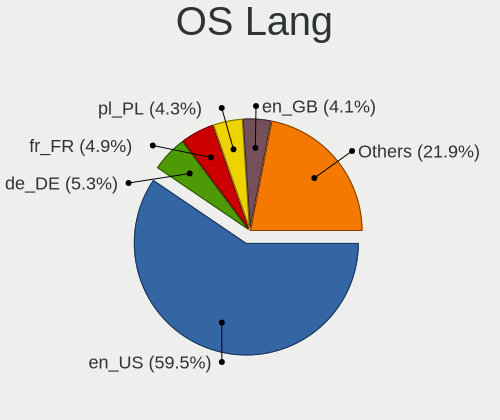
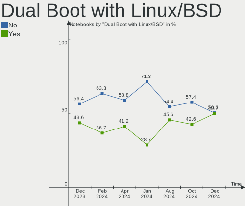
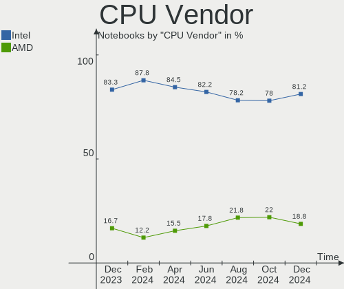
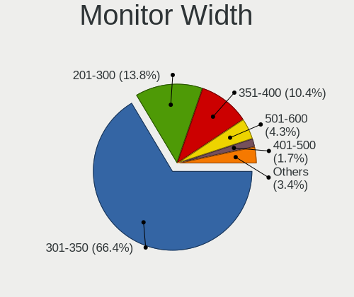
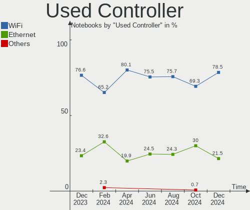
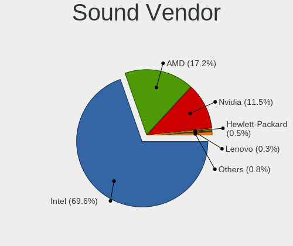
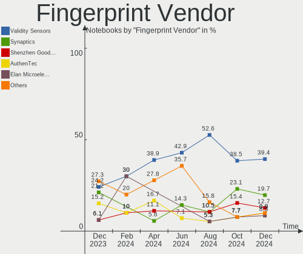

OpenMandriva - Hardware Trends (Notebooks)
------------------------------------------

A project to identify most popular hardware characteristics and track their change
over time based on data collected by Linux users at https://Linux-Hardware.org.

Anyone can contribute to this report by the [hw-probe](https://github.com/linuxhw/hw-probe) tool:

    sudo -E hw-probe -all -upload

This report is for one last month. Overall report since the beginning of time: [TestDays](https://github.com/linuxhw/TestDays)

Period: Apr, 2023.

Contents
--------

* [ System ](#system)
  - [ OS                       ](#os)
  - [ OS Family                ](#os-family)
  - [ Kernel                   ](#kernel)
  - [ Kernel Family            ](#kernel-family)
  - [ Kernel Major Ver.        ](#kernel-major-ver)
  - [ Arch                     ](#arch)
  - [ DE                       ](#de)
  - [ Display Server           ](#display-server)
  - [ Display Manager          ](#display-manager)
  - [ OS Lang                  ](#os-lang)
  - [ Boot Mode                ](#boot-mode)
  - [ Filesystem               ](#filesystem)
  - [ Part. scheme             ](#part-scheme)
  - [ Dual Boot with Linux/BSD ](#dual-boot-with-linuxbsd)
  - [ Dual Boot (Win)          ](#dual-boot-win)

* [ Board ](#board)
  - [ Vendor                   ](#vendor)
  - [ Model                    ](#model)
  - [ Model Family             ](#model-family)
  - [ MFG Year                 ](#mfg-year)
  - [ Form Factor              ](#form-factor)
  - [ Secure Boot              ](#secure-boot)
  - [ Coreboot                 ](#coreboot)
  - [ RAM Size                 ](#ram-size)
  - [ RAM Used                 ](#ram-used)
  - [ Total Drives             ](#total-drives)
  - [ Has CD-ROM               ](#has-cd-rom)
  - [ Has Ethernet             ](#has-ethernet)
  - [ Has WiFi                 ](#has-wifi)
  - [ Has Bluetooth            ](#has-bluetooth)

* [ Location ](#location)
  - [ Country                  ](#country)
  - [ City                     ](#city)

* [ Drives ](#drives)
  - [ Drive Vendor             ](#drive-vendor)
  - [ Drive Model              ](#drive-model)
  - [ HDD Vendor               ](#hdd-vendor)
  - [ SSD Vendor               ](#ssd-vendor)
  - [ Drive Kind               ](#drive-kind)
  - [ Drive Connector          ](#drive-connector)
  - [ Drive Size               ](#drive-size)
  - [ Space Total              ](#space-total)
  - [ Space Used               ](#space-used)
  - [ Malfunc. Drives          ](#malfunc-drives)
  - [ Malfunc. Drive Vendor    ](#malfunc-drive-vendor)
  - [ Malfunc. HDD Vendor      ](#malfunc-hdd-vendor)
  - [ Malfunc. Drive Kind      ](#malfunc-drive-kind)
  - [ Failed Drives            ](#failed-drives)
  - [ Failed Drive Vendor      ](#failed-drive-vendor)
  - [ Drive Status             ](#drive-status)

* [ Storage controller ](#storage-controller)
  - [ Storage Vendor           ](#storage-vendor)
  - [ Storage Model            ](#storage-model)
  - [ Storage Kind             ](#storage-kind)

* [ Processor ](#processor)
  - [ CPU Vendor               ](#cpu-vendor)
  - [ CPU Model                ](#cpu-model)
  - [ CPU Model Family         ](#cpu-model-family)
  - [ CPU Cores                ](#cpu-cores)
  - [ CPU Sockets              ](#cpu-sockets)
  - [ CPU Threads              ](#cpu-threads)
  - [ CPU Op-Modes             ](#cpu-op-modes)
  - [ CPU Microcode            ](#cpu-microcode)
  - [ CPU Microarch            ](#cpu-microarch)

* [ Graphics ](#graphics)
  - [ GPU Vendor               ](#gpu-vendor)
  - [ GPU Model                ](#gpu-model)
  - [ GPU Combo                ](#gpu-combo)
  - [ GPU Driver               ](#gpu-driver)
  - [ GPU Memory               ](#gpu-memory)

* [ Monitor ](#monitor)
  - [ Monitor Vendor           ](#monitor-vendor)
  - [ Monitor Model            ](#monitor-model)
  - [ Monitor Resolution       ](#monitor-resolution)
  - [ Monitor Diagonal         ](#monitor-diagonal)
  - [ Monitor Width            ](#monitor-width)
  - [ Aspect Ratio             ](#aspect-ratio)
  - [ Monitor Area             ](#monitor-area)
  - [ Pixel Density            ](#pixel-density)
  - [ Multiple Monitors        ](#multiple-monitors)

* [ Network ](#network)
  - [ Net Controller Vendor    ](#net-controller-vendor)
  - [ Net Controller Model     ](#net-controller-model)
  - [ Wireless Vendor          ](#wireless-vendor)
  - [ Wireless Model           ](#wireless-model)
  - [ Ethernet Vendor          ](#ethernet-vendor)
  - [ Ethernet Model           ](#ethernet-model)
  - [ Net Controller Kind      ](#net-controller-kind)
  - [ Used Controller          ](#used-controller)
  - [ NICs                     ](#nics)
  - [ IPv6                     ](#ipv6)

* [ Bluetooth ](#bluetooth)
  - [ Bluetooth Vendor         ](#bluetooth-vendor)
  - [ Bluetooth Model          ](#bluetooth-model)

* [ Sound ](#sound)
  - [ Sound Vendor             ](#sound-vendor)
  - [ Sound Model              ](#sound-model)

* [ Memory ](#memory)
  - [ Memory Vendor            ](#memory-vendor)
  - [ Memory Model             ](#memory-model)
  - [ Memory Kind              ](#memory-kind)
  - [ Memory Form Factor       ](#memory-form-factor)
  - [ Memory Size              ](#memory-size)
  - [ Memory Speed             ](#memory-speed)

* [ Printers & scanners ](#printers--scanners)
  - [ Printer Vendor           ](#printer-vendor)
  - [ Printer Model            ](#printer-model)
  - [ Scanner Vendor           ](#scanner-vendor)
  - [ Scanner Model            ](#scanner-model)

* [ Camera ](#camera)
  - [ Camera Vendor            ](#camera-vendor)
  - [ Camera Model             ](#camera-model)

* [ Security ](#security)
  - [ Fingerprint Vendor       ](#fingerprint-vendor)
  - [ Fingerprint Model        ](#fingerprint-model)
  - [ Chipcard Vendor          ](#chipcard-vendor)
  - [ Chipcard Model           ](#chipcard-model)

* [ Unsupported ](#unsupported)
  - [ Unsupported Devices      ](#unsupported-devices)
  - [ Unsupported Device Types ](#unsupported-device-types)

System
------

OS
--

Installed operating systems

| Name               | Notebooks | Percent |
|--------------------|-----------|---------|
| OpenMandriva 23.03 | 407       | 84.27%  |
| OpenMandriva 4.3   | 42        | 8.7%    |
| OpenMandriva 23.01 | 21        | 4.35%   |
| OpenMandriva 4.2   | 6         | 1.24%   |
| OpenMandriva 23.90 | 3         | 0.62%   |
| OpenMandriva 4.50  | 2         | 0.41%   |
| OpenMandriva 22.90 | 1         | 0.21%   |
| OpenMandriva 22.12 | 1         | 0.21%   |

OS Family
---------

OS without a version

| Name         | Notebooks | Percent |
|--------------|-----------|---------|
| OpenMandriva | 483       | 100%    |

Kernel
------

Version of the Linux kernel

| Version                  | Notebooks | Percent |
|--------------------------|-----------|---------|
| 6.2.6-desktop-1omv2390   | 402       | 83.23%  |
| 5.16.7-desktop-1omv4003  | 29        | 6%      |
| 6.1.1-desktop-1omv2290   | 19        | 3.93%   |
| 5.16.13-desktop-1omv4003 | 15        | 3.11%   |
| 5.10.14-desktop-1omv4002 | 4         | 0.83%   |
| 6.2.2-desktop-1omv2390   | 2         | 0.41%   |
| 6.1.4-desktop-1omv2301   | 2         | 0.41%   |
| 5.11.12-desktop-1omv4002 | 2         | 0.41%   |
| 6.2.8-desktop-1omv2390   | 1         | 0.21%   |
| 6.2.11-desktop-1omv2390  | 1         | 0.21%   |
| 6.1.22-xanmod1           | 1         | 0.21%   |
| 6.1.2-desktop-1omv2301   | 1         | 0.21%   |
| 6.0.7-desktop-2omv22090  | 1         | 0.21%   |
| 6.0.10-desktop-2omv22090 | 1         | 0.21%   |
| 5.19.8-desktop-2omv4090  | 1         | 0.21%   |
| 5.19.5-desktop-1omv4090  | 1         | 0.21%   |

Kernel Family
-------------

Linux kernel without a distro release

| Version | Notebooks | Percent |
|---------|-----------|---------|
| 6.2.6   | 402       | 83.23%  |
| 5.16.7  | 29        | 6%      |
| 6.1.1   | 19        | 3.93%   |
| 5.16.13 | 15        | 3.11%   |
| 5.10.14 | 4         | 0.83%   |
| 6.2.2   | 2         | 0.41%   |
| 6.1.4   | 2         | 0.41%   |
| 5.11.12 | 2         | 0.41%   |
| 6.2.8   | 1         | 0.21%   |
| 6.2.11  | 1         | 0.21%   |
| 6.1.22  | 1         | 0.21%   |
| 6.1.2   | 1         | 0.21%   |
| 6.0.7   | 1         | 0.21%   |
| 6.0.10  | 1         | 0.21%   |
| 5.19.8  | 1         | 0.21%   |
| 5.19.5  | 1         | 0.21%   |

Kernel Major Ver.
-----------------

Linux kernel major version

| Version | Notebooks | Percent |
|---------|-----------|---------|
| 6.2     | 406       | 84.06%  |
| 5.16    | 44        | 9.11%   |
| 6.1     | 23        | 4.76%   |
| 5.10    | 4         | 0.83%   |
| 6.0     | 2         | 0.41%   |
| 5.19    | 2         | 0.41%   |
| 5.11    | 2         | 0.41%   |

Arch
----

OS architecture (x86_64, i586, etc.)

| Name   | Notebooks | Percent |
|--------|-----------|---------|
| x86_64 | 483       | 100%    |

DE
--

Desktop Environment

| Name     | Notebooks | Percent |
|----------|-----------|---------|
| KDE5     | 425       | 87.99%  |
| GNOME    | 30        | 6.21%   |
| LXQt     | 23        | 4.76%   |
| XFCE     | 2         | 0.41%   |
| Cinnamon | 1         | 0.21%   |
| Budgie   | 1         | 0.21%   |
| Unknown  | 1         | 0.21%   |

Display Server
--------------

X11 or Wayland

| Name    | Notebooks | Percent |
|---------|-----------|---------|
| X11     | 454       | 94%     |
| Wayland | 29        | 6%      |

Display Manager
---------------

SDDM, LightDM, etc.

| Name    | Notebooks | Percent |
|---------|-----------|---------|
| SDDM    | 450       | 93.17%  |
| GDM     | 30        | 6.21%   |
| LightDM | 3         | 0.62%   |

OS Lang
-------

Language

| Lang  | Notebooks | Percent |
|-------|-----------|---------|
| en_US | 222       | 45.96%  |
| fr_FR | 33        | 6.83%   |
| de_DE | 29        | 6%      |
| ru_RU | 22        | 4.55%   |
| it_IT | 22        | 4.55%   |
| en_GB | 22        | 4.55%   |
| pl_PL | 21        | 4.35%   |
| pt_BR | 16        | 3.31%   |
| es_MX | 10        | 2.07%   |
| cs_CZ | 9         | 1.86%   |
| en_AU | 8         | 1.66%   |
| es_ES | 7         | 1.45%   |
| en_CA | 6         | 1.24%   |
| nl_NL | 5         | 1.04%   |
| hu_HU | 4         | 0.83%   |
| en_IN | 4         | 0.83%   |
| tr_TR | 3         | 0.62%   |
| pt_PT | 3         | 0.62%   |
| fr_BE | 3         | 0.62%   |
| es_AR | 3         | 0.62%   |
| da_DK | 3         | 0.62%   |
| UTF-8 | 2         | 0.41%   |
| ja_JP | 2         | 0.41%   |
| es_UY | 2         | 0.41%   |
| es_CL | 2         | 0.41%   |
| en_AG | 2         | 0.41%   |
| de_CH | 2         | 0.41%   |
| C     | 2         | 0.41%   |
| nl_BE | 1         | 0.21%   |
| id_ID | 1         | 0.21%   |
| fr_CH | 1         | 0.21%   |
| es_VE | 1         | 0.21%   |
| es_PE | 1         | 0.21%   |
| es_EC | 1         | 0.21%   |
| es_CR | 1         | 0.21%   |
| es_CO | 1         | 0.21%   |
| en_ZA | 1         | 0.21%   |
| en_PH | 1         | 0.21%   |
| en_NZ | 1         | 0.21%   |
| en_DK | 1         | 0.21%   |

Boot Mode
---------

EFI or BIOS

| Mode | Notebooks | Percent |
|------|-----------|---------|
| EFI  | 295       | 61.08%  |
| BIOS | 188       | 38.92%  |

Filesystem
----------

Type of filesystem

| Type    | Notebooks | Percent |
|---------|-----------|---------|
| Ext4    | 249       | 51.55%  |
| Overlay | 195       | 40.37%  |
| Btrfs   | 32        | 6.63%   |
| F2fs    | 4         | 0.83%   |
| Xfs     | 3         | 0.62%   |

Part. scheme
------------

Scheme of partitioning

| Type | Notebooks | Percent |
|------|-----------|---------|
| GPT  | 379       | 78.47%  |
| MBR  | 104       | 21.53%  |

Dual Boot with Linux/BSD
------------------------

Hosting more than one Linux/BSD

| Dual boot | Notebooks | Percent |
|-----------|-----------|---------|
| No        | 282       | 58.39%  |
| Yes       | 201       | 41.61%  |

Dual Boot (Win)
---------------

Hosting Linux and Windows

| Dual boot | Notebooks | Percent |
|-----------|-----------|---------|
| No        | 297       | 61.49%  |
| Yes       | 186       | 38.51%  |

Board
-----

Vendor
------

Motherboard manufacturer

| Name                | Notebooks | Percent |
|---------------------|-----------|---------|
| Lenovo              | 103       | 21.33%  |
| Hewlett-Packard     | 89        | 18.43%  |
| ASUSTek Computer    | 64        | 13.25%  |
| Dell                | 59        | 12.22%  |
| Acer                | 46        | 9.52%   |
| Toshiba             | 23        | 4.76%   |
| Sony                | 11        | 2.28%   |
| Samsung Electronics | 10        | 2.07%   |
| Apple               | 10        | 2.07%   |
| MSI                 | 7         | 1.45%   |
| Fujitsu             | 7         | 1.45%   |
| HUAWEI              | 6         | 1.24%   |
| Medion              | 4         | 0.83%   |
| Notebook            | 3         | 0.62%   |
| Fujitsu Siemens     | 3         | 0.62%   |
| eMachines           | 3         | 0.62%   |
| Unknown             | 3         | 0.62%   |
| Positivo            | 2         | 0.41%   |
| Packard Bell        | 2         | 0.41%   |
| GPU Company         | 2         | 0.41%   |
| Google              | 2         | 0.41%   |
| Chuwi               | 2         | 0.41%   |
| VIT                 | 1         | 0.21%   |
| UMAX                | 1         | 0.21%   |
| TPS                 | 1         | 0.21%   |
| Timi                | 1         | 0.21%   |
| System76            | 1         | 0.21%   |
| Standard            | 1         | 0.21%   |
| SLIMBOOK            | 1         | 0.21%   |
| PCSMART S.A.S.      | 1         | 0.21%   |
| NEC Computers       | 1         | 0.21%   |
| Login Informatica   | 1         | 0.21%   |
| LG Electronics      | 1         | 0.21%   |
| lapbook             | 1         | 0.21%   |
| Kiano               | 1         | 0.21%   |
| ICL                 | 1         | 0.21%   |
| GPD                 | 1         | 0.21%   |
| Gigabyte Technology | 1         | 0.21%   |
| Evolute             | 1         | 0.21%   |
| Compumax Computer   | 1         | 0.21%   |

Model
-----

Motherboard model

| Name                                        | Notebooks | Percent |
|---------------------------------------------|-----------|---------|
| ASUS S551LN                                 | 6         | 1.24%   |
| Lenovo IdeaPad 1 14ADA05 82GW               | 5         | 1.04%   |
| HP Notebook                                 | 5         | 1.04%   |
| Unknown                                     | 5         | 1.04%   |
| Samsung 950XCJ/951XCJ/950XCR                | 3         | 0.62%   |
| Lenovo ThinkPad X1 Extreme Gen 3 20TK001HUS | 3         | 0.62%   |
| Fujitsu LIFEBOOK S935                       | 3         | 0.62%   |
| Dell Inspiron 1720                          | 3         | 0.62%   |
| ASUS UX31E                                  | 3         | 0.62%   |
| Apple MacBookPro8,1                         | 3         | 0.62%   |
| Toshiba Satellite L350D                     | 2         | 0.41%   |
| Toshiba Satellite C660                      | 2         | 0.41%   |
| Lenovo IdeaPad S145-15AST 81N3              | 2         | 0.41%   |
| Lenovo IdeaPad L340-15IRH Gaming 81LK       | 2         | 0.41%   |
| Lenovo G505 20240                           | 2         | 0.41%   |
| Lenovo G50-70 20351                         | 2         | 0.41%   |
| HUAWEI HLYL-WXX9                            | 2         | 0.41%   |
| HP ProBook 650 G4                           | 2         | 0.41%   |
| HP ProBook 4330s                            | 2         | 0.41%   |
| HP Pavilion dv6                             | 2         | 0.41%   |
| HP Laptop 15s-eq2xxx                        | 2         | 0.41%   |
| HP EliteBook 6930p                          | 2         | 0.41%   |
| HP EliteBook 2530p                          | 2         | 0.41%   |
| HP Compaq Presario CQ70                     | 2         | 0.41%   |
| HP Compaq 6720s                             | 2         | 0.41%   |
| HP 620                                      | 2         | 0.41%   |
| HP 250 G6 Notebook PC                       | 2         | 0.41%   |
| GPU Company GWNR71517                       | 2         | 0.41%   |
| Fujitsu Siemens LIFEBOOK S6420              | 2         | 0.41%   |
| Dell Vostro 15 3515                         | 2         | 0.41%   |
| Dell Latitude E6440                         | 2         | 0.41%   |
| Dell Latitude D830                          | 2         | 0.41%   |
| Dell Latitude 5400                          | 2         | 0.41%   |
| Dell Inspiron 1545                          | 2         | 0.41%   |
| ASUS UX303UB                                | 2         | 0.41%   |
| ASUS N501VW                                 | 2         | 0.41%   |
| Apple MacBookAir5,2                         | 2         | 0.41%   |
| Acer Aspire ES1-572                         | 2         | 0.41%   |
| Acer Aspire 5733Z                           | 2         | 0.41%   |
| VIT P2402                                   | 1         | 0.21%   |

Model Family
------------

Motherboard model prefix

| Name                  | Notebooks | Percent |
|-----------------------|-----------|---------|
| Lenovo ThinkPad       | 44        | 9.11%   |
| Lenovo IdeaPad        | 29        | 6%      |
| Acer Aspire           | 29        | 6%      |
| Dell Latitude         | 28        | 5.8%    |
| Dell Inspiron         | 19        | 3.93%   |
| Toshiba Satellite     | 17        | 3.52%   |
| HP Pavilion           | 16        | 3.31%   |
| HP Laptop             | 15        | 3.11%   |
| HP ProBook            | 13        | 2.69%   |
| HP EliteBook          | 13        | 2.69%   |
| ASUS VivoBook         | 12        | 2.48%   |
| HP Compaq             | 10        | 2.07%   |
| ASUS S551LN           | 6         | 1.24%   |
| Acer Swift            | 6         | 1.24%   |
| Toshiba dynabook      | 5         | 1.04%   |
| HP Notebook           | 5         | 1.04%   |
| Dell Vostro           | 5         | 1.04%   |
| Unknown               | 5         | 1.04%   |
| Fujitsu LIFEBOOK      | 4         | 0.83%   |
| Samsung 950XCJ        | 3         | 0.62%   |
| HP Victus             | 3         | 0.62%   |
| Dell Precision        | 3         | 0.62%   |
| ASUS UX31E            | 3         | 0.62%   |
| ASUS ROG              | 3         | 0.62%   |
| Apple MacBookPro8     | 3         | 0.62%   |
| Acer TravelMate       | 3         | 0.62%   |
| Packard Bell EasyNote | 2         | 0.41%   |
| Lenovo Yoga           | 2         | 0.41%   |
| Lenovo V15            | 2         | 0.41%   |
| Lenovo Legion         | 2         | 0.41%   |
| Lenovo G505           | 2         | 0.41%   |
| Lenovo G50-70         | 2         | 0.41%   |
| Lenovo B50-30         | 2         | 0.41%   |
| Lenovo 3000           | 2         | 0.41%   |
| HUAWEI HLYL-WXX9      | 2         | 0.41%   |
| HP OMEN               | 2         | 0.41%   |
| HP 620                | 2         | 0.41%   |
| HP 255                | 2         | 0.41%   |
| HP 250                | 2         | 0.41%   |
| GPU Company GWNR71517 | 2         | 0.41%   |

MFG Year
--------

Motherboard manufacture year

| Year | Notebooks | Percent |
|------|-----------|---------|
| 2021 | 48        | 9.94%   |
| 2011 | 47        | 9.73%   |
| 2020 | 42        | 8.7%    |
| 2012 | 40        | 8.28%   |
| 2019 | 33        | 6.83%   |
| 2014 | 32        | 6.63%   |
| 2018 | 30        | 6.21%   |
| 2013 | 28        | 5.8%    |
| 2008 | 27        | 5.59%   |
| 2015 | 26        | 5.38%   |
| 2010 | 26        | 5.38%   |
| 2017 | 24        | 4.97%   |
| 2016 | 24        | 4.97%   |
| 2009 | 20        | 4.14%   |
| 2007 | 19        | 3.93%   |
| 2022 | 13        | 2.69%   |
| 2006 | 4         | 0.83%   |

Form Factor
-----------

Physical design of the computer

| Name     | Notebooks | Percent |
|----------|-----------|---------|
| Notebook | 483       | 100%    |

Secure Boot
-----------

Enabled or disabled

| State    | Notebooks | Percent |
|----------|-----------|---------|
| Disabled | 483       | 100%    |

Coreboot
--------

Have coreboot on board

| Used | Notebooks | Percent |
|------|-----------|---------|
| No   | 480       | 99.38%  |
| Yes  | 3         | 0.62%   |

RAM Size
--------

Total RAM memory

| Size in GB  | Notebooks | Percent |
|-------------|-----------|---------|
| 4.01-8.0    | 175       | 36.23%  |
| 3.01-4.0    | 127       | 26.29%  |
| 8.01-16.0   | 64        | 13.25%  |
| 16.01-24.0  | 57        | 11.8%   |
| 32.01-64.0  | 19        | 3.93%   |
| 1.01-2.0    | 19        | 3.93%   |
| 2.01-3.0    | 13        | 2.69%   |
| 64.01-256.0 | 6         | 1.24%   |
| 24.01-32.0  | 3         | 0.62%   |

RAM Used
--------

Used RAM memory

| Used GB  | Notebooks | Percent |
|----------|-----------|---------|
| 1.01-2.0 | 313       | 64.8%   |
| 2.01-3.0 | 114       | 23.6%   |
| 0.51-1.0 | 33        | 6.83%   |
| 3.01-4.0 | 14        | 2.9%    |
| 4.01-8.0 | 6         | 1.24%   |
| 0.01-0.5 | 3         | 0.62%   |

Total Drives
------------

Number of drives on board

| Drives | Notebooks | Percent |
|--------|-----------|---------|
| 1      | 342       | 70.81%  |
| 2      | 112       | 23.19%  |
| 3      | 24        | 4.97%   |
| 0      | 5         | 1.04%   |

Has CD-ROM
----------

Has CD-ROM on board

| Presented | Notebooks | Percent |
|-----------|-----------|---------|
| No        | 276       | 57.14%  |
| Yes       | 207       | 42.86%  |

Has Ethernet
------------

Has Ethernet on board

| Presented | Notebooks | Percent |
|-----------|-----------|---------|
| Yes       | 393       | 81.37%  |
| No        | 90        | 18.63%  |

Has WiFi
--------

Has WiFi module

| Presented | Notebooks | Percent |
|-----------|-----------|---------|
| Yes       | 479       | 99.17%  |
| No        | 4         | 0.83%   |

Has Bluetooth
-------------

Has Bluetooth module

| Presented | Notebooks | Percent |
|-----------|-----------|---------|
| Yes       | 371       | 76.81%  |
| No        | 112       | 23.19%  |

Location
--------

Country
-------

Geographic location (country)

| Country     | Notebooks | Percent |
|-------------|-----------|---------|
| USA         | 73        | 15.11%  |
| Germany     | 39        | 8.07%   |
| France      | 31        | 6.42%   |
| Italy       | 29        | 6%      |
| Russia      | 28        | 5.8%    |
| UK          | 24        | 4.97%   |
| Brazil      | 24        | 4.97%   |
| Poland      | 23        | 4.76%   |
| Japan       | 16        | 3.31%   |
| India       | 11        | 2.28%   |
| Netherlands | 10        | 2.07%   |
| Finland     | 10        | 2.07%   |
| Czechia     | 10        | 2.07%   |
| Canada      | 10        | 2.07%   |
| Australia   | 10        | 2.07%   |
| Spain       | 9         | 1.86%   |
| Argentina   | 7         | 1.45%   |
| Mexico      | 6         | 1.24%   |
| Indonesia   | 6         | 1.24%   |
| Belgium     | 6         | 1.24%   |
| Romania     | 5         | 1.04%   |
| Portugal    | 5         | 1.04%   |
| Colombia    | 5         | 1.04%   |
| Hungary     | 4         | 0.83%   |
| Denmark     | 4         | 0.83%   |
| Belarus     | 4         | 0.83%   |
| Venezuela   | 3         | 0.62%   |
| Turkey      | 3         | 0.62%   |
| Switzerland | 3         | 0.62%   |
| Slovakia    | 3         | 0.62%   |
| Lithuania   | 3         | 0.62%   |
| Latvia      | 3         | 0.62%   |
| Egypt       | 3         | 0.62%   |
| Chile       | 3         | 0.62%   |
| Uruguay     | 2         | 0.41%   |
| Sweden      | 2         | 0.41%   |
| Saint Lucia | 2         | 0.41%   |
| Réunion    | 2         | 0.41%   |
| Peru        | 2         | 0.41%   |
| Norway      | 2         | 0.41%   |

City
----

Geographic location (city)

| City                   | Notebooks | Percent |
|------------------------|-----------|---------|
| Prague                 | 7         | 1.45%   |
| Moscow                 | 7         | 1.45%   |
| Warsaw                 | 4         | 0.83%   |
| St Petersburg          | 4         | 0.83%   |
| Istres                 | 4         | 0.83%   |
| Helsinki               | 4         | 0.83%   |
| Freeport               | 4         | 0.83%   |
| Berlin                 | 4         | 0.83%   |
| Amadora                | 4         | 0.83%   |
| Riga                   | 3         | 0.62%   |
| Melbourne              | 3         | 0.62%   |
| Los Angeles            | 3         | 0.62%   |
| London                 | 3         | 0.62%   |
| Krakow                 | 3         | 0.62%   |
| Exeter                 | 3         | 0.62%   |
| Cologne                | 3         | 0.62%   |
| Cairo                  | 3         | 0.62%   |
| Bengaluru              | 3         | 0.62%   |
| Airdrie                | 3         | 0.62%   |
| Zabrze                 | 2         | 0.41%   |
| Verdun                 | 2         | 0.41%   |
| Vantaa                 | 2         | 0.41%   |
| Turin                  | 2         | 0.41%   |
| Tomsk                  | 2         | 0.41%   |
| Tokyo                  | 2         | 0.41%   |
| Sydney                 | 2         | 0.41%   |
| Sutton                 | 2         | 0.41%   |
| Stockholm              | 2         | 0.41%   |
| Sao Goncalo            | 2         | 0.41%   |
| Santiago               | 2         | 0.41%   |
| Saint-Denis            | 2         | 0.41%   |
| Rothenburg upon Tauber | 2         | 0.41%   |
| Rome                   | 2         | 0.41%   |
| Quito                  | 2         | 0.41%   |
| Poznan                 | 2         | 0.41%   |
| Paszto                 | 2         | 0.41%   |
| Otemae                 | 2         | 0.41%   |
| Nagato                 | 2         | 0.41%   |
| Munich                 | 2         | 0.41%   |
| Mogilev                | 2         | 0.41%   |

Drives
------

Drive Vendor
------------

Hard drive vendors

| Vendor              | Notebooks | Drives | Percent |
|---------------------|-----------|--------|---------|
| Samsung Electronics | 72        | 75     | 12.1%   |
| WDC                 | 64        | 65     | 10.76%  |
| Seagate             | 63        | 63     | 10.59%  |
| Toshiba             | 46        | 47     | 7.73%   |
| Kingston            | 33        | 33     | 5.55%   |
| SanDisk             | 27        | 28     | 4.54%   |
| Unknown             | 26        | 27     | 4.37%   |
| Hitachi             | 24        | 24     | 4.03%   |
| HGST                | 24        | 26     | 4.03%   |
| Crucial             | 24        | 24     | 4.03%   |
| SK hynix            | 14        | 14     | 2.35%   |
| Micron Technology   | 13        | 13     | 2.18%   |
| SPCC                | 12        | 12     | 2.02%   |
| Intel               | 12        | 12     | 2.02%   |
| A-DATA Technology   | 11        | 11     | 1.85%   |
| Transcend           | 9         | 9      | 1.51%   |
| JMicron Technology  | 9         | 9      | 1.51%   |
| China               | 9         | 9      | 1.51%   |
| KIOXIA              | 6         | 6      | 1.01%   |
| PNY                 | 5         | 5      | 0.84%   |
| Intenso             | 5         | 5      | 0.84%   |
| Verbatim            | 4         | 4      | 0.67%   |
| Phison              | 4         | 4      | 0.67%   |
| Patriot             | 4         | 4      | 0.67%   |
| GOODRAM             | 4         | 4      | 0.67%   |
| Fujitsu             | 4         | 4      | 0.67%   |
| Apple               | 4         | 4      | 0.67%   |
| Netac               | 3         | 3      | 0.5%    |
| LITEON              | 3         | 3      | 0.5%    |
| ASMT                | 3         | 3      | 0.5%    |
| Wibtek              | 2         | 2      | 0.34%   |
| WALRAM              | 2         | 2      | 0.34%   |
| USB3.0              | 2         | 2      | 0.34%   |
| TO Exter            | 2         | 2      | 0.34%   |
| SSSTC               | 2         | 2      | 0.34%   |
| SPCC Sol            | 2         | 2      | 0.34%   |
| Silicon Motion      | 2         | 2      | 0.34%   |
| KingSpec            | 2         | 2      | 0.34%   |
| KingDian            | 2         | 2      | 0.34%   |
| Gigabyte Technology | 2         | 2      | 0.34%   |

Drive Model
-----------

Hard drive models

| Model                                | Notebooks | Percent |
|--------------------------------------|-----------|---------|
| Toshiba MQ01ABF050 500GB             | 10        | 1.66%   |
| Kingston SA400S37480G 480GB SSD      | 9         | 1.49%   |
| SPCC Solid State Disk 512GB          | 8         | 1.33%   |
| Seagate ST500LT012-1DG142 500GB      | 8         | 1.33%   |
| Toshiba MQ01ABD100 1TB               | 7         | 1.16%   |
| Unknown MMC64G  64GB                 | 5         | 0.83%   |
| Seagate ST1000LM048-2E7172 1TB       | 5         | 0.83%   |
| Seagate ST1000LM035-1RK172 970GB     | 5         | 0.83%   |
| Kingston SA400S37120G 120GB SSD      | 5         | 0.83%   |
| HGST HTS545050A7E680 500GB           | 5         | 0.83%   |
| Crucial CT240BX500SSD1 240GB         | 5         | 0.83%   |
| Seagate ST9500325AS 500GB            | 4         | 0.66%   |
| JMicron H/W JBOD 512GB SSD           | 4         | 0.66%   |
| Hitachi HTS545050B9A300 500GB        | 4         | 0.66%   |
| HGST HTS545050A7E380 500GB           | 4         | 0.66%   |
| HGST HTS541010A9E680 1TB             | 4         | 0.66%   |
| WDC WD3200BPVT-22JJ5T0 320GB         | 3         | 0.5%    |
| WDC WD3200BEVT-22ZCT0 320GB          | 3         | 0.5%    |
| WDC PC SN730 SDBQNTY-1T00-1001 1TB   | 3         | 0.5%    |
| Verbatim Vi550 S3 128GB              | 3         | 0.5%    |
| Unknown 00000  16GB                  | 3         | 0.5%    |
| Toshiba MQ04ABF100 1TB               | 3         | 0.5%    |
| Toshiba MQ01ABD050 500GB             | 3         | 0.5%    |
| SanDisk SSD U100 256GB               | 3         | 0.5%    |
| Samsung SSD 860 EVO 500GB            | 3         | 0.5%    |
| Samsung SSD 860 EVO 1TB              | 3         | 0.5%    |
| Samsung MZVLB512HBJQ-000 512GB       | 3         | 0.5%    |
| Kingston SV300S37A120G 120GB SSD     | 3         | 0.5%    |
| Kingston SA400S37240G 240GB SSD      | 3         | 0.5%    |
| JMicron Generic 1TB                  | 3         | 0.5%    |
| Hitachi HTS543232A7A384 320GB        | 3         | 0.5%    |
| HGST HTS721010A9E630 1TB             | 3         | 0.5%    |
| Crucial CT500MX500SSD1 500GB         | 3         | 0.5%    |
| Wibtek W800S 512GB SSD               | 2         | 0.33%   |
| WDC WDS240G2G0A-00JH30 240GB SSD     | 2         | 0.33%   |
| WDC WD5000BPVT-22HXZT3 500GB         | 2         | 0.33%   |
| WDC WD5000BPKX-22HPJT0 500GB         | 2         | 0.33%   |
| WDC WD10SPZX-60Z10T0 1TB             | 2         | 0.33%   |
| WDC WD10JPCX-24UE4T0 1TB             | 2         | 0.33%   |
| WDC PC SN730 SDBPNTY-512G-1027 512GB | 2         | 0.33%   |

HDD Vendor
----------

Hard disk drive vendors

| Vendor              | Notebooks | Drives | Percent |
|---------------------|-----------|--------|---------|
| Seagate             | 60        | 60     | 28.99%  |
| Toshiba             | 44        | 44     | 21.26%  |
| WDC                 | 37        | 37     | 17.87%  |
| Hitachi             | 24        | 24     | 11.59%  |
| HGST                | 24        | 26     | 11.59%  |
| Samsung Electronics | 5         | 5      | 2.42%   |
| Fujitsu             | 4         | 4      | 1.93%   |
| JMicron Technology  | 3         | 3      | 1.45%   |
| USB3.0              | 2         | 2      | 0.97%   |
| ASMedia             | 2         | 2      | 0.97%   |
| Unknown             | 1         | 1      | 0.48%   |
| Apple               | 1         | 1      | 0.48%   |

SSD Vendor
----------

Solid state drive vendors

| Vendor              | Notebooks | Drives | Percent |
|---------------------|-----------|--------|---------|
| Samsung Electronics | 31        | 31     | 13.6%   |
| Kingston            | 24        | 24     | 10.53%  |
| Crucial             | 20        | 20     | 8.77%   |
| SanDisk             | 18        | 18     | 7.89%   |
| SPCC                | 12        | 12     | 5.26%   |
| WDC                 | 9         | 9      | 3.95%   |
| Micron Technology   | 9         | 9      | 3.95%   |
| China               | 9         | 9      | 3.95%   |
| A-DATA Technology   | 9         | 9      | 3.95%   |
| Transcend           | 7         | 7      | 3.07%   |
| SK hynix            | 5         | 5      | 2.19%   |
| Verbatim            | 4         | 4      | 1.75%   |
| PNY                 | 4         | 4      | 1.75%   |
| Patriot             | 4         | 4      | 1.75%   |
| JMicron Technology  | 4         | 4      | 1.75%   |
| Intenso             | 4         | 4      | 1.75%   |
| Intel               | 4         | 4      | 1.75%   |
| GOODRAM             | 4         | 4      | 1.75%   |
| Netac               | 3         | 3      | 1.32%   |
| LITEON              | 3         | 3      | 1.32%   |
| Wibtek              | 2         | 2      | 0.88%   |
| Toshiba             | 2         | 2      | 0.88%   |
| TO Exter            | 2         | 2      | 0.88%   |
| SPCC Sol            | 2         | 2      | 0.88%   |
| Seagate             | 2         | 2      | 0.88%   |
| KingDian            | 2         | 2      | 0.88%   |
| ASMT                | 2         | 2      | 0.88%   |
| Apple               | 2         | 2      | 0.88%   |
| WDC WDS2            | 1         | 1      | 0.44%   |
| walram              | 1         | 1      | 0.44%   |
| V7                  | 1         | 1      | 0.44%   |
| Teclast             | 1         | 1      | 0.44%   |
| ShiJi               | 1         | 1      | 0.44%   |
| Plextor             | 1         | 1      | 0.44%   |
| Phison              | 1         | 1      | 0.44%   |
| OWC                 | 1         | 1      | 0.44%   |
| MicroFrom           | 1         | 1      | 0.44%   |
| LITEONIT            | 1         | 1      | 0.44%   |
| Lexar               | 1         | 1      | 0.44%   |
| Leven               | 1         | 1      | 0.44%   |

Drive Kind
----------

HDD or SSD

| Kind    | Notebooks | Drives | Percent |
|---------|-----------|--------|---------|
| SSD     | 208       | 228    | 36.94%  |
| HDD     | 199       | 209    | 35.35%  |
| NVMe    | 120       | 130    | 21.31%  |
| MMC     | 29        | 30     | 5.15%   |
| Unknown | 7         | 7      | 1.24%   |

Drive Connector
---------------

SATA, SAS, NVMe, etc.

| Type | Notebooks | Drives | Percent |
|------|-----------|--------|---------|
| SATA | 366       | 412    | 67.03%  |
| NVMe | 119       | 128    | 21.79%  |
| SAS  | 32        | 34     | 5.86%   |
| MMC  | 29        | 30     | 5.31%   |

Drive Size
----------

Size of hard drive

| Size in TB | Notebooks | Drives | Percent |
|------------|-----------|--------|---------|
| 0.01-0.5   | 285       | 315    | 71.25%  |
| 0.51-1.0   | 106       | 113    | 26.5%   |
| 1.01-2.0   | 7         | 7      | 1.75%   |
| 3.01-4.0   | 1         | 1      | 0.25%   |
| 4.01-10.0  | 1         | 1      | 0.25%   |

Space Total
-----------

Amount of disk space available on the file system

| Size in GB     | Notebooks | Percent |
|----------------|-----------|---------|
| 1-20           | 142       | 29.4%   |
| 101-250        | 104       | 21.53%  |
| 251-500        | 100       | 20.7%   |
| 51-100         | 37        | 7.66%   |
| 501-1000       | 36        | 7.45%   |
| 21-50          | 32        | 6.63%   |
| Unknown        | 17        | 3.52%   |
| 1001-2000      | 9         | 1.86%   |
| 2001-3000      | 5         | 1.04%   |
| More than 3000 | 1         | 0.21%   |

Space Used
----------

Amount of used disk space

| Used GB   | Notebooks | Percent |
|-----------|-----------|---------|
| 1-20      | 378       | 78.26%  |
| 21-50     | 34        | 7.04%   |
| 101-250   | 19        | 3.93%   |
| 51-100    | 19        | 3.93%   |
| Unknown   | 17        | 3.52%   |
| 501-1000  | 7         | 1.45%   |
| 251-500   | 6         | 1.24%   |
| 1001-2000 | 3         | 0.62%   |

Malfunc. Drives
---------------

Drive models with a malfunction

| Model                                | Notebooks | Drives | Percent |
|--------------------------------------|-----------|--------|---------|
| Toshiba MQ01ABD100 1TB               | 4         | 4      | 3.81%   |
| Seagate ST500LT012-1DG142 500GB      | 4         | 4      | 3.81%   |
| Seagate ST9500325AS 500GB            | 3         | 3      | 2.86%   |
| SanDisk SSD U100 256GB               | 3         | 3      | 2.86%   |
| Hitachi HTS543232A7A384 320GB        | 3         | 3      | 2.86%   |
| HGST HTS545050A7E680 500GB           | 3         | 3      | 2.86%   |
| HGST HTS545050A7E380 500GB           | 3         | 3      | 2.86%   |
| HGST HTS541010A9E680 1TB             | 3         | 3      | 2.86%   |
| WDC WD5000BPVT-22HXZT3 500GB         | 2         | 2      | 1.9%    |
| Toshiba MQ01ABD050 500GB             | 2         | 2      | 1.9%    |
| Seagate ST1000LM035-1RK172 970GB     | 2         | 2      | 1.9%    |
| Hitachi HTS723232A7A364 320GB        | 2         | 2      | 1.9%    |
| HGST HTS721010A9E630 1TB             | 2         | 2      | 1.9%    |
| Fujitsu MHY2120BH 120GB              | 2         | 2      | 1.9%    |
| WDC WD5000BEVT-26A0RT0 500GB         | 1         | 1      | 0.95%   |
| WDC WD5000BEVT-22A0RT0 500GB         | 1         | 1      | 0.95%   |
| WDC WD3200LPVX-22V0TT0 320GB         | 1         | 1      | 0.95%   |
| WDC WD3200BPVT-22JJ5T0 320GB         | 1         | 1      | 0.95%   |
| WDC WD3200BEVT-75ZCT0 320GB          | 1         | 1      | 0.95%   |
| WDC WD3200BEVT-22ZCT0 320GB          | 1         | 1      | 0.95%   |
| WDC WD10JPCX-24UE4T0 1TB             | 1         | 1      | 0.95%   |
| Toshiba MQ04ABF100 1TB               | 1         | 1      | 0.95%   |
| Toshiba MQ01ABD075 752GB             | 1         | 1      | 0.95%   |
| Toshiba MK5061GSYN 500GB             | 1         | 1      | 0.95%   |
| Toshiba MK2546GSX 250GB              | 1         | 1      | 0.95%   |
| Toshiba MK2529GSG 250GB              | 1         | 1      | 0.95%   |
| Toshiba MK2035GSS 200GB              | 1         | 1      | 0.95%   |
| Toshiba MK1656GSY 160GB              | 1         | 1      | 0.95%   |
| Toshiba MK1633GSGF 160GB             | 1         | 1      | 0.95%   |
| Teclast 128GB SSD                    | 1         | 1      | 0.95%   |
| SPCC Solid State Disk 512GB          | 1         | 1      | 0.95%   |
| SK hynix SH920 mSATA 256GB SSD       | 1         | 1      | 0.95%   |
| SK hynix SC401 SATA 512GB SSD        | 1         | 1      | 0.95%   |
| SK hynix SC308 SATA 256GB SSD        | 1         | 1      | 0.95%   |
| SK hynix BC711 HFM256GD3JX013N 256GB | 1         | 1      | 0.95%   |
| Seagate ST9500420AS 500GB            | 1         | 1      | 0.95%   |
| Seagate ST9320325AS 320GB            | 1         | 1      | 0.95%   |
| Seagate ST9250827AS 250GB            | 1         | 1      | 0.95%   |
| Seagate ST9160310AS 160GB            | 1         | 1      | 0.95%   |
| Seagate ST9120817AS 120GB            | 1         | 1      | 0.95%   |

Malfunc. Drive Vendor
---------------------

Vendors of faulty drives

| Vendor              | Notebooks | Drives | Percent |
|---------------------|-----------|--------|---------|
| Seagate             | 22        | 22     | 21.15%  |
| Hitachi             | 15        | 15     | 14.42%  |
| HGST                | 15        | 16     | 14.42%  |
| Toshiba             | 14        | 14     | 13.46%  |
| WDC                 | 9         | 9      | 8.65%   |
| SK hynix            | 4         | 4      | 3.85%   |
| Samsung Electronics | 4         | 4      | 3.85%   |
| SanDisk             | 3         | 3      | 2.88%   |
| Fujitsu             | 3         | 3      | 2.88%   |
| Micron Technology   | 2         | 2      | 1.92%   |
| Intel               | 2         | 2      | 1.92%   |
| Teclast             | 1         | 1      | 0.96%   |
| SPCC                | 1         | 1      | 0.96%   |
| Plextor             | 1         | 1      | 0.96%   |
| LITEON              | 1         | 1      | 0.96%   |
| Kingston            | 1         | 1      | 0.96%   |
| KingSpec            | 1         | 1      | 0.96%   |
| Intenso             | 1         | 1      | 0.96%   |
| Crucial             | 1         | 1      | 0.96%   |
| China               | 1         | 1      | 0.96%   |
| Apple               | 1         | 1      | 0.96%   |
| A-DATA Technology   | 1         | 1      | 0.96%   |

Malfunc. HDD Vendor
-------------------

Vendors of faulty HDD drives

| Vendor              | Notebooks | Drives | Percent |
|---------------------|-----------|--------|---------|
| Seagate             | 22        | 22     | 26.83%  |
| Hitachi             | 15        | 15     | 18.29%  |
| HGST                | 15        | 16     | 18.29%  |
| Toshiba             | 14        | 14     | 17.07%  |
| WDC                 | 9         | 9      | 10.98%  |
| Samsung Electronics | 3         | 3      | 3.66%   |
| Fujitsu             | 3         | 3      | 3.66%   |
| Apple               | 1         | 1      | 1.22%   |

Malfunc. Drive Kind
-------------------

Kinds of faulty drives

| Kind | Notebooks | Drives | Percent |
|------|-----------|--------|---------|
| HDD  | 82        | 83     | 78.85%  |
| SSD  | 20        | 20     | 19.23%  |
| NVMe | 2         | 2      | 1.92%   |

Failed Drives
-------------

Failed drive models

| Model                      | Notebooks | Drives | Percent |
|----------------------------|-----------|--------|---------|
| Toshiba MK3261GSYN 320GB   | 1         | 1      | 50%     |
| HGST HTS545050B7E660 500GB | 1         | 1      | 50%     |

Failed Drive Vendor
-------------------

Failed drive vendors

| Vendor  | Notebooks | Drives | Percent |
|---------|-----------|--------|---------|
| Toshiba | 1         | 1      | 50%     |
| HGST    | 1         | 1      | 50%     |

Drive Status
------------

Number of failed and malfunc. drives

| Status   | Notebooks | Drives | Percent |
|----------|-----------|--------|---------|
| Works    | 377       | 432    | 69.81%  |
| Malfunc  | 102       | 105    | 18.89%  |
| Detected | 59        | 65     | 10.93%  |
| Failed   | 2         | 2      | 0.37%   |

Storage controller
------------------

Storage Vendor
--------------

Storage controller vendors

| Vendor                         | Notebooks | Percent |
|--------------------------------|-----------|---------|
| Intel                          | 355       | 64.31%  |
| AMD                            | 77        | 13.95%  |
| Samsung Electronics            | 38        | 6.88%   |
| SanDisk                        | 23        | 4.17%   |
| SK hynix                       | 9         | 1.63%   |
| Kingston Technology Company    | 9         | 1.63%   |
| Phison Electronics             | 7         | 1.27%   |
| Silicon Motion                 | 5         | 0.91%   |
| Toshiba America Info Systems   | 4         | 0.72%   |
| Nvidia                         | 4         | 0.72%   |
| Micron/Crucial Technology      | 4         | 0.72%   |
| Micron Technology              | 4         | 0.72%   |
| KIOXIA                         | 3         | 0.54%   |
| ADATA Technology               | 3         | 0.54%   |
| Solid State Storage Technology | 2         | 0.36%   |
| Union Memory (Shenzhen)        | 1         | 0.18%   |
| Transcend                      | 1         | 0.18%   |
| MAXIO Technology (Hangzhou)    | 1         | 0.18%   |
| Lenovo                         | 1         | 0.18%   |
| Biwin Storage Technology       | 1         | 0.18%   |

Storage Model
-------------

Storage controller models

| Model                                                                            | Notebooks | Percent |
|----------------------------------------------------------------------------------|-----------|---------|
| AMD FCH SATA Controller [AHCI mode]                                              | 60        | 9.93%   |
| Intel Sunrise Point-LP SATA Controller [AHCI mode]                               | 47        | 7.78%   |
| Intel 7 Series Chipset Family 6-port SATA Controller [AHCI mode]                 | 40        | 6.62%   |
| Intel 6 Series/C200 Series Chipset Family 6 port Mobile SATA AHCI Controller     | 35        | 5.79%   |
| Intel 82801IBM/IEM (ICH9M/ICH9M-E) 4 port SATA Controller [AHCI mode]            | 31        | 5.13%   |
| Intel 82801 Mobile SATA Controller [RAID mode]                                   | 21        | 3.48%   |
| Intel Volume Management Device NVMe RAID Controller                              | 19        | 3.15%   |
| Intel 8 Series SATA Controller 1 [AHCI mode]                                     | 18        | 2.98%   |
| Intel 5 Series/3400 Series Chipset 4 port SATA AHCI Controller                   | 18        | 2.98%   |
| Intel 82801HM/HEM (ICH8M/ICH8M-E) IDE Controller                                 | 16        | 2.65%   |
| Samsung NVMe SSD Controller 980                                                  | 14        | 2.32%   |
| Intel Wildcat Point-LP SATA Controller [AHCI Mode]                               | 13        | 2.15%   |
| Intel 82801HM/HEM (ICH8M/ICH8M-E) SATA Controller [AHCI mode]                    | 13        | 2.15%   |
| Samsung NVMe SSD Controller SM981/PM981/PM983                                    | 12        | 1.99%   |
| AMD SB7x0/SB8x0/SB9x0 SATA Controller [AHCI mode]                                | 12        | 1.99%   |
| Intel Tiger Lake-LP SATA Controller                                              | 10        | 1.66%   |
| SanDisk WD Black SN750 / PC SN730 NVMe SSD                                       | 9         | 1.49%   |
| Intel Atom/Celeron/Pentium Processor x5-E8000/J3xxx/N3xxx Series SATA Controller | 9         | 1.49%   |
| Intel Atom Processor E3800 Series SATA AHCI Controller                           | 9         | 1.49%   |
| Intel 8 Series/C220 Series Chipset Family 6-port SATA Controller 1 [AHCI mode]   | 8         | 1.32%   |
| Intel 5 Series/3400 Series Chipset 6 port SATA AHCI Controller                   | 8         | 1.32%   |
| Samsung NVMe SSD Controller PM9A1/PM9A3/980PRO                                   | 7         | 1.16%   |
| Intel HM170/QM170 Chipset SATA Controller [AHCI Mode]                            | 7         | 1.16%   |
| Intel Celeron/Pentium Silver Processor SATA Controller                           | 7         | 1.16%   |
| SK hynix Gold P31/PC711 NVMe Solid State Drive                                   | 6         | 0.99%   |
| SanDisk WD Blue SN550 NVMe SSD                                                   | 5         | 0.83%   |
| Phison PS5013 E13 NVMe Controller                                                | 5         | 0.83%   |
| Intel Mobile 4 Series Chipset PT IDER Controller                                 | 5         | 0.83%   |
| Intel Cannon Point-LP SATA Controller [AHCI Mode]                                | 5         | 0.83%   |
| Intel Cannon Lake Mobile PCH SATA AHCI Controller                                | 5         | 0.83%   |
| SanDisk WD PC SN810 / Black SN850 NVMe SSD                                       | 4         | 0.66%   |
| Samsung NVMe SSD Controller SM961/PM961/SM963                                    | 4         | 0.66%   |
| Micron NVMe Storage Controller                                                   | 4         | 0.66%   |
| Kingston Company OM3PDP3 NVMe SSD                                                | 4         | 0.66%   |
| Intel Non-Volatile memory controller                                             | 4         | 0.66%   |
| Intel Celeron N3350/Pentium N4200/Atom E3900 Series SATA AHCI Controller         | 4         | 0.66%   |
| AMD SB7x0/SB8x0/SB9x0 IDE Controller                                             | 4         | 0.66%   |
| AMD SB600 Non-Raid-5 SATA                                                        | 4         | 0.66%   |
| AMD SB600 IDE                                                                    | 4         | 0.66%   |
| Toshiba America Info Systems XG6 NVMe SSD Controller                             | 3         | 0.5%    |

Storage Kind
------------

Kind of storage controller (IDE, SATA, NVMe, SAS, ...)

| Kind | Notebooks | Percent |
|------|-----------|---------|
| SATA | 385       | 65.14%  |
| NVMe | 119       | 20.14%  |
| IDE  | 45        | 7.61%   |
| RAID | 42        | 7.11%   |

Processor
---------

CPU Vendor
----------

Processor vendors

| Vendor | Notebooks | Percent |
|--------|-----------|---------|
| Intel  | 383       | 79.3%   |
| AMD    | 100       | 20.7%   |

CPU Model
---------

Processor models

| Model                                         | Notebooks | Percent |
|-----------------------------------------------|-----------|---------|
| Intel Core i5-7200U CPU @ 2.50GHz             | 9         | 1.86%   |
| Intel Core i5-6200U CPU @ 2.30GHz             | 8         | 1.66%   |
| Intel Core i3-4030U CPU @ 1.90GHz             | 8         | 1.66%   |
| Intel 11th Gen Core i3-1115G4 @ 3.00GHz       | 8         | 1.66%   |
| Intel Core i7-6700HQ CPU @ 2.60GHz            | 7         | 1.45%   |
| Intel Core i5-3210M CPU @ 2.50GHz             | 7         | 1.45%   |
| Intel 11th Gen Core i5-1135G7 @ 2.40GHz       | 7         | 1.45%   |
| Intel Core i7-3520M CPU @ 2.90GHz             | 6         | 1.24%   |
| Intel Core 2 Duo CPU P8700 @ 2.53GHz          | 6         | 1.24%   |
| Intel Core 2 Duo CPU P8600 @ 2.40GHz          | 6         | 1.24%   |
| AMD Ryzen 5 3500U with Radeon Vega Mobile Gfx | 6         | 1.24%   |
| Intel Core i7-8550U CPU @ 1.80GHz             | 5         | 1.04%   |
| Intel Core i5-8250U CPU @ 1.60GHz             | 5         | 1.04%   |
| Intel Core i5-5300U CPU @ 2.30GHz             | 5         | 1.04%   |
| Intel Core i5-3320M CPU @ 2.60GHz             | 5         | 1.04%   |
| Intel Core i5-2520M CPU @ 2.50GHz             | 5         | 1.04%   |
| Intel Celeron N4020 CPU @ 1.10GHz             | 5         | 1.04%   |
| AMD 3020e with Radeon Graphics                | 5         | 1.04%   |
| Intel Core i7-7500U CPU @ 2.70GHz             | 4         | 0.83%   |
| Intel Core i7-10510U CPU @ 1.80GHz            | 4         | 0.83%   |
| Intel Core i5-6300U CPU @ 2.40GHz             | 4         | 0.83%   |
| Intel Core i5-5200U CPU @ 2.20GHz             | 4         | 0.83%   |
| Intel Core i5-3230M CPU @ 2.60GHz             | 4         | 0.83%   |
| Intel Core i5-2450M CPU @ 2.50GHz             | 4         | 0.83%   |
| Intel Core i5-2410M CPU @ 2.30GHz             | 4         | 0.83%   |
| Intel Core i5 CPU M 520 @ 2.40GHz             | 4         | 0.83%   |
| Intel Core i5 CPU M 460 @ 2.53GHz             | 4         | 0.83%   |
| Intel Core i3-7020U CPU @ 2.30GHz             | 4         | 0.83%   |
| Intel Core 2 Duo CPU T7250 @ 2.00GHz          | 4         | 0.83%   |
| Intel Core 2 CPU T7200 @ 2.00GHz              | 4         | 0.83%   |
| Intel Celeron CPU N3060 @ 1.60GHz             | 4         | 0.83%   |
| Intel 11th Gen Core i7-1165G7 @ 2.80GHz       | 4         | 0.83%   |
| AMD Ryzen 7 5800H with Radeon Graphics        | 4         | 0.83%   |
| AMD Ryzen 5 5600H with Radeon Graphics        | 4         | 0.83%   |
| AMD Ryzen 5 5500U with Radeon Graphics        | 4         | 0.83%   |
| AMD Ryzen 5 4600H with Radeon Graphics        | 4         | 0.83%   |
| Intel Pentium Dual-Core CPU T4200 @ 2.00GHz   | 3         | 0.62%   |
| Intel Pentium CPU P6200 @ 2.13GHz             | 3         | 0.62%   |
| Intel Core i9-10885H CPU @ 2.40GHz            | 3         | 0.62%   |
| Intel Core i7-9750H CPU @ 2.60GHz             | 3         | 0.62%   |

CPU Model Family
----------------

Processor model prefix

| Model                   | Notebooks | Percent |
|-------------------------|-----------|---------|
| Intel Core i5           | 109       | 22.57%  |
| Intel Core i7           | 67        | 13.87%  |
| Intel Core i3           | 53        | 10.97%  |
| Intel Core 2 Duo        | 41        | 8.49%   |
| Intel Celeron           | 39        | 8.07%   |
| Other                   | 34        | 7.04%   |
| AMD Ryzen 5             | 25        | 5.18%   |
| Intel Pentium           | 18        | 3.73%   |
| AMD Ryzen 7             | 11        | 2.28%   |
| AMD A6                  | 8         | 1.66%   |
| Intel Pentium Dual-Core | 7         | 1.45%   |
| AMD Ryzen 3             | 7         | 1.45%   |
| AMD A4                  | 6         | 1.24%   |
| Intel Pentium Dual      | 5         | 1.04%   |
| Intel Core 2            | 5         | 1.04%   |
| AMD A10                 | 5         | 1.04%   |
| Intel Core i9           | 3         | 0.62%   |
| AMD E2                  | 3         | 0.62%   |
| AMD E1                  | 3         | 0.62%   |
| AMD E                   | 3         | 0.62%   |
| AMD C-70                | 3         | 0.62%   |
| AMD A8                  | 3         | 0.62%   |
| AMD Ryzen 9             | 2         | 0.41%   |
| AMD FX                  | 2         | 0.41%   |
| AMD C-60                | 2         | 0.41%   |
| AMD Athlon X2           | 2         | 0.41%   |
| AMD Athlon 64 X2        | 2         | 0.41%   |
| AMD Athlon              | 2         | 0.41%   |
| Intel Pentium Silver    | 1         | 0.21%   |
| Intel Pentium Gold      | 1         | 0.21%   |
| Intel Genuine           | 1         | 0.21%   |
| Intel Core m5           | 1         | 0.21%   |
| Intel Core m3           | 1         | 0.21%   |
| Intel Celeron M         | 1         | 0.21%   |
| Intel Celeron Dual-Core | 1         | 0.21%   |
| AMD V140                | 1         | 0.21%   |
| AMD V120                | 1         | 0.21%   |
| AMD Turion 64 X2 Mobile | 1         | 0.21%   |
| AMD C-50                | 1         | 0.21%   |
| AMD Athlon II           | 1         | 0.21%   |

CPU Cores
---------

Number of processor cores

| Number | Notebooks | Percent |
|--------|-----------|---------|
| 2      | 323       | 66.87%  |
| 4      | 105       | 21.74%  |
| 6      | 20        | 4.14%   |
| 8      | 17        | 3.52%   |
| 1      | 15        | 3.11%   |
| 14     | 2         | 0.41%   |
| 12     | 1         | 0.21%   |

CPU Sockets
-----------

Number of sockets

| Number | Notebooks | Percent |
|--------|-----------|---------|
| 1      | 483       | 100%    |

CPU Threads
-----------

Threads per core (Hyper-Threading)

| Number | Notebooks | Percent |
|--------|-----------|---------|
| 2      | 314       | 65.01%  |
| 1      | 164       | 33.95%  |
| 4      | 3         | 0.62%   |
| 16     | 1         | 0.21%   |
| 8      | 1         | 0.21%   |

CPU Op-Modes
------------

CPU Operation Modes (32-bit, 64-bit)

| Op mode        | Notebooks | Percent |
|----------------|-----------|---------|
| 32-bit, 64-bit | 483       | 100%    |

CPU Microcode
-------------

Microcode number

| Number     | Notebooks | Percent |
|------------|-----------|---------|
| Unknown    | 329       | 68.12%  |
| 0x206a7    | 12        | 2.48%   |
| 0x08108109 | 12        | 2.48%   |
| 0x0a50000c | 9         | 1.86%   |
| 0x306a9    | 7         | 1.45%   |
| 0x06006705 | 7         | 1.45%   |
| 0x1067a    | 6         | 1.24%   |
| 0x08608103 | 6         | 1.24%   |
| 0x0500010d | 6         | 1.24%   |
| 0x08200103 | 5         | 1.04%   |
| 0x06001119 | 5         | 1.04%   |
| 0x406e3    | 4         | 0.83%   |
| 0x20655    | 4         | 0.83%   |
| 0x08108102 | 4         | 0.83%   |
| 0x0600611a | 4         | 0.83%   |
| 0x6fd      | 3         | 0.62%   |
| 0x406c3    | 3         | 0.62%   |
| 0x306c3    | 3         | 0.62%   |
| 0x0a50000d | 3         | 0.62%   |
| 0x08600104 | 3         | 0.62%   |
| 0x0810100b | 3         | 0.62%   |
| 0x07030105 | 3         | 0.62%   |
| 0x0700010b | 3         | 0.62%   |
| 0x05000101 | 3         | 0.62%   |
| 0x6f6      | 2         | 0.41%   |
| 0x506e3    | 2         | 0.41%   |
| 0x306d4    | 2         | 0.41%   |
| 0x30678    | 2         | 0.41%   |
| 0x10676    | 2         | 0.41%   |
| 0x08608102 | 2         | 0.41%   |
| 0x0600111f | 2         | 0.41%   |
| 0x010000b6 | 2         | 0.41%   |
| 0x806ec    | 1         | 0.21%   |
| 0x806ea    | 1         | 0.21%   |
| 0x806e9    | 1         | 0.21%   |
| 0x706e5    | 1         | 0.21%   |
| 0x6fa      | 1         | 0.21%   |
| 0x506c9    | 1         | 0.21%   |
| 0x40651    | 1         | 0.21%   |
| 0x30673    | 1         | 0.21%   |

CPU Microarch
-------------

Microarchitecture

| Name             | Notebooks | Percent |
|------------------|-----------|---------|
| KabyLake         | 60        | 12.42%  |
| SandyBridge      | 40        | 8.28%   |
| IvyBridge        | 40        | 8.28%   |
| Penryn           | 35        | 7.25%   |
| Skylake          | 31        | 6.42%   |
| Haswell          | 29        | 6%      |
| Core             | 28        | 5.8%    |
| Westmere         | 26        | 5.38%   |
| TigerLake        | 22        | 4.55%   |
| Silvermont       | 21        | 4.35%   |
| Zen+             | 16        | 3.31%   |
| Broadwell        | 15        | 3.11%   |
| Zen 3            | 13        | 2.69%   |
| Excavator        | 12        | 2.48%   |
| Bobcat           | 11        | 2.28%   |
| IceLake          | 9         | 1.86%   |
| Unknown          | 9         | 1.86%   |
| Zen              | 8         | 1.66%   |
| Piledriver       | 8         | 1.66%   |
| Goldmont plus    | 8         | 1.66%   |
| Zen 2            | 6         | 1.24%   |
| CometLake        | 6         | 1.24%   |
| K8 Hammer        | 5         | 1.04%   |
| Puma             | 4         | 0.83%   |
| Goldmont         | 4         | 0.83%   |
| Alderlake Hybrid | 4         | 0.83%   |
| Tremont          | 3         | 0.62%   |
| K10              | 3         | 0.62%   |
| Jaguar           | 3         | 0.62%   |
| Steamroller      | 1         | 0.21%   |
| Nehalem          | 1         | 0.21%   |
| K8 & K10 hybrid  | 1         | 0.21%   |
| K10 Llano        | 1         | 0.21%   |

Graphics
--------

GPU Vendor
----------

Vendors of graphics cards

| Vendor | Notebooks | Percent |
|--------|-----------|---------|
| Intel  | 343       | 59.86%  |
| AMD    | 133       | 23.21%  |
| Nvidia | 97        | 16.93%  |

GPU Model
---------

Graphics card models

| Model                                                                                    | Notebooks | Percent |
|------------------------------------------------------------------------------------------|-----------|---------|
| Intel 2nd Generation Core Processor Family Integrated Graphics Controller                | 37        | 6.18%   |
| Intel 3rd Gen Core processor Graphics Controller                                         | 36        | 6.01%   |
| Intel Mobile 4 Series Chipset Integrated Graphics Controller                             | 29        | 4.84%   |
| Intel HD Graphics 620                                                                    | 21        | 3.51%   |
| AMD Picasso/Raven 2 [Radeon Vega Series / Radeon Vega Mobile Series]                     | 21        | 3.51%   |
| Intel Haswell-ULT Integrated Graphics Controller                                         | 19        | 3.17%   |
| Intel Core Processor Integrated Graphics Controller                                      | 19        | 3.17%   |
| Intel Skylake GT2 [HD Graphics 520]                                                      | 18        | 3.01%   |
| Intel Mobile GM965/GL960 Integrated Graphics Controller (secondary)                      | 14        | 2.34%   |
| Intel Mobile GM965/GL960 Integrated Graphics Controller (primary)                        | 14        | 2.34%   |
| Intel HD Graphics 5500                                                                   | 14        | 2.34%   |
| Intel UHD Graphics 620                                                                   | 13        | 2.17%   |
| Intel TigerLake-LP GT2 [Iris Xe Graphics]                                                | 13        | 2.17%   |
| Intel Atom/Celeron/Pentium Processor x5-E8000/J3xxx/N3xxx Integrated Graphics Controller | 11        | 1.84%   |
| AMD Cezanne [Radeon Vega Series / Radeon Vega Mobile Series]                             | 11        | 1.84%   |
| Intel Atom Processor Z36xxx/Z37xxx Series Graphics & Display                             | 10        | 1.67%   |
| Intel Tiger Lake-LP GT2 [UHD Graphics G4]                                                | 9         | 1.5%    |
| Intel CometLake-U GT2 [UHD Graphics]                                                     | 9         | 1.5%    |
| Nvidia TU117M [GeForce GTX 1650 Mobile / Max-Q]                                          | 8         | 1.34%   |
| Intel HD Graphics 530                                                                    | 8         | 1.34%   |
| Intel GeminiLake [UHD Graphics 600]                                                      | 8         | 1.34%   |
| AMD Stoney [Radeon R2/R3/R4/R5 Graphics]                                                 | 8         | 1.34%   |
| AMD Lucienne                                                                             | 8         | 1.34%   |
| Nvidia GM108M [GeForce 840M]                                                             | 7         | 1.17%   |
| Intel WhiskeyLake-U GT2 [UHD Graphics 620]                                               | 7         | 1.17%   |
| AMD Sun XT [Radeon HD 8670A/8670M/8690M / R5 M330 / M430 / Radeon 520 Mobile]            | 7         | 1.17%   |
| Intel CometLake-H GT2 [UHD Graphics]                                                     | 6         | 1%      |
| Intel 4th Gen Core Processor Integrated Graphics Controller                              | 6         | 1%      |
| AMD Renoir                                                                               | 6         | 1%      |
| AMD Topaz XT [Radeon R7 M260/M265 / M340/M360 / M440/M445 / 530/535 / 620/625 Mobile]    | 5         | 0.83%   |
| Nvidia TU117M [GeForce GTX 1650 Ti Mobile]                                               | 4         | 0.67%   |
| Nvidia GM108M [GeForce 940M]                                                             | 4         | 0.67%   |
| Nvidia GF108M [GeForce GT 540M]                                                          | 4         | 0.67%   |
| Nvidia GA106M [GeForce RTX 3060 Mobile / Max-Q]                                          | 4         | 0.67%   |
| Intel TigerLake-H GT1 [UHD Graphics]                                                     | 4         | 0.67%   |
| Intel Iris Plus Graphics G1 (Ice Lake)                                                   | 4         | 0.67%   |
| Intel CoffeeLake-H GT2 [UHD Graphics 630]                                                | 4         | 0.67%   |
| AMD Wani [Radeon R5/R6/R7 Graphics]                                                      | 4         | 0.67%   |
| AMD Thames [Radeon HD 7550M/7570M/7650M]                                                 | 4         | 0.67%   |
| Nvidia GP107M [GeForce GTX 1050 Mobile]                                                  | 3         | 0.5%    |

GPU Combo
---------

Combinations of graphics cards

| Name           | Notebooks | Percent |
|----------------|-----------|---------|
| 1 x Intel      | 225       | 46.58%  |
| 1 x AMD        | 97        | 20.08%  |
| Intel + Nvidia | 65        | 13.46%  |
| 2 x Intel      | 37        | 7.66%   |
| 1 x Nvidia     | 23        | 4.76%   |
| Intel + AMD    | 16        | 3.31%   |
| 2 x AMD        | 11        | 2.28%   |
| AMD + Nvidia   | 9         | 1.86%   |

GPU Driver
----------

Free vs proprietary

| Driver      | Notebooks | Percent |
|-------------|-----------|---------|
| Free        | 470       | 97.31%  |
| Proprietary | 11        | 2.28%   |
| Unknown     | 2         | 0.41%   |

GPU Memory
----------

Total video memory

| Size in GB | Notebooks | Percent |
|------------|-----------|---------|
| Unknown    | 273       | 56.52%  |
| 0.01-0.5   | 79        | 16.36%  |
| 1.01-2.0   | 59        | 12.22%  |
| 0.51-1.0   | 38        | 7.87%   |
| 3.01-4.0   | 24        | 4.97%   |
| 5.01-6.0   | 6         | 1.24%   |
| 7.01-8.0   | 2         | 0.41%   |
| 8.01-16.0  | 2         | 0.41%   |

Monitor
-------

Monitor Vendor
--------------

Monitor vendors

| Vendor                  | Notebooks | Percent |
|-------------------------|-----------|---------|
| AU Optronics            | 106       | 20.91%  |
| LG Display              | 81        | 15.98%  |
| Chimei Innolux          | 74        | 14.6%   |
| BOE                     | 70        | 13.81%  |
| Samsung Electronics     | 53        | 10.45%  |
| Lenovo                  | 17        | 3.35%   |
| Chi Mei Optoelectronics | 12        | 2.37%   |
| Sharp                   | 10        | 1.97%   |
| LG Philips              | 9         | 1.78%   |
| Apple                   | 9         | 1.78%   |
| Goldstar                | 6         | 1.18%   |
| HannStar                | 5         | 0.99%   |
| AOC                     | 5         | 0.99%   |
| Sony                    | 4         | 0.79%   |
| PANDA                   | 4         | 0.79%   |
| Hewlett-Packard         | 4         | 0.79%   |
| CPT                     | 4         | 0.79%   |
| HKC                     | 3         | 0.59%   |
| Hitachi                 | 3         | 0.59%   |
| Dell                    | 3         | 0.59%   |
| InnoLux Display         | 2         | 0.39%   |
| InfoVision              | 2         | 0.39%   |
| Eizo                    | 2         | 0.39%   |
| CSO                     | 2         | 0.39%   |
| Vizio                   | 1         | 0.2%    |
| Vestel Elektronik       | 1         | 0.2%    |
| Unknown                 | 1         | 0.2%    |
| Toppoly                 | 1         | 0.2%    |
| TMX                     | 1         | 0.2%    |
| STA                     | 1         | 0.2%    |
| QUS                     | 1         | 0.2%    |
| Quanta Display          | 1         | 0.2%    |
| Philips                 | 1         | 0.2%    |
| Panasonic               | 1         | 0.2%    |
| L                       | 1         | 0.2%    |
| KDC                     | 1         | 0.2%    |
| JDZ                     | 1         | 0.2%    |
| HJW                     | 1         | 0.2%    |
| CS_                     | 1         | 0.2%    |
| Cbox                    | 1         | 0.2%    |

Monitor Model
-------------

Monitor models

| Model                                                                    | Notebooks | Percent |
|--------------------------------------------------------------------------|-----------|---------|
| LG Display LCD Monitor LGD033A 1366x768 344x194mm 15.5-inch              | 7         | 1.38%   |
| AU Optronics LCD Monitor AUO38ED 1920x1080 344x193mm 15.5-inch           | 7         | 1.38%   |
| LG Display LCD Monitor LGD02DC 1366x768 344x194mm 15.5-inch              | 6         | 1.18%   |
| Chimei Innolux LCD Monitor CMN14D4 1920x1080 309x173mm 13.9-inch         | 6         | 1.18%   |
| AU Optronics LCD Monitor AUO36ED 1920x1080 344x193mm 15.5-inch           | 6         | 1.18%   |
| Samsung Electronics LCD Monitor SEC5441 1366x768 344x194mm 15.5-inch     | 5         | 0.99%   |
| Chimei Innolux LCD Monitor CMN15DB 1366x768 344x193mm 15.5-inch          | 5         | 0.99%   |
| AU Optronics LCD Monitor AUO723C 1366x768 309x173mm 13.9-inch            | 5         | 0.99%   |
| Chimei Innolux LCD Monitor CMN15F5 1920x1080 344x193mm 15.5-inch         | 4         | 0.79%   |
| BOE LCD Monitor BOE0672 1366x768 344x194mm 15.5-inch                     | 4         | 0.79%   |
| AU Optronics LCD Monitor AUO61ED 1920x1080 344x193mm 15.5-inch           | 4         | 0.79%   |
| AU Optronics LCD Monitor AUO22EC 1366x768 344x193mm 15.5-inch            | 4         | 0.79%   |
| Sharp LCD Monitor SHP141B 1920x1080 294x165mm 13.3-inch                  | 3         | 0.59%   |
| Samsung Electronics LCD Monitor SDC4161 1920x1080 344x194mm 15.5-inch    | 3         | 0.59%   |
| Samsung Electronics LCD Monitor SDC4141 3840x2160 344x194mm 15.5-inch    | 3         | 0.59%   |
| LG Display LCD Monitor LGD02D8 1366x768 277x156mm 12.5-inch              | 3         | 0.59%   |
| Lenovo LCD Monitor LEN40A0 1366x768 309x174mm 14.0-inch                  | 3         | 0.59%   |
| CPT LCD Monitor COR17DB 1600x900 293x164mm 13.2-inch                     | 3         | 0.59%   |
| Chimei Innolux LCD Monitor CMN1361 1920x1080 293x165mm 13.2-inch         | 3         | 0.59%   |
| Chimei Innolux LCD Monitor CMN1132 1366x768 256x144mm 11.6-inch          | 3         | 0.59%   |
| Chi Mei Optoelectronics LCD Monitor CMO15A3 1366x768 344x193mm 15.5-inch | 3         | 0.59%   |
| BOE LCD Monitor BOE0889 1920x1080 344x194mm 15.5-inch                    | 3         | 0.59%   |
| BOE LCD Monitor BOE061D 1366x768 309x173mm 13.9-inch                     | 3         | 0.59%   |
| AU Optronics LCD Monitor AUO6287 1440x900 367x229mm 17.0-inch            | 3         | 0.59%   |
| AU Optronics LCD Monitor AUO213E 1600x900 309x174mm 14.0-inch            | 3         | 0.59%   |
| Sony NvidiaDefault SNY05FA 1366x768 290x170mm 13.2-inch                  | 2         | 0.39%   |
| Samsung Electronics S24B300 SAM08B4 1920x1080 521x293mm 23.5-inch        | 2         | 0.39%   |
| Samsung Electronics LCD Monitor SEC4445 1280x800 331x207mm 15.4-inch     | 2         | 0.39%   |
| Samsung Electronics LCD Monitor SEC324C 1600x900 310x174mm 14.0-inch     | 2         | 0.39%   |
| LG Philips LCD Monitor LPLA104 1440x900 367x230mm 17.1-inch              | 2         | 0.39%   |
| LG Display LP156WH3-TLA2 LGD0210 1366x768 345x194mm 15.6-inch            | 2         | 0.39%   |
| LG Display LCD Monitor LGD04E8 1920x1080 382x215mm 17.3-inch             | 2         | 0.39%   |
| LG Display LCD Monitor LGD04D4 3840x2160 344x194mm 15.5-inch             | 2         | 0.39%   |
| LG Display LCD Monitor LGD046F 1920x1080 345x194mm 15.6-inch             | 2         | 0.39%   |
| LG Display LCD Monitor LGD039F 1366x768 345x194mm 15.6-inch              | 2         | 0.39%   |
| LG Display LCD Monitor LGD033B 1366x768 344x194mm 15.5-inch              | 2         | 0.39%   |
| LG Display LCD Monitor LGD02AC 1366x768 344x194mm 15.5-inch              | 2         | 0.39%   |
| Lenovo LCD Monitor LEN40B0 1366x768 345x194mm 15.6-inch                  | 2         | 0.39%   |
| HKC LCD Monitor HKC3CFB 1920x1080 344x194mm 15.5-inch                    | 2         | 0.39%   |
| Hewlett-Packard 22m HPN3575 1920x1080 476x268mm 21.5-inch                | 2         | 0.39%   |

Monitor Resolution
------------------

Monitor screen resolution

| Resolution         | Notebooks | Percent |
|--------------------|-----------|---------|
| 1366x768 (WXGA)    | 196       | 39.44%  |
| 1920x1080 (FHD)    | 183       | 36.82%  |
| 1280x800 (WXGA)    | 32        | 6.44%   |
| 1600x900 (HD+)     | 28        | 5.63%   |
| 1440x900 (WXGA+)   | 15        | 3.02%   |
| 3840x2160 (4K)     | 14        | 2.82%   |
| 2560x1600          | 5         | 1.01%   |
| 2560x1440 (QHD)    | 5         | 1.01%   |
| 1920x1200 (WUXGA)  | 4         | 0.8%    |
| 1680x1050 (WSXGA+) | 3         | 0.6%    |
| 3840x2400          | 1         | 0.2%    |
| 3200x1800 (QHD+)   | 1         | 0.2%    |
| 2880x1800          | 1         | 0.2%    |
| 2288x1287          | 1         | 0.2%    |
| 2240x1400          | 1         | 0.2%    |
| 2160x1440          | 1         | 0.2%    |
| 1920x540           | 1         | 0.2%    |
| 1600x2560          | 1         | 0.2%    |
| 1400x1050          | 1         | 0.2%    |
| 1360x768           | 1         | 0.2%    |
| 1024x768 (XGA)     | 1         | 0.2%    |
| 1024x600           | 1         | 0.2%    |

Monitor Diagonal
----------------

Diagonal size in inches

| Inches  | Notebooks | Percent |
|---------|-----------|---------|
| 15      | 243       | 47.93%  |
| 13      | 71        | 14%     |
| 14      | 61        | 12.03%  |
| 17      | 40        | 7.89%   |
| 12      | 21        | 4.14%   |
| 11      | 13        | 2.56%   |
| 16      | 9         | 1.78%   |
| 31      | 7         | 1.38%   |
| 24      | 6         | 1.18%   |
| 23      | 6         | 1.18%   |
| 27      | 5         | 0.99%   |
| 21      | 5         | 0.99%   |
| 84      | 2         | 0.39%   |
| 18      | 2         | 0.39%   |
| 142     | 1         | 0.2%    |
| 72      | 1         | 0.2%    |
| 65      | 1         | 0.2%    |
| 60      | 1         | 0.2%    |
| 54      | 1         | 0.2%    |
| 52      | 1         | 0.2%    |
| 46      | 1         | 0.2%    |
| 36      | 1         | 0.2%    |
| 32      | 1         | 0.2%    |
| 29      | 1         | 0.2%    |
| 26      | 1         | 0.2%    |
| 22      | 1         | 0.2%    |
| 20      | 1         | 0.2%    |
| 19      | 1         | 0.2%    |
| 8       | 1         | 0.2%    |
| Unknown | 1         | 0.2%    |

Monitor Width
-------------

Physical width

| Width in mm    | Notebooks | Percent |
|----------------|-----------|---------|
| 301-350        | 339       | 66.86%  |
| 201-300        | 65        | 12.82%  |
| 351-400        | 54        | 10.65%  |
| 501-600        | 18        | 3.55%   |
| 401-500        | 10        | 1.97%   |
| 601-700        | 8         | 1.58%   |
| 1001-1500      | 5         | 0.99%   |
| 1501-2000      | 3         | 0.59%   |
| 701-800        | 2         | 0.39%   |
| More than 2000 | 1         | 0.2%    |
| 101-200        | 1         | 0.2%    |
| Unknown        | 1         | 0.2%    |

Aspect Ratio
------------

Proportional relationship between the width and the height

| Ratio | Notebooks | Percent |
|-------|-----------|---------|
| 16/9  | 404       | 85.23%  |
| 16/10 | 62        | 13.08%  |
| 3/2   | 4         | 0.84%   |
| 4/3   | 2         | 0.42%   |
| 1.00  | 1         | 0.21%   |
| 0.63  | 1         | 0.21%   |

Monitor Area
------------

Area in inch²

| Area in inch² | Notebooks | Percent |
|----------------|-----------|---------|
| 101-110        | 246       | 48.52%  |
| 81-90          | 103       | 20.32%  |
| 71-80          | 29        | 5.72%   |
| 121-130        | 28        | 5.52%   |
| 61-70          | 20        | 3.94%   |
| 51-60          | 13        | 2.56%   |
| 201-250        | 12        | 2.37%   |
| 131-140        | 12        | 2.37%   |
| 351-500        | 9         | 1.78%   |
| More than 1000 | 8         | 1.58%   |
| 301-350        | 5         | 0.99%   |
| 151-200        | 5         | 0.99%   |
| 251-300        | 4         | 0.79%   |
| 111-120        | 4         | 0.79%   |
| 91-100         | 3         | 0.59%   |
| 141-150        | 2         | 0.39%   |
| 501-1000       | 2         | 0.39%   |
| 1-40           | 1         | 0.2%    |
| Unknown        | 1         | 0.2%    |

Pixel Density
-------------

Pixels per inch

| Density       | Notebooks | Percent |
|---------------|-----------|---------|
| 121-160       | 199       | 39.72%  |
| 101-120       | 193       | 38.52%  |
| 51-100        | 71        | 14.17%  |
| 161-240       | 23        | 4.59%   |
| More than 240 | 8         | 1.6%    |
| 1-50          | 6         | 1.2%    |
| Unknown       | 1         | 0.2%    |

Multiple Monitors
-----------------

Total monitors connected

| Total | Notebooks | Percent |
|-------|-----------|---------|
| 1     | 436       | 90.27%  |
| 2     | 43        | 8.9%    |
| 0     | 4         | 0.83%   |

Network
-------

Net Controller Vendor
---------------------

Controller vendors

| Vendor                            | Notebooks | Percent |
|-----------------------------------|-----------|---------|
| Realtek Semiconductor             | 262       | 34.56%  |
| Intel                             | 237       | 31.27%  |
| Qualcomm Atheros                  | 126       | 16.62%  |
| Broadcom                          | 42        | 5.54%   |
| Broadcom Limited                  | 14        | 1.85%   |
| Ralink                            | 10        | 1.32%   |
| TP-Link                           | 9         | 1.19%   |
| MediaTek                          | 9         | 1.19%   |
| Marvell Technology Group          | 9         | 1.19%   |
| Ralink Technology                 | 5         | 0.66%   |
| Dell                              | 4         | 0.53%   |
| ASIX Electronics                  | 4         | 0.53%   |
| Sierra Wireless                   | 3         | 0.4%    |
| Samsung Electronics               | 3         | 0.4%    |
| Nvidia                            | 3         | 0.4%    |
| ZTE WCDMA Technologies MSM        | 2         | 0.26%   |
| Xiaomi                            | 2         | 0.26%   |
| T & A Mobile Phones               | 2         | 0.26%   |
| NetGear                           | 2         | 0.26%   |
| vivo                              | 1         | 0.13%   |
| PLANEX                            | 1         | 0.13%   |
| Microsoft                         | 1         | 0.13%   |
| Linksys                           | 1         | 0.13%   |
| Lenovo                            | 1         | 0.13%   |
| JMicron Technology                | 1         | 0.13%   |
| Ericsson Business Mobile Networks | 1         | 0.13%   |
| Attansic Technology               | 1         | 0.13%   |
| ASUSTek Computer                  | 1         | 0.13%   |
| Android                           | 1         | 0.13%   |

Net Controller Model
--------------------

Controller models

| Model                                                                   | Notebooks | Percent |
|-------------------------------------------------------------------------|-----------|---------|
| Realtek RTL8111/8168/8411 PCI Express Gigabit Ethernet Controller       | 147       | 16.01%  |
| Realtek RTL810xE PCI Express Fast Ethernet controller                   | 55        | 5.99%   |
| Intel Wireless 7265                                                     | 25        | 2.72%   |
| Qualcomm Atheros AR9485 Wireless Network Adapter                        | 24        | 2.61%   |
| Intel 82579LM Gigabit Network Connection (Lewisville)                   | 22        | 2.4%    |
| Qualcomm Atheros AR9285 Wireless Network Adapter (PCI-Express)          | 21        | 2.29%   |
| Intel Wi-Fi 6 AX201                                                     | 19        | 2.07%   |
| Realtek RTL8822CE 802.11ac PCIe Wireless Network Adapter                | 18        | 1.96%   |
| Qualcomm Atheros QCA9565 / AR9565 Wireless Network Adapter              | 17        | 1.85%   |
| Qualcomm Atheros QCA9377 802.11ac Wireless Network Adapter              | 17        | 1.85%   |
| Realtek RTL8153 Gigabit Ethernet Adapter                                | 15        | 1.63%   |
| Intel Wireless 8260                                                     | 15        | 1.63%   |
| Realtek RTL8821CE 802.11ac PCIe Wireless Network Adapter                | 14        | 1.53%   |
| Intel Centrino Advanced-N 6205 [Taylor Peak]                            | 13        | 1.42%   |
| Intel PRO/Wireless 3945ABG [Golan] Network Connection                   | 12        | 1.31%   |
| Intel Wireless 8265 / 8275                                              | 11        | 1.2%    |
| Intel Wireless 3160                                                     | 11        | 1.2%    |
| Qualcomm Atheros AR242x / AR542x Wireless Network Adapter (PCI-Express) | 10        | 1.09%   |
| Intel Wireless 7260                                                     | 10        | 1.09%   |
| MediaTek MT7921 802.11ax PCI Express Wireless Network Adapter           | 9         | 0.98%   |
| Intel Dual Band Wireless-AC 3168NGW [Stone Peak]                        | 9         | 0.98%   |
| Intel Wireless 3165                                                     | 8         | 0.87%   |
| Intel Wi-Fi 6 AX200                                                     | 8         | 0.87%   |
| Intel 82567LM Gigabit Network Connection                                | 8         | 0.87%   |
| Realtek RTL8723BE PCIe Wireless Network Adapter                         | 7         | 0.76%   |
| Realtek RTL8723AE PCIe Wireless Network Adapter                         | 7         | 0.76%   |
| Qualcomm Atheros QCA6174 802.11ac Wireless Network Adapter              | 7         | 0.76%   |
| Intel Ethernet Connection (4) I219-LM                                   | 7         | 0.76%   |
| Intel Ethernet Connection (3) I218-LM                                   | 7         | 0.76%   |
| Intel Comet Lake PCH-LP CNVi WiFi                                       | 7         | 0.76%   |
| Intel Centrino Ultimate-N 6300                                          | 7         | 0.76%   |
| TP-Link UE300 10/100/1000 LAN (ethernet mode) [Realtek RTL8153]         | 6         | 0.65%   |
| Realtek RTL8723BU 802.11b/g/n WLAN Adapter                              | 6         | 0.65%   |
| Intel PRO/Wireless 5100 AGN [Shiloh] Network Connection                 | 6         | 0.65%   |
| Intel Centrino Advanced-N 6200                                          | 6         | 0.65%   |
| Realtek RTL8822BE 802.11a/b/g/n/ac WiFi adapter                         | 5         | 0.54%   |
| Realtek RTL8723DE Wireless Network Adapter                              | 5         | 0.54%   |
| Realtek RTL8188EE Wireless Network Adapter                              | 5         | 0.54%   |
| Realtek RTL8188CE 802.11b/g/n WiFi Adapter                              | 5         | 0.54%   |
| Realtek RTL8152 Fast Ethernet Adapter                                   | 5         | 0.54%   |

Wireless Vendor
---------------

Wireless vendors

| Vendor                | Notebooks | Percent |
|-----------------------|-----------|---------|
| Intel                 | 229       | 45.35%  |
| Qualcomm Atheros      | 108       | 21.39%  |
| Realtek Semiconductor | 95        | 18.81%  |
| Broadcom              | 31        | 6.14%   |
| Ralink                | 10        | 1.98%   |
| MediaTek              | 9         | 1.78%   |
| Ralink Technology     | 5         | 0.99%   |
| Broadcom Limited      | 4         | 0.79%   |
| TP-Link               | 3         | 0.59%   |
| Sierra Wireless       | 3         | 0.59%   |
| NetGear               | 2         | 0.4%    |
| Dell                  | 2         | 0.4%    |
| PLANEX                | 1         | 0.2%    |
| Microsoft             | 1         | 0.2%    |
| Linksys               | 1         | 0.2%    |
| ASUSTek Computer      | 1         | 0.2%    |

Wireless Model
--------------

Wireless models

| Model                                                                   | Notebooks | Percent |
|-------------------------------------------------------------------------|-----------|---------|
| Intel Wireless 7265                                                     | 25        | 4.93%   |
| Qualcomm Atheros AR9485 Wireless Network Adapter                        | 24        | 4.73%   |
| Qualcomm Atheros AR9285 Wireless Network Adapter (PCI-Express)          | 21        | 4.14%   |
| Intel Wi-Fi 6 AX201                                                     | 19        | 3.75%   |
| Realtek RTL8822CE 802.11ac PCIe Wireless Network Adapter                | 18        | 3.55%   |
| Qualcomm Atheros QCA9565 / AR9565 Wireless Network Adapter              | 17        | 3.35%   |
| Qualcomm Atheros QCA9377 802.11ac Wireless Network Adapter              | 17        | 3.35%   |
| Intel Wireless 8260                                                     | 15        | 2.96%   |
| Realtek RTL8821CE 802.11ac PCIe Wireless Network Adapter                | 14        | 2.76%   |
| Intel Centrino Advanced-N 6205 [Taylor Peak]                            | 13        | 2.56%   |
| Intel PRO/Wireless 3945ABG [Golan] Network Connection                   | 12        | 2.37%   |
| Intel Wireless 8265 / 8275                                              | 11        | 2.17%   |
| Intel Wireless 3160                                                     | 11        | 2.17%   |
| Qualcomm Atheros AR242x / AR542x Wireless Network Adapter (PCI-Express) | 10        | 1.97%   |
| Intel Wireless 7260                                                     | 10        | 1.97%   |
| MediaTek MT7921 802.11ax PCI Express Wireless Network Adapter           | 9         | 1.78%   |
| Intel Dual Band Wireless-AC 3168NGW [Stone Peak]                        | 9         | 1.78%   |
| Intel Wireless 3165                                                     | 8         | 1.58%   |
| Intel Wi-Fi 6 AX200                                                     | 8         | 1.58%   |
| Realtek RTL8723BE PCIe Wireless Network Adapter                         | 7         | 1.38%   |
| Realtek RTL8723AE PCIe Wireless Network Adapter                         | 7         | 1.38%   |
| Qualcomm Atheros QCA6174 802.11ac Wireless Network Adapter              | 7         | 1.38%   |
| Intel Comet Lake PCH-LP CNVi WiFi                                       | 7         | 1.38%   |
| Intel Centrino Ultimate-N 6300                                          | 7         | 1.38%   |
| Realtek RTL8723BU 802.11b/g/n WLAN Adapter                              | 6         | 1.18%   |
| Intel PRO/Wireless 5100 AGN [Shiloh] Network Connection                 | 6         | 1.18%   |
| Intel Centrino Advanced-N 6200                                          | 6         | 1.18%   |
| Realtek RTL8822BE 802.11a/b/g/n/ac WiFi adapter                         | 5         | 0.99%   |
| Realtek RTL8723DE Wireless Network Adapter                              | 5         | 0.99%   |
| Realtek RTL8188EE Wireless Network Adapter                              | 5         | 0.99%   |
| Realtek RTL8188CE 802.11b/g/n WiFi Adapter                              | 5         | 0.99%   |
| Ralink RT3290 Wireless 802.11n 1T/1R PCIe                               | 5         | 0.99%   |
| Qualcomm Atheros AR9462 Wireless Network Adapter                        | 5         | 0.99%   |
| Intel WiFi Link 5100                                                    | 5         | 0.99%   |
| Intel Comet Lake PCH CNVi WiFi                                          | 5         | 0.99%   |
| Intel Cannon Point-LP CNVi [Wireless-AC]                                | 5         | 0.99%   |
| Broadcom BCM4313 802.11bgn Wireless Network Adapter                     | 5         | 0.99%   |
| Realtek 802.11ac NIC                                                    | 4         | 0.79%   |
| Intel Ultimate N WiFi Link 5300                                         | 4         | 0.79%   |
| Intel PRO/Wireless 4965 AG or AGN [Kedron] Network Connection           | 4         | 0.79%   |

Ethernet Vendor
---------------

Ethernet vendors

| Vendor                     | Notebooks | Percent |
|----------------------------|-----------|---------|
| Realtek Semiconductor      | 224       | 55.58%  |
| Intel                      | 84        | 20.84%  |
| Qualcomm Atheros           | 33        | 8.19%   |
| Broadcom                   | 18        | 4.47%   |
| Broadcom Limited           | 11        | 2.73%   |
| Marvell Technology Group   | 9         | 2.23%   |
| TP-Link                    | 6         | 1.49%   |
| ASIX Electronics           | 4         | 0.99%   |
| Samsung Electronics        | 3         | 0.74%   |
| Nvidia                     | 3         | 0.74%   |
| ZTE WCDMA Technologies MSM | 2         | 0.5%    |
| Xiaomi                     | 2         | 0.5%    |
| vivo                       | 1         | 0.25%   |
| Lenovo                     | 1         | 0.25%   |
| JMicron Technology         | 1         | 0.25%   |
| Attansic Technology        | 1         | 0.25%   |

Ethernet Model
--------------

Ethernet models

| Model                                                                          | Notebooks | Percent |
|--------------------------------------------------------------------------------|-----------|---------|
| Realtek RTL8111/8168/8411 PCI Express Gigabit Ethernet Controller              | 147       | 36.3%   |
| Realtek RTL810xE PCI Express Fast Ethernet controller                          | 55        | 13.58%  |
| Intel 82579LM Gigabit Network Connection (Lewisville)                          | 22        | 5.43%   |
| Realtek RTL8153 Gigabit Ethernet Adapter                                       | 15        | 3.7%    |
| Intel 82567LM Gigabit Network Connection                                       | 8         | 1.98%   |
| Intel Ethernet Connection (4) I219-LM                                          | 7         | 1.73%   |
| Intel Ethernet Connection (3) I218-LM                                          | 7         | 1.73%   |
| TP-Link UE300 10/100/1000 LAN (ethernet mode) [Realtek RTL8153]                | 6         | 1.48%   |
| Realtek RTL8152 Fast Ethernet Adapter                                          | 5         | 1.23%   |
| Qualcomm Atheros AR8162 Fast Ethernet                                          | 5         | 1.23%   |
| Qualcomm Atheros AR8152 v2.0 Fast Ethernet                                     | 5         | 1.23%   |
| Qualcomm Atheros AR8151 v2.0 Gigabit Ethernet                                  | 4         | 0.99%   |
| Intel Ethernet Connection I219-LM                                              | 4         | 0.99%   |
| Intel Ethernet Connection I217-LM                                              | 4         | 0.99%   |
| Broadcom NetXtreme BCM57765 Gigabit Ethernet PCIe                              | 4         | 0.99%   |
| Broadcom NetLink BCM57780 Gigabit Ethernet PCIe                                | 4         | 0.99%   |
| ASIX AX88179 Gigabit Ethernet                                                  | 4         | 0.99%   |
| Samsung Galaxy series, misc. (tethering mode)                                  | 3         | 0.74%   |
| Qualcomm Atheros QCA8171 Gigabit Ethernet                                      | 3         | 0.74%   |
| Qualcomm Atheros AR8161 Gigabit Ethernet                                       | 3         | 0.74%   |
| Qualcomm Atheros AR8152 v1.1 Fast Ethernet                                     | 3         | 0.74%   |
| Qualcomm Atheros AR8132 Fast Ethernet                                          | 3         | 0.74%   |
| Nvidia MCP79 Ethernet                                                          | 3         | 0.74%   |
| Marvell Group 88E8040 PCI-E Fast Ethernet Controller                           | 3         | 0.74%   |
| Intel Ethernet Connection (4) I219-V                                           | 3         | 0.74%   |
| Intel 82579V Gigabit Network Connection                                        | 3         | 0.74%   |
| Intel 82577LM Gigabit Network Connection                                       | 3         | 0.74%   |
| Intel 82566MM Gigabit Network Connection                                       | 3         | 0.74%   |
| Broadcom Limited BCM4401-B0 100Base-TX                                         | 3         | 0.74%   |
| ZTE WCDMA MSM DEMO Mobile Boardband                                            | 2         | 0.49%   |
| Realtek Killer E2600 Gigabit Ethernet Controller                               | 2         | 0.49%   |
| Qualcomm Atheros QCA8172 Fast Ethernet                                         | 2         | 0.49%   |
| Qualcomm Atheros AR8131 Gigabit Ethernet                                       | 2         | 0.49%   |
| Marvell Group Yukon Optima 88E8059 [PCIe Gigabit Ethernet Controller with AVB] | 2         | 0.49%   |
| Marvell Group 88E8039 PCI-E Fast Ethernet Controller                           | 2         | 0.49%   |
| Intel Ethernet Connection (6) I219-LM                                          | 2         | 0.49%   |
| Intel Ethernet Connection (2) I219-LM                                          | 2         | 0.49%   |
| Intel Ethernet Connection (13) I219-V                                          | 2         | 0.49%   |
| Intel 82562GT 10/100 Network Connection                                        | 2         | 0.49%   |
| Broadcom NetLink BCM5906M Fast Ethernet PCI Express                            | 2         | 0.49%   |

Net Controller Kind
-------------------

Ethernet, WiFi or modem

| Kind     | Notebooks | Percent |
|----------|-----------|---------|
| WiFi     | 479       | 54.56%  |
| Ethernet | 393       | 44.76%  |
| Modem    | 5         | 0.57%   |
| Unknown  | 1         | 0.11%   |

Used Controller
---------------

Currently used network controller

| Kind     | Notebooks | Percent |
|----------|-----------|---------|
| WiFi     | 355       | 75.37%  |
| Ethernet | 115       | 24.42%  |
| Modem    | 1         | 0.21%   |

NICs
----

Total network controllers on board

| Total | Notebooks | Percent |
|-------|-----------|---------|
| 2     | 356       | 73.71%  |
| 1     | 118       | 24.43%  |
| 0     | 9         | 1.86%   |

IPv6
----

IPv6 vs IPv4

| Used | Notebooks | Percent |
|------|-----------|---------|
| No   | 325       | 67.29%  |
| Yes  | 158       | 32.71%  |

Bluetooth
---------

Bluetooth Vendor
----------------

Controller vendors

| Vendor                          | Notebooks | Percent |
|---------------------------------|-----------|---------|
| Intel                           | 166       | 44.62%  |
| Realtek Semiconductor           | 45        | 12.1%   |
| Qualcomm Atheros Communications | 34        | 9.14%   |
| Broadcom                        | 25        | 6.72%   |
| IMC Networks                    | 24        | 6.45%   |
| Lite-On Technology              | 15        | 4.03%   |
| Toshiba                         | 9         | 2.42%   |
| Cambridge Silicon Radio         | 9         | 2.42%   |
| Apple                           | 9         | 2.42%   |
| Foxconn / Hon Hai               | 7         | 1.88%   |
| Realtek                         | 6         | 1.61%   |
| Hewlett-Packard                 | 6         | 1.61%   |
| Ralink                          | 5         | 1.34%   |
| Dell                            | 5         | 1.34%   |
| ASUSTek Computer                | 5         | 1.34%   |
| Fujitsu                         | 1         | 0.27%   |
| Foxconn International           | 1         | 0.27%   |

Bluetooth Model
---------------

Controller models

| Model                                               | Notebooks | Percent |
|-----------------------------------------------------|-----------|---------|
| Intel Bluetooth wireless interface                  | 84        | 22.58%  |
| Intel AX201 Bluetooth                               | 27        | 7.26%   |
| Realtek Bluetooth Radio                             | 26        | 6.99%   |
| Intel Bluetooth 9460/9560 Jefferson Peak (JfP)      | 25        | 6.72%   |
| Qualcomm Atheros  Bluetooth Device                  | 17        | 4.57%   |
| Realtek  Bluetooth 4.2 Adapter                      | 13        | 3.49%   |
| Intel Wireless-AC 3168 Bluetooth                    | 9         | 2.42%   |
| Cambridge Silicon Radio Bluetooth Dongle (HCI mode) | 9         | 2.42%   |
| Qualcomm Atheros AR3011 Bluetooth                   | 8         | 2.15%   |
| Intel AX200 Bluetooth                               | 8         | 2.15%   |
| Qualcomm Atheros AR3012 Bluetooth 4.0               | 7         | 1.88%   |
| Realtek 802.11ac WLAN Adapter                       | 6         | 1.61%   |
| Lite-On Qualcomm Atheros QCA9377 Bluetooth          | 6         | 1.61%   |
| IMC Networks Wireless_Device                        | 6         | 1.61%   |
| Ralink RT3290 Bluetooth                             | 5         | 1.34%   |
| IMC Networks Bluetooth Radio                        | 5         | 1.34%   |
| IMC Networks Bluetooth Device                       | 5         | 1.34%   |
| Apple Bluetooth Host Controller                     | 5         | 1.34%   |
| Intel Centrino Bluetooth Wireless Transceiver       | 4         | 1.08%   |
| Intel Centrino Advanced-N 6230 Bluetooth adapter    | 4         | 1.08%   |
| HP Bluetooth 2.0 Interface [Broadcom BCM2045]       | 4         | 1.08%   |
| Broadcom BCM20702 Bluetooth 4.0 [ThinkPad]          | 4         | 1.08%   |
| Broadcom BCM2045B (BDC-2.1)                         | 4         | 1.08%   |
| Broadcom BCM2045 Bluetooth                          | 4         | 1.08%   |
| Toshiba RT Bluetooth Radio                          | 3         | 0.81%   |
| Toshiba Bluetooth Device                            | 3         | 0.81%   |
| Lite-On Bluetooth Device                            | 3         | 0.81%   |
| Lite-On Atheros AR3012 Bluetooth                    | 3         | 0.81%   |
| Intel AX210 Bluetooth                               | 3         | 0.81%   |
| IMC Networks Bluetooth                              | 3         | 0.81%   |
| IMC Networks Atheros AR3012 Bluetooth 4.0 Adapter   | 3         | 0.81%   |
| Broadcom HP Portable SoftSailing                    | 3         | 0.81%   |
| Broadcom BCM2045B (BDC-2) [Bluetooth Controller]    | 3         | 0.81%   |
| Apple Built-in Bluetooth 2.0+EDR HCI                | 3         | 0.81%   |
| Realtek RTL8821A Bluetooth                          | 2         | 0.54%   |
| Realtek RTL8723B Bluetooth                          | 2         | 0.54%   |
| Lite-On Wireless_Device                             | 2         | 0.54%   |
| HP Broadcom 2070 Bluetooth Combo                    | 2         | 0.54%   |
| Foxconn / Hon Hai Acer Bluetooth module             | 2         | 0.54%   |
| Dell BCM20702A0 Bluetooth Module                    | 2         | 0.54%   |

Sound
-----

Sound Vendor
------------

Sound card vendors

| Vendor                     | Notebooks | Percent |
|----------------------------|-----------|---------|
| Intel                      | 378       | 68.6%   |
| AMD                        | 111       | 20.15%  |
| Nvidia                     | 51        | 9.26%   |
| Generalplus Technology     | 5         | 0.91%   |
| C-Media Electronics        | 2         | 0.36%   |
| Texas Instruments          | 1         | 0.18%   |
| PreSonus Audio Electronics | 1         | 0.18%   |
| Lenovo                     | 1         | 0.18%   |
| JMTek                      | 1         | 0.18%   |

Sound Model
-----------

Sound card models

| Model                                                                                             | Notebooks | Percent |
|---------------------------------------------------------------------------------------------------|-----------|---------|
| Intel Sunrise Point-LP HD Audio                                                                   | 55        | 8.08%   |
| AMD Family 17h/19h HD Audio Controller                                                            | 49        | 7.2%    |
| Intel 7 Series/C216 Chipset Family High Definition Audio Controller                               | 43        | 6.31%   |
| Intel 6 Series/C200 Series Chipset Family High Definition Audio Controller                        | 37        | 5.43%   |
| Intel 82801I (ICH9 Family) HD Audio Controller                                                    | 36        | 5.29%   |
| Intel 5 Series/3400 Series Chipset High Definition Audio                                          | 27        | 3.96%   |
| AMD Renoir Radeon High Definition Audio Controller                                                | 24        | 3.52%   |
| Intel Tiger Lake-LP Smart Sound Technology Audio Controller                                       | 22        | 3.23%   |
| AMD Raven/Raven2/Fenghuang HDMI/DP Audio Controller                                               | 22        | 3.23%   |
| AMD FCH Azalia Controller                                                                         | 22        | 3.23%   |
| Intel Haswell-ULT HD Audio Controller                                                             | 19        | 2.79%   |
| Intel 8 Series HD Audio Controller                                                                | 19        | 2.79%   |
| Intel 82801H (ICH8 Family) HD Audio Controller                                                    | 16        | 2.35%   |
| AMD SBx00 Azalia (Intel HDA)                                                                      | 16        | 2.35%   |
| Intel Wildcat Point-LP High Definition Audio Controller                                           | 15        | 2.2%    |
| Intel Broadwell-U Audio Controller                                                                | 15        | 2.2%    |
| Nvidia TU107 GeForce GTX 1650 High Definition Audio Controller                                    | 12        | 1.76%   |
| AMD Family 15h (Models 60h-6fh) Audio Controller                                                  | 12        | 1.76%   |
| Intel Atom/Celeron/Pentium Processor x5-E8000/J3xxx/N3xxx Series High Definition Audio Controller | 11        | 1.62%   |
| AMD Kabini HDMI/DP Audio                                                                          | 11        | 1.62%   |
| Intel Atom Processor Z36xxx/Z37xxx Series High Definition Audio Controller                        | 10        | 1.47%   |
| Intel 8 Series/C220 Series Chipset High Definition Audio Controller                               | 10        | 1.47%   |
| Intel 100 Series/C230 Series Chipset Family HD Audio Controller                                   | 10        | 1.47%   |
| AMD Wrestler HDMI Audio                                                                           | 10        | 1.47%   |
| Intel Comet Lake PCH-LP cAVS                                                                      | 9         | 1.32%   |
| Intel Cannon Point-LP High Definition Audio Controller                                            | 9         | 1.32%   |
| Intel Xeon E3-1200 v3/4th Gen Core Processor HD Audio Controller                                  | 8         | 1.17%   |
| Intel Celeron/Pentium Silver Processor High Definition Audio                                      | 8         | 1.17%   |
| AMD Trinity HDMI Audio Controller                                                                 | 8         | 1.17%   |
| AMD High Definition Audio Controller                                                              | 8         | 1.17%   |
| Nvidia GF108 High Definition Audio Controller                                                     | 7         | 1.03%   |
| Intel Cannon Lake PCH cAVS                                                                        | 7         | 1.03%   |
| Intel NM10/ICH7 Family High Definition Audio Controller                                           | 6         | 0.88%   |
| Intel Ice Lake-LP Smart Sound Technology Audio Controller                                         | 6         | 0.88%   |
| Intel Comet Lake PCH cAVS                                                                         | 6         | 0.88%   |
| Generalplus Technology USB Audio Device                                                           | 5         | 0.73%   |
| Nvidia MCP79 High Definition Audio                                                                | 4         | 0.59%   |
| Nvidia GA106 High Definition Audio Controller                                                     | 4         | 0.59%   |
| Intel Tiger Lake-H HD Audio Controller                                                            | 4         | 0.59%   |
| Intel Celeron N3350/Pentium N4200/Atom E3900 Series Audio Cluster                                 | 4         | 0.59%   |

Memory
------

Memory Vendor
-------------

Memory module vendors

| Vendor                                           | Notebooks | Percent |
|--------------------------------------------------|-----------|---------|
| Samsung Electronics                              | 157       | 25.45%  |
| SK hynix                                         | 137       | 22.2%   |
| Micron Technology                                | 74        | 11.99%  |
| Kingston                                         | 48        | 7.78%   |
| Unknown                                          | 35        | 5.67%   |
| Crucial                                          | 22        | 3.57%   |
| Elpida                                           | 20        | 3.24%   |
| Nanya Technology                                 | 19        | 3.08%   |
| Ramaxel Technology                               | 12        | 1.94%   |
| A-DATA Technology                                | 12        | 1.94%   |
| Unknown (ABCD)                                   | 7         | 1.13%   |
| Transcend                                        | 7         | 1.13%   |
| Unknown                                          | 7         | 1.13%   |
| Corsair                                          | 6         | 0.97%   |
| Smart                                            | 5         | 0.81%   |
| Team                                             | 4         | 0.65%   |
| Qimonda                                          | 4         | 0.65%   |
| Innodisk                                         | 3         | 0.49%   |
| GOODRAM                                          | 3         | 0.49%   |
| Avant                                            | 3         | 0.49%   |
| Unknown (0x48594D503132355336344350382D53362020) | 2         | 0.32%   |
| Timetec                                          | 2         | 0.32%   |
| Sesame                                           | 2         | 0.32%   |
| Patriot                                          | 2         | 0.32%   |
| G.Skill                                          | 2         | 0.32%   |
| Apacer                                           | 2         | 0.32%   |
| Wilk                                             | 1         | 0.16%   |
| Walton Chaintech                                 | 1         | 0.16%   |
| Unknown (0x48594D503131325336344350362D53362020) | 1         | 0.16%   |
| Unknown (0x31364854463235363634485A2D3830304831) | 1         | 0.16%   |
| Unknown (0x202020202020202020202020202020202020) | 1         | 0.16%   |
| Unknown (081A)                                   | 1         | 0.16%   |
| Toshiba                                          | 1         | 0.16%   |
| Teikon                                           | 1         | 0.16%   |
| Smart Brazil                                     | 1         | 0.16%   |
| Qumo                                             | 1         | 0.16%   |
| PUSKILL                                          | 1         | 0.16%   |
| Multilaser                                       | 1         | 0.16%   |
| Micron/Elpida                                    | 1         | 0.16%   |
| Magnum Tech                                      | 1         | 0.16%   |

Memory Model
------------

Memory module models

| Model                                                            | Notebooks | Percent |
|------------------------------------------------------------------|-----------|---------|
| Samsung RAM M471B5173DB0-YK0 4GB SODIMM DDR3 1600MT/s            | 12        | 1.83%   |
| Micron RAM Module 4GB SODIMM DDR3 1600MT/s                       | 11        | 1.68%   |
| SK hynix RAM HMT451S6BFR8A-PB 4GB SODIMM DDR3 1600MT/s           | 10        | 1.53%   |
| SK hynix RAM HMA81GS6AFR8N-UH 8GB SODIMM DDR4 2667MT/s           | 10        | 1.53%   |
| Unknown RAM Module 2GB SODIMM DDR2 667MT/s                       | 9         | 1.37%   |
| Samsung RAM M471B5173EB0-YK0 4GB SODIMM DDR3 1600MT/s            | 9         | 1.37%   |
| SK hynix RAM HMT351S6CFR8C-PB 4GB SODIMM DDR3 1600MT/s           | 8         | 1.22%   |
| Samsung RAM M471B5173QH0-YK0 4GB SODIMM DDR3 1600MT/s            | 8         | 1.22%   |
| SK hynix RAM HMT425S6AFR6A-PB 2GB SODIMM DDR3 3200MT/s           | 7         | 1.07%   |
| SK hynix RAM HMT41GS6BFR8A-PB 8GB SODIMM DDR3 1600MT/s           | 7         | 1.07%   |
| Samsung RAM M471A5244CB0-CWE 4GB Row Of Chips DDR4 3200MT/s      | 7         | 1.07%   |
| Unknown                                                          | 7         | 1.07%   |
| Unknown (ABCD) RAM 123456789012345678 3GB SODIMM LPDDR4 2400MT/s | 6         | 0.92%   |
| Samsung RAM M471A1K43EB1-CWE 8GB SODIMM DDR4 3200MT/s            | 6         | 0.92%   |
| Elpida RAM EBJ41UF8BCS0-DJ-F 4GB SODIMM DDR3 1334MT/s            | 6         | 0.92%   |
| Unknown RAM Module 4GB SODIMM DDR3                               | 5         | 0.76%   |
| SK hynix RAM HMA851S6CJR6N-XN 4GB SODIMM DDR4 3200MT/s           | 5         | 0.76%   |
| Samsung RAM M471B5773CHS-CH9 2GB SODIMM DDR3 4199MT/s            | 5         | 0.76%   |
| Samsung RAM M471B5273DH0-CH9 4GB SODIMM DDR3 1334MT/s            | 5         | 0.76%   |
| Samsung RAM M471A5244CB0-CTD 4GB SODIMM DDR4 3266MT/s            | 5         | 0.76%   |
| Micron RAM 4ATF51264HZ-2G3B1 4GB SODIMM DDR4 2400MT/s            | 5         | 0.76%   |
| Unknown RAM Module 2GB SODIMM DDR3                               | 4         | 0.61%   |
| SK hynix RAM HMAA1GS6CJR6N-XN 8GB SODIMM DDR4 3200MT/s           | 4         | 0.61%   |
| SK hynix RAM HMA851S6AFR6N-UH 4GB SODIMM DDR4 2667MT/s           | 4         | 0.61%   |
| SK hynix RAM HMA81GS6DJR8N-XN 8GB SODIMM DDR4 3200MT/s           | 4         | 0.61%   |
| SK hynix RAM HMA41GS6AFR8N-TF 8GB SODIMM DDR4 2667MT/s           | 4         | 0.61%   |
| Samsung RAM M471B5673FH0-CH9 2GB SODIMM DDR3 1334MT/s            | 4         | 0.61%   |
| Samsung RAM M471B5273CH0-CH9 4GB SODIMM DDR3 1334MT/s            | 4         | 0.61%   |
| Samsung RAM M471A5244CB0-CTD 4GB Row Of Chips DDR4 2667MT/s      | 4         | 0.61%   |
| Micron RAM 4ATF51264HZ-2G6E1 4GB SODIMM DDR4 2667MT/s            | 4         | 0.61%   |
| Kingston RAM KNWMX1-ETB 4GB SODIMM DDR3 1600MT/s                 | 4         | 0.61%   |
| Unknown RAM Module 2GB SODIMM DDR2                               | 3         | 0.46%   |
| SK hynix RAM HYMP125S64CP8-S6 2GB SODIMM DDR2 800MT/s            | 3         | 0.46%   |
| SK hynix RAM HYMP125S64CP8-S6 2GB SODIMM DDR 800MT/s             | 3         | 0.46%   |
| SK hynix RAM HMT351S6EFR8C-PB 4GB SODIMM DDR3 1600MT/s           | 3         | 0.46%   |
| SK hynix RAM HMT351S6EFR8A-PB 4GB SODIMM DDR3 1600MT/s           | 3         | 0.46%   |
| SK hynix RAM HMT351S6BFR8C-H9 4GB SODIMM DDR3 1333MT/s           | 3         | 0.46%   |
| SK hynix RAM HMAA4GS6AJR8N-XN 32GB SODIMM DDR4 3200MT/s          | 3         | 0.46%   |
| SK hynix RAM HMA851S6DJR6N-XN 4GB SODIMM DDR4 3200MT/s           | 3         | 0.46%   |
| Samsung RAM M471B5273CH0-CK0 4GB SODIMM DDR3 1600MT/s            | 3         | 0.46%   |

Memory Kind
-----------

Memory module kinds

| Kind    | Notebooks | Percent |
|---------|-----------|---------|
| DDR3    | 212       | 42.57%  |
| DDR4    | 179       | 35.94%  |
| DDR2    | 47        | 9.44%   |
| LPDDR4  | 24        | 4.82%   |
| SDRAM   | 20        | 4.02%   |
| DDR     | 6         | 1.2%    |
| Unknown | 5         | 1%      |
| LPDDR3  | 4         | 0.8%    |
| DRAM    | 1         | 0.2%    |

Memory Form Factor
------------------

Physical design of the memory module

| Name         | Notebooks | Percent |
|--------------|-----------|---------|
| SODIMM       | 447       | 91.6%   |
| Row Of Chips | 32        | 6.56%   |
| Unknown      | 6         | 1.23%   |
| DIMM         | 2         | 0.41%   |
| Chip         | 1         | 0.2%    |

Memory Size
-----------

Memory module size

| Size  | Notebooks | Percent |
|-------|-----------|---------|
| 4096  | 209       | 37.06%  |
| 8192  | 168       | 29.79%  |
| 2048  | 112       | 19.86%  |
| 16384 | 35        | 6.21%   |
| 1024  | 26        | 4.61%   |
| 32768 | 13        | 2.3%    |
| 512   | 1         | 0.18%   |

Memory Speed
------------

Memory module speed

| Speed   | Notebooks | Percent |
|---------|-----------|---------|
| 1600    | 143       | 25.67%  |
| 3200    | 91        | 16.34%  |
| 2667    | 73        | 13.11%  |
| 2400    | 37        | 6.64%   |
| 1334    | 36        | 6.46%   |
| 1333    | 27        | 4.85%   |
| 667     | 27        | 4.85%   |
| 2133    | 19        | 3.41%   |
| 800     | 17        | 3.05%   |
| 4199    | 13        | 2.33%   |
| Unknown | 13        | 2.33%   |
| 1067    | 12        | 2.15%   |
| 1066    | 8         | 1.44%   |
| 533     | 7         | 1.26%   |
| 4267    | 6         | 1.08%   |
| 2048    | 6         | 1.08%   |
| 1867    | 6         | 1.08%   |
| 3266    | 5         | 0.9%    |
| 975     | 4         | 0.72%   |
| 4266    | 3         | 0.54%   |
| 8400    | 2         | 0.36%   |
| 3733    | 2         | 0.36%   |

Printers & scanners
-------------------

Printer Vendor
--------------

Printer device vendors

| Vendor             | Notebooks | Percent |
|--------------------|-----------|---------|
| Canon              | 2         | 40%     |
| Brother Industries | 2         | 40%     |
| Hewlett-Packard    | 1         | 20%     |

Printer Model
-------------

Printer device models

| Model                   | Notebooks | Percent |
|-------------------------|-----------|---------|
| HP Deskjet F4500 series | 1         | 16.67%  |
| Canon PIXMA MP240       | 1         | 16.67%  |
| Canon LBP6030w/6018w    | 1         | 16.67%  |
| Brother Printer         | 1         | 16.67%  |
| Brother MFC-J6535DW     | 1         | 16.67%  |
| Brother MFC-J480DW      | 1         | 16.67%  |

Scanner Vendor
--------------

Scanner device vendors

Zero info for selected period =(

Scanner Model
-------------

Scanner device models

Zero info for selected period =(

Camera
------

Camera Vendor
-------------

Camera device vendors

| Vendor                                 | Notebooks | Percent |
|----------------------------------------|-----------|---------|
| Chicony Electronics                    | 116       | 28.29%  |
| Realtek Semiconductor                  | 43        | 10.49%  |
| IMC Networks                           | 33        | 8.05%   |
| Microdia                               | 31        | 7.56%   |
| Quanta                                 | 21        | 5.12%   |
| Suyin                                  | 19        | 4.63%   |
| Cheng Uei Precision Industry (Foxlink) | 19        | 4.63%   |
| Syntek                                 | 14        | 3.41%   |
| Sunplus Innovation Technology          | 13        | 3.17%   |
| Bison Electronics                      | 13        | 3.17%   |
| Acer                                   | 12        | 2.93%   |
| Lite-On Technology                     | 11        | 2.68%   |
| Apple                                  | 10        | 2.44%   |
| Silicon Motion                         | 6         | 1.46%   |
| Ricoh                                  | 5         | 1.22%   |
| Primax Electronics                     | 5         | 1.22%   |
| Alcor Micro                            | 5         | 1.22%   |
| Luxvisions Innotech Limited            | 4         | 0.98%   |
| Lenovo                                 | 4         | 0.98%   |
| Shenzhen Kingcome Optoelectronic       | 3         | 0.73%   |
| Samsung Electronics                    | 3         | 0.73%   |
| OmniVision Technologies                | 3         | 0.73%   |
| Y Media                                | 2         | 0.49%   |
| Sunplus Technology                     | 2         | 0.49%   |
| Importek                               | 2         | 0.49%   |
| icSpring                               | 2         | 0.49%   |
| BKX                                    | 2         | 0.49%   |
| ALi                                    | 2         | 0.49%   |
| Nokia Mobile Phones                    | 1         | 0.24%   |
| Logitech                               | 1         | 0.24%   |
| Intel                                  | 1         | 0.24%   |
| Huawei Technologies                    | 1         | 0.24%   |
| DigiTech                               | 1         | 0.24%   |

Camera Model
------------

Camera device models

| Model                                           | Notebooks | Percent |
|-------------------------------------------------|-----------|---------|
| Chicony Integrated Camera                       | 19        | 4.62%   |
| Microdia Integrated_Webcam_HD                   | 12        | 2.92%   |
| Chicony HD WebCam                               | 11        | 2.68%   |
| Realtek USB Camera                              | 9         | 2.19%   |
| IMC Networks USB2.0 HD UVC WebCam               | 9         | 2.19%   |
| Realtek Integrated_Webcam_HD                    | 7         | 1.7%    |
| Syntek Integrated Camera                        | 6         | 1.46%   |
| Quanta HD User Facing                           | 6         | 1.46%   |
| IMC Networks USB2.0 VGA UVC WebCam              | 6         | 1.46%   |
| IMC Networks Integrated Camera                  | 6         | 1.46%   |
| Chicony EasyCamera                              | 6         | 1.46%   |
| Quanta HP TrueVision HD Camera                  | 5         | 1.22%   |
| Microdia Integrated Webcam                      | 5         | 1.22%   |
| Chicony HD User Facing                          | 5         | 1.22%   |
| Suyin Acer/HP Integrated Webcam [CN0314]        | 4         | 0.97%   |
| Sunplus Integrated_Webcam_HD                    | 4         | 0.97%   |
| Realtek EasyCamera                              | 4         | 0.97%   |
| Primax HP HD Webcam [Fixed]                     | 4         | 0.97%   |
| Chicony VGA Webcam                              | 4         | 0.97%   |
| Chicony USB2.0 Camera                           | 4         | 0.97%   |
| Chicony HP TrueVision HD Camera                 | 4         | 0.97%   |
| Chicony HP Truevision HD                        | 4         | 0.97%   |
| Chicony FJ Camera                               | 4         | 0.97%   |
| Chicony Camera                                  | 4         | 0.97%   |
| Bison HD Webcam                                 | 4         | 0.97%   |
| Apple FaceTime HD Camera                        | 4         | 0.97%   |
| Syntek Lenovo EasyCamera                        | 3         | 0.73%   |
| Shenzhen Kingcome Optoelectronic 720p HD Camera | 3         | 0.73%   |
| Samsung Galaxy series, misc. (MTP mode)         | 3         | 0.73%   |
| Realtek USB2.0 VGA UVC WebCam                   | 3         | 0.73%   |
| Realtek Lenovo EasyCamera                       | 3         | 0.73%   |
| Realtek Acer 640 x 480 laptop camera            | 3         | 0.73%   |
| Quanta ov9734_techfront_camera                  | 3         | 0.73%   |
| OmniVision OV2640 Webcam                        | 3         | 0.73%   |
| Lite-On HP Wide Vision HD Camera                | 3         | 0.73%   |
| Lite-On HP HD Camera                            | 3         | 0.73%   |
| Lenovo Integrated Webcam                        | 3         | 0.73%   |
| Chicony Webcam                                  | 3         | 0.73%   |
| Chicony HP HD Webcam [Fixed]                    | 3         | 0.73%   |
| Chicony HD WebCam (Asus N-series)               | 3         | 0.73%   |

Security
--------

Fingerprint Vendor
------------------

Fingerprint sensor vendors

| Vendor                     | Notebooks | Percent |
|----------------------------|-----------|---------|
| Validity Sensors           | 21        | 28.38%  |
| AuthenTec                  | 13        | 17.57%  |
| Shenzhen Goodix Technology | 10        | 13.51%  |
| Upek                       | 7         | 9.46%   |
| Synaptics                  | 7         | 9.46%   |
| Elan Microelectronics      | 5         | 6.76%   |
| LighTuning Technology      | 4         | 5.41%   |
| Samsung Electronics        | 3         | 4.05%   |
| STMicroelectronics         | 2         | 2.7%    |
| Focal-systems.Corp         | 2         | 2.7%    |

Fingerprint Model
-----------------

Fingerprint sensor models

| Model                                                  | Notebooks | Percent |
|--------------------------------------------------------|-----------|---------|
| Validity Sensors VFS491                                | 6         | 8.11%   |
| Upek Biometric Touchchip/Touchstrip Fingerprint Sensor | 6         | 8.11%   |
| Shenzhen Goodix  Fingerprint Device                    | 6         | 8.11%   |
| AuthenTec AES2810                                      | 6         | 8.11%   |
| Validity Sensors VFS495 Fingerprint Reader             | 5         | 6.76%   |
| Validity Sensors VFS5011 Fingerprint Reader            | 3         | 4.05%   |
| Validity Sensors VFS 5011 fingerprint sensor           | 3         | 4.05%   |
| Shenzhen Goodix Fingerprint Reader                     | 3         | 4.05%   |
| Samsung Fingerprint Sensor Device - 730B               | 3         | 4.05%   |
| Elan ELAN:Fingerprint                                  | 3         | 4.05%   |
| AuthenTec AES2501 Fingerprint Sensor                   | 3         | 4.05%   |
| Validity Sensors VFS471 Fingerprint Reader             | 2         | 2.7%    |
| Synaptics UWP WBDI Device                              | 2         | 2.7%    |
| Synaptics Prometheus MIS Touch Fingerprint Reader      | 2         | 2.7%    |
| STMicroelectronics Fingerprint Reader                  | 2         | 2.7%    |
| LighTuning ES603 Swipe Fingerprint Sensor              | 2         | 2.7%    |
| Focal-systems.Corp FT9201Fingerprint.                  | 2         | 2.7%    |
| Elan ELAN:ARM-M4                                       | 2         | 2.7%    |
| Validity Sensors VFS451 Fingerprint Reader             | 1         | 1.35%   |
| Validity Sensors Synaptics WBDI                        | 1         | 1.35%   |
| Upek TCS5B Fingerprint sensor                          | 1         | 1.35%   |
| Synaptics WBDI Fingerprint Reader USB 086              | 1         | 1.35%   |
| Synaptics Metallica MOH Touch Fingerprint Reader       | 1         | 1.35%   |
| Synaptics Metallica MIS Touch Fingerprint Reader       | 1         | 1.35%   |
| Shenzhen Goodix FingerPrint                            | 1         | 1.35%   |
| LighTuning Fingerprint Reader                          | 1         | 1.35%   |
| LighTuning EgisTec Touch Fingerprint Sensor            | 1         | 1.35%   |
| AuthenTec Fingerprint Sensor                           | 1         | 1.35%   |
| AuthenTec AES2550 Fingerprint Sensor                   | 1         | 1.35%   |
| AuthenTec AES1660 Fingerprint Sensor                   | 1         | 1.35%   |
| AuthenTec AES1600                                      | 1         | 1.35%   |

Chipcard Vendor
---------------

Chipcard module vendors

| Vendor                | Notebooks | Percent |
|-----------------------|-----------|---------|
| Broadcom              | 12        | 42.86%  |
| O2 Micro              | 8         | 28.57%  |
| Alcor Micro           | 5         | 17.86%  |
| Upek                  | 1         | 3.57%   |
| Realtek Semiconductor | 1         | 3.57%   |
| Lenovo                | 1         | 3.57%   |

Chipcard Model
--------------

Chipcard module models

| Model                                                                        | Notebooks | Percent |
|------------------------------------------------------------------------------|-----------|---------|
| O2 Micro OZ776 CCID Smartcard Reader                                         | 8         | 28.57%  |
| Broadcom 5880                                                                | 6         | 21.43%  |
| Alcor Micro AU9540 Smartcard Reader                                          | 5         | 17.86%  |
| Broadcom BCM5880 Secure Applications Processor with fingerprint swipe sensor | 4         | 14.29%  |
| Upek TouchChip Fingerprint Coprocessor (WBF advanced mode)                   | 1         | 3.57%   |
| Realtek Semiconductor Smart Card Reader Interface                            | 1         | 3.57%   |
| Lenovo Integrated Smart Card Reader                                          | 1         | 3.57%   |
| Broadcom BCM5880 Secure Applications Processor                               | 1         | 3.57%   |
| Broadcom 58200                                                               | 1         | 3.57%   |

Unsupported
-----------

Unsupported Devices
-------------------

Total unsupported devices on board

| Total | Notebooks | Percent |
|-------|-----------|---------|
| 0     | 342       | 70.81%  |
| 1     | 122       | 25.26%  |
| 2     | 17        | 3.52%   |
| 3     | 2         | 0.41%   |

Unsupported Device Types
------------------------

Types of unsupported devices

| Type                     | Notebooks | Percent |
|--------------------------|-----------|---------|
| Fingerprint reader       | 74        | 46.25%  |
| Graphics card            | 41        | 25.63%  |
| Chipcard                 | 28        | 17.5%   |
| Net/wireless             | 5         | 3.13%   |
| Bluetooth                | 5         | 3.13%   |
| Camera                   | 3         | 1.88%   |
| Storage                  | 2         | 1.25%   |
| Communication controller | 2         | 1.25%   |

