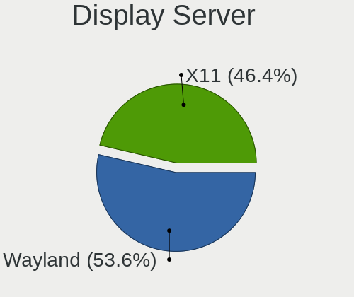
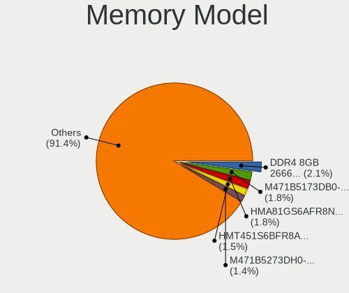

OpenMandriva Hardware Trends (Notebook)
---------------------------------------

A project to identify most popular hardware characteristics and track their change
over time based on data collected by OpenMandriva users at https://Linux-Hardware.org.

Anyone can contribute to the study by uploading probes of their computers by
the [hw-probe](https://github.com/linuxhw/hw-probe) tool:

    sudo -E hw-probe -all -upload

Full-feature report is available here: https://linux-hardware.org/?view=trends&formfactor=notebook

Period: Mar, 2021.

Contents
--------

- [ OS                       ](#os)
- [ OS Family                ](#os-family)
- [ Kernel                   ](#kernel)
- [ Kernel Family            ](#kernel-family)
- [ Kernel Major Ver.        ](#kernel-major-ver)
- [ Arch                     ](#arch)
- [ DE                       ](#de)
- [ Display Server           ](#display-server)
- [ Display Manager          ](#display-manager)
- [ OS Lang                  ](#os-lang)
- [ Boot Mode                ](#boot-mode)
- [ Filesystem               ](#filesystem)
- [ Part. scheme             ](#part-scheme)
- [ Dual Boot with Linux/BSD ](#dual-boot-with-linux/bsd)
- [ Dual Boot (Win)          ](#dual-boot-win)
- [ Country                  ](#country)
- [ City                     ](#city)
- [ Vendor                   ](#vendor)
- [ Model                    ](#model)
- [ Model Family             ](#model-family)
- [ MFG Year                 ](#mfg-year)
- [ Form Factor              ](#form-factor)
- [ Secure Boot              ](#secure-boot)
- [ Coreboot                 ](#coreboot)
- [ RAM Size                 ](#ram-size)
- [ RAM Used                 ](#ram-used)
- [ Has CD-ROM               ](#has-cd-rom)
- [ Total Drives             ](#total-drives)
- [ Has Ethernet             ](#has-ethernet)
- [ Has WiFi                 ](#has-wifi)
- [ Has Bluetooth            ](#has-bluetooth)
- [ Drive Vendor             ](#drive-vendor)
- [ Drive Model              ](#drive-model)
- [ HDD Vendor               ](#hdd-vendor)
- [ SSD Vendor               ](#ssd-vendor)
- [ Drive Kind               ](#drive-kind)
- [ Drive Connector          ](#drive-connector)
- [ Drive Size               ](#drive-size)
- [ Space Total              ](#space-total)
- [ Space Used               ](#space-used)
- [ Malfunc. Drives          ](#malfunc-drives)
- [ Malfunc. Drive Vendor    ](#malfunc-drive-vendor)
- [ Malfunc. HDD Vendor      ](#malfunc-hdd-vendor)
- [ Malfunc. Drive Kind      ](#malfunc-drive-kind)
- [ Failed Drives            ](#failed-drives)
- [ Failed Drive Vendor      ](#failed-drive-vendor)
- [ Drive Status             ](#drive-status)
- [ Storage Vendor           ](#storage-vendor)
- [ Storage Model            ](#storage-model)
- [ Storage Kind             ](#storage-kind)
- [ CPU Vendor               ](#cpu-vendor)
- [ CPU Model                ](#cpu-model)
- [ CPU Model Family         ](#cpu-model-family)
- [ CPU Cores                ](#cpu-cores)
- [ CPU Sockets              ](#cpu-sockets)
- [ CPU Threads              ](#cpu-threads)
- [ CPU Op-Modes             ](#cpu-op-modes)
- [ CPU Microcode            ](#cpu-microcode)
- [ CPU Microarch            ](#cpu-microarch)
- [ GPU Vendor               ](#gpu-vendor)
- [ GPU Model                ](#gpu-model)
- [ GPU Combo                ](#gpu-combo)
- [ GPU Driver               ](#gpu-driver)
- [ GPU Memory               ](#gpu-memory)
- [ Monitor Vendor           ](#monitor-vendor)
- [ Monitor Model            ](#monitor-model)
- [ Monitor Resolution       ](#monitor-resolution)
- [ Monitor Diagonal         ](#monitor-diagonal)
- [ Monitor Width            ](#monitor-width)
- [ Aspect Ratio             ](#aspect-ratio)
- [ Monitor Area             ](#monitor-area)
- [ Pixel Density            ](#pixel-density)
- [ Multiple Monitors        ](#multiple-monitors)
- [ Net Controller Vendor    ](#net-controller-vendor)
- [ Net Controller Model     ](#net-controller-model)
- [ Wireless Vendor          ](#wireless-vendor)
- [ Wireless Model           ](#wireless-model)
- [ Ethernet Vendor          ](#ethernet-vendor)
- [ Ethernet Model           ](#ethernet-model)
- [ Net Controller Kind      ](#net-controller-kind)
- [ Used Controller          ](#used-controller)
- [ NICs                     ](#nics)
- [ IPv6                     ](#ipv6)
- [ Memory Vendor            ](#memory-vendor)
- [ Memory Model             ](#memory-model)
- [ Memory Kind              ](#memory-kind)
- [ Memory Form Factor       ](#memory-form-factor)
- [ Memory Size              ](#memory-size)
- [ Memory Speed             ](#memory-speed)
- [ Sound Vendor             ](#sound-vendor)
- [ Sound Model              ](#sound-model)
- [ Camera Vendor            ](#camera-vendor)
- [ Camera Model             ](#camera-model)
- [ Fingerprint Vendor       ](#fingerprint-vendor)
- [ Fingerprint Model        ](#fingerprint-model)
- [ Chipcard Vendor          ](#chipcard-vendor)
- [ Chipcard Model           ](#chipcard-model)
- [ Printer Vendor           ](#printer-vendor)
- [ Printer Model            ](#printer-model)
- [ Scanner Vendor           ](#scanner-vendor)
- [ Scanner Model            ](#scanner-model)
- [ Bluetooth Vendor         ](#bluetooth-vendor)
- [ Bluetooth Model          ](#bluetooth-model)
- [ Unsupported Devices      ](#unsupported-devices)
- [ Unsupported Device Types ](#unsupported-device-types)

OS
--

Installed operating systems

| Name             | Notebooks | Percent |
|------------------|-----------|---------|
| OpenMandriva 4.2 | 280       | 100%    |

OS Family
---------

OS without a version

| Name         | Notebooks | Percent |
|--------------|-----------|---------|
| OpenMandriva | 280       | 100%    |

Kernel
------

Version of the Linux kernel

| Version                       | Notebooks | Percent |
|-------------------------------|-----------|---------|
| 5.10.14-desktop-1omv4002      | 277       | 98.93%  |
| 5.11.0-desktop-clang-1omv4002 | 1         | 0.36%   |
| 5.11.0-desktop-1omv4002       | 1         | 0.36%   |
| 5.11.0-desktop-0.rc4.1omv4002 | 1         | 0.36%   |

Kernel Family
-------------

Linux kernel without a distro release

| Version | Notebooks | Percent |
|---------|-----------|---------|
| 5.10.14 | 277       | 98.93%  |
| 5.11.0  | 3         | 1.07%   |

Kernel Major Ver.
-----------------

Linux kernel major version

| Version | Notebooks | Percent |
|---------|-----------|---------|
| 5.10    | 277       | 98.93%  |
| 5.11    | 3         | 1.07%   |

Arch
----

OS architecture (x86_64, i586, etc.)

| Name   | Notebooks | Percent |
|--------|-----------|---------|
| x86_64 | 280       | 100%    |

DE
--

Desktop Environment

| Name  | Notebooks | Percent |
|-------|-----------|---------|
| KDE5  | 279       | 99.64%  |
| GNOME | 1         | 0.36%   |

Display Server
--------------

X11 or Wayland

| Name    | Notebooks | Percent |
|---------|-----------|---------|
| X11     | 279       | 99.64%  |
| Wayland | 1         | 0.36%   |

Display Manager
---------------

SDDM, LightDM, etc.

| Name | Notebooks | Percent |
|------|-----------|---------|
| SDDM | 280       | 100%    |

OS Lang
-------

Language

| Lang  | Notebooks | Percent |
|-------|-----------|---------|
| en_US | 136       | 48.57%  |
| fr_FR | 24        | 8.57%   |
| ru_RU | 23        | 8.21%   |
| pl_PL | 23        | 8.21%   |
| de_DE | 14        | 5%      |
| pt_BR | 13        | 4.64%   |
| it_IT | 8         | 2.86%   |
| es_ES | 8         | 2.86%   |
| en_GB | 5         | 1.79%   |
| es_MX | 4         | 1.43%   |
| cs_CZ | 4         | 1.43%   |
| es_AR | 3         | 1.07%   |
| es_GT | 2         | 0.71%   |
| es_CL | 2         | 0.71%   |
| pt_PT | 1         | 0.36%   |
| nl_NL | 1         | 0.36%   |
| it_CH | 1         | 0.36%   |
| fr_CH | 1         | 0.36%   |
| fr_BE | 1         | 0.36%   |
| es_VE | 1         | 0.36%   |
| es_UY | 1         | 0.36%   |
| es_HN | 1         | 0.36%   |
| es_CR | 1         | 0.36%   |
| en_CA | 1         | 0.36%   |
| da_DK | 1         | 0.36%   |

Boot Mode
---------

EFI or BIOS

| Mode | Notebooks | Percent |
|------|-----------|---------|
| BIOS | 155       | 55.36%  |
| EFI  | 125       | 44.64%  |

Filesystem
----------

Type of filesystem

| Type    | Notebooks | Percent |
|---------|-----------|---------|
| Overlay | 216       | 77.14%  |
| Ext4    | 58        | 20.71%  |
| Btrfs   | 4         | 1.43%   |
| Xfs     | 2         | 0.71%   |

Part. scheme
------------

Scheme of partitioning

| Type | Notebooks | Percent |
|------|-----------|---------|
| GPT  | 178       | 63.57%  |
| MBR  | 102       | 36.43%  |

Dual Boot with Linux/BSD
------------------------

Hosting more than one Linux/BSD

| Dual boot | Notebooks | Percent |
|-----------|-----------|---------|
| No        | 145       | 51.79%  |
| Yes       | 135       | 48.21%  |

Dual Boot (Win)
---------------

Hosting Linux and Windows

| Dual boot | Notebooks | Percent |
|-----------|-----------|---------|
| No        | 178       | 63.57%  |
| Yes       | 102       | 36.43%  |

Country
-------

Geographic location (country)

| Country             | Notebooks | Percent |
|---------------------|-----------|---------|
| Poland              | 28        | 10%     |
| France              | 28        | 10%     |
| USA                 | 26        | 9.29%   |
| Germany             | 26        | 9.29%   |
| Russia              | 24        | 8.57%   |
| Brazil              | 19        | 6.79%   |
| Italy               | 14        | 5%      |
| Spain               | 11        | 3.93%   |
| UK                  | 8         | 2.86%   |
| Canada              | 8         | 2.86%   |
| Ukraine             | 6         | 2.14%   |
| Czechia             | 6         | 2.14%   |
| Sweden              | 5         | 1.79%   |
| Mexico              | 5         | 1.79%   |
| Slovakia            | 4         | 1.43%   |
| Indonesia           | 4         | 1.43%   |
| Argentina           | 4         | 1.43%   |
| Réunion            | 3         | 1.07%   |
| Romania             | 3         | 1.07%   |
| Guatemala           | 3         | 1.07%   |
| Greece              | 3         | 1.07%   |
| Switzerland         | 2         | 0.71%   |
| South Korea         | 2         | 0.71%   |
| Portugal            | 2         | 0.71%   |
| Japan               | 2         | 0.71%   |
| Costa Rica          | 2         | 0.71%   |
| China               | 2         | 0.71%   |
| Chile               | 2         | 0.71%   |
| Bulgaria            | 2         | 0.71%   |
| Austria             | 2         | 0.71%   |
| Venezuela           | 1         | 0.36%   |
| Uruguay             | 1         | 0.36%   |
| Turkey              | 1         | 0.36%   |
| Trinidad and Tobago | 1         | 0.36%   |
| South Africa        | 1         | 0.36%   |
| Serbia              | 1         | 0.36%   |
| Senegal             | 1         | 0.36%   |
| Norway              | 1         | 0.36%   |
| Netherlands         | 1         | 0.36%   |
| Morocco             | 1         | 0.36%   |
| Malaysia            | 1         | 0.36%   |
| Lithuania           | 1         | 0.36%   |
| Ireland             | 1         | 0.36%   |
| Iraq                | 1         | 0.36%   |
| India               | 1         | 0.36%   |
| Hungary             | 1         | 0.36%   |
| Hong Kong           | 1         | 0.36%   |
| Honduras            | 1         | 0.36%   |
| Gibraltar           | 1         | 0.36%   |
| Denmark             | 1         | 0.36%   |
| Belgium             | 1         | 0.36%   |
| Belarus             | 1         | 0.36%   |
| Australia           | 1         | 0.36%   |
| Algeria             | 1         | 0.36%   |

City
----

Geographic location (city)

| City                    | Notebooks | Percent |
|-------------------------|-----------|---------|
| Warsaw                  | 4         | 1.43%   |
| Rome                    | 4         | 1.43%   |
| Krasnodar               | 4         | 1.43%   |
| Wroclaw                 | 3         | 1.07%   |
| Saint-Gilles les Bains  | 3         | 1.07%   |
| Queens                  | 3         | 1.07%   |
| Paris                   | 3         | 1.07%   |
| Moscow                  | 3         | 1.07%   |
| Milan                   | 3         | 1.07%   |
| Lodz                    | 3         | 1.07%   |
| Kielce                  | 3         | 1.07%   |
| Guatemala City          | 3         | 1.07%   |
| Berlin                  | 3         | 1.07%   |
| Wodzisław Śląski     | 2         | 0.71%   |
| Vienna                  | 2         | 0.71%   |
| São Paulo              | 2         | 0.71%   |
| Stockholm               | 2         | 0.71%   |
| St Petersburg           | 2         | 0.71%   |
| San Diego               | 2         | 0.71%   |
| Salvador                | 2         | 0.71%   |
| Rio de Janeiro          | 2         | 0.71%   |
| Prague                  | 2         | 0.71%   |
| Poznan                  | 2         | 0.71%   |
| Portland                | 2         | 0.71%   |
| Perth                   | 2         | 0.71%   |
| Ovidiu                  | 2         | 0.71%   |
| Nice                    | 2         | 0.71%   |
| Livonia                 | 2         | 0.71%   |
| Kyiv                    | 2         | 0.71%   |
| Jakarta                 | 2         | 0.71%   |
| Getulina                | 2         | 0.71%   |
| Gdynia                  | 2         | 0.71%   |
| Buenos Aires            | 2         | 0.71%   |
| Brno                    | 2         | 0.71%   |
| Barnaul                 | 2         | 0.71%   |
| Žilina                 | 1         | 0.36%   |
| Zeitz                   | 1         | 0.36%   |
| Zamora                  | 1         | 0.36%   |
| Weyhe                   | 1         | 0.36%   |
| Volgograd               | 1         | 0.36%   |
| Vladivostok             | 1         | 0.36%   |
| Villeneuve-la-Garenne   | 1         | 0.36%   |
| Villefranche-sur-Saône | 1         | 0.36%   |
| Victoria                | 1         | 0.36%   |
| Versailles              | 1         | 0.36%   |
| Vancouver               | 1         | 0.36%   |
| Uppsala                 | 1         | 0.36%   |
| Uithoorn                | 1         | 0.36%   |
| Ufa                     | 1         | 0.36%   |
| Tychy                   | 1         | 0.36%   |
| Trieste                 | 1         | 0.36%   |
| Trenčín               | 1         | 0.36%   |
| Tosse                   | 1         | 0.36%   |
| Torrejón de Ardoz      | 1         | 0.36%   |
| Tomsk                   | 1         | 0.36%   |
| Tijuana                 | 1         | 0.36%   |
| Tholey                  | 1         | 0.36%   |
| Temuco                  | 1         | 0.36%   |
| Tegucigalpa             | 1         | 0.36%   |
| São José dos Campos   | 1         | 0.36%   |

Vendor
------

Motherboard manufacturer

| Name                | Notebooks | Percent |
|---------------------|-----------|---------|
| Lenovo              | 59        | 21.07%  |
| Hewlett-Packard     | 51        | 18.21%  |
| Dell                | 34        | 12.14%  |
| ASUSTek Computer    | 34        | 12.14%  |
| Acer                | 30        | 10.71%  |
| Toshiba             | 17        | 6.07%   |
| Sony                | 8         | 2.86%   |
| Samsung Electronics | 7         | 2.5%    |
| MSI                 | 7         | 2.5%    |
| Medion              | 4         | 1.43%   |
| Philco              | 3         | 1.07%   |
| Packard Bell        | 3         | 1.07%   |
| HUAWEI              | 3         | 1.07%   |
| Notebook            | 2         | 0.71%   |
| LG Electronics      | 2         | 0.71%   |
| Fujitsu             | 2         | 0.71%   |
| eMachines           | 2         | 0.71%   |
| Apple               | 2         | 0.71%   |
| Teclast             | 1         | 0.36%   |
| System76            | 1         | 0.36%   |
| Positivo            | 1         | 0.36%   |
| MOTILE              | 1         | 0.36%   |
| Irbis               | 1         | 0.36%   |
| Gigabyte Technology | 1         | 0.36%   |
| Fujitsu Siemens     | 1         | 0.36%   |
| Exo                 | 1         | 0.36%   |
| Digibras            | 1         | 0.36%   |
| Clevo               | 1         | 0.36%   |

Model
-----

Motherboard model

| Name                                       | Notebooks | Percent |
|--------------------------------------------|-----------|---------|
| HP ProBook 4330s                           | 3         | 1.07%   |
| HP EliteBook 8570w                         | 3         | 1.07%   |
| Dell Latitude E6430                        | 3         | 1.07%   |
| Toshiba Satellite L500                     | 2         | 0.71%   |
| Toshiba dynabook Satellite B552/G          | 2         | 0.71%   |
| Samsung 300E4A/300E5A/300E7A/3430EA/3530EA | 2         | 0.71%   |
| Lenovo B50-10 80QR                         | 2         | 0.71%   |
| HP Pavilion dv6                            | 2         | 0.71%   |
| HP EliteBook 8440p                         | 2         | 0.71%   |
| HP 15                                      | 2         | 0.71%   |
| Dell Studio 1537                           | 2         | 0.71%   |
| Dell Latitude E6420                        | 2         | 0.71%   |
| ASUS X541NA                                | 2         | 0.71%   |
| ASUS K52F                                  | 2         | 0.71%   |
| Acer Aspire 5735                           | 2         | 0.71%   |
| Toshiba Satellite S855                     | 1         | 0.36%   |
| Toshiba Satellite Pro L500                 | 1         | 0.36%   |
| Toshiba Satellite PRO C850-1K4             | 1         | 0.36%   |
| Toshiba Satellite M840-C1T                 | 1         | 0.36%   |
| Toshiba Satellite L740                     | 1         | 0.36%   |
| Toshiba Satellite C855D                    | 1         | 0.36%   |
| Toshiba Satellite C855-10N                 | 1         | 0.36%   |
| Toshiba Satellite C660                     | 1         | 0.36%   |
| Toshiba Satellite C655                     | 1         | 0.36%   |
| Toshiba Satellite C50-A283                 | 1         | 0.36%   |
| Toshiba Satellite C45-A                    | 1         | 0.36%   |
| Toshiba Satellite A665                     | 1         | 0.36%   |
| Toshiba Satellite A660                     | 1         | 0.36%   |
| Teclast F15                                | 1         | 0.36%   |
| System76 Kudu                              | 1         | 0.36%   |
| Sony VPCEE25FB                             | 1         | 0.36%   |
| Sony VPCEB4E1R                             | 1         | 0.36%   |
| Sony VPCEA42EG                             | 1         | 0.36%   |
| Sony VGN-FE41M                             | 1         | 0.36%   |
| Sony VGN-CR42S_W                           | 1         | 0.36%   |
| Sony VGN-BZ12VN                            | 1         | 0.36%   |
| Sony SVF1521B1EW                           | 1         | 0.36%   |
| Sony SVF14213CXW                           | 1         | 0.36%   |
| Samsung R519/R719                          | 1         | 0.36%   |
| Samsung R430/R480/R440                     | 1         | 0.36%   |
| Samsung 400B4B/400B5B/200B4B/200B5B        | 1         | 0.36%   |
| Samsung 355V4C/356V4C/3445VC/3545VC        | 1         | 0.36%   |
| Samsung 300E5EV/300E4EV/270E5EV/270E4EV    | 1         | 0.36%   |
| Positivo S14BW01                           | 1         | 0.36%   |
| Philco 14I                                 | 1         | 0.36%   |
| Philco 14H                                 | 1         | 0.36%   |
| Philco 10D                                 | 1         | 0.36%   |
| Packard Bell EasyNote TE11BZ               | 1         | 0.36%   |
| Packard Bell EasyNote ENTF71BM             | 1         | 0.36%   |
| Packard Bell DOT S                         | 1         | 0.36%   |
| Notebook W517GU1                           | 1         | 0.36%   |
| Notebook W330SU2                           | 1         | 0.36%   |
| MSI Prestige 15 A10SC                      | 1         | 0.36%   |
| MSI MS-16Y1                                | 1         | 0.36%   |
| MSI GS60 2PC Ghost                         | 1         | 0.36%   |
| MSI GP73 Leopard 8RE                       | 1         | 0.36%   |
| MSI GL65 9SD                               | 1         | 0.36%   |
| MSI GF63 Thin 9RCX                         | 1         | 0.36%   |
| MSI GE62 7RE                               | 1         | 0.36%   |
| MOTILE M142                                | 1         | 0.36%   |

Model Family
------------

Motherboard model prefix

| Name                  | Notebooks | Percent |
|-----------------------|-----------|---------|
| Acer Aspire           | 26        | 9.29%   |
| Lenovo ThinkPad       | 20        | 7.14%   |
| Lenovo IdeaPad        | 17        | 6.07%   |
| Dell Latitude         | 17        | 6.07%   |
| Toshiba Satellite     | 15        | 5.36%   |
| HP Pavilion           | 9         | 3.21%   |
| HP EliteBook          | 7         | 2.5%    |
| HP ProBook            | 6         | 2.14%   |
| HP Laptop             | 6         | 2.14%   |
| HP Compaq             | 6         | 2.14%   |
| Dell Inspiron         | 6         | 2.14%   |
| HP 250                | 5         | 1.79%   |
| Dell Vostro           | 4         | 1.43%   |
| Dell Studio           | 4         | 1.43%   |
| ASUS VivoBook         | 4         | 1.43%   |
| Lenovo Legion         | 3         | 1.07%   |
| Toshiba dynabook      | 2         | 0.71%   |
| Samsung 300E4A        | 2         | 0.71%   |
| Packard Bell EasyNote | 2         | 0.71%   |
| Lenovo G580           | 2         | 0.71%   |
| Lenovo B50-10         | 2         | 0.71%   |
| HP 15                 | 2         | 0.71%   |
| Fujitsu LIFEBOOK      | 2         | 0.71%   |
| Dell XPS              | 2         | 0.71%   |
| ASUS X541NA           | 2         | 0.71%   |
| ASUS K52F             | 2         | 0.71%   |
| Teclast F15           | 1         | 0.36%   |
| System76 Kudu         | 1         | 0.36%   |
| Sony VPCEE25FB        | 1         | 0.36%   |
| Sony VPCEB4E1R        | 1         | 0.36%   |
| Sony VPCEA42EG        | 1         | 0.36%   |
| Sony VGN-FE41M        | 1         | 0.36%   |
| Sony VGN-CR42S        | 1         | 0.36%   |
| Sony VGN-BZ12VN       | 1         | 0.36%   |
| Sony SVF1521B1EW      | 1         | 0.36%   |
| Sony SVF14213CXW      | 1         | 0.36%   |
| Samsung R519          | 1         | 0.36%   |
| Samsung R430          | 1         | 0.36%   |
| Samsung 400B4B        | 1         | 0.36%   |
| Samsung 355V4C        | 1         | 0.36%   |
| Samsung 300E5EV       | 1         | 0.36%   |
| Positivo S14BW01      | 1         | 0.36%   |
| Philco 14I            | 1         | 0.36%   |
| Philco 14H            | 1         | 0.36%   |
| Philco 10D            | 1         | 0.36%   |
| Packard Bell DOT      | 1         | 0.36%   |
| Notebook W517GU1      | 1         | 0.36%   |
| Notebook W330SU2      | 1         | 0.36%   |
| MSI Prestige          | 1         | 0.36%   |
| MSI MS-16Y1           | 1         | 0.36%   |
| MSI GS60              | 1         | 0.36%   |
| MSI GP73              | 1         | 0.36%   |
| MSI GL65              | 1         | 0.36%   |
| MSI GF63              | 1         | 0.36%   |
| MSI GE62              | 1         | 0.36%   |
| MOTILE M142           | 1         | 0.36%   |
| Medion X6816          | 1         | 0.36%   |
| Medion P7402          | 1         | 0.36%   |
| Medion E17201         | 1         | 0.36%   |
| Medion Akoya          | 1         | 0.36%   |

MFG Year
--------

Motherboard manufacture year

| Year | Notebooks | Percent |
|------|-----------|---------|
| 2019 | 38        | 13.57%  |
| 2020 | 31        | 11.07%  |
| 2013 | 31        | 11.07%  |
| 2011 | 27        | 9.64%   |
| 2012 | 23        | 8.21%   |
| 2016 | 21        | 7.5%    |
| 2014 | 19        | 6.79%   |
| 2018 | 18        | 6.43%   |
| 2015 | 18        | 6.43%   |
| 2009 | 16        | 5.71%   |
| 2010 | 13        | 4.64%   |
| 2008 | 12        | 4.29%   |
| 2017 | 6         | 2.14%   |
| 2021 | 3         | 1.07%   |
| 2007 | 3         | 1.07%   |
| 2006 | 1         | 0.36%   |

Form Factor
-----------

Physical design of the computer

| Name     | Notebooks | Percent |
|----------|-----------|---------|
| Notebook | 280       | 100%    |

Secure Boot
-----------

Enabled or disabled

| State    | Notebooks | Percent |
|----------|-----------|---------|
| Disabled | 280       | 100%    |

Coreboot
--------

Have coreboot on board

| Used | Notebooks | Percent |
|------|-----------|---------|
| No   | 280       | 100%    |

RAM Size
--------

Total RAM memory

| Size in GB | Notebooks | Percent |
|------------|-----------|---------|
| 3.01-4.0   | 99        | 35.36%  |
| 4.01-8.0   | 84        | 30%     |
| 8.01-16.0  | 43        | 15.36%  |
| 16.01-24.0 | 21        | 7.5%    |
| 1.01-2.0   | 17        | 6.07%   |
| 2.01-3.0   | 11        | 3.93%   |
| 32.01-64.0 | 5         | 1.79%   |

RAM Used
--------

Used RAM memory

| Used GB  | Notebooks | Percent |
|----------|-----------|---------|
| 1.01-2.0 | 237       | 84.64%  |
| 0.51-1.0 | 26        | 9.29%   |
| 2.01-3.0 | 13        | 4.64%   |
| 0.01-0.5 | 4         | 1.43%   |

Has CD-ROM
----------

Has CD-ROM on board

| Presented | Notebooks | Percent |
|-----------|-----------|---------|
| Yes       | 156       | 55.71%  |
| No        | 124       | 44.29%  |

Total Drives
------------

Number of drives on board

| Drives | Notebooks | Percent |
|--------|-----------|---------|
| 1      | 212       | 75.71%  |
| 2      | 55        | 19.64%  |
| 0      | 10        | 3.57%   |
| 3      | 2         | 0.71%   |
| 4      | 1         | 0.36%   |

Has Ethernet
------------

Has Ethernet on board

| Presented | Notebooks | Percent |
|-----------|-----------|---------|
| Yes       | 257       | 91.79%  |
| No        | 23        | 8.21%   |

Has WiFi
--------

Has WiFi module

| Presented | Notebooks | Percent |
|-----------|-----------|---------|
| Yes       | 273       | 97.5%   |
| No        | 7         | 2.5%    |

Has Bluetooth
-------------

Has Bluetooth module

| Presented | Notebooks | Percent |
|-----------|-----------|---------|
| Yes       | 192       | 68.57%  |
| No        | 88        | 31.43%  |

Drive Vendor
------------

Hard drive vendors

| Vendor              | Notebooks | Drives | Percent |
|---------------------|-----------|--------|---------|
| WDC                 | 64        | 65     | 20.45%  |
| Toshiba             | 43        | 43     | 13.74%  |
| Seagate             | 42        | 42     | 13.42%  |
| Samsung Electronics | 33        | 35     | 10.54%  |
| Hitachi             | 18        | 18     | 5.75%   |
| SanDisk             | 14        | 15     | 4.47%   |
| Kingston            | 14        | 14     | 4.47%   |
| HGST                | 12        | 12     | 3.83%   |
| Unknown             | 10        | 10     | 3.19%   |
| Intel               | 7         | 8      | 2.24%   |
| Fujitsu             | 6         | 6      | 1.92%   |
| Crucial             | 6         | 6      | 1.92%   |
| LITEONIT            | 5         | 6      | 1.6%    |
| A-DATA Technology   | 4         | 4      | 1.28%   |
| SK Hynix            | 3         | 3      | 0.96%   |
| LITEON              | 3         | 3      | 0.96%   |
| SPCC                | 2         | 2      | 0.64%   |
| PNY                 | 2         | 2      | 0.64%   |
| PLEXTOR             | 2         | 2      | 0.64%   |
| Micron Technology   | 2         | 2      | 0.64%   |
| Apple               | 2         | 2      | 0.64%   |
| Apacer              | 2         | 2      | 0.64%   |
| Transcend           | 1         | 1      | 0.32%   |
| Teclast             | 1         | 1      | 0.32%   |
| Smart               | 1         | 1      | 0.32%   |
| Patriot             | 1         | 1      | 0.32%   |
| OWC                 | 1         | 1      | 0.32%   |
| Maxtor              | 1         | 1      | 0.32%   |
| Lenovo              | 1         | 1      | 0.32%   |
| LaCie               | 1         | 1      | 0.32%   |
| Intenso             | 1         | 1      | 0.32%   |
| Hikvision           | 1         | 1      | 0.32%   |
| Hewlett-Packard     | 1         | 1      | 0.32%   |
| GOODRAM             | 1         | 1      | 0.32%   |
| Gigabyte Technology | 1         | 1      | 0.32%   |
| DOGFISH             | 1         | 1      | 0.32%   |
| Corsair             | 1         | 1      | 0.32%   |
| China               | 1         | 1      | 0.32%   |
| 240G                | 1         | 1      | 0.32%   |

Drive Model
-----------

Hard drive models

| Model                                | Notebooks | Percent |
|--------------------------------------|-----------|---------|
| Seagate ST1000LM035-1RK172 1TB       | 7         | 2.19%   |
| WDC WD10JPVX-22JC3T0 1TB             | 6         | 1.88%   |
| Seagate ST500LT012-1DG142 500GB      | 5         | 1.57%   |
| WDC WD5000LPVX-22V0TT0 500GB         | 4         | 1.25%   |
| WDC WD5000BPKX-22HPJT0 500GB         | 4         | 1.25%   |
| WDC WD10SPZX-21Z10T0 1TB             | 4         | 1.25%   |
| Toshiba MQ04ABF100 1TB               | 4         | 1.25%   |
| Toshiba MQ01ABF050 500GB             | 4         | 1.25%   |
| Toshiba MQ01ABD075 752GB             | 4         | 1.25%   |
| Seagate ST500LM012 HN-M500MBB 500GB  | 4         | 1.25%   |
| Seagate ST1000LM024 HN-M101MBB 1TB   | 4         | 1.25%   |
| Unknown SD/MMC/MS PRO 128GB          | 3         | 0.94%   |
| Toshiba MQ01ACF050 500GB             | 3         | 0.94%   |
| Toshiba MQ01ABD100 1TB               | 3         | 0.94%   |
| Toshiba MQ01ABD050 500GB             | 3         | 0.94%   |
| Seagate ST9500325AS 500GB            | 3         | 0.94%   |
| Samsung SSD 860 EVO 500GB            | 3         | 0.94%   |
| Kingston SA400S37480G 480GB SSD      | 3         | 0.94%   |
| Hitachi HTS545050A7E380 500GB        | 3         | 0.94%   |
| HGST HTS721010A9E630 1TB             | 3         | 0.94%   |
| HGST HTS545050A7E680 500GB           | 3         | 0.94%   |
| WDC WD7500BPVX-60JC3T0 752GB         | 2         | 0.63%   |
| WDC WD5000LPCX-24VHAT0 500GB         | 2         | 0.63%   |
| WDC WD10SPZX-24Z10 1TB               | 2         | 0.63%   |
| WDC WD10JPVX-75JC3T0 1TB             | 2         | 0.63%   |
| WDC WD10JPCX-24UE4T0 1TB             | 2         | 0.63%   |
| WDC PC SN520 SDAPNUW-512G-1032 512GB | 2         | 0.63%   |
| Toshiba MQ01ABF032 320GB             | 2         | 0.63%   |
| Seagate ST9320423AS 320GB            | 2         | 0.63%   |
| Seagate ST320LT007-9ZV142 320GB      | 2         | 0.63%   |
| Seagate ST1000LM049-2GH172 1TB       | 2         | 0.63%   |
| SanDisk SSD PLUS 240GB               | 2         | 0.63%   |
| SanDisk SSD PLUS 120GB               | 2         | 0.63%   |
| SanDisk DF4032  32GB                 | 2         | 0.63%   |
| Samsung SSD 850 EVO 250GB            | 2         | 0.63%   |
| Samsung MZALQ512HALU-000L1 512GB     | 2         | 0.63%   |
| Samsung MZALQ256HAJD-000L2 256GB     | 2         | 0.63%   |
| Kingston SV300S37A120G 120GB SSD     | 2         | 0.63%   |
| Hitachi HTS547575A9E384 752GB        | 2         | 0.63%   |
| Hitachi HTS547550A9E384 500GB        | 2         | 0.63%   |
| Hitachi HTS545025B9A300 250GB        | 2         | 0.63%   |
| HGST HTS545050A7E380 500GB           | 2         | 0.63%   |
| HGST HTS541010A9E680 1TB             | 2         | 0.63%   |
| Crucial CT500P2SSD8 500GB            | 2         | 0.63%   |
| WDC WDS500G2B0A-00SM50 500GB SSD     | 1         | 0.31%   |
| WDC WDS250G2B0A-00SM50 250GB SSD     | 1         | 0.31%   |
| WDC WDS250G1B0A-00H9H0 250GB SSD     | 1         | 0.31%   |
| WDC WDS240G2G0B-00EPW0 240GB SSD     | 1         | 0.31%   |
| WDC WDS120G2G0B-00EPW0 120GB SSD     | 1         | 0.31%   |
| WDC WDS120G2G0A-00JH30 120GB SSD     | 1         | 0.31%   |
| WDC WDS100T2G0A-00JH30 1TB SSD       | 1         | 0.31%   |
| WDC WDS100T2B0A-00SM50 1TB SSD       | 1         | 0.31%   |
| WDC WD7500BPKT-75PK4T0 752GB         | 1         | 0.31%   |
| WDC WD6400BPVT-22HXZT1 640GB         | 1         | 0.31%   |
| WDC WD5000LPVX-60V0TT0 500GB         | 1         | 0.31%   |
| WDC WD5000LPCX-24C6HT0 500GB         | 1         | 0.31%   |
| WDC WD5000BPKT-00PK4T0 500GB         | 1         | 0.31%   |
| WDC WD3200BPVT-24JJ5T0 320GB         | 1         | 0.31%   |
| WDC WD3200BPVT-00JJ5T0 320GB         | 1         | 0.31%   |
| WDC WD3200BEVT-80A0RT0 320GB         | 1         | 0.31%   |

HDD Vendor
----------

Hard disk drive vendors

| Vendor              | Notebooks | Drives | Percent |
|---------------------|-----------|--------|---------|
| WDC                 | 53        | 53     | 30.64%  |
| Seagate             | 40        | 40     | 23.12%  |
| Toshiba             | 38        | 38     | 21.97%  |
| Hitachi             | 18        | 18     | 10.4%   |
| HGST                | 12        | 12     | 6.94%   |
| Fujitsu             | 6         | 6      | 3.47%   |
| Samsung Electronics | 4         | 4      | 2.31%   |
| Apple               | 2         | 2      | 1.16%   |

SSD Vendor
----------

Solid state drive vendors

| Vendor              | Notebooks | Drives | Percent |
|---------------------|-----------|--------|---------|
| Samsung Electronics | 21        | 21     | 21.88%  |
| Kingston            | 12        | 12     | 12.5%   |
| SanDisk             | 11        | 12     | 11.46%  |
| WDC                 | 8         | 8      | 8.33%   |
| LITEONIT            | 5         | 6      | 5.21%   |
| Crucial             | 4         | 4      | 4.17%   |
| SK Hynix            | 3         | 3      | 3.13%   |
| A-DATA Technology   | 3         | 3      | 3.13%   |
| Toshiba             | 2         | 2      | 2.08%   |
| SPCC                | 2         | 2      | 2.08%   |
| PLEXTOR             | 2         | 2      | 2.08%   |
| Micron Technology   | 2         | 2      | 2.08%   |
| LITEON              | 2         | 2      | 2.08%   |
| Intel               | 2         | 2      | 2.08%   |
| Apacer              | 2         | 2      | 2.08%   |
| Unknown             | 1         | 1      | 1.04%   |
| Transcend           | 1         | 1      | 1.04%   |
| Teclast             | 1         | 1      | 1.04%   |
| Smart               | 1         | 1      | 1.04%   |
| PNY                 | 1         | 1      | 1.04%   |
| Patriot             | 1         | 1      | 1.04%   |
| Maxtor              | 1         | 1      | 1.04%   |
| Intenso             | 1         | 1      | 1.04%   |
| Hewlett-Packard     | 1         | 1      | 1.04%   |
| GOODRAM             | 1         | 1      | 1.04%   |
| Gigabyte Technology | 1         | 1      | 1.04%   |
| DOGFISH             | 1         | 1      | 1.04%   |
| Corsair             | 1         | 1      | 1.04%   |
| China               | 1         | 1      | 1.04%   |
| 240G                | 1         | 1      | 1.04%   |

Drive Kind
----------

HDD or SSD

| Kind    | Notebooks | Drives | Percent |
|---------|-----------|--------|---------|
| HDD     | 173       | 173    | 55.81%  |
| SSD     | 93        | 98     | 30%     |
| NVMe    | 29        | 32     | 9.35%   |
| MMC     | 8         | 9      | 2.58%   |
| Unknown | 7         | 7      | 2.26%   |

Drive Connector
---------------

SATA, SAS, NVMe, etc.

| Type | Notebooks | Drives | Percent |
|------|-----------|--------|---------|
| SATA | 249       | 270    | 84.69%  |
| NVMe | 29        | 32     | 9.86%   |
| SAS  | 8         | 8      | 2.72%   |
| MMC  | 8         | 9      | 2.72%   |

Drive Size
----------

Size of hard drive

| Size in TB | Notebooks | Drives | Percent |
|------------|-----------|--------|---------|
| 0.01-0.5   | 184       | 192    | 69.96%  |
| 0.51-1.0   | 78        | 78     | 29.66%  |
| 1.01-2.0   | 1         | 1      | 0.38%   |

Space Total
-----------

Amount of disk space available on the file system

| Size in GB | Notebooks | Percent |
|------------|-----------|---------|
| 1-20       | 158       | 56.43%  |
| 101-250    | 39        | 13.93%  |
| 251-500    | 29        | 10.36%  |
| 501-1000   | 20        | 7.14%   |
| 51-100     | 13        | 4.64%   |
| Unknown    | 10        | 3.57%   |
| 21-50      | 8         | 2.86%   |
| 1001-2000  | 2         | 0.71%   |
| 2001-3000  | 1         | 0.36%   |

Space Used
----------

Amount of used disk space

| Used GB | Notebooks | Percent |
|---------|-----------|---------|
| 1-20    | 252       | 90%     |
| Unknown | 10        | 3.57%   |
| 101-250 | 9         | 3.21%   |
| 51-100  | 4         | 1.43%   |
| 251-500 | 3         | 1.07%   |
| 21-50   | 2         | 0.71%   |

Malfunc. Drives
---------------

Drive models with a malfunction

| Model                                         | Notebooks | Drives | Percent |
|-----------------------------------------------|-----------|--------|---------|
| WDC WD10JPVX-22JC3T0 1TB                      | 3         | 3      | 4.35%   |
| Toshiba MQ01ABD075 752GB                      | 3         | 3      | 4.35%   |
| Seagate ST500LT012-1DG142 500GB               | 3         | 3      | 4.35%   |
| Hitachi HTS545050A7E380 500GB                 | 3         | 3      | 4.35%   |
| WDC WD10JPCX-24UE4T0 1TB                      | 2         | 2      | 2.9%    |
| Toshiba MQ01ABF050 500GB                      | 2         | 2      | 2.9%    |
| Seagate ST9320423AS 320GB                     | 2         | 2      | 2.9%    |
| Seagate ST320LT007-9ZV142 320GB               | 2         | 2      | 2.9%    |
| Seagate ST1000LM024 HN-M101MBB 1TB            | 2         | 2      | 2.9%    |
| HGST HTS545050A7E680 500GB                    | 2         | 2      | 2.9%    |
| WDC WDS120G2G0A-00JH30 120GB SSD              | 1         | 1      | 1.45%   |
| WDC WD7500BPKT-75PK4T0 752GB                  | 1         | 1      | 1.45%   |
| WDC WD5000LPVX-22V0TT0 500GB                  | 1         | 1      | 1.45%   |
| WDC WD3200BEVT-80A0RT0 320GB                  | 1         | 1      | 1.45%   |
| WDC WD3200BEVT-26ZCT0 320GB                   | 1         | 1      | 1.45%   |
| WDC WD3200BEVT-22A23T0 320GB                  | 1         | 1      | 1.45%   |
| WDC WD3200BEKT-60F3T1 320GB                   | 1         | 1      | 1.45%   |
| Toshiba MQ01ACF050 500GB                      | 1         | 1      | 1.45%   |
| Toshiba MQ01ABD100 1TB                        | 1         | 1      | 1.45%   |
| Toshiba MK8052GSX 80GB                        | 1         | 1      | 1.45%   |
| Toshiba MK6465GSXN 640GB                      | 1         | 1      | 1.45%   |
| Toshiba MK6465GSX 640GB                       | 1         | 1      | 1.45%   |
| Toshiba MK5075GSX 500GB                       | 1         | 1      | 1.45%   |
| Toshiba MK5059GSX 500GB                       | 1         | 1      | 1.45%   |
| Toshiba MK3275GSX 320GB                       | 1         | 1      | 1.45%   |
| Toshiba MK3265GSX 320GB                       | 1         | 1      | 1.45%   |
| Toshiba MK3263GSXN 320GB                      | 1         | 1      | 1.45%   |
| Toshiba MK2035GSS 200GB                       | 1         | 1      | 1.45%   |
| Toshiba MK1252GSX 120GB                       | 1         | 1      | 1.45%   |
| Seagate ST9500325AS 500GB                     | 1         | 1      | 1.45%   |
| Seagate ST9250827AS 250GB                     | 1         | 1      | 1.45%   |
| Seagate ST9160411ASG 160GB                    | 1         | 1      | 1.45%   |
| Seagate ST500LT012-9WS142 500GB               | 1         | 1      | 1.45%   |
| Seagate ST320LT012-9WS14C 320GB               | 1         | 1      | 1.45%   |
| Seagate ST1000LM049-2GH172 1TB                | 1         | 1      | 1.45%   |
| Seagate ST1000LM035-1RK172 1TB                | 1         | 1      | 1.45%   |
| Seagate OOS1000G128M 1TB                      | 1         | 1      | 1.45%   |
| SanDisk SD9SN8W-128G-1006 128GB SSD           | 1         | 1      | 1.45%   |
| Samsung Electronics MZVLB512HAJQ-000L2 512GB  | 1         | 1      | 1.45%   |
| Samsung Electronics MCCOE64G8MPP-0VA 64GB SSD | 1         | 1      | 1.45%   |
| Samsung Electronics HN-M320MBB 320GB          | 1         | 1      | 1.45%   |
| Samsung Electronics HM641JI 640GB             | 1         | 1      | 1.45%   |
| Samsung Electronics HM251JI 250GB             | 1         | 1      | 1.45%   |
| Samsung Electronics HM250JI 250GB             | 1         | 1      | 1.45%   |
| Kingston SUV400S37120G 120GB SSD              | 1         | 1      | 1.45%   |
| Hitachi HTS725050A9A364 500GB                 | 1         | 1      | 1.45%   |
| Hitachi HTS547550A9E384 500GB                 | 1         | 1      | 1.45%   |
| Hitachi HTS545050B9A300 500GB                 | 1         | 1      | 1.45%   |
| Hitachi HTS543232A7A384 320GB                 | 1         | 1      | 1.45%   |
| Hitachi HTS542525K9SA00 250GB                 | 1         | 1      | 1.45%   |
| HGST HTS541010A9E680 1TB                      | 1         | 1      | 1.45%   |
| Fujitsu MHZ2160BH G2 160GB                    | 1         | 1      | 1.45%   |
| Fujitsu MHY2200BH 200GB                       | 1         | 1      | 1.45%   |
| Crucial CT1050MX300SSD1 1TB                   | 1         | 1      | 1.45%   |
| 240G SATA III SSD 240GB                       | 1         | 1      | 1.45%   |

Malfunc. Drive Vendor
---------------------

Vendors of faulty drives

| Vendor              | Notebooks | Drives | Percent |
|---------------------|-----------|--------|---------|
| Toshiba             | 17        | 17     | 24.64%  |
| Seagate             | 17        | 17     | 24.64%  |
| WDC                 | 12        | 12     | 17.39%  |
| Hitachi             | 8         | 8      | 11.59%  |
| Samsung Electronics | 6         | 6      | 8.7%    |
| HGST                | 3         | 3      | 4.35%   |
| Fujitsu             | 2         | 2      | 2.9%    |
| SanDisk             | 1         | 1      | 1.45%   |
| Kingston            | 1         | 1      | 1.45%   |
| Crucial             | 1         | 1      | 1.45%   |
| 240G                | 1         | 1      | 1.45%   |

Malfunc. HDD Vendor
-------------------

Vendors of faulty HDD drives

| Vendor              | Notebooks | Drives | Percent |
|---------------------|-----------|--------|---------|
| Toshiba             | 17        | 17     | 27.42%  |
| Seagate             | 17        | 17     | 27.42%  |
| WDC                 | 11        | 11     | 17.74%  |
| Hitachi             | 8         | 8      | 12.9%   |
| Samsung Electronics | 4         | 4      | 6.45%   |
| HGST                | 3         | 3      | 4.84%   |
| Fujitsu             | 2         | 2      | 3.23%   |

Malfunc. Drive Kind
-------------------

Kinds of faulty drives

| Kind | Notebooks | Drives | Percent |
|------|-----------|--------|---------|
| HDD  | 62        | 62     | 89.86%  |
| SSD  | 6         | 6      | 8.7%    |
| NVMe | 1         | 1      | 1.45%   |

Failed Drives
-------------

Failed drive models

| Model                                 | Notebooks | Drives | Percent |
|---------------------------------------|-----------|--------|---------|
| Crucial CT500P2SSD8 500GB             | 2         | 2      | 66.67%  |
| Samsung Electronics SSD PM800 TM 64GB | 1         | 1      | 33.33%  |

Failed Drive Vendor
-------------------

Failed drive vendors

| Vendor              | Notebooks | Drives | Percent |
|---------------------|-----------|--------|---------|
| Crucial             | 2         | 2      | 66.67%  |
| Samsung Electronics | 1         | 1      | 33.33%  |

Drive Status
------------

Number of failed and malfunc. drives

| Status   | Notebooks | Drives | Percent |
|----------|-----------|--------|---------|
| Works    | 197       | 231    | 69.37%  |
| Malfunc  | 69        | 69     | 24.3%   |
| Detected | 15        | 16     | 5.28%   |
| Failed   | 3         | 3      | 1.06%   |

Storage Vendor
--------------

Storage controller vendors

| Vendor                       | Notebooks | Percent |
|------------------------------|-----------|---------|
| Intel                        | 225       | 74.75%  |
| AMD                          | 46        | 15.28%  |
| Samsung Electronics          | 10        | 3.32%   |
| Sandisk                      | 4         | 1.33%   |
| Nvidia                       | 3         | 1%      |
| Toshiba America Info Systems | 2         | 0.66%   |
| Micron/Crucial Technology    | 2         | 0.66%   |
| Kingston Technology Company  | 2         | 0.66%   |
| Silicon Motion               | 1         | 0.33%   |
| Realtek Semiconductor        | 1         | 0.33%   |
| Phison Electronics           | 1         | 0.33%   |
| Lite-On Technology           | 1         | 0.33%   |
| Lenovo                       | 1         | 0.33%   |
| KIOXIA                       | 1         | 0.33%   |
| JMicron Technology           | 1         | 0.33%   |

Storage Model
-------------

Storage controller models

| Model                                                                                  | Notebooks | Percent |
|----------------------------------------------------------------------------------------|-----------|---------|
| AMD FCH SATA Controller [AHCI mode]                                                    | 38        | 11.69%  |
| Intel 7 Series Chipset Family 6-port SATA Controller [AHCI mode]                       | 34        | 10.46%  |
| Intel 6 Series/C200 Series Chipset Family 6 port Mobile SATA AHCI Controller           | 25        | 7.69%   |
| Intel Sunrise Point-LP SATA Controller [AHCI mode]                                     | 21        | 6.46%   |
| Intel 82801IBM/IEM (ICH9M/ICH9M-E) 4 port SATA Controller [AHCI mode]                  | 20        | 6.15%   |
| Intel 82801 Mobile SATA Controller [RAID mode]                                         | 14        | 4.31%   |
| Intel 8 Series SATA Controller 1 [AHCI mode]                                           | 12        | 3.69%   |
| Intel 82801HM/HEM (ICH8M/ICH8M-E) IDE Controller                                       | 11        | 3.38%   |
| Intel 5 Series/3400 Series Chipset 4 port SATA AHCI Controller                         | 10        | 3.08%   |
| Intel Atom Processor E3800 Series SATA AHCI Controller                                 | 9         | 2.77%   |
| Intel 82801HM/HEM (ICH8M/ICH8M-E) SATA Controller [AHCI mode]                          | 9         | 2.77%   |
| Intel 8 Series/C220 Series Chipset Family 6-port SATA Controller 1 [AHCI mode]         | 7         | 2.15%   |
| Intel Wildcat Point-LP SATA Controller [AHCI Mode]                                     | 6         | 1.85%   |
| Intel HM170/QM170 Chipset SATA Controller [AHCI Mode]                                  | 6         | 1.85%   |
| Intel Celeron/Pentium Silver Processor SATA Controller                                 | 6         | 1.85%   |
| Intel 5 Series/3400 Series Chipset 6 port SATA AHCI Controller                         | 6         | 1.85%   |
| AMD SB7x0/SB8x0/SB9x0 SATA Controller [AHCI mode]                                      | 6         | 1.85%   |
| Samsung NVMe SSD Controller SM981/PM981/PM983                                          | 5         | 1.54%   |
| Samsung NVMe Controller                                                                | 5         | 1.54%   |
| Intel Cannon Lake Mobile PCH SATA AHCI Controller                                      | 5         | 1.54%   |
| Intel NM10/ICH7 Family SATA Controller [AHCI mode]                                     | 4         | 1.23%   |
| Intel Celeron N3350/Pentium N4200/Atom E3900 Series SATA AHCI Controller               | 4         | 1.23%   |
| Intel Cannon Point-LP SATA Controller [AHCI Mode]                                      | 4         | 1.23%   |
| Intel 82801HM/HEM (ICH8M/ICH8M-E) SATA Controller [IDE mode]                           | 4         | 1.23%   |
| Intel Ice Lake-LP SATA Controller [AHCI mode]                                          | 3         | 0.92%   |
| Intel Atom/Celeron/Pentium Processor x5-E8000/J3xxx/N3xxx Series SATA Controller       | 3         | 0.92%   |
| Intel 5 Series/3400 Series Chipset 4 port SATA IDE Controller                          | 3         | 0.92%   |
| Intel 5 Series/3400 Series Chipset 2 port SATA IDE Controller                          | 3         | 0.92%   |
| Toshiba America Info Systems BG3 NVMe SSD Controller                                   | 2         | 0.62%   |
| Sandisk WD Blue SN500 / PC SN520 NVMe SSD                                              | 2         | 0.62%   |
| Nvidia MCP78S [GeForce 8200] IDE                                                       | 2         | 0.62%   |
| Micron/Crucial Non-Volatile memory controller                                          | 2         | 0.62%   |
| Intel SSD 660P Series                                                                  | 2         | 0.62%   |
| Intel 82801IBM/IEM (ICH9M/ICH9M-E) 2 port SATA Controller [IDE mode]                   | 2         | 0.62%   |
| Intel 7 Series Chipset Family 4-port SATA Controller [IDE mode]                        | 2         | 0.62%   |
| Intel 7 Series Chipset Family 2-port SATA Controller [IDE mode]                        | 2         | 0.62%   |
| Silicon Motion SM2262/SM2262EN SSD Controller                                          | 1         | 0.31%   |
| Sandisk WD Blue SN550 NVMe SSD                                                         | 1         | 0.31%   |
| Sandisk WD Black SN750 / PC SN730 NVMe SSD                                             | 1         | 0.31%   |
| Realtek RTS5763DL NVMe SSD Controller                                                  | 1         | 0.31%   |
| Phison E12 NVMe Controller                                                             | 1         | 0.31%   |
| Nvidia MCP79 AHCI Controller                                                           | 1         | 0.31%   |
| Nvidia MCP78S [GeForce 8200] SATA Controller (non-AHCI mode)                           | 1         | 0.31%   |
| Lite-On Non-Volatile memory controller                                                 | 1         | 0.31%   |
| Lenovo Non-Volatile memory controller                                                  | 1         | 0.31%   |
| KIOXIA Non-Volatile memory controller                                                  | 1         | 0.31%   |
| Kingston Company U-SNS8154P3 NVMe SSD                                                  | 1         | 0.31%   |
| Kingston Company Company Non-Volatile memory controller                                | 1         | 0.31%   |
| JMicron JMB360 AHCI Controller                                                         | 1         | 0.31%   |
| Intel SSD Pro 7600p/760p/E 6100p Series                                                | 1         | 0.31%   |
| Intel SSD 600P Series                                                                  | 1         | 0.31%   |
| Intel Non-Volatile memory controller                                                   | 1         | 0.31%   |
| Intel NM10/ICH7 Family SATA Controller [IDE mode]                                      | 1         | 0.31%   |
| Intel Mobile PM965/GM965 PT IDER Controller                                            | 1         | 0.31%   |
| Intel Comet Lake SATA AHCI Controller                                                  | 1         | 0.31%   |
| Intel 82801GBM/GHM (ICH7-M Family) SATA Controller [IDE mode]                          | 1         | 0.31%   |
| Intel 82801G (ICH7 Family) IDE Controller                                              | 1         | 0.31%   |
| Intel 6 Series/C200 Series Chipset Family Mobile SATA Controller (IDE mode, ports 4-5) | 1         | 0.31%   |
| Intel 6 Series/C200 Series Chipset Family Mobile SATA Controller (IDE mode, ports 0-3) | 1         | 0.31%   |
| AMD SB7x0/SB8x0/SB9x0 SATA Controller [IDE mode]                                       | 1         | 0.31%   |

Storage Kind
------------

Kind of storage controller (IDE, SATA, NVMe, SAS, ...)

| Kind | Notebooks | Percent |
|------|-----------|---------|
| SATA | 242       | 77.81%  |
| NVMe | 29        | 9.32%   |
| IDE  | 26        | 8.36%   |
| RAID | 14        | 4.5%    |

CPU Vendor
----------

Processor vendors

| Vendor | Notebooks | Percent |
|--------|-----------|---------|
| Intel  | 228       | 81.43%  |
| AMD    | 52        | 18.57%  |

CPU Model
---------

Processor models

| Model                                         | Notebooks | Percent |
|-----------------------------------------------|-----------|---------|
| Intel Core i5-2520M CPU @ 2.50GHz             | 6         | 2.14%   |
| Intel Core i3-3120M CPU @ 2.50GHz             | 5         | 1.79%   |
| Intel Core i3-2310M CPU @ 2.10GHz             | 5         | 1.79%   |
| Intel Pentium CPU N3540 @ 2.16GHz             | 4         | 1.43%   |
| Intel Core i5-4200U CPU @ 1.60GHz             | 4         | 1.43%   |
| Intel Core i5 CPU M 460 @ 2.53GHz             | 4         | 1.43%   |
| Intel Celeron CPU N3350 @ 1.10GHz             | 4         | 1.43%   |
| AMD Ryzen 5 3500U with Radeon Vega Mobile Gfx | 4         | 1.43%   |
| Intel Pentium Silver N5000 CPU @ 1.10GHz      | 3         | 1.07%   |
| Intel Pentium Dual-Core CPU T4200 @ 2.00GHz   | 3         | 1.07%   |
| Intel Pentium CPU B960 @ 2.20GHz              | 3         | 1.07%   |
| Intel Pentium CPU B940 @ 2.00GHz              | 3         | 1.07%   |
| Intel Core i7-8550U CPU @ 1.80GHz             | 3         | 1.07%   |
| Intel Core i7-6500U CPU @ 2.50GHz             | 3         | 1.07%   |
| Intel Core i7-3740QM CPU @ 2.70GHz            | 3         | 1.07%   |
| Intel Core i7-3520M CPU @ 2.90GHz             | 3         | 1.07%   |
| Intel Core i7-2670QM CPU @ 2.20GHz            | 3         | 1.07%   |
| Intel Core i5-8265U CPU @ 1.60GHz             | 3         | 1.07%   |
| Intel Core i5-6200U CPU @ 2.30GHz             | 3         | 1.07%   |
| Intel Core i5-4210U CPU @ 1.70GHz             | 3         | 1.07%   |
| Intel Core i5-3230M CPU @ 2.60GHz             | 3         | 1.07%   |
| Intel Core i5-1035G1 CPU @ 1.00GHz            | 3         | 1.07%   |
| Intel Core i3-6006U CPU @ 2.00GHz             | 3         | 1.07%   |
| Intel Core i3 CPU M 380 @ 2.53GHz             | 3         | 1.07%   |
| Intel Core 2 Duo CPU T6500 @ 2.10GHz          | 3         | 1.07%   |
| Intel Celeron CPU N2840 @ 2.16GHz             | 3         | 1.07%   |
| AMD Ryzen 7 3700U with Radeon Vega Mobile Gfx | 3         | 1.07%   |
| AMD Ryzen 5 4600H with Radeon Graphics        | 3         | 1.07%   |
| Intel Pentium Dual-Core CPU T4400 @ 2.20GHz   | 2         | 0.71%   |
| Intel Pentium Dual-Core CPU T4300 @ 2.10GHz   | 2         | 0.71%   |
| Intel Pentium CPU P6200 @ 2.13GHz             | 2         | 0.71%   |
| Intel Core i7-9750H CPU @ 2.60GHz             | 2         | 0.71%   |
| Intel Core i7-8565U CPU @ 1.80GHz             | 2         | 0.71%   |
| Intel Core i7-6700HQ CPU @ 2.60GHz            | 2         | 0.71%   |
| Intel Core i7-3610QM CPU @ 2.30GHz            | 2         | 0.71%   |
| Intel Core i7-10510U CPU @ 1.80GHz            | 2         | 0.71%   |
| Intel Core i7 CPU M 640 @ 2.80GHz             | 2         | 0.71%   |
| Intel Core i5-8250U CPU @ 1.60GHz             | 2         | 0.71%   |
| Intel Core i5-7300HQ CPU @ 2.50GHz            | 2         | 0.71%   |
| Intel Core i5-7200U CPU @ 2.50GHz             | 2         | 0.71%   |
| Intel Core i5-6300U CPU @ 2.40GHz             | 2         | 0.71%   |
| Intel Core i5-5200U CPU @ 2.20GHz             | 2         | 0.71%   |
| Intel Core i5-4300U CPU @ 1.90GHz             | 2         | 0.71%   |
| Intel Core i5-3320M CPU @ 2.60GHz             | 2         | 0.71%   |
| Intel Core i5-3210M CPU @ 2.50GHz             | 2         | 0.71%   |
| Intel Core i5-2540M CPU @ 2.60GHz             | 2         | 0.71%   |
| Intel Core i3-7020U CPU @ 2.30GHz             | 2         | 0.71%   |
| Intel Core i3-5010U CPU @ 2.10GHz             | 2         | 0.71%   |
| Intel Core i3-4030U CPU @ 1.90GHz             | 2         | 0.71%   |
| Intel Core i3-4000M CPU @ 2.40GHz             | 2         | 0.71%   |
| Intel Core i3-3110M CPU @ 2.40GHz             | 2         | 0.71%   |
| Intel Core i3-2350M CPU @ 2.30GHz             | 2         | 0.71%   |
| Intel Core i3 CPU M 370 @ 2.40GHz             | 2         | 0.71%   |
| Intel Core 2 Duo CPU T8100 @ 2.10GHz          | 2         | 0.71%   |
| Intel Core 2 Duo CPU T7250 @ 2.00GHz          | 2         | 0.71%   |
| Intel Core 2 Duo CPU T6600 @ 2.20GHz          | 2         | 0.71%   |
| Intel Core 2 Duo CPU T5250 @ 1.50GHz          | 2         | 0.71%   |
| Intel Core 2 Duo CPU P8600 @ 2.40GHz          | 2         | 0.71%   |
| Intel Celeron N4100 CPU @ 1.10GHz             | 2         | 0.71%   |
| Intel Celeron CPU 1005M @ 1.90GHz             | 2         | 0.71%   |

CPU Model Family
----------------

Processor model prefix

| Model                   | Notebooks | Percent |
|-------------------------|-----------|---------|
| Intel Core i5           | 60        | 21.43%  |
| Intel Core i7           | 42        | 15%     |
| Intel Core i3           | 38        | 13.57%  |
| Intel Core 2 Duo        | 27        | 9.64%   |
| Intel Celeron           | 21        | 7.5%    |
| Intel Pentium           | 20        | 7.14%   |
| AMD Ryzen 5             | 9         | 3.21%   |
| Intel Pentium Dual-Core | 7         | 2.5%    |
| AMD Ryzen 7             | 6         | 2.14%   |
| AMD E1                  | 6         | 2.14%   |
| Intel Atom              | 5         | 1.79%   |
| AMD E                   | 5         | 1.79%   |
| AMD A6                  | 5         | 1.79%   |
| AMD A4                  | 4         | 1.43%   |
| Intel Pentium Silver    | 3         | 1.07%   |
| AMD Phenom II           | 3         | 1.07%   |
| AMD A8                  | 3         | 1.07%   |
| AMD A10                 | 3         | 1.07%   |
| Intel Celeron Dual-Core | 2         | 0.71%   |
| AMD Ryzen 3             | 2         | 0.71%   |
| AMD Athlon              | 2         | 0.71%   |
| Other                   | 1         | 0.36%   |
| Intel Pentium Dual      | 1         | 0.36%   |
| Intel Core m3           | 1         | 0.36%   |
| Intel Core 2            | 1         | 0.36%   |
| AMD C-70                | 1         | 0.36%   |
| AMD Athlon II           | 1         | 0.36%   |
| AMD A12                 | 1         | 0.36%   |

CPU Cores
---------

Number of processor cores

| Number | Notebooks | Percent |
|--------|-----------|---------|
| 2      | 196       | 70%     |
| 4      | 71        | 25.36%  |
| 6      | 7         | 2.5%    |
| 1      | 4         | 1.43%   |
| 8      | 1         | 0.36%   |
| 3      | 1         | 0.36%   |

CPU Sockets
-----------

Number of sockets

| Number | Notebooks | Percent |
|--------|-----------|---------|
| 1      | 280       | 100%    |

CPU Threads
-----------

Threads per core (Hyper-Threading)

| Number | Notebooks | Percent |
|--------|-----------|---------|
| 2      | 165       | 58.93%  |
| 1      | 115       | 41.07%  |

CPU Op-Modes
------------

CPU Operation Modes (32-bit, 64-bit)

| Op mode        | Notebooks | Percent |
|----------------|-----------|---------|
| 32-bit, 64-bit | 280       | 100%    |

CPU Microcode
-------------

Microcode number

| Number     | Notebooks | Percent |
|------------|-----------|---------|
| 0x306a9    | 32        | 11.43%  |
| 0x206a7    | 32        | 11.43%  |
| 0x1067a    | 19        | 6.79%   |
| 0x20655    | 16        | 5.71%   |
| 0x40651    | 14        | 5%      |
| 0x406e3    | 13        | 4.64%   |
| 0x6fd      | 8         | 2.86%   |
| 0x30678    | 8         | 2.86%   |
| 0x806ec    | 7         | 2.5%    |
| 0x806ea    | 7         | 2.5%    |
| 0x306d4    | 7         | 2.5%    |
| 0x306c3    | 7         | 2.5%    |
| Unknown    | 7         | 2.5%    |
| 0x806e9    | 6         | 2.14%   |
| 0x706a1    | 6         | 2.14%   |
| 0x10676    | 6         | 2.14%   |
| 0x08108102 | 6         | 2.14%   |
| 0x0500010d | 6         | 2.14%   |
| 0x506c9    | 4         | 1.43%   |
| 0x906ea    | 3         | 1.07%   |
| 0x906e9    | 3         | 1.07%   |
| 0x706e5    | 3         | 1.07%   |
| 0x6fb      | 3         | 1.07%   |
| 0x506e3    | 3         | 1.07%   |
| 0x406c4    | 3         | 1.07%   |
| 0x30661    | 3         | 1.07%   |
| 0x07030105 | 3         | 1.07%   |
| 0x07030104 | 3         | 1.07%   |
| 0x0700010b | 3         | 1.07%   |
| 0x06001119 | 3         | 1.07%   |
| 0x010000c8 | 3         | 1.07%   |
| 0x106e5    | 2         | 0.71%   |
| 0x106ca    | 2         | 0.71%   |
| 0x08108109 | 2         | 0.71%   |
| 0x08101007 | 2         | 0.71%   |
| 0x06006705 | 2         | 0.71%   |
| 0x0600611a | 2         | 0.71%   |
| 0x05000028 | 2         | 0.71%   |
| 0x02000032 | 2         | 0.71%   |
| 0xa0660    | 1         | 0.36%   |
| 0xa0652    | 1         | 0.36%   |
| 0x906ed    | 1         | 0.36%   |
| 0x6fa      | 1         | 0.36%   |
| 0x6f6      | 1         | 0.36%   |
| 0x406c3    | 1         | 0.36%   |
| 0x30673    | 1         | 0.36%   |
| 0x20652    | 1         | 0.36%   |
| 0x08600106 | 1         | 0.36%   |
| 0x08600104 | 1         | 0.36%   |
| 0x0810100b | 1         | 0.36%   |
| 0x07030106 | 1         | 0.36%   |
| 0x07000106 | 1         | 0.36%   |
| 0x06006704 | 1         | 0.36%   |
| 0x06006118 | 1         | 0.36%   |
| 0x06001116 | 1         | 0.36%   |
| 0x010000b6 | 1         | 0.36%   |

CPU Microarch
-------------

Microarchitecture

| Name            | Notebooks | Percent |
|-----------------|-----------|---------|
| IvyBridge       | 33        | 11.79%  |
| SandyBridge     | 32        | 11.43%  |
| KabyLake        | 28        | 10%     |
| Penryn          | 25        | 8.93%   |
| Haswell         | 21        | 7.5%    |
| Westmere        | 17        | 6.07%   |
| Skylake         | 17        | 6.07%   |
| Silvermont      | 13        | 4.64%   |
| Core            | 13        | 4.64%   |
| Zen+            | 9         | 3.21%   |
| Bobcat          | 8         | 2.86%   |
| Puma            | 7         | 2.5%    |
| Broadwell       | 7         | 2.5%    |
| Goldmont plus   | 6         | 2.14%   |
| Excavator       | 6         | 2.14%   |
| Bonnell         | 5         | 1.79%   |
| Zen 2           | 4         | 1.43%   |
| Zen             | 4         | 1.43%   |
| Piledriver      | 4         | 1.43%   |
| K10             | 4         | 1.43%   |
| Jaguar          | 4         | 1.43%   |
| Goldmont        | 4         | 1.43%   |
| IceLake         | 3         | 1.07%   |
| Nehalem         | 2         | 0.71%   |
| K8 & K10 hybrid | 2         | 0.71%   |
| CometLake       | 2         | 0.71%   |

GPU Vendor
----------

Vendors of graphics cards

| Vendor | Notebooks | Percent |
|--------|-----------|---------|
| Intel  | 197       | 59.52%  |
| AMD    | 69        | 20.85%  |
| Nvidia | 65        | 19.64%  |

GPU Model
---------

Graphics card models

| Model                                                                                    | Notebooks | Percent |
|------------------------------------------------------------------------------------------|-----------|---------|
| Intel 2nd Generation Core Processor Family Integrated Graphics Controller                | 30        | 8.75%   |
| Intel 3rd Gen Core processor Graphics Controller                                         | 27        | 7.87%   |
| Intel Mobile 4 Series Chipset Integrated Graphics Controller                             | 14        | 4.08%   |
| Intel Haswell-ULT Integrated Graphics Controller                                         | 14        | 4.08%   |
| Intel Core Processor Integrated Graphics Controller                                      | 12        | 3.5%    |
| Intel Skylake GT2 [HD Graphics 520]                                                      | 9         | 2.62%   |
| Intel Atom Processor Z36xxx/Z37xxx Series Graphics & Display                             | 9         | 2.62%   |
| AMD Picasso                                                                              | 9         | 2.62%   |
| Intel Mobile GM965/GL960 Integrated Graphics Controller (secondary)                      | 8         | 2.33%   |
| Intel Mobile GM965/GL960 Integrated Graphics Controller (primary)                        | 8         | 2.33%   |
| Intel HD Graphics 5500                                                                   | 7         | 2.04%   |
| Intel 4th Gen Core Processor Integrated Graphics Controller                              | 7         | 2.04%   |
| Intel UHD Graphics 620                                                                   | 6         | 1.75%   |
| Intel WhiskeyLake-U GT2 [UHD Graphics 620]                                               | 5         | 1.46%   |
| Intel HD Graphics 620                                                                    | 5         | 1.46%   |
| AMD RV710/M92 [Mobility Radeon HD 4530/4570/545v]                                        | 5         | 1.46%   |
| Nvidia GK107GLM [Quadro K1000M]                                                          | 4         | 1.17%   |
| Nvidia GF117M [GeForce 610M/710M/810M/820M / GT 620M/625M/630M/720M]                     | 4         | 1.17%   |
| Intel HD Graphics 500                                                                    | 4         | 1.17%   |
| Intel CoffeeLake-H GT2 [UHD Graphics 630]                                                | 4         | 1.17%   |
| Intel Atom/Celeron/Pentium Processor x5-E8000/J3xxx/N3xxx Integrated Graphics Controller | 4         | 1.17%   |
| AMD Wrestler [Radeon HD 6310]                                                            | 4         | 1.17%   |
| AMD Sun XT [Radeon HD 8670A/8670M/8690M / R5 M330 / M430 / Radeon 520 Mobile]            | 4         | 1.17%   |
| AMD Raven Ridge [Radeon Vega Series / Radeon Vega Mobile Series]                         | 4         | 1.17%   |
| AMD Mullins [Radeon R4/R5 Graphics]                                                      | 4         | 1.17%   |
| Nvidia TU117M [GeForce GTX 1650 Mobile / Max-Q]                                          | 3         | 0.87%   |
| Intel Iris Plus Graphics G1 (Ice Lake)                                                   | 3         | 0.87%   |
| Intel HD Graphics 630                                                                    | 3         | 0.87%   |
| Intel HD Graphics 530                                                                    | 3         | 0.87%   |
| Intel GeminiLake [UHD Graphics 605]                                                      | 3         | 0.87%   |
| Intel GeminiLake [UHD Graphics 600]                                                      | 3         | 0.87%   |
| Intel Atom Processor D2xxx/N2xxx Integrated Graphics Controller                          | 3         | 0.87%   |
| AMD Wani [Radeon R5/R6/R7 Graphics]                                                      | 3         | 0.87%   |
| AMD Thames [Radeon HD 7500M/7600M Series]                                                | 3         | 0.87%   |
| AMD Stoney [Radeon R2/R3/R4/R5 Graphics]                                                 | 3         | 0.87%   |
| AMD Renoir                                                                               | 3         | 0.87%   |
| Nvidia GP107M [GeForce GTX 1050 Ti Mobile]                                               | 2         | 0.58%   |
| Nvidia GP107M [GeForce GTX 1050 Mobile]                                                  | 2         | 0.58%   |
| Nvidia GM108M [GeForce 940M]                                                             | 2         | 0.58%   |
| Nvidia GM107M [GeForce GTX 950M]                                                         | 2         | 0.58%   |
| Nvidia GF119M [GeForce GT 520MX]                                                         | 2         | 0.58%   |
| Nvidia GF108M [GeForce GT 525M]                                                          | 2         | 0.58%   |
| Nvidia GF108GLM [NVS 5200M]                                                              | 2         | 0.58%   |
| Nvidia C77 [GeForce 8200M G]                                                             | 2         | 0.58%   |
| Intel HD Graphics 520                                                                    | 2         | 0.58%   |
| Intel HD Graphics 510                                                                    | 2         | 0.58%   |
| Intel CometLake-U GT2 [UHD Graphics]                                                     | 2         | 0.58%   |
| Intel Atom Processor D4xx/D5xx/N4xx/N5xx Integrated Graphics Controller                  | 2         | 0.58%   |
| AMD Wrestler [Radeon HD 7310]                                                            | 2         | 0.58%   |
| AMD Trinity 2 [Radeon HD 7520G]                                                          | 2         | 0.58%   |
| AMD Seymour [Radeon HD 6400M/7400M Series]                                               | 2         | 0.58%   |
| AMD RS880M [Mobility Radeon HD 4225/4250]                                                | 2         | 0.58%   |
| AMD Park [Mobility Radeon HD 5430/5450/5470]                                             | 2         | 0.58%   |
| AMD Mullins [Radeon R2 Graphics]                                                         | 2         | 0.58%   |
| AMD Madison [Mobility Radeon HD 5650/5750 / 6530M/6550M]                                 | 2         | 0.58%   |
| Nvidia TU117M [GeForce GTX 1650 Ti Mobile]                                               | 1         | 0.29%   |
| Nvidia TU117M                                                                            | 1         | 0.29%   |
| Nvidia TU116M [GeForce GTX 1660 Ti Mobile]                                               | 1         | 0.29%   |
| Nvidia TU116M [GeForce GTX 1650 Ti Mobile]                                               | 1         | 0.29%   |
| Nvidia TU106M [GeForce RTX 2060 Max-Q]                                                   | 1         | 0.29%   |

GPU Combo
---------

Combinations of graphics cards

| Name           | Notebooks | Percent |
|----------------|-----------|---------|
| 1 x Intel      | 149       | 53.21%  |
| 1 x AMD        | 55        | 19.64%  |
| Intel + Nvidia | 41        | 14.64%  |
| 1 x Nvidia     | 21        | 7.5%    |
| Intel + AMD    | 7         | 2.5%    |
| 2 x AMD        | 4         | 1.43%   |
| AMD + Nvidia   | 3         | 1.07%   |

GPU Driver
----------

Free vs proprietary

| Driver  | Notebooks | Percent |
|---------|-----------|---------|
| Free    | 277       | 98.93%  |
| Unknown | 3         | 1.07%   |

GPU Memory
----------

Total video memory

| Size in GB | Notebooks | Percent |
|------------|-----------|---------|
| Unknown    | 155       | 55.36%  |
| 0.01-0.5   | 45        | 16.07%  |
| 1.01-2.0   | 33        | 11.79%  |
| 0.51-1.0   | 33        | 11.79%  |
| 3.01-4.0   | 11        | 3.93%   |
| 5.01-6.0   | 3         | 1.07%   |

Monitor Vendor
--------------

Monitor vendors

| Vendor                  | Notebooks | Percent |
|-------------------------|-----------|---------|
| AU Optronics            | 76        | 26.57%  |
| LG Display              | 46        | 16.08%  |
| Samsung Electronics     | 39        | 13.64%  |
| BOE                     | 39        | 13.64%  |
| Chimei Innolux          | 32        | 11.19%  |
| Chi Mei Optoelectronics | 11        | 3.85%   |
| Lenovo                  | 10        | 3.5%    |
| LG Philips              | 4         | 1.4%    |
| InnoLux Display         | 3         | 1.05%   |
| InfoVision              | 3         | 1.05%   |
| Iiyama                  | 3         | 1.05%   |
| Sony                    | 2         | 0.7%    |
| Philips                 | 2         | 0.7%    |
| PANDA                   | 2         | 0.7%    |
| Panasonic               | 2         | 0.7%    |
| Hewlett-Packard         | 2         | 0.7%    |
| Dell                    | 2         | 0.7%    |
| Apple                   | 2         | 0.7%    |
| Vizio                   | 1         | 0.35%   |
| Toshiba                 | 1         | 0.35%   |
| Goldstar                | 1         | 0.35%   |
| CPT                     | 1         | 0.35%   |
| BenQ                    | 1         | 0.35%   |
| Acer                    | 1         | 0.35%   |

Monitor Model
-------------

Monitor models

| Model                                                                    | Notebooks | Percent |
|--------------------------------------------------------------------------|-----------|---------|
| AU Optronics LCD Monitor AUO21EC 1366x768 340x190mm 15.3-inch            | 5         | 1.75%   |
| LG Display LCD Monitor LGD033A 1366x768 340x190mm 15.3-inch              | 4         | 1.4%    |
| AU Optronics LCD Monitor AUO22EC 1366x768 344x193mm 15.5-inch            | 4         | 1.4%    |
| Samsung Electronics S24B300 SAM08B4 1920x1080 521x293mm 23.5-inch        | 3         | 1.05%   |
| Samsung Electronics LCD Monitor SEC544B 1600x900 382x214mm 17.2-inch     | 3         | 1.05%   |
| Samsung Electronics LCD Monitor SEC5441 1366x768 344x194mm 15.5-inch     | 3         | 1.05%   |
| Samsung Electronics LCD Monitor SEC324A 1366x768 344x194mm 15.5-inch     | 3         | 1.05%   |
| Samsung Electronics LCD Monitor SDC4951 1366x768 344x194mm 15.5-inch     | 3         | 1.05%   |
| LG Display LCD Monitor LGD0259 1920x1080 350x190mm 15.7-inch             | 3         | 1.05%   |
| Chi Mei Optoelectronics LCD Monitor CMO15A7 1366x768 350x190mm 15.7-inch | 3         | 1.05%   |
| BOE LCD Monitor BOE07B4 1366x768 344x194mm 15.5-inch                     | 3         | 1.05%   |
| AU Optronics LCD Monitor AUO106C 1366x768 277x156mm 12.5-inch            | 3         | 1.05%   |
| Samsung Electronics LCD Monitor SEC434E 1600x900 310x170mm 13.9-inch     | 2         | 0.7%    |
| LG Display LP156WH1-TLA1 LGD6301 1366x768 344x194mm 15.5-inch            | 2         | 0.7%    |
| LG Display LCD Monitor LGD0563 1920x1080 344x194mm 15.5-inch             | 2         | 0.7%    |
| LG Display LCD Monitor LGD046F 1920x1080 344x194mm 15.5-inch             | 2         | 0.7%    |
| LG Display LCD Monitor LGD02E9 1366x768 309x174mm 14.0-inch              | 2         | 0.7%    |
| LG Display LCD Monitor LGD02DC 1366x768 344x194mm 15.5-inch              | 2         | 0.7%    |
| LG Display LCD Monitor LGD02AC 1366x768 344x194mm 15.5-inch              | 2         | 0.7%    |
| LG Display LCD Monitor LGD0250 1366x768 345x194mm 15.6-inch              | 2         | 0.7%    |
| Lenovo LCD Monitor LEN40BA 1920x1080 344x194mm 15.5-inch                 | 2         | 0.7%    |
| InfoVision LCD Monitor IVO03F4 1920x1200 263x164mm 12.2-inch             | 2         | 0.7%    |
| Chimei Innolux LCD Monitor CMN1735 1920x1080 382x215mm 17.3-inch         | 2         | 0.7%    |
| Chimei Innolux LCD Monitor CMN15CA 1366x768 340x190mm 15.3-inch          | 2         | 0.7%    |
| Chimei Innolux LCD Monitor CMN15C9 1366x768 344x193mm 15.5-inch          | 2         | 0.7%    |
| Chimei Innolux LCD Monitor CMN15C5 1366x768 344x193mm 15.5-inch          | 2         | 0.7%    |
| Chimei Innolux LCD Monitor CMN15C3 1920x1080 340x190mm 15.3-inch         | 2         | 0.7%    |
| Chi Mei Optoelectronics LCD Monitor CMO1018 1024x600 222x125mm 10.0-inch | 2         | 0.7%    |
| BOE LCD Monitor BOE07F6 1920x1080 309x174mm 14.0-inch                    | 2         | 0.7%    |
| BOE LCD Monitor BOE0757 1366x768 344x194mm 15.5-inch                     | 2         | 0.7%    |
| BOE LCD Monitor BOE06A5 1366x768 344x194mm 15.5-inch                     | 2         | 0.7%    |
| BOE LCD Monitor BOE0685 1600x900 382x215mm 17.3-inch                     | 2         | 0.7%    |
| AU Optronics LCD Monitor AUO8174 1280x800 331x207mm 15.4-inch            | 2         | 0.7%    |
| AU Optronics LCD Monitor AUO71EC 1366x768 340x190mm 15.3-inch            | 2         | 0.7%    |
| AU Optronics LCD Monitor AUO61ED 1920x1080 340x190mm 15.3-inch           | 2         | 0.7%    |
| AU Optronics LCD Monitor AUO45EC 1366x768 340x190mm 15.3-inch            | 2         | 0.7%    |
| AU Optronics LCD Monitor AUO41EC 1366x768 340x190mm 15.3-inch            | 2         | 0.7%    |
| AU Optronics LCD Monitor AUO412C 1366x768 293x164mm 13.2-inch            | 2         | 0.7%    |
| AU Optronics LCD Monitor AUO38ED 1920x1080 340x190mm 15.3-inch           | 2         | 0.7%    |
| AU Optronics LCD Monitor AUO243D 1920x1080 309x173mm 13.9-inch           | 2         | 0.7%    |
| AU Optronics LCD Monitor AUO235C 1366x768 260x140mm 11.6-inch            | 2         | 0.7%    |
| AU Optronics LCD Monitor AUO20EC 1366x768 344x193mm 15.5-inch            | 2         | 0.7%    |
| AU Optronics LCD Monitor AUO12EC 1366x768 344x193mm 15.5-inch            | 2         | 0.7%    |
| AU Optronics LCD Monitor AUO10EC 1366x768 340x190mm 15.3-inch            | 2         | 0.7%    |
| AU Optronics LCD Monitor AUO109E 1600x900 382x214mm 17.2-inch            | 2         | 0.7%    |
| Vizio E190VA VIZ0067 1360x768 410x230mm 18.5-inch                        | 1         | 0.35%   |
| Toshiba 49FHD_LCD_TV TSB3700 1920x1080 1360x768mm 61.5-inch              | 1         | 0.35%   |
| Sony Nvidia Defaul SNY05FA 1366x768 290x170mm 13.2-inch                  | 1         | 0.35%   |
| Sony AVAMP SNY9201 1920x1080 698x392mm 31.5-inch                         | 1         | 0.35%   |
| Samsung Electronics SyncMaster SAM036B 1920x1200 550x343mm 25.5-inch     | 1         | 0.35%   |
| Samsung Electronics LCD Monitor SEC5541 1366x768 344x193mm 15.5-inch     | 1         | 0.35%   |
| Samsung Electronics LCD Monitor SEC4542 1280x800 303x190mm 14.1-inch     | 1         | 0.35%   |
| Samsung Electronics LCD Monitor SEC4457 1440x900 303x190mm 14.1-inch     | 1         | 0.35%   |
| Samsung Electronics LCD Monitor SEC4347 1680x1050 365x228mm 16.9-inch    | 1         | 0.35%   |
| Samsung Electronics LCD Monitor SEC4345 1366x768 309x174mm 14.0-inch     | 1         | 0.35%   |
| Samsung Electronics LCD Monitor SEC4256 1600x900 382x215mm 17.3-inch     | 1         | 0.35%   |
| Samsung Electronics LCD Monitor SEC4252 1366x768 344x194mm 15.5-inch     | 1         | 0.35%   |
| Samsung Electronics LCD Monitor SEC4145 1366x768 309x174mm 14.0-inch     | 1         | 0.35%   |
| Samsung Electronics LCD Monitor SEC3651 1366x768 344x194mm 15.5-inch     | 1         | 0.35%   |
| Samsung Electronics LCD Monitor SEC3641 1366x768 353x198mm 15.9-inch     | 1         | 0.35%   |

Monitor Resolution
------------------

Monitor screen resolution

| Resolution         | Notebooks | Percent |
|--------------------|-----------|---------|
| 1366x768 (WXGA)    | 151       | 53.17%  |
| 1920x1080 (FHD)    | 73        | 25.7%   |
| 1600x900 (HD+)     | 21        | 7.39%   |
| 1280x800 (WXGA)    | 15        | 5.28%   |
| 3840x2160 (4K)     | 4         | 1.41%   |
| 1440x900 (WXGA+)   | 4         | 1.41%   |
| 1920x1200 (WUXGA)  | 3         | 1.06%   |
| 1680x1050 (WSXGA+) | 3         | 1.06%   |
| 1024x600           | 3         | 1.06%   |
| 2560x1440 (QHD)    | 2         | 0.7%    |
| 1024x768 (XGA)     | 2         | 0.7%    |
| 2560x1600          | 1         | 0.35%   |
| 2560x1080          | 1         | 0.35%   |
| 2160x1440          | 1         | 0.35%   |

Monitor Diagonal
----------------

Diagonal size in inches

| Inches  | Notebooks | Percent |
|---------|-----------|---------|
| 15      | 164       | 57.34%  |
| 13      | 35        | 12.24%  |
| 14      | 25        | 8.74%   |
| 17      | 23        | 8.04%   |
| 12      | 10        | 3.5%    |
| 23      | 5         | 1.75%   |
| 27      | 4         | 1.4%    |
| 10      | 4         | 1.4%    |
| 11      | 3         | 1.05%   |
| 84      | 2         | 0.7%    |
| 16      | 2         | 0.7%    |
| 72      | 1         | 0.35%   |
| 34      | 1         | 0.35%   |
| 31      | 1         | 0.35%   |
| 25      | 1         | 0.35%   |
| 24      | 1         | 0.35%   |
| 22      | 1         | 0.35%   |
| 21      | 1         | 0.35%   |
| 20      | 1         | 0.35%   |
| Unknown | 1         | 0.35%   |

Monitor Width
-------------

Physical width

| Width in mm | Notebooks | Percent |
|-------------|-----------|---------|
| 301-350     | 204       | 71.33%  |
| 201-300     | 32        | 11.19%  |
| 351-400     | 30        | 10.49%  |
| 501-600     | 11        | 3.85%   |
| 401-500     | 3         | 1.05%   |
| 1501-2000   | 3         | 1.05%   |
| 701-800     | 1         | 0.35%   |
| 601-700     | 1         | 0.35%   |
| Unknown     | 1         | 0.35%   |

Aspect Ratio
------------

Proportional relationship between the width and the height

| Ratio | Notebooks | Percent |
|-------|-----------|---------|
| 16/9  | 241       | 88.93%  |
| 16/10 | 26        | 9.59%   |
| 4/3   | 2         | 0.74%   |
| 3/2   | 1         | 0.37%   |
| 21/9  | 1         | 0.37%   |

Monitor Area
------------

Area in inch²

| Area in inch² | Notebooks | Percent |
|----------------|-----------|---------|
| 101-110        | 163       | 56.99%  |
| 81-90          | 47        | 16.43%  |
| 121-130        | 23        | 8.04%   |
| 71-80          | 13        | 4.55%   |
| 61-70          | 10        | 3.5%    |
| 201-250        | 8         | 2.8%    |
| 41-50          | 4         | 1.4%    |
| 301-350        | 4         | 1.4%    |
| More than 1000 | 3         | 1.05%   |
| 51-60          | 3         | 1.05%   |
| 351-500        | 2         | 0.7%    |
| 91-100         | 2         | 0.7%    |
| 251-300        | 1         | 0.35%   |
| 151-200        | 1         | 0.35%   |
| 131-140        | 1         | 0.35%   |
| Unknown        | 1         | 0.35%   |

Pixel Density
-------------

Pixels per inch

| Density       | Notebooks | Percent |
|---------------|-----------|---------|
| 101-120       | 151       | 52.98%  |
| 121-160       | 80        | 28.07%  |
| 51-100        | 45        | 15.79%  |
| 161-240       | 6         | 2.11%   |
| More than 240 | 1         | 0.35%   |
| 1-50          | 1         | 0.35%   |
| Unknown       | 1         | 0.35%   |

Multiple Monitors
-----------------

Total monitors connected

| Total | Notebooks | Percent |
|-------|-----------|---------|
| 1     | 259       | 92.5%   |
| 2     | 19        | 6.79%   |
| 0     | 2         | 0.71%   |

Net Controller Vendor
---------------------

Controller vendors

| Vendor                            | Notebooks | Percent |
|-----------------------------------|-----------|---------|
| Realtek Semiconductor             | 162       | 35.06%  |
| Intel                             | 116       | 25.11%  |
| Qualcomm Atheros                  | 95        | 20.56%  |
| Broadcom Inc. and subsidiaries    | 29        | 6.28%   |
| Broadcom Limited                  | 12        | 2.6%    |
| Ralink                            | 6         | 1.3%    |
| Marvell Technology Group          | 6         | 1.3%    |
| JMicron Technology                | 5         | 1.08%   |
| Ralink Technology                 | 4         | 0.87%   |
| Qualcomm Atheros Communications   | 4         | 0.87%   |
| Motorola PCS                      | 3         | 0.65%   |
| MEDIATEK                          | 3         | 0.65%   |
| DisplayLink                       | 3         | 0.65%   |
| Broadcom                          | 3         | 0.65%   |
| TP-Link                           | 2         | 0.43%   |
| Nvidia                            | 2         | 0.43%   |
| Sierra Wireless                   | 1         | 0.22%   |
| Linksys                           | 1         | 0.22%   |
| Lenovo                            | 1         | 0.22%   |
| ICS Advent                        | 1         | 0.22%   |
| HMD Global                        | 1         | 0.22%   |
| Ericsson Business Mobile Networks | 1         | 0.22%   |
| Dell                              | 1         | 0.22%   |

Net Controller Model
--------------------

Controller models

| Model                                                                     | Notebooks | Percent |
|---------------------------------------------------------------------------|-----------|---------|
| Realtek RTL8111/8168/8411 PCI Express Gigabit Ethernet Controller         | 100       | 18.05%  |
| Realtek RTL810xE PCI Express Fast Ethernet controller                     | 48        | 8.66%   |
| Qualcomm Atheros QCA9565 / AR9565 Wireless Network Adapter                | 20        | 3.61%   |
| Qualcomm Atheros AR9285 Wireless Network Adapter (PCI-Express)            | 20        | 3.61%   |
| Intel 82579LM Gigabit Network Connection (Lewisville)                     | 16        | 2.89%   |
| Intel Centrino Advanced-N 6205 [Taylor Peak]                              | 13        | 2.35%   |
| Qualcomm Atheros QCA9377 802.11ac Wireless Network Adapter                | 12        | 2.17%   |
| Qualcomm Atheros AR9485 Wireless Network Adapter                          | 12        | 2.17%   |
| Qualcomm Atheros AR8151 v2.0 Gigabit Ethernet                             | 11        | 1.99%   |
| Realtek RTL8723BE PCIe Wireless Network Adapter                           | 9         | 1.62%   |
| Intel Wireless 7265                                                       | 9         | 1.62%   |
| Intel Dual Band Wireless-AC 3165 Plus Bluetooth                           | 9         | 1.62%   |
| Realtek RTL8821CE 802.11ac PCIe Wireless Network Adapter                  | 8         | 1.44%   |
| Intel PRO/Wireless 3945ABG [Golan] Network Connection                     | 8         | 1.44%   |
| Broadcom Inc. and subsidiaries BCM4313 802.11bgn Wireless Network Adapter | 8         | 1.44%   |
| Realtek RTL8188CE 802.11b/g/n WiFi Adapter                                | 7         | 1.26%   |
| Qualcomm Atheros AR928X Wireless Network Adapter (PCI-Express)            | 7         | 1.26%   |
| Intel WiFi Link 5100                                                      | 6         | 1.08%   |
| Broadcom Inc. and subsidiaries BCM43142 802.11b/g/n                       | 6         | 1.08%   |
| Realtek RTL8188EE Wireless Network Adapter                                | 5         | 0.9%    |
| JMicron JMC250 PCI Express Gigabit Ethernet Controller                    | 5         | 0.9%    |
| Intel Wireless 8265 / 8275                                                | 5         | 0.9%    |
| Intel Wireless 7260                                                       | 5         | 0.9%    |
| Intel 82567LM Gigabit Network Connection                                  | 5         | 0.9%    |
| Realtek RTL8822BE 802.11a/b/g/n/ac WiFi adapter                           | 4         | 0.72%   |
| Realtek RTL8723AE PCIe Wireless Network Adapter                           | 4         | 0.72%   |
| Qualcomm Atheros QCA8172 Fast Ethernet                                    | 4         | 0.72%   |
| Qualcomm Atheros AR9271 802.11n                                           | 4         | 0.72%   |
| Qualcomm Atheros AR8162 Fast Ethernet                                     | 4         | 0.72%   |
| Intel Wireless-AC 9560 [Jefferson Peak]                                   | 4         | 0.72%   |
| Intel Wireless 3160                                                       | 4         | 0.72%   |
| Intel PRO/Wireless 5100 AGN [Shiloh] Network Connection                   | 4         | 0.72%   |
| Intel Dual Band Wireless-AC 3168NGW [Stone Peak]                          | 4         | 0.72%   |
| Intel 82579V Gigabit Network Connection                                   | 4         | 0.72%   |
| Realtek RTL8822CE 802.11ac PCIe Wireless Network Adapter                  | 3         | 0.54%   |
| Realtek RTL8723DE Wireless Network Adapter                                | 3         | 0.54%   |
| Realtek RTL8191SEvB Wireless LAN Controller                               | 3         | 0.54%   |
| Realtek RTL8153 Gigabit Ethernet Adapter                                  | 3         | 0.54%   |
| Qualcomm Atheros QCA6174 802.11ac Wireless Network Adapter                | 3         | 0.54%   |
| Qualcomm Atheros AR9462 Wireless Network Adapter                          | 3         | 0.54%   |
| Motorola PCS XT1025                                                       | 3         | 0.54%   |
| Intel Wireless-AC 9260                                                    | 3         | 0.54%   |
| Intel Wireless 8260                                                       | 3         | 0.54%   |
| Intel Wireless 3165                                                       | 3         | 0.54%   |
| Intel Wi-Fi 6 AX200                                                       | 3         | 0.54%   |
| Intel Ethernet Connection (3) I218-LM                                     | 3         | 0.54%   |
| Intel Centrino Advanced-N 6200                                            | 3         | 0.54%   |
| Intel 82577LM Gigabit Network Connection                                  | 3         | 0.54%   |
| DisplayLink USB3.0 Dual Video Dock                                        | 3         | 0.54%   |
| Broadcom NetLink BCM5784M Gigabit Ethernet PCIe                           | 3         | 0.54%   |
| Broadcom Limited BCM4312 802.11b/g LP-PHY                                 | 3         | 0.54%   |
| Realtek RTL8821AE 802.11ac PCIe Wireless Network Adapter                  | 2         | 0.36%   |
| Realtek RTL8723BU 802.11b/g/n WLAN Adapter                                | 2         | 0.36%   |
| Ralink RT2870/RT3070 Wireless Adapter                                     | 2         | 0.36%   |
| Ralink MT7601U Wireless Adapter                                           | 2         | 0.36%   |
| Ralink RT5390R 802.11bgn PCIe Wireless Network Adapter                    | 2         | 0.36%   |
| Ralink RT3090 Wireless 802.11n 1T/1R PCIe                                 | 2         | 0.36%   |
| Qualcomm Atheros AR9287 Wireless Network Adapter (PCI-Express)            | 2         | 0.36%   |
| Qualcomm Atheros AR8161 Gigabit Ethernet                                  | 2         | 0.36%   |
| Qualcomm Atheros AR8152 v2.0 Fast Ethernet                                | 2         | 0.36%   |

Wireless Vendor
---------------

Wireless vendors

| Vendor                          | Notebooks | Percent |
|---------------------------------|-----------|---------|
| Intel                           | 105       | 37.23%  |
| Qualcomm Atheros                | 82        | 29.08%  |
| Realtek Semiconductor           | 50        | 17.73%  |
| Broadcom Inc. and subsidiaries  | 21        | 7.45%   |
| Ralink                          | 6         | 2.13%   |
| Broadcom Limited                | 5         | 1.77%   |
| Ralink Technology               | 4         | 1.42%   |
| Qualcomm Atheros Communications | 4         | 1.42%   |
| MediaTek                        | 2         | 0.71%   |
| TP-Link                         | 1         | 0.35%   |
| Sierra Wireless                 | 1         | 0.35%   |
| Linksys                         | 1         | 0.35%   |

Wireless Model
--------------

Wireless models

| Model                                                                     | Notebooks | Percent |
|---------------------------------------------------------------------------|-----------|---------|
| Qualcomm Atheros QCA9565 / AR9565 Wireless Network Adapter                | 20        | 7.09%   |
| Qualcomm Atheros AR9285 Wireless Network Adapter (PCI-Express)            | 20        | 7.09%   |
| Intel Centrino Advanced-N 6205 [Taylor Peak]                              | 13        | 4.61%   |
| Qualcomm Atheros QCA9377 802.11ac Wireless Network Adapter                | 12        | 4.26%   |
| Qualcomm Atheros AR9485 Wireless Network Adapter                          | 12        | 4.26%   |
| Realtek RTL8723BE PCIe Wireless Network Adapter                           | 9         | 3.19%   |
| Intel Wireless 7265                                                       | 9         | 3.19%   |
| Intel Dual Band Wireless-AC 3165 Plus Bluetooth                           | 9         | 3.19%   |
| Realtek RTL8821CE 802.11ac PCIe Wireless Network Adapter                  | 8         | 2.84%   |
| Intel PRO/Wireless 3945ABG [Golan] Network Connection                     | 8         | 2.84%   |
| Broadcom Inc. and subsidiaries BCM4313 802.11bgn Wireless Network Adapter | 8         | 2.84%   |
| Realtek RTL8188CE 802.11b/g/n WiFi Adapter                                | 7         | 2.48%   |
| Qualcomm Atheros AR928X Wireless Network Adapter (PCI-Express)            | 7         | 2.48%   |
| Intel WiFi Link 5100                                                      | 6         | 2.13%   |
| Broadcom Inc. and subsidiaries BCM43142 802.11b/g/n                       | 6         | 2.13%   |
| Realtek RTL8188EE Wireless Network Adapter                                | 5         | 1.77%   |
| Intel Wireless 8265 / 8275                                                | 5         | 1.77%   |
| Intel Wireless 7260                                                       | 5         | 1.77%   |
| Realtek RTL8822BE 802.11a/b/g/n/ac WiFi adapter                           | 4         | 1.42%   |
| Realtek RTL8723AE PCIe Wireless Network Adapter                           | 4         | 1.42%   |
| Qualcomm Atheros AR9271 802.11n                                           | 4         | 1.42%   |
| Intel Wireless-AC 9560 [Jefferson Peak]                                   | 4         | 1.42%   |
| Intel Wireless 3160                                                       | 4         | 1.42%   |
| Intel PRO/Wireless 5100 AGN [Shiloh] Network Connection                   | 4         | 1.42%   |
| Intel Dual Band Wireless-AC 3168NGW [Stone Peak]                          | 4         | 1.42%   |
| Realtek RTL8822CE 802.11ac PCIe Wireless Network Adapter                  | 3         | 1.06%   |
| Realtek RTL8723DE Wireless Network Adapter                                | 3         | 1.06%   |
| Realtek RTL8191SEvB Wireless LAN Controller                               | 3         | 1.06%   |
| Qualcomm Atheros QCA6174 802.11ac Wireless Network Adapter                | 3         | 1.06%   |
| Qualcomm Atheros AR9462 Wireless Network Adapter                          | 3         | 1.06%   |
| Intel Wireless-AC 9260                                                    | 3         | 1.06%   |
| Intel Wireless 8260                                                       | 3         | 1.06%   |
| Intel Wireless 3165                                                       | 3         | 1.06%   |
| Intel Wi-Fi 6 AX200                                                       | 3         | 1.06%   |
| Intel Centrino Advanced-N 6200                                            | 3         | 1.06%   |
| Broadcom Limited BCM4312 802.11b/g LP-PHY                                 | 3         | 1.06%   |
| Realtek RTL8821AE 802.11ac PCIe Wireless Network Adapter                  | 2         | 0.71%   |
| Realtek RTL8723BU 802.11b/g/n WLAN Adapter                                | 2         | 0.71%   |
| Ralink RT2870/RT3070 Wireless Adapter                                     | 2         | 0.71%   |
| Ralink MT7601U Wireless Adapter                                           | 2         | 0.71%   |
| Ralink RT5390R 802.11bgn PCIe Wireless Network Adapter                    | 2         | 0.71%   |
| Ralink RT3090 Wireless 802.11n 1T/1R PCIe                                 | 2         | 0.71%   |
| Qualcomm Atheros AR9287 Wireless Network Adapter (PCI-Express)            | 2         | 0.71%   |
| Qualcomm Atheros AR242x / AR542x Wireless Network Adapter (PCI-Express)   | 2         | 0.71%   |
| Intel Centrino Wireless-N 2230                                            | 2         | 0.71%   |
| Intel Centrino Wireless-N 130                                             | 2         | 0.71%   |
| Intel Centrino Wireless-N 1030 [Rainbow Peak]                             | 2         | 0.71%   |
| Intel Centrino Wireless-N 1000 [Condor Peak]                              | 2         | 0.71%   |
| Intel Cannon Point-LP CNVi [Wireless-AC]                                  | 2         | 0.71%   |
| Broadcom Inc. and subsidiaries BCM4331 802.11a/b/g/n                      | 2         | 0.71%   |
| Broadcom Inc. and subsidiaries BCM4312 802.11b/g LP-PHY                   | 2         | 0.71%   |
| TP-Link TL-WN722N v2/v3 [Realtek RTL8188EUS]                              | 1         | 0.35%   |
| Sierra Wireless MC8305 Modem                                              | 1         | 0.35%   |
| Ralink RT5390 Wireless 802.11n 1T/1R PCIe                                 | 1         | 0.35%   |
| Ralink RT3290 Wireless 802.11n 1T/1R PCIe                                 | 1         | 0.35%   |
| Qualcomm Atheros AR93xx Wireless Network Adapter                          | 1         | 0.35%   |
| MediaTek WiFi                                                             | 1         | 0.35%   |
| MEDIATEK MT7630e 802.11bgn Wireless Network Adapter                       | 1         | 0.35%   |
| Linksys WUSB54GC v1 802.11g Adapter [Ralink RT73]                         | 1         | 0.35%   |
| Intel Ultimate N WiFi Link 5300                                           | 1         | 0.35%   |

Ethernet Vendor
---------------

Ethernet vendors

| Vendor                         | Notebooks | Percent |
|--------------------------------|-----------|---------|
| Realtek Semiconductor          | 150       | 55.76%  |
| Intel                          | 43        | 15.99%  |
| Qualcomm Atheros               | 32        | 11.9%   |
| Broadcom Inc. and subsidiaries | 10        | 3.72%   |
| Broadcom Limited               | 7         | 2.6%    |
| Marvell Technology Group       | 6         | 2.23%   |
| JMicron Technology             | 5         | 1.86%   |
| Motorola PCS                   | 3         | 1.12%   |
| DisplayLink                    | 3         | 1.12%   |
| Broadcom                       | 3         | 1.12%   |
| Nvidia                         | 2         | 0.74%   |
| TP-Link                        | 1         | 0.37%   |
| MediaTek                       | 1         | 0.37%   |
| Lenovo                         | 1         | 0.37%   |
| ICS Advent                     | 1         | 0.37%   |
| HMD Global                     | 1         | 0.37%   |

Ethernet Model
--------------

Ethernet models

| Model                                                                          | Notebooks | Percent |
|--------------------------------------------------------------------------------|-----------|---------|
| Realtek RTL8111/8168/8411 PCI Express Gigabit Ethernet Controller              | 100       | 37.04%  |
| Realtek RTL810xE PCI Express Fast Ethernet controller                          | 48        | 17.78%  |
| Intel 82579LM Gigabit Network Connection (Lewisville)                          | 16        | 5.93%   |
| Qualcomm Atheros AR8151 v2.0 Gigabit Ethernet                                  | 11        | 4.07%   |
| JMicron JMC250 PCI Express Gigabit Ethernet Controller                         | 5         | 1.85%   |
| Intel 82567LM Gigabit Network Connection                                       | 5         | 1.85%   |
| Qualcomm Atheros QCA8172 Fast Ethernet                                         | 4         | 1.48%   |
| Qualcomm Atheros AR8162 Fast Ethernet                                          | 4         | 1.48%   |
| Intel 82579V Gigabit Network Connection                                        | 4         | 1.48%   |
| Realtek RTL8153 Gigabit Ethernet Adapter                                       | 3         | 1.11%   |
| Motorola PCS XT1025                                                            | 3         | 1.11%   |
| Intel Ethernet Connection (3) I218-LM                                          | 3         | 1.11%   |
| Intel 82577LM Gigabit Network Connection                                       | 3         | 1.11%   |
| DisplayLink USB3.0 Dual Video Dock                                             | 3         | 1.11%   |
| Broadcom NetLink BCM5784M Gigabit Ethernet PCIe                                | 3         | 1.11%   |
| Qualcomm Atheros AR8161 Gigabit Ethernet                                       | 2         | 0.74%   |
| Qualcomm Atheros AR8152 v2.0 Fast Ethernet                                     | 2         | 0.74%   |
| Qualcomm Atheros AR8121/AR8113/AR8114 Gigabit or Fast Ethernet                 | 2         | 0.74%   |
| Nvidia MCP77 Ethernet                                                          | 2         | 0.74%   |
| Marvell Group Yukon Optima 88E8059 [PCIe Gigabit Ethernet Controller with AVB] | 2         | 0.74%   |
| Marvell Group 88E8071 PCI-E Gigabit Ethernet Controller                        | 2         | 0.74%   |
| Intel Ethernet Connection I219-LM                                              | 2         | 0.74%   |
| Intel Ethernet Connection I218-LM                                              | 2         | 0.74%   |
| Intel 82566MM Gigabit Network Connection                                       | 2         | 0.74%   |
| Broadcom Inc. and subsidiaries NetXtreme BCM57765 Gigabit Ethernet PCIe        | 2         | 0.74%   |
| Broadcom Inc. and subsidiaries NetLink BCM5784M Gigabit Ethernet PCIe          | 2         | 0.74%   |
| Broadcom Inc. and subsidiaries NetLink BCM57780 Gigabit Ethernet PCIe          | 2         | 0.74%   |
| TP-Link USB 10/100 LAN                                                         | 1         | 0.37%   |
| Qualcomm Atheros QCA8171 Gigabit Ethernet                                      | 1         | 0.37%   |
| Qualcomm Atheros Killer E2500 Gigabit Ethernet Controller                      | 1         | 0.37%   |
| Qualcomm Atheros Killer E2400 Gigabit Ethernet Controller                      | 1         | 0.37%   |
| Qualcomm Atheros Killer E220x Gigabit Ethernet Controller                      | 1         | 0.37%   |
| Qualcomm Atheros Attansic L1 Gigabit Ethernet                                  | 1         | 0.37%   |
| Qualcomm Atheros AR8152 v1.1 Fast Ethernet                                     | 1         | 0.37%   |
| Qualcomm Atheros AR8132 Fast Ethernet                                          | 1         | 0.37%   |
| MediaTek Nokia 3.1 Plus                                                        | 1         | 0.37%   |
| Marvell Group 88E8042 PCI-E Fast Ethernet Controller                           | 1         | 0.37%   |
| Marvell Group 88E8040 PCI-E Fast Ethernet Controller                           | 1         | 0.37%   |
| Lenovo Android Phone                                                           | 1         | 0.37%   |
| Intel WiMAX Connection 2400m                                                   | 1         | 0.37%   |
| Intel PRO/100 VE Network Connection                                            | 1         | 0.37%   |
| Intel Ethernet Connection I217-V                                               | 1         | 0.37%   |
| Intel Ethernet Connection I217-LM                                              | 1         | 0.37%   |
| Intel Ethernet Connection (6) I219-V                                           | 1         | 0.37%   |
| Intel Ethernet Connection (4) I219-LM                                          | 1         | 0.37%   |
| ICS Advent DM9601 Fast Ethernet Adapter                                        | 1         | 0.37%   |
| HMD Global Nokia 1                                                             | 1         | 0.37%   |
| Broadcom Limited NetXtreme BCM5764M Gigabit Ethernet PCIe                      | 1         | 0.37%   |
| Broadcom Limited NetXtreme BCM5756ME Gigabit Ethernet PCI Express              | 1         | 0.37%   |
| Broadcom Limited NetXtreme BCM5755M Gigabit Ethernet PCI Express               | 1         | 0.37%   |
| Broadcom Limited NetLink BCM5787M Gigabit Ethernet PCI Express                 | 1         | 0.37%   |
| Broadcom Limited NetLink BCM5784M Gigabit Ethernet PCIe                        | 1         | 0.37%   |
| Broadcom Limited NetLink BCM57780 Gigabit Ethernet PCIe                        | 1         | 0.37%   |
| Broadcom Limited BCM4401-B0 100Base-TX                                         | 1         | 0.37%   |
| Broadcom Inc. and subsidiaries NetXtreme BCM57786 Gigabit Ethernet PCIe        | 1         | 0.37%   |
| Broadcom Inc. and subsidiaries NetXtreme BCM5755M Gigabit Ethernet PCI Express | 1         | 0.37%   |
| Broadcom Inc. and subsidiaries NetLink BCM5787M Gigabit Ethernet PCI Express   | 1         | 0.37%   |
| Broadcom Inc. and subsidiaries NetLink BCM57785 Gigabit Ethernet PCIe          | 1         | 0.37%   |

Net Controller Kind
-------------------

Ethernet, WiFi or modem

| Kind     | Notebooks | Percent |
|----------|-----------|---------|
| WiFi     | 273       | 51.32%  |
| Ethernet | 257       | 48.31%  |
| Modem    | 2         | 0.38%   |

Used Controller
---------------

Currently used network controller

| Kind     | Notebooks | Percent |
|----------|-----------|---------|
| WiFi     | 192       | 70.07%  |
| Ethernet | 82        | 29.93%  |

NICs
----

Total network controllers on board

| Total | Notebooks | Percent |
|-------|-----------|---------|
| 2     | 244       | 87.14%  |
| 1     | 35        | 12.5%   |
| 0     | 1         | 0.36%   |

IPv6
----

IPv6 vs IPv4

| Used | Notebooks | Percent |
|------|-----------|---------|
| No   | 211       | 75.36%  |
| Yes  | 69        | 24.64%  |

Memory Vendor
-------------

Memory module vendors

| Vendor              | Notebooks | Percent |
|---------------------|-----------|---------|
| Samsung Electronics | 87        | 26.52%  |
| SK Hynix            | 75        | 22.87%  |
| Unknown             | 32        | 9.76%   |
| Kingston            | 27        | 8.23%   |
| Micron Technology   | 23        | 7.01%   |
| Elpida              | 17        | 5.18%   |
| Nanya Technology    | 10        | 3.05%   |
| Ramaxel Technology  | 9         | 2.74%   |
| A-DATA Technology   | 8         | 2.44%   |
| Crucial             | 6         | 1.83%   |
| Corsair             | 4         | 1.22%   |
| Toshiba             | 3         | 0.91%   |
| Teikon              | 3         | 0.91%   |
| Smart               | 3         | 0.91%   |
| Unknown (ABCD)      | 2         | 0.61%   |
| Transcend           | 2         | 0.61%   |
| SMART Brazil        | 2         | 0.61%   |
| Patriot             | 2         | 0.61%   |
| G.Skill             | 2         | 0.61%   |
| Unknown (0xCD04)    | 1         | 0.3%    |
| Team                | 1         | 0.3%    |
| Silicon Power       | 1         | 0.3%    |
| SHARETRONIC         | 1         | 0.3%    |
| PKI/Kingston        | 1         | 0.3%    |
| HT Micron           | 1         | 0.3%    |
| High Bridge         | 1         | 0.3%    |
| Avant               | 1         | 0.3%    |
| Apacer              | 1         | 0.3%    |
| AMD                 | 1         | 0.3%    |
| 48spaces            | 1         | 0.3%    |

Memory Model
------------

Memory module models

| Model                                                             | Notebooks | Percent |
|-------------------------------------------------------------------|-----------|---------|
| SK Hynix RAM HMT451S6BFR8A-PB 4GB SODIMM DDR3 1600MT/s            | 7         | 2.01%   |
| Samsung RAM M471B5173DB0-YK0 4GB SODIMM DDR3 1600MT/s             | 7         | 2.01%   |
| Samsung RAM M471A5244CB0-CTD 4096MB SODIMM DDR4 2667MT/s          | 7         | 2.01%   |
| Samsung RAM M471B5273CH0-CH9 4GB SODIMM DDR3 1334MT/s             | 6         | 1.72%   |
| Samsung RAM M471A5244CB0-CRC 4GB SODIMM DDR4 2667MT/s             | 6         | 1.72%   |
| Elpida RAM EBJ41UF8BCS0-DJ-F 4096MB SODIMM DDR3 1334MT/s          | 6         | 1.72%   |
| Samsung RAM M471B5173EB0-YK0 4GB SODIMM DDR3 1600MT/s             | 5         | 1.44%   |
| Unknown SODIMM 2GB SODIMM DDR2 667MT/s                            | 4         | 1.15%   |
| Unknown RAM Module 4GB SODIMM DDR3                                | 4         | 1.15%   |
| Unknown RAM Module 2GB SODIMM DDR2 667MT/s                        | 4         | 1.15%   |
| SK Hynix RAM HMA81GS6AFR8N-UH 8GB SODIMM DDR4 2667MT/s            | 4         | 1.15%   |
| Unknown RAM Module 4GB SODIMM DDR3 1600MT/s                       | 3         | 0.86%   |
| Unknown RAM Module 2GB SODIMM DDR3                                | 3         | 0.86%   |
| SK Hynix RAM HMT451S6BFR8A-PB 4096MB SODIMM DDR3 1600MT/s         | 3         | 0.86%   |
| SK Hynix RAM HMT425S6AFR6A-PB 2GB SODIMM DDR3 1600MT/s            | 3         | 0.86%   |
| SK Hynix RAM HMT41GS6BFR8A-PB 8192MB SODIMM DDR3 1600MT/s         | 3         | 0.86%   |
| SK Hynix RAM HMT351S6CFR8C-PB 4GB SODIMM DDR3 1600MT/s            | 3         | 0.86%   |
| SK Hynix RAM HMT351S6CFR8C-PB 4096MB SODIMM DDR3 1600MT/s         | 3         | 0.86%   |
| Samsung RAM M471B5773DH0-CH9 2048MB SODIMM DDR3 1600MT/s          | 3         | 0.86%   |
| Samsung RAM M471B5673FH0-CH9 2GB SODIMM DDR3 1334MT/s             | 3         | 0.86%   |
| Samsung RAM M471B5173BH0-CK0 4096MB SODIMM DDR3 1600MT/s          | 3         | 0.86%   |
| Samsung RAM M471A1K43DB1-CTD 8192MB SODIMM DDR4 2667MT/s          | 3         | 0.86%   |
| Samsung RAM M4 70T5663EH3-CF7 2GB SODIMM DDR2 2048MT/s            | 3         | 0.86%   |
| Micron RAM 16JSF51264HZ-1G4D1 4096MB SODIMM DDR3 1334MT/s         | 3         | 0.86%   |
| Kingston RAM 99U5428-018.A00LF 8GB SODIMM DDR3 1600MT/s           | 3         | 0.86%   |
| Unknown RAM Module 2GB SODIMM DRAM 667MT/s                        | 2         | 0.57%   |
| Unknown RAM Module 2GB SODIMM DDR2 800MT/s                        | 2         | 0.57%   |
| Unknown RAM Module 2GB SODIMM DDR2                                | 2         | 0.57%   |
| Unknown RAM Module 1GB SODIMM DDR2 667MT/s                        | 2         | 0.57%   |
| Unknown (ABCD) RAM 123456789012345678 4096MB SODIMM DDR4 2400MT/s | 2         | 0.57%   |
| Toshiba RAM 8HTF12864HDY-800G1 2GB SODIMM 1066MT/s                | 2         | 0.57%   |
| Toshiba RAM 64T128020EDL2.5C2 2GB SODIMM 1066MT/s                 | 2         | 0.57%   |
| SK Hynix RAM HYMP125S64CP8-S6 2048MB SODIMM DDR2 975MT/s          | 2         | 0.57%   |
| SK Hynix RAM HMT451S6AFR8A-PB 4GB SODIMM DDR3 1600MT/s            | 2         | 0.57%   |
| SK Hynix RAM HMT351S6BFR8C-H9 4096MB SODIMM DDR3 1333MT/s         | 2         | 0.57%   |
| SK Hynix RAM HMT125S6BFR8C-G7 2048MB SODIMM DDR3 1067MT/s         | 2         | 0.57%   |
| SK Hynix RAM HMA851S6CJR6N-VK 4096MB SODIMM DDR4 2667MT/s         | 2         | 0.57%   |
| SK Hynix RAM HMA81GS6CJR8N-VK 8192MB SODIMM DDR4 2667MT/s         | 2         | 0.57%   |
| SK Hynix RAM HMA451S6AFR8N-TF 4096MB SODIMM DDR4 2133MT/s         | 2         | 0.57%   |
| Samsung RAM Module 4GB SODIMM DDR3 1600MT/s                       | 2         | 0.57%   |
| Samsung RAM M471B5773DH0-CK0 2GB SODIMM DDR3 1600MT/s             | 2         | 0.57%   |
| Samsung RAM M471B5773CHS-CH9 2GB SODIMM DDR3 4199MT/s             | 2         | 0.57%   |
| Samsung RAM M471B5673FH0-CF8 2048MB SODIMM DDR3 1067MT/s          | 2         | 0.57%   |
| Samsung RAM M471B5673EH1-CF8 2GB SODIMM DDR3 4199MT/s             | 2         | 0.57%   |
| Samsung RAM M471B5273DH0-CK0 4GB SODIMM DDR3 1600MT/s             | 2         | 0.57%   |
| Samsung RAM M471B5173QH0-YK0 4096MB SODIMM DDR3 1600MT/s          | 2         | 0.57%   |
| Samsung RAM M471B2873FHS-CF8 1GB SODIMM DDR3 1067MT/s             | 2         | 0.57%   |
| Samsung RAM M471B1G73DB0-YK0 8GB SODIMM DDR3 1600MT/s             | 2         | 0.57%   |
| Samsung RAM M471A5244BB0-CPB 4096MB SODIMM DDR4 2400MT/s          | 2         | 0.57%   |
| Samsung RAM M471A1K43CB1-CTD 8192MB SODIMM DDR4 2667MT/s          | 2         | 0.57%   |
| Samsung RAM M471A1K43CB1-CRC 8GB SODIMM DDR4 2667MT/s             | 2         | 0.57%   |
| Samsung RAM M471A1K43BB1-CRC 8GB SODIMM DDR4 2667MT/s             | 2         | 0.57%   |
| Ramaxel RAM RMT3170EB68F9W1600 4GB SODIMM DDR3 1600MT/s           | 2         | 0.57%   |
| Ramaxel RAM RMSA3260ME78HAF-2666 8192MB SODIMM DDR4 2667MT/s      | 2         | 0.57%   |
| Nanya RAM NT4GC64B8HB0NS-CG 4GB SODIMM DDR3 1334MT/s              | 2         | 0.57%   |
| Micron RAM 8KTF51264HZ-1G6E1 4096MB SODIMM DDR3 1600MT/s          | 2         | 0.57%   |
| Micron RAM 8ATF1G64HZ-3G2J1 8GB SODIMM DDR4 3200MT/s              | 2         | 0.57%   |
| Micron RAM 8ATF1G64HZ-2G6E1 8192MB SODIMM DDR4 2667MT/s           | 2         | 0.57%   |
| Micron RAM 16JSF25664HZ-1G1F1 2GB SODIMM DDR3 1067MT/s            | 2         | 0.57%   |
| Kingston RAM TSB1066D3S7DR8/2G 2GB SODIMM DDR3 1067MT/s           | 2         | 0.57%   |

Memory Kind
-----------

Memory module kinds

| Kind    | Notebooks | Percent |
|---------|-----------|---------|
| DDR3    | 161       | 58.76%  |
| DDR4    | 66        | 24.09%  |
| DDR2    | 29        | 10.58%  |
| SDRAM   | 9         | 3.28%   |
| LPDDR4  | 4         | 1.46%   |
| DRAM    | 2         | 0.73%   |
| Unknown | 2         | 0.73%   |
| LPDDR3  | 1         | 0.36%   |

Memory Form Factor
------------------

Physical design of the memory module

| Name         | Notebooks | Percent |
|--------------|-----------|---------|
| SODIMM       | 267       | 98.52%  |
| Row Of Chips | 4         | 1.48%   |

Memory Size
-----------

Memory module size

| Size  | Notebooks | Percent |
|-------|-----------|---------|
| 4096  | 145       | 47.7%   |
| 2048  | 77        | 25.33%  |
| 8192  | 59        | 19.41%  |
| 1024  | 14        | 4.61%   |
| 16384 | 7         | 2.3%    |
| 32768 | 1         | 0.33%   |
| 512   | 1         | 0.33%   |

Memory Speed
------------

Memory module speed

| Speed   | Notebooks | Percent |
|---------|-----------|---------|
| 1600    | 103       | 34.11%  |
| 2667    | 46        | 15.23%  |
| 1334    | 30        | 9.93%   |
| 1333    | 24        | 7.95%   |
| 2400    | 18        | 5.96%   |
| 667     | 17        | 5.63%   |
| 1067    | 13        | 4.3%    |
| Unknown | 9         | 2.98%   |
| 3200    | 7         | 2.32%   |
| 2133    | 7         | 2.32%   |
| 800     | 7         | 2.32%   |
| 1066    | 6         | 1.99%   |
| 2048    | 5         | 1.66%   |
| 4199    | 4         | 1.32%   |
| 975     | 2         | 0.66%   |
| 2933    | 1         | 0.33%   |
| 1867    | 1         | 0.33%   |
| 1866    | 1         | 0.33%   |
| 533     | 1         | 0.33%   |

Sound Vendor
------------

Sound card vendors

| Vendor             | Notebooks | Percent |
|--------------------|-----------|---------|
| Intel              | 227       | 70.06%  |
| AMD                | 62        | 19.14%  |
| Nvidia             | 33        | 10.19%  |
| Phison Electronics | 1         | 0.31%   |
| ASUSTek Computer   | 1         | 0.31%   |

Sound Model
-----------

Sound card models

| Model                                                                                             | Notebooks | Percent |
|---------------------------------------------------------------------------------------------------|-----------|---------|
| Intel 7 Series/C216 Chipset Family High Definition Audio Controller                               | 38        | 9.52%   |
| Intel Sunrise Point-LP HD Audio                                                                   | 27        | 6.77%   |
| Intel 6 Series/C200 Series Chipset Family High Definition Audio Controller                        | 27        | 6.77%   |
| Intel 82801I (ICH9 Family) HD Audio Controller                                                    | 23        | 5.76%   |
| AMD FCH Azalia Controller                                                                         | 20        | 5.01%   |
| Intel 5 Series/3400 Series Chipset High Definition Audio                                          | 19        | 4.76%   |
| AMD Family 17h (Models 10h-1fh) HD Audio Controller                                               | 17        | 4.26%   |
| Intel Haswell-ULT HD Audio Controller                                                             | 14        | 3.51%   |
| Intel 8 Series HD Audio Controller                                                                | 14        | 3.51%   |
| AMD Kabini HDMI/DP Audio                                                                          | 14        | 3.51%   |
| Intel 82801H (ICH8 Family) HD Audio Controller                                                    | 13        | 3.26%   |
| AMD Raven/Raven2/Fenghuang HDMI/DP Audio Controller                                               | 12        | 3.01%   |
| Nvidia GF108 High Definition Audio Controller                                                     | 9         | 2.26%   |
| Intel Atom Processor Z36xxx/Z37xxx Series High Definition Audio Controller                        | 9         | 2.26%   |
| Intel Xeon E3-1200 v3/4th Gen Core Processor HD Audio Controller                                  | 7         | 1.75%   |
| Intel Wildcat Point-LP High Definition Audio Controller                                           | 7         | 1.75%   |
| Intel Broadwell-U Audio Controller                                                                | 7         | 1.75%   |
| Intel 8 Series/C220 Series Chipset High Definition Audio Controller                               | 7         | 1.75%   |
| AMD Wrestler HDMI Audio                                                                           | 7         | 1.75%   |
| AMD SBx00 Azalia (Intel HDA)                                                                      | 7         | 1.75%   |
| AMD RV710/730 HDMI Audio [Radeon HD 4000 series]                                                  | 7         | 1.75%   |
| Intel NM10/ICH7 Family High Definition Audio Controller                                           | 6         | 1.5%    |
| Intel Celeron/Pentium Silver Processor High Definition Audio                                      | 6         | 1.5%    |
| AMD Family 15h (Models 60h-6fh) Audio Controller                                                  | 6         | 1.5%    |
| Nvidia GK107 HDMI Audio Controller                                                                | 5         | 1.25%   |
| Intel Cannon Point-LP High Definition Audio Controller                                            | 5         | 1.25%   |
| Intel Cannon Lake PCH cAVS                                                                        | 5         | 1.25%   |
| Nvidia TU107 GeForce GTX 1650 High Definition Audio Controller                                    | 4         | 1%      |
| Intel Celeron N3350/Pentium N4200/Atom E3900 Series Audio Cluster                                 | 4         | 1%      |
| Intel Atom/Celeron/Pentium Processor x5-E8000/J3xxx/N3xxx Series High Definition Audio Controller | 4         | 1%      |
| AMD Trinity HDMI Audio Controller                                                                 | 4         | 1%      |
| Nvidia High Definition Audio Controller                                                           | 3         | 0.75%   |
| Intel Ice Lake-LP Smart Sound Technology Audio Controller                                         | 3         | 0.75%   |
| Intel Comet Lake PCH-LP cAVS                                                                      | 3         | 0.75%   |
| Intel CM238 HD Audio Controller                                                                   | 3         | 0.75%   |
| Intel 100 Series/C230 Series Chipset Family HD Audio Controller                                   | 3         | 0.75%   |
| AMD Renoir Radeon High Definition Audio Controller                                                | 3         | 0.75%   |
| AMD High Definition Audio Controller                                                              | 3         | 0.75%   |
| Nvidia TU116 High Definition Audio Controller                                                     | 2         | 0.5%    |
| Nvidia MCP72XE/MCP72P/MCP78U/MCP78S High Definition Audio                                         | 2         | 0.5%    |
| Nvidia GP107GL High Definition Audio Controller                                                   | 2         | 0.5%    |
| AMD RS880 HDMI Audio [Radeon HD 4200 Series]                                                      | 2         | 0.5%    |
| AMD Redwood HDMI Audio [Radeon HD 5000 Series]                                                    | 2         | 0.5%    |
| Phison Electronics SoundYou Voyage                                                                | 1         | 0.25%   |
| Nvidia TU106 High Definition Audio Controller                                                     | 1         | 0.25%   |
| Nvidia MCP79 High Definition Audio                                                                | 1         | 0.25%   |
| Nvidia GT216 HDMI Audio Controller                                                                | 1         | 0.25%   |
| Nvidia GP106 High Definition Audio Controller                                                     | 1         | 0.25%   |
| Nvidia GF119 HDMI Audio Controller                                                                | 1         | 0.25%   |
| Nvidia GF106 High Definition Audio Controller                                                     | 1         | 0.25%   |
| Intel Comet Lake PCH cAVS                                                                         | 1         | 0.25%   |
| ASUSTek Computer Xonar U3 sound card                                                              | 1         | 0.25%   |
| AMD Turks HDMI Audio [Radeon HD 6500/6600 / 6700M Series]                                         | 1         | 0.25%   |
| AMD RV620 HDMI Audio [Radeon HD 3450/3470/3550/3570]                                              | 1         | 0.25%   |
| AMD Oland/Hainan/Cape Verde/Pitcairn HDMI Audio [Radeon HD 7000 Series]                           | 1         | 0.25%   |
| AMD Cedar HDMI Audio [Radeon HD 5400/6300/7300 Series]                                            | 1         | 0.25%   |
| AMD Caicos HDMI Audio [Radeon HD 6450 / 7450/8450/8490 OEM / R5 230/235/235X OEM]                 | 1         | 0.25%   |

Camera Vendor
-------------

Camera device vendors

| Vendor                                 | Notebooks | Percent |
|----------------------------------------|-----------|---------|
| Chicony Electronics                    | 77        | 31.3%   |
| Acer                                   | 23        | 9.35%   |
| IMC Networks                           | 20        | 8.13%   |
| Realtek Semiconductor                  | 18        | 7.32%   |
| Suyin                                  | 17        | 6.91%   |
| Microdia                               | 17        | 6.91%   |
| Cheng Uei Precision Industry (Foxlink) | 10        | 4.07%   |
| Quanta                                 | 9         | 3.66%   |
| Syntek                                 | 7         | 2.85%   |
| Sunplus Innovation Technology          | 7         | 2.85%   |
| Primax Electronics                     | 6         | 2.44%   |
| Alcor Micro                            | 6         | 2.44%   |
| Silicon Motion                         | 5         | 2.03%   |
| Ricoh                                  | 5         | 2.03%   |
| Lenovo                                 | 5         | 2.03%   |
| Importek                               | 3         | 1.22%   |
| Z-Star Microelectronics                | 2         | 0.81%   |
| Lite-On Technology                     | 2         | 0.81%   |
| Apple                                  | 2         | 0.81%   |
| Microsoft                              | 1         | 0.41%   |
| Luxvisions Innotech Limited            | 1         | 0.41%   |
| Logitech                               | 1         | 0.41%   |
| Intel                                  | 1         | 0.41%   |
| GEMBIRD                                | 1         | 0.41%   |

Camera Model
------------

Camera device models

| Model                                                         | Notebooks | Percent |
|---------------------------------------------------------------|-----------|---------|
| Chicony integrated camera                                     | 7         | 2.85%   |
| Chicony HD WebCam                                             | 7         | 2.85%   |
| Acer EasyCamera                                               | 6         | 2.44%   |
| Suyin Acer/HP Integrated Webcam [CN0314]                      | 5         | 2.03%   |
| IMC Networks USB2.0 VGA UVC WebCam                            | 5         | 2.03%   |
| IMC Networks USB2.0 HD UVC WebCam                             | 5         | 2.03%   |
| Chicony VGA Webcam                                            | 5         | 2.03%   |
| Chicony TOSHIBA Web Camera - HD                               | 5         | 2.03%   |
| Microdia Laptop_Integrated_Webcam_2M                          | 4         | 1.63%   |
| Chicony USB2.0 HD UVC WebCam                                  | 4         | 1.63%   |
| Chicony Lenovo EasyCamera                                     | 4         | 1.63%   |
| Chicony EasyCamera                                            | 4         | 1.63%   |
| Cheng Uei Precision Industry (Foxlink) HP Webcam              | 4         | 1.63%   |
| Syntek Lenovo EasyCamera                                      | 3         | 1.22%   |
| Syntek EasyCamera                                             | 3         | 1.22%   |
| Sunplus Integrated_Webcam_HD                                  | 3         | 1.22%   |
| Realtek USB Camera                                            | 3         | 1.22%   |
| Realtek Acer 640 x 480 laptop camera                          | 3         | 1.22%   |
| Primax HP HD Webcam [Fixed]                                   | 3         | 1.22%   |
| Microdia Integrated_Webcam_HD                                 | 3         | 1.22%   |
| Chicony WebCam                                                | 3         | 1.22%   |
| Chicony USB 2.0 Camera                                        | 3         | 1.22%   |
| Chicony Integrated HP HD Webcam                               | 3         | 1.22%   |
| Chicony Integrated Camera (1280x720@30)                       | 3         | 1.22%   |
| Chicony HP Truevision HD                                      | 3         | 1.22%   |
| Chicony CNF9055 Toshiba Webcam                                | 3         | 1.22%   |
| Alcor Micro Asus Integrated Webcam                            | 3         | 1.22%   |
| Acer Integrated Camera                                        | 3         | 1.22%   |
| Acer HD Webcam                                                | 3         | 1.22%   |
| Suyin HP Webcam                                               | 2         | 0.81%   |
| Suyin 1.3M WebCam (notebook emachines E730, Acer sub-brand)   | 2         | 0.81%   |
| Sunplus HD WebCam                                             | 2         | 0.81%   |
| Silicon Motion WebCam SC-0311139N                             | 2         | 0.81%   |
| Realtek Integrated_Webcam_HD                                  | 2         | 0.81%   |
| Realtek HP Truevision HD                                      | 2         | 0.81%   |
| Quanta HP Webcam                                              | 2         | 0.81%   |
| Quanta HP TrueVision HD Camera                                | 2         | 0.81%   |
| Quanta HD User Facing                                         | 2         | 0.81%   |
| Microdia Laptop_Integrated_Webcam_E4HD                        | 2         | 0.81%   |
| Lenovo Integrated Webcam [R5U877]                             | 2         | 0.81%   |
| Importek TOSHIBA Web Camera - HD                              | 2         | 0.81%   |
| IMC Networks USB2.0 UVC 2M WebCam                             | 2         | 0.81%   |
| IMC Networks ov9734_azurewave_camera                          | 2         | 0.81%   |
| IMC Networks Integrated Webcam                                | 2         | 0.81%   |
| IMC Networks Integrated Camera                                | 2         | 0.81%   |
| Chicony Lenovo Integrated Camera (0.3MP)                      | 2         | 0.81%   |
| Chicony HP TrueVision HD Camera                               | 2         | 0.81%   |
| Chicony HP HD Camera                                          | 2         | 0.81%   |
| Chicony HD WebCam (Acer)                                      | 2         | 0.81%   |
| Chicony Acer CrystalEye Webcam                                | 2         | 0.81%   |
| Cheng Uei Precision Industry (Foxlink) USB2.0 UVC 1.3M Webcam | 2         | 0.81%   |
| Apple FaceTime HD Camera                                      | 2         | 0.81%   |
| Alcor Micro USB 2.0 Camera                                    | 2         | 0.81%   |
| Acer USB HD Webcam                                            | 2         | 0.81%   |
| Acer Lenovo Integrated Webcam                                 | 2         | 0.81%   |
| Acer Lenovo EasyCamera                                        | 2         | 0.81%   |
| Z-Star WebCam SCB-0320N                                       | 1         | 0.41%   |
| Z-Star Webcam                                                 | 1         | 0.41%   |
| Syntek Sonix 1.3MPixel USB 2.0 Camera                         | 1         | 0.41%   |
| Suyin USB 2.0 Camera                                          | 1         | 0.41%   |

Fingerprint Vendor
------------------

Fingerprint sensor vendors

| Vendor                     | Notebooks | Percent |
|----------------------------|-----------|---------|
| Validity Sensors           | 10        | 34.48%  |
| Upek                       | 6         | 20.69%  |
| AuthenTec                  | 4         | 13.79%  |
| Synaptics                  | 3         | 10.34%  |
| Elan Microelectronics      | 3         | 10.34%  |
| Shenzhen Goodix Technology | 2         | 6.9%    |
| STMicroelectronics         | 1         | 3.45%   |

Fingerprint Model
-----------------

Fingerprint sensor models

| Model                                                  | Notebooks | Percent |
|--------------------------------------------------------|-----------|---------|
| Upek Biometric Touchchip/Touchstrip Fingerprint Sensor | 5         | 17.24%  |
| Validity Sensors VFS495 Fingerprint Reader             | 3         | 10.34%  |
| Elan ELAN:Fingerprint                                  | 3         | 10.34%  |
| Validity Sensors VFS451 Fingerprint Reader             | 2         | 6.9%    |
| Validity Sensors VFS 5011 fingerprint sensor           | 2         | 6.9%    |
| Shenzhen Goodix  Fingerprint Device                    | 2         | 6.9%    |
| AuthenTec AES2501 Fingerprint Sensor                   | 2         | 6.9%    |
| Validity Sensors VFS5011 Fingerprint Reader            | 1         | 3.45%   |
| Validity Sensors VFS301 Fingerprint Reader             | 1         | 3.45%   |
| Validity Sensors Fingerprint scanner                   | 1         | 3.45%   |
| Upek TCS5B Fingerprint sensor                          | 1         | 3.45%   |
| Synaptics  WBDI                                        | 1         | 3.45%   |
| Synaptics Prometheus MIS Touch Fingerprint Reader      | 1         | 3.45%   |
| STMicroelectronics Fingerprint Reader                  | 1         | 3.45%   |
| AuthenTec Fingerprint Sensor                           | 1         | 3.45%   |
| AuthenTec AES2810                                      | 1         | 3.45%   |
| Unknown                                                | 1         | 3.45%   |

Chipcard Vendor
---------------

Chipcard module vendors

| Vendor      | Notebooks | Percent |
|-------------|-----------|---------|
| Broadcom    | 11        | 68.75%  |
| O2 Micro    | 2         | 12.5%   |
| Upek        | 1         | 6.25%   |
| Lenovo      | 1         | 6.25%   |
| Alcor Micro | 1         | 6.25%   |

Chipcard Model
--------------

Chipcard module models

| Model                                                                        | Notebooks | Percent |
|------------------------------------------------------------------------------|-----------|---------|
| Broadcom BCM5880 Secure Applications Processor                               | 6         | 37.5%   |
| Broadcom BCM5880 Secure Applications Processor with fingerprint swipe sensor | 4         | 25%     |
| O2 Micro OZ776 CCID Smartcard Reader                                         | 2         | 12.5%   |
| Upek TouchChip Fingerprint Coprocessor (WBF advanced mode)                   | 1         | 6.25%   |
| Lenovo Integrated Smart Card Reader                                          | 1         | 6.25%   |
| Broadcom 5880                                                                | 1         | 6.25%   |
| Alcor Micro AU9540 Smartcard Reader                                          | 1         | 6.25%   |

Printer Vendor
--------------

Printer device vendors

| Vendor          | Notebooks | Percent |
|-----------------|-----------|---------|
| Hewlett-Packard | 3         | 75%     |
| Canon           | 1         | 25%     |

Printer Model
-------------

Printer device models

| Model                           | Notebooks | Percent |
|---------------------------------|-----------|---------|
| HP LaserJet 200 colorMFP M275nw | 1         | 25%     |
| HP LaserJet 1020                | 1         | 25%     |
| HP DeskJet 3630 series          | 1         | 25%     |
| Canon PIXMA MG2500 Series       | 1         | 25%     |

Scanner Vendor
--------------

Scanner device vendors

| Vendor          | Notebooks | Percent |
|-----------------|-----------|---------|
| Hewlett-Packard | 1         | 100%    |

Scanner Model
-------------

Scanner device models

| Model           | Notebooks | Percent |
|-----------------|-----------|---------|
| HP ScanJet 5590 | 1         | 100%    |

Bluetooth Vendor
----------------

Controller vendors

| Vendor                          | Notebooks | Percent |
|---------------------------------|-----------|---------|
| Intel                           | 64        | 33.16%  |
| Qualcomm Atheros Communications | 24        | 12.44%  |
| Realtek Semiconductor           | 21        | 10.88%  |
| Broadcom                        | 17        | 8.81%   |
| Lite-On Technology              | 13        | 6.74%   |
| IMC Networks                    | 9         | 4.66%   |
| Foxconn / Hon Hai               | 9         | 4.66%   |
| Toshiba                         | 7         | 3.63%   |
| Dell                            | 6         | 3.11%   |
| Hewlett-Packard                 | 5         | 2.59%   |
| Realtek                         | 2         | 1.04%   |
| Foxconn International           | 2         | 1.04%   |
| Chicony Electronics             | 2         | 1.04%   |
| ASUSTek Computer                | 2         | 1.04%   |
| Askey Computer                  | 2         | 1.04%   |
| Apple                           | 2         | 1.04%   |
| Alps Electric                   | 2         | 1.04%   |
| Ralink Technology               | 1         | 0.52%   |
| Ralink                          | 1         | 0.52%   |
| MediaTek                        | 1         | 0.52%   |
| Cambridge Silicon Radio         | 1         | 0.52%   |

Bluetooth Model
---------------

Controller models

| Model                                                                               | Notebooks | Percent |
|-------------------------------------------------------------------------------------|-----------|---------|
| Intel Bluetooth wireless interface                                                  | 38        | 19.69%  |
| Realtek Bluetooth Radio                                                             | 13        | 6.74%   |
| Qualcomm Atheros  Bluetooth Device                                                  | 12        | 6.22%   |
| Intel Bluetooth 9460/9560 Jefferson Peak (JfP)                                      | 7         | 3.63%   |
| Qualcomm Atheros AR3012 Bluetooth 4.0                                               | 6         | 3.11%   |
| Qualcomm Atheros AR3011 Bluetooth                                                   | 6         | 3.11%   |
| Intel Bluetooth Device                                                              | 6         | 3.11%   |
| Lite-On Atheros AR3012 Bluetooth                                                    | 5         | 2.59%   |
| Foxconn / Hon Hai Bluetooth Device                                                  | 5         | 2.59%   |
| Broadcom BCM2045B (BDC-2.1)                                                         | 5         | 2.59%   |
| Lite-On Qualcomm Atheros QCA9377 Bluetooth                                          | 4         | 2.07%   |
| Intel Centrino Advanced-N 6230 Bluetooth adapter                                    | 4         | 2.07%   |
| Realtek  Bluetooth 4.2 Adapter                                                      | 3         | 1.55%   |
| Realtek 802.11n WLAN Adapter                                                        | 3         | 1.55%   |
| Intel Wireless-AC 9260 Bluetooth Adapter                                            | 3         | 1.55%   |
| Intel Centrino Bluetooth Wireless Transceiver                                       | 3         | 1.55%   |
| Intel AX200 Bluetooth                                                               | 3         | 1.55%   |
| IMC Networks Bluetooth Radio                                                        | 3         | 1.55%   |
| IMC Networks Bluetooth Device                                                       | 3         | 1.55%   |
| Dell DW375 Bluetooth Module                                                         | 3         | 1.55%   |
| Dell BCM20702A0 Bluetooth Module                                                    | 3         | 1.55%   |
| Broadcom BCM2045B (BDC-2.1) [Bluetooth Controller]                                  | 3         | 1.55%   |
| Toshiba RT Bluetooth Radio                                                          | 2         | 1.04%   |
| Toshiba Bluetooth Device                                                            | 2         | 1.04%   |
| Realtek RTL8723B Bluetooth                                                          | 2         | 1.04%   |
| Realtek Bluetooth Radio                                                             | 2         | 1.04%   |
| IMC Networks Atheros AR3012 Bluetooth 4.0 Adapter                                   | 2         | 1.04%   |
| HP Broadcom 2070 Bluetooth Combo                                                    | 2         | 1.04%   |
| HP Bluetooth 2.0 Interface [Broadcom BCM2045]                                       | 2         | 1.04%   |
| Foxconn International BCM43142A0 Bluetooth module                                   | 2         | 1.04%   |
| Foxconn / Hon Hai Foxconn T77H114 BCM2070 [Single-Chip Bluetooth 2.1 + EDR Adapter] | 2         | 1.04%   |
| Chicony Bluetooth (RTL8723BE)                                                       | 2         | 1.04%   |
| Broadcom BCM20702 Bluetooth 4.0 [ThinkPad]                                          | 2         | 1.04%   |
| Broadcom BCM2070 Bluetooth Device                                                   | 2         | 1.04%   |
| ASUS BT-183 Bluetooth 2.0+EDR adapter                                               | 2         | 1.04%   |
| Askey Bluetooth Device                                                              | 2         | 1.04%   |
| Toshiba Bluetooth USB Host Controller                                               | 1         | 0.52%   |
| Toshiba Atheros AR3012 Bluetooth                                                    | 1         | 0.52%   |
| Toshiba Askey Bluetooth Module                                                      | 1         | 0.52%   |
| Ralink Motorola BC4 Bluetooth 3.0+HS Adapter                                        | 1         | 0.52%   |
| Ralink RT3290 Bluetooth                                                             | 1         | 0.52%   |
| MediaTek MT7630e Bluetooth Adapter                                                  | 1         | 0.52%   |
| Lite-On Qualcomm Atheros Bluetooth                                                  | 1         | 0.52%   |
| Lite-On Bluetooth Device                                                            | 1         | 0.52%   |
| Lite-On BCM43142A0                                                                  | 1         | 0.52%   |
| Lite-On Atheros Bluetooth                                                           | 1         | 0.52%   |
| IMC Networks Bluetooth                                                              | 1         | 0.52%   |
| HP Integrated Module with Bluetooth 2.1 Wireless technology                         | 1         | 0.52%   |
| Foxconn / Hon Hai Broadcom BCM20702 Bluetooth                                       | 1         | 0.52%   |
| Foxconn / Hon Hai BCM43142A0                                                        | 1         | 0.52%   |
| Cambridge Silicon Radio Bluetooth Dongle (HCI mode)                                 | 1         | 0.52%   |
| Broadcom HP Portable Bumble Bee                                                     | 1         | 0.52%   |
| Broadcom BCM43142A0 Bluetooth 4.0                                                   | 1         | 0.52%   |
| Broadcom BCM2070 Bluetooth 2.1 + EDR                                                | 1         | 0.52%   |
| Broadcom BCM2045B (BDC-2) [Bluetooth Controller]                                    | 1         | 0.52%   |
| Broadcom BCM2045 Bluetooth                                                          | 1         | 0.52%   |
| Apple Bluetooth USB Host Controller                                                 | 1         | 0.52%   |
| Apple Bluetooth Host Controller                                                     | 1         | 0.52%   |
| Alps Electric Bluetooth Controller (ALPS/UGPZ6)                                     | 1         | 0.52%   |
| Alps Electric Bluetooth Adapter                                                     | 1         | 0.52%   |

Unsupported Devices
-------------------

Total unsupported devices on board

| Total | Notebooks | Percent |
|-------|-----------|---------|
| 0     | 228       | 81.43%  |
| 1     | 46        | 16.43%  |
| 2     | 6         | 2.14%   |

Unsupported Device Types
------------------------

Types of unsupported devices

| Type               | Notebooks | Percent |
|--------------------|-----------|---------|
| Fingerprint reader | 29        | 50%     |
| Chipcard           | 16        | 27.59%  |
| Net/wireless       | 5         | 8.62%   |
| Graphics card      | 3         | 5.17%   |
| Storage            | 2         | 3.45%   |
| Bluetooth          | 2         | 3.45%   |
| Camera             | 1         | 1.72%   |

