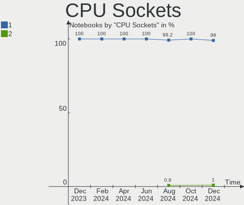
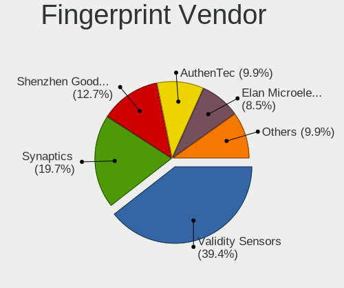
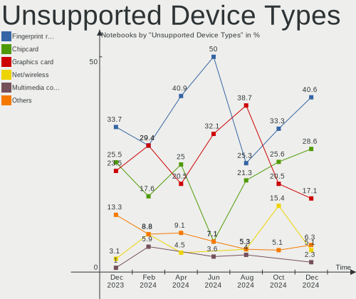

OpenMandriva - Hardware Trends (Notebooks)
------------------------------------------

A project to identify most popular hardware characteristics and track their change
over time based on data collected by Linux users at https://Linux-Hardware.org.

Anyone can contribute to this report by the [hw-probe](https://github.com/linuxhw/hw-probe) tool:

    sudo -E hw-probe -all -upload

This report is for one last month. Overall report since the beginning of time: [TestCoverage](https://github.com/linuxhw/TestCoverage)

Period: Oct, 2022.

Contents
--------

* [ System ](#system)
  - [ OS                       ](#os)
  - [ OS Family                ](#os-family)
  - [ Kernel                   ](#kernel)
  - [ Kernel Family            ](#kernel-family)
  - [ Kernel Major Ver.        ](#kernel-major-ver)
  - [ Arch                     ](#arch)
  - [ DE                       ](#de)
  - [ Display Server           ](#display-server)
  - [ Display Manager          ](#display-manager)
  - [ OS Lang                  ](#os-lang)
  - [ Boot Mode                ](#boot-mode)
  - [ Filesystem               ](#filesystem)
  - [ Part. scheme             ](#part-scheme)
  - [ Dual Boot with Linux/BSD ](#dual-boot-with-linuxbsd)
  - [ Dual Boot (Win)          ](#dual-boot-win)

* [ Board ](#board)
  - [ Vendor                   ](#vendor)
  - [ Model                    ](#model)
  - [ Model Family             ](#model-family)
  - [ MFG Year                 ](#mfg-year)
  - [ Form Factor              ](#form-factor)
  - [ Secure Boot              ](#secure-boot)
  - [ Coreboot                 ](#coreboot)
  - [ RAM Size                 ](#ram-size)
  - [ RAM Used                 ](#ram-used)
  - [ Total Drives             ](#total-drives)
  - [ Has CD-ROM               ](#has-cd-rom)
  - [ Has Ethernet             ](#has-ethernet)
  - [ Has WiFi                 ](#has-wifi)
  - [ Has Bluetooth            ](#has-bluetooth)

* [ Location ](#location)
  - [ Country                  ](#country)
  - [ City                     ](#city)

* [ Drives ](#drives)
  - [ Drive Vendor             ](#drive-vendor)
  - [ Drive Model              ](#drive-model)
  - [ HDD Vendor               ](#hdd-vendor)
  - [ SSD Vendor               ](#ssd-vendor)
  - [ Drive Kind               ](#drive-kind)
  - [ Drive Connector          ](#drive-connector)
  - [ Drive Size               ](#drive-size)
  - [ Space Total              ](#space-total)
  - [ Space Used               ](#space-used)
  - [ Malfunc. Drives          ](#malfunc-drives)
  - [ Malfunc. Drive Vendor    ](#malfunc-drive-vendor)
  - [ Malfunc. HDD Vendor      ](#malfunc-hdd-vendor)
  - [ Malfunc. Drive Kind      ](#malfunc-drive-kind)
  - [ Failed Drives            ](#failed-drives)
  - [ Failed Drive Vendor      ](#failed-drive-vendor)
  - [ Drive Status             ](#drive-status)

* [ Storage controller ](#storage-controller)
  - [ Storage Vendor           ](#storage-vendor)
  - [ Storage Model            ](#storage-model)
  - [ Storage Kind             ](#storage-kind)

* [ Processor ](#processor)
  - [ CPU Vendor               ](#cpu-vendor)
  - [ CPU Model                ](#cpu-model)
  - [ CPU Model Family         ](#cpu-model-family)
  - [ CPU Cores                ](#cpu-cores)
  - [ CPU Sockets              ](#cpu-sockets)
  - [ CPU Threads              ](#cpu-threads)
  - [ CPU Op-Modes             ](#cpu-op-modes)
  - [ CPU Microcode            ](#cpu-microcode)
  - [ CPU Microarch            ](#cpu-microarch)

* [ Graphics ](#graphics)
  - [ GPU Vendor               ](#gpu-vendor)
  - [ GPU Model                ](#gpu-model)
  - [ GPU Combo                ](#gpu-combo)
  - [ GPU Driver               ](#gpu-driver)
  - [ GPU Memory               ](#gpu-memory)

* [ Monitor ](#monitor)
  - [ Monitor Vendor           ](#monitor-vendor)
  - [ Monitor Model            ](#monitor-model)
  - [ Monitor Resolution       ](#monitor-resolution)
  - [ Monitor Diagonal         ](#monitor-diagonal)
  - [ Monitor Width            ](#monitor-width)
  - [ Aspect Ratio             ](#aspect-ratio)
  - [ Monitor Area             ](#monitor-area)
  - [ Pixel Density            ](#pixel-density)
  - [ Multiple Monitors        ](#multiple-monitors)

* [ Network ](#network)
  - [ Net Controller Vendor    ](#net-controller-vendor)
  - [ Net Controller Model     ](#net-controller-model)
  - [ Wireless Vendor          ](#wireless-vendor)
  - [ Wireless Model           ](#wireless-model)
  - [ Ethernet Vendor          ](#ethernet-vendor)
  - [ Ethernet Model           ](#ethernet-model)
  - [ Net Controller Kind      ](#net-controller-kind)
  - [ Used Controller          ](#used-controller)
  - [ NICs                     ](#nics)
  - [ IPv6                     ](#ipv6)

* [ Bluetooth ](#bluetooth)
  - [ Bluetooth Vendor         ](#bluetooth-vendor)
  - [ Bluetooth Model          ](#bluetooth-model)

* [ Sound ](#sound)
  - [ Sound Vendor             ](#sound-vendor)
  - [ Sound Model              ](#sound-model)

* [ Memory ](#memory)
  - [ Memory Vendor            ](#memory-vendor)
  - [ Memory Model             ](#memory-model)
  - [ Memory Kind              ](#memory-kind)
  - [ Memory Form Factor       ](#memory-form-factor)
  - [ Memory Size              ](#memory-size)
  - [ Memory Speed             ](#memory-speed)

* [ Printers & scanners ](#printers--scanners)
  - [ Printer Vendor           ](#printer-vendor)
  - [ Printer Model            ](#printer-model)
  - [ Scanner Vendor           ](#scanner-vendor)
  - [ Scanner Model            ](#scanner-model)

* [ Camera ](#camera)
  - [ Camera Vendor            ](#camera-vendor)
  - [ Camera Model             ](#camera-model)

* [ Security ](#security)
  - [ Fingerprint Vendor       ](#fingerprint-vendor)
  - [ Fingerprint Model        ](#fingerprint-model)
  - [ Chipcard Vendor          ](#chipcard-vendor)
  - [ Chipcard Model           ](#chipcard-model)

* [ Unsupported ](#unsupported)
  - [ Unsupported Devices      ](#unsupported-devices)
  - [ Unsupported Device Types ](#unsupported-device-types)

System
------

OS
--

Installed operating systems

| Name              | Notebooks | Percent |
|-------------------|-----------|---------|
| OpenMandriva 4.3  | 110       | 66.27%  |
| OpenMandriva 4.50 | 38        | 22.89%  |
| OpenMandriva 4.2  | 10        | 6.02%   |
| OpenMandriva 4.90 | 8         | 4.82%   |

OS Family
---------

OS without a version

| Name         | Notebooks | Percent |
|--------------|-----------|---------|
| OpenMandriva | 166       | 100%    |

Kernel
------

Version of the Linux kernel

| Version                  | Notebooks | Percent |
|--------------------------|-----------|---------|
| 5.16.7-desktop-1omv4003  | 104       | 62.65%  |
| 5.19.5-desktop-1omv4090  | 19        | 11.45%  |
| 5.19.12-desktop-2omv4090 | 13        | 7.83%   |
| 5.10.14-desktop-1omv4002 | 10        | 6.02%   |
| 5.16.13-desktop-1omv4003 | 6         | 3.61%   |
| 5.18.12-desktop-3omv4090 | 5         | 3.01%   |
| 6.0.2-desktop-1omv4050   | 3         | 1.81%   |
| 5.19.11-desktop-2omv4090 | 3         | 1.81%   |
| 6.0.2-desktop-1omv4090   | 1         | 0.6%    |
| 6.0.0-desktop-1omv4090   | 1         | 0.6%    |
| 5.19.8-desktop-2omv4090  | 1         | 0.6%    |

Kernel Family
-------------

Linux kernel without a distro release

| Version | Notebooks | Percent |
|---------|-----------|---------|
| 5.16.7  | 104       | 62.65%  |
| 5.19.5  | 19        | 11.45%  |
| 5.19.12 | 13        | 7.83%   |
| 5.10.14 | 10        | 6.02%   |
| 5.16.13 | 6         | 3.61%   |
| 5.18.12 | 5         | 3.01%   |
| 6.0.2   | 4         | 2.41%   |
| 5.19.11 | 3         | 1.81%   |
| 6.0.0   | 1         | 0.6%    |
| 5.19.8  | 1         | 0.6%    |

Kernel Major Ver.
-----------------

Linux kernel major version

| Version | Notebooks | Percent |
|---------|-----------|---------|
| 5.16    | 110       | 66.27%  |
| 5.19    | 36        | 21.69%  |
| 5.10    | 10        | 6.02%   |
| 6.0     | 5         | 3.01%   |
| 5.18    | 5         | 3.01%   |

Arch
----

OS architecture (x86_64, i586, etc.)

| Name   | Notebooks | Percent |
|--------|-----------|---------|
| x86_64 | 166       | 100%    |

DE
--

Desktop Environment

| Name    | Notebooks | Percent |
|---------|-----------|---------|
| KDE5    | 162       | 97.59%  |
| GNOME   | 3         | 1.81%   |
| Unknown | 1         | 0.6%    |

Display Server
--------------

X11 or Wayland

| Name    | Notebooks | Percent |
|---------|-----------|---------|
| X11     | 163       | 98.19%  |
| Wayland | 3         | 1.81%   |

Display Manager
---------------

SDDM, LightDM, etc.

| Name | Notebooks | Percent |
|------|-----------|---------|
| SDDM | 163       | 98.19%  |
| GDM  | 3         | 1.81%   |

OS Lang
-------

Language

| Lang  | Notebooks | Percent |
|-------|-----------|---------|
| en_US | 94        | 56.63%  |
| fr_FR | 14        | 8.43%   |
| pt_BR | 9         | 5.42%   |
| de_DE | 7         | 4.22%   |
| pl_PL | 6         | 3.61%   |
| es_ES | 4         | 2.41%   |
| en_GB | 4         | 2.41%   |
| de_AT | 4         | 2.41%   |
| cs_CZ | 4         | 2.41%   |
| ru_RU | 3         | 1.81%   |
| pt_PT | 3         | 1.81%   |
| it_IT | 3         | 1.81%   |
| fr_CA | 3         | 1.81%   |
| es_UY | 1         | 0.6%    |
| es_PE | 1         | 0.6%    |
| es_MX | 1         | 0.6%    |
| es_CO | 1         | 0.6%    |
| es_AR | 1         | 0.6%    |
| en_CA | 1         | 0.6%    |
| de_IT | 1         | 0.6%    |
| de_CH | 1         | 0.6%    |

Boot Mode
---------

EFI or BIOS

| Mode | Notebooks | Percent |
|------|-----------|---------|
| EFI  | 85        | 51.2%   |
| BIOS | 81        | 48.8%   |

Filesystem
----------

Type of filesystem

| Type    | Notebooks | Percent |
|---------|-----------|---------|
| Overlay | 121       | 72.89%  |
| Ext4    | 40        | 24.1%   |
| F2fs    | 2         | 1.2%    |
| Btrfs   | 2         | 1.2%    |
| Ext2    | 1         | 0.6%    |

Part. scheme
------------

Scheme of partitioning

| Type | Notebooks | Percent |
|------|-----------|---------|
| GPT  | 117       | 70.48%  |
| MBR  | 49        | 29.52%  |

Dual Boot with Linux/BSD
------------------------

Hosting more than one Linux/BSD

| Dual boot | Notebooks | Percent |
|-----------|-----------|---------|
| No        | 93        | 56.02%  |
| Yes       | 73        | 43.98%  |

Dual Boot (Win)
---------------

Hosting Linux and Windows

| Dual boot | Notebooks | Percent |
|-----------|-----------|---------|
| No        | 92        | 55.42%  |
| Yes       | 74        | 44.58%  |

Board
-----

Vendor
------

Motherboard manufacturer

| Name                | Notebooks | Percent |
|---------------------|-----------|---------|
| Dell                | 39        | 23.49%  |
| Lenovo              | 33        | 19.88%  |
| Hewlett-Packard     | 23        | 13.86%  |
| ASUSTek Computer    | 20        | 12.05%  |
| Acer                | 18        | 10.84%  |
| Toshiba             | 5         | 3.01%   |
| Sony                | 3         | 1.81%   |
| Samsung Electronics | 3         | 1.81%   |
| Packard Bell        | 2         | 1.2%    |
| MSI                 | 2         | 1.2%    |
| Fujitsu             | 2         | 1.2%    |
| Apple               | 2         | 1.2%    |
| Valve               | 1         | 0.6%    |
| Teclast             | 1         | 0.6%    |
| Star Labs           | 1         | 0.6%    |
| SLIMBOOK            | 1         | 0.6%    |
| Prestigio           | 1         | 0.6%    |
| Positivo            | 1         | 0.6%    |
| Panasonic           | 1         | 0.6%    |
| Microboard          | 1         | 0.6%    |
| Medion              | 1         | 0.6%    |
| LG Electronics      | 1         | 0.6%    |
| Itautec             | 1         | 0.6%    |
| Intel               | 1         | 0.6%    |
| Gigabyte Technology | 1         | 0.6%    |
| Compaq              | 1         | 0.6%    |

Model
-----

Motherboard model

| Name                                     | Notebooks | Percent |
|------------------------------------------|-----------|---------|
| Lenovo IdeaPad 1 14ADA05 82GW            | 5         | 3.01%   |
| Dell Inspiron 3451                       | 4         | 2.41%   |
| Dell XPS 15 9530                         | 3         | 1.81%   |
| ASUS UX31E                               | 3         | 1.81%   |
| Lenovo IdeaPad S145-15AST 81N3           | 2         | 1.2%    |
| Lenovo IdeaPad 3 15ADA05 81W1            | 2         | 1.2%    |
| Dell Studio 1737                         | 2         | 1.2%    |
| Dell Latitude E6420                      | 2         | 1.2%    |
| Dell Latitude E6400                      | 2         | 1.2%    |
| ASUS UX303UB                             | 2         | 1.2%    |
| ASUS UX303LAB                            | 2         | 1.2%    |
| Acer Aspire E5-573G                      | 2         | 1.2%    |
| Valve Jupiter                            | 1         | 0.6%    |
| Toshiba Satellite R830                   | 1         | 0.6%    |
| Toshiba Satellite L45-B                  | 1         | 0.6%    |
| Toshiba Satellite C855                   | 1         | 0.6%    |
| Toshiba Satellite C650D                  | 1         | 0.6%    |
| Toshiba dynabook T653/46JR               | 1         | 0.6%    |
| Teclast F7 Plus                          | 1         | 0.6%    |
| Star Labs StarLite                       | 1         | 0.6%    |
| Sony VPCYB3V1E                           | 1         | 0.6%    |
| Sony VPCEB1S1R                           | 1         | 0.6%    |
| Sony SVE1513B1EW                         | 1         | 0.6%    |
| SLIMBOOK PROX-AMD5                       | 1         | 0.6%    |
| Samsung 670Z5E                           | 1         | 0.6%    |
| Samsung 550XDA                           | 1         | 0.6%    |
| Samsung 270E5K/270E5Q/271E5K/2570EK      | 1         | 0.6%    |
| Prestigio PSB133S01ZFP                   | 1         | 0.6%    |
| Positivo C14CR01                         | 1         | 0.6%    |
| Panasonic CFSX4-1                        | 1         | 0.6%    |
| Packard Bell EasyNote TJ66               | 1         | 0.6%    |
| Packard Bell EasyNote ENTE70BH           | 1         | 0.6%    |
| MSI GT70 0NC/GT70 0NC                    | 1         | 0.6%    |
| MSI GE62 6QC                             | 1         | 0.6%    |
| Microboard Cantiga & ICH9M Chipset       | 1         | 0.6%    |
| Medion P8612                             | 1         | 0.6%    |
| LG S460-G.BG31P1                         | 1         | 0.6%    |
| Lenovo ThinkPad X240 20AMS01M00          | 1         | 0.6%    |
| Lenovo ThinkPad X220 42873LJ             | 1         | 0.6%    |
| Lenovo ThinkPad X1 Carbon 7th 20QDCTO1WW | 1         | 0.6%    |

Model Family
------------

Motherboard model prefix

| Name                   | Notebooks | Percent |
|------------------------|-----------|---------|
| Lenovo IdeaPad         | 18        | 10.84%  |
| Dell Latitude          | 16        | 9.64%   |
| Acer Aspire            | 15        | 9.04%   |
| Dell Inspiron          | 12        | 7.23%   |
| Lenovo ThinkPad        | 11        | 6.63%   |
| HP Pavilion            | 5         | 3.01%   |
| HP Laptop              | 5         | 3.01%   |
| Toshiba Satellite      | 4         | 2.41%   |
| Dell XPS               | 4         | 2.41%   |
| HP ProBook             | 3         | 1.81%   |
| Dell Studio            | 3         | 1.81%   |
| Dell Precision         | 3         | 1.81%   |
| ASUS UX31E             | 3         | 1.81%   |
| Packard Bell EasyNote  | 2         | 1.2%    |
| HP Compaq              | 2         | 1.2%    |
| Fujitsu LIFEBOOK       | 2         | 1.2%    |
| ASUS VivoBook          | 2         | 1.2%    |
| ASUS UX303UB           | 2         | 1.2%    |
| ASUS UX303LAB          | 2         | 1.2%    |
| ASUS ASUS              | 2         | 1.2%    |
| Acer TravelMate        | 2         | 1.2%    |
| Valve Jupiter          | 1         | 0.6%    |
| Toshiba dynabook       | 1         | 0.6%    |
| Teclast F7             | 1         | 0.6%    |
| Star Labs StarLite     | 1         | 0.6%    |
| Sony VPCYB3V1E         | 1         | 0.6%    |
| Sony VPCEB1S1R         | 1         | 0.6%    |
| Sony SVE1513B1EW       | 1         | 0.6%    |
| SLIMBOOK PROX-AMD5     | 1         | 0.6%    |
| Samsung 670Z5E         | 1         | 0.6%    |
| Samsung 550XDA         | 1         | 0.6%    |
| Samsung 270E5K         | 1         | 0.6%    |
| Prestigio PSB133S01ZFP | 1         | 0.6%    |
| Positivo C14CR01       | 1         | 0.6%    |
| Panasonic CFSX4-1      | 1         | 0.6%    |
| MSI GT70               | 1         | 0.6%    |
| MSI GE62               | 1         | 0.6%    |
| Microboard Cantiga     | 1         | 0.6%    |
| Medion P8612           | 1         | 0.6%    |
| LG S460-G.BG31P1       | 1         | 0.6%    |

MFG Year
--------

Motherboard manufacture year

| Year | Notebooks | Percent |
|------|-----------|---------|
| 2011 | 18        | 10.84%  |
| 2014 | 16        | 9.64%   |
| 2013 | 14        | 8.43%   |
| 2012 | 13        | 7.83%   |
| 2020 | 12        | 7.23%   |
| 2015 | 12        | 7.23%   |
| 2008 | 12        | 7.23%   |
| 2016 | 11        | 6.63%   |
| 2009 | 10        | 6.02%   |
| 2010 | 9         | 5.42%   |
| 2021 | 8         | 4.82%   |
| 2018 | 8         | 4.82%   |
| 2019 | 7         | 4.22%   |
| 2017 | 7         | 4.22%   |
| 2022 | 5         | 3.01%   |
| 2007 | 4         | 2.41%   |

Form Factor
-----------

Physical design of the computer

| Name     | Notebooks | Percent |
|----------|-----------|---------|
| Notebook | 166       | 100%    |

Secure Boot
-----------

Enabled or disabled

| State    | Notebooks | Percent |
|----------|-----------|---------|
| Disabled | 166       | 100%    |

Coreboot
--------

Have coreboot on board

| Used | Notebooks | Percent |
|------|-----------|---------|
| No   | 165       | 99.4%   |
| Yes  | 1         | 0.6%    |

RAM Size
--------

Total RAM memory

| Size in GB | Notebooks | Percent |
|------------|-----------|---------|
| 3.01-4.0   | 66        | 39.76%  |
| 4.01-8.0   | 54        | 32.53%  |
| 8.01-16.0  | 22        | 13.25%  |
| 16.01-24.0 | 13        | 7.83%   |
| 32.01-64.0 | 6         | 3.61%   |
| 2.01-3.0   | 3         | 1.81%   |
| 1.01-2.0   | 2         | 1.2%    |

RAM Used
--------

Used RAM memory

| Used GB  | Notebooks | Percent |
|----------|-----------|---------|
| 1.01-2.0 | 131       | 78.92%  |
| 0.51-1.0 | 17        | 10.24%  |
| 2.01-3.0 | 14        | 8.43%   |
| 3.01-4.0 | 4         | 2.41%   |

Total Drives
------------

Number of drives on board

| Drives | Notebooks | Percent |
|--------|-----------|---------|
| 1      | 115       | 69.28%  |
| 2      | 43        | 25.9%   |
| 3      | 8         | 4.82%   |

Has CD-ROM
----------

Has CD-ROM on board

| Presented | Notebooks | Percent |
|-----------|-----------|---------|
| No        | 87        | 52.41%  |
| Yes       | 79        | 47.59%  |

Has Ethernet
------------

Has Ethernet on board

| Presented | Notebooks | Percent |
|-----------|-----------|---------|
| Yes       | 147       | 88.55%  |
| No        | 19        | 11.45%  |

Has WiFi
--------

Has WiFi module

| Presented | Notebooks | Percent |
|-----------|-----------|---------|
| Yes       | 165       | 99.4%   |
| No        | 1         | 0.6%    |

Has Bluetooth
-------------

Has Bluetooth module

| Presented | Notebooks | Percent |
|-----------|-----------|---------|
| Yes       | 118       | 71.08%  |
| No        | 48        | 28.92%  |

Location
--------

Country
-------

Geographic location (country)

| Country            | Notebooks | Percent |
|--------------------|-----------|---------|
| France             | 18        | 10.84%  |
| Brazil             | 17        | 10.24%  |
| USA                | 13        | 7.83%   |
| Germany            | 13        | 7.83%   |
| Poland             | 10        | 6.02%   |
| Italy              | 7         | 4.22%   |
| Canada             | 7         | 4.22%   |
| Spain              | 6         | 3.61%   |
| Portugal           | 6         | 3.61%   |
| Austria            | 6         | 3.61%   |
| UK                 | 5         | 3.01%   |
| Romania            | 5         | 3.01%   |
| Russia             | 4         | 2.41%   |
| Mexico             | 4         | 2.41%   |
| Japan              | 4         | 2.41%   |
| India              | 4         | 2.41%   |
| Switzerland        | 3         | 1.81%   |
| Indonesia          | 3         | 1.81%   |
| Czechia            | 3         | 1.81%   |
| Sweden             | 2         | 1.2%    |
| Peru               | 2         | 1.2%    |
| Netherlands        | 2         | 1.2%    |
| Uruguay            | 1         | 0.6%    |
| Ukraine            | 1         | 0.6%    |
| Thailand           | 1         | 0.6%    |
| Slovakia           | 1         | 0.6%    |
| Saudi Arabia       | 1         | 0.6%    |
| Réunion           | 1         | 0.6%    |
| Pakistan           | 1         | 0.6%    |
| Malaysia           | 1         | 0.6%    |
| Latvia             | 1         | 0.6%    |
| Ivory Coast        | 1         | 0.6%    |
| Israel             | 1         | 0.6%    |
| El Salvador        | 1         | 0.6%    |
| Egypt              | 1         | 0.6%    |
| Dominican Republic | 1         | 0.6%    |
| Croatia            | 1         | 0.6%    |
| Congo Republic     | 1         | 0.6%    |
| Colombia           | 1         | 0.6%    |
| Chile              | 1         | 0.6%    |

City
----

Geographic location (city)

| City                 | Notebooks | Percent |
|----------------------|-----------|---------|
| Cascais              | 5         | 3.01%   |
| Vienna               | 4         | 2.41%   |
| Prague               | 3         | 1.81%   |
| Mexicali             | 3         | 1.81%   |
| Krakow               | 3         | 1.81%   |
| Cluj-Napoca          | 3         | 1.81%   |
| Umhausen             | 2         | 1.2%    |
| Stockholm            | 2         | 1.2%    |
| Somerset             | 2         | 1.2%    |
| Sao Paulo            | 2         | 1.2%    |
| Saarlouis            | 2         | 1.2%    |
| Moscow               | 2         | 1.2%    |
| Limoges              | 2         | 1.2%    |
| Boa Viagem           | 2         | 1.2%    |
| Barcelona            | 2         | 1.2%    |
| Żyrardów           | 1         | 0.6%    |
| Zvolen               | 1         | 0.6%    |
| Zurich               | 1         | 0.6%    |
| Zalău               | 1         | 0.6%    |
| Zagreb               | 1         | 0.6%    |
| Zagorze              | 1         | 0.6%    |
| Zabrze               | 1         | 0.6%    |
| Yokohama             | 1         | 0.6%    |
| Yenne                | 1         | 0.6%    |
| Westlake             | 1         | 0.6%    |
| Weimar               | 1         | 0.6%    |
| Warsaw               | 1         | 0.6%    |
| Walnut               | 1         | 0.6%    |
| Villa Ballester      | 1         | 0.6%    |
| Verona               | 1         | 0.6%    |
| Vélizy-Villacoublay | 1         | 0.6%    |
| Varzelandia          | 1         | 0.6%    |
| Uberlândia          | 1         | 0.6%    |
| Tychy                | 1         | 0.6%    |
| Tsuchiura            | 1         | 0.6%    |
| Trujillo             | 1         | 0.6%    |
| Tracadie–Sheila    | 1         | 0.6%    |
| Tortosa              | 1         | 0.6%    |
| The Hague            | 1         | 0.6%    |
| The Bronx            | 1         | 0.6%    |

Drives
------

Drive Vendor
------------

Hard drive vendors

| Vendor              | Notebooks | Drives | Percent |
|---------------------|-----------|--------|---------|
| Seagate             | 30        | 30     | 14.42%  |
| WDC                 | 29        | 30     | 13.94%  |
| Samsung Electronics | 18        | 19     | 8.65%   |
| Unknown             | 15        | 15     | 7.21%   |
| SanDisk             | 14        | 15     | 6.73%   |
| Kingston            | 14        | 15     | 6.73%   |
| Hitachi             | 13        | 13     | 6.25%   |
| Toshiba             | 12        | 12     | 5.77%   |
| Crucial             | 6         | 6      | 2.88%   |
| HGST                | 5         | 5      | 2.4%    |
| A-DATA Technology   | 4         | 4      | 1.92%   |
| SK hynix            | 3         | 3      | 1.44%   |
| Micron Technology   | 3         | 3      | 1.44%   |
| JMicron Technology  | 3         | 3      | 1.44%   |
| Intenso             | 3         | 3      | 1.44%   |
| Intel               | 3         | 3      | 1.44%   |
| Gigabyte Technology | 3         | 3      | 1.44%   |
| China               | 3         | 3      | 1.44%   |
| LITEON              | 2         | 2      | 0.96%   |
| KIOXIA              | 2         | 2      | 0.96%   |
| KingSpec            | 2         | 2      | 0.96%   |
| Verbatim            | 1         | 1      | 0.48%   |
| UMIS                | 1         | 1      | 0.48%   |
| SUNEAST             | 1         | 1      | 0.48%   |
| Star                | 1         | 1      | 0.48%   |
| SPCC                | 1         | 1      | 0.48%   |
| SABRENT             | 1         | 1      | 0.48%   |
| RAVPOWER            | 1         | 1      | 0.48%   |
| PNY                 | 1         | 1      | 0.48%   |
| Netac               | 1         | 1      | 0.48%   |
| Maxtor              | 1         | 1      | 0.48%   |
| LITEONIT            | 1         | 1      | 0.48%   |
| Leven               | 1         | 1      | 0.48%   |
| KIOXIA-EXCERIA      | 1         | 1      | 0.48%   |
| HUAWEI              | 1         | 1      | 0.48%   |
| HS-SSD-E100N        | 1         | 1      | 0.48%   |
| GOODRAM             | 1         | 1      | 0.48%   |
| EXBOM               | 1         | 1      | 0.48%   |
| Dell                | 1         | 1      | 0.48%   |
| BHT                 | 1         | 1      | 0.48%   |

Drive Model
-----------

Hard drive models

| Model                                 | Notebooks | Percent |
|---------------------------------------|-----------|---------|
| Unknown MMC64G  64GB                  | 5         | 2.39%   |
| Seagate ST500LT012-1DG142 500GB       | 5         | 2.39%   |
| Seagate ST1000LM035-1RK172 1TB        | 4         | 1.91%   |
| Seagate ST500LM012 HN-M500MBB 500GB   | 3         | 1.44%   |
| SanDisk SSD U100 256GB                | 3         | 1.44%   |
| Kingston SUV500MS480G 480GB SSD       | 3         | 1.44%   |
| Kingston SA400S37240G 240GB SSD       | 3         | 1.44%   |
| Hitachi HTS725032A7E630 320GB         | 3         | 1.44%   |
| WDC WD1600BEVT-22ZCT0 160GB           | 2         | 0.96%   |
| Unknown SU08G  8GB                    | 2         | 0.96%   |
| Toshiba THNSNH128GBST SSD             | 2         | 0.96%   |
| Toshiba MQ04ABF100 1TB                | 2         | 0.96%   |
| Toshiba MQ01ABD100 1TB                | 2         | 0.96%   |
| SK hynix HFS256G32MND-2200A 256GB SSD | 2         | 0.96%   |
| Seagate ST9500325AS 500GB             | 2         | 0.96%   |
| Seagate ST1000LM048-2E7172 1TB        | 2         | 0.96%   |
| Samsung SSD 860 EVO 500GB             | 2         | 0.96%   |
| Samsung SSD 860 EVO 1TB               | 2         | 0.96%   |
| Kingston SV300S37A120G 120GB SSD      | 2         | 0.96%   |
| KingSpec P4-240 240GB SSD             | 2         | 0.96%   |
| Intenso SSD Sata III 256GB            | 2         | 0.96%   |
| Hitachi HTS543232A7A384 320GB         | 2         | 0.96%   |
| HGST HTS545050A7E680 500GB            | 2         | 0.96%   |
| WDC WDS240G2G0B-00EPW0 240GB SSD      | 1         | 0.48%   |
| WDC WDS240G2G0A-00JH30 240GB SSD      | 1         | 0.48%   |
| WDC WDS100T2B0B-00YS70 1TB SSD        | 1         | 0.48%   |
| WDC WD7500BPVX-75JC3T0 752GB          | 1         | 0.48%   |
| WDC WD7500BPKT-22PK4T0 752GB          | 1         | 0.48%   |
| WDC WD5000LPVX-75V0TT0 500GB          | 1         | 0.48%   |
| WDC WD5000LPVX-22V0TT0 500GB          | 1         | 0.48%   |
| WDC WD5000LPCX-24VHAT0 500GB          | 1         | 0.48%   |
| WDC WD5000BPVT-08HXZT3 500GB          | 1         | 0.48%   |
| WDC WD5000BPKX-22HPJT0 500GB          | 1         | 0.48%   |
| WDC WD50 00LPLX-00ZNTT0 500GB         | 1         | 0.48%   |
| WDC WD3200LPVX-75V0TT0 320GB          | 1         | 0.48%   |
| WDC WD3200LPVX-08V0TT5 320GB          | 1         | 0.48%   |
| WDC WD3200BEKT-75PVMT0 320GB          | 1         | 0.48%   |
| WDC WD2500BEVT-75ZCT2 250GB           | 1         | 0.48%   |
| WDC WD2500BEVT-22A23T0 250GB          | 1         | 0.48%   |
| WDC WD2500BEVS-60UST0 250GB           | 1         | 0.48%   |

HDD Vendor
----------

Hard disk drive vendors

| Vendor              | Notebooks | Drives | Percent |
|---------------------|-----------|--------|---------|
| Seagate             | 30        | 30     | 37.04%  |
| WDC                 | 21        | 21     | 25.93%  |
| Hitachi             | 13        | 13     | 16.05%  |
| Toshiba             | 9         | 9      | 11.11%  |
| HGST                | 5         | 5      | 6.17%   |
| Unknown             | 1         | 1      | 1.23%   |
| Samsung Electronics | 1         | 1      | 1.23%   |
| SABRENT             | 1         | 1      | 1.23%   |

SSD Vendor
----------

Solid state drive vendors

| Vendor              | Notebooks | Drives | Percent |
|---------------------|-----------|--------|---------|
| SanDisk             | 12        | 13     | 14.81%  |
| Kingston            | 12        | 12     | 14.81%  |
| Samsung Electronics | 11        | 11     | 13.58%  |
| Crucial             | 5         | 5      | 6.17%   |
| A-DATA Technology   | 4         | 4      | 4.94%   |
| WDC                 | 3         | 3      | 3.7%    |
| Toshiba             | 3         | 3      | 3.7%    |
| Intenso             | 3         | 3      | 3.7%    |
| China               | 3         | 3      | 3.7%    |
| SK hynix            | 2         | 2      | 2.47%   |
| LITEON              | 2         | 2      | 2.47%   |
| KingSpec            | 2         | 2      | 2.47%   |
| Gigabyte Technology | 2         | 2      | 2.47%   |
| Verbatim            | 1         | 1      | 1.23%   |
| SUNEAST             | 1         | 1      | 1.23%   |
| Star                | 1         | 1      | 1.23%   |
| SPCC                | 1         | 1      | 1.23%   |
| Netac               | 1         | 1      | 1.23%   |
| Micron Technology   | 1         | 1      | 1.23%   |
| Maxtor              | 1         | 1      | 1.23%   |
| LITEONIT            | 1         | 1      | 1.23%   |
| Leven               | 1         | 1      | 1.23%   |
| KIOXIA-EXCERIA      | 1         | 1      | 1.23%   |
| JMicron Technology  | 1         | 1      | 1.23%   |
| Intel               | 1         | 1      | 1.23%   |
| HS-SSD-E100N        | 1         | 1      | 1.23%   |
| GOODRAM             | 1         | 1      | 1.23%   |
| EXBOM               | 1         | 1      | 1.23%   |
| BHT                 | 1         | 1      | 1.23%   |
| ASMT                | 1         | 1      | 1.23%   |

Drive Kind
----------

HDD or SSD

| Kind    | Notebooks | Drives | Percent |
|---------|-----------|--------|---------|
| HDD     | 78        | 81     | 39.8%   |
| SSD     | 74        | 82     | 37.76%  |
| NVMe    | 25        | 31     | 12.76%  |
| MMC     | 15        | 15     | 7.65%   |
| Unknown | 4         | 4      | 2.04%   |

Drive Connector
---------------

SATA, SAS, NVMe, etc.

| Type | Notebooks | Drives | Percent |
|------|-----------|--------|---------|
| SATA | 137       | 158    | 73.66%  |
| NVMe | 24        | 30     | 12.9%   |
| MMC  | 15        | 15     | 8.06%   |
| SAS  | 10        | 10     | 5.38%   |

Drive Size
----------

Size of hard drive

| Size in TB | Notebooks | Drives | Percent |
|------------|-----------|--------|---------|
| 0.01-0.5   | 113       | 128    | 76.87%  |
| 0.51-1.0   | 32        | 33     | 21.77%  |
| 1.01-2.0   | 2         | 2      | 1.36%   |

Space Total
-----------

Amount of disk space available on the file system

| Size in GB | Notebooks | Percent |
|------------|-----------|---------|
| 1-20       | 82        | 49.4%   |
| 101-250    | 38        | 22.89%  |
| 251-500    | 17        | 10.24%  |
| 51-100     | 11        | 6.63%   |
| Unknown    | 7         | 4.22%   |
| 501-1000   | 6         | 3.61%   |
| 21-50      | 4         | 2.41%   |
| 1001-2000  | 1         | 0.6%    |

Space Used
----------

Amount of used disk space

| Used GB | Notebooks | Percent |
|---------|-----------|---------|
| 1-20    | 147       | 88.55%  |
| Unknown | 7         | 4.22%   |
| 21-50   | 6         | 3.61%   |
| 51-100  | 4         | 2.41%   |
| 101-250 | 2         | 1.2%    |

Malfunc. Drives
---------------

Drive models with a malfunction

| Model                                  | Notebooks | Drives | Percent |
|----------------------------------------|-----------|--------|---------|
| SanDisk SSD U100 256GB                 | 3         | 3      | 6.98%   |
| Hitachi HTS725032A7E630 320GB          | 3         | 3      | 6.98%   |
| Hitachi HTS543232A7A384 320GB          | 2         | 2      | 4.65%   |
| HGST HTS545050A7E680 500GB             | 2         | 2      | 4.65%   |
| WDC WD7500BPKT-22PK4T0 752GB           | 1         | 1      | 2.33%   |
| WDC WD5000LPCX-24VHAT0 500GB           | 1         | 1      | 2.33%   |
| WDC WD5000BPVT-08HXZT3 500GB           | 1         | 1      | 2.33%   |
| WDC WD3200LPVX-75V0TT0 320GB           | 1         | 1      | 2.33%   |
| WDC WD2500BEVS-60UST0 250GB            | 1         | 1      | 2.33%   |
| WDC WD10SPZX-24Z10 1TB                 | 1         | 1      | 2.33%   |
| Toshiba MQ01ABD075 752GB               | 1         | 1      | 2.33%   |
| Toshiba MK5065GSXN 500GB               | 1         | 1      | 2.33%   |
| Toshiba MK3275GSX 320GB                | 1         | 1      | 2.33%   |
| Seagate ST9750420AS 752GB              | 1         | 1      | 2.33%   |
| Seagate ST9500420AS 500GB              | 1         | 1      | 2.33%   |
| Seagate ST9500325AS 500GB              | 1         | 1      | 2.33%   |
| Seagate ST9320423AS 320GB              | 1         | 1      | 2.33%   |
| Seagate ST9250410AS 250GB              | 1         | 1      | 2.33%   |
| Seagate ST500LM012 HN-M500MBB 500GB    | 1         | 1      | 2.33%   |
| Seagate ST500LM000-1EJ162 500GB        | 1         | 1      | 2.33%   |
| Seagate ST320LT007-9ZV142 320GB        | 1         | 1      | 2.33%   |
| Seagate ST1000LM048-2E7172 1TB         | 1         | 1      | 2.33%   |
| Seagate ST1000LM035-1RK172 1TB         | 1         | 1      | 2.33%   |
| Seagate ST1000LM024 HN-M101MBB 1TB     | 1         | 1      | 2.33%   |
| Seagate ST1000LM014-1EJ164-SSHD 1TB    | 1         | 1      | 2.33%   |
| Seagate ST1000LM014-1EJ164 1TB         | 1         | 1      | 2.33%   |
| LITEON LCH-256V2S-11 2.5 7mm 256GB SSD | 1         | 1      | 2.33%   |
| Kingston SA400S37480G 480GB SSD        | 1         | 1      | 2.33%   |
| JMicron Technology Tech 250GB          | 1         | 1      | 2.33%   |
| Hitachi HTS723216L9A360 160GB          | 1         | 1      | 2.33%   |
| Hitachi HTS547564A9E384 640GB          | 1         | 1      | 2.33%   |
| Hitachi HTS545050B9A300 500GB          | 1         | 1      | 2.33%   |
| Hitachi HTS545032B9A300 320GB          | 1         | 1      | 2.33%   |
| HGST HCC545050A7E380 500GB             | 1         | 1      | 2.33%   |
| Crucial CT525MX300SSD1 528GB           | 1         | 1      | 2.33%   |
| China SSD 32GB                         | 1         | 1      | 2.33%   |
| A-DATA Technology SU760 256GB SSD      | 1         | 1      | 2.33%   |

Malfunc. Drive Vendor
---------------------

Vendors of faulty drives

| Vendor             | Notebooks | Drives | Percent |
|--------------------|-----------|--------|---------|
| Seagate            | 13        | 13     | 30.23%  |
| Hitachi            | 9         | 9      | 20.93%  |
| WDC                | 6         | 6      | 13.95%  |
| Toshiba            | 3         | 3      | 6.98%   |
| SanDisk            | 3         | 3      | 6.98%   |
| HGST               | 3         | 3      | 6.98%   |
| LITEON             | 1         | 1      | 2.33%   |
| Kingston           | 1         | 1      | 2.33%   |
| JMicron Technology | 1         | 1      | 2.33%   |
| Crucial            | 1         | 1      | 2.33%   |
| China              | 1         | 1      | 2.33%   |
| A-DATA Technology  | 1         | 1      | 2.33%   |

Malfunc. HDD Vendor
-------------------

Vendors of faulty HDD drives

| Vendor  | Notebooks | Drives | Percent |
|---------|-----------|--------|---------|
| Seagate | 13        | 13     | 38.24%  |
| Hitachi | 9         | 9      | 26.47%  |
| WDC     | 6         | 6      | 17.65%  |
| Toshiba | 3         | 3      | 8.82%   |
| HGST    | 3         | 3      | 8.82%   |

Malfunc. Drive Kind
-------------------

Kinds of faulty drives

| Kind    | Notebooks | Drives | Percent |
|---------|-----------|--------|---------|
| HDD     | 33        | 34     | 78.57%  |
| SSD     | 8         | 8      | 19.05%  |
| Unknown | 1         | 1      | 2.38%   |

Failed Drives
-------------

Failed drive models

Zero info for selected period =(

Failed Drive Vendor
-------------------

Failed drive vendors

Zero info for selected period =(

Drive Status
------------

Number of failed and malfunc. drives

| Status   | Notebooks | Drives | Percent |
|----------|-----------|--------|---------|
| Works    | 125       | 146    | 66.14%  |
| Malfunc  | 41        | 43     | 21.69%  |
| Detected | 23        | 24     | 12.17%  |

Storage controller
------------------

Storage Vendor
--------------

Storage controller vendors

| Vendor                      | Notebooks | Percent |
|-----------------------------|-----------|---------|
| Intel                       | 125       | 72.67%  |
| AMD                         | 20        | 11.63%  |
| SanDisk                     | 6         | 3.49%   |
| Samsung Electronics         | 6         | 3.49%   |
| Phison Electronics          | 2         | 1.16%   |
| Nvidia                      | 2         | 1.16%   |
| Micron Technology           | 2         | 1.16%   |
| KIOXIA                      | 2         | 1.16%   |
| Kingston Technology Company | 2         | 1.16%   |
| Union Memory (Shenzhen)     | 1         | 0.58%   |
| SK hynix                    | 1         | 0.58%   |
| Micron/Crucial Technology   | 1         | 0.58%   |
| JMicron Technology          | 1         | 0.58%   |
| Apple                       | 1         | 0.58%   |

Storage Model
-------------

Storage controller models

| Model                                                                          | Notebooks | Percent |
|--------------------------------------------------------------------------------|-----------|---------|
| Intel Sunrise Point-LP SATA Controller [AHCI mode]                             | 15        | 8.06%   |
| Intel 82801 Mobile SATA Controller [RAID mode]                                 | 15        | 8.06%   |
| Intel 7 Series Chipset Family 6-port SATA Controller [AHCI mode]               | 14        | 7.53%   |
| Intel 82801IBM/IEM (ICH9M/ICH9M-E) 4 port SATA Controller [AHCI mode]          | 12        | 6.45%   |
| Intel 8 Series SATA Controller 1 [AHCI mode]                                   | 12        | 6.45%   |
| AMD FCH SATA Controller [AHCI mode]                                            | 11        | 5.91%   |
| Intel Atom Processor E3800 Series SATA AHCI Controller                         | 8         | 4.3%    |
| Intel 6 Series/C200 Series Chipset Family 6 port Mobile SATA AHCI Controller   | 8         | 4.3%    |
| AMD SB7x0/SB8x0/SB9x0 SATA Controller [AHCI mode]                              | 7         | 3.76%   |
| Intel Wildcat Point-LP SATA Controller [AHCI Mode]                             | 6         | 3.23%   |
| Intel 5 Series/3400 Series Chipset 4 port SATA AHCI Controller                 | 5         | 2.69%   |
| Intel Celeron/Pentium Silver Processor SATA Controller                         | 4         | 2.15%   |
| Intel 82801HM/HEM (ICH8M/ICH8M-E) SATA Controller [AHCI mode]                  | 4         | 2.15%   |
| Intel 82801HM/HEM (ICH8M/ICH8M-E) IDE Controller                               | 4         | 2.15%   |
| Intel Tiger Lake-LP SATA Controller                                            | 3         | 1.61%   |
| SanDisk WD Blue SN550 NVMe SSD                                                 | 2         | 1.08%   |
| Samsung NVMe SSD Controller SM981/PM981/PM983                                  | 2         | 1.08%   |
| Samsung NVMe SSD Controller PM9A1/PM9A3/980PRO                                 | 2         | 1.08%   |
| Samsung NVMe SSD Controller 980                                                | 2         | 1.08%   |
| Nvidia MCP79 AHCI Controller                                                   | 2         | 1.08%   |
| Micron Non-Volatile memory controller                                          | 2         | 1.08%   |
| Intel Volume Management Device NVMe RAID Controller                            | 2         | 1.08%   |
| Intel 82801IBM/IEM (ICH9M/ICH9M-E) 2 port SATA Controller [IDE mode]           | 2         | 1.08%   |
| Intel 82801HM/HEM (ICH8M/ICH8M-E) SATA Controller [IDE mode]                   | 2         | 1.08%   |
| Intel 8 Series/C220 Series Chipset Family 6-port SATA Controller 1 [AHCI mode] | 2         | 1.08%   |
| Intel 7 Series Chipset Family 4-port SATA Controller [IDE mode]                | 2         | 1.08%   |
| Intel 7 Series Chipset Family 2-port SATA Controller [IDE mode]                | 2         | 1.08%   |
| Intel 5 Series/3400 Series Chipset 6 port SATA AHCI Controller                 | 2         | 1.08%   |
| Union Memory (Shenzhen) Non-Volatile memory controller                         | 1         | 0.54%   |
| SK hynix BC511                                                                 | 1         | 0.54%   |
| SanDisk WD PC SN810 / Black SN850 NVMe SSD                                     | 1         | 0.54%   |
| SanDisk WD Blue SN500 / PC SN520 NVMe SSD                                      | 1         | 0.54%   |
| SanDisk PC SN520 NVMe SSD                                                      | 1         | 0.54%   |
| SanDisk Non-Volatile memory controller                                         | 1         | 0.54%   |
| Phison PS5013 E13 NVMe Controller                                              | 1         | 0.54%   |
| Phison Electronics Non-Volatile memory controller                              | 1         | 0.54%   |
| Micron/Crucial P2 NVMe PCIe SSD                                                | 1         | 0.54%   |
| KIOXIA NVMe SSD Controller BG4                                                 | 1         | 0.54%   |
| KIOXIA Non-Volatile memory controller                                          | 1         | 0.54%   |
| Kingston Company SNVS2000G [NV1 NVMe PCIe SSD 2TB]                             | 1         | 0.54%   |

Storage Kind
------------

Kind of storage controller (IDE, SATA, NVMe, SAS, ...)

| Kind | Notebooks | Percent |
|------|-----------|---------|
| SATA | 123       | 68.72%  |
| NVMe | 24        | 13.41%  |
| RAID | 17        | 9.5%    |
| IDE  | 15        | 8.38%   |

Processor
---------

CPU Vendor
----------

Processor vendors

| Vendor | Notebooks | Percent |
|--------|-----------|---------|
| Intel  | 133       | 80.12%  |
| AMD    | 33        | 19.88%  |

CPU Model
---------

Processor models

| Model                                        | Notebooks | Percent |
|----------------------------------------------|-----------|---------|
| Intel Core i5-5200U CPU @ 2.20GHz            | 5         | 3.01%   |
| AMD 3020e with Radeon Graphics               | 5         | 3.01%   |
| Intel Core i5-2520M CPU @ 2.50GHz            | 4         | 2.41%   |
| Intel Celeron CPU N2840 @ 2.16GHz            | 4         | 2.41%   |
| Intel Core i7-7500U CPU @ 2.70GHz            | 3         | 1.81%   |
| Intel Core i7-6500U CPU @ 2.50GHz            | 3         | 1.81%   |
| Intel Core i7-4712HQ CPU @ 2.30GHz           | 3         | 1.81%   |
| Intel Core i7-2677M CPU @ 1.80GHz            | 3         | 1.81%   |
| Intel Core i5-4300U CPU @ 1.90GHz            | 3         | 1.81%   |
| Intel Core i5-4210U CPU @ 1.70GHz            | 3         | 1.81%   |
| Intel Core i5-3210M CPU @ 2.50GHz            | 3         | 1.81%   |
| Intel Core i3-4005U CPU @ 1.70GHz            | 3         | 1.81%   |
| AMD E-450 APU with Radeon HD Graphics        | 3         | 1.81%   |
| AMD A6-9225 RADEON R4, 5 COMPUTE CORES 2C+3G | 3         | 1.81%   |
| Intel Pentium Dual-Core CPU T4300 @ 2.10GHz  | 2         | 1.2%    |
| Intel Core i7-8550U CPU @ 1.80GHz            | 2         | 1.2%    |
| Intel Core i7-6820HQ CPU @ 2.70GHz           | 2         | 1.2%    |
| Intel Core i5-6300U CPU @ 2.40GHz            | 2         | 1.2%    |
| Intel Core i5-6200U CPU @ 2.30GHz            | 2         | 1.2%    |
| Intel Core i5-3230M CPU @ 2.60GHz            | 2         | 1.2%    |
| Intel Core i5-2450M CPU @ 2.50GHz            | 2         | 1.2%    |
| Intel Core i3-3120M CPU @ 2.50GHz            | 2         | 1.2%    |
| Intel Core i3 CPU M 380 @ 2.53GHz            | 2         | 1.2%    |
| Intel Core i3 CPU M 370 @ 2.40GHz            | 2         | 1.2%    |
| Intel Core 2 Duo CPU T7500 @ 2.20GHz         | 2         | 1.2%    |
| Intel Core 2 Duo CPU T5550 @ 1.83GHz         | 2         | 1.2%    |
| Intel Core 2 Duo CPU P8800 @ 2.66GHz         | 2         | 1.2%    |
| Intel Core 2 Duo CPU P8600 @ 2.40GHz         | 2         | 1.2%    |
| Intel Core 2 Duo CPU P8400 @ 2.26GHz         | 2         | 1.2%    |
| Intel Celeron N4000 CPU @ 1.10GHz            | 2         | 1.2%    |
| AMD Ryzen 7 5700U with Radeon Graphics       | 2         | 1.2%    |
| AMD Ryzen 7 4700U with Radeon Graphics       | 2         | 1.2%    |
| AMD E-300 APU with Radeon HD Graphics        | 2         | 1.2%    |
| Intel Pentium Silver N5030 CPU @ 1.10GHz     | 1         | 0.6%    |
| Intel Pentium Dual-Core CPU T4400 @ 2.20GHz  | 1         | 0.6%    |
| Intel Pentium Dual CPU T3400 @ 2.16GHz       | 1         | 0.6%    |
| Intel Pentium CPU N3710 @ 1.60GHz            | 1         | 0.6%    |
| Intel Pentium CPU N3540 @ 2.16GHz            | 1         | 0.6%    |
| Intel Pentium CPU B940 @ 2.00GHz             | 1         | 0.6%    |
| Intel Pentium CPU 2020M @ 2.40GHz            | 1         | 0.6%    |

CPU Model Family
----------------

Processor model prefix

| Model                   | Notebooks | Percent |
|-------------------------|-----------|---------|
| Intel Core i5           | 44        | 26.51%  |
| Intel Core i7           | 23        | 13.86%  |
| Intel Core i3           | 17        | 10.24%  |
| Intel Core 2 Duo        | 17        | 10.24%  |
| Intel Celeron           | 17        | 10.24%  |
| Other                   | 11        | 6.63%   |
| AMD Ryzen 7             | 7         | 4.22%   |
| AMD E                   | 5         | 3.01%   |
| Intel Pentium           | 4         | 2.41%   |
| Intel Pentium Dual-Core | 3         | 1.81%   |
| AMD Ryzen 5             | 3         | 1.81%   |
| AMD A6                  | 3         | 1.81%   |
| Intel Pentium Silver    | 1         | 0.6%    |
| Intel Pentium Dual      | 1         | 0.6%    |
| Intel Genuine           | 1         | 0.6%    |
| AMD V120                | 1         | 0.6%    |
| AMD Turion 64 X2 Mobile | 1         | 0.6%    |
| AMD Ryzen 3             | 1         | 0.6%    |
| AMD E2                  | 1         | 0.6%    |
| AMD C-60                | 1         | 0.6%    |
| AMD Athlon X2           | 1         | 0.6%    |
| AMD Athlon              | 1         | 0.6%    |
| AMD A8                  | 1         | 0.6%    |
| AMD A10                 | 1         | 0.6%    |

CPU Cores
---------

Number of processor cores

| Number | Notebooks | Percent |
|--------|-----------|---------|
| 2      | 126       | 75.9%   |
| 4      | 27        | 16.27%  |
| 8      | 8         | 4.82%   |
| 1      | 3         | 1.81%   |
| 14     | 1         | 0.6%    |
| 6      | 1         | 0.6%    |

CPU Sockets
-----------

Number of sockets

| Number | Notebooks | Percent |
|--------|-----------|---------|
| 1      | 166       | 100%    |

CPU Threads
-----------

Threads per core (Hyper-Threading)

| Number | Notebooks | Percent |
|--------|-----------|---------|
| 2      | 96        | 57.83%  |
| 1      | 70        | 42.17%  |

CPU Op-Modes
------------

CPU Operation Modes (32-bit, 64-bit)

| Op mode        | Notebooks | Percent |
|----------------|-----------|---------|
| 32-bit, 64-bit | 166       | 100%    |

CPU Microcode
-------------

Microcode number

| Number     | Notebooks | Percent |
|------------|-----------|---------|
| 0x306a9    | 14        | 8.43%   |
| 0x206a7    | 14        | 8.43%   |
| 0x40651    | 13        | 7.83%   |
| 0x1067a    | 12        | 7.23%   |
| 0x406e3    | 10        | 6.02%   |
| 0x30678    | 8         | 4.82%   |
| 0x306c3    | 7         | 4.22%   |
| 0x306d4    | 6         | 3.61%   |
| 0x20655    | 6         | 3.61%   |
| Unknown    | 6         | 3.61%   |
| 0x6fd      | 5         | 3.01%   |
| 0x08200103 | 5         | 3.01%   |
| 0x806ea    | 4         | 2.41%   |
| 0x806e9    | 4         | 2.41%   |
| 0x06006705 | 4         | 2.41%   |
| 0x806ec    | 3         | 1.81%   |
| 0x806c1    | 3         | 1.81%   |
| 0x706a1    | 3         | 1.81%   |
| 0x506e3    | 3         | 1.81%   |
| 0x08108109 | 3         | 1.81%   |
| 0x05000101 | 3         | 1.81%   |
| 0x706a8    | 2         | 1.2%    |
| 0x6fb      | 2         | 1.2%    |
| 0x10676    | 2         | 1.2%    |
| 0x0a50000d | 2         | 1.2%    |
| 0x08608103 | 2         | 1.2%    |
| 0x0500010d | 2         | 1.2%    |
| 0x906ea    | 1         | 0.6%    |
| 0x906a3    | 1         | 0.6%    |
| 0x6fa      | 1         | 0.6%    |
| 0x506c9    | 1         | 0.6%    |
| 0x406c4    | 1         | 0.6%    |
| 0x20652    | 1         | 0.6%    |
| 0x106e5    | 1         | 0.6%    |
| 0x10661    | 1         | 0.6%    |
| 0x08900201 | 1         | 0.6%    |
| 0x08600106 | 1         | 0.6%    |
| 0x08600103 | 1         | 0.6%    |
| 0x0810100b | 1         | 0.6%    |
| 0x08101007 | 1         | 0.6%    |

CPU Microarch
-------------

Microarchitecture

| Name             | Notebooks | Percent |
|------------------|-----------|---------|
| Haswell          | 21        | 12.65%  |
| SandyBridge      | 14        | 8.43%   |
| Penryn           | 14        | 8.43%   |
| IvyBridge        | 14        | 8.43%   |
| Skylake          | 13        | 7.83%   |
| KabyLake         | 12        | 7.23%   |
| Silvermont       | 9         | 5.42%   |
| Core             | 9         | 5.42%   |
| Westmere         | 8         | 4.82%   |
| Zen              | 7         | 4.22%   |
| Broadwell        | 6         | 3.61%   |
| Bobcat           | 6         | 3.61%   |
| Goldmont plus    | 5         | 3.01%   |
| Unknown          | 5         | 3.01%   |
| Excavator        | 4         | 2.41%   |
| Zen+             | 3         | 1.81%   |
| Zen 2            | 3         | 1.81%   |
| TigerLake        | 3         | 1.81%   |
| Zen 3            | 2         | 1.2%    |
| Puma             | 1         | 0.6%    |
| Piledriver       | 1         | 0.6%    |
| Nehalem          | 1         | 0.6%    |
| K8 Hammer        | 1         | 0.6%    |
| K8 & K10 hybrid  | 1         | 0.6%    |
| K10              | 1         | 0.6%    |
| Goldmont         | 1         | 0.6%    |
| Alderlake Hybrid | 1         | 0.6%    |

Graphics
--------

GPU Vendor
----------

Vendors of graphics cards

| Vendor | Notebooks | Percent |
|--------|-----------|---------|
| Intel  | 115       | 59.28%  |
| AMD    | 41        | 21.13%  |
| Nvidia | 38        | 19.59%  |

GPU Model
---------

Graphics card models

| Model                                                                     | Notebooks | Percent |
|---------------------------------------------------------------------------|-----------|---------|
| Intel Haswell-ULT Integrated Graphics Controller                          | 14        | 6.9%    |
| Intel 2nd Generation Core Processor Family Integrated Graphics Controller | 14        | 6.9%    |
| Intel 3rd Gen Core processor Graphics Controller                          | 13        | 6.4%    |
| Intel Skylake GT2 [HD Graphics 520]                                       | 8         | 3.94%   |
| Intel Atom Processor Z36xxx/Z37xxx Series Graphics & Display              | 8         | 3.94%   |
| AMD Picasso/Raven 2 [Radeon Vega Series / Radeon Vega Mobile Series]      | 8         | 3.94%   |
| Intel Mobile 4 Series Chipset Integrated Graphics Controller              | 7         | 3.45%   |
| Intel 4th Gen Core Processor Integrated Graphics Controller               | 7         | 3.45%   |
| Intel HD Graphics 5500                                                    | 6         | 2.96%   |
| Intel HD Graphics 620                                                     | 5         | 2.46%   |
| Intel Core Processor Integrated Graphics Controller                       | 5         | 2.46%   |
| Intel Mobile GM965/GL960 Integrated Graphics Controller (secondary)       | 4         | 1.97%   |
| Intel Mobile GM965/GL960 Integrated Graphics Controller (primary)         | 4         | 1.97%   |
| Intel GeminiLake [UHD Graphics 600]                                       | 4         | 1.97%   |
| AMD Stoney [Radeon R2/R3/R4/R5 Graphics]                                  | 4         | 1.97%   |
| Nvidia GK107M [GeForce GT 750M]                                           | 3         | 1.48%   |
| Intel UHD Graphics 620                                                    | 3         | 1.48%   |
| AMD Wrestler [Radeon HD 6320]                                             | 3         | 1.48%   |
| AMD Renoir                                                                | 3         | 1.48%   |
| Nvidia GT216M [GeForce GT 230M]                                           | 2         | 0.99%   |
| Nvidia GM108M [GeForce 940M]                                              | 2         | 0.99%   |
| Nvidia GM108M [GeForce 940MX]                                             | 2         | 0.99%   |
| Nvidia GK208BM [GeForce 920M]                                             | 2         | 0.99%   |
| Nvidia GF117M [GeForce 610M/710M/810M/820M / GT 620M/625M/630M/720M]      | 2         | 0.99%   |
| Nvidia G98M [Quadro NVS 160M]                                             | 2         | 0.99%   |
| Intel WhiskeyLake-U GT2 [UHD Graphics 620]                                | 2         | 0.99%   |
| Intel TigerLake-H GT1 [UHD Graphics]                                      | 2         | 0.99%   |
| Intel Tiger Lake UHD Graphics                                             | 2         | 0.99%   |
| Intel HD Graphics 530                                                     | 2         | 0.99%   |
| AMD Wrestler [Radeon HD 6310]                                             | 2         | 0.99%   |
| AMD RV635/M86 [Mobility Radeon HD 3650]                                   | 2         | 0.99%   |
| AMD Raven Ridge [Radeon Vega Series / Radeon Vega Mobile Series]          | 2         | 0.99%   |
| AMD Lucienne                                                              | 2         | 0.99%   |
| AMD Cezanne                                                               | 2         | 0.99%   |
| Nvidia TU117M [GeForce GTX 1650 Ti Mobile]                                | 1         | 0.49%   |
| Nvidia GT218M [NVS 3100M]                                                 | 1         | 0.49%   |
| Nvidia GP108M [GeForce MX150]                                             | 1         | 0.49%   |
| Nvidia GP107M [GeForce GTX 1050 3 GB Max-Q]                               | 1         | 0.49%   |
| Nvidia GP104GLM [Quadro P4000 Mobile]                                     | 1         | 0.49%   |
| Nvidia GM108M [GeForce 930MX]                                             | 1         | 0.49%   |

GPU Combo
---------

Combinations of graphics cards

| Name           | Notebooks | Percent |
|----------------|-----------|---------|
| 1 x Intel      | 82        | 49.4%   |
| 1 x AMD        | 35        | 21.08%  |
| Intel + Nvidia | 25        | 15.06%  |
| 1 x Nvidia     | 10        | 6.02%   |
| 2 x Intel      | 6         | 3.61%   |
| 2 x AMD        | 3         | 1.81%   |
| 2 x Nvidia     | 2         | 1.2%    |
| Intel + AMD    | 2         | 1.2%    |
| AMD + Nvidia   | 1         | 0.6%    |

GPU Driver
----------

Free vs proprietary

| Driver  | Notebooks | Percent |
|---------|-----------|---------|
| Free    | 165       | 99.4%   |
| Unknown | 1         | 0.6%    |

GPU Memory
----------

Total video memory

| Size in GB | Notebooks | Percent |
|------------|-----------|---------|
| Unknown    | 93        | 56.02%  |
| 0.01-0.5   | 33        | 19.88%  |
| 1.01-2.0   | 24        | 14.46%  |
| 0.51-1.0   | 11        | 6.63%   |
| 3.01-4.0   | 4         | 2.41%   |
| 2.01-3.0   | 1         | 0.6%    |

Monitor
-------

Monitor Vendor
--------------

Monitor vendors

| Vendor                  | Notebooks | Percent |
|-------------------------|-----------|---------|
| AU Optronics            | 42        | 24%     |
| LG Display              | 27        | 15.43%  |
| Chimei Innolux          | 27        | 15.43%  |
| Samsung Electronics     | 22        | 12.57%  |
| BOE                     | 20        | 11.43%  |
| Chi Mei Optoelectronics | 7         | 4%      |
| Sharp                   | 4         | 2.29%   |
| LG Philips              | 4         | 2.29%   |
| CPT                     | 3         | 1.71%   |
| Lenovo                  | 2         | 1.14%   |
| Goldstar                | 2         | 1.14%   |
| Eizo                    | 2         | 1.14%   |
| Apple                   | 2         | 1.14%   |
| Acer                    | 2         | 1.14%   |
| Valve                   | 1         | 0.57%   |
| Sony                    | 1         | 0.57%   |
| MiTAC                   | 1         | 0.57%   |
| InnoLux Display         | 1         | 0.57%   |
| InfoVision              | 1         | 0.57%   |
| Hitachi                 | 1         | 0.57%   |
| Dell                    | 1         | 0.57%   |
| CSO                     | 1         | 0.57%   |
| AOC                     | 1         | 0.57%   |

Monitor Model
-------------

Monitor models

| Model                                                                 | Notebooks | Percent |
|-----------------------------------------------------------------------|-----------|---------|
| Chimei Innolux LCD Monitor CMN15F5 1920x1080 344x193mm 15.5-inch      | 5         | 2.86%   |
| AU Optronics LCD Monitor AUO723C 1366x768 309x173mm 13.9-inch         | 5         | 2.86%   |
| BOE LCD Monitor BOE0629 1366x768 309x173mm 13.9-inch                  | 4         | 2.29%   |
| Sharp LCD Monitor SHP13F8 3200x1800 346x194mm 15.6-inch               | 3         | 1.71%   |
| Samsung Electronics LCD Monitor SEC5441 1366x768 344x194mm 15.5-inch  | 3         | 1.71%   |
| LG Display LCD Monitor LGD0456 1366x768 344x194mm 15.5-inch           | 3         | 1.71%   |
| CPT LCD Monitor COR17DB 1600x900 293x164mm 13.2-inch                  | 3         | 1.71%   |
| Chimei Innolux LCD Monitor CMN15DB 1366x768 344x193mm 15.5-inch       | 3         | 1.71%   |
| Samsung Electronics LCD Monitor SDC5441 1366x768 309x174mm 14.0-inch  | 2         | 1.14%   |
| Samsung Electronics LCD Monitor SDC394A 3200x1800 293x165mm 13.2-inch | 2         | 1.14%   |
| Samsung Electronics LCD Monitor SAM0F13 3840x2160 890x500mm 40.2-inch | 2         | 1.14%   |
| Goldstar 27EA63 GSM598B 1920x1080 600x340mm 27.2-inch                 | 2         | 1.14%   |
| Eizo EV3285 ENC2979 3840x2160 698x393mm 31.5-inch                     | 2         | 1.14%   |
| Chimei Innolux LCD Monitor CMN15CA 1366x768 344x193mm 15.5-inch       | 2         | 1.14%   |
| Chimei Innolux LCD Monitor CMN1362 1366x768 293x164mm 13.2-inch       | 2         | 1.14%   |
| AU Optronics LCD Monitor AUO70EC 1366x768 344x193mm 15.5-inch         | 2         | 1.14%   |
| AU Optronics LCD Monitor AUO61ED 1920x1080 344x194mm 15.5-inch        | 2         | 1.14%   |
| AU Optronics LCD Monitor AUO22EC 1366x768 344x193mm 15.5-inch         | 2         | 1.14%   |
| AU Optronics LCD Monitor AUO10EC 1366x768 344x193mm 15.5-inch         | 2         | 1.14%   |
| Valve ANX7530 U VLV3001 800x1280 100x150mm 7.1-inch                   | 1         | 0.57%   |
| Sony LCD Monitor SNY05FA 1366x768 310x170mm 13.9-inch                 | 1         | 0.57%   |
| Sharp LCD Monitor SHP1551 3840x2400 288x180mm 13.4-inch               | 1         | 0.57%   |
| Samsung Electronics U28E590 SAM0C4C 3840x2160 608x345mm 27.5-inch     | 1         | 0.57%   |
| Samsung Electronics S24B300 SAM08B4 1920x1080 521x293mm 23.5-inch     | 1         | 0.57%   |
| Samsung Electronics LCD Monitor SEC5442 1440x900 331x207mm 15.4-inch  | 1         | 0.57%   |
| Samsung Electronics LCD Monitor SEC4D42 1280x800 303x190mm 14.1-inch  | 1         | 0.57%   |
| Samsung Electronics LCD Monitor SEC324C 1600x900 310x174mm 14.0-inch  | 1         | 0.57%   |
| Samsung Electronics LCD Monitor SEC3157 1440x900 303x190mm 14.1-inch  | 1         | 0.57%   |
| Samsung Electronics LCD Monitor SEC314B 1680x945 409x230mm 18.5-inch  | 1         | 0.57%   |
| Samsung Electronics LCD Monitor SEC3142 1366x768 256x144mm 11.6-inch  | 1         | 0.57%   |
| Samsung Electronics LCD Monitor SEC304C 1366x768 353x198mm 15.9-inch  | 1         | 0.57%   |
| Samsung Electronics LCD Monitor SEC3047 1366x768 277x156mm 12.5-inch  | 1         | 0.57%   |
| Samsung Electronics LCD Monitor SDC544B 1600x900 309x174mm 14.0-inch  | 1         | 0.57%   |
| Samsung Electronics LCD Monitor SDC314E 1366x768 293x165mm 13.2-inch  | 1         | 0.57%   |
| Samsung Electronics LCD Monitor SAM08FC 1366x768                      | 1         | 0.57%   |
| MiTAC Smart TV MTC0030 1920x1080 708x398mm 32.0-inch                  | 1         | 0.57%   |
| LG Philips LCD Monitor LPLA002 1440x900 367x230mm 17.1-inch           | 1         | 0.57%   |
| LG Philips LCD Monitor LPL1201 1280x800 304x190mm 14.1-inch           | 1         | 0.57%   |
| LG Philips LCD Monitor LPL1101 1280x800 304x190mm 14.1-inch           | 1         | 0.57%   |
| LG Philips LCD Monitor LPL0140 1440x900 304x190mm 14.1-inch           | 1         | 0.57%   |

Monitor Resolution
------------------

Monitor screen resolution

| Resolution         | Notebooks | Percent |
|--------------------|-----------|---------|
| 1366x768 (WXGA)    | 87        | 50%     |
| 1920x1080 (FHD)    | 39        | 22.41%  |
| 1600x900 (HD+)     | 11        | 6.32%   |
| 3840x2160 (4K)     | 8         | 4.6%    |
| 1440x900 (WXGA+)   | 8         | 4.6%    |
| 1280x800 (WXGA)    | 7         | 4.02%   |
| 3200x1800 (QHD+)   | 5         | 2.87%   |
| 2880x1800          | 2         | 1.15%   |
| 1680x1050 (WSXGA+) | 2         | 1.15%   |
| 800x1280           | 1         | 0.57%   |
| 3840x2400          | 1         | 0.57%   |
| 1920x540           | 1         | 0.57%   |
| 1920x1200 (WUXGA)  | 1         | 0.57%   |
| 1680x945           | 1         | 0.57%   |

Monitor Diagonal
----------------

Diagonal size in inches

| Inches | Notebooks | Percent |
|--------|-----------|---------|
| 15     | 83        | 47.43%  |
| 13     | 28        | 16%     |
| 14     | 27        | 15.43%  |
| 17     | 11        | 6.29%   |
| 18     | 4         | 2.29%   |
| 12     | 4         | 2.29%   |
| 31     | 3         | 1.71%   |
| 27     | 3         | 1.71%   |
| 84     | 2         | 1.14%   |
| 21     | 2         | 1.14%   |
| 11     | 2         | 1.14%   |
| 52     | 1         | 0.57%   |
| 48     | 1         | 0.57%   |
| 23     | 1         | 0.57%   |
| 20     | 1         | 0.57%   |
| 10     | 1         | 0.57%   |
| 7      | 1         | 0.57%   |

Monitor Width
-------------

Physical width

| Width in mm | Notebooks | Percent |
|-------------|-----------|---------|
| 301-350     | 120       | 68.57%  |
| 201-300     | 20        | 11.43%  |
| 351-400     | 16        | 9.14%   |
| 401-500     | 7         | 4%      |
| 601-700     | 4         | 2.29%   |
| 501-600     | 3         | 1.71%   |
| 1501-2000   | 2         | 1.14%   |
| 1001-1500   | 2         | 1.14%   |
| 1-100       | 1         | 0.57%   |

Aspect Ratio
------------

Proportional relationship between the width and the height

| Ratio | Notebooks | Percent |
|-------|-----------|---------|
| 16/9  | 142       | 86.59%  |
| 16/10 | 19        | 11.59%  |
| 3/2   | 1         | 0.61%   |
| 1.96  | 1         | 0.61%   |
| 0.67  | 1         | 0.61%   |

Monitor Area
------------

Area in inch²

| Area in inch² | Notebooks | Percent |
|----------------|-----------|---------|
| 101-110        | 81        | 46.29%  |
| 81-90          | 42        | 24%     |
| 71-80          | 13        | 7.43%   |
| 121-130        | 8         | 4.57%   |
| 61-70          | 4         | 2.29%   |
| 151-200        | 4         | 2.29%   |
| More than 1000 | 3         | 1.71%   |
| 351-500        | 3         | 1.71%   |
| 301-350        | 3         | 1.71%   |
| 141-150        | 3         | 1.71%   |
| 131-140        | 3         | 1.71%   |
| 51-60          | 2         | 1.14%   |
| 41-50          | 1         | 0.57%   |
| 1-40           | 1         | 0.57%   |
| 201-250        | 1         | 0.57%   |
| 111-120        | 1         | 0.57%   |
| 501-1000       | 1         | 0.57%   |
| 91-100         | 1         | 0.57%   |

Pixel Density
-------------

Pixels per inch

| Density       | Notebooks | Percent |
|---------------|-----------|---------|
| 101-120       | 89        | 51.74%  |
| 121-160       | 46        | 26.74%  |
| 51-100        | 22        | 12.79%  |
| More than 240 | 7         | 4.07%   |
| 161-240       | 5         | 2.91%   |
| 1-50          | 3         | 1.74%   |

Multiple Monitors
-----------------

Total monitors connected

| Total | Notebooks | Percent |
|-------|-----------|---------|
| 1     | 151       | 90.96%  |
| 2     | 14        | 8.43%   |
| 0     | 1         | 0.6%    |

Network
-------

Net Controller Vendor
---------------------

Controller vendors

| Vendor                   | Notebooks | Percent |
|--------------------------|-----------|---------|
| Realtek Semiconductor    | 78        | 28.06%  |
| Intel                    | 74        | 26.62%  |
| Qualcomm Atheros         | 63        | 22.66%  |
| Broadcom                 | 20        | 7.19%   |
| TP-Link                  | 6         | 2.16%   |
| Marvell Technology Group | 5         | 1.8%    |
| Huawei Technologies      | 5         | 1.8%    |
| Broadcom Limited         | 5         | 1.8%    |
| Samsung Electronics      | 3         | 1.08%   |
| Ralink                   | 2         | 0.72%   |
| Nvidia                   | 2         | 0.72%   |
| JMicron Technology       | 2         | 0.72%   |
| Dell                     | 2         | 0.72%   |
| ASIX Electronics         | 2         | 0.72%   |
| vivo                     | 1         | 0.36%   |
| Qualcomm                 | 1         | 0.36%   |
| Qcom                     | 1         | 0.36%   |
| MediaTek                 | 1         | 0.36%   |
| Linksys                  | 1         | 0.36%   |
| Hewlett-Packard          | 1         | 0.36%   |
| DisplayLink              | 1         | 0.36%   |
| D-Link System            | 1         | 0.36%   |
| D-Link                   | 1         | 0.36%   |

Net Controller Model
--------------------

Controller models

| Model                                                                   | Notebooks | Percent |
|-------------------------------------------------------------------------|-----------|---------|
| Realtek RTL8111/8168/8411 PCI Express Gigabit Ethernet Controller       | 42        | 12.77%  |
| Realtek RTL810xE PCI Express Fast Ethernet controller                   | 14        | 4.26%   |
| Qualcomm Atheros QCA9565 / AR9565 Wireless Network Adapter              | 13        | 3.95%   |
| Qualcomm Atheros AR9485 Wireless Network Adapter                        | 11        | 3.34%   |
| Qualcomm Atheros QCA6174 802.11ac Wireless Network Adapter              | 10        | 3.04%   |
| Qualcomm Atheros AR9285 Wireless Network Adapter (PCI-Express)          | 8         | 2.43%   |
| Realtek RTL8188CE 802.11b/g/n WiFi Adapter                              | 7         | 2.13%   |
| Qualcomm Atheros QCA9377 802.11ac Wireless Network Adapter              | 7         | 2.13%   |
| Intel Wireless 7265                                                     | 7         | 2.13%   |
| Intel 82579LM Gigabit Network Connection (Lewisville)                   | 7         | 2.13%   |
| TP-Link UE300 10/100/1000 LAN (ethernet mode) [Realtek RTL8153]         | 6         | 1.82%   |
| Realtek RTL8821CE 802.11ac PCIe Wireless Network Adapter                | 6         | 1.82%   |
| Intel Wireless 7260                                                     | 6         | 1.82%   |
| Intel WiFi Link 5100                                                    | 6         | 1.82%   |
| Realtek RTL8153 Gigabit Ethernet Adapter                                | 5         | 1.52%   |
| Intel Wireless 8265 / 8275                                              | 5         | 1.52%   |
| Intel Wireless 8260                                                     | 5         | 1.52%   |
| Intel Ethernet Connection I218-LM                                       | 5         | 1.52%   |
| Realtek RTL8152 Fast Ethernet Adapter                                   | 4         | 1.22%   |
| Qualcomm Atheros AR8162 Fast Ethernet                                   | 4         | 1.22%   |
| Huawei E353/E3131                                                       | 4         | 1.22%   |
| Samsung Galaxy series, misc. (tethering mode)                           | 3         | 0.91%   |
| Realtek RTL8822CE 802.11ac PCIe Wireless Network Adapter                | 3         | 0.91%   |
| Realtek RTL8723BE PCIe Wireless Network Adapter                         | 3         | 0.91%   |
| Qualcomm Atheros AR8131 Gigabit Ethernet                                | 3         | 0.91%   |
| Qualcomm Atheros AR242x / AR542x Wireless Network Adapter (PCI-Express) | 3         | 0.91%   |
| Intel Wireless 3165                                                     | 3         | 0.91%   |
| Intel Wireless 3160                                                     | 3         | 0.91%   |
| Intel Wi-Fi 6 AX201                                                     | 3         | 0.91%   |
| Intel Wi-Fi 6 AX200                                                     | 3         | 0.91%   |
| Intel PRO/Wireless 3945ABG [Golan] Network Connection                   | 3         | 0.91%   |
| Intel Ethernet Connection I219-V                                        | 3         | 0.91%   |
| Intel Ethernet Connection I217-LM                                       | 3         | 0.91%   |
| Intel Centrino Advanced-N 6205 [Taylor Peak]                            | 3         | 0.91%   |
| Intel 82567LM Gigabit Network Connection                                | 3         | 0.91%   |
| Broadcom NetLink BCM5784M Gigabit Ethernet PCIe                         | 3         | 0.91%   |
| Broadcom BCM4350 802.11ac Wireless Network Adapter                      | 3         | 0.91%   |
| Broadcom BCM43228 802.11a/b/g/n                                         | 3         | 0.91%   |
| Broadcom BCM4313 802.11bgn Wireless Network Adapter                     | 3         | 0.91%   |
| Realtek RTL8188EUS 802.11n Wireless Network Adapter                     | 2         | 0.61%   |

Wireless Vendor
---------------

Wireless vendors

| Vendor                | Notebooks | Percent |
|-----------------------|-----------|---------|
| Intel                 | 67        | 39.18%  |
| Qualcomm Atheros      | 55        | 32.16%  |
| Realtek Semiconductor | 26        | 15.2%   |
| Broadcom              | 15        | 8.77%   |
| Ralink                | 2         | 1.17%   |
| Dell                  | 2         | 1.17%   |
| Qcom                  | 1         | 0.58%   |
| MediaTek              | 1         | 0.58%   |
| Linksys               | 1         | 0.58%   |
| D-Link System         | 1         | 0.58%   |

Wireless Model
--------------

Wireless models

| Model                                                                   | Notebooks | Percent |
|-------------------------------------------------------------------------|-----------|---------|
| Qualcomm Atheros QCA9565 / AR9565 Wireless Network Adapter              | 13        | 7.6%    |
| Qualcomm Atheros AR9485 Wireless Network Adapter                        | 11        | 6.43%   |
| Qualcomm Atheros QCA6174 802.11ac Wireless Network Adapter              | 10        | 5.85%   |
| Qualcomm Atheros AR9285 Wireless Network Adapter (PCI-Express)          | 8         | 4.68%   |
| Realtek RTL8188CE 802.11b/g/n WiFi Adapter                              | 7         | 4.09%   |
| Qualcomm Atheros QCA9377 802.11ac Wireless Network Adapter              | 7         | 4.09%   |
| Intel Wireless 7265                                                     | 7         | 4.09%   |
| Realtek RTL8821CE 802.11ac PCIe Wireless Network Adapter                | 6         | 3.51%   |
| Intel Wireless 7260                                                     | 6         | 3.51%   |
| Intel WiFi Link 5100                                                    | 6         | 3.51%   |
| Intel Wireless 8265 / 8275                                              | 5         | 2.92%   |
| Intel Wireless 8260                                                     | 5         | 2.92%   |
| Realtek RTL8822CE 802.11ac PCIe Wireless Network Adapter                | 3         | 1.75%   |
| Realtek RTL8723BE PCIe Wireless Network Adapter                         | 3         | 1.75%   |
| Qualcomm Atheros AR242x / AR542x Wireless Network Adapter (PCI-Express) | 3         | 1.75%   |
| Intel Wireless 3165                                                     | 3         | 1.75%   |
| Intel Wireless 3160                                                     | 3         | 1.75%   |
| Intel Wi-Fi 6 AX201                                                     | 3         | 1.75%   |
| Intel Wi-Fi 6 AX200                                                     | 3         | 1.75%   |
| Intel PRO/Wireless 3945ABG [Golan] Network Connection                   | 3         | 1.75%   |
| Intel Centrino Advanced-N 6205 [Taylor Peak]                            | 3         | 1.75%   |
| Broadcom BCM4350 802.11ac Wireless Network Adapter                      | 3         | 1.75%   |
| Broadcom BCM43228 802.11a/b/g/n                                         | 3         | 1.75%   |
| Broadcom BCM4313 802.11bgn Wireless Network Adapter                     | 3         | 1.75%   |
| Realtek RTL8188EUS 802.11n Wireless Network Adapter                     | 2         | 1.17%   |
| Realtek RTL8188EE Wireless Network Adapter                              | 2         | 1.17%   |
| Qualcomm Atheros AR928X Wireless Network Adapter (PCI-Express)          | 2         | 1.17%   |
| Intel Ultimate N WiFi Link 5300                                         | 2         | 1.17%   |
| Intel PRO/Wireless 4965 AG or AGN [Kedron] Network Connection           | 2         | 1.17%   |
| Intel Gemini Lake PCH CNVi WiFi                                         | 2         | 1.17%   |
| Intel Centrino Wireless-N 2230                                          | 2         | 1.17%   |
| Intel Centrino Ultimate-N 6300                                          | 2         | 1.17%   |
| Intel Centrino Advanced-N 6235                                          | 2         | 1.17%   |
| Dell Hub of E-Port Replicator                                           | 2         | 1.17%   |
| Broadcom BCM43142 802.11b/g/n                                           | 2         | 1.17%   |
| Broadcom BCM4312 802.11b/g LP-PHY                                       | 2         | 1.17%   |
| Realtek RTL8821AE 802.11ac PCIe Wireless Network Adapter                | 1         | 0.58%   |
| Realtek RTL8723BU 802.11b/g/n WLAN Adapter                              | 1         | 0.58%   |
| Realtek RTL8191SEvA Wireless LAN Controller                             | 1         | 0.58%   |
| Ralink RT5390 Wireless 802.11n 1T/1R PCIe                               | 1         | 0.58%   |

Ethernet Vendor
---------------

Ethernet vendors

| Vendor                   | Notebooks | Percent |
|--------------------------|-----------|---------|
| Realtek Semiconductor    | 66        | 42.86%  |
| Intel                    | 31        | 20.13%  |
| Qualcomm Atheros         | 17        | 11.04%  |
| Broadcom                 | 7         | 4.55%   |
| TP-Link                  | 6         | 3.9%    |
| Marvell Technology Group | 5         | 3.25%   |
| Broadcom Limited         | 5         | 3.25%   |
| Huawei Technologies      | 4         | 2.6%    |
| Samsung Electronics      | 3         | 1.95%   |
| Nvidia                   | 2         | 1.3%    |
| JMicron Technology       | 2         | 1.3%    |
| ASIX Electronics         | 2         | 1.3%    |
| vivo                     | 1         | 0.65%   |
| Qualcomm                 | 1         | 0.65%   |
| DisplayLink              | 1         | 0.65%   |
| D-Link                   | 1         | 0.65%   |

Ethernet Model
--------------

Ethernet models

| Model                                                                          | Notebooks | Percent |
|--------------------------------------------------------------------------------|-----------|---------|
| Realtek RTL8111/8168/8411 PCI Express Gigabit Ethernet Controller              | 42        | 26.92%  |
| Realtek RTL810xE PCI Express Fast Ethernet controller                          | 14        | 8.97%   |
| Intel 82579LM Gigabit Network Connection (Lewisville)                          | 7         | 4.49%   |
| TP-Link UE300 10/100/1000 LAN (ethernet mode) [Realtek RTL8153]                | 6         | 3.85%   |
| Realtek RTL8153 Gigabit Ethernet Adapter                                       | 5         | 3.21%   |
| Intel Ethernet Connection I218-LM                                              | 5         | 3.21%   |
| Realtek RTL8152 Fast Ethernet Adapter                                          | 4         | 2.56%   |
| Qualcomm Atheros AR8162 Fast Ethernet                                          | 4         | 2.56%   |
| Huawei E353/E3131                                                              | 4         | 2.56%   |
| Samsung Galaxy series, misc. (tethering mode)                                  | 3         | 1.92%   |
| Qualcomm Atheros AR8131 Gigabit Ethernet                                       | 3         | 1.92%   |
| Intel Ethernet Connection I219-V                                               | 3         | 1.92%   |
| Intel Ethernet Connection I217-LM                                              | 3         | 1.92%   |
| Intel 82567LM Gigabit Network Connection                                       | 3         | 1.92%   |
| Broadcom NetLink BCM5784M Gigabit Ethernet PCIe                                | 3         | 1.92%   |
| Qualcomm Atheros AR8152 v2.0 Fast Ethernet                                     | 2         | 1.28%   |
| Qualcomm Atheros AR8152 v1.1 Fast Ethernet                                     | 2         | 1.28%   |
| Nvidia MCP79 Ethernet                                                          | 2         | 1.28%   |
| Marvell Group 88E8040 PCI-E Fast Ethernet Controller                           | 2         | 1.28%   |
| Intel Ethernet Connection (5) I219-LM                                          | 2         | 1.28%   |
| Intel 82579V Gigabit Network Connection                                        | 2         | 1.28%   |
| vivo 1808                                                                      | 1         | 0.64%   |
| Realtek RTL8125 2.5GbE Controller                                              | 1         | 0.64%   |
| Realtek RTL-8110SC/8169SC Gigabit Ethernet                                     | 1         | 0.64%   |
| Qualcomm Mobile Router                                                         | 1         | 0.64%   |
| Qualcomm Atheros QCA8172 Fast Ethernet                                         | 1         | 0.64%   |
| Qualcomm Atheros QCA8171 Gigabit Ethernet                                      | 1         | 0.64%   |
| Qualcomm Atheros Killer E220x Gigabit Ethernet Controller                      | 1         | 0.64%   |
| Qualcomm Atheros AR8161 Gigabit Ethernet                                       | 1         | 0.64%   |
| Qualcomm Atheros AR8151 v1.0 Gigabit Ethernet                                  | 1         | 0.64%   |
| Qualcomm Atheros AR8121/AR8113/AR8114 Gigabit or Fast Ethernet                 | 1         | 0.64%   |
| Marvell Group Yukon Optima 88E8059 [PCIe Gigabit Ethernet Controller with AVB] | 1         | 0.64%   |
| Marvell Group 88E8042 PCI-E Fast Ethernet Controller                           | 1         | 0.64%   |
| Marvell Group 88E8039 PCI-E Fast Ethernet Controller                           | 1         | 0.64%   |
| JMicron JMC260 PCI Express Fast Ethernet Controller                            | 1         | 0.64%   |
| JMicron JMC250 PCI Express Gigabit Ethernet Controller                         | 1         | 0.64%   |
| Intel Ethernet Connection (6) I219-V                                           | 1         | 0.64%   |
| Intel Ethernet Connection (4) I219-LM                                          | 1         | 0.64%   |
| Intel Ethernet Connection (3) I218-LM                                          | 1         | 0.64%   |
| Intel Ethernet Connection (14) I219-LM                                         | 1         | 0.64%   |

Net Controller Kind
-------------------

Ethernet, WiFi or modem

| Kind     | Notebooks | Percent |
|----------|-----------|---------|
| WiFi     | 165       | 52.55%  |
| Ethernet | 147       | 46.82%  |
| Modem    | 2         | 0.64%   |

Used Controller
---------------

Currently used network controller

| Kind     | Notebooks | Percent |
|----------|-----------|---------|
| WiFi     | 107       | 67.3%   |
| Ethernet | 52        | 32.7%   |

NICs
----

Total network controllers on board

| Total | Notebooks | Percent |
|-------|-----------|---------|
| 2     | 125       | 75.3%   |
| 1     | 40        | 24.1%   |
| 0     | 1         | 0.6%    |

IPv6
----

IPv6 vs IPv4

| Used | Notebooks | Percent |
|------|-----------|---------|
| No   | 111       | 66.87%  |
| Yes  | 55        | 33.13%  |

Bluetooth
---------

Bluetooth Vendor
----------------

Controller vendors

| Vendor                          | Notebooks | Percent |
|---------------------------------|-----------|---------|
| Intel                           | 44        | 37.29%  |
| Qualcomm Atheros Communications | 18        | 15.25%  |
| Broadcom                        | 13        | 11.02%  |
| Lite-On Technology              | 10        | 8.47%   |
| Realtek Semiconductor           | 8         | 6.78%   |
| IMC Networks                    | 6         | 5.08%   |
| Dell                            | 6         | 5.08%   |
| Hewlett-Packard                 | 5         | 4.24%   |
| Foxconn / Hon Hai               | 3         | 2.54%   |
| Cambridge Silicon Radio         | 2         | 1.69%   |
| Toshiba                         | 1         | 0.85%   |
| ASUSTek Computer                | 1         | 0.85%   |
| Askey Computer                  | 1         | 0.85%   |

Bluetooth Model
---------------

Controller models

| Model                                                                               | Notebooks | Percent |
|-------------------------------------------------------------------------------------|-----------|---------|
| Intel Bluetooth wireless interface                                                  | 28        | 23.73%  |
| Qualcomm Atheros QCA61x4 Bluetooth 4.0                                              | 8         | 6.78%   |
| Intel Bluetooth 9460/9560 Jefferson Peak (JfP)                                      | 5         | 4.24%   |
| Realtek Bluetooth Radio                                                             | 4         | 3.39%   |
| Qualcomm Atheros  Bluetooth Device                                                  | 4         | 3.39%   |
| Lite-On Qualcomm Atheros QCA9377 Bluetooth                                          | 4         | 3.39%   |
| Qualcomm Atheros AR3011 Bluetooth                                                   | 3         | 2.54%   |
| Intel Centrino Bluetooth Wireless Transceiver                                       | 3         | 2.54%   |
| Intel AX200 Bluetooth                                                               | 3         | 2.54%   |
| IMC Networks Bluetooth Radio                                                        | 3         | 2.54%   |
| HP Broadcom 2070 Bluetooth Combo                                                    | 3         | 2.54%   |
| Dell DW375 Bluetooth Module                                                         | 3         | 2.54%   |
| Broadcom BCM2045A0                                                                  | 3         | 2.54%   |
| Realtek RTL8723B Bluetooth                                                          | 2         | 1.69%   |
| Realtek  Bluetooth 4.2 Adapter                                                      | 2         | 1.69%   |
| Qualcomm Atheros AR3012 Bluetooth 4.0                                               | 2         | 1.69%   |
| Lite-On Qualcomm Atheros Bluetooth                                                  | 2         | 1.69%   |
| Lite-On Bluetooth Device                                                            | 2         | 1.69%   |
| HP Bluetooth 2.0 Interface [Broadcom BCM2045]                                       | 2         | 1.69%   |
| Dell BCM20702A0 Bluetooth Module                                                    | 2         | 1.69%   |
| Cambridge Silicon Radio Bluetooth Dongle (HCI mode)                                 | 2         | 1.69%   |
| Broadcom HP Portable SoftSailing                                                    | 2         | 1.69%   |
| Broadcom BCM2045B (BDC-2.1)                                                         | 2         | 1.69%   |
| Toshiba Bluetooth Device                                                            | 1         | 0.85%   |
| Qualcomm Atheros AR9462 Bluetooth                                                   | 1         | 0.85%   |
| Lite-On Bluetooth Radio                                                             | 1         | 0.85%   |
| Lite-On Atheros Bluetooth                                                           | 1         | 0.85%   |
| Intel Wireless-AC 3168 Bluetooth                                                    | 1         | 0.85%   |
| Intel Centrino Advanced-N 6230 Bluetooth adapter                                    | 1         | 0.85%   |
| Intel Bluetooth Device                                                              | 1         | 0.85%   |
| Intel AX210 Bluetooth                                                               | 1         | 0.85%   |
| Intel AX201 Bluetooth                                                               | 1         | 0.85%   |
| IMC Networks Wireless_Device                                                        | 1         | 0.85%   |
| IMC Networks Bluetooth Device                                                       | 1         | 0.85%   |
| IMC Networks Atheros AR3012 Bluetooth 4.0 Adapter                                   | 1         | 0.85%   |
| Foxconn / Hon Hai Foxconn T77H114 BCM2070 [Single-Chip Bluetooth 2.1 + EDR Adapter] | 1         | 0.85%   |
| Foxconn / Hon Hai Bluetooth USB Host Controller                                     | 1         | 0.85%   |
| Foxconn / Hon Hai Bluetooth Device                                                  | 1         | 0.85%   |
| Dell Wireless 355 Bluetooth                                                         | 1         | 0.85%   |
| Broadcom HP Portable Bumble Bee                                                     | 1         | 0.85%   |

Sound
-----

Sound Vendor
------------

Sound card vendors

| Vendor              | Notebooks | Percent |
|---------------------|-----------|---------|
| Intel               | 131       | 70.05%  |
| AMD                 | 39        | 20.86%  |
| Nvidia              | 15        | 8.02%   |
| C-Media Electronics | 2         | 1.07%   |

Sound Model
-----------

Sound card models

| Model                                                                      | Notebooks | Percent |
|----------------------------------------------------------------------------|-----------|---------|
| Intel Sunrise Point-LP HD Audio                                            | 18        | 7.38%   |
| Intel 7 Series/C216 Chipset Family High Definition Audio Controller        | 18        | 7.38%   |
| AMD Family 17h/19h HD Audio Controller                                     | 17        | 6.97%   |
| Intel 82801I (ICH9 Family) HD Audio Controller                             | 15        | 6.15%   |
| Intel Haswell-ULT HD Audio Controller                                      | 14        | 5.74%   |
| Intel 8 Series HD Audio Controller                                         | 14        | 5.74%   |
| Intel 6 Series/C200 Series Chipset Family High Definition Audio Controller | 10        | 4.1%    |
| AMD Raven/Raven2/Fenghuang HDMI/DP Audio Controller                        | 10        | 4.1%    |
| Intel 5 Series/3400 Series Chipset High Definition Audio                   | 9         | 3.69%   |
| AMD SBx00 Azalia (Intel HDA)                                               | 9         | 3.69%   |
| Intel Atom Processor Z36xxx/Z37xxx Series High Definition Audio Controller | 8         | 3.28%   |
| Intel Xeon E3-1200 v3/4th Gen Core Processor HD Audio Controller           | 7         | 2.87%   |
| Intel 8 Series/C220 Series Chipset High Definition Audio Controller        | 7         | 2.87%   |
| AMD Renoir Radeon High Definition Audio Controller                         | 7         | 2.87%   |
| Intel Wildcat Point-LP High Definition Audio Controller                    | 6         | 2.46%   |
| Intel Broadwell-U Audio Controller                                         | 6         | 2.46%   |
| Intel 82801H (ICH8 Family) HD Audio Controller                             | 6         | 2.46%   |
| Intel Celeron/Pentium Silver Processor High Definition Audio               | 5         | 2.05%   |
| AMD Wrestler HDMI Audio                                                    | 4         | 1.64%   |
| AMD High Definition Audio Controller                                       | 4         | 1.64%   |
| AMD Family 15h (Models 60h-6fh) Audio Controller                           | 4         | 1.64%   |
| Intel Tiger Lake-LP Smart Sound Technology Audio Controller                | 3         | 1.23%   |
| Nvidia MCP79 High Definition Audio                                         | 2         | 0.82%   |
| Nvidia GT216 HDMI Audio Controller                                         | 2         | 0.82%   |
| Nvidia GK208 HDMI/DP Audio Controller                                      | 2         | 0.82%   |
| Nvidia GA104 High Definition Audio Controller                              | 2         | 0.82%   |
| Intel Tiger Lake-H HD Audio Controller                                     | 2         | 0.82%   |
| Intel CM238 HD Audio Controller                                            | 2         | 0.82%   |
| Intel Cannon Point-LP High Definition Audio Controller                     | 2         | 0.82%   |
| AMD RV710/730 HDMI Audio [Radeon HD 4000 series]                           | 2         | 0.82%   |
| AMD RV635 HDMI Audio [Radeon HD 3650/3730/3750]                            | 2         | 0.82%   |
| AMD FCH Azalia Controller                                                  | 2         | 0.82%   |
| Nvidia TU107 GeForce GTX 1650 High Definition Audio Controller             | 1         | 0.41%   |
| Nvidia High Definition Audio Controller                                    | 1         | 0.41%   |
| Nvidia GP107GL High Definition Audio Controller                            | 1         | 0.41%   |
| Nvidia GM107 High Definition Audio Controller [GeForce 940MX]              | 1         | 0.41%   |
| Nvidia GK107 HDMI Audio Controller                                         | 1         | 0.41%   |
| Nvidia GK104 HDMI Audio Controller                                         | 1         | 0.41%   |
| Nvidia GF114 HDMI Audio Controller                                         | 1         | 0.41%   |
| Nvidia GF108 High Definition Audio Controller                              | 1         | 0.41%   |

Memory
------

Memory Vendor
-------------

Memory module vendors

| Vendor              | Notebooks | Percent |
|---------------------|-----------|---------|
| Samsung Electronics | 54        | 26.34%  |
| SK hynix            | 38        | 18.54%  |
| Micron Technology   | 21        | 10.24%  |
| Kingston            | 17        | 8.29%   |
| Unknown             | 16        | 7.8%    |
| Crucial             | 10        | 4.88%   |
| Smart               | 7         | 3.41%   |
| Ramaxel Technology  | 7         | 3.41%   |
| Elpida              | 7         | 3.41%   |
| Unknown             | 6         | 2.93%   |
| A-DATA Technology   | 5         | 2.44%   |
| Unknown (ABCD)      | 3         | 1.46%   |
| Nanya Technology    | 3         | 1.46%   |
| Team                | 2         | 0.98%   |
| Unknown (0x0C26)    | 1         | 0.49%   |
| Transcend           | 1         | 0.49%   |
| Teikon              | 1         | 0.49%   |
| HT Micron           | 1         | 0.49%   |
| High Bridge         | 1         | 0.49%   |
| GOODRAM             | 1         | 0.49%   |
| Corsair             | 1         | 0.49%   |
| ASint Technology    | 1         | 0.49%   |
| 48spaces            | 1         | 0.49%   |

Memory Model
------------

Memory module models

| Model                                                            | Notebooks | Percent |
|------------------------------------------------------------------|-----------|---------|
| SK hynix RAM HMT451S6BFR8A-PB 4GB SODIMM DDR3 1600MT/s           | 8         | 3.57%   |
| Samsung RAM M471B5173DB0-YK0 4GB SODIMM DDR3 1600MT/s            | 7         | 3.13%   |
| Unknown                                                          | 6         | 2.68%   |
| SK hynix RAM HMT41GS6AFR8A-PB 8GB SODIMM DDR3 1600MT/s           | 5         | 2.23%   |
| Samsung RAM M471B5173EB0-YK0 4GB SODIMM DDR3 1600MT/s            | 5         | 2.23%   |
| Samsung RAM M471A5244CB0-CWE 4GB Row Of Chips DDR4 3200MT/s      | 5         | 2.23%   |
| Samsung RAM M471A5244CB0-CTD 4GB SODIMM DDR4 3266MT/s            | 5         | 2.23%   |
| Unknown RAM Module 2GB SODIMM DDR2 667MT/s                       | 4         | 1.79%   |
| SK hynix RAM HYMP125S64CP8-S6 2GB SODIMM DDR2 800MT/s            | 4         | 1.79%   |
| SK hynix RAM HMT41GS6BFR8A-PB 8GB SODIMM DDR3 1600MT/s           | 4         | 1.79%   |
| Samsung RAM M471B5773CHS-CH9 2GB SODIMM DDR3 4199MT/s            | 4         | 1.79%   |
| Samsung RAM M471B5173BH0-YK0 4GB SODIMM DDR3 1600MT/s            | 4         | 1.79%   |
| Unknown (ABCD) RAM 123456789012345678 2GB SODIMM LPDDR4 2400MT/s | 3         | 1.34%   |
| Samsung RAM M471B5273DH0-CH9 4GB SODIMM DDR3 1334MT/s            | 3         | 1.34%   |
| Samsung RAM M471B5173QH0-YK0 4GB SODIMM DDR3 1600MT/s            | 3         | 1.34%   |
| Elpida RAM Module 2GB SODIMM DDR3 1333MT/s                       | 3         | 1.34%   |
| Unknown RAM Module 8GB SODIMM DDR3 1600MT/s                      | 2         | 0.89%   |
| Unknown RAM Module 1GB SODIMM DDR2 667MT/s                       | 2         | 0.89%   |
| SK hynix RAM HMT351S6EFR8A-PB 4GB SODIMM DDR3 1600MT/s           | 2         | 0.89%   |
| SK hynix RAM HMT351S6CFR8C-PB 4GB SODIMM DDR3 1600MT/s           | 2         | 0.89%   |
| SK hynix RAM HMT351S6CFR8C-H9 4GB SODIMM DDR3 1334MT/s           | 2         | 0.89%   |
| Samsung RAM M471B5273CH0-CK0 4GB SODIMM DDR3 1600MT/s            | 2         | 0.89%   |
| Samsung RAM M471A1K43CB1-CRC 8GB SODIMM DDR4 2667MT/s            | 2         | 0.89%   |
| Ramaxel RAM RMT3170MN68F9F1600 4GB SODIMM DDR3 1600MT/s          | 2         | 0.89%   |
| Ramaxel RAM RMSA3260ME78HAF-2666 8GB SODIMM DDR4 2667MT/s        | 2         | 0.89%   |
| Nanya RAM NT2GT64U8HD0BN-AD 2GB SODIMM DDR2 2048MT/s             | 2         | 0.89%   |
| Micron RAM Module 8GB SODIMM DDR4 3200MT/s                       | 2         | 0.89%   |
| Micron RAM 4ATF51264HZ-3G2J1 4GB Row Of Chips DDR4 3200MT/s      | 2         | 0.89%   |
| Micron RAM 16KTF1G64HZ-1G6E1 8GB SODIMM DDR3 1600MT/s            | 2         | 0.89%   |
| Elpida RAM EBJ41UF8BCS0-DJ-F 4GB SODIMM DDR3 1334MT/s            | 2         | 0.89%   |
| Crucial RAM CT102464BF160B.C16 8GB SODIMM DDR3 1600MT/s          | 2         | 0.89%   |
| Unknown RAM Module 8GB SODIMM DDR3 800MT/s                       | 1         | 0.45%   |
| Unknown RAM Module 4GB SODIMM DDR3 1600MT/s                      | 1         | 0.45%   |
| Unknown RAM Module 4GB SODIMM DDR3 1333MT/s                      | 1         | 0.45%   |
| Unknown RAM Module 4GB SODIMM DDR3                               | 1         | 0.45%   |
| Unknown RAM Module 4GB SODIMM 800MT/s                            | 1         | 0.45%   |
| Unknown RAM Module 2GB SODIMM DDR3 667MT/s                       | 1         | 0.45%   |
| Unknown RAM Module 2GB SODIMM DDR3                               | 1         | 0.45%   |
| Unknown RAM Module 2GB SODIMM DDR2 533MT/s                       | 1         | 0.45%   |
| Unknown RAM Module 2GB SODIMM DDR2 333MT/s                       | 1         | 0.45%   |

Memory Kind
-----------

Memory module kinds

| Kind    | Notebooks | Percent |
|---------|-----------|---------|
| DDR3    | 88        | 51.46%  |
| DDR4    | 45        | 26.32%  |
| DDR2    | 18        | 10.53%  |
| SDRAM   | 11        | 6.43%   |
| LPDDR4  | 3         | 1.75%   |
| LPDDR3  | 2         | 1.17%   |
| Unknown | 2         | 1.17%   |
| LPDDR5  | 1         | 0.58%   |
| DDR     | 1         | 0.58%   |

Memory Form Factor
------------------

Physical design of the memory module

| Name         | Notebooks | Percent |
|--------------|-----------|---------|
| SODIMM       | 157       | 93.45%  |
| Row Of Chips | 10        | 5.95%   |
| Chip         | 1         | 0.6%    |

Memory Size
-----------

Memory module size

| Size  | Notebooks | Percent |
|-------|-----------|---------|
| 4096  | 90        | 48.65%  |
| 8192  | 41        | 22.16%  |
| 2048  | 41        | 22.16%  |
| 16384 | 8         | 4.32%   |
| 1024  | 4         | 2.16%   |
| 32768 | 1         | 0.54%   |

Memory Speed
------------

Memory module speed

| Speed   | Notebooks | Percent |
|---------|-----------|---------|
| 1600    | 61        | 32.45%  |
| 3200    | 19        | 10.11%  |
| 2400    | 14        | 7.45%   |
| 1334    | 14        | 7.45%   |
| 2667    | 12        | 6.38%   |
| 667     | 10        | 5.32%   |
| 1333    | 8         | 4.26%   |
| 2133    | 7         | 3.72%   |
| 975     | 7         | 3.72%   |
| 800     | 7         | 3.72%   |
| 4199    | 6         | 3.19%   |
| 3266    | 5         | 2.66%   |
| 1067    | 5         | 2.66%   |
| 2048    | 4         | 2.13%   |
| Unknown | 2         | 1.06%   |
| 8400    | 1         | 0.53%   |
| 6400    | 1         | 0.53%   |
| 4266    | 1         | 0.53%   |
| 1066    | 1         | 0.53%   |
| 666     | 1         | 0.53%   |
| 533     | 1         | 0.53%   |
| 333     | 1         | 0.53%   |

Printers & scanners
-------------------

Printer Vendor
--------------

Printer device vendors

| Vendor              | Notebooks | Percent |
|---------------------|-----------|---------|
| Canon               | 2         | 40%     |
| Samsung Electronics | 1         | 20%     |
| Prolific Technology | 1         | 20%     |
| Hewlett-Packard     | 1         | 20%     |

Printer Model
-------------

Printer device models

| Model                               | Notebooks | Percent |
|-------------------------------------|-----------|---------|
| Samsung CLP-325 Color Laser Printer | 1         | 20%     |
| Prolific PL2305 Parallel Port       | 1         | 20%     |
| HP DeskJet 5820 series              | 1         | 20%     |
| Canon MF3010                        | 1         | 20%     |
| Canon G2010 series                  | 1         | 20%     |

Scanner Vendor
--------------

Scanner device vendors

Zero info for selected period =(

Scanner Model
-------------

Scanner device models

Zero info for selected period =(

Camera
------

Camera Vendor
-------------

Camera device vendors

| Vendor                                 | Notebooks | Percent |
|----------------------------------------|-----------|---------|
| Chicony Electronics                    | 32        | 24.81%  |
| Realtek Semiconductor                  | 16        | 12.4%   |
| Suyin                                  | 15        | 11.63%  |
| IMC Networks                           | 13        | 10.08%  |
| Microdia                               | 12        | 9.3%    |
| Acer                                   | 9         | 6.98%   |
| Sunplus Innovation Technology          | 8         | 6.2%    |
| Syntek                                 | 3         | 2.33%   |
| Ricoh                                  | 3         | 2.33%   |
| Silicon Motion                         | 2         | 1.55%   |
| Quanta                                 | 2         | 1.55%   |
| Lite-On Technology                     | 2         | 1.55%   |
| Cheng Uei Precision Industry (Foxlink) | 2         | 1.55%   |
| Alcor Micro                            | 2         | 1.55%   |
| Unknown                                | 1         | 0.78%   |
| Primax Electronics                     | 1         | 0.78%   |
| OmniVision Technologies                | 1         | 0.78%   |
| Luxvisions Innotech Limited            | 1         | 0.78%   |
| Importek                               | 1         | 0.78%   |
| Genesys Logic                          | 1         | 0.78%   |
| Apple                                  | 1         | 0.78%   |
| ALi                                    | 1         | 0.78%   |

Camera Model
------------

Camera device models

| Model                                                       | Notebooks | Percent |
|-------------------------------------------------------------|-----------|---------|
| Chicony Integrated Camera                                   | 8         | 6.2%    |
| Realtek Integrated_Webcam_HD                                | 5         | 3.88%   |
| Realtek EasyCamera                                          | 5         | 3.88%   |
| Suyin Integrated_Webcam_HD                                  | 4         | 3.1%    |
| Suyin Asus Integrated Webcam                                | 4         | 3.1%    |
| Microdia Integrated Webcam                                  | 4         | 3.1%    |
| IMC Networks USB2.0 VGA UVC WebCam                          | 4         | 3.1%    |
| Suyin Acer/HP Integrated Webcam [CN0314]                    | 3         | 2.33%   |
| IMC Networks USB2.0 HD UVC WebCam                           | 3         | 2.33%   |
| Chicony USB 2.0 Camera                                      | 3         | 2.33%   |
| Chicony HD Webcam                                           | 3         | 2.33%   |
| Sunplus Laptop_Integrated_Webcam_FHD                        | 2         | 1.55%   |
| Sunplus HD WebCam                                           | 2         | 1.55%   |
| Ricoh Integrated Webcam                                     | 2         | 1.55%   |
| Microdia Integrated_Webcam_HD                               | 2         | 1.55%   |
| Lite-On Integrated Camera                                   | 2         | 1.55%   |
| IMC Networks Integrated Camera                              | 2         | 1.55%   |
| Chicony Lenovo Integrated Camera (0.3MP)                    | 2         | 1.55%   |
| Chicony HP TrueVision HD Camera                             | 2         | 1.55%   |
| Chicony HD User Facing                                      | 2         | 1.55%   |
| Alcor Micro USB 2.0 WebCamera                               | 2         | 1.55%   |
| Acer Integrated Camera                                      | 2         | 1.55%   |
| Unknown ATIV VGA CAMERA                                     | 1         | 0.78%   |
| Syntek Web Cam - Asus F3SA, F9J, F9S                        | 1         | 0.78%   |
| Syntek Lenovo EasyCamera                                    | 1         | 0.78%   |
| Syntek Integrated Camera                                    | 1         | 0.78%   |
| Suyin WebCam                                                | 1         | 0.78%   |
| Suyin HP Truevision HD                                      | 1         | 0.78%   |
| Suyin 1.3M WebCam (notebook emachines E730, Acer sub-brand) | 1         | 0.78%   |
| Suyin 1.3M HD WebCam                                        | 1         | 0.78%   |
| Sunplus Laptop_Integrated_Webcam_HD                         | 1         | 0.78%   |
| Sunplus Laptop Integrated Webcam HD                         | 1         | 0.78%   |
| Sunplus Integrated_Webcam_HD                                | 1         | 0.78%   |
| Sunplus HP TrueVision HD Camera                             | 1         | 0.78%   |
| Silicon Motion WebCam SC-10HDP12631N                        | 1         | 0.78%   |
| Silicon Motion Silicon Motion Camera                        | 1         | 0.78%   |
| Ricoh HD Webcam                                             | 1         | 0.78%   |
| Realtek USB Camera                                          | 1         | 0.78%   |
| Realtek Integrated Webcam HD                                | 1         | 0.78%   |
| Realtek HP Wide Vision HD Camera                            | 1         | 0.78%   |

Security
--------

Fingerprint Vendor
------------------

Fingerprint sensor vendors

| Vendor           | Notebooks | Percent |
|------------------|-----------|---------|
| Validity Sensors | 5         | 33.33%  |
| Upek             | 5         | 33.33%  |
| AuthenTec        | 4         | 26.67%  |
| Synaptics        | 1         | 6.67%   |

Fingerprint Model
-----------------

Fingerprint sensor models

| Model                                                  | Notebooks | Percent |
|--------------------------------------------------------|-----------|---------|
| Upek Biometric Touchchip/Touchstrip Fingerprint Sensor | 5         | 33.33%  |
| AuthenTec AES2501 Fingerprint Sensor                   | 2         | 13.33%  |
| Validity Sensors VFS495 Fingerprint Reader             | 1         | 6.67%   |
| Validity Sensors VFS491                                | 1         | 6.67%   |
| Validity Sensors VFS301 Fingerprint Reader             | 1         | 6.67%   |
| Validity Sensors VFS 5011 fingerprint sensor           | 1         | 6.67%   |
| Validity Sensors Swipe Fingerprint Sensor              | 1         | 6.67%   |
| Synaptics Prometheus MIS Touch Fingerprint Reader      | 1         | 6.67%   |
| AuthenTec AES2810                                      | 1         | 6.67%   |
| AuthenTec AES1600                                      | 1         | 6.67%   |

Chipcard Vendor
---------------

Chipcard module vendors

| Vendor      | Notebooks | Percent |
|-------------|-----------|---------|
| Broadcom    | 10        | 83.33%  |
| Lenovo      | 1         | 8.33%   |
| Alcor Micro | 1         | 8.33%   |

Chipcard Model
--------------

Chipcard module models

| Model                                                                        | Notebooks | Percent |
|------------------------------------------------------------------------------|-----------|---------|
| Broadcom BCM5880 Secure Applications Processor with fingerprint swipe sensor | 4         | 33.33%  |
| Broadcom BCM5880 Secure Applications Processor                               | 4         | 33.33%  |
| Lenovo Integrated Smart Card Reader                                          | 1         | 8.33%   |
| Broadcom BCM5880 Secure Applications Processor with fingerprint touch sensor | 1         | 8.33%   |
| Broadcom 5880                                                                | 1         | 8.33%   |
| Alcor Micro AU9540 Smartcard Reader                                          | 1         | 8.33%   |

Unsupported
-----------

Unsupported Devices
-------------------

Total unsupported devices on board

| Total | Notebooks | Percent |
|-------|-----------|---------|
| 0     | 129       | 77.71%  |
| 1     | 30        | 18.07%  |
| 2     | 7         | 4.22%   |

Unsupported Device Types
------------------------

Types of unsupported devices

| Type                  | Notebooks | Percent |
|-----------------------|-----------|---------|
| Fingerprint reader    | 15        | 34.09%  |
| Chipcard              | 12        | 27.27%  |
| Graphics card         | 7         | 15.91%  |
| Camera                | 3         | 6.82%   |
| Storage               | 2         | 4.55%   |
| Net/wireless          | 2         | 4.55%   |
| Sound                 | 1         | 2.27%   |
| Multimedia controller | 1         | 2.27%   |
| Bluetooth             | 1         | 2.27%   |

