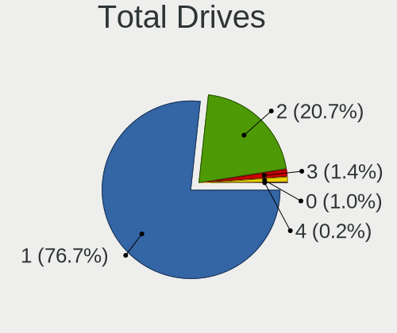
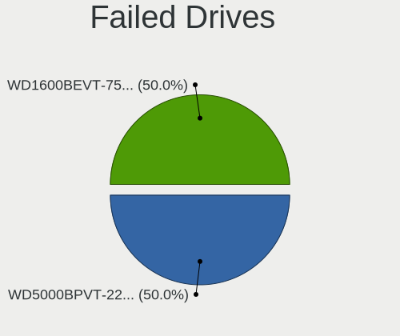
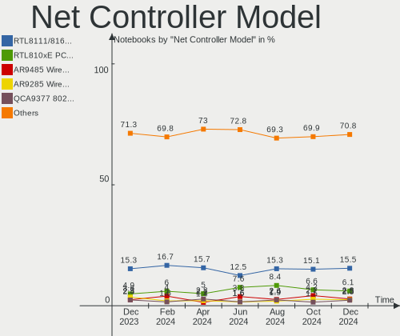

OpenMandriva - Hardware Trends (Notebooks)
------------------------------------------

A project to identify most popular hardware characteristics and track their change
over time based on data collected by Linux users at https://Linux-Hardware.org.

Anyone can contribute to this report by the [hw-probe](https://github.com/linuxhw/hw-probe) tool:

    sudo -E hw-probe -all -upload

This report is for one last month. Overall report since the beginning of time: [TestCoverage](https://github.com/linuxhw/TestCoverage)

Period: Jul, 2022.

Contents
--------

* [ System ](#system)
  - [ OS                       ](#os)
  - [ OS Family                ](#os-family)
  - [ Kernel                   ](#kernel)
  - [ Kernel Family            ](#kernel-family)
  - [ Kernel Major Ver.        ](#kernel-major-ver)
  - [ Arch                     ](#arch)
  - [ DE                       ](#de)
  - [ Display Server           ](#display-server)
  - [ Display Manager          ](#display-manager)
  - [ OS Lang                  ](#os-lang)
  - [ Boot Mode                ](#boot-mode)
  - [ Filesystem               ](#filesystem)
  - [ Part. scheme             ](#part-scheme)
  - [ Dual Boot with Linux/BSD ](#dual-boot-with-linuxbsd)
  - [ Dual Boot (Win)          ](#dual-boot-win)

* [ Board ](#board)
  - [ Vendor                   ](#vendor)
  - [ Model                    ](#model)
  - [ Model Family             ](#model-family)
  - [ MFG Year                 ](#mfg-year)
  - [ Form Factor              ](#form-factor)
  - [ Secure Boot              ](#secure-boot)
  - [ Coreboot                 ](#coreboot)
  - [ RAM Size                 ](#ram-size)
  - [ RAM Used                 ](#ram-used)
  - [ Total Drives             ](#total-drives)
  - [ Has CD-ROM               ](#has-cd-rom)
  - [ Has Ethernet             ](#has-ethernet)
  - [ Has WiFi                 ](#has-wifi)
  - [ Has Bluetooth            ](#has-bluetooth)

* [ Location ](#location)
  - [ Country                  ](#country)
  - [ City                     ](#city)

* [ Drives ](#drives)
  - [ Drive Vendor             ](#drive-vendor)
  - [ Drive Model              ](#drive-model)
  - [ HDD Vendor               ](#hdd-vendor)
  - [ SSD Vendor               ](#ssd-vendor)
  - [ Drive Kind               ](#drive-kind)
  - [ Drive Connector          ](#drive-connector)
  - [ Drive Size               ](#drive-size)
  - [ Space Total              ](#space-total)
  - [ Space Used               ](#space-used)
  - [ Malfunc. Drives          ](#malfunc-drives)
  - [ Malfunc. Drive Vendor    ](#malfunc-drive-vendor)
  - [ Malfunc. HDD Vendor      ](#malfunc-hdd-vendor)
  - [ Malfunc. Drive Kind      ](#malfunc-drive-kind)
  - [ Failed Drives            ](#failed-drives)
  - [ Failed Drive Vendor      ](#failed-drive-vendor)
  - [ Drive Status             ](#drive-status)

* [ Storage controller ](#storage-controller)
  - [ Storage Vendor           ](#storage-vendor)
  - [ Storage Model            ](#storage-model)
  - [ Storage Kind             ](#storage-kind)

* [ Processor ](#processor)
  - [ CPU Vendor               ](#cpu-vendor)
  - [ CPU Model                ](#cpu-model)
  - [ CPU Model Family         ](#cpu-model-family)
  - [ CPU Cores                ](#cpu-cores)
  - [ CPU Sockets              ](#cpu-sockets)
  - [ CPU Threads              ](#cpu-threads)
  - [ CPU Op-Modes             ](#cpu-op-modes)
  - [ CPU Microcode            ](#cpu-microcode)
  - [ CPU Microarch            ](#cpu-microarch)

* [ Graphics ](#graphics)
  - [ GPU Vendor               ](#gpu-vendor)
  - [ GPU Model                ](#gpu-model)
  - [ GPU Combo                ](#gpu-combo)
  - [ GPU Driver               ](#gpu-driver)
  - [ GPU Memory               ](#gpu-memory)

* [ Monitor ](#monitor)
  - [ Monitor Vendor           ](#monitor-vendor)
  - [ Monitor Model            ](#monitor-model)
  - [ Monitor Resolution       ](#monitor-resolution)
  - [ Monitor Diagonal         ](#monitor-diagonal)
  - [ Monitor Width            ](#monitor-width)
  - [ Aspect Ratio             ](#aspect-ratio)
  - [ Monitor Area             ](#monitor-area)
  - [ Pixel Density            ](#pixel-density)
  - [ Multiple Monitors        ](#multiple-monitors)

* [ Network ](#network)
  - [ Net Controller Vendor    ](#net-controller-vendor)
  - [ Net Controller Model     ](#net-controller-model)
  - [ Wireless Vendor          ](#wireless-vendor)
  - [ Wireless Model           ](#wireless-model)
  - [ Ethernet Vendor          ](#ethernet-vendor)
  - [ Ethernet Model           ](#ethernet-model)
  - [ Net Controller Kind      ](#net-controller-kind)
  - [ Used Controller          ](#used-controller)
  - [ NICs                     ](#nics)
  - [ IPv6                     ](#ipv6)

* [ Bluetooth ](#bluetooth)
  - [ Bluetooth Vendor         ](#bluetooth-vendor)
  - [ Bluetooth Model          ](#bluetooth-model)

* [ Sound ](#sound)
  - [ Sound Vendor             ](#sound-vendor)
  - [ Sound Model              ](#sound-model)

* [ Memory ](#memory)
  - [ Memory Vendor            ](#memory-vendor)
  - [ Memory Model             ](#memory-model)
  - [ Memory Kind              ](#memory-kind)
  - [ Memory Form Factor       ](#memory-form-factor)
  - [ Memory Size              ](#memory-size)
  - [ Memory Speed             ](#memory-speed)

* [ Printers & scanners ](#printers--scanners)
  - [ Printer Vendor           ](#printer-vendor)
  - [ Printer Model            ](#printer-model)
  - [ Scanner Vendor           ](#scanner-vendor)
  - [ Scanner Model            ](#scanner-model)

* [ Camera ](#camera)
  - [ Camera Vendor            ](#camera-vendor)
  - [ Camera Model             ](#camera-model)

* [ Security ](#security)
  - [ Fingerprint Vendor       ](#fingerprint-vendor)
  - [ Fingerprint Model        ](#fingerprint-model)
  - [ Chipcard Vendor          ](#chipcard-vendor)
  - [ Chipcard Model           ](#chipcard-model)

* [ Unsupported ](#unsupported)
  - [ Unsupported Devices      ](#unsupported-devices)
  - [ Unsupported Device Types ](#unsupported-device-types)

System
------

OS
--

Installed operating systems

| Name              | Notebooks | Percent |
|-------------------|-----------|---------|
| OpenMandriva 4.3  | 180       | 71.43%  |
| OpenMandriva 4.90 | 59        | 23.41%  |
| OpenMandriva 4.2  | 9         | 3.57%   |
| OpenMandriva 4.50 | 4         | 1.59%   |

OS Family
---------

OS without a version

| Name         | Notebooks | Percent |
|--------------|-----------|---------|
| OpenMandriva | 252       | 100%    |

Kernel
------

Version of the Linux kernel

| Version                       | Notebooks | Percent |
|-------------------------------|-----------|---------|
| 5.16.7-desktop-1omv4003       | 165       | 65.48%  |
| 5.18.12-desktop-3omv4090      | 55        | 21.83%  |
| 5.16.13-desktop-1omv4003      | 9         | 3.57%   |
| 5.10.14-desktop-1omv4002      | 9         | 3.57%   |
| 5.14.7-desktop-1omv4050       | 4         | 1.59%   |
| 5.17.1-desktop-2omv4050       | 3         | 1.19%   |
| 5.18.13-desktop-1omv4090      | 2         | 0.79%   |
| 5.18.11-desktop-gcc-3omv4090  | 1         | 0.4%    |
| 5.18.11-desktop-3omv4090      | 1         | 0.4%    |
| 5.17.1-desktop-clang-2omv4050 | 1         | 0.4%    |
| 5.15.14-1-lts                 | 1         | 0.4%    |
| 5.14.14-desktop-1omv4050      | 1         | 0.4%    |

Kernel Family
-------------

Linux kernel without a distro release

| Version | Notebooks | Percent |
|---------|-----------|---------|
| 5.16.7  | 165       | 65.48%  |
| 5.18.12 | 55        | 21.83%  |
| 5.16.13 | 9         | 3.57%   |
| 5.10.14 | 9         | 3.57%   |
| 5.17.1  | 4         | 1.59%   |
| 5.14.7  | 4         | 1.59%   |
| 5.18.13 | 2         | 0.79%   |
| 5.18.11 | 2         | 0.79%   |
| 5.15.14 | 1         | 0.4%    |
| 5.14.14 | 1         | 0.4%    |

Kernel Major Ver.
-----------------

Linux kernel major version

| Version | Notebooks | Percent |
|---------|-----------|---------|
| 5.16    | 174       | 69.05%  |
| 5.18    | 59        | 23.41%  |
| 5.10    | 9         | 3.57%   |
| 5.14    | 5         | 1.98%   |
| 5.17    | 4         | 1.59%   |
| 5.15    | 1         | 0.4%    |

Arch
----

OS architecture (x86_64, i586, etc.)

| Name   | Notebooks | Percent |
|--------|-----------|---------|
| x86_64 | 252       | 100%    |

DE
--

Desktop Environment

| Name    | Notebooks | Percent |
|---------|-----------|---------|
| KDE5    | 248       | 98.41%  |
| LXQt    | 3         | 1.19%   |
| Unknown | 1         | 0.4%    |

Display Server
--------------

X11 or Wayland

| Name | Notebooks | Percent |
|------|-----------|---------|
| X11  | 252       | 100%    |

Display Manager
---------------

SDDM, LightDM, etc.

| Name | Notebooks | Percent |
|------|-----------|---------|
| SDDM | 252       | 100%    |

OS Lang
-------

Language

| Lang  | Notebooks | Percent |
|-------|-----------|---------|
| en_US | 154       | 61.11%  |
| fr_FR | 17        | 6.75%   |
| de_DE | 13        | 5.16%   |
| pt_BR | 10        | 3.97%   |
| en_GB | 9         | 3.57%   |
| cs_CZ | 7         | 2.78%   |
| ru_RU | 6         | 2.38%   |
| pl_PL | 4         | 1.59%   |
| it_IT | 4         | 1.59%   |
| de_CH | 3         | 1.19%   |
| nl_NL | 2         | 0.79%   |
| fr_CH | 2         | 0.79%   |
| es_PE | 2         | 0.79%   |
| es_MX | 2         | 0.79%   |
| en_NZ | 2         | 0.79%   |
| de_LU | 2         | 0.79%   |
| tr_TR | 1         | 0.4%    |
| ro_RO | 1         | 0.4%    |
| pt_PT | 1         | 0.4%    |
| nb_NO | 1         | 0.4%    |
| hu_HU | 1         | 0.4%    |
| fr_BE | 1         | 0.4%    |
| es_SV | 1         | 0.4%    |
| es_ES | 1         | 0.4%    |
| es_CL | 1         | 0.4%    |
| es_AR | 1         | 0.4%    |
| en_IN | 1         | 0.4%    |
| de_AT | 1         | 0.4%    |
| ar_EG | 1         | 0.4%    |

Boot Mode
---------

EFI or BIOS

| Mode | Notebooks | Percent |
|------|-----------|---------|
| EFI  | 142       | 56.35%  |
| BIOS | 110       | 43.65%  |

Filesystem
----------

Type of filesystem

| Type    | Notebooks | Percent |
|---------|-----------|---------|
| Overlay | 202       | 80.16%  |
| Ext4    | 49        | 19.44%  |
| F2fs    | 1         | 0.4%    |

Part. scheme
------------

Scheme of partitioning

| Type | Notebooks | Percent |
|------|-----------|---------|
| GPT  | 167       | 66.27%  |
| MBR  | 85        | 33.73%  |

Dual Boot with Linux/BSD
------------------------

Hosting more than one Linux/BSD

| Dual boot | Notebooks | Percent |
|-----------|-----------|---------|
| Yes       | 128       | 50.79%  |
| No        | 124       | 49.21%  |

Dual Boot (Win)
---------------

Hosting Linux and Windows

| Dual boot | Notebooks | Percent |
|-----------|-----------|---------|
| No        | 155       | 61.51%  |
| Yes       | 97        | 38.49%  |

Board
-----

Vendor
------

Motherboard manufacturer

| Name                | Notebooks | Percent |
|---------------------|-----------|---------|
| Hewlett-Packard     | 51        | 20.24%  |
| Lenovo              | 40        | 15.87%  |
| Dell                | 40        | 15.87%  |
| ASUSTek Computer    | 35        | 13.89%  |
| Acer                | 29        | 11.51%  |
| Toshiba             | 10        | 3.97%   |
| Sony                | 7         | 2.78%   |
| Samsung Electronics | 4         | 1.59%   |
| Apple               | 4         | 1.59%   |
| Notebook            | 3         | 1.19%   |
| MSI                 | 3         | 1.19%   |
| Fujitsu             | 3         | 1.19%   |
| Digibras            | 3         | 1.19%   |
| Wortmann AG         | 2         | 0.79%   |
| Positivo            | 2         | 0.79%   |
| Gateway             | 2         | 0.79%   |
| Purism              | 1         | 0.4%    |
| Packard Bell        | 1         | 0.4%    |
| NEC Computers       | 1         | 0.4%    |
| Micro Electronics   | 1         | 0.4%    |
| METAPHYUNI          | 1         | 0.4%    |
| LG Electronics      | 1         | 0.4%    |
| HUAWEI              | 1         | 0.4%    |
| Google              | 1         | 0.4%    |
| Gigabyte Technology | 1         | 0.4%    |
| Framework           | 1         | 0.4%    |
| eMachines           | 1         | 0.4%    |
| Compaq              | 1         | 0.4%    |
| AZW                 | 1         | 0.4%    |
| Unknown             | 1         | 0.4%    |

Model
-----

Motherboard model

| Name                                    | Notebooks | Percent |
|-----------------------------------------|-----------|---------|
| Dell Latitude 3310                      | 8         | 3.17%   |
| ASUS UX31E                              | 4         | 1.59%   |
| HP Notebook                             | 3         | 1.19%   |
| HP EliteBook 8460p                      | 3         | 1.19%   |
| Acer Aspire 3100                        | 3         | 1.19%   |
| Lenovo IdeaPad Slim 1-14AST-05 81VS     | 2         | 0.79%   |
| Lenovo IdeaPad S145-15API 81UT          | 2         | 0.79%   |
| Lenovo G50-45 80E3                      | 2         | 0.79%   |
| HP ProBook 6570b                        | 2         | 0.79%   |
| HP Pavilion Notebook                    | 2         | 0.79%   |
| HP Pavilion dv6700                      | 2         | 0.79%   |
| HP Laptop 15s-eq1xxx                    | 2         | 0.79%   |
| HP Dev One Notebook PC                  | 2         | 0.79%   |
| Digibras NH4CU03                        | 2         | 0.79%   |
| Dell Vostro 15-3568                     | 2         | 0.79%   |
| Dell Latitude E6540                     | 2         | 0.79%   |
| Dell Latitude E6430                     | 2         | 0.79%   |
| Dell Inspiron 3451                      | 2         | 0.79%   |
| ASUS VivoBook_ASUSLaptop X509JA_X509JA  | 2         | 0.79%   |
| ASUS VivoBook_ASUSLaptop X412DAP_F412DA | 2         | 0.79%   |
| Acer Aspire 5742G                       | 2         | 0.79%   |
| Unknown                                 | 2         | 0.79%   |
| Wortmann AG TERRA_MOBILE_1528P/1748P    | 1         | 0.4%    |
| Wortmann AG MS-1727                     | 1         | 0.4%    |
| Toshiba Satellite Pro R50-C             | 1         | 0.4%    |
| Toshiba Satellite P50-B-118             | 1         | 0.4%    |
| Toshiba Satellite C870D-116             | 1         | 0.4%    |
| Toshiba Satellite C850D-11K             | 1         | 0.4%    |
| Toshiba Satellite C75D-B                | 1         | 0.4%    |
| Toshiba Satellite C655                  | 1         | 0.4%    |
| Toshiba Portable PC                     | 1         | 0.4%    |
| Toshiba dynabook T653/46JR              | 1         | 0.4%    |
| Toshiba dynabook R734/K                 | 1         | 0.4%    |
| Toshiba dynabook B350/22A               | 1         | 0.4%    |
| Sony VPCS110FL                          | 1         | 0.4%    |
| Sony VPCEB26FG                          | 1         | 0.4%    |
| Sony VPCEA45FL                          | 1         | 0.4%    |
| Sony VPCEA3M1R                          | 1         | 0.4%    |
| Sony VGN-FZ31Z                          | 1         | 0.4%    |
| Sony SVE1513R1EB                        | 1         | 0.4%    |
| Sony SVE1513H1EW                        | 1         | 0.4%    |
| Samsung Q210/P210                       | 1         | 0.4%    |
| Samsung 550XBE/350XBE                   | 1         | 0.4%    |
| Samsung 300E5M/300E5L                   | 1         | 0.4%    |
| Samsung 270E5G/270E5U                   | 1         | 0.4%    |
| Purism Librem 14                        | 1         | 0.4%    |
| Positivo J14AL11                        | 1         | 0.4%    |
| Positivo H14BT58                        | 1         | 0.4%    |
| Packard Bell EasyNote TM85              | 1         | 0.4%    |
| Notebook W54_W94_W955TU,-T,-C           | 1         | 0.4%    |
| Notebook NL40_50GU                      | 1         | 0.4%    |
| Notebook MIM 2200                       | 1         | 0.4%    |
| NEC Computers U2                        | 1         | 0.4%    |
| MSI GP62 6QE                            | 1         | 0.4%    |
| MSI GF63 8RD                            | 1         | 0.4%    |
| MSI GE72 6QL                            | 1         | 0.4%    |
| Micro MG-VCP17I-3080                    | 1         | 0.4%    |
| METAPHYUNI MetamechBook                 | 1         | 0.4%    |
| LG 17Z90Q-K.ADC9U1                      | 1         | 0.4%    |
| Lenovo Yoga Slim 7 15ITL05 82AC         | 1         | 0.4%    |

Model Family
------------

Motherboard model prefix

| Name                    | Notebooks | Percent |
|-------------------------|-----------|---------|
| Dell Latitude           | 25        | 9.92%   |
| Acer Aspire             | 21        | 8.33%   |
| Lenovo ThinkPad         | 16        | 6.35%   |
| Lenovo IdeaPad          | 14        | 5.56%   |
| ASUS VivoBook           | 11        | 4.37%   |
| HP ProBook              | 10        | 3.97%   |
| HP Pavilion             | 9         | 3.57%   |
| HP Laptop               | 7         | 2.78%   |
| Toshiba Satellite       | 6         | 2.38%   |
| HP EliteBook            | 6         | 2.38%   |
| Dell Inspiron           | 6         | 2.38%   |
| HP 250                  | 5         | 1.98%   |
| Dell Vostro             | 4         | 1.59%   |
| ASUS UX31E              | 4         | 1.59%   |
| Toshiba dynabook        | 3         | 1.19%   |
| HP Notebook             | 3         | 1.19%   |
| HP Compaq               | 3         | 1.19%   |
| Fujitsu LIFEBOOK        | 3         | 1.19%   |
| Dell XPS                | 3         | 1.19%   |
| Lenovo G50-45           | 2         | 0.79%   |
| HP Dev                  | 2         | 0.79%   |
| Digibras NH4CU03        | 2         | 0.79%   |
| Dell Precision          | 2         | 0.79%   |
| ASUS ASUS               | 2         | 0.79%   |
| Acer TravelMate         | 2         | 0.79%   |
| Acer Swift              | 2         | 0.79%   |
| Acer Nitro              | 2         | 0.79%   |
| Unknown                 | 2         | 0.79%   |
| Wortmann AG TERRA       | 1         | 0.4%    |
| Wortmann AG MS-1727     | 1         | 0.4%    |
| Toshiba Portable        | 1         | 0.4%    |
| Sony VPCS110FL          | 1         | 0.4%    |
| Sony VPCEB26FG          | 1         | 0.4%    |
| Sony VPCEA45FL          | 1         | 0.4%    |
| Sony VPCEA3M1R          | 1         | 0.4%    |
| Sony VGN-FZ31Z          | 1         | 0.4%    |
| Sony SVE1513R1EB        | 1         | 0.4%    |
| Sony SVE1513H1EW        | 1         | 0.4%    |
| Samsung Q210            | 1         | 0.4%    |
| Samsung 550XBE          | 1         | 0.4%    |
| Samsung 300E5M          | 1         | 0.4%    |
| Samsung 270E5G          | 1         | 0.4%    |
| Purism Librem           | 1         | 0.4%    |
| Positivo J14AL11        | 1         | 0.4%    |
| Positivo H14BT58        | 1         | 0.4%    |
| Packard Bell EasyNote   | 1         | 0.4%    |
| Notebook W54            | 1         | 0.4%    |
| Notebook NL40           | 1         | 0.4%    |
| Notebook MIM            | 1         | 0.4%    |
| NEC Computers U2        | 1         | 0.4%    |
| MSI GP62                | 1         | 0.4%    |
| MSI GF63                | 1         | 0.4%    |
| MSI GE72                | 1         | 0.4%    |
| Micro MG-VCP17I-3080    | 1         | 0.4%    |
| METAPHYUNI MetamechBook | 1         | 0.4%    |
| LG 17Z90Q-K.ADC9U1      | 1         | 0.4%    |
| Lenovo Yoga             | 1         | 0.4%    |
| Lenovo V15-ADA          | 1         | 0.4%    |
| Lenovo V130-15IKB       | 1         | 0.4%    |
| Lenovo Legion           | 1         | 0.4%    |

MFG Year
--------

Motherboard manufacture year

| Year    | Notebooks | Percent |
|---------|-----------|---------|
| 2019    | 30        | 11.9%   |
| 2011    | 26        | 10.32%  |
| 2014    | 22        | 8.73%   |
| 2012    | 20        | 7.94%   |
| 2010    | 20        | 7.94%   |
| 2021    | 18        | 7.14%   |
| 2013    | 18        | 7.14%   |
| 2020    | 17        | 6.75%   |
| 2016    | 14        | 5.56%   |
| 2018    | 13        | 5.16%   |
| 2017    | 11        | 4.37%   |
| 2015    | 9         | 3.57%   |
| 2009    | 9         | 3.57%   |
| 2007    | 8         | 3.17%   |
| 2008    | 6         | 2.38%   |
| 2022    | 5         | 1.98%   |
| 2006    | 5         | 1.98%   |
| Unknown | 1         | 0.4%    |

Form Factor
-----------

Physical design of the computer

| Name     | Notebooks | Percent |
|----------|-----------|---------|
| Notebook | 252       | 100%    |

Secure Boot
-----------

Enabled or disabled

| State    | Notebooks | Percent |
|----------|-----------|---------|
| Disabled | 252       | 100%    |

Coreboot
--------

Have coreboot on board

| Used | Notebooks | Percent |
|------|-----------|---------|
| No   | 250       | 99.21%  |
| Yes  | 2         | 0.79%   |

RAM Size
--------

Total RAM memory

| Size in GB  | Notebooks | Percent |
|-------------|-----------|---------|
| 3.01-4.0    | 89        | 35.32%  |
| 4.01-8.0    | 84        | 33.33%  |
| 8.01-16.0   | 38        | 15.08%  |
| 16.01-24.0  | 16        | 6.35%   |
| 32.01-64.0  | 9         | 3.57%   |
| 1.01-2.0    | 8         | 3.17%   |
| 2.01-3.0    | 4         | 1.59%   |
| 24.01-32.0  | 2         | 0.79%   |
| 64.01-256.0 | 1         | 0.4%    |
| 0.51-1.0    | 1         | 0.4%    |

RAM Used
--------

Used RAM memory

| Used GB  | Notebooks | Percent |
|----------|-----------|---------|
| 1.01-2.0 | 199       | 78.97%  |
| 0.51-1.0 | 26        | 10.32%  |
| 2.01-3.0 | 20        | 7.94%   |
| 3.01-4.0 | 4         | 1.59%   |
| 0.01-0.5 | 2         | 0.79%   |
| 4.01-8.0 | 1         | 0.4%    |

Total Drives
------------

Number of drives on board

| Drives | Notebooks | Percent |
|--------|-----------|---------|
| 1      | 196       | 77.78%  |
| 2      | 43        | 17.06%  |
| 3      | 9         | 3.57%   |
| 4      | 2         | 0.79%   |
| 0      | 2         | 0.79%   |

Has CD-ROM
----------

Has CD-ROM on board

| Presented | Notebooks | Percent |
|-----------|-----------|---------|
| No        | 130       | 51.59%  |
| Yes       | 122       | 48.41%  |

Has Ethernet
------------

Has Ethernet on board

| Presented | Notebooks | Percent |
|-----------|-----------|---------|
| Yes       | 207       | 82.14%  |
| No        | 45        | 17.86%  |

Has WiFi
--------

Has WiFi module

| Presented | Notebooks | Percent |
|-----------|-----------|---------|
| Yes       | 251       | 99.6%   |
| No        | 1         | 0.4%    |

Has Bluetooth
-------------

Has Bluetooth module

| Presented | Notebooks | Percent |
|-----------|-----------|---------|
| Yes       | 186       | 73.81%  |
| No        | 66        | 26.19%  |

Location
--------

Country
-------

Geographic location (country)

| Country      | Notebooks | Percent |
|--------------|-----------|---------|
| USA          | 38        | 15.08%  |
| France       | 22        | 8.73%   |
| Germany      | 21        | 8.33%   |
| Brazil       | 18        | 7.14%   |
| UK           | 14        | 5.56%   |
| Netherlands  | 14        | 5.56%   |
| Russia       | 9         | 3.57%   |
| Belgium      | 8         | 3.17%   |
| Switzerland  | 7         | 2.78%   |
| Italy        | 7         | 2.78%   |
| Japan        | 6         | 2.38%   |
| India        | 6         | 2.38%   |
| Czechia      | 6         | 2.38%   |
| Sweden       | 4         | 1.59%   |
| Poland       | 4         | 1.59%   |
| Peru         | 4         | 1.59%   |
| New Zealand  | 4         | 1.59%   |
| Greece       | 4         | 1.59%   |
| Colombia     | 4         | 1.59%   |
| Canada       | 4         | 1.59%   |
| Australia    | 4         | 1.59%   |
| Spain        | 3         | 1.19%   |
| Portugal     | 3         | 1.19%   |
| Mexico       | 3         | 1.19%   |
| Romania      | 2         | 0.79%   |
| Norway       | 2         | 0.79%   |
| Luxembourg   | 2         | 0.79%   |
| Hungary      | 2         | 0.79%   |
| Hong Kong    | 2         | 0.79%   |
| Vietnam      | 1         | 0.4%    |
| Turkey       | 1         | 0.4%    |
| Taiwan       | 1         | 0.4%    |
| Sudan        | 1         | 0.4%    |
| South Africa | 1         | 0.4%    |
| Slovakia     | 1         | 0.4%    |
| Serbia       | 1         | 0.4%    |
| Saudi Arabia | 1         | 0.4%    |
| Réunion     | 1         | 0.4%    |
| Qatar        | 1         | 0.4%    |
| Malaysia     | 1         | 0.4%    |
| Lithuania    | 1         | 0.4%    |
| Laos         | 1         | 0.4%    |
| Kazakhstan   | 1         | 0.4%    |
| Indonesia    | 1         | 0.4%    |
| Haiti        | 1         | 0.4%    |
| El Salvador  | 1         | 0.4%    |
| Egypt        | 1         | 0.4%    |
| Croatia      | 1         | 0.4%    |
| China        | 1         | 0.4%    |
| Chile        | 1         | 0.4%    |
| Bulgaria     | 1         | 0.4%    |
| Austria      | 1         | 0.4%    |
| Argentina    | 1         | 0.4%    |
| Algeria      | 1         | 0.4%    |

City
----

Geographic location (city)

| City                | Notebooks | Percent |
|---------------------|-----------|---------|
| Schagen             | 9         | 3.57%   |
| Geneva              | 4         | 1.59%   |
| Nottingham          | 3         | 1.19%   |
| Lima                | 3         | 1.19%   |
| Curitiba            | 3         | 1.19%   |
| Bengaluru           | 3         | 1.19%   |
| Würzburg           | 2         | 0.79%   |
| The Hague           | 2         | 0.79%   |
| Strassen            | 2         | 0.79%   |
| Sint-Amands         | 2         | 0.79%   |
| Rio de Janeiro      | 2         | 0.79%   |
| Queens              | 2         | 0.79%   |
| Prague              | 2         | 0.79%   |
| Perassay            | 2         | 0.79%   |
| Parkesburg          | 2         | 0.79%   |
| New Bern            | 2         | 0.79%   |
| Milan               | 2         | 0.79%   |
| Kristiansand        | 2         | 0.79%   |
| Krakow              | 2         | 0.79%   |
| Keller              | 2         | 0.79%   |
| Kansas City         | 2         | 0.79%   |
| Glumsloev           | 2         | 0.79%   |
| Dresden             | 2         | 0.79%   |
| Conwy               | 2         | 0.79%   |
| Chomutov            | 2         | 0.79%   |
| Central             | 2         | 0.79%   |
| Cambridge           | 2         | 0.79%   |
| Bucharest           | 2         | 0.79%   |
| Brisbane            | 2         | 0.79%   |
| Berlin              | 2         | 0.79%   |
| Barranquilla        | 2         | 0.79%   |
| Auckland            | 2         | 0.79%   |
| Athens              | 2         | 0.79%   |
| Zagreb              | 1         | 0.4%    |
| Yamaguchi           | 1         | 0.4%    |
| Wyoming             | 1         | 0.4%    |
| Winchester          | 1         | 0.4%    |
| Villars             | 1         | 0.4%    |
| Vijayawada          | 1         | 0.4%    |
| Vientiane           | 1         | 0.4%    |
| Vienna              | 1         | 0.4%    |
| Videira             | 1         | 0.4%    |
| Viamao              | 1         | 0.4%    |
| Veracruz            | 1         | 0.4%    |
| Vaxjo               | 1         | 0.4%    |
| Valrico             | 1         | 0.4%    |
| Valparaiso de Goias | 1         | 0.4%    |
| Uddel               | 1         | 0.4%    |
| Tyumen              | 1         | 0.4%    |
| Tucson              | 1         | 0.4%    |
| Tsubame             | 1         | 0.4%    |
| Thessaloniki        | 1         | 0.4%    |
| Taranto             | 1         | 0.4%    |
| Taipei              | 1         | 0.4%    |
| Tacna               | 1         | 0.4%    |
| Szirmabesenyo       | 1         | 0.4%    |
| Syracuse            | 1         | 0.4%    |
| Sydney              | 1         | 0.4%    |
| Surrey              | 1         | 0.4%    |
| Stuttgart           | 1         | 0.4%    |

Drives
------

Drive Vendor
------------

Hard drive vendors

| Vendor              | Notebooks | Drives | Percent |
|---------------------|-----------|--------|---------|
| WDC                 | 43        | 44     | 14.24%  |
| Samsung Electronics | 35        | 37     | 11.59%  |
| Seagate             | 32        | 32     | 10.6%   |
| Toshiba             | 27        | 27     | 8.94%   |
| SK hynix            | 20        | 20     | 6.62%   |
| Hitachi             | 17        | 17     | 5.63%   |
| SanDisk             | 15        | 15     | 4.97%   |
| Unknown             | 14        | 14     | 4.64%   |
| Crucial             | 14        | 14     | 4.64%   |
| Kingston            | 13        | 13     | 4.3%    |
| HGST                | 8         | 8      | 2.65%   |
| Intel               | 7         | 8      | 2.32%   |
| PNY                 | 4         | 4      | 1.32%   |
| JMicron Technology  | 4         | 4      | 1.32%   |
| China               | 4         | 4      | 1.32%   |
| SPCC                | 3         | 3      | 0.99%   |
| Silicon Motion      | 3         | 3      | 0.99%   |
| Gigabyte Technology | 3         | 3      | 0.99%   |
| ASMT                | 3         | 3      | 0.99%   |
| UMIS                | 2         | 2      | 0.66%   |
| Netac               | 2         | 2      | 0.66%   |
| KIOXIA              | 2         | 2      | 0.66%   |
| JetFlash            | 2         | 2      | 0.66%   |
| Apple               | 2         | 2      | 0.66%   |
| A-DATA Technology   | 2         | 2      | 0.66%   |
| ZHITAI              | 1         | 1      | 0.33%   |
| Zheino              | 1         | 1      | 0.33%   |
| Vaseky              | 1         | 1      | 0.33%   |
| V-GeN               | 1         | 1      | 0.33%   |
| SSSTC               | 1         | 1      | 0.33%   |
| Smartbuy            | 1         | 1      | 0.33%   |
| SATAFIRM            | 1         | 1      | 0.33%   |
| OCZ                 | 1         | 1      | 0.33%   |
| LITEON              | 1         | 1      | 0.33%   |
| Lexar               | 1         | 1      | 0.33%   |
| LDLC                | 1         | 1      | 0.33%   |
| KingSpec            | 1         | 1      | 0.33%   |
| Intenso             | 1         | 1      | 0.33%   |
| Hikvision           | 1         | 1      | 0.33%   |
| GOODRAM             | 1         | 1      | 0.33%   |
| Dogfish             | 1         | 1      | 0.33%   |
| Corsair             | 1         | 1      | 0.33%   |
| ASMedia             | 1         | 1      | 0.33%   |
| Apacer              | 1         | 1      | 0.33%   |
| ACPI                | 1         | 1      | 0.33%   |
| Unknown             | 1         | 1      | 0.33%   |

Drive Model
-----------

Hard drive models

| Model                                | Notebooks | Percent |
|--------------------------------------|-----------|---------|
| Toshiba MQ01ABF050 500GB             | 6         | 1.96%   |
| Toshiba MQ01ABD100 1TB               | 6         | 1.96%   |
| Seagate ST500LT012-1DG142 500GB      | 6         | 1.96%   |
| Seagate ST1000LM035-1RK172 1TB       | 5         | 1.63%   |
| Unknown SD/MMC/MS PRO 64GB           | 4         | 1.31%   |
| SanDisk SSD U100 256GB               | 4         | 1.31%   |
| Kingston SA400S37240G 240GB SSD      | 4         | 1.31%   |
| HGST HTS541010A9E680 1TB             | 4         | 1.31%   |
| Toshiba MQ04ABF100 1TB               | 3         | 0.98%   |
| SK hynix HFM256GDJTNG-8310A 256GB    | 3         | 0.98%   |
| SK hynix BC511 NVMe 256GB            | 3         | 0.98%   |
| Seagate ST500LT012-9WS142 500GB      | 3         | 0.98%   |
| SanDisk SDSSDH3 1T00 1TB             | 3         | 0.98%   |
| JMicron Generic 2TB                  | 3         | 0.98%   |
| Hitachi HTS547575A9E384 752GB        | 3         | 0.98%   |
| Crucial CT240BX500SSD1 240GB         | 3         | 0.98%   |
| WDC WDS250G2B0B-00YS70 250GB SSD     | 2         | 0.65%   |
| WDC WD5000LPVX-22V0TT0 500GB         | 2         | 0.65%   |
| WDC WD5000BEVT-22A0RT0 500GB         | 2         | 0.65%   |
| WDC WD10JPVX-22JC3T0 1TB             | 2         | 0.65%   |
| WDC PC SN530 SDBPNPZ-512G-1114 512GB | 2         | 0.65%   |
| Unknown DA4064  64GB                 | 2         | 0.65%   |
| UMIS RPFTJ128PDD2EWX 128GB           | 2         | 0.65%   |
| SK hynix PC711 HFS001TDE9X073N 1TB   | 2         | 0.65%   |
| Samsung SSD 980 PRO 1TB              | 2         | 0.65%   |
| Samsung SSD 980 1TB                  | 2         | 0.65%   |
| Samsung SSD 970 EVO Plus 500GB       | 2         | 0.65%   |
| Samsung SSD 850 EVO 500GB            | 2         | 0.65%   |
| Samsung PM991a NVMe 256GB            | 2         | 0.65%   |
| Samsung MZVLQ256HAJD-00000 256GB     | 2         | 0.65%   |
| Samsung MZVL21T0HCLR-00B00 1TB       | 2         | 0.65%   |
| PNY CS900 120GB SSD                  | 2         | 0.65%   |
| Kingston SV300S37A120G 120GB SSD     | 2         | 0.65%   |
| JetFlash Transcend 128GB             | 2         | 0.65%   |
| Hitachi HTS723232A7A364 320GB        | 2         | 0.65%   |
| China SSD 128GB                      | 2         | 0.65%   |
| ASMT 2115 1TB                        | 2         | 0.65%   |
| ZHITAI PC005 Active 1TB              | 1         | 0.33%   |
| Zheino CHN 25SATA01M 030 32GB SSD    | 1         | 0.33%   |
| WDC WDS250G3X0C-00SJG0 250GB         | 1         | 0.33%   |
| WDC WDS240G2G0B-00EPW0 240GB SSD     | 1         | 0.33%   |
| WDC WDS240G2G0A-00JH30 240GB SSD     | 1         | 0.33%   |
| WDC WDS100T3X0C-00SJG0 1TB           | 1         | 0.33%   |
| WDC WDS100T2B0B-00YS70 1TB SSD       | 1         | 0.33%   |
| WDC WD7500BPVT-55HXZT3 752GB         | 1         | 0.33%   |
| WDC WD6400BPVT-22HXZT1 640GB         | 1         | 0.33%   |
| WDC WD5000LUCT-63C26Y0 500GB         | 1         | 0.33%   |
| WDC WD5000LPCX-22VHAT1 500GB         | 1         | 0.33%   |
| WDC WD5000BPVT-80HXZT1 500GB         | 1         | 0.33%   |
| WDC WD5000BPVT-24HXZT3 500GB         | 1         | 0.33%   |
| WDC WD5000BPVT-22HXZT3 500GB         | 1         | 0.33%   |
| WDC WD5000BEVT-80A0RT1 500GB         | 1         | 0.33%   |
| WDC WD3200LPCX-00VHAT0 320GB         | 1         | 0.33%   |
| WDC WD3200BPVT-22ZEST0 320GB         | 1         | 0.33%   |
| WDC WD3200BMVS-11F9S0 320GB          | 1         | 0.33%   |
| WDC WD3200BEVT-75ZCT2 320GB          | 1         | 0.33%   |
| WDC WD3200BEVT-11ZCT0 320GB          | 1         | 0.33%   |
| WDC WD3200BEKT-75PVMT1 320GB         | 1         | 0.33%   |
| WDC WD3200BEKT-60V5T1 320GB          | 1         | 0.33%   |
| WDC WD2500BEVT-60A23T0 250GB         | 1         | 0.33%   |

HDD Vendor
----------

Hard disk drive vendors

| Vendor              | Notebooks | Drives | Percent |
|---------------------|-----------|--------|---------|
| Seagate             | 32        | 32     | 26.02%  |
| WDC                 | 31        | 31     | 25.2%   |
| Toshiba             | 25        | 25     | 20.33%  |
| Hitachi             | 17        | 17     | 13.82%  |
| HGST                | 8         | 8      | 6.5%    |
| Unknown             | 4         | 4      | 3.25%   |
| ASMT                | 3         | 3      | 2.44%   |
| SATAFIRM            | 1         | 1      | 0.81%   |
| Samsung Electronics | 1         | 1      | 0.81%   |
| ASMedia             | 1         | 1      | 0.81%   |

SSD Vendor
----------

Solid state drive vendors

| Vendor              | Notebooks | Drives | Percent |
|---------------------|-----------|--------|---------|
| Samsung Electronics | 16        | 16     | 16.33%  |
| SanDisk             | 15        | 15     | 15.31%  |
| Crucial             | 12        | 12     | 12.24%  |
| Kingston            | 10        | 10     | 10.2%   |
| WDC                 | 5         | 5      | 5.1%    |
| SK hynix            | 5         | 5      | 5.1%    |
| PNY                 | 4         | 4      | 4.08%   |
| China               | 4         | 4      | 4.08%   |
| SPCC                | 3         | 3      | 3.06%   |
| Netac               | 2         | 2      | 2.04%   |
| Zheino              | 1         | 1      | 1.02%   |
| Vaseky              | 1         | 1      | 1.02%   |
| V-GeN               | 1         | 1      | 1.02%   |
| Unknown             | 1         | 1      | 1.02%   |
| Toshiba             | 1         | 1      | 1.02%   |
| Smartbuy            | 1         | 1      | 1.02%   |
| OCZ                 | 1         | 1      | 1.02%   |
| LITEON              | 1         | 1      | 1.02%   |
| Lexar               | 1         | 1      | 1.02%   |
| LDLC                | 1         | 1      | 1.02%   |
| KingSpec            | 1         | 1      | 1.02%   |
| JMicron Technology  | 1         | 1      | 1.02%   |
| Intenso             | 1         | 1      | 1.02%   |
| Intel               | 1         | 1      | 1.02%   |
| GOODRAM             | 1         | 1      | 1.02%   |
| Gigabyte Technology | 1         | 1      | 1.02%   |
| Dogfish             | 1         | 1      | 1.02%   |
| Corsair             | 1         | 1      | 1.02%   |
| Apple               | 1         | 1      | 1.02%   |
| Apacer              | 1         | 1      | 1.02%   |
| ACPI                | 1         | 1      | 1.02%   |
| A-DATA Technology   | 1         | 1      | 1.02%   |

Drive Kind
----------

HDD or SSD

| Kind    | Notebooks | Drives | Percent |
|---------|-----------|--------|---------|
| HDD     | 119       | 123    | 41.75%  |
| SSD     | 89        | 98     | 31.23%  |
| NVMe    | 65        | 73     | 22.81%  |
| MMC     | 10        | 10     | 3.51%   |
| Unknown | 2         | 2      | 0.7%    |

Drive Connector
---------------

SATA, SAS, NVMe, etc.

| Type | Notebooks | Drives | Percent |
|------|-----------|--------|---------|
| SATA | 190       | 210    | 68.59%  |
| NVMe | 64        | 70     | 23.1%   |
| SAS  | 13        | 16     | 4.69%   |
| MMC  | 10        | 10     | 3.61%   |

Drive Size
----------

Size of hard drive

| Size in TB | Notebooks | Drives | Percent |
|------------|-----------|--------|---------|
| 0.01-0.5   | 156       | 167    | 75%     |
| 0.51-1.0   | 47        | 49     | 22.6%   |
| 1.01-2.0   | 4         | 4      | 1.92%   |
| 3.01-4.0   | 1         | 1      | 0.48%   |

Space Total
-----------

Amount of disk space available on the file system

| Size in GB     | Notebooks | Percent |
|----------------|-----------|---------|
| 1-20           | 148       | 58.73%  |
| 101-250        | 36        | 14.29%  |
| 251-500        | 24        | 9.52%   |
| 501-1000       | 17        | 6.75%   |
| 21-50          | 9         | 3.57%   |
| 51-100         | 9         | 3.57%   |
| Unknown        | 5         | 1.98%   |
| 2001-3000      | 2         | 0.79%   |
| More than 3000 | 1         | 0.4%    |
| 1001-2000      | 1         | 0.4%    |

Space Used
----------

Amount of used disk space

| Used GB        | Notebooks | Percent |
|----------------|-----------|---------|
| 1-20           | 233       | 92.46%  |
| Unknown        | 5         | 1.98%   |
| 101-250        | 4         | 1.59%   |
| 21-50          | 3         | 1.19%   |
| 251-500        | 2         | 0.79%   |
| 1001-2000      | 2         | 0.79%   |
| 51-100         | 2         | 0.79%   |
| More than 3000 | 1         | 0.4%    |

Malfunc. Drives
---------------

Drive models with a malfunction

| Model                                          | Notebooks | Drives | Percent |
|------------------------------------------------|-----------|--------|---------|
| SanDisk SSD U100 256GB                         | 4         | 4      | 5.8%    |
| Seagate ST500LT012-9WS142 500GB                | 3         | 3      | 4.35%   |
| WDC WD5000BEVT-22A0RT0 500GB                   | 2         | 2      | 2.9%    |
| SK hynix PC711 HFS001TDE9X073N 1TB             | 2         | 2      | 2.9%    |
| Hitachi HTS723232A7A364 320GB                  | 2         | 2      | 2.9%    |
| HGST HTS541010A9E680 1TB                       | 2         | 2      | 2.9%    |
| WDC WD5000LPVX-22V0TT0 500GB                   | 1         | 1      | 1.45%   |
| WDC WD5000BPVT-80HXZT1 500GB                   | 1         | 1      | 1.45%   |
| WDC WD5000BPVT-24HXZT3 500GB                   | 1         | 1      | 1.45%   |
| WDC WD5000BEVT-80A0RT1 500GB                   | 1         | 1      | 1.45%   |
| WDC WD3200BEKT-60V5T1 320GB                    | 1         | 1      | 1.45%   |
| WDC WD2500BEVT-60A23T0 250GB                   | 1         | 1      | 1.45%   |
| Toshiba MQ04ABF100 1TB                         | 1         | 1      | 1.45%   |
| Toshiba MQ01ABF050 500GB                       | 1         | 1      | 1.45%   |
| Toshiba MQ01ABF032 320GB                       | 1         | 1      | 1.45%   |
| Toshiba MQ01ABD100 1TB                         | 1         | 1      | 1.45%   |
| Toshiba MQ01ABD075 752GB                       | 1         | 1      | 1.45%   |
| Toshiba MQ01ABD032 320GB                       | 1         | 1      | 1.45%   |
| Toshiba MK5076GSX 500GB                        | 1         | 1      | 1.45%   |
| Toshiba MK3256GSY 320GB                        | 1         | 1      | 1.45%   |
| Toshiba MK1652GSX 160GB                        | 1         | 1      | 1.45%   |
| Smartbuy SSD 240GB                             | 1         | 1      | 1.45%   |
| SK hynix SC210 mSATA 256GB SSD                 | 1         | 1      | 1.45%   |
| SK hynix HFS256G39TND-N210A 256GB SSD          | 1         | 1      | 1.45%   |
| SK hynix HFS128G39MNC-2300A 128GB SSD          | 1         | 1      | 1.45%   |
| SK hynix BC711 HFM256GD3JX013N 256GB           | 1         | 1      | 1.45%   |
| Seagate ST96812A 64GB                          | 1         | 1      | 1.45%   |
| Seagate ST9500325AS 500GB                      | 1         | 1      | 1.45%   |
| Seagate ST9250315AS 250GB                      | 1         | 1      | 1.45%   |
| Seagate ST9160314AS 160GB                      | 1         | 1      | 1.45%   |
| Seagate ST500LT012-1DG142 500GB                | 1         | 1      | 1.45%   |
| Seagate ST500LM012 HN-M500MBB 500GB            | 1         | 1      | 1.45%   |
| Seagate ST2000LX001-1RG174 2TB                 | 1         | 1      | 1.45%   |
| Seagate ST1000LM035-1RK172 1TB                 | 1         | 1      | 1.45%   |
| SanDisk SD9SN8W-256G-1006 256GB SSD            | 1         | 1      | 1.45%   |
| Samsung Electronics SSD 970 EVO Plus 500GB     | 1         | 1      | 1.45%   |
| Samsung Electronics MMCQE28G8MUP-0VA 128GB SSD | 1         | 1      | 1.45%   |
| Samsung Electronics HM160HI 160GB              | 1         | 1      | 1.45%   |
| Kingston SV300S37A120G 120GB SSD               | 1         | 1      | 1.45%   |
| Hitachi HTS725050A7E630 500GB                  | 1         | 1      | 1.45%   |
| Hitachi HTS545050B9SA00 500GB                  | 1         | 1      | 1.45%   |
| Hitachi HTS545050B9A300 500GB                  | 1         | 1      | 1.45%   |
| Hitachi HTS545050A7E380 500GB                  | 1         | 1      | 1.45%   |
| Hitachi HTS545016B9A300 160GB                  | 1         | 1      | 1.45%   |
| Hitachi HTS543232L9A300 320GB                  | 1         | 1      | 1.45%   |
| Hitachi HTS543232A7A384 320GB                  | 1         | 1      | 1.45%   |
| Hitachi HTS542525K9A300 250GB                  | 1         | 1      | 1.45%   |
| Hitachi HTS541680J9SA00 80GB                   | 1         | 1      | 1.45%   |
| Hitachi HTS541616J9AT00 160GB                  | 1         | 1      | 1.45%   |
| HGST HTS725050A7E630 500GB                     | 1         | 1      | 1.45%   |
| HGST HTS725032A7E630 320GB                     | 1         | 1      | 1.45%   |
| HGST HTS721010A9E630 1TB                       | 1         | 1      | 1.45%   |
| HGST HTS545050A7E680 500GB                     | 1         | 1      | 1.45%   |
| Dogfish SSD 250GB                              | 1         | 1      | 1.45%   |
| Crucial M4-CT256M4SSD3 256GB                   | 1         | 1      | 1.45%   |
| Crucial CT480M500SSD1 480GB                    | 1         | 1      | 1.45%   |
| Crucial CT240M500SSD1 240GB                    | 1         | 1      | 1.45%   |
| Corsair Neutron GTX SSD 120GB                  | 1         | 1      | 1.45%   |
| China SSD 128GB                                | 1         | 1      | 1.45%   |
| ASMedia ASM235 4TB                             | 1         | 1      | 1.45%   |

Malfunc. Drive Vendor
---------------------

Vendors of faulty drives

| Vendor              | Notebooks | Drives | Percent |
|---------------------|-----------|--------|---------|
| Hitachi             | 12        | 12     | 17.39%  |
| Seagate             | 11        | 11     | 15.94%  |
| Toshiba             | 9         | 9      | 13.04%  |
| WDC                 | 8         | 8      | 11.59%  |
| SK hynix            | 6         | 6      | 8.7%    |
| HGST                | 6         | 6      | 8.7%    |
| SanDisk             | 5         | 5      | 7.25%   |
| Samsung Electronics | 3         | 3      | 4.35%   |
| Crucial             | 3         | 3      | 4.35%   |
| Smartbuy            | 1         | 1      | 1.45%   |
| Kingston            | 1         | 1      | 1.45%   |
| Dogfish             | 1         | 1      | 1.45%   |
| Corsair             | 1         | 1      | 1.45%   |
| China               | 1         | 1      | 1.45%   |
| ASMedia             | 1         | 1      | 1.45%   |

Malfunc. HDD Vendor
-------------------

Vendors of faulty HDD drives

| Vendor              | Notebooks | Drives | Percent |
|---------------------|-----------|--------|---------|
| Hitachi             | 12        | 12     | 25%     |
| Seagate             | 11        | 11     | 22.92%  |
| Toshiba             | 9         | 9      | 18.75%  |
| WDC                 | 8         | 8      | 16.67%  |
| HGST                | 6         | 6      | 12.5%   |
| Samsung Electronics | 1         | 1      | 2.08%   |
| ASMedia             | 1         | 1      | 2.08%   |

Malfunc. Drive Kind
-------------------

Kinds of faulty drives

| Kind | Notebooks | Drives | Percent |
|------|-----------|--------|---------|
| HDD  | 47        | 48     | 69.12%  |
| SSD  | 17        | 17     | 25%     |
| NVMe | 4         | 4      | 5.88%   |

Failed Drives
-------------

Failed drive models

| Model                       | Notebooks | Drives | Percent |
|-----------------------------|-----------|--------|---------|
| WDC WD3200BEVT-11ZCT0 320GB | 1         | 1      | 25%     |
| Toshiba MQ01ABD100 1TB      | 1         | 1      | 25%     |
| Seagate ST9500420AS 500GB   | 1         | 1      | 25%     |
| Intel SSDSA2BW160G3 160GB   | 1         | 1      | 25%     |

Failed Drive Vendor
-------------------

Failed drive vendors

| Vendor  | Notebooks | Drives | Percent |
|---------|-----------|--------|---------|
| WDC     | 1         | 1      | 25%     |
| Toshiba | 1         | 1      | 25%     |
| Seagate | 1         | 1      | 25%     |
| Intel   | 1         | 1      | 25%     |

Drive Status
------------

Number of failed and malfunc. drives

| Status   | Notebooks | Drives | Percent |
|----------|-----------|--------|---------|
| Works    | 179       | 209    | 66.05%  |
| Malfunc  | 68        | 69     | 25.09%  |
| Detected | 20        | 24     | 7.38%   |
| Failed   | 4         | 4      | 1.48%   |

Storage controller
------------------

Storage Vendor
--------------

Storage controller vendors

| Vendor                         | Notebooks | Percent |
|--------------------------------|-----------|---------|
| Intel                          | 180       | 63.16%  |
| AMD                            | 37        | 12.98%  |
| Samsung Electronics            | 19        | 6.67%   |
| SK hynix                       | 15        | 5.26%   |
| SanDisk                        | 8         | 2.81%   |
| Nvidia                         | 5         | 1.75%   |
| Silicon Motion                 | 3         | 1.05%   |
| Phison Electronics             | 3         | 1.05%   |
| Kingston Technology Company    | 3         | 1.05%   |
| Union Memory (Shenzhen)        | 2         | 0.7%    |
| Micron/Crucial Technology      | 2         | 0.7%    |
| KIOXIA                         | 2         | 0.7%    |
| Yangtze Memory Technologies    | 1         | 0.35%   |
| Toshiba America Info Systems   | 1         | 0.35%   |
| Solid State Storage Technology | 1         | 0.35%   |
| ASMedia Technology             | 1         | 0.35%   |
| Apple                          | 1         | 0.35%   |
| ADATA Technology               | 1         | 0.35%   |

Storage Model
-------------

Storage controller models

| Model                                                                            | Notebooks | Percent |
|----------------------------------------------------------------------------------|-----------|---------|
| Intel 7 Series Chipset Family 6-port SATA Controller [AHCI mode]                 | 29        | 9.54%   |
| AMD FCH SATA Controller [AHCI mode]                                              | 29        | 9.54%   |
| Intel 6 Series/C200 Series Chipset Family 6 port Mobile SATA AHCI Controller     | 19        | 6.25%   |
| Intel Sunrise Point-LP SATA Controller [AHCI mode]                               | 18        | 5.92%   |
| Intel 5 Series/3400 Series Chipset 4 port SATA AHCI Controller                   | 13        | 4.28%   |
| Intel 82801 Mobile SATA Controller [RAID mode]                                   | 12        | 3.95%   |
| Intel Atom Processor E3800 Series SATA AHCI Controller                           | 11        | 3.62%   |
| Intel 82801IBM/IEM (ICH9M/ICH9M-E) 4 port SATA Controller [AHCI mode]            | 9         | 2.96%   |
| Samsung NVMe SSD Controller 980                                                  | 8         | 2.63%   |
| Intel Wildcat Point-LP SATA Controller [AHCI Mode]                               | 7         | 2.3%    |
| Intel 82801HM/HEM (ICH8M/ICH8M-E) SATA Controller [AHCI mode]                    | 7         | 2.3%    |
| Intel 82801HM/HEM (ICH8M/ICH8M-E) IDE Controller                                 | 7         | 2.3%    |
| Intel 8 Series/C220 Series Chipset Family 6-port SATA Controller 1 [AHCI mode]   | 7         | 2.3%    |
| Intel 8 Series SATA Controller 1 [AHCI mode]                                     | 7         | 2.3%    |
| Samsung NVMe SSD Controller PM9A1/PM9A3/980PRO                                   | 6         | 1.97%   |
| Intel Celeron/Pentium Silver Processor SATA Controller                           | 6         | 1.97%   |
| SK hynix Gold P31 SSD                                                            | 5         | 1.64%   |
| SK hynix BC501 NVMe Solid State Drive                                            | 5         | 1.64%   |
| Intel Volume Management Device NVMe RAID Controller                              | 5         | 1.64%   |
| SK hynix BC511                                                                   | 4         | 1.32%   |
| SanDisk WD Blue SN550 NVMe SSD                                                   | 4         | 1.32%   |
| Samsung NVMe SSD Controller SM981/PM981/PM983                                    | 4         | 1.32%   |
| Silicon Motion SM2263EN/SM2263XT SSD Controller                                  | 3         | 0.99%   |
| Phison PS5013 E13 NVMe Controller                                                | 3         | 0.99%   |
| Intel HM170/QM170 Chipset SATA Controller [AHCI Mode]                            | 3         | 0.99%   |
| Intel Celeron N3350/Pentium N4200/Atom E3900 Series SATA AHCI Controller         | 3         | 0.99%   |
| AMD SB7x0/SB8x0/SB9x0 SATA Controller [AHCI mode]                                | 3         | 0.99%   |
| AMD IXP SB4x0 IDE Controller                                                     | 3         | 0.99%   |
| Union Memory (Shenzhen) Non-Volatile memory controller                           | 2         | 0.66%   |
| SanDisk PC SN520 NVMe SSD                                                        | 2         | 0.66%   |
| Nvidia MCP89 SATA Controller (AHCI mode)                                         | 2         | 0.66%   |
| KIOXIA NVMe SSD Controller BG4                                                   | 2         | 0.66%   |
| Intel SSD 660P Series                                                            | 2         | 0.66%   |
| Intel Non-Volatile memory controller                                             | 2         | 0.66%   |
| Intel Ice Lake-LP SATA Controller [AHCI mode]                                    | 2         | 0.66%   |
| Intel Cannon Point-LP SATA Controller [AHCI Mode]                                | 2         | 0.66%   |
| Intel Atom/Celeron/Pentium Processor x5-E8000/J3xxx/N3xxx Series SATA Controller | 2         | 0.66%   |
| Intel 500 Series Chipset Family SATA AHCI Controller                             | 2         | 0.66%   |
| Intel 5 Series/3400 Series Chipset 6 port SATA AHCI Controller                   | 2         | 0.66%   |
| Yangtze Memory Non-Volatile memory controller                                    | 1         | 0.33%   |
| Toshiba America Info Systems XG6 NVMe SSD Controller                             | 1         | 0.33%   |
| Solid State Storage Non-Volatile memory controller                               | 1         | 0.33%   |
| SK hynix PC401 NVMe Solid State Drive 256GB                                      | 1         | 0.33%   |
| SanDisk WD Black SN750 / PC SN730 NVMe SSD                                       | 1         | 0.33%   |
| SanDisk WD Black 2018/SN750 / PC SN720 NVMe SSD                                  | 1         | 0.33%   |
| Samsung NVMe SSD Controller SM961/PM961/SM963                                    | 1         | 0.33%   |
| Samsung NVMe SSD Controller SM951/PM951                                          | 1         | 0.33%   |
| Nvidia MCP79 AHCI Controller                                                     | 1         | 0.33%   |
| Nvidia MCP78S [GeForce 8200] SATA Controller (non-AHCI mode)                     | 1         | 0.33%   |
| Nvidia MCP78S [GeForce 8200] IDE                                                 | 1         | 0.33%   |
| Nvidia MCP65 SATA Controller                                                     | 1         | 0.33%   |
| Nvidia MCP65 IDE                                                                 | 1         | 0.33%   |
| Micron/Crucial P2 NVMe PCIe SSD                                                  | 1         | 0.33%   |
| Micron/Crucial Non-Volatile memory controller                                    | 1         | 0.33%   |
| Kingston Company U-SNS8154P3 NVMe SSD                                            | 1         | 0.33%   |
| Kingston Company Company Non-Volatile memory controller                          | 1         | 0.33%   |
| Kingston Company OM3PDP3 NVMe SSD                                                | 1         | 0.33%   |
| Intel Tiger Lake-LP SATA Controller                                              | 1         | 0.33%   |
| Intel SSD Pro 7600p/760p/E 6100p Series                                          | 1         | 0.33%   |
| Intel SSD 600P Series                                                            | 1         | 0.33%   |

Storage Kind
------------

Kind of storage controller (IDE, SATA, NVMe, SAS, ...)

| Kind | Notebooks | Percent |
|------|-----------|---------|
| SATA | 192       | 65.31%  |
| NVMe | 64        | 21.77%  |
| IDE  | 20        | 6.8%    |
| RAID | 18        | 6.12%   |

Processor
---------

CPU Vendor
----------

Processor vendors

| Vendor | Notebooks | Percent |
|--------|-----------|---------|
| Intel  | 205       | 81.35%  |
| AMD    | 47        | 18.65%  |

CPU Model
---------

Processor models

| Model                                         | Notebooks | Percent |
|-----------------------------------------------|-----------|---------|
| Intel Core i5-8265U CPU @ 1.60GHz             | 8         | 3.17%   |
| Intel Celeron CPU N2840 @ 2.16GHz             | 7         | 2.78%   |
| Intel Core i5-3320M CPU @ 2.60GHz             | 6         | 2.38%   |
| Intel 11th Gen Core i7-11800H @ 2.30GHz       | 5         | 1.98%   |
| Intel Core i7-2677M CPU @ 1.80GHz             | 4         | 1.59%   |
| Intel Core i5-5200U CPU @ 2.20GHz             | 4         | 1.59%   |
| Intel Core i5-3230M CPU @ 2.60GHz             | 4         | 1.59%   |
| Intel Core i5-2520M CPU @ 2.50GHz             | 4         | 1.59%   |
| Intel 11th Gen Core i5-1135G7 @ 2.40GHz       | 4         | 1.59%   |
| Intel Pentium Dual-Core CPU T4400 @ 2.20GHz   | 3         | 1.19%   |
| Intel Core i5-5300U CPU @ 2.30GHz             | 3         | 1.19%   |
| Intel Core i3-3217U CPU @ 1.80GHz             | 3         | 1.19%   |
| Intel Core i3-3110M CPU @ 2.40GHz             | 3         | 1.19%   |
| Intel Core i3-2310M CPU @ 2.10GHz             | 3         | 1.19%   |
| Intel Core i3 CPU M 380 @ 2.53GHz             | 3         | 1.19%   |
| AMD E1-1200 APU with Radeon HD Graphics       | 3         | 1.19%   |
| Intel Core i7-8550U CPU @ 1.80GHz             | 2         | 0.79%   |
| Intel Core i7-7700HQ CPU @ 2.80GHz            | 2         | 0.79%   |
| Intel Core i7-7500U CPU @ 2.70GHz             | 2         | 0.79%   |
| Intel Core i7-4710HQ CPU @ 2.50GHz            | 2         | 0.79%   |
| Intel Core i7-3630QM CPU @ 2.40GHz            | 2         | 0.79%   |
| Intel Core i7-2630QM CPU @ 2.00GHz            | 2         | 0.79%   |
| Intel Core i7-1065G7 CPU @ 1.30GHz            | 2         | 0.79%   |
| Intel Core i5-8250U CPU @ 1.60GHz             | 2         | 0.79%   |
| Intel Core i5-7300U CPU @ 2.60GHz             | 2         | 0.79%   |
| Intel Core i5-6300HQ CPU @ 2.30GHz            | 2         | 0.79%   |
| Intel Core i5-4200U CPU @ 1.60GHz             | 2         | 0.79%   |
| Intel Core i5 CPU M 520 @ 2.40GHz             | 2         | 0.79%   |
| Intel Core i5 CPU M 460 @ 2.53GHz             | 2         | 0.79%   |
| Intel Core i3-8145U CPU @ 2.10GHz             | 2         | 0.79%   |
| Intel Core i3-7020U CPU @ 2.30GHz             | 2         | 0.79%   |
| Intel Core i3-6100U CPU @ 2.30GHz             | 2         | 0.79%   |
| Intel Core i3-6006U CPU @ 2.00GHz             | 2         | 0.79%   |
| Intel Core i3-3120M CPU @ 2.50GHz             | 2         | 0.79%   |
| Intel Core i3-2330M CPU @ 2.20GHz             | 2         | 0.79%   |
| Intel Core i3-1005G1 CPU @ 1.20GHz            | 2         | 0.79%   |
| Intel Core i3 CPU M 370 @ 2.40GHz             | 2         | 0.79%   |
| Intel Core i3 CPU M 350 @ 2.27GHz             | 2         | 0.79%   |
| Intel Core 2 Duo CPU T5750 @ 2.00GHz          | 2         | 0.79%   |
| Intel Core 2 Duo CPU P8700 @ 2.53GHz          | 2         | 0.79%   |
| Intel Celeron N4120 CPU @ 1.10GHz             | 2         | 0.79%   |
| Intel Celeron N4020 CPU @ 1.10GHz             | 2         | 0.79%   |
| Intel Celeron CPU N3350 @ 1.10GHz             | 2         | 0.79%   |
| Intel Celeron CPU N2830 @ 2.16GHz             | 2         | 0.79%   |
| Intel Celeron CPU 847 @ 1.10GHz               | 2         | 0.79%   |
| AMD Ryzen 7 PRO 5850U with Radeon Graphics    | 2         | 0.79%   |
| AMD Ryzen 7 4800H with Radeon Graphics        | 2         | 0.79%   |
| AMD Ryzen 3 3250U with Radeon Graphics        | 2         | 0.79%   |
| AMD A9-9420e RADEON R5, 5 COMPUTE CORES 2C+3G | 2         | 0.79%   |
| AMD A8-6410 APU with AMD Radeon R5 Graphics   | 2         | 0.79%   |
| AMD A8-4500M APU with Radeon HD Graphics      | 2         | 0.79%   |
| AMD A6-7310 APU with AMD Radeon R4 Graphics   | 2         | 0.79%   |
| AMD 3020e with Radeon Graphics                | 2         | 0.79%   |
| Intel Xeon CPU E3-1505M v5 @ 2.80GHz          | 1         | 0.4%    |
| Intel Pentium Silver N6000 @ 1.10GHz          | 1         | 0.4%    |
| Intel Pentium Silver N5000 CPU @ 1.10GHz      | 1         | 0.4%    |
| Intel Pentium Dual-Core CPU T4300 @ 2.10GHz   | 1         | 0.4%    |
| Intel Pentium CPU P6100 @ 2.00GHz             | 1         | 0.4%    |
| Intel Pentium CPU N4200 @ 1.10GHz             | 1         | 0.4%    |
| Intel Pentium CPU N3710 @ 1.60GHz             | 1         | 0.4%    |

CPU Model Family
----------------

Processor model prefix

| Model                   | Notebooks | Percent |
|-------------------------|-----------|---------|
| Intel Core i5           | 63        | 25%     |
| Intel Core i3           | 38        | 15.08%  |
| Intel Core i7           | 29        | 11.51%  |
| Intel Celeron           | 29        | 11.51%  |
| Other                   | 18        | 7.14%   |
| Intel Core 2 Duo        | 12        | 4.76%   |
| Intel Pentium           | 10        | 3.97%   |
| AMD Ryzen 7             | 7         | 2.78%   |
| AMD A8                  | 5         | 1.98%   |
| Intel Pentium Dual-Core | 4         | 1.59%   |
| AMD Turion 64 X2 Mobile | 4         | 1.59%   |
| AMD Ryzen 5             | 4         | 1.59%   |
| AMD E1                  | 3         | 1.19%   |
| AMD A6                  | 3         | 1.19%   |
| Intel Pentium Silver    | 2         | 0.79%   |
| AMD Ryzen 7 PRO         | 2         | 0.79%   |
| AMD Ryzen 3             | 2         | 0.79%   |
| AMD Athlon              | 2         | 0.79%   |
| Intel Xeon              | 1         | 0.4%    |
| Intel Core 2 Solo       | 1         | 0.4%    |
| Intel Core 2            | 1         | 0.4%    |
| Intel Celeron M         | 1         | 0.4%    |
| Intel Celeron Dual-Core | 1         | 0.4%    |
| AMD Sempron             | 1         | 0.4%    |
| AMD Ryzen 9             | 1         | 0.4%    |
| AMD Phenom II           | 1         | 0.4%    |
| AMD Mobile Sempron      | 1         | 0.4%    |
| AMD E2                  | 1         | 0.4%    |
| AMD E                   | 1         | 0.4%    |
| AMD C-50                | 1         | 0.4%    |
| AMD Athlon II Dual-Core | 1         | 0.4%    |
| AMD A4                  | 1         | 0.4%    |
| AMD A10                 | 1         | 0.4%    |

CPU Cores
---------

Number of processor cores

| Number | Notebooks | Percent |
|--------|-----------|---------|
| 2      | 170       | 67.46%  |
| 4      | 56        | 22.22%  |
| 8      | 14        | 5.56%   |
| 1      | 7         | 2.78%   |
| 6      | 4         | 1.59%   |
| 12     | 1         | 0.4%    |

CPU Sockets
-----------

Number of sockets

| Number | Notebooks | Percent |
|--------|-----------|---------|
| 1      | 252       | 100%    |

CPU Threads
-----------

Threads per core (Hyper-Threading)

| Number | Notebooks | Percent |
|--------|-----------|---------|
| 2      | 161       | 63.89%  |
| 1      | 90        | 35.71%  |
| 8      | 1         | 0.4%    |

CPU Op-Modes
------------

CPU Operation Modes (32-bit, 64-bit)

| Op mode        | Notebooks | Percent |
|----------------|-----------|---------|
| 32-bit, 64-bit | 252       | 100%    |

CPU Microcode
-------------

Microcode number

| Number     | Notebooks | Percent |
|------------|-----------|---------|
| 0x306a9    | 26        | 10.32%  |
| 0x206a7    | 25        | 9.92%   |
| Unknown    | 16        | 6.35%   |
| 0x20655    | 12        | 4.76%   |
| 0x1067a    | 12        | 4.76%   |
| 0x30678    | 10        | 3.97%   |
| 0x806ec    | 9         | 3.57%   |
| 0x806e9    | 8         | 3.17%   |
| 0x406e3    | 8         | 3.17%   |
| 0x306d4    | 8         | 3.17%   |
| 0x806ea    | 7         | 2.78%   |
| 0x40651    | 7         | 2.78%   |
| 0x306c3    | 7         | 2.78%   |
| 0x08108109 | 7         | 2.78%   |
| 0x706e5    | 6         | 2.38%   |
| 0x07030105 | 5         | 1.98%   |
| 0x806eb    | 4         | 1.59%   |
| 0x806c1    | 4         | 1.59%   |
| 0x706a8    | 4         | 1.59%   |
| 0x20652    | 4         | 1.59%   |
| 0x806d1    | 3         | 1.19%   |
| 0x6fd      | 3         | 1.19%   |
| 0x506e3    | 3         | 1.19%   |
| 0x10676    | 3         | 1.19%   |
| 0x0a50000c | 3         | 1.19%   |
| 0x06006705 | 3         | 1.19%   |
| 0x0500010d | 3         | 1.19%   |
| 0x906ea    | 2         | 0.79%   |
| 0x906e9    | 2         | 0.79%   |
| 0x906c0    | 2         | 0.79%   |
| 0x706a1    | 2         | 0.79%   |
| 0x6fa      | 2         | 0.79%   |
| 0x506c9    | 2         | 0.79%   |
| 0x406c4    | 2         | 0.79%   |
| 0x30673    | 2         | 0.79%   |
| 0x08600106 | 2         | 0.79%   |
| 0x0600111f | 2         | 0.79%   |
| 0x06001119 | 2         | 0.79%   |
| 0xa0660    | 1         | 0.4%    |
| 0xa0652    | 1         | 0.4%    |
| 0x906a3    | 1         | 0.4%    |
| 0x806c2    | 1         | 0.4%    |
| 0x6fb      | 1         | 0.4%    |
| 0x6f6      | 1         | 0.4%    |
| 0x406c3    | 1         | 0.4%    |
| 0x10661    | 1         | 0.4%    |
| 0x0a404102 | 1         | 0.4%    |
| 0x08608103 | 1         | 0.4%    |
| 0x08600103 | 1         | 0.4%    |
| 0x08200103 | 1         | 0.4%    |
| 0x08108102 | 1         | 0.4%    |
| 0x07030106 | 1         | 0.4%    |
| 0x05000101 | 1         | 0.4%    |
| 0x05000029 | 1         | 0.4%    |
| 0x03000027 | 1         | 0.4%    |
| 0x02000032 | 1         | 0.4%    |
| 0x010000b6 | 1         | 0.4%    |
| 0x00000000 | 1         | 0.4%    |

CPU Microarch
-------------

Microarchitecture

| Name             | Notebooks | Percent |
|------------------|-----------|---------|
| KabyLake         | 34        | 13.49%  |
| IvyBridge        | 26        | 10.32%  |
| SandyBridge      | 25        | 9.92%   |
| Westmere         | 16        | 6.35%   |
| Silvermont       | 15        | 5.95%   |
| Penryn           | 15        | 5.95%   |
| Haswell          | 14        | 5.56%   |
| Skylake          | 12        | 4.76%   |
| Broadwell        | 9         | 3.57%   |
| Zen+             | 8         | 3.17%   |
| Icelake          | 8         | 3.17%   |
| Core             | 8         | 3.17%   |
| Puma             | 6         | 2.38%   |
| Goldmont plus    | 6         | 2.38%   |
| Unknown          | 6         | 2.38%   |
| Zen 2            | 5         | 1.98%   |
| TigerLake        | 5         | 1.98%   |
| K8 Hammer        | 5         | 1.98%   |
| Bobcat           | 5         | 1.98%   |
| Piledriver       | 4         | 1.59%   |
| Zen 3            | 3         | 1.19%   |
| Goldmont         | 3         | 1.19%   |
| Excavator        | 3         | 1.19%   |
| Zen              | 2         | 0.79%   |
| Tremont          | 2         | 0.79%   |
| K10              | 2         | 0.79%   |
| CometLake        | 2         | 0.79%   |
| K8 & K10 hybrid  | 1         | 0.4%    |
| K10 Llano        | 1         | 0.4%    |
| Alderlake Hybrid | 1         | 0.4%    |

Graphics
--------

GPU Vendor
----------

Vendors of graphics cards

| Vendor | Notebooks | Percent |
|--------|-----------|---------|
| Intel  | 183       | 62.03%  |
| AMD    | 61        | 20.68%  |
| Nvidia | 51        | 17.29%  |

GPU Model
---------

Graphics card models

| Model                                                                                    | Notebooks | Percent |
|------------------------------------------------------------------------------------------|-----------|---------|
| Intel 3rd Gen Core processor Graphics Controller                                         | 24        | 7.92%   |
| Intel 2nd Generation Core Processor Family Integrated Graphics Controller                | 24        | 7.92%   |
| Intel Atom Processor Z36xxx/Z37xxx Series Graphics & Display                             | 12        | 3.96%   |
| Intel WhiskeyLake-U GT2 [UHD Graphics 620]                                               | 10        | 3.3%    |
| Intel Mobile 4 Series Chipset Integrated Graphics Controller                             | 10        | 3.3%    |
| AMD Picasso/Raven 2 [Radeon Vega Series / Radeon Vega Mobile Series]                     | 10        | 3.3%    |
| Intel HD Graphics 5500                                                                   | 8         | 2.64%   |
| Intel Skylake GT2 [HD Graphics 520]                                                      | 7         | 2.31%   |
| Intel HD Graphics 620                                                                    | 7         | 2.31%   |
| Intel Core Processor Integrated Graphics Controller                                      | 7         | 2.31%   |
| Intel 4th Gen Core Processor Integrated Graphics Controller                              | 7         | 2.31%   |
| Intel UHD Graphics 620                                                                   | 6         | 1.98%   |
| Intel TigerLake-H GT1 [UHD Graphics]                                                     | 6         | 1.98%   |
| Intel Haswell-ULT Integrated Graphics Controller                                         | 6         | 1.98%   |
| Intel TigerLake-LP GT2 [Iris Xe Graphics]                                                | 5         | 1.65%   |
| Intel Mobile GM965/GL960 Integrated Graphics Controller (secondary)                      | 5         | 1.65%   |
| Intel Mobile GM965/GL960 Integrated Graphics Controller (primary)                        | 5         | 1.65%   |
| Intel GeminiLake [UHD Graphics 600]                                                      | 5         | 1.65%   |
| AMD Renoir                                                                               | 5         | 1.65%   |
| AMD Park [Mobility Radeon HD 5430/5450/5470]                                             | 5         | 1.65%   |
| AMD Mullins [Radeon R4/R5 Graphics]                                                      | 5         | 1.65%   |
| AMD RS482M [Mobility Radeon Xpress 200]                                                  | 4         | 1.32%   |
| Nvidia GM108M [GeForce MX110]                                                            | 3         | 0.99%   |
| Nvidia GM108M [GeForce 940M]                                                             | 3         | 0.99%   |
| Nvidia GM107M [GeForce GTX 950M]                                                         | 3         | 0.99%   |
| Intel Iris Plus Graphics G1 (Ice Lake)                                                   | 3         | 0.99%   |
| Intel Atom/Celeron/Pentium Processor x5-E8000/J3xxx/N3xxx Integrated Graphics Controller | 3         | 0.99%   |
| AMD Wrestler [Radeon HD 7310]                                                            | 3         | 0.99%   |
| AMD Stoney [Radeon R2/R3/R4/R5 Graphics]                                                 | 3         | 0.99%   |
| Nvidia TU117M [GeForce GTX 1650 Ti Mobile]                                               | 2         | 0.66%   |
| Nvidia MCP89 [GeForce 320M]                                                              | 2         | 0.66%   |
| Nvidia GP107M [GeForce GTX 1050 Mobile]                                                  | 2         | 0.66%   |
| Nvidia GM107GLM [Quadro M2000M]                                                          | 2         | 0.66%   |
| Nvidia GA106M [GeForce RTX 3060 Mobile / Max-Q]                                          | 2         | 0.66%   |
| Nvidia G86M [GeForce 8400M GS]                                                           | 2         | 0.66%   |
| Intel Kaby Lake-U GT1 Integrated Graphics Controller                                     | 2         | 0.66%   |
| Intel JasperLake [UHD Graphics]                                                          | 2         | 0.66%   |
| Intel Iris Plus Graphics G7                                                              | 2         | 0.66%   |
| Intel HD Graphics 630                                                                    | 2         | 0.66%   |
| Intel HD Graphics 530                                                                    | 2         | 0.66%   |
| Intel HD Graphics 500                                                                    | 2         | 0.66%   |
| Intel CometLake-U GT2 [UHD Graphics]                                                     | 2         | 0.66%   |
| Intel CoffeeLake-H GT2 [UHD Graphics 630]                                                | 2         | 0.66%   |
| Intel Coffee Lake UHD 610 Graphics Controller                                            | 2         | 0.66%   |
| AMD Trinity [Radeon HD 7640G]                                                            | 2         | 0.66%   |
| AMD Thames [Radeon HD 7550M/7570M/7650M]                                                 | 2         | 0.66%   |
| AMD Seymour [Radeon HD 6400M/7400M Series]                                               | 2         | 0.66%   |
| AMD RS880M [Mobility Radeon HD 4225/4250]                                                | 2         | 0.66%   |
| AMD Cezanne                                                                              | 2         | 0.66%   |
| Nvidia TU117M [GeForce GTX 1650 Mobile / Max-Q]                                          | 1         | 0.33%   |
| Nvidia TU117GLM [T1200 Laptop GPU]                                                       | 1         | 0.33%   |
| Nvidia TU106M [GeForce RTX 2060 Mobile]                                                  | 1         | 0.33%   |
| Nvidia TU106M [GeForce RTX 2060 Max-Q]                                                   | 1         | 0.33%   |
| Nvidia GT216M [NVS 5100M]                                                                | 1         | 0.33%   |
| Nvidia GT216M [GeForce GT 320M]                                                          | 1         | 0.33%   |
| Nvidia GT215M [GeForce GTS 250M]                                                         | 1         | 0.33%   |
| Nvidia GP108M [GeForce MX250]                                                            | 1         | 0.33%   |
| Nvidia GP108GLM [Quadro P520]                                                            | 1         | 0.33%   |
| Nvidia GP107M [GeForce GTX 1050 Ti Mobile]                                               | 1         | 0.33%   |
| Nvidia GP107M [GeForce GTX 1050 Ti Max-Q]                                                | 1         | 0.33%   |

GPU Combo
---------

Combinations of graphics cards

| Name           | Notebooks | Percent |
|----------------|-----------|---------|
| 1 x Intel      | 141       | 55.95%  |
| 1 x AMD        | 48        | 19.05%  |
| Intel + Nvidia | 33        | 13.1%   |
| 1 x Nvidia     | 15        | 5.95%   |
| Intel + AMD    | 7         | 2.78%   |
| 2 x AMD        | 3         | 1.19%   |
| AMD + Nvidia   | 3         | 1.19%   |
| 2 x Intel      | 2         | 0.79%   |

GPU Driver
----------

Free vs proprietary

| Driver  | Notebooks | Percent |
|---------|-----------|---------|
| Free    | 251       | 99.6%   |
| Unknown | 1         | 0.4%    |

GPU Memory
----------

Total video memory

| Size in GB | Notebooks | Percent |
|------------|-----------|---------|
| Unknown    | 150       | 59.52%  |
| 0.01-0.5   | 40        | 15.87%  |
| 1.01-2.0   | 25        | 9.92%   |
| 0.51-1.0   | 20        | 7.94%   |
| 3.01-4.0   | 13        | 5.16%   |
| 7.01-8.0   | 2         | 0.79%   |
| 5.01-6.0   | 1         | 0.4%    |
| 8.01-16.0  | 1         | 0.4%    |

Monitor
-------

Monitor Vendor
--------------

Monitor vendors

| Vendor                  | Notebooks | Percent |
|-------------------------|-----------|---------|
| AU Optronics            | 54        | 20%     |
| BOE                     | 49        | 18.15%  |
| LG Display              | 38        | 14.07%  |
| Chimei Innolux          | 35        | 12.96%  |
| Samsung Electronics     | 27        | 10%     |
| Chi Mei Optoelectronics | 10        | 3.7%    |
| Sharp                   | 7         | 2.59%   |
| Lenovo                  | 5         | 1.85%   |
| CPT                     | 5         | 1.85%   |
| Eizo                    | 4         | 1.48%   |
| Apple                   | 4         | 1.48%   |
| Sony                    | 3         | 1.11%   |
| Quanta Display          | 3         | 1.11%   |
| InfoVision              | 3         | 1.11%   |
| Dell                    | 3         | 1.11%   |
| LG Philips              | 2         | 0.74%   |
| Hewlett-Packard         | 2         | 0.74%   |
| AOC                     | 2         | 0.74%   |
| ___                     | 1         | 0.37%   |
| Vestel Elektronik       | 1         | 0.37%   |
| Philips                 | 1         | 0.37%   |
| PANDA                   | 1         | 0.37%   |
| Iiyama                  | 1         | 0.37%   |
| IBM                     | 1         | 0.37%   |
| HB@                     | 1         | 0.37%   |
| HannStar                | 1         | 0.37%   |
| Goldstar                | 1         | 0.37%   |
| CSO                     | 1         | 0.37%   |
| BenQ                    | 1         | 0.37%   |
| ASUSTek Computer        | 1         | 0.37%   |
| Ancor Communications    | 1         | 0.37%   |
| Unknown                 | 1         | 0.37%   |

Monitor Model
-------------

Monitor models

| Model                                                                 | Notebooks | Percent |
|-----------------------------------------------------------------------|-----------|---------|
| AU Optronics LCD Monitor AUO22EC 1366x768 344x193mm 15.5-inch         | 5         | 1.84%   |
| Eizo EV3285 ENC2979 3840x2160 698x393mm 31.5-inch                     | 4         | 1.47%   |
| CPT LCD Monitor COR17DB 1600x900 293x164mm 13.2-inch                  | 4         | 1.47%   |
| Chimei Innolux LCD Monitor CMN15DB 1366x768 344x193mm 15.5-inch       | 4         | 1.47%   |
| AU Optronics LCD Monitor AUO202D 1920x1080 293x165mm 13.2-inch        | 4         | 1.47%   |
| LG Display LCD Monitor LGD0563 1920x1080 344x194mm 15.5-inch          | 3         | 1.1%    |
| Chimei Innolux LCD Monitor CMN15E6 1366x768 344x193mm 15.5-inch       | 3         | 1.1%    |
| BOE LCD Monitor BOE07B9 1920x1080 293x165mm 13.2-inch                 | 3         | 1.1%    |
| AU Optronics LCD Monitor AUO38ED 1920x1080 344x193mm 15.5-inch        | 3         | 1.1%    |
| AU Optronics LCD Monitor AUO26EC 1366x768 344x193mm 15.5-inch         | 3         | 1.1%    |
| Sony LCD Monitor SNY05FA 1366x768 310x170mm 13.9-inch                 | 2         | 0.74%   |
| Samsung Electronics LCD Monitor SEC5441 1366x768 344x194mm 15.5-inch  | 2         | 0.74%   |
| Samsung Electronics LCD Monitor SEC3551 1366x768 344x194mm 15.5-inch  | 2         | 0.74%   |
| Quanta Display LCD Monitor QDS0041 1280x800 331x207mm 15.4-inch       | 2         | 0.74%   |
| LG Display LP156WH1-TLA3 LGD01C2 1366x768 344x194mm 15.5-inch         | 2         | 0.74%   |
| LG Display LCD Monitor LGD033E 1366x768 309x174mm 14.0-inch           | 2         | 0.74%   |
| LG Display LCD Monitor LGD033C 1366x768 309x174mm 14.0-inch           | 2         | 0.74%   |
| InfoVision LCD Monitor IVO8C78 1920x1080 309x174mm 14.0-inch          | 2         | 0.74%   |
| Chimei Innolux LCD Monitor CMN1728 1600x900 382x215mm 17.3-inch       | 2         | 0.74%   |
| BOE LCD Monitor BOE0991 1920x1080 344x194mm 15.5-inch                 | 2         | 0.74%   |
| BOE LCD Monitor BOE0812 1920x1080 344x194mm 15.5-inch                 | 2         | 0.74%   |
| BOE LCD Monitor BOE07F6 1920x1080 309x174mm 14.0-inch                 | 2         | 0.74%   |
| BOE LCD Monitor BOE07AA 1366x768 344x194mm 15.5-inch                  | 2         | 0.74%   |
| BOE LCD Monitor BOE0696 1366x768 309x173mm 13.9-inch                  | 2         | 0.74%   |
| BOE LCD Monitor BOE0629 1366x768 309x173mm 13.9-inch                  | 2         | 0.74%   |
| AU Optronics LCD Monitor AUO71EC 1366x768 344x193mm 15.5-inch         | 2         | 0.74%   |
| AU Optronics LCD Monitor AUO61ED 1920x1080 344x193mm 15.5-inch        | 2         | 0.74%   |
| AU Optronics LCD Monitor AUO23EC 1366x768 344x193mm 15.5-inch         | 2         | 0.74%   |
| AU Optronics LCD Monitor AUO213E 1600x900 309x174mm 14.0-inch         | 2         | 0.74%   |
| AU Optronics LCD Monitor AUO20EC 1366x768 344x193mm 15.5-inch         | 2         | 0.74%   |
| AU Optronics LCD Monitor AUO203D 1920x1080 309x174mm 14.0-inch        | 2         | 0.74%   |
| AU Optronics LCD Monitor AUO162C 1366x768 293x164mm 13.2-inch         | 2         | 0.74%   |
| ___ SMART TV ___9687 1920x1080 820x460mm 37.0-inch                    | 1         | 0.37%   |
| Vestel Elektronik 39FHD_LCD_TV VES3700 1920x1080 1280x720mm 57.8-inch | 1         | 0.37%   |
| Sony LCD Monitor MS_0025 1920x1080 340x190mm 15.3-inch                | 1         | 0.37%   |
| Sharp LQ156M1JW26 SHP1532 1920x1080 344x194mm 15.5-inch               | 1         | 0.37%   |
| Sharp LQ140M1JW46 SHP14F1 1920x1080 309x174mm 14.0-inch               | 1         | 0.37%   |
| Sharp LCD Monitor SHP1517 3840x2400 366x229mm 17.0-inch               | 1         | 0.37%   |
| Sharp LCD Monitor SHP14CB 1920x1200 288x180mm 13.4-inch               | 1         | 0.37%   |
| Sharp LCD Monitor SHP1449 1920x1080 294x165mm 13.3-inch               | 1         | 0.37%   |
| Sharp LCD Monitor SHP143B 3840x2160 346x194mm 15.6-inch               | 1         | 0.37%   |
| Sharp HDMI SHP10E8 1360x768 521x293mm 23.5-inch                       | 1         | 0.37%   |
| Samsung Electronics SyncMaster SAM056A 1680x1050 459x296mm 21.5-inch  | 1         | 0.37%   |
| Samsung Electronics SyncMaster SAM0364 1360x768 344x194mm 15.5-inch   | 1         | 0.37%   |
| Samsung Electronics SA300/SA350 SAM078D 1600x900 443x249mm 20.0-inch  | 1         | 0.37%   |
| Samsung Electronics S19B300 SAM08A5 1366x768 410x230mm 18.5-inch      | 1         | 0.37%   |
| Samsung Electronics LCD Monitor SEC5541 1366x768 344x193mm 15.5-inch  | 1         | 0.37%   |
| Samsung Electronics LCD Monitor SEC4D45 1280x800 331x207mm 15.4-inch  | 1         | 0.37%   |
| Samsung Electronics LCD Monitor SEC4541 1366x768 353x198mm 15.9-inch  | 1         | 0.37%   |
| Samsung Electronics LCD Monitor SEC4256 1600x900 382x215mm 17.3-inch  | 1         | 0.37%   |
| Samsung Electronics LCD Monitor SEC414C 1366x768 309x174mm 14.0-inch  | 1         | 0.37%   |
| Samsung Electronics LCD Monitor SEC3845 1280x800 331x207mm 15.4-inch  | 1         | 0.37%   |
| Samsung Electronics LCD Monitor SEC345A 1366x768 309x174mm 14.0-inch  | 1         | 0.37%   |
| Samsung Electronics LCD Monitor SEC3454 1600x900 382x215mm 17.3-inch  | 1         | 0.37%   |
| Samsung Electronics LCD Monitor SEC325A 1366x768 344x194mm 15.5-inch  | 1         | 0.37%   |
| Samsung Electronics LCD Monitor SEC3245 1280x800 331x207mm 15.4-inch  | 1         | 0.37%   |
| Samsung Electronics LCD Monitor SEC3157 1280x800 303x190mm 14.1-inch  | 1         | 0.37%   |
| Samsung Electronics LCD Monitor SEC3152 1366x768 344x194mm 15.5-inch  | 1         | 0.37%   |
| Samsung Electronics LCD Monitor SEC3051 1366x768 344x194mm 15.5-inch  | 1         | 0.37%   |
| Samsung Electronics LCD Monitor SEC3047 1366x768 277x156mm 12.5-inch  | 1         | 0.37%   |

Monitor Resolution
------------------

Monitor screen resolution

| Resolution         | Notebooks | Percent |
|--------------------|-----------|---------|
| 1366x768 (WXGA)    | 118       | 45.04%  |
| 1920x1080 (FHD)    | 80        | 30.53%  |
| 1600x900 (HD+)     | 23        | 8.78%   |
| 1280x800 (WXGA)    | 11        | 4.2%    |
| 3840x2160 (4K)     | 7         | 2.67%   |
| 1440x900 (WXGA+)   | 4         | 1.53%   |
| 2560x1600          | 3         | 1.15%   |
| 2560x1440 (QHD)    | 3         | 1.15%   |
| 1920x1200 (WUXGA)  | 3         | 1.15%   |
| 1680x1050 (WSXGA+) | 3         | 1.15%   |
| 1360x768           | 2         | 0.76%   |
| 3840x2400          | 1         | 0.38%   |
| 3840x1080          | 1         | 0.38%   |
| 2256x1504          | 1         | 0.38%   |
| 1920x1280          | 1         | 0.38%   |
| 1360x765           | 1         | 0.38%   |

Monitor Diagonal
----------------

Diagonal size in inches

| Inches | Notebooks | Percent |
|--------|-----------|---------|
| 15     | 123       | 45.39%  |
| 13     | 47        | 17.34%  |
| 14     | 31        | 11.44%  |
| 17     | 23        | 8.49%   |
| 12     | 6         | 2.21%   |
| 11     | 6         | 2.21%   |
| 31     | 5         | 1.85%   |
| 24     | 5         | 1.85%   |
| 23     | 4         | 1.48%   |
| 18     | 4         | 1.48%   |
| 16     | 3         | 1.11%   |
| 84     | 2         | 0.74%   |
| 27     | 2         | 0.74%   |
| 21     | 2         | 0.74%   |
| 49     | 1         | 0.37%   |
| 48     | 1         | 0.37%   |
| 37     | 1         | 0.37%   |
| 26     | 1         | 0.37%   |
| 25     | 1         | 0.37%   |
| 22     | 1         | 0.37%   |
| 20     | 1         | 0.37%   |
| 19     | 1         | 0.37%   |

Monitor Width
-------------

Physical width

| Width in mm | Notebooks | Percent |
|-------------|-----------|---------|
| 301-350     | 170       | 62.96%  |
| 201-300     | 40        | 14.81%  |
| 351-400     | 30        | 11.11%  |
| 501-600     | 12        | 4.44%   |
| 401-500     | 8         | 2.96%   |
| 601-700     | 5         | 1.85%   |
| 1501-2000   | 2         | 0.74%   |
| 1001-1500   | 2         | 0.74%   |
| 801-900     | 1         | 0.37%   |

Aspect Ratio
------------

Proportional relationship between the width and the height

| Ratio | Notebooks | Percent |
|-------|-----------|---------|
| 16/9  | 220       | 88.71%  |
| 16/10 | 23        | 9.27%   |
| 3/2   | 3         | 1.21%   |
| 4/3   | 1         | 0.4%    |
| 32/9  | 1         | 0.4%    |

Monitor Area
------------

Area in inch²

| Area in inch² | Notebooks | Percent |
|----------------|-----------|---------|
| 101-110        | 123       | 45.39%  |
| 81-90          | 54        | 19.93%  |
| 71-80          | 24        | 8.86%   |
| 121-130        | 20        | 7.38%   |
| 201-250        | 10        | 3.69%   |
| 61-70          | 6         | 2.21%   |
| 51-60          | 6         | 2.21%   |
| 351-500        | 5         | 1.85%   |
| 151-200        | 4         | 1.48%   |
| More than 1000 | 3         | 1.11%   |
| 251-300        | 3         | 1.11%   |
| 141-150        | 3         | 1.11%   |
| 131-140        | 3         | 1.11%   |
| 301-350        | 2         | 0.74%   |
| 501-1000       | 2         | 0.74%   |
| 91-100         | 2         | 0.74%   |
| 111-120        | 1         | 0.37%   |

Pixel Density
-------------

Pixels per inch

| Density       | Notebooks | Percent |
|---------------|-----------|---------|
| 101-120       | 119       | 44.74%  |
| 121-160       | 82        | 30.83%  |
| 51-100        | 42        | 15.79%  |
| 161-240       | 20        | 7.52%   |
| More than 240 | 2         | 0.75%   |
| 1-50          | 1         | 0.38%   |

Multiple Monitors
-----------------

Total monitors connected

| Total | Notebooks | Percent |
|-------|-----------|---------|
| 1     | 222       | 88.1%   |
| 2     | 30        | 11.9%   |

Network
-------

Net Controller Vendor
---------------------

Controller vendors

| Vendor                    | Notebooks | Percent |
|---------------------------|-----------|---------|
| Realtek Semiconductor     | 130       | 32.1%   |
| Intel                     | 114       | 28.15%  |
| Qualcomm Atheros          | 85        | 20.99%  |
| Broadcom                  | 29        | 7.16%   |
| Marvell Technology Group  | 9         | 2.22%   |
| Ralink                    | 6         | 1.48%   |
| Broadcom Limited          | 6         | 1.48%   |
| Samsung Electronics       | 5         | 1.23%   |
| Ralink Technology         | 3         | 0.74%   |
| Qualcomm                  | 2         | 0.49%   |
| Nvidia                    | 2         | 0.49%   |
| MediaTek                  | 2         | 0.49%   |
| Huawei Technologies       | 2         | 0.49%   |
| Dell                      | 2         | 0.49%   |
| Xiaomi                    | 1         | 0.25%   |
| T & A Mobile Phones       | 1         | 0.25%   |
| Spreadtrum Communications | 1         | 0.25%   |
| Sigma Sport               | 1         | 0.25%   |
| Sierra Wireless           | 1         | 0.25%   |
| Hewlett-Packard           | 1         | 0.25%   |
| Belkin Components         | 1         | 0.25%   |
| ASIX Electronics          | 1         | 0.25%   |

Net Controller Model
--------------------

Controller models

| Model                                                                          | Notebooks | Percent |
|--------------------------------------------------------------------------------|-----------|---------|
| Realtek RTL8111/8168/8411 PCI Express Gigabit Ethernet Controller              | 75        | 15.79%  |
| Realtek RTL810xE PCI Express Fast Ethernet controller                          | 28        | 5.89%   |
| Qualcomm Atheros QCA9377 802.11ac Wireless Network Adapter                     | 14        | 2.95%   |
| Qualcomm Atheros AR9485 Wireless Network Adapter                               | 13        | 2.74%   |
| Qualcomm Atheros AR9285 Wireless Network Adapter (PCI-Express)                 | 13        | 2.74%   |
| Intel 82579LM Gigabit Network Connection (Lewisville)                          | 13        | 2.74%   |
| Intel Centrino Advanced-N 6205 [Taylor Peak]                                   | 11        | 2.32%   |
| Realtek RTL8821CE 802.11ac PCIe Wireless Network Adapter                       | 10        | 2.11%   |
| Qualcomm Atheros QCA9565 / AR9565 Wireless Network Adapter                     | 9         | 1.89%   |
| Intel Cannon Point-LP CNVi [Wireless-AC]                                       | 9         | 1.89%   |
| Intel Wireless 3165                                                            | 8         | 1.68%   |
| Realtek RTL8822CE 802.11ac PCIe Wireless Network Adapter                       | 7         | 1.47%   |
| Realtek RTL8188CE 802.11b/g/n WiFi Adapter                                     | 7         | 1.47%   |
| Intel Wireless 8265 / 8275                                                     | 7         | 1.47%   |
| Qualcomm Atheros QCA6174 802.11ac Wireless Network Adapter                     | 6         | 1.26%   |
| Qualcomm Atheros AR9462 Wireless Network Adapter                               | 6         | 1.26%   |
| Intel Wireless 7265                                                            | 6         | 1.26%   |
| Intel Wireless 7260                                                            | 6         | 1.26%   |
| Samsung Galaxy series, misc. (tethering mode)                                  | 5         | 1.05%   |
| Realtek RTL8153 Gigabit Ethernet Adapter                                       | 5         | 1.05%   |
| Qualcomm Atheros AR9287 Wireless Network Adapter (PCI-Express)                 | 5         | 1.05%   |
| Broadcom NetLink BCM57780 Gigabit Ethernet PCIe                                | 5         | 1.05%   |
| Qualcomm Atheros AR242x / AR542x Wireless Network Adapter (PCI-Express)        | 4         | 0.84%   |
| Intel Wireless 8260                                                            | 4         | 0.84%   |
| Intel Wi-Fi 6 AX200                                                            | 4         | 0.84%   |
| Intel Tiger Lake PCH CNVi WiFi                                                 | 4         | 0.84%   |
| Intel Ice Lake-LP PCH CNVi WiFi                                                | 4         | 0.84%   |
| Broadcom BCM43142 802.11b/g/n                                                  | 4         | 0.84%   |
| Realtek RTL8188EE Wireless Network Adapter                                     | 3         | 0.63%   |
| Realtek RTL-8100/8101L/8139 PCI Fast Ethernet Adapter                          | 3         | 0.63%   |
| Ralink RT3290 Wireless 802.11n 1T/1R PCIe                                      | 3         | 0.63%   |
| Qualcomm Atheros AR928X Wireless Network Adapter (PCI-Express)                 | 3         | 0.63%   |
| Qualcomm Atheros AR8152 v2.0 Fast Ethernet                                     | 3         | 0.63%   |
| Qualcomm Atheros AR2413/AR2414 Wireless Network Adapter [AR5005G(S) 802.11bg]  | 3         | 0.63%   |
| Marvell Group Yukon Optima 88E8059 [PCIe Gigabit Ethernet Controller with AVB] | 3         | 0.63%   |
| Marvell Group 88E8072 PCI-E Gigabit Ethernet Controller                        | 3         | 0.63%   |
| Intel Wireless 3160                                                            | 3         | 0.63%   |
| Intel Wi-Fi 6 AX210/AX211/AX411 160MHz                                         | 3         | 0.63%   |
| Intel PRO/Wireless 4965 AG or AGN [Kedron] Network Connection                  | 3         | 0.63%   |
| Intel PRO/Wireless 3945ABG [Golan] Network Connection                          | 3         | 0.63%   |
| Intel Ethernet Connection I219-LM                                              | 3         | 0.63%   |
| Intel Ethernet Connection (3) I218-LM                                          | 3         | 0.63%   |
| Intel Dual Band Wireless-AC 3165 Plus Bluetooth                                | 3         | 0.63%   |
| Intel Centrino Advanced-N 6200                                                 | 3         | 0.63%   |
| Intel 82577LM Gigabit Network Connection                                       | 3         | 0.63%   |
| Broadcom Limited NetLink BCM57780 Gigabit Ethernet PCIe                        | 3         | 0.63%   |
| Broadcom BCM43225 802.11b/g/n                                                  | 3         | 0.63%   |
| Broadcom BCM43224 802.11a/b/g/n                                                | 3         | 0.63%   |
| Broadcom BCM4313 802.11bgn Wireless Network Adapter                            | 3         | 0.63%   |
| Broadcom BCM4311 802.11b/g WLAN                                                | 3         | 0.63%   |
| Realtek RTL8723DE Wireless Network Adapter                                     | 2         | 0.42%   |
| Realtek RTL8723BE PCIe Wireless Network Adapter                                | 2         | 0.42%   |
| Ralink MT7610U ("Archer T2U" 2.4G+5G WLAN Adapter                              | 2         | 0.42%   |
| Qualcomm BENGAL-QRD _SN:C5464635                                               | 2         | 0.42%   |
| Qualcomm Atheros Killer E2400 Gigabit Ethernet Controller                      | 2         | 0.42%   |
| Qualcomm Atheros AR8151 v2.0 Gigabit Ethernet                                  | 2         | 0.42%   |
| Qualcomm Atheros AR8131 Gigabit Ethernet                                       | 2         | 0.42%   |
| Intel WiFi Link 5100                                                           | 2         | 0.42%   |
| Intel Wi-Fi 6 AX201 160MHz                                                     | 2         | 0.42%   |
| Intel Wi-Fi 6 AX201                                                            | 2         | 0.42%   |

Wireless Vendor
---------------

Wireless vendors

| Vendor                | Notebooks | Percent |
|-----------------------|-----------|---------|
| Intel                 | 108       | 41.86%  |
| Qualcomm Atheros      | 76        | 29.46%  |
| Realtek Semiconductor | 36        | 13.95%  |
| Broadcom              | 21        | 8.14%   |
| Ralink                | 6         | 2.33%   |
| Ralink Technology     | 3         | 1.16%   |
| MediaTek              | 2         | 0.78%   |
| Dell                  | 2         | 0.78%   |
| Broadcom Limited      | 2         | 0.78%   |
| Sierra Wireless       | 1         | 0.39%   |
| Belkin Components     | 1         | 0.39%   |

Wireless Model
--------------

Wireless models

| Model                                                                         | Notebooks | Percent |
|-------------------------------------------------------------------------------|-----------|---------|
| Qualcomm Atheros QCA9377 802.11ac Wireless Network Adapter                    | 14        | 5.43%   |
| Qualcomm Atheros AR9485 Wireless Network Adapter                              | 13        | 5.04%   |
| Qualcomm Atheros AR9285 Wireless Network Adapter (PCI-Express)                | 13        | 5.04%   |
| Intel Centrino Advanced-N 6205 [Taylor Peak]                                  | 11        | 4.26%   |
| Realtek RTL8821CE 802.11ac PCIe Wireless Network Adapter                      | 10        | 3.88%   |
| Qualcomm Atheros QCA9565 / AR9565 Wireless Network Adapter                    | 9         | 3.49%   |
| Intel Cannon Point-LP CNVi [Wireless-AC]                                      | 9         | 3.49%   |
| Intel Wireless 3165                                                           | 8         | 3.1%    |
| Realtek RTL8822CE 802.11ac PCIe Wireless Network Adapter                      | 7         | 2.71%   |
| Realtek RTL8188CE 802.11b/g/n WiFi Adapter                                    | 7         | 2.71%   |
| Intel Wireless 8265 / 8275                                                    | 7         | 2.71%   |
| Qualcomm Atheros QCA6174 802.11ac Wireless Network Adapter                    | 6         | 2.33%   |
| Qualcomm Atheros AR9462 Wireless Network Adapter                              | 6         | 2.33%   |
| Intel Wireless 7265                                                           | 6         | 2.33%   |
| Intel Wireless 7260                                                           | 6         | 2.33%   |
| Qualcomm Atheros AR9287 Wireless Network Adapter (PCI-Express)                | 5         | 1.94%   |
| Qualcomm Atheros AR242x / AR542x Wireless Network Adapter (PCI-Express)       | 4         | 1.55%   |
| Intel Wireless 8260                                                           | 4         | 1.55%   |
| Intel Wi-Fi 6 AX200                                                           | 4         | 1.55%   |
| Intel Tiger Lake PCH CNVi WiFi                                                | 4         | 1.55%   |
| Intel Ice Lake-LP PCH CNVi WiFi                                               | 4         | 1.55%   |
| Broadcom BCM43142 802.11b/g/n                                                 | 4         | 1.55%   |
| Realtek RTL8188EE Wireless Network Adapter                                    | 3         | 1.16%   |
| Ralink RT3290 Wireless 802.11n 1T/1R PCIe                                     | 3         | 1.16%   |
| Qualcomm Atheros AR928X Wireless Network Adapter (PCI-Express)                | 3         | 1.16%   |
| Qualcomm Atheros AR2413/AR2414 Wireless Network Adapter [AR5005G(S) 802.11bg] | 3         | 1.16%   |
| Intel Wireless 3160                                                           | 3         | 1.16%   |
| Intel Wi-Fi 6 AX210/AX211/AX411 160MHz                                        | 3         | 1.16%   |
| Intel PRO/Wireless 4965 AG or AGN [Kedron] Network Connection                 | 3         | 1.16%   |
| Intel PRO/Wireless 3945ABG [Golan] Network Connection                         | 3         | 1.16%   |
| Intel Dual Band Wireless-AC 3165 Plus Bluetooth                               | 3         | 1.16%   |
| Intel Centrino Advanced-N 6200                                                | 3         | 1.16%   |
| Broadcom BCM43225 802.11b/g/n                                                 | 3         | 1.16%   |
| Broadcom BCM43224 802.11a/b/g/n                                               | 3         | 1.16%   |
| Broadcom BCM4313 802.11bgn Wireless Network Adapter                           | 3         | 1.16%   |
| Broadcom BCM4311 802.11b/g WLAN                                               | 3         | 1.16%   |
| Realtek RTL8723DE Wireless Network Adapter                                    | 2         | 0.78%   |
| Realtek RTL8723BE PCIe Wireless Network Adapter                               | 2         | 0.78%   |
| Ralink MT7610U ("Archer T2U" 2.4G+5G WLAN Adapter                             | 2         | 0.78%   |
| Intel WiFi Link 5100                                                          | 2         | 0.78%   |
| Intel Wi-Fi 6 AX201 160MHz                                                    | 2         | 0.78%   |
| Intel Wi-Fi 6 AX201                                                           | 2         | 0.78%   |
| Intel Gemini Lake PCH CNVi WiFi                                               | 2         | 0.78%   |
| Intel Comet Lake PCH-LP CNVi WiFi                                             | 2         | 0.78%   |
| Intel Centrino Wireless-N 2230                                                | 2         | 0.78%   |
| Intel Centrino Wireless-N 1000 [Condor Peak]                                  | 2         | 0.78%   |
| Intel Centrino Advanced-N 6235                                                | 2         | 0.78%   |
| Intel Cannon Lake PCH CNVi WiFi                                               | 2         | 0.78%   |
| Sierra Wireless EM7455                                                        | 1         | 0.39%   |
| Realtek RTL8822BE 802.11a/b/g/n/ac WiFi adapter                               | 1         | 0.39%   |
| Realtek RTL8723AU 802.11n WLAN Adapter                                        | 1         | 0.39%   |
| Realtek RTL8723AE PCIe Wireless Network Adapter                               | 1         | 0.39%   |
| Realtek RTL8191SEvA Wireless LAN Controller                                   | 1         | 0.39%   |
| Realtek Realtek Network controller                                            | 1         | 0.39%   |
| Ralink WLAN controller                                                        | 1         | 0.39%   |
| Ralink RT2870/RT3070 Wireless Adapter                                         | 1         | 0.39%   |
| Ralink RT5390 [802.11 b/g/n 1T1R G-band PCI Express Single Chip]              | 1         | 0.39%   |
| Ralink RT5390 Wireless 802.11n 1T/1R PCIe                                     | 1         | 0.39%   |
| MediaTek MT7921K (RZ608) Wi-Fi 6E 80MHz                                       | 1         | 0.39%   |
| MediaTek MT7630e 802.11bgn Wireless Network Adapter                           | 1         | 0.39%   |

Ethernet Vendor
---------------

Ethernet vendors

| Vendor                    | Notebooks | Percent |
|---------------------------|-----------|---------|
| Realtek Semiconductor     | 113       | 52.8%   |
| Intel                     | 42        | 19.63%  |
| Qualcomm Atheros          | 16        | 7.48%   |
| Broadcom                  | 15        | 7.01%   |
| Marvell Technology Group  | 9         | 4.21%   |
| Samsung Electronics       | 5         | 2.34%   |
| Broadcom Limited          | 4         | 1.87%   |
| Qualcomm                  | 2         | 0.93%   |
| Nvidia                    | 2         | 0.93%   |
| Huawei Technologies       | 2         | 0.93%   |
| Xiaomi                    | 1         | 0.47%   |
| T & A Mobile Phones       | 1         | 0.47%   |
| Spreadtrum Communications | 1         | 0.47%   |
| ASIX Electronics          | 1         | 0.47%   |

Ethernet Model
--------------

Ethernet models

| Model                                                                          | Notebooks | Percent |
|--------------------------------------------------------------------------------|-----------|---------|
| Realtek RTL8111/8168/8411 PCI Express Gigabit Ethernet Controller              | 75        | 35.05%  |
| Realtek RTL810xE PCI Express Fast Ethernet controller                          | 28        | 13.08%  |
| Intel 82579LM Gigabit Network Connection (Lewisville)                          | 13        | 6.07%   |
| Samsung Galaxy series, misc. (tethering mode)                                  | 5         | 2.34%   |
| Realtek RTL8153 Gigabit Ethernet Adapter                                       | 5         | 2.34%   |
| Broadcom NetLink BCM57780 Gigabit Ethernet PCIe                                | 5         | 2.34%   |
| Realtek RTL-8100/8101L/8139 PCI Fast Ethernet Adapter                          | 3         | 1.4%    |
| Qualcomm Atheros AR8152 v2.0 Fast Ethernet                                     | 3         | 1.4%    |
| Marvell Group Yukon Optima 88E8059 [PCIe Gigabit Ethernet Controller with AVB] | 3         | 1.4%    |
| Marvell Group 88E8072 PCI-E Gigabit Ethernet Controller                        | 3         | 1.4%    |
| Intel Ethernet Connection I219-LM                                              | 3         | 1.4%    |
| Intel Ethernet Connection (3) I218-LM                                          | 3         | 1.4%    |
| Intel 82577LM Gigabit Network Connection                                       | 3         | 1.4%    |
| Broadcom Limited NetLink BCM57780 Gigabit Ethernet PCIe                        | 3         | 1.4%    |
| Qualcomm BENGAL-QRD _SN:C5464635                                               | 2         | 0.93%   |
| Qualcomm Atheros Killer E2400 Gigabit Ethernet Controller                      | 2         | 0.93%   |
| Qualcomm Atheros AR8151 v2.0 Gigabit Ethernet                                  | 2         | 0.93%   |
| Qualcomm Atheros AR8131 Gigabit Ethernet                                       | 2         | 0.93%   |
| Intel Ethernet Connection I218-LM                                              | 2         | 0.93%   |
| Intel Ethernet Connection I217-LM                                              | 2         | 0.93%   |
| Intel Ethernet Connection (4) I219-LM                                          | 2         | 0.93%   |
| Intel Ethernet Connection (2) I219-LM                                          | 2         | 0.93%   |
| Intel 82579V Gigabit Network Connection                                        | 2         | 0.93%   |
| Intel 82567LM Gigabit Network Connection                                       | 2         | 0.93%   |
| Huawei E353/E3131                                                              | 2         | 0.93%   |
| Broadcom NetLink BCM5784M Gigabit Ethernet PCIe                                | 2         | 0.93%   |
| Broadcom NetLink BCM57785 Gigabit Ethernet PCIe                                | 2         | 0.93%   |
| Xiaomi Mi/Redmi series (RNDIS)                                                 | 1         | 0.47%   |
| T & A Mobile Phones TCL 30                                                     | 1         | 0.47%   |
| Spreadtrum Spreadtrum Phone                                                    | 1         | 0.47%   |
| Realtek RTL8125 2.5GbE Controller                                              | 1         | 0.47%   |
| Realtek Killer E2600 Gigabit Ethernet Controller                               | 1         | 0.47%   |
| Qualcomm Atheros QCA8172 Fast Ethernet                                         | 1         | 0.47%   |
| Qualcomm Atheros QCA8171 Gigabit Ethernet                                      | 1         | 0.47%   |
| Qualcomm Atheros AR8162 Fast Ethernet                                          | 1         | 0.47%   |
| Qualcomm Atheros AR8161 Gigabit Ethernet                                       | 1         | 0.47%   |
| Qualcomm Atheros AR8152 v1.1 Fast Ethernet                                     | 1         | 0.47%   |
| Qualcomm Atheros AR8132 Fast Ethernet                                          | 1         | 0.47%   |
| Qualcomm Atheros AR8121/AR8113/AR8114 Gigabit or Fast Ethernet                 | 1         | 0.47%   |
| Nvidia MCP77 Ethernet                                                          | 1         | 0.47%   |
| Nvidia MCP65 Ethernet                                                          | 1         | 0.47%   |
| Marvell Group 88E8055 PCI-E Gigabit Ethernet Controller                        | 1         | 0.47%   |
| Marvell Group 88E8040 PCI-E Fast Ethernet Controller                           | 1         | 0.47%   |
| Marvell Group 88E8036 PCI-E Fast Ethernet Controller                           | 1         | 0.47%   |
| Intel PRO/100 VE Network Connection                                            | 1         | 0.47%   |
| Intel Ethernet Controller I225-V                                               | 1         | 0.47%   |
| Intel Ethernet Connection I219-V                                               | 1         | 0.47%   |
| Intel Ethernet Connection I217-V                                               | 1         | 0.47%   |
| Intel Ethernet Connection (10) I219-LM                                         | 1         | 0.47%   |
| Intel 82566MM Gigabit Network Connection                                       | 1         | 0.47%   |
| Intel 82566MC Gigabit Network Connection                                       | 1         | 0.47%   |
| Intel 82562GT 10/100 Network Connection                                        | 1         | 0.47%   |
| Broadcom NetXtreme BCM57765 Gigabit Ethernet PCIe                              | 1         | 0.47%   |
| Broadcom NetXtreme BCM57761 Gigabit Ethernet PCIe                              | 1         | 0.47%   |
| Broadcom NetXtreme BCM5764M Gigabit Ethernet PCIe                              | 1         | 0.47%   |
| Broadcom NetXtreme BCM5755M Gigabit Ethernet PCI Express                       | 1         | 0.47%   |
| Broadcom NetLink BCM5787M Gigabit Ethernet PCI Express                         | 1         | 0.47%   |
| Broadcom Limited NetLink BCM57781 Gigabit Ethernet PCIe                        | 1         | 0.47%   |
| Broadcom BCM4401-B0 100Base-TX                                                 | 1         | 0.47%   |
| ASIX AX88772B Fast Ethernet Controller                                         | 1         | 0.47%   |

Net Controller Kind
-------------------

Ethernet, WiFi or modem

| Kind     | Notebooks | Percent |
|----------|-----------|---------|
| WiFi     | 251       | 54.45%  |
| Ethernet | 207       | 44.9%   |
| Modem    | 2         | 0.43%   |
| Unknown  | 1         | 0.22%   |

Used Controller
---------------

Currently used network controller

| Kind     | Notebooks | Percent |
|----------|-----------|---------|
| WiFi     | 173       | 70.04%  |
| Ethernet | 74        | 29.96%  |

NICs
----

Total network controllers on board

| Total | Notebooks | Percent |
|-------|-----------|---------|
| 2     | 194       | 76.98%  |
| 1     | 55        | 21.83%  |
| 0     | 2         | 0.79%   |
| 3     | 1         | 0.4%    |

IPv6
----

IPv6 vs IPv4

| Used | Notebooks | Percent |
|------|-----------|---------|
| No   | 157       | 62.3%   |
| Yes  | 95        | 37.7%   |

Bluetooth
---------

Bluetooth Vendor
----------------

Controller vendors

| Vendor                          | Notebooks | Percent |
|---------------------------------|-----------|---------|
| Intel                           | 78        | 41.49%  |
| Qualcomm Atheros Communications | 22        | 11.7%   |
| Realtek Semiconductor           | 16        | 8.51%   |
| Broadcom                        | 15        | 7.98%   |
| Lite-On Technology              | 12        | 6.38%   |
| Foxconn / Hon Hai               | 11        | 5.85%   |
| IMC Networks                    | 8         | 4.26%   |
| Hewlett-Packard                 | 7         | 3.72%   |
| Dell                            | 4         | 2.13%   |
| Toshiba                         | 3         | 1.6%    |
| Ralink                          | 3         | 1.6%    |
| Apple                           | 3         | 1.6%    |
| Cambridge Silicon Radio         | 2         | 1.06%   |
| Ralink Technology               | 1         | 0.53%   |
| Micro Star International        | 1         | 0.53%   |
| MediaTek                        | 1         | 0.53%   |
| Foxconn International           | 1         | 0.53%   |

Bluetooth Model
---------------

Controller models

| Model                                                                               | Notebooks | Percent |
|-------------------------------------------------------------------------------------|-----------|---------|
| Intel Bluetooth wireless interface                                                  | 36        | 19.15%  |
| Intel Bluetooth 9460/9560 Jefferson Peak (JfP)                                      | 17        | 9.04%   |
| Qualcomm Atheros  Bluetooth Device                                                  | 16        | 8.51%   |
| Intel AX201 Bluetooth                                                               | 11        | 5.85%   |
| Realtek Bluetooth Radio                                                             | 9         | 4.79%   |
| Realtek  Bluetooth 4.2 Adapter                                                      | 5         | 2.66%   |
| HP Broadcom 2070 Bluetooth Combo                                                    | 5         | 2.66%   |
| Intel AX200 Bluetooth                                                               | 4         | 2.13%   |
| IMC Networks Bluetooth Radio                                                        | 4         | 2.13%   |
| Foxconn / Hon Hai Foxconn T77H114 BCM2070 [Single-Chip Bluetooth 2.1 + EDR Adapter] | 4         | 2.13%   |
| Broadcom HP Portable SoftSailing                                                    | 4         | 2.13%   |
| Ralink RT3290 Bluetooth                                                             | 3         | 1.6%    |
| Qualcomm Atheros AR3011 Bluetooth                                                   | 3         | 1.6%    |
| Lite-On Bluetooth Radio                                                             | 3         | 1.6%    |
| Lite-On Bluetooth Device                                                            | 3         | 1.6%    |
| Lite-On Atheros AR3012 Bluetooth                                                    | 3         | 1.6%    |
| Intel Centrino Bluetooth Wireless Transceiver                                       | 3         | 1.6%    |
| Intel Bluetooth Device                                                              | 3         | 1.6%    |
| Intel AX210 Bluetooth                                                               | 3         | 1.6%    |
| Foxconn / Hon Hai Bluetooth Device                                                  | 3         | 1.6%    |
| Dell BCM20702A0 Bluetooth Module                                                    | 3         | 1.6%    |
| Realtek RTL8723B Bluetooth                                                          | 2         | 1.06%   |
| Lite-On Qualcomm Atheros QCA9377 Bluetooth                                          | 2         | 1.06%   |
| IMC Networks Bluetooth Device                                                       | 2         | 1.06%   |
| HP Bluetooth 2.0 Interface [Broadcom BCM2045]                                       | 2         | 1.06%   |
| Foxconn / Hon Hai Bluetooth USB Host Controller                                     | 2         | 1.06%   |
| Cambridge Silicon Radio Bluetooth Dongle (HCI mode)                                 | 2         | 1.06%   |
| Broadcom BCM43142A0 Bluetooth 4.0                                                   | 2         | 1.06%   |
| Broadcom BCM2045B (BDC-2.1)                                                         | 2         | 1.06%   |
| Apple Bluetooth Host Controller                                                     | 2         | 1.06%   |
| Toshiba RT Bluetooth Radio                                                          | 1         | 0.53%   |
| Toshiba BCM43142A0                                                                  | 1         | 0.53%   |
| Toshiba Atheros AR3012 Bluetooth                                                    | 1         | 0.53%   |
| Ralink CSR BS8510                                                                   | 1         | 0.53%   |
| Qualcomm Atheros Bluetooth                                                          | 1         | 0.53%   |
| Qualcomm Atheros AR9462 Bluetooth                                                   | 1         | 0.53%   |
| Qualcomm Atheros AR3012 Bluetooth 4.0                                               | 1         | 0.53%   |
| Micro Star International Motorola Bluetooth 2.1+EDR Device                          | 1         | 0.53%   |
| MediaTek Wireless_Device                                                            | 1         | 0.53%   |
| Lite-On Broadcom BCM43142A0 Bluetooth Device                                        | 1         | 0.53%   |
| Intel Wireless-AC 3168 Bluetooth                                                    | 1         | 0.53%   |
| IMC Networks Bluetooth USB Host Controller                                          | 1         | 0.53%   |
| IMC Networks Atheros AR3012 Bluetooth 4.0 Adapter                                   | 1         | 0.53%   |
| Foxconn International BCM43142A0 Bluetooth module                                   | 1         | 0.53%   |
| Foxconn / Hon Hai BT                                                                | 1         | 0.53%   |
| Foxconn / Hon Hai Broadcom Bluetooth 2.1 Device                                     | 1         | 0.53%   |
| Dell Wireless 360 Bluetooth                                                         | 1         | 0.53%   |
| Broadcom HP Portable Bumble Bee                                                     | 1         | 0.53%   |
| Broadcom Bluetooth 3.0 Device                                                       | 1         | 0.53%   |
| Broadcom BCM20702A0                                                                 | 1         | 0.53%   |
| Broadcom BCM20702 Bluetooth 4.0 [ThinkPad]                                          | 1         | 0.53%   |
| Broadcom BCM2045B (BDC-2.1) [Bluetooth Controller]                                  | 1         | 0.53%   |
| Broadcom BCM2045B (BDC-2) [Bluetooth Controller]                                    | 1         | 0.53%   |
| Broadcom BCM2045 Bluetooth                                                          | 1         | 0.53%   |
| Apple Bluetooth USB Host Controller                                                 | 1         | 0.53%   |

Sound
-----

Sound Vendor
------------

Sound card vendors

| Vendor                 | Notebooks | Percent |
|------------------------|-----------|---------|
| Intel                  | 202       | 70.63%  |
| AMD                    | 54        | 18.88%  |
| Nvidia                 | 27        | 9.44%   |
| Generalplus Technology | 1         | 0.35%   |
| C-Media Electronics    | 1         | 0.35%   |
| Apple                  | 1         | 0.35%   |

Sound Model
-----------

Sound card models

| Model                                                                                             | Notebooks | Percent |
|---------------------------------------------------------------------------------------------------|-----------|---------|
| Intel 7 Series/C216 Chipset Family High Definition Audio Controller                               | 31        | 8.91%   |
| Intel Sunrise Point-LP HD Audio                                                                   | 24        | 6.9%    |
| Intel 6 Series/C200 Series Chipset Family High Definition Audio Controller                        | 20        | 5.75%   |
| AMD Family 17h/19h HD Audio Controller                                                            | 20        | 5.75%   |
| Intel 5 Series/3400 Series Chipset High Definition Audio                                          | 16        | 4.6%    |
| AMD FCH Azalia Controller                                                                         | 14        | 4.02%   |
| Intel Cannon Point-LP High Definition Audio Controller                                            | 12        | 3.45%   |
| Intel Atom Processor Z36xxx/Z37xxx Series High Definition Audio Controller                        | 12        | 3.45%   |
| Intel 82801I (ICH9 Family) HD Audio Controller                                                    | 11        | 3.16%   |
| AMD Raven/Raven2/Fenghuang HDMI/DP Audio Controller                                               | 10        | 2.87%   |
| Intel Wildcat Point-LP High Definition Audio Controller                                           | 9         | 2.59%   |
| Intel Broadwell-U Audio Controller                                                                | 9         | 2.59%   |
| Intel 82801H (ICH8 Family) HD Audio Controller                                                    | 8         | 2.3%    |
| Intel Xeon E3-1200 v3/4th Gen Core Processor HD Audio Controller                                  | 7         | 2.01%   |
| Intel Haswell-ULT HD Audio Controller                                                             | 7         | 2.01%   |
| Intel 8 Series/C220 Series Chipset High Definition Audio Controller                               | 7         | 2.01%   |
| Intel 8 Series HD Audio Controller                                                                | 7         | 2.01%   |
| AMD Renoir Radeon High Definition Audio Controller                                                | 7         | 2.01%   |
| Intel Tiger Lake-H HD Audio Controller                                                            | 6         | 1.72%   |
| Intel Celeron/Pentium Silver Processor High Definition Audio                                      | 6         | 1.72%   |
| AMD Kabini HDMI/DP Audio                                                                          | 6         | 1.72%   |
| AMD Cedar HDMI Audio [Radeon HD 5400/6300/7300 Series]                                            | 6         | 1.72%   |
| Intel Tiger Lake-LP Smart Sound Technology Audio Controller                                       | 5         | 1.44%   |
| Intel Ice Lake-LP Smart Sound Technology Audio Controller                                         | 5         | 1.44%   |
| AMD SBx00 Azalia (Intel HDA)                                                                      | 5         | 1.44%   |
| Nvidia TU107 GeForce GTX 1650 High Definition Audio Controller                                    | 4         | 1.15%   |
| Intel 100 Series/C230 Series Chipset Family HD Audio Controller                                   | 4         | 1.15%   |
| AMD Trinity HDMI Audio Controller                                                                 | 4         | 1.15%   |
| Nvidia GM107 High Definition Audio Controller [GeForce 940MX]                                     | 3         | 0.86%   |
| Nvidia GF108 High Definition Audio Controller                                                     | 3         | 0.86%   |
| Intel Comet Lake PCH-LP cAVS                                                                      | 3         | 0.86%   |
| Intel Celeron N3350/Pentium N4200/Atom E3900 Series Audio Cluster                                 | 3         | 0.86%   |
| Intel Atom/Celeron/Pentium Processor x5-E8000/J3xxx/N3xxx Series High Definition Audio Controller | 3         | 0.86%   |
| AMD Wrestler HDMI Audio                                                                           | 3         | 0.86%   |
| AMD IXP SB4x0 High Definition Audio Controller                                                    | 3         | 0.86%   |
| AMD High Definition Audio Controller                                                              | 3         | 0.86%   |
| AMD Family 15h (Models 60h-6fh) Audio Controller                                                  | 3         | 0.86%   |
| Nvidia TU106 High Definition Audio Controller                                                     | 2         | 0.57%   |
| Nvidia MCP89 High Definition Audio                                                                | 2         | 0.57%   |
| Nvidia GT216 HDMI Audio Controller                                                                | 2         | 0.57%   |
| Nvidia GA106 High Definition Audio Controller                                                     | 2         | 0.57%   |
| Nvidia GA104 High Definition Audio Controller                                                     | 2         | 0.57%   |
| Intel Jasper Lake HD Audio                                                                        | 2         | 0.57%   |
| Intel CM238 HD Audio Controller                                                                   | 2         | 0.57%   |
| Intel Cannon Lake PCH cAVS                                                                        | 2         | 0.57%   |
| AMD RS880 HDMI Audio [Radeon HD 4200 Series]                                                      | 2         | 0.57%   |
| Nvidia MCP79 High Definition Audio                                                                | 1         | 0.29%   |
| Nvidia MCP72XE/MCP72P/MCP78U/MCP78S High Definition Audio                                         | 1         | 0.29%   |
| Nvidia MCP65 High Definition Audio                                                                | 1         | 0.29%   |
| Nvidia High Definition Audio Controller                                                           | 1         | 0.29%   |
| Nvidia GP107GL High Definition Audio Controller                                                   | 1         | 0.29%   |
| Nvidia GK208 HDMI/DP Audio Controller                                                             | 1         | 0.29%   |
| Nvidia GK107 HDMI Audio Controller                                                                | 1         | 0.29%   |
| Nvidia GK104 HDMI Audio Controller                                                                | 1         | 0.29%   |
| Intel NM10/ICH7 Family High Definition Audio Controller                                           | 1         | 0.29%   |
| Intel Comet Lake PCH cAVS                                                                         | 1         | 0.29%   |
| Intel Audio device                                                                                | 1         | 0.29%   |
| Intel Alder Lake PCH-P High Definition Audio Controller                                           | 1         | 0.29%   |
| Generalplus Technology USB Audio Device                                                           | 1         | 0.29%   |
| C-Media Electronics Audio Adapter (Unitek Y-247A)                                                 | 1         | 0.29%   |

Memory
------

Memory Vendor
-------------

Memory module vendors

| Vendor              | Notebooks | Percent |
|---------------------|-----------|---------|
| Samsung Electronics | 83        | 26.77%  |
| SK hynix            | 60        | 19.35%  |
| Micron Technology   | 34        | 10.97%  |
| Unknown             | 28        | 9.03%   |
| Kingston            | 27        | 8.71%   |
| Elpida              | 13        | 4.19%   |
| Crucial             | 11        | 3.55%   |
| Smart               | 9         | 2.9%    |
| Ramaxel Technology  | 9         | 2.9%    |
| A-DATA Technology   | 9         | 2.9%    |
| Unknown             | 4         | 1.29%   |
| Teikon              | 3         | 0.97%   |
| G.Skill             | 3         | 0.97%   |
| Corsair             | 3         | 0.97%   |
| Team                | 2         | 0.65%   |
| Nanya Technology    | 2         | 0.65%   |
| AMD                 | 2         | 0.65%   |
| Unknown (ABCD)      | 1         | 0.32%   |
| Unknown (07F7)      | 1         | 0.32%   |
| Qimonda             | 1         | 0.32%   |
| Neo Forza           | 1         | 0.32%   |
| Kllisre             | 1         | 0.32%   |
| GOODRAM             | 1         | 0.32%   |
| Avant               | 1         | 0.32%   |
| ASint Technology    | 1         | 0.32%   |

Memory Model
------------

Memory module models

| Model                                                        | Notebooks | Percent |
|--------------------------------------------------------------|-----------|---------|
| SK hynix RAM HMT451S6BFR8A-PB 4GB SODIMM DDR3 1600MT/s       | 8         | 2.44%   |
| Samsung RAM M471A5244CB0-CTD 4096MB SODIMM DDR4 3266MT/s     | 7         | 2.13%   |
| SK hynix RAM HMA851S6AFR6N-UH 4GB SODIMM DDR4 2667MT/s       | 6         | 1.83%   |
| Unknown RAM Module 2GB SODIMM DDR2 667MT/s                   | 5         | 1.52%   |
| Samsung RAM M471B5273DH0-CH9 4GB SODIMM DDR3 1334MT/s        | 5         | 1.52%   |
| Samsung RAM M471B5173QH0-YK0 4GB SODIMM DDR3 1600MT/s        | 5         | 1.52%   |
| Samsung RAM M471B5173EB0-YK0 4GB SODIMM DDR3 1600MT/s        | 5         | 1.52%   |
| Unknown RAM Module 4GB SODIMM DDR3                           | 4         | 1.22%   |
| Unknown RAM Module 2GB SODIMM DDR2                           | 4         | 1.22%   |
| Samsung RAM M471B5173DB0-YK0 4GB SODIMM DDR3 1600MT/s        | 4         | 1.22%   |
| Elpida RAM Module 2GB SODIMM DDR3 1333MT/s                   | 4         | 1.22%   |
| Unknown                                                      | 4         | 1.22%   |
| Smart RAM SH564128FH8NZPHSCR 4GB SODIMM DDR3 1333MT/s        | 3         | 0.91%   |
| SK hynix RAM HMT451S6AFR8A-PB 4GB SODIMM DDR3 1600MT/s       | 3         | 0.91%   |
| SK hynix RAM HMAA1GS6CJR6N-XN 8GB SODIMM DDR4 3200MT/s       | 3         | 0.91%   |
| SK hynix RAM HMA851S6JJR6N-VK 4GB SODIMM DDR4 2667MT/s       | 3         | 0.91%   |
| SK hynix RAM HMA81GS6AFR8N-UH 8GB SODIMM DDR4 2667MT/s       | 3         | 0.91%   |
| Samsung RAM M471B5273CH0-CK0 4GB SODIMM DDR3 1600MT/s        | 3         | 0.91%   |
| Samsung RAM M471B5173BH0-CK0 4GB SODIMM DDR3 1600MT/s        | 3         | 0.91%   |
| Samsung RAM M471B1G73DB0-YK0 8GB SODIMM DDR3 1600MT/s        | 3         | 0.91%   |
| Samsung RAM M471A5244CB0-CWE 4GB SODIMM DDR4 3200MT/s        | 3         | 0.91%   |
| Samsung RAM M471A5244CB0-CRC 4GB SODIMM DDR4 2667MT/s        | 3         | 0.91%   |
| Samsung RAM M471A1K43CB1-CRC 8GB SODIMM DDR4 2667MT/s        | 3         | 0.91%   |
| Samsung RAM M471A1G44AB0-CWE 8192MB SODIMM DDR4 3200MT/s     | 3         | 0.91%   |
| Micron RAM 4ATF51264HZ-2G6E1 4GB SODIMM DDR4 2667MT/s        | 3         | 0.91%   |
| Micron RAM 4ATF1G64HZ-3G2E2 8GB SODIMM DDR4 3200MT/s         | 3         | 0.91%   |
| Micron RAM 16JSF51264HZ-1G4D1 4GB SODIMM DDR3 1334MT/s       | 3         | 0.91%   |
| A-DATA RAM AM1U16BC4P2-B19H 4GB SODIMM DDR3 1600MT/s         | 3         | 0.91%   |
| Unknown RAM Module 8GB Row Of Chips LPDDR4 4267MT/s          | 2         | 0.61%   |
| Unknown RAM Module 4GB SODIMM DDR4 2400MT/s                  | 2         | 0.61%   |
| Unknown RAM Module 2GB SODIMM DDR3                           | 2         | 0.61%   |
| Unknown RAM Module 1GB SODIMM DDR2 667MT/s                   | 2         | 0.61%   |
| Smart RAM SH564128FJ8NWRNSQR 4GB SODIMM DDR3 1600MT/s        | 2         | 0.61%   |
| SK hynix RAM HYMP125S64CP8-S6 2GB SODIMM DDR 800MT/s         | 2         | 0.61%   |
| SK hynix RAM HMT425S6AFR6A-PB 2GB SODIMM DDR3 1600MT/s       | 2         | 0.61%   |
| SK hynix RAM HMT41GS6DFR8A-PB 8GB SODIMM DDR3 1600MT/s       | 2         | 0.61%   |
| SK hynix RAM HMT41GS6BFR8A-PB 8GB SODIMM DDR3 1600MT/s       | 2         | 0.61%   |
| SK hynix RAM HMT351S6CFR8A-PB 4GB SODIMM DDR3 1600MT/s       | 2         | 0.61%   |
| SK hynix RAM HMT325S6EFR8A-PB 2GB SODIMM DDR3 1600MT/s       | 2         | 0.61%   |
| SK hynix RAM HMA851S6CJR6N-VK 4GB Row Of Chips DDR4 1866MT/s | 2         | 0.61%   |
| SK hynix RAM HMA81GS6JJR8N-VK 8GB SODIMM DDR4 2667MT/s       | 2         | 0.61%   |
| SK hynix RAM HMA81GS6DJR8N-XN 8GB SODIMM DDR4 3200MT/s       | 2         | 0.61%   |
| SK hynix RAM HMA451S6AFR8N-TF 4GB SODIMM DDR4 2133MT/s       | 2         | 0.61%   |
| Samsung RAM Module 2GB SODIMM DDR3 1067MT/s                  | 2         | 0.61%   |
| Samsung RAM M471B5773DH0-CH9 2GB SODIMM DDR3 1600MT/s        | 2         | 0.61%   |
| Samsung RAM M471B5773CHS-CH9 2GB SODIMM DDR3 4199MT/s        | 2         | 0.61%   |
| Samsung RAM M471B5673FH0-CF8 2GB SODIMM DDR3 1067MT/s        | 2         | 0.61%   |
| Samsung RAM M471B5273DH0-CK0 4GB SODIMM DDR3 1600MT/s        | 2         | 0.61%   |
| Samsung RAM M471B5273CH0-CH9 4GB SODIMM DDR3 1334MT/s        | 2         | 0.61%   |
| Samsung RAM M471B5173BH0-YK0 4GB SODIMM DDR3 1600MT/s        | 2         | 0.61%   |
| Samsung RAM M471A1K43EB1-CWE 8192MB SODIMM DDR4 3200MT/s     | 2         | 0.61%   |
| Samsung RAM M471A1K43DB1-CTD 8192MB SODIMM DDR4 2667MT/s     | 2         | 0.61%   |
| Ramaxel RAM RMSA3270ME86H9F-2666 4GB SODIMM DDR4 2667MT/s    | 2         | 0.61%   |
| Micron RAM 8KTF51264HZ-1G9P1 4GB SODIMM DDR3 1866MT/s        | 2         | 0.61%   |
| Micron RAM 8JSF25664HZ-1G4D1 2048MB SODIMM DDR3 1334MT/s     | 2         | 0.61%   |
| Micron RAM 8ATF1G64HZ-2G6E1 8GB SODIMM DDR4 2667MT/s         | 2         | 0.61%   |
| Micron RAM 4ATF1G64HZ-3G2E1 8GB SODIMM DDR4 3200MT/s         | 2         | 0.61%   |
| Micron RAM 16KTF51264HZ-1G6M1 4GB SODIMM DDR3 1600MT/s       | 2         | 0.61%   |
| Micron RAM 16JSF25664HZ-1G1F1 2GB SODIMM DDR3 1067MT/s       | 2         | 0.61%   |
| Kingston RAM TSB1066D3S7ELF/2G 2GB SODIMM DDR3 1067MT/s      | 2         | 0.61%   |

Memory Kind
-----------

Memory module kinds

| Kind    | Notebooks | Percent |
|---------|-----------|---------|
| DDR3    | 127       | 49.8%   |
| DDR4    | 83        | 32.55%  |
| DDR2    | 18        | 7.06%   |
| LPDDR4  | 12        | 4.71%   |
| SDRAM   | 6         | 2.35%   |
| Unknown | 3         | 1.18%   |
| LPDDR3  | 2         | 0.78%   |
| DRAM    | 2         | 0.78%   |
| DDR5    | 1         | 0.39%   |
| DDR     | 1         | 0.39%   |

Memory Form Factor
------------------

Physical design of the memory module

| Name         | Notebooks | Percent |
|--------------|-----------|---------|
| SODIMM       | 237       | 94.8%   |
| Row Of Chips | 11        | 4.4%    |
| Chip         | 2         | 0.8%    |

Memory Size
-----------

Memory module size

| Size  | Notebooks | Percent |
|-------|-----------|---------|
| 4096  | 128       | 45.88%  |
| 8192  | 69        | 24.73%  |
| 2048  | 56        | 20.07%  |
| 16384 | 12        | 4.3%    |
| 1024  | 10        | 3.58%   |
| 32768 | 3         | 1.08%   |
| 512   | 1         | 0.36%   |

Memory Speed
------------

Memory module speed

| Speed   | Notebooks | Percent |
|---------|-----------|---------|
| 1600    | 81        | 28.83%  |
| 2667    | 39        | 13.88%  |
| 3200    | 30        | 10.68%  |
| 1334    | 24        | 8.54%   |
| 2400    | 14        | 4.98%   |
| 1333    | 14        | 4.98%   |
| Unknown | 11        | 3.91%   |
| 1067    | 10        | 3.56%   |
| 2133    | 9         | 3.2%    |
| 667     | 9         | 3.2%    |
| 3266    | 7         | 2.49%   |
| 4199    | 5         | 1.78%   |
| 1867    | 5         | 1.78%   |
| 1066    | 4         | 1.42%   |
| 800     | 4         | 1.42%   |
| 4267    | 3         | 1.07%   |
| 1866    | 3         | 1.07%   |
| 975     | 3         | 1.07%   |
| 6400    | 1         | 0.36%   |
| 4800    | 1         | 0.36%   |
| 3733    | 1         | 0.36%   |
| 2048    | 1         | 0.36%   |
| 533     | 1         | 0.36%   |
| 333     | 1         | 0.36%   |

Printers & scanners
-------------------

Printer Vendor
--------------

Printer device vendors

| Vendor                | Notebooks | Percent |
|-----------------------|-----------|---------|
| Lexmark International | 1         | 33.33%  |
| Hewlett-Packard       | 1         | 33.33%  |
| Brother Industries    | 1         | 33.33%  |

Printer Model
-------------

Printer device models

| Model                       | Notebooks | Percent |
|-----------------------------|-----------|---------|
| Lexmark International E360d | 1         | 33.33%  |
| HP DeskJet 2130 series      | 1         | 33.33%  |
| Brother DCP-7055W           | 1         | 33.33%  |

Scanner Vendor
--------------

Scanner device vendors

Zero info for selected period =(

Scanner Model
-------------

Scanner device models

Zero info for selected period =(

Camera
------

Camera Vendor
-------------

Camera device vendors

| Vendor                                 | Notebooks | Percent |
|----------------------------------------|-----------|---------|
| Chicony Electronics                    | 65        | 30.23%  |
| Microdia                               | 23        | 10.7%   |
| Realtek Semiconductor                  | 18        | 8.37%   |
| Sunplus Innovation Technology          | 14        | 6.51%   |
| IMC Networks                           | 13        | 6.05%   |
| Acer                                   | 12        | 5.58%   |
| Quanta                                 | 11        | 5.12%   |
| Cheng Uei Precision Industry (Foxlink) | 10        | 4.65%   |
| Suyin                                  | 9         | 4.19%   |
| Syntek                                 | 7         | 3.26%   |
| Ricoh                                  | 6         | 2.79%   |
| ALi                                    | 5         | 2.33%   |
| Luxvisions Innotech Limited            | 3         | 1.4%    |
| Apple                                  | 3         | 1.4%    |
| Alcor Micro                            | 3         | 1.4%    |
| Sonix Technology                       | 2         | 0.93%   |
| Silicon Motion                         | 2         | 0.93%   |
| Primax Electronics                     | 2         | 0.93%   |
| Lite-On Technology                     | 2         | 0.93%   |
| Lenovo                                 | 2         | 0.93%   |
| Logitech                               | 1         | 0.47%   |
| Importek                               | 1         | 0.47%   |
| BUFFALO                                | 1         | 0.47%   |

Camera Model
------------

Camera device models

| Model                                                   | Notebooks | Percent |
|---------------------------------------------------------|-----------|---------|
| Chicony Integrated Camera                               | 11        | 5.09%   |
| Chicony HD WebCam                                       | 9         | 4.17%   |
| Microdia Integrated_Webcam_HD                           | 8         | 3.7%    |
| Realtek Integrated_Webcam_HD                            | 7         | 3.24%   |
| Microdia Integrated Webcam                              | 5         | 2.31%   |
| IMC Networks USB2.0 VGA UVC WebCam                      | 5         | 2.31%   |
| IMC Networks USB2.0 HD UVC WebCam                       | 5         | 2.31%   |
| Cheng Uei Precision Industry (Foxlink) HP Truevision HD | 5         | 2.31%   |
| ALi Gateway Webcam                                      | 5         | 2.31%   |
| Chicony VGA WebCam                                      | 4         | 1.85%   |
| Syntek Integrated Camera                                | 3         | 1.39%   |
| Sunplus HD WebCam                                       | 3         | 1.39%   |
| Chicony USB2.0 VGA UVC WebCam                           | 3         | 1.39%   |
| Chicony TOSHIBA Web Camera - HD                         | 3         | 1.39%   |
| Chicony Lenovo EasyCamera                               | 3         | 1.39%   |
| Chicony HP Truevision HD                                | 3         | 1.39%   |
| Chicony 1.3M Webcam                                     | 3         | 1.39%   |
| Syntek EasyCamera                                       | 2         | 0.93%   |
| Suyin Integrated_Webcam_HD                              | 2         | 0.93%   |
| Suyin HP TrueVision HD Integrated Webcam                | 2         | 0.93%   |
| Sunplus Laptop Integrated Webcam HD                     | 2         | 0.93%   |
| Sunplus HP Universal Camera                             | 2         | 0.93%   |
| Silicon Motion Web Camera                               | 2         | 0.93%   |
| Ricoh USB2.0 Camera                                     | 2         | 0.93%   |
| Realtek USB Camera                                      | 2         | 0.93%   |
| Realtek EasyCamera                                      | 2         | 0.93%   |
| Quanta HP HD Camera                                     | 2         | 0.93%   |
| Quanta HD Webcam                                        | 2         | 0.93%   |
| Quanta HD User Facing                                   | 2         | 0.93%   |
| Primax HP HD Webcam [Fixed]                             | 2         | 0.93%   |
| Luxvisions Innotech Limited HP TrueVision HD Camera     | 2         | 0.93%   |
| Chicony USB2.0 Camera                                   | 2         | 0.93%   |
| Chicony Integrated HP HD Webcam                         | 2         | 0.93%   |
| Chicony Integrated Camera [ThinkPad]                    | 2         | 0.93%   |
| Chicony HD User Facing                                  | 2         | 0.93%   |
| Chicony FJ Camera                                       | 2         | 0.93%   |
| Chicony EasyCamera                                      | 2         | 0.93%   |
| Cheng Uei Precision Industry (Foxlink) HP Webcam        | 2         | 0.93%   |
| Acer Lenovo Integrated Webcam                           | 2         | 0.93%   |
| Acer Lenovo EasyCamera                                  | 2         | 0.93%   |
| Acer HP Webcam [2 MP Fixed]                             | 2         | 0.93%   |
| Acer HD Webcam                                          | 2         | 0.93%   |
| Syntek USB2.0 UVC PC Camera                             | 1         | 0.46%   |
| Syntek HP TrueVision HD                                 | 1         | 0.46%   |
| Suyin USB 2.0 Camera                                    | 1         | 0.46%   |
| Suyin Laptop_Integrated_Webcam_HD                       | 1         | 0.46%   |
| Suyin HP Webcam-50                                      | 1         | 0.46%   |
| Suyin HD Video WebCam                                   | 1         | 0.46%   |
| Suyin Acer/HP Integrated Webcam [CN0314]                | 1         | 0.46%   |
| Sunplus Laptop_Integrated_Webcam_FHD                    | 1         | 0.46%   |
| Sunplus Integrated_Webcam_HD                            | 1         | 0.46%   |
| Sunplus Integrated Camera                               | 1         | 0.46%   |
| Sunplus HP TrueVision HD Camera                         | 1         | 0.46%   |
| Sunplus HP HD Webcam [Fixed]                            | 1         | 0.46%   |
| Sunplus Dell E5570 integrated webcam                    | 1         | 0.46%   |
| Sunplus ASUS USB2.0 Webcam                              | 1         | 0.46%   |
| Sonix USB2.0 VGAUVC WebCam                              | 1         | 0.46%   |
| Sonix USB2.0 HD UVC WebCam                              | 1         | 0.46%   |
| Ricoh Visual Communication Camera VGP-VCC8 [R5U870]     | 1         | 0.46%   |
| Ricoh Sony Visual Communication Camera                  | 1         | 0.46%   |

Security
--------

Fingerprint Vendor
------------------

Fingerprint sensor vendors

| Vendor                     | Notebooks | Percent |
|----------------------------|-----------|---------|
| Validity Sensors           | 11        | 37.93%  |
| Elan Microelectronics      | 4         | 13.79%  |
| Upek                       | 3         | 10.34%  |
| Synaptics                  | 3         | 10.34%  |
| AuthenTec                  | 3         | 10.34%  |
| STMicroelectronics         | 2         | 6.9%    |
| LighTuning Technology      | 2         | 6.9%    |
| Shenzhen Goodix Technology | 1         | 3.45%   |

Fingerprint Model
-----------------

Fingerprint sensor models

| Model                                                     | Notebooks | Percent |
|-----------------------------------------------------------|-----------|---------|
| Validity Sensors VFS491                                   | 2         | 6.9%    |
| Validity Sensors VFS471 Fingerprint Reader                | 2         | 6.9%    |
| Upek Biometric Touchchip/Touchstrip Fingerprint Sensor    | 2         | 6.9%    |
| Synaptics Prometheus MIS Touch Fingerprint Reader         | 2         | 6.9%    |
| STMicroelectronics Fingerprint Reader                     | 2         | 6.9%    |
| Elan ELAN:Fingerprint                                     | 2         | 6.9%    |
| Elan ELAN:ARM-M4                                          | 2         | 6.9%    |
| AuthenTec AES2810                                         | 2         | 6.9%    |
| Validity Sensors VFS7552 Touch Fingerprint Sensor         | 1         | 3.45%   |
| Validity Sensors VFS7500 Touch Fingerprint Sensor         | 1         | 3.45%   |
| Validity Sensors VFS5011 Fingerprint Reader               | 1         | 3.45%   |
| Validity Sensors VFS495 Fingerprint Reader                | 1         | 3.45%   |
| Validity Sensors VFS451 Fingerprint Reader                | 1         | 3.45%   |
| Validity Sensors VFS 5011 fingerprint sensor              | 1         | 3.45%   |
| Validity Sensors Fingerprint scanner                      | 1         | 3.45%   |
| Upek TCS5B Fingerprint sensor                             | 1         | 3.45%   |
| Synaptics  FS7604 Touch Fingerprint Sensor with PurePrint | 1         | 3.45%   |
| Shenzhen Goodix FingerPrint                               | 1         | 3.45%   |
| LighTuning ES603 Swipe Fingerprint Sensor                 | 1         | 3.45%   |
| LighTuning EgisTec Touch Fingerprint Sensor               | 1         | 3.45%   |
| AuthenTec AES2501 Fingerprint Sensor                      | 1         | 3.45%   |

Chipcard Vendor
---------------

Chipcard module vendors

| Vendor      | Notebooks | Percent |
|-------------|-----------|---------|
| Broadcom    | 9         | 60%     |
| Alcor Micro | 4         | 26.67%  |
| Upek        | 1         | 6.67%   |
| O2 Micro    | 1         | 6.67%   |

Chipcard Model
--------------

Chipcard module models

| Model                                                                        | Notebooks | Percent |
|------------------------------------------------------------------------------|-----------|---------|
| Broadcom BCM5880 Secure Applications Processor with fingerprint swipe sensor | 4         | 26.67%  |
| Broadcom BCM5880 Secure Applications Processor                               | 4         | 26.67%  |
| Alcor Micro AU9540 Smartcard Reader                                          | 4         | 26.67%  |
| Upek TouchChip Fingerprint Coprocessor (WBF advanced mode)                   | 1         | 6.67%   |
| O2 Micro OZ776 CCID Smartcard Reader                                         | 1         | 6.67%   |
| Broadcom 5880                                                                | 1         | 6.67%   |

Unsupported
-----------

Unsupported Devices
-------------------

Total unsupported devices on board

| Total | Notebooks | Percent |
|-------|-----------|---------|
| 0     | 195       | 77.38%  |
| 1     | 45        | 17.86%  |
| 2     | 10        | 3.97%   |
| 6     | 1         | 0.4%    |
| 3     | 1         | 0.4%    |

Unsupported Device Types
------------------------

Types of unsupported devices

| Type                     | Notebooks | Percent |
|--------------------------|-----------|---------|
| Fingerprint reader       | 29        | 41.43%  |
| Chipcard                 | 15        | 21.43%  |
| Bluetooth                | 7         | 10%     |
| Net/wireless             | 6         | 8.57%   |
| Graphics card            | 3         | 4.29%   |
| Flash memory             | 3         | 4.29%   |
| Sound                    | 2         | 2.86%   |
| Communication controller | 2         | 2.86%   |
| Storage                  | 1         | 1.43%   |
| Network                  | 1         | 1.43%   |
| Camera                   | 1         | 1.43%   |

