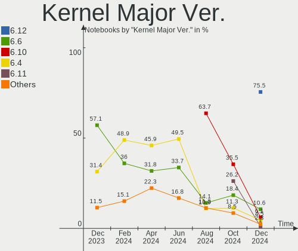
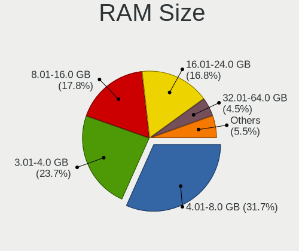
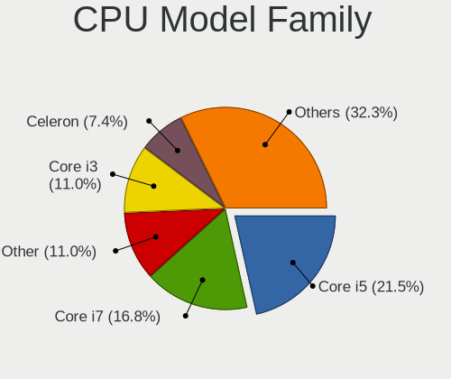
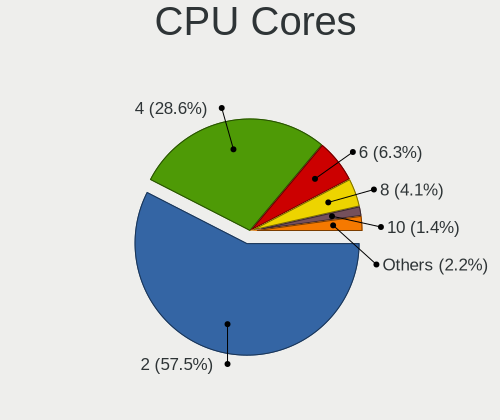
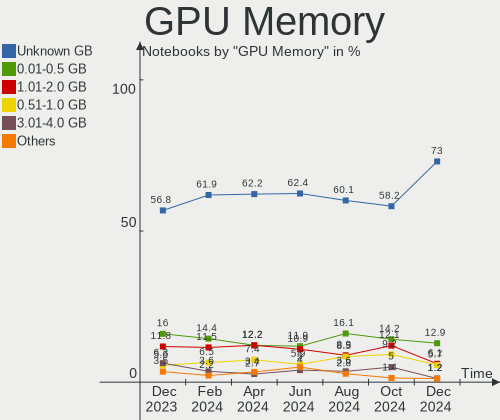

OpenMandriva - Hardware Trends (Notebooks)
------------------------------------------

A project to identify most popular hardware characteristics and track their change
over time based on data collected by Linux users at https://Linux-Hardware.org.

Anyone can contribute to this report by the [hw-probe](https://github.com/linuxhw/hw-probe) tool:

    sudo -E hw-probe -all -upload

This report is for one last month. Overall report since the beginning of time: [TestDays](https://github.com/linuxhw/TestDays)

Period: Jan, 2024.

Contents
--------

* [ System ](#system)
  - [ OS                       ](#os)
  - [ OS Family                ](#os-family)
  - [ Kernel                   ](#kernel)
  - [ Kernel Family            ](#kernel-family)
  - [ Kernel Major Ver.        ](#kernel-major-ver)
  - [ Arch                     ](#arch)
  - [ DE                       ](#de)
  - [ Display Server           ](#display-server)
  - [ Display Manager          ](#display-manager)
  - [ OS Lang                  ](#os-lang)
  - [ Boot Mode                ](#boot-mode)
  - [ Filesystem               ](#filesystem)
  - [ Part. scheme             ](#part-scheme)
  - [ Dual Boot with Linux/BSD ](#dual-boot-with-linuxbsd)
  - [ Dual Boot (Win)          ](#dual-boot-win)

* [ Board ](#board)
  - [ Vendor                   ](#vendor)
  - [ Model                    ](#model)
  - [ Model Family             ](#model-family)
  - [ MFG Year                 ](#mfg-year)
  - [ Form Factor              ](#form-factor)
  - [ Secure Boot              ](#secure-boot)
  - [ Coreboot                 ](#coreboot)
  - [ RAM Size                 ](#ram-size)
  - [ RAM Used                 ](#ram-used)
  - [ Total Drives             ](#total-drives)
  - [ Has CD-ROM               ](#has-cd-rom)
  - [ Has Ethernet             ](#has-ethernet)
  - [ Has WiFi                 ](#has-wifi)
  - [ Has Bluetooth            ](#has-bluetooth)

* [ Location ](#location)
  - [ Country                  ](#country)
  - [ City                     ](#city)

* [ Drives ](#drives)
  - [ Drive Vendor             ](#drive-vendor)
  - [ Drive Model              ](#drive-model)
  - [ HDD Vendor               ](#hdd-vendor)
  - [ SSD Vendor               ](#ssd-vendor)
  - [ Drive Kind               ](#drive-kind)
  - [ Drive Connector          ](#drive-connector)
  - [ Drive Size               ](#drive-size)
  - [ Space Total              ](#space-total)
  - [ Space Used               ](#space-used)
  - [ Malfunc. Drives          ](#malfunc-drives)
  - [ Malfunc. Drive Vendor    ](#malfunc-drive-vendor)
  - [ Malfunc. HDD Vendor      ](#malfunc-hdd-vendor)
  - [ Malfunc. Drive Kind      ](#malfunc-drive-kind)
  - [ Failed Drives            ](#failed-drives)
  - [ Failed Drive Vendor      ](#failed-drive-vendor)
  - [ Drive Status             ](#drive-status)

* [ Storage controller ](#storage-controller)
  - [ Storage Vendor           ](#storage-vendor)
  - [ Storage Model            ](#storage-model)
  - [ Storage Kind             ](#storage-kind)

* [ Processor ](#processor)
  - [ CPU Vendor               ](#cpu-vendor)
  - [ CPU Model                ](#cpu-model)
  - [ CPU Model Family         ](#cpu-model-family)
  - [ CPU Cores                ](#cpu-cores)
  - [ CPU Sockets              ](#cpu-sockets)
  - [ CPU Threads              ](#cpu-threads)
  - [ CPU Op-Modes             ](#cpu-op-modes)
  - [ CPU Microcode            ](#cpu-microcode)
  - [ CPU Microarch            ](#cpu-microarch)

* [ Graphics ](#graphics)
  - [ GPU Vendor               ](#gpu-vendor)
  - [ GPU Model                ](#gpu-model)
  - [ GPU Combo                ](#gpu-combo)
  - [ GPU Driver               ](#gpu-driver)
  - [ GPU Memory               ](#gpu-memory)

* [ Monitor ](#monitor)
  - [ Monitor Vendor           ](#monitor-vendor)
  - [ Monitor Model            ](#monitor-model)
  - [ Monitor Resolution       ](#monitor-resolution)
  - [ Monitor Diagonal         ](#monitor-diagonal)
  - [ Monitor Width            ](#monitor-width)
  - [ Aspect Ratio             ](#aspect-ratio)
  - [ Monitor Area             ](#monitor-area)
  - [ Pixel Density            ](#pixel-density)
  - [ Multiple Monitors        ](#multiple-monitors)

* [ Network ](#network)
  - [ Net Controller Vendor    ](#net-controller-vendor)
  - [ Net Controller Model     ](#net-controller-model)
  - [ Wireless Vendor          ](#wireless-vendor)
  - [ Wireless Model           ](#wireless-model)
  - [ Ethernet Vendor          ](#ethernet-vendor)
  - [ Ethernet Model           ](#ethernet-model)
  - [ Net Controller Kind      ](#net-controller-kind)
  - [ Used Controller          ](#used-controller)
  - [ NICs                     ](#nics)
  - [ IPv6                     ](#ipv6)

* [ Bluetooth ](#bluetooth)
  - [ Bluetooth Vendor         ](#bluetooth-vendor)
  - [ Bluetooth Model          ](#bluetooth-model)

* [ Sound ](#sound)
  - [ Sound Vendor             ](#sound-vendor)
  - [ Sound Model              ](#sound-model)

* [ Memory ](#memory)
  - [ Memory Vendor            ](#memory-vendor)
  - [ Memory Model             ](#memory-model)
  - [ Memory Kind              ](#memory-kind)
  - [ Memory Form Factor       ](#memory-form-factor)
  - [ Memory Size              ](#memory-size)
  - [ Memory Speed             ](#memory-speed)

* [ Printers & scanners ](#printers--scanners)
  - [ Printer Vendor           ](#printer-vendor)
  - [ Printer Model            ](#printer-model)
  - [ Scanner Vendor           ](#scanner-vendor)
  - [ Scanner Model            ](#scanner-model)

* [ Camera ](#camera)
  - [ Camera Vendor            ](#camera-vendor)
  - [ Camera Model             ](#camera-model)

* [ Security ](#security)
  - [ Fingerprint Vendor       ](#fingerprint-vendor)
  - [ Fingerprint Model        ](#fingerprint-model)
  - [ Chipcard Vendor          ](#chipcard-vendor)
  - [ Chipcard Model           ](#chipcard-model)

* [ Unsupported ](#unsupported)
  - [ Unsupported Devices      ](#unsupported-devices)
  - [ Unsupported Device Types ](#unsupported-device-types)

System
------

OS
--

Installed operating systems

| Name               | Notebooks | Percent |
|--------------------|-----------|---------|
| OpenMandriva 23.08 | 54        | 32.53%  |
| OpenMandriva 5.0   | 52        | 31.33%  |
| OpenMandriva 24.01 | 26        | 15.66%  |
| OpenMandriva 23.11 | 8         | 4.82%   |
| OpenMandriva 23.03 | 7         | 4.22%   |
| OpenMandriva 4.3   | 6         | 3.61%   |
| OpenMandriva 4.2   | 5         | 3.01%   |
| OpenMandriva 23.01 | 3         | 1.81%   |
| OpenMandriva 23.90 | 2         | 1.2%    |
| OpenMandriva 24.90 | 1         | 0.6%    |
| OpenMandriva 23.06 | 1         | 0.6%    |
| OpenMandriva 22.12 | 1         | 0.6%    |

OS Family
---------

OS without a version

| Name         | Notebooks | Percent |
|--------------|-----------|---------|
| OpenMandriva | 166       | 100%    |

Kernel
------

Version of the Linux kernel

| Version                  | Notebooks | Percent |
|--------------------------|-----------|---------|
| 6.6.2-desktop-1omv2390   | 82        | 49.4%   |
| 6.4.11-desktop-1omv2390  | 51        | 30.72%  |
| 6.2.6-desktop-1omv2390   | 7         | 4.22%   |
| 6.4.8-desktop-2omv2390   | 5         | 3.01%   |
| 5.10.14-desktop-1omv4002 | 5         | 3.01%   |
| 6.1.1-desktop-1omv2290   | 3         | 1.81%   |
| 5.16.7-desktop-1omv4003  | 3         | 1.81%   |
| 6.6.1-desktop-1omv2390   | 2         | 1.2%    |
| 5.16.13-desktop-1omv4003 | 2         | 1.2%    |
| 6.6.7-desktop-1omv2390   | 1         | 0.6%    |
| 6.6.0-desktop-1omv2390   | 1         | 0.6%    |
| 6.4.7-desktop-1omv2390   | 1         | 0.6%    |
| 6.3.5-desktop-3omv2390   | 1         | 0.6%    |
| 6.0.10-desktop-2omv22090 | 1         | 0.6%    |
| 5.14.14-desktop-1omv4050 | 1         | 0.6%    |

Kernel Family
-------------

Linux kernel without a distro release

| Version | Notebooks | Percent |
|---------|-----------|---------|
| 6.6.2   | 82        | 49.4%   |
| 6.4.11  | 51        | 30.72%  |
| 6.2.6   | 7         | 4.22%   |
| 6.4.8   | 5         | 3.01%   |
| 5.10.14 | 5         | 3.01%   |
| 6.1.1   | 3         | 1.81%   |
| 5.16.7  | 3         | 1.81%   |
| 6.6.1   | 2         | 1.2%    |
| 5.16.13 | 2         | 1.2%    |
| 6.6.7   | 1         | 0.6%    |
| 6.6.0   | 1         | 0.6%    |
| 6.4.7   | 1         | 0.6%    |
| 6.3.5   | 1         | 0.6%    |
| 6.0.10  | 1         | 0.6%    |
| 5.14.14 | 1         | 0.6%    |

Kernel Major Ver.
-----------------

Linux kernel major version

| Version | Notebooks | Percent |
|---------|-----------|---------|
| 6.6     | 86        | 51.81%  |
| 6.4     | 57        | 34.34%  |
| 6.2     | 7         | 4.22%   |
| 5.16    | 5         | 3.01%   |
| 5.10    | 5         | 3.01%   |
| 6.1     | 3         | 1.81%   |
| 6.3     | 1         | 0.6%    |
| 6.0     | 1         | 0.6%    |
| 5.14    | 1         | 0.6%    |

Arch
----

OS architecture (x86_64, i586, etc.)

| Name   | Notebooks | Percent |
|--------|-----------|---------|
| x86_64 | 166       | 100%    |

DE
--

Desktop Environment

| Name     | Notebooks | Percent |
|----------|-----------|---------|
| KDE5     | 137       | 82.53%  |
| LXQt     | 15        | 9.04%   |
| GNOME    | 13        | 7.83%   |
| Cinnamon | 1         | 0.6%    |

Display Server
--------------

X11 or Wayland

| Name    | Notebooks | Percent |
|---------|-----------|---------|
| Wayland | 139       | 83.73%  |
| X11     | 27        | 16.27%  |

Display Manager
---------------

SDDM, LightDM, etc.

| Name | Notebooks | Percent |
|------|-----------|---------|
| SDDM | 153       | 92.17%  |
| GDM  | 13        | 7.83%   |

OS Lang
-------

Language

| Lang  | Notebooks | Percent |
|-------|-----------|---------|
| en_US | 77        | 46.39%  |
| fr_FR | 15        | 9.04%   |
| pl_PL | 12        | 7.23%   |
| de_DE | 11        | 6.63%   |
| ru_RU | 9         | 5.42%   |
| en_GB | 9         | 5.42%   |
| pt_BR | 8         | 4.82%   |
| it_IT | 6         | 3.61%   |
| cs_CZ | 5         | 3.01%   |
| pt_PT | 2         | 1.2%    |
| en_HK | 2         | 1.2%    |
| UTF-8 | 1         | 0.6%    |
| tr_TR | 1         | 0.6%    |
| fr_CH | 1         | 0.6%    |
| es_MX | 1         | 0.6%    |
| es_ES | 1         | 0.6%    |
| es_CO | 1         | 0.6%    |
| es_CL | 1         | 0.6%    |
| es_AR | 1         | 0.6%    |
| en_AU | 1         | 0.6%    |
| de_LU | 1         | 0.6%    |

Boot Mode
---------

EFI or BIOS

| Mode | Notebooks | Percent |
|------|-----------|---------|
| EFI  | 104       | 62.65%  |
| BIOS | 62        | 37.35%  |

Filesystem
----------

Type of filesystem

| Type    | Notebooks | Percent |
|---------|-----------|---------|
| Ext4    | 81        | 48.8%   |
| Overlay | 76        | 45.78%  |
| Btrfs   | 7         | 4.22%   |
| Xfs     | 2         | 1.2%    |

Part. scheme
------------

Scheme of partitioning

| Type | Notebooks | Percent |
|------|-----------|---------|
| GPT  | 126       | 75.9%   |
| MBR  | 40        | 24.1%   |

Dual Boot with Linux/BSD
------------------------

Hosting more than one Linux/BSD

| Dual boot | Notebooks | Percent |
|-----------|-----------|---------|
| No        | 95        | 57.23%  |
| Yes       | 71        | 42.77%  |

Dual Boot (Win)
---------------

Hosting Linux and Windows

| Dual boot | Notebooks | Percent |
|-----------|-----------|---------|
| No        | 98        | 59.04%  |
| Yes       | 68        | 40.96%  |

Board
-----

Vendor
------

Motherboard manufacturer

| Name                | Notebooks | Percent |
|---------------------|-----------|---------|
| Lenovo              | 37        | 22.29%  |
| Hewlett-Packard     | 37        | 22.29%  |
| Dell                | 21        | 12.65%  |
| Acer                | 16        | 9.64%   |
| ASUSTek Computer    | 15        | 9.04%   |
| Toshiba             | 5         | 3.01%   |
| Samsung Electronics | 4         | 2.41%   |
| Sony                | 3         | 1.81%   |
| MSI                 | 3         | 1.81%   |
| Positivo            | 2         | 1.2%    |
| LG Electronics      | 2         | 1.2%    |
| GPU Company         | 2         | 1.2%    |
| Google              | 2         | 1.2%    |
| eMachines           | 2         | 1.2%    |
| Apple               | 2         | 1.2%    |
| Unknown             | 2         | 1.2%    |
| TUXEDO              | 1         | 0.6%    |
| Razer               | 1         | 0.6%    |
| Packard Bell        | 1         | 0.6%    |
| HUAWEI              | 1         | 0.6%    |
| Hampoo              | 1         | 0.6%    |
| Gateway             | 1         | 0.6%    |
| Fujitsu Siemens     | 1         | 0.6%    |
| Fujitsu             | 1         | 0.6%    |
| Evolute             | 1         | 0.6%    |
| Compaq              | 1         | 0.6%    |
| ARCELIK             | 1         | 0.6%    |

Model
-----

Motherboard model

| Name                                        | Notebooks | Percent |
|---------------------------------------------|-----------|---------|
| HP Compaq 6730s                             | 2         | 1.2%    |
| GPU Company GWNR71517                       | 2         | 1.2%    |
| Google Garg                                 | 2         | 1.2%    |
| Acer Aspire ES1-572                         | 2         | 1.2%    |
| Unknown                                     | 2         | 1.2%    |
| TUXEDO Book BM15 Gen10                      | 1         | 0.6%    |
| Toshiba Satellite L55D-B                    | 1         | 0.6%    |
| Toshiba Satellite C660                      | 1         | 0.6%    |
| Toshiba Satellite C650                      | 1         | 0.6%    |
| Toshiba Portable PC                         | 1         | 0.6%    |
| Toshiba dynabook Satellite B552/H           | 1         | 0.6%    |
| Sony VPCF12A4E                              | 1         | 0.6%    |
| Sony VGN-FZ31Z                              | 1         | 0.6%    |
| Sony SVF1521A6EW                            | 1         | 0.6%    |
| Samsung X420/X520                           | 1         | 0.6%    |
| Samsung RV411/RV511/E3511/S3511/RV711/E3411 | 1         | 0.6%    |
| Samsung 300E5M/300E5L                       | 1         | 0.6%    |
| Samsung 270E5K/270E5Q/271E5K/2570EK         | 1         | 0.6%    |
| Razer Book 13 - RZ09-0357                   | 1         | 0.6%    |
| Positivo SF37405                            | 1         | 0.6%    |
| Positivo Mobile                             | 1         | 0.6%    |
| Packard Bell EasyNote ENLG71BM              | 1         | 0.6%    |
| MSI Modern 14 B4MW                          | 1         | 0.6%    |
| MSI GF63 Thin 10SC                          | 1         | 0.6%    |
| MSI Bravo 15 B5DD                           | 1         | 0.6%    |
| LG E500-SP13G                               | 1         | 0.6%    |
| LG 15Z90RT-K.AD7AA1                         | 1         | 0.6%    |
| Lenovo Yoga 300-11IBR 80M1                  | 1         | 0.6%    |
| Lenovo ThinkPad X270 W10DG 20K5S3HG00       | 1         | 0.6%    |
| Lenovo ThinkPad X230 2330A17                | 1         | 0.6%    |
| Lenovo ThinkPad X220 Tablet 42992PG         | 1         | 0.6%    |
| Lenovo ThinkPad T60 1951YCQ                 | 1         | 0.6%    |
| Lenovo ThinkPad T490 20N3S5GM00             | 1         | 0.6%    |
| Lenovo ThinkPad T480 20L6S6KF00             | 1         | 0.6%    |
| Lenovo ThinkPad T480 20L5000BMX             | 1         | 0.6%    |
| Lenovo ThinkPad T470s W10DG 20JTS2QA00      | 1         | 0.6%    |
| Lenovo ThinkPad T470s W10DG 20JTS1MR08      | 1         | 0.6%    |
| Lenovo ThinkPad T450s 20BWS05V00            | 1         | 0.6%    |
| Lenovo ThinkPad T430 2347A81                | 1         | 0.6%    |
| Lenovo ThinkPad T400 6474W7T                | 1         | 0.6%    |

Model Family
------------

Motherboard model prefix

| Name                  | Notebooks | Percent |
|-----------------------|-----------|---------|
| Lenovo ThinkPad       | 15        | 9.04%   |
| Lenovo IdeaPad        | 13        | 7.83%   |
| Acer Aspire           | 12        | 7.23%   |
| Dell Inspiron         | 10        | 6.02%   |
| HP EliteBook          | 7         | 4.22%   |
| Dell Latitude         | 7         | 4.22%   |
| HP ProBook            | 5         | 3.01%   |
| ASUS VivoBook         | 5         | 3.01%   |
| HP Pavilion           | 4         | 2.41%   |
| HP Compaq             | 4         | 2.41%   |
| Toshiba Satellite     | 3         | 1.81%   |
| HP Presario           | 3         | 1.81%   |
| HP Stream             | 2         | 1.2%    |
| HP Laptop             | 2         | 1.2%    |
| HP 250                | 2         | 1.2%    |
| GPU Company GWNR71517 | 2         | 1.2%    |
| Google Garg           | 2         | 1.2%    |
| ASUS ROG              | 2         | 1.2%    |
| Acer Extensa          | 2         | 1.2%    |
| Unknown               | 2         | 1.2%    |
| TUXEDO Book           | 1         | 0.6%    |
| Toshiba Portable      | 1         | 0.6%    |
| Toshiba dynabook      | 1         | 0.6%    |
| Sony VPCF12A4E        | 1         | 0.6%    |
| Sony VGN-FZ31Z        | 1         | 0.6%    |
| Sony SVF1521A6EW      | 1         | 0.6%    |
| Samsung X420          | 1         | 0.6%    |
| Samsung RV411         | 1         | 0.6%    |
| Samsung 300E5M        | 1         | 0.6%    |
| Samsung 270E5K        | 1         | 0.6%    |
| Razer Book            | 1         | 0.6%    |
| Positivo SF37405      | 1         | 0.6%    |
| Positivo Mobile       | 1         | 0.6%    |
| Packard Bell EasyNote | 1         | 0.6%    |
| MSI Modern            | 1         | 0.6%    |
| MSI GF63              | 1         | 0.6%    |
| MSI Bravo             | 1         | 0.6%    |
| LG E500-SP13G         | 1         | 0.6%    |
| LG 15Z90RT-K.AD7AA1   | 1         | 0.6%    |
| Lenovo Yoga           | 1         | 0.6%    |

MFG Year
--------

Motherboard manufacture year

| Year | Notebooks | Percent |
|------|-----------|---------|
| 2021 | 19        | 11.45%  |
| 2015 | 13        | 7.83%   |
| 2014 | 13        | 7.83%   |
| 2011 | 13        | 7.83%   |
| 2018 | 12        | 7.23%   |
| 2017 | 12        | 7.23%   |
| 2010 | 12        | 7.23%   |
| 2016 | 11        | 6.63%   |
| 2012 | 11        | 6.63%   |
| 2007 | 9         | 5.42%   |
| 2020 | 8         | 4.82%   |
| 2023 | 6         | 3.61%   |
| 2019 | 6         | 3.61%   |
| 2013 | 6         | 3.61%   |
| 2008 | 6         | 3.61%   |
| 2022 | 4         | 2.41%   |
| 2009 | 4         | 2.41%   |
| 2006 | 1         | 0.6%    |

Form Factor
-----------

Physical design of the computer

| Name     | Notebooks | Percent |
|----------|-----------|---------|
| Notebook | 166       | 100%    |

Secure Boot
-----------

Enabled or disabled

| State    | Notebooks | Percent |
|----------|-----------|---------|
| Disabled | 166       | 100%    |

Coreboot
--------

Have coreboot on board

| Used | Notebooks | Percent |
|------|-----------|---------|
| No   | 164       | 98.8%   |
| Yes  | 2         | 1.2%    |

RAM Size
--------

Total RAM memory

| Size in GB  | Notebooks | Percent |
|-------------|-----------|---------|
| 3.01-4.0    | 48        | 28.92%  |
| 4.01-8.0    | 42        | 25.3%   |
| 8.01-16.0   | 28        | 16.87%  |
| 16.01-24.0  | 25        | 15.06%  |
| 1.01-2.0    | 12        | 7.23%   |
| 2.01-3.0    | 7         | 4.22%   |
| 32.01-64.0  | 2         | 1.2%    |
| 24.01-32.0  | 1         | 0.6%    |
| 64.01-256.0 | 1         | 0.6%    |

RAM Used
--------

Used RAM memory

| Used GB  | Notebooks | Percent |
|----------|-----------|---------|
| 1.01-2.0 | 104       | 62.65%  |
| 2.01-3.0 | 34        | 20.48%  |
| 0.51-1.0 | 17        | 10.24%  |
| 3.01-4.0 | 7         | 4.22%   |
| 0.01-0.5 | 3         | 1.81%   |
| 4.01-8.0 | 1         | 0.6%    |

Total Drives
------------

Number of drives on board

| Drives | Notebooks | Percent |
|--------|-----------|---------|
| 1      | 123       | 74.1%   |
| 2      | 35        | 21.08%  |
| 3      | 5         | 3.01%   |
| 0      | 2         | 1.2%    |
| 13     | 1         | 0.6%    |

Has CD-ROM
----------

Has CD-ROM on board

| Presented | Notebooks | Percent |
|-----------|-----------|---------|
| No        | 93        | 56.02%  |
| Yes       | 73        | 43.98%  |

Has Ethernet
------------

Has Ethernet on board

| Presented | Notebooks | Percent |
|-----------|-----------|---------|
| Yes       | 139       | 83.73%  |
| No        | 27        | 16.27%  |

Has WiFi
--------

Has WiFi module

| Presented | Notebooks | Percent |
|-----------|-----------|---------|
| Yes       | 161       | 96.99%  |
| No        | 5         | 3.01%   |

Has Bluetooth
-------------

Has Bluetooth module

| Presented | Notebooks | Percent |
|-----------|-----------|---------|
| Yes       | 124       | 74.7%   |
| No        | 42        | 25.3%   |

Location
--------

Country
-------

Geographic location (country)

| Country         | Notebooks | Percent |
|-----------------|-----------|---------|
| USA             | 28        | 16.87%  |
| Germany         | 18        | 10.84%  |
| Brazil          | 14        | 8.43%   |
| Poland          | 13        | 7.83%   |
| France          | 12        | 7.23%   |
| Russia          | 10        | 6.02%   |
| UK              | 9         | 5.42%   |
| Italy           | 8         | 4.82%   |
| Czechia         | 7         | 4.22%   |
| Portugal        | 4         | 2.41%   |
| Turkey          | 3         | 1.81%   |
| Mexico          | 3         | 1.81%   |
| Japan           | 3         | 1.81%   |
| Indonesia       | 3         | 1.81%   |
| Canada          | 3         | 1.81%   |
| Australia       | 3         | 1.81%   |
| Spain           | 2         | 1.2%    |
| India           | 2         | 1.2%    |
| Hungary         | 2         | 1.2%    |
| Finland         | 2         | 1.2%    |
| Colombia        | 2         | 1.2%    |
| The Netherlands | 1         | 0.6%    |
| Switzerland     | 1         | 0.6%    |
| South Africa    | 1         | 0.6%    |
| Saudi Arabia    | 1         | 0.6%    |
| Réunion        | 1         | 0.6%    |
| Morocco         | 1         | 0.6%    |
| Lebanon         | 1         | 0.6%    |
| Hong Kong       | 1         | 0.6%    |
| Grenada         | 1         | 0.6%    |
| Greece          | 1         | 0.6%    |
| Chile           | 1         | 0.6%    |
| Belgium         | 1         | 0.6%    |
| Bangladesh      | 1         | 0.6%    |
| Argentina       | 1         | 0.6%    |
| Algeria         | 1         | 0.6%    |

City
----

Geographic location (city)

| City             | Notebooks | Percent |
|------------------|-----------|---------|
| Prague           | 4         | 2.41%   |
| Sydney           | 2         | 1.2%    |
| Salvador         | 2         | 1.2%    |
| Rome             | 2         | 1.2%    |
| Portland         | 2         | 1.2%    |
| Newham           | 2         | 1.2%    |
| Milan            | 2         | 1.2%    |
| Krakow           | 2         | 1.2%    |
| Katowice         | 2         | 1.2%    |
| Jakarta          | 2         | 1.2%    |
| Carcassonne      | 2         | 1.2%    |
| Berlin           | 2         | 1.2%    |
| Barreiro         | 2         | 1.2%    |
| Zagarolo         | 1         | 0.6%    |
| Ypsilanti        | 1         | 0.6%    |
| Yoshkar-Ola      | 1         | 0.6%    |
| Yokohama         | 1         | 0.6%    |
| Wroclaw          | 1         | 0.6%    |
| Worth            | 1         | 0.6%    |
| Worksop          | 1         | 0.6%    |
| Windsor          | 1         | 0.6%    |
| Warsaw           | 1         | 0.6%    |
| Walhain          | 1         | 0.6%    |
| Uberlingen       | 1         | 0.6%    |
| Tyarlevo         | 1         | 0.6%    |
| Treguaco         | 1         | 0.6%    |
| Torremolinos     | 1         | 0.6%    |
| Toronto          | 1         | 0.6%    |
| Tonypandy        | 1         | 0.6%    |
| Tehuacán        | 1         | 0.6%    |
| Słupsk          | 1         | 0.6%    |
| Stuttgart        | 1         | 0.6%    |
| Strasbourg       | 1         | 0.6%    |
| Sterling Heights | 1         | 0.6%    |
| Starkville       | 1         | 0.6%    |
| St Petersburg    | 1         | 0.6%    |
| St Helens        | 1         | 0.6%    |
| Spresiano        | 1         | 0.6%    |
| Sopot            | 1         | 0.6%    |
| Shinkocho        | 1         | 0.6%    |

Drives
------

Drive Vendor
------------

Hard drive vendors

| Vendor                      | Notebooks | Drives | Percent |
|-----------------------------|-----------|--------|---------|
| WDC                         | 35        | 35     | 17.41%  |
| Seagate                     | 17        | 17     | 8.46%   |
| Samsung Electronics         | 17        | 24     | 8.46%   |
| SanDisk                     | 15        | 15     | 7.46%   |
| Toshiba                     | 12        | 12     | 5.97%   |
| Unknown                     | 10        | 13     | 4.98%   |
| Hitachi                     | 10        | 10     | 4.98%   |
| Kingston                    | 8         | 8      | 3.98%   |
| SK hynix                    | 6         | 7      | 2.99%   |
| Crucial                     | 6         | 6      | 2.99%   |
| HGST                        | 5         | 5      | 2.49%   |
| Unknown                     | 5         | 5      | 2.49%   |
| Micron Technology           | 4         | 6      | 1.99%   |
| China                       | 4         | 4      | 1.99%   |
| LITEONIT                    | 3         | 3      | 1.49%   |
| JMicron Technology          | 3         | 3      | 1.49%   |
| Intenso                     | 3         | 3      | 1.49%   |
| Wibtek                      | 2         | 2      | 1%      |
| USB3.0                      | 2         | 2      | 1%      |
| SSSTC                       | 2         | 2      | 1%      |
| SPCC                        | 2         | 2      | 1%      |
| Leven                       | 2         | 2      | 1%      |
| Kingston Technology Company | 2         | 2      | 1%      |
| Intel                       | 2         | 2      | 1%      |
| Fujitsu                     | 2         | 2      | 1%      |
| WDC WDS                     | 1         | 1      | 0.5%    |
| V-GeN                       | 1         | 2      | 0.5%    |
| USB                         | 1         | 1      | 0.5%    |
| Silicon Motion              | 1         | 1      | 0.5%    |
| Realtek                     | 1         | 1      | 0.5%    |
| Phison Electronics          | 1         | 1      | 0.5%    |
| Patriot                     | 1         | 1      | 0.5%    |
| OCZ                         | 1         | 1      | 0.5%    |
| MSI                         | 1         | 1      | 0.5%    |
| LITEON                      | 1         | 1      | 0.5%    |
| Lexar                       | 1         | 1      | 0.5%    |
| Lenovo                      | 1         | 1      | 0.5%    |
| KingSpec                    | 1         | 1      | 0.5%    |
| Hewlett-Packard             | 1         | 1      | 0.5%    |
| GOODRAM                     | 1         | 1      | 0.5%    |

Drive Model
-----------

Hard drive models

| Model                                | Notebooks | Percent |
|--------------------------------------|-----------|---------|
| Unknown                              | 5         | 2.42%   |
| Toshiba MQ04ABF100 1TB               | 4         | 1.93%   |
| Seagate ST500LM012 HN-M500MBB 500GB  | 3         | 1.45%   |
| Seagate ST1000LM024 HN-M101MBB 1TB   | 3         | 1.45%   |
| SanDisk NVMe SSD Drive 1TB           | 3         | 1.45%   |
| JMicron Tech 250GB                   | 3         | 1.45%   |
| Wibtek W800S 512GB SSD               | 2         | 0.97%   |
| WDC WD10JPCX-24UE4T0 1TB             | 2         | 0.97%   |
| WDC PC SN530 SDBPNPZ-256G-1002 256GB | 2         | 0.97%   |
| USB3.0 Super Speed 500GB SSD         | 2         | 0.97%   |
| Toshiba MQ01ABD100 1TB               | 2         | 0.97%   |
| Seagate ST500LT012-1DG142 500GB      | 2         | 0.97%   |
| Seagate ST500LM021-1KJ152 500GB      | 2         | 0.97%   |
| Samsung SSD 840 EVO 250GB            | 2         | 0.97%   |
| Kingston SV300S37A120G 120GB SSD     | 2         | 0.97%   |
| Intenso SSD 1TB                      | 2         | 0.97%   |
| Hitachi HTS545050B9A300 500GB        | 2         | 0.97%   |
| Hitachi HTS545032B9A300 320GB        | 2         | 0.97%   |
| HGST HTS545050A7E680 500GB           | 2         | 0.97%   |
| HGST HTS541010A9E680 1TB             | 2         | 0.97%   |
| Crucial CT480BX500SSD1 480GB         | 2         | 0.97%   |
| WDC WDS480G2G0C-00AJM0 480GB         | 1         | 0.48%   |
| WDC WDS240G2G0A-00JH30 240GB SSD     | 1         | 0.48%   |
| WDC WDS100T3X0C-00SJG0 1TB           | 1         | 0.48%   |
| WDC WDS100T2B0C-00PXH0 1TB           | 1         | 0.48%   |
| WDC WDS 100T1R0A-68A4W0 1TB SSD      | 1         | 0.48%   |
| WDC WD7500BPVX-22JC3T0 752GB         | 1         | 0.48%   |
| WDC WD7500BPVX-16JC3T3 752GB         | 1         | 0.48%   |
| WDC WD7500BPVT-22HXZT3 752GB         | 1         | 0.48%   |
| WDC WD7500BPVT-08HXZT3 752GB         | 1         | 0.48%   |
| WDC WD5000LUCT-63RC2Y0 500GB         | 1         | 0.48%   |
| WDC WD5000LPZX-22Z10T0 500GB         | 1         | 0.48%   |
| WDC WD5000LPVX-80V0TT0 500GB         | 1         | 0.48%   |
| WDC WD5000LPVX-60V0TT0 500GB         | 1         | 0.48%   |
| WDC WD5000LPVT-22G33T0 500GB         | 1         | 0.48%   |
| WDC WD5000LPCX-75VHAT1 500GB         | 1         | 0.48%   |
| WDC WD5000LPCX-00VHAT0 500GB         | 1         | 0.48%   |
| WDC WD5000BPVT-00HXZT3 500GB         | 1         | 0.48%   |
| WDC WD3200BPVT-22JJ5T0 320GB         | 1         | 0.48%   |
| WDC WD3200BPVT-00ZEST0 320GB         | 1         | 0.48%   |

HDD Vendor
----------

Hard disk drive vendors

| Vendor  | Notebooks | Drives | Percent |
|---------|-----------|--------|---------|
| WDC     | 24        | 24     | 35.29%  |
| Seagate | 17        | 17     | 25%     |
| Toshiba | 10        | 10     | 14.71%  |
| Hitachi | 10        | 10     | 14.71%  |
| HGST    | 5         | 5      | 7.35%   |
| Fujitsu | 2         | 2      | 2.94%   |

SSD Vendor
----------

Solid state drive vendors

| Vendor              | Notebooks | Drives | Percent |
|---------------------|-----------|--------|---------|
| Samsung Electronics | 11        | 14     | 16.42%  |
| SanDisk             | 9         | 9      | 13.43%  |
| Crucial             | 6         | 6      | 8.96%   |
| Kingston            | 4         | 4      | 5.97%   |
| China               | 4         | 4      | 5.97%   |
| LITEONIT            | 3         | 3      | 4.48%   |
| Wibtek              | 2         | 2      | 2.99%   |
| WDC                 | 2         | 2      | 2.99%   |
| USB3.0              | 2         | 2      | 2.99%   |
| Micron Technology   | 2         | 4      | 2.99%   |
| Leven               | 2         | 2      | 2.99%   |
| Intenso             | 2         | 2      | 2.99%   |
| WDC WDS             | 1         | 1      | 1.49%   |
| V-GeN               | 1         | 2      | 1.49%   |
| USB                 | 1         | 1      | 1.49%   |
| Toshiba             | 1         | 1      | 1.49%   |
| SPCC                | 1         | 1      | 1.49%   |
| SK hynix            | 1         | 1      | 1.49%   |
| Patriot             | 1         | 1      | 1.49%   |
| OCZ                 | 1         | 1      | 1.49%   |
| LITEON              | 1         | 1      | 1.49%   |
| KingSpec            | 1         | 1      | 1.49%   |
| Intel               | 1         | 1      | 1.49%   |
| Hewlett-Packard     | 1         | 1      | 1.49%   |
| GOODRAM             | 1         | 1      | 1.49%   |
| Fanxiang            | 1         | 1      | 1.49%   |
| Digma               | 1         | 1      | 1.49%   |
| DEXP                | 1         | 1      | 1.49%   |
| BAITITON            | 1         | 1      | 1.49%   |
| A-DATA Technology   | 1         | 1      | 1.49%   |

Drive Kind
----------

HDD or SSD

| Kind    | Notebooks | Drives | Percent |
|---------|-----------|--------|---------|
| HDD     | 68        | 68     | 36.96%  |
| SSD     | 59        | 73     | 32.07%  |
| NVMe    | 38        | 49     | 20.65%  |
| MMC     | 16        | 21     | 8.7%    |
| Unknown | 3         | 4      | 1.63%   |

Drive Connector
---------------

SATA, SAS, NVMe, etc.

| Type | Notebooks | Drives | Percent |
|------|-----------|--------|---------|
| SATA | 119       | 129    | 64.67%  |
| NVMe | 37        | 43     | 20.11%  |
| MMC  | 16        | 21     | 8.7%    |
| SAS  | 12        | 22     | 6.52%   |

Drive Size
----------

Size of hard drive

| Size in TB | Notebooks | Drives | Percent |
|------------|-----------|--------|---------|
| 0.01-0.5   | 86        | 91     | 66.67%  |
| 0.51-1.0   | 41        | 46     | 31.78%  |
| 3.01-4.0   | 1         | 2      | 0.78%   |
| 1.01-2.0   | 1         | 2      | 0.78%   |

Space Total
-----------

Amount of disk space available on the file system

| Size in GB     | Notebooks | Percent |
|----------------|-----------|---------|
| 1-20           | 53        | 31.93%  |
| 101-250        | 27        | 16.27%  |
| 251-500        | 26        | 15.66%  |
| 501-1000       | 17        | 10.24%  |
| 21-50          | 14        | 8.43%   |
| 51-100         | 12        | 7.23%   |
| Unknown        | 10        | 6.02%   |
| 1001-2000      | 6         | 3.61%   |
| More than 3000 | 1         | 0.6%    |

Space Used
----------

Amount of used disk space

| Used GB  | Notebooks | Percent |
|----------|-----------|---------|
| 1-20     | 128       | 77.11%  |
| 21-50    | 13        | 7.83%   |
| Unknown  | 10        | 6.02%   |
| 51-100   | 5         | 3.01%   |
| 101-250  | 3         | 1.81%   |
| 501-1000 | 3         | 1.81%   |
| 251-500  | 2         | 1.2%    |
| 0        | 2         | 1.2%    |

Malfunc. Drives
---------------

Drive models with a malfunction

| Model                               | Notebooks | Drives | Percent |
|-------------------------------------|-----------|--------|---------|
| Seagate ST1000LM024 HN-M101MBB 1TB  | 2         | 2      | 5.88%   |
| Wibtek W800S 512GB SSD              | 1         | 1      | 2.94%   |
| WDC WD7500BPVT-22HXZT3 752GB        | 1         | 1      | 2.94%   |
| WDC WD7500BPVT-08HXZT3 752GB        | 1         | 1      | 2.94%   |
| WDC WD5000LPVX-80V0TT0 500GB        | 1         | 1      | 2.94%   |
| WDC WD5000LPVX-60V0TT0 500GB        | 1         | 1      | 2.94%   |
| WDC WD5000BPVT-00HXZT3 500GB        | 1         | 1      | 2.94%   |
| WDC WD3200BEKT-22A25T1 320GB        | 1         | 1      | 2.94%   |
| WDC WD2500BEVT-22ZCT0 250GB         | 1         | 1      | 2.94%   |
| WDC WD2500BEVT-22A23T0 250GB        | 1         | 1      | 2.94%   |
| WDC WD1600BEVT-60ZCT0 160GB         | 1         | 1      | 2.94%   |
| WDC WD1600BEVT-22ZCT0 160GB         | 1         | 1      | 2.94%   |
| WDC WD1600BEKT-00F3T0 160GB         | 1         | 1      | 2.94%   |
| Toshiba MQ04ABF100 1TB              | 1         | 1      | 2.94%   |
| Seagate ST9500325AS 500GB           | 1         | 1      | 2.94%   |
| Seagate ST500LT012-1DG142 500GB     | 1         | 1      | 2.94%   |
| Seagate ST500LM012 HN-M500MBB 500GB | 1         | 1      | 2.94%   |
| Seagate ST320LT007-9ZV142 320GB     | 1         | 1      | 2.94%   |
| LITEONIT LMS-32L6M-HP 32GB SSD      | 1         | 1      | 2.94%   |
| LITEONIT LAT-128M2S 128GB SSD       | 1         | 1      | 2.94%   |
| Kingston SA400S37480G 480GB SSD     | 1         | 1      | 2.94%   |
| JMicron Technology Tech 250GB       | 1         | 1      | 2.94%   |
| Intel SSDSA2M080G2GC 80GB           | 1         | 1      | 2.94%   |
| Hitachi HTS547564A9E384 640GB       | 1         | 1      | 2.94%   |
| Hitachi HTS545050B9A300 500GB       | 1         | 1      | 2.94%   |
| Hitachi HTS545032B9A300 320GB       | 1         | 1      | 2.94%   |
| Hitachi HTS542516K9SA00 160GB       | 1         | 1      | 2.94%   |
| Hitachi HTS541680J9SA00 80GB        | 1         | 1      | 2.94%   |
| HGST HTS545050A7E680 500GB          | 1         | 1      | 2.94%   |
| HGST HTS545050A7E380 500GB          | 1         | 1      | 2.94%   |
| HGST HTS541010A9E680 1TB            | 1         | 1      | 2.94%   |
| Crucial CT275MX300SSD1 275GB        | 1         | 1      | 2.94%   |
| Crucial CT240M500SSD1 240GB         | 1         | 1      | 2.94%   |

Malfunc. Drive Vendor
---------------------

Vendors of faulty drives

| Vendor             | Notebooks | Drives | Percent |
|--------------------|-----------|--------|---------|
| WDC                | 11        | 11     | 32.35%  |
| Seagate            | 6         | 6      | 17.65%  |
| Hitachi            | 5         | 5      | 14.71%  |
| HGST               | 3         | 3      | 8.82%   |
| LITEONIT           | 2         | 2      | 5.88%   |
| Crucial            | 2         | 2      | 5.88%   |
| Wibtek             | 1         | 1      | 2.94%   |
| Toshiba            | 1         | 1      | 2.94%   |
| Kingston           | 1         | 1      | 2.94%   |
| JMicron Technology | 1         | 1      | 2.94%   |
| Intel              | 1         | 1      | 2.94%   |

Malfunc. HDD Vendor
-------------------

Vendors of faulty HDD drives

| Vendor  | Notebooks | Drives | Percent |
|---------|-----------|--------|---------|
| WDC     | 11        | 11     | 42.31%  |
| Seagate | 6         | 6      | 23.08%  |
| Hitachi | 5         | 5      | 19.23%  |
| HGST    | 3         | 3      | 11.54%  |
| Toshiba | 1         | 1      | 3.85%   |

Malfunc. Drive Kind
-------------------

Kinds of faulty drives

| Kind    | Notebooks | Drives | Percent |
|---------|-----------|--------|---------|
| HDD     | 26        | 26     | 76.47%  |
| SSD     | 7         | 7      | 20.59%  |
| Unknown | 1         | 1      | 2.94%   |

Failed Drives
-------------

Failed drive models

| Model                    | Notebooks | Drives | Percent |
|--------------------------|-----------|--------|---------|
| Toshiba MQ01ABD050 500GB | 1         | 1      | 100%    |

Failed Drive Vendor
-------------------

Failed drive vendors

| Vendor  | Notebooks | Drives | Percent |
|---------|-----------|--------|---------|
| Toshiba | 1         | 1      | 100%    |

Drive Status
------------

Number of failed and malfunc. drives

| Status   | Notebooks | Drives | Percent |
|----------|-----------|--------|---------|
| Works    | 121       | 143    | 66.85%  |
| Malfunc  | 33        | 34     | 18.23%  |
| Detected | 26        | 37     | 14.36%  |
| Failed   | 1         | 1      | 0.55%   |

Storage controller
------------------

Storage Vendor
--------------

Storage controller vendors

| Vendor                         | Notebooks | Percent |
|--------------------------------|-----------|---------|
| Intel                          | 125       | 69.06%  |
| AMD                            | 14        | 7.73%   |
| SanDisk                        | 13        | 7.18%   |
| Kingston Technology Company    | 6         | 3.31%   |
| SK hynix                       | 5         | 2.76%   |
| Samsung Electronics            | 5         | 2.76%   |
| Solid State Storage Technology | 2         | 1.1%    |
| Silicon Motion                 | 2         | 1.1%    |
| Phison Electronics             | 2         | 1.1%    |
| Micron Technology              | 2         | 1.1%    |
| MAXIO Technology (Hangzhou)    | 1         | 0.55%   |
| Lenovo                         | 1         | 0.55%   |
| KIOXIA                         | 1         | 0.55%   |
| JMicron Technology             | 1         | 0.55%   |
| Apple                          | 1         | 0.55%   |

Storage Model
-------------

Storage controller models

| Model                                                                            | Notebooks | Percent |
|----------------------------------------------------------------------------------|-----------|---------|
| Intel Sunrise Point-LP SATA Controller [AHCI mode]                               | 24        | 12.24%  |
| Intel 7 Series Chipset Family 6-port SATA Controller [AHCI mode]                 | 13        | 6.63%   |
| AMD FCH SATA Controller [AHCI mode]                                              | 13        | 6.63%   |
| Intel 82801IBM/IEM (ICH9M/ICH9M-E) 4 port SATA Controller [AHCI mode]            | 10        | 5.1%    |
| Intel 6 Series/C200 Series Chipset Family 6 port Mobile SATA AHCI Controller     | 9         | 4.59%   |
| Intel Wildcat Point-LP SATA Controller [AHCI Mode]                               | 8         | 4.08%   |
| Intel 82801HM/HEM (ICH8M/ICH8M-E) SATA Controller [AHCI mode]                    | 8         | 4.08%   |
| Intel 82801HM/HEM (ICH8M/ICH8M-E) IDE Controller                                 | 8         | 4.08%   |
| Intel 82801 Mobile SATA Controller [RAID mode]                                   | 8         | 4.08%   |
| Intel Volume Management Device NVMe RAID Controller                              | 6         | 3.06%   |
| Intel 5 Series/3400 Series Chipset 4 port SATA AHCI Controller                   | 6         | 3.06%   |
| Intel Tiger Lake-LP SATA Controller                                              | 4         | 2.04%   |
| Intel Celeron N3350/Pentium N4200/Atom E3900 Series SATA AHCI Controller         | 4         | 2.04%   |
| Intel Atom/Celeron/Pentium Processor x5-E8000/J3xxx/N3xxx Series SATA Controller | 4         | 2.04%   |
| Intel 8 Series SATA Controller 1 [AHCI mode]                                     | 4         | 2.04%   |
| SanDisk Ultra 3D / WD Blue SN550 NVMe SSD                                        | 3         | 1.53%   |
| Intel Atom Processor E3800 Series SATA AHCI Controller                           | 3         | 1.53%   |
| Intel 5 Series/3400 Series Chipset 6 port SATA AHCI Controller                   | 3         | 1.53%   |
| Solid State Storage CL1-3D256-Q11 NVMe SSD M.2                                   | 2         | 1.02%   |
| SanDisk Extreme Pro / WD Black SN750 / PC SN730 / Red SN700 NVMe SSD             | 2         | 1.02%   |
| Samsung NVMe SSD Controller 980 (DRAM-less)                                      | 2         | 1.02%   |
| Kingston Company OM3PDP3 NVMe SSD                                                | 2         | 1.02%   |
| Kingston Company NV2 NVMe SSD E21T (DRAM-less)                                   | 2         | 1.02%   |
| Intel Ice Lake-LP SATA Controller [AHCI mode]                                    | 2         | 1.02%   |
| Intel 8 Series/C220 Series Chipset Family 6-port SATA Controller 1 [AHCI mode]   | 2         | 1.02%   |
| SK hynix Platinum P41/PC801 NVMe Solid State Drive                               | 1         | 0.51%   |
| SK hynix PC611 NVMe Solid State Drive                                            | 1         | 0.51%   |
| SK hynix BC901 NVMe Solid State Drive (DRAM-less)                                | 1         | 0.51%   |
| SK hynix BC511 NVMe SSD                                                          | 1         | 0.51%   |
| SK hynix BC501 NVMe Solid State Drive                                            | 1         | 0.51%   |
| Silicon Motion SM2263EN/SM2263XT (DRAM-less) NVMe SSD Controllers                | 1         | 0.51%   |
| Silicon Motion Non-Volatile memory controller                                    | 1         | 0.51%   |
| SanDisk WD PC SN540 / Green SN350 NVMe SSD 1 TB (DRAM-less)                      | 1         | 0.51%   |
| SanDisk WD Green SN350 240GB (DRAM-less) / SN560E NVMe SSD                       | 1         | 0.51%   |
| SanDisk WD Blue SN500 / PC SN520 x2 M.2 2280 NVMe SSD                            | 1         | 0.51%   |
| SanDisk WD Black SN770 / PC SN740 256GB / PC SN560 (DRAM-less) NVMe SSD          | 1         | 0.51%   |
| SanDisk Ultra 3D / WD Blue SN570 NVMe SSD (DRAM-less)                            | 1         | 0.51%   |
| SanDisk PC SN735 NVMe SSD (DRAM-less)                                            | 1         | 0.51%   |
| SanDisk PC SN520 x2 M.2 2242 NVMe SSD                                            | 1         | 0.51%   |
| SanDisk IX SN530 NVMe SSD (DRAM-less)                                            | 1         | 0.51%   |

Storage Kind
------------

Kind of storage controller (IDE, SATA, NVMe, SAS, ...)

| Kind | Notebooks | Percent |
|------|-----------|---------|
| SATA | 124       | 65.61%  |
| NVMe | 37        | 19.58%  |
| RAID | 16        | 8.47%   |
| IDE  | 12        | 6.35%   |

Processor
---------

CPU Vendor
----------

Processor vendors

| Vendor | Notebooks | Percent |
|--------|-----------|---------|
| Intel  | 142       | 85.54%  |
| AMD    | 24        | 14.46%  |

CPU Model
---------

Processor models

| Model                                         | Notebooks | Percent |
|-----------------------------------------------|-----------|---------|
| Intel Pentium CPU P6100 @ 2.00GHz             | 3         | 1.81%   |
| Intel Core i7-6500U CPU @ 2.50GHz             | 3         | 1.81%   |
| Intel Core i5-7200U CPU @ 2.50GHz             | 3         | 1.81%   |
| Intel Core i5-6300U CPU @ 2.40GHz             | 3         | 1.81%   |
| Intel Core i5-6200U CPU @ 2.30GHz             | 3         | 1.81%   |
| Intel Core i5-5200U CPU @ 2.20GHz             | 3         | 1.81%   |
| Intel Celeron N4020 CPU @ 1.10GHz             | 3         | 1.81%   |
| Intel Celeron CPU N3350 @ 1.10GHz             | 3         | 1.81%   |
| Intel Celeron CPU N3060 @ 1.60GHz             | 3         | 1.81%   |
| Intel Celeron CPU N3050 @ 1.60GHz             | 3         | 1.81%   |
| Intel 11th Gen Core i7-1165G7 @ 2.80GHz       | 3         | 1.81%   |
| Intel Genuine CPU T1600 @ 1.66GHz             | 2         | 1.2%    |
| Intel Core i7-8550U CPU @ 1.80GHz             | 2         | 1.2%    |
| Intel Core i7-7500U CPU @ 2.70GHz             | 2         | 1.2%    |
| Intel Core i5-8250U CPU @ 1.60GHz             | 2         | 1.2%    |
| Intel Core i5-5300U CPU @ 2.30GHz             | 2         | 1.2%    |
| Intel Core i5-4210M CPU @ 2.60GHz             | 2         | 1.2%    |
| Intel Core i5-3320M CPU @ 2.60GHz             | 2         | 1.2%    |
| Intel Core i5-3210M CPU @ 2.50GHz             | 2         | 1.2%    |
| Intel Core i5-2540M CPU @ 2.60GHz             | 2         | 1.2%    |
| Intel Core i5-1035G1 CPU @ 1.00GHz            | 2         | 1.2%    |
| Intel Core i5-10210U CPU @ 1.60GHz            | 2         | 1.2%    |
| Intel Core i5 CPU M 430 @ 2.27GHz             | 2         | 1.2%    |
| Intel Core i3-6006U CPU @ 2.00GHz             | 2         | 1.2%    |
| Intel Core i3-1005G1 CPU @ 1.20GHz            | 2         | 1.2%    |
| Intel Celeron CPU B830 @ 1.80GHz              | 2         | 1.2%    |
| Intel 11th Gen Core i3-1115G4 @ 3.00GHz       | 2         | 1.2%    |
| AMD Ryzen 7 3700U with Radeon Vega Mobile Gfx | 2         | 1.2%    |
| AMD E-300 APU with Radeon HD Graphics         | 2         | 1.2%    |
| Intel Pentium Dual-Core CPU T4500 @ 2.30GHz   | 1         | 0.6%    |
| Intel Pentium Dual CPU T3400 @ 2.16GHz        | 1         | 0.6%    |
| Intel Pentium Dual CPU T2330 @ 1.60GHz        | 1         | 0.6%    |
| Intel Pentium Dual CPU T2310 @ 1.46GHz        | 1         | 0.6%    |
| Intel Pentium CPU P6000 @ 1.87GHz             | 1         | 0.6%    |
| Intel Pentium CPU N4200 @ 1.10GHz             | 1         | 0.6%    |
| Intel Pentium CPU N3710 @ 1.60GHz             | 1         | 0.6%    |
| Intel Pentium CPU N3540 @ 2.16GHz             | 1         | 0.6%    |
| Intel Pentium CPU B960 @ 2.20GHz              | 1         | 0.6%    |
| Intel Pentium CPU 4405U @ 2.10GHz             | 1         | 0.6%    |
| Intel Pentium CPU 2117U @ 1.80GHz             | 1         | 0.6%    |

CPU Model Family
----------------

Processor model prefix

| Model                   | Notebooks | Percent |
|-------------------------|-----------|---------|
| Intel Core i5           | 43        | 25.9%   |
| Intel Core i3           | 19        | 11.45%  |
| Intel Celeron           | 19        | 11.45%  |
| Intel Core i7           | 18        | 10.84%  |
| Other                   | 11        | 6.63%   |
| Intel Pentium           | 10        | 6.02%   |
| Intel Core 2 Duo        | 7         | 4.22%   |
| AMD Ryzen 5             | 7         | 4.22%   |
| AMD Ryzen 7             | 6         | 3.61%   |
| Intel Genuine           | 5         | 3.01%   |
| Intel Pentium Dual      | 3         | 1.81%   |
| Intel Atom              | 2         | 1.2%    |
| AMD E                   | 2         | 1.2%    |
| AMD A8                  | 2         | 1.2%    |
| Intel Pentium Dual-Core | 1         | 0.6%    |
| Intel Core 2 Solo       | 1         | 0.6%    |
| Intel Core 2            | 1         | 0.6%    |
| Intel Celeron M         | 1         | 0.6%    |
| Intel Celeron Dual-Core | 1         | 0.6%    |
| AMD Ryzen 9             | 1         | 0.6%    |
| AMD Ryzen 3             | 1         | 0.6%    |
| AMD E2                  | 1         | 0.6%    |
| AMD Athlon              | 1         | 0.6%    |
| AMD A6                  | 1         | 0.6%    |
| AMD A4                  | 1         | 0.6%    |
| AMD A10                 | 1         | 0.6%    |

CPU Cores
---------

Number of processor cores

| Number | Notebooks | Percent |
|--------|-----------|---------|
| 2      | 113       | 68.07%  |
| 4      | 36        | 21.69%  |
| 8      | 7         | 4.22%   |
| 6      | 6         | 3.61%   |
| 1      | 2         | 1.2%    |
| 14     | 1         | 0.6%    |
| 12     | 1         | 0.6%    |

CPU Sockets
-----------

Number of sockets

| Number | Notebooks | Percent |
|--------|-----------|---------|
| 1      | 166       | 100%    |

CPU Threads
-----------

Threads per core (Hyper-Threading)

| Number | Notebooks | Percent |
|--------|-----------|---------|
| 2      | 107       | 64.46%  |
| 1      | 59        | 35.54%  |

CPU Op-Modes
------------

CPU Operation Modes (32-bit, 64-bit)

| Op mode        | Notebooks | Percent |
|----------------|-----------|---------|
| 32-bit, 64-bit | 166       | 100%    |

CPU Microcode
-------------

Microcode number

| Number     | Notebooks | Percent |
|------------|-----------|---------|
| Unknown    | 128       | 77.11%  |
| 0x08108109 | 6         | 3.61%   |
| 0x406e3    | 2         | 1.2%    |
| 0x306a9    | 2         | 1.2%    |
| 0x206a7    | 2         | 1.2%    |
| 0x0a404102 | 2         | 1.2%    |
| 0x08608103 | 2         | 1.2%    |
| 0x806ea    | 1         | 0.6%    |
| 0x806e9    | 1         | 0.6%    |
| 0x6fd      | 1         | 0.6%    |
| 0x506c9    | 1         | 0.6%    |
| 0x40651    | 1         | 0.6%    |
| 0x306d4    | 1         | 0.6%    |
| 0x20655    | 1         | 0.6%    |
| 0x10676    | 1         | 0.6%    |
| 0x0a704104 | 1         | 0.6%    |
| 0x0a50000f | 1         | 0.6%    |
| 0x0a50000d | 1         | 0.6%    |
| 0x0a50000c | 1         | 0.6%    |
| 0x08600104 | 1         | 0.6%    |
| 0x0810100b | 1         | 0.6%    |
| 0x07030106 | 1         | 0.6%    |
| 0x07030105 | 1         | 0.6%    |
| 0x07030104 | 1         | 0.6%    |
| 0x0700010b | 1         | 0.6%    |
| 0x06006705 | 1         | 0.6%    |
| 0x06003106 | 1         | 0.6%    |
| 0x0500010d | 1         | 0.6%    |
| 0x05000101 | 1         | 0.6%    |

CPU Microarch
-------------

Microarchitecture

| Name             | Notebooks | Percent |
|------------------|-----------|---------|
| KabyLake         | 18        | 10.84%  |
| Skylake          | 15        | 9.04%   |
| Silvermont       | 12        | 7.23%   |
| SandyBridge      | 12        | 7.23%   |
| IvyBridge        | 12        | 7.23%   |
| Core             | 12        | 7.23%   |
| Westmere         | 11        | 6.63%   |
| Penryn           | 8         | 4.82%   |
| Broadwell        | 8         | 4.82%   |
| IceLake          | 7         | 4.22%   |
| Haswell          | 7         | 4.22%   |
| Zen+             | 6         | 3.61%   |
| TigerLake        | 6         | 3.61%   |
| Goldmont         | 5         | 3.01%   |
| Unknown          | 5         | 3.01%   |
| Zen 3            | 3         | 1.81%   |
| Puma             | 3         | 1.81%   |
| Goldmont plus    | 3         | 1.81%   |
| Alderlake Hybrid | 3         | 1.81%   |
| CometLake        | 2         | 1.2%    |
| Bobcat           | 2         | 1.2%    |
| Zen 2            | 1         | 0.6%    |
| Zen              | 1         | 0.6%    |
| Tremont          | 1         | 0.6%    |
| Steamroller      | 1         | 0.6%    |
| Jaguar           | 1         | 0.6%    |
| Excavator        | 1         | 0.6%    |

Graphics
--------

GPU Vendor
----------

Vendors of graphics cards

| Vendor | Notebooks | Percent |
|--------|-----------|---------|
| Intel  | 133       | 66.83%  |
| AMD    | 36        | 18.09%  |
| Nvidia | 30        | 15.08%  |

GPU Model
---------

Graphics card models

| Model                                                                                    | Notebooks | Percent |
|------------------------------------------------------------------------------------------|-----------|---------|
| Intel Skylake GT2 [HD Graphics 520]                                                      | 12        | 5.77%   |
| Intel 2nd Generation Core Processor Family Integrated Graphics Controller                | 11        | 5.29%   |
| Intel 3rd Gen Core processor Graphics Controller                                         | 10        | 4.81%   |
| Intel Mobile 4 Series Chipset Integrated Graphics Controller                             | 9         | 4.33%   |
| Intel Core Processor Integrated Graphics Controller                                      | 9         | 4.33%   |
| Intel HD Graphics 620                                                                    | 8         | 3.85%   |
| Intel HD Graphics 5500                                                                   | 8         | 3.85%   |
| Intel Atom/Celeron/Pentium Processor x5-E8000/J3xxx/N3xxx Integrated Graphics Controller | 7         | 3.37%   |
| Intel UHD Graphics 620                                                                   | 6         | 2.88%   |
| AMD Picasso/Raven 2 [Radeon Vega Series / Radeon Vega Mobile Series]                     | 6         | 2.88%   |
| Intel Mobile GM965/GL960 Integrated Graphics Controller (secondary)                      | 5         | 2.4%    |
| Intel Mobile GM965/GL960 Integrated Graphics Controller (primary)                        | 5         | 2.4%    |
| Intel Haswell-ULT Integrated Graphics Controller                                         | 5         | 2.4%    |
| Intel Atom Processor Z36xxx/Z37xxx Series Graphics & Display                             | 5         | 2.4%    |
| Intel TigerLake-LP GT2 [Iris Xe Graphics]                                                | 4         | 1.92%   |
| Intel Iris Plus Graphics G1 (Ice Lake)                                                   | 4         | 1.92%   |
| Intel HD Graphics 500                                                                    | 4         | 1.92%   |
| AMD Topaz XT [Radeon R7 M260/M265 / M340/M360 / M440/M445 / 530/535 / 620/625 Mobile]    | 4         | 1.92%   |
| Nvidia GF117M [GeForce 610M/710M/810M/820M / GT 620M/625M/630M/720M]                     | 3         | 1.44%   |
| Intel GeminiLake [UHD Graphics 600]                                                      | 3         | 1.44%   |
| AMD Cezanne [Radeon Vega Series / Radeon Vega Mobile Series]                             | 3         | 1.44%   |
| Nvidia TU117M [GeForce GTX 1650 Mobile / Max-Q]                                          | 2         | 0.96%   |
| Intel WhiskeyLake-U GT2 [UHD Graphics 620]                                               | 2         | 0.96%   |
| Intel TigerLake-H GT1 [UHD Graphics]                                                     | 2         | 0.96%   |
| Intel Tiger Lake-LP GT2 [UHD Graphics G4]                                                | 2         | 0.96%   |
| Intel Raptor Lake-P [Iris Xe Graphics]                                                   | 2         | 0.96%   |
| Intel CometLake-U GT2 [UHD Graphics]                                                     | 2         | 0.96%   |
| Intel CometLake-H GT2 [UHD Graphics]                                                     | 2         | 0.96%   |
| Intel 4th Gen Core Processor Integrated Graphics Controller                              | 2         | 0.96%   |
| AMD Wrestler [Radeon HD 6310]                                                            | 2         | 0.96%   |
| AMD Rembrandt [Radeon 680M]                                                              | 2         | 0.96%   |
| AMD Mullins [Radeon R4/R5 Graphics]                                                      | 2         | 0.96%   |
| AMD Madison [Mobility Radeon HD 5650/5750 / 6530M/6550M]                                 | 2         | 0.96%   |
| AMD Lucienne                                                                             | 2         | 0.96%   |
| AMD Jet PRO [Radeon R5 M230 / R7 M260DX / Radeon 520/610 Mobile]                         | 2         | 0.96%   |
| Nvidia TU117M [GeForce MX450]                                                            | 1         | 0.48%   |
| Nvidia GT218M [GeForce G210M]                                                            | 1         | 0.48%   |
| Nvidia GT216M [GeForce GT 330M]                                                          | 1         | 0.48%   |
| Nvidia GP108M [GeForce MX150]                                                            | 1         | 0.48%   |
| Nvidia GP107M [GeForce GTX 1050 3 GB Max-Q]                                              | 1         | 0.48%   |

GPU Combo
---------

Combinations of graphics cards

| Name           | Notebooks | Percent |
|----------------|-----------|---------|
| 1 x Intel      | 88        | 53.01%  |
| Intel + Nvidia | 21        | 12.65%  |
| 1 x AMD        | 21        | 12.65%  |
| 2 x Intel      | 15        | 9.04%   |
| Intel + AMD    | 9         | 5.42%   |
| 1 x Nvidia     | 6         | 3.61%   |
| 2 x AMD        | 3         | 1.81%   |
| AMD + Nvidia   | 3         | 1.81%   |

GPU Driver
----------

Free vs proprietary

| Driver      | Notebooks | Percent |
|-------------|-----------|---------|
| Free        | 162       | 97.59%  |
| Proprietary | 2         | 1.2%    |
| Unknown     | 2         | 1.2%    |

GPU Memory
----------

Total video memory

| Size in GB | Notebooks | Percent |
|------------|-----------|---------|
| Unknown    | 106       | 63.86%  |
| 1.01-2.0   | 20        | 12.05%  |
| 0.51-1.0   | 14        | 8.43%   |
| 0.01-0.5   | 14        | 8.43%   |
| 3.01-4.0   | 9         | 5.42%   |
| 7.01-8.0   | 1         | 0.6%    |
| 2.01-3.0   | 1         | 0.6%    |
| 16.01-24.0 | 1         | 0.6%    |

Monitor
-------

Monitor Vendor
--------------

Monitor vendors

| Vendor                  | Notebooks | Percent |
|-------------------------|-----------|---------|
| AU Optronics            | 41        | 24.12%  |
| Chimei Innolux          | 32        | 18.82%  |
| LG Display              | 21        | 12.35%  |
| BOE                     | 20        | 11.76%  |
| Samsung Electronics     | 16        | 9.41%   |
| Chi Mei Optoelectronics | 8         | 4.71%   |
| Sharp                   | 3         | 1.76%   |
| Panasonic               | 3         | 1.76%   |
| Goldstar                | 3         | 1.76%   |
| Apple                   | 3         | 1.76%   |
| TMX                     | 2         | 1.18%   |
| LG Philips              | 2         | 1.18%   |
| Lenovo                  | 2         | 1.18%   |
| HKC                     | 2         | 1.18%   |
| HannStar                | 2         | 1.18%   |
| Acer                    | 2         | 1.18%   |
| STA                     | 1         | 0.59%   |
| Sony                    | 1         | 0.59%   |
| Philips                 | 1         | 0.59%   |
| ONN                     | 1         | 0.59%   |
| KDC                     | 1         | 0.59%   |
| Dell                    | 1         | 0.59%   |
| CSO                     | 1         | 0.59%   |
| ASUSTek Computer        | 1         | 0.59%   |

Monitor Model
-------------

Monitor models

| Model                                                                    | Notebooks | Percent |
|--------------------------------------------------------------------------|-----------|---------|
| Chimei Innolux LCD Monitor CMN15DB 1366x768 344x193mm 15.5-inch          | 4         | 2.33%   |
| LG Display LCD Monitor LGD0250 1366x768 345x194mm 15.6-inch              | 3         | 1.74%   |
| Panasonic TV MEIA0AE 1920x540                                            | 2         | 1.16%   |
| HKC LCD Monitor HKC3CFB 1920x1080 344x194mm 15.5-inch                    | 2         | 1.16%   |
| HannStar HSD140PHW1 HSD0583 1366x768 309x174mm 14.0-inch                 | 2         | 1.16%   |
| Chimei Innolux LCD Monitor CMN1728 1600x900 382x215mm 17.3-inch          | 2         | 1.16%   |
| Chimei Innolux LCD Monitor CMN15F5 1920x1080 344x193mm 15.5-inch         | 2         | 1.16%   |
| Chimei Innolux LCD Monitor CMN15E7 1920x1080 344x193mm 15.5-inch         | 2         | 1.16%   |
| Chimei Innolux LCD Monitor CMN15CA 1366x768 344x193mm 15.5-inch          | 2         | 1.16%   |
| Chi Mei Optoelectronics LCD Monitor CMO15A7 1366x768 344x193mm 15.5-inch | 2         | 1.16%   |
| Chi Mei Optoelectronics LCD Monitor CMO1526 1280x800 331x207mm 15.4-inch | 2         | 1.16%   |
| BOE LCD Monitor BOE0672 1366x768 344x194mm 15.5-inch                     | 2         | 1.16%   |
| AU Optronics LCD Monitor AUO71EC 1366x768 344x193mm 15.5-inch            | 2         | 1.16%   |
| AU Optronics LCD Monitor AUO40EC 1366x768 344x193mm 15.5-inch            | 2         | 1.16%   |
| AU Optronics LCD Monitor AUO38ED 1920x1080 344x193mm 15.5-inch           | 2         | 1.16%   |
| AU Optronics LCD Monitor AUO26EC 1366x768 344x193mm 15.5-inch            | 2         | 1.16%   |
| AU Optronics LCD Monitor AUO183C 1366x768 309x173mm 13.9-inch            | 2         | 1.16%   |
| AU Optronics LCD Monitor AUO106C 1366x768 276x155mm 12.5-inch            | 2         | 1.16%   |
| TMX TL160ADMP03-0 TMX1603 2560x1600 345x215mm 16.0-inch                  | 1         | 0.58%   |
| TMX TL140ADXP01 TMX1481 2560x1600 301x188mm 14.0-inch                    | 1         | 0.58%   |
| STA XR140EA1T STA0450 1366x768 310x174mm 14.0-inch                       | 1         | 0.58%   |
| Sony Nvidia Defaul t Flat Panel SNY06FA 1600x900 360x200mm 16.2-inch     | 1         | 0.58%   |
| Sharp LQ134R1JX48 SHP1528 3840x2400 288x180mm 13.4-inch                  | 1         | 0.58%   |
| Sharp LCD Monitor SHP1515 1920x1200 336x210mm 15.6-inch                  | 1         | 0.58%   |
| Sharp LCD Monitor SHP140B 1920x1080 239x134mm 10.8-inch                  | 1         | 0.58%   |
| Samsung Electronics S24C36x SAM7314 1920x1080 521x293mm 23.5-inch        | 1         | 0.58%   |
| Samsung Electronics S22B300 SAM08AC 1920x1080 477x268mm 21.5-inch        | 1         | 0.58%   |
| Samsung Electronics LCD Monitor SEC5541 1366x768 344x193mm 15.5-inch     | 1         | 0.58%   |
| Samsung Electronics LCD Monitor SEC4545 1280x800 331x207mm 15.4-inch     | 1         | 0.58%   |
| Samsung Electronics LCD Monitor SEC4449 1366x768 309x174mm 14.0-inch     | 1         | 0.58%   |
| Samsung Electronics LCD Monitor SEC4256 1600x900 382x215mm 17.3-inch     | 1         | 0.58%   |
| Samsung Electronics LCD Monitor SEC4149 1366x768 292x174mm 13.4-inch     | 1         | 0.58%   |
| Samsung Electronics LCD Monitor SEC3859 1366x768 293x165mm 13.2-inch     | 1         | 0.58%   |
| Samsung Electronics LCD Monitor SEC3250 1366x768 309x174mm 14.0-inch     | 1         | 0.58%   |
| Samsung Electronics LCD Monitor SEC3030 1024x600 223x125mm 10.1-inch     | 1         | 0.58%   |
| Samsung Electronics LCD Monitor SDC4C48 1920x1080 344x194mm 15.5-inch    | 1         | 0.58%   |
| Samsung Electronics LCD Monitor SDC4A51 1366x768 344x194mm 15.5-inch     | 1         | 0.58%   |
| Samsung Electronics LCD Monitor SDC418E 1920x1080 344x194mm 15.5-inch    | 1         | 0.58%   |
| Samsung Electronics LCD Monitor SDC416E 2880x1620 344x194mm 15.5-inch    | 1         | 0.58%   |
| Samsung Electronics LCD Monitor SDC3854 1920x1080 382x215mm 17.3-inch    | 1         | 0.58%   |

Monitor Resolution
------------------

Monitor screen resolution

| Resolution         | Notebooks | Percent |
|--------------------|-----------|---------|
| 1366x768 (WXGA)    | 76        | 46.06%  |
| 1920x1080 (FHD)    | 51        | 30.91%  |
| 1600x900 (HD+)     | 12        | 7.27%   |
| 1280x800 (WXGA)    | 6         | 3.64%   |
| 3840x2160 (4K)     | 3         | 1.82%   |
| 2560x1600          | 3         | 1.82%   |
| 1920x1200 (WUXGA)  | 3         | 1.82%   |
| 1920x540           | 2         | 1.21%   |
| 1440x900 (WXGA+)   | 2         | 1.21%   |
| 3840x2400          | 1         | 0.61%   |
| 2880x1800          | 1         | 0.61%   |
| 2880x1620          | 1         | 0.61%   |
| 2560x1440 (QHD)    | 1         | 0.61%   |
| 1680x1050 (WSXGA+) | 1         | 0.61%   |
| 1360x768           | 1         | 0.61%   |
| 1024x768 (XGA)     | 1         | 0.61%   |

Monitor Diagonal
----------------

Diagonal size in inches

| Inches | Notebooks | Percent |
|--------|-----------|---------|
| 15     | 85        | 49.42%  |
| 14     | 24        | 13.95%  |
| 13     | 18        | 10.47%  |
| 17     | 14        | 8.14%   |
| 11     | 6         | 3.49%   |
| 31     | 4         | 2.33%   |
| 27     | 4         | 2.33%   |
| 23     | 4         | 2.33%   |
| 18     | 3         | 1.74%   |
| 16     | 3         | 1.74%   |
| 12     | 3         | 1.74%   |
| 10     | 2         | 1.16%   |
| 24     | 1         | 0.58%   |
| 21     | 1         | 0.58%   |

Monitor Width
-------------

Physical width

| Width in mm | Notebooks | Percent |
|-------------|-----------|---------|
| 301-350     | 120       | 70.18%  |
| 201-300     | 19        | 11.11%  |
| 351-400     | 15        | 8.77%   |
| 501-600     | 8         | 4.68%   |
| 401-500     | 5         | 2.92%   |
| 601-700     | 4         | 2.34%   |

Aspect Ratio
------------

Proportional relationship between the width and the height

| Ratio | Notebooks | Percent |
|-------|-----------|---------|
| 16/9  | 144       | 90%     |
| 16/10 | 15        | 9.38%   |
| 4/3   | 1         | 0.63%   |

Monitor Area
------------

Area in inch²

| Area in inch² | Notebooks | Percent |
|----------------|-----------|---------|
| 101-110        | 85        | 49.42%  |
| 81-90          | 34        | 19.77%  |
| 121-130        | 11        | 6.4%    |
| 71-80          | 7         | 4.07%   |
| 51-60          | 6         | 3.49%   |
| 201-250        | 6         | 3.49%   |
| 351-500        | 4         | 2.33%   |
| 301-350        | 4         | 2.33%   |
| 61-70          | 3         | 1.74%   |
| 141-150        | 3         | 1.74%   |
| 131-140        | 3         | 1.74%   |
| 111-120        | 3         | 1.74%   |
| 41-50          | 2         | 1.16%   |
| 91-100         | 1         | 0.58%   |

Pixel Density
-------------

Pixels per inch

| Density       | Notebooks | Percent |
|---------------|-----------|---------|
| 101-120       | 72        | 42.11%  |
| 121-160       | 59        | 34.5%   |
| 51-100        | 28        | 16.37%  |
| 161-240       | 9         | 5.26%   |
| More than 240 | 3         | 1.75%   |

Multiple Monitors
-----------------

Total monitors connected

| Total | Notebooks | Percent |
|-------|-----------|---------|
| 1     | 149       | 89.76%  |
| 2     | 14        | 8.43%   |
| 0     | 3         | 1.81%   |

Network
-------

Net Controller Vendor
---------------------

Controller vendors

| Vendor                            | Notebooks | Percent |
|-----------------------------------|-----------|---------|
| Realtek Semiconductor             | 94        | 37.01%  |
| Intel                             | 68        | 26.77%  |
| Qualcomm Atheros                  | 40        | 15.75%  |
| Broadcom                          | 17        | 6.69%   |
| Marvell Technology Group          | 7         | 2.76%   |
| Ralink                            | 5         | 1.97%   |
| ASIX Electronics                  | 5         | 1.97%   |
| Broadcom Limited                  | 4         | 1.57%   |
| MediaTek                          | 3         | 1.18%   |
| Motorola PCS                      | 2         | 0.79%   |
| Huawei Technologies               | 2         | 0.79%   |
| TP-Link                           | 1         | 0.39%   |
| Sierra Wireless                   | 1         | 0.39%   |
| NetGear                           | 1         | 0.39%   |
| JMicron Technology                | 1         | 0.39%   |
| Fibocom                           | 1         | 0.39%   |
| Ericsson Business Mobile Networks | 1         | 0.39%   |
| D-Link System                     | 1         | 0.39%   |

Net Controller Model
--------------------

Controller models

| Model                                                                   | Notebooks | Percent |
|-------------------------------------------------------------------------|-----------|---------|
| Realtek RTL8111/8168/8211/8411 PCI Express Gigabit Ethernet Controller  | 47        | 15.06%  |
| Realtek RTL810xE PCI Express Fast Ethernet controller                   | 26        | 8.33%   |
| Realtek RTL8723BE PCIe Wireless Network Adapter                         | 9         | 2.88%   |
| Intel Centrino Advanced-N 6205 [Taylor Peak]                            | 9         | 2.88%   |
| Intel 82579LM Gigabit Network Connection (Lewisville)                   | 9         | 2.88%   |
| Realtek RTL8822CE 802.11ac PCIe Wireless Network Adapter                | 7         | 2.24%   |
| Qualcomm Atheros QCA9377 802.11ac Wireless Network Adapter              | 7         | 2.24%   |
| Realtek RTL8821CE 802.11ac PCIe Wireless Network Adapter                | 6         | 1.92%   |
| Qualcomm Atheros QCA9565 / AR9565 Wireless Network Adapter              | 6         | 1.92%   |
| Qualcomm Atheros AR9285 Wireless Network Adapter (PCI-Express)          | 6         | 1.92%   |
| Intel Wireless 8260                                                     | 6         | 1.92%   |
| Intel Wireless 7265                                                     | 6         | 1.92%   |
| Intel Wireless 3165                                                     | 6         | 1.92%   |
| Realtek RTL8153 Gigabit Ethernet Adapter                                | 4         | 1.28%   |
| Intel Wireless 8265 / 8275                                              | 4         | 1.28%   |
| Intel Ethernet Connection I219-LM                                       | 4         | 1.28%   |
| Broadcom BCM43142 802.11b/g/n                                           | 4         | 1.28%   |
| ASIX AX88179 Gigabit Ethernet                                           | 4         | 1.28%   |
| Realtek RTL8822BE 802.11a/b/g/n/ac WiFi adapter                         | 3         | 0.96%   |
| Realtek RTL8188CE 802.11b/g/n WiFi Adapter                              | 3         | 0.96%   |
| Ralink RT3290 Wireless 802.11n 1T/1R PCIe                               | 3         | 0.96%   |
| Qualcomm Atheros QCA6174 802.11ac Wireless Network Adapter              | 3         | 0.96%   |
| Qualcomm Atheros AR9485 Wireless Network Adapter                        | 3         | 0.96%   |
| Qualcomm Atheros AR9287 Wireless Network Adapter (PCI-Express)          | 3         | 0.96%   |
| Qualcomm Atheros AR242x / AR542x Wireless Network Adapter (PCI-Express) | 3         | 0.96%   |
| MediaTek MT7922 802.11ax PCI Express Wireless Network Adapter           | 3         | 0.96%   |
| Intel Wireless 3160                                                     | 3         | 0.96%   |
| Intel Wi-Fi 6 AX200                                                     | 3         | 0.96%   |
| Intel Gemini Lake PCH CNVi WiFi                                         | 3         | 0.96%   |
| Intel Ethernet Connection (3) I218-LM                                   | 3         | 0.96%   |
| Intel Centrino Advanced-N 6200                                          | 3         | 0.96%   |
| Broadcom Limited NetLink BCM57780 Gigabit Ethernet PCIe                 | 3         | 0.96%   |
| Broadcom BCM4313 802.11bgn Wireless Network Adapter                     | 3         | 0.96%   |
| Broadcom BCM4312 802.11b/g LP-PHY                                       | 3         | 0.96%   |
| Realtek RTL8852BE PCIe 802.11ax Wireless Network Controller             | 2         | 0.64%   |
| Realtek 802.11ac NIC                                                    | 2         | 0.64%   |
| Ralink RT5390R 802.11bgn PCIe Wireless Network Adapter                  | 2         | 0.64%   |
| Qualcomm Atheros AR8162 Fast Ethernet                                   | 2         | 0.64%   |
| Qualcomm Atheros AR8152 v1.1 Fast Ethernet                              | 2         | 0.64%   |
| Qualcomm Atheros AR8131 Gigabit Ethernet                                | 2         | 0.64%   |

Wireless Vendor
---------------

Wireless vendors

| Vendor                | Notebooks | Percent |
|-----------------------|-----------|---------|
| Intel                 | 65        | 39.39%  |
| Realtek Semiconductor | 40        | 24.24%  |
| Qualcomm Atheros      | 34        | 20.61%  |
| Broadcom              | 13        | 7.88%   |
| Ralink                | 5         | 3.03%   |
| MediaTek              | 3         | 1.82%   |
| Sierra Wireless       | 1         | 0.61%   |
| NetGear               | 1         | 0.61%   |
| Fibocom               | 1         | 0.61%   |
| D-Link System         | 1         | 0.61%   |
| Broadcom Limited      | 1         | 0.61%   |

Wireless Model
--------------

Wireless models

| Model                                                                   | Notebooks | Percent |
|-------------------------------------------------------------------------|-----------|---------|
| Realtek RTL8723BE PCIe Wireless Network Adapter                         | 9         | 5.45%   |
| Intel Centrino Advanced-N 6205 [Taylor Peak]                            | 9         | 5.45%   |
| Realtek RTL8822CE 802.11ac PCIe Wireless Network Adapter                | 7         | 4.24%   |
| Qualcomm Atheros QCA9377 802.11ac Wireless Network Adapter              | 7         | 4.24%   |
| Realtek RTL8821CE 802.11ac PCIe Wireless Network Adapter                | 6         | 3.64%   |
| Qualcomm Atheros QCA9565 / AR9565 Wireless Network Adapter              | 6         | 3.64%   |
| Qualcomm Atheros AR9285 Wireless Network Adapter (PCI-Express)          | 6         | 3.64%   |
| Intel Wireless 8260                                                     | 6         | 3.64%   |
| Intel Wireless 7265                                                     | 6         | 3.64%   |
| Intel Wireless 3165                                                     | 6         | 3.64%   |
| Intel Wireless 8265 / 8275                                              | 4         | 2.42%   |
| Broadcom BCM43142 802.11b/g/n                                           | 4         | 2.42%   |
| Realtek RTL8822BE 802.11a/b/g/n/ac WiFi adapter                         | 3         | 1.82%   |
| Realtek RTL8188CE 802.11b/g/n WiFi Adapter                              | 3         | 1.82%   |
| Ralink RT3290 Wireless 802.11n 1T/1R PCIe                               | 3         | 1.82%   |
| Qualcomm Atheros QCA6174 802.11ac Wireless Network Adapter              | 3         | 1.82%   |
| Qualcomm Atheros AR9485 Wireless Network Adapter                        | 3         | 1.82%   |
| Qualcomm Atheros AR9287 Wireless Network Adapter (PCI-Express)          | 3         | 1.82%   |
| Qualcomm Atheros AR242x / AR542x Wireless Network Adapter (PCI-Express) | 3         | 1.82%   |
| MediaTek MT7922 802.11ax PCI Express Wireless Network Adapter           | 3         | 1.82%   |
| Intel Wireless 3160                                                     | 3         | 1.82%   |
| Intel Wi-Fi 6 AX200                                                     | 3         | 1.82%   |
| Intel Gemini Lake PCH CNVi WiFi                                         | 3         | 1.82%   |
| Intel Centrino Advanced-N 6200                                          | 3         | 1.82%   |
| Broadcom BCM4313 802.11bgn Wireless Network Adapter                     | 3         | 1.82%   |
| Broadcom BCM4312 802.11b/g LP-PHY                                       | 3         | 1.82%   |
| Realtek RTL8852BE PCIe 802.11ax Wireless Network Controller             | 2         | 1.21%   |
| Realtek 802.11ac NIC                                                    | 2         | 1.21%   |
| Ralink RT5390R 802.11bgn PCIe Wireless Network Adapter                  | 2         | 1.21%   |
| Intel Wireless 7260                                                     | 2         | 1.21%   |
| Intel Wi-Fi 6 AX201                                                     | 2         | 1.21%   |
| Intel Raptor Lake PCH CNVi WiFi                                         | 2         | 1.21%   |
| Intel PRO/Wireless 4965 AG or AGN [Kedron] Network Connection           | 2         | 1.21%   |
| Intel Dual Band Wireless-AC 3168NGW [Stone Peak]                        | 2         | 1.21%   |
| Intel Dual Band Wireless-AC 3165 Plus Bluetooth                         | 2         | 1.21%   |
| Intel Comet Lake PCH CNVi WiFi                                          | 2         | 1.21%   |
| Sierra Wireless EM7455                                                  | 1         | 0.61%   |
| Realtek RTL8852AE WiFi 6 802.11ax PCIe Adapter                          | 1         | 0.61%   |
| Realtek RTL8821AE 802.11ac PCIe Wireless Network Adapter                | 1         | 0.61%   |
| Realtek RTL8192EE PCIe Wireless Network Adapter                         | 1         | 0.61%   |

Ethernet Vendor
---------------

Ethernet vendors

| Vendor                   | Notebooks | Percent |
|--------------------------|-----------|---------|
| Realtek Semiconductor    | 79        | 56.03%  |
| Intel                    | 31        | 21.99%  |
| Qualcomm Atheros         | 10        | 7.09%   |
| Marvell Technology Group | 7         | 4.96%   |
| ASIX Electronics         | 5         | 3.55%   |
| Broadcom                 | 4         | 2.84%   |
| Broadcom Limited         | 3         | 2.13%   |
| TP-Link                  | 1         | 0.71%   |
| JMicron Technology       | 1         | 0.71%   |

Ethernet Model
--------------

Ethernet models

| Model                                                                  | Notebooks | Percent |
|------------------------------------------------------------------------|-----------|---------|
| Realtek RTL8111/8168/8211/8411 PCI Express Gigabit Ethernet Controller | 47        | 33.33%  |
| Realtek RTL810xE PCI Express Fast Ethernet controller                  | 26        | 18.44%  |
| Intel 82579LM Gigabit Network Connection (Lewisville)                  | 9         | 6.38%   |
| Realtek RTL8153 Gigabit Ethernet Adapter                               | 4         | 2.84%   |
| Intel Ethernet Connection I219-LM                                      | 4         | 2.84%   |
| ASIX AX88179 Gigabit Ethernet                                          | 4         | 2.84%   |
| Intel Ethernet Connection (3) I218-LM                                  | 3         | 2.13%   |
| Broadcom Limited NetLink BCM57780 Gigabit Ethernet PCIe                | 3         | 2.13%   |
| Qualcomm Atheros AR8162 Fast Ethernet                                  | 2         | 1.42%   |
| Qualcomm Atheros AR8152 v1.1 Fast Ethernet                             | 2         | 1.42%   |
| Qualcomm Atheros AR8131 Gigabit Ethernet                               | 2         | 1.42%   |
| Marvell Group 88E8042 PCI-E Fast Ethernet Controller                   | 2         | 1.42%   |
| Intel Ethernet Connection (4) I219-V                                   | 2         | 1.42%   |
| Intel Ethernet Connection (4) I219-LM                                  | 2         | 1.42%   |
| Intel 82577LM Gigabit Network Connection                               | 2         | 1.42%   |
| Broadcom NetLink BCM57785 Gigabit Ethernet PCIe                        | 2         | 1.42%   |
| TP-Link USB 10/100 LAN                                                 | 1         | 0.71%   |
| Realtek RTL8152 Fast Ethernet Adapter                                  | 1         | 0.71%   |
| Realtek RTL-8100/8101L/8139 PCI Fast Ethernet Adapter                  | 1         | 0.71%   |
| Qualcomm Atheros QCA8172 Fast Ethernet                                 | 1         | 0.71%   |
| Qualcomm Atheros AR8161 Gigabit Ethernet                               | 1         | 0.71%   |
| Qualcomm Atheros AR8151 v2.0 Gigabit Ethernet                          | 1         | 0.71%   |
| Qualcomm Atheros AR8151 v1.0 Gigabit Ethernet                          | 1         | 0.71%   |
| Marvell Group 88E8072 PCI-E Gigabit Ethernet Controller                | 1         | 0.71%   |
| Marvell Group 88E8058 PCI-E Gigabit Ethernet Controller                | 1         | 0.71%   |
| Marvell Group 88E8057 PCI-E Gigabit Ethernet Controller                | 1         | 0.71%   |
| Marvell Group 88E8055 PCI-E Gigabit Ethernet Controller                | 1         | 0.71%   |
| Marvell Group 88E8036 PCI-E Fast Ethernet Controller                   | 1         | 0.71%   |
| JMicron JMC250 PCI Express Gigabit Ethernet Controller                 | 1         | 0.71%   |
| Intel Ethernet Connection I219-V                                       | 1         | 0.71%   |
| Intel Ethernet Connection I218-LM                                      | 1         | 0.71%   |
| Intel Ethernet Connection (6) I219-LM                                  | 1         | 0.71%   |
| Intel Ethernet Connection (2) I219-LM                                  | 1         | 0.71%   |
| Intel Ethernet Connection (11) I219-V                                  | 1         | 0.71%   |
| Intel 82579V Gigabit Network Connection                                | 1         | 0.71%   |
| Intel 82573L Gigabit Ethernet Controller                               | 1         | 0.71%   |
| Intel 82567LM Gigabit Network Connection                               | 1         | 0.71%   |
| Intel 82566MC Gigabit Network Connection                               | 1         | 0.71%   |
| Broadcom NetXtreme BCM5764M Gigabit Ethernet PCIe                      | 1         | 0.71%   |
| Broadcom NetLink BCM5787M Gigabit Ethernet PCI Express                 | 1         | 0.71%   |

Net Controller Kind
-------------------

Ethernet, WiFi or modem

| Kind     | Notebooks | Percent |
|----------|-----------|---------|
| WiFi     | 161       | 52.79%  |
| Ethernet | 138       | 45.25%  |
| Modem    | 3         | 0.98%   |
| Unknown  | 3         | 0.98%   |

Used Controller
---------------

Currently used network controller

| Kind     | Notebooks | Percent |
|----------|-----------|---------|
| WiFi     | 112       | 71.34%  |
| Ethernet | 45        | 28.66%  |

NICs
----

Total network controllers on board

| Total | Notebooks | Percent |
|-------|-----------|---------|
| 2     | 128       | 77.11%  |
| 1     | 33        | 19.88%  |
| 0     | 5         | 3.01%   |

IPv6
----

IPv6 vs IPv4

| Used | Notebooks | Percent |
|------|-----------|---------|
| No   | 111       | 66.87%  |
| Yes  | 55        | 33.13%  |

Bluetooth
---------

Bluetooth Vendor
----------------

Controller vendors

| Vendor                          | Notebooks | Percent |
|---------------------------------|-----------|---------|
| Intel                           | 47        | 37.9%   |
| Realtek Semiconductor           | 25        | 20.16%  |
| Qualcomm Atheros Communications | 12        | 9.68%   |
| IMC Networks                    | 7         | 5.65%   |
| Foxconn / Hon Hai               | 7         | 5.65%   |
| Broadcom                        | 6         | 4.84%   |
| Hewlett-Packard                 | 5         | 4.03%   |
| Lite-On Technology              | 4         | 3.23%   |
| Ralink                          | 3         | 2.42%   |
| Toshiba                         | 2         | 1.61%   |
| Dell                            | 2         | 1.61%   |
| Taiyo Yuden                     | 1         | 0.81%   |
| Realtek                         | 1         | 0.81%   |
| Foxconn International           | 1         | 0.81%   |
| Apple                           | 1         | 0.81%   |

Bluetooth Model
---------------

Controller models

| Model                                                                               | Notebooks | Percent |
|-------------------------------------------------------------------------------------|-----------|---------|
| Intel Bluetooth wireless interface                                                  | 29        | 23.39%  |
| Realtek Bluetooth Radio                                                             | 21        | 16.94%  |
| Qualcomm Atheros  Bluetooth Device                                                  | 7         | 5.65%   |
| Intel Bluetooth 9460/9560 Jefferson Peak (JfP)                                      | 6         | 4.84%   |
| Intel AX201 Bluetooth                                                               | 5         | 4.03%   |
| HP Broadcom 2070 Bluetooth Combo                                                    | 4         | 3.23%   |
| Realtek  Bluetooth 4.2 Adapter                                                      | 3         | 2.42%   |
| Ralink RT3290 Bluetooth                                                             | 3         | 2.42%   |
| Intel AX200 Bluetooth                                                               | 3         | 2.42%   |
| IMC Networks Bluetooth Radio                                                        | 3         | 2.42%   |
| IMC Networks Bluetooth Device                                                       | 3         | 2.42%   |
| Qualcomm Atheros AR3012 Bluetooth 4.0                                               | 2         | 1.61%   |
| Qualcomm Atheros AR3011 Bluetooth                                                   | 2         | 1.61%   |
| Intel Wireless-AC 3168 Bluetooth                                                    | 2         | 1.61%   |
| Intel Bluetooth Device                                                              | 2         | 1.61%   |
| Foxconn / Hon Hai Wireless_Device                                                   | 2         | 1.61%   |
| Dell DW375 Bluetooth Module                                                         | 2         | 1.61%   |
| Toshiba Integrated Bluetooth HCI                                                    | 1         | 0.81%   |
| Toshiba BCM43142A0                                                                  | 1         | 0.81%   |
| Taiyo Yuden Bluetooth Device (V2.0+EDR)                                             | 1         | 0.81%   |
| Realtek RTL8822BE Bluetooth 4.2 Adapter                                             | 1         | 0.81%   |
| Realtek Bluetooth Radio                                                             | 1         | 0.81%   |
| Qualcomm Atheros QCA61x4 Bluetooth 4.0                                              | 1         | 0.81%   |
| Lite-On Qualcomm Atheros QCA9377 Bluetooth                                          | 1         | 0.81%   |
| Lite-On Bluetooth Device                                                            | 1         | 0.81%   |
| Lite-On BCM43142A0                                                                  | 1         | 0.81%   |
| Lite-On Atheros AR3012 Bluetooth                                                    | 1         | 0.81%   |
| IMC Networks Wireless_Device                                                        | 1         | 0.81%   |
| HP Bluetooth 2.0 Interface [Broadcom BCM2045]                                       | 1         | 0.81%   |
| Foxconn International BCM43142A0 Bluetooth module                                   | 1         | 0.81%   |
| Foxconn / Hon Hai Foxconn T77H114 BCM2070 [Single-Chip Bluetooth 2.1 + EDR Adapter] | 1         | 0.81%   |
| Foxconn / Hon Hai Broadcom BCM20702 Bluetooth                                       | 1         | 0.81%   |
| Foxconn / Hon Hai Bluetooth Device                                                  | 1         | 0.81%   |
| Foxconn / Hon Hai BCM43142A0                                                        | 1         | 0.81%   |
| Foxconn / Hon Hai Acer Bluetooth module                                             | 1         | 0.81%   |
| Broadcom HP Portable SoftSailing                                                    | 1         | 0.81%   |
| Broadcom Bluetooth                                                                  | 1         | 0.81%   |
| Broadcom BCM20702A0                                                                 | 1         | 0.81%   |
| Broadcom BCM20702 Bluetooth 4.0 [ThinkPad]                                          | 1         | 0.81%   |
| Broadcom BCM2070 Bluetooth Device                                                   | 1         | 0.81%   |

Sound
-----

Sound Vendor
------------

Sound card vendors

| Vendor              | Notebooks | Percent |
|---------------------|-----------|---------|
| Intel               | 140       | 74.87%  |
| AMD                 | 27        | 14.44%  |
| Nvidia              | 14        | 7.49%   |
| Texas Instruments   | 1         | 0.53%   |
| Logitech            | 1         | 0.53%   |
| Creative Technology | 1         | 0.53%   |
| C-Media Electronics | 1         | 0.53%   |
| ASUSTek Computer    | 1         | 0.53%   |
| Apple               | 1         | 0.53%   |

Sound Model
-----------

Sound card models

| Model                                                                                             | Notebooks | Percent |
|---------------------------------------------------------------------------------------------------|-----------|---------|
| Intel Sunrise Point-LP HD Audio                                                                   | 28        | 12.39%  |
| Intel 7 Series/C216 Chipset Family High Definition Audio Controller                               | 15        | 6.64%   |
| AMD Family 17h/19h HD Audio Controller                                                            | 15        | 6.64%   |
| Intel 5 Series/3400 Series Chipset High Definition Audio                                          | 11        | 4.87%   |
| Intel 82801I (ICH9 Family) HD Audio Controller                                                    | 10        | 4.42%   |
| Intel 82801H (ICH8 Family) HD Audio Controller                                                    | 9         | 3.98%   |
| Intel 6 Series/C200 Series Chipset Family High Definition Audio Controller                        | 9         | 3.98%   |
| Intel Wildcat Point-LP High Definition Audio Controller                                           | 8         | 3.54%   |
| Intel Broadwell-U Audio Controller                                                                | 8         | 3.54%   |
| Intel Atom/Celeron/Pentium Processor x5-E8000/J3xxx/N3xxx Series High Definition Audio Controller | 7         | 3.1%    |
| Intel Tiger Lake-LP Smart Sound Technology Audio Controller                                       | 6         | 2.65%   |
| AMD Renoir Radeon High Definition Audio Controller                                                | 6         | 2.65%   |
| AMD Raven/Raven2/Fenghuang HDMI/DP Audio Controller                                               | 6         | 2.65%   |
| AMD FCH Azalia Controller                                                                         | 6         | 2.65%   |
| Intel Haswell-ULT HD Audio Controller                                                             | 5         | 2.21%   |
| Intel Celeron N3350/Pentium N4200/Atom E3900 Series Audio Cluster                                 | 5         | 2.21%   |
| Intel 8 Series HD Audio Controller                                                                | 5         | 2.21%   |
| Intel Ice Lake-LP Smart Sound Technology Audio Controller                                         | 4         | 1.77%   |
| AMD Kabini HDMI/DP Audio                                                                          | 4         | 1.77%   |
| Nvidia GF108 High Definition Audio Controller                                                     | 3         | 1.33%   |
| Nvidia Audio device                                                                               | 3         | 1.33%   |
| Intel Raptor Lake-P/U/H cAVS                                                                      | 3         | 1.33%   |
| Intel Celeron/Pentium Silver Processor High Definition Audio                                      | 3         | 1.33%   |
| Intel Atom Processor Z36xxx/Z37xxx Series High Definition Audio Controller                        | 3         | 1.33%   |
| AMD Rembrandt Radeon High Definition Audio Controller                                             | 3         | 1.33%   |
| Intel Xeon E3-1200 v3/4th Gen Core Processor HD Audio Controller                                  | 2         | 0.88%   |
| Intel Tiger Lake-H HD Audio Controller                                                            | 2         | 0.88%   |
| Intel Comet Lake PCH-LP cAVS                                                                      | 2         | 0.88%   |
| Intel Comet Lake PCH cAVS                                                                         | 2         | 0.88%   |
| Intel Cannon Point-LP High Definition Audio Controller                                            | 2         | 0.88%   |
| Intel 8 Series/C220 Series Chipset High Definition Audio Controller                               | 2         | 0.88%   |
| AMD Wrestler HDMI Audio                                                                           | 2         | 0.88%   |
| AMD Redwood HDMI Audio [Radeon HD 5000 Series]                                                    | 2         | 0.88%   |
| Texas Instruments PCM2902 Audio Codec                                                             | 1         | 0.44%   |
| Nvidia TU107 GeForce GTX 1650 High Definition Audio Controller                                    | 1         | 0.44%   |
| Nvidia High Definition Audio Controller                                                           | 1         | 0.44%   |
| Nvidia GT216 HDMI Audio Controller                                                                | 1         | 0.44%   |
| Nvidia GP107GL High Definition Audio Controller                                                   | 1         | 0.44%   |
| Nvidia GM204 High Definition Audio Controller                                                     | 1         | 0.44%   |
| Nvidia GM107 High Definition Audio Controller [GeForce 940MX]                                     | 1         | 0.44%   |

Memory
------

Memory Vendor
-------------

Memory module vendors

| Vendor              | Notebooks | Percent |
|---------------------|-----------|---------|
| Samsung Electronics | 52        | 25.74%  |
| SK hynix            | 37        | 18.32%  |
| Micron Technology   | 32        | 15.84%  |
| Kingston            | 18        | 8.91%   |
| Unknown             | 13        | 6.44%   |
| Crucial             | 8         | 3.96%   |
| Smart               | 6         | 2.97%   |
| Ramaxel Technology  | 6         | 2.97%   |
| Elpida              | 6         | 2.97%   |
| A-DATA Technology   | 4         | 1.98%   |
| Nanya Technology    | 3         | 1.49%   |
| GOODRAM             | 2         | 0.99%   |
| Corsair             | 2         | 0.99%   |
| Unknown             | 2         | 0.99%   |
| V-GeN               | 1         | 0.5%    |
| Unknown (ABCD)      | 1         | 0.5%    |
| Unknown (268C)      | 1         | 0.5%    |
| Transcend           | 1         | 0.5%    |
| Patriot             | 1         | 0.5%    |
| Lexar Co Limited    | 1         | 0.5%    |
| Kimtigo             | 1         | 0.5%    |
| CSX                 | 1         | 0.5%    |
| Centon              | 1         | 0.5%    |
| Avant               | 1         | 0.5%    |
| Apacer              | 1         | 0.5%    |

Memory Model
------------

Memory module models

| Model                                                          | Notebooks | Percent |
|----------------------------------------------------------------|-----------|---------|
| Samsung RAM M471B5173QH0-YK0 4096MB SODIMM DDR3 1600MT/s       | 6         | 2.78%   |
| Unknown RAM Module 2GB SODIMM DDR2                             | 4         | 1.85%   |
| Samsung RAM M471B5173EB0-YK0 4GB SODIMM DDR3 1600MT/s          | 4         | 1.85%   |
| Samsung RAM M471A5244CB0-CRC 4GB SODIMM DDR4 2667MT/s          | 4         | 1.85%   |
| Samsung RAM M471A1K43CB1-CRC 8GB SODIMM DDR4 2667MT/s          | 4         | 1.85%   |
| SK hynix RAM HMT425S6AFR6A-PB 2GB SODIMM DDR3 3200MT/s         | 3         | 1.39%   |
| SK hynix RAM HMT41GS6BFR8A-PB 8GB SODIMM DDR3 1600MT/s         | 3         | 1.39%   |
| SK hynix RAM HMA81GS6DJR8N-XN 8GB SODIMM DDR4 3200MT/s         | 3         | 1.39%   |
| Micron RAM 8KTF51264HZ-1G6E1 4096MB SODIMM DDR3 1600MT/s       | 3         | 1.39%   |
| Micron RAM 4ATF51264HZ-2G6E1 4GB SODIMM DDR4 2667MT/s          | 3         | 1.39%   |
| SK hynix RAM HMT451S6MFR8C-PB 4GB SODIMM DDR3 1600MT/s         | 2         | 0.93%   |
| SK hynix RAM HMT451S6BFR8A-PB 4GB SODIMM DDR3 1600MT/s         | 2         | 0.93%   |
| SK hynix RAM HMT351S6EFR8A-PB 4096MB SODIMM DDR3 1600MT/s      | 2         | 0.93%   |
| SK hynix RAM HMA81GS6AFR8N-UH 8GB SODIMM DDR4 2667MT/s         | 2         | 0.93%   |
| Samsung RAM M471B5773DH0-CH9 2GB SODIMM DDR3 1600MT/s          | 2         | 0.93%   |
| Samsung RAM M471B5773CHS-CH9 2048MB SODIMM DDR3 4199MT/s       | 2         | 0.93%   |
| Samsung RAM M471B5173DB0-YK0 4GB SODIMM DDR3 1600MT/s          | 2         | 0.93%   |
| Samsung RAM M471A5244CB0-CWE 4GB Row Of Chips DDR4 3200MT/s    | 2         | 0.93%   |
| Samsung RAM M471A5244CB0-CTD 4096MB SODIMM DDR4 3266MT/s       | 2         | 0.93%   |
| Samsung RAM M471A2K43CB1-CRC 16GB SODIMM DDR4 2667MT/s         | 2         | 0.93%   |
| Samsung RAM M471A1G44AB0-CWE 8GB SODIMM DDR4 3200MT/s          | 2         | 0.93%   |
| Samsung RAM K4F8E304HB-MGCJ 1GB LPDDR4 2400MT/s                | 2         | 0.93%   |
| Micron RAM 4ATF51264HZ-3G2J1 4GB Row Of Chips DDR4 3200MT/s    | 2         | 0.93%   |
| Micron RAM 16KTF1G64HZ-1G6E1 8GB SODIMM DDR3 1600MT/s          | 2         | 0.93%   |
| Micron RAM 16HTF25664HY-800J1 2GB SODIMM DDR2                  | 2         | 0.93%   |
| Kingston RAM K821PJ-MID 16GB SODIMM DDR4 2400MT/s              | 2         | 0.93%   |
| Elpida RAM EBJ41UF8BCS0-DJ-F 4GB SODIMM DDR3 1334MT/s          | 2         | 0.93%   |
| Unknown                                                        | 2         | 0.93%   |
| V-GeN RAM D4H8GS24A8 8GB SODIMM DDR4 2400MT/s                  | 1         | 0.46%   |
| Unknown RAM Module 4GB SODIMM DDR3                             | 1         | 0.46%   |
| Unknown RAM Module 4GB SODIMM 1066MT/s                         | 1         | 0.46%   |
| Unknown RAM Module 2GB SODIMM DDR3 1333MT/s                    | 1         | 0.46%   |
| Unknown RAM Module 2GB SODIMM DDR3                             | 1         | 0.46%   |
| Unknown RAM Module 2GB SODIMM DDR2 800MT/s                     | 1         | 0.46%   |
| Unknown RAM Module 2GB SODIMM DDR2 333MT/s                     | 1         | 0.46%   |
| Unknown RAM Module 1GB SODIMM DDR3 1066MT/s                    | 1         | 0.46%   |
| Unknown RAM Module 1GB SODIMM DDR2 667MT/s                     | 1         | 0.46%   |
| Unknown RAM Module 1GB SODIMM DDR2 533MT/s                     | 1         | 0.46%   |
| Unknown RAM Module 1GB SODIMM DDR2                             | 1         | 0.46%   |
| Unknown (ABCD) RAM 123456789012345678 2GB DIMM LPDDR4 2400MT/s | 1         | 0.46%   |

Memory Kind
-----------

Memory module kinds

| Kind    | Notebooks | Percent |
|---------|-----------|---------|
| DDR3    | 80        | 46.51%  |
| DDR4    | 54        | 31.4%   |
| DDR2    | 16        | 9.3%    |
| SDRAM   | 7         | 4.07%   |
| LPDDR4  | 7         | 4.07%   |
| LPDDR5  | 3         | 1.74%   |
| DDR5    | 3         | 1.74%   |
| LPDDR3  | 1         | 0.58%   |
| Unknown | 1         | 0.58%   |

Memory Form Factor
------------------

Physical design of the memory module

| Name         | Notebooks | Percent |
|--------------|-----------|---------|
| SODIMM       | 153       | 90%     |
| Row Of Chips | 12        | 7.06%   |
| DIMM         | 3         | 1.76%   |
| Unknown      | 2         | 1.18%   |

Memory Size
-----------

Memory module size

| Size  | Notebooks | Percent |
|-------|-----------|---------|
| 4096  | 68        | 35.05%  |
| 8192  | 59        | 30.41%  |
| 2048  | 41        | 21.13%  |
| 16384 | 12        | 6.19%   |
| 1024  | 12        | 6.19%   |
| 32768 | 2         | 1.03%   |

Memory Speed
------------

Memory module speed

| Speed   | Notebooks | Percent |
|---------|-----------|---------|
| 1600    | 56        | 29.63%  |
| 3200    | 26        | 13.76%  |
| 2667    | 23        | 12.17%  |
| 1334    | 13        | 6.88%   |
| 2400    | 11        | 5.82%   |
| 1333    | 9         | 4.76%   |
| 2133    | 6         | 3.17%   |
| Unknown | 6         | 3.17%   |
| 1066    | 5         | 2.65%   |
| 667     | 5         | 2.65%   |
| 4199    | 4         | 2.12%   |
| 6400    | 3         | 1.59%   |
| 533     | 3         | 1.59%   |
| 4267    | 2         | 1.06%   |
| 3266    | 2         | 1.06%   |
| 2048    | 2         | 1.06%   |
| 1067    | 2         | 1.06%   |
| 800     | 2         | 1.06%   |
| 5600    | 1         | 0.53%   |
| 5200    | 1         | 0.53%   |
| 4800    | 1         | 0.53%   |
| 3733    | 1         | 0.53%   |
| 1867    | 1         | 0.53%   |
| 1866    | 1         | 0.53%   |
| 1639    | 1         | 0.53%   |
| 975     | 1         | 0.53%   |
| 333     | 1         | 0.53%   |

Printers & scanners
-------------------

Printer Vendor
--------------

Printer device vendors

| Vendor | Notebooks | Percent |
|--------|-----------|---------|
| Canon  | 1         | 100%    |

Printer Model
-------------

Printer device models

| Model                  | Notebooks | Percent |
|------------------------|-----------|---------|
| Canon MF110/910 Series | 1         | 100%    |

Scanner Vendor
--------------

Scanner device vendors

Zero info for selected period =(

Scanner Model
-------------

Scanner device models

Zero info for selected period =(

Camera
------

Camera Vendor
-------------

Camera device vendors

| Vendor                                 | Notebooks | Percent |
|----------------------------------------|-----------|---------|
| Chicony Electronics                    | 29        | 19.73%  |
| IMC Networks                           | 12        | 8.16%   |
| Cheng Uei Precision Industry (Foxlink) | 12        | 8.16%   |
| Bison Electronics                      | 12        | 8.16%   |
| Microdia                               | 10        | 6.8%    |
| Sunplus Innovation Technology          | 9         | 6.12%   |
| Realtek Semiconductor                  | 9         | 6.12%   |
| Suyin                                  | 8         | 5.44%   |
| Acer                                   | 8         | 5.44%   |
| Sonix Technology                       | 4         | 2.72%   |
| Quanta                                 | 4         | 2.72%   |
| Luxvisions Innotech Limited            | 4         | 2.72%   |
| Syntek                                 | 3         | 2.04%   |
| Silicon Motion                         | 3         | 2.04%   |
| Lite-On Technology                     | 3         | 2.04%   |
| HRY                                    | 2         | 1.36%   |
| Apple                                  | 2         | 1.36%   |
| Alcor Micro                            | 2         | 1.36%   |
| Z-Star Microelectronics                | 1         | 0.68%   |
| USB Camera                             | 1         | 0.68%   |
| Unknown                                | 1         | 0.68%   |
| Ricoh                                  | 1         | 0.68%   |
| Primax Electronics                     | 1         | 0.68%   |
| OYT Tech                               | 1         | 0.68%   |
| Logitech                               | 1         | 0.68%   |
| Intel                                  | 1         | 0.68%   |
| Importek                               | 1         | 0.68%   |
| BUFFALO                                | 1         | 0.68%   |
| ALi                                    | 1         | 0.68%   |

Camera Model
------------

Camera device models

| Model                                                       | Notebooks | Percent |
|-------------------------------------------------------------|-----------|---------|
| Microdia Integrated_Webcam_HD                               | 4         | 2.72%   |
| Cheng Uei Precision Industry (Foxlink) HP Webcam            | 4         | 2.72%   |
| Cheng Uei Precision Industry (Foxlink) HP Truevision HD     | 4         | 2.72%   |
| Acer Integrated Camera                                      | 4         | 2.72%   |
| Realtek Integrated_Webcam_HD                                | 3         | 2.04%   |
| IMC Networks USB2.0 VGA UVC WebCam                          | 3         | 2.04%   |
| IMC Networks Integrated Camera                              | 3         | 2.04%   |
| Chicony Integrated Camera                                   | 3         | 2.04%   |
| Chicony EasyCamera                                          | 3         | 2.04%   |
| Bison Lenovo Integrated Webcam                              | 3         | 2.04%   |
| Syntek Integrated Camera                                    | 2         | 1.36%   |
| Suyin HP TrueVision HD Integrated Webcam                    | 2         | 1.36%   |
| Sunplus Integrated_Webcam_HD                                | 2         | 1.36%   |
| Sunplus HP HD Webcam [Fixed]                                | 2         | 1.36%   |
| Sonix USB2.0 HD UVC WebCam                                  | 2         | 1.36%   |
| Sonix USB2.0 FHD UVC WebCam                                 | 2         | 1.36%   |
| Realtek Acer 640 x 480 laptop camera                        | 2         | 1.36%   |
| Luxvisions Innotech Limited HP TrueVision HD Camera         | 2         | 1.36%   |
| Lite-On Integrated Camera                                   | 2         | 1.36%   |
| IMC Networks USB2.0 HD UVC WebCam                           | 2         | 1.36%   |
| HRY USB Camera                                              | 2         | 1.36%   |
| Chicony VGA Webcam                                          | 2         | 1.36%   |
| Chicony USB2.0 VGA UVC WebCam                               | 2         | 1.36%   |
| Chicony HP HD Webcam                                        | 2         | 1.36%   |
| Chicony HP HD Camera                                        | 2         | 1.36%   |
| Chicony HD WebCam                                           | 2         | 1.36%   |
| Bison Lenovo EasyCamera                                     | 2         | 1.36%   |
| Bison Integrated Camera                                     | 2         | 1.36%   |
| Acer SunplusIT Integrated Camera                            | 2         | 1.36%   |
| Z-Star Webcam                                               | 1         | 0.68%   |
| USB Camera USB Camera                                       | 1         | 0.68%   |
| Unknown ATIV VGA CAMERA                                     | 1         | 0.68%   |
| Syntek Lenovo EasyCamera                                    | 1         | 0.68%   |
| Suyin Sony Visual Communication Camera                      | 1         | 0.68%   |
| Suyin Integrated_Webcam_HD                                  | 1         | 0.68%   |
| Suyin Acer/Lenovo Webcam [CN0316]                           | 1         | 0.68%   |
| Suyin Acer/HP Integrated Webcam [CN0314]                    | 1         | 0.68%   |
| Suyin Acer CrystalEye Webcam                                | 1         | 0.68%   |
| Suyin 1.3M WebCam (notebook emachines E730, Acer sub-brand) | 1         | 0.68%   |
| Sunplus Laptop_Integrated_Webcam_FHD                        | 1         | 0.68%   |

Security
--------

Fingerprint Vendor
------------------

Fingerprint sensor vendors

| Vendor                             | Notebooks | Percent |
|------------------------------------|-----------|---------|
| Validity Sensors                   | 9         | 37.5%   |
| Upek                               | 3         | 12.5%   |
| Synaptics                          | 3         | 12.5%   |
| Shenzhen Goodix Technology         | 3         | 12.5%   |
| Focal-systems.Corp                 | 2         | 8.33%   |
| STMicroelectronics                 | 1         | 4.17%   |
| Realtek USB2.0 Finger Print Bridge | 1         | 4.17%   |
| Elan Microelectronics              | 1         | 4.17%   |
| AuthenTec                          | 1         | 4.17%   |

Fingerprint Model
-----------------

Fingerprint sensor models

| Model                                                           | Notebooks | Percent |
|-----------------------------------------------------------------|-----------|---------|
| Upek Biometric Touchchip/Touchstrip Fingerprint Sensor          | 3         | 12.5%   |
| Validity Sensors VFS495 Fingerprint Reader                      | 2         | 8.33%   |
| Validity Sensors VFS471 Fingerprint Reader                      | 2         | 8.33%   |
| Synaptics Metallica MIS Touch Fingerprint Reader                | 2         | 8.33%   |
| Shenzhen Goodix  Fingerprint Device                             | 2         | 8.33%   |
| Focal-systems.Corp FT9201Fingerprint.̚                       | 2         | 8.33%   |
| Validity Sensors VFS491                                         | 1         | 4.17%   |
| Validity Sensors VFS451 Fingerprint Reader                      | 1         | 4.17%   |
| Validity Sensors VFS 5011 fingerprint sensor                    | 1         | 4.17%   |
| Validity Sensors Swipe Fingerprint Sensor                       | 1         | 4.17%   |
| Validity Sensors Fingerprint scanner                            | 1         | 4.17%   |
| Synaptics Prometheus MIS Touch Fingerprint Reader               | 1         | 4.17%   |
| STMicroelectronics Fingerprint Reader                           | 1         | 4.17%   |
| Shenzhen Goodix Fingerprint Reader                              | 1         | 4.17%   |
| Realtek USB2.0 Finger Print Bridge FocalTech Fingerprint Device | 1         | 4.17%   |
| Elan ELAN:ARM-M4                                                | 1         | 4.17%   |
| AuthenTec AES2810                                               | 1         | 4.17%   |

Chipcard Vendor
---------------

Chipcard module vendors

| Vendor      | Notebooks | Percent |
|-------------|-----------|---------|
| Broadcom    | 3         | 37.5%   |
| Alcor Micro | 2         | 25%     |
| Upek        | 1         | 12.5%   |
| O2 Micro    | 1         | 12.5%   |
| Lenovo      | 1         | 12.5%   |

Chipcard Model
--------------

Chipcard module models

| Model                                                      | Notebooks | Percent |
|------------------------------------------------------------|-----------|---------|
| Broadcom BCM5880 Secure Applications Processor             | 2         | 25%     |
| Alcor Micro AU9540 Smartcard Reader                        | 2         | 25%     |
| Upek TouchChip Fingerprint Coprocessor (WBF advanced mode) | 1         | 12.5%   |
| O2 Micro OZ776 CCID Smartcard Reader                       | 1         | 12.5%   |
| Lenovo Integrated Smart Card Reader                        | 1         | 12.5%   |
| Broadcom 5880                                              | 1         | 12.5%   |

Unsupported
-----------

Unsupported Devices
-------------------

Total unsupported devices on board

| Total | Notebooks | Percent |
|-------|-----------|---------|
| 0     | 109       | 65.66%  |
| 1     | 48        | 28.92%  |
| 2     | 9         | 5.42%   |

Unsupported Device Types
------------------------

Types of unsupported devices

| Type                  | Notebooks | Percent |
|-----------------------|-----------|---------|
| Fingerprint reader    | 24        | 36.92%  |
| Graphics card         | 20        | 30.77%  |
| Chipcard              | 8         | 12.31%  |
| Storage               | 4         | 6.15%   |
| Net/wireless          | 4         | 6.15%   |
| Bluetooth             | 3         | 4.62%   |
| Sound                 | 1         | 1.54%   |
| Multimedia controller | 1         | 1.54%   |

