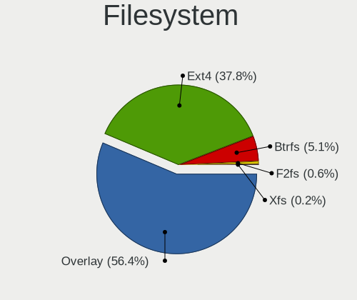
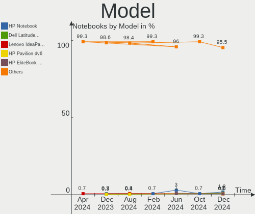
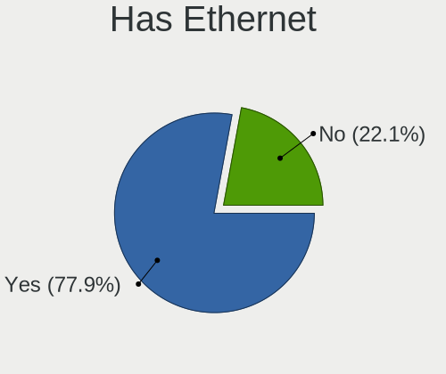
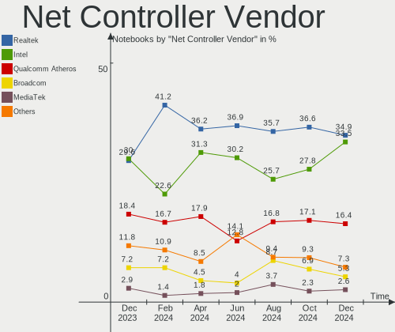
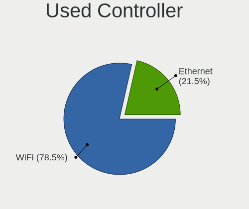

OpenMandriva - Hardware Trends (Notebooks)
------------------------------------------

A project to identify most popular hardware characteristics and track their change
over time based on data collected by Linux users at https://Linux-Hardware.org.

Anyone can contribute to this report by the [hw-probe](https://github.com/linuxhw/hw-probe) tool:

    sudo -E hw-probe -all -upload

This report is for one last month. Overall report since the beginning of time: [TestDays](https://github.com/linuxhw/TestDays)

Period: Dec, 2023.

Contents
--------

* [ System ](#system)
  - [ OS                       ](#os)
  - [ OS Family                ](#os-family)
  - [ Kernel                   ](#kernel)
  - [ Kernel Family            ](#kernel-family)
  - [ Kernel Major Ver.        ](#kernel-major-ver)
  - [ Arch                     ](#arch)
  - [ DE                       ](#de)
  - [ Display Server           ](#display-server)
  - [ Display Manager          ](#display-manager)
  - [ OS Lang                  ](#os-lang)
  - [ Boot Mode                ](#boot-mode)
  - [ Filesystem               ](#filesystem)
  - [ Part. scheme             ](#part-scheme)
  - [ Dual Boot with Linux/BSD ](#dual-boot-with-linuxbsd)
  - [ Dual Boot (Win)          ](#dual-boot-win)

* [ Board ](#board)
  - [ Vendor                   ](#vendor)
  - [ Model                    ](#model)
  - [ Model Family             ](#model-family)
  - [ MFG Year                 ](#mfg-year)
  - [ Form Factor              ](#form-factor)
  - [ Secure Boot              ](#secure-boot)
  - [ Coreboot                 ](#coreboot)
  - [ RAM Size                 ](#ram-size)
  - [ RAM Used                 ](#ram-used)
  - [ Total Drives             ](#total-drives)
  - [ Has CD-ROM               ](#has-cd-rom)
  - [ Has Ethernet             ](#has-ethernet)
  - [ Has WiFi                 ](#has-wifi)
  - [ Has Bluetooth            ](#has-bluetooth)

* [ Location ](#location)
  - [ Country                  ](#country)
  - [ City                     ](#city)

* [ Drives ](#drives)
  - [ Drive Vendor             ](#drive-vendor)
  - [ Drive Model              ](#drive-model)
  - [ HDD Vendor               ](#hdd-vendor)
  - [ SSD Vendor               ](#ssd-vendor)
  - [ Drive Kind               ](#drive-kind)
  - [ Drive Connector          ](#drive-connector)
  - [ Drive Size               ](#drive-size)
  - [ Space Total              ](#space-total)
  - [ Space Used               ](#space-used)
  - [ Malfunc. Drives          ](#malfunc-drives)
  - [ Malfunc. Drive Vendor    ](#malfunc-drive-vendor)
  - [ Malfunc. HDD Vendor      ](#malfunc-hdd-vendor)
  - [ Malfunc. Drive Kind      ](#malfunc-drive-kind)
  - [ Failed Drives            ](#failed-drives)
  - [ Failed Drive Vendor      ](#failed-drive-vendor)
  - [ Drive Status             ](#drive-status)

* [ Storage controller ](#storage-controller)
  - [ Storage Vendor           ](#storage-vendor)
  - [ Storage Model            ](#storage-model)
  - [ Storage Kind             ](#storage-kind)

* [ Processor ](#processor)
  - [ CPU Vendor               ](#cpu-vendor)
  - [ CPU Model                ](#cpu-model)
  - [ CPU Model Family         ](#cpu-model-family)
  - [ CPU Cores                ](#cpu-cores)
  - [ CPU Sockets              ](#cpu-sockets)
  - [ CPU Threads              ](#cpu-threads)
  - [ CPU Op-Modes             ](#cpu-op-modes)
  - [ CPU Microcode            ](#cpu-microcode)
  - [ CPU Microarch            ](#cpu-microarch)

* [ Graphics ](#graphics)
  - [ GPU Vendor               ](#gpu-vendor)
  - [ GPU Model                ](#gpu-model)
  - [ GPU Combo                ](#gpu-combo)
  - [ GPU Driver               ](#gpu-driver)
  - [ GPU Memory               ](#gpu-memory)

* [ Monitor ](#monitor)
  - [ Monitor Vendor           ](#monitor-vendor)
  - [ Monitor Model            ](#monitor-model)
  - [ Monitor Resolution       ](#monitor-resolution)
  - [ Monitor Diagonal         ](#monitor-diagonal)
  - [ Monitor Width            ](#monitor-width)
  - [ Aspect Ratio             ](#aspect-ratio)
  - [ Monitor Area             ](#monitor-area)
  - [ Pixel Density            ](#pixel-density)
  - [ Multiple Monitors        ](#multiple-monitors)

* [ Network ](#network)
  - [ Net Controller Vendor    ](#net-controller-vendor)
  - [ Net Controller Model     ](#net-controller-model)
  - [ Wireless Vendor          ](#wireless-vendor)
  - [ Wireless Model           ](#wireless-model)
  - [ Ethernet Vendor          ](#ethernet-vendor)
  - [ Ethernet Model           ](#ethernet-model)
  - [ Net Controller Kind      ](#net-controller-kind)
  - [ Used Controller          ](#used-controller)
  - [ NICs                     ](#nics)
  - [ IPv6                     ](#ipv6)

* [ Bluetooth ](#bluetooth)
  - [ Bluetooth Vendor         ](#bluetooth-vendor)
  - [ Bluetooth Model          ](#bluetooth-model)

* [ Sound ](#sound)
  - [ Sound Vendor             ](#sound-vendor)
  - [ Sound Model              ](#sound-model)

* [ Memory ](#memory)
  - [ Memory Vendor            ](#memory-vendor)
  - [ Memory Model             ](#memory-model)
  - [ Memory Kind              ](#memory-kind)
  - [ Memory Form Factor       ](#memory-form-factor)
  - [ Memory Size              ](#memory-size)
  - [ Memory Speed             ](#memory-speed)

* [ Printers & scanners ](#printers--scanners)
  - [ Printer Vendor           ](#printer-vendor)
  - [ Printer Model            ](#printer-model)
  - [ Scanner Vendor           ](#scanner-vendor)
  - [ Scanner Model            ](#scanner-model)

* [ Camera ](#camera)
  - [ Camera Vendor            ](#camera-vendor)
  - [ Camera Model             ](#camera-model)

* [ Security ](#security)
  - [ Fingerprint Vendor       ](#fingerprint-vendor)
  - [ Fingerprint Model        ](#fingerprint-model)
  - [ Chipcard Vendor          ](#chipcard-vendor)
  - [ Chipcard Model           ](#chipcard-model)

* [ Unsupported ](#unsupported)
  - [ Unsupported Devices      ](#unsupported-devices)
  - [ Unsupported Device Types ](#unsupported-device-types)

System
------

OS
--

Installed operating systems

| Name               | Notebooks | Percent |
|--------------------|-----------|---------|
| OpenMandriva 5.0   | 120       | 41.81%  |
| OpenMandriva 23.08 | 84        | 29.27%  |
| OpenMandriva 23.11 | 49        | 17.07%  |
| OpenMandriva 23.03 | 7         | 2.44%   |
| OpenMandriva 4.3   | 6         | 2.09%   |
| OpenMandriva 4.2   | 5         | 1.74%   |
| OpenMandriva 23.90 | 5         | 1.74%   |
| OpenMandriva 23.01 | 4         | 1.39%   |
| OpenMandriva 23.09 | 3         | 1.05%   |
| OpenMandriva 23.10 | 2         | 0.7%    |
| OpenMandriva 23.07 | 1         | 0.35%   |
| OpenMandriva 23.06 | 1         | 0.35%   |

OS Family
---------

OS without a version

| Name         | Notebooks | Percent |
|--------------|-----------|---------|
| OpenMandriva | 287       | 100%    |

Kernel
------

Version of the Linux kernel

| Version                      | Notebooks | Percent |
|------------------------------|-----------|---------|
| 6.6.2-desktop-1omv2390       | 159       | 55.4%   |
| 6.4.11-desktop-1omv2390      | 81        | 28.22%  |
| 6.4.8-desktop-2omv2390       | 9         | 3.14%   |
| 6.2.6-desktop-1omv2390       | 7         | 2.44%   |
| 5.10.14-desktop-1omv4002     | 5         | 1.74%   |
| 6.1.1-desktop-1omv2290       | 4         | 1.39%   |
| 5.16.7-desktop-1omv4003      | 4         | 1.39%   |
| 6.7.0-desktop-0.rc2.1omv2390 | 2         | 0.7%    |
| 6.6.1-desktop-1omv2390       | 2         | 0.7%    |
| 6.5.5-desktop-1omv2390       | 2         | 0.7%    |
| 6.5.3-desktop-1omv2390       | 2         | 0.7%    |
| 6.3.5-desktop-3omv2390       | 2         | 0.7%    |
| 5.16.13-desktop-1omv4003     | 2         | 0.7%    |
| 6.7.0-desktop-0.rc6.1omv2390 | 1         | 0.35%   |
| 6.6.7-desktop-1omv2390       | 1         | 0.35%   |
| 6.6.3-desktop-1omv2390       | 1         | 0.35%   |
| 6.6.0-desktop-1omv2390       | 1         | 0.35%   |
| 6.5.1-desktop-1omv2390       | 1         | 0.35%   |
| 6.5.0-desktop-1omv2390       | 1         | 0.35%   |

Kernel Family
-------------

Linux kernel without a distro release

| Version | Notebooks | Percent |
|---------|-----------|---------|
| 6.6.2   | 159       | 55.4%   |
| 6.4.11  | 81        | 28.22%  |
| 6.4.8   | 9         | 3.14%   |
| 6.2.6   | 7         | 2.44%   |
| 5.10.14 | 5         | 1.74%   |
| 6.1.1   | 4         | 1.39%   |
| 5.16.7  | 4         | 1.39%   |
| 6.7.0   | 3         | 1.05%   |
| 6.6.1   | 2         | 0.7%    |
| 6.5.5   | 2         | 0.7%    |
| 6.5.3   | 2         | 0.7%    |
| 6.3.5   | 2         | 0.7%    |
| 5.16.13 | 2         | 0.7%    |
| 6.6.7   | 1         | 0.35%   |
| 6.6.3   | 1         | 0.35%   |
| 6.6.0   | 1         | 0.35%   |
| 6.5.1   | 1         | 0.35%   |
| 6.5.0   | 1         | 0.35%   |

Kernel Major Ver.
-----------------

Linux kernel major version

| Version | Notebooks | Percent |
|---------|-----------|---------|
| 6.6     | 164       | 57.14%  |
| 6.4     | 90        | 31.36%  |
| 6.2     | 7         | 2.44%   |
| 6.5     | 6         | 2.09%   |
| 5.16    | 6         | 2.09%   |
| 5.10    | 5         | 1.74%   |
| 6.1     | 4         | 1.39%   |
| 6.7     | 3         | 1.05%   |
| 6.3     | 2         | 0.7%    |

Arch
----

OS architecture (x86_64, i586, etc.)

| Name   | Notebooks | Percent |
|--------|-----------|---------|
| x86_64 | 287       | 100%    |

DE
--

Desktop Environment

| Name     | Notebooks | Percent |
|----------|-----------|---------|
| KDE5     | 239       | 83.28%  |
| LXQt     | 23        | 8.01%   |
| GNOME    | 23        | 8.01%   |
| XFCE     | 1         | 0.35%   |
| Cinnamon | 1         | 0.35%   |

Display Server
--------------

X11 or Wayland

| Name    | Notebooks | Percent |
|---------|-----------|---------|
| Wayland | 253       | 88.15%  |
| X11     | 34        | 11.85%  |

Display Manager
---------------

SDDM, LightDM, etc.

| Name | Notebooks | Percent |
|------|-----------|---------|
| SDDM | 264       | 91.99%  |
| GDM  | 23        | 8.01%   |

OS Lang
-------

Language

| Lang  | Notebooks | Percent |
|-------|-----------|---------|
| en_US | 127       | 44.25%  |
| pl_PL | 28        | 9.76%   |
| de_DE | 23        | 8.01%   |
| fr_FR | 20        | 6.97%   |
| ru_RU | 13        | 4.53%   |
| es_ES | 11        | 3.83%   |
| pt_BR | 10        | 3.48%   |
| en_GB | 9         | 3.14%   |
| it_IT | 7         | 2.44%   |
| hu_HU | 4         | 1.39%   |
| es_MX | 4         | 1.39%   |
| en_CA | 4         | 1.39%   |
| cs_CZ | 4         | 1.39%   |
| ro_RO | 3         | 1.05%   |
| nl_NL | 3         | 1.05%   |
| en_IN | 2         | 0.7%    |
| en_HK | 2         | 0.7%    |
| de_AT | 2         | 0.7%    |
| uk_UA | 1         | 0.35%   |
| tr_TR | 1         | 0.35%   |
| pt_PT | 1         | 0.35%   |
| fr_CA | 1         | 0.35%   |
| fr_BE | 1         | 0.35%   |
| es_VE | 1         | 0.35%   |
| es_CO | 1         | 0.35%   |
| en_NZ | 1         | 0.35%   |
| en_NG | 1         | 0.35%   |
| en_IL | 1         | 0.35%   |
| de_CH | 1         | 0.35%   |

Boot Mode
---------

EFI or BIOS

| Mode | Notebooks | Percent |
|------|-----------|---------|
| EFI  | 175       | 60.98%  |
| BIOS | 112       | 39.02%  |

Filesystem
----------

Type of filesystem

| Type    | Notebooks | Percent |
|---------|-----------|---------|
| Ext4    | 142       | 49.48%  |
| Overlay | 130       | 45.3%   |
| Btrfs   | 12        | 4.18%   |
| Xfs     | 3         | 1.05%   |

Part. scheme
------------

Scheme of partitioning

| Type | Notebooks | Percent |
|------|-----------|---------|
| GPT  | 224       | 78.05%  |
| MBR  | 63        | 21.95%  |

Dual Boot with Linux/BSD
------------------------

Hosting more than one Linux/BSD

| Dual boot | Notebooks | Percent |
|-----------|-----------|---------|
| No        | 162       | 56.45%  |
| Yes       | 125       | 43.55%  |

Dual Boot (Win)
---------------

Hosting Linux and Windows

| Dual boot | Notebooks | Percent |
|-----------|-----------|---------|
| No        | 174       | 60.63%  |
| Yes       | 113       | 39.37%  |

Board
-----

Vendor
------

Motherboard manufacturer

| Name                    | Notebooks | Percent |
|-------------------------|-----------|---------|
| Hewlett-Packard         | 55        | 19.16%  |
| Lenovo                  | 54        | 18.82%  |
| Dell                    | 49        | 17.07%  |
| ASUSTek Computer        | 40        | 13.94%  |
| Acer                    | 24        | 8.36%   |
| Toshiba                 | 8         | 2.79%   |
| MSI                     | 6         | 2.09%   |
| Apple                   | 6         | 2.09%   |
| Samsung Electronics     | 5         | 1.74%   |
| Packard Bell            | 5         | 1.74%   |
| Google                  | 5         | 1.74%   |
| Sony                    | 4         | 1.39%   |
| Fujitsu                 | 4         | 1.39%   |
| Medion                  | 3         | 1.05%   |
| Alienware               | 3         | 1.05%   |
| Notebook                | 2         | 0.7%    |
| TUXEDO                  | 1         | 0.35%   |
| Razer                   | 1         | 0.35%   |
| Multilaser              | 1         | 0.35%   |
| MouseComputer           | 1         | 0.35%   |
| Kiano                   | 1         | 0.35%   |
| Info Quest Technologies | 1         | 0.35%   |
| GPD                     | 1         | 0.35%   |
| Gateway                 | 1         | 0.35%   |
| Fujitsu Siemens         | 1         | 0.35%   |
| Clevo                   | 1         | 0.35%   |
| AZW                     | 1         | 0.35%   |
| AWOW                    | 1         | 0.35%   |
| Alurin                  | 1         | 0.35%   |
| Adreamer                | 1         | 0.35%   |

Model
-----

Motherboard model

| Name                                | Notebooks | Percent |
|-------------------------------------|-----------|---------|
| Google Garg                         | 4         | 1.39%   |
| ASUS K50AF                          | 4         | 1.39%   |
| Apple MacBookAir9,1                 | 3         | 1.05%   |
| Lenovo IdeaPad 3 15IML05 82BS       | 2         | 0.7%    |
| HP ProBook 650 G1                   | 2         | 0.7%    |
| HP Pavilion Gaming Laptop 15-ec0xxx | 2         | 0.7%    |
| HP Pavilion 15                      | 2         | 0.7%    |
| HP Notebook                         | 2         | 0.7%    |
| HP Laptop 17-by4xxx                 | 2         | 0.7%    |
| HP Laptop 15-da0xxx                 | 2         | 0.7%    |
| HP EliteBook 840 G5                 | 2         | 0.7%    |
| Dell Latitude E6400                 | 2         | 0.7%    |
| Dell Latitude E6320                 | 2         | 0.7%    |
| Dell Latitude E5410                 | 2         | 0.7%    |
| Dell Latitude 7490                  | 2         | 0.7%    |
| Dell Latitude 5590                  | 2         | 0.7%    |
| Dell Inspiron 1545                  | 2         | 0.7%    |
| ASUS K53SC                          | 2         | 0.7%    |
| TUXEDO InfinityBook Pro Gen7 (MK2)  | 1         | 0.35%   |
| Toshiba T20                         | 1         | 0.35%   |
| Toshiba Satellite Pro C660          | 1         | 0.35%   |
| Toshiba Satellite L750              | 1         | 0.35%   |
| Toshiba Satellite C855D             | 1         | 0.35%   |
| Toshiba Satellite C70D-A            | 1         | 0.35%   |
| Toshiba Satellite C650D             | 1         | 0.35%   |
| Toshiba Satellite A300              | 1         | 0.35%   |
| Toshiba dynabook Satellite B552/H   | 1         | 0.35%   |
| Sony VPCS13S9E                      | 1         | 0.35%   |
| Sony VJS153C11N                     | 1         | 0.35%   |
| Sony SVP13215PLS                    | 1         | 0.35%   |
| Sony SVE1713A1EW                    | 1         | 0.35%   |
| Samsung RV409/RV509/RV709           | 1         | 0.35%   |
| Samsung R580/R590                   | 1         | 0.35%   |
| Samsung R530/R730                   | 1         | 0.35%   |
| Samsung 550XDA                      | 1         | 0.35%   |
| Samsung 350V5C/351V5C/3540VC/3440VC | 1         | 0.35%   |
| Razer Blade Pro 17 (2019)           | 1         | 0.35%   |
| Packard Bell EasyNote_MX52-B-702NCD | 1         | 0.35%   |
| Packard Bell EasyNote LS11HR        | 1         | 0.35%   |
| Packard Bell EasyNote LM85          | 1         | 0.35%   |

Model Family
------------

Motherboard model prefix

| Name                  | Notebooks | Percent |
|-----------------------|-----------|---------|
| Lenovo ThinkPad       | 27        | 9.41%   |
| Dell Latitude         | 25        | 8.71%   |
| Acer Aspire           | 17        | 5.92%   |
| Dell Inspiron         | 14        | 4.88%   |
| Lenovo IdeaPad        | 12        | 4.18%   |
| HP Pavilion           | 12        | 4.18%   |
| HP Laptop             | 12        | 4.18%   |
| HP ProBook            | 8         | 2.79%   |
| ASUS VivoBook         | 8         | 2.79%   |
| Toshiba Satellite     | 6         | 2.09%   |
| HP EliteBook          | 6         | 2.09%   |
| Dell Precision        | 5         | 1.74%   |
| Packard Bell EasyNote | 4         | 1.39%   |
| Google Garg           | 4         | 1.39%   |
| ASUS K50AF            | 4         | 1.39%   |
| MSI Modern            | 3         | 1.05%   |
| HP Compaq             | 3         | 1.05%   |
| Fujitsu LIFEBOOK      | 3         | 1.05%   |
| Apple MacBookAir9     | 3         | 1.05%   |
| Acer TravelMate       | 3         | 1.05%   |
| Lenovo Yoga           | 2         | 0.7%    |
| Lenovo Legion         | 2         | 0.7%    |
| HP ZBook              | 2         | 0.7%    |
| HP Victus             | 2         | 0.7%    |
| HP Notebook           | 2         | 0.7%    |
| HP 15                 | 2         | 0.7%    |
| Dell XPS              | 2         | 0.7%    |
| Dell System           | 2         | 0.7%    |
| ASUS TUF              | 2         | 0.7%    |
| ASUS K53SC            | 2         | 0.7%    |
| TUXEDO InfinityBook   | 1         | 0.35%   |
| Toshiba T20           | 1         | 0.35%   |
| Toshiba dynabook      | 1         | 0.35%   |
| Sony VPCS13S9E        | 1         | 0.35%   |
| Sony VJS153C11N       | 1         | 0.35%   |
| Sony SVP13215PLS      | 1         | 0.35%   |
| Sony SVE1713A1EW      | 1         | 0.35%   |
| Samsung RV409         | 1         | 0.35%   |
| Samsung R580          | 1         | 0.35%   |
| Samsung R530          | 1         | 0.35%   |

MFG Year
--------

Motherboard manufacture year

| Year | Notebooks | Percent |
|------|-----------|---------|
| 2013 | 28        | 9.76%   |
| 2018 | 26        | 9.06%   |
| 2011 | 25        | 8.71%   |
| 2021 | 23        | 8.01%   |
| 2012 | 23        | 8.01%   |
| 2022 | 18        | 6.27%   |
| 2019 | 18        | 6.27%   |
| 2009 | 17        | 5.92%   |
| 2008 | 17        | 5.92%   |
| 2015 | 15        | 5.23%   |
| 2010 | 15        | 5.23%   |
| 2020 | 14        | 4.88%   |
| 2007 | 12        | 4.18%   |
| 2016 | 10        | 3.48%   |
| 2014 | 10        | 3.48%   |
| 2017 | 8         | 2.79%   |
| 2023 | 6         | 2.09%   |
| 2006 | 2         | 0.7%    |

Form Factor
-----------

Physical design of the computer

| Name     | Notebooks | Percent |
|----------|-----------|---------|
| Notebook | 287       | 100%    |

Secure Boot
-----------

Enabled or disabled

| State    | Notebooks | Percent |
|----------|-----------|---------|
| Disabled | 287       | 100%    |

Coreboot
--------

Have coreboot on board

| Used | Notebooks | Percent |
|------|-----------|---------|
| No   | 282       | 98.26%  |
| Yes  | 5         | 1.74%   |

RAM Size
--------

Total RAM memory

| Size in GB  | Notebooks | Percent |
|-------------|-----------|---------|
| 3.01-4.0    | 90        | 31.36%  |
| 4.01-8.0    | 87        | 30.31%  |
| 16.01-24.0  | 40        | 13.94%  |
| 8.01-16.0   | 35        | 12.2%   |
| 32.01-64.0  | 10        | 3.48%   |
| 1.01-2.0    | 10        | 3.48%   |
| 2.01-3.0    | 9         | 3.14%   |
| 24.01-32.0  | 4         | 1.39%   |
| 64.01-256.0 | 1         | 0.35%   |
| 0.51-1.0    | 1         | 0.35%   |

RAM Used
--------

Used RAM memory

| Used GB   | Notebooks | Percent |
|-----------|-----------|---------|
| 1.01-2.0  | 194       | 67.6%   |
| 2.01-3.0  | 52        | 18.12%  |
| 0.51-1.0  | 18        | 6.27%   |
| 3.01-4.0  | 17        | 5.92%   |
| 0.01-0.5  | 3         | 1.05%   |
| 4.01-8.0  | 2         | 0.7%    |
| 8.01-16.0 | 1         | 0.35%   |

Total Drives
------------

Number of drives on board

| Drives | Notebooks | Percent |
|--------|-----------|---------|
| 1      | 203       | 70.73%  |
| 2      | 71        | 24.74%  |
| 3      | 8         | 2.79%   |
| 4      | 3         | 1.05%   |
| 0      | 2         | 0.7%    |

Has CD-ROM
----------

Has CD-ROM on board

| Presented | Notebooks | Percent |
|-----------|-----------|---------|
| No        | 152       | 52.96%  |
| Yes       | 135       | 47.04%  |

Has Ethernet
------------

Has Ethernet on board

| Presented | Notebooks | Percent |
|-----------|-----------|---------|
| Yes       | 232       | 80.84%  |
| No        | 55        | 19.16%  |

Has WiFi
--------

Has WiFi module

| Presented | Notebooks | Percent |
|-----------|-----------|---------|
| Yes       | 286       | 99.65%  |
| No        | 1         | 0.35%   |

Has Bluetooth
-------------

Has Bluetooth module

| Presented | Notebooks | Percent |
|-----------|-----------|---------|
| Yes       | 213       | 74.22%  |
| No        | 74        | 25.78%  |

Location
--------

Country
-------

Geographic location (country)

| Country     | Notebooks | Percent |
|-------------|-----------|---------|
| USA         | 47        | 16.38%  |
| Poland      | 33        | 11.5%   |
| Germany     | 32        | 11.15%  |
| France      | 18        | 6.27%   |
| Russia      | 16        | 5.57%   |
| Spain       | 12        | 4.18%   |
| Italy       | 12        | 4.18%   |
| Brazil      | 12        | 4.18%   |
| Hungary     | 7         | 2.44%   |
| Canada      | 7         | 2.44%   |
| Netherlands | 6         | 2.09%   |
| Japan       | 6         | 2.09%   |
| India       | 6         | 2.09%   |
| Romania     | 5         | 1.74%   |
| Indonesia   | 5         | 1.74%   |
| Czechia     | 5         | 1.74%   |
| Mexico      | 4         | 1.39%   |
| Colombia    | 4         | 1.39%   |
| UK          | 3         | 1.05%   |
| Norway      | 3         | 1.05%   |
| Cyprus      | 3         | 1.05%   |
| Costa Rica  | 3         | 1.05%   |
| Austria     | 3         | 1.05%   |
| Turkey      | 2         | 0.7%    |
| Tunisia     | 2         | 0.7%    |
| Thailand    | 2         | 0.7%    |
| Serbia      | 2         | 0.7%    |
| New Zealand | 2         | 0.7%    |
| Lithuania   | 2         | 0.7%    |
| Hong Kong   | 2         | 0.7%    |
| Finland     | 2         | 0.7%    |
| Argentina   | 2         | 0.7%    |
| Algeria     | 2         | 0.7%    |
| Ukraine     | 1         | 0.35%   |
| Taiwan      | 1         | 0.35%   |
| Switzerland | 1         | 0.35%   |
| Portugal    | 1         | 0.35%   |
| Nigeria     | 1         | 0.35%   |
| Moldova     | 1         | 0.35%   |
| Latvia      | 1         | 0.35%   |

City
----

Geographic location (city)

| City              | Notebooks | Percent |
|-------------------|-----------|---------|
| Warsaw            | 10        | 3.48%   |
| Paris             | 5         | 1.74%   |
| Stuttgart         | 4         | 1.39%   |
| Portland          | 4         | 1.39%   |
| Munich            | 4         | 1.39%   |
| Vienna            | 3         | 1.05%   |
| Stuhr             | 3         | 1.05%   |
| St Petersburg     | 3         | 1.05%   |
| Sao Paulo         | 3         | 1.05%   |
| Budapest          | 3         | 1.05%   |
| Wroclaw           | 2         | 0.7%    |
| Tokyo             | 2         | 0.7%    |
| Sao Goncalo       | 2         | 0.7%    |
| San José         | 2         | 0.7%    |
| Prague            | 2         | 0.7%    |
| Poznan            | 2         | 0.7%    |
| Milan             | 2         | 0.7%    |
| Madrid            | 2         | 0.7%    |
| Lublin            | 2         | 0.7%    |
| Limassol          | 2         | 0.7%    |
| Leipzig           | 2         | 0.7%    |
| Kraszew           | 2         | 0.7%    |
| Glen Burnie       | 2         | 0.7%    |
| Érd              | 2         | 0.7%    |
| Delhi             | 2         | 0.7%    |
| Courtenay         | 2         | 0.7%    |
| Central           | 2         | 0.7%    |
| Bogotá           | 2         | 0.7%    |
| Belgrade          | 2         | 0.7%    |
| Ballwin           | 2         | 0.7%    |
| Auckland          | 2         | 0.7%    |
| Amsterdam         | 2         | 0.7%    |
| Zweidlen-Dorf     | 1         | 0.35%   |
| Zielona Góra     | 1         | 0.35%   |
| Yuzhno-Sakhalinsk | 1         | 0.35%   |
| Yokohama          | 1         | 0.35%   |
| Woodbridge        | 1         | 0.35%   |
| Winschoten        | 1         | 0.35%   |
| Wayne             | 1         | 0.35%   |
| Volgograd         | 1         | 0.35%   |

Drives
------

Drive Vendor
------------

Hard drive vendors

| Vendor              | Notebooks | Drives | Percent |
|---------------------|-----------|--------|---------|
| Samsung Electronics | 50        | 53     | 13.97%  |
| WDC                 | 45        | 45     | 12.57%  |
| Seagate             | 36        | 36     | 10.06%  |
| Toshiba             | 22        | 23     | 6.15%   |
| SanDisk             | 16        | 16     | 4.47%   |
| Hitachi             | 15        | 15     | 4.19%   |
| Kingston            | 13        | 14     | 3.63%   |
| HGST                | 13        | 13     | 3.63%   |
| Unknown             | 12        | 12     | 3.35%   |
| Unknown             | 11        | 12     | 3.07%   |
| Crucial             | 11        | 11     | 3.07%   |
| SK hynix            | 10        | 10     | 2.79%   |
| A-DATA Technology   | 9         | 9      | 2.51%   |
| Intenso             | 7         | 7      | 1.96%   |
| Intel               | 7         | 7      | 1.96%   |
| Micron Technology   | 6         | 6      | 1.68%   |
| GOODRAM             | 6         | 6      | 1.68%   |
| SPCC                | 5         | 5      | 1.4%    |
| Lexar               | 4         | 4      | 1.12%   |
| China               | 4         | 4      | 1.12%   |
| Apple               | 4         | 4      | 1.12%   |
| PNY                 | 3         | 3      | 0.84%   |
| Phison              | 3         | 3      | 0.84%   |
| Netac               | 3         | 3      | 0.84%   |
| LITEONIT            | 3         | 3      | 0.84%   |
| Transcend           | 2         | 2      | 0.56%   |
| Team                | 2         | 2      | 0.56%   |
| SSSTC               | 2         | 2      | 0.56%   |
| SABRENT             | 2         | 3      | 0.56%   |
| LITEON              | 2         | 2      | 0.56%   |
| KingSpec            | 2         | 2      | 0.56%   |
| FORESEE             | 2         | 2      | 0.56%   |
| Dahua               | 2         | 3      | 0.56%   |
| WALRAM              | 1         | 1      | 0.28%   |
| UMIS                | 1         | 1      | 0.28%   |
| TwinMOS             | 1         | 1      | 0.28%   |
| T-FORCE             | 1         | 1      | 0.28%   |
| SSK                 | 1         | 1      | 0.28%   |
| RX7                 | 1         | 1      | 0.28%   |
| OCZ                 | 1         | 1      | 0.28%   |

Drive Model
-----------

Hard drive models

| Model                               | Notebooks | Percent |
|-------------------------------------|-----------|---------|
| Unknown                             | 12        | 3.29%   |
| Seagate ST9500325AS 500GB           | 4         | 1.1%    |
| Seagate ST2000LM007-1R8174 2TB      | 4         | 1.1%    |
| Samsung SSD 870 QVO 1TB             | 4         | 1.1%    |
| WDC WD10SPZX-60Z10T0 1TB            | 3         | 0.82%   |
| Toshiba MQ04ABF100 1TB              | 3         | 0.82%   |
| Toshiba MQ01ABD100 1TB              | 3         | 0.82%   |
| Seagate ST500LM012 HN-M500MBB 500GB | 3         | 0.82%   |
| Seagate ST1000LM035-1RK172 1TB      | 3         | 0.82%   |
| Kingston SA400S37240G 240GB SSD     | 3         | 0.82%   |
| Intenso SSD Sata  256GB             | 3         | 0.82%   |
| HGST HTS545050A7E680 500GB          | 3         | 0.82%   |
| HGST HTS541010A9E680 1TB            | 3         | 0.82%   |
| Apple SSD AP0256N 256GB             | 3         | 0.82%   |
| WDC WD5000LPCX-24C6HT0 500GB        | 2         | 0.55%   |
| WDC WD1600BEVT-75A23T0 160GB        | 2         | 0.55%   |
| WDC WD10SPZX-21Z10T0 1TB            | 2         | 0.55%   |
| WDC WD10JPVX-22JC3T0 1TB            | 2         | 0.55%   |
| Unknown SD/MMC/MS PRO 512GB         | 2         | 0.55%   |
| Toshiba MQ01ABD075 752GB            | 2         | 0.55%   |
| Toshiba MQ01ABD050 500GB            | 2         | 0.55%   |
| Toshiba MK3265GSX 320GB             | 2         | 0.55%   |
| SSSTC CL1-4D256 256GB               | 2         | 0.55%   |
| Seagate ST9500420AS 500GB           | 2         | 0.55%   |
| Seagate ST9320423AS 320GB           | 2         | 0.55%   |
| Seagate ST9320325AS 320GB           | 2         | 0.55%   |
| Seagate ST500LT012-1DG142 500GB     | 2         | 0.55%   |
| Seagate ST1000LM024 HN-M101MBB 1TB  | 2         | 0.55%   |
| SanDisk SSD U100 24GB               | 2         | 0.55%   |
| SanDisk SSD PLUS 480GB              | 2         | 0.55%   |
| SanDisk NVMe SSD Drive 1TB          | 2         | 0.55%   |
| Samsung SSD 970 EVO Plus 1TB        | 2         | 0.55%   |
| Samsung SSD 860 EVO 500GB           | 2         | 0.55%   |
| Samsung MZALQ512HBLU-00BL2 512GB    | 2         | 0.55%   |
| SABRENT Disk 2TB                    | 2         | 0.55%   |
| Kingston SNV2S500G 500GB            | 2         | 0.55%   |
| Hitachi HTS545032B9A300 320GB       | 2         | 0.55%   |
| HGST HTS725050A7E630 500GB          | 2         | 0.55%   |
| HGST HTS721010A9E630 1TB            | 2         | 0.55%   |
| HGST HTS545050A7E380 500GB          | 2         | 0.55%   |

HDD Vendor
----------

Hard disk drive vendors

| Vendor              | Notebooks | Drives | Percent |
|---------------------|-----------|--------|---------|
| Seagate             | 36        | 36     | 29.03%  |
| WDC                 | 34        | 34     | 27.42%  |
| Toshiba             | 19        | 19     | 15.32%  |
| Hitachi             | 15        | 15     | 12.1%   |
| HGST                | 13        | 13     | 10.48%  |
| Unknown             | 2         | 2      | 1.61%   |
| SABRENT             | 2         | 3      | 1.61%   |
| SSK                 | 1         | 1      | 0.81%   |
| Samsung Electronics | 1         | 1      | 0.81%   |
| Inateck             | 1         | 1      | 0.81%   |

SSD Vendor
----------

Solid state drive vendors

| Vendor              | Notebooks | Drives | Percent |
|---------------------|-----------|--------|---------|
| Samsung Electronics | 27        | 27     | 22.31%  |
| SanDisk             | 9         | 9      | 7.44%   |
| Kingston            | 8         | 8      | 6.61%   |
| A-DATA Technology   | 8         | 8      | 6.61%   |
| Intenso             | 7         | 7      | 5.79%   |
| GOODRAM             | 5         | 5      | 4.13%   |
| Crucial             | 5         | 5      | 4.13%   |
| WDC                 | 4         | 4      | 3.31%   |
| SPCC                | 4         | 4      | 3.31%   |
| China               | 4         | 4      | 3.31%   |
| PNY                 | 3         | 3      | 2.48%   |
| LITEONIT            | 3         | 3      | 2.48%   |
| Transcend           | 2         | 2      | 1.65%   |
| SK hynix            | 2         | 2      | 1.65%   |
| Netac               | 2         | 2      | 1.65%   |
| Lexar               | 2         | 2      | 1.65%   |
| KingSpec            | 2         | 2      | 1.65%   |
| Intel               | 2         | 2      | 1.65%   |
| Dahua               | 2         | 3      | 1.65%   |
| TwinMOS             | 1         | 1      | 0.83%   |
| Team                | 1         | 1      | 0.83%   |
| T-FORCE             | 1         | 1      | 0.83%   |
| RX7                 | 1         | 1      | 0.83%   |
| OCZ                 | 1         | 1      | 0.83%   |
| Micron Technology   | 1         | 1      | 0.83%   |
| LITEON              | 1         | 1      | 0.83%   |
| KIOXIA-EXCERIA      | 1         | 1      | 0.83%   |
| KimMiDi             | 1         | 1      | 0.83%   |
| JMicron Technology  | 1         | 1      | 0.83%   |
| HS-SSD-E100         | 1         | 1      | 0.83%   |
| Hewlett-Packard     | 1         | 1      | 0.83%   |
| G521S               | 1         | 1      | 0.83%   |
| FORESEE             | 1         | 1      | 0.83%   |
| Dogfish             | 1         | 1      | 0.83%   |
| ASMT                | 1         | 1      | 0.83%   |
| Apple               | 1         | 1      | 0.83%   |
| Apacer              | 1         | 1      | 0.83%   |
| Acer                | 1         | 1      | 0.83%   |
| Unknown             | 1         | 1      | 0.83%   |

Drive Kind
----------

HDD or SSD

| Kind    | Notebooks | Drives | Percent |
|---------|-----------|--------|---------|
| HDD     | 121       | 125    | 35.91%  |
| SSD     | 110       | 122    | 32.64%  |
| NVMe    | 84        | 97     | 24.93%  |
| MMC     | 19        | 20     | 5.64%   |
| Unknown | 3         | 2      | 0.89%   |

Drive Connector
---------------

SATA, SAS, NVMe, etc.

| Type | Notebooks | Drives | Percent |
|------|-----------|--------|---------|
| SATA | 206       | 233    | 63.78%  |
| NVMe | 84        | 96     | 26.01%  |
| MMC  | 19        | 20     | 5.88%   |
| SAS  | 14        | 17     | 4.33%   |

Drive Size
----------

Size of hard drive

| Size in TB | Notebooks | Drives | Percent |
|------------|-----------|--------|---------|
| 0.01-0.5   | 154       | 163    | 65.25%  |
| 0.51-1.0   | 71        | 72     | 30.08%  |
| 1.01-2.0   | 11        | 12     | 4.66%   |

Space Total
-----------

Amount of disk space available on the file system

| Size in GB | Notebooks | Percent |
|------------|-----------|---------|
| 1-20       | 93        | 32.4%   |
| 101-250    | 59        | 20.56%  |
| 251-500    | 39        | 13.59%  |
| 21-50      | 25        | 8.71%   |
| 501-1000   | 25        | 8.71%   |
| 51-100     | 25        | 8.71%   |
| Unknown    | 14        | 4.88%   |
| 1001-2000  | 4         | 1.39%   |
| 2001-3000  | 3         | 1.05%   |

Space Used
----------

Amount of used disk space

| Used GB   | Notebooks | Percent |
|-----------|-----------|---------|
| 1-20      | 227       | 79.09%  |
| 21-50     | 17        | 5.92%   |
| Unknown   | 14        | 4.88%   |
| 51-100    | 7         | 2.44%   |
| 101-250   | 6         | 2.09%   |
| 251-500   | 5         | 1.74%   |
| 501-1000  | 5         | 1.74%   |
| 0         | 5         | 1.74%   |
| 1001-2000 | 1         | 0.35%   |

Malfunc. Drives
---------------

Drive models with a malfunction

| Model                                         | Notebooks | Drives | Percent |
|-----------------------------------------------|-----------|--------|---------|
| Seagate ST9500325AS 500GB                     | 3         | 3      | 4.62%   |
| WDC WD10SPZX-60Z10T0 1TB                      | 2         | 2      | 3.08%   |
| Seagate ST500LT012-1DG142 500GB               | 2         | 2      | 3.08%   |
| HGST HTS545050A7E380 500GB                    | 2         | 2      | 3.08%   |
| WDC WDS240G2G0A-00JH30 240GB SSD              | 1         | 1      | 1.54%   |
| WDC WDS100T2G0A-00JH30 1TB SSD                | 1         | 1      | 1.54%   |
| WDC WD5000LPCX-24VHAT0 500GB                  | 1         | 1      | 1.54%   |
| WDC WD5000LPCX-24C6HT0 500GB                  | 1         | 1      | 1.54%   |
| WDC WD3200BPVT-80JJ5T0 320GB                  | 1         | 1      | 1.54%   |
| WDC WD3200BEVT-75A23T0 320GB                  | 1         | 1      | 1.54%   |
| WDC WD1600BEVT-75A23T0 160GB                  | 1         | 1      | 1.54%   |
| WDC WD1600BEVS-60RST0 160GB                   | 1         | 1      | 1.54%   |
| WDC WD10JPVT-60A1YT0 1TB                      | 1         | 1      | 1.54%   |
| WDC WD10JPCX-24UE4T0 1TB                      | 1         | 1      | 1.54%   |
| Toshiba MQ01ABD100 1TB                        | 1         | 1      | 1.54%   |
| Toshiba MQ01ABD075 752GB                      | 1         | 1      | 1.54%   |
| Toshiba MQ01ABD050 500GB                      | 1         | 1      | 1.54%   |
| Toshiba MK3276GSX 320GB                       | 1         | 1      | 1.54%   |
| Toshiba MK3265GSX 320GB                       | 1         | 1      | 1.54%   |
| Toshiba MK2561GSYN 250GB                      | 1         | 1      | 1.54%   |
| Toshiba MK1237GSX 120GB                       | 1         | 1      | 1.54%   |
| Team TM8FPD001T 1TB                           | 1         | 1      | 1.54%   |
| SK hynix HFS128G3BTND-N210A 128GB SSD         | 1         | 1      | 1.54%   |
| SK hynix BC711 HFM512GD3JX013N 512GB          | 1         | 1      | 1.54%   |
| Seagate ST980811AS 80GB                       | 1         | 1      | 1.54%   |
| Seagate ST9500420AS 500GB                     | 1         | 1      | 1.54%   |
| Seagate ST9320325AS 320GB                     | 1         | 1      | 1.54%   |
| Seagate ST9250827AS 250GB                     | 1         | 1      | 1.54%   |
| Seagate ST9100821AS 100GB                     | 1         | 1      | 1.54%   |
| Seagate ST500LT012-9WS142 500GB               | 1         | 1      | 1.54%   |
| Seagate ST500LM012 HN-M500MBB 500GB           | 1         | 1      | 1.54%   |
| Seagate ST250LT003-9YG14C 250GB               | 1         | 1      | 1.54%   |
| Seagate ST2000LM007-1R8174 2TB                | 1         | 1      | 1.54%   |
| Seagate ST1000LX015-1U7172 1TB                | 1         | 1      | 1.54%   |
| Seagate ST1000LM035-1RK172 1TB                | 1         | 1      | 1.54%   |
| Seagate ST1000LM014-1EJ164 1TB                | 1         | 1      | 1.54%   |
| SanDisk SSD PLUS 480GB                        | 1         | 1      | 1.54%   |
| SanDisk SDSSDX120GG25 120GB                   | 1         | 1      | 1.54%   |
| SanDisk SDSSDA-1T00 1TB                       | 1         | 1      | 1.54%   |
| Samsung Electronics MMCRE64G8MXP-0VB 64GB SSD | 1         | 1      | 1.54%   |

Malfunc. Drive Vendor
---------------------

Vendors of faulty drives

| Vendor              | Notebooks | Drives | Percent |
|---------------------|-----------|--------|---------|
| Seagate             | 17        | 17     | 26.15%  |
| WDC                 | 12        | 12     | 18.46%  |
| Toshiba             | 7         | 7      | 10.77%  |
| Hitachi             | 7         | 7      | 10.77%  |
| HGST                | 6         | 6      | 9.23%   |
| SanDisk             | 3         | 3      | 4.62%   |
| SK hynix            | 2         | 2      | 3.08%   |
| Samsung Electronics | 2         | 2      | 3.08%   |
| LITEONIT            | 2         | 2      | 3.08%   |
| A-DATA Technology   | 2         | 2      | 3.08%   |
| Team                | 1         | 1      | 1.54%   |
| OCZ                 | 1         | 1      | 1.54%   |
| Lexar               | 1         | 1      | 1.54%   |
| Dogfish             | 1         | 1      | 1.54%   |
| China               | 1         | 1      | 1.54%   |

Malfunc. HDD Vendor
-------------------

Vendors of faulty HDD drives

| Vendor              | Notebooks | Drives | Percent |
|---------------------|-----------|--------|---------|
| Seagate             | 17        | 17     | 35.42%  |
| WDC                 | 10        | 10     | 20.83%  |
| Toshiba             | 7         | 7      | 14.58%  |
| Hitachi             | 7         | 7      | 14.58%  |
| HGST                | 6         | 6      | 12.5%   |
| Samsung Electronics | 1         | 1      | 2.08%   |

Malfunc. Drive Kind
-------------------

Kinds of faulty drives

| Kind | Notebooks | Drives | Percent |
|------|-----------|--------|---------|
| HDD  | 48        | 48     | 73.85%  |
| SSD  | 15        | 15     | 23.08%  |
| NVMe | 2         | 2      | 3.08%   |

Failed Drives
-------------

Failed drive models

| Model                              | Notebooks | Drives | Percent |
|------------------------------------|-----------|--------|---------|
| Seagate ST1000LM024 HN-M101MBB 1TB | 1         | 1      | 50%     |
| HGST HTS541010A9E680 1TB           | 1         | 1      | 50%     |

Failed Drive Vendor
-------------------

Failed drive vendors

| Vendor  | Notebooks | Drives | Percent |
|---------|-----------|--------|---------|
| Seagate | 1         | 1      | 50%     |
| HGST    | 1         | 1      | 50%     |

Drive Status
------------

Number of failed and malfunc. drives

| Status   | Notebooks | Drives | Percent |
|----------|-----------|--------|---------|
| Works    | 217       | 258    | 68.67%  |
| Malfunc  | 63        | 65     | 19.94%  |
| Detected | 34        | 41     | 10.76%  |
| Failed   | 2         | 2      | 0.63%   |

Storage controller
------------------

Storage Vendor
--------------

Storage controller vendors

| Vendor                                  | Notebooks | Percent |
|-----------------------------------------|-----------|---------|
| Intel                                   | 206       | 62.05%  |
| AMD                                     | 34        | 10.24%  |
| Samsung Electronics                     | 25        | 7.53%   |
| SanDisk                                 | 11        | 3.31%   |
| SK hynix                                | 8         | 2.41%   |
| Micron/Crucial Technology               | 6         | 1.81%   |
| Kingston Technology Company             | 6         | 1.81%   |
| Phison Electronics                      | 5         | 1.51%   |
| Micron Technology                       | 5         | 1.51%   |
| Toshiba America Info Systems            | 3         | 0.9%    |
| MAXIO Technology (Hangzhou)             | 3         | 0.9%    |
| Apple                                   | 3         | 0.9%    |
| Solid State Storage Technology          | 2         | 0.6%    |
| Silicon Motion                          | 2         | 0.6%    |
| Nvidia                                  | 2         | 0.6%    |
| ADATA Technology                        | 2         | 0.6%    |
| Silicon Integrated Systems [SiS]        | 1         | 0.3%    |
| Shenzhen Unionmemory Information System | 1         | 0.3%    |
| Shenzhen Longsys Electronics            | 1         | 0.3%    |
| Realtek Semiconductor                   | 1         | 0.3%    |
| Nextorage                               | 1         | 0.3%    |
| Netac Technology                        | 1         | 0.3%    |
| Lite-On Technology                      | 1         | 0.3%    |
| INNOGRIT                                | 1         | 0.3%    |
| ASMedia Technology                      | 1         | 0.3%    |

Storage Model
-------------

Storage controller models

| Model                                                                            | Notebooks | Percent |
|----------------------------------------------------------------------------------|-----------|---------|
| AMD FCH SATA Controller [AHCI mode]                                              | 23        | 6.37%   |
| Intel 7 Series Chipset Family 6-port SATA Controller [AHCI mode]                 | 22        | 6.09%   |
| Intel 82801 Mobile SATA Controller [RAID mode]                                   | 21        | 5.82%   |
| Intel Sunrise Point-LP SATA Controller [AHCI mode]                               | 19        | 5.26%   |
| Intel 6 Series/C200 Series Chipset Family 6 port Mobile SATA AHCI Controller     | 19        | 5.26%   |
| Intel 82801IBM/IEM (ICH9M/ICH9M-E) 4 port SATA Controller [AHCI mode]            | 13        | 3.6%    |
| Intel 5 Series/3400 Series Chipset 4 port SATA AHCI Controller                   | 12        | 3.32%   |
| Samsung NVMe SSD Controller SM981/PM981/PM983                                    | 11        | 3.05%   |
| Intel 8 Series/C220 Series Chipset Family 6-port SATA Controller 1 [AHCI mode]   | 10        | 2.77%   |
| Samsung NVMe SSD Controller 980 (DRAM-less)                                      | 9         | 2.49%   |
| Intel Volume Management Device NVMe RAID Controller                              | 9         | 2.49%   |
| Intel 82801HM/HEM (ICH8M/ICH8M-E) IDE Controller                                 | 9         | 2.49%   |
| Intel Wildcat Point-LP SATA Controller [AHCI Mode]                               | 8         | 2.22%   |
| AMD SB7x0/SB8x0/SB9x0 SATA Controller [AHCI mode]                                | 8         | 2.22%   |
| Intel Tiger Lake-LP SATA Controller                                              | 7         | 1.94%   |
| Intel Celeron N3350/Pentium N4200/Atom E3900 Series SATA AHCI Controller         | 7         | 1.94%   |
| Intel 8 Series SATA Controller 1 [AHCI mode]                                     | 7         | 1.94%   |
| Micron/Crucial P2 [Nick P2] / P3 / P3 Plus NVMe PCIe SSD (DRAM-less)             | 6         | 1.66%   |
| Intel Cannon Lake Mobile PCH SATA AHCI Controller                                | 6         | 1.66%   |
| Intel 82801HM/HEM (ICH8M/ICH8M-E) SATA Controller [AHCI mode]                    | 6         | 1.66%   |
| Intel SSD 660P Series                                                            | 4         | 1.11%   |
| Intel Comet Lake SATA AHCI Controller                                            | 4         | 1.11%   |
| Intel Celeron/Pentium Silver Processor SATA Controller                           | 4         | 1.11%   |
| Intel Atom Processor E3800 Series SATA AHCI Controller                           | 4         | 1.11%   |
| Intel 82801HM/HEM (ICH8M/ICH8M-E) SATA Controller [IDE mode]                     | 4         | 1.11%   |
| SK hynix Gold P31/BC711/PC711 NVMe Solid State Drive                             | 3         | 0.83%   |
| SanDisk WD PC SN810 / Black SN850 NVMe SSD                                       | 3         | 0.83%   |
| MAXIO (Hangzhou) NVMe SSD Controller MAP1202                                     | 3         | 0.83%   |
| Intel NM10/ICH7 Family SATA Controller [AHCI mode]                               | 3         | 0.83%   |
| Intel Mobile 4 Series Chipset PT IDER Controller                                 | 3         | 0.83%   |
| Intel Cannon Point-LP SATA Controller [AHCI Mode]                                | 3         | 0.83%   |
| Intel Atom/Celeron/Pentium Processor x5-E8000/J3xxx/N3xxx Series SATA Controller | 3         | 0.83%   |
| Intel 5 Series/3400 Series Chipset 6 port SATA AHCI Controller                   | 3         | 0.83%   |
| Apple ANS2 NVMe Controller                                                       | 3         | 0.83%   |
| Toshiba America Info Systems BG3 x2 NVMe SSD Controller (DRAM-less)              | 2         | 0.55%   |
| Solid State Storage CL1-3D256-Q11 NVMe SSD M.2                                   | 2         | 0.55%   |
| SK hynix BC511 NVMe SSD                                                          | 2         | 0.55%   |
| SK hynix BC501 NVMe Solid State Drive                                            | 2         | 0.55%   |
| Silicon Motion SM2263EN/SM2263XT (DRAM-less) NVMe SSD Controllers                | 2         | 0.55%   |
| SanDisk WD PC SN540 / Green SN350 NVMe SSD 1 TB (DRAM-less)                      | 2         | 0.55%   |

Storage Kind
------------

Kind of storage controller (IDE, SATA, NVMe, SAS, ...)

| Kind | Notebooks | Percent |
|------|-----------|---------|
| SATA | 205       | 59.77%  |
| NVMe | 84        | 24.49%  |
| RAID | 32        | 9.33%   |
| IDE  | 22        | 6.41%   |

Processor
---------

CPU Vendor
----------

Processor vendors

| Vendor | Notebooks | Percent |
|--------|-----------|---------|
| Intel  | 239       | 83.28%  |
| AMD    | 48        | 16.72%  |

CPU Model
---------

Processor models

| Model                                         | Notebooks | Percent |
|-----------------------------------------------|-----------|---------|
| Intel Celeron N4020 CPU @ 1.10GHz             | 7         | 2.44%   |
| Intel Core i7-8750H CPU @ 2.20GHz             | 6         | 2.09%   |
| Intel Core i5-3210M CPU @ 2.50GHz             | 6         | 2.09%   |
| AMD Athlon II Dual-Core M320                  | 6         | 2.09%   |
| Intel Core i5-5200U CPU @ 2.20GHz             | 4         | 1.39%   |
| Intel Core i5-3320M CPU @ 2.60GHz             | 4         | 1.39%   |
| Intel Core 2 Duo CPU P8600 @ 2.40GHz          | 4         | 1.39%   |
| Intel Celeron CPU N3350 @ 1.10GHz             | 4         | 1.39%   |
| AMD Ryzen 5 3550H with Radeon Vega Mobile Gfx | 4         | 1.39%   |
| Intel Pentium Dual-Core CPU T4500 @ 2.30GHz   | 3         | 1.05%   |
| Intel Core i7-8650U CPU @ 1.90GHz             | 3         | 1.05%   |
| Intel Core i7-8550U CPU @ 1.80GHz             | 3         | 1.05%   |
| Intel Core i7-6820HQ CPU @ 2.70GHz            | 3         | 1.05%   |
| Intel Core i7-4702MQ CPU @ 2.20GHz            | 3         | 1.05%   |
| Intel Core i5-8350U CPU @ 1.70GHz             | 3         | 1.05%   |
| Intel Core i5-6200U CPU @ 2.30GHz             | 3         | 1.05%   |
| Intel Core i5-4300U CPU @ 1.90GHz             | 3         | 1.05%   |
| Intel Core i3-6006U CPU @ 2.00GHz             | 3         | 1.05%   |
| Intel Core i3-2310M CPU @ 2.10GHz             | 3         | 1.05%   |
| Intel Core i3-1000NG4 CPU @ 1.10GHz           | 3         | 1.05%   |
| Intel Celeron N4000 CPU @ 1.10GHz             | 3         | 1.05%   |
| Intel 11th Gen Core i5-1135G7 @ 2.40GHz       | 3         | 1.05%   |
| Intel 11th Gen Core i3-1115G4 @ 3.00GHz       | 3         | 1.05%   |
| AMD Ryzen 7 5700U with Radeon Graphics        | 3         | 1.05%   |
| AMD Ryzen 5 5500U with Radeon Graphics        | 3         | 1.05%   |
| Intel Pentium CPU N4200 @ 1.10GHz             | 2         | 0.7%    |
| Intel Core i7-6500U CPU @ 2.50GHz             | 2         | 0.7%    |
| Intel Core i7-4700MQ CPU @ 2.40GHz            | 2         | 0.7%    |
| Intel Core i7-4510U CPU @ 2.00GHz             | 2         | 0.7%    |
| Intel Core i7-3610QM CPU @ 2.30GHz            | 2         | 0.7%    |
| Intel Core i7-2670QM CPU @ 2.20GHz            | 2         | 0.7%    |
| Intel Core i7-2630QM CPU @ 2.00GHz            | 2         | 0.7%    |
| Intel Core i5-8300H CPU @ 2.30GHz             | 2         | 0.7%    |
| Intel Core i5-8265U CPU @ 1.60GHz             | 2         | 0.7%    |
| Intel Core i5-6300U CPU @ 2.40GHz             | 2         | 0.7%    |
| Intel Core i5-4310M CPU @ 2.70GHz             | 2         | 0.7%    |
| Intel Core i5-3340M CPU @ 2.70GHz             | 2         | 0.7%    |
| Intel Core i5-3337U CPU @ 1.80GHz             | 2         | 0.7%    |
| Intel Core i5-2520M CPU @ 2.50GHz             | 2         | 0.7%    |
| Intel Core i5-2430M CPU @ 2.40GHz             | 2         | 0.7%    |

CPU Model Family
----------------

Processor model prefix

| Model                   | Notebooks | Percent |
|-------------------------|-----------|---------|
| Intel Core i5           | 60        | 20.91%  |
| Intel Core i7           | 43        | 14.98%  |
| Intel Core i3           | 38        | 13.24%  |
| Intel Celeron           | 27        | 9.41%   |
| Other                   | 25        | 8.71%   |
| Intel Core 2 Duo        | 23        | 8.01%   |
| Intel Pentium           | 10        | 3.48%   |
| AMD Ryzen 5             | 10        | 3.48%   |
| AMD Ryzen 7             | 8         | 2.79%   |
| AMD Athlon II Dual-Core | 6         | 2.09%   |
| AMD A6                  | 5         | 1.74%   |
| Intel Pentium Dual-Core | 4         | 1.39%   |
| Intel Atom              | 3         | 1.05%   |
| AMD Ryzen 3             | 3         | 1.05%   |
| AMD A4                  | 3         | 1.05%   |
| Intel Genuine           | 2         | 0.7%    |
| Intel Core 2            | 2         | 0.7%    |
| AMD Turion 64 X2 Mobile | 2         | 0.7%    |
| AMD E1                  | 2         | 0.7%    |
| AMD E                   | 2         | 0.7%    |
| Intel Pentium Silver    | 1         | 0.35%   |
| Intel Pentium Dual      | 1         | 0.35%   |
| Intel Core M            | 1         | 0.35%   |
| AMD V140                | 1         | 0.35%   |
| AMD Ryzen 9             | 1         | 0.35%   |
| AMD E2                  | 1         | 0.35%   |
| AMD C-50                | 1         | 0.35%   |
| AMD A8                  | 1         | 0.35%   |
| AMD A10                 | 1         | 0.35%   |

CPU Cores
---------

Number of processor cores

| Number | Notebooks | Percent |
|--------|-----------|---------|
| 2      | 183       | 63.76%  |
| 4      | 66        | 23%     |
| 6      | 12        | 4.18%   |
| 8      | 11        | 3.83%   |
| 1      | 6         | 2.09%   |
| 14     | 3         | 1.05%   |
| 12     | 3         | 1.05%   |
| 10     | 3         | 1.05%   |

CPU Sockets
-----------

Number of sockets

| Number | Notebooks | Percent |
|--------|-----------|---------|
| 1      | 287       | 100%    |

CPU Threads
-----------

Threads per core (Hyper-Threading)

| Number | Notebooks | Percent |
|--------|-----------|---------|
| 2      | 192       | 66.9%   |
| 1      | 94        | 32.75%  |
| 4      | 1         | 0.35%   |

CPU Op-Modes
------------

CPU Operation Modes (32-bit, 64-bit)

| Op mode        | Notebooks | Percent |
|----------------|-----------|---------|
| 32-bit, 64-bit | 287       | 100%    |

CPU Microcode
-------------

Microcode number

| Number     | Notebooks | Percent |
|------------|-----------|---------|
| Unknown    | 236       | 82.23%  |
| 0x08108109 | 6         | 2.09%   |
| 0x08608103 | 4         | 1.39%   |
| 0x1067a    | 3         | 1.05%   |
| 0x0a404102 | 3         | 1.05%   |
| 0x08108102 | 3         | 1.05%   |
| 0x0700010b | 3         | 1.05%   |
| 0x06006705 | 3         | 1.05%   |
| 0x206a7    | 2         | 0.7%    |
| 0x20652    | 2         | 0.7%    |
| 0x08608104 | 2         | 0.7%    |
| 0x06001116 | 2         | 0.7%    |
| 0x0500010d | 2         | 0.7%    |
| 0x05000028 | 2         | 0.7%    |
| 0x906ea    | 1         | 0.35%   |
| 0x706a8    | 1         | 0.35%   |
| 0x40651    | 1         | 0.35%   |
| 0x306c3    | 1         | 0.35%   |
| 0x306a9    | 1         | 0.35%   |
| 0x0a704103 | 1         | 0.35%   |
| 0x0a50000d | 1         | 0.35%   |
| 0x0a50000c | 1         | 0.35%   |
| 0x08608102 | 1         | 0.35%   |
| 0x07030105 | 1         | 0.35%   |
| 0x0700010f | 1         | 0.35%   |
| 0x0600611a | 1         | 0.35%   |
| 0x010000b6 | 1         | 0.35%   |
| 0x00000000 | 1         | 0.35%   |

CPU Microarch
-------------

Microarchitecture

| Name             | Notebooks | Percent |
|------------------|-----------|---------|
| KabyLake         | 37        | 12.89%  |
| SandyBridge      | 23        | 8.01%   |
| IvyBridge        | 23        | 8.01%   |
| Penryn           | 22        | 7.67%   |
| Haswell          | 21        | 7.32%   |
| Westmere         | 16        | 5.57%   |
| Skylake          | 15        | 5.23%   |
| Core             | 12        | 4.18%   |
| Unknown          | 12        | 4.18%   |
| TigerLake        | 11        | 3.83%   |
| Goldmont plus    | 11        | 3.83%   |
| Alderlake Hybrid | 10        | 3.48%   |
| Zen+             | 9         | 3.14%   |
| Silvermont       | 9         | 3.14%   |
| Icelake          | 9         | 3.14%   |
| Broadwell        | 8         | 2.79%   |
| K10              | 7         | 2.44%   |
| Goldmont         | 7         | 2.44%   |
| Jaguar           | 4         | 1.39%   |
| Excavator        | 4         | 1.39%   |
| Bobcat           | 4         | 1.39%   |
| Bonnell          | 3         | 1.05%   |
| Zen 3            | 2         | 0.7%    |
| Piledriver       | 2         | 0.7%    |
| K8 Hammer        | 2         | 0.7%    |
| Zen              | 1         | 0.35%   |
| Tremont          | 1         | 0.35%   |
| Puma             | 1         | 0.35%   |
| K10 Llano        | 1         | 0.35%   |

Graphics
--------

GPU Vendor
----------

Vendors of graphics cards

| Vendor                           | Notebooks | Percent |
|----------------------------------|-----------|---------|
| Intel                            | 210       | 60.69%  |
| Nvidia                           | 71        | 20.52%  |
| AMD                              | 64        | 18.5%   |
| Silicon Integrated Systems [SiS] | 1         | 0.29%   |

GPU Model
---------

Graphics card models

| Model                                                                                    | Notebooks | Percent |
|------------------------------------------------------------------------------------------|-----------|---------|
| Intel 3rd Gen Core processor Graphics Controller                                         | 22        | 6.18%   |
| Intel 2nd Generation Core Processor Family Integrated Graphics Controller                | 22        | 6.18%   |
| Intel Skylake GT2 [HD Graphics 520]                                                      | 12        | 3.37%   |
| Intel Mobile 4 Series Chipset Integrated Graphics Controller                             | 12        | 3.37%   |
| Intel UHD Graphics 620                                                                   | 11        | 3.09%   |
| Intel GeminiLake [UHD Graphics 600]                                                      | 11        | 3.09%   |
| Intel 4th Gen Core Processor Integrated Graphics Controller                              | 10        | 2.81%   |
| AMD Picasso/Raven 2 [Radeon Vega Series / Radeon Vega Mobile Series]                     | 10        | 2.81%   |
| Intel Haswell-ULT Integrated Graphics Controller                                         | 9         | 2.53%   |
| Intel Core Processor Integrated Graphics Controller                                      | 9         | 2.53%   |
| Intel TigerLake-LP GT2 [Iris Xe Graphics]                                                | 7         | 1.97%   |
| Intel HD Graphics 5500                                                                   | 7         | 1.97%   |
| Intel CoffeeLake-H GT2 [UHD Graphics 630]                                                | 7         | 1.97%   |
| AMD Lucienne                                                                             | 7         | 1.97%   |
| Nvidia TU117M [GeForce GTX 1650 Mobile / Max-Q]                                          | 6         | 1.69%   |
| Intel HD Graphics 620                                                                    | 6         | 1.69%   |
| Intel Mobile GM965/GL960 Integrated Graphics Controller (secondary)                      | 5         | 1.4%    |
| Intel Mobile GM965/GL960 Integrated Graphics Controller (primary)                        | 5         | 1.4%    |
| Intel HD Graphics 500                                                                    | 5         | 1.4%    |
| Intel CometLake-U GT2 [UHD Graphics]                                                     | 5         | 1.4%    |
| Intel Atom Processor Z36xxx/Z37xxx Series Graphics & Display                             | 5         | 1.4%    |
| AMD Sun XT [Radeon HD 8670A/8670M/8690M / R5 M330 / M430 / Radeon 520 Mobile]            | 5         | 1.4%    |
| AMD RV710/M92 [Mobility Radeon HD 4530/4570/5145/530v/540v/545v]                         | 5         | 1.4%    |
| Nvidia GA106M [GeForce RTX 3060 Mobile / Max-Q]                                          | 4         | 1.12%   |
| Intel WhiskeyLake-U GT2 [UHD Graphics 620]                                               | 4         | 1.12%   |
| Intel Tiger Lake-LP GT2 [UHD Graphics G4]                                                | 4         | 1.12%   |
| Intel Iris Plus Graphics G4 (Ice Lake)                                                   | 4         | 1.12%   |
| Intel Atom/Celeron/Pentium Processor x5-E8000/J3xxx/N3xxx Integrated Graphics Controller | 4         | 1.12%   |
| Intel Alder Lake-P GT2 [Iris Xe Graphics]                                                | 4         | 1.12%   |
| Nvidia GT218M [GeForce 310M]                                                             | 3         | 0.84%   |
| Nvidia GK208BM [GeForce 920M]                                                            | 3         | 0.84%   |
| Nvidia GF108M [GeForce GT 525M]                                                          | 3         | 0.84%   |
| Nvidia GA107M [GeForce RTX 3050 Mobile]                                                  | 3         | 0.84%   |
| Intel Iris Plus Graphics G1 (Ice Lake)                                                   | 3         | 0.84%   |
| AMD Thames [Radeon HD 7500M/7600M Series]                                                | 3         | 0.84%   |
| AMD Stoney [Radeon R2/R3/R4/R5 Graphics]                                                 | 3         | 0.84%   |
| AMD Rembrandt [Radeon 680M]                                                              | 3         | 0.84%   |
| Nvidia GT218M [NVS 3100M]                                                                | 2         | 0.56%   |
| Nvidia GP107M [GeForce GTX 1050 Ti Mobile]                                               | 2         | 0.56%   |
| Nvidia GM108M [GeForce MX130]                                                            | 2         | 0.56%   |

GPU Combo
---------

Combinations of graphics cards

| Name                   | Notebooks | Percent |
|------------------------|-----------|---------|
| 1 x Intel              | 136       | 47.39%  |
| 1 x AMD                | 48        | 16.72%  |
| Intel + Nvidia         | 46        | 16.03%  |
| 1 x Nvidia             | 20        | 6.97%   |
| 2 x Intel              | 19        | 6.62%   |
| Intel + AMD            | 8         | 2.79%   |
| 2 x AMD                | 4         | 1.39%   |
| AMD + Nvidia           | 4         | 1.39%   |
| 2 x Intel + 1 x Nvidia | 1         | 0.35%   |
| 1 x SiS                | 1         | 0.35%   |

GPU Driver
----------

Free vs proprietary

| Driver      | Notebooks | Percent |
|-------------|-----------|---------|
| Free        | 280       | 97.56%  |
| Proprietary | 4         | 1.39%   |
| Unknown     | 3         | 1.05%   |

GPU Memory
----------

Total video memory

| Size in GB | Notebooks | Percent |
|------------|-----------|---------|
| Unknown    | 163       | 56.79%  |
| 0.01-0.5   | 46        | 16.03%  |
| 1.01-2.0   | 34        | 11.85%  |
| 3.01-4.0   | 18        | 6.27%   |
| 0.51-1.0   | 16        | 5.57%   |
| 7.01-8.0   | 5         | 1.74%   |
| 5.01-6.0   | 4         | 1.39%   |
| 2.01-3.0   | 1         | 0.35%   |

Monitor
-------

Monitor Vendor
--------------

Monitor vendors

| Vendor                  | Notebooks | Percent |
|-------------------------|-----------|---------|
| AU Optronics            | 66        | 21.57%  |
| LG Display              | 45        | 14.71%  |
| BOE                     | 42        | 13.73%  |
| Samsung Electronics     | 40        | 13.07%  |
| Chimei Innolux          | 36        | 11.76%  |
| Chi Mei Optoelectronics | 11        | 3.59%   |
| Panasonic               | 6         | 1.96%   |
| Lenovo                  | 6         | 1.96%   |
| Apple                   | 6         | 1.96%   |
| Sharp                   | 5         | 1.63%   |
| PANDA                   | 4         | 1.31%   |
| LG Philips              | 4         | 1.31%   |
| Hewlett-Packard         | 4         | 1.31%   |
| Dell                    | 4         | 1.31%   |
| InfoVision              | 3         | 0.98%   |
| Acer                    | 3         | 0.98%   |
| HannStar                | 2         | 0.65%   |
| Goldstar                | 2         | 0.65%   |
| CSO                     | 2         | 0.65%   |
| BenQ                    | 2         | 0.65%   |
| ___                     | 1         | 0.33%   |
| Unknown                 | 1         | 0.33%   |
| TMX                     | 1         | 0.33%   |
| Sony                    | 1         | 0.33%   |
| Quanta Display          | 1         | 0.33%   |
| NEC Computers           | 1         | 0.33%   |
| JDI                     | 1         | 0.33%   |
| InnoLux Display         | 1         | 0.33%   |
| Hitachi                 | 1         | 0.33%   |
| GMS                     | 1         | 0.33%   |
| ELD                     | 1         | 0.33%   |
| ASUSTek Computer        | 1         | 0.33%   |
| Ancor Communications    | 1         | 0.33%   |

Monitor Model
-------------

Monitor models

| Model                                                                    | Notebooks | Percent |
|--------------------------------------------------------------------------|-----------|---------|
| Samsung Electronics LCD Monitor SEC5441 1366x768 344x194mm 15.5-inch     | 7         | 2.27%   |
| AU Optronics LCD Monitor AUO22EC 1366x768 344x193mm 15.5-inch            | 5         | 1.62%   |
| Panasonic TV MEIA0AE 1920x540                                            | 4         | 1.3%    |
| LG Display LCD Monitor LGD01E8 1366x768 344x194mm 15.5-inch              | 4         | 1.3%    |
| AU Optronics LCD Monitor AUO38ED 1920x1080 344x193mm 15.5-inch           | 4         | 1.3%    |
| LG Display LCD Monitor LGD0563 1920x1080 344x194mm 15.5-inch             | 3         | 0.97%   |
| LG Display LCD Monitor LGD02DC 1366x768 344x194mm 15.5-inch              | 3         | 0.97%   |
| Chimei Innolux LCD Monitor CMN15E7 1920x1080 344x193mm 15.5-inch         | 3         | 0.97%   |
| BOE LCD Monitor BOE06A4 1366x768 344x194mm 15.5-inch                     | 3         | 0.97%   |
| AU Optronics LCD Monitor AUO21ED 1920x1080 344x193mm 15.5-inch           | 3         | 0.97%   |
| Apple Color LCD APPA041 2560x1600 286x179mm 13.3-inch                    | 3         | 0.97%   |
| Sharp LCD Monitor SHP144A 3200x1800 294x165mm 13.3-inch                  | 2         | 0.65%   |
| Samsung Electronics LCD Monitor SEC324C 1600x900 310x174mm 14.0-inch     | 2         | 0.65%   |
| Samsung Electronics LCD Monitor SEC324A 1366x768 344x194mm 15.5-inch     | 2         | 0.65%   |
| HannStar HSD121PHW1 HSD04B6 1366x768 270x150mm 12.2-inch                 | 2         | 0.65%   |
| Chimei Innolux LCD Monitor CMN15E6 1366x768 344x193mm 15.5-inch          | 2         | 0.65%   |
| Chimei Innolux LCD Monitor CMN15DB 1366x768 344x193mm 15.5-inch          | 2         | 0.65%   |
| Chimei Innolux LCD Monitor CMN15AB 1366x768 344x193mm 15.5-inch          | 2         | 0.65%   |
| Chimei Innolux LCD Monitor CMN1515 1920x1080 344x193mm 15.5-inch         | 2         | 0.65%   |
| Chimei Innolux LCD Monitor CMN14C4 1366x768 309x173mm 13.9-inch          | 2         | 0.65%   |
| Chi Mei Optoelectronics LCD Monitor CMO15A7 1366x768 344x193mm 15.5-inch | 2         | 0.65%   |
| Chi Mei Optoelectronics LCD Monitor CMO1554 1280x800 331x207mm 15.4-inch | 2         | 0.65%   |
| BOE LCD Monitor BOE0812 1920x1080 344x194mm 15.5-inch                    | 2         | 0.65%   |
| BOE LCD Monitor BOE07A1 1920x1080 344x193mm 15.5-inch                    | 2         | 0.65%   |
| BOE LCD Monitor BOE06A7 1920x1080 294x165mm 13.3-inch                    | 2         | 0.65%   |
| BOE LCD Monitor BOE0654 1366x768 344x194mm 15.5-inch                     | 2         | 0.65%   |
| BOE LCD Monitor BOE05F3 1366x768 309x173mm 13.9-inch                     | 2         | 0.65%   |
| AU Optronics LCD Monitor AUO8174 1280x800 331x207mm 15.4-inch            | 2         | 0.65%   |
| AU Optronics LCD Monitor AUO45EC 1366x768 344x193mm 15.5-inch            | 2         | 0.65%   |
| AU Optronics LCD Monitor AUO32EC 1366x768 344x193mm 15.5-inch            | 2         | 0.65%   |
| AU Optronics LCD Monitor AUO26EC 1366x768 344x193mm 15.5-inch            | 2         | 0.65%   |
| AU Optronics LCD Monitor AUO219E 1600x900 382x214mm 17.2-inch            | 2         | 0.65%   |
| AU Optronics LCD Monitor AUO213E 1600x900 309x174mm 14.0-inch            | 2         | 0.65%   |
| ___ LCDTV16 ___9000 1360x768                                             | 1         | 0.32%   |
| Unknown LCD TV 9000 1360x768 1600x900mm 72.3-inch                        | 1         | 0.32%   |
| TMX TL140ADXP01 TMX1481 2560x1600 301x188mm 14.0-inch                    | 1         | 0.32%   |
| Sony NvidiaDefault SNY05FA 1366x768 290x170mm 13.2-inch                  | 1         | 0.32%   |
| Sharp LCD Monitor SHP1556 1920x1080 344x194mm 15.5-inch                  | 1         | 0.32%   |
| Sharp LCD Monitor SHP1453 1920x1080 346x194mm 15.6-inch                  | 1         | 0.32%   |
| Sharp LCD Monitor SHP141F 1920x1080 294x165mm 13.3-inch                  | 1         | 0.32%   |

Monitor Resolution
------------------

Monitor screen resolution

| Resolution         | Notebooks | Percent |
|--------------------|-----------|---------|
| 1366x768 (WXGA)    | 112       | 37.21%  |
| 1920x1080 (FHD)    | 96        | 31.89%  |
| 1600x900 (HD+)     | 25        | 8.31%   |
| 1280x800 (WXGA)    | 19        | 6.31%   |
| 1920x1200 (WUXGA)  | 9         | 2.99%   |
| 2560x1600          | 8         | 2.66%   |
| 2560x1440 (QHD)    | 8         | 2.66%   |
| 1440x900 (WXGA+)   | 6         | 1.99%   |
| 1920x540           | 5         | 1.66%   |
| 3840x2160 (4K)     | 3         | 1%      |
| 3200x1800 (QHD+)   | 3         | 1%      |
| 2880x1800          | 2         | 0.66%   |
| 1680x1050 (WSXGA+) | 2         | 0.66%   |
| 1360x768           | 1         | 0.33%   |
| 1280x720 (HD)      | 1         | 0.33%   |
| 1024x600           | 1         | 0.33%   |

Monitor Diagonal
----------------

Diagonal size in inches

| Inches  | Notebooks | Percent |
|---------|-----------|---------|
| 15      | 147       | 47.73%  |
| 13      | 40        | 12.99%  |
| 14      | 32        | 10.39%  |
| 17      | 26        | 8.44%   |
| 12      | 10        | 3.25%   |
| 24      | 7         | 2.27%   |
| 16      | 7         | 2.27%   |
| 23      | 6         | 1.95%   |
| 18      | 6         | 1.95%   |
| 27      | 5         | 1.62%   |
| 31      | 4         | 1.3%    |
| Unknown | 4         | 1.3%    |
| 40      | 3         | 0.97%   |
| 11      | 3         | 0.97%   |
| 32      | 2         | 0.65%   |
| 84      | 1         | 0.32%   |
| 72      | 1         | 0.32%   |
| 21      | 1         | 0.32%   |
| 20      | 1         | 0.32%   |
| 19      | 1         | 0.32%   |
| 10      | 1         | 0.32%   |

Monitor Width
-------------

Physical width

| Width in mm | Notebooks | Percent |
|-------------|-----------|---------|
| 301-350     | 194       | 63.19%  |
| 351-400     | 41        | 13.36%  |
| 201-300     | 32        | 10.42%  |
| 501-600     | 16        | 5.21%   |
| 401-500     | 9         | 2.93%   |
| 601-700     | 4         | 1.3%    |
| Unknown     | 4         | 1.3%    |
| 801-900     | 3         | 0.98%   |
| 701-800     | 2         | 0.65%   |
| 1501-2000   | 2         | 0.65%   |

Aspect Ratio
------------

Proportional relationship between the width and the height

| Ratio | Notebooks | Percent |
|-------|-----------|---------|
| 16/9  | 239       | 85.05%  |
| 16/10 | 40        | 14.23%  |
| 32/9  | 1         | 0.36%   |
| 3/2   | 1         | 0.36%   |

Monitor Area
------------

Area in inch²

| Area in inch² | Notebooks | Percent |
|----------------|-----------|---------|
| 101-110        | 149       | 48.53%  |
| 81-90          | 55        | 17.92%  |
| 121-130        | 23        | 7.49%   |
| 71-80          | 17        | 5.54%   |
| 201-250        | 11        | 3.58%   |
| 61-70          | 10        | 3.26%   |
| 351-500        | 6         | 1.95%   |
| 141-150        | 6         | 1.95%   |
| 301-350        | 5         | 1.63%   |
| 111-120        | 4         | 1.3%    |
| Unknown        | 4         | 1.3%    |
| 51-60          | 3         | 0.98%   |
| 131-140        | 3         | 0.98%   |
| 501-1000       | 3         | 0.98%   |
| More than 1000 | 2         | 0.65%   |
| 251-300        | 2         | 0.65%   |
| 151-200        | 2         | 0.65%   |
| 41-50          | 1         | 0.33%   |
| 91-100         | 1         | 0.33%   |

Pixel Density
-------------

Pixels per inch

| Density       | Notebooks | Percent |
|---------------|-----------|---------|
| 101-120       | 120       | 40.13%  |
| 121-160       | 103       | 34.45%  |
| 51-100        | 50        | 16.72%  |
| 161-240       | 16        | 5.35%   |
| More than 240 | 5         | 1.67%   |
| Unknown       | 4         | 1.34%   |
| 1-50          | 1         | 0.33%   |

Multiple Monitors
-----------------

Total monitors connected

| Total | Notebooks | Percent |
|-------|-----------|---------|
| 1     | 249       | 86.76%  |
| 2     | 30        | 10.45%  |
| 0     | 6         | 2.09%   |
| 3     | 2         | 0.7%    |

Network
-------

Net Controller Vendor
---------------------

Controller vendors

| Vendor                            | Notebooks | Percent |
|-----------------------------------|-----------|---------|
| Intel                             | 137       | 30.11%  |
| Realtek Semiconductor             | 135       | 29.67%  |
| Qualcomm Atheros                  | 84        | 18.46%  |
| Broadcom                          | 33        | 7.25%   |
| MediaTek                          | 13        | 2.86%   |
| Broadcom Limited                  | 9         | 1.98%   |
| Ralink                            | 7         | 1.54%   |
| Marvell Technology Group          | 7         | 1.54%   |
| Motorola PCS                      | 4         | 0.88%   |
| ASIX Electronics                  | 4         | 0.88%   |
| Ralink Technology                 | 3         | 0.66%   |
| Samsung Electronics               | 2         | 0.44%   |
| Ericsson Business Mobile Networks | 2         | 0.44%   |
| Attansic Technology               | 2         | 0.44%   |
| ZTE WCDMA Technologies MSM        | 1         | 0.22%   |
| TP-Link                           | 1         | 0.22%   |
| Silicon Integrated Systems [SiS]  | 1         | 0.22%   |
| Sierra Wireless                   | 1         | 0.22%   |
| PLANEX                            | 1         | 0.22%   |
| Nvidia                            | 1         | 0.22%   |
| NetGear                           | 1         | 0.22%   |
| Huawei Technologies               | 1         | 0.22%   |
| Edimax Technology                 | 1         | 0.22%   |
| Dell                              | 1         | 0.22%   |
| D-Link System                     | 1         | 0.22%   |
| Belkin Components                 | 1         | 0.22%   |
| ASUSTek Computer                  | 1         | 0.22%   |

Net Controller Model
--------------------

Controller models

| Model                                                             | Notebooks | Percent |
|-------------------------------------------------------------------|-----------|---------|
| Realtek RTL8111/8168/8411 PCI Express Gigabit Ethernet Controller | 84        | 15.3%   |
| Realtek RTL810xE PCI Express Fast Ethernet controller             | 27        | 4.92%   |
| Qualcomm Atheros AR9285 Wireless Network Adapter (PCI-Express)    | 20        | 3.64%   |
| Qualcomm Atheros AR9485 Wireless Network Adapter                  | 14        | 2.55%   |
| Qualcomm Atheros QCA9377 802.11ac Wireless Network Adapter        | 13        | 2.37%   |
| Intel Wireless 8265 / 8275                                        | 13        | 2.37%   |
| Intel 82579LM Gigabit Network Connection (Lewisville)             | 13        | 2.37%   |
| Qualcomm Atheros QCA9565 / AR9565 Wireless Network Adapter        | 10        | 1.82%   |
| Intel Wireless 7260                                               | 10        | 1.82%   |
| Intel Centrino Advanced-N 6205 [Taylor Peak]                      | 9         | 1.64%   |
| Realtek RTL8822CE 802.11ac PCIe Wireless Network Adapter          | 8         | 1.46%   |
| Intel Wi-Fi 6 AX201                                               | 8         | 1.46%   |
| Broadcom BCM4313 802.11bgn Wireless Network Adapter               | 8         | 1.46%   |
| Realtek RTL8821CE 802.11ac PCIe Wireless Network Adapter          | 7         | 1.28%   |
| Realtek RTL8723DE Wireless Network Adapter                        | 7         | 1.28%   |
| Intel Gemini Lake PCH CNVi WiFi                                   | 7         | 1.28%   |
| Intel Wireless 8260                                               | 6         | 1.09%   |
| Intel Wi-Fi 6 AX200                                               | 6         | 1.09%   |
| Intel Ethernet Connection (4) I219-LM                             | 6         | 1.09%   |
| Intel Alder Lake-P PCH CNVi WiFi                                  | 6         | 1.09%   |
| Intel 82567LM Gigabit Network Connection                          | 6         | 1.09%   |
| Ralink RT3290 Wireless 802.11n 1T/1R PCIe                         | 5         | 0.91%   |
| Intel PRO/Wireless 5100 AGN [Shiloh] Network Connection           | 5         | 0.91%   |
| Intel Ethernet Connection I217-LM                                 | 5         | 0.91%   |
| Intel Comet Lake PCH-LP CNVi WiFi                                 | 5         | 0.91%   |
| Realtek RTL8723BE PCIe Wireless Network Adapter                   | 4         | 0.73%   |
| Qualcomm Atheros AR9287 Wireless Network Adapter (PCI-Express)    | 4         | 0.73%   |
| Qualcomm Atheros AR8151 v2.0 Gigabit Ethernet                     | 4         | 0.73%   |
| Qualcomm Atheros AR8131 Gigabit Ethernet                          | 4         | 0.73%   |
| Motorola PCS moto g stylus 5G - 2023                              | 4         | 0.73%   |
| MediaTek MT7921 802.11ax PCI Express Wireless Network Adapter     | 4         | 0.73%   |
| Marvell Group 88E8040 PCI-E Fast Ethernet Controller              | 4         | 0.73%   |
| Intel Wireless 3165                                               | 4         | 0.73%   |
| Intel WiFi Link 5100                                              | 4         | 0.73%   |
| Intel PRO/Wireless 4965 AG or AGN [Kedron] Network Connection     | 4         | 0.73%   |
| Intel PRO/Wireless 3945ABG [Golan] Network Connection             | 4         | 0.73%   |
| Intel Ethernet Connection I218-LM                                 | 4         | 0.73%   |
| Intel Centrino Advanced-N 6200                                    | 4         | 0.73%   |
| Intel Cannon Point-LP CNVi [Wireless-AC]                          | 4         | 0.73%   |
| Intel 82577LM Gigabit Network Connection                          | 4         | 0.73%   |

Wireless Vendor
---------------

Wireless vendors

| Vendor                | Notebooks | Percent |
|-----------------------|-----------|---------|
| Intel                 | 127       | 42.47%  |
| Qualcomm Atheros      | 73        | 24.41%  |
| Realtek Semiconductor | 42        | 14.05%  |
| Broadcom              | 25        | 8.36%   |
| MediaTek              | 10        | 3.34%   |
| Ralink                | 7         | 2.34%   |
| Ralink Technology     | 3         | 1%      |
| Broadcom Limited      | 3         | 1%      |
| TP-Link               | 1         | 0.33%   |
| Sierra Wireless       | 1         | 0.33%   |
| PLANEX                | 1         | 0.33%   |
| NetGear               | 1         | 0.33%   |
| Edimax Technology     | 1         | 0.33%   |
| Dell                  | 1         | 0.33%   |
| D-Link System         | 1         | 0.33%   |
| Belkin Components     | 1         | 0.33%   |
| ASUSTek Computer      | 1         | 0.33%   |

Wireless Model
--------------

Wireless models

| Model                                                          | Notebooks | Percent |
|----------------------------------------------------------------|-----------|---------|
| Qualcomm Atheros AR9285 Wireless Network Adapter (PCI-Express) | 20        | 6.69%   |
| Qualcomm Atheros AR9485 Wireless Network Adapter               | 14        | 4.68%   |
| Qualcomm Atheros QCA9377 802.11ac Wireless Network Adapter     | 13        | 4.35%   |
| Intel Wireless 8265 / 8275                                     | 13        | 4.35%   |
| Qualcomm Atheros QCA9565 / AR9565 Wireless Network Adapter     | 10        | 3.34%   |
| Intel Wireless 7260                                            | 10        | 3.34%   |
| Intel Centrino Advanced-N 6205 [Taylor Peak]                   | 9         | 3.01%   |
| Realtek RTL8822CE 802.11ac PCIe Wireless Network Adapter       | 8         | 2.68%   |
| Intel Wi-Fi 6 AX201                                            | 8         | 2.68%   |
| Broadcom BCM4313 802.11bgn Wireless Network Adapter            | 8         | 2.68%   |
| Realtek RTL8821CE 802.11ac PCIe Wireless Network Adapter       | 7         | 2.34%   |
| Realtek RTL8723DE Wireless Network Adapter                     | 7         | 2.34%   |
| Intel Gemini Lake PCH CNVi WiFi                                | 7         | 2.34%   |
| Intel Wireless 8260                                            | 6         | 2.01%   |
| Intel Wi-Fi 6 AX200                                            | 6         | 2.01%   |
| Intel Alder Lake-P PCH CNVi WiFi                               | 6         | 2.01%   |
| Ralink RT3290 Wireless 802.11n 1T/1R PCIe                      | 5         | 1.67%   |
| Intel PRO/Wireless 5100 AGN [Shiloh] Network Connection        | 5         | 1.67%   |
| Intel Comet Lake PCH-LP CNVi WiFi                              | 5         | 1.67%   |
| Realtek RTL8723BE PCIe Wireless Network Adapter                | 4         | 1.34%   |
| Qualcomm Atheros AR9287 Wireless Network Adapter (PCI-Express) | 4         | 1.34%   |
| MediaTek MT7921 802.11ax PCI Express Wireless Network Adapter  | 4         | 1.34%   |
| Intel Wireless 3165                                            | 4         | 1.34%   |
| Intel WiFi Link 5100                                           | 4         | 1.34%   |
| Intel PRO/Wireless 4965 AG or AGN [Kedron] Network Connection  | 4         | 1.34%   |
| Intel PRO/Wireless 3945ABG [Golan] Network Connection          | 4         | 1.34%   |
| Intel Centrino Advanced-N 6200                                 | 4         | 1.34%   |
| Intel Cannon Point-LP CNVi [Wireless-AC]                       | 4         | 1.34%   |
| Realtek RTL8188CE 802.11b/g/n WiFi Adapter                     | 3         | 1%      |
| Qualcomm Atheros QCA6174 802.11ac Wireless Network Adapter     | 3         | 1%      |
| Qualcomm Atheros AR9462 Wireless Network Adapter               | 3         | 1%      |
| Qualcomm Atheros AR928X Wireless Network Adapter (PCI-Express) | 3         | 1%      |
| Intel Wireless 7265                                            | 3         | 1%      |
| Intel Wi-Fi 6 AX210/AX211/AX411 160MHz                         | 3         | 1%      |
| Intel Centrino Wireless-N 2230                                 | 3         | 1%      |
| Intel Centrino Wireless-N 1030 [Rainbow Peak]                  | 3         | 1%      |
| Intel Cannon Lake PCH CNVi WiFi                                | 3         | 1%      |
| Broadcom BCM4377b Wireless Network Adapter                     | 3         | 1%      |
| Realtek RTL8852BE PCIe 802.11ax Wireless Network Controller    | 2         | 0.67%   |
| Realtek RTL8822BE 802.11a/b/g/n/ac WiFi adapter                | 2         | 0.67%   |

Ethernet Vendor
---------------

Ethernet vendors

| Vendor                           | Notebooks | Percent |
|----------------------------------|-----------|---------|
| Realtek Semiconductor            | 118       | 49.58%  |
| Intel                            | 61        | 25.63%  |
| Qualcomm Atheros                 | 18        | 7.56%   |
| Broadcom                         | 15        | 6.3%    |
| Marvell Technology Group         | 7         | 2.94%   |
| Broadcom Limited                 | 6         | 2.52%   |
| ASIX Electronics                 | 4         | 1.68%   |
| MediaTek                         | 3         | 1.26%   |
| Attansic Technology              | 2         | 0.84%   |
| ZTE WCDMA Technologies MSM       | 1         | 0.42%   |
| Silicon Integrated Systems [SiS] | 1         | 0.42%   |
| Samsung Electronics              | 1         | 0.42%   |
| Nvidia                           | 1         | 0.42%   |

Ethernet Model
--------------

Ethernet models

| Model                                                             | Notebooks | Percent |
|-------------------------------------------------------------------|-----------|---------|
| Realtek RTL8111/8168/8411 PCI Express Gigabit Ethernet Controller | 84        | 35.15%  |
| Realtek RTL810xE PCI Express Fast Ethernet controller             | 27        | 11.3%   |
| Intel 82579LM Gigabit Network Connection (Lewisville)             | 13        | 5.44%   |
| Intel Ethernet Connection (4) I219-LM                             | 6         | 2.51%   |
| Intel 82567LM Gigabit Network Connection                          | 6         | 2.51%   |
| Intel Ethernet Connection I217-LM                                 | 5         | 2.09%   |
| Qualcomm Atheros AR8151 v2.0 Gigabit Ethernet                     | 4         | 1.67%   |
| Qualcomm Atheros AR8131 Gigabit Ethernet                          | 4         | 1.67%   |
| Marvell Group 88E8040 PCI-E Fast Ethernet Controller              | 4         | 1.67%   |
| Intel Ethernet Connection I218-LM                                 | 4         | 1.67%   |
| Intel 82577LM Gigabit Network Connection                          | 4         | 1.67%   |
| ASIX AX88179 Gigabit Ethernet                                     | 4         | 1.67%   |
| MediaTek M40Air_EEA                                               | 3         | 1.26%   |
| Intel Ethernet Connection I219-LM                                 | 3         | 1.26%   |
| Intel Ethernet Connection (4) I219-V                              | 3         | 1.26%   |
| Broadcom Limited NetLink BCM57780 Gigabit Ethernet PCIe           | 3         | 1.26%   |
| Realtek RTL8153 Gigabit Ethernet Adapter                          | 2         | 0.84%   |
| Realtek RTL8125 2.5GbE Controller                                 | 2         | 0.84%   |
| Realtek RTL-8100/8101L/8139 PCI Fast Ethernet Adapter             | 2         | 0.84%   |
| Qualcomm Atheros Killer E220x Gigabit Ethernet Controller         | 2         | 0.84%   |
| Qualcomm Atheros AR8162 Fast Ethernet                             | 2         | 0.84%   |
| Qualcomm Atheros AR8161 Gigabit Ethernet                          | 2         | 0.84%   |
| Intel Ethernet Connection I219-V                                  | 2         | 0.84%   |
| Intel Ethernet Connection (7) I219-LM                             | 2         | 0.84%   |
| Intel Ethernet Connection (6) I219-LM                             | 2         | 0.84%   |
| Intel 82566MM Gigabit Network Connection                          | 2         | 0.84%   |
| Broadcom NetXtreme BCM5761e Gigabit Ethernet PCIe                 | 2         | 0.84%   |
| Broadcom NetLink BCM57785 Gigabit Ethernet PCIe                   | 2         | 0.84%   |
| Broadcom NetLink BCM57780 Gigabit Ethernet PCIe                   | 2         | 0.84%   |
| Broadcom Limited NetXtreme BCM5761e Gigabit Ethernet PCIe         | 2         | 0.84%   |
| Broadcom BCM4401-B0 100Base-TX                                    | 2         | 0.84%   |
| Attansic AR8152 v2.0 Fast Ethernet                                | 2         | 0.84%   |
| ZTE WCDMA MSM ZTE WCDMA MSM                                       | 1         | 0.42%   |
| Silicon Integrated Systems [SiS] 191 Gigabit Ethernet Adapter     | 1         | 0.42%   |
| Samsung Galaxy series, misc. (tethering mode)                     | 1         | 0.42%   |
| Realtek RTL8152 Fast Ethernet Adapter                             | 1         | 0.42%   |
| Realtek Killer E2600 Gigabit Ethernet Controller                  | 1         | 0.42%   |
| Qualcomm Atheros Killer E2500 Gigabit Ethernet Controller         | 1         | 0.42%   |
| Qualcomm Atheros Attansic L1 Gigabit Ethernet                     | 1         | 0.42%   |
| Qualcomm Atheros AR8152 v1.1 Fast Ethernet                        | 1         | 0.42%   |

Net Controller Kind
-------------------

Ethernet, WiFi or modem

| Kind     | Notebooks | Percent |
|----------|-----------|---------|
| WiFi     | 286       | 54.17%  |
| Ethernet | 231       | 43.75%  |
| Unknown  | 7         | 1.33%   |
| Modem    | 4         | 0.76%   |

Used Controller
---------------

Currently used network controller

| Kind     | Notebooks | Percent |
|----------|-----------|---------|
| WiFi     | 210       | 76.64%  |
| Ethernet | 64        | 23.36%  |

NICs
----

Total network controllers on board

| Total | Notebooks | Percent |
|-------|-----------|---------|
| 2     | 226       | 78.75%  |
| 1     | 55        | 19.16%  |
| 0     | 5         | 1.74%   |
| 3     | 1         | 0.35%   |

IPv6
----

IPv6 vs IPv4

| Used | Notebooks | Percent |
|------|-----------|---------|
| No   | 196       | 68.29%  |
| Yes  | 91        | 31.71%  |

Bluetooth
---------

Bluetooth Vendor
----------------

Controller vendors

| Vendor                          | Notebooks | Percent |
|---------------------------------|-----------|---------|
| Intel                           | 84        | 39.07%  |
| Realtek Semiconductor           | 27        | 12.56%  |
| Qualcomm Atheros Communications | 26        | 12.09%  |
| IMC Networks                    | 13        | 6.05%   |
| Lite-On Technology              | 11        | 5.12%   |
| Foxconn / Hon Hai               | 11        | 5.12%   |
| Broadcom                        | 11        | 5.12%   |
| Dell                            | 7         | 3.26%   |
| Ralink                          | 5         | 2.33%   |
| Hewlett-Packard                 | 5         | 2.33%   |
| Cambridge Silicon Radio         | 3         | 1.4%    |
| Apple                           | 3         | 1.4%    |
| Toshiba                         | 2         | 0.93%   |
| MediaTek                        | 2         | 0.93%   |
| TP-Link                         | 1         | 0.47%   |
| Fujitsu                         | 1         | 0.47%   |
| Foxconn International           | 1         | 0.47%   |
| Chicony Electronics             | 1         | 0.47%   |
| Belkin Components               | 1         | 0.47%   |

Bluetooth Model
---------------

Controller models

| Model                                               | Notebooks | Percent |
|-----------------------------------------------------|-----------|---------|
| Intel Bluetooth wireless interface                  | 33        | 15.35%  |
| Intel Bluetooth 9460/9560 Jefferson Peak (JfP)      | 20        | 9.3%    |
| Realtek Bluetooth Radio                             | 15        | 6.98%   |
| Intel Bluetooth Device                              | 15        | 6.98%   |
| Realtek  Bluetooth 4.2 Adapter                      | 10        | 4.65%   |
| Qualcomm Atheros  Bluetooth Device                  | 8         | 3.72%   |
| Qualcomm Atheros AR3011 Bluetooth                   | 7         | 3.26%   |
| Intel AX200 Bluetooth                               | 6         | 2.79%   |
| Ralink RT3290 Bluetooth                             | 5         | 2.33%   |
| Lite-On Qualcomm Atheros QCA9377 Bluetooth          | 5         | 2.33%   |
| Dell DW375 Bluetooth Module                         | 5         | 2.33%   |
| Qualcomm Atheros AR3012 Bluetooth 4.0               | 4         | 1.86%   |
| Qualcomm Atheros Bluetooth                          | 3         | 1.4%    |
| Lite-On Atheros AR3012 Bluetooth                    | 3         | 1.4%    |
| Intel Centrino Advanced-N 6230 Bluetooth adapter    | 3         | 1.4%    |
| Intel AX210 Bluetooth                               | 3         | 1.4%    |
| IMC Networks Wireless_Device                        | 3         | 1.4%    |
| IMC Networks Bluetooth Radio                        | 3         | 1.4%    |
| HP Bluetooth 2.0 Interface [Broadcom BCM2045]       | 3         | 1.4%    |
| Cambridge Silicon Radio Bluetooth Dongle (HCI mode) | 3         | 1.4%    |
| Broadcom BCM20702 Bluetooth 4.0 [ThinkPad]          | 3         | 1.4%    |
| Apple Bluetooth Host Controller                     | 3         | 1.4%    |
| Qualcomm Atheros QCA61x4 Bluetooth 4.0              | 2         | 0.93%   |
| Qualcomm Atheros AR9462 Bluetooth                   | 2         | 0.93%   |
| MediaTek Wireless_Device                            | 2         | 0.93%   |
| Lite-On Bluetooth Device                            | 2         | 0.93%   |
| Intel Wireless-AC 9260 Bluetooth Adapter            | 2         | 0.93%   |
| Intel Centrino Bluetooth Wireless Transceiver       | 2         | 0.93%   |
| IMC Networks Bluetooth module                       | 2         | 0.93%   |
| IMC Networks Bluetooth Device                       | 2         | 0.93%   |
| IMC Networks Atheros AR3012 Bluetooth 4.0 Adapter   | 2         | 0.93%   |
| HP Broadcom 2070 Bluetooth Combo                    | 2         | 0.93%   |
| Foxconn / Hon Hai BT                                | 2         | 0.93%   |
| Foxconn / Hon Hai Bluetooth USB Host Controller     | 2         | 0.93%   |
| Broadcom BCM2045B (BDC-2.1) [Bluetooth Controller]  | 2         | 0.93%   |
| TP-Link UB500 Adapter                               | 1         | 0.47%   |
| Toshiba Integrated Bluetooth (Taiyo Yuden)          | 1         | 0.47%   |
| Toshiba Bluetooth Device                            | 1         | 0.47%   |
| Realtek RTL8822BE Bluetooth 4.2 Adapter             | 1         | 0.47%   |
| Realtek RTL8723B Bluetooth                          | 1         | 0.47%   |

Sound
-----

Sound Vendor
------------

Sound card vendors

| Vendor                           | Notebooks | Percent |
|----------------------------------|-----------|---------|
| Intel                            | 236       | 67.82%  |
| AMD                              | 53        | 15.23%  |
| Nvidia                           | 46        | 13.22%  |
| C-Media Electronics              | 3         | 0.86%   |
| Apple                            | 3         | 0.86%   |
| Yamaha                           | 1         | 0.29%   |
| Silicon Integrated Systems [SiS] | 1         | 0.29%   |
| Realtek Semiconductor            | 1         | 0.29%   |
| Nordic Semiconductor ASA         | 1         | 0.29%   |
| Microsoft                        | 1         | 0.29%   |
| Generalplus Technology           | 1         | 0.29%   |
| ASUSTek Computer                 | 1         | 0.29%   |

Sound Model
-----------

Sound card models

| Model                                                                                             | Notebooks | Percent |
|---------------------------------------------------------------------------------------------------|-----------|---------|
| Intel Sunrise Point-LP HD Audio                                                                   | 30        | 7.3%    |
| Intel 7 Series/C216 Chipset Family High Definition Audio Controller                               | 25        | 6.08%   |
| AMD Family 17h/19h HD Audio Controller                                                            | 23        | 5.6%    |
| Intel 6 Series/C200 Series Chipset Family High Definition Audio Controller                        | 21        | 5.11%   |
| Intel 82801I (ICH9 Family) HD Audio Controller                                                    | 19        | 4.62%   |
| Intel 5 Series/3400 Series Chipset High Definition Audio                                          | 16        | 3.89%   |
| Intel 8 Series/C220 Series Chipset High Definition Audio Controller                               | 12        | 2.92%   |
| Intel Tiger Lake-LP Smart Sound Technology Audio Controller                                       | 11        | 2.68%   |
| Intel Celeron/Pentium Silver Processor High Definition Audio                                      | 11        | 2.68%   |
| AMD SBx00 Azalia (Intel HDA)                                                                      | 11        | 2.68%   |
| Intel 82801H (ICH8 Family) HD Audio Controller                                                    | 10        | 2.43%   |
| AMD FCH Azalia Controller                                                                         | 10        | 2.43%   |
| Intel Xeon E3-1200 v3/4th Gen Core Processor HD Audio Controller                                  | 9         | 2.19%   |
| Intel Haswell-ULT HD Audio Controller                                                             | 9         | 2.19%   |
| Intel Cannon Lake PCH cAVS                                                                        | 9         | 2.19%   |
| Intel 8 Series HD Audio Controller                                                                | 9         | 2.19%   |
| Nvidia High Definition Audio Controller                                                           | 8         | 1.95%   |
| Intel Broadwell-U Audio Controller                                                                | 8         | 1.95%   |
| Intel Alder Lake PCH-P High Definition Audio Controller                                           | 8         | 1.95%   |
| AMD Renoir Radeon High Definition Audio Controller                                                | 8         | 1.95%   |
| AMD Raven/Raven2/Fenghuang HDMI/DP Audio Controller                                               | 8         | 1.95%   |
| Intel Wildcat Point-LP High Definition Audio Controller                                           | 7         | 1.7%    |
| Intel Celeron N3350/Pentium N4200/Atom E3900 Series Audio Cluster                                 | 7         | 1.7%    |
| AMD Kabini HDMI/DP Audio                                                                          | 6         | 1.46%   |
| Nvidia GP107GL High Definition Audio Controller                                                   | 5         | 1.22%   |
| Intel NM10/ICH7 Family High Definition Audio Controller                                           | 5         | 1.22%   |
| Intel Comet Lake PCH-LP cAVS                                                                      | 5         | 1.22%   |
| Intel Atom Processor Z36xxx/Z37xxx Series High Definition Audio Controller                        | 5         | 1.22%   |
| Nvidia TU107 GeForce GTX 1650 High Definition Audio Controller                                    | 4         | 0.97%   |
| Nvidia GF108 High Definition Audio Controller                                                     | 4         | 0.97%   |
| Nvidia GA106 High Definition Audio Controller                                                     | 4         | 0.97%   |
| Intel Ice Lake-LP Smart Sound Technology Audio Controller                                         | 4         | 0.97%   |
| Intel Cannon Point-LP High Definition Audio Controller                                            | 4         | 0.97%   |
| Intel Atom/Celeron/Pentium Processor x5-E8000/J3xxx/N3xxx Series High Definition Audio Controller | 4         | 0.97%   |
| AMD Wrestler HDMI Audio                                                                           | 4         | 0.97%   |
| AMD Rembrandt Radeon High Definition Audio Controller                                             | 4         | 0.97%   |
| AMD Family 15h (Models 60h-6fh) Audio Controller                                                  | 4         | 0.97%   |
| Nvidia GK208 HDMI/DP Audio Controller                                                             | 3         | 0.73%   |
| Nvidia GK107 HDMI Audio Controller                                                                | 3         | 0.73%   |
| Nvidia GK106 HDMI Audio Controller                                                                | 3         | 0.73%   |

Memory
------

Memory Vendor
-------------

Memory module vendors

| Vendor              | Notebooks | Percent |
|---------------------|-----------|---------|
| Samsung Electronics | 101       | 28.69%  |
| SK hynix            | 67        | 19.03%  |
| Micron Technology   | 47        | 13.35%  |
| Unknown             | 33        | 9.38%   |
| Kingston            | 23        | 6.53%   |
| Nanya Technology    | 12        | 3.41%   |
| Elpida              | 12        | 3.41%   |
| A-DATA Technology   | 9         | 2.56%   |
| Crucial             | 7         | 1.99%   |
| Unknown (ABCD)      | 5         | 1.42%   |
| G.Skill             | 5         | 1.42%   |
| Unknown             | 4         | 1.14%   |
| Timetec             | 3         | 0.85%   |
| Silicon Power       | 2         | 0.57%   |
| SHARETRONIC         | 2         | 0.57%   |
| Ramaxel Technology  | 2         | 0.57%   |
| PNY                 | 2         | 0.57%   |
| AMD                 | 2         | 0.57%   |
| Unknown (0x0B5E)    | 1         | 0.28%   |
| Smart               | 1         | 0.28%   |
| Qimonda             | 1         | 0.28%   |
| PSC                 | 1         | 0.28%   |
| Patriot             | 1         | 0.28%   |
| Lexar               | 1         | 0.28%   |
| Juhor               | 1         | 0.28%   |
| Innodisk            | 1         | 0.28%   |
| GOODRAM             | 1         | 0.28%   |
| Goldkey             | 1         | 0.28%   |
| ff                  | 1         | 0.28%   |
| ASint Technology    | 1         | 0.28%   |
| Apacer              | 1         | 0.28%   |
| 4ea5                | 1         | 0.28%   |

Memory Model
------------

Memory module models

| Model                                                            | Notebooks | Percent |
|------------------------------------------------------------------|-----------|---------|
| Samsung RAM M471A5244CB0-CWE 4GB SODIMM DDR4 3200MT/s            | 7         | 1.88%   |
| Unknown RAM Module 2GB SODIMM DDR2 667MT/s                       | 6         | 1.61%   |
| Samsung RAM M471B5273DH0-CH9 4096MB SODIMM DDR3 1334MT/s         | 6         | 1.61%   |
| Samsung RAM M471B5173DB0-YK0 4GB SODIMM DDR3 1600MT/s            | 6         | 1.61%   |
| Samsung RAM M471A5244CB0-CTD 4GB SODIMM DDR4 3266MT/s            | 6         | 1.61%   |
| Unknown (ABCD) RAM 123456789012345678 2GB SODIMM LPDDR4 2400MT/s | 5         | 1.34%   |
| SK hynix RAM HYMP125S64CP8-Y5 2GB SODIMM DDR2 667MT/s            | 5         | 1.34%   |
| Samsung RAM K4F8E304HB-MGCJ 1GB LPDDR4 2400MT/s                  | 5         | 1.34%   |
| Micron RAM 4ATF51264HZ-2G6E1 4GB SODIMM DDR4 2667MT/s            | 5         | 1.34%   |
| SK hynix RAM HMT451S6BFR8A-PB 4GB SODIMM DDR3 1600MT/s           | 4         | 1.07%   |
| SK hynix RAM HMT351S6CFR8C-PB 4GB SODIMM DDR3 1600MT/s           | 4         | 1.07%   |
| SK hynix RAM HMA81GS6AFR8N-UH 8GB SODIMM DDR4 2667MT/s           | 4         | 1.07%   |
| Samsung RAM M471B5773CHS-CH9 2GB SODIMM DDR3 4199MT/s            | 4         | 1.07%   |
| Samsung RAM M471B5173QH0-YK0 4GB SODIMM DDR3 1600MT/s            | 4         | 1.07%   |
| Samsung RAM M471B1G73QH0-YK0 8GB SODIMM DDR3 1867MT/s            | 4         | 1.07%   |
| Samsung RAM M471A1K43EB1-CWE 8GB SODIMM DDR4 3200MT/s            | 4         | 1.07%   |
| Unknown                                                          | 4         | 1.07%   |
| Unknown RAM Module 1GB SODIMM DDR2 667MT/s                       | 3         | 0.8%    |
| SK hynix RAM HYMP125S64CP8-S6 2GB SODIMM DDR2 975MT/s            | 3         | 0.8%    |
| SK hynix RAM HMT41GS6BFR8A-PB 8GB SODIMM DDR3 1600MT/s           | 3         | 0.8%    |
| SK hynix RAM HMA851S6CJR6N-VK 4GB SODIMM DDR4 2667MT/s           | 3         | 0.8%    |
| SK hynix RAM HMA82GS6CJR8N-VK 16GB SODIMM DDR4 2667MT/s          | 3         | 0.8%    |
| Samsung RAM M471B5673FH0-CH9 2048MB SODIMM DDR3 1334MT/s         | 3         | 0.8%    |
| Samsung RAM M471B5273CH0-CH9 4096MB SODIMM DDR3 1334MT/s         | 3         | 0.8%    |
| Samsung RAM M471B5173EB0-YK0 4GB SODIMM DDR3 1600MT/s            | 3         | 0.8%    |
| Samsung RAM M471A1K43CB1-CTD 8192MB SODIMM DDR4 2667MT/s         | 3         | 0.8%    |
| Samsung RAM M471A1K43CB1-CRC 8GB SODIMM DDR4 2667MT/s            | 3         | 0.8%    |
| Samsung RAM M471A1G44BB0-CWE 8GB SODIMM DDR4 3200MT/s            | 3         | 0.8%    |
| Samsung RAM M471A1G44AB0-CWE 8GB SODIMM DDR4 3200MT/s            | 3         | 0.8%    |
| Samsung RAM M4 70T2864EH3-CE6 1GB SODIMM DDR2 800MT/s            | 3         | 0.8%    |
| Micron RAM MTC4C10163S1SC48BA1 8GB SODIMM DDR5 4800MT/s          | 3         | 0.8%    |
| Micron RAM 16HTF25664HY-800J1 2GB SODIMM DDR2 975MT/s            | 3         | 0.8%    |
| Elpida RAM EBJ41UF8BCS0-DJ-F 4GB SODIMM DDR3 1334MT/s            | 3         | 0.8%    |
| Unknown RAM Module 8GB SODIMM DDR4 2400MT/s                      | 2         | 0.54%   |
| Unknown RAM Module 4GB SODIMM DDR3                               | 2         | 0.54%   |
| Unknown RAM Module 2GB SODIMM DDR2 333MT/s                       | 2         | 0.54%   |
| Unknown RAM Module 2GB SODIMM 800MT/s                            | 2         | 0.54%   |
| SK hynix RAM Module 2GB SODIMM DDR3 1333MT/s                     | 2         | 0.54%   |
| SK hynix RAM HMT351S6CFR8C-H9 4096MB SODIMM DDR3 1333MT/s        | 2         | 0.54%   |
| SK hynix RAM HMT351S6BFR8C-H9 4GB SODIMM DDR3 1333MT/s           | 2         | 0.54%   |

Memory Kind
-----------

Memory module kinds

| Kind    | Notebooks | Percent |
|---------|-----------|---------|
| DDR3    | 118       | 39.73%  |
| DDR4    | 95        | 31.99%  |
| DDR2    | 28        | 9.43%   |
| SDRAM   | 17        | 5.72%   |
| LPDDR4  | 16        | 5.39%   |
| DDR5    | 8         | 2.69%   |
| Unknown | 5         | 1.68%   |
| LPDDR5  | 3         | 1.01%   |
| LPDDR3  | 3         | 1.01%   |
| DRAM    | 2         | 0.67%   |
| DDR     | 2         | 0.67%   |

Memory Form Factor
------------------

Physical design of the memory module

| Name         | Notebooks | Percent |
|--------------|-----------|---------|
| SODIMM       | 265       | 91.7%   |
| Row Of Chips | 14        | 4.84%   |
| Unknown      | 6         | 2.08%   |
| Chip         | 3         | 1.04%   |
| DIMM         | 1         | 0.35%   |

Memory Size
-----------

Memory module size

| Size  | Notebooks | Percent |
|-------|-----------|---------|
| 4096  | 109       | 34.17%  |
| 8192  | 101       | 31.66%  |
| 2048  | 61        | 19.12%  |
| 16384 | 25        | 7.84%   |
| 1024  | 21        | 6.58%   |
| 32768 | 2         | 0.63%   |

Memory Speed
------------

Memory module speed

| Speed   | Notebooks | Percent |
|---------|-----------|---------|
| 1600    | 83        | 25.15%  |
| 2667    | 48        | 14.55%  |
| 3200    | 37        | 11.21%  |
| 2400    | 25        | 7.58%   |
| 1334    | 23        | 6.97%   |
| 800     | 16        | 4.85%   |
| 667     | 16        | 4.85%   |
| 1333    | 13        | 3.94%   |
| 2133    | 9         | 2.73%   |
| 2048    | 9         | 2.73%   |
| 4199    | 8         | 2.42%   |
| 4800    | 7         | 2.12%   |
| 3266    | 6         | 1.82%   |
| Unknown | 6         | 1.82%   |
| 1067    | 4         | 1.21%   |
| 975     | 4         | 1.21%   |
| 3733    | 3         | 0.91%   |
| 1867    | 3         | 0.91%   |
| 6400    | 2         | 0.61%   |
| 1066    | 2         | 0.61%   |
| 333     | 2         | 0.61%   |
| 7500    | 1         | 0.3%    |
| 5600    | 1         | 0.3%    |
| 4267    | 1         | 0.3%    |
| 1866    | 1         | 0.3%    |

Printers & scanners
-------------------

Printer Vendor
--------------

Printer device vendors

| Vendor              | Notebooks | Percent |
|---------------------|-----------|---------|
| Samsung Electronics | 1         | 50%     |
| Brother Industries  | 1         | 50%     |

Printer Model
-------------

Printer device models

| Model                     | Notebooks | Percent |
|---------------------------|-----------|---------|
| Samsung M2020 Series      | 1         | 50%     |
| Brother HL-L2350DW series | 1         | 50%     |

Scanner Vendor
--------------

Scanner device vendors

| Vendor      | Notebooks | Percent |
|-------------|-----------|---------|
| Seiko Epson | 1         | 100%    |

Scanner Model
-------------

Scanner device models

| Model                                             | Notebooks | Percent |
|---------------------------------------------------|-----------|---------|
| Seiko Epson GT-7300U [Perfection 1260/1260 PHOTO] | 1         | 100%    |

Camera
------

Camera Vendor
-------------

Camera device vendors

| Vendor                                 | Notebooks | Percent |
|----------------------------------------|-----------|---------|
| Chicony Electronics                    | 65        | 26.53%  |
| IMC Networks                           | 26        | 10.61%  |
| Microdia                               | 21        | 8.57%   |
| Bison Electronics                      | 15        | 6.12%   |
| Sunplus Innovation Technology          | 14        | 5.71%   |
| Cheng Uei Precision Industry (Foxlink) | 13        | 5.31%   |
| Syntek                                 | 12        | 4.9%    |
| Suyin                                  | 11        | 4.49%   |
| Quanta                                 | 11        | 4.49%   |
| Realtek Semiconductor                  | 10        | 4.08%   |
| Apple                                  | 6         | 2.45%   |
| Alcor Micro                            | 6         | 2.45%   |
| Luxvisions Innotech Limited            | 5         | 2.04%   |
| Ricoh                                  | 4         | 1.63%   |
| Lite-On Technology                     | 4         | 1.63%   |
| Sonix Technology                       | 2         | 0.82%   |
| Silicon Motion                         | 2         | 0.82%   |
| Importek                               | 2         | 0.82%   |
| icSpring                               | 2         | 0.82%   |
| Acer                                   | 2         | 0.82%   |
| Z-Star Microelectronics                | 1         | 0.41%   |
| Y Media                                | 1         | 0.41%   |
| Tripath Technology                     | 1         | 0.41%   |
| OPPO Electronics                       | 1         | 0.41%   |
| Lenovo                                 | 1         | 0.41%   |
| Image Processor                        | 1         | 0.41%   |
| Genesys Logic                          | 1         | 0.41%   |
| DigiTech                               | 1         | 0.41%   |
| Cubeternet                             | 1         | 0.41%   |
| BUFFALO                                | 1         | 0.41%   |
| ALi                                    | 1         | 0.41%   |
| Unknown                                | 1         | 0.41%   |

Camera Model
------------

Camera device models

| Model                                                          | Notebooks | Percent |
|----------------------------------------------------------------|-----------|---------|
| IMC Networks USB2.0 HD UVC WebCam                              | 8         | 3.25%   |
| Chicony Integrated Camera                                      | 7         | 2.85%   |
| Microdia Integrated Webcam                                     | 6         | 2.44%   |
| Sunplus Integrated_Webcam_HD                                   | 5         | 2.03%   |
| Chicony Integrated Camera (1280x720@30)                        | 5         | 2.03%   |
| Bison Integrated Camera                                        | 5         | 2.03%   |
| Syntek Integrated Camera                                       | 4         | 1.63%   |
| Suyin Acer/HP Integrated Webcam [CN0314]                       | 4         | 1.63%   |
| Quanta HP Webcam                                               | 4         | 1.63%   |
| Microdia Integrated_Webcam_HD                                  | 4         | 1.63%   |
| IMC Networks Integrated Webcam                                 | 4         | 1.63%   |
| IMC Networks Integrated Camera                                 | 4         | 1.63%   |
| Chicony VGA Webcam                                             | 4         | 1.63%   |
| Chicony HD WebCam                                              | 4         | 1.63%   |
| Cheng Uei Precision Industry (Foxlink) HP Webcam               | 4         | 1.63%   |
| Apple iPhone 5/5C/5S/6/SE                                      | 4         | 1.63%   |
| Syntek EasyCamera                                              | 3         | 1.22%   |
| Sunplus Laptop_Integrated_Webcam_HD                            | 3         | 1.22%   |
| Luxvisions Innotech Limited HP TrueVision HD Camera            | 3         | 1.22%   |
| IMC Networks UVC VGA Webcam                                    | 3         | 1.22%   |
| IMC Networks USB2.0 VGA UVC WebCam                             | 3         | 1.22%   |
| Chicony USB2.0 HD UVC WebCam                                   | 3         | 1.22%   |
| Chicony HP TrueVision HD Camera                                | 3         | 1.22%   |
| Chicony HD User Facing                                         | 3         | 1.22%   |
| Chicony FJ Camera                                              | 3         | 1.22%   |
| Cheng Uei Precision Industry (Foxlink) HP TrueVision HD Camera | 3         | 1.22%   |
| Bison HD Webcam                                                | 3         | 1.22%   |
| Alcor Micro Asus Integrated Webcam                             | 3         | 1.22%   |
| Syntek Lenovo EasyCamera                                       | 2         | 0.81%   |
| Suyin Integrated_Webcam_HD                                     | 2         | 0.81%   |
| Suyin HP TrueVision HD                                         | 2         | 0.81%   |
| Sonix USB2.0 HD UVC WebCam                                     | 2         | 0.81%   |
| Ricoh Integrated Webcam                                        | 2         | 0.81%   |
| Realtek USB Camera                                             | 2         | 0.81%   |
| Quanta HP Wide Vision HD Camera                                | 2         | 0.81%   |
| Microdia Lenovo EasyCamera                                     | 2         | 0.81%   |
| Microdia Integrated_Webcam_1.3M                                | 2         | 0.81%   |
| Microdia Integrated Webcam HD                                  | 2         | 0.81%   |
| Microdia HP Webcam                                             | 2         | 0.81%   |
| Lite-On HP HD Webcam                                           | 2         | 0.81%   |

Security
--------

Fingerprint Vendor
------------------

Fingerprint sensor vendors

| Vendor                             | Notebooks | Percent |
|------------------------------------|-----------|---------|
| Validity Sensors                   | 8         | 25%     |
| Synaptics                          | 6         | 18.75%  |
| AuthenTec                          | 5         | 15.63%  |
| LighTuning Technology              | 4         | 12.5%   |
| Upek                               | 3         | 9.38%   |
| Shenzhen Goodix Technology         | 2         | 6.25%   |
| Elan Microelectronics              | 2         | 6.25%   |
| STMicroelectronics                 | 1         | 3.13%   |
| Realtek USB2.0 Finger Print Bridge | 1         | 3.13%   |

Fingerprint Model
-----------------

Fingerprint sensor models

| Model                                                                      | Notebooks | Percent |
|----------------------------------------------------------------------------|-----------|---------|
| Synaptics Metallica MIS Touch Fingerprint Reader                           | 4         | 12.5%   |
| Validity Sensors VFS495 Fingerprint Reader                                 | 3         | 9.38%   |
| AuthenTec AES2810                                                          | 3         | 9.38%   |
| Validity Sensors Synaptics VFS7552 Touch Fingerprint Sensor with PurePrint | 2         | 6.25%   |
| Upek Biometric Touchchip/Touchstrip Fingerprint Sensor                     | 2         | 6.25%   |
| LighTuning Fingerprint Reader                                              | 2         | 6.25%   |
| AuthenTec AES2501 Fingerprint Sensor                                       | 2         | 6.25%   |
| Validity Sensors VFS7552 Touch Fingerprint Sensor                          | 1         | 3.13%   |
| Validity Sensors VFS7500 Touch Fingerprint Sensor                          | 1         | 3.13%   |
| Validity Sensors VFS5011 Fingerprint Reader                                | 1         | 3.13%   |
| Upek TCS5B Fingerprint sensor                                              | 1         | 3.13%   |
| Synaptics WBDI Device                                                      | 1         | 3.13%   |
| Synaptics Prometheus MIS Touch Fingerprint Reader                          | 1         | 3.13%   |
| STMicroelectronics Fingerprint Reader                                      | 1         | 3.13%   |
| Shenzhen Goodix  FingerPrint Device                                        | 1         | 3.13%   |
| Shenzhen Goodix Fingerprint Reader                                         | 1         | 3.13%   |
| Realtek USB2.0 Finger Print Bridge FocalTech Fingerprint Device            | 1         | 3.13%   |
| LighTuning ES603 Swipe Fingerprint Sensor                                  | 1         | 3.13%   |
| LighTuning EgisTec Touch Fingerprint Sensor                                | 1         | 3.13%   |
| Elan ELAN:Fingerprint                                                      | 1         | 3.13%   |
| Elan ELAN:ARM-M4                                                           | 1         | 3.13%   |

Chipcard Vendor
---------------

Chipcard module vendors

| Vendor           | Notebooks | Percent |
|------------------|-----------|---------|
| Broadcom         | 17        | 65.38%  |
| Lenovo           | 3         | 11.54%  |
| Upek             | 2         | 7.69%   |
| O2 Micro         | 2         | 7.69%   |
| SCM Microsystems | 1         | 3.85%   |
| Alcor Micro      | 1         | 3.85%   |

Chipcard Model
--------------

Chipcard module models

| Model                                                                        | Notebooks | Percent |
|------------------------------------------------------------------------------|-----------|---------|
| Broadcom BCM5880 Secure Applications Processor                               | 8         | 30.77%  |
| Broadcom 5880                                                                | 6         | 23.08%  |
| Lenovo Integrated Smart Card Reader                                          | 3         | 11.54%  |
| Upek TouchChip Fingerprint Coprocessor (WBF advanced mode)                   | 2         | 7.69%   |
| O2 Micro OZ776 CCID Smartcard Reader                                         | 2         | 7.69%   |
| Broadcom 58200                                                               | 2         | 7.69%   |
| SCM Microsystems SCR3340 - ExpressCard54 Smart Card Reader                   | 1         | 3.85%   |
| Broadcom BCM5880 Secure Applications Processor with fingerprint swipe sensor | 1         | 3.85%   |
| Alcor Micro AU9540 Smartcard Reader                                          | 1         | 3.85%   |

Unsupported
-----------

Unsupported Devices
-------------------

Total unsupported devices on board

| Total | Notebooks | Percent |
|-------|-----------|---------|
| 0     | 199       | 69.34%  |
| 1     | 77        | 26.83%  |
| 2     | 8         | 2.79%   |
| 3     | 3         | 1.05%   |

Unsupported Device Types
------------------------

Types of unsupported devices

| Type                  | Notebooks | Percent |
|-----------------------|-----------|---------|
| Fingerprint reader    | 32        | 32%     |
| Graphics card         | 26        | 26%     |
| Chipcard              | 25        | 25%     |
| Bluetooth             | 7         | 7%      |
| Sound                 | 3         | 3%      |
| Net/wireless          | 3         | 3%      |
| Storage               | 2         | 2%      |
| Multimedia controller | 1         | 1%      |
| Camera                | 1         | 1%      |

