OpenMandriva - Hardware Trends
------------------------------

A project to identify most popular hardware characteristics and track their change
over time based on data collected by Linux users at https://Linux-Hardware.org.

Anyone can contribute to this report by the [hw-probe](https://github.com/linuxhw/hw-probe) tool:

    sudo -E hw-probe -all -upload

This is a report for all computer types. See also reports for [desktops](/Dist/OpenMandriva/Desktop/README.md) and [notebooks](/Dist/OpenMandriva/Notebook/README.md).

This report is for one last month. Overall report since the beginning of time: [TestDays](https://github.com/linuxhw/TestDays)

Period: Dec, 2025.

Contents
--------

* [ System ](#system)
  - [ OS                       ](#os)
  - [ OS Family                ](#os-family)
  - [ Kernel                   ](#kernel)
  - [ Kernel Family            ](#kernel-family)
  - [ Kernel Major Ver.        ](#kernel-major-ver)
  - [ Arch                     ](#arch)
  - [ DE                       ](#de)
  - [ Display Server           ](#display-server)
  - [ Display Manager          ](#display-manager)
  - [ OS Lang                  ](#os-lang)
  - [ Boot Mode                ](#boot-mode)
  - [ Filesystem               ](#filesystem)
  - [ Part. scheme             ](#part-scheme)
  - [ Dual Boot with Linux/BSD ](#dual-boot-with-linuxbsd)
  - [ Dual Boot (Win)          ](#dual-boot-win)

* [ Board ](#board)
  - [ Vendor                   ](#vendor)
  - [ Model                    ](#model)
  - [ Model Family             ](#model-family)
  - [ MFG Year                 ](#mfg-year)
  - [ Form Factor              ](#form-factor)
  - [ Secure Boot              ](#secure-boot)
  - [ Coreboot                 ](#coreboot)
  - [ RAM Size                 ](#ram-size)
  - [ RAM Used                 ](#ram-used)
  - [ Total Drives             ](#total-drives)
  - [ Has CD-ROM               ](#has-cd-rom)
  - [ Has Ethernet             ](#has-ethernet)
  - [ Has WiFi                 ](#has-wifi)
  - [ Has Bluetooth            ](#has-bluetooth)

* [ Location ](#location)
  - [ Country                  ](#country)
  - [ City                     ](#city)

* [ Drives ](#drives)
  - [ Drive Vendor             ](#drive-vendor)
  - [ Drive Model              ](#drive-model)
  - [ HDD Vendor               ](#hdd-vendor)
  - [ SSD Vendor               ](#ssd-vendor)
  - [ Drive Kind               ](#drive-kind)
  - [ Drive Connector          ](#drive-connector)
  - [ Drive Size               ](#drive-size)
  - [ Space Total              ](#space-total)
  - [ Space Used               ](#space-used)
  - [ Malfunc. Drives          ](#malfunc-drives)
  - [ Malfunc. Drive Vendor    ](#malfunc-drive-vendor)
  - [ Malfunc. HDD Vendor      ](#malfunc-hdd-vendor)
  - [ Malfunc. Drive Kind      ](#malfunc-drive-kind)
  - [ Failed Drives            ](#failed-drives)
  - [ Failed Drive Vendor      ](#failed-drive-vendor)
  - [ Drive Status             ](#drive-status)

* [ Storage controller ](#storage-controller)
  - [ Storage Vendor           ](#storage-vendor)
  - [ Storage Model            ](#storage-model)
  - [ Storage Kind             ](#storage-kind)

* [ Processor ](#processor)
  - [ CPU Vendor               ](#cpu-vendor)
  - [ CPU Model                ](#cpu-model)
  - [ CPU Model Family         ](#cpu-model-family)
  - [ CPU Cores                ](#cpu-cores)
  - [ CPU Sockets              ](#cpu-sockets)
  - [ CPU Threads              ](#cpu-threads)
  - [ CPU Op-Modes             ](#cpu-op-modes)
  - [ CPU Microcode            ](#cpu-microcode)
  - [ CPU Microarch            ](#cpu-microarch)

* [ Graphics ](#graphics)
  - [ GPU Vendor               ](#gpu-vendor)
  - [ GPU Model                ](#gpu-model)
  - [ GPU Combo                ](#gpu-combo)
  - [ GPU Driver               ](#gpu-driver)
  - [ GPU Memory               ](#gpu-memory)

* [ Monitor ](#monitor)
  - [ Monitor Vendor           ](#monitor-vendor)
  - [ Monitor Model            ](#monitor-model)
  - [ Monitor Resolution       ](#monitor-resolution)
  - [ Monitor Diagonal         ](#monitor-diagonal)
  - [ Monitor Width            ](#monitor-width)
  - [ Aspect Ratio             ](#aspect-ratio)
  - [ Monitor Area             ](#monitor-area)
  - [ Pixel Density            ](#pixel-density)
  - [ Multiple Monitors        ](#multiple-monitors)

* [ Network ](#network)
  - [ Net Controller Vendor    ](#net-controller-vendor)
  - [ Net Controller Model     ](#net-controller-model)
  - [ Wireless Vendor          ](#wireless-vendor)
  - [ Wireless Model           ](#wireless-model)
  - [ Ethernet Vendor          ](#ethernet-vendor)
  - [ Ethernet Model           ](#ethernet-model)
  - [ Net Controller Kind      ](#net-controller-kind)
  - [ Used Controller          ](#used-controller)
  - [ NICs                     ](#nics)
  - [ IPv6                     ](#ipv6)

* [ Bluetooth ](#bluetooth)
  - [ Bluetooth Vendor         ](#bluetooth-vendor)
  - [ Bluetooth Model          ](#bluetooth-model)

* [ Sound ](#sound)
  - [ Sound Vendor             ](#sound-vendor)
  - [ Sound Model              ](#sound-model)

* [ Memory ](#memory)
  - [ Memory Vendor            ](#memory-vendor)
  - [ Memory Model             ](#memory-model)
  - [ Memory Kind              ](#memory-kind)
  - [ Memory Form Factor       ](#memory-form-factor)
  - [ Memory Size              ](#memory-size)
  - [ Memory Speed             ](#memory-speed)

* [ Printers & scanners ](#printers--scanners)
  - [ Printer Vendor           ](#printer-vendor)
  - [ Printer Model            ](#printer-model)
  - [ Scanner Vendor           ](#scanner-vendor)
  - [ Scanner Model            ](#scanner-model)

* [ Camera ](#camera)
  - [ Camera Vendor            ](#camera-vendor)
  - [ Camera Model             ](#camera-model)

* [ Security ](#security)
  - [ Fingerprint Vendor       ](#fingerprint-vendor)
  - [ Fingerprint Model        ](#fingerprint-model)
  - [ Chipcard Vendor          ](#chipcard-vendor)
  - [ Chipcard Model           ](#chipcard-model)

* [ Unsupported ](#unsupported)
  - [ Unsupported Devices      ](#unsupported-devices)
  - [ Unsupported Device Types ](#unsupported-device-types)

System
------

OS
--

Installed operating systems

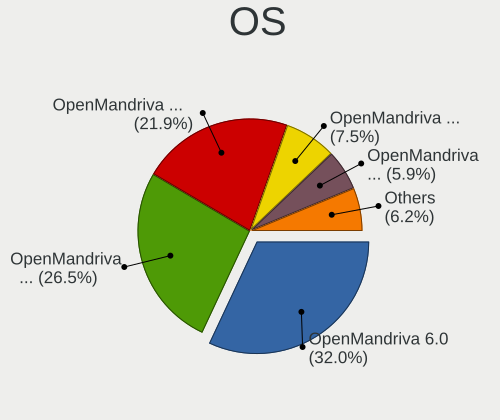

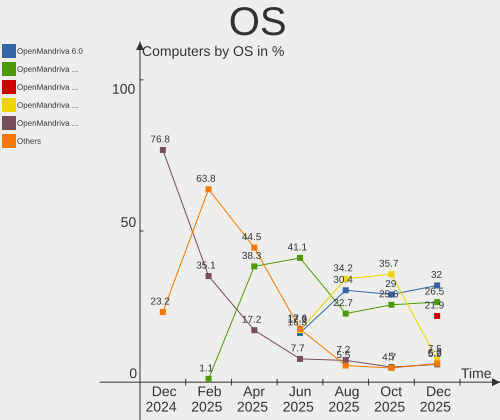

| Name               | Computers | Percent |
|--------------------|-----------|---------|
| OpenMandriva 6.0   | 251       | 31.97%  |
| OpenMandriva 25.90 | 208       | 26.5%   |
| OpenMandriva 25.11 | 172       | 21.91%  |
| OpenMandriva 25.06 | 59        | 7.52%   |
| OpenMandriva 24.12 | 46        | 5.86%   |
| OpenMandriva 23.08 | 15        | 1.91%   |
| OpenMandriva 5.0   | 8         | 1.02%   |
| OpenMandriva 25.04 | 7         | 0.89%   |
| OpenMandriva 24.07 | 5         | 0.64%   |
| OpenMandriva 24.90 | 4         | 0.51%   |
| OpenMandriva 4.3   | 3         | 0.38%   |
| OpenMandriva 23.03 | 3         | 0.38%   |
| OpenMandriva 4.2   | 1         | 0.13%   |
| OpenMandriva 25.02 | 1         | 0.13%   |
| OpenMandriva 25.01 | 1         | 0.13%   |
| OpenMandriva 24.09 | 1         | 0.13%   |

OS Family
---------

OS without a version

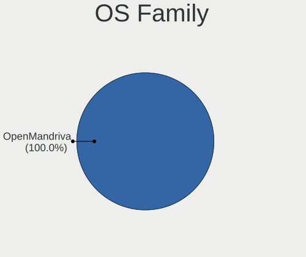

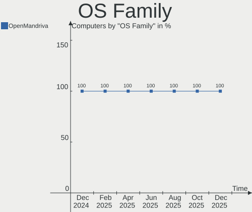

| Name         | Computers | Percent |
|--------------|-----------|---------|
| OpenMandriva | 785       | 100%    |

Kernel
------

Version of the Linux kernel

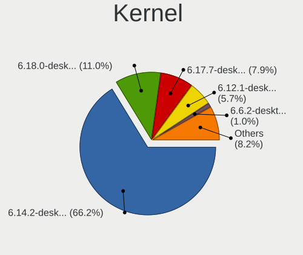

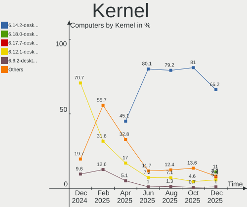

| Version                       | Computers | Percent |
|-------------------------------|-----------|---------|
| 6.14.2-desktop-3omv2590       | 520       | 66.24%  |
| 6.18.0-desktop-1omv2590       | 86        | 10.96%  |
| 6.17.7-desktop-1omv2590       | 62        | 7.9%    |
| 6.12.1-desktop-1omv2490       | 45        | 5.73%   |
| 6.6.2-desktop-1omv2390        | 8         | 1.02%   |
| 6.4.11-desktop-1omv2390       | 8         | 1.02%   |
| 6.15.0-desktop-0.rc2.3omv2590 | 8         | 1.02%   |
| 6.4.8-desktop-2omv2390        | 7         | 0.89%   |
| 6.17.4-desktop-1omv2590       | 5         | 0.64%   |
| 6.10.0-desktop-1omv2490       | 5         | 0.64%   |
| 6.10.9-desktop-1omv2490       | 4         | 0.51%   |
| 6.2.6-desktop-1omv2390        | 3         | 0.38%   |
| 6.18.1-desktop-1omv2590       | 3         | 0.38%   |
| 6.18.0-desktop-0.rc4.2omv2590 | 3         | 0.38%   |
| 5.16.7-desktop-1omv4003       | 3         | 0.38%   |
| 6.17.9-desktop-1omv2590       | 2         | 0.25%   |
| 6.14.0-desktop-0.rc7.2omv2590 | 2         | 0.25%   |
| 6.12.6-desktop-1omv2490       | 2         | 0.25%   |
| 6.18.2-zen2                   | 1         | 0.13%   |
| 6.17.8-desktop-1omv2590       | 1         | 0.13%   |
| 6.17.2-desktop-1omv2590       | 1         | 0.13%   |
| 6.14.2-desktop-2omv2590       | 1         | 0.13%   |
| 6.13.5-desktop-1omv2590       | 1         | 0.13%   |
| 6.13.10-desktop-1omv2590      | 1         | 0.13%   |
| 6.12.9-desktop-1omv2490       | 1         | 0.13%   |
| 6.11.0-desktop-2omv2490       | 1         | 0.13%   |
| 5.10.14-desktop-1omv4002      | 1         | 0.13%   |

Kernel Family
-------------

Linux kernel without a distro release

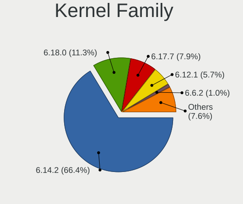

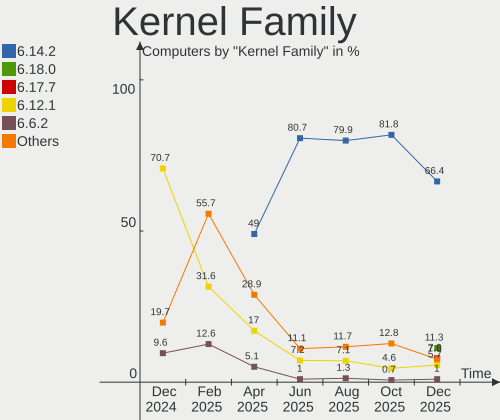

| Version | Computers | Percent |
|---------|-----------|---------|
| 6.14.2  | 521       | 66.37%  |
| 6.18.0  | 89        | 11.34%  |
| 6.17.7  | 62        | 7.9%    |
| 6.12.1  | 45        | 5.73%   |
| 6.6.2   | 8         | 1.02%   |
| 6.4.11  | 8         | 1.02%   |
| 6.15.0  | 8         | 1.02%   |
| 6.4.8   | 7         | 0.89%   |
| 6.17.4  | 5         | 0.64%   |
| 6.10.0  | 5         | 0.64%   |
| 6.10.9  | 4         | 0.51%   |
| 6.2.6   | 3         | 0.38%   |
| 6.18.1  | 3         | 0.38%   |
| 5.16.7  | 3         | 0.38%   |
| 6.17.9  | 2         | 0.25%   |
| 6.14.0  | 2         | 0.25%   |
| 6.12.6  | 2         | 0.25%   |
| 6.18.2  | 1         | 0.13%   |
| 6.17.8  | 1         | 0.13%   |
| 6.17.2  | 1         | 0.13%   |
| 6.13.5  | 1         | 0.13%   |
| 6.13.10 | 1         | 0.13%   |
| 6.12.9  | 1         | 0.13%   |
| 6.11.0  | 1         | 0.13%   |
| 5.10.14 | 1         | 0.13%   |

Kernel Major Ver.
-----------------

Linux kernel major version

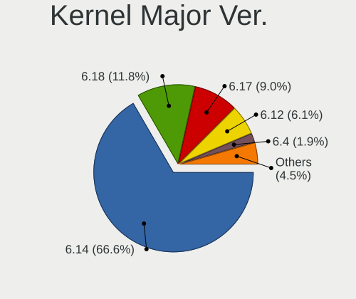

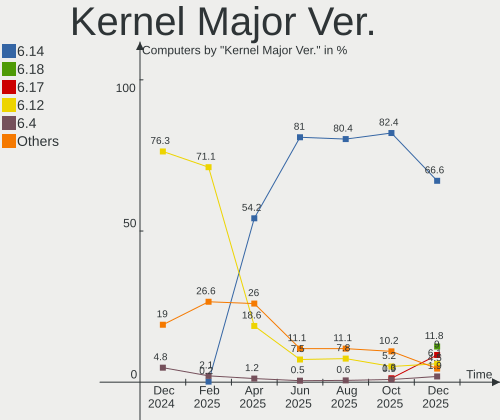

| Version | Computers | Percent |
|---------|-----------|---------|
| 6.14    | 523       | 66.62%  |
| 6.18    | 93        | 11.85%  |
| 6.17    | 71        | 9.04%   |
| 6.12    | 48        | 6.11%   |
| 6.4     | 15        | 1.91%   |
| 6.10    | 9         | 1.15%   |
| 6.6     | 8         | 1.02%   |
| 6.15    | 8         | 1.02%   |
| 6.2     | 3         | 0.38%   |
| 5.16    | 3         | 0.38%   |
| 6.13    | 2         | 0.25%   |
| 6.11    | 1         | 0.13%   |
| 5.10    | 1         | 0.13%   |

Arch
----

OS architecture (x86_64, i586, etc.)

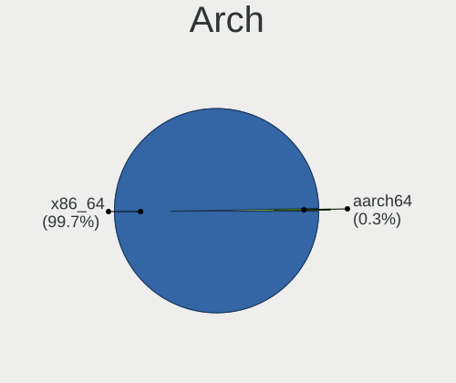

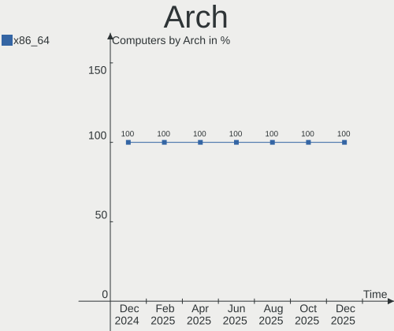

| Name   | Computers | Percent |
|--------|-----------|---------|
| x86_64 | 785       | 100%    |

DE
--

Desktop Environment

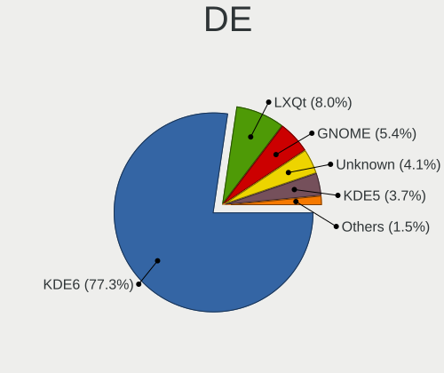

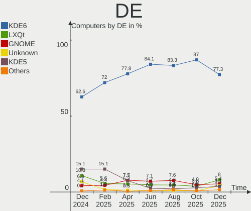

| Name     | Computers | Percent |
|----------|-----------|---------|
| KDE6     | 607       | 77.32%  |
| LXQt     | 63        | 8.03%   |
| GNOME    | 42        | 5.35%   |
| Unknown  | 32        | 4.08%   |
| KDE5     | 29        | 3.69%   |
| XFCE     | 5         | 0.64%   |
| Budgie   | 5         | 0.64%   |
| MATE     | 1         | 0.13%   |
| Cinnamon | 1         | 0.13%   |

Display Server
--------------

X11 or Wayland

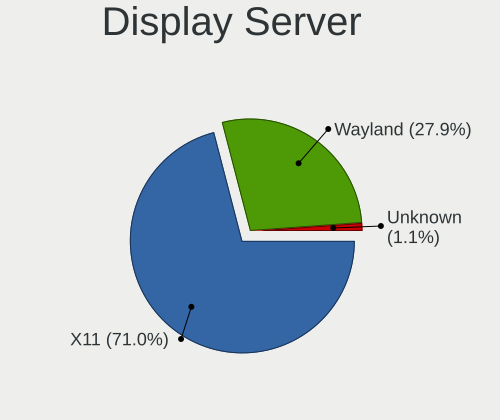

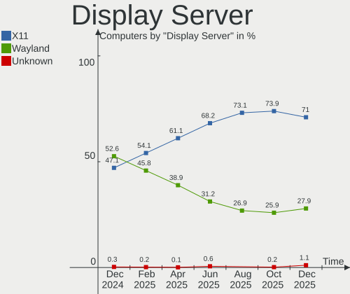

| Name    | Computers | Percent |
|---------|-----------|---------|
| X11     | 557       | 70.96%  |
| Wayland | 219       | 27.9%   |
| Unknown | 9         | 1.15%   |

Display Manager
---------------

SDDM, LightDM, etc.

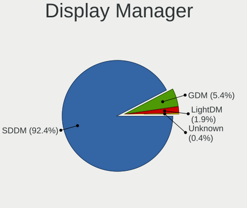

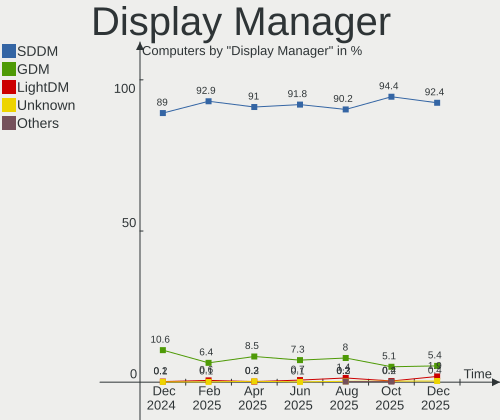

| Name    | Computers | Percent |
|---------|-----------|---------|
| SDDM    | 725       | 92.36%  |
| GDM     | 42        | 5.35%   |
| LightDM | 15        | 1.91%   |
| Unknown | 3         | 0.38%   |

OS Lang
-------

Language

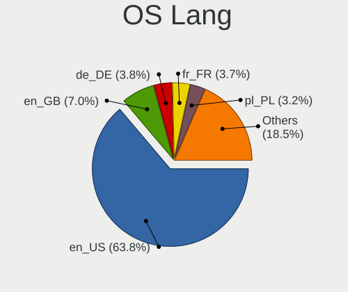

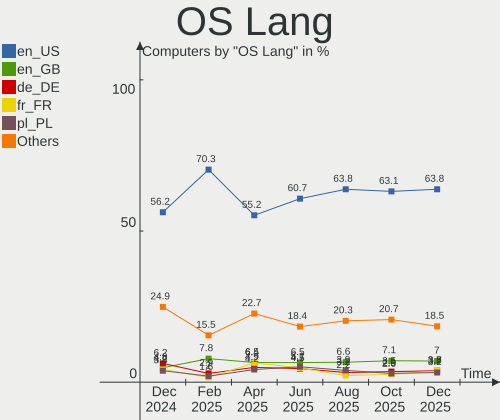

| Lang  | Computers | Percent |
|-------|-----------|---------|
| en_US | 501       | 63.82%  |
| en_GB | 55        | 7.01%   |
| de_DE | 30        | 3.82%   |
| fr_FR | 29        | 3.69%   |
| pl_PL | 25        | 3.18%   |
| ru_RU | 19        | 2.42%   |
| pt_BR | 15        | 1.91%   |
| it_IT | 13        | 1.66%   |
| es_MX | 13        | 1.66%   |
| es_ES | 13        | 1.66%   |
| en_AU | 13        | 1.66%   |
| hu_HU | 6         | 0.76%   |
| en_CA | 6         | 0.76%   |
| UTF-8 | 3         | 0.38%   |
| nl_BE | 3         | 0.38%   |
| en_NZ | 3         | 0.38%   |
| en_IN | 3         | 0.38%   |
| ro_RO | 2         | 0.25%   |
| pt_PT | 2         | 0.25%   |
| fr_CH | 2         | 0.25%   |
| es_PY | 2         | 0.25%   |
| es_AR | 2         | 0.25%   |
| en_SG | 2         | 0.25%   |
| en_PH | 2         | 0.25%   |
| en_DK | 2         | 0.25%   |
| de_AT | 2         | 0.25%   |
| cs_CZ | 2         | 0.25%   |
| uk_UA | 1         | 0.13%   |
| tr_TR | 1         | 0.13%   |
| sv_SE | 1         | 0.13%   |
| nl_NL | 1         | 0.13%   |
| nb_NO | 1         | 0.13%   |
| fr_CA | 1         | 0.13%   |
| fr_BE | 1         | 0.13%   |
| fi_FI | 1         | 0.13%   |
| es_CO | 1         | 0.13%   |
| es_CL | 1         | 0.13%   |
| en_IL | 1         | 0.13%   |
| da_DK | 1         | 0.13%   |
| C     | 1         | 0.13%   |

Boot Mode
---------

EFI or BIOS

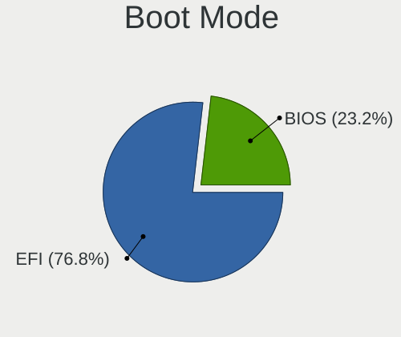

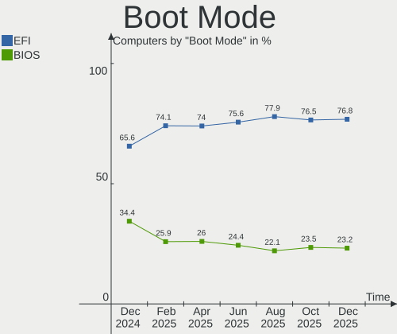

| Mode | Computers | Percent |
|------|-----------|---------|
| EFI  | 603       | 76.82%  |
| BIOS | 182       | 23.18%  |

Filesystem
----------

Type of filesystem

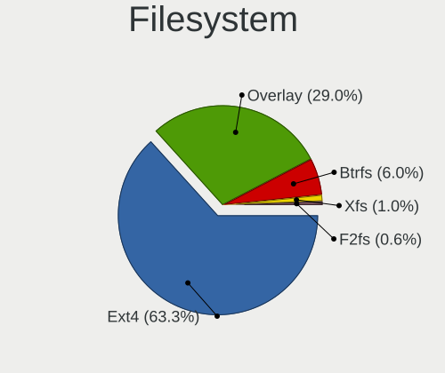

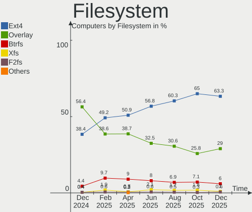

| Type    | Computers | Percent |
|---------|-----------|---------|
| Ext4    | 497       | 63.31%  |
| Overlay | 228       | 29.04%  |
| Btrfs   | 47        | 5.99%   |
| Xfs     | 8         | 1.02%   |
| F2fs    | 5         | 0.64%   |

Part. scheme
------------

Scheme of partitioning

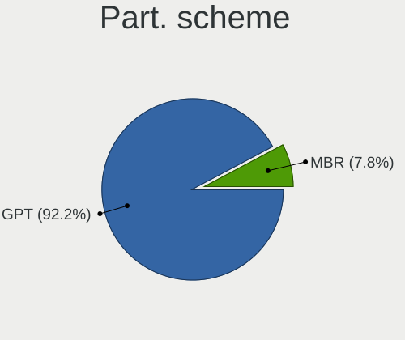

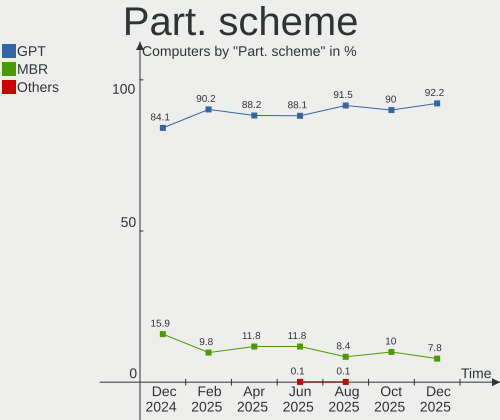

| Type | Computers | Percent |
|------|-----------|---------|
| GPT  | 724       | 92.23%  |
| MBR  | 61        | 7.77%   |

Dual Boot with Linux/BSD
------------------------

Hosting more than one Linux/BSD

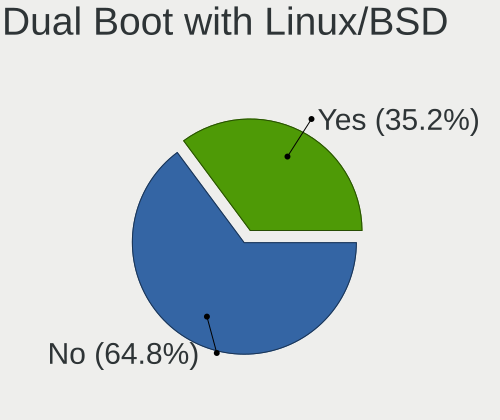

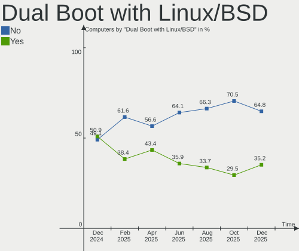

| Dual boot | Computers | Percent |
|-----------|-----------|---------|
| No        | 509       | 64.84%  |
| Yes       | 276       | 35.16%  |

Dual Boot (Win)
---------------

Hosting Linux and Windows

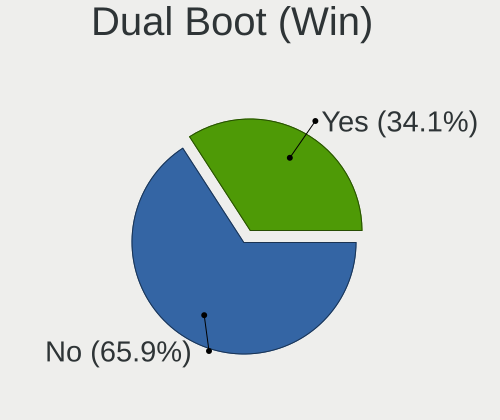

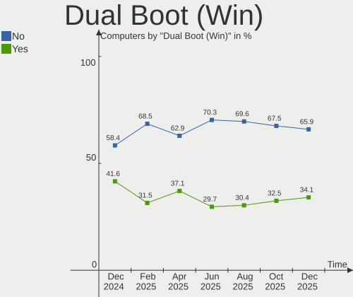

| Dual boot | Computers | Percent |
|-----------|-----------|---------|
| No        | 517       | 65.86%  |
| Yes       | 268       | 34.14%  |

Board
-----

Vendor
------

Motherboard manufacturer

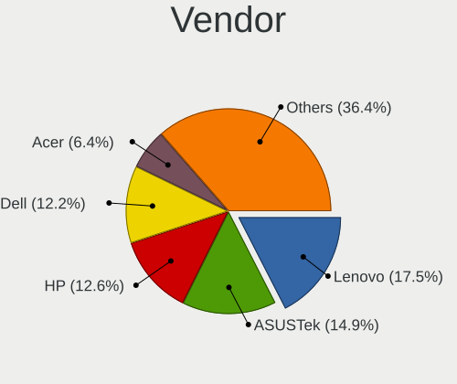

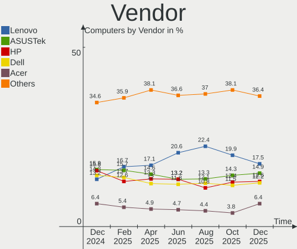

| Name                                 | Computers | Percent |
|--------------------------------------|-----------|---------|
| Lenovo                               | 137       | 17.45%  |
| ASUSTek Computer                     | 117       | 14.9%   |
| Hewlett-Packard                      | 99        | 12.61%  |
| Dell                                 | 96        | 12.23%  |
| Acer                                 | 50        | 6.37%   |
| Gigabyte Technology                  | 47        | 5.99%   |
| MSI                                  | 44        | 5.61%   |
| ASRock                               | 27        | 3.44%   |
| Intel                                | 13        | 1.66%   |
| Apple                                | 13        | 1.66%   |
| Framework                            | 11        | 1.4%    |
| Unknown                              | 10        | 1.27%   |
| Google                               | 9         | 1.15%   |
| Toshiba                              | 7         | 0.89%   |
| Microsoft                            | 6         | 0.76%   |
| GMKtec                               | 6         | 0.76%   |
| Samsung Electronics                  | 5         | 0.64%   |
| Medion                               | 5         | 0.64%   |
| HUAWEI                               | 5         | 0.64%   |
| Shenzhen Meigao Electronic Equipment | 4         | 0.51%   |
| Fujitsu                              | 4         | 0.51%   |
| Biostar                              | 4         | 0.51%   |
| System76                             | 3         | 0.38%   |
| Red Hat                              | 3         | 0.38%   |
| Core Innovations                     | 3         | 0.38%   |
| BESSTAR Tech                         | 3         | 0.38%   |
| AZW                                  | 3         | 0.38%   |
| TUXEDO                               | 2         | 0.25%   |
| Star Labs                            | 2         | 0.25%   |
| Packard Bell                         | 2         | 0.25%   |
| NEC Computers                        | 2         | 0.25%   |
| LG Electronics                       | 2         | 0.25%   |
| GEEKOM                               | 2         | 0.25%   |
| eMachines                            | 2         | 0.25%   |
| ECS                                  | 2         | 0.25%   |
| VSAP                                 | 1         | 0.13%   |
| VIT                                  | 1         | 0.13%   |
| Valve                                | 1         | 0.13%   |
| TongFang                             | 1         | 0.13%   |
| SZ ReachingTech Limited              | 1         | 0.13%   |

Model
-----

Motherboard model

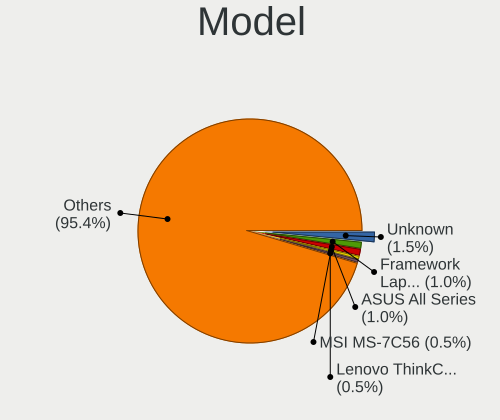

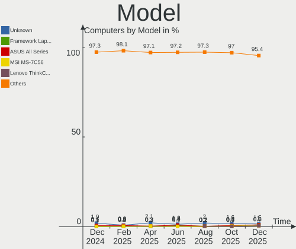

| Name                                                  | Computers | Percent |
|-------------------------------------------------------|-----------|---------|
| Unknown                                               | 12        | 1.53%   |
| Framework Laptop 13 (AMD Ryzen 7040Series)            | 8         | 1.02%   |
| ASUS All Series                                       | 8         | 1.02%   |
| MSI MS-7C56                                           | 4         | 0.51%   |
| Lenovo ThinkCentre M72e 0967B5U                       | 4         | 0.51%   |
| Red Hat KVM                                           | 3         | 0.38%   |
| MSI MS-7C02                                           | 3         | 0.38%   |
| Microsoft Surface Pro 2                               | 3         | 0.38%   |
| Lenovo Legion Go 8APU1 83E1                           | 3         | 0.38%   |
| HP Pavilion Desktop TP01-0xxx                         | 3         | 0.38%   |
| HP Pavilion 15                                        | 3         | 0.38%   |
| Dell XPS 13 9360                                      | 3         | 0.38%   |
| Dell OptiPlex 7010                                    | 3         | 0.38%   |
| Dell Inspiron 3521                                    | 3         | 0.38%   |
| Core Innovations CLC14364                             | 3         | 0.38%   |
| AZW SER                                               | 3         | 0.38%   |
| System76 Lemur Pro                                    | 2         | 0.25%   |
| Shenzhen Meigao Electronic Equipment EliteMini Series | 2         | 0.25%   |
| MSI MS-7C95                                           | 2         | 0.25%   |
| MSI MS-7C91                                           | 2         | 0.25%   |
| MSI MS-7C37                                           | 2         | 0.25%   |
| Medion E11201                                         | 2         | 0.25%   |
| Lenovo IdeaPadFlex 5 14ABR8 82XX                      | 2         | 0.25%   |
| Lenovo IdeaPad 3 15ITL6 82H8                          | 2         | 0.25%   |
| Lenovo G50-45 80E3                                    | 2         | 0.25%   |
| Intel NUC6i5SYK                                       | 2         | 0.25%   |
| Intel NUC10i3FNH                                      | 2         | 0.25%   |
| HP Z4 G4 Workstation                                  | 2         | 0.25%   |
| HP ProBook 450 G3                                     | 2         | 0.25%   |
| HP Laptop 15-fd0xxx                                   | 2         | 0.25%   |
| HP Laptop 15-fc0xxx                                   | 2         | 0.25%   |
| HP Laptop 15-bw0xx                                    | 2         | 0.25%   |
| HP Laptop 14-dq0xxx                                   | 2         | 0.25%   |
| HP EliteDesk 800 G1 SFF                               | 2         | 0.25%   |
| HP Compaq Pro 6300 SFF                                | 2         | 0.25%   |
| HP 15                                                 | 2         | 0.25%   |
| Google Caroline                                       | 2         | 0.25%   |
| Google Candy                                          | 2         | 0.25%   |
| GMKtec NucBox_K12                                     | 2         | 0.25%   |
| Gigabyte 970A-DS3P                                    | 2         | 0.25%   |

Model Family
------------

Motherboard model prefix

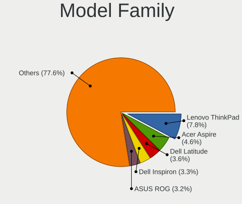

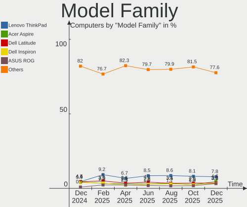

| Name                      | Computers | Percent |
|---------------------------|-----------|---------|
| Lenovo ThinkPad           | 61        | 7.77%   |
| Acer Aspire               | 36        | 4.59%   |
| Dell Latitude             | 28        | 3.57%   |
| Dell Inspiron             | 26        | 3.31%   |
| ASUS ROG                  | 25        | 3.18%   |
| Lenovo IdeaPad            | 20        | 2.55%   |
| HP Laptop                 | 20        | 2.55%   |
| Dell Precision            | 19        | 2.42%   |
| Lenovo ThinkCentre        | 17        | 2.17%   |
| ASUS PRIME                | 16        | 2.04%   |
| ASUS VivoBook             | 13        | 1.66%   |
| Dell OptiPlex             | 12        | 1.53%   |
| Unknown                   | 12        | 1.53%   |
| HP Pavilion               | 11        | 1.4%    |
| Framework Laptop          | 11        | 1.4%    |
| HP EliteBook              | 10        | 1.27%   |
| HP ProBook                | 9         | 1.15%   |
| Dell XPS                  | 9         | 1.15%   |
| Lenovo Legion             | 8         | 1.02%   |
| ASUS All                  | 8         | 1.02%   |
| Microsoft Surface         | 6         | 0.76%   |
| Lenovo Yoga               | 6         | 0.76%   |
| HP Compaq                 | 6         | 0.76%   |
| ASUS TUF                  | 6         | 0.76%   |
| HP EliteDesk              | 5         | 0.64%   |
| GMKtec NucBox             | 5         | 0.64%   |
| MSI MS-7C56               | 4         | 0.51%   |
| Lenovo IdeaPadFlex        | 4         | 0.51%   |
| ASRock X570               | 4         | 0.51%   |
| Red Hat KVM               | 3         | 0.38%   |
| MSI MS-7C02               | 3         | 0.38%   |
| Lenovo ThinkBook          | 3         | 0.38%   |
| HP ZBook                  | 3         | 0.38%   |
| HP Stream                 | 3         | 0.38%   |
| HP Presario               | 3         | 0.38%   |
| Gigabyte B650             | 3         | 0.38%   |
| Core Innovations CLC14364 | 3         | 0.38%   |
| AZW SER                   | 3         | 0.38%   |
| ASUS Zenbook              | 3         | 0.38%   |
| ASUS SABERTOOTH           | 3         | 0.38%   |

MFG Year
--------

Motherboard manufacture year

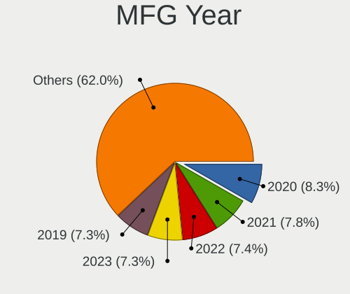

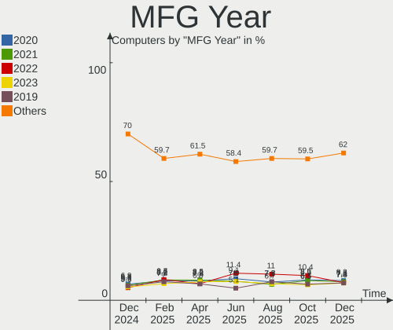

| Year | Computers | Percent |
|------|-----------|---------|
| 2020 | 65        | 8.28%   |
| 2021 | 61        | 7.77%   |
| 2022 | 58        | 7.39%   |
| 2023 | 57        | 7.26%   |
| 2019 | 57        | 7.26%   |
| 2012 | 53        | 6.75%   |
| 2017 | 52        | 6.62%   |
| 2013 | 49        | 6.24%   |
| 2024 | 47        | 5.99%   |
| 2018 | 47        | 5.99%   |
| 2011 | 47        | 5.99%   |
| 2025 | 42        | 5.35%   |
| 2016 | 37        | 4.71%   |
| 2015 | 32        | 4.08%   |
| 2014 | 29        | 3.69%   |
| 2010 | 22        | 2.8%    |
| 2009 | 13        | 1.66%   |
| 2008 | 9         | 1.15%   |
| 2007 | 4         | 0.51%   |
| 2006 | 4         | 0.51%   |

Form Factor
-----------

Physical design of the computer

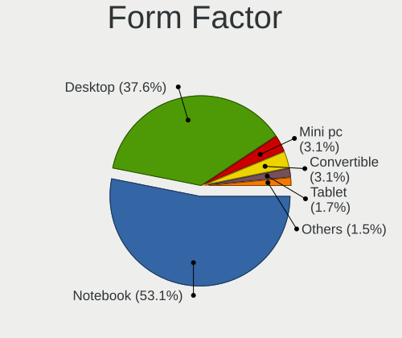

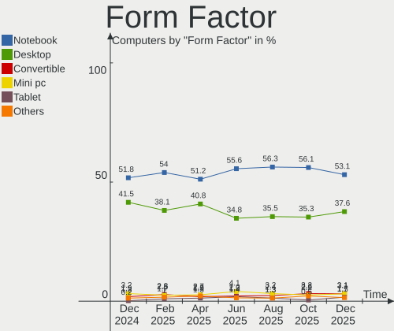

| Name        | Computers | Percent |
|-------------|-----------|---------|
| Notebook    | 417       | 53.12%  |
| Desktop     | 295       | 37.58%  |
| Convertible | 24        | 3.06%   |
| Mini pc     | 24        | 3.06%   |
| Tablet      | 13        | 1.66%   |
| All in one  | 10        | 1.27%   |
| Server      | 2         | 0.25%   |

Secure Boot
-----------

Enabled or disabled

| State    | Computers | Percent |
|----------|-----------|---------|
| Disabled | 785       | 100%    |

Coreboot
--------

Have coreboot on board

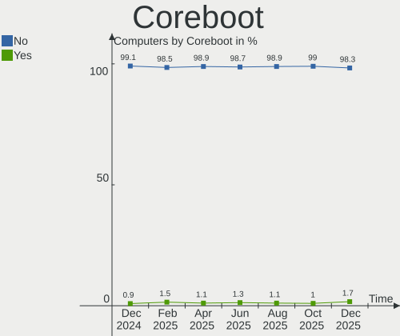

| Used | Computers | Percent |
|------|-----------|---------|
| No   | 772       | 98.34%  |
| Yes  | 13        | 1.66%   |

RAM Size
--------

Total RAM memory

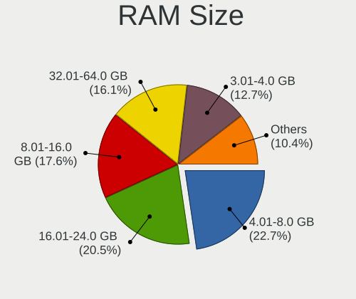

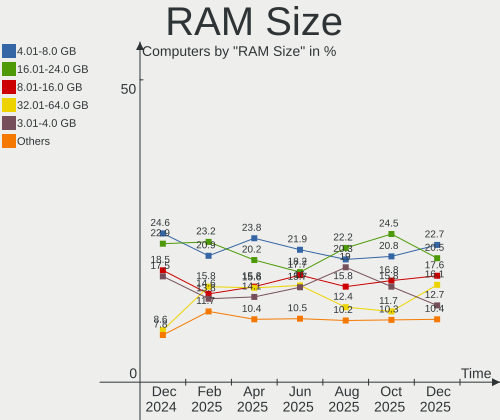

| Size in GB      | Computers | Percent |
|-----------------|-----------|---------|
| 4.01-8.0        | 178       | 22.68%  |
| 16.01-24.0      | 161       | 20.51%  |
| 8.01-16.0       | 138       | 17.58%  |
| 32.01-64.0      | 126       | 16.05%  |
| 3.01-4.0        | 100       | 12.74%  |
| 64.01-256.0     | 42        | 5.35%   |
| 24.01-32.0      | 24        | 3.06%   |
| 2.01-3.0        | 8         | 1.02%   |
| 1.01-2.0        | 7         | 0.89%   |
| More than 256.0 | 1         | 0.13%   |

RAM Used
--------

Used RAM memory

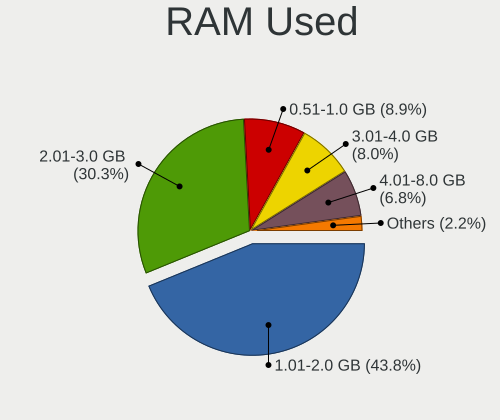

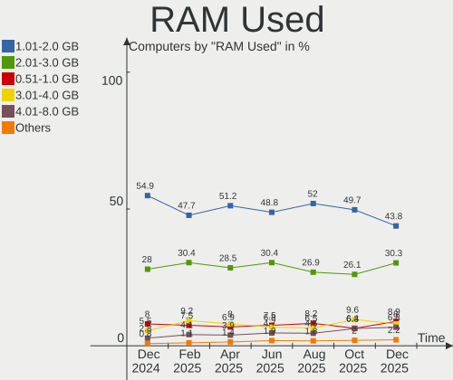

| Used GB    | Computers | Percent |
|------------|-----------|---------|
| 1.01-2.0   | 344       | 43.82%  |
| 2.01-3.0   | 238       | 30.32%  |
| 0.51-1.0   | 70        | 8.92%   |
| 3.01-4.0   | 63        | 8.03%   |
| 4.01-8.0   | 53        | 6.75%   |
| 0.01-0.5   | 10        | 1.27%   |
| 8.01-16.0  | 6         | 0.76%   |
| 16.01-24.0 | 1         | 0.13%   |

Total Drives
------------

Number of drives on board

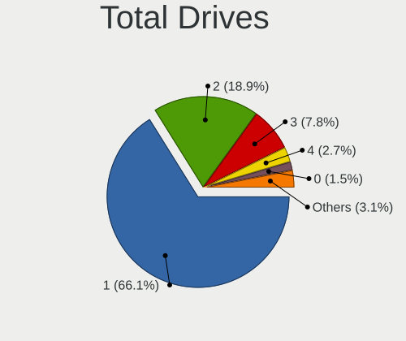

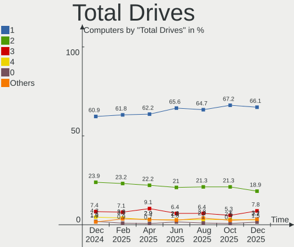

| Drives | Computers | Percent |
|--------|-----------|---------|
| 1      | 519       | 66.11%  |
| 2      | 148       | 18.85%  |
| 3      | 61        | 7.77%   |
| 4      | 21        | 2.68%   |
| 0      | 12        | 1.53%   |
| 6      | 9         | 1.15%   |
| 5      | 9         | 1.15%   |
| 16     | 1         | 0.13%   |
| 12     | 1         | 0.13%   |
| 10     | 1         | 0.13%   |
| 9      | 1         | 0.13%   |
| 8      | 1         | 0.13%   |
| 7      | 1         | 0.13%   |

Has CD-ROM
----------

Has CD-ROM on board

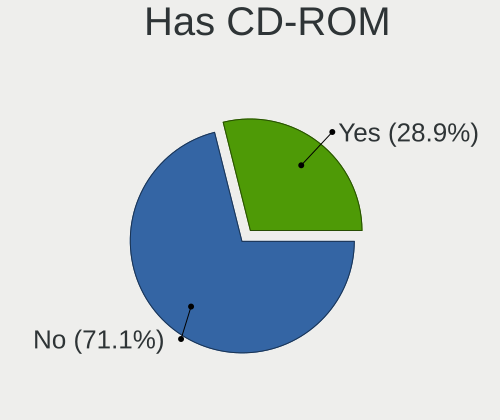

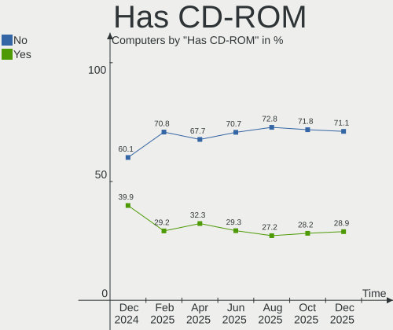

| Presented | Computers | Percent |
|-----------|-----------|---------|
| No        | 558       | 71.08%  |
| Yes       | 227       | 28.92%  |

Has Ethernet
------------

Has Ethernet on board

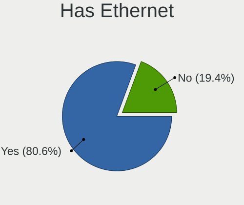

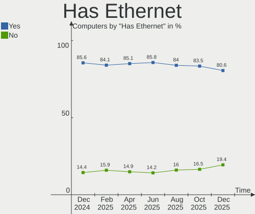

| Presented | Computers | Percent |
|-----------|-----------|---------|
| Yes       | 633       | 80.64%  |
| No        | 152       | 19.36%  |

Has WiFi
--------

Has WiFi module

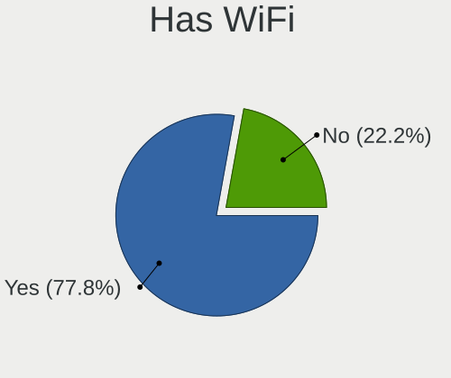

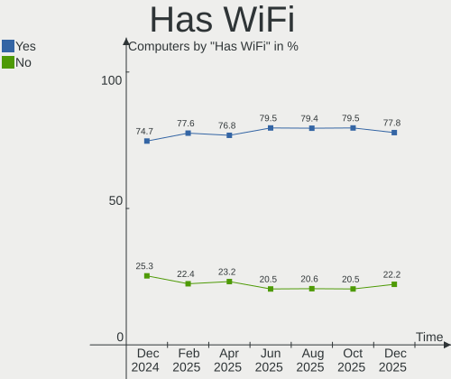

| Presented | Computers | Percent |
|-----------|-----------|---------|
| Yes       | 611       | 77.83%  |
| No        | 174       | 22.17%  |

Has Bluetooth
-------------

Has Bluetooth module

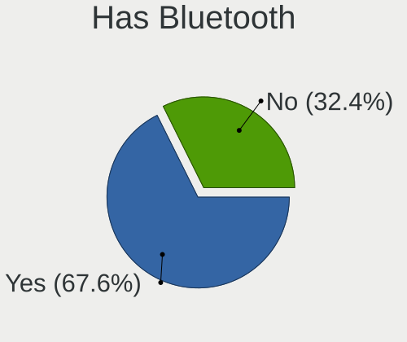

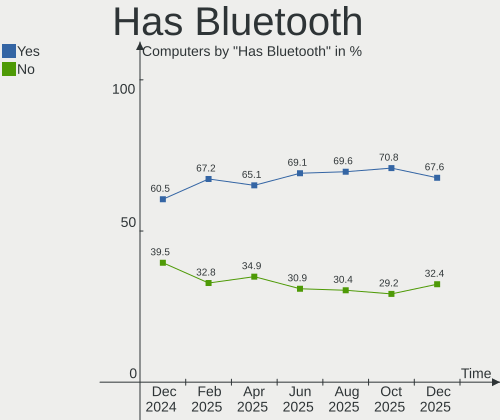

| Presented | Computers | Percent |
|-----------|-----------|---------|
| Yes       | 531       | 67.64%  |
| No        | 254       | 32.36%  |

Location
--------

Country
-------

Geographic location (country)

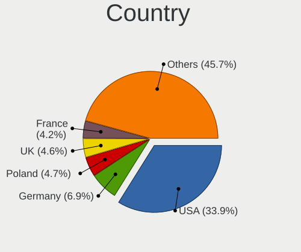

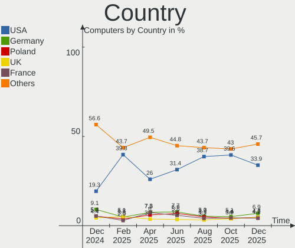

| Country      | Computers | Percent |
|--------------|-----------|---------|
| USA          | 266       | 33.89%  |
| Germany      | 54        | 6.88%   |
| Poland       | 37        | 4.71%   |
| UK           | 36        | 4.59%   |
| France       | 33        | 4.2%    |
| Brazil       | 32        | 4.08%   |
| Russia       | 23        | 2.93%   |
| Australia    | 21        | 2.68%   |
| Italy        | 18        | 2.29%   |
| Spain        | 17        | 2.17%   |
| Canada       | 16        | 2.04%   |
| Mexico       | 14        | 1.78%   |
| Indonesia    | 14        | 1.78%   |
| Finland      | 10        | 1.27%   |
| Sweden       | 9         | 1.15%   |
| India        | 9         | 1.15%   |
| Hungary      | 8         | 1.02%   |
| Netherlands  | 6         | 0.76%   |
| Japan        | 6         | 0.76%   |
| Czechia      | 6         | 0.76%   |
| Chile        | 6         | 0.76%   |
| Romania      | 5         | 0.64%   |
| Norway       | 5         | 0.64%   |
| Lithuania    | 5         | 0.64%   |
| Greece       | 5         | 0.64%   |
| Denmark      | 5         | 0.64%   |
| Croatia      | 5         | 0.64%   |
| Belarus      | 5         | 0.64%   |
| Austria      | 5         | 0.64%   |
| Venezuela    | 4         | 0.51%   |
| Switzerland  | 4         | 0.51%   |
| Portugal     | 4         | 0.51%   |
| Iran         | 4         | 0.51%   |
| China        | 4         | 0.51%   |
| Bulgaria     | 4         | 0.51%   |
| Argentina    | 4         | 0.51%   |
| Vietnam      | 3         | 0.38%   |
| Saudi Arabia | 3         | 0.38%   |
| New Zealand  | 3         | 0.38%   |
| Malaysia     | 3         | 0.38%   |

City
----

Geographic location (city)

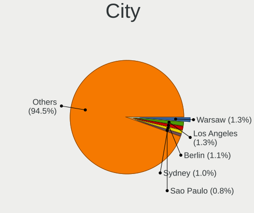

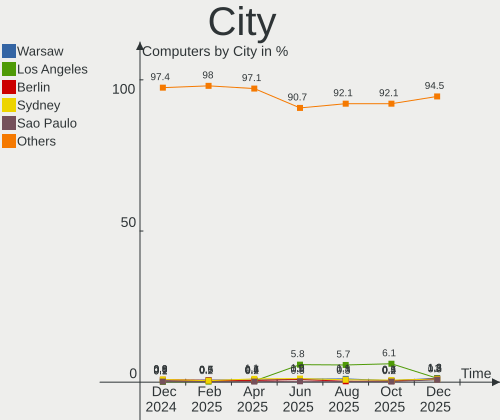

| City             | Computers | Percent |
|------------------|-----------|---------|
| Warsaw           | 10        | 1.27%   |
| Los Angeles      | 10        | 1.27%   |
| Berlin           | 9         | 1.15%   |
| Sydney           | 8         | 1.02%   |
| Sao Paulo        | 6         | 0.76%   |
| Vilnius          | 5         | 0.64%   |
| Munich           | 5         | 0.64%   |
| Krakow           | 5         | 0.64%   |
| Vancouver        | 4         | 0.51%   |
| Paris            | 4         | 0.51%   |
| Milan            | 4         | 0.51%   |
| Knoxville        | 4         | 0.51%   |
| Helsinki         | 4         | 0.51%   |
| Denver           | 4         | 0.51%   |
| Concepción      | 4         | 0.51%   |
| Aiken            | 4         | 0.51%   |
| Zapopan          | 3         | 0.38%   |
| Washington       | 3         | 0.38%   |
| Vienna           | 3         | 0.38%   |
| Torun            | 3         | 0.38%   |
| Sofia            | 3         | 0.38%   |
| Rome             | 3         | 0.38%   |
| Portland         | 3         | 0.38%   |
| Orange           | 3         | 0.38%   |
| Newcastle        | 3         | 0.38%   |
| Minsk            | 3         | 0.38%   |
| Melbourne        | 3         | 0.38%   |
| Manchester       | 3         | 0.38%   |
| Las Vegas        | 3         | 0.38%   |
| Guyancourt       | 3         | 0.38%   |
| East Saint Louis | 3         | 0.38%   |
| DuBois           | 3         | 0.38%   |
| Chicago          | 3         | 0.38%   |
| Budapest         | 3         | 0.38%   |
| Brisbane         | 3         | 0.38%   |
| Adelaide         | 3         | 0.38%   |
| Zlín            | 2         | 0.25%   |
| York             | 2         | 0.25%   |
| Wroclaw          | 2         | 0.25%   |
| Upplands Vasby   | 2         | 0.25%   |

Drives
------

Drive Vendor
------------

Hard drive vendors

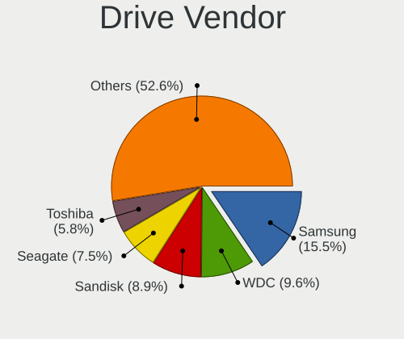

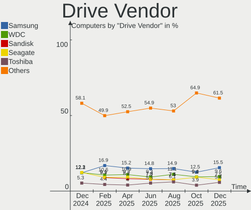

| Vendor                       | Computers | Drives | Percent |
|------------------------------|-----------|--------|---------|
| Samsung Electronics          | 171       | 210    | 15.53%  |
| WDC                          | 106       | 129    | 9.63%   |
| Sandisk                      | 98        | 104    | 8.9%    |
| Seagate                      | 83        | 97     | 7.54%   |
| Toshiba                      | 64        | 70     | 5.81%   |
| Kingston                     | 54        | 56     | 4.9%    |
| Unknown                      | 44        | 49     | 4%      |
| Micron Technology            | 36        | 37     | 3.27%   |
| Crucial                      | 35        | 39     | 3.18%   |
| SK hynix                     | 30        | 38     | 2.72%   |
| Kingston Technology Company  | 27        | 30     | 2.45%   |
| China                        | 25        | 26     | 2.27%   |
| MAXIO Technology (Hangzhou)  | 21        | 23     | 1.91%   |
| Micron/Crucial Technology    | 20        | 21     | 1.82%   |
| Intel                        | 20        | 21     | 1.82%   |
| Phison Electronics           | 17        | 23     | 1.54%   |
| Hitachi                      | 17        | 18     | 1.54%   |
| KIOXIA                       | 14        | 14     | 1.27%   |
| A-DATA Technology            | 14        | 14     | 1.27%   |
| HGST                         | 11        | 12     | 1%      |
| Team                         | 9         | 10     | 0.82%   |
| PNY                          | 9         | 10     | 0.82%   |
| Patriot                      | 9         | 9      | 0.82%   |
| SPCC                         | 8         | 9      | 0.73%   |
| Silicon Motion               | 8         | 8      | 0.73%   |
| GOODRAM                      | 7         | 9      | 0.64%   |
| ADATA Technology             | 6         | 6      | 0.54%   |
| Shenzhen Longsys Electronics | 5         | 5      | 0.45%   |
| Apple                        | 5         | 5      | 0.45%   |
| Unknown                      | 5         | 5      | 0.45%   |
| Verbatim                     | 4         | 4      | 0.36%   |
| Union Memory (Shenzhen)      | 4         | 4      | 0.36%   |
| Transcend                    | 4         | 4      | 0.36%   |
| Realtek Semiconductor        | 4         | 4      | 0.36%   |
| Netac                        | 4         | 4      | 0.36%   |
| Biwin Storage Technology     | 4         | 4      | 0.36%   |
| Maxtor                       | 3         | 3      | 0.27%   |
| LITEONIT                     | 3         | 4      | 0.27%   |
| LITEON                       | 3         | 3      | 0.27%   |
| Lexar                        | 3         | 3      | 0.27%   |

Drive Model
-----------

Hard drive models

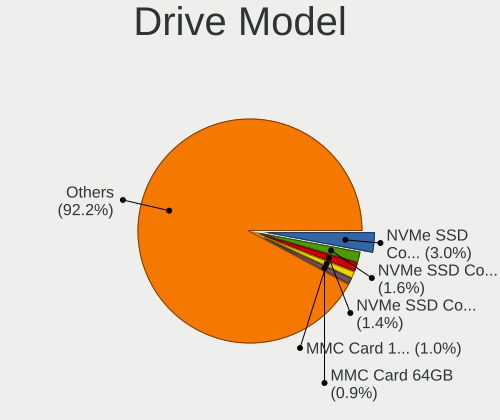

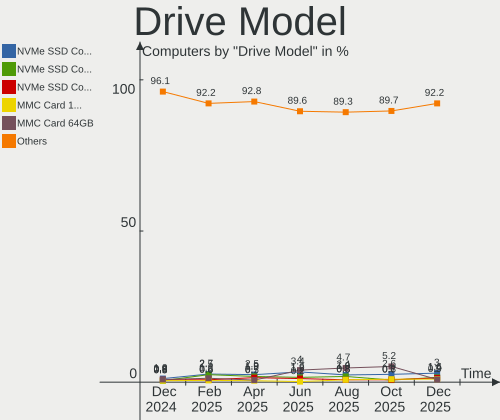

| Model                                                                   | Computers | Percent |
|-------------------------------------------------------------------------|-----------|---------|
| Samsung NVMe SSD Controller SM981/PM981/PM983 1TB                       | 35        | 2.95%   |
| Samsung NVMe SSD Controller PM9A1/PM9A3/980PRO 1TB                      | 19        | 1.6%    |
| MAXIO (Hangzhou) NVMe SSD Controller MAP1202 2TB                        | 16        | 1.35%   |
| Unknown MMC Card  128GB                                                 | 12        | 1.01%   |
| Unknown MMC Card  64GB                                                  | 11        | 0.93%   |
| Sandisk WD Black SN770 / PC SN740 256GB / PC SN560 (DRAM-less) NVMe SSD | 11        | 0.93%   |
| Samsung NVMe SSD Controller 980 (DRAM-less) 256GB                       | 11        | 0.93%   |
| Samsung NVMe SSD Controller SM961/PM961/SM963 1024GB                    | 9         | 0.76%   |
| Kingston SA400S37240G 240GB SSD                                         | 9         | 0.76%   |
| Unknown SD/MMC/MS PRO 2GB                                               | 8         | 0.68%   |
| Unknown MMC Card  32GB                                                  | 8         | 0.68%   |
| Toshiba XG6 NVMe SSD Controller 1024GB                                  | 8         | 0.68%   |
| Kingston SA400S37960G 960GB SSD                                         | 8         | 0.68%   |
| Seagate ST500DM002-1BD142 500GB                                         | 7         | 0.59%   |
| Seagate ST1000LM035-1RK172 1TB                                          | 7         | 0.59%   |
| Samsung SSD 860 EVO 500GB                                               | 7         | 0.59%   |
| Kingston SA400S37480G 480GB SSD                                         | 7         | 0.59%   |
| Crucial CT500MX500SSD1 500GB                                            | 6         | 0.51%   |
| Crucial CT1000MX500SSD1 1TB                                             | 6         | 0.51%   |
| Toshiba MQ01ABD100 1TB                                                  | 5         | 0.42%   |
| Toshiba DT01ACA100 1TB                                                  | 5         | 0.42%   |
| Silicon Motion SM2263EN/SM2263XT SSD Controller 512GB                   | 5         | 0.42%   |
| Seagate ST500LT012-1DG142 500GB                                         | 5         | 0.42%   |
| Sandisk WD Blue SN550 NVMe SSD 1024GB                                   | 5         | 0.42%   |
| Samsung SSD 980 1TB                                                     | 5         | 0.42%   |
| Samsung SSD 870 EVO 500GB                                               | 5         | 0.42%   |
| Samsung SSD 860 EVO 250GB                                               | 5         | 0.42%   |
| Samsung SSD 840 EVO 250GB                                               | 5         | 0.42%   |
| Samsung NVMe SSD Controller PM9C1a (DRAM-less) 1TB                      | 5         | 0.42%   |
| Phison E12 NVMe Controller 1TB                                          | 5         | 0.42%   |
| Micron/Crucial P2 NVMe PCIe SSD 2TB                                     | 5         | 0.42%   |
| Kingston Company OM3PDP3 NVMe SSD 256GB                                 | 5         | 0.42%   |
| Kingston SV300S37A120G 120GB SSD                                        | 5         | 0.42%   |
| Kingston SA400S37120G 120GB SSD                                         | 5         | 0.42%   |
| Crucial CT240BX500SSD1 240GB                                            | 5         | 0.42%   |
| Unknown                                                                 | 5         | 0.42%   |
| WDC WD10EZEX-08WN4A0 1TB                                                | 4         | 0.34%   |
| Unknown MMC Card  16GB                                                  | 4         | 0.34%   |
| Toshiba DT01ACA050 500GB                                                | 4         | 0.34%   |
| SK hynix BC501 NVMe Solid State Drive 512GB                             | 4         | 0.34%   |

HDD Vendor
----------

Hard disk drive vendors

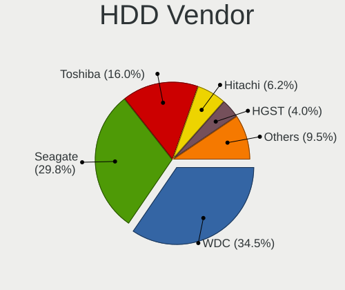

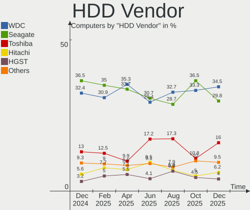

| Vendor              | Computers | Drives | Percent |
|---------------------|-----------|--------|---------|
| WDC                 | 95        | 110    | 34.55%  |
| Seagate             | 82        | 95     | 29.82%  |
| Toshiba             | 44        | 49     | 16%     |
| Hitachi             | 17        | 18     | 6.18%   |
| HGST                | 11        | 12     | 4%      |
| Unknown             | 8         | 8      | 2.91%   |
| Samsung Electronics | 7         | 8      | 2.55%   |
| Maxtor              | 3         | 3      | 1.09%   |
| HPE                 | 3         | 3      | 1.09%   |
| Fujitsu             | 3         | 3      | 1.09%   |
| KIOXIA              | 1         | 1      | 0.36%   |
| Apple               | 1         | 1      | 0.36%   |

SSD Vendor
----------

Solid state drive vendors

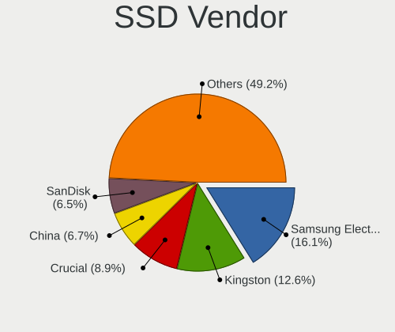

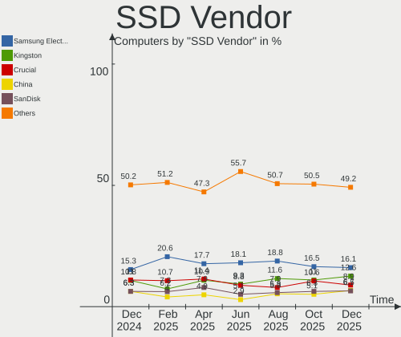

| Vendor              | Computers | Drives | Percent |
|---------------------|-----------|--------|---------|
| Samsung Electronics | 60        | 66     | 16.13%  |
| Kingston            | 47        | 48     | 12.63%  |
| Crucial             | 33        | 36     | 8.87%   |
| China               | 25        | 26     | 6.72%   |
| SanDisk             | 24        | 25     | 6.45%   |
| WDC                 | 16        | 16     | 4.3%    |
| A-DATA Technology   | 14        | 14     | 3.76%   |
| PNY                 | 9         | 10     | 2.42%   |
| Team                | 8         | 9      | 2.15%   |
| Patriot             | 8         | 8      | 2.15%   |
| Intel               | 8         | 8      | 2.15%   |
| SK hynix            | 7         | 14     | 1.88%   |
| GOODRAM             | 7         | 9      | 1.88%   |
| SPCC                | 6         | 7      | 1.61%   |
| Micron Technology   | 6         | 6      | 1.61%   |
| Verbatim            | 4         | 4      | 1.08%   |
| Netac               | 4         | 4      | 1.08%   |
| Toshiba             | 3         | 3      | 0.81%   |
| LITEONIT            | 3         | 4      | 0.81%   |
| LITEON              | 3         | 3      | 0.81%   |
| Lexar               | 3         | 3      | 0.81%   |
| Gigabyte Technology | 3         | 3      | 0.81%   |
| Apple               | 3         | 3      | 0.81%   |
| Apacer              | 3         | 3      | 0.81%   |
| Unknown             | 3         | 3      | 0.81%   |
| V-GeN               | 2         | 2      | 0.54%   |
| Transcend           | 2         | 2      | 0.54%   |
| T-FORCE             | 2         | 2      | 0.54%   |
| Smartbuy            | 2         | 2      | 0.54%   |
| OCZ                 | 2         | 2      | 0.54%   |
| Leven               | 2         | 2      | 0.54%   |
| KODAK               | 2         | 2      | 0.54%   |
| KIOXIA-EXCERIA      | 2         | 2      | 0.54%   |
| KingSpec            | 2         | 2      | 0.54%   |
| Intenso             | 2         | 3      | 0.54%   |
| Hewlett-Packard     | 2         | 2      | 0.54%   |
| Fanxiang            | 2         | 2      | 0.54%   |
| Colorful            | 2         | 2      | 0.54%   |
| ZOTAC               | 1         | 1      | 0.27%   |
| Zheino              | 1         | 1      | 0.27%   |

Drive Kind
----------

HDD or SSD

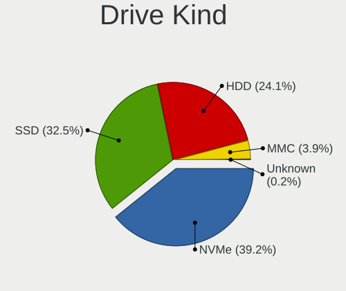

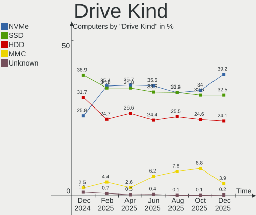

| Kind    | Computers | Drives | Percent |
|---------|-----------|--------|---------|
| NVMe    | 381       | 482    | 39.24%  |
| SSD     | 316       | 398    | 32.54%  |
| HDD     | 234       | 311    | 24.1%   |
| MMC     | 38        | 43     | 3.91%   |
| Unknown | 2         | 2      | 0.21%   |

Drive Connector
---------------

SATA, SAS, NVMe, etc.

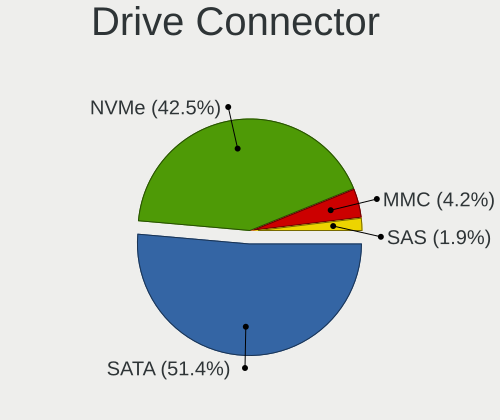

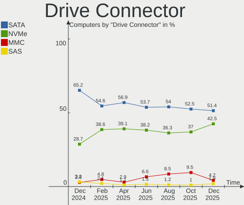

| Type | Computers | Drives | Percent |
|------|-----------|--------|---------|
| SATA | 461       | 691    | 51.39%  |
| NVMe | 381       | 481    | 42.47%  |
| MMC  | 38        | 43     | 4.24%   |
| SAS  | 17        | 21     | 1.9%    |

Drive Size
----------

Size of hard drive

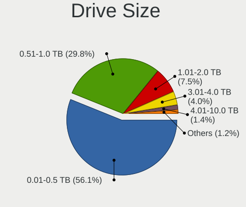

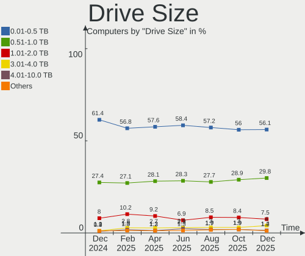

| Size in TB | Computers | Drives | Percent |
|------------|-----------|--------|---------|
| 0.01-0.5   | 322       | 396    | 56.1%   |
| 0.51-1.0   | 171       | 217    | 29.79%  |
| 1.01-2.0   | 43        | 48     | 7.49%   |
| 3.01-4.0   | 23        | 28     | 4.01%   |
| 4.01-10.0  | 8         | 10     | 1.39%   |
| 2.01-3.0   | 4         | 4      | 0.7%    |
| 10.01-20.0 | 2         | 5      | 0.35%   |
| 20.01-50.0 | 1         | 1      | 0.17%   |

Space Total
-----------

Amount of disk space available on the file system

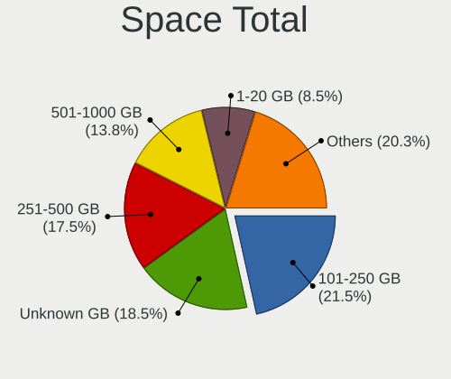

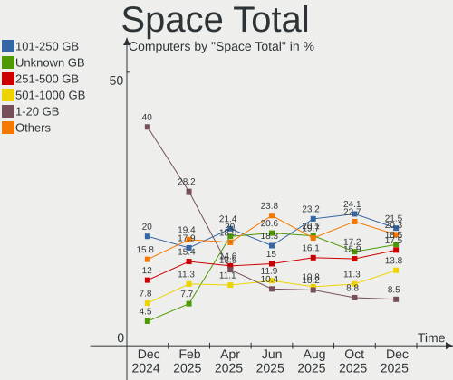

| Size in GB     | Computers | Percent |
|----------------|-----------|---------|
| 101-250        | 169       | 21.53%  |
| Unknown        | 145       | 18.47%  |
| 251-500        | 137       | 17.45%  |
| 501-1000       | 108       | 13.76%  |
| 1-20           | 67        | 8.54%   |
| 1001-2000      | 43        | 5.48%   |
| 51-100         | 40        | 5.1%    |
| More than 3000 | 33        | 4.2%    |
| 2001-3000      | 22        | 2.8%    |
| 21-50          | 21        | 2.68%   |

Space Used
----------

Amount of used disk space

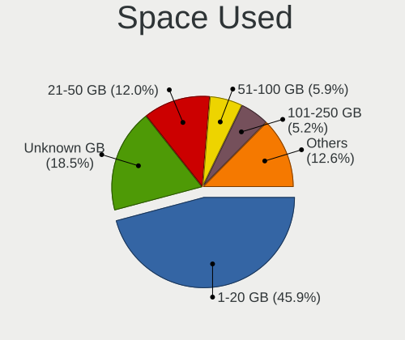

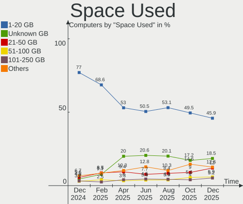

| Used GB        | Computers | Percent |
|----------------|-----------|---------|
| 1-20           | 360       | 45.86%  |
| Unknown        | 145       | 18.47%  |
| 21-50          | 94        | 11.97%  |
| 51-100         | 46        | 5.86%   |
| 101-250        | 41        | 5.22%   |
| 251-500        | 32        | 4.08%   |
| 0              | 22        | 2.8%    |
| 1001-2000      | 19        | 2.42%   |
| 501-1000       | 14        | 1.78%   |
| More than 3000 | 6         | 0.76%   |
| 2001-3000      | 6         | 0.76%   |

Malfunc. Drives
---------------

Drive models with a malfunction

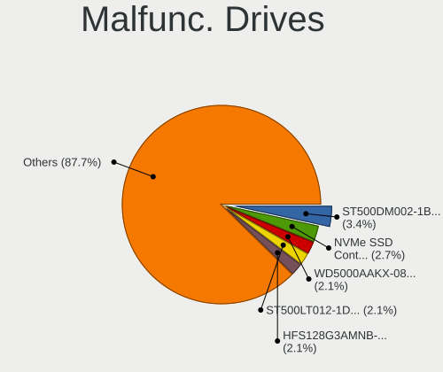

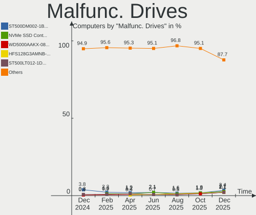

| Model                                                         | Computers | Drives | Percent |
|---------------------------------------------------------------|-----------|--------|---------|
| Seagate ST500DM002-1BD142 500GB                               | 5         | 6      | 3.42%   |
| Samsung Electronics NVMe SSD Controller SM981/PM981/PM983 1TB | 4         | 5      | 2.74%   |
| WDC WD5000AAKX-08U6AA0 500GB                                  | 3         | 3      | 2.05%   |
| SK hynix HFS128G3AMNB-2200A 128GB SSD                         | 3         | 3      | 2.05%   |
| Seagate ST500LT012-1DG142 500GB                               | 3         | 3      | 2.05%   |
| WDC WD20EARX-00PASB0 2TB                                      | 2         | 2      | 1.37%   |
| Seagate ST9500325AS 500GB                                     | 2         | 2      | 1.37%   |
| Seagate ST3500418AS 500GB                                     | 2         | 2      | 1.37%   |
| Seagate ST1000LM035-1RK172 1TB                                | 2         | 2      | 1.37%   |
| Seagate ST1000DM003-1CH162 1TB                                | 2         | 2      | 1.37%   |
| Maxtor STM3250310AS 250GB                                     | 2         | 2      | 1.37%   |
| Hitachi HUS724040ALE641 4TB                                   | 2         | 2      | 1.37%   |
| Hitachi HTS545050A7E380 500GB                                 | 2         | 2      | 1.37%   |
| Hitachi HDS721010CLA332 1TB                                   | 2         | 2      | 1.37%   |
| WDC WD800JD-60LSA5 80GB                                       | 1         | 1      | 0.68%   |
| WDC WD800BEVT-22ZCT0 80GB                                     | 1         | 1      | 0.68%   |
| WDC WD6400AAKS-65A7B0 640GB                                   | 1         | 1      | 0.68%   |
| WDC WD5000LPCX-24VHAT0 500GB                                  | 1         | 1      | 0.68%   |
| WDC WD5000AZLX-08K2TA0 500GB                                  | 1         | 1      | 0.68%   |
| WDC WD5000AAKX-75U6AA0 500GB                                  | 1         | 1      | 0.68%   |
| WDC WD5000AAKX-60U6AA0 500GB                                  | 1         | 1      | 0.68%   |
| WDC WD5000AAKX-00ERMA0 500GB                                  | 1         | 1      | 0.68%   |
| WDC WD3200BEVT-26A23T0 320GB                                  | 1         | 1      | 0.68%   |
| WDC WD3200AVJS-63B6A0 320GB                                   | 1         | 1      | 0.68%   |
| WDC WD20EZRZ-00Z5HB0 2TB                                      | 1         | 1      | 0.68%   |
| WDC WD20EZRX-00D8PB0 2TB                                      | 1         | 1      | 0.68%   |
| WDC WD2000F9MZ-76NVPL0 2TB                                    | 1         | 1      | 0.68%   |
| WDC WD1600AAJS-00L7A0 160GB                                   | 1         | 1      | 0.68%   |
| WDC WD10SPZX-35Z10T0 1TB                                      | 1         | 1      | 0.68%   |
| WDC WD10SPZX-24Z10 1TB                                        | 1         | 1      | 0.68%   |
| WDC WD10PURX-64E5EY0 1TB                                      | 1         | 1      | 0.68%   |
| WDC WD10JPVX-60JC3T0 1TB                                      | 1         | 1      | 0.68%   |
| WDC WD10EZEX-60M2NA0 1TB                                      | 1         | 1      | 0.68%   |
| WDC WD10EZEX-00UD2A0 1TB                                      | 1         | 1      | 0.68%   |
| WDC WD10EURS-630AB1 1TB                                       | 1         | 1      | 0.68%   |
| WDC WD10EAVS-00D7B0 1TB                                       | 1         | 1      | 0.68%   |
| WDC WD10EARS-00Y5B1 1TB                                       | 1         | 1      | 0.68%   |
| WDC WD10EADS-00P6B0 1TB                                       | 1         | 1      | 0.68%   |
| Toshiba MQ01ACF050 500GB                                      | 1         | 1      | 0.68%   |
| Toshiba MQ01ABD100 1TB                                        | 1         | 1      | 0.68%   |

Malfunc. Drive Vendor
---------------------

Vendors of faulty drives

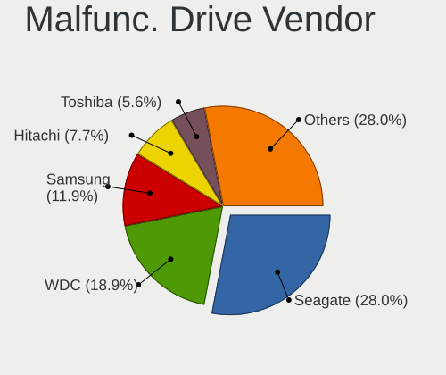

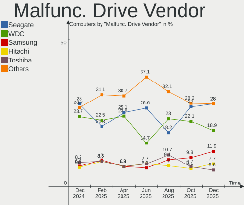

| Vendor              | Computers | Drives | Percent |
|---------------------|-----------|--------|---------|
| Seagate             | 40        | 42     | 27.97%  |
| WDC                 | 27        | 29     | 18.88%  |
| Samsung Electronics | 17        | 19     | 11.89%  |
| Hitachi             | 11        | 11     | 7.69%   |
| Toshiba             | 8         | 8      | 5.59%   |
| HGST                | 5         | 5      | 3.5%    |
| SK hynix            | 4         | 4      | 2.8%    |
| SanDisk             | 4         | 4      | 2.8%    |
| Crucial             | 4         | 4      | 2.8%    |
| China               | 4         | 4      | 2.8%    |
| Micron Technology   | 3         | 3      | 2.1%    |
| Kingston            | 3         | 3      | 2.1%    |
| Intel               | 3         | 3      | 2.1%    |
| A-DATA Technology   | 3         | 3      | 2.1%    |
| Maxtor              | 2         | 2      | 1.4%    |
| LITEONIT            | 1         | 2      | 0.7%    |
| Fujitsu             | 1         | 1      | 0.7%    |
| Dogfish             | 1         | 1      | 0.7%    |
| BAITITON            | 1         | 1      | 0.7%    |
| ANKEJE              | 1         | 1      | 0.7%    |

Malfunc. HDD Vendor
-------------------

Vendors of faulty HDD drives

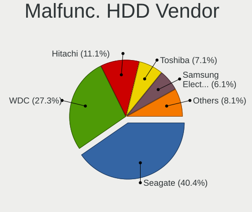

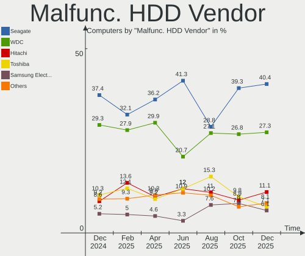

| Vendor              | Computers | Drives | Percent |
|---------------------|-----------|--------|---------|
| Seagate             | 40        | 42     | 40.4%   |
| WDC                 | 27        | 29     | 27.27%  |
| Hitachi             | 11        | 11     | 11.11%  |
| Toshiba             | 7         | 7      | 7.07%   |
| Samsung Electronics | 6         | 6      | 6.06%   |
| HGST                | 5         | 5      | 5.05%   |
| Maxtor              | 2         | 2      | 2.02%   |
| Fujitsu             | 1         | 1      | 1.01%   |

Malfunc. Drive Kind
-------------------

Kinds of faulty drives

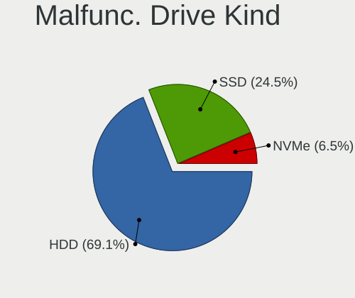

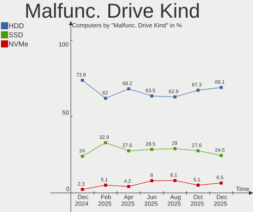

| Kind | Computers | Drives | Percent |
|------|-----------|--------|---------|
| HDD  | 96        | 103    | 69.06%  |
| SSD  | 34        | 37     | 24.46%  |
| NVMe | 9         | 10     | 6.47%   |

Failed Drives
-------------

Failed drive models

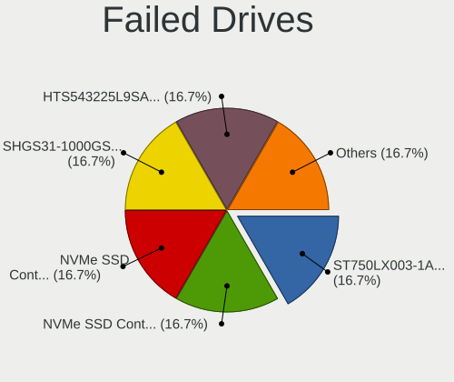

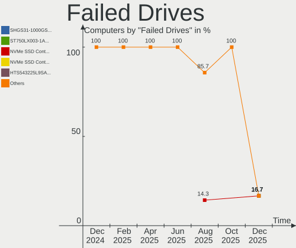

| Model                                                          | Computers | Drives | Percent |
|----------------------------------------------------------------|-----------|--------|---------|
| SK hynix SHGS31-1000GS-2 1TB SSD                               | 1         | 8      | 16.67%  |
| Seagate ST750LX003-1AC154 752GB                                | 1         | 1      | 16.67%  |
| Samsung Electronics NVMe SSD Controller PM9A1/PM9A3/980PRO 1TB | 1         | 1      | 16.67%  |
| Samsung Electronics NVMe SSD Controller 980 (DRAM-less) 256GB  | 1         | 1      | 16.67%  |
| Hitachi HTS543225L9SA02 250GB                                  | 1         | 1      | 16.67%  |
| Unknown                                                        | 1         | 1      | 16.67%  |

Failed Drive Vendor
-------------------

Failed drive vendors

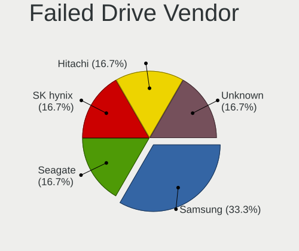

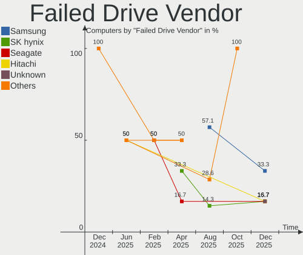

| Vendor              | Computers | Drives | Percent |
|---------------------|-----------|--------|---------|
| Samsung Electronics | 2         | 2      | 33.33%  |
| SK hynix            | 1         | 8      | 16.67%  |
| Seagate             | 1         | 1      | 16.67%  |
| Hitachi             | 1         | 1      | 16.67%  |
| Unknown             | 1         | 1      | 16.67%  |

Drive Status
------------

Number of failed and malfunc. drives

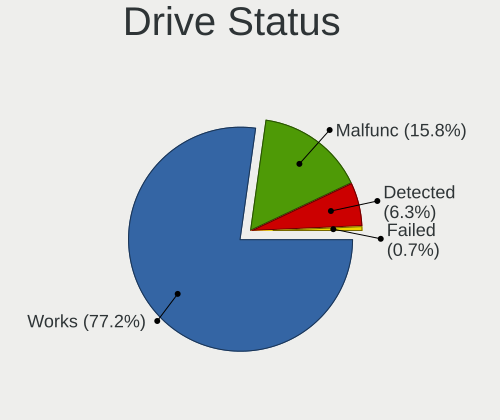

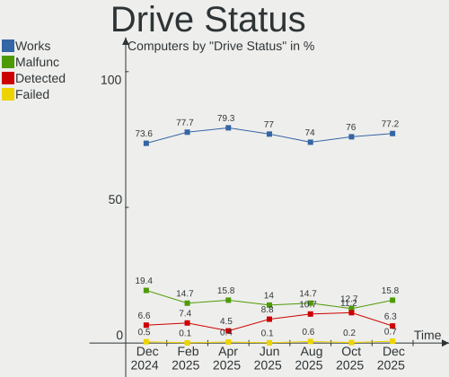

| Status   | Computers | Drives | Percent |
|----------|-----------|--------|---------|
| Works    | 671       | 1008   | 77.22%  |
| Malfunc  | 137       | 150    | 15.77%  |
| Detected | 55        | 65     | 6.33%   |
| Failed   | 6         | 13     | 0.69%   |

Storage controller
------------------

Storage Vendor
--------------

Storage controller vendors

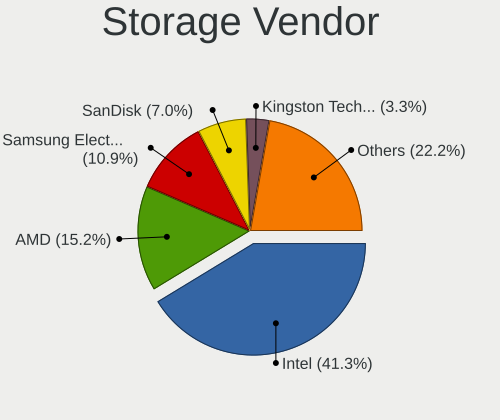

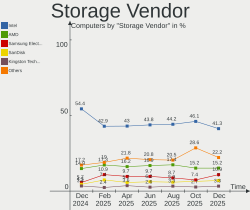

| Vendor                                  | Computers | Percent |
|-----------------------------------------|-----------|---------|
| Intel                                   | 446       | 41.3%   |
| AMD                                     | 164       | 15.19%  |
| Samsung Electronics                     | 118       | 10.93%  |
| SanDisk                                 | 76        | 7.04%   |
| Kingston Technology Company             | 36        | 3.33%   |
| Micron Technology                       | 31        | 2.87%   |
| SK hynix                                | 23        | 2.13%   |
| Micron/Crucial Technology               | 22        | 2.04%   |
| MAXIO Technology (Hangzhou)             | 21        | 1.94%   |
| Phison Electronics                      | 18        | 1.67%   |
| ASMedia Technology                      | 18        | 1.67%   |
| Toshiba America Info Systems            | 17        | 1.57%   |
| KIOXIA                                  | 14        | 1.3%    |
| Silicon Motion                          | 8         | 0.74%   |
| Nvidia                                  | 7         | 0.65%   |
| Marvell Technology Group                | 7         | 0.65%   |
| JMicron Technology                      | 7         | 0.65%   |
| ADATA Technology                        | 6         | 0.56%   |
| Shenzhen Longsys Electronics            | 5         | 0.46%   |
| Realtek Semiconductor                   | 5         | 0.46%   |
| Biwin Storage Technology                | 4         | 0.37%   |
| Union Memory (Shenzhen)                 | 3         | 0.28%   |
| Seagate Technology                      | 3         | 0.28%   |
| Hosin Global Electronics                | 3         | 0.28%   |
| Transcend                               | 2         | 0.19%   |
| Solidigm                                | 2         | 0.19%   |
| Shenzhen Unionmemory Information System | 2         | 0.19%   |
| LSI Logic / Symbios Logic               | 2         | 0.19%   |
| Lite-On Technology                      | 2         | 0.19%   |
| TenaFe                                  | 1         | 0.09%   |
| Shenzhen Shichuangyi Electronics        | 1         | 0.09%   |
| O2 Micro                                | 1         | 0.09%   |
| Lite-On IT Corp. / Plextor              | 1         | 0.09%   |
| Integrated Technology Express           | 1         | 0.09%   |
| INNOGRIT                                | 1         | 0.09%   |
| Broadcom / LSI                          | 1         | 0.09%   |
| Apple                                   | 1         | 0.09%   |

Storage Model
-------------

Storage controller models

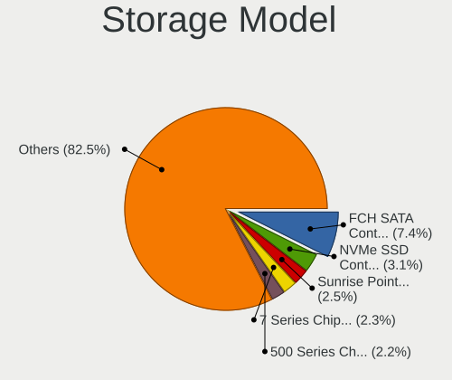

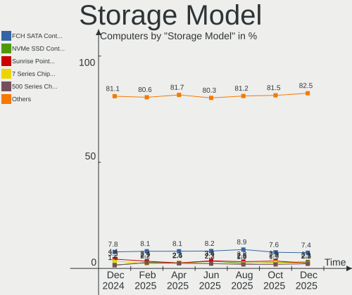

| Model                                                                          | Computers | Percent |
|--------------------------------------------------------------------------------|-----------|---------|
| AMD FCH SATA Controller [AHCI mode]                                            | 87        | 7.38%   |
| Samsung NVMe SSD Controller SM981/PM981/PM983                                  | 36        | 3.05%   |
| Intel Sunrise Point-LP SATA Controller [AHCI mode]                             | 30        | 2.54%   |
| Intel 7 Series Chipset Family 6-port SATA Controller [AHCI mode]               | 27        | 2.29%   |
| AMD 500 Series Chipset SATA Controller                                         | 26        | 2.21%   |
| AMD 600 Series Chipset SATA Controller                                         | 25        | 2.12%   |
| Intel 8 Series/C220 Series Chipset Family 6-port SATA Controller 1 [AHCI mode] | 22        | 1.87%   |
| AMD 400 Series Chipset SATA Controller                                         | 22        | 1.87%   |
| Intel 82801 Mobile SATA Controller [RAID mode]                                 | 21        | 1.78%   |
| Intel 6 Series/C200 Series Chipset Family 6 port Mobile SATA AHCI Controller   | 21        | 1.78%   |
| Samsung NVMe SSD Controller PM9A1/PM9A3/980PRO                                 | 20        | 1.7%    |
| Samsung NVMe SSD Controller 980 (DRAM-less)                                    | 20        | 1.7%    |
| Intel Volume Management Device NVMe RAID Controller                            | 20        | 1.7%    |
| Intel Q170/Q150/B150/H170/H110/Z170/CM236 Chipset SATA Controller [AHCI Mode]  | 20        | 1.7%    |
| MAXIO (Hangzhou) NVMe SSD Controller MAP1202 (DRAM-less)                       | 19        | 1.61%   |
| SanDisk WD SN560/SN740/SN770/SN5000 NVMe SSD                                   | 18        | 1.53%   |
| Samsung NVMe SSD Controller PM9C1a (DRAM-less)                                 | 17        | 1.44%   |
| Intel 6 Series/C200 Series Chipset Family 6 port Desktop SATA AHCI Controller  | 16        | 1.36%   |
| Intel SATA Controller [RAID mode]                                              | 15        | 1.27%   |
| ASMedia ASM1061/ASM1062 Serial ATA Controller                                  | 15        | 1.27%   |
| Intel 8 Series SATA Controller 1 [AHCI mode]                                   | 14        | 1.19%   |
| Intel 200 Series PCH SATA controller [AHCI mode]                               | 14        | 1.19%   |
| Intel 7 Series/C210 Series Chipset Family 6-port SATA Controller [AHCI mode]   | 13        | 1.1%    |
| Intel Wildcat Point-LP SATA Controller [AHCI Mode]                             | 12        | 1.02%   |
| AMD SB7x0/SB8x0/SB9x0 SATA Controller [AHCI mode]                              | 12        | 1.02%   |
| Intel Comet Lake SATA AHCI Controller                                          | 11        | 0.93%   |
| Intel Celeron N3350/Pentium N4200/Atom E3900 Series SATA AHCI Controller       | 11        | 0.93%   |
| SanDisk Ultra 3D / WD PC SN530, IX SN530, Blue SN550 NVMe SSD (DRAM-less)      | 10        | 0.85%   |
| Samsung NVMe SSD Controller SM961/PM961/SM963                                  | 10        | 0.85%   |
| Samsung NVMe SSD Controller S4LV008[Pascal]                                    | 10        | 0.85%   |
| Intel Celeron/Pentium Silver Processor SATA Controller                         | 10        | 0.85%   |
| Intel Cannon Lake Mobile PCH SATA AHCI Controller                              | 10        | 0.85%   |
| Intel 82801IBM/IEM (ICH9M/ICH9M-E) 4 port SATA Controller [AHCI mode]          | 10        | 0.85%   |
| Intel Jasper Lake SATA AHCI Controller                                         | 9         | 0.76%   |
| Intel Cannon Lake PCH SATA AHCI Controller                                     | 9         | 0.76%   |
| Intel 5 Series/3400 Series Chipset 4 port SATA AHCI Controller                 | 9         | 0.76%   |
| Toshiba America Info Systems XG6 NVMe SSD Controller                           | 8         | 0.68%   |
| Intel Alder Lake-N SATA AHCI Controller                                        | 8         | 0.68%   |
| Intel 5 Series/3400 Series Chipset 6 port SATA AHCI Controller                 | 8         | 0.68%   |
| AMD SB7x0/SB8x0/SB9x0 IDE Controller                                           | 8         | 0.68%   |

Storage Kind
------------

Kind of storage controller (IDE, SATA, NVMe, SAS, ...)

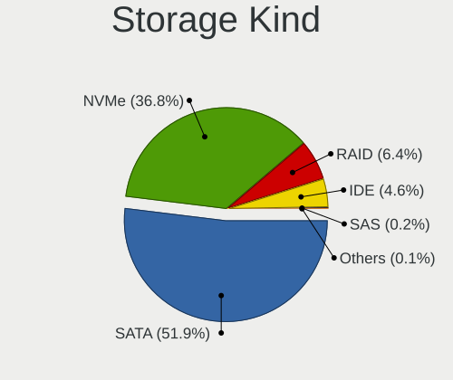

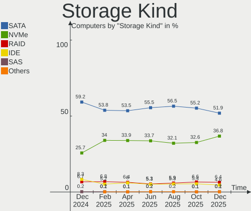

| Kind | Computers | Percent |
|------|-----------|---------|
| SATA | 536       | 51.94%  |
| NVMe | 380       | 36.82%  |
| RAID | 66        | 6.4%    |
| IDE  | 47        | 4.55%   |
| SAS  | 2         | 0.19%   |
| SCSI | 1         | 0.1%    |

Processor
---------

CPU Vendor
----------

Processor vendors

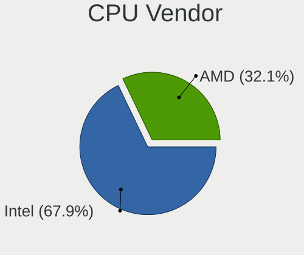

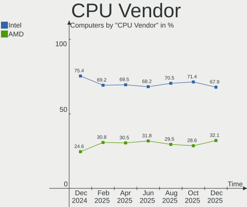

| Vendor | Computers | Percent |
|--------|-----------|---------|
| Intel  | 533       | 67.9%   |
| AMD    | 252       | 32.1%   |

CPU Model
---------

Processor models

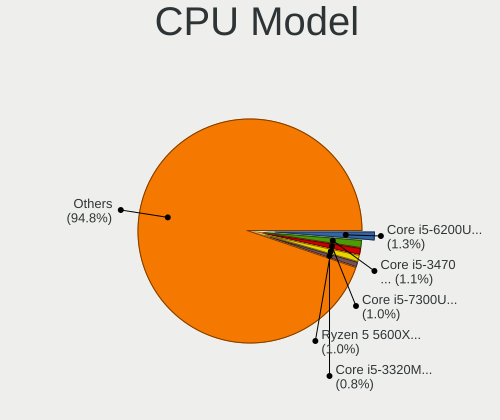

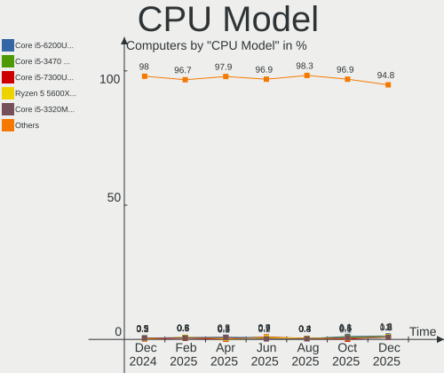

| Model                                         | Computers | Percent |
|-----------------------------------------------|-----------|---------|
| Intel Core i5-6200U CPU @ 2.30GHz             | 10        | 1.27%   |
| Intel Core i5-3470 CPU @ 3.20GHz              | 9         | 1.15%   |
| Intel Core i5-7300U CPU @ 2.60GHz             | 8         | 1.02%   |
| AMD Ryzen 5 5600X 6-Core Processor            | 8         | 1.02%   |
| Intel Core i5-3320M CPU @ 2.60GHz             | 6         | 0.76%   |
| Intel 11th Gen Core i7-1165G7 @ 2.80GHz       | 6         | 0.76%   |
| Intel 11th Gen Core i5-1135G7 @ 2.40GHz       | 6         | 0.76%   |
| AMD Ryzen Z1 Extreme                          | 6         | 0.76%   |
| AMD Ryzen 9 5900X 12-Core Processor           | 6         | 0.76%   |
| AMD Ryzen 5 7640U w/ Radeon 760M Graphics     | 6         | 0.76%   |
| AMD Ryzen 5 7520U with Radeon Graphics        | 6         | 0.76%   |
| AMD Ryzen 5 2600 Six-Core Processor           | 6         | 0.76%   |
| Intel Core i5-4300U CPU @ 1.90GHz             | 5         | 0.64%   |
| Intel Core i5 CPU 650 @ 3.20GHz               | 5         | 0.64%   |
| Intel Celeron N4020 CPU @ 1.10GHz             | 5         | 0.64%   |
| Intel Celeron CPU N3350 @ 1.10GHz             | 5         | 0.64%   |
| AMD Ryzen 7 5825U with Radeon Graphics        | 5         | 0.64%   |
| AMD Ryzen 7 5800X 8-Core Processor            | 5         | 0.64%   |
| AMD Ryzen 7 5700G with Radeon Graphics        | 5         | 0.64%   |
| AMD Ryzen 5 5500U with Radeon Graphics        | 5         | 0.64%   |
| AMD Ryzen 5 3600 6-Core Processor             | 5         | 0.64%   |
| Intel Pentium Silver N5030 CPU @ 1.10GHz      | 4         | 0.51%   |
| Intel Core Ultra 7 155H                       | 4         | 0.51%   |
| Intel Core i7-9750H CPU @ 2.60GHz             | 4         | 0.51%   |
| Intel Core i7-4770 CPU @ 3.40GHz              | 4         | 0.51%   |
| Intel Core i5-8350U CPU @ 1.70GHz             | 4         | 0.51%   |
| Intel Core i5-7200U CPU @ 2.50GHz             | 4         | 0.51%   |
| Intel Core i5-6500 CPU @ 3.20GHz              | 4         | 0.51%   |
| Intel Core i5-5200U CPU @ 2.20GHz             | 4         | 0.51%   |
| Intel Core i5-2520M CPU @ 2.50GHz             | 4         | 0.51%   |
| Intel Core i5-10210U CPU @ 1.60GHz            | 4         | 0.51%   |
| Intel Core i3-1005G1 CPU @ 1.20GHz            | 4         | 0.51%   |
| Intel Celeron N4500 @ 1.10GHz                 | 4         | 0.51%   |
| Intel Celeron N4120 CPU @ 1.10GHz             | 4         | 0.51%   |
| Intel Celeron CPU N2840 @ 2.16GHz             | 4         | 0.51%   |
| AMD Ryzen 7 PRO 4750U with Radeon Graphics    | 4         | 0.51%   |
| AMD Ryzen 7 3700U with Radeon Vega Mobile Gfx | 4         | 0.51%   |
| AMD Ryzen 5 9600X 6-Core Processor            | 4         | 0.51%   |
| AMD Phenom II X4 955 Processor                | 4         | 0.51%   |
| Intel Xeon W-2125 CPU @ 4.00GHz               | 3         | 0.38%   |

CPU Model Family
----------------

Processor model prefix

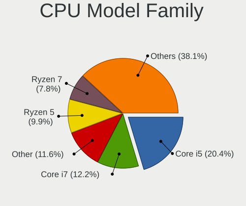

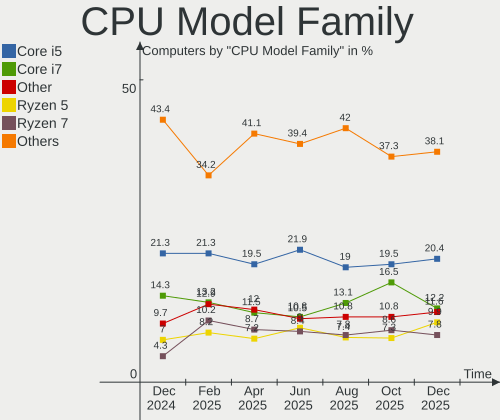

| Model                   | Computers | Percent |
|-------------------------|-----------|---------|
| Intel Core i5           | 160       | 20.38%  |
| Intel Core i7           | 96        | 12.23%  |
| Other                   | 91        | 11.59%  |
| AMD Ryzen 5             | 78        | 9.94%   |
| AMD Ryzen 7             | 61        | 7.77%   |
| Intel Core i3           | 54        | 6.88%   |
| Intel Celeron           | 53        | 6.75%   |
| Intel Xeon              | 27        | 3.44%   |
| AMD Ryzen 9             | 27        | 3.44%   |
| Intel Core              | 18        | 2.29%   |
| AMD Ryzen 3             | 15        | 1.91%   |
| Intel Core 2 Duo        | 14        | 1.78%   |
| Intel Pentium           | 10        | 1.27%   |
| AMD Ryzen 7 PRO         | 7         | 0.89%   |
| AMD FX                  | 7         | 0.89%   |
| AMD Phenom II X4        | 6         | 0.76%   |
| Intel Pentium Silver    | 5         | 0.64%   |
| Intel Core i9           | 5         | 0.64%   |
| AMD Ryzen 5 PRO         | 5         | 0.64%   |
| Intel Pentium Dual-Core | 4         | 0.51%   |
| AMD Athlon              | 4         | 0.51%   |
| AMD A8                  | 4         | 0.51%   |
| AMD A6                  | 4         | 0.51%   |
| Intel Atom              | 3         | 0.38%   |
| Intel Genuine           | 2         | 0.25%   |
| Intel Core m3           | 2         | 0.25%   |
| AMD Phenom II           | 2         | 0.25%   |
| AMD E2                  | 2         | 0.25%   |
| AMD E1                  | 2         | 0.25%   |
| AMD Athlon II           | 2         | 0.25%   |
| AMD A4                  | 2         | 0.25%   |
| AMD A10                 | 2         | 0.25%   |
| Intel Pentium Dual      | 1         | 0.13%   |
| Intel Core M            | 1         | 0.13%   |
| Intel Core 2 Quad       | 1         | 0.13%   |
| Intel Core 2            | 1         | 0.13%   |
| AMD Sempron             | 1         | 0.13%   |
| AMD Ryzen 3 PRO         | 1         | 0.13%   |
| AMD Phenom II X6        | 1         | 0.13%   |
| AMD Phenom              | 1         | 0.13%   |

CPU Cores
---------

Number of processor cores

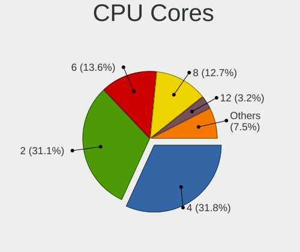

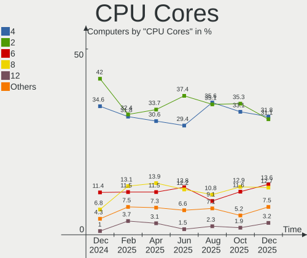

| Number | Computers | Percent |
|--------|-----------|---------|
| 4      | 250       | 31.85%  |
| 2      | 244       | 31.08%  |
| 6      | 107       | 13.63%  |
| 8      | 100       | 12.74%  |
| 12     | 25        | 3.18%   |
| 16     | 23        | 2.93%   |
| 10     | 10        | 1.27%   |
| 14     | 9         | 1.15%   |
| 24     | 7         | 0.89%   |
| 20     | 6         | 0.76%   |
| 1      | 3         | 0.38%   |
| 3      | 1         | 0.13%   |

CPU Sockets
-----------

Number of sockets

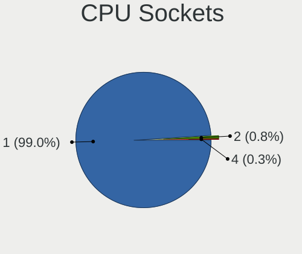

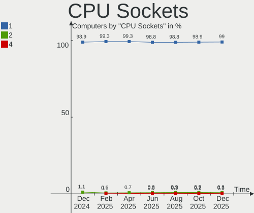

| Number | Computers | Percent |
|--------|-----------|---------|
| 1      | 777       | 98.98%  |
| 2      | 6         | 0.76%   |
| 4      | 2         | 0.25%   |

CPU Threads
-----------

Threads per core (Hyper-Threading)

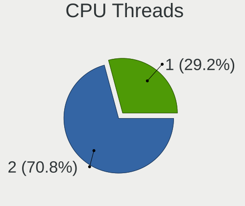

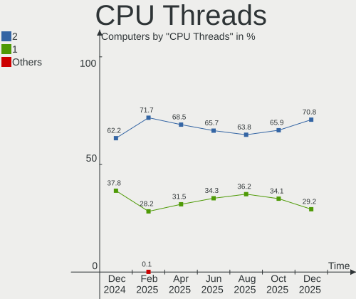

| Number | Computers | Percent |
|--------|-----------|---------|
| 2      | 556       | 70.83%  |
| 1      | 229       | 29.17%  |

CPU Op-Modes
------------

CPU Operation Modes (32-bit, 64-bit)

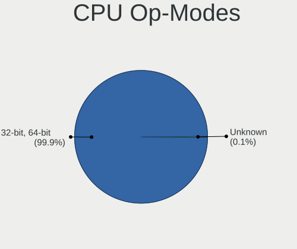

| Op mode        | Computers | Percent |
|----------------|-----------|---------|
| 32-bit, 64-bit | 785       | 100%    |

CPU Microcode
-------------

Microcode number

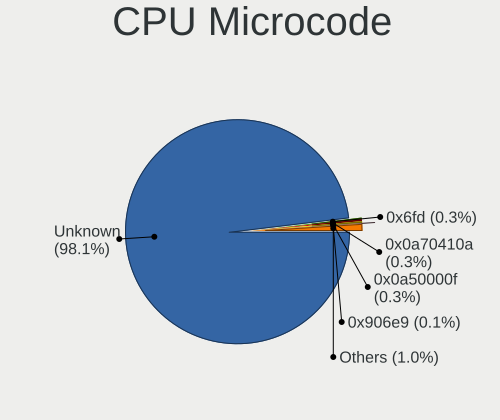

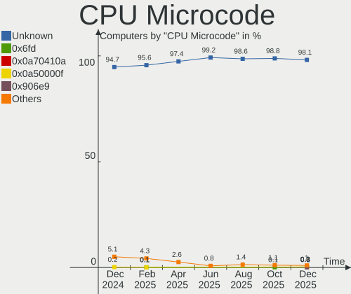

| Number     | Computers | Percent |
|------------|-----------|---------|
| Unknown    | 770       | 98.09%  |
| 0x6fd      | 2         | 0.25%   |
| 0x0a70410a | 2         | 0.25%   |
| 0x0a50000f | 2         | 0.25%   |
| 0x906e9    | 1         | 0.13%   |
| 0x206a7    | 1         | 0.13%   |
| 0x0b404035 | 1         | 0.13%   |
| 0x0b204037 | 1         | 0.13%   |
| 0x0a404108 | 1         | 0.13%   |
| 0x0a201211 | 1         | 0.13%   |
| 0x0a20120e | 1         | 0.13%   |
| 0x0a20120a | 1         | 0.13%   |
| 0x08108109 | 1         | 0.13%   |

CPU Microarch
-------------

Microarchitecture

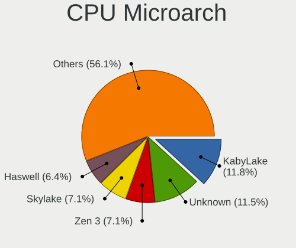

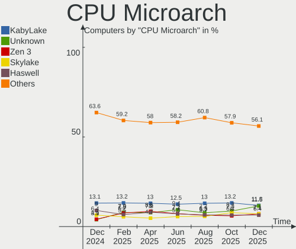

| Name              | Computers | Percent |
|-------------------|-----------|---------|
| KabyLake          | 93        | 11.85%  |
| Unknown           | 90        | 11.46%  |
| Zen 3             | 56        | 7.13%   |
| Skylake           | 56        | 7.13%   |
| Haswell           | 50        | 6.37%   |
| IvyBridge         | 48        | 6.11%   |
| SandyBridge       | 46        | 5.86%   |
| Alderlake Hybrid  | 40        | 5.1%    |
| Zen+              | 26        | 3.31%   |
| Zen 2             | 25        | 3.18%   |
| TigerLake         | 22        | 2.8%    |
| Penryn            | 21        | 2.68%   |
| Westmere          | 18        | 2.29%   |
| Broadwell         | 18        | 2.29%   |
| Zen               | 15        | 1.91%   |
| Silvermont        | 15        | 1.91%   |
| Icelake           | 15        | 1.91%   |
| Goldmont plus     | 15        | 1.91%   |
| CometLake         | 14        | 1.78%   |
| K10               | 13        | 1.66%   |
| Goldmont          | 12        | 1.53%   |
| Meteorlake Hybrid | 10        | 1.27%   |
| Gracemont         | 10        | 1.27%   |
| Tremont           | 9         | 1.15%   |
| Piledriver        | 9         | 1.15%   |
| Puma              | 7         | 0.89%   |
| Lunarlake Hybrid  | 6         | 0.76%   |
| Excavator         | 6         | 0.76%   |
| Core              | 6         | 0.76%   |
| Nehalem           | 3         | 0.38%   |
| Jaguar            | 3         | 0.38%   |
| Bobcat            | 2         | 0.25%   |
| Sapphire Rapids   | 1         | 0.13%   |
| K8 Hammer         | 1         | 0.13%   |
| K8 & K10 hybrid   | 1         | 0.13%   |
| K10 Llano         | 1         | 0.13%   |
| Bulldozer         | 1         | 0.13%   |
| Bonnell           | 1         | 0.13%   |

Graphics
--------

GPU Vendor
----------

Vendors of graphics cards

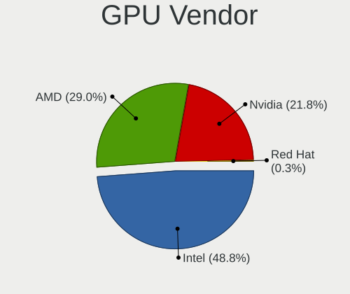

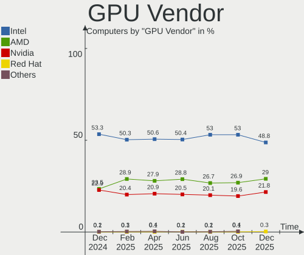

| Vendor  | Computers | Percent |
|---------|-----------|---------|
| Intel   | 429       | 48.81%  |
| AMD     | 255       | 29.01%  |
| Nvidia  | 192       | 21.84%  |
| Red Hat | 3         | 0.34%   |

GPU Model
---------

Graphics card models

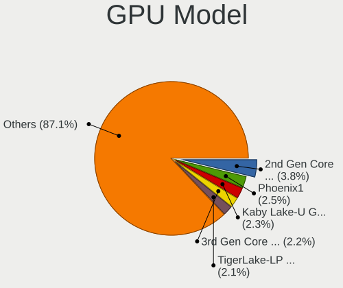

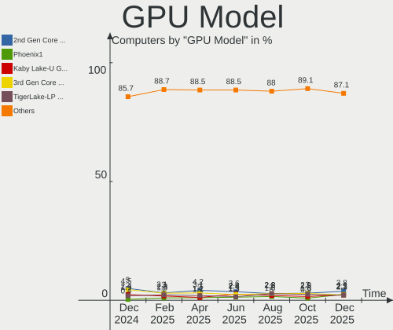

| Model                                                                     | Computers | Percent |
|---------------------------------------------------------------------------|-----------|---------|
| Intel 2nd Generation Core Processor Family Integrated Graphics Controller | 34        | 3.76%   |
| AMD Phoenix1                                                              | 23        | 2.54%   |
| Intel Kaby Lake-U GT2 [HD Graphics 620]                                   | 21        | 2.32%   |
| Intel 3rd Gen Core processor Graphics Controller                          | 20        | 2.21%   |
| Intel TigerLake-LP GT2 [Iris Xe Graphics]                                 | 19        | 2.1%    |
| Intel Skylake-U GT2 [HD Graphics 520]                                     | 19        | 2.1%    |
| AMD Picasso/Raven 2 [Radeon Vega Series / Radeon Vega Mobile Series]      | 18        | 1.99%   |
| Intel Xeon E3-1200 v2/3rd Gen Core processor Graphics Controller          | 17        | 1.88%   |
| Intel Haswell-ULT Integrated Graphics Controller                          | 16        | 1.77%   |
| Intel Skylake-S GT2 [HD Graphics 530]                                     | 15        | 1.66%   |
| AMD Cezanne [Radeon Vega Series / Radeon Vega Mobile Series]              | 15        | 1.66%   |
| AMD Renoir [Radeon Vega Series / Radeon Vega Mobile Series]               | 13        | 1.44%   |
| AMD Barcelo                                                               | 12        | 1.33%   |
| Intel Mobile 4 Series Chipset Integrated Graphics Controller              | 11        | 1.22%   |
| Intel Kaby Lake-R GT2 [UHD Graphics 620]                                  | 11        | 1.22%   |
| Intel GeminiLake [UHD Graphics 600]                                       | 11        | 1.22%   |
| Intel JasperLake [UHD Graphics]                                           | 10        | 1.1%    |
| Intel Broadwell-U GT2 [HD Graphics 5500]                                  | 10        | 1.1%    |
| Intel Atom Processor Z36xxx/Z37xxx Series Graphics & Display              | 10        | 1.1%    |
| AMD Raphael                                                               | 10        | 1.1%    |
| AMD Granite Ridge [Radeon Graphics]                                       | 10        | 1.1%    |
| Intel CometLake-U GT2 [UHD Graphics]                                      | 9         | 0.99%   |
| Intel CoffeeLake-H GT2 [UHD Graphics 630]                                 | 9         | 0.99%   |
| Intel Apollo Lake GT1 [HD Graphics 500]                                   | 9         | 0.99%   |
| AMD Lucienne                                                              | 9         | 0.99%   |
| Intel Core Processor Integrated Graphics Controller                       | 8         | 0.88%   |
| Intel CoffeeLake-S GT2 [UHD Graphics 630]                                 | 8         | 0.88%   |
| Intel Alder Lake-N [UHD Graphics]                                         | 8         | 0.88%   |
| AMD Navi 31 [Radeon RX 7900 XT/7900 XTX/7900 GRE/7900M]                   | 8         | 0.88%   |
| AMD HawkPoint1                                                            | 8         | 0.88%   |
| AMD Ellesmere [Radeon RX 470/480/570/570X/580/580X/590]                   | 8         | 0.88%   |
| Nvidia GK208B [GeForce GT 710]                                            | 7         | 0.77%   |
| Intel Raptor Lake-P [Iris Xe Graphics]                                    | 7         | 0.77%   |
| Intel Kaby Lake-S GT2 [HD Graphics 630]                                   | 7         | 0.77%   |
| Intel Alder Lake-P GT2 [Iris Xe Graphics]                                 | 7         | 0.77%   |
| AMD Navi 48 [Radeon RX 9070/9070 XT/9070 GRE]                             | 7         | 0.77%   |
| AMD Navi 21 [Radeon RX 6800/6800 XT / 6900 XT]                            | 7         | 0.77%   |
| AMD Mendocino [Radeon 610M]                                               | 7         | 0.77%   |
| Nvidia TU117M [GeForce GTX 1650 Mobile / Max-Q]                           | 6         | 0.66%   |
| Nvidia AD107M [GeForce RTX 4060 Max-Q / Mobile]                           | 6         | 0.66%   |

GPU Combo
---------

Combinations of graphics cards

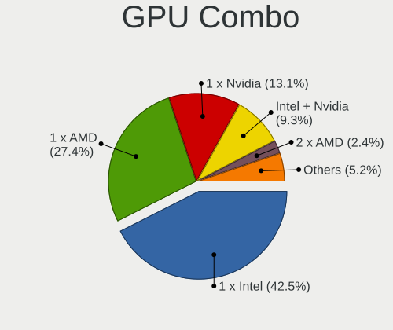

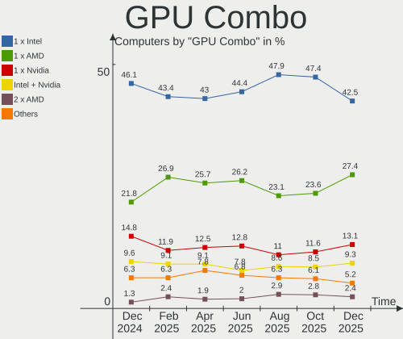

| Name           | Computers | Percent |
|----------------|-----------|---------|
| 1 x Intel      | 334       | 42.55%  |
| 1 x AMD        | 215       | 27.39%  |
| 1 x Nvidia     | 103       | 13.12%  |
| Intel + Nvidia | 73        | 9.3%    |
| 2 x AMD        | 19        | 2.42%   |
| 2 x Intel      | 15        | 1.91%   |
| AMD + Nvidia   | 14        | 1.78%   |
| Intel + AMD    | 7         | 0.89%   |
| 1 x Red Hat    | 3         | 0.38%   |
| 2 x Nvidia     | 2         | 0.25%   |

GPU Driver
----------

Free vs proprietary

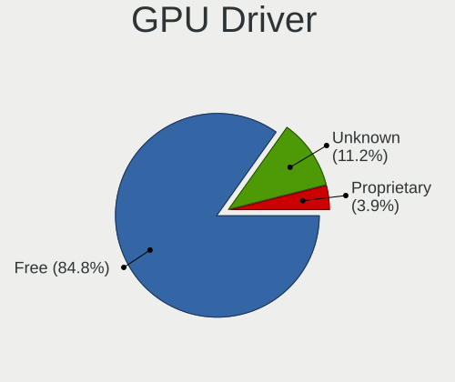

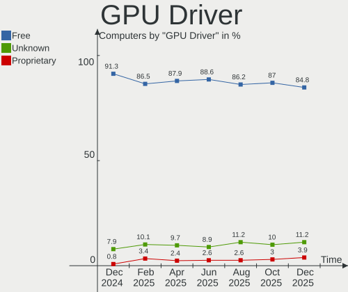

| Driver      | Computers | Percent |
|-------------|-----------|---------|
| Free        | 666       | 84.84%  |
| Unknown     | 88        | 11.21%  |
| Proprietary | 31        | 3.95%   |

GPU Memory
----------

Total video memory

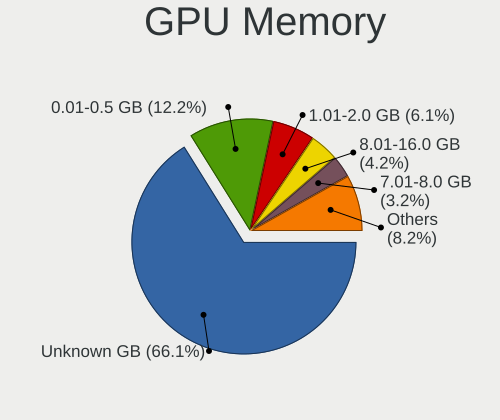

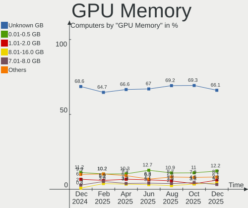

| Size in GB     | Computers | Percent |
|----------------|-----------|---------|
| Unknown        | 519       | 66.11%  |
| 0.01-0.5       | 96        | 12.23%  |
| 1.01-2.0       | 48        | 6.11%   |
| 8.01-16.0      | 33        | 4.2%    |
| 7.01-8.0       | 25        | 3.18%   |
| 0.51-1.0       | 25        | 3.18%   |
| 3.01-4.0       | 20        | 2.55%   |
| 16.01-24.0     | 8         | 1.02%   |
| 2.01-3.0       | 7         | 0.89%   |
| 5.01-6.0       | 3         | 0.38%   |
| More than 64.0 | 1         | 0.13%   |

Monitor
-------

Monitor Vendor
--------------

Monitor vendors

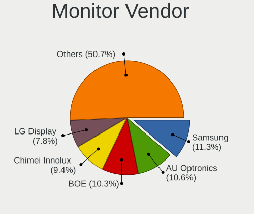

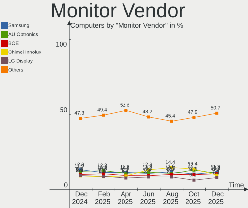

| Vendor                  | Computers | Percent |
|-------------------------|-----------|---------|
| Samsung Electronics     | 94        | 11.27%  |
| AU Optronics            | 88        | 10.55%  |
| BOE                     | 86        | 10.31%  |
| Chimei Innolux          | 78        | 9.35%   |
| LG Display              | 65        | 7.79%   |
| Dell                    | 43        | 5.16%   |
| Goldstar                | 41        | 4.92%   |
| Lenovo                  | 38        | 4.56%   |
| Acer                    | 32        | 3.84%   |
| Hewlett-Packard         | 20        | 2.4%    |
| AOC                     | 18        | 2.16%   |
| Sharp                   | 17        | 2.04%   |
| Ancor Communications    | 15        | 1.8%    |
| ViewSonic               | 14        | 1.68%   |
| BenQ                    | 13        | 1.56%   |
| Apple                   | 12        | 1.44%   |
| ASUSTek Computer        | 11        | 1.32%   |
| Philips                 | 10        | 1.2%    |
| MSI                     | 10        | 1.2%    |
| InfoVision              | 8         | 0.96%   |
| Iiyama                  | 8         | 0.96%   |
| Vizio                   | 6         | 0.72%   |
| Chi Mei Optoelectronics | 6         | 0.72%   |
| Unknown (XXX)           | 5         | 0.6%    |
| TMX                     | 5         | 0.6%    |
| Sony                    | 4         | 0.48%   |
| Toshiba                 | 3         | 0.36%   |
| RTK                     | 3         | 0.36%   |
| RHT                     | 3         | 0.36%   |
| RGT                     | 3         | 0.36%   |
| PANDA                   | 3         | 0.36%   |
| HKC                     | 3         | 0.36%   |
| Hitachi                 | 3         | 0.36%   |
| STA                     | 2         | 0.24%   |
| Sceptre Tech            | 2         | 0.24%   |
| Roku                    | 2         | 0.24%   |
| Planar                  | 2         | 0.24%   |
| Mi                      | 2         | 0.24%   |
| HannStar                | 2         | 0.24%   |
| Gigabyte Technology     | 2         | 0.24%   |

Monitor Model
-------------

Monitor models

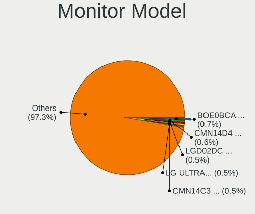

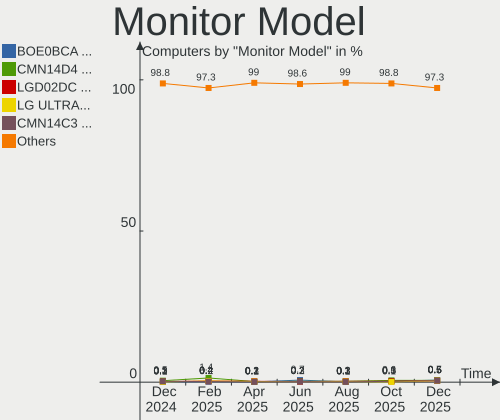

| Model                                                                 | Computers | Percent |
|-----------------------------------------------------------------------|-----------|---------|
| BOE LCD Monitor BOE0BCA 2256x1504 285x190mm 13.5-inch                 | 6         | 0.71%   |
| Chimei Innolux LCD Monitor CMN14D4 1920x1080 309x173mm 13.9-inch      | 5         | 0.59%   |
| LG Display LCD Monitor LGD02DC 1366x768 344x194mm 15.5-inch           | 4         | 0.47%   |
| Goldstar LG ULTRAWIDE GSM59F1 2560x1080 670x280mm 28.6-inch           | 4         | 0.47%   |
| Chimei Innolux LCD Monitor CMN14C3 1366x768 309x173mm 13.9-inch       | 4         | 0.47%   |
| Chimei Innolux LCD Monitor CMN1132 1366x768 256x144mm 11.6-inch       | 4         | 0.47%   |
| AU Optronics LCD Monitor AUO403D 1920x1080 309x174mm 14.0-inch        | 4         | 0.47%   |
| Samsung Electronics S24D330 SAM0D92 1920x1080 531x299mm 24.0-inch     | 3         | 0.35%   |
| Samsung Electronics LCD Monitor SEC3242 1920x1080 235x132mm 10.6-inch | 3         | 0.35%   |
| RHT QEMU Monitor RHT1234 2048x1152 325x203mm 15.1-inch                | 3         | 0.35%   |
| RGT LCD Monitor RGT5211 1366x768 518x333mm 24.2-inch                  | 3         | 0.35%   |
| LG Display LCD Monitor LGD033A 1366x768 344x194mm 15.5-inch           | 3         | 0.35%   |
| Lenovo LCD Monitor LEN40BA 1920x1080 344x194mm 15.5-inch              | 3         | 0.35%   |
| Lenovo LCD Monitor LEN40A9 1920x1080 309x173mm 13.9-inch              | 3         | 0.35%   |
| Lenovo Go Display LEN0001 1600x2560 120x190mm 8.8-inch                | 3         | 0.35%   |
| InfoVision LCD Monitor IVO0536 1920x1080 294x165mm 13.3-inch          | 3         | 0.35%   |
| Dell U2412M DELA07A 1920x1200 518x324mm 24.1-inch                     | 3         | 0.35%   |
| Chimei Innolux LCD Monitor CMN15E7 1920x1080 344x193mm 15.5-inch      | 3         | 0.35%   |
| Chimei Innolux LCD Monitor CMN15BE 1366x768 344x193mm 15.5-inch       | 3         | 0.35%   |
| Chimei Innolux LCD Monitor CMN15AB 1366x768 344x193mm 15.5-inch       | 3         | 0.35%   |
| BOE NE135A1M-NY1 BOE0CB4 2880x1920 285x190mm 13.5-inch                | 3         | 0.35%   |
| BOE LCD Monitor BOE07F7 1920x1080 309x174mm 14.0-inch                 | 3         | 0.35%   |
| AU Optronics LCD Monitor AUO422D 1920x1080 293x165mm 13.2-inch        | 3         | 0.35%   |
| AU Optronics LCD Monitor AUO243D 1920x1080 309x173mm 13.9-inch        | 3         | 0.35%   |
| AU Optronics LCD Monitor AUO21ED 1920x1080 344x193mm 15.5-inch        | 3         | 0.35%   |
| AU Optronics LCD Monitor AUO106C 1366x768 276x155mm 12.5-inch         | 3         | 0.35%   |
| Unknown (XXX) Beyond TV XXX2851 3840x2160 1209x680mm 54.6-inch        | 2         | 0.24%   |
| TMX TL070FVXS01-0 TMX0002 1920x1080 160x100mm 7.4-inch                | 2         | 0.24%   |
| STA LCD Monitor STA8CA7 1366x768 256x144mm 11.6-inch                  | 2         | 0.24%   |
| Sharp LQ123P1JX31 SHP1471 2400x1600 259x173mm 12.3-inch               | 2         | 0.24%   |
| Sharp LCD Monitor SHP149A 1920x1080 344x194mm 15.5-inch               | 2         | 0.24%   |
| Sharp LCD Monitor SHP1476 3840x2160 346x194mm 15.6-inch               | 2         | 0.24%   |
| Sharp LCD Monitor SHP1453 1920x1080 346x194mm 15.6-inch               | 2         | 0.24%   |
| Sharp LCD Monitor SHP1449 1920x1080 294x165mm 13.3-inch               | 2         | 0.24%   |
| Sharp LCD Monitor SHP143B 3840x2160 346x194mm 15.6-inch               | 2         | 0.24%   |
| Samsung Electronics SyncMaster SAM0598 1360x768 410x230mm 18.5-inch   | 2         | 0.24%   |
| Samsung Electronics SyncMaster SAM0091 1600x1200 432x324mm 21.3-inch  | 2         | 0.24%   |
| Samsung Electronics LS32FG51x SAM78F2 2560x1440 697x392mm 31.5-inch   | 2         | 0.24%   |
| Samsung Electronics LS32D80xE SAM763E 3840x2160 698x392mm 31.5-inch   | 2         | 0.24%   |
| Samsung Electronics LCD Monitor SEC5441 1280x800 331x207mm 15.4-inch  | 2         | 0.24%   |

Monitor Resolution
------------------

Monitor screen resolution

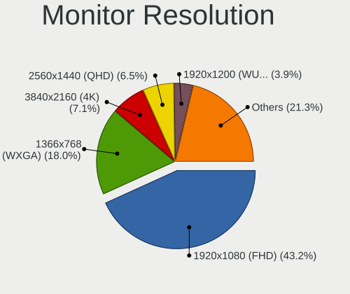

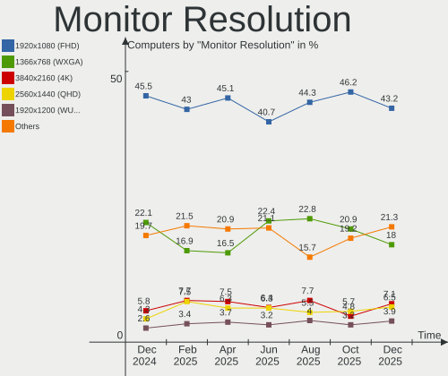

| Resolution         | Computers | Percent |
|--------------------|-----------|---------|
| 1920x1080 (FHD)    | 353       | 43.21%  |
| 1366x768 (WXGA)    | 147       | 17.99%  |
| 3840x2160 (4K)     | 58        | 7.1%    |
| 2560x1440 (QHD)    | 53        | 6.49%   |
| 1920x1200 (WUXGA)  | 32        | 3.92%   |
| 1600x900 (HD+)     | 26        | 3.18%   |
| 1440x900 (WXGA+)   | 16        | 1.96%   |
| 2560x1600          | 14        | 1.71%   |
| 1680x1050 (WSXGA+) | 11        | 1.35%   |
| 2256x1504          | 10        | 1.22%   |
| 1280x1024 (SXGA)   | 10        | 1.22%   |
| 3440x1440          | 9         | 1.1%    |
| 1280x800 (WXGA)    | 9         | 1.1%    |
| 2880x1800          | 8         | 0.98%   |
| 2560x1080          | 8         | 0.98%   |
| Unknown            | 8         | 0.98%   |
| 2880x1920          | 5         | 0.61%   |
| 1920x540           | 4         | 0.49%   |
| 1360x768           | 4         | 0.49%   |
| 3840x1600          | 3         | 0.37%   |
| 2560x1397          | 3         | 0.37%   |
| 1600x1200          | 3         | 0.37%   |
| 3840x2400          | 2         | 0.24%   |
| 3840x1080          | 2         | 0.24%   |
| 3200x1800 (QHD+)   | 2         | 0.24%   |
| 2400x1600          | 2         | 0.24%   |
| 2160x1440          | 2         | 0.24%   |
| 2160x1350          | 2         | 0.24%   |
| 1024x768 (XGA)     | 2         | 0.24%   |
| 800x1280           | 1         | 0.12%   |
| 3840x2560          | 1         | 0.12%   |
| 3456x2160          | 1         | 0.12%   |
| 2736x1824          | 1         | 0.12%   |
| 2560x2880          | 1         | 0.12%   |
| 2520x1680          | 1         | 0.12%   |
| 1280x720 (HD)      | 1         | 0.12%   |
| 1152x864           | 1         | 0.12%   |
| 1024x600           | 1         | 0.12%   |

Monitor Diagonal
----------------

Diagonal size in inches

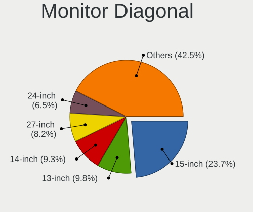

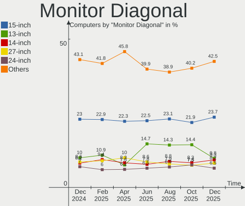

| Inches  | Computers | Percent |
|---------|-----------|---------|
| 15      | 198       | 23.66%  |
| 13      | 82        | 9.8%    |
| 14      | 78        | 9.32%   |
| 27      | 69        | 8.24%   |
| 24      | 54        | 6.45%   |
| 23      | 48        | 5.73%   |
| 31      | 44        | 5.26%   |
| 21      | 36        | 4.3%    |
| 17      | 29        | 3.46%   |
| 16      | 22        | 2.63%   |
| 19      | 19        | 2.27%   |
| 18      | 17        | 2.03%   |
| 34      | 15        | 1.79%   |
| 11      | 14        | 1.67%   |
| 12      | 13        | 1.55%   |
| Unknown | 12        | 1.43%   |
| 22      | 8         | 0.96%   |
| 20      | 7         | 0.84%   |
| 84      | 6         | 0.72%   |
| 54      | 6         | 0.72%   |
| 32      | 5         | 0.6%    |
| 28      | 5         | 0.6%    |
| 49      | 4         | 0.48%   |
| 26      | 4         | 0.48%   |
| 8       | 4         | 0.48%   |
| 63      | 3         | 0.36%   |
| 36      | 3         | 0.36%   |
| 29      | 3         | 0.36%   |
| 7       | 3         | 0.36%   |
| 75      | 2         | 0.24%   |
| 74      | 2         | 0.24%   |
| 65      | 2         | 0.24%   |
| 48      | 2         | 0.24%   |
| 46      | 2         | 0.24%   |
| 42      | 2         | 0.24%   |
| 37      | 2         | 0.24%   |
| 25      | 2         | 0.24%   |
| 10      | 2         | 0.24%   |
| 72      | 1         | 0.12%   |
| 60      | 1         | 0.12%   |

Monitor Width
-------------

Physical width

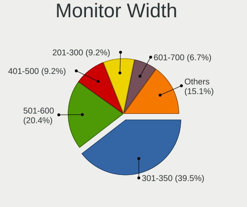

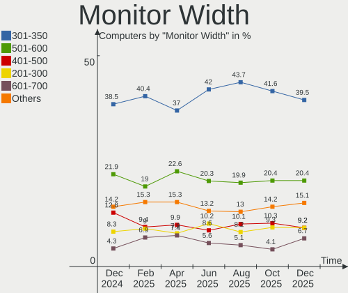

| Width in mm | Computers | Percent |
|-------------|-----------|---------|
| 301-350     | 328       | 39.52%  |
| 501-600     | 169       | 20.36%  |
| 401-500     | 76        | 9.16%   |
| 201-300     | 76        | 9.16%   |
| 601-700     | 56        | 6.75%   |
| 351-400     | 44        | 5.3%    |
| 701-800     | 22        | 2.65%   |
| 1001-1500   | 21        | 2.53%   |
| Unknown     | 12        | 1.45%   |
| 1501-2000   | 11        | 1.33%   |
| 101-200     | 6         | 0.72%   |
| 801-900     | 5         | 0.6%    |
| 901-1000    | 3         | 0.36%   |
| 1-100       | 1         | 0.12%   |

Aspect Ratio
------------

Proportional relationship between the width and the height

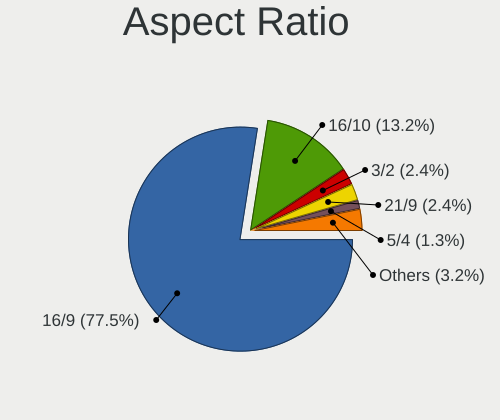

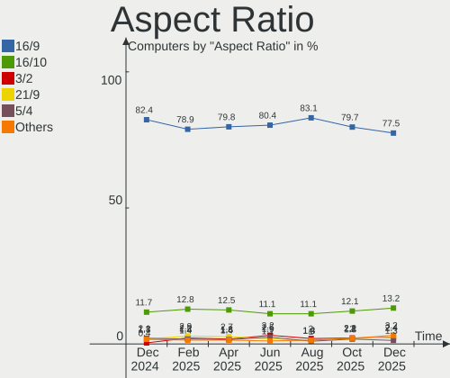

| Ratio   | Computers | Percent |
|---------|-----------|---------|
| 16/9    | 609       | 77.48%  |
| 16/10   | 104       | 13.23%  |
| 3/2     | 19        | 2.42%   |
| 21/9    | 19        | 2.42%   |
| 5/4     | 10        | 1.27%   |
| 4/3     | 8         | 1.02%   |
| Unknown | 6         | 0.76%   |
| 32/9    | 5         | 0.64%   |
| 0.63    | 3         | 0.38%   |
| 1.96    | 1         | 0.13%   |
| 0.89    | 1         | 0.13%   |
| 0.67    | 1         | 0.13%   |

Monitor Area
------------

Area in inch²

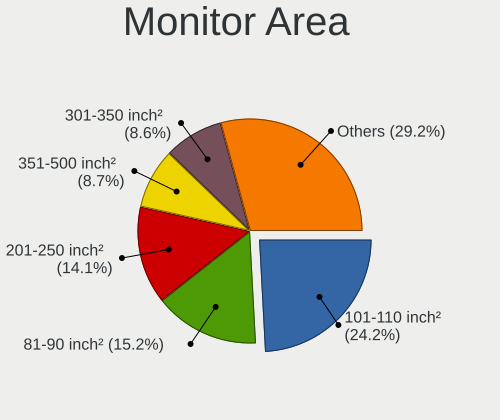

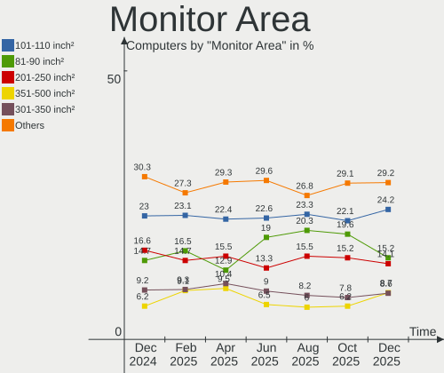

| Area in inch² | Computers | Percent |
|----------------|-----------|---------|
| 101-110        | 200       | 24.15%  |
| 81-90          | 126       | 15.22%  |
| 201-250        | 117       | 14.13%  |
| 351-500        | 72        | 8.7%    |
| 301-350        | 71        | 8.57%   |
| 151-200        | 36        | 4.35%   |
| 71-80          | 30        | 3.62%   |
| More than 1000 | 25        | 3.02%   |
| 121-130        | 23        | 2.78%   |
| 111-120        | 21        | 2.54%   |
| 251-300        | 20        | 2.42%   |
| 141-150        | 18        | 2.17%   |
| 501-1000       | 16        | 1.93%   |
| 51-60          | 14        | 1.69%   |
| 61-70          | 13        | 1.57%   |
| Unknown        | 12        | 1.45%   |
| 1-40           | 7         | 0.85%   |
| 131-140        | 3         | 0.36%   |
| 41-50          | 2         | 0.24%   |
| 91-100         | 2         | 0.24%   |

Pixel Density
-------------

Pixels per inch

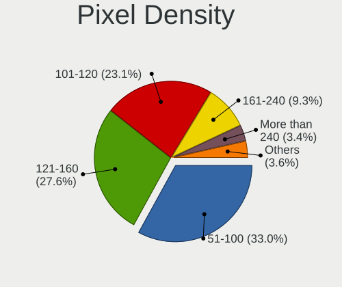

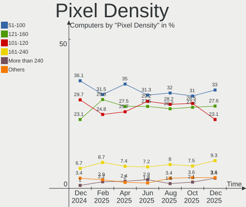

| Density       | Computers | Percent |
|---------------|-----------|---------|
| 51-100        | 269       | 33.01%  |
| 121-160       | 225       | 27.61%  |
| 101-120       | 188       | 23.07%  |
| 161-240       | 76        | 9.33%   |
| More than 240 | 28        | 3.44%   |
| 1-50          | 17        | 2.09%   |
| Unknown       | 12        | 1.47%   |

Multiple Monitors
-----------------

Total monitors connected

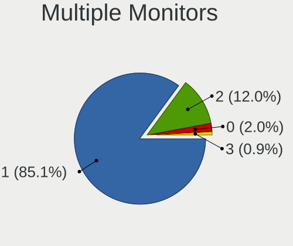

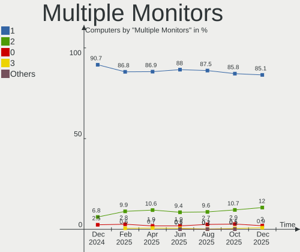

| Total | Computers | Percent |
|-------|-----------|---------|
| 1     | 668       | 85.1%   |
| 2     | 94        | 11.97%  |
| 0     | 16        | 2.04%   |
| 3     | 7         | 0.89%   |

Network
-------

Net Controller Vendor
---------------------

Controller vendors

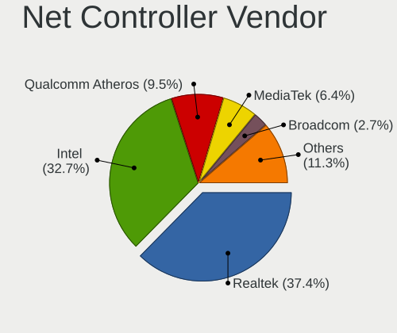

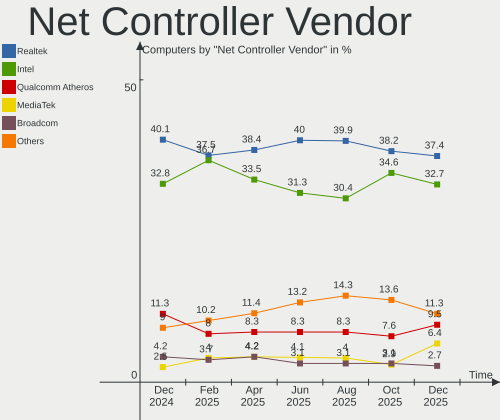

| Vendor                                 | Computers | Percent |
|----------------------------------------|-----------|---------|
| Realtek Semiconductor                  | 418       | 37.35%  |
| Intel                                  | 366       | 32.71%  |
| Qualcomm Atheros                       | 106       | 9.47%   |
| MediaTek                               | 72        | 6.43%   |
| Broadcom                               | 30        | 2.68%   |
| ASIX Electronics                       | 18        | 1.61%   |
| TP-Link                                | 10        | 0.89%   |
| Broadcom Limited                       | 10        | 0.89%   |
| Samsung Electronics                    | 9         | 0.8%    |
| Ralink Technology                      | 8         | 0.71%   |
| Marvell Technology Group               | 8         | 0.71%   |
| Nvidia                                 | 7         | 0.63%   |
| Aquantia                               | 6         | 0.54%   |
| Ralink                                 | 4         | 0.36%   |
| Qualcomm Atheros Communications        | 4         | 0.36%   |
| Suzhou Motorcomm Electronic Technology | 3         | 0.27%   |
| Qualcomm                               | 3         | 0.27%   |
| Microsoft                              | 3         | 0.27%   |
| ICS Advent                             | 3         | 0.27%   |
| Ericsson Business Mobile Networks      | 3         | 0.27%   |
| Shenzhen Goodix Technology             | 2         | 0.18%   |
| Qualcomm Technologies                  | 2         | 0.18%   |
| D-Link                                 | 2         | 0.18%   |
| Apple                                  | 2         | 0.18%   |
| ZyDAS                                  | 1         | 0.09%   |
| Xiaomi                                 | 1         | 0.09%   |
| Toshiba                                | 1         | 0.09%   |
| Sierra Wireless                        | 1         | 0.09%   |
| Realtek                                | 1         | 0.09%   |
| QinHeng Electronics                    | 1         | 0.09%   |
| Motorola PCS                           | 1         | 0.09%   |
| Linksys                                | 1         | 0.09%   |
| Lenovo                                 | 1         | 0.09%   |
| JMicron Technology                     | 1         | 0.09%   |
| Huawei Technologies                    | 1         | 0.09%   |
| Google                                 | 1         | 0.09%   |
| Generic                                | 1         | 0.09%   |
| GDMicroelectronics                     | 1         | 0.09%   |
| Fibocom                                | 1         | 0.09%   |
| DisplayLink                            | 1         | 0.09%   |

Net Controller Model
--------------------

Controller models

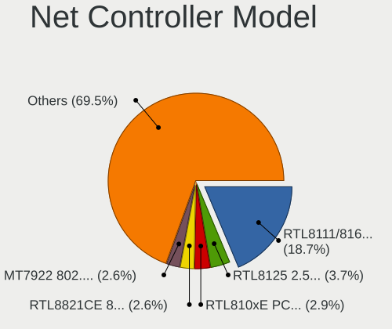

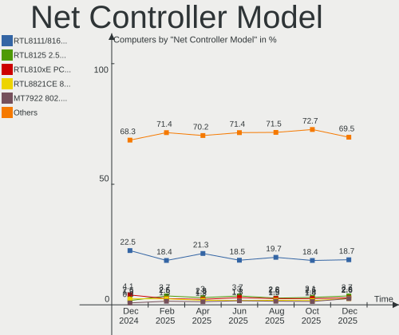

| Model                                                                           | Computers | Percent |
|---------------------------------------------------------------------------------|-----------|---------|
| Realtek RTL8111/8168/8211/8411 PCI Express Gigabit Ethernet Controller          | 248       | 18.67%  |
| Realtek RTL8125 2.5GbE Controller                                               | 49        | 3.69%   |
| Realtek RTL810xE PCI Express Fast Ethernet controller                           | 39        | 2.94%   |
| Realtek RTL8821CE 802.11ac PCIe Wireless Network Adapter                        | 35        | 2.64%   |
| MediaTek MT7922 802.11ax PCI Express Wireless Network Adapter                   | 34        | 2.56%   |
| Intel 82579LM Gigabit Network Connection (Lewisville)                           | 30        | 2.26%   |
| Intel Wi-Fi 6 AX200                                                             | 29        | 2.18%   |
| Realtek RTL8153 Gigabit Ethernet Adapter                                        | 26        | 1.96%   |
| Intel Wireless 8265 / 8275                                                      | 24        | 1.81%   |
| Qualcomm Atheros QCA9565 / AR9565 Wireless Network Adapter                      | 20        | 1.51%   |
| Realtek RTL8852BE PCIe 802.11ax Wireless Network Controller                     | 18        | 1.36%   |
| Intel Wireless 8260                                                             | 18        | 1.36%   |
| Intel Ethernet Controller I225-V                                                | 18        | 1.36%   |
| ASIX AX88179 Gigabit Ethernet                                                   | 18        | 1.36%   |
| Qualcomm Atheros QCA6174 802.11ac Wireless Network Adapter                      | 17        | 1.28%   |
| MediaTek MT7921 802.11ax PCIe Wireless Network Adapter [Filogic 330]            | 17        | 1.28%   |
| Intel Wi-Fi 6 AX201                                                             | 17        | 1.28%   |
| Intel Wireless 7265                                                             | 16        | 1.2%    |
| Intel I211 Gigabit Network Connection                                           | 16        | 1.2%    |
| Intel Centrino Advanced-N 6205 [Taylor Peak]                                    | 15        | 1.13%   |
| Qualcomm Atheros QCA9377 802.11ac Wireless Network Adapter                      | 14        | 1.05%   |
| Intel Wi-Fi 6E(802.11ax) AX210/AX1675* 2x2 [Typhoon Peak]                       | 14        | 1.05%   |
| Intel Ethernet Connection (4) I219-LM                                           | 14        | 1.05%   |
| Intel Ethernet Connection (2) I219-V                                            | 14        | 1.05%   |
| Realtek RTL8822CE 802.11ac PCIe Wireless Network Adapter                        | 13        | 0.98%   |
| Qualcomm Atheros AR9485 Wireless Network Adapter                                | 12        | 0.9%    |
| Intel Wireless 3165                                                             | 12        | 0.9%    |
| Intel Wi-Fi 5(802.11ac) Wireless-AC 9x6x [Thunder Peak]                         | 11        | 0.83%   |
| Qualcomm Atheros AR9462 Wireless Network Adapter                                | 10        | 0.75%   |
| Intel Wireless 7260                                                             | 10        | 0.75%   |
| Intel Ethernet Connection I217-LM                                               | 10        | 0.75%   |
| Intel Ethernet Connection (2) I219-LM                                           | 10        | 0.75%   |
| Intel Dual Band Wireless-AC 3168NGW [Stone Peak]                                | 10        | 0.75%   |
| Qualcomm Atheros AR9285 Wireless Network Adapter (PCI-Express)                  | 8         | 0.6%    |
| MediaTek MT7925 802.11be 160MHz 2x2 PCIe Wireless Network Adapter [Filogic 360] | 8         | 0.6%    |
| Intel Raptor Lake PCH CNVi WiFi                                                 | 8         | 0.6%    |
| Intel Comet Lake PCH-LP CNVi WiFi                                               | 8         | 0.6%    |
| Intel Alder Lake-P PCH CNVi WiFi                                                | 8         | 0.6%    |
| Intel Gemini Lake PCH CNVi WiFi                                                 | 7         | 0.53%   |
| Intel Ethernet Connection I217-V                                                | 7         | 0.53%   |

Wireless Vendor
---------------

Wireless vendors

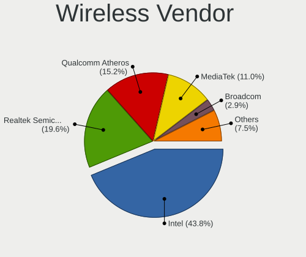

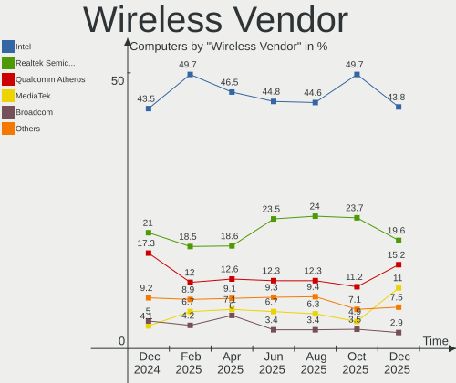

| Vendor                          | Computers | Percent |
|---------------------------------|-----------|---------|
| Intel                           | 274       | 43.77%  |
| Realtek Semiconductor           | 123       | 19.65%  |
| Qualcomm Atheros                | 95        | 15.18%  |
| MediaTek                        | 69        | 11.02%  |
| Broadcom                        | 18        | 2.88%   |
| TP-Link                         | 9         | 1.44%   |
| Ralink Technology               | 8         | 1.28%   |
| Ralink                          | 4         | 0.64%   |
| Qualcomm Atheros Communications | 4         | 0.64%   |
| Broadcom Limited                | 4         | 0.64%   |
| Qualcomm                        | 3         | 0.48%   |
| Marvell Technology Group        | 3         | 0.48%   |
| D-Link                          | 2         | 0.32%   |
| ZyDAS                           | 1         | 0.16%   |
| Sierra Wireless                 | 1         | 0.16%   |
| Realtek                         | 1         | 0.16%   |
| Microsoft                       | 1         | 0.16%   |
| Linksys                         | 1         | 0.16%   |
| Fibocom                         | 1         | 0.16%   |
| Dell                            | 1         | 0.16%   |
| D-Link System                   | 1         | 0.16%   |
| AVM                             | 1         | 0.16%   |
| ASUSTek Computer                | 1         | 0.16%   |

Wireless Model
--------------

Wireless models

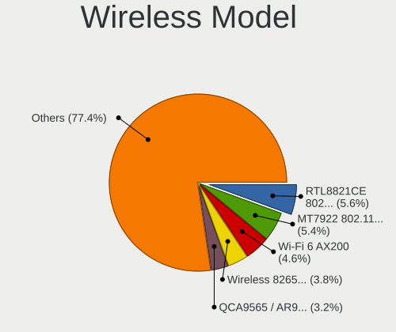

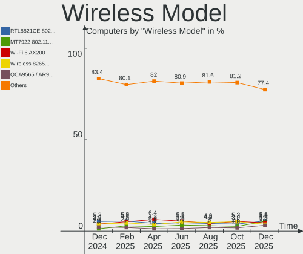

| Model                                                                           | Computers | Percent |
|---------------------------------------------------------------------------------|-----------|---------|
| Realtek RTL8821CE 802.11ac PCIe Wireless Network Adapter                        | 35        | 5.58%   |
| MediaTek MT7922 802.11ax PCI Express Wireless Network Adapter                   | 34        | 5.42%   |
| Intel Wi-Fi 6 AX200                                                             | 29        | 4.63%   |
| Intel Wireless 8265 / 8275                                                      | 24        | 3.83%   |
| Qualcomm Atheros QCA9565 / AR9565 Wireless Network Adapter                      | 20        | 3.19%   |
| Intel Wireless 8260                                                             | 18        | 2.87%   |
| Qualcomm Atheros QCA6174 802.11ac Wireless Network Adapter                      | 17        | 2.71%   |
| MediaTek MT7921 802.11ax PCIe Wireless Network Adapter [Filogic 330]            | 17        | 2.71%   |
| Intel Wi-Fi 6 AX201                                                             | 17        | 2.71%   |
| Intel Wireless 7265                                                             | 16        | 2.55%   |
| Intel Centrino Advanced-N 6205 [Taylor Peak]                                    | 15        | 2.39%   |
| Realtek RTL8852BE PCIe 802.11ax Wireless Network Controller                     | 14        | 2.23%   |
| Qualcomm Atheros QCA9377 802.11ac Wireless Network Adapter                      | 14        | 2.23%   |
| Intel Wi-Fi 6E(802.11ax) AX210/AX1675* 2x2 [Typhoon Peak]                       | 14        | 2.23%   |
| Realtek RTL8822CE 802.11ac PCIe Wireless Network Adapter                        | 13        | 2.07%   |
| Qualcomm Atheros AR9485 Wireless Network Adapter                                | 12        | 1.91%   |
| Intel Wireless 3165                                                             | 12        | 1.91%   |
| Intel Wi-Fi 5(802.11ac) Wireless-AC 9x6x [Thunder Peak]                         | 11        | 1.75%   |
| Qualcomm Atheros AR9462 Wireless Network Adapter                                | 10        | 1.59%   |
| Intel Wireless 7260                                                             | 10        | 1.59%   |
| Intel Dual Band Wireless-AC 3168NGW [Stone Peak]                                | 10        | 1.59%   |
| Qualcomm Atheros AR9285 Wireless Network Adapter (PCI-Express)                  | 8         | 1.28%   |
| Intel Raptor Lake PCH CNVi WiFi                                                 | 8         | 1.28%   |
| Intel Comet Lake PCH-LP CNVi WiFi                                               | 8         | 1.28%   |
| Intel Gemini Lake PCH CNVi WiFi                                                 | 7         | 1.12%   |
| Intel Cannon Lake PCH CNVi WiFi                                                 | 7         | 1.12%   |
| Realtek 802.11ac NIC                                                            | 6         | 0.96%   |
| Qualcomm Atheros AR928X Wireless Network Adapter (PCI-Express)                  | 6         | 0.96%   |
| MediaTek MT7925 802.11be 160MHz 2x2 PCIe Wireless Network Adapter [Filogic 360] | 6         | 0.96%   |
| Intel Meteor Lake PCH CNVi WiFi                                                 | 6         | 0.96%   |
| Intel Alder Lake-P PCH CNVi WiFi                                                | 6         | 0.96%   |
| MediaTek MT7921K (RZ608) Wi-Fi 6E 80MHz                                         | 5         | 0.8%    |
| Intel Tiger Lake PCH CNVi WiFi                                                  | 5         | 0.8%    |
| Intel Centrino Wireless-N 2230                                                  | 5         | 0.8%    |
| Intel 700 Series Chipset CNVi WiFi                                              | 5         | 0.8%    |
| Realtek RTL8852CE PCIe 802.11ax Wireless Network Controller                     | 4         | 0.64%   |
| Realtek RTL8822BE 802.11a/b/g/n/ac WiFi adapter                                 | 4         | 0.64%   |
| Realtek RTL8723BE PCIe Wireless Network Adapter                                 | 4         | 0.64%   |
| Realtek RTL8188EE Wireless Network Adapter                                      | 4         | 0.64%   |
| Ralink RT2870/RT3070 Wireless Adapter                                           | 4         | 0.64%   |

Ethernet Vendor
---------------

Ethernet vendors

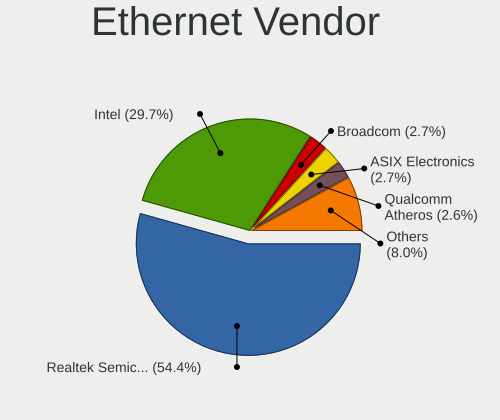

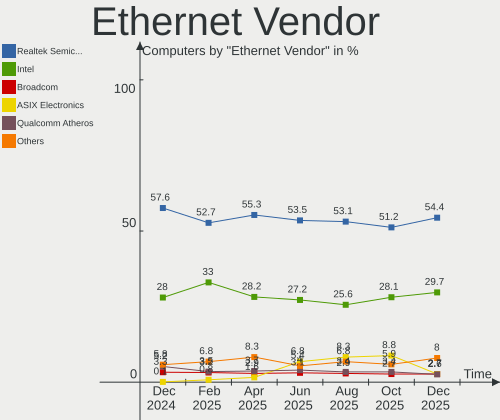

| Vendor                                 | Computers | Percent |
|----------------------------------------|-----------|---------|
| Realtek Semiconductor                  | 362       | 54.35%  |
| Intel                                  | 198       | 29.73%  |
| Broadcom                               | 18        | 2.7%    |
| ASIX Electronics                       | 18        | 2.7%    |
| Qualcomm Atheros                       | 17        | 2.55%   |
| Samsung Electronics                    | 9         | 1.35%   |
| Nvidia                                 | 7         | 1.05%   |
| Broadcom Limited                       | 6         | 0.9%    |
| Aquantia                               | 6         | 0.9%    |
| Marvell Technology Group               | 5         | 0.75%   |
| Suzhou Motorcomm Electronic Technology | 3         | 0.45%   |
| MediaTek                               | 3         | 0.45%   |
| ICS Advent                             | 3         | 0.45%   |
| Qualcomm Technologies                  | 2         | 0.3%    |
| Xiaomi                                 | 1         | 0.15%   |
| TP-Link                                | 1         | 0.15%   |
| Motorola PCS                           | 1         | 0.15%   |
| Microsoft                              | 1         | 0.15%   |
| JMicron Technology                     | 1         | 0.15%   |
| Huawei Technologies                    | 1         | 0.15%   |
| Google                                 | 1         | 0.15%   |
| DisplayLink                            | 1         | 0.15%   |
| Apple                                  | 1         | 0.15%   |

Ethernet Model
--------------

Ethernet models

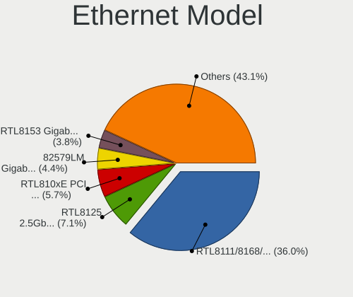

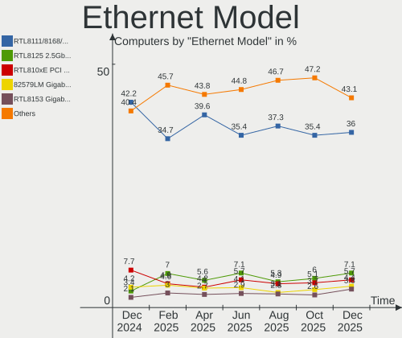

| Model                                                                  | Computers | Percent |
|------------------------------------------------------------------------|-----------|---------|
| Realtek RTL8111/8168/8211/8411 PCI Express Gigabit Ethernet Controller | 248       | 35.99%  |
| Realtek RTL8125 2.5GbE Controller                                      | 49        | 7.11%   |
| Realtek RTL810xE PCI Express Fast Ethernet controller                  | 39        | 5.66%   |
| Intel 82579LM Gigabit Network Connection (Lewisville)                  | 30        | 4.35%   |
| Realtek RTL8153 Gigabit Ethernet Adapter                               | 26        | 3.77%   |
| Intel Ethernet Controller I225-V                                       | 18        | 2.61%   |
| ASIX AX88179 Gigabit Ethernet                                          | 18        | 2.61%   |
| Intel I211 Gigabit Network Connection                                  | 16        | 2.32%   |
| Intel Ethernet Connection (4) I219-LM                                  | 14        | 2.03%   |
| Intel Ethernet Connection (2) I219-V                                   | 14        | 2.03%   |
| Intel Ethernet Connection I217-LM                                      | 10        | 1.45%   |
| Intel Ethernet Connection (2) I219-LM                                  | 10        | 1.45%   |
| Intel Ethernet Connection I217-V                                       | 7         | 1.02%   |
| Intel I210 Gigabit Network Connection                                  | 6         | 0.87%   |
| Intel Ethernet Connection (10) I219-V                                  | 6         | 0.87%   |
| Samsung GT-I9070 (network tethering, USB debugging enabled)            | 5         | 0.73%   |
| Intel Ethernet Controller I226-V                                       | 5         | 0.73%   |
| Samsung Galaxy series, misc. (tethering mode)                          | 4         | 0.58%   |
| Realtek RTL8852BE PCIe 802.11ax Wireless Network Controller            | 4         | 0.58%   |
| Realtek RTL8126 5GbE Controller                                        | 4         | 0.58%   |
| Intel Ethernet Connection I219-V                                       | 4         | 0.58%   |
| Intel Ethernet Connection (7) I219-V                                   | 4         | 0.58%   |
| Intel Ethernet Connection (7) I219-LM                                  | 4         | 0.58%   |
| Intel 82579V Gigabit Network Connection                                | 4         | 0.58%   |
| Intel 82577LM Gigabit Network Connection                               | 4         | 0.58%   |
| Suzhou Motorcomm Electronic YT6801 Gigabit Ethernet Controller         | 3         | 0.44%   |
| Realtek RTL8152 Fast Ethernet Adapter                                  | 3         | 0.44%   |
| Qualcomm Atheros AR8161 Gigabit Ethernet                               | 3         | 0.44%   |
| Qualcomm Atheros AR8151 v2.0 Gigabit Ethernet                          | 3         | 0.44%   |
| Intel Ethernet Connection I219-LM                                      | 3         | 0.44%   |
| Intel Ethernet Connection I218-LM                                      | 3         | 0.44%   |
| Intel Ethernet Connection (18) I219-LM                                 | 3         | 0.44%   |
| Intel Ethernet Connection (13) I219-LM                                 | 3         | 0.44%   |
| Intel Ethernet Connection (11) I219-LM                                 | 3         | 0.44%   |
| Intel 82567LM Gigabit Network Connection                               | 3         | 0.44%   |
| ICS Advent 10/100M LAN                                                 | 3         | 0.44%   |
| Broadcom NetXtreme BCM5764M Gigabit Ethernet PCIe                      | 3         | 0.44%   |
| Broadcom NetLink BCM57781 Gigabit Ethernet PCIe                        | 3         | 0.44%   |
| Broadcom NetLink BCM57780 Gigabit Ethernet PCIe                        | 3         | 0.44%   |
| Broadcom Limited NetLink BCM57780 Gigabit Ethernet PCIe                | 3         | 0.44%   |

Net Controller Kind
-------------------

Ethernet, WiFi or modem

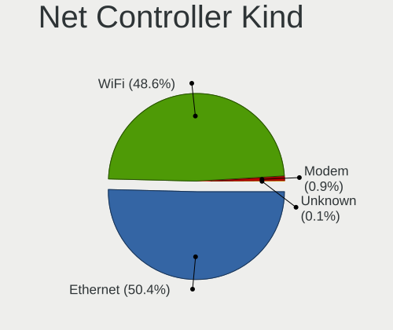

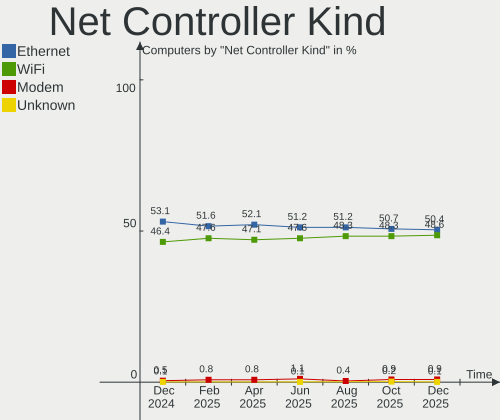

| Kind     | Computers | Percent |
|----------|-----------|---------|
| Ethernet | 633       | 50.4%   |
| WiFi     | 611       | 48.65%  |
| Modem    | 11        | 0.88%   |
| Unknown  | 1         | 0.08%   |

Used Controller
---------------

Currently used network controller

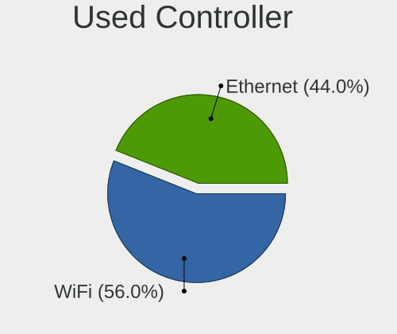

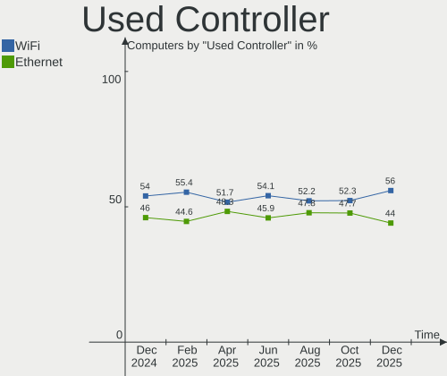

| Kind     | Computers | Percent |
|----------|-----------|---------|
| WiFi     | 413       | 56.04%  |
| Ethernet | 324       | 43.96%  |

NICs
----

Total network controllers on board

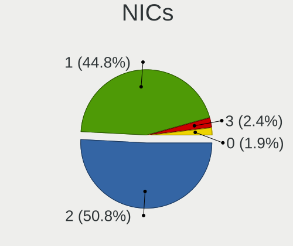

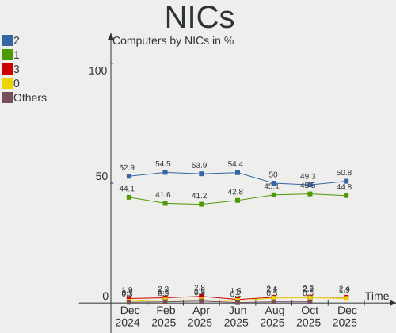

| Total | Computers | Percent |
|-------|-----------|---------|
| 2     | 399       | 50.83%  |
| 1     | 352       | 44.84%  |
| 3     | 19        | 2.42%   |
| 0     | 15        | 1.91%   |

IPv6
----

IPv6 vs IPv4

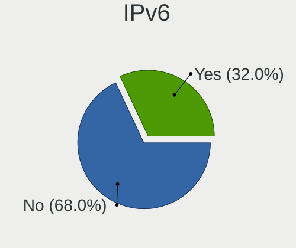

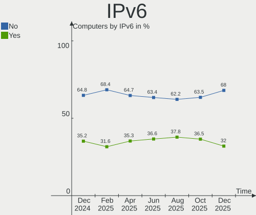

| Used | Computers | Percent |
|------|-----------|---------|
| No   | 534       | 68.03%  |
| Yes  | 251       | 31.97%  |

Bluetooth
---------

Bluetooth Vendor
----------------

Controller vendors

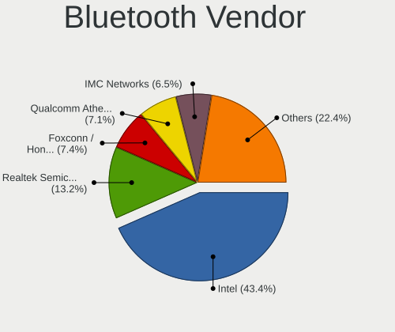

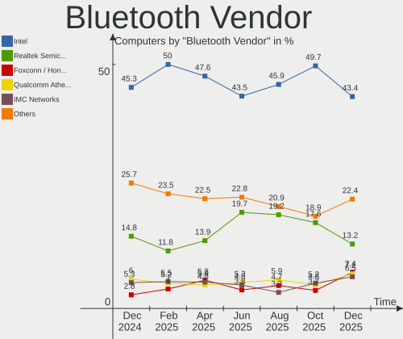

| Vendor                          | Computers | Percent |
|---------------------------------|-----------|---------|
| Intel                           | 234       | 43.41%  |
| Realtek Semiconductor           | 71        | 13.17%  |
| Foxconn / Hon Hai               | 40        | 7.42%   |
| Qualcomm Atheros Communications | 38        | 7.05%   |
| IMC Networks                    | 35        | 6.49%   |
| MediaTek                        | 26        | 4.82%   |
| Broadcom                        | 16        | 2.97%   |
| Cambridge Silicon Radio         | 15        | 2.78%   |
| Lite-On Technology              | 14        | 2.6%    |
| Apple                           | 12        | 2.23%   |
| Marvell Semiconductor           | 6         | 1.11%   |
| TP-Link                         | 5         | 0.93%   |
| Hewlett-Packard                 | 5         | 0.93%   |
| ASUSTek Computer                | 5         | 0.93%   |
| Toshiba                         | 3         | 0.56%   |
| Dell                            | 3         | 0.56%   |
| USI                             | 2         | 0.37%   |
| Askey Computer                  | 2         | 0.37%   |
| Realtek                         | 1         | 0.19%   |
| Quectel Wireless Solutions      | 1         | 0.19%   |
| Primax Electronics              | 1         | 0.19%   |
| Integrated System Solution      | 1         | 0.19%   |
| Alps Electric                   | 1         | 0.19%   |
| Actions                         | 1         | 0.19%   |
| Unknown                         | 1         | 0.19%   |

Bluetooth Model
---------------

Controller models

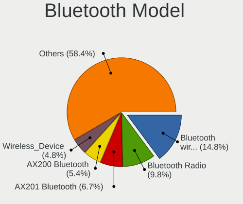

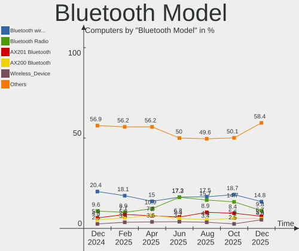

| Model                                               | Computers | Percent |
|-----------------------------------------------------|-----------|---------|
| Intel Bluetooth wireless interface                  | 80        | 14.84%  |
| Realtek Bluetooth Radio                             | 53        | 9.83%   |
| Intel AX201 Bluetooth                               | 36        | 6.68%   |
| Intel AX200 Bluetooth                               | 29        | 5.38%   |
| MediaTek Wireless_Device                            | 26        | 4.82%   |
| Intel Bluetooth 9460/9560 Jefferson Peak (JfP)      | 25        | 4.64%   |
| Intel Bluetooth Device                              | 23        | 4.27%   |
| Foxconn / Hon Hai Wireless_Device                   | 20        | 3.71%   |
| Qualcomm Atheros  Bluetooth Device                  | 19        | 3.53%   |
| IMC Networks Bluetooth Radio                        | 18        | 3.34%   |
| Intel AX210 Bluetooth                               | 15        | 2.78%   |
| Cambridge Silicon Radio Bluetooth Dongle (HCI mode) | 15        | 2.78%   |
| Realtek  Bluetooth 4.2 Adapter                      | 12        | 2.23%   |
| IMC Networks Wireless_Device                        | 11        | 2.04%   |
| Foxconn / Hon Hai Bluetooth Device                  | 11        | 2.04%   |
| Intel Wireless-AC 9260 Bluetooth Adapter            | 10        | 1.86%   |
| Intel Wireless-AC 3168 Bluetooth                    | 10        | 1.86%   |
| Foxconn / Hon Hai MediaTek Bluetooth Adapter        | 7         | 1.3%    |
| Apple Bluetooth Host Controller                     | 7         | 1.3%    |
| Qualcomm Atheros AR3012 Bluetooth 4.0               | 6         | 1.11%   |
| TP-Link TP-T@- UB500 Adapter                        | 5         | 0.93%   |
| Qualcomm Atheros QCA61x4 Bluetooth 4.0              | 5         | 0.93%   |
| Lite-On Wireless_Device                             | 5         | 0.93%   |
| Intel Centrino Bluetooth Wireless Transceiver       | 5         | 0.93%   |
| Marvell Bluetooth and Wireless LAN Composite Device | 4         | 0.74%   |
| Lite-On Qualcomm Atheros QCA9377 Bluetooth          | 4         | 0.74%   |
| IMC Networks Bluetooth Device                       | 4         | 0.74%   |
| HP Broadcom 2070 Bluetooth Combo                    | 4         | 0.74%   |
| Broadcom BCM2045B (BDC-2.1)                         | 4         | 0.74%   |
| Qualcomm Atheros Bluetooth USB Host Controller      | 3         | 0.56%   |
| Broadcom HP Portable SoftSailing                    | 3         | 0.56%   |
| Broadcom BCM20702 Bluetooth 4.0 [ThinkPad]          | 3         | 0.56%   |
| Apple Built-in Bluetooth 2.0+EDR HCI                | 3         | 0.56%   |
| USI Bluetooth Device                                | 2         | 0.37%   |
| Toshiba Bluetooth Device                            | 2         | 0.37%   |
| Realtek RTL8723B Bluetooth                          | 2         | 0.37%   |
| Realtek Bluetooth 5.4 Radio                         | 2         | 0.37%   |
| Qualcomm Atheros AR3012 Bluetooth                   | 2         | 0.37%   |
| Qualcomm Atheros AR3011 Bluetooth                   | 2         | 0.37%   |
| Marvell Bluetooth and Wireless LAN Composite        | 2         | 0.37%   |

Sound
-----

Sound Vendor
------------

Sound card vendors

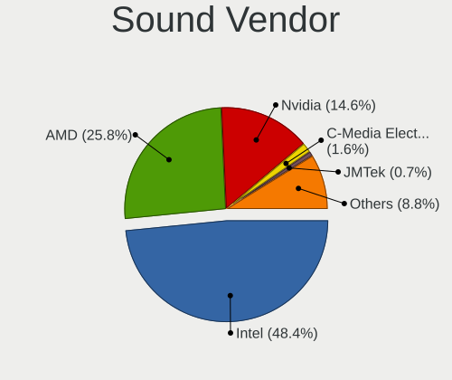

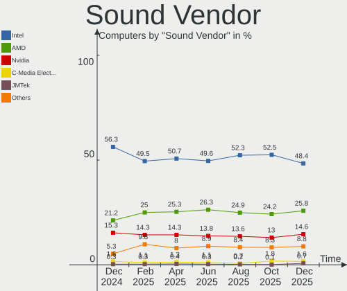

| Vendor                                       | Computers | Percent |
|----------------------------------------------|-----------|---------|
| Intel                                        | 523       | 48.43%  |
| AMD                                          | 279       | 25.83%  |
| Nvidia                                       | 158       | 14.63%  |
| C-Media Electronics                          | 17        | 1.57%   |
| JMTek                                        | 8         | 0.74%   |
| Zoran Co. Personal Media Division (Nogatech) | 6         | 0.56%   |
| Texas Instruments                            | 6         | 0.56%   |
| Realtek Semiconductor                        | 5         | 0.46%   |
| Razer USA                                    | 5         | 0.46%   |
| Creative Labs                                | 5         | 0.46%   |
| ASUSTek Computer                             | 5         | 0.46%   |
| Micro Star International                     | 4         | 0.37%   |
| Logitech                                     | 4         | 0.37%   |
| KTMicro                                      | 4         | 0.37%   |
| Focusrite-Novation                           | 4         | 0.37%   |
| Thesycon Systemsoftware & Consulting         | 3         | 0.28%   |
| Hewlett-Packard                              | 3         | 0.28%   |
| Generalplus Technology                       | 3         | 0.28%   |
| Tenx Technology                              | 2         | 0.19%   |
| SteelSeries ApS                              | 2         | 0.19%   |
| Kingston Technology                          | 2         | 0.19%   |
| Jieli Technology                             | 2         | 0.19%   |
| GN Netcom                                    | 2         | 0.19%   |
| DisplayLink                                  | 2         | 0.19%   |
| Creative Technology                          | 2         | 0.19%   |
| Corsair                                      | 2         | 0.19%   |
| XMOS                                         | 1         | 0.09%   |
| Walmart                                      | 1         | 0.09%   |
| SCUF Gaming                                  | 1         | 0.09%   |
| Samson Technologies                          | 1         | 0.09%   |
| PreSonus Audio Electronics                   | 1         | 0.09%   |
| Nordic Semiconductor ASA                     | 1         | 0.09%   |
| MV-SILICON                                   | 1         | 0.09%   |
| Medeli Electronics                           | 1         | 0.09%   |
| Mark of the Unicorn                          | 1         | 0.09%   |
| Mackie Designs                               | 1         | 0.09%   |
| liyuany                                      | 1         | 0.09%   |
| Lenovo                                       | 1         | 0.09%   |
| Insignia (Best Buy)                          | 1         | 0.09%   |
| GK51                                         | 1         | 0.09%   |

Sound Model
-----------

Sound card models

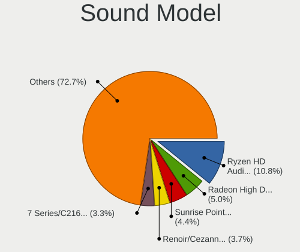

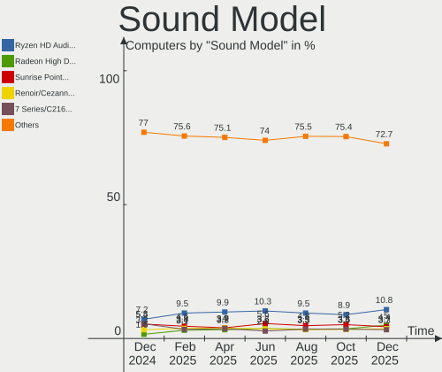

| Model                                                                      | Computers | Percent |
|----------------------------------------------------------------------------|-----------|---------|
| AMD Ryzen HD Audio Controller                                              | 146       | 10.85%  |
| AMD Radeon High Definition Audio Controller                                | 67        | 4.98%   |
| Intel Sunrise Point-LP HD Audio                                            | 59        | 4.38%   |
| AMD Renoir/Cezanne HDMI/DP Audio Controller                                | 50        | 3.71%   |
| Intel 7 Series/C216 Chipset Family High Definition Audio Controller        | 45        | 3.34%   |
| Intel 6 Series/C200 Series Chipset Family High Definition Audio Controller | 45        | 3.34%   |
| AMD Starship/Matisse HD Audio Controller                                   | 40        | 2.97%   |
| Intel 8 Series/C220 Series Chipset High Definition Audio Controller        | 29        | 2.15%   |
| Intel 100 Series/C230 Series Chipset Family HD Audio Controller            | 27        | 2.01%   |
| AMD Raven/Raven2/Fenghuang HDMI/DP Audio Controller                        | 23        | 1.71%   |
| Intel Tiger Lake-LP Smart Sound Technology Audio Controller                | 22        | 1.63%   |
| Intel Cannon Lake PCH cAVS                                                 | 22        | 1.63%   |
| Intel 5 Series/3400 Series Chipset High Definition Audio                   | 21        | 1.56%   |
| AMD Navi 21/23 HDMI/DP Audio Controller                                    | 21        | 1.56%   |
| AMD SBx00 Azalia (Intel HDA)                                               | 18        | 1.34%   |
| Intel 200 Series PCH HD Audio                                              | 17        | 1.26%   |
| Intel Xeon E3-1200 v3/4th Gen Core Processor HD Audio Controller           | 16        | 1.19%   |
| Intel Haswell-ULT HD Audio Controller                                      | 16        | 1.19%   |
| Intel 8 Series HD Audio Controller                                         | 16        | 1.19%   |
| Intel Celeron/Pentium Silver Processor High Definition Audio               | 15        | 1.11%   |
| AMD FCH Azalia Controller                                                  | 15        | 1.11%   |
| Intel Wildcat Point-LP High Definition Audio Controller                    | 14        | 1.04%   |
| Intel Broadwell-U Audio Controller                                         | 14        | 1.04%   |
| Intel Alder Lake PCH-P High Definition Audio Controller                    | 14        | 1.04%   |
| Intel 82801I (ICH9 Family) HD Audio Controller                             | 14        | 1.04%   |
| AMD Navi 31 HDMI/DP Audio                                                  | 14        | 1.04%   |
| AMD Family 17h (Models 00h-0fh) HD Audio Controller                        | 14        | 1.04%   |
| AMD Navi 48 HDMI/DP Audio Controller                                       | 13        | 0.97%   |
| Nvidia GK208 HDMI/DP Audio Controller                                      | 12        | 0.89%   |
| Intel Celeron N3350/Pentium N4200/Atom E3900 Series Audio Cluster          | 12        | 0.89%   |
| Nvidia TU107 GeForce GTX 1650 High Definition Audio Controller             | 11        | 0.82%   |
| Intel Alder Lake-N PCH High Definition Audio Controller                    | 11        | 0.82%   |
| Intel Raptor Lake-P/U/H cAVS                                               | 10        | 0.74%   |
| Intel Jasper Lake HD Audio                                                 | 10        | 0.74%   |
| Intel Comet Lake PCH-LP cAVS                                               | 10        | 0.74%   |
| Intel Atom Processor Z36xxx/Z37xxx Series High Definition Audio Controller | 10        | 0.74%   |
| Intel Tiger Lake-H HD Audio Controller                                     | 9         | 0.67%   |
| Intel Raptor Lake High Definition Audio Controller                         | 9         | 0.67%   |
| Intel Meteor Lake-P HD Audio Controller                                    | 9         | 0.67%   |
| Intel Alder Lake-S HD Audio Controller                                     | 9         | 0.67%   |

Memory
------

Memory Vendor
-------------

Memory module vendors

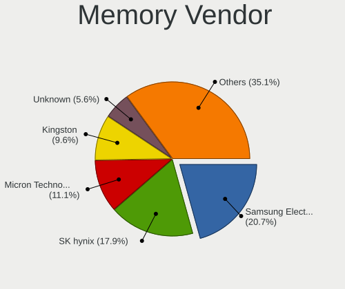

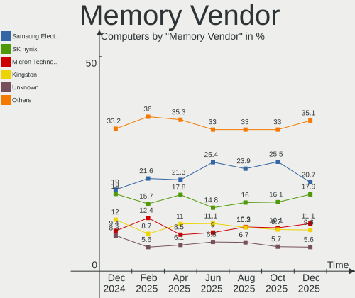

| Vendor                       | Computers | Percent |
|------------------------------|-----------|---------|
| Samsung Electronics          | 192       | 20.71%  |
| SK hynix                     | 166       | 17.91%  |
| Micron Technology            | 103       | 11.11%  |
| Kingston                     | 89        | 9.6%    |
| Unknown                      | 52        | 5.61%   |
| Crucial                      | 52        | 5.61%   |
| Corsair                      | 43        | 4.64%   |
| G.Skill                      | 40        | 4.31%   |
| Unknown                      | 30        | 3.24%   |
| A-DATA Technology            | 28        | 3.02%   |
| Ramaxel Technology           | 20        | 2.16%   |
| Unknown (ABCD)               | 9         | 0.97%   |
| Team                         | 9         | 0.97%   |
| Nanya Technology             | 8         | 0.86%   |
| Elpida                       | 8         | 0.86%   |
| Smart                        | 6         | 0.65%   |
| Patriot                      | 5         | 0.54%   |
| Apacer                       | 5         | 0.54%   |
| Transcend                    | 4         | 0.43%   |
| Red Hat                      | 3         | 0.32%   |
| Patriot Memory               | 3         | 0.32%   |
| ASint Technology             | 3         | 0.32%   |
| 4ea5                         | 3         | 0.32%   |
| Unknown (0x0080)             | 2         | 0.22%   |
| Timetec                      | 2         | 0.22%   |
| Silicon Power                | 2         | 0.22%   |
| PUSKILL                      | 2         | 0.22%   |
| Patriot Memory (PDP Systems) | 2         | 0.22%   |
| Lexar                        | 2         | 0.22%   |
| KingSpec                     | 2         | 0.22%   |
| GOODRAM                      | 2         | 0.22%   |
| AMD                          | 2         | 0.22%   |
| Wilk Elektronik              | 1         | 0.11%   |
| Unknown (FFFF000080AD)       | 1         | 0.11%   |
| Unknown (89F7)               | 1         | 0.11%   |
| Unknown (0x1057)             | 1         | 0.11%   |
| Unknown (0x0FE9)             | 1         | 0.11%   |
| Unknown (0x0F94)             | 1         | 0.11%   |
| Unknown (0x0E9D)             | 1         | 0.11%   |
| Unknown (0x0CC7)             | 1         | 0.11%   |

Memory Model
------------

Memory module models

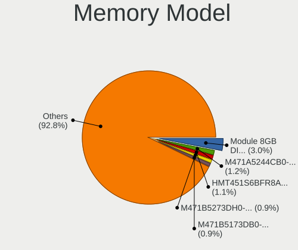

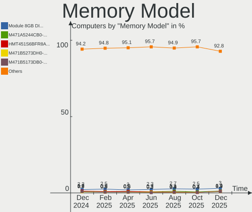

| Model                                                            | Computers | Percent |
|------------------------------------------------------------------|-----------|---------|
| Unknown                                                          | 30        | 3.05%   |
| Samsung RAM M471A5244CB0-CWE 4GB SODIMM DDR4 3200MT/s            | 12        | 1.22%   |
| SK hynix RAM HMT451S6BFR8A-PB 4GB SODIMM DDR3 1600MT/s           | 11        | 1.12%   |
| Samsung RAM M471B5273DH0-CH9 4GB SODIMM DDR3 1600MT/s            | 9         | 0.91%   |
| Samsung RAM M471B5173DB0-YK0 4GB SODIMM DDR3 1600MT/s            | 9         | 0.91%   |
| Unknown (ABCD) RAM 123456789012345678 2GB SODIMM LPDDR4 2400MT/s | 7         | 0.71%   |
| Samsung RAM M471B5173QH0-YK0 4GB SODIMM DDR3 1600MT/s            | 7         | 0.71%   |
| SK hynix RAM HMA851S6DJR6N-XN 4GB SODIMM DDR4 3200MT/s           | 5         | 0.51%   |
| SK hynix RAM HMA81GS6AFR8N-UH 8GB SODIMM DDR4 2667MT/s           | 5         | 0.51%   |
| Samsung RAM M471A1K43EB1-CWE 8GB SODIMM DDR4 3200MT/s            | 5         | 0.51%   |
| Kingston RAM KHX3200C16D4/8GX 8GB DIMM DDR4 3733MT/s             | 5         | 0.51%   |
| Corsair RAM CMK16GX4M2B3200C16 8GB DIMM DDR4 3600MT/s            | 5         | 0.51%   |
| Unknown RAM Module 8GB DIMM 1333MT/s                             | 4         | 0.41%   |
| Unknown RAM Module 4GB DIMM DDR3 1333MT/s                        | 4         | 0.41%   |
| SK hynix RAM HMT451S6AFR8A-PB 4GB SODIMM DDR3 1600MT/s           | 4         | 0.41%   |
| SK hynix RAM HMT425S6AFR6A-PB 2GB SODIMM DDR3 3200MT/s           | 4         | 0.41%   |
| SK hynix RAM HMT41GS6BFR8A-PB 8GB SODIMM DDR3 2667MT/s           | 4         | 0.41%   |
| SK hynix RAM HMT41GS6BFR8A-PB 8GB SODIMM DDR3 1600MT/s           | 4         | 0.41%   |
| SK hynix RAM HMT351U6CFR8C-PB 4GB DIMM DDR3 1800MT/s             | 4         | 0.41%   |
| Samsung RAM M471B5273DH0-CK0 4GB SODIMM DDR3 2400MT/s            | 4         | 0.41%   |
| Samsung RAM M471A1G44AB0-CWE 8GiB SODIMM DDR4 3200MT/s           | 4         | 0.41%   |
| Samsung RAM M378B5173QH0-CK0 4GB DIMM DDR3                       | 4         | 0.41%   |
| Ramaxel RAM RMSA3260ME78HAF-2666 8GB SODIMM DDR4 2667MT/s        | 4         | 0.41%   |
| Crucial RAM Module 4GB DIMM DDR3 1600MT/s                        | 4         | 0.41%   |
| Unknown RAM Module 4GB DIMM 1333MT/s                             | 3         | 0.3%    |
| Unknown RAM Module 2GB SODIMM DDR3 1600MT/s                      | 3         | 0.3%    |
| Unknown RAM Module 2GB SODIMM 800MT/s                            | 3         | 0.3%    |
| Unknown RAM Module 2GB DIMM SDRAM                                | 3         | 0.3%    |
| Team RAM TEAMGROUP-UD4-3200 8GB DIMM DDR4 3733MT/s               | 3         | 0.3%    |
| SK hynix RAM HMT351S6BFR8C-H9 4GB SODIMM DDR3 1333MT/s           | 3         | 0.3%    |
| SK hynix RAM HMT325S6CFR8C-H9 2GB SODIMM DDR3 1333MT/s           | 3         | 0.3%    |
| SK hynix RAM HMAA1GS6CJR6N-XN 8GB SODIMM DDR4 3200MT/s           | 3         | 0.3%    |
| SK hynix RAM HMA851S6JJR6N-VK 4GB SODIMM DDR4 2667MT/s           | 3         | 0.3%    |
| SK hynix RAM HMA851S6CJR6N-XN 4GB SODIMM DDR4 3200MT/s           | 3         | 0.3%    |
| SK hynix RAM HMA81GS6DJR8N-VK 8GB SODIMM DDR4 2667MT/s           | 3         | 0.3%    |
| SK hynix RAM HMA41GS6AFR8N-TF 8GB SODIMM DDR4 2667MT/s           | 3         | 0.3%    |
| SK hynix RAM H9JCNNNFA5MLYR-N6E 4GB Row Of Chips LPDDR5 6400MT/s | 3         | 0.3%    |
| Samsung RAM Module 8GB SODIMM DDR4 2667MT/s                      | 3         | 0.3%    |
| Samsung RAM M471A5244CB0-CWE 4GB Row Of Chips DDR4 3200MT/s      | 3         | 0.3%    |
| Samsung RAM M471A2K43DB1-CWE 16GB SODIMM DDR4 3200MT/s           | 3         | 0.3%    |

Memory Kind
-----------

Memory module kinds

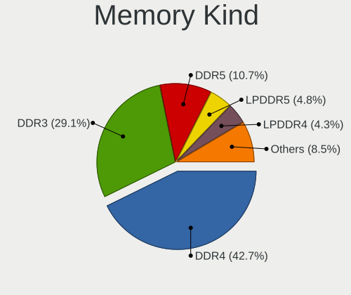

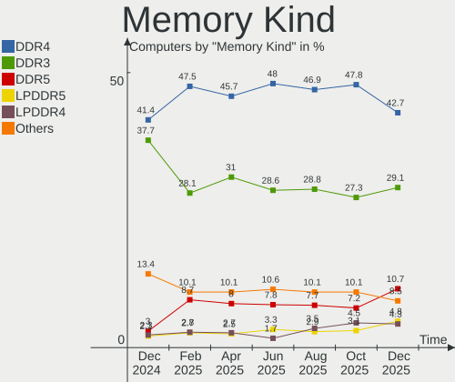

| Kind    | Computers | Percent |
|---------|-----------|---------|
| DDR4    | 341       | 42.73%  |
| DDR3    | 232       | 29.07%  |
| DDR5    | 85        | 10.65%  |
| LPDDR5  | 38        | 4.76%   |
| LPDDR4  | 34        | 4.26%   |
| SDRAM   | 19        | 2.38%   |
| Unknown | 17        | 2.13%   |
| LPDDR3  | 16        | 2.01%   |
| DDR2    | 11        | 1.38%   |
| RAM     | 3         | 0.38%   |
| DRAM    | 2         | 0.25%   |

Memory Form Factor
------------------

Physical design of the memory module

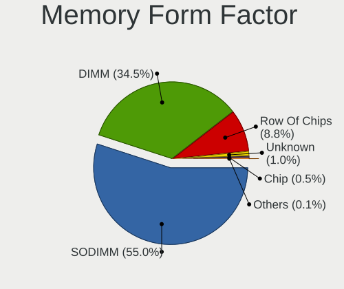

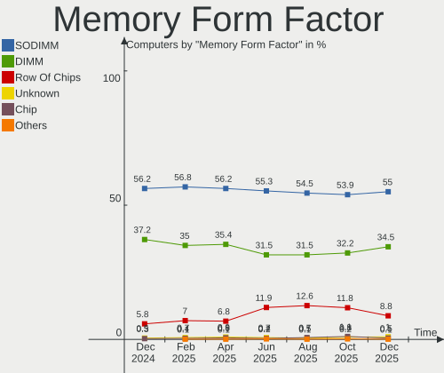

| Name         | Computers | Percent |
|--------------|-----------|---------|
| SODIMM       | 435       | 54.99%  |
| DIMM         | 273       | 34.51%  |
| Row Of Chips | 70        | 8.85%   |
| Unknown      | 8         | 1.01%   |
| Chip         | 4         | 0.51%   |
| RIMM         | 1         | 0.13%   |

Memory Size
-----------

Memory module size

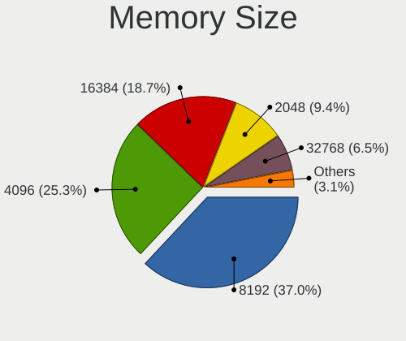

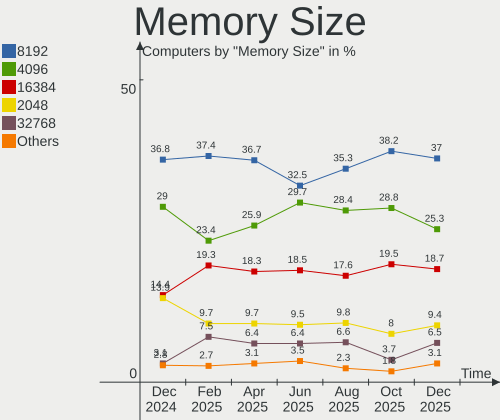

| Size  | Computers | Percent |
|-------|-----------|---------|
| 8192  | 322       | 36.97%  |
| 4096  | 220       | 25.26%  |
| 16384 | 163       | 18.71%  |
| 2048  | 82        | 9.41%   |
| 32768 | 57        | 6.54%   |
| 1024  | 13        | 1.49%   |
| 49152 | 4         | 0.46%   |
| 3072  | 3         | 0.34%   |
| 65536 | 2         | 0.23%   |
| 24576 | 2         | 0.23%   |
| 6144  | 2         | 0.23%   |
| 8124  | 1         | 0.11%   |

Memory Speed
------------

Memory module speed

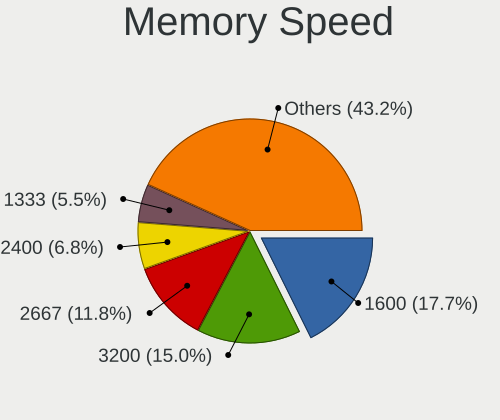

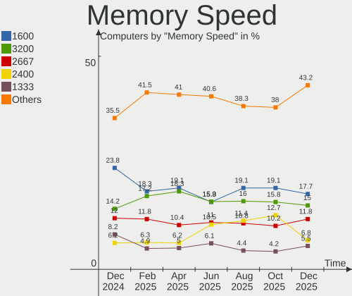

| Speed   | Computers | Percent |
|---------|-----------|---------|
| 1600    | 154       | 17.66%  |
| 3200    | 131       | 15.02%  |
| 2667    | 103       | 11.81%  |
| 2400    | 59        | 6.77%   |
| 1333    | 48        | 5.5%    |
| 5600    | 41        | 4.7%    |
| 2133    | 37        | 4.24%   |
| 3600    | 29        | 3.33%   |
| 6400    | 24        | 2.75%   |
| 1334    | 18        | 2.06%   |
| 1867    | 16        | 1.83%   |
| 6000    | 15        | 1.72%   |
| 4800    | 15        | 1.72%   |
| 1067    | 15        | 1.72%   |
| 7500    | 13        | 1.49%   |
| 4267    | 13        | 1.49%   |
| Unknown | 11        | 1.26%   |
| 800     | 10        | 1.15%   |
| 3733    | 9         | 1.03%   |
| 2666    | 9         | 1.03%   |
| 1866    | 9         | 1.03%   |
| 1800    | 9         | 1.03%   |
| 667     | 7         | 0.8%    |
| 3800    | 5         | 0.57%   |
| 4266    | 4         | 0.46%   |
| 4199    | 4         | 0.46%   |
| 4000    | 4         | 0.46%   |
| 2933    | 4         | 0.46%   |
| 8400    | 3         | 0.34%   |
| 3400    | 3         | 0.34%   |
| 3266    | 3         | 0.34%   |
| 3000    | 3         | 0.34%   |
| 2048    | 3         | 0.34%   |
| 1066    | 3         | 0.34%   |
| 8533    | 2         | 0.23%   |
| 7467    | 2         | 0.23%   |
| 6200    | 2         | 0.23%   |
| 5200    | 2         | 0.23%   |
| 3933    | 2         | 0.23%   |
| 3466    | 2         | 0.23%   |

Printers & scanners
-------------------

Printer Vendor
--------------

Printer device vendors

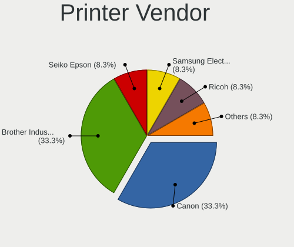

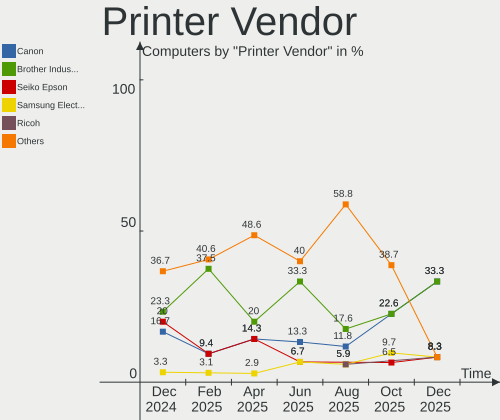

| Vendor              | Computers | Percent |
|---------------------|-----------|---------|
| Canon               | 4         | 33.33%  |
| Brother Industries  | 4         | 33.33%  |
| Seiko Epson         | 1         | 8.33%   |
| Samsung Electronics | 1         | 8.33%   |
| Ricoh               | 1         | 8.33%   |
| Hewlett-Packard     | 1         | 8.33%   |

Printer Model
-------------

Printer device models

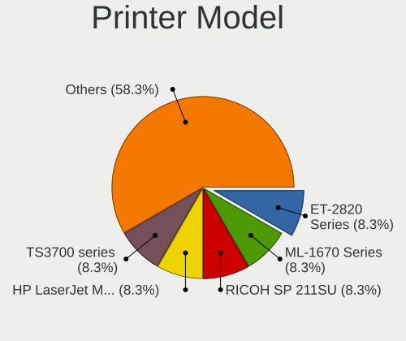

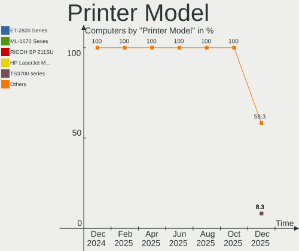

| Model                      | Computers | Percent |
|----------------------------|-----------|---------|
| Seiko Epson ET-2820 Series | 1         | 8.33%   |
| Samsung ML-1670 Series     | 1         | 8.33%   |
| Ricoh RICOH SP 211SU       | 1         | 8.33%   |
| HP HP LaserJet M207-M212   | 1         | 8.33%   |
| Canon TS3700 series        | 1         | 8.33%   |
| Canon PIXMA MX390 Series   | 1         | 8.33%   |
| Canon PIXMA MG3600 Series  | 1         | 8.33%   |
| Canon MF741C/743C          | 1         | 8.33%   |
| Brother MFC-L2700DW        | 1         | 8.33%   |
| Brother MFC-L2690DW        | 1         | 8.33%   |
| Brother HL-L3280CDW series | 1         | 8.33%   |
| Brother DCP-J132W          | 1         | 8.33%   |

Scanner Vendor
--------------

Scanner device vendors

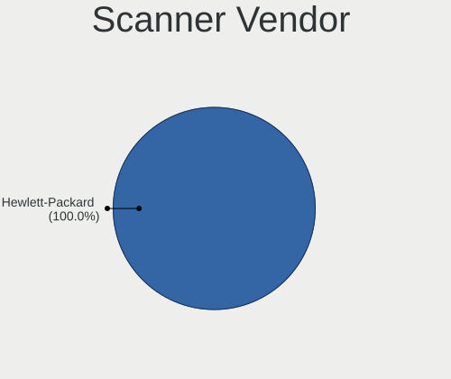

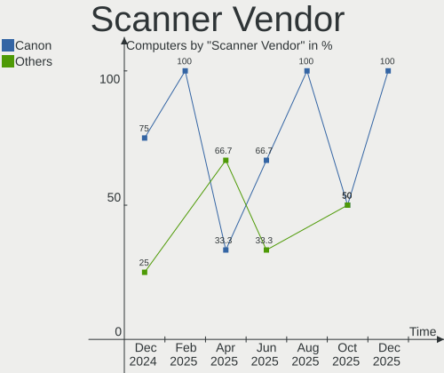

| Vendor | Computers | Percent |
|--------|-----------|---------|
| Canon  | 1         | 100%    |

Scanner Model
-------------

Scanner device models

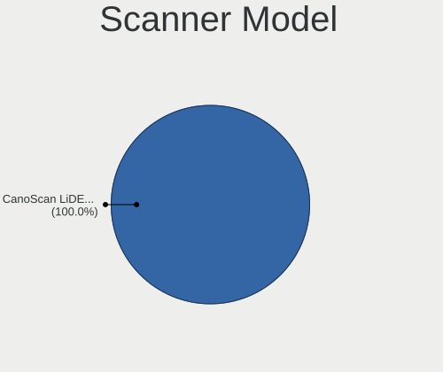

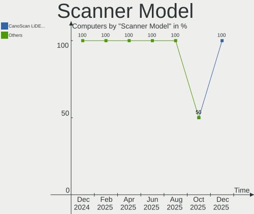

| Model                   | Computers | Percent |
|-------------------------|-----------|---------|
| Canon CanoScan LiDE 220 | 1         | 100%    |

Camera
------

Camera Vendor
-------------

Camera device vendors

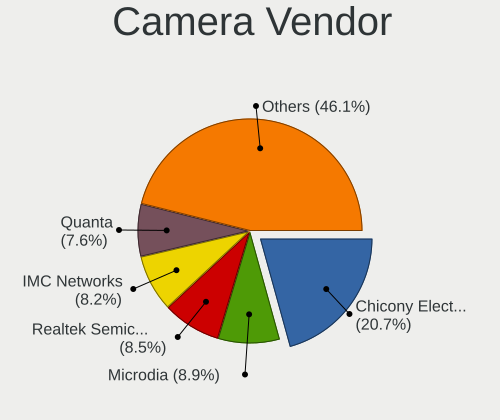

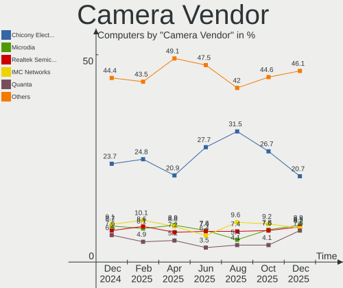

| Vendor                                 | Computers | Percent |
|----------------------------------------|-----------|---------|
| Chicony Electronics                    | 93        | 20.71%  |
| Microdia                               | 40        | 8.91%   |
| Realtek Semiconductor                  | 38        | 8.46%   |
| IMC Networks                           | 37        | 8.24%   |
| Quanta                                 | 34        | 7.57%   |
| Sunplus Innovation Technology          | 24        | 5.35%   |
| Bison Electronics                      | 24        | 5.35%   |
| Luxvisions Innotech Limited            | 19        | 4.23%   |
| Syntek                                 | 15        | 3.34%   |
| Suyin                                  | 14        | 3.12%   |
| Logitech                               | 12        | 2.67%   |
| Cheng Uei Precision Industry (Foxlink) | 12        | 2.67%   |
| Apple                                  | 8         | 1.78%   |
| Silicon Motion                         | 7         | 1.56%   |
| Microsoft                              | 7         | 1.56%   |
| Sonix Technology                       | 6         | 1.34%   |
| Lite-On Technology                     | 5         | 1.11%   |
| icSpring                               | 5         | 1.11%   |
| Acer                                   | 5         | 1.11%   |
| Primax Electronics                     | 4         | 0.89%   |
| Alcor Micro                            | 4         | 0.89%   |
| Lenovo                                 | 3         | 0.67%   |
| Framework                              | 3         | 0.67%   |
| webcam                                 | 2         | 0.45%   |
| Ricoh                                  | 2         | 0.45%   |
| Razer USA                              | 2         | 0.45%   |
| OYT Tech                               | 2         | 0.45%   |
| ALi                                    | 2         | 0.45%   |
| Unknown                                | 2         | 0.45%   |
| Z-Star Microelectronics                | 1         | 0.22%   |
| Unknown (3730304231393831325530)       | 1         | 0.22%   |
| Sunplus Technology                     | 1         | 0.22%   |
| ShineTech                              | 1         | 0.22%   |
| SenseTek                               | 1         | 0.22%   |
| Samsung Electronics                    | 1         | 0.22%   |
| kingcome                               | 1         | 0.22%   |
| Jeilin Technology                      | 1         | 0.22%   |
| Importek                               | 1         | 0.22%   |
| Hewlett-Packard                        | 1         | 0.22%   |
| GEMBIRD                                | 1         | 0.22%   |

Camera Model
------------

Camera device models

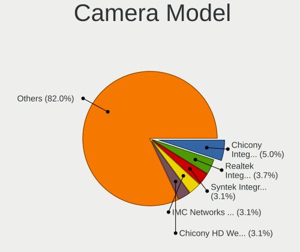

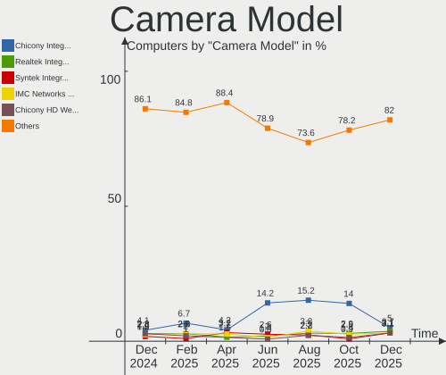

| Model                                         | Computers | Percent |
|-----------------------------------------------|-----------|---------|
| Chicony Integrated Camera                     | 23        | 5.04%   |
| Realtek Integrated_Webcam_HD                  | 17        | 3.73%   |
| Syntek Integrated Camera                      | 14        | 3.07%   |
| IMC Networks Integrated Camera                | 14        | 3.07%   |
| Chicony HD WebCam                             | 14        | 3.07%   |
| Microdia Integrated_Webcam_HD                 | 13        | 2.85%   |
| IMC Networks USB2.0 HD UVC WebCam             | 13        | 2.85%   |
| Bison Integrated Camera                       | 11        | 2.41%   |
| Luxvisions Innotech Limited Integrated Camera | 9         | 1.97%   |
| Sunplus Integrated_Webcam_HD                  | 7         | 1.54%   |
| Quanta HP TrueVision HD Camera                | 6         | 1.32%   |
| Realtek USB Camera                            | 5         | 1.1%    |
| icSpring camera                               | 5         | 1.1%    |
| Chicony HP HD Camera                          | 5         | 1.1%    |
| Apple Built-in iSight                         | 5         | 1.1%    |
| Suyin Integrated_Webcam_HD                    | 4         | 0.88%   |
| Quanta VGA WebCam                             | 4         | 0.88%   |
| Quanta HD Webcam                              | 4         | 0.88%   |
| Quanta HD User Facing                         | 4         | 0.88%   |
| Microdia USB 2.0 Camera                       | 4         | 0.88%   |
| Chicony VGA Webcam                            | 4         | 0.88%   |
| Chicony HP TrueVision HD Camera               | 4         | 0.88%   |
| Chicony HP Truevision HD                      | 4         | 0.88%   |
| Suyin Acer/HP Integrated Webcam [CN0314]      | 3         | 0.66%   |
| Sunplus Integrated Webcam                     | 3         | 0.66%   |
| Sonix USB2.0 HD UVC WebCam                    | 3         | 0.66%   |
| Sonix USB2.0 FHD UVC WebCam                   | 3         | 0.66%   |
| Realtek Integrated Webcam HD                  | 3         | 0.66%   |
| Realtek HP Truevision HD                      | 3         | 0.66%   |
| Quanta ACER HD User Facing                    | 3         | 0.66%   |
| Microsoft Rear LifeCam                        | 3         | 0.66%   |
| Microsoft Front LifeCam                       | 3         | 0.66%   |
| Microdia Integrated_Webcam_FHD                | 3         | 0.66%   |
| Microdia Integrated Webcam HD                 | 3         | 0.66%   |
| Microdia Dell Laptop Integrated Webcam HD     | 3         | 0.66%   |
| Logitech Webcam C270                          | 3         | 0.66%   |
| Framework Laptop Webcam Module (2nd Gen)      | 3         | 0.66%   |
| Chicony EasyCamera                            | 3         | 0.66%   |
| Chicony ACER HD User Facing                   | 3         | 0.66%   |
| Bison SunplusIT Integrated Camera             | 3         | 0.66%   |

Security
--------

Fingerprint Vendor
------------------

Fingerprint sensor vendors

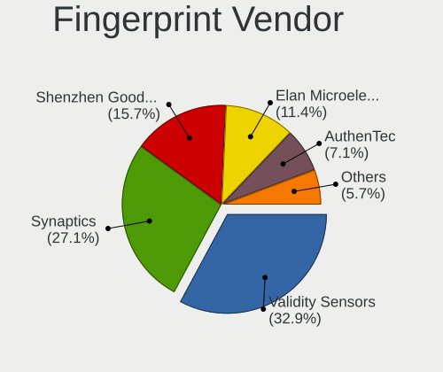

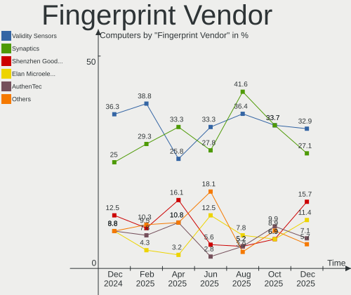

| Vendor                     | Computers | Percent |
|----------------------------|-----------|---------|
| Validity Sensors           | 23        | 32.86%  |
| Synaptics                  | 19        | 27.14%  |
| Shenzhen Goodix Technology | 11        | 15.71%  |
| Elan Microelectronics      | 8         | 11.43%  |
| AuthenTec                  | 5         | 7.14%   |
| Upek                       | 1         | 1.43%   |
| STMicroelectronics         | 1         | 1.43%   |
| LighTuning Technology      | 1         | 1.43%   |
| Focal-systems.Corp         | 1         | 1.43%   |

Fingerprint Model
-----------------

Fingerprint sensor models

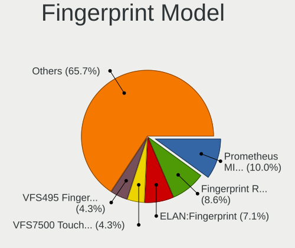

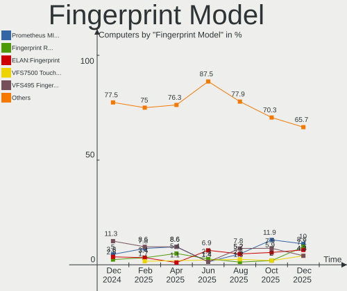

| Model                                                       | Computers | Percent |
|-------------------------------------------------------------|-----------|---------|
| Synaptics Prometheus MIS Touch Fingerprint Reader           | 7         | 10%     |
| Shenzhen Goodix Fingerprint Reader                          | 6         | 8.57%   |
| Elan ELAN:Fingerprint                                       | 5         | 7.14%   |
| Validity Sensors VFS7500 Touch Fingerprint Sensor           | 3         | 4.29%   |
| Validity Sensors VFS495 Fingerprint Reader                  | 3         | 4.29%   |
| Validity Sensors VFS 5011 fingerprint sensor                | 3         | 4.29%   |
| Validity Sensors Synaptics WBDI                             | 3         | 4.29%   |
| Synaptics UWP WBDI Device                                   | 3         | 4.29%   |
| Shenzhen Goodix  FingerPrint Device                         | 3         | 4.29%   |
| Elan ELAN:ARM-M4                                            | 3         | 4.29%   |
| AuthenTec Fingerprint Sensor                                | 3         | 4.29%   |
| Validity Sensors VFS7552 Touch Fingerprint Sensor           | 2         | 2.86%   |
| Validity Sensors VFS5011 Fingerprint Reader                 | 2         | 2.86%   |
| Validity Sensors VFS471 Fingerprint Reader                  | 2         | 2.86%   |
| Validity Sensors VFS451 Fingerprint Reader                  | 2         | 2.86%   |
| Validity Sensors Synaptics VFS7552 Touch Fingerprint Sensor | 2         | 2.86%   |
| Synaptics Prometheus Fingerprint Reader                     | 2         | 2.86%   |
| Synaptics Fingerprint reader [HP G6]                        | 2         | 2.86%   |
| Shenzhen Goodix FingerPrint                                 | 2         | 2.86%   |
| Validity Sensors VFS491                                     | 1         | 1.43%   |
| Upek Biometric Touchchip/Touchstrip Fingerprint Sensor      | 1         | 1.43%   |
| Synaptics WBDI                                              | 1         | 1.43%   |
| Synaptics  WBDI                                             | 1         | 1.43%   |
| Synaptics  FS7604 Touch Fingerprint Sensor with PurePrint   | 1         | 1.43%   |
| Synaptics Metallica MIS Touch Fingerprint Reader            | 1         | 1.43%   |
| Synaptics FS7604 Touch Fingerprint Sensor with PurePrint    | 1         | 1.43%   |
| STMicroelectronics Fingerprint Reader                       | 1         | 1.43%   |
| LighTuning EgisTec Touch Fingerprint Sensor                 | 1         | 1.43%   |
| Focal-systems.Corp FT9201Fingerprint.                       | 1         | 1.43%   |
| AuthenTec AES2810                                           | 1         | 1.43%   |
| AuthenTec AES2501 Fingerprint Sensor                        | 1         | 1.43%   |

Chipcard Vendor
---------------

Chipcard module vendors

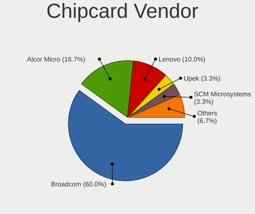

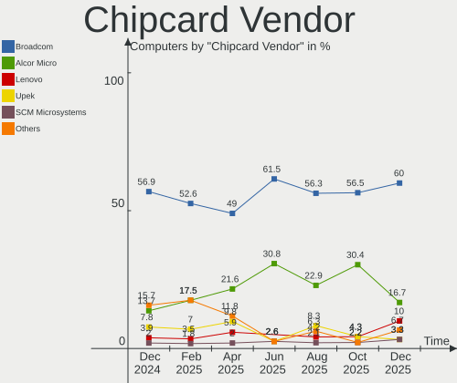

| Vendor           | Computers | Percent |
|------------------|-----------|---------|
| Broadcom         | 18        | 60%     |
| Alcor Micro      | 5         | 16.67%  |
| Lenovo           | 3         | 10%     |
| Upek             | 1         | 3.33%   |
| SCM Microsystems | 1         | 3.33%   |
| OmniKey          | 1         | 3.33%   |
| O2 Micro         | 1         | 3.33%   |

Chipcard Model
--------------

Chipcard module models

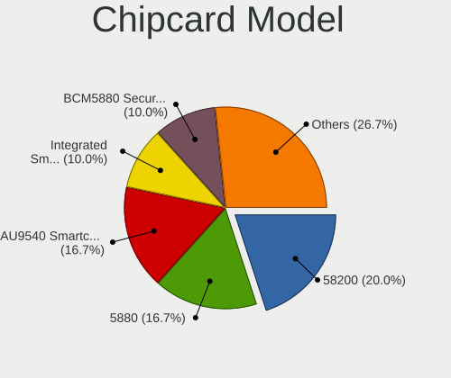

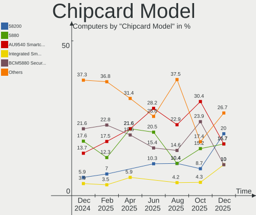

| Model                                                                        | Computers | Percent |
|------------------------------------------------------------------------------|-----------|---------|
| Broadcom 58200                                                               | 6         | 20%     |
| Broadcom 5880                                                                | 5         | 16.67%  |
| Alcor Micro AU9540 Smartcard Reader                                          | 5         | 16.67%  |
| Lenovo Integrated Smart Card Reader                                          | 3         | 10%     |
| Broadcom BCM5880 Secure Applications Processor                               | 3         | 10%     |
| Broadcom BCM58200 ControlVault 3 (FingerPrint sensor + Contacted SmartCard)  | 3         | 10%     |
| Upek TouchChip Fingerprint Coprocessor (WBF advanced mode)                   | 1         | 3.33%   |
| SCM Microsystems SCR3340 - ExpressCard54 Smart Card Reader                   | 1         | 3.33%   |
| OmniKey CardMan 1021                                                         | 1         | 3.33%   |
| O2 Micro OZ776 CCID Smartcard Reader                                         | 1         | 3.33%   |
| Broadcom BCM5880 Secure Applications Processor with fingerprint swipe sensor | 1         | 3.33%   |

Unsupported
-----------

Unsupported Devices
-------------------

Total unsupported devices on board

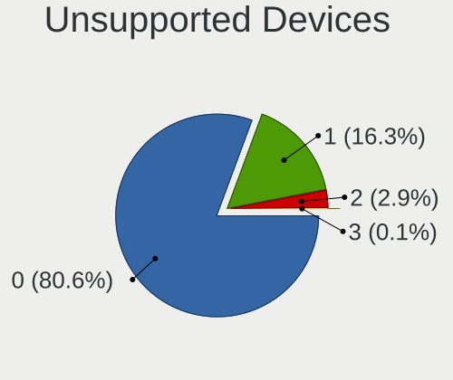

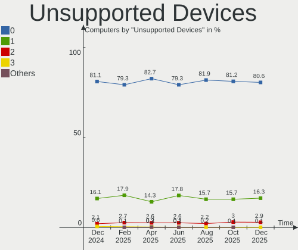

| Total | Computers | Percent |
|-------|-----------|---------|
| 0     | 633       | 80.64%  |
| 1     | 128       | 16.31%  |
| 2     | 23        | 2.93%   |
| 3     | 1         | 0.13%   |

Unsupported Device Types
------------------------

Types of unsupported devices

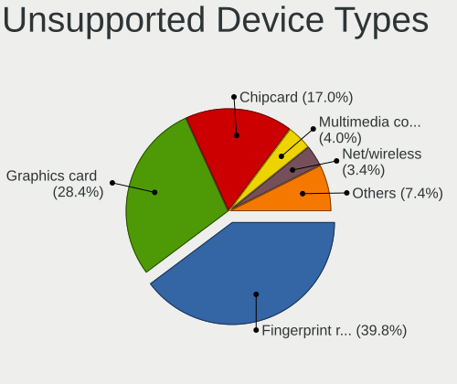

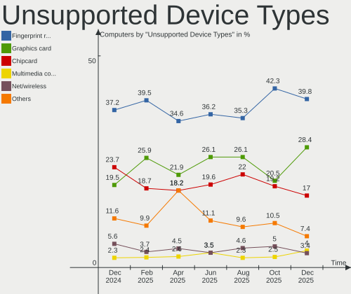

| Type                     | Computers | Percent |
|--------------------------|-----------|---------|
| Fingerprint reader       | 70        | 39.77%  |
| Graphics card            | 50        | 28.41%  |
| Chipcard                 | 30        | 17.05%  |
| Multimedia controller    | 7         | 3.98%   |
| Net/wireless             | 6         | 3.41%   |
| Unassigned class         | 3         | 1.7%    |
| Storage                  | 3         | 1.7%    |
| Net/ethernet             | 3         | 1.7%    |
| Communication controller | 2         | 1.14%   |
| Sound                    | 1         | 0.57%   |
| Card reader              | 1         | 0.57%   |

