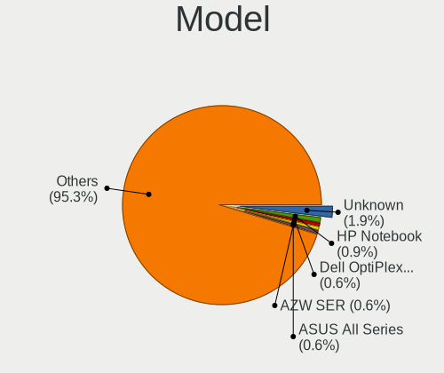
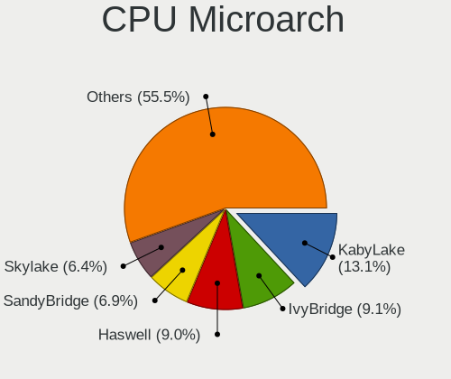
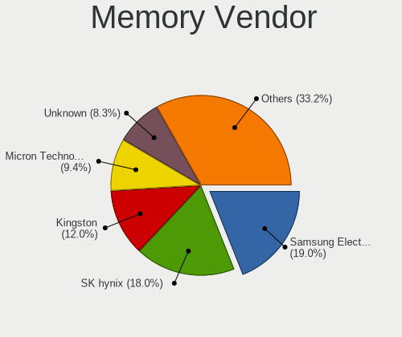
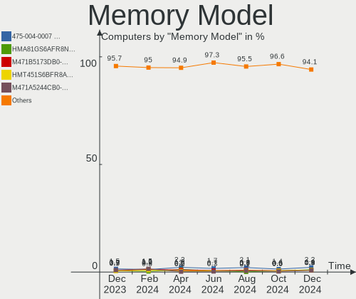
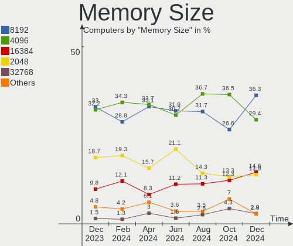

OpenMandriva - Hardware Trends
------------------------------

A project to identify most popular hardware characteristics and track their change
over time based on data collected by Linux users at https://Linux-Hardware.org.

Anyone can contribute to this report by the [hw-probe](https://github.com/linuxhw/hw-probe) tool:

    sudo -E hw-probe -all -upload

This is a report for all computer types. See also reports for [desktops](/Dist/OpenMandriva/Desktop/README.md) and [notebooks](/Dist/OpenMandriva/Notebook/README.md).

This report is for one last month. Overall report since the beginning of time: [TestDays](https://github.com/linuxhw/TestDays)

Period: Nov, 2023.

Contents
--------

* [ System ](#system)
  - [ OS                       ](#os)
  - [ OS Family                ](#os-family)
  - [ Kernel                   ](#kernel)
  - [ Kernel Family            ](#kernel-family)
  - [ Kernel Major Ver.        ](#kernel-major-ver)
  - [ Arch                     ](#arch)
  - [ DE                       ](#de)
  - [ Display Server           ](#display-server)
  - [ Display Manager          ](#display-manager)
  - [ OS Lang                  ](#os-lang)
  - [ Boot Mode                ](#boot-mode)
  - [ Filesystem               ](#filesystem)
  - [ Part. scheme             ](#part-scheme)
  - [ Dual Boot with Linux/BSD ](#dual-boot-with-linuxbsd)
  - [ Dual Boot (Win)          ](#dual-boot-win)

* [ Board ](#board)
  - [ Vendor                   ](#vendor)
  - [ Model                    ](#model)
  - [ Model Family             ](#model-family)
  - [ MFG Year                 ](#mfg-year)
  - [ Form Factor              ](#form-factor)
  - [ Secure Boot              ](#secure-boot)
  - [ Coreboot                 ](#coreboot)
  - [ RAM Size                 ](#ram-size)
  - [ RAM Used                 ](#ram-used)
  - [ Total Drives             ](#total-drives)
  - [ Has CD-ROM               ](#has-cd-rom)
  - [ Has Ethernet             ](#has-ethernet)
  - [ Has WiFi                 ](#has-wifi)
  - [ Has Bluetooth            ](#has-bluetooth)

* [ Location ](#location)
  - [ Country                  ](#country)
  - [ City                     ](#city)

* [ Drives ](#drives)
  - [ Drive Vendor             ](#drive-vendor)
  - [ Drive Model              ](#drive-model)
  - [ HDD Vendor               ](#hdd-vendor)
  - [ SSD Vendor               ](#ssd-vendor)
  - [ Drive Kind               ](#drive-kind)
  - [ Drive Connector          ](#drive-connector)
  - [ Drive Size               ](#drive-size)
  - [ Space Total              ](#space-total)
  - [ Space Used               ](#space-used)
  - [ Malfunc. Drives          ](#malfunc-drives)
  - [ Malfunc. Drive Vendor    ](#malfunc-drive-vendor)
  - [ Malfunc. HDD Vendor      ](#malfunc-hdd-vendor)
  - [ Malfunc. Drive Kind      ](#malfunc-drive-kind)
  - [ Failed Drives            ](#failed-drives)
  - [ Failed Drive Vendor      ](#failed-drive-vendor)
  - [ Drive Status             ](#drive-status)

* [ Storage controller ](#storage-controller)
  - [ Storage Vendor           ](#storage-vendor)
  - [ Storage Model            ](#storage-model)
  - [ Storage Kind             ](#storage-kind)

* [ Processor ](#processor)
  - [ CPU Vendor               ](#cpu-vendor)
  - [ CPU Model                ](#cpu-model)
  - [ CPU Model Family         ](#cpu-model-family)
  - [ CPU Cores                ](#cpu-cores)
  - [ CPU Sockets              ](#cpu-sockets)
  - [ CPU Threads              ](#cpu-threads)
  - [ CPU Op-Modes             ](#cpu-op-modes)
  - [ CPU Microcode            ](#cpu-microcode)
  - [ CPU Microarch            ](#cpu-microarch)

* [ Graphics ](#graphics)
  - [ GPU Vendor               ](#gpu-vendor)
  - [ GPU Model                ](#gpu-model)
  - [ GPU Combo                ](#gpu-combo)
  - [ GPU Driver               ](#gpu-driver)
  - [ GPU Memory               ](#gpu-memory)

* [ Monitor ](#monitor)
  - [ Monitor Vendor           ](#monitor-vendor)
  - [ Monitor Model            ](#monitor-model)
  - [ Monitor Resolution       ](#monitor-resolution)
  - [ Monitor Diagonal         ](#monitor-diagonal)
  - [ Monitor Width            ](#monitor-width)
  - [ Aspect Ratio             ](#aspect-ratio)
  - [ Monitor Area             ](#monitor-area)
  - [ Pixel Density            ](#pixel-density)
  - [ Multiple Monitors        ](#multiple-monitors)

* [ Network ](#network)
  - [ Net Controller Vendor    ](#net-controller-vendor)
  - [ Net Controller Model     ](#net-controller-model)
  - [ Wireless Vendor          ](#wireless-vendor)
  - [ Wireless Model           ](#wireless-model)
  - [ Ethernet Vendor          ](#ethernet-vendor)
  - [ Ethernet Model           ](#ethernet-model)
  - [ Net Controller Kind      ](#net-controller-kind)
  - [ Used Controller          ](#used-controller)
  - [ NICs                     ](#nics)
  - [ IPv6                     ](#ipv6)

* [ Bluetooth ](#bluetooth)
  - [ Bluetooth Vendor         ](#bluetooth-vendor)
  - [ Bluetooth Model          ](#bluetooth-model)

* [ Sound ](#sound)
  - [ Sound Vendor             ](#sound-vendor)
  - [ Sound Model              ](#sound-model)

* [ Memory ](#memory)
  - [ Memory Vendor            ](#memory-vendor)
  - [ Memory Model             ](#memory-model)
  - [ Memory Kind              ](#memory-kind)
  - [ Memory Form Factor       ](#memory-form-factor)
  - [ Memory Size              ](#memory-size)
  - [ Memory Speed             ](#memory-speed)

* [ Printers & scanners ](#printers--scanners)
  - [ Printer Vendor           ](#printer-vendor)
  - [ Printer Model            ](#printer-model)
  - [ Scanner Vendor           ](#scanner-vendor)
  - [ Scanner Model            ](#scanner-model)

* [ Camera ](#camera)
  - [ Camera Vendor            ](#camera-vendor)
  - [ Camera Model             ](#camera-model)

* [ Security ](#security)
  - [ Fingerprint Vendor       ](#fingerprint-vendor)
  - [ Fingerprint Model        ](#fingerprint-model)
  - [ Chipcard Vendor          ](#chipcard-vendor)
  - [ Chipcard Model           ](#chipcard-model)

* [ Unsupported ](#unsupported)
  - [ Unsupported Devices      ](#unsupported-devices)
  - [ Unsupported Device Types ](#unsupported-device-types)

System
------

OS
--

Installed operating systems

| Name               | Computers | Percent |
|--------------------|-----------|---------|
| OpenMandriva 5.0   | 213       | 35.21%  |
| OpenMandriva 23.08 | 203       | 33.55%  |
| OpenMandriva 23.11 | 77        | 12.73%  |
| OpenMandriva 4.3   | 28        | 4.63%   |
| OpenMandriva 23.03 | 24        | 3.97%   |
| OpenMandriva 23.10 | 22        | 3.64%   |
| OpenMandriva 23.01 | 12        | 1.98%   |
| OpenMandriva 23.90 | 10        | 1.65%   |
| OpenMandriva 4.2   | 9         | 1.49%   |
| OpenMandriva 23.09 | 4         | 0.66%   |
| OpenMandriva 4.50  | 1         | 0.17%   |
| OpenMandriva 23.07 | 1         | 0.17%   |
| OpenMandriva 23.06 | 1         | 0.17%   |

OS Family
---------

OS without a version

| Name         | Computers | Percent |
|--------------|-----------|---------|
| OpenMandriva | 605       | 100%    |

Kernel
------

Version of the Linux kernel

| Version                      | Computers | Percent |
|------------------------------|-----------|---------|
| 6.6.2-desktop-1omv2390       | 232       | 38.35%  |
| 6.4.11-desktop-1omv2390      | 192       | 31.74%  |
| 6.2.6-desktop-1omv2390       | 25        | 4.13%   |
| 6.6.0-desktop-1omv2390       | 24        | 3.97%   |
| 6.4.8-desktop-2omv2390       | 24        | 3.97%   |
| 6.6.1-desktop-1omv2390       | 23        | 3.8%    |
| 6.5.5-desktop-1omv2390       | 23        | 3.8%    |
| 5.16.7-desktop-1omv4003      | 18        | 2.98%   |
| 6.1.1-desktop-1omv2290       | 10        | 1.65%   |
| 5.16.13-desktop-1omv4003     | 10        | 1.65%   |
| 5.10.14-desktop-1omv4002     | 9         | 1.49%   |
| 6.6.0-desktop-0.rc3.1omv2390 | 3         | 0.5%    |
| 6.5.3-desktop-1omv2390       | 2         | 0.33%   |
| 6.5.1-desktop-1omv2390       | 2         | 0.33%   |
| 6.3.5-desktop-3omv2390       | 2         | 0.33%   |
| 6.7.0-desktop-0.rc2.1omv2390 | 1         | 0.17%   |
| 6.5.2-desktop-1omv2390       | 1         | 0.17%   |
| 6.5.12-NuTyX                 | 1         | 0.17%   |
| 6.1.4-desktop-1omv2301       | 1         | 0.17%   |
| 5.19.12-desktop-2omv4090     | 1         | 0.17%   |
| 5.17.1-desktop-2omv4050      | 1         | 0.17%   |

Kernel Family
-------------

Linux kernel without a distro release

| Version | Computers | Percent |
|---------|-----------|---------|
| 6.6.2   | 232       | 38.35%  |
| 6.4.11  | 192       | 31.74%  |
| 6.6.0   | 27        | 4.46%   |
| 6.2.6   | 25        | 4.13%   |
| 6.4.8   | 24        | 3.97%   |
| 6.6.1   | 23        | 3.8%    |
| 6.5.5   | 23        | 3.8%    |
| 5.16.7  | 18        | 2.98%   |
| 6.1.1   | 10        | 1.65%   |
| 5.16.13 | 10        | 1.65%   |
| 5.10.14 | 9         | 1.49%   |
| 6.5.3   | 2         | 0.33%   |
| 6.5.1   | 2         | 0.33%   |
| 6.3.5   | 2         | 0.33%   |
| 6.7.0   | 1         | 0.17%   |
| 6.5.2   | 1         | 0.17%   |
| 6.5.12  | 1         | 0.17%   |
| 6.1.4   | 1         | 0.17%   |
| 5.19.12 | 1         | 0.17%   |
| 5.17.1  | 1         | 0.17%   |

Kernel Major Ver.
-----------------

Linux kernel major version

| Version | Computers | Percent |
|---------|-----------|---------|
| 6.6     | 282       | 46.61%  |
| 6.4     | 216       | 35.7%   |
| 6.5     | 29        | 4.79%   |
| 5.16    | 28        | 4.63%   |
| 6.2     | 25        | 4.13%   |
| 6.1     | 11        | 1.82%   |
| 5.10    | 9         | 1.49%   |
| 6.3     | 2         | 0.33%   |
| 6.7     | 1         | 0.17%   |
| 5.19    | 1         | 0.17%   |
| 5.17    | 1         | 0.17%   |

Arch
----

OS architecture (x86_64, i586, etc.)

| Name   | Computers | Percent |
|--------|-----------|---------|
| x86_64 | 605       | 100%    |

DE
--

Desktop Environment

| Name     | Computers | Percent |
|----------|-----------|---------|
| KDE5     | 506       | 83.64%  |
| LXQt     | 45        | 7.44%   |
| GNOME    | 42        | 6.94%   |
| Unknown  | 9         | 1.49%   |
| Cinnamon | 2         | 0.33%   |
| MATE     | 1         | 0.17%   |

Display Server
--------------

X11 or Wayland

| Name    | Computers | Percent |
|---------|-----------|---------|
| Wayland | 511       | 84.46%  |
| X11     | 93        | 15.37%  |
| Unknown | 1         | 0.17%   |

Display Manager
---------------

SDDM, LightDM, etc.

| Name    | Computers | Percent |
|---------|-----------|---------|
| SDDM    | 562       | 92.89%  |
| GDM     | 42        | 6.94%   |
| LightDM | 1         | 0.17%   |

OS Lang
-------

Language

| Lang       | Computers | Percent |
|------------|-----------|---------|
| en_US      | 306       | 50.58%  |
| de_DE      | 56        | 9.26%   |
| fr_FR      | 50        | 8.26%   |
| ru_RU      | 39        | 6.45%   |
| pl_PL      | 23        | 3.8%    |
| en_GB      | 19        | 3.14%   |
| pt_BR      | 17        | 2.81%   |
| it_IT      | 16        | 2.64%   |
| es_ES      | 10        | 1.65%   |
| es_AR      | 7         | 1.16%   |
| en_CA      | 7         | 1.16%   |
| cs_CZ      | 7         | 1.16%   |
| es_MX      | 5         | 0.83%   |
| ja_JP      | 4         | 0.66%   |
| hu_HU      | 4         | 0.66%   |
| pt_PT      | 3         | 0.5%    |
| fr_BE      | 3         | 0.5%    |
| es_VE      | 3         | 0.5%    |
| en_IN      | 3         | 0.5%    |
| de_AT      | 3         | 0.5%    |
| tr_TR      | 2         | 0.33%   |
| nl_BE      | 2         | 0.33%   |
| en_AU      | 2         | 0.33%   |
| UTF-8      | 1         | 0.17%   |
| sl_SI      | 1         | 0.17%   |
| ru_RU-UTF8 | 1         | 0.17%   |
| ro_RO      | 1         | 0.17%   |
| nl_NL      | 1         | 0.17%   |
| fr_CA      | 1         | 0.17%   |
| es_CR      | 1         | 0.17%   |
| en_NZ      | 1         | 0.17%   |
| en_NG      | 1         | 0.17%   |
| en_IE      | 1         | 0.17%   |
| en_AG      | 1         | 0.17%   |
| de_CH      | 1         | 0.17%   |
| da_DK      | 1         | 0.17%   |
| ar_IQ      | 1         | 0.17%   |

Boot Mode
---------

EFI or BIOS

| Mode | Computers | Percent |
|------|-----------|---------|
| EFI  | 377       | 62.31%  |
| BIOS | 228       | 37.69%  |

Filesystem
----------

Type of filesystem

| Type     | Computers | Percent |
|----------|-----------|---------|
| Overlay  | 328       | 54.21%  |
| Ext4     | 241       | 39.83%  |
| Btrfs    | 28        | 4.63%   |
| Xfs      | 4         | 0.66%   |
| Reiserfs | 1         | 0.17%   |
| F2fs     | 1         | 0.17%   |
| Ext3     | 1         | 0.17%   |
| Ext2     | 1         | 0.17%   |

Part. scheme
------------

Scheme of partitioning

| Type | Computers | Percent |
|------|-----------|---------|
| GPT  | 480       | 79.34%  |
| MBR  | 125       | 20.66%  |

Dual Boot with Linux/BSD
------------------------

Hosting more than one Linux/BSD

| Dual boot | Computers | Percent |
|-----------|-----------|---------|
| Yes       | 340       | 56.2%   |
| No        | 265       | 43.8%   |

Dual Boot (Win)
---------------

Hosting Linux and Windows

| Dual boot | Computers | Percent |
|-----------|-----------|---------|
| No        | 329       | 54.38%  |
| Yes       | 276       | 45.62%  |

Board
-----

Vendor
------

Motherboard manufacturer

| Name                                 | Computers | Percent |
|--------------------------------------|-----------|---------|
| Hewlett-Packard                      | 94        | 15.54%  |
| ASUSTek Computer                     | 88        | 14.55%  |
| Lenovo                               | 69        | 11.4%   |
| Dell                                 | 64        | 10.58%  |
| Gigabyte Technology                  | 57        | 9.42%   |
| MSI                                  | 36        | 5.95%   |
| Acer                                 | 32        | 5.29%   |
| ASRock                               | 23        | 3.8%    |
| Intel                                | 12        | 1.98%   |
| Fujitsu                              | 10        | 1.65%   |
| Toshiba                              | 9         | 1.49%   |
| Foxconn                              | 9         | 1.49%   |
| Samsung Electronics                  | 8         | 1.32%   |
| Apple                                | 8         | 1.32%   |
| Unknown                              | 7         | 1.16%   |
| HUAWEI                               | 6         | 0.99%   |
| Shenzhen Meigao Electronic Equipment | 5         | 0.83%   |
| Medion                               | 4         | 0.66%   |
| Packard Bell                         | 3         | 0.5%    |
| Huanan                               | 3         | 0.5%    |
| Biostar                              | 3         | 0.5%    |
| AZW                                  | 3         | 0.5%    |
| Alienware                            | 3         | 0.5%    |
| TUXEDO                               | 2         | 0.33%   |
| Sony                                 | 2         | 0.33%   |
| Red Hat                              | 2         | 0.33%   |
| Philco                               | 2         | 0.33%   |
| Minix                                | 2         | 0.33%   |
| LG Electronics                       | 2         | 0.33%   |
| Google                               | 2         | 0.33%   |
| Fujitsu Siemens                      | 2         | 0.33%   |
| Framework                            | 2         | 0.33%   |
| ECS                                  | 2         | 0.33%   |
| Dynabook                             | 2         | 0.33%   |
| AMI                                  | 2         | 0.33%   |
| ALLDOCUBE                            | 2         | 0.33%   |
| Acidanthera                          | 2         | 0.33%   |
| ZOTAC                                | 1         | 0.17%   |
| Trigkey                              | 1         | 0.17%   |
| Timi                                 | 1         | 0.17%   |

Model
-----

Motherboard model

| Name                                              | Computers | Percent |
|---------------------------------------------------|-----------|---------|
| Unknown                                           | 9         | 1.49%   |
| ASUS PRIME A320M-K                                | 4         | 0.66%   |
| MSI MS-7721                                       | 3         | 0.5%    |
| Gigabyte B75M-D3H                                 | 3         | 0.5%    |
| Gigabyte A320M-S2H                                | 3         | 0.5%    |
| Dell OptiPlex 9010                                | 3         | 0.5%    |
| Dell Inspiron 15 3515                             | 3         | 0.5%    |
| ASUS All Series                                   | 3         | 0.5%    |
| Shenzhen Meigao Electronic Equipment Venus series | 2         | 0.33%   |
| Shenzhen Meigao Electronic Equipment HX99G        | 2         | 0.33%   |
| Red Hat KVM                                       | 2         | 0.33%   |
| Philco 14H                                        | 2         | 0.33%   |
| MSI MS-7C91                                       | 2         | 0.33%   |
| MSI MS-7C52                                       | 2         | 0.33%   |
| MSI MS-7C51                                       | 2         | 0.33%   |
| MSI MS-7996                                       | 2         | 0.33%   |
| MSI MS-7900                                       | 2         | 0.33%   |
| Lenovo ThinkPad L13 Gen 3 21BAS0X700              | 2         | 0.33%   |
| Lenovo IdeaPad 330S-15IKB 81F5                    | 2         | 0.33%   |
| Lenovo IdeaPad 3 15ITL05 81X8                     | 2         | 0.33%   |
| Lenovo IdeaPad 3 15ALC6 82MF                      | 2         | 0.33%   |
| Lenovo IdeaPad 1 15AMN7 82VG                      | 2         | 0.33%   |
| Intel NUC7i3BNH                                   | 2         | 0.33%   |
| Intel H61                                         | 2         | 0.33%   |
| HP Z420 Workstation                               | 2         | 0.33%   |
| HP Pavilion g6                                    | 2         | 0.33%   |
| HP Pavilion Desktop 590-p0xxx                     | 2         | 0.33%   |
| HP Laptop 15-bs0xx                                | 2         | 0.33%   |
| HP EliteDesk 800 G2 DM 35W                        | 2         | 0.33%   |
| HP Compaq Pro 6305 SFF                            | 2         | 0.33%   |
| HP Compaq Pro 6300 SFF                            | 2         | 0.33%   |
| HP Compaq Pro 6300 MT                             | 2         | 0.33%   |
| HP Compaq 6200 Pro SFF PC                         | 2         | 0.33%   |
| Gigabyte Z370 HD3                                 | 2         | 0.33%   |
| Gigabyte B550 AORUS ELITE V2                      | 2         | 0.33%   |
| Gigabyte B450 AORUS ELITE                         | 2         | 0.33%   |
| Gigabyte AB350-Gaming 3                           | 2         | 0.33%   |
| Gigabyte 970A-DS3P FX                             | 2         | 0.33%   |
| Foxconn G41MD                                     | 2         | 0.33%   |
| Dell OptiPlex 9020                                | 2         | 0.33%   |

Model Family
------------

Motherboard model prefix

| Name                                       | Computers | Percent |
|--------------------------------------------|-----------|---------|
| Lenovo ThinkPad                            | 27        | 4.46%   |
| Acer Aspire                                | 23        | 3.8%    |
| Lenovo IdeaPad                             | 19        | 3.14%   |
| HP Compaq                                  | 19        | 3.14%   |
| ASUS PRIME                                 | 19        | 3.14%   |
| Dell OptiPlex                              | 18        | 2.98%   |
| Dell Latitude                              | 18        | 2.98%   |
| Dell Inspiron                              | 17        | 2.81%   |
| HP Pavilion                                | 13        | 2.15%   |
| HP Laptop                                  | 11        | 1.82%   |
| HP EliteDesk                               | 10        | 1.65%   |
| Unknown                                    | 9         | 1.49%   |
| Toshiba Satellite                          | 8         | 1.32%   |
| ASUS VivoBook                              | 8         | 1.32%   |
| HP ProBook                                 | 7         | 1.16%   |
| HP EliteBook                               | 7         | 1.16%   |
| Lenovo ThinkCentre                         | 6         | 0.99%   |
| ASUS ROG                                   | 6         | 0.99%   |
| Dell Precision                             | 5         | 0.83%   |
| Fujitsu ESPRIMO                            | 4         | 0.66%   |
| ASUS TUF                                   | 4         | 0.66%   |
| ASUS M5A78L-M                              | 4         | 0.66%   |
| MSI MS-7721                                | 3         | 0.5%    |
| Lenovo IdeaCentre                          | 3         | 0.5%    |
| Intel H61                                  | 3         | 0.5%    |
| HP ProDesk                                 | 3         | 0.5%    |
| HP ENVY                                    | 3         | 0.5%    |
| Gigabyte B75M-D3H                          | 3         | 0.5%    |
| Gigabyte B550                              | 3         | 0.5%    |
| Gigabyte B450                              | 3         | 0.5%    |
| Gigabyte A320M-S2H                         | 3         | 0.5%    |
| Fujitsu LIFEBOOK                           | 3         | 0.5%    |
| Dell Vostro                                | 3         | 0.5%    |
| ASUS MINIPC                                | 3         | 0.5%    |
| ASUS All                                   | 3         | 0.5%    |
| Acer TravelMate                            | 3         | 0.5%    |
| Shenzhen Meigao Electronic Equipment Venus | 2         | 0.33%   |
| Shenzhen Meigao Electronic Equipment HX99G | 2         | 0.33%   |
| Red Hat KVM                                | 2         | 0.33%   |
| Philco 14H                                 | 2         | 0.33%   |

MFG Year
--------

Motherboard manufacture year

| Year | Computers | Percent |
|------|-----------|---------|
| 2012 | 62        | 10.25%  |
| 2021 | 55        | 9.09%   |
| 2022 | 50        | 8.26%   |
| 2020 | 50        | 8.26%   |
| 2017 | 45        | 7.44%   |
| 2011 | 43        | 7.11%   |
| 2013 | 42        | 6.94%   |
| 2014 | 39        | 6.45%   |
| 2018 | 35        | 5.79%   |
| 2015 | 34        | 5.62%   |
| 2010 | 34        | 5.62%   |
| 2016 | 27        | 4.46%   |
| 2019 | 23        | 3.8%    |
| 2023 | 19        | 3.14%   |
| 2009 | 18        | 2.98%   |
| 2008 | 17        | 2.81%   |
| 2007 | 8         | 1.32%   |
| 2006 | 3         | 0.5%    |
| 2005 | 1         | 0.17%   |

Form Factor
-----------

Physical design of the computer

| Name        | Computers | Percent |
|-------------|-----------|---------|
| Desktop     | 302       | 49.92%  |
| Notebook    | 268       | 44.3%   |
| Mini pc     | 14        | 2.31%   |
| All in one  | 12        | 1.98%   |
| Convertible | 6         | 0.99%   |
| Tablet      | 3         | 0.5%    |

Secure Boot
-----------

Enabled or disabled

| State    | Computers | Percent |
|----------|-----------|---------|
| Disabled | 605       | 100%    |

Coreboot
--------

Have coreboot on board

| Used | Computers | Percent |
|------|-----------|---------|
| No   | 603       | 99.67%  |
| Yes  | 2         | 0.33%   |

RAM Size
--------

Total RAM memory

| Size in GB  | Computers | Percent |
|-------------|-----------|---------|
| 4.01-8.0    | 168       | 27.77%  |
| 16.01-24.0  | 118       | 19.5%   |
| 8.01-16.0   | 113       | 18.68%  |
| 3.01-4.0    | 112       | 18.51%  |
| 32.01-64.0  | 51        | 8.43%   |
| 1.01-2.0    | 18        | 2.98%   |
| 64.01-256.0 | 11        | 1.82%   |
| 24.01-32.0  | 8         | 1.32%   |
| 2.01-3.0    | 6         | 0.99%   |

RAM Used
--------

Used RAM memory

| Used GB    | Computers | Percent |
|------------|-----------|---------|
| 1.01-2.0   | 380       | 62.81%  |
| 2.01-3.0   | 134       | 22.15%  |
| 0.51-1.0   | 61        | 10.08%  |
| 3.01-4.0   | 19        | 3.14%   |
| 4.01-8.0   | 7         | 1.16%   |
| 0.01-0.5   | 3         | 0.5%    |
| 24.01-32.0 | 1         | 0.17%   |

Total Drives
------------

Number of drives on board

| Drives | Computers | Percent |
|--------|-----------|---------|
| 1      | 337       | 55.7%   |
| 2      | 156       | 25.79%  |
| 3      | 64        | 10.58%  |
| 4      | 20        | 3.31%   |
| 5      | 9         | 1.49%   |
| 6      | 7         | 1.16%   |
| 0      | 5         | 0.83%   |
| 8      | 2         | 0.33%   |
| 7      | 2         | 0.33%   |
| 13     | 1         | 0.17%   |
| 10     | 1         | 0.17%   |
| 9      | 1         | 0.17%   |

Has CD-ROM
----------

Has CD-ROM on board

| Presented | Computers | Percent |
|-----------|-----------|---------|
| No        | 346       | 57.19%  |
| Yes       | 259       | 42.81%  |

Has Ethernet
------------

Has Ethernet on board

| Presented | Computers | Percent |
|-----------|-----------|---------|
| Yes       | 541       | 89.42%  |
| No        | 64        | 10.58%  |

Has WiFi
--------

Has WiFi module

| Presented | Computers | Percent |
|-----------|-----------|---------|
| Yes       | 425       | 70.25%  |
| No        | 180       | 29.75%  |

Has Bluetooth
-------------

Has Bluetooth module

| Presented | Computers | Percent |
|-----------|-----------|---------|
| Yes       | 332       | 54.88%  |
| No        | 273       | 45.12%  |

Location
--------

Country
-------

Geographic location (country)

| Country      | Computers | Percent |
|--------------|-----------|---------|
| USA          | 103       | 17.02%  |
| Germany      | 77        | 12.73%  |
| France       | 51        | 8.43%   |
| Russia       | 48        | 7.93%   |
| Poland       | 30        | 4.96%   |
| Brazil       | 30        | 4.96%   |
| UK           | 26        | 4.3%    |
| Italy        | 21        | 3.47%   |
| Spain        | 18        | 2.98%   |
| Canada       | 12        | 1.98%   |
| Netherlands  | 9         | 1.49%   |
| Mexico       | 9         | 1.49%   |
| Argentina    | 9         | 1.49%   |
| Turkey       | 8         | 1.32%   |
| Greece       | 8         | 1.32%   |
| Czechia      | 8         | 1.32%   |
| Australia    | 8         | 1.32%   |
| Hungary      | 7         | 1.16%   |
| Algeria      | 7         | 1.16%   |
| Sweden       | 6         | 0.99%   |
| Serbia       | 6         | 0.99%   |
| Japan        | 6         | 0.99%   |
| Romania      | 5         | 0.83%   |
| India        | 5         | 0.83%   |
| Belgium      | 5         | 0.83%   |
| Austria      | 5         | 0.83%   |
| Thailand     | 4         | 0.66%   |
| Portugal     | 4         | 0.66%   |
| Indonesia    | 4         | 0.66%   |
| China        | 4         | 0.66%   |
| Belarus      | 4         | 0.66%   |
| Ukraine      | 3         | 0.5%    |
| Switzerland  | 3         | 0.5%    |
| Malaysia     | 3         | 0.5%    |
| Haiti        | 3         | 0.5%    |
| Bulgaria     | 3         | 0.5%    |
| Venezuela    | 2         | 0.33%   |
| Taiwan       | 2         | 0.33%   |
| South Africa | 2         | 0.33%   |
| Slovenia     | 2         | 0.33%   |

City
----

Geographic location (city)

| City             | Computers | Percent |
|------------------|-----------|---------|
| Berlin           | 6         | 0.99%   |
| Voronezh         | 5         | 0.83%   |
| Warsaw           | 4         | 0.66%   |
| Paris            | 4         | 0.66%   |
| Moscow           | 4         | 0.66%   |
| Hamburg          | 4         | 0.66%   |
| Athens           | 4         | 0.66%   |
| Vienna           | 3         | 0.5%    |
| Sydney           | 3         | 0.5%    |
| Oliveira         | 3         | 0.5%    |
| Milan            | 3         | 0.5%    |
| Krakow           | 3         | 0.5%    |
| Columbus         | 3         | 0.5%    |
| Carrefour        | 3         | 0.5%    |
| Brisbane         | 3         | 0.5%    |
| Barcelona        | 3         | 0.5%    |
| Wiesloch         | 2         | 0.33%   |
| Wegberg          | 2         | 0.33%   |
| Valencia         | 2         | 0.33%   |
| Ústí nad Labem | 2         | 0.33%   |
| Ulyanovsk        | 2         | 0.33%   |
| Tehran           | 2         | 0.33%   |
| Stuttgart        | 2         | 0.33%   |
| St Petersburg    | 2         | 0.33%   |
| Springfield      | 2         | 0.33%   |
| Singapore        | 2         | 0.33%   |
| Schenectady      | 2         | 0.33%   |
| Sao Paulo        | 2         | 0.33%   |
| Samara           | 2         | 0.33%   |
| Rome             | 2         | 0.33%   |
| Pudong           | 2         | 0.33%   |
| Petrozavodsk     | 2         | 0.33%   |
| Novosibirsk      | 2         | 0.33%   |
| Novi Sad         | 2         | 0.33%   |
| Niš             | 2         | 0.33%   |
| New York         | 2         | 0.33%   |
| Naaldwijk        | 2         | 0.33%   |
| Munich           | 2         | 0.33%   |
| Montpellier      | 2         | 0.33%   |
| Missoula         | 2         | 0.33%   |

Drives
------

Drive Vendor
------------

Hard drive vendors

| Vendor                      | Computers | Drives | Percent |
|-----------------------------|-----------|--------|---------|
| WDC                         | 136       | 164    | 14.64%  |
| Seagate                     | 100       | 124    | 10.76%  |
| Samsung Electronics         | 90        | 109    | 9.69%   |
| Kingston                    | 72        | 76     | 7.75%   |
| Toshiba                     | 61        | 66     | 6.57%   |
| Crucial                     | 46        | 51     | 4.95%   |
| SanDisk                     | 42        | 43     | 4.52%   |
| Hitachi                     | 29        | 30     | 3.12%   |
| Unknown                     | 26        | 31     | 2.8%    |
| China                       | 24        | 26     | 2.58%   |
| SPCC                        | 21        | 22     | 2.26%   |
| A-DATA Technology           | 21        | 24     | 2.26%   |
| Micron Technology           | 15        | 15     | 1.61%   |
| SK hynix                    | 13        | 13     | 1.4%    |
| Intel                       | 13        | 13     | 1.4%    |
| HGST                        | 13        | 13     | 1.4%    |
| Intenso                     | 10        | 11     | 1.08%   |
| GOODRAM                     | 10        | 13     | 1.08%   |
| PNY                         | 9         | 11     | 0.97%   |
| Unknown                     | 9         | 10     | 0.97%   |
| JMicron Technology          | 8         | 8      | 0.86%   |
| Apacer                      | 8         | 8      | 0.86%   |
| Phison                      | 7         | 8      | 0.75%   |
| Transcend                   | 6         | 6      | 0.65%   |
| Patriot                     | 5         | 5      | 0.54%   |
| Maxtor                      | 5         | 5      | 0.54%   |
| LITEON                      | 5         | 5      | 0.54%   |
| Gigabyte Technology         | 5         | 5      | 0.54%   |
| Fanxiang                    | 5         | 6      | 0.54%   |
| Apple                       | 5         | 5      | 0.54%   |
| SSSTC                       | 4         | 4      | 0.43%   |
| Netac                       | 4         | 4      | 0.43%   |
| Lexar                       | 4         | 7      | 0.43%   |
| Kingston Technology Company | 4         | 4      | 0.43%   |
| Corsair                     | 4         | 4      | 0.43%   |
| UMIS                        | 3         | 3      | 0.32%   |
| Silicon Motion              | 3         | 3      | 0.32%   |
| KIOXIA-EXCERIA              | 3         | 3      | 0.32%   |
| KIOXIA                      | 3         | 3      | 0.32%   |
| Hewlett-Packard             | 3         | 3      | 0.32%   |

Drive Model
-----------

Hard drive models

| Model                            | Computers | Percent |
|----------------------------------|-----------|---------|
| Kingston SA400S37240G 240GB SSD  | 19        | 1.88%   |
| Toshiba DT01ACA100 1TB           | 11        | 1.09%   |
| Seagate ST500DM002-1BD142 500GB  | 9         | 0.89%   |
| SanDisk NVMe SSD Drive 1TB       | 9         | 0.89%   |
| Unknown                          | 9         | 0.89%   |
| Seagate ST1000DM010-2EP102 1TB   | 8         | 0.79%   |
| Unknown SD/MMC/MS PRO 128GB      | 7         | 0.69%   |
| Toshiba MQ04ABF100 1TB           | 7         | 0.69%   |
| Kingston SA400S37120G 120GB SSD  | 7         | 0.69%   |
| Crucial CT500MX500SSD1 500GB     | 7         | 0.69%   |
| SPCC Solid State Disk 512GB      | 6         | 0.59%   |
| Seagate ST500LT012-1DG142 500GB  | 6         | 0.59%   |
| JMicron Generic 250GB            | 6         | 0.59%   |
| Crucial CT240BX500SSD1 240GB     | 6         | 0.59%   |
| WDC WDS500G2B0A-00SM50 500GB SSD | 5         | 0.49%   |
| WDC WDS240G2G0A-00JH30 240GB SSD | 5         | 0.49%   |
| Toshiba MQ01ABD100 1TB           | 5         | 0.49%   |
| Toshiba HDWD130 3TB              | 5         | 0.49%   |
| SanDisk NVMe SSD Drive 500GB     | 5         | 0.49%   |
| Kingston SA400S37480G 480GB SSD  | 5         | 0.49%   |
| Crucial CT1000MX500SSD1 1TB      | 5         | 0.49%   |
| Crucial CT1000BX500SSD1 1TB      | 5         | 0.49%   |
| WDC WD5000LPVX-22V0TT0 500GB     | 4         | 0.4%    |
| WDC WD10SPZX-24Z10 1TB           | 4         | 0.4%    |
| Seagate ST9500325AS 500GB        | 4         | 0.4%    |
| Samsung SSD 970 EVO Plus 1TB     | 4         | 0.4%    |
| Kingston SNVS500G 500GB          | 4         | 0.4%    |
| Intenso SSD 128GB                | 4         | 0.4%    |
| WDC WDS500G3X0C-00SJG0 500GB     | 3         | 0.3%    |
| WDC WDS100T3X0C-00SJG0 1TB       | 3         | 0.3%    |
| WDC WD20EZRX-00D8PB0 2TB         | 3         | 0.3%    |
| WDC WD10EZEX-08WN4A0 1TB         | 3         | 0.3%    |
| WDC WD10EZEX-08M2NA0 1TB         | 3         | 0.3%    |
| Toshiba HDWD110 1TB              | 3         | 0.3%    |
| SPCC Solid State Disk 256GB      | 3         | 0.3%    |
| Seagate ST4000DM004-2CV104 4TB   | 3         | 0.3%    |
| Seagate ST3500418AS 500GB        | 3         | 0.3%    |
| Seagate ST3160815AS 160GB        | 3         | 0.3%    |
| Seagate ST31000528AS 1TB         | 3         | 0.3%    |
| Seagate ST2000DM008-2FR102 2TB   | 3         | 0.3%    |

HDD Vendor
----------

Hard disk drive vendors

| Vendor              | Computers | Drives | Percent |
|---------------------|-----------|--------|---------|
| WDC                 | 106       | 120    | 30.81%  |
| Seagate             | 98        | 122    | 28.49%  |
| Toshiba             | 53        | 58     | 15.41%  |
| Hitachi             | 29        | 30     | 8.43%   |
| Samsung Electronics | 14        | 16     | 4.07%   |
| HGST                | 13        | 13     | 3.78%   |
| Unknown             | 9         | 9      | 2.62%   |
| Maxtor              | 4         | 4      | 1.16%   |
| Fujitsu             | 3         | 3      | 0.87%   |
| WD MediaMax         | 2         | 2      | 0.58%   |
| Apple               | 2         | 2      | 0.58%   |
| Unknown             | 2         | 3      | 0.58%   |
| USB3.0              | 1         | 1      | 0.29%   |
| TO Exter            | 1         | 1      | 0.29%   |
| MARSHAL             | 1         | 1      | 0.29%   |
| Intenso             | 1         | 1      | 0.29%   |
| Inateck             | 1         | 1      | 0.29%   |
| HPQ                 | 1         | 1      | 0.29%   |
| External            | 1         | 1      | 0.29%   |
| ExcelStor           | 1         | 1      | 0.29%   |
| CIRAGO              | 1         | 1      | 0.29%   |

SSD Vendor
----------

Solid state drive vendors

| Vendor              | Computers | Drives | Percent |
|---------------------|-----------|--------|---------|
| Kingston            | 53        | 55     | 14.48%  |
| Samsung Electronics | 41        | 50     | 11.2%   |
| Crucial             | 34        | 35     | 9.29%   |
| China               | 24        | 26     | 6.56%   |
| SanDisk             | 21        | 21     | 5.74%   |
| WDC                 | 18        | 20     | 4.92%   |
| SPCC                | 18        | 19     | 4.92%   |
| A-DATA Technology   | 14        | 15     | 3.83%   |
| GOODRAM             | 10        | 13     | 2.73%   |
| Intenso             | 9         | 10     | 2.46%   |
| PNY                 | 8         | 10     | 2.19%   |
| Apacer              | 7         | 7      | 1.91%   |
| JMicron Technology  | 6         | 6      | 1.64%   |
| Intel               | 6         | 6      | 1.64%   |
| Transcend           | 5         | 5      | 1.37%   |
| Micron Technology   | 5         | 5      | 1.37%   |
| LITEON              | 5         | 5      | 1.37%   |
| Toshiba             | 4         | 4      | 1.09%   |
| Patriot             | 4         | 4      | 1.09%   |
| Fanxiang            | 4         | 4      | 1.09%   |
| SK hynix            | 3         | 3      | 0.82%   |
| Apple               | 3         | 3      | 0.82%   |
| Zheino              | 2         | 2      | 0.55%   |
| XrayDisk            | 2         | 2      | 0.55%   |
| T-FORCE             | 2         | 2      | 0.55%   |
| Phison              | 2         | 2      | 0.55%   |
| Lexar               | 2         | 3      | 0.55%   |
| Hikvision           | 2         | 2      | 0.55%   |
| Hewlett-Packard     | 2         | 2      | 0.55%   |
| Gigabyte Technology | 2         | 2      | 0.55%   |
| Corsair             | 2         | 2      | 0.55%   |
| Wibtek              | 1         | 1      | 0.27%   |
| Verbatim            | 1         | 1      | 0.27%   |
| Unknown             | 1         | 1      | 0.27%   |
| tigo                | 1         | 1      | 0.27%   |
| Teclast             | 1         | 1      | 0.27%   |
| Team                | 1         | 1      | 0.27%   |
| SPCC M.2            | 1         | 1      | 0.27%   |
| Seagate             | 1         | 1      | 0.27%   |
| SandForce           | 1         | 1      | 0.27%   |

Drive Kind
----------

HDD or SSD

| Kind    | Computers | Drives | Percent |
|---------|-----------|--------|---------|
| SSD     | 315       | 393    | 38.65%  |
| HDD     | 286       | 391    | 35.09%  |
| NVMe    | 189       | 229    | 23.19%  |
| MMC     | 14        | 16     | 1.72%   |
| Unknown | 11        | 13     | 1.35%   |

Drive Connector
---------------

SATA, SAS, NVMe, etc.

| Type | Computers | Drives | Percent |
|------|-----------|--------|---------|
| SATA | 483       | 739    | 65.63%  |
| NVMe | 187       | 223    | 25.41%  |
| SAS  | 52        | 64     | 7.07%   |
| MMC  | 14        | 16     | 1.9%    |

Drive Size
----------

Size of hard drive

| Size in TB | Computers | Drives | Percent |
|------------|-----------|--------|---------|
| 0.01-0.5   | 376       | 479    | 60.65%  |
| 0.51-1.0   | 179       | 215    | 28.87%  |
| 1.01-2.0   | 28        | 38     | 4.52%   |
| 2.01-3.0   | 15        | 19     | 2.42%   |
| 3.01-4.0   | 12        | 17     | 1.94%   |
| 4.01-10.0  | 6         | 9      | 0.97%   |
| 10.01-20.0 | 4         | 7      | 0.65%   |

Space Total
-----------

Amount of disk space available on the file system

| Size in GB     | Computers | Percent |
|----------------|-----------|---------|
| 1-20           | 235       | 38.84%  |
| 101-250        | 109       | 18.02%  |
| 251-500        | 72        | 11.9%   |
| 501-1000       | 39        | 6.45%   |
| 51-100         | 38        | 6.28%   |
| 21-50          | 36        | 5.95%   |
| Unknown        | 32        | 5.29%   |
| 1001-2000      | 27        | 4.46%   |
| More than 3000 | 10        | 1.65%   |
| 2001-3000      | 7         | 1.16%   |

Space Used
----------

Amount of used disk space

| Used GB        | Computers | Percent |
|----------------|-----------|---------|
| 1-20           | 470       | 77.69%  |
| 21-50          | 37        | 6.12%   |
| Unknown        | 32        | 5.29%   |
| 101-250        | 17        | 2.81%   |
| 51-100         | 12        | 1.98%   |
| 251-500        | 11        | 1.82%   |
| 501-1000       | 11        | 1.82%   |
| 0              | 8         | 1.32%   |
| More than 3000 | 3         | 0.5%    |
| 2001-3000      | 2         | 0.33%   |
| 1001-2000      | 2         | 0.33%   |

Malfunc. Drives
---------------

Drive models with a malfunction

| Model                            | Computers | Drives | Percent |
|----------------------------------|-----------|--------|---------|
| Seagate ST500DM002-1BD142 500GB  | 6         | 6      | 3.8%    |
| Toshiba MQ01ABD100 1TB           | 4         | 4      | 2.53%   |
| WDC WD5000LPVX-22V0TT0 500GB     | 3         | 3      | 1.9%    |
| Seagate ST9500325AS 500GB        | 3         | 3      | 1.9%    |
| Seagate ST500LT012-1DG142 500GB  | 3         | 3      | 1.9%    |
| WDC WD5000AAKX-60U6AA0 500GB     | 2         | 2      | 1.27%   |
| WDC WD5000AAKX-001CA0 500GB      | 2         | 2      | 1.27%   |
| Seagate ST9500423AS 500GB        | 2         | 2      | 1.27%   |
| Seagate ST3500418AS 500GB        | 2         | 2      | 1.27%   |
| Seagate ST3500413AS 500GB        | 2         | 2      | 1.27%   |
| Seagate ST1000DM003-1CH162 1TB   | 2         | 2      | 1.27%   |
| SanDisk SSD PLUS 480GB           | 2         | 2      | 1.27%   |
| Hitachi HTS545050B9A300 500GB    | 2         | 2      | 1.27%   |
| Hitachi HDS721010CLA332 1TB      | 2         | 2      | 1.27%   |
| Fujitsu MHY2160BH 160GB          | 2         | 2      | 1.27%   |
| WDC WDS480G2G0A-00JH30 480GB SSD | 1         | 1      | 0.63%   |
| WDC WDS240G2G0A-00JH30 240GB SSD | 1         | 1      | 0.63%   |
| WDC WDS120G2G0A-00JH30 120GB SSD | 1         | 1      | 0.63%   |
| WDC WD800AAJB-00J3A0 80GB        | 1         | 1      | 0.63%   |
| WDC WD60EFRX-68MYMN1 6TB         | 1         | 1      | 0.63%   |
| WDC WD50EFRX-68MYMN1 5TB         | 1         | 1      | 0.63%   |
| WDC WD5000AVVS-63M8B0 500GB      | 1         | 1      | 0.63%   |
| WDC WD5000AAKX-221CA1 500GB      | 1         | 1      | 0.63%   |
| WDC WD5000AAKX-083CA1 500GB      | 1         | 1      | 0.63%   |
| WDC WD3200LPVX-22V0TT0 320GB     | 1         | 1      | 0.63%   |
| WDC WD3200BEKT-08PVMT1 320GB     | 1         | 1      | 0.63%   |
| WDC WD3200AAJS-56M0A0 320GB      | 1         | 1      | 0.63%   |
| WDC WD2500JS-60MHB5 250GB        | 1         | 1      | 0.63%   |
| WDC WD2500BEVT-60ZCT1 250GB      | 1         | 1      | 0.63%   |
| WDC WD20EZRZ-00Z5HB0 2TB         | 1         | 1      | 0.63%   |
| WDC WD20EZRX-00D8PB0 2TB         | 1         | 1      | 0.63%   |
| WDC WD20EARX-00PASB0 2TB         | 1         | 1      | 0.63%   |
| WDC WD20EARS-00MVWB0 2TB         | 1         | 1      | 0.63%   |
| WDC WD1600BEKT-60F3T1 160GB      | 1         | 1      | 0.63%   |
| WDC WD1600AAJS-60B4A0 160GB      | 1         | 1      | 0.63%   |
| WDC WD1600AAJS-08L7A0 160GB      | 1         | 1      | 0.63%   |
| WDC WD1600AAJS-00L7A0 160GB      | 1         | 1      | 0.63%   |
| WDC WD1200BEVS-60UST0 120GB      | 1         | 1      | 0.63%   |
| WDC WD10EZEX-21WN4A0 1TB         | 1         | 1      | 0.63%   |
| WDC WD10EARS-22Y5B1 1TB          | 1         | 1      | 0.63%   |

Malfunc. Drive Vendor
---------------------

Vendors of faulty drives

| Vendor              | Computers | Drives | Percent |
|---------------------|-----------|--------|---------|
| Seagate             | 41        | 43     | 26.45%  |
| WDC                 | 36        | 37     | 23.23%  |
| Toshiba             | 15        | 15     | 9.68%   |
| Hitachi             | 14        | 14     | 9.03%   |
| Samsung Electronics | 10        | 17     | 6.45%   |
| SanDisk             | 4         | 4      | 2.58%   |
| HGST                | 4         | 4      | 2.58%   |
| China               | 4         | 4      | 2.58%   |
| Maxtor              | 3         | 3      | 1.94%   |
| Kingston            | 3         | 3      | 1.94%   |
| A-DATA Technology   | 3         | 3      | 1.94%   |
| WD MediaMax         | 2         | 2      | 1.29%   |
| SK hynix            | 2         | 2      | 1.29%   |
| Intel               | 2         | 2      | 1.29%   |
| Fujitsu             | 2         | 2      | 1.29%   |
| Unknown             | 1         | 1      | 0.65%   |
| Transcend           | 1         | 1      | 0.65%   |
| SandForce           | 1         | 1      | 0.65%   |
| Plextor             | 1         | 1      | 0.65%   |
| Patriot             | 1         | 1      | 0.65%   |
| Micron Technology   | 1         | 1      | 0.65%   |
| LITEON              | 1         | 1      | 0.65%   |
| Intenso             | 1         | 1      | 0.65%   |
| Crucial             | 1         | 1      | 0.65%   |
| ACOS                | 1         | 1      | 0.65%   |

Malfunc. HDD Vendor
-------------------

Vendors of faulty HDD drives

| Vendor              | Computers | Drives | Percent |
|---------------------|-----------|--------|---------|
| Seagate             | 41        | 43     | 33.88%  |
| WDC                 | 32        | 33     | 26.45%  |
| Toshiba             | 15        | 15     | 12.4%   |
| Hitachi             | 14        | 14     | 11.57%  |
| Samsung Electronics | 7         | 7      | 5.79%   |
| HGST                | 4         | 4      | 3.31%   |
| Maxtor              | 3         | 3      | 2.48%   |
| WD MediaMax         | 2         | 2      | 1.65%   |
| Fujitsu             | 2         | 2      | 1.65%   |
| Unknown             | 1         | 1      | 0.83%   |

Malfunc. Drive Kind
-------------------

Kinds of faulty drives

| Kind | Computers | Drives | Percent |
|------|-----------|--------|---------|
| HDD  | 112       | 124    | 76.71%  |
| SSD  | 29        | 36     | 19.86%  |
| NVMe | 5         | 5      | 3.42%   |

Failed Drives
-------------

Failed drive models

| Model                           | Computers | Drives | Percent |
|---------------------------------|-----------|--------|---------|
| Seagate ST31000528AS 1TB        | 1         | 1      | 33.33%  |
| Samsung Electronics HD103SJ 1TB | 1         | 1      | 33.33%  |
| Intel SSDSCKKF256H6 SATA 256GB  | 1         | 1      | 33.33%  |

Failed Drive Vendor
-------------------

Failed drive vendors

| Vendor              | Computers | Drives | Percent |
|---------------------|-----------|--------|---------|
| Seagate             | 1         | 1      | 33.33%  |
| Samsung Electronics | 1         | 1      | 33.33%  |
| Intel               | 1         | 1      | 33.33%  |

Drive Status
------------

Number of failed and malfunc. drives

| Status   | Computers | Drives | Percent |
|----------|-----------|--------|---------|
| Works    | 504       | 779    | 68.85%  |
| Malfunc  | 143       | 165    | 19.54%  |
| Detected | 82        | 95     | 11.2%   |
| Failed   | 3         | 3      | 0.41%   |

Storage controller
------------------

Storage Vendor
--------------

Storage controller vendors

| Vendor                           | Computers | Percent |
|----------------------------------|-----------|---------|
| Intel                            | 402       | 52.48%  |
| AMD                              | 139       | 18.15%  |
| SanDisk                          | 44        | 5.74%   |
| Samsung Electronics              | 39        | 5.09%   |
| Kingston Technology Company      | 24        | 3.13%   |
| Phison Electronics               | 15        | 1.96%   |
| Micron/Crucial Technology        | 13        | 1.7%    |
| Silicon Motion                   | 11        | 1.44%   |
| Micron Technology                | 11        | 1.44%   |
| SK hynix                         | 10        | 1.31%   |
| KIOXIA                           | 8         | 1.04%   |
| Nvidia                           | 7         | 0.91%   |
| ADATA Technology                 | 5         | 0.65%   |
| Solid State Storage Technology   | 4         | 0.52%   |
| MAXIO Technology (Hangzhou)      | 4         | 0.52%   |
| JMicron Technology               | 4         | 0.52%   |
| ASMedia Technology               | 4         | 0.52%   |
| Union Memory (Shenzhen)          | 3         | 0.39%   |
| VIA Technologies                 | 2         | 0.26%   |
| Shenzhen Longsys Electronics     | 2         | 0.26%   |
| Realtek Semiconductor            | 2         | 0.26%   |
| Marvell Technology Group         | 2         | 0.26%   |
| Toshiba America Info Systems     | 1         | 0.13%   |
| Silicon Integrated Systems [SiS] | 1         | 0.13%   |
| Silicon Image                    | 1         | 0.13%   |
| Seagate Technology               | 1         | 0.13%   |
| Nextorage                        | 1         | 0.13%   |
| Netac Technology                 | 1         | 0.13%   |
| LSI Logic / Symbios Logic        | 1         | 0.13%   |
| Lite-On Technology               | 1         | 0.13%   |
| Hewlett-Packard                  | 1         | 0.13%   |
| Broadcom / LSI                   | 1         | 0.13%   |
| Adaptec                          | 1         | 0.13%   |

Storage Model
-------------

Storage controller models

| Model                                                                                   | Computers | Percent |
|-----------------------------------------------------------------------------------------|-----------|---------|
| AMD FCH SATA Controller [AHCI mode]                                                     | 86        | 9.81%   |
| Intel 8 Series/C220 Series Chipset Family 6-port SATA Controller 1 [AHCI mode]          | 37        | 4.22%   |
| Intel Sunrise Point-LP SATA Controller [AHCI mode]                                      | 26        | 2.96%   |
| Intel 7 Series Chipset Family 6-port SATA Controller [AHCI mode]                        | 26        | 2.96%   |
| Intel Q170/Q150/B150/H170/H110/Z170/CM236 Chipset SATA Controller [AHCI Mode]           | 21        | 2.39%   |
| Samsung NVMe SSD Controller SM981/PM981/PM983                                           | 17        | 1.94%   |
| Intel NM10/ICH7 Family SATA Controller [IDE mode]                                       | 17        | 1.94%   |
| AMD 500 Series Chipset SATA Controller                                                  | 17        | 1.94%   |
| Intel 6 Series/C200 Series Chipset Family 6 port Desktop SATA AHCI Controller           | 16        | 1.82%   |
| Intel 200 Series PCH SATA controller [AHCI mode]                                        | 16        | 1.82%   |
| AMD FCH SATA Controller D                                                               | 15        | 1.71%   |
| Intel 82801 Mobile SATA Controller [RAID mode]                                          | 14        | 1.6%    |
| Intel 6 Series/C200 Series Chipset Family 6 port Mobile SATA AHCI Controller            | 13        | 1.48%   |
| Intel Celeron/Pentium Silver Processor SATA Controller                                  | 12        | 1.37%   |
| Intel 82801IBM/IEM (ICH9M/ICH9M-E) 4 port SATA Controller [AHCI mode]                   | 12        | 1.37%   |
| Intel 82801G (ICH7 Family) IDE Controller                                               | 12        | 1.37%   |
| AMD SB7x0/SB8x0/SB9x0 SATA Controller [AHCI mode]                                       | 12        | 1.37%   |
| Samsung NVMe SSD Controller 980 (DRAM-less)                                             | 11        | 1.25%   |
| Intel Wildcat Point-LP SATA Controller [AHCI Mode]                                      | 11        | 1.25%   |
| Intel Cannon Lake PCH SATA AHCI Controller                                              | 11        | 1.25%   |
| Intel 7 Series/C210 Series Chipset Family 6-port SATA Controller [AHCI mode]            | 10        | 1.14%   |
| AMD 400 Series Chipset SATA Controller                                                  | 10        | 1.14%   |
| Intel Volume Management Device NVMe RAID Controller                                     | 9         | 1.03%   |
| Samsung NVMe SSD Controller PM9A1/PM9A3/980PRO                                          | 8         | 0.91%   |
| Phison PS5013-E13 PCIe3 NVMe Controller (DRAM-less)                                     | 8         | 0.91%   |
| Intel SATA Controller [RAID mode]                                                       | 8         | 0.91%   |
| Intel 5 Series/3400 Series Chipset 6 port SATA AHCI Controller                          | 8         | 0.91%   |
| Intel 5 Series/3400 Series Chipset 4 port SATA AHCI Controller                          | 8         | 0.91%   |
| AMD SB7x0/SB8x0/SB9x0 SATA Controller [IDE mode]                                        | 8         | 0.91%   |
| SanDisk Ultra 3D / WD Blue SN570 NVMe SSD (DRAM-less)                                   | 7         | 0.8%    |
| Intel Atom Processor E3800 Series SATA AHCI Controller                                  | 7         | 0.8%    |
| Intel 6 Series/C200 Series Chipset Family Desktop SATA Controller (IDE mode, ports 4-5) | 7         | 0.8%    |
| Intel 6 Series/C200 Series Chipset Family Desktop SATA Controller (IDE mode, ports 0-3) | 7         | 0.8%    |
| Intel 400 Series Chipset Family SATA AHCI Controller                                    | 7         | 0.8%    |
| AMD SB7x0/SB8x0/SB9x0 IDE Controller                                                    | 7         | 0.8%    |
| AMD FCH IDE Controller                                                                  | 7         | 0.8%    |
| Silicon Motion SM2263EN/SM2263XT (DRAM-less) NVMe SSD Controllers                       | 6         | 0.68%   |
| SanDisk Ultra 3D / WD Blue SN550 NVMe SSD                                               | 6         | 0.68%   |
| Phison E12 NVMe Controller                                                              | 6         | 0.68%   |
| Kingston Company NV1 NVMe SSD SM2263XT                                                  | 6         | 0.68%   |

Storage Kind
------------

Kind of storage controller (IDE, SATA, NVMe, SAS, ...)

| Kind | Computers | Percent |
|------|-----------|---------|
| SATA | 464       | 59.64%  |
| NVMe | 187       | 24.04%  |
| IDE  | 81        | 10.41%  |
| RAID | 40        | 5.14%   |
| SAS  | 5         | 0.64%   |
| SCSI | 1         | 0.13%   |

Processor
---------

CPU Vendor
----------

Processor vendors

| Vendor | Computers | Percent |
|--------|-----------|---------|
| Intel  | 437       | 72.23%  |
| AMD    | 168       | 27.77%  |

CPU Model
---------

Processor models

| Model                                       | Computers | Percent |
|---------------------------------------------|-----------|---------|
| Intel Core i5-6500 CPU @ 3.20GHz            | 6         | 0.99%   |
| Intel Core i5-3470 CPU @ 3.20GHz            | 6         | 0.99%   |
| Intel Core i5-2400 CPU @ 3.10GHz            | 6         | 0.99%   |
| AMD Ryzen 5 3600 6-Core Processor           | 6         | 0.99%   |
| Intel Core i7-8700 CPU @ 3.20GHz            | 5         | 0.83%   |
| Intel Core i3-7100U CPU @ 2.40GHz           | 5         | 0.83%   |
| AMD Ryzen 7 5700U with Radeon Graphics      | 5         | 0.83%   |
| Intel Core i7-4790 CPU @ 3.60GHz            | 4         | 0.66%   |
| Intel Core i5-6400 CPU @ 2.70GHz            | 4         | 0.66%   |
| Intel Core i5-6300U CPU @ 2.40GHz           | 4         | 0.66%   |
| Intel Core i5-5300U CPU @ 2.30GHz           | 4         | 0.66%   |
| Intel Core i5-4570 CPU @ 3.20GHz            | 4         | 0.66%   |
| Intel Core i5-3320M CPU @ 2.60GHz           | 4         | 0.66%   |
| Intel Core i5-3210M CPU @ 2.50GHz           | 4         | 0.66%   |
| Intel Core i3-6100 CPU @ 3.70GHz            | 4         | 0.66%   |
| Intel Core i3-2120 CPU @ 3.30GHz            | 4         | 0.66%   |
| Intel Core i3-2100 CPU @ 3.10GHz            | 4         | 0.66%   |
| Intel Core i3-1005G1 CPU @ 1.20GHz          | 4         | 0.66%   |
| Intel Core 2 Duo CPU E8400 @ 3.00GHz        | 4         | 0.66%   |
| Intel 12th Gen Core i7-12700H               | 4         | 0.66%   |
| Intel 11th Gen Core i5-1135G7 @ 2.40GHz     | 4         | 0.66%   |
| AMD Ryzen 5 5600G with Radeon Graphics      | 4         | 0.66%   |
| AMD Ryzen 5 3400G with Radeon Vega Graphics | 4         | 0.66%   |
| Intel N100                                  | 3         | 0.5%    |
| Intel Core i7-8550U CPU @ 1.80GHz           | 3         | 0.5%    |
| Intel Core i7-6700 CPU @ 3.40GHz            | 3         | 0.5%    |
| Intel Core i7-6500U CPU @ 2.50GHz           | 3         | 0.5%    |
| Intel Core i5-8250U CPU @ 1.60GHz           | 3         | 0.5%    |
| Intel Core i5-7400 CPU @ 3.00GHz            | 3         | 0.5%    |
| Intel Core i5-7200U CPU @ 2.50GHz           | 3         | 0.5%    |
| Intel Core i5-6200U CPU @ 2.30GHz           | 3         | 0.5%    |
| Intel Core i5-5200U CPU @ 2.20GHz           | 3         | 0.5%    |
| Intel Core i5-3230M CPU @ 2.60GHz           | 3         | 0.5%    |
| Intel Core i5-10400F CPU @ 2.90GHz          | 3         | 0.5%    |
| Intel Core i5-10400 CPU @ 2.90GHz           | 3         | 0.5%    |
| Intel Core i5 CPU M 560 @ 2.67GHz           | 3         | 0.5%    |
| Intel Core i5 CPU M 520 @ 2.40GHz           | 3         | 0.5%    |
| Intel Core i3-9100F CPU @ 3.60GHz           | 3         | 0.5%    |
| Intel Core i3-2350M CPU @ 2.30GHz           | 3         | 0.5%    |
| Intel Core i3-2310M CPU @ 2.10GHz           | 3         | 0.5%    |

CPU Model Family
----------------

Processor model prefix

| Model                   | Computers | Percent |
|-------------------------|-----------|---------|
| Intel Core i5           | 126       | 20.83%  |
| Intel Core i7           | 65        | 10.74%  |
| Intel Core i3           | 61        | 10.08%  |
| Other                   | 46        | 7.6%    |
| Intel Celeron           | 44        | 7.27%   |
| AMD Ryzen 5             | 41        | 6.78%   |
| Intel Core 2 Duo        | 23        | 3.8%    |
| AMD Ryzen 7             | 23        | 3.8%    |
| Intel Pentium           | 18        | 2.98%   |
| AMD Ryzen 3             | 13        | 2.15%   |
| AMD Ryzen 9             | 12        | 1.98%   |
| Intel Xeon              | 11        | 1.82%   |
| Intel Pentium Dual-Core | 10        | 1.65%   |
| AMD FX                  | 9         | 1.49%   |
| AMD A8                  | 9         | 1.49%   |
| AMD A6                  | 9         | 1.49%   |
| AMD A10                 | 9         | 1.49%   |
| Intel Atom              | 8         | 1.32%   |
| AMD Athlon              | 6         | 0.99%   |
| AMD A4                  | 6         | 0.99%   |
| Intel Pentium Silver    | 4         | 0.66%   |
| Intel Pentium Gold      | 4         | 0.66%   |
| Intel Pentium Dual      | 3         | 0.5%    |
| Intel Genuine           | 3         | 0.5%    |
| Intel Core 2 Quad       | 3         | 0.5%    |
| AMD PRO A10             | 3         | 0.5%    |
| AMD E                   | 3         | 0.5%    |
| AMD Athlon X2           | 3         | 0.5%    |
| AMD Athlon II X2        | 3         | 0.5%    |
| Intel Pentium D         | 2         | 0.33%   |
| Intel Core M            | 2         | 0.33%   |
| Intel Core i9           | 2         | 0.33%   |
| Intel Core 2            | 2         | 0.33%   |
| AMD Ryzen 5 PRO         | 2         | 0.33%   |
| AMD Athlon 64 X2        | 2         | 0.33%   |
| Intel Core 2 Solo       | 1         | 0.17%   |
| AMD V120                | 1         | 0.17%   |
| AMD Turion 64 X2 Mobile | 1         | 0.17%   |
| AMD Ryzen 7 PRO         | 1         | 0.17%   |
| AMD Ryzen 3 PRO         | 1         | 0.17%   |

CPU Cores
---------

Number of processor cores

| Number | Computers | Percent |
|--------|-----------|---------|
| 2      | 271       | 44.79%  |
| 4      | 190       | 31.4%   |
| 6      | 62        | 10.25%  |
| 8      | 33        | 5.45%   |
| 12     | 17        | 2.81%   |
| 1      | 14        | 2.31%   |
| 10     | 7         | 1.16%   |
| 14     | 6         | 0.99%   |
| 16     | 3         | 0.5%    |
| 24     | 1         | 0.17%   |
| 18     | 1         | 0.17%   |

CPU Sockets
-----------

Number of sockets

| Number | Computers | Percent |
|--------|-----------|---------|
| 1      | 602       | 99.5%   |
| 6      | 1         | 0.17%   |
| 4      | 1         | 0.17%   |
| 2      | 1         | 0.17%   |

CPU Threads
-----------

Threads per core (Hyper-Threading)

| Number | Computers | Percent |
|--------|-----------|---------|
| 2      | 371       | 61.32%  |
| 1      | 233       | 38.51%  |
| 4      | 1         | 0.17%   |

CPU Op-Modes
------------

CPU Operation Modes (32-bit, 64-bit)

| Op mode        | Computers | Percent |
|----------------|-----------|---------|
| 32-bit, 64-bit | 605       | 100%    |

CPU Microcode
-------------

Microcode number

| Number     | Computers | Percent |
|------------|-----------|---------|
| Unknown    | 409       | 67.6%   |
| 0x08108109 | 21        | 3.47%   |
| 0x0a50000d | 11        | 1.82%   |
| 0x06001119 | 11        | 1.82%   |
| 0x0a50000c | 8         | 1.32%   |
| 0x06003106 | 8         | 1.32%   |
| 0x306a9    | 6         | 0.99%   |
| 0x0a20120a | 6         | 0.99%   |
| 0x206a7    | 5         | 0.83%   |
| 0x08608103 | 5         | 0.83%   |
| 0x07030105 | 5         | 0.83%   |
| 0x08701030 | 4         | 0.66%   |
| 0x08600106 | 4         | 0.66%   |
| 0x0810100b | 4         | 0.66%   |
| 0x0600611a | 4         | 0.66%   |
| 0x06000822 | 4         | 0.66%   |
| 0x03000027 | 4         | 0.66%   |
| 0x6fd      | 3         | 0.5%    |
| 0x0a404102 | 3         | 0.5%    |
| 0x0a201025 | 3         | 0.5%    |
| 0x08001138 | 3         | 0.5%    |
| 0x05000101 | 3         | 0.5%    |
| 0x010000b6 | 3         | 0.5%    |
| 0xa0653    | 2         | 0.33%   |
| 0x906e9    | 2         | 0.33%   |
| 0x506e3    | 2         | 0.33%   |
| 0x40651    | 2         | 0.33%   |
| 0x306c3    | 2         | 0.33%   |
| 0x0a704104 | 2         | 0.33%   |
| 0x0a20120e | 2         | 0.33%   |
| 0x08a00006 | 2         | 0.33%   |
| 0x08701021 | 2         | 0.33%   |
| 0x08600103 | 2         | 0.33%   |
| 0x08108102 | 2         | 0.33%   |
| 0x08101016 | 2         | 0.33%   |
| 0x06001116 | 2         | 0.33%   |
| 0x0600081c | 2         | 0.33%   |
| 0x06000817 | 2         | 0.33%   |
| 0x02000057 | 2         | 0.33%   |
| 0x010000c8 | 2         | 0.33%   |

CPU Microarch
-------------

Microarchitecture

| Name             | Computers | Percent |
|------------------|-----------|---------|
| KabyLake         | 56        | 9.26%   |
| Haswell          | 52        | 8.6%    |
| IvyBridge        | 51        | 8.43%   |
| SandyBridge      | 40        | 6.61%   |
| Skylake          | 39        | 6.45%   |
| Zen 3            | 35        | 5.79%   |
| Alderlake Hybrid | 31        | 5.12%   |
| Penryn           | 30        | 4.96%   |
| Zen+             | 25        | 4.13%   |
| Piledriver       | 22        | 3.64%   |
| Westmere         | 19        | 3.14%   |
| Core             | 18        | 2.98%   |
| Unknown          | 17        | 2.81%   |
| CometLake        | 15        | 2.48%   |
| Silvermont       | 14        | 2.31%   |
| Goldmont plus    | 14        | 2.31%   |
| Broadwell        | 14        | 2.31%   |
| Zen 2            | 13        | 2.15%   |
| Zen              | 10        | 1.65%   |
| TigerLake        | 10        | 1.65%   |
| IceLake          | 10        | 1.65%   |
| Steamroller      | 9         | 1.49%   |
| K10              | 8         | 1.32%   |
| Tremont          | 6         | 0.99%   |
| Puma             | 6         | 0.99%   |
| Bonnell          | 6         | 0.99%   |
| K10 Llano        | 5         | 0.83%   |
| Excavator        | 5         | 0.83%   |
| K8 Hammer        | 4         | 0.66%   |
| Bobcat           | 4         | 0.66%   |
| Nehalem          | 3         | 0.5%    |
| Jaguar           | 3         | 0.5%    |
| Gracemont        | 3         | 0.5%    |
| Goldmont         | 3         | 0.5%    |
| NetBurst         | 2         | 0.33%   |
| K8 & K10 hybrid  | 2         | 0.33%   |
| Bulldozer        | 1         | 0.17%   |

Graphics
--------

GPU Vendor
----------

Vendors of graphics cards

| Vendor                     | Computers | Percent |
|----------------------------|-----------|---------|
| Intel                      | 337       | 50.15%  |
| AMD                        | 177       | 26.34%  |
| Nvidia                     | 153       | 22.77%  |
| Red Hat                    | 2         | 0.3%    |
| ATI Technologies           | 2         | 0.3%    |
| Matrox Electronics Systems | 1         | 0.15%   |

GPU Model
---------

Graphics card models

| Model                                                                                    | Computers | Percent |
|------------------------------------------------------------------------------------------|-----------|---------|
| Intel 2nd Generation Core Processor Family Integrated Graphics Controller                | 32        | 4.65%   |
| Intel 3rd Gen Core processor Graphics Controller                                         | 24        | 3.49%   |
| AMD Picasso/Raven 2 [Radeon Vega Series / Radeon Vega Mobile Series]                     | 23        | 3.34%   |
| Intel HD Graphics 530                                                                    | 18        | 2.62%   |
| Intel Xeon E3-1200 v3/4th Gen Core Processor Integrated Graphics Controller              | 17        | 2.47%   |
| Intel Xeon E3-1200 v2/3rd Gen Core processor Graphics Controller                         | 14        | 2.03%   |
| Intel Skylake GT2 [HD Graphics 520]                                                      | 13        | 1.89%   |
| Intel Core Processor Integrated Graphics Controller                                      | 13        | 1.89%   |
| Intel Alder Lake-P GT2 [Iris Xe Graphics]                                                | 12        | 1.74%   |
| Intel Mobile 4 Series Chipset Integrated Graphics Controller                             | 11        | 1.6%    |
| Intel GeminiLake [UHD Graphics 600]                                                      | 11        | 1.6%    |
| AMD Ellesmere [Radeon RX 470/480/570/570X/580/580X/590]                                  | 11        | 1.6%    |
| Intel HD Graphics 5500                                                                   | 10        | 1.45%   |
| AMD Navi 23 [Radeon RX 6600/6600 XT/6600M]                                               | 10        | 1.45%   |
| Intel HD Graphics 620                                                                    | 9         | 1.31%   |
| Intel 4 Series Chipset Integrated Graphics Controller                                    | 9         | 1.31%   |
| Intel HD Graphics 630                                                                    | 8         | 1.16%   |
| Intel Haswell-ULT Integrated Graphics Controller                                         | 8         | 1.16%   |
| Intel Atom Processor Z36xxx/Z37xxx Series Graphics & Display                             | 8         | 1.16%   |
| AMD Cezanne [Radeon Vega Series / Radeon Vega Mobile Series]                             | 8         | 1.16%   |
| Intel UHD Graphics 620                                                                   | 7         | 1.02%   |
| AMD Renoir [Radeon RX Vega 6 (Ryzen 4000/5000 Mobile Series)]                            | 7         | 1.02%   |
| AMD Lucienne                                                                             | 7         | 1.02%   |
| AMD Kaveri [Radeon R7 Graphics]                                                          | 7         | 1.02%   |
| Nvidia GP107 [GeForce GTX 1050 Ti]                                                       | 6         | 0.87%   |
| Nvidia GK208B [GeForce GT 730]                                                           | 6         | 0.87%   |
| Intel JasperLake [UHD Graphics]                                                          | 6         | 0.87%   |
| Intel Iris Plus Graphics G1 (Ice Lake)                                                   | 6         | 0.87%   |
| Intel CometLake-S GT2 [UHD Graphics 630]                                                 | 6         | 0.87%   |
| Intel Atom/Celeron/Pentium Processor x5-E8000/J3xxx/N3xxx Integrated Graphics Controller | 6         | 0.87%   |
| AMD Raven Ridge [Radeon Vega Series / Radeon Vega Mobile Series]                         | 6         | 0.87%   |
| AMD Cedar [Radeon HD 5000/6000/7350/8350 Series]                                         | 6         | 0.87%   |
| AMD Barcelo                                                                              | 6         | 0.87%   |
| Intel TigerLake-LP GT2 [Iris Xe Graphics]                                                | 5         | 0.73%   |
| Intel Tiger Lake-LP GT2 [UHD Graphics G4]                                                | 5         | 0.73%   |
| Intel Mobile GM965/GL960 Integrated Graphics Controller (secondary)                      | 5         | 0.73%   |
| Intel Mobile GM965/GL960 Integrated Graphics Controller (primary)                        | 5         | 0.73%   |
| Intel CoffeeLake-S GT2 [UHD Graphics 630]                                                | 5         | 0.73%   |
| Intel 4th Gen Core Processor Integrated Graphics Controller                              | 5         | 0.73%   |
| AMD Mullins [Radeon R4/R5 Graphics]                                                      | 5         | 0.73%   |

GPU Combo
---------

Combinations of graphics cards

| Name           | Computers | Percent |
|----------------|-----------|---------|
| 1 x Intel      | 252       | 41.65%  |
| 1 x AMD        | 155       | 25.62%  |
| 1 x Nvidia     | 94        | 15.54%  |
| Intel + Nvidia | 52        | 8.6%    |
| 2 x Intel      | 24        | 3.97%   |
| 2 x AMD        | 9         | 1.49%   |
| Intel + AMD    | 9         | 1.49%   |
| AMD + Nvidia   | 5         | 0.83%   |
| 2 x Nvidia     | 2         | 0.33%   |
| 1 x Red Hat    | 2         | 0.33%   |
| AMD + Matrox   | 1         | 0.17%   |

GPU Driver
----------

Free vs proprietary

| Driver      | Computers | Percent |
|-------------|-----------|---------|
| Free        | 590       | 97.52%  |
| Unknown     | 9         | 1.49%   |
| Proprietary | 6         | 0.99%   |

GPU Memory
----------

Total video memory

| Size in GB | Computers | Percent |
|------------|-----------|---------|
| Unknown    | 287       | 47.44%  |
| 1.01-2.0   | 90        | 14.88%  |
| 0.01-0.5   | 69        | 11.4%   |
| 0.51-1.0   | 64        | 10.58%  |
| 3.01-4.0   | 40        | 6.61%   |
| 7.01-8.0   | 27        | 4.46%   |
| 5.01-6.0   | 13        | 2.15%   |
| 8.01-16.0  | 11        | 1.82%   |
| 2.01-3.0   | 4         | 0.66%   |

Monitor
-------

Monitor Vendor
--------------

Monitor vendors

| Vendor                  | Computers | Percent |
|-------------------------|-----------|---------|
| Samsung Electronics     | 83        | 13.41%  |
| AU Optronics            | 65        | 10.5%   |
| BOE                     | 47        | 7.59%   |
| LG Display              | 41        | 6.62%   |
| Goldstar                | 38        | 6.14%   |
| Chimei Innolux          | 37        | 5.98%   |
| Hewlett-Packard         | 36        | 5.82%   |
| Dell                    | 28        | 4.52%   |
| Philips                 | 25        | 4.04%   |
| Acer                    | 24        | 3.88%   |
| AOC                     | 23        | 3.72%   |
| Lenovo                  | 15        | 2.42%   |
| BenQ                    | 12        | 1.94%   |
| Ancor Communications    | 12        | 1.94%   |
| Chi Mei Optoelectronics | 9         | 1.45%   |
| ASUSTek Computer        | 9         | 1.45%   |
| Apple                   | 9         | 1.45%   |
| LG Philips              | 8         | 1.29%   |
| Sharp                   | 7         | 1.13%   |
| ViewSonic               | 6         | 0.97%   |
| InfoVision              | 6         | 0.97%   |
| Fujitsu Siemens         | 6         | 0.97%   |
| Sony                    | 5         | 0.81%   |
| NEC Computers           | 5         | 0.81%   |
| Iiyama                  | 5         | 0.81%   |
| PANDA                   | 3         | 0.48%   |
| HannStar                | 3         | 0.48%   |
| RTK                     | 2         | 0.32%   |
| RHT                     | 2         | 0.32%   |
| MSI                     | 2         | 0.32%   |
| Medion                  | 2         | 0.32%   |
| HKC                     | 2         | 0.32%   |
| Element                 | 2         | 0.32%   |
| Eizo                    | 2         | 0.32%   |
| CSO                     | 2         | 0.32%   |
| ___                     | 1         | 0.16%   |
| Unknown                 | 1         | 0.16%   |
| Toshiba                 | 1         | 0.16%   |
| TMX                     | 1         | 0.16%   |
| TFT                     | 1         | 0.16%   |

Monitor Model
-------------

Monitor models

| Model                                                                    | Computers | Percent |
|--------------------------------------------------------------------------|-----------|---------|
| Chimei Innolux LCD Monitor CMN15F5 1920x1080 344x193mm 15.5-inch         | 5         | 0.8%    |
| Chimei Innolux LCD Monitor CMN15E5 1920x1080 344x193mm 15.5-inch         | 5         | 0.8%    |
| Samsung Electronics C24F390 SAM0D2C 1920x1080 521x293mm 23.5-inch        | 4         | 0.64%   |
| AU Optronics LCD Monitor AUO38ED 1920x1080 344x193mm 15.5-inch           | 4         | 0.64%   |
| Lenovo LEN E2002bA LEN60BB 1600x900 432x240mm 19.5-inch                  | 3         | 0.48%   |
| Lenovo LCD Monitor LEN4011 1280x800 261x163mm 12.1-inch                  | 3         | 0.48%   |
| InfoVision LCD Monitor IVO03F4 1920x1080 309x173mm 13.9-inch             | 3         | 0.48%   |
| ASUSTek Computer VA27EHE AUS27D2 1920x1080 598x336mm 27.0-inch           | 3         | 0.48%   |
| Ancor Communications ASUS VP228 ACI22C3 1920x1080 476x268mm 21.5-inch    | 3         | 0.48%   |
| Acer G276HL ACR0300 1920x1080 600x340mm 27.2-inch                        | 3         | 0.48%   |
| Sony SDM-P232W SNY01D0 1920x1200 495x309mm 23.0-inch                     | 2         | 0.32%   |
| Sharp LQ156M1JW01 SHP14C3 1920x1080 344x194mm 15.5-inch                  | 2         | 0.32%   |
| Samsung Electronics SyncMaster SAM0527 1600x900 443x250mm 20.0-inch      | 2         | 0.32%   |
| Samsung Electronics SMBX2331 SAM076E 1920x1080 509x286mm 23.0-inch       | 2         | 0.32%   |
| Samsung Electronics LF24T35 SAM707D 1920x1080 528x297mm 23.9-inch        | 2         | 0.32%   |
| Samsung Electronics LCD Monitor SDC5441 1366x768 344x194mm 15.5-inch     | 2         | 0.32%   |
| Samsung Electronics LCD Monitor SAM7016 3840x2160 1872x1053mm 84.6-inch  | 2         | 0.32%   |
| Samsung Electronics C27F390 SAM0D32 1920x1080 598x336mm 27.0-inch        | 2         | 0.32%   |
| RHT QEMU Monitor RHT1234 2048x1152 325x203mm 15.1-inch                   | 2         | 0.32%   |
| Philips PHL 223V5 PHLC0CF 1920x1080 477x268mm 21.5-inch                  | 2         | 0.32%   |
| Philips 244E PHLC036 1920x1080 521x293mm 23.5-inch                       | 2         | 0.32%   |
| Philips 221B PHL08A1 1920x1080 477x268mm 21.5-inch                       | 2         | 0.32%   |
| LG Display LCD Monitor LGD05E5 1920x1080 344x194mm 15.5-inch             | 2         | 0.32%   |
| LG Display LCD Monitor LGD0456 1366x768 344x194mm 15.5-inch              | 2         | 0.32%   |
| LG Display LCD Monitor LGD039F 1366x768 345x194mm 15.6-inch              | 2         | 0.32%   |
| LG Display LCD Monitor LGD0390 1600x900 382x215mm 17.3-inch              | 2         | 0.32%   |
| LG Display LCD Monitor LGD02DC 1366x768 344x194mm 15.5-inch              | 2         | 0.32%   |
| LG Display LCD Monitor LGD01DA 1366x768 294x166mm 13.3-inch              | 2         | 0.32%   |
| Lenovo G32qc-30 LEN66F2 2560x1440 697x392mm 31.5-inch                    | 2         | 0.32%   |
| Hewlett-Packard S2331 HWP2908 1920x1080 509x286mm 23.0-inch              | 2         | 0.32%   |
| Goldstar W1943 GSM4BAD 1360x768 406x229mm 18.4-inch                      | 2         | 0.32%   |
| Goldstar LG Ultra HD GSM5B09 3840x2160 600x340mm 27.2-inch               | 2         | 0.32%   |
| Goldstar FULL HD GSM5B55 1920x1080 480x270mm 21.7-inch                   | 2         | 0.32%   |
| Goldstar 2D FHD TV GSM59C4 1920x1080 509x286mm 23.0-inch                 | 2         | 0.32%   |
| Dell P1913S DELA084 1280x1024 376x301mm 19.0-inch                        | 2         | 0.32%   |
| Chi Mei Optoelectronics LCD Monitor CMO1721 1600x900 382x215mm 17.3-inch | 2         | 0.32%   |
| Chi Mei Optoelectronics LCD Monitor CMO1680 1366x768 344x193mm 15.5-inch | 2         | 0.32%   |
| BOE LCD Monitor BOE0A84 1920x1200 286x179mm 13.3-inch                    | 2         | 0.32%   |
| BOE LCD Monitor BOE0903 1920x1080 344x194mm 15.5-inch                    | 2         | 0.32%   |
| BOE LCD Monitor BOE088B 1920x1280 222x148mm 10.5-inch                    | 2         | 0.32%   |

Monitor Resolution
------------------

Monitor screen resolution

| Resolution         | Computers | Percent |
|--------------------|-----------|---------|
| 1920x1080 (FHD)    | 285       | 47.19%  |
| 1366x768 (WXGA)    | 110       | 18.21%  |
| 1600x900 (HD+)     | 32        | 5.3%    |
| 2560x1440 (QHD)    | 27        | 4.47%   |
| 3840x2160 (4K)     | 25        | 4.14%   |
| 1280x1024 (SXGA)   | 22        | 3.64%   |
| 1920x1200 (WUXGA)  | 21        | 3.48%   |
| 1680x1050 (WSXGA+) | 15        | 2.48%   |
| 1440x900 (WXGA+)   | 14        | 2.32%   |
| 1280x800 (WXGA)    | 13        | 2.15%   |
| 2560x1080          | 6         | 0.99%   |
| 2560x1600          | 5         | 0.83%   |
| 1360x768           | 5         | 0.83%   |
| 3440x1440          | 4         | 0.66%   |
| 2880x1800          | 3         | 0.5%    |
| 2256x1504          | 2         | 0.33%   |
| 2048x1152          | 2         | 0.33%   |
| 1920x1280          | 2         | 0.33%   |
| 1600x1200          | 2         | 0.33%   |
| 1024x768 (XGA)     | 2         | 0.33%   |
| 1024x600           | 2         | 0.33%   |
| 3840x2400          | 1         | 0.17%   |
| 3000x2000          | 1         | 0.17%   |
| 2520x1680          | 1         | 0.17%   |
| 2160x1440          | 1         | 0.17%   |
| 1280x960           | 1         | 0.17%   |

Monitor Diagonal
----------------

Diagonal size in inches

| Inches  | Computers | Percent |
|---------|-----------|---------|
| 15      | 123       | 19.9%   |
| 27      | 53        | 8.58%   |
| 24      | 52        | 8.41%   |
| 23      | 49        | 7.93%   |
| 21      | 48        | 7.77%   |
| 13      | 43        | 6.96%   |
| 17      | 42        | 6.8%    |
| 14      | 38        | 6.15%   |
| 19      | 25        | 4.05%   |
| 31      | 20        | 3.24%   |
| 18      | 18        | 2.91%   |
| 22      | 16        | 2.59%   |
| 12      | 10        | 1.62%   |
| 11      | 10        | 1.62%   |
| 34      | 9         | 1.46%   |
| 20      | 9         | 1.46%   |
| 84      | 8         | 1.29%   |
| Unknown | 8         | 1.29%   |
| 16      | 6         | 0.97%   |
| 10      | 5         | 0.81%   |
| 40      | 4         | 0.65%   |
| 72      | 3         | 0.49%   |
| 54      | 2         | 0.32%   |
| 32      | 2         | 0.32%   |
| 29      | 2         | 0.32%   |
| 28      | 2         | 0.32%   |
| 25      | 2         | 0.32%   |
| 85      | 1         | 0.16%   |
| 65      | 1         | 0.16%   |
| 60      | 1         | 0.16%   |
| 52      | 1         | 0.16%   |
| 47      | 1         | 0.16%   |
| 46      | 1         | 0.16%   |
| 35      | 1         | 0.16%   |
| 33      | 1         | 0.16%   |
| 26      | 1         | 0.16%   |

Monitor Width
-------------

Physical width

| Width in mm | Computers | Percent |
|-------------|-----------|---------|
| 301-350     | 191       | 31.16%  |
| 501-600     | 149       | 24.31%  |
| 401-500     | 101       | 16.48%  |
| 351-400     | 52        | 8.48%   |
| 201-300     | 50        | 8.16%   |
| 601-700     | 26        | 4.24%   |
| 701-800     | 12        | 1.96%   |
| 1501-2000   | 12        | 1.96%   |
| Unknown     | 8         | 1.31%   |
| 1001-1500   | 7         | 1.14%   |
| 801-900     | 5         | 0.82%   |

Aspect Ratio
------------

Proportional relationship between the width and the height

| Ratio   | Computers | Percent |
|---------|-----------|---------|
| 16/9    | 457       | 77.46%  |
| 16/10   | 83        | 14.07%  |
| 5/4     | 21        | 3.56%   |
| 3/2     | 10        | 1.69%   |
| 21/9    | 10        | 1.69%   |
| 4/3     | 5         | 0.85%   |
| Unknown | 4         | 0.68%   |

Monitor Area
------------

Area in inch²

| Area in inch² | Computers | Percent |
|----------------|-----------|---------|
| 201-250        | 127       | 20.55%  |
| 101-110        | 124       | 20.06%  |
| 81-90          | 64        | 10.36%  |
| 301-350        | 56        | 9.06%   |
| 151-200        | 53        | 8.58%   |
| 351-500        | 33        | 5.34%   |
| 121-130        | 28        | 4.53%   |
| 141-150        | 25        | 4.05%   |
| 251-300        | 22        | 3.56%   |
| 71-80          | 18        | 2.91%   |
| More than 1000 | 17        | 2.75%   |
| 51-60          | 12        | 1.94%   |
| 61-70          | 9         | 1.46%   |
| 501-1000       | 8         | 1.29%   |
| Unknown        | 8         | 1.29%   |
| 131-140        | 6         | 0.97%   |
| 111-120        | 5         | 0.81%   |
| 41-50          | 3         | 0.49%   |

Pixel Density
-------------

Pixels per inch

| Density       | Computers | Percent |
|---------------|-----------|---------|
| 51-100        | 268       | 44.01%  |
| 101-120       | 165       | 27.09%  |
| 121-160       | 125       | 20.53%  |
| 161-240       | 28        | 4.6%    |
| 1-50          | 11        | 1.81%   |
| Unknown       | 8         | 1.31%   |
| More than 240 | 4         | 0.66%   |

Multiple Monitors
-----------------

Total monitors connected

| Total | Computers | Percent |
|-------|-----------|---------|
| 1     | 550       | 90.91%  |
| 2     | 42        | 6.94%   |
| 0     | 10        | 1.65%   |
| 3     | 3         | 0.5%    |

Network
-------

Net Controller Vendor
---------------------

Controller vendors

| Vendor                            | Computers | Percent |
|-----------------------------------|-----------|---------|
| Realtek Semiconductor             | 376       | 41.87%  |
| Intel                             | 267       | 29.73%  |
| Qualcomm Atheros                  | 92        | 10.24%  |
| Broadcom                          | 45        | 5.01%   |
| MediaTek                          | 16        | 1.78%   |
| Broadcom Limited                  | 13        | 1.45%   |
| Ralink                            | 11        | 1.22%   |
| TP-Link                           | 8         | 0.89%   |
| Ralink Technology                 | 8         | 0.89%   |
| ASIX Electronics                  | 8         | 0.89%   |
| Marvell Technology Group          | 5         | 0.56%   |
| Samsung Electronics               | 4         | 0.45%   |
| Qualcomm Atheros Communications   | 4         | 0.45%   |
| Nvidia                            | 4         | 0.45%   |
| Ericsson Business Mobile Networks | 4         | 0.45%   |
| Dell                              | 3         | 0.33%   |
| Xiaomi                            | 2         | 0.22%   |
| Sierra Wireless                   | 2         | 0.22%   |
| Lenovo                            | 2         | 0.22%   |
| JMicron Technology                | 2         | 0.22%   |
| Huawei Technologies               | 2         | 0.22%   |
| D-Link System                     | 2         | 0.22%   |
| Belkin Components                 | 2         | 0.22%   |
| ASUSTek Computer                  | 2         | 0.22%   |
| ZyXEL Communications              | 1         | 0.11%   |
| Silicon Integrated Systems [SiS]  | 1         | 0.11%   |
| Qualcomm                          | 1         | 0.11%   |
| Padix (Rockfire)                  | 1         | 0.11%   |
| NetGear                           | 1         | 0.11%   |
| Motorola PCS                      | 1         | 0.11%   |
| Microsoft                         | 1         | 0.11%   |
| IMC Networks                      | 1         | 0.11%   |
| HMD Global                        | 1         | 0.11%   |
| Hewlett-Packard                   | 1         | 0.11%   |
| Fujitsu Siemens Computers         | 1         | 0.11%   |
| DisplayLink                       | 1         | 0.11%   |
| D-Link                            | 1         | 0.11%   |
| Aquantia                          | 1         | 0.11%   |

Net Controller Model
--------------------

Controller models

| Model                                                             | Computers | Percent |
|-------------------------------------------------------------------|-----------|---------|
| Realtek RTL8111/8168/8411 PCI Express Gigabit Ethernet Controller | 248       | 24.12%  |
| Realtek RTL810xE PCI Express Fast Ethernet controller             | 40        | 3.89%   |
| Intel 82579LM Gigabit Network Connection (Lewisville)             | 31        | 3.02%   |
| Realtek RTL8821CE 802.11ac PCIe Wireless Network Adapter          | 25        | 2.43%   |
| Realtek RTL8125 2.5GbE Controller                                 | 22        | 2.14%   |
| Realtek RTL8188CE 802.11b/g/n WiFi Adapter                        | 15        | 1.46%   |
| Intel Wi-Fi 6 AX200                                               | 15        | 1.46%   |
| Intel Ethernet Connection I217-LM                                 | 14        | 1.36%   |
| Intel Alder Lake-P PCH CNVi WiFi                                  | 14        | 1.36%   |
| Intel Wireless 7265                                               | 13        | 1.26%   |
| Qualcomm Atheros QCA9377 802.11ac Wireless Network Adapter        | 12        | 1.17%   |
| Intel Wi-Fi 6 AX210/AX211/AX411 160MHz                            | 12        | 1.17%   |
| Qualcomm Atheros AR9485 Wireless Network Adapter                  | 11        | 1.07%   |
| Intel Centrino Advanced-N 6205 [Taylor Peak]                      | 11        | 1.07%   |
| Intel Wireless 8265 / 8275                                        | 10        | 0.97%   |
| Intel Dual Band Wireless-AC 3168NGW [Stone Peak]                  | 10        | 0.97%   |
| Qualcomm Atheros QCA9565 / AR9565 Wireless Network Adapter        | 9         | 0.88%   |
| Qualcomm Atheros AR9285 Wireless Network Adapter (PCI-Express)    | 9         | 0.88%   |
| Intel Wireless 8260                                               | 9         | 0.88%   |
| Intel Ethernet Connection (2) I219-LM                             | 9         | 0.88%   |
| Realtek RTL8822CE 802.11ac PCIe Wireless Network Adapter          | 8         | 0.78%   |
| Realtek RTL8153 Gigabit Ethernet Adapter                          | 8         | 0.78%   |
| Qualcomm Atheros AR8151 v2.0 Gigabit Ethernet                     | 8         | 0.78%   |
| Intel Wireless 7260                                               | 8         | 0.78%   |
| Intel Wi-Fi 6 AX201                                               | 8         | 0.78%   |
| Intel 82577LM Gigabit Network Connection                          | 8         | 0.78%   |
| Realtek RTL8188EUS 802.11n Wireless Network Adapter               | 7         | 0.68%   |
| Intel Ethernet Connection (2) I219-V                              | 7         | 0.68%   |
| Broadcom BCM4313 802.11bgn Wireless Network Adapter               | 7         | 0.68%   |
| ASIX AX88179 Gigabit Ethernet                                     | 7         | 0.68%   |
| MediaTek MT7921 802.11ax PCI Express Wireless Network Adapter     | 6         | 0.58%   |
| Intel Wireless 3165                                               | 6         | 0.58%   |
| Intel Ethernet Controller I225-V                                  | 6         | 0.58%   |
| Intel Ethernet Connection (3) I218-LM                             | 6         | 0.58%   |
| Intel Centrino Ultimate-N 6300                                    | 6         | 0.58%   |
| Realtek RTL8852BE PCIe 802.11ax Wireless Network Controller       | 5         | 0.49%   |
| Realtek RTL8723BE PCIe Wireless Network Adapter                   | 5         | 0.49%   |
| Realtek RTL8192CU 802.11n WLAN Adapter                            | 5         | 0.49%   |
| Realtek RTL8188EE Wireless Network Adapter                        | 5         | 0.49%   |
| Ralink MT7601U Wireless Adapter                                   | 5         | 0.49%   |

Wireless Vendor
---------------

Wireless vendors

| Vendor                          | Computers | Percent |
|---------------------------------|-----------|---------|
| Intel                           | 186       | 42.08%  |
| Realtek Semiconductor           | 99        | 22.4%   |
| Qualcomm Atheros                | 64        | 14.48%  |
| Broadcom                        | 27        | 6.11%   |
| MediaTek                        | 12        | 2.71%   |
| Ralink                          | 11        | 2.49%   |
| TP-Link                         | 8         | 1.81%   |
| Ralink Technology               | 8         | 1.81%   |
| Broadcom Limited                | 5         | 1.13%   |
| Qualcomm Atheros Communications | 4         | 0.9%    |
| Dell                            | 3         | 0.68%   |
| Sierra Wireless                 | 2         | 0.45%   |
| D-Link System                   | 2         | 0.45%   |
| Belkin Components               | 2         | 0.45%   |
| ASUSTek Computer                | 2         | 0.45%   |
| ZyXEL Communications            | 1         | 0.23%   |
| Samsung Electronics             | 1         | 0.23%   |
| NetGear                         | 1         | 0.23%   |
| Microsoft                       | 1         | 0.23%   |
| IMC Networks                    | 1         | 0.23%   |
| Fujitsu Siemens Computers       | 1         | 0.23%   |
| D-Link                          | 1         | 0.23%   |

Wireless Model
--------------

Wireless models

| Model                                                          | Computers | Percent |
|----------------------------------------------------------------|-----------|---------|
| Realtek RTL8821CE 802.11ac PCIe Wireless Network Adapter       | 25        | 5.66%   |
| Realtek RTL8188CE 802.11b/g/n WiFi Adapter                     | 15        | 3.39%   |
| Intel Wi-Fi 6 AX200                                            | 15        | 3.39%   |
| Intel Alder Lake-P PCH CNVi WiFi                               | 14        | 3.17%   |
| Intel Wireless 7265                                            | 13        | 2.94%   |
| Qualcomm Atheros QCA9377 802.11ac Wireless Network Adapter     | 12        | 2.71%   |
| Intel Wi-Fi 6 AX210/AX211/AX411 160MHz                         | 12        | 2.71%   |
| Qualcomm Atheros AR9485 Wireless Network Adapter               | 11        | 2.49%   |
| Intel Centrino Advanced-N 6205 [Taylor Peak]                   | 11        | 2.49%   |
| Intel Wireless 8265 / 8275                                     | 10        | 2.26%   |
| Intel Dual Band Wireless-AC 3168NGW [Stone Peak]               | 10        | 2.26%   |
| Qualcomm Atheros QCA9565 / AR9565 Wireless Network Adapter     | 9         | 2.04%   |
| Qualcomm Atheros AR9285 Wireless Network Adapter (PCI-Express) | 9         | 2.04%   |
| Intel Wireless 8260                                            | 9         | 2.04%   |
| Realtek RTL8822CE 802.11ac PCIe Wireless Network Adapter       | 8         | 1.81%   |
| Intel Wireless 7260                                            | 8         | 1.81%   |
| Intel Wi-Fi 6 AX201                                            | 8         | 1.81%   |
| Realtek RTL8188EUS 802.11n Wireless Network Adapter            | 7         | 1.58%   |
| Broadcom BCM4313 802.11bgn Wireless Network Adapter            | 7         | 1.58%   |
| MediaTek MT7921 802.11ax PCI Express Wireless Network Adapter  | 6         | 1.36%   |
| Intel Wireless 3165                                            | 6         | 1.36%   |
| Intel Centrino Ultimate-N 6300                                 | 6         | 1.36%   |
| Realtek RTL8852BE PCIe 802.11ax Wireless Network Controller    | 5         | 1.13%   |
| Realtek RTL8723BE PCIe Wireless Network Adapter                | 5         | 1.13%   |
| Realtek RTL8192CU 802.11n WLAN Adapter                         | 5         | 1.13%   |
| Realtek RTL8188EE Wireless Network Adapter                     | 5         | 1.13%   |
| Ralink MT7601U Wireless Adapter                                | 5         | 1.13%   |
| Qualcomm Atheros QCA6174 802.11ac Wireless Network Adapter     | 5         | 1.13%   |
| Qualcomm Atheros AR928X Wireless Network Adapter (PCI-Express) | 5         | 1.13%   |
| Intel Wireless-AC 9260                                         | 5         | 1.13%   |
| Intel Ice Lake-LP PCH CNVi WiFi                                | 5         | 1.13%   |
| Realtek 802.11ac NIC                                           | 4         | 0.9%    |
| Qualcomm Atheros AR9462 Wireless Network Adapter               | 4         | 0.9%    |
| MediaTek MT7921K (RZ608) Wi-Fi 6E 80MHz                        | 4         | 0.9%    |
| Intel Wireless 3160                                            | 4         | 0.9%    |
| Intel WiFi Link 5100                                           | 4         | 0.9%    |
| Intel Comet Lake PCH CNVi WiFi                                 | 4         | 0.9%    |
| Intel Cannon Lake PCH CNVi WiFi                                | 4         | 0.9%    |
| Broadcom BCM4360 802.11ac Dual Band Wireless Network Adapter   | 4         | 0.9%    |
| Realtek RTL88x2bu [AC1200 Techkey]                             | 3         | 0.68%   |

Ethernet Vendor
---------------

Ethernet vendors

| Vendor                           | Computers | Percent |
|----------------------------------|-----------|---------|
| Realtek Semiconductor            | 326       | 57.39%  |
| Intel                            | 145       | 25.53%  |
| Qualcomm Atheros                 | 33        | 5.81%   |
| Broadcom                         | 21        | 3.7%    |
| Broadcom Limited                 | 8         | 1.41%   |
| ASIX Electronics                 | 8         | 1.41%   |
| Marvell Technology Group         | 5         | 0.88%   |
| Nvidia                           | 4         | 0.7%    |
| MediaTek                         | 4         | 0.7%    |
| Xiaomi                           | 2         | 0.35%   |
| Lenovo                           | 2         | 0.35%   |
| JMicron Technology               | 2         | 0.35%   |
| Huawei Technologies              | 2         | 0.35%   |
| Silicon Integrated Systems [SiS] | 1         | 0.18%   |
| Samsung Electronics              | 1         | 0.18%   |
| Qualcomm                         | 1         | 0.18%   |
| HMD Global                       | 1         | 0.18%   |
| DisplayLink                      | 1         | 0.18%   |
| Aquantia                         | 1         | 0.18%   |

Ethernet Model
--------------

Ethernet models

| Model                                                             | Computers | Percent |
|-------------------------------------------------------------------|-----------|---------|
| Realtek RTL8111/8168/8411 PCI Express Gigabit Ethernet Controller | 248       | 42.98%  |
| Realtek RTL810xE PCI Express Fast Ethernet controller             | 40        | 6.93%   |
| Intel 82579LM Gigabit Network Connection (Lewisville)             | 31        | 5.37%   |
| Realtek RTL8125 2.5GbE Controller                                 | 22        | 3.81%   |
| Intel Ethernet Connection I217-LM                                 | 14        | 2.43%   |
| Intel Ethernet Connection (2) I219-LM                             | 9         | 1.56%   |
| Realtek RTL8153 Gigabit Ethernet Adapter                          | 8         | 1.39%   |
| Qualcomm Atheros AR8151 v2.0 Gigabit Ethernet                     | 8         | 1.39%   |
| Intel 82577LM Gigabit Network Connection                          | 8         | 1.39%   |
| Intel Ethernet Connection (2) I219-V                              | 7         | 1.21%   |
| ASIX AX88179 Gigabit Ethernet                                     | 7         | 1.21%   |
| Intel Ethernet Controller I225-V                                  | 6         | 1.04%   |
| Intel Ethernet Connection (3) I218-LM                             | 6         | 1.04%   |
| Qualcomm Atheros Killer E220x Gigabit Ethernet Controller         | 5         | 0.87%   |
| Intel Ethernet Connection I219-LM                                 | 5         | 0.87%   |
| Intel I211 Gigabit Network Connection                             | 4         | 0.69%   |
| Intel Ethernet Connection I218-LM                                 | 4         | 0.69%   |
| Intel Ethernet Connection (4) I219-V                              | 4         | 0.69%   |
| Intel 82579V Gigabit Network Connection                           | 4         | 0.69%   |
| Intel 82574L Gigabit Network Connection                           | 4         | 0.69%   |
| Realtek RTL-8100/8101L/8139 PCI Fast Ethernet Adapter             | 3         | 0.52%   |
| Realtek Killer E3000 2.5GbE Controller                            | 3         | 0.52%   |
| Qualcomm Atheros QCA8171 Gigabit Ethernet                         | 3         | 0.52%   |
| Qualcomm Atheros AR8162 Fast Ethernet                             | 3         | 0.52%   |
| Qualcomm Atheros AR8161 Gigabit Ethernet                          | 3         | 0.52%   |
| Qualcomm Atheros AR8152 v2.0 Fast Ethernet                        | 3         | 0.52%   |
| Qualcomm Atheros AR8131 Gigabit Ethernet                          | 3         | 0.52%   |
| Intel Ethernet Connection (7) I219-V                              | 3         | 0.52%   |
| Intel Ethernet Connection (17) I219-V                             | 3         | 0.52%   |
| Intel Ethernet Connection (11) I219-LM                            | 3         | 0.52%   |
| Intel 82578DM Gigabit Network Connection                          | 3         | 0.52%   |
| Intel 82567LM-3 Gigabit Network Connection                        | 3         | 0.52%   |
| Broadcom NetXtreme BCM5754 Gigabit Ethernet PCI Express           | 3         | 0.52%   |
| Xiaomi Mi/Redmi series (RNDIS)                                    | 2         | 0.35%   |
| Realtek RTL8152 Fast Ethernet Adapter                             | 2         | 0.35%   |
| Realtek RTL-8110SC/8169SC Gigabit Ethernet                        | 2         | 0.35%   |
| Realtek Killer E2600 Gigabit Ethernet Controller                  | 2         | 0.35%   |
| Qualcomm Atheros Attansic L2 Fast Ethernet                        | 2         | 0.35%   |
| Qualcomm Atheros AR8151 v1.0 Gigabit Ethernet                     | 2         | 0.35%   |
| Nvidia MCP51 Ethernet Controller                                  | 2         | 0.35%   |

Net Controller Kind
-------------------

Ethernet, WiFi or modem

| Kind     | Computers | Percent |
|----------|-----------|---------|
| Ethernet | 541       | 55.49%  |
| WiFi     | 425       | 43.59%  |
| Modem    | 7         | 0.72%   |
| Unknown  | 2         | 0.21%   |

Used Controller
---------------

Currently used network controller

| Kind     | Computers | Percent |
|----------|-----------|---------|
| Ethernet | 317       | 53.1%   |
| WiFi     | 280       | 46.9%   |

NICs
----

Total network controllers on board

| Total | Computers | Percent |
|-------|-----------|---------|
| 2     | 303       | 50.08%  |
| 1     | 282       | 46.61%  |
| 3     | 12        | 1.98%   |
| 0     | 7         | 1.16%   |
| 4     | 1         | 0.17%   |

IPv6
----

IPv6 vs IPv4

| Used | Computers | Percent |
|------|-----------|---------|
| No   | 396       | 65.45%  |
| Yes  | 209       | 34.55%  |

Bluetooth
---------

Bluetooth Vendor
----------------

Controller vendors

| Vendor                          | Computers | Percent |
|---------------------------------|-----------|---------|
| Intel                           | 149       | 44.35%  |
| Realtek Semiconductor           | 42        | 12.5%   |
| Cambridge Silicon Radio         | 27        | 8.04%   |
| Qualcomm Atheros Communications | 23        | 6.85%   |
| IMC Networks                    | 17        | 5.06%   |
| Broadcom                        | 17        | 5.06%   |
| Lite-On Technology              | 10        | 2.98%   |
| Foxconn / Hon Hai               | 10        | 2.98%   |
| Apple                           | 9         | 2.68%   |
| ASUSTek Computer                | 7         | 2.08%   |
| Dell                            | 6         | 1.79%   |
| MediaTek                        | 5         | 1.49%   |
| Hewlett-Packard                 | 5         | 1.49%   |
| Realtek                         | 2         | 0.6%    |
| TP-Link                         | 1         | 0.3%    |
| Toshiba                         | 1         | 0.3%    |
| Ralink                          | 1         | 0.3%    |
| Integrated System Solution      | 1         | 0.3%    |
| BUFFALO                         | 1         | 0.3%    |
| Askey Computer                  | 1         | 0.3%    |
| Actions                         | 1         | 0.3%    |

Bluetooth Model
---------------

Controller models

| Model                                               | Computers | Percent |
|-----------------------------------------------------|-----------|---------|
| Intel Bluetooth wireless interface                  | 49        | 14.58%  |
| Realtek Bluetooth Radio                             | 28        | 8.33%   |
| Cambridge Silicon Radio Bluetooth Dongle (HCI mode) | 27        | 8.04%   |
| Intel AX201 Bluetooth                               | 22        | 6.55%   |
| Intel Bluetooth 9460/9560 Jefferson Peak (JfP)      | 17        | 5.06%   |
| Intel Bluetooth Device                              | 16        | 4.76%   |
| Intel AX200 Bluetooth                               | 14        | 4.17%   |
| Qualcomm Atheros  Bluetooth Device                  | 13        | 3.87%   |
| Intel AX210 Bluetooth                               | 11        | 3.27%   |
| Intel Wireless-AC 3168 Bluetooth                    | 10        | 2.98%   |
| Realtek  Bluetooth 4.2 Adapter                      | 9         | 2.68%   |
| IMC Networks Bluetooth Radio                        | 6         | 1.79%   |
| Broadcom BCM2045B (BDC-2.1)                         | 6         | 1.79%   |
| Qualcomm Atheros AR3011 Bluetooth                   | 5         | 1.49%   |
| MediaTek Wireless_Device                            | 5         | 1.49%   |
| Intel Wireless-AC 9260 Bluetooth Adapter            | 5         | 1.49%   |
| IMC Networks Bluetooth Device                       | 5         | 1.49%   |
| Lite-On Bluetooth Device                            | 4         | 1.19%   |
| IMC Networks Wireless_Device                        | 4         | 1.19%   |
| HP Broadcom 2070 Bluetooth Combo                    | 4         | 1.19%   |
| Foxconn / Hon Hai Bluetooth Device                  | 4         | 1.19%   |
| Apple Bluetooth Host Controller                     | 4         | 1.19%   |
| Realtek 802.11ac WLAN Adapter                       | 3         | 0.89%   |
| Intel Centrino Advanced-N 6230 Bluetooth adapter    | 3         | 0.89%   |
| Dell DW375 Bluetooth Module                         | 3         | 0.89%   |
| Dell BCM20702A0 Bluetooth Module                    | 3         | 0.89%   |
| Broadcom BCM20702 Bluetooth 4.0 [ThinkPad]          | 3         | 0.89%   |
| ASUS ASUS USB-BT500                                 | 3         | 0.89%   |
| Apple Bluetooth USB Host Controller                 | 3         | 0.89%   |
| Realtek RTL8723B Bluetooth                          | 2         | 0.6%    |
| Qualcomm Atheros AR3012 Bluetooth 4.0               | 2         | 0.6%    |
| Lite-On Atheros AR3012 Bluetooth                    | 2         | 0.6%    |
| Intel Centrino Bluetooth Wireless Transceiver       | 2         | 0.6%    |
| Foxconn / Hon Hai Wireless_Device                   | 2         | 0.6%    |
| Apple Built-in Bluetooth 2.0+EDR HCI                | 2         | 0.6%    |
| TP-Link TP-Cdj+ UB5A Adapter                        | 1         | 0.3%    |
| Toshiba RT Bluetooth Radio                          | 1         | 0.3%    |
| Realtek Bluetooth Radio                             | 1         | 0.3%    |
| Realtek 802.11ac WLAN Adapter                       | 1         | 0.3%    |
| Ralink RT3290 Bluetooth                             | 1         | 0.3%    |

Sound
-----

Sound Vendor
------------

Sound card vendors

| Vendor                                       | Computers | Percent |
|----------------------------------------------|-----------|---------|
| Intel                                        | 424       | 52.8%   |
| AMD                                          | 198       | 24.66%  |
| Nvidia                                       | 123       | 15.32%  |
| C-Media Electronics                          | 19        | 2.37%   |
| Texas Instruments                            | 3         | 0.37%   |
| Micro Star International                     | 3         | 0.37%   |
| Generalplus Technology                       | 3         | 0.37%   |
| Creative Labs                                | 3         | 0.37%   |
| ASUSTek Computer                             | 3         | 0.37%   |
| Logitech                                     | 2         | 0.25%   |
| ATI Technologies                             | 2         | 0.25%   |
| Zoran Co. Personal Media Division (Nogatech) | 1         | 0.12%   |
| Tenx Technology                              | 1         | 0.12%   |
| somic                                        | 1         | 0.12%   |
| Silicon Integrated Systems [SiS]             | 1         | 0.12%   |
| Razer USA                                    | 1         | 0.12%   |
| PreSonus Audio Electronics                   | 1         | 0.12%   |
| Micronas                                     | 1         | 0.12%   |
| Medeli Electronics                           | 1         | 0.12%   |
| KTMicro                                      | 1         | 0.12%   |
| JMTek                                        | 1         | 0.12%   |
| Jieli Technology                             | 1         | 0.12%   |
| Huawei Technologies                          | 1         | 0.12%   |
| Focusrite-Novation                           | 1         | 0.12%   |
| FiiO Electronics Technology                  | 1         | 0.12%   |
| EDIFIER                                      | 1         | 0.12%   |
| Dell                                         | 1         | 0.12%   |
| D&M Holdings (Denon/Marantz)                 | 1         | 0.12%   |
| Creative Technology                          | 1         | 0.12%   |
| Cambridge Silicon Radio                      | 1         | 0.12%   |
| ASRock                                       | 1         | 0.12%   |

Sound Model
-----------

Sound card models

| Model                                                                      | Computers | Percent |
|----------------------------------------------------------------------------|-----------|---------|
| AMD Family 17h/19h HD Audio Controller                                     | 71        | 7.16%   |
| Intel 7 Series/C216 Chipset Family High Definition Audio Controller        | 50        | 5.05%   |
| Intel 6 Series/C200 Series Chipset Family High Definition Audio Controller | 38        | 3.83%   |
| AMD FCH Azalia Controller                                                  | 37        | 3.73%   |
| Intel 8 Series/C220 Series Chipset High Definition Audio Controller        | 36        | 3.63%   |
| AMD Renoir Radeon High Definition Audio Controller                         | 33        | 3.33%   |
| Intel Sunrise Point-LP HD Audio                                            | 30        | 3.03%   |
| AMD Raven/Raven2/Fenghuang HDMI/DP Audio Controller                        | 28        | 2.83%   |
| Intel 100 Series/C230 Series Chipset Family HD Audio Controller            | 25        | 2.52%   |
| Intel NM10/ICH7 Family High Definition Audio Controller                    | 23        | 2.32%   |
| Intel Xeon E3-1200 v3/4th Gen Core Processor HD Audio Controller           | 21        | 2.12%   |
| Intel 5 Series/3400 Series Chipset High Definition Audio                   | 21        | 2.12%   |
| AMD SBx00 Azalia (Intel HDA)                                               | 21        | 2.12%   |
| AMD Starship/Matisse HD Audio Controller                                   | 20        | 2.02%   |
| AMD Navi 21/23 HDMI/DP Audio Controller                                    | 18        | 1.82%   |
| Intel 200 Series PCH HD Audio                                              | 17        | 1.72%   |
| Intel Wildcat Point-LP High Definition Audio Controller                    | 14        | 1.41%   |
| Intel Celeron/Pentium Silver Processor High Definition Audio               | 14        | 1.41%   |
| Intel Broadwell-U Audio Controller                                         | 14        | 1.41%   |
| Intel Alder Lake PCH-P High Definition Audio Controller                    | 14        | 1.41%   |
| Intel Cannon Lake PCH cAVS                                                 | 13        | 1.31%   |
| Intel 82801I (ICH9 Family) HD Audio Controller                             | 13        | 1.31%   |
| Nvidia GP107GL High Definition Audio Controller                            | 12        | 1.21%   |
| Nvidia GK208 HDMI/DP Audio Controller                                      | 12        | 1.21%   |
| Intel 82801H (ICH8 Family) HD Audio Controller                             | 11        | 1.11%   |
| AMD Kabini HDMI/DP Audio                                                   | 11        | 1.11%   |
| AMD Ellesmere HDMI Audio [Radeon RX 470/480 / 570/580/590]                 | 11        | 1.11%   |
| Nvidia GM107 High Definition Audio Controller [GeForce 940MX]              | 10        | 1.01%   |
| Intel Tiger Lake-LP Smart Sound Technology Audio Controller                | 10        | 1.01%   |
| Nvidia GP106 High Definition Audio Controller                              | 9         | 0.91%   |
| Nvidia GF108 High Definition Audio Controller                              | 9         | 0.91%   |
| Intel Comet Lake PCH cAVS                                                  | 9         | 0.91%   |
| AMD Kaveri HDMI/DP Audio Controller                                        | 9         | 0.91%   |
| Nvidia High Definition Audio Controller                                    | 8         | 0.81%   |
| Intel Ice Lake-LP Smart Sound Technology Audio Controller                  | 8         | 0.81%   |
| Intel Haswell-ULT HD Audio Controller                                      | 8         | 0.81%   |
| Intel Atom Processor Z36xxx/Z37xxx Series High Definition Audio Controller | 8         | 0.81%   |
| Intel 8 Series HD Audio Controller                                         | 8         | 0.81%   |
| AMD Trinity HDMI Audio Controller                                          | 8         | 0.81%   |
| AMD Oland/Hainan/Cape Verde/Pitcairn HDMI Audio [Radeon HD 7000 Series]    | 8         | 0.81%   |

Memory
------

Memory Vendor
-------------

Memory module vendors

| Vendor              | Computers | Percent |
|---------------------|-----------|---------|
| Samsung Electronics | 148       | 20.39%  |
| SK hynix            | 112       | 15.43%  |
| Kingston            | 86        | 11.85%  |
| Micron Technology   | 67        | 9.23%   |
| Unknown             | 61        | 8.4%    |
| Crucial             | 46        | 6.34%   |
| Corsair             | 43        | 5.92%   |
| G.Skill             | 22        | 3.03%   |
| A-DATA Technology   | 17        | 2.34%   |
| Nanya Technology    | 15        | 2.07%   |
| Elpida              | 15        | 2.07%   |
| Ramaxel Technology  | 12        | 1.65%   |
| Team                | 9         | 1.24%   |
| Unknown             | 7         | 0.96%   |
| GOODRAM             | 5         | 0.69%   |
| AMD                 | 5         | 0.69%   |
| Patriot             | 4         | 0.55%   |
| Juhor               | 4         | 0.55%   |
| Unknown (ABCD)      | 3         | 0.41%   |
| Transcend           | 3         | 0.41%   |
| Smart               | 3         | 0.41%   |
| Red Hat             | 2         | 0.28%   |
| Qimonda             | 2         | 0.28%   |
| PNY                 | 2         | 0.28%   |
| Neo Forza           | 2         | 0.28%   |
| Kingmax             | 2         | 0.28%   |
| Apacer              | 2         | 0.28%   |
| 48spaces            | 2         | 0.28%   |
| Wilk Elektronik     | 1         | 0.14%   |
| Unknown (A)         | 1         | 0.14%   |
| Unknown (89F7)      | 1         | 0.14%   |
| Unknown (0x5846)    | 1         | 0.14%   |
| Unknown (0x2C0C)    | 1         | 0.14%   |
| Unknown (0x0B79)    | 1         | 0.14%   |
| Toshiba             | 1         | 0.14%   |
| Teclast             | 1         | 0.14%   |
| Swissbit            | 1         | 0.14%   |
| Smart Brazil        | 1         | 0.14%   |
| Silicon Power       | 1         | 0.14%   |
| SHARETRONIC         | 1         | 0.14%   |

Memory Model
------------

Memory module models

| Model                                                        | Computers | Percent |
|--------------------------------------------------------------|-----------|---------|
| Samsung RAM M471B5273DH0-CH9 4GB SODIMM DDR3 1334MT/s        | 11        | 1.38%   |
| Unknown                                                      | 7         | 0.88%   |
| Samsung RAM M471B5173DB0-YK0 4GB SODIMM DDR3 1600MT/s        | 6         | 0.75%   |
| Samsung RAM M471A5244CB0-CTD 4GB SODIMM DDR4 3266MT/s        | 6         | 0.75%   |
| Unknown RAM Module 2GB DIMM SDRAM                            | 5         | 0.63%   |
| SK hynix RAM HMT451S6BFR8A-PB 4GB SODIMM DDR3 1600MT/s       | 5         | 0.63%   |
| Samsung RAM M471B5173QH0-YK0 4GB SODIMM DDR3 1600MT/s        | 5         | 0.63%   |
| Samsung RAM M471B5173EB0-YK0 4GB SODIMM DDR3 1600MT/s        | 5         | 0.63%   |
| Samsung RAM M378B5673FH0-CH9 2GB DIMM DDR3 1600MT/s          | 5         | 0.63%   |
| Unknown RAM Module 2GB SODIMM DDR2 667MT/s                   | 4         | 0.5%    |
| SK hynix RAM HMT41GS6BFR8A-PB 8GB SODIMM DDR3 1600MT/s       | 4         | 0.5%    |
| SK hynix RAM HMA851S6AFR6N-UH 4GB SODIMM DDR4 2667MT/s       | 4         | 0.5%    |
| SK hynix RAM HMA81GS6DJR8N-XN 8GB SODIMM DDR4 3200MT/s       | 4         | 0.5%    |
| Samsung RAM M471B5773CHS-CH9 2GB SODIMM DDR3 4199MT/s        | 4         | 0.5%    |
| Samsung RAM M471B5273CH0-YK0 4GB SODIMM DDR3 1600MT/s        | 4         | 0.5%    |
| Samsung RAM M471B1G73QH0-YK0 8GB SODIMM DDR3 1867MT/s        | 4         | 0.5%    |
| Samsung RAM M471A5244CB0-CWE 4GB Row Of Chips DDR4 3200MT/s  | 4         | 0.5%    |
| Unknown RAM Module 8GB SODIMM DDR4 2667MT/s                  | 3         | 0.38%   |
| Unknown RAM Module 8GB DIMM DDR3 1600MT/s                    | 3         | 0.38%   |
| Unknown RAM Module 4GB DIMM 1333MT/s                         | 3         | 0.38%   |
| Unknown RAM Module 2GB DIMM 800MT/s                          | 3         | 0.38%   |
| Unknown RAM Module 2GB DIMM 667MT/s                          | 3         | 0.38%   |
| Unknown RAM Module 2GB DIMM 1333MT/s                         | 3         | 0.38%   |
| SK hynix RAM Module 4GB DIMM DDR3 1600MT/s                   | 3         | 0.38%   |
| SK hynix RAM HMT451S6CFR6A-PB 4GB SODIMM DDR3 1600MT/s       | 3         | 0.38%   |
| SK hynix RAM HMT451S6AFR8A-PB 4GB SODIMM DDR3 1600MT/s       | 3         | 0.38%   |
| SK hynix RAM HMT351S6EFR8A-PB 4096MB SODIMM DDR3 1600MT/s    | 3         | 0.38%   |
| SK hynix RAM HMT351S6CFR8C-PB 4GB SODIMM DDR3 1600MT/s       | 3         | 0.38%   |
| SK hynix RAM HMT125U6TFR8C-H9 2GB DIMM DDR3 1333MT/s         | 3         | 0.38%   |
| SK hynix RAM HMA81GU6AFR8N-UH 8192MB DIMM DDR4 2400MT/s      | 3         | 0.38%   |
| SK hynix RAM HMA81GS6AFR8N-UH 8GB SODIMM DDR4 2667MT/s       | 3         | 0.38%   |
| Samsung RAM M471B5273DH0-CK0 4GB SODIMM DDR3 1600MT/s        | 3         | 0.38%   |
| Samsung RAM M471B5273CH0-CH9 4GB SODIMM DDR3 1334MT/s        | 3         | 0.38%   |
| Samsung RAM M471A5244CB0-CWE 4GB SODIMM DDR4 3200MT/s        | 3         | 0.38%   |
| Samsung RAM M471A2K43CB1-CTD 16GB SODIMM DDR4 8400MT/s       | 3         | 0.38%   |
| Samsung RAM M378B5773CH0-CH9 2048MB DIMM DDR3 1867MT/s       | 3         | 0.38%   |
| Samsung RAM M378B5173QH0-CK0 4GB DIMM DDR3 1600MT/s          | 3         | 0.38%   |
| Samsung RAM K3LKBKB@BM-MGCP 2GB Row Of Chips LPDDR5 6400MT/s | 3         | 0.38%   |
| Ramaxel RAM RMT3170ME68F9F1600 4GB SODIMM DDR3 1600MT/s      | 3         | 0.38%   |
| Nanya RAM NT4GC64B8HB0NS-CG 4GB SODIMM DDR3 1334MT/s         | 3         | 0.38%   |

Memory Kind
-----------

Memory module kinds

| Kind    | Computers | Percent |
|---------|-----------|---------|
| DDR3    | 250       | 40.06%  |
| DDR4    | 247       | 39.58%  |
| SDRAM   | 35        | 5.61%   |
| DDR2    | 23        | 3.69%   |
| Unknown | 19        | 3.04%   |
| LPDDR4  | 15        | 2.4%    |
| DDR5    | 14        | 2.24%   |
| LPDDR5  | 12        | 1.92%   |
| LPDDR3  | 5         | 0.8%    |
| RAM     | 2         | 0.32%   |
| DRAM    | 1         | 0.16%   |
| DDR     | 1         | 0.16%   |

Memory Form Factor
------------------

Physical design of the memory module

| Name            | Computers | Percent |
|-----------------|-----------|---------|
| SODIMM          | 294       | 48.2%   |
| DIMM            | 282       | 46.23%  |
| Row Of Chips    | 31        | 5.08%   |
| Proprietary Car | 1         | 0.16%   |
| Chip            | 1         | 0.16%   |
| Unknown         | 1         | 0.16%   |

Memory Size
-----------

Memory module size

| Size  | Computers | Percent |
|-------|-----------|---------|
| 8192  | 256       | 37.37%  |
| 4096  | 217       | 31.68%  |
| 2048  | 106       | 15.47%  |
| 16384 | 62        | 9.05%   |
| 1024  | 24        | 3.5%    |
| 32768 | 16        | 2.34%   |
| 512   | 2         | 0.29%   |
| 65536 | 1         | 0.15%   |
| 12536 | 1         | 0.15%   |

Memory Speed
------------

Memory module speed

| Speed   | Computers | Percent |
|---------|-----------|---------|
| 1600    | 167       | 24.13%  |
| 3200    | 74        | 10.69%  |
| 2667    | 65        | 9.39%   |
| 1333    | 54        | 7.8%    |
| 2400    | 45        | 6.5%    |
| 1334    | 33        | 4.77%   |
| 2133    | 27        | 3.9%    |
| 667     | 18        | 2.6%    |
| 3600    | 14        | 2.02%   |
| 1067    | 12        | 1.73%   |
| 6400    | 11        | 1.59%   |
| 800     | 11        | 1.59%   |
| Unknown | 11        | 1.59%   |
| 1867    | 9         | 1.3%    |
| 1066    | 9         | 1.3%    |
| 4800    | 8         | 1.16%   |
| 2933    | 8         | 1.16%   |
| 2666    | 7         | 1.01%   |
| 1800    | 7         | 1.01%   |
| 4267    | 6         | 0.87%   |
| 3266    | 6         | 0.87%   |
| 2048    | 6         | 0.87%   |
| 1866    | 6         | 0.87%   |
| 4199    | 5         | 0.72%   |
| 3733    | 5         | 0.72%   |
| 3400    | 5         | 0.72%   |
| 5600    | 4         | 0.58%   |
| 3800    | 4         | 0.58%   |
| 2800    | 4         | 0.58%   |
| 8400    | 3         | 0.43%   |
| 3533    | 3         | 0.43%   |
| 3466    | 3         | 0.43%   |
| 1331    | 3         | 0.43%   |
| 533     | 3         | 0.43%   |
| 400     | 3         | 0.43%   |
| 5800    | 2         | 0.29%   |
| 3500    | 2         | 0.29%   |
| 3133    | 2         | 0.29%   |
| 3000    | 2         | 0.29%   |
| 2733    | 2         | 0.29%   |

Printers & scanners
-------------------

Printer Vendor
--------------

Printer device vendors

| Vendor              | Computers | Percent |
|---------------------|-----------|---------|
| Seiko Epson         | 4         | 28.57%  |
| Hewlett-Packard     | 3         | 21.43%  |
| Samsung Electronics | 2         | 14.29%  |
| Brother Industries  | 2         | 14.29%  |
| Prolific Technology | 1         | 7.14%   |
| Canon               | 1         | 7.14%   |
| Apple               | 1         | 7.14%   |

Printer Model
-------------

Printer device models

| Model                               | Computers | Percent |
|-------------------------------------|-----------|---------|
| Seiko Epson L6270 Series            | 1         | 7.14%   |
| Seiko Epson L3210 Series            | 1         | 7.14%   |
| Seiko Epson L3150 Series            | 1         | 7.14%   |
| Seiko Epson ET-2820 Series          | 1         | 7.14%   |
| Samsung SCX-4200 series             | 1         | 7.14%   |
| Samsung CLP-310 Color Laser Printer | 1         | 7.14%   |
| Prolific PL2305 Parallel Port       | 1         | 7.14%   |
| HP OfficeJet 3830 series            | 1         | 7.14%   |
| HP Ink Tank 310 series              | 1         | 7.14%   |
| HP DeskJet F4200 series             | 1         | 7.14%   |
| Canon MF4010 series                 | 1         | 7.14%   |
| Brother HL-2270DW Laser Printer     | 1         | 7.14%   |
| Brother DCP-7010                    | 1         | 7.14%   |
| Apple Gamesir-G3v 1.00              | 1         | 7.14%   |

Scanner Vendor
--------------

Scanner device vendors

| Vendor | Computers | Percent |
|--------|-----------|---------|
| Canon  | 2         | 100%    |

Scanner Model
-------------

Scanner device models

| Model                   | Computers | Percent |
|-------------------------|-----------|---------|
| Canon CanoScan LiDE 110 | 2         | 100%    |

Camera
------

Camera Vendor
-------------

Camera device vendors

| Vendor                                 | Computers | Percent |
|----------------------------------------|-----------|---------|
| Chicony Electronics                    | 71        | 24.32%  |
| Realtek Semiconductor                  | 24        | 8.22%   |
| Microdia                               | 24        | 8.22%   |
| IMC Networks                           | 19        | 6.51%   |
| Sunplus Innovation Technology          | 17        | 5.82%   |
| Bison Electronics                      | 15        | 5.14%   |
| Quanta                                 | 14        | 4.79%   |
| Cheng Uei Precision Industry (Foxlink) | 11        | 3.77%   |
| Syntek                                 | 10        | 3.42%   |
| Suyin                                  | 10        | 3.42%   |
| Logitech                               | 8         | 2.74%   |
| Apple                                  | 8         | 2.74%   |
| Luxvisions Innotech Limited            | 6         | 2.05%   |
| Silicon Motion                         | 5         | 1.71%   |
| Lite-On Technology                     | 5         | 1.71%   |
| Microsoft                              | 4         | 1.37%   |
| Lenovo                                 | 4         | 1.37%   |
| Importek                               | 4         | 1.37%   |
| Z-Star Microelectronics                | 3         | 1.03%   |
| Alcor Micro                            | 3         | 1.03%   |
| SunplusIT                              | 2         | 0.68%   |
| Sonix Technology                       | 2         | 0.68%   |
| Ricoh                                  | 2         | 0.68%   |
| Creative Technology                    | 2         | 0.68%   |
| Acer                                   | 2         | 0.68%   |
| Sunplus Technology                     | 1         | 0.34%   |
| Sony Ericsson Mobile Communications AB | 1         | 0.34%   |
| Sony Electronics                       | 1         | 0.34%   |
| Primax Electronics                     | 1         | 0.34%   |
| Polycom                                | 1         | 0.34%   |
| Netchip Technology                     | 1         | 0.34%   |
| MacroSilicon                           | 1         | 0.34%   |
| KYE Systems (Mouse Systems)            | 1         | 0.34%   |
| kingcome                               | 1         | 0.34%   |
| Intel                                  | 1         | 0.34%   |
| HRY                                    | 1         | 0.34%   |
| Hangzhou Riyue Electronic              | 1         | 0.34%   |
| Genesys Logic                          | 1         | 0.34%   |
| GEMBIRD                                | 1         | 0.34%   |
| eMeet                                  | 1         | 0.34%   |

Camera Model
------------

Camera device models

| Model                                                          | Computers | Percent |
|----------------------------------------------------------------|-----------|---------|
| Chicony Integrated Camera                                      | 14        | 4.78%   |
| Syntek Integrated Camera                                       | 8         | 2.73%   |
| Realtek Integrated_Webcam_HD                                   | 8         | 2.73%   |
| Chicony HD WebCam                                              | 8         | 2.73%   |
| Microdia Integrated_Webcam_HD                                  | 6         | 2.05%   |
| Bison Integrated Camera                                        | 6         | 2.05%   |
| IMC Networks USB2.0 HD UVC WebCam                              | 5         | 1.71%   |
| Sunplus Integrated_Webcam_HD                                   | 4         | 1.37%   |
| Realtek USB Camera                                             | 4         | 1.37%   |
| Microdia Integrated Webcam                                     | 4         | 1.37%   |
| Logitech Webcam C270                                           | 4         | 1.37%   |
| Lenovo Integrated Webcam                                       | 4         | 1.37%   |
| IMC Networks USB2.0 VGA UVC WebCam                             | 4         | 1.37%   |
| Apple FaceTime HD Camera (Built-in)                            | 4         | 1.37%   |
| Sunplus HD WebCam                                              | 3         | 1.02%   |
| Quanta HD User Facing                                          | 3         | 1.02%   |
| Lite-On Integrated Camera                                      | 3         | 1.02%   |
| Chicony WebCam                                                 | 3         | 1.02%   |
| Chicony VGA WebCam                                             | 3         | 1.02%   |
| Chicony HP Webcam                                              | 3         | 1.02%   |
| Chicony HP TrueVision HD Camera                                | 3         | 1.02%   |
| Cheng Uei Precision Industry (Foxlink) HP TrueVision HD Camera | 3         | 1.02%   |
| Syntek EasyCamera                                              | 2         | 0.68%   |
| Suyin Acer/HP Integrated Webcam [CN0314]                       | 2         | 0.68%   |
| SunplusIT USB 2M Camera                                        | 2         | 0.68%   |
| Sunplus HP TrueVision HD Camera                                | 2         | 0.68%   |
| Sonix USB2.0 HD UVC WebCam                                     | 2         | 0.68%   |
| Silicon Motion WebCam SCB-0385N                                | 2         | 0.68%   |
| Realtek USB2.0 VGA UVC WebCam                                  | 2         | 0.68%   |
| Realtek Integrated Webcam                                      | 2         | 0.68%   |
| Quanta HP Webcam                                               | 2         | 0.68%   |
| Quanta HP TrueVision HD Camera                                 | 2         | 0.68%   |
| Quanta HD Webcam                                               | 2         | 0.68%   |
| Microdia Webcam Vitade AF                                      | 2         | 0.68%   |
| Microdia Integrated Camera                                     | 2         | 0.68%   |
| Luxvisions Innotech Limited LGE Camera                         | 2         | 0.68%   |
| Logitech HD Pro Webcam C920                                    | 2         | 0.68%   |
| Lite-On HP HD Webcam                                           | 2         | 0.68%   |
| Importek TOSHIBA Web Camera - HD                               | 2         | 0.68%   |
| IMC Networks Lenovo EasyCamera                                 | 2         | 0.68%   |

Security
--------

Fingerprint Vendor
------------------

Fingerprint sensor vendors

| Vendor                     | Computers | Percent |
|----------------------------|-----------|---------|
| Validity Sensors           | 11        | 32.35%  |
| Shenzhen Goodix Technology | 6         | 17.65%  |
| AuthenTec                  | 5         | 14.71%  |
| Upek                       | 4         | 11.76%  |
| Synaptics                  | 4         | 11.76%  |
| Elan Microelectronics      | 2         | 5.88%   |
| LighTuning Technology      | 1         | 2.94%   |
| Focal-systems.Corp         | 1         | 2.94%   |

Fingerprint Model
-----------------

Fingerprint sensor models

| Model                                                  | Computers | Percent |
|--------------------------------------------------------|-----------|---------|
| Shenzhen Goodix  Fingerprint Device                    | 5         | 14.71%  |
| Upek Biometric Touchchip/Touchstrip Fingerprint Sensor | 4         | 11.76%  |
| Validity Sensors VFS495 Fingerprint Reader             | 3         | 8.82%   |
| Validity Sensors VFS491                                | 2         | 5.88%   |
| Synaptics Prometheus MIS Touch Fingerprint Reader      | 2         | 5.88%   |
| AuthenTec AES2810                                      | 2         | 5.88%   |
| AuthenTec AES2501 Fingerprint Sensor                   | 2         | 5.88%   |
| Validity Sensors VFS5011 Fingerprint Reader            | 1         | 2.94%   |
| Validity Sensors VFS471 Fingerprint Reader             | 1         | 2.94%   |
| Validity Sensors VFS451 Fingerprint Reader             | 1         | 2.94%   |
| Validity Sensors VFS101 Fingerprint Reader             | 1         | 2.94%   |
| Validity Sensors Synaptics WBDI                        | 1         | 2.94%   |
| Validity Sensors Fingerprint scanner                   | 1         | 2.94%   |
| Synaptics WBDI                                         | 1         | 2.94%   |
| Synaptics Metallica MIS Touch Fingerprint Reader       | 1         | 2.94%   |
| Shenzhen Goodix FingerPrint                            | 1         | 2.94%   |
| LighTuning Fingerprint Sensor                          | 1         | 2.94%   |
| Focal-systems.Corp FT9201Fingerprint.                  | 1         | 2.94%   |
| Elan ELAN:Fingerprint                                  | 1         | 2.94%   |
| Elan ELAN:ARM-M4                                       | 1         | 2.94%   |
| AuthenTec AES2550 Fingerprint Sensor                   | 1         | 2.94%   |

Chipcard Vendor
---------------

Chipcard module vendors

| Vendor           | Computers | Percent |
|------------------|-----------|---------|
| Broadcom         | 8         | 40%     |
| Alcor Micro      | 6         | 30%     |
| Lenovo           | 2         | 10%     |
| Upek             | 1         | 5%      |
| SCM Microsystems | 1         | 5%      |
| OmniKey          | 1         | 5%      |
| O2 Micro         | 1         | 5%      |

Chipcard Model
--------------

Chipcard module models

| Model                                                                        | Computers | Percent |
|------------------------------------------------------------------------------|-----------|---------|
| Alcor Micro AU9540 Smartcard Reader                                          | 6         | 30%     |
| Broadcom BCM5880 Secure Applications Processor                               | 3         | 15%     |
| Broadcom 5880                                                                | 3         | 15%     |
| Lenovo Integrated Smart Card Reader                                          | 2         | 10%     |
| Broadcom BCM5880 Secure Applications Processor with fingerprint swipe sensor | 2         | 10%     |
| Upek TouchChip Fingerprint Coprocessor (WBF advanced mode)                   | 1         | 5%      |
| SCM Microsystems Identiv SmartOS Reader                                      | 1         | 5%      |
| OmniKey CardMan 3121 (HID Technologies)                                      | 1         | 5%      |
| O2 Micro OZ776 CCID Smartcard Reader                                         | 1         | 5%      |

Unsupported
-----------

Unsupported Devices
-------------------

Total unsupported devices on board

| Total | Computers | Percent |
|-------|-----------|---------|
| 0     | 505       | 83.47%  |
| 1     | 86        | 14.21%  |
| 2     | 14        | 2.31%   |

Unsupported Device Types
------------------------

Types of unsupported devices

| Type                  | Computers | Percent |
|-----------------------|-----------|---------|
| Graphics card         | 35        | 31.82%  |
| Fingerprint reader    | 34        | 30.91%  |
| Chipcard              | 20        | 18.18%  |
| Net/wireless          | 6         | 5.45%   |
| Multimedia controller | 5         | 4.55%   |
| Unassigned class      | 3         | 2.73%   |
| Storage               | 3         | 2.73%   |
| Network               | 1         | 0.91%   |
| Net/ethernet          | 1         | 0.91%   |
| Flash memory          | 1         | 0.91%   |
| Bluetooth             | 1         | 0.91%   |

