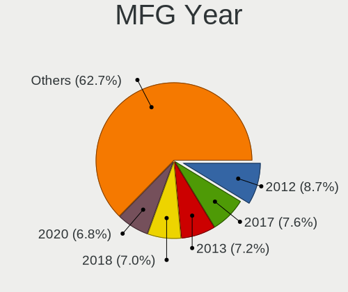
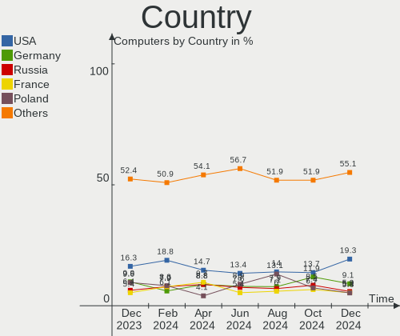
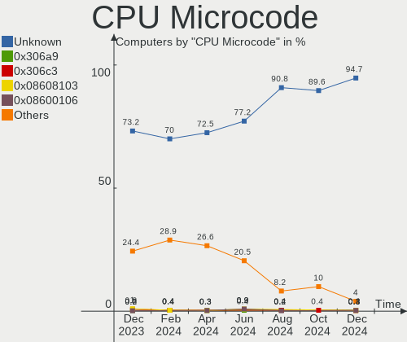
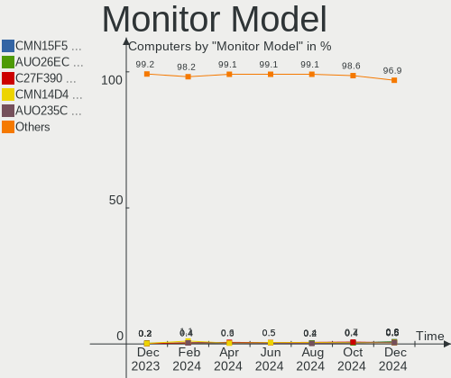
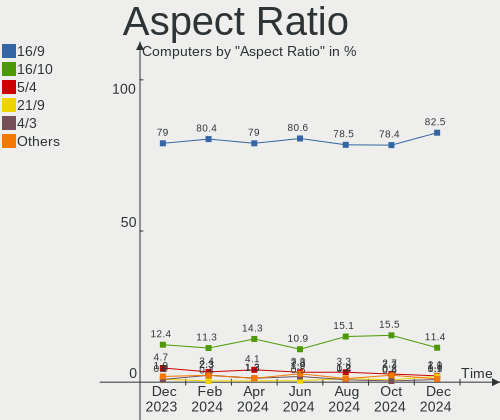
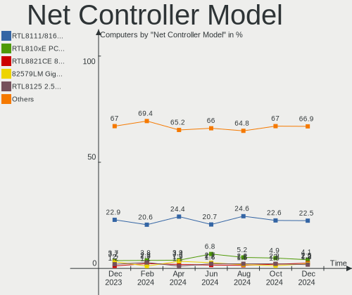
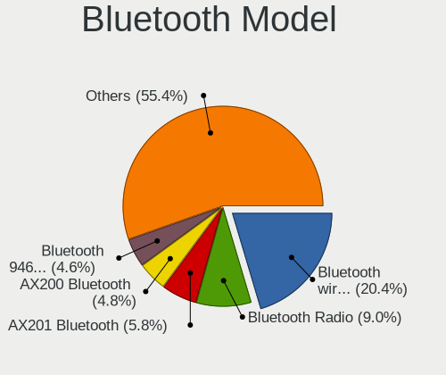

OpenMandriva - Hardware Trends
------------------------------

A project to identify most popular hardware characteristics and track their change
over time based on data collected by Linux users at https://Linux-Hardware.org.

Anyone can contribute to this report by the [hw-probe](https://github.com/linuxhw/hw-probe) tool:

    sudo -E hw-probe -all -upload

This is a report for all computer types. See also reports for [desktops](/Dist/OpenMandriva/Desktop/README.md) and [notebooks](/Dist/OpenMandriva/Notebook/README.md).

This report is for one last month. Overall report since the beginning of time: [TestCoverage](https://github.com/linuxhw/TestCoverage)

Period: May, 2022.

Contents
--------

* [ System ](#system)
  - [ OS                       ](#os)
  - [ OS Family                ](#os-family)
  - [ Kernel                   ](#kernel)
  - [ Kernel Family            ](#kernel-family)
  - [ Kernel Major Ver.        ](#kernel-major-ver)
  - [ Arch                     ](#arch)
  - [ DE                       ](#de)
  - [ Display Server           ](#display-server)
  - [ Display Manager          ](#display-manager)
  - [ OS Lang                  ](#os-lang)
  - [ Boot Mode                ](#boot-mode)
  - [ Filesystem               ](#filesystem)
  - [ Part. scheme             ](#part-scheme)
  - [ Dual Boot with Linux/BSD ](#dual-boot-with-linuxbsd)
  - [ Dual Boot (Win)          ](#dual-boot-win)

* [ Board ](#board)
  - [ Vendor                   ](#vendor)
  - [ Model                    ](#model)
  - [ Model Family             ](#model-family)
  - [ MFG Year                 ](#mfg-year)
  - [ Form Factor              ](#form-factor)
  - [ Secure Boot              ](#secure-boot)
  - [ Coreboot                 ](#coreboot)
  - [ RAM Size                 ](#ram-size)
  - [ RAM Used                 ](#ram-used)
  - [ Total Drives             ](#total-drives)
  - [ Has CD-ROM               ](#has-cd-rom)
  - [ Has Ethernet             ](#has-ethernet)
  - [ Has WiFi                 ](#has-wifi)
  - [ Has Bluetooth            ](#has-bluetooth)

* [ Location ](#location)
  - [ Country                  ](#country)
  - [ City                     ](#city)

* [ Drives ](#drives)
  - [ Drive Vendor             ](#drive-vendor)
  - [ Drive Model              ](#drive-model)
  - [ HDD Vendor               ](#hdd-vendor)
  - [ SSD Vendor               ](#ssd-vendor)
  - [ Drive Kind               ](#drive-kind)
  - [ Drive Connector          ](#drive-connector)
  - [ Drive Size               ](#drive-size)
  - [ Space Total              ](#space-total)
  - [ Space Used               ](#space-used)
  - [ Malfunc. Drives          ](#malfunc-drives)
  - [ Malfunc. Drive Vendor    ](#malfunc-drive-vendor)
  - [ Malfunc. HDD Vendor      ](#malfunc-hdd-vendor)
  - [ Malfunc. Drive Kind      ](#malfunc-drive-kind)
  - [ Failed Drives            ](#failed-drives)
  - [ Failed Drive Vendor      ](#failed-drive-vendor)
  - [ Drive Status             ](#drive-status)

* [ Storage controller ](#storage-controller)
  - [ Storage Vendor           ](#storage-vendor)
  - [ Storage Model            ](#storage-model)
  - [ Storage Kind             ](#storage-kind)

* [ Processor ](#processor)
  - [ CPU Vendor               ](#cpu-vendor)
  - [ CPU Model                ](#cpu-model)
  - [ CPU Model Family         ](#cpu-model-family)
  - [ CPU Cores                ](#cpu-cores)
  - [ CPU Sockets              ](#cpu-sockets)
  - [ CPU Threads              ](#cpu-threads)
  - [ CPU Op-Modes             ](#cpu-op-modes)
  - [ CPU Microcode            ](#cpu-microcode)
  - [ CPU Microarch            ](#cpu-microarch)

* [ Graphics ](#graphics)
  - [ GPU Vendor               ](#gpu-vendor)
  - [ GPU Model                ](#gpu-model)
  - [ GPU Combo                ](#gpu-combo)
  - [ GPU Driver               ](#gpu-driver)
  - [ GPU Memory               ](#gpu-memory)

* [ Monitor ](#monitor)
  - [ Monitor Vendor           ](#monitor-vendor)
  - [ Monitor Model            ](#monitor-model)
  - [ Monitor Resolution       ](#monitor-resolution)
  - [ Monitor Diagonal         ](#monitor-diagonal)
  - [ Monitor Width            ](#monitor-width)
  - [ Aspect Ratio             ](#aspect-ratio)
  - [ Monitor Area             ](#monitor-area)
  - [ Pixel Density            ](#pixel-density)
  - [ Multiple Monitors        ](#multiple-monitors)

* [ Network ](#network)
  - [ Net Controller Vendor    ](#net-controller-vendor)
  - [ Net Controller Model     ](#net-controller-model)
  - [ Wireless Vendor          ](#wireless-vendor)
  - [ Wireless Model           ](#wireless-model)
  - [ Ethernet Vendor          ](#ethernet-vendor)
  - [ Ethernet Model           ](#ethernet-model)
  - [ Net Controller Kind      ](#net-controller-kind)
  - [ Used Controller          ](#used-controller)
  - [ NICs                     ](#nics)
  - [ IPv6                     ](#ipv6)

* [ Bluetooth ](#bluetooth)
  - [ Bluetooth Vendor         ](#bluetooth-vendor)
  - [ Bluetooth Model          ](#bluetooth-model)

* [ Sound ](#sound)
  - [ Sound Vendor             ](#sound-vendor)
  - [ Sound Model              ](#sound-model)

* [ Memory ](#memory)
  - [ Memory Vendor            ](#memory-vendor)
  - [ Memory Model             ](#memory-model)
  - [ Memory Kind              ](#memory-kind)
  - [ Memory Form Factor       ](#memory-form-factor)
  - [ Memory Size              ](#memory-size)
  - [ Memory Speed             ](#memory-speed)

* [ Printers & scanners ](#printers--scanners)
  - [ Printer Vendor           ](#printer-vendor)
  - [ Printer Model            ](#printer-model)
  - [ Scanner Vendor           ](#scanner-vendor)
  - [ Scanner Model            ](#scanner-model)

* [ Camera ](#camera)
  - [ Camera Vendor            ](#camera-vendor)
  - [ Camera Model             ](#camera-model)

* [ Security ](#security)
  - [ Fingerprint Vendor       ](#fingerprint-vendor)
  - [ Fingerprint Model        ](#fingerprint-model)
  - [ Chipcard Vendor          ](#chipcard-vendor)
  - [ Chipcard Model           ](#chipcard-model)

* [ Unsupported ](#unsupported)
  - [ Unsupported Devices      ](#unsupported-devices)
  - [ Unsupported Device Types ](#unsupported-device-types)

System
------

OS
--

Installed operating systems

| Name              | Computers | Percent |
|-------------------|-----------|---------|
| OpenMandriva 4.3  | 252       | 88.11%  |
| OpenMandriva 4.2  | 27        | 9.44%   |
| OpenMandriva 4.50 | 5         | 1.75%   |
| OpenMandriva 4.90 | 1         | 0.35%   |
| OpenMandriva 3.0  | 1         | 0.35%   |

OS Family
---------

OS without a version

| Name         | Computers | Percent |
|--------------|-----------|---------|
| OpenMandriva | 286       | 100%    |

Kernel
------

Version of the Linux kernel

| Version                  | Computers | Percent |
|--------------------------|-----------|---------|
| 5.16.7-desktop-1omv4003  | 234       | 81.82%  |
| 5.10.14-desktop-1omv4002 | 23        | 8.04%   |
| 5.16.13-desktop-1omv4003 | 12        | 4.2%    |
| 5.14.7-desktop-1omv4050  | 5         | 1.75%   |
| 5.17.1-desktop-2omv4050  | 4         | 1.4%    |
| 5.11.12-desktop-1omv4002 | 4         | 1.4%    |
| 5.17.7-desktop-1omv4090  | 2         | 0.7%    |
| 5.14.14-desktop-1omv4050 | 1         | 0.35%   |
| 4.19.38-desktop-1omv     | 1         | 0.35%   |

Kernel Family
-------------

Linux kernel without a distro release

| Version | Computers | Percent |
|---------|-----------|---------|
| 5.16.7  | 234       | 81.82%  |
| 5.10.14 | 23        | 8.04%   |
| 5.16.13 | 12        | 4.2%    |
| 5.14.7  | 5         | 1.75%   |
| 5.17.1  | 4         | 1.4%    |
| 5.11.12 | 4         | 1.4%    |
| 5.17.7  | 2         | 0.7%    |
| 5.14.14 | 1         | 0.35%   |
| 4.19.38 | 1         | 0.35%   |

Kernel Major Ver.
-----------------

Linux kernel major version

| Version | Computers | Percent |
|---------|-----------|---------|
| 5.16    | 246       | 86.01%  |
| 5.10    | 23        | 8.04%   |
| 5.17    | 6         | 2.1%    |
| 5.14    | 6         | 2.1%    |
| 5.11    | 4         | 1.4%    |
| 4.19    | 1         | 0.35%   |

Arch
----

OS architecture (x86_64, i586, etc.)

| Name   | Computers | Percent |
|--------|-----------|---------|
| x86_64 | 286       | 100%    |

DE
--

Desktop Environment

| Name    | Computers | Percent |
|---------|-----------|---------|
| KDE5    | 284       | 99.3%   |
| LXQt    | 1         | 0.35%   |
| Unknown | 1         | 0.35%   |

Display Server
--------------

X11 or Wayland

| Name    | Computers | Percent |
|---------|-----------|---------|
| X11     | 282       | 98.6%   |
| Wayland | 4         | 1.4%    |

Display Manager
---------------

SDDM, LightDM, etc.

| Name | Computers | Percent |
|------|-----------|---------|
| SDDM | 286       | 100%    |

OS Lang
-------

Language

| Lang    | Computers | Percent |
|---------|-----------|---------|
| en_US   | 154       | 53.85%  |
| de_DE   | 22        | 7.69%   |
| pt_BR   | 17        | 5.94%   |
| ru_RU   | 15        | 5.24%   |
| fr_FR   | 13        | 4.55%   |
| it_IT   | 12        | 4.2%    |
| pl_PL   | 11        | 3.85%   |
| es_ES   | 8         | 2.8%    |
| cs_CZ   | 6         | 2.1%    |
| es_CO   | 5         | 1.75%   |
| en_GB   | 4         | 1.4%    |
| es_MX   | 3         | 1.05%   |
| es_AR   | 2         | 0.7%    |
| en_CA   | 2         | 0.7%    |
| de_AT   | 2         | 0.7%    |
| tr_TR   | 1         | 0.35%   |
| pt_PT   | 1         | 0.35%   |
| hu_HU   | 1         | 0.35%   |
| es_VE   | 1         | 0.35%   |
| es_PE   | 1         | 0.35%   |
| es_CR   | 1         | 0.35%   |
| es_CL   | 1         | 0.35%   |
| en_IN   | 1         | 0.35%   |
| en_AU   | 1         | 0.35%   |
| Unknown | 1         | 0.35%   |

Boot Mode
---------

EFI or BIOS

| Mode | Computers | Percent |
|------|-----------|---------|
| BIOS | 159       | 55.59%  |
| EFI  | 127       | 44.41%  |

Filesystem
----------

Type of filesystem

| Type    | Computers | Percent |
|---------|-----------|---------|
| Overlay | 238       | 83.22%  |
| Ext4    | 47        | 16.43%  |
| Unknown | 1         | 0.35%   |

Part. scheme
------------

Scheme of partitioning

| Type    | Computers | Percent |
|---------|-----------|---------|
| GPT     | 162       | 56.64%  |
| MBR     | 122       | 42.66%  |
| Unknown | 2         | 0.7%    |

Dual Boot with Linux/BSD
------------------------

Hosting more than one Linux/BSD

| Dual boot | Computers | Percent |
|-----------|-----------|---------|
| Yes       | 146       | 51.05%  |
| No        | 140       | 48.95%  |

Dual Boot (Win)
---------------

Hosting Linux and Windows

| Dual boot | Computers | Percent |
|-----------|-----------|---------|
| Yes       | 148       | 51.75%  |
| No        | 138       | 48.25%  |

Board
-----

Vendor
------

Motherboard manufacturer

| Name                | Computers | Percent |
|---------------------|-----------|---------|
| ASUSTek Computer    | 51        | 17.83%  |
| Lenovo              | 40        | 13.99%  |
| Dell                | 40        | 13.99%  |
| Hewlett-Packard     | 32        | 11.19%  |
| Gigabyte Technology | 21        | 7.34%   |
| MSI                 | 17        | 5.94%   |
| Acer                | 12        | 4.2%    |
| Positivo            | 8         | 2.8%    |
| Intel               | 8         | 2.8%    |
| ASRock              | 8         | 2.8%    |
| Toshiba             | 7         | 2.45%   |
| Fujitsu             | 4         | 1.4%    |
| Apple               | 4         | 1.4%    |
| Sony                | 3         | 1.05%   |
| Samsung Electronics | 3         | 1.05%   |
| Packard Bell        | 3         | 1.05%   |
| TUXEDO              | 2         | 0.7%    |
| Medion              | 2         | 0.7%    |
| Fujitsu Siemens     | 2         | 0.7%    |
| Compaq              | 2         | 0.7%    |
| Biostar             | 2         | 0.7%    |
| BESSTAR Tech        | 2         | 0.7%    |
| Unknown             | 2         | 0.7%    |
| Teclast             | 1         | 0.35%   |
| System76            | 1         | 0.35%   |
| Philco              | 1         | 0.35%   |
| Notebook            | 1         | 0.35%   |
| Microsoft           | 1         | 0.35%   |
| HYPA                | 1         | 0.35%   |
| Foxconn             | 1         | 0.35%   |
| EVGA                | 1         | 0.35%   |
| Clevo               | 1         | 0.35%   |
| AZW                 | 1         | 0.35%   |
| Alienware           | 1         | 0.35%   |

Model
-----

Motherboard model

| Name                                       | Computers | Percent |
|--------------------------------------------|-----------|---------|
| ASUS UX31E                                 | 6         | 2.1%    |
| Dell Latitude 3120                         | 4         | 1.4%    |
| Dell Inspiron 3451                         | 4         | 1.4%    |
| Unknown                                    | 4         | 1.4%    |
| ASUS All Series                            | 3         | 1.05%   |
| Positivo POS-PIQ57BQ                       | 2         | 0.7%    |
| MSI MS-7235                                | 2         | 0.7%    |
| Lenovo IdeaPad 100-15IBY 80MJ              | 2         | 0.7%    |
| Lenovo G50-70 20351                        | 2         | 0.7%    |
| HP Compaq 15                               | 2         | 0.7%    |
| Dell Latitude 3190 2-in-1                  | 2         | 0.7%    |
| ASRock A88M-G                              | 2         | 0.7%    |
| Toshiba Satellite L350D                    | 1         | 0.35%   |
| Toshiba Satellite C850-1KN                 | 1         | 0.35%   |
| Toshiba Satellite C850                     | 1         | 0.35%   |
| Toshiba Satellite C670D-126                | 1         | 0.35%   |
| Toshiba Satellite C670D                    | 1         | 0.35%   |
| Toshiba Satellite C645D                    | 1         | 0.35%   |
| Toshiba Satellite A100                     | 1         | 0.35%   |
| Teclast X4                                 | 1         | 0.35%   |
| System76 Lemur Pro                         | 1         | 0.35%   |
| Sony VPCCB3S1E                             | 1         | 0.35%   |
| Sony VGN-NR32L_S                           | 1         | 0.35%   |
| Sony VGN-FZ31Z                             | 1         | 0.35%   |
| Samsung R519/R719                          | 1         | 0.35%   |
| Samsung 350V5C/351V5C/3540VC/3440VC        | 1         | 0.35%   |
| Samsung 300V3A/300V4A/300V5A/200A4B/200A5B | 1         | 0.35%   |
| Positivo S15KL                             | 1         | 0.35%   |
| Positivo POS-PIH81DI                       | 1         | 0.35%   |
| Positivo POS-PIG41BA                       | 1         | 0.35%   |
| Positivo POS-PARS760GCD                    | 1         | 0.35%   |
| Positivo POS-EIBTPDC                       | 1         | 0.35%   |
| Positivo Mobile                            | 1         | 0.35%   |
| Philco 10D                                 | 1         | 0.35%   |
| Packard Bell EasyNote TS44HR               | 1         | 0.35%   |
| Packard Bell EasyNote MH35                 | 1         | 0.35%   |
| Packard Bell EasyNote ENTF71BM             | 1         | 0.35%   |
| Notebook N8xxEP6                           | 1         | 0.35%   |
| MSI MS-7D09                                | 1         | 0.35%   |
| MSI MS-7C79                                | 1         | 0.35%   |
| MSI MS-7B86                                | 1         | 0.35%   |
| MSI MS-7B38                                | 1         | 0.35%   |
| MSI MS-7B24                                | 1         | 0.35%   |
| MSI MS-7A40                                | 1         | 0.35%   |
| MSI MS-7982                                | 1         | 0.35%   |
| MSI MS-7821                                | 1         | 0.35%   |
| MSI MS-7693                                | 1         | 0.35%   |
| MSI MS-7641                                | 1         | 0.35%   |
| MSI MS-7576                                | 1         | 0.35%   |
| MSI MS-7309                                | 1         | 0.35%   |
| MSI MS-7267                                | 1         | 0.35%   |
| MSI GF63 Thin 8RCS                         | 1         | 0.35%   |
| MSI FQ679AA-ABM SG3613LA                   | 1         | 0.35%   |
| Microsoft Surface Pro 7                    | 1         | 0.35%   |
| Medion P6624                               | 1         | 0.35%   |
| Medion E2292                               | 1         | 0.35%   |
| Lenovo Z710 20250                          | 1         | 0.35%   |
| Lenovo Z50-75 80EC                         | 1         | 0.35%   |
| Lenovo V530S-07ICR 11BM0020MX              | 1         | 0.35%   |
| Lenovo V520-15IKL 10NK001XIV               | 1         | 0.35%   |

Model Family
------------

Motherboard model prefix

| Name                    | Computers | Percent |
|-------------------------|-----------|---------|
| Dell Latitude           | 17        | 5.94%   |
| Dell Inspiron           | 13        | 4.55%   |
| Lenovo ThinkPad         | 12        | 4.2%    |
| Acer Aspire             | 10        | 3.5%    |
| Lenovo IdeaPad          | 8         | 2.8%    |
| Toshiba Satellite       | 7         | 2.45%   |
| Lenovo ThinkCentre      | 6         | 2.1%    |
| HP Compaq               | 6         | 2.1%    |
| ASUS UX31E              | 6         | 2.1%    |
| HP Pavilion             | 5         | 1.75%   |
| Dell OptiPlex           | 5         | 1.75%   |
| ASUS PRIME              | 5         | 1.75%   |
| HP ProBook              | 4         | 1.4%    |
| ASUS VivoBook           | 4         | 1.4%    |
| Unknown                 | 4         | 1.4%    |
| Packard Bell EasyNote   | 3         | 1.05%   |
| HP EliteDesk            | 3         | 1.05%   |
| ASUS TUF                | 3         | 1.05%   |
| ASUS ROG                | 3         | 1.05%   |
| ASUS All                | 3         | 1.05%   |
| Positivo POS-PIQ57BQ    | 2         | 0.7%    |
| MSI MS-7235             | 2         | 0.7%    |
| Lenovo G50-70           | 2         | 0.7%    |
| HP ENVY                 | 2         | 0.7%    |
| HP EliteBook            | 2         | 0.7%    |
| HP 255                  | 2         | 0.7%    |
| Fujitsu ESPRIMO         | 2         | 0.7%    |
| Dell Studio             | 2         | 0.7%    |
| ASRock A88M-G           | 2         | 0.7%    |
| Teclast X4              | 1         | 0.35%   |
| System76 Lemur          | 1         | 0.35%   |
| Sony VPCCB3S1E          | 1         | 0.35%   |
| Sony VGN-NR32L          | 1         | 0.35%   |
| Sony VGN-FZ31Z          | 1         | 0.35%   |
| Samsung R519            | 1         | 0.35%   |
| Samsung 350V5C          | 1         | 0.35%   |
| Samsung 300V3A          | 1         | 0.35%   |
| Positivo S15KL          | 1         | 0.35%   |
| Positivo POS-PIH81DI    | 1         | 0.35%   |
| Positivo POS-PIG41BA    | 1         | 0.35%   |
| Positivo POS-PARS760GCD | 1         | 0.35%   |
| Positivo POS-EIBTPDC    | 1         | 0.35%   |
| Positivo Mobile         | 1         | 0.35%   |
| Philco 10D              | 1         | 0.35%   |
| Notebook N8xxEP6        | 1         | 0.35%   |
| MSI MS-7D09             | 1         | 0.35%   |
| MSI MS-7C79             | 1         | 0.35%   |
| MSI MS-7B86             | 1         | 0.35%   |
| MSI MS-7B38             | 1         | 0.35%   |
| MSI MS-7B24             | 1         | 0.35%   |
| MSI MS-7A40             | 1         | 0.35%   |
| MSI MS-7982             | 1         | 0.35%   |
| MSI MS-7821             | 1         | 0.35%   |
| MSI MS-7693             | 1         | 0.35%   |
| MSI MS-7641             | 1         | 0.35%   |
| MSI MS-7576             | 1         | 0.35%   |
| MSI MS-7309             | 1         | 0.35%   |
| MSI MS-7267             | 1         | 0.35%   |
| MSI GF63                | 1         | 0.35%   |
| MSI FQ679AA-ABM         | 1         | 0.35%   |

MFG Year
--------

Motherboard manufacture year

| Year    | Computers | Percent |
|---------|-----------|---------|
| 2012    | 29        | 10.14%  |
| 2011    | 29        | 10.14%  |
| 2014    | 22        | 7.69%   |
| 2010    | 22        | 7.69%   |
| 2016    | 21        | 7.34%   |
| 2015    | 21        | 7.34%   |
| 2013    | 21        | 7.34%   |
| 2021    | 19        | 6.64%   |
| 2020    | 19        | 6.64%   |
| 2019    | 19        | 6.64%   |
| 2008    | 13        | 4.55%   |
| 2007    | 12        | 4.2%    |
| 2018    | 11        | 3.85%   |
| 2009    | 11        | 3.85%   |
| 2006    | 7         | 2.45%   |
| 2017    | 6         | 2.1%    |
| 2022    | 3         | 1.05%   |
| Unknown | 1         | 0.35%   |

Form Factor
-----------

Physical design of the computer

| Name        | Computers | Percent |
|-------------|-----------|---------|
| Notebook    | 144       | 50.35%  |
| Desktop     | 123       | 43.01%  |
| Convertible | 9         | 3.15%   |
| Tablet      | 3         | 1.05%   |
| Mini pc     | 3         | 1.05%   |
| All in one  | 3         | 1.05%   |
| Server      | 1         | 0.35%   |

Secure Boot
-----------

Enabled or disabled

| State    | Computers | Percent |
|----------|-----------|---------|
| Disabled | 286       | 100%    |

Coreboot
--------

Have coreboot on board

| Used | Computers | Percent |
|------|-----------|---------|
| No   | 285       | 99.65%  |
| Yes  | 1         | 0.35%   |

RAM Size
--------

Total RAM memory

| Size in GB  | Computers | Percent |
|-------------|-----------|---------|
| 3.01-4.0    | 86        | 30.07%  |
| 4.01-8.0    | 67        | 23.43%  |
| 8.01-16.0   | 58        | 20.28%  |
| 16.01-24.0  | 36        | 12.59%  |
| 32.01-64.0  | 17        | 5.94%   |
| 1.01-2.0    | 13        | 4.55%   |
| 24.01-32.0  | 4         | 1.4%    |
| 2.01-3.0    | 2         | 0.7%    |
| 64.01-256.0 | 2         | 0.7%    |
| 0.51-1.0    | 1         | 0.35%   |

RAM Used
--------

Used RAM memory

| Used GB  | Computers | Percent |
|----------|-----------|---------|
| 1.01-2.0 | 209       | 73.08%  |
| 0.51-1.0 | 50        | 17.48%  |
| 2.01-3.0 | 19        | 6.64%   |
| 0.01-0.5 | 5         | 1.75%   |
| 4.01-8.0 | 2         | 0.7%    |
| 3.01-4.0 | 1         | 0.35%   |

Total Drives
------------

Number of drives on board

| Drives | Computers | Percent |
|--------|-----------|---------|
| 1      | 177       | 61.89%  |
| 2      | 66        | 23.08%  |
| 3      | 20        | 6.99%   |
| 5      | 8         | 2.8%    |
| 4      | 7         | 2.45%   |
| 0      | 7         | 2.45%   |
| 6      | 1         | 0.35%   |

Has CD-ROM
----------

Has CD-ROM on board

| Presented | Computers | Percent |
|-----------|-----------|---------|
| Yes       | 158       | 55.24%  |
| No        | 128       | 44.76%  |

Has Ethernet
------------

Has Ethernet on board

| Presented | Computers | Percent |
|-----------|-----------|---------|
| Yes       | 257       | 89.86%  |
| No        | 29        | 10.14%  |

Has WiFi
--------

Has WiFi module

| Presented | Computers | Percent |
|-----------|-----------|---------|
| Yes       | 205       | 71.68%  |
| No        | 81        | 28.32%  |

Has Bluetooth
-------------

Has Bluetooth module

| Presented | Computers | Percent |
|-----------|-----------|---------|
| No        | 153       | 53.5%   |
| Yes       | 133       | 46.5%   |

Location
--------

Country
-------

Geographic location (country)

| Country      | Computers | Percent |
|--------------|-----------|---------|
| USA          | 28        | 9.79%   |
| Germany      | 28        | 9.79%   |
| Brazil       | 27        | 9.44%   |
| France       | 19        | 6.64%   |
| Russia       | 18        | 6.29%   |
| Poland       | 17        | 5.94%   |
| Italy        | 15        | 5.24%   |
| Spain        | 11        | 3.85%   |
| UK           | 9         | 3.15%   |
| Netherlands  | 9         | 3.15%   |
| Mexico       | 8         | 2.8%    |
| Canada       | 8         | 2.8%    |
| Czechia      | 7         | 2.45%   |
| Colombia     | 7         | 2.45%   |
| Japan        | 5         | 1.75%   |
| Indonesia    | 4         | 1.4%    |
| Argentina    | 4         | 1.4%    |
| Turkey       | 3         | 1.05%   |
| Sweden       | 3         | 1.05%   |
| Portugal     | 3         | 1.05%   |
| Peru         | 3         | 1.05%   |
| India        | 3         | 1.05%   |
| Uruguay      | 2         | 0.7%    |
| Ukraine      | 2         | 0.7%    |
| Taiwan       | 2         | 0.7%    |
| Switzerland  | 2         | 0.7%    |
| Serbia       | 2         | 0.7%    |
| Saudi Arabia | 2         | 0.7%    |
| Morocco      | 2         | 0.7%    |
| Hungary      | 2         | 0.7%    |
| Estonia      | 2         | 0.7%    |
| Belarus      | 2         | 0.7%    |
| Austria      | 2         | 0.7%    |
| Australia    | 2         | 0.7%    |
| Venezuela    | 1         | 0.35%   |
| Tunisia      | 1         | 0.35%   |
| Syria        | 1         | 0.35%   |
| Slovakia     | 1         | 0.35%   |
| Romania      | 1         | 0.35%   |
| Philippines  | 1         | 0.35%   |
| Paraguay     | 1         | 0.35%   |
| Palestine    | 1         | 0.35%   |
| New Zealand  | 1         | 0.35%   |
| Moldova      | 1         | 0.35%   |
| Malaysia     | 1         | 0.35%   |
| Lithuania    | 1         | 0.35%   |
| Jordan       | 1         | 0.35%   |
| Israel       | 1         | 0.35%   |
| Ireland      | 1         | 0.35%   |
| Iran         | 1         | 0.35%   |
| Finland      | 1         | 0.35%   |
| Egypt        | 1         | 0.35%   |
| Costa Rica   | 1         | 0.35%   |
| China        | 1         | 0.35%   |
| Chile        | 1         | 0.35%   |
| Belgium      | 1         | 0.35%   |
| Azerbaijan   | 1         | 0.35%   |

City
----

Geographic location (city)

| City                 | Computers | Percent |
|----------------------|-----------|---------|
| Schagen              | 7         | 2.45%   |
| Sao Paulo            | 6         | 2.1%    |
| Prague               | 5         | 1.75%   |
| Paris                | 4         | 1.4%    |
| Taranto              | 3         | 1.05%   |
| Milan                | 3         | 1.05%   |
| Lima                 | 3         | 1.05%   |
| Wroclaw              | 2         | 0.7%    |
| Worms                | 2         | 0.7%    |
| Warsaw               | 2         | 0.7%    |
| Vienna               | 2         | 0.7%    |
| Vancouver            | 2         | 0.7%    |
| Tartu                | 2         | 0.7%    |
| Sundsvall            | 2         | 0.7%    |
| Spring Hill          | 2         | 0.7%    |
| Reda                 | 2         | 0.7%    |
| Przeclaw             | 2         | 0.7%    |
| Munchenstein         | 2         | 0.7%    |
| Moscow               | 2         | 0.7%    |
| Montevideo           | 2         | 0.7%    |
| Mexico City          | 2         | 0.7%    |
| Madrid               | 2         | 0.7%    |
| Krakow               | 2         | 0.7%    |
| Dortmund             | 2         | 0.7%    |
| Chorzów             | 2         | 0.7%    |
| Berlin               | 2         | 0.7%    |
| Bellefontaine        | 2         | 0.7%    |
| Belgrade             | 2         | 0.7%    |
| Barranquilla         | 2         | 0.7%    |
| Zaragoza             | 1         | 0.35%   |
| Zamrsk               | 1         | 0.35%   |
| Yoshkar-Ola          | 1         | 0.35%   |
| York                 | 1         | 0.35%   |
| Yekaterinburg        | 1         | 0.35%   |
| Woodmere             | 1         | 0.35%   |
| Wettringen           | 1         | 0.35%   |
| Washington           | 1         | 0.35%   |
| Wageningen           | 1         | 0.35%   |
| Volgograd            | 1         | 0.35%   |
| Villa Santa Rita     | 1         | 0.35%   |
| Venice               | 1         | 0.35%   |
| Valledupar           | 1         | 0.35%   |
| Uelzen               | 1         | 0.35%   |
| Tuxtla Gutiérrez    | 1         | 0.35%   |
| Tunis                | 1         | 0.35%   |
| Toulouse             | 1         | 0.35%   |
| Tillicoultry         | 1         | 0.35%   |
| Tighina              | 1         | 0.35%   |
| Texcoco              | 1         | 0.35%   |
| Taoyuan District     | 1         | 0.35%   |
| Tanta                | 1         | 0.35%   |
| Tampere              | 1         | 0.35%   |
| Talavera de la Reina | 1         | 0.35%   |
| Taito                | 1         | 0.35%   |
| Surrey               | 1         | 0.35%   |
| Surgut               | 1         | 0.35%   |
| Suresnes             | 1         | 0.35%   |
| Surat                | 1         | 0.35%   |
| Surabaya             | 1         | 0.35%   |
| Sudak                | 1         | 0.35%   |

Drives
------

Drive Vendor
------------

Hard drive vendors

| Vendor              | Computers | Drives | Percent |
|---------------------|-----------|--------|---------|
| Seagate             | 74        | 88     | 19.12%  |
| WDC                 | 66        | 80     | 17.05%  |
| Samsung Electronics | 47        | 53     | 12.14%  |
| Kingston            | 29        | 30     | 7.49%   |
| Toshiba             | 23        | 24     | 5.94%   |
| SanDisk             | 19        | 19     | 4.91%   |
| Crucial             | 19        | 23     | 4.91%   |
| Hitachi             | 13        | 13     | 3.36%   |
| Unknown             | 10        | 11     | 2.58%   |
| A-DATA Technology   | 7         | 7      | 1.81%   |
| Intel               | 6         | 7      | 1.55%   |
| HGST                | 6         | 6      | 1.55%   |
| China               | 6         | 8      | 1.55%   |
| SK Hynix            | 5         | 5      | 1.29%   |
| Micron Technology   | 5         | 5      | 1.29%   |
| Patriot             | 4         | 4      | 1.03%   |
| KIOXIA-EXCERIA      | 3         | 3      | 0.78%   |
| Apacer              | 3         | 4      | 0.78%   |
| XPG                 | 2         | 2      | 0.52%   |
| Teclast             | 2         | 2      | 0.52%   |
| SPCC                | 2         | 2      | 0.52%   |
| PLEXTOR             | 2         | 2      | 0.52%   |
| Phison              | 2         | 2      | 0.52%   |
| OCZ                 | 2         | 2      | 0.52%   |
| Intenso             | 2         | 2      | 0.52%   |
| Hewlett-Packard     | 2         | 2      | 0.52%   |
| Fujitsu             | 2         | 2      | 0.52%   |
| VERICO              | 1         | 1      | 0.26%   |
| USB3.0              | 1         | 1      | 0.26%   |
| Team                | 1         | 1      | 0.26%   |
| SuperMicro          | 1         | 1      | 0.26%   |
| Smartbuy            | 1         | 1      | 0.26%   |
| Silicon Motion      | 1         | 1      | 0.26%   |
| SABRENT             | 1         | 1      | 0.26%   |
| RX7                 | 1         | 1      | 0.26%   |
| QC-FT-D             | 1         | 1      | 0.26%   |
| PNY                 | 1         | 1      | 0.26%   |
| LITEONIT            | 1         | 1      | 0.26%   |
| LITEON              | 1         | 1      | 0.26%   |
| Lexar               | 1         | 1      | 0.26%   |
| LDLC                | 1         | 1      | 0.26%   |
| LaCie               | 1         | 1      | 0.26%   |
| KingSpec            | 1         | 1      | 0.26%   |
| KingDian            | 1         | 1      | 0.26%   |
| JetFlash            | 1         | 1      | 0.26%   |
| INDMEM              | 1         | 1      | 0.26%   |
| i-FlashDisk         | 1         | 1      | 0.26%   |
| HS-SSD-C100         | 1         | 1      | 0.26%   |
| GOODRAM             | 1         | 1      | 0.26%   |
| Corsair             | 1         | 1      | 0.26%   |
| Apple               | 1         | 1      | 0.26%   |

Drive Model
-----------

Hard drive models

| Model                                | Computers | Percent |
|--------------------------------------|-----------|---------|
| Seagate ST500LT012-1DG142 500GB      | 10        | 2.37%   |
| Kingston SA400S37240G 240GB SSD      | 7         | 1.66%   |
| Seagate ST1000DM003-1ER162 1TB       | 6         | 1.42%   |
| SanDisk SSD U100 256GB               | 6         | 1.42%   |
| Kingston SA400S37120G 120GB SSD      | 5         | 1.18%   |
| Unknown SD/MMC/MS PRO 999GB          | 4         | 0.95%   |
| Seagate ST500DM002-1BD142 500GB      | 4         | 0.95%   |
| Kingston SV300S37A120G 120GB SSD     | 4         | 0.95%   |
| HGST HTS545050A7E680 500GB           | 4         | 0.95%   |
| Crucial CT480BX500SSD1 480GB         | 4         | 0.95%   |
| Toshiba MQ01ABF050 500GB             | 3         | 0.71%   |
| Toshiba MQ01ABD100 1TB               | 3         | 0.71%   |
| Toshiba DT01ACA100 1TB               | 3         | 0.71%   |
| SK Hynix BC711 NVMe 128GB            | 3         | 0.71%   |
| Seagate ST2000LM015-2E8174 2TB       | 3         | 0.71%   |
| Seagate ST1000LM024 HN-M101MBB 1TB   | 3         | 0.71%   |
| Seagate ST1000DM010-2EP102 1TB       | 3         | 0.71%   |
| Hitachi HTS547550A9E384 500GB        | 3         | 0.71%   |
| Crucial CT1000MX500SSD1 1TB          | 3         | 0.71%   |
| XPG GAMMIX S11 Pro 256GB             | 2         | 0.47%   |
| WDC WDS250G2B0A-00SM50 250GB SSD     | 2         | 0.47%   |
| WDC WD5000LPVX-22V0TT0 500GB         | 2         | 0.47%   |
| WDC WD10EZEX-08WN4A0 1TB             | 2         | 0.47%   |
| WDC PC SN520 SDAPNUW-256G-1006 256GB | 2         | 0.47%   |
| Toshiba MQ04ABF100 1TB               | 2         | 0.47%   |
| Toshiba MK1637GSX 160GB              | 2         | 0.47%   |
| Seagate ST9250315AS 250GB            | 2         | 0.47%   |
| Seagate ST500LM000-1EJ162 500GB      | 2         | 0.47%   |
| Seagate ST380815AS 80GB              | 2         | 0.47%   |
| Seagate ST3500418AS 500GB            | 2         | 0.47%   |
| Seagate ST3320620AS 320GB            | 2         | 0.47%   |
| Seagate ST3250318AS 250GB            | 2         | 0.47%   |
| Seagate ST31000528AS 1TB             | 2         | 0.47%   |
| Seagate ST2000LM007-1R8174 2TB       | 2         | 0.47%   |
| Seagate ST1000LM035-1RK172 1TB       | 2         | 0.47%   |
| Seagate ST1000DM003-9YN162 1TB       | 2         | 0.47%   |
| Seagate ST1000DM003-1CH162 1TB       | 2         | 0.47%   |
| SanDisk SSD PLUS 240GB               | 2         | 0.47%   |
| SanDisk SDSSDH3512G 512GB            | 2         | 0.47%   |
| Samsung SSD 970 EVO Plus 500GB       | 2         | 0.47%   |
| Samsung SSD 970 EVO Plus 1TB         | 2         | 0.47%   |
| Samsung SSD 870 EVO 500GB            | 2         | 0.47%   |
| Samsung SSD 860 EVO M.2 2TB          | 2         | 0.47%   |
| Samsung SSD 860 EVO 250GB            | 2         | 0.47%   |
| Samsung SSD 850 EVO 500GB            | 2         | 0.47%   |
| Samsung PM991a NVMe 256GB            | 2         | 0.47%   |
| Samsung HD502HJ 500GB                | 2         | 0.47%   |
| Patriot Burst 120GB SSD              | 2         | 0.47%   |
| Kingston SV300S37A60G 64GB SSD       | 2         | 0.47%   |
| Kingston SUV400S37120G 120GB SSD     | 2         | 0.47%   |
| Kingston SA400S37480G 480GB SSD      | 2         | 0.47%   |
| Kingston RBUSNS8154P3128GJ 128GB     | 2         | 0.47%   |
| Crucial CT500P2SSD8 500GB            | 2         | 0.47%   |
| Crucial CT500MX500SSD1 500GB         | 2         | 0.47%   |
| Crucial CT1000P2SSD8 1TB             | 2         | 0.47%   |
| China SATA SSD 256GB                 | 2         | 0.47%   |
| WDC WDS500G3X0C-00SJG0 500GB         | 1         | 0.24%   |
| WDC WDS500G2B0B-00YS70 500GB SSD     | 1         | 0.24%   |
| WDC WDS250G3X0C-00SJG0 250GB         | 1         | 0.24%   |
| WDC WDS250G2X0C-00L350 250GB         | 1         | 0.24%   |

HDD Vendor
----------

Hard disk drive vendors

| Vendor              | Computers | Drives | Percent |
|---------------------|-----------|--------|---------|
| Seagate             | 72        | 86     | 38.1%   |
| WDC                 | 56        | 67     | 29.63%  |
| Toshiba             | 21        | 21     | 11.11%  |
| Hitachi             | 13        | 13     | 6.88%   |
| Samsung Electronics | 12        | 12     | 6.35%   |
| HGST                | 6         | 6      | 3.17%   |
| Unknown             | 4         | 4      | 2.12%   |
| Fujitsu             | 2         | 2      | 1.06%   |
| SABRENT             | 1         | 1      | 0.53%   |
| QC-FT-D             | 1         | 1      | 0.53%   |
| LaCie               | 1         | 1      | 0.53%   |

SSD Vendor
----------

Solid state drive vendors

| Vendor              | Computers | Drives | Percent |
|---------------------|-----------|--------|---------|
| Kingston            | 24        | 25     | 17.27%  |
| Samsung Electronics | 22        | 25     | 15.83%  |
| SanDisk             | 17        | 17     | 12.23%  |
| Crucial             | 15        | 19     | 10.79%  |
| WDC                 | 6         | 6      | 4.32%   |
| China               | 6         | 8      | 4.32%   |
| A-DATA Technology   | 6         | 6      | 4.32%   |
| Patriot             | 4         | 4      | 2.88%   |
| Intel               | 4         | 4      | 2.88%   |
| Apacer              | 3         | 3      | 2.16%   |
| OCZ                 | 2         | 2      | 1.44%   |
| Micron Technology   | 2         | 2      | 1.44%   |
| KIOXIA-EXCERIA      | 2         | 2      | 1.44%   |
| VERICO              | 1         | 1      | 0.72%   |
| USB3.0              | 1         | 1      | 0.72%   |
| Toshiba             | 1         | 1      | 0.72%   |
| Teclast             | 1         | 1      | 0.72%   |
| Team                | 1         | 1      | 0.72%   |
| SuperMicro          | 1         | 1      | 0.72%   |
| SPCC                | 1         | 1      | 0.72%   |
| Smartbuy            | 1         | 1      | 0.72%   |
| SK Hynix            | 1         | 1      | 0.72%   |
| Seagate             | 1         | 1      | 0.72%   |
| RX7                 | 1         | 1      | 0.72%   |
| PNY                 | 1         | 1      | 0.72%   |
| PLEXTOR             | 1         | 1      | 0.72%   |
| PHISON              | 1         | 1      | 0.72%   |
| LITEONIT            | 1         | 1      | 0.72%   |
| LITEON              | 1         | 1      | 0.72%   |
| Lexar               | 1         | 1      | 0.72%   |
| LDLC                | 1         | 1      | 0.72%   |
| KingSpec            | 1         | 1      | 0.72%   |
| KingDian            | 1         | 1      | 0.72%   |
| Intenso             | 1         | 1      | 0.72%   |
| i-FlashDisk         | 1         | 1      | 0.72%   |
| HS-SSD-C100         | 1         | 1      | 0.72%   |
| Hewlett-Packard     | 1         | 1      | 0.72%   |
| GOODRAM             | 1         | 1      | 0.72%   |
| Apple               | 1         | 1      | 0.72%   |

Drive Kind
----------

HDD or SSD

| Kind    | Computers | Drives | Percent |
|---------|-----------|--------|---------|
| HDD     | 171       | 214    | 48.72%  |
| SSD     | 118       | 149    | 33.62%  |
| NVMe    | 52        | 58     | 14.81%  |
| MMC     | 7         | 8      | 1.99%   |
| Unknown | 3         | 3      | 0.85%   |

Drive Connector
---------------

SATA, SAS, NVMe, etc.

| Type | Computers | Drives | Percent |
|------|-----------|--------|---------|
| SATA | 250       | 349    | 76.92%  |
| NVMe | 52        | 58     | 16%     |
| SAS  | 16        | 17     | 4.92%   |
| MMC  | 7         | 8      | 2.15%   |

Drive Size
----------

Size of hard drive

| Size in TB | Computers | Drives | Percent |
|------------|-----------|--------|---------|
| 0.01-0.5   | 204       | 254    | 70.34%  |
| 0.51-1.0   | 61        | 83     | 21.03%  |
| 1.01-2.0   | 14        | 14     | 4.83%   |
| 3.01-4.0   | 5         | 6      | 1.72%   |
| 4.01-10.0  | 4         | 4      | 1.38%   |
| 2.01-3.0   | 2         | 2      | 0.69%   |

Space Total
-----------

Amount of disk space available on the file system

| Size in GB     | Computers | Percent |
|----------------|-----------|---------|
| 1-20           | 163       | 56.99%  |
| 101-250        | 32        | 11.19%  |
| Unknown        | 32        | 11.19%  |
| 251-500        | 26        | 9.09%   |
| 21-50          | 10        | 3.5%    |
| 51-100         | 8         | 2.8%    |
| 501-1000       | 7         | 2.45%   |
| 1001-2000      | 6         | 2.1%    |
| More than 3000 | 2         | 0.7%    |

Space Used
----------

Amount of used disk space

| Used GB   | Computers | Percent |
|-----------|-----------|---------|
| 1-20      | 229       | 80.07%  |
| Unknown   | 32        | 11.19%  |
| 101-250   | 8         | 2.8%    |
| 21-50     | 7         | 2.45%   |
| 1001-2000 | 3         | 1.05%   |
| 51-100    | 3         | 1.05%   |
| 251-500   | 2         | 0.7%    |
| 2001-3000 | 1         | 0.35%   |
| 501-1000  | 1         | 0.35%   |

Malfunc. Drives
---------------

Drive models with a malfunction

| Model                                       | Computers | Drives | Percent |
|---------------------------------------------|-----------|--------|---------|
| SanDisk SSD U100 256GB                      | 6         | 6      | 6.67%   |
| Seagate ST500DM002-1BD142 500GB             | 4         | 5      | 4.44%   |
| HGST HTS545050A7E680 500GB                  | 3         | 3      | 3.33%   |
| Toshiba MK1637GSX 160GB                     | 2         | 2      | 2.22%   |
| Seagate ST500LT012-1DG142 500GB             | 2         | 2      | 2.22%   |
| Seagate ST2000LM015-2E8174 2TB              | 2         | 2      | 2.22%   |
| Seagate ST1000LM024 HN-M101MBB 1TB          | 2         | 2      | 2.22%   |
| Seagate ST1000DM003-9YN162 1TB              | 2         | 2      | 2.22%   |
| WDC WDS240G2G0B-00EPW0 240GB SSD            | 1         | 1      | 1.11%   |
| WDC WD800JD-00MSA1 80GB                     | 1         | 1      | 1.11%   |
| WDC WD800BB-00FJA0 80GB                     | 1         | 1      | 1.11%   |
| WDC WD60EFRX-68MYMN1 6TB                    | 1         | 1      | 1.11%   |
| WDC WD5003ABYZ-011FA0 500GB                 | 1         | 1      | 1.11%   |
| WDC WD5001AALS-00L3B2 500GB                 | 1         | 1      | 1.11%   |
| WDC WD5000BPVT-22HXZT1 500GB                | 1         | 1      | 1.11%   |
| WDC WD5000BEKT-60KA9T0 500GB                | 1         | 1      | 1.11%   |
| WDC WD5000AAKX-00ERMA0 500GB                | 1         | 1      | 1.11%   |
| WDC WD5000AAKS-75A7B0 500GB                 | 1         | 1      | 1.11%   |
| WDC WD5000AAKS-00V1A0 500GB                 | 1         | 1      | 1.11%   |
| WDC WD5000AAKS-00A7B2 500GB                 | 1         | 1      | 1.11%   |
| WDC WD3200BPVT-24JJ5T0 320GB                | 1         | 1      | 1.11%   |
| WDC WD3200AAJS-00YZCA0 320GB                | 1         | 1      | 1.11%   |
| WDC WD2500BEVT-75A23T0 250GB                | 1         | 1      | 1.11%   |
| WDC WD2500AAJS-00YZCA0 250GB                | 1         | 1      | 1.11%   |
| WDC WD10JPVX-08JC3T2 1TB                    | 1         | 1      | 1.11%   |
| WDC WD10EZEX-08WN4A0 1TB                    | 1         | 1      | 1.11%   |
| WDC WD10EADS-22M2B0 1TB                     | 1         | 1      | 1.11%   |
| WDC WD10EADS-00L5B1 1TB                     | 1         | 1      | 1.11%   |
| Toshiba MQ01ABF050 500GB                    | 1         | 1      | 1.11%   |
| Toshiba MK5061GSYN 500GB                    | 1         | 1      | 1.11%   |
| Toshiba MK2546GSX 200 200GB                 | 1         | 1      | 1.11%   |
| SPCC M.2 PCIe SSD 256GB                     | 1         | 1      | 1.11%   |
| Seagate ST9320421ASG 320GB                  | 1         | 1      | 1.11%   |
| Seagate ST9320325AS 320GB                   | 1         | 1      | 1.11%   |
| Seagate ST9250410AS 250GB                   | 1         | 1      | 1.11%   |
| Seagate ST500LM000-1EJ162 500GB             | 1         | 1      | 1.11%   |
| Seagate ST3750640NS 752GB                   | 1         | 2      | 1.11%   |
| Seagate ST3500418AS 500GB                   | 1         | 1      | 1.11%   |
| Seagate ST3500413AS 500GB                   | 1         | 1      | 1.11%   |
| Seagate ST3250318AS 250GB                   | 1         | 1      | 1.11%   |
| Seagate ST3250310AS 250GB                   | 1         | 1      | 1.11%   |
| Seagate ST3160811AS 160GB                   | 1         | 1      | 1.11%   |
| Seagate ST310212A 10GB                      | 1         | 1      | 1.11%   |
| Seagate ST31000528AS 1TB                    | 1         | 1      | 1.11%   |
| Seagate ST1000LX015-1U7172 1TB              | 1         | 1      | 1.11%   |
| Seagate ST1000DM010-2EP102 1TB              | 1         | 1      | 1.11%   |
| Seagate ST1000DM003-1CH162 1TB              | 1         | 1      | 1.11%   |
| SanDisk SSD PLUS 480GB                      | 1         | 1      | 1.11%   |
| Samsung Electronics SSD PM810 2.5 7mm 128GB | 1         | 1      | 1.11%   |
| Samsung Electronics SSD 840 Series 500GB    | 1         | 1      | 1.11%   |
| Samsung Electronics SP0842N 80GB            | 1         | 1      | 1.11%   |
| Samsung Electronics HM320JI 320GB           | 1         | 1      | 1.11%   |
| Samsung Electronics HE253GJ 250GB           | 1         | 1      | 1.11%   |
| Samsung Electronics HD502IJ 500GB           | 1         | 1      | 1.11%   |
| Samsung Electronics HD502HJ 500GB           | 1         | 1      | 1.11%   |
| Samsung Electronics HD252HJ 250GB           | 1         | 1      | 1.11%   |
| Samsung Electronics HD080HJ 80GB            | 1         | 1      | 1.11%   |
| KingSpec V-32 32GB SSD                      | 1         | 1      | 1.11%   |
| Intel SSDSA2M160G2GC 160GB                  | 1         | 1      | 1.11%   |
| Intel SSDMCEAC120B3 120GB                   | 1         | 1      | 1.11%   |

Malfunc. Drive Vendor
---------------------

Vendors of faulty drives

| Vendor              | Computers | Drives | Percent |
|---------------------|-----------|--------|---------|
| Seagate             | 26        | 29     | 30.23%  |
| WDC                 | 17        | 20     | 19.77%  |
| Samsung Electronics | 9         | 9      | 10.47%  |
| SanDisk             | 7         | 7      | 8.14%   |
| Hitachi             | 6         | 6      | 6.98%   |
| Toshiba             | 5         | 5      | 5.81%   |
| HGST                | 5         | 5      | 5.81%   |
| Intel               | 3         | 3      | 3.49%   |
| Crucial             | 3         | 3      | 3.49%   |
| China               | 2         | 2      | 2.33%   |
| SPCC                | 1         | 1      | 1.16%   |
| KingSpec            | 1         | 1      | 1.16%   |
| A-DATA Technology   | 1         | 1      | 1.16%   |

Malfunc. HDD Vendor
-------------------

Vendors of faulty HDD drives

| Vendor              | Computers | Drives | Percent |
|---------------------|-----------|--------|---------|
| Seagate             | 26        | 29     | 40%     |
| WDC                 | 16        | 19     | 24.62%  |
| Samsung Electronics | 7         | 7      | 10.77%  |
| Hitachi             | 6         | 6      | 9.23%   |
| Toshiba             | 5         | 5      | 7.69%   |
| HGST                | 5         | 5      | 7.69%   |

Malfunc. Drive Kind
-------------------

Kinds of faulty drives

| Kind | Computers | Drives | Percent |
|------|-----------|--------|---------|
| HDD  | 64        | 71     | 75.29%  |
| SSD  | 20        | 20     | 23.53%  |
| NVMe | 1         | 1      | 1.18%   |

Failed Drives
-------------

Failed drive models

| Model                   | Computers | Drives | Percent |
|-------------------------|-----------|--------|---------|
| Seagate ST980811AS 80GB | 1         | 1      | 100%    |

Failed Drive Vendor
-------------------

Failed drive vendors

| Vendor  | Computers | Drives | Percent |
|---------|-----------|--------|---------|
| Seagate | 1         | 1      | 100%    |

Drive Status
------------

Number of failed and malfunc. drives

| Status   | Computers | Drives | Percent |
|----------|-----------|--------|---------|
| Works    | 214       | 311    | 66.88%  |
| Malfunc  | 83        | 92     | 25.94%  |
| Detected | 22        | 28     | 6.88%   |
| Failed   | 1         | 1      | 0.31%   |

Storage controller
------------------

Storage Vendor
--------------

Storage controller vendors

| Vendor                           | Computers | Percent |
|----------------------------------|-----------|---------|
| Intel                            | 207       | 59.83%  |
| AMD                              | 56        | 16.18%  |
| Samsung Electronics              | 15        | 4.34%   |
| Nvidia                           | 8         | 2.31%   |
| Marvell Technology Group         | 8         | 2.31%   |
| Sandisk                          | 7         | 2.02%   |
| Kingston Technology Company      | 5         | 1.45%   |
| JMicron Technology               | 5         | 1.45%   |
| SK Hynix                         | 4         | 1.16%   |
| Micron/Crucial Technology        | 4         | 1.16%   |
| Phison Electronics               | 3         | 0.87%   |
| Micron Technology                | 3         | 0.87%   |
| KIOXIA                           | 3         | 0.87%   |
| ASMedia Technology               | 3         | 0.87%   |
| VIA Technologies                 | 2         | 0.58%   |
| Silicon Motion                   | 2         | 0.58%   |
| Silicon Integrated Systems [SiS] | 2         | 0.58%   |
| Realtek Semiconductor            | 2         | 0.58%   |
| ADATA Technology                 | 2         | 0.58%   |
| Silicon Image                    | 1         | 0.29%   |
| Seagate Technology               | 1         | 0.29%   |
| Lite-On Technology               | 1         | 0.29%   |
| Lite-On IT Corp. / Plextor       | 1         | 0.29%   |
| Biwin Storage Technology         | 1         | 0.29%   |

Storage Model
-------------

Storage controller models

| Model                                                                            | Computers | Percent |
|----------------------------------------------------------------------------------|-----------|---------|
| AMD FCH SATA Controller [AHCI mode]                                              | 33        | 7.97%   |
| Intel 7 Series Chipset Family 6-port SATA Controller [AHCI mode]                 | 19        | 4.59%   |
| Intel 6 Series/C200 Series Chipset Family 6 port Mobile SATA AHCI Controller     | 15        | 3.62%   |
| Intel 8 Series/C220 Series Chipset Family 6-port SATA Controller 1 [AHCI mode]   | 13        | 3.14%   |
| Intel Atom Processor E3800 Series SATA AHCI Controller                           | 12        | 2.9%    |
| AMD SB7x0/SB8x0/SB9x0 SATA Controller [AHCI mode]                                | 12        | 2.9%    |
| Intel Sunrise Point-LP SATA Controller [AHCI mode]                               | 11        | 2.66%   |
| Intel Q170/Q150/B150/H170/H110/Z170/CM236 Chipset SATA Controller [AHCI Mode]    | 11        | 2.66%   |
| Intel 82801 Mobile SATA Controller [RAID mode]                                   | 11        | 2.66%   |
| AMD SB7x0/SB8x0/SB9x0 IDE Controller                                             | 9         | 2.17%   |
| Intel Celeron/Pentium Silver Processor SATA Controller                           | 8         | 1.93%   |
| Intel 6 Series/C200 Series Chipset Family 6 port Desktop SATA AHCI Controller    | 8         | 1.93%   |
| Intel 5 Series/3400 Series Chipset 6 port SATA AHCI Controller                   | 8         | 1.93%   |
| Samsung NVMe SSD Controller 980                                                  | 7         | 1.69%   |
| Samsung NVMe SSD Controller SM981/PM981/PM983                                    | 6         | 1.45%   |
| Intel NM10/ICH7 Family SATA Controller [IDE mode]                                | 6         | 1.45%   |
| Intel 82801G (ICH7 Family) IDE Controller                                        | 6         | 1.45%   |
| Intel 8 Series SATA Controller 1 [AHCI mode]                                     | 6         | 1.45%   |
| Intel 200 Series PCH SATA controller [AHCI mode]                                 | 6         | 1.45%   |
| Intel Wildcat Point-LP SATA Controller [AHCI Mode]                               | 5         | 1.21%   |
| Intel SATA Controller [RAID mode]                                                | 5         | 1.21%   |
| Intel Cannon Lake Mobile PCH SATA AHCI Controller                                | 5         | 1.21%   |
| Intel 82801IR/IO/IH (ICH9R/DO/DH) 4 port SATA Controller [IDE mode]              | 5         | 1.21%   |
| Intel 82801I (ICH9 Family) 2 port SATA Controller [IDE mode]                     | 5         | 1.21%   |
| Intel 82801HM/HEM (ICH8M/ICH8M-E) SATA Controller [AHCI mode]                    | 5         | 1.21%   |
| Intel 82801HM/HEM (ICH8M/ICH8M-E) IDE Controller                                 | 5         | 1.21%   |
| Intel 5 Series/3400 Series Chipset 4 port SATA AHCI Controller                   | 5         | 1.21%   |
| AMD 500 Series Chipset SATA Controller                                           | 5         | 1.21%   |
| AMD 400 Series Chipset SATA Controller                                           | 5         | 1.21%   |
| SK Hynix Gold P31 SSD                                                            | 4         | 0.97%   |
| Nvidia MCP61 SATA Controller                                                     | 4         | 0.97%   |
| Nvidia MCP61 IDE                                                                 | 4         | 0.97%   |
| Micron/Crucial P2 NVMe PCIe SSD                                                  | 4         | 0.97%   |
| Intel 5 Series/3400 Series Chipset PT IDER Controller                            | 4         | 0.97%   |
| Sandisk WD Black SN750 / PC SN730 NVMe SSD                                       | 3         | 0.72%   |
| Micron Non-Volatile memory controller                                            | 3         | 0.72%   |
| Marvell Group 88SE6111/6121 SATA II / PATA Controller                            | 3         | 0.72%   |
| JMicron JMB363 SATA/IDE Controller                                               | 3         | 0.72%   |
| Intel NM10/ICH7 Family SATA Controller [AHCI mode]                               | 3         | 0.72%   |
| Intel Comet Lake SATA AHCI Controller                                            | 3         | 0.72%   |
| Intel 82801JI (ICH10 Family) 4 port SATA IDE Controller #1                       | 3         | 0.72%   |
| Intel 82801JI (ICH10 Family) 2 port SATA IDE Controller #2                       | 3         | 0.72%   |
| Intel 82801IBM/IEM (ICH9M/ICH9M-E) 4 port SATA Controller [AHCI mode]            | 3         | 0.72%   |
| Intel 7 Series/C210 Series Chipset Family 6-port SATA Controller [AHCI mode]     | 3         | 0.72%   |
| ASMedia ASM1062 Serial ATA Controller                                            | 3         | 0.72%   |
| Silicon Motion SM2263EN/SM2263XT SSD Controller                                  | 2         | 0.48%   |
| Silicon Integrated Systems [SiS] 5513 IDE Controller                             | 2         | 0.48%   |
| Sandisk WD Blue SN500 / PC SN520 NVMe SSD                                        | 2         | 0.48%   |
| Phison Electronics Non-Volatile memory controller                                | 2         | 0.48%   |
| KIOXIA Non-Volatile memory controller                                            | 2         | 0.48%   |
| Kingston Company U-SNS8154P3 NVMe SSD                                            | 2         | 0.48%   |
| JMicron JMB361 AHCI/IDE                                                          | 2         | 0.48%   |
| Intel Non-Volatile memory controller                                             | 2         | 0.48%   |
| Intel Cannon Lake PCH SATA AHCI Controller                                       | 2         | 0.48%   |
| Intel C610/X99 series chipset 6-Port SATA Controller [AHCI mode]                 | 2         | 0.48%   |
| Intel Atom/Celeron/Pentium Processor x5-E8000/J3xxx/N3xxx Series SATA Controller | 2         | 0.48%   |
| Intel 82Q35 Express PT IDER Controller                                           | 2         | 0.48%   |
| Intel 82801IBM/IEM (ICH9M/ICH9M-E) 2 port SATA Controller [IDE mode]             | 2         | 0.48%   |
| Intel 82801HR/HO/HH (ICH8R/DO/DH) 2 port SATA Controller [IDE mode]              | 2         | 0.48%   |
| Intel 82801H (ICH8 Family) 4 port SATA Controller [IDE mode]                     | 2         | 0.48%   |

Storage Kind
------------

Kind of storage controller (IDE, SATA, NVMe, SAS, ...)

| Kind | Computers | Percent |
|------|-----------|---------|
| SATA | 224       | 62.57%  |
| IDE  | 63        | 17.6%   |
| NVMe | 52        | 14.53%  |
| RAID | 19        | 5.31%   |

Processor
---------

CPU Vendor
----------

Processor vendors

| Vendor | Computers | Percent |
|--------|-----------|---------|
| Intel  | 220       | 76.92%  |
| AMD    | 66        | 23.08%  |

CPU Model
---------

Processor models

| Model                                         | Computers | Percent |
|-----------------------------------------------|-----------|---------|
| Intel Celeron CPU N2840 @ 2.16GHz             | 8         | 2.8%    |
| Intel Core i7-2677M CPU @ 1.80GHz             | 6         | 2.1%    |
| Intel Pentium Silver N6000 @ 1.10GHz          | 4         | 1.4%    |
| Intel Core i5-3210M CPU @ 2.50GHz             | 4         | 1.4%    |
| Intel Pentium Dual CPU T2390 @ 1.86GHz        | 3         | 1.05%   |
| Intel Core i7-8750H CPU @ 2.20GHz             | 3         | 1.05%   |
| Intel Core i5-7200U CPU @ 2.50GHz             | 3         | 1.05%   |
| Intel Core i5-6500 CPU @ 3.20GHz              | 3         | 1.05%   |
| Intel Core i5-4590 CPU @ 3.30GHz              | 3         | 1.05%   |
| Intel Core i5-2450M CPU @ 2.50GHz             | 3         | 1.05%   |
| Intel Core i5 CPU M 520 @ 2.40GHz             | 3         | 1.05%   |
| Intel Core 2 CPU 6600 @ 2.40GHz               | 3         | 1.05%   |
| AMD FX-8350 Eight-Core Processor              | 3         | 1.05%   |
| Intel Pentium Silver N5000 CPU @ 1.10GHz      | 2         | 0.7%    |
| Intel Pentium Dual-Core CPU E5300 @ 2.60GHz   | 2         | 0.7%    |
| Intel Pentium Dual CPU E2200 @ 2.20GHz        | 2         | 0.7%    |
| Intel Pentium CPU N3700 @ 1.60GHz             | 2         | 0.7%    |
| Intel Pentium CPU G4400 @ 3.30GHz             | 2         | 0.7%    |
| Intel Pentium 3558U @ 1.70GHz                 | 2         | 0.7%    |
| Intel Core i7-9750H CPU @ 2.60GHz             | 2         | 0.7%    |
| Intel Core i7-3632QM CPU @ 2.20GHz            | 2         | 0.7%    |
| Intel Core i7-3520M CPU @ 2.90GHz             | 2         | 0.7%    |
| Intel Core i7-10700 CPU @ 2.90GHz             | 2         | 0.7%    |
| Intel Core i5-6500T CPU @ 2.50GHz             | 2         | 0.7%    |
| Intel Core i5-5300U CPU @ 2.30GHz             | 2         | 0.7%    |
| Intel Core i5-4200M CPU @ 2.50GHz             | 2         | 0.7%    |
| Intel Core i5-3570K CPU @ 3.40GHz             | 2         | 0.7%    |
| Intel Core i5-3470 CPU @ 3.20GHz              | 2         | 0.7%    |
| Intel Core i5-2430M CPU @ 2.40GHz             | 2         | 0.7%    |
| Intel Core i5-2400 CPU @ 3.10GHz              | 2         | 0.7%    |
| Intel Core i5-1035G1 CPU @ 1.00GHz            | 2         | 0.7%    |
| Intel Core i5 CPU 650 @ 3.20GHz               | 2         | 0.7%    |
| Intel Core i3-7100U CPU @ 2.40GHz             | 2         | 0.7%    |
| Intel Core i3-6100 CPU @ 3.70GHz              | 2         | 0.7%    |
| Intel Core i3-6006U CPU @ 2.00GHz             | 2         | 0.7%    |
| Intel Core i3-5005U CPU @ 2.00GHz             | 2         | 0.7%    |
| Intel Core i3-2310M CPU @ 2.10GHz             | 2         | 0.7%    |
| Intel Core i3-1005G1 CPU @ 1.20GHz            | 2         | 0.7%    |
| Intel Core 2 Quad CPU Q8400 @ 2.66GHz         | 2         | 0.7%    |
| Intel Core 2 Quad CPU Q6600 @ 2.40GHz         | 2         | 0.7%    |
| Intel Core 2 Duo CPU P8600 @ 2.40GHz          | 2         | 0.7%    |
| Intel Core 2 Duo CPU E8400 @ 3.00GHz          | 2         | 0.7%    |
| Intel Celeron N4100 CPU @ 1.10GHz             | 2         | 0.7%    |
| AMD Ryzen 7 5700G with Radeon Graphics        | 2         | 0.7%    |
| AMD Ryzen 5 3550H with Radeon Vega Mobile Gfx | 2         | 0.7%    |
| AMD Phenom II X4 955 Processor                | 2         | 0.7%    |
| AMD E1-6010 APU with AMD Radeon R2 Graphics   | 2         | 0.7%    |
| AMD E1-2100 APU with Radeon HD Graphics       | 2         | 0.7%    |
| AMD E-300 APU with Radeon HD Graphics         | 2         | 0.7%    |
| AMD Athlon 64 X2 Dual Core Processor 5600+    | 2         | 0.7%    |
| Intel Xeon CPU E5-1650 v3 @ 3.50GHz           | 1         | 0.35%   |
| Intel Xeon CPU E5-1620 v3 @ 3.50GHz           | 1         | 0.35%   |
| Intel Pentium Silver N5030 CPU @ 1.10GHz      | 1         | 0.35%   |
| Intel Pentium Gold G5620 CPU @ 4.00GHz        | 1         | 0.35%   |
| Intel Pentium Dual-Core CPU T4400 @ 2.20GHz   | 1         | 0.35%   |
| Intel Pentium Dual-Core CPU T4300 @ 2.10GHz   | 1         | 0.35%   |
| Intel Pentium Dual CPU E2160 @ 1.80GHz        | 1         | 0.35%   |
| Intel Pentium D CPU 3.00GHz                   | 1         | 0.35%   |
| Intel Pentium CPU G620 @ 2.60GHz              | 1         | 0.35%   |
| Intel Pentium CPU G4560T @ 2.90GHz            | 1         | 0.35%   |

CPU Model Family
----------------

Processor model prefix

| Model                   | Computers | Percent |
|-------------------------|-----------|---------|
| Intel Core i5           | 67        | 23.43%  |
| Intel Core i7           | 33        | 11.54%  |
| Intel Core i3           | 31        | 10.84%  |
| Intel Celeron           | 24        | 8.39%   |
| Intel Pentium           | 12        | 4.2%    |
| Intel Core 2 Duo        | 11        | 3.85%   |
| AMD Ryzen 7             | 9         | 3.15%   |
| AMD Ryzen 5             | 8         | 2.8%    |
| Intel Pentium Silver    | 7         | 2.45%   |
| Intel Pentium Dual      | 6         | 2.1%    |
| Intel Core 2 Quad       | 6         | 2.1%    |
| Intel Core 2            | 6         | 2.1%    |
| AMD Athlon 64 X2        | 6         | 2.1%    |
| AMD Phenom II X4        | 5         | 1.75%   |
| AMD E1                  | 5         | 1.75%   |
| Other                   | 4         | 1.4%    |
| Intel Pentium Dual-Core | 4         | 1.4%    |
| AMD FX                  | 4         | 1.4%    |
| AMD Athlon              | 4         | 1.4%    |
| Intel Atom              | 3         | 1.05%   |
| AMD Ryzen 3             | 3         | 1.05%   |
| AMD E                   | 3         | 1.05%   |
| AMD A6                  | 3         | 1.05%   |
| Intel Xeon              | 2         | 0.7%    |
| AMD Ryzen 9             | 2         | 0.7%    |
| AMD A8                  | 2         | 0.7%    |
| AMD A4                  | 2         | 0.7%    |
| Intel Pentium Gold      | 1         | 0.35%   |
| Intel Pentium D         | 1         | 0.35%   |
| Intel Pentium 4         | 1         | 0.35%   |
| Intel Core M            | 1         | 0.35%   |
| Intel Core i9           | 1         | 0.35%   |
| AMD Ryzen 5 PRO         | 1         | 0.35%   |
| AMD PRO A10             | 1         | 0.35%   |
| AMD Phenom II X3        | 1         | 0.35%   |
| AMD Phenom II X2        | 1         | 0.35%   |
| AMD E2                  | 1         | 0.35%   |
| AMD C-60                | 1         | 0.35%   |
| AMD Athlon X4           | 1         | 0.35%   |
| AMD Athlon X2           | 1         | 0.35%   |
| AMD Athlon II X4        | 1         | 0.35%   |

CPU Cores
---------

Number of processor cores

| Number | Computers | Percent |
|--------|-----------|---------|
| 2      | 164       | 57.34%  |
| 4      | 84        | 29.37%  |
| 6      | 14        | 4.9%    |
| 8      | 13        | 4.55%   |
| 1      | 8         | 2.8%    |
| 16     | 1         | 0.35%   |
| 10     | 1         | 0.35%   |
| 3      | 1         | 0.35%   |

CPU Sockets
-----------

Number of sockets

| Number | Computers | Percent |
|--------|-----------|---------|
| 1      | 286       | 100%    |

CPU Threads
-----------

Threads per core (Hyper-Threading)

| Number | Computers | Percent |
|--------|-----------|---------|
| 2      | 144       | 50.35%  |
| 1      | 140       | 48.95%  |
| 8      | 2         | 0.7%    |

CPU Op-Modes
------------

CPU Operation Modes (32-bit, 64-bit)

| Op mode        | Computers | Percent |
|----------------|-----------|---------|
| 32-bit, 64-bit | 285       | 99.65%  |
| Unknown        | 1         | 0.35%   |

CPU Microcode
-------------

Microcode number

| Number     | Computers | Percent |
|------------|-----------|---------|
| 0x306a9    | 25        | 8.74%   |
| 0x206a7    | 25        | 8.74%   |
| 0x306c3    | 16        | 5.59%   |
| 0x1067a    | 13        | 4.55%   |
| 0x506e3    | 11        | 3.85%   |
| 0x30678    | 11        | 3.85%   |
| Unknown    | 10        | 3.5%    |
| 0x906ea    | 8         | 2.8%    |
| 0x306d4    | 8         | 2.8%    |
| 0x40651    | 7         | 2.45%   |
| 0x20655    | 7         | 2.45%   |
| 0x20652    | 6         | 2.1%    |
| 0x08108109 | 6         | 2.1%    |
| 0x906e9    | 5         | 1.75%   |
| 0x806e9    | 5         | 1.75%   |
| 0x706e5    | 5         | 1.75%   |
| 0x706a1    | 5         | 1.75%   |
| 0x6fd      | 5         | 1.75%   |
| 0x6fb      | 5         | 1.75%   |
| 0x406e3    | 5         | 1.75%   |
| 0x906c0    | 4         | 1.4%    |
| 0x6f6      | 4         | 1.4%    |
| 0x10676    | 4         | 1.4%    |
| 0x0700010b | 4         | 1.4%    |
| 0x010000b6 | 4         | 1.4%    |
| 0xa0671    | 3         | 1.05%   |
| 0xa0655    | 3         | 1.05%   |
| 0x706a8    | 3         | 1.05%   |
| 0x106e5    | 3         | 1.05%   |
| 0x08701021 | 3         | 1.05%   |
| 0x08101016 | 3         | 1.05%   |
| 0x010000c8 | 3         | 1.05%   |
| 0x906eb    | 2         | 0.7%    |
| 0x806ec    | 2         | 0.7%    |
| 0x406c3    | 2         | 0.7%    |
| 0x306f2    | 2         | 0.7%    |
| 0x30661    | 2         | 0.7%    |
| 0x0a50000c | 2         | 0.7%    |
| 0x08600104 | 2         | 0.7%    |
| 0x0800820d | 2         | 0.7%    |
| 0x07030106 | 2         | 0.7%    |
| 0x06003106 | 2         | 0.7%    |
| 0x06001119 | 2         | 0.7%    |
| 0x05000119 | 2         | 0.7%    |
| 0x0500010d | 2         | 0.7%    |
| 0xf65      | 1         | 0.35%   |
| 0xf62      | 1         | 0.35%   |
| 0xa0653    | 1         | 0.35%   |
| 0x806ea    | 1         | 0.35%   |
| 0x6fa      | 1         | 0.35%   |
| 0x6f2      | 1         | 0.35%   |
| 0x506c9    | 1         | 0.35%   |
| 0x406c4    | 1         | 0.35%   |
| 0x30673    | 1         | 0.35%   |
| 0x106ca    | 1         | 0.35%   |
| 0x10677    | 1         | 0.35%   |
| 0x10661    | 1         | 0.35%   |
| 0x0a50000b | 1         | 0.35%   |
| 0x0a404101 | 1         | 0.35%   |
| 0x0a20120a | 1         | 0.35%   |

CPU Microarch
-------------

Microarchitecture

| Name            | Computers | Percent |
|-----------------|-----------|---------|
| SandyBridge     | 25        | 8.74%   |
| IvyBridge       | 25        | 8.74%   |
| Haswell         | 25        | 8.74%   |
| KabyLake        | 24        | 8.39%   |
| Penryn          | 18        | 6.29%   |
| Skylake         | 17        | 5.94%   |
| Core            | 17        | 5.94%   |
| Silvermont      | 15        | 5.24%   |
| Westmere        | 13        | 4.55%   |
| Zen+            | 9         | 3.15%   |
| K10             | 8         | 2.8%    |
| Icelake         | 8         | 2.8%    |
| Goldmont plus   | 8         | 2.8%    |
| Broadwell       | 8         | 2.8%    |
| Zen 2           | 6         | 2.1%    |
| Piledriver      | 6         | 2.1%    |
| K8 Hammer       | 6         | 2.1%    |
| Bobcat          | 6         | 2.1%    |
| Zen 3           | 5         | 1.75%   |
| Zen             | 4         | 1.4%    |
| Tremont         | 4         | 1.4%    |
| Puma            | 4         | 1.4%    |
| Jaguar          | 4         | 1.4%    |
| CometLake       | 4         | 1.4%    |
| Nehalem         | 3         | 1.05%   |
| Bonnell         | 3         | 1.05%   |
| Steamroller     | 2         | 0.7%    |
| NetBurst        | 2         | 0.7%    |
| Excavator       | 2         | 0.7%    |
| Unknown         | 2         | 0.7%    |
| K8 & K10 hybrid | 1         | 0.35%   |
| K10 Llano       | 1         | 0.35%   |
| Goldmont        | 1         | 0.35%   |

Graphics
--------

GPU Vendor
----------

Vendors of graphics cards

| Vendor                           | Computers | Percent |
|----------------------------------|-----------|---------|
| Intel                            | 172       | 53.75%  |
| Nvidia                           | 77        | 24.06%  |
| AMD                              | 68        | 21.25%  |
| Silicon Integrated Systems [SiS] | 2         | 0.63%   |
| VIA Technologies                 | 1         | 0.31%   |

GPU Model
---------

Graphics card models

| Model                                                                                    | Computers | Percent |
|------------------------------------------------------------------------------------------|-----------|---------|
| Intel 2nd Generation Core Processor Family Integrated Graphics Controller                | 22        | 6.75%   |
| Intel 3rd Gen Core processor Graphics Controller                                         | 16        | 4.91%   |
| Intel Atom Processor Z36xxx/Z37xxx Series Graphics & Display                             | 12        | 3.68%   |
| Intel HD Graphics 530                                                                    | 10        | 3.07%   |
| Intel Core Processor Integrated Graphics Controller                                      | 10        | 3.07%   |
| Intel Haswell-ULT Integrated Graphics Controller                                         | 7         | 2.15%   |
| AMD Picasso/Raven 2 [Radeon Vega Series / Radeon Vega Mobile Series]                     | 7         | 2.15%   |
| Nvidia GK208B [GeForce GT 710]                                                           | 6         | 1.84%   |
| Intel Xeon E3-1200 v3/4th Gen Core Processor Integrated Graphics Controller              | 6         | 1.84%   |
| Intel Xeon E3-1200 v2/3rd Gen Core processor Graphics Controller                         | 5         | 1.53%   |
| Intel HD Graphics 620                                                                    | 5         | 1.53%   |
| Intel HD Graphics 5500                                                                   | 5         | 1.53%   |
| Intel GeminiLake [UHD Graphics 600]                                                      | 5         | 1.53%   |
| Intel CoffeeLake-H GT2 [UHD Graphics 630]                                                | 5         | 1.53%   |
| Intel Skylake GT2 [HD Graphics 520]                                                      | 4         | 1.23%   |
| Intel Mobile GM965/GL960 Integrated Graphics Controller (secondary)                      | 4         | 1.23%   |
| Intel Mobile GM965/GL960 Integrated Graphics Controller (primary)                        | 4         | 1.23%   |
| Intel JasperLake [UHD Graphics]                                                          | 4         | 1.23%   |
| Intel Iris Plus Graphics G1 (Ice Lake)                                                   | 4         | 1.23%   |
| Intel 4th Gen Core Processor Integrated Graphics Controller                              | 4         | 1.23%   |
| Intel 4 Series Chipset Integrated Graphics Controller                                    | 4         | 1.23%   |
| Nvidia GT218 [GeForce 210]                                                               | 3         | 0.92%   |
| Nvidia GK106 [GeForce GTX 660]                                                           | 3         | 0.92%   |
| Intel Mobile 4 Series Chipset Integrated Graphics Controller                             | 3         | 0.92%   |
| Intel GeminiLake [UHD Graphics 605]                                                      | 3         | 0.92%   |
| Intel CoffeeLake-S GT2 [UHD Graphics 630]                                                | 3         | 0.92%   |
| Intel Atom/Celeron/Pentium Processor x5-E8000/J3xxx/N3xxx Integrated Graphics Controller | 3         | 0.92%   |
| Intel 82Q35 Express Integrated Graphics Controller                                       | 3         | 0.92%   |
| AMD Wrestler [Radeon HD 6310]                                                            | 3         | 0.92%   |
| AMD Thames [Radeon HD 7500M/7600M Series]                                                | 3         | 0.92%   |
| AMD Renoir                                                                               | 3         | 0.92%   |
| AMD Raven Ridge [Radeon Vega Series / Radeon Vega Mobile Series]                         | 3         | 0.92%   |
| AMD Cezanne                                                                              | 3         | 0.92%   |
| Silicon Integrated Systems [SiS] 771/671 PCIE VGA Display Adapter                        | 2         | 0.61%   |
| Nvidia TU106M [GeForce RTX 2070 Mobile]                                                  | 2         | 0.61%   |
| Nvidia GP108 [GeForce GT 1030]                                                           | 2         | 0.61%   |
| Nvidia GP106 [GeForce GTX 1060 6GB]                                                      | 2         | 0.61%   |
| Nvidia GM204 [GeForce GTX 970]                                                           | 2         | 0.61%   |
| Nvidia GF117M [GeForce 610M/710M/810M/820M / GT 620M/625M/630M/720M]                     | 2         | 0.61%   |
| Nvidia GF108 [GeForce GT 620]                                                            | 2         | 0.61%   |
| Nvidia GF108 [GeForce GT 440]                                                            | 2         | 0.61%   |
| Nvidia GF108 [GeForce GT 430]                                                            | 2         | 0.61%   |
| Nvidia GF106GL [Quadro 2000]                                                             | 2         | 0.61%   |
| Intel WhiskeyLake-U GT2 [UHD Graphics 620]                                               | 2         | 0.61%   |
| Intel HD Graphics 630                                                                    | 2         | 0.61%   |
| Intel HD Graphics 6000                                                                   | 2         | 0.61%   |
| Intel Atom Processor D2xxx/N2xxx Integrated Graphics Controller                          | 2         | 0.61%   |
| Intel 82G33/G31 Express Integrated Graphics Controller                                   | 2         | 0.61%   |
| Intel 4th Generation Core Processor Family Integrated Graphics Controller                | 2         | 0.61%   |
| AMD Turks XT [Radeon HD 6670/7670]                                                       | 2         | 0.61%   |
| AMD RS780L [Radeon 3000]                                                                 | 2         | 0.61%   |
| AMD Navi 10 [Radeon RX 5600 OEM/5600 XT / 5700/5700 XT]                                  | 2         | 0.61%   |
| AMD Mullins [Radeon R2 Graphics]                                                         | 2         | 0.61%   |
| AMD Lexa PRO [Radeon 540/540X/550/550X / RX 540X/550/550X]                               | 2         | 0.61%   |
| AMD Kabini [Radeon HD 8210]                                                              | 2         | 0.61%   |
| VIA Technologies CN700/P4M800 Pro/P4M800 CE/VN800 Graphics [S3 UniChrome Pro]            | 1         | 0.31%   |
| Nvidia TU117M [GeForce GTX 1650 Ti Mobile]                                               | 1         | 0.31%   |
| Nvidia TU117 [GeForce GTX 1650]                                                          | 1         | 0.31%   |
| Nvidia TU116M [GeForce GTX 1660 Ti Mobile]                                               | 1         | 0.31%   |
| Nvidia TU106 [GeForce GTX 1650]                                                          | 1         | 0.31%   |

GPU Combo
---------

Combinations of graphics cards

| Name           | Computers | Percent |
|----------------|-----------|---------|
| 1 x Intel      | 141       | 49.3%   |
| 1 x AMD        | 56        | 19.58%  |
| 1 x Nvidia     | 54        | 18.88%  |
| Intel + Nvidia | 20        | 6.99%   |
| Intel + AMD    | 8         | 2.8%    |
| AMD + Nvidia   | 3         | 1.05%   |
| 1 x SiS        | 2         | 0.7%    |
| 2 x AMD        | 1         | 0.35%   |
| 1 x VIA        | 1         | 0.35%   |

GPU Driver
----------

Free vs proprietary

| Driver      | Computers | Percent |
|-------------|-----------|---------|
| Free        | 275       | 96.15%  |
| Unknown     | 10        | 3.5%    |
| Proprietary | 1         | 0.35%   |

GPU Memory
----------

Total video memory

| Size in GB | Computers | Percent |
|------------|-----------|---------|
| Unknown    | 150       | 52.45%  |
| 1.01-2.0   | 40        | 13.99%  |
| 0.01-0.5   | 38        | 13.29%  |
| 0.51-1.0   | 31        | 10.84%  |
| 3.01-4.0   | 12        | 4.2%    |
| 7.01-8.0   | 9         | 3.15%   |
| 5.01-6.0   | 3         | 1.05%   |
| 2.01-3.0   | 2         | 0.7%    |
| 16.01-24.0 | 1         | 0.35%   |

Monitor
-------

Monitor Vendor
--------------

Monitor vendors

| Vendor                  | Computers | Percent |
|-------------------------|-----------|---------|
| Samsung Electronics     | 36        | 12.2%   |
| AU Optronics            | 27        | 9.15%   |
| Chimei Innolux          | 26        | 8.81%   |
| LG Display              | 24        | 8.14%   |
| BOE                     | 22        | 7.46%   |
| Goldstar                | 18        | 6.1%    |
| Dell                    | 15        | 5.08%   |
| Ancor Communications    | 11        | 3.73%   |
| Acer                    | 9         | 3.05%   |
| Philips                 | 8         | 2.71%   |
| Hewlett-Packard         | 8         | 2.71%   |
| ViewSonic               | 7         | 2.37%   |
| Lenovo                  | 7         | 2.37%   |
| Chi Mei Optoelectronics | 7         | 2.37%   |
| BenQ                    | 7         | 2.37%   |
| Eizo                    | 6         | 2.03%   |
| CPT                     | 6         | 2.03%   |
| Unknown (XXX)           | 4         | 1.36%   |
| Sony                    | 4         | 1.36%   |
| AOC                     | 4         | 1.36%   |
| Apple                   | 3         | 1.02%   |
| Vestel Elektronik       | 2         | 0.68%   |
| Sceptre Tech            | 2         | 0.68%   |
| PANDA                   | 2         | 0.68%   |
| InfoVision              | 2         | 0.68%   |
| Iiyama                  | 2         | 0.68%   |
| HannStar                | 2         | 0.68%   |
| Xiaomi                  | 1         | 0.34%   |
| Valve                   | 1         | 0.34%   |
| Unknown                 | 1         | 0.34%   |
| SLD                     | 1         | 0.34%   |
| Sharp                   | 1         | 0.34%   |
| Positivo                | 1         | 0.34%   |
| Plain Tree Systems      | 1         | 0.34%   |
| Panasonic               | 1         | 0.34%   |
| OLT                     | 1         | 0.34%   |
| NEC Computers           | 1         | 0.34%   |
| MStar                   | 1         | 0.34%   |
| MSI                     | 1         | 0.34%   |
| LG Philips              | 1         | 0.34%   |
| IOD                     | 1         | 0.34%   |
| InnoLux Display         | 1         | 0.34%   |
| IBM                     | 1         | 0.34%   |
| Hitachi                 | 1         | 0.34%   |
| HB@                     | 1         | 0.34%   |
| GDH                     | 1         | 0.34%   |
| Fujitsu Siemens         | 1         | 0.34%   |
| Envision                | 1         | 0.34%   |
| CHD                     | 1         | 0.34%   |
| Arnos Instruments       | 1         | 0.34%   |
| Aosiman                 | 1         | 0.34%   |

Monitor Model
-------------

Monitor models

| Model                                                                    | Computers | Percent |
|--------------------------------------------------------------------------|-----------|---------|
| CPT LCD Monitor COR17DB 1600x900 293x164mm 13.2-inch                     | 6         | 2.01%   |
| Eizo EV3285 ENC2979 3840x2160 698x393mm 31.5-inch                        | 5         | 1.67%   |
| BOE LCD Monitor BOE0629 1366x768 309x173mm 13.9-inch                     | 4         | 1.34%   |
| BOE LCD Monitor BOE093D 1366x768 256x144mm 11.6-inch                     | 3         | 1%      |
| ViewSonic VA703-4Series VSC6A1E 1280x1024 341x274mm 17.2-inch            | 2         | 0.67%   |
| Vestel Elektronik 22W_LCD_TV VES3700 1920x540                            | 2         | 0.67%   |
| Unknown (XXX) Union TV XXX2841 1920x1080 1209x680mm 54.6-inch            | 2         | 0.67%   |
| Unknown (XXX) SMART TV XXX2851 3840x2160                                 | 2         | 0.67%   |
| Samsung Electronics LCD Monitor SDC4852 1366x768 344x194mm 15.5-inch     | 2         | 0.67%   |
| LG Display LCD Monitor LGD0468 1366x768 344x194mm 15.5-inch              | 2         | 0.67%   |
| LG Display LCD Monitor LGD02F7 1600x900 382x215mm 17.3-inch              | 2         | 0.67%   |
| Lenovo LCD Monitor LEN40B2 1920x1080 344x193mm 15.5-inch                 | 2         | 0.67%   |
| Goldstar L1742 GSM449B 1280x1024 338x270mm 17.0-inch                     | 2         | 0.67%   |
| Dell U2410 DELF017 1920x1200 518x324mm 24.1-inch                         | 2         | 0.67%   |
| Dell 2208WFP DEL403B 1680x1050 473x296mm 22.0-inch                       | 2         | 0.67%   |
| Chimei Innolux LCD Monitor CMN1728 1600x900 382x215mm 17.3-inch          | 2         | 0.67%   |
| Chimei Innolux LCD Monitor CMN1602 1920x1080 355x199mm 16.0-inch         | 2         | 0.67%   |
| Chimei Innolux LCD Monitor CMN15E7 1920x1080 344x193mm 15.5-inch         | 2         | 0.67%   |
| Chimei Innolux LCD Monitor CMN15DB 1366x768 344x193mm 15.5-inch          | 2         | 0.67%   |
| Chi Mei Optoelectronics LCD Monitor CMO1721 1600x900 382x215mm 17.3-inch | 2         | 0.67%   |
| AU Optronics LCD Monitor AUO723C 1366x768 309x173mm 13.9-inch            | 2         | 0.67%   |
| Acer KA240Y ACR08A8 1920x1080 527x296mm 23.8-inch                        | 2         | 0.67%   |
| Xiaomi Mi TV XMD009A 3440x1440 480x270mm 21.7-inch                       | 1         | 0.33%   |
| ViewSonic VX2703 SERIES VSCF62B 1920x1080 597x336mm 27.0-inch            | 1         | 0.33%   |
| ViewSonic VX2452 Series VSCDE2E 1920x1080 521x293mm 23.5-inch            | 1         | 0.33%   |
| ViewSonic VA2719 Series VSCC132 1920x1080 598x336mm 27.0-inch            | 1         | 0.33%   |
| ViewSonic VA2710-FHD VSCA736 1920x1080 598x336mm 27.0-inch               | 1         | 0.33%   |
| ViewSonic VA2033 SERIES VSC2027 1600x900 443x249mm 20.0-inch             | 1         | 0.33%   |
| Valve Index HMD VLV91A8                                                  | 1         | 0.33%   |
| Unknown SMART TV 0563 1920x1080 1209x680mm 54.6-inch                     | 1         | 0.33%   |
| Sony TV SNY7402 1920x1080 1018x573mm 46.0-inch                           | 1         | 0.33%   |
| Sony TV SNY6604 1920x1080                                                | 1         | 0.33%   |
| Sony TV *00 SNYAA04 3840x2160 1063x598mm 48.0-inch                       | 1         | 0.33%   |
| Sony AVAMP SNY9301 1280x720 708x398mm 32.0-inch                          | 1         | 0.33%   |
| SLD LCD Monitor SLD003C 1366x768 309x173mm 13.9-inch                     | 1         | 0.33%   |
| Sharp LC-32LB261U SHP3243 1920x1080 698x392mm 31.5-inch                  | 1         | 0.33%   |
| Sceptre Tech Sceptre P30 SPT0BCC 2560x1080 690x291mm 29.5-inch           | 1         | 0.33%   |
| Sceptre Tech Sceptre F24 SPT09AB 1920x1080 530x290mm 23.8-inch           | 1         | 0.33%   |
| Samsung Electronics T20C310 SAM0AE8 1600x900 432x240mm 19.5-inch         | 1         | 0.33%   |
| Samsung Electronics SyncMaster SAM0567 1600x900 443x249mm 20.0-inch      | 1         | 0.33%   |
| Samsung Electronics SyncMaster SAM052A 1920x1080 510x287mm 23.0-inch     | 1         | 0.33%   |
| Samsung Electronics SyncMaster SAM02E3 1440x900 367x229mm 17.0-inch      | 1         | 0.33%   |
| Samsung Electronics SyncMaster SAM0253 1280x1024 376x301mm 19.0-inch     | 1         | 0.33%   |
| Samsung Electronics SMS19A100 SAM0867 1366x768 410x230mm 18.5-inch       | 1         | 0.33%   |
| Samsung Electronics SMB2240W SAM0698 1680x1050 474x296mm 22.0-inch       | 1         | 0.33%   |
| Samsung Electronics SA300/SA350 SAM0791 1920x1080 510x287mm 23.0-inch    | 1         | 0.33%   |
| Samsung Electronics S24R35x SAM100E 1920x1080 530x300mm 24.0-inch        | 1         | 0.33%   |
| Samsung Electronics S24F350 SAM0D20 1920x1080 521x293mm 23.5-inch        | 1         | 0.33%   |
| Samsung Electronics S24E310 SAM0C2E 1920x1080 521x293mm 23.5-inch        | 1         | 0.33%   |
| Samsung Electronics LCD Monitor SEC544B 1600x900 310x174mm 14.0-inch     | 1         | 0.33%   |
| Samsung Electronics LCD Monitor SEC5442 1440x900 303x190mm 14.1-inch     | 1         | 0.33%   |
| Samsung Electronics LCD Monitor SEC5441 1366x768 309x174mm 14.0-inch     | 1         | 0.33%   |
| Samsung Electronics LCD Monitor SEC4542 1366x768 309x174mm 14.0-inch     | 1         | 0.33%   |
| Samsung Electronics LCD Monitor SEC3847 1440x900 367x230mm 17.1-inch     | 1         | 0.33%   |
| Samsung Electronics LCD Monitor SEC3754 1366x768 293x165mm 13.2-inch     | 1         | 0.33%   |
| Samsung Electronics LCD Monitor SEC3741 1280x800 286x179mm 13.3-inch     | 1         | 0.33%   |
| Samsung Electronics LCD Monitor SEC325A 1366x768 344x194mm 15.5-inch     | 1         | 0.33%   |
| Samsung Electronics LCD Monitor SEC324A 1366x768 344x194mm 15.5-inch     | 1         | 0.33%   |
| Samsung Electronics LCD Monitor SEC3150 1366x768 344x193mm 15.5-inch     | 1         | 0.33%   |
| Samsung Electronics LCD Monitor SEC314F 1600x900 382x215mm 17.3-inch     | 1         | 0.33%   |

Monitor Resolution
------------------

Monitor screen resolution

| Resolution         | Computers | Percent |
|--------------------|-----------|---------|
| 1920x1080 (FHD)    | 90        | 30.93%  |
| 1366x768 (WXGA)    | 86        | 29.55%  |
| 3840x2160 (4K)     | 23        | 7.9%    |
| 1600x900 (HD+)     | 23        | 7.9%    |
| 1280x1024 (SXGA)   | 14        | 4.81%   |
| 1440x900 (WXGA+)   | 13        | 4.47%   |
| 1680x1050 (WSXGA+) | 8         | 2.75%   |
| 1280x800 (WXGA)    | 7         | 2.41%   |
| 1920x1200 (WUXGA)  | 5         | 1.72%   |
| 2560x1440 (QHD)    | 4         | 1.37%   |
| 1360x768           | 4         | 1.37%   |
| 3440x1440          | 3         | 1.03%   |
| 2560x1600          | 2         | 0.69%   |
| 3200x1800 (QHD+)   | 1         | 0.34%   |
| 2736x1824          | 1         | 0.34%   |
| 2560x1080          | 1         | 0.34%   |
| 1920x540           | 1         | 0.34%   |
| 1600x1200          | 1         | 0.34%   |
| 1280x720 (HD)      | 1         | 0.34%   |
| 1024x768 (XGA)     | 1         | 0.34%   |
| 1024x600           | 1         | 0.34%   |
| Unknown            | 1         | 0.34%   |

Monitor Diagonal
----------------

Diagonal size in inches

| Inches  | Computers | Percent |
|---------|-----------|---------|
| 15      | 62        | 21.02%  |
| 13      | 33        | 11.19%  |
| 17      | 32        | 10.85%  |
| 23      | 21        | 7.12%   |
| 27      | 18        | 6.1%    |
| 14      | 17        | 5.76%   |
| 21      | 16        | 5.42%   |
| 24      | 11        | 3.73%   |
| 31      | 10        | 3.39%   |
| 19      | 9         | 3.05%   |
| 11      | 9         | 3.05%   |
| 22      | 7         | 2.37%   |
| 18      | 7         | 2.37%   |
| 84      | 6         | 2.03%   |
| 54      | 5         | 1.69%   |
| 32      | 5         | 1.69%   |
| 20      | 5         | 1.69%   |
| 12      | 4         | 1.36%   |
| 26      | 3         | 1.02%   |
| 46      | 2         | 0.68%   |
| 34      | 2         | 0.68%   |
| 29      | 2         | 0.68%   |
| 16      | 2         | 0.68%   |
| 10      | 2         | 0.68%   |
| 72      | 1         | 0.34%   |
| 55      | 1         | 0.34%   |
| 52      | 1         | 0.34%   |
| 25      | 1         | 0.34%   |
| Unknown | 1         | 0.34%   |

Monitor Width
-------------

Physical width

| Width in mm | Computers | Percent |
|-------------|-----------|---------|
| 301-350     | 106       | 36.18%  |
| 501-600     | 51        | 17.41%  |
| 401-500     | 41        | 13.99%  |
| 201-300     | 31        | 10.58%  |
| 351-400     | 26        | 8.87%   |
| 601-700     | 14        | 4.78%   |
| 1001-1500   | 9         | 3.07%   |
| 701-800     | 7         | 2.39%   |
| 1501-2000   | 7         | 2.39%   |
| Unknown     | 1         | 0.34%   |

Aspect Ratio
------------

Proportional relationship between the width and the height

| Ratio   | Computers | Percent |
|---------|-----------|---------|
| 16/9    | 222       | 79.57%  |
| 16/10   | 36        | 12.9%   |
| 5/4     | 11        | 3.94%   |
| 4/3     | 3         | 1.08%   |
| 21/9    | 3         | 1.08%   |
| 6/5     | 2         | 0.72%   |
| 3/2     | 1         | 0.36%   |
| Unknown | 1         | 0.36%   |

Monitor Area
------------

Area in inch²

| Area in inch² | Computers | Percent |
|----------------|-----------|---------|
| 101-110        | 63        | 21.5%   |
| 201-250        | 43        | 14.68%  |
| 81-90          | 36        | 12.29%  |
| 301-350        | 22        | 7.51%   |
| 151-200        | 19        | 6.48%   |
| 141-150        | 19        | 6.48%   |
| 351-500        | 18        | 6.14%   |
| 71-80          | 15        | 5.12%   |
| More than 1000 | 14        | 4.78%   |
| 121-130        | 12        | 4.1%    |
| 51-60          | 9         | 3.07%   |
| 131-140        | 8         | 2.73%   |
| 251-300        | 6         | 2.05%   |
| 61-70          | 3         | 1.02%   |
| 41-50          | 2         | 0.68%   |
| 501-1000       | 2         | 0.68%   |
| 111-120        | 1         | 0.34%   |
| Unknown        | 1         | 0.34%   |

Pixel Density
-------------

Pixels per inch

| Density       | Computers | Percent |
|---------------|-----------|---------|
| 51-100        | 110       | 38.73%  |
| 101-120       | 104       | 36.62%  |
| 121-160       | 51        | 17.96%  |
| 1-50          | 11        | 3.87%   |
| 161-240       | 5         | 1.76%   |
| More than 240 | 2         | 0.7%    |
| Unknown       | 1         | 0.35%   |

Multiple Monitors
-----------------

Total monitors connected

| Total | Computers | Percent |
|-------|-----------|---------|
| 1     | 257       | 89.86%  |
| 2     | 19        | 6.64%   |
| 0     | 5         | 1.75%   |
| 3     | 4         | 1.4%    |
| 4     | 1         | 0.35%   |

Network
-------

Net Controller Vendor
---------------------

Controller vendors

| Vendor                           | Computers | Percent |
|----------------------------------|-----------|---------|
| Realtek Semiconductor            | 159       | 37.68%  |
| Intel                            | 122       | 28.91%  |
| Qualcomm Atheros                 | 58        | 13.74%  |
| Broadcom                         | 18        | 4.27%   |
| Samsung Electronics              | 7         | 1.66%   |
| Ralink                           | 7         | 1.66%   |
| Nvidia                           | 7         | 1.66%   |
| Ralink Technology                | 6         | 1.42%   |
| Marvell Technology Group         | 6         | 1.42%   |
| Huawei Technologies              | 5         | 1.18%   |
| Broadcom Limited                 | 4         | 0.95%   |
| OnePlus Technology (Shenzhen)    | 3         | 0.71%   |
| Dell                             | 3         | 0.71%   |
| TP-Link                          | 2         | 0.47%   |
| Silicon Integrated Systems [SiS] | 2         | 0.47%   |
| MEDIATEK                         | 2         | 0.47%   |
| JMicron Technology               | 2         | 0.47%   |
| HTC (High Tech Computer)         | 2         | 0.47%   |
| VIA Technologies                 | 1         | 0.24%   |
| Qualcomm Atheros Communications  | 1         | 0.24%   |
| Qcom                             | 1         | 0.24%   |
| Motorola PCS                     | 1         | 0.24%   |
| Edimax Technology                | 1         | 0.24%   |
| D-Link                           | 1         | 0.24%   |
| AVM                              | 1         | 0.24%   |

Net Controller Model
--------------------

Controller models

| Model                                                             | Computers | Percent |
|-------------------------------------------------------------------|-----------|---------|
| Realtek RTL8111/8168/8411 PCI Express Gigabit Ethernet Controller | 103       | 21.02%  |
| Realtek RTL810xE PCI Express Fast Ethernet controller             | 30        | 6.12%   |
| Qualcomm Atheros AR9485 Wireless Network Adapter                  | 17        | 3.47%   |
| Qualcomm Atheros QCA9565 / AR9565 Wireless Network Adapter        | 14        | 2.86%   |
| Intel 82579LM Gigabit Network Connection (Lewisville)             | 11        | 2.24%   |
| Intel Wireless 7265                                               | 9         | 1.84%   |
| Samsung Galaxy series, misc. (tethering mode)                     | 6         | 1.22%   |
| Realtek RTL8188EUS 802.11n Wireless Network Adapter               | 6         | 1.22%   |
| Realtek RTL8188EE Wireless Network Adapter                        | 6         | 1.22%   |
| Intel Wi-Fi 6 AX200                                               | 6         | 1.22%   |
| Intel Dual Band Wireless-AC 3168NGW [Stone Peak]                  | 6         | 1.22%   |
| Intel I211 Gigabit Network Connection                             | 5         | 1.02%   |
| Intel Ethernet Connection (2) I219-V                              | 5         | 1.02%   |
| Intel Centrino Advanced-N 6205 [Taylor Peak]                      | 5         | 1.02%   |
| Broadcom BCM4313 802.11bgn Wireless Network Adapter               | 5         | 1.02%   |
| Realtek RTL8822CE 802.11ac PCIe Wireless Network Adapter          | 4         | 0.82%   |
| Realtek RTL8821CE 802.11ac PCIe Wireless Network Adapter          | 4         | 0.82%   |
| Realtek RTL8723BE PCIe Wireless Network Adapter                   | 4         | 0.82%   |
| Realtek RTL8188CE 802.11b/g/n WiFi Adapter                        | 4         | 0.82%   |
| Qualcomm Atheros AR9285 Wireless Network Adapter (PCI-Express)    | 4         | 0.82%   |
| Nvidia MCP61 Ethernet                                             | 4         | 0.82%   |
| Intel Wireless 3165                                               | 4         | 0.82%   |
| Intel Wi-Fi 6 AX201 160MHz                                        | 4         | 0.82%   |
| Intel Gemini Lake PCH CNVi WiFi                                   | 4         | 0.82%   |
| Intel Ethernet Controller I225-V                                  | 4         | 0.82%   |
| Intel Ethernet Connection I217-LM                                 | 4         | 0.82%   |
| Intel Ethernet Connection (2) I219-LM                             | 4         | 0.82%   |
| Intel 82577LM Gigabit Network Connection                          | 4         | 0.82%   |
| Huawei E353/E3131                                                 | 4         | 0.82%   |
| Realtek RTL8723BU 802.11b/g/n WLAN Adapter                        | 3         | 0.61%   |
| Realtek RTL8192CU 802.11n WLAN Adapter                            | 3         | 0.61%   |
| Realtek RTL8125 2.5GbE Controller                                 | 3         | 0.61%   |
| Ralink RT5370 Wireless Adapter                                    | 3         | 0.61%   |
| Ralink RT3290 Wireless 802.11n 1T/1R PCIe                         | 3         | 0.61%   |
| Qualcomm Atheros Killer E220x Gigabit Ethernet Controller         | 3         | 0.61%   |
| Qualcomm Atheros AR9287 Wireless Network Adapter (PCI-Express)    | 3         | 0.61%   |
| Qualcomm Atheros AR8151 v2.0 Gigabit Ethernet                     | 3         | 0.61%   |
| OnePlus (Shenzhen) OnePlus                                        | 3         | 0.61%   |
| Intel Wireless-AC 9260                                            | 3         | 0.61%   |
| Intel PRO/Wireless 3945ABG [Golan] Network Connection             | 3         | 0.61%   |
| Intel Ice Lake-LP PCH CNVi WiFi                                   | 3         | 0.61%   |
| Intel Ethernet Connection (3) I218-LM                             | 3         | 0.61%   |
| Intel Dual Band Wireless-AC 3165 Plus Bluetooth                   | 3         | 0.61%   |
| Intel Centrino Wireless-N 2230                                    | 3         | 0.61%   |
| Intel Cannon Lake PCH CNVi WiFi                                   | 3         | 0.61%   |
| Intel 82579V Gigabit Network Connection                           | 3         | 0.61%   |
| Intel 82578DM Gigabit Network Connection                          | 3         | 0.61%   |
| Intel 82566DM-2 Gigabit Network Connection                        | 3         | 0.61%   |
| Silicon Integrated Systems [SiS] 191 Gigabit Ethernet Adapter     | 2         | 0.41%   |
| Realtek RTL8191SU 802.11n WLAN Adapter                            | 2         | 0.41%   |
| Realtek RTL8169 PCI Gigabit Ethernet Controller                   | 2         | 0.41%   |
| Realtek RTL-8110SC/8169SC Gigabit Ethernet                        | 2         | 0.41%   |
| Realtek 802.11ac NIC                                              | 2         | 0.41%   |
| Qualcomm Atheros QCA9377 802.11ac Wireless Network Adapter        | 2         | 0.41%   |
| Qualcomm Atheros AR928X Wireless Network Adapter (PCI-Express)    | 2         | 0.41%   |
| Qualcomm Atheros AR8152 v2.0 Fast Ethernet                        | 2         | 0.41%   |
| Qualcomm Atheros AR8132 Fast Ethernet                             | 2         | 0.41%   |
| Qualcomm Atheros AR8121/AR8113/AR8114 Gigabit or Fast Ethernet    | 2         | 0.41%   |
| Marvell Group 88E8055 PCI-E Gigabit Ethernet Controller           | 2         | 0.41%   |
| JMicron JMC250 PCI Express Gigabit Ethernet Controller            | 2         | 0.41%   |

Wireless Vendor
---------------

Wireless vendors

| Vendor                          | Computers | Percent |
|---------------------------------|-----------|---------|
| Intel                           | 82        | 38.5%   |
| Qualcomm Atheros                | 48        | 22.54%  |
| Realtek Semiconductor           | 46        | 21.6%   |
| Broadcom                        | 12        | 5.63%   |
| Ralink                          | 7         | 3.29%   |
| Ralink Technology               | 6         | 2.82%   |
| Broadcom Limited                | 3         | 1.41%   |
| MEDIATEK                        | 2         | 0.94%   |
| TP-Link                         | 1         | 0.47%   |
| Qualcomm Atheros Communications | 1         | 0.47%   |
| Qcom                            | 1         | 0.47%   |
| Edimax Technology               | 1         | 0.47%   |
| Dell                            | 1         | 0.47%   |
| D-Link                          | 1         | 0.47%   |
| AVM                             | 1         | 0.47%   |

Wireless Model
--------------

Wireless models

| Model                                                          | Computers | Percent |
|----------------------------------------------------------------|-----------|---------|
| Qualcomm Atheros AR9485 Wireless Network Adapter               | 17        | 7.94%   |
| Qualcomm Atheros QCA9565 / AR9565 Wireless Network Adapter     | 14        | 6.54%   |
| Intel Wireless 7265                                            | 9         | 4.21%   |
| Realtek RTL8188EUS 802.11n Wireless Network Adapter            | 6         | 2.8%    |
| Realtek RTL8188EE Wireless Network Adapter                     | 6         | 2.8%    |
| Intel Wi-Fi 6 AX200                                            | 6         | 2.8%    |
| Intel Dual Band Wireless-AC 3168NGW [Stone Peak]               | 6         | 2.8%    |
| Intel Centrino Advanced-N 6205 [Taylor Peak]                   | 5         | 2.34%   |
| Broadcom BCM4313 802.11bgn Wireless Network Adapter            | 5         | 2.34%   |
| Realtek RTL8822CE 802.11ac PCIe Wireless Network Adapter       | 4         | 1.87%   |
| Realtek RTL8821CE 802.11ac PCIe Wireless Network Adapter       | 4         | 1.87%   |
| Realtek RTL8723BE PCIe Wireless Network Adapter                | 4         | 1.87%   |
| Realtek RTL8188CE 802.11b/g/n WiFi Adapter                     | 4         | 1.87%   |
| Qualcomm Atheros AR9285 Wireless Network Adapter (PCI-Express) | 4         | 1.87%   |
| Intel Wireless 3165                                            | 4         | 1.87%   |
| Intel Wi-Fi 6 AX201 160MHz                                     | 4         | 1.87%   |
| Intel Gemini Lake PCH CNVi WiFi                                | 4         | 1.87%   |
| Realtek RTL8723BU 802.11b/g/n WLAN Adapter                     | 3         | 1.4%    |
| Realtek RTL8192CU 802.11n WLAN Adapter                         | 3         | 1.4%    |
| Ralink RT5370 Wireless Adapter                                 | 3         | 1.4%    |
| Ralink RT3290 Wireless 802.11n 1T/1R PCIe                      | 3         | 1.4%    |
| Qualcomm Atheros AR9287 Wireless Network Adapter (PCI-Express) | 3         | 1.4%    |
| Intel Wireless-AC 9260                                         | 3         | 1.4%    |
| Intel PRO/Wireless 3945ABG [Golan] Network Connection          | 3         | 1.4%    |
| Intel Ice Lake-LP PCH CNVi WiFi                                | 3         | 1.4%    |
| Intel Dual Band Wireless-AC 3165 Plus Bluetooth                | 3         | 1.4%    |
| Intel Centrino Wireless-N 2230                                 | 3         | 1.4%    |
| Intel Cannon Lake PCH CNVi WiFi                                | 3         | 1.4%    |
| Realtek RTL8191SU 802.11n WLAN Adapter                         | 2         | 0.93%   |
| Realtek 802.11ac NIC                                           | 2         | 0.93%   |
| Qualcomm Atheros QCA9377 802.11ac Wireless Network Adapter     | 2         | 0.93%   |
| Qualcomm Atheros AR928X Wireless Network Adapter (PCI-Express) | 2         | 0.93%   |
| Intel Wireless 8265 / 8275                                     | 2         | 0.93%   |
| Intel Wireless 8260                                            | 2         | 0.93%   |
| Intel Wireless 7260                                            | 2         | 0.93%   |
| Intel Wireless 3160                                            | 2         | 0.93%   |
| Intel WiFi Link 5100                                           | 2         | 0.93%   |
| Intel PRO/Wireless 4965 AG or AGN [Kedron] Network Connection  | 2         | 0.93%   |
| Intel Comet Lake PCH CNVi WiFi                                 | 2         | 0.93%   |
| Intel Centrino Ultimate-N 6300                                 | 2         | 0.93%   |
| Intel Cannon Point-LP CNVi [Wireless-AC]                       | 2         | 0.93%   |
| Broadcom Limited BCM4360 802.11ac Wireless Network Adapter     | 2         | 0.93%   |
| Broadcom BCM43224 802.11a/b/g/n                                | 2         | 0.93%   |
| Broadcom BCM4322 802.11a/b/g/n Wireless LAN Controller         | 2         | 0.93%   |
| TP-Link 802.11ac WLAN Adapter                                  | 1         | 0.47%   |
| Realtek RTL88x2bu [AC1200 Techkey]                             | 1         | 0.47%   |
| Realtek RTL8723AE PCIe Wireless Network Adapter                | 1         | 0.47%   |
| Realtek RTL8192EE PCIe Wireless Network Adapter                | 1         | 0.47%   |
| Realtek RTL8192CE PCIe Wireless Network Adapter                | 1         | 0.47%   |
| Realtek RTL8191SEvB Wireless LAN Controller                    | 1         | 0.47%   |
| Realtek RTL8191SEvA Wireless LAN Controller                    | 1         | 0.47%   |
| Realtek RTL8187SE Wireless LAN Controller                      | 1         | 0.47%   |
| Realtek RTL8187B Wireless Adapter                              | 1         | 0.47%   |
| Realtek RTL8187B Wireless 802.11g 54Mbps Network Adapter       | 1         | 0.47%   |
| Ralink RT5572 Wireless Adapter                                 | 1         | 0.47%   |
| Ralink RT2870/RT3070 Wireless Adapter                          | 1         | 0.47%   |
| Ralink MT7610U ("Archer T2U" 2.4G+5G WLAN Adapter              | 1         | 0.47%   |
| Ralink RT3090 Wireless 802.11n 1T/1R PCIe                      | 1         | 0.47%   |
| Ralink RT3060 Wireless 802.11n 1T/1R                           | 1         | 0.47%   |
| Ralink RT2790 Wireless 802.11n 1T/2R PCIe                      | 1         | 0.47%   |

Ethernet Vendor
---------------

Ethernet vendors

| Vendor                           | Computers | Percent |
|----------------------------------|-----------|---------|
| Realtek Semiconductor            | 139       | 51.87%  |
| Intel                            | 67        | 25%     |
| Qualcomm Atheros                 | 16        | 5.97%   |
| Broadcom                         | 8         | 2.99%   |
| Samsung Electronics              | 7         | 2.61%   |
| Nvidia                           | 7         | 2.61%   |
| Marvell Technology Group         | 6         | 2.24%   |
| Huawei Technologies              | 5         | 1.87%   |
| OnePlus Technology (Shenzhen)    | 3         | 1.12%   |
| Silicon Integrated Systems [SiS] | 2         | 0.75%   |
| JMicron Technology               | 2         | 0.75%   |
| HTC (High Tech Computer)         | 2         | 0.75%   |
| VIA Technologies                 | 1         | 0.37%   |
| TP-Link                          | 1         | 0.37%   |
| Motorola PCS                     | 1         | 0.37%   |
| Broadcom Limited                 | 1         | 0.37%   |

Ethernet Model
--------------

Ethernet models

| Model                                                                          | Computers | Percent |
|--------------------------------------------------------------------------------|-----------|---------|
| Realtek RTL8111/8168/8411 PCI Express Gigabit Ethernet Controller              | 103       | 37.59%  |
| Realtek RTL810xE PCI Express Fast Ethernet controller                          | 30        | 10.95%  |
| Intel 82579LM Gigabit Network Connection (Lewisville)                          | 11        | 4.01%   |
| Samsung Galaxy series, misc. (tethering mode)                                  | 6         | 2.19%   |
| Intel I211 Gigabit Network Connection                                          | 5         | 1.82%   |
| Intel Ethernet Connection (2) I219-V                                           | 5         | 1.82%   |
| Nvidia MCP61 Ethernet                                                          | 4         | 1.46%   |
| Intel Ethernet Controller I225-V                                               | 4         | 1.46%   |
| Intel Ethernet Connection I217-LM                                              | 4         | 1.46%   |
| Intel Ethernet Connection (2) I219-LM                                          | 4         | 1.46%   |
| Intel 82577LM Gigabit Network Connection                                       | 4         | 1.46%   |
| Huawei E353/E3131                                                              | 4         | 1.46%   |
| Realtek RTL8125 2.5GbE Controller                                              | 3         | 1.09%   |
| Qualcomm Atheros Killer E220x Gigabit Ethernet Controller                      | 3         | 1.09%   |
| Qualcomm Atheros AR8151 v2.0 Gigabit Ethernet                                  | 3         | 1.09%   |
| OnePlus (Shenzhen) OnePlus                                                     | 3         | 1.09%   |
| Intel Ethernet Connection (3) I218-LM                                          | 3         | 1.09%   |
| Intel 82579V Gigabit Network Connection                                        | 3         | 1.09%   |
| Intel 82578DM Gigabit Network Connection                                       | 3         | 1.09%   |
| Intel 82566DM-2 Gigabit Network Connection                                     | 3         | 1.09%   |
| Silicon Integrated Systems [SiS] 191 Gigabit Ethernet Adapter                  | 2         | 0.73%   |
| Realtek RTL8169 PCI Gigabit Ethernet Controller                                | 2         | 0.73%   |
| Realtek RTL-8110SC/8169SC Gigabit Ethernet                                     | 2         | 0.73%   |
| Qualcomm Atheros AR8152 v2.0 Fast Ethernet                                     | 2         | 0.73%   |
| Qualcomm Atheros AR8132 Fast Ethernet                                          | 2         | 0.73%   |
| Qualcomm Atheros AR8121/AR8113/AR8114 Gigabit or Fast Ethernet                 | 2         | 0.73%   |
| Marvell Group 88E8055 PCI-E Gigabit Ethernet Controller                        | 2         | 0.73%   |
| JMicron JMC250 PCI Express Gigabit Ethernet Controller                         | 2         | 0.73%   |
| Intel Ethernet Connection (2) I218-LM                                          | 2         | 0.73%   |
| Intel 82578DC Gigabit Network Connection                                       | 2         | 0.73%   |
| Intel 82567LM-3 Gigabit Network Connection                                     | 2         | 0.73%   |
| Intel 82566MM Gigabit Network Connection                                       | 2         | 0.73%   |
| VIA VT6102/VT6103 [Rhine-II]                                                   | 1         | 0.36%   |
| TP-Link USB 10/100/1000 LAN                                                    | 1         | 0.36%   |
| Samsung GT-I9070 (network tethering, USB debugging enabled)                    | 1         | 0.36%   |
| Realtek RTL8153 Gigabit Ethernet Adapter                                       | 1         | 0.36%   |
| Realtek Killer E2600 Gigabit Ethernet Controller                               | 1         | 0.36%   |
| Qualcomm Atheros QCA8172 Fast Ethernet                                         | 1         | 0.36%   |
| Qualcomm Atheros QCA8171 Gigabit Ethernet                                      | 1         | 0.36%   |
| Qualcomm Atheros AR8161 Gigabit Ethernet                                       | 1         | 0.36%   |
| Qualcomm Atheros AR8131 Gigabit Ethernet                                       | 1         | 0.36%   |
| Nvidia MCP79 Ethernet                                                          | 1         | 0.36%   |
| Nvidia MCP55 Ethernet                                                          | 1         | 0.36%   |
| Nvidia MCP51 Ethernet Controller                                               | 1         | 0.36%   |
| Motorola PCS moto g(6) play                                                    | 1         | 0.36%   |
| Marvell Group Yukon Optima 88E8059 [PCIe Gigabit Ethernet Controller with AVB] | 1         | 0.36%   |
| Marvell Group 88E8056 PCI-E Gigabit Ethernet Controller                        | 1         | 0.36%   |
| Marvell Group 88E8040 PCI-E Fast Ethernet Controller                           | 1         | 0.36%   |
| Marvell Group 88E8039 PCI-E Fast Ethernet Controller                           | 1         | 0.36%   |
| Marvell Group 88E8036 PCI-E Fast Ethernet Controller                           | 1         | 0.36%   |
| Intel PRO/100 VE Network Connection                                            | 1         | 0.36%   |
| Intel Ethernet Connection I219-LM                                              | 1         | 0.36%   |
| Intel Ethernet Connection I218-LM                                              | 1         | 0.36%   |
| Intel Ethernet Connection I217-V                                               | 1         | 0.36%   |
| Intel Ethernet Connection (7) I219-V                                           | 1         | 0.36%   |
| Intel Ethernet Connection (3) I218-V                                           | 1         | 0.36%   |
| Intel Ethernet Connection (12) I219-V                                          | 1         | 0.36%   |
| Intel Ethernet Connection (11) I219-LM                                         | 1         | 0.36%   |
| Intel 82574L Gigabit Network Connection                                        | 1         | 0.36%   |
| Intel 82567V-2 Gigabit Network Connection                                      | 1         | 0.36%   |

Net Controller Kind
-------------------

Ethernet, WiFi or modem

| Kind     | Computers | Percent |
|----------|-----------|---------|
| Ethernet | 257       | 55.39%  |
| WiFi     | 205       | 44.18%  |
| Modem    | 2         | 0.43%   |

Used Controller
---------------

Currently used network controller

| Kind     | Computers | Percent |
|----------|-----------|---------|
| Ethernet | 165       | 60.22%  |
| WiFi     | 109       | 39.78%  |

NICs
----

Total network controllers on board

| Total | Computers | Percent |
|-------|-----------|---------|
| 2     | 149       | 52.1%   |
| 1     | 128       | 44.76%  |
| 3     | 6         | 2.1%    |
| 0     | 3         | 1.05%   |

IPv6
----

IPv6 vs IPv4

| Used | Computers | Percent |
|------|-----------|---------|
| No   | 195       | 68.18%  |
| Yes  | 91        | 31.82%  |

Bluetooth
---------

Bluetooth Vendor
----------------

Controller vendors

| Vendor                          | Computers | Percent |
|---------------------------------|-----------|---------|
| Intel                           | 59        | 44.36%  |
| Qualcomm Atheros Communications | 13        | 9.77%   |
| Realtek Semiconductor           | 11        | 8.27%   |
| Broadcom                        | 10        | 7.52%   |
| Lite-On Technology              | 7         | 5.26%   |
| IMC Networks                    | 7         | 5.26%   |
| Cambridge Silicon Radio         | 5         | 3.76%   |
| ASUSTek Computer                | 4         | 3.01%   |
| Apple                           | 4         | 3.01%   |
| Ralink                          | 3         | 2.26%   |
| Foxconn / Hon Hai               | 3         | 2.26%   |
| Dell                            | 3         | 2.26%   |
| USI                             | 1         | 0.75%   |
| Toshiba                         | 1         | 0.75%   |
| Hewlett-Packard                 | 1         | 0.75%   |
| Chicony Electronics             | 1         | 0.75%   |

Bluetooth Model
---------------

Controller models

| Model                                               | Computers | Percent |
|-----------------------------------------------------|-----------|---------|
| Intel Bluetooth wireless interface                  | 23        | 17.29%  |
| Intel AX201 Bluetooth                               | 10        | 7.52%   |
| Intel Bluetooth 9460/9560 Jefferson Peak (JfP)      | 9         | 6.77%   |
| Qualcomm Atheros  Bluetooth Device                  | 7         | 5.26%   |
| Intel AX200 Bluetooth                               | 6         | 4.51%   |
| Realtek Bluetooth Radio                             | 5         | 3.76%   |
| Cambridge Silicon Radio Bluetooth Dongle (HCI mode) | 5         | 3.76%   |
| Intel Wireless-AC 3168 Bluetooth                    | 4         | 3.01%   |
| Realtek RTL8723B Bluetooth                          | 3         | 2.26%   |
| Ralink RT3290 Bluetooth                             | 3         | 2.26%   |
| Qualcomm Atheros AR3012 Bluetooth 4.0               | 3         | 2.26%   |
| Lite-On Atheros AR3012 Bluetooth                    | 3         | 2.26%   |
| Intel Wireless-AC 9260 Bluetooth Adapter            | 3         | 2.26%   |
| Intel Centrino Bluetooth Wireless Transceiver       | 3         | 2.26%   |
| Dell DW375 Bluetooth Module                         | 3         | 2.26%   |
| Broadcom BCM20702 Bluetooth 4.0 [ThinkPad]          | 3         | 2.26%   |
| Apple Bluetooth Host Controller                     | 3         | 2.26%   |
| Realtek  Bluetooth 4.2 Adapter                      | 2         | 1.5%    |
| Qualcomm Atheros QCA61x4 Bluetooth 4.0              | 2         | 1.5%    |
| IMC Networks Bluetooth Radio                        | 2         | 1.5%    |
| IMC Networks Bluetooth Device                       | 2         | 1.5%    |
| Foxconn / Hon Hai Bluetooth Device                  | 2         | 1.5%    |
| Broadcom HP Portable SoftSailing                    | 2         | 1.5%    |
| Broadcom BCM2045B (BDC-2) [Bluetooth Controller]    | 2         | 1.5%    |
| ASUS BT-270 Bluetooth Adapter                       | 2         | 1.5%    |
| ASUS Broadcom BCM20702A0 Bluetooth                  | 2         | 1.5%    |
| USI Bluetooth Module BCM92070                       | 1         | 0.75%   |
| Toshiba Integrated Bluetooth HCI                    | 1         | 0.75%   |
| Realtek 802.11ac WLAN Adapter                       | 1         | 0.75%   |
| Qualcomm Atheros AR3011 Bluetooth                   | 1         | 0.75%   |
| Lite-On Wireless_Device                             | 1         | 0.75%   |
| Lite-On Qualcomm Atheros QCA9377 Bluetooth          | 1         | 0.75%   |
| Lite-On Qualcomm Atheros Bluetooth                  | 1         | 0.75%   |
| Lite-On Broadcom BCM43142A0 Bluetooth Device        | 1         | 0.75%   |
| Intel Centrino Advanced-N 6230 Bluetooth adapter    | 1         | 0.75%   |
| IMC Networks Wireless_Device                        | 1         | 0.75%   |
| IMC Networks BCM20702A0                             | 1         | 0.75%   |
| IMC Networks Atheros AR3012 Bluetooth 4.0 Adapter   | 1         | 0.75%   |
| HP Broadcom 2070 Bluetooth Combo                    | 1         | 0.75%   |
| Foxconn / Hon Hai Bluetooth USB Host Controller     | 1         | 0.75%   |
| Chicony Bluetooth Radio                             | 1         | 0.75%   |
| Broadcom BCM20702A0                                 | 1         | 0.75%   |
| Broadcom BCM2045B (BDC-2.1) [Bluetooth Controller]  | 1         | 0.75%   |
| Broadcom BCM2045B (BDC-2.1)                         | 1         | 0.75%   |
| Apple Bluetooth USB Host Controller                 | 1         | 0.75%   |

Sound
-----

Sound Vendor
------------

Sound card vendors

| Vendor                           | Computers | Percent |
|----------------------------------|-----------|---------|
| Intel                            | 212       | 56.38%  |
| AMD                              | 69        | 18.35%  |
| Nvidia                           | 62        | 16.49%  |
| C-Media Electronics              | 5         | 1.33%   |
| Logitech                         | 4         | 1.06%   |
| Creative Labs                    | 4         | 1.06%   |
| Texas Instruments                | 3         | 0.8%    |
| VIA Technologies                 | 2         | 0.53%   |
| Silicon Integrated Systems [SiS] | 2         | 0.53%   |
| JMTek                            | 2         | 0.53%   |
| ZOOM                             | 1         | 0.27%   |
| Valve Software                   | 1         | 0.27%   |
| Unknown                          | 1         | 0.27%   |
| Schiit Audio                     | 1         | 0.27%   |
| ROCCAT                           | 1         | 0.27%   |
| Kingston Technology              | 1         | 0.27%   |
| Hewlett-Packard                  | 1         | 0.27%   |
| GN Netcom                        | 1         | 0.27%   |
| Generalplus Technology           | 1         | 0.27%   |
| Cambridge Audio                  | 1         | 0.27%   |
| Alesis                           | 1         | 0.27%   |

Sound Model
-----------

Sound card models

| Model                                                                                             | Computers | Percent |
|---------------------------------------------------------------------------------------------------|-----------|---------|
| Intel 7 Series/C216 Chipset Family High Definition Audio Controller                               | 25        | 5.61%   |
| Intel 6 Series/C200 Series Chipset Family High Definition Audio Controller                        | 25        | 5.61%   |
| AMD Family 17h/19h HD Audio Controller                                                            | 19        | 4.26%   |
| AMD FCH Azalia Controller                                                                         | 17        | 3.81%   |
| AMD SBx00 Azalia (Intel HDA)                                                                      | 16        | 3.59%   |
| Intel 5 Series/3400 Series Chipset High Definition Audio                                          | 15        | 3.36%   |
| Intel 8 Series/C220 Series Chipset High Definition Audio Controller                               | 14        | 3.14%   |
| Intel 100 Series/C230 Series Chipset Family HD Audio Controller                                   | 14        | 3.14%   |
| Intel Xeon E3-1200 v3/4th Gen Core Processor HD Audio Controller                                  | 12        | 2.69%   |
| Intel Atom Processor Z36xxx/Z37xxx Series High Definition Audio Controller                        | 12        | 2.69%   |
| Intel Sunrise Point-LP HD Audio                                                                   | 11        | 2.47%   |
| Intel 82801I (ICH9 Family) HD Audio Controller                                                    | 11        | 2.47%   |
| Nvidia GF108 High Definition Audio Controller                                                     | 10        | 2.24%   |
| Intel NM10/ICH7 Family High Definition Audio Controller                                           | 10        | 2.24%   |
| AMD Raven/Raven2/Fenghuang HDMI/DP Audio Controller                                               | 9         | 2.02%   |
| Nvidia GK208 HDMI/DP Audio Controller                                                             | 8         | 1.79%   |
| Intel Wildcat Point-LP High Definition Audio Controller                                           | 8         | 1.79%   |
| Intel Celeron/Pentium Silver Processor High Definition Audio                                      | 8         | 1.79%   |
| Intel Broadwell-U Audio Controller                                                                | 8         | 1.79%   |
| Intel Haswell-ULT HD Audio Controller                                                             | 7         | 1.57%   |
| Intel Cannon Lake PCH cAVS                                                                        | 7         | 1.57%   |
| Intel 82801H (ICH8 Family) HD Audio Controller                                                    | 7         | 1.57%   |
| Intel 8 Series HD Audio Controller                                                                | 7         | 1.57%   |
| AMD Kabini HDMI/DP Audio                                                                          | 7         | 1.57%   |
| Intel 200 Series PCH HD Audio                                                                     | 6         | 1.35%   |
| AMD Renoir Radeon High Definition Audio Controller                                                | 6         | 1.35%   |
| Intel Ice Lake-LP Smart Sound Technology Audio Controller                                         | 5         | 1.12%   |
| Nvidia MCP61 High Definition Audio                                                                | 4         | 0.9%    |
| Nvidia High Definition Audio Controller                                                           | 4         | 0.9%    |
| Nvidia GP106 High Definition Audio Controller                                                     | 4         | 0.9%    |
| Nvidia GK106 HDMI Audio Controller                                                                | 4         | 0.9%    |
| Intel Jasper Lake HD Audio                                                                        | 4         | 0.9%    |
| Intel 82801JI (ICH10 Family) HD Audio Controller                                                  | 4         | 0.9%    |
| Nvidia TU106 High Definition Audio Controller                                                     | 3         | 0.67%   |
| Nvidia GP107GL High Definition Audio Controller                                                   | 3         | 0.67%   |
| Nvidia GF119 HDMI Audio Controller                                                                | 3         | 0.67%   |
| Nvidia GF106 High Definition Audio Controller                                                     | 3         | 0.67%   |
| Intel Atom/Celeron/Pentium Processor x5-E8000/J3xxx/N3xxx Series High Definition Audio Controller | 3         | 0.67%   |
| AMD Wrestler HDMI Audio                                                                           | 3         | 0.67%   |
| AMD Turks HDMI Audio [Radeon HD 6500/6600 / 6700M Series]                                         | 3         | 0.67%   |
| AMD Starship/Matisse HD Audio Controller                                                          | 3         | 0.67%   |
| AMD Navi 10 HDMI Audio                                                                            | 3         | 0.67%   |
| AMD Baffin HDMI/DP Audio [Radeon RX 550 640SP / RX 560/560X]                                      | 3         | 0.67%   |
| Silicon Integrated Systems [SiS] Azalia Audio Controller                                          | 2         | 0.45%   |
| Nvidia TU107 GeForce GTX 1650 High Definition Audio Controller                                    | 2         | 0.45%   |
| Nvidia GP108 High Definition Audio Controller                                                     | 2         | 0.45%   |
| Nvidia GM204 High Definition Audio Controller                                                     | 2         | 0.45%   |
| Intel USB PnP Sound Device                                                                        | 2         | 0.45%   |
| Intel Tiger Lake-H HD Audio Controller                                                            | 2         | 0.45%   |
| Intel Comet Lake PCH-V cAVS                                                                       | 2         | 0.45%   |
| Intel Comet Lake PCH cAVS                                                                         | 2         | 0.45%   |
| Intel Cannon Point-LP High Definition Audio Controller                                            | 2         | 0.45%   |
| Intel C610/X99 series chipset HD Audio Controller                                                 | 2         | 0.45%   |
| Intel 82801JD/DO (ICH10 Family) HD Audio Controller                                               | 2         | 0.45%   |
| Creative Labs CA0106/CA0111 [SB Live!/Audigy/X-Fi Series]                                         | 2         | 0.45%   |
| AMD Trinity HDMI Audio Controller                                                                 | 2         | 0.45%   |
| AMD Redwood HDMI Audio [Radeon HD 5000 Series]                                                    | 2         | 0.45%   |
| AMD Kaveri HDMI/DP Audio Controller                                                               | 2         | 0.45%   |
| AMD Juniper HDMI Audio [Radeon HD 5700 Series]                                                    | 2         | 0.45%   |
| AMD Family 17h (Models 00h-0fh) HD Audio Controller                                               | 2         | 0.45%   |

Memory
------

Memory Vendor
-------------

Memory module vendors

| Vendor                                           | Computers | Percent |
|--------------------------------------------------|-----------|---------|
| Samsung Electronics                              | 67        | 19.65%  |
| SK Hynix                                         | 56        | 16.42%  |
| Unknown                                          | 46        | 13.49%  |
| Kingston                                         | 46        | 13.49%  |
| Micron Technology                                | 24        | 7.04%   |
| Crucial                                          | 18        | 5.28%   |
| Corsair                                          | 11        | 3.23%   |
| Ramaxel Technology                               | 7         | 2.05%   |
| Nanya Technology                                 | 7         | 2.05%   |
| Elpida                                           | 7         | 2.05%   |
| Unknown                                          | 6         | 1.76%   |
| A-DATA Technology                                | 5         | 1.47%   |
| Patriot                                          | 4         | 1.17%   |
| Unknown (ABCD)                                   | 3         | 0.88%   |
| Teikon                                           | 3         | 0.88%   |
| Team                                             | 3         | 0.88%   |
| Smart                                            | 3         | 0.88%   |
| G.Skill                                          | 3         | 0.88%   |
| Kingmax                                          | 2         | 0.59%   |
| CSX                                              | 2         | 0.59%   |
| Unknown (0x48594D503132355336344350382D53362020) | 1         | 0.29%   |
| Unknown (0x48594D503131325336344350362D53362020) | 1         | 0.29%   |
| Unknown (09D5)                                   | 1         | 0.29%   |
| Super Talent                                     | 1         | 0.29%   |
| Smart Modular                                    | 1         | 0.29%   |
| Silicon Power                                    | 1         | 0.29%   |
| SHARETRONIC                                      | 1         | 0.29%   |
| Ramos Technology                                 | 1         | 0.29%   |
| Qimonda                                          | 1         | 0.29%   |
| PDPSystems                                       | 1         | 0.29%   |
| OCZ                                              | 1         | 0.29%   |
| Novatech                                         | 1         | 0.29%   |
| MemoWise                                         | 1         | 0.29%   |
| Kingmax Semiconductor                            | 1         | 0.29%   |
| HT Micron                                        | 1         | 0.29%   |
| Hitachi                                          | 1         | 0.29%   |
| Goldkey                                          | 1         | 0.29%   |
| ASint Technology                                 | 1         | 0.29%   |

Memory Model
------------

Memory module models

| Model                                                          | Computers | Percent |
|----------------------------------------------------------------|-----------|---------|
| SK Hynix RAM HMT351S6CFR8C-PB 4GB SODIMM DDR3 1600MT/s         | 7         | 1.85%   |
| Elpida RAM Module 2GB SODIMM DDR3 1333MT/s                     | 6         | 1.58%   |
| Unknown                                                        | 6         | 1.58%   |
| Samsung RAM M471B5173QH0-YK0 4GB SODIMM DDR3 1600MT/s          | 5         | 1.32%   |
| Unknown RAM Module 2GB DIMM 800MT/s                            | 4         | 1.06%   |
| SK Hynix RAM HMT451S6BFR8A-PB 4GB SODIMM DDR3 1600MT/s         | 4         | 1.06%   |
| Samsung RAM M471B5273DH0-CH9 4GB SODIMM DDR3 1334MT/s          | 4         | 1.06%   |
| Samsung RAM M471B5273CH0-CH9 4GB SODIMM DDR3 1334MT/s          | 4         | 1.06%   |
| Samsung RAM M471B5173BH0-YK0 4GB SODIMM DDR3 1600MT/s          | 4         | 1.06%   |
| Unknown RAM Module 2GB SODIMM DDR2 667MT/s                     | 3         | 0.79%   |
| Unknown RAM Module 2GB DIMM DDR 800MT/s                        | 3         | 0.79%   |
| Unknown RAM Module 2GB DIMM 1333MT/s                           | 3         | 0.79%   |
| Unknown (ABCD) RAM 123456789012345678 2GB SODIMM DDR4 2400MT/s | 3         | 0.79%   |
| SK Hynix RAM HMT451S6AFR8A-PB 4GB SODIMM DDR3 1600MT/s         | 3         | 0.79%   |
| SK Hynix RAM HCNNNBKMMLXR-NEE 4GB Row Of Chips LPDDR4 4267MT/s | 3         | 0.79%   |
| Samsung RAM M471B5773CHS-CH9 2GB SODIMM DDR3 4199MT/s          | 3         | 0.79%   |
| Samsung RAM M471A5244CB0-CWE 4GB SODIMM DDR4 3200MT/s          | 3         | 0.79%   |
| Unknown RAM Module 2GB SODIMM DRAM                             | 2         | 0.53%   |
| Unknown RAM Module 2GB SODIMM DDR2                             | 2         | 0.53%   |
| Unknown RAM Module 2GB DIMM SDRAM                              | 2         | 0.53%   |
| Unknown RAM Module 2GB DIMM DDR3 1333MT/s                      | 2         | 0.53%   |
| Unknown RAM Module 2GB DIMM DDR2 800MT/s                       | 2         | 0.53%   |
| Unknown RAM Module 1GB DIMM DDR2 800MT/s                       | 2         | 0.53%   |
| Unknown RAM Module 1GB DIMM DDR                                | 2         | 0.53%   |
| Smart RAM SH564128FJ8NWRNSQG 4096MB SODIMM DDR3 1600MT/s       | 2         | 0.53%   |
| SK Hynix RAM HYMP125S64CP8-S6 2GB SODIMM DDR 975MT/s           | 2         | 0.53%   |
| SK Hynix RAM HMT425S6AFR6A-PB 2GB SODIMM DDR3 1600MT/s         | 2         | 0.53%   |
| SK Hynix RAM HMT325S6EFR8A-PB 2GB SODIMM DDR3 1600MT/s         | 2         | 0.53%   |
| SK Hynix RAM HMA851S6CJR6N-VK 4GB SODIMM DDR4 2667MT/s         | 2         | 0.53%   |
| SK Hynix RAM HMA851S6AFR6N-UH 4GB SODIMM DDR4 2667MT/s         | 2         | 0.53%   |
| SK Hynix RAM HMA41GS6AFR8N-TF 8GB SODIMM DDR4 2667MT/s         | 2         | 0.53%   |
| Samsung RAM M471B5173DB0-YK0 4GB SODIMM DDR3 1600MT/s          | 2         | 0.53%   |
| Samsung RAM M471B1G73EB0-YK0 8192MB SODIMM DDR3 1600MT/s       | 2         | 0.53%   |
| Samsung RAM M471B1G73DB0-YK0 8192MB SODIMM DDR3 1600MT/s       | 2         | 0.53%   |
| Samsung RAM M471A4G43MB1-CTD 32GB SODIMM DDR4 2667MT/s         | 2         | 0.53%   |
| Samsung RAM M471A1K43CB1-CTD 8GB SODIMM DDR4 2667MT/s          | 2         | 0.53%   |
| Samsung RAM M471A1K43BB1-CRC 8GB SODIMM DDR4 2667MT/s          | 2         | 0.53%   |
| Samsung RAM M378B5773DH0-CH9 2GB DIMM DDR3 1333MT/s            | 2         | 0.53%   |
| Samsung RAM M378B5673FH0-CH9 2GB DIMM DDR3 1600MT/s            | 2         | 0.53%   |
| Nanya RAM M2F4G64CB8HG4N-CG 4GB DIMM DDR3 1333MT/s             | 2         | 0.53%   |
| Micron RAM 8ATF1G64HZ-3G2J1 8GB SODIMM DDR4 3200MT/s           | 2         | 0.53%   |
| Micron RAM 4ATF51264HZ-3G2J1 4GB SODIMM DDR4 3200MT/s          | 2         | 0.53%   |
| Micron RAM 4ATF1G64HZ-3G2E2 8GB SODIMM DDR4 3200MT/s           | 2         | 0.53%   |
| Micron RAM 4ATF1G64HZ-3G2B2 8GB SODIMM DDR4 3200MT/s           | 2         | 0.53%   |
| Kingston RAM Module 4GB DIMM DDR3 1333MT/s                     | 2         | 0.53%   |
| Kingston RAM KHX2933C17D4/8G 8GB DIMM DDR4 3200MT/s            | 2         | 0.53%   |
| Kingston RAM KHX1600C10D3/8G 4096MB DIMM DDR3 1600MT/s         | 2         | 0.53%   |
| Crucial RAM CT8G4DFD8213.C16FBR2 8GB DIMM DDR4 2133MT/s        | 2         | 0.53%   |
| Crucial RAM CT51264BD160B.M16F 4GB DIMM DDR3 1600MT/s          | 2         | 0.53%   |
| Unknown RAM Module 8GB SODIMM DDR3 1600MT/s                    | 1         | 0.26%   |
| Unknown RAM Module 4GB SODIMM LPDDR3 1600MT/s                  | 1         | 0.26%   |
| Unknown RAM Module 4GB SODIMM DDR3 1333MT/s                    | 1         | 0.26%   |
| Unknown RAM Module 4GB SODIMM DDR3                             | 1         | 0.26%   |
| Unknown RAM Module 4GB DIMM DDR3 1600MT/s                      | 1         | 0.26%   |
| Unknown RAM Module 4GB DIMM DDR3 1333MT/s                      | 1         | 0.26%   |
| Unknown RAM Module 4GB DIMM 1333MT/s                           | 1         | 0.26%   |
| Unknown RAM Module 2GB SODIMM LPDDR4 2400MT/s                  | 1         | 0.26%   |
| Unknown RAM Module 2GB SODIMM DDR3 1600MT/s                    | 1         | 0.26%   |
| Unknown RAM Module 2GB SODIMM DDR2 800MT/s                     | 1         | 0.26%   |
| Unknown RAM Module 2GB SODIMM DDR2 533MT/s                     | 1         | 0.26%   |

Memory Kind
-----------

Memory module kinds

| Kind    | Computers | Percent |
|---------|-----------|---------|
| DDR3    | 135       | 47.04%  |
| DDR4    | 80        | 27.87%  |
| DDR2    | 25        | 8.71%   |
| SDRAM   | 14        | 4.88%   |
| Unknown | 12        | 4.18%   |
| LPDDR4  | 11        | 3.83%   |
| DDR     | 6         | 2.09%   |
| LPDDR3  | 2         | 0.7%    |
| DRAM    | 2         | 0.7%    |

Memory Form Factor
------------------

Physical design of the memory module

| Name         | Computers | Percent |
|--------------|-----------|---------|
| SODIMM       | 160       | 56.74%  |
| DIMM         | 115       | 40.78%  |
| Row Of Chips | 7         | 2.48%   |

Memory Size
-----------

Memory module size

| Size  | Computers | Percent |
|-------|-----------|---------|
| 4096  | 132       | 41.12%  |
| 2048  | 74        | 23.05%  |
| 8192  | 71        | 22.12%  |
| 16384 | 20        | 6.23%   |
| 1024  | 18        | 5.61%   |
| 32768 | 4         | 1.25%   |
| 512   | 2         | 0.62%   |

Memory Speed
------------

Memory module speed

| Speed   | Computers | Percent |
|---------|-----------|---------|
| 1600    | 84        | 26.01%  |
| 1333    | 42        | 13%     |
| 2667    | 25        | 7.74%   |
| 3200    | 23        | 7.12%   |
| 2400    | 21        | 6.5%    |
| 800     | 19        | 5.88%   |
| 1334    | 16        | 4.95%   |
| 2133    | 15        | 4.64%   |
| 667     | 12        | 3.72%   |
| Unknown | 11        | 3.41%   |
| 1867    | 6         | 1.86%   |
| 1067    | 6         | 1.86%   |
| 4267    | 4         | 1.24%   |
| 4199    | 4         | 1.24%   |
| 3600    | 3         | 0.93%   |
| 533     | 3         | 0.93%   |
| 3466    | 2         | 0.62%   |
| 2933    | 2         | 0.62%   |
| 2048    | 2         | 0.62%   |
| 1866    | 2         | 0.62%   |
| 1066    | 2         | 0.62%   |
| 975     | 2         | 0.62%   |
| 41632   | 1         | 0.31%   |
| 8400    | 1         | 0.31%   |
| 4800    | 1         | 0.31%   |
| 4333    | 1         | 0.31%   |
| 3800    | 1         | 0.31%   |
| 3733    | 1         | 0.31%   |
| 3467    | 1         | 0.31%   |
| 3334    | 1         | 0.31%   |
| 3266    | 1         | 0.31%   |
| 3007    | 1         | 0.31%   |
| 3000    | 1         | 0.31%   |
| 2666    | 1         | 0.31%   |
| 2200    | 1         | 0.31%   |
| 2134    | 1         | 0.31%   |
| 2000    | 1         | 0.31%   |
| 333     | 1         | 0.31%   |
| 133     | 1         | 0.31%   |

Printers & scanners
-------------------

Printer Vendor
--------------

Printer device vendors

| Vendor                | Computers | Percent |
|-----------------------|-----------|---------|
| Brother Industries    | 4         | 36.36%  |
| Seiko Epson           | 2         | 18.18%  |
| Canon                 | 2         | 18.18%  |
| Ricoh                 | 1         | 9.09%   |
| Lexmark International | 1         | 9.09%   |
| Hewlett-Packard       | 1         | 9.09%   |

Printer Model
-------------

Printer device models

| Model                         | Computers | Percent |
|-------------------------------|-----------|---------|
| Seiko Epson L395 Series       | 1         | 9.09%   |
| Seiko Epson L365 Series       | 1         | 9.09%   |
| Ricoh SP 211                  | 1         | 9.09%   |
| Lexmark International B2236dw | 1         | 9.09%   |
| HP DeskJet 3830 series        | 1         | 9.09%   |
| Canon PIXMA MP190             | 1         | 9.09%   |
| Canon PIXMA MG2500 Series     | 1         | 9.09%   |
| Brother HL-3040CN series      | 1         | 9.09%   |
| Brother DCP-T420W             | 1         | 9.09%   |
| Brother DCP-T310              | 1         | 9.09%   |
| Brother DCP-L3550CDW series   | 1         | 9.09%   |

Scanner Vendor
--------------

Scanner device vendors

| Vendor | Computers | Percent |
|--------|-----------|---------|
| Canon  | 2         | 100%    |

Scanner Model
-------------

Scanner device models

| Model                              | Computers | Percent |
|------------------------------------|-----------|---------|
| Canon CanoScan N670U/N676U/LiDE 20 | 1         | 50%     |
| Canon CanoScan N1240U/LiDE 30      | 1         | 50%     |

Camera
------

Camera Vendor
-------------

Camera device vendors

| Vendor                                 | Computers | Percent |
|----------------------------------------|-----------|---------|
| Chicony Electronics                    | 23        | 15.44%  |
| Microdia                               | 19        | 12.75%  |
| Realtek Semiconductor                  | 17        | 11.41%  |
| IMC Networks                           | 15        | 10.07%  |
| Suyin                                  | 8         | 5.37%   |
| Sunplus Innovation Technology          | 7         | 4.7%    |
| Logitech                               | 7         | 4.7%    |
| Cheng Uei Precision Industry (Foxlink) | 7         | 4.7%    |
| Acer                                   | 7         | 4.7%    |
| Syntek                                 | 6         | 4.03%   |
| Silicon Motion                         | 4         | 2.68%   |
| Ricoh                                  | 4         | 2.68%   |
| Lite-On Technology                     | 3         | 2.01%   |
| Sunplus Technology                     | 2         | 1.34%   |
| Quanta                                 | 2         | 1.34%   |
| Primax Electronics                     | 2         | 1.34%   |
| Lenovo                                 | 2         | 1.34%   |
| Apple                                  | 2         | 1.34%   |
| ALi                                    | 2         | 1.34%   |
| Valve Software                         | 1         | 0.67%   |
| Unknown                                | 1         | 0.67%   |
| Sonix Technology                       | 1         | 0.67%   |
| Microsoft                              | 1         | 0.67%   |
| MacroSilicon                           | 1         | 0.67%   |
| Luxvisions Innotech Limited            | 1         | 0.67%   |
| Importek                               | 1         | 0.67%   |
| Generalplus Technology                 | 1         | 0.67%   |
| EC2U200                                | 1         | 0.67%   |
| Alcor Micro                            | 1         | 0.67%   |

Camera Model
------------

Camera device models

| Model                                                   | Computers | Percent |
|---------------------------------------------------------|-----------|---------|
| Microdia Integrated_Webcam_HD                           | 7         | 4.58%   |
| IMC Networks USB2.0 HD UVC WebCam                       | 5         | 3.27%   |
| Syntek Lenovo EasyCamera                                | 4         | 2.61%   |
| Suyin Integrated_Webcam_HD                              | 4         | 2.61%   |
| Sunplus Integrated_Webcam_HD                            | 4         | 2.61%   |
| Microdia Integrated Webcam                              | 3         | 1.96%   |
| IMC Networks Integrated Camera                          | 3         | 1.96%   |
| Syntek Integrated Camera                                | 2         | 1.31%   |
| Suyin HP TrueVision HD Integrated Webcam                | 2         | 1.31%   |
| Silicon Motion 300k Pixel Camera                        | 2         | 1.31%   |
| Realtek Lenovo EasyCamera                               | 2         | 1.31%   |
| Realtek Integrated_Webcam_HD                            | 2         | 1.31%   |
| Realtek Integrated_Webcam_5M                            | 2         | 1.31%   |
| Realtek HD WebCam                                       | 2         | 1.31%   |
| Primax HP HD Webcam [Fixed]                             | 2         | 1.31%   |
| Microdia Laptop_Integrated_Webcam_HD                    | 2         | 1.31%   |
| Microdia Integrated_Webcam_5M                           | 2         | 1.31%   |
| Logitech Webcam C270                                    | 2         | 1.31%   |
| IMC Networks UVC VGA Webcam                             | 2         | 1.31%   |
| IMC Networks Lenovo EasyCamera                          | 2         | 1.31%   |
| Chicony Lenovo Integrated Camera (0.3MP)                | 2         | 1.31%   |
| Cheng Uei Precision Industry (Foxlink) HP HD Webcam     | 2         | 1.31%   |
| Apple Built-in iSight                                   | 2         | 1.31%   |
| Acer ThinkPad Integrated Camera                         | 2         | 1.31%   |
| Acer Lenovo Integrated Webcam                           | 2         | 1.31%   |
| Valve Software 3D Camera                                | 1         | 0.65%   |
| Unknown HD camera                                       | 1         | 0.65%   |
| Suyin Asus Integrated Webcam                            | 1         | 0.65%   |
| Suyin Acer/HP Integrated Webcam [CN0314]                | 1         | 0.65%   |
| Sunplus 1.3M WebCam                                     | 1         | 0.65%   |
| Sunplus 1.3M HD WebCam                                  | 1         | 0.65%   |
| Sunplus Laptop_Integrated_Webcam_HD                     | 1         | 0.65%   |
| Sunplus Laptop Integrated Webcam HD                     | 1         | 0.65%   |
| Sunplus HP Truevision HD                                | 1         | 0.65%   |
| Sonix USB2.0 HD UVC WebCam                              | 1         | 0.65%   |
| Silicon Motion WebCam SCB-1100N                         | 1         | 0.65%   |
| Silicon Motion WebCam SC-03FFL11939N                    | 1         | 0.65%   |
| Ricoh Visual Communication Camera VGP-VCC8 [R5U870]     | 1         | 0.65%   |
| Ricoh USB2.0 Camera                                     | 1         | 0.65%   |
| Ricoh Integrated Camera                                 | 1         | 0.65%   |
| Ricoh HD Webcam                                         | 1         | 0.65%   |
| Realtek USB2.0-Camera                                   | 1         | 0.65%   |
| Realtek USB Camera                                      | 1         | 0.65%   |
| Realtek Realtek USB MIC                                 | 1         | 0.65%   |
| Realtek MTD camera                                      | 1         | 0.65%   |
| Realtek HP Wide Vision HD Camera                        | 1         | 0.65%   |
| Realtek HP Truevision HD integrated webcam              | 1         | 0.65%   |
| Realtek HP Truevision HD                                | 1         | 0.65%   |
| Realtek Full HD Webcam                                  | 1         | 0.65%   |
| Realtek Front Camera                                    | 1         | 0.65%   |
| Realtek Back Camera                                     | 1         | 0.65%   |
| Realtek Acer 640 x 480 laptop camera                    | 1         | 0.65%   |
| Quanta VGA WebCam                                       | 1         | 0.65%   |
| Quanta HP Wide Vision HD Camera                         | 1         | 0.65%   |
| Microsoft LifeCam HD-3000                               | 1         | 0.65%   |
| Microdia Sonix Integrated Webcam                        | 1         | 0.65%   |
| Microdia Laptop_Integrated_Webcam_FHD                   | 1         | 0.65%   |
| Microdia Laptop_Integrated_Webcam_2M                    | 1         | 0.65%   |
| Microdia Laptop Integrated Webcam HD (Composite Device) | 1         | 0.65%   |
| Microdia Integrated_Webcam_1.3M                         | 1         | 0.65%   |

Security
--------

Fingerprint Vendor
------------------

Fingerprint sensor vendors

| Vendor                | Computers | Percent |
|-----------------------|-----------|---------|
| Validity Sensors      | 3         | 30%     |
| Upek                  | 2         | 20%     |
| Synaptics             | 2         | 20%     |
| STMicroelectronics    | 1         | 10%     |
| Elan Microelectronics | 1         | 10%     |
| AuthenTec             | 1         | 10%     |

Fingerprint Model
-----------------

Fingerprint sensor models

| Model                                                  | Computers | Percent |
|--------------------------------------------------------|-----------|---------|
| Validity Sensors VFS491                                | 2         | 20%     |
| Upek Biometric Touchchip/Touchstrip Fingerprint Sensor | 2         | 20%     |
| Unknown                                                | 2         | 20%     |
| Validity Sensors VFS471 Fingerprint Reader             | 1         | 10%     |
| STMicroelectronics Fingerprint Reader                  | 1         | 10%     |
| Elan ELAN:Fingerprint                                  | 1         | 10%     |
| AuthenTec AES2810                                      | 1         | 10%     |

Chipcard Vendor
---------------

Chipcard module vendors

| Vendor                | Computers | Percent |
|-----------------------|-----------|---------|
| Broadcom              | 7         | 63.64%  |
| Upek                  | 1         | 9.09%   |
| Realtek Semiconductor | 1         | 9.09%   |
| O2 Micro              | 1         | 9.09%   |
| Cherry                | 1         | 9.09%   |

Chipcard Model
--------------

Chipcard module models

| Model                                                      | Computers | Percent |
|------------------------------------------------------------|-----------|---------|
| Broadcom BCM5880 Secure Applications Processor             | 5         | 45.45%  |
| Upek TouchChip Fingerprint Coprocessor (WBF advanced mode) | 1         | 9.09%   |
| Realtek Semiconductor Smart Card Reader Interface          | 1         | 9.09%   |
| O2 Micro OZ776 CCID Smartcard Reader                       | 1         | 9.09%   |
| Cherry Smart Terminal XX44                                 | 1         | 9.09%   |
| Broadcom 5880                                              | 1         | 9.09%   |
| Broadcom 58200                                             | 1         | 9.09%   |

Unsupported
-----------

Unsupported Devices
-------------------

Total unsupported devices on board

| Total | Computers | Percent |
|-------|-----------|---------|
| 0     | 239       | 83.57%  |
| 1     | 43        | 15.03%  |
| 2     | 4         | 1.4%    |

Unsupported Device Types
------------------------

Types of unsupported devices

| Type                     | Computers | Percent |
|--------------------------|-----------|---------|
| Graphics card            | 10        | 20%     |
| Fingerprint reader       | 10        | 20%     |
| Chipcard                 | 10        | 20%     |
| Multimedia controller    | 6         | 12%     |
| Net/wireless             | 5         | 10%     |
| Communication controller | 3         | 6%      |
| Bluetooth                | 3         | 6%      |
| Unassigned class         | 2         | 4%      |
| Storage                  | 1         | 2%      |

