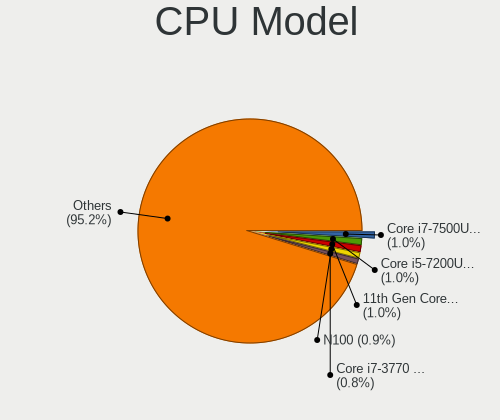
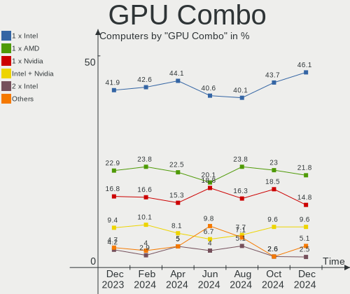
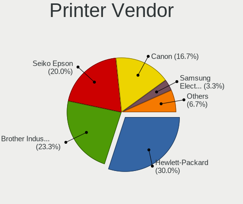

OpenMandriva - Hardware Trends
------------------------------

A project to identify most popular hardware characteristics and track their change
over time based on data collected by Linux users at https://Linux-Hardware.org.

Anyone can contribute to this report by the [hw-probe](https://github.com/linuxhw/hw-probe) tool:

    sudo -E hw-probe -all -upload

This is a report for all computer types. See also reports for [desktops](/Dist/OpenMandriva/Desktop/README.md) and [notebooks](/Dist/OpenMandriva/Notebook/README.md).

This report is for one last month. Overall report since the beginning of time: [TestDays](https://github.com/linuxhw/TestDays)

Period: Jul, 2023.

Contents
--------

* [ System ](#system)
  - [ OS                       ](#os)
  - [ OS Family                ](#os-family)
  - [ Kernel                   ](#kernel)
  - [ Kernel Family            ](#kernel-family)
  - [ Kernel Major Ver.        ](#kernel-major-ver)
  - [ Arch                     ](#arch)
  - [ DE                       ](#de)
  - [ Display Server           ](#display-server)
  - [ Display Manager          ](#display-manager)
  - [ OS Lang                  ](#os-lang)
  - [ Boot Mode                ](#boot-mode)
  - [ Filesystem               ](#filesystem)
  - [ Part. scheme             ](#part-scheme)
  - [ Dual Boot with Linux/BSD ](#dual-boot-with-linuxbsd)
  - [ Dual Boot (Win)          ](#dual-boot-win)

* [ Board ](#board)
  - [ Vendor                   ](#vendor)
  - [ Model                    ](#model)
  - [ Model Family             ](#model-family)
  - [ MFG Year                 ](#mfg-year)
  - [ Form Factor              ](#form-factor)
  - [ Secure Boot              ](#secure-boot)
  - [ Coreboot                 ](#coreboot)
  - [ RAM Size                 ](#ram-size)
  - [ RAM Used                 ](#ram-used)
  - [ Total Drives             ](#total-drives)
  - [ Has CD-ROM               ](#has-cd-rom)
  - [ Has Ethernet             ](#has-ethernet)
  - [ Has WiFi                 ](#has-wifi)
  - [ Has Bluetooth            ](#has-bluetooth)

* [ Location ](#location)
  - [ Country                  ](#country)
  - [ City                     ](#city)

* [ Drives ](#drives)
  - [ Drive Vendor             ](#drive-vendor)
  - [ Drive Model              ](#drive-model)
  - [ HDD Vendor               ](#hdd-vendor)
  - [ SSD Vendor               ](#ssd-vendor)
  - [ Drive Kind               ](#drive-kind)
  - [ Drive Connector          ](#drive-connector)
  - [ Drive Size               ](#drive-size)
  - [ Space Total              ](#space-total)
  - [ Space Used               ](#space-used)
  - [ Malfunc. Drives          ](#malfunc-drives)
  - [ Malfunc. Drive Vendor    ](#malfunc-drive-vendor)
  - [ Malfunc. HDD Vendor      ](#malfunc-hdd-vendor)
  - [ Malfunc. Drive Kind      ](#malfunc-drive-kind)
  - [ Failed Drives            ](#failed-drives)
  - [ Failed Drive Vendor      ](#failed-drive-vendor)
  - [ Drive Status             ](#drive-status)

* [ Storage controller ](#storage-controller)
  - [ Storage Vendor           ](#storage-vendor)
  - [ Storage Model            ](#storage-model)
  - [ Storage Kind             ](#storage-kind)

* [ Processor ](#processor)
  - [ CPU Vendor               ](#cpu-vendor)
  - [ CPU Model                ](#cpu-model)
  - [ CPU Model Family         ](#cpu-model-family)
  - [ CPU Cores                ](#cpu-cores)
  - [ CPU Sockets              ](#cpu-sockets)
  - [ CPU Threads              ](#cpu-threads)
  - [ CPU Op-Modes             ](#cpu-op-modes)
  - [ CPU Microcode            ](#cpu-microcode)
  - [ CPU Microarch            ](#cpu-microarch)

* [ Graphics ](#graphics)
  - [ GPU Vendor               ](#gpu-vendor)
  - [ GPU Model                ](#gpu-model)
  - [ GPU Combo                ](#gpu-combo)
  - [ GPU Driver               ](#gpu-driver)
  - [ GPU Memory               ](#gpu-memory)

* [ Monitor ](#monitor)
  - [ Monitor Vendor           ](#monitor-vendor)
  - [ Monitor Model            ](#monitor-model)
  - [ Monitor Resolution       ](#monitor-resolution)
  - [ Monitor Diagonal         ](#monitor-diagonal)
  - [ Monitor Width            ](#monitor-width)
  - [ Aspect Ratio             ](#aspect-ratio)
  - [ Monitor Area             ](#monitor-area)
  - [ Pixel Density            ](#pixel-density)
  - [ Multiple Monitors        ](#multiple-monitors)

* [ Network ](#network)
  - [ Net Controller Vendor    ](#net-controller-vendor)
  - [ Net Controller Model     ](#net-controller-model)
  - [ Wireless Vendor          ](#wireless-vendor)
  - [ Wireless Model           ](#wireless-model)
  - [ Ethernet Vendor          ](#ethernet-vendor)
  - [ Ethernet Model           ](#ethernet-model)
  - [ Net Controller Kind      ](#net-controller-kind)
  - [ Used Controller          ](#used-controller)
  - [ NICs                     ](#nics)
  - [ IPv6                     ](#ipv6)

* [ Bluetooth ](#bluetooth)
  - [ Bluetooth Vendor         ](#bluetooth-vendor)
  - [ Bluetooth Model          ](#bluetooth-model)

* [ Sound ](#sound)
  - [ Sound Vendor             ](#sound-vendor)
  - [ Sound Model              ](#sound-model)

* [ Memory ](#memory)
  - [ Memory Vendor            ](#memory-vendor)
  - [ Memory Model             ](#memory-model)
  - [ Memory Kind              ](#memory-kind)
  - [ Memory Form Factor       ](#memory-form-factor)
  - [ Memory Size              ](#memory-size)
  - [ Memory Speed             ](#memory-speed)

* [ Printers & scanners ](#printers--scanners)
  - [ Printer Vendor           ](#printer-vendor)
  - [ Printer Model            ](#printer-model)
  - [ Scanner Vendor           ](#scanner-vendor)
  - [ Scanner Model            ](#scanner-model)

* [ Camera ](#camera)
  - [ Camera Vendor            ](#camera-vendor)
  - [ Camera Model             ](#camera-model)

* [ Security ](#security)
  - [ Fingerprint Vendor       ](#fingerprint-vendor)
  - [ Fingerprint Model        ](#fingerprint-model)
  - [ Chipcard Vendor          ](#chipcard-vendor)
  - [ Chipcard Model           ](#chipcard-model)

* [ Unsupported ](#unsupported)
  - [ Unsupported Devices      ](#unsupported-devices)
  - [ Unsupported Device Types ](#unsupported-device-types)

System
------

OS
--

Installed operating systems

| Name               | Computers | Percent |
|--------------------|-----------|---------|
| OpenMandriva 23.03 | 162       | 43.67%  |
| OpenMandriva 23.07 | 100       | 26.95%  |
| OpenMandriva 4.3   | 36        | 9.7%    |
| OpenMandriva 23.06 | 29        | 7.82%   |
| OpenMandriva 23.01 | 17        | 4.58%   |
| OpenMandriva 4.2   | 14        | 3.77%   |
| OpenMandriva 23.90 | 9         | 2.43%   |
| OpenMandriva 4.90  | 1         | 0.27%   |
| OpenMandriva 4.50  | 1         | 0.27%   |
| OpenMandriva 3.0   | 1         | 0.27%   |
| OpenMandriva 22.12 | 1         | 0.27%   |

OS Family
---------

OS without a version

| Name         | Computers | Percent |
|--------------|-----------|---------|
| OpenMandriva | 371       | 100%    |

Kernel
------

Version of the Linux kernel

| Version                      | Computers | Percent |
|------------------------------|-----------|---------|
| 6.2.6-desktop-1omv2390       | 167       | 45.01%  |
| 6.3.5-desktop-3omv2390       | 117       | 31.54%  |
| 5.16.7-desktop-1omv4003      | 22        | 5.93%   |
| 6.1.1-desktop-1omv2290       | 18        | 4.85%   |
| 5.16.13-desktop-1omv4003     | 14        | 3.77%   |
| 5.10.14-desktop-1omv4002     | 12        | 3.23%   |
| 6.4.3-desktop-2omv2390       | 4         | 1.08%   |
| 6.4.0-desktop-0.rc3.1omv2390 | 3         | 0.81%   |
| 6.2.2-desktop-1omv2390       | 2         | 0.54%   |
| 5.11.12-desktop-1omv4002     | 2         | 0.54%   |
| 6.4.4-desktop-1omv2390       | 1         | 0.27%   |
| 6.4.2-desktop-1omv2390       | 1         | 0.27%   |
| 6.3.9-desktop-1omv2390       | 1         | 0.27%   |
| 6.3.3-desktop-2omv2390       | 1         | 0.27%   |
| 6.2.8-desktop-1omv2390       | 1         | 0.27%   |
| 6.1.4-desktop-1omv2301       | 1         | 0.27%   |
| 6.0.10-desktop-2omv22090     | 1         | 0.27%   |
| 5.19.5-desktop-1omv4090      | 1         | 0.27%   |
| 5.18.12-desktop-3omv4090     | 1         | 0.27%   |
| 4.9.0-desktop-4omv           | 1         | 0.27%   |

Kernel Family
-------------

Linux kernel without a distro release

| Version | Computers | Percent |
|---------|-----------|---------|
| 6.2.6   | 167       | 45.01%  |
| 6.3.5   | 117       | 31.54%  |
| 5.16.7  | 22        | 5.93%   |
| 6.1.1   | 18        | 4.85%   |
| 5.16.13 | 14        | 3.77%   |
| 5.10.14 | 12        | 3.23%   |
| 6.4.3   | 4         | 1.08%   |
| 6.4.0   | 3         | 0.81%   |
| 6.2.2   | 2         | 0.54%   |
| 5.11.12 | 2         | 0.54%   |
| 6.4.4   | 1         | 0.27%   |
| 6.4.2   | 1         | 0.27%   |
| 6.3.9   | 1         | 0.27%   |
| 6.3.3   | 1         | 0.27%   |
| 6.2.8   | 1         | 0.27%   |
| 6.1.4   | 1         | 0.27%   |
| 6.0.10  | 1         | 0.27%   |
| 5.19.5  | 1         | 0.27%   |
| 5.18.12 | 1         | 0.27%   |
| 4.9.0   | 1         | 0.27%   |

Kernel Major Ver.
-----------------

Linux kernel major version

| Version | Computers | Percent |
|---------|-----------|---------|
| 6.2     | 170       | 45.82%  |
| 6.3     | 119       | 32.08%  |
| 5.16    | 36        | 9.7%    |
| 6.1     | 19        | 5.12%   |
| 5.10    | 12        | 3.23%   |
| 6.4     | 9         | 2.43%   |
| 5.11    | 2         | 0.54%   |
| 6.0     | 1         | 0.27%   |
| 5.19    | 1         | 0.27%   |
| 5.18    | 1         | 0.27%   |
| 4.9     | 1         | 0.27%   |

Arch
----

OS architecture (x86_64, i586, etc.)

| Name   | Computers | Percent |
|--------|-----------|---------|
| x86_64 | 371       | 100%    |

DE
--

Desktop Environment

| Name     | Computers | Percent |
|----------|-----------|---------|
| KDE5     | 325       | 87.6%   |
| GNOME    | 23        | 6.2%    |
| LXQt     | 14        | 3.77%   |
| Cinnamon | 4         | 1.08%   |
| Unknown  | 2         | 0.54%   |
| XFCE     | 1         | 0.27%   |
| DWM      | 1         | 0.27%   |
| Budgie   | 1         | 0.27%   |

Display Server
--------------

X11 or Wayland

| Name    | Computers | Percent |
|---------|-----------|---------|
| X11     | 345       | 92.99%  |
| Wayland | 25        | 6.74%   |
| Unknown | 1         | 0.27%   |

Display Manager
---------------

SDDM, LightDM, etc.

| Name    | Computers | Percent |
|---------|-----------|---------|
| SDDM    | 343       | 92.45%  |
| GDM     | 22        | 5.93%   |
| LightDM | 5         | 1.35%   |
| Unknown | 1         | 0.27%   |

OS Lang
-------

Language

| Lang    | Computers | Percent |
|---------|-----------|---------|
| en_US   | 175       | 47.17%  |
| en_GB   | 29        | 7.82%   |
| fr_FR   | 25        | 6.74%   |
| de_DE   | 20        | 5.39%   |
| pl_PL   | 19        | 5.12%   |
| pt_BR   | 16        | 4.31%   |
| it_IT   | 13        | 3.5%    |
| cs_CZ   | 11        | 2.96%   |
| ru_RU   | 10        | 2.7%    |
| es_MX   | 9         | 2.43%   |
| es_ES   | 6         | 1.62%   |
| en_CA   | 4         | 1.08%   |
| de_AT   | 4         | 1.08%   |
| fr_BE   | 3         | 0.81%   |
| nl_NL   | 2         | 0.54%   |
| fr_CA   | 2         | 0.54%   |
| es_CR   | 2         | 0.54%   |
| es_CL   | 2         | 0.54%   |
| en_IN   | 2         | 0.54%   |
| nl_BE   | 1         | 0.27%   |
| nb_NO   | 1         | 0.27%   |
| ja_JP   | 1         | 0.27%   |
| hu_HU   | 1         | 0.27%   |
| fr_CH   | 1         | 0.27%   |
| es_VE   | 1         | 0.27%   |
| es_UY   | 1         | 0.27%   |
| es_PE   | 1         | 0.27%   |
| es_EC   | 1         | 0.27%   |
| es_AR   | 1         | 0.27%   |
| en_SG   | 1         | 0.27%   |
| en_PH   | 1         | 0.27%   |
| en_HK   | 1         | 0.27%   |
| en_DK   | 1         | 0.27%   |
| de_CH   | 1         | 0.27%   |
| da_DK   | 1         | 0.27%   |
| Unknown | 1         | 0.27%   |

Boot Mode
---------

EFI or BIOS

| Mode | Computers | Percent |
|------|-----------|---------|
| EFI  | 230       | 61.99%  |
| BIOS | 141       | 38.01%  |

Filesystem
----------

Type of filesystem

| Type    | Computers | Percent |
|---------|-----------|---------|
| Ext4    | 193       | 52.02%  |
| Overlay | 144       | 38.81%  |
| Btrfs   | 20        | 5.39%   |
| Xfs     | 9         | 2.43%   |
| F2fs    | 4         | 1.08%   |
| Ext2    | 1         | 0.27%   |

Part. scheme
------------

Scheme of partitioning

| Type    | Computers | Percent |
|---------|-----------|---------|
| GPT     | 301       | 81.13%  |
| MBR     | 68        | 18.33%  |
| Unknown | 2         | 0.54%   |

Dual Boot with Linux/BSD
------------------------

Hosting more than one Linux/BSD

| Dual boot | Computers | Percent |
|-----------|-----------|---------|
| No        | 215       | 57.95%  |
| Yes       | 156       | 42.05%  |

Dual Boot (Win)
---------------

Hosting Linux and Windows

| Dual boot | Computers | Percent |
|-----------|-----------|---------|
| No        | 218       | 58.76%  |
| Yes       | 153       | 41.24%  |

Board
-----

Vendor
------

Motherboard manufacturer

| Name                  | Computers | Percent |
|-----------------------|-----------|---------|
| Hewlett-Packard       | 55        | 14.82%  |
| ASUSTek Computer      | 50        | 13.48%  |
| Lenovo                | 45        | 12.13%  |
| Dell                  | 43        | 11.59%  |
| Acer                  | 28        | 7.55%   |
| Gigabyte Technology   | 24        | 6.47%   |
| MSI                   | 20        | 5.39%   |
| ASRock                | 18        | 4.85%   |
| Apple                 | 9         | 2.43%   |
| Toshiba               | 8         | 2.16%   |
| Intel                 | 6         | 1.62%   |
| Fujitsu               | 6         | 1.62%   |
| Packard Bell          | 4         | 1.08%   |
| Chuwi                 | 4         | 1.08%   |
| Positivo              | 3         | 0.81%   |
| GPU Company           | 3         | 0.81%   |
| Foxconn               | 3         | 0.81%   |
| ECS                   | 3         | 0.81%   |
| Biostar               | 3         | 0.81%   |
| AZW                   | 3         | 0.81%   |
| ZOTAC                 | 2         | 0.54%   |
| Standard              | 2         | 0.54%   |
| Samsung Electronics   | 2         | 0.54%   |
| PCWare                | 2         | 0.54%   |
| Microsoft             | 2         | 0.54%   |
| LG Electronics        | 2         | 0.54%   |
| Google                | 2         | 0.54%   |
| Fujitsu Siemens       | 2         | 0.54%   |
| Alienware             | 2         | 0.54%   |
| Unknown               | 2         | 0.54%   |
| Teclast               | 1         | 0.27%   |
| T-bao                 | 1         | 0.27%   |
| Supermicro            | 1         | 0.27%   |
| Sony                  | 1         | 0.27%   |
| Semp Toshiba          | 1         | 0.27%   |
| Positivo Bahia - VAIO | 1         | 0.27%   |
| Pegatron              | 1         | 0.27%   |
| Medion                | 1         | 0.27%   |
| lapbook               | 1         | 0.27%   |
| Intel X79             | 1         | 0.27%   |

Model
-----

Motherboard model

| Name                                           | Computers | Percent |
|------------------------------------------------|-----------|---------|
| Unknown                                        | 6         | 1.62%   |
| Lenovo IdeaPad 3 15ADA05 81W1                  | 3         | 0.81%   |
| GPU Company GWNR71517                          | 3         | 0.81%   |
| Fujitsu LIFEBOOK A3510                         | 3         | 0.81%   |
| Acer Veriton L670G                             | 3         | 0.81%   |
| MSI MS-7D32                                    | 2         | 0.54%   |
| Lenovo V145-15AST 81MT                         | 2         | 0.54%   |
| HP Z440 Workstation                            | 2         | 0.54%   |
| HP ProOne 600 G1 AiO                           | 2         | 0.54%   |
| HP 550                                         | 2         | 0.54%   |
| Gigabyte B450M DS3H                            | 2         | 0.54%   |
| Gigabyte AB350M-DS3H V2                        | 2         | 0.54%   |
| Foxconn Pro 3500 Series                        | 2         | 0.54%   |
| Dell Precision T1700                           | 2         | 0.54%   |
| Dell OptiPlex 3040                             | 2         | 0.54%   |
| Dell Inspiron N5110                            | 2         | 0.54%   |
| Dell Inspiron 1545                             | 2         | 0.54%   |
| ASUS UX31E                                     | 2         | 0.54%   |
| ASRock H510M-HDV R2.0                          | 2         | 0.54%   |
| Apple MacBookAir9,1                            | 2         | 0.54%   |
| ZOTAC ZBOX-BI322                               | 1         | 0.27%   |
| ZOTAC ZBOX                                     | 1         | 0.27%   |
| Toshiba TECRA A10                              | 1         | 0.27%   |
| Toshiba Satellite P200D                        | 1         | 0.27%   |
| Toshiba Satellite L755                         | 1         | 0.27%   |
| Toshiba Satellite L750                         | 1         | 0.27%   |
| Toshiba Satellite C650                         | 1         | 0.27%   |
| Toshiba Satellite C50D-A-11G                   | 1         | 0.27%   |
| Toshiba Satellite A135                         | 1         | 0.27%   |
| Toshiba dynabook R73/Y                         | 1         | 0.27%   |
| Teclast X4                                     | 1         | 0.27%   |
| T-bao MINI PC                                  | 1         | 0.27%   |
| Supermicro X11SSV-Q                            | 1         | 0.27%   |
| Standard ECT                                   | 1         | 0.27%   |
| Sony VPCCW2S8E                                 | 1         | 0.27%   |
| Semp Toshiba IS 1442                           | 1         | 0.27%   |
| Samsung 300E5M/300E5L                          | 1         | 0.27%   |
| Samsung 300E5EV/300E4EV/270E5EV/270E4EV/2470EV | 1         | 0.27%   |
| Positivo POS-PIQ77CL                           | 1         | 0.27%   |
| Positivo Mobile                                | 1         | 0.27%   |

Model Family
------------

Motherboard model prefix

| Name                     | Computers | Percent |
|--------------------------|-----------|---------|
| Lenovo ThinkPad          | 22        | 5.93%   |
| Acer Aspire              | 15        | 4.04%   |
| Dell OptiPlex            | 14        | 3.77%   |
| Dell Inspiron            | 12        | 3.23%   |
| Lenovo IdeaPad           | 10        | 2.7%    |
| Dell Latitude            | 9         | 2.43%   |
| HP Pavilion              | 8         | 2.16%   |
| Toshiba Satellite        | 6         | 1.62%   |
| HP Laptop                | 6         | 1.62%   |
| HP Compaq                | 6         | 1.62%   |
| Unknown                  | 6         | 1.62%   |
| ASUS M5A78L-M            | 5         | 1.35%   |
| Lenovo ThinkCentre       | 4         | 1.08%   |
| Fujitsu LIFEBOOK         | 4         | 1.08%   |
| ASUS PRIME               | 4         | 1.08%   |
| Acer Veriton             | 4         | 1.08%   |
| Packard Bell EasyNote    | 3         | 0.81%   |
| HP Stream                | 3         | 0.81%   |
| HP ProOne                | 3         | 0.81%   |
| HP ProDesk               | 3         | 0.81%   |
| HP ProBook               | 3         | 0.81%   |
| HP EliteBook             | 3         | 0.81%   |
| GPU Company GWNR71517    | 3         | 0.81%   |
| Gigabyte B450M           | 3         | 0.81%   |
| Dell XPS                 | 3         | 0.81%   |
| MSI MS-7D32              | 2         | 0.54%   |
| Microsoft Surface        | 2         | 0.54%   |
| Lenovo Yoga              | 2         | 0.54%   |
| Lenovo V145-15AST        | 2         | 0.54%   |
| HP Z440                  | 2         | 0.54%   |
| HP Victus                | 2         | 0.54%   |
| HP 550                   | 2         | 0.54%   |
| Gigabyte AB350M-DS3H     | 2         | 0.54%   |
| Fujitsu Siemens LIFEBOOK | 2         | 0.54%   |
| Fujitsu ESPRIMO          | 2         | 0.54%   |
| Foxconn Pro              | 2         | 0.54%   |
| Dell Vostro              | 2         | 0.54%   |
| Dell Precision           | 2         | 0.54%   |
| ASUS VivoBook            | 2         | 0.54%   |
| ASUS UX31E               | 2         | 0.54%   |

MFG Year
--------

Motherboard manufacture year

| Year | Computers | Percent |
|------|-----------|---------|
| 2021 | 38        | 10.24%  |
| 2018 | 33        | 8.89%   |
| 2016 | 29        | 7.82%   |
| 2011 | 29        | 7.82%   |
| 2017 | 24        | 6.47%   |
| 2015 | 24        | 6.47%   |
| 2014 | 24        | 6.47%   |
| 2019 | 23        | 6.2%    |
| 2012 | 23        | 6.2%    |
| 2020 | 20        | 5.39%   |
| 2013 | 19        | 5.12%   |
| 2008 | 19        | 5.12%   |
| 2022 | 17        | 4.58%   |
| 2010 | 15        | 4.04%   |
| 2009 | 13        | 3.5%    |
| 2007 | 13        | 3.5%    |
| 2023 | 5         | 1.35%   |
| 2005 | 2         | 0.54%   |
| 2006 | 1         | 0.27%   |

Form Factor
-----------

Physical design of the computer

| Name        | Computers | Percent |
|-------------|-----------|---------|
| Notebook    | 193       | 52.02%  |
| Desktop     | 153       | 41.24%  |
| Mini pc     | 9         | 2.43%   |
| All in one  | 8         | 2.16%   |
| Convertible | 4         | 1.08%   |
| Tablet      | 3         | 0.81%   |
| Server      | 1         | 0.27%   |

Secure Boot
-----------

Enabled or disabled

| State    | Computers | Percent |
|----------|-----------|---------|
| Disabled | 371       | 100%    |

Coreboot
--------

Have coreboot on board

| Used | Computers | Percent |
|------|-----------|---------|
| No   | 369       | 99.46%  |
| Yes  | 2         | 0.54%   |

RAM Size
--------

Total RAM memory

| Size in GB  | Computers | Percent |
|-------------|-----------|---------|
| 4.01-8.0    | 95        | 25.61%  |
| 3.01-4.0    | 77        | 20.75%  |
| 16.01-24.0  | 69        | 18.6%   |
| 8.01-16.0   | 56        | 15.09%  |
| 32.01-64.0  | 25        | 6.74%   |
| 1.01-2.0    | 18        | 4.85%   |
| 64.01-256.0 | 13        | 3.5%    |
| 2.01-3.0    | 9         | 2.43%   |
| 24.01-32.0  | 7         | 1.89%   |
| 0.51-1.0    | 2         | 0.54%   |

RAM Used
--------

Used RAM memory

| Used GB  | Computers | Percent |
|----------|-----------|---------|
| 1.01-2.0 | 212       | 57.14%  |
| 2.01-3.0 | 98        | 26.42%  |
| 0.51-1.0 | 34        | 9.16%   |
| 3.01-4.0 | 15        | 4.04%   |
| 0.01-0.5 | 7         | 1.89%   |
| 4.01-8.0 | 5         | 1.35%   |

Total Drives
------------

Number of drives on board

| Drives | Computers | Percent |
|--------|-----------|---------|
| 1      | 209       | 56.33%  |
| 2      | 98        | 26.42%  |
| 3      | 29        | 7.82%   |
| 4      | 15        | 4.04%   |
| 0      | 10        | 2.7%    |
| 6      | 4         | 1.08%   |
| 5      | 4         | 1.08%   |
| 7      | 2         | 0.54%   |

Has CD-ROM
----------

Has CD-ROM on board

| Presented | Computers | Percent |
|-----------|-----------|---------|
| No        | 211       | 56.87%  |
| Yes       | 160       | 43.13%  |

Has Ethernet
------------

Has Ethernet on board

| Presented | Computers | Percent |
|-----------|-----------|---------|
| Yes       | 324       | 87.33%  |
| No        | 47        | 12.67%  |

Has WiFi
--------

Has WiFi module

| Presented | Computers | Percent |
|-----------|-----------|---------|
| Yes       | 271       | 73.05%  |
| No        | 100       | 26.95%  |

Has Bluetooth
-------------

Has Bluetooth module

| Presented | Computers | Percent |
|-----------|-----------|---------|
| Yes       | 198       | 53.37%  |
| No        | 173       | 46.63%  |

Location
--------

Country
-------

Geographic location (country)

| Country     | Computers | Percent |
|-------------|-----------|---------|
| USA         | 58        | 15.63%  |
| Germany     | 26        | 7.01%   |
| France      | 26        | 7.01%   |
| Poland      | 25        | 6.74%   |
| Brazil      | 24        | 6.47%   |
| UK          | 19        | 5.12%   |
| Italy       | 19        | 5.12%   |
| Russia      | 13        | 3.5%    |
| Mexico      | 12        | 3.23%   |
| Czechia     | 12        | 3.23%   |
| Spain       | 11        | 2.96%   |
| Canada      | 10        | 2.7%    |
| Japan       | 9         | 2.43%   |
| Switzerland | 5         | 1.35%   |
| India       | 5         | 1.35%   |
| Belgium     | 5         | 1.35%   |
| Austria     | 5         | 1.35%   |
| Sweden      | 4         | 1.08%   |
| Singapore   | 4         | 1.08%   |
| Romania     | 4         | 1.08%   |
| Netherlands | 4         | 1.08%   |
| Norway      | 3         | 0.81%   |
| Kazakhstan  | 3         | 0.81%   |
| Indonesia   | 3         | 0.81%   |
| Greece      | 3         | 0.81%   |
| Finland     | 3         | 0.81%   |
| Costa Rica  | 3         | 0.81%   |
| Colombia    | 3         | 0.81%   |
| Australia   | 3         | 0.81%   |
| Argentina   | 3         | 0.81%   |
| Tunisia     | 2         | 0.54%   |
| Philippines | 2         | 0.54%   |
| Namibia     | 2         | 0.54%   |
| Malaysia    | 2         | 0.54%   |
| Lithuania   | 2         | 0.54%   |
| Latvia      | 2         | 0.54%   |
| Hungary     | 2         | 0.54%   |
| Hong Kong   | 2         | 0.54%   |
| Barbados    | 2         | 0.54%   |
| Vietnam     | 1         | 0.27%   |

City
----

Geographic location (city)

| City               | Computers | Percent |
|--------------------|-----------|---------|
| Warsaw             | 7         | 1.89%   |
| Vienna             | 4         | 1.08%   |
| Singapore          | 4         | 1.08%   |
| Prague             | 4         | 1.08%   |
| Horice             | 4         | 1.08%   |
| Athens             | 4         | 1.08%   |
| Târgu Mureş      | 3         | 0.81%   |
| Schwäbisch Gmünd | 3         | 0.81%   |
| Munich             | 3         | 0.81%   |
| Moscow             | 3         | 0.81%   |
| Krakow             | 3         | 0.81%   |
| Hemet              | 3         | 0.81%   |
| Helsinki           | 3         | 0.81%   |
| Gdansk             | 3         | 0.81%   |
| Curitiba           | 3         | 0.81%   |
| Capdenac-Gare      | 3         | 0.81%   |
| Berlin             | 3         | 0.81%   |
| Almaty             | 3         | 0.81%   |
| Windhoek           | 2         | 0.54%   |
| Vecindario         | 2         | 0.54%   |
| Stockholm          | 2         | 0.54%   |
| St Petersburg      | 2         | 0.54%   |
| Southwark          | 2         | 0.54%   |
| Seattle            | 2         | 0.54%   |
| Portland           | 2         | 0.54%   |
| Obernai            | 2         | 0.54%   |
| Niigata            | 2         | 0.54%   |
| New Baltimore      | 2         | 0.54%   |
| Naucalpan          | 2         | 0.54%   |
| Nashville          | 2         | 0.54%   |
| Mumbai             | 2         | 0.54%   |
| Milan              | 2         | 0.54%   |
| Mexico City        | 2         | 0.54%   |
| Madrid             | 2         | 0.54%   |
| Klaipėda          | 2         | 0.54%   |
| Katowice           | 2         | 0.54%   |
| Johnson City       | 2         | 0.54%   |
| Idaho Falls        | 2         | 0.54%   |
| Heredia            | 2         | 0.54%   |
| Greater Sudbury    | 2         | 0.54%   |

Drives
------

Drive Vendor
------------

Hard drive vendors

| Vendor              | Computers | Drives | Percent |
|---------------------|-----------|--------|---------|
| WDC                 | 77        | 95     | 14.29%  |
| Samsung Electronics | 70        | 80     | 12.99%  |
| Seagate             | 69        | 87     | 12.8%   |
| Toshiba             | 34        | 36     | 6.31%   |
| Kingston            | 31        | 33     | 5.75%   |
| Crucial             | 30        | 31     | 5.57%   |
| SanDisk             | 24        | 25     | 4.45%   |
| Hitachi             | 20        | 20     | 3.71%   |
| Unknown             | 17        | 17     | 3.15%   |
| A-DATA Technology   | 13        | 14     | 2.41%   |
| HGST                | 11        | 12     | 2.04%   |
| SK hynix            | 9         | 9      | 1.67%   |
| Patriot             | 8         | 8      | 1.48%   |
| Intel               | 7         | 8      | 1.3%    |
| China               | 7         | 7      | 1.3%    |
| PNY                 | 6         | 6      | 1.11%   |
| Unknown             | 6         | 6      | 1.11%   |
| Apple               | 5         | 5      | 0.93%   |
| Netac               | 4         | 4      | 0.74%   |
| Micron Technology   | 4         | 4      | 0.74%   |
| GOODRAM             | 4         | 5      | 0.74%   |
| Wibtek              | 3         | 3      | 0.56%   |
| UMIS                | 3         | 3      | 0.56%   |
| Phison              | 3         | 4      | 0.56%   |
| Intenso             | 3         | 3      | 0.56%   |
| Gigabyte Technology | 3         | 3      | 0.56%   |
| Corsair             | 3         | 3      | 0.56%   |
| Verbatim            | 2         | 2      | 0.37%   |
| Transcend           | 2         | 2      | 0.37%   |
| Team                | 2         | 2      | 0.37%   |
| T-FORCE             | 2         | 2      | 0.37%   |
| OCZ                 | 2         | 4      | 0.37%   |
| Maxtor              | 2         | 2      | 0.37%   |
| LITEON              | 2         | 2      | 0.37%   |
| Lexar               | 2         | 2      | 0.37%   |
| Leven               | 2         | 2      | 0.37%   |
| Lenovo              | 2         | 2      | 0.37%   |
| KIOXIA              | 2         | 2      | 0.37%   |
| KingSpec            | 2         | 2      | 0.37%   |
| JMicron Technology  | 2         | 2      | 0.37%   |

Drive Model
-----------

Hard drive models

| Model                                | Computers | Percent |
|--------------------------------------|-----------|---------|
| Seagate ST1000DM010-2EP102 1TB       | 7         | 1.2%    |
| Crucial CT1000MX500SSD1 1TB          | 6         | 1.03%   |
| Unknown                              | 6         | 1.03%   |
| Toshiba DT01ACA100 1TB               | 5         | 0.86%   |
| Seagate ST500DM002-1BD142 500GB      | 5         | 0.86%   |
| Crucial CT240BX500SSD1 240GB         | 5         | 0.86%   |
| WDC WDS500G2B0A-00SM50 500GB SSD     | 4         | 0.69%   |
| Toshiba MQ01ABD100 1TB               | 4         | 0.69%   |
| Seagate ST3500418AS 500GB            | 4         | 0.69%   |
| Samsung SSD 860 EVO 500GB            | 4         | 0.69%   |
| Kingston SA400S37480G 480GB SSD      | 4         | 0.69%   |
| Wibtek W800S 512GB                   | 3         | 0.52%   |
| WDC WD1600AAJS-22L7A0 160GB          | 3         | 0.52%   |
| WDC WD10JPVX-22JC3T0 1TB             | 3         | 0.52%   |
| WDC WD10EZEX-08WN4A0 1TB             | 3         | 0.52%   |
| Toshiba MQ04ABF100 1TB               | 3         | 0.52%   |
| Toshiba MQ01ABF050 500GB             | 3         | 0.52%   |
| Toshiba HDWD110 1TB                  | 3         | 0.52%   |
| Seagate ST1000LM024 HN-M101MBB 1TB   | 3         | 0.52%   |
| Seagate ST1000DM003-1CH162 1TB       | 3         | 0.52%   |
| SanDisk DF4032  32GB                 | 3         | 0.52%   |
| Samsung SSD 980 1TB                  | 3         | 0.52%   |
| Kingston SV300S37A120G 120GB SSD     | 3         | 0.52%   |
| Kingston SA400S37240G 240GB SSD      | 3         | 0.52%   |
| Crucial CT1000P2SSD8 1TB             | 3         | 0.52%   |
| A-DATA SU650 120GB SSD               | 3         | 0.52%   |
| WDC WDS240G2G0A-00JH30 240GB SSD     | 2         | 0.34%   |
| WDC WDS100T2B0B-00YS70 1TB SSD       | 2         | 0.34%   |
| WDC WDS100T2B0A-00SM50 1TB SSD       | 2         | 0.34%   |
| WDC WD3200AAKS-00UU3A0 320GB         | 2         | 0.34%   |
| WDC WD20EFRX-68EUZN0 2TB             | 2         | 0.34%   |
| WDC WD10SPZX-21Z10T0 1TB             | 2         | 0.34%   |
| WDC WD10EZEX-22BN5A0 1TB             | 2         | 0.34%   |
| WDC WD10EZEX-00BN5A0 1TB             | 2         | 0.34%   |
| WDC WD1003FZEX-00K3CA0 1TB           | 2         | 0.34%   |
| WDC PC SN530 SDBPNPZ-512G-1006 512GB | 2         | 0.34%   |
| WDC PC SN530 SDBPNPZ-256G-1002 256GB | 2         | 0.34%   |
| Unknown SD64G  64GB                  | 2         | 0.34%   |
| Unknown SD/MMC/MS PRO 128GB          | 2         | 0.34%   |
| UMIS RPJTJ256MEE1OWX 256GB           | 2         | 0.34%   |

HDD Vendor
----------

Hard disk drive vendors

| Vendor              | Computers | Drives | Percent |
|---------------------|-----------|--------|---------|
| Seagate             | 68        | 85     | 32.85%  |
| WDC                 | 51        | 64     | 24.64%  |
| Toshiba             | 29        | 31     | 14.01%  |
| Hitachi             | 20        | 20     | 9.66%   |
| Samsung Electronics | 13        | 15     | 6.28%   |
| HGST                | 11        | 12     | 5.31%   |
| Unknown             | 2         | 2      | 0.97%   |
| Maxtor              | 2         | 2      | 0.97%   |
| Hewlett-Packard     | 2         | 2      | 0.97%   |
| ASMT                | 2         | 2      | 0.97%   |
| WALRAM              | 1         | 1      | 0.48%   |
| MaxDigital          | 1         | 1      | 0.48%   |
| Initio              | 1         | 1      | 0.48%   |
| Fujitsu             | 1         | 1      | 0.48%   |
| ASMedia             | 1         | 1      | 0.48%   |
| Apple               | 1         | 1      | 0.48%   |
| Unknown             | 1         | 1      | 0.48%   |

SSD Vendor
----------

Solid state drive vendors

| Vendor              | Computers | Drives | Percent |
|---------------------|-----------|--------|---------|
| Samsung Electronics | 27        | 31     | 13.92%  |
| Kingston            | 20        | 22     | 10.31%  |
| Crucial             | 20        | 20     | 10.31%  |
| WDC                 | 18        | 20     | 9.28%   |
| SanDisk             | 17        | 18     | 8.76%   |
| A-DATA Technology   | 10        | 11     | 5.15%   |
| China               | 7         | 7      | 3.61%   |
| Patriot             | 6         | 6      | 3.09%   |
| PNY                 | 5         | 5      | 2.58%   |
| GOODRAM             | 4         | 5      | 2.06%   |
| Wibtek              | 3         | 3      | 1.55%   |
| Toshiba             | 3         | 3      | 1.55%   |
| Intenso             | 3         | 3      | 1.55%   |
| Gigabyte Technology | 3         | 3      | 1.55%   |
| Verbatim            | 2         | 2      | 1.03%   |
| Transcend           | 2         | 2      | 1.03%   |
| Team                | 2         | 2      | 1.03%   |
| T-FORCE             | 2         | 2      | 1.03%   |
| SK hynix            | 2         | 2      | 1.03%   |
| OCZ                 | 2         | 4      | 1.03%   |
| Netac               | 2         | 2      | 1.03%   |
| Micron Technology   | 2         | 2      | 1.03%   |
| LITEON              | 2         | 2      | 1.03%   |
| Leven               | 2         | 2      | 1.03%   |
| KingSpec            | 2         | 2      | 1.03%   |
| INTEL SS            | 2         | 2      | 1.03%   |
| Intel               | 2         | 2      | 1.03%   |
| HPE                 | 2         | 2      | 1.03%   |
| Unknown             | 2         | 2      | 1.03%   |
| Timetec             | 1         | 1      | 0.52%   |
| Teclast             | 1         | 1      | 0.52%   |
| SPCC                | 1         | 1      | 0.52%   |
| ShiJi               | 1         | 1      | 0.52%   |
| NGFF                | 1         | 1      | 0.52%   |
| Mushkin             | 1         | 1      | 0.52%   |
| MidasForce          | 1         | 1      | 0.52%   |
| LITEONIT            | 1         | 1      | 0.52%   |
| KIOXIA-EXCERIA      | 1         | 1      | 0.52%   |
| CT500MX5            | 1         | 1      | 0.52%   |
| Corsair             | 1         | 1      | 0.52%   |

Drive Kind
----------

HDD or SSD

| Kind    | Computers | Drives | Percent |
|---------|-----------|--------|---------|
| HDD     | 175       | 242    | 37.23%  |
| SSD     | 165       | 207    | 35.11%  |
| NVMe    | 103       | 121    | 21.91%  |
| MMC     | 22        | 23     | 4.68%   |
| Unknown | 5         | 5      | 1.06%   |

Drive Connector
---------------

SATA, SAS, NVMe, etc.

| Type | Computers | Drives | Percent |
|------|-----------|--------|---------|
| SATA | 288       | 429    | 65.9%   |
| NVMe | 102       | 120    | 23.34%  |
| SAS  | 25        | 26     | 5.72%   |
| MMC  | 22        | 23     | 5.03%   |

Drive Size
----------

Size of hard drive

| Size in TB | Computers | Drives | Percent |
|------------|-----------|--------|---------|
| 0.01-0.5   | 213       | 272    | 60%     |
| 0.51-1.0   | 104       | 126    | 29.3%   |
| 1.01-2.0   | 19        | 28     | 5.35%   |
| 3.01-4.0   | 10        | 10     | 2.82%   |
| 2.01-3.0   | 5         | 5      | 1.41%   |
| 4.01-10.0  | 4         | 8      | 1.13%   |

Space Total
-----------

Amount of disk space available on the file system

| Size in GB     | Computers | Percent |
|----------------|-----------|---------|
| 1-20           | 112       | 30.19%  |
| 101-250        | 74        | 19.95%  |
| 251-500        | 48        | 12.94%  |
| 501-1000       | 38        | 10.24%  |
| 21-50          | 28        | 7.55%   |
| 51-100         | 22        | 5.93%   |
| Unknown        | 22        | 5.93%   |
| 1001-2000      | 16        | 4.31%   |
| More than 3000 | 6         | 1.62%   |
| 2001-3000      | 5         | 1.35%   |

Space Used
----------

Amount of used disk space

| Used GB        | Computers | Percent |
|----------------|-----------|---------|
| 1-20           | 283       | 76.28%  |
| Unknown        | 22        | 5.93%   |
| 21-50          | 21        | 5.66%   |
| 51-100         | 15        | 4.04%   |
| 101-250        | 11        | 2.96%   |
| 251-500        | 6         | 1.62%   |
| 501-1000       | 4         | 1.08%   |
| More than 3000 | 3         | 0.81%   |
| 2001-3000      | 3         | 0.81%   |
| 1001-2000      | 3         | 0.81%   |

Malfunc. Drives
---------------

Drive models with a malfunction

| Model                                 | Computers | Drives | Percent |
|---------------------------------------|-----------|--------|---------|
| Seagate ST500DM002-1BD142 500GB       | 3         | 3      | 3.41%   |
| Toshiba MQ01ABD100 1TB                | 2         | 2      | 2.27%   |
| Seagate ST9500325AS 500GB             | 2         | 2      | 2.27%   |
| Seagate ST500LT012-9WS142 500GB       | 2         | 2      | 2.27%   |
| Seagate ST3500418AS 500GB             | 2         | 2      | 2.27%   |
| Seagate ST1000DM010-2EP102 1TB        | 2         | 2      | 2.27%   |
| SanDisk SSD U100 256GB                | 2         | 2      | 2.27%   |
| Hitachi HTS545050A7E380 500GB         | 2         | 2      | 2.27%   |
| WDC WD6400AAKS-00E4A0 640GB           | 1         | 1      | 1.14%   |
| WDC WD5000AAKS-00V1A0 500GB           | 1         | 1      | 1.14%   |
| WDC WD3200LPCX-24C6HT0 320GB          | 1         | 1      | 1.14%   |
| WDC WD2503ABYX-01WERA1 256GB          | 1         | 1      | 1.14%   |
| WDC WD20EFRX-68EUZN0 2TB              | 1         | 1      | 1.14%   |
| WDC WD20EARS-00J2GB0 2TB              | 1         | 1      | 1.14%   |
| WDC WD2003FYYS-02W0B0 2TB             | 1         | 2      | 1.14%   |
| WDC WD1600BEVT-60ZCT0 160GB           | 1         | 1      | 1.14%   |
| WDC WD1600BEVT-22ZCT0 160GB           | 1         | 1      | 1.14%   |
| WDC WD10EZEX-21M2NA0 1TB              | 1         | 1      | 1.14%   |
| WDC WD10EZEX-08WN4A0 1TB              | 1         | 1      | 1.14%   |
| WDC WD1003FZEX-00K3CA0 1TB            | 1         | 1      | 1.14%   |
| WDC WD1001FAES-60Z2A0 1TB             | 1         | 1      | 1.14%   |
| Transcend TS256GSSD230S 256GB         | 1         | 1      | 1.14%   |
| Toshiba MQ01ABF050 500GB              | 1         | 1      | 1.14%   |
| Toshiba MQ01ABD100V 1TB               | 1         | 1      | 1.14%   |
| Toshiba MQ01ABD075 752GB              | 1         | 1      | 1.14%   |
| Toshiba MQ01ABD050 500GB              | 1         | 1      | 1.14%   |
| Toshiba MK7559GSXP 752GB              | 1         | 1      | 1.14%   |
| Toshiba MK6465GSXN 640GB              | 1         | 1      | 1.14%   |
| Toshiba MK3265GSXN 320GB              | 1         | 1      | 1.14%   |
| Toshiba DT01ACA100 1TB                | 1         | 1      | 1.14%   |
| SK hynix HFS256G3AMNB-2200A 256GB SSD | 1         | 1      | 1.14%   |
| Seagate ST9640320AS 640GB             | 1         | 1      | 1.14%   |
| Seagate ST9250827AS 250GB             | 1         | 1      | 1.14%   |
| Seagate ST9160301AS 160GB             | 1         | 1      | 1.14%   |
| Seagate ST500LM021-1KJ152 500GB       | 1         | 1      | 1.14%   |
| Seagate ST500LM012 HN-M500MBB 500GB   | 1         | 1      | 1.14%   |
| Seagate ST3500630AS 500GB             | 1         | 1      | 1.14%   |
| Seagate ST3500514NS 500GB             | 1         | 1      | 1.14%   |
| Seagate ST3320418AS 320GB             | 1         | 1      | 1.14%   |
| Seagate ST320LT012-9WS14C 320GB       | 1         | 1      | 1.14%   |

Malfunc. Drive Vendor
---------------------

Vendors of faulty drives

| Vendor              | Computers | Drives | Percent |
|---------------------|-----------|--------|---------|
| Seagate             | 25        | 25     | 29.07%  |
| WDC                 | 12        | 14     | 13.95%  |
| Toshiba             | 10        | 10     | 11.63%  |
| Hitachi             | 9         | 9      | 10.47%  |
| Samsung Electronics | 8         | 8      | 9.3%    |
| SanDisk             | 3         | 3      | 3.49%   |
| Kingston            | 3         | 4      | 3.49%   |
| HGST                | 3         | 3      | 3.49%   |
| LITEON              | 2         | 2      | 2.33%   |
| A-DATA Technology   | 2         | 2      | 2.33%   |
| Transcend           | 1         | 1      | 1.16%   |
| SK hynix            | 1         | 1      | 1.16%   |
| OCZ                 | 1         | 1      | 1.16%   |
| Micron Technology   | 1         | 1      | 1.16%   |
| Intenso             | 1         | 1      | 1.16%   |
| Intel               | 1         | 1      | 1.16%   |
| Hewlett-Packard     | 1         | 1      | 1.16%   |
| Fujitsu             | 1         | 1      | 1.16%   |
| China               | 1         | 1      | 1.16%   |

Malfunc. HDD Vendor
-------------------

Vendors of faulty HDD drives

| Vendor              | Computers | Drives | Percent |
|---------------------|-----------|--------|---------|
| Seagate             | 25        | 25     | 37.31%  |
| WDC                 | 12        | 14     | 17.91%  |
| Toshiba             | 10        | 10     | 14.93%  |
| Hitachi             | 9         | 9      | 13.43%  |
| Samsung Electronics | 6         | 6      | 8.96%   |
| HGST                | 3         | 3      | 4.48%   |
| Hewlett-Packard     | 1         | 1      | 1.49%   |
| Fujitsu             | 1         | 1      | 1.49%   |

Malfunc. Drive Kind
-------------------

Kinds of faulty drives

| Kind | Computers | Drives | Percent |
|------|-----------|--------|---------|
| HDD  | 62        | 69     | 76.54%  |
| SSD  | 18        | 19     | 22.22%  |
| NVMe | 1         | 1      | 1.23%   |

Failed Drives
-------------

Failed drive models

| Model                             | Computers | Drives | Percent |
|-----------------------------------|-----------|--------|---------|
| Samsung Electronics HM250HI 250GB | 1         | 1      | 33.33%  |
| Samsung Electronics HD502HJ 500GB | 1         | 1      | 33.33%  |
| Samsung Electronics HD103UJ 1TB   | 1         | 1      | 33.33%  |

Failed Drive Vendor
-------------------

Failed drive vendors

| Vendor              | Computers | Drives | Percent |
|---------------------|-----------|--------|---------|
| Samsung Electronics | 3         | 3      | 100%    |

Drive Status
------------

Number of failed and malfunc. drives

| Status   | Computers | Drives | Percent |
|----------|-----------|--------|---------|
| Works    | 298       | 453    | 69.3%   |
| Malfunc  | 79        | 89     | 18.37%  |
| Detected | 50        | 53     | 11.63%  |
| Failed   | 3         | 3      | 0.7%    |

Storage controller
------------------

Storage Vendor
--------------

Storage controller vendors

| Vendor                       | Computers | Percent |
|------------------------------|-----------|---------|
| Intel                        | 266       | 57.7%   |
| AMD                          | 67        | 14.53%  |
| Samsung Electronics          | 33        | 7.16%   |
| SanDisk                      | 13        | 2.82%   |
| Kingston Technology Company  | 11        | 2.39%   |
| Micron/Crucial Technology    | 10        | 2.17%   |
| SK hynix                     | 6         | 1.3%    |
| Phison Electronics           | 6         | 1.3%    |
| Nvidia                       | 5         | 1.08%   |
| ASMedia Technology           | 5         | 1.08%   |
| MAXIO Technology (Hangzhou)  | 4         | 0.87%   |
| Union Memory (Shenzhen)      | 3         | 0.65%   |
| Silicon Motion               | 3         | 0.65%   |
| Micron Technology            | 3         | 0.65%   |
| JMicron Technology           | 3         | 0.65%   |
| Toshiba America Info Systems | 2         | 0.43%   |
| Realtek Semiconductor        | 2         | 0.43%   |
| Netac Technology             | 2         | 0.43%   |
| Marvell Technology Group     | 2         | 0.43%   |
| Lenovo                       | 2         | 0.43%   |
| KIOXIA                       | 2         | 0.43%   |
| Apple                        | 2         | 0.43%   |
| ADATA Technology             | 2         | 0.43%   |
| VIA Technologies             | 1         | 0.22%   |
| Silicon Image                | 1         | 0.22%   |
| Shenzhen Longsys Electronics | 1         | 0.22%   |
| Seagate Technology           | 1         | 0.22%   |
| Lite-On Technology           | 1         | 0.22%   |
| INNOGRIT                     | 1         | 0.22%   |
| Broadcom / LSI               | 1         | 0.22%   |

Storage Model
-------------

Storage controller models

| Model                                                                                   | Computers | Percent |
|-----------------------------------------------------------------------------------------|-----------|---------|
| AMD FCH SATA Controller [AHCI mode]                                                     | 45        | 8.4%    |
| Intel Sunrise Point-LP SATA Controller [AHCI mode]                                      | 23        | 4.29%   |
| Intel 8 Series/C220 Series Chipset Family 6-port SATA Controller 1 [AHCI mode]          | 17        | 3.17%   |
| Intel 82801IBM/IEM (ICH9M/ICH9M-E) 4 port SATA Controller [AHCI mode]                   | 15        | 2.8%    |
| AMD 400 Series Chipset SATA Controller                                                  | 14        | 2.61%   |
| Intel 6 Series/C200 Series Chipset Family 6 port Mobile SATA AHCI Controller            | 13        | 2.43%   |
| Intel SATA Controller [RAID mode]                                                       | 12        | 2.24%   |
| Samsung NVMe SSD Controller SM981/PM981/PM983                                           | 11        | 2.05%   |
| Samsung NVMe SSD Controller 980                                                         | 11        | 2.05%   |
| Intel Q170/Q150/B150/H170/H110/Z170/CM236 Chipset SATA Controller [AHCI Mode]           | 11        | 2.05%   |
| Intel 82801HM/HEM (ICH8M/ICH8M-E) SATA Controller [AHCI mode]                           | 11        | 2.05%   |
| Intel 82801HM/HEM (ICH8M/ICH8M-E) IDE Controller                                        | 11        | 2.05%   |
| Intel Wildcat Point-LP SATA Controller [AHCI Mode]                                      | 10        | 1.87%   |
| Intel 7 Series Chipset Family 6-port SATA Controller [AHCI mode]                        | 10        | 1.87%   |
| Intel 200 Series PCH SATA controller [AHCI mode]                                        | 10        | 1.87%   |
| AMD SB7x0/SB8x0/SB9x0 IDE Controller                                                    | 10        | 1.87%   |
| Intel Celeron/Pentium Silver Processor SATA Controller                                  | 9         | 1.68%   |
| Intel 6 Series/C200 Series Chipset Family 6 port Desktop SATA AHCI Controller           | 9         | 1.68%   |
| AMD SB7x0/SB8x0/SB9x0 SATA Controller [IDE mode]                                        | 9         | 1.68%   |
| Intel 82801 Mobile SATA Controller [RAID mode]                                          | 8         | 1.49%   |
| Intel 8 Series SATA Controller 1 [AHCI mode]                                            | 8         | 1.49%   |
| Intel 5 Series/3400 Series Chipset 6 port SATA AHCI Controller                          | 8         | 1.49%   |
| Micron/Crucial P2 [Nick P2] / P3 / P3 Plus NVMe PCIe SSD (DRAM-less)                    | 7         | 1.31%   |
| Intel Volume Management Device NVMe RAID Controller                                     | 7         | 1.31%   |
| Intel NM10/ICH7 Family SATA Controller [IDE mode]                                       | 6         | 1.12%   |
| SanDisk WD Blue SN550 NVMe SSD                                                          | 5         | 0.93%   |
| Intel C610/X99 series chipset sSATA Controller [AHCI mode]                              | 5         | 0.93%   |
| Intel 6 Series/C200 Series Chipset Family Desktop SATA Controller (IDE mode, ports 4-5) | 5         | 0.93%   |
| Intel 6 Series/C200 Series Chipset Family Desktop SATA Controller (IDE mode, ports 0-3) | 5         | 0.93%   |
| Intel 500 Series Chipset Family SATA AHCI Controller                                    | 5         | 0.93%   |
| Samsung NVMe SSD Controller SM961/PM961/SM963                                           | 4         | 0.75%   |
| Samsung NVMe SSD Controller PM9A1/PM9A3/980PRO                                          | 4         | 0.75%   |
| Phison E12 NVMe Controller                                                              | 4         | 0.75%   |
| Nvidia MCP61 SATA Controller                                                            | 4         | 0.75%   |
| Nvidia MCP61 IDE                                                                        | 4         | 0.75%   |
| MAXIO (Hangzhou) NVMe SSD Controller MAP1202                                            | 4         | 0.75%   |
| Intel Tiger Lake-LP SATA Controller                                                     | 4         | 0.75%   |
| Intel NM10/ICH7 Family SATA Controller [AHCI mode]                                      | 4         | 0.75%   |
| Intel Jasper Lake SATA AHCI Controller                                                  | 4         | 0.75%   |
| Intel Comet Lake SATA AHCI Controller                                                   | 4         | 0.75%   |

Storage Kind
------------

Kind of storage controller (IDE, SATA, NVMe, SAS, ...)

| Kind | Computers | Percent |
|------|-----------|---------|
| SATA | 290       | 61.05%  |
| NVMe | 102       | 21.47%  |
| IDE  | 50        | 10.53%  |
| RAID | 31        | 6.53%   |
| SAS  | 2         | 0.42%   |

Processor
---------

CPU Vendor
----------

Processor vendors

| Vendor | Computers | Percent |
|--------|-----------|---------|
| Intel  | 286       | 77.09%  |
| AMD    | 85        | 22.91%  |

CPU Model
---------

Processor models

| Model                                         | Computers | Percent |
|-----------------------------------------------|-----------|---------|
| Intel Core i5-8250U CPU @ 1.60GHz             | 5         | 1.35%   |
| Intel Core 2 Duo CPU P8700 @ 2.53GHz          | 5         | 1.35%   |
| Intel Core 2 Duo CPU E7400 @ 2.80GHz          | 5         | 1.35%   |
| Intel Core i5-7200U CPU @ 2.50GHz             | 4         | 1.08%   |
| Intel Core i5-6500 CPU @ 3.20GHz              | 4         | 1.08%   |
| Intel Core i5-6200U CPU @ 2.30GHz             | 4         | 1.08%   |
| Intel Core i5-5200U CPU @ 2.20GHz             | 4         | 1.08%   |
| Intel Core i3-2310M CPU @ 2.10GHz             | 4         | 1.08%   |
| Intel Core i3-1005G1 CPU @ 1.20GHz            | 4         | 1.08%   |
| Intel Celeron N4020 CPU @ 1.10GHz             | 4         | 1.08%   |
| AMD Ryzen 7 5800H with Radeon Graphics        | 4         | 1.08%   |
| AMD Ryzen 5 3500U with Radeon Vega Mobile Gfx | 4         | 1.08%   |
| Intel Core i7-5500U CPU @ 2.40GHz             | 3         | 0.81%   |
| Intel Core i5-7300U CPU @ 2.60GHz             | 3         | 0.81%   |
| Intel Core i5-4590 CPU @ 3.30GHz              | 3         | 0.81%   |
| Intel Core i3-4030U CPU @ 1.90GHz             | 3         | 0.81%   |
| AMD Ryzen 7 3700U with Radeon Vega Mobile Gfx | 3         | 0.81%   |
| Intel Genuine CPU U4100 @ 1.30GHz             | 2         | 0.54%   |
| Intel Core i7-9750H CPU @ 2.60GHz             | 2         | 0.54%   |
| Intel Core i7-7500U CPU @ 2.70GHz             | 2         | 0.54%   |
| Intel Core i7-6820HQ CPU @ 2.70GHz            | 2         | 0.54%   |
| Intel Core i7-6700 CPU @ 3.40GHz              | 2         | 0.54%   |
| Intel Core i7-6500U CPU @ 2.50GHz             | 2         | 0.54%   |
| Intel Core i7-4770 CPU @ 3.40GHz              | 2         | 0.54%   |
| Intel Core i7-4700MQ CPU @ 2.40GHz            | 2         | 0.54%   |
| Intel Core i7-3770 CPU @ 3.40GHz              | 2         | 0.54%   |
| Intel Core i7-2677M CPU @ 1.80GHz             | 2         | 0.54%   |
| Intel Core i7-2600 CPU @ 3.40GHz              | 2         | 0.54%   |
| Intel Core i5-8400 CPU @ 2.80GHz              | 2         | 0.54%   |
| Intel Core i5-7400 CPU @ 3.00GHz              | 2         | 0.54%   |
| Intel Core i5-6300U CPU @ 2.40GHz             | 2         | 0.54%   |
| Intel Core i5-5300U CPU @ 2.30GHz             | 2         | 0.54%   |
| Intel Core i5-4570 CPU @ 3.20GHz              | 2         | 0.54%   |
| Intel Core i5-4460 CPU @ 3.20GHz              | 2         | 0.54%   |
| Intel Core i5-4210U CPU @ 1.70GHz             | 2         | 0.54%   |
| Intel Core i5-4200U CPU @ 1.60GHz             | 2         | 0.54%   |
| Intel Core i5-3320M CPU @ 2.60GHz             | 2         | 0.54%   |
| Intel Core i5-2520M CPU @ 2.50GHz             | 2         | 0.54%   |
| Intel Core i5-2410M CPU @ 2.30GHz             | 2         | 0.54%   |
| Intel Core i5 CPU M 520 @ 2.40GHz             | 2         | 0.54%   |

CPU Model Family
----------------

Processor model prefix

| Model                   | Computers | Percent |
|-------------------------|-----------|---------|
| Intel Core i5           | 81        | 21.83%  |
| Intel Core i3           | 44        | 11.86%  |
| Intel Core i7           | 40        | 10.78%  |
| Intel Celeron           | 30        | 8.09%   |
| Intel Core 2 Duo        | 24        | 6.47%   |
| Other                   | 21        | 5.66%   |
| AMD Ryzen 5             | 20        | 5.39%   |
| AMD Ryzen 7             | 17        | 4.58%   |
| Intel Xeon              | 9         | 2.43%   |
| Intel Pentium           | 9         | 2.43%   |
| AMD Ryzen 3             | 8         | 2.16%   |
| Intel Atom              | 6         | 1.62%   |
| AMD FX                  | 5         | 1.35%   |
| AMD A4                  | 5         | 1.35%   |
| Intel Pentium Dual      | 4         | 1.08%   |
| Intel Core 2 Quad       | 4         | 1.08%   |
| AMD Ryzen 9             | 4         | 1.08%   |
| Intel Genuine           | 3         | 0.81%   |
| Intel Core i9           | 3         | 0.81%   |
| Intel Core 2            | 3         | 0.81%   |
| AMD Athlon 64 X2        | 3         | 0.81%   |
| Intel Pentium Silver    | 2         | 0.54%   |
| Intel Celeron Dual-Core | 2         | 0.54%   |
| AMD Phenom II X4        | 2         | 0.54%   |
| AMD Athlon              | 2         | 0.54%   |
| Intel Pentium Gold      | 1         | 0.27%   |
| Intel Pentium Dual-Core | 1         | 0.27%   |
| Intel Pentium 4         | 1         | 0.27%   |
| Intel Celeron M         | 1         | 0.27%   |
| AMD Turion 64 X2 Mobile | 1         | 0.27%   |
| AMD Sempron             | 1         | 0.27%   |
| AMD Ryzen 7 PRO         | 1         | 0.27%   |
| AMD Ryzen 5 PRO         | 1         | 0.27%   |
| AMD Ryzen 3 PRO         | 1         | 0.27%   |
| AMD Phenom              | 1         | 0.27%   |
| AMD E2                  | 1         | 0.27%   |
| AMD E1                  | 1         | 0.27%   |
| AMD Athlon X4           | 1         | 0.27%   |
| AMD Athlon X2           | 1         | 0.27%   |
| AMD Athlon II X4        | 1         | 0.27%   |

CPU Cores
---------

Number of processor cores

| Number | Computers | Percent |
|--------|-----------|---------|
| 2      | 182       | 49.06%  |
| 4      | 114       | 30.73%  |
| 6      | 26        | 7.01%   |
| 8      | 18        | 4.85%   |
| 1      | 13        | 3.5%    |
| 12     | 4         | 1.08%   |
| 16     | 3         | 0.81%   |
| 14     | 3         | 0.81%   |
| 10     | 3         | 0.81%   |
| 3      | 3         | 0.81%   |
| 28     | 1         | 0.27%   |
| 24     | 1         | 0.27%   |

CPU Sockets
-----------

Number of sockets

| Number | Computers | Percent |
|--------|-----------|---------|
| 1      | 368       | 99.19%  |
| 2      | 3         | 0.81%   |

CPU Threads
-----------

Threads per core (Hyper-Threading)

| Number | Computers | Percent |
|--------|-----------|---------|
| 2      | 219       | 59.03%  |
| 1      | 149       | 40.16%  |
| 8      | 2         | 0.54%   |
| 4      | 1         | 0.27%   |

CPU Op-Modes
------------

CPU Operation Modes (32-bit, 64-bit)

| Op mode        | Computers | Percent |
|----------------|-----------|---------|
| 32-bit, 64-bit | 371       | 100%    |

CPU Microcode
-------------

Microcode number

| Number     | Computers | Percent |
|------------|-----------|---------|
| Unknown    | 234       | 63.07%  |
| 0x08108109 | 16        | 4.31%   |
| 0x1067a    | 8         | 2.16%   |
| 0x206a7    | 5         | 1.35%   |
| 0x0a601203 | 5         | 1.35%   |
| 0x0a50000c | 5         | 1.35%   |
| 0x406e3    | 4         | 1.08%   |
| 0x306c3    | 4         | 1.08%   |
| 0x0a50000d | 4         | 1.08%   |
| 0x08101016 | 4         | 1.08%   |
| 0x010000c8 | 4         | 1.08%   |
| 0xa0653    | 3         | 0.81%   |
| 0x906ea    | 3         | 0.81%   |
| 0x306a9    | 3         | 0.81%   |
| 0x20652    | 3         | 0.81%   |
| 0x08608103 | 3         | 0.81%   |
| 0x06006705 | 3         | 0.81%   |
| 0x906e9    | 2         | 0.54%   |
| 0x6fd      | 2         | 0.54%   |
| 0x40651    | 2         | 0.54%   |
| 0x306d4    | 2         | 0.54%   |
| 0x106ca    | 2         | 0.54%   |
| 0x08701021 | 2         | 0.54%   |
| 0x08108102 | 2         | 0.54%   |
| 0x0800820d | 2         | 0.54%   |
| 0x08001138 | 2         | 0.54%   |
| 0x06006704 | 2         | 0.54%   |
| 0x0600081c | 2         | 0.54%   |
| 0xf43      | 1         | 0.27%   |
| 0xa0655    | 1         | 0.27%   |
| 0x906c0    | 1         | 0.27%   |
| 0x806e9    | 1         | 0.27%   |
| 0x706a8    | 1         | 0.27%   |
| 0x6f6      | 1         | 0.27%   |
| 0x406c3    | 1         | 0.27%   |
| 0x306f2    | 1         | 0.27%   |
| 0x306e4    | 1         | 0.27%   |
| 0x30679    | 1         | 0.27%   |
| 0x30678    | 1         | 0.27%   |
| 0x206d7    | 1         | 0.27%   |

CPU Microarch
-------------

Microarchitecture

| Name             | Computers | Percent |
|------------------|-----------|---------|
| KabyLake         | 41        | 11.05%  |
| Haswell          | 35        | 9.43%   |
| Penryn           | 29        | 7.82%   |
| Skylake          | 27        | 7.28%   |
| SandyBridge      | 25        | 6.74%   |
| Zen+             | 21        | 5.66%   |
| IvyBridge        | 21        | 5.66%   |
| Core             | 15        | 4.04%   |
| Broadwell        | 13        | 3.5%    |
| Westmere         | 12        | 3.23%   |
| Zen 3            | 11        | 2.96%   |
| Silvermont       | 11        | 2.96%   |
| Goldmont plus    | 11        | 2.96%   |
| Unknown          | 11        | 2.96%   |
| Zen              | 9         | 2.43%   |
| Icelake          | 8         | 2.16%   |
| CometLake        | 8         | 2.16%   |
| Alderlake Hybrid | 8         | 2.16%   |
| K10              | 7         | 1.89%   |
| Excavator        | 7         | 1.89%   |
| TigerLake        | 6         | 1.62%   |
| Zen 2            | 5         | 1.35%   |
| Piledriver       | 5         | 1.35%   |
| Bonnell          | 5         | 1.35%   |
| Tremont          | 4         | 1.08%   |
| K8 Hammer        | 4         | 1.08%   |
| Goldmont         | 3         | 0.81%   |
| Bobcat           | 2         | 0.54%   |
| Steamroller      | 1         | 0.27%   |
| Puma             | 1         | 0.27%   |
| NetBurst         | 1         | 0.27%   |
| K8 & K10 hybrid  | 1         | 0.27%   |
| Jaguar           | 1         | 0.27%   |
| Gracemont        | 1         | 0.27%   |
| Bulldozer        | 1         | 0.27%   |

Graphics
--------

GPU Vendor
----------

Vendors of graphics cards

| Vendor                               | Computers | Percent |
|--------------------------------------|-----------|---------|
| Intel                                | 221       | 53.51%  |
| AMD                                  | 99        | 23.97%  |
| Nvidia                               | 92        | 22.28%  |
| NVidia / SGS Thomson (Joint Venture) | 1         | 0.24%   |

GPU Model
---------

Graphics card models

| Model                                                                                    | Computers | Percent |
|------------------------------------------------------------------------------------------|-----------|---------|
| Intel 2nd Generation Core Processor Family Integrated Graphics Controller                | 19        | 4.46%   |
| AMD Picasso/Raven 2 [Radeon Vega Series / Radeon Vega Mobile Series]                     | 19        | 4.46%   |
| Intel Mobile 4 Series Chipset Integrated Graphics Controller                             | 15        | 3.52%   |
| Intel Skylake GT2 [HD Graphics 520]                                                      | 11        | 2.58%   |
| Intel HD Graphics 620                                                                    | 11        | 2.58%   |
| Intel HD Graphics 5500                                                                   | 11        | 2.58%   |
| Intel HD Graphics 530                                                                    | 11        | 2.58%   |
| Intel Xeon E3-1200 v3/4th Gen Core Processor Integrated Graphics Controller              | 10        | 2.35%   |
| Intel Haswell-ULT Integrated Graphics Controller                                         | 9         | 2.11%   |
| Intel GeminiLake [UHD Graphics 600]                                                      | 9         | 2.11%   |
| Intel 3rd Gen Core processor Graphics Controller                                         | 8         | 1.88%   |
| Intel Atom/Celeron/Pentium Processor x5-E8000/J3xxx/N3xxx Integrated Graphics Controller | 7         | 1.64%   |
| AMD Ellesmere [Radeon RX 470/480/570/570X/580/580X/590]                                  | 7         | 1.64%   |
| AMD Cezanne [Radeon Vega Series / Radeon Vega Mobile Series]                             | 7         | 1.64%   |
| Intel UHD Graphics 620                                                                   | 6         | 1.41%   |
| Intel HD Graphics 630                                                                    | 6         | 1.41%   |
| Intel Core Processor Integrated Graphics Controller                                      | 6         | 1.41%   |
| Intel 4 Series Chipset Integrated Graphics Controller                                    | 6         | 1.41%   |
| Intel Mobile GM965/GL960 Integrated Graphics Controller (secondary)                      | 5         | 1.17%   |
| Intel Mobile GM965/GL960 Integrated Graphics Controller (primary)                        | 5         | 1.17%   |
| Intel CoffeeLake-S GT2 [UHD Graphics 630]                                                | 5         | 1.17%   |
| AMD Stoney [Radeon R2/R3/R4/R5 Graphics]                                                 | 5         | 1.17%   |
| AMD Raphael                                                                              | 5         | 1.17%   |
| Nvidia GF117M [GeForce 610M/710M/810M/820M / GT 620M/625M/630M/720M]                     | 4         | 0.94%   |
| Nvidia GA106M [GeForce RTX 3060 Mobile / Max-Q]                                          | 4         | 0.94%   |
| Intel Xeon E3-1200 v2/3rd Gen Core processor Graphics Controller                         | 4         | 0.94%   |
| Intel TigerLake-LP GT2 [Iris Xe Graphics]                                                | 4         | 0.94%   |
| Intel JasperLake [UHD Graphics]                                                          | 4         | 0.94%   |
| Intel Iris Plus Graphics G1 (Ice Lake)                                                   | 4         | 0.94%   |
| Intel Atom Processor Z36xxx/Z37xxx Series Graphics & Display                             | 4         | 0.94%   |
| AMD Raven Ridge [Radeon Vega Series / Radeon Vega Mobile Series]                         | 4         | 0.94%   |
| AMD Navi 23 [Radeon RX 6600/6600 XT/6600M]                                               | 4         | 0.94%   |
| Nvidia TU117M [GeForce GTX 1650 Mobile / Max-Q]                                          | 3         | 0.7%    |
| Nvidia GP107 [GeForce GTX 1050 Ti]                                                       | 3         | 0.7%    |
| Nvidia GP104 [GeForce GTX 1080]                                                          | 3         | 0.7%    |
| Nvidia GM107M [GeForce GTX 950M]                                                         | 3         | 0.7%    |
| Nvidia GK208BM [GeForce 920M]                                                            | 3         | 0.7%    |
| Nvidia GK107GL [Quadro K600]                                                             | 3         | 0.7%    |
| Intel CoffeeLake-H GT2 [UHD Graphics 630]                                                | 3         | 0.7%    |
| Intel Atom Processor D4xx/D5xx/N4xx/N5xx Integrated Graphics Controller                  | 3         | 0.7%    |

GPU Combo
---------

Combinations of graphics cards

| Name                                     | Computers | Percent |
|------------------------------------------|-----------|---------|
| 1 x Intel                                | 157       | 42.32%  |
| 1 x AMD                                  | 83        | 22.37%  |
| 1 x Nvidia                               | 55        | 14.82%  |
| Intel + Nvidia                           | 32        | 8.63%   |
| 2 x Intel                                | 27        | 7.28%   |
| 2 x AMD                                  | 7         | 1.89%   |
| Intel + AMD                              | 4         | 1.08%   |
| AMD + Nvidia                             | 4         | 1.08%   |
| 1 x NVidia / SGS Thomson (Joint Venture) | 1         | 0.27%   |
| Intel + AMD + 1 x Nvidia                 | 1         | 0.27%   |

GPU Driver
----------

Free vs proprietary

| Driver      | Computers | Percent |
|-------------|-----------|---------|
| Free        | 350       | 94.34%  |
| Proprietary | 11        | 2.96%   |
| Unknown     | 10        | 2.7%    |

GPU Memory
----------

Total video memory

| Size in GB | Computers | Percent |
|------------|-----------|---------|
| Unknown    | 194       | 52.29%  |
| 1.01-2.0   | 45        | 12.13%  |
| 0.01-0.5   | 44        | 11.86%  |
| 0.51-1.0   | 32        | 8.63%   |
| 7.01-8.0   | 24        | 6.47%   |
| 3.01-4.0   | 18        | 4.85%   |
| 5.01-6.0   | 6         | 1.62%   |
| 8.01-16.0  | 4         | 1.08%   |
| 2.01-3.0   | 3         | 0.81%   |
| 16.01-24.0 | 1         | 0.27%   |

Monitor
-------

Monitor Vendor
--------------

Monitor vendors

| Vendor                  | Computers | Percent |
|-------------------------|-----------|---------|
| Samsung Electronics     | 51        | 13.6%   |
| AU Optronics            | 39        | 10.4%   |
| LG Display              | 35        | 9.33%   |
| Chimei Innolux          | 35        | 9.33%   |
| BOE                     | 35        | 9.33%   |
| Hewlett-Packard         | 20        | 5.33%   |
| Goldstar                | 19        | 5.07%   |
| Dell                    | 19        | 5.07%   |
| AOC                     | 15        | 4%      |
| Acer                    | 11        | 2.93%   |
| Lenovo                  | 8         | 2.13%   |
| Apple                   | 8         | 2.13%   |
| Iiyama                  | 7         | 1.87%   |
| LG Philips              | 5         | 1.33%   |
| BenQ                    | 5         | 1.33%   |
| Philips                 | 4         | 1.07%   |
| Ancor Communications    | 4         | 1.07%   |
| InfoVision              | 3         | 0.8%    |
| CPT                     | 3         | 0.8%    |
| ASUSTek Computer        | 3         | 0.8%    |
| ViewSonic               | 2         | 0.53%   |
| Sharp                   | 2         | 0.53%   |
| Sceptre Tech            | 2         | 0.53%   |
| Packard Bell            | 2         | 0.53%   |
| Onkyo                   | 2         | 0.53%   |
| MSD                     | 2         | 0.53%   |
| IOD                     | 2         | 0.53%   |
| HannStar                | 2         | 0.53%   |
| Eizo                    | 2         | 0.53%   |
| Chi Mei Optoelectronics | 2         | 0.53%   |
| Arnos Instruments       | 2         | 0.53%   |
| Yeyian                  | 1         | 0.27%   |
| Vizio                   | 1         | 0.27%   |
| Vestel Elektronik       | 1         | 0.27%   |
| Unknown                 | 1         | 0.27%   |
| Toshiba                 | 1         | 0.27%   |
| Sony                    | 1         | 0.27%   |
| SANYO                   | 1         | 0.27%   |
| Pixio                   | 1         | 0.27%   |
| PANDA                   | 1         | 0.27%   |

Monitor Model
-------------

Monitor models

| Model                                                                 | Computers | Percent |
|-----------------------------------------------------------------------|-----------|---------|
| AOC Q3279WG5B AOC3279 2560x1440 725x428mm 33.1-inch                   | 5         | 1.31%   |
| Chimei Innolux LCD Monitor CMN1734 1600x900 382x214mm 17.2-inch       | 4         | 1.05%   |
| AU Optronics LCD Monitor AUO26EC 1366x768 344x193mm 15.5-inch         | 4         | 1.05%   |
| Samsung Electronics C27F390 SAM0D32 1920x1080 598x336mm 27.0-inch     | 3         | 0.79%   |
| Goldstar HD GSM5ACD 1366x768 410x230mm 18.5-inch                      | 3         | 0.79%   |
| Goldstar E2250 GSM578D 1920x1080 477x268mm 21.5-inch                  | 3         | 0.79%   |
| Dell U2412M DELA07A 1920x1200 518x324mm 24.1-inch                     | 3         | 0.79%   |
| Chimei Innolux LCD Monitor CMN1521 1920x1080 344x193mm 15.5-inch      | 3         | 0.79%   |
| Chimei Innolux LCD Monitor CMN14C3 1366x768 309x173mm 13.9-inch       | 3         | 0.79%   |
| AU Optronics LCD Monitor AUO6287 1440x900 367x229mm 17.0-inch         | 3         | 0.79%   |
| Samsung Electronics S24D300 SAM0B45 1920x1080 521x293mm 23.5-inch     | 2         | 0.52%   |
| Samsung Electronics LCD Monitor SEC5441 1366x768 344x194mm 15.5-inch  | 2         | 0.52%   |
| Samsung Electronics LCD Monitor SDC4C48 1920x1080 344x194mm 15.5-inch | 2         | 0.52%   |
| Samsung Electronics LCD Monitor SAM0C39 1920x1080 885x498mm 40.0-inch | 2         | 0.52%   |
| MSD MStar Demo MSD0030 3840x2160 708x398mm 32.0-inch                  | 2         | 0.52%   |
| LG Display LP156WH2-TLAA LGD0230 1366x768 344x194mm 15.5-inch         | 2         | 0.52%   |
| LG Display LCD Monitor LGD0680 1920x1080 344x194mm 15.5-inch          | 2         | 0.52%   |
| LG Display LCD Monitor LGD033C 1366x768 309x174mm 14.0-inch           | 2         | 0.52%   |
| Hewlett-Packard HPQ 600 AIO HWP108B 1920x1080 477x268mm 21.5-inch     | 2         | 0.52%   |
| Goldstar FULL HD GSM5B55 1920x1080 480x270mm 21.7-inch                | 2         | 0.52%   |
| Eizo EV3285 ENC2979 3840x2160 698x393mm 31.5-inch                     | 2         | 0.52%   |
| CPT LCD Monitor COR17DB 1600x900 293x164mm 13.2-inch                  | 2         | 0.52%   |
| Chimei Innolux LCD Monitor CMN1735 1920x1080 382x215mm 17.3-inch      | 2         | 0.52%   |
| Chimei Innolux LCD Monitor CMN15F5 1920x1080 344x193mm 15.5-inch      | 2         | 0.52%   |
| BOE LCD Monitor BOE07F6 1920x1080 309x174mm 14.0-inch                 | 2         | 0.52%   |
| BOE LCD Monitor BOE0672 1366x768 344x194mm 15.5-inch                  | 2         | 0.52%   |
| BOE LCD Monitor BOE0064 1920x1080 344x194mm 15.5-inch                 | 2         | 0.52%   |
| AU Optronics LCD Monitor AUO102D 1920x1080 293x165mm 13.2-inch        | 2         | 0.52%   |
| Arnos Instruments '' AIC0400 1280x1024                                | 2         | 0.52%   |
| Apple Color LCD APPA041 2560x1600 286x179mm 13.3-inch                 | 2         | 0.52%   |
| Apple Cinema HD APP9223 1920x1200 490x310mm 22.8-inch                 | 2         | 0.52%   |
| AOC 2270W AOC2270 1920x1080 477x268mm 21.5-inch                       | 2         | 0.52%   |
| AOC 1970W AOC1970 1366x768 410x230mm 18.5-inch                        | 2         | 0.52%   |
| Yeyian YMC-70102 YEY2700 1920x1080 698x393mm 31.5-inch                | 1         | 0.26%   |
| Vizio SV470M VIZ0057 1920x1080 1039x584mm 46.9-inch                   | 1         | 0.26%   |
| ViewSonic VX2452 Series VSCDE2E 1920x1080 520x290mm 23.4-inch         | 1         | 0.26%   |
| ViewSonic VA703-3Series VSC631E 1280x1024 338x270mm 17.0-inch         | 1         | 0.26%   |
| Vestel Elektronik 42 FHD_LCD-TV VES3700 1920x540                      | 1         | 0.26%   |
| Unknown LCD Monitor HISENSE 3840x2160                                 | 1         | 0.26%   |
| Toshiba L17LCD2 LCDE780 1280x1024 340x270mm 17.1-inch                 | 1         | 0.26%   |

Monitor Resolution
------------------

Monitor screen resolution

| Resolution         | Computers | Percent |
|--------------------|-----------|---------|
| 1920x1080 (FHD)    | 157       | 41.76%  |
| 1366x768 (WXGA)    | 86        | 22.87%  |
| 3840x2160 (4K)     | 20        | 5.32%   |
| 1600x900 (HD+)     | 20        | 5.32%   |
| 2560x1440 (QHD)    | 17        | 4.52%   |
| 1440x900 (WXGA+)   | 16        | 4.26%   |
| 1280x1024 (SXGA)   | 14        | 3.72%   |
| 1920x1200 (WUXGA)  | 10        | 2.66%   |
| 1280x800 (WXGA)    | 7         | 1.86%   |
| 1680x1050 (WSXGA+) | 6         | 1.6%    |
| 2560x1600          | 4         | 1.06%   |
| 2160x1440          | 3         | 0.8%    |
| 3840x1080          | 2         | 0.53%   |
| 2880x1800          | 2         | 0.53%   |
| 2560x1080          | 2         | 0.53%   |
| 1024x600           | 2         | 0.53%   |
| 3440x1440          | 1         | 0.27%   |
| 3200x2000          | 1         | 0.27%   |
| 2736x1824          | 1         | 0.27%   |
| 1920x540           | 1         | 0.27%   |
| 1360x768           | 1         | 0.27%   |
| 1280x720 (HD)      | 1         | 0.27%   |
| 1024x768 (XGA)     | 1         | 0.27%   |
| Unknown            | 1         | 0.27%   |

Monitor Diagonal
----------------

Diagonal size in inches

| Inches  | Computers | Percent |
|---------|-----------|---------|
| 15      | 91        | 23.95%  |
| 23      | 31        | 8.16%   |
| 17      | 31        | 8.16%   |
| 14      | 31        | 8.16%   |
| 13      | 26        | 6.84%   |
| 21      | 24        | 6.32%   |
| 24      | 23        | 6.05%   |
| 27      | 20        | 5.26%   |
| 19      | 13        | 3.42%   |
| 18      | 13        | 3.42%   |
| 31      | 9         | 2.37%   |
| Unknown | 8         | 2.11%   |
| 20      | 7         | 1.84%   |
| 11      | 6         | 1.58%   |
| 33      | 5         | 1.32%   |
| 12      | 5         | 1.32%   |
| 34      | 4         | 1.05%   |
| 16      | 4         | 1.05%   |
| 54      | 3         | 0.79%   |
| 40      | 3         | 0.79%   |
| 32      | 3         | 0.79%   |
| 22      | 3         | 0.79%   |
| 10      | 3         | 0.79%   |
| 72      | 2         | 0.53%   |
| 47      | 2         | 0.53%   |
| 26      | 2         | 0.53%   |
| 84      | 1         | 0.26%   |
| 65      | 1         | 0.26%   |
| 52      | 1         | 0.26%   |
| 43      | 1         | 0.26%   |
| 37      | 1         | 0.26%   |
| 36      | 1         | 0.26%   |
| 25      | 1         | 0.26%   |
| 9       | 1         | 0.26%   |

Monitor Width
-------------

Physical width

| Width in mm | Computers | Percent |
|-------------|-----------|---------|
| 301-350     | 145       | 38.26%  |
| 501-600     | 72        | 19%     |
| 401-500     | 58        | 15.3%   |
| 351-400     | 32        | 8.44%   |
| 201-300     | 25        | 6.6%    |
| 701-800     | 13        | 3.43%   |
| 601-700     | 11        | 2.9%    |
| 1001-1500   | 8         | 2.11%   |
| Unknown     | 8         | 2.11%   |
| 801-900     | 4         | 1.06%   |
| 1501-2000   | 3         | 0.79%   |

Aspect Ratio
------------

Proportional relationship between the width and the height

| Ratio   | Computers | Percent |
|---------|-----------|---------|
| 16/9    | 286       | 79.22%  |
| 16/10   | 45        | 12.47%  |
| 5/4     | 12        | 3.32%   |
| Unknown | 6         | 1.66%   |
| 3/2     | 4         | 1.11%   |
| 4/3     | 3         | 0.83%   |
| 21/9    | 3         | 0.83%   |
| 32/9    | 2         | 0.55%   |

Monitor Area
------------

Area in inch²

| Area in inch² | Computers | Percent |
|----------------|-----------|---------|
| 101-110        | 91        | 24.07%  |
| 201-250        | 64        | 16.93%  |
| 81-90          | 48        | 12.7%   |
| 151-200        | 30        | 7.94%   |
| 301-350        | 22        | 5.82%   |
| 351-500        | 21        | 5.56%   |
| 121-130        | 19        | 5.03%   |
| 141-150        | 18        | 4.76%   |
| 71-80          | 9         | 2.38%   |
| 251-300        | 9         | 2.38%   |
| More than 1000 | 8         | 2.12%   |
| 501-1000       | 8         | 2.12%   |
| Unknown        | 8         | 2.12%   |
| 51-60          | 6         | 1.59%   |
| 131-140        | 5         | 1.32%   |
| 61-70          | 4         | 1.06%   |
| 41-50          | 4         | 1.06%   |
| 111-120        | 3         | 0.79%   |
| 91-100         | 1         | 0.26%   |

Pixel Density
-------------

Pixels per inch

| Density       | Computers | Percent |
|---------------|-----------|---------|
| 51-100        | 141       | 38.21%  |
| 101-120       | 110       | 29.81%  |
| 121-160       | 80        | 21.68%  |
| 161-240       | 17        | 4.61%   |
| 1-50          | 11        | 2.98%   |
| Unknown       | 8         | 2.17%   |
| More than 240 | 2         | 0.54%   |

Multiple Monitors
-----------------

Total monitors connected

| Total | Computers | Percent |
|-------|-----------|---------|
| 1     | 331       | 89.22%  |
| 2     | 32        | 8.63%   |
| 0     | 6         | 1.62%   |
| 3     | 2         | 0.54%   |

Network
-------

Net Controller Vendor
---------------------

Controller vendors

| Vendor                          | Computers | Percent |
|---------------------------------|-----------|---------|
| Realtek Semiconductor           | 207       | 38.19%  |
| Intel                           | 166       | 30.63%  |
| Qualcomm Atheros                | 64        | 11.81%  |
| Broadcom                        | 30        | 5.54%   |
| Marvell Technology Group        | 10        | 1.85%   |
| MediaTek                        | 9         | 1.66%   |
| Ralink Technology               | 8         | 1.48%   |
| Broadcom Limited                | 8         | 1.48%   |
| Samsung Electronics             | 5         | 0.92%   |
| Ralink                          | 4         | 0.74%   |
| Nvidia                          | 4         | 0.74%   |
| JMicron Technology              | 3         | 0.55%   |
| ASUSTek Computer                | 3         | 0.55%   |
| TP-Link                         | 2         | 0.37%   |
| Sierra Wireless                 | 2         | 0.37%   |
| Qualcomm Atheros Communications | 2         | 0.37%   |
| Dell                            | 2         | 0.37%   |
| Belkin Components               | 2         | 0.37%   |
| ASIX Electronics                | 2         | 0.37%   |
| ZTE WCDMA Technologies MSM      | 1         | 0.18%   |
| Xiaomi                          | 1         | 0.18%   |
| NetGear                         | 1         | 0.18%   |
| Microsoft                       | 1         | 0.18%   |
| Elecom                          | 1         | 0.18%   |
| D-Link System                   | 1         | 0.18%   |
| Attansic Technology             | 1         | 0.18%   |
| Aquantia                        | 1         | 0.18%   |
| Apple                           | 1         | 0.18%   |

Net Controller Model
--------------------

Controller models

| Model                                                                   | Computers | Percent |
|-------------------------------------------------------------------------|-----------|---------|
| Realtek RTL8111/8168/8411 PCI Express Gigabit Ethernet Controller       | 142       | 22.33%  |
| Realtek RTL810xE PCI Express Fast Ethernet controller                   | 23        | 3.62%   |
| Realtek RTL8821CE 802.11ac PCIe Wireless Network Adapter                | 16        | 2.52%   |
| Intel 82579LM Gigabit Network Connection (Lewisville)                   | 12        | 1.89%   |
| Intel Wireless 3165                                                     | 11        | 1.73%   |
| Intel Ethernet Connection (2) I219-V                                    | 11        | 1.73%   |
| Qualcomm Atheros QCA9565 / AR9565 Wireless Network Adapter              | 10        | 1.57%   |
| Realtek RTL8125 2.5GbE Controller                                       | 9         | 1.42%   |
| Intel Wireless 7265                                                     | 9         | 1.42%   |
| Qualcomm Atheros AR9485 Wireless Network Adapter                        | 8         | 1.26%   |
| Qualcomm Atheros QCA9377 802.11ac Wireless Network Adapter              | 7         | 1.1%    |
| Intel Wireless 8260                                                     | 7         | 1.1%    |
| Intel Ethernet Connection I217-LM                                       | 7         | 1.1%    |
| Intel Ethernet Connection (2) I219-LM                                   | 7         | 1.1%    |
| Realtek RTL8822CE 802.11ac PCIe Wireless Network Adapter                | 6         | 0.94%   |
| Qualcomm Atheros QCA6174 802.11ac Wireless Network Adapter              | 6         | 0.94%   |
| Intel Wireless 8265 / 8275                                              | 6         | 0.94%   |
| Intel Ethernet Controller I225-V                                        | 6         | 0.94%   |
| Samsung Galaxy series, misc. (tethering mode)                           | 5         | 0.79%   |
| Realtek RTL8188EE Wireless Network Adapter                              | 5         | 0.79%   |
| Realtek RTL8188CE 802.11b/g/n WiFi Adapter                              | 5         | 0.79%   |
| Ralink MT7601U Wireless Adapter                                         | 5         | 0.79%   |
| Qualcomm Atheros AR9285 Wireless Network Adapter (PCI-Express)          | 5         | 0.79%   |
| Intel Wireless 7260                                                     | 5         | 0.79%   |
| Intel Wi-Fi 6 AX200                                                     | 5         | 0.79%   |
| Intel Ethernet Connection I219-V                                        | 5         | 0.79%   |
| Intel Dual Band Wireless-AC 3168NGW [Stone Peak]                        | 5         | 0.79%   |
| Intel Centrino Wireless-N 1000 [Condor Peak]                            | 5         | 0.79%   |
| Intel Cannon Lake PCH CNVi WiFi                                         | 5         | 0.79%   |
| Intel 82567LM-3 Gigabit Network Connection                              | 5         | 0.79%   |
| Intel 82567LM Gigabit Network Connection                                | 5         | 0.79%   |
| Realtek RTL8852AE 802.11ax PCIe Wireless Network Adapter                | 4         | 0.63%   |
| Realtek RTL-8100/8101L/8139 PCI Fast Ethernet Adapter                   | 4         | 0.63%   |
| Qualcomm Atheros Killer E220x Gigabit Ethernet Controller               | 4         | 0.63%   |
| Qualcomm Atheros AR242x / AR542x Wireless Network Adapter (PCI-Express) | 4         | 0.63%   |
| Nvidia MCP61 Ethernet                                                   | 4         | 0.63%   |
| MediaTek MT7922 802.11ax PCI Express Wireless Network Adapter           | 4         | 0.63%   |
| MediaTek MT7921 802.11ax PCI Express Wireless Network Adapter           | 4         | 0.63%   |
| Intel Wireless 3160                                                     | 4         | 0.63%   |
| Intel WiFi Link 5100                                                    | 4         | 0.63%   |

Wireless Vendor
---------------

Wireless vendors

| Vendor                          | Computers | Percent |
|---------------------------------|-----------|---------|
| Intel                           | 118       | 42.29%  |
| Realtek Semiconductor           | 51        | 18.28%  |
| Qualcomm Atheros                | 46        | 16.49%  |
| Broadcom                        | 24        | 8.6%    |
| MediaTek                        | 9         | 3.23%   |
| Ralink Technology               | 8         | 2.87%   |
| Ralink                          | 4         | 1.43%   |
| Broadcom Limited                | 3         | 1.08%   |
| Sierra Wireless                 | 2         | 0.72%   |
| Qualcomm Atheros Communications | 2         | 0.72%   |
| Marvell Technology Group        | 2         | 0.72%   |
| Dell                            | 2         | 0.72%   |
| Belkin Components               | 2         | 0.72%   |
| TP-Link                         | 1         | 0.36%   |
| NetGear                         | 1         | 0.36%   |
| Microsoft                       | 1         | 0.36%   |
| Elecom                          | 1         | 0.36%   |
| D-Link System                   | 1         | 0.36%   |
| ASUSTek Computer                | 1         | 0.36%   |

Wireless Model
--------------

Wireless models

| Model                                                                   | Computers | Percent |
|-------------------------------------------------------------------------|-----------|---------|
| Realtek RTL8821CE 802.11ac PCIe Wireless Network Adapter                | 16        | 5.67%   |
| Intel Wireless 3165                                                     | 11        | 3.9%    |
| Qualcomm Atheros QCA9565 / AR9565 Wireless Network Adapter              | 10        | 3.55%   |
| Intel Wireless 7265                                                     | 9         | 3.19%   |
| Qualcomm Atheros AR9485 Wireless Network Adapter                        | 8         | 2.84%   |
| Qualcomm Atheros QCA9377 802.11ac Wireless Network Adapter              | 7         | 2.48%   |
| Intel Wireless 8260                                                     | 7         | 2.48%   |
| Realtek RTL8822CE 802.11ac PCIe Wireless Network Adapter                | 6         | 2.13%   |
| Qualcomm Atheros QCA6174 802.11ac Wireless Network Adapter              | 6         | 2.13%   |
| Intel Wireless 8265 / 8275                                              | 6         | 2.13%   |
| Realtek RTL8188EE Wireless Network Adapter                              | 5         | 1.77%   |
| Realtek RTL8188CE 802.11b/g/n WiFi Adapter                              | 5         | 1.77%   |
| Ralink MT7601U Wireless Adapter                                         | 5         | 1.77%   |
| Qualcomm Atheros AR9285 Wireless Network Adapter (PCI-Express)          | 5         | 1.77%   |
| Intel Wireless 7260                                                     | 5         | 1.77%   |
| Intel Wi-Fi 6 AX200                                                     | 5         | 1.77%   |
| Intel Dual Band Wireless-AC 3168NGW [Stone Peak]                        | 5         | 1.77%   |
| Intel Centrino Wireless-N 1000 [Condor Peak]                            | 5         | 1.77%   |
| Intel Cannon Lake PCH CNVi WiFi                                         | 5         | 1.77%   |
| Realtek RTL8852AE 802.11ax PCIe Wireless Network Adapter                | 4         | 1.42%   |
| Qualcomm Atheros AR242x / AR542x Wireless Network Adapter (PCI-Express) | 4         | 1.42%   |
| MediaTek MT7922 802.11ax PCI Express Wireless Network Adapter           | 4         | 1.42%   |
| MediaTek MT7921 802.11ax PCI Express Wireless Network Adapter           | 4         | 1.42%   |
| Intel Wireless 3160                                                     | 4         | 1.42%   |
| Intel WiFi Link 5100                                                    | 4         | 1.42%   |
| Intel Tiger Lake PCH CNVi WiFi                                          | 4         | 1.42%   |
| Intel PRO/Wireless 3945ABG [Golan] Network Connection                   | 4         | 1.42%   |
| Intel Gemini Lake PCH CNVi WiFi                                         | 4         | 1.42%   |
| Intel Alder Lake-P PCH CNVi WiFi                                        | 4         | 1.42%   |
| Broadcom BCM4313 802.11bgn Wireless Network Adapter                     | 4         | 1.42%   |
| Realtek RTL8822BE 802.11a/b/g/n/ac WiFi adapter                         | 3         | 1.06%   |
| Realtek RTL8723BE PCIe Wireless Network Adapter                         | 3         | 1.06%   |
| Realtek 802.11ac NIC                                                    | 3         | 1.06%   |
| Ralink RT5370 Wireless Adapter                                          | 3         | 1.06%   |
| Intel Wireless-AC 9260                                                  | 3         | 1.06%   |
| Intel Wi-Fi 6 AX210/AX211/AX411 160MHz                                  | 3         | 1.06%   |
| Intel Wi-Fi 6 AX201                                                     | 3         | 1.06%   |
| Intel PRO/Wireless 5100 AGN [Shiloh] Network Connection                 | 3         | 1.06%   |
| Intel Ice Lake-LP PCH CNVi WiFi                                         | 3         | 1.06%   |
| Intel Comet Lake PCH CNVi WiFi                                          | 3         | 1.06%   |

Ethernet Vendor
---------------

Ethernet vendors

| Vendor                     | Computers | Percent |
|----------------------------|-----------|---------|
| Realtek Semiconductor      | 184       | 53.64%  |
| Intel                      | 93        | 27.11%  |
| Qualcomm Atheros           | 21        | 6.12%   |
| Broadcom                   | 10        | 2.92%   |
| Marvell Technology Group   | 8         | 2.33%   |
| Samsung Electronics        | 5         | 1.46%   |
| Broadcom Limited           | 5         | 1.46%   |
| Nvidia                     | 4         | 1.17%   |
| JMicron Technology         | 3         | 0.87%   |
| ASUSTek Computer           | 2         | 0.58%   |
| ASIX Electronics           | 2         | 0.58%   |
| ZTE WCDMA Technologies MSM | 1         | 0.29%   |
| Xiaomi                     | 1         | 0.29%   |
| TP-Link                    | 1         | 0.29%   |
| Attansic Technology        | 1         | 0.29%   |
| Aquantia                   | 1         | 0.29%   |
| Apple                      | 1         | 0.29%   |

Ethernet Model
--------------

Ethernet models

| Model                                                             | Computers | Percent |
|-------------------------------------------------------------------|-----------|---------|
| Realtek RTL8111/8168/8411 PCI Express Gigabit Ethernet Controller | 142       | 40.34%  |
| Realtek RTL810xE PCI Express Fast Ethernet controller             | 23        | 6.53%   |
| Intel 82579LM Gigabit Network Connection (Lewisville)             | 12        | 3.41%   |
| Intel Ethernet Connection (2) I219-V                              | 11        | 3.13%   |
| Realtek RTL8125 2.5GbE Controller                                 | 9         | 2.56%   |
| Intel Ethernet Connection I217-LM                                 | 7         | 1.99%   |
| Intel Ethernet Connection (2) I219-LM                             | 7         | 1.99%   |
| Intel Ethernet Controller I225-V                                  | 6         | 1.7%    |
| Samsung Galaxy series, misc. (tethering mode)                     | 5         | 1.42%   |
| Intel Ethernet Connection I219-V                                  | 5         | 1.42%   |
| Intel 82567LM-3 Gigabit Network Connection                        | 5         | 1.42%   |
| Intel 82567LM Gigabit Network Connection                          | 5         | 1.42%   |
| Realtek RTL-8100/8101L/8139 PCI Fast Ethernet Adapter             | 4         | 1.14%   |
| Qualcomm Atheros Killer E220x Gigabit Ethernet Controller         | 4         | 1.14%   |
| Nvidia MCP61 Ethernet                                             | 4         | 1.14%   |
| Intel I211 Gigabit Network Connection                             | 4         | 1.14%   |
| Realtek Killer E2600 Gigabit Ethernet Controller                  | 3         | 0.85%   |
| Qualcomm Atheros AR8151 v2.0 Gigabit Ethernet                     | 3         | 0.85%   |
| Qualcomm Atheros AR8131 Gigabit Ethernet                          | 3         | 0.85%   |
| Intel Ethernet Connection I219-LM                                 | 3         | 0.85%   |
| Intel Ethernet Connection (4) I219-LM                             | 3         | 0.85%   |
| Intel Ethernet Connection (2) I218-V                              | 3         | 0.85%   |
| Intel Ethernet Connection (2) I218-LM                             | 3         | 0.85%   |
| Intel 82574L Gigabit Network Connection                           | 3         | 0.85%   |
| Realtek RTL8153 Gigabit Ethernet Adapter                          | 2         | 0.57%   |
| Realtek Killer E3000 2.5GbE Controller                            | 2         | 0.57%   |
| Qualcomm Atheros QCA8171 Gigabit Ethernet                         | 2         | 0.57%   |
| Qualcomm Atheros AR8161 Gigabit Ethernet                          | 2         | 0.57%   |
| Qualcomm Atheros AR8152 v2.0 Fast Ethernet                        | 2         | 0.57%   |
| Qualcomm Atheros AR8121/AR8113/AR8114 Gigabit or Fast Ethernet    | 2         | 0.57%   |
| Marvell Group 88E8055 PCI-E Gigabit Ethernet Controller           | 2         | 0.57%   |
| JMicron JMC250 PCI Express Gigabit Ethernet Controller            | 2         | 0.57%   |
| Intel Ethernet Connection (7) I219-LM                             | 2         | 0.57%   |
| Intel Ethernet Connection (3) I218-LM                             | 2         | 0.57%   |
| Intel 82577LM Gigabit Network Connection                          | 2         | 0.57%   |
| Intel 82562GT 10/100 Network Connection                           | 2         | 0.57%   |
| Broadcom NetXtreme BCM57762 Gigabit Ethernet PCIe                 | 2         | 0.57%   |
| Broadcom NetXtreme BCM5764M Gigabit Ethernet PCIe                 | 2         | 0.57%   |
| Broadcom NetLink BCM57780 Gigabit Ethernet PCIe                   | 2         | 0.57%   |
| Broadcom Limited NetLink BCM57780 Gigabit Ethernet PCIe           | 2         | 0.57%   |

Net Controller Kind
-------------------

Ethernet, WiFi or modem

| Kind     | Computers | Percent |
|----------|-----------|---------|
| Ethernet | 324       | 54.27%  |
| WiFi     | 271       | 45.39%  |
| Unknown  | 2         | 0.34%   |

Used Controller
---------------

Currently used network controller

| Kind     | Computers | Percent |
|----------|-----------|---------|
| Ethernet | 192       | 53.33%  |
| WiFi     | 168       | 46.67%  |

NICs
----

Total network controllers on board

| Total | Computers | Percent |
|-------|-----------|---------|
| 2     | 214       | 57.68%  |
| 1     | 142       | 38.27%  |
| 3     | 9         | 2.43%   |
| 0     | 5         | 1.35%   |
| 5     | 1         | 0.27%   |

IPv6
----

IPv6 vs IPv4

| Used | Computers | Percent |
|------|-----------|---------|
| No   | 251       | 67.65%  |
| Yes  | 120       | 32.35%  |

Bluetooth
---------

Bluetooth Vendor
----------------

Controller vendors

| Vendor                          | Computers | Percent |
|---------------------------------|-----------|---------|
| Intel                           | 86        | 42.79%  |
| Realtek Semiconductor           | 30        | 14.93%  |
| IMC Networks                    | 15        | 7.46%   |
| Lite-On Technology              | 12        | 5.97%   |
| Cambridge Silicon Radio         | 11        | 5.47%   |
| Qualcomm Atheros Communications | 10        | 4.98%   |
| Broadcom                        | 6         | 2.99%   |
| Apple                           | 6         | 2.99%   |
| Foxconn / Hon Hai               | 5         | 2.49%   |
| Hewlett-Packard                 | 4         | 1.99%   |
| Toshiba                         | 3         | 1.49%   |
| MediaTek                        | 3         | 1.49%   |
| TP-Link                         | 2         | 1%      |
| Taiyo Yuden                     | 2         | 1%      |
| Marvell Semiconductor           | 2         | 1%      |
| Realtek                         | 1         | 0.5%    |
| Primax Electronics              | 1         | 0.5%    |
| Belkin Components               | 1         | 0.5%    |
| ASUSTek Computer                | 1         | 0.5%    |

Bluetooth Model
---------------

Controller models

| Model                                               | Computers | Percent |
|-----------------------------------------------------|-----------|---------|
| Intel Bluetooth wireless interface                  | 39        | 19.4%   |
| Realtek Bluetooth Radio                             | 22        | 10.95%  |
| Intel Bluetooth 9460/9560 Jefferson Peak (JfP)      | 13        | 6.47%   |
| Intel AX201 Bluetooth                               | 12        | 5.97%   |
| Cambridge Silicon Radio Bluetooth Dongle (HCI mode) | 11        | 5.47%   |
| IMC Networks Bluetooth Device                       | 6         | 2.99%   |
| Realtek  Bluetooth 4.2 Adapter                      | 5         | 2.49%   |
| Qualcomm Atheros  Bluetooth Device                  | 5         | 2.49%   |
| Intel Wireless-AC 3168 Bluetooth                    | 5         | 2.49%   |
| Intel Bluetooth Device                              | 5         | 2.49%   |
| Intel AX200 Bluetooth                               | 5         | 2.49%   |
| IMC Networks Bluetooth Radio                        | 4         | 1.99%   |
| MediaTek Wireless_Device                            | 3         | 1.49%   |
| Lite-On Qualcomm Atheros QCA9377 Bluetooth          | 3         | 1.49%   |
| Lite-On Bluetooth Device                            | 3         | 1.49%   |
| Intel Wireless-AC 9260 Bluetooth Adapter            | 3         | 1.49%   |
| Intel AX210 Bluetooth                               | 3         | 1.49%   |
| TP-Link UB500 Adapter                               | 2         | 1%      |
| Toshiba Integrated Bluetooth HCI                    | 2         | 1%      |
| Qualcomm Atheros QCA61x4 Bluetooth 4.0              | 2         | 1%      |
| Lite-On Wireless_Device                             | 2         | 1%      |
| Lite-On Atheros AR3012 Bluetooth                    | 2         | 1%      |
| IMC Networks BCM20702A0                             | 2         | 1%      |
| HP Broadcom 2070 Bluetooth Combo                    | 2         | 1%      |
| HP Bluetooth 2.0 Interface [Broadcom BCM2045]       | 2         | 1%      |
| Foxconn / Hon Hai Wireless_Device                   | 2         | 1%      |
| Foxconn / Hon Hai MediaTek Bluetooth Adapter        | 2         | 1%      |
| Broadcom BCM43142A0 Bluetooth 4.0                   | 2         | 1%      |
| Apple Built-in Bluetooth 2.0+EDR HCI                | 2         | 1%      |
| Apple Bluetooth Host Controller                     | 2         | 1%      |
| Toshiba Bluetooth Device                            | 1         | 0.5%    |
| Taiyo Yuden Bluetooth Device (V2.1+EDR)             | 1         | 0.5%    |
| Taiyo Yuden Bluetooth Device (V2.0+EDR)             | 1         | 0.5%    |
| Realtek RTL8822BE Bluetooth 4.2 Adapter             | 1         | 0.5%    |
| Realtek RTL8821A Bluetooth                          | 1         | 0.5%    |
| Realtek RTL8723B Bluetooth                          | 1         | 0.5%    |
| Realtek 802.11ac WLAN Adapter                       | 1         | 0.5%    |
| Qualcomm Atheros AR9462 Bluetooth                   | 1         | 0.5%    |
| Qualcomm Atheros AR3012 Bluetooth 4.0               | 1         | 0.5%    |
| Qualcomm Atheros AR3011 Bluetooth                   | 1         | 0.5%    |

Sound
-----

Sound Vendor
------------

Sound card vendors

| Vendor                                       | Computers | Percent |
|----------------------------------------------|-----------|---------|
| Intel                                        | 286       | 58.25%  |
| AMD                                          | 102       | 20.77%  |
| Nvidia                                       | 73        | 14.87%  |
| C-Media Electronics                          | 7         | 1.43%   |
| Micro Star International                     | 3         | 0.61%   |
| Apple                                        | 2         | 0.41%   |
| Zoran Co. Personal Media Division (Nogatech) | 1         | 0.2%    |
| www.hirestech.com 2012 REV 2.1               | 1         | 0.2%    |
| VIA Technologies                             | 1         | 0.2%    |
| Thesycon Systemsoftware & Consulting         | 1         | 0.2%    |
| SAVITECH                                     | 1         | 0.2%    |
| Samson Technologies                          | 1         | 0.2%    |
| ROCCAT                                       | 1         | 0.2%    |
| Razer USA                                    | 1         | 0.2%    |
| Plantronics                                  | 1         | 0.2%    |
| Logitech                                     | 1         | 0.2%    |
| KTMicro                                      | 1         | 0.2%    |
| Kingston Technology                          | 1         | 0.2%    |
| GN Netcom                                    | 1         | 0.2%    |
| Giga-Byte Technology                         | 1         | 0.2%    |
| Generalplus Technology                       | 1         | 0.2%    |
| Creative Labs                                | 1         | 0.2%    |
| BEHRINGER International                      | 1         | 0.2%    |
| ASUSTek Computer                             | 1         | 0.2%    |

Sound Model
-----------

Sound card models

| Model                                                                                             | Computers | Percent |
|---------------------------------------------------------------------------------------------------|-----------|---------|
| AMD Family 17h/19h HD Audio Controller                                                            | 43        | 7.21%   |
| Intel Sunrise Point-LP HD Audio                                                                   | 30        | 5.03%   |
| Intel 6 Series/C200 Series Chipset Family High Definition Audio Controller                        | 28        | 4.7%    |
| AMD Raven/Raven2/Fenghuang HDMI/DP Audio Controller                                               | 23        | 3.86%   |
| Intel 8 Series/C220 Series Chipset High Definition Audio Controller                               | 21        | 3.52%   |
| Intel 82801I (ICH9 Family) HD Audio Controller                                                    | 17        | 2.85%   |
| Intel 7 Series/C216 Chipset Family High Definition Audio Controller                               | 16        | 2.68%   |
| Intel 100 Series/C230 Series Chipset Family HD Audio Controller                                   | 15        | 2.52%   |
| Intel NM10/ICH7 Family High Definition Audio Controller                                           | 13        | 2.18%   |
| Intel 82801H (ICH8 Family) HD Audio Controller                                                    | 13        | 2.18%   |
| AMD Renoir Radeon High Definition Audio Controller                                                | 13        | 2.18%   |
| Intel Xeon E3-1200 v3/4th Gen Core Processor HD Audio Controller                                  | 12        | 2.01%   |
| Intel Wildcat Point-LP High Definition Audio Controller                                           | 12        | 2.01%   |
| Intel Broadwell-U Audio Controller                                                                | 12        | 2.01%   |
| AMD SBx00 Azalia (Intel HDA)                                                                      | 12        | 2.01%   |
| Intel Celeron/Pentium Silver Processor High Definition Audio                                      | 11        | 1.85%   |
| Intel 5 Series/3400 Series Chipset High Definition Audio                                          | 11        | 1.85%   |
| Intel 200 Series PCH HD Audio                                                                     | 11        | 1.85%   |
| Nvidia GF108 High Definition Audio Controller                                                     | 9         | 1.51%   |
| Intel 8 Series HD Audio Controller                                                                | 9         | 1.51%   |
| Intel Haswell-ULT HD Audio Controller                                                             | 8         | 1.34%   |
| Intel Cannon Lake PCH cAVS                                                                        | 8         | 1.34%   |
| AMD Navi 21/23 HDMI/DP Audio Controller                                                           | 8         | 1.34%   |
| Nvidia GK107 HDMI Audio Controller                                                                | 7         | 1.17%   |
| Nvidia GA106 High Definition Audio Controller                                                     | 7         | 1.17%   |
| AMD FCH Azalia Controller                                                                         | 7         | 1.17%   |
| AMD Ellesmere HDMI Audio [Radeon RX 470/480 / 570/580/590]                                        | 7         | 1.17%   |
| Intel Tiger Lake-LP Smart Sound Technology Audio Controller                                       | 6         | 1.01%   |
| Intel Atom/Celeron/Pentium Processor x5-E8000/J3xxx/N3xxx Series High Definition Audio Controller | 6         | 1.01%   |
| AMD Rembrandt Radeon High Definition Audio Controller                                             | 6         | 1.01%   |
| AMD Family 17h (Models 00h-0fh) HD Audio Controller                                               | 6         | 1.01%   |
| AMD Family 15h (Models 60h-6fh) Audio Controller                                                  | 6         | 1.01%   |
| Nvidia GK208 HDMI/DP Audio Controller                                                             | 5         | 0.84%   |
| Intel C610/X99 series chipset HD Audio Controller                                                 | 5         | 0.84%   |
| Intel Alder Lake PCH-P High Definition Audio Controller                                           | 5         | 0.84%   |
| Intel 82801JD/DO (ICH10 Family) HD Audio Controller                                               | 5         | 0.84%   |
| AMD Starship/Matisse HD Audio Controller                                                          | 5         | 0.84%   |
| AMD High Definition Audio Controller                                                              | 5         | 0.84%   |
| Nvidia MCP61 High Definition Audio                                                                | 4         | 0.67%   |
| Nvidia GP107GL High Definition Audio Controller                                                   | 4         | 0.67%   |

Memory
------

Memory Vendor
-------------

Memory module vendors

| Vendor                       | Computers | Percent |
|------------------------------|-----------|---------|
| Samsung Electronics          | 96        | 21.97%  |
| SK hynix                     | 66        | 15.1%   |
| Kingston                     | 50        | 11.44%  |
| Unknown                      | 44        | 10.07%  |
| Micron Technology            | 38        | 8.7%    |
| Crucial                      | 25        | 5.72%   |
| Ramaxel Technology           | 14        | 3.2%    |
| Elpida                       | 12        | 2.75%   |
| G.Skill                      | 11        | 2.52%   |
| Corsair                      | 11        | 2.52%   |
| A-DATA Technology            | 10        | 2.29%   |
| Unknown (ABCD)               | 7         | 1.6%    |
| Unknown                      | 7         | 1.6%    |
| Nanya Technology             | 6         | 1.37%   |
| Team                         | 5         | 1.14%   |
| Smart                        | 5         | 1.14%   |
| Patriot Memory (PDP Systems) | 2         | 0.46%   |
| Kingmax                      | 2         | 0.46%   |
| GOODRAM                      | 2         | 0.46%   |
| GeIL                         | 2         | 0.46%   |
| Walton Chaintech             | 1         | 0.23%   |
| Unknown (0x5846)             | 1         | 0.23%   |
| Unifosa                      | 1         | 0.23%   |
| Transcend                    | 1         | 0.23%   |
| Timetec                      | 1         | 0.23%   |
| Super Talent                 | 1         | 0.23%   |
| Smart Brazil                 | 1         | 0.23%   |
| Qimonda                      | 1         | 0.23%   |
| PNY                          | 1         | 0.23%   |
| Patriot                      | 1         | 0.23%   |
| Lexar Co Limited             | 1         | 0.23%   |
| Lexar                        | 1         | 0.23%   |
| KLEVV                        | 1         | 0.23%   |
| Infineon                     | 1         | 0.23%   |
| High Bridge                  | 1         | 0.23%   |
| Gold Key                     | 1         | 0.23%   |
| Carry                        | 1         | 0.23%   |
| Avant                        | 1         | 0.23%   |
| AMD                          | 1         | 0.23%   |
| Advantech                    | 1         | 0.23%   |

Memory Model
------------

Memory module models

| Model                                                             | Computers | Percent |
|-------------------------------------------------------------------|-----------|---------|
| Unknown                                                           | 7         | 1.49%   |
| Unknown RAM Module 2GB SODIMM DDR2 667MT/s                        | 6         | 1.28%   |
| Unknown (ABCD) RAM 123456789012345678 2GB SODIMM LPDDR4 2400MT/s  | 5         | 1.07%   |
| Samsung RAM M471A1K43EB1-CWE 8GB SODIMM DDR4 3200MT/s             | 5         | 1.07%   |
| Unknown RAM Module 4GB DIMM DDR3 1333MT/s                         | 4         | 0.85%   |
| SK hynix RAM HMT451S6BFR8A-PB 4GB SODIMM DDR3 1600MT/s            | 4         | 0.85%   |
| Samsung RAM M471B5173DB0-YK0 4GB SODIMM DDR3 1600MT/s             | 4         | 0.85%   |
| Samsung RAM M471A1K43DB1-CWE 8192MB SODIMM DDR4 3200MT/s          | 4         | 0.85%   |
| Micron RAM 4ATF51264HZ-2G6E1 4GB SODIMM DDR4 2667MT/s             | 4         | 0.85%   |
| SK hynix RAM HMT351S6CFR8C-PB 4GB SODIMM DDR3 1600MT/s            | 3         | 0.64%   |
| SK hynix RAM HMA851S6JJR6N-VK 4GB SODIMM DDR4 2667MT/s            | 3         | 0.64%   |
| SK hynix RAM HMA851S6CJR6N-VK 4GB SODIMM DDR4 2667MT/s            | 3         | 0.64%   |
| SK hynix RAM HMA851S6AFR6N-UH 4096MB SODIMM DDR4 2667MT/s         | 3         | 0.64%   |
| SK hynix RAM HMA81GS6AFR8N-UH 8GB SODIMM DDR4 2667MT/s            | 3         | 0.64%   |
| Samsung RAM M471A5244CB0-CTD 4GB SODIMM DDR4 3266MT/s             | 3         | 0.64%   |
| Samsung RAM M471A5244CB0-CRC 4GB SODIMM DDR4 2667MT/s             | 3         | 0.64%   |
| Samsung RAM M471A1G44AB0-CWE 8GB SODIMM DDR4 3200MT/s             | 3         | 0.64%   |
| Samsung RAM M4 70T5663RZ3-CE6 2GB SODIMM DDR2 667MT/s             | 3         | 0.64%   |
| Samsung RAM M4 70T5663QZ3-CE6 2GB SODIMM DDR2 667MT/s             | 3         | 0.64%   |
| Kingston RAM KHX1600C9D3/4GX 4GB DIMM DDR3 1600MT/s               | 3         | 0.64%   |
| Elpida RAM EBE21UE8AFSA-8G-F 2GB SODIMM DDR2 2048MT/s             | 3         | 0.64%   |
| Crucial RAM CT102464BF160B.M16 8GB SODIMM DDR3 1600MT/s           | 3         | 0.64%   |
| Unknown RAM Module 4GB DIMM 1333MT/s                              | 2         | 0.43%   |
| Unknown RAM Module 2GB DIMM SDRAM                                 | 2         | 0.43%   |
| Unknown RAM Module 2GB DIMM DDR2 800MT/s                          | 2         | 0.43%   |
| Unknown RAM Module 1GB SODIMM DDR2 533MT/s                        | 2         | 0.43%   |
| Unknown RAM Module 1GB DIMM 667MT/s                               | 2         | 0.43%   |
| Unknown (ABCD) RAM 123456789012345678 1536MB DIMM LPDDR4 2400MT/s | 2         | 0.43%   |
| SK hynix RAM HYMP125S64CP8-S6 2GB SODIMM DDR 975MT/s              | 2         | 0.43%   |
| SK hynix RAM HMT451U6DFR8A-PB 4GB DIMM DDR3 1600MT/s              | 2         | 0.43%   |
| SK hynix RAM HMT351U6EFR8C-PB 4GB DIMM DDR3 1800MT/s              | 2         | 0.43%   |
| SK hynix RAM HMT351U6BFR8C-H9 4GB DIMM DDR3 1333MT/s              | 2         | 0.43%   |
| SK hynix RAM HMT325S6BFR8C-H9 2GB SODIMM DDR3 1333MT/s            | 2         | 0.43%   |
| SK hynix RAM HMA82GS6JJR8N-VK 16GB SODIMM DDR4 2667MT/s           | 2         | 0.43%   |
| SK hynix RAM HMA81GS6CJR8N-VK 8GB SODIMM DDR4 2667MT/s            | 2         | 0.43%   |
| SK hynix RAM HMA451U6AFR8N-TF 4GB DIMM DDR4 2133MT/s              | 2         | 0.43%   |
| Samsung RAM M471B5773CHS-CH9 2048MB SODIMM DDR3 4199MT/s          | 2         | 0.43%   |
| Samsung RAM M471B5673EH1-CF8 2GB SODIMM 4199MT/s                  | 2         | 0.43%   |
| Samsung RAM M471B5273DH0-CH9 4GB SODIMM DDR3 1334MT/s             | 2         | 0.43%   |
| Samsung RAM M471B1G73EB0-YK0 8GB SODIMM DDR3 1600MT/s             | 2         | 0.43%   |

Memory Kind
-----------

Memory module kinds

| Kind    | Computers | Percent |
|---------|-----------|---------|
| DDR4    | 145       | 38.77%  |
| DDR3    | 133       | 35.56%  |
| DDR2    | 37        | 9.89%   |
| SDRAM   | 16        | 4.28%   |
| LPDDR4  | 15        | 4.01%   |
| Unknown | 11        | 2.94%   |
| DDR5    | 8         | 2.14%   |
| LPDDR5  | 3         | 0.8%    |
| LPDDR3  | 3         | 0.8%    |
| DDR     | 3         | 0.8%    |

Memory Form Factor
------------------

Physical design of the memory module

| Name         | Computers | Percent |
|--------------|-----------|---------|
| SODIMM       | 212       | 57.61%  |
| DIMM         | 137       | 37.23%  |
| Row Of Chips | 18        | 4.89%   |
| Unknown      | 1         | 0.27%   |

Memory Size
-----------

Memory module size

| Size  | Computers | Percent |
|-------|-----------|---------|
| 4096  | 129       | 31.93%  |
| 8192  | 125       | 30.94%  |
| 2048  | 72        | 17.82%  |
| 16384 | 38        | 9.41%   |
| 1024  | 21        | 5.2%    |
| 32768 | 13        | 3.22%   |
| 512   | 5         | 1.24%   |
| 256   | 1         | 0.25%   |

Memory Speed
------------

Memory module speed

| Speed   | Computers | Percent |
|---------|-----------|---------|
| 1600    | 76        | 18.49%  |
| 2667    | 49        | 11.92%  |
| 3200    | 47        | 11.44%  |
| 1333    | 42        | 10.22%  |
| 2400    | 33        | 8.03%   |
| 667     | 24        | 5.84%   |
| 800     | 16        | 3.89%   |
| 2133    | 15        | 3.65%   |
| 3600    | 8         | 1.95%   |
| 1334    | 8         | 1.95%   |
| Unknown | 8         | 1.95%   |
| 2048    | 7         | 1.7%    |
| 4800    | 6         | 1.46%   |
| 4199    | 6         | 1.46%   |
| 1867    | 6         | 1.46%   |
| 533     | 6         | 1.46%   |
| 1800    | 5         | 1.22%   |
| 6400    | 4         | 0.97%   |
| 3733    | 4         | 0.97%   |
| 1866    | 4         | 0.97%   |
| 975     | 4         | 0.97%   |
| 3266    | 3         | 0.73%   |
| 3100    | 3         | 0.73%   |
| 3000    | 3         | 0.73%   |
| 1067    | 3         | 0.73%   |
| 1066    | 3         | 0.73%   |
| 2933    | 2         | 0.49%   |
| 2666    | 2         | 0.49%   |
| 6800    | 1         | 0.24%   |
| 4267    | 1         | 0.24%   |
| 3933    | 1         | 0.24%   |
| 3866    | 1         | 0.24%   |
| 3800    | 1         | 0.24%   |
| 3533    | 1         | 0.24%   |
| 3466    | 1         | 0.24%   |
| 3400    | 1         | 0.24%   |
| 3066    | 1         | 0.24%   |
| 3007    | 1         | 0.24%   |
| 2800    | 1         | 0.24%   |
| 2747    | 1         | 0.24%   |

Printers & scanners
-------------------

Printer Vendor
--------------

Printer device vendors

| Vendor              | Computers | Percent |
|---------------------|-----------|---------|
| Hewlett-Packard     | 4         | 28.57%  |
| Canon               | 4         | 28.57%  |
| Samsung Electronics | 2         | 14.29%  |
| Brother Industries  | 2         | 14.29%  |
| Seiko Epson         | 1         | 7.14%   |
| Philips (or NXP)    | 1         | 7.14%   |

Printer Model
-------------

Printer device models

| Model                                  | Computers | Percent |
|----------------------------------------|-----------|---------|
| Seiko Epson Stylus NX230/SX235W Series | 1         | 6.67%   |
| Samsung SCX-3200 Series                | 1         | 6.67%   |
| Samsung ML-371x Series                 | 1         | 6.67%   |
| Philips (or NXP) USB Printer           | 1         | 6.67%   |
| HP OfficeJet Pro 8020 series           | 1         | 6.67%   |
| HP LaserJet P3010 Series               | 1         | 6.67%   |
| HP Laser 107w                          | 1         | 6.67%   |
| HP DeskJet 3700 series                 | 1         | 6.67%   |
| Canon TS700 series                     | 1         | 6.67%   |
| Canon PIXMA MG3600 Series              | 1         | 6.67%   |
| Canon LiDE 400                         | 1         | 6.67%   |
| Canon LBP2900                          | 1         | 6.67%   |
| Brother MFC-L2700DW                    | 1         | 6.67%   |
| Brother HL-L2315D series               | 1         | 6.67%   |
| Brother HL-3140CW series               | 1         | 6.67%   |

Scanner Vendor
--------------

Scanner device vendors

| Vendor      | Computers | Percent |
|-------------|-----------|---------|
| Seiko Epson | 1         | 100%    |

Scanner Model
-------------

Scanner device models

| Model                                   | Computers | Percent |
|-----------------------------------------|-----------|---------|
| Seiko Epson GT-9400UF [Perfection 3170] | 1         | 100%    |

Camera
------

Camera Vendor
-------------

Camera device vendors

| Vendor                                 | Computers | Percent |
|----------------------------------------|-----------|---------|
| Chicony Electronics                    | 51        | 26.84%  |
| IMC Networks                           | 16        | 8.42%   |
| Realtek Semiconductor                  | 14        | 7.37%   |
| Microdia                               | 14        | 7.37%   |
| Quanta                                 | 13        | 6.84%   |
| Suyin                                  | 11        | 5.79%   |
| Sunplus Innovation Technology          | 8         | 4.21%   |
| Cheng Uei Precision Industry (Foxlink) | 8         | 4.21%   |
| Bison Electronics                      | 8         | 4.21%   |
| Syntek                                 | 7         | 3.68%   |
| Apple                                  | 6         | 3.16%   |
| Ricoh                                  | 3         | 1.58%   |
| Microsoft                              | 3         | 1.58%   |
| Luxvisions Innotech Limited            | 3         | 1.58%   |
| HRY                                    | 3         | 1.58%   |
| Silicon Motion                         | 2         | 1.05%   |
| Logitech                               | 2         | 1.05%   |
| Lenovo                                 | 2         | 1.05%   |
| BUFFALO                                | 2         | 1.05%   |
| Alcor Micro                            | 2         | 1.05%   |
| Acer                                   | 2         | 1.05%   |
| Sunplus Technology                     | 1         | 0.53%   |
| Sonix Technology                       | 1         | 0.53%   |
| Samsung Electronics                    | 1         | 0.53%   |
| Primax Electronics                     | 1         | 0.53%   |
| Lite-On Technology                     | 1         | 0.53%   |
| KYE Systems (Mouse Systems)            | 1         | 0.53%   |
| Intel                                  | 1         | 0.53%   |
| Importek                               | 1         | 0.53%   |
| Hewlett-Packard                        | 1         | 0.53%   |
| Generalplus Technology                 | 1         | 0.53%   |

Camera Model
------------

Camera device models

| Model                                            | Computers | Percent |
|--------------------------------------------------|-----------|---------|
| Chicony Integrated Camera                        | 9         | 4.69%   |
| Chicony HD WebCam                                | 7         | 3.65%   |
| Syntek Integrated Camera                         | 5         | 2.6%    |
| IMC Networks Integrated Camera                   | 4         | 2.08%   |
| Chicony HP Truevision HD camera                  | 4         | 2.08%   |
| Cheng Uei Precision Industry (Foxlink) HP Webcam | 4         | 2.08%   |
| Quanta HD User Facing                            | 3         | 1.56%   |
| Microdia Integrated_Webcam_HD                    | 3         | 1.56%   |
| HRY USB Camera                                   | 3         | 1.56%   |
| Chicony FJ Camera                                | 3         | 1.56%   |
| Bison Integrated Camera                          | 3         | 1.56%   |
| Apple FaceTime HD Camera (Built-in)              | 3         | 1.56%   |
| Syntek EasyCamera                                | 2         | 1.04%   |
| Suyin Acer CrystalEye Webcam                     | 2         | 1.04%   |
| Sunplus HD WebCam                                | 2         | 1.04%   |
| Realtek USB2.0 VGA UVC WebCam                    | 2         | 1.04%   |
| Realtek Integrated_Webcam_HD                     | 2         | 1.04%   |
| Quanta HP Wide Vision HD Camera                  | 2         | 1.04%   |
| Microsoft LifeCam HD-3000                        | 2         | 1.04%   |
| Microdia Webcam Vitade AF                        | 2         | 1.04%   |
| Microdia USB 2.0 Camera                          | 2         | 1.04%   |
| Microdia Laptop_Integrated_Webcam_FHD            | 2         | 1.04%   |
| Logitech Webcam C270                             | 2         | 1.04%   |
| IMC Networks USB2.0 VGA UVC WebCam               | 2         | 1.04%   |
| IMC Networks Integrated Webcam                   | 2         | 1.04%   |
| Chicony USB2.0 HD UVC WebCam                     | 2         | 1.04%   |
| Chicony Integrated Camera (1280x720@30)          | 2         | 1.04%   |
| Chicony HP HD Camera                             | 2         | 1.04%   |
| Chicony 4-Port Hub                               | 2         | 1.04%   |
| Chicony 1.3M Webcam                              | 2         | 1.04%   |
| BUFFALO USB 2.0 Camera                           | 2         | 1.04%   |
| Bison SunplusIT Integrated Camera                | 2         | 1.04%   |
| Apple Built-in iSight                            | 2         | 1.04%   |
| Suyin LG Webcam                                  | 1         | 0.52%   |
| Suyin Intel Webcam                               | 1         | 0.52%   |
| Suyin Integrated_Webcam_HD                       | 1         | 0.52%   |
| Suyin HP Webcam-101                              | 1         | 0.52%   |
| Suyin HD WebCam                                  | 1         | 0.52%   |
| Suyin HD Video WebCam                            | 1         | 0.52%   |
| Suyin Asus Integrated Webcam                     | 1         | 0.52%   |

Security
--------

Fingerprint Vendor
------------------

Fingerprint sensor vendors

| Vendor                     | Computers | Percent |
|----------------------------|-----------|---------|
| Validity Sensors           | 8         | 27.59%  |
| Synaptics                  | 7         | 24.14%  |
| AuthenTec                  | 5         | 17.24%  |
| Focal-systems.Corp         | 3         | 10.34%  |
| Elan Microelectronics      | 3         | 10.34%  |
| Shenzhen Goodix Technology | 2         | 6.9%    |
| Upek                       | 1         | 3.45%   |

Fingerprint Model
-----------------

Fingerprint sensor models

| Model                                                  | Computers | Percent |
|--------------------------------------------------------|-----------|---------|
| Focal-systems.Corp FT9201Fingerprint.                  | 3         | 10.34%  |
| AuthenTec AES2501 Fingerprint Sensor                   | 3         | 10.34%  |
| Validity Sensors VFS495 Fingerprint Reader             | 2         | 6.9%    |
| Validity Sensors Synaptics WBDI                        | 2         | 6.9%    |
| Synaptics Metallica MOH Touch Fingerprint Reader       | 2         | 6.9%    |
| Synaptics Metallica MIS Touch Fingerprint Reader       | 2         | 6.9%    |
| Shenzhen Goodix  FingerPrint Device                    | 2         | 6.9%    |
| Elan ELAN:ARM-M4                                       | 2         | 6.9%    |
| AuthenTec AES2810                                      | 2         | 6.9%    |
| Validity Sensors VFS5011 Fingerprint Reader            | 1         | 3.45%   |
| Validity Sensors VFS491                                | 1         | 3.45%   |
| Validity Sensors VFS471 Fingerprint Reader             | 1         | 3.45%   |
| Validity Sensors VFS Fingerprint sensor                | 1         | 3.45%   |
| Upek Biometric Touchchip/Touchstrip Fingerprint Sensor | 1         | 3.45%   |
| Synaptics WBDI Fingerprint Reader USB 102              | 1         | 3.45%   |
| Synaptics  WBDI                                        | 1         | 3.45%   |
| Synaptics Prometheus MIS Touch Fingerprint Reader      | 1         | 3.45%   |
| Elan ELAN:Fingerprint                                  | 1         | 3.45%   |

Chipcard Vendor
---------------

Chipcard module vendors

| Vendor      | Computers | Percent |
|-------------|-----------|---------|
| Broadcom    | 7         | 50%     |
| Alcor Micro | 4         | 28.57%  |
| Lenovo      | 2         | 14.29%  |
| O2 Micro    | 1         | 7.14%   |

Chipcard Model
--------------

Chipcard module models

| Model                                                                        | Computers | Percent |
|------------------------------------------------------------------------------|-----------|---------|
| Alcor Micro AU9540 Smartcard Reader                                          | 4         | 28.57%  |
| Lenovo Integrated Smart Card Reader                                          | 2         | 14.29%  |
| Broadcom BCM5880 Secure Applications Processor with fingerprint swipe sensor | 2         | 14.29%  |
| Broadcom BCM5880 Secure Applications Processor                               | 2         | 14.29%  |
| Broadcom 5880                                                                | 2         | 14.29%  |
| O2 Micro OZ776 CCID Smartcard Reader                                         | 1         | 7.14%   |
| Broadcom 58200                                                               | 1         | 7.14%   |

Unsupported
-----------

Unsupported Devices
-------------------

Total unsupported devices on board

| Total | Computers | Percent |
|-------|-----------|---------|
| 0     | 284       | 76.55%  |
| 1     | 74        | 19.95%  |
| 2     | 11        | 2.96%   |
| 3     | 2         | 0.54%   |

Unsupported Device Types
------------------------

Types of unsupported devices

| Type                     | Computers | Percent |
|--------------------------|-----------|---------|
| Graphics card            | 31        | 31.31%  |
| Fingerprint reader       | 29        | 29.29%  |
| Chipcard                 | 15        | 15.15%  |
| Unassigned class         | 6         | 6.06%   |
| Storage                  | 6         | 6.06%   |
| Net/wireless             | 4         | 4.04%   |
| Multimedia controller    | 2         | 2.02%   |
| Communication controller | 2         | 2.02%   |
| Camera                   | 2         | 2.02%   |
| Net/ethernet             | 1         | 1.01%   |
| Dvb card                 | 1         | 1.01%   |

