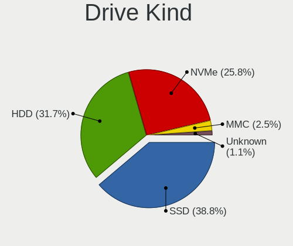
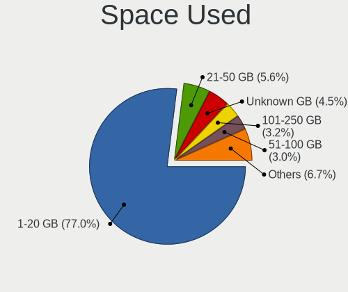
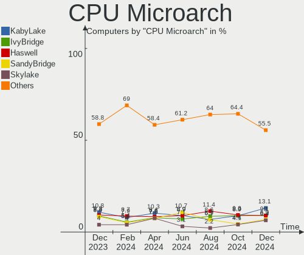
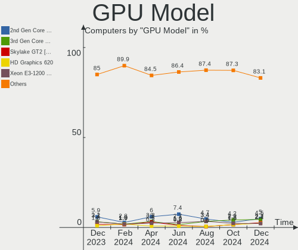
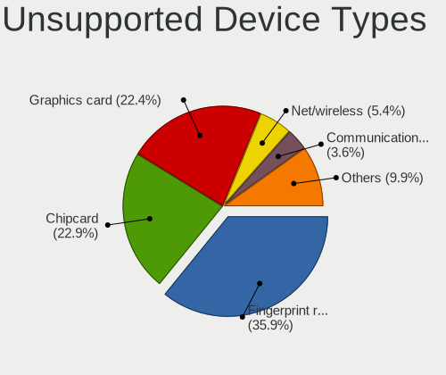

OpenMandriva - Hardware Trends
------------------------------

A project to identify most popular hardware characteristics and track their change
over time based on data collected by Linux users at https://Linux-Hardware.org.

Anyone can contribute to this report by the [hw-probe](https://github.com/linuxhw/hw-probe) tool:

    sudo -E hw-probe -all -upload

This is a report for all computer types. See also reports for [desktops](/Dist/OpenMandriva/Desktop/README.md) and [notebooks](/Dist/OpenMandriva/Notebook/README.md).

This report is for one last month. Overall report since the beginning of time: [TestDays](https://github.com/linuxhw/TestDays)

Period: Mar, 2023.

Contents
--------

* [ System ](#system)
  - [ OS                       ](#os)
  - [ OS Family                ](#os-family)
  - [ Kernel                   ](#kernel)
  - [ Kernel Family            ](#kernel-family)
  - [ Kernel Major Ver.        ](#kernel-major-ver)
  - [ Arch                     ](#arch)
  - [ DE                       ](#de)
  - [ Display Server           ](#display-server)
  - [ Display Manager          ](#display-manager)
  - [ OS Lang                  ](#os-lang)
  - [ Boot Mode                ](#boot-mode)
  - [ Filesystem               ](#filesystem)
  - [ Part. scheme             ](#part-scheme)
  - [ Dual Boot with Linux/BSD ](#dual-boot-with-linuxbsd)
  - [ Dual Boot (Win)          ](#dual-boot-win)

* [ Board ](#board)
  - [ Vendor                   ](#vendor)
  - [ Model                    ](#model)
  - [ Model Family             ](#model-family)
  - [ MFG Year                 ](#mfg-year)
  - [ Form Factor              ](#form-factor)
  - [ Secure Boot              ](#secure-boot)
  - [ Coreboot                 ](#coreboot)
  - [ RAM Size                 ](#ram-size)
  - [ RAM Used                 ](#ram-used)
  - [ Total Drives             ](#total-drives)
  - [ Has CD-ROM               ](#has-cd-rom)
  - [ Has Ethernet             ](#has-ethernet)
  - [ Has WiFi                 ](#has-wifi)
  - [ Has Bluetooth            ](#has-bluetooth)

* [ Location ](#location)
  - [ Country                  ](#country)
  - [ City                     ](#city)

* [ Drives ](#drives)
  - [ Drive Vendor             ](#drive-vendor)
  - [ Drive Model              ](#drive-model)
  - [ HDD Vendor               ](#hdd-vendor)
  - [ SSD Vendor               ](#ssd-vendor)
  - [ Drive Kind               ](#drive-kind)
  - [ Drive Connector          ](#drive-connector)
  - [ Drive Size               ](#drive-size)
  - [ Space Total              ](#space-total)
  - [ Space Used               ](#space-used)
  - [ Malfunc. Drives          ](#malfunc-drives)
  - [ Malfunc. Drive Vendor    ](#malfunc-drive-vendor)
  - [ Malfunc. HDD Vendor      ](#malfunc-hdd-vendor)
  - [ Malfunc. Drive Kind      ](#malfunc-drive-kind)
  - [ Failed Drives            ](#failed-drives)
  - [ Failed Drive Vendor      ](#failed-drive-vendor)
  - [ Drive Status             ](#drive-status)

* [ Storage controller ](#storage-controller)
  - [ Storage Vendor           ](#storage-vendor)
  - [ Storage Model            ](#storage-model)
  - [ Storage Kind             ](#storage-kind)

* [ Processor ](#processor)
  - [ CPU Vendor               ](#cpu-vendor)
  - [ CPU Model                ](#cpu-model)
  - [ CPU Model Family         ](#cpu-model-family)
  - [ CPU Cores                ](#cpu-cores)
  - [ CPU Sockets              ](#cpu-sockets)
  - [ CPU Threads              ](#cpu-threads)
  - [ CPU Op-Modes             ](#cpu-op-modes)
  - [ CPU Microcode            ](#cpu-microcode)
  - [ CPU Microarch            ](#cpu-microarch)

* [ Graphics ](#graphics)
  - [ GPU Vendor               ](#gpu-vendor)
  - [ GPU Model                ](#gpu-model)
  - [ GPU Combo                ](#gpu-combo)
  - [ GPU Driver               ](#gpu-driver)
  - [ GPU Memory               ](#gpu-memory)

* [ Monitor ](#monitor)
  - [ Monitor Vendor           ](#monitor-vendor)
  - [ Monitor Model            ](#monitor-model)
  - [ Monitor Resolution       ](#monitor-resolution)
  - [ Monitor Diagonal         ](#monitor-diagonal)
  - [ Monitor Width            ](#monitor-width)
  - [ Aspect Ratio             ](#aspect-ratio)
  - [ Monitor Area             ](#monitor-area)
  - [ Pixel Density            ](#pixel-density)
  - [ Multiple Monitors        ](#multiple-monitors)

* [ Network ](#network)
  - [ Net Controller Vendor    ](#net-controller-vendor)
  - [ Net Controller Model     ](#net-controller-model)
  - [ Wireless Vendor          ](#wireless-vendor)
  - [ Wireless Model           ](#wireless-model)
  - [ Ethernet Vendor          ](#ethernet-vendor)
  - [ Ethernet Model           ](#ethernet-model)
  - [ Net Controller Kind      ](#net-controller-kind)
  - [ Used Controller          ](#used-controller)
  - [ NICs                     ](#nics)
  - [ IPv6                     ](#ipv6)

* [ Bluetooth ](#bluetooth)
  - [ Bluetooth Vendor         ](#bluetooth-vendor)
  - [ Bluetooth Model          ](#bluetooth-model)

* [ Sound ](#sound)
  - [ Sound Vendor             ](#sound-vendor)
  - [ Sound Model              ](#sound-model)

* [ Memory ](#memory)
  - [ Memory Vendor            ](#memory-vendor)
  - [ Memory Model             ](#memory-model)
  - [ Memory Kind              ](#memory-kind)
  - [ Memory Form Factor       ](#memory-form-factor)
  - [ Memory Size              ](#memory-size)
  - [ Memory Speed             ](#memory-speed)

* [ Printers & scanners ](#printers--scanners)
  - [ Printer Vendor           ](#printer-vendor)
  - [ Printer Model            ](#printer-model)
  - [ Scanner Vendor           ](#scanner-vendor)
  - [ Scanner Model            ](#scanner-model)

* [ Camera ](#camera)
  - [ Camera Vendor            ](#camera-vendor)
  - [ Camera Model             ](#camera-model)

* [ Security ](#security)
  - [ Fingerprint Vendor       ](#fingerprint-vendor)
  - [ Fingerprint Model        ](#fingerprint-model)
  - [ Chipcard Vendor          ](#chipcard-vendor)
  - [ Chipcard Model           ](#chipcard-model)

* [ Unsupported ](#unsupported)
  - [ Unsupported Devices      ](#unsupported-devices)
  - [ Unsupported Device Types ](#unsupported-device-types)

System
------

OS
--

Installed operating systems

| Name               | Computers | Percent |
|--------------------|-----------|---------|
| OpenMandriva 23.03 | 365       | 45.8%   |
| OpenMandriva 23.01 | 285       | 35.76%  |
| OpenMandriva 4.3   | 97        | 12.17%  |
| OpenMandriva 4.2   | 31        | 3.89%   |
| OpenMandriva 23.90 | 10        | 1.25%   |
| OpenMandriva 4.90  | 5         | 0.63%   |
| OpenMandriva 4.50  | 4         | 0.5%    |

OS Family
---------

OS without a version

| Name         | Computers | Percent |
|--------------|-----------|---------|
| OpenMandriva | 797       | 100%    |

Kernel
------

Version of the Linux kernel

| Version                      | Computers | Percent |
|------------------------------|-----------|---------|
| 6.2.6-desktop-1omv2390       | 304       | 38.14%  |
| 6.1.1-desktop-1omv2290       | 273       | 34.25%  |
| 5.16.7-desktop-1omv4003      | 60        | 7.53%   |
| 6.2.2-desktop-1omv2390       | 41        | 5.14%   |
| 5.16.13-desktop-1omv4003     | 38        | 4.77%   |
| 5.10.14-desktop-1omv4002     | 26        | 3.26%   |
| 6.1.4-desktop-1omv2301       | 13        | 1.63%   |
| 6.2.1-desktop-1omv2390       | 12        | 1.51%   |
| 5.11.12-desktop-1omv4002     | 6         | 0.75%   |
| 6.2.8-desktop-1omv2390       | 4         | 0.5%    |
| 6.2.7-desktop-1omv2390       | 3         | 0.38%   |
| 5.19.12-desktop-2omv4090     | 3         | 0.38%   |
| 5.18.12-desktop-3omv4090     | 3         | 0.38%   |
| 6.2.0-desktop-0.rc2.1omv2301 | 2         | 0.25%   |
| 6.2.0-server-0.rc3.1omv2390  | 1         | 0.13%   |
| 6.1.9-desktop-1omv2390       | 1         | 0.13%   |
| 6.1.11-desktop-1omv2390      | 1         | 0.13%   |
| 6.0.8-desktop-2omv22090      | 1         | 0.13%   |
| 6.0.2-desktop-1omv4090       | 1         | 0.13%   |
| 5.19.5-desktop-1omv4090      | 1         | 0.13%   |
| 5.19.0-desktop-1omv4090      | 1         | 0.13%   |
| 5.16.13-desktop-1omv4050     | 1         | 0.13%   |
| 5.14.7-desktop-1omv4050      | 1         | 0.13%   |

Kernel Family
-------------

Linux kernel without a distro release

| Version | Computers | Percent |
|---------|-----------|---------|
| 6.2.6   | 304       | 38.14%  |
| 6.1.1   | 273       | 34.25%  |
| 5.16.7  | 60        | 7.53%   |
| 6.2.2   | 41        | 5.14%   |
| 5.16.13 | 39        | 4.89%   |
| 5.10.14 | 26        | 3.26%   |
| 6.1.4   | 13        | 1.63%   |
| 6.2.1   | 12        | 1.51%   |
| 5.11.12 | 6         | 0.75%   |
| 6.2.8   | 4         | 0.5%    |
| 6.2.7   | 3         | 0.38%   |
| 6.2.0   | 3         | 0.38%   |
| 5.19.12 | 3         | 0.38%   |
| 5.18.12 | 3         | 0.38%   |
| 6.1.9   | 1         | 0.13%   |
| 6.1.11  | 1         | 0.13%   |
| 6.0.8   | 1         | 0.13%   |
| 6.0.2   | 1         | 0.13%   |
| 5.19.5  | 1         | 0.13%   |
| 5.19.0  | 1         | 0.13%   |
| 5.14.7  | 1         | 0.13%   |

Kernel Major Ver.
-----------------

Linux kernel major version

| Version | Computers | Percent |
|---------|-----------|---------|
| 6.2     | 367       | 46.05%  |
| 6.1     | 288       | 36.14%  |
| 5.16    | 99        | 12.42%  |
| 5.10    | 26        | 3.26%   |
| 5.11    | 6         | 0.75%   |
| 5.19    | 5         | 0.63%   |
| 5.18    | 3         | 0.38%   |
| 6.0     | 2         | 0.25%   |
| 5.14    | 1         | 0.13%   |

Arch
----

OS architecture (x86_64, i586, etc.)

| Name   | Computers | Percent |
|--------|-----------|---------|
| x86_64 | 797       | 100%    |

DE
--

Desktop Environment

| Name     | Computers | Percent |
|----------|-----------|---------|
| KDE5     | 694       | 87.08%  |
| GNOME    | 69        | 8.66%   |
| LXQt     | 26        | 3.26%   |
| Cinnamon | 3         | 0.38%   |
| Budgie   | 3         | 0.38%   |
| Unknown  | 2         | 0.25%   |

Display Server
--------------

X11 or Wayland

| Name    | Computers | Percent |
|---------|-----------|---------|
| X11     | 730       | 91.59%  |
| Wayland | 67        | 8.41%   |

Display Manager
---------------

SDDM, LightDM, etc.

| Name    | Computers | Percent |
|---------|-----------|---------|
| SDDM    | 726       | 91.09%  |
| GDM     | 70        | 8.78%   |
| LightDM | 1         | 0.13%   |

OS Lang
-------

Language

| Lang  | Computers | Percent |
|-------|-----------|---------|
| en_US | 360       | 45.17%  |
| de_DE | 79        | 9.91%   |
| fr_FR | 56        | 7.03%   |
| ru_RU | 52        | 6.52%   |
| pl_PL | 34        | 4.27%   |
| en_GB | 32        | 4.02%   |
| it_IT | 28        | 3.51%   |
| pt_BR | 27        | 3.39%   |
| es_ES | 16        | 2.01%   |
| en_CA | 14        | 1.76%   |
| es_MX | 10        | 1.25%   |
| en_AU | 9         | 1.13%   |
| en_IN | 7         | 0.88%   |
| de_AT | 7         | 0.88%   |
| hu_HU | 6         | 0.75%   |
| cs_CZ | 6         | 0.75%   |
| nl_NL | 5         | 0.63%   |
| nl_BE | 5         | 0.63%   |
| es_AR | 4         | 0.5%    |
| pt_PT | 3         | 0.38%   |
| es_CO | 3         | 0.38%   |
| de_CH | 3         | 0.38%   |
| tr_TR | 2         | 0.25%   |
| nb_NO | 2         | 0.25%   |
| ja_JP | 2         | 0.25%   |
| fr_CA | 2         | 0.25%   |
| es_PE | 2         | 0.25%   |
| es_CL | 2         | 0.25%   |
| en_SG | 2         | 0.25%   |
| en_AG | 2         | 0.25%   |
| UTF-8 | 1         | 0.13%   |
| ru_UA | 1         | 0.13%   |
| lt_LT | 1         | 0.13%   |
| fr_CH | 1         | 0.13%   |
| fr_BE | 1         | 0.13%   |
| es_UY | 1         | 0.13%   |
| es_SV | 1         | 0.13%   |
| es_DO | 1         | 0.13%   |
| en_ZA | 1         | 0.13%   |
| en_NZ | 1         | 0.13%   |

Boot Mode
---------

EFI or BIOS

| Mode | Computers | Percent |
|------|-----------|---------|
| EFI  | 447       | 56.09%  |
| BIOS | 350       | 43.91%  |

Filesystem
----------

Type of filesystem

| Type    | Computers | Percent |
|---------|-----------|---------|
| Ext4    | 392       | 49.18%  |
| Overlay | 364       | 45.67%  |
| Btrfs   | 26        | 3.26%   |
| F2fs    | 7         | 0.88%   |
| Xfs     | 6         | 0.75%   |
| Ext3    | 2         | 0.25%   |

Part. scheme
------------

Scheme of partitioning

| Type    | Computers | Percent |
|---------|-----------|---------|
| GPT     | 612       | 76.79%  |
| MBR     | 183       | 22.96%  |
| Unknown | 2         | 0.25%   |

Dual Boot with Linux/BSD
------------------------

Hosting more than one Linux/BSD

| Dual boot | Computers | Percent |
|-----------|-----------|---------|
| Yes       | 410       | 51.44%  |
| No        | 387       | 48.56%  |

Dual Boot (Win)
---------------

Hosting Linux and Windows

| Dual boot | Computers | Percent |
|-----------|-----------|---------|
| No        | 450       | 56.46%  |
| Yes       | 347       | 43.54%  |

Board
-----

Vendor
------

Motherboard manufacturer

| Name                | Computers | Percent |
|---------------------|-----------|---------|
| ASUSTek Computer    | 129       | 16.19%  |
| Lenovo              | 104       | 13.05%  |
| Hewlett-Packard     | 100       | 12.55%  |
| Dell                | 92        | 11.54%  |
| Gigabyte Technology | 75        | 9.41%   |
| Acer                | 66        | 8.28%   |
| MSI                 | 37        | 4.64%   |
| ASRock              | 26        | 3.26%   |
| Toshiba             | 19        | 2.38%   |
| Intel               | 18        | 2.26%   |
| Fujitsu             | 16        | 2.01%   |
| Samsung Electronics | 10        | 1.25%   |
| Medion              | 7         | 0.88%   |
| Sony                | 6         | 0.75%   |
| Pegatron            | 6         | 0.75%   |
| Notebook            | 6         | 0.75%   |
| Fujitsu Siemens     | 6         | 0.75%   |
| Apple               | 6         | 0.75%   |
| Unknown             | 6         | 0.75%   |
| Packard Bell        | 4         | 0.5%    |
| Chuwi               | 4         | 0.5%    |
| TUXEDO              | 3         | 0.38%   |
| PCWare              | 3         | 0.38%   |
| Kiano               | 3         | 0.38%   |
| Foxconn             | 3         | 0.38%   |
| Biostar             | 3         | 0.38%   |
| AZW                 | 3         | 0.38%   |
| HUAWEI              | 2         | 0.25%   |
| HONOR               | 2         | 0.25%   |
| GPU Company         | 2         | 0.25%   |
| ECS                 | 2         | 0.25%   |
| ZOTAC               | 1         | 0.13%   |
| Wistron             | 1         | 0.13%   |
| WinFast             | 1         | 0.13%   |
| Venom               | 1         | 0.13%   |
| TEKNOSERVICE        | 1         | 0.13%   |
| Star Labs           | 1         | 0.13%   |
| Shuttle             | 1         | 0.13%   |
| ReachingTech        | 1         | 0.13%   |
| Quanta              | 1         | 0.13%   |

Model
-----

Motherboard model

| Name                                  | Computers | Percent |
|---------------------------------------|-----------|---------|
| Unknown                               | 9         | 1.13%   |
| ASUS All Series                       | 7         | 0.88%   |
| Lenovo IdeaPad 3 15ALC6 82KU          | 4         | 0.5%    |
| HP EliteDesk 800 G1 SFF               | 4         | 0.5%    |
| Dell OptiPlex 9020                    | 4         | 0.5%    |
| Dell Latitude 7490                    | 4         | 0.5%    |
| Kiano Elegance 14.2                   | 3         | 0.38%   |
| Intel NUC8i3BEH                       | 3         | 0.38%   |
| HP Pavilion Notebook                  | 3         | 0.38%   |
| HP Pavilion dv6                       | 3         | 0.38%   |
| HP Compaq Presario CQ60               | 3         | 0.38%   |
| Gigabyte B450M DS3H                   | 3         | 0.38%   |
| Dell Latitude E6430                   | 3         | 0.38%   |
| Dell Inspiron 15-3567                 | 3         | 0.38%   |
| ASUS UX31E                            | 3         | 0.38%   |
| ASUS PRIME A320M-K                    | 3         | 0.38%   |
| TUXEDO InfinityBook Pro Gen7 (MK1)    | 2         | 0.25%   |
| Toshiba Satellite L655                | 2         | 0.25%   |
| Sony VPCEH1S1E                        | 2         | 0.25%   |
| Samsung 950QED                        | 2         | 0.25%   |
| MSI MS-7C56                           | 2         | 0.25%   |
| MSI MS-7C37                           | 2         | 0.25%   |
| MSI MS-7A15                           | 2         | 0.25%   |
| MSI MS-7850                           | 2         | 0.25%   |
| MSI MS-7817                           | 2         | 0.25%   |
| MSI MS-7721                           | 2         | 0.25%   |
| Lenovo Yoga Slim 7 Pro 14ACH5 OD 82NK | 2         | 0.25%   |
| Lenovo ThinkPad P1 Gen 4i 20Y3001LUK  | 2         | 0.25%   |
| Lenovo IdeaPad S145-15API 81UT        | 2         | 0.25%   |
| Lenovo IdeaPad 3 15ITL6 82H8          | 2         | 0.25%   |
| Lenovo G570 20079                     | 2         | 0.25%   |
| HUAWEI KPL-W0X                        | 2         | 0.25%   |
| HP Z640 Workstation                   | 2         | 0.25%   |
| HP Pavilion g6                        | 2         | 0.25%   |
| HP Pavilion Aero Laptop 13-be0xxx     | 2         | 0.25%   |
| HP Notebook                           | 2         | 0.25%   |
| HP EliteBook 840 G3                   | 2         | 0.25%   |
| HP Compaq Elite 8300 SFF              | 2         | 0.25%   |
| HP 250 G6 Notebook PC                 | 2         | 0.25%   |
| GPU Company GWTN156-11                | 2         | 0.25%   |

Model Family
------------

Motherboard model prefix

| Name                | Computers | Percent |
|---------------------|-----------|---------|
| Acer Aspire         | 45        | 5.65%   |
| Lenovo IdeaPad      | 28        | 3.51%   |
| Lenovo ThinkPad     | 27        | 3.39%   |
| ASUS PRIME          | 26        | 3.26%   |
| Dell OptiPlex       | 24        | 3.01%   |
| Dell Latitude       | 23        | 2.89%   |
| HP Pavilion         | 22        | 2.76%   |
| Dell Inspiron       | 21        | 2.63%   |
| HP Compaq           | 15        | 1.88%   |
| Toshiba Satellite   | 13        | 1.63%   |
| Lenovo ThinkCentre  | 10        | 1.25%   |
| Dell Precision      | 10        | 1.25%   |
| Unknown             | 9         | 1.13%   |
| HP Laptop           | 8         | 1%      |
| Fujitsu ESPRIMO     | 8         | 1%      |
| ASUS VivoBook       | 8         | 1%      |
| ASUS TUF            | 8         | 1%      |
| Lenovo IdeaCentre   | 7         | 0.88%   |
| HP ENVY             | 7         | 0.88%   |
| HP EliteDesk        | 7         | 0.88%   |
| HP EliteBook        | 7         | 0.88%   |
| Fujitsu LIFEBOOK    | 7         | 0.88%   |
| ASUS All            | 7         | 0.88%   |
| Lenovo Yoga         | 6         | 0.75%   |
| Gigabyte B450M      | 6         | 0.75%   |
| Dell Vostro         | 6         | 0.75%   |
| Acer Predator       | 6         | 0.75%   |
| Dell XPS            | 5         | 0.63%   |
| ASUS M5A78L-M       | 5         | 0.63%   |
| HP ProDesk          | 4         | 0.5%    |
| HP 250              | 4         | 0.5%    |
| Gigabyte B550       | 4         | 0.5%    |
| Acer TravelMate     | 4         | 0.5%    |
| Toshiba dynabook    | 3         | 0.38%   |
| Packard Bell IMEDIA | 3         | 0.38%   |
| Lenovo Legion       | 3         | 0.38%   |
| Kiano Elegance      | 3         | 0.38%   |
| Intel NUC8i3BEH     | 3         | 0.38%   |
| HP ProBook          | 3         | 0.38%   |
| Gigabyte H310M      | 3         | 0.38%   |

MFG Year
--------

Motherboard manufacture year

| Year | Computers | Percent |
|------|-----------|---------|
| 2012 | 72        | 9.03%   |
| 2021 | 69        | 8.66%   |
| 2013 | 67        | 8.41%   |
| 2011 | 66        | 8.28%   |
| 2018 | 62        | 7.78%   |
| 2019 | 56        | 7.03%   |
| 2020 | 55        | 6.9%    |
| 2017 | 53        | 6.65%   |
| 2015 | 52        | 6.52%   |
| 2010 | 42        | 5.27%   |
| 2016 | 39        | 4.89%   |
| 2008 | 36        | 4.52%   |
| 2014 | 34        | 4.27%   |
| 2009 | 32        | 4.02%   |
| 2022 | 31        | 3.89%   |
| 2007 | 21        | 2.63%   |
| 2006 | 7         | 0.88%   |
| 2023 | 1         | 0.13%   |
| 2005 | 1         | 0.13%   |
| 2004 | 1         | 0.13%   |

Form Factor
-----------

Physical design of the computer

| Name        | Computers | Percent |
|-------------|-----------|---------|
| Notebook    | 376       | 47.18%  |
| Desktop     | 370       | 46.42%  |
| Mini pc     | 20        | 2.51%   |
| All in one  | 18        | 2.26%   |
| Convertible | 10        | 1.25%   |
| Tablet      | 3         | 0.38%   |

Secure Boot
-----------

Enabled or disabled

| State    | Computers | Percent |
|----------|-----------|---------|
| Disabled | 797       | 100%    |

Coreboot
--------

Have coreboot on board

| Used | Computers | Percent |
|------|-----------|---------|
| No   | 796       | 99.87%  |
| Yes  | 1         | 0.13%   |

RAM Size
--------

Total RAM memory

| Size in GB  | Computers | Percent |
|-------------|-----------|---------|
| 4.01-8.0    | 214       | 26.85%  |
| 3.01-4.0    | 168       | 21.08%  |
| 8.01-16.0   | 155       | 19.45%  |
| 16.01-24.0  | 144       | 18.07%  |
| 32.01-64.0  | 63        | 7.9%    |
| 1.01-2.0    | 23        | 2.89%   |
| 24.01-32.0  | 16        | 2.01%   |
| 2.01-3.0    | 7         | 0.88%   |
| 64.01-256.0 | 7         | 0.88%   |

RAM Used
--------

Used RAM memory

| Used GB   | Computers | Percent |
|-----------|-----------|---------|
| 1.01-2.0  | 539       | 67.63%  |
| 2.01-3.0  | 179       | 22.46%  |
| 0.51-1.0  | 43        | 5.4%    |
| 3.01-4.0  | 30        | 3.76%   |
| 4.01-8.0  | 2         | 0.25%   |
| 8.01-16.0 | 2         | 0.25%   |
| 0.01-0.5  | 2         | 0.25%   |

Total Drives
------------

Number of drives on board

| Drives | Computers | Percent |
|--------|-----------|---------|
| 1      | 448       | 56.21%  |
| 2      | 214       | 26.85%  |
| 3      | 60        | 7.53%   |
| 4      | 38        | 4.77%   |
| 5      | 15        | 1.88%   |
| 0      | 11        | 1.38%   |
| 7      | 4         | 0.5%    |
| 6      | 4         | 0.5%    |
| 13     | 1         | 0.13%   |
| 9      | 1         | 0.13%   |
| 8      | 1         | 0.13%   |

Has CD-ROM
----------

Has CD-ROM on board

| Presented | Computers | Percent |
|-----------|-----------|---------|
| No        | 415       | 52.07%  |
| Yes       | 382       | 47.93%  |

Has Ethernet
------------

Has Ethernet on board

| Presented | Computers | Percent |
|-----------|-----------|---------|
| Yes       | 716       | 89.84%  |
| No        | 81        | 10.16%  |

Has WiFi
--------

Has WiFi module

| Presented | Computers | Percent |
|-----------|-----------|---------|
| Yes       | 564       | 70.77%  |
| No        | 233       | 29.23%  |

Has Bluetooth
-------------

Has Bluetooth module

| Presented | Computers | Percent |
|-----------|-----------|---------|
| Yes       | 402       | 50.44%  |
| No        | 395       | 49.56%  |

Location
--------

Country
-------

Geographic location (country)

| Country     | Computers | Percent |
|-------------|-----------|---------|
| Germany     | 105       | 13.17%  |
| USA         | 88        | 11.04%  |
| Russia      | 65        | 8.16%   |
| France      | 62        | 7.78%   |
| Poland      | 48        | 6.02%   |
| Italy       | 40        | 5.02%   |
| Brazil      | 37        | 4.64%   |
| Finland     | 30        | 3.76%   |
| UK          | 27        | 3.39%   |
| Canada      | 26        | 3.26%   |
| Spain       | 25        | 3.14%   |
| Japan       | 14        | 1.76%   |
| India       | 14        | 1.76%   |
| Australia   | 11        | 1.38%   |
| Netherlands | 10        | 1.25%   |
| Mexico      | 10        | 1.25%   |
| Czechia     | 10        | 1.25%   |
| Austria     | 9         | 1.13%   |
| Hungary     | 8         | 1%      |
| Belgium     | 8         | 1%      |
| Taiwan      | 7         | 0.88%   |
| Switzerland | 7         | 0.88%   |
| Sweden      | 7         | 0.88%   |
| Slovakia    | 7         | 0.88%   |
| Romania     | 7         | 0.88%   |
| Turkey      | 6         | 0.75%   |
| Norway      | 6         | 0.75%   |
| Portugal    | 5         | 0.63%   |
| Belarus     | 5         | 0.63%   |
| Iran        | 4         | 0.5%    |
| Denmark     | 4         | 0.5%    |
| Chile       | 4         | 0.5%    |
| Argentina   | 4         | 0.5%    |
| Slovenia    | 3         | 0.38%   |
| New Zealand | 3         | 0.38%   |
| Malaysia    | 3         | 0.38%   |
| Israel      | 3         | 0.38%   |
| Indonesia   | 3         | 0.38%   |
| Croatia     | 3         | 0.38%   |
| Colombia    | 3         | 0.38%   |

City
----

Geographic location (city)

| City              | Computers | Percent |
|-------------------|-----------|---------|
| Warsaw            | 15        | 1.88%   |
| Paris             | 12        | 1.51%   |
| Helsinki          | 12        | 1.51%   |
| Moscow            | 11        | 1.38%   |
| Milan             | 9         | 1.13%   |
| St Petersburg     | 7         | 0.88%   |
| Hamburg           | 7         | 0.88%   |
| Berlin            | 7         | 0.88%   |
| Vienna            | 6         | 0.75%   |
| Rome              | 5         | 0.63%   |
| Madrid            | 5         | 0.63%   |
| Granada           | 5         | 0.63%   |
| Ufa               | 4         | 0.5%    |
| Tampere           | 4         | 0.5%    |
| Sao Paulo         | 4         | 0.5%    |
| Prague            | 4         | 0.5%    |
| Oslo              | 4         | 0.5%    |
| Milano            | 4         | 0.5%    |
| Krasnodar         | 4         | 0.5%    |
| Krakow            | 4         | 0.5%    |
| Kaohsiung City    | 4         | 0.5%    |
| Cologne           | 4         | 0.5%    |
| Bucharest         | 4         | 0.5%    |
| Bochum            | 4         | 0.5%    |
| Wroclaw           | 3         | 0.38%   |
| Tehran            | 3         | 0.38%   |
| Sydney            | 3         | 0.38%   |
| Stuttgart         | 3         | 0.38%   |
| Slagelse          | 3         | 0.38%   |
| San José         | 3         | 0.38%   |
| Rio de Janeiro    | 3         | 0.38%   |
| Płock            | 3         | 0.38%   |
| Nova Gorica       | 3         | 0.38%   |
| Munich            | 3         | 0.38%   |
| Le Grand-Quevilly | 3         | 0.38%   |
| Kettering         | 3         | 0.38%   |
| Farnborough       | 3         | 0.38%   |
| Chennai           | 3         | 0.38%   |
| Chelyabinsk       | 3         | 0.38%   |
| Budapest          | 3         | 0.38%   |

Drives
------

Drive Vendor
------------

Hard drive vendors

| Vendor              | Computers | Drives | Percent |
|---------------------|-----------|--------|---------|
| WDC                 | 198       | 235    | 16.65%  |
| Seagate             | 170       | 199    | 14.3%   |
| Samsung Electronics | 144       | 180    | 12.11%  |
| Toshiba             | 73        | 75     | 6.14%   |
| Kingston            | 69        | 74     | 5.8%    |
| Crucial             | 68        | 72     | 5.72%   |
| SanDisk             | 65        | 72     | 5.47%   |
| Hitachi             | 41        | 45     | 3.45%   |
| A-DATA Technology   | 29        | 30     | 2.44%   |
| Unknown             | 26        | 29     | 2.19%   |
| HGST                | 20        | 21     | 1.68%   |
| SK hynix            | 16        | 16     | 1.35%   |
| Micron Technology   | 15        | 15     | 1.26%   |
| Intel               | 15        | 15     | 1.26%   |
| SPCC                | 14        | 15     | 1.18%   |
| PNY                 | 14        | 14     | 1.18%   |
| China               | 12        | 13     | 1.01%   |
| Intenso             | 11        | 14     | 0.93%   |
| Transcend           | 10        | 10     | 0.84%   |
| GOODRAM             | 10        | 10     | 0.84%   |
| JMicron Technology  | 8         | 8      | 0.67%   |
| Patriot             | 7         | 7      | 0.59%   |
| Maxtor              | 7         | 7      | 0.59%   |
| KIOXIA              | 6         | 6      | 0.5%    |
| Gigabyte Technology | 6         | 6      | 0.5%    |
| Apacer              | 6         | 6      | 0.5%    |
| XrayDisk            | 5         | 5      | 0.42%   |
| Team                | 5         | 5      | 0.42%   |
| OCZ                 | 5         | 7      | 0.42%   |
| Netac               | 5         | 5      | 0.42%   |
| LITEON              | 5         | 5      | 0.42%   |
| XPG                 | 4         | 5      | 0.34%   |
| SABRENT             | 4         | 4      | 0.34%   |
| Fujitsu             | 4         | 4      | 0.34%   |
| Emtec               | 4         | 5      | 0.34%   |
| ASMT                | 4         | 7      | 0.34%   |
| Unknown             | 4         | 4      | 0.34%   |
| Verbatim            | 3         | 3      | 0.25%   |
| Phison              | 3         | 3      | 0.25%   |
| KingFast            | 3         | 3      | 0.25%   |

Drive Model
-----------

Hard drive models

| Model                              | Computers | Percent |
|------------------------------------|-----------|---------|
| Kingston SA400S37240G 240GB SSD    | 18        | 1.39%   |
| Toshiba DT01ACA100 1TB             | 12        | 0.92%   |
| Seagate ST1000DM010-2EP102 1TB     | 12        | 0.92%   |
| Samsung SSD 850 EVO 500GB          | 11        | 0.85%   |
| Seagate ST500DM002-1BD142 500GB    | 10        | 0.77%   |
| Crucial CT480BX500SSD1 480GB       | 10        | 0.77%   |
| Crucial CT240BX500SSD1 240GB       | 10        | 0.77%   |
| Crucial CT1000MX500SSD1 1TB        | 10        | 0.77%   |
| WDC WD10EZEX-08WN4A0 1TB           | 8         | 0.62%   |
| Seagate ST1000LM035-1RK172 1TB     | 8         | 0.62%   |
| Samsung SSD 970 EVO Plus 1TB       | 8         | 0.62%   |
| Seagate ST500LT012-1DG142 500GB    | 7         | 0.54%   |
| Seagate ST3500418AS 500GB          | 7         | 0.54%   |
| Seagate ST2000DM008-2FR102 2TB     | 7         | 0.54%   |
| Seagate ST1000LM024 HN-M101MBB 1TB | 7         | 0.54%   |
| SanDisk SSD PLUS 1000GB            | 7         | 0.54%   |
| Kingston SA400S37120G 120GB SSD    | 7         | 0.54%   |
| WDC WDS240G2G0A-00JH30 240GB SSD   | 6         | 0.46%   |
| WDC WDBNCE5000PNC 500GB SSD        | 6         | 0.46%   |
| Toshiba MQ01ABD100 1TB             | 6         | 0.46%   |
| Seagate ST9500325AS 500GB          | 6         | 0.46%   |
| Crucial CT500MX500SSD1 500GB       | 6         | 0.46%   |
| WDC WDS120G2G0A-00JH30 120GB SSD   | 5         | 0.38%   |
| Toshiba MQ04ABF100 1TB             | 5         | 0.38%   |
| Toshiba DT01ACA050 500GB           | 5         | 0.38%   |
| Seagate ST2000DM001-1ER164 2TB     | 5         | 0.38%   |
| SanDisk SDSSDA240G 240GB           | 5         | 0.38%   |
| SanDisk NVMe SSD Drive 1TB         | 5         | 0.38%   |
| Samsung SSD 860 EVO 500GB          | 5         | 0.38%   |
| Samsung SSD 850 EVO 250GB          | 5         | 0.38%   |
| Micron MTFDHBA512QFD 512GB         | 5         | 0.38%   |
| Kingston SA400S37480G 480GB SSD    | 5         | 0.38%   |
| Crucial CT120BX500SSD1 120GB       | 5         | 0.38%   |
| A-DATA SU630 240GB SSD             | 5         | 0.38%   |
| Unknown SD/MMC/MS PRO 64GB         | 4         | 0.31%   |
| Toshiba MQ01ABF050 500GB           | 4         | 0.31%   |
| Toshiba MQ01ABD075 752GB           | 4         | 0.31%   |
| SPCC Solid State Disk 256GB        | 4         | 0.31%   |
| Seagate ST500DM002-1BC142 500GB    | 4         | 0.31%   |
| Seagate ST1000DM003-1SB102 1TB     | 4         | 0.31%   |

HDD Vendor
----------

Hard disk drive vendors

| Vendor              | Computers | Drives | Percent |
|---------------------|-----------|--------|---------|
| Seagate             | 169       | 197    | 34.99%  |
| WDC                 | 146       | 167    | 30.23%  |
| Toshiba             | 61        | 63     | 12.63%  |
| Hitachi             | 41        | 45     | 8.49%   |
| Samsung Electronics | 21        | 23     | 4.35%   |
| HGST                | 20        | 21     | 4.14%   |
| Maxtor              | 6         | 6      | 1.24%   |
| Unknown             | 4         | 4      | 0.83%   |
| Fujitsu             | 4         | 4      | 0.83%   |
| SABRENT             | 3         | 3      | 0.62%   |
| ASMT                | 3         | 6      | 0.62%   |
| USB                 | 1         | 1      | 0.21%   |
| T-CREATE            | 1         | 1      | 0.21%   |
| Super Talent        | 1         | 1      | 0.21%   |
| IBM/Hitachi         | 1         | 1      | 0.21%   |
| HGST HTS            | 1         | 1      | 0.21%   |

SSD Vendor
----------

Solid state drive vendors

| Vendor              | Computers | Drives | Percent |
|---------------------|-----------|--------|---------|
| Samsung Electronics | 76        | 90     | 15.83%  |
| Crucial             | 57        | 59     | 11.88%  |
| Kingston            | 54        | 57     | 11.25%  |
| SanDisk             | 49        | 55     | 10.21%  |
| WDC                 | 33        | 37     | 6.88%   |
| A-DATA Technology   | 22        | 23     | 4.58%   |
| PNY                 | 12        | 12     | 2.5%    |
| China               | 12        | 13     | 2.5%    |
| Toshiba             | 10        | 10     | 2.08%   |
| Transcend           | 9         | 9      | 1.88%   |
| SPCC                | 9         | 9      | 1.88%   |
| Intenso             | 8         | 11     | 1.67%   |
| GOODRAM             | 8         | 8      | 1.67%   |
| Micron Technology   | 7         | 7      | 1.46%   |
| Patriot             | 6         | 6      | 1.25%   |
| Intel               | 6         | 6      | 1.25%   |
| Apacer              | 6         | 6      | 1.25%   |
| SK hynix            | 5         | 5      | 1.04%   |
| OCZ                 | 5         | 7      | 1.04%   |
| Netac               | 5         | 5      | 1.04%   |
| LITEON              | 5         | 5      | 1.04%   |
| XrayDisk            | 4         | 4      | 0.83%   |
| Team                | 4         | 4      | 0.83%   |
| JMicron Technology  | 4         | 4      | 0.83%   |
| Gigabyte Technology | 4         | 4      | 0.83%   |
| Emtec               | 4         | 4      | 0.83%   |
| Verbatim            | 3         | 3      | 0.63%   |
| KingFast            | 3         | 3      | 0.63%   |
| Seagate             | 2         | 2      | 0.42%   |
| Pioneer             | 2         | 2      | 0.42%   |
| LITEONIT            | 2         | 2      | 0.42%   |
| KingSpec            | 2         | 2      | 0.42%   |
| HS-SSD-C100         | 2         | 2      | 0.42%   |
| Corsair             | 2         | 2      | 0.42%   |
| Unknown             | 2         | 2      | 0.42%   |
| ZEPLIN              | 1         | 1      | 0.21%   |
| XSTAR               | 1         | 1      | 0.21%   |
| Wdstars             | 1         | 1      | 0.21%   |
| VISIPRO             | 1         | 1      | 0.21%   |
| VERICO              | 1         | 1      | 0.21%   |

Drive Kind
----------

HDD or SSD

| Kind    | Computers | Drives | Percent |
|---------|-----------|--------|---------|
| HDD     | 404       | 544    | 38.88%  |
| SSD     | 403       | 516    | 38.79%  |
| NVMe    | 194       | 229    | 18.67%  |
| MMC     | 27        | 28     | 2.6%    |
| Unknown | 11        | 15     | 1.06%   |

Drive Connector
---------------

SATA, SAS, NVMe, etc.

| Type | Computers | Drives | Percent |
|------|-----------|--------|---------|
| SATA | 660       | 1001   | 70.21%  |
| NVMe | 192       | 223    | 20.43%  |
| SAS  | 61        | 80     | 6.49%   |
| MMC  | 27        | 28     | 2.87%   |

Drive Size
----------

Size of hard drive

| Size in TB | Computers | Drives | Percent |
|------------|-----------|--------|---------|
| 0.01-0.5   | 523       | 684    | 62.79%  |
| 0.51-1.0   | 229       | 275    | 27.49%  |
| 1.01-2.0   | 58        | 72     | 6.96%   |
| 3.01-4.0   | 10        | 14     | 1.2%    |
| 4.01-10.0  | 9         | 10     | 1.08%   |
| 2.01-3.0   | 4         | 5      | 0.48%   |

Space Total
-----------

Amount of disk space available on the file system

| Size in GB     | Computers | Percent |
|----------------|-----------|---------|
| 1-20           | 258       | 32.37%  |
| 101-250        | 168       | 21.08%  |
| 251-500        | 121       | 15.18%  |
| 501-1000       | 74        | 9.28%   |
| 51-100         | 49        | 6.15%   |
| Unknown        | 46        | 5.77%   |
| 21-50          | 40        | 5.02%   |
| 1001-2000      | 22        | 2.76%   |
| 2001-3000      | 12        | 1.51%   |
| More than 3000 | 7         | 0.88%   |

Space Used
----------

Amount of used disk space

| Used GB        | Computers | Percent |
|----------------|-----------|---------|
| 1-20           | 601       | 75.41%  |
| 21-50          | 48        | 6.02%   |
| Unknown        | 46        | 5.77%   |
| 101-250        | 34        | 4.27%   |
| 51-100         | 22        | 2.76%   |
| 251-500        | 19        | 2.38%   |
| 501-1000       | 19        | 2.38%   |
| 1001-2000      | 5         | 0.63%   |
| 2001-3000      | 2         | 0.25%   |
| More than 3000 | 1         | 0.13%   |

Malfunc. Drives
---------------

Drive models with a malfunction

| Model                              | Computers | Drives | Percent |
|------------------------------------|-----------|--------|---------|
| Seagate ST3500418AS 500GB          | 6         | 6      | 2.74%   |
| Seagate ST9500325AS 500GB          | 5         | 5      | 2.28%   |
| Seagate ST500DM002-1BD142 500GB    | 5         | 5      | 2.28%   |
| Seagate ST1000LM024 HN-M101MBB 1TB | 5         | 5      | 2.28%   |
| Seagate ST500LT012-1DG142 500GB    | 4         | 4      | 1.83%   |
| Seagate ST1000DM010-2EP102 1TB     | 4         | 4      | 1.83%   |
| Seagate ST1000LM035-1RK172 1TB     | 3         | 3      | 1.37%   |
| SanDisk SSD U100 256GB             | 3         | 3      | 1.37%   |
| Hitachi HDS721010CLA332 1TB        | 3         | 3      | 1.37%   |
| HGST HTS545050A7E680 500GB         | 3         | 3      | 1.37%   |
| WDC WD6400AAKS-00E4A0 640GB        | 2         | 2      | 0.91%   |
| WDC WD5000AAKX-75U6AA0 500GB       | 2         | 2      | 0.91%   |
| WDC WD3200BPVT-22JJ5T0 320GB       | 2         | 2      | 0.91%   |
| WDC WD3200AAJS-22RYA0 320GB        | 2         | 2      | 0.91%   |
| WDC WD20EARS-00MVWB0 2TB           | 2         | 2      | 0.91%   |
| Toshiba MQ01ABD075 752GB           | 2         | 2      | 0.91%   |
| Toshiba MK5065GSX 500GB            | 2         | 2      | 0.91%   |
| Toshiba MK2555GSX 250GB            | 2         | 2      | 0.91%   |
| Toshiba DT01ACA100 1TB             | 2         | 2      | 0.91%   |
| Seagate ST3500414CS 500GB          | 2         | 2      | 0.91%   |
| Seagate ST31000528AS 1TB           | 2         | 2      | 0.91%   |
| Seagate ST2000DM001-9YN164 2TB     | 2         | 2      | 0.91%   |
| Seagate ST1000DM003-1CH162 1TB     | 2         | 2      | 0.91%   |
| Netac SSD 256GB                    | 2         | 2      | 0.91%   |
| Netac SSD 120GB                    | 2         | 2      | 0.91%   |
| Maxtor STM3250310AS 250GB          | 2         | 2      | 0.91%   |
| Hitachi HTS723232A7A364 320GB      | 2         | 2      | 0.91%   |
| Hitachi HTS545050A7E380 500GB      | 2         | 2      | 0.91%   |
| Hitachi HTS543216L9SA00 160GB      | 2         | 2      | 0.91%   |
| Hitachi HDS721050CLA362 500GB      | 2         | 2      | 0.91%   |
| HGST HTS721010A9E630 1TB           | 2         | 2      | 0.91%   |
| HGST HTS545050A7E380 500GB         | 2         | 2      | 0.91%   |
| XSTAR SSD 128GB                    | 1         | 1      | 0.46%   |
| XrayDisk SSD 120GB                 | 1         | 1      | 0.46%   |
| WDC WDS240G2G0A-00JH30 240GB SSD   | 1         | 1      | 0.46%   |
| WDC WDS120G2G0A-00JH30 120GB SSD   | 1         | 1      | 0.46%   |
| WDC WDS100T2G0A-00JH30 1TB SSD     | 1         | 1      | 0.46%   |
| WDC WD800JD-22LSA0 80GB            | 1         | 1      | 0.46%   |
| WDC WD7500AAVS-00D7B1 752GB        | 1         | 1      | 0.46%   |
| WDC WD5000LPVX-22V0TT0 500GB       | 1         | 1      | 0.46%   |

Malfunc. Drive Vendor
---------------------

Vendors of faulty drives

| Vendor              | Computers | Drives | Percent |
|---------------------|-----------|--------|---------|
| Seagate             | 76        | 77     | 35.02%  |
| WDC                 | 39        | 41     | 17.97%  |
| Hitachi             | 23        | 23     | 10.6%   |
| Toshiba             | 12        | 12     | 5.53%   |
| HGST                | 9         | 9      | 4.15%   |
| Samsung Electronics | 8         | 8      | 3.69%   |
| SanDisk             | 7         | 7      | 3.23%   |
| Kingston            | 7         | 7      | 3.23%   |
| Netac               | 4         | 4      | 1.84%   |
| Maxtor              | 4         | 4      | 1.84%   |
| Intel               | 3         | 3      | 1.38%   |
| Crucial             | 3         | 3      | 1.38%   |
| Fujitsu             | 2         | 2      | 0.92%   |
| China               | 2         | 2      | 0.92%   |
| XSTAR               | 1         | 1      | 0.46%   |
| XrayDisk            | 1         | 1      | 0.46%   |
| Team                | 1         | 1      | 0.46%   |
| SSSTC               | 1         | 1      | 0.46%   |
| SK hynix            | 1         | 1      | 0.46%   |
| OCZ                 | 1         | 1      | 0.46%   |
| Micron Technology   | 1         | 1      | 0.46%   |
| Lite-On             | 1         | 1      | 0.46%   |
| Kross Elegance      | 1         | 1      | 0.46%   |
| KLEVV               | 1         | 1      | 0.46%   |
| KingSpec            | 1         | 1      | 0.46%   |
| KingFast            | 1         | 1      | 0.46%   |
| Intenso             | 1         | 1      | 0.46%   |
| IBM/Hitachi         | 1         | 1      | 0.46%   |
| HP Phison           | 1         | 1      | 0.46%   |
| Hewlett-Packard     | 1         | 1      | 0.46%   |
| ASMT                | 1         | 2      | 0.46%   |
| A-DATA Technology   | 1         | 1      | 0.46%   |

Malfunc. HDD Vendor
-------------------

Vendors of faulty HDD drives

| Vendor              | Computers | Drives | Percent |
|---------------------|-----------|--------|---------|
| Seagate             | 75        | 76     | 44.91%  |
| WDC                 | 35        | 37     | 20.96%  |
| Hitachi             | 23        | 23     | 13.77%  |
| Toshiba             | 11        | 11     | 6.59%   |
| HGST                | 9         | 9      | 5.39%   |
| Samsung Electronics | 6         | 6      | 3.59%   |
| Maxtor              | 4         | 4      | 2.4%    |
| Fujitsu             | 2         | 2      | 1.2%    |
| IBM/Hitachi         | 1         | 1      | 0.6%    |
| ASMT                | 1         | 2      | 0.6%    |

Malfunc. Drive Kind
-------------------

Kinds of faulty drives

| Kind | Computers | Drives | Percent |
|------|-----------|--------|---------|
| HDD  | 158       | 171    | 75.96%  |
| SSD  | 46        | 46     | 22.12%  |
| NVMe | 4         | 4      | 1.92%   |

Failed Drives
-------------

Failed drive models

| Model                                            | Computers | Drives | Percent |
|--------------------------------------------------|-----------|--------|---------|
| Samsung Electronics MZNTY128HDHP-00000 128GB SSD | 1         | 1      | 20%     |
| Samsung Electronics HD753LJ 752GB                | 1         | 1      | 20%     |
| Samsung Electronics HD252HJ 250GB                | 1         | 1      | 20%     |
| Samsung Electronics HD103UJ 1TB                  | 1         | 1      | 20%     |
| Hitachi HTS545016B9A300 160GB                    | 1         | 1      | 20%     |

Failed Drive Vendor
-------------------

Failed drive vendors

| Vendor              | Computers | Drives | Percent |
|---------------------|-----------|--------|---------|
| Samsung Electronics | 4         | 4      | 80%     |
| Hitachi             | 1         | 1      | 20%     |

Drive Status
------------

Number of failed and malfunc. drives

| Status   | Computers | Drives | Percent |
|----------|-----------|--------|---------|
| Works    | 650       | 998    | 68.49%  |
| Malfunc  | 204       | 221    | 21.5%   |
| Detected | 90        | 108    | 9.48%   |
| Failed   | 5         | 5      | 0.53%   |

Storage controller
------------------

Storage Vendor
--------------

Storage controller vendors

| Vendor                           | Computers | Percent |
|----------------------------------|-----------|---------|
| Intel                            | 560       | 55.78%  |
| AMD                              | 169       | 16.83%  |
| Samsung Electronics              | 59        | 5.88%   |
| SanDisk                          | 42        | 4.18%   |
| ASMedia Technology               | 20        | 1.99%   |
| Kingston Technology Company      | 18        | 1.79%   |
| Phison Electronics               | 17        | 1.69%   |
| Nvidia                           | 17        | 1.69%   |
| JMicron Technology               | 14        | 1.39%   |
| Micron/Crucial Technology        | 13        | 1.29%   |
| ADATA Technology                 | 11        | 1.1%    |
| SK hynix                         | 9         | 0.9%    |
| Silicon Motion                   | 8         | 0.8%    |
| Micron Technology                | 8         | 0.8%    |
| VIA Technologies                 | 7         | 0.7%    |
| KIOXIA                           | 5         | 0.5%    |
| Marvell Technology Group         | 4         | 0.4%    |
| Toshiba America Info Systems     | 3         | 0.3%    |
| Realtek Semiconductor            | 3         | 0.3%    |
| MAXIO Technology (Hangzhou)      | 3         | 0.3%    |
| Broadcom / LSI                   | 3         | 0.3%    |
| Shenzhen Longsys Electronics     | 2         | 0.2%    |
| Promise Technology               | 2         | 0.2%    |
| Yangtze Memory Technologies      | 1         | 0.1%    |
| Union Memory (Shenzhen)          | 1         | 0.1%    |
| Solid State Storage Technology   | 1         | 0.1%    |
| Silicon Integrated Systems [SiS] | 1         | 0.1%    |
| Silicon Image                    | 1         | 0.1%    |
| Biwin Storage Technology         | 1         | 0.1%    |
| Apple                            | 1         | 0.1%    |

Storage Model
-------------

Storage controller models

| Model                                                                                   | Computers | Percent |
|-----------------------------------------------------------------------------------------|-----------|---------|
| AMD FCH SATA Controller [AHCI mode]                                                     | 112       | 9.61%   |
| Intel 8 Series/C220 Series Chipset Family 6-port SATA Controller 1 [AHCI mode]          | 49        | 4.21%   |
| Intel Sunrise Point-LP SATA Controller [AHCI mode]                                      | 35        | 3%      |
| Intel 7 Series Chipset Family 6-port SATA Controller [AHCI mode]                        | 32        | 2.75%   |
| Intel 6 Series/C200 Series Chipset Family 6 port Mobile SATA AHCI Controller            | 30        | 2.58%   |
| Intel 200 Series PCH SATA controller [AHCI mode]                                        | 28        | 2.4%    |
| Intel 82801 Mobile SATA Controller [RAID mode]                                          | 27        | 2.32%   |
| Intel 6 Series/C200 Series Chipset Family 6 port Desktop SATA AHCI Controller           | 25        | 2.15%   |
| Samsung NVMe SSD Controller SM981/PM981/PM983                                           | 24        | 2.06%   |
| Intel 82801IBM/IEM (ICH9M/ICH9M-E) 4 port SATA Controller [AHCI mode]                   | 24        | 2.06%   |
| AMD 500 Series Chipset SATA Controller                                                  | 22        | 1.89%   |
| AMD 400 Series Chipset SATA Controller                                                  | 21        | 1.8%    |
| Samsung NVMe SSD Controller 980                                                         | 19        | 1.63%   |
| Intel NM10/ICH7 Family SATA Controller [IDE mode]                                       | 19        | 1.63%   |
| Intel Q170/Q150/B150/H170/H110/Z170/CM236 Chipset SATA Controller [AHCI Mode]           | 18        | 1.55%   |
| Intel 7 Series/C210 Series Chipset Family 6-port SATA Controller [AHCI mode]            | 18        | 1.55%   |
| Intel Wildcat Point-LP SATA Controller [AHCI Mode]                                      | 17        | 1.46%   |
| ASMedia ASM1062 Serial ATA Controller                                                   | 17        | 1.46%   |
| Intel Celeron/Pentium Silver Processor SATA Controller                                  | 15        | 1.29%   |
| Intel 5 Series/3400 Series Chipset 4 port SATA AHCI Controller                          | 15        | 1.29%   |
| AMD SB7x0/SB8x0/SB9x0 SATA Controller [AHCI mode]                                       | 15        | 1.29%   |
| Intel Cannon Lake PCH SATA AHCI Controller                                              | 14        | 1.2%    |
| Intel 82801HM/HEM (ICH8M/ICH8M-E) IDE Controller                                        | 14        | 1.2%    |
| AMD SB7x0/SB8x0/SB9x0 IDE Controller                                                    | 14        | 1.2%    |
| Intel 82801HM/HEM (ICH8M/ICH8M-E) SATA Controller [AHCI mode]                           | 13        | 1.12%   |
| Intel 82801G (ICH7 Family) IDE Controller                                               | 13        | 1.12%   |
| Samsung NVMe SSD Controller PM9A1/PM9A3/980PRO                                          | 12        | 1.03%   |
| Intel SATA Controller [RAID mode]                                                       | 11        | 0.94%   |
| Intel Celeron N3350/Pentium N4200/Atom E3900 Series SATA AHCI Controller                | 11        | 0.94%   |
| Intel Atom/Celeron/Pentium Processor x5-E8000/J3xxx/N3xxx Series SATA Controller        | 11        | 0.94%   |
| Intel 8 Series SATA Controller 1 [AHCI mode]                                            | 11        | 0.94%   |
| Intel 6 Series/C200 Series Chipset Family Desktop SATA Controller (IDE mode, ports 4-5) | 11        | 0.94%   |
| Intel 6 Series/C200 Series Chipset Family Desktop SATA Controller (IDE mode, ports 0-3) | 11        | 0.94%   |
| Intel 5 Series/3400 Series Chipset 6 port SATA AHCI Controller                          | 11        | 0.94%   |
| Intel 5 Series/3400 Series Chipset 4 port SATA IDE Controller                           | 11        | 0.94%   |
| AMD FCH SATA Controller D                                                               | 11        | 0.94%   |
| SanDisk WD Blue SN550 NVMe SSD                                                          | 10        | 0.86%   |
| Intel Comet Lake SATA AHCI Controller                                                   | 10        | 0.86%   |
| Intel 5 Series/3400 Series Chipset 2 port SATA IDE Controller                           | 10        | 0.86%   |
| AMD SB7x0/SB8x0/SB9x0 SATA Controller [IDE mode]                                        | 10        | 0.86%   |

Storage Kind
------------

Kind of storage controller (IDE, SATA, NVMe, SAS, ...)

| Kind | Computers | Percent |
|------|-----------|---------|
| SATA | 621       | 62.1%   |
| NVMe | 192       | 19.2%   |
| IDE  | 127       | 12.7%   |
| RAID | 54        | 5.4%    |
| SAS  | 5         | 0.5%    |
| SCSI | 1         | 0.1%    |

Processor
---------

CPU Vendor
----------

Processor vendors

| Vendor | Computers | Percent |
|--------|-----------|---------|
| Intel  | 595       | 74.65%  |
| AMD    | 202       | 25.35%  |

CPU Model
---------

Processor models

| Model                                       | Computers | Percent |
|---------------------------------------------|-----------|---------|
| AMD Ryzen 5 5600G with Radeon Graphics      | 11        | 1.38%   |
| Intel Core i5-7200U CPU @ 2.50GHz           | 8         | 1%      |
| Intel Core i7-8700 CPU @ 3.20GHz            | 7         | 0.88%   |
| Intel Core i7-4790 CPU @ 3.60GHz            | 7         | 0.88%   |
| Intel Core i7-3770 CPU @ 3.40GHz            | 6         | 0.75%   |
| Intel Core 2 Quad CPU Q6600 @ 2.40GHz       | 6         | 0.75%   |
| Intel Core 2 Duo CPU E8400 @ 3.00GHz        | 6         | 0.75%   |
| Intel Celeron CPU N3060 @ 1.60GHz           | 6         | 0.75%   |
| AMD Ryzen 7 5700U with Radeon Graphics      | 6         | 0.75%   |
| Intel Core i7-6700HQ CPU @ 2.60GHz          | 5         | 0.63%   |
| Intel Core i7-2600 CPU @ 3.40GHz            | 5         | 0.63%   |
| Intel Core i5-3230M CPU @ 2.60GHz           | 5         | 0.63%   |
| Intel Core i3-6006U CPU @ 2.00GHz           | 5         | 0.63%   |
| Intel Core i3-2120 CPU @ 3.30GHz            | 5         | 0.63%   |
| Intel Celeron CPU N3350 @ 1.10GHz           | 5         | 0.63%   |
| Intel 11th Gen Core i5-1135G7 @ 2.40GHz     | 5         | 0.63%   |
| AMD Ryzen 5 2600 Six-Core Processor         | 5         | 0.63%   |
| AMD Ryzen 3 5300U with Radeon Graphics      | 5         | 0.63%   |
| Intel Pentium CPU G4400 @ 3.30GHz           | 4         | 0.5%    |
| Intel Core i7-8550U CPU @ 1.80GHz           | 4         | 0.5%    |
| Intel Core i7-5500U CPU @ 2.40GHz           | 4         | 0.5%    |
| Intel Core i7-10750H CPU @ 2.60GHz          | 4         | 0.5%    |
| Intel Core i5-8250U CPU @ 1.60GHz           | 4         | 0.5%    |
| Intel Core i5-5300U CPU @ 2.30GHz           | 4         | 0.5%    |
| Intel Core i5-4570 CPU @ 3.20GHz            | 4         | 0.5%    |
| Intel Core i5-3470 CPU @ 3.20GHz            | 4         | 0.5%    |
| Intel Core i5-2520M CPU @ 2.50GHz           | 4         | 0.5%    |
| Intel Core i5-2430M CPU @ 2.40GHz           | 4         | 0.5%    |
| Intel Core i5-2410M CPU @ 2.30GHz           | 4         | 0.5%    |
| Intel Core i5-10400 CPU @ 2.90GHz           | 4         | 0.5%    |
| Intel Core i5 CPU M 520 @ 2.40GHz           | 4         | 0.5%    |
| Intel Core i3-7100 CPU @ 3.90GHz            | 4         | 0.5%    |
| Intel Core i3-10110U CPU @ 2.10GHz          | 4         | 0.5%    |
| Intel Core i3-1005G1 CPU @ 1.20GHz          | 4         | 0.5%    |
| Intel 12th Gen Core i7-12700H               | 4         | 0.5%    |
| AMD Ryzen 7 5800H with Radeon Graphics      | 4         | 0.5%    |
| AMD Ryzen 7 5700G with Radeon Graphics      | 4         | 0.5%    |
| AMD Ryzen 5 3600 6-Core Processor           | 4         | 0.5%    |
| AMD Ryzen 5 2400G with Radeon Vega Graphics | 4         | 0.5%    |
| AMD Athlon 3000G with Radeon Vega Graphics  | 4         | 0.5%    |

CPU Model Family
----------------

Processor model prefix

| Model                   | Computers | Percent |
|-------------------------|-----------|---------|
| Intel Core i5           | 158       | 19.82%  |
| Intel Core i7           | 122       | 15.31%  |
| Intel Core i3           | 94        | 11.79%  |
| AMD Ryzen 5             | 51        | 6.4%    |
| Intel Celeron           | 48        | 6.02%   |
| Intel Core 2 Duo        | 38        | 4.77%   |
| Other                   | 35        | 4.39%   |
| AMD Ryzen 7             | 35        | 4.39%   |
| Intel Pentium           | 34        | 4.27%   |
| AMD FX                  | 19        | 2.38%   |
| AMD Ryzen 3             | 17        | 2.13%   |
| Intel Xeon              | 16        | 2.01%   |
| Intel Pentium Dual-Core | 12        | 1.51%   |
| Intel Core 2 Quad       | 11        | 1.38%   |
| AMD Ryzen 9             | 7         | 0.88%   |
| AMD A8                  | 7         | 0.88%   |
| Intel Pentium Silver    | 6         | 0.75%   |
| AMD Athlon              | 6         | 0.75%   |
| AMD A4                  | 6         | 0.75%   |
| AMD A10                 | 6         | 0.75%   |
| Intel Pentium Dual      | 5         | 0.63%   |
| Intel Atom              | 5         | 0.63%   |
| Intel Pentium Gold      | 4         | 0.5%    |
| Intel Core 2            | 4         | 0.5%    |
| Intel Celeron Dual-Core | 4         | 0.5%    |
| AMD E1                  | 4         | 0.5%    |
| AMD Athlon II X4        | 4         | 0.5%    |
| AMD Athlon 64 X2        | 4         | 0.5%    |
| AMD A6                  | 4         | 0.5%    |
| AMD E2                  | 3         | 0.38%   |
| Intel Pentium D         | 2         | 0.25%   |
| Intel Genuine           | 2         | 0.25%   |
| AMD Ryzen 7 PRO         | 2         | 0.25%   |
| AMD Ryzen 5 PRO         | 2         | 0.25%   |
| AMD Phenom II X6        | 2         | 0.25%   |
| AMD Phenom              | 2         | 0.25%   |
| AMD E                   | 2         | 0.25%   |
| AMD Athlon II X2        | 2         | 0.25%   |
| Intel Pentium 4         | 1         | 0.13%   |
| AMD Turion 64 Mobile    | 1         | 0.13%   |

CPU Cores
---------

Number of processor cores

| Number | Computers | Percent |
|--------|-----------|---------|
| 2      | 381       | 47.8%   |
| 4      | 266       | 33.38%  |
| 6      | 67        | 8.41%   |
| 8      | 43        | 5.4%    |
| 1      | 14        | 1.76%   |
| 12     | 6         | 0.75%   |
| 3      | 6         | 0.75%   |
| 14     | 5         | 0.63%   |
| 16     | 4         | 0.5%    |
| 10     | 4         | 0.5%    |
| 20     | 1         | 0.13%   |

CPU Sockets
-----------

Number of sockets

| Number | Computers | Percent |
|--------|-----------|---------|
| 1      | 793       | 99.5%   |
| 2      | 4         | 0.5%    |

CPU Threads
-----------

Threads per core (Hyper-Threading)

| Number | Computers | Percent |
|--------|-----------|---------|
| 2      | 488       | 61.23%  |
| 1      | 305       | 38.27%  |
| 12     | 2         | 0.25%   |
| 8      | 2         | 0.25%   |

CPU Op-Modes
------------

CPU Operation Modes (32-bit, 64-bit)

| Op mode        | Computers | Percent |
|----------------|-----------|---------|
| 32-bit, 64-bit | 797       | 100%    |

CPU Microcode
-------------

Microcode number

| Number     | Computers | Percent |
|------------|-----------|---------|
| Unknown    | 299       | 37.52%  |
| 0x206a7    | 41        | 5.14%   |
| 0x306c3    | 29        | 3.64%   |
| 0x306a9    | 29        | 3.64%   |
| 0x1067a    | 24        | 3.01%   |
| 0x0a50000d | 15        | 1.88%   |
| 0x0a50000c | 13        | 1.63%   |
| 0x08108109 | 13        | 1.63%   |
| 0x806ea    | 11        | 1.38%   |
| 0x506e3    | 11        | 1.38%   |
| 0x08701021 | 11        | 1.38%   |
| 0x08608103 | 11        | 1.38%   |
| 0x6fd      | 10        | 1.25%   |
| 0x40651    | 10        | 1.25%   |
| 0x20655    | 10        | 1.25%   |
| 0x0800820d | 10        | 1.25%   |
| 0x20652    | 9         | 1.13%   |
| 0x106e5    | 9         | 1.13%   |
| 0x806e9    | 8         | 1%      |
| 0x406c4    | 8         | 1%      |
| 0x906e9    | 7         | 0.88%   |
| 0x406e3    | 7         | 0.88%   |
| 0x306d4    | 7         | 0.88%   |
| 0x08600106 | 7         | 0.88%   |
| 0x506c9    | 6         | 0.75%   |
| 0x08108102 | 6         | 0.75%   |
| 0xa0653    | 5         | 0.63%   |
| 0x806ec    | 5         | 0.63%   |
| 0x6fb      | 5         | 0.63%   |
| 0x0600611a | 5         | 0.63%   |
| 0x06001119 | 5         | 0.63%   |
| 0x906eb    | 4         | 0.5%    |
| 0x906ea    | 4         | 0.5%    |
| 0x806c1    | 4         | 0.5%    |
| 0x6f6      | 4         | 0.5%    |
| 0x10676    | 4         | 0.5%    |
| 0x0810100b | 4         | 0.5%    |
| 0x07030105 | 4         | 0.5%    |
| 0x06006705 | 4         | 0.5%    |
| 0x06003106 | 4         | 0.5%    |

CPU Microarch
-------------

Microarchitecture

| Name             | Computers | Percent |
|------------------|-----------|---------|
| KabyLake         | 100       | 12.55%  |
| SandyBridge      | 73        | 9.16%   |
| Haswell          | 70        | 8.78%   |
| IvyBridge        | 59        | 7.4%    |
| Penryn           | 51        | 6.4%    |
| Skylake          | 40        | 5.02%   |
| Zen 3            | 34        | 4.27%   |
| Zen+             | 33        | 4.14%   |
| Westmere         | 31        | 3.89%   |
| Core             | 31        | 3.89%   |
| Broadwell        | 24        | 3.01%   |
| Piledriver       | 22        | 2.76%   |
| Zen 2            | 21        | 2.63%   |
| Silvermont       | 20        | 2.51%   |
| Zen              | 18        | 2.26%   |
| CometLake        | 17        | 2.13%   |
| Unknown          | 17        | 2.13%   |
| Goldmont plus    | 16        | 2.01%   |
| Excavator        | 14        | 1.76%   |
| TigerLake        | 13        | 1.63%   |
| K10              | 12        | 1.51%   |
| Alderlake Hybrid | 12        | 1.51%   |
| Nehalem          | 11        | 1.38%   |
| Goldmont         | 11        | 1.38%   |
| IceLake          | 9         | 1.13%   |
| K8 Hammer        | 6         | 0.75%   |
| K10 Llano        | 5         | 0.63%   |
| Bobcat           | 5         | 0.63%   |
| Steamroller      | 4         | 0.5%    |
| Puma             | 4         | 0.5%    |
| NetBurst         | 3         | 0.38%   |
| Jaguar           | 3         | 0.38%   |
| Bulldozer        | 3         | 0.38%   |
| Tremont          | 2         | 0.25%   |
| K8 & K10 hybrid  | 2         | 0.25%   |
| Bonnell          | 1         | 0.13%   |

Graphics
--------

GPU Vendor
----------

Vendors of graphics cards

| Vendor                           | Computers | Percent |
|----------------------------------|-----------|---------|
| Intel                            | 441       | 49.33%  |
| Nvidia                           | 238       | 26.62%  |
| AMD                              | 212       | 23.71%  |
| Silicon Integrated Systems [SiS] | 1         | 0.11%   |
| Matrox Electronics Systems       | 1         | 0.11%   |
| ATI Technologies                 | 1         | 0.11%   |

GPU Model
---------

Graphics card models

| Model                                                                                    | Computers | Percent |
|------------------------------------------------------------------------------------------|-----------|---------|
| Intel 2nd Generation Core Processor Family Integrated Graphics Controller                | 48        | 5.22%   |
| Intel 3rd Gen Core processor Graphics Controller                                         | 27        | 2.93%   |
| AMD Cezanne [Radeon Vega Series / Radeon Vega Mobile Series]                             | 25        | 2.72%   |
| Intel Xeon E3-1200 v3/4th Gen Core Processor Integrated Graphics Controller              | 24        | 2.61%   |
| Intel Mobile 4 Series Chipset Integrated Graphics Controller                             | 23        | 2.5%    |
| AMD Picasso/Raven 2 [Radeon Vega Series / Radeon Vega Mobile Series]                     | 19        | 2.07%   |
| Intel HD Graphics 5500                                                                   | 18        | 1.96%   |
| Intel HD Graphics 620                                                                    | 16        | 1.74%   |
| Intel CoffeeLake-S GT2 [UHD Graphics 630]                                                | 16        | 1.74%   |
| Intel Atom/Celeron/Pentium Processor x5-E8000/J3xxx/N3xxx Integrated Graphics Controller | 16        | 1.74%   |
| Intel Xeon E3-1200 v2/3rd Gen Core processor Graphics Controller                         | 15        | 1.63%   |
| Intel HD Graphics 530                                                                    | 15        | 1.63%   |
| Intel Core Processor Integrated Graphics Controller                                      | 15        | 1.63%   |
| Nvidia GK208B [GeForce GT 710]                                                           | 13        | 1.41%   |
| Intel UHD Graphics 620                                                                   | 13        | 1.41%   |
| Intel Haswell-ULT Integrated Graphics Controller                                         | 13        | 1.41%   |
| AMD Lucienne                                                                             | 13        | 1.41%   |
| Intel Skylake GT2 [HD Graphics 520]                                                      | 12        | 1.3%    |
| Intel HD Graphics 630                                                                    | 12        | 1.3%    |
| Intel 4 Series Chipset Integrated Graphics Controller                                    | 12        | 1.3%    |
| Intel Mobile GM965/GL960 Integrated Graphics Controller (secondary)                      | 11        | 1.2%    |
| Intel Mobile GM965/GL960 Integrated Graphics Controller (primary)                        | 11        | 1.2%    |
| Intel TigerLake-LP GT2 [Iris Xe Graphics]                                                | 10        | 1.09%   |
| Intel GeminiLake [UHD Graphics 600]                                                      | 10        | 1.09%   |
| Intel CometLake-U GT2 [UHD Graphics]                                                     | 10        | 1.09%   |
| AMD Raven Ridge [Radeon Vega Series / Radeon Vega Mobile Series]                         | 10        | 1.09%   |
| Nvidia GP107 [GeForce GTX 1050 Ti]                                                       | 9         | 0.98%   |
| Nvidia GF117M [GeForce 610M/710M/810M/820M / GT 620M/625M/630M/720M]                     | 7         | 0.76%   |
| Intel Alder Lake-P Integrated Graphics Controller                                        | 7         | 0.76%   |
| Intel 4th Gen Core Processor Integrated Graphics Controller                              | 7         | 0.76%   |
| AMD Stoney [Radeon R2/R3/R4/R5 Graphics]                                                 | 7         | 0.76%   |
| AMD Renoir                                                                               | 7         | 0.76%   |
| AMD Ellesmere [Radeon RX 470/480/570/570X/580/580X/590]                                  | 7         | 0.76%   |
| Intel HD Graphics 500                                                                    | 6         | 0.65%   |
| Intel GeminiLake [UHD Graphics 605]                                                      | 6         | 0.65%   |
| Intel CometLake-S GT2 [UHD Graphics 630]                                                 | 6         | 0.65%   |
| AMD Wani [Radeon R5/R6/R7 Graphics]                                                      | 6         | 0.65%   |
| AMD Park [Mobility Radeon HD 5430/5450/5470]                                             | 6         | 0.65%   |
| AMD Lexa PRO [Radeon 540/540X/550/550X / RX 540X/550/550X]                               | 6         | 0.65%   |
| Nvidia TU117 [GeForce GTX 1650]                                                          | 5         | 0.54%   |

GPU Combo
---------

Combinations of graphics cards

| Name           | Computers | Percent |
|----------------|-----------|---------|
| 1 x Intel      | 319       | 40.03%  |
| 1 x AMD        | 176       | 22.08%  |
| 1 x Nvidia     | 157       | 19.7%   |
| Intel + Nvidia | 74        | 9.28%   |
| 2 x Intel      | 32        | 4.02%   |
| 2 x AMD        | 15        | 1.88%   |
| Intel + AMD    | 15        | 1.88%   |
| AMD + Nvidia   | 7         | 0.88%   |
| 1 x SiS        | 1         | 0.13%   |
| 1 x Matrox     | 1         | 0.13%   |

GPU Driver
----------

Free vs proprietary

| Driver      | Computers | Percent |
|-------------|-----------|---------|
| Free        | 771       | 96.74%  |
| Proprietary | 15        | 1.88%   |
| Unknown     | 11        | 1.38%   |

GPU Memory
----------

Total video memory

| Size in GB | Computers | Percent |
|------------|-----------|---------|
| Unknown    | 366       | 45.92%  |
| 1.01-2.0   | 115       | 14.43%  |
| 0.01-0.5   | 108       | 13.55%  |
| 0.51-1.0   | 95        | 11.92%  |
| 3.01-4.0   | 53        | 6.65%   |
| 7.01-8.0   | 27        | 3.39%   |
| 5.01-6.0   | 21        | 2.63%   |
| 8.01-16.0  | 7         | 0.88%   |
| 2.01-3.0   | 4         | 0.5%    |
| 4.01-5.0   | 1         | 0.13%   |

Monitor
-------

Monitor Vendor
--------------

Monitor vendors

| Vendor                  | Computers | Percent |
|-------------------------|-----------|---------|
| Samsung Electronics     | 108       | 13.53%  |
| AU Optronics            | 89        | 11.15%  |
| LG Display              | 64        | 8.02%   |
| Chimei Innolux          | 57        | 7.14%   |
| BOE                     | 53        | 6.64%   |
| Goldstar                | 46        | 5.76%   |
| Hewlett-Packard         | 41        | 5.14%   |
| Dell                    | 36        | 4.51%   |
| Acer                    | 30        | 3.76%   |
| BenQ                    | 29        | 3.63%   |
| AOC                     | 27        | 3.38%   |
| Philips                 | 24        | 3.01%   |
| Lenovo                  | 17        | 2.13%   |
| Ancor Communications    | 17        | 2.13%   |
| ASUSTek Computer        | 15        | 1.88%   |
| Chi Mei Optoelectronics | 13        | 1.63%   |
| Iiyama                  | 12        | 1.5%    |
| Sharp                   | 10        | 1.25%   |
| ViewSonic               | 8         | 1%      |
| PANDA                   | 8         | 1%      |
| LG Philips              | 7         | 0.88%   |
| Apple                   | 6         | 0.75%   |
| Unknown                 | 5         | 0.63%   |
| Eizo                    | 5         | 0.63%   |
| Sony                    | 4         | 0.5%    |
| CPT                     | 4         | 0.5%    |
| Xiaomi                  | 3         | 0.38%   |
| MSI                     | 3         | 0.38%   |
| Fujitsu Siemens         | 3         | 0.38%   |
| Vestel                  | 2         | 0.25%   |
| Toshiba                 | 2         | 0.25%   |
| MiTAC                   | 2         | 0.25%   |
| Medion                  | 2         | 0.25%   |
| Konka                   | 2         | 0.25%   |
| HUAWEI                  | 2         | 0.25%   |
| Hitachi                 | 2         | 0.25%   |
| HannStar                | 2         | 0.25%   |
| Grundig                 | 2         | 0.25%   |
| Fujitsu                 | 2         | 0.25%   |
| Unknown                 | 2         | 0.25%   |

Monitor Model
-------------

Monitor models

| Model                                                                    | Computers | Percent |
|--------------------------------------------------------------------------|-----------|---------|
| Chimei Innolux LCD Monitor CMN15F5 1920x1080 344x193mm 15.5-inch         | 5         | 0.62%   |
| Chimei Innolux LCD Monitor CMN15DC 1366x768 344x193mm 15.5-inch          | 5         | 0.62%   |
| BOE LCD Monitor BOE06DF 1920x1080 309x173mm 13.9-inch                    | 5         | 0.62%   |
| AU Optronics LCD Monitor AUO61ED 1920x1080 344x194mm 15.5-inch           | 5         | 0.62%   |
| Samsung Electronics LCD Monitor SEC544B 1600x900 310x174mm 14.0-inch     | 4         | 0.5%    |
| LG Display LCD Monitor LGD02DC 1366x768 344x194mm 15.5-inch              | 4         | 0.5%    |
| Goldstar HDR 4K GSM7706 3840x2160 600x340mm 27.2-inch                    | 4         | 0.5%    |
| Chi Mei Optoelectronics LCD Monitor CMO15A7 1366x768 344x193mm 15.5-inch | 4         | 0.5%    |
| AU Optronics LCD Monitor AUO46EC 1366x768 344x193mm 15.5-inch            | 4         | 0.5%    |
| AU Optronics LCD Monitor AUO38ED 1920x1080 344x193mm 15.5-inch           | 4         | 0.5%    |
| AU Optronics LCD Monitor AUO26EC 1366x768 344x193mm 15.5-inch            | 4         | 0.5%    |
| Samsung Electronics S24F350 SAM0D20 1920x1080 521x293mm 23.5-inch        | 3         | 0.37%   |
| Samsung Electronics LCD Monitor SEC3651 1366x768 344x194mm 15.5-inch     | 3         | 0.37%   |
| Samsung Electronics LCD Monitor SDC4152 2880x1800 302x189mm 14.0-inch    | 3         | 0.37%   |
| Philips PHL 243V7 PHLC155 1920x1080 527x296mm 23.8-inch                  | 3         | 0.37%   |
| PANDA LM156LF1L03 NCP001C 1920x1080 344x194mm 15.5-inch                  | 3         | 0.37%   |
| LG Display LCD Monitor LGD04A7 1920x1080 344x194mm 15.5-inch             | 3         | 0.37%   |
| Goldstar FULL HD GSM5B55 1920x1080 480x270mm 21.7-inch                   | 3         | 0.37%   |
| Eizo EV3285 ENC2979 3840x2160 698x393mm 31.5-inch                        | 3         | 0.37%   |
| CPT LCD Monitor COR17DB 1600x900 293x164mm 13.2-inch                     | 3         | 0.37%   |
| Chimei Innolux LCD Monitor CMN1738 1920x1080 381x214mm 17.2-inch         | 3         | 0.37%   |
| Chimei Innolux LCD Monitor CMN15DB 1366x768 344x193mm 15.5-inch          | 3         | 0.37%   |
| Chimei Innolux LCD Monitor CMN15D5 1920x1080 344x193mm 15.5-inch         | 3         | 0.37%   |
| Chimei Innolux LCD Monitor CMN14D6 1366x768 309x173mm 13.9-inch          | 3         | 0.37%   |
| Chi Mei Optoelectronics LCD Monitor CMO1592 1366x768 344x193mm 15.5-inch | 3         | 0.37%   |
| BOE LCD Monitor BOE0812 1920x1080 344x194mm 15.5-inch                    | 3         | 0.37%   |
| BOE LCD Monitor BOE0675 1366x768 344x194mm 15.5-inch                     | 3         | 0.37%   |
| AU Optronics LCD Monitor AUO81EC 1366x768 344x193mm 15.5-inch            | 3         | 0.37%   |
| Acer K242HL ACR03E3 1920x1080 531x299mm 24.0-inch                        | 3         | 0.37%   |
| Unknown LCD Monitor FFFF 2288x1287 2550x2550mm 142.0-inch                | 2         | 0.25%   |
| Samsung Electronics LF24T35 SAM707D 1920x1080 528x297mm 23.9-inch        | 2         | 0.25%   |
| Samsung Electronics LCD Monitor SEC5441 1366x768 344x194mm 15.5-inch     | 2         | 0.25%   |
| Samsung Electronics LCD Monitor SEC324A 1366x768 344x194mm 15.5-inch     | 2         | 0.25%   |
| Samsung Electronics LCD Monitor SDC4161 1920x1080 344x194mm 15.5-inch    | 2         | 0.25%   |
| Samsung Electronics LCD Monitor SDC4159 1920x1080 344x194mm 15.5-inch    | 2         | 0.25%   |
| Samsung Electronics C32F391 SAM0D34 1920x1080 698x393mm 31.5-inch        | 2         | 0.25%   |
| Samsung Electronics C27F390 SAM0D32 1920x1080 598x336mm 27.0-inch        | 2         | 0.25%   |
| Philips 244E PHLC036 1920x1080 521x293mm 23.5-inch                       | 2         | 0.25%   |
| MSI Optix G241VC MSI1462 1920x1080 521x294mm 23.6-inch                   | 2         | 0.25%   |
| LG Philips LP154WX4-TLAB LPL3D01 1280x800 331x207mm 15.4-inch            | 2         | 0.25%   |

Monitor Resolution
------------------

Monitor screen resolution

| Resolution         | Computers | Percent |
|--------------------|-----------|---------|
| 1920x1080 (FHD)    | 376       | 47.9%   |
| 1366x768 (WXGA)    | 165       | 21.02%  |
| 3840x2160 (4K)     | 45        | 5.73%   |
| 1600x900 (HD+)     | 29        | 3.69%   |
| 1280x1024 (SXGA)   | 23        | 2.93%   |
| 2560x1440 (QHD)    | 22        | 2.8%    |
| 1280x800 (WXGA)    | 20        | 2.55%   |
| 1920x1200 (WUXGA)  | 19        | 2.42%   |
| 1440x900 (WXGA+)   | 18        | 2.29%   |
| 1680x1050 (WSXGA+) | 16        | 2.04%   |
| 2560x1600          | 9         | 1.15%   |
| 1360x768           | 7         | 0.89%   |
| 2560x1080          | 5         | 0.64%   |
| 3440x1440          | 4         | 0.51%   |
| 2880x1800          | 4         | 0.51%   |
| 3840x2400          | 3         | 0.38%   |
| 2288x1287          | 2         | 0.25%   |
| 1920x540           | 2         | 0.25%   |
| Unknown            | 2         | 0.25%   |
| 5760x2160          | 1         | 0.13%   |
| 5120x1440          | 1         | 0.13%   |
| 4480x2023          | 1         | 0.13%   |
| 3456x2160          | 1         | 0.13%   |
| 2880x1920          | 1         | 0.13%   |
| 2736x1824          | 1         | 0.13%   |
| 2256x1504          | 1         | 0.13%   |
| 2160x1440          | 1         | 0.13%   |
| 1680x945           | 1         | 0.13%   |
| 1280x960           | 1         | 0.13%   |
| 1280x768           | 1         | 0.13%   |
| 1280x720 (HD)      | 1         | 0.13%   |
| 1024x768 (XGA)     | 1         | 0.13%   |
| 1024x600           | 1         | 0.13%   |

Monitor Diagonal
----------------

Diagonal size in inches

| Inches  | Computers | Percent |
|---------|-----------|---------|
| 15      | 201       | 25.25%  |
| 24      | 71        | 8.92%   |
| 27      | 69        | 8.67%   |
| 23      | 64        | 8.04%   |
| 21      | 60        | 7.54%   |
| 13      | 58        | 7.29%   |
| 14      | 42        | 5.28%   |
| 17      | 41        | 5.15%   |
| 19      | 31        | 3.89%   |
| 31      | 16        | 2.01%   |
| 18      | 16        | 2.01%   |
| Unknown | 15        | 1.88%   |
| 22      | 13        | 1.63%   |
| 12      | 11        | 1.38%   |
| 20      | 9         | 1.13%   |
| 40      | 8         | 1.01%   |
| 25      | 8         | 1.01%   |
| 84      | 7         | 0.88%   |
| 34      | 7         | 0.88%   |
| 16      | 7         | 0.88%   |
| 11      | 6         | 0.75%   |
| 72      | 5         | 0.63%   |
| 54      | 5         | 0.63%   |
| 52      | 4         | 0.5%    |
| 26      | 4         | 0.5%    |
| 142     | 2         | 0.25%   |
| 65      | 2         | 0.25%   |
| 39      | 2         | 0.25%   |
| 32      | 2         | 0.25%   |
| 69      | 1         | 0.13%   |
| 60      | 1         | 0.13%   |
| 58      | 1         | 0.13%   |
| 50      | 1         | 0.13%   |
| 46      | 1         | 0.13%   |
| 36      | 1         | 0.13%   |
| 33      | 1         | 0.13%   |
| 29      | 1         | 0.13%   |
| 28      | 1         | 0.13%   |
| 10      | 1         | 0.13%   |

Monitor Width
-------------

Physical width

| Width in mm    | Computers | Percent |
|----------------|-----------|---------|
| 301-350        | 284       | 36.09%  |
| 501-600        | 201       | 25.54%  |
| 401-500        | 110       | 13.98%  |
| 351-400        | 61        | 7.75%   |
| 201-300        | 41        | 5.21%   |
| 601-700        | 24        | 3.05%   |
| 1001-1500      | 15        | 1.91%   |
| Unknown        | 15        | 1.91%   |
| 1501-2000      | 13        | 1.65%   |
| 701-800        | 11        | 1.4%    |
| 801-900        | 10        | 1.27%   |
| More than 2000 | 2         | 0.25%   |

Aspect Ratio
------------

Proportional relationship between the width and the height

| Ratio   | Computers | Percent |
|---------|-----------|---------|
| 16/9    | 608       | 79.79%  |
| 16/10   | 105       | 13.78%  |
| 5/4     | 23        | 3.02%   |
| Unknown | 12        | 1.57%   |
| 21/9    | 7         | 0.92%   |
| 4/3     | 3         | 0.39%   |
| 3/2     | 2         | 0.26%   |
| 1.00    | 2         | 0.26%   |

Monitor Area
------------

Area in inch²

| Area in inch² | Computers | Percent |
|----------------|-----------|---------|
| 101-110        | 202       | 25.38%  |
| 201-250        | 159       | 19.97%  |
| 81-90          | 81        | 10.18%  |
| 301-350        | 72        | 9.05%   |
| 151-200        | 59        | 7.41%   |
| 251-300        | 42        | 5.28%   |
| 121-130        | 31        | 3.89%   |
| More than 1000 | 29        | 3.64%   |
| 351-500        | 26        | 3.27%   |
| 71-80          | 19        | 2.39%   |
| 141-150        | 19        | 2.39%   |
| Unknown        | 15        | 1.88%   |
| 501-1000       | 13        | 1.63%   |
| 61-70          | 9         | 1.13%   |
| 51-60          | 6         | 0.75%   |
| 111-120        | 6         | 0.75%   |
| 131-140        | 5         | 0.63%   |
| 91-100         | 2         | 0.25%   |
| 41-50          | 1         | 0.13%   |

Pixel Density
-------------

Pixels per inch

| Density       | Computers | Percent |
|---------------|-----------|---------|
| 51-100        | 317       | 40.54%  |
| 101-120       | 226       | 28.9%   |
| 121-160       | 160       | 20.46%  |
| 161-240       | 30        | 3.84%   |
| 1-50          | 24        | 3.07%   |
| Unknown       | 15        | 1.92%   |
| More than 240 | 10        | 1.28%   |

Multiple Monitors
-----------------

Total monitors connected

| Total | Computers | Percent |
|-------|-----------|---------|
| 1     | 736       | 92.35%  |
| 2     | 49        | 6.15%   |
| 0     | 9         | 1.13%   |
| 3     | 2         | 0.25%   |
| 4     | 1         | 0.13%   |

Network
-------

Net Controller Vendor
---------------------

Controller vendors

| Vendor                                | Computers | Percent |
|---------------------------------------|-----------|---------|
| Realtek Semiconductor                 | 476       | 41.14%  |
| Intel                                 | 328       | 28.35%  |
| Qualcomm Atheros                      | 151       | 13.05%  |
| Broadcom                              | 48        | 4.15%   |
| Broadcom Limited                      | 20        | 1.73%   |
| Ralink Technology                     | 17        | 1.47%   |
| Nvidia                                | 14        | 1.21%   |
| MediaTek                              | 12        | 1.04%   |
| Marvell Technology Group              | 10        | 0.86%   |
| Ralink                                | 8         | 0.69%   |
| TP-Link                               | 7         | 0.61%   |
| Samsung Electronics                   | 6         | 0.52%   |
| Qualcomm Atheros Communications       | 5         | 0.43%   |
| NetGear                               | 5         | 0.43%   |
| D-Link                                | 5         | 0.43%   |
| ASUSTek Computer                      | 5         | 0.43%   |
| Xiaomi                                | 4         | 0.35%   |
| D-Link System                         | 4         | 0.35%   |
| Huawei Technologies                   | 3         | 0.26%   |
| Ericsson Business Mobile Networks     | 3         | 0.26%   |
| Dell                                  | 3         | 0.26%   |
| Belkin Components                     | 3         | 0.26%   |
| Edimax Technology                     | 2         | 0.17%   |
| ASIX Electronics                      | 2         | 0.17%   |
| 802.11g Adapter [Linksys WUSB54GC v3] | 2         | 0.17%   |
| VIA Technologies                      | 1         | 0.09%   |
| THEC64 Joystick                       | 1         | 0.09%   |
| Tenda                                 | 1         | 0.09%   |
| Spreadtrum Communications             | 1         | 0.09%   |
| Silicon Integrated Systems [SiS]      | 1         | 0.09%   |
| Senao                                 | 1         | 0.09%   |
| Qualcomm                              | 1         | 0.09%   |
| Motorola PCS                          | 1         | 0.09%   |
| Microsoft                             | 1         | 0.09%   |
| Linksys                               | 1         | 0.09%   |
| IMC Networks                          | 1         | 0.09%   |
| ICS Advent                            | 1         | 0.09%   |
| Gemtek                                | 1         | 0.09%   |
| AVM                                   | 1         | 0.09%   |

Net Controller Model
--------------------

Controller models

| Model                                                                   | Computers | Percent |
|-------------------------------------------------------------------------|-----------|---------|
| Realtek RTL8111/8168/8411 PCI Express Gigabit Ethernet Controller       | 339       | 25.2%   |
| Realtek RTL810xE PCI Express Fast Ethernet controller                   | 47        | 3.49%   |
| Intel 82579LM Gigabit Network Connection (Lewisville)                   | 31        | 2.3%    |
| Qualcomm Atheros QCA9377 802.11ac Wireless Network Adapter              | 29        | 2.16%   |
| Intel Wireless 7265                                                     | 23        | 1.71%   |
| Realtek RTL8125 2.5GbE Controller                                       | 21        | 1.56%   |
| Qualcomm Atheros AR9285 Wireless Network Adapter (PCI-Express)          | 19        | 1.41%   |
| Intel Wireless 3165                                                     | 18        | 1.34%   |
| Intel Wi-Fi 6 AX200                                                     | 18        | 1.34%   |
| Qualcomm Atheros QCA9565 / AR9565 Wireless Network Adapter              | 17        | 1.26%   |
| Qualcomm Atheros AR9485 Wireless Network Adapter                        | 17        | 1.26%   |
| Realtek RTL8821CE 802.11ac PCIe Wireless Network Adapter                | 16        | 1.19%   |
| Realtek RTL8153 Gigabit Ethernet Adapter                                | 16        | 1.19%   |
| Intel Dual Band Wireless-AC 3168NGW [Stone Peak]                        | 16        | 1.19%   |
| Intel Wireless 7260                                                     | 14        | 1.04%   |
| Intel Ethernet Connection I217-LM                                       | 14        | 1.04%   |
| Realtek RTL8822CE 802.11ac PCIe Wireless Network Adapter                | 13        | 0.97%   |
| Intel Wireless 8265 / 8275                                              | 12        | 0.89%   |
| Intel Wireless 8260                                                     | 12        | 0.89%   |
| Realtek RTL8821AE 802.11ac PCIe Wireless Network Adapter                | 10        | 0.74%   |
| Realtek RTL8188EUS 802.11n Wireless Network Adapter                     | 10        | 0.74%   |
| Qualcomm Atheros AR8151 v2.0 Gigabit Ethernet                           | 10        | 0.74%   |
| Ralink MT7601U Wireless Adapter                                         | 9         | 0.67%   |
| Qualcomm Atheros QCA6174 802.11ac Wireless Network Adapter              | 9         | 0.67%   |
| Intel I211 Gigabit Network Connection                                   | 9         | 0.67%   |
| Intel Centrino Advanced-N 6205 [Taylor Peak]                            | 9         | 0.67%   |
| Intel Alder Lake-P PCH CNVi WiFi                                        | 9         | 0.67%   |
| Broadcom BCM4313 802.11bgn Wireless Network Adapter                     | 9         | 0.67%   |
| Realtek RTL8852AE 802.11ax PCIe Wireless Network Adapter                | 8         | 0.59%   |
| Intel Wi-Fi 6 AX201                                                     | 8         | 0.59%   |
| Realtek RTL8723BU 802.11b/g/n WLAN Adapter                              | 7         | 0.52%   |
| Realtek RTL8188CE 802.11b/g/n WiFi Adapter                              | 7         | 0.52%   |
| Qualcomm Atheros AR8161 Gigabit Ethernet                                | 7         | 0.52%   |
| Qualcomm Atheros AR8131 Gigabit Ethernet                                | 7         | 0.52%   |
| Qualcomm Atheros AR242x / AR542x Wireless Network Adapter (PCI-Express) | 7         | 0.52%   |
| MediaTek MT7921 802.11ax PCI Express Wireless Network Adapter           | 7         | 0.52%   |
| Intel Wireless 3160                                                     | 7         | 0.52%   |
| Intel WiFi Link 5100                                                    | 7         | 0.52%   |
| Intel PRO/Wireless 3945ABG [Golan] Network Connection                   | 7         | 0.52%   |
| Intel Ethernet Controller I225-V                                        | 7         | 0.52%   |

Wireless Vendor
---------------

Wireless vendors

| Vendor                                | Computers | Percent |
|---------------------------------------|-----------|---------|
| Intel                                 | 241       | 41.48%  |
| Qualcomm Atheros                      | 121       | 20.83%  |
| Realtek Semiconductor                 | 113       | 19.45%  |
| Broadcom                              | 21        | 3.61%   |
| Ralink Technology                     | 17        | 2.93%   |
| MediaTek                              | 12        | 2.07%   |
| Ralink                                | 8         | 1.38%   |
| TP-Link                               | 6         | 1.03%   |
| Qualcomm Atheros Communications       | 5         | 0.86%   |
| D-Link                                | 5         | 0.86%   |
| Broadcom Limited                      | 5         | 0.86%   |
| ASUSTek Computer                      | 5         | 0.86%   |
| NetGear                               | 3         | 0.52%   |
| Belkin Components                     | 3         | 0.52%   |
| Edimax Technology                     | 2         | 0.34%   |
| D-Link System                         | 2         | 0.34%   |
| 802.11g Adapter [Linksys WUSB54GC v3] | 2         | 0.34%   |
| Tenda                                 | 1         | 0.17%   |
| Senao                                 | 1         | 0.17%   |
| Qualcomm                              | 1         | 0.17%   |
| Microsoft                             | 1         | 0.17%   |
| Marvell Technology Group              | 1         | 0.17%   |
| Linksys                               | 1         | 0.17%   |
| IMC Networks                          | 1         | 0.17%   |
| Gemtek                                | 1         | 0.17%   |
| Dell                                  | 1         | 0.17%   |
| AVM                                   | 1         | 0.17%   |

Wireless Model
--------------

Wireless models

| Model                                                                   | Computers | Percent |
|-------------------------------------------------------------------------|-----------|---------|
| Qualcomm Atheros QCA9377 802.11ac Wireless Network Adapter              | 29        | 4.95%   |
| Intel Wireless 7265                                                     | 23        | 3.92%   |
| Qualcomm Atheros AR9285 Wireless Network Adapter (PCI-Express)          | 19        | 3.24%   |
| Intel Wireless 3165                                                     | 18        | 3.07%   |
| Intel Wi-Fi 6 AX200                                                     | 18        | 3.07%   |
| Qualcomm Atheros QCA9565 / AR9565 Wireless Network Adapter              | 17        | 2.9%    |
| Qualcomm Atheros AR9485 Wireless Network Adapter                        | 17        | 2.9%    |
| Realtek RTL8821CE 802.11ac PCIe Wireless Network Adapter                | 16        | 2.73%   |
| Intel Dual Band Wireless-AC 3168NGW [Stone Peak]                        | 16        | 2.73%   |
| Intel Wireless 7260                                                     | 14        | 2.39%   |
| Realtek RTL8822CE 802.11ac PCIe Wireless Network Adapter                | 13        | 2.22%   |
| Intel Wireless 8265 / 8275                                              | 12        | 2.05%   |
| Intel Wireless 8260                                                     | 12        | 2.05%   |
| Realtek RTL8821AE 802.11ac PCIe Wireless Network Adapter                | 10        | 1.71%   |
| Realtek RTL8188EUS 802.11n Wireless Network Adapter                     | 10        | 1.71%   |
| Ralink MT7601U Wireless Adapter                                         | 9         | 1.54%   |
| Qualcomm Atheros QCA6174 802.11ac Wireless Network Adapter              | 9         | 1.54%   |
| Intel Centrino Advanced-N 6205 [Taylor Peak]                            | 9         | 1.54%   |
| Intel Alder Lake-P PCH CNVi WiFi                                        | 9         | 1.54%   |
| Broadcom BCM4313 802.11bgn Wireless Network Adapter                     | 9         | 1.54%   |
| Realtek RTL8852AE 802.11ax PCIe Wireless Network Adapter                | 8         | 1.37%   |
| Intel Wi-Fi 6 AX201                                                     | 8         | 1.37%   |
| Realtek RTL8723BU 802.11b/g/n WLAN Adapter                              | 7         | 1.19%   |
| Realtek RTL8188CE 802.11b/g/n WiFi Adapter                              | 7         | 1.19%   |
| Qualcomm Atheros AR242x / AR542x Wireless Network Adapter (PCI-Express) | 7         | 1.19%   |
| MediaTek MT7921 802.11ax PCI Express Wireless Network Adapter           | 7         | 1.19%   |
| Intel Wireless 3160                                                     | 7         | 1.19%   |
| Intel WiFi Link 5100                                                    | 7         | 1.19%   |
| Intel PRO/Wireless 3945ABG [Golan] Network Connection                   | 7         | 1.19%   |
| Intel Dual Band Wireless-AC 3165 Plus Bluetooth                         | 7         | 1.19%   |
| Qualcomm Atheros AR9462 Wireless Network Adapter                        | 6         | 1.02%   |
| Qualcomm Atheros AR9287 Wireless Network Adapter (PCI-Express)          | 6         | 1.02%   |
| Intel Wireless-AC 9260                                                  | 6         | 1.02%   |
| Intel PRO/Wireless 5100 AGN [Shiloh] Network Connection                 | 6         | 1.02%   |
| Intel Comet Lake PCH CNVi WiFi                                          | 6         | 1.02%   |
| Intel Centrino Ultimate-N 6300                                          | 6         | 1.02%   |
| Realtek RTL8192EE PCIe Wireless Network Adapter                         | 5         | 0.85%   |
| Realtek RTL8188EE Wireless Network Adapter                              | 5         | 0.85%   |
| Qualcomm Atheros AR928X Wireless Network Adapter (PCI-Express)          | 5         | 0.85%   |
| Intel Wi-Fi 6 AX210/AX211/AX411 160MHz                                  | 5         | 0.85%   |

Ethernet Vendor
---------------

Ethernet vendors

| Vendor                           | Computers | Percent |
|----------------------------------|-----------|---------|
| Realtek Semiconductor            | 430       | 58.27%  |
| Intel                            | 158       | 21.41%  |
| Qualcomm Atheros                 | 56        | 7.59%   |
| Broadcom                         | 32        | 4.34%   |
| Broadcom Limited                 | 15        | 2.03%   |
| Nvidia                           | 14        | 1.9%    |
| Marvell Technology Group         | 9         | 1.22%   |
| Samsung Electronics              | 6         | 0.81%   |
| Xiaomi                           | 4         | 0.54%   |
| NetGear                          | 2         | 0.27%   |
| Huawei Technologies              | 2         | 0.27%   |
| D-Link System                    | 2         | 0.27%   |
| ASIX Electronics                 | 2         | 0.27%   |
| VIA Technologies                 | 1         | 0.14%   |
| TP-Link                          | 1         | 0.14%   |
| Spreadtrum Communications        | 1         | 0.14%   |
| Silicon Integrated Systems [SiS] | 1         | 0.14%   |
| Motorola PCS                     | 1         | 0.14%   |
| ICS Advent                       | 1         | 0.14%   |

Ethernet Model
--------------

Ethernet models

| Model                                                             | Computers | Percent |
|-------------------------------------------------------------------|-----------|---------|
| Realtek RTL8111/8168/8411 PCI Express Gigabit Ethernet Controller | 339       | 45.08%  |
| Realtek RTL810xE PCI Express Fast Ethernet controller             | 47        | 6.25%   |
| Intel 82579LM Gigabit Network Connection (Lewisville)             | 31        | 4.12%   |
| Realtek RTL8125 2.5GbE Controller                                 | 21        | 2.79%   |
| Realtek RTL8153 Gigabit Ethernet Adapter                          | 16        | 2.13%   |
| Intel Ethernet Connection I217-LM                                 | 14        | 1.86%   |
| Qualcomm Atheros AR8151 v2.0 Gigabit Ethernet                     | 10        | 1.33%   |
| Intel I211 Gigabit Network Connection                             | 9         | 1.2%    |
| Qualcomm Atheros AR8161 Gigabit Ethernet                          | 7         | 0.93%   |
| Qualcomm Atheros AR8131 Gigabit Ethernet                          | 7         | 0.93%   |
| Intel Ethernet Controller I225-V                                  | 7         | 0.93%   |
| Intel Ethernet Connection (3) I218-LM                             | 7         | 0.93%   |
| Intel 82579V Gigabit Network Connection                           | 7         | 0.93%   |
| Samsung Galaxy series, misc. (tethering mode)                     | 6         | 0.8%    |
| Realtek RTL-8100/8101L/8139 PCI Fast Ethernet Adapter             | 6         | 0.8%    |
| Intel Ethernet Connection I217-V                                  | 6         | 0.8%    |
| Intel Ethernet Connection (7) I219-V                              | 6         | 0.8%    |
| Intel Ethernet Connection (2) I219-V                              | 6         | 0.8%    |
| Intel 82577LM Gigabit Network Connection                          | 6         | 0.8%    |
| Realtek RTL8169 PCI Gigabit Ethernet Controller                   | 5         | 0.66%   |
| Qualcomm Atheros AR8152 v2.0 Fast Ethernet                        | 5         | 0.66%   |
| Nvidia MCP61 Ethernet                                             | 5         | 0.66%   |
| Intel Ethernet Connection (4) I219-LM                             | 5         | 0.66%   |
| Intel 82567LM-3 Gigabit Network Connection                        | 5         | 0.66%   |
| Broadcom NetLink BCM57780 Gigabit Ethernet PCIe                   | 5         | 0.66%   |
| Qualcomm Atheros QCA8172 Fast Ethernet                            | 4         | 0.53%   |
| Intel I210 Gigabit Network Connection                             | 4         | 0.53%   |
| Intel Ethernet Connection I219-LM                                 | 4         | 0.53%   |
| Intel Ethernet Connection I218-LM                                 | 4         | 0.53%   |
| Intel Ethernet Connection (5) I219-LM                             | 4         | 0.53%   |
| Intel Ethernet Connection (2) I219-LM                             | 4         | 0.53%   |
| Broadcom NetLink BCM57785 Gigabit Ethernet PCIe                   | 4         | 0.53%   |
| Broadcom Limited NetLink BCM57780 Gigabit Ethernet PCIe           | 4         | 0.53%   |
| Xiaomi Mi/Redmi series (RNDIS)                                    | 3         | 0.4%    |
| Qualcomm Atheros Killer E2500 Gigabit Ethernet Controller         | 3         | 0.4%    |
| Qualcomm Atheros Killer E2400 Gigabit Ethernet Controller         | 3         | 0.4%    |
| Qualcomm Atheros AR8162 Fast Ethernet                             | 3         | 0.4%    |
| Qualcomm Atheros AR8121/AR8113/AR8114 Gigabit or Fast Ethernet    | 3         | 0.4%    |
| Nvidia MCP77 Ethernet                                             | 3         | 0.4%    |
| Nvidia MCP73 Ethernet                                             | 3         | 0.4%    |

Net Controller Kind
-------------------

Ethernet, WiFi or modem

| Kind     | Computers | Percent |
|----------|-----------|---------|
| Ethernet | 716       | 55.63%  |
| WiFi     | 564       | 43.82%  |
| Modem    | 6         | 0.47%   |
| Unknown  | 1         | 0.08%   |

Used Controller
---------------

Currently used network controller

| Kind     | Computers | Percent |
|----------|-----------|---------|
| Ethernet | 414       | 53.49%  |
| WiFi     | 360       | 46.51%  |

NICs
----

Total network controllers on board

| Total | Computers | Percent |
|-------|-----------|---------|
| 2     | 423       | 53.07%  |
| 1     | 350       | 43.91%  |
| 0     | 14        | 1.76%   |
| 3     | 9         | 1.13%   |
| 5     | 1         | 0.13%   |

IPv6
----

IPv6 vs IPv4

| Used | Computers | Percent |
|------|-----------|---------|
| No   | 538       | 67.5%   |
| Yes  | 259       | 32.5%   |

Bluetooth
---------

Bluetooth Vendor
----------------

Controller vendors

| Vendor                          | Computers | Percent |
|---------------------------------|-----------|---------|
| Intel                           | 176       | 43.14%  |
| Realtek Semiconductor           | 46        | 11.27%  |
| Qualcomm Atheros Communications | 39        | 9.56%   |
| IMC Networks                    | 26        | 6.37%   |
| Cambridge Silicon Radio         | 25        | 6.13%   |
| Lite-On Technology              | 19        | 4.66%   |
| Broadcom                        | 15        | 3.68%   |
| Foxconn / Hon Hai               | 12        | 2.94%   |
| Hewlett-Packard                 | 8         | 1.96%   |
| ASUSTek Computer                | 8         | 1.96%   |
| Toshiba                         | 5         | 1.23%   |
| MediaTek                        | 5         | 1.23%   |
| Dell                            | 5         | 1.23%   |
| Apple                           | 5         | 1.23%   |
| Chicony Electronics             | 2         | 0.49%   |
| Askey Computer                  | 2         | 0.49%   |
| TP-Link                         | 1         | 0.25%   |
| Ralink                          | 1         | 0.25%   |
| Qcom                            | 1         | 0.25%   |
| Primax Electronics              | 1         | 0.25%   |
| Micro Star International        | 1         | 0.25%   |
| Marvell Semiconductor           | 1         | 0.25%   |
| Integrated System Solution      | 1         | 0.25%   |
| Dynex                           | 1         | 0.25%   |
| Alps Electric                   | 1         | 0.25%   |
| Accel Semiconductor             | 1         | 0.25%   |

Bluetooth Model
---------------

Controller models

| Model                                               | Computers | Percent |
|-----------------------------------------------------|-----------|---------|
| Intel Bluetooth wireless interface                  | 83        | 20.34%  |
| Realtek Bluetooth Radio                             | 27        | 6.62%   |
| Cambridge Silicon Radio Bluetooth Dongle (HCI mode) | 25        | 6.13%   |
| Qualcomm Atheros  Bluetooth Device                  | 20        | 4.9%    |
| Intel Bluetooth 9460/9560 Jefferson Peak (JfP)      | 20        | 4.9%    |
| Intel AX201 Bluetooth                               | 19        | 4.66%   |
| Intel AX200 Bluetooth                               | 16        | 3.92%   |
| Intel Wireless-AC 3168 Bluetooth                    | 15        | 3.68%   |
| IMC Networks Bluetooth Radio                        | 12        | 2.94%   |
| Lite-On Qualcomm Atheros QCA9377 Bluetooth          | 11        | 2.7%    |
| Realtek  Bluetooth 4.2 Adapter                      | 9         | 2.21%   |
| Intel Bluetooth Device                              | 8         | 1.96%   |
| Realtek RTL8821A Bluetooth                          | 7         | 1.72%   |
| Qualcomm Atheros AR3011 Bluetooth                   | 7         | 1.72%   |
| IMC Networks Bluetooth Device                       | 7         | 1.72%   |
| Qualcomm Atheros AR3012 Bluetooth 4.0               | 6         | 1.47%   |
| MediaTek Wireless_Device                            | 5         | 1.23%   |
| Intel AX210 Bluetooth                               | 5         | 1.23%   |
| Foxconn / Hon Hai Bluetooth Device                  | 5         | 1.23%   |
| Qualcomm Atheros QCA61x4 Bluetooth 4.0              | 4         | 0.98%   |
| Lite-On Atheros AR3012 Bluetooth                    | 4         | 0.98%   |
| Intel Wireless-AC 9260 Bluetooth Adapter            | 4         | 0.98%   |
| HP Broadcom 2070 Bluetooth Combo                    | 4         | 0.98%   |
| HP Bluetooth 2.0 Interface [Broadcom BCM2045]       | 4         | 0.98%   |
| Broadcom BCM2045B (BDC-2.1)                         | 4         | 0.98%   |
| ASUS ASUS USB-BT500                                 | 4         | 0.98%   |
| Intel Centrino Bluetooth Wireless Transceiver       | 3         | 0.74%   |
| Intel Centrino Advanced-N 6230 Bluetooth adapter    | 3         | 0.74%   |
| IMC Networks Wireless_Device                        | 3         | 0.74%   |
| IMC Networks Atheros AR3012 Bluetooth 4.0 Adapter   | 3         | 0.74%   |
| Dell BCM20702A0 Bluetooth Module                    | 3         | 0.74%   |
| Broadcom BCM20702 Bluetooth 4.0 [ThinkPad]          | 3         | 0.74%   |
| Toshiba Bluetooth Device                            | 2         | 0.49%   |
| Toshiba Askey Bluetooth Module                      | 2         | 0.49%   |
| Qualcomm Atheros AR9462 Bluetooth                   | 2         | 0.49%   |
| Lite-On Wireless_Device                             | 2         | 0.49%   |
| Lite-On Bluetooth Device                            | 2         | 0.49%   |
| Chicony Bluetooth (RTL8723BE)                       | 2         | 0.49%   |
| Broadcom HP Portable Valentine                      | 2         | 0.49%   |
| Broadcom BCM2045B (BDC-2.1) [Bluetooth Controller]  | 2         | 0.49%   |

Sound
-----

Sound Vendor
------------

Sound card vendors

| Vendor                                       | Computers | Percent |
|----------------------------------------------|-----------|---------|
| Intel                                        | 581       | 54.15%  |
| AMD                                          | 231       | 21.53%  |
| Nvidia                                       | 180       | 16.78%  |
| Creative Labs                                | 14        | 1.3%    |
| C-Media Electronics                          | 13        | 1.21%   |
| Creative Technology                          | 6         | 0.56%   |
| Generalplus Technology                       | 5         | 0.47%   |
| JMTek                                        | 4         | 0.37%   |
| Texas Instruments                            | 2         | 0.19%   |
| Tenx Technology                              | 2         | 0.19%   |
| Plantronics                                  | 2         | 0.19%   |
| Native Instruments                           | 2         | 0.19%   |
| Focusrite-Novation                           | 2         | 0.19%   |
| Zoran Co. Personal Media Division (Nogatech) | 1         | 0.09%   |
| XMOS                                         | 1         | 0.09%   |
| Xilinx                                       | 1         | 0.09%   |
| VIA Technologies                             | 1         | 0.09%   |
| USB-Speaker                                  | 1         | 0.09%   |
| UCQ01000                                     | 1         | 0.09%   |
| THX                                          | 1         | 0.09%   |
| Sterling                                     | 1         | 0.09%   |
| Silicon Integrated Systems [SiS]             | 1         | 0.09%   |
| ROCCAT                                       | 1         | 0.09%   |
| RATOC System                                 | 1         | 0.09%   |
| Phonic                                       | 1         | 0.09%   |
| No brand                                     | 1         | 0.09%   |
| Micronas                                     | 1         | 0.09%   |
| Micro Star International                     | 1         | 0.09%   |
| Medeli Electronics                           | 1         | 0.09%   |
| Logic3 / SpectraVideo                        | 1         | 0.09%   |
| Lenovo                                       | 1         | 0.09%   |
| KTMicro                                      | 1         | 0.09%   |
| JBL                                          | 1         | 0.09%   |
| GN Netcom                                    | 1         | 0.09%   |
| Digidesign                                   | 1         | 0.09%   |
| Dell                                         | 1         | 0.09%   |
| Corsair                                      | 1         | 0.09%   |
| BEHRINGER International                      | 1         | 0.09%   |
| AudioQuest                                   | 1         | 0.09%   |
| Audient                                      | 1         | 0.09%   |

Sound Model
-----------

Sound card models

| Model                                                                                             | Computers | Percent |
|---------------------------------------------------------------------------------------------------|-----------|---------|
| AMD Family 17h/19h HD Audio Controller                                                            | 87        | 6.7%    |
| Intel 6 Series/C200 Series Chipset Family High Definition Audio Controller                        | 68        | 5.24%   |
| Intel 7 Series/C216 Chipset Family High Definition Audio Controller                               | 59        | 4.55%   |
| Intel 8 Series/C220 Series Chipset High Definition Audio Controller                               | 50        | 3.85%   |
| AMD Renoir Radeon High Definition Audio Controller                                                | 50        | 3.85%   |
| Intel Sunrise Point-LP HD Audio                                                                   | 45        | 3.47%   |
| Intel 5 Series/3400 Series Chipset High Definition Audio                                          | 40        | 3.08%   |
| Intel 82801I (ICH9 Family) HD Audio Controller                                                    | 32        | 2.47%   |
| Intel Xeon E3-1200 v3/4th Gen Core Processor HD Audio Controller                                  | 31        | 2.39%   |
| Intel 200 Series PCH HD Audio                                                                     | 30        | 2.31%   |
| AMD FCH Azalia Controller                                                                         | 27        | 2.08%   |
| AMD Raven/Raven2/Fenghuang HDMI/DP Audio Controller                                               | 26        | 2%      |
| Intel 100 Series/C230 Series Chipset Family HD Audio Controller                                   | 25        | 1.93%   |
| AMD SBx00 Azalia (Intel HDA)                                                                      | 24        | 1.85%   |
| Intel NM10/ICH7 Family High Definition Audio Controller                                           | 22        | 1.69%   |
| Nvidia GK208 HDMI/DP Audio Controller                                                             | 21        | 1.62%   |
| Intel Wildcat Point-LP High Definition Audio Controller                                           | 21        | 1.62%   |
| Intel Broadwell-U Audio Controller                                                                | 21        | 1.62%   |
| Nvidia GP107GL High Definition Audio Controller                                                   | 18        | 1.39%   |
| AMD Family 17h (Models 00h-0fh) HD Audio Controller                                               | 18        | 1.39%   |
| Nvidia GF108 High Definition Audio Controller                                                     | 17        | 1.31%   |
| AMD Starship/Matisse HD Audio Controller                                                          | 17        | 1.31%   |
| Intel Celeron/Pentium Silver Processor High Definition Audio                                      | 16        | 1.23%   |
| Intel Cannon Lake PCH cAVS                                                                        | 16        | 1.23%   |
| Intel 82801H (ICH8 Family) HD Audio Controller                                                    | 16        | 1.23%   |
| Intel Atom/Celeron/Pentium Processor x5-E8000/J3xxx/N3xxx Series High Definition Audio Controller | 14        | 1.08%   |
| AMD Family 15h (Models 60h-6fh) Audio Controller                                                  | 14        | 1.08%   |
| Nvidia High Definition Audio Controller                                                           | 13        | 1%      |
| Intel Tiger Lake-LP Smart Sound Technology Audio Controller                                       | 13        | 1%      |
| Intel Haswell-ULT HD Audio Controller                                                             | 13        | 1%      |
| Intel 8 Series HD Audio Controller                                                                | 13        | 1%      |
| AMD Kabini HDMI/DP Audio                                                                          | 13        | 1%      |
| Intel Celeron N3350/Pentium N4200/Atom E3900 Series Audio Cluster                                 | 11        | 0.85%   |
| Nvidia TU116 High Definition Audio Controller                                                     | 10        | 0.77%   |
| Intel Comet Lake PCH-LP cAVS                                                                      | 10        | 0.77%   |
| Intel Comet Lake PCH cAVS                                                                         | 10        | 0.77%   |
| AMD Oland/Hainan/Cape Verde/Pitcairn HDMI Audio [Radeon HD 7000 Series]                           | 10        | 0.77%   |
| AMD Cedar HDMI Audio [Radeon HD 5400/6300/7300 Series]                                            | 10        | 0.77%   |
| AMD Baffin HDMI/DP Audio [Radeon RX 550 640SP / RX 560/560X]                                      | 10        | 0.77%   |
| Nvidia TU107 GeForce GTX 1650 High Definition Audio Controller                                    | 9         | 0.69%   |

Memory
------

Memory Vendor
-------------

Memory module vendors

| Vendor                       | Computers | Percent |
|------------------------------|-----------|---------|
| Samsung Electronics          | 175       | 18.54%  |
| SK hynix                     | 155       | 16.42%  |
| Kingston                     | 129       | 13.67%  |
| Unknown                      | 110       | 11.65%  |
| Micron Technology            | 78        | 8.26%   |
| Crucial                      | 69        | 7.31%   |
| Corsair                      | 39        | 4.13%   |
| G.Skill                      | 22        | 2.33%   |
| A-DATA Technology            | 21        | 2.22%   |
| Ramaxel Technology           | 20        | 2.12%   |
| Elpida                       | 17        | 1.8%    |
| Unknown (ABCD)               | 14        | 1.48%   |
| Nanya Technology             | 13        | 1.38%   |
| Unknown                      | 12        | 1.27%   |
| Patriot                      | 9         | 0.95%   |
| Team                         | 6         | 0.64%   |
| Smart                        | 6         | 0.64%   |
| GOODRAM                      | 5         | 0.53%   |
| Unifosa                      | 4         | 0.42%   |
| Neo Forza                    | 4         | 0.42%   |
| AMD                          | 3         | 0.32%   |
| Toshiba                      | 2         | 0.21%   |
| Teikon                       | 2         | 0.21%   |
| Avant                        | 2         | 0.21%   |
| Wodposit                     | 1         | 0.11%   |
| Wilk Elektronik              | 1         | 0.11%   |
| Unknown (83CB)               | 1         | 0.11%   |
| Unknown (0xAD0A)             | 1         | 0.11%   |
| Transcend                    | 1         | 0.11%   |
| Super Talent                 | 1         | 0.11%   |
| SK_Hynix                     | 1         | 0.11%   |
| Silicon Power                | 1         | 0.11%   |
| SHARETRONIC                  | 1         | 0.11%   |
| Sesame                       | 1         | 0.11%   |
| SanDisk                      | 1         | 0.11%   |
| Qimonda                      | 1         | 0.11%   |
| PNY                          | 1         | 0.11%   |
| Patriot Memory (PDP Systems) | 1         | 0.11%   |
| Netac                        | 1         | 0.11%   |
| Multilaser                   | 1         | 0.11%   |

Memory Model
------------

Memory module models

| Model                                                            | Computers | Percent |
|------------------------------------------------------------------|-----------|---------|
| Samsung RAM M471A1K43CB1-CRC 8GB SODIMM DDR4 2667MT/s            | 12        | 1.17%   |
| Unknown                                                          | 12        | 1.17%   |
| Unknown RAM Module 2GB SODIMM DDR2 667MT/s                       | 9         | 0.88%   |
| Unknown (ABCD) RAM 123456789012345678 2GB SODIMM LPDDR4 2400MT/s | 9         | 0.88%   |
| SK hynix RAM HMT451S6BFR8A-PB 4GB SODIMM DDR3 1600MT/s           | 9         | 0.88%   |
| SK hynix RAM HMT351S6CFR8C-PB 4GB SODIMM DDR3 1600MT/s           | 9         | 0.88%   |
| Samsung RAM M471B5273DH0-CH9 4GB SODIMM DDR3 1334MT/s            | 9         | 0.88%   |
| Samsung RAM M471A5244CB0-CRC 4GB SODIMM DDR4 2667MT/s            | 9         | 0.88%   |
| Samsung RAM M471A5244CB0-CTD 4GB SODIMM DDR4 3266MT/s            | 8         | 0.78%   |
| Samsung RAM M471B5173EB0-YK0 4GB SODIMM DDR3 1600MT/s            | 7         | 0.68%   |
| Unknown RAM Module 2GB DIMM SDRAM                                | 6         | 0.58%   |
| Unknown RAM Module 2GB DIMM 800MT/s                              | 6         | 0.58%   |
| SK hynix RAM HMA81GS6AFR8N-UH 8GB SODIMM DDR4 2667MT/s           | 6         | 0.58%   |
| Samsung RAM M471B5273CH0-CH9 4GB SODIMM DDR3 1334MT/s            | 6         | 0.58%   |
| Unknown (ABCD) RAM 123456789012345678 1GB DIMM DDR3 2400MT/s     | 5         | 0.49%   |
| SK hynix RAM HYMP125S64CP8-S6 2GB SODIMM DDR 800MT/s             | 5         | 0.49%   |
| SK hynix RAM HMT351S6EFR8A-PB 4GB SODIMM DDR3 1600MT/s           | 5         | 0.49%   |
| Samsung RAM M471B5173DB0-YK0 4GB SODIMM DDR3 1600MT/s            | 5         | 0.49%   |
| Samsung RAM M471B1G73QH0-YK0 8GB SODIMM DDR3 1867MT/s            | 5         | 0.49%   |
| Samsung RAM M471A1G44AB0-CWE 8GB SODIMM DDR4 3200MT/s            | 5         | 0.49%   |
| Nanya RAM NT4GC64B8HB0NS-CG 4GB SODIMM DDR3 1334MT/s             | 5         | 0.49%   |
| Unknown RAM Module 4GB SODIMM DDR3                               | 4         | 0.39%   |
| Unknown RAM Module 4GB DIMM DDR3 1333MT/s                        | 4         | 0.39%   |
| Unknown RAM Module 4GB DIMM 400MT/s                              | 4         | 0.39%   |
| Unknown RAM Module 2GB DIMM 1333MT/s                             | 4         | 0.39%   |
| SK hynix RAM HMT451S6AFR8A-PB 4GB SODIMM DDR3 1600MT/s           | 4         | 0.39%   |
| SK hynix RAM HMT351S6CFR8C-H9 4GB SODIMM DDR3 1334MT/s           | 4         | 0.39%   |
| SK hynix RAM HMAA1GS6CJR6N-XN 8GB SODIMM DDR4 3200MT/s           | 4         | 0.39%   |
| SK hynix RAM HMA851S6DJR6N-XN 4GB Row Of Chips DDR4 3200MT/s     | 4         | 0.39%   |
| Samsung RAM M471B5773CHS-CH9 2GB SODIMM DDR3 4199MT/s            | 4         | 0.39%   |
| Samsung RAM M471A5244CB0-CWE 4GB SODIMM DDR4 3200MT/s            | 4         | 0.39%   |
| Samsung RAM M378B5773DH0-CH9 2GB DIMM DDR3 1333MT/s              | 4         | 0.39%   |
| Samsung RAM M378A1K43CB2-CTD 8GB DIMM DDR4 3266MT/s              | 4         | 0.39%   |
| Kingston RAM KHX3200C16D4/4GX 4GB DIMM DDR4 3600MT/s             | 4         | 0.39%   |
| Kingston RAM KHX2666C16/8G 8GB DIMM DDR4 3466MT/s                | 4         | 0.39%   |
| Kingston RAM KHX1600C10D3/8G 8GB DIMM DDR3 1600MT/s              | 4         | 0.39%   |
| Elpida RAM EBJ40UG8BBU0-GN-F 4GB SODIMM DDR3 1600MT/s            | 4         | 0.39%   |
| Corsair RAM CMK16GX4M2B3200C16 8GB DIMM DDR4 3600MT/s            | 4         | 0.39%   |
| Unknown RAM Module 8GB SODIMM DDR3 1600MT/s                      | 3         | 0.29%   |
| Unknown RAM Module 4GB SODIMM DDR3 1600MT/s                      | 3         | 0.29%   |

Memory Kind
-----------

Memory module kinds

| Kind    | Computers | Percent |
|---------|-----------|---------|
| DDR3    | 321       | 39.73%  |
| DDR4    | 310       | 38.37%  |
| DDR2    | 52        | 6.44%   |
| SDRAM   | 40        | 4.95%   |
| Unknown | 36        | 4.46%   |
| LPDDR4  | 22        | 2.72%   |
| DDR     | 9         | 1.11%   |
| DDR5    | 6         | 0.74%   |
| LPDDR3  | 5         | 0.62%   |
| LPDDR5  | 4         | 0.5%    |
| DRAM    | 3         | 0.37%   |

Memory Form Factor
------------------

Physical design of the memory module

| Name         | Computers | Percent |
|--------------|-----------|---------|
| SODIMM       | 414       | 52.01%  |
| DIMM         | 350       | 43.97%  |
| Row Of Chips | 26        | 3.27%   |
| Unknown      | 4         | 0.5%    |
| RIMM         | 1         | 0.13%   |
| Chip         | 1         | 0.13%   |

Memory Size
-----------

Memory module size

| Size  | Computers | Percent |
|-------|-----------|---------|
| 8192  | 319       | 35.84%  |
| 4096  | 301       | 33.82%  |
| 2048  | 154       | 17.3%   |
| 16384 | 66        | 7.42%   |
| 1024  | 34        | 3.82%   |
| 32768 | 13        | 1.46%   |
| 512   | 3         | 0.34%   |

Memory Speed
------------

Memory module speed

| Speed   | Computers | Percent |
|---------|-----------|---------|
| 1600    | 210       | 23.52%  |
| 2667    | 94        | 10.53%  |
| 2400    | 85        | 9.52%   |
| 1333    | 82        | 9.18%   |
| 3200    | 80        | 8.96%   |
| 1334    | 36        | 4.03%   |
| 2133    | 35        | 3.92%   |
| 667     | 35        | 3.92%   |
| 800     | 29        | 3.25%   |
| 3600    | 23        | 2.58%   |
| Unknown | 23        | 2.58%   |
| 3266    | 13        | 1.46%   |
| 1867    | 11        | 1.23%   |
| 1866    | 10        | 1.12%   |
| 1067    | 10        | 1.12%   |
| 4199    | 8         | 0.9%    |
| 2666    | 8         | 0.9%    |
| 975     | 8         | 0.9%    |
| 3466    | 6         | 0.67%   |
| 3400    | 6         | 0.67%   |
| 3000    | 6         | 0.67%   |
| 2933    | 6         | 0.67%   |
| 1066    | 6         | 0.67%   |
| 400     | 6         | 0.67%   |
| 4800    | 5         | 0.56%   |
| 1800    | 4         | 0.45%   |
| 6400    | 3         | 0.34%   |
| 4267    | 3         | 0.34%   |
| 3733    | 3         | 0.34%   |
| 3666    | 3         | 0.34%   |
| 3333    | 3         | 0.34%   |
| 2048    | 3         | 0.34%   |
| 3066    | 2         | 0.22%   |
| 2800    | 2         | 0.22%   |
| 2733    | 2         | 0.22%   |
| 1639    | 2         | 0.22%   |
| 533     | 2         | 0.22%   |
| 333     | 2         | 0.22%   |
| 49926   | 1         | 0.11%   |
| 5500    | 1         | 0.11%   |

Printers & scanners
-------------------

Printer Vendor
--------------

Printer device vendors

| Vendor                | Computers | Percent |
|-----------------------|-----------|---------|
| Hewlett-Packard       | 12        | 36.36%  |
| Canon                 | 6         | 18.18%  |
| Brother Industries    | 6         | 18.18%  |
| Samsung Electronics   | 4         | 12.12%  |
| Seiko Epson           | 2         | 6.06%   |
| Lexmark International | 2         | 6.06%   |
| Xerox                 | 1         | 3.03%   |

Printer Model
-------------

Printer device models

| Model                               | Computers | Percent |
|-------------------------------------|-----------|---------|
| HP DeskJet 5650c                    | 2         | 6.06%   |
| Xerox WorkCentre 6025               | 1         | 3.03%   |
| Seiko Epson XP-7100 Series          | 1         | 3.03%   |
| Seiko Epson XP-2150 Series          | 1         | 3.03%   |
| Samsung ML-2010P Mono Laser Printer | 1         | 3.03%   |
| Samsung ML-1710 Printer             | 1         | 3.03%   |
| Samsung M267x 287x Series           | 1         | 3.03%   |
| Samsung M2070 Series                | 1         | 3.03%   |
| Lexmark International E360d         | 1         | 3.03%   |
| Lexmark International E120(n)       | 1         | 3.03%   |
| HP OfficeJet 6950                   | 1         | 3.03%   |
| HP Officejet 4500 G510g-m           | 1         | 3.03%   |
| HP LaserJet Pro M148f-M149f         | 1         | 3.03%   |
| HP LaserJet P1005                   | 1         | 3.03%   |
| HP ENVY Inspire 7900 series         | 1         | 3.03%   |
| HP ENVY 5000 series                 | 1         | 3.03%   |
| HP DeskJet 2600 series              | 1         | 3.03%   |
| HP DeskJet 2130 series              | 1         | 3.03%   |
| HP Deskjet 2050 J510                | 1         | 3.03%   |
| HP DeskJet 1110 series              | 1         | 3.03%   |
| Canon TS5100 series                 | 1         | 3.03%   |
| Canon TR8500 series                 | 1         | 3.03%   |
| Canon TR7500 series                 | 1         | 3.03%   |
| Canon LiDE 400                      | 1         | 3.03%   |
| Canon LaserShot LBP-1120 Printer    | 1         | 3.03%   |
| Canon G3000 series                  | 1         | 3.03%   |
| Brother MFC-J435W                   | 1         | 3.03%   |
| Brother MFC-7460DN                  | 1         | 3.03%   |
| Brother HL-5370DW series            | 1         | 3.03%   |
| Brother HL-3140CW series            | 1         | 3.03%   |
| Brother DCP-7010                    | 1         | 3.03%   |
| Brother DCP-1510                    | 1         | 3.03%   |

Scanner Vendor
--------------

Scanner device vendors

| Vendor                      | Computers | Percent |
|-----------------------------|-----------|---------|
| Hewlett-Packard             | 1         | 50%     |
| Acer Peripherals (now BenQ) | 1         | 50%     |

Scanner Model
-------------

Scanner device models

| Model                                    | Computers | Percent |
|------------------------------------------|-----------|---------|
| HP ScanJet 3670                          | 1         | 50%     |
| Acer Peripherals (now BenQ) Prisa 1240UT | 1         | 50%     |

Camera
------

Camera Vendor
-------------

Camera device vendors

| Vendor                                 | Computers | Percent |
|----------------------------------------|-----------|---------|
| Chicony Electronics                    | 92        | 23.29%  |
| IMC Networks                           | 30        | 7.59%   |
| Realtek Semiconductor                  | 28        | 7.09%   |
| Microdia                               | 28        | 7.09%   |
| Sunplus Innovation Technology          | 25        | 6.33%   |
| Quanta                                 | 24        | 6.08%   |
| Logitech                               | 21        | 5.32%   |
| Suyin                                  | 20        | 5.06%   |
| Acer                                   | 20        | 5.06%   |
| Alcor Micro                            | 14        | 3.54%   |
| Syntek                                 | 12        | 3.04%   |
| Cheng Uei Precision Industry (Foxlink) | 10        | 2.53%   |
| Silicon Motion                         | 6         | 1.52%   |
| Ricoh                                  | 6         | 1.52%   |
| Bison Electronics                      | 6         | 1.52%   |
| Microsoft                              | 5         | 1.27%   |
| Apple                                  | 5         | 1.27%   |
| Sonix Technology                       | 4         | 1.01%   |
| Lite-On Technology                     | 4         | 1.01%   |
| Importek                               | 4         | 1.01%   |
| ALi                                    | 3         | 0.76%   |
| USB Camera                             | 2         | 0.51%   |
| Luxvisions Innotech Limited            | 2         | 0.51%   |
| Lenovo                                 | 2         | 0.51%   |
| KYE Systems (Mouse Systems)            | 2         | 0.51%   |
| Generalplus Technology                 | 2         | 0.51%   |
| Z-Star Microelectronics                | 1         | 0.25%   |
| YGTek                                  | 1         | 0.25%   |
| webcam                                 | 1         | 0.25%   |
| SunplusIT                              | 1         | 0.25%   |
| Shenzhen Kingcome Optoelectronic       | 1         | 0.25%   |
| OmniVision Technologies                | 1         | 0.25%   |
| MacroSilicon                           | 1         | 0.25%   |
| LG Electronics                         | 1         | 0.25%   |
| Intel                                  | 1         | 0.25%   |
| Hewlett-Packard                        | 1         | 0.25%   |
| Genesys Logic                          | 1         | 0.25%   |
| GEMBIRD                                | 1         | 0.25%   |
| DigiTech                               | 1         | 0.25%   |
| Creative Technology                    | 1         | 0.25%   |

Camera Model
------------

Camera device models

| Model                                                   | Computers | Percent |
|---------------------------------------------------------|-----------|---------|
| Chicony Integrated Camera                               | 13        | 3.27%   |
| Chicony HD WebCam                                       | 12        | 3.02%   |
| Sunplus HD WebCam                                       | 9         | 2.27%   |
| Microdia Integrated_Webcam_HD                           | 8         | 2.02%   |
| Logitech Webcam C270                                    | 8         | 2.02%   |
| Chicony Lenovo EasyCamera                               | 8         | 2.02%   |
| Realtek Integrated_Webcam_HD                            | 7         | 1.76%   |
| IMC Networks Integrated Camera                          | 7         | 1.76%   |
| Syntek Integrated Camera                                | 6         | 1.51%   |
| Sunplus Integrated_Webcam_HD                            | 5         | 1.26%   |
| IMC Networks USB2.0 HD UVC WebCam                       | 5         | 1.26%   |
| Chicony VGA Webcam                                      | 5         | 1.26%   |
| Chicony USB2.0 Camera                                   | 5         | 1.26%   |
| Chicony TOSHIBA Web Camera - HD                         | 5         | 1.26%   |
| Acer EasyCamera                                         | 5         | 1.26%   |
| Suyin Acer/HP Integrated Webcam [CN0314]                | 4         | 1.01%   |
| Realtek USB Camera                                      | 4         | 1.01%   |
| Realtek Integrated Webcam                               | 4         | 1.01%   |
| Quanta VGA WebCam                                       | 4         | 1.01%   |
| IMC Networks USB2.0 VGA UVC WebCam                      | 4         | 1.01%   |
| Chicony USB 2.0 Camera                                  | 4         | 1.01%   |
| Chicony HP Wide Vision HD Camera                        | 4         | 1.01%   |
| Alcor Micro USB 2.0 Camera                              | 4         | 1.01%   |
| Acer Integrated Camera                                  | 4         | 1.01%   |
| Syntek Lenovo EasyCamera                                | 3         | 0.76%   |
| Suyin Acer CrystalEye Webcam                            | 3         | 0.76%   |
| Sunplus Laptop Integrated Webcam HD                     | 3         | 0.76%   |
| Realtek HP Webcam                                       | 3         | 0.76%   |
| Quanta HP Webcam                                        | 3         | 0.76%   |
| Quanta HP TrueVision HD Camera                          | 3         | 0.76%   |
| Quanta HD Webcam                                        | 3         | 0.76%   |
| Microdia USB 2.0 Camera                                 | 3         | 0.76%   |
| Lite-On Integrated Camera                               | 3         | 0.76%   |
| Chicony Webcam                                          | 3         | 0.76%   |
| Chicony Lenovo Integrated Camera (0.3MP)                | 3         | 0.76%   |
| Cheng Uei Precision Industry (Foxlink) HP Webcam        | 3         | 0.76%   |
| Cheng Uei Precision Industry (Foxlink) HP Truevision HD | 3         | 0.76%   |
| ALi Gateway Webcam                                      | 3         | 0.76%   |
| Acer Lenovo EasyCamera                                  | 3         | 0.76%   |
| USB Camera USB Camera                                   | 2         | 0.5%    |

Security
--------

Fingerprint Vendor
------------------

Fingerprint sensor vendors

| Vendor                     | Computers | Percent |
|----------------------------|-----------|---------|
| Validity Sensors           | 20        | 35.71%  |
| Elan Microelectronics      | 7         | 12.5%   |
| AuthenTec                  | 7         | 12.5%   |
| Synaptics                  | 6         | 10.71%  |
| Upek                       | 4         | 7.14%   |
| LighTuning Technology      | 4         | 7.14%   |
| STMicroelectronics         | 3         | 5.36%   |
| Shenzhen Goodix Technology | 3         | 5.36%   |
| Samsung Electronics        | 1         | 1.79%   |
| Focal-systems.Corp         | 1         | 1.79%   |

Fingerprint Model
-----------------

Fingerprint sensor models

| Model                                                                      | Computers | Percent |
|----------------------------------------------------------------------------|-----------|---------|
| Elan ELAN:ARM-M4                                                           | 5         | 8.93%   |
| Upek Biometric Touchchip/Touchstrip Fingerprint Sensor                     | 4         | 7.14%   |
| Validity Sensors VFS5011 Fingerprint Reader                                | 3         | 5.36%   |
| STMicroelectronics Fingerprint Reader                                      | 3         | 5.36%   |
| AuthenTec AES2501 Fingerprint Sensor                                       | 3         | 5.36%   |
| Validity Sensors VFS495 Fingerprint Reader                                 | 2         | 3.57%   |
| Validity Sensors VFS471 Fingerprint Reader                                 | 2         | 3.57%   |
| Validity Sensors VFS451 Fingerprint Reader                                 | 2         | 3.57%   |
| Validity Sensors VFS 5011 fingerprint sensor                               | 2         | 3.57%   |
| Validity Sensors Swipe Fingerprint Sensor                                  | 2         | 3.57%   |
| Synaptics UWP WBDI Device                                                  | 2         | 3.57%   |
| Synaptics Prometheus MIS Touch Fingerprint Reader                          | 2         | 3.57%   |
| Shenzhen Goodix Fingerprint Reader                                         | 2         | 3.57%   |
| LighTuning ES603 Swipe Fingerprint Sensor                                  | 2         | 3.57%   |
| Elan ELAN:Fingerprint                                                      | 2         | 3.57%   |
| AuthenTec AES2810                                                          | 2         | 3.57%   |
| Validity Sensors VFS7500 Touch Fingerprint Sensor                          | 1         | 1.79%   |
| Validity Sensors VFS491                                                    | 1         | 1.79%   |
| Validity Sensors VFS301 Fingerprint Reader                                 | 1         | 1.79%   |
| Validity Sensors VFS101 Fingerprint Reader                                 | 1         | 1.79%   |
| Validity Sensors VFS Fingerprint sensor                                    | 1         | 1.79%   |
| Validity Sensors Synaptics WBDI                                            | 1         | 1.79%   |
| Validity Sensors Synaptics VFS7552 Touch Fingerprint Sensor with PurePrint | 1         | 1.79%   |
| Synaptics WBDI                                                             | 1         | 1.79%   |
| Synaptics Metallica MIS Touch Fingerprint Reader                           | 1         | 1.79%   |
| Shenzhen Goodix FingerPrint                                                | 1         | 1.79%   |
| Samsung Fingerprint Sensor Device - 730B                                   | 1         | 1.79%   |
| LighTuning Fingerprint Sensor                                              | 1         | 1.79%   |
| LighTuning EgisTec Touch Fingerprint Sensor                                | 1         | 1.79%   |
| Focal-systems.Corp FT9201Fingerprint.                                      | 1         | 1.79%   |
| AuthenTec AES1660 Fingerprint Sensor                                       | 1         | 1.79%   |
| AuthenTec AES1600                                                          | 1         | 1.79%   |

Chipcard Vendor
---------------

Chipcard module vendors

| Vendor                | Computers | Percent |
|-----------------------|-----------|---------|
| Broadcom              | 16        | 57.14%  |
| O2 Micro              | 5         | 17.86%  |
| Upek                  | 2         | 7.14%   |
| Alcor Micro           | 2         | 7.14%   |
| SCM Microsystems      | 1         | 3.57%   |
| Lenovo                | 1         | 3.57%   |
| Gemalto (was Gemplus) | 1         | 3.57%   |

Chipcard Model
--------------

Chipcard module models

| Model                                                                        | Computers | Percent |
|------------------------------------------------------------------------------|-----------|---------|
| Broadcom BCM5880 Secure Applications Processor                               | 8         | 28.57%  |
| O2 Micro OZ776 CCID Smartcard Reader                                         | 5         | 17.86%  |
| Broadcom BCM5880 Secure Applications Processor with fingerprint swipe sensor | 4         | 14.29%  |
| Broadcom 5880                                                                | 4         | 14.29%  |
| Upek TouchChip Fingerprint Coprocessor (WBF advanced mode)                   | 2         | 7.14%   |
| Alcor Micro AU9540 Smartcard Reader                                          | 2         | 7.14%   |
| SCM Microsystems SCR333 SmartCard Reader                                     | 1         | 3.57%   |
| Lenovo Integrated Smart Card Reader                                          | 1         | 3.57%   |
| Gemalto (was Gemplus) GemPC Twin SmartCard Reader                            | 1         | 3.57%   |

Unsupported
-----------

Unsupported Devices
-------------------

Total unsupported devices on board

| Total | Computers | Percent |
|-------|-----------|---------|
| 0     | 642       | 80.55%  |
| 1     | 132       | 16.56%  |
| 2     | 21        | 2.63%   |
| 3     | 2         | 0.25%   |

Unsupported Device Types
------------------------

Types of unsupported devices

| Type                     | Computers | Percent |
|--------------------------|-----------|---------|
| Fingerprint reader       | 56        | 32%     |
| Graphics card            | 47        | 26.86%  |
| Chipcard                 | 27        | 15.43%  |
| Net/wireless             | 11        | 6.29%   |
| Multimedia controller    | 7         | 4%      |
| Camera                   | 6         | 3.43%   |
| Bluetooth                | 6         | 3.43%   |
| Storage                  | 5         | 2.86%   |
| Communication controller | 5         | 2.86%   |
| Unassigned class         | 4         | 2.29%   |
| Flash memory             | 1         | 0.57%   |

