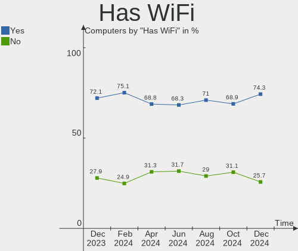
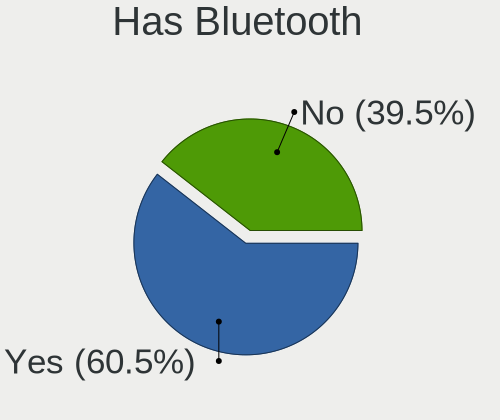
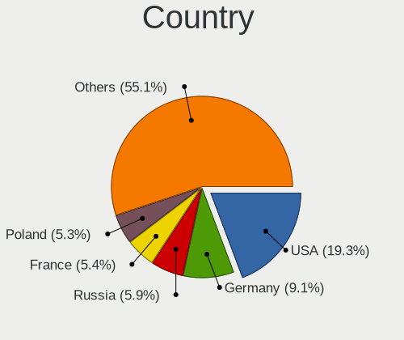
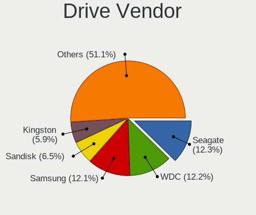
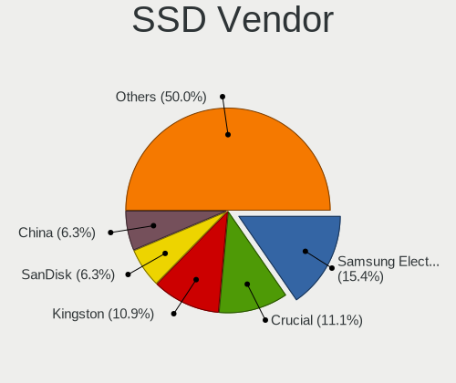
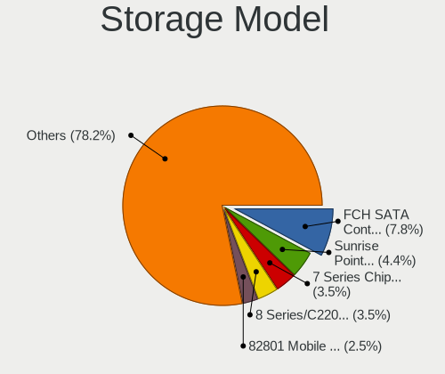

OpenMandriva Hardware Trends
----------------------------

A project to identify most popular hardware characteristics and track their change
over time based on data collected by OpenMandriva users at https://Linux-Hardware.org.

Anyone can contribute to this report by the [hw-probe](https://github.com/linuxhw/hw-probe) tool:

    sudo -E hw-probe -all -upload

This is a report for all computer types. See also reports for [desktops](/Dist/OpenMandriva/Desktop/README.md) and [notebooks](/Dist/OpenMandriva/Notebook/README.md).

Full-feature report is available here: https://linux-hardware.org/?view=trends

Period: Nov, 2021.

Contents
--------

* [ System ](#system)
  - [ OS                       ](#os)
  - [ OS Family                ](#os-family)
  - [ Kernel                   ](#kernel)
  - [ Kernel Family            ](#kernel-family)
  - [ Kernel Major Ver.        ](#kernel-major-ver)
  - [ Arch                     ](#arch)
  - [ DE                       ](#de)
  - [ Display Server           ](#display-server)
  - [ Display Manager          ](#display-manager)
  - [ OS Lang                  ](#os-lang)
  - [ Boot Mode                ](#boot-mode)
  - [ Filesystem               ](#filesystem)
  - [ Part. scheme             ](#part-scheme)
  - [ Dual Boot with Linux/BSD ](#dual-boot-with-linuxbsd)
  - [ Dual Boot (Win)          ](#dual-boot-win)

* [ Board ](#board)
  - [ Vendor                   ](#vendor)
  - [ Model                    ](#model)
  - [ Model Family             ](#model-family)
  - [ MFG Year                 ](#mfg-year)
  - [ Form Factor              ](#form-factor)
  - [ Secure Boot              ](#secure-boot)
  - [ Coreboot                 ](#coreboot)
  - [ RAM Size                 ](#ram-size)
  - [ RAM Used                 ](#ram-used)
  - [ Total Drives             ](#total-drives)
  - [ Has CD-ROM               ](#has-cd-rom)
  - [ Has Ethernet             ](#has-ethernet)
  - [ Has WiFi                 ](#has-wifi)
  - [ Has Bluetooth            ](#has-bluetooth)

* [ Location ](#location)
  - [ Country                  ](#country)
  - [ City                     ](#city)

* [ Drives ](#drives)
  - [ Drive Vendor             ](#drive-vendor)
  - [ Drive Model              ](#drive-model)
  - [ HDD Vendor               ](#hdd-vendor)
  - [ SSD Vendor               ](#ssd-vendor)
  - [ Drive Kind               ](#drive-kind)
  - [ Drive Connector          ](#drive-connector)
  - [ Drive Size               ](#drive-size)
  - [ Space Total              ](#space-total)
  - [ Space Used               ](#space-used)
  - [ Malfunc. Drives          ](#malfunc-drives)
  - [ Malfunc. Drive Vendor    ](#malfunc-drive-vendor)
  - [ Malfunc. HDD Vendor      ](#malfunc-hdd-vendor)
  - [ Malfunc. Drive Kind      ](#malfunc-drive-kind)
  - [ Failed Drives            ](#failed-drives)
  - [ Failed Drive Vendor      ](#failed-drive-vendor)
  - [ Drive Status             ](#drive-status)

* [ Storage controller ](#storage-controller)
  - [ Storage Vendor           ](#storage-vendor)
  - [ Storage Model            ](#storage-model)
  - [ Storage Kind             ](#storage-kind)

* [ Processor ](#processor)
  - [ CPU Vendor               ](#cpu-vendor)
  - [ CPU Model                ](#cpu-model)
  - [ CPU Model Family         ](#cpu-model-family)
  - [ CPU Cores                ](#cpu-cores)
  - [ CPU Sockets              ](#cpu-sockets)
  - [ CPU Threads              ](#cpu-threads)
  - [ CPU Op-Modes             ](#cpu-op-modes)
  - [ CPU Microcode            ](#cpu-microcode)
  - [ CPU Microarch            ](#cpu-microarch)

* [ Graphics ](#graphics)
  - [ GPU Vendor               ](#gpu-vendor)
  - [ GPU Model                ](#gpu-model)
  - [ GPU Combo                ](#gpu-combo)
  - [ GPU Driver               ](#gpu-driver)
  - [ GPU Memory               ](#gpu-memory)

* [ Monitor ](#monitor)
  - [ Monitor Vendor           ](#monitor-vendor)
  - [ Monitor Model            ](#monitor-model)
  - [ Monitor Resolution       ](#monitor-resolution)
  - [ Monitor Diagonal         ](#monitor-diagonal)
  - [ Monitor Width            ](#monitor-width)
  - [ Aspect Ratio             ](#aspect-ratio)
  - [ Monitor Area             ](#monitor-area)
  - [ Pixel Density            ](#pixel-density)
  - [ Multiple Monitors        ](#multiple-monitors)

* [ Network ](#network)
  - [ Net Controller Vendor    ](#net-controller-vendor)
  - [ Net Controller Model     ](#net-controller-model)
  - [ Wireless Vendor          ](#wireless-vendor)
  - [ Wireless Model           ](#wireless-model)
  - [ Ethernet Vendor          ](#ethernet-vendor)
  - [ Ethernet Model           ](#ethernet-model)
  - [ Net Controller Kind      ](#net-controller-kind)
  - [ Used Controller          ](#used-controller)
  - [ NICs                     ](#nics)
  - [ IPv6                     ](#ipv6)

* [ Bluetooth ](#bluetooth)
  - [ Bluetooth Vendor         ](#bluetooth-vendor)
  - [ Bluetooth Model          ](#bluetooth-model)

* [ Sound ](#sound)
  - [ Sound Vendor             ](#sound-vendor)
  - [ Sound Model              ](#sound-model)

* [ Memory ](#memory)
  - [ Memory Vendor            ](#memory-vendor)
  - [ Memory Model             ](#memory-model)
  - [ Memory Kind              ](#memory-kind)
  - [ Memory Form Factor       ](#memory-form-factor)
  - [ Memory Size              ](#memory-size)
  - [ Memory Speed             ](#memory-speed)

* [ Printers & scanners ](#printers--scanners)
  - [ Printer Vendor           ](#printer-vendor)
  - [ Printer Model            ](#printer-model)
  - [ Scanner Vendor           ](#scanner-vendor)
  - [ Scanner Model            ](#scanner-model)

* [ Camera ](#camera)
  - [ Camera Vendor            ](#camera-vendor)
  - [ Camera Model             ](#camera-model)

* [ Security ](#security)
  - [ Fingerprint Vendor       ](#fingerprint-vendor)
  - [ Fingerprint Model        ](#fingerprint-model)
  - [ Chipcard Vendor          ](#chipcard-vendor)
  - [ Chipcard Model           ](#chipcard-model)

* [ Unsupported ](#unsupported)
  - [ Unsupported Devices      ](#unsupported-devices)
  - [ Unsupported Device Types ](#unsupported-device-types)

System
------

OS
--

Installed operating systems

| Name              | Computers | Percent |
|-------------------|-----------|---------|
| OpenMandriva 4.2  | 219       | 87.95%  |
| OpenMandriva 4.50 | 30        | 12.05%  |

OS Family
---------

OS without a version

| Name         | Computers | Percent |
|--------------|-----------|---------|
| OpenMandriva | 249       | 100%    |

Kernel
------

Version of the Linux kernel

| Version                  | Computers | Percent |
|--------------------------|-----------|---------|
| 5.10.14-desktop-1omv4002 | 213       | 85.54%  |
| 5.12.4-desktop-1omv4050  | 15        | 6.02%   |
| 5.14.7-desktop-1omv4050  | 9         | 3.61%   |
| 5.11.12-desktop-1omv4002 | 6         | 2.41%   |
| 5.14.14-desktop-1omv4050 | 5         | 2.01%   |
| 5.12.7-desktop-1omv4003  | 1         | 0.4%    |

Kernel Family
-------------

Linux kernel without a distro release

| Version | Computers | Percent |
|---------|-----------|---------|
| 5.10.14 | 213       | 85.54%  |
| 5.12.4  | 15        | 6.02%   |
| 5.14.7  | 9         | 3.61%   |
| 5.11.12 | 6         | 2.41%   |
| 5.14.14 | 5         | 2.01%   |
| 5.12.7  | 1         | 0.4%    |

Kernel Major Ver.
-----------------

Linux kernel major version

| Version | Computers | Percent |
|---------|-----------|---------|
| 5.10    | 213       | 85.54%  |
| 5.12    | 16        | 6.43%   |
| 5.14    | 14        | 5.62%   |
| 5.11    | 6         | 2.41%   |

Arch
----

OS architecture (x86_64, i586, etc.)

| Name   | Computers | Percent |
|--------|-----------|---------|
| x86_64 | 249       | 100%    |

DE
--

Desktop Environment

| Name | Computers | Percent |
|------|-----------|---------|
| KDE5 | 248       | 99.6%   |
| LXQt | 1         | 0.4%    |

Display Server
--------------

X11 or Wayland

| Name    | Computers | Percent |
|---------|-----------|---------|
| X11     | 245       | 98.39%  |
| Wayland | 4         | 1.61%   |

Display Manager
---------------

SDDM, LightDM, etc.

| Name | Computers | Percent |
|------|-----------|---------|
| SDDM | 249       | 100%    |

OS Lang
-------

Language

| Lang  | Computers | Percent |
|-------|-----------|---------|
| en_US | 127       | 51%     |
| de_DE | 20        | 8.03%   |
| pt_BR | 18        | 7.23%   |
| ru_RU | 17        | 6.83%   |
| fr_FR | 16        | 6.43%   |
| cs_CZ | 9         | 3.61%   |
| pl_PL | 8         | 3.21%   |
| it_IT | 5         | 2.01%   |
| es_ES | 3         | 1.2%    |
| es_AR | 3         | 1.2%    |
| en_GB | 3         | 1.2%    |
| nl_NL | 2         | 0.8%    |
| es_CO | 2         | 0.8%    |
| en_CA | 2         | 0.8%    |
| de_AT | 2         | 0.8%    |
| uk_UA | 1         | 0.4%    |
| ru_UA | 1         | 0.4%    |
| ro_RO | 1         | 0.4%    |
| it_CH | 1         | 0.4%    |
| hu_HU | 1         | 0.4%    |
| fr_CH | 1         | 0.4%    |
| fr_CA | 1         | 0.4%    |
| fr_BE | 1         | 0.4%    |
| es_MX | 1         | 0.4%    |
| es_CL | 1         | 0.4%    |
| de_CH | 1         | 0.4%    |
| da_DK | 1         | 0.4%    |

Boot Mode
---------

EFI or BIOS

| Mode | Computers | Percent |
|------|-----------|---------|
| BIOS | 142       | 57.03%  |
| EFI  | 107       | 42.97%  |

Filesystem
----------

Type of filesystem

| Type    | Computers | Percent |
|---------|-----------|---------|
| Overlay | 212       | 85.14%  |
| Ext4    | 37        | 14.86%  |

Part. scheme
------------

Scheme of partitioning

| Type    | Computers | Percent |
|---------|-----------|---------|
| GPT     | 156       | 62.65%  |
| MBR     | 92        | 36.95%  |
| Unknown | 1         | 0.4%    |

Dual Boot with Linux/BSD
------------------------

Hosting more than one Linux/BSD

| Dual boot | Computers | Percent |
|-----------|-----------|---------|
| Yes       | 130       | 52.21%  |
| No        | 119       | 47.79%  |

Dual Boot (Win)
---------------

Hosting Linux and Windows

| Dual boot | Computers | Percent |
|-----------|-----------|---------|
| No        | 127       | 51%     |
| Yes       | 122       | 49%     |

Board
-----

Vendor
------

Motherboard manufacturer

| Name                  | Computers | Percent |
|-----------------------|-----------|---------|
| ASUSTek Computer      | 47        | 18.88%  |
| Hewlett-Packard       | 32        | 12.85%  |
| Lenovo                | 31        | 12.45%  |
| MSI                   | 20        | 8.03%   |
| Acer                  | 20        | 8.03%   |
| Dell                  | 19        | 7.63%   |
| Gigabyte Technology   | 17        | 6.83%   |
| ASRock                | 13        | 5.22%   |
| Apple                 | 9         | 3.61%   |
| Medion                | 5         | 2.01%   |
| Toshiba               | 4         | 1.61%   |
| Sony                  | 4         | 1.61%   |
| Samsung Electronics   | 4         | 1.61%   |
| Fujitsu               | 3         | 1.2%    |
| Biostar               | 3         | 1.2%    |
| Intel                 | 2         | 0.8%    |
| Alienware             | 2         | 0.8%    |
| Supermicro            | 1         | 0.4%    |
| SLIMBOOK              | 1         | 0.4%    |
| SIEMENS               | 1         | 0.4%    |
| Semp Toshiba          | 1         | 0.4%    |
| Positivo Bahia - VAIO | 1         | 0.4%    |
| PERSONA               | 1         | 0.4%    |
| Pegatron              | 1         | 0.4%    |
| MouseComputer         | 1         | 0.4%    |
| LattePanda            | 1         | 0.4%    |
| INTELBRAS             | 1         | 0.4%    |
| Gateway               | 1         | 0.4%    |
| Foxconn               | 1         | 0.4%    |
| CSL-Computer          | 1         | 0.4%    |
| AMD                   | 1         | 0.4%    |

Model
-----

Motherboard model

| Name                                           | Computers | Percent |
|------------------------------------------------|-----------|---------|
| ASUS All Series                                | 6         | 2.41%   |
| ASUS UX31E                                     | 3         | 1.2%    |
| Sony VGN-FZ31Z                                 | 2         | 0.8%    |
| MSI MS-7C52                                    | 2         | 0.8%    |
| MSI MS-7C37                                    | 2         | 0.8%    |
| Lenovo IdeaPad 330S-15IKB 81F5                 | 2         | 0.8%    |
| HP Notebook                                    | 2         | 0.8%    |
| Gigabyte H61M-DS2                              | 2         | 0.8%    |
| Gigabyte B75M-D2V                              | 2         | 0.8%    |
| Dell OptiPlex 390                              | 2         | 0.8%    |
| ASUS SABERTOOTH 990FX R2.0                     | 2         | 0.8%    |
| Toshiba Satellite L500                         | 1         | 0.4%    |
| Toshiba Satellite L50-A-1EL                    | 1         | 0.4%    |
| Toshiba Satellite C855-27U                     | 1         | 0.4%    |
| Toshiba Satellite A300                         | 1         | 0.4%    |
| Supermicro C2SBX                               | 1         | 0.4%    |
| Sony VPCEB1E9R                                 | 1         | 0.4%    |
| Sony SVT13115FGS                               | 1         | 0.4%    |
| SLIMBOOK PRO                                   | 1         | 0.4%    |
| SIEMENS SIMATIC Field PG M5                    | 1         | 0.4%    |
| Semp Toshiba STI                               | 1         | 0.4%    |
| Samsung R530/R730/R540                         | 1         | 0.4%    |
| Samsung R430/R480/R440                         | 1         | 0.4%    |
| Samsung 300E5EV/300E4EV/270E5EV/270E4EV/2470EV | 1         | 0.4%    |
| Samsung 300E4C/300E5C/300E7C                   | 1         | 0.4%    |
| Positivo Bahia - VAIO VJFE43F11X-XXXXXX        | 1         | 0.4%    |
| PERSONA MYBOOK 14                              | 1         | 0.4%    |
| Pegatron h9-1183                               | 1         | 0.4%    |
| MSI MS-7D09                                    | 1         | 0.4%    |
| MSI MS-7C08                                    | 1         | 0.4%    |
| MSI MS-7B89                                    | 1         | 0.4%    |
| MSI MS-7B86                                    | 1         | 0.4%    |
| MSI MS-7B84                                    | 1         | 0.4%    |
| MSI MS-7B07                                    | 1         | 0.4%    |
| MSI MS-7A33                                    | 1         | 0.4%    |
| MSI MS-7972                                    | 1         | 0.4%    |
| MSI MS-7918                                    | 1         | 0.4%    |
| MSI MS-7845                                    | 1         | 0.4%    |
| MSI MS-7817                                    | 1         | 0.4%    |
| MSI MS-7758                                    | 1         | 0.4%    |
| MSI MS-7721                                    | 1         | 0.4%    |
| MSI MS-7529                                    | 1         | 0.4%    |
| MSI GL72M 7RDX                                 | 1         | 0.4%    |
| MSI GE70 2QE                                   | 1         | 0.4%    |
| MouseComputer B360M                            | 1         | 0.4%    |
| Medion MS-7621                                 | 1         | 0.4%    |
| Medion ERAZER X7857 MD60893                    | 1         | 0.4%    |
| Medion E2292                                   | 1         | 0.4%    |
| Medion Akoya P6638                             | 1         | 0.4%    |
| Medion A17                                     | 1         | 0.4%    |
| Lenovo Yoga 530-14IKB 81EK                     | 1         | 0.4%    |
| Lenovo V155-15API 81V5                         | 1         | 0.4%    |
| Lenovo ThinkStation S30 4351FE5                | 1         | 0.4%    |
| Lenovo ThinkPad X230 2330A17                   | 1         | 0.4%    |
| Lenovo ThinkPad T61 64669YG                    | 1         | 0.4%    |
| Lenovo ThinkPad T520 4243ED3                   | 1         | 0.4%    |
| Lenovo ThinkPad T520 42433VG                   | 1         | 0.4%    |
| Lenovo ThinkPad T460 20FMS78014                | 1         | 0.4%    |
| Lenovo ThinkPad T460 .MFG_IN_GO                | 1         | 0.4%    |
| Lenovo ThinkPad T430 2347CL1                   | 1         | 0.4%    |

Model Family
------------

Motherboard model prefix

| Name                                    | Computers | Percent |
|-----------------------------------------|-----------|---------|
| Acer Aspire                             | 13        | 5.22%   |
| Lenovo ThinkPad                         | 11        | 4.42%   |
| HP Compaq                               | 8         | 3.21%   |
| Lenovo IdeaPad                          | 7         | 2.81%   |
| ASUS All                                | 6         | 2.41%   |
| Dell OptiPlex                           | 5         | 2.01%   |
| Dell Latitude                           | 5         | 2.01%   |
| ASUS ROG                                | 5         | 2.01%   |
| Toshiba Satellite                       | 4         | 1.61%   |
| Lenovo IdeaCentre                       | 3         | 1.2%    |
| HP Pavilion                             | 3         | 1.2%    |
| HP Laptop                               | 3         | 1.2%    |
| HP EliteDesk                            | 3         | 1.2%    |
| HP EliteBook                            | 3         | 1.2%    |
| Dell Inspiron                           | 3         | 1.2%    |
| ASUS UX31E                              | 3         | 1.2%    |
| Sony VGN-FZ31Z                          | 2         | 0.8%    |
| MSI MS-7C52                             | 2         | 0.8%    |
| MSI MS-7C37                             | 2         | 0.8%    |
| HP ProBook                              | 2         | 0.8%    |
| HP Notebook                             | 2         | 0.8%    |
| Gigabyte H61M-DS2                       | 2         | 0.8%    |
| Gigabyte B75M-D2V                       | 2         | 0.8%    |
| Fujitsu LIFEBOOK                        | 2         | 0.8%    |
| Dell Vostro                             | 2         | 0.8%    |
| ASUS SABERTOOTH                         | 2         | 0.8%    |
| ASUS P5VD2-MX                           | 2         | 0.8%    |
| ASUS M5A78L-M                           | 2         | 0.8%    |
| ASRock B450M                            | 2         | 0.8%    |
| Alienware Aurora                        | 2         | 0.8%    |
| Supermicro C2SBX                        | 1         | 0.4%    |
| Sony VPCEB1E9R                          | 1         | 0.4%    |
| Sony SVT13115FGS                        | 1         | 0.4%    |
| SLIMBOOK PRO                            | 1         | 0.4%    |
| SIEMENS SIMATIC                         | 1         | 0.4%    |
| Semp Toshiba STI                        | 1         | 0.4%    |
| Samsung R530                            | 1         | 0.4%    |
| Samsung R430                            | 1         | 0.4%    |
| Samsung 300E5EV                         | 1         | 0.4%    |
| Samsung 300E4C                          | 1         | 0.4%    |
| Positivo Bahia - VAIO VJFE43F11X-XXXXXX | 1         | 0.4%    |
| PERSONA MYBOOK                          | 1         | 0.4%    |
| Pegatron h9-1183                        | 1         | 0.4%    |
| MSI MS-7D09                             | 1         | 0.4%    |
| MSI MS-7C08                             | 1         | 0.4%    |
| MSI MS-7B89                             | 1         | 0.4%    |
| MSI MS-7B86                             | 1         | 0.4%    |
| MSI MS-7B84                             | 1         | 0.4%    |
| MSI MS-7B07                             | 1         | 0.4%    |
| MSI MS-7A33                             | 1         | 0.4%    |
| MSI MS-7972                             | 1         | 0.4%    |
| MSI MS-7918                             | 1         | 0.4%    |
| MSI MS-7845                             | 1         | 0.4%    |
| MSI MS-7817                             | 1         | 0.4%    |
| MSI MS-7758                             | 1         | 0.4%    |
| MSI MS-7721                             | 1         | 0.4%    |
| MSI MS-7529                             | 1         | 0.4%    |
| MSI GL72M                               | 1         | 0.4%    |
| MSI GE70                                | 1         | 0.4%    |
| MouseComputer B360M                     | 1         | 0.4%    |

MFG Year
--------

Motherboard manufacture year

| Year | Computers | Percent |
|------|-----------|---------|
| 2021 | 29        | 11.65%  |
| 2020 | 26        | 10.44%  |
| 2012 | 23        | 9.24%   |
| 2018 | 20        | 8.03%   |
| 2013 | 19        | 7.63%   |
| 2015 | 17        | 6.83%   |
| 2011 | 17        | 6.83%   |
| 2019 | 16        | 6.43%   |
| 2014 | 16        | 6.43%   |
| 2010 | 15        | 6.02%   |
| 2009 | 13        | 5.22%   |
| 2008 | 11        | 4.42%   |
| 2007 | 10        | 4.02%   |
| 2016 | 9         | 3.61%   |
| 2017 | 8         | 3.21%   |

Form Factor
-----------

Physical design of the computer

| Name        | Computers | Percent |
|-------------|-----------|---------|
| Desktop     | 120       | 48.19%  |
| Notebook    | 115       | 46.18%  |
| All in one  | 9         | 3.61%   |
| Convertible | 2         | 0.8%    |
| Mini pc     | 2         | 0.8%    |
| Server      | 1         | 0.4%    |

Secure Boot
-----------

Enabled or disabled

| State    | Computers | Percent |
|----------|-----------|---------|
| Disabled | 249       | 100%    |

Coreboot
--------

Have coreboot on board

| Used | Computers | Percent |
|------|-----------|---------|
| No   | 249       | 100%    |

RAM Size
--------

Total RAM memory

| Size in GB  | Computers | Percent |
|-------------|-----------|---------|
| 3.01-4.0    | 76        | 30.52%  |
| 4.01-8.0    | 64        | 25.7%   |
| 16.01-24.0  | 35        | 14.06%  |
| 8.01-16.0   | 35        | 14.06%  |
| 32.01-64.0  | 14        | 5.62%   |
| 1.01-2.0    | 14        | 5.62%   |
| 2.01-3.0    | 7         | 2.81%   |
| 64.01-256.0 | 3         | 1.2%    |
| 24.01-32.0  | 1         | 0.4%    |

RAM Used
--------

Used RAM memory

| Used GB  | Computers | Percent |
|----------|-----------|---------|
| 1.01-2.0 | 193       | 77.51%  |
| 0.51-1.0 | 33        | 13.25%  |
| 2.01-3.0 | 13        | 5.22%   |
| 0.01-0.5 | 7         | 2.81%   |
| 4.01-8.0 | 2         | 0.8%    |
| 3.01-4.0 | 1         | 0.4%    |

Total Drives
------------

Number of drives on board

| Drives  | Computers | Percent |
|---------|-----------|---------|
| 1       | 157       | 63.05%  |
| 2       | 51        | 20.48%  |
| 3       | 25        | 10.04%  |
| 4       | 5         | 2.01%   |
| 5       | 3         | 1.2%    |
| 0       | 3         | 1.2%    |
| 7       | 2         | 0.8%    |
| 8       | 1         | 0.4%    |
| 6       | 1         | 0.4%    |
| Unknown | 1         | 0.4%    |

Has CD-ROM
----------

Has CD-ROM on board

| Presented | Computers | Percent |
|-----------|-----------|---------|
| Yes       | 155       | 62.25%  |
| No        | 94        | 37.75%  |

Has Ethernet
------------

Has Ethernet on board

| Presented | Computers | Percent |
|-----------|-----------|---------|
| Yes       | 238       | 95.58%  |
| No        | 11        | 4.42%   |

Has WiFi
--------

Has WiFi module

| Presented | Computers | Percent |
|-----------|-----------|---------|
| Yes       | 154       | 61.85%  |
| No        | 95        | 38.15%  |

Has Bluetooth
-------------

Has Bluetooth module

| Presented | Computers | Percent |
|-----------|-----------|---------|
| No        | 131       | 52.61%  |
| Yes       | 118       | 47.39%  |

Location
--------

Country
-------

Geographic location (country)

| Country      | Computers | Percent |
|--------------|-----------|---------|
| Germany      | 32        | 12.85%  |
| Russia       | 25        | 10.04%  |
| Brazil       | 25        | 10.04%  |
| USA          | 22        | 8.84%   |
| France       | 22        | 8.84%   |
| Poland       | 13        | 5.22%   |
| Czechia      | 13        | 5.22%   |
| Canada       | 10        | 4.02%   |
| Italy        | 9         | 3.61%   |
| Spain        | 7         | 2.81%   |
| Switzerland  | 4         | 1.61%   |
| Mexico       | 4         | 1.61%   |
| India        | 4         | 1.61%   |
| Norway       | 3         | 1.2%    |
| Netherlands  | 3         | 1.2%    |
| Hungary      | 3         | 1.2%    |
| Belgium      | 3         | 1.2%    |
| Argentina    | 3         | 1.2%    |
| Ukraine      | 2         | 0.8%    |
| UK           | 2         | 0.8%    |
| Taiwan       | 2         | 0.8%    |
| Portugal     | 2         | 0.8%    |
| Philippines  | 2         | 0.8%    |
| Japan        | 2         | 0.8%    |
| Iran         | 2         | 0.8%    |
| Greece       | 2         | 0.8%    |
| Finland      | 2         | 0.8%    |
| Colombia     | 2         | 0.8%    |
| Chile        | 2         | 0.8%    |
| Austria      | 2         | 0.8%    |
| Australia    | 2         | 0.8%    |
| Vietnam      | 1         | 0.4%    |
| Uruguay      | 1         | 0.4%    |
| Thailand     | 1         | 0.4%    |
| Sweden       | 1         | 0.4%    |
| Serbia       | 1         | 0.4%    |
| Saudi Arabia | 1         | 0.4%    |
| Romania      | 1         | 0.4%    |
| Puerto Rico  | 1         | 0.4%    |
| Morocco      | 1         | 0.4%    |
| Malaysia     | 1         | 0.4%    |
| Ireland      | 1         | 0.4%    |
| Hong Kong    | 1         | 0.4%    |
| Georgia      | 1         | 0.4%    |
| Denmark      | 1         | 0.4%    |
| Cyprus       | 1         | 0.4%    |
| China        | 1         | 0.4%    |
| Burkina Faso | 1         | 0.4%    |
| Bangladesh   | 1         | 0.4%    |

City
----

Geographic location (city)

| City                     | Computers | Percent |
|--------------------------|-----------|---------|
| Prague                   | 5         | 2.01%   |
| S??o Paulo               | 4         | 1.61%   |
| Moscow                   | 4         | 1.61%   |
| Stuttgart                | 3         | 1.2%    |
| Nizhniy Novgorod         | 3         | 1.2%    |
| Milan                    | 3         | 1.2%    |
| Zurich                   | 2         | 0.8%    |
| Warsaw                   | 2         | 0.8%    |
| Vancouver                | 2         | 0.8%    |
| Utrecht                  | 2         | 0.8%    |
| Ulan-Ude                 | 2         | 0.8%    |
| Surrey                   | 2         | 0.8%    |
| St Petersburg            | 2         | 0.8%    |
| Sorriso                  | 2         | 0.8%    |
| Rennes                   | 2         | 0.8%    |
| Perm                     | 2         | 0.8%    |
| Oslo                     | 2         | 0.8%    |
| Osasco                   | 2         | 0.8%    |
| New Taipei               | 2         | 0.8%    |
| Munich                   | 2         | 0.8%    |
| Mieuxce                  | 2         | 0.8%    |
| Hamburg                  | 2         | 0.8%    |
| Funchal                  | 2         | 0.8%    |
| Deep River               | 2         | 0.8%    |
| Athens                   | 2         | 0.8%    |
| As                       | 2         | 0.8%    |
| Zolotar?«vka             | 1         | 0.4%    |
| Zhigulevsk               | 1         | 0.4%    |
| Z?‚otoryja               | 1         | 0.4%    |
| Zawiercie                | 1         | 0.4%    |
| Zabrze                   | 1         | 0.4%    |
| Yekaterinburg            | 1         | 0.4%    |
| Wuppertal                | 1         | 0.4%    |
| Wiesbaden                | 1         | 0.4%    |
| Villeneuve-les-Maguelone | 1         | 0.4%    |
| Villemoustaussou         | 1         | 0.4%    |
| Vienna                   | 1         | 0.4%    |
| Vichova nad Jizerou      | 1         | 0.4%    |
| Versailleux              | 1         | 0.4%    |
| Venancio Aires           | 1         | 0.4%    |
| Tula                     | 1         | 0.4%    |
| Torrent                  | 1         | 0.4%    |
| Teresina                 | 1         | 0.4%    |
| Szentlorinc              | 1         | 0.4%    |
| Starovelichkovskaya      | 1         | 0.4%    |
| Spokane                  | 1         | 0.4%    |
| Sosnowiec                | 1         | 0.4%    |
| Skutec                   | 1         | 0.4%    |
| Six-Fours-les-Plages     | 1         | 0.4%    |
| Serris                   | 1         | 0.4%    |
| Serdobsk                 | 1         | 0.4%    |
| S??o Lu?­s               | 1         | 0.4%    |
| S??o Bernardo do Campo   | 1         | 0.4%    |
| Savigny-sur-Orge         | 1         | 0.4%    |
| Saransk                  | 1         | 0.4%    |
| Sao Jeronimo da Serra    | 1         | 0.4%    |
| Santiago de Cali         | 1         | 0.4%    |
| Santana Do Araguaia      | 1         | 0.4%    |
| Santa Luzia              | 1         | 0.4%    |
| San Rafael               | 1         | 0.4%    |

Drives
------

Drive Vendor
------------

Hard drive vendors

| Vendor              | Computers | Drives | Percent |
|---------------------|-----------|--------|---------|
| WDC                 | 73        | 87     | 21.53%  |
| Seagate             | 70        | 85     | 20.65%  |
| Samsung Electronics | 35        | 44     | 10.32%  |
| Kingston            | 22        | 25     | 6.49%   |
| Toshiba             | 20        | 20     | 5.9%    |
| Crucial             | 18        | 19     | 5.31%   |
| Hitachi             | 17        | 17     | 5.01%   |
| Unknown             | 11        | 15     | 3.24%   |
| SanDisk             | 11        | 13     | 3.24%   |
| HGST                | 8         | 8      | 2.36%   |
| MAXTOR              | 5         | 5      | 1.47%   |
| A-DATA Technology   | 5         | 5      | 1.47%   |
| SK Hynix            | 3         | 3      | 0.88%   |
| PNY                 | 3         | 3      | 0.88%   |
| Intel               | 3         | 3      | 0.88%   |
| Apple               | 3         | 3      | 0.88%   |
| KIOXIA-EXCERIA      | 2         | 2      | 0.59%   |
| JMicron             | 2         | 2      | 0.59%   |
| Intenso             | 2         | 2      | 0.59%   |
| Hewlett-Packard     | 2         | 3      | 0.59%   |
| Colorful            | 2         | 2      | 0.59%   |
| China               | 2         | 2      | 0.59%   |
| UMIS                | 1         | 1      | 0.29%   |
| Transcend           | 1         | 1      | 0.29%   |
| SABRENT             | 1         | 1      | 0.29%   |
| PLEXTOR             | 1         | 1      | 0.29%   |
| Phison Electronics  | 1         | 1      | 0.29%   |
| Phison              | 1         | 1      | 0.29%   |
| Patriot             | 1         | 1      | 0.29%   |
| OCZ                 | 1         | 1      | 0.29%   |
| Micron Technology   | 1         | 1      | 0.29%   |
| LITEONIT            | 1         | 1      | 0.29%   |
| LITEON              | 1         | 1      | 0.29%   |
| Lexar               | 1         | 1      | 0.29%   |
| LaCie               | 1         | 1      | 0.29%   |
| KingSpec            | 1         | 1      | 0.29%   |
| KingDian            | 1         | 1      | 0.29%   |
| JASTER              | 1         | 1      | 0.29%   |
| GOODRAM             | 1         | 1      | 0.29%   |
| External            | 1         | 1      | 0.29%   |
| BHT                 | 1         | 1      | 0.29%   |
| AMD                 | 1         | 1      | 0.29%   |

Drive Model
-----------

Hard drive models

| Model                               | Computers | Percent |
|-------------------------------------|-----------|---------|
| Kingston SA400S37240G 240GB SSD     | 6         | 1.59%   |
| Seagate ST500DM002-1BD142 500GB     | 4         | 1.06%   |
| Seagate ST3500418AS 500GB           | 4         | 1.06%   |
| WDC WD10EADS-00L5B1 1TB             | 3         | 0.79%   |
| Seagate ST500LT012-1DG142 500GB     | 3         | 0.79%   |
| Seagate ST4000DM004-2CV104 4TB      | 3         | 0.79%   |
| Seagate ST2000DM008-2FR102 2TB      | 3         | 0.79%   |
| Seagate ST1000LM035-1RK172 1TB      | 3         | 0.79%   |
| SanDisk SSD U100 256GB              | 3         | 0.79%   |
| Samsung SSD 860 QVO 1TB             | 3         | 0.79%   |
| Samsung SSD 860 EVO 250GB           | 3         | 0.79%   |
| Samsung SSD 850 EVO 500GB           | 3         | 0.79%   |
| Samsung HM321HI 320GB               | 3         | 0.79%   |
| Kingston SV300S37A120G 120GB SSD    | 3         | 0.79%   |
| Kingston SA400S37480G 480GB SSD     | 3         | 0.79%   |
| Crucial CT500MX500SSD1 500GB        | 3         | 0.79%   |
| Crucial CT480BX500SSD1 480GB        | 3         | 0.79%   |
| WDC WD5000AAKX-08ERMA0 500GB        | 2         | 0.53%   |
| WDC WD5000AAKX-001CA0 500GB         | 2         | 0.53%   |
| WDC WD3200BEVT-22ZCT0 320GB         | 2         | 0.53%   |
| WDC WD20EZRZ-00Z5HB0 2TB            | 2         | 0.53%   |
| WDC WD10EZEX-75WN4A1 1TB            | 2         | 0.53%   |
| WDC WD10EZEX-08WN4A0 1TB            | 2         | 0.53%   |
| WDC WD10EZEX-00BN5A0 1TB            | 2         | 0.53%   |
| WDC WD10EFRX-68PJCN0 1TB            | 2         | 0.53%   |
| WDC WD10EARS-00MVWB0 1TB            | 2         | 0.53%   |
| WDC WD1002FAEX-00Z3A0 1TB           | 2         | 0.53%   |
| Unknown SD32G  32GB                 | 2         | 0.53%   |
| Unknown SD/MMC 16GB                 | 2         | 0.53%   |
| Unknown M.S./M.S.Pro/HG 16GB        | 2         | 0.53%   |
| Unknown DA4032  32GB                | 2         | 0.53%   |
| Toshiba MQ01ABF050 500GB            | 2         | 0.53%   |
| Toshiba MQ01ABD100 1TB              | 2         | 0.53%   |
| Toshiba DT01ACA200 2TB              | 2         | 0.53%   |
| Seagate ST9500420AS 500GB           | 2         | 0.53%   |
| Seagate ST500LT012-9WS142 500GB     | 2         | 0.53%   |
| Seagate ST500LM012 HN-M500MBB 500GB | 2         | 0.53%   |
| Seagate ST3500413AS 500GB           | 2         | 0.53%   |
| Seagate ST3160815AS 160GB           | 2         | 0.53%   |
| Seagate ST31000528AS 1TB            | 2         | 0.53%   |
| Seagate ST2000DM001-9YN164 2TB      | 2         | 0.53%   |
| Seagate ST2000DM001-1ER164 2TB      | 2         | 0.53%   |
| Seagate ST1000DM010-2EP102 1TB      | 2         | 0.53%   |
| Seagate ST1000DM003-9YN162 1TB      | 2         | 0.53%   |
| SanDisk SSD PLUS 1000GB             | 2         | 0.53%   |
| Samsung SSD 970 EVO 1TB             | 2         | 0.53%   |
| Samsung HD322HJ 320GB               | 2         | 0.53%   |
| PNY CS900 240GB SSD                 | 2         | 0.53%   |
| Kingston SA400S37120G 120GB SSD     | 2         | 0.53%   |
| Kingston OM8PCP3512F-AA 512GB       | 2         | 0.53%   |
| JMicron Generic 1TB                 | 2         | 0.53%   |
| HGST HTS545050A7E680 500GB          | 2         | 0.53%   |
| HGST HTS541010A9E680 1TB            | 2         | 0.53%   |
| Crucial CT240M500SSD1 240GB         | 2         | 0.53%   |
| Crucial CT1000MX500SSD1 1TB         | 2         | 0.53%   |
| A-DATA SU630 240GB SSD              | 2         | 0.53%   |
| WDC WDS500G3XHC-00SJG0 500GB        | 1         | 0.26%   |
| WDC WDS500G2B0C-00PXH0 500GB        | 1         | 0.26%   |
| WDC WDS500G2B0A-00SM50 500GB SSD    | 1         | 0.26%   |
| WDC WDS480G2G0A-00JH30 480GB SSD    | 1         | 0.26%   |

HDD Vendor
----------

Hard disk drive vendors

| Vendor              | Computers | Drives | Percent |
|---------------------|-----------|--------|---------|
| Seagate             | 70        | 85     | 36.08%  |
| WDC                 | 64        | 72     | 32.99%  |
| Toshiba             | 17        | 17     | 8.76%   |
| Hitachi             | 17        | 17     | 8.76%   |
| Samsung Electronics | 9         | 9      | 4.64%   |
| HGST                | 8         | 8      | 4.12%   |
| MAXTOR              | 5         | 5      | 2.58%   |
| Apple               | 2         | 2      | 1.03%   |
| Unknown             | 1         | 1      | 0.52%   |
| External            | 1         | 1      | 0.52%   |

SSD Vendor
----------

Solid state drive vendors

| Vendor              | Computers | Drives | Percent |
|---------------------|-----------|--------|---------|
| Samsung Electronics | 21        | 25     | 19.09%  |
| Kingston            | 20        | 23     | 18.18%  |
| Crucial             | 17        | 18     | 15.45%  |
| SanDisk             | 11        | 13     | 10%     |
| WDC                 | 7         | 8      | 6.36%   |
| A-DATA Technology   | 5         | 5      | 4.55%   |
| PNY                 | 3         | 3      | 2.73%   |
| SK Hynix            | 2         | 2      | 1.82%   |
| JMicron             | 2         | 2      | 1.82%   |
| Intenso             | 2         | 2      | 1.82%   |
| Colorful            | 2         | 2      | 1.82%   |
| China               | 2         | 2      | 1.82%   |
| Unknown             | 1         | 1      | 0.91%   |
| Toshiba             | 1         | 1      | 0.91%   |
| PLEXTOR             | 1         | 1      | 0.91%   |
| Patriot             | 1         | 1      | 0.91%   |
| OCZ                 | 1         | 1      | 0.91%   |
| Micron Technology   | 1         | 1      | 0.91%   |
| LITEONIT            | 1         | 1      | 0.91%   |
| KIOXIA-EXCERIA      | 1         | 1      | 0.91%   |
| KingSpec            | 1         | 1      | 0.91%   |
| KingDian            | 1         | 1      | 0.91%   |
| JASTER              | 1         | 1      | 0.91%   |
| Hewlett-Packard     | 1         | 1      | 0.91%   |
| GOODRAM             | 1         | 1      | 0.91%   |
| BHT                 | 1         | 1      | 0.91%   |
| Apple               | 1         | 1      | 0.91%   |
| AMD                 | 1         | 1      | 0.91%   |

Drive Kind
----------

HDD or SSD

| Kind    | Computers | Drives | Percent |
|---------|-----------|--------|---------|
| HDD     | 169       | 217    | 54.69%  |
| SSD     | 100       | 121    | 32.36%  |
| NVMe    | 30        | 36     | 9.71%   |
| MMC     | 6         | 8      | 1.94%   |
| Unknown | 4         | 6      | 1.29%   |

Drive Connector
---------------

SATA, SAS, NVMe, etc.

| Type | Computers | Drives | Percent |
|------|-----------|--------|---------|
| SATA | 227       | 327    | 82.25%  |
| NVMe | 29        | 35     | 10.51%  |
| SAS  | 14        | 18     | 5.07%   |
| MMC  | 6         | 8      | 2.17%   |

Drive Size
----------

Size of hard drive

| Size in TB | Computers | Drives | Percent |
|------------|-----------|--------|---------|
| 0.01-0.5   | 176       | 218    | 63.31%  |
| 0.51-1.0   | 72        | 88     | 25.9%   |
| 1.01-2.0   | 19        | 21     | 6.83%   |
| 3.01-4.0   | 8         | 8      | 2.88%   |
| 2.01-3.0   | 1         | 1      | 0.36%   |
| 10.01-20.0 | 1         | 1      | 0.36%   |
| 4.01-10.0  | 1         | 1      | 0.36%   |

Space Total
-----------

Amount of disk space available on the file system

| Size in GB     | Computers | Percent |
|----------------|-----------|---------|
| 1-20           | 115       | 46.18%  |
| Unknown        | 41        | 16.47%  |
| 101-250        | 29        | 11.65%  |
| 251-500        | 26        | 10.44%  |
| 501-1000       | 13        | 5.22%   |
| 21-50          | 10        | 4.02%   |
| 51-100         | 9         | 3.61%   |
| More than 3000 | 2         | 0.8%    |
| 2001-3000      | 2         | 0.8%    |
| 1001-2000      | 2         | 0.8%    |

Space Used
----------

Amount of used disk space

| Used GB   | Computers | Percent |
|-----------|-----------|---------|
| 1-20      | 189       | 75.9%   |
| Unknown   | 41        | 16.47%  |
| 51-100    | 6         | 2.41%   |
| 21-50     | 4         | 1.61%   |
| 101-250   | 3         | 1.2%    |
| 2001-3000 | 2         | 0.8%    |
| 501-1000  | 2         | 0.8%    |
| 251-500   | 1         | 0.4%    |
| 1001-2000 | 1         | 0.4%    |

Malfunc. Drives
---------------

Drive models with a malfunction

| Model                             | Computers | Drives | Percent |
|-----------------------------------|-----------|--------|---------|
| SanDisk SSD U100 256GB            | 3         | 3      | 4%      |
| WDC WD5000AAKX-001CA0 500GB       | 2         | 2      | 2.67%   |
| WDC WD10EADS-00L5B1 1TB           | 2         | 2      | 2.67%   |
| Seagate ST9500420AS 500GB         | 2         | 2      | 2.67%   |
| Seagate ST500LT012-9WS142 500GB   | 2         | 2      | 2.67%   |
| Seagate ST500DM002-1BD142 500GB   | 2         | 2      | 2.67%   |
| Samsung Electronics HM321HI 320GB | 2         | 2      | 2.67%   |
| HGST HTS545050A7E680 500GB        | 2         | 2      | 2.67%   |
| HGST HTS541010A9E680 1TB          | 2         | 2      | 2.67%   |
| Crucial CT240M500SSD1 240GB       | 2         | 2      | 2.67%   |
| WDC WDS120G2G0B-00EPW0 120GB SSD  | 1         | 1      | 1.33%   |
| WDC WD5000BEVT-22ZAT0 500GB       | 1         | 1      | 1.33%   |
| WDC WD5000AAKX-60U6AA0 500GB      | 1         | 1      | 1.33%   |
| WDC WD5000AAKX-083CA1 500GB       | 1         | 1      | 1.33%   |
| WDC WD5000AAKX-00ERMA0 500GB      | 1         | 1      | 1.33%   |
| WDC WD5000AAKS-75A7B0 500GB       | 1         | 1      | 1.33%   |
| WDC WD3200BEVT-22ZCT0 320GB       | 1         | 1      | 1.33%   |
| WDC WD3200BEKT-60PVMT0 320GB      | 1         | 1      | 1.33%   |
| WDC WD3200AAJS-65M0A0 320GB       | 1         | 1      | 1.33%   |
| WDC WD2500AAKX-753CA1 250GB       | 1         | 1      | 1.33%   |
| WDC WD10JPVT-00MS8T0 1TB          | 1         | 1      | 1.33%   |
| WDC WD10EZEX-60WN4A0 1TB          | 1         | 1      | 1.33%   |
| WDC WD10EARS-00MVWB0 1TB          | 1         | 1      | 1.33%   |
| WDC WD1003FZEX-00MK2A0 1TB        | 1         | 1      | 1.33%   |
| WDC WD1001FALS-40K1B0 1TB         | 1         | 1      | 1.33%   |
| Toshiba MQ01ABD050 500GB          | 1         | 1      | 1.33%   |
| Toshiba MQ01ABD032 320GB          | 1         | 1      | 1.33%   |
| Toshiba MK1252GSX 120GB           | 1         | 1      | 1.33%   |
| Toshiba DT01ACA100 1TB            | 1         | 1      | 1.33%   |
| Seagate ST9250315AS 250GB         | 1         | 1      | 1.33%   |
| Seagate ST9120823AS 120GB         | 1         | 1      | 1.33%   |
| Seagate ST500LT012-1DG142 500GB   | 1         | 1      | 1.33%   |
| Seagate ST500LT0 12-1DG142 500GB  | 1         | 1      | 1.33%   |
| Seagate ST500LM000-SSHD-8GB       | 1         | 1      | 1.33%   |
| Seagate ST4000NM0053 4TB          | 1         | 1      | 1.33%   |
| Seagate ST4000NM0033-9ZM170 4TB   | 1         | 1      | 1.33%   |
| Seagate ST3500418AS 500GB         | 1         | 1      | 1.33%   |
| Seagate ST3500413AS 500GB         | 1         | 1      | 1.33%   |
| Seagate ST3250311SV 250GB         | 1         | 1      | 1.33%   |
| Seagate ST320LT007-9ZV142 320GB   | 1         | 1      | 1.33%   |
| Seagate ST3160815AS 160GB         | 1         | 1      | 1.33%   |
| Seagate ST31000528AS 1TB          | 1         | 1      | 1.33%   |
| Seagate ST2000VM003-1ET164 2TB    | 1         | 1      | 1.33%   |
| Seagate ST2000DM001-9YN164 2TB    | 1         | 1      | 1.33%   |
| Seagate ST2000DM001-1CH164 2TB    | 1         | 1      | 1.33%   |
| Seagate ST1000DM003-9YN162 1TB    | 1         | 1      | 1.33%   |
| Seagate ST1000DL002-9TT153 1TB    | 1         | 1      | 1.33%   |
| Samsung Electronics HD322HJ 320GB | 1         | 1      | 1.33%   |
| PLEXTOR PX-128M6Pro 128GB SSD     | 1         | 1      | 1.33%   |
| MAXTOR STM3500630AS 500GB         | 1         | 1      | 1.33%   |
| MAXTOR 6L080M0 80GB               | 1         | 1      | 1.33%   |
| LITEONIT LAT-128M2S 128GB SSD     | 1         | 1      | 1.33%   |
| Kingston SUV400S37240G 240GB SSD  | 1         | 1      | 1.33%   |
| Hitachi HTS725050A7E635 500GB     | 1         | 1      | 1.33%   |
| Hitachi HTS545050A7E380 500GB     | 1         | 1      | 1.33%   |
| Hitachi HTS545025B9SA02 250GB     | 1         | 1      | 1.33%   |
| Hitachi HTS543232A7A384 320GB     | 1         | 1      | 1.33%   |
| Hitachi HTS542516K9SA00 160GB     | 1         | 1      | 1.33%   |
| Hitachi HTS541680J9SA00 80GB      | 1         | 1      | 1.33%   |
| Hitachi HDS5C3020BLE630 2TB       | 1         | 1      | 1.33%   |

Malfunc. Drive Vendor
---------------------

Vendors of faulty drives

| Vendor              | Computers | Drives | Percent |
|---------------------|-----------|--------|---------|
| Seagate             | 22        | 24     | 30.56%  |
| WDC                 | 18        | 19     | 25%     |
| Hitachi             | 7         | 7      | 9.72%   |
| HGST                | 6         | 6      | 8.33%   |
| Toshiba             | 4         | 4      | 5.56%   |
| SanDisk             | 3         | 3      | 4.17%   |
| Samsung Electronics | 3         | 3      | 4.17%   |
| Crucial             | 3         | 3      | 4.17%   |
| MAXTOR              | 2         | 2      | 2.78%   |
| PLEXTOR             | 1         | 1      | 1.39%   |
| LITEONIT            | 1         | 1      | 1.39%   |
| Kingston            | 1         | 1      | 1.39%   |
| Colorful            | 1         | 1      | 1.39%   |

Malfunc. HDD Vendor
-------------------

Vendors of faulty HDD drives

| Vendor              | Computers | Drives | Percent |
|---------------------|-----------|--------|---------|
| Seagate             | 22        | 24     | 36.07%  |
| WDC                 | 17        | 18     | 27.87%  |
| Hitachi             | 7         | 7      | 11.48%  |
| HGST                | 6         | 6      | 9.84%   |
| Toshiba             | 4         | 4      | 6.56%   |
| Samsung Electronics | 3         | 3      | 4.92%   |
| MAXTOR              | 2         | 2      | 3.28%   |

Malfunc. Drive Kind
-------------------

Kinds of faulty drives

| Kind | Computers | Drives | Percent |
|------|-----------|--------|---------|
| HDD  | 59        | 64     | 84.29%  |
| SSD  | 11        | 11     | 15.71%  |

Failed Drives
-------------

Failed drive models

| Model                                 | Computers | Drives | Percent |
|---------------------------------------|-----------|--------|---------|
| SK Hynix HFS128G39TND-N210A 128GB SSD | 1         | 1      | 50%     |
| Samsung Electronics HM321HI 320GB     | 1         | 1      | 50%     |

Failed Drive Vendor
-------------------

Failed drive vendors

| Vendor              | Computers | Drives | Percent |
|---------------------|-----------|--------|---------|
| SK Hynix            | 1         | 1      | 50%     |
| Samsung Electronics | 1         | 1      | 50%     |

Drive Status
------------

Number of failed and malfunc. drives

| Status   | Computers | Drives | Percent |
|----------|-----------|--------|---------|
| Works    | 182       | 280    | 65.94%  |
| Malfunc  | 69        | 75     | 25%     |
| Detected | 23        | 31     | 8.33%   |
| Failed   | 2         | 2      | 0.72%   |

Storage controller
------------------

Storage Vendor
--------------

Storage controller vendors

| Vendor                         | Computers | Percent |
|--------------------------------|-----------|---------|
| Intel                          | 184       | 63.67%  |
| AMD                            | 52        | 17.99%  |
| Nvidia                         | 9         | 3.11%   |
| Samsung Electronics            | 7         | 2.42%   |
| Sandisk                        | 6         | 2.08%   |
| ASMedia Technology             | 6         | 2.08%   |
| JMicron Technology             | 4         | 1.38%   |
| Marvell Technology Group       | 3         | 1.04%   |
| VIA Technologies               | 2         | 0.69%   |
| Toshiba America Info Systems   | 2         | 0.69%   |
| Phison Electronics             | 2         | 0.69%   |
| Kingston Technology Company    | 2         | 0.69%   |
| Union Memory (Shenzhen)        | 1         | 0.35%   |
| Solid State Storage Technology | 1         | 0.35%   |
| SK Hynix                       | 1         | 0.35%   |
| Silicon Motion                 | 1         | 0.35%   |
| Silicon Image                  | 1         | 0.35%   |
| Micron/Crucial Technology      | 1         | 0.35%   |
| Lite-On Technology             | 1         | 0.35%   |
| KIOXIA                         | 1         | 0.35%   |
| Integrated Technology Express  | 1         | 0.35%   |
| Biwin Storage Technology       | 1         | 0.35%   |

Storage Model
-------------

Storage controller models

| Model                                                                                   | Computers | Percent |
|-----------------------------------------------------------------------------------------|-----------|---------|
| AMD FCH SATA Controller [AHCI mode]                                                     | 30        | 8.52%   |
| Intel 7 Series Chipset Family 6-port SATA Controller [AHCI mode]                        | 15        | 4.26%   |
| Intel Sunrise Point-LP SATA Controller [AHCI mode]                                      | 13        | 3.69%   |
| Intel 8 Series/C220 Series Chipset Family 6-port SATA Controller 1 [AHCI mode]          | 13        | 3.69%   |
| Intel 6 Series/C200 Series Chipset Family 6 port Mobile SATA AHCI Controller            | 12        | 3.41%   |
| Intel NM10/ICH7 Family SATA Controller [IDE mode]                                       | 10        | 2.84%   |
| AMD SB7x0/SB8x0/SB9x0 SATA Controller [AHCI mode]                                       | 10        | 2.84%   |
| Intel 82801G (ICH7 Family) IDE Controller                                               | 9         | 2.56%   |
| Intel Q170/Q150/B150/H170/H110/Z170/CM236 Chipset SATA Controller [AHCI Mode]           | 8         | 2.27%   |
| Intel 82801HM/HEM (ICH8M/ICH8M-E) SATA Controller [AHCI mode]                           | 8         | 2.27%   |
| Intel 82801HM/HEM (ICH8M/ICH8M-E) IDE Controller                                        | 8         | 2.27%   |
| Intel 7 Series/C210 Series Chipset Family 6-port SATA Controller [AHCI mode]            | 7         | 1.99%   |
| Intel 6 Series/C200 Series Chipset Family Desktop SATA Controller (IDE mode, ports 4-5) | 7         | 1.99%   |
| Intel 6 Series/C200 Series Chipset Family Desktop SATA Controller (IDE mode, ports 0-3) | 7         | 1.99%   |
| Intel 6 Series/C200 Series Chipset Family 6 port Desktop SATA AHCI Controller           | 7         | 1.99%   |
| AMD SB7x0/SB8x0/SB9x0 SATA Controller [IDE mode]                                        | 7         | 1.99%   |
| AMD SB7x0/SB8x0/SB9x0 IDE Controller                                                    | 7         | 1.99%   |
| Nvidia MCP79 AHCI Controller                                                            | 6         | 1.7%    |
| Intel Celeron/Pentium Silver Processor SATA Controller                                  | 6         | 1.7%    |
| ASMedia ASM1062 Serial ATA Controller                                                   | 6         | 1.7%    |
| Intel 9 Series Chipset Family SATA Controller [AHCI Mode]                               | 5         | 1.42%   |
| Intel 5 Series/3400 Series Chipset 4 port SATA AHCI Controller                          | 5         | 1.42%   |
| AMD 400 Series Chipset SATA Controller                                                  | 5         | 1.42%   |
| Intel HM170/QM170 Chipset SATA Controller [AHCI Mode]                                   | 4         | 1.14%   |
| Intel Atom/Celeron/Pentium Processor x5-E8000/J3xxx/N3xxx Series SATA Controller        | 4         | 1.14%   |
| Intel 82801IBM/IEM (ICH9M/ICH9M-E) 4 port SATA Controller [AHCI mode]                   | 4         | 1.14%   |
| Intel 8 Series SATA Controller 1 [AHCI mode]                                            | 4         | 1.14%   |
| Intel 5 Series/3400 Series Chipset 6 port SATA AHCI Controller                          | 4         | 1.14%   |
| Intel 200 Series PCH SATA controller [AHCI mode]                                        | 4         | 1.14%   |
| AMD FCH SATA Controller D                                                               | 4         | 1.14%   |
| Sandisk WD Blue SN550 NVMe SSD                                                          | 3         | 0.85%   |
| Samsung NVMe SSD Controller SM981/PM981/PM983                                           | 3         | 0.85%   |
| Nvidia MCP61 SATA Controller                                                            | 3         | 0.85%   |
| Nvidia MCP61 IDE                                                                        | 3         | 0.85%   |
| JMicron JMB363 SATA/IDE Controller                                                      | 3         | 0.85%   |
| Intel SATA Controller [RAID mode]                                                       | 3         | 0.85%   |
| Intel Comet Lake SATA AHCI Controller                                                   | 3         | 0.85%   |
| Intel Cannon Point-LP SATA Controller [AHCI Mode]                                       | 3         | 0.85%   |
| Intel 82801 Mobile SATA Controller [RAID mode]                                          | 3         | 0.85%   |
| Intel 7 Series/C210 Series Chipset Family 4-port SATA Controller [IDE mode]             | 3         | 0.85%   |
| Intel 7 Series/C210 Series Chipset Family 2-port SATA Controller [IDE mode]             | 3         | 0.85%   |
| Intel 500 Series Chipset Family SATA AHCI Controller                                    | 3         | 0.85%   |
| VIA VT82C586A/B/VT82C686/A/B/VT823x/A/C PIPC Bus Master IDE                             | 2         | 0.57%   |
| Samsung NVMe SSD Controller PM9A1/PM9A3/980PRO                                          | 2         | 0.57%   |
| Samsung NVMe SSD Controller 980                                                         | 2         | 0.57%   |
| Phison E12 NVMe Controller                                                              | 2         | 0.57%   |
| Kingston Company Company Non-Volatile memory controller                                 | 2         | 0.57%   |
| JMicron JMB368 IDE controller                                                           | 2         | 0.57%   |
| Intel Wildcat Point-LP SATA Controller [AHCI Mode]                                      | 2         | 0.57%   |
| Intel Ice Lake-LP SATA Controller [AHCI mode]                                           | 2         | 0.57%   |
| Intel Comet Lake PCH-H RAID                                                             | 2         | 0.57%   |
| Intel Atom Processor E3800 Series SATA AHCI Controller                                  | 2         | 0.57%   |
| Intel 82801IR/IO/IH (ICH9R/DO/DH) 6 port SATA Controller [AHCI mode]                    | 2         | 0.57%   |
| Intel 82801H (ICH8 Family) 4 port SATA Controller [IDE mode]                            | 2         | 0.57%   |
| Intel 5 Series/3400 Series Chipset 4 port SATA IDE Controller                           | 2         | 0.57%   |
| Intel 5 Series/3400 Series Chipset 2 port SATA IDE Controller                           | 2         | 0.57%   |
| Intel 400 Series Chipset Family SATA AHCI Controller                                    | 2         | 0.57%   |
| Intel 4 Series Chipset PT IDER Controller                                               | 2         | 0.57%   |
| AMD FCH IDE Controller                                                                  | 2         | 0.57%   |
| VIA VT8237A SATA 2-Port Controller                                                      | 1         | 0.28%   |

Storage Kind
------------

Kind of storage controller (IDE, SATA, NVMe, SAS, ...)

| Kind | Computers | Percent |
|------|-----------|---------|
| SATA | 205       | 68.56%  |
| IDE  | 55        | 18.39%  |
| NVMe | 29        | 9.7%    |
| RAID | 9         | 3.01%   |
| SAS  | 1         | 0.33%   |

Processor
---------

CPU Vendor
----------

Processor vendors

| Vendor | Computers | Percent |
|--------|-----------|---------|
| Intel  | 194       | 77.91%  |
| AMD    | 55        | 22.09%  |

CPU Model
---------

Processor models

| Model                                       | Computers | Percent |
|---------------------------------------------|-----------|---------|
| Intel Core i5-8250U CPU @ 1.60GHz           | 5         | 2.01%   |
| Intel Core i5-2520M CPU @ 2.50GHz           | 4         | 1.61%   |
| Intel Pentium Dual-Core CPU E5200 @ 2.50GHz | 3         | 1.2%    |
| Intel Pentium CPU N3710 @ 1.60GHz           | 3         | 1.2%    |
| Intel Pentium CPU G3258 @ 3.20GHz           | 3         | 1.2%    |
| Intel Core i7-3770K CPU @ 3.50GHz           | 3         | 1.2%    |
| Intel Core i7-2677M CPU @ 1.80GHz           | 3         | 1.2%    |
| Intel Core i5-6300U CPU @ 2.40GHz           | 3         | 1.2%    |
| Intel Core i3-3120M CPU @ 2.50GHz           | 3         | 1.2%    |
| Intel Pentium Dual CPU T2390 @ 1.86GHz      | 2         | 0.8%    |
| Intel Pentium CPU G620 @ 2.60GHz            | 2         | 0.8%    |
| Intel Core i7-8550U CPU @ 1.80GHz           | 2         | 0.8%    |
| Intel Core i7-7700HQ CPU @ 2.80GHz          | 2         | 0.8%    |
| Intel Core i7-6500U CPU @ 2.50GHz           | 2         | 0.8%    |
| Intel Core i7-4770 CPU @ 3.40GHz            | 2         | 0.8%    |
| Intel Core i7-10750H CPU @ 2.60GHz          | 2         | 0.8%    |
| Intel Core i5-7400 CPU @ 3.00GHz            | 2         | 0.8%    |
| Intel Core i5-6500 CPU @ 3.20GHz            | 2         | 0.8%    |
| Intel Core i5-5200U CPU @ 2.20GHz           | 2         | 0.8%    |
| Intel Core i5-4210U CPU @ 1.70GHz           | 2         | 0.8%    |
| Intel Core i5-3330 CPU @ 3.00GHz            | 2         | 0.8%    |
| Intel Core i5-3320M CPU @ 2.60GHz           | 2         | 0.8%    |
| Intel Core i5-2320 CPU @ 3.00GHz            | 2         | 0.8%    |
| Intel Core i3-4330 CPU @ 3.50GHz            | 2         | 0.8%    |
| Intel Core i3-2330M CPU @ 2.20GHz           | 2         | 0.8%    |
| Intel Core i3-2120 CPU @ 3.30GHz            | 2         | 0.8%    |
| Intel Core i3 CPU 540 @ 3.07GHz             | 2         | 0.8%    |
| Intel Core 2 Quad CPU Q6600 @ 2.40GHz       | 2         | 0.8%    |
| Intel Core 2 Duo CPU T8300 @ 2.40GHz        | 2         | 0.8%    |
| Intel Core 2 Duo CPU T7250 @ 2.00GHz        | 2         | 0.8%    |
| Intel Celeron N4120 CPU @ 1.10GHz           | 2         | 0.8%    |
| Intel Celeron N4100 CPU @ 1.10GHz           | 2         | 0.8%    |
| Intel Celeron N4020 CPU @ 1.10GHz           | 2         | 0.8%    |
| Intel Celeron CPU N2840 @ 2.16GHz           | 2         | 0.8%    |
| Intel 11th Gen Core i9-11900K @ 3.50GHz     | 2         | 0.8%    |
| AMD Ryzen 9 5900X 12-Core Processor         | 2         | 0.8%    |
| AMD Ryzen 7 3700X 8-Core Processor          | 2         | 0.8%    |
| AMD Ryzen 5 3600 6-Core Processor           | 2         | 0.8%    |
| AMD Phenom II X4 955 Processor              | 2         | 0.8%    |
| AMD FX-8350 Eight-Core Processor            | 2         | 0.8%    |
| AMD A8-6600K APU with Radeon HD Graphics    | 2         | 0.8%    |
| Intel Xeon CPU X3363 @ 2.83GHz              | 1         | 0.4%    |
| Intel Xeon CPU E5-1620 v2 @ 3.70GHz         | 1         | 0.4%    |
| Intel Xeon CPU E3-1226 v3 @ 3.30GHz         | 1         | 0.4%    |
| Intel Pentium Gold G5400 CPU @ 3.70GHz      | 1         | 0.4%    |
| Intel Pentium Dual-Core CPU T4500 @ 2.30GHz | 1         | 0.4%    |
| Intel Pentium Dual-Core CPU T4300 @ 2.10GHz | 1         | 0.4%    |
| Intel Pentium Dual-Core CPU E6600 @ 3.06GHz | 1         | 0.4%    |
| Intel Pentium Dual-Core CPU E5400 @ 2.70GHz | 1         | 0.4%    |
| Intel Pentium D CPU 3.00GHz                 | 1         | 0.4%    |
| Intel Pentium CPU P6100 @ 2.00GHz           | 1         | 0.4%    |
| Intel Pentium CPU G840 @ 2.80GHz            | 1         | 0.4%    |
| Intel Pentium CPU G4400 @ 3.30GHz           | 1         | 0.4%    |
| Intel Pentium CPU G2020 @ 2.90GHz           | 1         | 0.4%    |
| Intel Pentium CPU B940 @ 2.00GHz            | 1         | 0.4%    |
| Intel Pentium CPU 6405U @ 2.40GHz           | 1         | 0.4%    |
| Intel Pentium CPU 5405U @ 2.30GHz           | 1         | 0.4%    |
| Intel Pentium CPU 2020M @ 2.40GHz           | 1         | 0.4%    |
| Intel Core i7-9750H CPU @ 2.60GHz           | 1         | 0.4%    |
| Intel Core i7-8700K CPU @ 3.70GHz           | 1         | 0.4%    |

CPU Model Family
----------------

Processor model prefix

| Model                   | Computers | Percent |
|-------------------------|-----------|---------|
| Intel Core i5           | 56        | 22.49%  |
| Intel Core i7           | 31        | 12.45%  |
| Intel Core i3           | 29        | 11.65%  |
| Intel Core 2 Duo        | 17        | 6.83%   |
| Intel Celeron           | 17        | 6.83%   |
| Intel Pentium           | 16        | 6.43%   |
| AMD Ryzen 5             | 9         | 3.61%   |
| Intel Pentium Dual-Core | 7         | 2.81%   |
| Other                   | 5         | 2.01%   |
| Intel Core 2 Quad       | 5         | 2.01%   |
| AMD FX                  | 5         | 2.01%   |
| AMD Phenom II X4        | 4         | 1.61%   |
| AMD E1                  | 4         | 1.61%   |
| AMD A8                  | 4         | 1.61%   |
| Intel Xeon              | 3         | 1.2%    |
| Intel Core 2            | 3         | 1.2%    |
| AMD Ryzen 7             | 3         | 1.2%    |
| AMD E2                  | 3         | 1.2%    |
| AMD Athlon 64 X2        | 3         | 1.2%    |
| Intel Pentium Dual      | 2         | 0.8%    |
| AMD Ryzen 9             | 2         | 0.8%    |
| AMD Ryzen 3             | 2         | 0.8%    |
| AMD E                   | 2         | 0.8%    |
| AMD Athlon II X2        | 2         | 0.8%    |
| AMD A6                  | 2         | 0.8%    |
| AMD A10                 | 2         | 0.8%    |
| Intel Pentium Gold      | 1         | 0.4%    |
| Intel Pentium D         | 1         | 0.4%    |
| Intel Celeron Dual-Core | 1         | 0.4%    |
| Intel Atom              | 1         | 0.4%    |
| AMD Sempron             | 1         | 0.4%    |
| AMD Phenom II X6        | 1         | 0.4%    |
| AMD Phenom II           | 1         | 0.4%    |
| AMD Opteron             | 1         | 0.4%    |
| AMD C-70                | 1         | 0.4%    |
| AMD Athlon X2           | 1         | 0.4%    |
| AMD A4                  | 1         | 0.4%    |

CPU Cores
---------

Number of processor cores

| Number | Computers | Percent |
|--------|-----------|---------|
| 2      | 143       | 57.43%  |
| 4      | 78        | 31.33%  |
| 6      | 15        | 6.02%   |
| 8      | 7         | 2.81%   |
| 1      | 3         | 1.2%    |
| 12     | 2         | 0.8%    |
| 3      | 1         | 0.4%    |

CPU Sockets
-----------

Number of sockets

| Number | Computers | Percent |
|--------|-----------|---------|
| 1      | 249       | 100%    |

CPU Threads
-----------

Threads per core (Hyper-Threading)

| Number | Computers | Percent |
|--------|-----------|---------|
| 2      | 130       | 52.21%  |
| 1      | 119       | 47.79%  |

CPU Op-Modes
------------

CPU Operation Modes (32-bit, 64-bit)

| Op mode        | Computers | Percent |
|----------------|-----------|---------|
| 32-bit, 64-bit | 249       | 100%    |

CPU Microcode
-------------

Microcode number

| Number     | Computers | Percent |
|------------|-----------|---------|
| 0x206a7    | 26        | 10.44%  |
| 0x306a9    | 25        | 10.04%  |
| 0x1067a    | 19        | 7.63%   |
| 0x306c3    | 18        | 7.23%   |
| 0x406e3    | 9         | 3.61%   |
| 0x806ea    | 7         | 2.81%   |
| 0x6fd      | 7         | 2.81%   |
| 0x506e3    | 7         | 2.81%   |
| 0x20655    | 7         | 2.81%   |
| Unknown    | 7         | 2.81%   |
| 0x906ea    | 6         | 2.41%   |
| 0x906e9    | 6         | 2.41%   |
| 0x10676    | 5         | 2.01%   |
| 0x010000c8 | 5         | 2.01%   |
| 0xa0671    | 4         | 1.61%   |
| 0x706a8    | 4         | 1.61%   |
| 0x406c4    | 4         | 1.61%   |
| 0x40651    | 4         | 1.61%   |
| 0x06001119 | 4         | 1.61%   |
| 0x806ec    | 3         | 1.2%    |
| 0x706a1    | 3         | 1.2%    |
| 0x20652    | 3         | 1.2%    |
| 0x08701021 | 3         | 1.2%    |
| 0x0500010d | 3         | 1.2%    |
| 0xa0652    | 2         | 0.8%    |
| 0x806eb    | 2         | 0.8%    |
| 0x706e5    | 2         | 0.8%    |
| 0x6fb      | 2         | 0.8%    |
| 0x6f6      | 2         | 0.8%    |
| 0x40661    | 2         | 0.8%    |
| 0x306d4    | 2         | 0.8%    |
| 0x30678    | 2         | 0.8%    |
| 0x0a201009 | 2         | 0.8%    |
| 0x08108109 | 2         | 0.8%    |
| 0x07030106 | 2         | 0.8%    |
| 0x0600611a | 2         | 0.8%    |
| 0x06000822 | 2         | 0.8%    |
| 0x06000629 | 2         | 0.8%    |
| 0xf65      | 1         | 0.4%    |
| 0xa0655    | 1         | 0.4%    |
| 0xa0653    | 1         | 0.4%    |
| 0x806e9    | 1         | 0.4%    |
| 0x6f2      | 1         | 0.4%    |
| 0x506c9    | 1         | 0.4%    |
| 0x306e4    | 1         | 0.4%    |
| 0x106e5    | 1         | 0.4%    |
| 0x106c2    | 1         | 0.4%    |
| 0x10677    | 1         | 0.4%    |
| 0x0a201016 | 1         | 0.4%    |
| 0x0870100a | 1         | 0.4%    |
| 0x08608103 | 1         | 0.4%    |
| 0x08200103 | 1         | 0.4%    |
| 0x08108102 | 1         | 0.4%    |
| 0x08101016 | 1         | 0.4%    |
| 0x0800820c | 1         | 0.4%    |
| 0x08001138 | 1         | 0.4%    |
| 0x08001126 | 1         | 0.4%    |
| 0x07030105 | 1         | 0.4%    |
| 0x0700010f | 1         | 0.4%    |
| 0x06006705 | 1         | 0.4%    |

CPU Microarch
-------------

Microarchitecture

| Name          | Computers | Percent |
|---------------|-----------|---------|
| SandyBridge   | 27        | 10.84%  |
| IvyBridge     | 26        | 10.44%  |
| Penryn        | 25        | 10.04%  |
| KabyLake      | 25        | 10.04%  |
| Haswell       | 24        | 9.64%   |
| Skylake       | 16        | 6.43%   |
| Core          | 12        | 4.82%   |
| Westmere      | 10        | 4.02%   |
| K10           | 8         | 3.21%   |
| Piledriver    | 7         | 2.81%   |
| Goldmont plus | 7         | 2.81%   |
| Silvermont    | 6         | 2.41%   |
| Bobcat        | 6         | 2.41%   |
| Zen 2         | 5         | 2.01%   |
| K8 Hammer     | 5         | 2.01%   |
| Unknown       | 5         | 2.01%   |
| Zen+          | 4         | 1.61%   |
| Zen           | 4         | 1.61%   |
| Excavator     | 4         | 1.61%   |
| CometLake     | 4         | 1.61%   |
| Zen 3         | 3         | 1.2%    |
| Puma          | 3         | 1.2%    |
| Bulldozer     | 3         | 1.2%    |
| IceLake       | 2         | 0.8%    |
| Broadwell     | 2         | 0.8%    |
| Steamroller   | 1         | 0.4%    |
| NetBurst      | 1         | 0.4%    |
| Nehalem       | 1         | 0.4%    |
| Jaguar        | 1         | 0.4%    |
| Goldmont      | 1         | 0.4%    |
| Bonnell       | 1         | 0.4%    |

Graphics
--------

GPU Vendor
----------

Vendors of graphics cards

| Vendor           | Computers | Percent |
|------------------|-----------|---------|
| Intel            | 135       | 47.37%  |
| Nvidia           | 89        | 31.23%  |
| AMD              | 60        | 21.05%  |
| VIA Technologies | 1         | 0.35%   |

GPU Model
---------

Graphics card models

| Model                                                                                    | Computers | Percent |
|------------------------------------------------------------------------------------------|-----------|---------|
| Intel 2nd Generation Core Processor Family Integrated Graphics Controller                | 23        | 7.9%    |
| Intel 3rd Gen Core processor Graphics Controller                                         | 11        | 3.78%   |
| Intel Core Processor Integrated Graphics Controller                                      | 10        | 3.44%   |
| Intel Skylake GT2 [HD Graphics 520]                                                      | 8         | 2.75%   |
| Intel UHD Graphics 620                                                                   | 7         | 2.41%   |
| Intel GeminiLake [UHD Graphics 600]                                                      | 7         | 2.41%   |
| Intel Xeon E3-1200 v3/4th Gen Core Processor Integrated Graphics Controller              | 6         | 2.06%   |
| Intel HD Graphics 530                                                                    | 6         | 2.06%   |
| Nvidia GK107 [GeForce GTX 650]                                                           | 5         | 1.72%   |
| Intel Xeon E3-1200 v2/3rd Gen Core processor Graphics Controller                         | 5         | 1.72%   |
| AMD Ellesmere [Radeon RX 470/480/570/570X/580/580X/590]                                  | 5         | 1.72%   |
| Nvidia GK208B [GeForce GT 710]                                                           | 4         | 1.37%   |
| Intel Mobile GM965/GL960 Integrated Graphics Controller (secondary)                      | 4         | 1.37%   |
| Intel Mobile GM965/GL960 Integrated Graphics Controller (primary)                        | 4         | 1.37%   |
| Intel HD Graphics 630                                                                    | 4         | 1.37%   |
| Intel Haswell-ULT Integrated Graphics Controller                                         | 4         | 1.37%   |
| Intel Atom/Celeron/Pentium Processor x5-E8000/J3xxx/N3xxx Integrated Graphics Controller | 4         | 1.37%   |
| Intel 4th Gen Core Processor Integrated Graphics Controller                              | 4         | 1.37%   |
| AMD Topaz XT [Radeon R7 M260/M265 / M340/M360 / M440/M445 / 530/535 / 620/625 Mobile]    | 4         | 1.37%   |
| AMD Picasso/Raven 2 [Radeon Vega Series / Radeon Vega Mobile Series]                     | 4         | 1.37%   |
| Nvidia GP108 [GeForce GT 1030]                                                           | 3         | 1.03%   |
| Nvidia GP107 [GeForce GTX 1050 Ti]                                                       | 3         | 1.03%   |
| Nvidia GF119 [GeForce GT 610]                                                            | 3         | 1.03%   |
| Intel Mobile 4 Series Chipset Integrated Graphics Controller                             | 3         | 1.03%   |
| AMD Sun XT [Radeon HD 8670A/8670M/8690M / R5 M330 / M430 / Radeon 520 Mobile]            | 3         | 1.03%   |
| Nvidia TU106M [GeForce RTX 2060 Mobile]                                                  | 2         | 0.69%   |
| Nvidia NV43 [GeForce 6600]                                                               | 2         | 0.69%   |
| Nvidia GP107 [GeForce GTX 1050]                                                          | 2         | 0.69%   |
| Nvidia GM107M [GeForce GTX 950M]                                                         | 2         | 0.69%   |
| Nvidia GM107 [GeForce GTX 750 Ti]                                                        | 2         | 0.69%   |
| Nvidia GK208BM [GeForce 920M]                                                            | 2         | 0.69%   |
| Nvidia GF114 [GeForce GTX 560 Ti]                                                        | 2         | 0.69%   |
| Nvidia G98 [GeForce 8400 GS Rev. 2]                                                      | 2         | 0.69%   |
| Nvidia G86M [GeForce 8600M GS]                                                           | 2         | 0.69%   |
| Intel Iris Plus Graphics G1 (Ice Lake)                                                   | 2         | 0.69%   |
| Intel HD Graphics 5500                                                                   | 2         | 0.69%   |
| Intel CometLake-H GT2 [UHD Graphics]                                                     | 2         | 0.69%   |
| Intel CoffeeLake-H GT2 [UHD Graphics 630]                                                | 2         | 0.69%   |
| Intel Coffee Lake UHD 610 Graphics Controller                                            | 2         | 0.69%   |
| Intel Atom Processor Z36xxx/Z37xxx Series Graphics & Display                             | 2         | 0.69%   |
| Intel 82G33/G31 Express Integrated Graphics Controller                                   | 2         | 0.69%   |
| Intel 4 Series Chipset Integrated Graphics Controller                                    | 2         | 0.69%   |
| AMD Wrestler [Radeon HD 7310]                                                            | 2         | 0.69%   |
| AMD Wrestler [Radeon HD 6310]                                                            | 2         | 0.69%   |
| AMD Stoney [Radeon R2/R3/R4/R5 Graphics]                                                 | 2         | 0.69%   |
| AMD RS780M [Mobility Radeon HD 3200]                                                     | 2         | 0.69%   |
| AMD Richland [Radeon HD 8570D]                                                           | 2         | 0.69%   |
| AMD Mullins [Radeon R2 Graphics]                                                         | 2         | 0.69%   |
| AMD Cedar [Radeon HD 5000/6000/7350/8350 Series]                                         | 2         | 0.69%   |
| AMD Caicos [Radeon HD 6450/7450/8450 / R5 230 OEM]                                       | 2         | 0.69%   |
| AMD Baffin [Radeon RX 550 640SP / RX 560/560X]                                           | 2         | 0.69%   |
| VIA Technologies P4M890 [S3 UniChrome Pro]                                               | 1         | 0.34%   |
| Nvidia TU117M                                                                            | 1         | 0.34%   |
| Nvidia TU117 [GeForce GTX 1650]                                                          | 1         | 0.34%   |
| Nvidia TU116 [GeForce GTX 1660]                                                          | 1         | 0.34%   |
| Nvidia TU116 [GeForce GTX 1660 SUPER]                                                    | 1         | 0.34%   |
| Nvidia TU106 [GeForce RTX 2060 SUPER]                                                    | 1         | 0.34%   |
| Nvidia MCP7A [GeForce 9400]                                                              | 1         | 0.34%   |
| Nvidia GT218 [GeForce G210]                                                              | 1         | 0.34%   |
| Nvidia GT218 [GeForce 8400 GS Rev. 3]                                                    | 1         | 0.34%   |

GPU Combo
---------

Combinations of graphics cards

| Name           | Computers | Percent |
|----------------|-----------|---------|
| 1 x Intel      | 99        | 39.76%  |
| 1 x Nvidia     | 67        | 26.91%  |
| 1 x AMD        | 50        | 20.08%  |
| Intel + Nvidia | 21        | 8.43%   |
| Intel + AMD    | 9         | 3.61%   |
| 2 x Nvidia     | 1         | 0.4%    |
| 2 x AMD        | 1         | 0.4%    |
| 1 x VIA        | 1         | 0.4%    |

GPU Driver
----------

Free vs proprietary

| Driver  | Computers | Percent |
|---------|-----------|---------|
| Free    | 241       | 96.79%  |
| Unknown | 8         | 3.21%   |

GPU Memory
----------

Total video memory

| Size in GB | Computers | Percent |
|------------|-----------|---------|
| Unknown    | 106       | 42.57%  |
| 0.01-0.5   | 46        | 18.47%  |
| 1.01-2.0   | 37        | 14.86%  |
| 0.51-1.0   | 34        | 13.65%  |
| 3.01-4.0   | 11        | 4.42%   |
| 7.01-8.0   | 8         | 3.21%   |
| 5.01-6.0   | 5         | 2.01%   |
| 2.01-3.0   | 1         | 0.4%    |
| 8.01-16.0  | 1         | 0.4%    |

Monitor
-------

Monitor Vendor
--------------

Monitor vendors

| Vendor                  | Computers | Percent |
|-------------------------|-----------|---------|
| Samsung Electronics     | 45        | 17.93%  |
| Goldstar                | 24        | 9.56%   |
| Chimei Innolux          | 23        | 9.16%   |
| AU Optronics            | 22        | 8.76%   |
| LG Display              | 15        | 5.98%   |
| BOE                     | 14        | 5.58%   |
| Dell                    | 10        | 3.98%   |
| Apple                   | 10        | 3.98%   |
| Hewlett-Packard         | 9         | 3.59%   |
| Acer                    | 9         | 3.59%   |
| Chi Mei Optoelectronics | 8         | 3.19%   |
| Ancor Communications    | 8         | 3.19%   |
| Philips                 | 6         | 2.39%   |
| Lenovo                  | 6         | 2.39%   |
| BenQ                    | 6         | 2.39%   |
| Iiyama                  | 4         | 1.59%   |
| CPT                     | 4         | 1.59%   |
| AOC                     | 4         | 1.59%   |
| ViewSonic               | 3         | 1.2%    |
| Toshiba                 | 2         | 0.8%    |
| NEC Computers           | 2         | 0.8%    |
| ASUSTek Computer        | 2         | 0.8%    |
| Westinghouse            | 1         | 0.4%    |
| Unknown                 | 1         | 0.4%    |
| TVW                     | 1         | 0.4%    |
| Sharp                   | 1         | 0.4%    |
| Sceptre Tech            | 1         | 0.4%    |
| S2-Tek                  | 1         | 0.4%    |
| PANDA                   | 1         | 0.4%    |
| NUL                     | 1         | 0.4%    |
| Mitsubishi              | 1         | 0.4%    |
| LG Philips              | 1         | 0.4%    |
| Hyundai ImageQuest      | 1         | 0.4%    |
| GL_                     | 1         | 0.4%    |
| Envision                | 1         | 0.4%    |
| Element                 | 1         | 0.4%    |
| AIO                     | 1         | 0.4%    |

Monitor Model
-------------

Monitor models

| Model                                                                    | Computers | Percent |
|--------------------------------------------------------------------------|-----------|---------|
| Samsung Electronics LCD Monitor SEC5441 1366x768 344x194mm 15.5-inch     | 3         | 1.19%   |
| Goldstar FULL HD GSM5B55 1920x1080 480x270mm 21.7-inch                   | 3         | 1.19%   |
| CPT LCD Monitor COR17DB 1600x900 293x164mm 13.2-inch                     | 3         | 1.19%   |
| Chimei Innolux LCD Monitor CMN1735 1920x1080 382x215mm 17.3-inch         | 3         | 1.19%   |
| Chi Mei Optoelectronics LCD Monitor CMO15A3 1366x768 344x193mm 15.5-inch | 3         | 1.19%   |
| Samsung Electronics U28E590 SAM0C4C 3840x2160 608x345mm 27.5-inch        | 2         | 0.79%   |
| Samsung Electronics LCD Monitor SEC314F 1600x900 382x215mm 17.3-inch     | 2         | 0.79%   |
| LG Display LCD Monitor LGD044F 1920x1080 350x190mm 15.7-inch             | 2         | 0.79%   |
| Lenovo LCD Monitor LEN4050 1280x800 331x207mm 15.4-inch                  | 2         | 0.79%   |
| Iiyama PLG2488H IVM6117 1920x1080 530x300mm 24.0-inch                    | 2         | 0.79%   |
| Goldstar W2240 GSM57A0 1920x1080 477x268mm 21.5-inch                     | 2         | 0.79%   |
| Dell U2312HM DEL4071 1920x1080 510x287mm 23.0-inch                       | 2         | 0.79%   |
| Chimei Innolux LCD Monitor CMN15E7 1920x1080 344x193mm 15.5-inch         | 2         | 0.79%   |
| Chimei Innolux LCD Monitor CMN14D4 1920x1080 309x173mm 13.9-inch         | 2         | 0.79%   |
| Chimei Innolux LCD Monitor CMN14A7 1920x1080 308x173mm 13.9-inch         | 2         | 0.79%   |
| BOE LCD Monitor BOE07CB 1920x1080 344x193mm 15.5-inch                    | 2         | 0.79%   |
| AU Optronics LCD Monitor AUO243D 1920x1080 309x173mm 13.9-inch           | 2         | 0.79%   |
| AU Optronics LCD Monitor AUO20EC 1366x768 344x193mm 15.5-inch            | 2         | 0.79%   |
| AU Optronics LCD Monitor AUO129E 1600x900 382x214mm 17.2-inch            | 2         | 0.79%   |
| Apple LCD Monitor APP9CA3 1440x900 330x210mm 15.4-inch                   | 2         | 0.79%   |
| Apple iMac APPA012 1920x1080 480x270mm 21.7-inch                         | 2         | 0.79%   |
| Acer G246HL ACR02FF 1920x1080 531x299mm 24.0-inch                        | 2         | 0.79%   |
| Westinghouse WDE LCM-17v2 WDE1702 1280x1024 338x270mm 17.0-inch          | 1         | 0.4%    |
| ViewSonic VX2276 Series VSC2F32 1920x1080 476x268mm 21.5-inch            | 1         | 0.4%    |
| ViewSonic VG2732 Series VSC2A29 1920x1080 598x336mm 27.0-inch            | 1         | 0.4%    |
| ViewSonic VA2231 Series VSCBB25 1920x1080 477x268mm 21.5-inch            | 1         | 0.4%    |
| Unknown SMART TV 6488 3840x2160 1209x680mm 54.6-inch                     | 1         | 0.4%    |
| TVW LCD MONITOR TVW0190 1920x540 708x398mm 32.0-inch                     | 1         | 0.4%    |
| Toshiba TV TSB0205 1360x768 930x523mm 42.0-inch                          | 1         | 0.4%    |
| Toshiba LCD-MONITOR LCD1885 1366x768 410x230mm 18.5-inch                 | 1         | 0.4%    |
| Sharp LCD Monitor SHP144A 3200x1800 294x165mm 13.3-inch                  | 1         | 0.4%    |
| Sceptre Tech Sceptre H40 SPT0FF1 1920x1080 575x323mm 26.0-inch           | 1         | 0.4%    |
| Samsung Electronics U28E590 SAM0C4D 3840x2160 607x345mm 27.5-inch        | 1         | 0.4%    |
| Samsung Electronics U28D590 SAM0B80 3840x2160 607x345mm 27.5-inch        | 1         | 0.4%    |
| Samsung Electronics SyncMaster SAM060B 1920x1080 510x290mm 23.1-inch     | 1         | 0.4%    |
| Samsung Electronics SyncMaster SAM04D5 1920x540                          | 1         | 0.4%    |
| Samsung Electronics SyncMaster SAM044C 1680x1050 474x296mm 22.0-inch     | 1         | 0.4%    |
| Samsung Electronics SyncMaster SAM036E 1280x1024 376x301mm 19.0-inch     | 1         | 0.4%    |
| Samsung Electronics SyncMaster SAM02E3 1440x900 367x229mm 17.0-inch      | 1         | 0.4%    |
| Samsung Electronics SyncMaster SAM0258 1280x1024 376x301mm 19.0-inch     | 1         | 0.4%    |
| Samsung Electronics SyncMaster SAM0159 1280x1024 338x270mm 17.0-inch     | 1         | 0.4%    |
| Samsung Electronics SyncMaster SAM011E 1280x1024 338x270mm 17.0-inch     | 1         | 0.4%    |
| Samsung Electronics SyncMaster SAM00BB 1280x1024 376x301mm 19.0-inch     | 1         | 0.4%    |
| Samsung Electronics SMBX2331 SAM076E 1920x1080 509x286mm 23.0-inch       | 1         | 0.4%    |
| Samsung Electronics SMBX2231 SAM076D 1920x1080 477x268mm 21.5-inch       | 1         | 0.4%    |
| Samsung Electronics SMB2230N SAM0635 1920x1080 477x268mm 21.5-inch       | 1         | 0.4%    |
| Samsung Electronics SMB2030N SAM0634 1440x900 440x250mm 19.9-inch        | 1         | 0.4%    |
| Samsung Electronics S27F350 SAM0D23 1920x1080 598x336mm 27.0-inch        | 1         | 0.4%    |
| Samsung Electronics S24F350 SAM0D20 1920x1080 521x293mm 23.5-inch        | 1         | 0.4%    |
| Samsung Electronics S24E450 SAM0CA5 1920x1080 531x299mm 24.0-inch        | 1         | 0.4%    |
| Samsung Electronics S24E450 SAM0C7F 1920x1080 521x293mm 23.5-inch        | 1         | 0.4%    |
| Samsung Electronics S24C450 SAM09CA 1920x1080 531x299mm 24.0-inch        | 1         | 0.4%    |
| Samsung Electronics S22E391 SAM0C0E 1920x1080 477x268mm 21.5-inch        | 1         | 0.4%    |
| Samsung Electronics S22C450 SAM09C5 1920x1080 477x268mm 21.5-inch        | 1         | 0.4%    |
| Samsung Electronics S22C350 SAM0A32 1920x1080 477x268mm 21.5-inch        | 1         | 0.4%    |
| Samsung Electronics S22B300 SAM08AB 1920x1080 477x268mm 21.5-inch        | 1         | 0.4%    |
| Samsung Electronics S19C300 SAM0A13 1366x768 410x230mm 18.5-inch         | 1         | 0.4%    |
| Samsung Electronics LU28R55 SAM1016 3840x2160 632x360mm 28.6-inch        | 1         | 0.4%    |
| Samsung Electronics LCD Monitor SEC4542 1280x800 303x190mm 14.1-inch     | 1         | 0.4%    |
| Samsung Electronics LCD Monitor SEC4149 1366x768 292x174mm 13.4-inch     | 1         | 0.4%    |

Monitor Resolution
------------------

Monitor screen resolution

| Resolution         | Computers | Percent |
|--------------------|-----------|---------|
| 1920x1080 (FHD)    | 106       | 43.27%  |
| 1366x768 (WXGA)    | 62        | 25.31%  |
| 1280x1024 (SXGA)   | 16        | 6.53%   |
| 1600x900 (HD+)     | 13        | 5.31%   |
| 3840x2160 (4K)     | 8         | 3.27%   |
| 1440x900 (WXGA+)   | 8         | 3.27%   |
| 1680x1050 (WSXGA+) | 6         | 2.45%   |
| 1920x1200 (WUXGA)  | 5         | 2.04%   |
| 1280x800 (WXGA)    | 5         | 2.04%   |
| 2560x1440 (QHD)    | 4         | 1.63%   |
| 1360x768           | 3         | 1.22%   |
| 3200x1800 (QHD+)   | 2         | 0.82%   |
| 1920x540           | 2         | 0.82%   |
| 2880x1800          | 1         | 0.41%   |
| 2560x1080          | 1         | 0.41%   |
| 1600x1200          | 1         | 0.41%   |
| 1280x960           | 1         | 0.41%   |
| 1280x720 (HD)      | 1         | 0.41%   |

Monitor Diagonal
----------------

Diagonal size in inches

| Inches  | Computers | Percent |
|---------|-----------|---------|
| 15      | 56        | 22.22%  |
| 21      | 27        | 10.71%  |
| 13      | 26        | 10.32%  |
| 17      | 23        | 9.13%   |
| 23      | 22        | 8.73%   |
| 24      | 21        | 8.33%   |
| 14      | 15        | 5.95%   |
| 27      | 13        | 5.16%   |
| 19      | 11        | 4.37%   |
| 18      | 8         | 3.17%   |
| 22      | 6         | 2.38%   |
| 20      | 5         | 1.98%   |
| 31      | 4         | 1.59%   |
| 11      | 4         | 1.59%   |
| 26      | 2         | 0.79%   |
| 72      | 1         | 0.4%    |
| 54      | 1         | 0.4%    |
| 42      | 1         | 0.4%    |
| 34      | 1         | 0.4%    |
| 32      | 1         | 0.4%    |
| 28      | 1         | 0.4%    |
| 25      | 1         | 0.4%    |
| 12      | 1         | 0.4%    |
| Unknown | 1         | 0.4%    |

Monitor Width
-------------

Physical width

| Width in mm | Computers | Percent |
|-------------|-----------|---------|
| 301-350     | 93        | 37.96%  |
| 501-600     | 50        | 20.41%  |
| 401-500     | 49        | 20%     |
| 351-400     | 23        | 9.39%   |
| 201-300     | 15        | 6.12%   |
| 601-700     | 9         | 3.67%   |
| 701-800     | 2         | 0.82%   |
| 1501-2000   | 1         | 0.41%   |
| 1001-1500   | 1         | 0.41%   |
| 901-1000    | 1         | 0.41%   |
| Unknown     | 1         | 0.41%   |

Aspect Ratio
------------

Proportional relationship between the width and the height

| Ratio | Computers | Percent |
|-------|-----------|---------|
| 16/9  | 185       | 78.72%  |
| 16/10 | 30        | 12.77%  |
| 5/4   | 16        | 6.81%   |
| 4/3   | 2         | 0.85%   |
| 32/9  | 1         | 0.43%   |
| 21/9  | 1         | 0.43%   |

Monitor Area
------------

Area in inch²

| Area in inch² | Computers | Percent |
|----------------|-----------|---------|
| 201-250        | 57        | 23.08%  |
| 101-110        | 55        | 22.27%  |
| 81-90          | 31        | 12.55%  |
| 151-200        | 28        | 11.34%  |
| 141-150        | 15        | 6.07%   |
| 301-350        | 13        | 5.26%   |
| 121-130        | 11        | 4.45%   |
| 71-80          | 10        | 4.05%   |
| 251-300        | 8         | 3.24%   |
| 351-500        | 7         | 2.83%   |
| 51-60          | 4         | 1.62%   |
| More than 1000 | 2         | 0.81%   |
| 131-140        | 2         | 0.81%   |
| 61-70          | 1         | 0.4%    |
| 501-1000       | 1         | 0.4%    |
| 91-100         | 1         | 0.4%    |
| Unknown        | 1         | 0.4%    |

Pixel Density
-------------

Pixels per inch

| Density       | Computers | Percent |
|---------------|-----------|---------|
| 51-100        | 103       | 42.92%  |
| 101-120       | 77        | 32.08%  |
| 121-160       | 50        | 20.83%  |
| 161-240       | 4         | 1.67%   |
| 1-50          | 3         | 1.25%   |
| More than 240 | 2         | 0.83%   |
| Unknown       | 1         | 0.42%   |

Multiple Monitors
-----------------

Total monitors connected

| Total | Computers | Percent |
|-------|-----------|---------|
| 1     | 220       | 88.35%  |
| 2     | 20        | 8.03%   |
| 0     | 6         | 2.41%   |
| 5     | 1         | 0.4%    |
| 4     | 1         | 0.4%    |
| 3     | 1         | 0.4%    |

Network
-------

Net Controller Vendor
---------------------

Controller vendors

| Vendor                            | Computers | Percent |
|-----------------------------------|-----------|---------|
| Realtek Semiconductor             | 147       | 40.61%  |
| Intel                             | 82        | 22.65%  |
| Qualcomm Atheros                  | 59        | 16.3%   |
| Broadcom                          | 24        | 6.63%   |
| Marvell Technology Group          | 10        | 2.76%   |
| Ralink                            | 6         | 1.66%   |
| Nvidia                            | 6         | 1.66%   |
| Samsung Electronics               | 3         | 0.83%   |
| Broadcom Limited                  | 3         | 0.83%   |
| VIA Technologies                  | 2         | 0.55%   |
| Ralink Technology                 | 2         | 0.55%   |
| NetGear                           | 2         | 0.55%   |
| ICS Advent                        | 2         | 0.55%   |
| Dell                              | 2         | 0.55%   |
| TP-Link                           | 1         | 0.28%   |
| Sitecom Europe                    | 1         | 0.28%   |
| Qualcomm Atheros Communications   | 1         | 0.28%   |
| Philips (or NXP)                  | 1         | 0.28%   |
| OPPO Electronics                  | 1         | 0.28%   |
| Motorola PCS                      | 1         | 0.28%   |
| Huawei Technologies               | 1         | 0.28%   |
| Exar                              | 1         | 0.28%   |
| Ericsson Business Mobile Networks | 1         | 0.28%   |
| D-Link System                     | 1         | 0.28%   |
| ASIX Electronics                  | 1         | 0.28%   |
| 3Com                              | 1         | 0.28%   |

Net Controller Model
--------------------

Controller models

| Model                                                             | Computers | Percent |
|-------------------------------------------------------------------|-----------|---------|
| Realtek RTL8111/8168/8411 PCI Express Gigabit Ethernet Controller | 107       | 25.91%  |
| Realtek RTL810xE PCI Express Fast Ethernet controller             | 21        | 5.08%   |
| Qualcomm Atheros AR9485 Wireless Network Adapter                  | 12        | 2.91%   |
| Intel 82579LM Gigabit Network Connection (Lewisville)             | 10        | 2.42%   |
| Qualcomm Atheros QCA9377 802.11ac Wireless Network Adapter        | 9         | 2.18%   |
| Qualcomm Atheros AR9285 Wireless Network Adapter (PCI-Express)    | 7         | 1.69%   |
| Realtek RTL8723BE PCIe Wireless Network Adapter                   | 6         | 1.45%   |
| Intel Centrino Advanced-N 6205 [Taylor Peak]                      | 6         | 1.45%   |
| Qualcomm Atheros QCA9565 / AR9565 Wireless Network Adapter        | 5         | 1.21%   |
| Qualcomm Atheros AR8151 v2.0 Gigabit Ethernet                     | 5         | 1.21%   |
| Intel Wireless 8260                                               | 5         | 1.21%   |
| Intel Wireless 7265                                               | 5         | 1.21%   |
| Realtek RTL8821CE 802.11ac PCIe Wireless Network Adapter          | 4         | 0.97%   |
| Ralink RT3290 Wireless 802.11n 1T/1R PCIe                         | 4         | 0.97%   |
| Qualcomm Atheros AR928X Wireless Network Adapter (PCI-Express)    | 4         | 0.97%   |
| Intel Gemini Lake PCH CNVi WiFi                                   | 4         | 0.97%   |
| Intel Ethernet Connection (2) I218-V                              | 4         | 0.97%   |
| Samsung Galaxy series, misc. (tethering mode)                     | 3         | 0.73%   |
| Realtek RTL8723DE Wireless Network Adapter                        | 3         | 0.73%   |
| Realtek RTL8153 Gigabit Ethernet Adapter                          | 3         | 0.73%   |
| Qualcomm Atheros QCA8171 Gigabit Ethernet                         | 3         | 0.73%   |
| Qualcomm Atheros Killer E220x Gigabit Ethernet Controller         | 3         | 0.73%   |
| Qualcomm Atheros AR8121/AR8113/AR8114 Gigabit or Fast Ethernet    | 3         | 0.73%   |
| Nvidia MCP79 Ethernet                                             | 3         | 0.73%   |
| Nvidia MCP61 Ethernet                                             | 3         | 0.73%   |
| Marvell Group 88E8040 PCI-E Fast Ethernet Controller              | 3         | 0.73%   |
| Intel Wireless 3165                                               | 3         | 0.73%   |
| Intel Wi-Fi 6 AX200                                               | 3         | 0.73%   |
| Intel PRO/Wireless 4965 AG or AGN [Kedron] Network Connection     | 3         | 0.73%   |
| Intel Ethernet Connection I219-LM                                 | 3         | 0.73%   |
| Intel Ethernet Connection I217-LM                                 | 3         | 0.73%   |
| Intel Dual Band Wireless-AC 3165 Plus Bluetooth                   | 3         | 0.73%   |
| Intel Comet Lake PCH CNVi WiFi                                    | 3         | 0.73%   |
| Intel Centrino Ultimate-N 6300                                    | 3         | 0.73%   |
| Broadcom BCM4313 802.11bgn Wireless Network Adapter               | 3         | 0.73%   |
| VIA VT6102/VT6103 [Rhine-II]                                      | 2         | 0.48%   |
| Realtek RTL8822CE 802.11ac PCIe Wireless Network Adapter          | 2         | 0.48%   |
| Realtek RTL8188CE 802.11b/g/n WiFi Adapter                        | 2         | 0.48%   |
| Realtek RTL8152 Fast Ethernet Adapter                             | 2         | 0.48%   |
| Realtek RTL8125 2.5GbE Controller                                 | 2         | 0.48%   |
| Realtek RTL-8100/8101L/8139 PCI Fast Ethernet Adapter             | 2         | 0.48%   |
| Ralink MT7601U Wireless Adapter                                   | 2         | 0.48%   |
| Qualcomm Atheros Attansic L1 Gigabit Ethernet                     | 2         | 0.48%   |
| Qualcomm Atheros AR8161 Gigabit Ethernet                          | 2         | 0.48%   |
| Qualcomm Atheros AR8152 v2.0 Fast Ethernet                        | 2         | 0.48%   |
| Marvell Group 88E8036 PCI-E Fast Ethernet Controller              | 2         | 0.48%   |
| Intel Wireless-AC 9260                                            | 2         | 0.48%   |
| Intel Wireless 8265 / 8275                                        | 2         | 0.48%   |
| Intel Ethernet Controller I225-V                                  | 2         | 0.48%   |
| Intel Ethernet Connection (2) I219-V                              | 2         | 0.48%   |
| Intel Ethernet Connection (2) I219-LM                             | 2         | 0.48%   |
| Intel Centrino Wireless-N 2230                                    | 2         | 0.48%   |
| Intel Cannon Lake PCH CNVi WiFi                                   | 2         | 0.48%   |
| Intel 82579V Gigabit Network Connection                           | 2         | 0.48%   |
| Intel 82567LM-3 Gigabit Network Connection                        | 2         | 0.48%   |
| Intel 82566DM-2 Gigabit Network Connection                        | 2         | 0.48%   |
| Intel 82566DM Gigabit Network Connection                          | 2         | 0.48%   |
| ICS Advent DM9601 Fast Ethernet Adapter                           | 2         | 0.48%   |
| Dell DW5811e Snapdragon???„?? X7 LTE                              | 2         | 0.48%   |
| Broadcom NetXtreme BCM57786 Gigabit Ethernet PCIe                 | 2         | 0.48%   |

Wireless Vendor
---------------

Wireless vendors

| Vendor                          | Computers | Percent |
|---------------------------------|-----------|---------|
| Intel                           | 57        | 35.63%  |
| Qualcomm Atheros                | 43        | 26.88%  |
| Realtek Semiconductor           | 27        | 16.88%  |
| Broadcom                        | 14        | 8.75%   |
| Ralink                          | 6         | 3.75%   |
| Broadcom Limited                | 3         | 1.88%   |
| Ralink Technology               | 2         | 1.25%   |
| Dell                            | 2         | 1.25%   |
| TP-Link                         | 1         | 0.63%   |
| Sitecom Europe                  | 1         | 0.63%   |
| Qualcomm Atheros Communications | 1         | 0.63%   |
| Philips (or NXP)                | 1         | 0.63%   |
| NetGear                         | 1         | 0.63%   |
| D-Link System                   | 1         | 0.63%   |

Wireless Model
--------------

Wireless models

| Model                                                                   | Computers | Percent |
|-------------------------------------------------------------------------|-----------|---------|
| Qualcomm Atheros AR9485 Wireless Network Adapter                        | 12        | 7.5%    |
| Qualcomm Atheros QCA9377 802.11ac Wireless Network Adapter              | 9         | 5.63%   |
| Qualcomm Atheros AR9285 Wireless Network Adapter (PCI-Express)          | 7         | 4.38%   |
| Realtek RTL8723BE PCIe Wireless Network Adapter                         | 6         | 3.75%   |
| Intel Centrino Advanced-N 6205 [Taylor Peak]                            | 6         | 3.75%   |
| Qualcomm Atheros QCA9565 / AR9565 Wireless Network Adapter              | 5         | 3.13%   |
| Intel Wireless 8260                                                     | 5         | 3.13%   |
| Intel Wireless 7265                                                     | 5         | 3.13%   |
| Realtek RTL8821CE 802.11ac PCIe Wireless Network Adapter                | 4         | 2.5%    |
| Ralink RT3290 Wireless 802.11n 1T/1R PCIe                               | 4         | 2.5%    |
| Qualcomm Atheros AR928X Wireless Network Adapter (PCI-Express)          | 4         | 2.5%    |
| Intel Gemini Lake PCH CNVi WiFi                                         | 4         | 2.5%    |
| Realtek RTL8723DE Wireless Network Adapter                              | 3         | 1.88%   |
| Intel Wireless 3165                                                     | 3         | 1.88%   |
| Intel Wi-Fi 6 AX200                                                     | 3         | 1.88%   |
| Intel PRO/Wireless 4965 AG or AGN [Kedron] Network Connection           | 3         | 1.88%   |
| Intel Dual Band Wireless-AC 3165 Plus Bluetooth                         | 3         | 1.88%   |
| Intel Comet Lake PCH CNVi WiFi                                          | 3         | 1.88%   |
| Intel Centrino Ultimate-N 6300                                          | 3         | 1.88%   |
| Broadcom BCM4313 802.11bgn Wireless Network Adapter                     | 3         | 1.88%   |
| Realtek RTL8822CE 802.11ac PCIe Wireless Network Adapter                | 2         | 1.25%   |
| Realtek RTL8188CE 802.11b/g/n WiFi Adapter                              | 2         | 1.25%   |
| Ralink MT7601U Wireless Adapter                                         | 2         | 1.25%   |
| Intel Wireless-AC 9260                                                  | 2         | 1.25%   |
| Intel Wireless 8265 / 8275                                              | 2         | 1.25%   |
| Intel Centrino Wireless-N 2230                                          | 2         | 1.25%   |
| Intel Cannon Lake PCH CNVi WiFi                                         | 2         | 1.25%   |
| Dell DW5811e Snapdragon???„?? X7 LTE                                    | 2         | 1.25%   |
| Broadcom BCM4322 802.11a/b/g/n Wireless LAN Controller                  | 2         | 1.25%   |
| TP-Link TL-WN722N v2/v3 [Realtek RTL8188EUS]                            | 1         | 0.63%   |
| Sitecom Europe 802.11n WLAN Adapter                                     | 1         | 0.63%   |
| Realtek RTL8821AE 802.11ac PCIe Wireless Network Adapter                | 1         | 0.63%   |
| Realtek RTL8723BU 802.11b/g/n WLAN Adapter                              | 1         | 0.63%   |
| Realtek RTL8723AE PCIe Wireless Network Adapter                         | 1         | 0.63%   |
| Realtek RTL8192EE PCIe Wireless Network Adapter                         | 1         | 0.63%   |
| Realtek RTL8191SEvB Wireless LAN Controller                             | 1         | 0.63%   |
| Realtek RTL8188EUS 802.11n Wireless Network Adapter                     | 1         | 0.63%   |
| Realtek RTL8188CUS 802.11n WLAN Adapter                                 | 1         | 0.63%   |
| Realtek RTL8187B Wireless Adapter                                       | 1         | 0.63%   |
| Realtek RTL8187B Wireless 802.11g 54Mbps Network Adapter                | 1         | 0.63%   |
| Realtek 802.11ac NIC                                                    | 1         | 0.63%   |
| Ralink RT3090 Wireless 802.11n 1T/1R PCIe                               | 1         | 0.63%   |
| Ralink RT3062 Wireless 802.11n 2T/2R                                    | 1         | 0.63%   |
| Qualcomm Atheros QCA6174 802.11ac Wireless Network Adapter              | 1         | 0.63%   |
| Qualcomm Atheros AR9271 802.11n                                         | 1         | 0.63%   |
| Qualcomm Atheros AR9462 Wireless Network Adapter                        | 1         | 0.63%   |
| Qualcomm Atheros AR93xx Wireless Network Adapter                        | 1         | 0.63%   |
| Qualcomm Atheros AR9287 Wireless Network Adapter (PCI-Express)          | 1         | 0.63%   |
| Qualcomm Atheros AR5212 802.11abg NIC                                   | 1         | 0.63%   |
| Qualcomm Atheros AR242x / AR542x Wireless Network Adapter (PCI-Express) | 1         | 0.63%   |
| Philips (or NXP) 802.11n Wireless Adapter                               | 1         | 0.63%   |
| NetGear A6100 AC600 DB Wireless Adapter [Realtek RTL8811AU]             | 1         | 0.63%   |
| Intel Wireless 7260                                                     | 1         | 0.63%   |
| Intel Wireless 3160                                                     | 1         | 0.63%   |
| Intel WiFi Link 5100                                                    | 1         | 0.63%   |
| Intel Wi-Fi 6 AX210/AX211/AX411 160MHz                                  | 1         | 0.63%   |
| Intel Tiger Lake PCH CNVi WiFi                                          | 1         | 0.63%   |
| Intel PRO/Wireless 3945ABG [Golan] Network Connection                   | 1         | 0.63%   |
| Intel Ice Lake-LP PCH CNVi WiFi                                         | 1         | 0.63%   |
| Intel Dual Band Wireless-AC 3168NGW [Stone Peak]                        | 1         | 0.63%   |

Ethernet Vendor
---------------

Ethernet vendors

| Vendor                   | Computers | Percent |
|--------------------------|-----------|---------|
| Realtek Semiconductor    | 141       | 56.63%  |
| Intel                    | 43        | 17.27%  |
| Qualcomm Atheros         | 24        | 9.64%   |
| Broadcom                 | 12        | 4.82%   |
| Marvell Technology Group | 10        | 4.02%   |
| Nvidia                   | 6         | 2.41%   |
| Samsung Electronics      | 3         | 1.2%    |
| VIA Technologies         | 2         | 0.8%    |
| ICS Advent               | 2         | 0.8%    |
| OPPO Electronics         | 1         | 0.4%    |
| NetGear                  | 1         | 0.4%    |
| Motorola PCS             | 1         | 0.4%    |
| Huawei Technologies      | 1         | 0.4%    |
| ASIX Electronics         | 1         | 0.4%    |
| 3Com                     | 1         | 0.4%    |

Ethernet Model
--------------

Ethernet models

| Model                                                                          | Computers | Percent |
|--------------------------------------------------------------------------------|-----------|---------|
| Realtek RTL8111/8168/8411 PCI Express Gigabit Ethernet Controller              | 107       | 42.63%  |
| Realtek RTL810xE PCI Express Fast Ethernet controller                          | 21        | 8.37%   |
| Intel 82579LM Gigabit Network Connection (Lewisville)                          | 10        | 3.98%   |
| Qualcomm Atheros AR8151 v2.0 Gigabit Ethernet                                  | 5         | 1.99%   |
| Intel Ethernet Connection (2) I218-V                                           | 4         | 1.59%   |
| Samsung Galaxy series, misc. (tethering mode)                                  | 3         | 1.2%    |
| Realtek RTL8153 Gigabit Ethernet Adapter                                       | 3         | 1.2%    |
| Qualcomm Atheros QCA8171 Gigabit Ethernet                                      | 3         | 1.2%    |
| Qualcomm Atheros Killer E220x Gigabit Ethernet Controller                      | 3         | 1.2%    |
| Qualcomm Atheros AR8121/AR8113/AR8114 Gigabit or Fast Ethernet                 | 3         | 1.2%    |
| Nvidia MCP79 Ethernet                                                          | 3         | 1.2%    |
| Nvidia MCP61 Ethernet                                                          | 3         | 1.2%    |
| Marvell Group 88E8040 PCI-E Fast Ethernet Controller                           | 3         | 1.2%    |
| Intel Ethernet Connection I219-LM                                              | 3         | 1.2%    |
| Intel Ethernet Connection I217-LM                                              | 3         | 1.2%    |
| VIA VT6102/VT6103 [Rhine-II]                                                   | 2         | 0.8%    |
| Realtek RTL8152 Fast Ethernet Adapter                                          | 2         | 0.8%    |
| Realtek RTL8125 2.5GbE Controller                                              | 2         | 0.8%    |
| Realtek RTL-8100/8101L/8139 PCI Fast Ethernet Adapter                          | 2         | 0.8%    |
| Qualcomm Atheros Attansic L1 Gigabit Ethernet                                  | 2         | 0.8%    |
| Qualcomm Atheros AR8161 Gigabit Ethernet                                       | 2         | 0.8%    |
| Qualcomm Atheros AR8152 v2.0 Fast Ethernet                                     | 2         | 0.8%    |
| Marvell Group 88E8036 PCI-E Fast Ethernet Controller                           | 2         | 0.8%    |
| Intel Ethernet Controller I225-V                                               | 2         | 0.8%    |
| Intel Ethernet Connection (2) I219-V                                           | 2         | 0.8%    |
| Intel Ethernet Connection (2) I219-LM                                          | 2         | 0.8%    |
| Intel 82579V Gigabit Network Connection                                        | 2         | 0.8%    |
| Intel 82567LM-3 Gigabit Network Connection                                     | 2         | 0.8%    |
| Intel 82566DM-2 Gigabit Network Connection                                     | 2         | 0.8%    |
| Intel 82566DM Gigabit Network Connection                                       | 2         | 0.8%    |
| ICS Advent DM9601 Fast Ethernet Adapter                                        | 2         | 0.8%    |
| Broadcom NetXtreme BCM57786 Gigabit Ethernet PCIe                              | 2         | 0.8%    |
| Broadcom NetXtreme BCM57766 Gigabit Ethernet PCIe                              | 2         | 0.8%    |
| Broadcom NetXtreme BCM5761 Gigabit Ethernet PCIe                               | 2         | 0.8%    |
| Broadcom NetLink BCM5784M Gigabit Ethernet PCIe                                | 2         | 0.8%    |
| Realtek USB 10/100/1G/2.5G LAN                                                 | 1         | 0.4%    |
| Realtek RTL-8110SC/8169SC Gigabit Ethernet                                     | 1         | 0.4%    |
| Realtek Killer E3000 2.5GbE Controller                                         | 1         | 0.4%    |
| Realtek Killer E2600 Gigabit Ethernet Controller                               | 1         | 0.4%    |
| Realtek Killer E2500 Gigabit Ethernet Controller                               | 1         | 0.4%    |
| Qualcomm Atheros Killer E2500 Gigabit Ethernet Controller                      | 1         | 0.4%    |
| Qualcomm Atheros Killer E2400 Gigabit Ethernet Controller                      | 1         | 0.4%    |
| Qualcomm Atheros Attansic L2 Fast Ethernet                                     | 1         | 0.4%    |
| Qualcomm Atheros AR8131 Gigabit Ethernet                                       | 1         | 0.4%    |
| OPPO RMX2027                                                                   | 1         | 0.4%    |
| NetGear LB1120-100NAS                                                          | 1         | 0.4%    |
| Motorola PCS moto g(6) plus                                                    | 1         | 0.4%    |
| Marvell Group Yukon Optima 88E8059 [PCIe Gigabit Ethernet Controller with AVB] | 1         | 0.4%    |
| Marvell Group 88E8071 PCI-E Gigabit Ethernet Controller                        | 1         | 0.4%    |
| Marvell Group 88E8058 PCI-E Gigabit Ethernet Controller                        | 1         | 0.4%    |
| Marvell Group 88E8056 PCI-E Gigabit Ethernet Controller                        | 1         | 0.4%    |
| Marvell Group 88E8053 PCI-E Gigabit Ethernet Controller                        | 1         | 0.4%    |
| Intel I211 Gigabit Network Connection                                          | 1         | 0.4%    |
| Intel I210 Gigabit Network Connection                                          | 1         | 0.4%    |
| Intel Ethernet Connection I219-V                                               | 1         | 0.4%    |
| Intel Ethernet Connection I217-V                                               | 1         | 0.4%    |
| Intel Ethernet Connection (7) I219-V                                           | 1         | 0.4%    |
| Intel Ethernet Connection (4) I219-LM                                          | 1         | 0.4%    |
| Intel 82578DM Gigabit Network Connection                                       | 1         | 0.4%    |
| Intel 82577LM Gigabit Network Connection                                       | 1         | 0.4%    |

Net Controller Kind
-------------------

Ethernet, WiFi or modem

| Kind     | Computers | Percent |
|----------|-----------|---------|
| Ethernet | 238       | 60.41%  |
| WiFi     | 154       | 39.09%  |
| Modem    | 2         | 0.51%   |

Used Controller
---------------

Currently used network controller

| Kind     | Computers | Percent |
|----------|-----------|---------|
| Ethernet | 157       | 62.3%   |
| WiFi     | 95        | 37.7%   |

NICs
----

Total network controllers on board

| Total | Computers | Percent |
|-------|-----------|---------|
| 2     | 127       | 51%     |
| 1     | 119       | 47.79%  |
| 3     | 2         | 0.8%    |
| 0     | 1         | 0.4%    |

IPv6
----

IPv6 vs IPv4

| Used | Computers | Percent |
|------|-----------|---------|
| No   | 178       | 71.49%  |
| Yes  | 71        | 28.51%  |

Bluetooth
---------

Bluetooth Vendor
----------------

Controller vendors

| Vendor                          | Computers | Percent |
|---------------------------------|-----------|---------|
| Intel                           | 41        | 34.75%  |
| Realtek Semiconductor           | 12        | 10.17%  |
| Cambridge Silicon Radio         | 11        | 9.32%   |
| Broadcom                        | 10        | 8.47%   |
| Apple                           | 9         | 7.63%   |
| Qualcomm Atheros Communications | 8         | 6.78%   |
| Lite-On Technology              | 7         | 5.93%   |
| Toshiba                         | 4         | 3.39%   |
| Ralink                          | 4         | 3.39%   |
| Foxconn / Hon Hai               | 2         | 1.69%   |
| Dell                            | 2         | 1.69%   |
| Chicony Electronics             | 2         | 1.69%   |
| Integrated System Solution      | 1         | 0.85%   |
| IMC Networks                    | 1         | 0.85%   |
| Hewlett-Packard                 | 1         | 0.85%   |
| Foxconn International           | 1         | 0.85%   |
| Belkin Components               | 1         | 0.85%   |
| ASUSTek Computer                | 1         | 0.85%   |

Bluetooth Model
---------------

Controller models

| Model                                                                               | Computers | Percent |
|-------------------------------------------------------------------------------------|-----------|---------|
| Intel Bluetooth wireless interface                                                  | 20        | 16.95%  |
| Cambridge Silicon Radio Bluetooth Dongle (HCI mode)                                 | 11        | 9.32%   |
| Realtek Bluetooth Radio                                                             | 7         | 5.93%   |
| Intel Bluetooth 9460/9560 Jefferson Peak (JfP)                                      | 7         | 5.93%   |
| Qualcomm Atheros  Bluetooth Device                                                  | 6         | 5.08%   |
| Intel Bluetooth Device                                                              | 6         | 5.08%   |
| Ralink RT3290 Bluetooth                                                             | 4         | 3.39%   |
| Lite-On Qualcomm Atheros QCA9377 Bluetooth                                          | 4         | 3.39%   |
| Realtek 802.11n WLAN Adapter                                                        | 3         | 2.54%   |
| Intel AX200 Bluetooth                                                               | 3         | 2.54%   |
| Broadcom BCM2045B (BDC-2.1)                                                         | 3         | 2.54%   |
| Apple Bluetooth USB Host Controller                                                 | 3         | 2.54%   |
| Qualcomm Atheros AR3012 Bluetooth 4.0                                               | 2         | 1.69%   |
| Lite-On Atheros AR3012 Bluetooth                                                    | 2         | 1.69%   |
| Intel Wireless-AC 9260 Bluetooth Adapter                                            | 2         | 1.69%   |
| Intel Wireless-AC 3168 Bluetooth                                                    | 2         | 1.69%   |
| Chicony Bluetooth (RTL8723BE)                                                       | 2         | 1.69%   |
| Broadcom BCM2045B (BDC-2) [Bluetooth Controller]                                    | 2         | 1.69%   |
| Apple Built-in Bluetooth 2.0+EDR HCI                                                | 2         | 1.69%   |
| Apple Bluetooth Host Controller                                                     | 2         | 1.69%   |
| Toshiba RT Bluetooth Radio                                                          | 1         | 0.85%   |
| Toshiba Integrated Bluetooth (Taiyo Yuden)                                          | 1         | 0.85%   |
| Toshiba Bluetooth Device                                                            | 1         | 0.85%   |
| Toshiba Askey for                                                                   | 1         | 0.85%   |
| Realtek RTL8821A Bluetooth                                                          | 1         | 0.85%   |
| Realtek  Bluetooth 4.2 Adapter                                                      | 1         | 0.85%   |
| Lite-On Bluetooth Device                                                            | 1         | 0.85%   |
| Intel AX210 Bluetooth                                                               | 1         | 0.85%   |
| Integrated System Solution KY-BT100 Bluetooth Adapter                               | 1         | 0.85%   |
| IMC Networks Bluetooth Device                                                       | 1         | 0.85%   |
| HP Broadcom 2070 Bluetooth Combo                                                    | 1         | 0.85%   |
| Foxconn International BCM43142A0 Bluetooth module                                   | 1         | 0.85%   |
| Foxconn / Hon Hai Foxconn T77H114 BCM2070 [Single-Chip Bluetooth 2.1 + EDR Adapter] | 1         | 0.85%   |
| Foxconn / Hon Hai Bluetooth USB Host Controller                                     | 1         | 0.85%   |
| Dell Wireless 360 Bluetooth                                                         | 1         | 0.85%   |
| Dell DW375 Bluetooth Module                                                         | 1         | 0.85%   |
| Broadcom HP Portable SoftSailing                                                    | 1         | 0.85%   |
| Broadcom HP Bluethunder                                                             | 1         | 0.85%   |
| Broadcom BCM92046DG-CL1ROM Bluetooth 2.1 UHE Dongle                                 | 1         | 0.85%   |
| Broadcom BCM2070 Bluetooth Device                                                   | 1         | 0.85%   |
| Broadcom BCM2045 Bluetooth                                                          | 1         | 0.85%   |
| Belkin Components Bluetooth Mini Dongle                                             | 1         | 0.85%   |
| ASUS ASUS USB-BT500                                                                 | 1         | 0.85%   |
| Apple Bluetooth HCI MacBookPro (HID mode)                                           | 1         | 0.85%   |
| Apple Bluetooth HCI                                                                 | 1         | 0.85%   |

Sound
-----

Sound Vendor
------------

Sound card vendors

| Vendor                | Computers | Percent |
|-----------------------|-----------|---------|
| Intel                 | 186       | 52.99%  |
| Nvidia                | 73        | 20.8%   |
| AMD                   | 68        | 19.37%  |
| C-Media Electronics   | 6         | 1.71%   |
| VIA Technologies      | 3         | 0.85%   |
| Texas Instruments     | 3         | 0.85%   |
| Ensoniq               | 2         | 0.57%   |
| ASUSTek Computer      | 2         | 0.57%   |
| Realtek Semiconductor | 1         | 0.28%   |
| Razer USA             | 1         | 0.28%   |
| Meizu                 | 1         | 0.28%   |
| JMTek                 | 1         | 0.28%   |
| EDIFIER Technology    | 1         | 0.28%   |
| Creative Technology   | 1         | 0.28%   |
| Creative Labs         | 1         | 0.28%   |
| Arturia               | 1         | 0.28%   |

Sound Model
-----------

Sound card models

| Model                                                                                             | Computers | Percent |
|---------------------------------------------------------------------------------------------------|-----------|---------|
| Intel 7 Series/C216 Chipset Family High Definition Audio Controller                               | 26        | 6.6%    |
| Intel 6 Series/C200 Series Chipset Family High Definition Audio Controller                        | 26        | 6.6%    |
| AMD SBx00 Azalia (Intel HDA)                                                                      | 18        | 4.57%   |
| Intel Sunrise Point-LP HD Audio                                                                   | 17        | 4.31%   |
| Intel 8 Series/C220 Series Chipset High Definition Audio Controller                               | 15        | 3.81%   |
| AMD FCH Azalia Controller                                                                         | 13        | 3.3%    |
| Intel NM10/ICH7 Family High Definition Audio Controller                                           | 11        | 2.79%   |
| Intel 82801H (ICH8 Family) HD Audio Controller                                                    | 11        | 2.79%   |
| Intel 5 Series/3400 Series Chipset High Definition Audio                                          | 11        | 2.79%   |
| Nvidia GK107 HDMI Audio Controller                                                                | 10        | 2.54%   |
| Intel 100 Series/C230 Series Chipset Family HD Audio Controller                                   | 10        | 2.54%   |
| Nvidia GK208 HDMI/DP Audio Controller                                                             | 7         | 1.78%   |
| Intel Xeon E3-1200 v3/4th Gen Core Processor HD Audio Controller                                  | 7         | 1.78%   |
| Intel Celeron/Pentium Silver Processor High Definition Audio                                      | 7         | 1.78%   |
| Intel 82801I (ICH9 Family) HD Audio Controller                                                    | 7         | 1.78%   |
| AMD Starship/Matisse HD Audio Controller                                                          | 7         | 1.78%   |
| Nvidia MCP79 High Definition Audio                                                                | 6         | 1.52%   |
| Nvidia GP107GL High Definition Audio Controller                                                   | 6         | 1.52%   |
| AMD Family 17h (Models 10h-1fh) HD Audio Controller                                               | 6         | 1.52%   |
| Nvidia GF119 HDMI Audio Controller                                                                | 5         | 1.27%   |
| Intel 9 Series Chipset Family HD Audio Controller                                                 | 5         | 1.27%   |
| AMD Ellesmere HDMI Audio [Radeon RX 470/480 / 570/580/590]                                        | 5         | 1.27%   |
| Nvidia High Definition Audio Controller                                                           | 4         | 1.02%   |
| Nvidia GF108 High Definition Audio Controller                                                     | 4         | 1.02%   |
| Intel Haswell-ULT HD Audio Controller                                                             | 4         | 1.02%   |
| Intel Atom/Celeron/Pentium Processor x5-E8000/J3xxx/N3xxx Series High Definition Audio Controller | 4         | 1.02%   |
| Intel 8 Series HD Audio Controller                                                                | 4         | 1.02%   |
| Intel 200 Series PCH HD Audio                                                                     | 4         | 1.02%   |
| AMD Wrestler HDMI Audio                                                                           | 4         | 1.02%   |
| AMD Raven/Raven2/Fenghuang HDMI/DP Audio Controller                                               | 4         | 1.02%   |
| AMD Kabini HDMI/DP Audio                                                                          | 4         | 1.02%   |
| AMD Family 15h (Models 60h-6fh) Audio Controller                                                  | 4         | 1.02%   |
| AMD Cedar HDMI Audio [Radeon HD 5400/6300/7300 Series]                                            | 4         | 1.02%   |
| Texas Instruments PCM2902 Audio Codec                                                             | 3         | 0.76%   |
| Nvidia TU106 High Definition Audio Controller                                                     | 3         | 0.76%   |
| Nvidia MCP61 High Definition Audio                                                                | 3         | 0.76%   |
| Nvidia GP108 High Definition Audio Controller                                                     | 3         | 0.76%   |
| Nvidia GP104 High Definition Audio Controller                                                     | 3         | 0.76%   |
| Nvidia GM107 High Definition Audio Controller [GeForce 940MX]                                     | 3         | 0.76%   |
| Intel Tiger Lake-H HD Audio Controller                                                            | 3         | 0.76%   |
| Intel Comet Lake PCH cAVS                                                                         | 3         | 0.76%   |
| Intel Cannon Point-LP High Definition Audio Controller                                            | 3         | 0.76%   |
| Intel Cannon Lake PCH cAVS                                                                        | 3         | 0.76%   |
| AMD Trinity HDMI Audio Controller                                                                 | 3         | 0.76%   |
| AMD Family 17h (Models 00h-0fh) HD Audio Controller                                               | 3         | 0.76%   |
| AMD Caicos HDMI Audio [Radeon HD 6450 / 7450/8450/8490 OEM / R5 230/235/235X OEM]                 | 3         | 0.76%   |
| AMD Baffin HDMI/DP Audio [Radeon RX 550 640SP / RX 560/560X]                                      | 3         | 0.76%   |
| VIA Technologies VX900/VT8xxx High Definition Audio Controller                                    | 2         | 0.51%   |
| Nvidia TU116 High Definition Audio Controller                                                     | 2         | 0.51%   |
| Nvidia TU107 GeForce GTX 1650 High Definition Audio Controller                                    | 2         | 0.51%   |
| Nvidia GT216 HDMI Audio Controller                                                                | 2         | 0.51%   |
| Nvidia GP106 High Definition Audio Controller                                                     | 2         | 0.51%   |
| Nvidia GM206 High Definition Audio Controller                                                     | 2         | 0.51%   |
| Nvidia GF114 HDMI Audio Controller                                                                | 2         | 0.51%   |
| Nvidia GA102 High Definition Audio Controller                                                     | 2         | 0.51%   |
| Intel Wildcat Point-LP High Definition Audio Controller                                           | 2         | 0.51%   |
| Intel Ice Lake-LP Smart Sound Technology Audio Controller                                         | 2         | 0.51%   |
| Intel Comet Lake PCH-LP cAVS                                                                      | 2         | 0.51%   |
| Intel CM238 HD Audio Controller                                                                   | 2         | 0.51%   |
| Intel Broadwell-U Audio Controller                                                                | 2         | 0.51%   |

Memory
------

Memory Vendor
-------------

Memory module vendors

| Vendor                       | Computers | Percent |
|------------------------------|-----------|---------|
| SK Hynix                     | 47        | 16.49%  |
| Samsung Electronics          | 45        | 15.79%  |
| Unknown                      | 44        | 15.44%  |
| Kingston                     | 41        | 14.39%  |
| Micron Technology            | 23        | 8.07%   |
| Crucial                      | 11        | 3.86%   |
| Corsair                      | 11        | 3.86%   |
| G.Skill                      | 6         | 2.11%   |
| Elpida                       | 6         | 2.11%   |
| A-DATA Technology            | 6         | 2.11%   |
| Smart                        | 5         | 1.75%   |
| Unknown (ABCD)               | 4         | 1.4%    |
| Ramaxel Technology           | 4         | 1.4%    |
| Nanya Technology             | 4         | 1.4%    |
| AMD                          | 4         | 1.4%    |
| Patriot                      | 3         | 1.05%   |
| GOODRAM                      | 3         | 1.05%   |
| Toshiba                      | 2         | 0.7%    |
| Team                         | 2         | 0.7%    |
| Kingmax                      | 2         | 0.7%    |
| GeIL                         | 2         | 0.7%    |
| Unknown (0x7F7FBA00FFFFFFFF) | 1         | 0.35%   |
| SMART Brazil                 | 1         | 0.35%   |
| SHARETRONIC                  | 1         | 0.35%   |
| Qimonda                      | 1         | 0.35%   |
| PNY                          | 1         | 0.35%   |
| Kreton                       | 1         | 0.35%   |
| KingFast                     | 1         | 0.35%   |
| High Bridge                  | 1         | 0.35%   |
| ASint Technology             | 1         | 0.35%   |
| Unknown                      | 1         | 0.35%   |

Memory Model
------------

Memory module models

| Model                                                          | Computers | Percent |
|----------------------------------------------------------------|-----------|---------|
| Unknown RAM Module 2GB SODIMM DDR2 667MT/s                     | 4         | 1.29%   |
| SK Hynix RAM HMT451S6BFR8A-PB 4GB SODIMM DDR3 1600MT/s         | 4         | 1.29%   |
| Unknown RAM Module 1GB DIMM DDR2 533MT/s                       | 3         | 0.96%   |
| Unknown (ABCD) RAM 123456789012345678 2GB SODIMM DDR4 2400MT/s | 3         | 0.96%   |
| SK Hynix RAM HMT41GS6AFR8A-PB 8GB SODIMM DDR3 1600MT/s         | 3         | 0.96%   |
| Samsung RAM M471B5273DH0-CH9 4096MB SODIMM DDR3 1334MT/s       | 3         | 0.96%   |
| Micron RAM 4ATF51264HZ-2G3B1 4GB SODIMM DDR4 2400MT/s          | 3         | 0.96%   |
| Elpida RAM Module 2GB SODIMM DDR3 1333MT/s                     | 3         | 0.96%   |
| Unknown RAM Module 4GB SODIMM DDR3 1067MT/s                    | 2         | 0.64%   |
| Unknown RAM Module 4GB DIMM 1333MT/s                           | 2         | 0.64%   |
| Unknown RAM Module 2GB SODIMM DDR2                             | 2         | 0.64%   |
| Unknown RAM Module 2GB DIMM SDRAM                              | 2         | 0.64%   |
| Unknown RAM Module 2GB DIMM DDR2 800MT/s                       | 2         | 0.64%   |
| Unknown RAM Module 2GB DIMM DDR2 533MT/s                       | 2         | 0.64%   |
| Unknown RAM Module 1GB DIMM DDR2 667MT/s                       | 2         | 0.64%   |
| SK Hynix RAM Module 4GB SODIMM DDR3 1600MT/s                   | 2         | 0.64%   |
| SK Hynix RAM HMT325S6CFR8C-H9 2GB SODIMM DDR3 1333MT/s         | 2         | 0.64%   |
| SK Hynix RAM HMT325S6BFR8C-H9 2GB SODIMM DDR3 1333MT/s         | 2         | 0.64%   |
| Samsung RAM M471B5773CHS-CH9 2048MB SODIMM DDR3 4199MT/s       | 2         | 0.64%   |
| Samsung RAM M471B5273CH0-CK0 4GB SODIMM DDR3 1600MT/s          | 2         | 0.64%   |
| Samsung RAM M471B5273CH0-CH9 4096MB SODIMM DDR3 1334MT/s       | 2         | 0.64%   |
| Samsung RAM M471B5173EB0-YK0 4096MB SODIMM DDR3 1600MT/s       | 2         | 0.64%   |
| Samsung RAM M471B1G73EB0-YK0 8GB SODIMM DDR3 1600MT/s          | 2         | 0.64%   |
| Samsung RAM M471A1K43DB1-CTD 8GB SODIMM DDR4 2667MT/s          | 2         | 0.64%   |
| Samsung RAM M471A1K43CB1-CRC 8GB SODIMM DDR4 2667MT/s          | 2         | 0.64%   |
| Micron RAM 4ATF51264HZ-2G6E1 4GB SODIMM DDR4 2667MT/s          | 2         | 0.64%   |
| Kingston RAM KMKYF9-MID 8GB SODIMM DDR4 2400MT/s               | 2         | 0.64%   |
| Kingston RAM KHX2666C16/8G 8192MB DIMM DDR4 3200MT/s           | 2         | 0.64%   |
| Kingston RAM KHX1866C10D3/4G 4GB DIMM DDR3                     | 2         | 0.64%   |
| Kingston RAM KHX1600C10D3/4G 4096MB DIMM DDR3 1866MT/s         | 2         | 0.64%   |
| GeIL RAM CL11-11-11 D3-1600 4GB DIMM DDR3 1600MT/s             | 2         | 0.64%   |
| Crucial RAM CT16G4DFRA266.C8FE 16GB DIMM DDR4 2667MT/s         | 2         | 0.64%   |
| Crucial RAM BLS4G3D1609DS1S00. 4GB DIMM DDR3 1600MT/s          | 2         | 0.64%   |
| Unknown RAM Module 8GB SODIMM DDR4 2133MT/s                    | 1         | 0.32%   |
| Unknown RAM Module 8GB DIMM DDR4 2667MT/s                      | 1         | 0.32%   |
| Unknown RAM Module 8GB DIMM DDR3 1600MT/s                      | 1         | 0.32%   |
| Unknown RAM Module 8GB DIMM DDR3 1333MT/s                      | 1         | 0.32%   |
| Unknown RAM Module 8GB DIMM 667MT/s                            | 1         | 0.32%   |
| Unknown RAM Module 4GB SODIMM DDR4 2400MT/s                    | 1         | 0.32%   |
| Unknown RAM Module 4GB SODIMM DDR3 1333MT/s                    | 1         | 0.32%   |
| Unknown RAM Module 4GB SODIMM DDR3                             | 1         | 0.32%   |
| Unknown RAM Module 4GB DIMM DDR3 1600MT/s                      | 1         | 0.32%   |
| Unknown RAM Module 4GB DIMM DDR3 1333MT/s                      | 1         | 0.32%   |
| Unknown RAM Module 4GB DIMM 1066MT/s                           | 1         | 0.32%   |
| Unknown RAM Module 4GB DIMM                                    | 1         | 0.32%   |
| Unknown RAM Module 2GB SODIMM DDR2 533MT/s                     | 1         | 0.32%   |
| Unknown RAM Module 2GB DIMM DDR3 1333MT/s                      | 1         | 0.32%   |
| Unknown RAM Module 2GB DIMM DDR2 667MT/s                       | 1         | 0.32%   |
| Unknown RAM Module 2GB DIMM DDR2 200MT/s                       | 1         | 0.32%   |
| Unknown RAM Module 2GB DIMM DDR2                               | 1         | 0.32%   |
| Unknown RAM Module 2GB DIMM DDR 1333MT/s                       | 1         | 0.32%   |
| Unknown RAM Module 2GB DIMM 800MT/s                            | 1         | 0.32%   |
| Unknown RAM Module 2GB DIMM 400MT/s                            | 1         | 0.32%   |
| Unknown RAM Module 2GB DIMM 1600MT/s                           | 1         | 0.32%   |
| Unknown RAM Module 2GB DIMM 1333MT/s                           | 1         | 0.32%   |
| Unknown RAM Module 2GB DIMM                                    | 1         | 0.32%   |
| Unknown RAM Module 1GB SODIMM DDR2 800MT/s                     | 1         | 0.32%   |
| Unknown RAM Module 1GB DIMM SDRAM                              | 1         | 0.32%   |
| Unknown RAM Module 1GB DIMM DDR2 800MT/s                       | 1         | 0.32%   |
| Unknown RAM Module 1GB DIMM DDR2                               | 1         | 0.32%   |

Memory Kind
-----------

Memory module kinds

| Kind    | Computers | Percent |
|---------|-----------|---------|
| DDR3    | 120       | 48.19%  |
| DDR4    | 70        | 28.11%  |
| DDR2    | 32        | 12.85%  |
| SDRAM   | 11        | 4.42%   |
| Unknown | 10        | 4.02%   |
| LPDDR4  | 4         | 1.61%   |
| LPDDR3  | 1         | 0.4%    |
| DDR     | 1         | 0.4%    |

Memory Form Factor
------------------

Physical design of the memory module

| Name         | Computers | Percent |
|--------------|-----------|---------|
| SODIMM       | 125       | 50.81%  |
| DIMM         | 119       | 48.37%  |
| Row Of Chips | 1         | 0.41%   |
| Chip         | 1         | 0.41%   |

Memory Size
-----------

Memory module size

| Size  | Computers | Percent |
|-------|-----------|---------|
| 4096  | 97        | 35.27%  |
| 2048  | 71        | 25.82%  |
| 8192  | 70        | 25.45%  |
| 1024  | 18        | 6.55%   |
| 16384 | 16        | 5.82%   |
| 32768 | 2         | 0.73%   |
| 512   | 1         | 0.36%   |

Memory Speed
------------

Memory module speed

| Speed   | Computers | Percent |
|---------|-----------|---------|
| 1600    | 72        | 25.35%  |
| 1333    | 42        | 14.79%  |
| 2667    | 28        | 9.86%   |
| 2400    | 21        | 7.39%   |
| 800     | 14        | 4.93%   |
| 3200    | 13        | 4.58%   |
| 667     | 12        | 4.23%   |
| 2133    | 11        | 3.87%   |
| 1334    | 8         | 2.82%   |
| 1067    | 8         | 2.82%   |
| Unknown | 8         | 2.82%   |
| 533     | 6         | 2.11%   |
| 3600    | 5         | 1.76%   |
| 4199    | 4         | 1.41%   |
| 2666    | 4         | 1.41%   |
| 2048    | 4         | 1.41%   |
| 1066    | 4         | 1.41%   |
| 2933    | 3         | 1.06%   |
| 1867    | 3         | 1.06%   |
| 3000    | 2         | 0.7%    |
| 1866    | 2         | 0.7%    |
| 1800    | 2         | 0.7%    |
| 400     | 2         | 0.7%    |
| 3500    | 1         | 0.35%   |
| 3266    | 1         | 0.35%   |
| 2800    | 1         | 0.35%   |
| 2747    | 1         | 0.35%   |
| 975     | 1         | 0.35%   |
| 200     | 1         | 0.35%   |

Printers & scanners
-------------------

Printer Vendor
--------------

Printer device vendors

| Vendor             | Computers | Percent |
|--------------------|-----------|---------|
| Canon              | 4         | 44.44%  |
| Hewlett-Packard    | 2         | 22.22%  |
| Brother Industries | 2         | 22.22%  |
| Kyocera            | 1         | 11.11%  |

Printer Model
-------------

Printer device models

| Model                    | Computers | Percent |
|--------------------------|-----------|---------|
| Kyocera ECOSYS P5021cdw  | 1         | 11.11%  |
| HP LaserJet P1102        | 1         | 11.11%  |
| HP DeskJet 2700 series   | 1         | 11.11%  |
| Canon PIXMA MX530 Series | 1         | 11.11%  |
| Canon PIXMA MP495        | 1         | 11.11%  |
| Canon PIXMA MP280        | 1         | 11.11%  |
| Canon MF4200 series      | 1         | 11.11%  |
| Brother MFC-L2700DW      | 1         | 11.11%  |
| Brother HL-1210W series  | 1         | 11.11%  |

Scanner Vendor
--------------

Scanner device vendors

Zero info for selected period =(

Scanner Model
-------------

Scanner device models

Zero info for selected period =(

Camera
------

Camera Vendor
-------------

Camera device vendors

| Vendor                                 | Computers | Percent |
|----------------------------------------|-----------|---------|
| Chicony Electronics                    | 40        | 31.25%  |
| Logitech                               | 10        | 7.81%   |
| Microdia                               | 8         | 6.25%   |
| Apple                                  | 8         | 6.25%   |
| Syntek                                 | 7         | 5.47%   |
| Realtek Semiconductor                  | 7         | 5.47%   |
| Cheng Uei Precision Industry (Foxlink) | 6         | 4.69%   |
| Suyin                                  | 5         | 3.91%   |
| Quanta                                 | 5         | 3.91%   |
| Lite-On Technology                     | 4         | 3.13%   |
| Acer                                   | 4         | 3.13%   |
| Z-Star Microelectronics                | 3         | 2.34%   |
| Sunplus Innovation Technology          | 3         | 2.34%   |
| IMC Networks                           | 3         | 2.34%   |
| Silicon Motion                         | 2         | 1.56%   |
| Ricoh                                  | 2         | 1.56%   |
| Alcor Micro                            | 2         | 1.56%   |
| WCM_USB                                | 1         | 0.78%   |
| WaveRider Communications               | 1         | 0.78%   |
| Sunplus Technology                     | 1         | 0.78%   |
| Spreadtrum Communications              | 1         | 0.78%   |
| Primax Electronics                     | 1         | 0.78%   |
| Lenovo                                 | 1         | 0.78%   |
| DigiTech                               | 1         | 0.78%   |
| Cubeternet                             | 1         | 0.78%   |
| A4Tech                                 | 1         | 0.78%   |

Camera Model
------------

Camera device models

| Model                                                          | Computers | Percent |
|----------------------------------------------------------------|-----------|---------|
| Chicony HP Truevision HD                                       | 6         | 4.69%   |
| Chicony Integrated Camera                                      | 4         | 3.13%   |
| Chicony HD WebCam                                              | 4         | 3.13%   |
| Apple Built-in iSight                                          | 4         | 3.13%   |
| Acer Integrated Camera                                         | 4         | 3.13%   |
| Syntek Integrated Camera                                       | 3         | 2.34%   |
| Logitech Webcam C270                                           | 3         | 2.34%   |
| Logitech HD Pro Webcam C920                                    | 3         | 2.34%   |
| Chicony USB 2.0 Camera                                         | 3         | 2.34%   |
| Cheng Uei Precision Industry (Foxlink) HP TrueVision HD Camera | 3         | 2.34%   |
| Syntek Lenovo EasyCamera                                       | 2         | 1.56%   |
| Suyin 1.3M HD WebCam                                           | 2         | 1.56%   |
| Sunplus Laptop_Integrated_Webcam_FHD                           | 2         | 1.56%   |
| Ricoh Visual Communication Camera VGP-VCC8 [R5U870]            | 2         | 1.56%   |
| Realtek USB Camera                                             | 2         | 1.56%   |
| Realtek Integrated_Webcam_HD                                   | 2         | 1.56%   |
| Quanta HD User Facing                                          | 2         | 1.56%   |
| Microdia Integrated_Webcam_HD                                  | 2         | 1.56%   |
| Lite-On TOSHIBA Web Camera - HD                                | 2         | 1.56%   |
| Chicony VGA WebCam                                             | 2         | 1.56%   |
| Chicony Lenovo Integrated Camera (0.3MP)                       | 2         | 1.56%   |
| Chicony Acer CrystalEye Webcam                                 | 2         | 1.56%   |
| Chicony 2.0M UVC Webcam / CNF7129                              | 2         | 1.56%   |
| Apple FaceTime HD Camera (Built-in)                            | 2         | 1.56%   |
| Alcor Micro USB 2.0 Camera                                     | 2         | 1.56%   |
| Z-Star Webcam                                                  | 1         | 0.78%   |
| Z-Star Venus USB2.0 Camera                                     | 1         | 0.78%   |
| Z-Star A4 TECH USB2.0 PC Camera J                              | 1         | 0.78%   |
| WCM_USB WEB CAM                                                | 1         | 0.78%   |
| WaveRider USB 2.0 Camera                                       | 1         | 0.78%   |
| Syntek LENOVO LBG 720P CAM                                     | 1         | 0.78%   |
| Syntek EasyCamera                                              | 1         | 0.78%   |
| Suyin HP Webcam-101                                            | 1         | 0.78%   |
| Suyin HP Truevision HD                                         | 1         | 0.78%   |
| Suyin HD WebCam                                                | 1         | 0.78%   |
| Sunplus ASUS Webcam                                            | 1         | 0.78%   |
| Sunplus FULL HD webcam                                         | 1         | 0.78%   |
| Spreadtrum Twist 3                                             | 1         | 0.78%   |
| Silicon Motion WebCam SC-13HDL11939N                           | 1         | 0.78%   |
| Silicon Motion WebCam SC-10HDD12636N                           | 1         | 0.78%   |
| Realtek WEB CAMERA M9 Pro                                      | 1         | 0.78%   |
| Realtek HP Truevision HD integrated webcam                     | 1         | 0.78%   |
| Realtek HD Webcam - Realtek                                    | 1         | 0.78%   |
| Quanta VGA WebCam                                              | 1         | 0.78%   |
| Quanta HP Webcam                                               | 1         | 0.78%   |
| Quanta HD Webcam                                               | 1         | 0.78%   |
| Primax HP HD Webcam [Fixed]                                    | 1         | 0.78%   |
| Microdia Webcam                                                | 1         | 0.78%   |
| Microdia USB 2.0 Camera                                        | 1         | 0.78%   |
| Microdia Sonix USB 2.0 Camera                                  | 1         | 0.78%   |
| Microdia Sonix Integrated Webcam                               | 1         | 0.78%   |
| Microdia Laptop_Integrated_Webcam_2M                           | 1         | 0.78%   |
| Microdia Laptop Integrated Webcam HD (Composite Device)        | 1         | 0.78%   |
| Logitech Webcam C930e                                          | 1         | 0.78%   |
| Logitech Webcam C310                                           | 1         | 0.78%   |
| Logitech QuickCam Communicate MP/S5500                         | 1         | 0.78%   |
| Logitech HD Webcam C525                                        | 1         | 0.78%   |
| Lite-On HP HD Webcam                                           | 1         | 0.78%   |
| Lite-On HP HD Camera                                           | 1         | 0.78%   |
| Lenovo Integrated Webcam [R5U877]                              | 1         | 0.78%   |

Security
--------

Fingerprint Vendor
------------------

Fingerprint sensor vendors

| Vendor                     | Computers | Percent |
|----------------------------|-----------|---------|
| Validity Sensors           | 8         | 53.33%  |
| Upek                       | 2         | 13.33%  |
| Synaptics                  | 2         | 13.33%  |
| STMicroelectronics         | 1         | 6.67%   |
| Shenzhen Goodix Technology | 1         | 6.67%   |
| LighTuning Technology      | 1         | 6.67%   |

Fingerprint Model
-----------------

Fingerprint sensor models

| Model                                                  | Computers | Percent |
|--------------------------------------------------------|-----------|---------|
| Validity Sensors VFS495 Fingerprint Reader             | 2         | 13.33%  |
| Validity Sensors VFS 5011 fingerprint sensor           | 2         | 13.33%  |
| Upek Biometric Touchchip/Touchstrip Fingerprint Sensor | 2         | 13.33%  |
| Validity Sensors VFS471 Fingerprint Reader             | 1         | 6.67%   |
| Validity Sensors VFS301 Fingerprint Reader             | 1         | 6.67%   |
| Validity Sensors VFS300 Fingerprint Reader             | 1         | 6.67%   |
| Validity Sensors Swipe Fingerprint Sensor              | 1         | 6.67%   |
| Synaptics  WBDI                                        | 1         | 6.67%   |
| Synaptics Metallica MOH Touch Fingerprint Reader       | 1         | 6.67%   |
| STMicroelectronics Fingerprint Reader                  | 1         | 6.67%   |
| Shenzhen Goodix  FingerPrint Device                    | 1         | 6.67%   |
| LighTuning EgisTec Touch Fingerprint Sensor            | 1         | 6.67%   |

Chipcard Vendor
---------------

Chipcard module vendors

| Vendor               | Computers | Percent |
|----------------------|-----------|---------|
| Broadcom             | 3         | 50%     |
| O2 Micro             | 1         | 16.67%  |
| Microchip Technology | 1         | 16.67%  |
| Alcor Micro          | 1         | 16.67%  |

Chipcard Model
--------------

Chipcard module models

| Model                                          | Computers | Percent |
|------------------------------------------------|-----------|---------|
| Broadcom BCM5880 Secure Applications Processor | 2         | 33.33%  |
| O2 Micro OZ776 CCID Smartcard Reader           | 1         | 16.67%  |
| Microchip Technology SMSC USX101x Reader       | 1         | 16.67%  |
| Broadcom 5880                                  | 1         | 16.67%  |
| Alcor Micro AU9540 Smartcard Reader            | 1         | 16.67%  |

Unsupported
-----------

Unsupported Devices
-------------------

Total unsupported devices on board

| Total | Computers | Percent |
|-------|-----------|---------|
| 0     | 209       | 83.94%  |
| 1     | 36        | 14.46%  |
| 2     | 4         | 1.61%   |

Unsupported Device Types
------------------------

Types of unsupported devices

| Type                     | Computers | Percent |
|--------------------------|-----------|---------|
| Fingerprint reader       | 15        | 34.88%  |
| Graphics card            | 7         | 16.28%  |
| Chipcard                 | 6         | 13.95%  |
| Bluetooth                | 4         | 9.3%    |
| Storage                  | 3         | 6.98%   |
| Multimedia controller    | 3         | 6.98%   |
| Net/wireless             | 2         | 4.65%   |
| Communication controller | 2         | 4.65%   |
| Camera                   | 1         | 2.33%   |

