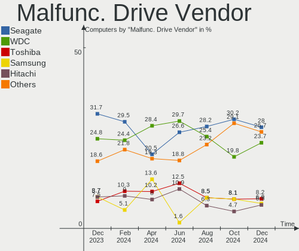
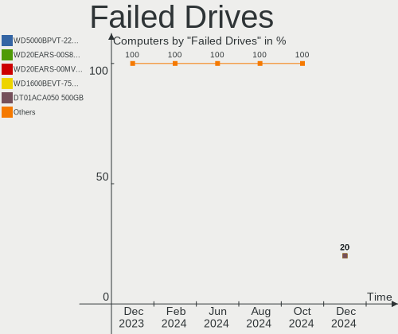
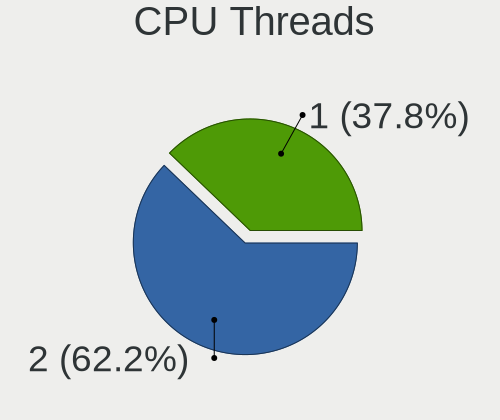
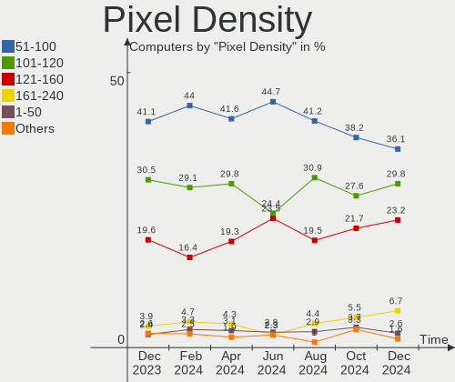
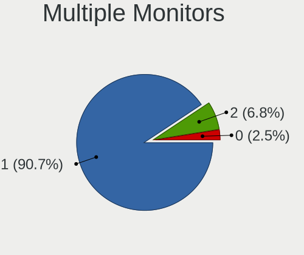
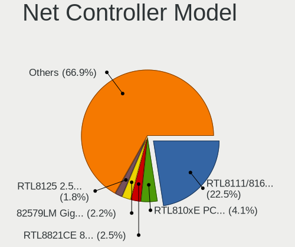
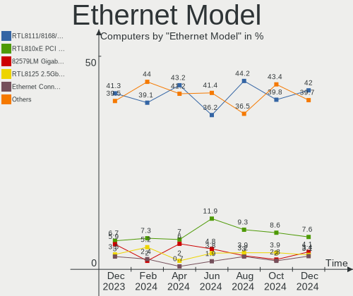

OpenMandriva Hardware Trends
----------------------------

A project to identify most popular hardware characteristics and track their change
over time based on data collected by OpenMandriva users at https://Linux-Hardware.org.

Anyone can contribute to this report by the [hw-probe](https://github.com/linuxhw/hw-probe) tool:

    sudo -E hw-probe -all -upload

This is a report for all computer types. See also reports for [desktops](/Dist/OpenMandriva/Desktop/README.md) and [notebooks](/Dist/OpenMandriva/Notebook/README.md).

This report is for one last month. Overall report since the beginning of time: [TestCoverage](https://github.com/linuxhw/TestCoverage)

Period: Apr, 2022.

Contents
--------

* [ System ](#system)
  - [ OS                       ](#os)
  - [ OS Family                ](#os-family)
  - [ Kernel                   ](#kernel)
  - [ Kernel Family            ](#kernel-family)
  - [ Kernel Major Ver.        ](#kernel-major-ver)
  - [ Arch                     ](#arch)
  - [ DE                       ](#de)
  - [ Display Server           ](#display-server)
  - [ Display Manager          ](#display-manager)
  - [ OS Lang                  ](#os-lang)
  - [ Boot Mode                ](#boot-mode)
  - [ Filesystem               ](#filesystem)
  - [ Part. scheme             ](#part-scheme)
  - [ Dual Boot with Linux/BSD ](#dual-boot-with-linuxbsd)
  - [ Dual Boot (Win)          ](#dual-boot-win)

* [ Board ](#board)
  - [ Vendor                   ](#vendor)
  - [ Model                    ](#model)
  - [ Model Family             ](#model-family)
  - [ MFG Year                 ](#mfg-year)
  - [ Form Factor              ](#form-factor)
  - [ Secure Boot              ](#secure-boot)
  - [ Coreboot                 ](#coreboot)
  - [ RAM Size                 ](#ram-size)
  - [ RAM Used                 ](#ram-used)
  - [ Total Drives             ](#total-drives)
  - [ Has CD-ROM               ](#has-cd-rom)
  - [ Has Ethernet             ](#has-ethernet)
  - [ Has WiFi                 ](#has-wifi)
  - [ Has Bluetooth            ](#has-bluetooth)

* [ Location ](#location)
  - [ Country                  ](#country)
  - [ City                     ](#city)

* [ Drives ](#drives)
  - [ Drive Vendor             ](#drive-vendor)
  - [ Drive Model              ](#drive-model)
  - [ HDD Vendor               ](#hdd-vendor)
  - [ SSD Vendor               ](#ssd-vendor)
  - [ Drive Kind               ](#drive-kind)
  - [ Drive Connector          ](#drive-connector)
  - [ Drive Size               ](#drive-size)
  - [ Space Total              ](#space-total)
  - [ Space Used               ](#space-used)
  - [ Malfunc. Drives          ](#malfunc-drives)
  - [ Malfunc. Drive Vendor    ](#malfunc-drive-vendor)
  - [ Malfunc. HDD Vendor      ](#malfunc-hdd-vendor)
  - [ Malfunc. Drive Kind      ](#malfunc-drive-kind)
  - [ Failed Drives            ](#failed-drives)
  - [ Failed Drive Vendor      ](#failed-drive-vendor)
  - [ Drive Status             ](#drive-status)

* [ Storage controller ](#storage-controller)
  - [ Storage Vendor           ](#storage-vendor)
  - [ Storage Model            ](#storage-model)
  - [ Storage Kind             ](#storage-kind)

* [ Processor ](#processor)
  - [ CPU Vendor               ](#cpu-vendor)
  - [ CPU Model                ](#cpu-model)
  - [ CPU Model Family         ](#cpu-model-family)
  - [ CPU Cores                ](#cpu-cores)
  - [ CPU Sockets              ](#cpu-sockets)
  - [ CPU Threads              ](#cpu-threads)
  - [ CPU Op-Modes             ](#cpu-op-modes)
  - [ CPU Microcode            ](#cpu-microcode)
  - [ CPU Microarch            ](#cpu-microarch)

* [ Graphics ](#graphics)
  - [ GPU Vendor               ](#gpu-vendor)
  - [ GPU Model                ](#gpu-model)
  - [ GPU Combo                ](#gpu-combo)
  - [ GPU Driver               ](#gpu-driver)
  - [ GPU Memory               ](#gpu-memory)

* [ Monitor ](#monitor)
  - [ Monitor Vendor           ](#monitor-vendor)
  - [ Monitor Model            ](#monitor-model)
  - [ Monitor Resolution       ](#monitor-resolution)
  - [ Monitor Diagonal         ](#monitor-diagonal)
  - [ Monitor Width            ](#monitor-width)
  - [ Aspect Ratio             ](#aspect-ratio)
  - [ Monitor Area             ](#monitor-area)
  - [ Pixel Density            ](#pixel-density)
  - [ Multiple Monitors        ](#multiple-monitors)

* [ Network ](#network)
  - [ Net Controller Vendor    ](#net-controller-vendor)
  - [ Net Controller Model     ](#net-controller-model)
  - [ Wireless Vendor          ](#wireless-vendor)
  - [ Wireless Model           ](#wireless-model)
  - [ Ethernet Vendor          ](#ethernet-vendor)
  - [ Ethernet Model           ](#ethernet-model)
  - [ Net Controller Kind      ](#net-controller-kind)
  - [ Used Controller          ](#used-controller)
  - [ NICs                     ](#nics)
  - [ IPv6                     ](#ipv6)

* [ Bluetooth ](#bluetooth)
  - [ Bluetooth Vendor         ](#bluetooth-vendor)
  - [ Bluetooth Model          ](#bluetooth-model)

* [ Sound ](#sound)
  - [ Sound Vendor             ](#sound-vendor)
  - [ Sound Model              ](#sound-model)

* [ Memory ](#memory)
  - [ Memory Vendor            ](#memory-vendor)
  - [ Memory Model             ](#memory-model)
  - [ Memory Kind              ](#memory-kind)
  - [ Memory Form Factor       ](#memory-form-factor)
  - [ Memory Size              ](#memory-size)
  - [ Memory Speed             ](#memory-speed)

* [ Printers & scanners ](#printers--scanners)
  - [ Printer Vendor           ](#printer-vendor)
  - [ Printer Model            ](#printer-model)
  - [ Scanner Vendor           ](#scanner-vendor)
  - [ Scanner Model            ](#scanner-model)

* [ Camera ](#camera)
  - [ Camera Vendor            ](#camera-vendor)
  - [ Camera Model             ](#camera-model)

* [ Security ](#security)
  - [ Fingerprint Vendor       ](#fingerprint-vendor)
  - [ Fingerprint Model        ](#fingerprint-model)
  - [ Chipcard Vendor          ](#chipcard-vendor)
  - [ Chipcard Model           ](#chipcard-model)

* [ Unsupported ](#unsupported)
  - [ Unsupported Devices      ](#unsupported-devices)
  - [ Unsupported Device Types ](#unsupported-device-types)

System
------

OS
--

Installed operating systems

| Name              | Computers | Percent |
|-------------------|-----------|---------|
| OpenMandriva 4.3  | 302       | 86.04%  |
| OpenMandriva 4.2  | 40        | 11.4%   |
| OpenMandriva 4.50 | 9         | 2.56%   |

OS Family
---------

OS without a version

| Name         | Computers | Percent |
|--------------|-----------|---------|
| OpenMandriva | 351       | 100%    |

Kernel
------

Version of the Linux kernel

| Version                  | Computers | Percent |
|--------------------------|-----------|---------|
| 5.16.7-desktop-1omv4003  | 288       | 82.05%  |
| 5.10.14-desktop-1omv4002 | 38        | 10.83%  |
| 5.16.13-desktop-1omv4003 | 12        | 3.42%   |
| 5.14.7-desktop-1omv4050  | 6         | 1.71%   |
| 5.11.12-desktop-1omv4002 | 2         | 0.57%   |
| 5.17.1-desktop-2omv4050  | 1         | 0.28%   |
| 5.16.8-desktop-1omv4050  | 1         | 0.28%   |
| 5.16.3-desktop-2omv4050  | 1         | 0.28%   |
| 5.14.14-desktop-1omv4050 | 1         | 0.28%   |
| 5.12.4-desktop-1omv4050  | 1         | 0.28%   |

Kernel Family
-------------

Linux kernel without a distro release

| Version | Computers | Percent |
|---------|-----------|---------|
| 5.16.7  | 288       | 82.05%  |
| 5.10.14 | 38        | 10.83%  |
| 5.16.13 | 12        | 3.42%   |
| 5.14.7  | 6         | 1.71%   |
| 5.11.12 | 2         | 0.57%   |
| 5.17.1  | 1         | 0.28%   |
| 5.16.8  | 1         | 0.28%   |
| 5.16.3  | 1         | 0.28%   |
| 5.14.14 | 1         | 0.28%   |
| 5.12.4  | 1         | 0.28%   |

Kernel Major Ver.
-----------------

Linux kernel major version

| Version | Computers | Percent |
|---------|-----------|---------|
| 5.16    | 302       | 86.04%  |
| 5.10    | 38        | 10.83%  |
| 5.14    | 7         | 1.99%   |
| 5.11    | 2         | 0.57%   |
| 5.17    | 1         | 0.28%   |
| 5.12    | 1         | 0.28%   |

Arch
----

OS architecture (x86_64, i586, etc.)

| Name   | Computers | Percent |
|--------|-----------|---------|
| x86_64 | 351       | 100%    |

DE
--

Desktop Environment

| Name    | Computers | Percent |
|---------|-----------|---------|
| KDE5    | 350       | 99.72%  |
| Unknown | 1         | 0.28%   |

Display Server
--------------

X11 or Wayland

| Name    | Computers | Percent |
|---------|-----------|---------|
| X11     | 348       | 99.15%  |
| Wayland | 3         | 0.85%   |

Display Manager
---------------

SDDM, LightDM, etc.

| Name | Computers | Percent |
|------|-----------|---------|
| SDDM | 351       | 100%    |

OS Lang
-------

Language

| Lang  | Computers | Percent |
|-------|-----------|---------|
| en_US | 186       | 52.99%  |
| de_DE | 30        | 8.55%   |
| ru_RU | 18        | 5.13%   |
| pt_BR | 18        | 5.13%   |
| fr_FR | 15        | 4.27%   |
| cs_CZ | 14        | 3.99%   |
| pl_PL | 12        | 3.42%   |
| it_IT | 11        | 3.13%   |
| es_ES | 6         | 1.71%   |
| en_GB | 6         | 1.71%   |
| hu_HU | 4         | 1.14%   |
| es_MX | 4         | 1.14%   |
| de_AT | 4         | 1.14%   |
| tr_TR | 3         | 0.85%   |
| fr_CA | 3         | 0.85%   |
| es_AR | 3         | 0.85%   |
| en_IN | 3         | 0.85%   |
| es_CL | 2         | 0.57%   |
| pt_PT | 1         | 0.28%   |
| nl_BE | 1         | 0.28%   |
| es_VE | 1         | 0.28%   |
| es_UY | 1         | 0.28%   |
| en_ZW | 1         | 0.28%   |
| en_ZA | 1         | 0.28%   |
| en_CA | 1         | 0.28%   |
| en_AU | 1         | 0.28%   |
| de_CH | 1         | 0.28%   |

Boot Mode
---------

EFI or BIOS

| Mode | Computers | Percent |
|------|-----------|---------|
| BIOS | 183       | 52.14%  |
| EFI  | 168       | 47.86%  |

Filesystem
----------

Type of filesystem

| Type     | Computers | Percent |
|----------|-----------|---------|
| Overlay  | 289       | 82.34%  |
| Ext4     | 61        | 17.38%  |
| Reiserfs | 1         | 0.28%   |

Part. scheme
------------

Scheme of partitioning

| Type | Computers | Percent |
|------|-----------|---------|
| GPT  | 226       | 64.39%  |
| MBR  | 125       | 35.61%  |

Dual Boot with Linux/BSD
------------------------

Hosting more than one Linux/BSD

| Dual boot | Computers | Percent |
|-----------|-----------|---------|
| No        | 182       | 51.85%  |
| Yes       | 169       | 48.15%  |

Dual Boot (Win)
---------------

Hosting Linux and Windows

| Dual boot | Computers | Percent |
|-----------|-----------|---------|
| Yes       | 187       | 53.28%  |
| No        | 164       | 46.72%  |

Board
-----

Vendor
------

Motherboard manufacturer

| Name                  | Computers | Percent |
|-----------------------|-----------|---------|
| ASUSTek Computer      | 58        | 16.52%  |
| Dell                  | 48        | 13.68%  |
| Hewlett-Packard       | 46        | 13.11%  |
| Lenovo                | 33        | 9.4%    |
| Gigabyte Technology   | 28        | 7.98%   |
| Acer                  | 21        | 5.98%   |
| MSI                   | 16        | 4.56%   |
| ASRock                | 12        | 3.42%   |
| Intel                 | 11        | 3.13%   |
| Fujitsu               | 9         | 2.56%   |
| Apple                 | 9         | 2.56%   |
| Toshiba               | 8         | 2.28%   |
| Samsung Electronics   | 5         | 1.42%   |
| Positivo              | 5         | 1.42%   |
| Foxconn               | 5         | 1.42%   |
| Sony                  | 4         | 1.14%   |
| Philco                | 3         | 0.85%   |
| Chuwi                 | 3         | 0.85%   |
| Pegatron              | 2         | 0.57%   |
| Medion                | 2         | 0.57%   |
| ECS                   | 2         | 0.57%   |
| Biostar               | 2         | 0.57%   |
| Unknown               | 2         | 0.57%   |
| TUXEDO                | 1         | 0.28%   |
| Positivo Bahia - VAIO | 1         | 0.28%   |
| PC Specialist         | 1         | 0.28%   |
| Packard Bell          | 1         | 0.28%   |
| Notebook              | 1         | 0.28%   |
| Itautec               | 1         | 0.28%   |
| HUAWEI                | 1         | 0.28%   |
| GALAX                 | 1         | 0.28%   |
| Fujitsu Siemens       | 1         | 0.28%   |
| EPoX Computer         | 1         | 0.28%   |
| Digma                 | 1         | 0.28%   |
| CompuLab              | 1         | 0.28%   |
| BESSTAR Tech          | 1         | 0.28%   |
| AWOW                  | 1         | 0.28%   |
| ARKA                  | 1         | 0.28%   |
| AMI                   | 1         | 0.28%   |
| Alienware             | 1         | 0.28%   |

Model
-----

Motherboard model

| Name                                    | Computers | Percent |
|-----------------------------------------|-----------|---------|
| ASUS UX31E                              | 6         | 1.71%   |
| Dell OptiPlex 3020                      | 5         | 1.42%   |
| Dell Latitude 3120                      | 5         | 1.42%   |
| Unknown                                 | 5         | 1.42%   |
| Acer Aspire R3-131T                     | 3         | 0.85%   |
| Positivo S14SL01                        | 2         | 0.57%   |
| Lenovo ThinkPad X220 42875TU            | 2         | 0.57%   |
| HP Pavilion Laptop 15-eh0xxx            | 2         | 0.57%   |
| HP Pavilion dv6                         | 2         | 0.57%   |
| HP 255 G7 Notebook PC                   | 2         | 0.57%   |
| Gigabyte B450M DS3H                     | 2         | 0.57%   |
| Dell OptiPlex 7020                      | 2         | 0.57%   |
| Dell Latitude E4310                     | 2         | 0.57%   |
| Dell Latitude 3310                      | 2         | 0.57%   |
| ASUS VivoBook_ASUSLaptop X515EA_X515EA  | 2         | 0.57%   |
| ASUS ROG STRIX B550-F GAMING            | 2         | 0.57%   |
| ASUS PRIME B450-PLUS                    | 2         | 0.57%   |
| ASUS All Series                         | 2         | 0.57%   |
| Apple MacBookPro9,2                     | 2         | 0.57%   |
| Apple MacBookAir4,2                     | 2         | 0.57%   |
| TUXEDO Book BM15 Gen10                  | 1         | 0.28%   |
| Toshiba TECRA A10                       | 1         | 0.28%   |
| Toshiba Satellite S855D                 | 1         | 0.28%   |
| Toshiba Satellite Pro C660              | 1         | 0.28%   |
| Toshiba Satellite P200                  | 1         | 0.28%   |
| Toshiba Satellite C850-A786             | 1         | 0.28%   |
| Toshiba Satellite A350D                 | 1         | 0.28%   |
| Toshiba dynabook Satellite B552/G       | 1         | 0.28%   |
| Toshiba dynabook R73/BN                 | 1         | 0.28%   |
| Sony VPCEE23FX                          | 1         | 0.28%   |
| Sony VGN-FZ31M                          | 1         | 0.28%   |
| Sony VGN-FZ11M                          | 1         | 0.28%   |
| Sony SVE1713A1EW                        | 1         | 0.28%   |
| Samsung RC530/RC730                     | 1         | 0.28%   |
| Samsung RC410/RC510/RC710               | 1         | 0.28%   |
| Samsung 750XDA                          | 1         | 0.28%   |
| Samsung 700T                            | 1         | 0.28%   |
| Samsung 340XAA/350XAA/550XAA            | 1         | 0.28%   |
| Positivo POS-MI945AA                    | 1         | 0.28%   |
| Positivo NB50TH                         | 1         | 0.28%   |
| Positivo Mobile                         | 1         | 0.28%   |
| Positivo Bahia - VAIO VJFE41F11X-XXXXXX | 1         | 0.28%   |
| Philco 14I                              | 1         | 0.28%   |
| Philco 14H                              | 1         | 0.28%   |
| Pegatron VG267AA-ABF p6244fr            | 1         | 0.28%   |
| Pegatron Compaq dx2400 Microtower PC    | 1         | 0.28%   |
| PC Specialist NJ50_70CU                 | 1         | 0.28%   |
| Packard Bell EasyNote TJ71              | 1         | 0.28%   |
| Notebook W130SV                         | 1         | 0.28%   |
| MSI MS-7D59                             | 1         | 0.28%   |
| MSI MS-7D22                             | 1         | 0.28%   |
| MSI MS-7C84                             | 1         | 0.28%   |
| MSI MS-7C56                             | 1         | 0.28%   |
| MSI MS-7C52                             | 1         | 0.28%   |
| MSI MS-7B48                             | 1         | 0.28%   |
| MSI MS-7994                             | 1         | 0.28%   |
| MSI MS-7977                             | 1         | 0.28%   |
| MSI MS-7971                             | 1         | 0.28%   |
| MSI MS-7850                             | 1         | 0.28%   |
| MSI MS-7721                             | 1         | 0.28%   |

Model Family
------------

Motherboard model prefix

| Name                                    | Computers | Percent |
|-----------------------------------------|-----------|---------|
| Dell Latitude                           | 20        | 5.7%    |
| Acer Aspire                             | 17        | 4.84%   |
| Dell OptiPlex                           | 10        | 2.85%   |
| Lenovo ThinkCentre                      | 9         | 2.56%   |
| HP Pavilion                             | 9         | 2.56%   |
| Dell Inspiron                           | 9         | 2.56%   |
| Lenovo ThinkPad                         | 8         | 2.28%   |
| Lenovo IdeaPad                          | 8         | 2.28%   |
| HP Laptop                               | 7         | 1.99%   |
| HP Compaq                               | 6         | 1.71%   |
| ASUS UX31E                              | 6         | 1.71%   |
| ASUS PRIME                              | 6         | 1.71%   |
| Toshiba Satellite                       | 5         | 1.42%   |
| HP ProBook                              | 5         | 1.42%   |
| Unknown                                 | 5         | 1.42%   |
| HP ProDesk                              | 4         | 1.14%   |
| Dell Precision                          | 4         | 1.14%   |
| ASUS VivoBook                           | 4         | 1.14%   |
| ASUS ROG                                | 4         | 1.14%   |
| Fujitsu LIFEBOOK                        | 3         | 0.85%   |
| Fujitsu ESPRIMO                         | 3         | 0.85%   |
| Toshiba dynabook                        | 2         | 0.57%   |
| Positivo S14SL01                        | 2         | 0.57%   |
| HP 255                                  | 2         | 0.57%   |
| Gigabyte B450M                          | 2         | 0.57%   |
| Gigabyte B450                           | 2         | 0.57%   |
| ASUS TUF                                | 2         | 0.57%   |
| ASUS P5KPL-AM                           | 2         | 0.57%   |
| ASUS All                                | 2         | 0.57%   |
| Apple MacBookPro9                       | 2         | 0.57%   |
| Apple MacBookAir4                       | 2         | 0.57%   |
| Acer Nitro                              | 2         | 0.57%   |
| Acer Extensa                            | 2         | 0.57%   |
| TUXEDO Book                             | 1         | 0.28%   |
| Toshiba TECRA                           | 1         | 0.28%   |
| Sony VPCEE23FX                          | 1         | 0.28%   |
| Sony VGN-FZ31M                          | 1         | 0.28%   |
| Sony VGN-FZ11M                          | 1         | 0.28%   |
| Sony SVE1713A1EW                        | 1         | 0.28%   |
| Samsung RC530                           | 1         | 0.28%   |
| Samsung RC410                           | 1         | 0.28%   |
| Samsung 750XDA                          | 1         | 0.28%   |
| Samsung 700T                            | 1         | 0.28%   |
| Samsung 340XAA                          | 1         | 0.28%   |
| Positivo POS-MI945AA                    | 1         | 0.28%   |
| Positivo NB50TH                         | 1         | 0.28%   |
| Positivo Mobile                         | 1         | 0.28%   |
| Positivo Bahia - VAIO VJFE41F11X-XXXXXX | 1         | 0.28%   |
| Philco 14I                              | 1         | 0.28%   |
| Philco 14H                              | 1         | 0.28%   |
| Pegatron VG267AA-ABF                    | 1         | 0.28%   |
| Pegatron Compaq                         | 1         | 0.28%   |
| PC Specialist NJ50                      | 1         | 0.28%   |
| Packard Bell EasyNote                   | 1         | 0.28%   |
| Notebook W130SV                         | 1         | 0.28%   |
| MSI MS-7D59                             | 1         | 0.28%   |
| MSI MS-7D22                             | 1         | 0.28%   |
| MSI MS-7C84                             | 1         | 0.28%   |
| MSI MS-7C56                             | 1         | 0.28%   |
| MSI MS-7C52                             | 1         | 0.28%   |

MFG Year
--------

Motherboard manufacture year

| Year    | Computers | Percent |
|---------|-----------|---------|
| 2011    | 32        | 9.12%   |
| 2013    | 31        | 8.83%   |
| 2021    | 29        | 8.26%   |
| 2012    | 28        | 7.98%   |
| 2018    | 27        | 7.69%   |
| 2020    | 25        | 7.12%   |
| 2014    | 23        | 6.55%   |
| 2019    | 22        | 6.27%   |
| 2017    | 21        | 5.98%   |
| 2010    | 21        | 5.98%   |
| 2008    | 18        | 5.13%   |
| 2016    | 17        | 4.84%   |
| 2015    | 17        | 4.84%   |
| 2009    | 17        | 4.84%   |
| 2007    | 12        | 3.42%   |
| 2006    | 7         | 1.99%   |
| 2022    | 3         | 0.85%   |
| Unknown | 1         | 0.28%   |

Form Factor
-----------

Physical design of the computer

| Name        | Computers | Percent |
|-------------|-----------|---------|
| Notebook    | 167       | 47.58%  |
| Desktop     | 159       | 45.3%   |
| Convertible | 8         | 2.28%   |
| Mini pc     | 8         | 2.28%   |
| All in one  | 7         | 1.99%   |
| Tablet      | 2         | 0.57%   |

Secure Boot
-----------

Enabled or disabled

| State    | Computers | Percent |
|----------|-----------|---------|
| Disabled | 351       | 100%    |

Coreboot
--------

Have coreboot on board

| Used | Computers | Percent |
|------|-----------|---------|
| No   | 351       | 100%    |

RAM Size
--------

Total RAM memory

| Size in GB  | Computers | Percent |
|-------------|-----------|---------|
| 3.01-4.0    | 110       | 31.34%  |
| 4.01-8.0    | 96        | 27.35%  |
| 8.01-16.0   | 63        | 17.95%  |
| 16.01-24.0  | 49        | 13.96%  |
| 32.01-64.0  | 15        | 4.27%   |
| 1.01-2.0    | 10        | 2.85%   |
| 64.01-256.0 | 5         | 1.42%   |
| 2.01-3.0    | 2         | 0.57%   |
| 24.01-32.0  | 1         | 0.28%   |

RAM Used
--------

Used RAM memory

| Used GB   | Computers | Percent |
|-----------|-----------|---------|
| 1.01-2.0  | 257       | 73.22%  |
| 0.51-1.0  | 60        | 17.09%  |
| 2.01-3.0  | 26        | 7.41%   |
| 0.01-0.5  | 3         | 0.85%   |
| 4.01-8.0  | 2         | 0.57%   |
| 3.01-4.0  | 2         | 0.57%   |
| 8.01-16.0 | 1         | 0.28%   |

Total Drives
------------

Number of drives on board

| Drives | Computers | Percent |
|--------|-----------|---------|
| 1      | 229       | 65.24%  |
| 2      | 78        | 22.22%  |
| 3      | 23        | 6.55%   |
| 4      | 9         | 2.56%   |
| 0      | 6         | 1.71%   |
| 5      | 4         | 1.14%   |
| 6      | 2         | 0.57%   |

Has CD-ROM
----------

Has CD-ROM on board

| Presented | Computers | Percent |
|-----------|-----------|---------|
| No        | 176       | 50.14%  |
| Yes       | 175       | 49.86%  |

Has Ethernet
------------

Has Ethernet on board

| Presented | Computers | Percent |
|-----------|-----------|---------|
| Yes       | 318       | 90.6%   |
| No        | 33        | 9.4%    |

Has WiFi
--------

Has WiFi module

| Presented | Computers | Percent |
|-----------|-----------|---------|
| Yes       | 239       | 68.09%  |
| No        | 112       | 31.91%  |

Has Bluetooth
-------------

Has Bluetooth module

| Presented | Computers | Percent |
|-----------|-----------|---------|
| No        | 177       | 50.43%  |
| Yes       | 174       | 49.57%  |

Location
--------

Country
-------

Geographic location (country)

| Country             | Computers | Percent |
|---------------------|-----------|---------|
| Germany             | 43        | 12.25%  |
| USA                 | 33        | 9.4%    |
| Brazil              | 27        | 7.69%   |
| Russia              | 24        | 6.84%   |
| Italy               | 22        | 6.27%   |
| Poland              | 18        | 5.13%   |
| Netherlands         | 16        | 4.56%   |
| France              | 16        | 4.56%   |
| Czechia             | 16        | 4.56%   |
| Spain               | 10        | 2.85%   |
| Mexico              | 9         | 2.56%   |
| Canada              | 9         | 2.56%   |
| UK                  | 8         | 2.28%   |
| Hungary             | 6         | 1.71%   |
| Costa Rica          | 6         | 1.71%   |
| Ukraine             | 5         | 1.42%   |
| Sweden              | 5         | 1.42%   |
| India               | 5         | 1.42%   |
| Bulgaria            | 5         | 1.42%   |
| Australia           | 5         | 1.42%   |
| Chile               | 4         | 1.14%   |
| Argentina           | 4         | 1.14%   |
| Turkey              | 3         | 0.85%   |
| Slovakia            | 3         | 0.85%   |
| Serbia              | 3         | 0.85%   |
| Romania             | 3         | 0.85%   |
| Egypt               | 3         | 0.85%   |
| Venezuela           | 2         | 0.57%   |
| Switzerland         | 2         | 0.57%   |
| Portugal            | 2         | 0.57%   |
| Philippines         | 2         | 0.57%   |
| New Zealand         | 2         | 0.57%   |
| Croatia             | 2         | 0.57%   |
| Colombia            | 2         | 0.57%   |
| Belgium             | 2         | 0.57%   |
| Zimbabwe            | 1         | 0.28%   |
| Vietnam             | 1         | 0.28%   |
| Uruguay             | 1         | 0.28%   |
| Trinidad and Tobago | 1         | 0.28%   |
| South Africa        | 1         | 0.28%   |
| Peru                | 1         | 0.28%   |
| Norway              | 1         | 0.28%   |
| Namibia             | 1         | 0.28%   |
| Malaysia            | 1         | 0.28%   |
| Kazakhstan          | 1         | 0.28%   |
| Jordan              | 1         | 0.28%   |
| Japan               | 1         | 0.28%   |
| Iran                | 1         | 0.28%   |
| Indonesia           | 1         | 0.28%   |
| Hong Kong           | 1         | 0.28%   |
| Guadeloupe          | 1         | 0.28%   |
| Greece              | 1         | 0.28%   |
| Finland             | 1         | 0.28%   |
| Ecuador             | 1         | 0.28%   |
| Congo Republic      | 1         | 0.28%   |
| China               | 1         | 0.28%   |
| Bangladesh          | 1         | 0.28%   |
| Azerbaijan          | 1         | 0.28%   |
| Algeria             | 1         | 0.28%   |

City
----

Geographic location (city)

| City                   | Computers | Percent |
|------------------------|-----------|---------|
| Schagen                | 10        | 2.85%   |
| Prague                 | 10        | 2.85%   |
| Moscow                 | 7         | 1.99%   |
| Milan                  | 5         | 1.42%   |
| Heredia                | 5         | 1.42%   |
| Sydney                 | 4         | 1.14%   |
| Schijndel              | 4         | 1.14%   |
| Sao Paulo              | 4         | 1.14%   |
| Warsaw                 | 3         | 0.85%   |
| Stuttgart              | 3         | 0.85%   |
| Rio de Janeiro         | 3         | 0.85%   |
| Porto Alegre           | 3         | 0.85%   |
| Madrid                 | 3         | 0.85%   |
| Leipzig                | 3         | 0.85%   |
| Inman                  | 3         | 0.85%   |
| Yekaterinburg          | 2         | 0.57%   |
| Villeurbanne           | 2         | 0.57%   |
| Terrebonne             | 2         | 0.57%   |
| St Petersburg          | 2         | 0.57%   |
| Senigallia             | 2         | 0.57%   |
| Rome                   | 2         | 0.57%   |
| Offenbach              | 2         | 0.57%   |
| Mexico City            | 2         | 0.57%   |
| Ilkley                 | 2         | 0.57%   |
| Fürth                 | 2         | 0.57%   |
| Frankfurt am Main      | 2         | 0.57%   |
| Foggia                 | 2         | 0.57%   |
| Esslingen am Neckar    | 2         | 0.57%   |
| Dortmund               | 2         | 0.57%   |
| Cairo                  | 2         | 0.57%   |
| Bremerhaven            | 2         | 0.57%   |
| Bratislava             | 2         | 0.57%   |
| Belgrade               | 2         | 0.57%   |
| Albano Laziale         | 2         | 0.57%   |
| Zhukovskiy             | 1         | 0.28%   |
| Zheleznogorsk          | 1         | 0.28%   |
| Zagreb                 | 1         | 0.28%   |
| Yukon                  | 1         | 0.28%   |
| Yevpatoriya            | 1         | 0.28%   |
| Yaroslavl              | 1         | 0.28%   |
| Yambol                 | 1         | 0.28%   |
| Yalta                  | 1         | 0.28%   |
| Wroclaw                | 1         | 0.28%   |
| Worcester              | 1         | 0.28%   |
| Windhoek               | 1         | 0.28%   |
| Wettringen             | 1         | 0.28%   |
| Werder                 | 1         | 0.28%   |
| Wembley                | 1         | 0.28%   |
| Wegberg                | 1         | 0.28%   |
| Wamel                  | 1         | 0.28%   |
| Villingen-Schwenningen | 1         | 0.28%   |
| Villa Nueva            | 1         | 0.28%   |
| Vieux-Boucau-les-Bains | 1         | 0.28%   |
| Veretz                 | 1         | 0.28%   |
| Valega                 | 1         | 0.28%   |
| Uppsala                | 1         | 0.28%   |
| Ufa                    | 1         | 0.28%   |
| Trois-Rivières        | 1         | 0.28%   |
| Toulouse               | 1         | 0.28%   |
| Totteridge             | 1         | 0.28%   |

Drives
------

Drive Vendor
------------

Hard drive vendors

| Vendor              | Computers | Drives | Percent |
|---------------------|-----------|--------|---------|
| Seagate             | 83        | 92     | 17.81%  |
| WDC                 | 80        | 91     | 17.17%  |
| Samsung Electronics | 44        | 55     | 9.44%   |
| Toshiba             | 34        | 34     | 7.3%    |
| Kingston            | 30        | 32     | 6.44%   |
| SanDisk             | 20        | 24     | 4.29%   |
| Hitachi             | 19        | 20     | 4.08%   |
| A-DATA Technology   | 19        | 20     | 4.08%   |
| Intel               | 11        | 11     | 2.36%   |
| Crucial             | 10        | 10     | 2.15%   |
| Unknown             | 8         | 9      | 1.72%   |
| SK Hynix            | 8         | 8      | 1.72%   |
| Micron Technology   | 8         | 8      | 1.72%   |
| HGST                | 8         | 8      | 1.72%   |
| SPCC                | 5         | 5      | 1.07%   |
| MAXTOR              | 5         | 8      | 1.07%   |
| Fujitsu             | 5         | 5      | 1.07%   |
| China               | 5         | 6      | 1.07%   |
| Apacer              | 4         | 4      | 0.86%   |
| Transcend           | 3         | 3      | 0.64%   |
| Phison              | 3         | 4      | 0.64%   |
| KingSpec            | 3         | 3      | 0.64%   |
| ASMT                | 3         | 3      | 0.64%   |
| Apple               | 3         | 3      | 0.64%   |
| Unknown             | 3         | 3      | 0.64%   |
| XrayDisk            | 2         | 2      | 0.43%   |
| SSSTC               | 2         | 2      | 0.43%   |
| Silicon Motion      | 2         | 3      | 0.43%   |
| Netac               | 2         | 2      | 0.43%   |
| LITEON              | 2         | 2      | 0.43%   |
| KIOXIA              | 2         | 2      | 0.43%   |
| Hewlett-Packard     | 2         | 2      | 0.43%   |
| GOODRAM             | 2         | 3      | 0.43%   |
| Wdxsky              | 1         | 1      | 0.21%   |
| Verbatim            | 1         | 1      | 0.21%   |
| Team                | 1         | 1      | 0.21%   |
| T-FORCE             | 1         | 1      | 0.21%   |
| SUNTRSI             | 1         | 1      | 0.21%   |
| SABRENT             | 1         | 1      | 0.21%   |
| QUANTUM             | 1         | 1      | 0.21%   |
| PNY                 | 1         | 1      | 0.21%   |
| Patriot             | 1         | 1      | 0.21%   |
| OCZ                 | 1         | 1      | 0.21%   |
| minisforum          | 1         | 1      | 0.21%   |
| Lexar               | 1         | 1      | 0.21%   |
| KLEVV               | 1         | 1      | 0.21%   |
| JMicron             | 1         | 1      | 0.21%   |
| Intenso             | 1         | 1      | 0.21%   |
| INDMEM              | 1         | 1      | 0.21%   |
| GLOWAY              | 1         | 1      | 0.21%   |
| External            | 1         | 1      | 0.21%   |
| ExcelStor           | 1         | 1      | 0.21%   |
| Drevo               | 1         | 1      | 0.21%   |
| DOGFISH             | 1         | 1      | 0.21%   |
| Corsair             | 1         | 1      | 0.21%   |
| Colorful            | 1         | 1      | 0.21%   |
| BAITITON            | 1         | 1      | 0.21%   |
| AXIOM               | 1         | 1      | 0.21%   |
| AMD                 | 1         | 1      | 0.21%   |

Drive Model
-----------

Hard drive models

| Model                                    | Computers | Percent |
|------------------------------------------|-----------|---------|
| Kingston SA400S37240G 240GB SSD          | 7         | 1.4%    |
| Seagate ST500DM002-1BD142 500GB          | 6         | 1.2%    |
| Seagate ST1000DM010-2EP102 1TB           | 6         | 1.2%    |
| SanDisk SSD U100 256GB                   | 6         | 1.2%    |
| A-DATA SU630 480GB SSD                   | 5         | 1%      |
| Toshiba DT01ACA050 500GB                 | 4         | 0.8%    |
| Seagate ST1000LM035-1RK172 1TB           | 4         | 0.8%    |
| Seagate ST1000LM024 HN-M101MBB 1TB       | 4         | 0.8%    |
| Samsung SSD 870 EVO 1TB                  | 4         | 0.8%    |
| WDC WDS100T2B0C-00PXH0 1TB               | 3         | 0.6%    |
| Toshiba MQ04ABF100 1TB                   | 3         | 0.6%    |
| Toshiba MQ01ABF050 500GB                 | 3         | 0.6%    |
| Toshiba MQ01ABD100 1TB                   | 3         | 0.6%    |
| SK Hynix SC311 SATA 256GB SSD            | 3         | 0.6%    |
| Seagate ST500LT012-1DG142 500GB          | 3         | 0.6%    |
| Seagate ST3500413AS 500GB                | 3         | 0.6%    |
| Seagate ST2000DM008-2FR102 2TB           | 3         | 0.6%    |
| Seagate ST2000DM001-1ER164 2TB           | 3         | 0.6%    |
| Samsung SSD 860 EVO 500GB                | 3         | 0.6%    |
| Samsung PM991a NVMe 128GB                | 3         | 0.6%    |
| Micron MTFDDAV256TDL-1AW1ZABHA 256GB SSD | 3         | 0.6%    |
| Kingston SV300S37A120G 120GB SSD         | 3         | 0.6%    |
| Kingston SA400S37480G 480GB SSD          | 3         | 0.6%    |
| ASMT 2115 1TB                            | 3         | 0.6%    |
| Unknown                                  | 3         | 0.6%    |
| WDC WDS500G2B0A-00SM50 500GB SSD         | 2         | 0.4%    |
| WDC WD800BB-00JHC0 80GB                  | 2         | 0.4%    |
| WDC WD5000AAKX-60U6AA0 500GB             | 2         | 0.4%    |
| WDC WD5000AAKX-001CA0 500GB              | 2         | 0.4%    |
| WDC WD10SPZX-22Z10T0 1TB                 | 2         | 0.4%    |
| WDC WD10EZEX-60WN4A0 1TB                 | 2         | 0.4%    |
| WDC WD10EZEX-08WN4A0 1TB                 | 2         | 0.4%    |
| WDC WD10EZEX-00WN4A0 1TB                 | 2         | 0.4%    |
| WDC WD10EADS-22M2B0 1TB                  | 2         | 0.4%    |
| Toshiba MQ01ABF032 320GB                 | 2         | 0.4%    |
| Toshiba MK1246GSX 120GB                  | 2         | 0.4%    |
| Toshiba DT01ACA200 2TB                   | 2         | 0.4%    |
| SK Hynix HBG4e  32GB                     | 2         | 0.4%    |
| Seagate ST9500325AS 500GB                | 2         | 0.4%    |
| Seagate ST9320325AS 320GB                | 2         | 0.4%    |
| Seagate ST9250410AS 250GB                | 2         | 0.4%    |
| Seagate ST9250315AS 250GB                | 2         | 0.4%    |
| Seagate ST500LT012-9WS142 500GB          | 2         | 0.4%    |
| Seagate ST380011A 80GB                   | 2         | 0.4%    |
| Seagate ST31000528AS 1TB                 | 2         | 0.4%    |
| Seagate ST31000524AS 1TB                 | 2         | 0.4%    |
| Seagate ST2000LM015-2E8174 2TB           | 2         | 0.4%    |
| Seagate ST1000DM003-1SB10C 1TB           | 2         | 0.4%    |
| Seagate ST1000DM003-1SB102 1TB           | 2         | 0.4%    |
| Samsung SSD 970 EVO Plus 1TB             | 2         | 0.4%    |
| Samsung SSD 870 EVO 500GB                | 2         | 0.4%    |
| Samsung SSD 840 EVO 120GB                | 2         | 0.4%    |
| Samsung HM321HI 320GB                    | 2         | 0.4%    |
| MAXTOR STM3320820AS 320GB                | 2         | 0.4%    |
| Kingston SUV400S37120G 120GB SSD         | 2         | 0.4%    |
| Kingston SNVS500G 500GB                  | 2         | 0.4%    |
| Kingston SA400S37120G 120GB SSD          | 2         | 0.4%    |
| Kingston SA2000M8250G 250GB              | 2         | 0.4%    |
| KingSpec P3-128 128GB SSD                | 2         | 0.4%    |
| Intel SSDPEKNU512GZ 512GB                | 2         | 0.4%    |

HDD Vendor
----------

Hard disk drive vendors

| Vendor              | Computers | Drives | Percent |
|---------------------|-----------|--------|---------|
| Seagate             | 80        | 89     | 34.19%  |
| WDC                 | 68        | 76     | 29.06%  |
| Toshiba             | 29        | 29     | 12.39%  |
| Hitachi             | 19        | 20     | 8.12%   |
| Samsung Electronics | 12        | 15     | 5.13%   |
| HGST                | 8         | 8      | 3.42%   |
| MAXTOR              | 5         | 8      | 2.14%   |
| Fujitsu             | 5         | 5      | 2.14%   |
| ASMT                | 3         | 3      | 1.28%   |
| Unknown             | 1         | 1      | 0.43%   |
| SABRENT             | 1         | 1      | 0.43%   |
| QUANTUM             | 1         | 1      | 0.43%   |
| ExcelStor           | 1         | 1      | 0.43%   |
| Unknown             | 1         | 1      | 0.43%   |

SSD Vendor
----------

Solid state drive vendors

| Vendor              | Computers | Drives | Percent |
|---------------------|-----------|--------|---------|
| Kingston            | 24        | 24     | 14.37%  |
| Samsung Electronics | 22        | 26     | 13.17%  |
| SanDisk             | 18        | 21     | 10.78%  |
| A-DATA Technology   | 18        | 18     | 10.78%  |
| Crucial             | 9         | 9      | 5.39%   |
| Micron Technology   | 8         | 8      | 4.79%   |
| WDC                 | 6         | 6      | 3.59%   |
| China               | 5         | 6      | 2.99%   |
| SPCC                | 4         | 4      | 2.4%    |
| SK Hynix            | 4         | 4      | 2.4%    |
| Intel               | 4         | 4      | 2.4%    |
| Apacer              | 4         | 4      | 2.4%    |
| Transcend           | 3         | 3      | 1.8%    |
| Toshiba             | 3         | 3      | 1.8%    |
| KingSpec            | 3         | 3      | 1.8%    |
| Apple               | 3         | 3      | 1.8%    |
| XrayDisk            | 2         | 2      | 1.2%    |
| Seagate             | 2         | 2      | 1.2%    |
| Hewlett-Packard     | 2         | 2      | 1.2%    |
| GOODRAM             | 2         | 2      | 1.2%    |
| Wdxsky              | 1         | 1      | 0.6%    |
| Verbatim            | 1         | 1      | 0.6%    |
| Team                | 1         | 1      | 0.6%    |
| T-FORCE             | 1         | 1      | 0.6%    |
| SUNTRSI             | 1         | 1      | 0.6%    |
| PNY                 | 1         | 1      | 0.6%    |
| Patriot             | 1         | 1      | 0.6%    |
| OCZ                 | 1         | 1      | 0.6%    |
| Netac               | 1         | 1      | 0.6%    |
| minisforum          | 1         | 1      | 0.6%    |
| LITEON              | 1         | 1      | 0.6%    |
| Lexar               | 1         | 1      | 0.6%    |
| KLEVV               | 1         | 1      | 0.6%    |
| Intenso             | 1         | 1      | 0.6%    |
| GLOWAY              | 1         | 1      | 0.6%    |
| External            | 1         | 1      | 0.6%    |
| Drevo               | 1         | 1      | 0.6%    |
| DOGFISH             | 1         | 1      | 0.6%    |
| Colorful            | 1         | 1      | 0.6%    |
| BAITITON            | 1         | 1      | 0.6%    |
| Unknown             | 1         | 1      | 0.6%    |

Drive Kind
----------

HDD or SSD

| Kind    | Computers | Drives | Percent |
|---------|-----------|--------|---------|
| HDD     | 204       | 258    | 47.66%  |
| SSD     | 154       | 175    | 35.98%  |
| NVMe    | 56        | 64     | 13.08%  |
| MMC     | 10        | 11     | 2.34%   |
| Unknown | 4         | 5      | 0.93%   |

Drive Connector
---------------

SATA, SAS, NVMe, etc.

| Type | Computers | Drives | Percent |
|------|-----------|--------|---------|
| SATA | 308       | 423    | 79.38%  |
| NVMe | 56        | 64     | 14.43%  |
| SAS  | 14        | 15     | 3.61%   |
| MMC  | 10        | 11     | 2.58%   |

Drive Size
----------

Size of hard drive

| Size in TB | Computers | Drives | Percent |
|------------|-----------|--------|---------|
| 0.01-0.5   | 243       | 291    | 66.58%  |
| 0.51-1.0   | 96        | 112    | 26.3%   |
| 1.01-2.0   | 21        | 24     | 5.75%   |
| 3.01-4.0   | 4         | 5      | 1.1%    |
| 10.01-20.0 | 1         | 1      | 0.27%   |

Space Total
-----------

Amount of disk space available on the file system

| Size in GB     | Computers | Percent |
|----------------|-----------|---------|
| 1-20           | 196       | 55.84%  |
| 101-250        | 50        | 14.25%  |
| 251-500        | 32        | 9.12%   |
| Unknown        | 32        | 9.12%   |
| 501-1000       | 15        | 4.27%   |
| 21-50          | 13        | 3.7%    |
| 51-100         | 9         | 2.56%   |
| More than 3000 | 2         | 0.57%   |
| 1001-2000      | 2         | 0.57%   |

Space Used
----------

Amount of used disk space

| Used GB   | Computers | Percent |
|-----------|-----------|---------|
| 1-20      | 292       | 83.19%  |
| Unknown   | 32        | 9.12%   |
| 51-100    | 10        | 2.85%   |
| 101-250   | 6         | 1.71%   |
| 21-50     | 5         | 1.42%   |
| 251-500   | 2         | 0.57%   |
| 1001-2000 | 2         | 0.57%   |
| 501-1000  | 2         | 0.57%   |

Malfunc. Drives
---------------

Drive models with a malfunction

| Model                                               | Computers | Drives | Percent |
|-----------------------------------------------------|-----------|--------|---------|
| SanDisk SSD U100 256GB                              | 6         | 6      | 4.88%   |
| Seagate ST3500413AS 500GB                           | 3         | 3      | 2.44%   |
| Seagate ST1000LM035-1RK172 1TB                      | 3         | 3      | 2.44%   |
| Micron Technology MTFDDAV256TDL-1AW1ZABHA 256GB SSD | 3         | 3      | 2.44%   |
| Toshiba MK1246GSX 120GB                             | 2         | 2      | 1.63%   |
| Seagate ST9320325AS 320GB                           | 2         | 2      | 1.63%   |
| Seagate ST500LT012-9WS142 500GB                     | 2         | 2      | 1.63%   |
| Seagate ST500DM002-1BD142 500GB                     | 2         | 2      | 1.63%   |
| Seagate ST1000DM003-1SB102 1TB                      | 2         | 2      | 1.63%   |
| Kingston SV300S37A120G 120GB SSD                    | 2         | 2      | 1.63%   |
| Hitachi HTS547575A9E384 752GB                       | 2         | 2      | 1.63%   |
| HGST HTS545050A7E380 500GB                          | 2         | 2      | 1.63%   |
| WDC WD800JD-22LSA0 80GB                             | 1         | 1      | 0.81%   |
| WDC WD800JD-00LSA0 80GB                             | 1         | 1      | 0.81%   |
| WDC WD800BD-00LRA1 80GB                             | 1         | 1      | 0.81%   |
| WDC WD800BB-00JHC0 80GB                             | 1         | 1      | 0.81%   |
| WDC WD7500AADS-00M2B0 752GB                         | 1         | 1      | 0.81%   |
| WDC WD5000LPVX-22V0TT0 500GB                        | 1         | 1      | 0.81%   |
| WDC WD5000BEKT-75KA9T0 500GB                        | 1         | 1      | 0.81%   |
| WDC WD5000AAKX-001CA0 500GB                         | 1         | 1      | 0.81%   |
| WDC WD3200BUDT-63DPZY0 320GB                        | 1         | 1      | 0.81%   |
| WDC WD3200AVJS-63B6A0 320GB                         | 1         | 1      | 0.81%   |
| WDC WD20EARX-22PASB0 2TB                            | 1         | 1      | 0.81%   |
| WDC WD1600BEVS-60RST0 160GB                         | 1         | 1      | 0.81%   |
| WDC WD1600AAJS-08L7A0 160GB                         | 1         | 1      | 0.81%   |
| WDC WD1600AAJS-00L7A0 160GB                         | 1         | 1      | 0.81%   |
| WDC WD10EZEX-60WN4A0 1TB                            | 1         | 1      | 0.81%   |
| WDC WD10EZEX-60M2NA0 1TB                            | 1         | 1      | 0.81%   |
| WDC WD10EADX-22TDHB0 1TB                            | 1         | 1      | 0.81%   |
| WDC WD10EADS-65L5B1 1TB                             | 1         | 1      | 0.81%   |
| WDC WD10EADS-22M2B0 1TB                             | 1         | 1      | 0.81%   |
| WDC WD10EADS-00P8B0 1TB                             | 1         | 1      | 0.81%   |
| WDC WD1003FBYX-01Y7B1 1TB                           | 1         | 1      | 0.81%   |
| Toshiba MQ04ABF100 1TB                              | 1         | 1      | 0.81%   |
| Toshiba MQ01ABF050 500GB                            | 1         | 1      | 0.81%   |
| Toshiba MQ01ABF032 320GB                            | 1         | 1      | 0.81%   |
| Toshiba MQ01ABD100 1TB                              | 1         | 1      | 0.81%   |
| Toshiba MK6476GSX 640GB                             | 1         | 1      | 0.81%   |
| Toshiba MK3259GSXP 320GB                            | 1         | 1      | 0.81%   |
| Toshiba MK3256GSY 320GB                             | 1         | 1      | 0.81%   |
| Toshiba MK2555GSX 250GB                             | 1         | 1      | 0.81%   |
| Toshiba MK1652GSX 160GB                             | 1         | 1      | 0.81%   |
| Toshiba DT01ACA050 500GB                            | 1         | 1      | 0.81%   |
| Seagate ST9500325AS 500GB                           | 1         | 1      | 0.81%   |
| Seagate ST9320423AS 320GB                           | 1         | 1      | 0.81%   |
| Seagate ST9250827AS 250GB                           | 1         | 1      | 0.81%   |
| Seagate ST92505610AS 250GB                          | 1         | 1      | 0.81%   |
| Seagate ST9250410AS 250GB                           | 1         | 1      | 0.81%   |
| Seagate ST9250315AS 250GB                           | 1         | 1      | 0.81%   |
| Seagate ST9160310AS 160GB                           | 1         | 1      | 0.81%   |
| Seagate ST500LM021-1KJ152 500GB                     | 1         | 1      | 0.81%   |
| Seagate ST500LM012 HN-M500MBB 500GB                 | 1         | 1      | 0.81%   |
| Seagate ST500LM000-1EJ162 500GB                     | 1         | 1      | 0.81%   |
| Seagate ST380215A 80GB                              | 1         | 1      | 0.81%   |
| Seagate ST380011A 80GB                              | 1         | 1      | 0.81%   |
| Seagate ST3750640AS 752GB                           | 1         | 1      | 0.81%   |
| Seagate ST3500412AS 500GB                           | 1         | 1      | 0.81%   |
| Seagate ST340014A 40GB                              | 1         | 1      | 0.81%   |
| Seagate ST3250410AS 250GB                           | 1         | 1      | 0.81%   |
| Seagate ST31000528AS 1TB                            | 1         | 1      | 0.81%   |

Malfunc. Drive Vendor
---------------------

Vendors of faulty drives

| Vendor              | Computers | Drives | Percent |
|---------------------|-----------|--------|---------|
| Seagate             | 36        | 38     | 29.75%  |
| WDC                 | 21        | 21     | 17.36%  |
| Toshiba             | 12        | 12     | 9.92%   |
| Hitachi             | 9         | 9      | 7.44%   |
| SanDisk             | 8         | 8      | 6.61%   |
| Samsung Electronics | 5         | 5      | 4.13%   |
| HGST                | 5         | 5      | 4.13%   |
| Micron Technology   | 4         | 4      | 3.31%   |
| MAXTOR              | 4         | 4      | 3.31%   |
| Kingston            | 4         | 4      | 3.31%   |
| Intel               | 3         | 3      | 2.48%   |
| Fujitsu             | 2         | 2      | 1.65%   |
| A-DATA Technology   | 2         | 2      | 1.65%   |
| QUANTUM             | 1         | 1      | 0.83%   |
| KingSpec            | 1         | 1      | 0.83%   |
| Hewlett-Packard     | 1         | 1      | 0.83%   |
| GLOWAY              | 1         | 1      | 0.83%   |
| Apple               | 1         | 1      | 0.83%   |
| Unknown             | 1         | 1      | 0.83%   |

Malfunc. HDD Vendor
-------------------

Vendors of faulty HDD drives

| Vendor              | Computers | Drives | Percent |
|---------------------|-----------|--------|---------|
| Seagate             | 36        | 38     | 37.89%  |
| WDC                 | 21        | 21     | 22.11%  |
| Toshiba             | 12        | 12     | 12.63%  |
| Hitachi             | 9         | 9      | 9.47%   |
| HGST                | 5         | 5      | 5.26%   |
| Samsung Electronics | 4         | 4      | 4.21%   |
| MAXTOR              | 4         | 4      | 4.21%   |
| Fujitsu             | 2         | 2      | 2.11%   |
| QUANTUM             | 1         | 1      | 1.05%   |
| Unknown             | 1         | 1      | 1.05%   |

Malfunc. Drive Kind
-------------------

Kinds of faulty drives

| Kind | Computers | Drives | Percent |
|------|-----------|--------|---------|
| HDD  | 87        | 97     | 77.68%  |
| SSD  | 25        | 26     | 22.32%  |

Failed Drives
-------------

Failed drive models

| Model                           | Computers | Drives | Percent |
|---------------------------------|-----------|--------|---------|
| WDC WD5000BEVT-22A0RT0 500GB    | 1         | 1      | 20%     |
| WDC WD3200BEVT-11ZCT0 320GB     | 1         | 1      | 20%     |
| WDC WD10JPVX-60JC3T0 1TB        | 1         | 1      | 20%     |
| Samsung Electronics HD103UJ 1TB | 1         | 1      | 20%     |
| Hitachi HDP725050GLA360 500GB   | 1         | 1      | 20%     |

Failed Drive Vendor
-------------------

Failed drive vendors

| Vendor              | Computers | Drives | Percent |
|---------------------|-----------|--------|---------|
| WDC                 | 3         | 3      | 60%     |
| Samsung Electronics | 1         | 1      | 20%     |
| Hitachi             | 1         | 1      | 20%     |

Drive Status
------------

Number of failed and malfunc. drives

| Status   | Computers | Drives | Percent |
|----------|-----------|--------|---------|
| Works    | 258       | 360    | 65.15%  |
| Malfunc  | 110       | 123    | 27.78%  |
| Detected | 23        | 25     | 5.81%   |
| Failed   | 5         | 5      | 1.26%   |

Storage controller
------------------

Storage Vendor
--------------

Storage controller vendors

| Vendor                           | Computers | Percent |
|----------------------------------|-----------|---------|
| Intel                            | 258       | 63.39%  |
| AMD                              | 64        | 15.72%  |
| Samsung Electronics              | 13        | 3.19%   |
| Nvidia                           | 12        | 2.95%   |
| Sandisk                          | 10        | 2.46%   |
| JMicron Technology               | 9         | 2.21%   |
| Kingston Technology Company      | 7         | 1.72%   |
| Silicon Motion                   | 6         | 1.47%   |
| Phison Electronics               | 5         | 1.23%   |
| ASMedia Technology               | 5         | 1.23%   |
| Marvell Technology Group         | 3         | 0.74%   |
| Toshiba America Info Systems     | 2         | 0.49%   |
| Solid State Storage Technology   | 2         | 0.49%   |
| SK Hynix                         | 2         | 0.49%   |
| KIOXIA                           | 2         | 0.49%   |
| ADATA Technology                 | 2         | 0.49%   |
| VIA Technologies                 | 1         | 0.25%   |
| Silicon Integrated Systems [SiS] | 1         | 0.25%   |
| Micron/Crucial Technology        | 1         | 0.25%   |
| LSI Logic / Symbios Logic        | 1         | 0.25%   |
| Lite-On Technology               | 1         | 0.25%   |

Storage Model
-------------

Storage controller models

| Model                                                                                   | Computers | Percent |
|-----------------------------------------------------------------------------------------|-----------|---------|
| AMD FCH SATA Controller [AHCI mode]                                                     | 42        | 8.35%   |
| Intel 8 Series/C220 Series Chipset Family 6-port SATA Controller 1 [AHCI mode]          | 24        | 4.77%   |
| Intel Sunrise Point-LP SATA Controller [AHCI mode]                                      | 20        | 3.98%   |
| Intel NM10/ICH7 Family SATA Controller [IDE mode]                                       | 16        | 3.18%   |
| Intel 82801 Mobile SATA Controller [RAID mode]                                          | 16        | 3.18%   |
| Intel 7 Series Chipset Family 6-port SATA Controller [AHCI mode]                        | 16        | 3.18%   |
| Intel 6 Series/C200 Series Chipset Family 6 port Mobile SATA AHCI Controller            | 16        | 3.18%   |
| Intel 82801G (ICH7 Family) IDE Controller                                               | 12        | 2.39%   |
| Intel 6 Series/C200 Series Chipset Family 6 port Desktop SATA AHCI Controller           | 10        | 1.99%   |
| Intel Q170/Q150/B150/H170/H110/Z170/CM236 Chipset SATA Controller [AHCI Mode]           | 9         | 1.79%   |
| Intel 82801HM/HEM (ICH8M/ICH8M-E) SATA Controller [AHCI mode]                           | 9         | 1.79%   |
| Intel 82801HM/HEM (ICH8M/ICH8M-E) IDE Controller                                        | 9         | 1.79%   |
| AMD SB7x0/SB8x0/SB9x0 SATA Controller [AHCI mode]                                       | 9         | 1.79%   |
| AMD 400 Series Chipset SATA Controller                                                  | 8         | 1.59%   |
| Intel Volume Management Device NVMe RAID Controller                                     | 7         | 1.39%   |
| Intel Celeron N3350/Pentium N4200/Atom E3900 Series SATA AHCI Controller                | 7         | 1.39%   |
| Intel 82801IBM/IEM (ICH9M/ICH9M-E) 4 port SATA Controller [AHCI mode]                   | 7         | 1.39%   |
| Intel 200 Series PCH SATA controller [AHCI mode]                                        | 7         | 1.39%   |
| AMD SB7x0/SB8x0/SB9x0 IDE Controller                                                    | 7         | 1.39%   |
| Sandisk WD Blue SN550 NVMe SSD                                                          | 6         | 1.19%   |
| Samsung NVMe SSD Controller SM981/PM981/PM983                                           | 6         | 1.19%   |
| Samsung NVMe SSD Controller 980                                                         | 6         | 1.19%   |
| Intel Wildcat Point-LP SATA Controller [AHCI Mode]                                      | 6         | 1.19%   |
| Intel 8 Series SATA Controller 1 [AHCI mode]                                            | 6         | 1.19%   |
| Intel 6 Series/C200 Series Chipset Family Desktop SATA Controller (IDE mode, ports 4-5) | 6         | 1.19%   |
| Intel 6 Series/C200 Series Chipset Family Desktop SATA Controller (IDE mode, ports 0-3) | 6         | 1.19%   |
| Intel 500 Series Chipset Family SATA AHCI Controller                                    | 6         | 1.19%   |
| AMD 500 Series Chipset SATA Controller                                                  | 6         | 1.19%   |
| Silicon Motion SM2263EN/SM2263XT SSD Controller                                         | 5         | 0.99%   |
| Nvidia MCP61 SATA Controller                                                            | 5         | 0.99%   |
| JMicron JMB363 SATA/IDE Controller                                                      | 5         | 0.99%   |
| Intel Tiger Lake-LP SATA Controller [AHCI mode]                                         | 5         | 0.99%   |
| Intel Comet Lake SATA AHCI Controller                                                   | 5         | 0.99%   |
| Intel Celeron/Pentium Silver Processor SATA Controller                                  | 5         | 0.99%   |
| Intel Atom/Celeron/Pentium Processor x5-E8000/J3xxx/N3xxx Series SATA Controller        | 5         | 0.99%   |
| ASMedia ASM1062 Serial ATA Controller                                                   | 5         | 0.99%   |
| Phison E12 NVMe Controller                                                              | 4         | 0.8%    |
| Nvidia MCP61 IDE                                                                        | 4         | 0.8%    |
| Intel SATA Controller [RAID mode]                                                       | 4         | 0.8%    |
| Intel Non-Volatile memory controller                                                    | 4         | 0.8%    |
| Intel HM170/QM170 Chipset SATA Controller [AHCI Mode]                                   | 4         | 0.8%    |
| Intel 5 Series/3400 Series Chipset 4 port SATA AHCI Controller                          | 4         | 0.8%    |
| AMD SB7x0/SB8x0/SB9x0 SATA Controller [IDE mode]                                        | 4         | 0.8%    |
| AMD FCH SATA Controller D                                                               | 4         | 0.8%    |
| Kingston Company A2000 NVMe SSD                                                         | 3         | 0.6%    |
| Intel Ice Lake-LP SATA Controller [AHCI mode]                                           | 3         | 0.6%    |
| Intel Cannon Lake PCH SATA AHCI Controller                                              | 3         | 0.6%    |
| Intel Alder Lake-S PCH SATA Controller [AHCI Mode]                                      | 3         | 0.6%    |
| Intel 82801JI (ICH10 Family) 4 port SATA IDE Controller #1                              | 3         | 0.6%    |
| Intel 82801JI (ICH10 Family) 2 port SATA IDE Controller #2                              | 3         | 0.6%    |
| Intel 7 Series/C210 Series Chipset Family 6-port SATA Controller [AHCI mode]            | 3         | 0.6%    |
| Intel 7 Series/C210 Series Chipset Family 4-port SATA Controller [IDE mode]             | 3         | 0.6%    |
| Intel 7 Series/C210 Series Chipset Family 2-port SATA Controller [IDE mode]             | 3         | 0.6%    |
| Intel 5 Series/3400 Series Chipset 4 port SATA IDE Controller                           | 3         | 0.6%    |
| Intel 5 Series/3400 Series Chipset 2 port SATA IDE Controller                           | 3         | 0.6%    |
| Intel 4 Series Chipset PT IDER Controller                                               | 3         | 0.6%    |
| AMD FCH IDE Controller                                                                  | 3         | 0.6%    |
| Solid State Storage Non-Volatile memory controller                                      | 2         | 0.4%    |
| Sandisk WD Black SN750 / PC SN730 NVMe SSD                                              | 2         | 0.4%    |
| Nvidia MCP79 AHCI Controller                                                            | 2         | 0.4%    |

Storage Kind
------------

Kind of storage controller (IDE, SATA, NVMe, SAS, ...)

| Kind | Computers | Percent |
|------|-----------|---------|
| SATA | 265       | 62.21%  |
| IDE  | 77        | 18.08%  |
| NVMe | 56        | 13.15%  |
| RAID | 28        | 6.57%   |

Processor
---------

CPU Vendor
----------

Processor vendors

| Vendor | Computers | Percent |
|--------|-----------|---------|
| Intel  | 273       | 77.78%  |
| AMD    | 78        | 22.22%  |

CPU Model
---------

Processor models

| Model                                        | Computers | Percent |
|----------------------------------------------|-----------|---------|
| Intel Core i5-4590 CPU @ 3.30GHz             | 9         | 2.56%   |
| Intel Core i7-2677M CPU @ 1.80GHz            | 6         | 1.71%   |
| Intel Core i5-8250U CPU @ 1.60GHz            | 6         | 1.71%   |
| Intel Core i3-4130 CPU @ 3.40GHz             | 6         | 1.71%   |
| Intel 11th Gen Core i5-1135G7 @ 2.40GHz      | 6         | 1.71%   |
| Intel Pentium Silver N6000 @ 1.10GHz         | 5         | 1.42%   |
| Intel Core i5-7200U CPU @ 2.50GHz            | 4         | 1.14%   |
| Intel Core i5-3210M CPU @ 2.50GHz            | 4         | 1.14%   |
| Intel Core i7-2600 CPU @ 3.40GHz             | 3         | 0.85%   |
| Intel Core i5-2520M CPU @ 2.50GHz            | 3         | 0.85%   |
| Intel Core i5-10210U CPU @ 1.60GHz           | 3         | 0.85%   |
| Intel Core 2 Duo CPU E8500 @ 3.16GHz         | 3         | 0.85%   |
| Intel Celeron CPU N3060 @ 1.60GHz            | 3         | 0.85%   |
| Intel Celeron CPU J3455 @ 1.50GHz            | 3         | 0.85%   |
| Intel Pentium Dual-Core CPU T4300 @ 2.10GHz  | 2         | 0.57%   |
| Intel Pentium Dual-Core CPU E5300 @ 2.60GHz  | 2         | 0.57%   |
| Intel Pentium Dual CPU T3200 @ 2.00GHz       | 2         | 0.57%   |
| Intel Pentium CPU N4200 @ 1.10GHz            | 2         | 0.57%   |
| Intel Pentium CPU G2020 @ 2.90GHz            | 2         | 0.57%   |
| Intel Core i7-8700K CPU @ 3.70GHz            | 2         | 0.57%   |
| Intel Core i7-7500U CPU @ 2.70GHz            | 2         | 0.57%   |
| Intel Core i7-6700HQ CPU @ 2.60GHz           | 2         | 0.57%   |
| Intel Core i7-6500U CPU @ 2.50GHz            | 2         | 0.57%   |
| Intel Core i7-2600K CPU @ 3.40GHz            | 2         | 0.57%   |
| Intel Core i5-8265U CPU @ 1.60GHz            | 2         | 0.57%   |
| Intel Core i5-7400 CPU @ 3.00GHz             | 2         | 0.57%   |
| Intel Core i5-6200U CPU @ 2.30GHz            | 2         | 0.57%   |
| Intel Core i5-4210U CPU @ 1.70GHz            | 2         | 0.57%   |
| Intel Core i5-4200U CPU @ 1.60GHz            | 2         | 0.57%   |
| Intel Core i5-3337U CPU @ 1.80GHz            | 2         | 0.57%   |
| Intel Core i5-2557M CPU @ 1.70GHz            | 2         | 0.57%   |
| Intel Core i5-2450M CPU @ 2.50GHz            | 2         | 0.57%   |
| Intel Core i5-2400 CPU @ 3.10GHz             | 2         | 0.57%   |
| Intel Core i5 CPU M 480 @ 2.67GHz            | 2         | 0.57%   |
| Intel Core i5 CPU 650 @ 3.20GHz              | 2         | 0.57%   |
| Intel Core i3-6006U CPU @ 2.00GHz            | 2         | 0.57%   |
| Intel Core i3-4030U CPU @ 1.90GHz            | 2         | 0.57%   |
| Intel Core i3-2120 CPU @ 3.30GHz             | 2         | 0.57%   |
| Intel Core i3-10105 CPU @ 3.70GHz            | 2         | 0.57%   |
| Intel Core 2 Duo CPU T7100 @ 1.80GHz         | 2         | 0.57%   |
| Intel Core 2 Duo CPU P8700 @ 2.53GHz         | 2         | 0.57%   |
| Intel Celeron N4120 CPU @ 1.10GHz            | 2         | 0.57%   |
| Intel Celeron CPU N3350 @ 1.10GHz            | 2         | 0.57%   |
| Intel Celeron CPU N3050 @ 1.60GHz            | 2         | 0.57%   |
| AMD Ryzen 7 5700U with Radeon Graphics       | 2         | 0.57%   |
| AMD Ryzen 5 5500U with Radeon Graphics       | 2         | 0.57%   |
| AMD Ryzen 5 2600 Six-Core Processor          | 2         | 0.57%   |
| AMD Ryzen 3 4300U with Radeon Graphics       | 2         | 0.57%   |
| AMD Phenom II X4 965 Processor               | 2         | 0.57%   |
| AMD Athlon 3000G with Radeon Vega Graphics   | 2         | 0.57%   |
| AMD A6-9225 RADEON R4, 5 COMPUTE CORES 2C+3G | 2         | 0.57%   |
| AMD A4-9125 RADEON R3, 4 COMPUTE CORES 2C+2G | 2         | 0.57%   |
| Intel Xeon CPU X5460 @ 3.16GHz               | 1         | 0.28%   |
| Intel Xeon CPU W3565 @ 3.20GHz               | 1         | 0.28%   |
| Intel Xeon CPU E5620 @ 2.40GHz               | 1         | 0.28%   |
| Intel Xeon CPU E5-2640 v2 @ 2.00GHz          | 1         | 0.28%   |
| Intel Xeon CPU E5-2630 v4 @ 2.20GHz          | 1         | 0.28%   |
| Intel Xeon CPU E3-1271 v3 @ 3.60GHz          | 1         | 0.28%   |
| Intel Xeon CPU E3-1245 v3 @ 3.40GHz          | 1         | 0.28%   |
| Intel Pentium Silver J5040 CPU @ 2.00GHz     | 1         | 0.28%   |

CPU Model Family
----------------

Processor model prefix

| Model                                | Computers | Percent |
|--------------------------------------|-----------|---------|
| Intel Core i5                        | 85        | 24.22%  |
| Intel Core i7                        | 43        | 12.25%  |
| Intel Core i3                        | 31        | 8.83%   |
| Intel Core 2 Duo                     | 24        | 6.84%   |
| Intel Celeron                        | 23        | 6.55%   |
| Other                                | 15        | 4.27%   |
| Intel Pentium                        | 14        | 3.99%   |
| AMD Ryzen 5                          | 12        | 3.42%   |
| Intel Pentium Dual-Core              | 11        | 3.13%   |
| AMD Ryzen 7                          | 8         | 2.28%   |
| Intel Xeon                           | 7         | 1.99%   |
| AMD A4                               | 7         | 1.99%   |
| Intel Pentium Silver                 | 6         | 1.71%   |
| AMD A8                               | 6         | 1.71%   |
| AMD Ryzen 3                          | 5         | 1.42%   |
| Intel Core 2 Quad                    | 4         | 1.14%   |
| AMD Athlon II X2                     | 4         | 1.14%   |
| Intel Pentium Dual                   | 3         | 0.85%   |
| Intel Genuine                        | 3         | 0.85%   |
| AMD Phenom II X4                     | 3         | 0.85%   |
| AMD FX                               | 3         | 0.85%   |
| AMD Athlon 64 X2                     | 3         | 0.85%   |
| AMD A6                               | 3         | 0.85%   |
| AMD A10                              | 3         | 0.85%   |
| Intel Pentium 4                      | 2         | 0.57%   |
| AMD Ryzen 9                          | 2         | 0.57%   |
| AMD Athlon                           | 2         | 0.57%   |
| Intel Core m5                        | 1         | 0.28%   |
| Intel Core m3                        | 1         | 0.28%   |
| Intel Core 2                         | 1         | 0.28%   |
| Intel Atom                           | 1         | 0.28%   |
| AMD Turion X2 Ultra Dual-Core Mobile | 1         | 0.28%   |
| AMD Turion II Dual-Core              | 1         | 0.28%   |
| AMD Ryzen Threadripper               | 1         | 0.28%   |
| AMD Ryzen 7 PRO                      | 1         | 0.28%   |
| AMD Phenom II X3                     | 1         | 0.28%   |
| AMD GX                               | 1         | 0.28%   |
| AMD E2                               | 1         | 0.28%   |
| AMD E1                               | 1         | 0.28%   |
| AMD E                                | 1         | 0.28%   |
| AMD C-60                             | 1         | 0.28%   |
| AMD C-50                             | 1         | 0.28%   |
| AMD Athlon Neo                       | 1         | 0.28%   |
| AMD Athlon II X4                     | 1         | 0.28%   |
| AMD Athlon II                        | 1         | 0.28%   |
| AMD Athlon Dual Core                 | 1         | 0.28%   |

CPU Cores
---------

Number of processor cores

| Number | Computers | Percent |
|--------|-----------|---------|
| 2      | 190       | 54.13%  |
| 4      | 112       | 31.91%  |
| 6      | 22        | 6.27%   |
| 8      | 14        | 3.99%   |
| 1      | 5         | 1.42%   |
| 12     | 3         | 0.85%   |
| 16     | 2         | 0.57%   |
| 3      | 2         | 0.57%   |
| 20     | 1         | 0.28%   |

CPU Sockets
-----------

Number of sockets

| Number | Computers | Percent |
|--------|-----------|---------|
| 1      | 349       | 99.43%  |
| 2      | 2         | 0.57%   |

CPU Threads
-----------

Threads per core (Hyper-Threading)

| Number | Computers | Percent |
|--------|-----------|---------|
| 2      | 190       | 54.13%  |
| 1      | 161       | 45.87%  |

CPU Op-Modes
------------

CPU Operation Modes (32-bit, 64-bit)

| Op mode        | Computers | Percent |
|----------------|-----------|---------|
| 32-bit, 64-bit | 351       | 100%    |

CPU Microcode
-------------

Microcode number

| Number     | Computers | Percent |
|------------|-----------|---------|
| 0x206a7    | 35        | 9.97%   |
| 0x306c3    | 30        | 8.55%   |
| 0x1067a    | 26        | 7.41%   |
| 0x306a9    | 22        | 6.27%   |
| 0x6fd      | 12        | 3.42%   |
| Unknown    | 12        | 3.42%   |
| 0x506e3    | 11        | 3.13%   |
| 0x406e3    | 10        | 2.85%   |
| 0x806ea    | 9         | 2.56%   |
| 0x20655    | 9         | 2.56%   |
| 0x906ea    | 8         | 2.28%   |
| 0x806ec    | 7         | 1.99%   |
| 0x806e9    | 7         | 1.99%   |
| 0x806c1    | 7         | 1.99%   |
| 0x506c9    | 7         | 1.99%   |
| 0x10676    | 7         | 1.99%   |
| 0x40651    | 6         | 1.71%   |
| 0x306d4    | 6         | 1.71%   |
| 0x06006705 | 6         | 1.71%   |
| 0x906e9    | 5         | 1.42%   |
| 0x906c0    | 5         | 1.42%   |
| 0x06003106 | 5         | 1.42%   |
| 0x706a8    | 4         | 1.14%   |
| 0x08701021 | 4         | 1.14%   |
| 0x08001138 | 4         | 1.14%   |
| 0x010000b6 | 4         | 1.14%   |
| 0xa0653    | 3         | 0.85%   |
| 0x90672    | 3         | 0.85%   |
| 0x706e5    | 3         | 0.85%   |
| 0x406c4    | 3         | 0.85%   |
| 0x406c3    | 3         | 0.85%   |
| 0x0a201016 | 3         | 0.85%   |
| 0x08608103 | 3         | 0.85%   |
| 0x08600106 | 3         | 0.85%   |
| 0x0800820d | 3         | 0.85%   |
| 0x06001119 | 3         | 0.85%   |
| 0x010000c8 | 3         | 0.85%   |
| 0xa0655    | 2         | 0.57%   |
| 0x6f2      | 2         | 0.57%   |
| 0x106a5    | 2         | 0.57%   |
| 0x08108109 | 2         | 0.57%   |
| 0x08101016 | 2         | 0.57%   |
| 0x07030105 | 2         | 0.57%   |
| 0x05000028 | 2         | 0.57%   |
| 0x03000027 | 2         | 0.57%   |
| 0xf65      | 1         | 0.28%   |
| 0xf43      | 1         | 0.28%   |
| 0xa0671    | 1         | 0.28%   |
| 0xa0660    | 1         | 0.28%   |
| 0x906ed    | 1         | 0.28%   |
| 0x806eb    | 1         | 0.28%   |
| 0x806d1    | 1         | 0.28%   |
| 0x706a1    | 1         | 0.28%   |
| 0x406f1    | 1         | 0.28%   |
| 0x306e4    | 1         | 0.28%   |
| 0x30673    | 1         | 0.28%   |
| 0x30661    | 1         | 0.28%   |
| 0x206c2    | 1         | 0.28%   |
| 0x106a4    | 1         | 0.28%   |
| 0x10677    | 1         | 0.28%   |

CPU Microarch
-------------

Microarchitecture

| Name             | Computers | Percent |
|------------------|-----------|---------|
| KabyLake         | 38        | 10.83%  |
| SandyBridge      | 36        | 10.26%  |
| Haswell          | 36        | 10.26%  |
| Penryn           | 35        | 9.97%   |
| IvyBridge        | 23        | 6.55%   |
| Skylake          | 22        | 6.27%   |
| Core             | 14        | 3.99%   |
| K10              | 11        | 3.13%   |
| Westmere         | 10        | 2.85%   |
| Zen              | 9         | 2.56%   |
| Zen 2            | 7         | 1.99%   |
| TigerLake        | 7         | 1.99%   |
| Silvermont       | 7         | 1.99%   |
| Piledriver       | 7         | 1.99%   |
| Goldmont         | 7         | 1.99%   |
| Excavator        | 7         | 1.99%   |
| Broadwell        | 7         | 1.99%   |
| Zen+             | 6         | 1.71%   |
| Zen 3            | 6         | 1.71%   |
| CometLake        | 6         | 1.71%   |
| Unknown          | 6         | 1.71%   |
| Tremont          | 5         | 1.42%   |
| Steamroller      | 5         | 1.42%   |
| K8 Hammer        | 5         | 1.42%   |
| Goldmont plus    | 5         | 1.42%   |
| Icelake          | 4         | 1.14%   |
| Nehalem          | 3         | 0.85%   |
| Jaguar           | 3         | 0.85%   |
| Bobcat           | 3         | 0.85%   |
| Alderlake Hybrid | 3         | 0.85%   |
| Puma             | 2         | 0.57%   |
| NetBurst         | 2         | 0.57%   |
| K10 Llano        | 2         | 0.57%   |
| K8 & K10 hybrid  | 1         | 0.28%   |
| Bonnell          | 1         | 0.28%   |

Graphics
--------

GPU Vendor
----------

Vendors of graphics cards

| Vendor                           | Computers | Percent |
|----------------------------------|-----------|---------|
| Intel                            | 207       | 52.54%  |
| Nvidia                           | 99        | 25.13%  |
| AMD                              | 86        | 21.83%  |
| VIA Technologies                 | 1         | 0.25%   |
| Silicon Integrated Systems [SiS] | 1         | 0.25%   |

GPU Model
---------

Graphics card models

| Model                                                                                    | Computers | Percent |
|------------------------------------------------------------------------------------------|-----------|---------|
| Intel 2nd Generation Core Processor Family Integrated Graphics Controller                | 32        | 7.98%   |
| Intel Xeon E3-1200 v3/4th Gen Core Processor Integrated Graphics Controller              | 15        | 3.74%   |
| Intel 3rd Gen Core processor Graphics Controller                                         | 12        | 2.99%   |
| Intel Skylake GT2 [HD Graphics 520]                                                      | 9         | 2.24%   |
| Intel UHD Graphics 620                                                                   | 8         | 2%      |
| Intel Mobile 4 Series Chipset Integrated Graphics Controller                             | 8         | 2%      |
| Intel 4 Series Chipset Integrated Graphics Controller                                    | 8         | 2%      |
| Nvidia GK208B [GeForce GT 710]                                                           | 7         | 1.75%   |
| Intel TigerLake-LP GT2 [Iris Xe Graphics]                                                | 7         | 1.75%   |
| Intel Core Processor Integrated Graphics Controller                                      | 7         | 1.75%   |
| Intel HD Graphics 620                                                                    | 6         | 1.5%    |
| Intel HD Graphics 530                                                                    | 6         | 1.5%    |
| Intel Haswell-ULT Integrated Graphics Controller                                         | 6         | 1.5%    |
| Intel Atom/Celeron/Pentium Processor x5-E8000/J3xxx/N3xxx Integrated Graphics Controller | 6         | 1.5%    |
| AMD Stoney [Radeon R2/R3/R4/R5 Graphics]                                                 | 6         | 1.5%    |
| Intel Xeon E3-1200 v2/3rd Gen Core processor Graphics Controller                         | 5         | 1.25%   |
| Intel JasperLake [UHD Graphics]                                                          | 5         | 1.25%   |
| Intel HD Graphics 500                                                                    | 5         | 1.25%   |
| Intel CoffeeLake-S GT2 [UHD Graphics 630]                                                | 5         | 1.25%   |
| Intel 4th Generation Core Processor Family Integrated Graphics Controller                | 5         | 1.25%   |
| Nvidia GT218 [GeForce 210]                                                               | 4         | 1%      |
| Nvidia GM108M [GeForce 940MX]                                                            | 4         | 1%      |
| Intel WhiskeyLake-U GT2 [UHD Graphics 620]                                               | 4         | 1%      |
| Intel HD Graphics 630                                                                    | 4         | 1%      |
| Intel GeminiLake [UHD Graphics 600]                                                      | 4         | 1%      |
| AMD Lucienne                                                                             | 4         | 1%      |
| AMD Kaveri [Radeon R7 Graphics]                                                          | 4         | 1%      |
| AMD Ellesmere [Radeon RX 470/480/570/570X/580/580X/590]                                  | 4         | 1%      |
| Nvidia GP108 [GeForce GT 1030]                                                           | 3         | 0.75%   |
| Nvidia GP107 [GeForce GTX 1050 Ti]                                                       | 3         | 0.75%   |
| Nvidia GP106 [GeForce GTX 1060 6GB]                                                      | 3         | 0.75%   |
| Nvidia GM108M [GeForce 840M]                                                             | 3         | 0.75%   |
| Intel Mobile GM965/GL960 Integrated Graphics Controller (secondary)                      | 3         | 0.75%   |
| Intel Mobile GM965/GL960 Integrated Graphics Controller (primary)                        | 3         | 0.75%   |
| Intel HD Graphics 5500                                                                   | 3         | 0.75%   |
| Intel CometLake-U GT2 [UHD Graphics]                                                     | 3         | 0.75%   |
| Intel CometLake-S GT2 [UHD Graphics 630]                                                 | 3         | 0.75%   |
| Intel 4th Gen Core Processor Integrated Graphics Controller                              | 3         | 0.75%   |
| AMD Renoir                                                                               | 3         | 0.75%   |
| AMD Raven Ridge [Radeon Vega Series / Radeon Vega Mobile Series]                         | 3         | 0.75%   |
| AMD Lexa PRO [Radeon 540/540X/550/550X / RX 540X/550/550X]                               | 3         | 0.75%   |
| AMD Cezanne                                                                              | 3         | 0.75%   |
| AMD Cedar [Radeon HD 5000/6000/7350/8350 Series]                                         | 3         | 0.75%   |
| Nvidia TU116 [GeForce GTX 1660 SUPER]                                                    | 2         | 0.5%    |
| Nvidia GM108M [GeForce MX110]                                                            | 2         | 0.5%    |
| Nvidia GM107M [GeForce GTX 960M]                                                         | 2         | 0.5%    |
| Nvidia GF117M [GeForce 610M/710M/810M/820M / GT 620M/625M/630M/720M]                     | 2         | 0.5%    |
| Nvidia GF108M [GeForce GT 540M]                                                          | 2         | 0.5%    |
| Nvidia GF108 [GeForce GT 630]                                                            | 2         | 0.5%    |
| Nvidia G96C [GeForce 9500 GT]                                                            | 2         | 0.5%    |
| Nvidia G86M [GeForce 8400M GT]                                                           | 2         | 0.5%    |
| Nvidia C79 [GeForce 9400M]                                                               | 2         | 0.5%    |
| Intel TigerLake-H GT1 [UHD Graphics]                                                     | 2         | 0.5%    |
| Intel Iris Plus Graphics G1 (Ice Lake)                                                   | 2         | 0.5%    |
| Intel HD Graphics 510                                                                    | 2         | 0.5%    |
| Intel Celeron N3350/Pentium N4200/Atom E3900 Series Integrated Graphics Controller       | 2         | 0.5%    |
| Intel AlderLake-S GT1                                                                    | 2         | 0.5%    |
| AMD Sun XT [Radeon HD 8670A/8670M/8690M / R5 M330 / M430 / Radeon 520 Mobile]            | 2         | 0.5%    |
| AMD RS880 [Radeon HD 4250]                                                               | 2         | 0.5%    |
| AMD Picasso/Raven 2 [Radeon Vega Series / Radeon Vega Mobile Series]                     | 2         | 0.5%    |

GPU Combo
---------

Combinations of graphics cards

| Name           | Computers | Percent |
|----------------|-----------|---------|
| 1 x Intel      | 165       | 47.01%  |
| 1 x AMD        | 79        | 22.51%  |
| 1 x Nvidia     | 62        | 17.66%  |
| Intel + Nvidia | 36        | 10.26%  |
| 2 x AMD        | 4         | 1.14%   |
| Intel + AMD    | 2         | 0.57%   |
| 1 x VIA        | 1         | 0.28%   |
| 1 x SiS        | 1         | 0.28%   |
| AMD + Nvidia   | 1         | 0.28%   |

GPU Driver
----------

Free vs proprietary

| Driver      | Computers | Percent |
|-------------|-----------|---------|
| Free        | 338       | 96.3%   |
| Unknown     | 12        | 3.42%   |
| Proprietary | 1         | 0.28%   |

GPU Memory
----------

Total video memory

| Size in GB | Computers | Percent |
|------------|-----------|---------|
| Unknown    | 183       | 52.14%  |
| 0.01-0.5   | 53        | 15.1%   |
| 1.01-2.0   | 45        | 12.82%  |
| 0.51-1.0   | 33        | 9.4%    |
| 3.01-4.0   | 20        | 5.7%    |
| 7.01-8.0   | 7         | 1.99%   |
| 5.01-6.0   | 6         | 1.71%   |
| 8.01-16.0  | 3         | 0.85%   |
| 2.01-3.0   | 1         | 0.28%   |

Monitor
-------

Monitor Vendor
--------------

Monitor vendors

| Vendor                  | Computers | Percent |
|-------------------------|-----------|---------|
| Samsung Electronics     | 49        | 13.84%  |
| AU Optronics            | 36        | 10.17%  |
| LG Display              | 34        | 9.6%    |
| BOE                     | 29        | 8.19%   |
| Hewlett-Packard         | 21        | 5.93%   |
| Goldstar                | 21        | 5.93%   |
| Chimei Innolux          | 21        | 5.93%   |
| AOC                     | 20        | 5.65%   |
| Dell                    | 18        | 5.08%   |
| Philips                 | 11        | 3.11%   |
| Acer                    | 11        | 3.11%   |
| Apple                   | 8         | 2.26%   |
| Eizo                    | 7         | 1.98%   |
| BenQ                    | 7         | 1.98%   |
| Ancor Communications    | 7         | 1.98%   |
| CPT                     | 6         | 1.69%   |
| Lenovo                  | 5         | 1.41%   |
| ViewSonic               | 4         | 1.13%   |
| Iiyama                  | 3         | 0.85%   |
| Chi Mei Optoelectronics | 3         | 0.85%   |
| Toshiba                 | 2         | 0.56%   |
| Sony                    | 2         | 0.56%   |
| PANDA                   | 2         | 0.56%   |
| Panasonic               | 2         | 0.56%   |
| NEC Computers           | 2         | 0.56%   |
| LG Philips              | 2         | 0.56%   |
| Unknown                 | 1         | 0.28%   |
| Sharp                   | 1         | 0.28%   |
| Sceptre Tech            | 1         | 0.28%   |
| Sanyo                   | 1         | 0.28%   |
| RTK                     | 1         | 0.28%   |
| RS                      | 1         | 0.28%   |
| NFREN                   | 1         | 0.28%   |
| NCS                     | 1         | 0.28%   |
| MSI                     | 1         | 0.28%   |
| MMP                     | 1         | 0.28%   |
| LP133WP1-TJAA           | 1         | 0.28%   |
| Kogan                   | 1         | 0.28%   |
| Insignia                | 1         | 0.28%   |
| InfoVision              | 1         | 0.28%   |
| HKC                     | 1         | 0.28%   |
| Hitachi                 | 1         | 0.28%   |
| HannStar                | 1         | 0.28%   |
| Fujitsu Siemens         | 1         | 0.28%   |
| CTV                     | 1         | 0.28%   |
| Belinea                 | 1         | 0.28%   |
| AMO                     | 1         | 0.28%   |

Monitor Model
-------------

Monitor models

| Model                                                                 | Computers | Percent |
|-----------------------------------------------------------------------|-----------|---------|
| Eizo EV3285 ENC2979 3840x2160 698x393mm 31.5-inch                     | 6         | 1.67%   |
| CPT LCD Monitor COR17DB 1600x900 293x164mm 13.2-inch                  | 6         | 1.67%   |
| Samsung Electronics LCD Monitor SEC5441 1366x768 309x174mm 14.0-inch  | 5         | 1.39%   |
| AOC 2370 AOC2370 1920x1080 509x286mm 23.0-inch                        | 5         | 1.39%   |
| BOE LCD Monitor BOE093D 1366x768 256x144mm 11.6-inch                  | 4         | 1.11%   |
| Goldstar FULL HD GSM5B55 1920x1080 480x270mm 21.7-inch                | 3         | 0.84%   |
| Chimei Innolux LCD Monitor CMN15E7 1920x1080 344x193mm 15.5-inch      | 3         | 0.84%   |
| AU Optronics LCD Monitor AUO71EC 1366x768 344x193mm 15.5-inch         | 3         | 0.84%   |
| AU Optronics LCD Monitor AUO38ED 1920x1080 344x193mm 15.5-inch        | 3         | 0.84%   |
| AU Optronics LCD Monitor AUO21ED 1920x1080 344x194mm 15.5-inch        | 3         | 0.84%   |
| AU Optronics LCD Monitor AUO105C 1366x768 256x144mm 11.6-inch         | 3         | 0.84%   |
| Samsung Electronics LCD Monitor SEC3245 1366x768 344x194mm 15.5-inch  | 2         | 0.56%   |
| Samsung Electronics C27F390 SAM0D32 1920x1080 598x336mm 27.0-inch     | 2         | 0.56%   |
| Philips PHL 243V5 PHLC0D1 1920x1080 521x293mm 23.5-inch               | 2         | 0.56%   |
| Philips PHL 223V5 PHLC0CF 1920x1080 477x268mm 21.5-inch               | 2         | 0.56%   |
| NEC Computers LCD224WM NEC6733 1680x1050 474x296mm 22.0-inch          | 2         | 0.56%   |
| LG Display LCD Monitor LGD033B 1366x768 344x194mm 15.5-inch           | 2         | 0.56%   |
| LG Display LCD Monitor LGD033A 1366x768 344x194mm 15.5-inch           | 2         | 0.56%   |
| LG Display LCD Monitor LGD02DC 1366x768 344x194mm 15.5-inch           | 2         | 0.56%   |
| LG Display LCD Monitor LGD02D3 1366x768 277x156mm 12.5-inch           | 2         | 0.56%   |
| Chimei Innolux LCD Monitor CMN15F5 1920x1080 344x193mm 15.5-inch      | 2         | 0.56%   |
| Chimei Innolux LCD Monitor CMN15BF 1366x768 344x193mm 15.5-inch       | 2         | 0.56%   |
| BOE LCD Monitor BOE0920 1366x768 344x194mm 15.5-inch                  | 2         | 0.56%   |
| BOE LCD Monitor BOE0696 1366x768 309x173mm 13.9-inch                  | 2         | 0.56%   |
| BenQ G2220HD BNQ7820 1920x1080 477x268mm 21.5-inch                    | 2         | 0.56%   |
| AU Optronics LCD Monitor AUO429D 1920x1080 382x215mm 17.3-inch        | 2         | 0.56%   |
| AU Optronics LCD Monitor AUO219E 1600x900 382x214mm 17.2-inch         | 2         | 0.56%   |
| AOC 24E1W1 AOC2401 1920x1080 527x296mm 23.8-inch                      | 2         | 0.56%   |
| Acer S240HL ACR0289 1920x1080 531x299mm 24.0-inch                     | 2         | 0.56%   |
| ViewSonic VX2758 Series VSC35DD 1920x1080 597x336mm 27.0-inch         | 1         | 0.28%   |
| ViewSonic VX2235wm-5 VSC591E 1680x1050 474x296mm 22.0-inch            | 1         | 0.28%   |
| ViewSonic VP2250wb VSC5320 1920x1080 465x291mm 21.6-inch              | 1         | 0.28%   |
| ViewSonic TD2220 VSC052C 1920x1080 480x270mm 21.7-inch                | 1         | 0.28%   |
| Unknown LCD Monitor FFFF 2288x1287 2550x2550mm 142.0-inch             | 1         | 0.28%   |
| Toshiba TV TSB0206 1920x1080 700x390mm 31.5-inch                      | 1         | 0.28%   |
| Toshiba A293Wd LCD2216 1920x1080 476x268mm 21.5-inch                  | 1         | 0.28%   |
| Sony TV SNY2C02 1920x1080 1018x573mm 46.0-inch                        | 1         | 0.28%   |
| Sony SDM-HS94P SNY1B90 1280x1024 376x301mm 19.0-inch                  | 1         | 0.28%   |
| Sharp LC-32LB480U SHP3263 1920x1080 698x392mm 31.5-inch               | 1         | 0.28%   |
| Sceptre Tech Sceptre C32 SPT0CC1 1920x1080 708x398mm 32.0-inch        | 1         | 0.28%   |
| Sanyo LCD MONITOR SAN07BE 1280x1024 350x270mm 17.4-inch               | 1         | 0.28%   |
| Samsung Electronics T19B300 SAM0928 1366x768 410x230mm 18.5-inch      | 1         | 0.28%   |
| Samsung Electronics SyncMaster SAM0601 1600x900                       | 1         | 0.28%   |
| Samsung Electronics SyncMaster SAM05CB 1920x1080 530x300mm 24.0-inch  | 1         | 0.28%   |
| Samsung Electronics SyncMaster SAM0527 1600x900 443x250mm 20.0-inch   | 1         | 0.28%   |
| Samsung Electronics SyncMaster SAM036F 1440x900 428x255mm 19.6-inch   | 1         | 0.28%   |
| Samsung Electronics SyncMaster SAM02B6 1920x1200 518x324mm 24.1-inch  | 1         | 0.28%   |
| Samsung Electronics SyncMaster SAM027F 1680x1050 474x296mm 22.0-inch  | 1         | 0.28%   |
| Samsung Electronics SyncMaster SAM01B8 1280x1024 338x270mm 17.0-inch  | 1         | 0.28%   |
| Samsung Electronics SyncMaster SAM00A3 1280x1024 338x270mm 17.0-inch  | 1         | 0.28%   |
| Samsung Electronics SyncMaster SAM0094 1280x1024 338x270mm 17.0-inch  | 1         | 0.28%   |
| Samsung Electronics SyncMaster SAM0022 1280x1024 312x234mm 15.4-inch  | 1         | 0.28%   |
| Samsung Electronics SMT22A350 SAM07A7 1920x1080 477x268mm 21.5-inch   | 1         | 0.28%   |
| Samsung Electronics SMC23A750X SAM07F8 1920x1080 510x287mm 23.0-inch  | 1         | 0.28%   |
| Samsung Electronics SMB2430H SAM064C 1920x1080 531x299mm 24.0-inch    | 1         | 0.28%   |
| Samsung Electronics SMB1920NW SAM06A5 1440x900 408x255mm 18.9-inch    | 1         | 0.28%   |
| Samsung Electronics SA300/SA350 SAM078E 1920x1080 477x268mm 21.5-inch | 1         | 0.28%   |
| Samsung Electronics S24R35x SAM100E 1920x1080 530x300mm 24.0-inch     | 1         | 0.28%   |
| Samsung Electronics S24E650 SAM0CC2 1920x1200 518x324mm 24.1-inch     | 1         | 0.28%   |
| Samsung Electronics S22F350 SAM0D1A 1920x1080 477x268mm 21.5-inch     | 1         | 0.28%   |

Monitor Resolution
------------------

Monitor screen resolution

| Resolution         | Computers | Percent |
|--------------------|-----------|---------|
| 1920x1080 (FHD)    | 141       | 40.4%   |
| 1366x768 (WXGA)    | 87        | 24.93%  |
| 1600x900 (HD+)     | 22        | 6.3%    |
| 3840x2160 (4K)     | 18        | 5.16%   |
| 1280x1024 (SXGA)   | 18        | 5.16%   |
| 1440x900 (WXGA+)   | 15        | 4.3%    |
| 1680x1050 (WSXGA+) | 12        | 3.44%   |
| 2560x1440 (QHD)    | 9         | 2.58%   |
| 1280x800 (WXGA)    | 8         | 2.29%   |
| 1920x1200 (WUXGA)  | 5         | 1.43%   |
| 2560x1080          | 3         | 0.86%   |
| 1360x768           | 2         | 0.57%   |
| 1024x768 (XGA)     | 2         | 0.57%   |
| 3456x2160          | 1         | 0.29%   |
| 3440x1440          | 1         | 0.29%   |
| 2288x1287          | 1         | 0.29%   |
| 1920x540           | 1         | 0.29%   |
| 1920x1280          | 1         | 0.29%   |
| 1600x1200          | 1         | 0.29%   |
| 1280x960           | 1         | 0.29%   |

Monitor Diagonal
----------------

Diagonal size in inches

| Inches  | Computers | Percent |
|---------|-----------|---------|
| 15      | 90        | 25.35%  |
| 23      | 29        | 8.17%   |
| 21      | 27        | 7.61%   |
| 17      | 25        | 7.04%   |
| 13      | 25        | 7.04%   |
| 24      | 24        | 6.76%   |
| 27      | 19        | 5.35%   |
| 19      | 19        | 5.35%   |
| 14      | 14        | 3.94%   |
| 11      | 14        | 3.94%   |
| 31      | 11        | 3.1%    |
| 22      | 10        | 2.82%   |
| 18      | 10        | 2.82%   |
| 20      | 7         | 1.97%   |
| 12      | 7         | 1.97%   |
| 84      | 4         | 1.13%   |
| 34      | 4         | 1.13%   |
| 40      | 2         | 0.56%   |
| 142     | 1         | 0.28%   |
| 74      | 1         | 0.28%   |
| 72      | 1         | 0.28%   |
| 60      | 1         | 0.28%   |
| 55      | 1         | 0.28%   |
| 48      | 1         | 0.28%   |
| 46      | 1         | 0.28%   |
| 42      | 1         | 0.28%   |
| 38      | 1         | 0.28%   |
| 35      | 1         | 0.28%   |
| 32      | 1         | 0.28%   |
| 25      | 1         | 0.28%   |
| 16      | 1         | 0.28%   |
| Unknown | 1         | 0.28%   |

Monitor Width
-------------

Physical width

| Width in mm    | Computers | Percent |
|----------------|-----------|---------|
| 301-350        | 112       | 31.91%  |
| 501-600        | 70        | 19.94%  |
| 401-500        | 62        | 17.66%  |
| 201-300        | 39        | 11.11%  |
| 351-400        | 35        | 9.97%   |
| 601-700        | 11        | 3.13%   |
| 701-800        | 6         | 1.71%   |
| 1501-2000      | 6         | 1.71%   |
| 1001-1500      | 4         | 1.14%   |
| 801-900        | 3         | 0.85%   |
| More than 2000 | 1         | 0.28%   |
| 901-1000       | 1         | 0.28%   |
| Unknown        | 1         | 0.28%   |

Aspect Ratio
------------

Proportional relationship between the width and the height

| Ratio | Computers | Percent |
|-------|-----------|---------|
| 16/9  | 260       | 77.15%  |
| 16/10 | 44        | 13.06%  |
| 5/4   | 16        | 4.75%   |
| 4/3   | 9         | 2.67%   |
| 21/9  | 4         | 1.19%   |
| 3/2   | 1         | 0.3%    |
| 2.01  | 1         | 0.3%    |
| 1.96  | 1         | 0.3%    |
| 1.00  | 1         | 0.3%    |

Monitor Area
------------

Area in inch²

| Area in inch² | Computers | Percent |
|----------------|-----------|---------|
| 101-110        | 88        | 25%     |
| 201-250        | 72        | 20.45%  |
| 151-200        | 36        | 10.23%  |
| 81-90          | 22        | 6.25%   |
| 301-350        | 19        | 5.4%    |
| 71-80          | 18        | 5.11%   |
| 351-500        | 17        | 4.83%   |
| 121-130        | 17        | 4.83%   |
| 51-60          | 14        | 3.98%   |
| 141-150        | 13        | 3.69%   |
| More than 1000 | 9         | 2.56%   |
| 251-300        | 9         | 2.56%   |
| 61-70          | 6         | 1.7%    |
| 501-1000       | 6         | 1.7%    |
| 111-120        | 3         | 0.85%   |
| 131-140        | 2         | 0.57%   |
| Unknown        | 1         | 0.28%   |

Pixel Density
-------------

Pixels per inch

| Density       | Computers | Percent |
|---------------|-----------|---------|
| 51-100        | 146       | 42.82%  |
| 101-120       | 105       | 30.79%  |
| 121-160       | 72        | 21.11%  |
| 161-240       | 8         | 2.35%   |
| 1-50          | 7         | 2.05%   |
| More than 240 | 2         | 0.59%   |
| Unknown       | 1         | 0.29%   |

Multiple Monitors
-----------------

Total monitors connected

| Total | Computers | Percent |
|-------|-----------|---------|
| 1     | 314       | 89.46%  |
| 2     | 28        | 7.98%   |
| 0     | 5         | 1.42%   |
| 3     | 4         | 1.14%   |

Network
-------

Net Controller Vendor
---------------------

Controller vendors

| Vendor                            | Computers | Percent |
|-----------------------------------|-----------|---------|
| Realtek Semiconductor             | 199       | 38.94%  |
| Intel                             | 147       | 28.77%  |
| Qualcomm Atheros                  | 57        | 11.15%  |
| Broadcom                          | 24        | 4.7%    |
| Nvidia                            | 9         | 1.76%   |
| Ralink Technology                 | 7         | 1.37%   |
| Marvell Technology Group          | 7         | 1.37%   |
| Samsung Electronics               | 6         | 1.17%   |
| TP-Link                           | 5         | 0.98%   |
| Ralink                            | 5         | 0.98%   |
| MEDIATEK                          | 5         | 0.98%   |
| Huawei Technologies               | 5         | 0.98%   |
| Broadcom Limited                  | 5         | 0.98%   |
| Qualcomm Atheros Communications   | 4         | 0.78%   |
| JMicron Technology                | 4         | 0.78%   |
| Sierra Wireless                   | 3         | 0.59%   |
| D-Link System                     | 3         | 0.59%   |
| VIA Technologies                  | 2         | 0.39%   |
| Motorola PCS                      | 2         | 0.39%   |
| Hewlett-Packard                   | 2         | 0.39%   |
| Dell                              | 2         | 0.39%   |
| D-Link                            | 2         | 0.39%   |
| ZyDAS                             | 1         | 0.2%    |
| Xiaomi                            | 1         | 0.2%    |
| Silicon Integrated Systems [SiS]  | 1         | 0.2%    |
| Shenzhen Goodix Technology        | 1         | 0.2%    |
| Sangoma Technologies              | 1         | 0.2%    |
| Ericsson Business Mobile Networks | 1         | 0.2%    |

Net Controller Model
--------------------

Controller models

| Model                                                             | Computers | Percent |
|-------------------------------------------------------------------|-----------|---------|
| Realtek RTL8111/8168/8411 PCI Express Gigabit Ethernet Controller | 146       | 24.7%   |
| Realtek RTL810xE PCI Express Fast Ethernet controller             | 24        | 4.06%   |
| Realtek RTL8821CE 802.11ac PCIe Wireless Network Adapter          | 15        | 2.54%   |
| Qualcomm Atheros QCA9377 802.11ac Wireless Network Adapter        | 10        | 1.69%   |
| Qualcomm Atheros AR9485 Wireless Network Adapter                  | 10        | 1.69%   |
| Intel 82579LM Gigabit Network Connection (Lewisville)             | 10        | 1.69%   |
| Intel Wi-Fi 6 AX200                                               | 9         | 1.52%   |
| Intel Ethernet Connection I217-LM                                 | 9         | 1.52%   |
| Realtek RTL8125 2.5GbE Controller                                 | 8         | 1.35%   |
| Intel Wireless 3165                                               | 8         | 1.35%   |
| Qualcomm Atheros QCA9565 / AR9565 Wireless Network Adapter        | 7         | 1.18%   |
| Intel 82579V Gigabit Network Connection                           | 7         | 1.18%   |
| Samsung Galaxy series, misc. (tethering mode)                     | 6         | 1.02%   |
| Realtek RTL8188CE 802.11b/g/n WiFi Adapter                        | 6         | 1.02%   |
| Qualcomm Atheros QCA6174 802.11ac Wireless Network Adapter        | 6         | 1.02%   |
| Intel Wireless 8265 / 8275                                        | 6         | 1.02%   |
| Nvidia MCP61 Ethernet                                             | 5         | 0.85%   |
| Intel Wireless 8260                                               | 5         | 0.85%   |
| Intel Wireless 7265                                               | 5         | 0.85%   |
| Intel Wireless 7260                                               | 5         | 0.85%   |
| Intel Wi-Fi 6 AX201 160MHz                                        | 5         | 0.85%   |
| Intel PRO/Wireless 3945ABG [Golan] Network Connection             | 5         | 0.85%   |
| Intel I211 Gigabit Network Connection                             | 5         | 0.85%   |
| Intel Centrino Advanced-N 6205 [Taylor Peak]                      | 5         | 0.85%   |
| Realtek RTL8188EUS 802.11n Wireless Network Adapter               | 4         | 0.68%   |
| Realtek RTL8153 Gigabit Ethernet Adapter                          | 4         | 0.68%   |
| Qualcomm Atheros AR9285 Wireless Network Adapter (PCI-Express)    | 4         | 0.68%   |
| Intel Wi-Fi 6 AX201                                               | 4         | 0.68%   |
| Intel Ethernet Connection (2) I219-V                              | 4         | 0.68%   |
| Intel Dual Band Wireless-AC 3165 Plus Bluetooth                   | 4         | 0.68%   |
| Intel Cannon Point-LP CNVi [Wireless-AC]                          | 4         | 0.68%   |
| Intel 82567LM-3 Gigabit Network Connection                        | 4         | 0.68%   |
| Realtek RTL8723DE Wireless Network Adapter                        | 3         | 0.51%   |
| Realtek RTL8723BE PCIe Wireless Network Adapter                   | 3         | 0.51%   |
| Realtek RTL8188EE Wireless Network Adapter                        | 3         | 0.51%   |
| Ralink RT5370 Wireless Adapter                                    | 3         | 0.51%   |
| Qualcomm Atheros AR9271 802.11n                                   | 3         | 0.51%   |
| Qualcomm Atheros AR93xx Wireless Network Adapter                  | 3         | 0.51%   |
| Qualcomm Atheros AR928X Wireless Network Adapter (PCI-Express)    | 3         | 0.51%   |
| Qualcomm Atheros AR8131 Gigabit Ethernet                          | 3         | 0.51%   |
| Nvidia MCP79 Ethernet                                             | 3         | 0.51%   |
| JMicron JMC250 PCI Express Gigabit Ethernet Controller            | 3         | 0.51%   |
| Intel Tiger Lake PCH CNVi WiFi                                    | 3         | 0.51%   |
| Intel PRO/Wireless 4965 AG or AGN [Kedron] Network Connection     | 3         | 0.51%   |
| Intel Ethernet Connection I217-V                                  | 3         | 0.51%   |
| Intel Ethernet Connection (10) I219-V                             | 3         | 0.51%   |
| Intel Dual Band Wireless-AC 3168NGW [Stone Peak]                  | 3         | 0.51%   |
| Intel Centrino Wireless-N 1000 [Condor Peak]                      | 3         | 0.51%   |
| Intel Centrino Advanced-N 6200                                    | 3         | 0.51%   |
| Broadcom NetXtreme BCM57765 Gigabit Ethernet PCIe                 | 3         | 0.51%   |
| Broadcom BCM43224 802.11a/b/g/n                                   | 3         | 0.51%   |
| Broadcom BCM4322 802.11a/b/g/n Wireless LAN Controller            | 3         | 0.51%   |
| Sierra Wireless MC8305 Modem                                      | 2         | 0.34%   |
| Realtek RTL8822CE 802.11ac PCIe Wireless Network Adapter          | 2         | 0.34%   |
| Realtek RTL8723BU 802.11b/g/n WLAN Adapter                        | 2         | 0.34%   |
| Realtek RTL8723AE PCIe Wireless Network Adapter                   | 2         | 0.34%   |
| Realtek RTL8188CUS 802.11n WLAN Adapter                           | 2         | 0.34%   |
| Realtek RTL8152 Fast Ethernet Adapter                             | 2         | 0.34%   |
| Realtek 802.11ac NIC                                              | 2         | 0.34%   |
| Ralink MT7601U Wireless Adapter                                   | 2         | 0.34%   |

Wireless Vendor
---------------

Wireless vendors

| Vendor                          | Computers | Percent |
|---------------------------------|-----------|---------|
| Intel                           | 104       | 42.11%  |
| Realtek Semiconductor           | 50        | 20.24%  |
| Qualcomm Atheros                | 45        | 18.22%  |
| Broadcom                        | 15        | 6.07%   |
| Ralink Technology               | 7         | 2.83%   |
| TP-Link                         | 5         | 2.02%   |
| Ralink                          | 5         | 2.02%   |
| Qualcomm Atheros Communications | 4         | 1.62%   |
| Sierra Wireless                 | 3         | 1.21%   |
| MEDIATEK                        | 3         | 1.21%   |
| D-Link                          | 2         | 0.81%   |
| ZyDAS                           | 1         | 0.4%    |
| Hewlett-Packard                 | 1         | 0.4%    |
| D-Link System                   | 1         | 0.4%    |
| Broadcom Limited                | 1         | 0.4%    |

Wireless Model
--------------

Wireless models

| Model                                                          | Computers | Percent |
|----------------------------------------------------------------|-----------|---------|
| Realtek RTL8821CE 802.11ac PCIe Wireless Network Adapter       | 15        | 6.05%   |
| Qualcomm Atheros QCA9377 802.11ac Wireless Network Adapter     | 10        | 4.03%   |
| Qualcomm Atheros AR9485 Wireless Network Adapter               | 10        | 4.03%   |
| Intel Wi-Fi 6 AX200                                            | 9         | 3.63%   |
| Intel Wireless 3165                                            | 8         | 3.23%   |
| Qualcomm Atheros QCA9565 / AR9565 Wireless Network Adapter     | 7         | 2.82%   |
| Realtek RTL8188CE 802.11b/g/n WiFi Adapter                     | 6         | 2.42%   |
| Qualcomm Atheros QCA6174 802.11ac Wireless Network Adapter     | 6         | 2.42%   |
| Intel Wireless 8265 / 8275                                     | 6         | 2.42%   |
| Intel Wireless 8260                                            | 5         | 2.02%   |
| Intel Wireless 7265                                            | 5         | 2.02%   |
| Intel Wireless 7260                                            | 5         | 2.02%   |
| Intel Wi-Fi 6 AX201 160MHz                                     | 5         | 2.02%   |
| Intel PRO/Wireless 3945ABG [Golan] Network Connection          | 5         | 2.02%   |
| Intel Centrino Advanced-N 6205 [Taylor Peak]                   | 5         | 2.02%   |
| Realtek RTL8188EUS 802.11n Wireless Network Adapter            | 4         | 1.61%   |
| Qualcomm Atheros AR9285 Wireless Network Adapter (PCI-Express) | 4         | 1.61%   |
| Intel Wi-Fi 6 AX201                                            | 4         | 1.61%   |
| Intel Dual Band Wireless-AC 3165 Plus Bluetooth                | 4         | 1.61%   |
| Intel Cannon Point-LP CNVi [Wireless-AC]                       | 4         | 1.61%   |
| Realtek RTL8723DE Wireless Network Adapter                     | 3         | 1.21%   |
| Realtek RTL8723BE PCIe Wireless Network Adapter                | 3         | 1.21%   |
| Realtek RTL8188EE Wireless Network Adapter                     | 3         | 1.21%   |
| Ralink RT5370 Wireless Adapter                                 | 3         | 1.21%   |
| Qualcomm Atheros AR9271 802.11n                                | 3         | 1.21%   |
| Qualcomm Atheros AR93xx Wireless Network Adapter               | 3         | 1.21%   |
| Qualcomm Atheros AR928X Wireless Network Adapter (PCI-Express) | 3         | 1.21%   |
| Intel Tiger Lake PCH CNVi WiFi                                 | 3         | 1.21%   |
| Intel PRO/Wireless 4965 AG or AGN [Kedron] Network Connection  | 3         | 1.21%   |
| Intel Dual Band Wireless-AC 3168NGW [Stone Peak]               | 3         | 1.21%   |
| Intel Centrino Wireless-N 1000 [Condor Peak]                   | 3         | 1.21%   |
| Intel Centrino Advanced-N 6200                                 | 3         | 1.21%   |
| Broadcom BCM43224 802.11a/b/g/n                                | 3         | 1.21%   |
| Broadcom BCM4322 802.11a/b/g/n Wireless LAN Controller         | 3         | 1.21%   |
| Sierra Wireless MC8305 Modem                                   | 2         | 0.81%   |
| Realtek RTL8822CE 802.11ac PCIe Wireless Network Adapter       | 2         | 0.81%   |
| Realtek RTL8723BU 802.11b/g/n WLAN Adapter                     | 2         | 0.81%   |
| Realtek RTL8723AE PCIe Wireless Network Adapter                | 2         | 0.81%   |
| Realtek RTL8188CUS 802.11n WLAN Adapter                        | 2         | 0.81%   |
| Realtek 802.11ac NIC                                           | 2         | 0.81%   |
| Ralink MT7601U Wireless Adapter                                | 2         | 0.81%   |
| Ralink RT3290 Wireless 802.11n 1T/1R PCIe                      | 2         | 0.81%   |
| Ralink RT2790 Wireless 802.11n 1T/2R PCIe                      | 2         | 0.81%   |
| MEDIATEK MT7921 802.11ax PCI Express Wireless Network Adapter  | 2         | 0.81%   |
| Intel Wireless-AC 9260                                         | 2         | 0.81%   |
| Intel Wireless 3160                                            | 2         | 0.81%   |
| Intel PRO/Wireless 5100 AGN [Shiloh] Network Connection        | 2         | 0.81%   |
| Intel Gemini Lake PCH CNVi WiFi                                | 2         | 0.81%   |
| Intel Centrino Wireless-N 2230                                 | 2         | 0.81%   |
| Intel Centrino Advanced-N 6235                                 | 2         | 0.81%   |
| Intel Cannon Lake PCH CNVi WiFi                                | 2         | 0.81%   |
| Intel Alder Lake-S PCH CNVi WiFi                               | 2         | 0.81%   |
| Broadcom BCM4331 802.11a/b/g/n                                 | 2         | 0.81%   |
| Broadcom BCM43142 802.11b/g/n                                  | 2         | 0.81%   |
| Broadcom BCM4313 802.11bgn Wireless Network Adapter            | 2         | 0.81%   |
| ZyDAS ZD1211B 802.11g                                          | 1         | 0.4%    |
| TP-Link TL-WN823N v2/v3 [Realtek RTL8192EU]                    | 1         | 0.4%    |
| TP-Link TL-WN821N v5/v6 [RTL8192EU]                            | 1         | 0.4%    |
| TP-Link Archer T9UH v1 [Realtek RTL8814AU]                     | 1         | 0.4%    |
| TP-Link Archer T3U [Realtek RTL8812BU]                         | 1         | 0.4%    |

Ethernet Vendor
---------------

Ethernet vendors

| Vendor                           | Computers | Percent |
|----------------------------------|-----------|---------|
| Realtek Semiconductor            | 185       | 55.89%  |
| Intel                            | 74        | 22.36%  |
| Qualcomm Atheros                 | 15        | 4.53%   |
| Broadcom                         | 13        | 3.93%   |
| Nvidia                           | 9         | 2.72%   |
| Marvell Technology Group         | 7         | 2.11%   |
| Samsung Electronics              | 6         | 1.81%   |
| JMicron Technology               | 4         | 1.21%   |
| Huawei Technologies              | 4         | 1.21%   |
| Broadcom Limited                 | 4         | 1.21%   |
| VIA Technologies                 | 2         | 0.6%    |
| MediaTek                         | 2         | 0.6%    |
| D-Link System                    | 2         | 0.6%    |
| Xiaomi                           | 1         | 0.3%    |
| Silicon Integrated Systems [SiS] | 1         | 0.3%    |
| Motorola PCS                     | 1         | 0.3%    |
| Hewlett-Packard                  | 1         | 0.3%    |

Ethernet Model
--------------

Ethernet models

| Model                                                             | Computers | Percent |
|-------------------------------------------------------------------|-----------|---------|
| Realtek RTL8111/8168/8411 PCI Express Gigabit Ethernet Controller | 146       | 43.45%  |
| Realtek RTL810xE PCI Express Fast Ethernet controller             | 24        | 7.14%   |
| Intel 82579LM Gigabit Network Connection (Lewisville)             | 10        | 2.98%   |
| Intel Ethernet Connection I217-LM                                 | 9         | 2.68%   |
| Realtek RTL8125 2.5GbE Controller                                 | 8         | 2.38%   |
| Intel 82579V Gigabit Network Connection                           | 7         | 2.08%   |
| Samsung Galaxy series, misc. (tethering mode)                     | 6         | 1.79%   |
| Nvidia MCP61 Ethernet                                             | 5         | 1.49%   |
| Intel I211 Gigabit Network Connection                             | 5         | 1.49%   |
| Realtek RTL8153 Gigabit Ethernet Adapter                          | 4         | 1.19%   |
| Intel Ethernet Connection (2) I219-V                              | 4         | 1.19%   |
| Intel 82567LM-3 Gigabit Network Connection                        | 4         | 1.19%   |
| Qualcomm Atheros AR8131 Gigabit Ethernet                          | 3         | 0.89%   |
| Nvidia MCP79 Ethernet                                             | 3         | 0.89%   |
| JMicron JMC250 PCI Express Gigabit Ethernet Controller            | 3         | 0.89%   |
| Intel Ethernet Connection I217-V                                  | 3         | 0.89%   |
| Intel Ethernet Connection (10) I219-V                             | 3         | 0.89%   |
| Broadcom NetXtreme BCM57765 Gigabit Ethernet PCIe                 | 3         | 0.89%   |
| Realtek RTL8152 Fast Ethernet Adapter                             | 2         | 0.6%    |
| Qualcomm Atheros QCA8172 Fast Ethernet                            | 2         | 0.6%    |
| Qualcomm Atheros Killer E2400 Gigabit Ethernet Controller         | 2         | 0.6%    |
| Qualcomm Atheros AR8151 v2.0 Gigabit Ethernet                     | 2         | 0.6%    |
| MediaTek NOA N2                                                   | 2         | 0.6%    |
| Marvell Group 88E8036 PCI-E Fast Ethernet Controller              | 2         | 0.6%    |
| Intel Ethernet Controller I225-V                                  | 2         | 0.6%    |
| Intel Ethernet Connection I219-V                                  | 2         | 0.6%    |
| Intel Ethernet Connection I219-LM                                 | 2         | 0.6%    |
| Intel Ethernet Connection (7) I219-LM                             | 2         | 0.6%    |
| Intel Ethernet Connection (2) I219-LM                             | 2         | 0.6%    |
| Intel 82577LM Gigabit Network Connection                          | 2         | 0.6%    |
| Huawei JNY-LX1                                                    | 2         | 0.6%    |
| Broadcom NetXtreme BCM5761 Gigabit Ethernet PCIe                  | 2         | 0.6%    |
| Broadcom NetLink BCM57780 Gigabit Ethernet PCIe                   | 2         | 0.6%    |
| Xiaomi Mi/Redmi series (RNDIS)                                    | 1         | 0.3%    |
| VIA VT6105/VT6106S [Rhine-III]                                    | 1         | 0.3%    |
| VIA VT6102/VT6103 [Rhine-II]                                      | 1         | 0.3%    |
| Silicon Integrated Systems [SiS] 191 Gigabit Ethernet Adapter     | 1         | 0.3%    |
| Realtek RTL8169 PCI Gigabit Ethernet Controller                   | 1         | 0.3%    |
| Realtek RTL-8100/8101L/8139 PCI Fast Ethernet Adapter             | 1         | 0.3%    |
| Realtek Killer E2600 Gigabit Ethernet Controller                  | 1         | 0.3%    |
| Qualcomm Atheros QCA8171 Gigabit Ethernet                         | 1         | 0.3%    |
| Qualcomm Atheros Killer E2500 Gigabit Ethernet Controller         | 1         | 0.3%    |
| Qualcomm Atheros AR8162 Fast Ethernet                             | 1         | 0.3%    |
| Qualcomm Atheros AR8161 Gigabit Ethernet                          | 1         | 0.3%    |
| Qualcomm Atheros AR8152 v2.0 Fast Ethernet                        | 1         | 0.3%    |
| Qualcomm Atheros AR8121/AR8113/AR8114 Gigabit or Fast Ethernet    | 1         | 0.3%    |
| Nvidia MCP51 Ethernet Controller                                  | 1         | 0.3%    |
| Motorola PCS moto g(30)                                           | 1         | 0.3%    |
| Marvell Group 88E8071 PCI-E Gigabit Ethernet Controller           | 1         | 0.3%    |
| Marvell Group 88E8058 PCI-E Gigabit Ethernet Controller           | 1         | 0.3%    |
| Marvell Group 88E8056 PCI-E Gigabit Ethernet Controller           | 1         | 0.3%    |
| Marvell Group 88E8055 PCI-E Gigabit Ethernet Controller           | 1         | 0.3%    |
| Marvell Group 88E8040 PCI-E Fast Ethernet Controller              | 1         | 0.3%    |
| JMicron JMC260 PCI Express Fast Ethernet Controller               | 1         | 0.3%    |
| Intel I210 Gigabit Network Connection                             | 1         | 0.3%    |
| Intel Ethernet Connection (7) I219-V                              | 1         | 0.3%    |
| Intel Ethernet Connection (6) I219-V                              | 1         | 0.3%    |
| Intel Ethernet Connection (6) I219-LM                             | 1         | 0.3%    |
| Intel Ethernet Connection (5) I219-LM                             | 1         | 0.3%    |
| Intel Ethernet Connection (4) I219-V                              | 1         | 0.3%    |

Net Controller Kind
-------------------

Ethernet, WiFi or modem

| Kind     | Computers | Percent |
|----------|-----------|---------|
| Ethernet | 318       | 56.38%  |
| WiFi     | 239       | 42.38%  |
| Modem    | 4         | 0.71%   |
| Unknown  | 3         | 0.53%   |

Used Controller
---------------

Currently used network controller

| Kind     | Computers | Percent |
|----------|-----------|---------|
| Ethernet | 192       | 56.14%  |
| WiFi     | 150       | 43.86%  |

NICs
----

Total network controllers on board

| Total | Computers | Percent |
|-------|-----------|---------|
| 2     | 181       | 51.57%  |
| 1     | 164       | 46.72%  |
| 3     | 3         | 0.85%   |
| 0     | 3         | 0.85%   |

IPv6
----

IPv6 vs IPv4

| Used | Computers | Percent |
|------|-----------|---------|
| No   | 263       | 74.93%  |
| Yes  | 88        | 25.07%  |

Bluetooth
---------

Bluetooth Vendor
----------------

Controller vendors

| Vendor                          | Computers | Percent |
|---------------------------------|-----------|---------|
| Intel                           | 76        | 43.43%  |
| Realtek Semiconductor           | 21        | 12%     |
| Cambridge Silicon Radio         | 11        | 6.29%   |
| Broadcom                        | 11        | 6.29%   |
| Lite-On Technology              | 10        | 5.71%   |
| Qualcomm Atheros Communications | 9         | 5.14%   |
| Apple                           | 9         | 5.14%   |
| Foxconn / Hon Hai               | 7         | 4%      |
| Dell                            | 6         | 3.43%   |
| IMC Networks                    | 5         | 2.86%   |
| Toshiba                         | 3         | 1.71%   |
| Ralink                          | 2         | 1.14%   |
| ASUSTek Computer                | 2         | 1.14%   |
| Unknown                         | 1         | 0.57%   |
| Foxconn International           | 1         | 0.57%   |
| Alps Electric                   | 1         | 0.57%   |

Bluetooth Model
---------------

Controller models

| Model                                               | Computers | Percent |
|-----------------------------------------------------|-----------|---------|
| Intel Bluetooth wireless interface                  | 34        | 19.43%  |
| Intel Bluetooth Device                              | 14        | 8%      |
| Realtek  Bluetooth 4.2 Adapter                      | 11        | 6.29%   |
| Cambridge Silicon Radio Bluetooth Dongle (HCI mode) | 11        | 6.29%   |
| Realtek Bluetooth Radio                             | 9         | 5.14%   |
| Intel Bluetooth 9460/9560 Jefferson Peak (JfP)      | 9         | 5.14%   |
| Lite-On Bluetooth Device                            | 8         | 4.57%   |
| Intel AX200 Bluetooth                               | 8         | 4.57%   |
| Qualcomm Atheros  Bluetooth Device                  | 7         | 4%      |
| Intel Centrino Bluetooth Wireless Transceiver       | 4         | 2.29%   |
| Dell DW375 Bluetooth Module                         | 4         | 2.29%   |
| Apple Built-in Bluetooth 2.0+EDR HCI                | 4         | 2.29%   |
| Intel Wireless-AC 3168 Bluetooth                    | 3         | 1.71%   |
| IMC Networks Bluetooth Device                       | 3         | 1.71%   |
| Broadcom BCM2045B (BDC-2.1)                         | 3         | 1.71%   |
| Apple Bluetooth USB Host Controller                 | 3         | 1.71%   |
| Toshiba RT Bluetooth Radio                          | 2         | 1.14%   |
| Ralink RT3290 Bluetooth                             | 2         | 1.14%   |
| Intel Wireless-AC 9260 Bluetooth Adapter            | 2         | 1.14%   |
| Intel Centrino Advanced-N 6230 Bluetooth adapter    | 2         | 1.14%   |
| IMC Networks Bluetooth Radio                        | 2         | 1.14%   |
| Foxconn / Hon Hai BCM20702A0                        | 2         | 1.14%   |
| Broadcom BCM2070 Bluetooth 2.1 + EDR                | 2         | 1.14%   |
| Unknown Bluetooth Device                            | 1         | 0.57%   |
| Toshiba Integrated Bluetooth (Taiyo Yuden)          | 1         | 0.57%   |
| Realtek RTL8723B Bluetooth                          | 1         | 0.57%   |
| Qualcomm Atheros AR9462 Bluetooth                   | 1         | 0.57%   |
| Qualcomm Atheros AR3012 Bluetooth 4.0               | 1         | 0.57%   |
| Lite-On Wireless_Device                             | 1         | 0.57%   |
| Lite-On Atheros AR3012 Bluetooth                    | 1         | 0.57%   |
| Foxconn International BCM43142A0 Bluetooth module   | 1         | 0.57%   |
| Foxconn / Hon Hai Wireless_Device                   | 1         | 0.57%   |
| Foxconn / Hon Hai BT                                | 1         | 0.57%   |
| Foxconn / Hon Hai Bluetooth USB Host Controller     | 1         | 0.57%   |
| Foxconn / Hon Hai Bluetooth Device                  | 1         | 0.57%   |
| Foxconn / Hon Hai Acer Bluetooth module             | 1         | 0.57%   |
| Dell BT Mini-Receiver                               | 1         | 0.57%   |
| Dell BCM20702A0 Bluetooth Module                    | 1         | 0.57%   |
| Broadcom Bluetooth 2.0+eDR dongle                   | 1         | 0.57%   |
| Broadcom BCM43142A0 Bluetooth 4.0                   | 1         | 0.57%   |
| Broadcom BCM20702A0 Bluetooth 4.0                   | 1         | 0.57%   |
| Broadcom BCM20702 Bluetooth 4.0 [ThinkPad]          | 1         | 0.57%   |
| Broadcom BCM2070 Bluetooth Device                   | 1         | 0.57%   |
| Broadcom BCM2045 Bluetooth                          | 1         | 0.57%   |
| ASUS BT-253 Bluetooth Adapter                       | 1         | 0.57%   |
| ASUS ASUS USB-BT500                                 | 1         | 0.57%   |
| Apple Bluetooth Host Controller                     | 1         | 0.57%   |
| Apple Bluetooth HCI                                 | 1         | 0.57%   |
| Alps Electric Bluetooth Controller (ALPS/UGPZ6)     | 1         | 0.57%   |

Sound
-----

Sound Vendor
------------

Sound card vendors

| Vendor                           | Computers | Percent |
|----------------------------------|-----------|---------|
| Intel                            | 264       | 57.89%  |
| AMD                              | 96        | 21.05%  |
| Nvidia                           | 66        | 14.47%  |
| C-Media Electronics              | 8         | 1.75%   |
| Creative Labs                    | 7         | 1.54%   |
| Texas Instruments                | 2         | 0.44%   |
| GN Netcom                        | 2         | 0.44%   |
| XMOS                             | 1         | 0.22%   |
| VIA Technologies                 | 1         | 0.22%   |
| Silicon Integrated Systems [SiS] | 1         | 0.22%   |
| Samson Technologies              | 1         | 0.22%   |
| Realtek Semiconductor            | 1         | 0.22%   |
| Plantronics                      | 1         | 0.22%   |
| No brand                         | 1         | 0.22%   |
| GYROCOM C&C                      | 1         | 0.22%   |
| Generalplus Technology           | 1         | 0.22%   |
| Focusrite-Novation               | 1         | 0.22%   |
| Conexant Systems                 | 1         | 0.22%   |

Sound Model
-----------

Sound card models

| Model                                                                                             | Computers | Percent |
|---------------------------------------------------------------------------------------------------|-----------|---------|
| Intel 6 Series/C200 Series Chipset Family High Definition Audio Controller                        | 34        | 6.23%   |
| Intel 8 Series/C220 Series Chipset High Definition Audio Controller                               | 28        | 5.13%   |
| Intel Sunrise Point-LP HD Audio                                                                   | 25        | 4.58%   |
| Intel 7 Series/C216 Chipset Family High Definition Audio Controller                               | 24        | 4.4%    |
| Intel Xeon E3-1200 v3/4th Gen Core Processor HD Audio Controller                                  | 21        | 3.85%   |
| Intel NM10/ICH7 Family High Definition Audio Controller                                           | 17        | 3.11%   |
| AMD FCH Azalia Controller                                                                         | 17        | 3.11%   |
| AMD Family 17h/19h HD Audio Controller                                                            | 15        | 2.75%   |
| Intel 82801I (ICH9 Family) HD Audio Controller                                                    | 13        | 2.38%   |
| AMD SBx00 Azalia (Intel HDA)                                                                      | 12        | 2.2%    |
| Nvidia GK208 HDMI/DP Audio Controller                                                             | 11        | 2.01%   |
| Intel 82801H (ICH8 Family) HD Audio Controller                                                    | 11        | 2.01%   |
| Intel 100 Series/C230 Series Chipset Family HD Audio Controller                                   | 10        | 1.83%   |
| Intel 5 Series/3400 Series Chipset High Definition Audio                                          | 9         | 1.65%   |
| AMD Renoir Radeon High Definition Audio Controller                                                | 9         | 1.65%   |
| AMD Family 17h (Models 00h-0fh) HD Audio Controller                                               | 9         | 1.65%   |
| Nvidia GF108 High Definition Audio Controller                                                     | 7         | 1.28%   |
| Intel Tiger Lake-LP Smart Sound Technology Audio Controller                                       | 7         | 1.28%   |
| Intel Celeron N3350/Pentium N4200/Atom E3900 Series Audio Cluster                                 | 7         | 1.28%   |
| Intel 200 Series PCH HD Audio                                                                     | 7         | 1.28%   |
| AMD Starship/Matisse HD Audio Controller                                                          | 7         | 1.28%   |
| AMD Family 15h (Models 60h-6fh) Audio Controller                                                  | 7         | 1.28%   |
| Nvidia High Definition Audio Controller                                                           | 6         | 1.1%    |
| Nvidia GP107GL High Definition Audio Controller                                                   | 6         | 1.1%    |
| Intel Wildcat Point-LP High Definition Audio Controller                                           | 6         | 1.1%    |
| Intel Haswell-ULT HD Audio Controller                                                             | 6         | 1.1%    |
| Intel Cannon Point-LP High Definition Audio Controller                                            | 6         | 1.1%    |
| Intel Broadwell-U Audio Controller                                                                | 6         | 1.1%    |
| Intel Atom/Celeron/Pentium Processor x5-E8000/J3xxx/N3xxx Series High Definition Audio Controller | 6         | 1.1%    |
| Intel 8 Series HD Audio Controller                                                                | 6         | 1.1%    |
| AMD Oland/Hainan/Cape Verde/Pitcairn HDMI Audio [Radeon HD 7000 Series]                           | 6         | 1.1%    |
| AMD Kabini HDMI/DP Audio                                                                          | 6         | 1.1%    |
| AMD High Definition Audio Controller                                                              | 6         | 1.1%    |
| Nvidia MCP61 High Definition Audio                                                                | 5         | 0.92%   |
| Intel Jasper Lake HD Audio                                                                        | 5         | 0.92%   |
| Intel Celeron/Pentium Silver Processor High Definition Audio                                      | 5         | 0.92%   |
| Intel Cannon Lake PCH cAVS                                                                        | 5         | 0.92%   |
| Intel 82801JI (ICH10 Family) HD Audio Controller                                                  | 5         | 0.92%   |
| AMD Raven/Raven2/Fenghuang HDMI/DP Audio Controller                                               | 5         | 0.92%   |
| AMD Kaveri HDMI/DP Audio Controller                                                               | 5         | 0.92%   |
| AMD Cedar HDMI Audio [Radeon HD 5400/6300/7300 Series]                                            | 5         | 0.92%   |
| Nvidia GP106 High Definition Audio Controller                                                     | 4         | 0.73%   |
| Intel Comet Lake PCH-LP cAVS                                                                      | 4         | 0.73%   |
| Intel Audio device                                                                                | 4         | 0.73%   |
| Intel 82801JD/DO (ICH10 Family) HD Audio Controller                                               | 4         | 0.73%   |
| AMD Trinity HDMI Audio Controller                                                                 | 4         | 0.73%   |
| AMD Ellesmere HDMI Audio [Radeon RX 470/480 / 570/580/590]                                        | 4         | 0.73%   |
| Nvidia TU116 High Definition Audio Controller                                                     | 3         | 0.55%   |
| Nvidia MCP79 High Definition Audio                                                                | 3         | 0.55%   |
| Nvidia GP108 High Definition Audio Controller                                                     | 3         | 0.55%   |
| Nvidia GM206 High Definition Audio Controller                                                     | 3         | 0.55%   |
| Intel Tiger Lake-H HD Audio Controller                                                            | 3         | 0.55%   |
| Intel Ice Lake-LP Smart Sound Technology Audio Controller                                         | 3         | 0.55%   |
| Intel Alder Lake-S HD Audio Controller                                                            | 3         | 0.55%   |
| AMD Turks HDMI Audio [Radeon HD 6500/6600 / 6700M Series]                                         | 3         | 0.55%   |
| AMD RV710/730 HDMI Audio [Radeon HD 4000 series]                                                  | 3         | 0.55%   |
| AMD RS880 HDMI Audio [Radeon HD 4200 Series]                                                      | 3         | 0.55%   |
| AMD Caicos HDMI Audio [Radeon HD 6450 / 7450/8450/8490 OEM / R5 230/235/235X OEM]                 | 3         | 0.55%   |
| AMD Baffin HDMI/DP Audio [Radeon RX 550 640SP / RX 560/560X]                                      | 3         | 0.55%   |
| Nvidia GM204 High Definition Audio Controller                                                     | 2         | 0.37%   |

Memory
------

Memory Vendor
-------------

Memory module vendors

| Vendor                       | Computers | Percent |
|------------------------------|-----------|---------|
| Samsung Electronics          | 71        | 16.86%  |
| SK Hynix                     | 62        | 14.73%  |
| Unknown                      | 55        | 13.06%  |
| Kingston                     | 55        | 13.06%  |
| Micron Technology            | 44        | 10.45%  |
| Crucial                      | 23        | 5.46%   |
| Elpida                       | 13        | 3.09%   |
| G.Skill                      | 12        | 2.85%   |
| A-DATA Technology            | 12        | 2.85%   |
| Ramaxel Technology           | 10        | 2.38%   |
| Corsair                      | 10        | 2.38%   |
| Unknown (ABCD)               | 8         | 1.9%    |
| Unknown                      | 6         | 1.43%   |
| Nanya Technology             | 5         | 1.19%   |
| Patriot                      | 4         | 0.95%   |
| Team                         | 3         | 0.71%   |
| Smart                        | 3         | 0.71%   |
| SMART Brazil                 | 2         | 0.48%   |
| Qimonda                      | 2         | 0.48%   |
| AMD                          | 2         | 0.48%   |
| Unknown (0x89AD)             | 1         | 0.24%   |
| Unknown (00009B050000)       | 1         | 0.24%   |
| Unifosa                      | 1         | 0.24%   |
| Transcend                    | 1         | 0.24%   |
| Toshiba                      | 1         | 0.24%   |
| TIMETEC                      | 1         | 0.24%   |
| Teikon                       | 1         | 0.24%   |
| Swissbit                     | 1         | 0.24%   |
| SK_Hynix                     | 1         | 0.24%   |
| Silicon Power                | 1         | 0.24%   |
| Patriot Memory (PDP Systems) | 1         | 0.24%   |
| OCZ                          | 1         | 0.24%   |
| Multilaser                   | 1         | 0.24%   |
| M                            | 1         | 0.24%   |
| I T T                        | 1         | 0.24%   |
| GOODRAM                      | 1         | 0.24%   |
| GEIL                         | 1         | 0.24%   |
| CSX                          | 1         | 0.24%   |
| AXIOM                        | 1         | 0.24%   |

Memory Model
------------

Memory module models

| Model                                                            | Computers | Percent |
|------------------------------------------------------------------|-----------|---------|
| Unknown (ABCD) RAM 123456789012345678 3GB SODIMM LPDDR4 2400MT/s | 8         | 1.77%   |
| Unknown RAM Module 2GB SODIMM DDR2 667MT/s                       | 6         | 1.33%   |
| Micron RAM 8KTF51264AZ-1G6E1 4GB DIMM DDR3 1600MT/s              | 6         | 1.33%   |
| Elpida RAM Module 2GB SODIMM DDR3 1333MT/s                       | 6         | 1.33%   |
| Unknown                                                          | 6         | 1.33%   |
| SK Hynix RAM HCNNNBKMMLXR-NEE 4GB Row Of Chips LPDDR4 4267MT/s   | 5         | 1.11%   |
| Samsung RAM M471B5273CH0-CH9 4GB SODIMM DDR3 1334MT/s            | 4         | 0.88%   |
| Samsung RAM M471B5173QH0-YK0 4GB SODIMM DDR3 1600MT/s            | 4         | 0.88%   |
| Ramaxel RAM RMT3160ED58E9W1600 4GB SODIMM DDR3 1600MT/s          | 4         | 0.88%   |
| Unknown RAM Module 4GB DIMM DDR3 1600MT/s                        | 3         | 0.66%   |
| Unknown RAM Module 4GB DIMM 1333MT/s                             | 3         | 0.66%   |
| Unknown RAM Module 2GB DIMM SDRAM                                | 3         | 0.66%   |
| Unknown RAM Module 2GB DIMM DDR2 800MT/s                         | 3         | 0.66%   |
| Unknown RAM Module 2GB DIMM DDR2 667MT/s                         | 3         | 0.66%   |
| Unknown RAM Module 2GB DIMM 400MT/s                              | 3         | 0.66%   |
| Unknown RAM Module 2GB DIMM 1066MT/s                             | 3         | 0.66%   |
| SK Hynix RAM HMA81GS6CJR8N-XN 8GB SODIMM DDR4 3200MT/s           | 3         | 0.66%   |
| SK Hynix RAM HMA81GS6AFR8N-UH 8GB SODIMM DDR4 2667MT/s           | 3         | 0.66%   |
| Samsung RAM M471B5173DB0-YK0 4096MB SODIMM DDR3 1600MT/s         | 3         | 0.66%   |
| Samsung RAM M471A5244CB0-CWE 4GB SODIMM DDR4 3200MT/s            | 3         | 0.66%   |
| Samsung RAM M471A5244CB0-CRC 4GB SODIMM DDR4 2667MT/s            | 3         | 0.66%   |
| Kingston RAM KHX2400C15/8G 8GB DIMM DDR4 2933MT/s                | 3         | 0.66%   |
| Kingston RAM 9905584-015.A00LF 4GB DIMM DDR3 1600MT/s            | 3         | 0.66%   |
| Kingston RAM 9905402-174.A00G 4GB DIMM DDR3 1600MT/s             | 3         | 0.66%   |
| Unknown RAM Module 8GB DIMM DDR3 1600MT/s                        | 2         | 0.44%   |
| Unknown RAM Module 4GB DIMM DDR3 1333MT/s                        | 2         | 0.44%   |
| Unknown RAM Module 2GB SODIMM 800MT/s                            | 2         | 0.44%   |
| Unknown RAM Module 2GB DIMM DDR2 1067MT/s                        | 2         | 0.44%   |
| Unknown RAM Module 2GB DIMM 1333MT/s                             | 2         | 0.44%   |
| Unknown RAM Module 1GB SODIMM DDR2 667MT/s                       | 2         | 0.44%   |
| Unknown RAM Module 1GB DIMM 800MT/s                              | 2         | 0.44%   |
| SK Hynix RAM Module 2GB SODIMM DDR3 1333MT/s                     | 2         | 0.44%   |
| SK Hynix RAM HMT451S6BFR8A-PB 4096MB SODIMM DDR3 1600MT/s        | 2         | 0.44%   |
| SK Hynix RAM HMT351U6EFR8C-PB 4096MB DIMM DDR3 1800MT/s          | 2         | 0.44%   |
| SK Hynix RAM HMT351S6BFR8C-H9 4GB SODIMM DDR3 1334MT/s           | 2         | 0.44%   |
| SK Hynix RAM HMT325S6BFR8C-H9 2GB SODIMM DDR3 1600MT/s           | 2         | 0.44%   |
| SK Hynix RAM HMA81GS6DJR8N-XN 8GB SODIMM DDR4 3200MT/s           | 2         | 0.44%   |
| SK Hynix RAM HMA81GS6CJR8N-VK 8192MB SODIMM DDR4 2667MT/s        | 2         | 0.44%   |
| Samsung RAM M471B5173EB0-YK0 4GB SODIMM DDR3 1600MT/s            | 2         | 0.44%   |
| Samsung RAM M471B1G73DB0-YK0 8GB SODIMM DDR3 1600MT/s            | 2         | 0.44%   |
| Samsung RAM M471A5244CB0-CTD 4096MB SODIMM DDR4 3266MT/s         | 2         | 0.44%   |
| Samsung RAM M471A1K43CB1-CTD 8192MB SODIMM DDR4 2667MT/s         | 2         | 0.44%   |
| Samsung RAM M4 70T5663QZ3-CF7 2GB SODIMM DDR2 2048MT/s           | 2         | 0.44%   |
| Samsung RAM M4 70T5663EH3-CF7 2GB SODIMM DDR 975MT/s             | 2         | 0.44%   |
| Samsung RAM M378B5273DH0-CH9 4GB DIMM DDR3 2133MT/s              | 2         | 0.44%   |
| Samsung RAM M378B5173DB0-CK0 4GB DIMM DDR3 1600MT/s              | 2         | 0.44%   |
| Ramaxel RAM RMT3170ME68F9F1600 4096MB SODIMM DDR3 1600MT/s       | 2         | 0.44%   |
| Patriot RAM PSD22G80026 2GB DIMM DDR 800MT/s                     | 2         | 0.44%   |
| Nanya RAM NT4GC64B8HG0NS-CG 4GB SODIMM DDR3 1334MT/s             | 2         | 0.44%   |
| Micron RAM 8JTF25664AZ-1G6M1 2GB DIMM DDR3 1600MT/s              | 2         | 0.44%   |
| Micron RAM 8ATF1G64HZ-2G3E1 8GB SODIMM DDR4 2400MT/s             | 2         | 0.44%   |
| Micron RAM 4ATF1G64HZ-3G2E2 8GB SODIMM DDR4 3200MT/s             | 2         | 0.44%   |
| Micron RAM 4ATF1G64HZ-3G2E1 8GB SODIMM DDR4 3200MT/s             | 2         | 0.44%   |
| Micron RAM 16KTF51264HZ-1G6M1 4096MB SODIMM DDR3 1600MT/s        | 2         | 0.44%   |
| Micron RAM 16JSF51264HZ-1G4D1 4GB SODIMM DDR3 1334MT/s           | 2         | 0.44%   |
| Kingston RAM Module 8GB DIMM DDR3 1600MT/s                       | 2         | 0.44%   |
| Kingston RAM KHX1600C10D3/8G 8GB DIMM DDR3 1600MT/s              | 2         | 0.44%   |
| Kingston RAM KF3200C16D4/8GX 8GB DIMM DDR4 3200MT/s              | 2         | 0.44%   |
| Elpida RAM EBJ41UF8BCS0-DJ-F 4GB SODIMM DDR3 1334MT/s            | 2         | 0.44%   |
| Crucial RAM CT8G4SFRA32A.M8FRS 8192MB SODIMM DDR4 3200MT/s       | 2         | 0.44%   |

Memory Kind
-----------

Memory module kinds

| Kind    | Computers | Percent |
|---------|-----------|---------|
| DDR3    | 148       | 42.29%  |
| DDR4    | 112       | 32%     |
| DDR2    | 33        | 9.43%   |
| Unknown | 19        | 5.43%   |
| SDRAM   | 16        | 4.57%   |
| LPDDR4  | 16        | 4.57%   |
| LPDDR3  | 3         | 0.86%   |
| DDR     | 2         | 0.57%   |
| DRAM    | 1         | 0.29%   |

Memory Form Factor
------------------

Physical design of the memory module

| Name         | Computers | Percent |
|--------------|-----------|---------|
| SODIMM       | 182       | 52.45%  |
| DIMM         | 150       | 43.23%  |
| Row Of Chips | 12        | 3.46%   |
| Chip         | 2         | 0.58%   |
| RIMM         | 1         | 0.29%   |

Memory Size
-----------

Memory module size

| Size  | Computers | Percent |
|-------|-----------|---------|
| 4096  | 149       | 39.21%  |
| 8192  | 105       | 27.63%  |
| 2048  | 83        | 21.84%  |
| 16384 | 20        | 5.26%   |
| 1024  | 19        | 5%      |
| 32768 | 2         | 0.53%   |
| 512   | 2         | 0.53%   |

Memory Speed
------------

Memory module speed

| Speed   | Computers | Percent |
|---------|-----------|---------|
| 1600    | 101       | 26.23%  |
| 1333    | 37        | 9.61%   |
| 2667    | 34        | 8.83%   |
| 3200    | 32        | 8.31%   |
| 2400    | 28        | 7.27%   |
| 800     | 18        | 4.68%   |
| 2133    | 17        | 4.42%   |
| 1334    | 14        | 3.64%   |
| 667     | 14        | 3.64%   |
| Unknown | 9         | 2.34%   |
| 1067    | 8         | 2.08%   |
| 4267    | 6         | 1.56%   |
| 3600    | 6         | 1.56%   |
| 1867    | 6         | 1.56%   |
| 1066    | 6         | 1.56%   |
| 2048    | 5         | 1.3%    |
| 400     | 5         | 1.3%    |
| 3000    | 3         | 0.78%   |
| 2933    | 3         | 0.78%   |
| 1800    | 3         | 0.78%   |
| 533     | 3         | 0.78%   |
| 4266    | 2         | 0.52%   |
| 4199    | 2         | 0.52%   |
| 3400    | 2         | 0.52%   |
| 3266    | 2         | 0.52%   |
| 3066    | 2         | 0.52%   |
| 1866    | 2         | 0.52%   |
| 975     | 2         | 0.52%   |
| 57535   | 1         | 0.26%   |
| 4800    | 1         | 0.26%   |
| 4133    | 1         | 0.26%   |
| 3866    | 1         | 0.26%   |
| 3733    | 1         | 0.26%   |
| 3500    | 1         | 0.26%   |
| 3466    | 1         | 0.26%   |
| 3151    | 1         | 0.26%   |
| 2733    | 1         | 0.26%   |
| 2666    | 1         | 0.26%   |
| 2200    | 1         | 0.26%   |
| 2132    | 1         | 0.26%   |
| 1639    | 1         | 0.26%   |

Printers & scanners
-------------------

Printer Vendor
--------------

Printer device vendors

| Vendor              | Computers | Percent |
|---------------------|-----------|---------|
| Hewlett-Packard     | 5         | 41.67%  |
| Canon               | 3         | 25%     |
| Samsung Electronics | 1         | 8.33%   |
| QinHeng Electronics | 1         | 8.33%   |
| Kyocera             | 1         | 8.33%   |
| Brother Industries  | 1         | 8.33%   |

Printer Model
-------------

Printer device models

| Model                       | Computers | Percent |
|-----------------------------|-----------|---------|
| Samsung M2070 Series        | 1         | 8.33%   |
| QinHeng CH340S              | 1         | 8.33%   |
| Kyocera ECOSYS P2040dw      | 1         | 8.33%   |
| HP LaserJet P1005           | 1         | 8.33%   |
| HP LaserJet 1020            | 1         | 8.33%   |
| HP LaserJet 1018            | 1         | 8.33%   |
| HP LaserJet 1010            | 1         | 8.33%   |
| HP ENVY Inspire 7900 series | 1         | 8.33%   |
| Canon PIXMA MX920 Series    | 1         | 8.33%   |
| Canon MP160                 | 1         | 8.33%   |
| Canon MF632C/634C           | 1         | 8.33%   |
| Brother HL-5370DW series    | 1         | 8.33%   |

Scanner Vendor
--------------

Scanner device vendors

| Vendor         | Computers | Percent |
|----------------|-----------|---------|
| Mustek Systems | 1         | 50%     |
| Canon          | 1         | 50%     |

Scanner Model
-------------

Scanner device models

| Model                              | Computers | Percent |
|------------------------------------|-----------|---------|
| Mustek Systems ScanExpress 1200 CU | 1         | 50%     |
| Canon CanoScan LiDE 120            | 1         | 50%     |

Camera
------

Camera Vendor
-------------

Camera device vendors

| Vendor                                 | Computers | Percent |
|----------------------------------------|-----------|---------|
| Chicony Electronics                    | 38        | 22.49%  |
| Microdia                               | 22        | 13.02%  |
| Realtek Semiconductor                  | 18        | 10.65%  |
| Apple                                  | 10        | 5.92%   |
| IMC Networks                           | 8         | 4.73%   |
| Cheng Uei Precision Industry (Foxlink) | 8         | 4.73%   |
| Quanta                                 | 7         | 4.14%   |
| Acer                                   | 7         | 4.14%   |
| Sunplus Innovation Technology          | 6         | 3.55%   |
| Suyin                                  | 5         | 2.96%   |
| Logitech                               | 5         | 2.96%   |
| Syntek                                 | 4         | 2.37%   |
| Silicon Motion                         | 4         | 2.37%   |
| Alcor Micro                            | 4         | 2.37%   |
| Microsoft                              | 3         | 1.78%   |
| Sonix Technology                       | 2         | 1.18%   |
| Ricoh                                  | 2         | 1.18%   |
| Lite-On Technology                     | 2         | 1.18%   |
| KYE Systems (Mouse Systems)            | 2         | 1.18%   |
| Hewlett-Packard                        | 2         | 1.18%   |
| DigiTech                               | 2         | 1.18%   |
| Z-Star Microelectronics                | 1         | 0.59%   |
| SunplusIT                              | 1         | 0.59%   |
| Sunplus Technology                     | 1         | 0.59%   |
| Mimaki Engineering                     | 1         | 0.59%   |
| Importek                               | 1         | 0.59%   |
| Generalplus Technology                 | 1         | 0.59%   |
| Arkmicro Technologies                  | 1         | 0.59%   |
| ALi                                    | 1         | 0.59%   |

Camera Model
------------

Camera device models

| Model                                                           | Computers | Percent |
|-----------------------------------------------------------------|-----------|---------|
| Microdia Integrated_Webcam_HD                                   | 8         | 4.6%    |
| Chicony HD Webcam                                               | 8         | 4.6%    |
| Chicony HP Truevision HD camera                                 | 4         | 2.3%    |
| Suyin Acer/HP Integrated Webcam [CN0314]                        | 3         | 1.72%   |
| Realtek USB Camera                                              | 3         | 1.72%   |
| Realtek Integrated_Webcam_HD                                    | 3         | 1.72%   |
| Quanta HP TrueVision HD Camera                                  | 3         | 1.72%   |
| Microdia USB 2.0 Camera                                         | 3         | 1.72%   |
| Microdia Integrated_Webcam_5M                                   | 3         | 1.72%   |
| Microdia Integrated Webcam                                      | 3         | 1.72%   |
| IMC Networks USB2.0 VGA UVC WebCam                              | 3         | 1.72%   |
| IMC Networks Integrated Camera                                  | 3         | 1.72%   |
| Chicony USB2.0 Camera                                           | 3         | 1.72%   |
| Cheng Uei Precision Industry (Foxlink) HP Wide Vision HD Camera | 3         | 1.72%   |
| Apple Built-in iSight                                           | 3         | 1.72%   |
| Sunplus Integrated_Webcam_HD                                    | 2         | 1.15%   |
| Sunplus Integrated_Webcam_FHD                                   | 2         | 1.15%   |
| Sonix USB2.0 HD UVC WebCam                                      | 2         | 1.15%   |
| Realtek USB2.0 VGA UVC WebCam                                   | 2         | 1.15%   |
| Realtek Integrated_Webcam_5M                                    | 2         | 1.15%   |
| Quanta HD WebCam                                                | 2         | 1.15%   |
| Microsoft LifeCam HD-3000                                       | 2         | 1.15%   |
| Microdia Laptop_Integrated_Webcam_HD                            | 2         | 1.15%   |
| Microdia Camera                                                 | 2         | 1.15%   |
| Logitech Webcam C270                                            | 2         | 1.15%   |
| Chicony VGA WebCam                                              | 2         | 1.15%   |
| Chicony USB2.0 0.3M UVC WebCam                                  | 2         | 1.15%   |
| Chicony USB 2.0 Camera                                          | 2         | 1.15%   |
| Chicony Integrated Camera                                       | 2         | 1.15%   |
| Chicony HP HD Camera                                            | 2         | 1.15%   |
| Cheng Uei Precision Industry (Foxlink) HP TrueVision HD Camera  | 2         | 1.15%   |
| Apple FaceTime HD Camera (Built-in)                             | 2         | 1.15%   |
| Apple FaceTime HD Camera                                        | 2         | 1.15%   |
| Apple FaceTime Camera                                           | 2         | 1.15%   |
| Alcor Micro USB 2.0 Web Camera                                  | 2         | 1.15%   |
| Acer Lenovo Integrated Webcam                                   | 2         | 1.15%   |
| Z-Star Laptop_Integrated_Webcam_2M                              | 1         | 0.57%   |
| Syntek USB2.0 Camera                                            | 1         | 0.57%   |
| Syntek Sonix 1.3MPixel USB 2.0 Camera                           | 1         | 0.57%   |
| Syntek Integrated Camera                                        | 1         | 0.57%   |
| Syntek EasyCamera                                               | 1         | 0.57%   |
| Suyin HP TrueVision HD Integrated Webcam                        | 1         | 0.57%   |
| Suyin HP Truevision HD                                          | 1         | 0.57%   |
| SunplusIT 720p HD Camera                                        | 1         | 0.57%   |
| Sunplus 1.3M HD WebCam                                          | 1         | 0.57%   |
| Sunplus Laptop_Integrated_Webcam_HD                             | 1         | 0.57%   |
| Sunplus Laptop_Integrated_Webcam_FHD                            | 1         | 0.57%   |
| Silicon Motion WebCam SCB-1100N                                 | 1         | 0.57%   |
| Silicon Motion WebCam SC-20FHM11347N                            | 1         | 0.57%   |
| Silicon Motion Web Camera                                       | 1         | 0.57%   |
| Silicon Motion PC Cam                                           | 1         | 0.57%   |
| Ricoh Visual Communication Camera VGP-VCC8 [R5U870]             | 1         | 0.57%   |
| Ricoh Visual Communication Camera VGP-VCC4 [R5U870]             | 1         | 0.57%   |
| Realtek USB2.0 HD UVC WebCam                                    | 1         | 0.57%   |
| Realtek Lenovo EasyCamera                                       | 1         | 0.57%   |
| Realtek Integrated Webcam HD                                    | 1         | 0.57%   |
| Realtek Integrated Camera                                       | 1         | 0.57%   |
| Realtek HP Webcam                                               | 1         | 0.57%   |
| Realtek HD Webcam - Realtek                                     | 1         | 0.57%   |
| Realtek Front Camera                                            | 1         | 0.57%   |

Security
--------

Fingerprint Vendor
------------------

Fingerprint sensor vendors

| Vendor                     | Computers | Percent |
|----------------------------|-----------|---------|
| Validity Sensors           | 4         | 40%     |
| AuthenTec                  | 2         | 20%     |
| Shenzhen Goodix Technology | 1         | 10%     |
| LighTuning Technology      | 1         | 10%     |
| HOLTEK                     | 1         | 10%     |
| Elan Microelectronics      | 1         | 10%     |

Fingerprint Model
-----------------

Fingerprint sensor models

| Model                                             | Computers | Percent |
|---------------------------------------------------|-----------|---------|
| Validity Sensors VFS495 Fingerprint Reader        | 2         | 20%     |
| AuthenTec AES1600                                 | 2         | 20%     |
| Validity Sensors VFS7500 Touch Fingerprint Sensor | 1         | 10%     |
| Validity Sensors VFS5011 Fingerprint Reader       | 1         | 10%     |
| Shenzhen Goodix  FingerPrint Device               | 1         | 10%     |
| LighTuning ES603 Swipe Fingerprint Sensor         | 1         | 10%     |
| HOLTEK FocalTech Fingerprint Device               | 1         | 10%     |
| Elan ELAN:ARM-M4                                  | 1         | 10%     |

Chipcard Vendor
---------------

Chipcard module vendors

| Vendor      | Computers | Percent |
|-------------|-----------|---------|
| Broadcom    | 8         | 66.67%  |
| O2 Micro    | 3         | 25%     |
| Alcor Micro | 1         | 8.33%   |

Chipcard Model
--------------

Chipcard module models

| Model                                                                        | Computers | Percent |
|------------------------------------------------------------------------------|-----------|---------|
| Broadcom BCM5880 Secure Applications Processor                               | 5         | 41.67%  |
| O2 Micro OZ776 CCID Smartcard Reader                                         | 3         | 25%     |
| Broadcom BCM5880 Secure Applications Processor with fingerprint swipe sensor | 1         | 8.33%   |
| Broadcom 5880                                                                | 1         | 8.33%   |
| Broadcom 58200                                                               | 1         | 8.33%   |
| Alcor Micro Watchdata W 1981                                                 | 1         | 8.33%   |

Unsupported
-----------

Unsupported Devices
-------------------

Total unsupported devices on board

| Total | Computers | Percent |
|-------|-----------|---------|
| 0     | 290       | 82.62%  |
| 1     | 53        | 15.1%   |
| 2     | 7         | 1.99%   |
| 3     | 1         | 0.28%   |

Unsupported Device Types
------------------------

Types of unsupported devices

| Type                     | Computers | Percent |
|--------------------------|-----------|---------|
| Graphics card            | 18        | 26.47%  |
| Chipcard                 | 11        | 16.18%  |
| Fingerprint reader       | 10        | 14.71%  |
| Net/wireless             | 7         | 10.29%  |
| Multimedia controller    | 7         | 10.29%  |
| Bluetooth                | 6         | 8.82%   |
| Network                  | 3         | 4.41%   |
| Communication controller | 3         | 4.41%   |
| Unassigned class         | 1         | 1.47%   |
| Storage                  | 1         | 1.47%   |
| Camera                   | 1         | 1.47%   |

