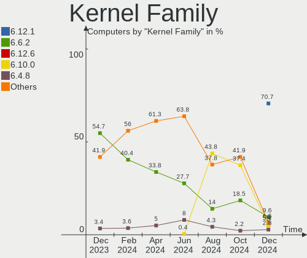
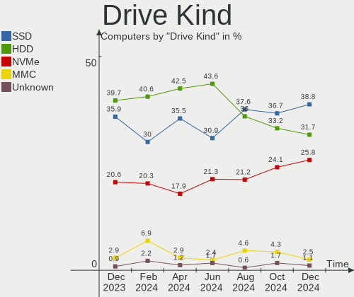
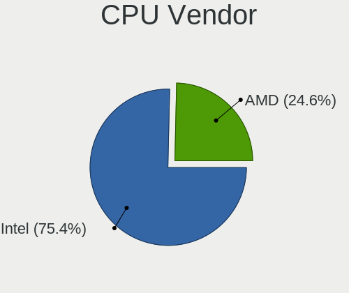
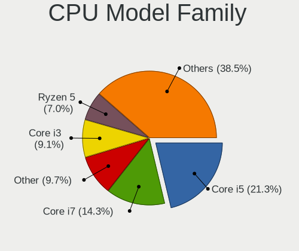
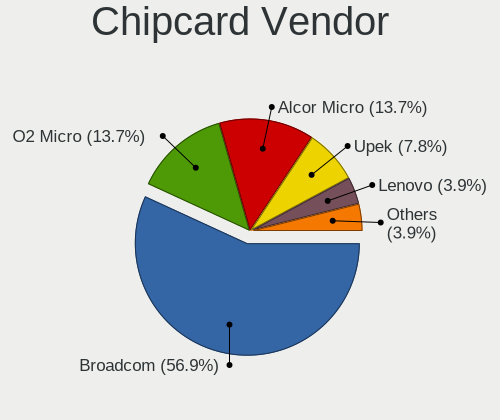

OpenMandriva - Hardware Trends
------------------------------

A project to identify most popular hardware characteristics and track their change
over time based on data collected by Linux users at https://Linux-Hardware.org.

Anyone can contribute to this report by the [hw-probe](https://github.com/linuxhw/hw-probe) tool:

    sudo -E hw-probe -all -upload

This is a report for all computer types. See also reports for [desktops](/Dist/OpenMandriva/Desktop/README.md) and [notebooks](/Dist/OpenMandriva/Notebook/README.md).

This report is for one last month. Overall report since the beginning of time: [TestDays](https://github.com/linuxhw/TestDays)

Period: Apr, 2023.

Contents
--------

* [ System ](#system)
  - [ OS                       ](#os)
  - [ OS Family                ](#os-family)
  - [ Kernel                   ](#kernel)
  - [ Kernel Family            ](#kernel-family)
  - [ Kernel Major Ver.        ](#kernel-major-ver)
  - [ Arch                     ](#arch)
  - [ DE                       ](#de)
  - [ Display Server           ](#display-server)
  - [ Display Manager          ](#display-manager)
  - [ OS Lang                  ](#os-lang)
  - [ Boot Mode                ](#boot-mode)
  - [ Filesystem               ](#filesystem)
  - [ Part. scheme             ](#part-scheme)
  - [ Dual Boot with Linux/BSD ](#dual-boot-with-linuxbsd)
  - [ Dual Boot (Win)          ](#dual-boot-win)

* [ Board ](#board)
  - [ Vendor                   ](#vendor)
  - [ Model                    ](#model)
  - [ Model Family             ](#model-family)
  - [ MFG Year                 ](#mfg-year)
  - [ Form Factor              ](#form-factor)
  - [ Secure Boot              ](#secure-boot)
  - [ Coreboot                 ](#coreboot)
  - [ RAM Size                 ](#ram-size)
  - [ RAM Used                 ](#ram-used)
  - [ Total Drives             ](#total-drives)
  - [ Has CD-ROM               ](#has-cd-rom)
  - [ Has Ethernet             ](#has-ethernet)
  - [ Has WiFi                 ](#has-wifi)
  - [ Has Bluetooth            ](#has-bluetooth)

* [ Location ](#location)
  - [ Country                  ](#country)
  - [ City                     ](#city)

* [ Drives ](#drives)
  - [ Drive Vendor             ](#drive-vendor)
  - [ Drive Model              ](#drive-model)
  - [ HDD Vendor               ](#hdd-vendor)
  - [ SSD Vendor               ](#ssd-vendor)
  - [ Drive Kind               ](#drive-kind)
  - [ Drive Connector          ](#drive-connector)
  - [ Drive Size               ](#drive-size)
  - [ Space Total              ](#space-total)
  - [ Space Used               ](#space-used)
  - [ Malfunc. Drives          ](#malfunc-drives)
  - [ Malfunc. Drive Vendor    ](#malfunc-drive-vendor)
  - [ Malfunc. HDD Vendor      ](#malfunc-hdd-vendor)
  - [ Malfunc. Drive Kind      ](#malfunc-drive-kind)
  - [ Failed Drives            ](#failed-drives)
  - [ Failed Drive Vendor      ](#failed-drive-vendor)
  - [ Drive Status             ](#drive-status)

* [ Storage controller ](#storage-controller)
  - [ Storage Vendor           ](#storage-vendor)
  - [ Storage Model            ](#storage-model)
  - [ Storage Kind             ](#storage-kind)

* [ Processor ](#processor)
  - [ CPU Vendor               ](#cpu-vendor)
  - [ CPU Model                ](#cpu-model)
  - [ CPU Model Family         ](#cpu-model-family)
  - [ CPU Cores                ](#cpu-cores)
  - [ CPU Sockets              ](#cpu-sockets)
  - [ CPU Threads              ](#cpu-threads)
  - [ CPU Op-Modes             ](#cpu-op-modes)
  - [ CPU Microcode            ](#cpu-microcode)
  - [ CPU Microarch            ](#cpu-microarch)

* [ Graphics ](#graphics)
  - [ GPU Vendor               ](#gpu-vendor)
  - [ GPU Model                ](#gpu-model)
  - [ GPU Combo                ](#gpu-combo)
  - [ GPU Driver               ](#gpu-driver)
  - [ GPU Memory               ](#gpu-memory)

* [ Monitor ](#monitor)
  - [ Monitor Vendor           ](#monitor-vendor)
  - [ Monitor Model            ](#monitor-model)
  - [ Monitor Resolution       ](#monitor-resolution)
  - [ Monitor Diagonal         ](#monitor-diagonal)
  - [ Monitor Width            ](#monitor-width)
  - [ Aspect Ratio             ](#aspect-ratio)
  - [ Monitor Area             ](#monitor-area)
  - [ Pixel Density            ](#pixel-density)
  - [ Multiple Monitors        ](#multiple-monitors)

* [ Network ](#network)
  - [ Net Controller Vendor    ](#net-controller-vendor)
  - [ Net Controller Model     ](#net-controller-model)
  - [ Wireless Vendor          ](#wireless-vendor)
  - [ Wireless Model           ](#wireless-model)
  - [ Ethernet Vendor          ](#ethernet-vendor)
  - [ Ethernet Model           ](#ethernet-model)
  - [ Net Controller Kind      ](#net-controller-kind)
  - [ Used Controller          ](#used-controller)
  - [ NICs                     ](#nics)
  - [ IPv6                     ](#ipv6)

* [ Bluetooth ](#bluetooth)
  - [ Bluetooth Vendor         ](#bluetooth-vendor)
  - [ Bluetooth Model          ](#bluetooth-model)

* [ Sound ](#sound)
  - [ Sound Vendor             ](#sound-vendor)
  - [ Sound Model              ](#sound-model)

* [ Memory ](#memory)
  - [ Memory Vendor            ](#memory-vendor)
  - [ Memory Model             ](#memory-model)
  - [ Memory Kind              ](#memory-kind)
  - [ Memory Form Factor       ](#memory-form-factor)
  - [ Memory Size              ](#memory-size)
  - [ Memory Speed             ](#memory-speed)

* [ Printers & scanners ](#printers--scanners)
  - [ Printer Vendor           ](#printer-vendor)
  - [ Printer Model            ](#printer-model)
  - [ Scanner Vendor           ](#scanner-vendor)
  - [ Scanner Model            ](#scanner-model)

* [ Camera ](#camera)
  - [ Camera Vendor            ](#camera-vendor)
  - [ Camera Model             ](#camera-model)

* [ Security ](#security)
  - [ Fingerprint Vendor       ](#fingerprint-vendor)
  - [ Fingerprint Model        ](#fingerprint-model)
  - [ Chipcard Vendor          ](#chipcard-vendor)
  - [ Chipcard Model           ](#chipcard-model)

* [ Unsupported ](#unsupported)
  - [ Unsupported Devices      ](#unsupported-devices)
  - [ Unsupported Device Types ](#unsupported-device-types)

System
------

OS
--

Installed operating systems

| Name               | Computers | Percent |
|--------------------|-----------|---------|
| OpenMandriva 23.03 | 776       | 81%     |
| OpenMandriva 4.3   | 86        | 8.98%   |
| OpenMandriva 23.01 | 59        | 6.16%   |
| OpenMandriva 4.2   | 19        | 1.98%   |
| OpenMandriva 4.50  | 7         | 0.73%   |
| OpenMandriva 23.90 | 5         | 0.52%   |
| OpenMandriva 22.12 | 4         | 0.42%   |
| OpenMandriva 4.90  | 1         | 0.1%    |
| OpenMandriva 22.90 | 1         | 0.1%    |

OS Family
---------

OS without a version

| Name         | Computers | Percent |
|--------------|-----------|---------|
| OpenMandriva | 958       | 100%    |

Kernel
------

Version of the Linux kernel

| Version                  | Computers | Percent |
|--------------------------|-----------|---------|
| 6.2.6-desktop-1omv2390   | 768       | 80.17%  |
| 5.16.7-desktop-1omv4003  | 56        | 5.85%   |
| 6.1.1-desktop-1omv2290   | 52        | 5.43%   |
| 5.16.13-desktop-1omv4003 | 32        | 3.34%   |
| 5.10.14-desktop-1omv4002 | 17        | 1.77%   |
| 6.1.4-desktop-1omv2301   | 8         | 0.84%   |
| 6.0.10-desktop-2omv22090 | 4         | 0.42%   |
| 5.19.5-desktop-1omv4090  | 4         | 0.42%   |
| 5.11.12-desktop-1omv4002 | 3         | 0.31%   |
| 6.2.8-desktop-1omv2390   | 2         | 0.21%   |
| 6.2.2-desktop-1omv2390   | 2         | 0.21%   |
| 6.3.0-desktop-1omv2390   | 1         | 0.1%    |
| 6.2.11-desktop-1omv2390  | 1         | 0.1%    |
| 6.1.22-xanmod1           | 1         | 0.1%    |
| 6.1.2-desktop-1omv2301   | 1         | 0.1%    |
| 6.0.7-desktop-2omv22090  | 1         | 0.1%    |
| 5.19.8-desktop-2omv4090  | 1         | 0.1%    |
| 5.19.11-desktop-2omv4090 | 1         | 0.1%    |
| 5.18.12-desktop-3omv4090 | 1         | 0.1%    |
| 5.17.1-desktop-2omv4050  | 1         | 0.1%    |
| 5.12.4-desktop-1omv4050  | 1         | 0.1%    |

Kernel Family
-------------

Linux kernel without a distro release

| Version | Computers | Percent |
|---------|-----------|---------|
| 6.2.6   | 768       | 80.17%  |
| 5.16.7  | 56        | 5.85%   |
| 6.1.1   | 52        | 5.43%   |
| 5.16.13 | 32        | 3.34%   |
| 5.10.14 | 17        | 1.77%   |
| 6.1.4   | 8         | 0.84%   |
| 6.0.10  | 4         | 0.42%   |
| 5.19.5  | 4         | 0.42%   |
| 5.11.12 | 3         | 0.31%   |
| 6.2.8   | 2         | 0.21%   |
| 6.2.2   | 2         | 0.21%   |
| 6.3.0   | 1         | 0.1%    |
| 6.2.11  | 1         | 0.1%    |
| 6.1.22  | 1         | 0.1%    |
| 6.1.2   | 1         | 0.1%    |
| 6.0.7   | 1         | 0.1%    |
| 5.19.8  | 1         | 0.1%    |
| 5.19.11 | 1         | 0.1%    |
| 5.18.12 | 1         | 0.1%    |
| 5.17.1  | 1         | 0.1%    |
| 5.12.4  | 1         | 0.1%    |

Kernel Major Ver.
-----------------

Linux kernel major version

| Version | Computers | Percent |
|---------|-----------|---------|
| 6.2     | 773       | 80.69%  |
| 5.16    | 88        | 9.19%   |
| 6.1     | 62        | 6.47%   |
| 5.10    | 17        | 1.77%   |
| 5.19    | 6         | 0.63%   |
| 6.0     | 5         | 0.52%   |
| 5.11    | 3         | 0.31%   |
| 6.3     | 1         | 0.1%    |
| 5.18    | 1         | 0.1%    |
| 5.17    | 1         | 0.1%    |
| 5.12    | 1         | 0.1%    |

Arch
----

OS architecture (x86_64, i586, etc.)

| Name   | Computers | Percent |
|--------|-----------|---------|
| x86_64 | 958       | 100%    |

DE
--

Desktop Environment

| Name     | Computers | Percent |
|----------|-----------|---------|
| KDE5     | 845       | 88.2%   |
| GNOME    | 62        | 6.47%   |
| LXQt     | 41        | 4.28%   |
| Budgie   | 4         | 0.42%   |
| XFCE     | 2         | 0.21%   |
| Cinnamon | 2         | 0.21%   |
| Unknown  | 2         | 0.21%   |

Display Server
--------------

X11 or Wayland

| Name    | Computers | Percent |
|---------|-----------|---------|
| X11     | 894       | 93.32%  |
| Wayland | 64        | 6.68%   |

Display Manager
---------------

SDDM, LightDM, etc.

| Name    | Computers | Percent |
|---------|-----------|---------|
| SDDM    | 891       | 93.01%  |
| GDM     | 62        | 6.47%   |
| LightDM | 4         | 0.42%   |
| Unknown | 1         | 0.1%    |

OS Lang
-------

Language

| Lang  | Computers | Percent |
|-------|-----------|---------|
| en_US | 447       | 46.66%  |
| de_DE | 80        | 8.35%   |
| fr_FR | 55        | 5.74%   |
| ru_RU | 54        | 5.64%   |
| en_GB | 45        | 4.7%    |
| it_IT | 38        | 3.97%   |
| pt_BR | 36        | 3.76%   |
| pl_PL | 27        | 2.82%   |
| es_ES | 17        | 1.77%   |
| en_CA | 16        | 1.67%   |
| es_MX | 15        | 1.57%   |
| cs_CZ | 14        | 1.46%   |
| en_AU | 12        | 1.25%   |
| hu_HU | 9         | 0.94%   |
| nl_NL | 8         | 0.84%   |
| es_VE | 7         | 0.73%   |
| en_IN | 7         | 0.73%   |
| de_AT | 7         | 0.73%   |
| de_CH | 6         | 0.63%   |
| ja_JP | 5         | 0.52%   |
| es_AR | 5         | 0.52%   |
| tr_TR | 4         | 0.42%   |
| pt_PT | 4         | 0.42%   |
| fr_BE | 4         | 0.42%   |
| da_DK | 4         | 0.42%   |
| es_UY | 3         | 0.31%   |
| es_CL | 3         | 0.31%   |
| UTF-8 | 2         | 0.21%   |
| nl_BE | 2         | 0.21%   |
| fr_CH | 2         | 0.21%   |
| fr_CA | 2         | 0.21%   |
| es_PE | 2         | 0.21%   |
| es_CO | 2         | 0.21%   |
| en_ZA | 2         | 0.21%   |
| en_AG | 2         | 0.21%   |
| C     | 2         | 0.21%   |
| id_ID | 1         | 0.1%    |
| es_EC | 1         | 0.1%    |
| es_CR | 1         | 0.1%    |
| en_PH | 1         | 0.1%    |

Boot Mode
---------

EFI or BIOS

| Mode | Computers | Percent |
|------|-----------|---------|
| EFI  | 539       | 56.26%  |
| BIOS | 419       | 43.74%  |

Filesystem
----------

Type of filesystem

| Type    | Computers | Percent |
|---------|-----------|---------|
| Ext4    | 512       | 53.44%  |
| Overlay | 380       | 39.67%  |
| Btrfs   | 53        | 5.53%   |
| Xfs     | 8         | 0.84%   |
| F2fs    | 5         | 0.52%   |

Part. scheme
------------

Scheme of partitioning

| Type | Computers | Percent |
|------|-----------|---------|
| GPT  | 755       | 78.81%  |
| MBR  | 203       | 21.19%  |

Dual Boot with Linux/BSD
------------------------

Hosting more than one Linux/BSD

| Dual boot | Computers | Percent |
|-----------|-----------|---------|
| No        | 507       | 52.92%  |
| Yes       | 451       | 47.08%  |

Dual Boot (Win)
---------------

Hosting Linux and Windows

| Dual boot | Computers | Percent |
|-----------|-----------|---------|
| No        | 512       | 53.44%  |
| Yes       | 446       | 46.56%  |

Board
-----

Vendor
------

Motherboard manufacturer

| Name                | Computers | Percent |
|---------------------|-----------|---------|
| ASUSTek Computer    | 159       | 16.6%   |
| Lenovo              | 129       | 13.47%  |
| Hewlett-Packard     | 127       | 13.26%  |
| Dell                | 99        | 10.33%  |
| Gigabyte Technology | 70        | 7.31%   |
| Acer                | 65        | 6.78%   |
| MSI                 | 59        | 6.16%   |
| ASRock              | 45        | 4.7%    |
| Toshiba             | 23        | 2.4%    |
| Intel               | 17        | 1.77%   |
| Fujitsu             | 15        | 1.57%   |
| Samsung Electronics | 14        | 1.46%   |
| Sony                | 11        | 1.15%   |
| Apple               | 11        | 1.15%   |
| Biostar             | 10        | 1.04%   |
| Unknown             | 7         | 0.73%   |
| Microsoft           | 6         | 0.63%   |
| Medion              | 6         | 0.63%   |
| HUAWEI              | 6         | 0.63%   |
| Fujitsu Siemens     | 6         | 0.63%   |
| Foxconn             | 5         | 0.52%   |
| eMachines           | 5         | 0.52%   |
| ECS                 | 5         | 0.52%   |
| AZW                 | 5         | 0.52%   |
| Pegatron            | 3         | 0.31%   |
| Notebook            | 3         | 0.31%   |
| Positivo            | 2         | 0.21%   |
| Packard Bell        | 2         | 0.21%   |
| NEC Computers       | 2         | 0.21%   |
| GPU Company         | 2         | 0.21%   |
| Google              | 2         | 0.21%   |
| Chuwi               | 2         | 0.21%   |
| Acidanthera         | 2         | 0.21%   |
| ZOTAC               | 1         | 0.1%    |
| VIT                 | 1         | 0.1%    |
| UMAX                | 1         | 0.1%    |
| ULTRATOP            | 1         | 0.1%    |
| TPS                 | 1         | 0.1%    |
| Timi                | 1         | 0.1%    |
| T-bao               | 1         | 0.1%    |

Model
-----

Motherboard model

| Name                                        | Computers | Percent |
|---------------------------------------------|-----------|---------|
| Dell OptiPlex 7010                          | 9         | 0.94%   |
| Unknown                                     | 9         | 0.94%   |
| ASUS All Series                             | 8         | 0.84%   |
| ASUS S551LN                                 | 6         | 0.63%   |
| Lenovo IdeaPad 1 14ADA05 82GW               | 5         | 0.52%   |
| HP Notebook                                 | 5         | 0.52%   |
| Gigabyte Z77M-D3H                           | 5         | 0.52%   |
| ASUS PRIME A320M-K                          | 5         | 0.52%   |
| MSI MS-7C02                                 | 4         | 0.42%   |
| Samsung 950XCJ/951XCJ/950XCR                | 3         | 0.31%   |
| MSI MS-7721                                 | 3         | 0.31%   |
| Lenovo ThinkPad X1 Extreme Gen 3 20TK001HUS | 3         | 0.31%   |
| Fujitsu LIFEBOOK S935                       | 3         | 0.31%   |
| Dell Inspiron 1720                          | 3         | 0.31%   |
| ASUS UX31E                                  | 3         | 0.31%   |
| ASUS ROG STRIX X570-F GAMING                | 3         | 0.31%   |
| ASRock A320M-DVS R4.0                       | 3         | 0.31%   |
| Apple MacBookPro8,1                         | 3         | 0.31%   |
| Toshiba Satellite L350D                     | 2         | 0.21%   |
| Toshiba Satellite C660                      | 2         | 0.21%   |
| Samsung 950QED                              | 2         | 0.21%   |
| MSI MS-7C52                                 | 2         | 0.21%   |
| MSI MS-7C09                                 | 2         | 0.21%   |
| MSI MS-7B89                                 | 2         | 0.21%   |
| MSI MS-7B86                                 | 2         | 0.21%   |
| MSI MS-7817                                 | 2         | 0.21%   |
| Lenovo MIIX 320-10ICR 80XF                  | 2         | 0.21%   |
| Lenovo IdeaPad S145-15AST 81N3              | 2         | 0.21%   |
| Lenovo IdeaPad L340-15IRH Gaming 81LK       | 2         | 0.21%   |
| Lenovo G505 20240                           | 2         | 0.21%   |
| Lenovo G50-70 20351                         | 2         | 0.21%   |
| Intel B75                                   | 2         | 0.21%   |
| HUAWEI HLYL-WXX9                            | 2         | 0.21%   |
| HP ProDesk 400 G1 SFF                       | 2         | 0.21%   |
| HP ProBook 650 G4                           | 2         | 0.21%   |
| HP ProBook 4330s                            | 2         | 0.21%   |
| HP Pavilion dv6                             | 2         | 0.21%   |
| HP Laptop 15s-eq2xxx                        | 2         | 0.21%   |
| HP EliteDesk 800 G1 USDT                    | 2         | 0.21%   |
| HP EliteDesk 800 G1 SFF                     | 2         | 0.21%   |

Model Family
------------

Motherboard model prefix

| Name               | Computers | Percent |
|--------------------|-----------|---------|
| Lenovo ThinkPad    | 44        | 4.59%   |
| Acer Aspire        | 40        | 4.18%   |
| Lenovo IdeaPad     | 29        | 3.03%   |
| Dell Latitude      | 28        | 2.92%   |
| Dell OptiPlex      | 25        | 2.61%   |
| Dell Inspiron      | 24        | 2.51%   |
| ASUS PRIME         | 24        | 2.51%   |
| HP Compaq          | 19        | 1.98%   |
| Toshiba Satellite  | 17        | 1.77%   |
| HP Pavilion        | 16        | 1.67%   |
| HP Laptop          | 15        | 1.57%   |
| ASUS ROG           | 14        | 1.46%   |
| Lenovo ThinkCentre | 13        | 1.36%   |
| HP ProBook         | 13        | 1.36%   |
| HP EliteBook       | 13        | 1.36%   |
| ASUS VivoBook      | 12        | 1.25%   |
| HP EliteDesk       | 10        | 1.04%   |
| Dell Precision     | 9         | 0.94%   |
| Unknown            | 9         | 0.94%   |
| ASUS All           | 8         | 0.84%   |
| Dell Vostro        | 7         | 0.73%   |
| Microsoft Surface  | 6         | 0.63%   |
| HP ProDesk         | 6         | 0.63%   |
| ASUS S551LN        | 6         | 0.63%   |
| Acer Swift         | 6         | 0.63%   |
| Toshiba dynabook   | 5         | 0.52%   |
| Lenovo IdeaCentre  | 5         | 0.52%   |
| HP Notebook        | 5         | 0.52%   |
| Gigabyte Z77M-D3H  | 5         | 0.52%   |
| Fujitsu ESPRIMO    | 5         | 0.52%   |
| ASUS TUF           | 5         | 0.52%   |
| Acer Veriton       | 5         | 0.52%   |
| MSI MS-7C02        | 4         | 0.42%   |
| Lenovo Yoga        | 4         | 0.42%   |
| HP OMEN            | 4         | 0.42%   |
| Fujitsu LIFEBOOK   | 4         | 0.42%   |
| Samsung 950XCJ     | 3         | 0.31%   |
| MSI MS-7721        | 3         | 0.31%   |
| Lenovo Legion      | 3         | 0.31%   |
| HP Victus          | 3         | 0.31%   |

MFG Year
--------

Motherboard manufacture year

| Year | Computers | Percent |
|------|-----------|---------|
| 2012 | 94        | 9.81%   |
| 2021 | 78        | 8.14%   |
| 2020 | 78        | 8.14%   |
| 2011 | 77        | 8.04%   |
| 2018 | 73        | 7.62%   |
| 2019 | 70        | 7.31%   |
| 2014 | 69        | 7.2%    |
| 2013 | 66        | 6.89%   |
| 2017 | 56        | 5.85%   |
| 2010 | 48        | 5.01%   |
| 2015 | 47        | 4.91%   |
| 2016 | 44        | 4.59%   |
| 2008 | 43        | 4.49%   |
| 2009 | 34        | 3.55%   |
| 2007 | 34        | 3.55%   |
| 2022 | 33        | 3.44%   |
| 2006 | 10        | 1.04%   |
| 2023 | 4         | 0.42%   |

Form Factor
-----------

Physical design of the computer

| Name        | Computers | Percent |
|-------------|-----------|---------|
| Notebook    | 483       | 50.42%  |
| Desktop     | 427       | 44.57%  |
| Mini pc     | 12        | 1.25%   |
| Convertible | 11        | 1.15%   |
| All in one  | 10        | 1.04%   |
| Tablet      | 8         | 0.84%   |
| Server      | 7         | 0.73%   |

Secure Boot
-----------

Enabled or disabled

| State    | Computers | Percent |
|----------|-----------|---------|
| Disabled | 958       | 100%    |

Coreboot
--------

Have coreboot on board

| Used | Computers | Percent |
|------|-----------|---------|
| No   | 955       | 99.69%  |
| Yes  | 3         | 0.31%   |

RAM Size
--------

Total RAM memory

| Size in GB      | Computers | Percent |
|-----------------|-----------|---------|
| 4.01-8.0        | 286       | 29.85%  |
| 3.01-4.0        | 194       | 20.25%  |
| 16.01-24.0      | 162       | 16.91%  |
| 8.01-16.0       | 157       | 16.39%  |
| 32.01-64.0      | 74        | 7.72%   |
| 1.01-2.0        | 27        | 2.82%   |
| 64.01-256.0     | 21        | 2.19%   |
| 2.01-3.0        | 17        | 1.77%   |
| 24.01-32.0      | 16        | 1.67%   |
| More than 256.0 | 3         | 0.31%   |
| 0.51-1.0        | 1         | 0.1%    |

RAM Used
--------

Used RAM memory

| Used GB   | Computers | Percent |
|-----------|-----------|---------|
| 1.01-2.0  | 605       | 63.15%  |
| 2.01-3.0  | 228       | 23.8%   |
| 0.51-1.0  | 67        | 6.99%   |
| 3.01-4.0  | 33        | 3.44%   |
| 4.01-8.0  | 14        | 1.46%   |
| 0.01-0.5  | 10        | 1.04%   |
| 8.01-16.0 | 1         | 0.1%    |

Total Drives
------------

Number of drives on board

| Drives | Computers | Percent |
|--------|-----------|---------|
| 1      | 530       | 55.32%  |
| 2      | 245       | 25.57%  |
| 3      | 99        | 10.33%  |
| 4      | 44        | 4.59%   |
| 5      | 19        | 1.98%   |
| 0      | 8         | 0.84%   |
| 6      | 6         | 0.63%   |
| 8      | 2         | 0.21%   |
| 7      | 2         | 0.21%   |
| 25     | 1         | 0.1%    |
| 11     | 1         | 0.1%    |
| 10     | 1         | 0.1%    |

Has CD-ROM
----------

Has CD-ROM on board

| Presented | Computers | Percent |
|-----------|-----------|---------|
| No        | 516       | 53.86%  |
| Yes       | 442       | 46.14%  |

Has Ethernet
------------

Has Ethernet on board

| Presented | Computers | Percent |
|-----------|-----------|---------|
| Yes       | 850       | 88.73%  |
| No        | 108       | 11.27%  |

Has WiFi
--------

Has WiFi module

| Presented | Computers | Percent |
|-----------|-----------|---------|
| Yes       | 693       | 72.34%  |
| No        | 265       | 27.66%  |

Has Bluetooth
-------------

Has Bluetooth module

| Presented | Computers | Percent |
|-----------|-----------|---------|
| Yes       | 522       | 54.49%  |
| No        | 436       | 45.51%  |

Location
--------

Country
-------

Geographic location (country)

| Country      | Computers | Percent |
|--------------|-----------|---------|
| USA          | 131       | 13.67%  |
| Germany      | 97        | 10.13%  |
| Russia       | 61        | 6.37%   |
| France       | 56        | 5.85%   |
| Brazil       | 55        | 5.74%   |
| Italy        | 54        | 5.64%   |
| UK           | 48        | 5.01%   |
| Japan        | 33        | 3.44%   |
| Poland       | 30        | 3.13%   |
| Canada       | 25        | 2.61%   |
| Spain        | 23        | 2.4%    |
| Finland      | 18        | 1.88%   |
| Australia    | 18        | 1.88%   |
| Netherlands  | 17        | 1.77%   |
| India        | 17        | 1.77%   |
| Czechia      | 16        | 1.67%   |
| Hungary      | 12        | 1.25%   |
| Argentina    | 12        | 1.25%   |
| Venezuela    | 11        | 1.15%   |
| Mexico       | 11        | 1.15%   |
| Portugal     | 10        | 1.04%   |
| Indonesia    | 10        | 1.04%   |
| Belgium      | 10        | 1.04%   |
| Austria      | 9         | 0.94%   |
| Switzerland  | 8         | 0.84%   |
| Slovakia     | 8         | 0.84%   |
| Colombia     | 7         | 0.73%   |
| South Africa | 6         | 0.63%   |
| Romania      | 6         | 0.63%   |
| Malaysia     | 6         | 0.63%   |
| China        | 6         | 0.63%   |
| Chile        | 6         | 0.63%   |
| Belarus      | 6         | 0.63%   |
| Turkey       | 5         | 0.52%   |
| Taiwan       | 5         | 0.52%   |
| Egypt        | 5         | 0.52%   |
| Denmark      | 5         | 0.52%   |
| Bulgaria     | 5         | 0.52%   |
| Peru         | 4         | 0.42%   |
| Lithuania    | 4         | 0.42%   |

City
----

Geographic location (city)

| City                   | Computers | Percent |
|------------------------|-----------|---------|
| Moscow                 | 14        | 1.46%   |
| Prague                 | 10        | 1.04%   |
| Helsinki               | 9         | 0.94%   |
| Milan                  | 8         | 0.84%   |
| Berlin                 | 7         | 0.73%   |
| Warsaw                 | 6         | 0.63%   |
| London                 | 6         | 0.63%   |
| Kuala Lumpur           | 6         | 0.63%   |
| Budapest               | 6         | 0.63%   |
| Vienna                 | 5         | 0.52%   |
| St Petersburg          | 5         | 0.52%   |
| Rome                   | 5         | 0.52%   |
| Sydney                 | 4         | 0.42%   |
| Santiago               | 4         | 0.42%   |
| Riga                   | 4         | 0.42%   |
| Porto Alegre           | 4         | 0.42%   |
| Munich                 | 4         | 0.42%   |
| Melbourne              | 4         | 0.42%   |
| Las Vegas              | 4         | 0.42%   |
| Istres                 | 4         | 0.42%   |
| Glasgow                | 4         | 0.42%   |
| Freeport               | 4         | 0.42%   |
| Exeter                 | 4         | 0.42%   |
| Dolny Ohaj             | 4         | 0.42%   |
| Caracas                | 4         | 0.42%   |
| Brisbane               | 4         | 0.42%   |
| Bogotá                | 4         | 0.42%   |
| Bengaluru              | 4         | 0.42%   |
| Amadora                | 4         | 0.42%   |
| St. Jean Baptiste      | 3         | 0.31%   |
| Seattle                | 3         | 0.31%   |
| Sao Paulo              | 3         | 0.31%   |
| Saint-Meme-le-Tenu     | 3         | 0.31%   |
| Rothenburg upon Tauber | 3         | 0.31%   |
| Rio de Janeiro         | 3         | 0.31%   |
| Quito                  | 3         | 0.31%   |
| Nizhniy Novgorod       | 3         | 0.31%   |
| New Taipei             | 3         | 0.31%   |
| Nepean                 | 3         | 0.31%   |
| Mogilev                | 3         | 0.31%   |

Drives
------

Drive Vendor
------------

Hard drive vendors

| Vendor              | Computers | Drives | Percent |
|---------------------|-----------|--------|---------|
| Seagate             | 218       | 252    | 14.97%  |
| WDC                 | 197       | 242    | 13.53%  |
| Samsung Electronics | 161       | 202    | 11.06%  |
| Kingston            | 99        | 117    | 6.8%    |
| Toshiba             | 97        | 107    | 6.66%   |
| SanDisk             | 65        | 71     | 4.46%   |
| Crucial             | 65        | 74     | 4.46%   |
| Hitachi             | 47        | 50     | 3.23%   |
| Unknown             | 38        | 42     | 2.61%   |
| HGST                | 32        | 34     | 2.2%    |
| SPCC                | 29        | 31     | 1.99%   |
| Intel               | 27        | 28     | 1.85%   |
| China               | 26        | 27     | 1.79%   |
| A-DATA Technology   | 26        | 27     | 1.79%   |
| Micron Technology   | 21        | 21     | 1.44%   |
| SK hynix            | 17        | 17     | 1.17%   |
| PNY                 | 17        | 18     | 1.17%   |
| JMicron Technology  | 15        | 15     | 1.03%   |
| Transcend           | 14        | 14     | 0.96%   |
| Patriot             | 12        | 12     | 0.82%   |
| Intenso             | 9         | 10     | 0.62%   |
| Phison              | 8         | 9      | 0.55%   |
| Maxtor              | 8         | 8      | 0.55%   |
| KIOXIA              | 8         | 8      | 0.55%   |
| GOODRAM             | 7         | 7      | 0.48%   |
| Apacer              | 7         | 7      | 0.48%   |
| Silicon Motion      | 6         | 6      | 0.41%   |
| LITEON              | 6         | 6      | 0.41%   |
| KIOXIA-EXCERIA      | 6         | 6      | 0.41%   |
| XPG                 | 5         | 6      | 0.34%   |
| Verbatim            | 5         | 5      | 0.34%   |
| Team                | 5         | 5      | 0.34%   |
| SABRENT             | 5         | 5      | 0.34%   |
| KingSpec            | 5         | 5      | 0.34%   |
| Hewlett-Packard     | 5         | 10     | 0.34%   |
| Gigabyte Technology | 5         | 5      | 0.34%   |
| Unknown             | 5         | 6      | 0.34%   |
| Netac               | 4         | 4      | 0.27%   |
| Fujitsu             | 4         | 4      | 0.27%   |
| ASMT                | 4         | 4      | 0.27%   |

Drive Model
-----------

Hard drive models

| Model                            | Computers | Percent |
|----------------------------------|-----------|---------|
| Kingston SA400S37480G 480GB SSD  | 17        | 1.07%   |
| Kingston SA400S37240G 240GB SSD  | 17        | 1.07%   |
| Toshiba DT01ACA100 1TB           | 14        | 0.88%   |
| Toshiba MQ01ABF050 500GB         | 12        | 0.75%   |
| Seagate ST500DM002-1BD142 500GB  | 12        | 0.75%   |
| Toshiba MQ01ABD100 1TB           | 11        | 0.69%   |
| Kingston SA400S37120G 120GB SSD  | 11        | 0.69%   |
| Crucial CT500MX500SSD1 500GB     | 11        | 0.69%   |
| SPCC Solid State Disk 512GB      | 10        | 0.63%   |
| Seagate ST1000DM010-2EP102 1TB   | 10        | 0.63%   |
| Crucial CT240BX500SSD1 240GB     | 10        | 0.63%   |
| Samsung SSD 970 EVO Plus 1TB     | 9         | 0.57%   |
| Unknown SD/MMC/MS PRO 249GB      | 8         | 0.5%    |
| Seagate ST500LT012-1DG142 500GB  | 8         | 0.5%    |
| Samsung SSD 860 EVO 500GB        | 8         | 0.5%    |
| Toshiba DT01ACA200 2TB           | 7         | 0.44%   |
| Seagate ST1000LM035-1RK172 970GB | 7         | 0.44%   |
| SanDisk SSD PLUS 1000GB          | 7         | 0.44%   |
| Samsung SSD 860 EVO 1TB          | 7         | 0.44%   |
| JMicron Generic 1TB              | 7         | 0.44%   |
| HGST HTS545050A7E380 500GB       | 7         | 0.44%   |
| WDC WD10EZEX-08WN4A0 1TB         | 6         | 0.38%   |
| Seagate ST3500418AS 500GB        | 6         | 0.38%   |
| Seagate ST2000DM008-2FR102 2TB   | 6         | 0.38%   |
| Seagate ST1000DM003-1ER162 1TB   | 6         | 0.38%   |
| SanDisk NVMe SSD Drive 1TB       | 6         | 0.38%   |
| HGST HTS545050A7E680 500GB       | 6         | 0.38%   |
| Crucial CT480BX500SSD1 480GB     | 6         | 0.38%   |
| Crucial CT1000MX500SSD1 1TB      | 6         | 0.38%   |
| WDC WDS240G2G0A-00JH30 240GB SSD | 5         | 0.31%   |
| WDC WD5000AAKX-75U6AA0 500GB     | 5         | 0.31%   |
| Unknown MMC64G  64GB             | 5         | 0.31%   |
| SPCC Solid State Disk 1TB        | 5         | 0.31%   |
| Seagate ST9500325AS 500GB        | 5         | 0.31%   |
| Seagate ST3500414CS 500GB        | 5         | 0.31%   |
| Seagate ST3250310AS 250GB        | 5         | 0.31%   |
| Seagate ST1000LM048-2E7172 1TB   | 5         | 0.31%   |
| Samsung SSD 980 PRO 2TB          | 5         | 0.31%   |
| Samsung SSD 980 PRO 1TB          | 5         | 0.31%   |
| Samsung SSD 860 EVO 250GB        | 5         | 0.31%   |

HDD Vendor
----------

Hard disk drive vendors

| Vendor              | Computers | Drives | Percent |
|---------------------|-----------|--------|---------|
| Seagate             | 212       | 244    | 35.39%  |
| WDC                 | 153       | 183    | 25.54%  |
| Toshiba             | 89        | 97     | 14.86%  |
| Hitachi             | 47        | 50     | 7.85%   |
| HGST                | 32        | 34     | 5.34%   |
| Samsung Electronics | 26        | 30     | 4.34%   |
| Unknown             | 8         | 8      | 1.34%   |
| Maxtor              | 8         | 8      | 1.34%   |
| JMicron Technology  | 7         | 7      | 1.17%   |
| Fujitsu             | 4         | 4      | 0.67%   |
| USB3.0              | 2         | 2      | 0.33%   |
| ASMedia             | 2         | 2      | 0.33%   |
| WD MediaMax         | 1         | 1      | 0.17%   |
| StoreJet            | 1         | 1      | 0.17%   |
| RSH-319             | 1         | 1      | 0.17%   |
| KESU                | 1         | 1      | 0.17%   |
| Intenso             | 1         | 1      | 0.17%   |
| Inateck             | 1         | 1      | 0.17%   |
| Hewlett-Packard     | 1         | 6      | 0.17%   |
| ExcelStor           | 1         | 1      | 0.17%   |
| Apple               | 1         | 1      | 0.17%   |

SSD Vendor
----------

Solid state drive vendors

| Vendor              | Computers | Drives | Percent |
|---------------------|-----------|--------|---------|
| Samsung Electronics | 77        | 91     | 13.51%  |
| Kingston            | 71        | 83     | 12.46%  |
| Crucial             | 53        | 57     | 9.3%    |
| SanDisk             | 48        | 52     | 8.42%   |
| WDC                 | 32        | 34     | 5.61%   |
| SPCC                | 28        | 29     | 4.91%   |
| China               | 26        | 27     | 4.56%   |
| A-DATA Technology   | 20        | 20     | 3.51%   |
| PNY                 | 15        | 16     | 2.63%   |
| Micron Technology   | 14        | 14     | 2.46%   |
| Transcend           | 12        | 12     | 2.11%   |
| Patriot             | 12        | 12     | 2.11%   |
| Intel               | 12        | 12     | 2.11%   |
| Intenso             | 8         | 8      | 1.4%    |
| GOODRAM             | 7         | 7      | 1.23%   |
| Toshiba             | 6         | 6      | 1.05%   |
| SK hynix            | 6         | 6      | 1.05%   |
| LITEON              | 6         | 6      | 1.05%   |
| Verbatim            | 5         | 5      | 0.88%   |
| Seagate             | 5         | 5      | 0.88%   |
| Apacer              | 5         | 5      | 0.88%   |
| Netac               | 4         | 4      | 0.7%    |
| JMicron Technology  | 4         | 4      | 0.7%    |
| Unknown             | 4         | 5      | 0.7%    |
| Team                | 3         | 3      | 0.53%   |
| Lexar               | 3         | 3      | 0.53%   |
| Leven               | 3         | 4      | 0.53%   |
| KingSpec            | 3         | 3      | 0.53%   |
| KingFast            | 3         | 3      | 0.53%   |
| KingDian            | 3         | 3      | 0.53%   |
| Gigabyte Technology | 3         | 3      | 0.53%   |
| ASMT                | 3         | 3      | 0.53%   |
| Wibtek              | 2         | 2      | 0.35%   |
| TO Exter            | 2         | 2      | 0.35%   |
| SPCC Sol            | 2         | 2      | 0.35%   |
| OCZ                 | 2         | 2      | 0.35%   |
| LITEONIT            | 2         | 2      | 0.35%   |
| Integral            | 2         | 2      | 0.35%   |
| External            | 2         | 2      | 0.35%   |
| Emtec               | 2         | 2      | 0.35%   |

Drive Kind
----------

HDD or SSD

| Kind    | Computers | Drives | Percent |
|---------|-----------|--------|---------|
| HDD     | 491       | 683    | 38.94%  |
| SSD     | 477       | 611    | 37.83%  |
| NVMe    | 243       | 298    | 19.27%  |
| MMC     | 34        | 38     | 2.7%    |
| Unknown | 16        | 17     | 1.27%   |

Drive Connector
---------------

SATA, SAS, NVMe, etc.

| Type | Computers | Drives | Percent |
|------|-----------|--------|---------|
| SATA | 791       | 1222   | 68.84%  |
| NVMe | 241       | 292    | 20.97%  |
| SAS  | 83        | 95     | 7.22%   |
| MMC  | 34        | 38     | 2.96%   |

Drive Size
----------

Size of hard drive

| Size in TB | Computers | Drives | Percent |
|------------|-----------|--------|---------|
| 0.01-0.5   | 612       | 803    | 60.59%  |
| 0.51-1.0   | 280       | 345    | 27.72%  |
| 1.01-2.0   | 70        | 82     | 6.93%   |
| 2.01-3.0   | 19        | 23     | 1.88%   |
| 3.01-4.0   | 14        | 18     | 1.39%   |
| 4.01-10.0  | 11        | 19     | 1.09%   |
| 10.01-20.0 | 4         | 4      | 0.4%    |

Space Total
-----------

Amount of disk space available on the file system

| Size in GB     | Computers | Percent |
|----------------|-----------|---------|
| 1-20           | 267       | 27.87%  |
| 101-250        | 218       | 22.76%  |
| 251-500        | 162       | 16.91%  |
| 501-1000       | 77        | 8.04%   |
| 51-100         | 67        | 6.99%   |
| 21-50          | 66        | 6.89%   |
| Unknown        | 46        | 4.8%    |
| 1001-2000      | 32        | 3.34%   |
| 2001-3000      | 12        | 1.25%   |
| More than 3000 | 11        | 1.15%   |

Space Used
----------

Amount of used disk space

| Used GB        | Computers | Percent |
|----------------|-----------|---------|
| 1-20           | 733       | 76.51%  |
| 21-50          | 62        | 6.47%   |
| Unknown        | 46        | 4.8%    |
| 101-250        | 33        | 3.44%   |
| 51-100         | 33        | 3.44%   |
| 251-500        | 22        | 2.3%    |
| 501-1000       | 18        | 1.88%   |
| 1001-2000      | 6         | 0.63%   |
| 2001-3000      | 4         | 0.42%   |
| More than 3000 | 1         | 0.1%    |

Malfunc. Drives
---------------

Drive models with a malfunction

| Model                               | Computers | Drives | Percent |
|-------------------------------------|-----------|--------|---------|
| Seagate ST500DM002-1BD142 500GB     | 6         | 6      | 2.14%   |
| WDC WD5000AAKX-75U6AA0 500GB        | 5         | 5      | 1.78%   |
| Toshiba MQ01ABD100 1TB              | 5         | 5      | 1.78%   |
| Seagate ST9500325AS 500GB           | 4         | 4      | 1.42%   |
| Seagate ST500LT012-1DG142 500GB     | 4         | 4      | 1.42%   |
| HGST HTS545050A7E680 500GB          | 4         | 4      | 1.42%   |
| HGST HTS545050A7E380 500GB          | 4         | 4      | 1.42%   |
| Seagate ST500LT012-9WS142 500GB     | 3         | 3      | 1.07%   |
| Seagate ST500LM021-1KJ152 500GB     | 3         | 3      | 1.07%   |
| Seagate ST3250310AS 250GB           | 3         | 3      | 1.07%   |
| Seagate ST3160318AS 160GB           | 3         | 3      | 1.07%   |
| Seagate ST31000528AS 1TB            | 3         | 3      | 1.07%   |
| SanDisk SSD U100 256GB              | 3         | 3      | 1.07%   |
| Hitachi HTS543232A7A384 320GB       | 3         | 3      | 1.07%   |
| HGST HTS541010A9E680 1TB            | 3         | 3      | 1.07%   |
| WDC WD5000BPVT-22HXZT3 500GB        | 2         | 2      | 0.71%   |
| WDC WD5000AAKX-00ERMA0 500GB        | 2         | 2      | 0.71%   |
| WDC WD20EARX-00PASB0 2TB            | 2         | 2      | 0.71%   |
| WDC WD10EALX-009BA0 1TB             | 2         | 2      | 0.71%   |
| Toshiba MQ01ABD050 500GB            | 2         | 2      | 0.71%   |
| Seagate ST9320325AS 320GB           | 2         | 2      | 0.71%   |
| Seagate ST500LM012 HN-M500MBB 500GB | 2         | 2      | 0.71%   |
| Seagate ST3250318AS 250GB           | 2         | 2      | 0.71%   |
| Seagate ST2000DM001-1CH164 2TB      | 2         | 2      | 0.71%   |
| Seagate ST1000LM035-1RK172 970GB    | 2         | 2      | 0.71%   |
| Seagate ST1000DM003-1CH162 1TB      | 2         | 2      | 0.71%   |
| Samsung Electronics HD103SI 1TB     | 2         | 2      | 0.71%   |
| Maxtor STM380215AS 80GB             | 2         | 2      | 0.71%   |
| Kingston SV300S37A240G 240GB SSD    | 2         | 2      | 0.71%   |
| Intenso SSD SATAIII 256GB           | 2         | 2      | 0.71%   |
| Hitachi HTS723232A7A364 320GB       | 2         | 2      | 0.71%   |
| Hitachi HTS547575A9E384 752GB       | 2         | 2      | 0.71%   |
| Hitachi HTS542525K9SA00 250GB       | 2         | 2      | 0.71%   |
| HGST HTS725050A7E630 500GB          | 2         | 2      | 0.71%   |
| HGST HTS721010A9E630 1TB            | 2         | 2      | 0.71%   |
| Fujitsu MHY2120BH 120GB             | 2         | 2      | 0.71%   |
| WDC WDS240G2G0A-00JH30 240GB SSD    | 1         | 1      | 0.36%   |
| WDC WD800JD-23LSA0 80GB             | 1         | 1      | 0.36%   |
| WDC WD800JB-00JJC0 80GB             | 1         | 1      | 0.36%   |
| WDC WD800BD-22LRA0 80GB             | 1         | 1      | 0.36%   |

Malfunc. Drive Vendor
---------------------

Vendors of faulty drives

| Vendor              | Computers | Drives | Percent |
|---------------------|-----------|--------|---------|
| Seagate             | 80        | 81     | 29.09%  |
| WDC                 | 49        | 53     | 17.82%  |
| Hitachi             | 25        | 26     | 9.09%   |
| Samsung Electronics | 22        | 23     | 8%      |
| Toshiba             | 21        | 21     | 7.64%   |
| HGST                | 18        | 19     | 6.55%   |
| Intel               | 9         | 9      | 3.27%   |
| Maxtor              | 7         | 7      | 2.55%   |
| SanDisk             | 5         | 5      | 1.82%   |
| Kingston            | 5         | 5      | 1.82%   |
| SK hynix            | 4         | 4      | 1.45%   |
| Micron Technology   | 3         | 3      | 1.09%   |
| Fujitsu             | 3         | 3      | 1.09%   |
| China               | 3         | 3      | 1.09%   |
| KingSpec            | 2         | 2      | 0.73%   |
| Intenso             | 2         | 2      | 0.73%   |
| Crucial             | 2         | 2      | 0.73%   |
| A-DATA Technology   | 2         | 2      | 0.73%   |
| Teclast             | 1         | 1      | 0.36%   |
| SPCC                | 1         | 1      | 0.36%   |
| SATAFIRM            | 1         | 1      | 0.36%   |
| RSH-319             | 1         | 1      | 0.36%   |
| Plextor             | 1         | 1      | 0.36%   |
| Patriot             | 1         | 1      | 0.36%   |
| LITEON              | 1         | 1      | 0.36%   |
| JMicron Technology  | 1         | 1      | 0.36%   |
| Fanxiang            | 1         | 1      | 0.36%   |
| ExcelStor           | 1         | 1      | 0.36%   |
| BAITITON            | 1         | 1      | 0.36%   |
| Apple               | 1         | 1      | 0.36%   |
| Unknown             | 1         | 1      | 0.36%   |

Malfunc. HDD Vendor
-------------------

Vendors of faulty HDD drives

| Vendor              | Computers | Drives | Percent |
|---------------------|-----------|--------|---------|
| Seagate             | 80        | 81     | 36.04%  |
| WDC                 | 48        | 51     | 21.62%  |
| Hitachi             | 25        | 26     | 11.26%  |
| Toshiba             | 21        | 21     | 9.46%   |
| HGST                | 18        | 19     | 8.11%   |
| Samsung Electronics | 17        | 18     | 7.66%   |
| Maxtor              | 7         | 7      | 3.15%   |
| Fujitsu             | 3         | 3      | 1.35%   |
| RSH-319             | 1         | 1      | 0.45%   |
| ExcelStor           | 1         | 1      | 0.45%   |
| Apple               | 1         | 1      | 0.45%   |

Malfunc. Drive Kind
-------------------

Kinds of faulty drives

| Kind    | Computers | Drives | Percent |
|---------|-----------|--------|---------|
| HDD     | 205       | 229    | 79.15%  |
| SSD     | 46        | 46     | 17.76%  |
| NVMe    | 7         | 7      | 2.7%    |
| Unknown | 1         | 1      | 0.39%   |

Failed Drives
-------------

Failed drive models

| Model                           | Computers | Drives | Percent |
|---------------------------------|-----------|--------|---------|
| WDC WD1600AAJS-00YZCA0 160GB    | 1         | 1      | 20%     |
| Toshiba MK3261GSYN 320GB        | 1         | 1      | 20%     |
| Seagate ST9320423AS 320GB       | 1         | 1      | 20%     |
| Seagate ST500DM002-1BD142 500GB | 1         | 1      | 20%     |
| HGST HTS545050B7E660 500GB      | 1         | 1      | 20%     |

Failed Drive Vendor
-------------------

Failed drive vendors

| Vendor  | Computers | Drives | Percent |
|---------|-----------|--------|---------|
| Seagate | 2         | 2      | 40%     |
| WDC     | 1         | 1      | 20%     |
| Toshiba | 1         | 1      | 20%     |
| HGST    | 1         | 1      | 20%     |

Drive Status
------------

Number of failed and malfunc. drives

| Status   | Computers | Drives | Percent |
|----------|-----------|--------|---------|
| Works    | 786       | 1231   | 68.41%  |
| Malfunc  | 250       | 283    | 21.76%  |
| Detected | 108       | 128    | 9.4%    |
| Failed   | 5         | 5      | 0.44%   |

Storage controller
------------------

Storage Vendor
--------------

Storage controller vendors

| Vendor                           | Computers | Percent |
|----------------------------------|-----------|---------|
| Intel                            | 650       | 54.17%  |
| AMD                              | 235       | 19.58%  |
| Samsung Electronics              | 74        | 6.17%   |
| SanDisk                          | 34        | 2.83%   |
| Kingston Technology Company      | 31        | 2.58%   |
| Phison Electronics               | 24        | 2%      |
| Silicon Motion                   | 19        | 1.58%   |
| ASMedia Technology               | 19        | 1.58%   |
| Micron/Crucial Technology        | 15        | 1.25%   |
| Marvell Technology Group         | 15        | 1.25%   |
| Nvidia                           | 12        | 1%      |
| SK hynix                         | 11        | 0.92%   |
| KIOXIA                           | 10        | 0.83%   |
| ADATA Technology                 | 9         | 0.75%   |
| Toshiba America Info Systems     | 7         | 0.58%   |
| Micron Technology                | 7         | 0.58%   |
| JMicron Technology               | 7         | 0.58%   |
| VIA Technologies                 | 2         | 0.17%   |
| Solid State Storage Technology   | 2         | 0.17%   |
| Realtek Semiconductor            | 2         | 0.17%   |
| MAXIO Technology (Hangzhou)      | 2         | 0.17%   |
| Hewlett-Packard                  | 2         | 0.17%   |
| Biwin Storage Technology         | 2         | 0.17%   |
| Union Memory (Shenzhen)          | 1         | 0.08%   |
| Transcend                        | 1         | 0.08%   |
| Silicon Integrated Systems [SiS] | 1         | 0.08%   |
| Silicon Image                    | 1         | 0.08%   |
| Seagate Technology               | 1         | 0.08%   |
| LSI Logic / Symbios Logic        | 1         | 0.08%   |
| Lenovo                           | 1         | 0.08%   |
| Integrated Technology Express    | 1         | 0.08%   |
| Broadcom / LSI                   | 1         | 0.08%   |

Storage Model
-------------

Storage controller models

| Model                                                                                   | Computers | Percent |
|-----------------------------------------------------------------------------------------|-----------|---------|
| AMD FCH SATA Controller [AHCI mode]                                                     | 146       | 10.41%  |
| Intel Sunrise Point-LP SATA Controller [AHCI mode]                                      | 56        | 3.99%   |
| Intel 8 Series/C220 Series Chipset Family 6-port SATA Controller 1 [AHCI mode]          | 44        | 3.14%   |
| Intel 7 Series Chipset Family 6-port SATA Controller [AHCI mode]                        | 42        | 3%      |
| Intel 6 Series/C200 Series Chipset Family 6 port Mobile SATA AHCI Controller            | 35        | 2.5%    |
| AMD SB7x0/SB8x0/SB9x0 SATA Controller [AHCI mode]                                       | 34        | 2.43%   |
| Samsung NVMe SSD Controller SM981/PM981/PM983                                           | 31        | 2.21%   |
| Intel 82801IBM/IEM (ICH9M/ICH9M-E) 4 port SATA Controller [AHCI mode]                   | 31        | 2.21%   |
| Intel 6 Series/C200 Series Chipset Family 6 port Desktop SATA AHCI Controller           | 26        | 1.85%   |
| AMD 400 Series Chipset SATA Controller                                                  | 26        | 1.85%   |
| AMD SB7x0/SB8x0/SB9x0 IDE Controller                                                    | 24        | 1.71%   |
| Intel Q170/Q150/B150/H170/H110/Z170/CM236 Chipset SATA Controller [AHCI Mode]           | 23        | 1.64%   |
| Intel 7 Series/C210 Series Chipset Family 6-port SATA Controller [AHCI mode]            | 23        | 1.64%   |
| Samsung NVMe SSD Controller 980                                                         | 22        | 1.57%   |
| Intel 82801 Mobile SATA Controller [RAID mode]                                          | 22        | 1.57%   |
| Intel Volume Management Device NVMe RAID Controller                                     | 21        | 1.5%    |
| Intel 5 Series/3400 Series Chipset 4 port SATA AHCI Controller                          | 19        | 1.36%   |
| Intel NM10/ICH7 Family SATA Controller [IDE mode]                                       | 18        | 1.28%   |
| Intel 82801G (ICH7 Family) IDE Controller                                               | 18        | 1.28%   |
| Intel 8 Series SATA Controller 1 [AHCI mode]                                            | 18        | 1.28%   |
| Intel 82801HM/HEM (ICH8M/ICH8M-E) IDE Controller                                        | 17        | 1.21%   |
| Intel 200 Series PCH SATA controller [AHCI mode]                                        | 17        | 1.21%   |
| AMD 500 Series Chipset SATA Controller                                                  | 17        | 1.21%   |
| ASMedia ASM1062 Serial ATA Controller                                                   | 16        | 1.14%   |
| Samsung NVMe SSD Controller PM9A1/PM9A3/980PRO                                          | 15        | 1.07%   |
| Intel Cannon Lake PCH SATA AHCI Controller                                              | 15        | 1.07%   |
| Silicon Motion SM2263EN/SM2263XT SSD Controller                                         | 14        | 1%      |
| Intel 82801HM/HEM (ICH8M/ICH8M-E) SATA Controller [AHCI mode]                           | 14        | 1%      |
| Intel 5 Series/3400 Series Chipset 6 port SATA AHCI Controller                          | 14        | 1%      |
| AMD FCH SATA Controller D                                                               | 14        | 1%      |
| Phison PS5013 E13 NVMe Controller                                                       | 13        | 0.93%   |
| Intel Wildcat Point-LP SATA Controller [AHCI Mode]                                      | 13        | 0.93%   |
| Intel Atom Processor E3800 Series SATA AHCI Controller                                  | 13        | 0.93%   |
| Intel 500 Series Chipset Family SATA AHCI Controller                                    | 13        | 0.93%   |
| AMD SB7x0/SB8x0/SB9x0 SATA Controller [IDE mode]                                        | 13        | 0.93%   |
| SanDisk WD Black SN750 / PC SN730 NVMe SSD                                              | 12        | 0.86%   |
| Micron/Crucial P2 NVMe PCIe SSD                                                         | 12        | 0.86%   |
| Intel SATA Controller [RAID mode]                                                       | 12        | 0.86%   |
| Intel 6 Series/C200 Series Chipset Family Desktop SATA Controller (IDE mode, ports 4-5) | 12        | 0.86%   |
| Intel 6 Series/C200 Series Chipset Family Desktop SATA Controller (IDE mode, ports 0-3) | 12        | 0.86%   |

Storage Kind
------------

Kind of storage controller (IDE, SATA, NVMe, SAS, ...)

| Kind | Computers | Percent |
|------|-----------|---------|
| SATA | 765       | 62.45%  |
| NVMe | 241       | 19.67%  |
| IDE  | 154       | 12.57%  |
| RAID | 63        | 5.14%   |
| SAS  | 2         | 0.16%   |

Processor
---------

CPU Vendor
----------

Processor vendors

| Vendor | Computers | Percent |
|--------|-----------|---------|
| Intel  | 694       | 72.44%  |
| AMD    | 264       | 27.56%  |

CPU Model
---------

Processor models

| Model                                         | Computers | Percent |
|-----------------------------------------------|-----------|---------|
| Intel Core i5-7200U CPU @ 2.50GHz             | 9         | 0.94%   |
| Intel Core i5-6200U CPU @ 2.30GHz             | 9         | 0.94%   |
| Intel Core i5-3470 CPU @ 3.20GHz              | 9         | 0.94%   |
| Intel Core i5-2400 CPU @ 3.10GHz              | 9         | 0.94%   |
| Intel 11th Gen Core i3-1115G4 @ 3.00GHz       | 9         | 0.94%   |
| AMD Ryzen 7 3700X 8-Core Processor            | 9         | 0.94%   |
| Intel Core i3-4030U CPU @ 1.90GHz             | 8         | 0.84%   |
| Intel Core i3-3220 CPU @ 3.30GHz              | 8         | 0.84%   |
| Intel Core i7-8550U CPU @ 1.80GHz             | 7         | 0.73%   |
| Intel Core i7-6700HQ CPU @ 2.60GHz            | 7         | 0.73%   |
| Intel Core i5-3210M CPU @ 2.50GHz             | 7         | 0.73%   |
| Intel Core i3-2120 CPU @ 3.30GHz              | 7         | 0.73%   |
| Intel 11th Gen Core i5-1135G7 @ 2.40GHz       | 7         | 0.73%   |
| AMD Ryzen 5 5600G with Radeon Graphics        | 7         | 0.73%   |
| AMD Ryzen 5 3500U with Radeon Vega Mobile Gfx | 7         | 0.73%   |
| Intel Core i7-3520M CPU @ 2.90GHz             | 6         | 0.63%   |
| Intel Core i7-2600 CPU @ 3.40GHz              | 6         | 0.63%   |
| Intel Core 2 Duo CPU P8700 @ 2.53GHz          | 6         | 0.63%   |
| Intel Core 2 Duo CPU P8600 @ 2.40GHz          | 6         | 0.63%   |
| Intel 11th Gen Core i7-1165G7 @ 2.80GHz       | 6         | 0.63%   |
| AMD Ryzen 5 5600X 6-Core Processor            | 6         | 0.63%   |
| AMD Ryzen 5 3600 6-Core Processor             | 6         | 0.63%   |
| Intel Core i7-6700 CPU @ 3.40GHz              | 5         | 0.52%   |
| Intel Core i7-3770 CPU @ 3.40GHz              | 5         | 0.52%   |
| Intel Core i7-10510U CPU @ 1.80GHz            | 5         | 0.52%   |
| Intel Core i5-8250U CPU @ 1.60GHz             | 5         | 0.52%   |
| Intel Core i5-5300U CPU @ 2.30GHz             | 5         | 0.52%   |
| Intel Core i5-4590 CPU @ 3.30GHz              | 5         | 0.52%   |
| Intel Core i5-3320M CPU @ 2.60GHz             | 5         | 0.52%   |
| Intel Core i5-2520M CPU @ 2.50GHz             | 5         | 0.52%   |
| Intel Core i3-7020U CPU @ 2.30GHz             | 5         | 0.52%   |
| Intel Celeron N4020 CPU @ 1.10GHz             | 5         | 0.52%   |
| AMD Ryzen 5 3400G with Radeon Vega Graphics   | 5         | 0.52%   |
| AMD 3020e with Radeon Graphics                | 5         | 0.52%   |
| Intel Pentium CPU G4400 @ 3.30GHz             | 4         | 0.42%   |
| Intel Core i7-7500U CPU @ 2.70GHz             | 4         | 0.42%   |
| Intel Core i7-4790 CPU @ 3.60GHz              | 4         | 0.42%   |
| Intel Core i5-6500 CPU @ 3.20GHz              | 4         | 0.42%   |
| Intel Core i5-6300U CPU @ 2.40GHz             | 4         | 0.42%   |
| Intel Core i5-5200U CPU @ 2.20GHz             | 4         | 0.42%   |

CPU Model Family
----------------

Processor model prefix

| Model                   | Computers | Percent |
|-------------------------|-----------|---------|
| Intel Core i5           | 199       | 20.77%  |
| Intel Core i7           | 121       | 12.63%  |
| Intel Core i3           | 97        | 10.13%  |
| AMD Ryzen 5             | 71        | 7.41%   |
| Intel Celeron           | 58        | 6.05%   |
| Other                   | 57        | 5.95%   |
| Intel Core 2 Duo        | 56        | 5.85%   |
| Intel Pentium           | 33        | 3.44%   |
| AMD Ryzen 7             | 29        | 3.03%   |
| AMD FX                  | 18        | 1.88%   |
| Intel Pentium Dual-Core | 15        | 1.57%   |
| Intel Xeon              | 14        | 1.46%   |
| AMD Ryzen 9             | 13        | 1.36%   |
| AMD A8                  | 13        | 1.36%   |
| AMD Ryzen 3             | 12        | 1.25%   |
| AMD A6                  | 12        | 1.25%   |
| AMD A10                 | 12        | 1.25%   |
| Intel Pentium Dual      | 11        | 1.15%   |
| AMD A4                  | 11        | 1.15%   |
| Intel Core 2 Quad       | 8         | 0.84%   |
| Intel Core 2            | 7         | 0.73%   |
| AMD Athlon II X2        | 6         | 0.63%   |
| AMD Athlon              | 6         | 0.63%   |
| Intel Core i9           | 5         | 0.52%   |
| Intel Pentium Gold      | 4         | 0.42%   |
| AMD Phenom II X6        | 4         | 0.42%   |
| AMD Phenom II X4        | 4         | 0.42%   |
| AMD Athlon X4           | 4         | 0.42%   |
| Intel Genuine           | 3         | 0.31%   |
| Intel Atom              | 3         | 0.31%   |
| AMD E2                  | 3         | 0.31%   |
| AMD E1                  | 3         | 0.31%   |
| AMD E                   | 3         | 0.31%   |
| AMD C-70                | 3         | 0.31%   |
| AMD Athlon X2           | 3         | 0.31%   |
| AMD Athlon II X3        | 3         | 0.31%   |
| Intel Pentium Silver    | 2         | 0.21%   |
| Intel Pentium D         | 2         | 0.21%   |
| Intel Pentium 4         | 2         | 0.21%   |
| AMD Sempron             | 2         | 0.21%   |

CPU Cores
---------

Number of processor cores

| Number | Computers | Percent |
|--------|-----------|---------|
| 2      | 475       | 49.58%  |
| 4      | 288       | 30.06%  |
| 6      | 79        | 8.25%   |
| 8      | 52        | 5.43%   |
| 1      | 32        | 3.34%   |
| 12     | 13        | 1.36%   |
| 16     | 7         | 0.73%   |
| 3      | 6         | 0.63%   |
| 14     | 4         | 0.42%   |
| 24     | 1         | 0.1%    |
| 10     | 1         | 0.1%    |

CPU Sockets
-----------

Number of sockets

| Number | Computers | Percent |
|--------|-----------|---------|
| 1      | 953       | 99.48%  |
| 2      | 5         | 0.52%   |

CPU Threads
-----------

Threads per core (Hyper-Threading)

| Number | Computers | Percent |
|--------|-----------|---------|
| 2      | 593       | 61.9%   |
| 1      | 358       | 37.37%  |
| 4      | 5         | 0.52%   |
| 16     | 1         | 0.1%    |
| 8      | 1         | 0.1%    |

CPU Op-Modes
------------

CPU Operation Modes (32-bit, 64-bit)

| Op mode        | Computers | Percent |
|----------------|-----------|---------|
| 32-bit, 64-bit | 958       | 100%    |

CPU Microcode
-------------

Microcode number

| Number     | Computers | Percent |
|------------|-----------|---------|
| Unknown    | 580       | 60.54%  |
| 0x08108109 | 23        | 2.4%    |
| 0x06001119 | 22        | 2.3%    |
| 0x306a9    | 19        | 1.98%   |
| 0x206a7    | 18        | 1.88%   |
| 0x0a50000c | 14        | 1.46%   |
| 0x08701021 | 14        | 1.46%   |
| 0x306c3    | 13        | 1.36%   |
| 0x1067a    | 11        | 1.15%   |
| 0x0a50000d | 10        | 1.04%   |
| 0x06006705 | 10        | 1.04%   |
| 0x010000c8 | 9         | 0.94%   |
| 0x6fd      | 7         | 0.73%   |
| 0x0600611a | 7         | 0.73%   |
| 0x06003106 | 7         | 0.73%   |
| 0x0a20120a | 6         | 0.63%   |
| 0x08608103 | 6         | 0.63%   |
| 0x08101016 | 6         | 0.63%   |
| 0x0800820d | 6         | 0.63%   |
| 0x0500010d | 6         | 0.63%   |
| 0x506e3    | 5         | 0.52%   |
| 0x20655    | 5         | 0.52%   |
| 0x08200103 | 5         | 0.52%   |
| 0x06000822 | 5         | 0.52%   |
| 0x906ea    | 4         | 0.42%   |
| 0x406e3    | 4         | 0.42%   |
| 0x0a201025 | 4         | 0.42%   |
| 0x0a201016 | 4         | 0.42%   |
| 0x08108102 | 4         | 0.42%   |
| 0x0810100b | 4         | 0.42%   |
| 0x0700010b | 4         | 0.42%   |
| 0x03000027 | 4         | 0.42%   |
| 0x010000bf | 4         | 0.42%   |
| 0x010000b6 | 4         | 0.42%   |
| 0x906e9    | 3         | 0.31%   |
| 0x406c3    | 3         | 0.31%   |
| 0x10676    | 3         | 0.31%   |
| 0x08600104 | 3         | 0.31%   |
| 0x07030105 | 3         | 0.31%   |
| 0x06000817 | 3         | 0.31%   |

CPU Microarch
-------------

Microarchitecture

| Name             | Computers | Percent |
|------------------|-----------|---------|
| KabyLake         | 105       | 10.96%  |
| IvyBridge        | 86        | 8.98%   |
| Haswell          | 78        | 8.14%   |
| SandyBridge      | 73        | 7.62%   |
| Penryn           | 61        | 6.37%   |
| Skylake          | 60        | 6.26%   |
| Zen 3            | 43        | 4.49%   |
| Core             | 43        | 4.49%   |
| Piledriver       | 37        | 3.86%   |
| Zen+             | 35        | 3.65%   |
| Westmere         | 32        | 3.34%   |
| Zen 2            | 28        | 2.92%   |
| Silvermont       | 28        | 2.92%   |
| TigerLake        | 25        | 2.61%   |
| K10              | 24        | 2.51%   |
| Zen              | 21        | 2.19%   |
| IceLake          | 20        | 2.09%   |
| Excavator        | 18        | 1.88%   |
| CometLake        | 17        | 1.77%   |
| Broadwell        | 16        | 1.67%   |
| Alderlake Hybrid | 13        | 1.36%   |
| Unknown          | 13        | 1.36%   |
| Goldmont plus    | 11        | 1.15%   |
| Bobcat           | 11        | 1.15%   |
| Steamroller      | 8         | 0.84%   |
| K8 Hammer        | 8         | 0.84%   |
| Goldmont         | 8         | 0.84%   |
| Nehalem          | 6         | 0.63%   |
| K10 Llano        | 6         | 0.63%   |
| Jaguar           | 5         | 0.52%   |
| Bulldozer        | 5         | 0.52%   |
| Tremont          | 4         | 0.42%   |
| Puma             | 4         | 0.42%   |
| NetBurst         | 4         | 0.42%   |
| K8 & K10 hybrid  | 1         | 0.1%    |
| Bonnell          | 1         | 0.1%    |

Graphics
--------

GPU Vendor
----------

Vendors of graphics cards

| Vendor                                       | Computers | Percent |
|----------------------------------------------|-----------|---------|
| Intel                                        | 531       | 49.86%  |
| AMD                                          | 280       | 26.29%  |
| Nvidia                                       | 249       | 23.38%  |
| Matrox Electronics Systems                   | 3         | 0.28%   |
| XGI Technology (eXtreme Graphics Innovation) | 1         | 0.09%   |
| ASPEED Technology                            | 1         | 0.09%   |

GPU Model
---------

Graphics card models

| Model                                                                                    | Computers | Percent |
|------------------------------------------------------------------------------------------|-----------|---------|
| Intel 2nd Generation Core Processor Family Integrated Graphics Controller                | 54        | 4.93%   |
| Intel 3rd Gen Core processor Graphics Controller                                         | 39        | 3.56%   |
| AMD Picasso/Raven 2 [Radeon Vega Series / Radeon Vega Mobile Series]                     | 31        | 2.83%   |
| Intel Mobile 4 Series Chipset Integrated Graphics Controller                             | 29        | 2.65%   |
| Intel Xeon E3-1200 v2/3rd Gen Core processor Graphics Controller                         | 25        | 2.28%   |
| Intel HD Graphics 620                                                                    | 25        | 2.28%   |
| Intel Xeon E3-1200 v3/4th Gen Core Processor Integrated Graphics Controller              | 24        | 2.19%   |
| Intel Core Processor Integrated Graphics Controller                                      | 23        | 2.1%    |
| Intel HD Graphics 530                                                                    | 21        | 1.92%   |
| Intel Skylake GT2 [HD Graphics 520]                                                      | 19        | 1.73%   |
| Intel Haswell-ULT Integrated Graphics Controller                                         | 19        | 1.73%   |
| AMD Cezanne [Radeon Vega Series / Radeon Vega Mobile Series]                             | 18        | 1.64%   |
| AMD Ellesmere [Radeon RX 470/480/570/570X/580/580X/590]                                  | 16        | 1.46%   |
| Intel UHD Graphics 620                                                                   | 15        | 1.37%   |
| Intel TigerLake-LP GT2 [Iris Xe Graphics]                                                | 15        | 1.37%   |
| Intel Mobile GM965/GL960 Integrated Graphics Controller (secondary)                      | 14        | 1.28%   |
| Intel Mobile GM965/GL960 Integrated Graphics Controller (primary)                        | 14        | 1.28%   |
| Intel HD Graphics 5500                                                                   | 14        | 1.28%   |
| Intel Atom/Celeron/Pentium Processor x5-E8000/J3xxx/N3xxx Integrated Graphics Controller | 14        | 1.28%   |
| Intel Atom Processor Z36xxx/Z37xxx Series Graphics & Display                             | 14        | 1.28%   |
| Nvidia GP107 [GeForce GTX 1050 Ti]                                                       | 12        | 1.09%   |
| Nvidia GK208B [GeForce GT 730]                                                           | 12        | 1.09%   |
| Intel CometLake-U GT2 [UHD Graphics]                                                     | 12        | 1.09%   |
| Intel 4 Series Chipset Integrated Graphics Controller                                    | 12        | 1.09%   |
| Nvidia GP108 [GeForce GT 1030]                                                           | 10        | 0.91%   |
| Intel Tiger Lake-LP GT2 [UHD Graphics G4]                                                | 10        | 0.91%   |
| Intel GeminiLake [UHD Graphics 600]                                                      | 10        | 0.91%   |
| AMD Stoney [Radeon R2/R3/R4/R5 Graphics]                                                 | 10        | 0.91%   |
| AMD Renoir                                                                               | 9         | 0.82%   |
| AMD Raven Ridge [Radeon Vega Series / Radeon Vega Mobile Series]                         | 9         | 0.82%   |
| Nvidia TU117M [GeForce GTX 1650 Mobile / Max-Q]                                          | 8         | 0.73%   |
| AMD Lucienne                                                                             | 8         | 0.73%   |
| Nvidia GM108M [GeForce 840M]                                                             | 7         | 0.64%   |
| Nvidia GM107 [GeForce GTX 750 Ti]                                                        | 7         | 0.64%   |
| Intel WhiskeyLake-U GT2 [UHD Graphics 620]                                               | 7         | 0.64%   |
| Intel CometLake-H GT2 [UHD Graphics]                                                     | 7         | 0.64%   |
| Intel Alder Lake-P Integrated Graphics Controller                                        | 7         | 0.64%   |
| AMD Topaz XT [Radeon R7 M260/M265 / M340/M360 / M440/M445 / 530/535 / 620/625 Mobile]    | 7         | 0.64%   |
| AMD Sun XT [Radeon HD 8670A/8670M/8690M / R5 M330 / M430 / Radeon 520 Mobile]            | 7         | 0.64%   |
| Nvidia GK208B [GeForce GT 710]                                                           | 6         | 0.55%   |

GPU Combo
---------

Combinations of graphics cards

| Name                     | Computers | Percent |
|--------------------------|-----------|---------|
| 1 x Intel                | 391       | 40.81%  |
| 1 x AMD                  | 234       | 24.43%  |
| 1 x Nvidia               | 163       | 17.01%  |
| Intel + Nvidia           | 72        | 7.52%   |
| 2 x Intel                | 46        | 4.8%    |
| Intel + AMD              | 21        | 2.19%   |
| 2 x AMD                  | 13        | 1.36%   |
| AMD + Nvidia             | 10        | 1.04%   |
| 2 x Nvidia               | 2         | 0.21%   |
| 1 x Matrox               | 2         | 0.21%   |
| Nvidia + XGI             | 1         | 0.1%    |
| Intel + AMD + 1 x Nvidia | 1         | 0.1%    |
| 1 x ASPEED               | 1         | 0.1%    |
| AMD + Matrox             | 1         | 0.1%    |

GPU Driver
----------

Free vs proprietary

| Driver      | Computers | Percent |
|-------------|-----------|---------|
| Free        | 914       | 95.41%  |
| Proprietary | 29        | 3.03%   |
| Unknown     | 15        | 1.57%   |

GPU Memory
----------

Total video memory

| Size in GB | Computers | Percent |
|------------|-----------|---------|
| Unknown    | 462       | 48.23%  |
| 1.01-2.0   | 141       | 14.72%  |
| 0.01-0.5   | 134       | 13.99%  |
| 0.51-1.0   | 96        | 10.02%  |
| 3.01-4.0   | 58        | 6.05%   |
| 7.01-8.0   | 32        | 3.34%   |
| 5.01-6.0   | 20        | 2.09%   |
| 8.01-16.0  | 10        | 1.04%   |
| 2.01-3.0   | 3         | 0.31%   |
| 4.01-5.0   | 1         | 0.1%    |
| 16.01-24.0 | 1         | 0.1%    |

Monitor
-------

Monitor Vendor
--------------

Monitor vendors

| Vendor                  | Computers | Percent |
|-------------------------|-----------|---------|
| Samsung Electronics     | 129       | 13.24%  |
| AU Optronics            | 109       | 11.19%  |
| LG Display              | 86        | 8.83%   |
| Chimei Innolux          | 76        | 7.8%    |
| BOE                     | 75        | 7.7%    |
| Goldstar                | 51        | 5.24%   |
| Dell                    | 46        | 4.72%   |
| Hewlett-Packard         | 39        | 4%      |
| Acer                    | 37        | 3.8%    |
| AOC                     | 34        | 3.49%   |
| Philips                 | 26        | 2.67%   |
| Lenovo                  | 23        | 2.36%   |
| BenQ                    | 23        | 2.36%   |
| Ancor Communications    | 13        | 1.33%   |
| Sharp                   | 12        | 1.23%   |
| Chi Mei Optoelectronics | 12        | 1.23%   |
| ViewSonic               | 10        | 1.03%   |
| Apple                   | 10        | 1.03%   |
| LG Philips              | 9         | 0.92%   |
| ASUSTek Computer        | 9         | 0.92%   |
| Sony                    | 7         | 0.72%   |
| Sceptre Tech            | 7         | 0.72%   |
| Fujitsu Siemens         | 7         | 0.72%   |
| Unknown                 | 6         | 0.62%   |
| HKC                     | 5         | 0.51%   |
| HannStar                | 5         | 0.51%   |
| Eizo                    | 5         | 0.51%   |
| Unknown                 | 5         | 0.51%   |
| PANDA                   | 4         | 0.41%   |
| Panasonic               | 4         | 0.41%   |
| MSI                     | 4         | 0.41%   |
| Iiyama                  | 4         | 0.41%   |
| CPT                     | 4         | 0.41%   |
| Toshiba                 | 3         | 0.31%   |
| NEC Computers           | 3         | 0.31%   |
| Hitachi                 | 3         | 0.31%   |
| Vizio                   | 2         | 0.21%   |
| Viotek                  | 2         | 0.21%   |
| Vestel Elektronik       | 2         | 0.21%   |
| Unknown (XXX)           | 2         | 0.21%   |

Monitor Model
-------------

Monitor models

| Model                                                                    | Computers | Percent |
|--------------------------------------------------------------------------|-----------|---------|
| LG Display LCD Monitor LGD033A 1366x768 344x194mm 15.5-inch              | 7         | 0.71%   |
| AU Optronics LCD Monitor AUO38ED 1920x1080 344x193mm 15.5-inch           | 7         | 0.71%   |
| LG Display LCD Monitor LGD02DC 1366x768 344x194mm 15.5-inch              | 6         | 0.61%   |
| Chimei Innolux LCD Monitor CMN14D4 1920x1080 309x173mm 13.9-inch         | 6         | 0.61%   |
| AU Optronics LCD Monitor AUO36ED 1920x1080 344x193mm 15.5-inch           | 6         | 0.61%   |
| Samsung Electronics LCD Monitor SEC5441 1366x768 344x194mm 15.5-inch     | 5         | 0.51%   |
| Chimei Innolux LCD Monitor CMN15DB 1366x768 344x193mm 15.5-inch          | 5         | 0.51%   |
| BenQ GL2023 BNQ78CC 1600x900 443x249mm 20.0-inch                         | 5         | 0.51%   |
| AU Optronics LCD Monitor AUO723C 1366x768 309x173mm 13.9-inch            | 5         | 0.51%   |
| Unknown                                                                  | 5         | 0.51%   |
| Goldstar W1943 GSM4BAD 1360x768 406x229mm 18.4-inch                      | 4         | 0.41%   |
| Chimei Innolux LCD Monitor CMN15F5 1920x1080 344x193mm 15.5-inch         | 4         | 0.41%   |
| BOE LCD Monitor BOE0672 1366x768 344x194mm 15.5-inch                     | 4         | 0.41%   |
| AU Optronics LCD Monitor AUO61ED 1920x1080 344x193mm 15.5-inch           | 4         | 0.41%   |
| AU Optronics LCD Monitor AUO22EC 1366x768 344x193mm 15.5-inch            | 4         | 0.41%   |
| Toshiba TV TSB0108 1360x768 576x324mm 26.0-inch                          | 3         | 0.31%   |
| Sharp LCD Monitor SHP141B 1920x1080 294x165mm 13.3-inch                  | 3         | 0.31%   |
| Samsung Electronics S27F350 SAM0D22 1920x1080 598x336mm 27.0-inch        | 3         | 0.31%   |
| Samsung Electronics LCD Monitor SDC4161 1920x1080 344x194mm 15.5-inch    | 3         | 0.31%   |
| Samsung Electronics LCD Monitor SDC4159 1920x1080 344x194mm 15.5-inch    | 3         | 0.31%   |
| Samsung Electronics LCD Monitor SDC4141 3840x2160 344x194mm 15.5-inch    | 3         | 0.31%   |
| LG Display LCD Monitor LGD0555 2736x1824 260x173mm 12.3-inch             | 3         | 0.31%   |
| LG Display LCD Monitor LGD02D8 1366x768 277x156mm 12.5-inch              | 3         | 0.31%   |
| Lenovo LCD Monitor LEN40A0 1366x768 309x174mm 14.0-inch                  | 3         | 0.31%   |
| Goldstar IPS236 GSM580C 1920x1080 510x290mm 23.1-inch                    | 3         | 0.31%   |
| Goldstar IPS225 GSM587B 1920x1080 510x290mm 23.1-inch                    | 3         | 0.31%   |
| Goldstar E1942 GSM4C09 1366x768 410x230mm 18.5-inch                      | 3         | 0.31%   |
| Dell S2421HS DEL41F4 1920x1080 527x296mm 23.8-inch                       | 3         | 0.31%   |
| Dell P2210 DEL404D 1680x1050 474x296mm 22.0-inch                         | 3         | 0.31%   |
| CPT LCD Monitor COR17DB 1600x900 293x164mm 13.2-inch                     | 3         | 0.31%   |
| Chimei Innolux LCD Monitor CMN15E7 1920x1080 344x193mm 15.5-inch         | 3         | 0.31%   |
| Chimei Innolux LCD Monitor CMN1361 1920x1080 293x165mm 13.2-inch         | 3         | 0.31%   |
| Chimei Innolux LCD Monitor CMN1132 1366x768 256x144mm 11.6-inch          | 3         | 0.31%   |
| Chi Mei Optoelectronics LCD Monitor CMO15A3 1366x768 344x193mm 15.5-inch | 3         | 0.31%   |
| BOE LCD Monitor BOE0889 1920x1080 344x194mm 15.5-inch                    | 3         | 0.31%   |
| BOE LCD Monitor BOE061D 1366x768 309x173mm 13.9-inch                     | 3         | 0.31%   |
| AU Optronics LCD Monitor AUO6287 1440x900 367x229mm 17.0-inch            | 3         | 0.31%   |
| AU Optronics LCD Monitor AUO213E 1600x900 309x174mm 14.0-inch            | 3         | 0.31%   |
| Vestel Elektronik 55UHD_LCD_TV VES3700 3840x2160 1872x1053mm 84.6-inch   | 2         | 0.2%    |
| Unknown LCD Monitor SAMSUNG 1920x1080                                    | 2         | 0.2%    |

Monitor Resolution
------------------

Monitor screen resolution

| Resolution         | Computers | Percent |
|--------------------|-----------|---------|
| 1920x1080 (FHD)    | 424       | 44.07%  |
| 1366x768 (WXGA)    | 217       | 22.56%  |
| 3840x2160 (4K)     | 52        | 5.41%   |
| 1600x900 (HD+)     | 45        | 4.68%   |
| 1680x1050 (WSXGA+) | 34        | 3.53%   |
| 2560x1440 (QHD)    | 33        | 3.43%   |
| 1280x800 (WXGA)    | 32        | 3.33%   |
| 1440x900 (WXGA+)   | 25        | 2.6%    |
| 1280x1024 (SXGA)   | 24        | 2.49%   |
| 1920x1200 (WUXGA)  | 20        | 2.08%   |
| 1360x768           | 11        | 1.14%   |
| 3440x1440          | 7         | 0.73%   |
| 2560x1600          | 6         | 0.62%   |
| 1920x540           | 4         | 0.42%   |
| 2736x1824          | 3         | 0.31%   |
| 2560x1080          | 3         | 0.31%   |
| 1024x768 (XGA)     | 3         | 0.31%   |
| 3840x1080          | 2         | 0.21%   |
| 2288x1287          | 2         | 0.21%   |
| 1920x1280          | 2         | 0.21%   |
| Unknown            | 2         | 0.21%   |
| 6000x1440          | 1         | 0.1%    |
| 3840x2400          | 1         | 0.1%    |
| 3200x1800 (QHD+)   | 1         | 0.1%    |
| 2880x1800          | 1         | 0.1%    |
| 2240x1400          | 1         | 0.1%    |
| 2160x1440          | 1         | 0.1%    |
| 1800x1200          | 1         | 0.1%    |
| 1600x2560          | 1         | 0.1%    |
| 1400x1050          | 1         | 0.1%    |
| 1280x960           | 1         | 0.1%    |
| 1024x600           | 1         | 0.1%    |

Monitor Diagonal
----------------

Diagonal size in inches

| Inches  | Computers | Percent |
|---------|-----------|---------|
| 15      | 254       | 26.1%   |
| 13      | 75        | 7.71%   |
| 23      | 72        | 7.4%    |
| 27      | 65        | 6.68%   |
| 24      | 65        | 6.68%   |
| 14      | 63        | 6.47%   |
| 21      | 59        | 6.06%   |
| 17      | 47        | 4.83%   |
| 19      | 34        | 3.49%   |
| 31      | 29        | 2.98%   |
| 22      | 26        | 2.67%   |
| Unknown | 26        | 2.67%   |
| 18      | 25        | 2.57%   |
| 12      | 25        | 2.57%   |
| 20      | 19        | 1.95%   |
| 11      | 14        | 1.44%   |
| 16      | 10        | 1.03%   |
| 34      | 9         | 0.92%   |
| 72      | 8         | 0.82%   |
| 84      | 7         | 0.72%   |
| 54      | 7         | 0.72%   |
| 25      | 4         | 0.41%   |
| 48      | 3         | 0.31%   |
| 26      | 3         | 0.31%   |
| 10      | 3         | 0.31%   |
| 142     | 2         | 0.21%   |
| 37      | 2         | 0.21%   |
| 35      | 2         | 0.21%   |
| 32      | 2         | 0.21%   |
| 29      | 2         | 0.21%   |
| 74      | 1         | 0.1%    |
| 65      | 1         | 0.1%    |
| 60      | 1         | 0.1%    |
| 57      | 1         | 0.1%    |
| 55      | 1         | 0.1%    |
| 52      | 1         | 0.1%    |
| 46      | 1         | 0.1%    |
| 41      | 1         | 0.1%    |
| 36      | 1         | 0.1%    |
| 28      | 1         | 0.1%    |

Monitor Width
-------------

Physical width

| Width in mm    | Computers | Percent |
|----------------|-----------|---------|
| 301-350        | 363       | 37.73%  |
| 501-600        | 189       | 19.65%  |
| 401-500        | 143       | 14.86%  |
| 351-400        | 75        | 7.8%    |
| 201-300        | 74        | 7.69%   |
| 601-700        | 39        | 4.05%   |
| Unknown        | 26        | 2.7%    |
| 1501-2000      | 16        | 1.66%   |
| 1001-1500      | 16        | 1.66%   |
| 701-800        | 14        | 1.46%   |
| 801-900        | 3         | 0.31%   |
| More than 2000 | 2         | 0.21%   |
| 101-200        | 1         | 0.1%    |
| 901-1000       | 1         | 0.1%    |

Aspect Ratio
------------

Proportional relationship between the width and the height

| Ratio   | Computers | Percent |
|---------|-----------|---------|
| 16/9    | 723       | 78.25%  |
| 16/10   | 122       | 13.2%   |
| 5/4     | 26        | 2.81%   |
| Unknown | 17        | 1.84%   |
| 3/2     | 14        | 1.52%   |
| 21/9    | 10        | 1.08%   |
| 4/3     | 6         | 0.65%   |
| 2.12    | 2         | 0.22%   |
| 1.00    | 2         | 0.22%   |
| 32/9    | 1         | 0.11%   |
| 0.63    | 1         | 0.11%   |

Monitor Area
------------

Area in inch²

| Area in inch² | Computers | Percent |
|----------------|-----------|---------|
| 101-110        | 257       | 26.52%  |
| 201-250        | 174       | 17.96%  |
| 81-90          | 108       | 11.15%  |
| 151-200        | 79        | 8.15%   |
| 301-350        | 65        | 6.71%   |
| 351-500        | 43        | 4.44%   |
| 71-80          | 34        | 3.51%   |
| More than 1000 | 32        | 3.3%    |
| 141-150        | 31        | 3.2%    |
| 121-130        | 28        | 2.89%   |
| 251-300        | 27        | 2.79%   |
| Unknown        | 26        | 2.68%   |
| 61-70          | 20        | 2.06%   |
| 51-60          | 16        | 1.65%   |
| 131-140        | 13        | 1.34%   |
| 501-1000       | 7         | 0.72%   |
| 111-120        | 4         | 0.41%   |
| 91-100         | 3         | 0.31%   |
| 41-50          | 1         | 0.1%    |
| 1-40           | 1         | 0.1%    |

Pixel Density
-------------

Pixels per inch

| Density       | Computers | Percent |
|---------------|-----------|---------|
| 51-100        | 364       | 38.32%  |
| 101-120       | 267       | 28.11%  |
| 121-160       | 226       | 23.79%  |
| 161-240       | 34        | 3.58%   |
| Unknown       | 26        | 2.74%   |
| 1-50          | 23        | 2.42%   |
| More than 240 | 10        | 1.05%   |

Multiple Monitors
-----------------

Total monitors connected

| Total | Computers | Percent |
|-------|-----------|---------|
| 1     | 868       | 90.61%  |
| 2     | 72        | 7.52%   |
| 0     | 12        | 1.25%   |
| 3     | 6         | 0.63%   |

Network
-------

Net Controller Vendor
---------------------

Controller vendors

| Vendor                           | Computers | Percent |
|----------------------------------|-----------|---------|
| Realtek Semiconductor            | 562       | 40.17%  |
| Intel                            | 406       | 29.02%  |
| Qualcomm Atheros                 | 176       | 12.58%  |
| Broadcom                         | 61        | 4.36%   |
| Ralink Technology                | 21        | 1.5%    |
| MediaTek                         | 19        | 1.36%   |
| TP-Link                          | 18        | 1.29%   |
| Broadcom Limited                 | 18        | 1.29%   |
| Ralink                           | 17        | 1.22%   |
| Marvell Technology Group         | 11        | 0.79%   |
| Nvidia                           | 9         | 0.64%   |
| Qualcomm Atheros Communications  | 8         | 0.57%   |
| ASIX Electronics                 | 7         | 0.5%    |
| NetGear                          | 4         | 0.29%   |
| Microsoft                        | 4         | 0.29%   |
| Huawei Technologies              | 4         | 0.29%   |
| Dell                             | 4         | 0.29%   |
| ASUSTek Computer                 | 4         | 0.29%   |
| ZTE WCDMA Technologies MSM       | 3         | 0.21%   |
| Sierra Wireless                  | 3         | 0.21%   |
| Samsung Electronics              | 3         | 0.21%   |
| AVM                              | 3         | 0.21%   |
| Xiaomi                           | 2         | 0.14%   |
| vivo                             | 2         | 0.14%   |
| T & A Mobile Phones              | 2         | 0.14%   |
| Linksys                          | 2         | 0.14%   |
| Arduino SA                       | 2         | 0.14%   |
| Aquantia                         | 2         | 0.14%   |
| ZyXEL Communications             | 1         | 0.07%   |
| ZyDAS                            | 1         | 0.07%   |
| VIA Technologies                 | 1         | 0.07%   |
| Silicon Integrated Systems [SiS] | 1         | 0.07%   |
| Sigma Sport                      | 1         | 0.07%   |
| Qualcomm                         | 1         | 0.07%   |
| PLANEX                           | 1         | 0.07%   |
| Philips (or NXP)                 | 1         | 0.07%   |
| OPPO Electronics                 | 1         | 0.07%   |
| Micro Star International         | 1         | 0.07%   |
| Mercucys                         | 1         | 0.07%   |
| Lenovo                           | 1         | 0.07%   |

Net Controller Model
--------------------

Controller models

| Model                                                                   | Computers | Percent |
|-------------------------------------------------------------------------|-----------|---------|
| Realtek RTL8111/8168/8411 PCI Express Gigabit Ethernet Controller       | 398       | 24.37%  |
| Realtek RTL810xE PCI Express Fast Ethernet controller                   | 68        | 4.16%   |
| Intel 82579LM Gigabit Network Connection (Lewisville)                   | 40        | 2.45%   |
| Qualcomm Atheros AR9485 Wireless Network Adapter                        | 30        | 1.84%   |
| Intel Wireless 7265                                                     | 28        | 1.71%   |
| Qualcomm Atheros QCA9377 802.11ac Wireless Network Adapter              | 25        | 1.53%   |
| Qualcomm Atheros AR9285 Wireless Network Adapter (PCI-Express)          | 22        | 1.35%   |
| Intel Wi-Fi 6 AX200                                                     | 22        | 1.35%   |
| Realtek RTL8153 Gigabit Ethernet Adapter                                | 20        | 1.22%   |
| Intel Wi-Fi 6 AX201                                                     | 20        | 1.22%   |
| Intel Ethernet Connection I217-LM                                       | 20        | 1.22%   |
| Realtek RTL8822CE 802.11ac PCIe Wireless Network Adapter                | 19        | 1.16%   |
| Realtek RTL8821CE 802.11ac PCIe Wireless Network Adapter                | 18        | 1.1%    |
| Qualcomm Atheros QCA9565 / AR9565 Wireless Network Adapter              | 18        | 1.1%    |
| Intel Dual Band Wireless-AC 3168NGW [Stone Peak]                        | 17        | 1.04%   |
| Realtek RTL88x2bu [AC1200 Techkey]                                      | 16        | 0.98%   |
| Intel Wireless 8260                                                     | 16        | 0.98%   |
| Intel Wireless 3165                                                     | 16        | 0.98%   |
| Intel I211 Gigabit Network Connection                                   | 16        | 0.98%   |
| Intel Centrino Advanced-N 6205 [Taylor Peak]                            | 14        | 0.86%   |
| Qualcomm Atheros AR8151 v2.0 Gigabit Ethernet                           | 13        | 0.8%    |
| Intel Wireless 8265 / 8275                                              | 12        | 0.73%   |
| Intel Wireless 7260                                                     | 12        | 0.73%   |
| Intel Wi-Fi 6 AX210/AX211/AX411 160MHz                                  | 12        | 0.73%   |
| Intel PRO/Wireless 3945ABG [Golan] Network Connection                   | 12        | 0.73%   |
| Intel 82579V Gigabit Network Connection                                 | 12        | 0.73%   |
| MediaTek MT7921 802.11ax PCI Express Wireless Network Adapter           | 11        | 0.67%   |
| Intel Wireless 3160                                                     | 11        | 0.67%   |
| Intel Ethernet Connection (2) I219-V                                    | 11        | 0.67%   |
| Qualcomm Atheros QCA6174 802.11ac Wireless Network Adapter              | 10        | 0.61%   |
| Qualcomm Atheros AR242x / AR542x Wireless Network Adapter (PCI-Express) | 10        | 0.61%   |
| Intel Ethernet Connection (2) I219-LM                                   | 10        | 0.61%   |
| Intel Comet Lake PCH-LP CNVi WiFi                                       | 10        | 0.61%   |
| Realtek RTL8125 2.5GbE Controller                                       | 9         | 0.55%   |
| Realtek RTL8723BU 802.11b/g/n WLAN Adapter                              | 8         | 0.49%   |
| Realtek RTL8188EE Wireless Network Adapter                              | 8         | 0.49%   |
| Qualcomm Atheros AR9271 802.11n                                         | 8         | 0.49%   |
| Intel Ethernet Controller I225-V                                        | 8         | 0.49%   |
| Intel 82567LM Gigabit Network Connection                                | 8         | 0.49%   |
| Realtek RTL8822BE 802.11a/b/g/n/ac WiFi adapter                         | 7         | 0.43%   |

Wireless Vendor
---------------

Wireless vendors

| Vendor                                | Computers | Percent |
|---------------------------------------|-----------|---------|
| Intel                                 | 298       | 40.88%  |
| Realtek Semiconductor                 | 147       | 20.16%  |
| Qualcomm Atheros                      | 136       | 18.66%  |
| Broadcom                              | 34        | 4.66%   |
| Ralink Technology                     | 21        | 2.88%   |
| Ralink                                | 17        | 2.33%   |
| MediaTek                              | 17        | 2.33%   |
| TP-Link                               | 12        | 1.65%   |
| Qualcomm Atheros Communications       | 8         | 1.1%    |
| NetGear                               | 4         | 0.55%   |
| Broadcom Limited                      | 4         | 0.55%   |
| ASUSTek Computer                      | 4         | 0.55%   |
| Sierra Wireless                       | 3         | 0.41%   |
| Microsoft                             | 3         | 0.41%   |
| AVM                                   | 3         | 0.41%   |
| Linksys                               | 2         | 0.27%   |
| Dell                                  | 2         | 0.27%   |
| ZyXEL Communications                  | 1         | 0.14%   |
| ZyDAS                                 | 1         | 0.14%   |
| VIA Technologies                      | 1         | 0.14%   |
| PLANEX                                | 1         | 0.14%   |
| Philips (or NXP)                      | 1         | 0.14%   |
| Micro Star International              | 1         | 0.14%   |
| Mercucys                              | 1         | 0.14%   |
| Marvell Technology Group              | 1         | 0.14%   |
| IMC Networks                          | 1         | 0.14%   |
| D-Link System                         | 1         | 0.14%   |
| D-Link                                | 1         | 0.14%   |
| Belkin Components                     | 1         | 0.14%   |
| Arduino SA                            | 1         | 0.14%   |
| 802.11g Adapter [Linksys WUSB54GC v3] | 1         | 0.14%   |

Wireless Model
--------------

Wireless models

| Model                                                                   | Computers | Percent |
|-------------------------------------------------------------------------|-----------|---------|
| Qualcomm Atheros AR9485 Wireless Network Adapter                        | 30        | 4.1%    |
| Intel Wireless 7265                                                     | 28        | 3.83%   |
| Qualcomm Atheros QCA9377 802.11ac Wireless Network Adapter              | 25        | 3.42%   |
| Qualcomm Atheros AR9285 Wireless Network Adapter (PCI-Express)          | 22        | 3.01%   |
| Intel Wi-Fi 6 AX200                                                     | 22        | 3.01%   |
| Intel Wi-Fi 6 AX201                                                     | 20        | 2.73%   |
| Realtek RTL8822CE 802.11ac PCIe Wireless Network Adapter                | 19        | 2.6%    |
| Realtek RTL8821CE 802.11ac PCIe Wireless Network Adapter                | 18        | 2.46%   |
| Qualcomm Atheros QCA9565 / AR9565 Wireless Network Adapter              | 18        | 2.46%   |
| Intel Dual Band Wireless-AC 3168NGW [Stone Peak]                        | 17        | 2.32%   |
| Realtek RTL88x2bu [AC1200 Techkey]                                      | 16        | 2.19%   |
| Intel Wireless 8260                                                     | 16        | 2.19%   |
| Intel Wireless 3165                                                     | 16        | 2.19%   |
| Intel Centrino Advanced-N 6205 [Taylor Peak]                            | 14        | 1.91%   |
| Intel Wireless 8265 / 8275                                              | 12        | 1.64%   |
| Intel Wireless 7260                                                     | 12        | 1.64%   |
| Intel Wi-Fi 6 AX210/AX211/AX411 160MHz                                  | 12        | 1.64%   |
| Intel PRO/Wireless 3945ABG [Golan] Network Connection                   | 12        | 1.64%   |
| MediaTek MT7921 802.11ax PCI Express Wireless Network Adapter           | 11        | 1.5%    |
| Intel Wireless 3160                                                     | 11        | 1.5%    |
| Qualcomm Atheros QCA6174 802.11ac Wireless Network Adapter              | 10        | 1.37%   |
| Qualcomm Atheros AR242x / AR542x Wireless Network Adapter (PCI-Express) | 10        | 1.37%   |
| Intel Comet Lake PCH-LP CNVi WiFi                                       | 10        | 1.37%   |
| Realtek RTL8723BU 802.11b/g/n WLAN Adapter                              | 8         | 1.09%   |
| Realtek RTL8188EE Wireless Network Adapter                              | 8         | 1.09%   |
| Qualcomm Atheros AR9271 802.11n                                         | 8         | 1.09%   |
| Realtek RTL8822BE 802.11a/b/g/n/ac WiFi adapter                         | 7         | 0.96%   |
| Realtek RTL8723BE PCIe Wireless Network Adapter                         | 7         | 0.96%   |
| Realtek RTL8723AE PCIe Wireless Network Adapter                         | 7         | 0.96%   |
| Ralink RT2870/RT3070 Wireless Adapter                                   | 7         | 0.96%   |
| Qualcomm Atheros AR9462 Wireless Network Adapter                        | 7         | 0.96%   |
| Intel Ice Lake-LP PCH CNVi WiFi                                         | 7         | 0.96%   |
| Intel Centrino Ultimate-N 6300                                          | 7         | 0.96%   |
| Intel Alder Lake-P PCH CNVi WiFi                                        | 7         | 0.96%   |
| Realtek RTL8188EUS 802.11n Wireless Network Adapter                     | 6         | 0.82%   |
| Realtek RTL8188CE 802.11b/g/n WiFi Adapter                              | 6         | 0.82%   |
| Realtek 802.11ac NIC                                                    | 6         | 0.82%   |
| Qualcomm Atheros AR9287 Wireless Network Adapter (PCI-Express)          | 6         | 0.82%   |
| Intel PRO/Wireless 5100 AGN [Shiloh] Network Connection                 | 6         | 0.82%   |
| Intel Centrino Advanced-N 6200                                          | 6         | 0.82%   |

Ethernet Vendor
---------------

Ethernet vendors

| Vendor                           | Computers | Percent |
|----------------------------------|-----------|---------|
| Realtek Semiconductor            | 502       | 57.31%  |
| Intel                            | 212       | 24.2%   |
| Qualcomm Atheros                 | 55        | 6.28%   |
| Broadcom                         | 35        | 4%      |
| Broadcom Limited                 | 15        | 1.71%   |
| Marvell Technology Group         | 10        | 1.14%   |
| Nvidia                           | 9         | 1.03%   |
| ASIX Electronics                 | 7         | 0.8%    |
| TP-Link                          | 6         | 0.68%   |
| ZTE WCDMA Technologies MSM       | 3         | 0.34%   |
| Samsung Electronics              | 3         | 0.34%   |
| Huawei Technologies              | 3         | 0.34%   |
| Xiaomi                           | 2         | 0.23%   |
| vivo                             | 2         | 0.23%   |
| MediaTek                         | 2         | 0.23%   |
| Aquantia                         | 2         | 0.23%   |
| Silicon Integrated Systems [SiS] | 1         | 0.11%   |
| Qualcomm                         | 1         | 0.11%   |
| OPPO Electronics                 | 1         | 0.11%   |
| Microsoft                        | 1         | 0.11%   |
| Lenovo                           | 1         | 0.11%   |
| JMicron Technology               | 1         | 0.11%   |
| Insyde Software                  | 1         | 0.11%   |
| Attansic Technology              | 1         | 0.11%   |

Ethernet Model
--------------

Ethernet models

| Model                                                             | Computers | Percent |
|-------------------------------------------------------------------|-----------|---------|
| Realtek RTL8111/8168/8411 PCI Express Gigabit Ethernet Controller | 398       | 44.62%  |
| Realtek RTL810xE PCI Express Fast Ethernet controller             | 68        | 7.62%   |
| Intel 82579LM Gigabit Network Connection (Lewisville)             | 40        | 4.48%   |
| Realtek RTL8153 Gigabit Ethernet Adapter                          | 20        | 2.24%   |
| Intel Ethernet Connection I217-LM                                 | 20        | 2.24%   |
| Intel I211 Gigabit Network Connection                             | 16        | 1.79%   |
| Qualcomm Atheros AR8151 v2.0 Gigabit Ethernet                     | 13        | 1.46%   |
| Intel 82579V Gigabit Network Connection                           | 12        | 1.35%   |
| Intel Ethernet Connection (2) I219-V                              | 11        | 1.23%   |
| Intel Ethernet Connection (2) I219-LM                             | 10        | 1.12%   |
| Realtek RTL8125 2.5GbE Controller                                 | 9         | 1.01%   |
| Intel Ethernet Controller I225-V                                  | 8         | 0.9%    |
| Intel 82567LM Gigabit Network Connection                          | 8         | 0.9%    |
| Qualcomm Atheros AR8152 v2.0 Fast Ethernet                        | 7         | 0.78%   |
| Intel Ethernet Connection (7) I219-V                              | 7         | 0.78%   |
| Intel Ethernet Connection (4) I219-LM                             | 7         | 0.78%   |
| Intel Ethernet Connection (3) I218-LM                             | 7         | 0.78%   |
| Broadcom NetLink BCM57780 Gigabit Ethernet PCIe                   | 7         | 0.78%   |
| TP-Link UE300 10/100/1000 LAN (ethernet mode) [Realtek RTL8153]   | 6         | 0.67%   |
| Realtek RTL8152 Fast Ethernet Adapter                             | 6         | 0.67%   |
| ASIX AX88179 Gigabit Ethernet                                     | 6         | 0.67%   |
| Qualcomm Atheros AR8162 Fast Ethernet                             | 5         | 0.56%   |
| Qualcomm Atheros AR8161 Gigabit Ethernet                          | 5         | 0.56%   |
| Intel I210 Gigabit Network Connection                             | 5         | 0.56%   |
| Realtek RTL-8100/8101L/8139 PCI Fast Ethernet Adapter             | 4         | 0.45%   |
| Qualcomm Atheros QCA8171 Gigabit Ethernet                         | 4         | 0.45%   |
| Qualcomm Atheros Attansic L1 Gigabit Ethernet                     | 4         | 0.45%   |
| Nvidia MCP79 Ethernet                                             | 4         | 0.45%   |
| Intel Ethernet Connection I219-LM                                 | 4         | 0.45%   |
| Intel Ethernet Connection (4) I219-V                              | 4         | 0.45%   |
| Intel Ethernet Connection (2) I218-V                              | 4         | 0.45%   |
| Intel 82567LM-3 Gigabit Network Connection                        | 4         | 0.45%   |
| Broadcom NetXtreme BCM57765 Gigabit Ethernet PCIe                 | 4         | 0.45%   |
| Broadcom NetXtreme BCM5761 Gigabit Ethernet PCIe                  | 4         | 0.45%   |
| ZTE WCDMA MSM DEMO Mobile Boardband                               | 3         | 0.34%   |
| Samsung Galaxy series, misc. (tethering mode)                     | 3         | 0.34%   |
| Realtek Killer E2600 Gigabit Ethernet Controller                  | 3         | 0.34%   |
| Qualcomm Atheros AR8152 v1.1 Fast Ethernet                        | 3         | 0.34%   |
| Qualcomm Atheros AR8132 Fast Ethernet                             | 3         | 0.34%   |
| Qualcomm Atheros AR8121/AR8113/AR8114 Gigabit or Fast Ethernet    | 3         | 0.34%   |

Net Controller Kind
-------------------

Ethernet, WiFi or modem

| Kind     | Computers | Percent |
|----------|-----------|---------|
| Ethernet | 850       | 54.77%  |
| WiFi     | 693       | 44.65%  |
| Modem    | 8         | 0.52%   |
| Unknown  | 1         | 0.06%   |

Used Controller
---------------

Currently used network controller

| Kind     | Computers | Percent |
|----------|-----------|---------|
| Ethernet | 474       | 50.37%  |
| WiFi     | 466       | 49.52%  |
| Modem    | 1         | 0.11%   |

NICs
----

Total network controllers on board

| Total | Computers | Percent |
|-------|-----------|---------|
| 2     | 476       | 49.69%  |
| 1     | 456       | 47.6%   |
| 3     | 11        | 1.15%   |
| 0     | 11        | 1.15%   |
| 4     | 3         | 0.31%   |
| 6     | 1         | 0.1%    |

IPv6
----

IPv6 vs IPv4

| Used | Computers | Percent |
|------|-----------|---------|
| No   | 654       | 68.27%  |
| Yes  | 304       | 31.73%  |

Bluetooth
---------

Bluetooth Vendor
----------------

Controller vendors

| Vendor                          | Computers | Percent |
|---------------------------------|-----------|---------|
| Intel                           | 230       | 43.56%  |
| Realtek Semiconductor           | 59        | 11.17%  |
| Qualcomm Atheros Communications | 42        | 7.95%   |
| Cambridge Silicon Radio         | 34        | 6.44%   |
| Broadcom                        | 33        | 6.25%   |
| IMC Networks                    | 30        | 5.68%   |
| Lite-On Technology              | 20        | 3.79%   |
| ASUSTek Computer                | 14        | 2.65%   |
| Apple                           | 11        | 2.08%   |
| Toshiba                         | 9         | 1.7%    |
| Foxconn / Hon Hai               | 8         | 1.52%   |
| Realtek                         | 7         | 1.33%   |
| Hewlett-Packard                 | 6         | 1.14%   |
| Dell                            | 6         | 1.14%   |
| Ralink                          | 5         | 0.95%   |
| MediaTek                        | 4         | 0.76%   |
| Belkin Components               | 2         | 0.38%   |
| TP-Link                         | 1         | 0.19%   |
| Primax Electronics              | 1         | 0.19%   |
| Micro Star International        | 1         | 0.19%   |
| Marvell Semiconductor           | 1         | 0.19%   |
| Fujitsu                         | 1         | 0.19%   |
| Foxconn International           | 1         | 0.19%   |
| Edimax Technology               | 1         | 0.19%   |
| Dynex                           | 1         | 0.19%   |

Bluetooth Model
---------------

Controller models

| Model                                               | Computers | Percent |
|-----------------------------------------------------|-----------|---------|
| Intel Bluetooth wireless interface                  | 99        | 18.75%  |
| Realtek Bluetooth Radio                             | 36        | 6.82%   |
| Intel AX201 Bluetooth                               | 35        | 6.63%   |
| Cambridge Silicon Radio Bluetooth Dongle (HCI mode) | 34        | 6.44%   |
| Intel Bluetooth 9460/9560 Jefferson Peak (JfP)      | 27        | 5.11%   |
| Qualcomm Atheros  Bluetooth Device                  | 24        | 4.55%   |
| Intel AX200 Bluetooth                               | 21        | 3.98%   |
| Intel Wireless-AC 3168 Bluetooth                    | 17        | 3.22%   |
| Realtek  Bluetooth 4.2 Adapter                      | 16        | 3.03%   |
| Intel AX210 Bluetooth                               | 12        | 2.27%   |
| Qualcomm Atheros AR3011 Bluetooth                   | 9         | 1.7%    |
| IMC Networks Bluetooth Radio                        | 8         | 1.52%   |
| Qualcomm Atheros AR3012 Bluetooth 4.0               | 7         | 1.33%   |
| Lite-On Qualcomm Atheros QCA9377 Bluetooth          | 7         | 1.33%   |
| Lite-On Bluetooth Device                            | 7         | 1.33%   |
| IMC Networks Wireless_Device                        | 7         | 1.33%   |
| IMC Networks Bluetooth Device                       | 7         | 1.33%   |
| Realtek 802.11ac WLAN Adapter                       | 6         | 1.14%   |
| Intel Bluetooth Device                              | 6         | 1.14%   |
| ASUS ASUS USB-BT500                                 | 6         | 1.14%   |
| Apple Bluetooth Host Controller                     | 6         | 1.14%   |
| Ralink RT3290 Bluetooth                             | 5         | 0.95%   |
| Intel Centrino Bluetooth Wireless Transceiver       | 5         | 0.95%   |
| Broadcom BCM2045 Bluetooth                          | 5         | 0.95%   |
| MediaTek Wireless_Device                            | 4         | 0.76%   |
| Intel Wireless-AC 9260 Bluetooth Adapter            | 4         | 0.76%   |
| Intel Centrino Advanced-N 6230 Bluetooth adapter    | 4         | 0.76%   |
| HP Bluetooth 2.0 Interface [Broadcom BCM2045]       | 4         | 0.76%   |
| Broadcom BCM20702 Bluetooth 4.0 [ThinkPad]          | 4         | 0.76%   |
| Broadcom BCM2045B (BDC-2.1)                         | 4         | 0.76%   |
| Toshiba RT Bluetooth Radio                          | 3         | 0.57%   |
| Toshiba Bluetooth Device                            | 3         | 0.57%   |
| Lite-On Atheros AR3012 Bluetooth                    | 3         | 0.57%   |
| IMC Networks Bluetooth                              | 3         | 0.57%   |
| IMC Networks Atheros AR3012 Bluetooth 4.0 Adapter   | 3         | 0.57%   |
| Broadcom HP Portable SoftSailing                    | 3         | 0.57%   |
| Broadcom BCM2045B (BDC-2) [Bluetooth Controller]    | 3         | 0.57%   |
| Apple Built-in Bluetooth 2.0+EDR HCI                | 3         | 0.57%   |
| Realtek RTL8822BE Bluetooth 4.2 Adapter             | 2         | 0.38%   |
| Realtek RTL8821A Bluetooth                          | 2         | 0.38%   |

Sound
-----

Sound Vendor
------------

Sound card vendors

| Vendor                           | Computers | Percent |
|----------------------------------|-----------|---------|
| Intel                            | 675       | 53.83%  |
| AMD                              | 301       | 24%     |
| Nvidia                           | 189       | 15.07%  |
| C-Media Electronics              | 13        | 1.04%   |
| Generalplus Technology           | 11        | 0.88%   |
| Creative Labs                    | 11        | 0.88%   |
| Logitech                         | 7         | 0.56%   |
| Texas Instruments                | 4         | 0.32%   |
| JMTek                            | 4         | 0.32%   |
| ASUSTek Computer                 | 4         | 0.32%   |
| Micro Star International         | 3         | 0.24%   |
| Creative Technology              | 3         | 0.24%   |
| Tenx Technology                  | 2         | 0.16%   |
| Razer USA                        | 2         | 0.16%   |
| Focusrite-Novation               | 2         | 0.16%   |
| FiiO Electronics Technology      | 2         | 0.16%   |
| Dell                             | 2         | 0.16%   |
| VIA Technologies                 | 1         | 0.08%   |
| Tdlasunnic                       | 1         | 0.08%   |
| Silicon Integrated Systems [SiS] | 1         | 0.08%   |
| Samson Technologies              | 1         | 0.08%   |
| RODE Microphones                 | 1         | 0.08%   |
| PreSonus Audio Electronics       | 1         | 0.08%   |
| OPPO Electronics                 | 1         | 0.08%   |
| Nintendo                         | 1         | 0.08%   |
| Microsoft                        | 1         | 0.08%   |
| Lenovo                           | 1         | 0.08%   |
| KTMicro                          | 1         | 0.08%   |
| Jieli Technology                 | 1         | 0.08%   |
| iCreate Technologies             | 1         | 0.08%   |
| Hewlett-Packard                  | 1         | 0.08%   |
| HECATE G30 GAMING HEADSET        | 1         | 0.08%   |
| DSEA A/S                         | 1         | 0.08%   |
| DCMT Technology                  | 1         | 0.08%   |
| Corsair                          | 1         | 0.08%   |
| Audioengine                      | 1         | 0.08%   |

Sound Model
-----------

Sound card models

| Model                                                                                             | Computers | Percent |
|---------------------------------------------------------------------------------------------------|-----------|---------|
| AMD Family 17h/19h HD Audio Controller                                                            | 81        | 5.36%   |
| Intel 7 Series/C216 Chipset Family High Definition Audio Controller                               | 78        | 5.17%   |
| Intel 6 Series/C200 Series Chipset Family High Definition Audio Controller                        | 77        | 5.1%    |
| Intel Sunrise Point-LP HD Audio                                                                   | 68        | 4.5%    |
| AMD FCH Azalia Controller                                                                         | 53        | 3.51%   |
| AMD SBx00 Azalia (Intel HDA)                                                                      | 49        | 3.25%   |
| Intel 8 Series/C220 Series Chipset High Definition Audio Controller                               | 45        | 2.98%   |
| Intel 82801I (ICH9 Family) HD Audio Controller                                                    | 42        | 2.78%   |
| AMD Renoir Radeon High Definition Audio Controller                                                | 39        | 2.58%   |
| AMD Raven/Raven2/Fenghuang HDMI/DP Audio Controller                                               | 38        | 2.52%   |
| AMD Starship/Matisse HD Audio Controller                                                          | 36        | 2.38%   |
| Intel 5 Series/3400 Series Chipset High Definition Audio                                          | 34        | 2.25%   |
| Intel 100 Series/C230 Series Chipset Family HD Audio Controller                                   | 34        | 2.25%   |
| Intel Xeon E3-1200 v3/4th Gen Core Processor HD Audio Controller                                  | 31        | 2.05%   |
| Intel Tiger Lake-LP Smart Sound Technology Audio Controller                                       | 24        | 1.59%   |
| Intel NM10/ICH7 Family High Definition Audio Controller                                           | 24        | 1.59%   |
| Intel 82801H (ICH8 Family) HD Audio Controller                                                    | 23        | 1.52%   |
| Intel Cannon Lake PCH cAVS                                                                        | 22        | 1.46%   |
| Nvidia GK208 HDMI/DP Audio Controller                                                             | 21        | 1.39%   |
| Intel Haswell-ULT HD Audio Controller                                                             | 19        | 1.26%   |
| Intel 8 Series HD Audio Controller                                                                | 19        | 1.26%   |
| AMD Trinity HDMI Audio Controller                                                                 | 19        | 1.26%   |
| Nvidia GP107GL High Definition Audio Controller                                                   | 18        | 1.19%   |
| Nvidia GM107 High Definition Audio Controller [GeForce 940MX]                                     | 18        | 1.19%   |
| AMD Family 15h (Models 60h-6fh) Audio Controller                                                  | 18        | 1.19%   |
| Intel 200 Series PCH HD Audio                                                                     | 17        | 1.13%   |
| Nvidia TU107 GeForce GTX 1650 High Definition Audio Controller                                    | 16        | 1.06%   |
| AMD Ellesmere HDMI Audio [Radeon RX 470/480 / 570/580/590]                                        | 16        | 1.06%   |
| Intel Wildcat Point-LP High Definition Audio Controller                                           | 15        | 0.99%   |
| Intel Broadwell-U Audio Controller                                                                | 15        | 0.99%   |
| Intel Atom Processor Z36xxx/Z37xxx Series High Definition Audio Controller                        | 14        | 0.93%   |
| AMD Kabini HDMI/DP Audio                                                                          | 14        | 0.93%   |
| AMD Family 17h (Models 00h-0fh) HD Audio Controller                                               | 14        | 0.93%   |
| Nvidia GF108 High Definition Audio Controller                                                     | 13        | 0.86%   |
| Intel Comet Lake PCH-LP cAVS                                                                      | 12        | 0.79%   |
| Intel Atom/Celeron/Pentium Processor x5-E8000/J3xxx/N3xxx Series High Definition Audio Controller | 12        | 0.79%   |
| Intel Tiger Lake-H HD Audio Controller                                                            | 11        | 0.73%   |
| Intel Celeron/Pentium Silver Processor High Definition Audio                                      | 11        | 0.73%   |
| Generalplus Technology USB Audio Device                                                           | 11        | 0.73%   |
| AMD Navi 21/23 HDMI/DP Audio Controller                                                           | 11        | 0.73%   |

Memory
------

Memory Vendor
-------------

Memory module vendors

| Vendor                                           | Computers | Percent |
|--------------------------------------------------|-----------|---------|
| Samsung Electronics                              | 226       | 19.23%  |
| SK hynix                                         | 192       | 16.34%  |
| Kingston                                         | 153       | 13.02%  |
| Unknown                                          | 114       | 9.7%    |
| Micron Technology                                | 99        | 8.43%   |
| Crucial                                          | 66        | 5.62%   |
| Corsair                                          | 45        | 3.83%   |
| G.Skill                                          | 36        | 3.06%   |
| Nanya Technology                                 | 29        | 2.47%   |
| Ramaxel Technology                               | 24        | 2.04%   |
| Elpida                                           | 24        | 2.04%   |
| A-DATA Technology                                | 23        | 1.96%   |
| Unknown                                          | 19        | 1.62%   |
| Team                                             | 17        | 1.45%   |
| Transcend                                        | 10        | 0.85%   |
| GOODRAM                                          | 9         | 0.77%   |
| Unknown (ABCD)                                   | 8         | 0.68%   |
| Smart                                            | 5         | 0.43%   |
| Multilaser                                       | 5         | 0.43%   |
| Apacer                                           | 5         | 0.43%   |
| Qimonda                                          | 4         | 0.34%   |
| Innodisk                                         | 4         | 0.34%   |
| Avant                                            | 4         | 0.34%   |
| Toshiba                                          | 3         | 0.26%   |
| Timetec                                          | 3         | 0.26%   |
| Patriot                                          | 3         | 0.26%   |
| ASint Technology                                 | 3         | 0.26%   |
| Unknown (0x48594D503132355336344350382D53362020) | 2         | 0.17%   |
| Sesame                                           | 2         | 0.17%   |
| Kllisre                                          | 2         | 0.17%   |
| Hikvision                                        | 2         | 0.17%   |
| Hewlett-Packard                                  | 2         | 0.17%   |
| GeIL                                             | 2         | 0.17%   |
| AMD                                              | 2         | 0.17%   |
| Wilk                                             | 1         | 0.09%   |
| Walton Chaintech                                 | 1         | 0.09%   |
| Unknown (7F7F7F7F7F7F7F83)                       | 1         | 0.09%   |
| Unknown (0x48594D503131325336344350362D53362020) | 1         | 0.09%   |
| Unknown (0x31364854463235363634485A2D3830304831) | 1         | 0.09%   |
| Unknown (0x202020202020202020202020202020202020) | 1         | 0.09%   |

Memory Model
------------

Memory module models

| Model                                                            | Computers | Percent |
|------------------------------------------------------------------|-----------|---------|
| Unknown                                                          | 19        | 1.48%   |
| Samsung RAM M471B5173DB0-YK0 4GB SODIMM DDR3 1600MT/s            | 14        | 1.09%   |
| SK hynix RAM HMA81GS6AFR8N-UH 8GB SODIMM DDR4 2667MT/s           | 11        | 0.86%   |
| Samsung RAM M471B5173QH0-YK0 4GB SODIMM DDR3 1600MT/s            | 11        | 0.86%   |
| Micron RAM Module 4GB SODIMM DDR3 1600MT/s                       | 11        | 0.86%   |
| Unknown RAM Module 2GB SODIMM DDR2 667MT/s                       | 10        | 0.78%   |
| SK hynix RAM HMT451S6BFR8A-PB 4GB SODIMM DDR3 1600MT/s           | 10        | 0.78%   |
| Samsung RAM M471B5173EB0-YK0 4GB SODIMM DDR3 1600MT/s            | 9         | 0.7%    |
| Unknown RAM Module 2GB DIMM DDR2 800MT/s                         | 8         | 0.62%   |
| SK hynix RAM HMT351S6CFR8C-PB 4GB SODIMM DDR3 1600MT/s           | 8         | 0.62%   |
| Micron RAM 4ATF51264HZ-2G3B1 4GB SODIMM DDR4 2400MT/s            | 8         | 0.62%   |
| Unknown RAM Module 4GB DIMM 1333MT/s                             | 7         | 0.54%   |
| Unknown (ABCD) RAM 123456789012345678 3GB SODIMM LPDDR4 2400MT/s | 7         | 0.54%   |
| SK hynix RAM HMT425S6AFR6A-PB 2GB SODIMM DDR3 3200MT/s           | 7         | 0.54%   |
| SK hynix RAM HMT41GS6BFR8A-PB 8GB SODIMM DDR3 1600MT/s           | 7         | 0.54%   |
| Samsung RAM M471A5244CB0-CWE 4GB Row Of Chips DDR4 3200MT/s      | 7         | 0.54%   |
| Elpida RAM EBJ41UF8BCS0-DJ-F 4GB SODIMM DDR3 1334MT/s            | 7         | 0.54%   |
| Corsair RAM CMV4GX3M1A1333C9 4GB DIMM DDR3 1600MT/s              | 7         | 0.54%   |
| Samsung RAM M471B5273DH0-CH9 4GB SODIMM DDR3 1334MT/s            | 6         | 0.47%   |
| Samsung RAM M471A1K43EB1-CWE 8GB SODIMM DDR4 3200MT/s            | 6         | 0.47%   |
| Samsung RAM M378B5273DH0-CH9 4GB DIMM DDR3 2133MT/s              | 6         | 0.47%   |
| Micron RAM 8JTF51264AZ-1G6E1 4GB DIMM DDR3 1600MT/s              | 6         | 0.47%   |
| Micron RAM 4ATF51264HZ-2G6E1 4GB SODIMM DDR4 2667MT/s            | 6         | 0.47%   |
| Kingston RAM KHX1600C9D3/4GX 4GB DIMM DDR3 1600MT/s              | 6         | 0.47%   |
| Unknown RAM Module 4GB SODIMM DDR3                               | 5         | 0.39%   |
| Unknown RAM Module 4GB DIMM DDR3 1600MT/s                        | 5         | 0.39%   |
| Unknown RAM Module 2GB DIMM SDRAM                                | 5         | 0.39%   |
| Unknown RAM Module 2GB DIMM DDR3 1333MT/s                        | 5         | 0.39%   |
| Unknown RAM Module 2GB DIMM 800MT/s                              | 5         | 0.39%   |
| SK hynix RAM HMA851S6CJR6N-XN 4GB SODIMM DDR4 3200MT/s           | 5         | 0.39%   |
| SK hynix RAM HMA41GS6AFR8N-TF 8GB SODIMM DDR4 2667MT/s           | 5         | 0.39%   |
| Samsung RAM M471B5773CHS-CH9 2GB SODIMM DDR3 4199MT/s            | 5         | 0.39%   |
| Samsung RAM M471A5244CB0-CTD 4GB SODIMM DDR4 3266MT/s            | 5         | 0.39%   |
| Nanya RAM NT2GC64B88B0NF-CG 2GB DIMM DDR3 1333MT/s               | 5         | 0.39%   |
| Kingston RAM KHX3200C16D4/8GX 8GB DIMM DDR4 3600MT/s             | 5         | 0.39%   |
| Kingston RAM KHX1600C10D3/8G 8GB DIMM DDR3 1600MT/s              | 5         | 0.39%   |
| Unknown RAM Module 8GB DIMM DDR3 1600MT/s                        | 4         | 0.31%   |
| Unknown RAM Module 4GB DIMM DDR3 1333MT/s                        | 4         | 0.31%   |
| Unknown RAM Module 2GB SODIMM DDR3                               | 4         | 0.31%   |
| SK hynix RAM HMT351U6CFR8C-PB 4GB DIMM DDR3 1800MT/s             | 4         | 0.31%   |

Memory Kind
-----------

Memory module kinds

| Kind    | Computers | Percent |
|---------|-----------|---------|
| DDR3    | 403       | 41.16%  |
| DDR4    | 368       | 37.59%  |
| DDR2    | 74        | 7.56%   |
| SDRAM   | 49        | 5.01%   |
| Unknown | 33        | 3.37%   |
| LPDDR4  | 30        | 3.06%   |
| LPDDR3  | 8         | 0.82%   |
| DDR     | 7         | 0.72%   |
| LPDDR5  | 3         | 0.31%   |
| DRAM    | 2         | 0.2%    |
| DDR5    | 2         | 0.2%    |

Memory Form Factor
------------------

Physical design of the memory module

| Name         | Computers | Percent |
|--------------|-----------|---------|
| SODIMM       | 504       | 52.61%  |
| DIMM         | 400       | 41.75%  |
| Row Of Chips | 44        | 4.59%   |
| Unknown      | 6         | 0.63%   |
| RIMM         | 3         | 0.31%   |
| Chip         | 1         | 0.1%    |

Memory Size
-----------

Memory module size

| Size  | Computers | Percent |
|-------|-----------|---------|
| 4096  | 364       | 33.18%  |
| 8192  | 354       | 32.27%  |
| 2048  | 209       | 19.05%  |
| 16384 | 96        | 8.75%   |
| 1024  | 40        | 3.65%   |
| 32768 | 29        | 2.64%   |
| 512   | 4         | 0.36%   |
| 64    | 1         | 0.09%   |

Memory Speed
------------

Memory module speed

| Speed   | Computers | Percent |
|---------|-----------|---------|
| 1600    | 268       | 24.39%  |
| 3200    | 132       | 12.01%  |
| 2667    | 114       | 10.37%  |
| 1333    | 101       | 9.19%   |
| 2400    | 75        | 6.82%   |
| 2133    | 47        | 4.28%   |
| 1334    | 41        | 3.73%   |
| 800     | 41        | 3.73%   |
| 667     | 41        | 3.73%   |
| 3600    | 27        | 2.46%   |
| Unknown | 23        | 2.09%   |
| 1867    | 20        | 1.82%   |
| 4199    | 14        | 1.27%   |
| 1067    | 14        | 1.27%   |
| 1066    | 11        | 1%      |
| 4267    | 10        | 0.91%   |
| 2933    | 8         | 0.73%   |
| 2048    | 8         | 0.73%   |
| 3733    | 7         | 0.64%   |
| 1866    | 7         | 0.64%   |
| 533     | 7         | 0.64%   |
| 3266    | 6         | 0.55%   |
| 3000    | 6         | 0.55%   |
| 1800    | 6         | 0.55%   |
| 2666    | 5         | 0.45%   |
| 6400    | 4         | 0.36%   |
| 4266    | 4         | 0.36%   |
| 3800    | 4         | 0.36%   |
| 3466    | 4         | 0.36%   |
| 2200    | 4         | 0.36%   |
| 975     | 4         | 0.36%   |
| 3666    | 3         | 0.27%   |
| 3400    | 3         | 0.27%   |
| 2448    | 3         | 0.27%   |
| 8400    | 2         | 0.18%   |
| 3007    | 2         | 0.18%   |
| 2800    | 2         | 0.18%   |
| 1639    | 2         | 0.18%   |
| 6000    | 1         | 0.09%   |
| 4800    | 1         | 0.09%   |

Printers & scanners
-------------------

Printer Vendor
--------------

Printer device vendors

| Vendor              | Computers | Percent |
|---------------------|-----------|---------|
| Hewlett-Packard     | 7         | 25.93%  |
| Brother Industries  | 7         | 25.93%  |
| Canon               | 6         | 22.22%  |
| Seiko Epson         | 5         | 18.52%  |
| Samsung Electronics | 2         | 7.41%   |

Printer Model
-------------

Printer device models

| Model                              | Computers | Percent |
|------------------------------------|-----------|---------|
| Canon TS5300 series                | 2         | 7.14%   |
| Brother HL-L2390DW                 | 2         | 7.14%   |
| Seiko Epson WF-2510 Series         | 1         | 3.57%   |
| Seiko Epson Printer                | 1         | 3.57%   |
| Seiko Epson L6160 Series           | 1         | 3.57%   |
| Seiko Epson L3150 Series           | 1         | 3.57%   |
| Seiko Epson L120 Series            | 1         | 3.57%   |
| Samsung ML-371x Series             | 1         | 3.57%   |
| Samsung M267x 287x Series          | 1         | 3.57%   |
| HP OfficeJet 5600 (USBHUB)         | 1         | 3.57%   |
| HP ENVY 5000 series                | 1         | 3.57%   |
| HP Deskjet F4500 series            | 1         | 3.57%   |
| HP DeskJet 6940 series             | 1         | 3.57%   |
| HP DeskJet 4100 series             | 1         | 3.57%   |
| HP DeskJet 2700 series             | 1         | 3.57%   |
| HP DeskJet 2620 All-in-One Printer | 1         | 3.57%   |
| Canon PIXMA MP240                  | 1         | 3.57%   |
| Canon PIXMA MG2500 Series          | 1         | 3.57%   |
| Canon LiDE 300                     | 1         | 3.57%   |
| Canon LBP6030w/6018w               | 1         | 3.57%   |
| Brother Printer                    | 1         | 3.57%   |
| Brother MFC-J6535DW                | 1         | 3.57%   |
| Brother MFC-J480DW                 | 1         | 3.57%   |
| Brother HL-5450DN series           | 1         | 3.57%   |
| Brother HL-3140CW series           | 1         | 3.57%   |
| Brother HL-2140 series             | 1         | 3.57%   |

Scanner Vendor
--------------

Scanner device vendors

| Vendor                      | Computers | Percent |
|-----------------------------|-----------|---------|
| Canon                       | 2         | 66.67%  |
| KYE Systems (Mouse Systems) | 1         | 33.33%  |

Scanner Model
-------------

Scanner device models

| Model                                               | Computers | Percent |
|-----------------------------------------------------|-----------|---------|
| KYE Systems (Mouse Systems) ColorPage-Vivid 1200 XE | 1         | 33.33%  |
| Canon CanoScan LiDE 90                              | 1         | 33.33%  |
| Canon CanoScan LiDE 110                             | 1         | 33.33%  |

Camera
------

Camera Vendor
-------------

Camera device vendors

| Vendor                                 | Computers | Percent |
|----------------------------------------|-----------|---------|
| Chicony Electronics                    | 126       | 25.4%   |
| Realtek Semiconductor                  | 46        | 9.27%   |
| Microdia                               | 36        | 7.26%   |
| IMC Networks                           | 35        | 7.06%   |
| Sunplus Innovation Technology          | 21        | 4.23%   |
| Quanta                                 | 21        | 4.23%   |
| Logitech                               | 21        | 4.23%   |
| Cheng Uei Precision Industry (Foxlink) | 21        | 4.23%   |
| Suyin                                  | 19        | 3.83%   |
| Syntek                                 | 16        | 3.23%   |
| Bison Electronics                      | 14        | 2.82%   |
| Acer                                   | 13        | 2.62%   |
| Lite-On Technology                     | 11        | 2.22%   |
| Apple                                  | 11        | 2.22%   |
| Silicon Motion                         | 7         | 1.41%   |
| Alcor Micro                            | 7         | 1.41%   |
| Ricoh                                  | 5         | 1.01%   |
| Primax Electronics                     | 5         | 1.01%   |
| Shenzhen Kingcome Optoelectronic       | 4         | 0.81%   |
| Samsung Electronics                    | 4         | 0.81%   |
| Luxvisions Innotech Limited            | 4         | 0.81%   |
| Lenovo                                 | 4         | 0.81%   |
| Generalplus Technology                 | 4         | 0.81%   |
| OmniVision Technologies                | 3         | 0.6%    |
| Microsoft                              | 3         | 0.6%    |
| ALi                                    | 3         | 0.6%    |
| Y Media                                | 2         | 0.4%    |
| WaveRider Communications               | 2         | 0.4%    |
| Sunplus Technology                     | 2         | 0.4%    |
| Importek                               | 2         | 0.4%    |
| icSpring                               | 2         | 0.4%    |
| BKX                                    | 2         | 0.4%    |
| ARC International                      | 2         | 0.4%    |
| Z-Star Microelectronics                | 1         | 0.2%    |
| Unknown                                | 1         | 0.2%    |
| Tobii Technology AB                    | 1         | 0.2%    |
| Remo Tech                              | 1         | 0.2%    |
| Razer USA                              | 1         | 0.2%    |
| Nokia Mobile Phones                    | 1         | 0.2%    |
| KYE Systems (Mouse Systems)            | 1         | 0.2%    |

Camera Model
------------

Camera device models

| Model                                           | Computers | Percent |
|-------------------------------------------------|-----------|---------|
| Chicony Integrated Camera                       | 21        | 4.23%   |
| Chicony HD WebCam                               | 14        | 2.82%   |
| Microdia Integrated_Webcam_HD                   | 12        | 2.41%   |
| Realtek USB Camera                              | 10        | 2.01%   |
| Realtek Integrated_Webcam_HD                    | 9         | 1.81%   |
| IMC Networks USB2.0 HD UVC WebCam               | 9         | 1.81%   |
| Syntek Integrated Camera                        | 7         | 1.41%   |
| Quanta HD User Facing                           | 6         | 1.21%   |
| IMC Networks USB2.0 VGA UVC WebCam              | 6         | 1.21%   |
| IMC Networks Integrated Camera                  | 6         | 1.21%   |
| Chicony EasyCamera                              | 6         | 1.21%   |
| Sunplus Integrated_Webcam_HD                    | 5         | 1.01%   |
| Quanta HP TrueVision HD Camera                  | 5         | 1.01%   |
| Microdia Integrated Webcam                      | 5         | 1.01%   |
| Logitech Webcam C270                            | 5         | 1.01%   |
| Chicony HD User Facing                          | 5         | 1.01%   |
| Chicony FJ Camera                               | 5         | 1.01%   |
| Suyin Acer/HP Integrated Webcam [CN0314]        | 4         | 0.8%    |
| Shenzhen Kingcome Optoelectronic 720p HD Camera | 4         | 0.8%    |
| Samsung Galaxy series, misc. (MTP mode)         | 4         | 0.8%    |
| Realtek EasyCamera                              | 4         | 0.8%    |
| Primax HP HD Webcam [Fixed]                     | 4         | 0.8%    |
| Chicony VGA Webcam                              | 4         | 0.8%    |
| Chicony USB2.0 Camera                           | 4         | 0.8%    |
| Chicony HP TrueVision HD Camera                 | 4         | 0.8%    |
| Chicony HP Truevision HD                        | 4         | 0.8%    |
| Chicony Camera                                  | 4         | 0.8%    |
| Bison Integrated Camera                         | 4         | 0.8%    |
| Bison HD Webcam                                 | 4         | 0.8%    |
| Apple FaceTime HD Camera                        | 4         | 0.8%    |
| Acer Integrated Camera                          | 4         | 0.8%    |
| Syntek Lenovo EasyCamera                        | 3         | 0.6%    |
| Syntek EasyCamera                               | 3         | 0.6%    |
| Sunplus Canyon CNS-CWC5 Webcam                  | 3         | 0.6%    |
| Sunplus 1080p FHD Camera                        | 3         | 0.6%    |
| Realtek USB2.0 VGA UVC WebCam                   | 3         | 0.6%    |
| Realtek Lenovo EasyCamera                       | 3         | 0.6%    |
| Realtek Acer 640 x 480 laptop camera            | 3         | 0.6%    |
| Quanta ov9734_techfront_camera                  | 3         | 0.6%    |
| OmniVision OV2640 Webcam                        | 3         | 0.6%    |

Security
--------

Fingerprint Vendor
------------------

Fingerprint sensor vendors

| Vendor                     | Computers | Percent |
|----------------------------|-----------|---------|
| Validity Sensors           | 21        | 27.27%  |
| AuthenTec                  | 13        | 16.88%  |
| Shenzhen Goodix Technology | 10        | 12.99%  |
| Synaptics                  | 9         | 11.69%  |
| Upek                       | 7         | 9.09%   |
| LighTuning Technology      | 5         | 6.49%   |
| Elan Microelectronics      | 5         | 6.49%   |
| Samsung Electronics        | 3         | 3.9%    |
| STMicroelectronics         | 2         | 2.6%    |
| Focal-systems.Corp         | 2         | 2.6%    |

Fingerprint Model
-----------------

Fingerprint sensor models

| Model                                                  | Computers | Percent |
|--------------------------------------------------------|-----------|---------|
| Validity Sensors VFS491                                | 6         | 7.79%   |
| Upek Biometric Touchchip/Touchstrip Fingerprint Sensor | 6         | 7.79%   |
| Shenzhen Goodix  Fingerprint Device                    | 6         | 7.79%   |
| AuthenTec AES2810                                      | 6         | 7.79%   |
| Validity Sensors VFS495 Fingerprint Reader             | 5         | 6.49%   |
| Validity Sensors VFS5011 Fingerprint Reader            | 3         | 3.9%    |
| Validity Sensors VFS 5011 fingerprint sensor           | 3         | 3.9%    |
| Shenzhen Goodix Fingerprint Reader                     | 3         | 3.9%    |
| Samsung Fingerprint Sensor Device - 730B               | 3         | 3.9%    |
| Elan ELAN:Fingerprint                                  | 3         | 3.9%    |
| AuthenTec AES2501 Fingerprint Sensor                   | 3         | 3.9%    |
| Validity Sensors VFS471 Fingerprint Reader             | 2         | 2.6%    |
| Synaptics UWP WBDI Device                              | 2         | 2.6%    |
| Synaptics Prometheus MIS Touch Fingerprint Reader      | 2         | 2.6%    |
| STMicroelectronics Fingerprint Reader                  | 2         | 2.6%    |
| LighTuning ES603 Swipe Fingerprint Sensor              | 2         | 2.6%    |
| Focal-systems.Corp FT9201Fingerprint.                  | 2         | 2.6%    |
| Elan ELAN:ARM-M4                                       | 2         | 2.6%    |
| Validity Sensors VFS451 Fingerprint Reader             | 1         | 1.3%    |
| Validity Sensors Synaptics WBDI                        | 1         | 1.3%    |
| Upek TCS5B Fingerprint sensor                          | 1         | 1.3%    |
| Synaptics WBDI Fingerprint Reader USB 086              | 1         | 1.3%    |
| Synaptics WBDI                                         | 1         | 1.3%    |
| Synaptics  WBDI                                        | 1         | 1.3%    |
| Synaptics Metallica MOH Touch Fingerprint Reader       | 1         | 1.3%    |
| Synaptics Metallica MIS Touch Fingerprint Reader       | 1         | 1.3%    |
| Shenzhen Goodix FingerPrint                            | 1         | 1.3%    |
| LighTuning Fingerprint Sensor                          | 1         | 1.3%    |
| LighTuning Fingerprint Reader                          | 1         | 1.3%    |
| LighTuning EgisTec Touch Fingerprint Sensor            | 1         | 1.3%    |
| AuthenTec Fingerprint Sensor                           | 1         | 1.3%    |
| AuthenTec AES2550 Fingerprint Sensor                   | 1         | 1.3%    |
| AuthenTec AES1660 Fingerprint Sensor                   | 1         | 1.3%    |
| AuthenTec AES1600                                      | 1         | 1.3%    |

Chipcard Vendor
---------------

Chipcard module vendors

| Vendor                | Computers | Percent |
|-----------------------|-----------|---------|
| Broadcom              | 12        | 40%     |
| O2 Micro              | 8         | 26.67%  |
| Alcor Micro           | 6         | 20%     |
| Upek                  | 1         | 3.33%   |
| Realtek Semiconductor | 1         | 3.33%   |
| Lenovo                | 1         | 3.33%   |
| Castles Technology    | 1         | 3.33%   |

Chipcard Model
--------------

Chipcard module models

| Model                                                                        | Computers | Percent |
|------------------------------------------------------------------------------|-----------|---------|
| O2 Micro OZ776 CCID Smartcard Reader                                         | 8         | 26.67%  |
| Broadcom 5880                                                                | 6         | 20%     |
| Alcor Micro AU9540 Smartcard Reader                                          | 6         | 20%     |
| Broadcom BCM5880 Secure Applications Processor with fingerprint swipe sensor | 4         | 13.33%  |
| Upek TouchChip Fingerprint Coprocessor (WBF advanced mode)                   | 1         | 3.33%   |
| Realtek Semiconductor Smart Card Reader Interface                            | 1         | 3.33%   |
| Lenovo Integrated Smart Card Reader                                          | 1         | 3.33%   |
| Castles Technology EZC                                                       | 1         | 3.33%   |
| Broadcom BCM5880 Secure Applications Processor                               | 1         | 3.33%   |
| Broadcom 58200                                                               | 1         | 3.33%   |

Unsupported
-----------

Unsupported Devices
-------------------

Total unsupported devices on board

| Total | Computers | Percent |
|-------|-----------|---------|
| 0     | 770       | 80.38%  |
| 1     | 164       | 17.12%  |
| 2     | 20        | 2.09%   |
| 3     | 4         | 0.42%   |

Unsupported Device Types
------------------------

Types of unsupported devices

| Type                     | Computers | Percent |
|--------------------------|-----------|---------|
| Fingerprint reader       | 77        | 36.32%  |
| Graphics card            | 63        | 29.72%  |
| Chipcard                 | 30        | 14.15%  |
| Net/wireless             | 13        | 6.13%   |
| Unassigned class         | 8         | 3.77%   |
| Communication controller | 7         | 3.3%    |
| Bluetooth                | 6         | 2.83%   |
| Camera                   | 4         | 1.89%   |
| Storage                  | 2         | 0.94%   |
| Multimedia controller    | 2         | 0.94%   |

