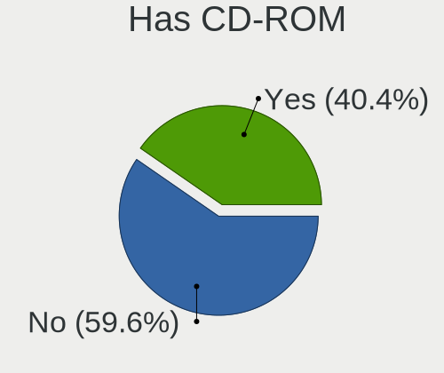
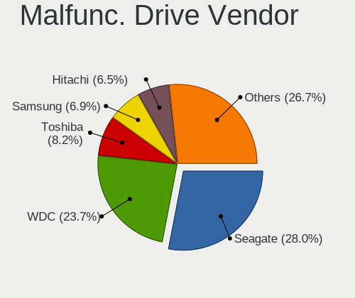
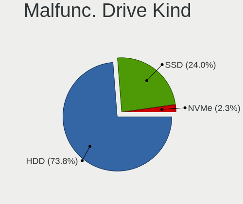
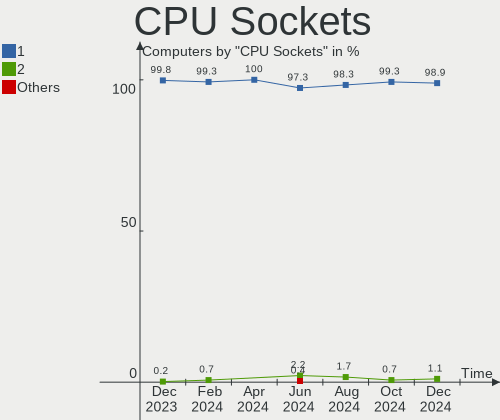
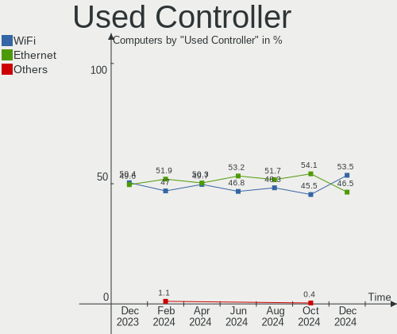

OpenMandriva - Hardware Trends
------------------------------

A project to identify most popular hardware characteristics and track their change
over time based on data collected by Linux users at https://Linux-Hardware.org.

Anyone can contribute to this report by the [hw-probe](https://github.com/linuxhw/hw-probe) tool:

    sudo -E hw-probe -all -upload

This is a report for all computer types. See also reports for [desktops](/Dist/OpenMandriva/Desktop/README.md) and [notebooks](/Dist/OpenMandriva/Notebook/README.md).

This report is for one last month. Overall report since the beginning of time: [TestDays](https://github.com/linuxhw/TestDays)

Period: May, 2023.

Contents
--------

* [ System ](#system)
  - [ OS                       ](#os)
  - [ OS Family                ](#os-family)
  - [ Kernel                   ](#kernel)
  - [ Kernel Family            ](#kernel-family)
  - [ Kernel Major Ver.        ](#kernel-major-ver)
  - [ Arch                     ](#arch)
  - [ DE                       ](#de)
  - [ Display Server           ](#display-server)
  - [ Display Manager          ](#display-manager)
  - [ OS Lang                  ](#os-lang)
  - [ Boot Mode                ](#boot-mode)
  - [ Filesystem               ](#filesystem)
  - [ Part. scheme             ](#part-scheme)
  - [ Dual Boot with Linux/BSD ](#dual-boot-with-linuxbsd)
  - [ Dual Boot (Win)          ](#dual-boot-win)

* [ Board ](#board)
  - [ Vendor                   ](#vendor)
  - [ Model                    ](#model)
  - [ Model Family             ](#model-family)
  - [ MFG Year                 ](#mfg-year)
  - [ Form Factor              ](#form-factor)
  - [ Secure Boot              ](#secure-boot)
  - [ Coreboot                 ](#coreboot)
  - [ RAM Size                 ](#ram-size)
  - [ RAM Used                 ](#ram-used)
  - [ Total Drives             ](#total-drives)
  - [ Has CD-ROM               ](#has-cd-rom)
  - [ Has Ethernet             ](#has-ethernet)
  - [ Has WiFi                 ](#has-wifi)
  - [ Has Bluetooth            ](#has-bluetooth)

* [ Location ](#location)
  - [ Country                  ](#country)
  - [ City                     ](#city)

* [ Drives ](#drives)
  - [ Drive Vendor             ](#drive-vendor)
  - [ Drive Model              ](#drive-model)
  - [ HDD Vendor               ](#hdd-vendor)
  - [ SSD Vendor               ](#ssd-vendor)
  - [ Drive Kind               ](#drive-kind)
  - [ Drive Connector          ](#drive-connector)
  - [ Drive Size               ](#drive-size)
  - [ Space Total              ](#space-total)
  - [ Space Used               ](#space-used)
  - [ Malfunc. Drives          ](#malfunc-drives)
  - [ Malfunc. Drive Vendor    ](#malfunc-drive-vendor)
  - [ Malfunc. HDD Vendor      ](#malfunc-hdd-vendor)
  - [ Malfunc. Drive Kind      ](#malfunc-drive-kind)
  - [ Failed Drives            ](#failed-drives)
  - [ Failed Drive Vendor      ](#failed-drive-vendor)
  - [ Drive Status             ](#drive-status)

* [ Storage controller ](#storage-controller)
  - [ Storage Vendor           ](#storage-vendor)
  - [ Storage Model            ](#storage-model)
  - [ Storage Kind             ](#storage-kind)

* [ Processor ](#processor)
  - [ CPU Vendor               ](#cpu-vendor)
  - [ CPU Model                ](#cpu-model)
  - [ CPU Model Family         ](#cpu-model-family)
  - [ CPU Cores                ](#cpu-cores)
  - [ CPU Sockets              ](#cpu-sockets)
  - [ CPU Threads              ](#cpu-threads)
  - [ CPU Op-Modes             ](#cpu-op-modes)
  - [ CPU Microcode            ](#cpu-microcode)
  - [ CPU Microarch            ](#cpu-microarch)

* [ Graphics ](#graphics)
  - [ GPU Vendor               ](#gpu-vendor)
  - [ GPU Model                ](#gpu-model)
  - [ GPU Combo                ](#gpu-combo)
  - [ GPU Driver               ](#gpu-driver)
  - [ GPU Memory               ](#gpu-memory)

* [ Monitor ](#monitor)
  - [ Monitor Vendor           ](#monitor-vendor)
  - [ Monitor Model            ](#monitor-model)
  - [ Monitor Resolution       ](#monitor-resolution)
  - [ Monitor Diagonal         ](#monitor-diagonal)
  - [ Monitor Width            ](#monitor-width)
  - [ Aspect Ratio             ](#aspect-ratio)
  - [ Monitor Area             ](#monitor-area)
  - [ Pixel Density            ](#pixel-density)
  - [ Multiple Monitors        ](#multiple-monitors)

* [ Network ](#network)
  - [ Net Controller Vendor    ](#net-controller-vendor)
  - [ Net Controller Model     ](#net-controller-model)
  - [ Wireless Vendor          ](#wireless-vendor)
  - [ Wireless Model           ](#wireless-model)
  - [ Ethernet Vendor          ](#ethernet-vendor)
  - [ Ethernet Model           ](#ethernet-model)
  - [ Net Controller Kind      ](#net-controller-kind)
  - [ Used Controller          ](#used-controller)
  - [ NICs                     ](#nics)
  - [ IPv6                     ](#ipv6)

* [ Bluetooth ](#bluetooth)
  - [ Bluetooth Vendor         ](#bluetooth-vendor)
  - [ Bluetooth Model          ](#bluetooth-model)

* [ Sound ](#sound)
  - [ Sound Vendor             ](#sound-vendor)
  - [ Sound Model              ](#sound-model)

* [ Memory ](#memory)
  - [ Memory Vendor            ](#memory-vendor)
  - [ Memory Model             ](#memory-model)
  - [ Memory Kind              ](#memory-kind)
  - [ Memory Form Factor       ](#memory-form-factor)
  - [ Memory Size              ](#memory-size)
  - [ Memory Speed             ](#memory-speed)

* [ Printers & scanners ](#printers--scanners)
  - [ Printer Vendor           ](#printer-vendor)
  - [ Printer Model            ](#printer-model)
  - [ Scanner Vendor           ](#scanner-vendor)
  - [ Scanner Model            ](#scanner-model)

* [ Camera ](#camera)
  - [ Camera Vendor            ](#camera-vendor)
  - [ Camera Model             ](#camera-model)

* [ Security ](#security)
  - [ Fingerprint Vendor       ](#fingerprint-vendor)
  - [ Fingerprint Model        ](#fingerprint-model)
  - [ Chipcard Vendor          ](#chipcard-vendor)
  - [ Chipcard Model           ](#chipcard-model)

* [ Unsupported ](#unsupported)
  - [ Unsupported Devices      ](#unsupported-devices)
  - [ Unsupported Device Types ](#unsupported-device-types)

System
------

OS
--

Installed operating systems

| Name               | Computers | Percent |
|--------------------|-----------|---------|
| OpenMandriva 23.03 | 278       | 74.93%  |
| OpenMandriva 4.3   | 46        | 12.4%   |
| OpenMandriva 23.01 | 19        | 5.12%   |
| OpenMandriva 23.90 | 10        | 2.7%    |
| OpenMandriva 4.2   | 9         | 2.43%   |
| OpenMandriva 4.50  | 4         | 1.08%   |
| OpenMandriva 4.90  | 3         | 0.81%   |
| OpenMandriva 23.06 | 1         | 0.27%   |
| OpenMandriva 22.90 | 1         | 0.27%   |

OS Family
---------

OS without a version

| Name         | Computers | Percent |
|--------------|-----------|---------|
| OpenMandriva | 371       | 100%    |

Kernel
------

Version of the Linux kernel

| Version                     | Computers | Percent |
|-----------------------------|-----------|---------|
| 6.2.6-desktop-1omv2390      | 277       | 74.66%  |
| 5.16.13-desktop-1omv4003    | 23        | 6.2%    |
| 5.16.7-desktop-1omv4003     | 22        | 5.93%   |
| 6.1.1-desktop-1omv2290      | 16        | 4.31%   |
| 5.10.14-desktop-1omv4002    | 7         | 1.89%   |
| 5.18.12-desktop-3omv4090    | 3         | 0.81%   |
| 6.3.1-desktop-1omv2390      | 2         | 0.54%   |
| 6.3.0-desktop-2omv2390      | 2         | 0.54%   |
| 6.1.4-desktop-1omv2301      | 2         | 0.54%   |
| 5.19.5-desktop-1omv4090     | 2         | 0.54%   |
| 5.14.14-desktop-1omv4050    | 2         | 0.54%   |
| 5.11.12-desktop-1omv4002    | 2         | 0.54%   |
| 6.3.5-desktop-3omv2390      | 1         | 0.27%   |
| 6.3.3-desktop-2omv2390      | 1         | 0.27%   |
| 6.3.2-desktop-1omv2390      | 1         | 0.27%   |
| 6.3.0-desktop-1omv2390      | 1         | 0.27%   |
| 6.2.10-desktop-2.0omv4.9mjn | 1         | 0.27%   |
| 6.1.2-desktop-1omv2301      | 1         | 0.27%   |
| 6.0.8-desktop-2omv22090     | 1         | 0.27%   |
| 5.19.12-desktop-2omv4090    | 1         | 0.27%   |
| 5.18.13-desktop-1omv4090    | 1         | 0.27%   |
| 5.16.5-desktop-2omv4003     | 1         | 0.27%   |
| 5.12.4-desktop-1omv4050     | 1         | 0.27%   |

Kernel Family
-------------

Linux kernel without a distro release

| Version | Computers | Percent |
|---------|-----------|---------|
| 6.2.6   | 277       | 74.66%  |
| 5.16.13 | 23        | 6.2%    |
| 5.16.7  | 22        | 5.93%   |
| 6.1.1   | 16        | 4.31%   |
| 5.10.14 | 7         | 1.89%   |
| 6.3.0   | 3         | 0.81%   |
| 5.18.12 | 3         | 0.81%   |
| 6.3.1   | 2         | 0.54%   |
| 6.1.4   | 2         | 0.54%   |
| 5.19.5  | 2         | 0.54%   |
| 5.14.14 | 2         | 0.54%   |
| 5.11.12 | 2         | 0.54%   |
| 6.3.5   | 1         | 0.27%   |
| 6.3.3   | 1         | 0.27%   |
| 6.3.2   | 1         | 0.27%   |
| 6.2.10  | 1         | 0.27%   |
| 6.1.2   | 1         | 0.27%   |
| 6.0.8   | 1         | 0.27%   |
| 5.19.12 | 1         | 0.27%   |
| 5.18.13 | 1         | 0.27%   |
| 5.16.5  | 1         | 0.27%   |
| 5.12.4  | 1         | 0.27%   |

Kernel Major Ver.
-----------------

Linux kernel major version

| Version | Computers | Percent |
|---------|-----------|---------|
| 6.2     | 278       | 74.93%  |
| 5.16    | 46        | 12.4%   |
| 6.1     | 19        | 5.12%   |
| 6.3     | 8         | 2.16%   |
| 5.10    | 7         | 1.89%   |
| 5.18    | 4         | 1.08%   |
| 5.19    | 3         | 0.81%   |
| 5.14    | 2         | 0.54%   |
| 5.11    | 2         | 0.54%   |
| 6.0     | 1         | 0.27%   |
| 5.12    | 1         | 0.27%   |

Arch
----

OS architecture (x86_64, i586, etc.)

| Name   | Computers | Percent |
|--------|-----------|---------|
| x86_64 | 371       | 100%    |

DE
--

Desktop Environment

| Name     | Computers | Percent |
|----------|-----------|---------|
| KDE5     | 325       | 87.6%   |
| LXQt     | 21        | 5.66%   |
| GNOME    | 20        | 5.39%   |
| XFCE     | 2         | 0.54%   |
| Cinnamon | 1         | 0.27%   |
| Budgie   | 1         | 0.27%   |
| Unknown  | 1         | 0.27%   |

Display Server
--------------

X11 or Wayland

| Name    | Computers | Percent |
|---------|-----------|---------|
| X11     | 351       | 94.61%  |
| Wayland | 20        | 5.39%   |

Display Manager
---------------

SDDM, LightDM, etc.

| Name    | Computers | Percent |
|---------|-----------|---------|
| SDDM    | 348       | 93.8%   |
| GDM     | 20        | 5.39%   |
| LightDM | 2         | 0.54%   |
| Unknown | 1         | 0.27%   |

OS Lang
-------

Language

| Lang  | Computers | Percent |
|-------|-----------|---------|
| en_US | 177       | 47.71%  |
| de_DE | 30        | 8.09%   |
| fr_FR | 22        | 5.93%   |
| ru_RU | 20        | 5.39%   |
| pl_PL | 19        | 5.12%   |
| en_GB | 17        | 4.58%   |
| pt_BR | 15        | 4.04%   |
| it_IT | 13        | 3.5%    |
| es_ES | 12        | 3.23%   |
| es_MX | 10        | 2.7%    |
| cs_CZ | 8         | 2.16%   |
| en_AU | 5         | 1.35%   |
| hu_HU | 3         | 0.81%   |
| fr_CA | 3         | 0.81%   |
| en_IN | 2         | 0.54%   |
| en_CA | 2         | 0.54%   |
| UTF-8 | 1         | 0.27%   |
| sk_SK | 1         | 0.27%   |
| pt_PT | 1         | 0.27%   |
| nl_NL | 1         | 0.27%   |
| ja_JP | 1         | 0.27%   |
| fr_BE | 1         | 0.27%   |
| es_PE | 1         | 0.27%   |
| es_CL | 1         | 0.27%   |
| es_AR | 1         | 0.27%   |
| en_NZ | 1         | 0.27%   |
| en_IE | 1         | 0.27%   |
| de_AT | 1         | 0.27%   |
| da_DK | 1         | 0.27%   |

Boot Mode
---------

EFI or BIOS

| Mode | Computers | Percent |
|------|-----------|---------|
| EFI  | 199       | 53.64%  |
| BIOS | 172       | 46.36%  |

Filesystem
----------

Type of filesystem

| Type    | Computers | Percent |
|---------|-----------|---------|
| Ext4    | 191       | 51.48%  |
| Overlay | 143       | 38.54%  |
| Btrfs   | 23        | 6.2%    |
| Xfs     | 6         | 1.62%   |
| F2fs    | 6         | 1.62%   |
| Jfs     | 1         | 0.27%   |
| Ext3    | 1         | 0.27%   |

Part. scheme
------------

Scheme of partitioning

| Type    | Computers | Percent |
|---------|-----------|---------|
| GPT     | 267       | 71.97%  |
| MBR     | 103       | 27.76%  |
| Unknown | 1         | 0.27%   |

Dual Boot with Linux/BSD
------------------------

Hosting more than one Linux/BSD

| Dual boot | Computers | Percent |
|-----------|-----------|---------|
| No        | 186       | 50.13%  |
| Yes       | 185       | 49.87%  |

Dual Boot (Win)
---------------

Hosting Linux and Windows

| Dual boot | Computers | Percent |
|-----------|-----------|---------|
| No        | 205       | 55.26%  |
| Yes       | 166       | 44.74%  |

Board
-----

Vendor
------

Motherboard manufacturer

| Name                | Computers | Percent |
|---------------------|-----------|---------|
| ASUSTek Computer    | 53        | 14.29%  |
| Lenovo              | 46        | 12.4%   |
| Hewlett-Packard     | 44        | 11.86%  |
| Dell                | 36        | 9.7%    |
| Gigabyte Technology | 35        | 9.43%   |
| Acer                | 25        | 6.74%   |
| MSI                 | 18        | 4.85%   |
| ASRock              | 18        | 4.85%   |
| Toshiba             | 13        | 3.5%    |
| Samsung Electronics | 10        | 2.7%    |
| Intel               | 7         | 1.89%   |
| Fujitsu             | 6         | 1.62%   |
| Foxconn             | 5         | 1.35%   |
| Apple               | 5         | 1.35%   |
| BESSTAR Tech        | 4         | 1.08%   |
| Unknown             | 4         | 1.08%   |
| Sony                | 3         | 0.81%   |
| Fujitsu Siemens     | 3         | 0.81%   |
| Timi                | 2         | 0.54%   |
| Pegatron            | 2         | 0.54%   |
| Inventec            | 2         | 0.54%   |
| Google              | 2         | 0.54%   |
| Gateway             | 2         | 0.54%   |
| Chuwi               | 2         | 0.54%   |
| Alienware           | 2         | 0.54%   |
| Wortmann AG         | 1         | 0.27%   |
| Wistron             | 1         | 0.27%   |
| UMAX                | 1         | 0.27%   |
| TUXEDO              | 1         | 0.27%   |
| TPV-INVENTA         | 1         | 0.27%   |
| Thomson             | 1         | 0.27%   |
| Teclast             | 1         | 0.27%   |
| Shuttle             | 1         | 0.27%   |
| Quanta              | 1         | 0.27%   |
| Positivo            | 1         | 0.27%   |
| Philco              | 1         | 0.27%   |
| Panasonic           | 1         | 0.27%   |
| NEC Computers       | 1         | 0.27%   |
| Microsoft           | 1         | 0.27%   |
| Medion              | 1         | 0.27%   |

Model
-----

Motherboard model

| Name                                      | Computers | Percent |
|-------------------------------------------|-----------|---------|
| Unknown                                   | 4         | 1.08%   |
| Sony VGN-FZ31Z                            | 2         | 0.54%   |
| Lenovo Yoga 530-14IKB 81EK                | 2         | 0.54%   |
| Lenovo V15-ADA 82C7                       | 2         | 0.54%   |
| Lenovo IdeaPad 3 15ADA05 81W1             | 2         | 0.54%   |
| Intel H61                                 | 2         | 0.54%   |
| Intel B75                                 | 2         | 0.54%   |
| HP Pavilion dv7                           | 2         | 0.54%   |
| HP 255 G8 Notebook PC                     | 2         | 0.54%   |
| HP 15 Notebook PC                         | 2         | 0.54%   |
| HP 15                                     | 2         | 0.54%   |
| Google Auron_Paine                        | 2         | 0.54%   |
| Gigabyte GA-78LMT-USB3                    | 2         | 0.54%   |
| Gigabyte B360M-DS3H                       | 2         | 0.54%   |
| Fujitsu LIFEBOOK S752                     | 2         | 0.54%   |
| Foxconn G41MD                             | 2         | 0.54%   |
| Dell OptiPlex 9020                        | 2         | 0.54%   |
| BESSTAR Tech UM350                        | 2         | 0.54%   |
| ASUS UX31E                                | 2         | 0.54%   |
| ASUS TUF Gaming X570-PLUS                 | 2         | 0.54%   |
| ASUS SABERTOOTH 990FX R2.0                | 2         | 0.54%   |
| ASUS All Series                           | 2         | 0.54%   |
| ASRock B450M Steel Legend                 | 2         | 0.54%   |
| ASRock A320M-HDV R4.0                     | 2         | 0.54%   |
| Acer Aspire A114-32                       | 2         | 0.54%   |
| Wortmann AG TERRA_MOBILE_1528P/1748P      | 1         | 0.27%   |
| Wistron ProLiant ML110 G6                 | 1         | 0.27%   |
| UMAX VisionBook 13Wg Flex                 | 1         | 0.27%   |
| TUXEDO InfinityBook Pro Gen7 (MK1)        | 1         | 0.27%   |
| TPV-INVENTA Pro 1005 Series All-in-One PC | 1         | 0.27%   |
| Toshiba Satellite P300                    | 1         | 0.27%   |
| Toshiba Satellite L850-1HQ                | 1         | 0.27%   |
| Toshiba Satellite L755                    | 1         | 0.27%   |
| Toshiba Satellite L655                    | 1         | 0.27%   |
| Toshiba Satellite L500                    | 1         | 0.27%   |
| Toshiba Satellite L50-B                   | 1         | 0.27%   |
| Toshiba Satellite L300D                   | 1         | 0.27%   |
| Toshiba Satellite C75-A                   | 1         | 0.27%   |
| Toshiba Satellite C660D                   | 1         | 0.27%   |
| Toshiba Satellite C645D                   | 1         | 0.27%   |

Model Family
------------

Motherboard model prefix

| Name                    | Computers | Percent |
|-------------------------|-----------|---------|
| Lenovo ThinkPad         | 21        | 5.66%   |
| Acer Aspire             | 19        | 5.12%   |
| Toshiba Satellite       | 12        | 3.23%   |
| HP Pavilion             | 10        | 2.7%    |
| HP Compaq               | 9         | 2.43%   |
| Lenovo IdeaPad          | 8         | 2.16%   |
| Dell OptiPlex           | 8         | 2.16%   |
| Dell Latitude           | 8         | 2.16%   |
| Dell Inspiron           | 7         | 1.89%   |
| HP Laptop               | 5         | 1.35%   |
| Dell Precision          | 5         | 1.35%   |
| Lenovo ThinkCentre      | 4         | 1.08%   |
| HP EliteBook            | 4         | 1.08%   |
| HP 15                   | 4         | 1.08%   |
| ASUS PRIME              | 4         | 1.08%   |
| Unknown                 | 4         | 1.08%   |
| Fujitsu Siemens ESPRIMO | 3         | 0.81%   |
| Fujitsu LIFEBOOK        | 3         | 0.81%   |
| Dell Vostro             | 3         | 0.81%   |
| ASUS TUF                | 3         | 0.81%   |
| Sony VGN-FZ31Z          | 2         | 0.54%   |
| Lenovo Yoga             | 2         | 0.54%   |
| Lenovo V15-ADA          | 2         | 0.54%   |
| Intel H61               | 2         | 0.54%   |
| Intel B75               | 2         | 0.54%   |
| HP ProBook              | 2         | 0.54%   |
| HP 255                  | 2         | 0.54%   |
| Google Auron            | 2         | 0.54%   |
| Gigabyte X570S          | 2         | 0.54%   |
| Gigabyte H410M          | 2         | 0.54%   |
| Gigabyte GA-78LMT-USB3  | 2         | 0.54%   |
| Gigabyte B550M          | 2         | 0.54%   |
| Gigabyte B450M          | 2         | 0.54%   |
| Gigabyte B360M-DS3H     | 2         | 0.54%   |
| Foxconn G41MD           | 2         | 0.54%   |
| Dell XPS                | 2         | 0.54%   |
| Dell System             | 2         | 0.54%   |
| BESSTAR Tech UM350      | 2         | 0.54%   |
| ASUS VivoBook           | 2         | 0.54%   |
| ASUS UX31E              | 2         | 0.54%   |

MFG Year
--------

Motherboard manufacture year

| Year | Computers | Percent |
|------|-----------|---------|
| 2012 | 36        | 9.7%    |
| 2020 | 32        | 8.63%   |
| 2021 | 28        | 7.55%   |
| 2013 | 27        | 7.28%   |
| 2011 | 27        | 7.28%   |
| 2018 | 26        | 7.01%   |
| 2010 | 26        | 7.01%   |
| 2019 | 23        | 6.2%    |
| 2017 | 21        | 5.66%   |
| 2009 | 21        | 5.66%   |
| 2008 | 21        | 5.66%   |
| 2022 | 17        | 4.58%   |
| 2014 | 17        | 4.58%   |
| 2016 | 15        | 4.04%   |
| 2015 | 12        | 3.23%   |
| 2007 | 12        | 3.23%   |
| 2006 | 5         | 1.35%   |
| 2023 | 4         | 1.08%   |
| 2005 | 1         | 0.27%   |

Form Factor
-----------

Physical design of the computer

| Name        | Computers | Percent |
|-------------|-----------|---------|
| Desktop     | 176       | 47.44%  |
| Notebook    | 172       | 46.36%  |
| Convertible | 10        | 2.7%    |
| All in one  | 7         | 1.89%   |
| Mini pc     | 3         | 0.81%   |
| Tablet      | 2         | 0.54%   |
| Server      | 1         | 0.27%   |

Secure Boot
-----------

Enabled or disabled

| State    | Computers | Percent |
|----------|-----------|---------|
| Disabled | 371       | 100%    |

Coreboot
--------

Have coreboot on board

| Used | Computers | Percent |
|------|-----------|---------|
| No   | 369       | 99.46%  |
| Yes  | 2         | 0.54%   |

RAM Size
--------

Total RAM memory

| Size in GB  | Computers | Percent |
|-------------|-----------|---------|
| 4.01-8.0    | 109       | 29.38%  |
| 3.01-4.0    | 85        | 22.91%  |
| 16.01-24.0  | 66        | 17.79%  |
| 8.01-16.0   | 59        | 15.9%   |
| 32.01-64.0  | 17        | 4.58%   |
| 1.01-2.0    | 11        | 2.96%   |
| 64.01-256.0 | 10        | 2.7%    |
| 2.01-3.0    | 8         | 2.16%   |
| 24.01-32.0  | 5         | 1.35%   |
| 0.51-1.0    | 1         | 0.27%   |

RAM Used
--------

Used RAM memory

| Used GB    | Computers | Percent |
|------------|-----------|---------|
| 1.01-2.0   | 234       | 63.07%  |
| 2.01-3.0   | 77        | 20.75%  |
| 0.51-1.0   | 35        | 9.43%   |
| 3.01-4.0   | 16        | 4.31%   |
| 0.01-0.5   | 6         | 1.62%   |
| 4.01-8.0   | 2         | 0.54%   |
| 32.01-64.0 | 1         | 0.27%   |

Total Drives
------------

Number of drives on board

| Drives | Computers | Percent |
|--------|-----------|---------|
| 1      | 200       | 53.91%  |
| 2      | 108       | 29.11%  |
| 3      | 26        | 7.01%   |
| 4      | 14        | 3.77%   |
| 0      | 8         | 2.16%   |
| 5      | 7         | 1.89%   |
| 6      | 3         | 0.81%   |
| 8      | 2         | 0.54%   |
| 7      | 2         | 0.54%   |
| 13     | 1         | 0.27%   |

Has CD-ROM
----------

Has CD-ROM on board

| Presented | Computers | Percent |
|-----------|-----------|---------|
| No        | 200       | 53.91%  |
| Yes       | 171       | 46.09%  |

Has Ethernet
------------

Has Ethernet on board

| Presented | Computers | Percent |
|-----------|-----------|---------|
| Yes       | 333       | 89.76%  |
| No        | 38        | 10.24%  |

Has WiFi
--------

Has WiFi module

| Presented | Computers | Percent |
|-----------|-----------|---------|
| Yes       | 259       | 69.81%  |
| No        | 112       | 30.19%  |

Has Bluetooth
-------------

Has Bluetooth module

| Presented | Computers | Percent |
|-----------|-----------|---------|
| No        | 189       | 50.94%  |
| Yes       | 182       | 49.06%  |

Location
--------

Country
-------

Geographic location (country)

| Country                | Computers | Percent |
|------------------------|-----------|---------|
| USA                    | 50        | 13.48%  |
| Germany                | 40        | 10.78%  |
| Poland                 | 27        | 7.28%   |
| Brazil                 | 25        | 6.74%   |
| France                 | 24        | 6.47%   |
| Russia                 | 20        | 5.39%   |
| Italy                  | 16        | 4.31%   |
| Spain                  | 14        | 3.77%   |
| Japan                  | 13        | 3.5%    |
| Canada                 | 13        | 3.5%    |
| UK                     | 9         | 2.43%   |
| India                  | 8         | 2.16%   |
| Czechia                | 7         | 1.89%   |
| Sweden                 | 6         | 1.62%   |
| Netherlands            | 6         | 1.62%   |
| Mexico                 | 6         | 1.62%   |
| Slovakia               | 5         | 1.35%   |
| Portugal               | 5         | 1.35%   |
| Australia              | 5         | 1.35%   |
| Romania                | 4         | 1.08%   |
| Hungary                | 4         | 1.08%   |
| Argentina              | 4         | 1.08%   |
| Indonesia              | 3         | 0.81%   |
| Iceland                | 3         | 0.81%   |
| Greece                 | 3         | 0.81%   |
| Chile                  | 3         | 0.81%   |
| Uruguay                | 2         | 0.54%   |
| Saint Lucia            | 2         | 0.54%   |
| Peru                   | 2         | 0.54%   |
| Norway                 | 2         | 0.54%   |
| Malaysia               | 2         | 0.54%   |
| Hong Kong              | 2         | 0.54%   |
| China                  | 2         | 0.54%   |
| Bosnia and Herzegovina | 2         | 0.54%   |
| Azerbaijan             | 2         | 0.54%   |
| Ukraine                | 1         | 0.27%   |
| Turkey                 | 1         | 0.27%   |
| Switzerland            | 1         | 0.27%   |
| Slovenia               | 1         | 0.27%   |
| Singapore              | 1         | 0.27%   |

City
----

Geographic location (city)

| City                 | Computers | Percent |
|----------------------|-----------|---------|
| Montreal             | 6         | 1.62%   |
| Milan                | 6         | 1.62%   |
| Moscow               | 5         | 1.35%   |
| Hamburg              | 4         | 1.08%   |
| Warsaw               | 3         | 0.81%   |
| Skierniewice         | 3         | 0.81%   |
| Rio de Janeiro       | 3         | 0.81%   |
| Reykjavik            | 3         | 0.81%   |
| Munich               | 3         | 0.81%   |
| Lisbon               | 3         | 0.81%   |
| Essen                | 3         | 0.81%   |
| Bezancourt           | 3         | 0.81%   |
| Berlin               | 3         | 0.81%   |
| Zabrze               | 2         | 0.54%   |
| Yokohama             | 2         | 0.54%   |
| Voronezh             | 2         | 0.54%   |
| Valencia             | 2         | 0.54%   |
| Thessaloniki         | 2         | 0.54%   |
| Szczecin             | 2         | 0.54%   |
| Sydney               | 2         | 0.54%   |
| St Petersburg        | 2         | 0.54%   |
| Sarajevo             | 2         | 0.54%   |
| Recife               | 2         | 0.54%   |
| Poznan               | 2         | 0.54%   |
| Nuremberg            | 2         | 0.54%   |
| Montevideo           | 2         | 0.54%   |
| Louisville           | 2         | 0.54%   |
| Hildburghausen       | 2         | 0.54%   |
| Hamm                 | 2         | 0.54%   |
| Gdynia               | 2         | 0.54%   |
| Funchal              | 2         | 0.54%   |
| Dolny Ohaj           | 2         | 0.54%   |
| Delhi                | 2         | 0.54%   |
| Czerwionka-Leszczyny | 2         | 0.54%   |
| Chennai              | 2         | 0.54%   |
| Castries             | 2         | 0.54%   |
| Budapest             | 2         | 0.54%   |
| Bucharest            | 2         | 0.54%   |
| Brisbane             | 2         | 0.54%   |
| Bratislava           | 2         | 0.54%   |

Drives
------

Drive Vendor
------------

Hard drive vendors

| Vendor                      | Computers | Drives | Percent |
|-----------------------------|-----------|--------|---------|
| WDC                         | 97        | 122    | 17.14%  |
| Seagate                     | 88        | 102    | 15.55%  |
| Samsung Electronics         | 65        | 78     | 11.48%  |
| Toshiba                     | 43        | 44     | 7.6%    |
| Kingston                    | 29        | 33     | 5.12%   |
| Crucial                     | 26        | 29     | 4.59%   |
| SanDisk                     | 23        | 25     | 4.06%   |
| Hitachi                     | 23        | 24     | 4.06%   |
| Unknown                     | 14        | 14     | 2.47%   |
| China                       | 10        | 10     | 1.77%   |
| SK hynix                    | 9         | 9      | 1.59%   |
| A-DATA Technology           | 8         | 8      | 1.41%   |
| Intel                       | 7         | 7      | 1.24%   |
| SPCC                        | 6         | 8      | 1.06%   |
| Netac                       | 6         | 6      | 1.06%   |
| HGST                        | 5         | 6      | 0.88%   |
| PNY                         | 4         | 4      | 0.71%   |
| Phison                      | 4         | 4      | 0.71%   |
| Patriot                     | 4         | 4      | 0.71%   |
| KIOXIA                      | 4         | 4      | 0.71%   |
| KingSpec                    | 4         | 4      | 0.71%   |
| Intenso                     | 4         | 4      | 0.71%   |
| GOODRAM                     | 4         | 4      | 0.71%   |
| Apple                       | 4         | 5      | 0.71%   |
| Apacer                      | 4         | 4      | 0.71%   |
| Transcend                   | 3         | 3      | 0.53%   |
| Realtek                     | 3         | 3      | 0.53%   |
| Lexar                       | 3         | 3      | 0.53%   |
| Gigabyte Technology         | 3         | 3      | 0.53%   |
| WD MediaMax                 | 2         | 2      | 0.35%   |
| Verbatim                    | 2         | 2      | 0.35%   |
| UMIS                        | 2         | 2      | 0.35%   |
| SUNEAST                     | 2         | 2      | 0.35%   |
| SSSTC                       | 2         | 2      | 0.35%   |
| Silicon Motion              | 2         | 2      | 0.35%   |
| SAGE                        | 2         | 2      | 0.35%   |
| Micron Technology           | 2         | 2      | 0.35%   |
| Maxtor                      | 2         | 2      | 0.35%   |
| Kingston Technology Company | 2         | 2      | 0.35%   |
| Fujitsu                     | 2         | 2      | 0.35%   |

Drive Model
-----------

Hard drive models

| Model                                | Computers | Percent |
|--------------------------------------|-----------|---------|
| Toshiba MQ01ABD100 1TB               | 8         | 1.28%   |
| Seagate ST500DM002-1BD142 500GB      | 7         | 1.12%   |
| Toshiba MQ01ABF050 500GB             | 6         | 0.96%   |
| Toshiba MQ04ABF100 1TB               | 5         | 0.8%    |
| Toshiba DT01ACA100 1TB               | 5         | 0.8%    |
| Seagate ST1000LM035-1RK172 1TB       | 5         | 0.8%    |
| Samsung SSD 860 EVO 500GB            | 5         | 0.8%    |
| Kingston SV300S37A120G 120GB SSD     | 5         | 0.8%    |
| Crucial CT480BX500SSD1 480GB         | 5         | 0.8%    |
| Crucial CT240BX500SSD1 240GB         | 5         | 0.8%    |
| Seagate ST1000DM003-1CH162 1TB       | 4         | 0.64%   |
| Kingston SA400S37480G 480GB SSD      | 4         | 0.64%   |
| Crucial CT1000BX500SSD1 1TB          | 4         | 0.64%   |
| WDC WDS240G2G0A-00JH30 240GB SSD     | 3         | 0.48%   |
| WDC WD5000AAKX-001CA0 500GB          | 3         | 0.48%   |
| WDC WD10EZEX-00WN4A0 1TB             | 3         | 0.48%   |
| Unknown SD/MMC/MS PRO 64GB           | 3         | 0.48%   |
| Toshiba DT01ACA050 500GB             | 3         | 0.48%   |
| Seagate ST2000DM008-2FR102 2TB       | 3         | 0.48%   |
| Seagate ST1000LM024 HN-M101MBB 1TB   | 3         | 0.48%   |
| Seagate Expansion 1TB                | 3         | 0.48%   |
| Seagate BUP Slim BK 2TB              | 3         | 0.48%   |
| SanDisk SSD PLUS 1000GB              | 3         | 0.48%   |
| SanDisk NVMe SSD Drive 1TB           | 3         | 0.48%   |
| Netac SSD 256GB                      | 3         | 0.48%   |
| Kingston SA400S37240G 240GB SSD      | 3         | 0.48%   |
| Kingston SA400S37120G 120GB SSD      | 3         | 0.48%   |
| Intel SSDPEKNU512GZ 512GB            | 3         | 0.48%   |
| Hitachi HTS547575A9E384 752GB        | 3         | 0.48%   |
| Crucial CT500MX500SSD1 500GB         | 3         | 0.48%   |
| Apacer AS350 512GB SSD               | 3         | 0.48%   |
| WDC WDS500G2B0A-00SM50 500GB SSD     | 2         | 0.32%   |
| WDC WDS100T2B0A-00SM50 1TB SSD       | 2         | 0.32%   |
| WDC WD2500BEVS-22UST0 250GB          | 2         | 0.32%   |
| WDC WD2500AAKX-753CA1 250GB          | 2         | 0.32%   |
| WDC WD2500AAJS-75M0A0 250GB          | 2         | 0.32%   |
| WDC WD10JPCX-24UE4T0 1TB             | 2         | 0.32%   |
| WDC WD10EZEX-60WN4A0 1TB             | 2         | 0.32%   |
| WDC WD1002FAEX-00Z3A0 1TB            | 2         | 0.32%   |
| WDC PC SN530 SDBPMPZ-512G-1101 512GB | 2         | 0.32%   |

HDD Vendor
----------

Hard disk drive vendors

| Vendor              | Computers | Drives | Percent |
|---------------------|-----------|--------|---------|
| Seagate             | 85        | 99     | 32.95%  |
| WDC                 | 78        | 96     | 30.23%  |
| Toshiba             | 40        | 41     | 15.5%   |
| Hitachi             | 23        | 24     | 8.91%   |
| Samsung Electronics | 10        | 10     | 3.88%   |
| HGST                | 5         | 6      | 1.94%   |
| Unknown             | 3         | 3      | 1.16%   |
| WD MediaMax         | 2         | 2      | 0.78%   |
| SAGE                | 2         | 2      | 0.78%   |
| Maxtor              | 2         | 2      | 0.78%   |
| Fujitsu             | 2         | 2      | 0.78%   |
| Apple               | 2         | 2      | 0.78%   |
| USB                 | 1         | 1      | 0.39%   |
| SABRENT             | 1         | 1      | 0.39%   |
| QUANTUM             | 1         | 1      | 0.39%   |
| LaCie               | 1         | 1      | 0.39%   |

SSD Vendor
----------

Solid state drive vendors

| Vendor              | Computers | Drives | Percent |
|---------------------|-----------|--------|---------|
| Samsung Electronics | 31        | 37     | 14.9%   |
| Kingston            | 24        | 27     | 11.54%  |
| Crucial             | 23        | 24     | 11.06%  |
| SanDisk             | 20        | 21     | 9.62%   |
| WDC                 | 12        | 14     | 5.77%   |
| China               | 10        | 10     | 4.81%   |
| A-DATA Technology   | 8         | 8      | 3.85%   |
| Netac               | 6         | 6      | 2.88%   |
| SPCC                | 5         | 6      | 2.4%    |
| SK hynix            | 4         | 4      | 1.92%   |
| PNY                 | 4         | 4      | 1.92%   |
| Patriot             | 4         | 4      | 1.92%   |
| Intenso             | 4         | 4      | 1.92%   |
| GOODRAM             | 4         | 4      | 1.92%   |
| Apacer              | 4         | 4      | 1.92%   |
| KingSpec            | 3         | 3      | 1.44%   |
| Intel               | 3         | 3      | 1.44%   |
| Transcend           | 2         | 2      | 0.96%   |
| SUNEAST             | 2         | 2      | 0.96%   |
| Seagate             | 2         | 2      | 0.96%   |
| Gigabyte Technology | 2         | 2      | 0.96%   |
| Dogfish             | 2         | 2      | 0.96%   |
| AGI                 | 2         | 2      | 0.96%   |
| Win Memory          | 1         | 1      | 0.48%   |
| Verbatim            | 1         | 1      | 0.48%   |
| Union Memory        | 1         | 1      | 0.48%   |
| Toshiba             | 1         | 1      | 0.48%   |
| TO Exter            | 1         | 1      | 0.48%   |
| Teclast             | 1         | 1      | 0.48%   |
| Team                | 1         | 1      | 0.48%   |
| ShiJi               | 1         | 1      | 0.48%   |
| Reletech-P400       | 1         | 1      | 0.48%   |
| PNY CS90            | 1         | 1      | 0.48%   |
| OCZ                 | 1         | 1      | 0.48%   |
| Neo                 | 1         | 1      | 0.48%   |
| Micron Technology   | 1         | 1      | 0.48%   |
| LITEON              | 1         | 1      | 0.48%   |
| Lexar               | 1         | 1      | 0.48%   |
| Leven               | 1         | 1      | 0.48%   |
| Kingmax             | 1         | 1      | 0.48%   |

Drive Kind
----------

HDD or SSD

| Kind    | Computers | Drives | Percent |
|---------|-----------|--------|---------|
| HDD     | 208       | 293    | 42.89%  |
| SSD     | 174       | 222    | 35.88%  |
| NVMe    | 85        | 100    | 17.53%  |
| MMC     | 12        | 12     | 2.47%   |
| Unknown | 6         | 6      | 1.24%   |

Drive Connector
---------------

SATA, SAS, NVMe, etc.

| Type | Computers | Drives | Percent |
|------|-----------|--------|---------|
| SATA | 315       | 477    | 69.69%  |
| NVMe | 84        | 97     | 18.58%  |
| SAS  | 41        | 47     | 9.07%   |
| MMC  | 12        | 12     | 2.65%   |

Drive Size
----------

Size of hard drive

| Size in TB | Computers | Drives | Percent |
|------------|-----------|--------|---------|
| 0.01-0.5   | 231       | 307    | 57.04%  |
| 0.51-1.0   | 135       | 159    | 33.33%  |
| 1.01-2.0   | 23        | 29     | 5.68%   |
| 3.01-4.0   | 8         | 9      | 1.98%   |
| 2.01-3.0   | 4         | 6      | 0.99%   |
| 4.01-10.0  | 3         | 3      | 0.74%   |
| 10.01-20.0 | 1         | 2      | 0.25%   |

Space Total
-----------

Amount of disk space available on the file system

| Size in GB     | Computers | Percent |
|----------------|-----------|---------|
| 1-20           | 100       | 26.95%  |
| 101-250        | 73        | 19.68%  |
| 251-500        | 51        | 13.75%  |
| 51-100         | 38        | 10.24%  |
| 501-1000       | 34        | 9.16%   |
| 21-50          | 27        | 7.28%   |
| 1001-2000      | 19        | 5.12%   |
| Unknown        | 18        | 4.85%   |
| More than 3000 | 6         | 1.62%   |
| 2001-3000      | 5         | 1.35%   |

Space Used
----------

Amount of used disk space

| Used GB        | Computers | Percent |
|----------------|-----------|---------|
| 1-20           | 276       | 74.39%  |
| 21-50          | 32        | 8.63%   |
| Unknown        | 18        | 4.85%   |
| 101-250        | 14        | 3.77%   |
| 51-100         | 12        | 3.23%   |
| 251-500        | 7         | 1.89%   |
| 501-1000       | 7         | 1.89%   |
| More than 3000 | 3         | 0.81%   |
| 1001-2000      | 2         | 0.54%   |

Malfunc. Drives
---------------

Drive models with a malfunction

| Model                              | Computers | Drives | Percent |
|------------------------------------|-----------|--------|---------|
| WDC WD5000AAKX-001CA0 500GB        | 2         | 2      | 2.13%   |
| Seagate ST500DM002-1BD142 500GB    | 2         | 2      | 2.13%   |
| Seagate ST3500413AS 500GB          | 2         | 2      | 2.13%   |
| SanDisk SSD U100 256GB             | 2         | 2      | 2.13%   |
| Samsung Electronics HD502HI 500GB  | 2         | 2      | 2.13%   |
| Crucial CT240M500SSD1 240GB        | 2         | 2      | 2.13%   |
| WDC WD800BB-75JHC0 80GB            | 1         | 1      | 1.06%   |
| WDC WD7500BPVT-24HXZT1 752GB       | 1         | 1      | 1.06%   |
| WDC WD6400BPVT-60HXZT1 640GB       | 1         | 1      | 1.06%   |
| WDC WD5000LPVT-00FMCT0 500GB       | 1         | 1      | 1.06%   |
| WDC WD5000LPCX-24VHAT0 500GB       | 1         | 1      | 1.06%   |
| WDC WD5000BPVT-22A1YT0 500GB       | 1         | 1      | 1.06%   |
| WDC WD5000AVCS-632DY1 500GB        | 1         | 1      | 1.06%   |
| WDC WD5000AAVS-22G9B1 500GB        | 1         | 2      | 1.06%   |
| WDC WD5000AAKX-75U6AA0 500GB       | 1         | 1      | 1.06%   |
| WDC WD3200BUDT-63DPZY0 320GB       | 1         | 1      | 1.06%   |
| WDC WD3200BEVT-26ZCT0 320GB        | 1         | 1      | 1.06%   |
| WDC WD3200BEKT-75PVMT0 320GB       | 1         | 1      | 1.06%   |
| WDC WD2500BEVS-22UST0 250GB        | 1         | 1      | 1.06%   |
| WDC WD2500AAJS-75M0A0 250GB        | 1         | 1      | 1.06%   |
| WDC WD2500AAJS-00L7A0 250GB        | 1         | 1      | 1.06%   |
| WDC WD20SPZX-22CRAT0 2TB           | 1         | 1      | 1.06%   |
| WDC WD20PURZ-85GU6Y0 2TB           | 1         | 1      | 1.06%   |
| WDC WD1600JS-60MHB5 160GB          | 1         | 1      | 1.06%   |
| WDC WD1600AAJS-55M0A0 160GB        | 1         | 1      | 1.06%   |
| WDC WD15EADS-22P8B0 1TB            | 1         | 1      | 1.06%   |
| WDC WD10PURX-64E5EY0 1TB           | 1         | 1      | 1.06%   |
| WDC WD10EZEX-60ZF5A0 1TB           | 1         | 1      | 1.06%   |
| WDC WD10EZEX-08WN4A0 1TB           | 1         | 1      | 1.06%   |
| WDC WD10EARS-00Y5B1 1TB            | 1         | 1      | 1.06%   |
| WDC WD1002FAEX-00Z3A0 1TB          | 1         | 1      | 1.06%   |
| WDC WD Blue SA510 2.5 1TB SSD      | 1         | 1      | 1.06%   |
| WD MediaMax WL1500GSA6472B 1TB     | 1         | 1      | 1.06%   |
| Union Memory RTOTJ128VGD2EYX 128GB | 1         | 1      | 1.06%   |
| Toshiba MQ04ABF100 1TB             | 1         | 1      | 1.06%   |
| Toshiba MK6475GSX 640GB            | 1         | 1      | 1.06%   |
| Toshiba MK6459GSXP 640GB           | 1         | 1      | 1.06%   |
| Toshiba MK5075GSX 500GB            | 1         | 1      | 1.06%   |
| Toshiba MK5065GSXN 500GB           | 1         | 1      | 1.06%   |
| Toshiba MK3265GSXN 320GB           | 1         | 1      | 1.06%   |

Malfunc. Drive Vendor
---------------------

Vendors of faulty drives

| Vendor              | Computers | Drives | Percent |
|---------------------|-----------|--------|---------|
| WDC                 | 27        | 29     | 29.03%  |
| Seagate             | 21        | 21     | 22.58%  |
| Hitachi             | 8         | 8      | 8.6%    |
| Toshiba             | 7         | 7      | 7.53%   |
| Samsung Electronics | 6         | 6      | 6.45%   |
| Kingston            | 4         | 4      | 4.3%    |
| A-DATA Technology   | 3         | 3      | 3.23%   |
| SanDisk             | 2         | 2      | 2.15%   |
| HGST                | 2         | 2      | 2.15%   |
| Fujitsu             | 2         | 2      | 2.15%   |
| Crucial             | 2         | 2      | 2.15%   |
| China               | 2         | 2      | 2.15%   |
| WD MediaMax         | 1         | 1      | 1.08%   |
| Union Memory        | 1         | 1      | 1.08%   |
| SAGE                | 1         | 1      | 1.08%   |
| QUANTUM             | 1         | 1      | 1.08%   |
| LITEON              | 1         | 1      | 1.08%   |
| KingSpec            | 1         | 1      | 1.08%   |
| Intel               | 1         | 1      | 1.08%   |

Malfunc. HDD Vendor
-------------------

Vendors of faulty HDD drives

| Vendor              | Computers | Drives | Percent |
|---------------------|-----------|--------|---------|
| WDC                 | 26        | 28     | 34.67%  |
| Seagate             | 21        | 21     | 28%     |
| Hitachi             | 8         | 8      | 10.67%  |
| Toshiba             | 7         | 7      | 9.33%   |
| Samsung Electronics | 6         | 6      | 8%      |
| HGST                | 2         | 2      | 2.67%   |
| Fujitsu             | 2         | 2      | 2.67%   |
| WD MediaMax         | 1         | 1      | 1.33%   |
| SAGE                | 1         | 1      | 1.33%   |
| QUANTUM             | 1         | 1      | 1.33%   |

Malfunc. Drive Kind
-------------------

Kinds of faulty drives

| Kind | Computers | Drives | Percent |
|------|-----------|--------|---------|
| HDD  | 69        | 77     | 80.23%  |
| SSD  | 17        | 18     | 19.77%  |

Failed Drives
-------------

Failed drive models

Zero info for selected period =(

Failed Drive Vendor
-------------------

Failed drive vendors

Zero info for selected period =(

Drive Status
------------

Number of failed and malfunc. drives

| Status   | Computers | Drives | Percent |
|----------|-----------|--------|---------|
| Works    | 303       | 482    | 70.14%  |
| Malfunc  | 83        | 95     | 19.21%  |
| Detected | 46        | 56     | 10.65%  |

Storage controller
------------------

Storage Vendor
--------------

Storage controller vendors

| Vendor                                  | Computers | Percent |
|-----------------------------------------|-----------|---------|
| Intel                                   | 251       | 55.53%  |
| AMD                                     | 85        | 18.81%  |
| Samsung Electronics                     | 29        | 6.42%   |
| SanDisk                                 | 15        | 3.32%   |
| Kingston Technology Company             | 8         | 1.77%   |
| Phison Electronics                      | 7         | 1.55%   |
| JMicron Technology                      | 7         | 1.55%   |
| ASMedia Technology                      | 7         | 1.55%   |
| SK hynix                                | 5         | 1.11%   |
| Nvidia                                  | 5         | 1.11%   |
| VIA Technologies                        | 4         | 0.88%   |
| KIOXIA                                  | 4         | 0.88%   |
| Silicon Motion                          | 3         | 0.66%   |
| Micron/Crucial Technology               | 3         | 0.66%   |
| MAXIO Technology (Hangzhou)             | 3         | 0.66%   |
| Marvell Technology Group                | 3         | 0.66%   |
| Toshiba America Info Systems            | 2         | 0.44%   |
| Solid State Storage Technology          | 2         | 0.44%   |
| Adaptec                                 | 2         | 0.44%   |
| Union Memory (Shenzhen)                 | 1         | 0.22%   |
| Shenzhen Unionmemory Information System | 1         | 0.22%   |
| Shenzhen Longsys Electronics            | 1         | 0.22%   |
| Micron Technology                       | 1         | 0.22%   |
| LSI Logic / Symbios Logic               | 1         | 0.22%   |
| Apple                                   | 1         | 0.22%   |
| ADATA Technology                        | 1         | 0.22%   |

Storage Model
-------------

Storage controller models

| Model                                                                                   | Computers | Percent |
|-----------------------------------------------------------------------------------------|-----------|---------|
| AMD FCH SATA Controller [AHCI mode]                                                     | 45        | 8.12%   |
| Intel Sunrise Point-LP SATA Controller [AHCI mode]                                      | 18        | 3.25%   |
| Intel 8 Series/C220 Series Chipset Family 6-port SATA Controller 1 [AHCI mode]          | 18        | 3.25%   |
| Intel 7 Series Chipset Family 6-port SATA Controller [AHCI mode]                        | 16        | 2.89%   |
| AMD SB7x0/SB8x0/SB9x0 SATA Controller [AHCI mode]                                       | 15        | 2.71%   |
| Intel NM10/ICH7 Family SATA Controller [IDE mode]                                       | 14        | 2.53%   |
| Intel 82801G (ICH7 Family) IDE Controller                                               | 13        | 2.35%   |
| AMD SB7x0/SB8x0/SB9x0 IDE Controller                                                    | 13        | 2.35%   |
| Intel Celeron/Pentium Silver Processor SATA Controller                                  | 12        | 2.17%   |
| Intel 6 Series/C200 Series Chipset Family 6 port Mobile SATA AHCI Controller            | 12        | 2.17%   |
| Intel 82801HM/HEM (ICH8M/ICH8M-E) IDE Controller                                        | 11        | 1.99%   |
| Samsung NVMe SSD Controller SM981/PM981/PM983                                           | 10        | 1.81%   |
| Samsung NVMe SSD Controller 980                                                         | 10        | 1.81%   |
| Intel Atom Processor E3800 Series SATA AHCI Controller                                  | 9         | 1.62%   |
| Intel 82801HM/HEM (ICH8M/ICH8M-E) SATA Controller [AHCI mode]                           | 9         | 1.62%   |
| AMD SB7x0/SB8x0/SB9x0 SATA Controller [IDE mode]                                        | 9         | 1.62%   |
| AMD 500 Series Chipset SATA Controller                                                  | 9         | 1.62%   |
| Intel 82801IBM/IEM (ICH9M/ICH9M-E) 4 port SATA Controller [AHCI mode]                   | 8         | 1.44%   |
| Intel 7 Series/C210 Series Chipset Family 6-port SATA Controller [AHCI mode]            | 8         | 1.44%   |
| Intel 6 Series/C200 Series Chipset Family 6 port Desktop SATA AHCI Controller           | 8         | 1.44%   |
| Intel 200 Series PCH SATA controller [AHCI mode]                                        | 8         | 1.44%   |
| AMD 400 Series Chipset SATA Controller                                                  | 8         | 1.44%   |
| Intel Wildcat Point-LP SATA Controller [AHCI Mode]                                      | 7         | 1.26%   |
| Intel Q170/Q150/B150/H170/H110/Z170/CM236 Chipset SATA Controller [AHCI Mode]           | 7         | 1.26%   |
| Intel 6 Series/C200 Series Chipset Family Desktop SATA Controller (IDE mode, ports 4-5) | 7         | 1.26%   |
| Intel 6 Series/C200 Series Chipset Family Desktop SATA Controller (IDE mode, ports 0-3) | 7         | 1.26%   |
| Intel 500 Series Chipset Family SATA AHCI Controller                                    | 7         | 1.26%   |
| Intel 4 Series Chipset PT IDER Controller                                               | 7         | 1.26%   |
| ASMedia ASM1062 Serial ATA Controller                                                   | 7         | 1.26%   |
| Intel 82801 Mobile SATA Controller [RAID mode]                                          | 6         | 1.08%   |
| SanDisk WD Blue SN550 NVMe SSD                                                          | 5         | 0.9%    |
| Samsung NVMe SSD Controller PM9A1/PM9A3/980PRO                                          | 5         | 0.9%    |
| Intel Volume Management Device NVMe RAID Controller                                     | 5         | 0.9%    |
| Intel Tiger Lake-LP SATA Controller                                                     | 5         | 0.9%    |
| Intel 82801JI (ICH10 Family) SATA AHCI Controller                                       | 5         | 0.9%    |
| Intel 5 Series/3400 Series Chipset 6 port SATA AHCI Controller                          | 5         | 0.9%    |
| Intel 5 Series/3400 Series Chipset 4 port SATA AHCI Controller                          | 5         | 0.9%    |
| VIA VT6415 PATA IDE Host Controller                                                     | 4         | 0.72%   |
| KIOXIA NVMe SSD Controller BG4                                                          | 4         | 0.72%   |
| Intel Comet Lake SATA AHCI Controller                                                   | 4         | 0.72%   |

Storage Kind
------------

Kind of storage controller (IDE, SATA, NVMe, SAS, ...)

| Kind | Computers | Percent |
|------|-----------|---------|
| SATA | 289       | 61.49%  |
| NVMe | 84        | 17.87%  |
| IDE  | 78        | 16.6%   |
| RAID | 16        | 3.4%    |
| SCSI | 3         | 0.64%   |

Processor
---------

CPU Vendor
----------

Processor vendors

| Vendor | Computers | Percent |
|--------|-----------|---------|
| Intel  | 270       | 72.78%  |
| AMD    | 101       | 27.22%  |

CPU Model
---------

Processor models

| Model                                         | Computers | Percent |
|-----------------------------------------------|-----------|---------|
| Intel Core 2 Duo CPU E8400 @ 3.00GHz          | 10        | 2.7%    |
| Intel Core i5-8250U CPU @ 1.60GHz             | 5         | 1.35%   |
| AMD Ryzen 5 3600 6-Core Processor             | 5         | 1.35%   |
| Intel 11th Gen Core i5-1135G7 @ 2.40GHz       | 4         | 1.08%   |
| AMD Ryzen 5 5600X 6-Core Processor            | 4         | 1.08%   |
| AMD E-450 APU with Radeon HD Graphics         | 4         | 1.08%   |
| Intel Pentium CPU G620 @ 2.60GHz              | 3         | 0.81%   |
| Intel Core i7-8550U CPU @ 1.80GHz             | 3         | 0.81%   |
| Intel Core i7-7700 CPU @ 3.60GHz              | 3         | 0.81%   |
| Intel Core i5-3330 CPU @ 3.00GHz              | 3         | 0.81%   |
| Intel Core i5-2520M CPU @ 2.50GHz             | 3         | 0.81%   |
| Intel Core i5-2410M CPU @ 2.30GHz             | 3         | 0.81%   |
| Intel Core i5-10210U CPU @ 1.60GHz            | 3         | 0.81%   |
| Intel Core i5 CPU M 480 @ 2.67GHz             | 3         | 0.81%   |
| Intel Core i3-7100U CPU @ 2.40GHz             | 3         | 0.81%   |
| Intel Core i3-4000M CPU @ 2.40GHz             | 3         | 0.81%   |
| Intel Core i3-3110M CPU @ 2.40GHz             | 3         | 0.81%   |
| Intel Core i3-2120 CPU @ 3.30GHz              | 3         | 0.81%   |
| Intel Core 2 Duo CPU T8300 @ 2.40GHz          | 3         | 0.81%   |
| Intel Core 2 Duo CPU E8200 @ 2.66GHz          | 3         | 0.81%   |
| Intel Core 2 Duo CPU E7400 @ 2.80GHz          | 3         | 0.81%   |
| Intel Celeron N4100 CPU @ 1.10GHz             | 3         | 0.81%   |
| Intel Celeron CPU N2840 @ 2.16GHz             | 3         | 0.81%   |
| Intel Celeron 3205U @ 1.50GHz                 | 3         | 0.81%   |
| Intel 11th Gen Core i5-11400 @ 2.60GHz        | 3         | 0.81%   |
| AMD Ryzen 7 3700X 8-Core Processor            | 3         | 0.81%   |
| AMD Ryzen 5 5600G with Radeon Graphics        | 3         | 0.81%   |
| AMD Ryzen 5 3550H with Radeon Vega Mobile Gfx | 3         | 0.81%   |
| AMD Ryzen 5 2600 Six-Core Processor           | 3         | 0.81%   |
| AMD Ryzen 3 3250U with Radeon Graphics        | 3         | 0.81%   |
| AMD FX-8350 Eight-Core Processor              | 3         | 0.81%   |
| AMD FX-6300 Six-Core Processor                | 3         | 0.81%   |
| Intel Pentium CPU N3540 @ 2.16GHz             | 2         | 0.54%   |
| Intel Core i7-7500U CPU @ 2.70GHz             | 2         | 0.54%   |
| Intel Core i7-6700HQ CPU @ 2.60GHz            | 2         | 0.54%   |
| Intel Core i7-4790 CPU @ 3.60GHz              | 2         | 0.54%   |
| Intel Core i7-4510U CPU @ 2.00GHz             | 2         | 0.54%   |
| Intel Core i7-2677M CPU @ 1.80GHz             | 2         | 0.54%   |
| Intel Core i7-2600 CPU @ 3.40GHz              | 2         | 0.54%   |
| Intel Core i5-7300U CPU @ 2.60GHz             | 2         | 0.54%   |

CPU Model Family
----------------

Processor model prefix

| Model                          | Computers | Percent |
|--------------------------------|-----------|---------|
| Intel Core i5                  | 73        | 19.68%  |
| Intel Core i7                  | 39        | 10.51%  |
| Intel Core i3                  | 39        | 10.51%  |
| Intel Core 2 Duo               | 31        | 8.36%   |
| Intel Celeron                  | 29        | 7.82%   |
| Other                          | 26        | 7.01%   |
| AMD Ryzen 5                    | 25        | 6.74%   |
| Intel Pentium                  | 12        | 3.23%   |
| AMD FX                         | 8         | 2.16%   |
| Intel Pentium Dual-Core        | 7         | 1.89%   |
| AMD A8                         | 7         | 1.89%   |
| AMD Ryzen 7                    | 6         | 1.62%   |
| AMD Ryzen 3                    | 6         | 1.62%   |
| Intel Core 2 Quad              | 5         | 1.35%   |
| AMD Ryzen 9                    | 5         | 1.35%   |
| AMD E                          | 5         | 1.35%   |
| AMD Athlon                     | 4         | 1.08%   |
| Intel Xeon                     | 3         | 0.81%   |
| Intel Core 2                   | 3         | 0.81%   |
| Intel Atom                     | 3         | 0.81%   |
| AMD Athlon II X2               | 3         | 0.81%   |
| AMD Athlon 64 X2               | 3         | 0.81%   |
| Intel Pentium Silver           | 2         | 0.54%   |
| Intel Genuine                  | 2         | 0.54%   |
| Intel Core i9                  | 2         | 0.54%   |
| AMD Ryzen 5 PRO                | 2         | 0.54%   |
| AMD Phenom II X6               | 2         | 0.54%   |
| AMD Athlon X2                  | 2         | 0.54%   |
| AMD A6                         | 2         | 0.54%   |
| AMD Turion X2 Dual-Core Mobile | 1         | 0.27%   |
| AMD Turion 64 X2 Mobile        | 1         | 0.27%   |
| AMD Ryzen 7 PRO                | 1         | 0.27%   |
| AMD PRO A10                    | 1         | 0.27%   |
| AMD Phenom II X4               | 1         | 0.27%   |
| AMD Phenom II                  | 1         | 0.27%   |
| AMD GX                         | 1         | 0.27%   |
| AMD G                          | 1         | 0.27%   |
| AMD Athlon X4                  | 1         | 0.27%   |
| AMD Athlon Neo                 | 1         | 0.27%   |
| AMD Athlon II X4               | 1         | 0.27%   |

CPU Cores
---------

Number of processor cores

| Number | Computers | Percent |
|--------|-----------|---------|
| 2      | 182       | 49.06%  |
| 4      | 107       | 28.84%  |
| 6      | 44        | 11.86%  |
| 1      | 14        | 3.77%   |
| 8      | 12        | 3.23%   |
| 3      | 4         | 1.08%   |
| 14     | 3         | 0.81%   |
| 12     | 2         | 0.54%   |
| 24     | 1         | 0.27%   |
| 16     | 1         | 0.27%   |
| 10     | 1         | 0.27%   |

CPU Sockets
-----------

Number of sockets

| Number | Computers | Percent |
|--------|-----------|---------|
| 1      | 371       | 100%    |

CPU Threads
-----------

Threads per core (Hyper-Threading)

| Number | Computers | Percent |
|--------|-----------|---------|
| 2      | 206       | 55.53%  |
| 1      | 157       | 42.32%  |
| 4      | 5         | 1.35%   |
| 8      | 3         | 0.81%   |

CPU Op-Modes
------------

CPU Operation Modes (32-bit, 64-bit)

| Op mode        | Computers | Percent |
|----------------|-----------|---------|
| 32-bit, 64-bit | 371       | 100%    |

CPU Microcode
-------------

Microcode number

| Number     | Computers | Percent |
|------------|-----------|---------|
| Unknown    | 224       | 60.38%  |
| 0x206a7    | 9         | 2.43%   |
| 0x08108109 | 9         | 2.43%   |
| 0x08701021 | 8         | 2.16%   |
| 0x306a9    | 7         | 1.89%   |
| 0x10676    | 5         | 1.35%   |
| 0x0a50000d | 5         | 1.35%   |
| 0x06000822 | 5         | 1.35%   |
| 0x010000c8 | 5         | 1.35%   |
| 0x306c3    | 4         | 1.08%   |
| 0x1067a    | 4         | 1.08%   |
| 0x08600106 | 4         | 1.08%   |
| 0x08608103 | 3         | 0.81%   |
| 0x0800820d | 3         | 0.81%   |
| 0x07030105 | 3         | 0.81%   |
| 0x0600611a | 3         | 0.81%   |
| 0x05000101 | 3         | 0.81%   |
| 0x03000027 | 3         | 0.81%   |
| 0x806e9    | 2         | 0.54%   |
| 0x706e5    | 2         | 0.54%   |
| 0x6fd      | 2         | 0.54%   |
| 0x106ca    | 2         | 0.54%   |
| 0x0a201025 | 2         | 0.54%   |
| 0x0a201016 | 2         | 0.54%   |
| 0x08701030 | 2         | 0.54%   |
| 0x08200103 | 2         | 0.54%   |
| 0x06006704 | 2         | 0.54%   |
| 0x06001119 | 2         | 0.54%   |
| 0x06000852 | 2         | 0.54%   |
| 0x0500010d | 2         | 0.54%   |
| 0x02000057 | 2         | 0.54%   |
| 0x010000bf | 2         | 0.54%   |
| 0xa0653    | 1         | 0.27%   |
| 0x906ed    | 1         | 0.27%   |
| 0x906ea    | 1         | 0.27%   |
| 0x806ec    | 1         | 0.27%   |
| 0x806ea    | 1         | 0.27%   |
| 0x706a8    | 1         | 0.27%   |
| 0x706a1    | 1         | 0.27%   |
| 0x6f2      | 1         | 0.27%   |

CPU Microarch
-------------

Microarchitecture

| Name             | Computers | Percent |
|------------------|-----------|---------|
| Penryn           | 38        | 10.24%  |
| KabyLake         | 38        | 10.24%  |
| IvyBridge        | 30        | 8.09%   |
| SandyBridge      | 27        | 7.28%   |
| Haswell          | 27        | 7.28%   |
| Zen 2            | 15        | 4.04%   |
| Zen+             | 14        | 3.77%   |
| Skylake          | 14        | 3.77%   |
| Zen 3            | 13        | 3.5%    |
| Westmere         | 12        | 3.23%   |
| Piledriver       | 12        | 3.23%   |
| Goldmont plus    | 12        | 3.23%   |
| Core             | 11        | 2.96%   |
| K10              | 10        | 2.7%    |
| TigerLake        | 9         | 2.43%   |
| Silvermont       | 9         | 2.43%   |
| IceLake          | 8         | 2.16%   |
| CometLake        | 8         | 2.16%   |
| Excavator        | 7         | 1.89%   |
| Broadwell        | 7         | 1.89%   |
| Nehalem          | 6         | 1.62%   |
| K8 Hammer        | 6         | 1.62%   |
| Bobcat           | 6         | 1.62%   |
| Alderlake Hybrid | 6         | 1.62%   |
| Unknown          | 5         | 1.35%   |
| Goldmont         | 4         | 1.08%   |
| Zen              | 3         | 0.81%   |
| Puma             | 3         | 0.81%   |
| K8 & K10 hybrid  | 3         | 0.81%   |
| K10 Llano        | 3         | 0.81%   |
| Bonnell          | 3         | 0.81%   |
| Tremont          | 1         | 0.27%   |
| Steamroller      | 1         | 0.27%   |

Graphics
--------

GPU Vendor
----------

Vendors of graphics cards

| Vendor | Computers | Percent |
|--------|-----------|---------|
| Intel  | 205       | 51.38%  |
| AMD    | 101       | 25.31%  |
| Nvidia | 93        | 23.31%  |

GPU Model
---------

Graphics card models

| Model                                                                                 | Computers | Percent |
|---------------------------------------------------------------------------------------|-----------|---------|
| Intel 2nd Generation Core Processor Family Integrated Graphics Controller             | 23        | 5.61%   |
| Intel 3rd Gen Core processor Graphics Controller                                      | 15        | 3.66%   |
| Intel 4 Series Chipset Integrated Graphics Controller                                 | 13        | 3.17%   |
| AMD Picasso/Raven 2 [Radeon Vega Series / Radeon Vega Mobile Series]                  | 12        | 2.93%   |
| Intel GeminiLake [UHD Graphics 600]                                                   | 11        | 2.68%   |
| Intel Atom Processor Z36xxx/Z37xxx Series Graphics & Display                          | 9         | 2.2%    |
| Intel 4th Gen Core Processor Integrated Graphics Controller                           | 9         | 2.2%    |
| Intel Xeon E3-1200 v3/4th Gen Core Processor Integrated Graphics Controller           | 8         | 1.95%   |
| Intel UHD Graphics 620                                                                | 8         | 1.95%   |
| Intel TigerLake-LP GT2 [Iris Xe Graphics]                                             | 8         | 1.95%   |
| Intel HD Graphics 620                                                                 | 8         | 1.95%   |
| Intel Xeon E3-1200 v2/3rd Gen Core processor Graphics Controller                      | 7         | 1.71%   |
| Intel Mobile 4 Series Chipset Integrated Graphics Controller                          | 6         | 1.46%   |
| AMD Cedar [Radeon HD 5000/6000/7350/8350 Series]                                      | 6         | 1.46%   |
| Nvidia GP107 [GeForce GTX 1050 Ti]                                                    | 5         | 1.22%   |
| Nvidia GP106 [GeForce GTX 1060 6GB]                                                   | 5         | 1.22%   |
| Intel Skylake GT2 [HD Graphics 520]                                                   | 5         | 1.22%   |
| Intel Haswell-ULT Integrated Graphics Controller                                      | 5         | 1.22%   |
| AMD Ellesmere [Radeon RX 470/480/570/570X/580/580X/590]                               | 5         | 1.22%   |
| Nvidia GP108 [GeForce GT 1030]                                                        | 4         | 0.98%   |
| Nvidia GK208B [GeForce GT 710]                                                        | 4         | 0.98%   |
| Intel HD Graphics 5500                                                                | 4         | 0.98%   |
| Intel HD Graphics 530                                                                 | 4         | 0.98%   |
| Intel Core Processor Integrated Graphics Controller                                   | 4         | 0.98%   |
| Intel CometLake-U GT2 [UHD Graphics]                                                  | 4         | 0.98%   |
| Intel CoffeeLake-S GT2 [UHD Graphics 630]                                             | 4         | 0.98%   |
| AMD Wrestler [Radeon HD 6320]                                                         | 4         | 0.98%   |
| AMD Navi 22 [Radeon RX 6700/6700 XT/6750 XT / 6800M/6850M XT]                         | 4         | 0.98%   |
| AMD Cezanne [Radeon Vega Series / Radeon Vega Mobile Series]                          | 4         | 0.98%   |
| Nvidia GT218 [GeForce 210]                                                            | 3         | 0.73%   |
| Nvidia GP107 [GeForce GTX 1050]                                                       | 3         | 0.73%   |
| Nvidia GP104 [GeForce GTX 1070]                                                       | 3         | 0.73%   |
| Nvidia GK208B [GeForce GT 730]                                                        | 3         | 0.73%   |
| Intel Mobile GM965/GL960 Integrated Graphics Controller (secondary)                   | 3         | 0.73%   |
| Intel Mobile GM965/GL960 Integrated Graphics Controller (primary)                     | 3         | 0.73%   |
| Intel HD Graphics 630                                                                 | 3         | 0.73%   |
| Intel HD Graphics 500                                                                 | 3         | 0.73%   |
| Intel HD Graphics                                                                     | 3         | 0.73%   |
| Intel CometLake-S GT2 [UHD Graphics 630]                                              | 3         | 0.73%   |
| AMD Topaz XT [Radeon R7 M260/M265 / M340/M360 / M440/M445 / 530/535 / 620/625 Mobile] | 3         | 0.73%   |

GPU Combo
---------

Combinations of graphics cards

| Name           | Computers | Percent |
|----------------|-----------|---------|
| 1 x Intel      | 162       | 43.67%  |
| 1 x AMD        | 85        | 22.91%  |
| 1 x Nvidia     | 71        | 19.14%  |
| Intel + Nvidia | 20        | 5.39%   |
| 2 x Intel      | 17        | 4.58%   |
| 2 x AMD        | 8         | 2.16%   |
| Intel + AMD    | 6         | 1.62%   |
| AMD + Nvidia   | 2         | 0.54%   |

GPU Driver
----------

Free vs proprietary

| Driver      | Computers | Percent |
|-------------|-----------|---------|
| Free        | 353       | 95.15%  |
| Proprietary | 11        | 2.96%   |
| Unknown     | 7         | 1.89%   |

GPU Memory
----------

Total video memory

| Size in GB | Computers | Percent |
|------------|-----------|---------|
| Unknown    | 186       | 50.13%  |
| 0.01-0.5   | 58        | 15.63%  |
| 1.01-2.0   | 52        | 14.02%  |
| 0.51-1.0   | 25        | 6.74%   |
| 3.01-4.0   | 23        | 6.2%    |
| 7.01-8.0   | 10        | 2.7%    |
| 5.01-6.0   | 9         | 2.43%   |
| 8.01-16.0  | 5         | 1.35%   |
| 2.01-3.0   | 2         | 0.54%   |
| 16.01-24.0 | 1         | 0.27%   |

Monitor
-------

Monitor Vendor
--------------

Monitor vendors

| Vendor                  | Computers | Percent |
|-------------------------|-----------|---------|
| Samsung Electronics     | 56        | 15.18%  |
| AU Optronics            | 40        | 10.84%  |
| LG Display              | 34        | 9.21%   |
| BOE                     | 27        | 7.32%   |
| Goldstar                | 25        | 6.78%   |
| Dell                    | 21        | 5.69%   |
| Chimei Innolux          | 20        | 5.42%   |
| Hewlett-Packard         | 16        | 4.34%   |
| Acer                    | 15        | 4.07%   |
| BenQ                    | 11        | 2.98%   |
| AOC                     | 9         | 2.44%   |
| ViewSonic               | 7         | 1.9%    |
| Sharp                   | 6         | 1.63%   |
| Philips                 | 6         | 1.63%   |
| ASUSTek Computer        | 6         | 1.63%   |
| LG Philips              | 5         | 1.36%   |
| Chi Mei Optoelectronics | 5         | 1.36%   |
| Apple                   | 5         | 1.36%   |
| Ancor Communications    | 5         | 1.36%   |
| Seiki                   | 4         | 1.08%   |
| Lenovo                  | 4         | 1.08%   |
| Iiyama                  | 4         | 1.08%   |
| RTK                     | 3         | 0.81%   |
| Sony                    | 2         | 0.54%   |
| Sceptre Tech            | 2         | 0.54%   |
| InfoVision              | 2         | 0.54%   |
| HUAWEI                  | 2         | 0.54%   |
| HKC                     | 2         | 0.54%   |
| HannStar                | 2         | 0.54%   |
| CPT                     | 2         | 0.54%   |
| Unknown (XXX)           | 1         | 0.27%   |
| Unknown                 | 1         | 0.27%   |
| UMC                     | 1         | 0.27%   |
| SAC                     | 1         | 0.27%   |
| RGT                     | 1         | 0.27%   |
| Princeton               | 1         | 0.27%   |
| Pixio                   | 1         | 0.27%   |
| PANDA                   | 1         | 0.27%   |
| Panasonic               | 1         | 0.27%   |
| Optoma                  | 1         | 0.27%   |

Monitor Model
-------------

Monitor models

| Model                                                                | Computers | Percent |
|----------------------------------------------------------------------|-----------|---------|
| Seiki SE20HY SEK0CA8 1360x768 440x250mm 19.9-inch                    | 4         | 1.07%   |
| AU Optronics LCD Monitor AUO183C 1366x768 309x173mm 13.9-inch        | 3         | 0.8%    |
| Samsung Electronics SyncMaster SAM0527 1600x900 443x250mm 20.0-inch  | 2         | 0.53%   |
| Samsung Electronics SyncMaster SAM0304 1680x1050 494x320mm 23.2-inch | 2         | 0.53%   |
| Samsung Electronics SMB2230W SAM0640 1680x1050 474x296mm 22.0-inch   | 2         | 0.53%   |
| Samsung Electronics LCD Monitor SEC3741 1280x800 331x207mm 15.4-inch | 2         | 0.53%   |
| RTK TV RTK0001 3840x2160                                             | 2         | 0.53%   |
| LG Philips LCD Monitor LPLA101 1440x900 367x230mm 17.1-inch          | 2         | 0.53%   |
| LG Display LCD Monitor LGD0456 1366x768 344x194mm 15.5-inch          | 2         | 0.53%   |
| LG Display LCD Monitor LGD033E 1366x768 309x174mm 14.0-inch          | 2         | 0.53%   |
| LG Display LCD Monitor LGD02DC 1366x768 344x194mm 15.5-inch          | 2         | 0.53%   |
| InfoVision LCD Monitor IVO03F4 1024x600 223x125mm 10.1-inch          | 2         | 0.53%   |
| HUAWEI AD80HW HWV2402 1920x1080 527x296mm 23.8-inch                  | 2         | 0.53%   |
| CPT LCD Monitor COR17DB 1600x900 293x164mm 13.2-inch                 | 2         | 0.53%   |
| Chimei Innolux LCD Monitor CMN14D4 1920x1080 309x173mm 13.9-inch     | 2         | 0.53%   |
| Chimei Innolux LCD Monitor CMN1132 1366x768 256x144mm 11.6-inch      | 2         | 0.53%   |
| BOE LCD Monitor BOE0660 1600x900 382x215mm 17.3-inch                 | 2         | 0.53%   |
| BenQ GW2280 BNQ78E8 1920x1080 476x268mm 21.5-inch                    | 2         | 0.53%   |
| AU Optronics LCD Monitor AUO70EC 1366x768 344x193mm 15.5-inch        | 2         | 0.53%   |
| AU Optronics LCD Monitor AUO61ED 1920x1080 344x193mm 15.5-inch       | 2         | 0.53%   |
| AU Optronics LCD Monitor AUO313C 1366x768 309x173mm 13.9-inch        | 2         | 0.53%   |
| AU Optronics LCD Monitor AUO2E3C 1366x768 309x173mm 13.9-inch        | 2         | 0.53%   |
| AU Optronics LCD Monitor AUO26EC 1366x768 344x193mm 15.5-inch        | 2         | 0.53%   |
| AU Optronics LCD Monitor AUO11ED 1920x1080 344x193mm 15.5-inch       | 2         | 0.53%   |
| AU Optronics LCD Monitor AUO106C 1366x768 276x155mm 12.5-inch        | 2         | 0.53%   |
| Acer X193W ACR0036 1440x900 410x265mm 19.2-inch                      | 2         | 0.53%   |
| ViewSonic VX3211-2K VSCF634 2560x1440 698x392mm 31.5-inch            | 1         | 0.27%   |
| ViewSonic VP3268a-4K VSCAF3B 3840x2160 697x392mm 31.5-inch           | 1         | 0.27%   |
| ViewSonic VG2239 Series VSCC42B 1920x1080 477x268mm 21.5-inch        | 1         | 0.27%   |
| ViewSonic VG2230wm VSCA21E 1680x1050 474x296mm 22.0-inch             | 1         | 0.27%   |
| ViewSonic VA2248 SERIES VSC0E28 1920x1080 477x268mm 21.5-inch        | 1         | 0.27%   |
| ViewSonic VA1926wSERIES VSC5920 1440x900 410x256mm 19.0-inch         | 1         | 0.27%   |
| ViewSonic LCD Monitor XG2705-2K                                      | 1         | 0.27%   |
| ViewSonic LCD Monitor XG2405                                         | 1         | 0.27%   |
| Unknown LCD Monitor FFFF 2288x1287 2550x2550mm 142.0-inch            | 1         | 0.27%   |
| Unknown (XXX) Beyond TV XXX2851 3840x2160 1209x680mm 54.6-inch       | 1         | 0.27%   |
| UMC TV UMCC032 1920x1080 702x396mm 31.7-inch                         | 1         | 0.27%   |
| Sony TV SNY4201 1360x768 710x400mm 32.1-inch                         | 1         | 0.27%   |
| Sony TV SNY3002 1920x1080 886x498mm 40.0-inch                        | 1         | 0.27%   |
| Sharp LQ156M1JW01 SHP14C3 1920x1080 344x194mm 15.5-inch              | 1         | 0.27%   |

Monitor Resolution
------------------

Monitor screen resolution

| Resolution         | Computers | Percent |
|--------------------|-----------|---------|
| 1920x1080 (FHD)    | 145       | 40.28%  |
| 1366x768 (WXGA)    | 77        | 21.39%  |
| 1600x900 (HD+)     | 21        | 5.83%   |
| 3840x2160 (4K)     | 18        | 5%      |
| 1680x1050 (WSXGA+) | 17        | 4.72%   |
| 1920x1200 (WUXGA)  | 14        | 3.89%   |
| 1440x900 (WXGA+)   | 13        | 3.61%   |
| 2560x1440 (QHD)    | 12        | 3.33%   |
| 1280x1024 (SXGA)   | 10        | 2.78%   |
| 1360x768           | 9         | 2.5%    |
| 2560x1600          | 4         | 1.11%   |
| 1280x800 (WXGA)    | 4         | 1.11%   |
| 3440x1440          | 2         | 0.56%   |
| 2288x1287          | 2         | 0.56%   |
| 1920x1280          | 2         | 0.56%   |
| 8320x1440          | 1         | 0.28%   |
| 3200x1800 (QHD+)   | 1         | 0.28%   |
| 2880x1920          | 1         | 0.28%   |
| 2880x1800          | 1         | 0.28%   |
| 2560x1080          | 1         | 0.28%   |
| 2160x1440          | 1         | 0.28%   |
| 2160x1350          | 1         | 0.28%   |
| 1600x1200          | 1         | 0.28%   |
| 1024x768 (XGA)     | 1         | 0.28%   |
| Unknown            | 1         | 0.28%   |

Monitor Diagonal
----------------

Diagonal size in inches

| Inches  | Computers | Percent |
|---------|-----------|---------|
| 15      | 75        | 20.44%  |
| 21      | 33        | 8.99%   |
| 13      | 32        | 8.72%   |
| 24      | 31        | 8.45%   |
| 17      | 28        | 7.63%   |
| 23      | 25        | 6.81%   |
| 27      | 24        | 6.54%   |
| 14      | 24        | 6.54%   |
| 18      | 12        | 3.27%   |
| 31      | 11        | 3%      |
| 22      | 11        | 3%      |
| 19      | 11        | 3%      |
| 12      | 8         | 2.18%   |
| 20      | 7         | 1.91%   |
| Unknown | 6         | 1.63%   |
| 32      | 5         | 1.36%   |
| 11      | 5         | 1.36%   |
| 39      | 4         | 1.09%   |
| 72      | 2         | 0.54%   |
| 40      | 2         | 0.54%   |
| 34      | 2         | 0.54%   |
| 142     | 1         | 0.27%   |
| 84      | 1         | 0.27%   |
| 54      | 1         | 0.27%   |
| 49      | 1         | 0.27%   |
| 48      | 1         | 0.27%   |
| 29      | 1         | 0.27%   |
| 28      | 1         | 0.27%   |
| 16      | 1         | 0.27%   |
| 10      | 1         | 0.27%   |

Monitor Width
-------------

Physical width

| Width in mm    | Computers | Percent |
|----------------|-----------|---------|
| 301-350        | 125       | 34.25%  |
| 501-600        | 73        | 20%     |
| 401-500        | 72        | 19.73%  |
| 351-400        | 27        | 7.4%    |
| 201-300        | 27        | 7.4%    |
| 601-700        | 15        | 4.11%   |
| 701-800        | 7         | 1.92%   |
| 801-900        | 6         | 1.64%   |
| Unknown        | 6         | 1.64%   |
| 1501-2000      | 3         | 0.82%   |
| 1001-1500      | 3         | 0.82%   |
| More than 2000 | 1         | 0.27%   |

Aspect Ratio
------------

Proportional relationship between the width and the height

| Ratio   | Computers | Percent |
|---------|-----------|---------|
| 16/9    | 274       | 77.84%  |
| 16/10   | 46        | 13.07%  |
| 5/4     | 11        | 3.13%   |
| 3/2     | 9         | 2.56%   |
| 4/3     | 4         | 1.14%   |
| Unknown | 4         | 1.14%   |
| 21/9    | 3         | 0.85%   |
| 1.00    | 1         | 0.28%   |

Monitor Area
------------

Area in inch

| Area in inch | Computers | Percent |
|----------------|-----------|---------|
| 201-250        | 77        | 21.21%  |
| 101-110        | 75        | 20.66%  |
| 81-90          | 44        | 12.12%  |
| 151-200        | 28        | 7.71%   |
| 301-350        | 24        | 6.61%   |
| 351-500        | 18        | 4.96%   |
| 141-150        | 16        | 4.41%   |
| 121-130        | 16        | 4.41%   |
| 71-80          | 13        | 3.58%   |
| 251-300        | 13        | 3.58%   |
| More than 1000 | 7         | 1.93%   |
| 61-70          | 7         | 1.93%   |
| 51-60          | 6         | 1.65%   |
| 131-140        | 6         | 1.65%   |
| 501-1000       | 6         | 1.65%   |
| Unknown        | 6         | 1.65%   |
| 111-120        | 1         | 0.28%   |

Pixel Density
-------------

Pixels per inch

| Density       | Computers | Percent |
|---------------|-----------|---------|
| 51-100        | 134       | 37.12%  |
| 101-120       | 115       | 31.86%  |
| 121-160       | 70        | 19.39%  |
| 161-240       | 20        | 5.54%   |
| 1-50          | 13        | 3.6%    |
| Unknown       | 6         | 1.66%   |
| More than 240 | 3         | 0.83%   |

Multiple Monitors
-----------------

Total monitors connected

| Total | Computers | Percent |
|-------|-----------|---------|
| 1     | 336       | 90.57%  |
| 2     | 32        | 8.63%   |
| 0     | 2         | 0.54%   |
| 4     | 1         | 0.27%   |

Network
-------

Net Controller Vendor
---------------------

Controller vendors

| Vendor                            | Computers | Percent |
|-----------------------------------|-----------|---------|
| Realtek Semiconductor             | 226       | 41.39%  |
| Intel                             | 152       | 27.84%  |
| Qualcomm Atheros                  | 72        | 13.19%  |
| Broadcom                          | 24        | 4.4%    |
| Marvell Technology Group          | 10        | 1.83%   |
| MediaTek                          | 9         | 1.65%   |
| Ralink                            | 7         | 1.28%   |
| Samsung Electronics               | 5         | 0.92%   |
| Ralink Technology                 | 4         | 0.73%   |
| Qualcomm Atheros Communications   | 3         | 0.55%   |
| Nvidia                            | 3         | 0.55%   |
| Xiaomi                            | 2         | 0.37%   |
| TP-Link                           | 2         | 0.37%   |
| Sierra Wireless                   | 2         | 0.37%   |
| Ericsson Business Mobile Networks | 2         | 0.37%   |
| D-Link                            | 2         | 0.37%   |
| ZTE WCDMA Technologies MSM        | 1         | 0.18%   |
| Wilocity                          | 1         | 0.18%   |
| T & A Mobile Phones               | 1         | 0.18%   |
| Sweex                             | 1         | 0.18%   |
| Microsoft                         | 1         | 0.18%   |
| Linksys                           | 1         | 0.18%   |
| LG Electronics                    | 1         | 0.18%   |
| Lenovo                            | 1         | 0.18%   |
| JMicron Technology                | 1         | 0.18%   |
| ICS Advent                        | 1         | 0.18%   |
| Huawei Technologies               | 1         | 0.18%   |
| Holtek Semiconductor              | 1         | 0.18%   |
| Fitbit                            | 1         | 0.18%   |
| Edimax Technology                 | 1         | 0.18%   |
| Dell                              | 1         | 0.18%   |
| BUFFALO                           | 1         | 0.18%   |
| Broadcom Limited                  | 1         | 0.18%   |
| AVM                               | 1         | 0.18%   |
| ASUSTek Computer                  | 1         | 0.18%   |
| Aquantia                          | 1         | 0.18%   |
| Apple                             | 1         | 0.18%   |

Net Controller Model
--------------------

Controller models

| Model                                                             | Computers | Percent |
|-------------------------------------------------------------------|-----------|---------|
| Realtek RTL8111/8168/8411 PCI Express Gigabit Ethernet Controller | 155       | 24.41%  |
| Realtek RTL810xE PCI Express Fast Ethernet controller             | 30        | 4.72%   |
| Qualcomm Atheros QCA9377 802.11ac Wireless Network Adapter        | 14        | 2.2%    |
| Qualcomm Atheros QCA9565 / AR9565 Wireless Network Adapter        | 12        | 1.89%   |
| Qualcomm Atheros AR9485 Wireless Network Adapter                  | 11        | 1.73%   |
| Realtek RTL8125 2.5GbE Controller                                 | 10        | 1.57%   |
| Intel Wireless 7265                                               | 9         | 1.42%   |
| Intel Dual Band Wireless-AC 3168NGW [Stone Peak]                  | 9         | 1.42%   |
| Intel Wi-Fi 6 AX201                                               | 8         | 1.26%   |
| Intel Ethernet Connection I217-LM                                 | 8         | 1.26%   |
| Realtek RTL8821CE 802.11ac PCIe Wireless Network Adapter          | 7         | 1.1%    |
| Realtek RTL8188EUS 802.11n Wireless Network Adapter               | 7         | 1.1%    |
| Qualcomm Atheros AR8151 v2.0 Gigabit Ethernet                     | 7         | 1.1%    |
| Intel Wireless 8265 / 8275                                        | 7         | 1.1%    |
| Intel Wireless 7260                                               | 7         | 1.1%    |
| Intel PRO/Wireless 4965 AG or AGN [Kedron] Network Connection     | 7         | 1.1%    |
| Intel 82579LM Gigabit Network Connection (Lewisville)             | 7         | 1.1%    |
| Realtek RTL8822CE 802.11ac PCIe Wireless Network Adapter          | 6         | 0.94%   |
| Realtek RTL8188CE 802.11b/g/n WiFi Adapter                        | 6         | 0.94%   |
| Realtek RTL8153 Gigabit Ethernet Adapter                          | 6         | 0.94%   |
| Qualcomm Atheros AR9285 Wireless Network Adapter (PCI-Express)    | 6         | 0.94%   |
| Intel 82567LM-3 Gigabit Network Connection                        | 6         | 0.94%   |
| Realtek 802.11ac NIC                                              | 5         | 0.79%   |
| Intel Wi-Fi 6 AX210/AX211/AX411 160MHz                            | 5         | 0.79%   |
| Intel Wi-Fi 6 AX200                                               | 5         | 0.79%   |
| Intel I211 Gigabit Network Connection                             | 5         | 0.79%   |
| Intel Ethernet Controller I225-V                                  | 5         | 0.79%   |
| Intel Centrino Advanced-N 6205 [Taylor Peak]                      | 5         | 0.79%   |
| Intel 82579V Gigabit Network Connection                           | 5         | 0.79%   |
| Realtek RTL8188EE Wireless Network Adapter                        | 4         | 0.63%   |
| Qualcomm Atheros QCA6174 802.11ac Wireless Network Adapter        | 4         | 0.63%   |
| Intel Wireless 8260                                               | 4         | 0.63%   |
| Intel Wireless 3165                                               | 4         | 0.63%   |
| Intel Gemini Lake PCH CNVi WiFi                                   | 4         | 0.63%   |
| Intel Ethernet Connection (2) I219-V                              | 4         | 0.63%   |
| Samsung Galaxy series, misc. (tethering mode)                     | 3         | 0.47%   |
| Realtek RTL88x2bu [AC1200 Techkey]                                | 3         | 0.47%   |
| Realtek RTL8723BE PCIe Wireless Network Adapter                   | 3         | 0.47%   |
| Realtek RTL8191SEvB Wireless LAN Controller                       | 3         | 0.47%   |
| Realtek RTL-8100/8101L/8139 PCI Fast Ethernet Adapter             | 3         | 0.47%   |

Wireless Vendor
---------------

Wireless vendors

| Vendor                          | Computers | Percent |
|---------------------------------|-----------|---------|
| Intel                           | 109       | 40.82%  |
| Qualcomm Atheros                | 57        | 21.35%  |
| Realtek Semiconductor           | 51        | 19.1%   |
| Broadcom                        | 14        | 5.24%   |
| Ralink                          | 7         | 2.62%   |
| MediaTek                        | 6         | 2.25%   |
| Ralink Technology               | 4         | 1.5%    |
| Qualcomm Atheros Communications | 3         | 1.12%   |
| TP-Link                         | 2         | 0.75%   |
| Sierra Wireless                 | 2         | 0.75%   |
| D-Link                          | 2         | 0.75%   |
| Wilocity                        | 1         | 0.37%   |
| Sweex                           | 1         | 0.37%   |
| Microsoft                       | 1         | 0.37%   |
| Linksys                         | 1         | 0.37%   |
| Edimax Technology               | 1         | 0.37%   |
| Dell                            | 1         | 0.37%   |
| BUFFALO                         | 1         | 0.37%   |
| Broadcom Limited                | 1         | 0.37%   |
| AVM                             | 1         | 0.37%   |
| ASUSTek Computer                | 1         | 0.37%   |

Wireless Model
--------------

Wireless models

| Model                                                          | Computers | Percent |
|----------------------------------------------------------------|-----------|---------|
| Qualcomm Atheros QCA9377 802.11ac Wireless Network Adapter     | 14        | 5.19%   |
| Qualcomm Atheros QCA9565 / AR9565 Wireless Network Adapter     | 12        | 4.44%   |
| Qualcomm Atheros AR9485 Wireless Network Adapter               | 11        | 4.07%   |
| Intel Wireless 7265                                            | 9         | 3.33%   |
| Intel Dual Band Wireless-AC 3168NGW [Stone Peak]               | 9         | 3.33%   |
| Intel Wi-Fi 6 AX201                                            | 8         | 2.96%   |
| Realtek RTL8821CE 802.11ac PCIe Wireless Network Adapter       | 7         | 2.59%   |
| Realtek RTL8188EUS 802.11n Wireless Network Adapter            | 7         | 2.59%   |
| Intel Wireless 8265 / 8275                                     | 7         | 2.59%   |
| Intel Wireless 7260                                            | 7         | 2.59%   |
| Intel PRO/Wireless 4965 AG or AGN [Kedron] Network Connection  | 7         | 2.59%   |
| Realtek RTL8822CE 802.11ac PCIe Wireless Network Adapter       | 6         | 2.22%   |
| Realtek RTL8188CE 802.11b/g/n WiFi Adapter                     | 6         | 2.22%   |
| Qualcomm Atheros AR9285 Wireless Network Adapter (PCI-Express) | 6         | 2.22%   |
| Realtek 802.11ac NIC                                           | 5         | 1.85%   |
| Intel Wi-Fi 6 AX210/AX211/AX411 160MHz                         | 5         | 1.85%   |
| Intel Wi-Fi 6 AX200                                            | 5         | 1.85%   |
| Intel Centrino Advanced-N 6205 [Taylor Peak]                   | 5         | 1.85%   |
| Realtek RTL8188EE Wireless Network Adapter                     | 4         | 1.48%   |
| Qualcomm Atheros QCA6174 802.11ac Wireless Network Adapter     | 4         | 1.48%   |
| Intel Wireless 8260                                            | 4         | 1.48%   |
| Intel Wireless 3165                                            | 4         | 1.48%   |
| Intel Gemini Lake PCH CNVi WiFi                                | 4         | 1.48%   |
| Realtek RTL88x2bu [AC1200 Techkey]                             | 3         | 1.11%   |
| Realtek RTL8723BE PCIe Wireless Network Adapter                | 3         | 1.11%   |
| Realtek RTL8191SEvB Wireless LAN Controller                    | 3         | 1.11%   |
| Ralink MT7601U Wireless Adapter                                | 3         | 1.11%   |
| Ralink RT5390 Wireless 802.11n 1T/1R PCIe                      | 3         | 1.11%   |
| Qualcomm Atheros AR9271 802.11n                                | 3         | 1.11%   |
| Qualcomm Atheros AR928X Wireless Network Adapter (PCI-Express) | 3         | 1.11%   |
| MediaTek MT7921K (RZ608) Wi-Fi 6E 80MHz                        | 3         | 1.11%   |
| Intel Wireless 3160                                            | 3         | 1.11%   |
| Intel WiFi Link 5100                                           | 3         | 1.11%   |
| Intel Comet Lake PCH-LP CNVi WiFi                              | 3         | 1.11%   |
| Intel Centrino Ultimate-N 6300                                 | 3         | 1.11%   |
| Intel Alder Lake-P PCH CNVi WiFi                               | 3         | 1.11%   |
| Broadcom BCM4313 802.11bgn Wireless Network Adapter            | 3         | 1.11%   |
| Realtek RTL8723BU 802.11b/g/n WLAN Adapter                     | 2         | 0.74%   |
| Realtek RTL8188CUS 802.11n WLAN Adapter                        | 2         | 0.74%   |
| Qualcomm Atheros AR9462 Wireless Network Adapter               | 2         | 0.74%   |

Ethernet Vendor
---------------

Ethernet vendors

| Vendor                     | Computers | Percent |
|----------------------------|-----------|---------|
| Realtek Semiconductor      | 204       | 57.95%  |
| Intel                      | 78        | 22.16%  |
| Qualcomm Atheros           | 25        | 7.1%    |
| Broadcom                   | 14        | 3.98%   |
| Marvell Technology Group   | 10        | 2.84%   |
| Samsung Electronics        | 4         | 1.14%   |
| Nvidia                     | 3         | 0.85%   |
| MediaTek                   | 3         | 0.85%   |
| Xiaomi                     | 2         | 0.57%   |
| ZTE WCDMA Technologies MSM | 1         | 0.28%   |
| T & A Mobile Phones        | 1         | 0.28%   |
| LG Electronics             | 1         | 0.28%   |
| Lenovo                     | 1         | 0.28%   |
| JMicron Technology         | 1         | 0.28%   |
| ICS Advent                 | 1         | 0.28%   |
| Huawei Technologies        | 1         | 0.28%   |
| Aquantia                   | 1         | 0.28%   |
| Apple                      | 1         | 0.28%   |

Ethernet Model
--------------

Ethernet models

| Model                                                             | Computers | Percent |
|-------------------------------------------------------------------|-----------|---------|
| Realtek RTL8111/8168/8411 PCI Express Gigabit Ethernet Controller | 155       | 43.18%  |
| Realtek RTL810xE PCI Express Fast Ethernet controller             | 30        | 8.36%   |
| Realtek RTL8125 2.5GbE Controller                                 | 10        | 2.79%   |
| Intel Ethernet Connection I217-LM                                 | 8         | 2.23%   |
| Qualcomm Atheros AR8151 v2.0 Gigabit Ethernet                     | 7         | 1.95%   |
| Intel 82579LM Gigabit Network Connection (Lewisville)             | 7         | 1.95%   |
| Realtek RTL8153 Gigabit Ethernet Adapter                          | 6         | 1.67%   |
| Intel 82567LM-3 Gigabit Network Connection                        | 6         | 1.67%   |
| Intel I211 Gigabit Network Connection                             | 5         | 1.39%   |
| Intel Ethernet Controller I225-V                                  | 5         | 1.39%   |
| Intel 82579V Gigabit Network Connection                           | 5         | 1.39%   |
| Intel Ethernet Connection (2) I219-V                              | 4         | 1.11%   |
| Samsung Galaxy series, misc. (tethering mode)                     | 3         | 0.84%   |
| Realtek RTL-8100/8101L/8139 PCI Fast Ethernet Adapter             | 3         | 0.84%   |
| Qualcomm Atheros Attansic L1 Gigabit Ethernet                     | 3         | 0.84%   |
| Qualcomm Atheros AR8161 Gigabit Ethernet                          | 3         | 0.84%   |
| Qualcomm Atheros AR8152 v2.0 Fast Ethernet                        | 3         | 0.84%   |
| MediaTek TECNO SPARK 9T                                           | 3         | 0.84%   |
| Intel Ethernet Connection I219-LM                                 | 3         | 0.84%   |
| Intel 82577LM Gigabit Network Connection                          | 3         | 0.84%   |
| Intel 82566MM Gigabit Network Connection                          | 3         | 0.84%   |
| Xiaomi Mi/Redmi series (RNDIS)                                    | 2         | 0.56%   |
| Realtek Killer E3000 2.5GbE Controller                            | 2         | 0.56%   |
| Realtek Killer E2600 Gigabit Ethernet Controller                  | 2         | 0.56%   |
| Qualcomm Atheros QCA8172 Fast Ethernet                            | 2         | 0.56%   |
| Qualcomm Atheros Killer E2500 Gigabit Ethernet Controller         | 2         | 0.56%   |
| Qualcomm Atheros AR8152 v1.1 Fast Ethernet                        | 2         | 0.56%   |
| Marvell Group 88E8055 PCI-E Gigabit Ethernet Controller           | 2         | 0.56%   |
| Marvell Group 88E8040 PCI-E Fast Ethernet Controller              | 2         | 0.56%   |
| Marvell Group 88E8036 PCI-E Fast Ethernet Controller              | 2         | 0.56%   |
| Intel Ethernet Controller I226-V                                  | 2         | 0.56%   |
| Intel Ethernet Connection I218-LM                                 | 2         | 0.56%   |
| Intel Ethernet Connection I217-V                                  | 2         | 0.56%   |
| Intel Ethernet Connection (4) I219-LM                             | 2         | 0.56%   |
| Intel Ethernet Connection (3) I218-LM                             | 2         | 0.56%   |
| Intel Ethernet Connection (14) I219-V                             | 2         | 0.56%   |
| Intel 82567LF-3 Gigabit Network Connection                        | 2         | 0.56%   |
| Intel 82566DM Gigabit Network Connection                          | 2         | 0.56%   |
| Broadcom NetLink BCM5787M Gigabit Ethernet PCI Express            | 2         | 0.56%   |
| Broadcom NetLink BCM5784M Gigabit Ethernet PCIe                   | 2         | 0.56%   |

Net Controller Kind
-------------------

Ethernet, WiFi or modem

| Kind     | Computers | Percent |
|----------|-----------|---------|
| Ethernet | 333       | 55.69%  |
| WiFi     | 259       | 43.31%  |
| Modem    | 4         | 0.67%   |
| Unknown  | 2         | 0.33%   |

Used Controller
---------------

Currently used network controller

| Kind     | Computers | Percent |
|----------|-----------|---------|
| Ethernet | 192       | 52.89%  |
| WiFi     | 171       | 47.11%  |

NICs
----

Total network controllers on board

| Total | Computers | Percent |
|-------|-----------|---------|
| 2     | 185       | 49.87%  |
| 1     | 171       | 46.09%  |
| 3     | 6         | 1.62%   |
| 0     | 6         | 1.62%   |
| 4     | 3         | 0.81%   |

IPv6
----

IPv6 vs IPv4

| Used | Computers | Percent |
|------|-----------|---------|
| No   | 246       | 66.31%  |
| Yes  | 125       | 33.69%  |

Bluetooth
---------

Bluetooth Vendor
----------------

Controller vendors

| Vendor                          | Computers | Percent |
|---------------------------------|-----------|---------|
| Intel                           | 83        | 45.6%   |
| Qualcomm Atheros Communications | 17        | 9.34%   |
| Realtek Semiconductor           | 15        | 8.24%   |
| Cambridge Silicon Radio         | 14        | 7.69%   |
| Lite-On Technology              | 10        | 5.49%   |
| Broadcom                        | 8         | 4.4%    |
| IMC Networks                    | 5         | 2.75%   |
| Hewlett-Packard                 | 5         | 2.75%   |
| Foxconn / Hon Hai               | 5         | 2.75%   |
| Toshiba                         | 4         | 2.2%    |
| Apple                           | 4         | 2.2%    |
| MediaTek                        | 3         | 1.65%   |
| Dell                            | 3         | 1.65%   |
| ASUSTek Computer                | 3         | 1.65%   |
| Ralink                          | 1         | 0.55%   |
| Fujitsu                         | 1         | 0.55%   |
| Alps Electric                   | 1         | 0.55%   |

Bluetooth Model
---------------

Controller models

| Model                                               | Computers | Percent |
|-----------------------------------------------------|-----------|---------|
| Intel Bluetooth wireless interface                  | 35        | 19.13%  |
| Cambridge Silicon Radio Bluetooth Dongle (HCI mode) | 14        | 7.65%   |
| Intel Bluetooth 9460/9560 Jefferson Peak (JfP)      | 13        | 7.1%    |
| Realtek Bluetooth Radio                             | 11        | 6.01%   |
| Intel AX201 Bluetooth                               | 11        | 6.01%   |
| Intel Wireless-AC 3168 Bluetooth                    | 9         | 4.92%   |
| Qualcomm Atheros  Bluetooth Device                  | 7         | 3.83%   |
| Lite-On Qualcomm Atheros QCA9377 Bluetooth          | 6         | 3.28%   |
| Qualcomm Atheros AR3012 Bluetooth 4.0               | 5         | 2.73%   |
| Intel AX210 Bluetooth                               | 5         | 2.73%   |
| Intel AX200 Bluetooth                               | 5         | 2.73%   |
| Realtek  Bluetooth 4.2 Adapter                      | 4         | 2.19%   |
| MediaTek Wireless_Device                            | 3         | 1.64%   |
| Intel Centrino Bluetooth Wireless Transceiver       | 3         | 1.64%   |
| Intel Bluetooth Device                              | 3         | 1.64%   |
| IMC Networks Bluetooth Device                       | 3         | 1.64%   |
| HP Bluetooth 2.0 Interface [Broadcom BCM2045]       | 3         | 1.64%   |
| Toshiba Bluetooth Device                            | 2         | 1.09%   |
| Qualcomm Atheros QCA61x4 Bluetooth 4.0              | 2         | 1.09%   |
| Qualcomm Atheros AR3011 Bluetooth                   | 2         | 1.09%   |
| Lite-On Atheros AR3012 Bluetooth                    | 2         | 1.09%   |
| HP Broadcom 2070 Bluetooth Combo                    | 2         | 1.09%   |
| Foxconn / Hon Hai Wireless_Device                   | 2         | 1.09%   |
| Foxconn / Hon Hai Bluetooth Device                  | 2         | 1.09%   |
| Dell DW375 Bluetooth Module                         | 2         | 1.09%   |
| Broadcom BCM2045B (BDC-2.1)                         | 2         | 1.09%   |
| Apple Bluetooth USB Host Controller                 | 2         | 1.09%   |
| Toshiba Bluetooth USB Host Controller               | 1         | 0.55%   |
| Toshiba BCM43142A0                                  | 1         | 0.55%   |
| Ralink RT3290 Bluetooth                             | 1         | 0.55%   |
| Qualcomm Atheros AR3012 Bluetooth                   | 1         | 0.55%   |
| Lite-On Bluetooth Device                            | 1         | 0.55%   |
| Lite-On Atheros Bluetooth                           | 1         | 0.55%   |
| IMC Networks Wireless_Device                        | 1         | 0.55%   |
| IMC Networks Bluetooth Radio                        | 1         | 0.55%   |
| Fujitsu Bluetooth Device                            | 1         | 0.55%   |
| Foxconn / Hon Hai BCM20702A0                        | 1         | 0.55%   |
| Dell BCM20702A0 Bluetooth Module                    | 1         | 0.55%   |
| Broadcom HP Portable Bumble Bee                     | 1         | 0.55%   |
| Broadcom Bluetooth 2.1 Device                       | 1         | 0.55%   |

Sound
-----

Sound Vendor
------------

Sound card vendors

| Vendor                                        | Computers | Percent |
|-----------------------------------------------|-----------|---------|
| Intel                                         | 268       | 54.36%  |
| AMD                                           | 115       | 23.33%  |
| Nvidia                                        | 69        | 14%     |
| C-Media Electronics                           | 12        | 2.43%   |
| Creative Labs                                 | 5         | 1.01%   |
| Texas Instruments                             | 3         | 0.61%   |
| SteelSeries ApS                               | 3         | 0.61%   |
| Logitech                                      | 3         | 0.61%   |
| Schiit Audio                                  | 2         | 0.41%   |
| Kingston Technology                           | 2         | 0.41%   |
| Yamaha                                        | 1         | 0.2%    |
| Tenx Technology                               | 1         | 0.2%    |
| Samson Technologies                           | 1         | 0.2%    |
| ROCCAT                                        | 1         | 0.2%    |
| Nordic Semiconductor ASA                      | 1         | 0.2%    |
| Hewlett-Packard                               | 1         | 0.2%    |
| Generalplus Technology                        | 1         | 0.2%    |
| DSEA A/S                                      | 1         | 0.2%    |
| Beijing Chushifengmang Technology Development | 1         | 0.2%    |
| ASRock                                        | 1         | 0.2%    |
| Apple                                         | 1         | 0.2%    |

Sound Model
-----------

Sound card models

| Model                                                                      | Computers | Percent |
|----------------------------------------------------------------------------|-----------|---------|
| Intel 6 Series/C200 Series Chipset Family High Definition Audio Controller | 29        | 4.88%   |
| AMD Family 17h/19h HD Audio Controller                                     | 29        | 4.88%   |
| Intel 7 Series/C216 Chipset Family High Definition Audio Controller        | 28        | 4.71%   |
| AMD SBx00 Azalia (Intel HDA)                                               | 27        | 4.55%   |
| Intel Sunrise Point-LP HD Audio                                            | 23        | 3.87%   |
| Intel 8 Series/C220 Series Chipset High Definition Audio Controller        | 21        | 3.54%   |
| Intel Xeon E3-1200 v3/4th Gen Core Processor HD Audio Controller           | 17        | 2.86%   |
| AMD Starship/Matisse HD Audio Controller                                   | 17        | 2.86%   |
| Intel NM10/ICH7 Family High Definition Audio Controller                    | 16        | 2.69%   |
| Intel 82801H (ICH8 Family) HD Audio Controller                             | 14        | 2.36%   |
| Intel 5 Series/3400 Series Chipset High Definition Audio                   | 14        | 2.36%   |
| AMD Renoir Radeon High Definition Audio Controller                         | 13        | 2.19%   |
| Intel Celeron/Pentium Silver Processor High Definition Audio               | 12        | 2.02%   |
| AMD Raven/Raven2/Fenghuang HDMI/DP Audio Controller                        | 12        | 2.02%   |
| AMD FCH Azalia Controller                                                  | 12        | 2.02%   |
| Intel 82801I (ICH9 Family) HD Audio Controller                             | 11        | 1.85%   |
| Intel 100 Series/C230 Series Chipset Family HD Audio Controller            | 10        | 1.68%   |
| Intel Tiger Lake-LP Smart Sound Technology Audio Controller                | 9         | 1.52%   |
| Intel Atom Processor Z36xxx/Z37xxx Series High Definition Audio Controller | 9         | 1.52%   |
| Nvidia GP107GL High Definition Audio Controller                            | 8         | 1.35%   |
| Intel 82801JD/DO (ICH10 Family) HD Audio Controller                        | 8         | 1.35%   |
| Intel 200 Series PCH HD Audio                                              | 8         | 1.35%   |
| AMD Cedar HDMI Audio [Radeon HD 5400/6300/7300 Series]                     | 8         | 1.35%   |
| Nvidia GK208 HDMI/DP Audio Controller                                      | 7         | 1.18%   |
| Intel Wildcat Point-LP High Definition Audio Controller                    | 7         | 1.18%   |
| AMD Family 15h (Models 60h-6fh) Audio Controller                           | 7         | 1.18%   |
| Nvidia GP106 High Definition Audio Controller                              | 6         | 1.01%   |
| Intel Broadwell-U Audio Controller                                         | 6         | 1.01%   |
| AMD Navi 21/23 HDMI/DP Audio Controller                                    | 6         | 1.01%   |
| AMD Baffin HDMI/DP Audio [Radeon RX 550 640SP / RX 560/560X]               | 6         | 1.01%   |
| Intel Tiger Lake-H HD Audio Controller                                     | 5         | 0.84%   |
| Intel Haswell-ULT HD Audio Controller                                      | 5         | 0.84%   |
| Intel 82801JI (ICH10 Family) HD Audio Controller                           | 5         | 0.84%   |
| Intel 8 Series HD Audio Controller                                         | 5         | 0.84%   |
| AMD Kabini HDMI/DP Audio                                                   | 5         | 0.84%   |
| AMD Ellesmere HDMI Audio [Radeon RX 470/480 / 570/580/590]                 | 5         | 0.84%   |
| Nvidia High Definition Audio Controller                                    | 4         | 0.67%   |
| Nvidia GT216 HDMI Audio Controller                                         | 4         | 0.67%   |
| Nvidia GP108 High Definition Audio Controller                              | 4         | 0.67%   |
| Nvidia GK107 HDMI Audio Controller                                         | 4         | 0.67%   |

Memory
------

Memory Vendor
-------------

Memory module vendors

| Vendor              | Computers | Percent |
|---------------------|-----------|---------|
| Samsung Electronics | 81        | 18.66%  |
| Kingston            | 69        | 15.9%   |
| Unknown             | 57        | 13.13%  |
| SK hynix            | 54        | 12.44%  |
| Micron Technology   | 40        | 9.22%   |
| Corsair             | 18        | 4.15%   |
| A-DATA Technology   | 17        | 3.92%   |
| Crucial             | 15        | 3.46%   |
| G.Skill             | 14        | 3.23%   |
| Nanya Technology    | 11        | 2.53%   |
| Unknown (ABCD)      | 9         | 2.07%   |
| Ramaxel Technology  | 8         | 1.84%   |
| Elpida              | 6         | 1.38%   |
| Unknown             | 5         | 1.15%   |
| Team                | 4         | 0.92%   |
| Patriot             | 4         | 0.92%   |
| Smart               | 3         | 0.69%   |
| Hikvision           | 2         | 0.46%   |
| Apacer              | 2         | 0.46%   |
| AMD                 | 2         | 0.46%   |
| Wilk                | 1         | 0.23%   |
| Unknown (0x0B79)    | 1         | 0.23%   |
| Unknown (04E9)      | 1         | 0.23%   |
| Transcend           | 1         | 0.23%   |
| Toshiba             | 1         | 0.23%   |
| Silicon Power       | 1         | 0.23%   |
| SemsoTai            | 1         | 0.23%   |
| Qimonda             | 1         | 0.23%   |
| PUSKILL             | 1         | 0.23%   |
| Multilaser          | 1         | 0.23%   |
| GOODRAM             | 1         | 0.23%   |
| Aeneon              | 1         | 0.23%   |
| A Force             | 1         | 0.23%   |

Memory Model
------------

Memory module models

| Model                                                            | Computers | Percent |
|------------------------------------------------------------------|-----------|---------|
| Samsung RAM M471B5173QH0-YK0 4GB SODIMM DDR3 1600MT/s            | 9         | 1.89%   |
| Unknown (ABCD) RAM 123456789012345678 2GB SODIMM LPDDR4 2400MT/s | 6         | 1.26%   |
| Unknown RAM Module 2GB SODIMM DDR2 667MT/s                       | 5         | 1.05%   |
| Unknown RAM Module 2GB DIMM SDRAM                                | 5         | 1.05%   |
| Samsung RAM M471B5173DB0-YK0 4GB SODIMM DDR3 1600MT/s            | 5         | 1.05%   |
| Unknown                                                          | 5         | 1.05%   |
| Unknown RAM Module 4GB DIMM 1333MT/s                             | 4         | 0.84%   |
| Unknown RAM Module 2GB SODIMM DDR2                               | 4         | 0.84%   |
| SK hynix RAM HMT451S6BFR8A-PB 4GB SODIMM DDR3 1600MT/s           | 4         | 0.84%   |
| SK hynix RAM HMT351S6BFR8C-H9 4GB SODIMM DDR3 1333MT/s           | 4         | 0.84%   |
| Samsung RAM M471A1G44AB0-CWE 8GB SODIMM DDR4 3200MT/s            | 4         | 0.84%   |
| Unknown RAM Module 4GB DIMM 1600MT/s                             | 3         | 0.63%   |
| Unknown (ABCD) RAM 123456789012345678 2GB DIMM LPDDR4 2400MT/s   | 3         | 0.63%   |
| Samsung RAM M471B5273DH0-CH9 4GB SODIMM DDR3 1334MT/s            | 3         | 0.63%   |
| Samsung RAM M471B5173EB0-YK0 4GB SODIMM DDR3 1600MT/s            | 3         | 0.63%   |
| Samsung RAM M378B5673FH0-CH9 2GB DIMM 1600MT/s                   | 3         | 0.63%   |
| Micron RAM Module 4GB SODIMM DDR4 2400MT/s                       | 3         | 0.63%   |
| Kingston RAM KHX1866C10D3/8G 8GB DIMM DDR3 2133MT/s              | 3         | 0.63%   |
| Kingston RAM 99U5428-018.A00LF 8GB SODIMM DDR3 1600MT/s          | 3         | 0.63%   |
| Unknown RAM Module 8GB SODIMM DDR3 1600MT/s                      | 2         | 0.42%   |
| Unknown RAM Module 4GB SODIMM DDR2 800MT/s                       | 2         | 0.42%   |
| Unknown RAM Module 4GB DIMM DDR3 1333MT/s                        | 2         | 0.42%   |
| Unknown RAM Module 4GB DIMM 1066MT/s                             | 2         | 0.42%   |
| Unknown RAM Module 2GB DIMM DDR2 800MT/s                         | 2         | 0.42%   |
| Unknown RAM Module 2GB DIMM 1333MT/s                             | 2         | 0.42%   |
| Unknown RAM Module 1GB DIMM SDRAM                                | 2         | 0.42%   |
| Unknown RAM Module 1GB DIMM DDR2 800MT/s                         | 2         | 0.42%   |
| Team RAM TEAMGROUP-UD4-2666 16384MB DIMM DDR4 2933MT/s           | 2         | 0.42%   |
| SK hynix RAM Module 4GB DIMM DDR3 1333MT/s                       | 2         | 0.42%   |
| SK hynix RAM Module 2GB DIMM DDR3 1333MT/s                       | 2         | 0.42%   |
| SK hynix RAM HYMP125S64CP8-S6 2GB SODIMM DDR2 800MT/s            | 2         | 0.42%   |
| SK hynix RAM HMT451U6BFR8A-PB 4096MB DIMM DDR3 1648MT/s          | 2         | 0.42%   |
| SK hynix RAM HMT425S6CFR6A-PB 2GB SODIMM DDR3 1600MT/s           | 2         | 0.42%   |
| SK hynix RAM HMT41GS6BFR8A-PB 8GB SODIMM DDR3 1600MT/s           | 2         | 0.42%   |
| SK hynix RAM HMT351S6CFR8C-PB 4GB SODIMM DDR3 1600MT/s           | 2         | 0.42%   |
| SK hynix RAM HMT325S6BFR8C-H9 2GB SODIMM DDR3 1600MT/s           | 2         | 0.42%   |
| SK hynix RAM HMA851S6DJR6N-XN 4GB Row Of Chips DDR4 3200MT/s     | 2         | 0.42%   |
| SK hynix RAM HMA851S6CJR6N-VK 4GB SODIMM DDR4 2667MT/s           | 2         | 0.42%   |
| SK hynix RAM HMA82GS6AFR8N-UH 16GB SODIMM DDR4 2667MT/s          | 2         | 0.42%   |
| SK hynix RAM HMA81GU6AFR8N-UH 8GB DIMM DDR4 2400MT/s             | 2         | 0.42%   |

Memory Kind
-----------

Memory module kinds

| Kind    | Computers | Percent |
|---------|-----------|---------|
| DDR3    | 142       | 37.47%  |
| DDR4    | 129       | 34.04%  |
| DDR2    | 40        | 10.55%  |
| SDRAM   | 23        | 6.07%   |
| Unknown | 18        | 4.75%   |
| LPDDR4  | 16        | 4.22%   |
| DDR5    | 5         | 1.32%   |
| LPDDR3  | 2         | 0.53%   |
| DDR     | 2         | 0.53%   |
| LPDDR5  | 1         | 0.26%   |
| DRAM    | 1         | 0.26%   |

Memory Form Factor
------------------

Physical design of the memory module

| Name         | Computers | Percent |
|--------------|-----------|---------|
| SODIMM       | 185       | 49.33%  |
| DIMM         | 171       | 45.6%   |
| Row Of Chips | 17        | 4.53%   |
| Chip         | 2         | 0.53%   |

Memory Size
-----------

Memory module size

| Size  | Computers | Percent |
|-------|-----------|---------|
| 4096  | 143       | 34.05%  |
| 8192  | 131       | 31.19%  |
| 2048  | 81        | 19.29%  |
| 16384 | 30        | 7.14%   |
| 1024  | 21        | 5%      |
| 32768 | 11        | 2.62%   |
| 512   | 3         | 0.71%   |

Memory Speed
------------

Memory module speed

| Speed   | Computers | Percent |
|---------|-----------|---------|
| 1600    | 89        | 21.92%  |
| 1333    | 44        | 10.84%  |
| 3200    | 38        | 9.36%   |
| 2667    | 34        | 8.37%   |
| 2400    | 32        | 7.88%   |
| 1334    | 20        | 4.93%   |
| 667     | 18        | 4.43%   |
| 2133    | 17        | 4.19%   |
| Unknown | 17        | 4.19%   |
| 800     | 13        | 3.2%    |
| 3600    | 10        | 2.46%   |
| 2048    | 6         | 1.48%   |
| 1067    | 6         | 1.48%   |
| 2933    | 5         | 1.23%   |
| 4267    | 4         | 0.99%   |
| 1867    | 4         | 0.99%   |
| 1066    | 4         | 0.99%   |
| 4800    | 3         | 0.74%   |
| 3266    | 3         | 0.74%   |
| 3000    | 3         | 0.74%   |
| 1866    | 3         | 0.74%   |
| 1648    | 3         | 0.74%   |
| 49926   | 2         | 0.49%   |
| 4266    | 2         | 0.49%   |
| 4199    | 2         | 0.49%   |
| 3400    | 2         | 0.49%   |
| 2733    | 2         | 0.49%   |
| 2666    | 2         | 0.49%   |
| 6400    | 1         | 0.25%   |
| 5808    | 1         | 0.25%   |
| 5600    | 1         | 0.25%   |
| 3800    | 1         | 0.25%   |
| 3733    | 1         | 0.25%   |
| 3666    | 1         | 0.25%   |
| 3534    | 1         | 0.25%   |
| 3466    | 1         | 0.25%   |
| 3151    | 1         | 0.25%   |
| 2727    | 1         | 0.25%   |
| 2200    | 1         | 0.25%   |
| 2000    | 1         | 0.25%   |

Printers & scanners
-------------------

Printer Vendor
--------------

Printer device vendors

| Vendor              | Computers | Percent |
|---------------------|-----------|---------|
| Brother Industries  | 6         | 42.86%  |
| Hewlett-Packard     | 4         | 28.57%  |
| Seiko Epson         | 2         | 14.29%  |
| Prolific Technology | 1         | 7.14%   |
| Canon               | 1         | 7.14%   |

Printer Model
-------------

Printer device models

| Model                         | Computers | Percent |
|-------------------------------|-----------|---------|
| Seiko Epson L3110 Series      | 1         | 7.14%   |
| Seiko Epson ET-2710 Series    | 1         | 7.14%   |
| Prolific PL2305 Parallel Port | 1         | 7.14%   |
| HP OfficeJet 3830 series      | 1         | 7.14%   |
| HP LaserJet CP 1025nw         | 1         | 7.14%   |
| HP Laser 107a                 | 1         | 7.14%   |
| HP DeskJet 6122               | 1         | 7.14%   |
| Canon GX7000 series           | 1         | 7.14%   |
| Brother HL-L2390DW            | 1         | 7.14%   |
| Brother HL-5140 series        | 1         | 7.14%   |
| Brother HL-1200 series        | 1         | 7.14%   |
| Brother DCP-T310              | 1         | 7.14%   |
| Brother DCP-J152W             | 1         | 7.14%   |
| Brother DCP-8085DN            | 1         | 7.14%   |

Scanner Vendor
--------------

Scanner device vendors

| Vendor | Computers | Percent |
|--------|-----------|---------|
| Canon  | 2         | 100%    |

Scanner Model
-------------

Scanner device models

| Model                   | Computers | Percent |
|-------------------------|-----------|---------|
| Canon CanoScan LiDE 210 | 1         | 50%     |
| Canon CanoScan 1220U    | 1         | 50%     |

Camera
------

Camera Vendor
-------------

Camera device vendors

| Vendor                                 | Computers | Percent |
|----------------------------------------|-----------|---------|
| Chicony Electronics                    | 44        | 24.72%  |
| IMC Networks                           | 13        | 7.3%    |
| Sunplus Innovation Technology          | 11        | 6.18%   |
| Microdia                               | 11        | 6.18%   |
| Cheng Uei Precision Industry (Foxlink) | 11        | 6.18%   |
| Syntek                                 | 8         | 4.49%   |
| Quanta                                 | 8         | 4.49%   |
| Suyin                                  | 6         | 3.37%   |
| Silicon Motion                         | 6         | 3.37%   |
| Realtek Semiconductor                  | 6         | 3.37%   |
| Logitech                               | 6         | 3.37%   |
| Bison Electronics                      | 6         | 3.37%   |
| Apple                                  | 5         | 2.81%   |
| Importek                               | 4         | 2.25%   |
| Acer                                   | 4         | 2.25%   |
| Z-Star Microelectronics                | 3         | 1.69%   |
| Ricoh                                  | 3         | 1.69%   |
| Lite-On Technology                     | 3         | 1.69%   |
| Luxvisions Innotech Limited            | 2         | 1.12%   |
| Generalplus Technology                 | 2         | 1.12%   |
| Y Media                                | 1         | 0.56%   |
| Unknown                                | 1         | 0.56%   |
| Sonix Technology                       | 1         | 0.56%   |
| Shenzhen Kingcome Optoelectronic       | 1         | 0.56%   |
| Primax Electronics                     | 1         | 0.56%   |
| KYE Systems (Mouse Systems)            | 1         | 0.56%   |
| Intel                                  | 1         | 0.56%   |
| GoPro                                  | 1         | 0.56%   |
| eMPIA Technology                       | 1         | 0.56%   |
| DigiTech                               | 1         | 0.56%   |
| Creative Technology                    | 1         | 0.56%   |
| AVerMedia Technologies                 | 1         | 0.56%   |
| Aveo Technology                        | 1         | 0.56%   |
| ARC International                      | 1         | 0.56%   |
| Alcor Micro                            | 1         | 0.56%   |
| A4Tech                                 | 1         | 0.56%   |

Camera Model
------------

Camera device models

| Model                                               | Computers | Percent |
|-----------------------------------------------------|-----------|---------|
| Chicony Integrated Camera                           | 10        | 5.59%   |
| IMC Networks Integrated Camera                      | 7         | 3.91%   |
| Chicony HD WebCam                                   | 6         | 3.35%   |
| Syntek Integrated Camera                            | 5         | 2.79%   |
| Microdia Webcam Vitade AF                           | 4         | 2.23%   |
| Cheng Uei Precision Industry (Foxlink) HP Webcam    | 4         | 2.23%   |
| Sunplus Integrated_Webcam_HD                        | 3         | 1.68%   |
| Logitech Webcam C270                                | 3         | 1.68%   |
| Chicony TOSHIBA Web Camera - HD                     | 3         | 1.68%   |
| Chicony FJ Camera                                   | 3         | 1.68%   |
| Z-Star Webcam                                       | 2         | 1.12%   |
| Suyin Acer/HP Integrated Webcam [CN0314]            | 2         | 1.12%   |
| Sunplus HD WebCam                                   | 2         | 1.12%   |
| Sunplus ASUS Webcam                                 | 2         | 1.12%   |
| Ricoh Visual Communication Camera VGP-VCC8 [R5U870] | 2         | 1.12%   |
| Realtek Integrated_Webcam_HD                        | 2         | 1.12%   |
| Quanta VGA WebCam                                   | 2         | 1.12%   |
| Quanta HP Webcam                                    | 2         | 1.12%   |
| Microdia Integrated_Webcam_HD                       | 2         | 1.12%   |
| Microdia Integrated Webcam                          | 2         | 1.12%   |
| Importek Laptop Integrated Webcam                   | 2         | 1.12%   |
| IMC Networks USB2.0 VGA UVC WebCam                  | 2         | 1.12%   |
| Generalplus GENERAL WEBCAM                          | 2         | 1.12%   |
| Chicony HP Truevision HD                            | 2         | 1.12%   |
| Chicony HD User Facing                              | 2         | 1.12%   |
| Cheng Uei Precision Industry (Foxlink) Webcam       | 2         | 1.12%   |
| Bison Integrated Camera                             | 2         | 1.12%   |
| Apple FaceTime HD Camera (Built-in)                 | 2         | 1.12%   |
| Acer Integrated Camera                              | 2         | 1.12%   |
| Z-Star A4 TECH USB2.0 PC Camera J                   | 1         | 0.56%   |
| Y Media USB Camera                                  | 1         | 0.56%   |
| Unknown HD camera                                   | 1         | 0.56%   |
| Syntek Lenovo EasyCamera                            | 1         | 0.56%   |
| Syntek HP Webcam                                    | 1         | 0.56%   |
| Syntek EasyCamera                                   | 1         | 0.56%   |
| Suyin USB 2.0 Camera                                | 1         | 0.56%   |
| Suyin Integrated Camera                             | 1         | 0.56%   |
| Suyin HD WebCam                                     | 1         | 0.56%   |
| Suyin 1.3M HD WebCam                                | 1         | 0.56%   |
| Sunplus MTD Camera                                  | 1         | 0.56%   |

Security
--------

Fingerprint Vendor
------------------

Fingerprint sensor vendors

| Vendor                     | Computers | Percent |
|----------------------------|-----------|---------|
| Validity Sensors           | 12        | 42.86%  |
| Synaptics                  | 7         | 25%     |
| AuthenTec                  | 4         | 14.29%  |
| STMicroelectronics         | 2         | 7.14%   |
| Shenzhen Goodix Technology | 2         | 7.14%   |
| Upek                       | 1         | 3.57%   |

Fingerprint Model
-----------------

Fingerprint sensor models

| Model                                                                      | Computers | Percent |
|----------------------------------------------------------------------------|-----------|---------|
| Synaptics Prometheus MIS Touch Fingerprint Reader                          | 5         | 17.86%  |
| Validity Sensors Fingerprint scanner                                       | 3         | 10.71%  |
| Validity Sensors VFS5011 Fingerprint Reader                                | 2         | 7.14%   |
| Validity Sensors VFS 5011 fingerprint sensor                               | 2         | 7.14%   |
| Synaptics  WBDI                                                            | 2         | 7.14%   |
| STMicroelectronics Fingerprint Reader                                      | 2         | 7.14%   |
| AuthenTec AES2501 Fingerprint Sensor                                       | 2         | 7.14%   |
| Validity Sensors VFS495 Fingerprint Reader                                 | 1         | 3.57%   |
| Validity Sensors VFS301 Fingerprint Reader                                 | 1         | 3.57%   |
| Validity Sensors Synaptics WBDI                                            | 1         | 3.57%   |
| Validity Sensors Synaptics VFS7552 Touch Fingerprint Sensor with PurePrint | 1         | 3.57%   |
| Validity Sensors Swipe Fingerprint Sensor                                  | 1         | 3.57%   |
| Upek Biometric Touchchip/Touchstrip Fingerprint Sensor                     | 1         | 3.57%   |
| Shenzhen Goodix  FingerPrint Device                                        | 1         | 3.57%   |
| Shenzhen Goodix FingerPrint                                                | 1         | 3.57%   |
| AuthenTec AES2810                                                          | 1         | 3.57%   |
| AuthenTec AES2550 Fingerprint Sensor                                       | 1         | 3.57%   |

Chipcard Vendor
---------------

Chipcard module vendors

| Vendor      | Computers | Percent |
|-------------|-----------|---------|
| Alcor Micro | 5         | 38.46%  |
| O2 Micro    | 3         | 23.08%  |
| Broadcom    | 3         | 23.08%  |
| Upek        | 1         | 7.69%   |
| Lenovo      | 1         | 7.69%   |

Chipcard Model
--------------

Chipcard module models

| Model                                                                        | Computers | Percent |
|------------------------------------------------------------------------------|-----------|---------|
| Alcor Micro AU9540 Smartcard Reader                                          | 5         | 38.46%  |
| O2 Micro OZ776 CCID Smartcard Reader                                         | 3         | 23.08%  |
| Upek TouchChip Fingerprint Coprocessor (WBF advanced mode)                   | 1         | 7.69%   |
| Lenovo Integrated Smart Card Reader                                          | 1         | 7.69%   |
| Broadcom BCM5880 Secure Applications Processor with fingerprint swipe sensor | 1         | 7.69%   |
| Broadcom BCM5880 Secure Applications Processor                               | 1         | 7.69%   |
| Broadcom 5880                                                                | 1         | 7.69%   |

Unsupported
-----------

Unsupported Devices
-------------------

Total unsupported devices on board

| Total | Computers | Percent |
|-------|-----------|---------|
| 0     | 301       | 81.13%  |
| 1     | 59        | 15.9%   |
| 2     | 11        | 2.96%   |

Unsupported Device Types
------------------------

Types of unsupported devices

| Type                  | Computers | Percent |
|-----------------------|-----------|---------|
| Fingerprint reader    | 28        | 35.9%   |
| Graphics card         | 20        | 25.64%  |
| Chipcard              | 13        | 16.67%  |
| Net/wireless          | 8         | 10.26%  |
| Storage               | 2         | 2.56%   |
| Multimedia controller | 2         | 2.56%   |
| Camera                | 2         | 2.56%   |
| Unassigned class      | 1         | 1.28%   |
| Network               | 1         | 1.28%   |
| Bluetooth             | 1         | 1.28%   |

