OpenMandriva - Hardware Trends
------------------------------

A project to identify most popular hardware characteristics and track their change
over time based on data collected by Linux users at https://Linux-Hardware.org.

Anyone can contribute to this report by the [hw-probe](https://github.com/linuxhw/hw-probe) tool:

    sudo -E hw-probe -all -upload

This is a report for all computer types. See also reports for [desktops](/Dist/OpenMandriva/Desktop/README.md) and [notebooks](/Dist/OpenMandriva/Notebook/README.md).

This report is for one last month. Overall report since the beginning of time: [TestDays](https://github.com/linuxhw/TestDays)

Period: Feb, 2023.

Contents
--------

* [ System ](#system)
  - [ OS                       ](#os)
  - [ OS Family                ](#os-family)
  - [ Kernel                   ](#kernel)
  - [ Kernel Family            ](#kernel-family)
  - [ Kernel Major Ver.        ](#kernel-major-ver)
  - [ Arch                     ](#arch)
  - [ DE                       ](#de)
  - [ Display Server           ](#display-server)
  - [ Display Manager          ](#display-manager)
  - [ OS Lang                  ](#os-lang)
  - [ Boot Mode                ](#boot-mode)
  - [ Filesystem               ](#filesystem)
  - [ Part. scheme             ](#part-scheme)
  - [ Dual Boot with Linux/BSD ](#dual-boot-with-linuxbsd)
  - [ Dual Boot (Win)          ](#dual-boot-win)

* [ Board ](#board)
  - [ Vendor                   ](#vendor)
  - [ Model                    ](#model)
  - [ Model Family             ](#model-family)
  - [ MFG Year                 ](#mfg-year)
  - [ Form Factor              ](#form-factor)
  - [ Secure Boot              ](#secure-boot)
  - [ Coreboot                 ](#coreboot)
  - [ RAM Size                 ](#ram-size)
  - [ RAM Used                 ](#ram-used)
  - [ Total Drives             ](#total-drives)
  - [ Has CD-ROM               ](#has-cd-rom)
  - [ Has Ethernet             ](#has-ethernet)
  - [ Has WiFi                 ](#has-wifi)
  - [ Has Bluetooth            ](#has-bluetooth)

* [ Location ](#location)
  - [ Country                  ](#country)
  - [ City                     ](#city)

* [ Drives ](#drives)
  - [ Drive Vendor             ](#drive-vendor)
  - [ Drive Model              ](#drive-model)
  - [ HDD Vendor               ](#hdd-vendor)
  - [ SSD Vendor               ](#ssd-vendor)
  - [ Drive Kind               ](#drive-kind)
  - [ Drive Connector          ](#drive-connector)
  - [ Drive Size               ](#drive-size)
  - [ Space Total              ](#space-total)
  - [ Space Used               ](#space-used)
  - [ Malfunc. Drives          ](#malfunc-drives)
  - [ Malfunc. Drive Vendor    ](#malfunc-drive-vendor)
  - [ Malfunc. HDD Vendor      ](#malfunc-hdd-vendor)
  - [ Malfunc. Drive Kind      ](#malfunc-drive-kind)
  - [ Failed Drives            ](#failed-drives)
  - [ Failed Drive Vendor      ](#failed-drive-vendor)
  - [ Drive Status             ](#drive-status)

* [ Storage controller ](#storage-controller)
  - [ Storage Vendor           ](#storage-vendor)
  - [ Storage Model            ](#storage-model)
  - [ Storage Kind             ](#storage-kind)

* [ Processor ](#processor)
  - [ CPU Vendor               ](#cpu-vendor)
  - [ CPU Model                ](#cpu-model)
  - [ CPU Model Family         ](#cpu-model-family)
  - [ CPU Cores                ](#cpu-cores)
  - [ CPU Sockets              ](#cpu-sockets)
  - [ CPU Threads              ](#cpu-threads)
  - [ CPU Op-Modes             ](#cpu-op-modes)
  - [ CPU Microcode            ](#cpu-microcode)
  - [ CPU Microarch            ](#cpu-microarch)

* [ Graphics ](#graphics)
  - [ GPU Vendor               ](#gpu-vendor)
  - [ GPU Model                ](#gpu-model)
  - [ GPU Combo                ](#gpu-combo)
  - [ GPU Driver               ](#gpu-driver)
  - [ GPU Memory               ](#gpu-memory)

* [ Monitor ](#monitor)
  - [ Monitor Vendor           ](#monitor-vendor)
  - [ Monitor Model            ](#monitor-model)
  - [ Monitor Resolution       ](#monitor-resolution)
  - [ Monitor Diagonal         ](#monitor-diagonal)
  - [ Monitor Width            ](#monitor-width)
  - [ Aspect Ratio             ](#aspect-ratio)
  - [ Monitor Area             ](#monitor-area)
  - [ Pixel Density            ](#pixel-density)
  - [ Multiple Monitors        ](#multiple-monitors)

* [ Network ](#network)
  - [ Net Controller Vendor    ](#net-controller-vendor)
  - [ Net Controller Model     ](#net-controller-model)
  - [ Wireless Vendor          ](#wireless-vendor)
  - [ Wireless Model           ](#wireless-model)
  - [ Ethernet Vendor          ](#ethernet-vendor)
  - [ Ethernet Model           ](#ethernet-model)
  - [ Net Controller Kind      ](#net-controller-kind)
  - [ Used Controller          ](#used-controller)
  - [ NICs                     ](#nics)
  - [ IPv6                     ](#ipv6)

* [ Bluetooth ](#bluetooth)
  - [ Bluetooth Vendor         ](#bluetooth-vendor)
  - [ Bluetooth Model          ](#bluetooth-model)

* [ Sound ](#sound)
  - [ Sound Vendor             ](#sound-vendor)
  - [ Sound Model              ](#sound-model)

* [ Memory ](#memory)
  - [ Memory Vendor            ](#memory-vendor)
  - [ Memory Model             ](#memory-model)
  - [ Memory Kind              ](#memory-kind)
  - [ Memory Form Factor       ](#memory-form-factor)
  - [ Memory Size              ](#memory-size)
  - [ Memory Speed             ](#memory-speed)

* [ Printers & scanners ](#printers--scanners)
  - [ Printer Vendor           ](#printer-vendor)
  - [ Printer Model            ](#printer-model)
  - [ Scanner Vendor           ](#scanner-vendor)
  - [ Scanner Model            ](#scanner-model)

* [ Camera ](#camera)
  - [ Camera Vendor            ](#camera-vendor)
  - [ Camera Model             ](#camera-model)

* [ Security ](#security)
  - [ Fingerprint Vendor       ](#fingerprint-vendor)
  - [ Fingerprint Model        ](#fingerprint-model)
  - [ Chipcard Vendor          ](#chipcard-vendor)
  - [ Chipcard Model           ](#chipcard-model)

* [ Unsupported ](#unsupported)
  - [ Unsupported Devices      ](#unsupported-devices)
  - [ Unsupported Device Types ](#unsupported-device-types)

System
------

OS
--

Installed operating systems

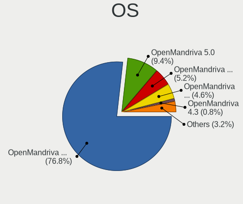

| Name               | Computers | Percent |
|--------------------|-----------|---------|
| OpenMandriva 23.01 | 427       | 69.77%  |
| OpenMandriva 4.3   | 124       | 20.26%  |
| OpenMandriva 4.2   | 28        | 4.58%   |
| OpenMandriva 23.90 | 14        | 2.29%   |
| OpenMandriva 4.50  | 8         | 1.31%   |
| OpenMandriva 4.90  | 6         | 0.98%   |
| OpenMandriva 22.12 | 4         | 0.65%   |
| OpenMandriva 22.11 | 1         | 0.16%   |

OS Family
---------

OS without a version

| Name         | Computers | Percent |
|--------------|-----------|---------|
| OpenMandriva | 612       | 100%    |

Kernel
------

Version of the Linux kernel

| Version                      | Computers | Percent |
|------------------------------|-----------|---------|
| 6.1.1-desktop-1omv2290       | 313       | 51.14%  |
| 6.1.4-desktop-1omv2301       | 97        | 15.85%  |
| 5.16.13-desktop-1omv4003     | 69        | 11.27%  |
| 5.16.7-desktop-1omv4003      | 56        | 9.15%   |
| 5.10.14-desktop-1omv4002     | 20        | 3.27%   |
| 6.2.1-desktop-1omv2390       | 9         | 1.47%   |
| 5.11.12-desktop-1omv4002     | 9         | 1.47%   |
| 6.1.11-desktop-1omv2390      | 6         | 0.98%   |
| 6.2.0-desktop-0.rc2.1omv2301 | 5         | 0.82%   |
| 6.0.10-desktop-2omv22090     | 5         | 0.82%   |
| 6.0.2-desktop-1omv4090       | 3         | 0.49%   |
| 5.19.5-desktop-1omv4090      | 3         | 0.49%   |
| 5.18.12-desktop-3omv4090     | 3         | 0.49%   |
| 5.17.1-desktop-2omv4050      | 3         | 0.49%   |
| 5.14.7-desktop-1omv4050      | 3         | 0.49%   |
| 6.2.0-desktop-0.rc8.1omv2390 | 1         | 0.16%   |
| 6.1.9-desktop-1omv2390       | 1         | 0.16%   |
| 6.1.8-desktop-1omv2390       | 1         | 0.16%   |
| 6.1.5-desktop-1omv2390       | 1         | 0.16%   |
| 6.1.4-desktop-gcc-1omv2301   | 1         | 0.16%   |
| 6.1.10                       | 1         | 0.16%   |
| 6.0.0-desktop-1omv4050       | 1         | 0.16%   |
| 5.19.12-desktop-2omv4090     | 1         | 0.16%   |

Kernel Family
-------------

Linux kernel without a distro release

| Version | Computers | Percent |
|---------|-----------|---------|
| 6.1.1   | 313       | 51.14%  |
| 6.1.4   | 98        | 16.01%  |
| 5.16.13 | 69        | 11.27%  |
| 5.16.7  | 56        | 9.15%   |
| 5.10.14 | 20        | 3.27%   |
| 6.2.1   | 9         | 1.47%   |
| 5.11.12 | 9         | 1.47%   |
| 6.2.0   | 6         | 0.98%   |
| 6.1.11  | 6         | 0.98%   |
| 6.0.10  | 5         | 0.82%   |
| 6.0.2   | 3         | 0.49%   |
| 5.19.5  | 3         | 0.49%   |
| 5.18.12 | 3         | 0.49%   |
| 5.17.1  | 3         | 0.49%   |
| 5.14.7  | 3         | 0.49%   |
| 6.1.9   | 1         | 0.16%   |
| 6.1.8   | 1         | 0.16%   |
| 6.1.5   | 1         | 0.16%   |
| 6.1.10  | 1         | 0.16%   |
| 6.0.0   | 1         | 0.16%   |
| 5.19.12 | 1         | 0.16%   |

Kernel Major Ver.
-----------------

Linux kernel major version

| Version | Computers | Percent |
|---------|-----------|---------|
| 6.1     | 421       | 68.79%  |
| 5.16    | 125       | 20.42%  |
| 5.10    | 20        | 3.27%   |
| 6.2     | 15        | 2.45%   |
| 6.0     | 9         | 1.47%   |
| 5.11    | 9         | 1.47%   |
| 5.19    | 4         | 0.65%   |
| 5.18    | 3         | 0.49%   |
| 5.17    | 3         | 0.49%   |
| 5.14    | 3         | 0.49%   |

Arch
----

OS architecture (x86_64, i586, etc.)

| Name   | Computers | Percent |
|--------|-----------|---------|
| x86_64 | 612       | 100%    |

DE
--

Desktop Environment

| Name     | Computers | Percent |
|----------|-----------|---------|
| KDE5     | 571       | 93.3%   |
| GNOME    | 35        | 5.72%   |
| Cinnamon | 2         | 0.33%   |
| Unknown  | 2         | 0.33%   |
| LXQt     | 1         | 0.16%   |
| Budgie   | 1         | 0.16%   |

Display Server
--------------

X11 or Wayland

| Name    | Computers | Percent |
|---------|-----------|---------|
| X11     | 575       | 93.95%  |
| Wayland | 37        | 6.05%   |

Display Manager
---------------

SDDM, LightDM, etc.

| Name    | Computers | Percent |
|---------|-----------|---------|
| SDDM    | 576       | 94.12%  |
| GDM     | 35        | 5.72%   |
| Unknown | 1         | 0.16%   |

OS Lang
-------

Language

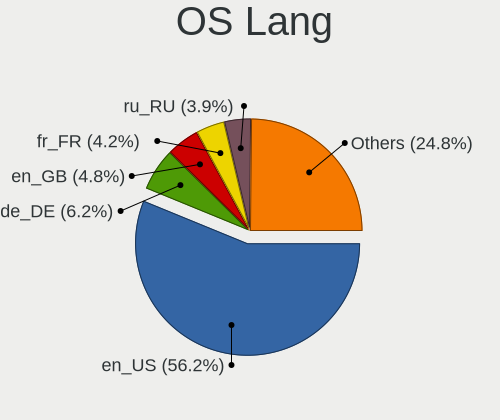

| Lang  | Computers | Percent |
|-------|-----------|---------|
| en_US | 266       | 43.46%  |
| fr_FR | 54        | 8.82%   |
| de_DE | 42        | 6.86%   |
| ru_RU | 35        | 5.72%   |
| pt_BR | 33        | 5.39%   |
| it_IT | 32        | 5.23%   |
| en_GB | 29        | 4.74%   |
| pl_PL | 22        | 3.59%   |
| es_ES | 14        | 2.29%   |
| cs_CZ | 11        | 1.8%    |
| es_MX | 10        | 1.63%   |
| en_CA | 7         | 1.14%   |
| nl_NL | 6         | 0.98%   |
| tr_TR | 4         | 0.65%   |
| pt_PT | 4         | 0.65%   |
| es_CO | 4         | 0.65%   |
| de_CH | 4         | 0.65%   |
| de_AT | 4         | 0.65%   |
| es_CL | 3         | 0.49%   |
| es_AR | 3         | 0.49%   |
| fr_CH | 2         | 0.33%   |
| es_UY | 2         | 0.33%   |
| en_NZ | 2         | 0.33%   |
| en_AU | 2         | 0.33%   |
| da_DK | 2         | 0.33%   |
| uk_UA | 1         | 0.16%   |
| ru_UA | 1         | 0.16%   |
| ro_RO | 1         | 0.16%   |
| nl_BE | 1         | 0.16%   |
| hu_HU | 1         | 0.16%   |
| es_VE | 1         | 0.16%   |
| es_PE | 1         | 0.16%   |
| es_EC | 1         | 0.16%   |
| en_ZA | 1         | 0.16%   |
| en_SG | 1         | 0.16%   |
| en_IN | 1         | 0.16%   |
| en_IE | 1         | 0.16%   |
| en_DK | 1         | 0.16%   |
| ar_EG | 1         | 0.16%   |
| ar_DZ | 1         | 0.16%   |

Boot Mode
---------

EFI or BIOS

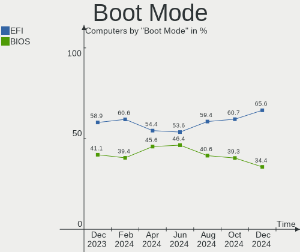

| Mode | Computers | Percent |
|------|-----------|---------|
| EFI  | 345       | 56.37%  |
| BIOS | 267       | 43.63%  |

Filesystem
----------

Type of filesystem

| Type     | Computers | Percent |
|----------|-----------|---------|
| Ext4     | 309       | 50.49%  |
| Overlay  | 271       | 44.28%  |
| Btrfs    | 19        | 3.1%    |
| Xfs      | 5         | 0.82%   |
| Jfs      | 3         | 0.49%   |
| F2fs     | 3         | 0.49%   |
| Tmpfs    | 1         | 0.16%   |
| Reiserfs | 1         | 0.16%   |

Part. scheme
------------

Scheme of partitioning

| Type    | Computers | Percent |
|---------|-----------|---------|
| GPT     | 449       | 73.37%  |
| MBR     | 162       | 26.47%  |
| Unknown | 1         | 0.16%   |

Dual Boot with Linux/BSD
------------------------

Hosting more than one Linux/BSD

| Dual boot | Computers | Percent |
|-----------|-----------|---------|
| Yes       | 318       | 51.96%  |
| No        | 294       | 48.04%  |

Dual Boot (Win)
---------------

Hosting Linux and Windows

| Dual boot | Computers | Percent |
|-----------|-----------|---------|
| No        | 328       | 53.59%  |
| Yes       | 284       | 46.41%  |

Board
-----

Vendor
------

Motherboard manufacturer

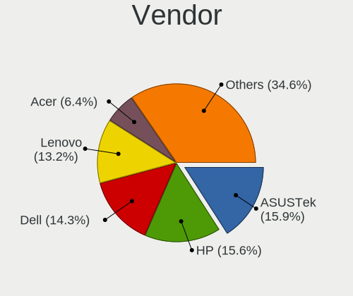

| Name                | Computers | Percent |
|---------------------|-----------|---------|
| ASUSTek Computer    | 121       | 19.77%  |
| Hewlett-Packard     | 84        | 13.73%  |
| Lenovo              | 66        | 10.78%  |
| Dell                | 56        | 9.15%   |
| Gigabyte Technology | 50        | 8.17%   |
| MSI                 | 46        | 7.52%   |
| Acer                | 39        | 6.37%   |
| ASRock              | 26        | 4.25%   |
| Toshiba             | 12        | 1.96%   |
| Intel               | 12        | 1.96%   |
| Apple               | 11        | 1.8%    |
| Samsung Electronics | 10        | 1.63%   |
| Unknown             | 7         | 1.14%   |
| Sony                | 6         | 0.98%   |
| Fujitsu             | 6         | 0.98%   |
| Foxconn             | 5         | 0.82%   |
| Positivo            | 4         | 0.65%   |
| Medion              | 4         | 0.65%   |
| Google              | 4         | 0.65%   |
| Biostar             | 4         | 0.65%   |
| Philco              | 3         | 0.49%   |
| eMachines           | 3         | 0.49%   |
| Supermicro          | 2         | 0.33%   |
| Quanta              | 2         | 0.33%   |
| Pegatron            | 2         | 0.33%   |
| NEC Computers       | 2         | 0.33%   |
| Gateway             | 2         | 0.33%   |
| BESSTAR Tech        | 2         | 0.33%   |
| Wortmann AG         | 1         | 0.16%   |
| Timi                | 1         | 0.16%   |
| Standard            | 1         | 0.16%   |
| PCsmart             | 1         | 0.16%   |
| PC Specialist       | 1         | 0.16%   |
| Packard Bell        | 1         | 0.16%   |
| Notebook            | 1         | 0.16%   |
| Microsoft           | 1         | 0.16%   |
| LG Electronics      | 1         | 0.16%   |
| Lenovo Product      | 1         | 0.16%   |
| IP3 Tech            | 1         | 0.16%   |
| Insyde              | 1         | 0.16%   |

Model
-----

Motherboard model

| Name                               | Computers | Percent |
|------------------------------------|-----------|---------|
| Unknown                            | 10        | 1.63%   |
| HP Notebook                        | 9         | 1.47%   |
| ASUS All Series                    | 8         | 1.31%   |
| ASUS UX31E                         | 4         | 0.65%   |
| Toshiba dynabook T653/46JR         | 3         | 0.49%   |
| Lenovo IdeaPad 3 15ALC6 82KU       | 3         | 0.49%   |
| HP Pavilion 17                     | 3         | 0.49%   |
| HP 15                              | 3         | 0.49%   |
| Dell Latitude D630                 | 3         | 0.49%   |
| Apple MacBookPro8,1                | 3         | 0.49%   |
| Samsung 300E4C/300E5C/300E7C       | 2         | 0.33%   |
| MSI MS-7C96                        | 2         | 0.33%   |
| MSI MS-7B89                        | 2         | 0.33%   |
| MSI MS-7B84                        | 2         | 0.33%   |
| MSI MS-7A33                        | 2         | 0.33%   |
| MSI MS-7821                        | 2         | 0.33%   |
| MSI MS-7721                        | 2         | 0.33%   |
| MSI MS-7680                        | 2         | 0.33%   |
| MSI MS-7592                        | 2         | 0.33%   |
| Lenovo IdeaPad S145-15AST 81N3     | 2         | 0.33%   |
| Lenovo IdeaPad 330S-15IKB 81F5     | 2         | 0.33%   |
| Intel H61                          | 2         | 0.33%   |
| HP ProBook 4530s                   | 2         | 0.33%   |
| HP Compaq dc7900 Small Form Factor | 2         | 0.33%   |
| HP Compaq 8200 Elite SFF PC        | 2         | 0.33%   |
| HP 255 G8 Notebook PC              | 2         | 0.33%   |
| HP 250 G6 Notebook PC              | 2         | 0.33%   |
| Gigabyte G31M-S2L                  | 2         | 0.33%   |
| Dell OptiPlex 780                  | 2         | 0.33%   |
| Dell OptiPlex 7010                 | 2         | 0.33%   |
| Dell Latitude E7440                | 2         | 0.33%   |
| Dell Inspiron 3891                 | 2         | 0.33%   |
| ASUS X555DG                        | 2         | 0.33%   |
| ASUS TUF Gaming B550-PLUS          | 2         | 0.33%   |
| ASUS S551LN                        | 2         | 0.33%   |
| ASUS PRIME X399-A                  | 2         | 0.33%   |
| ASUS P8B75-V                       | 2         | 0.33%   |
| ASUS P5K                           | 2         | 0.33%   |
| ASUS M4A89GTD-PRO/USB3             | 2         | 0.33%   |
| ASUS GL553VD                       | 2         | 0.33%   |

Model Family
------------

Motherboard model prefix

| Name               | Computers | Percent |
|--------------------|-----------|---------|
| Acer Aspire        | 31        | 5.07%   |
| Lenovo ThinkPad    | 24        | 3.92%   |
| Dell Inspiron      | 19        | 3.1%    |
| Lenovo IdeaPad     | 18        | 2.94%   |
| Dell Latitude      | 15        | 2.45%   |
| ASUS PRIME         | 14        | 2.29%   |
| HP Pavilion        | 12        | 1.96%   |
| HP Compaq          | 12        | 1.96%   |
| Unknown            | 10        | 1.63%   |
| HP ProBook         | 9         | 1.47%   |
| HP Notebook        | 9         | 1.47%   |
| Dell OptiPlex      | 8         | 1.31%   |
| ASUS All           | 8         | 1.31%   |
| Toshiba Satellite  | 7         | 1.14%   |
| Lenovo ThinkCentre | 7         | 1.14%   |
| ASUS VivoBook      | 7         | 1.14%   |
| ASUS TUF           | 7         | 1.14%   |
| ASUS ROG           | 6         | 0.98%   |
| Toshiba dynabook   | 4         | 0.65%   |
| HP ProDesk         | 4         | 0.65%   |
| HP Laptop          | 4         | 0.65%   |
| HP EliteBook       | 4         | 0.65%   |
| Fujitsu ESPRIMO    | 4         | 0.65%   |
| Dell Precision     | 4         | 0.65%   |
| ASUS UX31E         | 4         | 0.65%   |
| HP 255             | 3         | 0.49%   |
| HP 250             | 3         | 0.49%   |
| HP 15              | 3         | 0.49%   |
| Gigabyte B550      | 3         | 0.49%   |
| Dell Vostro        | 3         | 0.49%   |
| Apple MacBookPro8  | 3         | 0.49%   |
| Samsung 300E4C     | 2         | 0.33%   |
| MSI MS-7C96        | 2         | 0.33%   |
| MSI MS-7B89        | 2         | 0.33%   |
| MSI MS-7B84        | 2         | 0.33%   |
| MSI MS-7A33        | 2         | 0.33%   |
| MSI MS-7821        | 2         | 0.33%   |
| MSI MS-7721        | 2         | 0.33%   |
| MSI MS-7680        | 2         | 0.33%   |
| MSI MS-7592        | 2         | 0.33%   |

MFG Year
--------

Motherboard manufacture year

| Year | Computers | Percent |
|------|-----------|---------|
| 2012 | 58        | 9.48%   |
| 2011 | 58        | 9.48%   |
| 2018 | 51        | 8.33%   |
| 2013 | 50        | 8.17%   |
| 2020 | 48        | 7.84%   |
| 2017 | 47        | 7.68%   |
| 2021 | 42        | 6.86%   |
| 2019 | 38        | 6.21%   |
| 2014 | 35        | 5.72%   |
| 2010 | 35        | 5.72%   |
| 2016 | 32        | 5.23%   |
| 2009 | 28        | 4.58%   |
| 2015 | 27        | 4.41%   |
| 2008 | 23        | 3.76%   |
| 2007 | 15        | 2.45%   |
| 2022 | 12        | 1.96%   |
| 2006 | 9         | 1.47%   |
| 2023 | 2         | 0.33%   |
| 2005 | 1         | 0.16%   |
| 2004 | 1         | 0.16%   |

Form Factor
-----------

Physical design of the computer

| Name        | Computers | Percent |
|-------------|-----------|---------|
| Desktop     | 291       | 47.55%  |
| Notebook    | 290       | 47.39%  |
| Mini pc     | 12        | 1.96%   |
| All in one  | 8         | 1.31%   |
| Convertible | 6         | 0.98%   |
| Server      | 3         | 0.49%   |
| Tablet      | 2         | 0.33%   |

Secure Boot
-----------

Enabled or disabled

| State    | Computers | Percent |
|----------|-----------|---------|
| Disabled | 612       | 100%    |

Coreboot
--------

Have coreboot on board

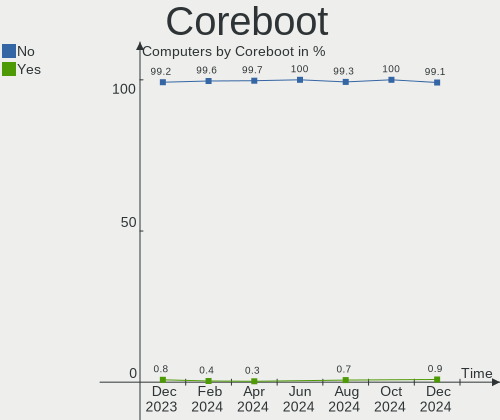

| Used | Computers | Percent |
|------|-----------|---------|
| No   | 607       | 99.18%  |
| Yes  | 5         | 0.82%   |

RAM Size
--------

Total RAM memory

| Size in GB  | Computers | Percent |
|-------------|-----------|---------|
| 4.01-8.0    | 155       | 25.33%  |
| 8.01-16.0   | 137       | 22.39%  |
| 3.01-4.0    | 134       | 21.9%   |
| 16.01-24.0  | 103       | 16.83%  |
| 32.01-64.0  | 42        | 6.86%   |
| 1.01-2.0    | 16        | 2.61%   |
| 64.01-256.0 | 14        | 2.29%   |
| 24.01-32.0  | 6         | 0.98%   |
| 2.01-3.0    | 5         | 0.82%   |

RAM Used
--------

Used RAM memory

| Used GB    | Computers | Percent |
|------------|-----------|---------|
| 1.01-2.0   | 413       | 67.48%  |
| 2.01-3.0   | 130       | 21.24%  |
| 0.51-1.0   | 32        | 5.23%   |
| 3.01-4.0   | 21        | 3.43%   |
| 4.01-8.0   | 7         | 1.14%   |
| 0.01-0.5   | 6         | 0.98%   |
| 8.01-16.0  | 2         | 0.33%   |
| 16.01-24.0 | 1         | 0.16%   |

Total Drives
------------

Number of drives on board

| Drives | Computers | Percent |
|--------|-----------|---------|
| 1      | 336       | 54.9%   |
| 2      | 169       | 27.61%  |
| 3      | 48        | 7.84%   |
| 4      | 26        | 4.25%   |
| 5      | 13        | 2.12%   |
| 0      | 9         | 1.47%   |
| 6      | 5         | 0.82%   |
| 8      | 3         | 0.49%   |
| 9      | 2         | 0.33%   |
| 7      | 1         | 0.16%   |

Has CD-ROM
----------

Has CD-ROM on board

| Presented | Computers | Percent |
|-----------|-----------|---------|
| Yes       | 324       | 52.94%  |
| No        | 288       | 47.06%  |

Has Ethernet
------------

Has Ethernet on board

| Presented | Computers | Percent |
|-----------|-----------|---------|
| Yes       | 563       | 91.99%  |
| No        | 49        | 8.01%   |

Has WiFi
--------

Has WiFi module

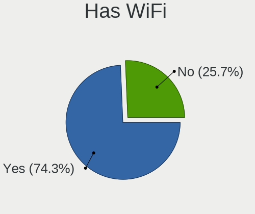

| Presented | Computers | Percent |
|-----------|-----------|---------|
| Yes       | 411       | 67.16%  |
| No        | 201       | 32.84%  |

Has Bluetooth
-------------

Has Bluetooth module

| Presented | Computers | Percent |
|-----------|-----------|---------|
| Yes       | 313       | 51.14%  |
| No        | 299       | 48.86%  |

Location
--------

Country
-------

Geographic location (country)

| Country      | Computers | Percent |
|--------------|-----------|---------|
| USA          | 68        | 11.11%  |
| Germany      | 61        | 9.97%   |
| France       | 57        | 9.31%   |
| Russia       | 42        | 6.86%   |
| Italy        | 40        | 6.54%   |
| Brazil       | 39        | 6.37%   |
| Poland       | 34        | 5.56%   |
| UK           | 23        | 3.76%   |
| Finland      | 17        | 2.78%   |
| Spain        | 16        | 2.61%   |
| Czechia      | 15        | 2.45%   |
| Canada       | 15        | 2.45%   |
| Japan        | 9         | 1.47%   |
| Turkey       | 8         | 1.31%   |
| Switzerland  | 8         | 1.31%   |
| Netherlands  | 8         | 1.31%   |
| Mexico       | 8         | 1.31%   |
| Indonesia    | 7         | 1.14%   |
| India        | 7         | 1.14%   |
| Serbia       | 6         | 0.98%   |
| Portugal     | 6         | 0.98%   |
| Colombia     | 6         | 0.98%   |
| Australia    | 6         | 0.98%   |
| Chile        | 5         | 0.82%   |
| Austria      | 5         | 0.82%   |
| Argentina    | 5         | 0.82%   |
| Ukraine      | 4         | 0.65%   |
| South Africa | 4         | 0.65%   |
| New Zealand  | 4         | 0.65%   |
| Morocco      | 4         | 0.65%   |
| Costa Rica   | 4         | 0.65%   |
| Belgium      | 4         | 0.65%   |
| Venezuela    | 3         | 0.49%   |
| Slovakia     | 3         | 0.49%   |
| Romania      | 3         | 0.49%   |
| Latvia       | 3         | 0.49%   |
| Ireland      | 3         | 0.49%   |
| Egypt        | 3         | 0.49%   |
| Uruguay      | 2         | 0.33%   |
| Sweden       | 2         | 0.33%   |

City
----

Geographic location (city)

| City               | Computers | Percent |
|--------------------|-----------|---------|
| Rio de Janeiro     | 8         | 1.31%   |
| Moscow             | 8         | 1.31%   |
| Helsinki           | 8         | 1.31%   |
| Berlin             | 7         | 1.14%   |
| Prague             | 5         | 0.82%   |
| Paris              | 5         | 0.82%   |
| Warsaw             | 4         | 0.65%   |
| Stavropol          | 4         | 0.65%   |
| St Petersburg      | 4         | 0.65%   |
| Melbourne          | 4         | 0.65%   |
| Bogotá            | 4         | 0.65%   |
| Vienna             | 3         | 0.49%   |
| Sao Paulo          | 3         | 0.49%   |
| Santiago           | 3         | 0.49%   |
| Munich             | 3         | 0.49%   |
| Milano             | 3         | 0.49%   |
| Krakow             | 3         | 0.49%   |
| Johannesburg       | 3         | 0.49%   |
| Jakarta            | 3         | 0.49%   |
| Hanover            | 3         | 0.49%   |
| Glasgow            | 3         | 0.49%   |
| Dortmund           | 3         | 0.49%   |
| Burlington         | 3         | 0.49%   |
| Bialystok          | 3         | 0.49%   |
| Ankara             | 3         | 0.49%   |
| Zurich             | 2         | 0.33%   |
| Willingboro        | 2         | 0.33%   |
| Varese             | 2         | 0.33%   |
| Turin              | 2         | 0.33%   |
| Tiffin             | 2         | 0.33%   |
| Spruce Grove       | 2         | 0.33%   |
| Siggenthal Station | 2         | 0.33%   |
| San Pedro          | 2         | 0.33%   |
| Salem              | 2         | 0.33%   |
| Rome               | 2         | 0.33%   |
| Riga               | 2         | 0.33%   |
| Reykjavik          | 2         | 0.33%   |
| Queens             | 2         | 0.33%   |
| Poznan             | 2         | 0.33%   |
| Portage            | 2         | 0.33%   |

Drives
------

Drive Vendor
------------

Hard drive vendors

| Vendor              | Computers | Drives | Percent |
|---------------------|-----------|--------|---------|
| WDC                 | 152       | 203    | 16.33%  |
| Seagate             | 144       | 172    | 15.47%  |
| Samsung Electronics | 108       | 119    | 11.6%   |
| Toshiba             | 61        | 63     | 6.55%   |
| Kingston            | 58        | 61     | 6.23%   |
| Crucial             | 50        | 56     | 5.37%   |
| Hitachi             | 40        | 43     | 4.3%    |
| SanDisk             | 37        | 42     | 3.97%   |
| HGST                | 21        | 23     | 2.26%   |
| Intel               | 19        | 20     | 2.04%   |
| Unknown             | 18        | 18     | 1.93%   |
| China               | 18        | 18     | 1.93%   |
| A-DATA Technology   | 16        | 16     | 1.72%   |
| SK hynix            | 14        | 14     | 1.5%    |
| PNY                 | 14        | 15     | 1.5%    |
| Micron Technology   | 13        | 13     | 1.4%    |
| GOODRAM             | 10        | 10     | 1.07%   |
| Transcend           | 6         | 6      | 0.64%   |
| JMicron Technology  | 6         | 6      | 0.64%   |
| Corsair             | 6         | 6      | 0.64%   |
| Unknown             | 6         | 6      | 0.64%   |
| Team                | 5         | 5      | 0.54%   |
| Silicon Motion      | 5         | 5      | 0.54%   |
| Phison              | 5         | 5      | 0.54%   |
| Patriot             | 5         | 5      | 0.54%   |
| Maxtor              | 5         | 5      | 0.54%   |
| Hewlett-Packard     | 5         | 5      | 0.54%   |
| Gigabyte Technology | 5         | 5      | 0.54%   |
| SPCC                | 4         | 4      | 0.43%   |
| Lexar               | 4         | 4      | 0.43%   |
| Apacer              | 4         | 4      | 0.43%   |
| XrayDisk            | 3         | 3      | 0.32%   |
| ASMT                | 3         | 3      | 0.32%   |
| Vaseky              | 2         | 2      | 0.21%   |
| Smartbuy            | 2         | 2      | 0.21%   |
| SABRENT             | 2         | 2      | 0.21%   |
| Pioneer             | 2         | 2      | 0.21%   |
| Phison Electronics  | 2         | 2      | 0.21%   |
| OCZ                 | 2         | 2      | 0.21%   |
| Netac               | 2         | 2      | 0.21%   |

Drive Model
-----------

Hard drive models

| Model                               | Computers | Percent |
|-------------------------------------|-----------|---------|
| Kingston SA400S37240G 240GB SSD     | 13        | 1.28%   |
| Seagate ST1000DM010-2EP102 1TB      | 11        | 1.08%   |
| Seagate ST2000DM008-2FR102 2TB      | 9         | 0.88%   |
| Seagate ST500DM002-1BD142 500GB     | 8         | 0.79%   |
| Seagate ST3500418AS 500GB           | 8         | 0.79%   |
| WDC WDS240G2G0A-00JH30 240GB SSD    | 7         | 0.69%   |
| Seagate ST1000LM024 HN-M101MBB 1TB  | 7         | 0.69%   |
| Samsung SSD 850 EVO 500GB           | 7         | 0.69%   |
| HGST HTS721010A9E630 1TB            | 7         | 0.69%   |
| Crucial CT240BX500SSD1 240GB        | 7         | 0.69%   |
| Toshiba MQ01ABD075 752GB            | 6         | 0.59%   |
| Seagate ST500LT012-9WS142 500GB     | 6         | 0.59%   |
| Kingston SA400S37480G 480GB SSD     | 6         | 0.59%   |
| HGST HTS545050A7E680 500GB          | 6         | 0.59%   |
| Crucial CT500MX500SSD1 500GB        | 6         | 0.59%   |
| Crucial CT1000MX500SSD1 1TB         | 6         | 0.59%   |
| Unknown                             | 6         | 0.59%   |
| WDC WD10EZEX-00BN5A0 1TB            | 5         | 0.49%   |
| Toshiba MQ04ABF100 1TB              | 5         | 0.49%   |
| Seagate ST500LT012-1DG142 500GB     | 5         | 0.49%   |
| Samsung SSD 860 EVO 250GB           | 5         | 0.49%   |
| Kingston SV300S37A120G 120GB SSD    | 5         | 0.49%   |
| Crucial CT250MX500SSD1 250GB        | 5         | 0.49%   |
| WDC WD20EZRZ-00Z5HB0 2TB            | 4         | 0.39%   |
| WDC WD10EZEX-60WN4A0 1TB            | 4         | 0.39%   |
| Unknown SD/MMC/MS PRO 16GB          | 4         | 0.39%   |
| Toshiba DT01ACA050 500GB            | 4         | 0.39%   |
| Seagate ST500LM012 HN-M500MBB 500GB | 4         | 0.39%   |
| Seagate ST320LT020-9YG142 320GB     | 4         | 0.39%   |
| Seagate ST16000NM001G-2KK103 16TB   | 4         | 0.39%   |
| Seagate ST1000LM035-1RK172 1TB      | 4         | 0.39%   |
| SanDisk SSD U100 256GB              | 4         | 0.39%   |
| Samsung SSD 980 1TB                 | 4         | 0.39%   |
| Samsung SSD 850 EVO 250GB           | 4         | 0.39%   |
| Micron MTFDHBA512QFD 512GB          | 4         | 0.39%   |
| Kingston SA400S37120G 120GB SSD     | 4         | 0.39%   |
| Hitachi HDS721010CLA332 1TB         | 4         | 0.39%   |
| HGST HTS541010A9E680 1TB            | 4         | 0.39%   |
| Crucial CT1000BX500SSD1 1TB         | 4         | 0.39%   |
| WDC WDS120G2G0A-00JH30 120GB SSD    | 3         | 0.29%   |

HDD Vendor
----------

Hard disk drive vendors

| Vendor              | Computers | Drives | Percent |
|---------------------|-----------|--------|---------|
| Seagate             | 140       | 164    | 33.82%  |
| WDC                 | 123       | 161    | 29.71%  |
| Toshiba             | 54        | 56     | 13.04%  |
| Hitachi             | 40        | 43     | 9.66%   |
| HGST                | 21        | 23     | 5.07%   |
| Samsung Electronics | 14        | 14     | 3.38%   |
| Maxtor              | 5         | 5      | 1.21%   |
| Unknown             | 4         | 4      | 0.97%   |
| Hewlett-Packard     | 4         | 4      | 0.97%   |
| SABRENT             | 2         | 2      | 0.48%   |
| JMicron Technology  | 2         | 2      | 0.48%   |
| WD MediaMax         | 1         | 1      | 0.24%   |
| HPE                 | 1         | 1      | 0.24%   |
| Fujitsu             | 1         | 1      | 0.24%   |
| China               | 1         | 1      | 0.24%   |
| Apple               | 1         | 1      | 0.24%   |

SSD Vendor
----------

Solid state drive vendors

| Vendor              | Computers | Drives | Percent |
|---------------------|-----------|--------|---------|
| Samsung Electronics | 58        | 61     | 17.01%  |
| Kingston            | 53        | 55     | 15.54%  |
| Crucial             | 38        | 40     | 11.14%  |
| SanDisk             | 29        | 33     | 8.5%    |
| WDC                 | 17        | 18     | 4.99%   |
| China               | 17        | 17     | 4.99%   |
| A-DATA Technology   | 15        | 15     | 4.4%    |
| PNY                 | 12        | 13     | 3.52%   |
| GOODRAM             | 10        | 10     | 2.93%   |
| Intel               | 7         | 7      | 2.05%   |
| Transcend           | 6         | 6      | 1.76%   |
| Patriot             | 5         | 5      | 1.47%   |
| Toshiba             | 4         | 4      | 1.17%   |
| Team                | 4         | 4      | 1.17%   |
| SPCC                | 4         | 4      | 1.17%   |
| Lexar               | 4         | 4      | 1.17%   |
| Corsair             | 4         | 4      | 1.17%   |
| Micron Technology   | 3         | 3      | 0.88%   |
| Unknown             | 3         | 3      | 0.88%   |
| XrayDisk            | 2         | 2      | 0.59%   |
| Vaseky              | 2         | 2      | 0.59%   |
| Smartbuy            | 2         | 2      | 0.59%   |
| Seagate             | 2         | 2      | 0.59%   |
| Pioneer             | 2         | 2      | 0.59%   |
| OCZ                 | 2         | 2      | 0.59%   |
| LITEON              | 2         | 2      | 0.59%   |
| JMicron Technology  | 2         | 2      | 0.59%   |
| GLOWAY              | 2         | 2      | 0.59%   |
| Gigabyte Technology | 2         | 2      | 0.59%   |
| Colorful            | 2         | 2      | 0.59%   |
| ASMT                | 2         | 2      | 0.59%   |
| Apacer              | 2         | 2      | 0.59%   |
| Zheino              | 1         | 1      | 0.29%   |
| XUM                 | 1         | 1      | 0.29%   |
| VISIPRO             | 1         | 1      | 0.29%   |
| Timetec             | 1         | 1      | 0.29%   |
| SK hynix            | 1         | 1      | 0.29%   |
| SFAS                | 1         | 1      | 0.29%   |
| SemsoTai            | 1         | 1      | 0.29%   |
| Ramos Technology    | 1         | 1      | 0.29%   |

Drive Kind
----------

HDD or SSD

| Kind    | Computers | Drives | Percent |
|---------|-----------|--------|---------|
| HDD     | 343       | 483    | 43.25%  |
| SSD     | 281       | 354    | 35.44%  |
| NVMe    | 139       | 177    | 17.53%  |
| MMC     | 21        | 22     | 2.65%   |
| Unknown | 9         | 9      | 1.13%   |

Drive Connector
---------------

SATA, SAS, NVMe, etc.

| Type | Computers | Drives | Percent |
|------|-----------|--------|---------|
| SATA | 519       | 811    | 72.79%  |
| NVMe | 138       | 173    | 19.35%  |
| SAS  | 35        | 39     | 4.91%   |
| MMC  | 21        | 22     | 2.95%   |

Drive Size
----------

Size of hard drive

| Size in TB | Computers | Drives | Percent |
|------------|-----------|--------|---------|
| 0.01-0.5   | 389       | 504    | 58.32%  |
| 0.51-1.0   | 196       | 232    | 29.39%  |
| 1.01-2.0   | 47        | 59     | 7.05%   |
| 3.01-4.0   | 14        | 15     | 2.1%    |
| 2.01-3.0   | 12        | 12     | 1.8%    |
| 4.01-10.0  | 5         | 9      | 0.75%   |
| 10.01-20.0 | 4         | 6      | 0.6%    |

Space Total
-----------

Amount of disk space available on the file system

| Size in GB     | Computers | Percent |
|----------------|-----------|---------|
| 1-20           | 187       | 30.56%  |
| 101-250        | 132       | 21.57%  |
| 251-500        | 83        | 13.56%  |
| 501-1000       | 52        | 8.5%    |
| 51-100         | 48        | 7.84%   |
| 21-50          | 41        | 6.7%    |
| Unknown        | 29        | 4.74%   |
| 1001-2000      | 27        | 4.41%   |
| More than 3000 | 8         | 1.31%   |
| 2001-3000      | 5         | 0.82%   |

Space Used
----------

Amount of used disk space

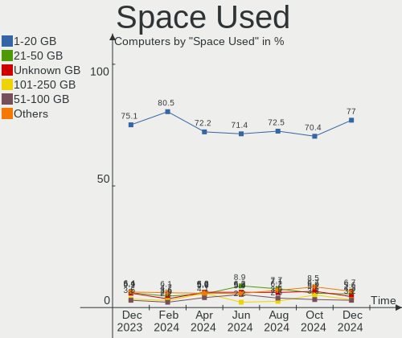

| Used GB        | Computers | Percent |
|----------------|-----------|---------|
| 1-20           | 438       | 71.57%  |
| 21-50          | 46        | 7.52%   |
| 51-100         | 32        | 5.23%   |
| Unknown        | 29        | 4.74%   |
| 101-250        | 27        | 4.41%   |
| 251-500        | 17        | 2.78%   |
| 501-1000       | 14        | 2.29%   |
| 1001-2000      | 5         | 0.82%   |
| More than 3000 | 3         | 0.49%   |
| 2001-3000      | 1         | 0.16%   |

Malfunc. Drives
---------------

Drive models with a malfunction

| Model                               | Computers | Drives | Percent |
|-------------------------------------|-----------|--------|---------|
| Seagate ST500LT012-9WS142 500GB     | 5         | 5      | 2.48%   |
| Toshiba MQ01ABD075 752GB            | 4         | 4      | 1.98%   |
| Seagate ST500DM002-1BD142 500GB     | 4         | 4      | 1.98%   |
| Seagate ST3500418AS 500GB           | 4         | 4      | 1.98%   |
| SanDisk SSD U100 256GB              | 4         | 4      | 1.98%   |
| Seagate ST9320325AS 320GB           | 3         | 3      | 1.49%   |
| Seagate ST500LT012-1DG142 500GB     | 3         | 3      | 1.49%   |
| Hitachi HDS721010CLA332 1TB         | 3         | 3      | 1.49%   |
| HGST HTS545050A7E680 500GB          | 3         | 3      | 1.49%   |
| HGST HTS541010A9E680 1TB            | 3         | 3      | 1.49%   |
| WDC WD20EZRZ-00Z5HB0 2TB            | 2         | 2      | 0.99%   |
| WDC WD20EARS-00MVWB0 2TB            | 2         | 2      | 0.99%   |
| WDC WD10EARS-00Y5B1 1TB             | 2         | 2      | 0.99%   |
| Toshiba MK3265GSX 320GB             | 2         | 2      | 0.99%   |
| Toshiba DT01ACA050 500GB            | 2         | 2      | 0.99%   |
| Seagate ST9500325AS 500GB           | 2         | 2      | 0.99%   |
| Seagate ST500LM012 HN-M500MBB 500GB | 2         | 2      | 0.99%   |
| Seagate ST3500630AS 500GB           | 2         | 2      | 0.99%   |
| Seagate ST320LT020-9YG142 320GB     | 2         | 2      | 0.99%   |
| Seagate ST31000528AS 1TB            | 2         | 3      | 0.99%   |
| Seagate ST1000LM035-1RK172 1TB      | 2         | 2      | 0.99%   |
| Seagate ST1000LM024 HN-M101MBB 1TB  | 2         | 2      | 0.99%   |
| SanDisk SSD PLUS 480GB              | 2         | 3      | 0.99%   |
| Samsung Electronics HD103UJ 1TB     | 2         | 2      | 0.99%   |
| Kingston SV300S37A120G 120GB SSD    | 2         | 2      | 0.99%   |
| Hitachi HDS722020ALA330 2TB         | 2         | 2      | 0.99%   |
| HGST HTS541075A9E680 752GB          | 2         | 2      | 0.99%   |
| WDC WDS240G2G0B-00EPW0 240GB SSD    | 1         | 1      | 0.5%    |
| WDC WDS240G2G0A-00JH30 240GB SSD    | 1         | 1      | 0.5%    |
| WDC WD7500BPVT-55HXZT4 752GB        | 1         | 1      | 0.5%    |
| WDC WD7500AARS-00Y5B1 752GB         | 1         | 1      | 0.5%    |
| WDC WD6400AAKS-65Z7B0 640GB         | 1         | 1      | 0.5%    |
| WDC WD6400AAKS-65A7B2 640GB         | 1         | 1      | 0.5%    |
| WDC WD6400AAKS-22A7B2 640GB         | 1         | 1      | 0.5%    |
| WDC WD5002ABYS-02B1B0 500GB         | 1         | 1      | 0.5%    |
| WDC WD5000LPCX-24VHAT0 500GB        | 1         | 1      | 0.5%    |
| WDC WD5000BPVT-22HXZT3 500GB        | 1         | 1      | 0.5%    |
| WDC WD5000AVDS-73U7B1 500GB         | 1         | 1      | 0.5%    |
| WDC WD5000AAKX-75U6AA0 500GB        | 1         | 1      | 0.5%    |
| WDC WD5000AAKX-001CA0 500GB         | 1         | 1      | 0.5%    |

Malfunc. Drive Vendor
---------------------

Vendors of faulty drives

| Vendor              | Computers | Drives | Percent |
|---------------------|-----------|--------|---------|
| Seagate             | 56        | 58     | 28.57%  |
| WDC                 | 38        | 42     | 19.39%  |
| Hitachi             | 22        | 23     | 11.22%  |
| Toshiba             | 19        | 19     | 9.69%   |
| Samsung Electronics | 10        | 10     | 5.1%    |
| HGST                | 10        | 12     | 5.1%    |
| SanDisk             | 7         | 8      | 3.57%   |
| Kingston            | 6         | 6      | 3.06%   |
| Maxtor              | 5         | 5      | 2.55%   |
| Hewlett-Packard     | 4         | 4      | 2.04%   |
| Micron Technology   | 2         | 2      | 1.02%   |
| Intel               | 2         | 2      | 1.02%   |
| Crucial             | 2         | 2      | 1.02%   |
| Corsair             | 2         | 2      | 1.02%   |
| China               | 2         | 2      | 1.02%   |
| Timetec             | 1         | 1      | 0.51%   |
| SK hynix            | 1         | 1      | 0.51%   |
| Netac               | 1         | 1      | 0.51%   |
| KLEVV               | 1         | 1      | 0.51%   |
| CHN25SATAS1         | 1         | 1      | 0.51%   |
| Apple               | 1         | 1      | 0.51%   |
| Apacer              | 1         | 1      | 0.51%   |
| A-DATA Technology   | 1         | 1      | 0.51%   |
| Unknown             | 1         | 1      | 0.51%   |

Malfunc. HDD Vendor
-------------------

Vendors of faulty HDD drives

| Vendor              | Computers | Drives | Percent |
|---------------------|-----------|--------|---------|
| Seagate             | 56        | 58     | 35.22%  |
| WDC                 | 35        | 39     | 22.01%  |
| Hitachi             | 22        | 23     | 13.84%  |
| Toshiba             | 19        | 19     | 11.95%  |
| HGST                | 10        | 12     | 6.29%   |
| Samsung Electronics | 8         | 8      | 5.03%   |
| Maxtor              | 5         | 5      | 3.14%   |
| Hewlett-Packard     | 4         | 4      | 2.52%   |

Malfunc. Drive Kind
-------------------

Kinds of faulty drives

| Kind | Computers | Drives | Percent |
|------|-----------|--------|---------|
| HDD  | 144       | 168    | 80%     |
| SSD  | 32        | 34     | 17.78%  |
| NVMe | 4         | 4      | 2.22%   |

Failed Drives
-------------

Failed drive models

| Model                           | Computers | Drives | Percent |
|---------------------------------|-----------|--------|---------|
| WDC WD800JD-00LSA0 80GB         | 1         | 1      | 20%     |
| WDC WD2500BEVT-35A23T0 250GB    | 1         | 1      | 20%     |
| Toshiba MK3259GSXP 320GB        | 1         | 1      | 20%     |
| Seagate ST3500418AS 500GB       | 1         | 1      | 20%     |
| Samsung Electronics SSD 980 1TB | 1         | 1      | 20%     |

Failed Drive Vendor
-------------------

Failed drive vendors

| Vendor              | Computers | Drives | Percent |
|---------------------|-----------|--------|---------|
| WDC                 | 2         | 2      | 40%     |
| Toshiba             | 1         | 1      | 20%     |
| Seagate             | 1         | 1      | 20%     |
| Samsung Electronics | 1         | 1      | 20%     |

Drive Status
------------

Number of failed and malfunc. drives

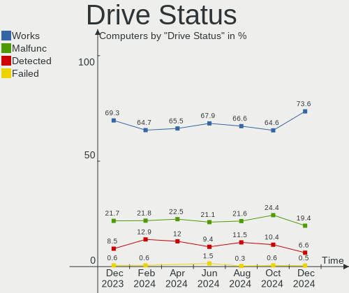

| Status   | Computers | Drives | Percent |
|----------|-----------|--------|---------|
| Works    | 479       | 756    | 66.34%  |
| Malfunc  | 176       | 206    | 24.38%  |
| Detected | 62        | 78     | 8.59%   |
| Failed   | 5         | 5      | 0.69%   |

Storage controller
------------------

Storage Vendor
--------------

Storage controller vendors

| Vendor                         | Computers | Percent |
|--------------------------------|-----------|---------|
| Intel                          | 421       | 53.56%  |
| AMD                            | 161       | 20.48%  |
| Samsung Electronics            | 42        | 5.34%   |
| SanDisk                        | 23        | 2.93%   |
| JMicron Technology             | 20        | 2.54%   |
| Phison Electronics             | 15        | 1.91%   |
| Micron/Crucial Technology      | 14        | 1.78%   |
| SK hynix                       | 12        | 1.53%   |
| Nvidia                         | 12        | 1.53%   |
| ASMedia Technology             | 11        | 1.4%    |
| Silicon Motion                 | 10        | 1.27%   |
| Micron Technology              | 10        | 1.27%   |
| Kingston Technology Company    | 8         | 1.02%   |
| Marvell Technology Group       | 7         | 0.89%   |
| KIOXIA                         | 3         | 0.38%   |
| Toshiba America Info Systems   | 2         | 0.25%   |
| Solid State Storage Technology | 2         | 0.25%   |
| Seagate Technology             | 2         | 0.25%   |
| Integrated Technology Express  | 2         | 0.25%   |
| ADATA Technology               | 2         | 0.25%   |
| VIA Technologies               | 1         | 0.13%   |
| Silicon Image                  | 1         | 0.13%   |
| Realtek Semiconductor          | 1         | 0.13%   |
| Promise Technology             | 1         | 0.13%   |
| MAXIO Technology (Hangzhou)    | 1         | 0.13%   |
| LSI Logic / Symbios Logic      | 1         | 0.13%   |
| Broadcom / LSI                 | 1         | 0.13%   |

Storage Model
-------------

Storage controller models

| Model                                                                          | Computers | Percent |
|--------------------------------------------------------------------------------|-----------|---------|
| AMD FCH SATA Controller [AHCI mode]                                            | 105       | 11.38%  |
| Intel 7 Series Chipset Family 6-port SATA Controller [AHCI mode]               | 37        | 4.01%   |
| Intel 8 Series/C220 Series Chipset Family 6-port SATA Controller 1 [AHCI mode] | 32        | 3.47%   |
| Intel Sunrise Point-LP SATA Controller [AHCI mode]                             | 30        | 3.25%   |
| Intel 6 Series/C200 Series Chipset Family 6 port Mobile SATA AHCI Controller   | 25        | 2.71%   |
| AMD SB7x0/SB8x0/SB9x0 SATA Controller [AHCI mode]                              | 21        | 2.28%   |
| Intel 6 Series/C200 Series Chipset Family 6 port Desktop SATA AHCI Controller  | 18        | 1.95%   |
| Samsung NVMe SSD Controller SM981/PM981/PM983                                  | 17        | 1.84%   |
| AMD SB7x0/SB8x0/SB9x0 IDE Controller                                           | 17        | 1.84%   |
| Intel 8 Series SATA Controller 1 [AHCI mode]                                   | 16        | 1.73%   |
| Samsung NVMe SSD Controller 980                                                | 15        | 1.63%   |
| Intel NM10/ICH7 Family SATA Controller [IDE mode]                              | 14        | 1.52%   |
| AMD 400 Series Chipset SATA Controller                                         | 14        | 1.52%   |
| Intel SATA Controller [RAID mode]                                              | 13        | 1.41%   |
| Intel 82801IBM/IEM (ICH9M/ICH9M-E) 4 port SATA Controller [AHCI mode]          | 13        | 1.41%   |
| Intel 82801 Mobile SATA Controller [RAID mode]                                 | 13        | 1.41%   |
| Intel 7 Series/C210 Series Chipset Family 6-port SATA Controller [AHCI mode]   | 13        | 1.41%   |
| JMicron JMB363 SATA/IDE Controller                                             | 12        | 1.3%    |
| Intel Wildcat Point-LP SATA Controller [AHCI Mode]                             | 12        | 1.3%    |
| Intel Q170/Q150/B150/H170/H110/Z170/CM236 Chipset SATA Controller [AHCI Mode]  | 12        | 1.3%    |
| AMD 500 Series Chipset SATA Controller                                         | 12        | 1.3%    |
| Intel 82801HM/HEM (ICH8M/ICH8M-E) IDE Controller                               | 11        | 1.19%   |
| Intel 5 Series/3400 Series Chipset 6 port SATA AHCI Controller                 | 11        | 1.19%   |
| ASMedia ASM1062 Serial ATA Controller                                          | 11        | 1.19%   |
| Silicon Motion SM2263EN/SM2263XT SSD Controller                                | 10        | 1.08%   |
| Micron Non-Volatile memory controller                                          | 10        | 1.08%   |
| Intel 82801G (ICH7 Family) IDE Controller                                      | 10        | 1.08%   |
| Intel 5 Series/3400 Series Chipset 4 port SATA AHCI Controller                 | 10        | 1.08%   |
| Intel 200 Series PCH SATA controller [AHCI mode]                               | 10        | 1.08%   |
| AMD SB7x0/SB8x0/SB9x0 SATA Controller [IDE mode]                               | 10        | 1.08%   |
| Intel Volume Management Device NVMe RAID Controller                            | 9         | 0.98%   |
| Intel 82801HM/HEM (ICH8M/ICH8M-E) SATA Controller [AHCI mode]                  | 9         | 0.98%   |
| AMD 300 Series Chipset SATA Controller                                         | 9         | 0.98%   |
| Nvidia MCP61 SATA Controller                                                   | 8         | 0.87%   |
| Nvidia MCP61 IDE                                                               | 8         | 0.87%   |
| SK hynix Gold P31/PC711 NVMe Solid State Drive                                 | 7         | 0.76%   |
| SanDisk WD Blue SN550 NVMe SSD                                                 | 7         | 0.76%   |
| Micron/Crucial P2 NVMe PCIe SSD                                                | 7         | 0.76%   |
| Intel Celeron/Pentium Silver Processor SATA Controller                         | 7         | 0.76%   |
| Intel Celeron N3350/Pentium N4200/Atom E3900 Series SATA AHCI Controller       | 7         | 0.76%   |

Storage Kind
------------

Kind of storage controller (IDE, SATA, NVMe, SAS, ...)

| Kind | Computers | Percent |
|------|-----------|---------|
| SATA | 501       | 63.66%  |
| NVMe | 138       | 17.53%  |
| IDE  | 104       | 13.21%  |
| RAID | 42        | 5.34%   |
| SAS  | 2         | 0.25%   |

Processor
---------

CPU Vendor
----------

Processor vendors

| Vendor | Computers | Percent |
|--------|-----------|---------|
| Intel  | 433       | 70.75%  |
| AMD    | 179       | 29.25%  |

CPU Model
---------

Processor models

| Model                                       | Computers | Percent |
|---------------------------------------------|-----------|---------|
| Intel Core i7-3630QM CPU @ 2.40GHz          | 6         | 0.98%   |
| Intel Core i5-4570 CPU @ 3.20GHz            | 6         | 0.98%   |
| Intel Core i5-2450M CPU @ 2.50GHz           | 6         | 0.98%   |
| Intel Core i5-2400 CPU @ 3.10GHz            | 6         | 0.98%   |
| Intel Core i3-5005U CPU @ 2.00GHz           | 6         | 0.98%   |
| Intel Core i7-8550U CPU @ 1.80GHz           | 5         | 0.82%   |
| Intel Core i5-7200U CPU @ 2.50GHz           | 5         | 0.82%   |
| Intel Core i5-6200U CPU @ 2.30GHz           | 5         | 0.82%   |
| Intel Core i5-3210M CPU @ 2.50GHz           | 5         | 0.82%   |
| Intel Core 2 Duo CPU E8400 @ 3.00GHz        | 5         | 0.82%   |
| AMD Ryzen 5 5500U with Radeon Graphics      | 5         | 0.82%   |
| AMD Ryzen 3 5300U with Radeon Graphics      | 5         | 0.82%   |
| Intel Core i7-7700HQ CPU @ 2.80GHz          | 4         | 0.65%   |
| Intel Core i7-7500U CPU @ 2.70GHz           | 4         | 0.65%   |
| Intel Core i7-6500U CPU @ 2.50GHz           | 4         | 0.65%   |
| Intel Core i7-3770 CPU @ 3.40GHz            | 4         | 0.65%   |
| Intel Core i7-2677M CPU @ 1.80GHz           | 4         | 0.65%   |
| Intel Core i5-7500 CPU @ 3.40GHz            | 4         | 0.65%   |
| Intel Core i5-4210U CPU @ 1.70GHz           | 4         | 0.65%   |
| Intel Core i5-3470 CPU @ 3.20GHz            | 4         | 0.65%   |
| Intel 11th Gen Core i7-1165G7 @ 2.80GHz     | 4         | 0.65%   |
| Intel Pentium Dual-Core CPU E5300 @ 2.60GHz | 3         | 0.49%   |
| Intel Core i7-8700 CPU @ 3.20GHz            | 3         | 0.49%   |
| Intel Core i7-7700 CPU @ 3.60GHz            | 3         | 0.49%   |
| Intel Core i7-4770 CPU @ 3.40GHz            | 3         | 0.49%   |
| Intel Core i5-8250U CPU @ 1.60GHz           | 3         | 0.49%   |
| Intel Core i5-3320M CPU @ 2.60GHz           | 3         | 0.49%   |
| Intel Core i5-3230M CPU @ 2.60GHz           | 3         | 0.49%   |
| Intel Core i5-2500K CPU @ 3.30GHz           | 3         | 0.49%   |
| Intel Core i5-2430M CPU @ 2.40GHz           | 3         | 0.49%   |
| Intel Core i5 CPU 650 @ 3.20GHz             | 3         | 0.49%   |
| Intel Core i3-4170 CPU @ 3.70GHz            | 3         | 0.49%   |
| Intel Core i3-4150 CPU @ 3.50GHz            | 3         | 0.49%   |
| Intel Core i3-4130 CPU @ 3.40GHz            | 3         | 0.49%   |
| Intel Core i3-2310M CPU @ 2.10GHz           | 3         | 0.49%   |
| Intel Core i3-2100 CPU @ 3.10GHz            | 3         | 0.49%   |
| Intel Core 2 Quad CPU Q6600 @ 2.40GHz       | 3         | 0.49%   |
| Intel Core 2 Duo CPU T8300 @ 2.40GHz        | 3         | 0.49%   |
| Intel Celeron CPU J3455 @ 1.50GHz           | 3         | 0.49%   |
| Intel Celeron CPU 847 @ 1.10GHz             | 3         | 0.49%   |

CPU Model Family
----------------

Processor model prefix

| Model                   | Computers | Percent |
|-------------------------|-----------|---------|
| Intel Core i5           | 132       | 21.57%  |
| Intel Core i7           | 85        | 13.89%  |
| Intel Core i3           | 61        | 9.97%   |
| Intel Celeron           | 37        | 6.05%   |
| AMD Ryzen 5             | 36        | 5.88%   |
| Intel Core 2 Duo        | 33        | 5.39%   |
| Other                   | 24        | 3.92%   |
| AMD Ryzen 3             | 20        | 3.27%   |
| AMD Ryzen 7             | 17        | 2.78%   |
| Intel Pentium           | 13        | 2.12%   |
| AMD FX                  | 12        | 1.96%   |
| Intel Xeon              | 11        | 1.8%    |
| Intel Pentium Dual-Core | 11        | 1.8%    |
| Intel Core 2 Quad       | 9         | 1.47%   |
| AMD A8                  | 9         | 1.47%   |
| AMD A10                 | 9         | 1.47%   |
| AMD Ryzen 9             | 8         | 1.31%   |
| AMD A6                  | 8         | 1.31%   |
| AMD Phenom II X4        | 5         | 0.82%   |
| AMD E1                  | 5         | 0.82%   |
| AMD E                   | 5         | 0.82%   |
| AMD A4                  | 5         | 0.82%   |
| Intel Pentium Dual      | 4         | 0.65%   |
| Intel Core 2            | 4         | 0.65%   |
| AMD Athlon II X2        | 4         | 0.65%   |
| AMD Athlon 64 X2        | 4         | 0.65%   |
| AMD Athlon              | 4         | 0.65%   |
| Intel Atom              | 3         | 0.49%   |
| AMD Phenom II X6        | 3         | 0.49%   |
| AMD C-60                | 3         | 0.49%   |
| AMD Athlon II X4        | 3         | 0.49%   |
| Intel Core i9           | 2         | 0.33%   |
| AMD Ryzen Threadripper  | 2         | 0.33%   |
| AMD Phenom II           | 2         | 0.33%   |
| AMD Athlon X4           | 2         | 0.33%   |
| Intel Pentium Silver    | 1         | 0.16%   |
| Intel Pentium Gold      | 1         | 0.16%   |
| Intel Pentium 4         | 1         | 0.16%   |
| Intel Genuine           | 1         | 0.16%   |
| Intel Core m7           | 1         | 0.16%   |

CPU Cores
---------

Number of processor cores

| Number | Computers | Percent |
|--------|-----------|---------|
| 2      | 296       | 48.37%  |
| 4      | 207       | 33.82%  |
| 6      | 49        | 8.01%   |
| 8      | 29        | 4.74%   |
| 1      | 10        | 1.63%   |
| 12     | 7         | 1.14%   |
| 16     | 4         | 0.65%   |
| 3      | 4         | 0.65%   |
| 24     | 2         | 0.33%   |
| 14     | 2         | 0.33%   |
| 28     | 1         | 0.16%   |
| 10     | 1         | 0.16%   |

CPU Sockets
-----------

Number of sockets

| Number | Computers | Percent |
|--------|-----------|---------|
| 1      | 608       | 99.35%  |
| 2      | 4         | 0.65%   |

CPU Threads
-----------

Threads per core (Hyper-Threading)

| Number | Computers | Percent |
|--------|-----------|---------|
| 2      | 365       | 59.64%  |
| 1      | 243       | 39.71%  |
| 4      | 3         | 0.49%   |
| 12     | 1         | 0.16%   |

CPU Op-Modes
------------

CPU Operation Modes (32-bit, 64-bit)

| Op mode        | Computers | Percent |
|----------------|-----------|---------|
| 32-bit, 64-bit | 612       | 100%    |

CPU Microcode
-------------

Microcode number

| Number     | Computers | Percent |
|------------|-----------|---------|
| 0x206a7    | 58        | 9.48%   |
| 0x306a9    | 46        | 7.52%   |
| 0x306c3    | 37        | 6.05%   |
| 0x1067a    | 33        | 5.39%   |
| Unknown    | 27        | 4.41%   |
| 0x20655    | 18        | 2.94%   |
| 0x40651    | 16        | 2.61%   |
| 0x806e9    | 15        | 2.45%   |
| 0x906ea    | 13        | 2.12%   |
| 0x906e9    | 13        | 2.12%   |
| 0x306d4    | 12        | 1.96%   |
| 0x506e3    | 11        | 1.8%    |
| 0x406e3    | 11        | 1.8%    |
| 0x10676    | 11        | 1.8%    |
| 0x08608103 | 10        | 1.63%   |
| 0x806ea    | 9         | 1.47%   |
| 0x806c1    | 9         | 1.47%   |
| 0x010000c8 | 9         | 1.47%   |
| 0x08108109 | 8         | 1.31%   |
| 0x08701021 | 7         | 1.14%   |
| 0x08600106 | 7         | 1.14%   |
| 0x06001119 | 7         | 1.14%   |
| 0x6fd      | 6         | 0.98%   |
| 0x506c9    | 6         | 0.98%   |
| 0x406c4    | 6         | 0.98%   |
| 0x106e5    | 6         | 0.98%   |
| 0x0800820d | 6         | 0.98%   |
| 0xa0653    | 5         | 0.82%   |
| 0xa0652    | 5         | 0.82%   |
| 0x706a1    | 5         | 0.82%   |
| 0x6fb      | 5         | 0.82%   |
| 0x08101016 | 5         | 0.82%   |
| 0x07030106 | 5         | 0.82%   |
| 0x0700010b | 5         | 0.82%   |
| 0x0600611a | 5         | 0.82%   |
| 0x906ed    | 4         | 0.65%   |
| 0x90672    | 4         | 0.65%   |
| 0x806ec    | 4         | 0.65%   |
| 0x706e5    | 4         | 0.65%   |
| 0x6f6      | 4         | 0.65%   |

CPU Microarch
-------------

Microarchitecture

| Name             | Computers | Percent |
|------------------|-----------|---------|
| KabyLake         | 63        | 10.29%  |
| SandyBridge      | 60        | 9.8%    |
| Haswell          | 57        | 9.31%   |
| IvyBridge        | 49        | 8.01%   |
| Penryn           | 48        | 7.84%   |
| Skylake          | 26        | 4.25%   |
| Zen+             | 22        | 3.59%   |
| K10              | 20        | 3.27%   |
| Zen 2            | 19        | 3.1%    |
| Westmere         | 19        | 3.1%    |
| Piledriver       | 18        | 2.94%   |
| Zen 3            | 17        | 2.78%   |
| Core             | 17        | 2.78%   |
| Zen              | 16        | 2.61%   |
| Broadwell        | 16        | 2.61%   |
| Excavator        | 14        | 2.29%   |
| Unknown          | 14        | 2.29%   |
| Silvermont       | 13        | 2.12%   |
| CometLake        | 13        | 2.12%   |
| Bobcat           | 10        | 1.63%   |
| TigerLake        | 9         | 1.47%   |
| Nehalem          | 9         | 1.47%   |
| Jaguar           | 8         | 1.31%   |
| Icelake          | 8         | 1.31%   |
| Alderlake Hybrid | 8         | 1.31%   |
| Puma             | 7         | 1.14%   |
| Goldmont plus    | 7         | 1.14%   |
| Goldmont         | 7         | 1.14%   |
| Steamroller      | 5         | 0.82%   |
| K8 Hammer        | 5         | 0.82%   |
| K10 Llano        | 2         | 0.33%   |
| Bulldozer        | 2         | 0.33%   |
| Tremont          | 1         | 0.16%   |
| NetBurst         | 1         | 0.16%   |
| K8 & K10 hybrid  | 1         | 0.16%   |
| Bonnell          | 1         | 0.16%   |

Graphics
--------

GPU Vendor
----------

Vendors of graphics cards

| Vendor                     | Computers | Percent |
|----------------------------|-----------|---------|
| Intel                      | 322       | 46.8%   |
| Nvidia                     | 184       | 26.74%  |
| AMD                        | 180       | 26.16%  |
| Matrox Electronics Systems | 1         | 0.15%   |
| ATI Technologies           | 1         | 0.15%   |

GPU Model
---------

Graphics card models

| Model                                                                                    | Computers | Percent |
|------------------------------------------------------------------------------------------|-----------|---------|
| Intel 2nd Generation Core Processor Family Integrated Graphics Controller                | 48        | 6.78%   |
| Intel 3rd Gen Core processor Graphics Controller                                         | 26        | 3.67%   |
| Intel Xeon E3-1200 v3/4th Gen Core Processor Integrated Graphics Controller              | 17        | 2.4%    |
| Intel Skylake GT2 [HD Graphics 520]                                                      | 14        | 1.98%   |
| Intel HD Graphics 620                                                                    | 14        | 1.98%   |
| Intel Haswell-ULT Integrated Graphics Controller                                         | 14        | 1.98%   |
| Intel Core Processor Integrated Graphics Controller                                      | 14        | 1.98%   |
| AMD Picasso/Raven 2 [Radeon Vega Series / Radeon Vega Mobile Series]                     | 14        | 1.98%   |
| Intel Mobile 4 Series Chipset Integrated Graphics Controller                             | 13        | 1.84%   |
| AMD Lucienne                                                                             | 12        | 1.69%   |
| Intel HD Graphics 5500                                                                   | 11        | 1.55%   |
| AMD Sun XT [Radeon HD 8670A/8670M/8690M / R5 M330 / M430 / Radeon 520 Mobile]            | 11        | 1.55%   |
| Nvidia GK208B [GeForce GT 710]                                                           | 10        | 1.41%   |
| Intel 4 Series Chipset Integrated Graphics Controller                                    | 10        | 1.41%   |
| Intel Xeon E3-1200 v2/3rd Gen Core processor Graphics Controller                         | 9         | 1.27%   |
| Intel Atom/Celeron/Pentium Processor x5-E8000/J3xxx/N3xxx Integrated Graphics Controller | 9         | 1.27%   |
| AMD Renoir                                                                               | 9         | 1.27%   |
| Nvidia GT218 [GeForce 210]                                                               | 8         | 1.13%   |
| Intel UHD Graphics 620                                                                   | 8         | 1.13%   |
| Intel 4th Generation Core Processor Family Integrated Graphics Controller                | 8         | 1.13%   |
| AMD Ellesmere [Radeon RX 470/480/570/570X/580/580X/590]                                  | 8         | 1.13%   |
| Intel TigerLake-LP GT2 [Iris Xe Graphics]                                                | 7         | 0.99%   |
| Intel HD Graphics 630                                                                    | 7         | 0.99%   |
| Intel HD Graphics 500                                                                    | 7         | 0.99%   |
| Intel GeminiLake [UHD Graphics 600]                                                      | 7         | 0.99%   |
| AMD Wani [Radeon R5/R6/R7 Graphics]                                                      | 7         | 0.99%   |
| AMD Cezanne [Radeon Vega Series / Radeon Vega Mobile Series]                             | 7         | 0.99%   |
| Nvidia GP108 [GeForce GT 1030]                                                           | 6         | 0.85%   |
| Nvidia GK208B [GeForce GT 730]                                                           | 6         | 0.85%   |
| Intel Mobile GM965/GL960 Integrated Graphics Controller (secondary)                      | 6         | 0.85%   |
| Intel Mobile GM965/GL960 Integrated Graphics Controller (primary)                        | 6         | 0.85%   |
| Intel HD Graphics 530                                                                    | 6         | 0.85%   |
| AMD Raven Ridge [Radeon Vega Series / Radeon Vega Mobile Series]                         | 6         | 0.85%   |
| AMD Mullins [Radeon R4/R5 Graphics]                                                      | 6         | 0.85%   |
| AMD Caicos [Radeon HD 6450/7450/8450 / R5 230 OEM]                                       | 6         | 0.85%   |
| Nvidia GP107M [GeForce GTX 1050 Mobile]                                                  | 5         | 0.71%   |
| Nvidia GP107 [GeForce GTX 1050]                                                          | 5         | 0.71%   |
| Nvidia GM107 [GeForce GTX 750 Ti]                                                        | 5         | 0.71%   |
| Intel CometLake-H GT2 [UHD Graphics]                                                     | 5         | 0.71%   |
| Intel CoffeeLake-S GT2 [UHD Graphics 630]                                                | 5         | 0.71%   |

GPU Combo
---------

Combinations of graphics cards

| Name               | Computers | Percent |
|--------------------|-----------|---------|
| 1 x Intel          | 233       | 38.07%  |
| 1 x AMD            | 147       | 24.02%  |
| 1 x Nvidia         | 121       | 19.77%  |
| Intel + Nvidia     | 53        | 8.66%   |
| 2 x Intel          | 21        | 3.43%   |
| Intel + AMD        | 14        | 2.29%   |
| 2 x AMD            | 12        | 1.96%   |
| AMD + Nvidia       | 8         | 1.31%   |
| 2 x Nvidia         | 1         | 0.16%   |
| 1 x Matrox         | 1         | 0.16%   |
| Intel + 2 x Nvidia | 1         | 0.16%   |

GPU Driver
----------

Free vs proprietary

| Driver      | Computers | Percent |
|-------------|-----------|---------|
| Free        | 594       | 97.06%  |
| Unknown     | 13        | 2.12%   |
| Proprietary | 5         | 0.82%   |

GPU Memory
----------

Total video memory

| Size in GB | Computers | Percent |
|------------|-----------|---------|
| Unknown    | 274       | 44.77%  |
| 1.01-2.0   | 96        | 15.69%  |
| 0.51-1.0   | 83        | 13.56%  |
| 0.01-0.5   | 81        | 13.24%  |
| 3.01-4.0   | 42        | 6.86%   |
| 7.01-8.0   | 21        | 3.43%   |
| 5.01-6.0   | 11        | 1.8%    |
| 2.01-3.0   | 2         | 0.33%   |
| 8.01-16.0  | 2         | 0.33%   |

Monitor
-------

Monitor Vendor
--------------

Monitor vendors

| Vendor                  | Computers | Percent |
|-------------------------|-----------|---------|
| Samsung Electronics     | 102       | 16.64%  |
| AU Optronics            | 64        | 10.44%  |
| LG Display              | 57        | 9.3%    |
| Chimei Innolux          | 43        | 7.01%   |
| BOE                     | 37        | 6.04%   |
| Goldstar                | 36        | 5.87%   |
| Hewlett-Packard         | 28        | 4.57%   |
| Acer                    | 25        | 4.08%   |
| AOC                     | 19        | 3.1%    |
| Philips                 | 18        | 2.94%   |
| Dell                    | 18        | 2.94%   |
| BenQ                    | 15        | 2.45%   |
| Iiyama                  | 13        | 2.12%   |
| Chi Mei Optoelectronics | 12        | 1.96%   |
| Ancor Communications    | 11        | 1.79%   |
| Lenovo                  | 10        | 1.63%   |
| Apple                   | 9         | 1.47%   |
| ViewSonic               | 8         | 1.31%   |
| ASUSTek Computer        | 7         | 1.14%   |
| Eizo                    | 6         | 0.98%   |
| Panasonic               | 5         | 0.82%   |
| Fujitsu Siemens         | 5         | 0.82%   |
| CPT                     | 5         | 0.82%   |
| Sony                    | 4         | 0.65%   |
| InfoVision              | 4         | 0.65%   |
| Sharp                   | 3         | 0.49%   |
| PANDA                   | 3         | 0.49%   |
| Medion                  | 3         | 0.49%   |
| HannStar                | 3         | 0.49%   |
| VIE                     | 2         | 0.33%   |
| Vestel Elektronik       | 2         | 0.33%   |
| Toshiba                 | 2         | 0.33%   |
| RTK                     | 2         | 0.33%   |
| NEC Computers           | 2         | 0.33%   |
| Compal                  | 2         | 0.33%   |
| Unknown (XXX)           | 1         | 0.16%   |
| TRI                     | 1         | 0.16%   |
| Tatung                  | 1         | 0.16%   |
| SKG                     | 1         | 0.16%   |
| Seiki                   | 1         | 0.16%   |

Monitor Model
-------------

Monitor models

| Model                                                                | Computers | Percent |
|----------------------------------------------------------------------|-----------|---------|
| Chimei Innolux LCD Monitor CMN15F5 1920x1080 344x193mm 15.5-inch     | 7         | 1.13%   |
| LG Display LCD Monitor LGD039F 1366x768 345x194mm 15.6-inch          | 5         | 0.81%   |
| CPT LCD Monitor COR17DB 1600x900 293x164mm 13.2-inch                 | 4         | 0.65%   |
| Samsung Electronics SyncMaster SAM0273 1440x900 410x257mm 19.1-inch  | 3         | 0.49%   |
| Samsung Electronics C34H89x SAM0E26 3440x1440 797x333mm 34.0-inch    | 3         | 0.49%   |
| Samsung Electronics C32F391 SAM0D34 1920x1080 698x393mm 31.5-inch    | 3         | 0.49%   |
| LG Display LCD Monitor LGD0395 1366x768 344x194mm 15.5-inch          | 3         | 0.49%   |
| Hewlett-Packard w1907 HWP26A2 1440x900 408x255mm 18.9-inch           | 3         | 0.49%   |
| Eizo EV3285 ENC2979 3840x2160 698x393mm 31.5-inch                    | 3         | 0.49%   |
| Chimei Innolux LCD Monitor CMN15DB 1366x768 344x193mm 15.5-inch      | 3         | 0.49%   |
| Chimei Innolux LCD Monitor CMN14D4 1920x1080 309x173mm 13.9-inch     | 3         | 0.49%   |
| BOE LCD Monitor BOE0812 1920x1080 344x194mm 15.5-inch                | 3         | 0.49%   |
| BOE LCD Monitor BOE069C 1920x1080 344x193mm 15.5-inch                | 3         | 0.49%   |
| AU Optronics LCD Monitor AUO71EC 1366x768 344x193mm 15.5-inch        | 3         | 0.49%   |
| AU Optronics LCD Monitor AUO45EC 1366x768 344x193mm 15.5-inch        | 3         | 0.49%   |
| AU Optronics LCD Monitor AUO38ED 1920x1080 344x193mm 15.5-inch       | 3         | 0.49%   |
| Apple Color LCD APP9CC7 1280x800 286x179mm 13.3-inch                 | 3         | 0.49%   |
| AOC 27G2G4 AOC2702 1920x1080 598x336mm 27.0-inch                     | 3         | 0.49%   |
| ViewSonic VX2363 Series VSC6B2F 1920x1080 509x286mm 23.0-inch        | 2         | 0.32%   |
| Vestel Elektronik 42 FHD_LCD-TV VES3700 1920x540                     | 2         | 0.32%   |
| Samsung Electronics U28E850 SAM0CCB 3840x2160 607x345mm 27.5-inch    | 2         | 0.32%   |
| Samsung Electronics LCD Monitor SEC364A 1366x768 344x194mm 15.5-inch | 2         | 0.32%   |
| Samsung Electronics LCD Monitor SEC324A 1366x768 344x194mm 15.5-inch | 2         | 0.32%   |
| Samsung Electronics LCD Monitor SEC3157 1280x800 303x190mm 14.1-inch | 2         | 0.32%   |
| Samsung Electronics LCD Monitor SDC4C51 1366x768 344x194mm 15.5-inch | 2         | 0.32%   |
| Philips PHL 276E8V PHLC18F 3840x2160 597x336mm 27.0-inch             | 2         | 0.32%   |
| Philips PHL 243V7 PHLC155 1920x1080 527x296mm 23.8-inch              | 2         | 0.32%   |
| Philips PHL 223V5 PHLC0CF 1920x1080 477x268mm 21.5-inch              | 2         | 0.32%   |
| Panasonic TV MEIA0A6 1920x1080 698x392mm 31.5-inch                   | 2         | 0.32%   |
| LG Display LCD Monitor LGD04E8 1920x1080 382x215mm 17.3-inch         | 2         | 0.32%   |
| LG Display LCD Monitor LGD046D 1920x1080 309x174mm 14.0-inch         | 2         | 0.32%   |
| LG Display LCD Monitor LGD03CD 1366x768 277x156mm 12.5-inch          | 2         | 0.32%   |
| LG Display LCD Monitor LGD038E 1366x768 344x194mm 15.5-inch          | 2         | 0.32%   |
| LG Display LCD Monitor LGD0384 1366x768 344x194mm 15.5-inch          | 2         | 0.32%   |
| LG Display LCD Monitor LGD02F1 1366x768 344x194mm 15.5-inch          | 2         | 0.32%   |
| LG Display LCD Monitor LGD02E3 1366x768 344x194mm 15.5-inch          | 2         | 0.32%   |
| LG Display LCD Monitor LGD02DC 1366x768 344x194mm 15.5-inch          | 2         | 0.32%   |
| Lenovo LCD Monitor LEN40A0 1366x768 309x173mm 13.9-inch              | 2         | 0.32%   |
| Goldstar Ultra HD GSM5B09 3840x2160 600x340mm 27.2-inch              | 2         | 0.32%   |
| Goldstar IPS FULLHD GSM5AB8 1920x1080 480x270mm 21.7-inch            | 2         | 0.32%   |

Monitor Resolution
------------------

Monitor screen resolution

| Resolution         | Computers | Percent |
|--------------------|-----------|---------|
| 1920x1080 (FHD)    | 252       | 41.86%  |
| 1366x768 (WXGA)    | 136       | 22.59%  |
| 3840x2160 (4K)     | 41        | 6.81%   |
| 1600x900 (HD+)     | 33        | 5.48%   |
| 1280x1024 (SXGA)   | 29        | 4.82%   |
| 1440x900 (WXGA+)   | 26        | 4.32%   |
| 2560x1440 (QHD)    | 22        | 3.65%   |
| 1680x1050 (WSXGA+) | 17        | 2.82%   |
| 1280x800 (WXGA)    | 11        | 1.83%   |
| 1920x1200 (WUXGA)  | 9         | 1.5%    |
| 3440x1440          | 6         | 1%      |
| 1360x768           | 4         | 0.66%   |
| 1920x540           | 3         | 0.5%    |
| 2560x1600          | 2         | 0.33%   |
| 2560x1080          | 2         | 0.33%   |
| 2160x1440          | 2         | 0.33%   |
| 3840x1080          | 1         | 0.17%   |
| 3200x1080          | 1         | 0.17%   |
| 1680x945           | 1         | 0.17%   |
| 1280x960           | 1         | 0.17%   |
| 1280x720 (HD)      | 1         | 0.17%   |
| 1024x768 (XGA)     | 1         | 0.17%   |
| Unknown            | 1         | 0.17%   |

Monitor Diagonal
----------------

Diagonal size in inches

| Inches  | Computers | Percent |
|---------|-----------|---------|
| 15      | 163       | 26.63%  |
| 17      | 54        | 8.82%   |
| 23      | 49        | 8.01%   |
| 27      | 48        | 7.84%   |
| 24      | 38        | 6.21%   |
| 21      | 37        | 6.05%   |
| 19      | 37        | 6.05%   |
| 14      | 33        | 5.39%   |
| 13      | 30        | 4.9%    |
| 31      | 24        | 3.92%   |
| 18      | 16        | 2.61%   |
| 22      | 12        | 1.96%   |
| 12      | 10        | 1.63%   |
| Unknown | 8         | 1.31%   |
| 34      | 7         | 1.14%   |
| 20      | 7         | 1.14%   |
| 11      | 6         | 0.98%   |
| 84      | 5         | 0.82%   |
| 16      | 3         | 0.49%   |
| 72      | 2         | 0.33%   |
| 54      | 2         | 0.33%   |
| 48      | 2         | 0.33%   |
| 40      | 2         | 0.33%   |
| 32      | 2         | 0.33%   |
| 25      | 2         | 0.33%   |
| 10      | 2         | 0.33%   |
| 65      | 1         | 0.16%   |
| 63      | 1         | 0.16%   |
| 57      | 1         | 0.16%   |
| 47      | 1         | 0.16%   |
| 42      | 1         | 0.16%   |
| 39      | 1         | 0.16%   |
| 37      | 1         | 0.16%   |
| 35      | 1         | 0.16%   |
| 29      | 1         | 0.16%   |
| 28      | 1         | 0.16%   |
| 26      | 1         | 0.16%   |

Monitor Width
-------------

Physical width

| Width in mm | Computers | Percent |
|-------------|-----------|---------|
| 301-350     | 223       | 36.92%  |
| 501-600     | 124       | 20.53%  |
| 401-500     | 92        | 15.23%  |
| 351-400     | 63        | 10.43%  |
| 201-300     | 33        | 5.46%   |
| 601-700     | 32        | 5.3%    |
| 701-800     | 9         | 1.49%   |
| Unknown     | 8         | 1.32%   |
| 1501-2000   | 7         | 1.16%   |
| 1001-1500   | 7         | 1.16%   |
| 801-900     | 5         | 0.83%   |
| 901-1000    | 1         | 0.17%   |

Aspect Ratio
------------

Proportional relationship between the width and the height

| Ratio   | Computers | Percent |
|---------|-----------|---------|
| 16/9    | 466       | 79.25%  |
| 16/10   | 67        | 11.39%  |
| 5/4     | 29        | 4.93%   |
| 21/9    | 8         | 1.36%   |
| 3/2     | 5         | 0.85%   |
| Unknown | 5         | 0.85%   |
| 4/3     | 3         | 0.51%   |
| 32/9    | 3         | 0.51%   |
| 6/5     | 1         | 0.17%   |
| 0.56    | 1         | 0.17%   |

Monitor Area
------------

Area in inch²

| Area in inch² | Computers | Percent |
|----------------|-----------|---------|
| 101-110        | 163       | 26.81%  |
| 201-250        | 112       | 18.42%  |
| 151-200        | 58        | 9.54%   |
| 81-90          | 52        | 8.55%   |
| 301-350        | 49        | 8.06%   |
| 351-500        | 36        | 5.92%   |
| 121-130        | 36        | 5.92%   |
| 141-150        | 25        | 4.11%   |
| More than 1000 | 13        | 2.14%   |
| 71-80          | 12        | 1.97%   |
| 251-300        | 12        | 1.97%   |
| 61-70          | 9         | 1.48%   |
| Unknown        | 8         | 1.32%   |
| 501-1000       | 7         | 1.15%   |
| 51-60          | 6         | 0.99%   |
| 131-140        | 6         | 0.99%   |
| 41-50          | 2         | 0.33%   |
| 111-120        | 2         | 0.33%   |

Pixel Density
-------------

Pixels per inch

| Density       | Computers | Percent |
|---------------|-----------|---------|
| 51-100        | 237       | 39.57%  |
| 101-120       | 188       | 31.39%  |
| 121-160       | 135       | 22.54%  |
| 161-240       | 18        | 3.01%   |
| 1-50          | 10        | 1.67%   |
| Unknown       | 8         | 1.34%   |
| More than 240 | 3         | 0.5%    |

Multiple Monitors
-----------------

Total monitors connected

| Total | Computers | Percent |
|-------|-----------|---------|
| 1     | 551       | 90.03%  |
| 2     | 48        | 7.84%   |
| 0     | 12        | 1.96%   |
| 3     | 1         | 0.16%   |

Network
-------

Net Controller Vendor
---------------------

Controller vendors

| Vendor                            | Computers | Percent |
|-----------------------------------|-----------|---------|
| Realtek Semiconductor             | 384       | 43.15%  |
| Intel                             | 227       | 25.51%  |
| Qualcomm Atheros                  | 130       | 14.61%  |
| Broadcom                          | 35        | 3.93%   |
| Marvell Technology Group          | 15        | 1.69%   |
| Ralink                            | 12        | 1.35%   |
| Nvidia                            | 10        | 1.12%   |
| Broadcom Limited                  | 8         | 0.9%    |
| Ralink Technology                 | 7         | 0.79%   |
| MediaTek                          | 7         | 0.79%   |
| Samsung Electronics               | 5         | 0.56%   |
| JMicron Technology                | 5         | 0.56%   |
| TP-Link                           | 4         | 0.45%   |
| Huawei Technologies               | 4         | 0.45%   |
| D-Link                            | 3         | 0.34%   |
| ASUSTek Computer                  | 3         | 0.34%   |
| ASIX Electronics                  | 3         | 0.34%   |
| Sierra Wireless                   | 2         | 0.22%   |
| NetGear                           | 2         | 0.22%   |
| Linksys                           | 2         | 0.22%   |
| Hewlett-Packard                   | 2         | 0.22%   |
| Belkin Components                 | 2         | 0.22%   |
| Xiaomi                            | 1         | 0.11%   |
| VIA Technologies                  | 1         | 0.11%   |
| Toshiba                           | 1         | 0.11%   |
| T & A Mobile Phones               | 1         | 0.11%   |
| Qualcomm Atheros Communications   | 1         | 0.11%   |
| Qualcomm                          | 1         | 0.11%   |
| OPPO                              | 1         | 0.11%   |
| Motorola PCS                      | 1         | 0.11%   |
| Mercucys                          | 1         | 0.11%   |
| LG Electronics                    | 1         | 0.11%   |
| FIBOCOM                           | 1         | 0.11%   |
| Ericsson Business Mobile Networks | 1         | 0.11%   |
| Edimax Technology                 | 1         | 0.11%   |
| DisplayLink                       | 1         | 0.11%   |
| Dell                              | 1         | 0.11%   |
| D-Link System                     | 1         | 0.11%   |
| Aquantia                          | 1         | 0.11%   |
| 3Com                              | 1         | 0.11%   |

Net Controller Model
--------------------

Controller models

| Model                                                             | Computers | Percent |
|-------------------------------------------------------------------|-----------|---------|
| Realtek RTL8111/8168/8411 PCI Express Gigabit Ethernet Controller | 282       | 27.33%  |
| Realtek RTL810xE PCI Express Fast Ethernet controller             | 52        | 5.04%   |
| Qualcomm Atheros AR9285 Wireless Network Adapter (PCI-Express)    | 21        | 2.03%   |
| Qualcomm Atheros QCA9377 802.11ac Wireless Network Adapter        | 20        | 1.94%   |
| Intel 82579LM Gigabit Network Connection (Lewisville)             | 19        | 1.84%   |
| Qualcomm Atheros AR9485 Wireless Network Adapter                  | 18        | 1.74%   |
| Realtek RTL8125 2.5GbE Controller                                 | 17        | 1.65%   |
| Qualcomm Atheros QCA9565 / AR9565 Wireless Network Adapter        | 17        | 1.65%   |
| Realtek RTL8723BE PCIe Wireless Network Adapter                   | 16        | 1.55%   |
| Intel Wi-Fi 6 AX200                                               | 15        | 1.45%   |
| Intel Wireless 7265                                               | 12        | 1.16%   |
| Intel Wireless 7260                                               | 12        | 1.16%   |
| Intel Wireless 8260                                               | 11        | 1.07%   |
| Realtek RTL8188EUS 802.11n Wireless Network Adapter               | 10        | 0.97%   |
| Intel Wireless 8265 / 8275                                        | 10        | 0.97%   |
| Intel Ethernet Connection I217-LM                                 | 10        | 0.97%   |
| Realtek RTL8822CE 802.11ac PCIe Wireless Network Adapter          | 9         | 0.87%   |
| Realtek RTL8821CE 802.11ac PCIe Wireless Network Adapter          | 9         | 0.87%   |
| Intel I211 Gigabit Network Connection                             | 9         | 0.87%   |
| Intel Dual Band Wireless-AC 3168NGW [Stone Peak]                  | 9         | 0.87%   |
| Broadcom BCM4313 802.11bgn Wireless Network Adapter               | 9         | 0.87%   |
| Realtek RTL8188EE Wireless Network Adapter                        | 8         | 0.78%   |
| Realtek RTL8822BE 802.11a/b/g/n/ac WiFi adapter                   | 7         | 0.68%   |
| Qualcomm Atheros AR9287 Wireless Network Adapter (PCI-Express)    | 7         | 0.68%   |
| Qualcomm Atheros AR8162 Fast Ethernet                             | 7         | 0.68%   |
| Qualcomm Atheros AR8151 v2.0 Gigabit Ethernet                     | 7         | 0.68%   |
| Nvidia MCP61 Ethernet                                             | 7         | 0.68%   |
| Intel Wireless 3165                                               | 7         | 0.68%   |
| Intel Wi-Fi 6 AX201                                               | 7         | 0.68%   |
| Qualcomm Atheros AR8161 Gigabit Ethernet                          | 6         | 0.58%   |
| Qualcomm Atheros AR8131 Gigabit Ethernet                          | 6         | 0.58%   |
| Realtek RTL8852AE 802.11ax PCIe Wireless Network Adapter          | 5         | 0.48%   |
| Realtek RTL8188CE 802.11b/g/n WiFi Adapter                        | 5         | 0.48%   |
| Qualcomm Atheros AR9462 Wireless Network Adapter                  | 5         | 0.48%   |
| JMicron JMC250 PCI Express Gigabit Ethernet Controller            | 5         | 0.48%   |
| Intel Wireless 3160                                               | 5         | 0.48%   |
| Intel Ethernet Controller I225-V                                  | 5         | 0.48%   |
| Intel Ethernet Connection I218-LM                                 | 5         | 0.48%   |
| Intel Ethernet Connection (2) I219-V                              | 5         | 0.48%   |
| Intel Centrino Wireless-N 2230                                    | 5         | 0.48%   |

Wireless Vendor
---------------

Wireless vendors

| Vendor                          | Computers | Percent |
|---------------------------------|-----------|---------|
| Intel                           | 157       | 37.03%  |
| Qualcomm Atheros                | 100       | 23.58%  |
| Realtek Semiconductor           | 91        | 21.46%  |
| Broadcom                        | 25        | 5.9%    |
| Ralink                          | 12        | 2.83%   |
| Ralink Technology               | 7         | 1.65%   |
| MediaTek                        | 6         | 1.42%   |
| Broadcom Limited                | 4         | 0.94%   |
| D-Link                          | 3         | 0.71%   |
| ASUSTek Computer                | 3         | 0.71%   |
| TP-Link                         | 2         | 0.47%   |
| Sierra Wireless                 | 2         | 0.47%   |
| Linksys                         | 2         | 0.47%   |
| Belkin Components               | 2         | 0.47%   |
| Qualcomm Atheros Communications | 1         | 0.24%   |
| NetGear                         | 1         | 0.24%   |
| Mercucys                        | 1         | 0.24%   |
| Marvell Technology Group        | 1         | 0.24%   |
| LG Electronics                  | 1         | 0.24%   |
| Hewlett-Packard                 | 1         | 0.24%   |
| FIBOCOM                         | 1         | 0.24%   |
| Edimax Technology               | 1         | 0.24%   |

Wireless Model
--------------

Wireless models

| Model                                                          | Computers | Percent |
|----------------------------------------------------------------|-----------|---------|
| Qualcomm Atheros AR9285 Wireless Network Adapter (PCI-Express) | 21        | 4.94%   |
| Qualcomm Atheros QCA9377 802.11ac Wireless Network Adapter     | 20        | 4.71%   |
| Qualcomm Atheros AR9485 Wireless Network Adapter               | 18        | 4.24%   |
| Qualcomm Atheros QCA9565 / AR9565 Wireless Network Adapter     | 17        | 4%      |
| Realtek RTL8723BE PCIe Wireless Network Adapter                | 16        | 3.76%   |
| Intel Wi-Fi 6 AX200                                            | 15        | 3.53%   |
| Intel Wireless 7265                                            | 12        | 2.82%   |
| Intel Wireless 7260                                            | 12        | 2.82%   |
| Intel Wireless 8260                                            | 11        | 2.59%   |
| Realtek RTL8188EUS 802.11n Wireless Network Adapter            | 10        | 2.35%   |
| Intel Wireless 8265 / 8275                                     | 10        | 2.35%   |
| Realtek RTL8822CE 802.11ac PCIe Wireless Network Adapter       | 9         | 2.12%   |
| Realtek RTL8821CE 802.11ac PCIe Wireless Network Adapter       | 9         | 2.12%   |
| Intel Dual Band Wireless-AC 3168NGW [Stone Peak]               | 9         | 2.12%   |
| Broadcom BCM4313 802.11bgn Wireless Network Adapter            | 9         | 2.12%   |
| Realtek RTL8188EE Wireless Network Adapter                     | 8         | 1.88%   |
| Realtek RTL8822BE 802.11a/b/g/n/ac WiFi adapter                | 7         | 1.65%   |
| Qualcomm Atheros AR9287 Wireless Network Adapter (PCI-Express) | 7         | 1.65%   |
| Intel Wireless 3165                                            | 7         | 1.65%   |
| Intel Wi-Fi 6 AX201                                            | 7         | 1.65%   |
| Realtek RTL8852AE 802.11ax PCIe Wireless Network Adapter       | 5         | 1.18%   |
| Realtek RTL8188CE 802.11b/g/n WiFi Adapter                     | 5         | 1.18%   |
| Qualcomm Atheros AR9462 Wireless Network Adapter               | 5         | 1.18%   |
| Intel Wireless 3160                                            | 5         | 1.18%   |
| Intel Centrino Wireless-N 2230                                 | 5         | 1.18%   |
| Intel Centrino Ultimate-N 6300                                 | 5         | 1.18%   |
| Intel Centrino Advanced-N 6205 [Taylor Peak]                   | 5         | 1.18%   |
| Broadcom BCM4331 802.11a/b/g/n                                 | 5         | 1.18%   |
| Realtek RTL8821AE 802.11ac PCIe Wireless Network Adapter       | 4         | 0.94%   |
| Ralink MT7601U Wireless Adapter                                | 4         | 0.94%   |
| Ralink RT5390 Wireless 802.11n 1T/1R PCIe                      | 4         | 0.94%   |
| MediaTek MT7921 802.11ax PCI Express Wireless Network Adapter  | 4         | 0.94%   |
| Intel WiFi Link 5100                                           | 4         | 0.94%   |
| Intel Tiger Lake PCH CNVi WiFi                                 | 4         | 0.94%   |
| Intel Comet Lake PCH CNVi WiFi                                 | 4         | 0.94%   |
| Realtek RTL8723AE PCIe Wireless Network Adapter                | 3         | 0.71%   |
| Ralink RT3290 Wireless 802.11n 1T/1R PCIe                      | 3         | 0.71%   |
| Qualcomm Atheros QCA6174 802.11ac Wireless Network Adapter     | 3         | 0.71%   |
| Intel Wi-Fi 6 AX210/AX211/AX411 160MHz                         | 3         | 0.71%   |
| Intel PRO/Wireless 3945ABG [Golan] Network Connection          | 3         | 0.71%   |

Ethernet Vendor
---------------

Ethernet vendors

| Vendor                   | Computers | Percent |
|--------------------------|-----------|---------|
| Realtek Semiconductor    | 357       | 60%     |
| Intel                    | 119       | 20%     |
| Qualcomm Atheros         | 43        | 7.23%   |
| Broadcom                 | 18        | 3.03%   |
| Marvell Technology Group | 14        | 2.35%   |
| Nvidia                   | 10        | 1.68%   |
| Samsung Electronics      | 5         | 0.84%   |
| JMicron Technology       | 5         | 0.84%   |
| Broadcom Limited         | 4         | 0.67%   |
| Huawei Technologies      | 3         | 0.5%    |
| ASIX Electronics         | 3         | 0.5%    |
| TP-Link                  | 2         | 0.34%   |
| Xiaomi                   | 1         | 0.17%   |
| VIA Technologies         | 1         | 0.17%   |
| T & A Mobile Phones      | 1         | 0.17%   |
| Qualcomm                 | 1         | 0.17%   |
| OPPO                     | 1         | 0.17%   |
| NetGear                  | 1         | 0.17%   |
| Motorola PCS             | 1         | 0.17%   |
| MediaTek                 | 1         | 0.17%   |
| DisplayLink              | 1         | 0.17%   |
| D-Link System            | 1         | 0.17%   |
| Aquantia                 | 1         | 0.17%   |
| 3Com                     | 1         | 0.17%   |

Ethernet Model
--------------

Ethernet models

| Model                                                             | Computers | Percent |
|-------------------------------------------------------------------|-----------|---------|
| Realtek RTL8111/8168/8411 PCI Express Gigabit Ethernet Controller | 282       | 46.84%  |
| Realtek RTL810xE PCI Express Fast Ethernet controller             | 52        | 8.64%   |
| Intel 82579LM Gigabit Network Connection (Lewisville)             | 19        | 3.16%   |
| Realtek RTL8125 2.5GbE Controller                                 | 17        | 2.82%   |
| Intel Ethernet Connection I217-LM                                 | 10        | 1.66%   |
| Intel I211 Gigabit Network Connection                             | 9         | 1.5%    |
| Qualcomm Atheros AR8162 Fast Ethernet                             | 7         | 1.16%   |
| Qualcomm Atheros AR8151 v2.0 Gigabit Ethernet                     | 7         | 1.16%   |
| Nvidia MCP61 Ethernet                                             | 7         | 1.16%   |
| Qualcomm Atheros AR8161 Gigabit Ethernet                          | 6         | 1%      |
| Qualcomm Atheros AR8131 Gigabit Ethernet                          | 6         | 1%      |
| JMicron JMC250 PCI Express Gigabit Ethernet Controller            | 5         | 0.83%   |
| Intel Ethernet Controller I225-V                                  | 5         | 0.83%   |
| Intel Ethernet Connection I218-LM                                 | 5         | 0.83%   |
| Intel Ethernet Connection (2) I219-V                              | 5         | 0.83%   |
| Intel 82579V Gigabit Network Connection                           | 5         | 0.83%   |
| Intel 82567LM-3 Gigabit Network Connection                        | 5         | 0.83%   |
| Samsung Galaxy series, misc. (tethering mode)                     | 4         | 0.66%   |
| Realtek RTL8153 Gigabit Ethernet Adapter                          | 4         | 0.66%   |
| Qualcomm Atheros Killer E220x Gigabit Ethernet Controller         | 4         | 0.66%   |
| Qualcomm Atheros AR8121/AR8113/AR8114 Gigabit or Fast Ethernet    | 4         | 0.66%   |
| Marvell Group 88E8056 PCI-E Gigabit Ethernet Controller           | 4         | 0.66%   |
| Intel Ethernet Connection I219-LM                                 | 4         | 0.66%   |
| Intel Ethernet Connection I217-V                                  | 4         | 0.66%   |
| Intel Ethernet Connection (7) I219-V                              | 4         | 0.66%   |
| Intel 82577LM Gigabit Network Connection                          | 4         | 0.66%   |
| Broadcom NetXtreme BCM57765 Gigabit Ethernet PCIe                 | 4         | 0.66%   |
| Qualcomm Atheros AR8152 v2.0 Fast Ethernet                        | 3         | 0.5%    |
| Marvell Group 88E8058 PCI-E Gigabit Ethernet Controller           | 3         | 0.5%    |
| Intel Ethernet Connection (4) I219-V                              | 3         | 0.5%    |
| Intel Ethernet Connection (3) I218-LM                             | 3         | 0.5%    |
| Intel Ethernet Connection (10) I219-V                             | 3         | 0.5%    |
| Intel 82566DM-2 Gigabit Network Connection                        | 3         | 0.5%    |
| Intel 82562V 10/100 Network Connection                            | 3         | 0.5%    |
| TP-Link UE300 10/100/1000 LAN (ethernet mode) [Realtek RTL8153]   | 2         | 0.33%   |
| Realtek RTL-8100/8101L/8139 PCI Fast Ethernet Adapter             | 2         | 0.33%   |
| Qualcomm Atheros Attansic L1 Gigabit Ethernet                     | 2         | 0.33%   |
| Nvidia MCP77 Ethernet                                             | 2         | 0.33%   |
| Marvell Group 88E8055 PCI-E Gigabit Ethernet Controller           | 2         | 0.33%   |
| Marvell Group 88E8040 PCI-E Fast Ethernet Controller              | 2         | 0.33%   |

Net Controller Kind
-------------------

Ethernet, WiFi or modem

| Kind     | Computers | Percent |
|----------|-----------|---------|
| Ethernet | 563       | 57.45%  |
| WiFi     | 412       | 42.04%  |
| Modem    | 5         | 0.51%   |

Used Controller
---------------

Currently used network controller

| Kind     | Computers | Percent |
|----------|-----------|---------|
| Ethernet | 330       | 55.74%  |
| WiFi     | 262       | 44.26%  |

NICs
----

Total network controllers on board

| Total | Computers | Percent |
|-------|-----------|---------|
| 2     | 334       | 54.58%  |
| 1     | 264       | 43.14%  |
| 3     | 10        | 1.63%   |
| 0     | 4         | 0.65%   |

IPv6
----

IPv6 vs IPv4

| Used | Computers | Percent |
|------|-----------|---------|
| No   | 402       | 65.69%  |
| Yes  | 210       | 34.31%  |

Bluetooth
---------

Bluetooth Vendor
----------------

Controller vendors

| Vendor                          | Computers | Percent |
|---------------------------------|-----------|---------|
| Intel                           | 124       | 39.24%  |
| Realtek Semiconductor           | 44        | 13.92%  |
| Cambridge Silicon Radio         | 23        | 7.28%   |
| Qualcomm Atheros Communications | 22        | 6.96%   |
| IMC Networks                    | 20        | 6.33%   |
| Lite-On Technology              | 17        | 5.38%   |
| Broadcom                        | 16        | 5.06%   |
| Apple                           | 11        | 3.48%   |
| Foxconn / Hon Hai               | 9         | 2.85%   |
| Dell                            | 6         | 1.9%    |
| ASUSTek Computer                | 4         | 1.27%   |
| Toshiba                         | 3         | 0.95%   |
| Ralink                          | 3         | 0.95%   |
| Hewlett-Packard                 | 2         | 0.63%   |
| Alps Electric                   | 2         | 0.63%   |
| TP-Link                         | 1         | 0.32%   |
| Realtek                         | 1         | 0.32%   |
| Qcom                            | 1         | 0.32%   |
| MediaTek                        | 1         | 0.32%   |
| Marvell Semiconductor           | 1         | 0.32%   |
| Integrated System Solution      | 1         | 0.32%   |
| Foxconn International           | 1         | 0.32%   |
| Dynex                           | 1         | 0.32%   |
| Belkin Components               | 1         | 0.32%   |
| Askey Computer                  | 1         | 0.32%   |

Bluetooth Model
---------------

Controller models

| Model                                               | Computers | Percent |
|-----------------------------------------------------|-----------|---------|
| Intel Bluetooth wireless interface                  | 58        | 18.35%  |
| Realtek Bluetooth Radio                             | 34        | 10.76%  |
| Cambridge Silicon Radio Bluetooth Dongle (HCI mode) | 23        | 7.28%   |
| Intel AX201 Bluetooth                               | 16        | 5.06%   |
| Qualcomm Atheros  Bluetooth Device                  | 14        | 4.43%   |
| Intel AX200 Bluetooth                               | 14        | 4.43%   |
| Intel Bluetooth 9460/9560 Jefferson Peak (JfP)      | 13        | 4.11%   |
| Intel Wireless-AC 3168 Bluetooth                    | 8         | 2.53%   |
| IMC Networks Bluetooth Radio                        | 8         | 2.53%   |
| Realtek  Bluetooth 4.2 Adapter                      | 7         | 2.22%   |
| Qualcomm Atheros AR3011 Bluetooth                   | 6         | 1.9%    |
| Intel Centrino Bluetooth Wireless Transceiver       | 6         | 1.9%    |
| IMC Networks Bluetooth Device                       | 6         | 1.9%    |
| Foxconn / Hon Hai Bluetooth Device                  | 6         | 1.9%    |
| Lite-On Qualcomm Atheros QCA9377 Bluetooth          | 5         | 1.58%   |
| Lite-On Wireless_Device                             | 4         | 1.27%   |
| Broadcom BCM2045B (BDC-2.1)                         | 4         | 1.27%   |
| Ralink RT3290 Bluetooth                             | 3         | 0.95%   |
| Lite-On Bluetooth Device                            | 3         | 0.95%   |
| Intel Centrino Advanced-N 6230 Bluetooth adapter    | 3         | 0.95%   |
| Intel AX210 Bluetooth                               | 3         | 0.95%   |
| IMC Networks Atheros AR3012 Bluetooth 4.0 Adapter   | 3         | 0.95%   |
| Dell Wireless 360 Bluetooth                         | 3         | 0.95%   |
| Broadcom BCM20702A0 Bluetooth 4.0                   | 3         | 0.95%   |
| Apple Bluetooth USB Host Controller                 | 3         | 0.95%   |
| Apple Bluetooth Host Controller                     | 3         | 0.95%   |
| Realtek RTL8821A Bluetooth                          | 2         | 0.63%   |
| Qualcomm Atheros AR3012 Bluetooth 4.0               | 2         | 0.63%   |
| Lite-On Atheros AR3012 Bluetooth                    | 2         | 0.63%   |
| Intel Wireless-AC 9260 Bluetooth Adapter            | 2         | 0.63%   |
| HP Broadcom 2070 Bluetooth Combo                    | 2         | 0.63%   |
| Foxconn / Hon Hai Bluetooth USB Host Controller     | 2         | 0.63%   |
| Dell DW375 Bluetooth Module                         | 2         | 0.63%   |
| Broadcom BCM43142A0 Bluetooth 4.0                   | 2         | 0.63%   |
| Broadcom BCM20702 Bluetooth 4.0 [ThinkPad]          | 2         | 0.63%   |
| Broadcom BCM2070 Bluetooth Device                   | 2         | 0.63%   |
| ASUS ASUS USB-BT500                                 | 2         | 0.63%   |
| Apple Bluetooth HCI MacBookPro (HID mode)           | 2         | 0.63%   |
| Apple Bluetooth HCI                                 | 2         | 0.63%   |
| Alps Electric BCM2046 Bluetooth Device              | 2         | 0.63%   |

Sound
-----

Sound Vendor
------------

Sound card vendors

| Vendor                     | Computers | Percent |
|----------------------------|-----------|---------|
| Intel                      | 425       | 51.89%  |
| AMD                        | 198       | 24.18%  |
| Nvidia                     | 140       | 17.09%  |
| C-Media Electronics        | 21        | 2.56%   |
| Creative Labs              | 6         | 0.73%   |
| Generalplus Technology     | 4         | 0.49%   |
| Tenx Technology            | 2         | 0.24%   |
| Razer USA                  | 2         | 0.24%   |
| Logitech                   | 2         | 0.24%   |
| JMTek                      | 2         | 0.24%   |
| ASUSTek Computer           | 2         | 0.24%   |
| XMOS                       | 1         | 0.12%   |
| Texas Instruments          | 1         | 0.12%   |
| SteelSeries ApS            | 1         | 0.12%   |
| QinHeng Electronics        | 1         | 0.12%   |
| PreSonus Audio Electronics | 1         | 0.12%   |
| Plantronics                | 1         | 0.12%   |
| Kingston Technology        | 1         | 0.12%   |
| iCreate Technologies       | 1         | 0.12%   |
| Harman                     | 1         | 0.12%   |
| Dell                       | 1         | 0.12%   |
| Creative Technology        | 1         | 0.12%   |
| Bose                       | 1         | 0.12%   |
| BEHRINGER International    | 1         | 0.12%   |
| ATI Technologies           | 1         | 0.12%   |
| Alesis                     | 1         | 0.12%   |

Sound Model
-----------

Sound card models

| Model                                                                             | Computers | Percent |
|-----------------------------------------------------------------------------------|-----------|---------|
| Intel 7 Series/C216 Chipset Family High Definition Audio Controller               | 57        | 5.61%   |
| AMD Family 17h/19h HD Audio Controller                                            | 54        | 5.31%   |
| Intel 6 Series/C200 Series Chipset Family High Definition Audio Controller        | 51        | 5.02%   |
| Intel Sunrise Point-LP HD Audio                                                   | 38        | 3.74%   |
| AMD FCH Azalia Controller                                                         | 35        | 3.44%   |
| AMD Renoir Radeon High Definition Audio Controller                                | 32        | 3.15%   |
| Intel 8 Series/C220 Series Chipset High Definition Audio Controller               | 31        | 3.05%   |
| AMD SBx00 Azalia (Intel HDA)                                                      | 31        | 3.05%   |
| Intel Xeon E3-1200 v3/4th Gen Core Processor HD Audio Controller                  | 30        | 2.95%   |
| Intel 5 Series/3400 Series Chipset High Definition Audio                          | 24        | 2.36%   |
| Intel 82801I (ICH9 Family) HD Audio Controller                                    | 22        | 2.17%   |
| AMD Kabini HDMI/DP Audio                                                          | 22        | 2.17%   |
| AMD Raven/Raven2/Fenghuang HDMI/DP Audio Controller                               | 19        | 1.87%   |
| Nvidia GK208 HDMI/DP Audio Controller                                             | 17        | 1.67%   |
| Nvidia High Definition Audio Controller                                           | 16        | 1.57%   |
| Intel Haswell-ULT HD Audio Controller                                             | 16        | 1.57%   |
| Intel 82801H (ICH8 Family) HD Audio Controller                                    | 16        | 1.57%   |
| Intel 8 Series HD Audio Controller                                                | 16        | 1.57%   |
| AMD Family 17h (Models 00h-0fh) HD Audio Controller                               | 16        | 1.57%   |
| Intel NM10/ICH7 Family High Definition Audio Controller                           | 15        | 1.48%   |
| AMD Starship/Matisse HD Audio Controller                                          | 15        | 1.48%   |
| Intel 100 Series/C230 Series Chipset Family HD Audio Controller                   | 14        | 1.38%   |
| Intel Wildcat Point-LP High Definition Audio Controller                           | 13        | 1.28%   |
| Intel Cannon Lake PCH cAVS                                                        | 13        | 1.28%   |
| Intel Broadwell-U Audio Controller                                                | 13        | 1.28%   |
| AMD Family 15h (Models 60h-6fh) Audio Controller                                  | 13        | 1.28%   |
| Nvidia GP107GL High Definition Audio Controller                                   | 12        | 1.18%   |
| Intel 200 Series PCH HD Audio                                                     | 11        | 1.08%   |
| AMD Wrestler HDMI Audio                                                           | 10        | 0.98%   |
| Nvidia GF108 High Definition Audio Controller                                     | 9         | 0.89%   |
| Intel Tiger Lake-LP Smart Sound Technology Audio Controller                       | 9         | 0.89%   |
| Intel 82801JI (ICH10 Family) HD Audio Controller                                  | 9         | 0.89%   |
| AMD Baffin HDMI/DP Audio [Radeon RX 550 640SP / RX 560/560X]                      | 9         | 0.89%   |
| Nvidia TU116 High Definition Audio Controller                                     | 8         | 0.79%   |
| Nvidia GM107 High Definition Audio Controller [GeForce 940MX]                     | 8         | 0.79%   |
| Nvidia GK107 HDMI Audio Controller                                                | 8         | 0.79%   |
| AMD Ellesmere HDMI Audio [Radeon RX 470/480 / 570/580/590]                        | 8         | 0.79%   |
| AMD Caicos HDMI Audio [Radeon HD 6450 / 7450/8450/8490 OEM / R5 230/235/235X OEM] | 8         | 0.79%   |
| Nvidia MCP61 High Definition Audio                                                | 7         | 0.69%   |
| Nvidia GP106 High Definition Audio Controller                                     | 7         | 0.69%   |

Memory
------

Memory Vendor
-------------

Memory module vendors

| Vendor                       | Computers | Percent |
|------------------------------|-----------|---------|
| Samsung Electronics          | 120       | 15.69%  |
| SK hynix                     | 115       | 15.03%  |
| Kingston                     | 111       | 14.51%  |
| Unknown                      | 94        | 12.29%  |
| Micron Technology            | 75        | 9.8%    |
| Crucial                      | 50        | 6.54%   |
| Corsair                      | 36        | 4.71%   |
| G.Skill                      | 32        | 4.18%   |
| A-DATA Technology            | 17        | 2.22%   |
| Nanya Technology             | 13        | 1.7%    |
| Ramaxel Technology           | 12        | 1.57%   |
| Elpida                       | 11        | 1.44%   |
| Patriot                      | 9         | 1.18%   |
| Team                         | 8         | 1.05%   |
| Smart                        | 8         | 1.05%   |
| Unknown                      | 8         | 1.05%   |
| GOODRAM                      | 7         | 0.92%   |
| Transcend                    | 4         | 0.52%   |
| Apacer                       | 3         | 0.39%   |
| Super Talent                 | 2         | 0.26%   |
| PNY                          | 2         | 0.26%   |
| Patriot Memory (PDP Systems) | 2         | 0.26%   |
| Multilaser                   | 2         | 0.26%   |
| CSX                          | 2         | 0.26%   |
| AMD                          | 2         | 0.26%   |
| V-Color                      | 1         | 0.13%   |
| Unknown (ABCD)               | 1         | 0.13%   |
| Unknown (AB)                 | 1         | 0.13%   |
| Unknown (8AA1)               | 1         | 0.13%   |
| Unknown (89F7)               | 1         | 0.13%   |
| Unknown (0x02BA)             | 1         | 0.13%   |
| Timetec                      | 1         | 0.13%   |
| Teikon                       | 1         | 0.13%   |
| Smart Brazil                 | 1         | 0.13%   |
| Silicon Power                | 1         | 0.13%   |
| Qimonda                      | 1         | 0.13%   |
| Panram                       | 1         | 0.13%   |
| Lexar                        | 1         | 0.13%   |
| KETECH                       | 1         | 0.13%   |
| JOY-IT                       | 1         | 0.13%   |

Memory Model
------------

Memory module models

| Model                                                        | Computers | Percent |
|--------------------------------------------------------------|-----------|---------|
| Unknown RAM Module 4GB DIMM 1333MT/s                         | 9         | 1.12%   |
| Unknown RAM Module 2GB DIMM 800MT/s                          | 9         | 1.12%   |
| SK hynix RAM HMT451S6BFR8A-PB 4GB SODIMM DDR3 1600MT/s       | 9         | 1.12%   |
| Unknown                                                      | 8         | 0.99%   |
| SK hynix RAM HMT351S6CFR8C-PB 4GB SODIMM DDR3 1600MT/s       | 7         | 0.87%   |
| Samsung RAM M471B5273CH0-CH9 4GB SODIMM DDR3 1334MT/s        | 7         | 0.87%   |
| Samsung RAM M471A5244CB0-CTD 4GB SODIMM DDR4 3266MT/s        | 7         | 0.87%   |
| Samsung RAM M471B5773DH0-CH9 2GB SODIMM DDR3 1600MT/s        | 6         | 0.74%   |
| Micron RAM 4ATF51264HZ-2G3B1 4096MB SODIMM DDR4 2400MT/s     | 6         | 0.74%   |
| Unknown RAM Module 4GB DIMM DDR3 1333MT/s                    | 5         | 0.62%   |
| Unknown RAM Module 2GB DIMM DDR2 800MT/s                     | 5         | 0.62%   |
| Samsung RAM M471B5273DH0-CH9 4GB SODIMM DDR3 1334MT/s        | 5         | 0.62%   |
| Samsung RAM M471B5173QH0-YK0 4GB SODIMM DDR3 1600MT/s        | 5         | 0.62%   |
| Samsung RAM M471A1K43CB1-CRC 8GB SODIMM DDR4 2667MT/s        | 5         | 0.62%   |
| Unknown RAM Module 2GB SODIMM DDR2                           | 4         | 0.5%    |
| SK hynix RAM HMT425S6AFR6A-PB 2GB SODIMM DDR3 3200MT/s       | 4         | 0.5%    |
| Samsung RAM M471B5273CH0-CK0 4GB SODIMM DDR3 1600MT/s        | 4         | 0.5%    |
| Samsung RAM M471B5173EB0-YK0 4GB SODIMM DDR3 1600MT/s        | 4         | 0.5%    |
| Kingston RAM KHX2400C15/8G 8GB DIMM DDR4 3400MT/s            | 4         | 0.5%    |
| Kingston RAM 99U5474-028.A00LF 4GB DIMM DDR3 1333MT/s        | 4         | 0.5%    |
| Elpida RAM Module 2GB SODIMM DDR3 1333MT/s                   | 4         | 0.5%    |
| Unknown RAM Module 4GB SODIMM DDR3                           | 3         | 0.37%   |
| Unknown RAM Module 2GB SODIMM DDR2 667MT/s                   | 3         | 0.37%   |
| Unknown RAM Module 2GB SODIMM 800MT/s                        | 3         | 0.37%   |
| Unknown RAM Module 2GB DIMM 1333MT/s                         | 3         | 0.37%   |
| SK hynix RAM HYMP125S64CP8-S6 2GB SODIMM DDR2 800MT/s        | 3         | 0.37%   |
| SK hynix RAM HMT41GS6BFR8A-PB 8GB SODIMM DDR3 1600MT/s       | 3         | 0.37%   |
| SK hynix RAM HMT351U6CFR8C-PB 4GB DIMM DDR3 1800MT/s         | 3         | 0.37%   |
| SK hynix RAM HMA851S6DJR6N-XN 4GB Row Of Chips DDR4 3200MT/s | 3         | 0.37%   |
| SK hynix RAM HMA81GS6AFR8N-UH 8GB SODIMM DDR4 2667MT/s       | 3         | 0.37%   |
| Samsung RAM M471B5773CHS-CH9 2GB SODIMM DDR3 4199MT/s        | 3         | 0.37%   |
| Samsung RAM M471B1G73EB0-YK0 8192MB SODIMM DDR3 1600MT/s     | 3         | 0.37%   |
| Samsung RAM M471B1G73DB0-YK0 8192MB SODIMM DDR3 1600MT/s     | 3         | 0.37%   |
| Samsung RAM M471A5244CB0-CRC 4GB SODIMM DDR4 2667MT/s        | 3         | 0.37%   |
| Samsung RAM M471A1K43EB1-CWE 8GB SODIMM DDR4 3200MT/s        | 3         | 0.37%   |
| Samsung RAM M471A1K43BB1-CRC 8GB SODIMM DDR4 2667MT/s        | 3         | 0.37%   |
| Ramaxel RAM RMSA3310MJ86H9F-3200 4GB SODIMM DDR4 3200MT/s    | 3         | 0.37%   |
| Micron RAM Module 4GB SODIMM DDR3 1600MT/s                   | 3         | 0.37%   |
| Micron RAM 8KTF51264HZ-1G6N1 4GB SODIMM DDR3 1600MT/s        | 3         | 0.37%   |
| Micron RAM 8KTF51264HDZ-1G4E1 4GB SODIMM DDR3 1333MT/s       | 3         | 0.37%   |

Memory Kind
-----------

Memory module kinds

| Kind    | Computers | Percent |
|---------|-----------|---------|
| DDR3    | 278       | 44.98%  |
| DDR4    | 219       | 35.44%  |
| DDR2    | 38        | 6.15%   |
| Unknown | 36        | 5.83%   |
| SDRAM   | 26        | 4.21%   |
| LPDDR4  | 7         | 1.13%   |
| LPDDR3  | 6         | 0.97%   |
| DDR     | 5         | 0.81%   |
| DDR5    | 3         | 0.49%   |

Memory Form Factor
------------------

Physical design of the memory module

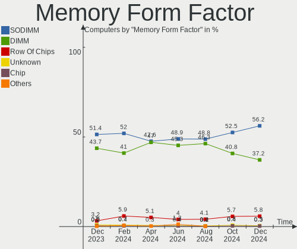

| Name         | Computers | Percent |
|--------------|-----------|---------|
| SODIMM       | 313       | 51.06%  |
| DIMM         | 279       | 45.51%  |
| Row Of Chips | 15        | 2.45%   |
| RIMM         | 2         | 0.33%   |
| Chip         | 2         | 0.33%   |
| FB-DIMM      | 1         | 0.16%   |
| Unknown      | 1         | 0.16%   |

Memory Size
-----------

Memory module size

| Size  | Computers | Percent |
|-------|-----------|---------|
| 4096  | 267       | 38.42%  |
| 8192  | 213       | 30.65%  |
| 2048  | 125       | 17.99%  |
| 16384 | 50        | 7.19%   |
| 1024  | 23        | 3.31%   |
| 32768 | 15        | 2.16%   |
| 3072  | 1         | 0.14%   |
| 512   | 1         | 0.14%   |

Memory Speed
------------

Memory module speed

| Speed   | Computers | Percent |
|---------|-----------|---------|
| 1600    | 181       | 26.12%  |
| 1333    | 73        | 10.53%  |
| 3200    | 68        | 9.81%   |
| 2667    | 59        | 8.51%   |
| 2400    | 48        | 6.93%   |
| 1334    | 31        | 4.47%   |
| 800     | 30        | 4.33%   |
| 667     | 22        | 3.17%   |
| 2133    | 20        | 2.89%   |
| 3600    | 17        | 2.45%   |
| 1867    | 16        | 2.31%   |
| Unknown | 16        | 2.31%   |
| 3400    | 12        | 1.73%   |
| 1067    | 10        | 1.44%   |
| 3266    | 9         | 1.3%    |
| 1066    | 7         | 1.01%   |
| 4199    | 6         | 0.87%   |
| 3800    | 5         | 0.72%   |
| 2933    | 5         | 0.72%   |
| 2048    | 5         | 0.72%   |
| 4800    | 4         | 0.58%   |
| 3000    | 4         | 0.58%   |
| 533     | 4         | 0.58%   |
| 2666    | 3         | 0.43%   |
| 1800    | 3         | 0.43%   |
| 975     | 3         | 0.43%   |
| 400     | 3         | 0.43%   |
| 4267    | 2         | 0.29%   |
| 3733    | 2         | 0.29%   |
| 3500    | 2         | 0.29%   |
| 3151    | 2         | 0.29%   |
| 2800    | 2         | 0.29%   |
| 1866    | 2         | 0.29%   |
| 1648    | 2         | 0.29%   |
| 50410   | 1         | 0.14%   |
| 3666    | 1         | 0.14%   |
| 3534    | 1         | 0.14%   |
| 3466    | 1         | 0.14%   |
| 3333    | 1         | 0.14%   |
| 3001    | 1         | 0.14%   |

Printers & scanners
-------------------

Printer Vendor
--------------

Printer device vendors

| Vendor              | Computers | Percent |
|---------------------|-----------|---------|
| Hewlett-Packard     | 10        | 50%     |
| Canon               | 3         | 15%     |
| Brother Industries  | 3         | 15%     |
| Zebra               | 1         | 5%      |
| Samsung Electronics | 1         | 5%      |
| Kyocera             | 1         | 5%      |
| Dymo-CoStar         | 1         | 5%      |

Printer Model
-------------

Printer device models

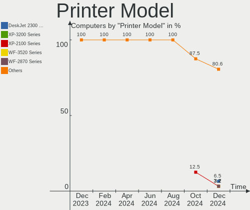

| Model                            | Computers | Percent |
|----------------------------------|-----------|---------|
| Zebra LP2824                     | 1         | 4.76%   |
| Samsung M2070 Series             | 1         | 4.76%   |
| Kyocera ECOSYS P5021cdw          | 1         | 4.76%   |
| HP OfficeJet Pro 7740 series     | 1         | 4.76%   |
| HP OfficeJet 6960                | 1         | 4.76%   |
| HP OfficeJet 6950                | 1         | 4.76%   |
| HP LaserJet P2055 series         | 1         | 4.76%   |
| HP LaserJet 1018                 | 1         | 4.76%   |
| HP ENVY Photo 6200 series        | 1         | 4.76%   |
| HP ENVY 4520 series              | 1         | 4.76%   |
| HP DeskJet F2100 Printer series  | 1         | 4.76%   |
| HP DeskJet 5550                  | 1         | 4.76%   |
| HP DeskJet 3830 series           | 1         | 4.76%   |
| HP Deskjet 1510                  | 1         | 4.76%   |
| Dymo-CoStar DYMO LabelWriter 4XL | 1         | 4.76%   |
| Canon TR8500 series              | 1         | 4.76%   |
| Canon MG2400 series              | 1         | 4.76%   |
| Canon MF110/910 Series           | 1         | 4.76%   |
| Brother MFC-J470DW               | 1         | 4.76%   |
| Brother HL-2130 series           | 1         | 4.76%   |
| Brother DCP-T710W                | 1         | 4.76%   |

Scanner Vendor
--------------

Scanner device vendors

| Vendor  | Computers | Percent |
|---------|-----------|---------|
| Canon   | 3         | 75%     |
| Fujitsu | 1         | 25%     |

Scanner Model
-------------

Scanner device models

| Model                   | Computers | Percent |
|-------------------------|-----------|---------|
| Fujitsu ScanSnap SV600  | 1         | 25%     |
| Canon CanoScan LiDE 70  | 1         | 25%     |
| Canon CanoScan LiDE 60  | 1         | 25%     |
| Canon CanoScan LiDE 110 | 1         | 25%     |

Camera
------

Camera Vendor
-------------

Camera device vendors

| Vendor                                 | Computers | Percent |
|----------------------------------------|-----------|---------|
| Chicony Electronics                    | 76        | 24.6%   |
| Realtek Semiconductor                  | 31        | 10.03%  |
| Microdia                               | 18        | 5.83%   |
| Acer                                   | 17        | 5.5%    |
| Suyin                                  | 16        | 5.18%   |
| Logitech                               | 16        | 5.18%   |
| IMC Networks                           | 15        | 4.85%   |
| Cheng Uei Precision Industry (Foxlink) | 15        | 4.85%   |
| Quanta                                 | 14        | 4.53%   |
| Sunplus Innovation Technology          | 13        | 4.21%   |
| Syntek                                 | 10        | 3.24%   |
| Apple                                  | 10        | 3.24%   |
| Silicon Motion                         | 7         | 2.27%   |
| Microsoft                              | 5         | 1.62%   |
| Alcor Micro                            | 5         | 1.62%   |
| Ricoh                                  | 4         | 1.29%   |
| Lite-On Technology                     | 4         | 1.29%   |
| Sonix Technology                       | 3         | 0.97%   |
| Primax Electronics                     | 3         | 0.97%   |
| Lenovo                                 | 3         | 0.97%   |
| Cubeternet                             | 3         | 0.97%   |
| Importek                               | 2         | 0.65%   |
| DLEQNA19IFK6G2                         | 2         | 0.65%   |
| Z-Star Microelectronics                | 1         | 0.32%   |
| Xiongmai                               | 1         | 0.32%   |
| USB3.0 HD Audio Capture                | 1         | 0.32%   |
| Trust                                  | 1         | 0.32%   |
| Samsung Electronics                    | 1         | 0.32%   |
| OmniVision Technologies                | 1         | 0.32%   |
| Omnivision                             | 1         | 0.32%   |
| Luxvisions Innotech Limited            | 1         | 0.32%   |
| Jieli Technology                       | 1         | 0.32%   |
| Hewlett-Packard                        | 1         | 0.32%   |
| Google                                 | 1         | 0.32%   |
| Generalplus Technology                 | 1         | 0.32%   |
| GEMBIRD                                | 1         | 0.32%   |
| Fujitsu                                | 1         | 0.32%   |
| DigiTech                               | 1         | 0.32%   |
| Creative Technology                    | 1         | 0.32%   |
| Bison Electronics                      | 1         | 0.32%   |

Camera Model
------------

Camera device models

| Model                                                   | Computers | Percent |
|---------------------------------------------------------|-----------|---------|
| Acer Integrated Camera                                  | 11        | 3.53%   |
| Realtek USB Camera                                      | 9         | 2.88%   |
| Chicony Integrated Camera                               | 9         | 2.88%   |
| Syntek Integrated Camera                                | 8         | 2.56%   |
| Chicony HP TrueVision HD                                | 7         | 2.24%   |
| IMC Networks USB2.0 HD UVC WebCam                       | 6         | 1.92%   |
| Chicony HD User Facing                                  | 6         | 1.92%   |
| Realtek Integrated_Webcam_HD                            | 5         | 1.6%    |
| Microdia Integrated_Webcam_HD                           | 5         | 1.6%    |
| Microdia Integrated Webcam                              | 5         | 1.6%    |
| Logitech Webcam C270                                    | 5         | 1.6%    |
| Sunplus Integrated_Webcam_HD                            | 4         | 1.28%   |
| Logitech HD Webcam C525                                 | 4         | 1.28%   |
| Chicony HD WebCam                                       | 4         | 1.28%   |
| Cheng Uei Precision Industry (Foxlink) HP TrueVision HD | 4         | 1.28%   |
| Apple FaceTime HD Camera                                | 4         | 1.28%   |
| Suyin Acer/HP Integrated Webcam [CN0314]                | 3         | 0.96%   |
| Sunplus HD WebCam                                       | 3         | 0.96%   |
| Sunplus Asus Webcam                                     | 3         | 0.96%   |
| Realtek USB2.0 HD UVC WebCam                            | 3         | 0.96%   |
| IMC Networks USB2.0 VGA UVC WebCam                      | 3         | 0.96%   |
| Chicony VGA Webcam                                      | 3         | 0.96%   |
| Chicony USB 2.0 Camera                                  | 3         | 0.96%   |
| Chicony TOSHIBA Web Camera - HD                         | 3         | 0.96%   |
| Chicony Lenovo EasyCamera                               | 3         | 0.96%   |
| Chicony Integrated Camera [ThinkPad]                    | 3         | 0.96%   |
| Chicony HP Webcam                                       | 3         | 0.96%   |
| Chicony HP HD Camera                                    | 3         | 0.96%   |
| Chicony EasyCamera                                      | 3         | 0.96%   |
| Cheng Uei Precision Industry (Foxlink) HP Webcam        | 3         | 0.96%   |
| Syntek Lenovo EasyCamera                                | 2         | 0.64%   |
| Suyin HD WebCam                                         | 2         | 0.64%   |
| Suyin 1.3M HD WebCam                                    | 2         | 0.64%   |
| Sonix USB2.0 HD UVC WebCam                              | 2         | 0.64%   |
| Silicon Motion WebCam SCB-1100N                         | 2         | 0.64%   |
| Silicon Motion WebCam SC-13HDL11939N                    | 2         | 0.64%   |
| Ricoh Sony Vaio Integrated Webcam                       | 2         | 0.64%   |
| Realtek HP Truevision HD integrated webcam              | 2         | 0.64%   |
| Realtek HP Truevision HD                                | 2         | 0.64%   |
| Realtek HD WebCam                                       | 2         | 0.64%   |

Security
--------

Fingerprint Vendor
------------------

Fingerprint sensor vendors

| Vendor                     | Computers | Percent |
|----------------------------|-----------|---------|
| Validity Sensors           | 15        | 48.39%  |
| Upek                       | 4         | 12.9%   |
| Shenzhen Goodix Technology | 3         | 9.68%   |
| Elan Microelectronics      | 3         | 9.68%   |
| LighTuning Technology      | 2         | 6.45%   |
| AuthenTec                  | 2         | 6.45%   |
| Synaptics                  | 1         | 3.23%   |
| STMicroelectronics         | 1         | 3.23%   |

Fingerprint Model
-----------------

Fingerprint sensor models

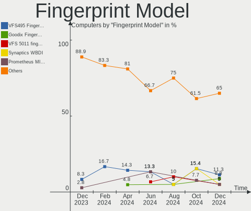

| Model                                                       | Computers | Percent |
|-------------------------------------------------------------|-----------|---------|
| Validity Sensors VFS471 Fingerprint Reader                  | 3         | 9.68%   |
| Upek Biometric Touchchip/Touchstrip Fingerprint Sensor      | 3         | 9.68%   |
| Shenzhen Goodix Fingerprint Reader                          | 3         | 9.68%   |
| Elan ELAN:Fingerprint                                       | 3         | 9.68%   |
| Validity Sensors VFS495 Fingerprint Reader                  | 2         | 6.45%   |
| Validity Sensors VFS451 Fingerprint Reader                  | 2         | 6.45%   |
| Validity Sensors Synaptics WBDI                             | 2         | 6.45%   |
| Validity Sensors VFS7500 Touch Fingerprint Sensor           | 1         | 3.23%   |
| Validity Sensors VFS491                                     | 1         | 3.23%   |
| Validity Sensors VFS101 Fingerprint Reader                  | 1         | 3.23%   |
| Validity Sensors VFS 5011 fingerprint sensor                | 1         | 3.23%   |
| Validity Sensors Synaptics VFS7552 Touch Fingerprint Sensor | 1         | 3.23%   |
| Validity Sensors Swipe Fingerprint Sensor                   | 1         | 3.23%   |
| Upek TCS5B Fingerprint sensor                               | 1         | 3.23%   |
| Synaptics Metallica MOH Touch Fingerprint Reader            | 1         | 3.23%   |
| STMicroelectronics Fingerprint Reader                       | 1         | 3.23%   |
| LighTuning Fingerprint Reader                               | 1         | 3.23%   |
| LighTuning ES603 Swipe Fingerprint Sensor                   | 1         | 3.23%   |
| AuthenTec Fingerprint Sensor                                | 1         | 3.23%   |
| AuthenTec AES1660 Fingerprint Sensor                        | 1         | 3.23%   |

Chipcard Vendor
---------------

Chipcard module vendors

| Vendor      | Computers | Percent |
|-------------|-----------|---------|
| Broadcom    | 8         | 40%     |
| O2 Micro    | 3         | 15%     |
| Lenovo      | 3         | 15%     |
| Alcor Micro | 3         | 15%     |
| Upek        | 2         | 10%     |
| BIT4ID      | 1         | 5%      |

Chipcard Model
--------------

Chipcard module models

| Model                                                                        | Computers | Percent |
|------------------------------------------------------------------------------|-----------|---------|
| Broadcom BCM5880 Secure Applications Processor                               | 4         | 20%     |
| O2 Micro OZ776 CCID Smartcard Reader                                         | 3         | 15%     |
| Lenovo Integrated Smart Card Reader                                          | 3         | 15%     |
| Alcor Micro AU9540 Smartcard Reader                                          | 3         | 15%     |
| Upek TouchChip Fingerprint Coprocessor (WBF advanced mode)                   | 2         | 10%     |
| Broadcom BCM5880 Secure Applications Processor with fingerprint swipe sensor | 2         | 10%     |
| Broadcom 5880                                                                | 1         | 5%      |
| Broadcom 58200                                                               | 1         | 5%      |
| BIT4ID miniLector AIR NFC v3                                                 | 1         | 5%      |

Unsupported
-----------

Unsupported Devices
-------------------

Total unsupported devices on board

| Total | Computers | Percent |
|-------|-----------|---------|
| 0     | 500       | 81.7%   |
| 1     | 100       | 16.34%  |
| 2     | 11        | 1.8%    |
| 3     | 1         | 0.16%   |

Unsupported Device Types
------------------------

Types of unsupported devices

| Type                     | Computers | Percent |
|--------------------------|-----------|---------|
| Graphics card            | 43        | 34.4%   |
| Fingerprint reader       | 31        | 24.8%   |
| Chipcard                 | 20        | 16%     |
| Net/wireless             | 9         | 7.2%    |
| Unassigned class         | 5         | 4%      |
| Multimedia controller    | 4         | 3.2%    |
| Storage                  | 3         | 2.4%    |
| Bluetooth                | 3         | 2.4%    |
| Sound                    | 2         | 1.6%    |
| Communication controller | 2         | 1.6%    |
| Storage/raid             | 1         | 0.8%    |
| Network                  | 1         | 0.8%    |
| Camera                   | 1         | 0.8%    |

