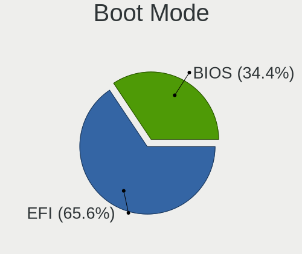
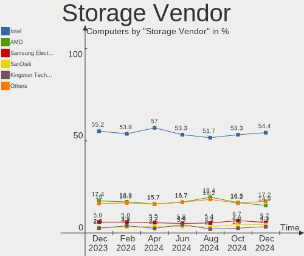
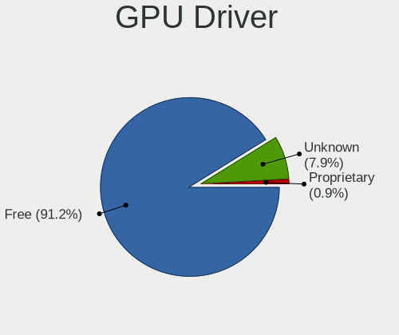
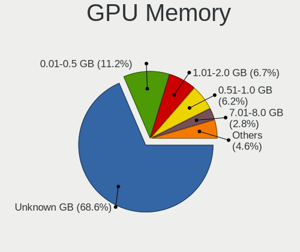
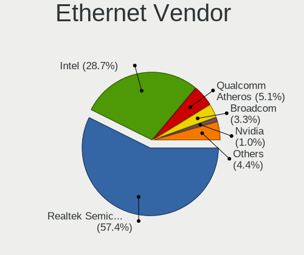
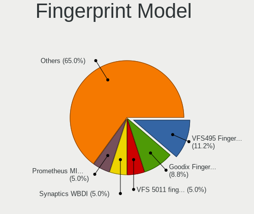
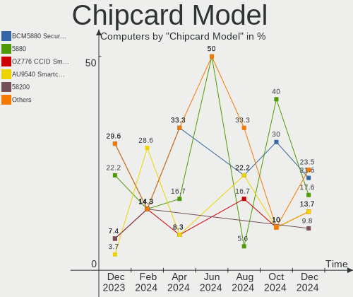
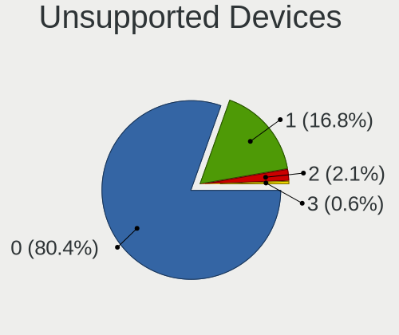

OpenMandriva Hardware Trends
----------------------------

A project to identify most popular hardware characteristics and track their change
over time based on data collected by OpenMandriva users at https://Linux-Hardware.org.

Anyone can contribute to the study by uploading probes of their computers by
the [hw-probe](https://github.com/linuxhw/hw-probe) tool:

    sudo -E hw-probe -all -upload

This is a report for all computer types. See also reports for [desktops](/Dist/OpenMandriva/Desktop/README.md) and [notebooks](/Dist/OpenMandriva/Notebook/README.md).

Full-feature report is available here: https://linux-hardware.org/?view=trends

Period: Jun, 2021.

Contents
--------

- [ OS                       ](#os)
- [ OS Family                ](#os-family)
- [ Kernel                   ](#kernel)
- [ Kernel Family            ](#kernel-family)
- [ Kernel Major Ver.        ](#kernel-major-ver)
- [ Arch                     ](#arch)
- [ DE                       ](#de)
- [ Display Server           ](#display-server)
- [ Display Manager          ](#display-manager)
- [ OS Lang                  ](#os-lang)
- [ Boot Mode                ](#boot-mode)
- [ Filesystem               ](#filesystem)
- [ Part. scheme             ](#part-scheme)
- [ Dual Boot with Linux/BSD ](#dual-boot-with-linux/bsd)
- [ Dual Boot (Win)          ](#dual-boot-win)
- [ Country                  ](#country)
- [ City                     ](#city)
- [ Vendor                   ](#vendor)
- [ Model                    ](#model)
- [ Model Family             ](#model-family)
- [ MFG Year                 ](#mfg-year)
- [ Form Factor              ](#form-factor)
- [ Secure Boot              ](#secure-boot)
- [ Coreboot                 ](#coreboot)
- [ RAM Size                 ](#ram-size)
- [ RAM Used                 ](#ram-used)
- [ Has CD-ROM               ](#has-cd-rom)
- [ Total Drives             ](#total-drives)
- [ Has Ethernet             ](#has-ethernet)
- [ Has WiFi                 ](#has-wifi)
- [ Has Bluetooth            ](#has-bluetooth)
- [ Drive Vendor             ](#drive-vendor)
- [ Drive Model              ](#drive-model)
- [ HDD Vendor               ](#hdd-vendor)
- [ SSD Vendor               ](#ssd-vendor)
- [ Drive Kind               ](#drive-kind)
- [ Drive Connector          ](#drive-connector)
- [ Drive Size               ](#drive-size)
- [ Space Total              ](#space-total)
- [ Space Used               ](#space-used)
- [ Malfunc. Drives          ](#malfunc-drives)
- [ Malfunc. Drive Vendor    ](#malfunc-drive-vendor)
- [ Malfunc. HDD Vendor      ](#malfunc-hdd-vendor)
- [ Malfunc. Drive Kind      ](#malfunc-drive-kind)
- [ Failed Drives            ](#failed-drives)
- [ Failed Drive Vendor      ](#failed-drive-vendor)
- [ Drive Status             ](#drive-status)
- [ Storage Vendor           ](#storage-vendor)
- [ Storage Model            ](#storage-model)
- [ Storage Kind             ](#storage-kind)
- [ CPU Vendor               ](#cpu-vendor)
- [ CPU Model                ](#cpu-model)
- [ CPU Model Family         ](#cpu-model-family)
- [ CPU Cores                ](#cpu-cores)
- [ CPU Sockets              ](#cpu-sockets)
- [ CPU Threads              ](#cpu-threads)
- [ CPU Op-Modes             ](#cpu-op-modes)
- [ CPU Microcode            ](#cpu-microcode)
- [ CPU Microarch            ](#cpu-microarch)
- [ GPU Vendor               ](#gpu-vendor)
- [ GPU Model                ](#gpu-model)
- [ GPU Combo                ](#gpu-combo)
- [ GPU Driver               ](#gpu-driver)
- [ GPU Memory               ](#gpu-memory)
- [ Monitor Vendor           ](#monitor-vendor)
- [ Monitor Model            ](#monitor-model)
- [ Monitor Resolution       ](#monitor-resolution)
- [ Monitor Diagonal         ](#monitor-diagonal)
- [ Monitor Width            ](#monitor-width)
- [ Aspect Ratio             ](#aspect-ratio)
- [ Monitor Area             ](#monitor-area)
- [ Pixel Density            ](#pixel-density)
- [ Multiple Monitors        ](#multiple-monitors)
- [ Net Controller Vendor    ](#net-controller-vendor)
- [ Net Controller Model     ](#net-controller-model)
- [ Wireless Vendor          ](#wireless-vendor)
- [ Wireless Model           ](#wireless-model)
- [ Ethernet Vendor          ](#ethernet-vendor)
- [ Ethernet Model           ](#ethernet-model)
- [ Net Controller Kind      ](#net-controller-kind)
- [ Used Controller          ](#used-controller)
- [ NICs                     ](#nics)
- [ IPv6                     ](#ipv6)
- [ Memory Vendor            ](#memory-vendor)
- [ Memory Model             ](#memory-model)
- [ Memory Kind              ](#memory-kind)
- [ Memory Form Factor       ](#memory-form-factor)
- [ Memory Size              ](#memory-size)
- [ Memory Speed             ](#memory-speed)
- [ Sound Vendor             ](#sound-vendor)
- [ Sound Model              ](#sound-model)
- [ Camera Vendor            ](#camera-vendor)
- [ Camera Model             ](#camera-model)
- [ Fingerprint Vendor       ](#fingerprint-vendor)
- [ Fingerprint Model        ](#fingerprint-model)
- [ Chipcard Vendor          ](#chipcard-vendor)
- [ Chipcard Model           ](#chipcard-model)
- [ Printer Vendor           ](#printer-vendor)
- [ Printer Model            ](#printer-model)
- [ Scanner Vendor           ](#scanner-vendor)
- [ Scanner Model            ](#scanner-model)
- [ Bluetooth Vendor         ](#bluetooth-vendor)
- [ Bluetooth Model          ](#bluetooth-model)
- [ Unsupported Devices      ](#unsupported-devices)
- [ Unsupported Device Types ](#unsupported-device-types)

OS
--

Installed operating systems

| Name              | Computers | Percent |
|-------------------|-----------|---------|
| OpenMandriva 4.2  | 262       | 82.65%  |
| OpenMandriva 4.50 | 55        | 17.35%  |

OS Family
---------

OS without a version

| Name         | Computers | Percent |
|--------------|-----------|---------|
| OpenMandriva | 317       | 100%    |

Kernel
------

Version of the Linux kernel

| Version                       | Computers | Percent |
|-------------------------------|-----------|---------|
| 5.10.14-desktop-1omv4002      | 245       | 77.29%  |
| 5.12.4-desktop-1omv4050       | 51        | 16.09%  |
| 5.11.12-desktop-1omv4002      | 17        | 5.36%   |
| 5.12.7-desktop-1omv4003       | 2         | 0.63%   |
| 5.12.6-desktop-clang-1omv4050 | 1         | 0.32%   |
| 5.12.12-server-clang-1omv4050 | 1         | 0.32%   |

Kernel Family
-------------

Linux kernel without a distro release

| Version | Computers | Percent |
|---------|-----------|---------|
| 5.10.14 | 245       | 77.29%  |
| 5.12.4  | 51        | 16.09%  |
| 5.11.12 | 17        | 5.36%   |
| 5.12.7  | 2         | 0.63%   |
| 5.12.6  | 1         | 0.32%   |
| 5.12.12 | 1         | 0.32%   |

Kernel Major Ver.
-----------------

Linux kernel major version

| Version | Computers | Percent |
|---------|-----------|---------|
| 5.10    | 245       | 77.29%  |
| 5.12    | 55        | 17.35%  |
| 5.11    | 17        | 5.36%   |

Arch
----

OS architecture (x86_64, i586, etc.)

| Name    | Computers | Percent |
|---------|-----------|---------|
| x86_64  | 316       | 99.68%  |
| aarch64 | 1         | 0.32%   |

DE
--

Desktop Environment

| Name | Computers | Percent |
|------|-----------|---------|
| KDE5 | 317       | 100%    |

Display Server
--------------

X11 or Wayland

| Name    | Computers | Percent |
|---------|-----------|---------|
| X11     | 314       | 99.05%  |
| Wayland | 3         | 0.95%   |

Display Manager
---------------

SDDM, LightDM, etc.

| Name | Computers | Percent |
|------|-----------|---------|
| SDDM | 317       | 100%    |

OS Lang
-------

Language

| Lang  | Computers | Percent |
|-------|-----------|---------|
| en_US | 187       | 58.99%  |
| ru_RU | 19        | 5.99%   |
| de_DE | 16        | 5.05%   |
| pt_BR | 15        | 4.73%   |
| fr_FR | 12        | 3.79%   |
| pl_PL | 10        | 3.15%   |
| es_ES | 9         | 2.84%   |
| it_IT | 8         | 2.52%   |
| es_AR | 5         | 1.58%   |
| nl_NL | 4         | 1.26%   |
| cs_CZ | 4         | 1.26%   |
| es_MX | 3         | 0.95%   |
| ru_UA | 2         | 0.63%   |
| nl_BE | 2         | 0.63%   |
| fr_BE | 2         | 0.63%   |
| en_GB | 2         | 0.63%   |
| en_CA | 2         | 0.63%   |
| da_DK | 2         | 0.63%   |
| pt_PT | 1         | 0.32%   |
| nb_NO | 1         | 0.32%   |
| hu_HU | 1         | 0.32%   |
| fr_CH | 1         | 0.32%   |
| es_PE | 1         | 0.32%   |
| es_CO | 1         | 0.32%   |
| en_PH | 1         | 0.32%   |
| en_NZ | 1         | 0.32%   |
| en_IN | 1         | 0.32%   |
| en_IE | 1         | 0.32%   |
| en_AU | 1         | 0.32%   |
| en_AG | 1         | 0.32%   |
| de_AT | 1         | 0.32%   |

Boot Mode
---------

EFI or BIOS

| Mode | Computers | Percent |
|------|-----------|---------|
| BIOS | 175       | 55.21%  |
| EFI  | 142       | 44.79%  |

Filesystem
----------

Type of filesystem

| Type    | Computers | Percent |
|---------|-----------|---------|
| Overlay | 246       | 77.6%   |
| Ext4    | 68        | 21.45%  |
| F2fs    | 1         | 0.32%   |
| Ext3    | 1         | 0.32%   |
| Btrfs   | 1         | 0.32%   |

Part. scheme
------------

Scheme of partitioning

| Type    | Computers | Percent |
|---------|-----------|---------|
| GPT     | 190       | 59.94%  |
| MBR     | 125       | 39.43%  |
| Unknown | 2         | 0.63%   |

Dual Boot with Linux/BSD
------------------------

Hosting more than one Linux/BSD

| Dual boot | Computers | Percent |
|-----------|-----------|---------|
| Yes       | 171       | 53.94%  |
| No        | 146       | 46.06%  |

Dual Boot (Win)
---------------

Hosting Linux and Windows

| Dual boot | Computers | Percent |
|-----------|-----------|---------|
| No        | 170       | 53.63%  |
| Yes       | 147       | 46.37%  |

Country
-------

Geographic location (country)

| Country            | Computers | Percent |
|--------------------|-----------|---------|
| Brazil             | 33        | 10.41%  |
| USA                | 32        | 10.09%  |
| Russia             | 21        | 6.62%   |
| Germany            | 21        | 6.62%   |
| France             | 21        | 6.62%   |
| Italy              | 17        | 5.36%   |
| Canada             | 17        | 5.36%   |
| UK                 | 15        | 4.73%   |
| Poland             | 15        | 4.73%   |
| Spain              | 12        | 3.79%   |
| Argentina          | 8         | 2.52%   |
| Ukraine            | 7         | 2.21%   |
| Netherlands        | 7         | 2.21%   |
| Mexico             | 7         | 2.21%   |
| India              | 7         | 2.21%   |
| Czechia            | 5         | 1.58%   |
| Slovakia           | 4         | 1.26%   |
| Japan              | 4         | 1.26%   |
| Belgium            | 4         | 1.26%   |
| Philippines        | 3         | 0.95%   |
| Hungary            | 3         | 0.95%   |
| Denmark            | 3         | 0.95%   |
| Australia          | 3         | 0.95%   |
| Venezuela          | 2         | 0.63%   |
| Uruguay            | 2         | 0.63%   |
| South Africa       | 2         | 0.63%   |
| Serbia             | 2         | 0.63%   |
| New Zealand        | 2         | 0.63%   |
| Malaysia           | 2         | 0.63%   |
| Ireland            | 2         | 0.63%   |
| Iran               | 2         | 0.63%   |
| Finland            | 2         | 0.63%   |
| China              | 2         | 0.63%   |
| Bulgaria           | 2         | 0.63%   |
| Austria            | 2         | 0.63%   |
| Vietnam            | 1         | 0.32%   |
| UAE                | 1         | 0.32%   |
| Turkey             | 1         | 0.32%   |
| Tunisia            | 1         | 0.32%   |
| Taiwan             | 1         | 0.32%   |
| Sweden             | 1         | 0.32%   |
| San Marino         | 1         | 0.32%   |
| Romania            | 1         | 0.32%   |
| Portugal           | 1         | 0.32%   |
| Peru               | 1         | 0.32%   |
| Norway             | 1         | 0.32%   |
| Mozambique         | 1         | 0.32%   |
| Madagascar         | 1         | 0.32%   |
| Latvia             | 1         | 0.32%   |
| Kuwait             | 1         | 0.32%   |
| Kazakhstan         | 1         | 0.32%   |
| Ivory Coast        | 1         | 0.32%   |
| Indonesia          | 1         | 0.32%   |
| Hong Kong          | 1         | 0.32%   |
| Ghana              | 1         | 0.32%   |
| El Salvador        | 1         | 0.32%   |
| Dominican Republic | 1         | 0.32%   |
| Colombia           | 1         | 0.32%   |
| Chile              | 1         | 0.32%   |

City
----

Geographic location (city)

| City             | Computers | Percent |
|------------------|-----------|---------|
| Rio de Janeiro   | 4         | 1.26%   |
| Buenos Aires     | 4         | 1.26%   |
| Teresopolis      | 3         | 0.95%   |
| St Petersburg    | 3         | 0.95%   |
| Saskatoon        | 3         | 0.95%   |
| Mexico City      | 3         | 0.95%   |
| Lelystad         | 3         | 0.95%   |
| Kyiv             | 3         | 0.95%   |
| Wroclaw          | 2         | 0.63%   |
| Warsaw           | 2         | 0.63%   |
| Vienna           | 2         | 0.63%   |
| Verona           | 2         | 0.63%   |
| Tehran           | 2         | 0.63%   |
| São Paulo       | 2         | 0.63%   |
| Strasbourg       | 2         | 0.63%   |
| Stockport        | 2         | 0.63%   |
| St. Catharines   | 2         | 0.63%   |
| Saint Johns      | 2         | 0.63%   |
| Prague           | 2         | 0.63%   |
| Porto Alegre     | 2         | 0.63%   |
| Petaling Jaya    | 2         | 0.63%   |
| Paris            | 2         | 0.63%   |
| Palma            | 2         | 0.63%   |
| Nova Iguaçu     | 2         | 0.63%   |
| Müllheim        | 2         | 0.63%   |
| Moscow           | 2         | 0.63%   |
| Montmorency      | 2         | 0.63%   |
| Milan            | 2         | 0.63%   |
| Lodz             | 2         | 0.63%   |
| Levice           | 2         | 0.63%   |
| Krakow           | 2         | 0.63%   |
| Korten           | 2         | 0.63%   |
| Helsinki         | 2         | 0.63%   |
| Helena           | 2         | 0.63%   |
| Floersheim       | 2         | 0.63%   |
| Dublin           | 2         | 0.63%   |
| Corner Brook     | 2         | 0.63%   |
| Caracas          | 2         | 0.63%   |
| Budapest         | 2         | 0.63%   |
| Besa             | 2         | 0.63%   |
| Algeciras        | 2         | 0.63%   |
| Zlín            | 1         | 0.32%   |
| Zirndorf         | 1         | 0.32%   |
| Zaragoza         | 1         | 0.32%   |
| Yokohama         | 1         | 0.32%   |
| Yekaterinburg    | 1         | 0.32%   |
| Winnipeg         | 1         | 0.32%   |
| Wilsele          | 1         | 0.32%   |
| Wilde            | 1         | 0.32%   |
| Waltershausen    | 1         | 0.32%   |
| Walkerton        | 1         | 0.32%   |
| Wageningen       | 1         | 0.32%   |
| Volta Redonda    | 1         | 0.32%   |
| Vladivostok      | 1         | 0.32%   |
| Vitry-sur-Seine  | 1         | 0.32%   |
| Vinnytsia        | 1         | 0.32%   |
| Villa Bartolomea | 1         | 0.32%   |
| Vila Velha       | 1         | 0.32%   |
| Vigevano         | 1         | 0.32%   |
| Viborg           | 1         | 0.32%   |

Vendor
------

Motherboard manufacturer

| Name                | Computers | Percent |
|---------------------|-----------|---------|
| Hewlett-Packard     | 59        | 18.61%  |
| ASUSTek Computer    | 52        | 16.4%   |
| Dell                | 37        | 11.67%  |
| Lenovo              | 28        | 8.83%   |
| Gigabyte Technology | 22        | 6.94%   |
| MSI                 | 20        | 6.31%   |
| Acer                | 18        | 5.68%   |
| ASRock              | 13        | 4.1%    |
| Toshiba             | 7         | 2.21%   |
| Samsung Electronics | 7         | 2.21%   |
| Intel               | 6         | 1.89%   |
| Apple               | 5         | 1.58%   |
| Medion              | 4         | 1.26%   |
| Unknown             | 4         | 1.26%   |
| Sony                | 3         | 0.95%   |
| Fujitsu             | 3         | 0.95%   |
| Positivo            | 2         | 0.63%   |
| Philco              | 2         | 0.63%   |
| PCWare              | 2         | 0.63%   |
| Packard Bell        | 2         | 0.63%   |
| LG Electronics      | 2         | 0.63%   |
| Foxconn             | 2         | 0.63%   |
| Biostar             | 2         | 0.63%   |
| VIT                 | 1         | 0.32%   |
| Purism              | 1         | 0.32%   |
| Pine Microsystems   | 1         | 0.32%   |
| Panasonic           | 1         | 0.32%   |
| OEM                 | 1         | 0.32%   |
| Motion Computing    | 1         | 0.32%   |
| MITSUSHIBA          | 1         | 0.32%   |
| Mediacom            | 1         | 0.32%   |
| Inventec            | 1         | 0.32%   |
| HUAWEI              | 1         | 0.32%   |
| GPD                 | 1         | 0.32%   |
| Gateway             | 1         | 0.32%   |
| eMachines           | 1         | 0.32%   |
| ECS                 | 1         | 0.32%   |
| BESSTAR Tech        | 1         | 0.32%   |

Model
-----

Motherboard model

| Name                                       | Computers | Percent |
|--------------------------------------------|-----------|---------|
| Unknown                                    | 6         | 1.89%   |
| ASUS All Series                            | 5         | 1.58%   |
| HP 2000                                    | 3         | 0.95%   |
| Toshiba Satellite L500D                    | 2         | 0.63%   |
| MSI MS-7816                                | 2         | 0.63%   |
| MSI MS-7693                                | 2         | 0.63%   |
| HP Notebook                                | 2         | 0.63%   |
| HP G42                                     | 2         | 0.63%   |
| HP EliteDesk 705 G4 SFF                    | 2         | 0.63%   |
| HP Compaq Elite 8300 CMT                   | 2         | 0.63%   |
| Gigabyte H61M-DS2                          | 2         | 0.63%   |
| Dell Latitude E6510                        | 2         | 0.63%   |
| Dell Latitude E6420                        | 2         | 0.63%   |
| Dell Latitude E6400                        | 2         | 0.63%   |
| Dell Latitude 5410                         | 2         | 0.63%   |
| Acer Aspire TC-605                         | 2         | 0.63%   |
| Acer Aspire E5-573                         | 2         | 0.63%   |
| VIT P1400                                  | 1         | 0.32%   |
| Toshiba Satellite S875D                    | 1         | 0.32%   |
| Toshiba Satellite R830                     | 1         | 0.32%   |
| Toshiba Satellite L515                     | 1         | 0.32%   |
| Toshiba NB305                              | 1         | 0.32%   |
| Toshiba dynabook R73/BN                    | 1         | 0.32%   |
| Sony VGN-NR230FE                           | 1         | 0.32%   |
| Sony SVE1713Y1EB                           | 1         | 0.32%   |
| Sony SVE14A3M1RW                           | 1         | 0.32%   |
| Samsung RV415                              | 1         | 0.32%   |
| Samsung R540/R580/R780/SA41/E452/E852      | 1         | 0.32%   |
| Samsung 550P5C/550P7C                      | 1         | 0.32%   |
| Samsung 450R4E/450R5E/450R4V/450R5V/4450RV | 1         | 0.32%   |
| Samsung 3570R/370R/470R/450R/510R/4450RV   | 1         | 0.32%   |
| Samsung 340XAA/350XAA/550XAA               | 1         | 0.32%   |
| Samsung 300E4A/300E5A/300E7A/3430EA/3530EA | 1         | 0.32%   |
| Purism Librem 15 v3                        | 1         | 0.32%   |
| Positivo DH8BW01                           | 1         | 0.32%   |
| Positivo C14CU51                           | 1         | 0.32%   |
| Pine Microsystems Pine64 RockPro64 v2.1    | 1         | 0.32%   |
| Philco 14I                                 | 1         | 0.32%   |
| Philco 10D                                 | 1         | 0.32%   |
| PCWare IPX4005G                            | 1         | 0.32%   |
| PCWare IPMH61G1                            | 1         | 0.32%   |
| Panasonic CF-C2CQAZXCM                     | 1         | 0.32%   |
| Packard Bell EasyNote TH36                 | 1         | 0.32%   |
| Packard Bell EasyNote TE11HC               | 1         | 0.32%   |
| MSI p7-1549                                | 1         | 0.32%   |
| MSI MS-7D18                                | 1         | 0.32%   |
| MSI MS-7C51                                | 1         | 0.32%   |
| MSI MS-7B86                                | 1         | 0.32%   |
| MSI MS-7B49                                | 1         | 0.32%   |
| MSI MS-7B33                                | 1         | 0.32%   |
| MSI MS-7A40                                | 1         | 0.32%   |
| MSI MS-7924                                | 1         | 0.32%   |
| MSI MS-7921                                | 1         | 0.32%   |
| MSI MS-7808                                | 1         | 0.32%   |
| MSI MS-7680                                | 1         | 0.32%   |
| MSI MS-7641                                | 1         | 0.32%   |
| MSI MS-7551                                | 1         | 0.32%   |
| MSI MS-16G1                                | 1         | 0.32%   |
| MSI Compaq dx2300 Microtower               | 1         | 0.32%   |
| MSI 500-242ea                              | 1         | 0.32%   |

Model Family
------------

Motherboard model prefix

| Name                     | Computers | Percent |
|--------------------------|-----------|---------|
| Dell Latitude            | 13        | 4.1%    |
| Lenovo ThinkPad          | 11        | 3.47%   |
| HP Compaq                | 11        | 3.47%   |
| Acer Aspire              | 11        | 3.47%   |
| Dell Inspiron            | 10        | 3.15%   |
| Lenovo IdeaPad           | 8         | 2.52%   |
| HP Laptop                | 8         | 2.52%   |
| Dell OptiPlex            | 8         | 2.52%   |
| ASUS PRIME               | 8         | 2.52%   |
| HP EliteDesk             | 6         | 1.89%   |
| Unknown                  | 6         | 1.89%   |
| Toshiba Satellite        | 5         | 1.58%   |
| HP Pavilion              | 5         | 1.58%   |
| HP EliteBook             | 5         | 1.58%   |
| ASUS All                 | 5         | 1.58%   |
| Lenovo ThinkCentre       | 3         | 0.95%   |
| HP 2000                  | 3         | 0.95%   |
| Dell Vostro              | 3         | 0.95%   |
| ASUS ROG                 | 3         | 0.95%   |
| ASUS P8Z77-V             | 3         | 0.95%   |
| ASUS M5A78L-M            | 3         | 0.95%   |
| Packard Bell EasyNote    | 2         | 0.63%   |
| MSI MS-7816              | 2         | 0.63%   |
| MSI MS-7693              | 2         | 0.63%   |
| HP ProBook               | 2         | 0.63%   |
| HP Notebook              | 2         | 0.63%   |
| HP G42                   | 2         | 0.63%   |
| Gigabyte H61M-DS2        | 2         | 0.63%   |
| Dell XPS                 | 2         | 0.63%   |
| ASUS VivoBook            | 2         | 0.63%   |
| ASUS TUF                 | 2         | 0.63%   |
| ASRock B550              | 2         | 0.63%   |
| Acer TravelMate          | 2         | 0.63%   |
| Acer Extensa             | 2         | 0.63%   |
| VIT P1400                | 1         | 0.32%   |
| Toshiba NB305            | 1         | 0.32%   |
| Toshiba dynabook         | 1         | 0.32%   |
| Sony VGN-NR230FE         | 1         | 0.32%   |
| Sony SVE1713Y1EB         | 1         | 0.32%   |
| Sony SVE14A3M1RW         | 1         | 0.32%   |
| Samsung RV415            | 1         | 0.32%   |
| Samsung R540             | 1         | 0.32%   |
| Samsung 550P5C           | 1         | 0.32%   |
| Samsung 450R4E           | 1         | 0.32%   |
| Samsung 3570R            | 1         | 0.32%   |
| Samsung 340XAA           | 1         | 0.32%   |
| Samsung 300E4A           | 1         | 0.32%   |
| Purism Librem            | 1         | 0.32%   |
| Positivo DH8BW01         | 1         | 0.32%   |
| Positivo C14CU51         | 1         | 0.32%   |
| Pine Microsystems Pine64 | 1         | 0.32%   |
| Philco 14I               | 1         | 0.32%   |
| Philco 10D               | 1         | 0.32%   |
| PCWare IPX4005G          | 1         | 0.32%   |
| PCWare IPMH61G1          | 1         | 0.32%   |
| Panasonic CF-C2CQAZXCM   | 1         | 0.32%   |
| MSI p7-1549              | 1         | 0.32%   |
| MSI MS-7D18              | 1         | 0.32%   |
| MSI MS-7C51              | 1         | 0.32%   |
| MSI MS-7B86              | 1         | 0.32%   |

MFG Year
--------

Motherboard manufacture year

| Year    | Computers | Percent |
|---------|-----------|---------|
| 2020    | 30        | 9.46%   |
| 2019    | 29        | 9.15%   |
| 2014    | 27        | 8.52%   |
| 2018    | 26        | 8.2%    |
| 2013    | 25        | 7.89%   |
| 2010    | 25        | 7.89%   |
| 2021    | 23        | 7.26%   |
| 2015    | 21        | 6.62%   |
| 2012    | 21        | 6.62%   |
| 2011    | 21        | 6.62%   |
| 2016    | 18        | 5.68%   |
| 2009    | 15        | 4.73%   |
| 2017    | 14        | 4.42%   |
| 2007    | 10        | 3.15%   |
| 2008    | 7         | 2.21%   |
| 2006    | 3         | 0.95%   |
| 2004    | 1         | 0.32%   |
| Unknown | 1         | 0.32%   |

Form Factor
-----------

Physical design of the computer

| Name           | Computers | Percent |
|----------------|-----------|---------|
| Desktop        | 156       | 49.21%  |
| Notebook       | 144       | 45.43%  |
| All in one     | 7         | 2.21%   |
| Mini pc        | 5         | 1.58%   |
| Convertible    | 3         | 0.95%   |
| System on chip | 1         | 0.32%   |
| Tablet         | 1         | 0.32%   |

Secure Boot
-----------

Enabled or disabled

| State    | Computers | Percent |
|----------|-----------|---------|
| Disabled | 317       | 100%    |

Coreboot
--------

Have coreboot on board

| Used | Computers | Percent |
|------|-----------|---------|
| No   | 316       | 99.68%  |
| Yes  | 1         | 0.32%   |

RAM Size
--------

Total RAM memory

| Size in GB  | Computers | Percent |
|-------------|-----------|---------|
| 3.01-4.0    | 101       | 31.86%  |
| 4.01-8.0    | 71        | 22.4%   |
| 8.01-16.0   | 62        | 19.56%  |
| 16.01-24.0  | 43        | 13.56%  |
| 1.01-2.0    | 15        | 4.73%   |
| 32.01-64.0  | 14        | 4.42%   |
| 2.01-3.0    | 5         | 1.58%   |
| 24.01-32.0  | 3         | 0.95%   |
| 0.51-1.0    | 2         | 0.63%   |
| 64.01-256.0 | 1         | 0.32%   |

RAM Used
--------

Used RAM memory

| Used GB   | Computers | Percent |
|-----------|-----------|---------|
| 1.01-2.0  | 244       | 76.97%  |
| 0.51-1.0  | 37        | 11.67%  |
| 2.01-3.0  | 22        | 6.94%   |
| 0.01-0.5  | 10        | 3.15%   |
| 8.01-16.0 | 3         | 0.95%   |
| 3.01-4.0  | 1         | 0.32%   |

Has CD-ROM
----------

Has CD-ROM on board

| Presented | Computers | Percent |
|-----------|-----------|---------|
| Yes       | 200       | 63.09%  |
| No        | 117       | 36.91%  |

Total Drives
------------

Number of drives on board

| Drives | Computers | Percent |
|--------|-----------|---------|
| 1      | 200       | 63.09%  |
| 2      | 62        | 19.56%  |
| 3      | 29        | 9.15%   |
| 4      | 10        | 3.15%   |
| 0      | 9         | 2.84%   |
| 5      | 6         | 1.89%   |
| 7      | 1         | 0.32%   |

Has Ethernet
------------

Has Ethernet on board

| Presented | Computers | Percent |
|-----------|-----------|---------|
| Yes       | 296       | 93.38%  |
| No        | 21        | 6.62%   |

Has WiFi
--------

Has WiFi module

| Presented | Computers | Percent |
|-----------|-----------|---------|
| Yes       | 210       | 66.25%  |
| No        | 107       | 33.75%  |

Has Bluetooth
-------------

Has Bluetooth module

| Presented | Computers | Percent |
|-----------|-----------|---------|
| No        | 173       | 54.57%  |
| Yes       | 144       | 45.43%  |

Drive Vendor
------------

Hard drive vendors

| Vendor              | Computers | Drives | Percent |
|---------------------|-----------|--------|---------|
| Seagate             | 82        | 91     | 18.98%  |
| WDC                 | 76        | 98     | 17.59%  |
| Samsung Electronics | 51        | 53     | 11.81%  |
| Toshiba             | 45        | 47     | 10.42%  |
| Kingston            | 34        | 34     | 7.87%   |
| Hitachi             | 16        | 16     | 3.7%    |
| Unknown             | 14        | 15     | 3.24%   |
| Crucial             | 14        | 15     | 3.24%   |
| SanDisk             | 10        | 11     | 2.31%   |
| Patriot             | 7         | 7      | 1.62%   |
| HGST                | 7         | 7      | 1.62%   |
| China               | 7         | 7      | 1.62%   |
| SK Hynix            | 5         | 5      | 1.16%   |
| MAXTOR              | 4         | 4      | 0.93%   |
| Intel               | 4         | 5      | 0.93%   |
| A-DATA Technology   | 4         | 4      | 0.93%   |
| Union Memory        | 3         | 3      | 0.69%   |
| Transcend           | 3         | 3      | 0.69%   |
| SPCC                | 3         | 3      | 0.69%   |
| Apacer              | 3         | 3      | 0.69%   |
| ShanDianZhe         | 2         | 2      | 0.46%   |
| Phison              | 2         | 2      | 0.46%   |
| Leven               | 2         | 2      | 0.46%   |
| KingDian            | 2         | 2      | 0.46%   |
| Intenso             | 2         | 2      | 0.46%   |
| GOODRAM             | 2         | 2      | 0.46%   |
| TO Exter            | 1         | 1      | 0.23%   |
| T-Mobile            | 1         | 1      | 0.23%   |
| T-FORCE             | 1         | 1      | 0.23%   |
| Super Talent        | 1         | 1      | 0.23%   |
| Silicon Motion      | 1         | 1      | 0.23%   |
| SABRENT             | 1         | 1      | 0.23%   |
| QIANGHE             | 1         | 1      | 0.23%   |
| PNY                 | 1         | 1      | 0.23%   |
| OCZ                 | 1         | 1      | 0.23%   |
| Micron Technology   | 1         | 1      | 0.23%   |
| MDT                 | 1         | 1      | 0.23%   |
| KIOXIA              | 1         | 1      | 0.23%   |
| JMicron             | 1         | 1      | 0.23%   |
| INNOVATION IT       | 1         | 1      | 0.23%   |
| Hoodisk             | 1         | 1      | 0.23%   |
| HGST HTS            | 1         | 1      | 0.23%   |
| Hewlett-Packard     | 1         | 1      | 0.23%   |
| Gost                | 1         | 1      | 0.23%   |
| GeIL                | 1         | 1      | 0.23%   |
| Fujitsu             | 1         | 1      | 0.23%   |
| FOXLINE             | 1         | 1      | 0.23%   |
| FORESEE             | 1         | 1      | 0.23%   |
| External            | 1         | 1      | 0.23%   |
| Corsair             | 1         | 1      | 0.23%   |
| BIWIN               | 1         | 1      | 0.23%   |
| ASMT                | 1         | 1      | 0.23%   |
| Apple               | 1         | 1      | 0.23%   |
| addlink             | 1         | 1      | 0.23%   |

Drive Model
-----------

Hard drive models

| Model                                   | Computers | Percent |
|-----------------------------------------|-----------|---------|
| Seagate ST1000DM010-2EP102 1TB          | 7         | 1.53%   |
| Seagate ST1000LM024 HN-M101MBB 1TB      | 6         | 1.31%   |
| Kingston SA400S37120G 120GB SSD         | 6         | 1.31%   |
| Toshiba DT01ACA050 500GB                | 5         | 1.09%   |
| Seagate ST500DM002-1BD142 500GB         | 5         | 1.09%   |
| Kingston SA400S37240G 240GB SSD         | 5         | 1.09%   |
| Unknown SD/MMC/MS PRO 128GB             | 4         | 0.88%   |
| Toshiba MQ01ABF050 500GB                | 4         | 0.88%   |
| Toshiba MQ01ABD100 1TB                  | 4         | 0.88%   |
| Toshiba DT01ACA100 1TB                  | 4         | 0.88%   |
| Seagate ST320LM001 HN-M320MBB 320GB     | 4         | 0.88%   |
| Seagate ST2000DM008-2FR102 2TB          | 4         | 0.88%   |
| Samsung SSD 850 EVO 250GB               | 4         | 0.88%   |
| Kingston SA400S37480G 480GB SSD         | 4         | 0.88%   |
| WDC WDS500G2B0A-00SM50 500GB SSD        | 3         | 0.66%   |
| WDC WD5000AVDS-63U7B1 500GB             | 3         | 0.66%   |
| WDC WD10JPVX-22JC3T0 1TB                | 3         | 0.66%   |
| Toshiba MQ04ABF100 1TB                  | 3         | 0.66%   |
| Toshiba MQ01ABD050 500GB                | 3         | 0.66%   |
| Toshiba MK2555GSX 250GB                 | 3         | 0.66%   |
| Seagate ST500LT012-1DG142 500GB         | 3         | 0.66%   |
| Seagate ST3160815AS 160GB               | 3         | 0.66%   |
| Seagate ST2000DM006-2DM164 2TB          | 3         | 0.66%   |
| Seagate ST2000DM001-1CH164 2TB          | 3         | 0.66%   |
| Seagate ST1000DM003-1SB102 1TB          | 3         | 0.66%   |
| Samsung HD322HJ 320GB                   | 3         | 0.66%   |
| Kingston SV300S37A120G 120GB SSD        | 3         | 0.66%   |
| WDC WDS240G2G0A-00JH30 240GB SSD        | 2         | 0.44%   |
| WDC WDS100T2B0C-00PXH0 1TB              | 2         | 0.44%   |
| WDC WD800JD-75MSA3 80GB                 | 2         | 0.44%   |
| WDC WD5000LPVX-22V0TT0 500GB            | 2         | 0.44%   |
| WDC WD5000LPCX-75VHAT0 500GB            | 2         | 0.44%   |
| WDC WD20PURZ-85GU6Y0 2TB                | 2         | 0.44%   |
| WDC WD2003FZEX-00Z4SA0 2TB              | 2         | 0.44%   |
| WDC WD10EZEX-08M2NA0 1TB                | 2         | 0.44%   |
| WDC WD10EADX-22TDHB0 1TB                | 2         | 0.44%   |
| Union Memory UMIS RPJTJ512MEE1OWX 512GB | 2         | 0.44%   |
| SK Hynix PC611 NVMe 1TB                 | 2         | 0.44%   |
| ShanDianZhe SSD 128GB                   | 2         | 0.44%   |
| Seagate ST9320423AS 320GB               | 2         | 0.44%   |
| Seagate ST9250410AS 250GB               | 2         | 0.44%   |
| Seagate ST9250315AS 250GB               | 2         | 0.44%   |
| Seagate ST3250410AS 250GB               | 2         | 0.44%   |
| Seagate ST31000524AS 1TB                | 2         | 0.44%   |
| Seagate ST1000LX015-1U7172 1TB          | 2         | 0.44%   |
| Seagate Expansion Desk 2TB              | 2         | 0.44%   |
| SanDisk SDSSDH3 512G                    | 2         | 0.44%   |
| Samsung SSD 970 EVO Plus 500GB          | 2         | 0.44%   |
| Samsung SSD 960 EVO 1TB                 | 2         | 0.44%   |
| Samsung SSD 870 EVO 1TB                 | 2         | 0.44%   |
| Samsung SSD 860 EVO 500GB               | 2         | 0.44%   |
| Samsung MZVLQ512HALU-000H1 512GB        | 2         | 0.44%   |
| Samsung HD154UI 1TB                     | 2         | 0.44%   |
| Patriot Burst 120GB SSD                 | 2         | 0.44%   |
| Maxtor 6L160M0 164GB                    | 2         | 0.44%   |
| Kingston SUV500120G 120GB SSD           | 2         | 0.44%   |
| Kingston SUV400S37240G 240GB SSD        | 2         | 0.44%   |
| KingDian N400 240GB                     | 2         | 0.44%   |
| Hitachi HTS723232A7A364 320GB           | 2         | 0.44%   |
| Hitachi HTS547564A9E384 640GB           | 2         | 0.44%   |

HDD Vendor
----------

Hard disk drive vendors

| Vendor              | Computers | Drives | Percent |
|---------------------|-----------|--------|---------|
| Seagate             | 81        | 90     | 34.03%  |
| WDC                 | 69        | 88     | 28.99%  |
| Toshiba             | 43        | 45     | 18.07%  |
| Hitachi             | 16        | 16     | 6.72%   |
| Samsung Electronics | 15        | 16     | 6.3%    |
| HGST                | 7         | 7      | 2.94%   |
| Maxtor              | 4         | 4      | 1.68%   |
| MDT                 | 1         | 1      | 0.42%   |
| HGST HTS            | 1         | 1      | 0.42%   |
| Fujitsu             | 1         | 1      | 0.42%   |

SSD Vendor
----------

Solid state drive vendors

| Vendor              | Computers | Drives | Percent |
|---------------------|-----------|--------|---------|
| Kingston            | 30        | 30     | 20.98%  |
| Samsung Electronics | 23        | 23     | 16.08%  |
| Crucial             | 12        | 13     | 8.39%   |
| SanDisk             | 10        | 11     | 6.99%   |
| WDC                 | 7         | 7      | 4.9%    |
| Patriot             | 7         | 7      | 4.9%    |
| China               | 7         | 7      | 4.9%    |
| Unknown             | 4         | 4      | 2.8%    |
| A-DATA Technology   | 4         | 4      | 2.8%    |
| SPCC                | 3         | 3      | 2.1%    |
| Intel               | 3         | 3      | 2.1%    |
| Apacer              | 3         | 3      | 2.1%    |
| Transcend           | 2         | 2      | 1.4%    |
| ShanDianZhe         | 2         | 2      | 1.4%    |
| Leven               | 2         | 2      | 1.4%    |
| Intenso             | 2         | 2      | 1.4%    |
| GOODRAM             | 2         | 2      | 1.4%    |
| TO Exter            | 1         | 1      | 0.7%    |
| T-FORCE             | 1         | 1      | 0.7%    |
| Super Talent        | 1         | 1      | 0.7%    |
| SK Hynix            | 1         | 1      | 0.7%    |
| Seagate             | 1         | 1      | 0.7%    |
| SABRENT             | 1         | 1      | 0.7%    |
| QIANGHE             | 1         | 1      | 0.7%    |
| PNY                 | 1         | 1      | 0.7%    |
| OCZ                 | 1         | 1      | 0.7%    |
| Micron Technology   | 1         | 1      | 0.7%    |
| INNOVATION IT       | 1         | 1      | 0.7%    |
| Hoodisk             | 1         | 1      | 0.7%    |
| Hewlett-Packard     | 1         | 1      | 0.7%    |
| Gost                | 1         | 1      | 0.7%    |
| GeIL                | 1         | 1      | 0.7%    |
| FOXLINE             | 1         | 1      | 0.7%    |
| FORESEE             | 1         | 1      | 0.7%    |
| Corsair             | 1         | 1      | 0.7%    |
| ASMT                | 1         | 1      | 0.7%    |
| Apple               | 1         | 1      | 0.7%    |

Drive Kind
----------

HDD or SSD

| Kind    | Computers | Drives | Percent |
|---------|-----------|--------|---------|
| HDD     | 212       | 269    | 54.5%   |
| SSD     | 125       | 145    | 32.13%  |
| NVMe    | 38        | 42     | 9.77%   |
| MMC     | 7         | 8      | 1.8%    |
| Unknown | 7         | 7      | 1.8%    |

Drive Connector
---------------

SATA, SAS, NVMe, etc.

| Type | Computers | Drives | Percent |
|------|-----------|--------|---------|
| SATA | 284       | 403    | 82.8%   |
| NVMe | 36        | 40     | 10.5%   |
| SAS  | 16        | 20     | 4.66%   |
| MMC  | 7         | 8      | 2.04%   |

Drive Size
----------

Size of hard drive

| Size in TB | Computers | Drives | Percent |
|------------|-----------|--------|---------|
| 0.01-0.5   | 220       | 270    | 63.95%  |
| 0.51-1.0   | 85        | 95     | 24.71%  |
| 1.01-2.0   | 25        | 32     | 7.27%   |
| 3.01-4.0   | 5         | 5      | 1.45%   |
| 2.01-3.0   | 5         | 7      | 1.45%   |
| 4.01-10.0  | 4         | 5      | 1.16%   |

Space Total
-----------

Amount of disk space available on the file system

| Size in GB     | Computers | Percent |
|----------------|-----------|---------|
| 1-20           | 162       | 51.1%   |
| Unknown        | 44        | 13.88%  |
| 101-250        | 38        | 11.99%  |
| 251-500        | 25        | 7.89%   |
| 501-1000       | 18        | 5.68%   |
| 21-50          | 11        | 3.47%   |
| 51-100         | 10        | 3.15%   |
| 1001-2000      | 5         | 1.58%   |
| 2001-3000      | 3         | 0.95%   |
| More than 3000 | 1         | 0.32%   |

Space Used
----------

Amount of used disk space

| Used GB   | Computers | Percent |
|-----------|-----------|---------|
| 1-20      | 250       | 78.86%  |
| Unknown   | 44        | 13.88%  |
| 251-500   | 6         | 1.89%   |
| 51-100    | 5         | 1.58%   |
| 21-50     | 4         | 1.26%   |
| 101-250   | 4         | 1.26%   |
| 1001-2000 | 2         | 0.63%   |
| 501-1000  | 2         | 0.63%   |

Malfunc. Drives
---------------

Drive models with a malfunction

| Model                               | Computers | Drives | Percent |
|-------------------------------------|-----------|--------|---------|
| Seagate ST500DM002-1BD142 500GB     | 3         | 3      | 3.45%   |
| WDC WD5000AVDS-63U7B1 500GB         | 2         | 2      | 2.3%    |
| Toshiba MQ01ABD050 500GB            | 2         | 2      | 2.3%    |
| Toshiba DT01ACA100 1TB              | 2         | 2      | 2.3%    |
| Seagate ST9250315AS 250GB           | 2         | 2      | 2.3%    |
| Seagate ST3250410AS 250GB           | 2         | 2      | 2.3%    |
| Seagate ST31000524AS 1TB            | 2         | 2      | 2.3%    |
| Maxtor 6L160M0 164GB                | 2         | 2      | 2.3%    |
| Hitachi HTS545050B9A300 500GB       | 2         | 2      | 2.3%    |
| HGST HTS541010A9E680 1TB            | 2         | 2      | 2.3%    |
| WDC WD800JD-75MSA3 80GB             | 1         | 1      | 1.15%   |
| WDC WD740GD-00FLA0 74GB             | 1         | 1      | 1.15%   |
| WDC WD60EFRX-68L0BN1 6TB            | 1         | 2      | 1.15%   |
| WDC WD5000LPVX-80V0TT0 500GB        | 1         | 1      | 1.15%   |
| WDC WD5000LPVX-22V0TT0 500GB        | 1         | 1      | 1.15%   |
| WDC WD5000BPVT-60HXZT3 500GB        | 1         | 1      | 1.15%   |
| WDC WD5000BEVT-60A0RT0 500GB        | 1         | 1      | 1.15%   |
| WDC WD5000AAKX-75U6AA0 500GB        | 1         | 1      | 1.15%   |
| WDC WD5000AAKS-00V6A0 500GB         | 1         | 1      | 1.15%   |
| WDC WD3200AAJS-56B4A0 320GB         | 1         | 2      | 1.15%   |
| WDC WD30EZRX-00DC0B0 3TB            | 1         | 2      | 1.15%   |
| WDC WD20PURZ-85GU6Y0 2TB            | 1         | 1      | 1.15%   |
| WDC WD1600BEVT-75A23T0 160GB        | 1         | 1      | 1.15%   |
| WDC WD1600AAJS-75M0A0 160GB         | 1         | 1      | 1.15%   |
| WDC WD10JPVT-75A1YT0 1TB            | 1         | 1      | 1.15%   |
| WDC WD10EZEX-21M2NA0 1TB            | 1         | 1      | 1.15%   |
| WDC WD10EZEX-08M2NA0 1TB            | 1         | 1      | 1.15%   |
| WDC WD10EZEX-00RKKA0 1TB            | 1         | 1      | 1.15%   |
| WDC WD10EARX-00N0YB0 1TB            | 1         | 1      | 1.15%   |
| WDC WD10EADX-22TDHB0 1TB            | 1         | 1      | 1.15%   |
| WDC WD1002FAEX-00Y9A0 1TB           | 1         | 1      | 1.15%   |
| Toshiba MQ04ABF100 1TB              | 1         | 1      | 1.15%   |
| Toshiba MQ02ABF050H 500GB           | 1         | 1      | 1.15%   |
| Toshiba MQ02ABD100H 1TB             | 1         | 1      | 1.15%   |
| Toshiba MQ01ABF050 500GB            | 1         | 1      | 1.15%   |
| Toshiba MQ01ABD100 1TB              | 1         | 1      | 1.15%   |
| Toshiba MK2555GSX 250GB             | 1         | 1      | 1.15%   |
| Toshiba MK1234GSX 120GB             | 1         | 1      | 1.15%   |
| Seagate ST9500325AS 500GB           | 1         | 1      | 1.15%   |
| Seagate ST9320423AS 320GB           | 1         | 1      | 1.15%   |
| Seagate ST9320325AS 320GB           | 1         | 1      | 1.15%   |
| Seagate ST9250827AS 250GB           | 1         | 1      | 1.15%   |
| Seagate ST9250410AS 250GB           | 1         | 1      | 1.15%   |
| Seagate ST500LT012-1DG142 500GB     | 1         | 1      | 1.15%   |
| Seagate ST500LM012 HN-M500MBB 500GB | 1         | 1      | 1.15%   |
| Seagate ST380819AS 80GB             | 1         | 1      | 1.15%   |
| Seagate ST3500418AS 500GB           | 1         | 1      | 1.15%   |
| Seagate ST320LT007-9ZV142 320GB     | 1         | 1      | 1.15%   |
| Seagate ST320LM001 HN-M320MBB 320GB | 1         | 1      | 1.15%   |
| Seagate ST3160815AS 160GB           | 1         | 1      | 1.15%   |
| Seagate ST31500341AS 1TB            | 1         | 1      | 1.15%   |
| Seagate ST31000333AS 1TB            | 1         | 2      | 1.15%   |
| Seagate ST2000DL003-9VT166 2TB      | 1         | 1      | 1.15%   |
| Seagate ST1000LM024 HN-M101MBB 1TB  | 1         | 1      | 1.15%   |
| SanDisk SSD PLUS 1000GB             | 1         | 1      | 1.15%   |
| SanDisk SDSSDA120G 120GB            | 1         | 1      | 1.15%   |
| Samsung Electronics HD501LJ 500GB   | 1         | 1      | 1.15%   |
| Samsung Electronics HD322HJ 320GB   | 1         | 1      | 1.15%   |
| Samsung Electronics HD256GJ 250GB   | 1         | 1      | 1.15%   |
| Samsung Electronics HD250HJ 250GB   | 1         | 1      | 1.15%   |

Malfunc. Drive Vendor
---------------------

Vendors of faulty drives

| Vendor              | Computers | Drives | Percent |
|---------------------|-----------|--------|---------|
| Seagate             | 24        | 26     | 28.57%  |
| WDC                 | 22        | 26     | 26.19%  |
| Toshiba             | 11        | 11     | 13.1%   |
| Hitachi             | 6         | 6      | 7.14%   |
| Samsung Electronics | 5         | 6      | 5.95%   |
| HGST                | 5         | 5      | 5.95%   |
| Maxtor              | 4         | 4      | 4.76%   |
| SanDisk             | 2         | 2      | 2.38%   |
| Intel               | 2         | 2      | 2.38%   |
| QIANGHE             | 1         | 1      | 1.19%   |
| Intenso             | 1         | 1      | 1.19%   |
| A-DATA Technology   | 1         | 1      | 1.19%   |

Malfunc. HDD Vendor
-------------------

Vendors of faulty HDD drives

| Vendor              | Computers | Drives | Percent |
|---------------------|-----------|--------|---------|
| Seagate             | 24        | 26     | 31.17%  |
| WDC                 | 22        | 26     | 28.57%  |
| Toshiba             | 11        | 11     | 14.29%  |
| Hitachi             | 6         | 6      | 7.79%   |
| Samsung Electronics | 5         | 6      | 6.49%   |
| HGST                | 5         | 5      | 6.49%   |
| MAXTOR              | 4         | 4      | 5.19%   |

Malfunc. Drive Kind
-------------------

Kinds of faulty drives

| Kind | Computers | Drives | Percent |
|------|-----------|--------|---------|
| HDD  | 71        | 84     | 91.03%  |
| SSD  | 7         | 7      | 8.97%   |

Failed Drives
-------------

Failed drive models

| Model                    | Computers | Drives | Percent |
|--------------------------|-----------|--------|---------|
| WDC WD800JD-75MSA3 80GB  | 1         | 1      | 50%     |
| Toshiba MQ01ABF050 500GB | 1         | 1      | 50%     |

Failed Drive Vendor
-------------------

Failed drive vendors

| Vendor  | Computers | Drives | Percent |
|---------|-----------|--------|---------|
| WDC     | 1         | 1      | 50%     |
| Toshiba | 1         | 1      | 50%     |

Drive Status
------------

Number of failed and malfunc. drives

| Status   | Computers | Drives | Percent |
|----------|-----------|--------|---------|
| Works    | 239       | 344    | 68.88%  |
| Malfunc  | 77        | 91     | 22.19%  |
| Detected | 29        | 34     | 8.36%   |
| Failed   | 2         | 2      | 0.58%   |

Storage Vendor
--------------

Storage controller vendors

| Vendor                       | Computers | Percent |
|------------------------------|-----------|---------|
| Intel                        | 230       | 64.25%  |
| AMD                          | 69        | 19.27%  |
| Samsung Electronics          | 15        | 4.19%   |
| Nvidia                       | 5         | 1.4%    |
| Kingston Technology Company  | 4         | 1.12%   |
| JMicron Technology           | 4         | 1.12%   |
| VIA Technologies             | 3         | 0.84%   |
| Union Memory (Shenzhen)      | 3         | 0.84%   |
| SK Hynix                     | 3         | 0.84%   |
| Sandisk                      | 3         | 0.84%   |
| ASMedia Technology           | 3         | 0.84%   |
| Toshiba America Info Systems | 2         | 0.56%   |
| Silicon Motion               | 2         | 0.56%   |
| Silicon Image                | 2         | 0.56%   |
| Phison Electronics           | 2         | 0.56%   |
| Micron/Crucial Technology    | 2         | 0.56%   |
| Marvell Technology Group     | 2         | 0.56%   |
| LSI Logic / Symbios Logic    | 1         | 0.28%   |
| KIOXIA                       | 1         | 0.28%   |
| Hewlett-Packard              | 1         | 0.28%   |
| Biwin Storage Technology     | 1         | 0.28%   |

Storage Model
-------------

Storage controller models

| Model                                                                                   | Computers | Percent |
|-----------------------------------------------------------------------------------------|-----------|---------|
| AMD FCH SATA Controller [AHCI mode]                                                     | 38        | 8.82%   |
| Intel Sunrise Point-LP SATA Controller [AHCI mode]                                      | 22        | 5.1%    |
| Intel 8 Series/C220 Series Chipset Family 6-port SATA Controller 1 [AHCI mode]          | 17        | 3.94%   |
| Intel 7 Series Chipset Family 6-port SATA Controller [AHCI mode]                        | 17        | 3.94%   |
| AMD SB7x0/SB8x0/SB9x0 SATA Controller [AHCI mode]                                       | 15        | 3.48%   |
| AMD SB7x0/SB8x0/SB9x0 IDE Controller                                                    | 15        | 3.48%   |
| Intel NM10/ICH7 Family SATA Controller [IDE mode]                                       | 11        | 2.55%   |
| Intel 82801 Mobile SATA Controller [RAID mode]                                          | 11        | 2.55%   |
| Intel 6 Series/C200 Series Chipset Family 6 port Mobile SATA AHCI Controller            | 11        | 2.55%   |
| Intel Wildcat Point-LP SATA Controller [AHCI Mode]                                      | 10        | 2.32%   |
| AMD 400 Series Chipset SATA Controller                                                  | 10        | 2.32%   |
| Intel 6 Series/C200 Series Chipset Family 6 port Desktop SATA AHCI Controller           | 9         | 2.09%   |
| Intel 5 Series/3400 Series Chipset 4 port SATA AHCI Controller                          | 9         | 2.09%   |
| AMD SB7x0/SB8x0/SB9x0 SATA Controller [IDE mode]                                        | 9         | 2.09%   |
| Intel 82801HM/HEM (ICH8M/ICH8M-E) SATA Controller [AHCI mode]                           | 8         | 1.86%   |
| Intel 82801HM/HEM (ICH8M/ICH8M-E) IDE Controller                                        | 8         | 1.86%   |
| Intel 8 Series SATA Controller 1 [AHCI mode]                                            | 8         | 1.86%   |
| Intel 7 Series/C210 Series Chipset Family 6-port SATA Controller [AHCI mode]            | 8         | 1.86%   |
| Intel SATA Controller [RAID mode]                                                       | 7         | 1.62%   |
| Intel 82801IBM/IEM (ICH9M/ICH9M-E) 4 port SATA Controller [AHCI mode]                   | 7         | 1.62%   |
| Intel 82801G (ICH7 Family) IDE Controller                                               | 7         | 1.62%   |
| Intel 6 Series/C200 Series Chipset Family Desktop SATA Controller (IDE mode, ports 4-5) | 7         | 1.62%   |
| Intel 6 Series/C200 Series Chipset Family Desktop SATA Controller (IDE mode, ports 0-3) | 7         | 1.62%   |
| Samsung NVMe SSD Controller SM981/PM981/PM983                                           | 6         | 1.39%   |
| Intel 5 Series/3400 Series Chipset 6 port SATA AHCI Controller                          | 6         | 1.39%   |
| Intel 200 Series PCH SATA controller [AHCI mode]                                        | 6         | 1.39%   |
| Samsung NVMe SSD Controller SM961/PM961/SM963                                           | 5         | 1.16%   |
| Intel Comet Lake SATA AHCI Controller                                                   | 5         | 1.16%   |
| Intel NM10/ICH7 Family SATA Controller [AHCI mode]                                      | 4         | 0.93%   |
| Intel Celeron/Pentium Silver Processor SATA Controller                                  | 4         | 0.93%   |
| Intel Atom Processor E3800 Series SATA AHCI Controller                                  | 4         | 0.93%   |
| AMD Starship/Matisse Chipset SATA Controller [AHCI mode]                                | 4         | 0.93%   |
| AMD FCH SATA Controller D                                                               | 4         | 0.93%   |
| Union Memory (Shenzhen) Non-Volatile memory controller                                  | 3         | 0.7%    |
| Samsung NVMe Controller                                                                 | 3         | 0.7%    |
| Kingston Company A2000 NVMe SSD                                                         | 3         | 0.7%    |
| JMicron JMB363 SATA/IDE Controller                                                      | 3         | 0.7%    |
| Intel Q170/Q150/B150/H170/H110/Z170/CM236 Chipset SATA Controller [AHCI Mode]           | 3         | 0.7%    |
| Intel Celeron N3350/Pentium N4200/Atom E3900 Series SATA AHCI Controller                | 3         | 0.7%    |
| Intel 9 Series Chipset Family SATA Controller [AHCI Mode]                               | 3         | 0.7%    |
| Intel 7 Series/C210 Series Chipset Family 4-port SATA Controller [IDE mode]             | 3         | 0.7%    |
| Intel 7 Series/C210 Series Chipset Family 2-port SATA Controller [IDE mode]             | 3         | 0.7%    |
| Intel 6 Series/C200 Series Chipset Family Mobile SATA Controller (IDE mode, ports 0-3)  | 3         | 0.7%    |
| Intel 4 Series Chipset PT IDER Controller                                               | 3         | 0.7%    |
| ASMedia ASM1062 Serial ATA Controller                                                   | 3         | 0.7%    |
| AMD 300 Series Chipset SATA Controller                                                  | 3         | 0.7%    |
| VIA VT6415 PATA IDE Host Controller                                                     | 2         | 0.46%   |
| SK Hynix Non-Volatile memory controller                                                 | 2         | 0.46%   |
| Silicon Motion SM2263EN/SM2263XT SSD Controller                                         | 2         | 0.46%   |
| Sandisk WD Blue SN550 NVMe SSD                                                          | 2         | 0.46%   |
| Phison E16 PCIe4 NVMe Controller                                                        | 2         | 0.46%   |
| Nvidia MCP55 SATA Controller                                                            | 2         | 0.46%   |
| Nvidia MCP55 IDE                                                                        | 2         | 0.46%   |
| Intel Cannon Lake PCH SATA AHCI Controller                                              | 2         | 0.46%   |
| Intel Atom/Celeron/Pentium Processor x5-E8000/J3xxx/N3xxx Series SATA Controller        | 2         | 0.46%   |
| Intel 82801JD/DO (ICH10 Family) SATA AHCI Controller                                    | 2         | 0.46%   |
| Intel 82801JD/DO (ICH10 Family) 4-port SATA IDE Controller                              | 2         | 0.46%   |
| Intel 82801JD/DO (ICH10 Family) 2-port SATA IDE Controller                              | 2         | 0.46%   |
| Intel 82801IB (ICH9) 2 port SATA Controller [IDE mode]                                  | 2         | 0.46%   |
| Intel 82801I (ICH9 Family) 2 port SATA Controller [IDE mode]                            | 2         | 0.46%   |

Storage Kind
------------

Kind of storage controller (IDE, SATA, NVMe, SAS, ...)

| Kind | Computers | Percent |
|------|-----------|---------|
| SATA | 248       | 66.13%  |
| IDE  | 69        | 18.4%   |
| NVMe | 36        | 9.6%    |
| RAID | 22        | 5.87%   |

CPU Vendor
----------

Processor vendors

| Vendor | Computers | Percent |
|--------|-----------|---------|
| Intel  | 237       | 74.76%  |
| AMD    | 79        | 24.92%  |
| ARM    | 1         | 0.32%   |

CPU Model
---------

Processor models

| Model                                           | Computers | Percent |
|-------------------------------------------------|-----------|---------|
| Intel Core 2 Duo CPU E8400 @ 3.00GHz            | 6         | 1.89%   |
| Intel Core i5-6200U CPU @ 2.30GHz               | 4         | 1.26%   |
| Intel Core i5-4460 CPU @ 3.20GHz                | 4         | 1.26%   |
| Intel Core i5-4440 CPU @ 3.10GHz                | 4         | 1.26%   |
| Intel Core i5-2540M CPU @ 2.60GHz               | 4         | 1.26%   |
| Intel Core i3-5005U CPU @ 2.00GHz               | 4         | 1.26%   |
| Intel Core i3-2120 CPU @ 3.30GHz                | 4         | 1.26%   |
| Intel Pentium CPU B960 @ 2.20GHz                | 3         | 0.95%   |
| Intel Core i7-6500U CPU @ 2.50GHz               | 3         | 0.95%   |
| Intel Core i5-7400 CPU @ 3.00GHz                | 3         | 0.95%   |
| Intel Core i5-5200U CPU @ 2.20GHz               | 3         | 0.95%   |
| Intel Core i5-3470 CPU @ 3.20GHz                | 3         | 0.95%   |
| Intel Core i5-2410M CPU @ 2.30GHz               | 3         | 0.95%   |
| Intel Core i5 CPU M 520 @ 2.40GHz               | 3         | 0.95%   |
| Intel Core i3-4005U CPU @ 1.70GHz               | 3         | 0.95%   |
| Intel Core i3-3220 CPU @ 3.30GHz                | 3         | 0.95%   |
| Intel Celeron CPU N3350 @ 1.10GHz               | 3         | 0.95%   |
| Intel Celeron CPU N2840 @ 2.16GHz               | 3         | 0.95%   |
| AMD Ryzen 9 3900X 12-Core Processor             | 3         | 0.95%   |
| AMD FX-8300 Eight-Core Processor                | 3         | 0.95%   |
| AMD E2-7110 APU with AMD Radeon R2 Graphics     | 3         | 0.95%   |
| Intel Pentium Dual-Core CPU T4300 @ 2.10GHz     | 2         | 0.63%   |
| Intel Pentium CPU G2030 @ 3.00GHz               | 2         | 0.63%   |
| Intel Core i7-6600U CPU @ 2.60GHz               | 2         | 0.63%   |
| Intel Core i7-4790 CPU @ 3.60GHz                | 2         | 0.63%   |
| Intel Core i7-3770 CPU @ 3.40GHz                | 2         | 0.63%   |
| Intel Core i7-3632QM CPU @ 2.20GHz              | 2         | 0.63%   |
| Intel Core i7-2630QM CPU @ 2.00GHz              | 2         | 0.63%   |
| Intel Core i7-10810U CPU @ 1.10GHz              | 2         | 0.63%   |
| Intel Core i5-9400 CPU @ 2.90GHz                | 2         | 0.63%   |
| Intel Core i5-7200U CPU @ 2.50GHz               | 2         | 0.63%   |
| Intel Core i5-6500 CPU @ 3.20GHz                | 2         | 0.63%   |
| Intel Core i5-4210U CPU @ 1.70GHz               | 2         | 0.63%   |
| Intel Core i5-3230M CPU @ 2.60GHz               | 2         | 0.63%   |
| Intel Core i5 CPU M 480 @ 2.67GHz               | 2         | 0.63%   |
| Intel Core i5 CPU M 450 @ 2.40GHz               | 2         | 0.63%   |
| Intel Core i3-6100U CPU @ 2.30GHz               | 2         | 0.63%   |
| Intel Core i3-6006U CPU @ 2.00GHz               | 2         | 0.63%   |
| Intel Core 2 Duo CPU T7300 @ 2.00GHz            | 2         | 0.63%   |
| Intel Core 2 Duo CPU E4400 @ 2.00GHz            | 2         | 0.63%   |
| Intel Core 2 CPU T5600 @ 1.83GHz                | 2         | 0.63%   |
| Intel Celeron J4005 CPU @ 2.00GHz               | 2         | 0.63%   |
| Intel Celeron CPU J1800 @ 2.41GHz               | 2         | 0.63%   |
| Intel Atom CPU N455 @ 1.66GHz                   | 2         | 0.63%   |
| AMD Ryzen 7 5700U with Radeon Graphics          | 2         | 0.63%   |
| AMD Ryzen 7 4700U with Radeon Graphics          | 2         | 0.63%   |
| AMD Ryzen 7 3700X 8-Core Processor              | 2         | 0.63%   |
| AMD Ryzen 7 1700 Eight-Core Processor           | 2         | 0.63%   |
| AMD Ryzen 3 PRO 2200G with Radeon Vega Graphics | 2         | 0.63%   |
| AMD Phenom II X6 1100T Processor                | 2         | 0.63%   |
| AMD E2-9000e RADEON R2, 4 COMPUTE CORES 2C+2G   | 2         | 0.63%   |
| AMD C-60 APU with Radeon HD Graphics            | 2         | 0.63%   |
| AMD Athlon X2 Dual-Core QL-60                   | 2         | 0.63%   |
| AMD Athlon II X2 250 Processor                  | 2         | 0.63%   |
| AMD Athlon 200GE with Radeon Vega Graphics      | 2         | 0.63%   |
| AMD A8-9600 RADEON R7, 10 COMPUTE CORES 4C+6G   | 2         | 0.63%   |
| AMD A6-7400K Radeon R5, 6 Compute Cores 2C+4G   | 2         | 0.63%   |
| Intel Xeon CPU E5450 @ 3.00GHz                  | 1         | 0.32%   |
| Intel Xeon CPU E5335 @ 2.00GHz                  | 1         | 0.32%   |
| Intel Xeon CPU E3-1270 v3 @ 3.50GHz             | 1         | 0.32%   |

CPU Model Family
----------------

Processor model prefix

| Model                   | Computers | Percent |
|-------------------------|-----------|---------|
| Intel Core i5           | 73        | 23.03%  |
| Intel Core i7           | 43        | 13.56%  |
| Intel Core i3           | 38        | 11.99%  |
| Intel Celeron           | 27        | 8.52%   |
| Intel Core 2 Duo        | 20        | 6.31%   |
| Intel Pentium           | 11        | 3.47%   |
| AMD Ryzen 7             | 11        | 3.47%   |
| AMD Ryzen 5             | 9         | 2.84%   |
| AMD FX                  | 9         | 2.84%   |
| AMD E2                  | 7         | 2.21%   |
| Intel Pentium Dual-Core | 6         | 1.89%   |
| Intel Core 2            | 6         | 1.89%   |
| AMD Athlon II X2        | 4         | 1.26%   |
| AMD A6                  | 4         | 1.26%   |
| Other                   | 3         | 0.95%   |
| Intel Xeon              | 3         | 0.95%   |
| Intel Pentium Dual      | 3         | 0.95%   |
| Intel Atom              | 3         | 0.95%   |
| AMD Ryzen 9             | 3         | 0.95%   |
| AMD Phenom II X4        | 3         | 0.95%   |
| AMD A8                  | 3         | 0.95%   |
| AMD Ryzen 3 PRO         | 2         | 0.63%   |
| AMD Ryzen 3             | 2         | 0.63%   |
| AMD Phenom II X6        | 2         | 0.63%   |
| AMD E                   | 2         | 0.63%   |
| AMD C-60                | 2         | 0.63%   |
| AMD Athlon X2           | 2         | 0.63%   |
| AMD Athlon 64 X2        | 2         | 0.63%   |
| AMD Athlon              | 2         | 0.63%   |
| AMD A10                 | 2         | 0.63%   |
| Intel Pentium Gold      | 1         | 0.32%   |
| Intel Pentium D         | 1         | 0.32%   |
| Intel Core 2 Quad       | 1         | 0.32%   |
| AMD Sempron             | 1         | 0.32%   |
| AMD PRO A8              | 1         | 0.32%   |
| AMD GX                  | 1         | 0.32%   |
| AMD Athlon X4           | 1         | 0.32%   |
| AMD Athlon II X4        | 1         | 0.32%   |
| AMD Athlon 64           | 1         | 0.32%   |
| AMD A4                  | 1         | 0.32%   |

CPU Cores
---------

Number of processor cores

| Number | Computers | Percent |
|--------|-----------|---------|
| 2      | 187       | 58.99%  |
| 4      | 87        | 27.44%  |
| 6      | 16        | 5.05%   |
| 8      | 12        | 3.79%   |
| 1      | 11        | 3.47%   |
| 12     | 3         | 0.95%   |
| 3      | 1         | 0.32%   |

CPU Sockets
-----------

Number of sockets

| Number | Computers | Percent |
|--------|-----------|---------|
| 1      | 317       | 100%    |

CPU Threads
-----------

Threads per core (Hyper-Threading)

| Number | Computers | Percent |
|--------|-----------|---------|
| 2      | 168       | 53%     |
| 1      | 149       | 47%     |

CPU Op-Modes
------------

CPU Operation Modes (32-bit, 64-bit)

| Op mode        | Computers | Percent |
|----------------|-----------|---------|
| 32-bit, 64-bit | 317       | 100%    |

CPU Microcode
-------------

Microcode number

| Number     | Computers | Percent |
|------------|-----------|---------|
| 0x206a7    | 33        | 10.41%  |
| 0x306a9    | 28        | 8.83%   |
| 0x306c3    | 22        | 6.94%   |
| 0x1067a    | 20        | 6.31%   |
| 0x406e3    | 13        | 4.1%    |
| 0x20655    | 12        | 3.79%   |
| 0x306d4    | 11        | 3.47%   |
| 0x40651    | 9         | 2.84%   |
| 0x6fd      | 7         | 2.21%   |
| 0x08701021 | 7         | 2.21%   |
| 0x806ea    | 5         | 1.58%   |
| 0x806e9    | 5         | 1.58%   |
| 0x506e3    | 5         | 1.58%   |
| 0x30678    | 5         | 1.58%   |
| 0x20652    | 5         | 1.58%   |
| 0x08101016 | 5         | 1.58%   |
| Unknown    | 5         | 1.58%   |
| 0x906e9    | 4         | 1.26%   |
| 0x010000c8 | 4         | 1.26%   |
| 0xa0660    | 3         | 0.95%   |
| 0xa0653    | 3         | 0.95%   |
| 0x706a1    | 3         | 0.95%   |
| 0x6fb      | 3         | 0.95%   |
| 0x6f6      | 3         | 0.95%   |
| 0x6f2      | 3         | 0.95%   |
| 0x506c9    | 3         | 0.95%   |
| 0x08108102 | 3         | 0.95%   |
| 0x06001119 | 3         | 0.95%   |
| 0x05000119 | 3         | 0.95%   |
| 0xa0655    | 2         | 0.63%   |
| 0x906ed    | 2         | 0.63%   |
| 0x906ea    | 2         | 0.63%   |
| 0x706e5    | 2         | 0.63%   |
| 0x706a8    | 2         | 0.63%   |
| 0x6fa      | 2         | 0.63%   |
| 0x406c4    | 2         | 0.63%   |
| 0x106e5    | 2         | 0.63%   |
| 0x106ca    | 2         | 0.63%   |
| 0x10676    | 2         | 0.63%   |
| 0x10661    | 2         | 0.63%   |
| 0x08600106 | 2         | 0.63%   |
| 0x0800820d | 2         | 0.63%   |
| 0x08001138 | 2         | 0.63%   |
| 0x07030106 | 2         | 0.63%   |
| 0x06006705 | 2         | 0.63%   |
| 0x06006704 | 2         | 0.63%   |
| 0x0600611a | 2         | 0.63%   |
| 0x06001116 | 2         | 0.63%   |
| 0x06000852 | 2         | 0.63%   |
| 0x06000822 | 2         | 0.63%   |
| 0x02000057 | 2         | 0.63%   |
| 0x010000c6 | 2         | 0.63%   |
| 0x010000bf | 2         | 0.63%   |
| 0x010000b6 | 2         | 0.63%   |
| 0xf65      | 1         | 0.32%   |
| 0x906ec    | 1         | 0.32%   |
| 0x906eb    | 1         | 0.32%   |
| 0x806ec    | 1         | 0.32%   |
| 0x806eb    | 1         | 0.32%   |
| 0x806c1    | 1         | 0.32%   |

CPU Microarch
-------------

Microarchitecture

| Name            | Computers | Percent |
|-----------------|-----------|---------|
| SandyBridge     | 33        | 10.41%  |
| Haswell         | 33        | 10.41%  |
| IvyBridge       | 28        | 8.83%   |
| Penryn          | 22        | 6.94%   |
| KabyLake        | 22        | 6.94%   |
| Core            | 20        | 6.31%   |
| Skylake         | 18        | 5.68%   |
| Westmere        | 17        | 5.36%   |
| Piledriver      | 12        | 3.79%   |
| Zen 2           | 11        | 3.47%   |
| Broadwell       | 11        | 3.47%   |
| K10             | 10        | 3.15%   |
| Zen             | 9         | 2.84%   |
| Silvermont      | 8         | 2.52%   |
| CometLake       | 8         | 2.52%   |
| Excavator       | 7         | 2.21%   |
| Zen+            | 6         | 1.89%   |
| Goldmont plus   | 5         | 1.58%   |
| Bobcat          | 5         | 1.58%   |
| Puma            | 3         | 0.95%   |
| K8 Hammer       | 3         | 0.95%   |
| Goldmont        | 3         | 0.95%   |
| Bulldozer       | 3         | 0.95%   |
| Bonnell         | 3         | 0.95%   |
| Unknown         | 3         | 0.95%   |
| Steamroller     | 2         | 0.63%   |
| Nehalem         | 2         | 0.63%   |
| K8 & K10 hybrid | 2         | 0.63%   |
| Jaguar          | 2         | 0.63%   |
| IceLake         | 2         | 0.63%   |
| Zen 3           | 1         | 0.32%   |
| TigerLake       | 1         | 0.32%   |
| NetBurst        | 1         | 0.32%   |
| K10 Llano       | 1         | 0.32%   |

GPU Vendor
----------

Vendors of graphics cards

| Vendor           | Computers | Percent |
|------------------|-----------|---------|
| Intel            | 177       | 51.75%  |
| AMD              | 83        | 24.27%  |
| Nvidia           | 81        | 23.68%  |
| ATI Technologies | 1         | 0.29%   |

GPU Model
---------

Graphics card models

| Model                                                                                    | Computers | Percent |
|------------------------------------------------------------------------------------------|-----------|---------|
| Intel 2nd Generation Core Processor Family Integrated Graphics Controller                | 26        | 7.41%   |
| Intel Skylake GT2 [HD Graphics 520]                                                      | 13        | 3.7%    |
| Intel Core Processor Integrated Graphics Controller                                      | 12        | 3.42%   |
| Intel 3rd Gen Core processor Graphics Controller                                         | 11        | 3.13%   |
| Intel HD Graphics 5500                                                                   | 10        | 2.85%   |
| Intel Xeon E3-1200 v3/4th Gen Core Processor Integrated Graphics Controller              | 9         | 2.56%   |
| Intel Mobile 4 Series Chipset Integrated Graphics Controller                             | 9         | 2.56%   |
| Intel Haswell-ULT Integrated Graphics Controller                                         | 9         | 2.56%   |
| Intel 4 Series Chipset Integrated Graphics Controller                                    | 7         | 1.99%   |
| Nvidia GT218 [GeForce 210]                                                               | 6         | 1.71%   |
| Intel Xeon E3-1200 v2/3rd Gen Core processor Graphics Controller                         | 6         | 1.71%   |
| Intel Atom Processor Z36xxx/Z37xxx Series Graphics & Display                             | 6         | 1.71%   |
| AMD Raven Ridge [Radeon Vega Series / Radeon Vega Mobile Series]                         | 6         | 1.71%   |
| AMD Ellesmere [Radeon RX 470/480/570/570X/580/580X/590]                                  | 6         | 1.71%   |
| Nvidia GP107 [GeForce GTX 1050 Ti]                                                       | 5         | 1.42%   |
| Intel Mobile GM965/GL960 Integrated Graphics Controller (secondary)                      | 5         | 1.42%   |
| Intel Mobile GM965/GL960 Integrated Graphics Controller (primary)                        | 5         | 1.42%   |
| Intel HD Graphics 620                                                                    | 5         | 1.42%   |
| Intel GeminiLake [UHD Graphics 600]                                                      | 5         | 1.42%   |
| Intel Comet Lake UHD Graphics                                                            | 4         | 1.14%   |
| Intel CoffeeLake-S GT2 [UHD Graphics 630]                                                | 4         | 1.14%   |
| AMD Stoney [Radeon R2/R3/R4/R5 Graphics]                                                 | 4         | 1.14%   |
| Nvidia GK107 [GeForce GTX 650]                                                           | 3         | 0.85%   |
| Nvidia GF119 [GeForce GT 610]                                                            | 3         | 0.85%   |
| Nvidia GF117M [GeForce 610M/710M/810M/820M / GT 620M/625M/630M/720M]                     | 3         | 0.85%   |
| Intel UHD Graphics 620                                                                   | 3         | 0.85%   |
| Intel HD Graphics 630                                                                    | 3         | 0.85%   |
| Intel HD Graphics 500                                                                    | 3         | 0.85%   |
| AMD Renoir                                                                               | 3         | 0.85%   |
| AMD Picasso                                                                              | 3         | 0.85%   |
| AMD Mullins [Radeon R3 Graphics]                                                         | 3         | 0.85%   |
| Nvidia TU117 [GeForce GTX 1650]                                                          | 2         | 0.57%   |
| Nvidia GT218M [NVS 3100M]                                                                | 2         | 0.57%   |
| Nvidia GT215 [GeForce GT 240]                                                            | 2         | 0.57%   |
| Nvidia GP108 [GeForce GT 1030]                                                           | 2         | 0.57%   |
| Nvidia GM107 [GeForce GTX 750 Ti]                                                        | 2         | 0.57%   |
| Nvidia GK208BM [GeForce 920M]                                                            | 2         | 0.57%   |
| Nvidia GK208B [GeForce GT 730]                                                           | 2         | 0.57%   |
| Nvidia GK208B [GeForce GT 710]                                                           | 2         | 0.57%   |
| Nvidia GK107 [GeForce GT 640]                                                            | 2         | 0.57%   |
| Nvidia GF108M [GeForce GT 620M/630M/635M/640M LE]                                        | 2         | 0.57%   |
| Nvidia GF108 [GeForce GT 730]                                                            | 2         | 0.57%   |
| Intel Kaby Lake-U GT1 Integrated Graphics Controller                                     | 2         | 0.57%   |
| Intel HD Graphics 530                                                                    | 2         | 0.57%   |
| Intel CometLake-S GT2 [UHD Graphics 630]                                                 | 2         | 0.57%   |
| Intel Atom/Celeron/Pentium Processor x5-E8000/J3xxx/N3xxx Integrated Graphics Controller | 2         | 0.57%   |
| Intel Atom Processor D4xx/D5xx/N4xx/N5xx Integrated Graphics Controller                  | 2         | 0.57%   |
| Intel 82946GZ/GL Integrated Graphics Controller                                          | 2         | 0.57%   |
| Intel 4th Generation Core Processor Family Integrated Graphics Controller                | 2         | 0.57%   |
| Intel 4th Gen Core Processor Integrated Graphics Controller                              | 2         | 0.57%   |
| AMD Wrestler [Radeon HD 6290]                                                            | 2         | 0.57%   |
| AMD Wani [Radeon R5/R6/R7 Graphics]                                                      | 2         | 0.57%   |
| AMD Thames [Radeon HD 7500M/7600M Series]                                                | 2         | 0.57%   |
| AMD Seymour [Radeon HD 6400M/7400M Series]                                               | 2         | 0.57%   |
| AMD RS880 [Radeon HD 4250]                                                               | 2         | 0.57%   |
| AMD RS780MC [Mobility Radeon HD 3100]                                                    | 2         | 0.57%   |
| AMD Navi 10 [Radeon RX 5600 OEM/5600 XT / 5700/5700 XT]                                  | 2         | 0.57%   |
| AMD Lucienne                                                                             | 2         | 0.57%   |
| AMD Cedar [Radeon HD 5000/6000/7350/8350 Series]                                         | 2         | 0.57%   |
| AMD Caicos [Radeon HD 6450/7450/8450 / R5 230 OEM]                                       | 2         | 0.57%   |

GPU Combo
---------

Combinations of graphics cards

| Name           | Computers | Percent |
|----------------|-----------|---------|
| 1 x Intel      | 151       | 47.63%  |
| 1 x AMD        | 76        | 23.97%  |
| 1 x Nvidia     | 61        | 19.24%  |
| Intel + Nvidia | 20        | 6.31%   |
| 2 x AMD        | 5         | 1.58%   |
| Intel + AMD    | 3         | 0.95%   |
| Other          | 1         | 0.32%   |

GPU Driver
----------

Free vs proprietary

| Driver  | Computers | Percent |
|---------|-----------|---------|
| Free    | 311       | 98.11%  |
| Unknown | 6         | 1.89%   |

GPU Memory
----------

Total video memory

| Size in GB | Computers | Percent |
|------------|-----------|---------|
| Unknown    | 153       | 48.26%  |
| 0.01-0.5   | 49        | 15.46%  |
| 0.51-1.0   | 44        | 13.88%  |
| 1.01-2.0   | 39        | 12.3%   |
| 3.01-4.0   | 19        | 5.99%   |
| 7.01-8.0   | 9         | 2.84%   |
| 5.01-6.0   | 3         | 0.95%   |
| 2.01-3.0   | 1         | 0.32%   |

Monitor Vendor
--------------

Monitor vendors

| Vendor                  | Computers | Percent |
|-------------------------|-----------|---------|
| Samsung Electronics     | 51        | 16.24%  |
| AU Optronics            | 34        | 10.83%  |
| LG Display              | 31        | 9.87%   |
| Goldstar                | 23        | 7.32%   |
| Dell                    | 21        | 6.69%   |
| BOE                     | 20        | 6.37%   |
| Hewlett-Packard         | 18        | 5.73%   |
| Chimei Innolux          | 13        | 4.14%   |
| Iiyama                  | 10        | 3.18%   |
| Philips                 | 9         | 2.87%   |
| Lenovo                  | 8         | 2.55%   |
| Acer                    | 8         | 2.55%   |
| BenQ                    | 7         | 2.23%   |
| ViewSonic               | 6         | 1.91%   |
| Chi Mei Optoelectronics | 6         | 1.91%   |
| Ancor Communications    | 5         | 1.59%   |
| AOC                     | 4         | 1.27%   |
| Vizio                   | 3         | 0.96%   |
| NEC Computers           | 3         | 0.96%   |
| LG Philips              | 3         | 0.96%   |
| Apple                   | 3         | 0.96%   |
| ___                     | 2         | 0.64%   |
| Unknown (XXX)           | 2         | 0.64%   |
| Unknown                 | 2         | 0.64%   |
| RTK                     | 2         | 0.64%   |
| ASUSTek Computer        | 2         | 0.64%   |
| ZEH                     | 1         | 0.32%   |
| Westinghouse            | 1         | 0.32%   |
| Vestel Elektronik       | 1         | 0.32%   |
| TRI                     | 1         | 0.32%   |
| Toshiba                 | 1         | 0.32%   |
| Sony                    | 1         | 0.32%   |
| Sceptre Tech            | 1         | 0.32%   |
| PANDA                   | 1         | 0.32%   |
| OEM                     | 1         | 0.32%   |
| IOD                     | 1         | 0.32%   |
| InfoVision              | 1         | 0.32%   |
| HYD                     | 1         | 0.32%   |
| HKC                     | 1         | 0.32%   |
| Hitachi                 | 1         | 0.32%   |
| Eizo                    | 1         | 0.32%   |
| CPT                     | 1         | 0.32%   |
| Belinea                 | 1         | 0.32%   |
| Alba                    | 1         | 0.32%   |

Monitor Model
-------------

Monitor models

| Model                                                                   | Computers | Percent |
|-------------------------------------------------------------------------|-----------|---------|
| Samsung Electronics LCD Monitor SEC5441 1366x768 344x194mm 15.5-inch    | 3         | 0.95%   |
| AU Optronics LCD Monitor AUO70EC 1366x768 340x190mm 15.3-inch           | 3         | 0.95%   |
| ___ LCDTV16 ___0101 1600x1200 1600x900mm 72.3-inch                      | 2         | 0.63%   |
| Unknown (XXX) K32DLX9HS XXX3200 1366x768 575x323mm 26.0-inch            | 2         | 0.63%   |
| Samsung Electronics S22F350 SAM0D1A 1920x1080 480x270mm 21.7-inch       | 2         | 0.63%   |
| Samsung Electronics LCD Monitor SEC4445 1280x800 331x207mm 15.4-inch    | 2         | 0.63%   |
| Samsung Electronics LCD Monitor SAM7002 3840x2160 1210x680mm 54.6-inch  | 2         | 0.63%   |
| LG Display LCD Monitor LGD0456 1366x768 344x194mm 15.5-inch             | 2         | 0.63%   |
| LG Display LCD Monitor LGD0384 1366x768 344x194mm 15.5-inch             | 2         | 0.63%   |
| LG Display LCD Monitor LGD02E9 1366x768 309x174mm 14.0-inch             | 2         | 0.63%   |
| LG Display LCD Monitor LGD02DC 1366x768 344x194mm 15.5-inch             | 2         | 0.63%   |
| Hewlett-Packard P224 HPN361C 1920x1080 480x270mm 21.7-inch              | 2         | 0.63%   |
| Hewlett-Packard LA2405 HWP284B 1920x1200 518x324mm 24.1-inch            | 2         | 0.63%   |
| Hewlett-Packard ALL-in-One HWP4244 1600x900 432x240mm 19.5-inch         | 2         | 0.63%   |
| Goldstar LG ULTRAWIDE GSM59F1 1920x1080 580x240mm 24.7-inch             | 2         | 0.63%   |
| Goldstar FULL HD GSM5B55 1920x1080 480x270mm 21.7-inch                  | 2         | 0.63%   |
| Chimei Innolux LCD Monitor CMN14D4 1920x1080 309x173mm 13.9-inch        | 2         | 0.63%   |
| BOE LCD Monitor BOE083C 1920x1080 309x173mm 13.9-inch                   | 2         | 0.63%   |
| BOE LCD Monitor BOE0697 1366x768 309x173mm 13.9-inch                    | 2         | 0.63%   |
| BOE LCD Monitor BOE0671 1366x768 344x194mm 15.5-inch                    | 2         | 0.63%   |
| BOE LCD Monitor BOE061D 1366x768 309x173mm 13.9-inch                    | 2         | 0.63%   |
| AU Optronics LCD Monitor AUO46EC 1366x768 344x193mm 15.5-inch           | 2         | 0.63%   |
| AU Optronics LCD Monitor AUO463D 1920x1080 309x174mm 14.0-inch          | 2         | 0.63%   |
| AU Optronics LCD Monitor AUO313C 1366x768 310x170mm 13.9-inch           | 2         | 0.63%   |
| AU Optronics LCD Monitor AUO26EC 1366x768 344x193mm 15.5-inch           | 2         | 0.63%   |
| AU Optronics LCD Monitor AUO219E 1600x900 382x214mm 17.2-inch           | 2         | 0.63%   |
| ZEH Z17 ZEH1702 1280x1024 338x270mm 17.0-inch                           | 1         | 0.32%   |
| Westinghouse SK-32H640G WDE6051 1440x900 710x400mm 32.1-inch            | 1         | 0.32%   |
| Vizio VO37LFHDTV10A VIZ0043 1920x1080 820x460mm 37.0-inch               | 1         | 0.32%   |
| Vizio E190VA VIZ0067 1360x768 410x230mm 18.5-inch                       | 1         | 0.32%   |
| Vizio D24hn-G9 VIZ1031 1360x768 521x293mm 23.5-inch                     | 1         | 0.32%   |
| ViewSonic XG2401 SERIES VSCBB31 1920x1080 531x299mm 24.0-inch           | 1         | 0.32%   |
| ViewSonic VA703-4SERIES VSC6A1E 1280x1024 338x270mm 17.0-inch           | 1         | 0.32%   |
| ViewSonic VA2261 VSC0F30 1920x1080 477x268mm 21.5-inch                  | 1         | 0.32%   |
| ViewSonic VA2246 SERIES VSC6F2E 1920x1080 477x268mm 21.5-inch           | 1         | 0.32%   |
| ViewSonic VA2216w SERIE VSC2920 1680x1050 465x291mm 21.6-inch           | 1         | 0.32%   |
| ViewSonic LCD Monitor VSCEF2D 1920x1080 520x290mm 23.4-inch             | 1         | 0.32%   |
| Vestel Elektronik 50UHD_LCD_TV VES3700 3840x2160 1872x1053mm 84.6-inch  | 1         | 0.32%   |
| Unknown LCDTV16 0101 1920x1080 1600x900mm 72.3-inch                     | 1         | 0.32%   |
| Unknown LCD TV 0101 1920x1080 1600x900mm 72.3-inch                      | 1         | 0.32%   |
| TRI TRI A1900 TRI1900 1280x1024 340x270mm 17.1-inch                     | 1         | 0.32%   |
| Toshiba TV TSB0206 1920x1080 886x498mm 40.0-inch                        | 1         | 0.32%   |
| Sony SDM-S71R SNY2170 1280x1024 338x270mm 17.0-inch                     | 1         | 0.32%   |
| Sceptre Tech E22 SPT08D5 1920x1080 521x293mm 23.5-inch                  | 1         | 0.32%   |
| Samsung Electronics U28E590 SAM0C4D 3840x2160 607x345mm 27.5-inch       | 1         | 0.32%   |
| Samsung Electronics SyncMaster SAM03E1 1440x900 410x257mm 19.1-inch     | 1         | 0.32%   |
| Samsung Electronics SyncMaster SAM03D0 1440x900 410x257mm 19.1-inch     | 1         | 0.32%   |
| Samsung Electronics SyncMaster SAM027E 1680x1050 474x296mm 22.0-inch    | 1         | 0.32%   |
| Samsung Electronics SyncMaster SAM01B7 1280x1024 338x270mm 17.0-inch    | 1         | 0.32%   |
| Samsung Electronics SyncMaster SAM0196 1280x960 340x270mm 17.1-inch     | 1         | 0.32%   |
| Samsung Electronics SyncMaster SAM011E 1280x1024 338x270mm 17.0-inch    | 1         | 0.32%   |
| Samsung Electronics SyncMaster SAM0017 1024x768 304x228mm 15.0-inch     | 1         | 0.32%   |
| Samsung Electronics SME1720NR SAM0696 1280x1024 338x270mm 17.0-inch     | 1         | 0.32%   |
| Samsung Electronics SA300/SA350 SAM078D 1600x900 443x249mm 20.0-inch    | 1         | 0.32%   |
| Samsung Electronics SA300/SA350 SAM0789 1366x768 410x230mm 18.5-inch    | 1         | 0.32%   |
| Samsung Electronics SA300/350/360 SAM07D6 1920x1080 531x299mm 24.0-inch | 1         | 0.32%   |
| Samsung Electronics S24F350 SAM0D20 1920x1080 521x293mm 23.5-inch       | 1         | 0.32%   |
| Samsung Electronics S24C300 SAM0A28 1920x1080 531x299mm 24.0-inch       | 1         | 0.32%   |
| Samsung Electronics S22B350 SAM08D4 1920x1080 480x270mm 21.7-inch       | 1         | 0.32%   |
| Samsung Electronics S19B300 SAM08A5 1366x768 410x230mm 18.5-inch        | 1         | 0.32%   |

Monitor Resolution
------------------

Monitor screen resolution

| Resolution         | Computers | Percent |
|--------------------|-----------|---------|
| 1920x1080 (FHD)    | 110       | 35.95%  |
| 1366x768 (WXGA)    | 82        | 26.8%   |
| 1600x900 (HD+)     | 21        | 6.86%   |
| 1280x1024 (SXGA)   | 19        | 6.21%   |
| 1440x900 (WXGA+)   | 14        | 4.58%   |
| 1280x800 (WXGA)    | 14        | 4.58%   |
| 1680x1050 (WSXGA+) | 13        | 4.25%   |
| 3840x2160 (4K)     | 11        | 3.59%   |
| 2560x1440 (QHD)    | 4         | 1.31%   |
| 1920x1200 (WUXGA)  | 4         | 1.31%   |
| 1024x768 (XGA)     | 3         | 0.98%   |
| 2560x1080          | 2         | 0.65%   |
| 1152x864           | 2         | 0.65%   |
| 1024x600           | 2         | 0.65%   |
| 3440x1440          | 1         | 0.33%   |
| 2880x1920          | 1         | 0.33%   |
| 1920x540           | 1         | 0.33%   |
| 1400x1050          | 1         | 0.33%   |
| 1360x768           | 1         | 0.33%   |

Monitor Diagonal
----------------

Diagonal size in inches

| Inches  | Computers | Percent |
|---------|-----------|---------|
| 15      | 70        | 22.29%  |
| 17      | 30        | 9.55%   |
| 13      | 25        | 7.96%   |
| 23      | 24        | 7.64%   |
| 21      | 24        | 7.64%   |
| 14      | 24        | 7.64%   |
| 27      | 22        | 7.01%   |
| 24      | 16        | 5.1%    |
| 22      | 11        | 3.5%    |
| 18      | 11        | 3.5%    |
| 19      | 10        | 3.18%   |
| 20      | 8         | 2.55%   |
| 31      | 6         | 1.91%   |
| 12      | 6         | 1.91%   |
| 84      | 5         | 1.59%   |
| 72      | 3         | 0.96%   |
| 34      | 3         | 0.96%   |
| 11      | 3         | 0.96%   |
| 10      | 3         | 0.96%   |
| 54      | 2         | 0.64%   |
| 26      | 2         | 0.64%   |
| 74      | 1         | 0.32%   |
| 41      | 1         | 0.32%   |
| 40      | 1         | 0.32%   |
| 32      | 1         | 0.32%   |
| 16      | 1         | 0.32%   |
| Unknown | 1         | 0.32%   |

Monitor Width
-------------

Physical width

| Width in mm | Computers | Percent |
|-------------|-----------|---------|
| 301-350     | 123       | 39.42%  |
| 501-600     | 61        | 19.55%  |
| 401-500     | 61        | 19.55%  |
| 201-300     | 21        | 6.73%   |
| 351-400     | 20        | 6.41%   |
| 1501-2000   | 9         | 2.88%   |
| 601-700     | 8         | 2.56%   |
| 701-800     | 4         | 1.28%   |
| 1001-1500   | 2         | 0.64%   |
| 801-900     | 1         | 0.32%   |
| 901-1000    | 1         | 0.32%   |
| Unknown     | 1         | 0.32%   |

Aspect Ratio
------------

Proportional relationship between the width and the height

| Ratio | Computers | Percent |
|-------|-----------|---------|
| 16/9  | 226       | 75.59%  |
| 16/10 | 43        | 14.38%  |
| 5/4   | 16        | 5.35%   |
| 4/3   | 8         | 2.68%   |
| 21/9  | 3         | 1%      |
| 3/2   | 2         | 0.67%   |
| 6/5   | 1         | 0.33%   |

Monitor Area
------------

Area in inch²

| Area in inch² | Computers | Percent |
|----------------|-----------|---------|
| 101-110        | 67        | 21.41%  |
| 201-250        | 62        | 19.81%  |
| 81-90          | 40        | 12.78%  |
| 151-200        | 29        | 9.27%   |
| 141-150        | 24        | 7.67%   |
| 301-350        | 22        | 7.03%   |
| 121-130        | 13        | 4.15%   |
| More than 1000 | 11        | 3.51%   |
| 351-500        | 10        | 3.19%   |
| 71-80          | 7         | 2.24%   |
| 61-70          | 6         | 1.92%   |
| 251-300        | 6         | 1.92%   |
| 51-60          | 4         | 1.28%   |
| 111-120        | 4         | 1.28%   |
| 41-50          | 2         | 0.64%   |
| 501-1000       | 2         | 0.64%   |
| 91-100         | 2         | 0.64%   |
| 131-140        | 1         | 0.32%   |
| Unknown        | 1         | 0.32%   |

Pixel Density
-------------

Pixels per inch

| Density       | Computers | Percent |
|---------------|-----------|---------|
| 51-100        | 138       | 44.66%  |
| 101-120       | 105       | 33.98%  |
| 121-160       | 46        | 14.89%  |
| 1-50          | 12        | 3.88%   |
| 161-240       | 6         | 1.94%   |
| More than 240 | 1         | 0.32%   |
| Unknown       | 1         | 0.32%   |

Multiple Monitors
-----------------

Total monitors connected

| Total | Computers | Percent |
|-------|-----------|---------|
| 1     | 288       | 90.85%  |
| 2     | 26        | 8.2%    |
| 0     | 2         | 0.63%   |
| 3     | 1         | 0.32%   |

Net Controller Vendor
---------------------

Controller vendors

| Vendor                          | Computers | Percent |
|---------------------------------|-----------|---------|
| Realtek Semiconductor           | 187       | 41.56%  |
| Intel                           | 121       | 26.89%  |
| Qualcomm Atheros                | 56        | 12.44%  |
| Broadcom                        | 21        | 4.67%   |
| Broadcom Limited                | 10        | 2.22%   |
| Ralink                          | 9         | 2%      |
| Ralink Technology               | 8         | 1.78%   |
| Nvidia                          | 5         | 1.11%   |
| Marvell Technology Group        | 5         | 1.11%   |
| JMicron Technology              | 3         | 0.67%   |
| ZTE WCDMA Technologies MSM      | 2         | 0.44%   |
| VIA Technologies                | 2         | 0.44%   |
| TP-Link                         | 2         | 0.44%   |
| Qualcomm Atheros Communications | 2         | 0.44%   |
| Microsoft                       | 2         | 0.44%   |
| D-Link                          | 2         | 0.44%   |
| Xiaomi                          | 1         | 0.22%   |
| T & A Mobile Phones             | 1         | 0.22%   |
| STMicroelectronics              | 1         | 0.22%   |
| Samsung Electronics             | 1         | 0.22%   |
| Mercucys                        | 1         | 0.22%   |
| Linksys                         | 1         | 0.22%   |
| Huawei Technologies             | 1         | 0.22%   |
| Edimax Technology               | 1         | 0.22%   |
| Dell                            | 1         | 0.22%   |
| D-Link System                   | 1         | 0.22%   |
| ASUSTek Computer                | 1         | 0.22%   |
| Apple                           | 1         | 0.22%   |
| Accton Technology               | 1         | 0.22%   |

Net Controller Model
--------------------

Controller models

| Model                                                             | Computers | Percent |
|-------------------------------------------------------------------|-----------|---------|
| Realtek RTL8111/8168/8411 PCI Express Gigabit Ethernet Controller | 132       | 24.95%  |
| Realtek RTL810xE PCI Express Fast Ethernet controller             | 31        | 5.86%   |
| Intel 82579LM Gigabit Network Connection (Lewisville)             | 17        | 3.21%   |
| Qualcomm Atheros AR9285 Wireless Network Adapter (PCI-Express)    | 12        | 2.27%   |
| Qualcomm Atheros QCA9377 802.11ac Wireless Network Adapter        | 11        | 2.08%   |
| Intel Centrino Advanced-N 6205 [Taylor Peak]                      | 9         | 1.7%    |
| Realtek RTL8723BE PCIe Wireless Network Adapter                   | 8         | 1.51%   |
| Qualcomm Atheros QCA9565 / AR9565 Wireless Network Adapter        | 8         | 1.51%   |
| Qualcomm Atheros AR9485 Wireless Network Adapter                  | 8         | 1.51%   |
| Intel Wi-Fi 6 AX200                                               | 8         | 1.51%   |
| Intel Wireless 7265                                               | 6         | 1.13%   |
| Intel Wireless 7260                                               | 6         | 1.13%   |
| Intel Centrino Advanced-N 6200                                    | 6         | 1.13%   |
| Intel 82577LM Gigabit Network Connection                          | 6         | 1.13%   |
| Realtek RTL-8100/8101L/8139 PCI Fast Ethernet Adapter             | 5         | 0.95%   |
| Qualcomm Atheros AR8151 v2.0 Gigabit Ethernet                     | 5         | 0.95%   |
| Intel Wireless 3160                                               | 5         | 0.95%   |
| Intel I211 Gigabit Network Connection                             | 5         | 0.95%   |
| Intel Ethernet Connection (2) I219-V                              | 5         | 0.95%   |
| Realtek RTL8822CE 802.11ac PCIe Wireless Network Adapter          | 4         | 0.76%   |
| Realtek RTL8821CE 802.11ac PCIe Wireless Network Adapter          | 4         | 0.76%   |
| Realtek RTL8723DE Wireless Network Adapter                        | 4         | 0.76%   |
| Realtek RTL8188EUS 802.11n Wireless Network Adapter               | 4         | 0.76%   |
| Realtek RTL8188CE 802.11b/g/n WiFi Adapter                        | 4         | 0.76%   |
| Ralink MT7601U Wireless Adapter                                   | 4         | 0.76%   |
| Intel PRO/Wireless 3945ABG [Golan] Network Connection             | 4         | 0.76%   |
| Intel Ethernet Connection I217-LM                                 | 4         | 0.76%   |
| Intel Comet Lake PCH-LP CNVi WiFi                                 | 4         | 0.76%   |
| Intel Centrino Advanced-N 6235                                    | 4         | 0.76%   |
| Intel 82567LM-3 Gigabit Network Connection                        | 4         | 0.76%   |
| Broadcom NetLink BCM57785 Gigabit Ethernet PCIe                   | 4         | 0.76%   |
| Broadcom BCM4312 802.11b/g LP-PHY                                 | 4         | 0.76%   |
| Realtek RTL8192E/RTL8192SE Wireless LAN Controller                | 3         | 0.57%   |
| Realtek RTL8152 Fast Ethernet Adapter                             | 3         | 0.57%   |
| Realtek RTL8125 2.5GbE Controller                                 | 3         | 0.57%   |
| Ralink RT3090 Wireless 802.11n 1T/1R PCIe                         | 3         | 0.57%   |
| Qualcomm Atheros QCA6174 802.11ac Wireless Network Adapter        | 3         | 0.57%   |
| Qualcomm Atheros Killer E220x Gigabit Ethernet Controller         | 3         | 0.57%   |
| JMicron JMC250 PCI Express Gigabit Ethernet Controller            | 3         | 0.57%   |
| Intel Ethernet Controller I225-V                                  | 3         | 0.57%   |
| Intel Ethernet Connection I218-LM                                 | 3         | 0.57%   |
| Intel Ethernet Connection (2) I219-LM                             | 3         | 0.57%   |
| Intel Centrino Wireless-N 1000 [Condor Peak]                      | 3         | 0.57%   |
| Intel 82579V Gigabit Network Connection                           | 3         | 0.57%   |
| TP-Link UE300 10/100/1000 LAN (ethernet mode) [Realtek RTL8153]   | 2         | 0.38%   |
| Realtek RTL8822BE 802.11a/b/g/n/ac WiFi adapter                   | 2         | 0.38%   |
| Realtek RTL8723BU 802.11b/g/n WLAN Adapter                        | 2         | 0.38%   |
| Realtek RTL-8185 IEEE 802.11a/b/g Wireless LAN Controller         | 2         | 0.38%   |
| Ralink RT2870/RT3070 Wireless Adapter                             | 2         | 0.38%   |
| Qualcomm Atheros AR9271 802.11n                                   | 2         | 0.38%   |
| Qualcomm Atheros AR9462 Wireless Network Adapter                  | 2         | 0.38%   |
| Qualcomm Atheros AR928X Wireless Network Adapter (PCI-Express)    | 2         | 0.38%   |
| Qualcomm Atheros AR8161 Gigabit Ethernet                          | 2         | 0.38%   |
| Qualcomm Atheros AR8132 Fast Ethernet                             | 2         | 0.38%   |
| Nvidia MCP55 Ethernet                                             | 2         | 0.38%   |
| Intel Wireless-AC 9260                                            | 2         | 0.38%   |
| Intel Wireless 8265 / 8275                                        | 2         | 0.38%   |
| Intel Wireless 8260                                               | 2         | 0.38%   |
| Intel Wireless 3165                                               | 2         | 0.38%   |
| Intel PRO/Wireless 4965 AG or AGN [Kedron] Network Connection     | 2         | 0.38%   |

Wireless Vendor
---------------

Wireless vendors

| Vendor                          | Computers | Percent |
|---------------------------------|-----------|---------|
| Intel                           | 79        | 36.57%  |
| Qualcomm Atheros                | 48        | 22.22%  |
| Realtek Semiconductor           | 44        | 20.37%  |
| Broadcom                        | 12        | 5.56%   |
| Ralink                          | 9         | 4.17%   |
| Ralink Technology               | 8         | 3.7%    |
| Broadcom Limited                | 5         | 2.31%   |
| Qualcomm Atheros Communications | 2         | 0.93%   |
| Microsoft                       | 2         | 0.93%   |
| Mercucys                        | 1         | 0.46%   |
| Linksys                         | 1         | 0.46%   |
| Edimax Technology               | 1         | 0.46%   |
| Dell                            | 1         | 0.46%   |
| D-Link System                   | 1         | 0.46%   |
| D-Link                          | 1         | 0.46%   |
| ASUSTek Computer                | 1         | 0.46%   |

Wireless Model
--------------

Wireless models

| Model                                                                   | Computers | Percent |
|-------------------------------------------------------------------------|-----------|---------|
| Qualcomm Atheros AR9285 Wireless Network Adapter (PCI-Express)          | 12        | 5.53%   |
| Qualcomm Atheros QCA9377 802.11ac Wireless Network Adapter              | 11        | 5.07%   |
| Intel Centrino Advanced-N 6205 [Taylor Peak]                            | 9         | 4.15%   |
| Realtek RTL8723BE PCIe Wireless Network Adapter                         | 8         | 3.69%   |
| Qualcomm Atheros QCA9565 / AR9565 Wireless Network Adapter              | 8         | 3.69%   |
| Qualcomm Atheros AR9485 Wireless Network Adapter                        | 8         | 3.69%   |
| Intel Wi-Fi 6 AX200                                                     | 8         | 3.69%   |
| Intel Wireless 7265                                                     | 6         | 2.76%   |
| Intel Wireless 7260                                                     | 6         | 2.76%   |
| Intel Centrino Advanced-N 6200                                          | 6         | 2.76%   |
| Intel Wireless 3160                                                     | 5         | 2.3%    |
| Realtek RTL8822CE 802.11ac PCIe Wireless Network Adapter                | 4         | 1.84%   |
| Realtek RTL8821CE 802.11ac PCIe Wireless Network Adapter                | 4         | 1.84%   |
| Realtek RTL8723DE Wireless Network Adapter                              | 4         | 1.84%   |
| Realtek RTL8188EUS 802.11n Wireless Network Adapter                     | 4         | 1.84%   |
| Realtek RTL8188CE 802.11b/g/n WiFi Adapter                              | 4         | 1.84%   |
| Ralink MT7601U Wireless Adapter                                         | 4         | 1.84%   |
| Intel PRO/Wireless 3945ABG [Golan] Network Connection                   | 4         | 1.84%   |
| Intel Comet Lake PCH-LP CNVi WiFi                                       | 4         | 1.84%   |
| Intel Centrino Advanced-N 6235                                          | 4         | 1.84%   |
| Broadcom BCM4312 802.11b/g LP-PHY                                       | 4         | 1.84%   |
| Realtek RTL8192E/RTL8192SE Wireless LAN Controller                      | 3         | 1.38%   |
| Ralink RT3090 Wireless 802.11n 1T/1R PCIe                               | 3         | 1.38%   |
| Qualcomm Atheros QCA6174 802.11ac Wireless Network Adapter              | 3         | 1.38%   |
| Intel Centrino Wireless-N 1000 [Condor Peak]                            | 3         | 1.38%   |
| Realtek RTL8822BE 802.11a/b/g/n/ac WiFi adapter                         | 2         | 0.92%   |
| Realtek RTL8723BU 802.11b/g/n WLAN Adapter                              | 2         | 0.92%   |
| Realtek RTL-8185 IEEE 802.11a/b/g Wireless LAN Controller               | 2         | 0.92%   |
| Ralink RT2870/RT3070 Wireless Adapter                                   | 2         | 0.92%   |
| Qualcomm Atheros AR9271 802.11n                                         | 2         | 0.92%   |
| Qualcomm Atheros AR9462 Wireless Network Adapter                        | 2         | 0.92%   |
| Qualcomm Atheros AR928X Wireless Network Adapter (PCI-Express)          | 2         | 0.92%   |
| Intel Wireless-AC 9260                                                  | 2         | 0.92%   |
| Intel Wireless 8265 / 8275                                              | 2         | 0.92%   |
| Intel Wireless 8260                                                     | 2         | 0.92%   |
| Intel Wireless 3165                                                     | 2         | 0.92%   |
| Intel PRO/Wireless 4965 AG or AGN [Kedron] Network Connection           | 2         | 0.92%   |
| Intel Dual Band Wireless-AC 3168NGW [Stone Peak]                        | 2         | 0.92%   |
| Intel Dual Band Wireless-AC 3165 Plus Bluetooth                         | 2         | 0.92%   |
| Intel Centrino Ultimate-N 6300                                          | 2         | 0.92%   |
| Broadcom BCM4313 802.11bgn Wireless Network Adapter                     | 2         | 0.92%   |
| Realtek RTL8821AE 802.11ac PCIe Wireless Network Adapter                | 1         | 0.46%   |
| Realtek RTL8723AE PCIe Wireless Network Adapter                         | 1         | 0.46%   |
| Realtek RTL8191SU 802.11n WLAN Adapter                                  | 1         | 0.46%   |
| Realtek RTL8191SEvA Wireless LAN Controller                             | 1         | 0.46%   |
| Realtek RTL8188FTV 802.11b/g/n 1T1R 2.4G WLAN Adapter                   | 1         | 0.46%   |
| Realtek RTL8188EE Wireless Network Adapter                              | 1         | 0.46%   |
| Realtek RTL8187B Wireless 802.11g 54Mbps Network Adapter                | 1         | 0.46%   |
| Realtek 802.11ac NIC                                                    | 1         | 0.46%   |
| Ralink RT5370 Wireless Adapter                                          | 1         | 0.46%   |
| Ralink RT2501/RT2573 Wireless Adapter                                   | 1         | 0.46%   |
| Ralink RT5390R 802.11bgn PCIe Wireless Network Adapter                  | 1         | 0.46%   |
| Ralink RT5390 Wireless 802.11n 1T/1R PCIe                               | 1         | 0.46%   |
| Ralink RT3290 Wireless 802.11n 1T/1R PCIe                               | 1         | 0.46%   |
| Ralink RT2790 Wireless 802.11n 1T/2R PCIe                               | 1         | 0.46%   |
| Ralink RT2561/RT61 rev B 802.11g                                        | 1         | 0.46%   |
| Ralink RT2500 Wireless 802.11bg                                         | 1         | 0.46%   |
| Qualcomm Atheros AR9287 Wireless Network Adapter (PCI-Express)          | 1         | 0.46%   |
| Qualcomm Atheros AR242x / AR542x Wireless Network Adapter (PCI-Express) | 1         | 0.46%   |
| Microsoft XBOX ACC                                                      | 1         | 0.46%   |

Ethernet Vendor
---------------

Ethernet vendors

| Vendor                     | Computers | Percent |
|----------------------------|-----------|---------|
| Realtek Semiconductor      | 171       | 56.07%  |
| Intel                      | 77        | 25.25%  |
| Qualcomm Atheros           | 16        | 5.25%   |
| Broadcom                   | 12        | 3.93%   |
| Nvidia                     | 5         | 1.64%   |
| Marvell Technology Group   | 5         | 1.64%   |
| Broadcom Limited           | 5         | 1.64%   |
| JMicron Technology         | 3         | 0.98%   |
| TP-Link                    | 2         | 0.66%   |
| ZTE WCDMA Technologies MSM | 1         | 0.33%   |
| Xiaomi                     | 1         | 0.33%   |
| VIA Technologies           | 1         | 0.33%   |
| T & A Mobile Phones        | 1         | 0.33%   |
| Samsung Electronics        | 1         | 0.33%   |
| Huawei Technologies        | 1         | 0.33%   |
| D-Link                     | 1         | 0.33%   |
| Apple                      | 1         | 0.33%   |
| Accton Technology          | 1         | 0.33%   |

Ethernet Model
--------------

Ethernet models

| Model                                                             | Computers | Percent |
|-------------------------------------------------------------------|-----------|---------|
| Realtek RTL8111/8168/8411 PCI Express Gigabit Ethernet Controller | 132       | 42.72%  |
| Realtek RTL810xE PCI Express Fast Ethernet controller             | 31        | 10.03%  |
| Intel 82579LM Gigabit Network Connection (Lewisville)             | 17        | 5.5%    |
| Intel 82577LM Gigabit Network Connection                          | 6         | 1.94%   |
| Realtek RTL-8100/8101L/8139 PCI Fast Ethernet Adapter             | 5         | 1.62%   |
| Qualcomm Atheros AR8151 v2.0 Gigabit Ethernet                     | 5         | 1.62%   |
| Intel I211 Gigabit Network Connection                             | 5         | 1.62%   |
| Intel Ethernet Connection (2) I219-V                              | 5         | 1.62%   |
| Intel Ethernet Connection I217-LM                                 | 4         | 1.29%   |
| Intel 82567LM-3 Gigabit Network Connection                        | 4         | 1.29%   |
| Broadcom NetLink BCM57785 Gigabit Ethernet PCIe                   | 4         | 1.29%   |
| Realtek RTL8152 Fast Ethernet Adapter                             | 3         | 0.97%   |
| Realtek RTL8125 2.5GbE Controller                                 | 3         | 0.97%   |
| Qualcomm Atheros Killer E220x Gigabit Ethernet Controller         | 3         | 0.97%   |
| JMicron JMC250 PCI Express Gigabit Ethernet Controller            | 3         | 0.97%   |
| Intel Ethernet Controller I225-V                                  | 3         | 0.97%   |
| Intel Ethernet Connection I218-LM                                 | 3         | 0.97%   |
| Intel Ethernet Connection (2) I219-LM                             | 3         | 0.97%   |
| Intel 82579V Gigabit Network Connection                           | 3         | 0.97%   |
| TP-Link UE300 10/100/1000 LAN (ethernet mode) [Realtek RTL8153]   | 2         | 0.65%   |
| Qualcomm Atheros AR8161 Gigabit Ethernet                          | 2         | 0.65%   |
| Qualcomm Atheros AR8132 Fast Ethernet                             | 2         | 0.65%   |
| Nvidia MCP55 Ethernet                                             | 2         | 0.65%   |
| Intel Ethernet Connection I219-LM                                 | 2         | 0.65%   |
| Intel Ethernet Connection I217-V                                  | 2         | 0.65%   |
| Intel Ethernet Connection (4) I219-V                              | 2         | 0.65%   |
| Intel Ethernet Connection (2) I218-V                              | 2         | 0.65%   |
| Intel Ethernet Connection (10) I219-LM                            | 2         | 0.65%   |
| Intel 82578DC Gigabit Network Connection                          | 2         | 0.65%   |
| Intel 82567LM Gigabit Network Connection                          | 2         | 0.65%   |
| Intel 82566MM Gigabit Network Connection                          | 2         | 0.65%   |
| Intel 82562GT 10/100 Network Connection                           | 2         | 0.65%   |
| Broadcom NetXtreme BCM57765 Gigabit Ethernet PCIe                 | 2         | 0.65%   |
| ZTE WCDMA MSM Z6201V                                              | 1         | 0.32%   |
| Xiaomi Mi/Redmi series (RNDIS)                                    | 1         | 0.32%   |
| VIA VT6120/VT6121/VT6122 Gigabit Ethernet Adapter                 | 1         | 0.32%   |
| T & A Mobile Phones Android                                       | 1         | 0.32%   |
| Samsung Galaxy series, misc. (tethering mode)                     | 1         | 0.32%   |
| Realtek RTL8153 Gigabit Ethernet Adapter                          | 1         | 0.32%   |
| Qualcomm Atheros Killer E2400 Gigabit Ethernet Controller         | 1         | 0.32%   |
| Qualcomm Atheros Attansic L1 Gigabit Ethernet                     | 1         | 0.32%   |
| Qualcomm Atheros AR8152 v1.1 Fast Ethernet                        | 1         | 0.32%   |
| Qualcomm Atheros AR8131 Gigabit Ethernet                          | 1         | 0.32%   |
| Nvidia MCP79 Ethernet                                             | 1         | 0.32%   |
| Nvidia MCP73 Ethernet                                             | 1         | 0.32%   |
| Nvidia MCP61 Ethernet                                             | 1         | 0.32%   |
| Marvell Group 88E8058 PCI-E Gigabit Ethernet Controller           | 1         | 0.32%   |
| Marvell Group 88E8055 PCI-E Gigabit Ethernet Controller           | 1         | 0.32%   |
| Marvell Group 88E8040 PCI-E Fast Ethernet Controller              | 1         | 0.32%   |
| Marvell Group 88E8039 PCI-E Fast Ethernet Controller              | 1         | 0.32%   |
| Marvell Group 88E8001 Gigabit Ethernet Controller                 | 1         | 0.32%   |
| Intel NM10/ICH7 Family LAN Controller                             | 1         | 0.32%   |
| Intel Ethernet Connection (3) I218-LM                             | 1         | 0.32%   |
| Intel Ethernet Connection (11) I219-LM                            | 1         | 0.32%   |
| Intel Ethernet Connection (10) I219-V                             | 1         | 0.32%   |
| Intel 82574L Gigabit Network Connection                           | 1         | 0.32%   |
| Intel 82573L Gigabit Ethernet Controller                          | 1         | 0.32%   |
| Huawei E353/E3131                                                 | 1         | 0.32%   |
| D-Link DUB-E100 Fast Ethernet Adapter(rev.B1) [ASIX AX88772]      | 1         | 0.32%   |
| Broadcom NetXtreme BCM5762 Gigabit Ethernet PCIe                  | 1         | 0.32%   |

Net Controller Kind
-------------------

Ethernet, WiFi or modem

| Kind     | Computers | Percent |
|----------|-----------|---------|
| Ethernet | 295       | 58.07%  |
| WiFi     | 210       | 41.34%  |
| Modem    | 2         | 0.39%   |
| Unknown  | 1         | 0.2%    |

Used Controller
---------------

Currently used network controller

| Kind     | Computers | Percent |
|----------|-----------|---------|
| Ethernet | 181       | 57.83%  |
| WiFi     | 132       | 42.17%  |

NICs
----

Total network controllers on board

| Total | Computers | Percent |
|-------|-----------|---------|
| 2     | 167       | 52.68%  |
| 1     | 142       | 44.79%  |
| 3     | 4         | 1.26%   |
| 0     | 4         | 1.26%   |

IPv6
----

IPv6 vs IPv4

| Used | Computers | Percent |
|------|-----------|---------|
| No   | 236       | 74.45%  |
| Yes  | 81        | 25.55%  |

Memory Vendor
-------------

Memory module vendors

| Vendor              | Computers | Percent |
|---------------------|-----------|---------|
| Kingston            | 56        | 15.22%  |
| Unknown             | 55        | 14.95%  |
| Samsung Electronics | 55        | 14.95%  |
| SK Hynix            | 52        | 14.13%  |
| Crucial             | 27        | 7.34%   |
| Micron Technology   | 24        | 6.52%   |
| Ramaxel Technology  | 12        | 3.26%   |
| Corsair             | 11        | 2.99%   |
| A-DATA Technology   | 11        | 2.99%   |
| G.Skill             | 8         | 2.17%   |
| ELPIDA              | 8         | 2.17%   |
| Smart               | 6         | 1.63%   |
| Nanya Technology    | 6         | 1.63%   |
| Unknown (ABCD)      | 4         | 1.09%   |
| Team                | 4         | 1.09%   |
| Patriot             | 4         | 1.09%   |
| Apacer              | 3         | 0.82%   |
| Toshiba             | 2         | 0.54%   |
| Silicon Power       | 2         | 0.54%   |
| GOODRAM             | 2         | 0.54%   |
| ASint Technology    | 2         | 0.54%   |
| AMD                 | 2         | 0.54%   |
| Transcend           | 1         | 0.27%   |
| TakeMS              | 1         | 0.27%   |
| Qimonda             | 1         | 0.27%   |
| Puskill             | 1         | 0.27%   |
| Neo Forza           | 1         | 0.27%   |
| Macronix            | 1         | 0.27%   |
| M                   | 1         | 0.27%   |
| High Bridge         | 1         | 0.27%   |
| H                   | 1         | 0.27%   |
| Exceleram           | 1         | 0.27%   |
| Avant               | 1         | 0.27%   |
| A Force             | 1         | 0.27%   |

Memory Model
------------

Memory module models

| Model                                                        | Computers | Percent |
|--------------------------------------------------------------|-----------|---------|
| Samsung RAM M471B5173QH0-YK0 4096MB SODIMM DDR3 1600MT/s     | 4         | 0.98%   |
| Samsung RAM M471B5173EB0-YK0 4096MB SODIMM DDR3 1600MT/s     | 4         | 0.98%   |
| Samsung RAM M471B1G73QH0-YK0 8GB SODIMM DDR3 1600MT/s        | 4         | 0.98%   |
| Unknown RAM Module 8GB SODIMM DDR3 1600MT/s                  | 3         | 0.73%   |
| Unknown RAM Module 4GB DIMM DDR3 1600MT/s                    | 3         | 0.73%   |
| Unknown RAM Module 2GB DIMM DDR2 800MT/s                     | 3         | 0.73%   |
| Unknown RAM Module 2GB DIMM 800MT/s                          | 3         | 0.73%   |
| Unknown RAM Module 2GB DIMM 667MT/s                          | 3         | 0.73%   |
| Unknown (ABCD) RAM 123456789012345678 4GB DIMM DDR4 2400MT/s | 3         | 0.73%   |
| SK Hynix RAM HMT451S6BFR8A-PB 4GB SODIMM DDR3 1600MT/s       | 3         | 0.73%   |
| Samsung RAM M471A5244CB0-CRC 4096MB SODIMM DDR4 2667MT/s     | 3         | 0.73%   |
| Nanya RAM NT2GC64B88B0NS-CG 2GB SODIMM DDR3 1334MT/s         | 3         | 0.73%   |
| Micron RAM 4ATF51264HZ-2G6E1 4GB SODIMM DDR4 2667MT/s        | 3         | 0.73%   |
| Micron RAM 4ATF51264HZ-2G3B1 4GB SODIMM DDR4 2400MT/s        | 3         | 0.73%   |
| Crucial RAM CT51264BF160B.C16F 4GB SODIMM DDR3 1600MT/s      | 3         | 0.73%   |
| Unknown RAM Module 4GB SODIMM DDR3 1600MT/s                  | 2         | 0.49%   |
| Unknown RAM Module 4GB DIMM 1600MT/s                         | 2         | 0.49%   |
| Unknown RAM Module 4GB DIMM 1333MT/s                         | 2         | 0.49%   |
| Unknown RAM Module 2GB DIMM DDR2 667MT/s                     | 2         | 0.49%   |
| Unknown RAM Module 1GB DIMM SDRAM                            | 2         | 0.49%   |
| Toshiba RAM 8HTF12864HDY-800G1 1GB SODIMM DDR2 1066MT/s      | 2         | 0.49%   |
| Toshiba RAM 64T128020EDL2.5C2 2GB SODIMM DDR2 1066MT/s       | 2         | 0.49%   |
| Team RAM Elite-1600 8GB DIMM DDR3 1600MT/s                   | 2         | 0.49%   |
| SK Hynix RAM Module 8GB SODIMM DDR4 2133MT/s                 | 2         | 0.49%   |
| SK Hynix RAM Module 4GB DIMM DDR4 2667MT/s                   | 2         | 0.49%   |
| SK Hynix RAM HYMP125U64CP8-S6 2GB DIMM DDR2 49926MT/s        | 2         | 0.49%   |
| SK Hynix RAM HMT41GS6BFR8A-PB 8GB SODIMM DDR3 1600MT/s       | 2         | 0.49%   |
| SK Hynix RAM HMT351U6EFR8C-PB 4096MB DIMM DDR3 1800MT/s      | 2         | 0.49%   |
| SK Hynix RAM HMT351U6CFR8C-PB 4096MB DIMM DDR3 1800MT/s      | 2         | 0.49%   |
| SK Hynix RAM HMT351S6BFR8C-H9 4GB SODIMM DDR3 1333MT/s       | 2         | 0.49%   |
| SK Hynix RAM HMT112U6TFR8C-H9 1024MB DIMM DDR3 1333MT/s      | 2         | 0.49%   |
| SK Hynix RAM HMP125S6EFR8C-S6 2GB SODIMM DDR2 800MT/s        | 2         | 0.49%   |
| SK Hynix RAM HMA82GS6DJR8N-XN 16GB SODIMM DDR4 3200MT/s      | 2         | 0.49%   |
| Samsung RAM M471B5273EB0-CK0 4096MB SODIMM DDR3 4199MT/s     | 2         | 0.49%   |
| Samsung RAM M471B5273DH0-CK0 4GB SODIMM DDR3 1600MT/s        | 2         | 0.49%   |
| Samsung RAM M471B5273DH0-CH9 4096MB SODIMM DDR3 1334MT/s     | 2         | 0.49%   |
| Samsung RAM M471B5173DB0-YK0 4096MB SODIMM DDR3 1600MT/s     | 2         | 0.49%   |
| Samsung RAM M471A5244CB0-CWE 4GB SODIMM DDR4 3200MT/s        | 2         | 0.49%   |
| Samsung RAM M471A5244BB0-CPB 4GB SODIMM DDR4 2400MT/s        | 2         | 0.49%   |
| Samsung RAM M471A1K43BB1-CRC 8192MB SODIMM DDR4 2667MT/s     | 2         | 0.49%   |
| Samsung RAM M378B5773DH0-CH9 2GB DIMM DDR3 1333MT/s          | 2         | 0.49%   |
| Samsung RAM M378B5773CH0-CH9 2048MB DIMM DDR3 1867MT/s       | 2         | 0.49%   |
| Ramaxel RAM RMT3170MN68F9F1600 4GB SODIMM DDR3 1600MT/s      | 2         | 0.49%   |
| Kingston RAM KHX3200C16D4/16GX 16GB DIMM DDR4 3600MT/s       | 2         | 0.49%   |
| Kingston RAM KHX1866C10D3/8G 8GB DIMM DDR3 2133MT/s          | 2         | 0.49%   |
| Kingston RAM KHX1600C10D3/8G 8GB DIMM DDR3 1867MT/s          | 2         | 0.49%   |
| Kingston RAM 99U5584-010.A00LF 4096MB DIMM DDR3 1600MT/s     | 2         | 0.49%   |
| Kingston RAM 99U5471-012.A00LF 4GB DIMM 1600MT/s             | 2         | 0.49%   |
| GOODRAM RAM GR1333D364L9/4G 4GB DIMM DDR3 1600MT/s           | 2         | 0.49%   |
| Crucial RAM CT16G4SFRA266.C8FE 16GB SODIMM DDR4 2667MT/s     | 2         | 0.49%   |
| Corsair RAM CMK16GX4M2B3200C16 8GB DIMM DDR4 3600MT/s        | 2         | 0.49%   |
| A-DATA RAM AD73I1C1674EV 4GB SODIMM DDR3 1334MT/s            | 2         | 0.49%   |
| Unknown SODIMM 2GB SODIMM DDR2 667MT/s                       | 1         | 0.24%   |
| Unknown SODIMM 2GB SODIMM DDR2 533MT/s                       | 1         | 0.24%   |
| Unknown SODIMM 1GB SODIMM DDR2 667MT/s                       | 1         | 0.24%   |
| Unknown SODIMM 1GB SODIMM DDR2 533MT/s                       | 1         | 0.24%   |
| Unknown RAM ZSP---ZSP 4GB DIMM DDR3 1333MT/s                 | 1         | 0.24%   |
| Unknown RAM Module 8GB SODIMM DDR4 3200MT/s                  | 1         | 0.24%   |
| Unknown RAM Module 8GB DIMM DDR4 3333MT/s                    | 1         | 0.24%   |
| Unknown RAM Module 8GB DIMM DDR3 1600MT/s                    | 1         | 0.24%   |

Memory Kind
-----------

Memory module kinds

| Kind    | Computers | Percent |
|---------|-----------|---------|
| DDR3    | 169       | 53.14%  |
| DDR4    | 83        | 26.1%   |
| DDR2    | 31        | 9.75%   |
| Unknown | 16        | 5.03%   |
| SDRAM   | 8         | 2.52%   |
| LPDDR4  | 7         | 2.2%    |
| DDR     | 4         | 1.26%   |

Memory Form Factor
------------------

Physical design of the memory module

| Name         | Computers | Percent |
|--------------|-----------|---------|
| SODIMM       | 161       | 50.79%  |
| DIMM         | 150       | 47.32%  |
| Row Of Chips | 3         | 0.95%   |
| Chip         | 2         | 0.63%   |
| FB-DIMM      | 1         | 0.32%   |

Memory Size
-----------

Memory module size

| Size  | Computers | Percent |
|-------|-----------|---------|
| 4096  | 153       | 43.1%   |
| 8192  | 82        | 23.1%   |
| 2048  | 74        | 20.85%  |
| 1024  | 24        | 6.76%   |
| 16384 | 21        | 5.92%   |
| 32768 | 1         | 0.28%   |

Memory Speed
------------

Memory module speed

| Speed   | Computers | Percent |
|---------|-----------|---------|
| 1600    | 107       | 30.31%  |
| 1333    | 41        | 11.61%  |
| 667     | 27        | 7.65%   |
| 2400    | 26        | 7.37%   |
| 2667    | 25        | 7.08%   |
| 1334    | 17        | 4.82%   |
| 2133    | 14        | 3.97%   |
| 3200    | 13        | 3.68%   |
| 800     | 12        | 3.4%    |
| 1067    | 7         | 1.98%   |
| Unknown | 7         | 1.98%   |
| 3600    | 6         | 1.7%    |
| 1867    | 6         | 1.7%    |
| 2666    | 5         | 1.42%   |
| 1800    | 4         | 1.13%   |
| 4199    | 3         | 0.85%   |
| 3000    | 3         | 0.85%   |
| 1866    | 3         | 0.85%   |
| 1066    | 3         | 0.85%   |
| 49926   | 2         | 0.57%   |
| 2933    | 2         | 0.57%   |
| 1639    | 2         | 0.57%   |
| 975     | 2         | 0.57%   |
| 400     | 2         | 0.57%   |
| 4267    | 1         | 0.28%   |
| 4266    | 1         | 0.28%   |
| 4133    | 1         | 0.28%   |
| 3333    | 1         | 0.28%   |
| 3151    | 1         | 0.28%   |
| 2800    | 1         | 0.28%   |
| 2733    | 1         | 0.28%   |
| 2048    | 1         | 0.28%   |
| 2000    | 1         | 0.28%   |
| 1400    | 1         | 0.28%   |
| 1200    | 1         | 0.28%   |
| 533     | 1         | 0.28%   |
| 333     | 1         | 0.28%   |
| 133     | 1         | 0.28%   |

Sound Vendor
------------

Sound card vendors

| Vendor                 | Computers | Percent |
|------------------------|-----------|---------|
| Intel                  | 230       | 55.83%  |
| AMD                    | 93        | 22.57%  |
| Nvidia                 | 67        | 16.26%  |
| Creative Labs          | 5         | 1.21%   |
| Texas Instruments      | 2         | 0.49%   |
| JMTek                  | 2         | 0.49%   |
| Creative Technology    | 2         | 0.49%   |
| C-Media Electronics    | 2         | 0.49%   |
| VIA Technologies       | 1         | 0.24%   |
| Tenx Technology        | 1         | 0.24%   |
| Razer USA              | 1         | 0.24%   |
| Logitech               | 1         | 0.24%   |
| GN Netcom              | 1         | 0.24%   |
| ESS Technology         | 1         | 0.24%   |
| Cirrus Logic           | 1         | 0.24%   |
| ATI Technologies       | 1         | 0.24%   |
| AKAI Professional M.I. | 1         | 0.24%   |

Sound Model
-----------

Sound card models

| Model                                                                                             | Computers | Percent |
|---------------------------------------------------------------------------------------------------|-----------|---------|
| Intel 6 Series/C200 Series Chipset Family High Definition Audio Controller                        | 32        | 6.45%   |
| Intel 7 Series/C216 Chipset Family High Definition Audio Controller                               | 28        | 5.65%   |
| AMD SBx00 Azalia (Intel HDA)                                                                      | 24        | 4.84%   |
| Intel Sunrise Point-LP HD Audio                                                                   | 23        | 4.64%   |
| Intel 5 Series/3400 Series Chipset High Definition Audio                                          | 19        | 3.83%   |
| Intel 8 Series/C220 Series Chipset High Definition Audio Controller                               | 18        | 3.63%   |
| Intel NM10/ICH7 Family High Definition Audio Controller                                           | 16        | 3.23%   |
| AMD FCH Azalia Controller                                                                         | 15        | 3.02%   |
| AMD Family 17h (Models 10h-1fh) HD Audio Controller                                               | 15        | 3.02%   |
| Intel Xeon E3-1200 v3/4th Gen Core Processor HD Audio Controller                                  | 12        | 2.42%   |
| Intel 82801I (ICH9 Family) HD Audio Controller                                                    | 12        | 2.42%   |
| Intel Wildcat Point-LP High Definition Audio Controller                                           | 11        | 2.22%   |
| Intel Broadwell-U Audio Controller                                                                | 11        | 2.22%   |
| Nvidia High Definition Audio Controller                                                           | 10        | 2.02%   |
| Intel 82801H (ICH8 Family) HD Audio Controller                                                    | 10        | 2.02%   |
| Intel Haswell-ULT HD Audio Controller                                                             | 9         | 1.81%   |
| Intel 8 Series HD Audio Controller                                                                | 9         | 1.81%   |
| AMD Raven/Raven2/Fenghuang HDMI/DP Audio Controller                                               | 9         | 1.81%   |
| Nvidia GK107 HDMI Audio Controller                                                                | 8         | 1.61%   |
| Nvidia GF108 High Definition Audio Controller                                                     | 7         | 1.41%   |
| AMD Starship/Matisse HD Audio Controller                                                          | 7         | 1.41%   |
| AMD Kabini HDMI/DP Audio                                                                          | 7         | 1.41%   |
| AMD Family 15h (Models 60h-6fh) Audio Controller                                                  | 7         | 1.41%   |
| AMD Caicos HDMI Audio [Radeon HD 6450 / 7450/8450/8490 OEM / R5 230/235/235X OEM]                 | 7         | 1.41%   |
| Nvidia GP107GL High Definition Audio Controller                                                   | 6         | 1.21%   |
| Nvidia GK208 HDMI/DP Audio Controller                                                             | 6         | 1.21%   |
| Nvidia GF119 HDMI Audio Controller                                                                | 6         | 1.21%   |
| Intel Atom Processor Z36xxx/Z37xxx Series High Definition Audio Controller                        | 6         | 1.21%   |
| Intel 200 Series PCH HD Audio                                                                     | 6         | 1.21%   |
| AMD Ellesmere HDMI Audio [Radeon RX 470/480 / 570/580/590]                                        | 6         | 1.21%   |
| Intel Celeron/Pentium Silver Processor High Definition Audio                                      | 5         | 1.01%   |
| Intel 100 Series/C230 Series Chipset Family HD Audio Controller                                   | 5         | 1.01%   |
| AMD Renoir Radeon High Definition Audio Controller                                                | 5         | 1.01%   |
| AMD Oland/Hainan/Cape Verde/Pitcairn HDMI Audio [Radeon HD 7000 Series]                           | 5         | 1.01%   |
| AMD Family 17h (Models 00h-0fh) HD Audio Controller                                               | 5         | 1.01%   |
| Intel Comet Lake PCH-LP cAVS                                                                      | 4         | 0.81%   |
| Intel 9 Series Chipset Family HD Audio Controller                                                 | 4         | 0.81%   |
| Intel 82801JD/DO (ICH10 Family) HD Audio Controller                                               | 4         | 0.81%   |
| AMD Wrestler HDMI Audio                                                                           | 4         | 0.81%   |
| AMD High Definition Audio Controller                                                              | 4         | 0.81%   |
| AMD Cedar HDMI Audio [Radeon HD 5400/6300/7300 Series]                                            | 4         | 0.81%   |
| Nvidia GM107 High Definition Audio Controller [GeForce 940MX]                                     | 3         | 0.6%    |
| Nvidia GK104 HDMI Audio Controller                                                                | 3         | 0.6%    |
| Intel Celeron N3350/Pentium N4200/Atom E3900 Series Audio Cluster                                 | 3         | 0.6%    |
| Intel Cannon Lake PCH cAVS                                                                        | 3         | 0.6%    |
| AMD Turks HDMI Audio [Radeon HD 6500/6600 / 6700M Series]                                         | 3         | 0.6%    |
| AMD Baffin HDMI/DP Audio [Radeon RX 550 640SP / RX 560/560X]                                      | 3         | 0.6%    |
| Nvidia TU107 GeForce GTX 1650 High Definition Audio Controller                                    | 2         | 0.4%    |
| Nvidia TU106 High Definition Audio Controller                                                     | 2         | 0.4%    |
| Nvidia MCP55 High Definition Audio                                                                | 2         | 0.4%    |
| Nvidia GP108 High Definition Audio Controller                                                     | 2         | 0.4%    |
| Nvidia GM204 High Definition Audio Controller                                                     | 2         | 0.4%    |
| Nvidia GF116 High Definition Audio Controller                                                     | 2         | 0.4%    |
| Intel Ice Lake-LP Smart Sound Technology Audio Controller                                         | 2         | 0.4%    |
| Intel Comet Lake PCH-V Smart Sound Technology Audio Controller                                    | 2         | 0.4%    |
| Intel Comet Lake PCH cAVS                                                                         | 2         | 0.4%    |
| Intel Atom/Celeron/Pentium Processor x5-E8000/J3xxx/N3xxx Series High Definition Audio Controller | 2         | 0.4%    |
| Creative Labs Sound Core3D [Sound Blaster Recon3D / Z-Series]                                     | 2         | 0.4%    |
| Creative Labs EMU10k1 [Sound Blaster Live! Series]                                                | 2         | 0.4%    |
| AMD RS880 HDMI Audio [Radeon HD 4200 Series]                                                      | 2         | 0.4%    |

Camera Vendor
-------------

Camera device vendors

| Vendor                                 | Computers | Percent |
|----------------------------------------|-----------|---------|
| Chicony Electronics                    | 36        | 22.93%  |
| Suyin                                  | 14        | 8.92%   |
| Cheng Uei Precision Industry (Foxlink) | 11        | 7.01%   |
| Realtek Semiconductor                  | 10        | 6.37%   |
| Sunplus Innovation Technology          | 9         | 5.73%   |
| Acer                                   | 9         | 5.73%   |
| Logitech                               | 8         | 5.1%    |
| IMC Networks                           | 8         | 5.1%    |
| Silicon Motion                         | 7         | 4.46%   |
| Microdia                               | 6         | 3.82%   |
| Alcor Micro                            | 6         | 3.82%   |
| Syntek                                 | 3         | 1.91%   |
| Lite-On Technology                     | 3         | 1.91%   |
| Genesys Logic                          | 3         | 1.91%   |
| Ricoh                                  | 2         | 1.27%   |
| Luxvisions Innotech Limited            | 2         | 1.27%   |
| Lenovo                                 | 2         | 1.27%   |
| Jieli Technology                       | 2         | 1.27%   |
| GEMBIRD                                | 2         | 1.27%   |
| Apple                                  | 2         | 1.27%   |
| SHENZHEN EMEET TECHNOLOGY              | 1         | 0.64%   |
| Sanyo Electric                         | 1         | 0.64%   |
| Samsung Electronics                    | 1         | 0.64%   |
| Quanta                                 | 1         | 0.64%   |
| Primax Electronics                     | 1         | 0.64%   |
| Microsoft                              | 1         | 0.64%   |
| Huawei Technologies                    | 1         | 0.64%   |
| DJKCVA1BIDP2RA                         | 1         | 0.64%   |
| DigiTech                               | 1         | 0.64%   |
| Arkmicro Technologies                  | 1         | 0.64%   |
| ALi                                    | 1         | 0.64%   |
| A4Tech                                 | 1         | 0.64%   |

Camera Model
------------

Camera device models

| Model                                                       | Computers | Percent |
|-------------------------------------------------------------|-----------|---------|
| Chicony HD WebCam                                           | 6         | 3.82%   |
| Sunplus Integrated_Webcam_HD                                | 5         | 3.18%   |
| Realtek Integrated_Webcam_HD                                | 5         | 3.18%   |
| Chicony USB 2.0 Camera                                      | 5         | 3.18%   |
| Logitech Webcam C270                                        | 4         | 2.55%   |
| Chicony Integrated Camera                                   | 4         | 2.55%   |
| Acer Integrated Camera                                      | 4         | 2.55%   |
| Cheng Uei Precision Industry (Foxlink) Webcam               | 3         | 1.91%   |
| Cheng Uei Precision Industry (Foxlink) HP Webcam            | 3         | 1.91%   |
| Syntek Integrated Camera                                    | 2         | 1.27%   |
| Suyin USB 2.0 Camera                                        | 2         | 1.27%   |
| Suyin HP Webcam-101                                         | 2         | 1.27%   |
| Suyin HP Truevision HD                                      | 2         | 1.27%   |
| Suyin Acer/HP Integrated Webcam [CN0314]                    | 2         | 1.27%   |
| Microdia Integrated Webcam                                  | 2         | 1.27%   |
| Luxvisions Innotech Limited HP TrueVision HD Camera         | 2         | 1.27%   |
| Logitech QuickCam Pro 9000                                  | 2         | 1.27%   |
| Lenovo Integrated Webcam [R5U877]                           | 2         | 1.27%   |
| Jieli USB PHY 2.0                                           | 2         | 1.27%   |
| IMC Networks UVC VGA Webcam                                 | 2         | 1.27%   |
| IMC Networks USB2.0 VGA UVC WebCam                          | 2         | 1.27%   |
| IMC Networks USB2.0 HD UVC WebCam                           | 2         | 1.27%   |
| Genesys Logic Camera                                        | 2         | 1.27%   |
| GEMBIRD USB2.0 PC CAMERA                                    | 2         | 1.27%   |
| Chicony EasyCamera                                          | 2         | 1.27%   |
| Alcor Micro USB 2.0 Camera                                  | 2         | 1.27%   |
| Alcor Micro HD WebCam                                       | 2         | 1.27%   |
| Acer Lenovo EasyCamera                                      | 2         | 1.27%   |
| Acer EasyCamera                                             | 2         | 1.27%   |
| Syntek USB Camera Device                                    | 1         | 0.64%   |
| Suyin UVC HD Webcam                                         | 1         | 0.64%   |
| Suyin HP TrueVision HD Integrated Webcam                    | 1         | 0.64%   |
| Suyin Asus Integrated Webcam                                | 1         | 0.64%   |
| Suyin Acer CrystalEye Webcam                                | 1         | 0.64%   |
| Suyin 1.3M WebCam (notebook emachines E730, Acer sub-brand) | 1         | 0.64%   |
| Suyin 1.3M HD WebCam                                        | 1         | 0.64%   |
| Sunplus Laptop_Integrated_Webcam_FHD                        | 1         | 0.64%   |
| Sunplus Integrated Webcam                                   | 1         | 0.64%   |
| Sunplus HP TrueVision HD Camera                             | 1         | 0.64%   |
| Sunplus HD WebCam                                           | 1         | 0.64%   |
| Silicon Motion WebCam SCB-1100N                             | 1         | 0.64%   |
| Silicon Motion WebCam SC-13HDL11939N                        | 1         | 0.64%   |
| Silicon Motion WebCam SC-10HDD12636N                        | 1         | 0.64%   |
| Silicon Motion WebCam SC-03FFL11939N                        | 1         | 0.64%   |
| Silicon Motion Web Camera                                   | 1         | 0.64%   |
| Silicon Motion LG HD webcam                                 | 1         | 0.64%   |
| Silicon Motion HP Webcam-101                                | 1         | 0.64%   |
| SHENZHEN EMEET TECHNOLOGY HD Webcam eMeet C960              | 1         | 0.64%   |
| Sanyo Electric Digital Camera                               | 1         | 0.64%   |
| Samsung Galaxy A5 (MTP)                                     | 1         | 0.64%   |
| Ricoh USB2.0 Camera                                         | 1         | 0.64%   |
| Ricoh HD Webcam                                             | 1         | 0.64%   |
| Realtek USB3.0 UVC 8.0M DocCam                              | 1         | 0.64%   |
| Realtek USB Camera                                          | 1         | 0.64%   |
| Realtek HD WebCam                                           | 1         | 0.64%   |
| Realtek Built-In Video Camera                               | 1         | 0.64%   |
| Realtek 2SF001                                              | 1         | 0.64%   |
| Quanta HP TrueVision HD Camera                              | 1         | 0.64%   |
| Primax HP HD Webcam [Fixed]                                 | 1         | 0.64%   |
| Microsoft LifeCam VX-700                                    | 1         | 0.64%   |

Fingerprint Vendor
------------------

Fingerprint sensor vendors

| Vendor                     | Computers | Percent |
|----------------------------|-----------|---------|
| Validity Sensors           | 6         | 37.5%   |
| AuthenTec                  | 4         | 25%     |
| Upek                       | 3         | 18.75%  |
| Synaptics                  | 1         | 6.25%   |
| STMicroelectronics         | 1         | 6.25%   |
| Shenzhen Goodix Technology | 1         | 6.25%   |

Fingerprint Model
-----------------

Fingerprint sensor models

| Model                                                  | Computers | Percent |
|--------------------------------------------------------|-----------|---------|
| Validity Sensors VFS471 Fingerprint Reader             | 2         | 12.5%   |
| Upek Biometric Touchchip/Touchstrip Fingerprint Sensor | 2         | 12.5%   |
| AuthenTec AES2501 Fingerprint Sensor                   | 2         | 12.5%   |
| Validity Sensors VFS495 Fingerprint Reader             | 1         | 6.25%   |
| Validity Sensors VFS451 Fingerprint Reader             | 1         | 6.25%   |
| Validity Sensors VFS 5011 fingerprint sensor           | 1         | 6.25%   |
| Validity Sensors Swipe Fingerprint Sensor              | 1         | 6.25%   |
| Upek TCS5B Fingerprint sensor                          | 1         | 6.25%   |
| Synaptics  WBDI                                        | 1         | 6.25%   |
| STMicroelectronics Fingerprint Reader                  | 1         | 6.25%   |
| Shenzhen Goodix  FingerPrint Device                    | 1         | 6.25%   |
| AuthenTec AES2810                                      | 1         | 6.25%   |
| AuthenTec AES2550 Fingerprint Sensor                   | 1         | 6.25%   |

Chipcard Vendor
---------------

Chipcard module vendors

| Vendor      | Computers | Percent |
|-------------|-----------|---------|
| Broadcom    | 8         | 80%     |
| O2 Micro    | 1         | 10%     |
| Alcor Micro | 1         | 10%     |

Chipcard Model
--------------

Chipcard module models

| Model                                                                        | Computers | Percent |
|------------------------------------------------------------------------------|-----------|---------|
| Broadcom BCM5880 Secure Applications Processor                               | 6         | 60%     |
| Broadcom BCM5880 Secure Applications Processor with fingerprint swipe sensor | 2         | 20%     |
| O2 Micro OZ776 CCID Smartcard Reader                                         | 1         | 10%     |
| Alcor Micro AU9540 Smartcard Reader                                          | 1         | 10%     |

Printer Vendor
--------------

Printer device vendors

| Vendor                | Computers | Percent |
|-----------------------|-----------|---------|
| Hewlett-Packard       | 4         | 44.44%  |
| Samsung Electronics   | 2         | 22.22%  |
| Seiko Epson           | 1         | 11.11%  |
| Lexmark International | 1         | 11.11%  |
| Brother Industries    | 1         | 11.11%  |

Printer Model
-------------

Printer device models

| Model                                      | Computers | Percent |
|--------------------------------------------|-----------|---------|
| Samsung M2020 Series                       | 2         | 22.22%  |
| Seiko Epson L3150 Series                   | 1         | 11.11%  |
| Lexmark International InkJet Color Printer | 1         | 11.11%  |
| HP Officejet 4500 G510a-f                  | 1         | 11.11%  |
| HP LaserJet P1005                          | 1         | 11.11%  |
| HP DeskJet 970c/970cse                     | 1         | 11.11%  |
| HP DeskJet 930c                            | 1         | 11.11%  |
| Brother HL-L2350DW series                  | 1         | 11.11%  |

Scanner Vendor
--------------

Scanner device vendors

Zero info for selected period =(

Scanner Model
-------------

Scanner device models

Zero info for selected period =(

Bluetooth Vendor
----------------

Controller vendors

| Vendor                          | Computers | Percent |
|---------------------------------|-----------|---------|
| Intel                           | 49        | 34.03%  |
| Realtek Semiconductor           | 22        | 15.28%  |
| Qualcomm Atheros Communications | 17        | 11.81%  |
| Cambridge Silicon Radio         | 11        | 7.64%   |
| Broadcom                        | 11        | 7.64%   |
| Lite-On Technology              | 6         | 4.17%   |
| Foxconn / Hon Hai               | 5         | 3.47%   |
| Dell                            | 5         | 3.47%   |
| Apple                           | 5         | 3.47%   |
| ASUSTek Computer                | 4         | 2.78%   |
| Toshiba                         | 2         | 1.39%   |
| Ralink Technology               | 2         | 1.39%   |
| Hewlett-Packard                 | 2         | 1.39%   |
| Ralink                          | 1         | 0.69%   |
| Integrated System Solution      | 1         | 0.69%   |
| IMC Networks                    | 1         | 0.69%   |

Bluetooth Model
---------------

Controller models

| Model                                                 | Computers | Percent |
|-------------------------------------------------------|-----------|---------|
| Intel Bluetooth wireless interface                    | 24        | 16.67%  |
| Realtek Bluetooth Radio                               | 15        | 10.42%  |
| Cambridge Silicon Radio Bluetooth Dongle (HCI mode)   | 11        | 7.64%   |
| Qualcomm Atheros  Bluetooth Device                    | 10        | 6.94%   |
| Intel AX200 Bluetooth                                 | 7         | 4.86%   |
| Intel Centrino Bluetooth Wireless Transceiver         | 5         | 3.47%   |
| Dell DW375 Bluetooth Module                           | 5         | 3.47%   |
| Broadcom BCM2045B (BDC-2.1)                           | 5         | 3.47%   |
| Realtek  Bluetooth 4.2 Adapter                        | 4         | 2.78%   |
| Intel Bluetooth Device                                | 4         | 2.78%   |
| Foxconn / Hon Hai Bluetooth Device                    | 4         | 2.78%   |
| Qualcomm Atheros AR3011 Bluetooth                     | 3         | 2.08%   |
| Lite-On Qualcomm Atheros QCA9377 Bluetooth            | 3         | 2.08%   |
| Intel Bluetooth 9460/9560 Jefferson Peak (JfP)        | 3         | 2.08%   |
| Apple Bluetooth USB Host Controller                   | 3         | 2.08%   |
| Realtek RTL8723B Bluetooth                            | 2         | 1.39%   |
| Ralink Motorola BC4 Bluetooth 3.0+HS Adapter          | 2         | 1.39%   |
| Qualcomm Atheros AR3012 Bluetooth 4.0                 | 2         | 1.39%   |
| Lite-On Bluetooth Device                              | 2         | 1.39%   |
| Intel Wireless-AC 9260 Bluetooth Adapter              | 2         | 1.39%   |
| Intel Wireless-AC 3168 Bluetooth                      | 2         | 1.39%   |
| Intel Centrino Advanced-N 6230 Bluetooth adapter      | 2         | 1.39%   |
| Toshiba RT Bluetooth Radio                            | 1         | 0.69%   |
| Toshiba Integrated Bluetooth HCI                      | 1         | 0.69%   |
| Realtek RTL8822BE Bluetooth 4.2 Adapter               | 1         | 0.69%   |
| Ralink RT3290 Bluetooth                               | 1         | 0.69%   |
| Qualcomm Atheros QCA61x4 Bluetooth 4.0                | 1         | 0.69%   |
| Qualcomm Atheros AR9462 Bluetooth                     | 1         | 0.69%   |
| Lite-On Atheros AR3012 Bluetooth                      | 1         | 0.69%   |
| Integrated System Solution KY-BT100 Bluetooth Adapter | 1         | 0.69%   |
| IMC Networks Bluetooth Radio                          | 1         | 0.69%   |
| HP Broadcom 2070 Bluetooth Combo                      | 1         | 0.69%   |
| HP Bluetooth 2.0 Interface [Broadcom BCM2045]         | 1         | 0.69%   |
| Foxconn / Hon Hai Bluetooth USB Host Controller       | 1         | 0.69%   |
| Broadcom Bluetooth 2.0+eDR dongle                     | 1         | 0.69%   |
| Broadcom Bluetooth                                    | 1         | 0.69%   |
| Broadcom BCM43142A0 Bluetooth 4.0                     | 1         | 0.69%   |
| Broadcom BCM20702A0                                   | 1         | 0.69%   |
| Broadcom BCM20702 Bluetooth 4.0 [ThinkPad]            | 1         | 0.69%   |
| Broadcom BCM2045B (BDC-2) [Bluetooth Controller]      | 1         | 0.69%   |
| ASUS Qualcomm Bluetooth 4.1                           | 1         | 0.69%   |
| ASUS BT-253 Bluetooth Adapter                         | 1         | 0.69%   |
| ASUS Bluetooth Radio                                  | 1         | 0.69%   |
| ASUS BCM20702A0                                       | 1         | 0.69%   |
| Apple Bluetooth Host Controller                       | 1         | 0.69%   |
| Apple Bluetooth HCI MacBookPro (HID mode)             | 1         | 0.69%   |

Unsupported Devices
-------------------

Total unsupported devices on board

| Total | Computers | Percent |
|-------|-----------|---------|
| 0     | 279       | 88.01%  |
| 1     | 35        | 11.04%  |
| 2     | 3         | 0.95%   |

Unsupported Device Types
------------------------

Types of unsupported devices

| Type                  | Computers | Percent |
|-----------------------|-----------|---------|
| Fingerprint reader    | 16        | 38.1%   |
| Chipcard              | 10        | 23.81%  |
| Graphics card         | 6         | 14.29%  |
| Storage               | 3         | 7.14%   |
| Net/wireless          | 2         | 4.76%   |
| Unassigned class      | 1         | 2.38%   |
| Network               | 1         | 2.38%   |
| Multimedia controller | 1         | 2.38%   |
| Camera                | 1         | 2.38%   |
| Bluetooth             | 1         | 2.38%   |

