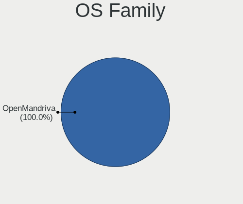
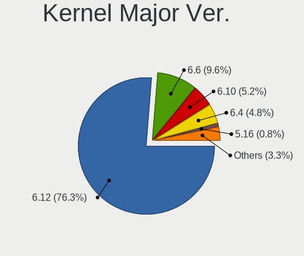
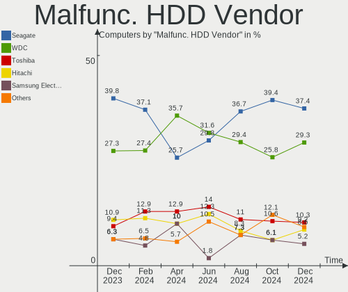
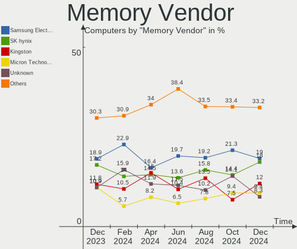

OpenMandriva Hardware Trends
----------------------------

A project to identify most popular hardware characteristics and track their change
over time based on data collected by OpenMandriva users at https://Linux-Hardware.org.

Anyone can contribute to this report by the [hw-probe](https://github.com/linuxhw/hw-probe) tool:

    sudo -E hw-probe -all -upload

This is a report for all computer types. See also reports for [desktops](/Dist/OpenMandriva/Desktop/README.md) and [notebooks](/Dist/OpenMandriva/Notebook/README.md).

Full-feature report is available here: https://linux-hardware.org/?view=trends

Period: Oct, 2021.

Contents
--------

* [ System ](#system)
  - [ OS                       ](#os)
  - [ OS Family                ](#os-family)
  - [ Kernel                   ](#kernel)
  - [ Kernel Family            ](#kernel-family)
  - [ Kernel Major Ver.        ](#kernel-major-ver)
  - [ Arch                     ](#arch)
  - [ DE                       ](#de)
  - [ Display Server           ](#display-server)
  - [ Display Manager          ](#display-manager)
  - [ OS Lang                  ](#os-lang)
  - [ Boot Mode                ](#boot-mode)
  - [ Filesystem               ](#filesystem)
  - [ Part. scheme             ](#part-scheme)
  - [ Dual Boot with Linux/BSD ](#dual-boot-with-linuxbsd)
  - [ Dual Boot (Win)          ](#dual-boot-win)

* [ Board ](#board)
  - [ Vendor                   ](#vendor)
  - [ Model                    ](#model)
  - [ Model Family             ](#model-family)
  - [ MFG Year                 ](#mfg-year)
  - [ Form Factor              ](#form-factor)
  - [ Secure Boot              ](#secure-boot)
  - [ Coreboot                 ](#coreboot)
  - [ RAM Size                 ](#ram-size)
  - [ RAM Used                 ](#ram-used)
  - [ Total Drives             ](#total-drives)
  - [ Has CD-ROM               ](#has-cd-rom)
  - [ Has Ethernet             ](#has-ethernet)
  - [ Has WiFi                 ](#has-wifi)
  - [ Has Bluetooth            ](#has-bluetooth)

* [ Location ](#location)
  - [ Country                  ](#country)
  - [ City                     ](#city)

* [ Drives ](#drives)
  - [ Drive Vendor             ](#drive-vendor)
  - [ Drive Model              ](#drive-model)
  - [ HDD Vendor               ](#hdd-vendor)
  - [ SSD Vendor               ](#ssd-vendor)
  - [ Drive Kind               ](#drive-kind)
  - [ Drive Connector          ](#drive-connector)
  - [ Drive Size               ](#drive-size)
  - [ Space Total              ](#space-total)
  - [ Space Used               ](#space-used)
  - [ Malfunc. Drives          ](#malfunc-drives)
  - [ Malfunc. Drive Vendor    ](#malfunc-drive-vendor)
  - [ Malfunc. HDD Vendor      ](#malfunc-hdd-vendor)
  - [ Malfunc. Drive Kind      ](#malfunc-drive-kind)
  - [ Failed Drives            ](#failed-drives)
  - [ Failed Drive Vendor      ](#failed-drive-vendor)
  - [ Drive Status             ](#drive-status)

* [ Storage controller ](#storage-controller)
  - [ Storage Vendor           ](#storage-vendor)
  - [ Storage Model            ](#storage-model)
  - [ Storage Kind             ](#storage-kind)

* [ Processor ](#processor)
  - [ CPU Vendor               ](#cpu-vendor)
  - [ CPU Model                ](#cpu-model)
  - [ CPU Model Family         ](#cpu-model-family)
  - [ CPU Cores                ](#cpu-cores)
  - [ CPU Sockets              ](#cpu-sockets)
  - [ CPU Threads              ](#cpu-threads)
  - [ CPU Op-Modes             ](#cpu-op-modes)
  - [ CPU Microcode            ](#cpu-microcode)
  - [ CPU Microarch            ](#cpu-microarch)

* [ Graphics ](#graphics)
  - [ GPU Vendor               ](#gpu-vendor)
  - [ GPU Model                ](#gpu-model)
  - [ GPU Combo                ](#gpu-combo)
  - [ GPU Driver               ](#gpu-driver)
  - [ GPU Memory               ](#gpu-memory)

* [ Monitor ](#monitor)
  - [ Monitor Vendor           ](#monitor-vendor)
  - [ Monitor Model            ](#monitor-model)
  - [ Monitor Resolution       ](#monitor-resolution)
  - [ Monitor Diagonal         ](#monitor-diagonal)
  - [ Monitor Width            ](#monitor-width)
  - [ Aspect Ratio             ](#aspect-ratio)
  - [ Monitor Area             ](#monitor-area)
  - [ Pixel Density            ](#pixel-density)
  - [ Multiple Monitors        ](#multiple-monitors)

* [ Network ](#network)
  - [ Net Controller Vendor    ](#net-controller-vendor)
  - [ Net Controller Model     ](#net-controller-model)
  - [ Wireless Vendor          ](#wireless-vendor)
  - [ Wireless Model           ](#wireless-model)
  - [ Ethernet Vendor          ](#ethernet-vendor)
  - [ Ethernet Model           ](#ethernet-model)
  - [ Net Controller Kind      ](#net-controller-kind)
  - [ Used Controller          ](#used-controller)
  - [ NICs                     ](#nics)
  - [ IPv6                     ](#ipv6)

* [ Bluetooth ](#bluetooth)
  - [ Bluetooth Vendor         ](#bluetooth-vendor)
  - [ Bluetooth Model          ](#bluetooth-model)

* [ Sound ](#sound)
  - [ Sound Vendor             ](#sound-vendor)
  - [ Sound Model              ](#sound-model)

* [ Memory ](#memory)
  - [ Memory Vendor            ](#memory-vendor)
  - [ Memory Model             ](#memory-model)
  - [ Memory Kind              ](#memory-kind)
  - [ Memory Form Factor       ](#memory-form-factor)
  - [ Memory Size              ](#memory-size)
  - [ Memory Speed             ](#memory-speed)

* [ Printers & scanners ](#printers--scanners)
  - [ Printer Vendor           ](#printer-vendor)
  - [ Printer Model            ](#printer-model)
  - [ Scanner Vendor           ](#scanner-vendor)
  - [ Scanner Model            ](#scanner-model)

* [ Camera ](#camera)
  - [ Camera Vendor            ](#camera-vendor)
  - [ Camera Model             ](#camera-model)

* [ Security ](#security)
  - [ Fingerprint Vendor       ](#fingerprint-vendor)
  - [ Fingerprint Model        ](#fingerprint-model)
  - [ Chipcard Vendor          ](#chipcard-vendor)
  - [ Chipcard Model           ](#chipcard-model)

* [ Unsupported ](#unsupported)
  - [ Unsupported Devices      ](#unsupported-devices)
  - [ Unsupported Device Types ](#unsupported-device-types)

System
------

OS
--

Installed operating systems

| Name              | Computers | Percent |
|-------------------|-----------|---------|
| OpenMandriva 4.2  | 219       | 87.25%  |
| OpenMandriva 4.50 | 32        | 12.75%  |

OS Family
---------

OS without a version

| Name         | Computers | Percent |
|--------------|-----------|---------|
| OpenMandriva | 251       | 100%    |

Kernel
------

Version of the Linux kernel

| Version                  | Computers | Percent |
|--------------------------|-----------|---------|
| 5.10.14-desktop-1omv4002 | 208       | 82.87%  |
| 5.14.7-desktop-1omv4050  | 18        | 7.17%   |
| 5.12.4-desktop-1omv4050  | 14        | 5.58%   |
| 5.11.12-desktop-1omv4002 | 11        | 4.38%   |

Kernel Family
-------------

Linux kernel without a distro release

| Version | Computers | Percent |
|---------|-----------|---------|
| 5.10.14 | 208       | 82.87%  |
| 5.14.7  | 18        | 7.17%   |
| 5.12.4  | 14        | 5.58%   |
| 5.11.12 | 11        | 4.38%   |

Kernel Major Ver.
-----------------

Linux kernel major version

| Version | Computers | Percent |
|---------|-----------|---------|
| 5.10    | 208       | 82.87%  |
| 5.14    | 18        | 7.17%   |
| 5.12    | 14        | 5.58%   |
| 5.11    | 11        | 4.38%   |

Arch
----

OS architecture (x86_64, i586, etc.)

| Name   | Computers | Percent |
|--------|-----------|---------|
| x86_64 | 251       | 100%    |

DE
--

Desktop Environment

| Name | Computers | Percent |
|------|-----------|---------|
| KDE5 | 251       | 100%    |

Display Server
--------------

X11 or Wayland

| Name    | Computers | Percent |
|---------|-----------|---------|
| X11     | 248       | 98.8%   |
| Wayland | 3         | 1.2%    |

Display Manager
---------------

SDDM, LightDM, etc.

| Name | Computers | Percent |
|------|-----------|---------|
| SDDM | 251       | 100%    |

OS Lang
-------

Language

| Lang  | Computers | Percent |
|-------|-----------|---------|
| en_US | 135       | 53.78%  |
| fr_FR | 22        | 8.76%   |
| ru_RU | 17        | 6.77%   |
| pt_BR | 12        | 4.78%   |
| de_DE | 12        | 4.78%   |
| es_ES | 10        | 3.98%   |
| cs_CZ | 10        | 3.98%   |
| pl_PL | 9         | 3.59%   |
| en_GB | 5         | 1.99%   |
| it_IT | 4         | 1.59%   |
| hu_HU | 2         | 0.8%    |
| en_IL | 2         | 0.8%    |
| pt_PT | 1         | 0.4%    |
| nl_NL | 1         | 0.4%    |
| fr_BE | 1         | 0.4%    |
| es_PE | 1         | 0.4%    |
| es_CO | 1         | 0.4%    |
| es_BO | 1         | 0.4%    |
| es_AR | 1         | 0.4%    |
| en_IN | 1         | 0.4%    |
| en_DK | 1         | 0.4%    |
| en_CA | 1         | 0.4%    |
| en_AU | 1         | 0.4%    |

Boot Mode
---------

EFI or BIOS

| Mode | Computers | Percent |
|------|-----------|---------|
| BIOS | 146       | 58.17%  |
| EFI  | 105       | 41.83%  |

Filesystem
----------

Type of filesystem

| Type    | Computers | Percent |
|---------|-----------|---------|
| Overlay | 207       | 82.47%  |
| Ext4    | 39        | 15.54%  |
| Btrfs   | 4         | 1.59%   |
| Xfs     | 1         | 0.4%    |

Part. scheme
------------

Scheme of partitioning

| Type | Computers | Percent |
|------|-----------|---------|
| GPT  | 145       | 57.77%  |
| MBR  | 106       | 42.23%  |

Dual Boot with Linux/BSD
------------------------

Hosting more than one Linux/BSD

| Dual boot | Computers | Percent |
|-----------|-----------|---------|
| Yes       | 133       | 52.99%  |
| No        | 118       | 47.01%  |

Dual Boot (Win)
---------------

Hosting Linux and Windows

| Dual boot | Computers | Percent |
|-----------|-----------|---------|
| Yes       | 131       | 52.19%  |
| No        | 120       | 47.81%  |

Board
-----

Vendor
------

Motherboard manufacturer

| Name                | Computers | Percent |
|---------------------|-----------|---------|
| ASUSTek Computer    | 52        | 20.72%  |
| Lenovo              | 32        | 12.75%  |
| Hewlett-Packard     | 29        | 11.55%  |
| Dell                | 25        | 9.96%   |
| MSI                 | 19        | 7.57%   |
| Gigabyte Technology | 19        | 7.57%   |
| ASRock              | 13        | 5.18%   |
| Acer                | 13        | 5.18%   |
| Sony                | 5         | 1.99%   |
| Intel               | 5         | 1.99%   |
| Foxconn             | 4         | 1.59%   |
| Apple               | 4         | 1.59%   |
| Toshiba             | 3         | 1.2%    |
| Samsung Electronics | 3         | 1.2%    |
| Medion              | 3         | 1.2%    |
| Fujitsu             | 3         | 1.2%    |
| Positivo            | 2         | 0.8%    |
| Pegatron            | 2         | 0.8%    |
| eMachines           | 2         | 0.8%    |
| TUXEDO              | 1         | 0.4%    |
| Timi                | 1         | 0.4%    |
| Semp Toshiba        | 1         | 0.4%    |
| Philco              | 1         | 0.4%    |
| PCWare              | 1         | 0.4%    |
| PANSHI              | 1         | 0.4%    |
| Packard Bell        | 1         | 0.4%    |
| NEC Computers       | 1         | 0.4%    |
| Microsoft           | 1         | 0.4%    |
| Jumper              | 1         | 0.4%    |
| EVOO                | 1         | 0.4%    |
| ARIMA               | 1         | 0.4%    |
| Alienware           | 1         | 0.4%    |

Model
-----

Motherboard model

| Name                                 | Computers | Percent |
|--------------------------------------|-----------|---------|
| ASUS UX31E                           | 7         | 2.79%   |
| MSI MS-7C37                          | 2         | 0.8%    |
| Dell OptiPlex 7050                   | 2         | 0.8%    |
| ASUS KLONDIKE                        | 2         | 0.8%    |
| ASUS K53SM                           | 2         | 0.8%    |
| TUXEDO Aura 15 Gen1                  | 1         | 0.4%    |
| Toshiba Satellite Pro C50-A-1C8      | 1         | 0.4%    |
| Toshiba Satellite P755               | 1         | 0.4%    |
| Toshiba Satellite A505               | 1         | 0.4%    |
| Timi Mi NoteBook Horizon Edition 14  | 1         | 0.4%    |
| Sony VPCS111FM                       | 1         | 0.4%    |
| Sony VPCEH1L8E                       | 1         | 0.4%    |
| Sony VPCEH10EB                       | 1         | 0.4%    |
| Sony VPCEA3S1E                       | 1         | 0.4%    |
| Sony VGN-FW270J                      | 1         | 0.4%    |
| Semp Toshiba IS 1412                 | 1         | 0.4%    |
| Samsung R530/R730/R540               | 1         | 0.4%    |
| Samsung R425/R525                    | 1         | 0.4%    |
| Samsung 350V5C/351V5C/3540VC/3440VC  | 1         | 0.4%    |
| Positivo S14SL01                     | 1         | 0.4%    |
| Positivo POS-EIB75CO                 | 1         | 0.4%    |
| Philco DTC-A55                       | 1         | 0.4%    |
| Pegatron Elite 7300 Series MT        | 1         | 0.4%    |
| Pegatron Compaq dx2400 Microtower PC | 1         | 0.4%    |
| PCWare IPX1800E2                     | 1         | 0.4%    |
| PANSHI B85-S1 V1.0                   | 1         | 0.4%    |
| Packard Bell imedia S3710            | 1         | 0.4%    |
| NEC Computers PC-LL550VG6R           | 1         | 0.4%    |
| MSI MS-7C94                          | 1         | 0.4%    |
| MSI MS-7B86                          | 1         | 0.4%    |
| MSI MS-7B53                          | 1         | 0.4%    |
| MSI MS-7B33                          | 1         | 0.4%    |
| MSI MS-7B07                          | 1         | 0.4%    |
| MSI MS-7978                          | 1         | 0.4%    |
| MSI MS-7972                          | 1         | 0.4%    |
| MSI MS-7924                          | 1         | 0.4%    |
| MSI MS-7919                          | 1         | 0.4%    |
| MSI MS-7823                          | 1         | 0.4%    |
| MSI MS-7817                          | 1         | 0.4%    |
| MSI MS-7793                          | 1         | 0.4%    |
| MSI MS-7695                          | 1         | 0.4%    |
| MSI MS-7641                          | 1         | 0.4%    |
| MSI MS-7636                          | 1         | 0.4%    |
| MSI MS-7586                          | 1         | 0.4%    |
| MSI Compaq dx2420 Microtower         | 1         | 0.4%    |
| Microsoft Surface Pro 6              | 1         | 0.4%    |
| Medion WIM2180                       | 1         | 0.4%    |
| Medion E7417 MD99269                 | 1         | 0.4%    |
| Medion E2292                         | 1         | 0.4%    |
| Lenovo Z50-70 20354                  | 1         | 0.4%    |
| Lenovo V145-15AST 81MT               | 1         | 0.4%    |
| Lenovo ThinkPad X230 2320HMU         | 1         | 0.4%    |
| Lenovo ThinkPad X220 Tablet 42992PG  | 1         | 0.4%    |
| Lenovo ThinkPad X121e 3051RT2        | 1         | 0.4%    |
| Lenovo ThinkPad W520 42844DG         | 1         | 0.4%    |
| Lenovo ThinkPad T61 765818U          | 1         | 0.4%    |
| Lenovo ThinkPad T540p 20BFS31F00     | 1         | 0.4%    |
| Lenovo ThinkPad T530 2429MF7         | 1         | 0.4%    |
| Lenovo ThinkPad T530 2394BK7         | 1         | 0.4%    |
| Lenovo ThinkPad T520 4242A21         | 1         | 0.4%    |

Model Family
------------

Motherboard model prefix

| Name                       | Computers | Percent |
|----------------------------|-----------|---------|
| Lenovo ThinkPad            | 13        | 5.18%   |
| Acer Aspire                | 12        | 4.78%   |
| Lenovo IdeaPad             | 9         | 3.59%   |
| Dell Inspiron              | 8         | 3.19%   |
| ASUS UX31E                 | 7         | 2.79%   |
| ASUS PRIME                 | 7         | 2.79%   |
| HP Compaq                  | 6         | 2.39%   |
| Dell OptiPlex              | 5         | 1.99%   |
| Dell Latitude              | 5         | 1.99%   |
| ASUS VivoBook              | 4         | 1.59%   |
| ASUS ROG                   | 4         | 1.59%   |
| Toshiba Satellite          | 3         | 1.2%    |
| HP ProDesk                 | 3         | 1.2%    |
| HP Pavilion                | 3         | 1.2%    |
| HP EliteBook               | 3         | 1.2%    |
| Dell Vostro                | 3         | 1.2%    |
| MSI MS-7C37                | 2         | 0.8%    |
| Lenovo ThinkCentre         | 2         | 0.8%    |
| HP Laptop                  | 2         | 0.8%    |
| Fujitsu LIFEBOOK           | 2         | 0.8%    |
| Dell Precision             | 2         | 0.8%    |
| ASUS P8Z77-V               | 2         | 0.8%    |
| ASUS P5G41T-M              | 2         | 0.8%    |
| ASUS KLONDIKE              | 2         | 0.8%    |
| ASUS K53SM                 | 2         | 0.8%    |
| TUXEDO Aura                | 1         | 0.4%    |
| Timi Mi                    | 1         | 0.4%    |
| Sony VPCS111FM             | 1         | 0.4%    |
| Sony VPCEH1L8E             | 1         | 0.4%    |
| Sony VPCEH10EB             | 1         | 0.4%    |
| Sony VPCEA3S1E             | 1         | 0.4%    |
| Sony VGN-FW270J            | 1         | 0.4%    |
| Semp Toshiba IS            | 1         | 0.4%    |
| Samsung R530               | 1         | 0.4%    |
| Samsung R425               | 1         | 0.4%    |
| Samsung 350V5C             | 1         | 0.4%    |
| Positivo S14SL01           | 1         | 0.4%    |
| Positivo POS-EIB75CO       | 1         | 0.4%    |
| Philco DTC-A55             | 1         | 0.4%    |
| Pegatron Elite             | 1         | 0.4%    |
| Pegatron Compaq            | 1         | 0.4%    |
| PCWare IPX1800E2           | 1         | 0.4%    |
| PANSHI B85-S1              | 1         | 0.4%    |
| Packard Bell imedia        | 1         | 0.4%    |
| NEC Computers PC-LL550VG6R | 1         | 0.4%    |
| MSI MS-7C94                | 1         | 0.4%    |
| MSI MS-7B86                | 1         | 0.4%    |
| MSI MS-7B53                | 1         | 0.4%    |
| MSI MS-7B33                | 1         | 0.4%    |
| MSI MS-7B07                | 1         | 0.4%    |
| MSI MS-7978                | 1         | 0.4%    |
| MSI MS-7972                | 1         | 0.4%    |
| MSI MS-7924                | 1         | 0.4%    |
| MSI MS-7919                | 1         | 0.4%    |
| MSI MS-7823                | 1         | 0.4%    |
| MSI MS-7817                | 1         | 0.4%    |
| MSI MS-7793                | 1         | 0.4%    |
| MSI MS-7695                | 1         | 0.4%    |
| MSI MS-7641                | 1         | 0.4%    |
| MSI MS-7636                | 1         | 0.4%    |

MFG Year
--------

Motherboard manufacture year

| Year | Computers | Percent |
|------|-----------|---------|
| 2011 | 24        | 9.56%   |
| 2021 | 23        | 9.16%   |
| 2019 | 23        | 9.16%   |
| 2018 | 23        | 9.16%   |
| 2012 | 23        | 9.16%   |
| 2020 | 19        | 7.57%   |
| 2015 | 19        | 7.57%   |
| 2013 | 17        | 6.77%   |
| 2010 | 17        | 6.77%   |
| 2008 | 16        | 6.37%   |
| 2009 | 14        | 5.58%   |
| 2014 | 12        | 4.78%   |
| 2017 | 8         | 3.19%   |
| 2016 | 8         | 3.19%   |
| 2006 | 4         | 1.59%   |
| 2007 | 1         | 0.4%    |

Form Factor
-----------

Physical design of the computer

| Name        | Computers | Percent |
|-------------|-----------|---------|
| Desktop     | 124       | 49.4%   |
| Notebook    | 118       | 47.01%  |
| Mini pc     | 4         | 1.59%   |
| Tablet      | 2         | 0.8%    |
| All in one  | 2         | 0.8%    |
| Convertible | 1         | 0.4%    |

Secure Boot
-----------

Enabled or disabled

| State    | Computers | Percent |
|----------|-----------|---------|
| Disabled | 251       | 100%    |

Coreboot
--------

Have coreboot on board

| Used | Computers | Percent |
|------|-----------|---------|
| No   | 251       | 100%    |

RAM Size
--------

Total RAM memory

| Size in GB  | Computers | Percent |
|-------------|-----------|---------|
| 3.01-4.0    | 76        | 30.28%  |
| 4.01-8.0    | 63        | 25.1%   |
| 8.01-16.0   | 51        | 20.32%  |
| 16.01-24.0  | 25        | 9.96%   |
| 32.01-64.0  | 18        | 7.17%   |
| 1.01-2.0    | 10        | 3.98%   |
| 2.01-3.0    | 5         | 1.99%   |
| 24.01-32.0  | 2         | 0.8%    |
| 64.01-256.0 | 1         | 0.4%    |

RAM Used
--------

Used RAM memory

| Used GB  | Computers | Percent |
|----------|-----------|---------|
| 1.01-2.0 | 195       | 77.69%  |
| 0.51-1.0 | 30        | 11.95%  |
| 2.01-3.0 | 16        | 6.37%   |
| 0.01-0.5 | 8         | 3.19%   |
| 3.01-4.0 | 2         | 0.8%    |

Total Drives
------------

Number of drives on board

| Drives | Computers | Percent |
|--------|-----------|---------|
| 1      | 148       | 58.96%  |
| 2      | 60        | 23.9%   |
| 3      | 19        | 7.57%   |
| 4      | 8         | 3.19%   |
| 0      | 6         | 2.39%   |
| 5      | 4         | 1.59%   |
| 7      | 3         | 1.2%    |
| 6      | 2         | 0.8%    |
| 8      | 1         | 0.4%    |

Has CD-ROM
----------

Has CD-ROM on board

| Presented | Computers | Percent |
|-----------|-----------|---------|
| Yes       | 141       | 56.18%  |
| No        | 110       | 43.82%  |

Has Ethernet
------------

Has Ethernet on board

| Presented | Computers | Percent |
|-----------|-----------|---------|
| Yes       | 231       | 92.03%  |
| No        | 20        | 7.97%   |

Has WiFi
--------

Has WiFi module

| Presented | Computers | Percent |
|-----------|-----------|---------|
| Yes       | 163       | 64.94%  |
| No        | 88        | 35.06%  |

Has Bluetooth
-------------

Has Bluetooth module

| Presented | Computers | Percent |
|-----------|-----------|---------|
| No        | 135       | 53.78%  |
| Yes       | 116       | 46.22%  |

Location
--------

Country
-------

Geographic location (country)

| Country     | Computers | Percent |
|-------------|-----------|---------|
| USA         | 28        | 11.16%  |
| France      | 26        | 10.36%  |
| Russia      | 22        | 8.76%   |
| Brazil      | 22        | 8.76%   |
| Germany     | 19        | 7.57%   |
| Spain       | 16        | 6.37%   |
| Poland      | 14        | 5.58%   |
| India       | 10        | 3.98%   |
| Czechia     | 10        | 3.98%   |
| UK          | 8         | 3.19%   |
| Italy       | 8         | 3.19%   |
| Canada      | 6         | 2.39%   |
| Sweden      | 5         | 1.99%   |
| Japan       | 5         | 1.99%   |
| Morocco     | 4         | 1.59%   |
| Taiwan      | 3         | 1.2%    |
| Peru        | 3         | 1.2%    |
| Israel      | 3         | 1.2%    |
| Hungary     | 3         | 1.2%    |
| Argentina   | 3         | 1.2%    |
| Ukraine     | 2         | 0.8%    |
| Slovakia    | 2         | 0.8%    |
| Portugal    | 2         | 0.8%    |
| Philippines | 2         | 0.8%    |
| Greece      | 2         | 0.8%    |
| Bulgaria    | 2         | 0.8%    |
| Australia   | 2         | 0.8%    |
| Serbia      | 1         | 0.4%    |
| Netherlands | 1         | 0.4%    |
| Moldova     | 1         | 0.4%    |
| Mexico      | 1         | 0.4%    |
| Lithuania   | 1         | 0.4%    |
| Kazakhstan  | 1         | 0.4%    |
| Jamaica     | 1         | 0.4%    |
| Indonesia   | 1         | 0.4%    |
| Hong Kong   | 1         | 0.4%    |
| Guadeloupe  | 1         | 0.4%    |
| El Salvador | 1         | 0.4%    |
| Croatia     | 1         | 0.4%    |
| Colombia    | 1         | 0.4%    |
| China       | 1         | 0.4%    |
| Bolivia     | 1         | 0.4%    |
| Belgium     | 1         | 0.4%    |
| Belarus     | 1         | 0.4%    |
| Bahamas     | 1         | 0.4%    |
| Austria     | 1         | 0.4%    |

City
----

Geographic location (city)

| City                    | Computers | Percent |
|-------------------------|-----------|---------|
| Prague                  | 8         | 3.19%   |
| Warsaw                  | 3         | 1.2%    |
| Villanueva de la Canada | 3         | 1.2%    |
| St Petersburg           | 3         | 1.2%    |
| New Taipei              | 3         | 1.2%    |
| Moscow                  | 3         | 1.2%    |
| Madrid                  | 3         | 1.2%    |
| Guebwiller              | 3         | 1.2%    |
| Berlin                  | 3         | 1.2%    |
| Barcelona               | 3         | 1.2%    |
| Yaroslavl               | 2         | 0.8%    |
| Vidnoye                 | 2         | 0.8%    |
| The Bronx               | 2         | 0.8%    |
| Stezzano                | 2         | 0.8%    |
| Solapur                 | 2         | 0.8%    |
| Silla                   | 2         | 0.8%    |
| S??o Paulo              | 2         | 0.8%    |
| Sainte-Marie-aux-Chenes | 2         | 0.8%    |
| Sagamihara              | 2         | 0.8%    |
| Rostov-on-Don           | 2         | 0.8%    |
| Munich                  | 2         | 0.8%    |
| Mumbai                  | 2         | 0.8%    |
| Marrakesh               | 2         | 0.8%    |
| Leck                    | 2         | 0.8%    |
| Le??n                   | 2         | 0.8%    |
| Joinville               | 2         | 0.8%    |
| Fond du Lac             | 2         | 0.8%    |
| Chennai                 | 2         | 0.8%    |
| Bristol                 | 2         | 0.8%    |
| Arequipa                | 2         | 0.8%    |
| Zirndorf                | 1         | 0.4%    |
| Zamberk                 | 1         | 0.4%    |
| Zagreb                  | 1         | 0.4%    |
| Zabrze                  | 1         | 0.4%    |
| Yokohama                | 1         | 0.4%    |
| Wroclaw                 | 1         | 0.4%    |
| Woolloongabba           | 1         | 0.4%    |
| Woodhall Spa            | 1         | 0.4%    |
| Willingboro             | 1         | 0.4%    |
| Wahpeton                | 1         | 0.4%    |
| Vitoria-Gasteiz         | 1         | 0.4%    |
| Vilnius                 | 1         | 0.4%    |
| Varna                   | 1         | 0.4%    |
| Uppsala                 | 1         | 0.4%    |
| Ulyanovsk               | 1         | 0.4%    |
| Uberl??ndia             | 1         | 0.4%    |
| Tver                    | 1         | 0.4%    |
| Trumann                 | 1         | 0.4%    |
| Trollh?¤ttan            | 1         | 0.4%    |
| Toulouse                | 1         | 0.4%    |
| Toronto                 | 1         | 0.4%    |
| Tonawanda               | 1         | 0.4%    |
| Thessaloniki            | 1         | 0.4%    |
| Teresina                | 1         | 0.4%    |
| Tel Aviv                | 1         | 0.4%    |
| Tatu?­                  | 1         | 0.4%    |
| Tatab??nya              | 1         | 0.4%    |
| Tarnowskie Gory         | 1         | 0.4%    |
| Tarn??w                 | 1         | 0.4%    |
| Tambov                  | 1         | 0.4%    |

Drives
------

Drive Vendor
------------

Hard drive vendors

| Vendor              | Computers | Drives | Percent |
|---------------------|-----------|--------|---------|
| WDC                 | 88        | 107    | 23.72%  |
| Seagate             | 70        | 82     | 18.87%  |
| Samsung Electronics | 37        | 46     | 9.97%   |
| Toshiba             | 21        | 22     | 5.66%   |
| SanDisk             | 18        | 18     | 4.85%   |
| Kingston            | 15        | 16     | 4.04%   |
| Hitachi             | 15        | 16     | 4.04%   |
| Unknown             | 12        | 14     | 3.23%   |
| Crucial             | 11        | 13     | 2.96%   |
| SK Hynix            | 8         | 8      | 2.16%   |
| A-DATA Technology   | 8         | 8      | 2.16%   |
| Intel               | 6         | 8      | 1.62%   |
| GOODRAM             | 6         | 6      | 1.62%   |
| Unknown             | 6         | 7      | 1.62%   |
| HGST                | 5         | 5      | 1.35%   |
| MAXTOR              | 4         | 4      | 1.08%   |
| China               | 4         | 4      | 1.08%   |
| SPCC                | 3         | 3      | 0.81%   |
| OCZ                 | 3         | 3      | 0.81%   |
| JMicron             | 3         | 3      | 0.81%   |
| Transcend           | 2         | 2      | 0.54%   |
| PNY                 | 2         | 2      | 0.54%   |
| PLEXTOR             | 2         | 2      | 0.54%   |
| Fujitsu             | 2         | 2      | 0.54%   |
| Apple               | 2         | 2      | 0.54%   |
| Vaseky              | 1         | 1      | 0.27%   |
| USB 3.0             | 1         | 2      | 0.27%   |
| Promise             | 1         | 1      | 0.27%   |
| PHISON              | 1         | 1      | 0.27%   |
| Patriot             | 1         | 2      | 0.27%   |
| Micron Technology   | 1         | 1      | 0.27%   |
| KIOXIA              | 1         | 2      | 0.27%   |
| INDMEM              | 1         | 1      | 0.27%   |
| IB                  | 1         | 2      | 0.27%   |
| Hikvision           | 1         | 1      | 0.27%   |
| ExcelStor           | 1         | 1      | 0.27%   |
| Drevo               | 1         | 1      | 0.27%   |
| Corsair             | 1         | 1      | 0.27%   |
| BW-PSSD4            | 1         | 1      | 0.27%   |
| BHT                 | 1         | 1      | 0.27%   |
| ASMT                | 1         | 1      | 0.27%   |
| AS25                | 1         | 1      | 0.27%   |
| ANACOMDA            | 1         | 1      | 0.27%   |

Drive Model
-----------

Hard drive models

| Model                              | Computers | Percent |
|------------------------------------|-----------|---------|
| Seagate ST500DM002-1BD142 500GB    | 7         | 1.69%   |
| SanDisk SSD U100 256GB             | 7         | 1.69%   |
| WDC WDS240G2G0A-00JH30 240GB SSD   | 6         | 1.45%   |
| Unknown                            | 6         | 1.45%   |
| Seagate ST3500312CS 500GB          | 5         | 1.21%   |
| Seagate ST1000DM010-2EP102 1TB     | 4         | 0.97%   |
| WDC WD5000AAKX-001CA0 500GB        | 3         | 0.73%   |
| WDC WD10JPVX-22JC3T0 1TB           | 3         | 0.73%   |
| Toshiba MQ01ABD100 1TB             | 3         | 0.73%   |
| Seagate ST500LT012-1DG142 500GB    | 3         | 0.73%   |
| Seagate ST3500418AS 500GB          | 3         | 0.73%   |
| Seagate ST2000DM006-2DM164 2TB     | 3         | 0.73%   |
| Seagate ST1000LM024 HN-M101MBB 1TB | 3         | 0.73%   |
| Samsung SSD 860 EVO 500GB          | 3         | 0.73%   |
| Samsung SSD 860 EVO 1TB            | 3         | 0.73%   |
| Kingston SV300S37A120G 120GB SSD   | 3         | 0.73%   |
| Kingston SA400S37120G 120GB SSD    | 3         | 0.73%   |
| Crucial CT240BX500SSD1 240GB       | 3         | 0.73%   |
| WDC WD6400AAKS-65A7B2 640GB        | 2         | 0.48%   |
| WDC WD5000LPVX-22V0TT0 500GB       | 2         | 0.48%   |
| WDC WD3200AAJS-56M0A0 320GB        | 2         | 0.48%   |
| WDC WD20PURX-64P6ZY0 2TB           | 2         | 0.48%   |
| WDC WD20EFRX-68EUZN0 2TB           | 2         | 0.48%   |
| WDC WD20EARX-00PASB0 2TB           | 2         | 0.48%   |
| WDC WD10EZEX-08WN4A0 1TB           | 2         | 0.48%   |
| Unknown SD/MMC/MS PRO 128GB        | 2         | 0.48%   |
| Toshiba MQ04ABF100 1TB             | 2         | 0.48%   |
| Toshiba HDWD130 3TB                | 2         | 0.48%   |
| Toshiba HDWD110 1TB                | 2         | 0.48%   |
| Toshiba DT01ACA100 1TB             | 2         | 0.48%   |
| SPCC Solid State Disk 512GB        | 2         | 0.48%   |
| SK Hynix SHGS31-500GS-2 500GB SSD  | 2         | 0.48%   |
| Seagate ST9500325AS 500GB          | 2         | 0.48%   |
| Seagate ST1000LM035-1RK172 1TB     | 2         | 0.48%   |
| Seagate ST1000DM003-1SB102 1TB     | 2         | 0.48%   |
| Seagate ST1000DM003-1ER162 1TB     | 2         | 0.48%   |
| SanDisk SSD PLUS 480GB             | 2         | 0.48%   |
| SanDisk SDSSDH3 1T00 1TB           | 2         | 0.48%   |
| Samsung SSD 970 EVO Plus 500GB     | 2         | 0.48%   |
| Samsung SSD 970 EVO Plus 250GB     | 2         | 0.48%   |
| Samsung HD160HJ 160GB              | 2         | 0.48%   |
| Kingston SA400S37480G 480GB SSD    | 2         | 0.48%   |
| Kingston SA400S37240G 240GB SSD    | 2         | 0.48%   |
| JMicron Generic 240GB              | 2         | 0.48%   |
| Intel HBRPEKNX0202AO 32GB          | 2         | 0.48%   |
| Intel HBRPEKNX0202A 512GB          | 2         | 0.48%   |
| Hitachi HTS723232A7A364 320GB      | 2         | 0.48%   |
| HGST HTS721010A9E630 1TB           | 2         | 0.48%   |
| Crucial CT525MX300SSD1 528GB       | 2         | 0.48%   |
| China SSD 128GB                    | 2         | 0.48%   |
| A-DATA SU650 120GB SSD             | 2         | 0.48%   |
| WDC WDS500G3X0C-00SJG0 500GB       | 1         | 0.24%   |
| WDC WDS500G2B0B-00YS70 500GB SSD   | 1         | 0.24%   |
| WDC WDS500G1B0C-00S6U0 500GB       | 1         | 0.24%   |
| WDC WDS120G2G0B-00EPW0 120GB SSD   | 1         | 0.24%   |
| WDC WDS120G2G0A-00JH30 120GB SSD   | 1         | 0.24%   |
| WDC WDS100T2B0C-00PXH0 1TB         | 1         | 0.24%   |
| WDC WDS100T2B0B-00YS70 1TB SSD     | 1         | 0.24%   |
| WDC WDBNCE0010PNC 1TB SSD          | 1         | 0.24%   |
| WDC WD80PURZ-85YNPY0 8TB           | 1         | 0.24%   |

HDD Vendor
----------

Hard disk drive vendors

| Vendor              | Computers | Drives | Percent |
|---------------------|-----------|--------|---------|
| WDC                 | 73        | 88     | 35.78%  |
| Seagate             | 69        | 81     | 33.82%  |
| Toshiba             | 17        | 18     | 8.33%   |
| Hitachi             | 15        | 16     | 7.35%   |
| Samsung Electronics | 11        | 11     | 5.39%   |
| HGST                | 5         | 5      | 2.45%   |
| MAXTOR              | 4         | 4      | 1.96%   |
| Unknown             | 2         | 2      | 0.98%   |
| JMicron             | 2         | 2      | 0.98%   |
| Fujitsu             | 2         | 2      | 0.98%   |
| USB 3.0             | 1         | 2      | 0.49%   |
| Promise             | 1         | 1      | 0.49%   |
| IB                  | 1         | 2      | 0.49%   |
| ExcelStor           | 1         | 1      | 0.49%   |

SSD Vendor
----------

Solid state drive vendors

| Vendor              | Computers | Drives | Percent |
|---------------------|-----------|--------|---------|
| Samsung Electronics | 21        | 27     | 16.28%  |
| SanDisk             | 18        | 18     | 13.95%  |
| Kingston            | 14        | 15     | 10.85%  |
| WDC                 | 11        | 11     | 8.53%   |
| Crucial             | 11        | 13     | 8.53%   |
| A-DATA Technology   | 7         | 7      | 5.43%   |
| SK Hynix            | 5         | 5      | 3.88%   |
| GOODRAM             | 5         | 5      | 3.88%   |
| China               | 4         | 4      | 3.1%    |
| Unknown             | 4         | 4      | 3.1%    |
| SPCC                | 3         | 3      | 2.33%   |
| OCZ                 | 3         | 3      | 2.33%   |
| Unknown             | 2         | 2      | 1.55%   |
| PNY                 | 2         | 2      | 1.55%   |
| PLEXTOR             | 2         | 2      | 1.55%   |
| Intel               | 2         | 2      | 1.55%   |
| Apple               | 2         | 2      | 1.55%   |
| Vaseky              | 1         | 1      | 0.78%   |
| Transcend           | 1         | 1      | 0.78%   |
| Toshiba             | 1         | 1      | 0.78%   |
| Seagate             | 1         | 1      | 0.78%   |
| PHISON              | 1         | 1      | 0.78%   |
| Patriot             | 1         | 2      | 0.78%   |
| Micron Technology   | 1         | 1      | 0.78%   |
| INDMEM              | 1         | 1      | 0.78%   |
| Drevo               | 1         | 1      | 0.78%   |
| Corsair             | 1         | 1      | 0.78%   |
| BHT                 | 1         | 1      | 0.78%   |
| AS25                | 1         | 1      | 0.78%   |
| ANACOMDA            | 1         | 1      | 0.78%   |

Drive Kind
----------

HDD or SSD

| Kind    | Computers | Drives | Percent |
|---------|-----------|--------|---------|
| HDD     | 161       | 235    | 51.27%  |
| SSD     | 113       | 139    | 35.99%  |
| NVMe    | 27        | 34     | 8.6%    |
| MMC     | 9         | 11     | 2.87%   |
| Unknown | 4         | 6      | 1.27%   |

Drive Connector
---------------

SATA, SAS, NVMe, etc.

| Type | Computers | Drives | Percent |
|------|-----------|--------|---------|
| SATA | 232       | 352    | 80.28%  |
| NVMe | 27        | 34     | 9.34%   |
| SAS  | 21        | 28     | 7.27%   |
| MMC  | 9         | 11     | 3.11%   |

Drive Size
----------

Size of hard drive

| Size in TB | Computers | Drives | Percent |
|------------|-----------|--------|---------|
| 0.01-0.5   | 179       | 232    | 60.47%  |
| 0.51-1.0   | 77        | 90     | 26.01%  |
| 1.01-2.0   | 22        | 29     | 7.43%   |
| 3.01-4.0   | 8         | 10     | 2.7%    |
| 2.01-3.0   | 7         | 10     | 2.36%   |
| 4.01-10.0  | 3         | 3      | 1.01%   |

Space Total
-----------

Amount of disk space available on the file system

| Size in GB | Computers | Percent |
|------------|-----------|---------|
| 1-20       | 130       | 51.79%  |
| Unknown    | 36        | 14.34%  |
| 101-250    | 29        | 11.55%  |
| 251-500    | 20        | 7.97%   |
| 501-1000   | 15        | 5.98%   |
| 51-100     | 13        | 5.18%   |
| 21-50      | 5         | 1.99%   |
| 1001-2000  | 2         | 0.8%    |
| 2001-3000  | 1         | 0.4%    |

Space Used
----------

Amount of used disk space

| Used GB   | Computers | Percent |
|-----------|-----------|---------|
| 1-20      | 199       | 79.28%  |
| Unknown   | 36        | 14.34%  |
| 21-50     | 6         | 2.39%   |
| 101-250   | 3         | 1.2%    |
| 51-100    | 3         | 1.2%    |
| 251-500   | 2         | 0.8%    |
| 1001-2000 | 1         | 0.4%    |
| 501-1000  | 1         | 0.4%    |

Malfunc. Drives
---------------

Drive models with a malfunction

| Model                                            | Computers | Drives | Percent |
|--------------------------------------------------|-----------|--------|---------|
| SanDisk SSD U100 256GB                           | 7         | 7      | 7.78%   |
| Seagate ST500DM002-1BD142 500GB                  | 3         | 3      | 3.33%   |
| WDC WD5000AAKX-001CA0 500GB                      | 2         | 2      | 2.22%   |
| Seagate ST9500325AS 500GB                        | 2         | 2      | 2.22%   |
| Samsung Electronics HD160HJ 160GB                | 2         | 2      | 2.22%   |
| WDC WDS240G2G0A-00JH30 240GB SSD                 | 1         | 1      | 1.11%   |
| WDC WD7500BPVT-60HXZT3 752GB                     | 1         | 1      | 1.11%   |
| WDC WD6400BPVT-22HXZT1 640GB                     | 1         | 1      | 1.11%   |
| WDC WD6400AAKS-65A7B2 640GB                      | 1         | 1      | 1.11%   |
| WDC WD5000LPVX-60V0TT0 500GB                     | 1         | 1      | 1.11%   |
| WDC WD5000AVVS-63H0B1 500GB                      | 1         | 1      | 1.11%   |
| WDC WD5000AVCS-632DY1 500GB                      | 1         | 1      | 1.11%   |
| WDC WD5000AAKX-221CA1 500GB                      | 1         | 1      | 1.11%   |
| WDC WD5000AAKS-22V1A0 500GB                      | 1         | 1      | 1.11%   |
| WDC WD5000AAKS-08V0A0 500GB                      | 1         | 1      | 1.11%   |
| WDC WD5000AACS-00G8B1 500GB                      | 1         | 1      | 1.11%   |
| WDC WD3200AAJS-56M0A0 320GB                      | 1         | 1      | 1.11%   |
| WDC WD3200AAJS-00L7A0 320GB                      | 1         | 1      | 1.11%   |
| WDC WD3200AAJB-00J3A0 320GB                      | 1         | 1      | 1.11%   |
| WDC WD3000HLHX-01JJPV0 304GB                     | 1         | 1      | 1.11%   |
| WDC WD2500AAKS-00F0A0 250GB                      | 1         | 1      | 1.11%   |
| WDC WD20EFRX-68EUZN0 2TB                         | 1         | 1      | 1.11%   |
| WDC WD1600BEKT-66PVMT0 160GB                     | 1         | 1      | 1.11%   |
| WDC WD1600AAJS-22L7A0 160GB                      | 1         | 1      | 1.11%   |
| WDC WD10JPVX-22JC3T0 1TB                         | 1         | 1      | 1.11%   |
| WDC WD10EZRX-00A8LB0 1TB                         | 1         | 1      | 1.11%   |
| WDC WD10EZEX-08WN4A0 1TB                         | 1         | 1      | 1.11%   |
| WDC WD10EURX-83UY4Y0 1TB                         | 1         | 1      | 1.11%   |
| WDC WD10EARS-00Y5B1 1TB                          | 1         | 1      | 1.11%   |
| WDC WD10EADS-22M2B0 1TB                          | 1         | 1      | 1.11%   |
| WDC WD10EADS-11M2B2 1TB                          | 1         | 1      | 1.11%   |
| Toshiba MQ01ABD100 1TB                           | 1         | 1      | 1.11%   |
| Toshiba MK5055GSX 500GB                          | 1         | 1      | 1.11%   |
| Toshiba MK1234GSX 120GB                          | 1         | 1      | 1.11%   |
| SK Hynix HFS128G3AMNB-2200A 128GB SSD            | 1         | 1      | 1.11%   |
| Seagate ST9320325AS 320GB                        | 1         | 1      | 1.11%   |
| Seagate ST500LT012-9WS142 500GB                  | 1         | 1      | 1.11%   |
| Seagate ST500LT012-1DG142 500GB                  | 1         | 1      | 1.11%   |
| Seagate ST500LM000-1EJ162 500GB                  | 1         | 1      | 1.11%   |
| Seagate ST3808110AS 80GB                         | 1         | 1      | 1.11%   |
| Seagate ST3250410AS 250GB                        | 1         | 1      | 1.11%   |
| Seagate ST3250310AS 250GB                        | 1         | 1      | 1.11%   |
| Seagate ST3120813AS 120GB                        | 1         | 1      | 1.11%   |
| Seagate ST3000VM002-1ET166 3TB                   | 1         | 1      | 1.11%   |
| Seagate ST2000LX001-1RG174 2TB                   | 1         | 1      | 1.11%   |
| Seagate ST1000LM024 HN-M101MBB 1TB               | 1         | 1      | 1.11%   |
| Seagate ST1000DM003-1ER162 1TB                   | 1         | 1      | 1.11%   |
| SanDisk SSD P4 64GB                              | 1         | 1      | 1.11%   |
| Samsung Electronics SSD 840 EVO 120GB            | 1         | 1      | 1.11%   |
| Samsung Electronics SP1604N 160GB                | 1         | 1      | 1.11%   |
| Samsung Electronics MZ7LN256HMJP-000H1 256GB SSD | 1         | 1      | 1.11%   |
| Samsung Electronics HM160HI 160GB                | 1         | 1      | 1.11%   |
| Samsung Electronics HD120IJ 120GB                | 1         | 1      | 1.11%   |
| Samsung Electronics HD103SJ 1TB                  | 1         | 1      | 1.11%   |
| Samsung Electronics HD080HJ 80GB                 | 1         | 1      | 1.11%   |
| PLEXTOR PX-256M5S 256GB SSD                      | 1         | 1      | 1.11%   |
| OCZ VERTEX2 64GB SSD                             | 1         | 1      | 1.11%   |
| OCZ AGILITY3 480GB SSD                           | 1         | 1      | 1.11%   |
| MAXTOR STM3500320AS 500GB                        | 1         | 1      | 1.11%   |
| MAXTOR 6Y080L0 82GB                              | 1         | 1      | 1.11%   |

Malfunc. Drive Vendor
---------------------

Vendors of faulty drives

| Vendor              | Computers | Drives | Percent |
|---------------------|-----------|--------|---------|
| WDC                 | 26        | 28     | 29.89%  |
| Seagate             | 16        | 17     | 18.39%  |
| Samsung Electronics | 9         | 9      | 10.34%  |
| SanDisk             | 8         | 8      | 9.2%    |
| Hitachi             | 8         | 8      | 9.2%    |
| Toshiba             | 3         | 3      | 3.45%   |
| HGST                | 3         | 3      | 3.45%   |
| OCZ                 | 2         | 2      | 2.3%    |
| MAXTOR              | 2         | 2      | 2.3%    |
| Kingston            | 2         | 2      | 2.3%    |
| Crucial             | 2         | 2      | 2.3%    |
| SK Hynix            | 1         | 1      | 1.15%   |
| PLEXTOR             | 1         | 1      | 1.15%   |
| IB                  | 1         | 1      | 1.15%   |
| Fujitsu             | 1         | 1      | 1.15%   |
| A-DATA Technology   | 1         | 1      | 1.15%   |
| Unknown             | 1         | 1      | 1.15%   |

Malfunc. HDD Vendor
-------------------

Vendors of faulty HDD drives

| Vendor              | Computers | Drives | Percent |
|---------------------|-----------|--------|---------|
| WDC                 | 25        | 27     | 37.88%  |
| Seagate             | 16        | 17     | 24.24%  |
| Hitachi             | 8         | 8      | 12.12%  |
| Samsung Electronics | 7         | 7      | 10.61%  |
| Toshiba             | 3         | 3      | 4.55%   |
| HGST                | 3         | 3      | 4.55%   |
| MAXTOR              | 2         | 2      | 3.03%   |
| IB                  | 1         | 1      | 1.52%   |
| Fujitsu             | 1         | 1      | 1.52%   |

Malfunc. Drive Kind
-------------------

Kinds of faulty drives

| Kind | Computers | Drives | Percent |
|------|-----------|--------|---------|
| HDD  | 60        | 69     | 74.07%  |
| SSD  | 21        | 21     | 25.93%  |

Failed Drives
-------------

Failed drive models

| Model                   | Computers | Drives | Percent |
|-------------------------|-----------|--------|---------|
| WDC WD800JD-00LSA0 80GB | 1         | 1      | 100%    |

Failed Drive Vendor
-------------------

Failed drive vendors

| Vendor | Computers | Drives | Percent |
|--------|-----------|--------|---------|
| WDC    | 1         | 1      | 100%    |

Drive Status
------------

Number of failed and malfunc. drives

| Status   | Computers | Drives | Percent |
|----------|-----------|--------|---------|
| Works    | 185       | 289    | 61.26%  |
| Malfunc  | 79        | 90     | 26.16%  |
| Detected | 37        | 45     | 12.25%  |
| Failed   | 1         | 1      | 0.33%   |

Storage controller
------------------

Storage Vendor
--------------

Storage controller vendors

| Vendor                       | Computers | Percent |
|------------------------------|-----------|---------|
| Intel                        | 204       | 67.33%  |
| AMD                          | 40        | 13.2%   |
| JMicron Technology           | 9         | 2.97%   |
| Sandisk                      | 8         | 2.64%   |
| Samsung Electronics          | 8         | 2.64%   |
| ASMedia Technology           | 7         | 2.31%   |
| Nvidia                       | 6         | 1.98%   |
| Marvell Technology Group     | 4         | 1.32%   |
| Toshiba America Info Systems | 3         | 0.99%   |
| VIA Technologies             | 2         | 0.66%   |
| SK Hynix                     | 2         | 0.66%   |
| KIOXIA                       | 2         | 0.66%   |
| Silicon Motion               | 1         | 0.33%   |
| Silicon Image                | 1         | 0.33%   |
| Shenzhen Longsys Electronics | 1         | 0.33%   |
| Realtek Semiconductor        | 1         | 0.33%   |
| Promise Technology           | 1         | 0.33%   |
| Phison Electronics           | 1         | 0.33%   |
| LSI Logic / Symbios Logic    | 1         | 0.33%   |
| Kingston Technology Company  | 1         | 0.33%   |

Storage Model
-------------

Storage controller models

| Model                                                                                   | Computers | Percent |
|-----------------------------------------------------------------------------------------|-----------|---------|
| AMD FCH SATA Controller [AHCI mode]                                                     | 20        | 5.45%   |
| Intel 8 Series/C220 Series Chipset Family 6-port SATA Controller 1 [AHCI mode]          | 19        | 5.18%   |
| Intel 6 Series/C200 Series Chipset Family 6 port Mobile SATA AHCI Controller            | 17        | 4.63%   |
| Intel 7 Series Chipset Family 6-port SATA Controller [AHCI mode]                        | 14        | 3.81%   |
| Intel Sunrise Point-LP SATA Controller [AHCI mode]                                      | 10        | 2.72%   |
| Intel NM10/ICH7 Family SATA Controller [IDE mode]                                       | 10        | 2.72%   |
| Intel 82801 Mobile SATA Controller [RAID mode]                                          | 10        | 2.72%   |
| AMD SB7x0/SB8x0/SB9x0 SATA Controller [AHCI mode]                                       | 10        | 2.72%   |
| Intel 82801G (ICH7 Family) IDE Controller                                               | 9         | 2.45%   |
| Intel 200 Series PCH SATA controller [AHCI mode]                                        | 9         | 2.45%   |
| AMD SB7x0/SB8x0/SB9x0 IDE Controller                                                    | 9         | 2.45%   |
| Intel Q170/Q150/B150/H170/H110/Z170/CM236 Chipset SATA Controller [AHCI Mode]           | 8         | 2.18%   |
| Intel 7 Series/C210 Series Chipset Family 6-port SATA Controller [AHCI mode]            | 8         | 2.18%   |
| Intel Wildcat Point-LP SATA Controller [AHCI Mode]                                      | 7         | 1.91%   |
| Intel SATA Controller [RAID mode]                                                       | 7         | 1.91%   |
| Intel 82801IBM/IEM (ICH9M/ICH9M-E) 4 port SATA Controller [AHCI mode]                   | 7         | 1.91%   |
| Intel 8 Series SATA Controller 1 [AHCI mode]                                            | 7         | 1.91%   |
| ASMedia ASM1062 Serial ATA Controller                                                   | 7         | 1.91%   |
| AMD SB7x0/SB8x0/SB9x0 SATA Controller [IDE mode]                                        | 7         | 1.91%   |
| Intel 82801I (ICH9 Family) 2 port SATA Controller [IDE mode]                            | 6         | 1.63%   |
| Intel 82801HM/HEM (ICH8M/ICH8M-E) IDE Controller                                        | 6         | 1.63%   |
| JMicron JMB363 SATA/IDE Controller                                                      | 5         | 1.36%   |
| Intel Atom Processor E3800 Series SATA AHCI Controller                                  | 5         | 1.36%   |
| Intel 82801HM/HEM (ICH8M/ICH8M-E) SATA Controller [AHCI mode]                           | 5         | 1.36%   |
| Intel 5 Series/3400 Series Chipset 4 port SATA AHCI Controller                          | 5         | 1.36%   |
| AMD 400 Series Chipset SATA Controller                                                  | 5         | 1.36%   |
| Intel 82801JD/DO (ICH10 Family) SATA AHCI Controller                                    | 4         | 1.09%   |
| Intel 82801IR/IO/IH (ICH9R/DO/DH) 4 port SATA Controller [IDE mode]                     | 4         | 1.09%   |
| Intel 82801IBM/IEM (ICH9M/ICH9M-E) 2 port SATA Controller [IDE mode]                    | 4         | 1.09%   |
| Intel 5 Series/3400 Series Chipset 6 port SATA AHCI Controller                          | 4         | 1.09%   |
| Intel 4 Series Chipset PT IDER Controller                                               | 4         | 1.09%   |
| AMD FCH SATA Controller D                                                               | 4         | 1.09%   |
| Samsung NVMe SSD Controller SM981/PM981/PM983                                           | 3         | 0.82%   |
| Nvidia MCP61 SATA Controller                                                            | 3         | 0.82%   |
| Nvidia MCP61 IDE                                                                        | 3         | 0.82%   |
| Intel Celeron N3350/Pentium N4200/Atom E3900 Series SATA AHCI Controller                | 3         | 0.82%   |
| Intel Cannon Lake PCH SATA AHCI Controller                                              | 3         | 0.82%   |
| Intel 6 Series/C200 Series Chipset Family Desktop SATA Controller (IDE mode, ports 4-5) | 3         | 0.82%   |
| Intel 6 Series/C200 Series Chipset Family Desktop SATA Controller (IDE mode, ports 0-3) | 3         | 0.82%   |
| Intel 6 Series/C200 Series Chipset Family 6 port Desktop SATA AHCI Controller           | 3         | 0.82%   |
| VIA VT6421 IDE/SATA Controller                                                          | 2         | 0.54%   |
| Toshiba America Info Systems XG6 NVMe SSD Controller                                    | 2         | 0.54%   |
| Sandisk WD Blue SN550 NVMe SSD                                                          | 2         | 0.54%   |
| Sandisk WD Blue SN500 / PC SN520 NVMe SSD                                               | 2         | 0.54%   |
| Sandisk WD Black SN750 / PC SN730 NVMe SSD                                              | 2         | 0.54%   |
| Marvell Group 88SE614x SATA II PCI-E controller                                         | 2         | 0.54%   |
| KIOXIA Non-Volatile memory controller                                                   | 2         | 0.54%   |
| JMicron JMB368 IDE controller                                                           | 2         | 0.54%   |
| Intel SSD 660P Series                                                                   | 2         | 0.54%   |
| Intel Non-Volatile memory controller                                                    | 2         | 0.54%   |
| Intel NM10/ICH7 Family SATA Controller [AHCI mode]                                      | 2         | 0.54%   |
| Intel Ice Lake-LP SATA Controller [AHCI mode]                                           | 2         | 0.54%   |
| Intel 9 Series Chipset Family SATA Controller [AHCI Mode]                               | 2         | 0.54%   |
| Intel 82801JI (ICH10 Family) SATA AHCI Controller                                       | 2         | 0.54%   |
| Intel 82801IB (ICH9) 2 port SATA Controller [IDE mode]                                  | 2         | 0.54%   |
| Intel 82801HM/HEM (ICH8M/ICH8M-E) SATA Controller [IDE mode]                            | 2         | 0.54%   |
| Intel 7 Series Chipset Family 4-port SATA Controller [IDE mode]                         | 2         | 0.54%   |
| Intel 7 Series Chipset Family 2-port SATA Controller [IDE mode]                         | 2         | 0.54%   |
| Intel 5 Series/3400 Series Chipset 4 port SATA IDE Controller                           | 2         | 0.54%   |
| Intel 5 Series/3400 Series Chipset 2 port SATA IDE Controller                           | 2         | 0.54%   |

Storage Kind
------------

Kind of storage controller (IDE, SATA, NVMe, SAS, ...)

| Kind | Computers | Percent |
|------|-----------|---------|
| SATA | 197       | 64.17%  |
| IDE  | 59        | 19.22%  |
| NVMe | 27        | 8.79%   |
| RAID | 23        | 7.49%   |
| SCSI | 1         | 0.33%   |

Processor
---------

CPU Vendor
----------

Processor vendors

| Vendor | Computers | Percent |
|--------|-----------|---------|
| Intel  | 206       | 82.07%  |
| AMD    | 45        | 17.93%  |

CPU Model
---------

Processor models

| Model                                        | Computers | Percent |
|----------------------------------------------|-----------|---------|
| Intel Core i7-2677M CPU @ 1.80GHz            | 7         | 2.79%   |
| Intel Core i5-7500 CPU @ 3.40GHz             | 4         | 1.59%   |
| Intel Core i3-6006U CPU @ 2.00GHz            | 4         | 1.59%   |
| Intel Core 2 Duo CPU E8400 @ 3.00GHz         | 4         | 1.59%   |
| Intel Core i7-3770K CPU @ 3.50GHz            | 3         | 1.2%    |
| Intel Core i5-2450M CPU @ 2.50GHz            | 3         | 1.2%    |
| Intel Core i5-2400 CPU @ 3.10GHz             | 3         | 1.2%    |
| Intel Core i3-7100 CPU @ 3.90GHz             | 3         | 1.2%    |
| Intel Core i3-7020U CPU @ 2.30GHz            | 3         | 1.2%    |
| Intel Core 2 Duo CPU P8400 @ 2.26GHz         | 3         | 1.2%    |
| Intel Pentium Dual-Core CPU E6600 @ 3.06GHz  | 2         | 0.8%    |
| Intel Pentium Dual-Core CPU E5300 @ 2.60GHz  | 2         | 0.8%    |
| Intel Pentium 4 CPU 3.00GHz                  | 2         | 0.8%    |
| Intel Core i7-4770 CPU @ 3.40GHz             | 2         | 0.8%    |
| Intel Core i7-10510U CPU @ 1.80GHz           | 2         | 0.8%    |
| Intel Core i5-9400F CPU @ 2.90GHz            | 2         | 0.8%    |
| Intel Core i5-8250U CPU @ 1.60GHz            | 2         | 0.8%    |
| Intel Core i5-6500 CPU @ 3.20GHz             | 2         | 0.8%    |
| Intel Core i5-3570K CPU @ 3.40GHz            | 2         | 0.8%    |
| Intel Core i5-3320M CPU @ 2.60GHz            | 2         | 0.8%    |
| Intel Core i5-3210M CPU @ 2.50GHz            | 2         | 0.8%    |
| Intel Core i5-2520M CPU @ 2.50GHz            | 2         | 0.8%    |
| Intel Core i5-1035G1 CPU @ 1.00GHz           | 2         | 0.8%    |
| Intel Core i5-10210U CPU @ 1.60GHz           | 2         | 0.8%    |
| Intel Core i3-5005U CPU @ 2.00GHz            | 2         | 0.8%    |
| Intel Core i3-4170 CPU @ 3.70GHz             | 2         | 0.8%    |
| Intel Core i3-4130 CPU @ 3.40GHz             | 2         | 0.8%    |
| Intel Core i3-4030U CPU @ 1.90GHz            | 2         | 0.8%    |
| Intel Core i3-3110M CPU @ 2.40GHz            | 2         | 0.8%    |
| Intel Core i3-2310M CPU @ 2.10GHz            | 2         | 0.8%    |
| Intel Core 2 Duo CPU T7500 @ 2.20GHz         | 2         | 0.8%    |
| Intel Core 2 Duo CPU T6500 @ 2.10GHz         | 2         | 0.8%    |
| Intel Core 2 Duo CPU P8700 @ 2.53GHz         | 2         | 0.8%    |
| Intel Core 2 Duo CPU E7300 @ 2.66GHz         | 2         | 0.8%    |
| Intel Core 2 Duo CPU E6550 @ 2.33GHz         | 2         | 0.8%    |
| Intel Celeron CPU N3350 @ 1.10GHz            | 2         | 0.8%    |
| AMD Ryzen 9 3900X 12-Core Processor          | 2         | 0.8%    |
| AMD Ryzen 3 2200G with Radeon Vega Graphics  | 2         | 0.8%    |
| AMD FX-6300 Six-Core Processor               | 2         | 0.8%    |
| AMD Athlon Silver 3050U with Radeon Graphics | 2         | 0.8%    |
| Intel Xeon CPU X3460 @ 2.80GHz               | 1         | 0.4%    |
| Intel Xeon CPU W3530 @ 2.80GHz               | 1         | 0.4%    |
| Intel Xeon CPU E5-1630 v3 @ 3.70GHz          | 1         | 0.4%    |
| Intel Xeon CPU E3-1220 v3 @ 3.10GHz          | 1         | 0.4%    |
| Intel Pentium Gold G5400 CPU @ 3.70GHz       | 1         | 0.4%    |
| Intel Pentium Gold 7505 @ 2.00GHz            | 1         | 0.4%    |
| Intel Pentium Dual-Core CPU T4400 @ 2.20GHz  | 1         | 0.4%    |
| Intel Pentium Dual-Core CPU T4200 @ 2.00GHz  | 1         | 0.4%    |
| Intel Pentium Dual-Core CPU E6300 @ 2.80GHz  | 1         | 0.4%    |
| Intel Pentium Dual-Core CPU E5800 @ 3.20GHz  | 1         | 0.4%    |
| Intel Pentium Dual CPU T3400 @ 2.16GHz       | 1         | 0.4%    |
| Intel Pentium Dual CPU E2220 @ 2.40GHz       | 1         | 0.4%    |
| Intel Pentium Dual CPU E2200 @ 2.20GHz       | 1         | 0.4%    |
| Intel Pentium CPU T4300 @ 2.10GHz            | 1         | 0.4%    |
| Intel Pentium CPU P6100 @ 2.00GHz            | 1         | 0.4%    |
| Intel Pentium CPU N3540 @ 2.16GHz            | 1         | 0.4%    |
| Intel Pentium CPU J2900 @ 2.41GHz            | 1         | 0.4%    |
| Intel Pentium CPU G620 @ 2.60GHz             | 1         | 0.4%    |
| Intel Pentium CPU G4560 @ 3.50GHz            | 1         | 0.4%    |
| Intel Pentium CPU G3250 @ 3.20GHz            | 1         | 0.4%    |

CPU Model Family
----------------

Processor model prefix

| Model                   | Computers | Percent |
|-------------------------|-----------|---------|
| Intel Core i5           | 53        | 21.12%  |
| Intel Core i3           | 41        | 16.33%  |
| Intel Core i7           | 37        | 14.74%  |
| Intel Core 2 Duo        | 25        | 9.96%   |
| Intel Pentium           | 12        | 4.78%   |
| Intel Celeron           | 10        | 3.98%   |
| Intel Pentium Dual-Core | 8         | 3.19%   |
| AMD FX                  | 6         | 2.39%   |
| AMD Ryzen 5             | 5         | 1.99%   |
| Intel Xeon              | 4         | 1.59%   |
| AMD Ryzen 3             | 4         | 1.59%   |
| AMD A8                  | 4         | 1.59%   |
| Intel Pentium Dual      | 3         | 1.2%    |
| Intel Core 2 Quad       | 3         | 1.2%    |
| AMD Ryzen 7             | 3         | 1.2%    |
| AMD E                   | 3         | 1.2%    |
| AMD Athlon II X4        | 3         | 1.2%    |
| AMD Athlon              | 3         | 1.2%    |
| Intel Pentium Gold      | 2         | 0.8%    |
| Intel Pentium 4         | 2         | 0.8%    |
| Intel Core 2            | 2         | 0.8%    |
| Intel Atom              | 2         | 0.8%    |
| AMD Ryzen 9             | 2         | 0.8%    |
| AMD Phenom II X4        | 2         | 0.8%    |
| AMD Athlon II X2        | 2         | 0.8%    |
| AMD A4                  | 2         | 0.8%    |
| Intel Genuine           | 1         | 0.4%    |
| Intel Core 2 Extreme    | 1         | 0.4%    |
| AMD Turion II Dual-Core | 1         | 0.4%    |
| AMD Ryzen 7 PRO         | 1         | 0.4%    |
| AMD Phenom II X3        | 1         | 0.4%    |
| AMD Phenom              | 1         | 0.4%    |
| AMD Athlon 64 X2        | 1         | 0.4%    |
| AMD A6                  | 1         | 0.4%    |

CPU Cores
---------

Number of processor cores

| Number | Computers | Percent |
|--------|-----------|---------|
| 2      | 145       | 57.77%  |
| 4      | 81        | 32.27%  |
| 6      | 11        | 4.38%   |
| 1      | 5         | 1.99%   |
| 8      | 4         | 1.59%   |
| 3      | 3         | 1.2%    |
| 12     | 2         | 0.8%    |

CPU Sockets
-----------

Number of sockets

| Number | Computers | Percent |
|--------|-----------|---------|
| 1      | 251       | 100%    |

CPU Threads
-----------

Threads per core (Hyper-Threading)

| Number | Computers | Percent |
|--------|-----------|---------|
| 2      | 136       | 54.18%  |
| 1      | 115       | 45.82%  |

CPU Op-Modes
------------

CPU Operation Modes (32-bit, 64-bit)

| Op mode        | Computers | Percent |
|----------------|-----------|---------|
| 32-bit, 64-bit | 251       | 100%    |

CPU Microcode
-------------

Microcode number

| Number     | Computers | Percent |
|------------|-----------|---------|
| 0x206a7    | 26        | 10.36%  |
| 0x1067a    | 24        | 9.56%   |
| 0x306c3    | 22        | 8.76%   |
| 0x306a9    | 21        | 8.37%   |
| 0x906e9    | 9         | 3.59%   |
| 0x306d4    | 8         | 3.19%   |
| 0x10676    | 8         | 3.19%   |
| 0x20655    | 7         | 2.79%   |
| 0x6fd      | 6         | 2.39%   |
| 0x406e3    | 6         | 2.39%   |
| 0x40651    | 6         | 2.39%   |
| 0x08701021 | 6         | 2.39%   |
| 0x906ea    | 5         | 1.99%   |
| 0x806ea    | 5         | 1.99%   |
| 0x506e3    | 5         | 1.99%   |
| Unknown    | 5         | 1.99%   |
| 0x806ec    | 4         | 1.59%   |
| 0x6fb      | 4         | 1.59%   |
| 0x30678    | 4         | 1.59%   |
| 0x906eb    | 3         | 1.2%    |
| 0x706e5    | 3         | 1.2%    |
| 0x506c9    | 3         | 1.2%    |
| 0x20652    | 3         | 1.2%    |
| 0x08600106 | 3         | 1.2%    |
| 0x08108109 | 3         | 1.2%    |
| 0xf43      | 2         | 0.8%    |
| 0xa0653    | 2         | 0.8%    |
| 0x806e9    | 2         | 0.8%    |
| 0x106e5    | 2         | 0.8%    |
| 0x0810100b | 2         | 0.8%    |
| 0x0800820d | 2         | 0.8%    |
| 0x0600081c | 2         | 0.8%    |
| 0x0500010d | 2         | 0.8%    |
| 0x03000025 | 2         | 0.8%    |
| 0x010000c6 | 2         | 0.8%    |
| 0x01000086 | 2         | 0.8%    |
| 0x906ec    | 1         | 0.4%    |
| 0x806eb    | 1         | 0.4%    |
| 0x806c1    | 1         | 0.4%    |
| 0x706a1    | 1         | 0.4%    |
| 0x6fa      | 1         | 0.4%    |
| 0x6f6      | 1         | 0.4%    |
| 0x6f2      | 1         | 0.4%    |
| 0x406c4    | 1         | 0.4%    |
| 0x40661    | 1         | 0.4%    |
| 0x306f2    | 1         | 0.4%    |
| 0x30679    | 1         | 0.4%    |
| 0x106ca    | 1         | 0.4%    |
| 0x106a5    | 1         | 0.4%    |
| 0x10661    | 1         | 0.4%    |
| 0x08108102 | 1         | 0.4%    |
| 0x08001138 | 1         | 0.4%    |
| 0x07030105 | 1         | 0.4%    |
| 0x07030104 | 1         | 0.4%    |
| 0x06006705 | 1         | 0.4%    |
| 0x0600611a | 1         | 0.4%    |
| 0x06001119 | 1         | 0.4%    |
| 0x06000852 | 1         | 0.4%    |
| 0x06000822 | 1         | 0.4%    |
| 0x06000817 | 1         | 0.4%    |

CPU Microarch
-------------

Microarchitecture

| Name          | Computers | Percent |
|---------------|-----------|---------|
| Penryn        | 32        | 12.75%  |
| KabyLake      | 31        | 12.35%  |
| Haswell       | 31        | 12.35%  |
| SandyBridge   | 26        | 10.36%  |
| IvyBridge     | 21        | 8.37%   |
| Core          | 14        | 5.58%   |
| Skylake       | 11        | 4.38%   |
| Westmere      | 10        | 3.98%   |
| K10           | 10        | 3.98%   |
| Zen 2         | 9         | 3.59%   |
| Broadwell     | 8         | 3.19%   |
| Piledriver    | 7         | 2.79%   |
| Zen+          | 6         | 2.39%   |
| Silvermont    | 6         | 2.39%   |
| Zen           | 3         | 1.2%    |
| Nehalem       | 3         | 1.2%    |
| IceLake       | 3         | 1.2%    |
| Goldmont      | 3         | 1.2%    |
| Bobcat        | 3         | 1.2%    |
| Puma          | 2         | 0.8%    |
| NetBurst      | 2         | 0.8%    |
| K10 Llano     | 2         | 0.8%    |
| Excavator     | 2         | 0.8%    |
| CometLake     | 2         | 0.8%    |
| TigerLake     | 1         | 0.4%    |
| K8 Hammer     | 1         | 0.4%    |
| Goldmont plus | 1         | 0.4%    |
| Bonnell       | 1         | 0.4%    |

Graphics
--------

GPU Vendor
----------

Vendors of graphics cards

| Vendor | Computers | Percent |
|--------|-----------|---------|
| Intel  | 151       | 52.61%  |
| Nvidia | 81        | 28.22%  |
| AMD    | 55        | 19.16%  |

GPU Model
---------

Graphics card models

| Model                                                                                    | Computers | Percent |
|------------------------------------------------------------------------------------------|-----------|---------|
| Intel 2nd Generation Core Processor Family Integrated Graphics Controller                | 25        | 8.33%   |
| Intel 3rd Gen Core processor Graphics Controller                                         | 12        | 4%      |
| Intel Mobile 4 Series Chipset Integrated Graphics Controller                             | 11        | 3.67%   |
| Intel Core Processor Integrated Graphics Controller                                      | 7         | 2.33%   |
| Intel Xeon E3-1200 v3/4th Gen Core Processor Integrated Graphics Controller              | 6         | 2%      |
| Intel Skylake GT2 [HD Graphics 520]                                                      | 6         | 2%      |
| Intel HD Graphics 630                                                                    | 6         | 2%      |
| Intel HD Graphics 5500                                                                   | 6         | 2%      |
| Intel Haswell-ULT Integrated Graphics Controller                                         | 6         | 2%      |
| Intel 4th Generation Core Processor Family Integrated Graphics Controller                | 6         | 2%      |
| Intel Xeon E3-1200 v2/3rd Gen Core processor Graphics Controller                         | 5         | 1.67%   |
| Intel Atom Processor Z36xxx/Z37xxx Series Graphics & Display                             | 5         | 1.67%   |
| Nvidia GF117M [GeForce 610M/710M/810M/820M / GT 620M/625M/630M/720M]                     | 4         | 1.33%   |
| Intel UHD Graphics 620                                                                   | 4         | 1.33%   |
| Intel Mobile GM965/GL960 Integrated Graphics Controller (secondary)                      | 4         | 1.33%   |
| Intel Mobile GM965/GL960 Integrated Graphics Controller (primary)                        | 4         | 1.33%   |
| Intel CometLake-U GT2 [UHD Graphics]                                                     | 4         | 1.33%   |
| Intel 82G33/G31 Express Integrated Graphics Controller                                   | 4         | 1.33%   |
| Intel 4th Gen Core Processor Integrated Graphics Controller                              | 4         | 1.33%   |
| Intel 4 Series Chipset Integrated Graphics Controller                                    | 4         | 1.33%   |
| AMD Picasso                                                                              | 4         | 1.33%   |
| Nvidia GT218 [GeForce 210]                                                               | 3         | 1%      |
| Nvidia GP108 [GeForce GT 1030]                                                           | 3         | 1%      |
| Nvidia GM108M [GeForce 840M]                                                             | 3         | 1%      |
| Nvidia GK208B [GeForce GT 730]                                                           | 3         | 1%      |
| Nvidia GK208B [GeForce GT 710]                                                           | 3         | 1%      |
| Intel Iris Plus Graphics G1 (Ice Lake)                                                   | 3         | 1%      |
| Intel HD Graphics 500                                                                    | 3         | 1%      |
| AMD RS780L [Radeon 3000]                                                                 | 3         | 1%      |
| Nvidia TU116 [GeForce GTX 1660]                                                          | 2         | 0.67%   |
| Nvidia GT218 [GeForce G210]                                                              | 2         | 0.67%   |
| Nvidia GP107 [GeForce GTX 1050 Ti]                                                       | 2         | 0.67%   |
| Nvidia GM107 [GeForce GTX 750 Ti]                                                        | 2         | 0.67%   |
| Nvidia GF119 [GeForce GT 610]                                                            | 2         | 0.67%   |
| Nvidia GF108M [NVS 5400M]                                                                | 2         | 0.67%   |
| Nvidia GF108 [GeForce GT 730]                                                            | 2         | 0.67%   |
| Nvidia GF108 [GeForce GT 630]                                                            | 2         | 0.67%   |
| Nvidia G84 [GeForce 8600 GTS]                                                            | 2         | 0.67%   |
| Intel WhiskeyLake-U GT2 [UHD Graphics 620]                                               | 2         | 0.67%   |
| Intel Iris Graphics 6100                                                                 | 2         | 0.67%   |
| Intel HD Graphics 620                                                                    | 2         | 0.67%   |
| Intel CoffeeLake-S GT2 [UHD Graphics 630]                                                | 2         | 0.67%   |
| Intel Atom/Celeron/Pentium Processor x5-E8000/J3xxx/N3xxx Integrated Graphics Controller | 2         | 0.67%   |
| AMD Wrestler [Radeon HD 6310]                                                            | 2         | 0.67%   |
| AMD RV730 PRO [Radeon HD 4650]                                                           | 2         | 0.67%   |
| AMD Renoir                                                                               | 2         | 0.67%   |
| AMD Park [Mobility Radeon HD 5430/5450/5470]                                             | 2         | 0.67%   |
| AMD Mullins [Radeon R4/R5 Graphics]                                                      | 2         | 0.67%   |
| AMD Jet PRO [Radeon R5 M230 / R7 M260DX / Radeon 520 Mobile]                             | 2         | 0.67%   |
| AMD Ellesmere [Radeon RX 470/480/570/570X/580/580X/590]                                  | 2         | 0.67%   |
| AMD Cape Verde XT [Radeon HD 7770/8760 / R7 250X]                                        | 2         | 0.67%   |
| AMD Baffin [Radeon RX 550 640SP / RX 560/560X]                                           | 2         | 0.67%   |
| Nvidia TU117 [GeForce GTX 1650]                                                          | 1         | 0.33%   |
| Nvidia TU116 [GeForce GTX 1660 SUPER]                                                    | 1         | 0.33%   |
| Nvidia TU116 [GeForce GTX 1650 SUPER]                                                    | 1         | 0.33%   |
| Nvidia NV44 [GeForce 6200 LE]                                                            | 1         | 0.33%   |
| Nvidia MCP89 [GeForce 320M]                                                              | 1         | 0.33%   |
| Nvidia GT218 [GeForce 405]                                                               | 1         | 0.33%   |
| Nvidia GT216 [GeForce 315]                                                               | 1         | 0.33%   |
| Nvidia GT215M [GeForce GT 335M]                                                          | 1         | 0.33%   |

GPU Combo
---------

Combinations of graphics cards

| Name           | Computers | Percent |
|----------------|-----------|---------|
| 1 x Intel      | 120       | 47.81%  |
| 1 x Nvidia     | 58        | 23.11%  |
| 1 x AMD        | 42        | 16.73%  |
| Intel + Nvidia | 21        | 8.37%   |
| 2 x AMD        | 7         | 2.79%   |
| Intel + AMD    | 2         | 0.8%    |
| 2 x Nvidia     | 1         | 0.4%    |

GPU Driver
----------

Free vs proprietary

| Driver  | Computers | Percent |
|---------|-----------|---------|
| Free    | 244       | 97.21%  |
| Unknown | 7         | 2.79%   |

GPU Memory
----------

Total video memory

| Size in GB | Computers | Percent |
|------------|-----------|---------|
| Unknown    | 124       | 49.4%   |
| 1.01-2.0   | 42        | 16.73%  |
| 0.01-0.5   | 39        | 15.54%  |
| 0.51-1.0   | 23        | 9.16%   |
| 3.01-4.0   | 13        | 5.18%   |
| 5.01-6.0   | 5         | 1.99%   |
| 2.01-3.0   | 3         | 1.2%    |
| 7.01-8.0   | 1         | 0.4%    |
| 8.01-16.0  | 1         | 0.4%    |

Monitor
-------

Monitor Vendor
--------------

Monitor vendors

| Vendor                  | Computers | Percent |
|-------------------------|-----------|---------|
| Samsung Electronics     | 44        | 17.46%  |
| AU Optronics            | 25        | 9.92%   |
| Goldstar                | 20        | 7.94%   |
| BOE                     | 19        | 7.54%   |
| LG Display              | 18        | 7.14%   |
| Chimei Innolux          | 14        | 5.56%   |
| Dell                    | 12        | 4.76%   |
| AOC                     | 11        | 4.37%   |
| Lenovo                  | 10        | 3.97%   |
| Hewlett-Packard         | 8         | 3.17%   |
| CPT                     | 8         | 3.17%   |
| Acer                    | 8         | 3.17%   |
| Philips                 | 6         | 2.38%   |
| Iiyama                  | 6         | 2.38%   |
| ViewSonic               | 5         | 1.98%   |
| Ancor Communications    | 4         | 1.59%   |
| LG Philips              | 3         | 1.19%   |
| Eizo                    | 3         | 1.19%   |
| BenQ                    | 3         | 1.19%   |
| Apple                   | 3         | 1.19%   |
| Sharp                   | 2         | 0.79%   |
| PANDA                   | 2         | 0.79%   |
| Chi Mei Optoelectronics | 2         | 0.79%   |
| ASUSTek Computer        | 2         | 0.79%   |
| Vizio                   | 1         | 0.4%    |
| VIE                     | 1         | 0.4%    |
| Unknown                 | 1         | 0.4%    |
| Sony                    | 1         | 0.4%    |
| Sanyo                   | 1         | 0.4%    |
| Panasonic               | 1         | 0.4%    |
| MTD                     | 1         | 0.4%    |
| MStar                   | 1         | 0.4%    |
| Insignia                | 1         | 0.4%    |
| IBM                     | 1         | 0.4%    |
| HannStar                | 1         | 0.4%    |
| Hannspree               | 1         | 0.4%    |
| CHD                     | 1         | 0.4%    |
| AXM                     | 1         | 0.4%    |

Monitor Model
-------------

Monitor models

| Model                                                                 | Computers | Percent |
|-----------------------------------------------------------------------|-----------|---------|
| CPT LCD Monitor COR17DB 1600x900 293x164mm 13.2-inch                  | 7         | 2.77%   |
| Lenovo LCD Monitor LEN40B1 1600x900 344x194mm 15.5-inch               | 3         | 1.19%   |
| Chimei Innolux LCD Monitor CMN1728 1600x900 382x215mm 17.3-inch       | 3         | 1.19%   |
| AU Optronics LCD Monitor AUO26EC 1366x768 344x193mm 15.5-inch         | 3         | 1.19%   |
| AU Optronics LCD Monitor AUO21EC 1366x768 340x190mm 15.3-inch         | 3         | 1.19%   |
| ViewSonic VX2718-2KPC VSCB73A 2560x1440 598x336mm 27.0-inch           | 2         | 0.79%   |
| Samsung Electronics SyncMaster SAM0274 1440x900 410x257mm 19.1-inch   | 2         | 0.79%   |
| Samsung Electronics S24D300 SAM0B43 1920x1080 531x299mm 24.0-inch     | 2         | 0.79%   |
| Samsung Electronics S22C450 SAM09C4 1920x1080 477x268mm 21.5-inch     | 2         | 0.79%   |
| Samsung Electronics LCD Monitor SEC5441 1366x768 344x194mm 15.5-inch  | 2         | 0.79%   |
| Samsung Electronics LCD Monitor SEC3945 1280x800 331x207mm 15.4-inch  | 2         | 0.79%   |
| Samsung Electronics LCD Monitor SEC3245 1366x768 344x194mm 15.5-inch  | 2         | 0.79%   |
| Samsung Electronics LCD Monitor SAM04FD 1920x1080                     | 2         | 0.79%   |
| Lenovo LCD Monitor LEN4031 1280x800 303x190mm 14.1-inch               | 2         | 0.79%   |
| Iiyama PL2474H IVM6146 1920x1080 521x293mm 23.5-inch                  | 2         | 0.79%   |
| Goldstar W2242 GSM5677 1680x1050 474x296mm 22.0-inch                  | 2         | 0.79%   |
| Goldstar W2042 GSM4E7E 1680x1050 434x270mm 20.1-inch                  | 2         | 0.79%   |
| AU Optronics LCD Monitor AUO45EC 1366x768 340x190mm 15.3-inch         | 2         | 0.79%   |
| AU Optronics LCD Monitor AUO11EC 1366x768 344x193mm 15.5-inch         | 2         | 0.79%   |
| Vizio D28h-C1 VIZ0095 1360x768 607x345mm 27.5-inch                    | 1         | 0.4%    |
| ViewSonic VP2770 SERIES VSC832B 2560x1440 597x336mm 27.0-inch         | 1         | 0.4%    |
| ViewSonic VG932 SERIES VSCD427 1280x1024 380x300mm 19.1-inch          | 1         | 0.4%    |
| ViewSonic VA2248 SERIES VSC0E28 1920x1080 477x268mm 21.5-inch         | 1         | 0.4%    |
| VIE V185W VIE6651 1360x768 410x230mm 18.5-inch                        | 1         | 0.4%    |
| Unknown LCD Monitor FFFF 2288x1287 2550x2550mm 142.0-inch             | 1         | 0.4%    |
| Sony Nvidia Defaul SNY05FA 1366x768 290x170mm 13.2-inch               | 1         | 0.4%    |
| Sharp LQ156M1JW01 SHP14C3 1920x1080 344x194mm 15.5-inch               | 1         | 0.4%    |
| Sharp HDMI SHP114B 1920x1080 480x270mm 21.7-inch                      | 1         | 0.4%    |
| Sanyo LCD MONITOR SAN07BE 1280x1024 350x270mm 17.4-inch               | 1         | 0.4%    |
| Samsung Electronics U32R59x SAM0F94 3840x2160 697x392mm 31.5-inch     | 1         | 0.4%    |
| Samsung Electronics U32J59x SAM0F35 3840x2160 697x392mm 31.5-inch     | 1         | 0.4%    |
| Samsung Electronics SyncMaster SAM052A 1920x1080 510x287mm 23.0-inch  | 1         | 0.4%    |
| Samsung Electronics SyncMaster SAM034F 1440x900 428x255mm 19.6-inch   | 1         | 0.4%    |
| Samsung Electronics SyncMaster SAM0293 1440x900 408x225mm 18.3-inch   | 1         | 0.4%    |
| Samsung Electronics SyncMaster SAM016C 1280x1024 376x301mm 19.0-inch  | 1         | 0.4%    |
| Samsung Electronics SMT27A550 SAM07B6 1920x1080 598x336mm 27.0-inch   | 1         | 0.4%    |
| Samsung Electronics SMT22A350 SAM07A7 1920x1080 480x270mm 21.7-inch   | 1         | 0.4%    |
| Samsung Electronics SMBX2331 SAM076E 1920x1080 509x286mm 23.0-inch    | 1         | 0.4%    |
| Samsung Electronics SMB2230HD SAM070B 1920x1080 476x268mm 21.5-inch   | 1         | 0.4%    |
| Samsung Electronics SMB2220N SAM06A2 1920x1080 477x268mm 21.5-inch    | 1         | 0.4%    |
| Samsung Electronics S27F350 SAM0D22 1920x1080 598x336mm 27.0-inch     | 1         | 0.4%    |
| Samsung Electronics S27B350 SAM099F 1920x1080 598x336mm 27.0-inch     | 1         | 0.4%    |
| Samsung Electronics S23B300 SAM08AF 1920x1080 510x287mm 23.0-inch     | 1         | 0.4%    |
| Samsung Electronics S22D300 SAM0B3F 1920x1080 477x268mm 21.5-inch     | 1         | 0.4%    |
| Samsung Electronics LCD Monitor SEC4457 1440x900 303x190mm 14.1-inch  | 1         | 0.4%    |
| Samsung Electronics LCD Monitor SEC4256 1600x900 382x215mm 17.3-inch  | 1         | 0.4%    |
| Samsung Electronics LCD Monitor SEC334B 1440x900 367x230mm 17.1-inch  | 1         | 0.4%    |
| Samsung Electronics LCD Monitor SEC315A 1366x768 344x194mm 15.5-inch  | 1         | 0.4%    |
| Samsung Electronics LCD Monitor SEC3143 1366x768 256x144mm 11.6-inch  | 1         | 0.4%    |
| Samsung Electronics LCD Monitor SEC3041 1366x768 353x198mm 15.9-inch  | 1         | 0.4%    |
| Samsung Electronics LCD Monitor SDC4C48 1920x1080 409x230mm 18.5-inch | 1         | 0.4%    |
| Samsung Electronics LCD Monitor SDC4447 1366x768 340x190mm 15.3-inch  | 1         | 0.4%    |
| Samsung Electronics LCD Monitor SAM0C3C 1920x1080 700x390mm 31.5-inch | 1         | 0.4%    |
| Samsung Electronics LCD Monitor SAM0B7C 1920x1080 886x498mm 40.0-inch | 1         | 0.4%    |
| Samsung Electronics LCD Monitor SAM0901 1920x1080 886x498mm 40.0-inch | 1         | 0.4%    |
| Samsung Electronics LCD Monitor SAM07C0 1920x1080 700x390mm 31.5-inch | 1         | 0.4%    |
| Samsung Electronics C34H89x SAM0E25 3440x1440 797x333mm 34.0-inch     | 1         | 0.4%    |
| Samsung Electronics C32R50x SAM7000 1920x1080 698x393mm 31.5-inch     | 1         | 0.4%    |
| Samsung Electronics C32F391 SAM0D34 1920x1080 698x393mm 31.5-inch     | 1         | 0.4%    |
| Samsung Electronics C27F591 SAM0D37 1920x1080 598x336mm 27.0-inch     | 1         | 0.4%    |

Monitor Resolution
------------------

Monitor screen resolution

| Resolution         | Computers | Percent |
|--------------------|-----------|---------|
| 1920x1080 (FHD)    | 89        | 35.46%  |
| 1366x768 (WXGA)    | 58        | 23.11%  |
| 1600x900 (HD+)     | 28        | 11.16%  |
| 1280x1024 (SXGA)   | 17        | 6.77%   |
| 1280x800 (WXGA)    | 16        | 6.37%   |
| 1680x1050 (WSXGA+) | 11        | 4.38%   |
| 1440x900 (WXGA+)   | 8         | 3.19%   |
| 3840x2160 (4K)     | 6         | 2.39%   |
| 2560x1440 (QHD)    | 4         | 1.59%   |
| 1920x1200 (WUXGA)  | 3         | 1.2%    |
| 1360x768           | 3         | 1.2%    |
| 2560x1600          | 2         | 0.8%    |
| 3440x1440          | 1         | 0.4%    |
| 2880x1800          | 1         | 0.4%    |
| 2736x1824          | 1         | 0.4%    |
| 2560x1080          | 1         | 0.4%    |
| 2288x1287          | 1         | 0.4%    |
| 1280x720 (HD)      | 1         | 0.4%    |

Monitor Diagonal
----------------

Diagonal size in inches

| Inches | Computers | Percent |
|--------|-----------|---------|
| 15     | 68        | 26.98%  |
| 23     | 24        | 9.52%   |
| 13     | 20        | 7.94%   |
| 21     | 19        | 7.54%   |
| 19     | 18        | 7.14%   |
| 17     | 17        | 6.75%   |
| 27     | 14        | 5.56%   |
| 14     | 13        | 5.16%   |
| 18     | 12        | 4.76%   |
| 24     | 9         | 3.57%   |
| 31     | 7         | 2.78%   |
| 20     | 7         | 2.78%   |
| 12     | 7         | 2.78%   |
| 40     | 3         | 1.19%   |
| 22     | 3         | 1.19%   |
| 34     | 2         | 0.79%   |
| 11     | 2         | 0.79%   |
| 142    | 1         | 0.4%    |
| 52     | 1         | 0.4%    |
| 49     | 1         | 0.4%    |
| 35     | 1         | 0.4%    |
| 29     | 1         | 0.4%    |
| 26     | 1         | 0.4%    |
| 10     | 1         | 0.4%    |

Monitor Width
-------------

Physical width

| Width in mm    | Computers | Percent |
|----------------|-----------|---------|
| 301-350        | 92        | 36.65%  |
| 401-500        | 50        | 19.92%  |
| 501-600        | 46        | 18.33%  |
| 351-400        | 24        | 9.56%   |
| 201-300        | 22        | 8.76%   |
| 601-700        | 8         | 3.19%   |
| 801-900        | 3         | 1.2%    |
| 701-800        | 3         | 1.2%    |
| 1001-1500      | 2         | 0.8%    |
| More than 2000 | 1         | 0.4%    |

Aspect Ratio
------------

Proportional relationship between the width and the height

| Ratio | Computers | Percent |
|-------|-----------|---------|
| 16/9  | 184       | 74.49%  |
| 16/10 | 36        | 14.57%  |
| 5/4   | 18        | 7.29%   |
| 3/2   | 4         | 1.62%   |
| 4/3   | 2         | 0.81%   |
| 21/9  | 2         | 0.81%   |
| 1.00  | 1         | 0.4%    |

Monitor Area
------------

Area in inch²

| Area in inch² | Computers | Percent |
|----------------|-----------|---------|
| 101-110        | 67        | 26.69%  |
| 201-250        | 43        | 17.13%  |
| 151-200        | 37        | 14.74%  |
| 81-90          | 23        | 9.16%   |
| 141-150        | 16        | 6.37%   |
| 301-350        | 14        | 5.58%   |
| 71-80          | 11        | 4.38%   |
| 351-500        | 9         | 3.59%   |
| 61-70          | 6         | 2.39%   |
| 121-130        | 6         | 2.39%   |
| 251-300        | 4         | 1.59%   |
| 131-140        | 4         | 1.59%   |
| 501-1000       | 4         | 1.59%   |
| More than 1000 | 3         | 1.2%    |
| 51-60          | 2         | 0.8%    |
| 41-50          | 1         | 0.4%    |
| 91-100         | 1         | 0.4%    |

Pixel Density
-------------

Pixels per inch

| Density       | Computers | Percent |
|---------------|-----------|---------|
| 51-100        | 109       | 43.43%  |
| 101-120       | 88        | 35.06%  |
| 121-160       | 45        | 17.93%  |
| 1-50          | 5         | 1.99%   |
| 161-240       | 3         | 1.2%    |
| More than 240 | 1         | 0.4%    |

Multiple Monitors
-----------------

Total monitors connected

| Total | Computers | Percent |
|-------|-----------|---------|
| 1     | 237       | 94.42%  |
| 2     | 10        | 3.98%   |
| 0     | 3         | 1.2%    |
| 3     | 1         | 0.4%    |

Network
-------

Net Controller Vendor
---------------------

Controller vendors

| Vendor                            | Computers | Percent |
|-----------------------------------|-----------|---------|
| Realtek Semiconductor             | 143       | 36.48%  |
| Intel                             | 92        | 23.47%  |
| Qualcomm Atheros                  | 71        | 18.11%  |
| Broadcom                          | 23        | 5.87%   |
| Samsung Electronics               | 9         | 2.3%    |
| Marvell Technology Group          | 8         | 2.04%   |
| Ralink Technology                 | 6         | 1.53%   |
| Nvidia                            | 6         | 1.53%   |
| Ralink                            | 5         | 1.28%   |
| Broadcom Limited                  | 5         | 1.28%   |
| ZTE WCDMA Technologies MSM        | 3         | 0.77%   |
| Xiaomi                            | 2         | 0.51%   |
| Hewlett-Packard                   | 2         | 0.51%   |
| Ericsson Business Mobile Networks | 2         | 0.51%   |
| Dell                              | 2         | 0.51%   |
| Belkin Components                 | 2         | 0.51%   |
| TP-Link                           | 1         | 0.26%   |
| Qualcomm Atheros Communications   | 1         | 0.26%   |
| Qualcomm                          | 1         | 0.26%   |
| Motorola PCS                      | 1         | 0.26%   |
| Motorola                          | 1         | 0.26%   |
| JMicron Technology                | 1         | 0.26%   |
| Edimax Technology                 | 1         | 0.26%   |
| D-Link System                     | 1         | 0.26%   |
| ASUSTek Computer                  | 1         | 0.26%   |
| ASIX Electronics                  | 1         | 0.26%   |
| Apple                             | 1         | 0.26%   |

Net Controller Model
--------------------

Controller models

| Model                                                                   | Computers | Percent |
|-------------------------------------------------------------------------|-----------|---------|
| Realtek RTL8111/8168/8411 PCI Express Gigabit Ethernet Controller       | 110       | 25.11%  |
| Realtek RTL810xE PCI Express Fast Ethernet controller                   | 20        | 4.57%   |
| Qualcomm Atheros AR9485 Wireless Network Adapter                        | 12        | 2.74%   |
| Intel 82579LM Gigabit Network Connection (Lewisville)                   | 12        | 2.74%   |
| Qualcomm Atheros QCA9377 802.11ac Wireless Network Adapter              | 11        | 2.51%   |
| Qualcomm Atheros AR9285 Wireless Network Adapter (PCI-Express)          | 11        | 2.51%   |
| Qualcomm Atheros QCA9565 / AR9565 Wireless Network Adapter              | 9         | 2.05%   |
| Samsung Galaxy series, misc. (tethering mode)                           | 8         | 1.83%   |
| Intel Centrino Advanced-N 6205 [Taylor Peak]                            | 7         | 1.6%    |
| Intel Ethernet Connection I217-LM                                       | 6         | 1.37%   |
| Intel Ethernet Connection (2) I219-V                                    | 6         | 1.37%   |
| Intel 82579V Gigabit Network Connection                                 | 6         | 1.37%   |
| Realtek RTL8188EUS 802.11n Wireless Network Adapter                     | 5         | 1.14%   |
| Ralink MT7601U Wireless Adapter                                         | 5         | 1.14%   |
| Intel 82567LM-3 Gigabit Network Connection                              | 5         | 1.14%   |
| Qualcomm Atheros AR8151 v2.0 Gigabit Ethernet                           | 4         | 0.91%   |
| Qualcomm Atheros AR8131 Gigabit Ethernet                                | 4         | 0.91%   |
| Intel Wireless 3160                                                     | 4         | 0.91%   |
| Intel WiFi Link 5100                                                    | 4         | 0.91%   |
| Intel Wi-Fi 6 AX200                                                     | 4         | 0.91%   |
| Intel Comet Lake PCH-LP CNVi WiFi                                       | 4         | 0.91%   |
| Realtek RTL8723BE PCIe Wireless Network Adapter                         | 3         | 0.68%   |
| Realtek RTL8192CU 802.11n WLAN Adapter                                  | 3         | 0.68%   |
| Qualcomm Atheros QCA6174 802.11ac Wireless Network Adapter              | 3         | 0.68%   |
| Qualcomm Atheros AR928X Wireless Network Adapter (PCI-Express)          | 3         | 0.68%   |
| Qualcomm Atheros AR8162 Fast Ethernet                                   | 3         | 0.68%   |
| Nvidia MCP61 Ethernet                                                   | 3         | 0.68%   |
| Intel Wireless 8260                                                     | 3         | 0.68%   |
| Intel Wireless 3165                                                     | 3         | 0.68%   |
| Intel Dual Band Wireless-AC 3168NGW [Stone Peak]                        | 3         | 0.68%   |
| Intel 82567LM Gigabit Network Connection                                | 3         | 0.68%   |
| Broadcom NetXtreme BCM5761 Gigabit Ethernet PCIe                        | 3         | 0.68%   |
| Broadcom BCM43224 802.11a/b/g/n                                         | 3         | 0.68%   |
| Broadcom BCM43142 802.11b/g/n                                           | 3         | 0.68%   |
| Broadcom BCM4313 802.11bgn Wireless Network Adapter                     | 3         | 0.68%   |
| ZTE WCDMA MSM Z6201V                                                    | 2         | 0.46%   |
| Xiaomi Mi/Redmi series (RNDIS)                                          | 2         | 0.46%   |
| Realtek RTL88x2bu [AC1200 Techkey]                                      | 2         | 0.46%   |
| Realtek RTL8822BE 802.11a/b/g/n/ac WiFi adapter                         | 2         | 0.46%   |
| Realtek RTL8821CE 802.11ac PCIe Wireless Network Adapter                | 2         | 0.46%   |
| Realtek RTL8821AE 802.11ac PCIe Wireless Network Adapter                | 2         | 0.46%   |
| Realtek RTL8153 Gigabit Ethernet Adapter                                | 2         | 0.46%   |
| Ralink RT3090 Wireless 802.11n 1T/1R PCIe                               | 2         | 0.46%   |
| Qualcomm Atheros QCA8172 Fast Ethernet                                  | 2         | 0.46%   |
| Qualcomm Atheros Attansic L1 Gigabit Ethernet                           | 2         | 0.46%   |
| Qualcomm Atheros AR9462 Wireless Network Adapter                        | 2         | 0.46%   |
| Qualcomm Atheros AR242x / AR542x Wireless Network Adapter (PCI-Express) | 2         | 0.46%   |
| Marvell Group 88E8062 PCI-E IPMI Gigabit Ethernet Controller            | 2         | 0.46%   |
| Marvell Group 88E8040 PCI-E Fast Ethernet Controller                    | 2         | 0.46%   |
| Intel Wireless 7265                                                     | 2         | 0.46%   |
| Intel Wireless 7260                                                     | 2         | 0.46%   |
| Intel PRO/Wireless 5100 AGN [Shiloh] Network Connection                 | 2         | 0.46%   |
| Intel PRO/Wireless 4965 AG or AGN [Kedron] Network Connection           | 2         | 0.46%   |
| Intel PRO/Wireless 3945ABG [Golan] Network Connection                   | 2         | 0.46%   |
| Intel Ethernet Controller I225-V                                        | 2         | 0.46%   |
| Intel Ethernet Connection (5) I219-LM                                   | 2         | 0.46%   |
| Intel Ethernet Connection (2) I219-LM                                   | 2         | 0.46%   |
| Intel Dual Band Wireless-AC 3165 Plus Bluetooth                         | 2         | 0.46%   |
| Intel Centrino Wireless-N 2200                                          | 2         | 0.46%   |
| Intel Centrino Ultimate-N 6300                                          | 2         | 0.46%   |

Wireless Vendor
---------------

Wireless vendors

| Vendor                          | Computers | Percent |
|---------------------------------|-----------|---------|
| Intel                           | 57        | 32.57%  |
| Qualcomm Atheros                | 55        | 31.43%  |
| Realtek Semiconductor           | 28        | 16%     |
| Broadcom                        | 14        | 8%      |
| Ralink Technology               | 6         | 3.43%   |
| Ralink                          | 5         | 2.86%   |
| Broadcom Limited                | 2         | 1.14%   |
| Belkin Components               | 2         | 1.14%   |
| TP-Link                         | 1         | 0.57%   |
| Qualcomm Atheros Communications | 1         | 0.57%   |
| Marvell Technology Group        | 1         | 0.57%   |
| Edimax Technology               | 1         | 0.57%   |
| Dell                            | 1         | 0.57%   |
| ASUSTek Computer                | 1         | 0.57%   |

Wireless Model
--------------

Wireless models

| Model                                                                                         | Computers | Percent |
|-----------------------------------------------------------------------------------------------|-----------|---------|
| Qualcomm Atheros AR9485 Wireless Network Adapter                                              | 12        | 6.82%   |
| Qualcomm Atheros QCA9377 802.11ac Wireless Network Adapter                                    | 11        | 6.25%   |
| Qualcomm Atheros AR9285 Wireless Network Adapter (PCI-Express)                                | 11        | 6.25%   |
| Qualcomm Atheros QCA9565 / AR9565 Wireless Network Adapter                                    | 9         | 5.11%   |
| Intel Centrino Advanced-N 6205 [Taylor Peak]                                                  | 7         | 3.98%   |
| Realtek RTL8188EUS 802.11n Wireless Network Adapter                                           | 5         | 2.84%   |
| Ralink MT7601U Wireless Adapter                                                               | 5         | 2.84%   |
| Intel Wireless 3160                                                                           | 4         | 2.27%   |
| Intel WiFi Link 5100                                                                          | 4         | 2.27%   |
| Intel Wi-Fi 6 AX200                                                                           | 4         | 2.27%   |
| Intel Comet Lake PCH-LP CNVi WiFi                                                             | 4         | 2.27%   |
| Realtek RTL8723BE PCIe Wireless Network Adapter                                               | 3         | 1.7%    |
| Realtek RTL8192CU 802.11n WLAN Adapter                                                        | 3         | 1.7%    |
| Qualcomm Atheros QCA6174 802.11ac Wireless Network Adapter                                    | 3         | 1.7%    |
| Qualcomm Atheros AR928X Wireless Network Adapter (PCI-Express)                                | 3         | 1.7%    |
| Intel Wireless 8260                                                                           | 3         | 1.7%    |
| Intel Wireless 3165                                                                           | 3         | 1.7%    |
| Intel Dual Band Wireless-AC 3168NGW [Stone Peak]                                              | 3         | 1.7%    |
| Broadcom BCM43224 802.11a/b/g/n                                                               | 3         | 1.7%    |
| Broadcom BCM43142 802.11b/g/n                                                                 | 3         | 1.7%    |
| Broadcom BCM4313 802.11bgn Wireless Network Adapter                                           | 3         | 1.7%    |
| Realtek RTL88x2bu [AC1200 Techkey]                                                            | 2         | 1.14%   |
| Realtek RTL8822BE 802.11a/b/g/n/ac WiFi adapter                                               | 2         | 1.14%   |
| Realtek RTL8821CE 802.11ac PCIe Wireless Network Adapter                                      | 2         | 1.14%   |
| Realtek RTL8821AE 802.11ac PCIe Wireless Network Adapter                                      | 2         | 1.14%   |
| Ralink RT3090 Wireless 802.11n 1T/1R PCIe                                                     | 2         | 1.14%   |
| Qualcomm Atheros AR9462 Wireless Network Adapter                                              | 2         | 1.14%   |
| Qualcomm Atheros AR242x / AR542x Wireless Network Adapter (PCI-Express)                       | 2         | 1.14%   |
| Intel Wireless 7265                                                                           | 2         | 1.14%   |
| Intel Wireless 7260                                                                           | 2         | 1.14%   |
| Intel PRO/Wireless 5100 AGN [Shiloh] Network Connection                                       | 2         | 1.14%   |
| Intel PRO/Wireless 4965 AG or AGN [Kedron] Network Connection                                 | 2         | 1.14%   |
| Intel PRO/Wireless 3945ABG [Golan] Network Connection                                         | 2         | 1.14%   |
| Intel Dual Band Wireless-AC 3165 Plus Bluetooth                                               | 2         | 1.14%   |
| Intel Centrino Wireless-N 2200                                                                | 2         | 1.14%   |
| Intel Centrino Ultimate-N 6300                                                                | 2         | 1.14%   |
| Intel Cannon Point-LP CNVi [Wireless-AC]                                                      | 2         | 1.14%   |
| TP-Link TL-WN722N v2/v3 [Realtek RTL8188EUS]                                                  | 1         | 0.57%   |
| Realtek RTL8812AE 802.11ac PCIe Wireless Network Adapter                                      | 1         | 0.57%   |
| Realtek RTL8811AU 802.11a/b/g/n/ac WLAN Adapter                                               | 1         | 0.57%   |
| Realtek RTL8723DE Wireless Network Adapter                                                    | 1         | 0.57%   |
| Realtek RTL8723BU 802.11b/g/n WLAN Adapter                                                    | 1         | 0.57%   |
| Realtek RTL8192EE PCIe Wireless Network Adapter                                               | 1         | 0.57%   |
| Realtek RTL8188CUS 802.11n WLAN Adapter                                                       | 1         | 0.57%   |
| Realtek RTL8188CE 802.11b/g/n WiFi Adapter                                                    | 1         | 0.57%   |
| Realtek RTL8187B Wireless 802.11g 54Mbps Network Adapter                                      | 1         | 0.57%   |
| Realtek Realtek 8812AU/8821AU 802.11ac WLAN Adapter [USB Wireless Dual-Band Adapter 2.4/5Ghz] | 1         | 0.57%   |
| Realtek 802.11ac NIC                                                                          | 1         | 0.57%   |
| Ralink RT5370 Wireless Adapter                                                                | 1         | 0.57%   |
| Ralink RT3290 Wireless 802.11n 1T/1R PCIe                                                     | 1         | 0.57%   |
| Ralink RT3060 Wireless 802.11n 1T/1R                                                          | 1         | 0.57%   |
| Ralink RT2790 Wireless 802.11n 1T/2R PCIe                                                     | 1         | 0.57%   |
| Qualcomm Atheros AR9271 802.11n                                                               | 1         | 0.57%   |
| Qualcomm Atheros AR5413/AR5414 Wireless Network Adapter [AR5006X(S) 802.11abg]                | 1         | 0.57%   |
| Qualcomm Atheros AR2417 Wireless Network Adapter [AR5007G 802.11bg]                           | 1         | 0.57%   |
| Marvell Group 88W8897 [AVASTAR] 802.11ac Wireless                                             | 1         | 0.57%   |
| Intel Wi-Fi 6 AX201                                                                           | 1         | 0.57%   |
| Intel Ice Lake-LP PCH CNVi WiFi                                                               | 1         | 0.57%   |
| Intel Gemini Lake PCH CNVi WiFi                                                               | 1         | 0.57%   |
| Intel Centrino Wireless-N 1030 [Rainbow Peak]                                                 | 1         | 0.57%   |

Ethernet Vendor
---------------

Ethernet vendors

| Vendor                     | Computers | Percent |
|----------------------------|-----------|---------|
| Realtek Semiconductor      | 134       | 52.34%  |
| Intel                      | 57        | 22.27%  |
| Qualcomm Atheros           | 17        | 6.64%   |
| Broadcom                   | 11        | 4.3%    |
| Samsung Electronics        | 9         | 3.52%   |
| Marvell Technology Group   | 7         | 2.73%   |
| Nvidia                     | 6         | 2.34%   |
| ZTE WCDMA Technologies MSM | 3         | 1.17%   |
| Broadcom Limited           | 3         | 1.17%   |
| Xiaomi                     | 2         | 0.78%   |
| Qualcomm                   | 1         | 0.39%   |
| Motorola PCS               | 1         | 0.39%   |
| JMicron Technology         | 1         | 0.39%   |
| Hewlett-Packard            | 1         | 0.39%   |
| D-Link System              | 1         | 0.39%   |
| ASIX Electronics           | 1         | 0.39%   |
| Apple                      | 1         | 0.39%   |

Ethernet Model
--------------

Ethernet models

| Model                                                                          | Computers | Percent |
|--------------------------------------------------------------------------------|-----------|---------|
| Realtek RTL8111/8168/8411 PCI Express Gigabit Ethernet Controller              | 110       | 42.8%   |
| Realtek RTL810xE PCI Express Fast Ethernet controller                          | 20        | 7.78%   |
| Intel 82579LM Gigabit Network Connection (Lewisville)                          | 12        | 4.67%   |
| Samsung Galaxy series, misc. (tethering mode)                                  | 8         | 3.11%   |
| Intel Ethernet Connection I217-LM                                              | 6         | 2.33%   |
| Intel Ethernet Connection (2) I219-V                                           | 6         | 2.33%   |
| Intel 82579V Gigabit Network Connection                                        | 6         | 2.33%   |
| Intel 82567LM-3 Gigabit Network Connection                                     | 5         | 1.95%   |
| Qualcomm Atheros AR8151 v2.0 Gigabit Ethernet                                  | 4         | 1.56%   |
| Qualcomm Atheros AR8131 Gigabit Ethernet                                       | 4         | 1.56%   |
| Qualcomm Atheros AR8162 Fast Ethernet                                          | 3         | 1.17%   |
| Nvidia MCP61 Ethernet                                                          | 3         | 1.17%   |
| Intel 82567LM Gigabit Network Connection                                       | 3         | 1.17%   |
| Broadcom NetXtreme BCM5761 Gigabit Ethernet PCIe                               | 3         | 1.17%   |
| ZTE WCDMA MSM Z6201V                                                           | 2         | 0.78%   |
| Xiaomi Mi/Redmi series (RNDIS)                                                 | 2         | 0.78%   |
| Realtek RTL8153 Gigabit Ethernet Adapter                                       | 2         | 0.78%   |
| Qualcomm Atheros QCA8172 Fast Ethernet                                         | 2         | 0.78%   |
| Qualcomm Atheros Attansic L1 Gigabit Ethernet                                  | 2         | 0.78%   |
| Marvell Group 88E8062 PCI-E IPMI Gigabit Ethernet Controller                   | 2         | 0.78%   |
| Marvell Group 88E8040 PCI-E Fast Ethernet Controller                           | 2         | 0.78%   |
| Intel Ethernet Controller I225-V                                               | 2         | 0.78%   |
| Intel Ethernet Connection (5) I219-LM                                          | 2         | 0.78%   |
| Intel Ethernet Connection (2) I219-LM                                          | 2         | 0.78%   |
| Broadcom NetLink BCM5906M Fast Ethernet PCI Express                            | 2         | 0.78%   |
| Broadcom NetLink BCM5784M Gigabit Ethernet PCIe                                | 2         | 0.78%   |
| ZTE WCDMA MSM ZTE WCDMA MSM                                                    | 1         | 0.39%   |
| Samsung GT-I9070 (network tethering, USB debugging enabled)                    | 1         | 0.39%   |
| Realtek RTL8125 2.5GbE Controller                                              | 1         | 0.39%   |
| Realtek RTL-8100/8101L/8139 PCI Fast Ethernet Adapter                          | 1         | 0.39%   |
| Qualcomm Mobile Router                                                         | 1         | 0.39%   |
| Qualcomm Atheros Killer E220x Gigabit Ethernet Controller                      | 1         | 0.39%   |
| Qualcomm Atheros AR8132 Fast Ethernet                                          | 1         | 0.39%   |
| Nvidia MCP89 Ethernet                                                          | 1         | 0.39%   |
| Nvidia MCP79 Ethernet                                                          | 1         | 0.39%   |
| Nvidia MCP51 Ethernet Controller                                               | 1         | 0.39%   |
| Motorola PCS moto g(7)                                                         | 1         | 0.39%   |
| Marvell Group Yukon Optima 88E8059 [PCIe Gigabit Ethernet Controller with AVB] | 1         | 0.39%   |
| Marvell Group 88E8056 PCI-E Gigabit Ethernet Controller                        | 1         | 0.39%   |
| Marvell Group 88E8055 PCI-E Gigabit Ethernet Controller                        | 1         | 0.39%   |
| JMicron JMC250 PCI Express Gigabit Ethernet Controller                         | 1         | 0.39%   |
| Intel I211 Gigabit Network Connection                                          | 1         | 0.39%   |
| Intel Ethernet Connection I219-V                                               | 1         | 0.39%   |
| Intel Ethernet Connection I217-V                                               | 1         | 0.39%   |
| Intel Ethernet Connection (3) I218-V                                           | 1         | 0.39%   |
| Intel Ethernet Connection (3) I218-LM                                          | 1         | 0.39%   |
| Intel Ethernet Connection (2) I218-LM                                          | 1         | 0.39%   |
| Intel 82599 10 Gigabit Dual Port Network Connection                            | 1         | 0.39%   |
| Intel 82578DM Gigabit Network Connection                                       | 1         | 0.39%   |
| Intel 82578DC Gigabit Network Connection                                       | 1         | 0.39%   |
| Intel 82567V-2 Gigabit Network Connection                                      | 1         | 0.39%   |
| Intel 82566MM Gigabit Network Connection                                       | 1         | 0.39%   |
| Intel 82562V-2 10/100 Network Connection                                       | 1         | 0.39%   |
| Intel 82562V 10/100 Network Connection                                         | 1         | 0.39%   |
| Intel 82541PI Gigabit Ethernet Controller                                      | 1         | 0.39%   |
| HP lt4211 Gobi 4G Module                                                       | 1         | 0.39%   |
| D-Link System DGE-528T Gigabit Ethernet Adapter                                | 1         | 0.39%   |
| Broadcom NetXtreme BCM57766 Gigabit Ethernet PCIe                              | 1         | 0.39%   |
| Broadcom NetXtreme BCM5755M Gigabit Ethernet PCI Express                       | 1         | 0.39%   |
| Broadcom NetXtreme BCM5754 Gigabit Ethernet PCI Express                        | 1         | 0.39%   |

Net Controller Kind
-------------------

Ethernet, WiFi or modem

| Kind     | Computers | Percent |
|----------|-----------|---------|
| Ethernet | 241       | 57.93%  |
| WiFi     | 170       | 40.87%  |
| Modem    | 5         | 1.2%    |

Used Controller
---------------

Currently used network controller

| Kind     | Computers | Percent |
|----------|-----------|---------|
| Ethernet | 146       | 57.94%  |
| WiFi     | 106       | 42.06%  |

NICs
----

Total network controllers on board

| Total | Computers | Percent |
|-------|-----------|---------|
| 1     | 130       | 51.79%  |
| 2     | 116       | 46.22%  |
| 3     | 3         | 1.2%    |
| 0     | 2         | 0.8%    |

IPv6
----

IPv6 vs IPv4

| Used | Computers | Percent |
|------|-----------|---------|
| No   | 176       | 70.12%  |
| Yes  | 75        | 29.88%  |

Bluetooth
---------

Bluetooth Vendor
----------------

Controller vendors

| Vendor                          | Computers | Percent |
|---------------------------------|-----------|---------|
| Intel                           | 31        | 25.41%  |
| Qualcomm Atheros Communications | 18        | 14.75%  |
| Broadcom                        | 17        | 13.93%  |
| Cambridge Silicon Radio         | 13        | 10.66%  |
| Realtek Semiconductor           | 10        | 8.2%    |
| Lite-On Technology              | 9         | 7.38%   |
| Foxconn / Hon Hai               | 5         | 4.1%    |
| Apple                           | 4         | 3.28%   |
| Foxconn International           | 3         | 2.46%   |
| Dell                            | 3         | 2.46%   |
| ASUSTek Computer                | 3         | 2.46%   |
| Toshiba                         | 1         | 0.82%   |
| Realtek                         | 1         | 0.82%   |
| Ralink                          | 1         | 0.82%   |
| Marvell Semiconductor           | 1         | 0.82%   |
| IMC Networks                    | 1         | 0.82%   |
| Alps Electric                   | 1         | 0.82%   |

Bluetooth Model
---------------

Controller models

| Model                                                                               | Computers | Percent |
|-------------------------------------------------------------------------------------|-----------|---------|
| Intel Bluetooth wireless interface                                                  | 13        | 10.66%  |
| Cambridge Silicon Radio Bluetooth Dongle (HCI mode)                                 | 13        | 10.66%  |
| Realtek Bluetooth Radio                                                             | 7         | 5.74%   |
| Lite-On Bluetooth Device                                                            | 7         | 5.74%   |
| Qualcomm Atheros  Bluetooth Device                                                  | 6         | 4.92%   |
| Qualcomm Atheros AR3011 Bluetooth                                                   | 5         | 4.1%    |
| Intel Bluetooth 9460/9560 Jefferson Peak (JfP)                                      | 5         | 4.1%    |
| Broadcom BCM2045B (BDC-2.1)                                                         | 5         | 4.1%    |
| Intel Bluetooth Device                                                              | 4         | 3.28%   |
| Intel AX201 Bluetooth                                                               | 4         | 3.28%   |
| Apple Bluetooth Host Controller                                                     | 4         | 3.28%   |
| Qualcomm Atheros AR3012 Bluetooth 4.0                                               | 3         | 2.46%   |
| Intel AX200 Bluetooth                                                               | 3         | 2.46%   |
| Foxconn International BCM43142A0 Bluetooth module                                   | 3         | 2.46%   |
| Foxconn / Hon Hai Bluetooth Device                                                  | 3         | 2.46%   |
| Broadcom BCM20702 Bluetooth 4.0 [ThinkPad]                                          | 3         | 2.46%   |
| Realtek  Bluetooth 4.2 Adapter                                                      | 2         | 1.64%   |
| Qualcomm Atheros QCA61x4 Bluetooth 4.0                                              | 2         | 1.64%   |
| Qualcomm Atheros AR9462 Bluetooth                                                   | 2         | 1.64%   |
| Intel Wireless-AC 3168 Bluetooth                                                    | 2         | 1.64%   |
| Dell Wireless 360 Bluetooth                                                         | 2         | 1.64%   |
| Broadcom HP Portable SoftSailing                                                    | 2         | 1.64%   |
| Toshiba Bluetooth Device                                                            | 1         | 0.82%   |
| Realtek RTL8822BE Bluetooth 4.2 Adapter                                             | 1         | 0.82%   |
| Realtek Bluetooth Radio                                                             | 1         | 0.82%   |
| Ralink RT3290 Bluetooth                                                             | 1         | 0.82%   |
| Marvell Bluetooth and Wireless LAN Composite                                        | 1         | 0.82%   |
| Lite-On Qualcomm Atheros Bluetooth                                                  | 1         | 0.82%   |
| Lite-On Atheros AR3012 Bluetooth                                                    | 1         | 0.82%   |
| IMC Networks Bluetooth Radio                                                        | 1         | 0.82%   |
| Foxconn / Hon Hai Foxconn T77H114 BCM2070 [Single-Chip Bluetooth 2.1 + EDR Adapter] | 1         | 0.82%   |
| Foxconn / Hon Hai BCM20702A0                                                        | 1         | 0.82%   |
| Dell Wireless 355 Bluetooth                                                         | 1         | 0.82%   |
| Broadcom HP Portable Bumble Bee                                                     | 1         | 0.82%   |
| Broadcom BCM43142 Bluetooth 4.0                                                     | 1         | 0.82%   |
| Broadcom BCM20702A0 Bluetooth 4.0                                                   | 1         | 0.82%   |
| Broadcom BCM2046 Bluetooth Device                                                   | 1         | 0.82%   |
| Broadcom BCM2045B (BDC-2.1) [Bluetooth Controller]                                  | 1         | 0.82%   |
| Broadcom BCM2045B (BDC-2) [Bluetooth Controller]                                    | 1         | 0.82%   |
| Broadcom BCM2045 Bluetooth                                                          | 1         | 0.82%   |
| ASUS BT-270 Bluetooth Adapter                                                       | 1         | 0.82%   |
| ASUS BT-183 Bluetooth 2.0+EDR adapter                                               | 1         | 0.82%   |
| ASUS Bluetooth Radio                                                                | 1         | 0.82%   |
| Alps Electric BCM2046 Bluetooth Device                                              | 1         | 0.82%   |

Sound
-----

Sound Vendor
------------

Sound card vendors

| Vendor                   | Computers | Percent |
|--------------------------|-----------|---------|
| Intel                    | 210       | 60.34%  |
| AMD                      | 63        | 18.1%   |
| Nvidia                   | 62        | 17.82%  |
| Creative Labs            | 2         | 0.57%   |
| VIA Technologies         | 1         | 0.29%   |
| TerraTec Electronic      | 1         | 0.29%   |
| Nordic Semiconductor ASA | 1         | 0.29%   |
| JMTek                    | 1         | 0.29%   |
| Harman                   | 1         | 0.29%   |
| Generalplus Technology   | 1         | 0.29%   |
| Creative Technology      | 1         | 0.29%   |
| C-Media Electronics      | 1         | 0.29%   |
| Bose                     | 1         | 0.29%   |
| Blue Microphones         | 1         | 0.29%   |
| BEHRINGER International  | 1         | 0.29%   |

Sound Model
-----------

Sound card models

| Model                                                                       | Computers | Percent |
|-----------------------------------------------------------------------------|-----------|---------|
| Intel 7 Series/C216 Chipset Family High Definition Audio Controller         | 26        | 6.45%   |
| Intel 6 Series/C200 Series Chipset Family High Definition Audio Controller  | 26        | 6.45%   |
| Intel 8 Series/C220 Series Chipset High Definition Audio Controller         | 21        | 5.21%   |
| Intel 82801I (ICH9 Family) HD Audio Controller                              | 19        | 4.71%   |
| AMD SBx00 Azalia (Intel HDA)                                                | 17        | 4.22%   |
| Intel Sunrise Point-LP HD Audio                                             | 14        | 3.47%   |
| Intel Xeon E3-1200 v3/4th Gen Core Processor HD Audio Controller            | 13        | 3.23%   |
| Intel NM10/ICH7 Family High Definition Audio Controller                     | 12        | 2.98%   |
| Intel 5 Series/3400 Series Chipset High Definition Audio                    | 12        | 2.98%   |
| Intel 200 Series PCH HD Audio                                               | 9         | 2.23%   |
| Intel 100 Series/C230 Series Chipset Family HD Audio Controller             | 9         | 2.23%   |
| AMD Family 17h (Models 10h-1fh) HD Audio Controller                         | 9         | 2.23%   |
| Nvidia GK208 HDMI/DP Audio Controller                                       | 8         | 1.99%   |
| Nvidia GF108 High Definition Audio Controller                               | 8         | 1.99%   |
| Intel Wildcat Point-LP High Definition Audio Controller                     | 8         | 1.99%   |
| Intel Broadwell-U Audio Controller                                          | 8         | 1.99%   |
| Intel 82801H (ICH8 Family) HD Audio Controller                              | 8         | 1.99%   |
| Nvidia High Definition Audio Controller                                     | 7         | 1.74%   |
| Intel Haswell-ULT HD Audio Controller                                       | 7         | 1.74%   |
| Intel 8 Series HD Audio Controller                                          | 7         | 1.74%   |
| AMD Starship/Matisse HD Audio Controller                                    | 6         | 1.49%   |
| AMD Oland/Hainan/Cape Verde/Pitcairn HDMI Audio [Radeon HD 7000 Series]     | 6         | 1.49%   |
| AMD FCH Azalia Controller                                                   | 6         | 1.49%   |
| Nvidia GM107 High Definition Audio Controller [GeForce 940MX]               | 5         | 1.24%   |
| Intel Atom Processor Z36xxx/Z37xxx Series High Definition Audio Controller  | 5         | 1.24%   |
| Intel 82801JD/DO (ICH10 Family) HD Audio Controller                         | 5         | 1.24%   |
| AMD Raven/Raven2/Fenghuang HDMI/DP Audio Controller                         | 5         | 1.24%   |
| Nvidia TU116 High Definition Audio Controller                               | 4         | 0.99%   |
| Nvidia GK107 HDMI Audio Controller                                          | 4         | 0.99%   |
| Nvidia GF119 HDMI Audio Controller                                          | 4         | 0.99%   |
| Intel Comet Lake PCH-LP cAVS                                                | 4         | 0.99%   |
| Intel Cannon Lake PCH cAVS                                                  | 4         | 0.99%   |
| Intel 82801JI (ICH10 Family) HD Audio Controller                            | 4         | 0.99%   |
| AMD Turks HDMI Audio [Radeon HD 6500/6600 / 6700M Series]                   | 4         | 0.99%   |
| AMD Kabini HDMI/DP Audio                                                    | 4         | 0.99%   |
| AMD Baffin HDMI/DP Audio [Radeon RX 550 640SP / RX 560/560X]                | 4         | 0.99%   |
| Nvidia MCP61 High Definition Audio                                          | 3         | 0.74%   |
| Nvidia GP108 High Definition Audio Controller                               | 3         | 0.74%   |
| Nvidia GP107GL High Definition Audio Controller                             | 3         | 0.74%   |
| Intel Ice Lake-LP Smart Sound Technology Audio Controller                   | 3         | 0.74%   |
| Intel Celeron N3350/Pentium N4200/Atom E3900 Series Audio Cluster           | 3         | 0.74%   |
| AMD Wrestler HDMI Audio                                                     | 3         | 0.74%   |
| AMD RV710/730 HDMI Audio [Radeon HD 4000 series]                            | 3         | 0.74%   |
| AMD Renoir Radeon High Definition Audio Controller                          | 3         | 0.74%   |
| AMD Family 17h (Models 00h-0fh) HD Audio Controller                         | 3         | 0.74%   |
| AMD Cedar HDMI Audio [Radeon HD 5400/6300/7300 Series]                      | 3         | 0.74%   |
| Nvidia GP106 High Definition Audio Controller                               | 2         | 0.5%    |
| Nvidia GK104 HDMI Audio Controller                                          | 2         | 0.5%    |
| Intel Comet Lake PCH-V Smart Sound Technology Audio Controller              | 2         | 0.5%    |
| Intel Cannon Point-LP High Definition Audio Controller                      | 2         | 0.5%    |
| Intel 9 Series Chipset Family HD Audio Controller                           | 2         | 0.5%    |
| AMD Redwood HDMI Audio [Radeon HD 5000 Series]                              | 2         | 0.5%    |
| AMD Family 15h (Models 60h-6fh) Audio Controller                            | 2         | 0.5%    |
| VIA Technologies VT1720/24 [Envy24PT/HT] PCI Multi-Channel Audio Controller | 1         | 0.25%   |
| TerraTec Electronic AUREON XFIRE8.0 HD                                      | 1         | 0.25%   |
| Nvidia TU107 GeForce GTX 1650 High Definition Audio Controller              | 1         | 0.25%   |
| Nvidia MCP89 High Definition Audio                                          | 1         | 0.25%   |
| Nvidia MCP79 High Definition Audio                                          | 1         | 0.25%   |
| Nvidia MCP51 High Definition Audio                                          | 1         | 0.25%   |
| Nvidia GT216 HDMI Audio Controller                                          | 1         | 0.25%   |

Memory
------

Memory Vendor
-------------

Memory module vendors

| Vendor              | Computers | Percent |
|---------------------|-----------|---------|
| Samsung Electronics | 55        | 17.74%  |
| Kingston            | 47        | 15.16%  |
| SK Hynix            | 45        | 14.52%  |
| Unknown             | 44        | 14.19%  |
| Micron Technology   | 23        | 7.42%   |
| Elpida              | 14        | 4.52%   |
| Corsair             | 13        | 4.19%   |
| Crucial             | 12        | 3.87%   |
| Ramaxel Technology  | 9         | 2.9%    |
| Smart               | 8         | 2.58%   |
| Nanya Technology    | 6         | 1.94%   |
| G.Skill             | 4         | 1.29%   |
| A-DATA Technology   | 4         | 1.29%   |
| Unknown (ABCD)      | 3         | 0.97%   |
| Team                | 3         | 0.97%   |
| Multilaser          | 3         | 0.97%   |
| GOODRAM             | 3         | 0.97%   |
| Teikon              | 2         | 0.65%   |
| Silicon Power       | 2         | 0.65%   |
| Patriot             | 2         | 0.65%   |
| ASint Technology    | 2         | 0.65%   |
| Toshiba             | 1         | 0.32%   |
| PLEXHD              | 1         | 0.32%   |
| Kingmax             | 1         | 0.32%   |
| KINGBOX             | 1         | 0.32%   |
| Centon              | 1         | 0.32%   |
| Apacer              | 1         | 0.32%   |

Memory Model
------------

Memory module models

| Model                                                             | Computers | Percent |
|-------------------------------------------------------------------|-----------|---------|
| Samsung RAM M471A5244CB0-CTD 4GB SODIMM DDR4 3266MT/s             | 8         | 2.34%   |
| Elpida RAM Module 2GB SODIMM DDR3 1333MT/s                        | 7         | 2.05%   |
| SK Hynix RAM HMT451S6AFR8A-PB 4GB SODIMM DDR3 1600MT/s            | 5         | 1.46%   |
| Unknown RAM Module 2GB DIMM SDRAM                                 | 4         | 1.17%   |
| Unknown RAM Module 2GB DIMM 800MT/s                               | 4         | 1.17%   |
| Unknown RAM Module 8GB SODIMM DDR3 1600MT/s                       | 3         | 0.88%   |
| Unknown RAM Module 4GB SODIMM DDR3                                | 3         | 0.88%   |
| Unknown (ABCD) RAM 123456789012345678 2048MB SODIMM DDR3 2400MT/s | 3         | 0.88%   |
| SK Hynix RAM HMT325S6CFR8C-PB 2GB SODIMM DDR3 1600MT/s            | 3         | 0.88%   |
| Samsung RAM M471B5773DH0-CH9 2GB SODIMM DDR3 1600MT/s             | 3         | 0.88%   |
| Samsung RAM M471B5273DH0-CH9 4GB SODIMM DDR3 1334MT/s             | 3         | 0.88%   |
| Ramaxel RAM RMSA3270ME86H9F-2666 4GB SODIMM DDR4 2667MT/s         | 3         | 0.88%   |
| Micron RAM 4ATF51264HZ-2G6E1 4096MB SODIMM DDR4 2667MT/s          | 3         | 0.88%   |
| Unknown SODIMM 2GB SODIMM DDR2 667MT/s                            | 2         | 0.58%   |
| Unknown RAM Module 4GB DIMM SDRAM                                 | 2         | 0.58%   |
| Unknown RAM Module 4GB DIMM 1333MT/s                              | 2         | 0.58%   |
| Unknown RAM Module 2GB SODIMM DDR3                                | 2         | 0.58%   |
| Unknown RAM Module 2GB SODIMM DDR2 800MT/s                        | 2         | 0.58%   |
| SK Hynix RAM HYMP125S64CP8-S6 2GB SODIMM DDR2 975MT/s             | 2         | 0.58%   |
| SK Hynix RAM HMT451U6BFR8A-PB 4GB DIMM DDR3 1600MT/s              | 2         | 0.58%   |
| SK Hynix RAM HMT451S6BFR8A-PB 4GB SODIMM DDR3 1600MT/s            | 2         | 0.58%   |
| SK Hynix RAM HMT41GS6BFR8A-PB 8192MB SODIMM DDR3 1600MT/s         | 2         | 0.58%   |
| SK Hynix RAM HMT351U6CFR8C-PB 4GB DIMM DDR3 1800MT/s              | 2         | 0.58%   |
| SK Hynix RAM HMT351S6CFR8C-PB 4096MB SODIMM DDR3 1600MT/s         | 2         | 0.58%   |
| SK Hynix RAM HMA851S6AFR6N-UH 4GB SODIMM DDR4 2667MT/s            | 2         | 0.58%   |
| SK Hynix RAM HMA81GS6CJR8N-VK 8GB SODIMM DDR4 2667MT/s            | 2         | 0.58%   |
| Samsung RAM M471B5273DH0-CK0 4GB SODIMM DDR3 1600MT/s             | 2         | 0.58%   |
| Samsung RAM M471B5173EB0-YK0 4GB SODIMM DDR3 1600MT/s             | 2         | 0.58%   |
| Samsung RAM M471B5173DB0-YK0 4GB SODIMM DDR3 1600MT/s             | 2         | 0.58%   |
| Samsung RAM M471B1G73DB0-YK0 8GB SODIMM DDR3 1600MT/s             | 2         | 0.58%   |
| Samsung RAM M378B5773CH0-CH9 2GB DIMM DDR3 1867MT/s               | 2         | 0.58%   |
| Samsung RAM M378B5673FH0-CH9 2GB DIMM DDR3 1600MT/s               | 2         | 0.58%   |
| Samsung RAM M378B5273CH0-CH9 4096MB DIMM DDR3 1867MT/s            | 2         | 0.58%   |
| Micron RAM 8JTF25664AZ-1G4D1 2GB DIMM DDR3 1333MT/s               | 2         | 0.58%   |
| Micron RAM 16JTF25664AZ-1G4F 2GB DIMM DDR3 1333MT/s               | 2         | 0.58%   |
| Kingston RAM KHX1600C10D3/8G 8192MB DIMM 1867MT/s                 | 2         | 0.58%   |
| Kingston RAM ACR16D3LS1KFG/4G 4GB SODIMM DDR3 1600MT/s            | 2         | 0.58%   |
| Kingston RAM ACR16D3LFS1KBG/2G 2GB SODIMM DDR3 1600MT/s           | 2         | 0.58%   |
| Kingston RAM 99U5474-026.A00LF 4GB DIMM DDR3 1333MT/s             | 2         | 0.58%   |
| Kingston RAM 99U5428-063.A00LF 8GB SODIMM DDR3 1600MT/s           | 2         | 0.58%   |
| Crucial RAM CT8G4DFD824A.C16FDD2 8GB DIMM DDR4 2400MT/s           | 2         | 0.58%   |
| Unknown RAM V02D4LF8GB5285282133 8GB DIMM DDR4 2133MT/s           | 1         | 0.29%   |
| Unknown RAM Module 8GB DIMM 1600MT/s                              | 1         | 0.29%   |
| Unknown RAM Module 8GB DIMM 1333MT/s                              | 1         | 0.29%   |
| Unknown RAM Module 512MB DIMM DDR2 667MT/s                        | 1         | 0.29%   |
| Unknown RAM Module 4GB DIMM DDR3 800MT/s                          | 1         | 0.29%   |
| Unknown RAM Module 4GB DIMM DDR3 2133MT/s                         | 1         | 0.29%   |
| Unknown RAM Module 4GB DIMM DDR 1066MT/s                          | 1         | 0.29%   |
| Unknown RAM Module 4GB DIMM 800MT/s                               | 1         | 0.29%   |
| Unknown RAM Module 4GB DIMM 667MT/s                               | 1         | 0.29%   |
| Unknown RAM Module 4GB DIMM 400MT/s                               | 1         | 0.29%   |
| Unknown RAM Module 4GB DIMM 1600MT/s                              | 1         | 0.29%   |
| Unknown RAM Module 4GB DIMM                                       | 1         | 0.29%   |
| Unknown RAM Module 2GB SODIMM DDR2 667MT/s                        | 1         | 0.29%   |
| Unknown RAM Module 2GB SODIMM DDR2                                | 1         | 0.29%   |
| Unknown RAM Module 2GB DIMM DDR2 667MT/s                          | 1         | 0.29%   |
| Unknown RAM Module 2GB DIMM DDR 1066MT/s                          | 1         | 0.29%   |
| Unknown RAM Module 2GB DIMM 667MT/s                               | 1         | 0.29%   |
| Unknown RAM Module 2GB DIMM 400MT/s                               | 1         | 0.29%   |
| Unknown RAM Module 2GB DIMM 1333MT/s                              | 1         | 0.29%   |

Memory Kind
-----------

Memory module kinds

| Kind    | Computers | Percent |
|---------|-----------|---------|
| DDR3    | 135       | 51.72%  |
| DDR4    | 63        | 24.14%  |
| DDR2    | 23        | 8.81%   |
| Unknown | 16        | 6.13%   |
| SDRAM   | 15        | 5.75%   |
| LPDDR4  | 5         | 1.92%   |
| DDR     | 3         | 1.15%   |
| LPDDR3  | 1         | 0.38%   |

Memory Form Factor
------------------

Physical design of the memory module

| Name         | Computers | Percent |
|--------------|-----------|---------|
| SODIMM       | 130       | 51.18%  |
| DIMM         | 123       | 48.43%  |
| Row Of Chips | 1         | 0.39%   |

Memory Size
-----------

Memory module size

| Size  | Computers | Percent |
|-------|-----------|---------|
| 4096  | 111       | 37.5%   |
| 2048  | 86        | 29.05%  |
| 8192  | 62        | 20.95%  |
| 1024  | 21        | 7.09%   |
| 16384 | 14        | 4.73%   |
| 32768 | 1         | 0.34%   |
| 512   | 1         | 0.34%   |

Memory Speed
------------

Memory module speed

| Speed   | Computers | Percent |
|---------|-----------|---------|
| 1600    | 75        | 25.6%   |
| 1333    | 45        | 15.36%  |
| 2400    | 19        | 6.48%   |
| 2667    | 18        | 6.14%   |
| 667     | 17        | 5.8%    |
| 800     | 15        | 5.12%   |
| Unknown | 13        | 4.44%   |
| 3200    | 11        | 3.75%   |
| 2133    | 10        | 3.41%   |
| 1867    | 10        | 3.41%   |
| 1334    | 10        | 3.41%   |
| 1067    | 10        | 3.41%   |
| 3266    | 8         | 2.73%   |
| 2933    | 4         | 1.37%   |
| 1800    | 4         | 1.37%   |
| 2048    | 3         | 1.02%   |
| 1066    | 3         | 1.02%   |
| 975     | 3         | 1.02%   |
| 400     | 2         | 0.68%   |
| 49926   | 1         | 0.34%   |
| 4199    | 1         | 0.34%   |
| 3733    | 1         | 0.34%   |
| 3600    | 1         | 0.34%   |
| 3533    | 1         | 0.34%   |
| 3500    | 1         | 0.34%   |
| 3466    | 1         | 0.34%   |
| 3400    | 1         | 0.34%   |
| 3000    | 1         | 0.34%   |
| 2200    | 1         | 0.34%   |
| 2000    | 1         | 0.34%   |
| 1866    | 1         | 0.34%   |
| 533     | 1         | 0.34%   |

Printers & scanners
-------------------

Printer Vendor
--------------

Printer device vendors

| Vendor              | Computers | Percent |
|---------------------|-----------|---------|
| Hewlett-Packard     | 5         | 41.67%  |
| Seiko Epson         | 3         | 25%     |
| Samsung Electronics | 2         | 16.67%  |
| Brother Industries  | 2         | 16.67%  |

Printer Model
-------------

Printer device models

| Model                                                  | Computers | Percent |
|--------------------------------------------------------|-----------|---------|
| Seiko Epson XP-4100 Series                             | 1         | 8.33%   |
| Seiko Epson Stylus NX230/SX235W Series                 | 1         | 8.33%   |
| Seiko Epson ME Office 600F/Stylus Office BX300F/TX300F | 1         | 8.33%   |
| Samsung SCX-3200 Series                                | 1         | 8.33%   |
| Samsung ML-1640 Series Laser Printer                   | 1         | 8.33%   |
| HP LaserJet 1020                                       | 1         | 8.33%   |
| HP ENVY 4520 series                                    | 1         | 8.33%   |
| HP Deskjet F2280 series                                | 1         | 8.33%   |
| HP DeskJet 3630 series                                 | 1         | 8.33%   |
| HP DeskJet 2620 All-in-One Printer                     | 1         | 8.33%   |
| Brother MFC-J5330DW                                    | 1         | 8.33%   |
| Brother HL-1200 series                                 | 1         | 8.33%   |

Scanner Vendor
--------------

Scanner device vendors

| Vendor         | Computers | Percent |
|----------------|-----------|---------|
| Mustek Systems | 1         | 100%    |

Scanner Model
-------------

Scanner device models

| Model                              | Computers | Percent |
|------------------------------------|-----------|---------|
| Mustek Systems BearPaw 2448 CU Pro | 1         | 100%    |

Camera
------

Camera Vendor
-------------

Camera device vendors

| Vendor                                 | Computers | Percent |
|----------------------------------------|-----------|---------|
| Chicony Electronics                    | 23        | 18.55%  |
| IMC Networks                           | 12        | 9.68%   |
| Realtek Semiconductor                  | 11        | 8.87%   |
| Logitech                               | 10        | 8.06%   |
| Acer                                   | 10        | 8.06%   |
| Microdia                               | 9         | 7.26%   |
| Suyin                                  | 8         | 6.45%   |
| Sunplus Innovation Technology          | 6         | 4.84%   |
| Syntek                                 | 5         | 4.03%   |
| Cheng Uei Precision Industry (Foxlink) | 5         | 4.03%   |
| Alcor Micro                            | 3         | 2.42%   |
| Ricoh                                  | 2         | 1.61%   |
| Quanta                                 | 2         | 1.61%   |
| Microsoft                              | 2         | 1.61%   |
| Lenovo                                 | 2         | 1.61%   |
| DigiTech                               | 2         | 1.61%   |
| Apple                                  | 2         | 1.61%   |
| Z-Star Microelectronics                | 1         | 0.81%   |
| Silicon Motion                         | 1         | 0.81%   |
| OmniVision Technologies                | 1         | 0.81%   |
| Luxvisions Innotech Limited            | 1         | 0.81%   |
| Lite-On Technology                     | 1         | 0.81%   |
| JMicron Technology                     | 1         | 0.81%   |
| Generalplus Technology                 | 1         | 0.81%   |
| GEMBIRD                                | 1         | 0.81%   |
| Aveo Technology                        | 1         | 0.81%   |
| Alpha Imaging Technology               | 1         | 0.81%   |

Camera Model
------------

Camera device models

| Model                                               | Computers | Percent |
|-----------------------------------------------------|-----------|---------|
| Syntek Lenovo EasyCamera                            | 3         | 2.42%   |
| Sunplus HD WebCam                                   | 3         | 2.42%   |
| Realtek USB Camera                                  | 3         | 2.42%   |
| Microdia Integrated_Webcam_HD                       | 3         | 2.42%   |
| Logitech Webcam C270                                | 3         | 2.42%   |
| IMC Networks Integrated Camera                      | 3         | 2.42%   |
| Chicony Lenovo Integrated Camera (0.3MP)            | 3         | 2.42%   |
| Alcor Micro USB 2.0 Camera                          | 3         | 2.42%   |
| Acer Integrated Camera                              | 3         | 2.42%   |
| Suyin USB 2.0 Camera                                | 2         | 1.61%   |
| Suyin Acer/HP Integrated Webcam [CN0314]            | 2         | 1.61%   |
| Sunplus HP HD Webcam [Fixed]                        | 2         | 1.61%   |
| Realtek Integrated Webcam                           | 2         | 1.61%   |
| Microsoft LifeCam VX-2000                           | 2         | 1.61%   |
| IMC Networks UVC VGA Webcam                         | 2         | 1.61%   |
| IMC Networks USB2.0 VGA UVC WebCam                  | 2         | 1.61%   |
| IMC Networks USB2.0 HD UVC WebCam                   | 2         | 1.61%   |
| DigiTech USB 2.0 PC Camera                          | 2         | 1.61%   |
| Chicony VGA WebCam                                  | 2         | 1.61%   |
| Chicony USB2.0 HD UVC WebCam                        | 2         | 1.61%   |
| Chicony Integrated Camera [ThinkPad]                | 2         | 1.61%   |
| Chicony Integrated Camera                           | 2         | 1.61%   |
| Chicony HP Webcam                                   | 2         | 1.61%   |
| Chicony EasyCamera                                  | 2         | 1.61%   |
| Acer Lenovo EasyCamera                              | 2         | 1.61%   |
| Z-Star A4 TECH USB2.0 PC Camera J                   | 1         | 0.81%   |
| Syntek Sonix USB 2.0 Camera                         | 1         | 0.81%   |
| Syntek Integrated Camera                            | 1         | 0.81%   |
| Suyin Sony Visual Communication Camera              | 1         | 0.81%   |
| Suyin Integrated Camera                             | 1         | 0.81%   |
| Suyin HP TrueVision HD Integrated Webcam            | 1         | 0.81%   |
| Suyin HP High Definition 1MP Webcam                 | 1         | 0.81%   |
| Sunplus Integrated_Webcam_HD                        | 1         | 0.81%   |
| Silicon Motion WebCam SC-13HDL11939N                | 1         | 0.81%   |
| Ricoh Sony Visual Communication Camera              | 1         | 0.81%   |
| Ricoh Sony Vaio Integrated Webcam                   | 1         | 0.81%   |
| Realtek Laptop_Integrated_Webcam_HD                 | 1         | 0.81%   |
| Realtek Integrated_Webcam_HD                        | 1         | 0.81%   |
| Realtek Integrated Webcam HD                        | 1         | 0.81%   |
| Realtek HD Webcam - Realtek                         | 1         | 0.81%   |
| Realtek HD WebCam                                   | 1         | 0.81%   |
| Realtek Acer 640 x 480 laptop camera                | 1         | 0.81%   |
| Quanta VGA Webcam                                   | 1         | 0.81%   |
| Quanta HD WebCam                                    | 1         | 0.81%   |
| OmniVision OV2640 Webcam                            | 1         | 0.81%   |
| Microdia USB 2.0 Camera                             | 1         | 0.81%   |
| Microdia Sony Visual Communication Camera           | 1         | 0.81%   |
| Microdia Sonix USB 2.0 Camera                       | 1         | 0.81%   |
| Microdia Laptop_Integrated_Webcam_1.3M              | 1         | 0.81%   |
| Microdia Integrated_Webcam_1.3M                     | 1         | 0.81%   |
| Microdia Integrated Webcam                          | 1         | 0.81%   |
| Luxvisions Innotech Limited HP TrueVision HD Camera | 1         | 0.81%   |
| Logitech Webcam C600                                | 1         | 0.81%   |
| Logitech Webcam C310                                | 1         | 0.81%   |
| Logitech Webcam C110                                | 1         | 0.81%   |
| Logitech QuickCam Pro 4000                          | 1         | 0.81%   |
| Logitech HD Webcam C525                             | 1         | 0.81%   |
| Logitech HD Pro Webcam C920                         | 1         | 0.81%   |
| Logitech B525 HD Webcam                             | 1         | 0.81%   |
| Lite-On Integrated Camera                           | 1         | 0.81%   |

Security
--------

Fingerprint Vendor
------------------

Fingerprint sensor vendors

| Vendor                     | Computers | Percent |
|----------------------------|-----------|---------|
| Validity Sensors           | 4         | 30.77%  |
| AuthenTec                  | 4         | 30.77%  |
| Shenzhen Goodix Technology | 2         | 15.38%  |
| Upek                       | 1         | 7.69%   |
| Synaptics                  | 1         | 7.69%   |
| STMicroelectronics         | 1         | 7.69%   |

Fingerprint Model
-----------------

Fingerprint sensor models

| Model                                                  | Computers | Percent |
|--------------------------------------------------------|-----------|---------|
| Validity Sensors VFS491                                | 2         | 15.38%  |
| AuthenTec AES2810                                      | 2         | 15.38%  |
| Validity Sensors VFS7500 Touch Fingerprint Sensor      | 1         | 7.69%   |
| Validity Sensors VFS Fingerprint sensor                | 1         | 7.69%   |
| Upek Biometric Touchchip/Touchstrip Fingerprint Sensor | 1         | 7.69%   |
| Synaptics  WBDI                                        | 1         | 7.69%   |
| STMicroelectronics Fingerprint Reader                  | 1         | 7.69%   |
| Shenzhen Goodix  FingerPrint Device                    | 1         | 7.69%   |
| Shenzhen Goodix Fingerprint Reader                     | 1         | 7.69%   |
| AuthenTec Fingerprint Sensor                           | 1         | 7.69%   |
| AuthenTec AES1600                                      | 1         | 7.69%   |

Chipcard Vendor
---------------

Chipcard module vendors

| Vendor      | Computers | Percent |
|-------------|-----------|---------|
| Broadcom    | 3         | 30%     |
| Upek        | 2         | 20%     |
| O2 Micro    | 2         | 20%     |
| Lenovo      | 2         | 20%     |
| Alcor Micro | 1         | 10%     |

Chipcard Model
--------------

Chipcard module models

| Model                                                                        | Computers | Percent |
|------------------------------------------------------------------------------|-----------|---------|
| Upek TouchChip Fingerprint Coprocessor (WBF advanced mode)                   | 2         | 20%     |
| O2 Micro OZ776 CCID Smartcard Reader                                         | 2         | 20%     |
| Lenovo Integrated Smart Card Reader                                          | 2         | 20%     |
| Broadcom BCM5880 Secure Applications Processor                               | 2         | 20%     |
| Broadcom BCM5880 Secure Applications Processor with fingerprint swipe sensor | 1         | 10%     |
| Alcor Micro AU9540 Smartcard Reader                                          | 1         | 10%     |

Unsupported
-----------

Unsupported Devices
-------------------

Total unsupported devices on board

| Total | Computers | Percent |
|-------|-----------|---------|
| 0     | 209       | 83.27%  |
| 1     | 38        | 15.14%  |
| 2     | 4         | 1.59%   |

Unsupported Device Types
------------------------

Types of unsupported devices

| Type                  | Computers | Percent |
|-----------------------|-----------|---------|
| Fingerprint reader    | 13        | 28.89%  |
| Chipcard              | 9         | 20%     |
| Graphics card         | 8         | 17.78%  |
| Net/wireless          | 6         | 13.33%  |
| Storage/ata           | 2         | 4.44%   |
| Storage               | 2         | 4.44%   |
| Multimedia controller | 2         | 4.44%   |
| Unassigned class      | 1         | 2.22%   |
| Modem                 | 1         | 2.22%   |
| Bluetooth             | 1         | 2.22%   |

