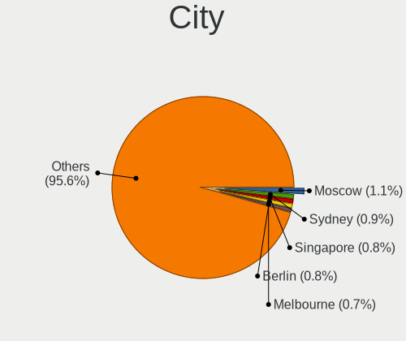
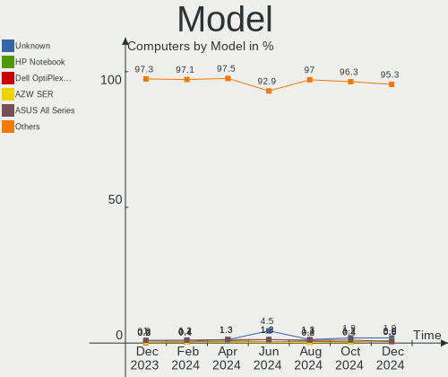
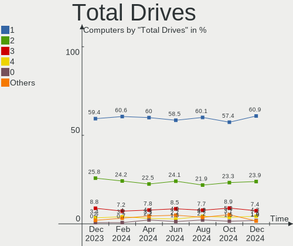
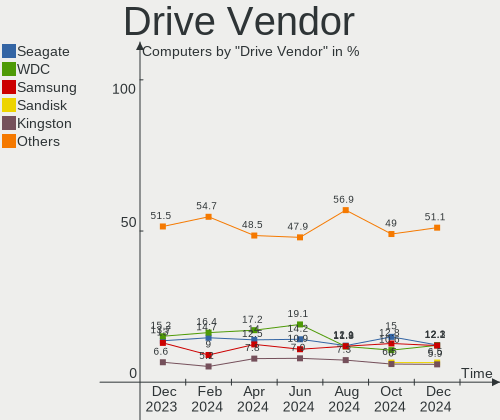
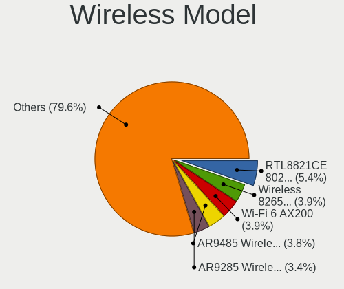
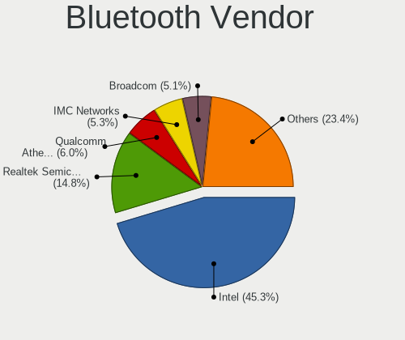

OpenMandriva Hardware Trends
----------------------------

A project to identify most popular hardware characteristics and track their change
over time based on data collected by OpenMandriva users at https://Linux-Hardware.org.

Anyone can contribute to the study by uploading probes of their computers by
the [hw-probe](https://github.com/linuxhw/hw-probe) tool:

    sudo -E hw-probe -all -upload

This is a report for all computer types. See also reports for [desktops](/Dist/OpenMandriva/Desktop/README.md) and [notebooks](/Dist/OpenMandriva/Notebook/README.md).

Full-feature report is available here: https://linux-hardware.org/?view=trends

Period: May, 2021.

Contents
--------

- [ OS                       ](#os)
- [ OS Family                ](#os-family)
- [ Kernel                   ](#kernel)
- [ Kernel Family            ](#kernel-family)
- [ Kernel Major Ver.        ](#kernel-major-ver)
- [ Arch                     ](#arch)
- [ DE                       ](#de)
- [ Display Server           ](#display-server)
- [ Display Manager          ](#display-manager)
- [ OS Lang                  ](#os-lang)
- [ Boot Mode                ](#boot-mode)
- [ Filesystem               ](#filesystem)
- [ Part. scheme             ](#part-scheme)
- [ Dual Boot with Linux/BSD ](#dual-boot-with-linux/bsd)
- [ Dual Boot (Win)          ](#dual-boot-win)
- [ Country                  ](#country)
- [ City                     ](#city)
- [ Vendor                   ](#vendor)
- [ Model                    ](#model)
- [ Model Family             ](#model-family)
- [ MFG Year                 ](#mfg-year)
- [ Form Factor              ](#form-factor)
- [ Secure Boot              ](#secure-boot)
- [ Coreboot                 ](#coreboot)
- [ RAM Size                 ](#ram-size)
- [ RAM Used                 ](#ram-used)
- [ Has CD-ROM               ](#has-cd-rom)
- [ Total Drives             ](#total-drives)
- [ Has Ethernet             ](#has-ethernet)
- [ Has WiFi                 ](#has-wifi)
- [ Has Bluetooth            ](#has-bluetooth)
- [ Drive Vendor             ](#drive-vendor)
- [ Drive Model              ](#drive-model)
- [ HDD Vendor               ](#hdd-vendor)
- [ SSD Vendor               ](#ssd-vendor)
- [ Drive Kind               ](#drive-kind)
- [ Drive Connector          ](#drive-connector)
- [ Drive Size               ](#drive-size)
- [ Space Total              ](#space-total)
- [ Space Used               ](#space-used)
- [ Malfunc. Drives          ](#malfunc-drives)
- [ Malfunc. Drive Vendor    ](#malfunc-drive-vendor)
- [ Malfunc. HDD Vendor      ](#malfunc-hdd-vendor)
- [ Malfunc. Drive Kind      ](#malfunc-drive-kind)
- [ Failed Drives            ](#failed-drives)
- [ Failed Drive Vendor      ](#failed-drive-vendor)
- [ Drive Status             ](#drive-status)
- [ Storage Vendor           ](#storage-vendor)
- [ Storage Model            ](#storage-model)
- [ Storage Kind             ](#storage-kind)
- [ CPU Vendor               ](#cpu-vendor)
- [ CPU Model                ](#cpu-model)
- [ CPU Model Family         ](#cpu-model-family)
- [ CPU Cores                ](#cpu-cores)
- [ CPU Sockets              ](#cpu-sockets)
- [ CPU Threads              ](#cpu-threads)
- [ CPU Op-Modes             ](#cpu-op-modes)
- [ CPU Microcode            ](#cpu-microcode)
- [ CPU Microarch            ](#cpu-microarch)
- [ GPU Vendor               ](#gpu-vendor)
- [ GPU Model                ](#gpu-model)
- [ GPU Combo                ](#gpu-combo)
- [ GPU Driver               ](#gpu-driver)
- [ GPU Memory               ](#gpu-memory)
- [ Monitor Vendor           ](#monitor-vendor)
- [ Monitor Model            ](#monitor-model)
- [ Monitor Resolution       ](#monitor-resolution)
- [ Monitor Diagonal         ](#monitor-diagonal)
- [ Monitor Width            ](#monitor-width)
- [ Aspect Ratio             ](#aspect-ratio)
- [ Monitor Area             ](#monitor-area)
- [ Pixel Density            ](#pixel-density)
- [ Multiple Monitors        ](#multiple-monitors)
- [ Net Controller Vendor    ](#net-controller-vendor)
- [ Net Controller Model     ](#net-controller-model)
- [ Wireless Vendor          ](#wireless-vendor)
- [ Wireless Model           ](#wireless-model)
- [ Ethernet Vendor          ](#ethernet-vendor)
- [ Ethernet Model           ](#ethernet-model)
- [ Net Controller Kind      ](#net-controller-kind)
- [ Used Controller          ](#used-controller)
- [ NICs                     ](#nics)
- [ IPv6                     ](#ipv6)
- [ Memory Vendor            ](#memory-vendor)
- [ Memory Model             ](#memory-model)
- [ Memory Kind              ](#memory-kind)
- [ Memory Form Factor       ](#memory-form-factor)
- [ Memory Size              ](#memory-size)
- [ Memory Speed             ](#memory-speed)
- [ Sound Vendor             ](#sound-vendor)
- [ Sound Model              ](#sound-model)
- [ Camera Vendor            ](#camera-vendor)
- [ Camera Model             ](#camera-model)
- [ Fingerprint Vendor       ](#fingerprint-vendor)
- [ Fingerprint Model        ](#fingerprint-model)
- [ Chipcard Vendor          ](#chipcard-vendor)
- [ Chipcard Model           ](#chipcard-model)
- [ Printer Vendor           ](#printer-vendor)
- [ Printer Model            ](#printer-model)
- [ Scanner Vendor           ](#scanner-vendor)
- [ Scanner Model            ](#scanner-model)
- [ Bluetooth Vendor         ](#bluetooth-vendor)
- [ Bluetooth Model          ](#bluetooth-model)
- [ Unsupported Devices      ](#unsupported-devices)
- [ Unsupported Device Types ](#unsupported-device-types)

OS
--

Installed operating systems

| Name              | Computers | Percent |
|-------------------|-----------|---------|
| OpenMandriva 4.2  | 379       | 70.97%  |
| OpenMandriva 4.50 | 153       | 28.65%  |
| OpenMandriva 4.1  | 2         | 0.37%   |

OS Family
---------

OS without a version

| Name         | Computers | Percent |
|--------------|-----------|---------|
| OpenMandriva | 534       | 100%    |

Kernel
------

Version of the Linux kernel

| Version                        | Computers | Percent |
|--------------------------------|-----------|---------|
| 5.10.14-desktop-1omv4002       | 358       | 67.04%  |
| 5.12.4-desktop-1omv4050        | 149       | 27.9%   |
| 5.11.12-desktop-1omv4002       | 20        | 3.75%   |
| 5.5.12-desktop-1omv4001        | 2         | 0.37%   |
| 5.12.5-desktop-clang-1omv4050  | 1         | 0.19%   |
| 5.12.1-server-4omv4050         | 1         | 0.19%   |
| 5.12.1-desktop-clang-4omv4050  | 1         | 0.19%   |
| 5.11.16-desktop-clang-1omv4050 | 1         | 0.19%   |
| 5.11.0-desktop-clang-1omv4002  | 1         | 0.19%   |

Kernel Family
-------------

Linux kernel without a distro release

| Version | Computers | Percent |
|---------|-----------|---------|
| 5.10.14 | 358       | 67.04%  |
| 5.12.4  | 149       | 27.9%   |
| 5.11.12 | 20        | 3.75%   |
| 5.5.12  | 2         | 0.37%   |
| 5.12.1  | 2         | 0.37%   |
| 5.12.5  | 1         | 0.19%   |
| 5.11.16 | 1         | 0.19%   |
| 5.11.0  | 1         | 0.19%   |

Kernel Major Ver.
-----------------

Linux kernel major version

| Version | Computers | Percent |
|---------|-----------|---------|
| 5.10    | 358       | 67.04%  |
| 5.12    | 152       | 28.46%  |
| 5.11    | 22        | 4.12%   |
| 5.5     | 2         | 0.37%   |

Arch
----

OS architecture (x86_64, i586, etc.)

| Name    | Computers | Percent |
|---------|-----------|---------|
| x86_64  | 533       | 99.81%  |
| aarch64 | 1         | 0.19%   |

DE
--

Desktop Environment

| Name | Computers | Percent |
|------|-----------|---------|
| KDE5 | 533       | 99.81%  |
| KDE  | 1         | 0.19%   |

Display Server
--------------

X11 or Wayland

| Name    | Computers | Percent |
|---------|-----------|---------|
| X11     | 532       | 99.63%  |
| Wayland | 2         | 0.37%   |

Display Manager
---------------

SDDM, LightDM, etc.

| Name | Computers | Percent |
|------|-----------|---------|
| SDDM | 534       | 100%    |

OS Lang
-------

Language

| Lang  | Computers | Percent |
|-------|-----------|---------|
| en_US | 280       | 52.43%  |
| ru_RU | 41        | 7.68%   |
| de_DE | 39        | 7.3%    |
| fr_FR | 37        | 6.93%   |
| it_IT | 20        | 3.75%   |
| pt_BR | 17        | 3.18%   |
| pl_PL | 13        | 2.43%   |
| en_GB | 11        | 2.06%   |
| cs_CZ | 9         | 1.69%   |
| es_AR | 8         | 1.5%    |
| es_ES | 6         | 1.12%   |
| de_AT | 6         | 1.12%   |
| ro_RO | 4         | 0.75%   |
| nl_NL | 4         | 0.75%   |
| es_MX | 4         | 0.75%   |
| fr_BE | 3         | 0.56%   |
| es_CL | 3         | 0.56%   |
| de_CH | 3         | 0.56%   |
| nl_BE | 2         | 0.37%   |
| hu_HU | 2         | 0.37%   |
| fr_CA | 2         | 0.37%   |
| en_CA | 2         | 0.37%   |
| en_AU | 2         | 0.37%   |
| da_DK | 2         | 0.37%   |
| ru_UA | 1         | 0.19%   |
| pt_PT | 1         | 0.19%   |
| nl_AW | 1         | 0.19%   |
| it_CH | 1         | 0.19%   |
| fr_CH | 1         | 0.19%   |
| es_VE | 1         | 0.19%   |
| es_UY | 1         | 0.19%   |
| es_PY | 1         | 0.19%   |
| es_PE | 1         | 0.19%   |
| es_CO | 1         | 0.19%   |
| en_IN | 1         | 0.19%   |
| en_IE | 1         | 0.19%   |
| en_HK | 1         | 0.19%   |
| en_AG | 1         | 0.19%   |

Boot Mode
---------

EFI or BIOS

| Mode | Computers | Percent |
|------|-----------|---------|
| BIOS | 314       | 58.8%   |
| EFI  | 220       | 41.2%   |

Filesystem
----------

Type of filesystem

| Type    | Computers | Percent |
|---------|-----------|---------|
| Overlay | 437       | 81.84%  |
| Ext4    | 90        | 16.85%  |
| F2fs    | 3         | 0.56%   |
| Btrfs   | 2         | 0.37%   |
| Ext3    | 1         | 0.19%   |
| Ext2    | 1         | 0.19%   |

Part. scheme
------------

Scheme of partitioning

| Type | Computers | Percent |
|------|-----------|---------|
| GPT  | 318       | 59.55%  |
| MBR  | 216       | 40.45%  |

Dual Boot with Linux/BSD
------------------------

Hosting more than one Linux/BSD

| Dual boot | Computers | Percent |
|-----------|-----------|---------|
| Yes       | 307       | 57.49%  |
| No        | 227       | 42.51%  |

Dual Boot (Win)
---------------

Hosting Linux and Windows

| Dual boot | Computers | Percent |
|-----------|-----------|---------|
| No        | 293       | 54.87%  |
| Yes       | 241       | 45.13%  |

Country
-------

Geographic location (country)

| Country             | Computers | Percent |
|---------------------|-----------|---------|
| USA                 | 72        | 13.48%  |
| Germany             | 61        | 11.42%  |
| Russia              | 44        | 8.24%   |
| France              | 40        | 7.49%   |
| Italy               | 30        | 5.62%   |
| Brazil              | 26        | 4.87%   |
| Poland              | 22        | 4.12%   |
| UK                  | 14        | 2.62%   |
| Spain               | 13        | 2.43%   |
| Australia           | 13        | 2.43%   |
| Canada              | 11        | 2.06%   |
| Austria             | 11        | 2.06%   |
| Mexico              | 9         | 1.69%   |
| Finland             | 9         | 1.69%   |
| Argentina           | 9         | 1.69%   |
| Romania             | 8         | 1.5%    |
| India               | 8         | 1.5%    |
| Czechia             | 8         | 1.5%    |
| Ukraine             | 7         | 1.31%   |
| Slovakia            | 6         | 1.12%   |
| Netherlands         | 6         | 1.12%   |
| Hungary             | 6         | 1.12%   |
| China               | 6         | 1.12%   |
| Switzerland         | 5         | 0.94%   |
| Sweden              | 5         | 0.94%   |
| Portugal            | 5         | 0.94%   |
| Denmark             | 5         | 0.94%   |
| Bulgaria            | 5         | 0.94%   |
| Belgium             | 5         | 0.94%   |
| Malaysia            | 4         | 0.75%   |
| Japan               | 4         | 0.75%   |
| Israel              | 4         | 0.75%   |
| Indonesia           | 4         | 0.75%   |
| Greece              | 4         | 0.75%   |
| Ireland             | 3         | 0.56%   |
| Chile               | 3         | 0.56%   |
| Venezuela           | 2         | 0.37%   |
| Turkey              | 2         | 0.37%   |
| Thailand            | 2         | 0.37%   |
| Taiwan              | 2         | 0.37%   |
| South Korea         | 2         | 0.37%   |
| South Africa        | 2         | 0.37%   |
| Serbia              | 2         | 0.37%   |
| Morocco             | 2         | 0.37%   |
| Hong Kong           | 2         | 0.37%   |
| Croatia             | 2         | 0.37%   |
| Bahrain             | 2         | 0.37%   |
| Uruguay             | 1         | 0.19%   |
| Trinidad and Tobago | 1         | 0.19%   |
| Slovenia            | 1         | 0.19%   |
| Saudi Arabia        | 1         | 0.19%   |
| Puerto Rico         | 1         | 0.19%   |
| Peru                | 1         | 0.19%   |
| Paraguay            | 1         | 0.19%   |
| Panama              | 1         | 0.19%   |
| Pakistan            | 1         | 0.19%   |
| Lithuania           | 1         | 0.19%   |
| Kazakhstan          | 1         | 0.19%   |
| Estonia             | 1         | 0.19%   |
| Dominican Republic  | 1         | 0.19%   |

City
----

Geographic location (city)

| City                    | Computers | Percent |
|-------------------------|-----------|---------|
| Moscow                  | 7         | 1.31%   |
| Warsaw                  | 5         | 0.94%   |
| Paris                   | 5         | 0.94%   |
| São Paulo              | 4         | 0.75%   |
| Boos                    | 4         | 0.75%   |
| Vienna                  | 3         | 0.56%   |
| Sydney                  | 3         | 0.56%   |
| St Petersburg           | 3         | 0.56%   |
| Manspach                | 3         | 0.56%   |
| Karlsruhe               | 3         | 0.56%   |
| Essen                   | 3         | 0.56%   |
| Dortmund                | 3         | 0.56%   |
| Yekaterinburg           | 2         | 0.37%   |
| Wroclaw                 | 2         | 0.37%   |
| Vicenza                 | 2         | 0.37%   |
| Târgu Mureş           | 2         | 0.37%   |
| Tula                    | 2         | 0.37%   |
| Thrissur                | 2         | 0.37%   |
| Ternopil                | 2         | 0.37%   |
| Szczecin                | 2         | 0.37%   |
| Springdale              | 2         | 0.37%   |
| Split                   | 2         | 0.37%   |
| Sofia                   | 2         | 0.37%   |
| Siófok                 | 2         | 0.37%   |
| Saratov                 | 2         | 0.37%   |
| Santiago                | 2         | 0.37%   |
| Salvador                | 2         | 0.37%   |
| Rostov-on-Don           | 2         | 0.37%   |
| Rome                    | 2         | 0.37%   |
| Pskov                   | 2         | 0.37%   |
| Prague                  | 2         | 0.37%   |
| Portland                | 2         | 0.37%   |
| Pocking                 | 2         | 0.37%   |
| Pforzheim               | 2         | 0.37%   |
| Perth                   | 2         | 0.37%   |
| Nyiregyhaza             | 2         | 0.37%   |
| Novosibirsk             | 2         | 0.37%   |
| Nanjing                 | 2         | 0.37%   |
| Mexico City             | 2         | 0.37%   |
| Mariano Comense         | 2         | 0.37%   |
| Marianna                | 2         | 0.37%   |
| Manama                  | 2         | 0.37%   |
| Malmo                   | 2         | 0.37%   |
| Lüneburg               | 2         | 0.37%   |
| Kyiv                    | 2         | 0.37%   |
| Kuala Lumpur            | 2         | 0.37%   |
| Izhevsk                 | 2         | 0.37%   |
| Iselin                  | 2         | 0.37%   |
| Incheon                 | 2         | 0.37%   |
| Helsinki                | 2         | 0.37%   |
| Hartford                | 2         | 0.37%   |
| Faro                    | 2         | 0.37%   |
| Ernakulam               | 2         | 0.37%   |
| Dijon                   | 2         | 0.37%   |
| Copenhagen              | 2         | 0.37%   |
| Cologne                 | 2         | 0.37%   |
| Chelyabinsk             | 2         | 0.37%   |
| Castellammare di Stabia | 2         | 0.37%   |
| Brest                   | 2         | 0.37%   |
| Bielefeld               | 2         | 0.37%   |

Vendor
------

Motherboard manufacturer

| Name                | Computers | Percent |
|---------------------|-----------|---------|
| ASUSTek Computer    | 102       | 19.1%   |
| Hewlett-Packard     | 74        | 13.86%  |
| Lenovo              | 65        | 12.17%  |
| Gigabyte Technology | 61        | 11.42%  |
| Dell                | 51        | 9.55%   |
| MSI                 | 30        | 5.62%   |
| ASRock              | 27        | 5.06%   |
| Acer                | 26        | 4.87%   |
| Intel               | 13        | 2.43%   |
| Toshiba             | 10        | 1.87%   |
| Medion              | 6         | 1.12%   |
| ECS                 | 6         | 1.12%   |
| Pegatron            | 5         | 0.94%   |
| Apple               | 5         | 0.94%   |
| Sony                | 4         | 0.75%   |
| Fujitsu             | 4         | 0.75%   |
| Foxconn             | 4         | 0.75%   |
| Unknown             | 4         | 0.75%   |
| Samsung Electronics | 3         | 0.56%   |
| Packard Bell        | 3         | 0.56%   |
| Biostar             | 3         | 0.56%   |
| TUXEDO              | 2         | 0.37%   |
| Notebook            | 2         | 0.37%   |
| NEC Computers       | 2         | 0.37%   |
| Gateway             | 2         | 0.37%   |
| Fujitsu Siemens     | 2         | 0.37%   |
| VIT                 | 1         | 0.19%   |
| System76            | 1         | 0.19%   |
| Shuttle             | 1         | 0.19%   |
| Positivo            | 1         | 0.19%   |
| Pine Microsystems   | 1         | 0.19%   |
| PERTOSA             | 1         | 0.19%   |
| PC Specialist       | 1         | 0.19%   |
| OEM_MB              | 1         | 0.19%   |
| Microsoft           | 1         | 0.19%   |
| LORD ELECTRONICS    | 1         | 0.19%   |
| Kruger&Matz         | 1         | 0.19%   |
| Itautec             | 1         | 0.19%   |
| INSYS               | 1         | 0.19%   |
| IBM                 | 1         | 0.19%   |
| eMachines           | 1         | 0.19%   |
| Dynabook            | 1         | 0.19%   |
| Chuwi               | 1         | 0.19%   |
| Centerm             | 1         | 0.19%   |

Model
-----

Motherboard model

| Name                                    | Computers | Percent |
|-----------------------------------------|-----------|---------|
| Unknown                                 | 7         | 1.31%   |
| ASUS PRIME A320M-K                      | 5         | 0.94%   |
| ASUS All Series                         | 5         | 0.94%   |
| HP Pavilion dv6                         | 4         | 0.75%   |
| Gigabyte B450M DS3H                     | 4         | 0.75%   |
| HP Pavilion g6                          | 3         | 0.56%   |
| HP EliteBook 8440p                      | 3         | 0.56%   |
| Dell Latitude D630                      | 3         | 0.56%   |
| ASUS P8H67                              | 3         | 0.56%   |
| Toshiba Satellite C55-B                 | 2         | 0.37%   |
| MSI MS-7C52                             | 2         | 0.37%   |
| MSI MS-7B79                             | 2         | 0.37%   |
| MSI MS-7817                             | 2         | 0.37%   |
| Lenovo G500 20236                       | 2         | 0.37%   |
| Lenovo G50-45 80E3                      | 2         | 0.37%   |
| Intel H81                               | 2         | 0.37%   |
| HP Pavilion dv5                         | 2         | 0.37%   |
| HP Pavilion 15                          | 2         | 0.37%   |
| Gigabyte X79-UP4                        | 2         | 0.37%   |
| Gigabyte TRX40 AORUS MASTER             | 2         | 0.37%   |
| Gigabyte H61M-S1                        | 2         | 0.37%   |
| Gigabyte GA-78LMT-USB3                  | 2         | 0.37%   |
| Gigabyte GA-78LMT-S2P                   | 2         | 0.37%   |
| Gigabyte G41M-Combo                     | 2         | 0.37%   |
| ECS H61H2-M12                           | 2         | 0.37%   |
| Dell OptiPlex 9020                      | 2         | 0.37%   |
| Dell OptiPlex 3050                      | 2         | 0.37%   |
| Dell Latitude E6430                     | 2         | 0.37%   |
| Dell Latitude E5430 non-vPro            | 2         | 0.37%   |
| Dell Latitude E5250                     | 2         | 0.37%   |
| Dell Inspiron 3647                      | 2         | 0.37%   |
| Dell Inspiron 15-3567                   | 2         | 0.37%   |
| ASUS TUF GAMING X570-PLUS               | 2         | 0.37%   |
| ASUS M5A99FX PRO R2.0                   | 2         | 0.37%   |
| ASUS M5A78L-M LX3                       | 2         | 0.37%   |
| ASRock A320M-HDV R4.0                   | 2         | 0.37%   |
| VIT P2400                               | 1         | 0.19%   |
| TUXEDO InfinityBook_S_14_v5             | 1         | 0.19%   |
| Toshiba TECRA A11                       | 1         | 0.19%   |
| Toshiba Satellite M645                  | 1         | 0.19%   |
| Toshiba Satellite L855                  | 1         | 0.19%   |
| Toshiba Satellite L505                  | 1         | 0.19%   |
| Toshiba Satellite L300                  | 1         | 0.19%   |
| Toshiba Satellite C660                  | 1         | 0.19%   |
| Toshiba Satellite C650                  | 1         | 0.19%   |
| Toshiba Satellite C50-A539              | 1         | 0.19%   |
| System76 Serval                         | 1         | 0.19%   |
| Sony VPCEG11FX                          | 1         | 0.19%   |
| Sony VGN-NW240F                         | 1         | 0.19%   |
| Sony SVE1513R1EB                        | 1         | 0.19%   |
| Sony SVE1112M1EW                        | 1         | 0.19%   |
| Shuttle XS35V4                          | 1         | 0.19%   |
| Samsung R540/R580/R780/SA41/E452        | 1         | 0.19%   |
| Samsung 355V4C/356V4C/3445VC/3545VC     | 1         | 0.19%   |
| Samsung 340XAA/350XAA/550XAA            | 1         | 0.19%   |
| Positivo POS-EIH61CE                    | 1         | 0.19%   |
| Pine Microsystems Pine64 RockPro64 v2.1 | 1         | 0.19%   |
| PERTOSA 206.30.054 - GA-H110TN-M        | 1         | 0.19%   |
| Pegatron p7-1020de                      | 1         | 0.19%   |
| Pegatron p6-2143w                       | 1         | 0.19%   |

Model Family
------------

Motherboard model prefix

| Name                   | Computers | Percent |
|------------------------|-----------|---------|
| Lenovo ThinkPad        | 23        | 4.31%   |
| Acer Aspire            | 19        | 3.56%   |
| HP Compaq              | 17        | 3.18%   |
| Dell Latitude          | 17        | 3.18%   |
| Dell Inspiron          | 16        | 3%      |
| Lenovo IdeaPad         | 14        | 2.62%   |
| HP Pavilion            | 13        | 2.43%   |
| ASUS PRIME             | 12        | 2.25%   |
| Dell OptiPlex          | 10        | 1.87%   |
| Toshiba Satellite      | 9         | 1.69%   |
| HP EliteBook           | 8         | 1.5%    |
| Lenovo ThinkCentre     | 7         | 1.31%   |
| Unknown                | 7         | 1.31%   |
| Lenovo IdeaCentre      | 5         | 0.94%   |
| Gigabyte B450M         | 5         | 0.94%   |
| Dell Vostro            | 5         | 0.94%   |
| ASUS M5A78L-M          | 5         | 0.94%   |
| ASUS All               | 5         | 0.94%   |
| Gigabyte GA-78LMT-USB3 | 4         | 0.75%   |
| ASUS TUF               | 4         | 0.75%   |
| HP ProDesk             | 3         | 0.56%   |
| HP ProBook             | 3         | 0.56%   |
| HP Laptop              | 3         | 0.56%   |
| Fujitsu ESPRIMO        | 3         | 0.56%   |
| ASUS ROG               | 3         | 0.56%   |
| ASUS P8Z77-V           | 3         | 0.56%   |
| ASUS P8H67             | 3         | 0.56%   |
| Packard Bell EasyNote  | 2         | 0.37%   |
| MSI MS-7C52            | 2         | 0.37%   |
| MSI MS-7B79            | 2         | 0.37%   |
| MSI MS-7817            | 2         | 0.37%   |
| Medion Erazer          | 2         | 0.37%   |
| Lenovo G500            | 2         | 0.37%   |
| Lenovo G50-45          | 2         | 0.37%   |
| Lenovo E50-00          | 2         | 0.37%   |
| Intel H81              | 2         | 0.37%   |
| HP EliteDesk           | 2         | 0.37%   |
| HP All-in-One          | 2         | 0.37%   |
| HP 255                 | 2         | 0.37%   |
| Gigabyte X79-UP4       | 2         | 0.37%   |
| Gigabyte TRX40         | 2         | 0.37%   |
| Gigabyte H61M-S1       | 2         | 0.37%   |
| Gigabyte GA-78LMT-S2P  | 2         | 0.37%   |
| Gigabyte G41M-Combo    | 2         | 0.37%   |
| ECS H61H2-M12          | 2         | 0.37%   |
| Dell Precision         | 2         | 0.37%   |
| ASUS VivoBook          | 2         | 0.37%   |
| ASUS P8H61-M           | 2         | 0.37%   |
| ASUS P5Q               | 2         | 0.37%   |
| ASUS P5P43TD           | 2         | 0.37%   |
| ASUS P5KPL-AM          | 2         | 0.37%   |
| ASUS M5A99FX           | 2         | 0.37%   |
| ASRock X370            | 2         | 0.37%   |
| ASRock B450M           | 2         | 0.37%   |
| ASRock A320M-HDV       | 2         | 0.37%   |
| Apple MacBookPro9      | 2         | 0.37%   |
| Acer TravelMate        | 2         | 0.37%   |
| Acer Nitro             | 2         | 0.37%   |
| VIT P2400              | 1         | 0.19%   |
| TUXEDO InfinityBook    | 1         | 0.19%   |

MFG Year
--------

Motherboard manufacture year

| Year    | Computers | Percent |
|---------|-----------|---------|
| 2020    | 61        | 11.42%  |
| 2019    | 51        | 9.55%   |
| 2011    | 50        | 9.36%   |
| 2013    | 48        | 8.99%   |
| 2014    | 44        | 8.24%   |
| 2012    | 43        | 8.05%   |
| 2018    | 42        | 7.87%   |
| 2010    | 36        | 6.74%   |
| 2016    | 34        | 6.37%   |
| 2009    | 31        | 5.81%   |
| 2015    | 30        | 5.62%   |
| 2021    | 21        | 3.93%   |
| 2017    | 17        | 3.18%   |
| 2008    | 13        | 2.43%   |
| 2007    | 10        | 1.87%   |
| 2006    | 1         | 0.19%   |
| 2005    | 1         | 0.19%   |
| Unknown | 1         | 0.19%   |

Form Factor
-----------

Physical design of the computer

| Name           | Computers | Percent |
|----------------|-----------|---------|
| Desktop        | 297       | 55.62%  |
| Notebook       | 220       | 41.2%   |
| All in one     | 7         | 1.31%   |
| Mini pc        | 5         | 0.94%   |
| Convertible    | 2         | 0.37%   |
| System on chip | 1         | 0.19%   |
| Tablet         | 1         | 0.19%   |
| Server         | 1         | 0.19%   |

Secure Boot
-----------

Enabled or disabled

| State    | Computers | Percent |
|----------|-----------|---------|
| Disabled | 534       | 100%    |

Coreboot
--------

Have coreboot on board

| Used | Computers | Percent |
|------|-----------|---------|
| No   | 534       | 100%    |

RAM Size
--------

Total RAM memory

| Size in GB  | Computers | Percent |
|-------------|-----------|---------|
| 4.01-8.0    | 147       | 27.53%  |
| 3.01-4.0    | 146       | 27.34%  |
| 8.01-16.0   | 105       | 19.66%  |
| 16.01-24.0  | 76        | 14.23%  |
| 32.01-64.0  | 20        | 3.75%   |
| 2.01-3.0    | 12        | 2.25%   |
| 1.01-2.0    | 12        | 2.25%   |
| 24.01-32.0  | 10        | 1.87%   |
| 64.01-256.0 | 6         | 1.12%   |

RAM Used
--------

Used RAM memory

| Used GB  | Computers | Percent |
|----------|-----------|---------|
| 1.01-2.0 | 425       | 79.59%  |
| 0.51-1.0 | 53        | 9.93%   |
| 2.01-3.0 | 39        | 7.3%    |
| 0.01-0.5 | 13        | 2.43%   |
| 3.01-4.0 | 4         | 0.75%   |

Has CD-ROM
----------

Has CD-ROM on board

| Presented | Computers | Percent |
|-----------|-----------|---------|
| Yes       | 330       | 61.8%   |
| No        | 204       | 38.2%   |

Total Drives
------------

Number of drives on board

| Drives | Computers | Percent |
|--------|-----------|---------|
| 1      | 312       | 58.43%  |
| 2      | 141       | 26.4%   |
| 3      | 42        | 7.87%   |
| 4      | 21        | 3.93%   |
| 0      | 8         | 1.5%    |
| 5      | 5         | 0.94%   |
| 7      | 2         | 0.37%   |
| 12     | 1         | 0.19%   |
| 8      | 1         | 0.19%   |
| 6      | 1         | 0.19%   |

Has Ethernet
------------

Has Ethernet on board

| Presented | Computers | Percent |
|-----------|-----------|---------|
| Yes       | 514       | 96.25%  |
| No        | 20        | 3.75%   |

Has WiFi
--------

Has WiFi module

| Presented | Computers | Percent |
|-----------|-----------|---------|
| Yes       | 324       | 60.67%  |
| No        | 210       | 39.33%  |

Has Bluetooth
-------------

Has Bluetooth module

| Presented | Computers | Percent |
|-----------|-----------|---------|
| No        | 313       | 58.61%  |
| Yes       | 221       | 41.39%  |

Drive Vendor
------------

Hard drive vendors

| Vendor              | Computers | Drives | Percent |
|---------------------|-----------|--------|---------|
| WDC                 | 177       | 197    | 23.32%  |
| Seagate             | 125       | 145    | 16.47%  |
| Samsung Electronics | 82        | 107    | 10.8%   |
| Kingston            | 64        | 69     | 8.43%   |
| Toshiba             | 51        | 57     | 6.72%   |
| Hitachi             | 39        | 39     | 5.14%   |
| SanDisk             | 27        | 30     | 3.56%   |
| Crucial             | 27        | 28     | 3.56%   |
| Unknown             | 20        | 21     | 2.64%   |
| HGST                | 12        | 12     | 1.58%   |
| A-DATA Technology   | 12        | 13     | 1.58%   |
| SPCC                | 11        | 11     | 1.45%   |
| China               | 11        | 11     | 1.45%   |
| Intenso             | 10        | 10     | 1.32%   |
| Intel               | 8         | 9      | 1.05%   |
| OCZ                 | 6         | 7      | 0.79%   |
| SK Hynix            | 4         | 4      | 0.53%   |
| Micron Technology   | 4         | 4      | 0.53%   |
| GOODRAM             | 4         | 4      | 0.53%   |
| Apacer              | 4         | 4      | 0.53%   |
| Verbatim            | 3         | 3      | 0.4%    |
| SABRENT             | 3         | 3      | 0.4%    |
| Phison              | 3         | 3      | 0.4%    |
| Maxtor              | 3         | 3      | 0.4%    |
| Hewlett-Packard     | 3         | 3      | 0.4%    |
| EMTEC               | 3         | 3      | 0.4%    |
| Corsair             | 3         | 3      | 0.4%    |
| Apple               | 3         | 4      | 0.4%    |
| Zheino              | 2         | 2      | 0.26%   |
| Team                | 2         | 3      | 0.26%   |
| PNY                 | 2         | 2      | 0.26%   |
| Phison Electronics  | 2         | 2      | 0.26%   |
| LITEON              | 2         | 2      | 0.26%   |
| Yeyian              | 1         | 1      | 0.13%   |
| Wdstars             | 1         | 1      | 0.13%   |
| USB                 | 1         | 1      | 0.13%   |
| Transcend           | 1         | 1      | 0.13%   |
| TCSUNBOW            | 1         | 1      | 0.13%   |
| takeMS              | 1         | 1      | 0.13%   |
| T-FORCE             | 1         | 1      | 0.13%   |
| QUANTUM             | 1         | 1      | 0.13%   |
| PLEXTOR             | 1         | 1      | 0.13%   |
| Patriot             | 1         | 1      | 0.13%   |
| MT-64               | 1         | 1      | 0.13%   |
| Maxmemroy           | 1         | 1      | 0.13%   |
| LITEONIT            | 1         | 1      | 0.13%   |
| Lexar               | 1         | 1      | 0.13%   |
| Leven               | 1         | 1      | 0.13%   |
| KIOXIA-EXCERIA      | 1         | 1      | 0.13%   |
| KingSpec            | 1         | 1      | 0.13%   |
| KingFast            | 1         | 1      | 0.13%   |
| KingDian            | 1         | 1      | 0.13%   |
| KDATA               | 1         | 1      | 0.13%   |
| inateck             | 1         | 1      | 0.13%   |
| HS-SSD-E100         | 1         | 1      | 0.13%   |
| Fujitsu             | 1         | 1      | 0.13%   |
| FORESEE             | 1         | 1      | 0.13%   |
| External            | 1         | 1      | 0.13%   |
| DRVEO               | 1         | 1      | 0.13%   |
| addlink             | 1         | 2      | 0.13%   |

Drive Model
-----------

Hard drive models

| Model                              | Computers | Percent |
|------------------------------------|-----------|---------|
| Kingston SV300S37A120G 120GB SSD   | 10        | 1.22%   |
| Kingston SA400S37240G 240GB SSD    | 10        | 1.22%   |
| Seagate ST500DM002-1BD142 500GB    | 9         | 1.09%   |
| Kingston SA400S37120G 120GB SSD    | 9         | 1.09%   |
| Seagate ST1000DM003-1ER162 1TB     | 8         | 0.97%   |
| Kingston SA400S37480G 480GB SSD    | 8         | 0.97%   |
| Toshiba MQ01ABF050 500GB           | 6         | 0.73%   |
| Seagate ST3500418AS 500GB          | 6         | 0.73%   |
| Samsung SSD 850 EVO 500GB          | 6         | 0.73%   |
| WDC WDS240G2G0A-00JH30 240GB SSD   | 5         | 0.61%   |
| Unknown SD/MMC/MS PRO 8GB          | 5         | 0.61%   |
| Toshiba DT01ACA100 1TB             | 5         | 0.61%   |
| Seagate ST2000DM001-1ER164 2TB     | 5         | 0.61%   |
| Seagate ST1000LM035-1RK172 1TB     | 5         | 0.61%   |
| Seagate ST1000DM010-2EP102 1TB     | 5         | 0.61%   |
| Crucial CT240BX500SSD1 240GB       | 5         | 0.61%   |
| WDC WD5000AAKX-00ERMA0 500GB       | 4         | 0.49%   |
| WDC WD10EZEX-08WN4A0 1TB           | 4         | 0.49%   |
| SPCC Solid State Disk 128GB        | 4         | 0.49%   |
| Seagate ST9250410AS 250GB          | 4         | 0.49%   |
| Seagate ST3500413AS 500GB          | 4         | 0.49%   |
| Seagate Expansion 2TB              | 4         | 0.49%   |
| Samsung SSD 860 EVO 500GB          | 4         | 0.49%   |
| Samsung SSD 860 EVO 250GB          | 4         | 0.49%   |
| Samsung SSD 860 EVO 1TB            | 4         | 0.49%   |
| HGST HTS721010A9E630 1TB           | 4         | 0.49%   |
| WDC WD3200AVVS-63L2B0 320GB        | 3         | 0.36%   |
| WDC WD20EARX-00PASB0 2TB           | 3         | 0.36%   |
| WDC WD10EZEX-00BN5A0 1TB           | 3         | 0.36%   |
| WDC WD1003FZEX-00MK2A0 1TB         | 3         | 0.36%   |
| Toshiba MQ01ABD100 1TB             | 3         | 0.36%   |
| Seagate ST9500325AS 500GB          | 3         | 0.36%   |
| Seagate ST500LT012-9WS142 500GB    | 3         | 0.36%   |
| Seagate ST3160815AS 160GB          | 3         | 0.36%   |
| Seagate ST31000524AS 1TB           | 3         | 0.36%   |
| Seagate ST2000DM001-1CH164 2TB     | 3         | 0.36%   |
| Seagate ST1000LM024 HN-M101MBB 1TB | 3         | 0.36%   |
| Seagate ST1000DM003-1SB102 1TB     | 3         | 0.36%   |
| Samsung SSD 850 EVO 250GB          | 3         | 0.36%   |
| Samsung SSD 850 EVO 1TB            | 3         | 0.36%   |
| Intenso SSD SATAIII 512GB          | 3         | 0.36%   |
| Hitachi HDS721010CLA332 1TB        | 3         | 0.36%   |
| HGST HTS545050A7E680 500GB         | 3         | 0.36%   |
| Crucial CT480BX500SSD1 480GB       | 3         | 0.36%   |
| WDC WDS500G2B0A-00SM50 500GB SSD   | 2         | 0.24%   |
| WDC WDS120G2G0A-00JH30 120GB SSD   | 2         | 0.24%   |
| WDC WDS100T2G0A-00JH30 1TB SSD     | 2         | 0.24%   |
| WDC WD7500BPVT-22HXZT1 752GB       | 2         | 0.24%   |
| WDC WD5000LPVX-75V0TT0 500GB       | 2         | 0.24%   |
| WDC WD5000LPCX-24VHAT0 500GB       | 2         | 0.24%   |
| WDC WD5000LPCX-21VHAT0 500GB       | 2         | 0.24%   |
| WDC WD5000AAKX-60U6AA0 500GB       | 2         | 0.24%   |
| WDC WD5000AAKX-22ERMA0 500GB       | 2         | 0.24%   |
| WDC WD5000AAKS-00V1A0 500GB        | 2         | 0.24%   |
| WDC WD3200BEVT-60ZCT0 320GB        | 2         | 0.24%   |
| WDC WD3200BEVT-22A23T0 320GB       | 2         | 0.24%   |
| WDC WD20PURZ-85GU6Y0 2TB           | 2         | 0.24%   |
| WDC WD1600AAJS-00L7A0 160GB        | 2         | 0.24%   |
| WDC WD10SPZX-24Z10 1TB             | 2         | 0.24%   |
| WDC WD10JPVX-22JC3T0 1TB           | 2         | 0.24%   |

HDD Vendor
----------

Hard disk drive vendors

| Vendor              | Computers | Drives | Percent |
|---------------------|-----------|--------|---------|
| WDC                 | 147       | 163    | 37.98%  |
| Seagate             | 124       | 143    | 32.04%  |
| Toshiba             | 44        | 47     | 11.37%  |
| Hitachi             | 39        | 39     | 10.08%  |
| HGST                | 12        | 12     | 3.1%    |
| Samsung Electronics | 11        | 13     | 2.84%   |
| Maxtor              | 3         | 3      | 0.78%   |
| Intenso             | 2         | 2      | 0.52%   |
| Apple               | 2         | 2      | 0.52%   |
| USB                 | 1         | 1      | 0.26%   |
| QUANTUM             | 1         | 1      | 0.26%   |
| Fujitsu             | 1         | 1      | 0.26%   |

SSD Vendor
----------

Solid state drive vendors

| Vendor              | Computers | Drives | Percent |
|---------------------|-----------|--------|---------|
| Samsung Electronics | 59        | 73     | 19.73%  |
| Kingston            | 56        | 61     | 18.73%  |
| SanDisk             | 27        | 30     | 9.03%   |
| WDC                 | 22        | 22     | 7.36%   |
| Crucial             | 22        | 23     | 7.36%   |
| China               | 11        | 11     | 3.68%   |
| A-DATA Technology   | 11        | 12     | 3.68%   |
| SPCC                | 9         | 9      | 3.01%   |
| Intenso             | 8         | 8      | 2.68%   |
| Toshiba             | 6         | 6      | 2.01%   |
| OCZ                 | 6         | 7      | 2.01%   |
| SK Hynix            | 4         | 4      | 1.34%   |
| Intel               | 4         | 4      | 1.34%   |
| GOODRAM             | 4         | 4      | 1.34%   |
| Apacer              | 4         | 4      | 1.34%   |
| Verbatim            | 3         | 3      | 1%      |
| Unknown             | 3         | 4      | 1%      |
| EMTEC               | 3         | 3      | 1%      |
| Zheino              | 2         | 2      | 0.67%   |
| Team                | 2         | 3      | 0.67%   |
| SABRENT             | 2         | 2      | 0.67%   |
| PNY                 | 2         | 2      | 0.67%   |
| Micron Technology   | 2         | 2      | 0.67%   |
| LITEON              | 2         | 2      | 0.67%   |
| Hewlett-Packard     | 2         | 2      | 0.67%   |
| Corsair             | 2         | 2      | 0.67%   |
| Yeyian              | 1         | 1      | 0.33%   |
| Wdstars             | 1         | 1      | 0.33%   |
| Transcend           | 1         | 1      | 0.33%   |
| TCSUNBOW            | 1         | 1      | 0.33%   |
| takeMS              | 1         | 1      | 0.33%   |
| T-FORCE             | 1         | 1      | 0.33%   |
| Seagate             | 1         | 1      | 0.33%   |
| PLEXTOR             | 1         | 1      | 0.33%   |
| Patriot             | 1         | 1      | 0.33%   |
| Maxmemroy           | 1         | 1      | 0.33%   |
| LITEONIT            | 1         | 1      | 0.33%   |
| Lexar               | 1         | 1      | 0.33%   |
| Leven               | 1         | 1      | 0.33%   |
| KIOXIA-EXCERIA      | 1         | 1      | 0.33%   |
| KingSpec            | 1         | 1      | 0.33%   |
| KingFast            | 1         | 1      | 0.33%   |
| KingDian            | 1         | 1      | 0.33%   |
| KDATA               | 1         | 1      | 0.33%   |
| HS-SSD-E100         | 1         | 1      | 0.33%   |
| FORESEE             | 1         | 1      | 0.33%   |
| DRVEO               | 1         | 1      | 0.33%   |

Drive Kind
----------

HDD or SSD

| Kind    | Computers | Drives | Percent |
|---------|-----------|--------|---------|
| HDD     | 335       | 427    | 49.48%  |
| SSD     | 263       | 326    | 38.85%  |
| NVMe    | 59        | 73     | 8.71%   |
| MMC     | 12        | 12     | 1.77%   |
| Unknown | 8         | 8      | 1.18%   |

Drive Connector
---------------

SATA, SAS, NVMe, etc.

| Type | Computers | Drives | Percent |
|------|-----------|--------|---------|
| SATA | 492       | 728    | 83.53%  |
| NVMe | 59        | 71     | 10.02%  |
| SAS  | 26        | 35     | 4.41%   |
| MMC  | 12        | 12     | 2.04%   |

Drive Size
----------

Size of hard drive

| Size in TB | Computers | Drives | Percent |
|------------|-----------|--------|---------|
| 0.01-0.5   | 397       | 496    | 65.3%   |
| 0.51-1.0   | 151       | 189    | 24.84%  |
| 1.01-2.0   | 37        | 39     | 6.09%   |
| 2.01-3.0   | 10        | 11     | 1.64%   |
| 3.01-4.0   | 7         | 11     | 1.15%   |
| 4.01-10.0  | 5         | 6      | 0.82%   |
| 10.01-20.0 | 1         | 1      | 0.16%   |

Space Total
-----------

Amount of disk space available on the file system

| Size in GB | Computers | Percent |
|------------|-----------|---------|
| 1-20       | 277       | 51.87%  |
| Unknown    | 65        | 12.17%  |
| 251-500    | 60        | 11.24%  |
| 101-250    | 58        | 10.86%  |
| 51-100     | 34        | 6.37%   |
| 501-1000   | 19        | 3.56%   |
| 21-50      | 17        | 3.18%   |
| 1001-2000  | 3         | 0.56%   |
| 2001-3000  | 1         | 0.19%   |

Space Used
----------

Amount of used disk space

| Used GB  | Computers | Percent |
|----------|-----------|---------|
| 1-20     | 430       | 80.52%  |
| Unknown  | 65        | 12.17%  |
| 101-250  | 13        | 2.43%   |
| 21-50    | 8         | 1.5%    |
| 51-100   | 8         | 1.5%    |
| 251-500  | 6         | 1.12%   |
| 501-1000 | 4         | 0.75%   |

Malfunc. Drives
---------------

Drive models with a malfunction

| Model                            | Computers | Drives | Percent |
|----------------------------------|-----------|--------|---------|
| Seagate ST3500418AS 500GB        | 4         | 4      | 2.78%   |
| Kingston SV300S37A120G 120GB SSD | 4         | 4      | 2.78%   |
| Toshiba MQ01ABF050 500GB         | 3         | 3      | 2.08%   |
| Seagate ST500DM002-1BD142 500GB  | 3         | 3      | 2.08%   |
| WDC WDS240G2G0A-00JH30 240GB SSD | 2         | 2      | 1.39%   |
| WDC WD3200AVVS-63L2B0 320GB      | 2         | 2      | 1.39%   |
| WDC WD20PURZ-85GU6Y0 2TB         | 2         | 2      | 1.39%   |
| WDC WD10JPVX-22JC3T0 1TB         | 2         | 2      | 1.39%   |
| WDC WD10EALS-00Z8A0 1TB          | 2         | 2      | 1.39%   |
| Seagate ST9500325AS 500GB        | 2         | 2      | 1.39%   |
| Seagate ST9250410AS 250GB        | 2         | 2      | 1.39%   |
| Seagate ST500LT012-9WS142 500GB  | 2         | 2      | 1.39%   |
| Seagate ST500LM021-1KJ152 500GB  | 2         | 2      | 1.39%   |
| Kingston SA400S37480G 480GB SSD  | 2         | 2      | 1.39%   |
| Hitachi HDS721050CLA362 500GB    | 2         | 2      | 1.39%   |
| Hitachi HDS721010CLA330 1TB      | 2         | 2      | 1.39%   |
| HGST HTS545050A7E680 500GB       | 2         | 2      | 1.39%   |
| HGST HTS541010A9E680 1TB         | 2         | 2      | 1.39%   |
| WDC WDS120G2G0A-00JH30 120GB SSD | 1         | 1      | 0.69%   |
| WDC WD7500BPVT-60HXZT1 752GB     | 1         | 1      | 0.69%   |
| WDC WD7500BPVT-22HXZT1 752GB     | 1         | 1      | 0.69%   |
| WDC WD6400AAKS-65A7B0 640GB      | 1         | 1      | 0.69%   |
| WDC WD5003ABYZ-011FA0 500GB      | 1         | 1      | 0.69%   |
| WDC WD5000LPVX-28V0TT1 500GB     | 1         | 1      | 0.69%   |
| WDC WD5000LPCX-24VHAT0 500GB     | 1         | 1      | 0.69%   |
| WDC WD5000BPVT-80HXZT3 500GB     | 1         | 1      | 0.69%   |
| WDC WD5000BPKT-60PK4T0 500GB     | 1         | 1      | 0.69%   |
| WDC WD5000BEVT-22ZAT0 500GB      | 1         | 1      | 0.69%   |
| WDC WD5000AAKX-753CA1 500GB      | 1         | 1      | 0.69%   |
| WDC WD5000AAKX-22ERMA0 500GB     | 1         | 1      | 0.69%   |
| WDC WD5000AAKX-003CA0 500GB      | 1         | 1      | 0.69%   |
| WDC WD5000AAKX-001CA0 500GB      | 1         | 1      | 0.69%   |
| WDC WD5000AAKS-75V0A0 500GB      | 1         | 1      | 0.69%   |
| WDC WD5000AAKS-65A7B0 500GB      | 1         | 1      | 0.69%   |
| WDC WD5000AAKS-22TMA0 500GB      | 1         | 1      | 0.69%   |
| WDC WD4000FYYZ-01UL1B0 4TB       | 1         | 1      | 0.69%   |
| WDC WD3200BEVT-60ZCT1 320GB      | 1         | 1      | 0.69%   |
| WDC WD3200BEVT-60ZCT0 320GB      | 1         | 1      | 0.69%   |
| WDC WD3200BEVT-60A23T0 320GB     | 1         | 1      | 0.69%   |
| WDC WD3200BEVT-22A23T0 320GB     | 1         | 1      | 0.69%   |
| WDC WD3200AAKX-001CA0 320GB      | 1         | 1      | 0.69%   |
| WDC WD3200AAKS-75L9A0 320GB      | 1         | 1      | 0.69%   |
| WDC WD3200AAJS-56M0A0 320GB      | 1         | 1      | 0.69%   |
| WDC WD3200AAJS-56B4A0 320GB      | 1         | 1      | 0.69%   |
| WDC WD3200AAJS-00L7A0 320GB      | 1         | 1      | 0.69%   |
| WDC WD30EZRX-22D8PB0 3TB         | 1         | 1      | 0.69%   |
| WDC WD2500BEVT-60A23T0 250GB     | 1         | 1      | 0.69%   |
| WDC WD2500AVVS-61L2B0 250GB      | 1         | 1      | 0.69%   |
| WDC WD2500AAJS-08L7A0 250GB      | 1         | 1      | 0.69%   |
| WDC WD20EARX-00PASB0 2TB         | 1         | 1      | 0.69%   |
| WDC WD1600AAJS-00L7A0 160GB      | 1         | 1      | 0.69%   |
| WDC WD15EARS-00Z5B1 1TB          | 1         | 1      | 0.69%   |
| WDC WD1502FAEX-007BA0 1TB        | 1         | 1      | 0.69%   |
| WDC WD10SPZX-24Z10T0 1TB         | 1         | 1      | 0.69%   |
| WDC WD10EZEX-00BN5A0 1TB         | 1         | 2      | 0.69%   |
| WDC WD10EARS-00Y5B1 1TB          | 1         | 1      | 0.69%   |
| WDC WD10EARS-00MVWB0 1TB         | 1         | 1      | 0.69%   |
| WDC WD10EADS-65L5B1 1TB          | 1         | 1      | 0.69%   |
| WDC WD1001FALS-00J7B0 1TB        | 1         | 1      | 0.69%   |
| Toshiba MQ01ABD100 1TB           | 1         | 1      | 0.69%   |

Malfunc. Drive Vendor
---------------------

Vendors of faulty drives

| Vendor              | Computers | Drives | Percent |
|---------------------|-----------|--------|---------|
| WDC                 | 49        | 52     | 34.51%  |
| Seagate             | 28        | 28     | 19.72%  |
| Hitachi             | 21        | 21     | 14.79%  |
| Toshiba             | 11        | 11     | 7.75%   |
| Kingston            | 9         | 9      | 6.34%   |
| HGST                | 5         | 5      | 3.52%   |
| SanDisk             | 4         | 4      | 2.82%   |
| Samsung Electronics | 4         | 4      | 2.82%   |
| SPCC                | 2         | 2      | 1.41%   |
| SK Hynix            | 2         | 2      | 1.41%   |
| China               | 2         | 2      | 1.41%   |
| Micron Technology   | 1         | 1      | 0.7%    |
| LITEON              | 1         | 1      | 0.7%    |
| Intel               | 1         | 1      | 0.7%    |
| GOODRAM             | 1         | 1      | 0.7%    |
| DRVEO               | 1         | 1      | 0.7%    |

Malfunc. HDD Vendor
-------------------

Vendors of faulty HDD drives

| Vendor              | Computers | Drives | Percent |
|---------------------|-----------|--------|---------|
| WDC                 | 46        | 49     | 40%     |
| Seagate             | 28        | 28     | 24.35%  |
| Hitachi             | 21        | 21     | 18.26%  |
| Toshiba             | 11        | 11     | 9.57%   |
| HGST                | 5         | 5      | 4.35%   |
| Samsung Electronics | 4         | 4      | 3.48%   |

Malfunc. Drive Kind
-------------------

Kinds of faulty drives

| Kind | Computers | Drives | Percent |
|------|-----------|--------|---------|
| HDD  | 110       | 118    | 80.29%  |
| SSD  | 26        | 26     | 18.98%  |
| NVMe | 1         | 1      | 0.73%   |

Failed Drives
-------------

Failed drive models

| Model                             | Computers | Drives | Percent |
|-----------------------------------|-----------|--------|---------|
| WDC WD800JD-00LSA0 80GB           | 1         | 1      | 20%     |
| WDC WD10JPVT-75A1YT0 1TB          | 1         | 1      | 20%     |
| Seagate ST3500418AS 500GB         | 1         | 1      | 20%     |
| Samsung Electronics HD502HJ 500GB | 1         | 1      | 20%     |
| Samsung Electronics HD501LJ 500GB | 1         | 1      | 20%     |

Failed Drive Vendor
-------------------

Failed drive vendors

| Vendor              | Computers | Drives | Percent |
|---------------------|-----------|--------|---------|
| WDC                 | 2         | 2      | 40%     |
| Samsung Electronics | 2         | 2      | 40%     |
| Seagate             | 1         | 1      | 20%     |

Drive Status
------------

Number of failed and malfunc. drives

| Status   | Computers | Drives | Percent |
|----------|-----------|--------|---------|
| Works    | 418       | 636    | 69.21%  |
| Malfunc  | 135       | 145    | 22.35%  |
| Detected | 46        | 60     | 7.62%   |
| Failed   | 5         | 5      | 0.83%   |

Storage Vendor
--------------

Storage controller vendors

| Vendor                       | Computers | Percent |
|------------------------------|-----------|---------|
| Intel                        | 381       | 60%     |
| AMD                          | 133       | 20.94%  |
| Samsung Electronics          | 18        | 2.83%   |
| Marvell Technology Group     | 16        | 2.52%   |
| ASMedia Technology           | 13        | 2.05%   |
| Sandisk                      | 12        | 1.89%   |
| Nvidia                       | 10        | 1.57%   |
| Kingston Technology Company  | 10        | 1.57%   |
| Phison Electronics           | 9         | 1.42%   |
| JMicron Technology           | 9         | 1.42%   |
| Micron/Crucial Technology    | 5         | 0.79%   |
| VIA Technologies             | 4         | 0.63%   |
| Toshiba America Info Systems | 4         | 0.63%   |
| Micron Technology            | 2         | 0.31%   |
| Silicon Motion               | 1         | 0.16%   |
| Silicon Image                | 1         | 0.16%   |
| Promise Technology           | 1         | 0.16%   |
| OCZ Technology Group         | 1         | 0.16%   |
| LSI Logic / Symbios Logic    | 1         | 0.16%   |
| Lite-On IT Corp. / Plextor   | 1         | 0.16%   |
| Apple                        | 1         | 0.16%   |
| ADATA Technology             | 1         | 0.16%   |
| Adaptec                      | 1         | 0.16%   |

Storage Model
-------------

Storage controller models

| Model                                                                                   | Computers | Percent |
|-----------------------------------------------------------------------------------------|-----------|---------|
| AMD FCH SATA Controller [AHCI mode]                                                     | 86        | 11.03%  |
| Intel 6 Series/C200 Series Chipset Family 6 port Desktop SATA AHCI Controller           | 28        | 3.59%   |
| Intel 7 Series Chipset Family 6-port SATA Controller [AHCI mode]                        | 26        | 3.33%   |
| AMD SB7x0/SB8x0/SB9x0 IDE Controller                                                    | 25        | 3.21%   |
| Intel 8 Series/C220 Series Chipset Family 6-port SATA Controller 1 [AHCI mode]          | 24        | 3.08%   |
| Intel Sunrise Point-LP SATA Controller [AHCI mode]                                      | 22        | 2.82%   |
| Intel 82801IBM/IEM (ICH9M/ICH9M-E) 4 port SATA Controller [AHCI mode]                   | 22        | 2.82%   |
| Intel NM10/ICH7 Family SATA Controller [IDE mode]                                       | 20        | 2.56%   |
| Intel 5 Series/3400 Series Chipset 4 port SATA AHCI Controller                          | 20        | 2.56%   |
| AMD SB7x0/SB8x0/SB9x0 SATA Controller [AHCI mode]                                       | 19        | 2.44%   |
| AMD 400 Series Chipset SATA Controller                                                  | 19        | 2.44%   |
| AMD SB7x0/SB8x0/SB9x0 SATA Controller [IDE mode]                                        | 18        | 2.31%   |
| Intel 6 Series/C200 Series Chipset Family 6 port Mobile SATA AHCI Controller            | 16        | 2.05%   |
| Intel Q170/Q150/B150/H170/H110/Z170/CM236 Chipset SATA Controller [AHCI Mode]           | 14        | 1.79%   |
| Intel 7 Series/C210 Series Chipset Family 6-port SATA Controller [AHCI mode]            | 14        | 1.79%   |
| ASMedia ASM1062 Serial ATA Controller                                                   | 13        | 1.67%   |
| Intel 6 Series/C200 Series Chipset Family Desktop SATA Controller (IDE mode, ports 4-5) | 12        | 1.54%   |
| Intel 6 Series/C200 Series Chipset Family Desktop SATA Controller (IDE mode, ports 0-3) | 12        | 1.54%   |
| Intel 200 Series PCH SATA controller [AHCI mode]                                        | 12        | 1.54%   |
| Intel 82801G (ICH7 Family) IDE Controller                                               | 11        | 1.41%   |
| AMD FCH SATA Controller D                                                               | 11        | 1.41%   |
| Intel SATA Controller [RAID mode]                                                       | 10        | 1.28%   |
| Intel Atom Processor E3800 Series SATA AHCI Controller                                  | 10        | 1.28%   |
| Intel 82801 Mobile SATA Controller [RAID mode]                                          | 10        | 1.28%   |
| Intel 8 Series SATA Controller 1 [AHCI mode]                                            | 10        | 1.28%   |
| Intel 9 Series Chipset Family SATA Controller [AHCI Mode]                               | 9         | 1.15%   |
| Intel 82801HM/HEM (ICH8M/ICH8M-E) IDE Controller                                        | 9         | 1.15%   |
| Samsung NVMe SSD Controller SM981/PM981/PM983                                           | 8         | 1.03%   |
| Intel Cannon Lake PCH SATA AHCI Controller                                              | 8         | 1.03%   |
| Phison E12 NVMe Controller                                                              | 7         | 0.9%    |
| Intel Wildcat Point-LP SATA Controller [AHCI Mode]                                      | 7         | 0.9%    |
| Intel Comet Lake SATA AHCI Controller                                                   | 7         | 0.9%    |
| Intel Atom/Celeron/Pentium Processor x5-E8000/J3xxx/N3xxx Series SATA Controller        | 7         | 0.9%    |
| Intel 82801HM/HEM (ICH8M/ICH8M-E) SATA Controller [AHCI mode]                           | 7         | 0.9%    |
| Intel Celeron/Pentium Silver Processor SATA Controller                                  | 6         | 0.77%   |
| AMD FCH SATA Controller [IDE mode]                                                      | 6         | 0.77%   |
| Samsung NVMe SSD Controller SM961/PM961/SM963                                           | 5         | 0.64%   |
| Intel Celeron N3350/Pentium N4200/Atom E3900 Series SATA AHCI Controller                | 5         | 0.64%   |
| Intel C600/X79 series chipset 6-Port SATA AHCI Controller                               | 5         | 0.64%   |
| Intel 82801JI (ICH10 Family) 4 port SATA IDE Controller #1                              | 5         | 0.64%   |
| Intel 82801JI (ICH10 Family) 2 port SATA IDE Controller #2                              | 5         | 0.64%   |
| Intel 4 Series Chipset PT IDER Controller                                               | 5         | 0.64%   |
| AMD FCH IDE Controller                                                                  | 5         | 0.64%   |
| Sandisk WD Blue SN500 / PC SN520 NVMe SSD                                               | 4         | 0.51%   |
| Nvidia MCP61 SATA Controller                                                            | 4         | 0.51%   |
| Nvidia MCP61 IDE                                                                        | 4         | 0.51%   |
| Marvell Group 88SE9172 SATA 6Gb/s Controller                                            | 4         | 0.51%   |
| Kingston Company A2000 NVMe SSD                                                         | 4         | 0.51%   |
| JMicron JMB363 SATA/IDE Controller                                                      | 4         | 0.51%   |
| Intel 82801HR/HO/HH (ICH8R/DO/DH) 2 port SATA Controller [IDE mode]                     | 4         | 0.51%   |
| Intel 82801H (ICH8 Family) 4 port SATA Controller [IDE mode]                            | 4         | 0.51%   |
| Intel 5 Series/3400 Series Chipset 6 port SATA AHCI Controller                          | 4         | 0.51%   |
| AMD X370 Series Chipset SATA Controller                                                 | 4         | 0.51%   |
| AMD 300 Series Chipset SATA Controller                                                  | 4         | 0.51%   |
| VIA VT6415 PATA IDE Host Controller                                                     | 3         | 0.38%   |
| Toshiba America Info Systems BG3 NVMe SSD Controller                                    | 3         | 0.38%   |
| Sandisk WD Black SN750 / PC SN730 NVMe SSD                                              | 3         | 0.38%   |
| Sandisk WD Black 2018/SN750 / PC SN720 NVMe SSD                                         | 3         | 0.38%   |
| Samsung NVMe Controller                                                                 | 3         | 0.38%   |
| JMicron JMB368 IDE controller                                                           | 3         | 0.38%   |

Storage Kind
------------

Kind of storage controller (IDE, SATA, NVMe, SAS, ...)

| Kind | Computers | Percent |
|------|-----------|---------|
| SATA | 440       | 68.32%  |
| IDE  | 116       | 18.01%  |
| NVMe | 59        | 9.16%   |
| RAID | 26        | 4.04%   |
| SCSI | 2         | 0.31%   |
| SAS  | 1         | 0.16%   |

CPU Vendor
----------

Processor vendors

| Vendor | Computers | Percent |
|--------|-----------|---------|
| Intel  | 392       | 73.41%  |
| AMD    | 141       | 26.4%   |
| ARM    | 1         | 0.19%   |

CPU Model
---------

Processor models

| Model                                         | Computers | Percent |
|-----------------------------------------------|-----------|---------|
| Intel Core i5-3470 CPU @ 3.20GHz              | 7         | 1.31%   |
| Intel Core i5-10210U CPU @ 1.60GHz            | 7         | 1.31%   |
| Intel Core i5-2400 CPU @ 3.10GHz              | 6         | 1.12%   |
| Intel Core i3-2120 CPU @ 3.30GHz              | 6         | 1.12%   |
| Intel Core i5-3230M CPU @ 2.60GHz             | 5         | 0.94%   |
| Intel Core i5-3210M CPU @ 2.50GHz             | 5         | 0.94%   |
| Intel Core i5-2500K CPU @ 3.30GHz             | 5         | 0.94%   |
| Intel Core i5-2500 CPU @ 3.30GHz              | 5         | 0.94%   |
| Intel Core i3-3220 CPU @ 3.30GHz              | 5         | 0.94%   |
| Intel Core 2 Duo CPU P8600 @ 2.40GHz          | 5         | 0.94%   |
| AMD Ryzen 5 1600 Six-Core Processor           | 5         | 0.94%   |
| AMD Ryzen 3 2200G with Radeon Vega Graphics   | 5         | 0.94%   |
| Intel Pentium Dual-Core CPU E5300 @ 2.60GHz   | 4         | 0.75%   |
| Intel Core i7-4790K CPU @ 4.00GHz             | 4         | 0.75%   |
| Intel Core i5-8250U CPU @ 1.60GHz             | 4         | 0.75%   |
| Intel Core i5-7200U CPU @ 2.50GHz             | 4         | 0.75%   |
| Intel Core i5-6200U CPU @ 2.30GHz             | 4         | 0.75%   |
| Intel Core i5-4570 CPU @ 3.20GHz              | 4         | 0.75%   |
| Intel Core i5-3320M CPU @ 2.60GHz             | 4         | 0.75%   |
| Intel Core i3-7020U CPU @ 2.30GHz             | 4         | 0.75%   |
| Intel Core i3-2100 CPU @ 3.10GHz              | 4         | 0.75%   |
| Intel Core 2 Duo CPU E8400 @ 3.00GHz          | 4         | 0.75%   |
| AMD Ryzen 7 3700X 8-Core Processor            | 4         | 0.75%   |
| AMD Ryzen 5 2600 Six-Core Processor           | 4         | 0.75%   |
| Intel Core i7-8700 CPU @ 3.20GHz              | 3         | 0.56%   |
| Intel Core i7-3770 CPU @ 3.40GHz              | 3         | 0.56%   |
| Intel Core i7-10510U CPU @ 1.80GHz            | 3         | 0.56%   |
| Intel Core i5-6500 CPU @ 3.20GHz              | 3         | 0.56%   |
| Intel Core i5-5200U CPU @ 2.20GHz             | 3         | 0.56%   |
| Intel Core i5-4590 CPU @ 3.30GHz              | 3         | 0.56%   |
| Intel Core i5-4460 CPU @ 3.20GHz              | 3         | 0.56%   |
| Intel Core i5-4300U CPU @ 1.90GHz             | 3         | 0.56%   |
| Intel Core i5-4210U CPU @ 1.70GHz             | 3         | 0.56%   |
| Intel Core i5-2450M CPU @ 2.50GHz             | 3         | 0.56%   |
| Intel Core i5-1035G1 CPU @ 1.00GHz            | 3         | 0.56%   |
| Intel Core i5 CPU M 540 @ 2.53GHz             | 3         | 0.56%   |
| Intel Core i3-6100 CPU @ 3.70GHz              | 3         | 0.56%   |
| Intel Core i3-4160 CPU @ 3.60GHz              | 3         | 0.56%   |
| Intel Core i3-3110M CPU @ 2.40GHz             | 3         | 0.56%   |
| Intel Core i3 CPU M 380 @ 2.53GHz             | 3         | 0.56%   |
| Intel Core i3 CPU M 350 @ 2.27GHz             | 3         | 0.56%   |
| Intel Core 2 Quad CPU Q6600 @ 2.40GHz         | 3         | 0.56%   |
| Intel Core 2 Duo CPU E7500 @ 2.93GHz          | 3         | 0.56%   |
| AMD Ryzen 5 3500U with Radeon Vega Mobile Gfx | 3         | 0.56%   |
| AMD Phenom II X4 955 Processor                | 3         | 0.56%   |
| AMD FX-8350 Eight-Core Processor              | 3         | 0.56%   |
| AMD FX-4300 Quad-Core Processor               | 3         | 0.56%   |
| AMD A8-5600K APU with Radeon HD Graphics      | 3         | 0.56%   |
| AMD A4-4000 APU with Radeon HD Graphics       | 3         | 0.56%   |
| Intel Pentium Dual-Core CPU T4500 @ 2.30GHz   | 2         | 0.37%   |
| Intel Pentium Dual-Core CPU T4200 @ 2.00GHz   | 2         | 0.37%   |
| Intel Pentium CPU J2900 @ 2.41GHz             | 2         | 0.37%   |
| Intel Pentium CPU G620 @ 2.60GHz              | 2         | 0.37%   |
| Intel Pentium CPU 2117U @ 1.80GHz             | 2         | 0.37%   |
| Intel Core i7-9700F CPU @ 3.00GHz             | 2         | 0.37%   |
| Intel Core i7-8700K CPU @ 3.70GHz             | 2         | 0.37%   |
| Intel Core i7-6700HQ CPU @ 2.60GHz            | 2         | 0.37%   |
| Intel Core i7-6700 CPU @ 3.40GHz              | 2         | 0.37%   |
| Intel Core i7-4770 CPU @ 3.40GHz              | 2         | 0.37%   |
| Intel Core i7-4500U CPU @ 1.80GHz             | 2         | 0.37%   |

CPU Model Family
----------------

Processor model prefix

| Model                   | Computers | Percent |
|-------------------------|-----------|---------|
| Intel Core i5           | 124       | 23.22%  |
| Intel Core i3           | 66        | 12.36%  |
| Intel Core i7           | 63        | 11.8%   |
| Intel Core 2 Duo        | 35        | 6.55%   |
| Intel Celeron           | 31        | 5.81%   |
| AMD Ryzen 5             | 23        | 4.31%   |
| Intel Pentium           | 20        | 3.75%   |
| Intel Pentium Dual-Core | 14        | 2.62%   |
| AMD A8                  | 13        | 2.43%   |
| AMD Ryzen 7             | 12        | 2.25%   |
| Intel Xeon              | 10        | 1.87%   |
| Intel Core 2 Quad       | 10        | 1.87%   |
| AMD FX                  | 10        | 1.87%   |
| AMD Ryzen 3             | 9         | 1.69%   |
| AMD A4                  | 8         | 1.5%    |
| AMD Phenom II X4        | 7         | 1.31%   |
| Other                   | 6         | 1.12%   |
| AMD Athlon II X2        | 5         | 0.94%   |
| AMD A6                  | 5         | 0.94%   |
| Intel Core 2            | 4         | 0.75%   |
| AMD Sempron             | 4         | 0.75%   |
| AMD Athlon II X4        | 4         | 0.75%   |
| AMD Athlon 64 X2        | 4         | 0.75%   |
| Intel Atom              | 3         | 0.56%   |
| AMD Ryzen Threadripper  | 3         | 0.56%   |
| AMD Ryzen 9             | 3         | 0.56%   |
| AMD E2                  | 3         | 0.56%   |
| AMD E1                  | 3         | 0.56%   |
| AMD E                   | 3         | 0.56%   |
| AMD A10                 | 3         | 0.56%   |
| Intel Pentium Silver    | 2         | 0.37%   |
| Intel Pentium Gold      | 2         | 0.37%   |
| Intel Pentium Dual      | 2         | 0.37%   |
| Intel Core i9           | 2         | 0.37%   |
| AMD Turion II Dual-Core | 2         | 0.37%   |
| AMD Phenom              | 2         | 0.37%   |
| Intel Pentium D         | 1         | 0.19%   |
| Intel Pentium 4         | 1         | 0.19%   |
| Intel Core 2 Extreme    | 1         | 0.19%   |
| Intel Celeron Dual-Core | 1         | 0.19%   |
| AMD Turion 64 X2 Mobile | 1         | 0.19%   |
| AMD Ryzen 7 PRO         | 1         | 0.19%   |
| AMD Phenom II X6        | 1         | 0.19%   |
| AMD GX                  | 1         | 0.19%   |
| AMD Dual Core Opteron   | 1         | 0.19%   |
| AMD Athlon Neo          | 1         | 0.19%   |
| AMD Athlon II X3        | 1         | 0.19%   |
| AMD Athlon Dual Core    | 1         | 0.19%   |
| AMD Athlon              | 1         | 0.19%   |
| AMD A12                 | 1         | 0.19%   |

CPU Cores
---------

Number of processor cores

| Number | Computers | Percent |
|--------|-----------|---------|
| 2      | 274       | 51.31%  |
| 4      | 186       | 34.83%  |
| 6      | 27        | 5.06%   |
| 8      | 18        | 3.37%   |
| 1      | 17        | 3.18%   |
| 3      | 5         | 0.94%   |
| 12     | 3         | 0.56%   |
| 32     | 1         | 0.19%   |
| 24     | 1         | 0.19%   |
| 16     | 1         | 0.19%   |
| 10     | 1         | 0.19%   |

CPU Sockets
-----------

Number of sockets

| Number | Computers | Percent |
|--------|-----------|---------|
| 1      | 531       | 99.44%  |
| 2      | 3         | 0.56%   |

CPU Threads
-----------

Threads per core (Hyper-Threading)

| Number | Computers | Percent |
|--------|-----------|---------|
| 2      | 286       | 53.56%  |
| 1      | 248       | 46.44%  |

CPU Op-Modes
------------

CPU Operation Modes (32-bit, 64-bit)

| Op mode        | Computers | Percent |
|----------------|-----------|---------|
| 32-bit, 64-bit | 534       | 100%    |

CPU Microcode
-------------

Microcode number

| Number     | Computers | Percent |
|------------|-----------|---------|
| 0x306a9    | 53        | 9.93%   |
| 0x206a7    | 48        | 8.99%   |
| 0x1067a    | 43        | 8.05%   |
| 0x306c3    | 36        | 6.74%   |
| Unknown    | 22        | 4.12%   |
| 0x20655    | 18        | 3.37%   |
| 0x506e3    | 15        | 2.81%   |
| 0x806ec    | 11        | 2.06%   |
| 0x10676    | 11        | 2.06%   |
| 0x06001119 | 11        | 2.06%   |
| 0x806ea    | 10        | 1.87%   |
| 0x40651    | 10        | 1.87%   |
| 0x010000c8 | 10        | 1.87%   |
| 0x806e9    | 9         | 1.69%   |
| 0x306d4    | 9         | 1.69%   |
| 0x30678    | 9         | 1.69%   |
| 0x906ea    | 8         | 1.5%    |
| 0x20652    | 8         | 1.5%    |
| 0x0800820d | 8         | 1.5%    |
| 0x406e3    | 7         | 1.31%   |
| 0x906e9    | 6         | 1.12%   |
| 0x6fb      | 6         | 1.12%   |
| 0x406c4    | 6         | 1.12%   |
| 0x08108109 | 6         | 1.12%   |
| 0x08101016 | 6         | 1.12%   |
| 0x06006705 | 6         | 1.12%   |
| 0x906eb    | 5         | 0.94%   |
| 0x706e5    | 5         | 0.94%   |
| 0x6fd      | 5         | 0.94%   |
| 0x08701021 | 5         | 0.94%   |
| 0x906ed    | 4         | 0.75%   |
| 0x706a1    | 4         | 0.75%   |
| 0x506c9    | 4         | 0.75%   |
| 0x206d7    | 4         | 0.75%   |
| 0x08001138 | 4         | 0.75%   |
| 0x08001137 | 4         | 0.75%   |
| 0x07030105 | 4         | 0.75%   |
| 0x06001116 | 4         | 0.75%   |
| 0xa0653    | 3         | 0.56%   |
| 0x706a8    | 3         | 0.56%   |
| 0x0810100b | 3         | 0.56%   |
| 0x0600081c | 3         | 0.56%   |
| 0x0500010d | 3         | 0.56%   |
| 0xf65      | 2         | 0.37%   |
| 0xa0655    | 2         | 0.37%   |
| 0x6f6      | 2         | 0.37%   |
| 0x6f2      | 2         | 0.37%   |
| 0x106e5    | 2         | 0.37%   |
| 0x106a5    | 2         | 0.37%   |
| 0x10677    | 2         | 0.37%   |
| 0x10661    | 2         | 0.37%   |
| 0x08701013 | 2         | 0.37%   |
| 0x08301039 | 2         | 0.37%   |
| 0x0800820c | 2         | 0.37%   |
| 0x0700010b | 2         | 0.37%   |
| 0x06006704 | 2         | 0.37%   |
| 0x0600611a | 2         | 0.37%   |
| 0x06003106 | 2         | 0.37%   |
| 0x06000817 | 2         | 0.37%   |
| 0x05000028 | 2         | 0.37%   |

CPU Microarch
-------------

Microarchitecture

| Name            | Computers | Percent |
|-----------------|-----------|---------|
| Penryn          | 56        | 10.49%  |
| SandyBridge     | 54        | 10.11%  |
| IvyBridge       | 54        | 10.11%  |
| KabyLake        | 53        | 9.93%   |
| Haswell         | 48        | 8.99%   |
| Westmere        | 26        | 4.87%   |
| Skylake         | 26        | 4.87%   |
| Piledriver      | 24        | 4.49%   |
| K10             | 23        | 4.31%   |
| Zen+            | 19        | 3.56%   |
| Zen             | 19        | 3.56%   |
| Silvermont      | 17        | 3.18%   |
| Core            | 17        | 3.18%   |
| Zen 2           | 12        | 2.25%   |
| Excavator       | 11        | 2.06%   |
| K8 Hammer       | 10        | 1.87%   |
| Broadwell       | 10        | 1.87%   |
| Goldmont plus   | 7         | 1.31%   |
| Puma            | 6         | 1.12%   |
| Bobcat          | 6         | 1.12%   |
| IceLake         | 5         | 0.94%   |
| Goldmont        | 5         | 0.94%   |
| CometLake       | 5         | 0.94%   |
| Nehalem         | 4         | 0.75%   |
| K10 Llano       | 3         | 0.56%   |
| Bonnell         | 3         | 0.56%   |
| Steamroller     | 2         | 0.37%   |
| NetBurst        | 2         | 0.37%   |
| Jaguar          | 2         | 0.37%   |
| Bulldozer       | 2         | 0.37%   |
| Zen 3           | 1         | 0.19%   |
| K8 & K10 hybrid | 1         | 0.19%   |
| Unknown         | 1         | 0.19%   |

GPU Vendor
----------

Vendors of graphics cards

| Vendor | Computers | Percent |
|--------|-----------|---------|
| Intel  | 274       | 47%     |
| AMD    | 160       | 27.44%  |
| Nvidia | 149       | 25.56%  |

GPU Model
---------

Graphics card models

| Model                                                                                    | Computers | Percent |
|------------------------------------------------------------------------------------------|-----------|---------|
| Intel 2nd Generation Core Processor Family Integrated Graphics Controller                | 32        | 5.33%   |
| Intel 3rd Gen Core processor Graphics Controller                                         | 26        | 4.33%   |
| Intel Mobile 4 Series Chipset Integrated Graphics Controller                             | 19        | 3.17%   |
| Intel Core Processor Integrated Graphics Controller                                      | 18        | 3%      |
| Intel Xeon E3-1200 v3/4th Gen Core Processor Integrated Graphics Controller              | 15        | 2.5%    |
| Intel Xeon E3-1200 v2/3rd Gen Core processor Graphics Controller                         | 12        | 2%      |
| Intel HD Graphics 530                                                                    | 12        | 2%      |
| Intel 4 Series Chipset Integrated Graphics Controller                                    | 12        | 2%      |
| AMD Ellesmere [Radeon RX 470/480/570/570X/580/580X/590]                                  | 11        | 1.83%   |
| Nvidia GK208B [GeForce GT 710]                                                           | 10        | 1.67%   |
| Intel Haswell-ULT Integrated Graphics Controller                                         | 10        | 1.67%   |
| Intel CometLake-U GT2 [UHD Graphics]                                                     | 10        | 1.67%   |
| Intel Atom Processor Z36xxx/Z37xxx Series Graphics & Display                             | 10        | 1.67%   |
| Intel HD Graphics 620                                                                    | 9         | 1.5%    |
| Intel HD Graphics 5500                                                                   | 9         | 1.5%    |
| AMD Raven Ridge [Radeon Vega Series / Radeon Vega Mobile Series]                         | 9         | 1.5%    |
| Nvidia GT218 [GeForce 210]                                                               | 8         | 1.33%   |
| AMD Stoney [Radeon R2/R3/R4/R5 Graphics]                                                 | 8         | 1.33%   |
| AMD Picasso                                                                              | 8         | 1.33%   |
| Intel UHD Graphics 620                                                                   | 7         | 1.17%   |
| Intel Skylake GT2 [HD Graphics 520]                                                      | 7         | 1.17%   |
| Intel Atom/Celeron/Pentium Processor x5-E8000/J3xxx/N3xxx Integrated Graphics Controller | 7         | 1.17%   |
| Nvidia GP106 [GeForce GTX 1060 6GB]                                                      | 6         | 1%      |
| Intel Mobile GM965/GL960 Integrated Graphics Controller (secondary)                      | 6         | 1%      |
| Intel Mobile GM965/GL960 Integrated Graphics Controller (primary)                        | 6         | 1%      |
| Nvidia GK208B [GeForce GT 730]                                                           | 5         | 0.83%   |
| Intel HD Graphics 500                                                                    | 5         | 0.83%   |
| Intel GeminiLake [UHD Graphics 600]                                                      | 5         | 0.83%   |
| Intel CometLake-S GT2 [UHD Graphics 630]                                                 | 5         | 0.83%   |
| Intel 4th Generation Core Processor Family Integrated Graphics Controller                | 5         | 0.83%   |
| AMD RS780L [Radeon 3000]                                                                 | 5         | 0.83%   |
| AMD Navi 14 [Radeon RX 5500/5500M / Pro 5500M]                                           | 5         | 0.83%   |
| Nvidia GP108 [GeForce GT 1030]                                                           | 4         | 0.67%   |
| Nvidia GP107 [GeForce GTX 1050 Ti]                                                       | 4         | 0.67%   |
| Nvidia G96CM [GeForce 9600M GT]                                                          | 4         | 0.67%   |
| Intel Iris Plus Graphics G1 (Ice Lake)                                                   | 4         | 0.67%   |
| Intel HD Graphics 630                                                                    | 4         | 0.67%   |
| AMD Trinity 2 [Radeon HD 7480D]                                                          | 4         | 0.67%   |
| AMD RS880 [Radeon HD 4250]                                                               | 4         | 0.67%   |
| AMD Park [Mobility Radeon HD 5430/5450/5470]                                             | 4         | 0.67%   |
| AMD Madison [Mobility Radeon HD 5650/5750 / 6530M/6550M]                                 | 4         | 0.67%   |
| AMD Lexa PRO [Radeon 540/540X/550/550X / RX 540X/550/550X]                               | 4         | 0.67%   |
| Nvidia GP104 [GeForce GTX 1070]                                                          | 3         | 0.5%    |
| Nvidia GM206 [GeForce GTX 960]                                                           | 3         | 0.5%    |
| Nvidia GM107 [GeForce GTX 750 Ti]                                                        | 3         | 0.5%    |
| Nvidia GF119 [GeForce GT 610]                                                            | 3         | 0.5%    |
| Nvidia GF117M [GeForce 610M/710M/810M/820M / GT 620M/625M/630M/720M]                     | 3         | 0.5%    |
| Intel CoffeeLake-S GT2 [UHD Graphics 630]                                                | 3         | 0.5%    |
| Intel 82G33/G31 Express Integrated Graphics Controller                                   | 3         | 0.5%    |
| Intel 4th Gen Core Processor Integrated Graphics Controller                              | 3         | 0.5%    |
| AMD Thames [Radeon HD 7500M/7600M Series]                                                | 3         | 0.5%    |
| AMD Seymour [Radeon HD 6400M/7400M Series]                                               | 3         | 0.5%    |
| AMD RV710 [Radeon HD 4350/4550]                                                          | 3         | 0.5%    |
| AMD Richland [Radeon HD 8570D]                                                           | 3         | 0.5%    |
| AMD Navi 10 [Radeon RX 5600 OEM/5600 XT / 5700/5700 XT]                                  | 3         | 0.5%    |
| AMD Mullins [Radeon R4/R5 Graphics]                                                      | 3         | 0.5%    |
| AMD Cedar [Radeon HD 5000/6000/7350/8350 Series]                                         | 3         | 0.5%    |
| Nvidia TU116 [GeForce GTX 1650 SUPER]                                                    | 2         | 0.33%   |
| Nvidia TU106 [GeForce RTX 2060 Rev. A]                                                   | 2         | 0.33%   |
| Nvidia GT215 [GeForce GT 240]                                                            | 2         | 0.33%   |

GPU Combo
---------

Combinations of graphics cards

| Name           | Computers | Percent |
|----------------|-----------|---------|
| 1 x Intel      | 225       | 42.13%  |
| 1 x AMD        | 141       | 26.4%   |
| 1 x Nvidia     | 112       | 20.97%  |
| Intel + Nvidia | 36        | 6.74%   |
| 2 x AMD        | 11        | 2.06%   |
| Intel + AMD    | 7         | 1.31%   |
| Other          | 1         | 0.19%   |
| AMD + Nvidia   | 1         | 0.19%   |

GPU Driver
----------

Free vs proprietary

| Driver  | Computers | Percent |
|---------|-----------|---------|
| Free    | 524       | 98.13%  |
| Unknown | 10        | 1.87%   |

GPU Memory
----------

Total video memory

| Size in GB | Computers | Percent |
|------------|-----------|---------|
| Unknown    | 236       | 44.19%  |
| 0.51-1.0   | 79        | 14.79%  |
| 1.01-2.0   | 77        | 14.42%  |
| 0.01-0.5   | 77        | 14.42%  |
| 3.01-4.0   | 28        | 5.24%   |
| 7.01-8.0   | 20        | 3.75%   |
| 5.01-6.0   | 10        | 1.87%   |
| 8.01-16.0  | 5         | 0.94%   |
| 2.01-3.0   | 2         | 0.37%   |

Monitor Vendor
--------------

Monitor vendors

| Vendor                  | Computers | Percent |
|-------------------------|-----------|---------|
| Samsung Electronics     | 97        | 18.2%   |
| AU Optronics            | 51        | 9.57%   |
| LG Display              | 42        | 7.88%   |
| Goldstar                | 38        | 7.13%   |
| Acer                    | 36        | 6.75%   |
| Hewlett-Packard         | 30        | 5.63%   |
| Philips                 | 28        | 5.25%   |
| Dell                    | 26        | 4.88%   |
| Chimei Innolux          | 24        | 4.5%    |
| BOE                     | 21        | 3.94%   |
| BenQ                    | 15        | 2.81%   |
| Ancor Communications    | 14        | 2.63%   |
| Chi Mei Optoelectronics | 10        | 1.88%   |
| AOC                     | 10        | 1.88%   |
| ViewSonic               | 9         | 1.69%   |
| Lenovo                  | 8         | 1.5%    |
| LG Philips              | 7         | 1.31%   |
| Sharp                   | 6         | 1.13%   |
| Iiyama                  | 5         | 0.94%   |
| ASUSTek Computer        | 5         | 0.94%   |
| Apple                   | 5         | 0.94%   |
| Toshiba                 | 3         | 0.56%   |
| PANDA                   | 3         | 0.56%   |
| NEC Computers           | 3         | 0.56%   |
| Medion                  | 3         | 0.56%   |
| MStar                   | 2         | 0.38%   |
| InfoVision              | 2         | 0.38%   |
| Fujitsu Siemens         | 2         | 0.38%   |
| WYT                     | 1         | 0.19%   |
| Vizio                   | 1         | 0.19%   |
| Viotek                  | 1         | 0.19%   |
| Unknown (XXX)           | 1         | 0.19%   |
| Sony                    | 1         | 0.19%   |
| SKY                     | 1         | 0.19%   |
| Seiki                   | 1         | 0.19%   |
| Sceptre Tech            | 1         | 0.19%   |
| Sampo                   | 1         | 0.19%   |
| RTK                     | 1         | 0.19%   |
| PRI                     | 1         | 0.19%   |
| Planar                  | 1         | 0.19%   |
| Panasonic               | 1         | 0.19%   |
| Packard Bell            | 1         | 0.19%   |
| Lite-On                 | 1         | 0.19%   |
| KON                     | 1         | 0.19%   |
| InnoLux Display         | 1         | 0.19%   |
| IC Power                | 1         | 0.19%   |
| Hyundai ImageQuest      | 1         | 0.19%   |
| GDH                     | 1         | 0.19%   |
| Eizo                    | 1         | 0.19%   |
| CVT                     | 1         | 0.19%   |
| CTV                     | 1         | 0.19%   |
| CPT                     | 1         | 0.19%   |
| Belinea                 | 1         | 0.19%   |
| Arnos Instruments       | 1         | 0.19%   |
| AMO                     | 1         | 0.19%   |
| ALP                     | 1         | 0.19%   |

Monitor Model
-------------

Monitor models

| Model                                                                    | Computers | Percent |
|--------------------------------------------------------------------------|-----------|---------|
| Samsung Electronics LCD Monitor SEC5441 1366x768 344x194mm 15.5-inch     | 5         | 0.93%   |
| AU Optronics LCD Monitor AUO22EC 1366x768 344x193mm 15.5-inch            | 4         | 0.74%   |
| Samsung Electronics C24F390 SAM0D2C 1920x1080 520x290mm 23.4-inch        | 3         | 0.56%   |
| Philips PHL 243V7 PHLC155 1920x1080 530x300mm 24.0-inch                  | 3         | 0.56%   |
| LG Display LCD Monitor LGD0212 1366x768 309x174mm 14.0-inch              | 3         | 0.56%   |
| Chimei Innolux LCD Monitor CMN15DC 1366x768 344x193mm 15.5-inch          | 3         | 0.56%   |
| Chimei Innolux LCD Monitor CMN15DB 1366x768 344x193mm 15.5-inch          | 3         | 0.56%   |
| AU Optronics LCD Monitor AUO38ED 1920x1080 340x190mm 15.3-inch           | 3         | 0.56%   |
| AU Optronics LCD Monitor AUO139E 1600x900 382x214mm 17.2-inch            | 3         | 0.56%   |
| AU Optronics LCD Monitor AUO119E 1600x900 382x214mm 17.2-inch            | 3         | 0.56%   |
| Samsung Electronics SyncMaster SAM0564 1024x768 410x230mm 18.5-inch      | 2         | 0.37%   |
| Samsung Electronics SyncMaster SAM03D0 1440x900 410x257mm 19.1-inch      | 2         | 0.37%   |
| Samsung Electronics SyncMaster SAM02AD 1440x900 410x257mm 19.1-inch      | 2         | 0.37%   |
| Samsung Electronics S22F350 SAM0D1B 1920x1080 477x268mm 21.5-inch        | 2         | 0.37%   |
| Samsung Electronics LCD Monitor SEC544B 1600x900 382x214mm 17.2-inch     | 2         | 0.37%   |
| Samsung Electronics LCD Monitor SEC324C 1366x768 353x198mm 15.9-inch     | 2         | 0.37%   |
| Samsung Electronics LCD Monitor SEC3157 1280x800 300x190mm 14.0-inch     | 2         | 0.37%   |
| Samsung Electronics LCD Monitor SEC304C 1920x1080 353x198mm 15.9-inch    | 2         | 0.37%   |
| Samsung Electronics LCD Monitor SAM0C26 1920x1080 1209x680mm 54.6-inch   | 2         | 0.37%   |
| Philips PHL 276E9Q PHLC17B 1920x1080 598x336mm 27.0-inch                 | 2         | 0.37%   |
| Philips LCD Monitor PHLC0B1 1920x1080 480x270mm 21.7-inch                | 2         | 0.37%   |
| PANDA LCD Monitor NCP004A 1920x1080 309x174mm 14.0-inch                  | 2         | 0.37%   |
| MStar TV_MONITOR MST0030 1440x900 1150x650mm 52.0-inch                   | 2         | 0.37%   |
| LG Philips LP154WX4-TLC8 LPL0120 1280x800 331x207mm 15.4-inch            | 2         | 0.37%   |
| LG Philips LP154WX4-TLAB LPL3D01 1280x800 331x207mm 15.4-inch            | 2         | 0.37%   |
| LG Display LP156WH2-TLQ1 LGD021B 1366x768 344x194mm 15.5-inch            | 2         | 0.37%   |
| LG Display LCD Monitor LGD02AC 1366x768 344x194mm 15.5-inch              | 2         | 0.37%   |
| Goldstar W1943 GSM4BAD 1024x768 410x230mm 18.5-inch                      | 2         | 0.37%   |
| Goldstar LG FULL HD GSM5AB9 1680x1050 480x270mm 21.7-inch                | 2         | 0.37%   |
| Goldstar HD GSM5ACB 1366x768 410x230mm 18.5-inch                         | 2         | 0.37%   |
| Goldstar FULL HD GSM5B55 1920x1080 480x270mm 21.7-inch                   | 2         | 0.37%   |
| Goldstar 2D FHD LG TV GSM59C4 1680x1050 510x290mm 23.1-inch              | 2         | 0.37%   |
| Dell U2412M DELA07A 1920x1200 518x324mm 24.1-inch                        | 2         | 0.37%   |
| Dell U2312HM DEL4072 1920x1080 510x290mm 23.1-inch                       | 2         | 0.37%   |
| Dell P2415Q DELA0BE 2048x1280 530x300mm 24.0-inch                        | 2         | 0.37%   |
| Dell P2214H DELA099 1920x1080 477x268mm 21.5-inch                        | 2         | 0.37%   |
| Dell P2214H DELA098 1920x1080 480x270mm 21.7-inch                        | 2         | 0.37%   |
| Chimei Innolux LCD Monitor CMN15E3 1920x1080 344x193mm 15.5-inch         | 2         | 0.37%   |
| Chimei Innolux LCD Monitor CMN15BF 1366x768 344x193mm 15.5-inch          | 2         | 0.37%   |
| Chimei Innolux LCD Monitor CMN14D4 1920x1080 309x173mm 13.9-inch         | 2         | 0.37%   |
| Chi Mei Optoelectronics LCD Monitor CMO15A7 1366x768 350x190mm 15.7-inch | 2         | 0.37%   |
| Chi Mei Optoelectronics LCD Monitor CMO15A3 1366x768 344x193mm 15.5-inch | 2         | 0.37%   |
| BOE LCD Monitor BOE07A3 1920x1080 344x193mm 15.5-inch                    | 2         | 0.37%   |
| BOE LCD Monitor BOE061D 1366x768 309x173mm 13.9-inch                     | 2         | 0.37%   |
| AU Optronics LCD Monitor AUO106C 1366x768 277x156mm 12.5-inch            | 2         | 0.37%   |
| Ancor Communications ASUS VN247 ACI24C3 1920x1080 520x290mm 23.4-inch    | 2         | 0.37%   |
| Acer V206HQL ACR0334 1280x1024 430x240mm 19.4-inch                       | 2         | 0.37%   |
| Acer KA270H ACR0522 1920x1080 598x336mm 27.0-inch                        | 2         | 0.37%   |
| WYT ANALOG WYT0002 1680x1050 408x306mm 20.1-inch                         | 1         | 0.19%   |
| Vizio D43-C1 VIZ0098 1920x1080 940x529mm 42.5-inch                       | 1         | 0.19%   |
| Viotek GNV27DB VTK2700 2560x1440 597x336mm 27.0-inch                     | 1         | 0.19%   |
| ViewSonic VX922 VSCAD1C 1280x1024 376x301mm 19.0-inch                    | 1         | 0.19%   |
| ViewSonic VX3276-QHD VSCE635 2560x1440 698x393mm 31.5-inch               | 1         | 0.19%   |
| ViewSonic VX2753 SERIES VSC7228 1920x1080 597x336mm 27.0-inch            | 1         | 0.19%   |
| ViewSonic VP2468 Series VSCB032 1920x1080 527x296mm 23.8-inch            | 1         | 0.19%   |
| ViewSonic VG2021wm-2 VSCD91E 1680x1050 433x270mm 20.1-inch               | 1         | 0.19%   |
| ViewSonic VA2448 SERIES VSC3828 1920x1080 521x293mm 23.5-inch            | 1         | 0.19%   |
| ViewSonic VA2248 SERIES VSC0E28 1920x1080 477x268mm 21.5-inch            | 1         | 0.19%   |
| ViewSonic VA1936 SERIES VSC9A28 1366x768 410x230mm 18.5-inch             | 1         | 0.19%   |
| ViewSonic VA1903a VSC8A31 1280x720 410x230mm 18.5-inch                   | 1         | 0.19%   |

Monitor Resolution
------------------

Monitor screen resolution

| Resolution         | Computers | Percent |
|--------------------|-----------|---------|
| 1920x1080 (FHD)    | 221       | 42.18%  |
| 1366x768 (WXGA)    | 114       | 21.76%  |
| 1600x900 (HD+)     | 41        | 7.82%   |
| 1680x1050 (WSXGA+) | 30        | 5.73%   |
| 1280x1024 (SXGA)   | 22        | 4.2%    |
| 3840x2160 (4K)     | 21        | 4.01%   |
| 1440x900 (WXGA+)   | 20        | 3.82%   |
| 1280x800 (WXGA)    | 14        | 2.67%   |
| 2560x1440 (QHD)    | 13        | 2.48%   |
| 1920x1200 (WUXGA)  | 9         | 1.72%   |
| 1360x768           | 8         | 1.53%   |
| 3440x1440          | 2         | 0.38%   |
| 2560x1080          | 2         | 0.38%   |
| 3840x1080          | 1         | 0.19%   |
| 2880x1800          | 1         | 0.19%   |
| 1920x540           | 1         | 0.19%   |
| 1680x945           | 1         | 0.19%   |
| 1280x960           | 1         | 0.19%   |
| 1280x720 (HD)      | 1         | 0.19%   |
| 1024x768 (XGA)     | 1         | 0.19%   |

Monitor Diagonal
----------------

Diagonal size in inches

| Inches  | Computers | Percent |
|---------|-----------|---------|
| 15      | 102       | 19.07%  |
| 23      | 56        | 10.47%  |
| 21      | 51        | 9.53%   |
| 17      | 37        | 6.92%   |
| 24      | 33        | 6.17%   |
| 19      | 32        | 5.98%   |
| 13      | 31        | 5.79%   |
| 18      | 30        | 5.61%   |
| 27      | 29        | 5.42%   |
| 14      | 29        | 5.42%   |
| 22      | 22        | 4.11%   |
| 20      | 13        | 2.43%   |
| 12      | 8         | 1.5%    |
| 32      | 6         | 1.12%   |
| 31      | 6         | 1.12%   |
| 11      | 6         | 1.12%   |
| 25      | 5         | 0.93%   |
| Unknown | 5         | 0.93%   |
| 54      | 4         | 0.75%   |
| 40      | 4         | 0.75%   |
| 34      | 4         | 0.75%   |
| 65      | 3         | 0.56%   |
| 43      | 3         | 0.56%   |
| 84      | 2         | 0.37%   |
| 52      | 2         | 0.37%   |
| 26      | 2         | 0.37%   |
| 72      | 1         | 0.19%   |
| 48      | 1         | 0.19%   |
| 47      | 1         | 0.19%   |
| 46      | 1         | 0.19%   |
| 42      | 1         | 0.19%   |
| 41      | 1         | 0.19%   |
| 39      | 1         | 0.19%   |
| 37      | 1         | 0.19%   |
| 28      | 1         | 0.19%   |
| 10      | 1         | 0.19%   |

Monitor Width
-------------

Physical width

| Width in mm | Computers | Percent |
|-------------|-----------|---------|
| 301-350     | 147       | 27.79%  |
| 401-500     | 133       | 25.14%  |
| 501-600     | 114       | 21.55%  |
| 351-400     | 55        | 10.4%   |
| 201-300     | 27        | 5.1%    |
| 601-700     | 12        | 2.27%   |
| 1001-1500   | 12        | 2.27%   |
| 701-800     | 10        | 1.89%   |
| 801-900     | 6         | 1.13%   |
| 901-1000    | 5         | 0.95%   |
| Unknown     | 5         | 0.95%   |
| 1501-2000   | 3         | 0.57%   |

Aspect Ratio
------------

Proportional relationship between the width and the height

| Ratio | Computers | Percent |
|-------|-----------|---------|
| 16/9  | 403       | 79.02%  |
| 16/10 | 72        | 14.12%  |
| 5/4   | 23        | 4.51%   |
| 3/2   | 4         | 0.78%   |
| 4/3   | 3         | 0.59%   |
| 21/9  | 3         | 0.59%   |
| 32/9  | 2         | 0.39%   |

Monitor Area
------------

Area in inch²

| Area in inch² | Computers | Percent |
|----------------|-----------|---------|
| 201-250        | 131       | 24.58%  |
| 101-110        | 102       | 19.14%  |
| 151-200        | 67        | 12.57%  |
| 81-90          | 48        | 9.01%   |
| 141-150        | 34        | 6.38%   |
| 301-350        | 32        | 6%      |
| 121-130        | 25        | 4.69%   |
| 251-300        | 16        | 3%      |
| 351-500        | 15        | 2.81%   |
| 501-1000       | 15        | 2.81%   |
| More than 1000 | 12        | 2.25%   |
| 71-80          | 12        | 2.25%   |
| 61-70          | 8         | 1.5%    |
| 51-60          | 6         | 1.13%   |
| Unknown        | 5         | 0.94%   |
| 131-140        | 4         | 0.75%   |
| 41-50          | 1         | 0.19%   |

Pixel Density
-------------

Pixels per inch

| Density       | Computers | Percent |
|---------------|-----------|---------|
| 51-100        | 249       | 47.52%  |
| 101-120       | 167       | 31.87%  |
| 121-160       | 73        | 13.93%  |
| 1-50          | 15        | 2.86%   |
| 161-240       | 13        | 2.48%   |
| Unknown       | 5         | 0.95%   |
| More than 240 | 2         | 0.38%   |

Multiple Monitors
-----------------

Total monitors connected

| Total | Computers | Percent |
|-------|-----------|---------|
| 1     | 494       | 92.51%  |
| 2     | 32        | 5.99%   |
| 0     | 5         | 0.94%   |
| 3     | 2         | 0.37%   |
| 6     | 1         | 0.19%   |

Net Controller Vendor
---------------------

Controller vendors

| Vendor                            | Computers | Percent |
|-----------------------------------|-----------|---------|
| Realtek Semiconductor             | 317       | 41.01%  |
| Intel                             | 187       | 24.19%  |
| Qualcomm Atheros                  | 122       | 15.78%  |
| Broadcom                          | 43        | 5.56%   |
| Broadcom Limited                  | 16        | 2.07%   |
| Marvell Technology Group          | 14        | 1.81%   |
| Ralink Technology                 | 9         | 1.16%   |
| Ralink                            | 9         | 1.16%   |
| TP-Link                           | 8         | 1.03%   |
| Nvidia                            | 8         | 1.03%   |
| D-Link System                     | 5         | 0.65%   |
| Ericsson Business Mobile Networks | 4         | 0.52%   |
| Samsung Electronics               | 3         | 0.39%   |
| Qualcomm Atheros Communications   | 3         | 0.39%   |
| D-Link                            | 3         | 0.39%   |
| JMicron Technology                | 2         | 0.26%   |
| IMC Networks                      | 2         | 0.26%   |
| Aquantia                          | 2         | 0.26%   |
| ZTE WCDMA Technologies MSM        | 1         | 0.13%   |
| Xiaomi                            | 1         | 0.13%   |
| Wilocity                          | 1         | 0.13%   |
| Wacom                             | 1         | 0.13%   |
| VIA Technologies                  | 1         | 0.13%   |
| T & A Mobile Phones               | 1         | 0.13%   |
| Sierra Wireless                   | 1         | 0.13%   |
| Motorola PCS                      | 1         | 0.13%   |
| Microsoft                         | 1         | 0.13%   |
| MediaTek                          | 1         | 0.13%   |
| Linksys                           | 1         | 0.13%   |
| LG Electronics                    | 1         | 0.13%   |
| Google                            | 1         | 0.13%   |
| Edimax Technology                 | 1         | 0.13%   |
| Dell                              | 1         | 0.13%   |
| Apple                             | 1         | 0.13%   |

Net Controller Model
--------------------

Controller models

| Model                                                                   | Computers | Percent |
|-------------------------------------------------------------------------|-----------|---------|
| Realtek RTL8111/8168/8411 PCI Express Gigabit Ethernet Controller       | 244       | 27.66%  |
| Realtek RTL810xE PCI Express Fast Ethernet controller                   | 52        | 5.9%    |
| Intel 82579LM Gigabit Network Connection (Lewisville)                   | 25        | 2.83%   |
| Qualcomm Atheros QCA9565 / AR9565 Wireless Network Adapter              | 18        | 2.04%   |
| Qualcomm Atheros QCA9377 802.11ac Wireless Network Adapter              | 17        | 1.93%   |
| Qualcomm Atheros AR9485 Wireless Network Adapter                        | 15        | 1.7%    |
| Qualcomm Atheros AR9285 Wireless Network Adapter (PCI-Express)          | 13        | 1.47%   |
| Intel I211 Gigabit Network Connection                                   | 13        | 1.47%   |
| Realtek RTL8723BE PCIe Wireless Network Adapter                         | 10        | 1.13%   |
| Intel Wireless 8265 / 8275                                              | 10        | 1.13%   |
| Intel Centrino Advanced-N 6205 [Taylor Peak]                            | 10        | 1.13%   |
| Qualcomm Atheros AR8121/AR8113/AR8114 Gigabit or Fast Ethernet          | 9         | 1.02%   |
| Intel Wireless 7260                                                     | 9         | 1.02%   |
| Intel Wi-Fi 6 AX200                                                     | 9         | 1.02%   |
| Intel Ethernet Connection (2) I219-V                                    | 9         | 1.02%   |
| Ralink MT7601U Wireless Adapter                                         | 8         | 0.91%   |
| Qualcomm Atheros AR8151 v2.0 Gigabit Ethernet                           | 8         | 0.91%   |
| Intel Wireless 7265                                                     | 8         | 0.91%   |
| Intel Dual Band Wireless-AC 3168NGW [Stone Peak]                        | 8         | 0.91%   |
| Intel 82579V Gigabit Network Connection                                 | 8         | 0.91%   |
| Realtek RTL8821CE 802.11ac PCIe Wireless Network Adapter                | 7         | 0.79%   |
| Intel PRO/Wireless 5100 AGN [Shiloh] Network Connection                 | 7         | 0.79%   |
| Intel Ethernet Connection I217-LM                                       | 7         | 0.79%   |
| Realtek RTL8188CE 802.11b/g/n WiFi Adapter                              | 6         | 0.68%   |
| Realtek RTL-8100/8101L/8139 PCI Fast Ethernet Adapter                   | 6         | 0.68%   |
| Qualcomm Atheros AR8161 Gigabit Ethernet                                | 6         | 0.68%   |
| Intel 82567LM-3 Gigabit Network Connection                              | 6         | 0.68%   |
| Broadcom BCM4313 802.11bgn Wireless Network Adapter                     | 6         | 0.68%   |
| Realtek RTL8153 Gigabit Ethernet Adapter                                | 5         | 0.57%   |
| Qualcomm Atheros QCA6174 802.11ac Wireless Network Adapter              | 5         | 0.57%   |
| Marvell Group 88E8056 PCI-E Gigabit Ethernet Controller                 | 5         | 0.57%   |
| Intel Wireless 8260                                                     | 5         | 0.57%   |
| Intel Wireless 3165                                                     | 5         | 0.57%   |
| Intel WiFi Link 5100                                                    | 5         | 0.57%   |
| Intel PRO/Wireless 4965 AG or AGN [Kedron] Network Connection           | 5         | 0.57%   |
| Intel Comet Lake PCH-LP CNVi WiFi                                       | 5         | 0.57%   |
| Intel Centrino Advanced-N 6200                                          | 5         | 0.57%   |
| Intel 82577LM Gigabit Network Connection                                | 5         | 0.57%   |
| Realtek RTL8822BE 802.11a/b/g/n/ac WiFi adapter                         | 4         | 0.45%   |
| Realtek RTL8821AE 802.11ac PCIe Wireless Network Adapter                | 4         | 0.45%   |
| Realtek RTL8191SEvB Wireless LAN Controller                             | 4         | 0.45%   |
| Qualcomm Atheros QCA8171 Gigabit Ethernet                               | 4         | 0.45%   |
| Qualcomm Atheros Killer E2500 Gigabit Ethernet Controller               | 4         | 0.45%   |
| Intel Wireless-AC 9260                                                  | 4         | 0.45%   |
| Intel Ethernet Connection (4) I219-V                                    | 4         | 0.45%   |
| Intel Dual Band Wireless-AC 3165 Plus Bluetooth                         | 4         | 0.45%   |
| Broadcom Limited NetLink BCM57780 Gigabit Ethernet PCIe                 | 4         | 0.45%   |
| Realtek RTL8188EUS 802.11n Wireless Network Adapter                     | 3         | 0.34%   |
| Ralink RT3090 Wireless 802.11n 1T/1R PCIe                               | 3         | 0.34%   |
| Qualcomm Atheros Killer E220x Gigabit Ethernet Controller               | 3         | 0.34%   |
| Qualcomm Atheros AR9287 Wireless Network Adapter (PCI-Express)          | 3         | 0.34%   |
| Qualcomm Atheros AR9227 Wireless Network Adapter                        | 3         | 0.34%   |
| Qualcomm Atheros AR242x / AR542x Wireless Network Adapter (PCI-Express) | 3         | 0.34%   |
| Nvidia MCP61 Ethernet                                                   | 3         | 0.34%   |
| Marvell Group 88E8001 Gigabit Ethernet Controller                       | 3         | 0.34%   |
| Intel PRO/Wireless 3945ABG [Golan] Network Connection                   | 3         | 0.34%   |
| Intel Ethernet Connection I219-LM                                       | 3         | 0.34%   |
| Intel Ethernet Connection I217-V                                        | 3         | 0.34%   |
| Intel Ethernet Connection (7) I219-V                                    | 3         | 0.34%   |
| Intel Ethernet Connection (3) I218-LM                                   | 3         | 0.34%   |

Wireless Vendor
---------------

Wireless vendors

| Vendor                          | Computers | Percent |
|---------------------------------|-----------|---------|
| Intel                           | 126       | 37.84%  |
| Qualcomm Atheros                | 85        | 25.53%  |
| Realtek Semiconductor           | 51        | 15.32%  |
| Broadcom                        | 26        | 7.81%   |
| Ralink Technology               | 9         | 2.7%    |
| Ralink                          | 9         | 2.7%    |
| TP-Link                         | 8         | 2.4%    |
| Broadcom Limited                | 4         | 1.2%    |
| Qualcomm Atheros Communications | 3         | 0.9%    |
| IMC Networks                    | 2         | 0.6%    |
| D-Link System                   | 2         | 0.6%    |
| D-Link                          | 2         | 0.6%    |
| Wilocity                        | 1         | 0.3%    |
| Wacom                           | 1         | 0.3%    |
| Sierra Wireless                 | 1         | 0.3%    |
| Microsoft                       | 1         | 0.3%    |
| Linksys                         | 1         | 0.3%    |
| Edimax Technology               | 1         | 0.3%    |

Wireless Model
--------------

Wireless models

| Model                                                                   | Computers | Percent |
|-------------------------------------------------------------------------|-----------|---------|
| Qualcomm Atheros QCA9565 / AR9565 Wireless Network Adapter              | 18        | 5.41%   |
| Qualcomm Atheros QCA9377 802.11ac Wireless Network Adapter              | 17        | 5.11%   |
| Qualcomm Atheros AR9485 Wireless Network Adapter                        | 15        | 4.5%    |
| Qualcomm Atheros AR9285 Wireless Network Adapter (PCI-Express)          | 13        | 3.9%    |
| Realtek RTL8723BE PCIe Wireless Network Adapter                         | 10        | 3%      |
| Intel Wireless 8265 / 8275                                              | 10        | 3%      |
| Intel Centrino Advanced-N 6205 [Taylor Peak]                            | 10        | 3%      |
| Intel Wireless 7260                                                     | 9         | 2.7%    |
| Intel Wi-Fi 6 AX200                                                     | 9         | 2.7%    |
| Ralink MT7601U Wireless Adapter                                         | 8         | 2.4%    |
| Intel Wireless 7265                                                     | 8         | 2.4%    |
| Intel Dual Band Wireless-AC 3168NGW [Stone Peak]                        | 8         | 2.4%    |
| Realtek RTL8821CE 802.11ac PCIe Wireless Network Adapter                | 7         | 2.1%    |
| Intel PRO/Wireless 5100 AGN [Shiloh] Network Connection                 | 7         | 2.1%    |
| Realtek RTL8188CE 802.11b/g/n WiFi Adapter                              | 6         | 1.8%    |
| Broadcom BCM4313 802.11bgn Wireless Network Adapter                     | 6         | 1.8%    |
| Qualcomm Atheros QCA6174 802.11ac Wireless Network Adapter              | 5         | 1.5%    |
| Intel Wireless 8260                                                     | 5         | 1.5%    |
| Intel Wireless 3165                                                     | 5         | 1.5%    |
| Intel WiFi Link 5100                                                    | 5         | 1.5%    |
| Intel PRO/Wireless 4965 AG or AGN [Kedron] Network Connection           | 5         | 1.5%    |
| Intel Comet Lake PCH-LP CNVi WiFi                                       | 5         | 1.5%    |
| Intel Centrino Advanced-N 6200                                          | 5         | 1.5%    |
| Realtek RTL8822BE 802.11a/b/g/n/ac WiFi adapter                         | 4         | 1.2%    |
| Realtek RTL8821AE 802.11ac PCIe Wireless Network Adapter                | 4         | 1.2%    |
| Realtek RTL8191SEvB Wireless LAN Controller                             | 4         | 1.2%    |
| Intel Wireless-AC 9260                                                  | 4         | 1.2%    |
| Intel Dual Band Wireless-AC 3165 Plus Bluetooth                         | 4         | 1.2%    |
| Realtek RTL8188EUS 802.11n Wireless Network Adapter                     | 3         | 0.9%    |
| Ralink RT3090 Wireless 802.11n 1T/1R PCIe                               | 3         | 0.9%    |
| Qualcomm Atheros AR9287 Wireless Network Adapter (PCI-Express)          | 3         | 0.9%    |
| Qualcomm Atheros AR9227 Wireless Network Adapter                        | 3         | 0.9%    |
| Qualcomm Atheros AR242x / AR542x Wireless Network Adapter (PCI-Express) | 3         | 0.9%    |
| Intel PRO/Wireless 3945ABG [Golan] Network Connection                   | 3         | 0.9%    |
| Intel Centrino Ultimate-N 6300                                          | 3         | 0.9%    |
| Intel Cannon Lake PCH CNVi WiFi                                         | 3         | 0.9%    |
| Broadcom BCM43142 802.11b/g/n                                           | 3         | 0.9%    |
| TP-Link TL-WN821N v5/v6 [RTL8192EU]                                     | 2         | 0.6%    |
| TP-Link Archer T4U ver.3                                                | 2         | 0.6%    |
| Realtek RTL88x2bu [AC1200 Techkey]                                      | 2         | 0.6%    |
| Realtek RTL8723BU 802.11b/g/n WLAN Adapter                              | 2         | 0.6%    |
| Realtek RTL8188EE Wireless Network Adapter                              | 2         | 0.6%    |
| Ralink RT3290 Wireless 802.11n 1T/1R PCIe                               | 2         | 0.6%    |
| Qualcomm Atheros AR9271 802.11n                                         | 2         | 0.6%    |
| Qualcomm Atheros AR93xx Wireless Network Adapter                        | 2         | 0.6%    |
| Qualcomm Atheros AR928X Wireless Network Adapter (PCI-Express)          | 2         | 0.6%    |
| Intel Wireless 3160                                                     | 2         | 0.6%    |
| Intel Ice Lake-LP PCH CNVi WiFi                                         | 2         | 0.6%    |
| Intel Centrino Wireless-N 1030 [Rainbow Peak]                           | 2         | 0.6%    |
| Intel Centrino Wireless-N 1000 [Condor Peak]                            | 2         | 0.6%    |
| Intel Centrino Advanced-N 6235                                          | 2         | 0.6%    |
| Intel Centrino Advanced-N + WiMAX 6250 [Kilmer Peak]                    | 2         | 0.6%    |
| D-Link System DWA-140 RangeBooster N Adapter(rev.B2) [Ralink RT3072]    | 2         | 0.6%    |
| Broadcom BCM4352 802.11ac Wireless Network Adapter                      | 2         | 0.6%    |
| Broadcom BCM4331 802.11a/b/g/n                                          | 2         | 0.6%    |
| Broadcom BCM43225 802.11b/g/n                                           | 2         | 0.6%    |
| Broadcom BCM43224 802.11a/b/g/n                                         | 2         | 0.6%    |
| Broadcom BCM4322 802.11a/b/g/n Wireless LAN Controller                  | 2         | 0.6%    |
| Broadcom BCM4312 802.11b/g LP-PHY                                       | 2         | 0.6%    |
| Wilocity Wil6200 802.11ad Wireless Network Adapter                      | 1         | 0.3%    |

Ethernet Vendor
---------------

Ethernet vendors

| Vendor                     | Computers | Percent |
|----------------------------|-----------|---------|
| Realtek Semiconductor      | 308       | 57.57%  |
| Intel                      | 110       | 20.56%  |
| Qualcomm Atheros           | 45        | 8.41%   |
| Broadcom                   | 20        | 3.74%   |
| Marvell Technology Group   | 14        | 2.62%   |
| Broadcom Limited           | 12        | 2.24%   |
| Nvidia                     | 8         | 1.5%    |
| Samsung Electronics        | 3         | 0.56%   |
| D-Link System              | 3         | 0.56%   |
| JMicron Technology         | 2         | 0.37%   |
| Aquantia                   | 2         | 0.37%   |
| ZTE WCDMA Technologies MSM | 1         | 0.19%   |
| Xiaomi                     | 1         | 0.19%   |
| T & A Mobile Phones        | 1         | 0.19%   |
| MediaTek                   | 1         | 0.19%   |
| LG Electronics             | 1         | 0.19%   |
| Google                     | 1         | 0.19%   |
| D-Link                     | 1         | 0.19%   |
| Apple                      | 1         | 0.19%   |

Ethernet Model
--------------

Ethernet models

| Model                                                             | Computers | Percent |
|-------------------------------------------------------------------|-----------|---------|
| Realtek RTL8111/8168/8411 PCI Express Gigabit Ethernet Controller | 244       | 45.02%  |
| Realtek RTL810xE PCI Express Fast Ethernet controller             | 52        | 9.59%   |
| Intel 82579LM Gigabit Network Connection (Lewisville)             | 25        | 4.61%   |
| Intel I211 Gigabit Network Connection                             | 13        | 2.4%    |
| Qualcomm Atheros AR8121/AR8113/AR8114 Gigabit or Fast Ethernet    | 9         | 1.66%   |
| Intel Ethernet Connection (2) I219-V                              | 9         | 1.66%   |
| Qualcomm Atheros AR8151 v2.0 Gigabit Ethernet                     | 8         | 1.48%   |
| Intel 82579V Gigabit Network Connection                           | 8         | 1.48%   |
| Intel Ethernet Connection I217-LM                                 | 7         | 1.29%   |
| Realtek RTL-8100/8101L/8139 PCI Fast Ethernet Adapter             | 6         | 1.11%   |
| Qualcomm Atheros AR8161 Gigabit Ethernet                          | 6         | 1.11%   |
| Intel 82567LM-3 Gigabit Network Connection                        | 6         | 1.11%   |
| Realtek RTL8153 Gigabit Ethernet Adapter                          | 5         | 0.92%   |
| Marvell Group 88E8056 PCI-E Gigabit Ethernet Controller           | 5         | 0.92%   |
| Intel 82577LM Gigabit Network Connection                          | 5         | 0.92%   |
| Qualcomm Atheros QCA8171 Gigabit Ethernet                         | 4         | 0.74%   |
| Qualcomm Atheros Killer E2500 Gigabit Ethernet Controller         | 4         | 0.74%   |
| Intel Ethernet Connection (4) I219-V                              | 4         | 0.74%   |
| Broadcom Limited NetLink BCM57780 Gigabit Ethernet PCIe           | 4         | 0.74%   |
| Qualcomm Atheros Killer E220x Gigabit Ethernet Controller         | 3         | 0.55%   |
| Nvidia MCP61 Ethernet                                             | 3         | 0.55%   |
| Marvell Group 88E8001 Gigabit Ethernet Controller                 | 3         | 0.55%   |
| Intel Ethernet Connection I219-LM                                 | 3         | 0.55%   |
| Intel Ethernet Connection I217-V                                  | 3         | 0.55%   |
| Intel Ethernet Connection (7) I219-V                              | 3         | 0.55%   |
| Intel Ethernet Connection (3) I218-LM                             | 3         | 0.55%   |
| Intel Ethernet Connection (2) I219-LM                             | 3         | 0.55%   |
| Intel 82567LM Gigabit Network Connection                          | 3         | 0.55%   |
| D-Link System DGE-528T Gigabit Ethernet Adapter                   | 3         | 0.55%   |
| Broadcom NetXtreme BCM5761 Gigabit Ethernet PCIe                  | 3         | 0.55%   |
| Broadcom NetXtreme BCM5755M Gigabit Ethernet PCI Express          | 3         | 0.55%   |
| Samsung Galaxy series, misc. (tethering mode)                     | 2         | 0.37%   |
| Realtek RTL8125 2.5GbE Controller                                 | 2         | 0.37%   |
| Qualcomm Atheros QCA8172 Fast Ethernet                            | 2         | 0.37%   |
| Qualcomm Atheros AR8152 v2.0 Fast Ethernet                        | 2         | 0.37%   |
| Qualcomm Atheros AR8151 v1.0 Gigabit Ethernet                     | 2         | 0.37%   |
| Qualcomm Atheros AR8131 Gigabit Ethernet                          | 2         | 0.37%   |
| Nvidia MCP79 Ethernet                                             | 2         | 0.37%   |
| Nvidia MCP73 Ethernet                                             | 2         | 0.37%   |
| Marvell Group 88E8055 PCI-E Gigabit Ethernet Controller           | 2         | 0.37%   |
| Marvell Group 88E8042 PCI-E Fast Ethernet Controller              | 2         | 0.37%   |
| Marvell Group 88E8040 PCI-E Fast Ethernet Controller              | 2         | 0.37%   |
| JMicron JMC250 PCI Express Gigabit Ethernet Controller            | 2         | 0.37%   |
| Intel Ethernet Connection I218-LM                                 | 2         | 0.37%   |
| Intel Ethernet Connection (10) I219-V                             | 2         | 0.37%   |
| Intel 82567LF Gigabit Network Connection                          | 2         | 0.37%   |
| Broadcom NetXtreme BCM57765 Gigabit Ethernet PCIe                 | 2         | 0.37%   |
| Broadcom NetXtreme BCM5764M Gigabit Ethernet PCIe                 | 2         | 0.37%   |
| Broadcom NetLink BCM57781 Gigabit Ethernet PCIe                   | 2         | 0.37%   |
| Broadcom NetLink BCM57780 Gigabit Ethernet PCIe                   | 2         | 0.37%   |
| Broadcom Limited NetXtreme BCM5761 Gigabit Ethernet PCIe          | 2         | 0.37%   |
| Broadcom Limited NetLink BCM5787M Gigabit Ethernet PCI Express    | 2         | 0.37%   |
| Aquantia AQC111 NBase-T/IEEE 802.3bz Ethernet Controller [AQtion] | 2         | 0.37%   |
| ZTE WCDMA MSM USB SCSI CD-ROM                                     | 1         | 0.18%   |
| Xiaomi Mi/Redmi series (RNDIS)                                    | 1         | 0.18%   |
| T & A Mobile Phones Alcatel 3X                                    | 1         | 0.18%   |
| Samsung GT-I9070 (network tethering, USB debugging enabled)       | 1         | 0.18%   |
| Realtek RTL8152 Fast Ethernet Adapter                             | 1         | 0.18%   |
| Realtek RTL-8110SC/8169SC Gigabit Ethernet                        | 1         | 0.18%   |
| Qualcomm Atheros AR8162 Fast Ethernet                             | 1         | 0.18%   |

Net Controller Kind
-------------------

Ethernet, WiFi or modem

| Kind     | Computers | Percent |
|----------|-----------|---------|
| Ethernet | 514       | 60.83%  |
| WiFi     | 324       | 38.34%  |
| Modem    | 6         | 0.71%   |
| Unknown  | 1         | 0.12%   |

Used Controller
---------------

Currently used network controller

| Kind     | Computers | Percent |
|----------|-----------|---------|
| Ethernet | 349       | 66.86%  |
| WiFi     | 173       | 33.14%  |

NICs
----

Total network controllers on board

| Total | Computers | Percent |
|-------|-----------|---------|
| 2     | 279       | 52.25%  |
| 1     | 243       | 45.51%  |
| 3     | 8         | 1.5%    |
| 0     | 4         | 0.75%   |

IPv6
----

IPv6 vs IPv4

| Used | Computers | Percent |
|------|-----------|---------|
| No   | 364       | 68.16%  |
| Yes  | 170       | 31.84%  |

Memory Vendor
-------------

Memory module vendors

| Vendor              | Computers | Percent |
|---------------------|-----------|---------|
| Samsung Electronics | 122       | 19.06%  |
| Unknown             | 102       | 15.94%  |
| Kingston            | 98        | 15.31%  |
| SK Hynix            | 90        | 14.06%  |
| Micron Technology   | 39        | 6.09%   |
| Crucial             | 26        | 4.06%   |
| Corsair             | 26        | 4.06%   |
| G.Skill             | 21        | 3.28%   |
| Elpida              | 19        | 2.97%   |
| Nanya Technology    | 15        | 2.34%   |
| Ramaxel Technology  | 14        | 2.19%   |
| A-DATA Technology   | 13        | 2.03%   |
| Unknown (ABCD)      | 5         | 0.78%   |
| Unifosa             | 3         | 0.47%   |
| Teikon              | 3         | 0.47%   |
| Team                | 3         | 0.47%   |
| GOODRAM             | 3         | 0.47%   |
| Qimonda             | 2         | 0.31%   |
| Patriot             | 2         | 0.31%   |
| Kingmax             | 2         | 0.31%   |
| H                   | 2         | 0.31%   |
| GeIL                | 2         | 0.31%   |
| CSX                 | 2         | 0.31%   |
| Apacer              | 2         | 0.31%   |
| AMD                 | 2         | 0.31%   |
| Unknown (AB)        | 1         | 0.16%   |
| Unknown (8A02)      | 1         | 0.16%   |
| Unknown (7FDA)      | 1         | 0.16%   |
| Transcend           | 1         | 0.16%   |
| TECMAR              | 1         | 0.16%   |
| TakeMS              | 1         | 0.16%   |
| SMART Brazil        | 1         | 0.16%   |
| Smart               | 1         | 0.16%   |
| Silicon Power       | 1         | 0.16%   |
| SGS/Thomson         | 1         | 0.16%   |
| S                   | 1         | 0.16%   |
| Ramos Technology    | 1         | 0.16%   |
| OCZ                 | 1         | 0.16%   |
| Novatech            | 1         | 0.16%   |
| Multilaser          | 1         | 0.16%   |
| MemoWise            | 1         | 0.16%   |
| Klevv               | 1         | 0.16%   |
| High Bridge         | 1         | 0.16%   |
| Goldkey             | 1         | 0.16%   |
| Goldenmars          | 1         | 0.16%   |
| Avant               | 1         | 0.16%   |
| ASint Technology    | 1         | 0.16%   |

Memory Model
------------

Memory module models

| Model                                                            | Computers | Percent |
|------------------------------------------------------------------|-----------|---------|
| Unknown RAM Module 4GB DIMM 1333MT/s                             | 8         | 1.14%   |
| Samsung RAM M471B5173DB0-YK0 4096MB SODIMM DDR3 1600MT/s         | 7         | 0.99%   |
| Unknown RAM Module 4GB DIMM 1600MT/s                             | 6         | 0.85%   |
| Unknown RAM Module 2GB DIMM DDR2 800MT/s                         | 6         | 0.85%   |
| SK Hynix RAM HMT351S6CFR8C-PB 4GB SODIMM DDR3 1600MT/s           | 6         | 0.85%   |
| Samsung RAM M471B5273DH0-CH9 4GB SODIMM DDR3 1334MT/s            | 6         | 0.85%   |
| Unknown RAM Module 1GB DIMM DDR2 800MT/s                         | 5         | 0.71%   |
| Samsung RAM M471B5673FH0-CH9 2GB SODIMM DDR3 1334MT/s            | 5         | 0.71%   |
| Samsung RAM M471B5273CH0-CH9 4GB SODIMM DDR3 1334MT/s            | 5         | 0.71%   |
| Kingston RAM KHX1600C10D3/8G 8GB DIMM DDR3 1867MT/s              | 5         | 0.71%   |
| Unknown RAM Module 2GB DIMM SDRAM                                | 4         | 0.57%   |
| Unknown RAM Module 2GB DIMM DDR3 1333MT/s                        | 4         | 0.57%   |
| Unknown RAM Module 2GB DIMM 800MT/s                              | 4         | 0.57%   |
| Unknown RAM Module 2GB DIMM 1333MT/s                             | 4         | 0.57%   |
| Unknown (ABCD) RAM 123456789012345678 4GB SODIMM LPDDR4 2400MT/s | 4         | 0.57%   |
| SK Hynix RAM HMA851S6AFR6N-UH 4GB SODIMM DDR4 2400MT/s           | 4         | 0.57%   |
| Samsung RAM M471B5673FH0-CF8 2GB SODIMM DDR3 1067MT/s            | 4         | 0.57%   |
| Samsung RAM M471B5273DH0-CK0 4GB SODIMM DDR3 1600MT/s            | 4         | 0.57%   |
| Samsung RAM M471A5244CB0-CTD 4GB SODIMM DDR4 2667MT/s            | 4         | 0.57%   |
| Unknown RAM Module 4GB DIMM 1066MT/s                             | 3         | 0.43%   |
| SK Hynix RAM HMT451U6BFR8C-PB 4GB DIMM DDR3 1600MT/s             | 3         | 0.43%   |
| SK Hynix RAM HMT125U6TFR8C-H9 2GB DIMM DDR3 1333MT/s             | 3         | 0.43%   |
| SK Hynix RAM HMA41GS6AFR8N-TF 8GB SODIMM DDR4 2133MT/s           | 3         | 0.43%   |
| Samsung RAM M471B5673DZ1-CF8 2GB SODIMM 1067MT/s                 | 3         | 0.43%   |
| Samsung RAM M471B5273EB0-CK0 4GB SODIMM DDR3 4199MT/s            | 3         | 0.43%   |
| Samsung RAM M471B5173EB0-YK0 4096MB SODIMM DDR3 1600MT/s         | 3         | 0.43%   |
| Samsung RAM M471B5173DB0-YK0 4GB DIMM DDR3 1600MT/s              | 3         | 0.43%   |
| Samsung RAM M378B5273CH0-CH9 4GB DIMM DDR3 1867MT/s              | 3         | 0.43%   |
| Kingston RAM KHX2400C15D4/4G 4GB DIMM DDR4 3151MT/s              | 3         | 0.43%   |
| Kingston RAM KHX1600C9D3/4GX 4096MB DIMM DDR3 2400MT/s           | 3         | 0.43%   |
| Kingston RAM 99U5471-020.A00LF 4GB DIMM DDR3 1600MT/s            | 3         | 0.43%   |
| Kingston RAM 9905471-017.A00LF 4GB DIMM DDR3 1333MT/s            | 3         | 0.43%   |
| Elpida RAM EBJ41UF8BCS0-DJ-F 4096MB SODIMM DDR3 1334MT/s         | 3         | 0.43%   |
| Corsair RAM CMZ8GX3M2A1600C9 4GB DIMM DDR3 1600MT/s              | 3         | 0.43%   |
| Unknown SODIMM 2GB SODIMM DDR2 667MT/s                           | 2         | 0.28%   |
| Unknown RAM Module 8GB DIMM DDR3 1600MT/s                        | 2         | 0.28%   |
| Unknown RAM Module 4GB SODIMM DDR3                               | 2         | 0.28%   |
| Unknown RAM Module 4GB DIMM DDR3 667MT/s                         | 2         | 0.28%   |
| Unknown RAM Module 4GB DIMM 400MT/s                              | 2         | 0.28%   |
| Unknown RAM Module 2GB SODIMM DDR2 333MT/s                       | 2         | 0.28%   |
| Unknown RAM Module 2GB SODIMM DDR2                               | 2         | 0.28%   |
| Unknown RAM Module 2GB DIMM DDR2 667MT/s                         | 2         | 0.28%   |
| Unknown RAM Module 2GB DIMM DDR2 1067MT/s                        | 2         | 0.28%   |
| Unknown RAM Module 2GB DIMM 400MT/s                              | 2         | 0.28%   |
| Unknown RAM Module 1GB DIMM 800MT/s                              | 2         | 0.28%   |
| Unknown RAM Module 1GB DIMM 667MT/s                              | 2         | 0.28%   |
| SK Hynix RAM Module 4GB SODIMM DDR3 1600MT/s                     | 2         | 0.28%   |
| SK Hynix RAM Module 4GB DIMM DDR3 1333MT/s                       | 2         | 0.28%   |
| SK Hynix RAM HYMP125S64CP8-Y5 2GB SODIMM DDR 667MT/s             | 2         | 0.28%   |
| SK Hynix RAM HMT451U6AFR8C-PB 4GB DIMM DDR3 1600MT/s             | 2         | 0.28%   |
| SK Hynix RAM HMT451S6BFR8A-PB 4GB SODIMM DDR3 1600MT/s           | 2         | 0.28%   |
| SK Hynix RAM HMT451S6AFR8A-PB 4GB SODIMM DDR3 1600MT/s           | 2         | 0.28%   |
| SK Hynix RAM HMT41GS6BFR8A-PB 8GB SODIMM DDR3 1600MT/s           | 2         | 0.28%   |
| SK Hynix RAM HMT351S6CFR8A-PB 4GB SODIMM DDR3 1600MT/s           | 2         | 0.28%   |
| SK Hynix RAM HMT125S6BFR8C-G7 2GB SODIMM DDR3 1067MT/s           | 2         | 0.28%   |
| SK Hynix RAM HMA81GS6JJR8N-VK 8192MB SODIMM DDR4 2667MT/s        | 2         | 0.28%   |
| SK Hynix RAM HMA81GS6AFR8N-UH 8GB SODIMM DDR4 2400MT/s           | 2         | 0.28%   |
| SK Hynix RAM HMA451S6AFR8N-TF 4GB SODIMM DDR4 2133MT/s           | 2         | 0.28%   |
| Samsung RAM Module 4GB Row Of Chips LPDDR3 2133MT/s              | 2         | 0.28%   |
| Samsung RAM M471B5773CHS-CH9 2GB SODIMM DDR3 4199MT/s            | 2         | 0.28%   |

Memory Kind
-----------

Memory module kinds

| Kind    | Computers | Percent |
|---------|-----------|---------|
| DDR3    | 259       | 48.5%   |
| DDR4    | 147       | 27.53%  |
| DDR2    | 46        | 8.61%   |
| Unknown | 41        | 7.68%   |
| SDRAM   | 24        | 4.49%   |
| LPDDR4  | 7         | 1.31%   |
| LPDDR3  | 5         | 0.94%   |
| DDR     | 5         | 0.94%   |

Memory Form Factor
------------------

Physical design of the memory module

| Name         | Computers | Percent |
|--------------|-----------|---------|
| DIMM         | 283       | 54.01%  |
| SODIMM       | 232       | 44.27%  |
| Row Of Chips | 6         | 1.15%   |
| RIMM         | 1         | 0.19%   |
| Chip         | 1         | 0.19%   |
| Unknown      | 1         | 0.19%   |

Memory Size
-----------

Memory module size

| Size  | Computers | Percent |
|-------|-----------|---------|
| 4096  | 240       | 40.2%   |
| 2048  | 145       | 24.29%  |
| 8192  | 138       | 23.12%  |
| 1024  | 36        | 6.03%   |
| 16384 | 28        | 4.69%   |
| 32768 | 5         | 0.84%   |
| 512   | 4         | 0.67%   |
| 3072  | 1         | 0.17%   |

Memory Speed
------------

Memory module speed

| Speed   | Computers | Percent |
|---------|-----------|---------|
| 1600    | 149       | 24.59%  |
| 1333    | 83        | 13.7%   |
| 2400    | 49        | 8.09%   |
| 2667    | 46        | 7.59%   |
| 2133    | 35        | 5.78%   |
| 800     | 35        | 5.78%   |
| 1334    | 33        | 5.45%   |
| 667     | 26        | 4.29%   |
| 1067    | 24        | 3.96%   |
| 3200    | 20        | 3.3%    |
| 1867    | 13        | 2.15%   |
| Unknown | 11        | 1.82%   |
| 3600    | 9         | 1.49%   |
| 4199    | 8         | 1.32%   |
| 2933    | 7         | 1.16%   |
| 1066    | 7         | 1.16%   |
| 400     | 6         | 0.99%   |
| 2666    | 5         | 0.83%   |
| 3000    | 4         | 0.66%   |
| 1866    | 4         | 0.66%   |
| 975     | 4         | 0.66%   |
| 3151    | 3         | 0.5%    |
| 533     | 3         | 0.5%    |
| 3400    | 2         | 0.33%   |
| 2048    | 2         | 0.33%   |
| 2000    | 2         | 0.33%   |
| 1400    | 2         | 0.33%   |
| 333     | 2         | 0.33%   |
| 49926   | 1         | 0.17%   |
| 4267    | 1         | 0.17%   |
| 4133    | 1         | 0.17%   |
| 3800    | 1         | 0.17%   |
| 3500    | 1         | 0.17%   |
| 3333    | 1         | 0.17%   |
| 2800    | 1         | 0.17%   |
| 2465    | 1         | 0.17%   |
| 2200    | 1         | 0.17%   |
| 1800    | 1         | 0.17%   |
| 1639    | 1         | 0.17%   |
| 200     | 1         | 0.17%   |

Sound Vendor
------------

Sound card vendors

| Vendor                               | Computers | Percent |
|--------------------------------------|-----------|---------|
| Intel                                | 382       | 52.04%  |
| AMD                                  | 179       | 24.39%  |
| Nvidia                               | 119       | 16.21%  |
| C-Media Electronics                  | 14        | 1.91%   |
| Creative Labs                        | 8         | 1.09%   |
| Logitech                             | 4         | 0.54%   |
| Kingston Technology                  | 3         | 0.41%   |
| Tenx Technology                      | 2         | 0.27%   |
| JMTek                                | 2         | 0.27%   |
| Giga-Byte Technology                 | 2         | 0.27%   |
| Generalplus Technology               | 2         | 0.27%   |
| Focusrite-Novation                   | 2         | 0.27%   |
| Corsair                              | 2         | 0.27%   |
| VIA Technologies                     | 1         | 0.14%   |
| Thesycon Systemsoftware & Consulting | 1         | 0.14%   |
| SteelSeries ApS                      | 1         | 0.14%   |
| Sony                                 | 1         | 0.14%   |
| SAVITECH                             | 1         | 0.14%   |
| Razer USA                            | 1         | 0.14%   |
| Plantronics                          | 1         | 0.14%   |
| M-Audio                              | 1         | 0.14%   |
| FiiO Electronics Technology          | 1         | 0.14%   |
| Creative Technology                  | 1         | 0.14%   |
| ASUSTek Computer                     | 1         | 0.14%   |
| Asahi Kasei Microsystems             | 1         | 0.14%   |
| Applied Microsystems                 | 1         | 0.14%   |

Sound Model
-----------

Sound card models

| Model                                                                                             | Computers | Percent |
|---------------------------------------------------------------------------------------------------|-----------|---------|
| Intel 6 Series/C200 Series Chipset Family High Definition Audio Controller                        | 56        | 6.47%   |
| Intel 7 Series/C216 Chipset Family High Definition Audio Controller                               | 45        | 5.2%    |
| AMD SBx00 Azalia (Intel HDA)                                                                      | 38        | 4.39%   |
| AMD FCH Azalia Controller                                                                         | 32        | 3.7%    |
| Intel 5 Series/3400 Series Chipset High Definition Audio                                          | 28        | 3.23%   |
| Intel 8 Series/C220 Series Chipset High Definition Audio Controller                               | 27        | 3.12%   |
| Intel Sunrise Point-LP HD Audio                                                                   | 26        | 3%      |
| Intel 82801I (ICH9 Family) HD Audio Controller                                                    | 26        | 3%      |
| Intel Xeon E3-1200 v3/4th Gen Core Processor HD Audio Controller                                  | 21        | 2.42%   |
| AMD Family 17h (Models 00h-0fh) HD Audio Controller                                               | 21        | 2.42%   |
| Intel NM10/ICH7 Family High Definition Audio Controller                                           | 20        | 2.31%   |
| AMD Family 17h (Models 10h-1fh) HD Audio Controller                                               | 19        | 2.19%   |
| Nvidia GK208 HDMI/DP Audio Controller                                                             | 16        | 1.85%   |
| Intel 100 Series/C230 Series Chipset Family HD Audio Controller                                   | 16        | 1.85%   |
| AMD Raven/Raven2/Fenghuang HDMI/DP Audio Controller                                               | 16        | 1.85%   |
| Intel 200 Series PCH HD Audio                                                                     | 14        | 1.62%   |
| Nvidia High Definition Audio Controller                                                           | 13        | 1.5%    |
| Intel 82801H (ICH8 Family) HD Audio Controller                                                    | 13        | 1.5%    |
| Nvidia GF108 High Definition Audio Controller                                                     | 12        | 1.39%   |
| AMD Family 15h (Models 60h-6fh) Audio Controller                                                  | 11        | 1.27%   |
| AMD Ellesmere HDMI Audio [Radeon RX 470/480 / 570/580/590]                                        | 11        | 1.27%   |
| Intel Haswell-ULT HD Audio Controller                                                             | 10        | 1.15%   |
| Intel Comet Lake PCH-LP cAVS                                                                      | 10        | 1.15%   |
| Intel Atom Processor Z36xxx/Z37xxx Series High Definition Audio Controller                        | 10        | 1.15%   |
| Intel 8 Series HD Audio Controller                                                                | 10        | 1.15%   |
| AMD Trinity HDMI Audio Controller                                                                 | 10        | 1.15%   |
| AMD Starship/Matisse HD Audio Controller                                                          | 10        | 1.15%   |
| Intel Wildcat Point-LP High Definition Audio Controller                                           | 9         | 1.04%   |
| Intel Cannon Lake PCH cAVS                                                                        | 9         | 1.04%   |
| Intel Broadwell-U Audio Controller                                                                | 9         | 1.04%   |
| Intel 9 Series Chipset Family HD Audio Controller                                                 | 9         | 1.04%   |
| Intel 82801JI (ICH10 Family) HD Audio Controller                                                  | 9         | 1.04%   |
| Nvidia GK107 HDMI Audio Controller                                                                | 8         | 0.92%   |
| AMD Turks HDMI Audio [Radeon HD 6500/6600 / 6700M Series]                                         | 8         | 0.92%   |
| AMD RV710/730 HDMI Audio [Radeon HD 4000 series]                                                  | 8         | 0.92%   |
| AMD Navi 10 HDMI Audio                                                                            | 8         | 0.92%   |
| AMD Kabini HDMI/DP Audio                                                                          | 8         | 0.92%   |
| AMD High Definition Audio Controller                                                              | 8         | 0.92%   |
| AMD Cedar HDMI Audio [Radeon HD 5400/6300/7300 Series]                                            | 8         | 0.92%   |
| Nvidia GP107GL High Definition Audio Controller                                                   | 7         | 0.81%   |
| Nvidia GF119 HDMI Audio Controller                                                                | 7         | 0.81%   |
| Intel Atom/Celeron/Pentium Processor x5-E8000/J3xxx/N3xxx Series High Definition Audio Controller | 7         | 0.81%   |
| AMD Oland/Hainan/Cape Verde/Pitcairn HDMI Audio [Radeon HD 7000 Series]                           | 7         | 0.81%   |
| Nvidia GM107 High Definition Audio Controller [GeForce 940MX]                                     | 6         | 0.69%   |
| Intel Celeron/Pentium Silver Processor High Definition Audio                                      | 6         | 0.69%   |
| Intel C600/X79 series chipset High Definition Audio Controller                                    | 6         | 0.69%   |
| Intel 82801JD/DO (ICH10 Family) HD Audio Controller                                               | 6         | 0.69%   |
| AMD Caicos HDMI Audio [Radeon HD 6450 / 7450/8450/8490 OEM / R5 230/235/235X OEM]                 | 6         | 0.69%   |
| Nvidia GP106 High Definition Audio Controller                                                     | 5         | 0.58%   |
| Intel Ice Lake-LP Smart Sound Technology Audio Controller                                         | 5         | 0.58%   |
| Intel Comet Lake PCH-V Smart Sound Technology Audio Controller                                    | 5         | 0.58%   |
| Intel Celeron N3350/Pentium N4200/Atom E3900 Series Audio Cluster                                 | 5         | 0.58%   |
| AMD Wrestler HDMI Audio                                                                           | 5         | 0.58%   |
| AMD RS880 HDMI Audio [Radeon HD 4200 Series]                                                      | 5         | 0.58%   |
| AMD Redwood HDMI Audio [Radeon HD 5000 Series]                                                    | 5         | 0.58%   |
| Nvidia TU116 High Definition Audio Controller                                                     | 4         | 0.46%   |
| Nvidia TU106 High Definition Audio Controller                                                     | 4         | 0.46%   |
| Nvidia GP108 High Definition Audio Controller                                                     | 4         | 0.46%   |
| Nvidia GP104 High Definition Audio Controller                                                     | 4         | 0.46%   |
| Nvidia GK104 HDMI Audio Controller                                                                | 4         | 0.46%   |

Camera Vendor
-------------

Camera device vendors

| Vendor                                 | Computers | Percent |
|----------------------------------------|-----------|---------|
| Chicony Electronics                    | 69        | 28.51%  |
| Acer                                   | 21        | 8.68%   |
| Logitech                               | 20        | 8.26%   |
| Microdia                               | 18        | 7.44%   |
| IMC Networks                           | 18        | 7.44%   |
| Realtek Semiconductor                  | 14        | 5.79%   |
| Suyin                                  | 11        | 4.55%   |
| Sunplus Innovation Technology          | 10        | 4.13%   |
| Quanta                                 | 10        | 4.13%   |
| Apple                                  | 6         | 2.48%   |
| Lite-On Technology                     | 5         | 2.07%   |
| Syntek                                 | 4         | 1.65%   |
| Alcor Micro                            | 4         | 1.65%   |
| Creative Technology                    | 3         | 1.24%   |
| Silicon Motion                         | 2         | 0.83%   |
| Ricoh                                  | 2         | 0.83%   |
| Microsoft                              | 2         | 0.83%   |
| Lenovo                                 | 2         | 0.83%   |
| Importek                               | 2         | 0.83%   |
| Huawei Technologies                    | 2         | 0.83%   |
| Cubeternet                             | 2         | 0.83%   |
| Cheng Uei Precision Industry (Foxlink) | 2         | 0.83%   |
| ARC International                      | 2         | 0.83%   |
| ALi                                    | 2         | 0.83%   |
| Z-Star Microelectronics                | 1         | 0.41%   |
| USB 2.0 Camera                         | 1         | 0.41%   |
| Philips (or NXP)                       | 1         | 0.41%   |
| MACROSILICON                           | 1         | 0.41%   |
| KYE Systems (Mouse Systems)            | 1         | 0.41%   |
| Intel                                  | 1         | 0.41%   |
| Genesys Logic                          | 1         | 0.41%   |
| Generalplus Technology                 | 1         | 0.41%   |
| DigiTech                               | 1         | 0.41%   |

Camera Model
------------

Camera device models

| Model                                    | Computers | Percent |
|------------------------------------------|-----------|---------|
| Logitech Webcam C310                     | 5         | 2.06%   |
| Chicony Integrated Camera                | 5         | 2.06%   |
| Acer Lenovo EasyCamera                   | 5         | 2.06%   |
| Sunplus Integrated_Webcam_HD             | 4         | 1.65%   |
| Realtek HD WebCam                        | 4         | 1.65%   |
| Quanta HP Webcam                         | 4         | 1.65%   |
| Microdia Integrated_Webcam_HD            | 4         | 1.65%   |
| Logitech HD Pro Webcam C920              | 4         | 1.65%   |
| IMC Networks Integrated Camera           | 4         | 1.65%   |
| Chicony USB2.0 VGA UVC WebCam            | 4         | 1.65%   |
| Chicony HD WebCam                        | 4         | 1.65%   |
| Suyin Acer/HP Integrated Webcam [CN0314] | 3         | 1.23%   |
| Lite-On Integrated Camera                | 3         | 1.23%   |
| IMC Networks USB2.0 HD UVC WebCam        | 3         | 1.23%   |
| Creative Live! Cam Sync HD [VF0770]      | 3         | 1.23%   |
| Chicony USB2.0 HD UVC WebCam             | 3         | 1.23%   |
| Chicony USB 2.0 Camera                   | 3         | 1.23%   |
| Chicony EasyCamera                       | 3         | 1.23%   |
| Chicony 2.0M UVC Webcam / CNF7129        | 3         | 1.23%   |
| Acer Integrated Camera                   | 3         | 1.23%   |
| Syntek Integrated Camera                 | 2         | 0.82%   |
| Suyin HP Webcam-101                      | 2         | 0.82%   |
| Sunplus FHD Camera Microphone            | 2         | 0.82%   |
| Realtek USB2.0-Camera                    | 2         | 0.82%   |
| Realtek USB2.0 VGA UVC WebCam            | 2         | 0.82%   |
| Realtek Integrated Webcam                | 2         | 0.82%   |
| Quanta VGA WebCam                        | 2         | 0.82%   |
| Quanta HD Webcam                         | 2         | 0.82%   |
| Microdia Laptop_Integrated_Webcam_E4HD   | 2         | 0.82%   |
| Microdia Integrated Webcam               | 2         | 0.82%   |
| Microdia Camera                          | 2         | 0.82%   |
| Logitech Webcam C270                     | 2         | 0.82%   |
| Logitech Webcam C170                     | 2         | 0.82%   |
| Lite-On TOSHIBA Web Camera - HD          | 2         | 0.82%   |
| Lenovo Integrated Webcam                 | 2         | 0.82%   |
| IMC Networks UVC VGA Webcam              | 2         | 0.82%   |
| IMC Networks USB2.0 VGA UVC WebCam       | 2         | 0.82%   |
| IMC Networks HP TrueVision HD Camera     | 2         | 0.82%   |
| Huawei HiCamera                          | 2         | 0.82%   |
| Chicony VGA WebCam                       | 2         | 0.82%   |
| Chicony USB2.0 UVC WebCam                | 2         | 0.82%   |
| Chicony thinkpad t430s camera            | 2         | 0.82%   |
| Chicony Sony Visual Communication Camera | 2         | 0.82%   |
| Chicony HP Webcam                        | 2         | 0.82%   |
| Chicony HP Truevision HD camera          | 2         | 0.82%   |
| Chicony HP Truevision HD                 | 2         | 0.82%   |
| Chicony HP HD Camera                     | 2         | 0.82%   |
| Chicony 1.3M Webcam                      | 2         | 0.82%   |
| ARC International Camera                 | 2         | 0.82%   |
| Apple FaceTime HD Camera                 | 2         | 0.82%   |
| Apple Built-in iSight                    | 2         | 0.82%   |
| ALi Gateway Webcam                       | 2         | 0.82%   |
| Acer HP Webcam                           | 2         | 0.82%   |
| Acer HD Webcam                           | 2         | 0.82%   |
| Acer EasyCamera                          | 2         | 0.82%   |
| Acer BisonCam,NB Pro                     | 2         | 0.82%   |
| Acer BisonCam, NB Pro                    | 2         | 0.82%   |
| Z-Star Venus USB2.0 Camera               | 1         | 0.41%   |
| USB 2.0 Camera USB 2.0 Camera            | 1         | 0.41%   |
| Syntek Lenovo EasyCamera                 | 1         | 0.41%   |

Fingerprint Vendor
------------------

Fingerprint sensor vendors

| Vendor                     | Computers | Percent |
|----------------------------|-----------|---------|
| Validity Sensors           | 17        | 43.59%  |
| AuthenTec                  | 10        | 25.64%  |
| Synaptics                  | 4         | 10.26%  |
| Upek                       | 3         | 7.69%   |
| STMicroelectronics         | 2         | 5.13%   |
| Shenzhen Goodix Technology | 1         | 2.56%   |
| LighTuning Technology      | 1         | 2.56%   |
| Elan Microelectronics      | 1         | 2.56%   |

Fingerprint Model
-----------------

Fingerprint sensor models

| Model                                                                      | Computers | Percent |
|----------------------------------------------------------------------------|-----------|---------|
| AuthenTec AES2810                                                          | 5         | 12.82%  |
| AuthenTec AES2501 Fingerprint Sensor                                       | 4         | 10.26%  |
| Validity Sensors VFS471 Fingerprint Reader                                 | 3         | 7.69%   |
| Upek Biometric Touchchip/Touchstrip Fingerprint Sensor                     | 3         | 7.69%   |
| Validity Sensors VFS5011 Fingerprint Reader                                | 2         | 5.13%   |
| Validity Sensors VFS495 Fingerprint Reader                                 | 2         | 5.13%   |
| Validity Sensors VFS451 Fingerprint Reader                                 | 2         | 5.13%   |
| Validity Sensors VFS101 Fingerprint Reader                                 | 2         | 5.13%   |
| Validity Sensors VFS 5011 fingerprint sensor                               | 2         | 5.13%   |
| Synaptics Prometheus MIS Touch Fingerprint Reader                          | 2         | 5.13%   |
| STMicroelectronics Fingerprint Reader                                      | 2         | 5.13%   |
| Validity Sensors VFS7500 Touch Fingerprint Sensor                          | 1         | 2.56%   |
| Validity Sensors VFS491                                                    | 1         | 2.56%   |
| Validity Sensors Synaptics VFS7552 Touch Fingerprint Sensor with PurePrint | 1         | 2.56%   |
| Validity Sensors Fingerprint scanner                                       | 1         | 2.56%   |
| Synaptics WBDI Device                                                      | 1         | 2.56%   |
| Synaptics Metallica MIS Touch Fingerprint Reader                           | 1         | 2.56%   |
| Shenzhen Goodix  FingerPrint Device                                        | 1         | 2.56%   |
| LighTuning Fingerprint Reader                                              | 1         | 2.56%   |
| Elan ELAN:Fingerprint                                                      | 1         | 2.56%   |
| AuthenTec Fingerprint Sensor                                               | 1         | 2.56%   |

Chipcard Vendor
---------------

Chipcard module vendors

| Vendor      | Computers | Percent |
|-------------|-----------|---------|
| Broadcom    | 6         | 37.5%   |
| O2 Micro    | 5         | 31.25%  |
| Alcor Micro | 3         | 18.75%  |
| Upek        | 2         | 12.5%   |

Chipcard Model
--------------

Chipcard module models

| Model                                                                        | Computers | Percent |
|------------------------------------------------------------------------------|-----------|---------|
| O2 Micro OZ776 CCID Smartcard Reader                                         | 5         | 31.25%  |
| Broadcom BCM5880 Secure Applications Processor                               | 4         | 25%     |
| Upek TouchChip Fingerprint Coprocessor (WBF advanced mode)                   | 2         | 12.5%   |
| Alcor Micro AU9540 Smartcard Reader                                          | 2         | 12.5%   |
| Broadcom BCM5880 Secure Applications Processor with fingerprint swipe sensor | 1         | 6.25%   |
| Broadcom 5880                                                                | 1         | 6.25%   |
| Alcor Micro Watchdata W 1981                                                 | 1         | 6.25%   |

Printer Vendor
--------------

Printer device vendors

| Vendor              | Computers | Percent |
|---------------------|-----------|---------|
| Hewlett-Packard     | 17        | 62.96%  |
| Brother Industries  | 7         | 25.93%  |
| Samsung Electronics | 2         | 7.41%   |
| Prolific Technology | 1         | 3.7%    |

Printer Model
-------------

Printer device models

| Model                              | Computers | Percent |
|------------------------------------|-----------|---------|
| HP LaserJet P1006                  | 2         | 6.9%    |
| HP ENVY Photo 6200 series          | 2         | 6.9%    |
| HP DeskJet 3630 series             | 2         | 6.9%    |
| HP Deskjet 3520 series             | 2         | 6.9%    |
| HP DeskJet 2620 All-in-One Printer | 2         | 6.9%    |
| Samsung SCX-4600 Series            | 1         | 3.45%   |
| Samsung SCX-3400 Series            | 1         | 3.45%   |
| Prolific PL2305 Parallel Port      | 1         | 3.45%   |
| HP OfficeJet Pro 6960              | 1         | 3.45%   |
| HP Officejet 2620 series           | 1         | 3.45%   |
| HP LaserJet P1102                  | 1         | 3.45%   |
| HP ENVY 4520 series                | 1         | 3.45%   |
| HP DeskJet 4530 series             | 1         | 3.45%   |
| HP DeskJet 2300 series             | 1         | 3.45%   |
| HP DeskJet 2130 series             | 1         | 3.45%   |
| HP Deskjet 2050 J510               | 1         | 3.45%   |
| HP Color LaserJet M553             | 1         | 3.45%   |
| Brother MFC-L2730DW series         | 1         | 3.45%   |
| Brother MFC-J430W                  | 1         | 3.45%   |
| Brother HL-L2340D series           | 1         | 3.45%   |
| Brother HL-L2320D series           | 1         | 3.45%   |
| Brother HL-5470DW series           | 1         | 3.45%   |
| Brother HL-5150D series            | 1         | 3.45%   |
| Brother DCP-1610W                  | 1         | 3.45%   |

Scanner Vendor
--------------

Scanner device vendors

| Vendor          | Computers | Percent |
|-----------------|-----------|---------|
| Canon           | 3         | 60%     |
| Hewlett-Packard | 1         | 20%     |
| AGFA-Gevaert NV | 1         | 20%     |

Scanner Model
-------------

Scanner device models

| Model                          | Computers | Percent |
|--------------------------------|-----------|---------|
| HP ScanJet 4500C/5550C         | 1         | 20%     |
| Canon CanoScan LIDE 25         | 1         | 20%     |
| Canon CanoScan LiDE 110        | 1         | 20%     |
| Canon CanoScan LiDE 100        | 1         | 20%     |
| AGFA-Gevaert NV SnapScan Touch | 1         | 20%     |

Bluetooth Vendor
----------------

Controller vendors

| Vendor                          | Computers | Percent |
|---------------------------------|-----------|---------|
| Intel                           | 76        | 34.39%  |
| Realtek Semiconductor           | 21        | 9.5%    |
| Qualcomm Atheros Communications | 20        | 9.05%   |
| Broadcom                        | 19        | 8.6%    |
| Cambridge Silicon Radio         | 18        | 8.14%   |
| Lite-On Technology              | 15        | 6.79%   |
| IMC Networks                    | 8         | 3.62%   |
| Dell                            | 8         | 3.62%   |
| Foxconn / Hon Hai               | 7         | 3.17%   |
| ASUSTek Computer                | 7         | 3.17%   |
| Toshiba                         | 5         | 2.26%   |
| Apple                           | 5         | 2.26%   |
| Hewlett-Packard                 | 4         | 1.81%   |
| Ralink                          | 2         | 0.9%    |
| Taiyo Yuden                     | 1         | 0.45%   |
| Qcom                            | 1         | 0.45%   |
| Marvell Semiconductor           | 1         | 0.45%   |
| Integrated System Solution      | 1         | 0.45%   |
| Foxconn International           | 1         | 0.45%   |
| Chicony Electronics             | 1         | 0.45%   |

Bluetooth Model
---------------

Controller models

| Model                                               | Computers | Percent |
|-----------------------------------------------------|-----------|---------|
| Intel Bluetooth wireless interface                  | 23        | 10.41%  |
| Intel Bluetooth Device                              | 20        | 9.05%   |
| Cambridge Silicon Radio Bluetooth Dongle (HCI mode) | 18        | 8.14%   |
| Realtek Bluetooth Radio                             | 17        | 7.69%   |
| Qualcomm Atheros  Bluetooth Device                  | 12        | 5.43%   |
| Intel Bluetooth 9460/9560 Jefferson Peak (JfP)      | 9         | 4.07%   |
| Intel AX200 Bluetooth                               | 9         | 4.07%   |
| Lite-On Qualcomm Atheros QCA9377 Bluetooth          | 8         | 3.62%   |
| Intel Wireless-AC 3168 Bluetooth                    | 8         | 3.62%   |
| Qualcomm Atheros AR9462 Bluetooth                   | 5         | 2.26%   |
| Intel Wireless-AC 9260 Bluetooth Adapter            | 4         | 1.81%   |
| IMC Networks Bluetooth Device                       | 4         | 1.81%   |
| Toshiba Bluetooth Device                            | 3         | 1.36%   |
| Realtek RTL8821A Bluetooth                          | 3         | 1.36%   |
| Lite-On Bluetooth Device                            | 3         | 1.36%   |
| Intel Centrino Bluetooth Wireless Transceiver       | 3         | 1.36%   |
| Foxconn / Hon Hai Bluetooth USB Host Controller     | 3         | 1.36%   |
| Dell DW375 Bluetooth Module                         | 3         | 1.36%   |
| Broadcom BCM20702 Bluetooth 4.0 [ThinkPad]          | 3         | 1.36%   |
| Broadcom BCM2045B (BDC-2.1)                         | 3         | 1.36%   |
| Broadcom BCM2045 Bluetooth                          | 3         | 1.36%   |
| ASUS Broadcom BCM20702A0 Bluetooth                  | 3         | 1.36%   |
| Apple Bluetooth USB Host Controller                 | 3         | 1.36%   |
| Ralink RT3290 Bluetooth                             | 2         | 0.9%    |
| Qualcomm Atheros AR3011 Bluetooth                   | 2         | 0.9%    |
| Lite-On Atheros AR3012 Bluetooth                    | 2         | 0.9%    |
| IMC Networks Bluetooth Radio                        | 2         | 0.9%    |
| HP Broadcom 2070 Bluetooth Combo                    | 2         | 0.9%    |
| HP Bluetooth 2.0 Interface [Broadcom BCM2045]       | 2         | 0.9%    |
| Dell Wireless 360 Bluetooth                         | 2         | 0.9%    |
| Dell BCM20702A0                                     | 2         | 0.9%    |
| Broadcom BCM20702A0 Bluetooth 4.0                   | 2         | 0.9%    |
| Broadcom BCM2045B (BDC-2.1) [Bluetooth Controller]  | 2         | 0.9%    |
| ASUS Bluetooth Radio                                | 2         | 0.9%    |
| Apple Bluetooth Host Controller                     | 2         | 0.9%    |
| Toshiba Integrated Bluetooth HCI                    | 1         | 0.45%   |
| Toshiba Bluetooth USB Host Controller               | 1         | 0.45%   |
| Taiyo Yuden Bluetooth Device (V2.0+EDR)             | 1         | 0.45%   |
| Realtek  Bluetooth 4.2 Adapter                      | 1         | 0.45%   |
| Qualcomm Atheros AR3012 Bluetooth 4.0               | 1         | 0.45%   |
| Qcom Broadcom Bluetooth USB                         | 1         | 0.45%   |
| Marvell Bluetooth and Wireless LAN Composite Device | 1         | 0.45%   |
| Lite-On Qualcomm Atheros Bluetooth                  | 1         | 0.45%   |
| Lite-On Broadcom BCM43142A0 Bluetooth Device        | 1         | 0.45%   |
| Integrated System Solution Bluetooth Device         | 1         | 0.45%   |
| IMC Networks BCM20702A0                             | 1         | 0.45%   |
| IMC Networks Atheros AR3012 Bluetooth 4.0 Adapter   | 1         | 0.45%   |
| Foxconn International BCM43142A0 Bluetooth module   | 1         | 0.45%   |
| Foxconn / Hon Hai Broadcom Bluetooth 2.1 Device     | 1         | 0.45%   |
| Foxconn / Hon Hai Broadcom BCM20702 Bluetooth       | 1         | 0.45%   |
| Foxconn / Hon Hai Bluetooth Device                  | 1         | 0.45%   |
| Foxconn / Hon Hai Acer Bluetooth module             | 1         | 0.45%   |
| Dell Wireless 355 Bluetooth                         | 1         | 0.45%   |
| Chicony Bluetooth (RTL8723BE)                       | 1         | 0.45%   |
| Broadcom HP Portable Valentine                      | 1         | 0.45%   |
| Broadcom BCM43142A0 Bluetooth Device                | 1         | 0.45%   |
| Broadcom BCM43142 Bluetooth 4.0                     | 1         | 0.45%   |
| Broadcom BCM2070 Bluetooth Device                   | 1         | 0.45%   |
| Broadcom BCM2070 Bluetooth 2.1 + EDR                | 1         | 0.45%   |
| Broadcom BCM2035 Bluetooth dongle                   | 1         | 0.45%   |

Unsupported Devices
-------------------

Total unsupported devices on board

| Total | Computers | Percent |
|-------|-----------|---------|
| 0     | 450       | 84.27%  |
| 1     | 76        | 14.23%  |
| 2     | 8         | 1.5%    |

Unsupported Device Types
------------------------

Types of unsupported devices

| Type                     | Computers | Percent |
|--------------------------|-----------|---------|
| Fingerprint reader       | 39        | 42.39%  |
| Chipcard                 | 16        | 17.39%  |
| Graphics card            | 12        | 13.04%  |
| Net/wireless             | 11        | 11.96%  |
| Unassigned class         | 2         | 2.17%   |
| Storage                  | 2         | 2.17%   |
| Multimedia controller    | 2         | 2.17%   |
| Camera                   | 2         | 2.17%   |
| Bluetooth                | 2         | 2.17%   |
| Unclassified device      | 1         | 1.09%   |
| Dvb card                 | 1         | 1.09%   |
| Communication controller | 1         | 1.09%   |
| Card reader              | 1         | 1.09%   |

