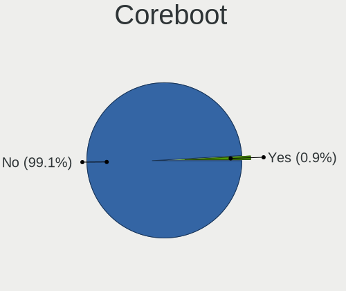
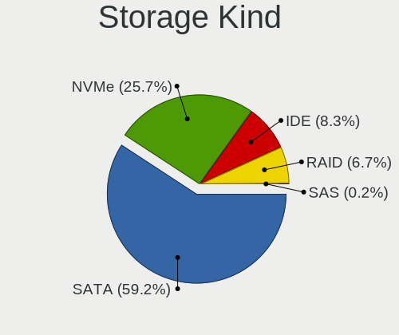
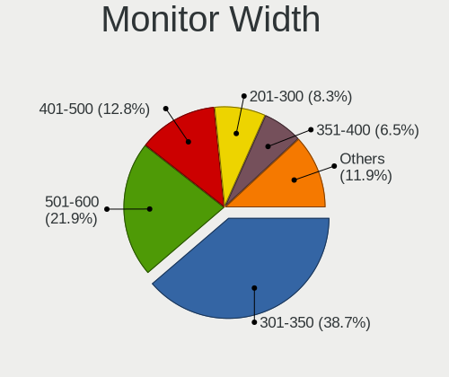
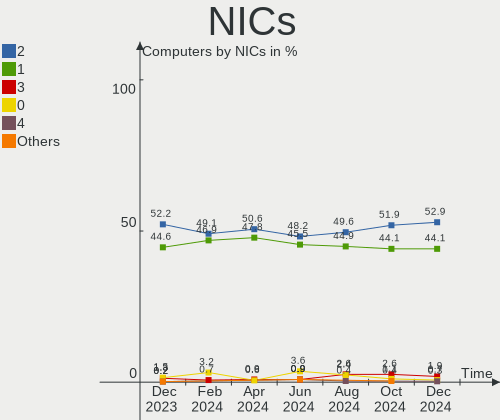
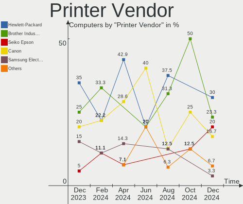
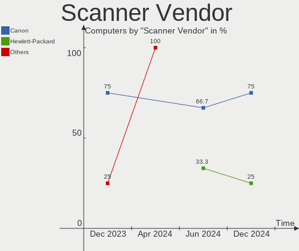
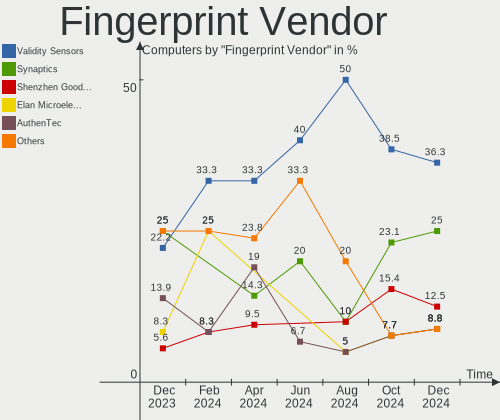

OpenMandriva Hardware Trends
----------------------------

A project to identify most popular hardware characteristics and track their change
over time based on data collected by OpenMandriva users at https://Linux-Hardware.org.

Anyone can contribute to this report by the [hw-probe](https://github.com/linuxhw/hw-probe) tool:

    sudo -E hw-probe -all -upload

This is a report for all computer types. See also reports for [desktops](/Dist/OpenMandriva/Desktop/README.md) and [notebooks](/Dist/OpenMandriva/Notebook/README.md).

Full-feature report is available here: https://linux-hardware.org/?view=trends

Period: Jul, 2021.

Contents
--------

* [ System ](#system)
  - [ OS                       ](#os)
  - [ OS Family                ](#os-family)
  - [ Kernel                   ](#kernel)
  - [ Kernel Family            ](#kernel-family)
  - [ Kernel Major Ver.        ](#kernel-major-ver)
  - [ Arch                     ](#arch)
  - [ DE                       ](#de)
  - [ Display Server           ](#display-server)
  - [ Display Manager          ](#display-manager)
  - [ OS Lang                  ](#os-lang)
  - [ Boot Mode                ](#boot-mode)
  - [ Filesystem               ](#filesystem)
  - [ Part. scheme             ](#part-scheme)
  - [ Dual Boot with Linux/BSD ](#dual-boot-with-linuxbsd)
  - [ Dual Boot (Win)          ](#dual-boot-win)

* [ Board ](#board)
  - [ Vendor                   ](#vendor)
  - [ Model                    ](#model)
  - [ Model Family             ](#model-family)
  - [ MFG Year                 ](#mfg-year)
  - [ Form Factor              ](#form-factor)
  - [ Secure Boot              ](#secure-boot)
  - [ Coreboot                 ](#coreboot)
  - [ RAM Size                 ](#ram-size)
  - [ RAM Used                 ](#ram-used)
  - [ Total Drives             ](#total-drives)
  - [ Has CD-ROM               ](#has-cd-rom)
  - [ Has Ethernet             ](#has-ethernet)
  - [ Has WiFi                 ](#has-wifi)
  - [ Has Bluetooth            ](#has-bluetooth)

* [ Location ](#location)
  - [ Country                  ](#country)
  - [ City                     ](#city)

* [ Drives ](#drives)
  - [ Drive Vendor             ](#drive-vendor)
  - [ Drive Model              ](#drive-model)
  - [ HDD Vendor               ](#hdd-vendor)
  - [ SSD Vendor               ](#ssd-vendor)
  - [ Drive Kind               ](#drive-kind)
  - [ Drive Connector          ](#drive-connector)
  - [ Drive Size               ](#drive-size)
  - [ Space Total              ](#space-total)
  - [ Space Used               ](#space-used)
  - [ Malfunc. Drives          ](#malfunc-drives)
  - [ Malfunc. Drive Vendor    ](#malfunc-drive-vendor)
  - [ Malfunc. HDD Vendor      ](#malfunc-hdd-vendor)
  - [ Malfunc. Drive Kind      ](#malfunc-drive-kind)
  - [ Failed Drives            ](#failed-drives)
  - [ Failed Drive Vendor      ](#failed-drive-vendor)
  - [ Drive Status             ](#drive-status)

* [ Storage controller ](#storage-controller)
  - [ Storage Vendor           ](#storage-vendor)
  - [ Storage Model            ](#storage-model)
  - [ Storage Kind             ](#storage-kind)

* [ Processor ](#processor)
  - [ CPU Vendor               ](#cpu-vendor)
  - [ CPU Model                ](#cpu-model)
  - [ CPU Model Family         ](#cpu-model-family)
  - [ CPU Cores                ](#cpu-cores)
  - [ CPU Sockets              ](#cpu-sockets)
  - [ CPU Threads              ](#cpu-threads)
  - [ CPU Op-Modes             ](#cpu-op-modes)
  - [ CPU Microcode            ](#cpu-microcode)
  - [ CPU Microarch            ](#cpu-microarch)

* [ Graphics ](#graphics)
  - [ GPU Vendor               ](#gpu-vendor)
  - [ GPU Model                ](#gpu-model)
  - [ GPU Combo                ](#gpu-combo)
  - [ GPU Driver               ](#gpu-driver)
  - [ GPU Memory               ](#gpu-memory)

* [ Monitor ](#monitor)
  - [ Monitor Vendor           ](#monitor-vendor)
  - [ Monitor Model            ](#monitor-model)
  - [ Monitor Resolution       ](#monitor-resolution)
  - [ Monitor Diagonal         ](#monitor-diagonal)
  - [ Monitor Width            ](#monitor-width)
  - [ Aspect Ratio             ](#aspect-ratio)
  - [ Monitor Area             ](#monitor-area)
  - [ Pixel Density            ](#pixel-density)
  - [ Multiple Monitors        ](#multiple-monitors)

* [ Network ](#network)
  - [ Net Controller Vendor    ](#net-controller-vendor)
  - [ Net Controller Model     ](#net-controller-model)
  - [ Wireless Vendor          ](#wireless-vendor)
  - [ Wireless Model           ](#wireless-model)
  - [ Ethernet Vendor          ](#ethernet-vendor)
  - [ Ethernet Model           ](#ethernet-model)
  - [ Net Controller Kind      ](#net-controller-kind)
  - [ Used Controller          ](#used-controller)
  - [ NICs                     ](#nics)
  - [ IPv6                     ](#ipv6)

* [ Bluetooth ](#bluetooth)
  - [ Bluetooth Vendor         ](#bluetooth-vendor)
  - [ Bluetooth Model          ](#bluetooth-model)

* [ Sound ](#sound)
  - [ Sound Vendor             ](#sound-vendor)
  - [ Sound Model              ](#sound-model)

* [ Memory ](#memory)
  - [ Memory Vendor            ](#memory-vendor)
  - [ Memory Model             ](#memory-model)
  - [ Memory Kind              ](#memory-kind)
  - [ Memory Form Factor       ](#memory-form-factor)
  - [ Memory Size              ](#memory-size)
  - [ Memory Speed             ](#memory-speed)

* [ Printers & scanners ](#printers-&-scanners)
  - [ Printer Vendor           ](#printer-vendor)
  - [ Printer Model            ](#printer-model)
  - [ Scanner Vendor           ](#scanner-vendor)
  - [ Scanner Model            ](#scanner-model)

* [ Camera ](#camera)
  - [ Camera Vendor            ](#camera-vendor)
  - [ Camera Model             ](#camera-model)

* [ Security ](#security)
  - [ Fingerprint Vendor       ](#fingerprint-vendor)
  - [ Fingerprint Model        ](#fingerprint-model)
  - [ Chipcard Vendor          ](#chipcard-vendor)
  - [ Chipcard Model           ](#chipcard-model)

* [ Unsupported ](#unsupported)
  - [ Unsupported Devices      ](#unsupported-devices)
  - [ Unsupported Device Types ](#unsupported-device-types)

System
------

OS
--

Installed operating systems

| Name              | Computers | Percent |
|-------------------|-----------|---------|
| OpenMandriva 4.2  | 324       | 80.6%   |
| OpenMandriva 4.50 | 77        | 19.15%  |
| OpenMandriva 4.1  | 1         | 0.25%   |

OS Family
---------

OS without a version

| Name         | Computers | Percent |
|--------------|-----------|---------|
| OpenMandriva | 402       | 100%    |

Kernel
------

Version of the Linux kernel

| Version                        | Computers | Percent |
|--------------------------------|-----------|---------|
| 5.10.14-desktop-1omv4002       | 258       | 64.18%  |
| 5.11.12-desktop-1omv4002       | 66        | 16.42%  |
| 5.12.4-desktop-1omv4050        | 54        | 13.43%  |
| 5.12.7-desktop-1omv4003        | 14        | 3.48%   |
| 5.13.2-desktop-clang-1omv4050  | 2         | 0.5%    |
| 5.12.7-desktop-clang-1omv4003  | 2         | 0.5%    |
| 5.5.12-desktop-1omv4001        | 1         | 0.25%   |
| 5.13.4-server-clang-1omv4050   | 1         | 0.25%   |
| 5.13.2-desktop-2.0mjn4.5       | 1         | 0.25%   |
| 5.13.2-desktop-1omv4050        | 1         | 0.25%   |
| 5.12.8-desktop-clang-1omv4050  | 1         | 0.25%   |
| 5.12.12-desktop-clang-1omv4050 | 1         | 0.25%   |

Kernel Family
-------------

Linux kernel without a distro release

| Version | Computers | Percent |
|---------|-----------|---------|
| 5.10.14 | 258       | 64.18%  |
| 5.11.12 | 66        | 16.42%  |
| 5.12.4  | 54        | 13.43%  |
| 5.12.7  | 16        | 3.98%   |
| 5.13.2  | 4         | 1%      |
| 5.5.12  | 1         | 0.25%   |
| 5.13.4  | 1         | 0.25%   |
| 5.12.8  | 1         | 0.25%   |
| 5.12.12 | 1         | 0.25%   |

Kernel Major Ver.
-----------------

Linux kernel major version

| Version | Computers | Percent |
|---------|-----------|---------|
| 5.10    | 258       | 64.18%  |
| 5.12    | 72        | 17.91%  |
| 5.11    | 66        | 16.42%  |
| 5.13    | 5         | 1.24%   |
| 5.5     | 1         | 0.25%   |

Arch
----

OS architecture (x86_64, i586, etc.)

| Name    | Computers | Percent |
|---------|-----------|---------|
| x86_64  | 401       | 99.75%  |
| aarch64 | 1         | 0.25%   |

DE
--

Desktop Environment

| Name     | Computers | Percent |
|----------|-----------|---------|
| KDE5     | 400       | 99.5%   |
| LXQt     | 1         | 0.25%   |
| Cinnamon | 1         | 0.25%   |

Display Server
--------------

X11 or Wayland

| Name    | Computers | Percent |
|---------|-----------|---------|
| X11     | 401       | 99.75%  |
| Wayland | 1         | 0.25%   |

Display Manager
---------------

SDDM, LightDM, etc.

| Name | Computers | Percent |
|------|-----------|---------|
| SDDM | 402       | 100%    |

OS Lang
-------

Language

| Lang  | Computers | Percent |
|-------|-----------|---------|
| en_US | 188       | 46.77%  |
| de_DE | 29        | 7.21%   |
| ru_RU | 26        | 6.47%   |
| fr_FR | 26        | 6.47%   |
| pt_BR | 22        | 5.47%   |
| pl_PL | 16        | 3.98%   |
| es_ES | 16        | 3.98%   |
| es_MX | 10        | 2.49%   |
| en_GB | 10        | 2.49%   |
| it_IT | 9         | 2.24%   |
| fr_BE | 4         | 1%      |
| es_CO | 4         | 1%      |
| cs_CZ | 4         | 1%      |
| hu_HU | 3         | 0.75%   |
| en_SG | 3         | 0.75%   |
| en_AU | 3         | 0.75%   |
| uk_UA | 2         | 0.5%    |
| es_VE | 2         | 0.5%    |
| es_UY | 2         | 0.5%    |
| es_SV | 2         | 0.5%    |
| es_CL | 2         | 0.5%    |
| es_AR | 2         | 0.5%    |
| en_IN | 2         | 0.5%    |
| en_CA | 2         | 0.5%    |
| ru_UA | 1         | 0.25%   |
| ro_RO | 1         | 0.25%   |
| nl_NL | 1         | 0.25%   |
| nb_NO | 1         | 0.25%   |
| fr_CH | 1         | 0.25%   |
| fr_CA | 1         | 0.25%   |
| es_CR | 1         | 0.25%   |
| en_ZA | 1         | 0.25%   |
| en_NZ | 1         | 0.25%   |
| en_IL | 1         | 0.25%   |
| en_DK | 1         | 0.25%   |
| de_IT | 1         | 0.25%   |
| af_ZA | 1         | 0.25%   |

Boot Mode
---------

EFI or BIOS

| Mode | Computers | Percent |
|------|-----------|---------|
| BIOS | 226       | 56.22%  |
| EFI  | 176       | 43.78%  |

Filesystem
----------

Type of filesystem

| Type    | Computers | Percent |
|---------|-----------|---------|
| Overlay | 255       | 63.43%  |
| Ext4    | 135       | 33.58%  |
| F2fs    | 5         | 1.24%   |
| Btrfs   | 3         | 0.75%   |
| Xfs     | 2         | 0.5%    |
| Jfs     | 1         | 0.25%   |
| Ext3    | 1         | 0.25%   |

Part. scheme
------------

Scheme of partitioning

| Type    | Computers | Percent |
|---------|-----------|---------|
| GPT     | 247       | 61.44%  |
| MBR     | 154       | 38.31%  |
| Unknown | 1         | 0.25%   |

Dual Boot with Linux/BSD
------------------------

Hosting more than one Linux/BSD

| Dual boot | Computers | Percent |
|-----------|-----------|---------|
| Yes       | 209       | 51.99%  |
| No        | 193       | 48.01%  |

Dual Boot (Win)
---------------

Hosting Linux and Windows

| Dual boot | Computers | Percent |
|-----------|-----------|---------|
| No        | 231       | 57.46%  |
| Yes       | 171       | 42.54%  |

Board
-----

Vendor
------

Motherboard manufacturer

| Name                | Computers | Percent |
|---------------------|-----------|---------|
| ASUSTek Computer    | 72        | 17.91%  |
| Lenovo              | 56        | 13.93%  |
| Hewlett-Packard     | 56        | 13.93%  |
| Dell                | 46        | 11.44%  |
| Gigabyte Technology | 34        | 8.46%   |
| Acer                | 26        | 6.47%   |
| MSI                 | 18        | 4.48%   |
| ASRock              | 14        | 3.48%   |
| Intel               | 9         | 2.24%   |
| Toshiba             | 8         | 1.99%   |
| Apple               | 7         | 1.74%   |
| Sony                | 5         | 1.24%   |
| Fujitsu             | 5         | 1.24%   |
| Biostar             | 5         | 1.24%   |
| Pegatron            | 4         | 1%      |
| Packard Bell        | 4         | 1%      |
| Unknown             | 4         | 1%      |
| Positivo            | 3         | 0.75%   |
| Itautec             | 3         | 0.75%   |
| Samsung Electronics | 2         | 0.5%    |
| PCWare              | 2         | 0.5%    |
| HUAWEI              | 2         | 0.5%    |
| Teclast             | 1         | 0.25%   |
| Star Labs           | 1         | 0.25%   |
| Shuttle             | 1         | 0.25%   |
| R-StyleComputers    | 1         | 0.25%   |
| Philco              | 1         | 0.25%   |
| Panasonic           | 1         | 0.25%   |
| Microsoft           | 1         | 0.25%   |
| Megaware            | 1         | 0.25%   |
| Medion              | 1         | 0.25%   |
| LG Electronics      | 1         | 0.25%   |
| Lanix               | 1         | 0.25%   |
| Koloe               | 1         | 0.25%   |
| Inventec            | 1         | 0.25%   |
| Fujitsu Siemens     | 1         | 0.25%   |
| Foxconn             | 1         | 0.25%   |
| ECS                 | 1         | 0.25%   |
| Clevo               | 1         | 0.25%   |

Model
-----

Motherboard model

| Name                                     | Computers | Percent |
|------------------------------------------|-----------|---------|
| Lenovo IdeaPad 3 15ADA05 81W1            | 4         | 1%      |
| Dell OptiPlex 780                        | 4         | 1%      |
| ASUS All Series                          | 4         | 1%      |
| Unknown                                  | 4         | 1%      |
| MSI MS-7A40                              | 2         | 0.5%    |
| MSI MS-7309                              | 2         | 0.5%    |
| Lenovo B50-10 80QR                       | 2         | 0.5%    |
| Itautec Infoway                          | 2         | 0.5%    |
| Intel DH61WW AAG23116-204                | 2         | 0.5%    |
| HP ProDesk 600 G4 SFF                    | 2         | 0.5%    |
| HP Pavilion g6                           | 2         | 0.5%    |
| Gigabyte H61M-DS2                        | 2         | 0.5%    |
| Gigabyte G41MT-S2PT                      | 2         | 0.5%    |
| Gigabyte B450M S2H                       | 2         | 0.5%    |
| Dell Latitude E5520                      | 2         | 0.5%    |
| ASUS PRIME A320M-K                       | 2         | 0.5%    |
| ASUS M5A78L-M PLUS/USB3                  | 2         | 0.5%    |
| ASUS K84C                                | 2         | 0.5%    |
| ASUS B75M-A                              | 2         | 0.5%    |
| Toshiba TECRA S11                        | 1         | 0.25%   |
| Toshiba Satellite S855                   | 1         | 0.25%   |
| Toshiba Satellite L755                   | 1         | 0.25%   |
| Toshiba Satellite C850D-11K              | 1         | 0.25%   |
| Toshiba Satellite C660D                  | 1         | 0.25%   |
| Toshiba Satellite C55-A-1P6              | 1         | 0.25%   |
| Toshiba NB550D                           | 1         | 0.25%   |
| Toshiba NB300                            | 1         | 0.25%   |
| Teclast F15S                             | 1         | 0.25%   |
| Star Labs LabTop                         | 1         | 0.25%   |
| Sony VPCEB490X                           | 1         | 0.25%   |
| Sony VGN-FW190E                          | 1         | 0.25%   |
| Sony SVF1521B1EW                         | 1         | 0.25%   |
| Sony SVE14A35CXH                         | 1         | 0.25%   |
| Sony SVE14A1S6EW                         | 1         | 0.25%   |
| Shuttle DL10J                            | 1         | 0.25%   |
| Samsung Q430/Q530                        | 1         | 0.25%   |
| Samsung 3570R/370R/470R/450R/510R/4450RV | 1         | 0.25%   |
| R-StyleComputers ALICON AI2S-A21 00.69   | 1         | 0.25%   |
| Positivo S14BW01                         | 1         | 0.25%   |
| Positivo POS-EIH61CE                     | 1         | 0.25%   |
| Positivo POS-EIBTPDC                     | 1         | 0.25%   |
| Philco 14I                               | 1         | 0.25%   |
| Pegatron p6715fr                         | 1         | 0.25%   |
| Pegatron HPE-553s                        | 1         | 0.25%   |
| Pegatron 520-1140t                       | 1         | 0.25%   |
| Pegatron 2A84h                           | 1         | 0.25%   |
| PCWare IPX4105G Pro                      | 1         | 0.25%   |
| PCWare IPMH61R1                          | 1         | 0.25%   |
| Panasonic CF-31ACAAA1M                   | 1         | 0.25%   |
| Packard Bell ISTART MC9194               | 1         | 0.25%   |
| Packard Bell IMEDIA X4626 GE             | 1         | 0.25%   |
| Packard Bell EasyNote TE69KB             | 1         | 0.25%   |
| Packard Bell EasyNote ENTG71BM           | 1         | 0.25%   |
| MSI MS-7C92                              | 1         | 0.25%   |
| MSI MS-7C81                              | 1         | 0.25%   |
| MSI MS-7B89                              | 1         | 0.25%   |
| MSI MS-7B24                              | 1         | 0.25%   |
| MSI MS-7A15                              | 1         | 0.25%   |
| MSI MS-7996                              | 1         | 0.25%   |
| MSI MS-7921                              | 1         | 0.25%   |

Model Family
------------

Motherboard model prefix

| Name                  | Computers | Percent |
|-----------------------|-----------|---------|
| Acer Aspire           | 18        | 4.48%   |
| Lenovo IdeaPad        | 16        | 3.98%   |
| Lenovo ThinkPad       | 13        | 3.23%   |
| Dell OptiPlex         | 12        | 2.99%   |
| Dell Latitude         | 12        | 2.99%   |
| Dell Inspiron         | 12        | 2.99%   |
| HP Pavilion           | 10        | 2.49%   |
| HP Compaq             | 9         | 2.24%   |
| Lenovo ThinkCentre    | 8         | 1.99%   |
| ASUS PRIME            | 8         | 1.99%   |
| HP ProBook            | 6         | 1.49%   |
| Toshiba Satellite     | 5         | 1.24%   |
| HP EliteBook          | 5         | 1.24%   |
| HP ProDesk            | 4         | 1%      |
| HP Laptop             | 4         | 1%      |
| Dell Precision        | 4         | 1%      |
| ASUS P8H61-M          | 4         | 1%      |
| ASUS All              | 4         | 1%      |
| Unknown               | 4         | 1%      |
| Itautec Infoway       | 3         | 0.75%   |
| Fujitsu LIFEBOOK      | 3         | 0.75%   |
| ASUS VivoBook         | 3         | 0.75%   |
| ASUS ROG              | 3         | 0.75%   |
| ASUS M5A78L-M         | 3         | 0.75%   |
| Packard Bell EasyNote | 2         | 0.5%    |
| MSI MS-7A40           | 2         | 0.5%    |
| MSI MS-7309           | 2         | 0.5%    |
| Lenovo B50-10         | 2         | 0.5%    |
| Intel DH61WW          | 2         | 0.5%    |
| HP ENVY               | 2         | 0.5%    |
| HP EliteDesk          | 2         | 0.5%    |
| Gigabyte H61M-DS2     | 2         | 0.5%    |
| Gigabyte G41MT-S2PT   | 2         | 0.5%    |
| Gigabyte B450M        | 2         | 0.5%    |
| Gigabyte A320M-S2H    | 2         | 0.5%    |
| Fujitsu ESPRIMO       | 2         | 0.5%    |
| Dell XPS              | 2         | 0.5%    |
| Dell Vostro           | 2         | 0.5%    |
| ASUS TUF              | 2         | 0.5%    |
| ASUS P8Z77-V          | 2         | 0.5%    |
| ASUS P5K              | 2         | 0.5%    |
| ASUS K84C             | 2         | 0.5%    |
| ASUS K30BF            | 2         | 0.5%    |
| ASUS B75M-A           | 2         | 0.5%    |
| Acer Veriton          | 2         | 0.5%    |
| Acer TravelMate       | 2         | 0.5%    |
| Acer Swift            | 2         | 0.5%    |
| Toshiba TECRA         | 1         | 0.25%   |
| Toshiba NB550D        | 1         | 0.25%   |
| Toshiba NB300         | 1         | 0.25%   |
| Teclast F15S          | 1         | 0.25%   |
| Star Labs LabTop      | 1         | 0.25%   |
| Sony VPCEB490X        | 1         | 0.25%   |
| Sony VGN-FW190E       | 1         | 0.25%   |
| Sony SVF1521B1EW      | 1         | 0.25%   |
| Sony SVE14A35CXH      | 1         | 0.25%   |
| Sony SVE14A1S6EW      | 1         | 0.25%   |
| Shuttle DL10J         | 1         | 0.25%   |
| Samsung Q430          | 1         | 0.25%   |
| Samsung 3570R         | 1         | 0.25%   |

MFG Year
--------

Motherboard manufacture year

| Year | Computers | Percent |
|------|-----------|---------|
| 2020 | 49        | 12.19%  |
| 2012 | 39        | 9.7%    |
| 2014 | 36        | 8.96%   |
| 2011 | 35        | 8.71%   |
| 2013 | 32        | 7.96%   |
| 2019 | 29        | 7.21%   |
| 2010 | 28        | 6.97%   |
| 2018 | 26        | 6.47%   |
| 2016 | 24        | 5.97%   |
| 2021 | 22        | 5.47%   |
| 2009 | 20        | 4.98%   |
| 2015 | 19        | 4.73%   |
| 2017 | 16        | 3.98%   |
| 2008 | 16        | 3.98%   |
| 2007 | 9         | 2.24%   |
| 2006 | 2         | 0.5%    |

Form Factor
-----------

Physical design of the computer

| Name           | Computers | Percent |
|----------------|-----------|---------|
| Desktop        | 199       | 49.5%   |
| Notebook       | 187       | 46.52%  |
| Mini pc        | 5         | 1.24%   |
| All in one     | 5         | 1.24%   |
| Convertible    | 4         | 1%      |
| System on chip | 1         | 0.25%   |
| Tablet         | 1         | 0.25%   |

Secure Boot
-----------

Enabled or disabled

| State    | Computers | Percent |
|----------|-----------|---------|
| Disabled | 402       | 100%    |

Coreboot
--------

Have coreboot on board

| Used | Computers | Percent |
|------|-----------|---------|
| No   | 402       | 100%    |

RAM Size
--------

Total RAM memory

| Size in GB  | Computers | Percent |
|-------------|-----------|---------|
| 3.01-4.0    | 124       | 30.85%  |
| 4.01-8.0    | 110       | 27.36%  |
| 8.01-16.0   | 77        | 19.15%  |
| 16.01-24.0  | 47        | 11.69%  |
| 32.01-64.0  | 18        | 4.48%   |
| 1.01-2.0    | 12        | 2.99%   |
| 2.01-3.0    | 8         | 1.99%   |
| 24.01-32.0  | 3         | 0.75%   |
| 0.51-1.0    | 2         | 0.5%    |
| 64.01-256.0 | 1         | 0.25%   |

RAM Used
--------

Used RAM memory

| Used GB  | Computers | Percent |
|----------|-----------|---------|
| 1.01-2.0 | 305       | 75.87%  |
| 0.51-1.0 | 41        | 10.2%   |
| 2.01-3.0 | 38        | 9.45%   |
| 0.01-0.5 | 11        | 2.74%   |
| 4.01-8.0 | 4         | 1%      |
| 3.01-4.0 | 3         | 0.75%   |

Total Drives
------------

Number of drives on board

| Drives | Computers | Percent |
|--------|-----------|---------|
| 1      | 246       | 61.19%  |
| 2      | 97        | 24.13%  |
| 3      | 29        | 7.21%   |
| 4      | 14        | 3.48%   |
| 0      | 8         | 1.99%   |
| 5      | 4         | 1%      |
| 8      | 2         | 0.5%    |
| 15     | 1         | 0.25%   |
| 6      | 1         | 0.25%   |

Has CD-ROM
----------

Has CD-ROM on board

| Presented | Computers | Percent |
|-----------|-----------|---------|
| Yes       | 237       | 58.96%  |
| No        | 165       | 41.04%  |

Has Ethernet
------------

Has Ethernet on board

| Presented | Computers | Percent |
|-----------|-----------|---------|
| Yes       | 374       | 93.03%  |
| No        | 28        | 6.97%   |

Has WiFi
--------

Has WiFi module

| Presented | Computers | Percent |
|-----------|-----------|---------|
| Yes       | 268       | 66.67%  |
| No        | 134       | 33.33%  |

Has Bluetooth
-------------

Has Bluetooth module

| Presented | Computers | Percent |
|-----------|-----------|---------|
| No        | 213       | 52.99%  |
| Yes       | 189       | 47.01%  |

Location
--------

Country
-------

Geographic location (country)

| Country      | Computers | Percent |
|--------------|-----------|---------|
| USA          | 49        | 12.19%  |
| Russia       | 38        | 9.45%   |
| Germany      | 36        | 8.96%   |
| Brazil       | 36        | 8.96%   |
| France       | 31        | 7.71%   |
| Poland       | 25        | 6.22%   |
| Spain        | 18        | 4.48%   |
| Italy        | 14        | 3.48%   |
| Mexico       | 13        | 3.23%   |
| UK           | 12        | 2.99%   |
| Canada       | 8         | 1.99%   |
| Czechia      | 7         | 1.74%   |
| Belgium      | 7         | 1.74%   |
| Indonesia    | 5         | 1.24%   |
| Finland      | 5         | 1.24%   |
| Colombia     | 5         | 1.24%   |
| Ukraine      | 4         | 1%      |
| South Africa | 4         | 1%      |
| India        | 4         | 1%      |
| China        | 4         | 1%      |
| Australia    | 4         | 1%      |
| Norway       | 3         | 0.75%   |
| Netherlands  | 3         | 0.75%   |
| Malaysia     | 3         | 0.75%   |
| Japan        | 3         | 0.75%   |
| Israel       | 3         | 0.75%   |
| Hungary      | 3         | 0.75%   |
| Chile        | 3         | 0.75%   |
| Venezuela    | 2         | 0.5%    |
| Uruguay      | 2         | 0.5%    |
| Turkey       | 2         | 0.5%    |
| Sweden       | 2         | 0.5%    |
| Slovenia     | 2         | 0.5%    |
| Slovakia     | 2         | 0.5%    |
| Singapore    | 2         | 0.5%    |
| Romania      | 2         | 0.5%    |
| Portugal     | 2         | 0.5%    |
| New Zealand  | 2         | 0.5%    |
| Martinique   | 2         | 0.5%    |
| Kazakhstan   | 2         | 0.5%    |
| El Salvador  | 2         | 0.5%    |
| Egypt        | 2         | 0.5%    |
| Cyprus       | 2         | 0.5%    |
| Costa Rica   | 2         | 0.5%    |
| Argentina    | 2         | 0.5%    |
| Taiwan       | 1         | 0.25%   |
| Switzerland  | 1         | 0.25%   |
| Serbia       | 1         | 0.25%   |
| Saudi Arabia | 1         | 0.25%   |
| Pakistan     | 1         | 0.25%   |
| Morocco      | 1         | 0.25%   |
| Mali         | 1         | 0.25%   |
| Latvia       | 1         | 0.25%   |
| Kenya        | 1         | 0.25%   |
| Jamaica      | 1         | 0.25%   |
| Greece       | 1         | 0.25%   |
| Denmark      | 1         | 0.25%   |
| Croatia      | 1         | 0.25%   |
| Bulgaria     | 1         | 0.25%   |
| Belarus      | 1         | 0.25%   |

City
----

Geographic location (city)

| City              | Computers | Percent |
|-------------------|-----------|---------|
| Moscow            | 6         | 1.49%   |
| Warsaw            | 5         | 1.24%   |
| Paris             | 5         | 1.24%   |
| Yekaterinburg     | 4         | 1%      |
| St Petersburg     | 4         | 1%      |
| Helsinki          | 4         | 1%      |
| Florence          | 4         | 1%      |
| Mexico City       | 3         | 0.75%   |
| Frankfurt am Main | 3         | 0.75%   |
| Dessau            | 3         | 0.75%   |
| Denver            | 3         | 0.75%   |
| Colindale         | 3         | 0.75%   |
| Berlin            | 3         | 0.75%   |
| Wroclaw           | 2         | 0.5%    |
| Singapore         | 2         | 0.5%    |
| Saskatoon         | 2         | 0.5%    |
| Sanford           | 2         | 0.5%    |
| Roanoke           | 2         | 0.5%    |
| Riverdale         | 2         | 0.5%    |
| Queens            | 2         | 0.5%    |
| Puteaux           | 2         | 0.5%    |
| Pamplona          | 2         | 0.5%    |
| Oslo              | 2         | 0.5%    |
| Oryol             | 2         | 0.5%    |
| New York          | 2         | 0.5%    |
| Munich            | 2         | 0.5%    |
| M??laga           | 2         | 0.5%    |
| Maldonado         | 2         | 0.5%    |
| Limassol          | 2         | 0.5%    |
| Kyiv              | 2         | 0.5%    |
| Kuala Lumpur      | 2         | 0.5%    |
| Houston           | 2         | 0.5%    |
| Fort-de-France    | 2         | 0.5%    |
| Castelldefels     | 2         | 0.5%    |
| Cairo             | 2         | 0.5%    |
| Blumenau          | 2         | 0.5%    |
| Barcelona         | 2         | 0.5%    |
| Zhuhai            | 1         | 0.25%   |
| Zdar              | 1         | 0.25%   |
| Z?Öbki            | 1         | 0.25%   |
| Zapopan           | 1         | 0.25%   |
| Zadni Treban      | 1         | 0.25%   |
| York              | 1         | 0.25%   |
| Willingboro       | 1         | 0.25%   |
| Waterford         | 1         | 0.25%   |
| Vienna            | 1         | 0.25%   |
| Victoriaville     | 1         | 0.25%   |
| Venerque          | 1         | 0.25%   |
| Varzelandia       | 1         | 0.25%   |
| Valladolid        | 1         | 0.25%   |
| Valencia          | 1         | 0.25%   |
| Uchaud            | 1         | 0.25%   |
| Târgu Mureş     | 1         | 0.25%   |
| Tyumen            | 1         | 0.25%   |
| Tucson            | 1         | 0.25%   |
| Trois-Rivi??res   | 1         | 0.25%   |
| Torrevieja        | 1         | 0.25%   |
| Torquay           | 1         | 0.25%   |
| Tochigi           | 1         | 0.25%   |
| Tlalnepantla      | 1         | 0.25%   |

Drives
------

Drive Vendor
------------

Hard drive vendors

| Vendor              | Computers | Drives | Percent |
|---------------------|-----------|--------|---------|
| WDC                 | 121       | 138    | 21.61%  |
| Seagate             | 109       | 128    | 19.46%  |
| Samsung Electronics | 57        | 66     | 10.18%  |
| Toshiba             | 42        | 45     | 7.5%    |
| Kingston            | 35        | 37     | 6.25%   |
| Hitachi             | 28        | 29     | 5%      |
| Crucial             | 21        | 22     | 3.75%   |
| Unknown             | 17        | 18     | 3.04%   |
| A-DATA Technology   | 15        | 17     | 2.68%   |
| HGST                | 12        | 13     | 2.14%   |
| SanDisk             | 11        | 13     | 1.96%   |
| Intel               | 11        | 11     | 1.96%   |
| Phison              | 7         | 11     | 1.25%   |
| SK Hynix            | 6         | 6      | 1.07%   |
| Maxtor              | 6         | 6      | 1.07%   |
| GOODRAM             | 6         | 6      | 1.07%   |
| China               | 5         | 5      | 0.89%   |
| PNY                 | 4         | 4      | 0.71%   |
| Apacer              | 4         | 6      | 0.71%   |
| Patriot             | 3         | 3      | 0.54%   |
| OCZ                 | 3         | 3      | 0.54%   |
| Intenso             | 3         | 3      | 0.54%   |
| Corsair             | 3         | 3      | 0.54%   |
| Transcend           | 2         | 2      | 0.36%   |
| SPCC                | 2         | 2      | 0.36%   |
| PLEXTOR             | 2         | 2      | 0.36%   |
| LITEON              | 2         | 2      | 0.36%   |
| Hewlett-Packard     | 2         | 2      | 0.36%   |
| Apple               | 2         | 2      | 0.36%   |
| ZTE                 | 1         | 1      | 0.18%   |
| USB                 | 1         | 1      | 0.18%   |
| Union Memory        | 1         | 1      | 0.18%   |
| TO Exter            | 1         | 1      | 0.18%   |
| TEXTORM             | 1         | 1      | 0.18%   |
| takeMS              | 1         | 1      | 0.18%   |
| Star Drive          | 1         | 1      | 0.18%   |
| Platinet            | 1         | 1      | 0.18%   |
| Micron Technology   | 1         | 1      | 0.18%   |
| MDT                 | 1         | 1      | 0.18%   |
| KIOXIA              | 1         | 1      | 0.18%   |
| KingSpec            | 1         | 1      | 0.18%   |
| KESU                | 1         | 1      | 0.18%   |
| JMicron             | 1         | 1      | 0.18%   |
| Fujitsu             | 1         | 1      | 0.18%   |
| FORESEE             | 1         | 1      | 0.18%   |
| Dogfish             | 1         | 1      | 0.18%   |
| Colorful            | 1         | 1      | 0.18%   |
| ASMT106x            | 1         | 1      | 0.18%   |

Drive Model
-----------

Hard drive models

| Model                               | Computers | Percent |
|-------------------------------------|-----------|---------|
| Seagate ST500DM002-1BD142 500GB     | 9         | 1.5%    |
| Seagate ST1000LM024 HN-M101MBB 1TB  | 8         | 1.33%   |
| WDC WD20EZRX-00D8PB0 2TB            | 6         | 1%      |
| Samsung SSD 860 EVO 250GB           | 6         | 1%      |
| Kingston SA400S37240G 240GB SSD     | 6         | 1%      |
| Seagate ST2000DM008-2FR102 2TB      | 5         | 0.83%   |
| Samsung SSD 860 EVO 500GB           | 5         | 0.83%   |
| Toshiba MQ01ABF050 500GB            | 4         | 0.67%   |
| Toshiba MQ01ABD075 752GB            | 4         | 0.67%   |
| Seagate ST9500325AS 500GB           | 4         | 0.67%   |
| Seagate ST500LT012-9WS142 500GB     | 4         | 0.67%   |
| Seagate ST500LM012 HN-M500MBB 500GB | 4         | 0.67%   |
| Seagate ST380815AS 80GB             | 4         | 0.67%   |
| Seagate ST1000DM010-2EP102 1TB      | 4         | 0.67%   |
| Phison Sabrent Rocket nano 512GB    | 4         | 0.67%   |
| WDC WDS500G2B0A-00SM50 500GB SSD    | 3         | 0.5%    |
| WDC WD5000LPVX-22V0TT0 500GB        | 3         | 0.5%    |
| WDC WD5000AAKX-00ERMA0 500GB        | 3         | 0.5%    |
| WDC WD20EZRZ-00Z5HB0 2TB            | 3         | 0.5%    |
| WDC WD10EZEX-00BN5A0 1TB            | 3         | 0.5%    |
| Toshiba MQ04ABF100 1TB              | 3         | 0.5%    |
| Toshiba DT01ACA100 1TB              | 3         | 0.5%    |
| Seagate ST500LT012-1DG142 500GB     | 3         | 0.5%    |
| Seagate ST3500418AS 500GB           | 3         | 0.5%    |
| Seagate ST2000DM001-1ER164 2TB      | 3         | 0.5%    |
| Seagate ST1000LM035-1RK172 1TB      | 3         | 0.5%    |
| Seagate ST1000DM003-1ER162 1TB      | 3         | 0.5%    |
| Seagate BUP Slim BK 1TB             | 3         | 0.5%    |
| Samsung SSD 850 EVO 250GB           | 3         | 0.5%    |
| Kingston SA400S37120G 120GB SSD     | 3         | 0.5%    |
| Hitachi HTS547550A9E384 500GB       | 3         | 0.5%    |
| HGST HTS721010A9E630 1TB            | 3         | 0.5%    |
| HGST HTS545050A7E380 500GB          | 3         | 0.5%    |
| HGST HTS541010A9E680 1TB            | 3         | 0.5%    |
| Crucial CT500MX500SSD1 500GB        | 3         | 0.5%    |
| Crucial CT240BX500SSD1 240GB        | 3         | 0.5%    |
| Crucial CT120BX500SSD1 120GB        | 3         | 0.5%    |
| A-DATA SU650 120GB SSD              | 3         | 0.5%    |
| WDC WDS500G2B0C-00PXH0 500GB        | 2         | 0.33%   |
| WDC WD6400AAKS-22A7B2 640GB         | 2         | 0.33%   |
| WDC WD6400AAKS-22A7B0 640GB         | 2         | 0.33%   |
| WDC WD5000AAKX-75U6AA0 500GB        | 2         | 0.33%   |
| WDC WD5000AAKX-083CA1 500GB         | 2         | 0.33%   |
| WDC WD5000AAKX-001CA0 500GB         | 2         | 0.33%   |
| WDC WD3200AAKS-00B3A0 320GB         | 2         | 0.33%   |
| WDC WD3200AAJS-56M0A0 320GB         | 2         | 0.33%   |
| WDC WD3200AAJS-00RYA0 320GB         | 2         | 0.33%   |
| WDC WD10JPVX-22JC3T0 1TB            | 2         | 0.33%   |
| WDC WD10EZEX-60WN4A0 1TB            | 2         | 0.33%   |
| WDC WD10EZEX-21M2NA0 1TB            | 2         | 0.33%   |
| WDC WD10EZEX-08WN4A0 1TB            | 2         | 0.33%   |
| WDC WD10EURX-63FH1Y0 1TB            | 2         | 0.33%   |
| WDC WD1003FZEX-00MK2A0 1TB          | 2         | 0.33%   |
| Unknown SD/MMC/MS PRO 128GB         | 2         | 0.33%   |
| Unknown DA4064  64GB                | 2         | 0.33%   |
| Unknown C500 256GB SSD              | 2         | 0.33%   |
| Toshiba MK5059GSXP 500GB            | 2         | 0.33%   |
| Toshiba DT01ACA200 2TB              | 2         | 0.33%   |
| Toshiba DT01ACA050 500GB            | 2         | 0.33%   |
| SPCC M.2 PCIe SSD 256GB             | 2         | 0.33%   |

HDD Vendor
----------

Hard disk drive vendors

| Vendor              | Computers | Drives | Percent |
|---------------------|-----------|--------|---------|
| Seagate             | 108       | 127    | 33.75%  |
| WDC                 | 106       | 122    | 33.13%  |
| Toshiba             | 38        | 40     | 11.88%  |
| Hitachi             | 28        | 29     | 8.75%   |
| Samsung Electronics | 17        | 18     | 5.31%   |
| HGST                | 12        | 13     | 3.75%   |
| Maxtor              | 6         | 6      | 1.88%   |
| MDT                 | 1         | 1      | 0.31%   |
| Hewlett-Packard     | 1         | 1      | 0.31%   |
| Fujitsu             | 1         | 1      | 0.31%   |
| ASMT106x            | 1         | 1      | 0.31%   |
| Apple               | 1         | 1      | 0.31%   |

SSD Vendor
----------

Solid state drive vendors

| Vendor              | Computers | Drives | Percent |
|---------------------|-----------|--------|---------|
| Kingston            | 31        | 33     | 17.61%  |
| Samsung Electronics | 29        | 34     | 16.48%  |
| Crucial             | 19        | 20     | 10.8%   |
| A-DATA Technology   | 15        | 17     | 8.52%   |
| SanDisk             | 11        | 13     | 6.25%   |
| WDC                 | 8         | 8      | 4.55%   |
| Intel               | 7         | 7      | 3.98%   |
| GOODRAM             | 6         | 6      | 3.41%   |
| China               | 5         | 5      | 2.84%   |
| Toshiba             | 4         | 4      | 2.27%   |
| SK Hynix            | 4         | 4      | 2.27%   |
| PNY                 | 4         | 4      | 2.27%   |
| Apacer              | 4         | 6      | 2.27%   |
| Patriot             | 3         | 3      | 1.7%    |
| OCZ                 | 3         | 3      | 1.7%    |
| Intenso             | 3         | 3      | 1.7%    |
| Corsair             | 3         | 3      | 1.7%    |
| Unknown             | 2         | 2      | 1.14%   |
| LITEON              | 2         | 2      | 1.14%   |
| Transcend           | 1         | 1      | 0.57%   |
| TO Exter            | 1         | 1      | 0.57%   |
| TEXTORM             | 1         | 1      | 0.57%   |
| takeMS              | 1         | 1      | 0.57%   |
| PLEXTOR             | 1         | 1      | 0.57%   |
| Platinet            | 1         | 1      | 0.57%   |
| Micron Technology   | 1         | 1      | 0.57%   |
| KingSpec            | 1         | 1      | 0.57%   |
| Hewlett-Packard     | 1         | 1      | 0.57%   |
| FORESEE             | 1         | 1      | 0.57%   |
| Dogfish             | 1         | 1      | 0.57%   |
| Colorful            | 1         | 1      | 0.57%   |
| Apple               | 1         | 1      | 0.57%   |

Drive Kind
----------

HDD or SSD

| Kind    | Computers | Drives | Percent |
|---------|-----------|--------|---------|
| HDD     | 273       | 360    | 55.83%  |
| SSD     | 151       | 190    | 30.88%  |
| NVMe    | 45        | 53     | 9.2%    |
| MMC     | 12        | 12     | 2.45%   |
| Unknown | 8         | 9      | 1.64%   |

Drive Connector
---------------

SATA, SAS, NVMe, etc.

| Type | Computers | Drives | Percent |
|------|-----------|--------|---------|
| SATA | 362       | 536    | 82.46%  |
| NVMe | 45        | 53     | 10.25%  |
| SAS  | 20        | 23     | 4.56%   |
| MMC  | 12        | 12     | 2.73%   |

Drive Size
----------

Size of hard drive

| Size in TB | Computers | Drives | Percent |
|------------|-----------|--------|---------|
| 0.01-0.5   | 287       | 362    | 64.49%  |
| 0.51-1.0   | 111       | 132    | 24.94%  |
| 1.01-2.0   | 35        | 39     | 7.87%   |
| 2.01-3.0   | 5         | 9      | 1.12%   |
| 3.01-4.0   | 4         | 4      | 0.9%    |
| 4.01-10.0  | 3         | 4      | 0.67%   |

Space Total
-----------

Amount of disk space available on the file system

| Size in GB     | Computers | Percent |
|----------------|-----------|---------|
| 1-20           | 164       | 40.8%   |
| 101-250        | 57        | 14.18%  |
| Unknown        | 50        | 12.44%  |
| 251-500        | 49        | 12.19%  |
| 501-1000       | 25        | 6.22%   |
| 21-50          | 24        | 5.97%   |
| 51-100         | 22        | 5.47%   |
| 1001-2000      | 7         | 1.74%   |
| 2001-3000      | 3         | 0.75%   |
| More than 3000 | 1         | 0.25%   |

Space Used
----------

Amount of used disk space

| Used GB   | Computers | Percent |
|-----------|-----------|---------|
| 1-20      | 283       | 70.4%   |
| Unknown   | 50        | 12.44%  |
| 21-50     | 28        | 6.97%   |
| 101-250   | 15        | 3.73%   |
| 51-100    | 11        | 2.74%   |
| 251-500   | 9         | 2.24%   |
| 501-1000  | 3         | 0.75%   |
| 1001-2000 | 2         | 0.5%    |
| 2001-3000 | 1         | 0.25%   |

Malfunc. Drives
---------------

Drive models with a malfunction

| Model                               | Computers | Drives | Percent |
|-------------------------------------|-----------|--------|---------|
| Seagate ST9500325AS 500GB           | 4         | 4      | 2.68%   |
| Seagate ST500LT012-9WS142 500GB     | 4         | 4      | 2.68%   |
| Seagate ST500DM002-1BD142 500GB     | 4         | 4      | 2.68%   |
| Seagate ST1000LM024 HN-M101MBB 1TB  | 3         | 3      | 2.01%   |
| Hitachi HTS547550A9E384 500GB       | 3         | 3      | 2.01%   |
| WDC WD6400AAKS-22A7B2 640GB         | 2         | 2      | 1.34%   |
| WDC WD5000LPVX-22V0TT0 500GB        | 2         | 2      | 1.34%   |
| WDC WD5000AAKX-083CA1 500GB         | 2         | 2      | 1.34%   |
| WDC WD3200AAJS-56M0A0 320GB         | 2         | 2      | 1.34%   |
| WDC WD3200AAJS-00RYA0 320GB         | 2         | 2      | 1.34%   |
| Toshiba MQ01ABD075 752GB            | 2         | 2      | 1.34%   |
| Seagate ST9320325AS 320GB           | 2         | 2      | 1.34%   |
| Seagate ST500LM012 HN-M500MBB 500GB | 2         | 2      | 1.34%   |
| Seagate ST3320620AS 320GB           | 2         | 2      | 1.34%   |
| Seagate ST1000DM010-2EP102 1TB      | 2         | 2      | 1.34%   |
| Samsung Electronics HD161HJ 160GB   | 2         | 2      | 1.34%   |
| Hitachi HDS721050CLA362 500GB       | 2         | 2      | 1.34%   |
| HGST HTS545050A7E380 500GB          | 2         | 2      | 1.34%   |
| HGST HTS541010A9E680 1TB            | 2         | 2      | 1.34%   |
| WDC WD6400BEVT-22A0RT0 640GB        | 1         | 1      | 0.67%   |
| WDC WD6400AAKS-22A7B0 640GB         | 1         | 1      | 0.67%   |
| WDC WD5000BPVT-22HXZT1 500GB        | 1         | 1      | 0.67%   |
| WDC WD5000BEVT-60A0RT0 500GB        | 1         | 1      | 0.67%   |
| WDC WD5000AZLX-00JKKA0 500GB        | 1         | 1      | 0.67%   |
| WDC WD5000AAKX-75U6AA0 500GB        | 1         | 1      | 0.67%   |
| WDC WD5000AAKX-753CA1 500GB         | 1         | 1      | 0.67%   |
| WDC WD5000AAKX-08U6AA0 500GB        | 1         | 1      | 0.67%   |
| WDC WD5000AAKX-001CA0 500GB         | 1         | 1      | 0.67%   |
| WDC WD5000AAKS-22A7B0 500GB         | 1         | 1      | 0.67%   |
| WDC WD5000AADS-00S9B0 500GB         | 1         | 1      | 0.67%   |
| WDC WD3200AAKX-073CA0 320GB         | 1         | 1      | 0.67%   |
| WDC WD3200AAKS-00L9A0 320GB         | 1         | 1      | 0.67%   |
| WDC WD3200AAKS-00B3A0 320GB         | 1         | 1      | 0.67%   |
| WDC WD3200AAJS-08L7A0 320GB         | 1         | 1      | 0.67%   |
| WDC WD3200AAJS-00L7A0 320GB         | 1         | 1      | 0.67%   |
| WDC WD2500BEVS-60UST0 250GB         | 1         | 1      | 0.67%   |
| WDC WD2500AAJS-08L7A0 250GB         | 1         | 1      | 0.67%   |
| WDC WD20EARS-60MVWB0 2TB            | 1         | 1      | 0.67%   |
| WDC WD2003FZEX-00SRLA0 2TB          | 1         | 1      | 0.67%   |
| WDC WD2003FYPS-27Y2B0 2TB           | 1         | 1      | 0.67%   |
| WDC WD1600JS-60MHB5 160GB           | 1         | 1      | 0.67%   |
| WDC WD1600BJKT-75F4T0 160GB         | 1         | 1      | 0.67%   |
| WDC WD1600BEVT-22A23T0 160GB        | 1         | 1      | 0.67%   |
| WDC WD1600AAJS-75M0A0 160GB         | 1         | 1      | 0.67%   |
| WDC WD1600AAJB-56WRA0 160GB         | 1         | 1      | 0.67%   |
| WDC WD10EZEX-60WN4A0 1TB            | 1         | 1      | 0.67%   |
| WDC WD10EZEX-35M2NA0 1TB            | 1         | 1      | 0.67%   |
| WDC WD10EZEX-00RKKA0 1TB            | 1         | 1      | 0.67%   |
| WDC WD10EAVS-00D7B1 1TB             | 1         | 1      | 0.67%   |
| WDC WD10EARS-00Y5B1 1TB             | 1         | 1      | 0.67%   |
| WDC WD10EADX-22TDHB0 1TB            | 1         | 1      | 0.67%   |
| WDC WD1002FBYS-02A6B0 1TB           | 1         | 1      | 0.67%   |
| Toshiba MQ01ABF050 500GB            | 1         | 1      | 0.67%   |
| Toshiba MQ01ABD100 1TB              | 1         | 1      | 0.67%   |
| Toshiba MQ01ABD032 320GB            | 1         | 1      | 0.67%   |
| Toshiba MK6476GSX 640GB             | 1         | 1      | 0.67%   |
| Toshiba MK6465GSXN 640GB            | 1         | 1      | 0.67%   |
| Toshiba MK5075GSX 500GB             | 1         | 1      | 0.67%   |
| Toshiba MK5059GSXP 500GB            | 1         | 1      | 0.67%   |
| Toshiba MK3259GSXP 320GB            | 1         | 1      | 0.67%   |

Malfunc. Drive Vendor
---------------------

Vendors of faulty drives

| Vendor              | Computers | Drives | Percent |
|---------------------|-----------|--------|---------|
| WDC                 | 40        | 43     | 27.97%  |
| Seagate             | 36        | 39     | 25.17%  |
| Hitachi             | 19        | 19     | 13.29%  |
| Samsung Electronics | 13        | 13     | 9.09%   |
| Toshiba             | 12        | 12     | 8.39%   |
| HGST                | 5         | 5      | 3.5%    |
| Maxtor              | 4         | 4      | 2.8%    |
| Kingston            | 3         | 3      | 2.1%    |
| Intel               | 3         | 3      | 2.1%    |
| takeMS              | 1         | 1      | 0.7%    |
| SK Hynix            | 1         | 1      | 0.7%    |
| SanDisk             | 1         | 1      | 0.7%    |
| Platinet            | 1         | 1      | 0.7%    |
| LITEON              | 1         | 1      | 0.7%    |
| Crucial             | 1         | 1      | 0.7%    |
| Apacer              | 1         | 2      | 0.7%    |
| A-DATA Technology   | 1         | 1      | 0.7%    |

Malfunc. HDD Vendor
-------------------

Vendors of faulty HDD drives

| Vendor              | Computers | Drives | Percent |
|---------------------|-----------|--------|---------|
| WDC                 | 40        | 43     | 31.25%  |
| Seagate             | 36        | 39     | 28.13%  |
| Hitachi             | 19        | 19     | 14.84%  |
| Toshiba             | 12        | 12     | 9.38%   |
| Samsung Electronics | 12        | 12     | 9.38%   |
| HGST                | 5         | 5      | 3.91%   |
| Maxtor              | 4         | 4      | 3.13%   |

Malfunc. Drive Kind
-------------------

Kinds of faulty drives

| Kind | Computers | Drives | Percent |
|------|-----------|--------|---------|
| HDD  | 120       | 134    | 88.89%  |
| SSD  | 15        | 16     | 11.11%  |

Failed Drives
-------------

Failed drive models

| Model                     | Computers | Drives | Percent |
|---------------------------|-----------|--------|---------|
| WDC WD20EZRX-00D8PB0 2TB  | 2         | 2      | 50%     |
| Seagate ST3500418AS 500GB | 1         | 1      | 25%     |
| Seagate ST3250318AS 250GB | 1         | 1      | 25%     |

Failed Drive Vendor
-------------------

Failed drive vendors

| Vendor  | Computers | Drives | Percent |
|---------|-----------|--------|---------|
| WDC     | 2         | 2      | 50%     |
| Seagate | 2         | 2      | 50%     |

Drive Status
------------

Number of failed and malfunc. drives

| Status   | Computers | Drives | Percent |
|----------|-----------|--------|---------|
| Works    | 284       | 414    | 61.47%  |
| Malfunc  | 133       | 150    | 28.79%  |
| Detected | 41        | 56     | 8.87%   |
| Failed   | 4         | 4      | 0.87%   |

Storage controller
------------------

Storage Vendor
--------------

Storage controller vendors

| Vendor                         | Computers | Percent |
|--------------------------------|-----------|---------|
| Intel                          | 288       | 63.58%  |
| AMD                            | 90        | 19.87%  |
| Samsung Electronics            | 13        | 2.87%   |
| Phison Electronics             | 10        | 2.21%   |
| JMicron Technology             | 9         | 1.99%   |
| Sandisk                        | 8         | 1.77%   |
| Marvell Technology Group       | 8         | 1.77%   |
| Nvidia                         | 7         | 1.55%   |
| ASMedia Technology             | 6         | 1.32%   |
| Kingston Technology Company    | 4         | 0.88%   |
| SK Hynix                       | 2         | 0.44%   |
| Micron/Crucial Technology      | 2         | 0.44%   |
| VIA Technologies               | 1         | 0.22%   |
| Union Memory (Shenzhen)        | 1         | 0.22%   |
| Toshiba America Info Systems   | 1         | 0.22%   |
| Solid State Storage Technology | 1         | 0.22%   |
| Silicon Motion                 | 1         | 0.22%   |
| KIOXIA                         | 1         | 0.22%   |

Storage Model
-------------

Storage controller models

| Model                                                                                   | Computers | Percent |
|-----------------------------------------------------------------------------------------|-----------|---------|
| AMD FCH SATA Controller [AHCI mode]                                                     | 50        | 8.85%   |
| Intel 7 Series Chipset Family 6-port SATA Controller [AHCI mode]                        | 26        | 4.6%    |
| Intel 6 Series/C200 Series Chipset Family 6 port Mobile SATA AHCI Controller            | 20        | 3.54%   |
| Intel 8 Series/C220 Series Chipset Family 6-port SATA Controller 1 [AHCI mode]          | 19        | 3.36%   |
| AMD SB7x0/SB8x0/SB9x0 IDE Controller                                                    | 18        | 3.19%   |
| Intel Sunrise Point-LP SATA Controller [AHCI mode]                                      | 14        | 2.48%   |
| AMD SB7x0/SB8x0/SB9x0 SATA Controller [IDE mode]                                        | 14        | 2.48%   |
| AMD SB7x0/SB8x0/SB9x0 SATA Controller [AHCI mode]                                       | 14        | 2.48%   |
| Intel SATA Controller [RAID mode]                                                       | 12        | 2.12%   |
| Intel 82801IBM/IEM (ICH9M/ICH9M-E) 4 port SATA Controller [AHCI mode]                   | 12        | 2.12%   |
| Intel 7 Series/C210 Series Chipset Family 6-port SATA Controller [AHCI mode]            | 12        | 2.12%   |
| Intel 6 Series/C200 Series Chipset Family Desktop SATA Controller (IDE mode, ports 4-5) | 12        | 2.12%   |
| Intel 6 Series/C200 Series Chipset Family Desktop SATA Controller (IDE mode, ports 0-3) | 12        | 2.12%   |
| Intel 6 Series/C200 Series Chipset Family 6 port Desktop SATA AHCI Controller           | 12        | 2.12%   |
| Intel Cannon Lake PCH SATA AHCI Controller                                              | 11        | 1.95%   |
| AMD 400 Series Chipset SATA Controller                                                  | 11        | 1.95%   |
| Intel 82801HM/HEM (ICH8M/ICH8M-E) SATA Controller [AHCI mode]                           | 10        | 1.77%   |
| Intel 82801HM/HEM (ICH8M/ICH8M-E) IDE Controller                                        | 10        | 1.77%   |
| Intel 82801 Mobile SATA Controller [RAID mode]                                          | 10        | 1.77%   |
| Samsung NVMe SSD Controller SM981/PM981/PM983                                           | 9         | 1.59%   |
| Intel NM10/ICH7 Family SATA Controller [IDE mode]                                       | 9         | 1.59%   |
| Intel 82801G (ICH7 Family) IDE Controller                                               | 9         | 1.59%   |
| Intel 5 Series/3400 Series Chipset 6 port SATA AHCI Controller                          | 9         | 1.59%   |
| Intel Celeron/Pentium Silver Processor SATA Controller                                  | 8         | 1.42%   |
| Intel Atom Processor E3800 Series SATA AHCI Controller                                  | 8         | 1.42%   |
| Intel 8 Series SATA Controller 1 [AHCI mode]                                            | 8         | 1.42%   |
| Intel Comet Lake SATA AHCI Controller                                                   | 7         | 1.24%   |
| Intel 4 Series Chipset PT IDER Controller                                               | 6         | 1.06%   |
| Sandisk WD Blue SN550 NVMe SSD                                                          | 5         | 0.88%   |
| Nvidia MCP61 SATA Controller                                                            | 5         | 0.88%   |
| Nvidia MCP61 IDE                                                                        | 5         | 0.88%   |
| Intel Wildcat Point-LP SATA Controller [AHCI Mode]                                      | 5         | 0.88%   |
| Intel 82801I (ICH9 Family) 2 port SATA Controller [IDE mode]                            | 5         | 0.88%   |
| Intel 5 Series/3400 Series Chipset 4 port SATA AHCI Controller                          | 5         | 0.88%   |
| ASMedia ASM1062 Serial ATA Controller                                                   | 5         | 0.88%   |
| Phison PS5013 E13 NVMe Controller                                                       | 4         | 0.71%   |
| Phison E12 NVMe Controller                                                              | 4         | 0.71%   |
| JMicron JMB368 IDE controller                                                           | 4         | 0.71%   |
| Intel Q170/Q150/B150/H170/H110/Z170/CM236 Chipset SATA Controller [AHCI Mode]           | 4         | 0.71%   |
| Intel Atom/Celeron/Pentium Processor x5-E8000/J3xxx/N3xxx Series SATA Controller        | 4         | 0.71%   |
| Intel 9 Series Chipset Family SATA Controller [AHCI Mode]                               | 4         | 0.71%   |
| Intel 82801JI (ICH10 Family) 4 port SATA IDE Controller #1                              | 4         | 0.71%   |
| Intel 82801JI (ICH10 Family) 2 port SATA IDE Controller #2                              | 4         | 0.71%   |
| Intel 5 Series/3400 Series Chipset 4 port SATA IDE Controller                           | 4         | 0.71%   |
| Intel 400 Series Chipset Family SATA AHCI Controller                                    | 4         | 0.71%   |
| AMD FCH SATA Controller [IDE mode]                                                      | 4         | 0.71%   |
| AMD FCH IDE Controller                                                                  | 4         | 0.71%   |
| Marvell Group 88SE9172 SATA 6Gb/s Controller                                            | 3         | 0.53%   |
| JMicron JMB363 SATA/IDE Controller                                                      | 3         | 0.53%   |
| Intel SSD 660P Series                                                                   | 3         | 0.53%   |
| Intel NM10/ICH7 Family SATA Controller [AHCI mode]                                      | 3         | 0.53%   |
| Intel 82801JD/DO (ICH10 Family) 4-port SATA IDE Controller                              | 3         | 0.53%   |
| Intel 82801JD/DO (ICH10 Family) 2-port SATA IDE Controller                              | 3         | 0.53%   |
| Intel 82801IR/IO/IH (ICH9R/DO/DH) 4 port SATA Controller [IDE mode]                     | 3         | 0.53%   |
| Intel 5 Series/3400 Series Chipset 2 port SATA IDE Controller                           | 3         | 0.53%   |
| AMD Starship/Matisse Chipset SATA Controller [AHCI mode]                                | 3         | 0.53%   |
| AMD FCH SATA Controller D                                                               | 3         | 0.53%   |
| AMD 300 Series Chipset SATA Controller                                                  | 3         | 0.53%   |
| Samsung NVMe SSD Controller SM961/PM961/SM963                                           | 2         | 0.35%   |
| Phison E16 PCIe4 NVMe Controller                                                        | 2         | 0.35%   |

Storage Kind
------------

Kind of storage controller (IDE, SATA, NVMe, SAS, ...)

| Kind | Computers | Percent |
|------|-----------|---------|
| SATA | 313       | 65.76%  |
| IDE  | 93        | 19.54%  |
| NVMe | 45        | 9.45%   |
| RAID | 24        | 5.04%   |
| SAS  | 1         | 0.21%   |

Processor
---------

CPU Vendor
----------

Processor vendors

| Vendor | Computers | Percent |
|--------|-----------|---------|
| Intel  | 297       | 73.88%  |
| AMD    | 104       | 25.87%  |
| ARM    | 1         | 0.25%   |

CPU Model
---------

Processor models

| Model                                         | Computers | Percent |
|-----------------------------------------------|-----------|---------|
| AMD Ryzen 5 3500U with Radeon Vega Mobile Gfx | 7         | 1.74%   |
| Intel Core 2 Duo CPU E8400 @ 3.00GHz          | 6         | 1.49%   |
| Intel Core i5-7200U CPU @ 2.50GHz             | 5         | 1.24%   |
| Intel Core i5-3230M CPU @ 2.60GHz             | 5         | 1.24%   |
| Intel Core i3-2100 CPU @ 3.10GHz              | 5         | 1.24%   |
| Intel Core i7-8700 CPU @ 3.20GHz              | 4         | 1%      |
| Intel Core i7-4770 CPU @ 3.40GHz              | 4         | 1%      |
| Intel Core i5-3210M CPU @ 2.50GHz             | 4         | 1%      |
| Intel Core i3-7100U CPU @ 2.40GHz             | 4         | 1%      |
| Intel Core 2 Quad CPU Q8200 @ 2.33GHz         | 4         | 1%      |
| AMD C-60 APU with Radeon HD Graphics          | 4         | 1%      |
| Intel Pentium Dual-Core CPU T4500 @ 2.30GHz   | 3         | 0.75%   |
| Intel Pentium CPU G620 @ 2.60GHz              | 3         | 0.75%   |
| Intel Core i7-8565U CPU @ 1.80GHz             | 3         | 0.75%   |
| Intel Core i7-4790 CPU @ 3.60GHz              | 3         | 0.75%   |
| Intel Core i7-3770 CPU @ 3.40GHz              | 3         | 0.75%   |
| Intel Core i5-6200U CPU @ 2.30GHz             | 3         | 0.75%   |
| Intel Core i5-5300U CPU @ 2.30GHz             | 3         | 0.75%   |
| Intel Core i5-3470 CPU @ 3.20GHz              | 3         | 0.75%   |
| Intel Core i5-2500 CPU @ 3.30GHz              | 3         | 0.75%   |
| Intel Core i5-10400 CPU @ 2.90GHz             | 3         | 0.75%   |
| Intel Core i5 CPU M 520 @ 2.40GHz             | 3         | 0.75%   |
| Intel Core i3-3240 CPU @ 3.40GHz              | 3         | 0.75%   |
| Intel Core i3-2350M CPU @ 2.30GHz             | 3         | 0.75%   |
| Intel Core i3-2310M CPU @ 2.10GHz             | 3         | 0.75%   |
| Intel Core i3-1005G1 CPU @ 1.20GHz            | 3         | 0.75%   |
| AMD Ryzen 5 3600 6-Core Processor             | 3         | 0.75%   |
| AMD Ryzen 5 2400G with Radeon Vega Graphics   | 3         | 0.75%   |
| AMD FX-6300 Six-Core Processor                | 3         | 0.75%   |
| AMD FX-6100 Six-Core Processor                | 3         | 0.75%   |
| Intel Pentium CPU G3260 @ 3.30GHz             | 2         | 0.5%    |
| Intel Pentium CPU G2130 @ 3.20GHz             | 2         | 0.5%    |
| Intel Pentium CPU B960 @ 2.20GHz              | 2         | 0.5%    |
| Intel Core i7-7500U CPU @ 2.70GHz             | 2         | 0.5%    |
| Intel Core i7-3770K CPU @ 3.50GHz             | 2         | 0.5%    |
| Intel Core i7-2760QM CPU @ 2.40GHz            | 2         | 0.5%    |
| Intel Core i7-2600K CPU @ 3.40GHz             | 2         | 0.5%    |
| Intel Core i7-10510U CPU @ 1.80GHz            | 2         | 0.5%    |
| Intel Core i7 CPU 860 @ 2.80GHz               | 2         | 0.5%    |
| Intel Core i5-8250U CPU @ 1.60GHz             | 2         | 0.5%    |
| Intel Core i5-4460 CPU @ 3.20GHz              | 2         | 0.5%    |
| Intel Core i5-4210U CPU @ 1.70GHz             | 2         | 0.5%    |
| Intel Core i5-3320M CPU @ 2.60GHz             | 2         | 0.5%    |
| Intel Core i5-3317U CPU @ 1.70GHz             | 2         | 0.5%    |
| Intel Core i5-2520M CPU @ 2.50GHz             | 2         | 0.5%    |
| Intel Core i5-2430M CPU @ 2.40GHz             | 2         | 0.5%    |
| Intel Core i5-2400 CPU @ 3.10GHz              | 2         | 0.5%    |
| Intel Core i3-4160 CPU @ 3.60GHz              | 2         | 0.5%    |
| Intel Core i3-3110M CPU @ 2.40GHz             | 2         | 0.5%    |
| Intel Core i3-2120 CPU @ 3.30GHz              | 2         | 0.5%    |
| Intel Core i3-10110U CPU @ 2.10GHz            | 2         | 0.5%    |
| Intel Core i3 CPU M 380 @ 2.53GHz             | 2         | 0.5%    |
| Intel Core i3 CPU 550 @ 3.20GHz               | 2         | 0.5%    |
| Intel Core 2 Quad CPU Q8400 @ 2.66GHz         | 2         | 0.5%    |
| Intel Core 2 Duo CPU P8400 @ 2.26GHz          | 2         | 0.5%    |
| Intel Core 2 Duo CPU E7500 @ 2.93GHz          | 2         | 0.5%    |
| Intel Core 2 CPU 6600 @ 2.40GHz               | 2         | 0.5%    |
| Intel Celeron N4000 CPU @ 1.10GHz             | 2         | 0.5%    |
| Intel Celeron J4005 CPU @ 2.00GHz             | 2         | 0.5%    |
| Intel Celeron CPU N3350 @ 1.10GHz             | 2         | 0.5%    |

CPU Model Family
----------------

Processor model prefix

| Model                   | Computers | Percent |
|-------------------------|-----------|---------|
| Intel Core i5           | 81        | 20.15%  |
| Intel Core i3           | 53        | 13.18%  |
| Intel Core i7           | 49        | 12.19%  |
| Intel Celeron           | 28        | 6.97%   |
| Intel Core 2 Duo        | 26        | 6.47%   |
| AMD Ryzen 5             | 22        | 5.47%   |
| Intel Pentium           | 20        | 4.98%   |
| AMD FX                  | 11        | 2.74%   |
| Intel Core 2 Quad       | 9         | 2.24%   |
| Intel Pentium Dual-Core | 7         | 1.74%   |
| Other                   | 6         | 1.49%   |
| AMD Ryzen 3             | 6         | 1.49%   |
| Intel Xeon              | 5         | 1.24%   |
| Intel Core 2            | 5         | 1.24%   |
| AMD Ryzen 7             | 5         | 1.24%   |
| AMD Athlon II X2        | 5         | 1.24%   |
| AMD A6                  | 5         | 1.24%   |
| AMD A10                 | 5         | 1.24%   |
| AMD C-60                | 4         | 1%      |
| AMD Athlon              | 4         | 1%      |
| AMD A8                  | 4         | 1%      |
| AMD A4                  | 4         | 1%      |
| Intel Pentium Dual      | 3         | 0.75%   |
| Intel Pentium D         | 3         | 0.75%   |
| AMD Athlon II X4        | 3         | 0.75%   |
| AMD Athlon 64 X2        | 3         | 0.75%   |
| Intel Core i9           | 2         | 0.5%    |
| AMD Phenom II X4        | 2         | 0.5%    |
| AMD E2                  | 2         | 0.5%    |
| AMD E1                  | 2         | 0.5%    |
| AMD Athlon X4           | 2         | 0.5%    |
| Intel Pentium Silver    | 1         | 0.25%   |
| Intel Pentium Gold      | 1         | 0.25%   |
| Intel Celeron Dual-Core | 1         | 0.25%   |
| Intel Atom              | 1         | 0.25%   |
| AMD V140                | 1         | 0.25%   |
| AMD Turion II Neo       | 1         | 0.25%   |
| AMD Turion 64 X2 Mobile | 1         | 0.25%   |
| AMD Sempron             | 1         | 0.25%   |
| AMD Ryzen Threadripper  | 1         | 0.25%   |
| AMD Ryzen 3 PRO         | 1         | 0.25%   |
| AMD Phenom II X6        | 1         | 0.25%   |
| AMD Phenom              | 1         | 0.25%   |
| AMD GX                  | 1         | 0.25%   |
| AMD E                   | 1         | 0.25%   |
| AMD Athlon II X3        | 1         | 0.25%   |
| AMD Athlon II           | 1         | 0.25%   |

CPU Cores
---------

Number of processor cores

| Number | Computers | Percent |
|--------|-----------|---------|
| 2      | 230       | 57.21%  |
| 4      | 121       | 30.1%   |
| 6      | 23        | 5.72%   |
| 1      | 10        | 2.49%   |
| 8      | 8         | 1.99%   |
| 3      | 8         | 1.99%   |
| 24     | 1         | 0.25%   |
| 10     | 1         | 0.25%   |

CPU Sockets
-----------

Number of sockets

| Number | Computers | Percent |
|--------|-----------|---------|
| 1      | 402       | 100%    |

CPU Threads
-----------

Threads per core (Hyper-Threading)

| Number | Computers | Percent |
|--------|-----------|---------|
| 2      | 223       | 55.47%  |
| 1      | 179       | 44.53%  |

CPU Op-Modes
------------

CPU Operation Modes (32-bit, 64-bit)

| Op mode        | Computers | Percent |
|----------------|-----------|---------|
| 32-bit, 64-bit | 402       | 100%    |

CPU Microcode
-------------

Microcode number

| Number     | Computers | Percent |
|------------|-----------|---------|
| 0x206a7    | 47        | 11.69%  |
| 0x306a9    | 40        | 9.95%   |
| 0x306c3    | 29        | 7.21%   |
| 0x1067a    | 24        | 5.97%   |
| 0x806e9    | 12        | 2.99%   |
| Unknown    | 12        | 2.99%   |
| 0x08108109 | 11        | 2.74%   |
| 0x20655    | 10        | 2.49%   |
| 0x40651    | 9         | 2.24%   |
| 0x706a1    | 8         | 1.99%   |
| 0x10676    | 8         | 1.99%   |
| 0x906ea    | 7         | 1.74%   |
| 0x6fd      | 7         | 1.74%   |
| 0x30678    | 7         | 1.74%   |
| 0x06001119 | 7         | 1.74%   |
| 0x010000c8 | 7         | 1.74%   |
| 0x806ec    | 6         | 1.49%   |
| 0x306d4    | 6         | 1.49%   |
| 0x20652    | 6         | 1.49%   |
| 0x08701021 | 6         | 1.49%   |
| 0x08101016 | 6         | 1.49%   |
| 0xa0653    | 5         | 1.24%   |
| 0x08001138 | 5         | 1.24%   |
| 0x06003106 | 5         | 1.24%   |
| 0x706e5    | 4         | 1%      |
| 0x506e3    | 4         | 1%      |
| 0x406e3    | 4         | 1%      |
| 0x406c4    | 4         | 1%      |
| 0x106e5    | 4         | 1%      |
| 0x10677    | 4         | 1%      |
| 0x07030105 | 4         | 1%      |
| 0x05000119 | 4         | 1%      |
| 0x010000b6 | 4         | 1%      |
| 0xa0655    | 3         | 0.75%   |
| 0x906ed    | 3         | 0.75%   |
| 0x906e9    | 3         | 0.75%   |
| 0x6fb      | 3         | 0.75%   |
| 0x06006705 | 3         | 0.75%   |
| 0xf65      | 2         | 0.5%    |
| 0x906eb    | 2         | 0.5%    |
| 0x806ea    | 2         | 0.5%    |
| 0x6f6      | 2         | 0.5%    |
| 0x506c9    | 2         | 0.5%    |
| 0x106a5    | 2         | 0.5%    |
| 0x08600106 | 2         | 0.5%    |
| 0x08108102 | 2         | 0.5%    |
| 0x0700010f | 2         | 0.5%    |
| 0x06006704 | 2         | 0.5%    |
| 0x06000822 | 2         | 0.5%    |
| 0x0600063e | 2         | 0.5%    |
| 0xf64      | 1         | 0.25%   |
| 0xa0671    | 1         | 0.25%   |
| 0xa0652    | 1         | 0.25%   |
| 0x806eb    | 1         | 0.25%   |
| 0x806c1    | 1         | 0.25%   |
| 0x706a8    | 1         | 0.25%   |
| 0x6fa      | 1         | 0.25%   |
| 0x6f2      | 1         | 0.25%   |
| 0x406c3    | 1         | 0.25%   |
| 0x306f2    | 1         | 0.25%   |

CPU Microarch
-------------

Microarchitecture

| Name          | Computers | Percent |
|---------------|-----------|---------|
| SandyBridge   | 48        | 11.94%  |
| IvyBridge     | 41        | 10.2%   |
| Haswell       | 39        | 9.7%    |
| Penryn        | 36        | 8.96%   |
| KabyLake      | 36        | 8.96%   |
| Westmere      | 17        | 4.23%   |
| K10           | 17        | 4.23%   |
| Core          | 16        | 3.98%   |
| Piledriver    | 15        | 3.73%   |
| Zen+          | 14        | 3.48%   |
| Zen           | 14        | 3.48%   |
| Silvermont    | 13        | 3.23%   |
| Zen 2         | 11        | 2.74%   |
| Skylake       | 9         | 2.24%   |
| Goldmont plus | 9         | 2.24%   |
| CometLake     | 9         | 2.24%   |
| Nehalem       | 6         | 1.49%   |
| Excavator     | 6         | 1.49%   |
| Broadwell     | 6         | 1.49%   |
| Bobcat        | 6         | 1.49%   |
| Steamroller   | 5         | 1.24%   |
| Puma          | 5         | 1.24%   |
| K8 Hammer     | 4         | 1%      |
| IceLake       | 4         | 1%      |
| Bulldozer     | 4         | 1%      |
| NetBurst      | 3         | 0.75%   |
| Jaguar        | 3         | 0.75%   |
| Goldmont      | 2         | 0.5%    |
| Unknown       | 2         | 0.5%    |
| TigerLake     | 1         | 0.25%   |
| Bonnell       | 1         | 0.25%   |

Graphics
--------

GPU Vendor
----------

Vendors of graphics cards

| Vendor | Computers | Percent |
|--------|-----------|---------|
| Intel  | 225       | 50.68%  |
| AMD    | 115       | 25.9%   |
| Nvidia | 104       | 23.42%  |

GPU Model
---------

Graphics card models

| Model                                                                                    | Computers | Percent |
|------------------------------------------------------------------------------------------|-----------|---------|
| Intel 2nd Generation Core Processor Family Integrated Graphics Controller                | 33        | 7.22%   |
| Intel 3rd Gen Core processor Graphics Controller                                         | 22        | 4.81%   |
| Intel Xeon E3-1200 v3/4th Gen Core Processor Integrated Graphics Controller              | 15        | 3.28%   |
| AMD Picasso                                                                              | 13        | 2.84%   |
| Intel Xeon E3-1200 v2/3rd Gen Core processor Graphics Controller                         | 12        | 2.63%   |
| Intel HD Graphics 620                                                                    | 11        | 2.41%   |
| Intel Core Processor Integrated Graphics Controller                                      | 11        | 2.41%   |
| Intel Mobile 4 Series Chipset Integrated Graphics Controller                             | 10        | 2.19%   |
| Intel Haswell-ULT Integrated Graphics Controller                                         | 9         | 1.97%   |
| Intel CometLake-S GT2 [UHD Graphics 630]                                                 | 9         | 1.97%   |
| Intel Mobile GM965/GL960 Integrated Graphics Controller (secondary)                      | 8         | 1.75%   |
| Intel Mobile GM965/GL960 Integrated Graphics Controller (primary)                        | 8         | 1.75%   |
| Intel GeminiLake [UHD Graphics 600]                                                      | 8         | 1.75%   |
| Intel Atom Processor Z36xxx/Z37xxx Series Graphics & Display                             | 8         | 1.75%   |
| Intel 4 Series Chipset Integrated Graphics Controller                                    | 8         | 1.75%   |
| Nvidia GT218 [GeForce 210]                                                               | 6         | 1.31%   |
| AMD Raven Ridge [Radeon Vega Series / Radeon Vega Mobile Series]                         | 6         | 1.31%   |
| Nvidia GP108 [GeForce GT 1030]                                                           | 5         | 1.09%   |
| Intel HD Graphics 5500                                                                   | 5         | 1.09%   |
| Intel Atom/Celeron/Pentium Processor x5-E8000/J3xxx/N3xxx Integrated Graphics Controller | 5         | 1.09%   |
| AMD Stoney [Radeon R2/R3/R4/R5 Graphics]                                                 | 5         | 1.09%   |
| AMD RS780L [Radeon 3000]                                                                 | 5         | 1.09%   |
| Nvidia GK208B [GeForce GT 710]                                                           | 4         | 0.88%   |
| Nvidia GF117M [GeForce 610M/710M/810M/820M / GT 620M/625M/630M/720M]                     | 4         | 0.88%   |
| Intel Skylake GT2 [HD Graphics 520]                                                      | 4         | 0.88%   |
| Intel CometLake-U GT2 [UHD Graphics]                                                     | 4         | 0.88%   |
| Intel 4th Generation Core Processor Family Integrated Graphics Controller                | 4         | 0.88%   |
| Intel 4th Gen Core Processor Integrated Graphics Controller                              | 4         | 0.88%   |
| AMD Wrestler [Radeon HD 6290]                                                            | 4         | 0.88%   |
| AMD Renoir                                                                               | 4         | 0.88%   |
| AMD Kaveri [Radeon R7 Graphics]                                                          | 4         | 0.88%   |
| AMD Ellesmere [Radeon RX 470/480/570/570X/580/580X/590]                                  | 4         | 0.88%   |
| Nvidia GM108M [GeForce 920MX]                                                            | 3         | 0.66%   |
| Intel WhiskeyLake-U GT2 [UHD Graphics 620]                                               | 3         | 0.66%   |
| Intel Iris Plus Graphics G1 (Ice Lake)                                                   | 3         | 0.66%   |
| Intel HD Graphics 510                                                                    | 3         | 0.66%   |
| AMD RS880M [Mobility Radeon HD 4225/4250]                                                | 3         | 0.66%   |
| AMD Oland PRO [Radeon R7 240/340]                                                        | 3         | 0.66%   |
| AMD Mullins [Radeon R4/R5 Graphics]                                                      | 3         | 0.66%   |
| AMD Mars [Radeon HD 8670A/8670M/8750M / R7 M370]                                         | 3         | 0.66%   |
| Nvidia GT215 [GeForce GT 240]                                                            | 2         | 0.44%   |
| Nvidia GP107 [GeForce GTX 1050]                                                          | 2         | 0.44%   |
| Nvidia GP107 [GeForce GTX 1050 Ti]                                                       | 2         | 0.44%   |
| Nvidia GM206 [GeForce GTX 960]                                                           | 2         | 0.44%   |
| Nvidia GM204 [GeForce GTX 970]                                                           | 2         | 0.44%   |
| Nvidia GM108M [GeForce 840M]                                                             | 2         | 0.44%   |
| Nvidia GM107 [GeForce GTX 750 Ti]                                                        | 2         | 0.44%   |
| Nvidia GK107 [GeForce GTX 650]                                                           | 2         | 0.44%   |
| Nvidia GK107 [GeForce GT 740]                                                            | 2         | 0.44%   |
| Nvidia GK104 [GeForce GTX 670]                                                           | 2         | 0.44%   |
| Nvidia GF119M [GeForce GT 520M]                                                          | 2         | 0.44%   |
| Nvidia GF119 [GeForce GT 610]                                                            | 2         | 0.44%   |
| Nvidia GF108 [GeForce GT 430]                                                            | 2         | 0.44%   |
| Nvidia GF106 [GeForce GTS 450]                                                           | 2         | 0.44%   |
| Nvidia G96C [GeForce 9500 GT]                                                            | 2         | 0.44%   |
| Nvidia G72 [GeForce 7200 GS / 7300 SE]                                                   | 2         | 0.44%   |
| Intel UHD Graphics 620                                                                   | 2         | 0.44%   |
| Intel HD Graphics 630                                                                    | 2         | 0.44%   |
| Intel HD Graphics 530                                                                    | 2         | 0.44%   |
| Intel HD Graphics 500                                                                    | 2         | 0.44%   |

GPU Combo
---------

Combinations of graphics cards

| Name           | Computers | Percent |
|----------------|-----------|---------|
| 1 x Intel      | 185       | 46.02%  |
| 1 x AMD        | 96        | 23.88%  |
| 1 x Nvidia     | 74        | 18.41%  |
| Intel + Nvidia | 27        | 6.72%   |
| Intel + AMD    | 11        | 2.74%   |
| 2 x AMD        | 5         | 1.24%   |
| AMD + Nvidia   | 3         | 0.75%   |
| Other          | 1         | 0.25%   |

GPU Driver
----------

Free vs proprietary

| Driver      | Computers | Percent |
|-------------|-----------|---------|
| Free        | 395       | 98.26%  |
| Unknown     | 6         | 1.49%   |
| Proprietary | 1         | 0.25%   |

GPU Memory
----------

Total video memory

| Size in GB | Computers | Percent |
|------------|-----------|---------|
| Unknown    | 191       | 47.51%  |
| 1.01-2.0   | 68        | 16.92%  |
| 0.01-0.5   | 66        | 16.42%  |
| 0.51-1.0   | 51        | 12.69%  |
| 3.01-4.0   | 14        | 3.48%   |
| 7.01-8.0   | 5         | 1.24%   |
| 2.01-3.0   | 4         | 1%      |
| 5.01-6.0   | 2         | 0.5%    |
| 8.01-16.0  | 1         | 0.25%   |

Monitor
-------

Monitor Vendor
--------------

Monitor vendors

| Vendor                  | Computers | Percent |
|-------------------------|-----------|---------|
| Samsung Electronics     | 53        | 13.42%  |
| AU Optronics            | 40        | 10.13%  |
| Chimei Innolux          | 37        | 9.37%   |
| LG Display              | 29        | 7.34%   |
| BOE                     | 27        | 6.84%   |
| Hewlett-Packard         | 23        | 5.82%   |
| Acer                    | 22        | 5.57%   |
| Goldstar                | 21        | 5.32%   |
| Dell                    | 21        | 5.32%   |
| Philips                 | 15        | 3.8%    |
| BenQ                    | 11        | 2.78%   |
| AOC                     | 11        | 2.78%   |
| Chi Mei Optoelectronics | 8         | 2.03%   |
| Ancor Communications    | 8         | 2.03%   |
| InfoVision              | 5         | 1.27%   |
| Apple                   | 5         | 1.27%   |
| ViewSonic               | 4         | 1.01%   |
| Iiyama                  | 4         | 1.01%   |
| ASUSTek Computer        | 4         | 1.01%   |
| Toshiba                 | 3         | 0.76%   |
| PANDA                   | 3         | 0.76%   |
| NEC Computers           | 3         | 0.76%   |
| LG Philips              | 3         | 0.76%   |
| Lenovo                  | 3         | 0.76%   |
| Fujitsu Siemens         | 3         | 0.76%   |
| Sony                    | 2         | 0.51%   |
| Sharp                   | 2         | 0.51%   |
| InnoLux Display         | 2         | 0.51%   |
| HannStar                | 2         | 0.51%   |
| Grundig                 | 2         | 0.51%   |
| Eizo                    | 2         | 0.51%   |
| CPT                     | 2         | 0.51%   |
| ___                     | 1         | 0.25%   |
| XXE                     | 1         | 0.25%   |
| Unknown                 | 1         | 0.25%   |
| SAC                     | 1         | 0.25%   |
| OEM                     | 1         | 0.25%   |
| NXP                     | 1         | 0.25%   |
| NUL                     | 1         | 0.25%   |
| NCS                     | 1         | 0.25%   |
| LLL                     | 1         | 0.25%   |
| IOD                     | 1         | 0.25%   |
| Insignia                | 1         | 0.25%   |
| Envision Peripherals    | 1         | 0.25%   |
| Envision                | 1         | 0.25%   |
| CHR                     | 1         | 0.25%   |
| Belinea                 | 1         | 0.25%   |

Monitor Model
-------------

Monitor models

| Model                                                                | Computers | Percent |
|----------------------------------------------------------------------|-----------|---------|
| Chimei Innolux LCD Monitor CMN15F5 1920x1080 344x193mm 15.5-inch     | 6         | 1.5%    |
| Samsung Electronics LCD Monitor SEC5441 1366x768 344x194mm 15.5-inch | 5         | 1.25%   |
| AU Optronics LCD Monitor AUO106C 1366x768 277x156mm 12.5-inch        | 5         | 1.25%   |
| Chimei Innolux LCD Monitor CMN15DB 1366x768 344x193mm 15.5-inch      | 3         | 0.75%   |
| BOE LCD Monitor BOE0675 1366x768 344x194mm 15.5-inch                 | 3         | 0.75%   |
| Samsung Electronics LCD Monitor SEC5541 1366x768 344x193mm 15.5-inch | 2         | 0.5%    |
| Philips FTV PHL01EA 1920x1080 1440x810mm 65.0-inch                   | 2         | 0.5%    |
| NEC Computers LCD175VXM+ NEC66C0 1280x1024 338x270mm 17.0-inch       | 2         | 0.5%    |
| LG Display LCD Monitor LGD039F 1366x768 345x194mm 15.6-inch          | 2         | 0.5%    |
| LG Display LCD Monitor LGD0384 1366x768 344x194mm 15.5-inch          | 2         | 0.5%    |
| LG Display LCD Monitor LGD033F 1366x768 309x174mm 14.0-inch          | 2         | 0.5%    |
| LG Display LCD Monitor LGD02E3 1366x768 344x194mm 15.5-inch          | 2         | 0.5%    |
| Hewlett-Packard w1907 HWP26A2 1440x900 408x255mm 18.9-inch           | 2         | 0.5%    |
| Hewlett-Packard L1710 HWP26EB 1280x1024 340x270mm 17.1-inch          | 2         | 0.5%    |
| Grundig G2 1080p dig GRU4448 1920x1080 1600x900mm 72.3-inch          | 2         | 0.5%    |
| Dell SE2719H DELF10C 1920x1080 598x336mm 27.0-inch                   | 2         | 0.5%    |
| Dell G2210 DELD01F 1680x1050 474x296mm 22.0-inch                     | 2         | 0.5%    |
| Dell E2011H DEL406B 1600x900 443x249mm 20.0-inch                     | 2         | 0.5%    |
| Chimei Innolux LCD Monitor CMN15C5 1366x768 344x193mm 15.5-inch      | 2         | 0.5%    |
| Chimei Innolux LCD Monitor CMN15BF 1366x768 344x193mm 15.5-inch      | 2         | 0.5%    |
| BOE LCD Monitor BOE06D3 1366x768 344x194mm 15.5-inch                 | 2         | 0.5%    |
| BOE LCD Monitor BOE0672 1366x768 344x194mm 15.5-inch                 | 2         | 0.5%    |
| BOE LCD Monitor BOE061D 1366x768 309x173mm 13.9-inch                 | 2         | 0.5%    |
| BenQ VW2430 BNQ7B2E 1920x1080 530x300mm 24.0-inch                    | 2         | 0.5%    |
| BenQ T90X BNQ76AF 1280x1024 376x301mm 19.0-inch                      | 2         | 0.5%    |
| AU Optronics LCD Monitor AUO8074 1280x800 331x207mm 15.4-inch        | 2         | 0.5%    |
| AU Optronics LCD Monitor AUO46EC 1366x768 344x193mm 15.5-inch        | 2         | 0.5%    |
| AU Optronics LCD Monitor AUO40EC 1366x768 340x190mm 15.3-inch        | 2         | 0.5%    |
| AU Optronics LCD Monitor AUO2E3C 1366x768 309x173mm 13.9-inch        | 2         | 0.5%    |
| AU Optronics LCD Monitor AUO219E 1600x900 382x214mm 17.2-inch        | 2         | 0.5%    |
| AOC 1621Wb AOC1621 1366x768 344x194mm 15.5-inch                      | 2         | 0.5%    |
| Acer S242HL ACR0216 1920x1080 531x299mm 24.0-inch                    | 2         | 0.5%    |
| Acer AL1916W ACRAD86 1440x900 408x255mm 18.9-inch                    | 2         | 0.5%    |
| ___ LCDTV16 ___0101 1600x1200 1600x900mm 72.3-inch                   | 1         | 0.25%   |
| XXE 19" TFT-LCD XXE700C 1280x1024 340x270mm 17.1-inch                | 1         | 0.25%   |
| ViewSonic VX2770 SERIES VSC3A2C 1920x1080 597x336mm 27.0-inch        | 1         | 0.25%   |
| ViewSonic VG2021wm-2 VSCD91E 1680x1050 433x270mm 20.1-inch           | 1         | 0.25%   |
| ViewSonic VA2448 SERIES VSC3828 1920x1080 521x293mm 23.5-inch        | 1         | 0.25%   |
| ViewSonic VA2248 SERIES VSC0E28 1920x1080 477x268mm 21.5-inch        | 1         | 0.25%   |
| Unknown LCD TV 0101 1920x1080 1600x900mm 72.3-inch                   | 1         | 0.25%   |
| Toshiba TV TSB0206 1920x1080 886x498mm 40.0-inch                     | 1         | 0.25%   |
| Toshiba LCD-MONITOR LCD1560 1366x768 344x194mm 15.5-inch             | 1         | 0.25%   |
| Toshiba LCD Monitor LCD2207 1280x800 287x180mm 13.3-inch             | 1         | 0.25%   |
| Sony TV *02 SNY9403 1920x1080 1218x685mm 55.0-inch                   | 1         | 0.25%   |
| Sony TV *00 SNYFB03 3840x2160 1218x685mm 55.0-inch                   | 1         | 0.25%   |
| Sharp LQ133M1JW28 SHP1483 1920x1080 294x165mm 13.3-inch              | 1         | 0.25%   |
| Sharp HDMI SHP101E 1920x1080 820x460mm 37.0-inch                     | 1         | 0.25%   |
| Samsung Electronics T24D390 SAM0B6E 1920x1080 520x290mm 23.4-inch    | 1         | 0.25%   |
| Samsung Electronics SyncMaster SAM060A 1920x1080                     | 1         | 0.25%   |
| Samsung Electronics SyncMaster SAM0580 1280x1024 376x301mm 19.0-inch | 1         | 0.25%   |
| Samsung Electronics SyncMaster SAM0525 1920x1080 510x287mm 23.0-inch | 1         | 0.25%   |
| Samsung Electronics SyncMaster SAM0523 1920x1080 477x268mm 21.5-inch | 1         | 0.25%   |
| Samsung Electronics SyncMaster SAM0473 2048x1152 510x287mm 23.0-inch | 1         | 0.25%   |
| Samsung Electronics SyncMaster SAM0471 1360x768 344x194mm 15.5-inch  | 1         | 0.25%   |
| Samsung Electronics SyncMaster SAM03EE 1680x1050                     | 1         | 0.25%   |
| Samsung Electronics SyncMaster SAM03D0 1440x900 410x257mm 19.1-inch  | 1         | 0.25%   |
| Samsung Electronics SyncMaster SAM0372 1680x1050 459x296mm 21.5-inch | 1         | 0.25%   |
| Samsung Electronics SyncMaster SAM036F 1440x900 428x255mm 19.6-inch  | 1         | 0.25%   |
| Samsung Electronics SyncMaster SAM0284 1280x1024 338x270mm 17.0-inch | 1         | 0.25%   |
| Samsung Electronics SyncMaster SAM0274 1440x900 410x257mm 19.1-inch  | 1         | 0.25%   |

Monitor Resolution
------------------

Monitor screen resolution

| Resolution         | Computers | Percent |
|--------------------|-----------|---------|
| 1920x1080 (FHD)    | 139       | 35.46%  |
| 1366x768 (WXGA)    | 114       | 29.08%  |
| 1280x1024 (SXGA)   | 26        | 6.63%   |
| 1680x1050 (WSXGA+) | 24        | 6.12%   |
| 1600x900 (HD+)     | 22        | 5.61%   |
| 1440x900 (WXGA+)   | 17        | 4.34%   |
| 1280x800 (WXGA)    | 14        | 3.57%   |
| 3840x2160 (4K)     | 9         | 2.3%    |
| 1920x1200 (WUXGA)  | 5         | 1.28%   |
| 1360x768           | 5         | 1.28%   |
| 2560x1440 (QHD)    | 4         | 1.02%   |
| 1920x540           | 2         | 0.51%   |
| 1024x600           | 2         | 0.51%   |
| 3440x1440          | 1         | 0.26%   |
| 2560x1600          | 1         | 0.26%   |
| 2560x1080          | 1         | 0.26%   |
| 2256x1504          | 1         | 0.26%   |
| 2240x1400          | 1         | 0.26%   |
| 2048x1152          | 1         | 0.26%   |
| 1600x1200          | 1         | 0.26%   |
| 1280x960           | 1         | 0.26%   |
| 1024x768 (XGA)     | 1         | 0.26%   |

Monitor Diagonal
----------------

Diagonal size in inches

| Inches  | Computers | Percent |
|---------|-----------|---------|
| 15      | 106       | 26.63%  |
| 23      | 37        | 9.3%    |
| 17      | 31        | 7.79%   |
| 21      | 26        | 6.53%   |
| 13      | 26        | 6.53%   |
| 19      | 25        | 6.28%   |
| 14      | 24        | 6.03%   |
| 24      | 23        | 5.78%   |
| 27      | 20        | 5.03%   |
| 22      | 16        | 4.02%   |
| 18      | 12        | 3.02%   |
| 20      | 9         | 2.26%   |
| 12      | 8         | 2.01%   |
| 11      | 5         | 1.26%   |
| Unknown | 5         | 1.26%   |
| 72      | 4         | 1.01%   |
| 10      | 3         | 0.75%   |
| 65      | 2         | 0.5%    |
| 55      | 2         | 0.5%    |
| 54      | 2         | 0.5%    |
| 40      | 2         | 0.5%    |
| 34      | 2         | 0.5%    |
| 32      | 2         | 0.5%    |
| 84      | 1         | 0.25%   |
| 74      | 1         | 0.25%   |
| 39      | 1         | 0.25%   |
| 37      | 1         | 0.25%   |
| 29      | 1         | 0.25%   |
| 28      | 1         | 0.25%   |

Monitor Width
-------------

Physical width

| Width in mm | Computers | Percent |
|-------------|-----------|---------|
| 301-350     | 157       | 39.75%  |
| 401-500     | 79        | 20%     |
| 501-600     | 73        | 18.48%  |
| 351-400     | 33        | 8.35%   |
| 201-300     | 25        | 6.33%   |
| 1501-2000   | 6         | 1.52%   |
| 1001-1500   | 6         | 1.52%   |
| Unknown     | 5         | 1.27%   |
| 801-900     | 4         | 1.01%   |
| 601-700     | 4         | 1.01%   |
| 701-800     | 3         | 0.76%   |

Aspect Ratio
------------

Proportional relationship between the width and the height

| Ratio   | Computers | Percent |
|---------|-----------|---------|
| 16/9    | 284       | 73.96%  |
| 16/10   | 64        | 16.67%  |
| 5/4     | 27        | 7.03%   |
| 4/3     | 3         | 0.78%   |
| 3/2     | 3         | 0.78%   |
| 21/9    | 2         | 0.52%   |
| Unknown | 1         | 0.26%   |

Monitor Area
------------

Area in inch²

| Area in inch² | Computers | Percent |
|----------------|-----------|---------|
| 101-110        | 106       | 26.77%  |
| 201-250        | 83        | 20.96%  |
| 151-200        | 49        | 12.37%  |
| 81-90          | 43        | 10.86%  |
| 141-150        | 22        | 5.56%   |
| 301-350        | 20        | 5.05%   |
| 121-130        | 13        | 3.28%   |
| More than 1000 | 12        | 3.03%   |
| 71-80          | 8         | 2.02%   |
| 251-300        | 8         | 2.02%   |
| 61-70          | 7         | 1.77%   |
| 51-60          | 5         | 1.26%   |
| 351-500        | 5         | 1.26%   |
| Unknown        | 5         | 1.26%   |
| 501-1000       | 4         | 1.01%   |
| 41-50          | 3         | 0.76%   |
| 131-140        | 3         | 0.76%   |

Pixel Density
-------------

Pixels per inch

| Density | Computers | Percent |
|---------|-----------|---------|
| 51-100  | 177       | 45.15%  |
| 101-120 | 134       | 34.18%  |
| 121-160 | 54        | 13.78%  |
| 1-50    | 11        | 2.81%   |
| 161-240 | 11        | 2.81%   |
| Unknown | 5         | 1.28%   |

Multiple Monitors
-----------------

Total monitors connected

| Total | Computers | Percent |
|-------|-----------|---------|
| 1     | 375       | 93.28%  |
| 2     | 24        | 5.97%   |
| 0     | 2         | 0.5%    |
| 3     | 1         | 0.25%   |

Network
-------

Net Controller Vendor
---------------------

Controller vendors

| Vendor                          | Computers | Percent |
|---------------------------------|-----------|---------|
| Realtek Semiconductor           | 247       | 41.79%  |
| Intel                           | 142       | 24.03%  |
| Qualcomm Atheros                | 92        | 15.57%  |
| Broadcom                        | 28        | 4.74%   |
| Broadcom Limited                | 16        | 2.71%   |
| Ralink                          | 12        | 2.03%   |
| Marvell Technology Group        | 9         | 1.52%   |
| Nvidia                          | 7         | 1.18%   |
| Ralink Technology               | 5         | 0.85%   |
| Samsung Electronics             | 3         | 0.51%   |
| Qualcomm Atheros Communications | 3         | 0.51%   |
| NetGear                         | 3         | 0.51%   |
| JMicron Technology              | 3         | 0.51%   |
| ASIX Electronics                | 3         | 0.51%   |
| ZTE WCDMA Technologies MSM      | 2         | 0.34%   |
| TP-Link                         | 2         | 0.34%   |
| Mercucys                        | 2         | 0.34%   |
| D-Link                          | 2         | 0.34%   |
| Toshiba                         | 1         | 0.17%   |
| Manta                           | 1         | 0.17%   |
| Huawei Technologies             | 1         | 0.17%   |
| Hewlett-Packard                 | 1         | 0.17%   |
| Dell                            | 1         | 0.17%   |
| D-Link System                   | 1         | 0.17%   |
| Belkin Components               | 1         | 0.17%   |
| ASUSTek Computer                | 1         | 0.17%   |
| Aquantia                        | 1         | 0.17%   |
| 3Com                            | 1         | 0.17%   |

Net Controller Model
--------------------

Controller models

| Model                                                             | Computers | Percent |
|-------------------------------------------------------------------|-----------|---------|
| Realtek RTL8111/8168/8411 PCI Express Gigabit Ethernet Controller | 168       | 24.89%  |
| Realtek RTL810xE PCI Express Fast Ethernet controller             | 39        | 5.78%   |
| Intel 82579LM Gigabit Network Connection (Lewisville)             | 16        | 2.37%   |
| Qualcomm Atheros AR9485 Wireless Network Adapter                  | 15        | 2.22%   |
| Qualcomm Atheros QCA9565 / AR9565 Wireless Network Adapter        | 14        | 2.07%   |
| Qualcomm Atheros QCA9377 802.11ac Wireless Network Adapter        | 14        | 2.07%   |
| Qualcomm Atheros AR9285 Wireless Network Adapter (PCI-Express)    | 12        | 1.78%   |
| Intel Centrino Advanced-N 6205 [Taylor Peak]                      | 9         | 1.33%   |
| Intel Wireless 7260                                               | 8         | 1.19%   |
| Intel 82567LM-3 Gigabit Network Connection                        | 8         | 1.19%   |
| Realtek RTL8822CE 802.11ac PCIe Wireless Network Adapter          | 7         | 1.04%   |
| Realtek RTL8723BE PCIe Wireless Network Adapter                   | 7         | 1.04%   |
| Qualcomm Atheros AR8161 Gigabit Ethernet                          | 7         | 1.04%   |
| Intel Dual Band Wireless-AC 3168NGW [Stone Peak]                  | 7         | 1.04%   |
| Realtek RTL8821CE 802.11ac PCIe Wireless Network Adapter          | 6         | 0.89%   |
| Realtek RTL8188CE 802.11b/g/n WiFi Adapter                        | 6         | 0.89%   |
| Realtek RTL8153 Gigabit Ethernet Adapter                          | 6         | 0.89%   |
| Intel Wireless 7265                                               | 6         | 0.89%   |
| Intel Wi-Fi 6 AX200                                               | 6         | 0.89%   |
| Intel Ethernet Connection I217-LM                                 | 6         | 0.89%   |
| Realtek RTL-8100/8101L/8139 PCI Fast Ethernet Adapter             | 5         | 0.74%   |
| Qualcomm Atheros QCA6174 802.11ac Wireless Network Adapter        | 5         | 0.74%   |
| Qualcomm Atheros AR9227 Wireless Network Adapter                  | 5         | 0.74%   |
| Nvidia MCP61 Ethernet                                             | 5         | 0.74%   |
| Intel Wireless 8265 / 8275                                        | 5         | 0.74%   |
| Intel I211 Gigabit Network Connection                             | 5         | 0.74%   |
| Intel Ethernet Connection (7) I219-V                              | 5         | 0.74%   |
| Intel 82579V Gigabit Network Connection                           | 5         | 0.74%   |
| Intel 82577LM Gigabit Network Connection                          | 5         | 0.74%   |
| Broadcom BCM43142 802.11b/g/n                                     | 5         | 0.74%   |
| Realtek RTL8188EUS 802.11n Wireless Network Adapter               | 4         | 0.59%   |
| Realtek RTL8125 2.5GbE Controller                                 | 4         | 0.59%   |
| Qualcomm Atheros AR8151 v2.0 Gigabit Ethernet                     | 4         | 0.59%   |
| Intel PRO/Wireless 3945ABG [Golan] Network Connection             | 4         | 0.59%   |
| Intel Comet Lake PCH-LP CNVi WiFi                                 | 4         | 0.59%   |
| Intel Centrino Advanced-N 6200                                    | 4         | 0.59%   |
| Samsung Galaxy series, misc. (tethering mode)                     | 3         | 0.44%   |
| Realtek RTL8821AE 802.11ac PCIe Wireless Network Adapter          | 3         | 0.44%   |
| Realtek RTL8723DE Wireless Network Adapter                        | 3         | 0.44%   |
| Realtek RTL8188FTV 802.11b/g/n 1T1R 2.4G WLAN Adapter             | 3         | 0.44%   |
| Realtek RTL8188EE Wireless Network Adapter                        | 3         | 0.44%   |
| Realtek RTL8152 Fast Ethernet Adapter                             | 3         | 0.44%   |
| Ralink RT3290 Wireless 802.11n 1T/1R PCIe                         | 3         | 0.44%   |
| Qualcomm Atheros QCA8172 Fast Ethernet                            | 3         | 0.44%   |
| Qualcomm Atheros QCA8171 Gigabit Ethernet                         | 3         | 0.44%   |
| Qualcomm Atheros AR9271 802.11n                                   | 3         | 0.44%   |
| Intel Wireless 3160                                               | 3         | 0.44%   |
| Intel Gemini Lake PCH CNVi WiFi                                   | 3         | 0.44%   |
| Intel Ethernet Connection I217-V                                  | 3         | 0.44%   |
| Intel Ethernet Connection (7) I219-LM                             | 3         | 0.44%   |
| Intel Ethernet Connection (3) I218-LM                             | 3         | 0.44%   |
| Intel Dual Band Wireless-AC 3165 Plus Bluetooth                   | 3         | 0.44%   |
| Intel Centrino Wireless-N 1000 [Condor Peak]                      | 3         | 0.44%   |
| Intel 82567LM Gigabit Network Connection                          | 3         | 0.44%   |
| Broadcom Limited BCM4312 802.11b/g LP-PHY                         | 3         | 0.44%   |
| Broadcom BCM4313 802.11bgn Wireless Network Adapter               | 3         | 0.44%   |
| ZTE WCDMA MSM USB SCSI CD-ROM                                     | 2         | 0.3%    |
| Realtek RTL8723AE PCIe Wireless Network Adapter                   | 2         | 0.3%    |
| Realtek RTL8192CE PCIe Wireless Network Adapter                   | 2         | 0.3%    |
| Realtek RTL8187B Wireless 802.11g 54Mbps Network Adapter          | 2         | 0.3%    |

Wireless Vendor
---------------

Wireless vendors

| Vendor                          | Computers | Percent |
|---------------------------------|-----------|---------|
| Intel                           | 87        | 31.75%  |
| Qualcomm Atheros                | 77        | 28.1%   |
| Realtek Semiconductor           | 52        | 18.98%  |
| Broadcom                        | 17        | 6.2%    |
| Ralink                          | 12        | 4.38%   |
| Broadcom Limited                | 9         | 3.28%   |
| Ralink Technology               | 5         | 1.82%   |
| Qualcomm Atheros Communications | 3         | 1.09%   |
| NetGear                         | 3         | 1.09%   |
| TP-Link                         | 2         | 0.73%   |
| Mercucys                        | 2         | 0.73%   |
| D-Link                          | 2         | 0.73%   |
| Dell                            | 1         | 0.36%   |
| Belkin Components               | 1         | 0.36%   |
| ASUSTek Computer                | 1         | 0.36%   |

Wireless Model
--------------

Wireless models

| Model                                                                   | Computers | Percent |
|-------------------------------------------------------------------------|-----------|---------|
| Qualcomm Atheros AR9485 Wireless Network Adapter                        | 15        | 5.45%   |
| Qualcomm Atheros QCA9565 / AR9565 Wireless Network Adapter              | 14        | 5.09%   |
| Qualcomm Atheros QCA9377 802.11ac Wireless Network Adapter              | 14        | 5.09%   |
| Qualcomm Atheros AR9285 Wireless Network Adapter (PCI-Express)          | 12        | 4.36%   |
| Intel Centrino Advanced-N 6205 [Taylor Peak]                            | 9         | 3.27%   |
| Intel Wireless 7260                                                     | 8         | 2.91%   |
| Realtek RTL8822CE 802.11ac PCIe Wireless Network Adapter                | 7         | 2.55%   |
| Realtek RTL8723BE PCIe Wireless Network Adapter                         | 7         | 2.55%   |
| Intel Dual Band Wireless-AC 3168NGW [Stone Peak]                        | 7         | 2.55%   |
| Realtek RTL8821CE 802.11ac PCIe Wireless Network Adapter                | 6         | 2.18%   |
| Realtek RTL8188CE 802.11b/g/n WiFi Adapter                              | 6         | 2.18%   |
| Intel Wireless 7265                                                     | 6         | 2.18%   |
| Intel Wi-Fi 6 AX200                                                     | 6         | 2.18%   |
| Qualcomm Atheros QCA6174 802.11ac Wireless Network Adapter              | 5         | 1.82%   |
| Qualcomm Atheros AR9227 Wireless Network Adapter                        | 5         | 1.82%   |
| Intel Wireless 8265 / 8275                                              | 5         | 1.82%   |
| Broadcom BCM43142 802.11b/g/n                                           | 5         | 1.82%   |
| Realtek RTL8188EUS 802.11n Wireless Network Adapter                     | 4         | 1.45%   |
| Intel PRO/Wireless 3945ABG [Golan] Network Connection                   | 4         | 1.45%   |
| Intel Comet Lake PCH-LP CNVi WiFi                                       | 4         | 1.45%   |
| Intel Centrino Advanced-N 6200                                          | 4         | 1.45%   |
| Realtek RTL8821AE 802.11ac PCIe Wireless Network Adapter                | 3         | 1.09%   |
| Realtek RTL8723DE Wireless Network Adapter                              | 3         | 1.09%   |
| Realtek RTL8188FTV 802.11b/g/n 1T1R 2.4G WLAN Adapter                   | 3         | 1.09%   |
| Realtek RTL8188EE Wireless Network Adapter                              | 3         | 1.09%   |
| Ralink RT3290 Wireless 802.11n 1T/1R PCIe                               | 3         | 1.09%   |
| Qualcomm Atheros AR9271 802.11n                                         | 3         | 1.09%   |
| Intel Wireless 3160                                                     | 3         | 1.09%   |
| Intel Gemini Lake PCH CNVi WiFi                                         | 3         | 1.09%   |
| Intel Dual Band Wireless-AC 3165 Plus Bluetooth                         | 3         | 1.09%   |
| Intel Centrino Wireless-N 1000 [Condor Peak]                            | 3         | 1.09%   |
| Broadcom Limited BCM4312 802.11b/g LP-PHY                               | 3         | 1.09%   |
| Broadcom BCM4313 802.11bgn Wireless Network Adapter                     | 3         | 1.09%   |
| Realtek RTL8723AE PCIe Wireless Network Adapter                         | 2         | 0.73%   |
| Realtek RTL8192CE PCIe Wireless Network Adapter                         | 2         | 0.73%   |
| Realtek RTL8187B Wireless 802.11g 54Mbps Network Adapter                | 2         | 0.73%   |
| Ralink RT5370 Wireless Adapter                                          | 2         | 0.73%   |
| Ralink RT5392 PCIe Wireless Network Adapter                             | 2         | 0.73%   |
| Ralink RT5390 Wireless 802.11n 1T/1R PCIe                               | 2         | 0.73%   |
| Ralink RT3090 Wireless 802.11n 1T/1R PCIe                               | 2         | 0.73%   |
| Qualcomm Atheros AR9462 Wireless Network Adapter                        | 2         | 0.73%   |
| Qualcomm Atheros AR93xx Wireless Network Adapter                        | 2         | 0.73%   |
| Qualcomm Atheros AR928X Wireless Network Adapter (PCI-Express)          | 2         | 0.73%   |
| Qualcomm Atheros AR9287 Wireless Network Adapter (PCI-Express)          | 2         | 0.73%   |
| Qualcomm Atheros AR242x / AR542x Wireless Network Adapter (PCI-Express) | 2         | 0.73%   |
| Intel Wireless 8260                                                     | 2         | 0.73%   |
| Intel PRO/Wireless 5100 AGN [Shiloh] Network Connection                 | 2         | 0.73%   |
| Intel Comet Lake PCH CNVi WiFi                                          | 2         | 0.73%   |
| Intel Centrino Wireless-N 2230                                          | 2         | 0.73%   |
| Intel Centrino Ultimate-N 6300                                          | 2         | 0.73%   |
| Intel Cannon Point-LP CNVi [Wireless-AC]                                | 2         | 0.73%   |
| Broadcom Limited BCM4313 802.11bgn Wireless Network Adapter             | 2         | 0.73%   |
| Broadcom BCM4312 802.11b/g LP-PHY                                       | 2         | 0.73%   |
| Broadcom BCM4311 802.11b/g WLAN                                         | 2         | 0.73%   |
| TP-Link TL-WN821N Version 5 RTL8192EU                                   | 1         | 0.36%   |
| TP-Link 802.11ac WLAN Adapter                                           | 1         | 0.36%   |
| Realtek RTL8822BE 802.11a/b/g/n/ac WiFi adapter                         | 1         | 0.36%   |
| Realtek RTL8192EE PCIe Wireless Network Adapter                         | 1         | 0.36%   |
| Realtek RTL8192CU 802.11n WLAN Adapter                                  | 1         | 0.36%   |
| Realtek RTL8188CUS 802.11n WLAN Adapter                                 | 1         | 0.36%   |

Ethernet Vendor
---------------

Ethernet vendors

| Vendor                   | Computers | Percent |
|--------------------------|-----------|---------|
| Realtek Semiconductor    | 225       | 57.54%  |
| Intel                    | 90        | 23.02%  |
| Qualcomm Atheros         | 25        | 6.39%   |
| Broadcom                 | 15        | 3.84%   |
| Marvell Technology Group | 9         | 2.3%    |
| Nvidia                   | 7         | 1.79%   |
| Broadcom Limited         | 7         | 1.79%   |
| Samsung Electronics      | 3         | 0.77%   |
| JMicron Technology       | 3         | 0.77%   |
| ASIX Electronics         | 3         | 0.77%   |
| Huawei Technologies      | 1         | 0.26%   |
| D-Link System            | 1         | 0.26%   |
| Aquantia                 | 1         | 0.26%   |
| 3Com                     | 1         | 0.26%   |

Ethernet Model
--------------

Ethernet models

| Model                                                                          | Computers | Percent |
|--------------------------------------------------------------------------------|-----------|---------|
| Realtek RTL8111/8168/8411 PCI Express Gigabit Ethernet Controller              | 168       | 42.53%  |
| Realtek RTL810xE PCI Express Fast Ethernet controller                          | 39        | 9.87%   |
| Intel 82579LM Gigabit Network Connection (Lewisville)                          | 16        | 4.05%   |
| Intel 82567LM-3 Gigabit Network Connection                                     | 8         | 2.03%   |
| Qualcomm Atheros AR8161 Gigabit Ethernet                                       | 7         | 1.77%   |
| Realtek RTL8153 Gigabit Ethernet Adapter                                       | 6         | 1.52%   |
| Intel Ethernet Connection I217-LM                                              | 6         | 1.52%   |
| Realtek RTL-8100/8101L/8139 PCI Fast Ethernet Adapter                          | 5         | 1.27%   |
| Nvidia MCP61 Ethernet                                                          | 5         | 1.27%   |
| Intel I211 Gigabit Network Connection                                          | 5         | 1.27%   |
| Intel Ethernet Connection (7) I219-V                                           | 5         | 1.27%   |
| Intel 82579V Gigabit Network Connection                                        | 5         | 1.27%   |
| Intel 82577LM Gigabit Network Connection                                       | 5         | 1.27%   |
| Realtek RTL8125 2.5GbE Controller                                              | 4         | 1.01%   |
| Qualcomm Atheros AR8151 v2.0 Gigabit Ethernet                                  | 4         | 1.01%   |
| Samsung Galaxy series, misc. (tethering mode)                                  | 3         | 0.76%   |
| Realtek RTL8152 Fast Ethernet Adapter                                          | 3         | 0.76%   |
| Qualcomm Atheros QCA8172 Fast Ethernet                                         | 3         | 0.76%   |
| Qualcomm Atheros QCA8171 Gigabit Ethernet                                      | 3         | 0.76%   |
| Intel Ethernet Connection I217-V                                               | 3         | 0.76%   |
| Intel Ethernet Connection (7) I219-LM                                          | 3         | 0.76%   |
| Intel Ethernet Connection (3) I218-LM                                          | 3         | 0.76%   |
| Intel 82567LM Gigabit Network Connection                                       | 3         | 0.76%   |
| Qualcomm Atheros Attansic L1 Gigabit Ethernet                                  | 2         | 0.51%   |
| Qualcomm Atheros AR8152 v2.0 Fast Ethernet                                     | 2         | 0.51%   |
| Marvell Group 88E8058 PCI-E Gigabit Ethernet Controller                        | 2         | 0.51%   |
| Marvell Group 88E8055 PCI-E Gigabit Ethernet Controller                        | 2         | 0.51%   |
| Marvell Group 88E8040 PCI-E Fast Ethernet Controller                           | 2         | 0.51%   |
| JMicron JMC250 PCI Express Gigabit Ethernet Controller                         | 2         | 0.51%   |
| Intel Ethernet Controller I225-V                                               | 2         | 0.51%   |
| Intel Ethernet Connection I219-V                                               | 2         | 0.51%   |
| Intel Ethernet Connection (2) I218-V                                           | 2         | 0.51%   |
| Intel Ethernet Connection (11) I219-LM                                         | 2         | 0.51%   |
| Intel 82578DM Gigabit Network Connection                                       | 2         | 0.51%   |
| Intel 82567V-2 Gigabit Network Connection                                      | 2         | 0.51%   |
| Intel 82562V-2 10/100 Network Connection                                       | 2         | 0.51%   |
| Broadcom NetXtreme BCM5761 Gigabit Ethernet PCIe                               | 2         | 0.51%   |
| Broadcom NetLink BCM5787M Gigabit Ethernet PCI Express                         | 2         | 0.51%   |
| Broadcom NetLink BCM5784M Gigabit Ethernet PCIe                                | 2         | 0.51%   |
| Broadcom Limited NetXtreme BCM5761 Gigabit Ethernet PCIe                       | 2         | 0.51%   |
| ASIX AX88179 Gigabit Ethernet                                                  | 2         | 0.51%   |
| Realtek RTL8169 PCI Gigabit Ethernet Controller                                | 1         | 0.25%   |
| Qualcomm Atheros Killer E220x Gigabit Ethernet Controller                      | 1         | 0.25%   |
| Qualcomm Atheros Attansic L2 Fast Ethernet                                     | 1         | 0.25%   |
| Qualcomm Atheros AR8131 Gigabit Ethernet                                       | 1         | 0.25%   |
| Qualcomm Atheros AR8121/AR8113/AR8114 Gigabit or Fast Ethernet                 | 1         | 0.25%   |
| Nvidia MCP79 Ethernet                                                          | 1         | 0.25%   |
| Nvidia MCP77 Ethernet                                                          | 1         | 0.25%   |
| Marvell Group Yukon Optima 88E8059 [PCIe Gigabit Ethernet Controller with AVB] | 1         | 0.25%   |
| Marvell Group 88E8071 PCI-E Gigabit Ethernet Controller                        | 1         | 0.25%   |
| Marvell Group 88E8057 PCI-E Gigabit Ethernet Controller                        | 1         | 0.25%   |
| JMicron JMC260 PCI Express Fast Ethernet Controller                            | 1         | 0.25%   |
| Intel I210 Gigabit Network Connection                                          | 1         | 0.25%   |
| Intel Ethernet Connection I218-LM                                              | 1         | 0.25%   |
| Intel Ethernet Connection (6) I219-V                                           | 1         | 0.25%   |
| Intel Ethernet Connection (5) I219-LM                                          | 1         | 0.25%   |
| Intel Ethernet Connection (4) I219-V                                           | 1         | 0.25%   |
| Intel Ethernet Connection (4) I219-LM                                          | 1         | 0.25%   |
| Intel Ethernet Connection (3) I218-V                                           | 1         | 0.25%   |
| Intel Ethernet Connection (2) I219-LM                                          | 1         | 0.25%   |

Net Controller Kind
-------------------

Ethernet, WiFi or modem

| Kind     | Computers | Percent |
|----------|-----------|---------|
| Ethernet | 374       | 57.81%  |
| WiFi     | 268       | 41.42%  |
| Modem    | 4         | 0.62%   |
| Unknown  | 1         | 0.15%   |

Used Controller
---------------

Currently used network controller

| Kind     | Computers | Percent |
|----------|-----------|---------|
| Ethernet | 235       | 58.02%  |
| WiFi     | 168       | 41.48%  |
| Modem    | 2         | 0.49%   |

NICs
----

Total network controllers on board

| Total | Computers | Percent |
|-------|-----------|---------|
| 2     | 220       | 54.73%  |
| 1     | 171       | 42.54%  |
| 3     | 5         | 1.24%   |
| 0     | 5         | 1.24%   |
| 4     | 1         | 0.25%   |

IPv6
----

IPv6 vs IPv4

| Used | Computers | Percent |
|------|-----------|---------|
| No   | 278       | 69.15%  |
| Yes  | 124       | 30.85%  |

Bluetooth
---------

Bluetooth Vendor
----------------

Controller vendors

| Vendor                          | Computers | Percent |
|---------------------------------|-----------|---------|
| Intel                           | 58        | 30.53%  |
| Qualcomm Atheros Communications | 25        | 13.16%  |
| Realtek Semiconductor           | 21        | 11.05%  |
| Cambridge Silicon Radio         | 18        | 9.47%   |
| Lite-On Technology              | 13        | 6.84%   |
| Broadcom                        | 11        | 5.79%   |
| IMC Networks                    | 7         | 3.68%   |
| Apple                           | 7         | 3.68%   |
| Foxconn / Hon Hai               | 5         | 2.63%   |
| Hewlett-Packard                 | 4         | 2.11%   |
| Toshiba                         | 3         | 1.58%   |
| Ralink                          | 3         | 1.58%   |
| Dell                            | 3         | 1.58%   |
| Realtek                         | 2         | 1.05%   |
| Foxconn International           | 2         | 1.05%   |
| Chicony Electronics             | 2         | 1.05%   |
| Ralink Technology               | 1         | 0.53%   |
| Marvell Semiconductor           | 1         | 0.53%   |
| Integrated System Solution      | 1         | 0.53%   |
| Belkin Components               | 1         | 0.53%   |
| ASUSTek Computer                | 1         | 0.53%   |
| Alps Electric                   | 1         | 0.53%   |

Bluetooth Model
---------------

Controller models

| Model                                                 | Computers | Percent |
|-------------------------------------------------------|-----------|---------|
| Intel Bluetooth wireless interface                    | 28        | 14.74%  |
| Cambridge Silicon Radio Bluetooth Dongle (HCI mode)   | 18        | 9.47%   |
| Realtek Bluetooth Radio                               | 10        | 5.26%   |
| Qualcomm Atheros  Bluetooth Device                    | 9         | 4.74%   |
| Lite-On Qualcomm Atheros QCA9377 Bluetooth            | 7         | 3.68%   |
| Intel Wireless-AC 3168 Bluetooth                      | 7         | 3.68%   |
| Intel AX201 Bluetooth                                 | 7         | 3.68%   |
| Qualcomm Atheros AR3011 Bluetooth                     | 6         | 3.16%   |
| Intel Bluetooth 9460/9560 Jefferson Peak (JfP)        | 6         | 3.16%   |
| Intel AX200 Bluetooth                                 | 6         | 3.16%   |
| Realtek  Bluetooth 4.2 Adapter                        | 5         | 2.63%   |
| Realtek RTL8723B Bluetooth                            | 4         | 2.11%   |
| Qualcomm Atheros QCA61x4 Bluetooth 4.0                | 4         | 2.11%   |
| Lite-On Atheros AR3012 Bluetooth                      | 4         | 2.11%   |
| Ralink RT3290 Bluetooth                               | 3         | 1.58%   |
| HP Broadcom 2070 Bluetooth Combo                      | 3         | 1.58%   |
| Broadcom BCM2045B (BDC-2.1)                           | 3         | 1.58%   |
| Realtek RTL8821A Bluetooth                            | 2         | 1.05%   |
| Realtek Bluetooth Radio                               | 2         | 1.05%   |
| Qualcomm Atheros AR9462 Bluetooth                     | 2         | 1.05%   |
| Qualcomm Atheros AR3012 Bluetooth 4.0                 | 2         | 1.05%   |
| Lite-On Bluetooth Device                              | 2         | 1.05%   |
| Intel Centrino Bluetooth Wireless Transceiver         | 2         | 1.05%   |
| IMC Networks Bluetooth Radio                          | 2         | 1.05%   |
| IMC Networks Bluetooth Device                         | 2         | 1.05%   |
| IMC Networks Atheros AR3012 Bluetooth 4.0 Adapter     | 2         | 1.05%   |
| Foxconn International BCM43142A0 Bluetooth module     | 2         | 1.05%   |
| Foxconn / Hon Hai Bluetooth USB Host Controller       | 2         | 1.05%   |
| Dell BCM20702A0 Bluetooth Module                      | 2         | 1.05%   |
| Chicony Bluetooth Radio                               | 2         | 1.05%   |
| Broadcom BCM2070 Bluetooth 2.1 + EDR                  | 2         | 1.05%   |
| Broadcom BCM2045B (BDC-2.1) [Bluetooth Controller]    | 2         | 1.05%   |
| Apple Bluetooth USB Host Controller                   | 2         | 1.05%   |
| Apple Bluetooth Host Controller                       | 2         | 1.05%   |
| Apple Bluetooth HCI MacBookPro (HID mode)             | 2         | 1.05%   |
| Toshiba RT Bluetooth Radio                            | 1         | 0.53%   |
| Toshiba Integrated Bluetooth HCI                      | 1         | 0.53%   |
| Toshiba Bluetooth Device                              | 1         | 0.53%   |
| Ralink Motorola BC4 Bluetooth 3.0+HS Adapter          | 1         | 0.53%   |
| Qualcomm Atheros Bluetooth USB Host Controller        | 1         | 0.53%   |
| Qualcomm Atheros AR3012 Bluetooth                     | 1         | 0.53%   |
| Marvell Bluetooth and Wireless LAN Composite Device   | 1         | 0.53%   |
| Intel Wireless-AC 9260 Bluetooth Adapter              | 1         | 0.53%   |
| Intel Centrino Advanced-N 6230 Bluetooth adapter      | 1         | 0.53%   |
| Integrated System Solution Bluetooth Device           | 1         | 0.53%   |
| IMC Networks Atheros AR3012 Bluetooth                 | 1         | 0.53%   |
| HP Bluetooth 2.0 Interface [Broadcom BCM2045]         | 1         | 0.53%   |
| Foxconn / Hon Hai Broadcom BCM20702 Bluetooth         | 1         | 0.53%   |
| Foxconn / Hon Hai Bluetooth Device                    | 1         | 0.53%   |
| Foxconn / Hon Hai BCM43142A0                          | 1         | 0.53%   |
| Dell Wireless 365 Bluetooth                           | 1         | 0.53%   |
| Broadcom HP Portable SoftSailing                      | 1         | 0.53%   |
| Broadcom BCM43142A0 Bluetooth 4.0                     | 1         | 0.53%   |
| Broadcom BCM20702A0 Bluetooth 4.0                     | 1         | 0.53%   |
| Broadcom BCM2045 Bluetooth                            | 1         | 0.53%   |
| Belkin Components F8T065BF Mini Bluetooth 4.0 Adapter | 1         | 0.53%   |
| ASUS Broadcom BCM20702 Single-Chip Bluetooth 4.0 + LE | 1         | 0.53%   |
| Apple Built-in Bluetooth 2.0+EDR HCI                  | 1         | 0.53%   |
| Alps Electric UGTZ4 Bluetooth                         | 1         | 0.53%   |

Sound
-----

Sound Vendor
------------

Sound card vendors

| Vendor                     | Computers | Percent |
|----------------------------|-----------|---------|
| Intel                      | 294       | 57.53%  |
| AMD                        | 116       | 22.7%   |
| Nvidia                     | 79        | 15.46%  |
| C-Media Electronics        | 5         | 0.98%   |
| Creative Labs              | 4         | 0.78%   |
| Logitech                   | 2         | 0.39%   |
| Creative Technology        | 2         | 0.39%   |
| XMOS                       | 1         | 0.2%    |
| Texas Instruments          | 1         | 0.2%    |
| SteelSeries ApS            | 1         | 0.2%    |
| PreSonus Audio Electronics | 1         | 0.2%    |
| Kingston Technology        | 1         | 0.2%    |
| JMTek                      | 1         | 0.2%    |
| iCreate Technologies       | 1         | 0.2%    |
| Giga-Byte Technology       | 1         | 0.2%    |
| Generalplus Technology     | 1         | 0.2%    |

Sound Model
-----------

Sound card models

| Model                                                                                             | Computers | Percent |
|---------------------------------------------------------------------------------------------------|-----------|---------|
| Intel 6 Series/C200 Series Chipset Family High Definition Audio Controller                        | 46        | 7.36%   |
| Intel 7 Series/C216 Chipset Family High Definition Audio Controller                               | 41        | 6.56%   |
| AMD SBx00 Azalia (Intel HDA)                                                                      | 29        | 4.64%   |
| AMD Family 17h (Models 10h-1fh) HD Audio Controller                                               | 25        | 4%      |
| Intel 8 Series/C220 Series Chipset High Definition Audio Controller                               | 24        | 3.84%   |
| Intel Xeon E3-1200 v3/4th Gen Core Processor HD Audio Controller                                  | 22        | 3.52%   |
| AMD FCH Azalia Controller                                                                         | 22        | 3.52%   |
| Intel 5 Series/3400 Series Chipset High Definition Audio                                          | 20        | 3.2%    |
| Intel Sunrise Point-LP HD Audio                                                                   | 19        | 3.04%   |
| AMD Raven/Raven2/Fenghuang HDMI/DP Audio Controller                                               | 19        | 3.04%   |
| Intel 82801I (ICH9 Family) HD Audio Controller                                                    | 17        | 2.72%   |
| Intel 82801H (ICH8 Family) HD Audio Controller                                                    | 14        | 2.24%   |
| Nvidia High Definition Audio Controller                                                           | 12        | 1.92%   |
| Intel NM10/ICH7 Family High Definition Audio Controller                                           | 12        | 1.92%   |
| Intel Cannon Lake PCH cAVS                                                                        | 12        | 1.92%   |
| Nvidia GF108 High Definition Audio Controller                                                     | 9         | 1.44%   |
| Intel Haswell-ULT HD Audio Controller                                                             | 9         | 1.44%   |
| Intel Celeron/Pentium Silver Processor High Definition Audio                                      | 9         | 1.44%   |
| Intel 8 Series HD Audio Controller                                                                | 9         | 1.44%   |
| AMD Kabini HDMI/DP Audio                                                                          | 9         | 1.44%   |
| Nvidia GK107 HDMI Audio Controller                                                                | 8         | 1.28%   |
| Intel Atom Processor Z36xxx/Z37xxx Series High Definition Audio Controller                        | 8         | 1.28%   |
| Intel 82801JD/DO (ICH10 Family) HD Audio Controller                                               | 8         | 1.28%   |
| AMD Family 17h (Models 00h-0fh) HD Audio Controller                                               | 7         | 1.12%   |
| Nvidia GP107GL High Definition Audio Controller                                                   | 6         | 0.96%   |
| Nvidia GF119 HDMI Audio Controller                                                                | 6         | 0.96%   |
| Intel Wildcat Point-LP High Definition Audio Controller                                           | 6         | 0.96%   |
| Intel Broadwell-U Audio Controller                                                                | 6         | 0.96%   |
| Intel 82801JI (ICH10 Family) HD Audio Controller                                                  | 6         | 0.96%   |
| AMD Wrestler HDMI Audio                                                                           | 6         | 0.96%   |
| AMD Starship/Matisse HD Audio Controller                                                          | 6         | 0.96%   |
| AMD Family 15h (Models 60h-6fh) Audio Controller                                                  | 6         | 0.96%   |
| Nvidia MCP61 High Definition Audio                                                                | 5         | 0.8%    |
| Nvidia GP108 High Definition Audio Controller                                                     | 5         | 0.8%    |
| Nvidia GK208 HDMI/DP Audio Controller                                                             | 5         | 0.8%    |
| Intel Comet Lake PCH-V Smart Sound Technology Audio Controller                                    | 5         | 0.8%    |
| Intel Atom/Celeron/Pentium Processor x5-E8000/J3xxx/N3xxx Series High Definition Audio Controller | 5         | 0.8%    |
| Intel 100 Series/C230 Series Chipset Family HD Audio Controller                                   | 5         | 0.8%    |
| AMD Trinity HDMI Audio Controller                                                                 | 5         | 0.8%    |
| AMD Kaveri HDMI/DP Audio Controller                                                               | 5         | 0.8%    |
| AMD High Definition Audio Controller                                                              | 5         | 0.8%    |
| Intel Ice Lake-LP Smart Sound Technology Audio Controller                                         | 4         | 0.64%   |
| Intel Comet Lake PCH-LP cAVS                                                                      | 4         | 0.64%   |
| Intel Comet Lake PCH cAVS                                                                         | 4         | 0.64%   |
| Intel 9 Series Chipset Family HD Audio Controller                                                 | 4         | 0.64%   |
| AMD Ellesmere HDMI Audio [Radeon RX 470/480 / 570/580/590]                                        | 4         | 0.64%   |
| AMD Baffin HDMI/DP Audio [Radeon RX 550 640SP / RX 560/560X]                                      | 4         | 0.64%   |
| Nvidia TU107 GeForce GTX 1650 High Definition Audio Controller                                    | 3         | 0.48%   |
| Nvidia GM204 High Definition Audio Controller                                                     | 3         | 0.48%   |
| Nvidia GM107 High Definition Audio Controller [GeForce 940MX]                                     | 3         | 0.48%   |
| Nvidia GF106 High Definition Audio Controller                                                     | 3         | 0.48%   |
| Intel Cannon Point-LP High Definition Audio Controller                                            | 3         | 0.48%   |
| AMD RV710/730 HDMI Audio [Radeon HD 4000 series]                                                  | 3         | 0.48%   |
| AMD RS780 HDMI Audio [Radeon 3000/3100 / HD 3200/3300]                                            | 3         | 0.48%   |
| AMD Renoir Radeon High Definition Audio Controller                                                | 3         | 0.48%   |
| AMD Oland/Hainan/Cape Verde/Pitcairn HDMI Audio [Radeon HD 7000 Series]                           | 3         | 0.48%   |
| AMD Cedar HDMI Audio [Radeon HD 5400/6300/7300 Series]                                            | 3         | 0.48%   |
| Nvidia GT216 HDMI Audio Controller                                                                | 2         | 0.32%   |
| Nvidia GM206 High Definition Audio Controller                                                     | 2         | 0.32%   |
| Nvidia GK104 HDMI Audio Controller                                                                | 2         | 0.32%   |

Memory
------

Memory Vendor
-------------

Memory module vendors

| Vendor              | Computers | Percent |
|---------------------|-----------|---------|
| Samsung Electronics | 85        | 17.67%  |
| Unknown             | 77        | 16.01%  |
| Kingston            | 69        | 14.35%  |
| SK Hynix            | 67        | 13.93%  |
| Micron Technology   | 42        | 8.73%   |
| Crucial             | 22        | 4.57%   |
| Nanya Technology    | 16        | 3.33%   |
| Corsair             | 16        | 3.33%   |
| G.Skill             | 13        | 2.7%    |
| A-DATA Technology   | 12        | 2.49%   |
| Ramaxel Technology  | 11        | 2.29%   |
| Elpida              | 11        | 2.29%   |
| Smart               | 6         | 1.25%   |
| AMD                 | 4         | 0.83%   |
| Unknown (ABCD)      | 3         | 0.62%   |
| Patriot             | 3         | 0.62%   |
| GOODRAM             | 2         | 0.42%   |
| ASint Technology    | 2         | 0.42%   |
| Unknown (0x0702)    | 1         | 0.21%   |
| Unknown (07FB)      | 1         | 0.21%   |
| Unknown (02BA)      | 1         | 0.21%   |
| Teikon              | 1         | 0.21%   |
| Team                | 1         | 0.21%   |
| TakeMS              | 1         | 0.21%   |
| Super Talent        | 1         | 0.21%   |
| SMART Brazil        | 1         | 0.21%   |
| Silicon Power       | 1         | 0.21%   |
| SHARETRONIC         | 1         | 0.21%   |
| SanDisk             | 1         | 0.21%   |
| S                   | 1         | 0.21%   |
| OCZ                 | 1         | 0.21%   |
| Klevv               | 1         | 0.21%   |
| Kingmax             | 1         | 0.21%   |
| GeIL                | 1         | 0.21%   |
| Dynet               | 1         | 0.21%   |
| Avant               | 1         | 0.21%   |
| Apacer              | 1         | 0.21%   |
| 314F000000000000    | 1         | 0.21%   |

Memory Model
------------

Memory module models

| Model                                                               | Computers | Percent |
|---------------------------------------------------------------------|-----------|---------|
| Samsung RAM M471B5273DH0-CH9 4GB SODIMM DDR3 1334MT/s               | 6         | 1.14%   |
| Samsung RAM M471B5173EB0-YK0 4GB SODIMM DDR3 1600MT/s               | 6         | 1.14%   |
| Samsung RAM M471B5173DB0-YK0 4096MB SODIMM DDR3 1600MT/s            | 6         | 1.14%   |
| Samsung RAM M471B5173QH0-YK0 4GB SODIMM DDR3 1600MT/s               | 5         | 0.95%   |
| Nanya RAM NT2GC64B88B0NS-CG 2048MB SODIMM DDR3 1334MT/s             | 5         | 0.95%   |
| Unknown RAM Module 4GB DIMM DDR3 1333MT/s                           | 4         | 0.76%   |
| Unknown RAM Module 2GB SODIMM DDR2 667MT/s                          | 4         | 0.76%   |
| Micron RAM 4ATF51264HZ-2G6E! 4GB SODIMM DDR4 2400MT/s               | 4         | 0.76%   |
| Kingston RAM 99U5471-020.A00LF 4GB DIMM DDR3 1600MT/s               | 4         | 0.76%   |
| A-DATA RAM Module 16GB Row Of Chips DDR4 2400MT/s                   | 4         | 0.76%   |
| Unknown RAM Module 4GB SODIMM DDR3                                  | 3         | 0.57%   |
| Unknown RAM Module 4GB DIMM SDRAM                                   | 3         | 0.57%   |
| Unknown RAM Module 4GB DIMM 1600MT/s                                | 3         | 0.57%   |
| Unknown RAM Module 4GB DIMM 1333MT/s                                | 3         | 0.57%   |
| Unknown RAM Module 2GB DIMM DDR2 800MT/s                            | 3         | 0.57%   |
| Unknown RAM Module 2GB DIMM DDR2 667MT/s                            | 3         | 0.57%   |
| Unknown RAM Module 2GB DIMM 800MT/s                                 | 3         | 0.57%   |
| Unknown RAM Module 2GB DIMM 1333MT/s                                | 3         | 0.57%   |
| Unknown (ABCD) RAM 123456789012345678 1536MB SODIMM LPDDR3 2400MT/s | 3         | 0.57%   |
| SK Hynix RAM HMT41GS6AFR8A-PB 8GB SODIMM DDR3 1600MT/s              | 3         | 0.57%   |
| SK Hynix RAM HMT351S6EFR8A-PB 4GB SODIMM DDR3 1600MT/s              | 3         | 0.57%   |
| SK Hynix RAM HMA81GS6AFR8N-UH 8GB SODIMM DDR4 2667MT/s              | 3         | 0.57%   |
| Samsung RAM M471B5273CH0-CH9 4096MB SODIMM DDR3 1334MT/s            | 3         | 0.57%   |
| Samsung RAM M471B1G73QH0-YK0 8GB SODIMM DDR3 1600MT/s               | 3         | 0.57%   |
| Samsung RAM M471A1K43CB1-CRC 8GB SODIMM DDR4 2667MT/s               | 3         | 0.57%   |
| Samsung RAM M378B5173QH0-CK0 4096MB DIMM DDR3 1866MT/s              | 3         | 0.57%   |
| Unknown SODIMM 2GB SODIMM DDR2 667MT/s                              | 2         | 0.38%   |
| Unknown SODIMM 2GB SODIMM DDR2 533MT/s                              | 2         | 0.38%   |
| Unknown RAM Module 4GB DIMM DDR3 1600MT/s                           | 2         | 0.38%   |
| Unknown RAM Module 4GB DIMM DDR 1333MT/s                            | 2         | 0.38%   |
| Unknown RAM Module 4GB DIMM 400MT/s                                 | 2         | 0.38%   |
| Unknown RAM Module 4GB DIMM 1066MT/s                                | 2         | 0.38%   |
| Unknown RAM Module 2GB DIMM SDRAM                                   | 2         | 0.38%   |
| Unknown RAM Module 2GB DIMM DDR2 333MT/s                            | 2         | 0.38%   |
| Unknown RAM Module 2GB DIMM DDR 1333MT/s                            | 2         | 0.38%   |
| Unknown RAM Module 2GB DIMM 400MT/s                                 | 2         | 0.38%   |
| Unknown RAM Module 1GB SODIMM DDR2 667MT/s                          | 2         | 0.38%   |
| Unknown RAM Module 1GB DIMM DDR2 667MT/s                            | 2         | 0.38%   |
| SK Hynix RAM HYMP125S64CP8-S6 2GB SODIMM DDR2 975MT/s               | 2         | 0.38%   |
| SK Hynix RAM HMT451S6AFR8A-PB 4GB SODIMM DDR3 1600MT/s              | 2         | 0.38%   |
| SK Hynix RAM HMT41GS6BFR8A-PB 8GB SODIMM DDR3 1600MT/s              | 2         | 0.38%   |
| SK Hynix RAM HMT351U6CFR8C-PB 4096MB DIMM DDR3 1800MT/s             | 2         | 0.38%   |
| SK Hynix RAM HMT325S6EFR8A-PB 2GB SODIMM DDR3 1600MT/s              | 2         | 0.38%   |
| SK Hynix RAM HMA851S6JJR6N-VK 4GB SODIMM DDR4 2667MT/s              | 2         | 0.38%   |
| SK Hynix RAM HMA851S6CJR6N-VK 4GB Row Of Chips DDR4 2667MT/s        | 2         | 0.38%   |
| SK Hynix RAM HMA851S6AFR6N-UH 4096MB SODIMM DDR4 2667MT/s           | 2         | 0.38%   |
| Samsung RAM Module 4GB SODIMM DDR4 2133MT/s                         | 2         | 0.38%   |
| Samsung RAM M471B5773DH0-CK0 2GB SODIMM DDR3 1600MT/s               | 2         | 0.38%   |
| Samsung RAM M471B5773DH0-CH9 2048MB SODIMM DDR3 1600MT/s            | 2         | 0.38%   |
| Samsung RAM M471B5673FH0-CF8 2GB SODIMM DDR3 1067MT/s               | 2         | 0.38%   |
| Samsung RAM M471A5244CB0-CTD 4GB SODIMM DDR4 2667MT/s               | 2         | 0.38%   |
| Samsung RAM M471A5244CB0-CRC 4GB SODIMM DDR4 2667MT/s               | 2         | 0.38%   |
| Ramaxel RAM RMSA3270MB86H9F2400 4GB SODIMM DDR4 2400MT/s            | 2         | 0.38%   |
| Nanya RAM NT4GC64C88B1NS-DI 4GB SODIMM DDR3 1600MT/s                | 2         | 0.38%   |
| Nanya RAM NT2GT64U8HD0BN-AD 2GB SODIMM DDR2 975MT/s                 | 2         | 0.38%   |
| Micron RAM 8JTF51264AZ-1G6E1 4GB DIMM DDR3 1600MT/s                 | 2         | 0.38%   |
| Micron RAM 8JTF25664AZ-1G4M1 2048MB DIMM DDR3 1333MT/s              | 2         | 0.38%   |
| Micron RAM 4ATF51264HZ-2G3B1 4GB SODIMM DDR4 2400MT/s               | 2         | 0.38%   |
| Micron RAM 16JSF25664HZ-1G1F1 2GB SODIMM DDR3 1067MT/s              | 2         | 0.38%   |
| Kingston RAM Module 8GB DIMM DDR4 2667MT/s                          | 2         | 0.38%   |

Memory Kind
-----------

Memory module kinds

| Kind    | Computers | Percent |
|---------|-----------|---------|
| DDR3    | 208       | 50.73%  |
| DDR4    | 107       | 26.1%   |
| DDR2    | 41        | 10%     |
| Unknown | 23        | 5.61%   |
| SDRAM   | 15        | 3.66%   |
| LPDDR4  | 8         | 1.95%   |
| DDR     | 6         | 1.46%   |
| LPDDR3  | 1         | 0.24%   |
| DRAM    | 1         | 0.24%   |

Memory Form Factor
------------------

Physical design of the memory module

| Name         | Computers | Percent |
|--------------|-----------|---------|
| SODIMM       | 202       | 50%     |
| DIMM         | 191       | 47.28%  |
| Row Of Chips | 11        | 2.72%   |

Memory Size
-----------

Memory module size

| Size  | Computers | Percent |
|-------|-----------|---------|
| 4096  | 212       | 46.49%  |
| 2048  | 99        | 21.71%  |
| 8192  | 95        | 20.83%  |
| 1024  | 26        | 5.7%    |
| 16384 | 18        | 3.95%   |
| 32768 | 3         | 0.66%   |
| 512   | 3         | 0.66%   |

Memory Speed
------------

Memory module speed

| Speed   | Computers | Percent |
|---------|-----------|---------|
| 1600    | 122       | 26.87%  |
| 1333    | 59        | 13%     |
| 2667    | 49        | 10.79%  |
| 2400    | 39        | 8.59%   |
| 667     | 26        | 5.73%   |
| 1334    | 24        | 5.29%   |
| 800     | 17        | 3.74%   |
| Unknown | 15        | 3.3%    |
| 1067    | 13        | 2.86%   |
| 2133    | 11        | 2.42%   |
| 3200    | 9         | 1.98%   |
| 1066    | 8         | 1.76%   |
| 3600    | 6         | 1.32%   |
| 1867    | 6         | 1.32%   |
| 533     | 6         | 1.32%   |
| 1866    | 5         | 1.1%    |
| 2048    | 4         | 0.88%   |
| 400     | 4         | 0.88%   |
| 2666    | 3         | 0.66%   |
| 975     | 3         | 0.66%   |
| 4199    | 2         | 0.44%   |
| 3533    | 2         | 0.44%   |
| 2933    | 2         | 0.44%   |
| 1800    | 2         | 0.44%   |
| 333     | 2         | 0.44%   |
| 49926   | 1         | 0.22%   |
| 4333    | 1         | 0.22%   |
| 4267    | 1         | 0.22%   |
| 3800    | 1         | 0.22%   |
| 3733    | 1         | 0.22%   |
| 3466    | 1         | 0.22%   |
| 3334    | 1         | 0.22%   |
| 3100    | 1         | 0.22%   |
| 3000    | 1         | 0.22%   |
| 2800    | 1         | 0.22%   |
| 2200    | 1         | 0.22%   |
| 1776    | 1         | 0.22%   |
| 1200    | 1         | 0.22%   |
| 1162    | 1         | 0.22%   |
| 200     | 1         | 0.22%   |

Printers & scanners
-------------------

Printer Vendor
--------------

Printer device vendors

| Vendor              | Computers | Percent |
|---------------------|-----------|---------|
| Hewlett-Packard     | 4         | 44.44%  |
| Samsung Electronics | 3         | 33.33%  |
| Dymo-CoStar         | 1         | 11.11%  |
| Canon               | 1         | 11.11%  |

Printer Model
-------------

Printer device models

| Model                                   | Computers | Percent |
|-----------------------------------------|-----------|---------|
| Samsung Xerox Phaser 3117 Laser Printer | 1         | 11.11%  |
| Samsung ML-1660 Series                  | 1         | 11.11%  |
| Samsung M283x Series                    | 1         | 11.11%  |
| HP LaserJet M203-M206                   | 1         | 11.11%  |
| HP LaserJet M14-M17                     | 1         | 11.11%  |
| HP LaserJet 1018                        | 1         | 11.11%  |
| HP DeskJet 2620 All-in-One Printer      | 1         | 11.11%  |
| Dymo-CoStar DYMO LabelWriter 450 Turbo  | 1         | 11.11%  |
| Canon PIXMA MX920 Series                | 1         | 11.11%  |

Scanner Vendor
--------------

Scanner device vendors

| Vendor  | Computers | Percent |
|---------|-----------|---------|
| Canon   | 2         | 66.67%  |
| Plustek | 1         | 33.33%  |

Scanner Model
-------------

Scanner device models

| Model                         | Computers | Percent |
|-------------------------------|-----------|---------|
| Plustek 600DPI USB Scanner    | 1         | 33.33%  |
| Canon CanoScan N1240U/LiDE 30 | 1         | 33.33%  |
| Canon CanoScan LiDE 500F      | 1         | 33.33%  |

Camera
------

Camera Vendor
-------------

Camera device vendors

| Vendor                                 | Computers | Percent |
|----------------------------------------|-----------|---------|
| Chicony Electronics                    | 52        | 25.62%  |
| Acer                                   | 17        | 8.37%   |
| Realtek Semiconductor                  | 15        | 7.39%   |
| Microdia                               | 14        | 6.9%    |
| IMC Networks                           | 14        | 6.9%    |
| Logitech                               | 10        | 4.93%   |
| Suyin                                  | 8         | 3.94%   |
| Sunplus Innovation Technology          | 8         | 3.94%   |
| Alcor Micro                            | 7         | 3.45%   |
| Quanta                                 | 6         | 2.96%   |
| Lite-On Technology                     | 6         | 2.96%   |
| Syntek                                 | 5         | 2.46%   |
| Cheng Uei Precision Industry (Foxlink) | 4         | 1.97%   |
| Apple                                  | 4         | 1.97%   |
| Silicon Motion                         | 3         | 1.48%   |
| Samsung Electronics                    | 3         | 1.48%   |
| Ricoh                                  | 3         | 1.48%   |
| Primax Electronics                     | 2         | 0.99%   |
| Microsoft                              | 2         | 0.99%   |
| Lenovo                                 | 2         | 0.99%   |
| KYE Systems (Mouse Systems)            | 2         | 0.99%   |
| Huawei Technologies                    | 2         | 0.99%   |
| Foxconn / Hon Hai                      | 2         | 0.99%   |
| Z-Star Microelectronics                | 1         | 0.49%   |
| Pixart Imaging                         | 1         | 0.49%   |
| Nebraska Furniture Mart                | 1         | 0.49%   |
| Luxvisions Innotech Limited            | 1         | 0.49%   |
| Importek                               | 1         | 0.49%   |
| Generalplus Technology                 | 1         | 0.49%   |
| GEMBIRD                                | 1         | 0.49%   |
| DLEQNA19IESZE9                         | 1         | 0.49%   |
| DigiTech                               | 1         | 0.49%   |
| Cubeternet                             | 1         | 0.49%   |
| Arkmicro Technologies                  | 1         | 0.49%   |
| ALi                                    | 1         | 0.49%   |

Camera Model
------------

Camera device models

| Model                                    | Computers | Percent |
|------------------------------------------|-----------|---------|
| Chicony Integrated Camera                | 10        | 4.9%    |
| Chicony HD WebCam                        | 7         | 3.43%   |
| Acer Lenovo EasyCamera                   | 6         | 2.94%   |
| Logitech HD Pro Webcam C920              | 4         | 1.96%   |
| Acer EasyCamera                          | 4         | 1.96%   |
| Samsung Galaxy A5 (MTP)                  | 3         | 1.47%   |
| Realtek USB Camera                       | 3         | 1.47%   |
| Lite-On Integrated Camera                | 3         | 1.47%   |
| IMC Networks USB2.0 VGA UVC WebCam       | 3         | 1.47%   |
| Chicony Integrated HP HD Webcam          | 3         | 1.47%   |
| Chicony HP HD Camera                     | 3         | 1.47%   |
| Alcor Micro Asus Integrated Webcam       | 3         | 1.47%   |
| Syntek Lenovo EasyCamera                 | 2         | 0.98%   |
| Syntek Integrated Camera                 | 2         | 0.98%   |
| Suyin Acer/HP Integrated Webcam [CN0314] | 2         | 0.98%   |
| Sunplus Asus Webcam                      | 2         | 0.98%   |
| Realtek Integrated_Webcam_HD             | 2         | 0.98%   |
| Realtek Acer 640 x 480 laptop camera     | 2         | 0.98%   |
| Quanta VGA WebCam                        | 2         | 0.98%   |
| Microdia Laptop_Integrated_Webcam_2M     | 2         | 0.98%   |
| Microdia Integrated_Webcam_HD            | 2         | 0.98%   |
| Microdia Dell Integrated HD Webcam       | 2         | 0.98%   |
| Lite-On TOSHIBA Web Camera - HD          | 2         | 0.98%   |
| IMC Networks USB2.0 HD UVC WebCam        | 2         | 0.98%   |
| IMC Networks ov9734_azurewave_camera     | 2         | 0.98%   |
| Huawei UVC Camera                        | 2         | 0.98%   |
| Foxconn / Hon Hai USB2.0 Camera          | 2         | 0.98%   |
| Chicony VGA WebCam                       | 2         | 0.98%   |
| Chicony UVC 1.00 device HD UVC WebCam    | 2         | 0.98%   |
| Chicony USB2.0 HD UVC WebCam             | 2         | 0.98%   |
| Chicony HP HD Webcam                     | 2         | 0.98%   |
| Chicony FJ Camera                        | 2         | 0.98%   |
| Chicony EasyCamera                       | 2         | 0.98%   |
| Chicony CNF9055 Toshiba Webcam           | 2         | 0.98%   |
| Apple Built-in iSight                    | 2         | 0.98%   |
| Alcor Micro USB 2.0 PC Camera            | 2         | 0.98%   |
| Alcor Micro USB 2.0 Camera               | 2         | 0.98%   |
| Acer Lenovo Integrated Webcam            | 2         | 0.98%   |
| Acer Integrated Camera                   | 2         | 0.98%   |
| Acer BisonCam, NB Pro                    | 2         | 0.98%   |
| Z-Star Venus USB2.0 Camera               | 1         | 0.49%   |
| Syntek USB 2.0 UVC PC Camera             | 1         | 0.49%   |
| Suyin UVC HD Webcam                      | 1         | 0.49%   |
| Suyin USB 2.0 Camera                     | 1         | 0.49%   |
| Suyin Lenovo EasyCamera                  | 1         | 0.49%   |
| Suyin HP TrueVision HD                   | 1         | 0.49%   |
| Suyin HD WebCam                          | 1         | 0.49%   |
| Suyin Acer CrystalEye Webcam             | 1         | 0.49%   |
| Sunplus Laptop Integrated Webcam HD      | 1         | 0.49%   |
| Sunplus HP Wide Vision HD                | 1         | 0.49%   |
| Sunplus HP TrueVision HD Camera          | 1         | 0.49%   |
| Sunplus HP Truevision HD                 | 1         | 0.49%   |
| Sunplus HD 720P webcam                   | 1         | 0.49%   |
| Sunplus Dell HD Webcam                   | 1         | 0.49%   |
| Silicon Motion Silicon Motion Camera     | 1         | 0.49%   |
| Silicon Motion HP Webcam-101             | 1         | 0.49%   |
| Silicon Motion Endoscope camera          | 1         | 0.49%   |
| Ricoh Sony Vaio Integrated Webcam        | 1         | 0.49%   |
| Ricoh Pavilion Webcam                    | 1         | 0.49%   |
| Ricoh Integrated Webcam                  | 1         | 0.49%   |

Security
--------

Fingerprint Vendor
------------------

Fingerprint sensor vendors

| Vendor                     | Computers | Percent |
|----------------------------|-----------|---------|
| Validity Sensors           | 13        | 46.43%  |
| AuthenTec                  | 5         | 17.86%  |
| Upek                       | 3         | 10.71%  |
| Synaptics                  | 3         | 10.71%  |
| Shenzhen Goodix Technology | 3         | 10.71%  |
| LighTuning Technology      | 1         | 3.57%   |

Fingerprint Model
-----------------

Fingerprint sensor models

| Model                                                                      | Computers | Percent |
|----------------------------------------------------------------------------|-----------|---------|
| Validity Sensors VFS 5011 fingerprint sensor                               | 3         | 10.71%  |
| Shenzhen Goodix  Fingerprint Device                                        | 3         | 10.71%  |
| Validity Sensors VFS471 Fingerprint Reader                                 | 2         | 7.14%   |
| Validity Sensors Swipe Fingerprint Sensor                                  | 2         | 7.14%   |
| Upek Biometric Touchchip/Touchstrip Fingerprint Sensor                     | 2         | 7.14%   |
| AuthenTec AES2810                                                          | 2         | 7.14%   |
| Validity Sensors VFS5011 Fingerprint Reader                                | 1         | 3.57%   |
| Validity Sensors VFS495 Fingerprint Reader                                 | 1         | 3.57%   |
| Validity Sensors VFS491                                                    | 1         | 3.57%   |
| Validity Sensors Synaptics WBDI                                            | 1         | 3.57%   |
| Validity Sensors Synaptics VFS7552 Touch Fingerprint Sensor with PurePrint | 1         | 3.57%   |
| Validity Sensors Synaptics VFS7552 Touch Fingerprint Sensor                | 1         | 3.57%   |
| Upek TCS5B Fingerprint sensor                                              | 1         | 3.57%   |
| Synaptics  WBDI                                                            | 1         | 3.57%   |
| Synaptics  VFS7552 Touch Fingerprint Sensor with PurePrint                 | 1         | 3.57%   |
| Synaptics  FS7604 Touch Fingerprint Sensor with PurePrint                  | 1         | 3.57%   |
| LighTuning EgisTec Touch Fingerprint Sensor                                | 1         | 3.57%   |
| AuthenTec Fingerprint Sensor                                               | 1         | 3.57%   |
| AuthenTec AES2501 Fingerprint Sensor                                       | 1         | 3.57%   |
| AuthenTec AES1600                                                          | 1         | 3.57%   |

Chipcard Vendor
---------------

Chipcard module vendors

| Vendor                | Computers | Percent |
|-----------------------|-----------|---------|
| Broadcom              | 6         | 46.15%  |
| Alcor Micro           | 3         | 23.08%  |
| O2 Micro              | 2         | 15.38%  |
| Lenovo                | 1         | 7.69%   |
| Advanced Card Systems | 1         | 7.69%   |

Chipcard Model
--------------

Chipcard module models

| Model                                                                        | Computers | Percent |
|------------------------------------------------------------------------------|-----------|---------|
| Broadcom BCM5880 Secure Applications Processor                               | 5         | 38.46%  |
| Alcor Micro AU9540 Smartcard Reader                                          | 3         | 23.08%  |
| O2 Micro OZ776 CCID Smartcard Reader                                         | 2         | 15.38%  |
| Lenovo Integrated Smart Card Reader                                          | 1         | 7.69%   |
| Broadcom BCM5880 Secure Applications Processor with fingerprint swipe sensor | 1         | 7.69%   |
| Advanced Card Systems ACR38 SmartCard Reader                                 | 1         | 7.69%   |

Unsupported
-----------

Unsupported Devices
-------------------

Total unsupported devices on board

| Total | Computers | Percent |
|-------|-----------|---------|
| 0     | 338       | 84.08%  |
| 1     | 57        | 14.18%  |
| 2     | 7         | 1.74%   |

Unsupported Device Types
------------------------

Types of unsupported devices

| Type                     | Computers | Percent |
|--------------------------|-----------|---------|
| Fingerprint reader       | 28        | 40%     |
| Chipcard                 | 11        | 15.71%  |
| Net/wireless             | 10        | 14.29%  |
| Graphics card            | 7         | 10%     |
| Storage                  | 4         | 5.71%   |
| Multimedia controller    | 3         | 4.29%   |
| Bluetooth                | 3         | 4.29%   |
| Communication controller | 2         | 2.86%   |
| Unassigned class         | 1         | 1.43%   |
| Camera                   | 1         | 1.43%   |

