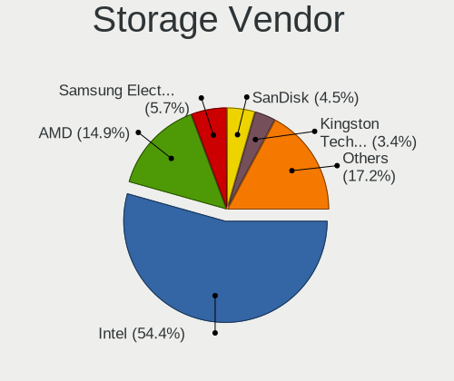
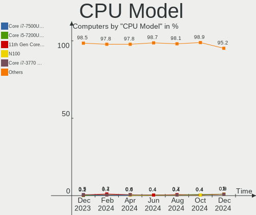
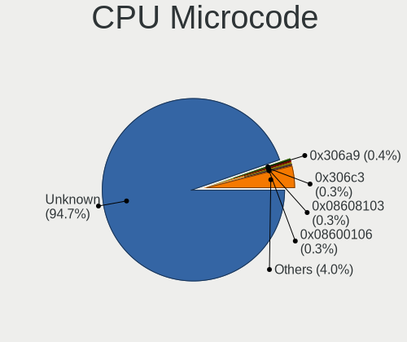

OpenMandriva - Hardware Trends
------------------------------

A project to identify most popular hardware characteristics and track their change
over time based on data collected by Linux users at https://Linux-Hardware.org.

Anyone can contribute to this report by the [hw-probe](https://github.com/linuxhw/hw-probe) tool:

    sudo -E hw-probe -all -upload

This is a report for all computer types. See also reports for [desktops](/Dist/OpenMandriva/Desktop/README.md) and [notebooks](/Dist/OpenMandriva/Notebook/README.md).

This report is for one last month. Overall report since the beginning of time: [TestCoverage](https://github.com/linuxhw/TestCoverage)

Period: Aug, 2022.

Contents
--------

* [ System ](#system)
  - [ OS                       ](#os)
  - [ OS Family                ](#os-family)
  - [ Kernel                   ](#kernel)
  - [ Kernel Family            ](#kernel-family)
  - [ Kernel Major Ver.        ](#kernel-major-ver)
  - [ Arch                     ](#arch)
  - [ DE                       ](#de)
  - [ Display Server           ](#display-server)
  - [ Display Manager          ](#display-manager)
  - [ OS Lang                  ](#os-lang)
  - [ Boot Mode                ](#boot-mode)
  - [ Filesystem               ](#filesystem)
  - [ Part. scheme             ](#part-scheme)
  - [ Dual Boot with Linux/BSD ](#dual-boot-with-linuxbsd)
  - [ Dual Boot (Win)          ](#dual-boot-win)

* [ Board ](#board)
  - [ Vendor                   ](#vendor)
  - [ Model                    ](#model)
  - [ Model Family             ](#model-family)
  - [ MFG Year                 ](#mfg-year)
  - [ Form Factor              ](#form-factor)
  - [ Secure Boot              ](#secure-boot)
  - [ Coreboot                 ](#coreboot)
  - [ RAM Size                 ](#ram-size)
  - [ RAM Used                 ](#ram-used)
  - [ Total Drives             ](#total-drives)
  - [ Has CD-ROM               ](#has-cd-rom)
  - [ Has Ethernet             ](#has-ethernet)
  - [ Has WiFi                 ](#has-wifi)
  - [ Has Bluetooth            ](#has-bluetooth)

* [ Location ](#location)
  - [ Country                  ](#country)
  - [ City                     ](#city)

* [ Drives ](#drives)
  - [ Drive Vendor             ](#drive-vendor)
  - [ Drive Model              ](#drive-model)
  - [ HDD Vendor               ](#hdd-vendor)
  - [ SSD Vendor               ](#ssd-vendor)
  - [ Drive Kind               ](#drive-kind)
  - [ Drive Connector          ](#drive-connector)
  - [ Drive Size               ](#drive-size)
  - [ Space Total              ](#space-total)
  - [ Space Used               ](#space-used)
  - [ Malfunc. Drives          ](#malfunc-drives)
  - [ Malfunc. Drive Vendor    ](#malfunc-drive-vendor)
  - [ Malfunc. HDD Vendor      ](#malfunc-hdd-vendor)
  - [ Malfunc. Drive Kind      ](#malfunc-drive-kind)
  - [ Failed Drives            ](#failed-drives)
  - [ Failed Drive Vendor      ](#failed-drive-vendor)
  - [ Drive Status             ](#drive-status)

* [ Storage controller ](#storage-controller)
  - [ Storage Vendor           ](#storage-vendor)
  - [ Storage Model            ](#storage-model)
  - [ Storage Kind             ](#storage-kind)

* [ Processor ](#processor)
  - [ CPU Vendor               ](#cpu-vendor)
  - [ CPU Model                ](#cpu-model)
  - [ CPU Model Family         ](#cpu-model-family)
  - [ CPU Cores                ](#cpu-cores)
  - [ CPU Sockets              ](#cpu-sockets)
  - [ CPU Threads              ](#cpu-threads)
  - [ CPU Op-Modes             ](#cpu-op-modes)
  - [ CPU Microcode            ](#cpu-microcode)
  - [ CPU Microarch            ](#cpu-microarch)

* [ Graphics ](#graphics)
  - [ GPU Vendor               ](#gpu-vendor)
  - [ GPU Model                ](#gpu-model)
  - [ GPU Combo                ](#gpu-combo)
  - [ GPU Driver               ](#gpu-driver)
  - [ GPU Memory               ](#gpu-memory)

* [ Monitor ](#monitor)
  - [ Monitor Vendor           ](#monitor-vendor)
  - [ Monitor Model            ](#monitor-model)
  - [ Monitor Resolution       ](#monitor-resolution)
  - [ Monitor Diagonal         ](#monitor-diagonal)
  - [ Monitor Width            ](#monitor-width)
  - [ Aspect Ratio             ](#aspect-ratio)
  - [ Monitor Area             ](#monitor-area)
  - [ Pixel Density            ](#pixel-density)
  - [ Multiple Monitors        ](#multiple-monitors)

* [ Network ](#network)
  - [ Net Controller Vendor    ](#net-controller-vendor)
  - [ Net Controller Model     ](#net-controller-model)
  - [ Wireless Vendor          ](#wireless-vendor)
  - [ Wireless Model           ](#wireless-model)
  - [ Ethernet Vendor          ](#ethernet-vendor)
  - [ Ethernet Model           ](#ethernet-model)
  - [ Net Controller Kind      ](#net-controller-kind)
  - [ Used Controller          ](#used-controller)
  - [ NICs                     ](#nics)
  - [ IPv6                     ](#ipv6)

* [ Bluetooth ](#bluetooth)
  - [ Bluetooth Vendor         ](#bluetooth-vendor)
  - [ Bluetooth Model          ](#bluetooth-model)

* [ Sound ](#sound)
  - [ Sound Vendor             ](#sound-vendor)
  - [ Sound Model              ](#sound-model)

* [ Memory ](#memory)
  - [ Memory Vendor            ](#memory-vendor)
  - [ Memory Model             ](#memory-model)
  - [ Memory Kind              ](#memory-kind)
  - [ Memory Form Factor       ](#memory-form-factor)
  - [ Memory Size              ](#memory-size)
  - [ Memory Speed             ](#memory-speed)

* [ Printers & scanners ](#printers--scanners)
  - [ Printer Vendor           ](#printer-vendor)
  - [ Printer Model            ](#printer-model)
  - [ Scanner Vendor           ](#scanner-vendor)
  - [ Scanner Model            ](#scanner-model)

* [ Camera ](#camera)
  - [ Camera Vendor            ](#camera-vendor)
  - [ Camera Model             ](#camera-model)

* [ Security ](#security)
  - [ Fingerprint Vendor       ](#fingerprint-vendor)
  - [ Fingerprint Model        ](#fingerprint-model)
  - [ Chipcard Vendor          ](#chipcard-vendor)
  - [ Chipcard Model           ](#chipcard-model)

* [ Unsupported ](#unsupported)
  - [ Unsupported Devices      ](#unsupported-devices)
  - [ Unsupported Device Types ](#unsupported-device-types)

System
------

OS
--

Installed operating systems

| Name              | Computers | Percent |
|-------------------|-----------|---------|
| OpenMandriva 4.3  | 289       | 70.66%  |
| OpenMandriva 4.90 | 101       | 24.69%  |
| OpenMandriva 4.2  | 17        | 4.16%   |
| OpenMandriva 4.50 | 2         | 0.49%   |

OS Family
---------

OS without a version

| Name         | Computers | Percent |
|--------------|-----------|---------|
| OpenMandriva | 409       | 100%    |

Kernel
------

Version of the Linux kernel

| Version                     | Computers | Percent |
|-----------------------------|-----------|---------|
| 5.16.7-desktop-1omv4003     | 274       | 66.99%  |
| 5.18.12-desktop-3omv4090    | 92        | 22.49%  |
| 5.10.14-desktop-1omv4002    | 17        | 4.16%   |
| 5.16.13-desktop-1omv4003    | 12        | 2.93%   |
| 5.17.1-desktop-2omv4050     | 4         | 0.98%   |
| 5.19.1-desktop-1omv4090     | 3         | 0.73%   |
| 5.19.0-desktop-1omv4090     | 2         | 0.49%   |
| 5.18.9-desktop-gcc-1omv4090 | 2         | 0.49%   |
| 5.19.3-desktop-1omv4090     | 1         | 0.24%   |
| 5.19.2-desktop-1omv4090     | 1         | 0.24%   |
| 5.14.7-desktop-1omv4050     | 1         | 0.24%   |

Kernel Family
-------------

Linux kernel without a distro release

| Version | Computers | Percent |
|---------|-----------|---------|
| 5.16.7  | 274       | 66.99%  |
| 5.18.12 | 92        | 22.49%  |
| 5.10.14 | 17        | 4.16%   |
| 5.16.13 | 12        | 2.93%   |
| 5.17.1  | 4         | 0.98%   |
| 5.19.1  | 3         | 0.73%   |
| 5.19.0  | 2         | 0.49%   |
| 5.18.9  | 2         | 0.49%   |
| 5.19.3  | 1         | 0.24%   |
| 5.19.2  | 1         | 0.24%   |
| 5.14.7  | 1         | 0.24%   |

Kernel Major Ver.
-----------------

Linux kernel major version

| Version | Computers | Percent |
|---------|-----------|---------|
| 5.16    | 286       | 69.93%  |
| 5.18    | 94        | 22.98%  |
| 5.10    | 17        | 4.16%   |
| 5.19    | 7         | 1.71%   |
| 5.17    | 4         | 0.98%   |
| 5.14    | 1         | 0.24%   |

Arch
----

OS architecture (x86_64, i586, etc.)

| Name   | Computers | Percent |
|--------|-----------|---------|
| x86_64 | 409       | 100%    |

DE
--

Desktop Environment

| Name    | Computers | Percent |
|---------|-----------|---------|
| KDE5    | 405       | 99.02%  |
| Unknown | 3         | 0.73%   |
| LXQt    | 1         | 0.24%   |

Display Server
--------------

X11 or Wayland

| Name    | Computers | Percent |
|---------|-----------|---------|
| X11     | 406       | 99.27%  |
| Wayland | 3         | 0.73%   |

Display Manager
---------------

SDDM, LightDM, etc.

| Name | Computers | Percent |
|------|-----------|---------|
| SDDM | 409       | 100%    |

OS Lang
-------

Language

| Lang  | Computers | Percent |
|-------|-----------|---------|
| en_US | 264       | 64.55%  |
| fr_FR | 23        | 5.62%   |
| de_DE | 20        | 4.89%   |
| pt_BR | 19        | 4.65%   |
| ru_RU | 17        | 4.16%   |
| it_IT | 12        | 2.93%   |
| pl_PL | 9         | 2.2%    |
| es_ES | 8         | 1.96%   |
| cs_CZ | 6         | 1.47%   |
| en_GB | 4         | 0.98%   |
| pt_PT | 3         | 0.73%   |
| nl_NL | 2         | 0.49%   |
| hu_HU | 2         | 0.49%   |
| es_MX | 2         | 0.49%   |
| es_CL | 2         | 0.49%   |
| en_IN | 2         | 0.49%   |
| UTF-8 | 1         | 0.24%   |
| tr_TR | 1         | 0.24%   |
| ro_RO | 1         | 0.24%   |
| nl_BE | 1         | 0.24%   |
| fr_CA | 1         | 0.24%   |
| fr_BE | 1         | 0.24%   |
| es_VE | 1         | 0.24%   |
| es_UY | 1         | 0.24%   |
| es_EC | 1         | 0.24%   |
| es_AR | 1         | 0.24%   |
| en_CA | 1         | 0.24%   |
| en_AU | 1         | 0.24%   |
| ar_SD | 1         | 0.24%   |
| af_ZA | 1         | 0.24%   |

Boot Mode
---------

EFI or BIOS

| Mode | Computers | Percent |
|------|-----------|---------|
| EFI  | 231       | 56.48%  |
| BIOS | 178       | 43.52%  |

Filesystem
----------

Type of filesystem

| Type    | Computers | Percent |
|---------|-----------|---------|
| Overlay | 341       | 83.37%  |
| Ext4    | 64        | 15.65%  |
| Btrfs   | 2         | 0.49%   |
| Xfs     | 1         | 0.24%   |
| F2fs    | 1         | 0.24%   |

Part. scheme
------------

Scheme of partitioning

| Type | Computers | Percent |
|------|-----------|---------|
| GPT  | 292       | 71.39%  |
| MBR  | 117       | 28.61%  |

Dual Boot with Linux/BSD
------------------------

Hosting more than one Linux/BSD

| Dual boot | Computers | Percent |
|-----------|-----------|---------|
| Yes       | 233       | 56.97%  |
| No        | 176       | 43.03%  |

Dual Boot (Win)
---------------

Hosting Linux and Windows

| Dual boot | Computers | Percent |
|-----------|-----------|---------|
| No        | 209       | 51.1%   |
| Yes       | 200       | 48.9%   |

Board
-----

Vendor
------

Motherboard manufacturer

| Name                  | Computers | Percent |
|-----------------------|-----------|---------|
| ASUSTek Computer      | 72        | 17.6%   |
| Dell                  | 64        | 15.65%  |
| Hewlett-Packard       | 58        | 14.18%  |
| Lenovo                | 45        | 11%     |
| Gigabyte Technology   | 31        | 7.58%   |
| Acer                  | 27        | 6.6%    |
| MSI                   | 23        | 5.62%   |
| ASRock                | 19        | 4.65%   |
| Intel                 | 9         | 2.2%    |
| Toshiba               | 7         | 1.71%   |
| Apple                 | 6         | 1.47%   |
| Fujitsu               | 5         | 1.22%   |
| Packard Bell          | 4         | 0.98%   |
| Foxconn               | 4         | 0.98%   |
| Supermicro            | 2         | 0.49%   |
| Samsung Electronics   | 2         | 0.49%   |
| Positivo              | 2         | 0.49%   |
| OEM                   | 2         | 0.49%   |
| Medion                | 2         | 0.49%   |
| Compaq                | 2         | 0.49%   |
| Biostar               | 2         | 0.49%   |
| Vorke                 | 1         | 0.24%   |
| TUXEDO                | 1         | 0.24%   |
| TrekStor              | 1         | 0.24%   |
| Timi                  | 1         | 0.24%   |
| Sony                  | 1         | 0.24%   |
| Semp Toshiba          | 1         | 0.24%   |
| Positivo Bahia - VAIO | 1         | 0.24%   |
| NEC Computers         | 1         | 0.24%   |
| NCR                   | 1         | 0.24%   |
| Microsoft             | 1         | 0.24%   |
| MACHINIST             | 1         | 0.24%   |
| IP3 Tech              | 1         | 0.24%   |
| ICP / iEi             | 1         | 0.24%   |
| HUAWEI                | 1         | 0.24%   |
| GPU Company           | 1         | 0.24%   |
| Google                | 1         | 0.24%   |
| Gateway               | 1         | 0.24%   |
| eMachines             | 1         | 0.24%   |
| BESSTAR Tech          | 1         | 0.24%   |
| AZW                   | 1         | 0.24%   |
| Unknown               | 1         | 0.24%   |

Model
-----

Motherboard model

| Name                                                                                     | Computers | Percent |
|------------------------------------------------------------------------------------------|-----------|---------|
| Dell Latitude 3190 2-in-1                                                                | 7         | 1.71%   |
| Dell Latitude 3310                                                                       | 5         | 1.22%   |
| ASUS PRIME B450M-A II                                                                    | 5         | 1.22%   |
| MSI MS-7C37                                                                              | 4         | 0.98%   |
| HP Notebook                                                                              | 4         | 0.98%   |
| Lenovo IdeaPad 1 14ADA05 82GW                                                            | 3         | 0.73%   |
| HP 15                                                                                    | 3         | 0.73%   |
| Dell Latitude E6430                                                                      | 3         | 0.73%   |
| Unknown                                                                                  | 3         | 0.73%   |
| Toshiba Satellite L500                                                                   | 2         | 0.49%   |
| Toshiba dynabook T653/46JR                                                               | 2         | 0.49%   |
| MSI MS-7B51                                                                              | 2         | 0.49%   |
| Intel H61                                                                                | 2         | 0.49%   |
| HP Laptop 15-dy2xxx                                                                      | 2         | 0.49%   |
| HP EliteDesk 800 G3 DM 35W                                                               | 2         | 0.49%   |
| Gigabyte P43-ES3G                                                                        | 2         | 0.49%   |
| Gigabyte B450 AORUS PRO                                                                  | 2         | 0.49%   |
| Dell Latitude E5510                                                                      | 2         | 0.49%   |
| Dell Latitude E5470                                                                      | 2         | 0.49%   |
| Dell Latitude 3410                                                                       | 2         | 0.49%   |
| Dell Latitude 3300                                                                       | 2         | 0.49%   |
| ASUS ZenBook UX425QA_UM425QA                                                             | 2         | 0.49%   |
| ASUS VivoBook_ASUS Laptop E510MA_R522MA                                                  | 2         | 0.49%   |
| ASUS PRIME Z390-A                                                                        | 2         | 0.49%   |
| ASUS All Series                                                                          | 2         | 0.49%   |
| ASRock N68C-S UCC                                                                        | 2         | 0.49%   |
| Apple MacBookPro9,2                                                                      | 2         | 0.49%   |
| Apple MacBookPro5,5                                                                      | 2         | 0.49%   |
| Acer Nitro AN515-31                                                                      | 2         | 0.49%   |
| Vorke V1 Plus                                                                            | 1         | 0.24%   |
| TUXEDO Book BA1510                                                                       | 1         | 0.24%   |
| TrekStor Primebook C13                                                                   | 1         | 0.24%   |
| Toshiba Satellite-C845                                                                   | 1         | 0.24%   |
| Toshiba Satellite P200                                                                   | 1         | 0.24%   |
| Toshiba Satellite A300                                                                   | 1         | 0.24%   |
| Timi RedmiBook Pro 15S                                                                   | 1         | 0.24%   |
| Supermicro X8DTL                                                                         | 1         | 0.24%   |
| Supermicro Super Server                                                                  | 1         | 0.24%   |
| Sony VPCYB3V1E                                                                           | 1         | 0.24%   |
| Semp Toshiba STI                                                                         | 1         | 0.24%   |
| Samsung NC210/NC110                                                                      | 1         | 0.24%   |
| Samsung 355V4C/355V4X/355V5C/355V5X/356V4C/356V4X/356V5C/356V5X/3445VC/3445VX/3545VC/354 | 1         | 0.24%   |
| Positivo Mobile                                                                          | 1         | 0.24%   |
| Positivo EC10IS1                                                                         | 1         | 0.24%   |
| Positivo Bahia - VAIO S14SL03                                                            | 1         | 0.24%   |
| Packard Bell IMEDIA F9218 AIO                                                            | 1         | 0.24%   |
| Packard Bell EasyNote TK37                                                               | 1         | 0.24%   |
| Packard Bell EasyNote TK13BZ                                                             | 1         | 0.24%   |
| Packard Bell EasyNote TE11BZ                                                             | 1         | 0.24%   |
| OEM Intel H81                                                                            | 1         | 0.24%   |
| OEM A320                                                                                 | 1         | 0.24%   |
| NEC Computers PC-LJ730MG6W                                                               | 1         | 0.24%   |
| NCR xxxx-xxxx-xxxx                                                                       | 1         | 0.24%   |
| MSI p6570be-m                                                                            | 1         | 0.24%   |
| MSI MS-7D54                                                                              | 1         | 0.24%   |
| MSI MS-7D22                                                                              | 1         | 0.24%   |
| MSI MS-7D09                                                                              | 1         | 0.24%   |
| MSI MS-7C87                                                                              | 1         | 0.24%   |
| MSI MS-7B84                                                                              | 1         | 0.24%   |
| MSI MS-7B77                                                                              | 1         | 0.24%   |

Model Family
------------

Motherboard model prefix

| Name                   | Computers | Percent |
|------------------------|-----------|---------|
| Dell Latitude          | 34        | 8.31%   |
| Lenovo IdeaPad         | 17        | 4.16%   |
| Lenovo ThinkPad        | 15        | 3.67%   |
| ASUS PRIME             | 15        | 3.67%   |
| Acer Aspire            | 15        | 3.67%   |
| Dell OptiPlex          | 14        | 3.42%   |
| HP Pavilion            | 11        | 2.69%   |
| HP Compaq              | 8         | 1.96%   |
| ASUS VivoBook          | 8         | 1.96%   |
| HP Laptop              | 7         | 1.71%   |
| Lenovo ThinkCentre     | 5         | 1.22%   |
| HP ProBook             | 5         | 1.22%   |
| Toshiba Satellite      | 4         | 0.98%   |
| MSI MS-7C37            | 4         | 0.98%   |
| HP Notebook            | 4         | 0.98%   |
| HP EliteDesk           | 4         | 0.98%   |
| Dell XPS               | 4         | 0.98%   |
| ASUS TUF               | 4         | 0.98%   |
| ASUS ROG               | 4         | 0.98%   |
| Packard Bell EasyNote  | 3         | 0.73%   |
| HP ProDesk             | 3         | 0.73%   |
| HP 15                  | 3         | 0.73%   |
| Fujitsu LIFEBOOK       | 3         | 0.73%   |
| Dell Precision         | 3         | 0.73%   |
| Dell Inspiron          | 3         | 0.73%   |
| ASUS ZenBook           | 3         | 0.73%   |
| Unknown                | 3         | 0.73%   |
| Toshiba dynabook       | 2         | 0.49%   |
| MSI MS-7B51            | 2         | 0.49%   |
| Lenovo IdeaCentre      | 2         | 0.49%   |
| Intel H61              | 2         | 0.49%   |
| HP Stream              | 2         | 0.49%   |
| HP EliteBook           | 2         | 0.49%   |
| Gigabyte P43-ES3G      | 2         | 0.49%   |
| Gigabyte B550          | 2         | 0.49%   |
| Gigabyte B450M         | 2         | 0.49%   |
| Gigabyte B450          | 2         | 0.49%   |
| Fujitsu ESPRIMO        | 2         | 0.49%   |
| Dell Vostro            | 2         | 0.49%   |
| ASUS SABERTOOTH        | 2         | 0.49%   |
| ASUS P8H61-M           | 2         | 0.49%   |
| ASUS M3A78             | 2         | 0.49%   |
| ASUS All               | 2         | 0.49%   |
| ASRock N68C-S          | 2         | 0.49%   |
| Apple MacBookPro9      | 2         | 0.49%   |
| Apple MacBookPro5      | 2         | 0.49%   |
| Acer TravelMate        | 2         | 0.49%   |
| Acer Nitro             | 2         | 0.49%   |
| Vorke V1               | 1         | 0.24%   |
| TUXEDO Book            | 1         | 0.24%   |
| TrekStor Primebook     | 1         | 0.24%   |
| Toshiba Satellite-C845 | 1         | 0.24%   |
| Timi RedmiBook         | 1         | 0.24%   |
| Supermicro X8DTL       | 1         | 0.24%   |
| Supermicro Super       | 1         | 0.24%   |
| Sony VPCYB3V1E         | 1         | 0.24%   |
| Semp Toshiba STI       | 1         | 0.24%   |
| Samsung NC210          | 1         | 0.24%   |
| Samsung 355V4C         | 1         | 0.24%   |
| Positivo Mobile        | 1         | 0.24%   |

MFG Year
--------

Motherboard manufacture year

| Year    | Computers | Percent |
|---------|-----------|---------|
| 2019    | 42        | 10.27%  |
| 2020    | 39        | 9.54%   |
| 2012    | 37        | 9.05%   |
| 2018    | 35        | 8.56%   |
| 2021    | 32        | 7.82%   |
| 2011    | 32        | 7.82%   |
| 2017    | 25        | 6.11%   |
| 2016    | 24        | 5.87%   |
| 2013    | 24        | 5.87%   |
| 2010    | 24        | 5.87%   |
| 2014    | 22        | 5.38%   |
| 2008    | 17        | 4.16%   |
| 2009    | 16        | 3.91%   |
| 2015    | 13        | 3.18%   |
| 2007    | 12        | 2.93%   |
| 2022    | 7         | 1.71%   |
| 2006    | 7         | 1.71%   |
| Unknown | 1         | 0.24%   |

Form Factor
-----------

Physical design of the computer

| Name        | Computers | Percent |
|-------------|-----------|---------|
| Notebook    | 197       | 48.17%  |
| Desktop     | 179       | 43.77%  |
| Mini pc     | 14        | 3.42%   |
| Convertible | 11        | 2.69%   |
| All in one  | 5         | 1.22%   |
| Server      | 2         | 0.49%   |
| Tablet      | 1         | 0.24%   |

Secure Boot
-----------

Enabled or disabled

| State    | Computers | Percent |
|----------|-----------|---------|
| Disabled | 409       | 100%    |

Coreboot
--------

Have coreboot on board

| Used | Computers | Percent |
|------|-----------|---------|
| No   | 408       | 99.76%  |
| Yes  | 1         | 0.24%   |

RAM Size
--------

Total RAM memory

| Size in GB  | Computers | Percent |
|-------------|-----------|---------|
| 4.01-8.0    | 129       | 31.54%  |
| 3.01-4.0    | 108       | 26.41%  |
| 8.01-16.0   | 64        | 15.65%  |
| 16.01-24.0  | 50        | 12.22%  |
| 32.01-64.0  | 28        | 6.85%   |
| 1.01-2.0    | 20        | 4.89%   |
| 2.01-3.0    | 6         | 1.47%   |
| 24.01-32.0  | 2         | 0.49%   |
| 64.01-256.0 | 2         | 0.49%   |

RAM Used
--------

Used RAM memory

| Used GB   | Computers | Percent |
|-----------|-----------|---------|
| 1.01-2.0  | 307       | 75.06%  |
| 0.51-1.0  | 54        | 13.2%   |
| 2.01-3.0  | 35        | 8.56%   |
| 0.01-0.5  | 6         | 1.47%   |
| 3.01-4.0  | 5         | 1.22%   |
| 4.01-8.0  | 1         | 0.24%   |
| 8.01-16.0 | 1         | 0.24%   |

Total Drives
------------

Number of drives on board

| Drives | Computers | Percent |
|--------|-----------|---------|
| 1      | 233       | 56.97%  |
| 2      | 108       | 26.41%  |
| 3      | 36        | 8.8%    |
| 4      | 17        | 4.16%   |
| 0      | 9         | 2.2%    |
| 5      | 5         | 1.22%   |
| 6      | 1         | 0.24%   |

Has CD-ROM
----------

Has CD-ROM on board

| Presented | Computers | Percent |
|-----------|-----------|---------|
| No        | 217       | 53.06%  |
| Yes       | 192       | 46.94%  |

Has Ethernet
------------

Has Ethernet on board

| Presented | Computers | Percent |
|-----------|-----------|---------|
| Yes       | 366       | 89.49%  |
| No        | 43        | 10.51%  |

Has WiFi
--------

Has WiFi module

| Presented | Computers | Percent |
|-----------|-----------|---------|
| Yes       | 287       | 70.17%  |
| No        | 122       | 29.83%  |

Has Bluetooth
-------------

Has Bluetooth module

| Presented | Computers | Percent |
|-----------|-----------|---------|
| Yes       | 222       | 54.28%  |
| No        | 187       | 45.72%  |

Location
--------

Country
-------

Geographic location (country)

| Country         | Computers | Percent |
|-----------------|-----------|---------|
| USA             | 56        | 13.69%  |
| France          | 35        | 8.56%   |
| Germany         | 28        | 6.85%   |
| Brazil          | 27        | 6.6%    |
| Netherlands     | 22        | 5.38%   |
| UK              | 20        | 4.89%   |
| Russia          | 20        | 4.89%   |
| Italy           | 20        | 4.89%   |
| Poland          | 14        | 3.42%   |
| Australia       | 11        | 2.69%   |
| Canada          | 10        | 2.44%   |
| Czechia         | 9         | 2.2%    |
| Mexico          | 8         | 1.96%   |
| India           | 8         | 1.96%   |
| Finland         | 8         | 1.96%   |
| Spain           | 7         | 1.71%   |
| Romania         | 7         | 1.71%   |
| Japan           | 7         | 1.71%   |
| Argentina       | 6         | 1.47%   |
| Portugal        | 5         | 1.22%   |
| Belgium         | 5         | 1.22%   |
| Switzerland     | 4         | 0.98%   |
| Indonesia       | 4         | 0.98%   |
| Uruguay         | 3         | 0.73%   |
| Turkey          | 3         | 0.73%   |
| Sweden          | 3         | 0.73%   |
| South Africa    | 3         | 0.73%   |
| Slovakia        | 3         | 0.73%   |
| Hungary         | 3         | 0.73%   |
| Venezuela       | 2         | 0.49%   |
| Ukraine         | 2         | 0.49%   |
| Tanzania        | 2         | 0.49%   |
| Peru            | 2         | 0.49%   |
| Norway          | 2         | 0.49%   |
| New Zealand     | 2         | 0.49%   |
| Malaysia        | 2         | 0.49%   |
| Egypt           | 2         | 0.49%   |
| Denmark         | 2         | 0.49%   |
| China           | 2         | 0.49%   |
| Chile           | 2         | 0.49%   |
| Vietnam         | 1         | 0.24%   |
| UAE             | 1         | 0.24%   |
| Thailand        | 1         | 0.24%   |
| Sudan           | 1         | 0.24%   |
| Singapore       | 1         | 0.24%   |
| Réunion        | 1         | 0.24%   |
| Puerto Rico     | 1         | 0.24%   |
| Philippines     | 1         | 0.24%   |
| Paraguay        | 1         | 0.24%   |
| Panama          | 1         | 0.24%   |
| North Macedonia | 1         | 0.24%   |
| Nepal           | 1         | 0.24%   |
| Morocco         | 1         | 0.24%   |
| Montenegro      | 1         | 0.24%   |
| Moldova         | 1         | 0.24%   |
| Lithuania       | 1         | 0.24%   |
| Israel          | 1         | 0.24%   |
| Iran            | 1         | 0.24%   |
| Greece          | 1         | 0.24%   |
| Gibraltar       | 1         | 0.24%   |

City
----

Geographic location (city)

| City               | Computers | Percent |
|--------------------|-----------|---------|
| Schagen            | 18        | 4.4%    |
| Paris              | 8         | 1.96%   |
| Moscow             | 5         | 1.22%   |
| Helsinki           | 5         | 1.22%   |
| Malden             | 4         | 0.98%   |
| Wolverhampton      | 3         | 0.73%   |
| Thiers             | 3         | 0.73%   |
| Sao Paulo          | 3         | 0.73%   |
| Prague             | 3         | 0.73%   |
| Montevideo         | 3         | 0.73%   |
| Milan              | 3         | 0.73%   |
| Connersville       | 3         | 0.73%   |
| Cascais            | 3         | 0.73%   |
| Bucharest          | 3         | 0.73%   |
| Victor             | 2         | 0.49%   |
| Ulyanovsk          | 2         | 0.49%   |
| Tomsk              | 2         | 0.49%   |
| Tampere            | 2         | 0.49%   |
| Sydney             | 2         | 0.49%   |
| Soure              | 2         | 0.49%   |
| Sherbrooke         | 2         | 0.49%   |
| Rochester          | 2         | 0.49%   |
| Poznan             | 2         | 0.49%   |
| Olomouc            | 2         | 0.49%   |
| Munich             | 2         | 0.49%   |
| Montreal           | 2         | 0.49%   |
| Mexico City        | 2         | 0.49%   |
| Magdeburg          | 2         | 0.49%   |
| Las Vegas          | 2         | 0.49%   |
| Jastrzębie Zdrój | 2         | 0.49%   |
| Jakarta            | 2         | 0.49%   |
| Hitachi            | 2         | 0.49%   |
| Hamburg            | 2         | 0.49%   |
| Gilleleje          | 2         | 0.49%   |
| Garland            | 2         | 0.49%   |
| Fritch             | 2         | 0.49%   |
| Formosa            | 2         | 0.49%   |
| Eau Claire         | 2         | 0.49%   |
| Dar es Salaam      | 2         | 0.49%   |
| Châtellerault     | 2         | 0.49%   |
| Caracas            | 2         | 0.49%   |
| Cape Town          | 2         | 0.49%   |
| Cairo              | 2         | 0.49%   |
| Bratislava         | 2         | 0.49%   |
| Bielsko-Biala      | 2         | 0.49%   |
| Bengaluru          | 2         | 0.49%   |
| Belém             | 2         | 0.49%   |
| Balneario          | 2         | 0.49%   |
| Agde               | 2         | 0.49%   |
| Adelaide           | 2         | 0.49%   |
| Zurich             | 1         | 0.24%   |
| Zubri              | 1         | 0.24%   |
| Zhukovskiy         | 1         | 0.24%   |
| Zhengzhou          | 1         | 0.24%   |
| Zegrze             | 1         | 0.24%   |
| Zaragoza           | 1         | 0.24%   |
| Zamboanga City     | 1         | 0.24%   |
| Zagreb             | 1         | 0.24%   |
| Zacatecas City     | 1         | 0.24%   |
| Yokohama           | 1         | 0.24%   |

Drives
------

Drive Vendor
------------

Hard drive vendors

| Vendor              | Computers | Drives | Percent |
|---------------------|-----------|--------|---------|
| WDC                 | 107       | 123    | 18.17%  |
| Seagate             | 85        | 98     | 14.43%  |
| Samsung Electronics | 64        | 72     | 10.87%  |
| Kingston            | 41        | 41     | 6.96%   |
| Toshiba             | 27        | 32     | 4.58%   |
| Crucial             | 27        | 36     | 4.58%   |
| SanDisk             | 26        | 26     | 4.41%   |
| Unknown             | 23        | 23     | 3.9%    |
| Hitachi             | 22        | 25     | 3.74%   |
| A-DATA Technology   | 17        | 18     | 2.89%   |
| SK hynix            | 14        | 14     | 2.38%   |
| HGST                | 10        | 10     | 1.7%    |
| China               | 7         | 7      | 1.19%   |
| PNY                 | 6         | 6      | 1.02%   |
| Patriot             | 6         | 6      | 1.02%   |
| Micron Technology   | 6         | 6      | 1.02%   |
| KIOXIA              | 6         | 6      | 1.02%   |
| Intel               | 6         | 6      | 1.02%   |
| Unknown             | 6         | 6      | 1.02%   |
| SPCC                | 5         | 5      | 0.85%   |
| Phison              | 5         | 5      | 0.85%   |
| LITEON              | 5         | 5      | 0.85%   |
| Transcend           | 4         | 4      | 0.68%   |
| Corsair             | 4         | 4      | 0.68%   |
| Apple               | 4         | 4      | 0.68%   |
| Maxtor              | 3         | 3      | 0.51%   |
| Intenso             | 3         | 3      | 0.51%   |
| GOODRAM             | 3         | 3      | 0.51%   |
| XPG                 | 2         | 2      | 0.34%   |
| Silicon Motion      | 2         | 2      | 0.34%   |
| SAGE                | 2         | 2      | 0.34%   |
| OCZ                 | 2         | 2      | 0.34%   |
| KingSpec            | 2         | 2      | 0.34%   |
| Hewlett-Packard     | 2         | 2      | 0.34%   |
| Gigabyte Technology | 2         | 2      | 0.34%   |
| Fujitsu             | 2         | 2      | 0.34%   |
| Emtec               | 2         | 2      | 0.34%   |
| ZTE                 | 1         | 1      | 0.17%   |
| USB3.0              | 1         | 1      | 0.17%   |
| UMIS                | 1         | 1      | 0.17%   |
| TrekStor            | 1         | 1      | 0.17%   |
| Team                | 1         | 1      | 0.17%   |
| TCSUNBOW            | 1         | 1      | 0.17%   |
| StoreJet            | 1         | 1      | 0.17%   |
| SSDPR-CX            | 1         | 1      | 0.17%   |
| SABRENT             | 1         | 1      | 0.17%   |
| S3+                 | 1         | 1      | 0.17%   |
| Realtek             | 1         | 1      | 0.17%   |
| ORTIAL              | 1         | 1      | 0.17%   |
| OCZ-VERTEX3         | 1         | 1      | 0.17%   |
| Netac               | 1         | 1      | 0.17%   |
| Magnetic Data       | 1         | 1      | 0.17%   |
| M.2 SSD             | 1         | 1      | 0.17%   |
| LITEONIT            | 1         | 1      | 0.17%   |
| KingFast            | 1         | 1      | 0.17%   |
| KingDian            | 1         | 1      | 0.17%   |
| JMicron Technology  | 1         | 1      | 0.17%   |
| INDMEM              | 1         | 1      | 0.17%   |
| Inateck             | 1         | 1      | 0.17%   |
| GLOWAY              | 1         | 1      | 0.17%   |

Drive Model
-----------

Hard drive models

| Model                              | Computers | Percent |
|------------------------------------|-----------|---------|
| Seagate ST2000DM008-2FR102 2TB     | 7         | 1.11%   |
| Seagate ST500DM002-1BD142 500GB    | 6         | 0.95%   |
| Samsung SSD 970 EVO Plus 500GB     | 6         | 0.95%   |
| Kingston SA400S37240G 240GB SSD    | 6         | 0.95%   |
| Kingston SA400S37120G 120GB SSD    | 6         | 0.95%   |
| Unknown                            | 6         | 0.95%   |
| Unknown SD/MMC/MS PRO 128GB        | 5         | 0.79%   |
| Seagate ST1000LM035-1RK172 1TB     | 5         | 0.79%   |
| Crucial CT240BX500SSD1 240GB       | 5         | 0.79%   |
| WDC WDS500G2B0A-00SM50 500GB SSD   | 4         | 0.63%   |
| WDC WD10EZEX-08WN4A0 1TB           | 4         | 0.63%   |
| Seagate ST1000DM010-2EP102 1TB     | 4         | 0.63%   |
| Seagate Expansion 500GB            | 4         | 0.63%   |
| A-DATA SU630 240GB SSD             | 4         | 0.63%   |
| WDC WDS120G2G0B-00EPW0 120GB SSD   | 3         | 0.47%   |
| WDC WD20EZRZ-00Z5HB0 2TB           | 3         | 0.47%   |
| Unknown MMC64G  64GB               | 3         | 0.47%   |
| Unknown DA4128  128GB              | 3         | 0.47%   |
| Toshiba MQ01ABF050 500GB           | 3         | 0.47%   |
| Toshiba DT01ACA050 500GB           | 3         | 0.47%   |
| SK hynix BC501A NVMe 128GB         | 3         | 0.47%   |
| Seagate ST3500312CS 500GB          | 3         | 0.47%   |
| Seagate ST1000LM024 HN-M101MBB 1TB | 3         | 0.47%   |
| Samsung SSD 970 EVO Plus 2TB       | 3         | 0.47%   |
| Samsung SSD 970 EVO Plus 1TB       | 3         | 0.47%   |
| Samsung MZVLQ512HALU-00000 512GB   | 3         | 0.47%   |
| Samsung HD103SJ 1TB                | 3         | 0.47%   |
| Kingston SV300S37A60G 64GB SSD     | 3         | 0.47%   |
| Hitachi HDT725032VLA360 320GB      | 3         | 0.47%   |
| HGST HTS545050A7E680 500GB         | 3         | 0.47%   |
| Crucial CT500P2SSD8 500GB          | 3         | 0.47%   |
| Crucial CT500MX500SSD1 500GB       | 3         | 0.47%   |
| Crucial CT250MX500SSD1 250GB       | 3         | 0.47%   |
| Crucial CT1000MX500SSD1 1TB        | 3         | 0.47%   |
| A-DATA SU650 120GB SSD             | 3         | 0.47%   |
| WDC WDS240G2G0A-00JH30 240GB SSD   | 2         | 0.32%   |
| WDC WDBNCE0010PNC 1TB SSD          | 2         | 0.32%   |
| WDC WD30EZRZ-00GXCB0 3TB           | 2         | 0.32%   |
| WDC WD20EZRX-00DC0B0 2TB           | 2         | 0.32%   |
| WDC WD20EARS-00MVWB0 2TB           | 2         | 0.32%   |
| WDC WD1600BEVT-22A23T0 160GB       | 2         | 0.32%   |
| WDC WD10SPZX-22Z10T1 1TB           | 2         | 0.32%   |
| Toshiba MQ01ABD100 1TB             | 2         | 0.32%   |
| Toshiba MQ01ABD075 752GB           | 2         | 0.32%   |
| Toshiba HDWD110 1TB                | 2         | 0.32%   |
| SPCC Solid State Disk 120GB        | 2         | 0.32%   |
| SK hynix SC311 SATA 128GB SSD      | 2         | 0.32%   |
| Seagate ST9250827AS 250GB          | 2         | 0.32%   |
| Seagate ST6000DM003-2CY186 6TB     | 2         | 0.32%   |
| Seagate ST500LT012-1DG142 500GB    | 2         | 0.32%   |
| Seagate ST500DM002-1BC142 500GB    | 2         | 0.32%   |
| Seagate ST3500418AS 500GB          | 2         | 0.32%   |
| Seagate ST3500414CS 500GB          | 2         | 0.32%   |
| Seagate ST1000LM048-2E7172 1TB     | 2         | 0.32%   |
| Seagate ST1000DM003-1SB102 1TB     | 2         | 0.32%   |
| SanDisk SSD PLUS 480GB             | 2         | 0.32%   |
| SanDisk SDSSDP128G 128GB           | 2         | 0.32%   |
| SanDisk SDSSDH3 500G               | 2         | 0.32%   |
| SanDisk SDSSDA240G 240GB           | 2         | 0.32%   |
| SanDisk DF4064  64GB               | 2         | 0.32%   |

HDD Vendor
----------

Hard disk drive vendors

| Vendor              | Computers | Drives | Percent |
|---------------------|-----------|--------|---------|
| WDC                 | 87        | 95     | 33.21%  |
| Seagate             | 85        | 97     | 32.44%  |
| Toshiba             | 24        | 28     | 9.16%   |
| Hitachi             | 22        | 25     | 8.4%    |
| Samsung Electronics | 12        | 12     | 4.58%   |
| HGST                | 10        | 10     | 3.82%   |
| Unknown             | 5         | 5      | 1.91%   |
| Maxtor              | 3         | 3      | 1.15%   |
| Apple               | 3         | 3      | 1.15%   |
| SAGE                | 2         | 2      | 0.76%   |
| Fujitsu             | 2         | 2      | 0.76%   |
| USB3.0              | 1         | 1      | 0.38%   |
| StoreJet            | 1         | 1      | 0.38%   |
| SABRENT             | 1         | 1      | 0.38%   |
| Magnetic Data       | 1         | 1      | 0.38%   |
| Hewlett-Packard     | 1         | 1      | 0.38%   |
| ExcelStor           | 1         | 1      | 0.38%   |
| ASMT                | 1         | 2      | 0.38%   |

SSD Vendor
----------

Solid state drive vendors

| Vendor              | Computers | Drives | Percent |
|---------------------|-----------|--------|---------|
| Kingston            | 33        | 33     | 16.02%  |
| Samsung Electronics | 27        | 28     | 13.11%  |
| SanDisk             | 21        | 21     | 10.19%  |
| Crucial             | 21        | 29     | 10.19%  |
| WDC                 | 15        | 16     | 7.28%   |
| A-DATA Technology   | 12        | 13     | 5.83%   |
| China               | 7         | 7      | 3.4%    |
| PNY                 | 5         | 5      | 2.43%   |
| Patriot             | 5         | 5      | 2.43%   |
| LITEON              | 5         | 5      | 2.43%   |
| Unknown             | 5         | 5      | 2.43%   |
| Transcend           | 4         | 4      | 1.94%   |
| SPCC                | 4         | 4      | 1.94%   |
| Micron Technology   | 4         | 4      | 1.94%   |
| SK hynix            | 3         | 3      | 1.46%   |
| Intenso             | 3         | 3      | 1.46%   |
| GOODRAM             | 3         | 3      | 1.46%   |
| Toshiba             | 2         | 3      | 0.97%   |
| Phison              | 2         | 2      | 0.97%   |
| OCZ                 | 2         | 2      | 0.97%   |
| KingSpec            | 2         | 2      | 0.97%   |
| Emtec               | 2         | 2      | 0.97%   |
| Corsair             | 2         | 2      | 0.97%   |
| TrekStor            | 1         | 1      | 0.49%   |
| Team                | 1         | 1      | 0.49%   |
| TCSUNBOW            | 1         | 1      | 0.49%   |
| S3+                 | 1         | 1      | 0.49%   |
| ORTIAL              | 1         | 1      | 0.49%   |
| OCZ-VERTEX3         | 1         | 1      | 0.49%   |
| Netac               | 1         | 1      | 0.49%   |
| LITEONIT            | 1         | 1      | 0.49%   |
| KingFast            | 1         | 1      | 0.49%   |
| KingDian            | 1         | 1      | 0.49%   |
| JMicron Technology  | 1         | 1      | 0.49%   |
| Intel               | 1         | 1      | 0.49%   |
| GLOWAY              | 1         | 1      | 0.49%   |
| GALAX               | 1         | 1      | 0.49%   |
| FORESEE             | 1         | 1      | 0.49%   |
| AirDisk             | 1         | 1      | 0.49%   |
| Acer                | 1         | 1      | 0.49%   |

Drive Kind
----------

HDD or SSD

| Kind    | Computers | Drives | Percent |
|---------|-----------|--------|---------|
| HDD     | 228       | 290    | 43.51%  |
| SSD     | 172       | 218    | 32.82%  |
| NVMe    | 96        | 109    | 18.32%  |
| MMC     | 23        | 23     | 4.39%   |
| Unknown | 5         | 5      | 0.95%   |

Drive Connector
---------------

SATA, SAS, NVMe, etc.

| Type | Computers | Drives | Percent |
|------|-----------|--------|---------|
| SATA | 326       | 480    | 68.49%  |
| NVMe | 95        | 107    | 19.96%  |
| SAS  | 32        | 35     | 6.72%   |
| MMC  | 23        | 23     | 4.83%   |

Drive Size
----------

Size of hard drive

| Size in TB | Computers | Drives | Percent |
|------------|-----------|--------|---------|
| 0.01-0.5   | 263       | 344    | 64.46%  |
| 0.51-1.0   | 100       | 110    | 24.51%  |
| 1.01-2.0   | 27        | 31     | 6.62%   |
| 2.01-3.0   | 6         | 8      | 1.47%   |
| 4.01-10.0  | 6         | 9      | 1.47%   |
| 3.01-4.0   | 4         | 4      | 0.98%   |
| 10.01-20.0 | 2         | 2      | 0.49%   |

Space Total
-----------

Amount of disk space available on the file system

| Size in GB     | Computers | Percent |
|----------------|-----------|---------|
| 1-20           | 229       | 55.99%  |
| 101-250        | 65        | 15.89%  |
| 251-500        | 36        | 8.8%    |
| Unknown        | 27        | 6.6%    |
| 51-100         | 18        | 4.4%    |
| 501-1000       | 15        | 3.67%   |
| 21-50          | 10        | 2.44%   |
| 1001-2000      | 5         | 1.22%   |
| 2001-3000      | 3         | 0.73%   |
| More than 3000 | 1         | 0.24%   |

Space Used
----------

Amount of used disk space

| Used GB   | Computers | Percent |
|-----------|-----------|---------|
| 1-20      | 347       | 84.84%  |
| Unknown   | 27        | 6.6%    |
| 251-500   | 8         | 1.96%   |
| 21-50     | 7         | 1.71%   |
| 101-250   | 7         | 1.71%   |
| 51-100    | 7         | 1.71%   |
| 501-1000  | 5         | 1.22%   |
| 1001-2000 | 1         | 0.24%   |

Malfunc. Drives
---------------

Drive models with a malfunction

| Model                               | Computers | Drives | Percent |
|-------------------------------------|-----------|--------|---------|
| Seagate ST500DM002-1BD142 500GB     | 3         | 3      | 2.59%   |
| Samsung Electronics HD103SJ 1TB     | 3         | 3      | 2.59%   |
| Hitachi HDT725032VLA360 320GB       | 3         | 3      | 2.59%   |
| HGST HTS545050A7E680 500GB          | 3         | 3      | 2.59%   |
| WDC WD1600BEVT-22A23T0 160GB        | 2         | 2      | 1.72%   |
| Toshiba MQ01ABD075 752GB            | 2         | 2      | 1.72%   |
| Seagate ST9250827AS 250GB           | 2         | 2      | 1.72%   |
| Seagate ST3500414CS 500GB           | 2         | 2      | 1.72%   |
| Kingston SV300S37A60G 64GB SSD      | 2         | 2      | 1.72%   |
| Hitachi HDT721010SLA360 1TB         | 2         | 2      | 1.72%   |
| Hitachi HDS721010DLE630 1TB         | 2         | 2      | 1.72%   |
| WDC WDS240G2G0A-00JH30 240GB SSD    | 1         | 1      | 0.86%   |
| WDC WD5000LPCX-22VHAT0 500GB        | 1         | 1      | 0.86%   |
| WDC WD5000BEVT-22A0RT0 500GB        | 1         | 1      | 0.86%   |
| WDC WD5000AAKX-221CA1 500GB         | 1         | 1      | 0.86%   |
| WDC WD5000AAKX-001CA0 500GB         | 1         | 1      | 0.86%   |
| WDC WD5000AAKS-00V0A0 500GB         | 1         | 1      | 0.86%   |
| WDC WD4000AAKS-00YGA0 400GB         | 1         | 1      | 0.86%   |
| WDC WD3200BPVT-22ZEST0 320GB        | 1         | 1      | 0.86%   |
| WDC WD3200BEVT-60A23T0 320GB        | 1         | 1      | 0.86%   |
| WDC WD3200BEKT-75PVMT0 320GB        | 1         | 1      | 0.86%   |
| WDC WD3200AAKS-61L9A0 320GB         | 1         | 1      | 0.86%   |
| WDC WD3200AAKS-00B3A0 320GB         | 1         | 1      | 0.86%   |
| WDC WD3200AAJS-00B4A0 320GB         | 1         | 1      | 0.86%   |
| WDC WD30PURX-64P6ZY0 3TB            | 1         | 1      | 0.86%   |
| WDC WD2502ABYS-02B7A0 256GB         | 1         | 1      | 0.86%   |
| WDC WD2500BEVS-22UST0 250GB         | 1         | 1      | 0.86%   |
| WDC WD20EZRZ-00Z5HB0 2TB            | 1         | 1      | 0.86%   |
| WDC WD20EARS-00MVWB0 2TB            | 1         | 1      | 0.86%   |
| WDC WD2002FAEX-007BA0 2TB           | 1         | 1      | 0.86%   |
| WDC WD1600AABS-00H4A0 160GB         | 1         | 1      | 0.86%   |
| WDC WD10SPZX-24Z10T0 1TB            | 1         | 1      | 0.86%   |
| WDC WD10SPZX-08Z10 1TB              | 1         | 1      | 0.86%   |
| WDC WD10SPCX-24HWST1 1TB            | 1         | 1      | 0.86%   |
| WDC WD10JPVX-60JC3T1 1TB            | 1         | 1      | 0.86%   |
| WDC WD10EARX-00N0YB0 1TB            | 1         | 1      | 0.86%   |
| WDC WD10EARS-00Y5B1 1TB             | 1         | 1      | 0.86%   |
| Toshiba MQ01ABF050M 500GB           | 1         | 1      | 0.86%   |
| Toshiba MK3276GSX 320GB             | 1         | 1      | 0.86%   |
| Toshiba MK2561GSYN 250GB            | 1         | 1      | 0.86%   |
| Toshiba MK1255GSX H 120GB           | 1         | 1      | 0.86%   |
| Seagate STM980215AS 80GB            | 1         | 1      | 0.86%   |
| Seagate ST9640320AS 640GB           | 1         | 1      | 0.86%   |
| Seagate ST9320328CS 320GB           | 1         | 1      | 0.86%   |
| Seagate ST9320310AS 320GB           | 1         | 1      | 0.86%   |
| Seagate ST9250410AS 250GB           | 1         | 1      | 0.86%   |
| Seagate ST9160412AS 160GB           | 1         | 1      | 0.86%   |
| Seagate ST9120823AS 120GB           | 1         | 1      | 0.86%   |
| Seagate ST500LT012-9WS142 500GB     | 1         | 1      | 0.86%   |
| Seagate ST500LM012 HN-M500MBB 500GB | 1         | 1      | 0.86%   |
| Seagate ST5000DM000-1FK178 5TB      | 1         | 1      | 0.86%   |
| Seagate ST380013AS 80GB             | 1         | 1      | 0.86%   |
| Seagate ST3500413AS 500GB           | 1         | 1      | 0.86%   |
| Seagate ST3500312CS 500GB           | 1         | 1      | 0.86%   |
| Seagate ST3402111A 40GB             | 1         | 1      | 0.86%   |
| Seagate ST320LT007-9ZV142 320GB     | 1         | 1      | 0.86%   |
| Seagate ST31000528AS 1TB            | 1         | 1      | 0.86%   |
| Seagate ST31000525SV 1TB            | 1         | 1      | 0.86%   |
| Seagate ST31000333AS 1TB            | 1         | 1      | 0.86%   |
| Seagate ST3000DM001-9YN166 3TB      | 1         | 1      | 0.86%   |

Malfunc. Drive Vendor
---------------------

Vendors of faulty drives

| Vendor              | Computers | Drives | Percent |
|---------------------|-----------|--------|---------|
| Seagate             | 28        | 30     | 25%     |
| WDC                 | 27        | 28     | 24.11%  |
| Hitachi             | 12        | 14     | 10.71%  |
| Samsung Electronics | 9         | 9      | 8.04%   |
| Toshiba             | 6         | 6      | 5.36%   |
| SanDisk             | 5         | 5      | 4.46%   |
| Kingston            | 5         | 5      | 4.46%   |
| HGST                | 5         | 5      | 4.46%   |
| Maxtor              | 2         | 2      | 1.79%   |
| Crucial             | 2         | 2      | 1.79%   |
| A-DATA Technology   | 2         | 2      | 1.79%   |
| Magnetic Data       | 1         | 1      | 0.89%   |
| LITEON              | 1         | 1      | 0.89%   |
| Intel               | 1         | 1      | 0.89%   |
| Hewlett-Packard     | 1         | 1      | 0.89%   |
| GOODRAM             | 1         | 1      | 0.89%   |
| Fujitsu             | 1         | 1      | 0.89%   |
| ExcelStor           | 1         | 1      | 0.89%   |
| Corsair             | 1         | 1      | 0.89%   |
| Apple               | 1         | 1      | 0.89%   |

Malfunc. HDD Vendor
-------------------

Vendors of faulty HDD drives

| Vendor              | Computers | Drives | Percent |
|---------------------|-----------|--------|---------|
| Seagate             | 28        | 30     | 31.46%  |
| WDC                 | 26        | 27     | 29.21%  |
| Hitachi             | 12        | 14     | 13.48%  |
| Toshiba             | 6         | 6      | 6.74%   |
| Samsung Electronics | 6         | 6      | 6.74%   |
| HGST                | 5         | 5      | 5.62%   |
| Maxtor              | 2         | 2      | 2.25%   |
| Magnetic Data       | 1         | 1      | 1.12%   |
| Fujitsu             | 1         | 1      | 1.12%   |
| ExcelStor           | 1         | 1      | 1.12%   |
| Apple               | 1         | 1      | 1.12%   |

Malfunc. Drive Kind
-------------------

Kinds of faulty drives

| Kind | Computers | Drives | Percent |
|------|-----------|--------|---------|
| HDD  | 82        | 94     | 79.61%  |
| SSD  | 20        | 22     | 19.42%  |
| NVMe | 1         | 1      | 0.97%   |

Failed Drives
-------------

Failed drive models

| Model                                            | Computers | Drives | Percent |
|--------------------------------------------------|-----------|--------|---------|
| WDC WD20EARS-00MVWB0 2TB                         | 1         | 1      | 20%     |
| WDC WD1600BEVT-75A23T0 160GB                     | 1         | 1      | 20%     |
| Seagate ST500DM002-1BD142 500GB                  | 1         | 1      | 20%     |
| Samsung Electronics MZ7TY128HDHP-000L1 128GB SSD | 1         | 1      | 20%     |
| Samsung Electronics HM251JI 250GB                | 1         | 1      | 20%     |

Failed Drive Vendor
-------------------

Failed drive vendors

| Vendor              | Computers | Drives | Percent |
|---------------------|-----------|--------|---------|
| WDC                 | 2         | 2      | 40%     |
| Samsung Electronics | 2         | 2      | 40%     |
| Seagate             | 1         | 1      | 20%     |

Drive Status
------------

Number of failed and malfunc. drives

| Status   | Computers | Drives | Percent |
|----------|-----------|--------|---------|
| Works    | 321       | 470    | 67.72%  |
| Malfunc  | 98        | 117    | 20.68%  |
| Detected | 50        | 53     | 10.55%  |
| Failed   | 5         | 5      | 1.05%   |

Storage controller
------------------

Storage Vendor
--------------

Storage controller vendors

| Vendor                           | Computers | Percent |
|----------------------------------|-----------|---------|
| Intel                            | 274       | 53.41%  |
| AMD                              | 92        | 17.93%  |
| Samsung Electronics              | 28        | 5.46%   |
| ASMedia Technology               | 16        | 3.12%   |
| SanDisk                          | 13        | 2.53%   |
| Nvidia                           | 12        | 2.34%   |
| SK hynix                         | 11        | 2.14%   |
| JMicron Technology               | 11        | 2.14%   |
| Phison Electronics               | 8         | 1.56%   |
| Kingston Technology Company      | 8         | 1.56%   |
| Micron/Crucial Technology        | 6         | 1.17%   |
| KIOXIA                           | 6         | 1.17%   |
| VIA Technologies                 | 5         | 0.97%   |
| Silicon Motion                   | 5         | 0.97%   |
| Realtek Semiconductor            | 4         | 0.78%   |
| Marvell Technology Group         | 4         | 0.78%   |
| ADATA Technology                 | 3         | 0.58%   |
| Micron Technology                | 2         | 0.39%   |
| Union Memory (Shenzhen)          | 1         | 0.19%   |
| Toshiba America Info Systems     | 1         | 0.19%   |
| Silicon Integrated Systems [SiS] | 1         | 0.19%   |
| Silicon Image                    | 1         | 0.19%   |
| Apple                            | 1         | 0.19%   |

Storage Model
-------------

Storage controller models

| Model                                                                                   | Computers | Percent |
|-----------------------------------------------------------------------------------------|-----------|---------|
| AMD FCH SATA Controller [AHCI mode]                                                     | 57        | 9.56%   |
| Intel 7 Series Chipset Family 6-port SATA Controller [AHCI mode]                        | 19        | 3.19%   |
| Intel Sunrise Point-LP SATA Controller [AHCI mode]                                      | 18        | 3.02%   |
| Intel 8 Series/C220 Series Chipset Family 6-port SATA Controller 1 [AHCI mode]          | 18        | 3.02%   |
| Intel 82801 Mobile SATA Controller [RAID mode]                                          | 17        | 2.85%   |
| Samsung NVMe SSD Controller SM981/PM981/PM983                                           | 16        | 2.68%   |
| Intel Celeron/Pentium Silver Processor SATA Controller                                  | 16        | 2.68%   |
| AMD 400 Series Chipset SATA Controller                                                  | 15        | 2.52%   |
| ASMedia ASM1062 Serial ATA Controller                                                   | 14        | 2.35%   |
| Intel 6 Series/C200 Series Chipset Family 6 port Mobile SATA AHCI Controller            | 12        | 2.01%   |
| Intel NM10/ICH7 Family SATA Controller [IDE mode]                                       | 11        | 1.85%   |
| Intel 6 Series/C200 Series Chipset Family 6 port Desktop SATA AHCI Controller           | 11        | 1.85%   |
| Intel Cannon Lake PCH SATA AHCI Controller                                              | 10        | 1.68%   |
| AMD SB7x0/SB8x0/SB9x0 IDE Controller                                                    | 10        | 1.68%   |
| Samsung NVMe SSD Controller 980                                                         | 9         | 1.51%   |
| Intel 82801IBM/IEM (ICH9M/ICH9M-E) 4 port SATA Controller [AHCI mode]                   | 9         | 1.51%   |
| Intel 82801G (ICH7 Family) IDE Controller                                               | 9         | 1.51%   |
| Intel 200 Series PCH SATA controller [AHCI mode]                                        | 9         | 1.51%   |
| AMD SB7x0/SB8x0/SB9x0 SATA Controller [AHCI mode]                                       | 9         | 1.51%   |
| Intel SATA Controller [RAID mode]                                                       | 8         | 1.34%   |
| Intel Celeron N3350/Pentium N4200/Atom E3900 Series SATA AHCI Controller                | 8         | 1.34%   |
| Intel 82801HM/HEM (ICH8M/ICH8M-E) SATA Controller [AHCI mode]                           | 8         | 1.34%   |
| Intel 7 Series/C210 Series Chipset Family 6-port SATA Controller [AHCI mode]            | 8         | 1.34%   |
| Nvidia MCP61 SATA Controller                                                            | 7         | 1.17%   |
| Intel 82801HM/HEM (ICH8M/ICH8M-E) IDE Controller                                        | 7         | 1.17%   |
| Intel 8 Series SATA Controller 1 [AHCI mode]                                            | 7         | 1.17%   |
| Intel 6 Series/C200 Series Chipset Family Desktop SATA Controller (IDE mode, ports 4-5) | 7         | 1.17%   |
| Intel 6 Series/C200 Series Chipset Family Desktop SATA Controller (IDE mode, ports 0-3) | 7         | 1.17%   |
| AMD SB7x0/SB8x0/SB9x0 SATA Controller [IDE mode]                                        | 7         | 1.17%   |
| AMD 500 Series Chipset SATA Controller                                                  | 7         | 1.17%   |
| SanDisk WD Blue SN550 NVMe SSD                                                          | 6         | 1.01%   |
| Nvidia MCP61 IDE                                                                        | 6         | 1.01%   |
| KIOXIA NVMe SSD Controller BG4                                                          | 6         | 1.01%   |
| Intel Q170/Q150/B150/H170/H110/Z170/CM236 Chipset SATA Controller [AHCI Mode]           | 6         | 1.01%   |
| SK hynix BC501 NVMe Solid State Drive                                                   | 5         | 0.84%   |
| Micron/Crucial P2 NVMe PCIe SSD                                                         | 5         | 0.84%   |
| JMicron JMB363 SATA/IDE Controller                                                      | 5         | 0.84%   |
| Intel Wildcat Point-LP SATA Controller [AHCI Mode]                                      | 5         | 0.84%   |
| Intel Volume Management Device NVMe RAID Controller                                     | 5         | 0.84%   |
| Intel 82801JI (ICH10 Family) 4 port SATA IDE Controller #1                              | 5         | 0.84%   |
| Intel 82801JI (ICH10 Family) 2 port SATA IDE Controller #2                              | 5         | 0.84%   |
| Intel 5 Series/3400 Series Chipset 4 port SATA AHCI Controller                          | 5         | 0.84%   |
| AMD FCH SATA Controller D                                                               | 5         | 0.84%   |
| SK hynix Gold P31 SSD                                                                   | 4         | 0.67%   |
| JMicron JMB368 IDE controller                                                           | 4         | 0.67%   |
| Intel Tiger Lake-LP SATA Controller                                                     | 4         | 0.67%   |
| Intel Comet Lake SATA AHCI Controller                                                   | 4         | 0.67%   |
| Intel Atom/Celeron/Pentium Processor x5-E8000/J3xxx/N3xxx Series SATA Controller        | 4         | 0.67%   |
| Silicon Motion SM2263EN/SM2263XT SSD Controller                                         | 3         | 0.5%    |
| Realtek Realtek Non-Volatile memory controller                                          | 3         | 0.5%    |
| Phison E16 PCIe4 NVMe Controller                                                        | 3         | 0.5%    |
| Phison E12 NVMe Controller                                                              | 3         | 0.5%    |
| Nvidia MCP79 AHCI Controller                                                            | 3         | 0.5%    |
| Kingston Company A2000 NVMe SSD                                                         | 3         | 0.5%    |
| Intel Cannon Point-LP SATA Controller [AHCI Mode]                                       | 3         | 0.5%    |
| Intel Atom Processor E3800 Series SATA AHCI Controller                                  | 3         | 0.5%    |
| Intel 82801I (ICH9 Family) 2 port SATA Controller [IDE mode]                            | 3         | 0.5%    |
| Intel 500 Series Chipset Family SATA AHCI Controller                                    | 3         | 0.5%    |
| Intel 5 Series/3400 Series Chipset 6 port SATA AHCI Controller                          | 3         | 0.5%    |
| AMD 300 Series Chipset SATA Controller                                                  | 3         | 0.5%    |

Storage Kind
------------

Kind of storage controller (IDE, SATA, NVMe, SAS, ...)

| Kind | Computers | Percent |
|------|-----------|---------|
| SATA | 304       | 59.96%  |
| NVMe | 95        | 18.74%  |
| IDE  | 71        | 14%     |
| RAID | 36        | 7.1%    |
| SAS  | 1         | 0.2%    |

Processor
---------

CPU Vendor
----------

Processor vendors

| Vendor | Computers | Percent |
|--------|-----------|---------|
| Intel  | 299       | 73.11%  |
| AMD    | 110       | 26.89%  |

CPU Model
---------

Processor models

| Model                                         | Computers | Percent |
|-----------------------------------------------|-----------|---------|
| Intel Core i5-7200U CPU @ 2.50GHz             | 6         | 1.47%   |
| Intel Core i5-3320M CPU @ 2.60GHz             | 6         | 1.47%   |
| Intel Pentium Silver N5030 CPU @ 1.10GHz      | 5         | 1.22%   |
| AMD Ryzen 5 3500U with Radeon Vega Mobile Gfx | 5         | 1.22%   |
| Intel Core i5-9400F CPU @ 2.90GHz             | 4         | 0.98%   |
| Intel Core i5-8250U CPU @ 1.60GHz             | 4         | 0.98%   |
| Intel Core i5-2400 CPU @ 3.10GHz              | 4         | 0.98%   |
| Intel Core 2 Duo CPU T6570 @ 2.10GHz          | 4         | 0.98%   |
| Intel Core 2 Duo CPU E7400 @ 2.80GHz          | 4         | 0.98%   |
| Intel Celeron N4020 CPU @ 1.10GHz             | 4         | 0.98%   |
| Intel Celeron CPU N3060 @ 1.60GHz             | 4         | 0.98%   |
| Intel 11th Gen Core i5-1135G7 @ 2.40GHz       | 4         | 0.98%   |
| AMD Ryzen 5 2600 Six-Core Processor           | 4         | 0.98%   |
| AMD 3020e with Radeon Graphics                | 4         | 0.98%   |
| Intel Core i5-8265U CPU @ 1.60GHz             | 3         | 0.73%   |
| Intel Core i5-7400 CPU @ 3.00GHz              | 3         | 0.73%   |
| Intel Core i5-4590 CPU @ 3.30GHz              | 3         | 0.73%   |
| Intel Core i5-4210U CPU @ 1.70GHz             | 3         | 0.73%   |
| Intel Core i5-3450 CPU @ 3.10GHz              | 3         | 0.73%   |
| Intel Core i5 CPU M 520 @ 2.40GHz             | 3         | 0.73%   |
| Intel Core i3-8145U CPU @ 2.10GHz             | 3         | 0.73%   |
| Intel Core i3-3220 CPU @ 3.30GHz              | 3         | 0.73%   |
| Intel Core 2 Duo CPU E8400 @ 3.00GHz          | 3         | 0.73%   |
| Intel Core 2 CPU 6600 @ 2.40GHz               | 3         | 0.73%   |
| Intel Celeron CPU N3350 @ 1.10GHz             | 3         | 0.73%   |
| Intel Celeron CPU J3455 @ 1.50GHz             | 3         | 0.73%   |
| AMD Ryzen 7 3700X 8-Core Processor            | 3         | 0.73%   |
| AMD Ryzen 5 5600G with Radeon Graphics        | 3         | 0.73%   |
| AMD Ryzen 5 3600 6-Core Processor             | 3         | 0.73%   |
| AMD C-60 APU with Radeon HD Graphics          | 3         | 0.73%   |
| AMD Athlon 3000G with Radeon Vega Graphics    | 3         | 0.73%   |
| Intel Xeon CPU X5450 @ 3.00GHz                | 2         | 0.49%   |
| Intel Pentium Silver N6000 @ 1.10GHz          | 2         | 0.49%   |
| Intel Pentium Silver N5000 CPU @ 1.10GHz      | 2         | 0.49%   |
| Intel Pentium Dual-Core CPU T4500 @ 2.30GHz   | 2         | 0.49%   |
| Intel Pentium Dual-Core CPU E6300 @ 2.80GHz   | 2         | 0.49%   |
| Intel Pentium CPU N3710 @ 1.60GHz             | 2         | 0.49%   |
| Intel Pentium CPU G620 @ 2.60GHz              | 2         | 0.49%   |
| Intel Pentium CPU B960 @ 2.20GHz              | 2         | 0.49%   |
| Intel Core i7-8700 CPU @ 3.20GHz              | 2         | 0.49%   |
| Intel Core i7-8565U CPU @ 1.80GHz             | 2         | 0.49%   |
| Intel Core i7-5600U CPU @ 2.60GHz             | 2         | 0.49%   |
| Intel Core i7-4770 CPU @ 3.40GHz              | 2         | 0.49%   |
| Intel Core i7-3770 CPU @ 3.40GHz              | 2         | 0.49%   |
| Intel Core i7-3740QM CPU @ 2.70GHz            | 2         | 0.49%   |
| Intel Core i7-2620M CPU @ 2.70GHz             | 2         | 0.49%   |
| Intel Core i5-7500 CPU @ 3.40GHz              | 2         | 0.49%   |
| Intel Core i5-6300U CPU @ 2.40GHz             | 2         | 0.49%   |
| Intel Core i5-6200U CPU @ 2.30GHz             | 2         | 0.49%   |
| Intel Core i5-4690K CPU @ 3.50GHz             | 2         | 0.49%   |
| Intel Core i5-4590T CPU @ 2.00GHz             | 2         | 0.49%   |
| Intel Core i5-4570 CPU @ 3.20GHz              | 2         | 0.49%   |
| Intel Core i5-3470 CPU @ 3.20GHz              | 2         | 0.49%   |
| Intel Core i5-3317U CPU @ 1.70GHz             | 2         | 0.49%   |
| Intel Core i5-3210M CPU @ 2.50GHz             | 2         | 0.49%   |
| Intel Core i5-2520M CPU @ 2.50GHz             | 2         | 0.49%   |
| Intel Core i5-2450M CPU @ 2.50GHz             | 2         | 0.49%   |
| Intel Core i5-10400 CPU @ 2.90GHz             | 2         | 0.49%   |
| Intel Core i3-8130U CPU @ 2.20GHz             | 2         | 0.49%   |
| Intel Core i3-6100U CPU @ 2.30GHz             | 2         | 0.49%   |

CPU Model Family
----------------

Processor model prefix

| Model                   | Computers | Percent |
|-------------------------|-----------|---------|
| Intel Core i5           | 95        | 23.23%  |
| Intel Core i7           | 41        | 10.02%  |
| Intel Core i3           | 39        | 9.54%   |
| Intel Core 2 Duo        | 30        | 7.33%   |
| Intel Celeron           | 30        | 7.33%   |
| AMD Ryzen 5             | 26        | 6.36%   |
| Intel Pentium           | 17        | 4.16%   |
| Other                   | 14        | 3.42%   |
| AMD Ryzen 7             | 12        | 2.93%   |
| AMD Ryzen 3             | 11        | 2.69%   |
| Intel Pentium Silver    | 9         | 2.2%    |
| AMD FX                  | 7         | 1.71%   |
| AMD A6                  | 7         | 1.71%   |
| Intel Xeon              | 6         | 1.47%   |
| Intel Pentium Dual-Core | 6         | 1.47%   |
| Intel Core 2            | 6         | 1.47%   |
| AMD Ryzen 9             | 5         | 1.22%   |
| Intel Atom              | 4         | 0.98%   |
| AMD Phenom              | 4         | 0.98%   |
| AMD E1                  | 4         | 0.98%   |
| AMD A8                  | 4         | 0.98%   |
| AMD E                   | 3         | 0.73%   |
| AMD C-60                | 3         | 0.73%   |
| AMD Athlon              | 3         | 0.73%   |
| Intel Pentium D         | 2         | 0.49%   |
| Intel Core 2 Quad       | 2         | 0.49%   |
| AMD E2                  | 2         | 0.49%   |
| AMD Athlon II X3        | 2         | 0.49%   |
| AMD A10                 | 2         | 0.49%   |
| Intel Pentium Gold      | 1         | 0.24%   |
| Intel Pentium Dual      | 1         | 0.24%   |
| Intel Genuine           | 1         | 0.24%   |
| Intel Core i9           | 1         | 0.24%   |
| AMD Ryzen 5 PRO         | 1         | 0.24%   |
| AMD Phenom II X4        | 1         | 0.24%   |
| AMD Phenom II X2        | 1         | 0.24%   |
| AMD Mobile Sempron      | 1         | 0.24%   |
| AMD Embedded            | 1         | 0.24%   |
| AMD Athlon Neo X2       | 1         | 0.24%   |
| AMD Athlon II X2        | 1         | 0.24%   |
| AMD Athlon 64           | 1         | 0.24%   |
| AMD A4                  | 1         | 0.24%   |

CPU Cores
---------

Number of processor cores

| Number | Computers | Percent |
|--------|-----------|---------|
| 2      | 206       | 50.37%  |
| 4      | 127       | 31.05%  |
| 6      | 36        | 8.8%    |
| 8      | 19        | 4.65%   |
| 1      | 14        | 3.42%   |
| 3      | 4         | 0.98%   |
| 12     | 3         | 0.73%   |

CPU Sockets
-----------

Number of sockets

| Number | Computers | Percent |
|--------|-----------|---------|
| 1      | 408       | 99.76%  |
| 2      | 1         | 0.24%   |

CPU Threads
-----------

Threads per core (Hyper-Threading)

| Number | Computers | Percent |
|--------|-----------|---------|
| 2      | 215       | 52.57%  |
| 1      | 191       | 46.7%   |
| 4      | 2         | 0.49%   |
| 8      | 1         | 0.24%   |

CPU Op-Modes
------------

CPU Operation Modes (32-bit, 64-bit)

| Op mode        | Computers | Percent |
|----------------|-----------|---------|
| 32-bit, 64-bit | 409       | 100%    |

CPU Microcode
-------------

Microcode number

| Number     | Computers | Percent |
|------------|-----------|---------|
| 0x306a9    | 30        | 7.33%   |
| 0x206a7    | 30        | 7.33%   |
| 0x1067a    | 26        | 6.36%   |
| 0x306c3    | 21        | 5.13%   |
| Unknown    | 12        | 2.93%   |
| 0x806ec    | 11        | 2.69%   |
| 0x806e9    | 11        | 2.69%   |
| 0x6fd      | 11        | 2.69%   |
| 0x906e9    | 10        | 2.44%   |
| 0x706a8    | 10        | 2.44%   |
| 0x406e3    | 9         | 2.2%    |
| 0x08701021 | 9         | 2.2%    |
| 0x08108109 | 9         | 2.2%    |
| 0x906ea    | 8         | 1.96%   |
| 0x806ea    | 8         | 1.96%   |
| 0x506e3    | 8         | 1.96%   |
| 0x706a1    | 7         | 1.71%   |
| 0x506c9    | 7         | 1.71%   |
| 0x406c4    | 7         | 1.71%   |
| 0x40651    | 7         | 1.71%   |
| 0x20655    | 7         | 1.71%   |
| 0xa0653    | 6         | 1.47%   |
| 0x806c1    | 6         | 1.47%   |
| 0x306d4    | 6         | 1.47%   |
| 0x0a50000c | 6         | 1.47%   |
| 0x6f6      | 5         | 1.22%   |
| 0x08101016 | 5         | 1.22%   |
| 0x6fb      | 4         | 0.98%   |
| 0x08200103 | 4         | 0.98%   |
| 0x00000000 | 4         | 0.98%   |
| 0x906c0    | 3         | 0.73%   |
| 0x20652    | 3         | 0.73%   |
| 0x08608103 | 3         | 0.73%   |
| 0x08108102 | 3         | 0.73%   |
| 0x0800820b | 3         | 0.73%   |
| 0x07030106 | 3         | 0.73%   |
| 0x07030105 | 3         | 0.73%   |
| 0x0600611a | 3         | 0.73%   |
| 0x06003106 | 3         | 0.73%   |
| 0x06001119 | 3         | 0.73%   |
| 0x0500010d | 3         | 0.73%   |
| 0x05000101 | 3         | 0.73%   |
| 0x01000095 | 3         | 0.73%   |
| 0x906ed    | 2         | 0.49%   |
| 0x706e5    | 2         | 0.49%   |
| 0x30678    | 2         | 0.49%   |
| 0x30661    | 2         | 0.49%   |
| 0x206d7    | 2         | 0.49%   |
| 0x106e5    | 2         | 0.49%   |
| 0x10676    | 2         | 0.49%   |
| 0x0a50000d | 2         | 0.49%   |
| 0x0a201204 | 2         | 0.49%   |
| 0x08600106 | 2         | 0.49%   |
| 0x0810100b | 2         | 0.49%   |
| 0x0800820d | 2         | 0.49%   |
| 0x0700010f | 2         | 0.49%   |
| 0x06006705 | 2         | 0.49%   |
| 0x0600081c | 2         | 0.49%   |
| 0x06000626 | 2         | 0.49%   |
| 0x010000b6 | 2         | 0.49%   |

CPU Microarch
-------------

Microarchitecture

| Name          | Computers | Percent |
|---------------|-----------|---------|
| KabyLake      | 57        | 13.94%  |
| SandyBridge   | 33        | 8.07%   |
| IvyBridge     | 30        | 7.33%   |
| Penryn        | 28        | 6.85%   |
| Haswell       | 28        | 6.85%   |
| Core          | 21        | 5.13%   |
| Skylake       | 19        | 4.65%   |
| Zen+          | 18        | 4.4%    |
| Goldmont plus | 17        | 4.16%   |
| Zen 2         | 14        | 3.42%   |
| Zen           | 14        | 3.42%   |
| Zen 3         | 13        | 3.18%   |
| Westmere      | 11        | 2.69%   |
| Silvermont    | 10        | 2.44%   |
| K10           | 9         | 2.2%    |
| Goldmont      | 8         | 1.96%   |
| Broadwell     | 8         | 1.96%   |
| Bobcat        | 8         | 1.96%   |
| TigerLake     | 7         | 1.71%   |
| Piledriver    | 7         | 1.71%   |
| CometLake     | 7         | 1.71%   |
| Puma          | 6         | 1.47%   |
| Excavator     | 6         | 1.47%   |
| Steamroller   | 4         | 0.98%   |
| Bonnell       | 4         | 0.98%   |
| Tremont       | 3         | 0.73%   |
| Nehalem       | 3         | 0.73%   |
| K8 Hammer     | 3         | 0.73%   |
| Icelake       | 3         | 0.73%   |
| Bulldozer     | 3         | 0.73%   |
| Unknown       | 3         | 0.73%   |
| NetBurst      | 2         | 0.49%   |
| Jaguar        | 2         | 0.49%   |

Graphics
--------

GPU Vendor
----------

Vendors of graphics cards

| Vendor                           | Computers | Percent |
|----------------------------------|-----------|---------|
| Intel                            | 231       | 52.26%  |
| AMD                              | 121       | 27.38%  |
| Nvidia                           | 87        | 19.68%  |
| VIA Technologies                 | 1         | 0.23%   |
| Silicon Integrated Systems [SiS] | 1         | 0.23%   |
| ASPEED Technology                | 1         | 0.23%   |

GPU Model
---------

Graphics card models

| Model                                                                                    | Computers | Percent |
|------------------------------------------------------------------------------------------|-----------|---------|
| Intel 2nd Generation Core Processor Family Integrated Graphics Controller                | 25        | 5.52%   |
| Intel 3rd Gen Core processor Graphics Controller                                         | 17        | 3.75%   |
| AMD Picasso/Raven 2 [Radeon Vega Series / Radeon Vega Mobile Series]                     | 16        | 3.53%   |
| Intel Xeon E3-1200 v3/4th Gen Core Processor Integrated Graphics Controller              | 14        | 3.09%   |
| Intel Mobile 4 Series Chipset Integrated Graphics Controller                             | 10        | 2.21%   |
| Intel GeminiLake [UHD Graphics 600]                                                      | 10        | 2.21%   |
| Intel Skylake GT2 [HD Graphics 520]                                                      | 9         | 1.99%   |
| AMD Ellesmere [Radeon RX 470/480/570/570X/580/580X/590]                                  | 9         | 1.99%   |
| Intel Xeon E3-1200 v2/3rd Gen Core processor Graphics Controller                         | 8         | 1.77%   |
| Intel WhiskeyLake-U GT2 [UHD Graphics 620]                                               | 8         | 1.77%   |
| Intel HD Graphics 630                                                                    | 8         | 1.77%   |
| Intel HD Graphics 620                                                                    | 8         | 1.77%   |
| AMD Cezanne                                                                              | 8         | 1.77%   |
| Intel UHD Graphics 620                                                                   | 7         | 1.55%   |
| Intel HD Graphics 500                                                                    | 7         | 1.55%   |
| Intel Haswell-ULT Integrated Graphics Controller                                         | 7         | 1.55%   |
| Intel GeminiLake [UHD Graphics 605]                                                      | 7         | 1.55%   |
| Intel Core Processor Integrated Graphics Controller                                      | 7         | 1.55%   |
| Intel Atom/Celeron/Pentium Processor x5-E8000/J3xxx/N3xxx Integrated Graphics Controller | 7         | 1.55%   |
| Intel HD Graphics 530                                                                    | 6         | 1.32%   |
| Intel CoffeeLake-S GT2 [UHD Graphics 630]                                                | 6         | 1.32%   |
| AMD Raven Ridge [Radeon Vega Series / Radeon Vega Mobile Series]                         | 6         | 1.32%   |
| Intel TigerLake-LP GT2 [Iris Xe Graphics]                                                | 5         | 1.1%    |
| Intel HD Graphics 5500                                                                   | 5         | 1.1%    |
| Intel CometLake-U GT2 [UHD Graphics]                                                     | 5         | 1.1%    |
| Nvidia GT218 [GeForce 210]                                                               | 4         | 0.88%   |
| Intel Mobile GM965/GL960 Integrated Graphics Controller (secondary)                      | 4         | 0.88%   |
| Intel Mobile GM965/GL960 Integrated Graphics Controller (primary)                        | 4         | 0.88%   |
| Intel 4 Series Chipset Integrated Graphics Controller                                    | 4         | 0.88%   |
| AMD Seymour [Radeon HD 6400M/7400M Series]                                               | 4         | 0.88%   |
| AMD Renoir                                                                               | 4         | 0.88%   |
| AMD Mullins [Radeon R4/R5 Graphics]                                                      | 4         | 0.88%   |
| Nvidia GP107 [GeForce GTX 1050 Ti]                                                       | 3         | 0.66%   |
| Nvidia GK208B [GeForce GT 730]                                                           | 3         | 0.66%   |
| Intel JasperLake [UHD Graphics]                                                          | 3         | 0.66%   |
| Intel Atom Processor Z36xxx/Z37xxx Series Graphics & Display                             | 3         | 0.66%   |
| Intel 4th Gen Core Processor Integrated Graphics Controller                              | 3         | 0.66%   |
| AMD Wrestler [Radeon HD 6290]                                                            | 3         | 0.66%   |
| AMD Wani [Radeon R5/R6/R7 Graphics]                                                      | 3         | 0.66%   |
| AMD Sun XT [Radeon HD 8670A/8670M/8690M / R5 M330 / M430 / Radeon 520 Mobile]            | 3         | 0.66%   |
| AMD RS780L [Radeon 3000]                                                                 | 3         | 0.66%   |
| AMD Lucienne                                                                             | 3         | 0.66%   |
| AMD Kaveri [Radeon R5 Graphics]                                                          | 3         | 0.66%   |
| AMD Caicos [Radeon HD 6450/7450/8450 / R5 230 OEM]                                       | 3         | 0.66%   |
| Nvidia TU117 [GeForce GTX 1650]                                                          | 2         | 0.44%   |
| Nvidia TU116 [GeForce GTX 1660 Ti]                                                       | 2         | 0.44%   |
| Nvidia TU106 [GeForce RTX 2060 Rev. A]                                                   | 2         | 0.44%   |
| Nvidia GP108M [GeForce MX330]                                                            | 2         | 0.44%   |
| Nvidia GP108M [GeForce MX150]                                                            | 2         | 0.44%   |
| Nvidia GM107 [GeForce GTX 750 Ti]                                                        | 2         | 0.44%   |
| Nvidia GK104 [GeForce GTX 670]                                                           | 2         | 0.44%   |
| Nvidia GF119 [GeForce GT 610]                                                            | 2         | 0.44%   |
| Nvidia GF108 [GeForce GT 730]                                                            | 2         | 0.44%   |
| Nvidia GF104 [GeForce GTX 460]                                                           | 2         | 0.44%   |
| Nvidia G96C [GeForce 9400 GT]                                                            | 2         | 0.44%   |
| Nvidia C79 [GeForce 9400M]                                                               | 2         | 0.44%   |
| Intel Tiger Lake UHD Graphics                                                            | 2         | 0.44%   |
| Intel Iris Plus Graphics G1 (Ice Lake)                                                   | 2         | 0.44%   |
| Intel CometLake-S GT2 [UHD Graphics 630]                                                 | 2         | 0.44%   |
| Intel Atom Processor D2xxx/N2xxx Integrated Graphics Controller                          | 2         | 0.44%   |

GPU Combo
---------

Combinations of graphics cards

| Name           | Computers | Percent |
|----------------|-----------|---------|
| 1 x Intel      | 195       | 47.68%  |
| 1 x AMD        | 106       | 25.92%  |
| 1 x Nvidia     | 65        | 15.89%  |
| Intel + Nvidia | 21        | 5.13%   |
| 2 x AMD        | 7         | 1.71%   |
| Intel + AMD    | 7         | 1.71%   |
| 2 x Intel      | 4         | 0.98%   |
| 1 x VIA        | 1         | 0.24%   |
| 1 x SiS        | 1         | 0.24%   |
| 1 x ASPEED     | 1         | 0.24%   |
| AMD + Nvidia   | 1         | 0.24%   |

GPU Driver
----------

Free vs proprietary

| Driver  | Computers | Percent |
|---------|-----------|---------|
| Free    | 401       | 98.04%  |
| Unknown | 8         | 1.96%   |

GPU Memory
----------

Total video memory

| Size in GB | Computers | Percent |
|------------|-----------|---------|
| Unknown    | 216       | 52.81%  |
| 0.01-0.5   | 58        | 14.18%  |
| 1.01-2.0   | 50        | 12.22%  |
| 0.51-1.0   | 43        | 10.51%  |
| 3.01-4.0   | 17        | 4.16%   |
| 7.01-8.0   | 12        | 2.93%   |
| 5.01-6.0   | 7         | 1.71%   |
| 2.01-3.0   | 3         | 0.73%   |
| 8.01-16.0  | 3         | 0.73%   |

Monitor
-------

Monitor Vendor
--------------

Monitor vendors

| Vendor                  | Computers | Percent |
|-------------------------|-----------|---------|
| AU Optronics            | 51        | 12.32%  |
| Samsung Electronics     | 47        | 11.35%  |
| Chimei Innolux          | 40        | 9.66%   |
| LG Display              | 33        | 7.97%   |
| BOE                     | 30        | 7.25%   |
| Hewlett-Packard         | 26        | 6.28%   |
| Goldstar                | 21        | 5.07%   |
| AOC                     | 17        | 4.11%   |
| Dell                    | 16        | 3.86%   |
| Lenovo                  | 14        | 3.38%   |
| Philips                 | 12        | 2.9%    |
| Acer                    | 11        | 2.66%   |
| ViewSonic               | 8         | 1.93%   |
| Ancor Communications    | 8         | 1.93%   |
| Toshiba                 | 6         | 1.45%   |
| Iiyama                  | 6         | 1.45%   |
| BenQ                    | 6         | 1.45%   |
| Apple                   | 6         | 1.45%   |
| Chi Mei Optoelectronics | 5         | 1.21%   |
| Sharp                   | 4         | 0.97%   |
| Panasonic               | 3         | 0.72%   |
| LG Philips              | 3         | 0.72%   |
| InfoVision              | 3         | 0.72%   |
| Sceptre Tech            | 2         | 0.48%   |
| Mitsubishi              | 2         | 0.48%   |
| MiTAC                   | 2         | 0.48%   |
| Eizo                    | 2         | 0.48%   |
| CHR                     | 2         | 0.48%   |
| ASUSTek Computer        | 2         | 0.48%   |
| Vizio                   | 1         | 0.24%   |
| Vestel Elektronik       | 1         | 0.24%   |
| Unknown                 | 1         | 0.24%   |
| TMX                     | 1         | 0.24%   |
| STA                     | 1         | 0.24%   |
| SKY                     | 1         | 0.24%   |
| SGT                     | 1         | 0.24%   |
| Pixio                   | 1         | 0.24%   |
| PANDA                   | 1         | 0.24%   |
| Packard Bell            | 1         | 0.24%   |
| Orion                   | 1         | 0.24%   |
| MSI                     | 1         | 0.24%   |
| MIC                     | 1         | 0.24%   |
| IOD                     | 1         | 0.24%   |
| Insignia                | 1         | 0.24%   |
| HKC                     | 1         | 0.24%   |
| HCL                     | 1         | 0.24%   |
| HannStar                | 1         | 0.24%   |
| GKE                     | 1         | 0.24%   |
| Gigabyte Technology     | 1         | 0.24%   |
| Gateway                 | 1         | 0.24%   |
| Game Factor             | 1         | 0.24%   |
| Envision                | 1         | 0.24%   |
| CTX                     | 1         | 0.24%   |
| CPT                     | 1         | 0.24%   |
| CASIO                   | 1         | 0.24%   |

Monitor Model
-------------

Monitor models

| Model                                                                  | Computers | Percent |
|------------------------------------------------------------------------|-----------|---------|
| Chimei Innolux LCD Monitor CMN14D6 1366x768 309x173mm 13.9-inch        | 5         | 1.19%   |
| Hewlett-Packard W2072a HWP3000 1600x900 443x249mm 20.0-inch            | 4         | 0.95%   |
| Ancor Communications ASUS VP228 ACI22C3 1920x1080 476x268mm 21.5-inch  | 4         | 0.95%   |
| Chimei Innolux LCD Monitor CMN15F5 1920x1080 344x193mm 15.5-inch       | 3         | 0.72%   |
| Chimei Innolux LCD Monitor CMN15E6 1366x768 344x193mm 15.5-inch        | 3         | 0.72%   |
| Chimei Innolux LCD Monitor CMN15AB 1366x768 344x193mm 15.5-inch        | 3         | 0.72%   |
| BOE LCD Monitor BOE0744 1366x768 256x144mm 11.6-inch                   | 3         | 0.72%   |
| AU Optronics LCD Monitor AUO723C 1366x768 309x173mm 13.9-inch          | 3         | 0.72%   |
| Toshiba TV TSB0108 1920x1080 708x398mm 32.0-inch                       | 2         | 0.48%   |
| Samsung Electronics SMB2430L SAM0645 1920x1080 521x293mm 23.5-inch     | 2         | 0.48%   |
| Samsung Electronics S24D300 SAM0B43 1920x1080 531x299mm 24.0-inch      | 2         | 0.48%   |
| Samsung Electronics LCD Monitor SEC544B 1600x900 382x215mm 17.3-inch   | 2         | 0.48%   |
| Samsung Electronics LCD Monitor SDC4951 1366x768 344x194mm 15.5-inch   | 2         | 0.48%   |
| MiTAC CHHWJT SZM0308 1920x540 708x398mm 32.0-inch                      | 2         | 0.48%   |
| LG Display LCD Monitor LGD0590 1920x1080 344x194mm 15.5-inch           | 2         | 0.48%   |
| LG Display LCD Monitor LGD039F 1366x768 345x194mm 15.6-inch            | 2         | 0.48%   |
| LG Display LCD Monitor LGD02DF 1600x900 310x174mm 14.0-inch            | 2         | 0.48%   |
| LG Display LCD Monitor LGD02DC 1366x768 344x194mm 15.5-inch            | 2         | 0.48%   |
| LG Display LCD Monitor LGD0250 1366x768 345x194mm 15.6-inch            | 2         | 0.48%   |
| Iiyama PLX2483H IVM6114 1920x1080 531x299mm 24.0-inch                  | 2         | 0.48%   |
| Hewlett-Packard w1907 HWP26A2 1440x900 408x255mm 18.9-inch             | 2         | 0.48%   |
| Hewlett-Packard M24f FHD HPN3706 1920x1080 527x296mm 23.8-inch         | 2         | 0.48%   |
| Hewlett-Packard E202 HWP3271 1600x900 443x249mm 20.0-inch              | 2         | 0.48%   |
| Goldstar HDR 4K GSM7706 3840x2160 600x340mm 27.2-inch                  | 2         | 0.48%   |
| Chimei Innolux LCD Monitor CMN14D5 1920x1080 309x173mm 13.9-inch       | 2         | 0.48%   |
| Chimei Innolux LCD Monitor CMN14C3 1366x768 309x173mm 13.9-inch        | 2         | 0.48%   |
| BOE LCD Monitor BOE0991 1920x1080 344x194mm 15.5-inch                  | 2         | 0.48%   |
| BOE LCD Monitor BOE07B9 1920x1080 293x165mm 13.2-inch                  | 2         | 0.48%   |
| BOE LCD Monitor BOE0697 1366x768 309x173mm 13.9-inch                   | 2         | 0.48%   |
| BOE LCD Monitor BOE0672 1366x768 344x194mm 15.5-inch                   | 2         | 0.48%   |
| BOE LCD Monitor BOE05B0 1366x768 309x173mm 13.9-inch                   | 2         | 0.48%   |
| AU Optronics LCD Monitor AUO81EC 1366x768 344x193mm 15.5-inch          | 2         | 0.48%   |
| AU Optronics LCD Monitor AUO405C 1366x768 256x144mm 11.6-inch          | 2         | 0.48%   |
| AU Optronics LCD Monitor AUO2D3C 1366x768 309x173mm 13.9-inch          | 2         | 0.48%   |
| AU Optronics LCD Monitor AUO22EC 1366x768 344x193mm 15.5-inch          | 2         | 0.48%   |
| AU Optronics LCD Monitor AUO202D 1920x1080 293x165mm 13.2-inch         | 2         | 0.48%   |
| AU Optronics LCD Monitor AUO162C 1366x768 293x164mm 13.2-inch          | 2         | 0.48%   |
| AU Optronics LCD Monitor AUO106C 1366x768 277x156mm 12.5-inch          | 2         | 0.48%   |
| AOC Q3279WG5B AOC3279 2560x1440 725x428mm 33.1-inch                    | 2         | 0.48%   |
| AOC G2460 AOC2460 1920x1080 531x299mm 24.0-inch                        | 2         | 0.48%   |
| Acer AL1916W ACRAD80 1440x900 410x257mm 19.1-inch                      | 2         | 0.48%   |
| Vizio D24f4-J01 VIZ1044 1920x1080 527x296mm 23.8-inch                  | 1         | 0.24%   |
| ViewSonic VX3276-QHD VSCE635 2560x1440 698x393mm 31.5-inch             | 1         | 0.24%   |
| ViewSonic VX3268-PC-mhd VSC0A3A 1920x1080 698x393mm 31.5-inch          | 1         | 0.24%   |
| ViewSonic VG2448 VSC3B35 1920x1080 527x296mm 23.8-inch                 | 1         | 0.24%   |
| ViewSonic VA2719-2K VSC6B34 2560x1440 597x336mm 27.0-inch              | 1         | 0.24%   |
| ViewSonic VA2405-FHD VSCA939 1920x1080 527x296mm 23.8-inch             | 1         | 0.24%   |
| ViewSonic VA2248 SERIES VSC0E28 1920x1080 477x268mm 21.5-inch          | 1         | 0.24%   |
| ViewSonic VA1903wSERIES VSC701F 1440x900 408x255mm 18.9-inch           | 1         | 0.24%   |
| ViewSonic Q22wb VSCDB1F 1680x1050 474x296mm 22.0-inch                  | 1         | 0.24%   |
| Vestel Elektronik 50UHD_LCD_TV VES3700 3840x2160 1872x1053mm 84.6-inch | 1         | 0.24%   |
| Unknown LCD Monitor FFFF 2288x1287 2550x2550mm 142.0-inch              | 1         | 0.24%   |
| Toshiba TV TSB0206 1920x1080 886x498mm 40.0-inch                       | 1         | 0.24%   |
| Toshiba LTD121EWJN LCD0407 1280x800 261x163mm 12.1-inch                | 1         | 0.24%   |
| Toshiba LCD-MONITOR LCDE980 1440x900 408x255mm 18.9-inch               | 1         | 0.24%   |
| Toshiba 32FHD_LCD_TV TSB3700 1920x1080 700x400mm 31.7-inch             | 1         | 0.24%   |
| TMX TL156MDMP11-0 TMX1560 3200x2000 336x210mm 15.6-inch                | 1         | 0.24%   |
| STA LCD Monitor STABB81 1920x1080 309x174mm 14.0-inch                  | 1         | 0.24%   |
| SKY TV-monitor SKY0104 1920x1080 885x498mm 40.0-inch                   | 1         | 0.24%   |
| Sharp LQ133M1JW01 SHP141B 1920x1080 294x165mm 13.3-inch                | 1         | 0.24%   |

Monitor Resolution
------------------

Monitor screen resolution

| Resolution         | Computers | Percent |
|--------------------|-----------|---------|
| 1920x1080 (FHD)    | 141       | 34.56%  |
| 1366x768 (WXGA)    | 120       | 29.41%  |
| 1600x900 (HD+)     | 24        | 5.88%   |
| 3840x2160 (4K)     | 22        | 5.39%   |
| 1440x900 (WXGA+)   | 18        | 4.41%   |
| 2560x1440 (QHD)    | 15        | 3.68%   |
| 1680x1050 (WSXGA+) | 15        | 3.68%   |
| 1280x800 (WXGA)    | 15        | 3.68%   |
| 1280x1024 (SXGA)   | 14        | 3.43%   |
| 1920x540           | 5         | 1.23%   |
| 1920x1200 (WUXGA)  | 5         | 1.23%   |
| 3440x1440          | 4         | 0.98%   |
| 2560x1080          | 2         | 0.49%   |
| 3840x1600          | 1         | 0.25%   |
| 3200x2000          | 1         | 0.25%   |
| 3200x1800 (QHD+)   | 1         | 0.25%   |
| 2736x1824          | 1         | 0.25%   |
| 2288x1287          | 1         | 0.25%   |
| 1360x768           | 1         | 0.25%   |
| 1280x720 (HD)      | 1         | 0.25%   |
| 1024x768 (XGA)     | 1         | 0.25%   |

Monitor Diagonal
----------------

Diagonal size in inches

| Inches  | Computers | Percent |
|---------|-----------|---------|
| 15      | 91        | 21.88%  |
| 13      | 50        | 12.02%  |
| 23      | 32        | 7.69%   |
| 21      | 31        | 7.45%   |
| 27      | 28        | 6.73%   |
| 14      | 28        | 6.73%   |
| 17      | 21        | 5.05%   |
| 24      | 20        | 4.81%   |
| 19      | 17        | 4.09%   |
| 20      | 14        | 3.37%   |
| 31      | 12        | 2.88%   |
| 12      | 12        | 2.88%   |
| 22      | 10        | 2.4%    |
| 11      | 10        | 2.4%    |
| 18      | 8         | 1.92%   |
| 84      | 5         | 1.2%    |
| 34      | 5         | 1.2%    |
| 72      | 3         | 0.72%   |
| 39      | 2         | 0.48%   |
| 33      | 2         | 0.48%   |
| 32      | 2         | 0.48%   |
| 26      | 2         | 0.48%   |
| Unknown | 2         | 0.48%   |
| 142     | 1         | 0.24%   |
| 74      | 1         | 0.24%   |
| 65      | 1         | 0.24%   |
| 54      | 1         | 0.24%   |
| 43      | 1         | 0.24%   |
| 40      | 1         | 0.24%   |
| 37      | 1         | 0.24%   |
| 35      | 1         | 0.24%   |
| 25      | 1         | 0.24%   |

Monitor Width
-------------

Physical width

| Width in mm    | Computers | Percent |
|----------------|-----------|---------|
| 301-350        | 155       | 37.8%   |
| 501-600        | 75        | 18.29%  |
| 401-500        | 73        | 17.8%   |
| 201-300        | 42        | 10.24%  |
| 351-400        | 21        | 5.12%   |
| 601-700        | 15        | 3.66%   |
| 701-800        | 9         | 2.2%    |
| 1501-2000      | 9         | 2.2%    |
| 801-900        | 5         | 1.22%   |
| 1001-1500      | 2         | 0.49%   |
| Unknown        | 2         | 0.49%   |
| More than 2000 | 1         | 0.24%   |
| 901-1000       | 1         | 0.24%   |

Aspect Ratio
------------

Proportional relationship between the width and the height

| Ratio | Computers | Percent |
|-------|-----------|---------|
| 16/9  | 310       | 78.68%  |
| 16/10 | 55        | 13.96%  |
| 5/4   | 15        | 3.81%   |
| 21/9  | 7         | 1.78%   |
| 3/2   | 5         | 1.27%   |
| 4/3   | 1         | 0.25%   |
| 1.00  | 1         | 0.25%   |

Monitor Area
------------

Area in inch²

| Area in inch² | Computers | Percent |
|----------------|-----------|---------|
| 101-110        | 91        | 22.09%  |
| 201-250        | 72        | 17.48%  |
| 81-90          | 62        | 15.05%  |
| 151-200        | 39        | 9.47%   |
| 301-350        | 29        | 7.04%   |
| 351-500        | 23        | 5.58%   |
| 71-80          | 17        | 4.13%   |
| 141-150        | 14        | 3.4%    |
| 251-300        | 13        | 3.16%   |
| More than 1000 | 12        | 2.91%   |
| 61-70          | 11        | 2.67%   |
| 51-60          | 10        | 2.43%   |
| 121-130        | 9         | 2.18%   |
| 131-140        | 4         | 0.97%   |
| 501-1000       | 4         | 0.97%   |
| Unknown        | 2         | 0.49%   |

Pixel Density
-------------

Pixels per inch

| Density       | Computers | Percent |
|---------------|-----------|---------|
| 51-100        | 166       | 40.89%  |
| 101-120       | 133       | 32.76%  |
| 121-160       | 77        | 18.97%  |
| 161-240       | 15        | 3.69%   |
| 1-50          | 9         | 2.22%   |
| More than 240 | 4         | 0.99%   |
| Unknown       | 2         | 0.49%   |

Multiple Monitors
-----------------

Total monitors connected

| Total | Computers | Percent |
|-------|-----------|---------|
| 1     | 371       | 90.71%  |
| 2     | 29        | 7.09%   |
| 0     | 6         | 1.47%   |
| 3     | 3         | 0.73%   |

Network
-------

Net Controller Vendor
---------------------

Controller vendors

| Vendor                            | Computers | Percent |
|-----------------------------------|-----------|---------|
| Realtek Semiconductor             | 234       | 39.39%  |
| Intel                             | 180       | 30.3%   |
| Qualcomm Atheros                  | 74        | 12.46%  |
| Broadcom                          | 28        | 4.71%   |
| Ralink Technology                 | 10        | 1.68%   |
| Broadcom Limited                  | 9         | 1.52%   |
| Nvidia                            | 8         | 1.35%   |
| TP-Link                           | 7         | 1.18%   |
| Ralink                            | 6         | 1.01%   |
| Marvell Technology Group          | 5         | 0.84%   |
| Samsung Electronics               | 4         | 0.67%   |
| Ericsson Business Mobile Networks | 4         | 0.67%   |
| MediaTek                          | 3         | 0.51%   |
| Xiaomi                            | 2         | 0.34%   |
| VIA Technologies                  | 2         | 0.34%   |
| Qualcomm Atheros Communications   | 2         | 0.34%   |
| ASIX Electronics                  | 2         | 0.34%   |
| ZTE WCDMA Technologies MSM        | 1         | 0.17%   |
| T & A Mobile Phones               | 1         | 0.17%   |
| Sitecom Europe                    | 1         | 0.17%   |
| Silicon Integrated Systems [SiS]  | 1         | 0.17%   |
| Sierra Wireless                   | 1         | 0.17%   |
| Realtek                           | 1         | 0.17%   |
| OnePlus Technology (Shenzhen)     | 1         | 0.17%   |
| Mellanox Technologies             | 1         | 0.17%   |
| ICS Advent                        | 1         | 0.17%   |
| Huawei Technologies               | 1         | 0.17%   |
| DisplayLink                       | 1         | 0.17%   |
| Dell                              | 1         | 0.17%   |
| D-Link System                     | 1         | 0.17%   |
| Aquantia                          | 1         | 0.17%   |

Net Controller Model
--------------------

Controller models

| Model                                                             | Computers | Percent |
|-------------------------------------------------------------------|-----------|---------|
| Realtek RTL8111/8168/8411 PCI Express Gigabit Ethernet Controller | 158       | 23%     |
| Realtek RTL810xE PCI Express Fast Ethernet controller             | 35        | 5.09%   |
| Intel 82579LM Gigabit Network Connection (Lewisville)             | 19        | 2.77%   |
| Intel Wireless 8265 / 8275                                        | 18        | 2.62%   |
| Realtek RTL8821CE 802.11ac PCIe Wireless Network Adapter          | 16        | 2.33%   |
| Qualcomm Atheros QCA9377 802.11ac Wireless Network Adapter        | 12        | 1.75%   |
| Qualcomm Atheros QCA6174 802.11ac Wireless Network Adapter        | 11        | 1.6%    |
| Qualcomm Atheros QCA9565 / AR9565 Wireless Network Adapter        | 10        | 1.46%   |
| Qualcomm Atheros AR9285 Wireless Network Adapter (PCI-Express)    | 10        | 1.46%   |
| Intel Wireless 7265                                               | 9         | 1.31%   |
| Intel Dual Band Wireless-AC 3168NGW [Stone Peak]                  | 9         | 1.31%   |
| Intel Centrino Advanced-N 6205 [Taylor Peak]                      | 9         | 1.31%   |
| Qualcomm Atheros AR9485 Wireless Network Adapter                  | 8         | 1.16%   |
| Intel Wireless 3165                                               | 8         | 1.16%   |
| Intel Ethernet Connection I217-LM                                 | 8         | 1.16%   |
| Realtek RTL8723BE PCIe Wireless Network Adapter                   | 7         | 1.02%   |
| Realtek RTL8188EUS 802.11n Wireless Network Adapter               | 7         | 1.02%   |
| Realtek RTL8153 Gigabit Ethernet Adapter                          | 7         | 1.02%   |
| Intel Wi-Fi 6 AX200                                               | 7         | 1.02%   |
| Qualcomm Atheros AR8151 v2.0 Gigabit Ethernet                     | 6         | 0.87%   |
| Intel I211 Gigabit Network Connection                             | 6         | 0.87%   |
| Intel Cannon Point-LP CNVi [Wireless-AC]                          | 6         | 0.87%   |
| Realtek RTL-8100/8101L/8139 PCI Fast Ethernet Adapter             | 5         | 0.73%   |
| Ralink MT7601U Wireless Adapter                                   | 5         | 0.73%   |
| Qualcomm Atheros AR8152 v2.0 Fast Ethernet                        | 5         | 0.73%   |
| Nvidia MCP61 Ethernet                                             | 5         | 0.73%   |
| Intel Wi-Fi 6 AX201                                               | 5         | 0.73%   |
| Intel Ethernet Connection (7) I219-V                              | 5         | 0.73%   |
| Intel Ethernet Connection (2) I219-V                              | 5         | 0.73%   |
| Intel Centrino Ultimate-N 6300                                    | 5         | 0.73%   |
| TP-Link UE300 10/100/1000 LAN (ethernet mode) [Realtek RTL8153]   | 4         | 0.58%   |
| Samsung Galaxy series, misc. (tethering mode)                     | 4         | 0.58%   |
| Realtek RTL8822CE 802.11ac PCIe Wireless Network Adapter          | 4         | 0.58%   |
| Realtek RTL8188EE Wireless Network Adapter                        | 4         | 0.58%   |
| Realtek RTL8125 2.5GbE Controller                                 | 4         | 0.58%   |
| Intel Wireless 8260                                               | 4         | 0.58%   |
| Intel Wireless 3160                                               | 4         | 0.58%   |
| Intel Wi-Fi 6 AX210/AX211/AX411 160MHz                            | 4         | 0.58%   |
| Intel PRO/Wireless 4965 AG or AGN [Kedron] Network Connection     | 4         | 0.58%   |
| Intel PRO/Wireless 3945ABG [Golan] Network Connection             | 4         | 0.58%   |
| Intel Ethernet Controller I225-V                                  | 4         | 0.58%   |
| Intel Ethernet Connection (5) I219-LM                             | 4         | 0.58%   |
| Intel 82579V Gigabit Network Connection                           | 4         | 0.58%   |
| Broadcom BCM4313 802.11bgn Wireless Network Adapter               | 4         | 0.58%   |
| Realtek RTL8188CE 802.11b/g/n WiFi Adapter                        | 3         | 0.44%   |
| Qualcomm Atheros AR9462 Wireless Network Adapter                  | 3         | 0.44%   |
| Qualcomm Atheros AR93xx Wireless Network Adapter                  | 3         | 0.44%   |
| Intel Wireless-AC 9260                                            | 3         | 0.44%   |
| Intel WiFi Link 5100                                              | 3         | 0.44%   |
| Intel Wi-Fi 6 AX201 160MHz                                        | 3         | 0.44%   |
| Intel Gemini Lake PCH CNVi WiFi                                   | 3         | 0.44%   |
| Intel Ethernet Connection (4) I219-V                              | 3         | 0.44%   |
| Intel Dual Band Wireless-AC 3165 Plus Bluetooth                   | 3         | 0.44%   |
| Intel Comet Lake PCH-LP CNVi WiFi                                 | 3         | 0.44%   |
| Intel 82574L Gigabit Network Connection                           | 3         | 0.44%   |
| Intel 82567LM-3 Gigabit Network Connection                        | 3         | 0.44%   |
| Broadcom Limited NetXtreme BCM5761e Gigabit Ethernet PCIe         | 3         | 0.44%   |
| Broadcom BCM4322 802.11a/b/g/n Wireless LAN Controller            | 3         | 0.44%   |
| Xiaomi Mi/Redmi series (RNDIS + ADB)                              | 2         | 0.29%   |
| Realtek RTL8822BE 802.11a/b/g/n/ac WiFi adapter                   | 2         | 0.29%   |

Wireless Vendor
---------------

Wireless vendors

| Vendor                            | Computers | Percent |
|-----------------------------------|-----------|---------|
| Intel                             | 129       | 43.58%  |
| Qualcomm Atheros                  | 61        | 20.61%  |
| Realtek Semiconductor             | 58        | 19.59%  |
| Broadcom                          | 16        | 5.41%   |
| Ralink Technology                 | 10        | 3.38%   |
| Ralink                            | 6         | 2.03%   |
| Broadcom Limited                  | 4         | 1.35%   |
| TP-Link                           | 2         | 0.68%   |
| Qualcomm Atheros Communications   | 2         | 0.68%   |
| MediaTek                          | 2         | 0.68%   |
| Sitecom Europe                    | 1         | 0.34%   |
| Sierra Wireless                   | 1         | 0.34%   |
| Realtek                           | 1         | 0.34%   |
| Marvell Technology Group          | 1         | 0.34%   |
| Ericsson Business Mobile Networks | 1         | 0.34%   |
| Dell                              | 1         | 0.34%   |

Wireless Model
--------------

Wireless models

| Model                                                          | Computers | Percent |
|----------------------------------------------------------------|-----------|---------|
| Intel Wireless 8265 / 8275                                     | 18        | 6.08%   |
| Realtek RTL8821CE 802.11ac PCIe Wireless Network Adapter       | 16        | 5.41%   |
| Qualcomm Atheros QCA9377 802.11ac Wireless Network Adapter     | 12        | 4.05%   |
| Qualcomm Atheros QCA6174 802.11ac Wireless Network Adapter     | 11        | 3.72%   |
| Qualcomm Atheros QCA9565 / AR9565 Wireless Network Adapter     | 10        | 3.38%   |
| Qualcomm Atheros AR9285 Wireless Network Adapter (PCI-Express) | 10        | 3.38%   |
| Intel Wireless 7265                                            | 9         | 3.04%   |
| Intel Dual Band Wireless-AC 3168NGW [Stone Peak]               | 9         | 3.04%   |
| Intel Centrino Advanced-N 6205 [Taylor Peak]                   | 9         | 3.04%   |
| Qualcomm Atheros AR9485 Wireless Network Adapter               | 8         | 2.7%    |
| Intel Wireless 3165                                            | 8         | 2.7%    |
| Realtek RTL8723BE PCIe Wireless Network Adapter                | 7         | 2.36%   |
| Realtek RTL8188EUS 802.11n Wireless Network Adapter            | 7         | 2.36%   |
| Intel Wi-Fi 6 AX200                                            | 7         | 2.36%   |
| Intel Cannon Point-LP CNVi [Wireless-AC]                       | 6         | 2.03%   |
| Ralink MT7601U Wireless Adapter                                | 5         | 1.69%   |
| Intel Wi-Fi 6 AX201                                            | 5         | 1.69%   |
| Intel Centrino Ultimate-N 6300                                 | 5         | 1.69%   |
| Realtek RTL8822CE 802.11ac PCIe Wireless Network Adapter       | 4         | 1.35%   |
| Realtek RTL8188EE Wireless Network Adapter                     | 4         | 1.35%   |
| Intel Wireless 8260                                            | 4         | 1.35%   |
| Intel Wireless 3160                                            | 4         | 1.35%   |
| Intel Wi-Fi 6 AX210/AX211/AX411 160MHz                         | 4         | 1.35%   |
| Intel PRO/Wireless 4965 AG or AGN [Kedron] Network Connection  | 4         | 1.35%   |
| Intel PRO/Wireless 3945ABG [Golan] Network Connection          | 4         | 1.35%   |
| Broadcom BCM4313 802.11bgn Wireless Network Adapter            | 4         | 1.35%   |
| Realtek RTL8188CE 802.11b/g/n WiFi Adapter                     | 3         | 1.01%   |
| Qualcomm Atheros AR9462 Wireless Network Adapter               | 3         | 1.01%   |
| Qualcomm Atheros AR93xx Wireless Network Adapter               | 3         | 1.01%   |
| Intel Wireless-AC 9260                                         | 3         | 1.01%   |
| Intel WiFi Link 5100                                           | 3         | 1.01%   |
| Intel Wi-Fi 6 AX201 160MHz                                     | 3         | 1.01%   |
| Intel Gemini Lake PCH CNVi WiFi                                | 3         | 1.01%   |
| Intel Dual Band Wireless-AC 3165 Plus Bluetooth                | 3         | 1.01%   |
| Intel Comet Lake PCH-LP CNVi WiFi                              | 3         | 1.01%   |
| Broadcom BCM4322 802.11a/b/g/n Wireless LAN Controller         | 3         | 1.01%   |
| Realtek RTL8822BE 802.11a/b/g/n/ac WiFi adapter                | 2         | 0.68%   |
| Realtek RTL8821AE 802.11ac PCIe Wireless Network Adapter       | 2         | 0.68%   |
| Realtek RTL8187B Wireless 802.11g 54Mbps Network Adapter       | 2         | 0.68%   |
| Realtek 802.11ac NIC                                           | 2         | 0.68%   |
| Ralink RT5370 Wireless Adapter                                 | 2         | 0.68%   |
| Ralink RT5390 Wireless 802.11n 1T/1R PCIe                      | 2         | 0.68%   |
| Ralink RT3090 Wireless 802.11n 1T/1R PCIe                      | 2         | 0.68%   |
| Qualcomm Atheros AR9271 802.11n                                | 2         | 0.68%   |
| Qualcomm Atheros AR9287 Wireless Network Adapter (PCI-Express) | 2         | 0.68%   |
| MediaTek MT7921 802.11ax PCI Express Wireless Network Adapter  | 2         | 0.68%   |
| Intel Wireless 7260                                            | 2         | 0.68%   |
| Intel PRO/Wireless 5100 AGN [Shiloh] Network Connection        | 2         | 0.68%   |
| Intel Centrino Advanced-N 6200                                 | 2         | 0.68%   |
| Broadcom Limited BCM4352 802.11ac Wireless Network Adapter     | 2         | 0.68%   |
| Broadcom Limited BCM4312 802.11b/g LP-PHY                      | 2         | 0.68%   |
| Broadcom BCM4331 802.11a/b/g/n                                 | 2         | 0.68%   |
| Broadcom BCM43142 802.11b/g/n                                  | 2         | 0.68%   |
| TP-Link TL-WN823N v2/v3 [Realtek RTL8192EU]                    | 1         | 0.34%   |
| TP-Link AC600 wireless Realtek RTL8811AU [Archer T2U Nano]     | 1         | 0.34%   |
| Sitecom Europe 802.11n WLAN Adapter                            | 1         | 0.34%   |
| Sierra Wireless EM7305 Modem                                   | 1         | 0.34%   |
| Realtek RTL8852AE 802.11ax PCIe Wireless Network Adapter       | 1         | 0.34%   |
| Realtek RTL8812AU 802.11a/b/g/n/ac 2T2R DB WLAN Adapter        | 1         | 0.34%   |
| Realtek RTL8812AE 802.11ac PCIe Wireless Network Adapter       | 1         | 0.34%   |

Ethernet Vendor
---------------

Ethernet vendors

| Vendor                           | Computers | Percent |
|----------------------------------|-----------|---------|
| Realtek Semiconductor            | 209       | 54.57%  |
| Intel                            | 90        | 23.5%   |
| Qualcomm Atheros                 | 23        | 6.01%   |
| Broadcom                         | 19        | 4.96%   |
| Nvidia                           | 8         | 2.09%   |
| TP-Link                          | 5         | 1.31%   |
| Broadcom Limited                 | 5         | 1.31%   |
| Samsung Electronics              | 4         | 1.04%   |
| Marvell Technology Group         | 4         | 1.04%   |
| Xiaomi                           | 2         | 0.52%   |
| VIA Technologies                 | 2         | 0.52%   |
| ASIX Electronics                 | 2         | 0.52%   |
| T & A Mobile Phones              | 1         | 0.26%   |
| Silicon Integrated Systems [SiS] | 1         | 0.26%   |
| OnePlus Technology (Shenzhen)    | 1         | 0.26%   |
| Mellanox Technologies            | 1         | 0.26%   |
| MediaTek                         | 1         | 0.26%   |
| ICS Advent                       | 1         | 0.26%   |
| Huawei Technologies              | 1         | 0.26%   |
| DisplayLink                      | 1         | 0.26%   |
| D-Link System                    | 1         | 0.26%   |
| Aquantia                         | 1         | 0.26%   |

Ethernet Model
--------------

Ethernet models

| Model                                                             | Computers | Percent |
|-------------------------------------------------------------------|-----------|---------|
| Realtek RTL8111/8168/8411 PCI Express Gigabit Ethernet Controller | 158       | 40.83%  |
| Realtek RTL810xE PCI Express Fast Ethernet controller             | 35        | 9.04%   |
| Intel 82579LM Gigabit Network Connection (Lewisville)             | 19        | 4.91%   |
| Intel Ethernet Connection I217-LM                                 | 8         | 2.07%   |
| Realtek RTL8153 Gigabit Ethernet Adapter                          | 7         | 1.81%   |
| Qualcomm Atheros AR8151 v2.0 Gigabit Ethernet                     | 6         | 1.55%   |
| Intel I211 Gigabit Network Connection                             | 6         | 1.55%   |
| Realtek RTL-8100/8101L/8139 PCI Fast Ethernet Adapter             | 5         | 1.29%   |
| Qualcomm Atheros AR8152 v2.0 Fast Ethernet                        | 5         | 1.29%   |
| Nvidia MCP61 Ethernet                                             | 5         | 1.29%   |
| Intel Ethernet Connection (7) I219-V                              | 5         | 1.29%   |
| Intel Ethernet Connection (2) I219-V                              | 5         | 1.29%   |
| TP-Link UE300 10/100/1000 LAN (ethernet mode) [Realtek RTL8153]   | 4         | 1.03%   |
| Samsung Galaxy series, misc. (tethering mode)                     | 4         | 1.03%   |
| Realtek RTL8125 2.5GbE Controller                                 | 4         | 1.03%   |
| Intel Ethernet Controller I225-V                                  | 4         | 1.03%   |
| Intel Ethernet Connection (5) I219-LM                             | 4         | 1.03%   |
| Intel 82579V Gigabit Network Connection                           | 4         | 1.03%   |
| Intel Ethernet Connection (4) I219-V                              | 3         | 0.78%   |
| Intel 82574L Gigabit Network Connection                           | 3         | 0.78%   |
| Intel 82567LM-3 Gigabit Network Connection                        | 3         | 0.78%   |
| Broadcom Limited NetXtreme BCM5761e Gigabit Ethernet PCIe         | 3         | 0.78%   |
| Xiaomi Mi/Redmi series (RNDIS + ADB)                              | 2         | 0.52%   |
| Qualcomm Atheros Killer E2500 Gigabit Ethernet Controller         | 2         | 0.52%   |
| Qualcomm Atheros Killer E220x Gigabit Ethernet Controller         | 2         | 0.52%   |
| Qualcomm Atheros AR8162 Fast Ethernet                             | 2         | 0.52%   |
| Qualcomm Atheros AR8161 Gigabit Ethernet                          | 2         | 0.52%   |
| Nvidia MCP79 Ethernet                                             | 2         | 0.52%   |
| Marvell Group 88E8056 PCI-E Gigabit Ethernet Controller           | 2         | 0.52%   |
| Intel Ethernet Connection I218-LM                                 | 2         | 0.52%   |
| Intel Ethernet Connection (6) I219-V                              | 2         | 0.52%   |
| Intel Ethernet Connection (3) I218-LM                             | 2         | 0.52%   |
| Intel Ethernet Connection (2) I219-LM                             | 2         | 0.52%   |
| Intel 82577LM Gigabit Network Connection                          | 2         | 0.52%   |
| Intel 82566MM Gigabit Network Connection                          | 2         | 0.52%   |
| Broadcom NetXtreme BCM57766 Gigabit Ethernet PCIe                 | 2         | 0.52%   |
| Broadcom NetXtreme BCM57765 Gigabit Ethernet PCIe                 | 2         | 0.52%   |
| Broadcom NetLink BCM5784M Gigabit Ethernet PCIe                   | 2         | 0.52%   |
| Broadcom NetLink BCM57785 Gigabit Ethernet PCIe                   | 2         | 0.52%   |
| Broadcom NetLink BCM57780 Gigabit Ethernet PCIe                   | 2         | 0.52%   |
| ASIX AX88179 Gigabit Ethernet                                     | 2         | 0.52%   |
| VIA VT6105/VT6106S [Rhine-III]                                    | 1         | 0.26%   |
| VIA VT6102/VT6103 [Rhine-II]                                      | 1         | 0.26%   |
| TP-Link USB 10/100 LAN                                            | 1         | 0.26%   |
| T & A Mobile Phones ALCATEL ONETOUCH PIXI 3 (4)                   | 1         | 0.26%   |
| Silicon Integrated Systems [SiS] 191 Gigabit Ethernet Adapter     | 1         | 0.26%   |
| Realtek RTL-8110SC/8169SC Gigabit Ethernet                        | 1         | 0.26%   |
| Qualcomm Atheros QCA8171 Gigabit Ethernet                         | 1         | 0.26%   |
| Qualcomm Atheros Killer E2400 Gigabit Ethernet Controller         | 1         | 0.26%   |
| Qualcomm Atheros AR8131 Gigabit Ethernet                          | 1         | 0.26%   |
| Qualcomm Atheros AR8121/AR8113/AR8114 Gigabit or Fast Ethernet    | 1         | 0.26%   |
| OnePlus (Shenzhen) OnePlus                                        | 1         | 0.26%   |
| Nvidia MCP51 Ethernet Controller                                  | 1         | 0.26%   |
| Mellanox MT27500 Family [ConnectX-3]                              | 1         | 0.26%   |
| MediaTek moto e6s                                                 | 1         | 0.26%   |
| Marvell Group 88E8055 PCI-E Gigabit Ethernet Controller           | 1         | 0.26%   |
| Marvell Group 88E8040T PCI-E Fast Ethernet Controller             | 1         | 0.26%   |
| Intel WiMAX Connection 2400m                                      | 1         | 0.26%   |
| Intel I350 Gigabit Network Connection                             | 1         | 0.26%   |
| Intel Ethernet Connection I219-V                                  | 1         | 0.26%   |

Net Controller Kind
-------------------

Ethernet, WiFi or modem

| Kind     | Computers | Percent |
|----------|-----------|---------|
| Ethernet | 366       | 55.71%  |
| WiFi     | 287       | 43.68%  |
| Modem    | 4         | 0.61%   |

Used Controller
---------------

Currently used network controller

| Kind     | Computers | Percent |
|----------|-----------|---------|
| Ethernet | 225       | 55.97%  |
| WiFi     | 177       | 44.03%  |

NICs
----

Total network controllers on board

| Total | Computers | Percent |
|-------|-----------|---------|
| 2     | 209       | 51.1%   |
| 1     | 191       | 46.7%   |
| 3     | 6         | 1.47%   |
| 0     | 2         | 0.49%   |
| 4     | 1         | 0.24%   |

IPv6
----

IPv6 vs IPv4

| Used | Computers | Percent |
|------|-----------|---------|
| No   | 287       | 70.17%  |
| Yes  | 122       | 29.83%  |

Bluetooth
---------

Bluetooth Vendor
----------------

Controller vendors

| Vendor                          | Computers | Percent |
|---------------------------------|-----------|---------|
| Intel                           | 91        | 40.44%  |
| Qualcomm Atheros Communications | 26        | 11.56%  |
| Realtek Semiconductor           | 25        | 11.11%  |
| Broadcom                        | 17        | 7.56%   |
| Cambridge Silicon Radio         | 13        | 5.78%   |
| IMC Networks                    | 12        | 5.33%   |
| Lite-On Technology              | 10        | 4.44%   |
| Dell                            | 8         | 3.56%   |
| ASUSTek Computer                | 5         | 2.22%   |
| Apple                           | 5         | 2.22%   |
| Hewlett-Packard                 | 3         | 1.33%   |
| Foxconn / Hon Hai               | 3         | 1.33%   |
| Toshiba                         | 2         | 0.89%   |
| TP-Link                         | 1         | 0.44%   |
| Realtek                         | 1         | 0.44%   |
| Ralink Technology               | 1         | 0.44%   |
| Ralink                          | 1         | 0.44%   |
| Opticis                         | 1         | 0.44%   |

Bluetooth Model
---------------

Controller models

| Model                                                                               | Computers | Percent |
|-------------------------------------------------------------------------------------|-----------|---------|
| Intel Bluetooth wireless interface                                                  | 46        | 20.44%  |
| Realtek Bluetooth Radio                                                             | 18        | 8%      |
| Intel Bluetooth 9460/9560 Jefferson Peak (JfP)                                      | 13        | 5.78%   |
| Cambridge Silicon Radio Bluetooth Dongle (HCI mode)                                 | 13        | 5.78%   |
| Qualcomm Atheros  Bluetooth Device                                                  | 11        | 4.89%   |
| Intel Wireless-AC 3168 Bluetooth                                                    | 9         | 4%      |
| Intel AX201 Bluetooth                                                               | 9         | 4%      |
| Qualcomm Atheros QCA61x4 Bluetooth 4.0                                              | 7         | 3.11%   |
| Intel AX200 Bluetooth                                                               | 7         | 3.11%   |
| Realtek  Bluetooth 4.2 Adapter                                                      | 6         | 2.67%   |
| IMC Networks Bluetooth Radio                                                        | 6         | 2.67%   |
| Qualcomm Atheros AR3011 Bluetooth                                                   | 5         | 2.22%   |
| Lite-On Bluetooth Device                                                            | 4         | 1.78%   |
| Intel AX210 Bluetooth                                                               | 4         | 1.78%   |
| Broadcom BCM2045B (BDC-2.1)                                                         | 4         | 1.78%   |
| Lite-On Qualcomm Atheros QCA9377 Bluetooth                                          | 3         | 1.33%   |
| Lite-On Atheros AR3012 Bluetooth                                                    | 3         | 1.33%   |
| IMC Networks Bluetooth Device                                                       | 3         | 1.33%   |
| Dell DW375 Bluetooth Module                                                         | 3         | 1.33%   |
| Dell BCM20702A0 Bluetooth Module                                                    | 3         | 1.33%   |
| Broadcom BCM20702 Bluetooth 4.0 [ThinkPad]                                          | 3         | 1.33%   |
| Apple Bluetooth USB Host Controller                                                 | 3         | 1.33%   |
| Toshiba Integrated Bluetooth HCI                                                    | 2         | 0.89%   |
| Intel Wireless-AC 9260 Bluetooth Adapter                                            | 2         | 0.89%   |
| IMC Networks Wireless_Device                                                        | 2         | 0.89%   |
| HP Bluetooth 2.0 Interface [Broadcom BCM2045]                                       | 2         | 0.89%   |
| Broadcom BCM43142A0 Bluetooth Device                                                | 2         | 0.89%   |
| Broadcom BCM2045 Bluetooth                                                          | 2         | 0.89%   |
| ASUS ASUS USB-BT500                                                                 | 2         | 0.89%   |
| Apple Bluetooth Host Controller                                                     | 2         | 0.89%   |
| TP-Link UB500 Adapter                                                               | 1         | 0.44%   |
| Realtek RTL8723B Bluetooth                                                          | 1         | 0.44%   |
| Realtek Bluetooth Radio                                                             | 1         | 0.44%   |
| Ralink Motorola BC4 Bluetooth 3.0+HS Adapter                                        | 1         | 0.44%   |
| Ralink RT3290 Bluetooth                                                             | 1         | 0.44%   |
| Qualcomm Atheros Bluetooth USB Host Controller                                      | 1         | 0.44%   |
| Qualcomm Atheros AR3012 Bluetooth 4.0                                               | 1         | 0.44%   |
| Qualcomm Atheros AR3012 Bluetooth                                                   | 1         | 0.44%   |
| Opticis Bluetooth Radio                                                             | 1         | 0.44%   |
| Intel Centrino Advanced-N 6230 Bluetooth adapter                                    | 1         | 0.44%   |
| IMC Networks Atheros AR3012 Bluetooth 4.0 Adapter                                   | 1         | 0.44%   |
| HP Broadcom 2070 Bluetooth Combo                                                    | 1         | 0.44%   |
| Foxconn / Hon Hai Foxconn T77H114 BCM2070 [Single-Chip Bluetooth 2.1 + EDR Adapter] | 1         | 0.44%   |
| Foxconn / Hon Hai Bluetooth Device                                                  | 1         | 0.44%   |
| Foxconn / Hon Hai BCM20702A0                                                        | 1         | 0.44%   |
| Dell Wireless 355 Bluetooth                                                         | 1         | 0.44%   |
| Dell Broadcom BCM20702A0 Bluetooth                                                  | 1         | 0.44%   |
| Broadcom HP Portable SoftSailing                                                    | 1         | 0.44%   |
| Broadcom BCM20702A0 Bluetooth 4.0                                                   | 1         | 0.44%   |
| Broadcom BCM2070 Bluetooth Device                                                   | 1         | 0.44%   |
| Broadcom BCM2045B (BDC-2.1) [Bluetooth Controller]                                  | 1         | 0.44%   |
| Broadcom BCM2045B (BDC-2) [Bluetooth Controller]                                    | 1         | 0.44%   |
| Broadcom BCM2045A0                                                                  | 1         | 0.44%   |
| ASUS Broadcom BCM20702A0 Bluetooth                                                  | 1         | 0.44%   |
| ASUS Bluetooth Radio                                                                | 1         | 0.44%   |
| ASUS Bluetooth Device                                                               | 1         | 0.44%   |

Sound
-----

Sound Vendor
------------

Sound card vendors

| Vendor                           | Computers | Percent |
|----------------------------------|-----------|---------|
| Intel                            | 287       | 55.84%  |
| AMD                              | 125       | 24.32%  |
| Nvidia                           | 64        | 12.45%  |
| C-Media Electronics              | 8         | 1.56%   |
| Creative Labs                    | 4         | 0.78%   |
| Razer USA                        | 3         | 0.58%   |
| VIA Technologies                 | 2         | 0.39%   |
| Texas Instruments                | 2         | 0.39%   |
| Logitech                         | 2         | 0.39%   |
| Creative Technology              | 2         | 0.39%   |
| XMOS                             | 1         | 0.19%   |
| SteelSeries ApS                  | 1         | 0.19%   |
| Sony                             | 1         | 0.19%   |
| Silicon Integrated Systems [SiS] | 1         | 0.19%   |
| Samson Technologies              | 1         | 0.19%   |
| RATOC System                     | 1         | 0.19%   |
| Micro Star International         | 1         | 0.19%   |
| Mackie Designs                   | 1         | 0.19%   |
| Goldvish                         | 1         | 0.19%   |
| Generalplus Technology           | 1         | 0.19%   |
| Chicony Electronics              | 1         | 0.19%   |
| BR25                             | 1         | 0.19%   |
| Blue Microphones                 | 1         | 0.19%   |
| BEHRINGER International          | 1         | 0.19%   |
| Apple                            | 1         | 0.19%   |

Sound Model
-----------

Sound card models

| Model                                                                                             | Computers | Percent |
|---------------------------------------------------------------------------------------------------|-----------|---------|
| AMD Family 17h/19h HD Audio Controller                                                            | 38        | 6.01%   |
| Intel 6 Series/C200 Series Chipset Family High Definition Audio Controller                        | 31        | 4.91%   |
| Intel 7 Series/C216 Chipset Family High Definition Audio Controller                               | 30        | 4.75%   |
| Intel Sunrise Point-LP HD Audio                                                                   | 28        | 4.43%   |
| AMD Raven/Raven2/Fenghuang HDMI/DP Audio Controller                                               | 22        | 3.48%   |
| Intel 8 Series/C220 Series Chipset High Definition Audio Controller                               | 19        | 3.01%   |
| AMD SBx00 Azalia (Intel HDA)                                                                      | 18        | 2.85%   |
| AMD FCH Azalia Controller                                                                         | 18        | 2.85%   |
| Intel Xeon E3-1200 v3/4th Gen Core Processor HD Audio Controller                                  | 17        | 2.69%   |
| Intel Celeron/Pentium Silver Processor High Definition Audio                                      | 17        | 2.69%   |
| AMD Renoir Radeon High Definition Audio Controller                                                | 16        | 2.53%   |
| Intel 82801I (ICH9 Family) HD Audio Controller                                                    | 15        | 2.37%   |
| AMD Starship/Matisse HD Audio Controller                                                          | 13        | 2.06%   |
| Intel NM10/ICH7 Family High Definition Audio Controller                                           | 12        | 1.9%    |
| Intel Cannon Lake PCH cAVS                                                                        | 12        | 1.9%    |
| Intel 5 Series/3400 Series Chipset High Definition Audio                                          | 12        | 1.9%    |
| Intel 200 Series PCH HD Audio                                                                     | 12        | 1.9%    |
| Intel 82801H (ICH8 Family) HD Audio Controller                                                    | 11        | 1.74%   |
| AMD Kabini HDMI/DP Audio                                                                          | 11        | 1.74%   |
| AMD Ellesmere HDMI Audio [Radeon RX 470/480 / 570/580/590]                                        | 10        | 1.58%   |
| Intel Cannon Point-LP High Definition Audio Controller                                            | 9         | 1.42%   |
| Intel 100 Series/C230 Series Chipset Family HD Audio Controller                                   | 9         | 1.42%   |
| AMD Family 17h (Models 00h-0fh) HD Audio Controller                                               | 9         | 1.42%   |
| Intel Celeron N3350/Pentium N4200/Atom E3900 Series Audio Cluster                                 | 8         | 1.27%   |
| AMD Caicos HDMI Audio [Radeon HD 6450 / 7450/8450/8490 OEM / R5 230/235/235X OEM]                 | 8         | 1.27%   |
| Nvidia High Definition Audio Controller                                                           | 7         | 1.11%   |
| Intel Tiger Lake-LP Smart Sound Technology Audio Controller                                       | 7         | 1.11%   |
| Intel Haswell-ULT HD Audio Controller                                                             | 7         | 1.11%   |
| Intel Broadwell-U Audio Controller                                                                | 7         | 1.11%   |
| Intel Atom/Celeron/Pentium Processor x5-E8000/J3xxx/N3xxx Series High Definition Audio Controller | 7         | 1.11%   |
| Intel 8 Series HD Audio Controller                                                                | 7         | 1.11%   |
| Nvidia MCP61 High Definition Audio                                                                | 6         | 0.95%   |
| Intel Wildcat Point-LP High Definition Audio Controller                                           | 6         | 0.95%   |
| AMD Wrestler HDMI Audio                                                                           | 6         | 0.95%   |
| AMD Family 15h (Models 60h-6fh) Audio Controller                                                  | 6         | 0.95%   |
| Nvidia TU116 High Definition Audio Controller                                                     | 5         | 0.79%   |
| Intel Comet Lake PCH-LP cAVS                                                                      | 5         | 0.79%   |
| Nvidia MCP79 High Definition Audio                                                                | 4         | 0.63%   |
| Nvidia GP107GL High Definition Audio Controller                                                   | 4         | 0.63%   |
| Nvidia GK208 HDMI/DP Audio Controller                                                             | 4         | 0.63%   |
| Nvidia GF119 HDMI Audio Controller                                                                | 4         | 0.63%   |
| Nvidia GF108 High Definition Audio Controller                                                     | 4         | 0.63%   |
| Intel 82801JI (ICH10 Family) HD Audio Controller                                                  | 4         | 0.63%   |
| Intel 82801JD/DO (ICH10 Family) HD Audio Controller                                               | 4         | 0.63%   |
| AMD Oland/Hainan/Cape Verde/Pitcairn HDMI Audio [Radeon HD 7000 Series]                           | 4         | 0.63%   |
| Nvidia TU107 GeForce GTX 1650 High Definition Audio Controller                                    | 3         | 0.47%   |
| Nvidia GK107 HDMI Audio Controller                                                                | 3         | 0.47%   |
| Nvidia GK104 HDMI Audio Controller                                                                | 3         | 0.47%   |
| Intel Jasper Lake HD Audio                                                                        | 3         | 0.47%   |
| Intel Comet Lake PCH cAVS                                                                         | 3         | 0.47%   |
| Intel Atom Processor Z36xxx/Z37xxx Series High Definition Audio Controller                        | 3         | 0.47%   |
| Intel 9 Series Chipset Family HD Audio Controller                                                 | 3         | 0.47%   |
| AMD Kaveri HDMI/DP Audio Controller                                                               | 3         | 0.47%   |
| AMD Baffin HDMI/DP Audio [Radeon RX 550 640SP / RX 560/560X]                                      | 3         | 0.47%   |
| VIA Technologies VX900/VT8xxx High Definition Audio Controller                                    | 2         | 0.32%   |
| Nvidia TU106 High Definition Audio Controller                                                     | 2         | 0.32%   |
| Nvidia GP106 High Definition Audio Controller                                                     | 2         | 0.32%   |
| Nvidia GM204 High Definition Audio Controller                                                     | 2         | 0.32%   |
| Nvidia GM107 High Definition Audio Controller [GeForce 940MX]                                     | 2         | 0.32%   |
| Nvidia GF116 High Definition Audio Controller                                                     | 2         | 0.32%   |

Memory
------

Memory Vendor
-------------

Memory module vendors

| Vendor                             | Computers | Percent |
|------------------------------------|-----------|---------|
| Samsung Electronics                | 91        | 19.28%  |
| SK hynix                           | 79        | 16.74%  |
| Unknown                            | 64        | 13.56%  |
| Micron Technology                  | 43        | 9.11%   |
| Kingston                           | 36        | 7.63%   |
| G.Skill                            | 19        | 4.03%   |
| Crucial                            | 19        | 4.03%   |
| Corsair                            | 19        | 4.03%   |
| A-DATA Technology                  | 11        | 2.33%   |
| Ramaxel Technology                 | 9         | 1.91%   |
| Elpida                             | 9         | 1.91%   |
| Nanya Technology                   | 8         | 1.69%   |
| Unknown (ABCD)                     | 6         | 1.27%   |
| Smart                              | 5         | 1.06%   |
| Unknown                            | 4         | 0.85%   |
| Multilaser                         | 3         | 0.64%   |
| Kingmax                            | 3         | 0.64%   |
| ASint Technology                   | 3         | 0.64%   |
| Apacer                             | 3         | 0.64%   |
| Transcend                          | 2         | 0.42%   |
| Toshiba                            | 2         | 0.42%   |
| Team                               | 2         | 0.42%   |
| Sesame                             | 2         | 0.42%   |
| PNY                                | 2         | 0.42%   |
| Patriot                            | 2         | 0.42%   |
| CSX                                | 2         | 0.42%   |
| V-GeN                              | 1         | 0.21%   |
| Unknown (7F7F7F9400000000)         | 1         | 0.21%   |
| Unknown (0x09EE)                   | 1         | 0.21%   |
| Unifosa                            | 1         | 0.21%   |
| Teikon                             | 1         | 0.21%   |
| Silicon Power                      | 1         | 0.21%   |
| S                                  | 1         | 0.21%   |
| Qumo                               | 1         | 0.21%   |
| Qimonda                            | 1         | 0.21%   |
| Patriot Memory                     | 1         | 0.21%   |
| OSCOO                              | 1         | 0.21%   |
| M                                  | 1         | 0.21%   |
| Kreton                             | 1         | 0.21%   |
| KomputerBay                        | 1         | 0.21%   |
| KLEVV                              | 1         | 0.21%   |
| Kimtigo Semiconductor (HK) Limited | 1         | 0.21%   |
| Juhor                              | 1         | 0.21%   |
| Innodisk                           | 1         | 0.21%   |
| Hewlett-Packard                    | 1         | 0.21%   |
| Goldkey                            | 1         | 0.21%   |
| Essencore                          | 1         | 0.21%   |
| Avant                              | 1         | 0.21%   |
| 48spaces                           | 1         | 0.21%   |
| 09490000802C                       | 1         | 0.21%   |

Memory Model
------------

Memory module models

| Model                                                         | Computers | Percent |
|---------------------------------------------------------------|-----------|---------|
| Samsung RAM M471B5173DB0-YK0 4096MB SODIMM DDR3 1600MT/s      | 9         | 1.75%   |
| SK hynix RAM HMT451S6BFR8A-PB 4GB SODIMM DDR3 1600MT/s        | 8         | 1.56%   |
| Unknown RAM Module 2GB SODIMM DDR2 667MT/s                    | 5         | 0.97%   |
| Unknown RAM Module 2GB DIMM DDR2 800MT/s                      | 5         | 0.97%   |
| Unknown RAM Module 2GB DIMM 800MT/s                           | 5         | 0.97%   |
| Unknown (ABCD) RAM 123456789012345678 1GB DIMM DDR3 2400MT/s  | 5         | 0.97%   |
| Samsung RAM M471B5273CH0-CK0 4GB SODIMM DDR3 1600MT/s         | 5         | 0.97%   |
| Micron RAM 4ATF51264HZ-2G6E1 4GB SODIMM DDR4 2667MT/s         | 5         | 0.97%   |
| SK hynix RAM HMT41GS6BFR8A-PB 8GB SODIMM DDR3 1600MT/s        | 4         | 0.78%   |
| SK hynix RAM HMT41GS6AFR8A-PB 8GB SODIMM DDR3 1600MT/s        | 4         | 0.78%   |
| Samsung RAM M471B5273DH0-CH9 4096MB SODIMM DDR3 1334MT/s      | 4         | 0.78%   |
| Samsung RAM M471A5244CB0-CWE 4GB Row Of Chips DDR4 3200MT/s   | 4         | 0.78%   |
| Samsung RAM M471A5244CB0-CTD 4096MB SODIMM DDR4 3266MT/s      | 4         | 0.78%   |
| Samsung RAM M471A1G44AB0-CWE 8GB SODIMM DDR4 3200MT/s         | 4         | 0.78%   |
| Micron RAM 4ATF51264HZ-3G2J1 4GB SODIMM DDR4 3200MT/s         | 4         | 0.78%   |
| Corsair RAM CMK16GX4M2B3200C16 8GB DIMM DDR4 3600MT/s         | 4         | 0.78%   |
| Corsair RAM CMK16GX4M2B3000C15 8GB DIMM DDR4 3000MT/s         | 4         | 0.78%   |
| Unknown                                                       | 4         | 0.78%   |
| Unknown RAM Module 4GB SODIMM DDR3 1600MT/s                   | 3         | 0.58%   |
| SK hynix RAM HMT351U6CFR8C-PB 4GB DIMM DDR3 1800MT/s          | 3         | 0.58%   |
| SK hynix RAM HMA851S6AFR6N-UH 4GB SODIMM DDR4 2667MT/s        | 3         | 0.58%   |
| Samsung RAM M471B5173EB0-YK0 4GB SODIMM DDR3 1600MT/s         | 3         | 0.58%   |
| Samsung RAM M471A5244CB0-CWE 4GB SODIMM DDR4 3200MT/s         | 3         | 0.58%   |
| Micron RAM 0000000000-00000 8GB SODIMM DDR4 2400MT/s          | 3         | 0.58%   |
| Kingston RAM KHX3200C16D4/8GX 8GB DIMM DDR4 3600MT/s          | 3         | 0.58%   |
| Kingston RAM KF3200C16D4/8GX 8GB DIMM DDR4 3600MT/s           | 3         | 0.58%   |
| Crucial RAM CT8G4SFRA32A.M8FRS 8GB SODIMM DDR4 3200MT/s       | 3         | 0.58%   |
| Unknown RAM Module 8GB DIMM 1600MT/s                          | 2         | 0.39%   |
| Unknown RAM Module 4GB DIMM DDR4 2400MT/s                     | 2         | 0.39%   |
| Unknown RAM Module 4GB DIMM DDR3 1333MT/s                     | 2         | 0.39%   |
| Unknown RAM Module 4GB DIMM 1333MT/s                          | 2         | 0.39%   |
| Unknown RAM Module 2GB DIMM 400MT/s                           | 2         | 0.39%   |
| Unknown RAM Module 2GB DIMM 1066MT/s                          | 2         | 0.39%   |
| Unknown RAM Module 1GB SODIMM DDR2 667MT/s                    | 2         | 0.39%   |
| Unknown RAM Module 1GB DIMM 800MT/s                           | 2         | 0.39%   |
| Smart RAM SH564568FH8N0QHSCG 2GB DIMM DDR3 1333MT/s           | 2         | 0.39%   |
| SK hynix RAM Module 2GB SODIMM DDR3 1600MT/s                  | 2         | 0.39%   |
| SK hynix RAM HMT425S6AFR6A-PB 2GB SODIMM DDR3 3200MT/s        | 2         | 0.39%   |
| SK hynix RAM HMT351S6CFR8C-PB 4GB SODIMM DDR3 1600MT/s        | 2         | 0.39%   |
| SK hynix RAM HMT125U6TFR8C-H9 2GB DIMM DDR3 1333MT/s          | 2         | 0.39%   |
| SK hynix RAM HMA81GS6DJR8N-XN 8GB SODIMM DDR4 3200MT/s        | 2         | 0.39%   |
| SK hynix RAM HMA81GS6DJR8N-VK 8GB SODIMM DDR4 2667MT/s        | 2         | 0.39%   |
| SK hynix RAM HMA81GS6CJR8N-XN 8GB SODIMM DDR4 3200MT/s        | 2         | 0.39%   |
| SK hynix RAM HMA425S6BJR6N-UH 2GB SODIMM DDR4 2667MT/s        | 2         | 0.39%   |
| SK hynix RAM H9HCNNNBKMMLXR-NEE 4096MB SODIMM LPDDR4 4266MT/s | 2         | 0.39%   |
| SK hynix RAM 0000000000-00000 4GB SODIMM DDR4 2400MT/s        | 2         | 0.39%   |
| Samsung RAM M471B5773DH0-CH9 2048MB SODIMM DDR3 1600MT/s      | 2         | 0.39%   |
| Samsung RAM M471B5673FH0-CF8 2048MB SODIMM DDR3 1067MT/s      | 2         | 0.39%   |
| Samsung RAM M471B5273CH0-CH9 4096MB SODIMM DDR3 1334MT/s      | 2         | 0.39%   |
| Samsung RAM M471B5173QH0-YK0 4GB SODIMM DDR3 1600MT/s         | 2         | 0.39%   |
| Samsung RAM M471A5244CB0-CRC 4GB SODIMM DDR4 2667MT/s         | 2         | 0.39%   |
| Samsung RAM M471A5244BB0-CRC 4GB SODIMM DDR4 2667MT/s         | 2         | 0.39%   |
| Samsung RAM M471A1K43DB1-CWE 8GB SODIMM DDR4 3200MT/s         | 2         | 0.39%   |
| Samsung RAM M471A1K43CB1-CRC 8GB SODIMM DDR4 2667MT/s         | 2         | 0.39%   |
| Samsung RAM M4 70T5663QZ3-CE6 2GB SODIMM DDR2 667MT/s         | 2         | 0.39%   |
| Samsung RAM 0000000000-00000 8GB SODIMM DDR4 2400MT/s         | 2         | 0.39%   |
| PNY RAM 16GF2X16QFHH36-135-K 16GB DIMM DDR4 3200MT/s          | 2         | 0.39%   |
| Patriot RAM 3200 C16 Series 8GB DIMM DDR4 3200MT/s            | 2         | 0.39%   |
| Nanya RAM NT4GC64B8HG0NS-CG 4GB SODIMM DDR3 1334MT/s          | 2         | 0.39%   |
| Multilaser RAM MS3512NSZ-CA3G1 4GB SODIMM DDR3 1600MT/s       | 2         | 0.39%   |

Memory Kind
-----------

Memory module kinds

| Kind    | Computers | Percent |
|---------|-----------|---------|
| DDR4    | 163       | 39.66%  |
| DDR3    | 161       | 39.17%  |
| DDR2    | 32        | 7.79%   |
| Unknown | 21        | 5.11%   |
| LPDDR4  | 15        | 3.65%   |
| SDRAM   | 11        | 2.68%   |
| LPDDR3  | 3         | 0.73%   |
| DDR     | 3         | 0.73%   |
| DRAM    | 2         | 0.49%   |

Memory Form Factor
------------------

Physical design of the memory module

| Name         | Computers | Percent |
|--------------|-----------|---------|
| SODIMM       | 218       | 53.3%   |
| DIMM         | 173       | 42.3%   |
| Row Of Chips | 15        | 3.67%   |
| Unknown      | 2         | 0.49%   |
| Chip         | 1         | 0.24%   |

Memory Size
-----------

Memory module size

| Size  | Computers | Percent |
|-------|-----------|---------|
| 4096  | 169       | 37.39%  |
| 8192  | 138       | 30.53%  |
| 2048  | 87        | 19.25%  |
| 16384 | 28        | 6.19%   |
| 1024  | 21        | 4.65%   |
| 512   | 5         | 1.11%   |
| 32768 | 4         | 0.88%   |

Memory Speed
------------

Memory module speed

| Speed   | Computers | Percent |
|---------|-----------|---------|
| 1600    | 97        | 21.6%   |
| 3200    | 46        | 10.24%  |
| 2400    | 46        | 10.24%  |
| 2667    | 45        | 10.02%  |
| 1333    | 35        | 7.8%    |
| 667     | 19        | 4.23%   |
| 800     | 18        | 4.01%   |
| 1334    | 17        | 3.79%   |
| 2133    | 16        | 3.56%   |
| 3600    | 15        | 3.34%   |
| 1067    | 13        | 2.9%    |
| 1867    | 9         | 2%      |
| Unknown | 9         | 2%      |
| 2666    | 7         | 1.56%   |
| 3466    | 6         | 1.34%   |
| 1066    | 6         | 1.34%   |
| 1800    | 5         | 1.11%   |
| 3266    | 4         | 0.89%   |
| 4199    | 3         | 0.67%   |
| 3000    | 3         | 0.67%   |
| 975     | 3         | 0.67%   |
| 4267    | 2         | 0.45%   |
| 4266    | 2         | 0.45%   |
| 3800    | 2         | 0.45%   |
| 3733    | 2         | 0.45%   |
| 3020    | 2         | 0.45%   |
| 1866    | 2         | 0.45%   |
| 533     | 2         | 0.45%   |
| 400     | 2         | 0.45%   |
| 49926   | 1         | 0.22%   |
| 41632   | 1         | 0.22%   |
| 4333    | 1         | 0.22%   |
| 3400    | 1         | 0.22%   |
| 3333    | 1         | 0.22%   |
| 3066    | 1         | 0.22%   |
| 2200    | 1         | 0.22%   |
| 2048    | 1         | 0.22%   |
| 333     | 1         | 0.22%   |
| 266     | 1         | 0.22%   |
| 133     | 1         | 0.22%   |

Printers & scanners
-------------------

Printer Vendor
--------------

Printer device vendors

| Vendor              | Computers | Percent |
|---------------------|-----------|---------|
| Hewlett-Packard     | 4         | 26.67%  |
| Brother Industries  | 4         | 26.67%  |
| Samsung Electronics | 3         | 20%     |
| Seiko Epson         | 2         | 13.33%  |
| Kyocera             | 1         | 6.67%   |
| Canon               | 1         | 6.67%   |

Printer Model
-------------

Printer device models

| Model                                | Computers | Percent |
|--------------------------------------|-----------|---------|
| Seiko Epson XP-3150 Series           | 1         | 6.67%   |
| Seiko Epson L120 Series              | 1         | 6.67%   |
| Samsung ML-1640 Series Laser Printer | 1         | 6.67%   |
| Samsung M2020 Series                 | 1         | 6.67%   |
| Samsung CLP-310 Color Laser Printer  | 1         | 6.67%   |
| Kyocera ECOSYS P5021cdw              | 1         | 6.67%   |
| HP OfficeJet Pro 69                  | 1         | 6.67%   |
| HP LaserJet Pro M148f-M149f          | 1         | 6.67%   |
| HP LaserJet 1010                     | 1         | 6.67%   |
| HP DeskJet 6122                      | 1         | 6.67%   |
| Canon PIXMA MG3600 Series            | 1         | 6.67%   |
| Brother Printer                      | 1         | 6.67%   |
| Brother MFC-L5700DW series           | 1         | 6.67%   |
| Brother MFC-L2720DW                  | 1         | 6.67%   |
| Brother HL-L2360D series             | 1         | 6.67%   |

Scanner Vendor
--------------

Scanner device vendors

| Vendor | Computers | Percent |
|--------|-----------|---------|
| Canon  | 3         | 100%    |

Scanner Model
-------------

Scanner device models

| Model                         | Computers | Percent |
|-------------------------------|-----------|---------|
| Canon CanoScan N1240U/LiDE 30 | 1         | 33.33%  |
| Canon CanoScan LiDE 600F      | 1         | 33.33%  |
| Canon CanoScan LiDE 110       | 1         | 33.33%  |

Camera
------

Camera Vendor
-------------

Camera device vendors

| Vendor                                 | Computers | Percent |
|----------------------------------------|-----------|---------|
| Chicony Electronics                    | 48        | 22.02%  |
| Realtek Semiconductor                  | 28        | 12.84%  |
| Microdia                               | 25        | 11.47%  |
| IMC Networks                           | 16        | 7.34%   |
| Sunplus Innovation Technology          | 11        | 5.05%   |
| Logitech                               | 11        | 5.05%   |
| Cheng Uei Precision Industry (Foxlink) | 11        | 5.05%   |
| Acer                                   | 10        | 4.59%   |
| Quanta                                 | 8         | 3.67%   |
| Suyin                                  | 7         | 3.21%   |
| Apple                                  | 6         | 2.75%   |
| Microsoft                              | 5         | 2.29%   |
| Lenovo                                 | 5         | 2.29%   |
| Alcor Micro                            | 4         | 1.83%   |
| Luxvisions Innotech Limited            | 3         | 1.38%   |
| ALi                                    | 3         | 1.38%   |
| Syntek                                 | 2         | 0.92%   |
| Silicon Motion                         | 2         | 0.92%   |
| Lite-On Technology                     | 2         | 0.92%   |
| Sunplus IT                             | 1         | 0.46%   |
| Samsung Electronics                    | 1         | 0.46%   |
| Ricoh                                  | 1         | 0.46%   |
| Primax Electronics                     | 1         | 0.46%   |
| Importek                               | 1         | 0.46%   |
| HRY                                    | 1         | 0.46%   |
| Guillemot                              | 1         | 0.46%   |
| Generalplus Technology                 | 1         | 0.46%   |
| GEMBIRD                                | 1         | 0.46%   |
| Cubeternet                             | 1         | 0.46%   |
| A4Tech                                 | 1         | 0.46%   |

Camera Model
------------

Camera device models

| Model                                                          | Computers | Percent |
|----------------------------------------------------------------|-----------|---------|
| Microdia Integrated_Webcam_HD                                  | 15        | 6.88%   |
| Realtek Integrated_Webcam_5M                                   | 7         | 3.21%   |
| IMC Networks USB2.0 HD UVC WebCam                              | 7         | 3.21%   |
| Chicony Integrated Camera                                      | 6         | 2.75%   |
| Logitech Webcam C270                                           | 5         | 2.29%   |
| Chicony USB2.0 VGA UVC WebCam                                  | 5         | 2.29%   |
| Chicony HD Webcam                                              | 5         | 2.29%   |
| Sunplus Integrated_Webcam_HD                                   | 4         | 1.83%   |
| Sunplus HD WebCam                                              | 4         | 1.83%   |
| Realtek Integrated_Webcam_HD                                   | 4         | 1.83%   |
| Realtek Integrated Webcam                                      | 4         | 1.83%   |
| Realtek EasyCamera                                             | 4         | 1.83%   |
| Microdia Integrated Webcam                                     | 4         | 1.83%   |
| Lenovo Integrated Webcam                                       | 4         | 1.83%   |
| Chicony HP TrueVision HD                                       | 4         | 1.83%   |
| Microdia Laptop_Integrated_Webcam_E4HD                         | 3         | 1.38%   |
| Luxvisions Innotech Limited HP TrueVision HD Camera            | 3         | 1.38%   |
| IMC Networks USB2.0 VGA UVC WebCam                             | 3         | 1.38%   |
| Chicony HP Truevision HD camera                                | 3         | 1.38%   |
| Cheng Uei Precision Industry (Foxlink) Webcam                  | 3         | 1.38%   |
| Acer Integrated Camera                                         | 3         | 1.38%   |
| Syntek Integrated Camera                                       | 2         | 0.92%   |
| Suyin HD WebCam                                                | 2         | 0.92%   |
| Suyin Acer CrystalEye Webcam                                   | 2         | 0.92%   |
| Realtek HD WebCam                                              | 2         | 0.92%   |
| Realtek FULL HD 1080P Webcam                                   | 2         | 0.92%   |
| Quanta VGA WebCam                                              | 2         | 0.92%   |
| IMC Networks Integrated Camera                                 | 2         | 0.92%   |
| Chicony USB2.0 HD UVC WebCam                                   | 2         | 0.92%   |
| Chicony USB 2.0 Camera                                         | 2         | 0.92%   |
| Chicony Lenovo EasyCamera                                      | 2         | 0.92%   |
| Chicony EasyCamera                                             | 2         | 0.92%   |
| Cheng Uei Precision Industry (Foxlink) HP Webcam               | 2         | 0.92%   |
| Cheng Uei Precision Industry (Foxlink) HP TrueVision HD Camera | 2         | 0.92%   |
| Apple FaceTime HD Camera                                       | 2         | 0.92%   |
| Apple Built-in iSight                                          | 2         | 0.92%   |
| ALi Gateway Webcam                                             | 2         | 0.92%   |
| Alcor Micro USB 2.0 PC Camera                                  | 2         | 0.92%   |
| Acer Lenovo EasyCamera                                         | 2         | 0.92%   |
| Suyin VGA Webcam                                               | 1         | 0.46%   |
| Suyin HP TrueVision HD Integrated Webcam                       | 1         | 0.46%   |
| Suyin Acer/HP Integrated Webcam [CN0314]                       | 1         | 0.46%   |
| Sunplus IT AUKEY PC-LM1 USB Camera                             | 1         | 0.46%   |
| Sunplus XiaoMi USB 2.0 Webcam                                  | 1         | 0.46%   |
| Sunplus Laptop_Integrated_Webcam_FHD                           | 1         | 0.46%   |
| Sunplus Dell HD Webcam                                         | 1         | 0.46%   |
| Silicon Motion WebCam SCB-0385N                                | 1         | 0.46%   |
| Silicon Motion WebCam SC-13HDL11939N                           | 1         | 0.46%   |
| Samsung Galaxy series, misc. (MTP mode)                        | 1         | 0.46%   |
| Ricoh Integrated Webcam                                        | 1         | 0.46%   |
| Realtek USB2.0 camera                                          | 1         | 0.46%   |
| Realtek USB Boot                                               | 1         | 0.46%   |
| Realtek HP Wide Vision HD Camera                               | 1         | 0.46%   |
| Realtek Built-In Video Camera                                  | 1         | 0.46%   |
| Realtek Acer 640 x 480 laptop camera                           | 1         | 0.46%   |
| Quanta USB2.0 HD UVC WebCam                                    | 1         | 0.46%   |
| Quanta HP Wide Vision HD Camera                                | 1         | 0.46%   |
| Quanta HP TrueVision HD Camera                                 | 1         | 0.46%   |
| Quanta HD Webcam                                               | 1         | 0.46%   |
| Quanta HD User Facing                                          | 1         | 0.46%   |

Security
--------

Fingerprint Vendor
------------------

Fingerprint sensor vendors

| Vendor                     | Computers | Percent |
|----------------------------|-----------|---------|
| Validity Sensors           | 7         | 29.17%  |
| Elan Microelectronics      | 4         | 16.67%  |
| Upek                       | 3         | 12.5%   |
| Synaptics                  | 3         | 12.5%   |
| AuthenTec                  | 3         | 12.5%   |
| STMicroelectronics         | 2         | 8.33%   |
| Shenzhen Goodix Technology | 1         | 4.17%   |
| Focal-systems.Corp         | 1         | 4.17%   |

Fingerprint Model
-----------------

Fingerprint sensor models

| Model                                                       | Computers | Percent |
|-------------------------------------------------------------|-----------|---------|
| Upek Biometric Touchchip/Touchstrip Fingerprint Sensor      | 3         | 12.5%   |
| Elan ELAN:ARM-M4                                            | 3         | 12.5%   |
| Validity Sensors VFS495 Fingerprint Reader                  | 2         | 8.33%   |
| STMicroelectronics Fingerprint Reader                       | 2         | 8.33%   |
| Validity Sensors VFS491                                     | 1         | 4.17%   |
| Validity Sensors VFS471 Fingerprint Reader                  | 1         | 4.17%   |
| Validity Sensors VFS 5011 fingerprint sensor                | 1         | 4.17%   |
| Validity Sensors Synaptics VFS7552 Touch Fingerprint Sensor | 1         | 4.17%   |
| Validity Sensors Swipe Fingerprint Sensor                   | 1         | 4.17%   |
| Synaptics  WBDI                                             | 1         | 4.17%   |
| Synaptics Metallica MOH Touch Fingerprint Reader            | 1         | 4.17%   |
| Shenzhen Goodix  FingerPrint Device                         | 1         | 4.17%   |
| Focal-systems.Corp FT9201Fingerprint.                       | 1         | 4.17%   |
| Elan ELAN:Fingerprint                                       | 1         | 4.17%   |
| AuthenTec Fingerprint Sensor                                | 1         | 4.17%   |
| AuthenTec AES2810                                           | 1         | 4.17%   |
| AuthenTec AES2501 Fingerprint Sensor                        | 1         | 4.17%   |
| Unknown                                                     | 1         | 4.17%   |

Chipcard Vendor
---------------

Chipcard module vendors

| Vendor                    | Computers | Percent |
|---------------------------|-----------|---------|
| Broadcom                  | 7         | 50%     |
| Upek                      | 2         | 14.29%  |
| SCM Microsystems          | 1         | 7.14%   |
| O2 Micro                  | 1         | 7.14%   |
| Lenovo                    | 1         | 7.14%   |
| Alcor Micro               | 1         | 7.14%   |
| Aladdin Knowledge Systems | 1         | 7.14%   |

Chipcard Model
--------------

Chipcard module models

| Model                                                                        | Computers | Percent |
|------------------------------------------------------------------------------|-----------|---------|
| Broadcom BCM5880 Secure Applications Processor with fingerprint swipe sensor | 3         | 21.43%  |
| Broadcom BCM5880 Secure Applications Processor                               | 3         | 21.43%  |
| Upek TouchChip Fingerprint Coprocessor (WBF advanced mode)                   | 2         | 14.29%  |
| SCM Microsystems SCR331-LC1 / SCR3310 SmartCard Reader                       | 1         | 7.14%   |
| O2 Micro OZ776 CCID Smartcard Reader                                         | 1         | 7.14%   |
| Lenovo Integrated Smart Card Reader                                          | 1         | 7.14%   |
| Broadcom 5880                                                                | 1         | 7.14%   |
| Alcor Micro AU9540 Smartcard Reader                                          | 1         | 7.14%   |
| Aladdin Knowledge Systems Token JC                                           | 1         | 7.14%   |

Unsupported
-----------

Unsupported Devices
-------------------

Total unsupported devices on board

| Total | Computers | Percent |
|-------|-----------|---------|
| 0     | 331       | 80.93%  |
| 1     | 68        | 16.63%  |
| 2     | 9         | 2.2%    |
| 3     | 1         | 0.24%   |

Unsupported Device Types
------------------------

Types of unsupported devices

| Type                     | Computers | Percent |
|--------------------------|-----------|---------|
| Fingerprint reader       | 24        | 27.91%  |
| Graphics card            | 18        | 20.93%  |
| Chipcard                 | 14        | 16.28%  |
| Net/wireless             | 7         | 8.14%   |
| Multimedia controller    | 6         | 6.98%   |
| Storage                  | 4         | 4.65%   |
| Camera                   | 4         | 4.65%   |
| Communication controller | 3         | 3.49%   |
| Bluetooth                | 2         | 2.33%   |
| Unassigned class         | 1         | 1.16%   |
| Sound                    | 1         | 1.16%   |
| Flash memory             | 1         | 1.16%   |
| Card reader              | 1         | 1.16%   |

