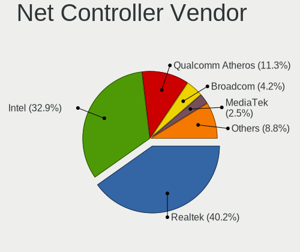
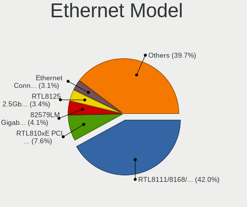
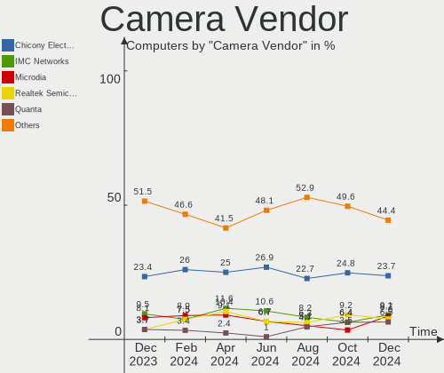
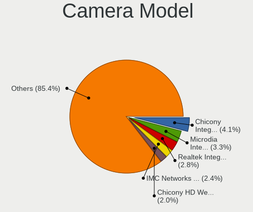

OpenMandriva - Hardware Trends
------------------------------

A project to identify most popular hardware characteristics and track their change
over time based on data collected by Linux users at https://Linux-Hardware.org.

Anyone can contribute to this report by the [hw-probe](https://github.com/linuxhw/hw-probe) tool:

    sudo -E hw-probe -all -upload

This is a report for all computer types. See also reports for [desktops](/Dist/OpenMandriva/Desktop/README.md) and [notebooks](/Dist/OpenMandriva/Notebook/README.md).

This report is for one last month. Overall report since the beginning of time: [TestDays](https://github.com/linuxhw/TestDays)

Period: Aug, 2023.

Contents
--------

* [ System ](#system)
  - [ OS                       ](#os)
  - [ OS Family                ](#os-family)
  - [ Kernel                   ](#kernel)
  - [ Kernel Family            ](#kernel-family)
  - [ Kernel Major Ver.        ](#kernel-major-ver)
  - [ Arch                     ](#arch)
  - [ DE                       ](#de)
  - [ Display Server           ](#display-server)
  - [ Display Manager          ](#display-manager)
  - [ OS Lang                  ](#os-lang)
  - [ Boot Mode                ](#boot-mode)
  - [ Filesystem               ](#filesystem)
  - [ Part. scheme             ](#part-scheme)
  - [ Dual Boot with Linux/BSD ](#dual-boot-with-linuxbsd)
  - [ Dual Boot (Win)          ](#dual-boot-win)

* [ Board ](#board)
  - [ Vendor                   ](#vendor)
  - [ Model                    ](#model)
  - [ Model Family             ](#model-family)
  - [ MFG Year                 ](#mfg-year)
  - [ Form Factor              ](#form-factor)
  - [ Secure Boot              ](#secure-boot)
  - [ Coreboot                 ](#coreboot)
  - [ RAM Size                 ](#ram-size)
  - [ RAM Used                 ](#ram-used)
  - [ Total Drives             ](#total-drives)
  - [ Has CD-ROM               ](#has-cd-rom)
  - [ Has Ethernet             ](#has-ethernet)
  - [ Has WiFi                 ](#has-wifi)
  - [ Has Bluetooth            ](#has-bluetooth)

* [ Location ](#location)
  - [ Country                  ](#country)
  - [ City                     ](#city)

* [ Drives ](#drives)
  - [ Drive Vendor             ](#drive-vendor)
  - [ Drive Model              ](#drive-model)
  - [ HDD Vendor               ](#hdd-vendor)
  - [ SSD Vendor               ](#ssd-vendor)
  - [ Drive Kind               ](#drive-kind)
  - [ Drive Connector          ](#drive-connector)
  - [ Drive Size               ](#drive-size)
  - [ Space Total              ](#space-total)
  - [ Space Used               ](#space-used)
  - [ Malfunc. Drives          ](#malfunc-drives)
  - [ Malfunc. Drive Vendor    ](#malfunc-drive-vendor)
  - [ Malfunc. HDD Vendor      ](#malfunc-hdd-vendor)
  - [ Malfunc. Drive Kind      ](#malfunc-drive-kind)
  - [ Failed Drives            ](#failed-drives)
  - [ Failed Drive Vendor      ](#failed-drive-vendor)
  - [ Drive Status             ](#drive-status)

* [ Storage controller ](#storage-controller)
  - [ Storage Vendor           ](#storage-vendor)
  - [ Storage Model            ](#storage-model)
  - [ Storage Kind             ](#storage-kind)

* [ Processor ](#processor)
  - [ CPU Vendor               ](#cpu-vendor)
  - [ CPU Model                ](#cpu-model)
  - [ CPU Model Family         ](#cpu-model-family)
  - [ CPU Cores                ](#cpu-cores)
  - [ CPU Sockets              ](#cpu-sockets)
  - [ CPU Threads              ](#cpu-threads)
  - [ CPU Op-Modes             ](#cpu-op-modes)
  - [ CPU Microcode            ](#cpu-microcode)
  - [ CPU Microarch            ](#cpu-microarch)

* [ Graphics ](#graphics)
  - [ GPU Vendor               ](#gpu-vendor)
  - [ GPU Model                ](#gpu-model)
  - [ GPU Combo                ](#gpu-combo)
  - [ GPU Driver               ](#gpu-driver)
  - [ GPU Memory               ](#gpu-memory)

* [ Monitor ](#monitor)
  - [ Monitor Vendor           ](#monitor-vendor)
  - [ Monitor Model            ](#monitor-model)
  - [ Monitor Resolution       ](#monitor-resolution)
  - [ Monitor Diagonal         ](#monitor-diagonal)
  - [ Monitor Width            ](#monitor-width)
  - [ Aspect Ratio             ](#aspect-ratio)
  - [ Monitor Area             ](#monitor-area)
  - [ Pixel Density            ](#pixel-density)
  - [ Multiple Monitors        ](#multiple-monitors)

* [ Network ](#network)
  - [ Net Controller Vendor    ](#net-controller-vendor)
  - [ Net Controller Model     ](#net-controller-model)
  - [ Wireless Vendor          ](#wireless-vendor)
  - [ Wireless Model           ](#wireless-model)
  - [ Ethernet Vendor          ](#ethernet-vendor)
  - [ Ethernet Model           ](#ethernet-model)
  - [ Net Controller Kind      ](#net-controller-kind)
  - [ Used Controller          ](#used-controller)
  - [ NICs                     ](#nics)
  - [ IPv6                     ](#ipv6)

* [ Bluetooth ](#bluetooth)
  - [ Bluetooth Vendor         ](#bluetooth-vendor)
  - [ Bluetooth Model          ](#bluetooth-model)

* [ Sound ](#sound)
  - [ Sound Vendor             ](#sound-vendor)
  - [ Sound Model              ](#sound-model)

* [ Memory ](#memory)
  - [ Memory Vendor            ](#memory-vendor)
  - [ Memory Model             ](#memory-model)
  - [ Memory Kind              ](#memory-kind)
  - [ Memory Form Factor       ](#memory-form-factor)
  - [ Memory Size              ](#memory-size)
  - [ Memory Speed             ](#memory-speed)

* [ Printers & scanners ](#printers--scanners)
  - [ Printer Vendor           ](#printer-vendor)
  - [ Printer Model            ](#printer-model)
  - [ Scanner Vendor           ](#scanner-vendor)
  - [ Scanner Model            ](#scanner-model)

* [ Camera ](#camera)
  - [ Camera Vendor            ](#camera-vendor)
  - [ Camera Model             ](#camera-model)

* [ Security ](#security)
  - [ Fingerprint Vendor       ](#fingerprint-vendor)
  - [ Fingerprint Model        ](#fingerprint-model)
  - [ Chipcard Vendor          ](#chipcard-vendor)
  - [ Chipcard Model           ](#chipcard-model)

* [ Unsupported ](#unsupported)
  - [ Unsupported Devices      ](#unsupported-devices)
  - [ Unsupported Device Types ](#unsupported-device-types)

System
------

OS
--

Installed operating systems

| Name               | Computers | Percent |
|--------------------|-----------|---------|
| OpenMandriva 23.08 | 484       | 69.34%  |
| OpenMandriva 23.03 | 99        | 14.18%  |
| OpenMandriva 4.3   | 41        | 5.87%   |
| OpenMandriva 23.90 | 24        | 3.44%   |
| OpenMandriva 23.07 | 24        | 3.44%   |
| OpenMandriva 23.01 | 12        | 1.72%   |
| OpenMandriva 4.2   | 9         | 1.29%   |
| OpenMandriva 23.06 | 4         | 0.57%   |
| OpenMandriva 4.50  | 1         | 0.14%   |

OS Family
---------

OS without a version

| Name         | Computers | Percent |
|--------------|-----------|---------|
| OpenMandriva | 698       | 100%    |

Kernel
------

Version of the Linux kernel

| Version                      | Computers | Percent |
|------------------------------|-----------|---------|
| 6.4.11-desktop-1omv2390      | 322       | 46.13%  |
| 6.4.8-desktop-2omv2390       | 178       | 25.5%   |
| 6.2.6-desktop-1omv2390       | 100       | 14.33%  |
| 5.16.7-desktop-1omv4003      | 31        | 4.44%   |
| 6.3.5-desktop-3omv2390       | 24        | 3.44%   |
| 6.1.1-desktop-1omv2290       | 11        | 1.58%   |
| 5.16.13-desktop-1omv4003     | 10        | 1.43%   |
| 5.10.14-desktop-1omv4002     | 9         | 1.29%   |
| 6.4.7-desktop-1omv2390       | 4         | 0.57%   |
| 6.5.0-desktop-1omv2390       | 2         | 0.29%   |
| 6.5.0-desktop-0.rc7.1omv2390 | 1         | 0.14%   |
| 6.5.0-desktop-0.rc4.1omv2390 | 1         | 0.14%   |
| 6.4.0-desktop-0.rc3.1omv2390 | 1         | 0.14%   |
| 6.2.1-desktop-1omv2390       | 1         | 0.14%   |
| 6.1.4-desktop-1omv2301       | 1         | 0.14%   |
| 5.19.5-desktop-1omv4090      | 1         | 0.14%   |
| 5.16.5-desktop-2omv4003      | 1         | 0.14%   |

Kernel Family
-------------

Linux kernel without a distro release

| Version | Computers | Percent |
|---------|-----------|---------|
| 6.4.11  | 322       | 46.13%  |
| 6.4.8   | 178       | 25.5%   |
| 6.2.6   | 100       | 14.33%  |
| 5.16.7  | 31        | 4.44%   |
| 6.3.5   | 24        | 3.44%   |
| 6.1.1   | 11        | 1.58%   |
| 5.16.13 | 10        | 1.43%   |
| 5.10.14 | 9         | 1.29%   |
| 6.5.0   | 4         | 0.57%   |
| 6.4.7   | 4         | 0.57%   |
| 6.4.0   | 1         | 0.14%   |
| 6.2.1   | 1         | 0.14%   |
| 6.1.4   | 1         | 0.14%   |
| 5.19.5  | 1         | 0.14%   |
| 5.16.5  | 1         | 0.14%   |

Kernel Major Ver.
-----------------

Linux kernel major version

| Version | Computers | Percent |
|---------|-----------|---------|
| 6.4     | 505       | 72.35%  |
| 6.2     | 101       | 14.47%  |
| 5.16    | 42        | 6.02%   |
| 6.3     | 24        | 3.44%   |
| 6.1     | 12        | 1.72%   |
| 5.10    | 9         | 1.29%   |
| 6.5     | 4         | 0.57%   |
| 5.19    | 1         | 0.14%   |

Arch
----

OS architecture (x86_64, i586, etc.)

| Name   | Computers | Percent |
|--------|-----------|---------|
| x86_64 | 698       | 100%    |

DE
--

Desktop Environment

| Name     | Computers | Percent |
|----------|-----------|---------|
| KDE5     | 561       | 80.37%  |
| GNOME    | 67        | 9.6%    |
| LXQt     | 47        | 6.73%   |
| Unknown  | 19        | 2.72%   |
| Cinnamon | 2         | 0.29%   |
| Budgie   | 2         | 0.29%   |

Display Server
--------------

X11 or Wayland

| Name    | Computers | Percent |
|---------|-----------|---------|
| Wayland | 500       | 71.63%  |
| X11     | 198       | 28.37%  |

Display Manager
---------------

SDDM, LightDM, etc.

| Name | Computers | Percent |
|------|-----------|---------|
| SDDM | 631       | 90.4%   |
| GDM  | 67        | 9.6%    |

OS Lang
-------

Language

| Lang  | Computers | Percent |
|-------|-----------|---------|
| en_US | 320       | 45.85%  |
| pt_BR | 55        | 7.88%   |
| fr_FR | 46        | 6.59%   |
| de_DE | 46        | 6.59%   |
| en_GB | 37        | 5.3%    |
| ru_RU | 35        | 5.01%   |
| it_IT | 24        | 3.44%   |
| pl_PL | 18        | 2.58%   |
| es_ES | 17        | 2.44%   |
| en_CA | 12        | 1.72%   |
| es_VE | 6         | 0.86%   |
| en_AU | 6         | 0.86%   |
| pt_PT | 5         | 0.72%   |
| nl_BE | 5         | 0.72%   |
| fr_CA | 5         | 0.72%   |
| es_MX | 5         | 0.72%   |
| en_IN | 5         | 0.72%   |
| cs_CZ | 5         | 0.72%   |
| hu_HU | 4         | 0.57%   |
| fr_CH | 4         | 0.57%   |
| es_AR | 4         | 0.57%   |
| es_CL | 3         | 0.43%   |
| en_IE | 3         | 0.43%   |
| de_AT | 3         | 0.43%   |
| tr_TR | 2         | 0.29%   |
| nl_NL | 2         | 0.29%   |
| fr_BE | 2         | 0.29%   |
| es_CO | 2         | 0.29%   |
| en_ZA | 2         | 0.29%   |
| en_SG | 2         | 0.29%   |
| en_DK | 2         | 0.29%   |
| de_CH | 2         | 0.29%   |
| uk_UA | 1         | 0.14%   |
| ru_UA | 1         | 0.14%   |
| nb_NO | 1         | 0.14%   |
| ja_JP | 1         | 0.14%   |
| en_NZ | 1         | 0.14%   |
| en_AG | 1         | 0.14%   |
| de_BE | 1         | 0.14%   |
| da_DK | 1         | 0.14%   |

Boot Mode
---------

EFI or BIOS

| Mode | Computers | Percent |
|------|-----------|---------|
| EFI  | 418       | 59.89%  |
| BIOS | 280       | 40.11%  |

Filesystem
----------

Type of filesystem

| Type     | Computers | Percent |
|----------|-----------|---------|
| Overlay  | 332       | 47.56%  |
| Ext4     | 313       | 44.84%  |
| Btrfs    | 35        | 5.01%   |
| Xfs      | 6         | 0.86%   |
| F2fs     | 5         | 0.72%   |
| Jfs      | 3         | 0.43%   |
| Ext2     | 2         | 0.29%   |
| Reiserfs | 1         | 0.14%   |
| Ext3     | 1         | 0.14%   |

Part. scheme
------------

Scheme of partitioning

| Type | Computers | Percent |
|------|-----------|---------|
| GPT  | 564       | 80.8%   |
| MBR  | 134       | 19.2%   |

Dual Boot with Linux/BSD
------------------------

Hosting more than one Linux/BSD

| Dual boot | Computers | Percent |
|-----------|-----------|---------|
| Yes       | 374       | 53.58%  |
| No        | 324       | 46.42%  |

Dual Boot (Win)
---------------

Hosting Linux and Windows

| Dual boot | Computers | Percent |
|-----------|-----------|---------|
| No        | 405       | 58.02%  |
| Yes       | 293       | 41.98%  |

Board
-----

Vendor
------

Motherboard manufacturer

| Name                                 | Computers | Percent |
|--------------------------------------|-----------|---------|
| ASUSTek Computer                     | 107       | 15.33%  |
| Lenovo                               | 98        | 14.04%  |
| Hewlett-Packard                      | 91        | 13.04%  |
| Dell                                 | 81        | 11.6%   |
| MSI                                  | 53        | 7.59%   |
| Acer                                 | 46        | 6.59%   |
| Gigabyte Technology                  | 45        | 6.45%   |
| ASRock                               | 20        | 2.87%   |
| Intel                                | 19        | 2.72%   |
| Apple                                | 16        | 2.29%   |
| Fujitsu                              | 11        | 1.58%   |
| Toshiba                              | 10        | 1.43%   |
| Samsung Electronics                  | 7         | 1%      |
| Positivo                             | 6         | 0.86%   |
| Medion                               | 6         | 0.86%   |
| Foxconn                              | 6         | 0.86%   |
| Chuwi                                | 5         | 0.72%   |
| Sony                                 | 4         | 0.57%   |
| Packard Bell                         | 4         | 0.57%   |
| HUAWEI                               | 4         | 0.57%   |
| Unknown                              | 4         | 0.57%   |
| Pegatron                             | 3         | 0.43%   |
| Panasonic                            | 3         | 0.43%   |
| Biostar                              | 3         | 0.43%   |
| System76                             | 2         | 0.29%   |
| Red Hat                              | 2         | 0.29%   |
| Positivo Bahia - VAIO                | 2         | 0.29%   |
| ECS                                  | 2         | 0.29%   |
| AZW                                  | 2         | 0.29%   |
| ZOTAC                                | 1         | 0.14%   |
| ZOOSTORM                             | 1         | 0.14%   |
| ViewSonic                            | 1         | 0.14%   |
| VALE                                 | 1         | 0.14%   |
| UMAX                                 | 1         | 0.14%   |
| TUXEDO                               | 1         | 0.14%   |
| Thomson                              | 1         | 0.14%   |
| Star Labs                            | 1         | 0.14%   |
| Shuttle                              | 1         | 0.14%   |
| Shenzhen Meigao Electronic Equipment | 1         | 0.14%   |
| Semp Toshiba                         | 1         | 0.14%   |

Model
-----

Motherboard model

| Name                                    | Computers | Percent |
|-----------------------------------------|-----------|---------|
| Lenovo ThinkPad L13 Gen 3 21BAS0X700    | 6         | 0.86%   |
| Dell OptiPlex 7010                      | 4         | 0.57%   |
| Unknown                                 | 4         | 0.57%   |
| Intel H81                               | 3         | 0.43%   |
| HP Compaq Presario CQ60                 | 3         | 0.43%   |
| Dell Latitude 7480                      | 3         | 0.43%   |
| ASUS All Series                         | 3         | 0.43%   |
| Red Hat KVM                             | 2         | 0.29%   |
| Positivo C14CU51                        | 2         | 0.29%   |
| MSI MS-7C91                             | 2         | 0.29%   |
| MSI MS-7C56                             | 2         | 0.29%   |
| MSI MS-7C52                             | 2         | 0.29%   |
| MSI MS-7C51                             | 2         | 0.29%   |
| MSI MS-7B79                             | 2         | 0.29%   |
| MSI MS-7721                             | 2         | 0.29%   |
| Lenovo Yoga 300-11IBY 80M0              | 2         | 0.29%   |
| Lenovo IdeaPad Z570 HuronRiver Platform | 2         | 0.29%   |
| Lenovo IdeaPad 3 15ALC6 82MF            | 2         | 0.29%   |
| Intel NUC6CAYH                          | 2         | 0.29%   |
| Intel H61                               | 2         | 0.29%   |
| HP Z400 Workstation                     | 2         | 0.29%   |
| HP Stream Laptop 14-ax0XX               | 2         | 0.29%   |
| HP Slim Desktop S01-pF2xxx              | 2         | 0.29%   |
| HP Slim Desktop S01-aF0xxx              | 2         | 0.29%   |
| HP ProDesk 600 G1 SFF                   | 2         | 0.29%   |
| HP Pavilion Gaming Desktop TG01-1xxx    | 2         | 0.29%   |
| HP Laptop 17-cp0xxx                     | 2         | 0.29%   |
| HP Laptop 15s-eq1xxx                    | 2         | 0.29%   |
| HP Laptop 15-db0xxx                     | 2         | 0.29%   |
| HP EliteDesk 705 G1 SFF                 | 2         | 0.29%   |
| HP EliteBook 840 G3                     | 2         | 0.29%   |
| HP Desktop M01-F1xxx                    | 2         | 0.29%   |
| Gigabyte X570 AORUS ELITE               | 2         | 0.29%   |
| Gigabyte X299 AORUS Gaming              | 2         | 0.29%   |
| Gigabyte G31M-ES2L                      | 2         | 0.29%   |
| Fujitsu ESPRIMO P910                    | 2         | 0.29%   |
| Dell OptiPlex 9020                      | 2         | 0.29%   |
| Dell OptiPlex 755                       | 2         | 0.29%   |
| Dell OptiPlex 7050                      | 2         | 0.29%   |
| Dell Latitude E6440                     | 2         | 0.29%   |

Model Family
------------

Motherboard model prefix

| Name                  | Computers | Percent |
|-----------------------|-----------|---------|
| Lenovo ThinkPad       | 40        | 5.73%   |
| Acer Aspire           | 35        | 5.01%   |
| Dell Latitude         | 24        | 3.44%   |
| Dell Inspiron         | 23        | 3.3%    |
| Lenovo IdeaPad        | 22        | 3.15%   |
| Dell OptiPlex         | 18        | 2.58%   |
| HP Laptop             | 15        | 2.15%   |
| HP Pavilion           | 12        | 1.72%   |
| ASUS PRIME            | 12        | 1.72%   |
| HP Compaq             | 11        | 1.58%   |
| HP EliteBook          | 10        | 1.43%   |
| ASUS VivoBook         | 10        | 1.43%   |
| HP ProBook            | 9         | 1.29%   |
| Lenovo ThinkCentre    | 8         | 1.15%   |
| ASUS TUF              | 8         | 1.15%   |
| Toshiba Satellite     | 7         | 1%      |
| Fujitsu ESPRIMO       | 6         | 0.86%   |
| Dell Precision        | 6         | 0.86%   |
| HP Slim               | 5         | 0.72%   |
| HP ProDesk            | 5         | 0.72%   |
| HP EliteDesk          | 5         | 0.72%   |
| ASUS ROG              | 5         | 0.72%   |
| Packard Bell EasyNote | 4         | 0.57%   |
| Lenovo Yoga           | 4         | 0.57%   |
| Gigabyte B450M        | 4         | 0.57%   |
| Dell Vostro           | 4         | 0.57%   |
| Chuwi GemiBook        | 4         | 0.57%   |
| Apple iMac14          | 4         | 0.57%   |
| Unknown               | 4         | 0.57%   |
| Intel H81             | 3         | 0.43%   |
| ASUS All              | 3         | 0.43%   |
| Acer Veriton          | 3         | 0.43%   |
| Toshiba PORTEGE       | 2         | 0.29%   |
| Red Hat KVM           | 2         | 0.29%   |
| Positivo C14CU51      | 2         | 0.29%   |
| MSI MS-7C91           | 2         | 0.29%   |
| MSI MS-7C56           | 2         | 0.29%   |
| MSI MS-7C52           | 2         | 0.29%   |
| MSI MS-7C51           | 2         | 0.29%   |
| MSI MS-7B79           | 2         | 0.29%   |

MFG Year
--------

Motherboard manufacture year

| Year    | Computers | Percent |
|---------|-----------|---------|
| 2012    | 69        | 9.89%   |
| 2011    | 57        | 8.17%   |
| 2021    | 56        | 8.02%   |
| 2020    | 56        | 8.02%   |
| 2018    | 50        | 7.16%   |
| 2019    | 49        | 7.02%   |
| 2013    | 49        | 7.02%   |
| 2014    | 42        | 6.02%   |
| 2010    | 42        | 6.02%   |
| 2022    | 41        | 5.87%   |
| 2017    | 38        | 5.44%   |
| 2008    | 30        | 4.3%    |
| 2016    | 28        | 4.01%   |
| 2009    | 26        | 3.72%   |
| 2015    | 25        | 3.58%   |
| 2023    | 17        | 2.44%   |
| 2007    | 17        | 2.44%   |
| 2006    | 3         | 0.43%   |
| 2005    | 2         | 0.29%   |
| Unknown | 1         | 0.14%   |

Form Factor
-----------

Physical design of the computer

| Name        | Computers | Percent |
|-------------|-----------|---------|
| Notebook    | 342       | 49%     |
| Desktop     | 318       | 45.56%  |
| Mini pc     | 14        | 2.01%   |
| All in one  | 12        | 1.72%   |
| Convertible | 10        | 1.43%   |
| Tablet      | 2         | 0.29%   |

Secure Boot
-----------

Enabled or disabled

| State    | Computers | Percent |
|----------|-----------|---------|
| Disabled | 698       | 100%    |

Coreboot
--------

Have coreboot on board

| Used | Computers | Percent |
|------|-----------|---------|
| No   | 696       | 99.71%  |
| Yes  | 2         | 0.29%   |

RAM Size
--------

Total RAM memory

| Size in GB      | Computers | Percent |
|-----------------|-----------|---------|
| 4.01-8.0        | 194       | 27.79%  |
| 3.01-4.0        | 137       | 19.63%  |
| 16.01-24.0      | 135       | 19.34%  |
| 8.01-16.0       | 122       | 17.48%  |
| 32.01-64.0      | 53        | 7.59%   |
| 1.01-2.0        | 20        | 2.87%   |
| 24.01-32.0      | 14        | 2.01%   |
| 2.01-3.0        | 12        | 1.72%   |
| 64.01-256.0     | 9         | 1.29%   |
| More than 256.0 | 2         | 0.29%   |

RAM Used
--------

Used RAM memory

| Used GB  | Computers | Percent |
|----------|-----------|---------|
| 1.01-2.0 | 430       | 61.6%   |
| 2.01-3.0 | 165       | 23.64%  |
| 0.51-1.0 | 58        | 8.31%   |
| 3.01-4.0 | 31        | 4.44%   |
| 4.01-8.0 | 9         | 1.29%   |
| 0.01-0.5 | 5         | 0.72%   |

Total Drives
------------

Number of drives on board

| Drives | Computers | Percent |
|--------|-----------|---------|
| 1      | 386       | 55.3%   |
| 2      | 186       | 26.65%  |
| 3      | 58        | 8.31%   |
| 4      | 27        | 3.87%   |
| 5      | 13        | 1.86%   |
| 0      | 12        | 1.72%   |
| 6      | 9         | 1.29%   |
| 10     | 2         | 0.29%   |
| 7      | 2         | 0.29%   |
| 13     | 1         | 0.14%   |
| 11     | 1         | 0.14%   |
| 9      | 1         | 0.14%   |

Has CD-ROM
----------

Has CD-ROM on board

| Presented | Computers | Percent |
|-----------|-----------|---------|
| No        | 401       | 57.45%  |
| Yes       | 297       | 42.55%  |

Has Ethernet
------------

Has Ethernet on board

| Presented | Computers | Percent |
|-----------|-----------|---------|
| Yes       | 620       | 88.83%  |
| No        | 78        | 11.17%  |

Has WiFi
--------

Has WiFi module

| Presented | Computers | Percent |
|-----------|-----------|---------|
| Yes       | 503       | 72.06%  |
| No        | 195       | 27.94%  |

Has Bluetooth
-------------

Has Bluetooth module

| Presented | Computers | Percent |
|-----------|-----------|---------|
| Yes       | 388       | 55.59%  |
| No        | 310       | 44.41%  |

Location
--------

Country
-------

Geographic location (country)

| Country      | Computers | Percent |
|--------------|-----------|---------|
| USA          | 90        | 12.89%  |
| Brazil       | 71        | 10.17%  |
| Germany      | 68        | 9.74%   |
| France       | 54        | 7.74%   |
| Russia       | 42        | 6.02%   |
| Italy        | 36        | 5.16%   |
| UK           | 31        | 4.44%   |
| Canada       | 26        | 3.72%   |
| Poland       | 25        | 3.58%   |
| Spain        | 21        | 3.01%   |
| Australia    | 17        | 2.44%   |
| Netherlands  | 11        | 1.58%   |
| India        | 10        | 1.43%   |
| Belgium      | 10        | 1.43%   |
| Romania      | 9         | 1.29%   |
| Indonesia    | 9         | 1.29%   |
| Japan        | 8         | 1.15%   |
| Hungary      | 8         | 1.15%   |
| Switzerland  | 7         | 1%      |
| Portugal     | 7         | 1%      |
| Venezuela    | 6         | 0.86%   |
| Mexico       | 6         | 0.86%   |
| Greece       | 6         | 0.86%   |
| Finland      | 6         | 0.86%   |
| Czechia      | 6         | 0.86%   |
| Argentina    | 6         | 0.86%   |
| Norway       | 5         | 0.72%   |
| Turkey       | 4         | 0.57%   |
| Thailand     | 4         | 0.57%   |
| Sweden       | 4         | 0.57%   |
| South Africa | 4         | 0.57%   |
| Slovakia     | 4         | 0.57%   |
| Malaysia     | 4         | 0.57%   |
| Ireland      | 4         | 0.57%   |
| Denmark      | 4         | 0.57%   |
| Colombia     | 4         | 0.57%   |
| Chile        | 4         | 0.57%   |
| Bulgaria     | 4         | 0.57%   |
| Austria      | 4         | 0.57%   |
| Ukraine      | 3         | 0.43%   |

City
----

Geographic location (city)

| City               | Computers | Percent |
|--------------------|-----------|---------|
| Berlin             | 10        | 1.43%   |
| Rio de Janeiro     | 7         | 1%      |
| Paris              | 6         | 0.86%   |
| Athens             | 6         | 0.86%   |
| San Cristóbal     | 5         | 0.72%   |
| Rome               | 5         | 0.72%   |
| Moscow             | 5         | 0.72%   |
| Milan              | 5         | 0.72%   |
| Melbourne          | 5         | 0.72%   |
| Vancouver          | 4         | 0.57%   |
| Sao Paulo          | 4         | 0.57%   |
| La Baule-Escoublac | 4         | 0.57%   |
| Geneva             | 4         | 0.57%   |
| Dublin             | 4         | 0.57%   |
| Žilina            | 3         | 0.43%   |
| Warsaw             | 3         | 0.43%   |
| Sydney             | 3         | 0.43%   |
| Stuttgart          | 3         | 0.43%   |
| St. Petersburg     | 3         | 0.43%   |
| Prague             | 3         | 0.43%   |
| Oak Park           | 3         | 0.43%   |
| Novosibirsk        | 3         | 0.43%   |
| Madrid             | 3         | 0.43%   |
| Hamburg            | 3         | 0.43%   |
| Brisbane           | 3         | 0.43%   |
| Braunschweig       | 3         | 0.43%   |
| Youngstown         | 2         | 0.29%   |
| Yarragon           | 2         | 0.29%   |
| Wuppertal          | 2         | 0.29%   |
| Wroclaw            | 2         | 0.29%   |
| Volgograd          | 2         | 0.29%   |
| Viggiù            | 2         | 0.29%   |
| Vallenay           | 2         | 0.29%   |
| Târgu Mureş      | 2         | 0.29%   |
| Stockholm          | 2         | 0.29%   |
| St Petersburg      | 2         | 0.29%   |
| Sofia              | 2         | 0.29%   |
| Singapore          | 2         | 0.29%   |
| Simferopol         | 2         | 0.29%   |
| Seattle            | 2         | 0.29%   |

Drives
------

Drive Vendor
------------

Hard drive vendors

| Vendor                      | Computers | Drives | Percent |
|-----------------------------|-----------|--------|---------|
| WDC                         | 156       | 188    | 14.74%  |
| Samsung Electronics         | 148       | 199    | 13.99%  |
| Seagate                     | 119       | 133    | 11.25%  |
| Toshiba                     | 71        | 77     | 6.71%   |
| Kingston                    | 62        | 65     | 5.86%   |
| Hitachi                     | 46        | 47     | 4.35%   |
| Crucial                     | 43        | 52     | 4.06%   |
| SanDisk                     | 42        | 43     | 3.97%   |
| Unknown                     | 23        | 30     | 2.17%   |
| China                       | 21        | 22     | 1.98%   |
| Intel                       | 20        | 20     | 1.89%   |
| SK hynix                    | 18        | 18     | 1.7%    |
| A-DATA Technology           | 17        | 17     | 1.61%   |
| SPCC                        | 16        | 17     | 1.51%   |
| Micron Technology           | 14        | 14     | 1.32%   |
| Apple                       | 13        | 13     | 1.23%   |
| Patriot                     | 11        | 11     | 1.04%   |
| PNY                         | 10        | 13     | 0.95%   |
| GOODRAM                     | 10        | 11     | 0.95%   |
| Silicon Motion              | 8         | 9      | 0.76%   |
| Phison                      | 8         | 8      | 0.76%   |
| Netac                       | 8         | 9      | 0.76%   |
| Intenso                     | 8         | 8      | 0.76%   |
| OCZ                         | 7         | 7      | 0.66%   |
| HGST                        | 7         | 8      | 0.66%   |
| Unknown                     | 7         | 7      | 0.66%   |
| Maxtor                      | 5         | 6      | 0.47%   |
| Lexar                       | 5         | 5      | 0.47%   |
| Kingston Technology Company | 5         | 5      | 0.47%   |
| Team                        | 4         | 4      | 0.38%   |
| SSSTC                       | 4         | 4      | 0.38%   |
| KIOXIA                      | 4         | 4      | 0.38%   |
| KingSpec                    | 4         | 4      | 0.38%   |
| JMicron Technology          | 4         | 4      | 0.38%   |
| Hewlett-Packard             | 4         | 4      | 0.38%   |
| Apacer                      | 4         | 4      | 0.38%   |
| Verbatim                    | 3         | 3      | 0.28%   |
| UMIS                        | 3         | 3      | 0.28%   |
| Transcend                   | 3         | 3      | 0.28%   |
| KIOXIA-EXCERIA              | 3         | 3      | 0.28%   |

Drive Model
-----------

Hard drive models

| Model                                   | Computers | Percent |
|-----------------------------------------|-----------|---------|
| Kingston SA400S37240G 240GB SSD         | 18        | 1.55%   |
| Seagate ST1000DM010-2EP102 1TB          | 10        | 0.86%   |
| Samsung SSD 860 EVO 500GB               | 9         | 0.78%   |
| SanDisk NVMe SSD Drive 1TB              | 8         | 0.69%   |
| Kingston SA400S37480G 480GB SSD         | 8         | 0.69%   |
| Toshiba MQ04ABF100 1TB                  | 7         | 0.6%    |
| Toshiba DT01ACA100 1TB                  | 7         | 0.6%    |
| Seagate ST500DM002-1BD142 500GB         | 7         | 0.6%    |
| Samsung SSD 970 EVO Plus 2TB            | 7         | 0.6%    |
| Samsung SSD 870 EVO 500GB               | 7         | 0.6%    |
| Samsung SSD 860 EVO 250GB               | 7         | 0.6%    |
| Unknown                                 | 7         | 0.6%    |
| Toshiba MQ01ABF050 500GB                | 6         | 0.52%   |
| Samsung SSD 860 EVO 1TB                 | 6         | 0.52%   |
| Hitachi HTS543225L9A300 250GB           | 6         | 0.52%   |
| Crucial CT500MX500SSD1 500GB            | 6         | 0.52%   |
| WDC WD10EZEX-08WN4A0 1TB                | 5         | 0.43%   |
| Unknown SD/MMC/MS PRO 1GB               | 5         | 0.43%   |
| Toshiba MQ01ABD100 1TB                  | 5         | 0.43%   |
| Seagate ST2000DM008-2FR102 2TB          | 5         | 0.43%   |
| Samsung SSD 970 EVO Plus 500GB          | 5         | 0.43%   |
| Samsung SSD 870 EVO 1TB                 | 5         | 0.43%   |
| Kingston SA400S37120G 120GB SSD         | 5         | 0.43%   |
| WDC WDS240G2G0A-00JH30 240GB SSD        | 4         | 0.34%   |
| WDC WD10JPVX-22JC3T0 1TB                | 4         | 0.34%   |
| WDC PC SN530 SDBPNPZ-512G-1114 512GB    | 4         | 0.34%   |
| Toshiba HDWD110 1TB                     | 4         | 0.34%   |
| SPCC Solid State Disk 1TB               | 4         | 0.34%   |
| SK hynix BC511 HFM256GDJTNI-82A0A 256GB | 4         | 0.34%   |
| Seagate ST3500418AS 500GB               | 4         | 0.34%   |
| Samsung SSD 870 EVO 250GB               | 4         | 0.34%   |
| Samsung SSD 850 PRO 256GB               | 4         | 0.34%   |
| Samsung SSD 850 EVO 500GB               | 4         | 0.34%   |
| Samsung SSD 850 EVO 250GB               | 4         | 0.34%   |
| PNY CS900 120GB SSD                     | 4         | 0.34%   |
| Crucial CT250MX500SSD1 250GB            | 4         | 0.34%   |
| Crucial CT120BX500SSD1 120GB            | 4         | 0.34%   |
| Crucial CT1000BX500SSD1 1TB             | 4         | 0.34%   |
| A-DATA SU650 120GB SSD                  | 4         | 0.34%   |
| WDC WDS500G2B0C-00PXH0 500GB            | 3         | 0.26%   |

HDD Vendor
----------

Hard disk drive vendors

| Vendor              | Computers | Drives | Percent |
|---------------------|-----------|--------|---------|
| WDC                 | 116       | 134    | 29.29%  |
| Seagate             | 112       | 126    | 28.28%  |
| Toshiba             | 61        | 66     | 15.4%   |
| Hitachi             | 46        | 47     | 11.62%  |
| Samsung Electronics | 17        | 17     | 4.29%   |
| Apple               | 8         | 8      | 2.02%   |
| HGST                | 7         | 8      | 1.77%   |
| Unknown             | 5         | 5      | 1.26%   |
| Maxtor              | 5         | 6      | 1.26%   |
| USB3.0              | 2         | 2      | 0.51%   |
| Min Yi U            | 2         | 2      | 0.51%   |
| Fujitsu             | 2         | 3      | 0.51%   |
| External            | 2         | 2      | 0.51%   |
| WD MediaMax         | 1         | 1      | 0.25%   |
| USB                 | 1         | 1      | 0.25%   |
| StoreJet            | 1         | 1      | 0.25%   |
| SABRENT             | 1         | 1      | 0.25%   |
| Intenso             | 1         | 1      | 0.25%   |
| Inateck             | 1         | 1      | 0.25%   |
| IBM/Hitachi         | 1         | 1      | 0.25%   |
| IB-AC703            | 1         | 1      | 0.25%   |
| HGST HTS            | 1         | 1      | 0.25%   |
| ExcelStor           | 1         | 1      | 0.25%   |
| DAS                 | 1         | 4      | 0.25%   |

SSD Vendor
----------

Solid state drive vendors

| Vendor              | Computers | Drives | Percent |
|---------------------|-----------|--------|---------|
| Samsung Electronics | 80        | 105    | 18.78%  |
| Kingston            | 50        | 52     | 11.74%  |
| Crucial             | 35        | 36     | 8.22%   |
| SanDisk             | 24        | 24     | 5.63%   |
| WDC                 | 23        | 27     | 5.4%    |
| China               | 21        | 22     | 4.93%   |
| SPCC                | 13        | 13     | 3.05%   |
| A-DATA Technology   | 13        | 13     | 3.05%   |
| Micron Technology   | 12        | 12     | 2.82%   |
| GOODRAM             | 10        | 11     | 2.35%   |
| PNY                 | 9         | 12     | 2.11%   |
| Patriot             | 9         | 9      | 2.11%   |
| Netac               | 8         | 9      | 1.88%   |
| Intel               | 8         | 8      | 1.88%   |
| Toshiba             | 7         | 8      | 1.64%   |
| OCZ                 | 7         | 7      | 1.64%   |
| Intenso             | 7         | 7      | 1.64%   |
| SK hynix            | 5         | 5      | 1.17%   |
| Lexar               | 4         | 4      | 0.94%   |
| KingSpec            | 4         | 4      | 0.94%   |
| Verbatim            | 3         | 3      | 0.7%    |
| Transcend           | 3         | 3      | 0.7%    |
| Seagate             | 3         | 3      | 0.7%    |
| JMicron Technology  | 3         | 3      | 0.7%    |
| Hewlett-Packard     | 3         | 3      | 0.7%    |
| Apple               | 3         | 3      | 0.7%    |
| AMD                 | 3         | 3      | 0.7%    |
| Team                | 2         | 2      | 0.47%   |
| T-FORCE             | 2         | 2      | 0.47%   |
| LITEON              | 2         | 2      | 0.47%   |
| KIOXIA-EXCERIA      | 2         | 2      | 0.47%   |
| KingDian            | 2         | 2      | 0.47%   |
| Integral            | 2         | 2      | 0.47%   |
| Fanxiang            | 2         | 2      | 0.47%   |
| Emtec               | 2         | 2      | 0.47%   |
| XrayDisk            | 1         | 1      | 0.23%   |
| Wellcomm            | 1         | 1      | 0.23%   |
| WALRAM              | 1         | 1      | 0.23%   |
| Union Memory        | 1         | 1      | 0.23%   |
| UMAX                | 1         | 1      | 0.23%   |

Drive Kind
----------

HDD or SSD

| Kind    | Computers | Drives | Percent |
|---------|-----------|--------|---------|
| SSD     | 360       | 466    | 39.05%  |
| HDD     | 330       | 440    | 35.79%  |
| NVMe    | 193       | 245    | 20.93%  |
| MMC     | 24        | 27     | 2.6%    |
| Unknown | 15        | 20     | 1.63%   |

Drive Connector
---------------

SATA, SAS, NVMe, etc.

| Type | Computers | Drives | Percent |
|------|-----------|--------|---------|
| SATA | 555       | 852    | 66.79%  |
| NVMe | 193       | 244    | 23.23%  |
| SAS  | 59        | 75     | 7.1%    |
| MMC  | 24        | 27     | 2.89%   |

Drive Size
----------

Size of hard drive

| Size in TB | Computers | Drives | Percent |
|------------|-----------|--------|---------|
| 0.01-0.5   | 444       | 577    | 62.36%  |
| 0.51-1.0   | 203       | 247    | 28.51%  |
| 1.01-2.0   | 45        | 52     | 6.32%   |
| 3.01-4.0   | 7         | 10     | 0.98%   |
| 2.01-3.0   | 7         | 10     | 0.98%   |
| 4.01-10.0  | 5         | 9      | 0.7%    |
| 10.01-20.0 | 1         | 1      | 0.14%   |

Space Total
-----------

Amount of disk space available on the file system

| Size in GB     | Computers | Percent |
|----------------|-----------|---------|
| 1-20           | 259       | 37.11%  |
| 101-250        | 155       | 22.21%  |
| 251-500        | 87        | 12.46%  |
| 501-1000       | 65        | 9.31%   |
| 21-50          | 37        | 5.3%    |
| 51-100         | 37        | 5.3%    |
| 1001-2000      | 22        | 3.15%   |
| Unknown        | 20        | 2.87%   |
| 2001-3000      | 11        | 1.58%   |
| More than 3000 | 5         | 0.72%   |

Space Used
----------

Amount of used disk space

| Used GB        | Computers | Percent |
|----------------|-----------|---------|
| 1-20           | 555       | 79.51%  |
| 21-50          | 39        | 5.59%   |
| 101-250        | 25        | 3.58%   |
| 51-100         | 25        | 3.58%   |
| Unknown        | 20        | 2.87%   |
| 251-500        | 14        | 2.01%   |
| 501-1000       | 14        | 2.01%   |
| 1001-2000      | 4         | 0.57%   |
| More than 3000 | 1         | 0.14%   |
| 2001-3000      | 1         | 0.14%   |

Malfunc. Drives
---------------

Drive models with a malfunction

| Model                             | Computers | Drives | Percent |
|-----------------------------------|-----------|--------|---------|
| Hitachi HTS543225L9A300 250GB     | 4         | 4      | 2.08%   |
| Seagate ST9500325AS 500GB         | 3         | 3      | 1.56%   |
| Seagate ST500DM002-1BD142 500GB   | 3         | 3      | 1.56%   |
| WDC WD5000AAKX-75U6AA0 500GB      | 2         | 2      | 1.04%   |
| WDC WD10EALX-009BA0 1TB           | 2         | 2      | 1.04%   |
| WDC WD10EADS-00L5B1 1TB           | 2         | 2      | 1.04%   |
| Toshiba MQ01ABD100 1TB            | 2         | 2      | 1.04%   |
| Toshiba MQ01ABD050 500GB          | 2         | 2      | 1.04%   |
| Toshiba MK2555GSX 250GB           | 2         | 2      | 1.04%   |
| Toshiba DT01ACA050 500GB          | 2         | 2      | 1.04%   |
| Seagate ST500LM000-1EJ162 500GB   | 2         | 2      | 1.04%   |
| Seagate ST3500418AS 500GB         | 2         | 2      | 1.04%   |
| Seagate ST320LT012-9WS14C 320GB   | 2         | 2      | 1.04%   |
| Seagate ST3160815AS 160GB         | 2         | 2      | 1.04%   |
| Samsung Electronics HD161HJ 160GB | 2         | 2      | 1.04%   |
| Samsung Electronics HD103UJ 1TB   | 2         | 2      | 1.04%   |
| Kingston SV300S37A120G 120GB SSD  | 2         | 2      | 1.04%   |
| JMicron Technology Generic 1TB    | 2         | 2      | 1.04%   |
| Hitachi HTS545050A7E380 500GB     | 2         | 2      | 1.04%   |
| Hitachi HTS543216L9A300 160GB     | 2         | 2      | 1.04%   |
| Hitachi HDS721050CLA362 500GB     | 2         | 2      | 1.04%   |
| WDC WDS480G2G0A-00JH30 480GB SSD  | 1         | 1      | 0.52%   |
| WDC WDS240G2G0B-00EPW0 240GB SSD  | 1         | 1      | 0.52%   |
| WDC WD7500AADS-00M2B0 752GB       | 1         | 1      | 0.52%   |
| WDC WD6402AAEX-00Y9A0 640GB       | 1         | 1      | 0.52%   |
| WDC WD6400BEVT-75A0RT0 640GB      | 1         | 1      | 0.52%   |
| WDC WD6400AAKS-22A7B2 640GB       | 1         | 1      | 0.52%   |
| WDC WD5000BPVT-00HXZT3 500GB      | 1         | 1      | 0.52%   |
| WDC WD5000BEVT-00A0RT0 500GB      | 1         | 1      | 0.52%   |
| WDC WD5000AVCS-632DY1 500GB       | 1         | 1      | 0.52%   |
| WDC WD5000AAKX-08U6AA0 500GB      | 1         | 1      | 0.52%   |
| WDC WD5000AAKS-60Z1A0 500GB       | 1         | 1      | 0.52%   |
| WDC WD5000AAKS-00WWPA0 500GB      | 1         | 1      | 0.52%   |
| WDC WD5000AAKS-00V1A0 500GB       | 1         | 1      | 0.52%   |
| WDC WD5000AAKS-00A7B2 500GB       | 1         | 1      | 0.52%   |
| WDC WD5000AAKS-007AA0 500GB       | 1         | 1      | 0.52%   |
| WDC WD5000AADS-00S9B0 500GB       | 1         | 1      | 0.52%   |
| WDC WD40PURX-64GVNY0 4TB          | 1         | 1      | 0.52%   |
| WDC WD3200BEVT-26A23T0 320GB      | 1         | 1      | 0.52%   |
| WDC WD3200BEKT-60V5T1 320GB       | 1         | 1      | 0.52%   |

Malfunc. Drive Vendor
---------------------

Vendors of faulty drives

| Vendor              | Computers | Drives | Percent |
|---------------------|-----------|--------|---------|
| Seagate             | 45        | 46     | 23.81%  |
| WDC                 | 43        | 46     | 22.75%  |
| Hitachi             | 28        | 28     | 14.81%  |
| Toshiba             | 20        | 21     | 10.58%  |
| Samsung Electronics | 11        | 11     | 5.82%   |
| SK hynix            | 4         | 4      | 2.12%   |
| SanDisk             | 4         | 4      | 2.12%   |
| Maxtor              | 4         | 4      | 2.12%   |
| Kingston            | 4         | 4      | 2.12%   |
| Micron Technology   | 3         | 3      | 1.59%   |
| China               | 3         | 3      | 1.59%   |
| Netac               | 2         | 2      | 1.06%   |
| JMicron Technology  | 2         | 2      | 1.06%   |
| HGST                | 2         | 2      | 1.06%   |
| Apple               | 2         | 2      | 1.06%   |
| A-DATA Technology   | 2         | 2      | 1.06%   |
| SPCC                | 1         | 1      | 0.53%   |
| RDM-II              | 1         | 1      | 0.53%   |
| KingDian            | 1         | 1      | 0.53%   |
| Intenso             | 1         | 1      | 0.53%   |
| Intel               | 1         | 1      | 0.53%   |
| IBM/Hitachi         | 1         | 1      | 0.53%   |
| ExcelStor           | 1         | 1      | 0.53%   |
| Dogfish             | 1         | 1      | 0.53%   |
| Crucial             | 1         | 1      | 0.53%   |
| C300-CTF            | 1         | 1      | 0.53%   |

Malfunc. HDD Vendor
-------------------

Vendors of faulty HDD drives

| Vendor              | Computers | Drives | Percent |
|---------------------|-----------|--------|---------|
| Seagate             | 45        | 46     | 30%     |
| WDC                 | 39        | 41     | 26%     |
| Hitachi             | 28        | 28     | 18.67%  |
| Toshiba             | 19        | 20     | 12.67%  |
| Samsung Electronics | 9         | 9      | 6%      |
| Maxtor              | 4         | 4      | 2.67%   |
| HGST                | 2         | 2      | 1.33%   |
| Apple               | 2         | 2      | 1.33%   |
| IBM/Hitachi         | 1         | 1      | 0.67%   |
| ExcelStor           | 1         | 1      | 0.67%   |

Malfunc. Drive Kind
-------------------

Kinds of faulty drives

| Kind | Computers | Drives | Percent |
|------|-----------|--------|---------|
| HDD  | 134       | 154    | 77.46%  |
| SSD  | 35        | 36     | 20.23%  |
| NVMe | 4         | 4      | 2.31%   |

Failed Drives
-------------

Failed drive models

| Model                         | Computers | Drives | Percent |
|-------------------------------|-----------|--------|---------|
| WDC WD800JD-00MSA1 80GB       | 1         | 1      | 12.5%   |
| WDC WD3200BPVT-22JJ5T0 320GB  | 1         | 1      | 12.5%   |
| WDC WD1002FAEX-00Z3A0 1TB     | 1         | 1      | 12.5%   |
| Seagate ST3320613AS 320GB     | 1         | 1      | 12.5%   |
| Seagate ST3250318AS 250GB     | 1         | 1      | 12.5%   |
| Seagate ST31000528AS 1TB      | 1         | 1      | 12.5%   |
| Hitachi HTS545050B9SA00 500GB | 1         | 1      | 12.5%   |
| Hitachi HTS545032B9A300 320GB | 1         | 1      | 12.5%   |

Failed Drive Vendor
-------------------

Failed drive vendors

| Vendor  | Computers | Drives | Percent |
|---------|-----------|--------|---------|
| WDC     | 3         | 3      | 37.5%   |
| Seagate | 3         | 3      | 37.5%   |
| Hitachi | 2         | 2      | 25%     |

Drive Status
------------

Number of failed and malfunc. drives

| Status   | Computers | Drives | Percent |
|----------|-----------|--------|---------|
| Works    | 560       | 892    | 68.38%  |
| Malfunc  | 170       | 194    | 20.76%  |
| Detected | 81        | 104    | 9.89%   |
| Failed   | 8         | 8      | 0.98%   |

Storage controller
------------------

Storage Vendor
--------------

Storage controller vendors

| Vendor                           | Computers | Percent |
|----------------------------------|-----------|---------|
| Intel                            | 492       | 55.97%  |
| AMD                              | 135       | 15.36%  |
| Samsung Electronics              | 66        | 7.51%   |
| SanDisk                          | 40        | 4.55%   |
| Phison Electronics               | 16        | 1.82%   |
| Kingston Technology Company      | 15        | 1.71%   |
| Silicon Motion                   | 13        | 1.48%   |
| Nvidia                           | 12        | 1.37%   |
| JMicron Technology               | 12        | 1.37%   |
| SK hynix                         | 11        | 1.25%   |
| ASMedia Technology               | 10        | 1.14%   |
| Micron/Crucial Technology        | 9         | 1.02%   |
| Marvell Technology Group         | 7         | 0.8%    |
| KIOXIA                           | 5         | 0.57%   |
| ADATA Technology                 | 5         | 0.57%   |
| Solid State Storage Technology   | 4         | 0.46%   |
| Union Memory (Shenzhen)          | 3         | 0.34%   |
| Toshiba America Info Systems     | 3         | 0.34%   |
| Seagate Technology               | 3         | 0.34%   |
| Realtek Semiconductor            | 3         | 0.34%   |
| Micron Technology                | 3         | 0.34%   |
| MAXIO Technology (Hangzhou)      | 3         | 0.34%   |
| VIA Technologies                 | 2         | 0.23%   |
| Silicon Integrated Systems [SiS] | 1         | 0.11%   |
| Shenzhen Longsys Electronics     | 1         | 0.11%   |
| Lite-On Technology               | 1         | 0.11%   |
| Integrated Technology Express    | 1         | 0.11%   |
| Broadcom / LSI                   | 1         | 0.11%   |
| Biwin Storage Technology         | 1         | 0.11%   |
| Apple                            | 1         | 0.11%   |

Storage Model
-------------

Storage controller models

| Model                                                                          | Computers | Percent |
|--------------------------------------------------------------------------------|-----------|---------|
| AMD FCH SATA Controller [AHCI mode]                                            | 83        | 8.05%   |
| Intel 7 Series Chipset Family 6-port SATA Controller [AHCI mode]               | 42        | 4.07%   |
| Intel Sunrise Point-LP SATA Controller [AHCI mode]                             | 33        | 3.2%    |
| Intel 6 Series/C200 Series Chipset Family 6 port Mobile SATA AHCI Controller   | 31        | 3.01%   |
| Intel 8 Series/C220 Series Chipset Family 6-port SATA Controller 1 [AHCI mode] | 29        | 2.81%   |
| Samsung NVMe SSD Controller SM981/PM981/PM983                                  | 27        | 2.62%   |
| AMD 400 Series Chipset SATA Controller                                         | 26        | 2.52%   |
| Intel NM10/ICH7 Family SATA Controller [IDE mode]                              | 23        | 2.23%   |
| Intel 7 Series/C210 Series Chipset Family 6-port SATA Controller [AHCI mode]   | 21        | 2.04%   |
| Intel 82801 Mobile SATA Controller [RAID mode]                                 | 20        | 1.94%   |
| Samsung NVMe SSD Controller 980                                                | 19        | 1.84%   |
| Intel 82801G (ICH7 Family) IDE Controller                                      | 17        | 1.65%   |
| SanDisk WD Blue SN550 NVMe SSD                                                 | 16        | 1.55%   |
| Intel Q170/Q150/B150/H170/H110/Z170/CM236 Chipset SATA Controller [AHCI Mode]  | 16        | 1.55%   |
| Intel 6 Series/C200 Series Chipset Family 6 port Desktop SATA AHCI Controller  | 16        | 1.55%   |
| AMD SB7x0/SB8x0/SB9x0 IDE Controller                                           | 16        | 1.55%   |
| Intel Celeron/Pentium Silver Processor SATA Controller                         | 15        | 1.45%   |
| Intel 8 Series SATA Controller 1 [AHCI mode]                                   | 15        | 1.45%   |
| Samsung NVMe SSD Controller PM9A1/PM9A3/980PRO                                 | 14        | 1.36%   |
| Intel Volume Management Device NVMe RAID Controller                            | 14        | 1.36%   |
| Intel 5 Series/3400 Series Chipset 6 port SATA AHCI Controller                 | 13        | 1.26%   |
| AMD SB7x0/SB8x0/SB9x0 SATA Controller [IDE mode]                               | 13        | 1.26%   |
| Intel SATA Controller [RAID mode]                                              | 12        | 1.16%   |
| Intel Atom Processor E3800 Series SATA AHCI Controller                         | 12        | 1.16%   |
| Intel 5 Series/3400 Series Chipset 4 port SATA AHCI Controller                 | 12        | 1.16%   |
| Intel 200 Series PCH SATA controller [AHCI mode]                               | 12        | 1.16%   |
| AMD SB7x0/SB8x0/SB9x0 SATA Controller [AHCI mode]                              | 12        | 1.16%   |
| AMD 500 Series Chipset SATA Controller                                         | 12        | 1.16%   |
| Silicon Motion SM2263EN/SM2263XT (DRAM-less) NVMe SSD Controllers              | 11        | 1.07%   |
| Intel Cannon Lake PCH SATA AHCI Controller                                     | 11        | 1.07%   |
| Intel 82801IBM/IEM (ICH9M/ICH9M-E) 4 port SATA Controller [AHCI mode]          | 10        | 0.97%   |
| ASMedia ASM1062 Serial ATA Controller                                          | 10        | 0.97%   |
| Micron/Crucial P2 [Nick P2] / P3 / P3 Plus NVMe PCIe SSD (DRAM-less)           | 9         | 0.87%   |
| AMD FCH SATA Controller D                                                      | 9         | 0.87%   |
| Samsung NVMe SSD Controller SM961/PM961/SM963                                  | 8         | 0.78%   |
| Intel Tiger Lake-LP SATA Controller                                            | 8         | 0.78%   |
| Intel 400 Series Chipset Family SATA AHCI Controller                           | 8         | 0.78%   |
| Phison PS5013 E13 NVMe Controller                                              | 7         | 0.68%   |
| JMicron JMB363 SATA/IDE Controller                                             | 7         | 0.68%   |
| Intel 82801HM/HEM (ICH8M/ICH8M-E) SATA Controller [AHCI mode]                  | 7         | 0.68%   |

Storage Kind
------------

Kind of storage controller (IDE, SATA, NVMe, SAS, ...)

| Kind | Computers | Percent |
|------|-----------|---------|
| SATA | 533       | 59.89%  |
| NVMe | 193       | 21.69%  |
| IDE  | 112       | 12.58%  |
| RAID | 50        | 5.62%   |
| SAS  | 2         | 0.22%   |

Processor
---------

CPU Vendor
----------

Processor vendors

| Vendor | Computers | Percent |
|--------|-----------|---------|
| Intel  | 531       | 76.07%  |
| AMD    | 167       | 23.93%  |

CPU Model
---------

Processor models

| Model                                         | Computers | Percent |
|-----------------------------------------------|-----------|---------|
| Intel Core i5-7200U CPU @ 2.50GHz             | 8         | 1.15%   |
| Intel Core i5-3320M CPU @ 2.60GHz             | 7         | 1%      |
| Intel 11th Gen Core i5-1135G7 @ 2.40GHz       | 7         | 1%      |
| Intel Core i5-3470 CPU @ 3.20GHz              | 6         | 0.86%   |
| Intel Core i5-10400 CPU @ 2.90GHz             | 6         | 0.86%   |
| Intel Core i3-2350M CPU @ 2.30GHz             | 6         | 0.86%   |
| AMD Ryzen 5 PRO 5675U with Radeon Graphics    | 6         | 0.86%   |
| AMD Ryzen 5 5600G with Radeon Graphics        | 6         | 0.86%   |
| Intel Core i7-4790 CPU @ 3.60GHz              | 5         | 0.72%   |
| Intel Core i7-3770 CPU @ 3.40GHz              | 5         | 0.72%   |
| Intel Core i5-6500 CPU @ 3.20GHz              | 5         | 0.72%   |
| Intel Core i5-2410M CPU @ 2.30GHz             | 5         | 0.72%   |
| Intel Core i5 CPU M 520 @ 2.40GHz             | 5         | 0.72%   |
| Intel Core i3-2310M CPU @ 2.10GHz             | 5         | 0.72%   |
| Intel Core i3-10100 CPU @ 3.60GHz             | 5         | 0.72%   |
| Intel Celeron N4020 CPU @ 1.10GHz             | 5         | 0.72%   |
| Intel Celeron CPU N3060 @ 1.60GHz             | 5         | 0.72%   |
| AMD Ryzen 7 5700G with Radeon Graphics        | 5         | 0.72%   |
| AMD Ryzen 5 3500U with Radeon Vega Mobile Gfx | 5         | 0.72%   |
| Intel Core i7-8550U CPU @ 1.80GHz             | 4         | 0.57%   |
| Intel Core i7-4500U CPU @ 1.80GHz             | 4         | 0.57%   |
| Intel Core i5-8265U CPU @ 1.60GHz             | 4         | 0.57%   |
| Intel Core i5-6300U CPU @ 2.40GHz             | 4         | 0.57%   |
| Intel Core i5-6200U CPU @ 2.30GHz             | 4         | 0.57%   |
| Intel Core i5-4570S CPU @ 2.90GHz             | 4         | 0.57%   |
| Intel Core i5-4570 CPU @ 3.20GHz              | 4         | 0.57%   |
| Intel Core i5-2520M CPU @ 2.50GHz             | 4         | 0.57%   |
| Intel Core i5-1035G1 CPU @ 1.00GHz            | 4         | 0.57%   |
| Intel Core 2 Quad CPU Q6600 @ 2.40GHz         | 4         | 0.57%   |
| Intel Core 2 Duo CPU E8400 @ 3.00GHz          | 4         | 0.57%   |
| Intel Celeron CPU N2840 @ 2.16GHz             | 4         | 0.57%   |
| Intel Celeron CPU 847 @ 1.10GHz               | 4         | 0.57%   |
| Intel 11th Gen Core i7-1165G7 @ 2.80GHz       | 4         | 0.57%   |
| AMD Ryzen 9 3900X 12-Core Processor           | 4         | 0.57%   |
| AMD Ryzen 7 5700U with Radeon Graphics        | 4         | 0.57%   |
| AMD Ryzen 7 3700X 8-Core Processor            | 4         | 0.57%   |
| AMD Ryzen 5 5500U with Radeon Graphics        | 4         | 0.57%   |
| AMD Ryzen 5 3600 6-Core Processor             | 4         | 0.57%   |
| AMD Ryzen 3 3200G with Radeon Vega Graphics   | 4         | 0.57%   |
| AMD FX-8350 Eight-Core Processor              | 4         | 0.57%   |

CPU Model Family
----------------

Processor model prefix

| Model                   | Computers | Percent |
|-------------------------|-----------|---------|
| Intel Core i5           | 173       | 24.79%  |
| Intel Core i7           | 78        | 11.17%  |
| Intel Core i3           | 73        | 10.46%  |
| Intel Celeron           | 52        | 7.45%   |
| Other                   | 45        | 6.45%   |
| AMD Ryzen 5             | 39        | 5.59%   |
| Intel Core 2 Duo        | 28        | 4.01%   |
| AMD Ryzen 7             | 26        | 3.72%   |
| Intel Pentium           | 23        | 3.3%    |
| AMD Ryzen 3             | 16        | 2.29%   |
| Intel Pentium Dual-Core | 14        | 2.01%   |
| Intel Xeon              | 13        | 1.86%   |
| AMD FX                  | 12        | 1.72%   |
| AMD A6                  | 11        | 1.58%   |
| Intel Core 2 Quad       | 10        | 1.43%   |
| AMD Ryzen 5 PRO         | 9         | 1.29%   |
| AMD Phenom II X4        | 6         | 0.86%   |
| AMD Athlon              | 6         | 0.86%   |
| Intel Genuine           | 5         | 0.72%   |
| Intel Core 2            | 5         | 0.72%   |
| AMD Ryzen 9             | 5         | 0.72%   |
| AMD A8                  | 4         | 0.57%   |
| Intel Pentium Silver    | 3         | 0.43%   |
| Intel Pentium Gold      | 3         | 0.43%   |
| Intel Core i9           | 3         | 0.43%   |
| AMD Athlon II X2        | 3         | 0.43%   |
| AMD A10                 | 3         | 0.43%   |
| Intel Pentium 4         | 2         | 0.29%   |
| Intel Atom              | 2         | 0.29%   |
| AMD Sempron             | 2         | 0.29%   |
| AMD Ryzen 7 PRO         | 2         | 0.29%   |
| AMD Ryzen 3 PRO         | 2         | 0.29%   |
| AMD E2                  | 2         | 0.29%   |
| AMD E1                  | 2         | 0.29%   |
| AMD E                   | 2         | 0.29%   |
| AMD Athlon 64 X2        | 2         | 0.29%   |
| AMD A4                  | 2         | 0.29%   |
| Intel Pentium Dual      | 1         | 0.14%   |
| Intel Pentium D         | 1         | 0.14%   |
| AMD Quad-Core Opteron   | 1         | 0.14%   |

CPU Cores
---------

Number of processor cores

| Number | Computers | Percent |
|--------|-----------|---------|
| 2      | 303       | 43.41%  |
| 4      | 245       | 35.1%   |
| 6      | 63        | 9.03%   |
| 8      | 38        | 5.44%   |
| 1      | 18        | 2.58%   |
| 12     | 9         | 1.29%   |
| 14     | 7         | 1%      |
| 3      | 7         | 1%      |
| 16     | 3         | 0.43%   |
| 10     | 3         | 0.43%   |
| 24     | 1         | 0.14%   |
| 5      | 1         | 0.14%   |

CPU Sockets
-----------

Number of sockets

| Number | Computers | Percent |
|--------|-----------|---------|
| 1      | 695       | 99.57%  |
| 16     | 1         | 0.14%   |
| 14     | 1         | 0.14%   |
| 2      | 1         | 0.14%   |

CPU Threads
-----------

Threads per core (Hyper-Threading)

| Number | Computers | Percent |
|--------|-----------|---------|
| 2      | 424       | 60.74%  |
| 1      | 272       | 38.97%  |
| 12     | 1         | 0.14%   |
| 4      | 1         | 0.14%   |

CPU Op-Modes
------------

CPU Operation Modes (32-bit, 64-bit)

| Op mode        | Computers | Percent |
|----------------|-----------|---------|
| 32-bit, 64-bit | 698       | 100%    |

CPU Microcode
-------------

Microcode number

| Number     | Computers | Percent |
|------------|-----------|---------|
| Unknown    | 482       | 69.05%  |
| 0x0a50000d | 16        | 2.29%   |
| 0x08108109 | 16        | 2.29%   |
| 0x206a7    | 8         | 1.15%   |
| 0x1067a    | 8         | 1.15%   |
| 0x08701021 | 8         | 1.15%   |
| 0x08608103 | 8         | 1.15%   |
| 0x306a9    | 7         | 1%      |
| 0x08701030 | 7         | 1%      |
| 0x010000c8 | 7         | 1%      |
| 0x306c3    | 6         | 0.86%   |
| 0x0a50000c | 6         | 0.86%   |
| 0x06000822 | 6         | 0.86%   |
| 0x0800820d | 5         | 0.72%   |
| 0x06001119 | 5         | 0.72%   |
| 0x0a20120a | 4         | 0.57%   |
| 0x08600109 | 4         | 0.57%   |
| 0x08108102 | 4         | 0.57%   |
| 0x0810100b | 4         | 0.57%   |
| 0x06006705 | 4         | 0.57%   |
| 0x08600106 | 3         | 0.43%   |
| 0x08101007 | 3         | 0.43%   |
| 0x08001138 | 3         | 0.43%   |
| 0x0600611a | 3         | 0.43%   |
| 0x06003104 | 3         | 0.43%   |
| 0x0500010d | 3         | 0.43%   |
| 0x02000057 | 3         | 0.43%   |
| 0x01000086 | 3         | 0.43%   |
| 0x806ea    | 2         | 0.29%   |
| 0x406e3    | 2         | 0.29%   |
| 0x40651    | 2         | 0.29%   |
| 0x306d4    | 2         | 0.29%   |
| 0x20655    | 2         | 0.29%   |
| 0x10676    | 2         | 0.29%   |
| 0x0a404102 | 2         | 0.29%   |
| 0x08101016 | 2         | 0.29%   |
| 0x06000817 | 2         | 0.29%   |
| 0x05000028 | 2         | 0.29%   |
| 0x03000027 | 2         | 0.29%   |
| 0x03000014 | 2         | 0.29%   |

CPU Microarch
-------------

Microarchitecture

| Name             | Computers | Percent |
|------------------|-----------|---------|
| KabyLake         | 82        | 11.75%  |
| IvyBridge        | 66        | 9.46%   |
| SandyBridge      | 63        | 9.03%   |
| Haswell          | 60        | 8.6%    |
| Penryn           | 44        | 6.3%    |
| Skylake          | 33        | 4.73%   |
| Westmere         | 29        | 4.15%   |
| Zen 3            | 28        | 4.01%   |
| Zen 2            | 26        | 3.72%   |
| Zen+             | 25        | 3.58%   |
| Core             | 22        | 3.15%   |
| Silvermont       | 21        | 3.01%   |
| CometLake        | 18        | 2.58%   |
| Alderlake Hybrid | 18        | 2.58%   |
| Piledriver       | 16        | 2.29%   |
| K10              | 15        | 2.15%   |
| Goldmont plus    | 15        | 2.15%   |
| Unknown          | 15        | 2.15%   |
| TigerLake        | 14        | 2.01%   |
| IceLake          | 14        | 2.01%   |
| Zen              | 13        | 1.86%   |
| Excavator        | 7         | 1%      |
| Broadwell        | 7         | 1%      |
| Nehalem          | 6         | 0.86%   |
| Goldmont         | 6         | 0.86%   |
| Steamroller      | 5         | 0.72%   |
| K10 Llano        | 5         | 0.72%   |
| Bobcat           | 5         | 0.72%   |
| Tremont          | 3         | 0.43%   |
| NetBurst         | 3         | 0.43%   |
| K8 Hammer        | 3         | 0.43%   |
| K8 & K10 hybrid  | 3         | 0.43%   |
| Gracemont        | 3         | 0.43%   |
| Puma             | 2         | 0.29%   |
| Jaguar           | 1         | 0.14%   |
| Bulldozer        | 1         | 0.14%   |
| Bonnell          | 1         | 0.14%   |

Graphics
--------

GPU Vendor
----------

Vendors of graphics cards

| Vendor                           | Computers | Percent |
|----------------------------------|-----------|---------|
| Intel                            | 410       | 53.18%  |
| AMD                              | 183       | 23.74%  |
| Nvidia                           | 174       | 22.57%  |
| Red Hat                          | 2         | 0.26%   |
| Silicon Integrated Systems [SiS] | 1         | 0.13%   |
| Matrox Electronics Systems       | 1         | 0.13%   |

GPU Model
---------

Graphics card models

| Model                                                                                    | Computers | Percent |
|------------------------------------------------------------------------------------------|-----------|---------|
| Intel 2nd Generation Core Processor Family Integrated Graphics Controller                | 52        | 6.57%   |
| Intel 3rd Gen Core processor Graphics Controller                                         | 35        | 4.42%   |
| Intel Xeon E3-1200 v3/4th Gen Core Processor Integrated Graphics Controller              | 21        | 2.65%   |
| AMD Picasso/Raven 2 [Radeon Vega Series / Radeon Vega Mobile Series]                     | 19        | 2.4%    |
| Intel Core Processor Integrated Graphics Controller                                      | 18        | 2.28%   |
| Intel Haswell-ULT Integrated Graphics Controller                                         | 17        | 2.15%   |
| Intel UHD Graphics 620                                                                   | 16        | 2.02%   |
| Intel HD Graphics 620                                                                    | 15        | 1.9%    |
| Intel HD Graphics 530                                                                    | 15        | 1.9%    |
| Intel GeminiLake [UHD Graphics 600]                                                      | 14        | 1.77%   |
| Intel Atom Processor Z36xxx/Z37xxx Series Graphics & Display                             | 14        | 1.77%   |
| Intel TigerLake-LP GT2 [Iris Xe Graphics]                                                | 13        | 1.64%   |
| Intel Xeon E3-1200 v2/3rd Gen Core processor Graphics Controller                         | 12        | 1.52%   |
| Intel Skylake GT2 [HD Graphics 520]                                                      | 12        | 1.52%   |
| AMD Cezanne [Radeon Vega Series / Radeon Vega Mobile Series]                             | 12        | 1.52%   |
| Intel 4 Series Chipset Integrated Graphics Controller                                    | 11        | 1.39%   |
| AMD Raven Ridge [Radeon Vega Series / Radeon Vega Mobile Series]                         | 9         | 1.14%   |
| AMD Lucienne                                                                             | 9         | 1.14%   |
| Nvidia GP108 [GeForce GT 1030]                                                           | 8         | 1.01%   |
| Intel Mobile 4 Series Chipset Integrated Graphics Controller                             | 8         | 1.01%   |
| Intel HD Graphics 630                                                                    | 8         | 1.01%   |
| Intel CometLake-S GT2 [UHD Graphics 630]                                                 | 8         | 1.01%   |
| AMD Renoir                                                                               | 8         | 1.01%   |
| AMD Barcelo                                                                              | 8         | 1.01%   |
| Nvidia GP107 [GeForce GTX 1050 Ti]                                                       | 7         | 0.88%   |
| Intel Atom/Celeron/Pentium Processor x5-E8000/J3xxx/N3xxx Integrated Graphics Controller | 7         | 0.88%   |
| AMD Lexa PRO [Radeon 540/540X/550/550X / RX 540X/550/550X]                               | 7         | 0.88%   |
| Nvidia GT218 [GeForce 210]                                                               | 6         | 0.76%   |
| Nvidia GP107M [GeForce GTX 1050 Mobile]                                                  | 6         | 0.76%   |
| Intel TigerLake-H GT1 [UHD Graphics]                                                     | 6         | 0.76%   |
| Intel IvyBridge GT2 [HD Graphics 4000]                                                   | 6         | 0.76%   |
| Intel CometLake-U GT2 [UHD Graphics]                                                     | 6         | 0.76%   |
| Intel CoffeeLake-S GT2 [UHD Graphics 630]                                                | 6         | 0.76%   |
| Intel 4th Gen Core Processor Integrated Graphics Controller                              | 6         | 0.76%   |
| AMD Navi 22 [Radeon RX 6700/6700 XT/6750 XT / 6800M/6850M XT]                            | 6         | 0.76%   |
| AMD Ellesmere [Radeon RX 470/480/570/570X/580/580X/590]                                  | 6         | 0.76%   |
| Nvidia GK208B [GeForce GT 710]                                                           | 5         | 0.63%   |
| Intel Mobile GM965/GL960 Integrated Graphics Controller (secondary)                      | 5         | 0.63%   |
| Intel Mobile GM965/GL960 Integrated Graphics Controller (primary)                        | 5         | 0.63%   |
| Intel Iris Plus Graphics G1 (Ice Lake)                                                   | 5         | 0.63%   |

GPU Combo
---------

Combinations of graphics cards

| Name                   | Computers | Percent |
|------------------------|-----------|---------|
| 1 x Intel              | 328       | 46.99%  |
| 1 x AMD                | 152       | 21.78%  |
| 1 x Nvidia             | 112       | 16.05%  |
| Intel + Nvidia         | 51        | 7.31%   |
| 2 x Intel              | 17        | 2.44%   |
| 2 x AMD                | 12        | 1.72%   |
| Intel + AMD            | 11        | 1.58%   |
| AMD + Nvidia           | 8         | 1.15%   |
| 2 x Nvidia             | 2         | 0.29%   |
| 1 x Red Hat            | 2         | 0.29%   |
| 2 x Intel + 1 x Nvidia | 1         | 0.14%   |
| 1 x SiS                | 1         | 0.14%   |
| 1 x Matrox             | 1         | 0.14%   |

GPU Driver
----------

Free vs proprietary

| Driver      | Computers | Percent |
|-------------|-----------|---------|
| Free        | 673       | 96.42%  |
| Unknown     | 15        | 2.15%   |
| Proprietary | 10        | 1.43%   |

GPU Memory
----------

Total video memory

| Size in GB | Computers | Percent |
|------------|-----------|---------|
| Unknown    | 367       | 52.58%  |
| 1.01-2.0   | 100       | 14.33%  |
| 0.01-0.5   | 77        | 11.03%  |
| 0.51-1.0   | 65        | 9.31%   |
| 3.01-4.0   | 43        | 6.16%   |
| 7.01-8.0   | 24        | 3.44%   |
| 8.01-16.0  | 13        | 1.86%   |
| 5.01-6.0   | 7         | 1%      |
| 2.01-3.0   | 2         | 0.29%   |

Monitor
-------

Monitor Vendor
--------------

Monitor vendors

| Vendor                  | Computers | Percent |
|-------------------------|-----------|---------|
| Samsung Electronics     | 92        | 12.98%  |
| AU Optronics            | 83        | 11.71%  |
| BOE                     | 71        | 10.01%  |
| LG Display              | 51        | 7.19%   |
| Chimei Innolux          | 44        | 6.21%   |
| Goldstar                | 41        | 5.78%   |
| Dell                    | 32        | 4.51%   |
| Acer                    | 27        | 3.81%   |
| Hewlett-Packard         | 24        | 3.39%   |
| Philips                 | 23        | 3.24%   |
| AOC                     | 22        | 3.1%    |
| BenQ                    | 18        | 2.54%   |
| Lenovo                  | 16        | 2.26%   |
| Chi Mei Optoelectronics | 13        | 1.83%   |
| Apple                   | 13        | 1.83%   |
| ViewSonic               | 11        | 1.55%   |
| Iiyama                  | 9         | 1.27%   |
| Ancor Communications    | 9         | 1.27%   |
| MSI                     | 7         | 0.99%   |
| InfoVision              | 7         | 0.99%   |
| Sony                    | 5         | 0.71%   |
| PANDA                   | 5         | 0.71%   |
| LG Philips              | 5         | 0.71%   |
| Eizo                    | 5         | 0.71%   |
| Sharp                   | 4         | 0.56%   |
| CHI                     | 4         | 0.56%   |
| ASUSTek Computer        | 4         | 0.56%   |
| RHT                     | 2         | 0.28%   |
| Panasonic               | 2         | 0.28%   |
| Packard Bell            | 2         | 0.28%   |
| NEC Computers           | 2         | 0.28%   |
| Medion Akoya            | 2         | 0.28%   |
| IOD                     | 2         | 0.28%   |
| HKC                     | 2         | 0.28%   |
| Hitachi                 | 2         | 0.28%   |
| GRD                     | 2         | 0.28%   |
| Fujitsu Siemens         | 2         | 0.28%   |
| eMachines               | 2         | 0.28%   |
| Denver                  | 2         | 0.28%   |
| CVT                     | 2         | 0.28%   |

Monitor Model
-------------

Monitor models

| Model                                                                | Computers | Percent |
|----------------------------------------------------------------------|-----------|---------|
| BOE LCD Monitor BOE0A84 1920x1200 286x179mm 13.3-inch                | 6         | 0.84%   |
| Samsung Electronics LCD Monitor SEC5441 1280x800 331x207mm 15.4-inch | 5         | 0.7%    |
| Chimei Innolux LCD Monitor CMN15F5 1920x1080 344x193mm 15.5-inch     | 5         | 0.7%    |
| AU Optronics LCD Monitor AUO21ED 1920x1080 344x193mm 15.5-inch       | 5         | 0.7%    |
| LG Display LCD Monitor LGD02DC 1366x768 344x194mm 15.5-inch          | 4         | 0.56%   |
| Chimei Innolux LCD Monitor CMN15E7 1920x1080 344x193mm 15.5-inch     | 4         | 0.56%   |
| CHI VGA DISPLAY CHIBD1B 1920x1080 880x500mm 39.8-inch                | 4         | 0.56%   |
| AU Optronics LCD Monitor AUO2D3C 1366x768 309x173mm 13.9-inch        | 4         | 0.56%   |
| AU Optronics LCD Monitor AUO22EC 1366x768 344x193mm 15.5-inch        | 4         | 0.56%   |
| Apple iMac APPA012 1920x1080 475x267mm 21.5-inch                     | 4         | 0.56%   |
| Samsung Electronics LCD Monitor SEC5442 1440x900 303x190mm 14.1-inch | 3         | 0.42%   |
| Philips PHL 221V8 PHLC211 1920x1080 477x268mm 21.5-inch              | 3         | 0.42%   |
| LG Display LCD Monitor LGD0395 1366x768 344x194mm 15.5-inch          | 3         | 0.42%   |
| Dell P2311H DEL4066 1920x1080 509x286mm 23.0-inch                    | 3         | 0.42%   |
| Chimei Innolux LCD Monitor CMN14D4 1920x1080 309x173mm 13.9-inch     | 3         | 0.42%   |
| BOE LCD Monitor BOE08D5 1920x1080 344x194mm 15.5-inch                | 3         | 0.42%   |
| BOE LCD Monitor BOE084E 1920x1080 382x215mm 17.3-inch                | 3         | 0.42%   |
| AU Optronics LCD Monitor AUO81EC 1366x768 344x193mm 15.5-inch        | 3         | 0.42%   |
| AU Optronics LCD Monitor AUO26EC 1366x768 344x193mm 15.5-inch        | 3         | 0.42%   |
| AU Optronics LCD Monitor AUO183C 1366x768 309x173mm 13.9-inch        | 3         | 0.42%   |
| AOC 24B1W1 AOC2401 1920x1080 527x296mm 23.8-inch                     | 3         | 0.42%   |
| Acer V206HQL ACR0334 1366x768 434x236mm 19.4-inch                    | 3         | 0.42%   |
| ViewSonic E70-3 VSC2301 1280x1024 300x225mm 14.8-inch                | 2         | 0.28%   |
| Samsung Electronics S22F350 SAM0D1A 1920x1080 477x268mm 21.5-inch    | 2         | 0.28%   |
| Samsung Electronics LCD Monitor SEC3047 1366x768 277x156mm 12.5-inch | 2         | 0.28%   |
| Samsung Electronics C32F391 SAM0D35 1920x1080 698x393mm 31.5-inch    | 2         | 0.28%   |
| Samsung Electronics C32F391 SAM0D34 1920x1080 698x393mm 31.5-inch    | 2         | 0.28%   |
| Samsung Electronics C27F390 SAM0D32 1920x1080 598x336mm 27.0-inch    | 2         | 0.28%   |
| Samsung Electronics C24F390 SAM0D2C 1920x1080 521x293mm 23.5-inch    | 2         | 0.28%   |
| RHT QEMU Monitor RHT1234 2048x1152 325x203mm 15.1-inch               | 2         | 0.28%   |
| Philips PHL 276E8V PHLC18F 3840x2160 600x340mm 27.2-inch             | 2         | 0.28%   |
| Philips PHL 243V5 PHLC0D1 1920x1080 520x290mm 23.4-inch              | 2         | 0.28%   |
| LG Philips LCD Monitor LPL3B01 1280x800 331x207mm 15.4-inch          | 2         | 0.28%   |
| LG Display LCD Monitor LGD03B8 1366x768 310x174mm 14.0-inch          | 2         | 0.28%   |
| Lenovo LCD Monitor LEN4036 1440x900 303x190mm 14.1-inch              | 2         | 0.28%   |
| HKC F2145M HKC2251 1920x1080 480x260mm 21.5-inch                     | 2         | 0.28%   |
| GRD GML-2010E GRD952D 1920x1080 443x249mm 20.0-inch                  | 2         | 0.28%   |
| Goldstar ULTRAGEAR GSM775B 1920x1080 698x393mm 31.5-inch             | 2         | 0.28%   |
| Goldstar Ultra HD GSM5B08 3840x2160 600x340mm 27.2-inch              | 2         | 0.28%   |
| Goldstar IPS237 GSM5901 1920x1080 510x290mm 23.1-inch                | 2         | 0.28%   |

Monitor Resolution
------------------

Monitor screen resolution

| Resolution         | Computers | Percent |
|--------------------|-----------|---------|
| 1920x1080 (FHD)    | 310       | 44.67%  |
| 1366x768 (WXGA)    | 152       | 21.9%   |
| 3840x2160 (4K)     | 33        | 4.76%   |
| 2560x1440 (QHD)    | 29        | 4.18%   |
| 1600x900 (HD+)     | 27        | 3.89%   |
| 1680x1050 (WSXGA+) | 26        | 3.75%   |
| 1280x1024 (SXGA)   | 21        | 3.03%   |
| 1920x1200 (WUXGA)  | 18        | 2.59%   |
| 1440x900 (WXGA+)   | 18        | 2.59%   |
| 1280x800 (WXGA)    | 11        | 1.59%   |
| 2560x1600          | 6         | 0.86%   |
| 2160x1440          | 6         | 0.86%   |
| 1360x768           | 6         | 0.86%   |
| 2560x1080          | 5         | 0.72%   |
| 3440x1440          | 4         | 0.58%   |
| 1920x540           | 3         | 0.43%   |
| 1024x768 (XGA)     | 3         | 0.43%   |
| 3840x2400          | 2         | 0.29%   |
| 2288x1287          | 2         | 0.29%   |
| 2048x1152          | 2         | 0.29%   |
| 1280x720 (HD)      | 2         | 0.29%   |
| 1152x864           | 2         | 0.29%   |
| 3200x1800 (QHD+)   | 1         | 0.14%   |
| 3072x1920          | 1         | 0.14%   |
| 2880x1800          | 1         | 0.14%   |
| 2256x1504          | 1         | 0.14%   |
| 1600x1200          | 1         | 0.14%   |
| Unknown            | 1         | 0.14%   |

Monitor Diagonal
----------------

Diagonal size in inches

| Inches  | Computers | Percent |
|---------|-----------|---------|
| 15      | 160       | 22.54%  |
| 13      | 71        | 10%     |
| 21      | 56        | 7.89%   |
| 27      | 50        | 7.04%   |
| 14      | 49        | 6.9%    |
| 23      | 48        | 6.76%   |
| 24      | 45        | 6.34%   |
| 17      | 40        | 5.63%   |
| 19      | 23        | 3.24%   |
| 31      | 20        | 2.82%   |
| 22      | 19        | 2.68%   |
| 18      | 18        | 2.54%   |
| 20      | 15        | 2.11%   |
| 12      | 12        | 1.69%   |
| Unknown | 12        | 1.69%   |
| 11      | 9         | 1.27%   |
| 34      | 7         | 0.99%   |
| 16      | 7         | 0.99%   |
| 84      | 6         | 0.85%   |
| 54      | 6         | 0.85%   |
| 40      | 4         | 0.56%   |
| 39      | 4         | 0.56%   |
| 32      | 4         | 0.56%   |
| 26      | 4         | 0.56%   |
| 72      | 3         | 0.42%   |
| 46      | 2         | 0.28%   |
| 35      | 2         | 0.28%   |
| 33      | 2         | 0.28%   |
| 29      | 2         | 0.28%   |
| 142     | 1         | 0.14%   |
| 74      | 1         | 0.14%   |
| 65      | 1         | 0.14%   |
| 52      | 1         | 0.14%   |
| 43      | 1         | 0.14%   |
| 42      | 1         | 0.14%   |
| 41      | 1         | 0.14%   |
| 38      | 1         | 0.14%   |
| 25      | 1         | 0.14%   |
| 10      | 1         | 0.14%   |

Monitor Width
-------------

Physical width

| Width in mm    | Computers | Percent |
|----------------|-----------|---------|
| 301-350        | 247       | 35.19%  |
| 501-600        | 140       | 19.94%  |
| 401-500        | 118       | 16.81%  |
| 201-300        | 62        | 8.83%   |
| 351-400        | 52        | 7.41%   |
| 601-700        | 23        | 3.28%   |
| 701-800        | 14        | 1.99%   |
| Unknown        | 12        | 1.71%   |
| 801-900        | 10        | 1.42%   |
| 1501-2000      | 10        | 1.42%   |
| 1001-1500      | 10        | 1.42%   |
| 901-1000       | 3         | 0.43%   |
| More than 2000 | 1         | 0.14%   |

Aspect Ratio
------------

Proportional relationship between the width and the height

| Ratio   | Computers | Percent |
|---------|-----------|---------|
| 16/9    | 537       | 79.09%  |
| 16/10   | 87        | 12.81%  |
| 5/4     | 21        | 3.09%   |
| 3/2     | 11        | 1.62%   |
| 4/3     | 8         | 1.18%   |
| 21/9    | 8         | 1.18%   |
| Unknown | 5         | 0.74%   |
| 2.65    | 1         | 0.15%   |
| 1.00    | 1         | 0.15%   |

Monitor Area
------------

Area in inch²

| Area in inch² | Computers | Percent |
|----------------|-----------|---------|
| 101-110        | 158       | 22.35%  |
| 201-250        | 129       | 18.25%  |
| 81-90          | 85        | 12.02%  |
| 151-200        | 57        | 8.06%   |
| 301-350        | 53        | 7.5%    |
| 71-80          | 35        | 4.95%   |
| 351-500        | 35        | 4.95%   |
| 121-130        | 27        | 3.82%   |
| 251-300        | 22        | 3.11%   |
| 141-150        | 22        | 3.11%   |
| More than 1000 | 19        | 2.69%   |
| 501-1000       | 15        | 2.12%   |
| Unknown        | 12        | 1.7%    |
| 61-70          | 10        | 1.41%   |
| 51-60          | 9         | 1.27%   |
| 111-120        | 9         | 1.27%   |
| 131-140        | 7         | 0.99%   |
| 91-100         | 2         | 0.28%   |
| 41-50          | 1         | 0.14%   |

Pixel Density
-------------

Pixels per inch

| Density       | Computers | Percent |
|---------------|-----------|---------|
| 51-100        | 262       | 37.75%  |
| 101-120       | 211       | 30.4%   |
| 121-160       | 144       | 20.75%  |
| 161-240       | 43        | 6.2%    |
| 1-50          | 16        | 2.31%   |
| Unknown       | 12        | 1.73%   |
| More than 240 | 6         | 0.86%   |

Multiple Monitors
-----------------

Total monitors connected

| Total | Computers | Percent |
|-------|-----------|---------|
| 1     | 617       | 88.4%   |
| 2     | 57        | 8.17%   |
| 0     | 19        | 2.72%   |
| 3     | 5         | 0.72%   |

Network
-------

Net Controller Vendor
---------------------

Controller vendors

| Vendor                            | Computers | Percent |
|-----------------------------------|-----------|---------|
| Realtek Semiconductor             | 400       | 38.83%  |
| Intel                             | 301       | 29.22%  |
| Qualcomm Atheros                  | 110       | 10.68%  |
| Broadcom                          | 51        | 4.95%   |
| Broadcom Limited                  | 20        | 1.94%   |
| MediaTek                          | 17        | 1.65%   |
| TP-Link                           | 16        | 1.55%   |
| Ralink Technology                 | 16        | 1.55%   |
| ASIX Electronics                  | 12        | 1.17%   |
| Ralink                            | 9         | 0.87%   |
| Marvell Technology Group          | 9         | 0.87%   |
| Dell                              | 7         | 0.68%   |
| Nvidia                            | 6         | 0.58%   |
| Qualcomm Atheros Communications   | 5         | 0.49%   |
| OPPO Electronics                  | 5         | 0.49%   |
| D-Link                            | 5         | 0.49%   |
| Huawei Technologies               | 4         | 0.39%   |
| DisplayLink                       | 3         | 0.29%   |
| ASUSTek Computer                  | 3         | 0.29%   |
| Sigma Sport                       | 2         | 0.19%   |
| NetGear                           | 2         | 0.19%   |
| Lenovo                            | 2         | 0.19%   |
| JMicron Technology                | 2         | 0.19%   |
| Ericsson Business Mobile Networks | 2         | 0.19%   |
| AVM                               | 2         | 0.19%   |
| Aquantia                          | 2         | 0.19%   |
| Xiaomi                            | 1         | 0.1%    |
| VIA Technologies                  | 1         | 0.1%    |
| Toshiba                           | 1         | 0.1%    |
| Silicon Integrated Systems [SiS]  | 1         | 0.1%    |
| Sierra Wireless                   | 1         | 0.1%    |
| Samsung Electronics               | 1         | 0.1%    |
| Qualcomm                          | 1         | 0.1%    |
| Microsoft                         | 1         | 0.1%    |
| Mercucys                          | 1         | 0.1%    |
| LG Electronics                    | 1         | 0.1%    |
| IMC Networks                      | 1         | 0.1%    |
| Hewlett-Packard                   | 1         | 0.1%    |
| Guillemot                         | 1         | 0.1%    |
| Fibocom                           | 1         | 0.1%    |

Net Controller Model
--------------------

Controller models

| Model                                                             | Computers | Percent |
|-------------------------------------------------------------------|-----------|---------|
| Realtek RTL8111/8168/8411 PCI Express Gigabit Ethernet Controller | 275       | 22.76%  |
| Realtek RTL810xE PCI Express Fast Ethernet controller             | 55        | 4.55%   |
| Intel 82579LM Gigabit Network Connection (Lewisville)             | 41        | 3.39%   |
| Realtek RTL8821CE 802.11ac PCIe Wireless Network Adapter          | 27        | 2.24%   |
| Qualcomm Atheros QCA9377 802.11ac Wireless Network Adapter        | 20        | 1.66%   |
| Intel Wireless 8265 / 8275                                        | 20        | 1.66%   |
| Qualcomm Atheros QCA9565 / AR9565 Wireless Network Adapter        | 17        | 1.41%   |
| Intel Wireless 7265                                               | 15        | 1.24%   |
| Intel Dual Band Wireless-AC 3168NGW [Stone Peak]                  | 15        | 1.24%   |
| Intel Centrino Advanced-N 6205 [Taylor Peak]                      | 15        | 1.24%   |
| Realtek RTL8822CE 802.11ac PCIe Wireless Network Adapter          | 14        | 1.16%   |
| Realtek RTL8153 Gigabit Ethernet Adapter                          | 14        | 1.16%   |
| Intel Ethernet Connection I217-LM                                 | 14        | 1.16%   |
| Intel Ethernet Connection (4) I219-LM                             | 13        | 1.08%   |
| Qualcomm Atheros AR9485 Wireless Network Adapter                  | 12        | 0.99%   |
| Qualcomm Atheros AR8151 v2.0 Gigabit Ethernet                     | 12        | 0.99%   |
| Intel Wireless 7260                                               | 12        | 0.99%   |
| Intel Wi-Fi 6 AX200                                               | 12        | 0.99%   |
| Intel Ethernet Connection (2) I219-V                              | 12        | 0.99%   |
| Realtek RTL8125 2.5GbE Controller                                 | 10        | 0.83%   |
| Intel Wireless 8260                                               | 10        | 0.83%   |
| Intel Ethernet Controller I225-V                                  | 10        | 0.83%   |
| ASIX AX88179 Gigabit Ethernet                                     | 10        | 0.83%   |
| Ralink MT7601U Wireless Adapter                                   | 9         | 0.75%   |
| Qualcomm Atheros AR9285 Wireless Network Adapter (PCI-Express)    | 9         | 0.75%   |
| Realtek RTL8188CE 802.11b/g/n WiFi Adapter                        | 8         | 0.66%   |
| MediaTek MT7922 802.11ax PCI Express Wireless Network Adapter     | 8         | 0.66%   |
| Intel Wi-Fi 6 AX210/AX211/AX411 160MHz                            | 8         | 0.66%   |
| Intel Wi-Fi 6 AX201                                               | 8         | 0.66%   |
| Qualcomm Atheros AR9462 Wireless Network Adapter                  | 7         | 0.58%   |
| Intel 82577LM Gigabit Network Connection                          | 7         | 0.58%   |
| Broadcom NetXtreme BCM57766 Gigabit Ethernet PCIe                 | 7         | 0.58%   |
| Realtek RTL8723BE PCIe Wireless Network Adapter                   | 6         | 0.5%    |
| Realtek RTL-8100/8101L/8139 PCI Fast Ethernet Adapter             | 6         | 0.5%    |
| Intel Wireless-AC 9260                                            | 6         | 0.5%    |
| Intel Wireless 3165                                               | 6         | 0.5%    |
| Intel Ethernet Connection (2) I219-LM                             | 6         | 0.5%    |
| Intel Centrino Advanced-N 6235                                    | 6         | 0.5%    |
| Intel Centrino Advanced-N 6200                                    | 6         | 0.5%    |
| Intel Cannon Lake PCH CNVi WiFi                                   | 6         | 0.5%    |

Wireless Vendor
---------------

Wireless vendors

| Vendor                          | Computers | Percent |
|---------------------------------|-----------|---------|
| Intel                           | 216       | 41.14%  |
| Realtek Semiconductor           | 108       | 20.57%  |
| Qualcomm Atheros                | 84        | 16%     |
| Broadcom                        | 21        | 4%      |
| MediaTek                        | 17        | 3.24%   |
| Ralink Technology               | 16        | 3.05%   |
| TP-Link                         | 13        | 2.48%   |
| Broadcom Limited                | 11        | 2.1%    |
| Ralink                          | 9         | 1.71%   |
| Qualcomm Atheros Communications | 5         | 0.95%   |
| D-Link                          | 5         | 0.95%   |
| Dell                            | 3         | 0.57%   |
| ASUSTek Computer                | 3         | 0.57%   |
| NetGear                         | 2         | 0.38%   |
| AVM                             | 2         | 0.38%   |
| Sierra Wireless                 | 1         | 0.19%   |
| Qualcomm                        | 1         | 0.19%   |
| Microsoft                       | 1         | 0.19%   |
| Mercucys                        | 1         | 0.19%   |
| Marvell Technology Group        | 1         | 0.19%   |
| IMC Networks                    | 1         | 0.19%   |
| Guillemot                       | 1         | 0.19%   |
| Fibocom                         | 1         | 0.19%   |
| BUFFALO                         | 1         | 0.19%   |
| Belkin Components               | 1         | 0.19%   |

Wireless Model
--------------

Wireless models

| Model                                                                   | Computers | Percent |
|-------------------------------------------------------------------------|-----------|---------|
| Realtek RTL8821CE 802.11ac PCIe Wireless Network Adapter                | 27        | 5.12%   |
| Qualcomm Atheros QCA9377 802.11ac Wireless Network Adapter              | 20        | 3.8%    |
| Intel Wireless 8265 / 8275                                              | 20        | 3.8%    |
| Qualcomm Atheros QCA9565 / AR9565 Wireless Network Adapter              | 17        | 3.23%   |
| Intel Wireless 7265                                                     | 15        | 2.85%   |
| Intel Dual Band Wireless-AC 3168NGW [Stone Peak]                        | 15        | 2.85%   |
| Intel Centrino Advanced-N 6205 [Taylor Peak]                            | 15        | 2.85%   |
| Realtek RTL8822CE 802.11ac PCIe Wireless Network Adapter                | 14        | 2.66%   |
| Qualcomm Atheros AR9485 Wireless Network Adapter                        | 12        | 2.28%   |
| Intel Wireless 7260                                                     | 12        | 2.28%   |
| Intel Wi-Fi 6 AX200                                                     | 12        | 2.28%   |
| Intel Wireless 8260                                                     | 10        | 1.9%    |
| Ralink MT7601U Wireless Adapter                                         | 9         | 1.71%   |
| Qualcomm Atheros AR9285 Wireless Network Adapter (PCI-Express)          | 9         | 1.71%   |
| Realtek RTL8188CE 802.11b/g/n WiFi Adapter                              | 8         | 1.52%   |
| MediaTek MT7922 802.11ax PCI Express Wireless Network Adapter           | 8         | 1.52%   |
| Intel Wi-Fi 6 AX210/AX211/AX411 160MHz                                  | 8         | 1.52%   |
| Intel Wi-Fi 6 AX201                                                     | 8         | 1.52%   |
| Qualcomm Atheros AR9462 Wireless Network Adapter                        | 7         | 1.33%   |
| Realtek RTL8723BE PCIe Wireless Network Adapter                         | 6         | 1.14%   |
| Intel Wireless-AC 9260                                                  | 6         | 1.14%   |
| Intel Wireless 3165                                                     | 6         | 1.14%   |
| Intel Centrino Advanced-N 6235                                          | 6         | 1.14%   |
| Intel Centrino Advanced-N 6200                                          | 6         | 1.14%   |
| Intel Cannon Lake PCH CNVi WiFi                                         | 6         | 1.14%   |
| Realtek RTL8822BE 802.11a/b/g/n/ac WiFi adapter                         | 5         | 0.95%   |
| Realtek RTL8188EE Wireless Network Adapter                              | 5         | 0.95%   |
| Qualcomm Atheros AR9271 802.11n                                         | 5         | 0.95%   |
| Qualcomm Atheros AR928X Wireless Network Adapter (PCI-Express)          | 5         | 0.95%   |
| Qualcomm Atheros AR242x / AR542x Wireless Network Adapter (PCI-Express) | 5         | 0.95%   |
| Intel PRO/Wireless 3945ABG [Golan] Network Connection                   | 5         | 0.95%   |
| Intel Gemini Lake PCH CNVi WiFi                                         | 5         | 0.95%   |
| Intel Dual Band Wireless-AC 3165 Plus Bluetooth                         | 5         | 0.95%   |
| Intel Comet Lake PCH-LP CNVi WiFi                                       | 5         | 0.95%   |
| Intel Centrino Wireless-N 1000 [Condor Peak]                            | 5         | 0.95%   |
| Intel Alder Lake-P PCH CNVi WiFi                                        | 5         | 0.95%   |
| Broadcom BCM4313 802.11bgn Wireless Network Adapter                     | 5         | 0.95%   |
| Realtek RTL8191SEvB Wireless LAN Controller                             | 4         | 0.76%   |
| Realtek 802.11ac NIC                                                    | 4         | 0.76%   |
| Ralink RT5390 Wireless 802.11n 1T/1R PCIe                               | 4         | 0.76%   |

Ethernet Vendor
---------------

Ethernet vendors

| Vendor                           | Computers | Percent |
|----------------------------------|-----------|---------|
| Realtek Semiconductor            | 358       | 54.66%  |
| Intel                            | 163       | 24.89%  |
| Broadcom                         | 40        | 6.11%   |
| Qualcomm Atheros                 | 32        | 4.89%   |
| ASIX Electronics                 | 12        | 1.83%   |
| Broadcom Limited                 | 10        | 1.53%   |
| Marvell Technology Group         | 8         | 1.22%   |
| Nvidia                           | 6         | 0.92%   |
| OPPO Electronics                 | 5         | 0.76%   |
| TP-Link                          | 3         | 0.46%   |
| Huawei Technologies              | 3         | 0.46%   |
| DisplayLink                      | 3         | 0.46%   |
| Lenovo                           | 2         | 0.31%   |
| JMicron Technology               | 2         | 0.31%   |
| Aquantia                         | 2         | 0.31%   |
| Xiaomi                           | 1         | 0.15%   |
| VIA Technologies                 | 1         | 0.15%   |
| Silicon Integrated Systems [SiS] | 1         | 0.15%   |
| Samsung Electronics              | 1         | 0.15%   |
| LG Electronics                   | 1         | 0.15%   |
| 3Com                             | 1         | 0.15%   |

Ethernet Model
--------------

Ethernet models

| Model                                                             | Computers | Percent |
|-------------------------------------------------------------------|-----------|---------|
| Realtek RTL8111/8168/8411 PCI Express Gigabit Ethernet Controller | 275       | 41.11%  |
| Realtek RTL810xE PCI Express Fast Ethernet controller             | 55        | 8.22%   |
| Intel 82579LM Gigabit Network Connection (Lewisville)             | 41        | 6.13%   |
| Realtek RTL8153 Gigabit Ethernet Adapter                          | 14        | 2.09%   |
| Intel Ethernet Connection I217-LM                                 | 14        | 2.09%   |
| Intel Ethernet Connection (4) I219-LM                             | 13        | 1.94%   |
| Qualcomm Atheros AR8151 v2.0 Gigabit Ethernet                     | 12        | 1.79%   |
| Intel Ethernet Connection (2) I219-V                              | 12        | 1.79%   |
| Realtek RTL8125 2.5GbE Controller                                 | 10        | 1.49%   |
| Intel Ethernet Controller I225-V                                  | 10        | 1.49%   |
| ASIX AX88179 Gigabit Ethernet                                     | 10        | 1.49%   |
| Intel 82577LM Gigabit Network Connection                          | 7         | 1.05%   |
| Broadcom NetXtreme BCM57766 Gigabit Ethernet PCIe                 | 7         | 1.05%   |
| Realtek RTL-8100/8101L/8139 PCI Fast Ethernet Adapter             | 6         | 0.9%    |
| Intel Ethernet Connection (2) I219-LM                             | 6         | 0.9%    |
| Intel 82567LM-3 Gigabit Network Connection                        | 6         | 0.9%    |
| Qualcomm Atheros AR8131 Gigabit Ethernet                          | 5         | 0.75%   |
| OPPO OnePlus Nord                                                 | 5         | 0.75%   |
| Intel I211 Gigabit Network Connection                             | 5         | 0.75%   |
| Intel Ethernet Connection I219-LM                                 | 5         | 0.75%   |
| Intel Ethernet Connection (7) I219-V                              | 5         | 0.75%   |
| Intel 82579V Gigabit Network Connection                           | 5         | 0.75%   |
| Broadcom NetXtreme BCM5764M Gigabit Ethernet PCIe                 | 5         | 0.75%   |
| Broadcom NetLink BCM57785 Gigabit Ethernet PCIe                   | 5         | 0.75%   |
| Marvell Group 88E8056 PCI-E Gigabit Ethernet Controller           | 4         | 0.6%    |
| Broadcom NetLink BCM57780 Gigabit Ethernet PCIe                   | 4         | 0.6%    |
| TP-Link UE300 10/100/1000 LAN (ethernet mode) [Realtek RTL8153]   | 3         | 0.45%   |
| Qualcomm Atheros Attansic L1 Gigabit Ethernet                     | 3         | 0.45%   |
| Nvidia MCP77 Ethernet                                             | 3         | 0.45%   |
| Intel Ethernet Connection (6) I219-V                              | 3         | 0.45%   |
| Intel Ethernet Connection (5) I219-LM                             | 3         | 0.45%   |
| Intel 82567LM Gigabit Network Connection                          | 3         | 0.45%   |
| Intel 82566DM-2 Gigabit Network Connection                        | 3         | 0.45%   |
| Huawei E353/E3131                                                 | 3         | 0.45%   |
| Broadcom NetXtreme BCM57765 Gigabit Ethernet PCIe                 | 3         | 0.45%   |
| Broadcom NetXtreme BCM5761 Gigabit Ethernet PCIe                  | 3         | 0.45%   |
| Broadcom NetLink BCM5784M Gigabit Ethernet PCIe                   | 3         | 0.45%   |
| Realtek RTL8152 Fast Ethernet Adapter                             | 2         | 0.3%    |
| Qualcomm Atheros Killer E2400 Gigabit Ethernet Controller         | 2         | 0.3%    |
| Qualcomm Atheros Killer E220x Gigabit Ethernet Controller         | 2         | 0.3%    |

Net Controller Kind
-------------------

Ethernet, WiFi or modem

| Kind     | Computers | Percent |
|----------|-----------|---------|
| Ethernet | 620       | 54.63%  |
| WiFi     | 503       | 44.32%  |
| Modem    | 11        | 0.97%   |
| Unknown  | 1         | 0.09%   |

Used Controller
---------------

Currently used network controller

| Kind     | Computers | Percent |
|----------|-----------|---------|
| Ethernet | 354       | 50.94%  |
| WiFi     | 341       | 49.06%  |

NICs
----

Total network controllers on board

| Total | Computers | Percent |
|-------|-----------|---------|
| 2     | 362       | 51.86%  |
| 1     | 314       | 44.99%  |
| 3     | 11        | 1.58%   |
| 0     | 11        | 1.58%   |

IPv6
----

IPv6 vs IPv4

| Used | Computers | Percent |
|------|-----------|---------|
| No   | 447       | 64.04%  |
| Yes  | 251       | 35.96%  |

Bluetooth
---------

Bluetooth Vendor
----------------

Controller vendors

| Vendor                          | Computers | Percent |
|---------------------------------|-----------|---------|
| Intel                           | 166       | 42.46%  |
| Realtek Semiconductor           | 54        | 13.81%  |
| Qualcomm Atheros Communications | 32        | 8.18%   |
| Foxconn / Hon Hai               | 21        | 5.37%   |
| Cambridge Silicon Radio         | 20        | 5.12%   |
| Broadcom                        | 18        | 4.6%    |
| Lite-On Technology              | 15        | 3.84%   |
| IMC Networks                    | 15        | 3.84%   |
| Apple                           | 14        | 3.58%   |
| Dell                            | 9         | 2.3%    |
| TP-Link                         | 5         | 1.28%   |
| Toshiba                         | 4         | 1.02%   |
| MediaTek                        | 4         | 1.02%   |
| Hewlett-Packard                 | 4         | 1.02%   |
| ASUSTek Computer                | 3         | 0.77%   |
| Ralink                          | 2         | 0.51%   |
| Unknown                         | 2         | 0.51%   |
| USI                             | 1         | 0.26%   |
| Marvell Semiconductor           | 1         | 0.26%   |
| Alps Electric                   | 1         | 0.26%   |

Bluetooth Model
---------------

Controller models

| Model                                               | Computers | Percent |
|-----------------------------------------------------|-----------|---------|
| Intel Bluetooth wireless interface                  | 69        | 17.65%  |
| Realtek Bluetooth Radio                             | 35        | 8.95%   |
| Intel Bluetooth 9460/9560 Jefferson Peak (JfP)      | 21        | 5.37%   |
| Intel Bluetooth Device                              | 20        | 5.12%   |
| Intel AX201 Bluetooth                               | 20        | 5.12%   |
| Cambridge Silicon Radio Bluetooth Dongle (HCI mode) | 20        | 5.12%   |
| Qualcomm Atheros  Bluetooth Device                  | 18        | 4.6%    |
| Realtek  Bluetooth 4.2 Adapter                      | 17        | 4.35%   |
| Intel AX200 Bluetooth                               | 12        | 3.07%   |
| Intel Centrino Bluetooth Wireless Transceiver       | 10        | 2.56%   |
| IMC Networks Bluetooth Radio                        | 8         | 2.05%   |
| Foxconn / Hon Hai Wireless_Device                   | 8         | 2.05%   |
| Broadcom BCM2045B (BDC-2.1)                         | 8         | 2.05%   |
| Apple Bluetooth Host Controller                     | 8         | 2.05%   |
| Intel AX210 Bluetooth                               | 7         | 1.79%   |
| Intel Wireless-AC 9260 Bluetooth Adapter            | 6         | 1.53%   |
| TP-Link UB5A Adapter                                | 5         | 1.28%   |
| Qualcomm Atheros AR3012 Bluetooth 4.0               | 5         | 1.28%   |
| Qualcomm Atheros AR3011 Bluetooth                   | 5         | 1.28%   |
| Lite-On Atheros AR3012 Bluetooth                    | 5         | 1.28%   |
| Lite-On Qualcomm Atheros QCA9377 Bluetooth          | 4         | 1.02%   |
| IMC Networks Bluetooth Device                       | 4         | 1.02%   |
| Broadcom BCM20702 Bluetooth 4.0 [ThinkPad]          | 4         | 1.02%   |
| MediaTek Wireless_Device                            | 3         | 0.77%   |
| Lite-On Bluetooth Device                            | 3         | 0.77%   |
| HP Broadcom 2070 Bluetooth Combo                    | 3         | 0.77%   |
| Foxconn / Hon Hai MediaTek Bluetooth Adapter        | 3         | 0.77%   |
| Foxconn / Hon Hai Broadcom Bluetooth 2.1 Device     | 3         | 0.77%   |
| Dell DW375 Bluetooth Module                         | 3         | 0.77%   |
| Dell BCM20702A0 Bluetooth Module                    | 3         | 0.77%   |
| Apple Bluetooth USB Host Controller                 | 3         | 0.77%   |
| Toshiba RT Bluetooth Radio                          | 2         | 0.51%   |
| Ralink RT3290 Bluetooth                             | 2         | 0.51%   |
| Qualcomm Atheros QCA61x4 Bluetooth 4.0              | 2         | 0.51%   |
| Lite-On Wireless_Device                             | 2         | 0.51%   |
| IMC Networks Bluetooth USB Host Controller          | 2         | 0.51%   |
| Foxconn / Hon Hai Bluetooth Device                  | 2         | 0.51%   |
| Foxconn / Hon Hai BCM20702A0                        | 2         | 0.51%   |
| Dell Wireless 355 Bluetooth                         | 2         | 0.51%   |
| Broadcom BCM2045 Bluetooth                          | 2         | 0.51%   |

Sound
-----

Sound Vendor
------------

Sound card vendors

| Vendor                                       | Computers | Percent |
|----------------------------------------------|-----------|---------|
| Intel                                        | 521       | 57.25%  |
| AMD                                          | 189       | 20.77%  |
| Nvidia                                       | 134       | 14.73%  |
| C-Media Electronics                          | 13        | 1.43%   |
| Creative Labs                                | 7         | 0.77%   |
| GN Netcom                                    | 4         | 0.44%   |
| Realtek Semiconductor                        | 3         | 0.33%   |
| Logitech                                     | 3         | 0.33%   |
| Creative Technology                          | 3         | 0.33%   |
| SAVITECH                                     | 2         | 0.22%   |
| Plantronics                                  | 2         | 0.22%   |
| Lenovo                                       | 2         | 0.22%   |
| ASUSTek Computer                             | 2         | 0.22%   |
| Zoran Co. Personal Media Division (Nogatech) | 1         | 0.11%   |
| Yamaha                                       | 1         | 0.11%   |
| XMOS                                         | 1         | 0.11%   |
| Xilinx                                       | 1         | 0.11%   |
| VIA Technologies                             | 1         | 0.11%   |
| Valve Software                               | 1         | 0.11%   |
| TTGK Technology                              | 1         | 0.11%   |
| Trust                                        | 1         | 0.11%   |
| TerraTec Electronic                          | 1         | 0.11%   |
| Silicon Integrated Systems [SiS]             | 1         | 0.11%   |
| Samson Technologies                          | 1         | 0.11%   |
| Nordic Semiconductor ASA                     | 1         | 0.11%   |
| No brand                                     | 1         | 0.11%   |
| M-Audio                                      | 1         | 0.11%   |
| Kingston Technology                          | 1         | 0.11%   |
| Jieli Technology                             | 1         | 0.11%   |
| GYROCOM C&C                                  | 1         | 0.11%   |
| Generalplus Technology                       | 1         | 0.11%   |
| FDUCE PRO AUDIO MADE                         | 1         | 0.11%   |
| EDFIER                                       | 1         | 0.11%   |
| Bose                                         | 1         | 0.11%   |
| BlackWeb                                     | 1         | 0.11%   |
| BEHRINGER International                      | 1         | 0.11%   |
| Areson Technology                            | 1         | 0.11%   |
| Apple                                        | 1         | 0.11%   |

Sound Model
-----------

Sound card models

| Model                                                                                             | Computers | Percent |
|---------------------------------------------------------------------------------------------------|-----------|---------|
| AMD Family 17h/19h HD Audio Controller                                                            | 72        | 6.54%   |
| Intel 7 Series/C216 Chipset Family High Definition Audio Controller                               | 69        | 6.27%   |
| Intel 6 Series/C200 Series Chipset Family High Definition Audio Controller                        | 56        | 5.09%   |
| Intel Sunrise Point-LP HD Audio                                                                   | 47        | 4.27%   |
| AMD Renoir Radeon High Definition Audio Controller                                                | 38        | 3.45%   |
| Intel 8 Series/C220 Series Chipset High Definition Audio Controller                               | 35        | 3.18%   |
| Intel 5 Series/3400 Series Chipset High Definition Audio                                          | 30        | 2.72%   |
| Intel Xeon E3-1200 v3/4th Gen Core Processor HD Audio Controller                                  | 28        | 2.54%   |
| AMD Raven/Raven2/Fenghuang HDMI/DP Audio Controller                                               | 28        | 2.54%   |
| AMD SBx00 Azalia (Intel HDA)                                                                      | 26        | 2.36%   |
| Intel NM10/ICH7 Family High Definition Audio Controller                                           | 25        | 2.27%   |
| AMD FCH Azalia Controller                                                                         | 21        | 1.91%   |
| AMD Starship/Matisse HD Audio Controller                                                          | 19        | 1.73%   |
| Intel 82801I (ICH9 Family) HD Audio Controller                                                    | 18        | 1.63%   |
| Intel Haswell-ULT HD Audio Controller                                                             | 17        | 1.54%   |
| Intel 8 Series HD Audio Controller                                                                | 17        | 1.54%   |
| Intel 100 Series/C230 Series Chipset Family HD Audio Controller                                   | 17        | 1.54%   |
| Nvidia GF108 High Definition Audio Controller                                                     | 16        | 1.45%   |
| Intel Cannon Lake PCH cAVS                                                                        | 16        | 1.45%   |
| AMD Navi 21/23 HDMI/DP Audio Controller                                                           | 16        | 1.45%   |
| Intel Celeron/Pentium Silver Processor High Definition Audio                                      | 15        | 1.36%   |
| Nvidia High Definition Audio Controller                                                           | 14        | 1.27%   |
| Intel Tiger Lake-LP Smart Sound Technology Audio Controller                                       | 14        | 1.27%   |
| Intel Atom Processor Z36xxx/Z37xxx Series High Definition Audio Controller                        | 14        | 1.27%   |
| Intel 200 Series PCH HD Audio                                                                     | 14        | 1.27%   |
| Nvidia GP107GL High Definition Audio Controller                                                   | 12        | 1.09%   |
| Intel 82801H (ICH8 Family) HD Audio Controller                                                    | 11        | 1%      |
| Nvidia GK208 HDMI/DP Audio Controller                                                             | 10        | 0.91%   |
| Intel Comet Lake PCH-V cAVS                                                                       | 10        | 0.91%   |
| Intel 82801JI (ICH10 Family) HD Audio Controller                                                  | 9         | 0.82%   |
| AMD Family 17h (Models 00h-0fh) HD Audio Controller                                               | 9         | 0.82%   |
| Nvidia TU107 GeForce GTX 1650 High Definition Audio Controller                                    | 8         | 0.73%   |
| Nvidia GP108 High Definition Audio Controller                                                     | 8         | 0.73%   |
| Intel Cannon Point-LP High Definition Audio Controller                                            | 8         | 0.73%   |
| Intel Alder Lake PCH-P High Definition Audio Controller                                           | 8         | 0.73%   |
| AMD Baffin HDMI/DP Audio [Radeon RX 550 640SP / RX 560/560X]                                      | 8         | 0.73%   |
| Nvidia GK107 HDMI Audio Controller                                                                | 7         | 0.64%   |
| Intel Tiger Lake-H HD Audio Controller                                                            | 7         | 0.64%   |
| Intel Atom/Celeron/Pentium Processor x5-E8000/J3xxx/N3xxx Series High Definition Audio Controller | 7         | 0.64%   |
| AMD Family 15h (Models 60h-6fh) Audio Controller                                                  | 7         | 0.64%   |

Memory
------

Memory Vendor
-------------

Memory module vendors

| Vendor                       | Computers | Percent |
|------------------------------|-----------|---------|
| Samsung Electronics          | 161       | 19.1%   |
| SK hynix                     | 123       | 14.59%  |
| Kingston                     | 99        | 11.74%  |
| Unknown                      | 87        | 10.32%  |
| Micron Technology            | 80        | 9.49%   |
| Crucial                      | 44        | 5.22%   |
| Corsair                      | 36        | 4.27%   |
| G.Skill                      | 32        | 3.8%    |
| A-DATA Technology            | 18        | 2.14%   |
| Nanya Technology             | 17        | 2.02%   |
| Elpida                       | 17        | 2.02%   |
| Smart                        | 14        | 1.66%   |
| Ramaxel Technology           | 13        | 1.54%   |
| Unknown (ABCD)               | 10        | 1.19%   |
| Patriot                      | 8         | 0.95%   |
| Team                         | 7         | 0.83%   |
| Unknown                      | 6         | 0.71%   |
| Transcend                    | 5         | 0.59%   |
| AMD                          | 5         | 0.59%   |
| Teikon                       | 3         | 0.36%   |
| Kllisre                      | 3         | 0.36%   |
| High Bridge                  | 3         | 0.36%   |
| GOODRAM                      | 3         | 0.36%   |
| Atermiter                    | 3         | 0.36%   |
| Wodposit                     | 2         | 0.24%   |
| Smart Brazil                 | 2         | 0.24%   |
| Silicon Power                | 2         | 0.24%   |
| Red Hat                      | 2         | 0.24%   |
| Multilaser                   | 2         | 0.24%   |
| Goldkey                      | 2         | 0.24%   |
| CSX                          | 2         | 0.24%   |
| Avant                        | 2         | 0.24%   |
| ASint Technology             | 2         | 0.24%   |
| Apacer                       | 2         | 0.24%   |
| Wilk Elektronik              | 1         | 0.12%   |
| V-GeN                        | 1         | 0.12%   |
| Unknown (FFFF000000000000)   | 1         | 0.12%   |
| Unknown (7A89)               | 1         | 0.12%   |
| Unknown (268C)               | 1         | 0.12%   |
| Unknown (0x7F7FBA00FFFFFFFF) | 1         | 0.12%   |

Memory Model
------------

Memory module models

| Model                                                            | Computers | Percent |
|------------------------------------------------------------------|-----------|---------|
| Unknown (ABCD) RAM 123456789012345678 4GB SODIMM LPDDR4 2400MT/s | 10        | 1.07%   |
| Samsung RAM M471B5273DH0-CH9 4GB SODIMM DDR3 1334MT/s            | 8         | 0.86%   |
| Samsung RAM M471B5173DB0-YK0 4GB SODIMM DDR3 1600MT/s            | 7         | 0.75%   |
| Samsung RAM M471A5244CB0-CWE 4GB SODIMM DDR4 3200MT/s            | 7         | 0.75%   |
| Samsung RAM M471A1G44BB0-CWE 8GB SODIMM DDR4 3200MT/s            | 7         | 0.75%   |
| Micron RAM 4ATF51264HZ-2G6E1 4GB SODIMM DDR4 2667MT/s            | 7         | 0.75%   |
| Unknown RAM Module 2GB DIMM SDRAM                                | 6         | 0.64%   |
| Unknown RAM Module 2GB DIMM 800MT/s                              | 6         | 0.64%   |
| SK hynix RAM HMT351S6CFR8C-PB 4GB SODIMM DDR3 1600MT/s           | 6         | 0.64%   |
| Unknown                                                          | 6         | 0.64%   |
| Unknown RAM Module 4GB DIMM 1333MT/s                             | 5         | 0.54%   |
| SK hynix RAM HYMP125S64CP8-S6 2GB SODIMM DDR 975MT/s             | 5         | 0.54%   |
| SK hynix RAM HMT351S6BFR8C-H9 4GB SODIMM DDR3 1333MT/s           | 5         | 0.54%   |
| SK hynix RAM HMA81GS6AFR8N-UH 8GB SODIMM DDR4 2667MT/s           | 5         | 0.54%   |
| Samsung RAM M471B5173EB0-YK0 4GB SODIMM DDR3 1600MT/s            | 5         | 0.54%   |
| Samsung RAM M471A5244CB0-CTD 4GB SODIMM DDR4 3266MT/s            | 5         | 0.54%   |
| Samsung RAM M471A5244CB0-CRC 4GB SODIMM DDR4 2667MT/s            | 5         | 0.54%   |
| Samsung RAM M471A1K43DB1-CWE 8GB SODIMM DDR4 3200MT/s            | 5         | 0.54%   |
| Samsung RAM M471A1K43CB1-CRC 8GB SODIMM DDR4 2667MT/s            | 5         | 0.54%   |
| Unknown RAM Module 2GB DIMM DDR2 667MT/s                         | 4         | 0.43%   |
| SK hynix RAM HMA81GS6DJR8N-XN 8GB SODIMM DDR4 3200MT/s           | 4         | 0.43%   |
| Samsung RAM M471B5773CHS-CH9 2048MB SODIMM DDR3 4199MT/s         | 4         | 0.43%   |
| Samsung RAM M471B5273CH0-CH9 4GB SODIMM DDR3 1334MT/s            | 4         | 0.43%   |
| Micron RAM 8JTF51264AZ-1G6E1 4GB DIMM DDR3 1600MT/s              | 4         | 0.43%   |
| Corsair RAM CMK16GX4M2E3200C16 8GB DIMM DDR4 3200MT/s            | 4         | 0.43%   |
| Unknown RAM Module 8GB DIMM DDR3 1600MT/s                        | 3         | 0.32%   |
| Unknown RAM Module 4GB DIMM DDR3 1600MT/s                        | 3         | 0.32%   |
| Unknown RAM Module 2GB SODIMM DRAM 667MT/s                       | 3         | 0.32%   |
| Unknown RAM Module 1GB DIMM DDR2 667MT/s                         | 3         | 0.32%   |
| Team RAM TEAMGROUP-UD4-3200 8GB DIMM DDR4 3800MT/s               | 3         | 0.32%   |
| SK hynix RAM Module 4GB SODIMM DDR3 1600MT/s                     | 3         | 0.32%   |
| SK hynix RAM HMT451S6BFR8A-PB 4GB SODIMM DDR3 1600MT/s           | 3         | 0.32%   |
| SK hynix RAM HMT351U6CFR8C-PB 4GB DIMM DDR3 1800MT/s             | 3         | 0.32%   |
| SK hynix RAM HMA851S6JJR6N-VK 4GB SODIMM DDR4 2667MT/s           | 3         | 0.32%   |
| Samsung RAM M471B5173QH0-YK0 4GB SODIMM DDR3 1600MT/s            | 3         | 0.32%   |
| Samsung RAM M471A4G43AB1-CWE 32GB SODIMM DDR4 3200MT/s           | 3         | 0.32%   |
| Samsung RAM M471A1K43DB1-CTD 8GB SODIMM DDR4 2667MT/s            | 3         | 0.32%   |
| Samsung RAM M471A1K43CB1-CTD 8GB SODIMM DDR4 2667MT/s            | 3         | 0.32%   |
| Samsung RAM M471A1G44AB0-CWE 8GB SODIMM DDR4 3200MT/s            | 3         | 0.32%   |
| Samsung RAM M378B5273DH0-CK0 4GB DIMM DDR3 2200MT/s              | 3         | 0.32%   |

Memory Kind
-----------

Memory module kinds

| Kind    | Computers | Percent |
|---------|-----------|---------|
| DDR4    | 283       | 40.37%  |
| DDR3    | 280       | 39.94%  |
| DDR2    | 39        | 5.56%   |
| SDRAM   | 31        | 4.42%   |
| Unknown | 27        | 3.85%   |
| LPDDR4  | 19        | 2.71%   |
| LPDDR5  | 6         | 0.86%   |
| DRAM    | 4         | 0.57%   |
| DDR5    | 4         | 0.57%   |
| DDR     | 4         | 0.57%   |
| RAM     | 2         | 0.29%   |
| LPDDR3  | 2         | 0.29%   |

Memory Form Factor
------------------

Physical design of the memory module

| Name         | Computers | Percent |
|--------------|-----------|---------|
| SODIMM       | 382       | 54.89%  |
| DIMM         | 288       | 41.38%  |
| Row Of Chips | 24        | 3.45%   |
| Unknown      | 2         | 0.29%   |

Memory Size
-----------

Memory module size

| Size  | Computers | Percent |
|-------|-----------|---------|
| 8192  | 267       | 33.8%   |
| 4096  | 259       | 32.78%  |
| 2048  | 142       | 17.97%  |
| 16384 | 67        | 8.48%   |
| 1024  | 27        | 3.42%   |
| 32768 | 24        | 3.04%   |
| 512   | 2         | 0.25%   |
| 15616 | 1         | 0.13%   |
| 12333 | 1         | 0.13%   |

Memory Speed
------------

Memory module speed

| Speed   | Computers | Percent |
|---------|-----------|---------|
| 1600    | 168       | 21.13%  |
| 3200    | 102       | 12.83%  |
| 2667    | 80        | 10.06%  |
| 1333    | 74        | 9.31%   |
| 2400    | 63        | 7.92%   |
| 1334    | 43        | 5.41%   |
| 2133    | 29        | 3.65%   |
| 667     | 27        | 3.4%    |
| Unknown | 22        | 2.77%   |
| 800     | 21        | 2.64%   |
| 1867    | 15        | 1.89%   |
| 3600    | 11        | 1.38%   |
| 1067    | 11        | 1.38%   |
| 3733    | 9         | 1.13%   |
| 1066    | 8         | 1.01%   |
| 1866    | 7         | 0.88%   |
| 6400    | 6         | 0.75%   |
| 3400    | 6         | 0.75%   |
| 3266    | 6         | 0.75%   |
| 2666    | 6         | 0.75%   |
| 1800    | 6         | 0.75%   |
| 975     | 6         | 0.75%   |
| 4199    | 5         | 0.63%   |
| 2933    | 5         | 0.63%   |
| 2048    | 5         | 0.63%   |
| 4267    | 4         | 0.5%    |
| 3800    | 4         | 0.5%    |
| 3000    | 4         | 0.5%    |
| 4800    | 3         | 0.38%   |
| 3866    | 3         | 0.38%   |
| 2800    | 3         | 0.38%   |
| 2200    | 3         | 0.38%   |
| 2000    | 3         | 0.38%   |
| 533     | 3         | 0.38%   |
| 4000    | 2         | 0.25%   |
| 1648    | 2         | 0.25%   |
| 8400    | 1         | 0.13%   |
| 5600    | 1         | 0.13%   |
| 4266    | 1         | 0.13%   |
| 3666    | 1         | 0.13%   |

Printers & scanners
-------------------

Printer Vendor
--------------

Printer device vendors

| Vendor              | Computers | Percent |
|---------------------|-----------|---------|
| Hewlett-Packard     | 6         | 37.5%   |
| Brother Industries  | 5         | 31.25%  |
| Canon               | 3         | 18.75%  |
| Seiko Epson         | 1         | 6.25%   |
| Samsung Electronics | 1         | 6.25%   |

Printer Model
-------------

Printer device models

| Model                            | Computers | Percent |
|----------------------------------|-----------|---------|
| Seiko Epson ET-4850 Series       | 1         | 6.25%   |
| Samsung M2020 Series             | 1         | 6.25%   |
| HP LaserJet 1020                 | 1         | 6.25%   |
| HP DeskJet 6940 series           | 1         | 6.25%   |
| HP DeskJet 4530 series           | 1         | 6.25%   |
| HP DeskJet 2700 series           | 1         | 6.25%   |
| HP DeskJet 2600 series           | 1         | 6.25%   |
| HP Color LaserJet CP1215         | 1         | 6.25%   |
| Canon PIXMA MG3600 Series        | 1         | 6.25%   |
| Canon LiDE 400                   | 1         | 6.25%   |
| Canon G3010 series               | 1         | 6.25%   |
| Brother QL-600 Label Printer     | 1         | 6.25%   |
| Brother MFC-L6900DW series       | 1         | 6.25%   |
| Brother MFC-L2700DW              | 1         | 6.25%   |
| Brother DCP-L2550DW series       | 1         | 6.25%   |
| Brother DCP-7057 scanner/printer | 1         | 6.25%   |

Scanner Vendor
--------------

Scanner device vendors

| Vendor          | Computers | Percent |
|-----------------|-----------|---------|
| Canon           | 2         | 66.67%  |
| Hewlett-Packard | 1         | 33.33%  |

Scanner Model
-------------

Scanner device models

| Model                              | Computers | Percent |
|------------------------------------|-----------|---------|
| HP Scanjet G2710                   | 1         | 33.33%  |
| Canon CanoScan N670U/N676U/LiDE 20 | 1         | 33.33%  |
| Canon CanoScan LIDE 25             | 1         | 33.33%  |

Camera
------

Camera Vendor
-------------

Camera device vendors

| Vendor                                 | Computers | Percent |
|----------------------------------------|-----------|---------|
| Chicony Electronics                    | 92        | 25.99%  |
| Microdia                               | 38        | 10.73%  |
| Realtek Semiconductor                  | 27        | 7.63%   |
| IMC Networks                           | 27        | 7.63%   |
| Bison Electronics                      | 26        | 7.34%   |
| Logitech                               | 20        | 5.65%   |
| Quanta                                 | 17        | 4.8%    |
| Suyin                                  | 14        | 3.95%   |
| Cheng Uei Precision Industry (Foxlink) | 13        | 3.67%   |
| Sunplus Innovation Technology          | 12        | 3.39%   |
| Apple                                  | 12        | 3.39%   |
| Syntek                                 | 7         | 1.98%   |
| Silicon Motion                         | 4         | 1.13%   |
| Microsoft                              | 4         | 1.13%   |
| Luxvisions Innotech Limited            | 4         | 1.13%   |
| Lenovo                                 | 3         | 0.85%   |
| Hewlett-Packard                        | 3         | 0.85%   |
| ALi                                    | 3         | 0.85%   |
| Z-Star Microelectronics                | 2         | 0.56%   |
| Ricoh                                  | 2         | 0.56%   |
| OmniVision Technologies                | 2         | 0.56%   |
| Lite-On Technology                     | 2         | 0.56%   |
| icSpring                               | 2         | 0.56%   |
| Acer                                   | 2         | 0.56%   |
| WCM_USB                                | 1         | 0.28%   |
| Valve Software                         | 1         | 0.28%   |
| Tripath Technology                     | 1         | 0.28%   |
| SunplusIT                              | 1         | 0.28%   |
| Sonix Technology                       | 1         | 0.28%   |
| Samsung Electronics                    | 1         | 0.28%   |
| Netchip Technology                     | 1         | 0.28%   |
| MacroSilicon                           | 1         | 0.28%   |
| kingcome                               | 1         | 0.28%   |
| Jieli Technology                       | 1         | 0.28%   |
| Importek                               | 1         | 0.28%   |
| BKX-210918                             | 1         | 0.28%   |
| AVerMedia Technologies                 | 1         | 0.28%   |
| Arkmicro Technologies                  | 1         | 0.28%   |
| Alcor Micro                            | 1         | 0.28%   |
| Unknown                                | 1         | 0.28%   |

Camera Model
------------

Camera device models

| Model                                                          | Computers | Percent |
|----------------------------------------------------------------|-----------|---------|
| Chicony Integrated Camera                                      | 17        | 4.78%   |
| Bison Integrated Camera                                        | 10        | 2.81%   |
| Realtek Integrated_Webcam_HD                                   | 7         | 1.97%   |
| Microdia Integrated_Webcam_HD                                  | 7         | 1.97%   |
| Syntek Integrated Camera                                       | 6         | 1.69%   |
| Logitech Webcam C270                                           | 6         | 1.69%   |
| Chicony HD WebCam                                              | 6         | 1.69%   |
| IMC Networks USB2.0 HD UVC WebCam                              | 5         | 1.4%    |
| IMC Networks Integrated Camera                                 | 5         | 1.4%    |
| Cheng Uei Precision Industry (Foxlink) HP TrueVision HD Camera | 5         | 1.4%    |
| Bison Lenovo EasyCamera                                        | 5         | 1.4%    |
| Apple FaceTime HD Camera (Built-in)                            | 5         | 1.4%    |
| Suyin Acer/HP Integrated Webcam [CN0314]                       | 4         | 1.12%   |
| Microdia USB 2.0 Camera                                        | 4         | 1.12%   |
| Microdia Integrated Webcam                                     | 4         | 1.12%   |
| Microdia HP Integrated Webcam                                  | 4         | 1.12%   |
| Luxvisions Innotech Limited HP TrueVision HD Camera            | 4         | 1.12%   |
| IMC Networks UVC VGA Webcam                                    | 4         | 1.12%   |
| Chicony USB2.0 Camera                                          | 4         | 1.12%   |
| Chicony HP TrueVision HD Camera                                | 4         | 1.12%   |
| Bison BisonCam, NB Pro                                         | 4         | 1.12%   |
| Apple iPhone 5/5C/5S/6/SE/7/8/X                                | 4         | 1.12%   |
| Sunplus Integrated_Webcam_HD                                   | 3         | 0.84%   |
| Sunplus HD WebCam                                              | 3         | 0.84%   |
| Realtek USB Camera                                             | 3         | 0.84%   |
| Realtek Integrated Webcam HD                                   | 3         | 0.84%   |
| Realtek Integrated Webcam                                      | 3         | 0.84%   |
| Quanta VGA WebCam                                              | 3         | 0.84%   |
| Quanta HD User Facing                                          | 3         | 0.84%   |
| Microdia Webcam Vitade AF                                      | 3         | 0.84%   |
| Microdia Laptop_Integrated_Webcam_2M                           | 3         | 0.84%   |
| Logitech Webcam C310                                           | 3         | 0.84%   |
| Logitech HD Pro Webcam C920                                    | 3         | 0.84%   |
| IMC Networks USB2.0 VGA UVC WebCam                             | 3         | 0.84%   |
| HP Webcam HD 2300                                              | 3         | 0.84%   |
| Chicony VGA WebCam                                             | 3         | 0.84%   |
| Chicony USB2.0 VGA UVC WebCam                                  | 3         | 0.84%   |
| Chicony thinkpad t430s camera                                  | 3         | 0.84%   |
| Chicony Integrated Camera (1280x720@30)                        | 3         | 0.84%   |
| Chicony HP HD Camera                                           | 3         | 0.84%   |

Security
--------

Fingerprint Vendor
------------------

Fingerprint sensor vendors

| Vendor                     | Computers | Percent |
|----------------------------|-----------|---------|
| Validity Sensors           | 22        | 44%     |
| Synaptics                  | 10        | 20%     |
| Upek                       | 6         | 12%     |
| AuthenTec                  | 4         | 8%      |
| LighTuning Technology      | 3         | 6%      |
| Shenzhen Goodix Technology | 2         | 4%      |
| Elan Microelectronics      | 2         | 4%      |
| STMicroelectronics         | 1         | 2%      |

Fingerprint Model
-----------------

Fingerprint sensor models

| Model                                                                      | Computers | Percent |
|----------------------------------------------------------------------------|-----------|---------|
| Upek Biometric Touchchip/Touchstrip Fingerprint Sensor                     | 5         | 10%     |
| Validity Sensors VFS495 Fingerprint Reader                                 | 4         | 8%      |
| Validity Sensors VFS491                                                    | 4         | 8%      |
| Validity Sensors Synaptics WBDI                                            | 4         | 8%      |
| Validity Sensors VFS471 Fingerprint Reader                                 | 2         | 4%      |
| Validity Sensors VFS451 Fingerprint Reader                                 | 2         | 4%      |
| Validity Sensors VFS 5011 fingerprint sensor                               | 2         | 4%      |
| Synaptics UWP WBDI Device                                                  | 2         | 4%      |
| Synaptics Prometheus MIS Touch Fingerprint Reader                          | 2         | 4%      |
| Shenzhen Goodix  FingerPrint Device                                        | 2         | 4%      |
| AuthenTec Fingerprint Sensor                                               | 2         | 4%      |
| AuthenTec AES2810                                                          | 2         | 4%      |
| Validity Sensors VFS300 Fingerprint Reader                                 | 1         | 2%      |
| Validity Sensors Synaptics VFS7552 Touch Fingerprint Sensor with PurePrint | 1         | 2%      |
| Validity Sensors Swipe Fingerprint Sensor                                  | 1         | 2%      |
| Validity Sensors Fingerprint scanner                                       | 1         | 2%      |
| Upek TCS5B Fingerprint sensor                                              | 1         | 2%      |
| Synaptics WBDI                                                             | 1         | 2%      |
| Synaptics  WBDI Fingerprint Reader - USB 052                               | 1         | 2%      |
| Synaptics  WBDI                                                            | 1         | 2%      |
| Synaptics Metallica MIS Touch Fingerprint Reader                           | 1         | 2%      |
| Synaptics Fingerprint scanner                                              | 1         | 2%      |
| STMicroelectronics Fingerprint Reader                                      | 1         | 2%      |
| LighTuning Fingerprint Reader                                              | 1         | 2%      |
| LighTuning ES603 Swipe Fingerprint Sensor                                  | 1         | 2%      |
| LighTuning EgisTec Touch Fingerprint Sensor                                | 1         | 2%      |
| Elan WBF Fingerprint Sensor                                                | 1         | 2%      |
| Elan ELAN:ARM-M4                                                           | 1         | 2%      |
| Unknown                                                                    | 1         | 2%      |

Chipcard Vendor
---------------

Chipcard module vendors

| Vendor                | Computers | Percent |
|-----------------------|-----------|---------|
| Broadcom              | 14        | 56%     |
| Upek                  | 4         | 16%     |
| Lenovo                | 2         | 8%      |
| Alcor Micro           | 2         | 8%      |
| O2 Micro              | 1         | 4%      |
| Gemalto (was Gemplus) | 1         | 4%      |
| Cherry                | 1         | 4%      |

Chipcard Model
--------------

Chipcard module models

| Model                                                      | Computers | Percent |
|------------------------------------------------------------|-----------|---------|
| Broadcom BCM5880 Secure Applications Processor             | 8         | 32%     |
| Broadcom 5880                                              | 6         | 24%     |
| Upek TouchChip Fingerprint Coprocessor (WBF advanced mode) | 4         | 16%     |
| Lenovo Integrated Smart Card Reader                        | 2         | 8%      |
| Alcor Micro AU9540 Smartcard Reader                        | 2         | 8%      |
| O2 Micro OZ776 CCID Smartcard Reader                       | 1         | 4%      |
| Gemalto (was Gemplus) Compact Smart Card Reader Writer     | 1         | 4%      |
| Cherry SmartCard Reader Keyboard KC 1000 SC                | 1         | 4%      |

Unsupported
-----------

Unsupported Devices
-------------------

Total unsupported devices on board

| Total | Computers | Percent |
|-------|-----------|---------|
| 0     | 564       | 80.8%   |
| 1     | 112       | 16.05%  |
| 2     | 21        | 3.01%   |
| 3     | 1         | 0.14%   |

Unsupported Device Types
------------------------

Types of unsupported devices

| Type                     | Computers | Percent |
|--------------------------|-----------|---------|
| Fingerprint reader       | 50        | 33.11%  |
| Graphics card            | 42        | 27.81%  |
| Chipcard                 | 23        | 15.23%  |
| Net/wireless             | 9         | 5.96%   |
| Storage                  | 8         | 5.3%    |
| Unassigned class         | 5         | 3.31%   |
| Multimedia controller    | 5         | 3.31%   |
| Communication controller | 4         | 2.65%   |
| Bluetooth                | 3         | 1.99%   |
| Card reader              | 1         | 0.66%   |
| Camera                   | 1         | 0.66%   |

