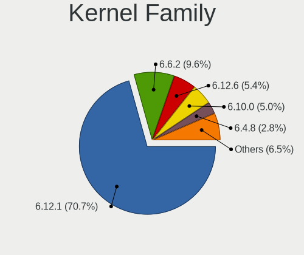
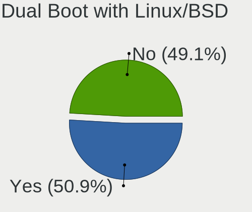
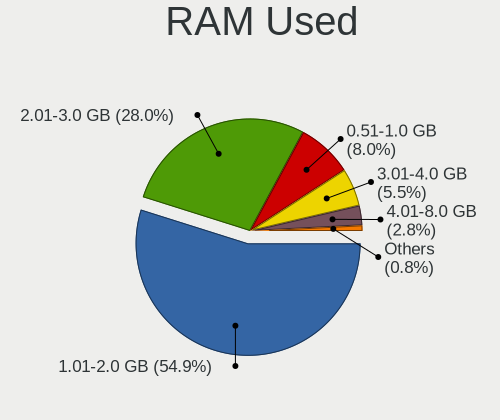
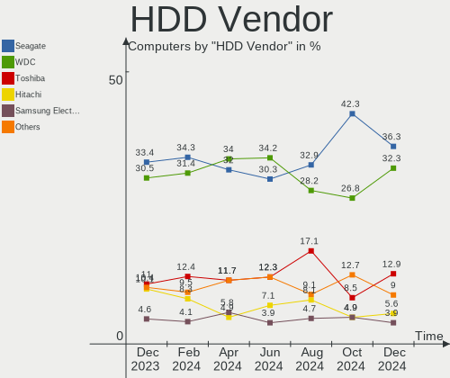
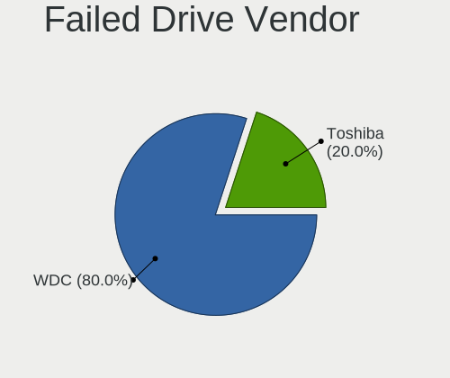
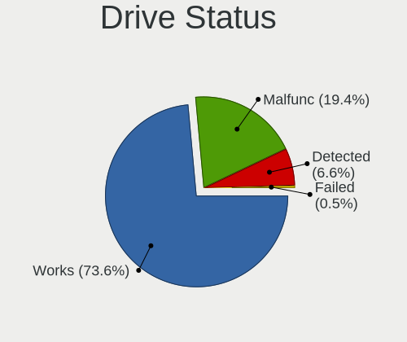
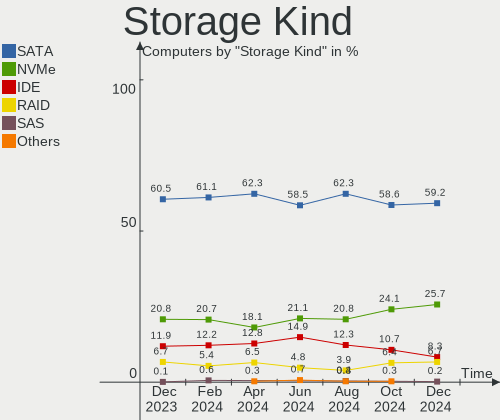
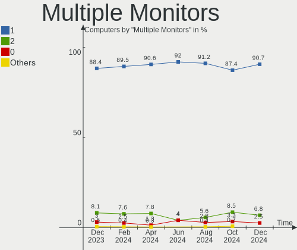

OpenMandriva Hardware Trends
----------------------------

A project to identify most popular hardware characteristics and track their change
over time based on data collected by OpenMandriva users at https://Linux-Hardware.org.

Anyone can contribute to the study by uploading probes of their computers by
the [hw-probe](https://github.com/linuxhw/hw-probe) tool:

    sudo -E hw-probe -all -upload

This is a report for all computer types. See also reports for [desktops](/Dist/OpenMandriva/Desktop/README.md) and [notebooks](/Dist/OpenMandriva/Notebook/README.md).

Full-feature report is available here: https://linux-hardware.org/?view=trends

Period: Feb, 2021.

Contents
--------

- [ OS                       ](#os)
- [ OS Family                ](#os-family)
- [ Kernel                   ](#kernel)
- [ Kernel Family            ](#kernel-family)
- [ Kernel Major Ver.        ](#kernel-major-ver)
- [ Arch                     ](#arch)
- [ DE                       ](#de)
- [ Display Server           ](#display-server)
- [ Display Manager          ](#display-manager)
- [ OS Lang                  ](#os-lang)
- [ Boot Mode                ](#boot-mode)
- [ Filesystem               ](#filesystem)
- [ Part. scheme             ](#part-scheme)
- [ Dual Boot with Linux/BSD ](#dual-boot-with-linux/bsd)
- [ Dual Boot (Win)          ](#dual-boot-win)
- [ Country                  ](#country)
- [ City                     ](#city)
- [ Vendor                   ](#vendor)
- [ Model                    ](#model)
- [ Model Family             ](#model-family)
- [ MFG Year                 ](#mfg-year)
- [ Form Factor              ](#form-factor)
- [ Secure Boot              ](#secure-boot)
- [ Coreboot                 ](#coreboot)
- [ RAM Size                 ](#ram-size)
- [ RAM Used                 ](#ram-used)
- [ Has CD-ROM               ](#has-cd-rom)
- [ Total Drives             ](#total-drives)
- [ Has Ethernet             ](#has-ethernet)
- [ Drive Vendor             ](#drive-vendor)
- [ Drive Model              ](#drive-model)
- [ HDD Vendor               ](#hdd-vendor)
- [ SSD Vendor               ](#ssd-vendor)
- [ Drive Kind               ](#drive-kind)
- [ Drive Connector          ](#drive-connector)
- [ Drive Size               ](#drive-size)
- [ Space Total              ](#space-total)
- [ Space Used               ](#space-used)
- [ Malfunc. Drives          ](#malfunc-drives)
- [ Malfunc. Drive Vendor    ](#malfunc-drive-vendor)
- [ Malfunc. HDD Vendor      ](#malfunc-hdd-vendor)
- [ Malfunc. Drive Kind      ](#malfunc-drive-kind)
- [ Failed Drives            ](#failed-drives)
- [ Failed Drive Vendor      ](#failed-drive-vendor)
- [ Drive Status             ](#drive-status)
- [ Storage Vendor           ](#storage-vendor)
- [ Storage Model            ](#storage-model)
- [ Storage Kind             ](#storage-kind)
- [ CPU Vendor               ](#cpu-vendor)
- [ CPU Model                ](#cpu-model)
- [ CPU Model Family         ](#cpu-model-family)
- [ CPU Cores                ](#cpu-cores)
- [ CPU Sockets              ](#cpu-sockets)
- [ CPU Threads              ](#cpu-threads)
- [ CPU Op-Modes             ](#cpu-op-modes)
- [ CPU Microcode            ](#cpu-microcode)
- [ CPU Microarch            ](#cpu-microarch)
- [ GPU Vendor               ](#gpu-vendor)
- [ GPU Model                ](#gpu-model)
- [ GPU Combo                ](#gpu-combo)
- [ GPU Driver               ](#gpu-driver)
- [ GPU Memory               ](#gpu-memory)
- [ Monitor Vendor           ](#monitor-vendor)
- [ Monitor Model            ](#monitor-model)
- [ Monitor Resolution       ](#monitor-resolution)
- [ Monitor Diagonal         ](#monitor-diagonal)
- [ Monitor Width            ](#monitor-width)
- [ Aspect Ratio             ](#aspect-ratio)
- [ Monitor Area             ](#monitor-area)
- [ Pixel Density            ](#pixel-density)
- [ Multiple Monitors        ](#multiple-monitors)
- [ Net Controller Vendor    ](#net-controller-vendor)
- [ Net Controller Model     ](#net-controller-model)
- [ Wireless Vendor          ](#wireless-vendor)
- [ Wireless Model           ](#wireless-model)
- [ Ethernet Vendor          ](#ethernet-vendor)
- [ Ethernet Model           ](#ethernet-model)
- [ Net Controller Kind      ](#net-controller-kind)
- [ Used Controller          ](#used-controller)
- [ NICs                     ](#nics)
- [ Memory Vendor            ](#memory-vendor)
- [ Memory Model             ](#memory-model)
- [ Memory Kind              ](#memory-kind)
- [ Memory Form Factor       ](#memory-form-factor)
- [ Memory Size              ](#memory-size)
- [ Memory Speed             ](#memory-speed)
- [ Sound Vendor             ](#sound-vendor)
- [ Sound Model              ](#sound-model)
- [ Camera Vendor            ](#camera-vendor)
- [ Camera Model             ](#camera-model)
- [ Fingerprint Vendor       ](#fingerprint-vendor)
- [ Fingerprint Model        ](#fingerprint-model)
- [ Chipcard Vendor          ](#chipcard-vendor)
- [ Chipcard Model           ](#chipcard-model)
- [ Printer Vendor           ](#printer-vendor)
- [ Printer Model            ](#printer-model)
- [ Scanner Vendor           ](#scanner-vendor)
- [ Scanner Model            ](#scanner-model)
- [ Bluetooth Vendor         ](#bluetooth-vendor)
- [ Bluetooth Model          ](#bluetooth-model)
- [ Unsupported Devices      ](#unsupported-devices)
- [ Unsupported Device Types ](#unsupported-device-types)

OS
--

Installed operating systems

| Name             | Computers | Percent |
|------------------|-----------|---------|
| OpenMandriva 4.2 | 1100      | 99.64%  |
| OpenMandriva 4.1 | 4         | 0.36%   |

OS Family
---------

OS without a version

| Name         | Computers | Percent |
|--------------|-----------|---------|
| OpenMandriva | 1104      | 100%    |

Kernel
------

Version of the Linux kernel

| Version                        | Computers | Percent |
|--------------------------------|-----------|---------|
| 5.10.14-desktop-1omv4002       | 1092      | 98.91%  |
| 5.10.13-desktop-1omv4002       | 5         | 0.45%   |
| 5.5.12-desktop-1omv4001        | 3         | 0.27%   |
| 5.11.0-desktop-clang-1omv4002  | 2         | 0.18%   |
| 5.11.1-desktop-74.1.1bomv4002  | 1         | 0.09%   |
| 5.10.12-desktop-clang-1omv4002 | 1         | 0.09%   |

Kernel Family
-------------

Linux kernel without a distro release

| Version | Computers | Percent |
|---------|-----------|---------|
| 5.10.14 | 1092      | 98.91%  |
| 5.10.13 | 5         | 0.45%   |
| 5.5.12  | 3         | 0.27%   |
| 5.11.0  | 2         | 0.18%   |
| 5.11.1  | 1         | 0.09%   |
| 5.10.12 | 1         | 0.09%   |

Kernel Major Ver.
-----------------

Linux kernel major version

| Version | Computers | Percent |
|---------|-----------|---------|
| 5.10    | 1098      | 99.46%  |
| 5.5     | 3         | 0.27%   |
| 5.11    | 3         | 0.27%   |

Arch
----

OS architecture (x86_64, i586, etc.)

| Name   | Computers | Percent |
|--------|-----------|---------|
| x86_64 | 1104      | 100%    |

DE
--

Desktop Environment

| Name | Computers | Percent |
|------|-----------|---------|
| KDE5 | 1104      | 100%    |

Display Server
--------------

X11 or Wayland

| Name    | Computers | Percent |
|---------|-----------|---------|
| X11     | 1102      | 99.82%  |
| Wayland | 2         | 0.18%   |

Display Manager
---------------

SDDM, LightDM, etc.

| Name | Computers | Percent |
|------|-----------|---------|
| SDDM | 1104      | 100%    |

OS Lang
-------

Language

| Lang    | Computers | Percent |
|---------|-----------|---------|
| en_US   | 576       | 52.17%  |
| de_DE   | 138       | 12.5%   |
| ru_RU   | 67        | 6.07%   |
| pt_BR   | 46        | 4.17%   |
| fr_FR   | 42        | 3.8%    |
| pl_PL   | 39        | 3.53%   |
| es_ES   | 35        | 3.17%   |
| it_IT   | 31        | 2.81%   |
| en_GB   | 18        | 1.63%   |
| es_AR   | 9         | 0.82%   |
| cs_CZ   | 9         | 0.82%   |
| de_AT   | 8         | 0.72%   |
| nl_NL   | 7         | 0.63%   |
| es_MX   | 7         | 0.63%   |
| hu_HU   | 6         | 0.54%   |
| en_AU   | 6         | 0.54%   |
| de_CH   | 6         | 0.54%   |
| ro_RO   | 5         | 0.45%   |
| nl_BE   | 4         | 0.36%   |
| nb_NO   | 4         | 0.36%   |
| ru_UA   | 3         | 0.27%   |
| it_CH   | 3         | 0.27%   |
| fr_CA   | 3         | 0.27%   |
| es_PE   | 3         | 0.27%   |
| es_CL   | 3         | 0.27%   |
| en_HK   | 3         | 0.27%   |
| en_CA   | 3         | 0.27%   |
| fr_BE   | 2         | 0.18%   |
| es_CO   | 2         | 0.18%   |
| en_ZA   | 2         | 0.18%   |
| en_IL   | 2         | 0.18%   |
| en_IE   | 2         | 0.18%   |
| da_DK   | 2         | 0.18%   |
| fr_CH   | 1         | 0.09%   |
| es_DO   | 1         | 0.09%   |
| en_NZ   | 1         | 0.09%   |
| en_IN   | 1         | 0.09%   |
| en_AG   | 1         | 0.09%   |
| de_LI   | 1         | 0.09%   |
| ar_DZ   | 1         | 0.09%   |
| Unknown | 1         | 0.09%   |

Boot Mode
---------

EFI or BIOS

| Mode | Computers | Percent |
|------|-----------|---------|
| BIOS | 625       | 56.61%  |
| EFI  | 479       | 43.39%  |

Filesystem
----------

Type of filesystem

| Type    | Computers | Percent |
|---------|-----------|---------|
| Overlay | 937       | 84.87%  |
| Ext4    | 159       | 14.4%   |
| Btrfs   | 3         | 0.27%   |
| Ext3    | 2         | 0.18%   |
| Xfs     | 1         | 0.09%   |
| Jfs     | 1         | 0.09%   |
| F2fs    | 1         | 0.09%   |

Part. scheme
------------

Scheme of partitioning

| Type    | Computers | Percent |
|---------|-----------|---------|
| GPT     | 646       | 58.51%  |
| MBR     | 456       | 41.3%   |
| Unknown | 2         | 0.18%   |

Dual Boot with Linux/BSD
------------------------

Hosting more than one Linux/BSD

| Dual boot | Computers | Percent |
|-----------|-----------|---------|
| Yes       | 697       | 63.13%  |
| No        | 407       | 36.87%  |

Dual Boot (Win)
---------------

Hosting Linux and Windows

| Dual boot | Computers | Percent |
|-----------|-----------|---------|
| No        | 580       | 52.54%  |
| Yes       | 524       | 47.46%  |

Country
-------

Geographic location (country)

| Country            | Computers | Percent |
|--------------------|-----------|---------|
| Germany            | 202       | 18.3%   |
| USA                | 97        | 8.79%   |
| Russia             | 78        | 7.07%   |
| Brazil             | 76        | 6.88%   |
| Italy              | 56        | 5.07%   |
| Poland             | 54        | 4.89%   |
| France             | 50        | 4.53%   |
| Spain              | 49        | 4.44%   |
| UK                 | 32        | 2.9%    |
| Canada             | 28        | 2.54%   |
| Mexico             | 17        | 1.54%   |
| Australia          | 16        | 1.45%   |
| Ukraine            | 15        | 1.36%   |
| Sweden             | 15        | 1.36%   |
| Greece             | 15        | 1.36%   |
| Netherlands        | 14        | 1.27%   |
| Hungary            | 14        | 1.27%   |
| Romania            | 13        | 1.18%   |
| Argentina          | 13        | 1.18%   |
| Thailand           | 12        | 1.09%   |
| Japan              | 12        | 1.09%   |
| Czech Republic     | 12        | 1.09%   |
| Belarus            | 12        | 1.09%   |
| Switzerland        | 11        | 1%      |
| Austria            | 11        | 1%      |
| Norway             | 10        | 0.91%   |
| Bulgaria           | 10        | 0.91%   |
| Finland            | 9         | 0.82%   |
| Belgium            | 9         | 0.82%   |
| Serbia             | 8         | 0.72%   |
| India              | 8         | 0.72%   |
| Portugal           | 7         | 0.63%   |
| Israel             | 6         | 0.54%   |
| Slovakia           | 5         | 0.45%   |
| Puerto Rico        | 5         | 0.45%   |
| Philippines        | 5         | 0.45%   |
| Ireland            | 5         | 0.45%   |
| Indonesia          | 5         | 0.45%   |
| Costa Rica         | 5         | 0.45%   |
| Turkey             | 4         | 0.36%   |
| Peru               | 4         | 0.36%   |
| New Zealand        | 4         | 0.36%   |
| Hong Kong          | 4         | 0.36%   |
| Denmark            | 4         | 0.36%   |
| China              | 4         | 0.36%   |
| South Africa       | 3         | 0.27%   |
| Saudi Arabia       | 3         | 0.27%   |
| Luxembourg         | 3         | 0.27%   |
| Iran               | 3         | 0.27%   |
| Chile              | 3         | 0.27%   |
| Algeria            | 3         | 0.27%   |
| Unknown            | 3         | 0.27%   |
| Slovenia           | 2         | 0.18%   |
| Singapore          | 2         | 0.18%   |
| Malaysia           | 2         | 0.18%   |
| Lithuania          | 2         | 0.18%   |
| Kenya              | 2         | 0.18%   |
| Jamaica            | 2         | 0.18%   |
| Estonia            | 2         | 0.18%   |
| Dominican Republic | 2         | 0.18%   |

City
----

Geographic location (city)

| City              | Computers | Percent |
|-------------------|-----------|---------|
| Moscow            | 16        | 1.45%   |
| Berlin            | 14        | 1.27%   |
| Warsaw            | 13        | 1.18%   |
| Munich            | 10        | 0.91%   |
| Hamburg           | 9         | 0.82%   |
| São Paulo        | 8         | 0.72%   |
| Stuttgart         | 8         | 0.72%   |
| St Petersburg     | 8         | 0.72%   |
| Rio de Janeiro    | 8         | 0.72%   |
| Milan             | 7         | 0.63%   |
| Barcelona         | 7         | 0.63%   |
| Mexico City       | 6         | 0.54%   |
| Frankfurt am Main | 6         | 0.54%   |
| Vienna            | 5         | 0.45%   |
| Paris             | 5         | 0.45%   |
| Thessaloniki      | 4         | 0.36%   |
| Sofia             | 4         | 0.36%   |
| Rome              | 4         | 0.36%   |
| Prague            | 4         | 0.36%   |
| Portland          | 4         | 0.36%   |
| Minsk             | 4         | 0.36%   |
| Helsinki          | 4         | 0.36%   |
| Eustis            | 4         | 0.36%   |
| Düsseldorf       | 4         | 0.36%   |
| Buenos Aires      | 4         | 0.36%   |
| Brisbane          | 4         | 0.36%   |
| Bangkok           | 4         | 0.36%   |
| Athens            | 4         | 0.36%   |
| Vantaa            | 3         | 0.27%   |
| Seattle           | 3         | 0.27%   |
| Poznan            | 3         | 0.27%   |
| Palo del Colle    | 3         | 0.27%   |
| Nuremberg         | 3         | 0.27%   |
| Niš              | 3         | 0.27%   |
| Neuhof            | 3         | 0.27%   |
| Mannheim          | 3         | 0.27%   |
| Madrid            | 3         | 0.27%   |
| Los Angeles       | 3         | 0.27%   |
| Londrina          | 3         | 0.27%   |
| Leipzig           | 3         | 0.27%   |
| Kristiansand      | 3         | 0.27%   |
| Krakow            | 3         | 0.27%   |
| Jacksonville      | 3         | 0.27%   |
| Dnipro            | 3         | 0.27%   |
| Curitiba          | 3         | 0.27%   |
| Chojnice          | 3         | 0.27%   |
| Budapest          | 3         | 0.27%   |
| Belo Horizonte    | 3         | 0.27%   |
| Barnaul           | 3         | 0.27%   |
| Adelaide          | 3         | 0.27%   |
| Unknown           | 3         | 0.27%   |
| Zakynthos         | 2         | 0.18%   |
| Wrocław          | 2         | 0.18%   |
| Wesel             | 2         | 0.18%   |
| Weinbach          | 2         | 0.18%   |
| Vitebsk           | 2         | 0.18%   |
| Victorville       | 2         | 0.18%   |
| Ufa               | 2         | 0.18%   |
| Târgu Mureş     | 2         | 0.18%   |
| Tucson            | 2         | 0.18%   |

Vendor
------

Motherboard manufacturer

| Name                | Computers | Percent |
|---------------------|-----------|---------|
| ASUSTek Computer    | 216       | 19.57%  |
| Hewlett-Packard     | 145       | 13.13%  |
| Lenovo              | 125       | 11.32%  |
| Dell                | 113       | 10.24%  |
| Gigabyte Technology | 100       | 9.06%   |
| Acer                | 79        | 7.16%   |
| MSI                 | 68        | 6.16%   |
| ASRock              | 55        | 4.98%   |
| Toshiba             | 26        | 2.36%   |
| Sony                | 16        | 1.45%   |
| Medion              | 14        | 1.27%   |
| Intel               | 14        | 1.27%   |
| Fujitsu             | 11        | 1%      |
| Apple               | 11        | 1%      |
| Samsung Electronics | 9         | 0.82%   |
| Packard Bell        | 9         | 0.82%   |
| Biostar             | 9         | 0.82%   |
| Positivo            | 7         | 0.63%   |
| Unknown             | 7         | 0.63%   |
| Pegatron            | 5         | 0.45%   |
| Notebook            | 5         | 0.45%   |
| HUAWEI              | 4         | 0.36%   |
| Foxconn             | 4         | 0.36%   |
| ECS                 | 4         | 0.36%   |
| ZOTAC               | 3         | 0.27%   |
| Timi                | 3         | 0.27%   |
| eMachines           | 3         | 0.27%   |
| Wortmann AG         | 2         | 0.18%   |
| TUXEDO              | 2         | 0.18%   |
| System76            | 2         | 0.18%   |
| Shuttle             | 2         | 0.18%   |
| Philco              | 2         | 0.18%   |
| Microsoft           | 2         | 0.18%   |
| Fujitsu Siemens     | 2         | 0.18%   |
| BOX                 | 2         | 0.18%   |
| UMAX                | 1         | 0.09%   |
| Teclast             | 1         | 0.09%   |
| Supermicro          | 1         | 0.09%   |
| Purism              | 1         | 0.09%   |
| PCWare              | 1         | 0.09%   |
| PCChips             | 1         | 0.09%   |
| PC Specialist       | 1         | 0.09%   |
| Panasonic           | 1         | 0.09%   |
| Microtech           | 1         | 0.09%   |
| Maibenben           | 1         | 0.09%   |
| LIVEFAN             | 1         | 0.09%   |
| LG Electronics      | 1         | 0.09%   |
| Jumper              | 1         | 0.09%   |
| HEDYCOMPUTER        | 1         | 0.09%   |
| HASEE Computer      | 1         | 0.09%   |
| Gateway             | 1         | 0.09%   |
| Clevo               | 1         | 0.09%   |
| Chuwi               | 1         | 0.09%   |
| BESSTAR Tech        | 1         | 0.09%   |
| AZW                 | 1         | 0.09%   |
| AMD                 | 1         | 0.09%   |
| Alienware           | 1         | 0.09%   |
| ABIT                | 1         | 0.09%   |

Model
-----

Motherboard model

| Name                           | Computers | Percent |
|--------------------------------|-----------|---------|
| Unknown                        | 9         | 0.82%   |
| HP Notebook                    | 6         | 0.54%   |
| Dell OptiPlex 780              | 6         | 0.54%   |
| HP Pavilion Notebook           | 5         | 0.45%   |
| Dell OptiPlex 7010             | 5         | 0.45%   |
| ASUS PRIME X470-PRO            | 5         | 0.45%   |
| ASUS PRIME B450M-A             | 5         | 0.45%   |
| ASUS All Series                | 5         | 0.45%   |
| Positivo MOBILE                | 4         | 0.36%   |
| MSI MS-7817                    | 4         | 0.36%   |
| Gigabyte B450 AORUS ELITE      | 4         | 0.36%   |
| ASUS PRIME B350-PLUS           | 4         | 0.36%   |
| ASUS PRIME A320M-K             | 4         | 0.36%   |
| MSI MS-7C02                    | 3         | 0.27%   |
| MSI MS-7B86                    | 3         | 0.27%   |
| MSI MS-7A38                    | 3         | 0.27%   |
| Lenovo IdeaPad S145-15AST 81N3 | 3         | 0.27%   |
| HP Pavilion g6                 | 3         | 0.27%   |
| HP EliteDesk 800 G1 SFF        | 3         | 0.27%   |
| HP 1000                        | 3         | 0.27%   |
| Gigabyte X570 AORUS ELITE      | 3         | 0.27%   |
| Gigabyte GA-78LMT-USB3 6.0     | 3         | 0.27%   |
| Gigabyte B450 AORUS PRO        | 3         | 0.27%   |
| Dell OptiPlex 790              | 3         | 0.27%   |
| Dell OptiPlex 3040             | 3         | 0.27%   |
| Dell Latitude E6500            | 3         | 0.27%   |
| Dell Latitude E6430            | 3         | 0.27%   |
| ASUS TUF GAMING X570-PLUS      | 3         | 0.27%   |
| ASUS M5A78L-M/USB3             | 3         | 0.27%   |
| ASUS M5A78L-M PLUS/USB3        | 3         | 0.27%   |
| Toshiba Satellite A300         | 2         | 0.18%   |
| Samsung 340XAA/350XAA/550XAA   | 2         | 0.18%   |
| Samsung 270E5J/2570EJ          | 2         | 0.18%   |
| MSI MS-7C52                    | 2         | 0.18%   |
| MSI MS-7C37                    | 2         | 0.18%   |
| MSI MS-7A15                    | 2         | 0.18%   |
| MSI MS-7850                    | 2         | 0.18%   |
| MSI MS-7721                    | 2         | 0.18%   |
| Medion MS-7728                 | 2         | 0.18%   |
| Lenovo Z50-70 20354            | 2         | 0.18%   |
| Lenovo IdeaPad Z510 20287      | 2         | 0.18%   |
| Lenovo IdeaPad 330-15ARR 81D2  | 2         | 0.18%   |
| Lenovo IdeaPad 110-15ACL 80TJ  | 2         | 0.18%   |
| Lenovo G50-80 80E5             | 2         | 0.18%   |
| Intel NUC6CAYH                 | 2         | 0.18%   |
| HUAWEI NBLK-WAX9X              | 2         | 0.18%   |
| HUAWEI BOHK-WAX9X              | 2         | 0.18%   |
| HP Pavilion 17                 | 2         | 0.18%   |
| HP Laptop 17-ca1xxx            | 2         | 0.18%   |
| HP Laptop 15s-fq1xxx           | 2         | 0.18%   |
| HP Laptop 15-bw0xx             | 2         | 0.18%   |
| HP EliteBook 8570w             | 2         | 0.18%   |
| HP EliteBook 6930p             | 2         | 0.18%   |
| HP Compaq Pro 6300 SFF         | 2         | 0.18%   |
| HP Compaq Presario CQ61        | 2         | 0.18%   |
| HP Compaq 8000 Elite SFF PC    | 2         | 0.18%   |
| Gigabyte G31M-ES2L             | 2         | 0.18%   |
| Gigabyte B450M DS3H            | 2         | 0.18%   |
| Gigabyte B450 AORUS M          | 2         | 0.18%   |
| Gigabyte B365M DS3H            | 2         | 0.18%   |

Model Family
------------

Motherboard model prefix

| Name                   | Computers | Percent |
|------------------------|-----------|---------|
| Acer Aspire            | 56        | 5.07%   |
| Lenovo ThinkPad        | 41        | 3.71%   |
| ASUS PRIME             | 34        | 3.08%   |
| Lenovo IdeaPad         | 33        | 2.99%   |
| Dell Inspiron          | 32        | 2.9%    |
| Dell OptiPlex          | 31        | 2.81%   |
| Dell Latitude          | 30        | 2.72%   |
| HP Pavilion            | 28        | 2.54%   |
| HP Compaq              | 23        | 2.08%   |
| Toshiba Satellite      | 18        | 1.63%   |
| HP Laptop              | 17        | 1.54%   |
| Lenovo ThinkCentre     | 15        | 1.36%   |
| HP EliteBook           | 14        | 1.27%   |
| Gigabyte B450          | 10        | 0.91%   |
| ASUS TUF               | 10        | 0.91%   |
| Dell Vostro            | 9         | 0.82%   |
| ASUS ROG               | 9         | 0.82%   |
| ASUS M5A78L-M          | 9         | 0.82%   |
| Unknown                | 9         | 0.82%   |
| HP ProBook             | 8         | 0.72%   |
| Lenovo IdeaCentre      | 7         | 0.63%   |
| HP EliteDesk           | 7         | 0.63%   |
| HP Notebook            | 6         | 0.54%   |
| Acer TravelMate        | 6         | 0.54%   |
| Acer Extensa           | 6         | 0.54%   |
| Packard Bell EasyNote  | 5         | 0.45%   |
| Gigabyte X570          | 5         | 0.45%   |
| Fujitsu ESPRIMO        | 5         | 0.45%   |
| ASUS VivoBook          | 5         | 0.45%   |
| ASUS P8H61-M           | 5         | 0.45%   |
| ASUS All               | 5         | 0.45%   |
| Positivo MOBILE        | 4         | 0.36%   |
| MSI MS-7817            | 4         | 0.36%   |
| HP Stream              | 4         | 0.36%   |
| HP ENVY                | 4         | 0.36%   |
| Gigabyte GA-78LMT-USB3 | 4         | 0.36%   |
| Dell Precision         | 4         | 0.36%   |
| ASUS ZenBook           | 4         | 0.36%   |
| ASUS P8Z77-V           | 4         | 0.36%   |
| Toshiba TECRA          | 3         | 0.27%   |
| MSI MS-7C02            | 3         | 0.27%   |
| MSI MS-7B86            | 3         | 0.27%   |
| MSI MS-7A38            | 3         | 0.27%   |
| HP 1000                | 3         | 0.27%   |
| Gigabyte A320M-S2H     | 3         | 0.27%   |
| Fujitsu LIFEBOOK       | 3         | 0.27%   |
| ASUS P8H77-V           | 3         | 0.27%   |
| ASRock 970             | 3         | 0.27%   |
| Apple MacBookPro8      | 3         | 0.27%   |
| Acer Swift             | 3         | 0.27%   |
| Toshiba QOSMIO         | 2         | 0.18%   |
| Samsung 340XAA         | 2         | 0.18%   |
| Samsung 270E5J         | 2         | 0.18%   |
| MSI MS-7C52            | 2         | 0.18%   |
| MSI MS-7C37            | 2         | 0.18%   |
| MSI MS-7A15            | 2         | 0.18%   |
| MSI MS-7850            | 2         | 0.18%   |
| MSI MS-7721            | 2         | 0.18%   |
| MSI KBL-U              | 2         | 0.18%   |
| Microsoft Surface      | 2         | 0.18%   |

MFG Year
--------

Motherboard manufacture year

| Year    | Computers | Percent |
|---------|-----------|---------|
| 2020    | 141       | 12.77%  |
| 2019    | 133       | 12.05%  |
| 2012    | 96        | 8.7%    |
| 2013    | 86        | 7.79%   |
| 2011    | 85        | 7.7%    |
| 2018    | 80        | 7.25%   |
| 2014    | 80        | 7.25%   |
| 2016    | 75        | 6.79%   |
| 2010    | 72        | 6.52%   |
| 2017    | 61        | 5.53%   |
| 2015    | 61        | 5.53%   |
| 2009    | 57        | 5.16%   |
| 2008    | 36        | 3.26%   |
| 2007    | 16        | 1.45%   |
| 2021    | 15        | 1.36%   |
| 2006    | 9         | 0.82%   |
| Unknown | 1         | 0.09%   |

Form Factor
-----------

Physical design of the computer

| Name        | Computers | Percent |
|-------------|-----------|---------|
| Desktop     | 540       | 48.91%  |
| Notebook    | 527       | 47.74%  |
| All in one  | 17        | 1.54%   |
| Convertible | 9         | 0.82%   |
| Mini pc     | 8         | 0.72%   |
| Tablet      | 2         | 0.18%   |
| Server      | 1         | 0.09%   |

Secure Boot
-----------

Enabled or disabled

| State    | Computers | Percent |
|----------|-----------|---------|
| Disabled | 1104      | 100%    |

Coreboot
--------

Have coreboot on board

| Used | Computers | Percent |
|------|-----------|---------|
| No   | 1103      | 99.91%  |
| Yes  | 1         | 0.09%   |

RAM Size
--------

Total RAM memory

| Size in GB  | Computers | Percent |
|-------------|-----------|---------|
| 3.01-4.0    | 319       | 28.89%  |
| 4.01-8.0    | 285       | 25.82%  |
| 8.01-16.0   | 221       | 20.02%  |
| 16.01-24.0  | 170       | 15.4%   |
| 32.01-64.0  | 45        | 4.08%   |
| 1.01-2.0    | 39        | 3.53%   |
| 2.01-3.0    | 13        | 1.18%   |
| 64.01-256.0 | 8         | 0.72%   |
| 24.01-32.0  | 4         | 0.36%   |

RAM Used
--------

Used RAM memory

| Used GB  | Computers | Percent |
|----------|-----------|---------|
| 1.01-2.0 | 921       | 83.42%  |
| 0.51-1.0 | 116       | 10.51%  |
| 2.01-3.0 | 49        | 4.44%   |
| 0.01-0.5 | 13        | 1.18%   |
| 4.01-8.0 | 3         | 0.27%   |
| 3.01-4.0 | 2         | 0.18%   |

Has CD-ROM
----------

Has CD-ROM on board

| Presented | Computers | Percent |
|-----------|-----------|---------|
| Yes       | 679       | 61.5%   |
| No        | 425       | 38.5%   |

Total Drives
------------

Number of drives on board

| Drives | Computers | Percent |
|--------|-----------|---------|
| 1      | 637       | 57.7%   |
| 2      | 262       | 23.73%  |
| 3      | 101       | 9.15%   |
| 4      | 61        | 5.53%   |
| 5      | 19        | 1.72%   |
| 0      | 13        | 1.18%   |
| 6      | 7         | 0.63%   |
| 18     | 1         | 0.09%   |
| 9      | 1         | 0.09%   |
| 8      | 1         | 0.09%   |
| 7      | 1         | 0.09%   |

Has Ethernet
------------

Has Ethernet on board

| Presented | Computers | Percent |
|-----------|-----------|---------|
| Yes       | 1038      | 94.02%  |
| No        | 66        | 5.98%   |

Drive Vendor
------------

Hard drive vendors

| Vendor              | Computers | Drives | Percent |
|---------------------|-----------|--------|---------|
| WDC                 | 320       | 393    | 19.66%  |
| Seagate             | 286       | 332    | 17.57%  |
| Samsung Electronics | 222       | 274    | 13.64%  |
| Toshiba             | 132       | 140    | 8.11%   |
| Kingston            | 91        | 99     | 5.59%   |
| Hitachi             | 76        | 78     | 4.67%   |
| Crucial             | 74        | 85     | 4.55%   |
| SanDisk             | 73        | 80     | 4.48%   |
| Unknown             | 38        | 38     | 2.33%   |
| Intel               | 30        | 32     | 1.84%   |
| HGST                | 22        | 24     | 1.35%   |
| A-DATA Technology   | 22        | 22     | 1.35%   |
| Intenso             | 18        | 19     | 1.11%   |
| SK Hynix            | 15        | 15     | 0.92%   |
| Patriot             | 14        | 15     | 0.86%   |
| China               | 12        | 12     | 0.74%   |
| Transcend           | 11        | 11     | 0.68%   |
| PNY                 | 11        | 12     | 0.68%   |
| Micron Technology   | 10        | 10     | 0.61%   |
| GOODRAM             | 10        | 10     | 0.61%   |
| Corsair             | 9         | 9      | 0.55%   |
| OCZ                 | 8         | 8      | 0.49%   |
| Maxtor              | 8         | 8      | 0.49%   |
| Fujitsu             | 8         | 8      | 0.49%   |
| PLEXTOR             | 5         | 5      | 0.31%   |
| JMicron             | 5         | 5      | 0.31%   |
| Apple               | 5         | 5      | 0.31%   |
| SPCC                | 4         | 4      | 0.25%   |
| KingDian            | 4         | 4      | 0.25%   |
| Gigabyte Technology | 4         | 4      | 0.25%   |
| Teclast             | 3         | 3      | 0.18%   |
| Phison              | 3         | 3      | 0.18%   |
| LITEON              | 3         | 3      | 0.18%   |
| KingSpec            | 3         | 3      | 0.18%   |
| Hewlett-Packard     | 3         | 4      | 0.18%   |
| DOGGO               | 3         | 3      | 0.18%   |
| Colorful            | 3         | 3      | 0.18%   |
| XPG                 | 2         | 2      | 0.12%   |
| WD MediaMax         | 2         | 2      | 0.12%   |
| Union Memory        | 2         | 2      | 0.12%   |
| Team                | 2         | 2      | 0.12%   |
| Silicon Motion      | 2         | 3      | 0.12%   |
| QUMO                | 2         | 2      | 0.12%   |
| Netac               | 2         | 2      | 0.12%   |
| Mushkin             | 2         | 2      | 0.12%   |
| KingFast            | 2         | 2      | 0.12%   |
| INNOVATION IT       | 2         | 2      | 0.12%   |
| ASMedia             | 2         | 2      | 0.12%   |
| Apacer              | 2         | 2      | 0.12%   |
| Zheino              | 1         | 1      | 0.06%   |
| XrayDisk            | 1         | 1      | 0.06%   |
| ViperTeq            | 1         | 1      | 0.06%   |
| Vaseky              | 1         | 1      | 0.06%   |
| Tigo                | 1         | 1      | 0.06%   |
| TCSUNBOW            | 1         | 1      | 0.06%   |
| Super Talent        | 1         | 1      | 0.06%   |
| sobetter            | 1         | 1      | 0.06%   |
| SABRENT             | 1         | 1      | 0.06%   |
| Realtek             | 1         | 1      | 0.06%   |
| Platinet            | 1         | 1      | 0.06%   |

Drive Model
-----------

Hard drive models

| Model                               | Computers | Percent |
|-------------------------------------|-----------|---------|
| Seagate ST500DM002-1BD142 500GB     | 19        | 1.06%   |
| Seagate ST1000LM024 HN-M101MBB 1TB  | 18        | 1%      |
| Seagate ST1000LM035-1RK172 1TB      | 17        | 0.95%   |
| Samsung SSD 860 EVO 500GB           | 17        | 0.95%   |
| Toshiba DT01ACA100 1TB              | 16        | 0.89%   |
| Kingston SA400S37240G 240GB SSD     | 16        | 0.89%   |
| Samsung SSD 850 EVO 500GB           | 15        | 0.84%   |
| Toshiba MQ01ABD100 1TB              | 14        | 0.78%   |
| Seagate ST500LT012-1DG142 500GB     | 14        | 0.78%   |
| Toshiba MQ01ABF050 500GB            | 13        | 0.73%   |
| Kingston SV300S37A120G 120GB SSD    | 13        | 0.73%   |
| WDC WD10EZEX-08WN4A0 1TB            | 12        | 0.67%   |
| Kingston SA400S37120G 120GB SSD     | 12        | 0.67%   |
| Crucial CT240BX500SSD1 240GB        | 12        | 0.67%   |
| Unknown SD/MMC/MS PRO 64GB          | 11        | 0.61%   |
| Samsung SSD 850 EVO 250GB           | 11        | 0.61%   |
| Seagate ST1000DM010-2EP102 1TB      | 10        | 0.56%   |
| WDC WDS240G2G0A-00JH30 240GB SSD    | 9         | 0.5%    |
| Seagate ST3500418AS 500GB           | 9         | 0.5%    |
| Samsung SSD 860 EVO 250GB           | 9         | 0.5%    |
| Kingston SA400S37480G 480GB SSD     | 9         | 0.5%    |
| Crucial CT500MX500SSD1 500GB        | 9         | 0.5%    |
| Toshiba HDWD110 1TB                 | 8         | 0.45%   |
| Toshiba DT01ACA200 2TB              | 8         | 0.45%   |
| Seagate ST9500325AS 500GB           | 8         | 0.45%   |
| Seagate ST1000DM003-9YN162 1TB      | 8         | 0.45%   |
| Seagate ST1000DM003-1CH162 1TB      | 8         | 0.45%   |
| SanDisk SSD PLUS 240GB              | 8         | 0.45%   |
| Seagate ST2000DM006-2DM164 2TB      | 7         | 0.39%   |
| Seagate Expansion 500GB             | 7         | 0.39%   |
| Crucial CT480BX500SSD1 480GB        | 7         | 0.39%   |
| Crucial CT120BX500SSD1 120GB        | 7         | 0.39%   |
| WDC WDS500G2B0A-00SM50 500GB SSD    | 6         | 0.33%   |
| WDC WDS240G2G0B-00EPW0 240GB SSD    | 6         | 0.33%   |
| WDC WD5000AAKX-60U6AA0 500GB        | 6         | 0.33%   |
| WDC WD10JPVX-22JC3T0 1TB            | 6         | 0.33%   |
| WDC WD10EZEX-00BN5A0 1TB            | 6         | 0.33%   |
| WDC WD10EADS-00L5B1 1TB             | 6         | 0.33%   |
| Toshiba DT01ACA050 500GB            | 6         | 0.33%   |
| Seagate ST9320325AS 320GB           | 6         | 0.33%   |
| Seagate ST500LM012 HN-M500MBB 500GB | 6         | 0.33%   |
| SanDisk SDSSDA120G 120GB            | 6         | 0.33%   |
| Samsung SSD 960 EVO 250GB           | 6         | 0.33%   |
| Samsung HD103SJ 1TB                 | 6         | 0.33%   |
| Kingston SUV400S37240G 240GB SSD    | 6         | 0.33%   |
| Kingston SA400S37960G 960GB SSD     | 6         | 0.33%   |
| WDC WD20EZRZ-00Z5HB0 2TB            | 5         | 0.28%   |
| Seagate ST3500413AS 500GB           | 5         | 0.28%   |
| Seagate ST1000DM003-1SB102 1TB      | 5         | 0.28%   |
| Samsung SSD 970 EVO Plus 500GB      | 5         | 0.28%   |
| Samsung SSD 860 EVO 1TB             | 5         | 0.28%   |
| Samsung SSD 850 PRO 256GB           | 5         | 0.28%   |
| Patriot Burst 240GB SSD             | 5         | 0.28%   |
| Kingston SV300S37A240G 240GB SSD    | 5         | 0.28%   |
| Intel SSDPEKNW512G8H 512GB          | 5         | 0.28%   |
| Crucial CT1000MX500SSD1 1TB         | 5         | 0.28%   |
| WDC WD20PURX-64P6ZY0 2TB            | 4         | 0.22%   |
| WDC WD10SPZX-21Z10T0 1TB            | 4         | 0.22%   |
| WDC WD10EZEX-22MFCA0 1TB            | 4         | 0.22%   |
| WDC WD10EARS-22Y5B1 1TB             | 4         | 0.22%   |

HDD Vendor
----------

Hard disk drive vendors

| Vendor              | Computers | Drives | Percent |
|---------------------|-----------|--------|---------|
| Seagate             | 286       | 330    | 33.93%  |
| WDC                 | 272       | 319    | 32.27%  |
| Toshiba             | 110       | 115    | 13.05%  |
| Hitachi             | 76        | 78     | 9.02%   |
| Samsung Electronics | 50        | 52     | 5.93%   |
| HGST                | 22        | 24     | 2.61%   |
| MAXTOR              | 8         | 8      | 0.95%   |
| Fujitsu             | 8         | 8      | 0.95%   |
| WD MediaMax         | 2         | 2      | 0.24%   |
| Hewlett-Packard     | 2         | 2      | 0.24%   |
| ASMedia             | 2         | 2      | 0.24%   |
| Apple               | 2         | 2      | 0.24%   |
| Unknown             | 1         | 1      | 0.12%   |
| KESU                | 1         | 1      | 0.12%   |
| IBM/Hitachi         | 1         | 1      | 0.12%   |

SSD Vendor
----------

Solid state drive vendors

| Vendor              | Computers | Drives | Percent |
|---------------------|-----------|--------|---------|
| Samsung Electronics | 132       | 161    | 21.02%  |
| Kingston            | 83        | 90     | 13.22%  |
| Crucial             | 71        | 79     | 11.31%  |
| SanDisk             | 68        | 73     | 10.83%  |
| WDC                 | 43        | 45     | 6.85%   |
| A-DATA Technology   | 21        | 21     | 3.34%   |
| Intenso             | 18        | 19     | 2.87%   |
| Intel               | 17        | 17     | 2.71%   |
| Toshiba             | 15        | 17     | 2.39%   |
| Patriot             | 13        | 14     | 2.07%   |
| China               | 12        | 12     | 1.91%   |
| Transcend           | 11        | 11     | 1.75%   |
| PNY                 | 10        | 11     | 1.59%   |
| GOODRAM             | 10        | 10     | 1.59%   |
| OCZ                 | 8         | 8      | 1.27%   |
| Micron Technology   | 7         | 7      | 1.11%   |
| Unknown             | 6         | 6      | 0.96%   |
| PLEXTOR             | 5         | 5      | 0.8%    |
| Corsair             | 5         | 5      | 0.8%    |
| SK Hynix            | 4         | 4      | 0.64%   |
| KingDian            | 4         | 4      | 0.64%   |
| Teclast             | 3         | 3      | 0.48%   |
| SPCC                | 3         | 3      | 0.48%   |
| LITEON              | 3         | 3      | 0.48%   |
| KingSpec            | 3         | 3      | 0.48%   |
| JMicron             | 3         | 3      | 0.48%   |
| DOGGO               | 3         | 3      | 0.48%   |
| Colorful            | 3         | 3      | 0.48%   |
| Apple               | 3         | 3      | 0.48%   |
| Team                | 2         | 2      | 0.32%   |
| QUMO                | 2         | 2      | 0.32%   |
| Netac               | 2         | 2      | 0.32%   |
| Mushkin             | 2         | 2      | 0.32%   |
| KingFast            | 2         | 2      | 0.32%   |
| INNOVATION IT       | 2         | 2      | 0.32%   |
| Gigabyte Technology | 2         | 2      | 0.32%   |
| Apacer              | 2         | 2      | 0.32%   |
| Zheino              | 1         | 1      | 0.16%   |
| XrayDisk            | 1         | 1      | 0.16%   |
| ViperTeq            | 1         | 1      | 0.16%   |
| Vaseky              | 1         | 1      | 0.16%   |
| Union Memory        | 1         | 1      | 0.16%   |
| Tigo                | 1         | 1      | 0.16%   |
| TCSUNBOW            | 1         | 1      | 0.16%   |
| Super Talent        | 1         | 1      | 0.16%   |
| Platinet            | 1         | 1      | 0.16%   |
| OWC                 | 1         | 1      | 0.16%   |
| NGFF                | 1         | 1      | 0.16%   |
| LITEONIT            | 1         | 1      | 0.16%   |
| LDLC                | 1         | 1      | 0.16%   |
| Kston               | 1         | 1      | 0.16%   |
| Hikvision           | 1         | 1      | 0.16%   |
| FORESEE             | 1         | 1      | 0.16%   |
| faspeed             | 1         | 1      | 0.16%   |
| External            | 1         | 1      | 0.16%   |
| DOGFISH             | 1         | 1      | 0.16%   |
| CT240BX5            | 1         | 1      | 0.16%   |
| CT2000MX            | 1         | 1      | 0.16%   |
| ASMT                | 1         | 1      | 0.16%   |
| AS25                | 1         | 1      | 0.16%   |

Drive Kind
----------

HDD or SSD

| Kind    | Computers | Drives | Percent |
|---------|-----------|--------|---------|
| HDD     | 700       | 945    | 49.58%  |
| SSD     | 527       | 684    | 37.32%  |
| NVMe    | 134       | 163    | 9.49%   |
| MMC     | 28        | 29     | 1.98%   |
| Unknown | 23        | 23     | 1.63%   |

Drive Connector
---------------

SATA, SAS, NVMe, etc.

| Type | Computers | Drives | Percent |
|------|-----------|--------|---------|
| SATA | 1021      | 1586   | 82.34%  |
| NVMe | 134       | 162    | 10.81%  |
| SAS  | 57        | 67     | 4.6%    |
| MMC  | 28        | 29     | 2.26%   |

Drive Size
----------

Size of hard drive

| Size in TB | Computers | Drives | Percent |
|------------|-----------|--------|---------|
| 0.01-0.5   | 792       | 1060   | 62.17%  |
| 0.51-1.0   | 357       | 420    | 28.02%  |
| 1.01-2.0   | 80        | 96     | 6.28%   |
| 2.01-3.0   | 19        | 22     | 1.49%   |
| 3.01-4.0   | 16        | 19     | 1.26%   |
| 4.01-10.0  | 7         | 9      | 0.55%   |
| 10.01-20.0 | 3         | 3      | 0.24%   |

Space Total
-----------

Amount of disk space available on the file system

| Size in GB     | Computers | Percent |
|----------------|-----------|---------|
| 1-20           | 628       | 56.88%  |
| 101-250        | 125       | 11.32%  |
| Unknown        | 112       | 10.14%  |
| 251-500        | 96        | 8.7%    |
| 501-1000       | 49        | 4.44%   |
| 51-100         | 42        | 3.8%    |
| 21-50          | 31        | 2.81%   |
| 1001-2000      | 15        | 1.36%   |
| 2001-3000      | 4         | 0.36%   |
| More than 3000 | 2         | 0.18%   |

Space Used
----------

Amount of used disk space

| Used GB        | Computers | Percent |
|----------------|-----------|---------|
| 1-20           | 910       | 82.43%  |
| Unknown        | 112       | 10.14%  |
| 21-50          | 19        | 1.72%   |
| 51-100         | 19        | 1.72%   |
| 101-250        | 18        | 1.63%   |
| 251-500        | 12        | 1.09%   |
| 1001-2000      | 6         | 0.54%   |
| 501-1000       | 6         | 0.54%   |
| More than 3000 | 2         | 0.18%   |

Malfunc. Drives
---------------

Drive models with a malfunction

| Model                              | Computers | Drives | Percent |
|------------------------------------|-----------|--------|---------|
| Seagate ST500LT012-1DG142 500GB    | 8         | 8      | 2.34%   |
| Seagate ST1000LM024 HN-M101MBB 1TB | 8         | 8      | 2.34%   |
| Seagate ST9500325AS 500GB          | 7         | 7      | 2.05%   |
| Seagate ST500DM002-1BD142 500GB    | 6         | 6      | 1.75%   |
| Seagate ST3500418AS 500GB          | 6         | 7      | 1.75%   |
| Seagate ST1000LM035-1RK172 1TB     | 5         | 5      | 1.46%   |
| Seagate ST9320325AS 320GB          | 4         | 4      | 1.17%   |
| Seagate ST31000528AS 1TB           | 4         | 4      | 1.17%   |
| Kingston SV300S37A120G 120GB SSD   | 4         | 4      | 1.17%   |
| Hitachi HTS547564A9E384 640GB      | 4         | 4      | 1.17%   |
| Toshiba MQ01ABF050 500GB           | 3         | 3      | 0.88%   |
| Toshiba DT01ACA050 500GB           | 3         | 3      | 0.88%   |
| Seagate ST500LT012-9WS142 500GB    | 3         | 3      | 0.88%   |
| SanDisk SDSSDA120G 120GB           | 3         | 3      | 0.88%   |
| Samsung Electronics HD103SJ 1TB    | 3         | 3      | 0.88%   |
| Hitachi HDS721050CLA362 500GB      | 3         | 3      | 0.88%   |
| WDC WDS240G2G0B-00EPW0 240GB SSD   | 2         | 2      | 0.58%   |
| WDC WD7500BPVT-22HXZT3 752GB       | 2         | 2      | 0.58%   |
| WDC WD5000BPVT-22HXZT1 500GB       | 2         | 2      | 0.58%   |
| WDC WD5000AAKX-603CA0 500GB        | 2         | 2      | 0.58%   |
| WDC WD5000AADS-00S9B0 500GB        | 2         | 2      | 0.58%   |
| WDC WD20PURX-64P6ZY0 2TB           | 2         | 2      | 0.58%   |
| WDC WD20EARS-00MVWB0 2TB           | 2         | 2      | 0.58%   |
| WDC WD1600BEVT-60ZCT1 160GB        | 2         | 2      | 0.58%   |
| WDC WD10JPVX-22JC3T0 1TB           | 2         | 2      | 0.58%   |
| WDC WD10EZEX-08M2NA0 1TB           | 2         | 2      | 0.58%   |
| WDC WD10EARX-00N0YB0 1TB           | 2         | 2      | 0.58%   |
| WDC WD10EARS-22Y5B1 1TB            | 2         | 2      | 0.58%   |
| WDC WD10EADS-00L5B1 1TB            | 2         | 2      | 0.58%   |
| Toshiba MQ01ABD050 500GB           | 2         | 2      | 0.58%   |
| Toshiba MK2555GSX 250GB            | 2         | 2      | 0.58%   |
| Seagate ST9500423AS 500GB          | 2         | 2      | 0.58%   |
| Seagate ST9500420AS 500GB          | 2         | 2      | 0.58%   |
| Seagate ST3500630AS 500GB          | 2         | 2      | 0.58%   |
| Seagate ST3320418AS 320GB          | 2         | 2      | 0.58%   |
| Seagate ST31000524AS 1TB           | 2         | 2      | 0.58%   |
| Seagate ST1000LM014-1EJ164 1TB     | 2         | 2      | 0.58%   |
| Seagate ST1000DM003-9YN162 1TB     | 2         | 2      | 0.58%   |
| Samsung Electronics HM641JI 640GB  | 2         | 2      | 0.58%   |
| Samsung Electronics HD501LJ 500GB  | 2         | 2      | 0.58%   |
| Samsung Electronics HD250HJ 250GB  | 2         | 2      | 0.58%   |
| Samsung Electronics HD103SI 1TB    | 2         | 2      | 0.58%   |
| Maxtor 6Y160P0 164GB               | 2         | 2      | 0.58%   |
| Kingston SA400S37480G 480GB SSD    | 2         | 3      | 0.58%   |
| Hitachi HTS725016A9A364 160GB      | 2         | 2      | 0.58%   |
| Hitachi HTS547575A9E384 752GB      | 2         | 2      | 0.58%   |
| Hitachi HTS547550A9E384 500GB      | 2         | 2      | 0.58%   |
| Hitachi HDS721680PLA380 80GB       | 2         | 2      | 0.58%   |
| HGST HTS725050A7E630 500GB         | 2         | 2      | 0.58%   |
| HGST HTS545050A7E680 500GB         | 2         | 2      | 0.58%   |
| HGST HTS541075A9E680 752GB         | 2         | 2      | 0.58%   |
| Fujitsu MHZ2160BH G2 160GB         | 2         | 2      | 0.58%   |
| XPG SPECTRIX S40G 512GB            | 1         | 1      | 0.29%   |
| WDC WDS240G2G0A-00JH30 240GB SSD   | 1         | 1      | 0.29%   |
| WDC WD800BB-22JHA0 80GB            | 1         | 1      | 0.29%   |
| WDC WD6400BPVT-80HXZT1 640GB       | 1         | 1      | 0.29%   |
| WDC WD6400BEVT-22A0RT0 640GB       | 1         | 1      | 0.29%   |
| WDC WD6400AAKS-22A7B2 640GB        | 1         | 1      | 0.29%   |
| WDC WD6400AAKS-07A7B0 640GB        | 1         | 1      | 0.29%   |
| WDC WD6400AACS-00G8B1 640GB        | 1         | 1      | 0.29%   |

Malfunc. Drive Vendor
---------------------

Vendors of faulty drives

| Vendor              | Computers | Drives | Percent |
|---------------------|-----------|--------|---------|
| Seagate             | 102       | 106    | 30.63%  |
| WDC                 | 87        | 93     | 26.13%  |
| Hitachi             | 37        | 38     | 11.11%  |
| Samsung Electronics | 30        | 31     | 9.01%   |
| Toshiba             | 23        | 23     | 6.91%   |
| Kingston            | 10        | 11     | 3%      |
| HGST                | 9         | 9      | 2.7%    |
| SanDisk             | 7         | 7      | 2.1%    |
| Maxtor              | 5         | 5      | 1.5%    |
| A-DATA Technology   | 3         | 3      | 0.9%    |
| Intenso             | 2         | 2      | 0.6%    |
| Intel               | 2         | 2      | 0.6%    |
| Fujitsu             | 2         | 2      | 0.6%    |
| Crucial             | 2         | 2      | 0.6%    |
| XPG                 | 1         | 1      | 0.3%    |
| WD MediaMax         | 1         | 1      | 0.3%    |
| Transcend           | 1         | 1      | 0.3%    |
| Team                | 1         | 1      | 0.3%    |
| SK Hynix            | 1         | 1      | 0.3%    |
| OCZ                 | 1         | 1      | 0.3%    |
| Micron Technology   | 1         | 1      | 0.3%    |
| KingSpec            | 1         | 1      | 0.3%    |
| KingDian            | 1         | 1      | 0.3%    |
| GOODRAM             | 1         | 1      | 0.3%    |
| faspeed             | 1         | 1      | 0.3%    |
| Corsair             | 1         | 1      | 0.3%    |

Malfunc. HDD Vendor
-------------------

Vendors of faulty HDD drives

| Vendor              | Computers | Drives | Percent |
|---------------------|-----------|--------|---------|
| Seagate             | 102       | 106    | 35.66%  |
| WDC                 | 84        | 89     | 29.37%  |
| Hitachi             | 37        | 38     | 12.94%  |
| Toshiba             | 23        | 23     | 8.04%   |
| Samsung Electronics | 23        | 24     | 8.04%   |
| HGST                | 9         | 9      | 3.15%   |
| Maxtor              | 5         | 5      | 1.75%   |
| Fujitsu             | 2         | 2      | 0.7%    |
| WD MediaMax         | 1         | 1      | 0.35%   |

Malfunc. Drive Kind
-------------------

Kinds of faulty drives

| Kind | Computers | Drives | Percent |
|------|-----------|--------|---------|
| HDD  | 264       | 297    | 84.62%  |
| SSD  | 45        | 46     | 14.42%  |
| NVMe | 3         | 3      | 0.96%   |

Failed Drives
-------------

Failed drive models

| Model                         | Computers | Drives | Percent |
|-------------------------------|-----------|--------|---------|
| WDC WD2500BEVS-22UST0 250GB   | 1         | 1      | 33.33%  |
| MAXTOR STM3500320AS 500GB     | 1         | 1      | 33.33%  |
| Hitachi HTS545050A7E380 500GB | 1         | 1      | 33.33%  |

Failed Drive Vendor
-------------------

Failed drive vendors

| Vendor  | Computers | Drives | Percent |
|---------|-----------|--------|---------|
| WDC     | 1         | 1      | 33.33%  |
| MAXTOR  | 1         | 1      | 33.33%  |
| Hitachi | 1         | 1      | 33.33%  |

Drive Status
------------

Number of failed and malfunc. drives

| Status   | Computers | Drives | Percent |
|----------|-----------|--------|---------|
| Works    | 863       | 1345   | 66.95%  |
| Malfunc  | 304       | 346    | 23.58%  |
| Detected | 119       | 150    | 9.23%   |
| Failed   | 3         | 3      | 0.23%   |

Storage Vendor
--------------

Storage controller vendors

| Vendor                       | Computers | Percent |
|------------------------------|-----------|---------|
| Intel                        | 780       | 61.22%  |
| AMD                          | 270       | 21.19%  |
| Samsung Electronics          | 57        | 4.47%   |
| Nvidia                       | 28        | 2.2%    |
| Sandisk                      | 22        | 1.73%   |
| ASMedia Technology           | 19        | 1.49%   |
| JMicron Technology           | 18        | 1.41%   |
| Marvell Technology Group     | 13        | 1.02%   |
| Phison Electronics           | 12        | 0.94%   |
| SK Hynix                     | 8         | 0.63%   |
| Kingston Technology Company  | 8         | 0.63%   |
| VIA Technologies             | 6         | 0.47%   |
| Toshiba America Info Systems | 6         | 0.47%   |
| Micron/Crucial Technology    | 6         | 0.47%   |
| Silicon Motion               | 5         | 0.39%   |
| Micron Technology            | 3         | 0.24%   |
| LSI Logic / Symbios Logic    | 2         | 0.16%   |
| KIOXIA                       | 2         | 0.16%   |
| ADATA Technology             | 2         | 0.16%   |
| Union Memory (Shenzhen)      | 1         | 0.08%   |
| Silicon Image                | 1         | 0.08%   |
| Seagate Technology           | 1         | 0.08%   |
| Realtek Semiconductor        | 1         | 0.08%   |
| Lite-On IT Corp. / Plextor   | 1         | 0.08%   |
| Broadcom / LSI               | 1         | 0.08%   |
| Adaptec                      | 1         | 0.08%   |

Storage Model
-------------

Storage controller models

| Model                                                                                   | Computers | Percent |
|-----------------------------------------------------------------------------------------|-----------|---------|
| AMD FCH SATA Controller [AHCI mode]                                                     | 172       | 10.88%  |
| Intel Sunrise Point-LP SATA Controller [AHCI mode]                                      | 69        | 4.36%   |
| Intel 8 Series/C220 Series Chipset Family 6-port SATA Controller 1 [AHCI mode]          | 63        | 3.98%   |
| Intel 7 Series Chipset Family 6-port SATA Controller [AHCI mode]                        | 58        | 3.67%   |
| AMD SB7x0/SB8x0/SB9x0 IDE Controller                                                    | 54        | 3.42%   |
| Intel 82801IBM/IEM (ICH9M/ICH9M-E) 4 port SATA Controller [AHCI mode]                   | 47        | 2.97%   |
| AMD 400 Series Chipset SATA Controller                                                  | 46        | 2.91%   |
| Intel 6 Series/C200 Series Chipset Family 6 port Mobile SATA AHCI Controller            | 42        | 2.66%   |
| Intel 82801 Mobile SATA Controller [RAID mode]                                          | 39        | 2.47%   |
| AMD SB7x0/SB8x0/SB9x0 SATA Controller [AHCI mode]                                       | 38        | 2.4%    |
| Intel 8 Series SATA Controller 1 [AHCI mode]                                            | 37        | 2.34%   |
| AMD SB7x0/SB8x0/SB9x0 SATA Controller [IDE mode]                                        | 37        | 2.34%   |
| Intel 6 Series/C200 Series Chipset Family 6 port Desktop SATA AHCI Controller           | 32        | 2.02%   |
| Samsung NVMe SSD Controller SM981/PM981/PM983                                           | 30        | 1.9%    |
| Intel NM10/ICH7 Family SATA Controller [IDE mode]                                       | 30        | 1.9%    |
| Intel 7 Series/C210 Series Chipset Family 6-port SATA Controller [AHCI mode]            | 29        | 1.83%   |
| Intel 82801G (ICH7 Family) IDE Controller                                               | 20        | 1.27%   |
| Intel 5 Series/3400 Series Chipset 4 port SATA AHCI Controller                          | 20        | 1.27%   |
| Intel 200 Series PCH SATA controller [AHCI mode]                                        | 20        | 1.27%   |
| Intel 6 Series/C200 Series Chipset Family Desktop SATA Controller (IDE mode, ports 4-5) | 19        | 1.2%    |
| Intel 6 Series/C200 Series Chipset Family Desktop SATA Controller (IDE mode, ports 0-3) | 19        | 1.2%    |
| Samsung NVMe SSD Controller SM961/PM961/SM963                                           | 18        | 1.14%   |
| Intel Wildcat Point-LP SATA Controller [AHCI Mode]                                      | 18        | 1.14%   |
| Intel Q170/Q150/B150/H170/H110/Z170/CM236 Chipset SATA Controller [AHCI Mode]           | 18        | 1.14%   |
| Intel Cannon Lake PCH SATA AHCI Controller                                              | 18        | 1.14%   |
| Intel 82801HM/HEM (ICH8M/ICH8M-E) IDE Controller                                        | 18        | 1.14%   |
| AMD FCH SATA Controller D                                                               | 18        | 1.14%   |
| ASMedia ASM1062 Serial ATA Controller                                                   | 17        | 1.08%   |
| Intel Atom Processor E3800 Series SATA AHCI Controller                                  | 15        | 0.95%   |
| Intel 5 Series/3400 Series Chipset 6 port SATA AHCI Controller                          | 15        | 0.95%   |
| Intel Celeron/Pentium Silver Processor SATA Controller                                  | 14        | 0.89%   |
| Intel 82801HM/HEM (ICH8M/ICH8M-E) SATA Controller [AHCI mode]                           | 14        | 0.89%   |
| AMD 300 Series Chipset SATA Controller                                                  | 14        | 0.89%   |
| Intel 5 Series/3400 Series Chipset 4 port SATA IDE Controller                           | 13        | 0.82%   |
| Intel 5 Series/3400 Series Chipset 2 port SATA IDE Controller                           | 13        | 0.82%   |
| Intel 4 Series Chipset PT IDER Controller                                               | 13        | 0.82%   |
| Nvidia MCP61 SATA Controller                                                            | 11        | 0.7%    |
| Nvidia MCP61 IDE                                                                        | 11        | 0.7%    |
| Intel SATA Controller [RAID mode]                                                       | 11        | 0.7%    |
| Intel Celeron N3350/Pentium N4200/Atom E3900 Series SATA AHCI Controller                | 10        | 0.63%   |
| Intel Atom/Celeron/Pentium Processor x5-E8000/J3xxx/N3xxx Series SATA Controller        | 10        | 0.63%   |
| AMD FCH IDE Controller                                                                  | 10        | 0.63%   |
| Intel 82801JD/DO (ICH10 Family) SATA AHCI Controller                                    | 9         | 0.57%   |
| Sandisk WD Blue SN550 NVMe SSD                                                          | 8         | 0.51%   |
| Intel HM170/QM170 Chipset SATA Controller [AHCI Mode]                                   | 8         | 0.51%   |
| Intel 82801IBM/IEM (ICH9M/ICH9M-E) 2 port SATA Controller [IDE mode]                    | 8         | 0.51%   |
| Intel 7 Series/C210 Series Chipset Family 4-port SATA Controller [IDE mode]             | 8         | 0.51%   |
| Intel 7 Series/C210 Series Chipset Family 2-port SATA Controller [IDE mode]             | 8         | 0.51%   |
| Samsung Electronics Non-Volatile memory controller                                      | 7         | 0.44%   |
| JMicron JMB363 SATA/IDE Controller                                                      | 7         | 0.44%   |
| Intel SSD 660P Series                                                                   | 7         | 0.44%   |
| Intel 82801JI (ICH10 Family) SATA AHCI Controller                                       | 7         | 0.44%   |
| Intel 82801JI (ICH10 Family) 4 port SATA IDE Controller #1                              | 7         | 0.44%   |
| Intel 82801I (ICH9 Family) 2 port SATA Controller [IDE mode]                            | 7         | 0.44%   |
| VIA VT6415 PATA IDE Host Controller                                                     | 6         | 0.38%   |
| Phison E12 NVMe Controller                                                              | 6         | 0.38%   |
| Micron/Crucial P1 NVMe PCIe SSD                                                         | 6         | 0.38%   |
| Intel 9 Series Chipset Family SATA Controller [AHCI Mode]                               | 6         | 0.38%   |
| Intel 82801JI (ICH10 Family) 2 port SATA IDE Controller #2                              | 6         | 0.38%   |
| AMD SATA controller                                                                     | 6         | 0.38%   |

Storage Kind
------------

Kind of storage controller (IDE, SATA, NVMe, SAS, ...)

| Kind | Computers | Percent |
|------|-----------|---------|
| SATA | 887       | 67.4%   |
| IDE  | 236       | 17.93%  |
| NVMe | 133       | 10.11%  |
| RAID | 57        | 4.33%   |
| SCSI | 2         | 0.15%   |
| SAS  | 1         | 0.08%   |

CPU Vendor
----------

Processor vendors

| Vendor | Computers | Percent |
|--------|-----------|---------|
| Intel  | 807       | 73.1%   |
| AMD    | 297       | 26.9%   |

CPU Model
---------

Processor models

| Model                                         | Computers | Percent |
|-----------------------------------------------|-----------|---------|
| Intel Core i5-7200U CPU @ 2.50GHz             | 17        | 1.54%   |
| AMD Ryzen 5 3600 6-Core Processor             | 13        | 1.18%   |
| AMD Ryzen 5 2400G with Radeon Vega Graphics   | 12        | 1.09%   |
| AMD Ryzen 5 3500U with Radeon Vega Mobile Gfx | 11        | 1%      |
| Intel Core i5-2410M CPU @ 2.30GHz             | 10        | 0.91%   |
| AMD FX-8350 Eight-Core Processor              | 9         | 0.82%   |
| Intel Core i5-3230M CPU @ 2.60GHz             | 8         | 0.72%   |
| Intel Core 2 Duo CPU P8600 @ 2.40GHz          | 8         | 0.72%   |
| Intel Core 2 Duo CPU E8400 @ 3.00GHz          | 8         | 0.72%   |
| Intel Core 2 Duo CPU E7500 @ 2.93GHz          | 8         | 0.72%   |
| AMD Ryzen 7 2700X Eight-Core Processor        | 8         | 0.72%   |
| AMD Ryzen 3 2200G with Radeon Vega Graphics   | 8         | 0.72%   |
| Intel Core i5-8250U CPU @ 1.60GHz             | 7         | 0.63%   |
| Intel Core i5-6200U CPU @ 2.30GHz             | 7         | 0.63%   |
| Intel Core i5-3470 CPU @ 3.20GHz              | 7         | 0.63%   |
| Intel Core 2 Duo CPU P8400 @ 2.26GHz          | 7         | 0.63%   |
| Intel Celeron CPU N3060 @ 1.60GHz             | 7         | 0.63%   |
| AMD Phenom II X4 955 Processor                | 7         | 0.63%   |
| Intel Core i7-7500U CPU @ 2.70GHz             | 6         | 0.54%   |
| Intel Core i7-3630QM CPU @ 2.40GHz            | 6         | 0.54%   |
| Intel Core i5-4210U CPU @ 1.70GHz             | 6         | 0.54%   |
| Intel Core i5-2520M CPU @ 2.50GHz             | 6         | 0.54%   |
| Intel Core i5-2400 CPU @ 3.10GHz              | 6         | 0.54%   |
| Intel Core i5 CPU M 520 @ 2.40GHz             | 6         | 0.54%   |
| Intel Core i3-7100U CPU @ 2.40GHz             | 6         | 0.54%   |
| Intel Core i3-3220 CPU @ 3.30GHz              | 6         | 0.54%   |
| Intel Core i3-2100 CPU @ 3.10GHz              | 6         | 0.54%   |
| AMD Ryzen 7 2700 Eight-Core Processor         | 6         | 0.54%   |
| Intel Pentium Dual-Core CPU T4500 @ 2.30GHz   | 5         | 0.45%   |
| Intel Pentium Dual-Core CPU T4200 @ 2.00GHz   | 5         | 0.45%   |
| Intel Core i7-9700 CPU @ 3.00GHz              | 5         | 0.45%   |
| Intel Core i7-8550U CPU @ 1.80GHz             | 5         | 0.45%   |
| Intel Core i7-4790 CPU @ 3.60GHz              | 5         | 0.45%   |
| Intel Core i5-5300U CPU @ 2.30GHz             | 5         | 0.45%   |
| Intel Core i5-4460 CPU @ 3.20GHz              | 5         | 0.45%   |
| Intel Core i5-3570K CPU @ 3.40GHz             | 5         | 0.45%   |
| Intel Core i5-3210M CPU @ 2.50GHz             | 5         | 0.45%   |
| Intel Core i5-2450M CPU @ 2.50GHz             | 5         | 0.45%   |
| Intel Core i5-2430M CPU @ 2.40GHz             | 5         | 0.45%   |
| Intel Core i3-7020U CPU @ 2.30GHz             | 5         | 0.45%   |
| Intel Core i3-5005U CPU @ 2.00GHz             | 5         | 0.45%   |
| Intel Core i3-4030U CPU @ 1.90GHz             | 5         | 0.45%   |
| Intel Core i3-3110M CPU @ 2.40GHz             | 5         | 0.45%   |
| Intel Core i3-2120 CPU @ 3.30GHz              | 5         | 0.45%   |
| Intel Core i3 CPU M 380 @ 2.53GHz             | 5         | 0.45%   |
| Intel Core 2 Quad CPU Q8300 @ 2.50GHz         | 5         | 0.45%   |
| Intel Celeron N4100 CPU @ 1.10GHz             | 5         | 0.45%   |
| Intel Celeron CPU N2840 @ 2.16GHz             | 5         | 0.45%   |
| Intel Celeron CPU J1900 @ 1.99GHz             | 5         | 0.45%   |
| AMD Ryzen 7 1700 Eight-Core Processor         | 5         | 0.45%   |
| AMD Ryzen 5 1600 Six-Core Processor           | 5         | 0.45%   |
| AMD Ryzen 3 3200G with Radeon Vega Graphics   | 5         | 0.45%   |
| AMD Athlon II X2 250 Processor                | 5         | 0.45%   |
| Intel Pentium Silver N5000 CPU @ 1.10GHz      | 4         | 0.36%   |
| Intel Pentium CPU G630 @ 2.70GHz              | 4         | 0.36%   |
| Intel Pentium CPU G2030 @ 3.00GHz             | 4         | 0.36%   |
| Intel Pentium 3558U @ 1.70GHz                 | 4         | 0.36%   |
| Intel Core i7-8700K CPU @ 3.70GHz             | 4         | 0.36%   |
| Intel Core i7-8565U CPU @ 1.80GHz             | 4         | 0.36%   |
| Intel Core i7-6700HQ CPU @ 2.60GHz            | 4         | 0.36%   |

CPU Model Family
----------------

Processor model prefix

| Model                   | Computers | Percent |
|-------------------------|-----------|---------|
| Intel Core i5           | 240       | 21.74%  |
| Intel Core i7           | 138       | 12.5%   |
| Intel Core i3           | 133       | 12.05%  |
| Intel Core 2 Duo        | 78        | 7.07%   |
| Intel Celeron           | 69        | 6.25%   |
| AMD Ryzen 5             | 61        | 5.53%   |
| Intel Pentium           | 45        | 4.08%   |
| AMD Ryzen 7             | 33        | 2.99%   |
| Intel Pentium Dual-Core | 29        | 2.63%   |
| AMD FX                  | 24        | 2.17%   |
| AMD Ryzen 3             | 22        | 1.99%   |
| AMD A10                 | 16        | 1.45%   |
| Intel Core 2 Quad       | 15        | 1.36%   |
| AMD Phenom II X4        | 14        | 1.27%   |
| Intel Pentium Dual      | 12        | 1.09%   |
| AMD Athlon II X2        | 12        | 1.09%   |
| AMD A6                  | 12        | 1.09%   |
| AMD E                   | 11        | 1%      |
| AMD Athlon 64 X2        | 10        | 0.91%   |
| AMD A8                  | 10        | 0.91%   |
| AMD A4                  | 10        | 0.91%   |
| Intel Xeon              | 8         | 0.72%   |
| Intel Atom              | 8         | 0.72%   |
| AMD E2                  | 8         | 0.72%   |
| AMD Athlon              | 8         | 0.72%   |
| AMD Ryzen 9             | 6         | 0.54%   |
| AMD Phenom              | 6         | 0.54%   |
| Other                   | 5         | 0.45%   |
| Intel Pentium Silver    | 5         | 0.45%   |
| AMD Phenom II X6        | 5         | 0.45%   |
| Intel Pentium 4         | 4         | 0.36%   |
| Intel Pentium Gold      | 3         | 0.27%   |
| Intel Pentium D         | 3         | 0.27%   |
| Intel Core 2            | 3         | 0.27%   |
| Intel Celeron Dual-Core | 3         | 0.27%   |
| AMD Athlon II X4        | 3         | 0.27%   |
| Intel Genuine           | 2         | 0.18%   |
| Intel Core i9           | 2         | 0.18%   |
| AMD Ryzen Threadripper  | 2         | 0.18%   |
| AMD E1                  | 2         | 0.18%   |
| AMD C-60                | 2         | 0.18%   |
| AMD Athlon X4           | 2         | 0.18%   |
| AMD Athlon Dual Core    | 2         | 0.18%   |
| AMD Athlon 64           | 2         | 0.18%   |
| Intel Core m7           | 1         | 0.09%   |
| Intel Core m3           | 1         | 0.09%   |
| Intel Core 2 Solo       | 1         | 0.09%   |
| Intel Core 2 Extreme    | 1         | 0.09%   |
| Intel Celeron M         | 1         | 0.09%   |
| AMD Turion 64 X2 Mobile | 1         | 0.09%   |
| AMD Sempron             | 1         | 0.09%   |
| AMD Ryzen 7 PRO         | 1         | 0.09%   |
| AMD Ryzen 5 PRO         | 1         | 0.09%   |
| AMD Ryzen 3 PRO         | 1         | 0.09%   |
| AMD Quad-Core Opteron   | 1         | 0.09%   |
| AMD Phenom II X3        | 1         | 0.09%   |
| AMD Phenom II X2        | 1         | 0.09%   |
| AMD C-70                | 1         | 0.09%   |
| AMD C-50                | 1         | 0.09%   |
| AMD Athlon II X3        | 1         | 0.09%   |

CPU Cores
---------

Number of processor cores

| Number | Computers | Percent |
|--------|-----------|---------|
| 2      | 608       | 55.07%  |
| 4      | 348       | 31.52%  |
| 6      | 64        | 5.8%    |
| 8      | 41        | 3.71%   |
| 1      | 24        | 2.17%   |
| 3      | 9         | 0.82%   |
| 12     | 5         | 0.45%   |
| 16     | 3         | 0.27%   |
| 24     | 1         | 0.09%   |
| 10     | 1         | 0.09%   |

CPU Sockets
-----------

Number of sockets

| Number | Computers | Percent |
|--------|-----------|---------|
| 1      | 1102      | 99.82%  |
| 2      | 2         | 0.18%   |

CPU Threads
-----------

Threads per core (Hyper-Threading)

| Number | Computers | Percent |
|--------|-----------|---------|
| 2      | 597       | 54.08%  |
| 1      | 507       | 45.92%  |

CPU Op-Modes
------------

CPU Operation Modes (32-bit, 64-bit)

| Op mode        | Computers | Percent |
|----------------|-----------|---------|
| 32-bit, 64-bit | 1104      | 100%    |

CPU Microcode
-------------

Microcode number

| Number     | Computers | Percent |
|------------|-----------|---------|
| 0x206a7    | 109       | 9.87%   |
| 0x306a9    | 95        | 8.61%   |
| 0x1067a    | 94        | 8.51%   |
| 0x306c3    | 73        | 6.61%   |
| 0x40651    | 38        | 3.44%   |
| 0x806e9    | 37        | 3.35%   |
| 0x20655    | 31        | 2.81%   |
| Unknown    | 31        | 2.81%   |
| 0x406e3    | 26        | 2.36%   |
| 0x08701021 | 26        | 2.36%   |
| 0x906ea    | 25        | 2.26%   |
| 0x306d4    | 20        | 1.81%   |
| 0x10676    | 20        | 1.81%   |
| 0x906e9    | 19        | 1.72%   |
| 0x6fd      | 19        | 1.72%   |
| 0x08108109 | 18        | 1.63%   |
| 0x806ea    | 16        | 1.45%   |
| 0x506e3    | 16        | 1.45%   |
| 0x08101016 | 16        | 1.45%   |
| 0x0800820d | 15        | 1.36%   |
| 0x010000c8 | 15        | 1.36%   |
| 0x706a1    | 14        | 1.27%   |
| 0x06001119 | 14        | 1.27%   |
| 0x406c4    | 12        | 1.09%   |
| 0x20652    | 12        | 1.09%   |
| 0x30678    | 11        | 1%      |
| 0x506c9    | 10        | 0.91%   |
| 0x08001138 | 10        | 0.91%   |
| 0x08108102 | 9         | 0.82%   |
| 0x0810100b | 9         | 0.82%   |
| 0x06003106 | 9         | 0.82%   |
| 0x706e5    | 8         | 0.72%   |
| 0x6fb      | 8         | 0.72%   |
| 0x07030105 | 8         | 0.72%   |
| 0x06006705 | 8         | 0.72%   |
| 0x806ec    | 7         | 0.63%   |
| 0x106e5    | 7         | 0.63%   |
| 0x906ed    | 6         | 0.54%   |
| 0x08701013 | 6         | 0.54%   |
| 0x06000822 | 6         | 0.54%   |
| 0x0500010d | 6         | 0.54%   |
| 0x0800820b | 5         | 0.45%   |
| 0x06000852 | 5         | 0.45%   |
| 0x05000028 | 5         | 0.45%   |
| 0xa0653    | 4         | 0.36%   |
| 0x906eb    | 4         | 0.36%   |
| 0x806eb    | 4         | 0.36%   |
| 0x406c3    | 4         | 0.36%   |
| 0x30673    | 4         | 0.36%   |
| 0x10677    | 4         | 0.36%   |
| 0x08001137 | 4         | 0.36%   |
| 0x06000817 | 4         | 0.36%   |
| 0x010000c6 | 4         | 0.36%   |
| 0x010000bf | 4         | 0.36%   |
| 0x010000b6 | 4         | 0.36%   |
| 0x00000000 | 4         | 0.36%   |
| 0xa0652    | 3         | 0.27%   |
| 0x6f6      | 3         | 0.27%   |
| 0x206d7    | 3         | 0.27%   |
| 0x106a5    | 3         | 0.27%   |

CPU Microarch
-------------

Microarchitecture

| Name          | Computers | Percent |
|---------------|-----------|---------|
| KabyLake      | 122       | 11.05%  |
| Penryn        | 118       | 10.69%  |
| Haswell       | 113       | 10.24%  |
| SandyBridge   | 112       | 10.14%  |
| IvyBridge     | 96        | 8.7%    |
| Zen+          | 52        | 4.71%   |
| Westmere      | 45        | 4.08%   |
| K10           | 45        | 4.08%   |
| Zen           | 43        | 3.89%   |
| Skylake       | 43        | 3.89%   |
| Zen 2         | 38        | 3.44%   |
| Piledriver    | 35        | 3.17%   |
| Core          | 35        | 3.17%   |
| Silvermont    | 33        | 2.99%   |
| Broadwell     | 21        | 1.9%    |
| Bobcat        | 17        | 1.54%   |
| Excavator     | 16        | 1.45%   |
| K8 Hammer     | 15        | 1.36%   |
| Goldmont plus | 15        | 1.36%   |
| Steamroller   | 11        | 1%      |
| Puma          | 11        | 1%      |
| Nehalem       | 10        | 0.91%   |
| Goldmont      | 10        | 0.91%   |
| CometLake     | 10        | 0.91%   |
| NetBurst      | 8         | 0.72%   |
| IceLake       | 8         | 0.72%   |
| Bonnell       | 6         | 0.54%   |
| K10 Llano     | 5         | 0.45%   |
| Bulldozer     | 5         | 0.45%   |
| Jaguar        | 3         | 0.27%   |
| TigerLake     | 2         | 0.18%   |
| Unknown       | 1         | 0.09%   |

GPU Vendor
----------

Vendors of graphics cards

| Vendor | Computers | Percent |
|--------|-----------|---------|
| Intel  | 589       | 47.69%  |
| Nvidia | 352       | 28.5%   |
| AMD    | 294       | 23.81%  |

GPU Model
---------

Graphics card models

| Model                                                                                    | Computers | Percent |
|------------------------------------------------------------------------------------------|-----------|---------|
| Intel 2nd Generation Core Processor Family Integrated Graphics Controller                | 76        | 5.99%   |
| Intel 3rd Gen Core processor Graphics Controller                                         | 47        | 3.7%    |
| Intel Mobile 4 Series Chipset Integrated Graphics Controller                             | 43        | 3.39%   |
| Intel Haswell-ULT Integrated Graphics Controller                                         | 38        | 2.99%   |
| Intel HD Graphics 620                                                                    | 32        | 2.52%   |
| Intel Core Processor Integrated Graphics Controller                                      | 32        | 2.52%   |
| Intel Xeon E3-1200 v3/4th Gen Core Processor Integrated Graphics Controller              | 29        | 2.29%   |
| AMD Picasso                                                                              | 27        | 2.13%   |
| Intel Xeon E3-1200 v2/3rd Gen Core processor Graphics Controller                         | 24        | 1.89%   |
| Intel 4 Series Chipset Integrated Graphics Controller                                    | 24        | 1.89%   |
| AMD Raven Ridge [Radeon Vega Series / Radeon Vega Mobile Series]                         | 24        | 1.89%   |
| Intel Skylake GT2 [HD Graphics 520]                                                      | 23        | 1.81%   |
| Nvidia GT218 [GeForce 210]                                                               | 21        | 1.65%   |
| Nvidia GK208B [GeForce GT 710]                                                           | 19        | 1.5%    |
| Intel HD Graphics 5500                                                                   | 18        | 1.42%   |
| Intel Atom Processor Z36xxx/Z37xxx Series Graphics & Display                             | 17        | 1.34%   |
| Intel Atom/Celeron/Pentium Processor x5-E8000/J3xxx/N3xxx Integrated Graphics Controller | 16        | 1.26%   |
| Intel 4th Gen Core Processor Integrated Graphics Controller                              | 15        | 1.18%   |
| Intel UHD Graphics 620                                                                   | 14        | 1.1%    |
| AMD Ellesmere [Radeon RX 470/480/570/570X/580/580X/590]                                  | 14        | 1.1%    |
| Intel Mobile GM965/GL960 Integrated Graphics Controller (secondary)                      | 13        | 1.02%   |
| Intel Mobile GM965/GL960 Integrated Graphics Controller (primary)                        | 13        | 1.02%   |
| Nvidia GF117M [GeForce 610M/710M/810M/820M / GT 620M/625M/630M/720M]                     | 12        | 0.95%   |
| Intel HD Graphics 530                                                                    | 12        | 0.95%   |
| Intel HD Graphics 630                                                                    | 11        | 0.87%   |
| Intel CometLake-S GT2 [UHD Graphics 630]                                                 | 11        | 0.87%   |
| AMD Stoney [Radeon R2/R3/R4/R5 Graphics]                                                 | 11        | 0.87%   |
| Nvidia GP107 [GeForce GTX 1050 Ti]                                                       | 10        | 0.79%   |
| Intel GeminiLake [UHD Graphics 600]                                                      | 10        | 0.79%   |
| AMD Wrestler [Radeon HD 6310]                                                            | 9         | 0.71%   |
| Nvidia GP107M [GeForce GTX 1050 Mobile]                                                  | 8         | 0.63%   |
| Nvidia GP104 [GeForce GTX 1070]                                                          | 8         | 0.63%   |
| Nvidia GF119 [GeForce GT 610]                                                            | 8         | 0.63%   |
| Intel HD Graphics 500                                                                    | 8         | 0.63%   |
| AMD Seymour [Radeon HD 6400M/7400M Series]                                               | 8         | 0.63%   |
| AMD Cedar [Radeon HD 5000/6000/7350/8350 Series]                                         | 8         | 0.63%   |
| AMD Caicos [Radeon HD 6450/7450/8450 / R5 230 OEM]                                       | 8         | 0.63%   |
| Nvidia GP108 [GeForce GT 1030]                                                           | 7         | 0.55%   |
| Nvidia GK208B [GeForce GT 730]                                                           | 7         | 0.55%   |
| Intel WhiskeyLake-U GT2 [UHD Graphics 620]                                               | 7         | 0.55%   |
| AMD Mullins [Radeon R4/R5 Graphics]                                                      | 7         | 0.55%   |
| AMD Kaveri [Radeon R7 Graphics]                                                          | 7         | 0.55%   |
| AMD Baffin [Radeon RX 550 640SP / RX 560/560X]                                           | 7         | 0.55%   |
| Nvidia TU117M [GeForce GTX 1650 Mobile / Max-Q]                                          | 6         | 0.47%   |
| Nvidia GT218 [GeForce 8400 GS Rev. 3]                                                    | 6         | 0.47%   |
| Nvidia GP106 [GeForce GTX 1060 6GB]                                                      | 6         | 0.47%   |
| AMD Topaz XT [Radeon R7 M260/M265 / M340/M360 / M440/M445 / 530/535 / 620/625 Mobile]    | 6         | 0.47%   |
| AMD Thames [Radeon HD 7500M/7600M Series]                                                | 6         | 0.47%   |
| AMD Sun XT [Radeon HD 8670A/8670M/8690M / R5 M330 / M430 / Radeon 520 Mobile]            | 6         | 0.47%   |
| Nvidia TU116 [GeForce GTX 1660]                                                          | 5         | 0.39%   |
| Nvidia GM206 [GeForce GTX 960]                                                           | 5         | 0.39%   |
| Nvidia GM108M [GeForce 940M]                                                             | 5         | 0.39%   |
| Intel GeminiLake [UHD Graphics 605]                                                      | 5         | 0.39%   |
| Intel CoffeeLake-S GT2 [UHD Graphics 630]                                                | 5         | 0.39%   |
| Intel CoffeeLake-H GT2 [UHD Graphics 630]                                                | 5         | 0.39%   |
| Intel 4th Generation Core Processor Family Integrated Graphics Controller                | 5         | 0.39%   |
| AMD Wani [Radeon R5/R6/R7 Graphics]                                                      | 5         | 0.39%   |
| AMD RS880 [Radeon HD 4200]                                                               | 5         | 0.39%   |
| AMD RS780L [Radeon 3000]                                                                 | 5         | 0.39%   |
| AMD Richland [Radeon HD 8470D]                                                           | 5         | 0.39%   |

GPU Combo
---------

Combinations of graphics cards

| Name           | Computers | Percent |
|----------------|-----------|---------|
| 1 x Intel      | 468       | 42.39%  |
| 1 x Nvidia     | 247       | 22.37%  |
| 1 x AMD        | 242       | 21.92%  |
| Intel + Nvidia | 93        | 8.42%   |
| Intel + AMD    | 25        | 2.26%   |
| 2 x AMD        | 17        | 1.54%   |
| AMD + Nvidia   | 9         | 0.82%   |
| 2 x Nvidia     | 3         | 0.27%   |

GPU Driver
----------

Free vs proprietary

| Driver  | Computers | Percent |
|---------|-----------|---------|
| Free    | 1094      | 99.09%  |
| Unknown | 10        | 0.91%   |

GPU Memory
----------

Total video memory

| Size in GB | Computers | Percent |
|------------|-----------|---------|
| Unknown    | 477       | 43.21%  |
| 1.01-2.0   | 185       | 16.76%  |
| 0.51-1.0   | 164       | 14.86%  |
| 0.01-0.5   | 153       | 13.86%  |
| 3.01-4.0   | 55        | 4.98%   |
| 7.01-8.0   | 39        | 3.53%   |
| 5.01-6.0   | 21        | 1.9%    |
| 2.01-3.0   | 10        | 0.91%   |

Monitor Vendor
--------------

Monitor vendors

| Vendor                  | Computers | Percent |
|-------------------------|-----------|---------|
| Samsung Electronics     | 179       | 16.11%  |
| AU Optronics            | 129       | 11.61%  |
| LG Display              | 98        | 8.82%   |
| Chimei Innolux          | 75        | 6.75%   |
| Goldstar                | 74        | 6.66%   |
| BOE                     | 65        | 5.85%   |
| Dell                    | 50        | 4.5%    |
| Hewlett-Packard         | 48        | 4.32%   |
| Philips                 | 46        | 4.14%   |
| Acer                    | 41        | 3.69%   |
| Chi Mei Optoelectronics | 26        | 2.34%   |
| AOC                     | 26        | 2.34%   |
| Ancor Communications    | 25        | 2.25%   |
| BenQ                    | 24        | 2.16%   |
| Lenovo                  | 22        | 1.98%   |
| Sony                    | 15        | 1.35%   |
| Fujitsu Siemens         | 15        | 1.35%   |
| ViewSonic               | 13        | 1.17%   |
| Iiyama                  | 13        | 1.17%   |
| Apple                   | 11        | 0.99%   |
| Vestel Elektronik       | 8         | 0.72%   |
| InfoVision              | 8         | 0.72%   |
| ASUSTek Computer        | 8         | 0.72%   |
| LG Philips              | 7         | 0.63%   |
| Eizo                    | 7         | 0.63%   |
| Sharp                   | 6         | 0.54%   |
| NEC Computers           | 6         | 0.54%   |
| HannStar                | 5         | 0.45%   |
| AMO                     | 4         | 0.36%   |
| RTK                     | 3         | 0.27%   |
| PANDA                   | 3         | 0.27%   |
| MStar                   | 3         | 0.27%   |
| Medion                  | 3         | 0.27%   |
| InnoLux Display         | 3         | 0.27%   |
| Belinea                 | 3         | 0.27%   |
| Sceptre Tech            | 2         | 0.18%   |
| Panasonic               | 2         | 0.18%   |
| MiTAC                   | 2         | 0.18%   |
| Hitachi                 | 2         | 0.18%   |
| CPT                     | 2         | 0.18%   |
| WYT                     | 1         | 0.09%   |
| Vizio                   | 1         | 0.09%   |
| VIE                     | 1         | 0.09%   |
| Toshiba                 | 1         | 0.09%   |
| TCL                     | 1         | 0.09%   |
| Targa Visionary         | 1         | 0.09%   |
| RS                      | 1         | 0.09%   |
| Rolsen                  | 1         | 0.09%   |
| PRI                     | 1         | 0.09%   |
| Positivo                | 1         | 0.09%   |
| Pioneer                 | 1         | 0.09%   |
| Packard Bell            | 1         | 0.09%   |
| ONN                     | 1         | 0.09%   |
| OEM                     | 1         | 0.09%   |
| Novatek                 | 1         | 0.09%   |
| Mitsubishi              | 1         | 0.09%   |
| Mi                      | 1         | 0.09%   |
| MBB                     | 1         | 0.09%   |
| Marantz                 | 1         | 0.09%   |
| KTC                     | 1         | 0.09%   |

Monitor Model
-------------

Monitor models

| Model                                                                  | Computers | Percent |
|------------------------------------------------------------------------|-----------|---------|
| AU Optronics LCD Monitor AUO38ED 1920x1080 340x190mm 15.3-inch         | 10        | 0.89%   |
| Vestel Elektronik 50UHD_LCD_TV VES3700 3840x2160 1872x1053mm 84.6-inch | 8         | 0.71%   |
| Samsung Electronics C24F390 SAM0D2C 1920x1080 520x290mm 23.4-inch      | 7         | 0.63%   |
| Samsung Electronics S24F350 SAM0D20 1920x1080 521x293mm 23.5-inch      | 5         | 0.45%   |
| LG Display LCD Monitor LGD02DC 1366x768 344x194mm 15.5-inch            | 5         | 0.45%   |
| Goldstar FULL HD GSM5B55 1920x1080 480x270mm 21.7-inch                 | 5         | 0.45%   |
| AU Optronics LCD Monitor AUO45EC 1366x768 340x190mm 15.3-inch          | 5         | 0.45%   |
| AU Optronics LCD Monitor AUO26EC 1366x768 344x193mm 15.5-inch          | 5         | 0.45%   |
| AU Optronics LCD Monitor AUO183C 1366x768 309x173mm 13.9-inch          | 5         | 0.45%   |
| Samsung Electronics LCD Monitor SEC544B 1600x900 382x214mm 17.2-inch   | 4         | 0.36%   |
| Samsung Electronics LCD Monitor SEC5441 1366x768 344x194mm 15.5-inch   | 4         | 0.36%   |
| Samsung Electronics LCD Monitor SEC3945 1280x800 331x207mm 15.4-inch   | 4         | 0.36%   |
| Samsung Electronics C27F390 SAM0D32 1920x1080 600x340mm 27.2-inch      | 4         | 0.36%   |
| LG Display LCD Monitor LGD056D 1920x1080 380x210mm 17.1-inch           | 4         | 0.36%   |
| LG Display LCD Monitor LGD033A 1366x768 340x190mm 15.3-inch            | 4         | 0.36%   |
| Chimei Innolux LCD Monitor CMN1735 1920x1080 382x215mm 17.3-inch       | 4         | 0.36%   |
| Chimei Innolux LCD Monitor CMN1728 1600x900 382x215mm 17.3-inch        | 4         | 0.36%   |
| Chimei Innolux LCD Monitor CMN15F5 1920x1080 344x193mm 15.5-inch       | 4         | 0.36%   |
| AU Optronics LCD Monitor AUO61ED 1920x1080 340x190mm 15.3-inch         | 4         | 0.36%   |
| AU Optronics LCD Monitor AUO23EC 1366x768 344x193mm 15.5-inch          | 4         | 0.36%   |
| AU Optronics LCD Monitor AUO22EC 1366x768 344x193mm 15.5-inch          | 4         | 0.36%   |
| AU Optronics LCD Monitor AUO10EC 1366x768 340x190mm 15.3-inch          | 4         | 0.36%   |
| Sony Nvidia Defaul t Flat Panel MS_0025 1920x1080 531x299mm 24.0-inch  | 3         | 0.27%   |
| Samsung Electronics U28E590 SAM0C4D 3840x2160 607x345mm 27.5-inch      | 3         | 0.27%   |
| Samsung Electronics LCD Monitor SEC384A 1366x768 344x194mm 15.5-inch   | 3         | 0.27%   |
| Samsung Electronics LCD Monitor SEC3741 1280x800 331x207mm 15.4-inch   | 3         | 0.27%   |
| Philips PHL 328E9F PHLC181 2560x1440 697x392mm 31.5-inch               | 3         | 0.27%   |
| LG Display LCD Monitor LGD046F 1920x1080 344x194mm 15.5-inch           | 3         | 0.27%   |
| Hewlett-Packard w2207 HWP26A8 1680x1050 473x296mm 22.0-inch            | 3         | 0.27%   |
| Goldstar LG ULTRAWIDE GSM59F1 1920x1080 580x240mm 24.7-inch            | 3         | 0.27%   |
| Goldstar IPS FULLHD GSM5AB8 1920x1080 480x270mm 21.7-inch              | 3         | 0.27%   |
| Goldstar 2D FHD LG TV GSM59C6 1920x1080 509x286mm 23.0-inch            | 3         | 0.27%   |
| Dell U2412M DELA07A 1920x1200 518x324mm 24.1-inch                      | 3         | 0.27%   |
| Dell 2209WA DELF011 1680x1050 474x296mm 22.0-inch                      | 3         | 0.27%   |
| Chimei Innolux LCD Monitor CMN1738 1920x1080 381x214mm 17.2-inch       | 3         | 0.27%   |
| Chimei Innolux LCD Monitor CMN15DB 1366x768 344x193mm 15.5-inch        | 3         | 0.27%   |
| Chimei Innolux LCD Monitor CMN15D5 1920x1080 340x190mm 15.3-inch       | 3         | 0.27%   |
| Chimei Innolux LCD Monitor CMN1493 1366x768 310x170mm 13.9-inch        | 3         | 0.27%   |
| BOE LCD Monitor BOE0812 1920x1080 344x194mm 15.5-inch                  | 3         | 0.27%   |
| AU Optronics LCD Monitor AUO70EC 1366x768 340x190mm 15.3-inch          | 3         | 0.27%   |
| AU Optronics LCD Monitor AUO6287 1440x900 367x229mm 17.0-inch          | 3         | 0.27%   |
| AU Optronics LCD Monitor AUO305C 1366x768 256x144mm 11.6-inch          | 3         | 0.27%   |
| AU Optronics LCD Monitor AUO21ED 1920x1080 344x194mm 15.5-inch         | 3         | 0.27%   |
| AU Optronics LCD Monitor AUO20EC 1366x768 344x193mm 15.5-inch          | 3         | 0.27%   |
| AU Optronics LCD Monitor AUO206C 1366x768 277x156mm 12.5-inch          | 3         | 0.27%   |
| AU Optronics LCD Monitor AUO129E 1600x900 382x214mm 17.2-inch          | 3         | 0.27%   |
| AOC 2236 AOC2236 1920x1080 477x268mm 21.5-inch                         | 3         | 0.27%   |
| Ancor Communications VS278 ACI27A1 1920x1080 598x336mm 27.0-inch       | 3         | 0.27%   |
| AMO HS241P AMO2800 2560x1440 620x349mm 28.0-inch                       | 3         | 0.27%   |
| Sharp LCD Monitor SHP1447 1920x1080 290x170mm 13.2-inch                | 2         | 0.18%   |
| Samsung Electronics SyncMaster SAM0522 1600x900 443x249mm 20.0-inch    | 2         | 0.18%   |
| Samsung Electronics SyncMaster SAM011F 1280x1024 376x301mm 19.0-inch   | 2         | 0.18%   |
| Samsung Electronics SME1920N SAM06A3 1366x768 410x230mm 18.5-inch      | 2         | 0.18%   |
| Samsung Electronics S27C350 SAM0A3E 1920x1080 598x336mm 27.0-inch      | 2         | 0.18%   |
| Samsung Electronics LCD Monitor SEC4C42 1280x800 303x190mm 14.1-inch   | 2         | 0.18%   |
| Samsung Electronics LCD Monitor SEC3959 1366x768 344x194mm 15.5-inch   | 2         | 0.18%   |
| Samsung Electronics LCD Monitor SEC3847 1440x900 367x230mm 17.1-inch   | 2         | 0.18%   |
| Samsung Electronics LCD Monitor SEC324A 1366x768 344x194mm 15.5-inch   | 2         | 0.18%   |
| Samsung Electronics LCD Monitor SEC3154 1366x768 293x165mm 13.2-inch   | 2         | 0.18%   |
| Samsung Electronics LCD Monitor SEC3152 1366x768 344x194mm 15.5-inch   | 2         | 0.18%   |

Monitor Resolution
------------------

Monitor screen resolution

| Resolution         | Computers | Percent |
|--------------------|-----------|---------|
| 1920x1080 (FHD)    | 459       | 41.77%  |
| 1366x768 (WXGA)    | 266       | 24.2%   |
| 1600x900 (HD+)     | 65        | 5.91%   |
| 1280x1024 (SXGA)   | 52        | 4.73%   |
| 1680x1050 (WSXGA+) | 49        | 4.46%   |
| 3840x2160 (4K)     | 40        | 3.64%   |
| 1280x800 (WXGA)    | 39        | 3.55%   |
| 2560x1440 (QHD)    | 36        | 3.28%   |
| 1440x900 (WXGA+)   | 32        | 2.91%   |
| 1920x1200 (WUXGA)  | 20        | 1.82%   |
| 1360x768           | 9         | 0.82%   |
| 2560x1080          | 5         | 0.45%   |
| 1600x1200          | 4         | 0.36%   |
| 1024x768 (XGA)     | 4         | 0.36%   |
| 3440x1440          | 2         | 0.18%   |
| 1920x540           | 2         | 0.18%   |
| 3840x1600          | 1         | 0.09%   |
| 3840x1080          | 1         | 0.09%   |
| 3300x2200          | 1         | 0.09%   |
| 3200x1800 (QHD+)   | 1         | 0.09%   |
| 2880x1800          | 1         | 0.09%   |
| 2560x1600          | 1         | 0.09%   |
| 2256x1504          | 1         | 0.09%   |
| 2160x1440          | 1         | 0.09%   |
| 2048x1536          | 1         | 0.09%   |
| 2048x1152          | 1         | 0.09%   |
| 1680x945           | 1         | 0.09%   |
| 1536x2048          | 1         | 0.09%   |
| 1280x960           | 1         | 0.09%   |
| 1280x768           | 1         | 0.09%   |
| 1024x600           | 1         | 0.09%   |

Monitor Diagonal
----------------

Diagonal size in inches

| Inches  | Computers | Percent |
|---------|-----------|---------|
| 15      | 267       | 23.95%  |
| 23      | 114       | 10.22%  |
| 17      | 104       | 9.33%   |
| 24      | 79        | 7.09%   |
| 21      | 75        | 6.73%   |
| 27      | 72        | 6.46%   |
| 13      | 69        | 6.19%   |
| 14      | 56        | 5.02%   |
| 18      | 39        | 3.5%    |
| 22      | 38        | 3.41%   |
| 19      | 38        | 3.41%   |
| 20      | 28        | 2.51%   |
| 12      | 24        | 2.15%   |
| 31      | 19        | 1.7%    |
| 84      | 15        | 1.35%   |
| 11      | 15        | 1.35%   |
| Unknown | 8         | 0.72%   |
| 32      | 7         | 0.63%   |
| 34      | 6         | 0.54%   |
| 54      | 5         | 0.45%   |
| 28      | 5         | 0.45%   |
| 25      | 4         | 0.36%   |
| 72      | 3         | 0.27%   |
| 52      | 3         | 0.27%   |
| 48      | 3         | 0.27%   |
| 37      | 3         | 0.27%   |
| 16      | 3         | 0.27%   |
| 46      | 2         | 0.18%   |
| 40      | 2         | 0.18%   |
| 74      | 1         | 0.09%   |
| 55      | 1         | 0.09%   |
| 39      | 1         | 0.09%   |
| 38      | 1         | 0.09%   |
| 33      | 1         | 0.09%   |
| 30      | 1         | 0.09%   |
| 29      | 1         | 0.09%   |
| 26      | 1         | 0.09%   |
| 10      | 1         | 0.09%   |

Monitor Width
-------------

Physical width

| Width in mm | Computers | Percent |
|-------------|-----------|---------|
| 301-350     | 377       | 34.15%  |
| 501-600     | 256       | 23.19%  |
| 401-500     | 189       | 17.12%  |
| 351-400     | 114       | 10.33%  |
| 201-300     | 74        | 6.7%    |
| 601-700     | 33        | 2.99%   |
| 1501-2000   | 19        | 1.72%   |
| 1001-1500   | 14        | 1.27%   |
| 701-800     | 13        | 1.18%   |
| Unknown     | 8         | 0.72%   |
| 801-900     | 7         | 0.63%   |

Aspect Ratio
------------

Proportional relationship between the width and the height

| Ratio | Computers | Percent |
|-------|-----------|---------|
| 16/9  | 842       | 78.4%   |
| 16/10 | 147       | 13.69%  |
| 5/4   | 49        | 4.56%   |
| 4/3   | 13        | 1.21%   |
| 3/2   | 10        | 0.93%   |
| 21/9  | 8         | 0.74%   |
| 6/5   | 2         | 0.19%   |
| 32/9  | 2         | 0.19%   |
| 0.75  | 1         | 0.09%   |

Monitor Area
------------

Area in inch²

| Area in inch² | Computers | Percent |
|----------------|-----------|---------|
| 101-110        | 265       | 23.92%  |
| 201-250        | 252       | 22.74%  |
| 81-90          | 100       | 9.03%   |
| 151-200        | 98        | 8.84%   |
| 301-350        | 78        | 7.04%   |
| 121-130        | 62        | 5.6%    |
| 141-150        | 57        | 5.14%   |
| 351-500        | 34        | 3.07%   |
| More than 1000 | 30        | 2.71%   |
| 71-80          | 27        | 2.44%   |
| 251-300        | 27        | 2.44%   |
| 61-70          | 23        | 2.08%   |
| 131-140        | 17        | 1.53%   |
| 51-60          | 15        | 1.35%   |
| 501-1000       | 10        | 0.9%    |
| Unknown        | 8         | 0.72%   |
| 111-120        | 3         | 0.27%   |
| 41-50          | 1         | 0.09%   |
| 91-100         | 1         | 0.09%   |

Pixel Density
-------------

Pixels per inch

| Density       | Computers | Percent |
|---------------|-----------|---------|
| 51-100        | 477       | 43.52%  |
| 101-120       | 369       | 33.67%  |
| 121-160       | 190       | 17.34%  |
| 161-240       | 28        | 2.55%   |
| 1-50          | 20        | 1.82%   |
| Unknown       | 8         | 0.73%   |
| More than 240 | 4         | 0.36%   |

Multiple Monitors
-----------------

Total monitors connected

| Total | Computers | Percent |
|-------|-----------|---------|
| 1     | 1029      | 93.21%  |
| 2     | 69        | 6.25%   |
| 0     | 4         | 0.36%   |
| 3     | 2         | 0.18%   |

Net Controller Vendor
---------------------

Controller vendors

| Vendor                            | Computers | Percent |
|-----------------------------------|-----------|---------|
| Realtek Semiconductor             | 675       | 42.06%  |
| Intel                             | 420       | 26.17%  |
| Qualcomm Atheros                  | 256       | 15.95%  |
| Broadcom Inc. and subsidiaries    | 67        | 4.17%   |
| Marvell Technology Group          | 23        | 1.43%   |
| Broadcom Limited                  | 23        | 1.43%   |
| Ralink Technology                 | 19        | 1.18%   |
| Ralink                            | 19        | 1.18%   |
| Nvidia                            | 19        | 1.18%   |
| TP-Link                           | 13        | 0.81%   |
| JMicron Technology                | 11        | 0.69%   |
| Dell                              | 7         | 0.44%   |
| Qualcomm Atheros Communications   | 6         | 0.37%   |
| Ericsson Business Mobile Networks | 4         | 0.25%   |
| Samsung Electronics               | 3         | 0.19%   |
| Motorola PCS                      | 3         | 0.19%   |
| D-Link System                     | 3         | 0.19%   |
| D-Link                            | 3         | 0.19%   |
| ZTE WCDMA Technologies MSM        | 2         | 0.12%   |
| Sierra Wireless                   | 2         | 0.12%   |
| MediaTek                          | 2         | 0.12%   |
| Edimax Technology                 | 2         | 0.12%   |
| AVM                               | 2         | 0.12%   |
| ASUSTek Computer                  | 2         | 0.12%   |
| ZyDAS                             | 1         | 0.06%   |
| Xiaomi                            | 1         | 0.06%   |
| Wilocity                          | 1         | 0.06%   |
| Wacom                             | 1         | 0.06%   |
| Toshiba                           | 1         | 0.06%   |
| Sundance Technology Inc / IC Plus | 1         | 0.06%   |
| Sitecom Europe                    | 1         | 0.06%   |
| OPPO Electronics                  | 1         | 0.06%   |
| Motorola                          | 1         | 0.06%   |
| Microsoft                         | 1         | 0.06%   |
| IMC Networks                      | 1         | 0.06%   |
| HMD Global                        | 1         | 0.06%   |
| Foxconn / Hon Hai                 | 1         | 0.06%   |
| Broadcom                          | 1         | 0.06%   |
| Belkin Components                 | 1         | 0.06%   |
| Attansic Technology               | 1         | 0.06%   |
| ASIX Electronics                  | 1         | 0.06%   |
| Aquantia                          | 1         | 0.06%   |
| 3Com                              | 1         | 0.06%   |

Net Controller Model
--------------------

Controller models

| Model                                                                   | Computers | Percent |
|-------------------------------------------------------------------------|-----------|---------|
| Realtek RTL8111/8168/8411 PCI Express Gigabit Ethernet Controller       | 501       | 27.23%  |
| Realtek RTL810xE PCI Express Fast Ethernet controller                   | 109       | 5.92%   |
| Qualcomm Atheros QCA9377 802.11ac Wireless Network Adapter              | 42        | 2.28%   |
| Intel 82579LM Gigabit Network Connection (Lewisville)                   | 42        | 2.28%   |
| Qualcomm Atheros QCA9565 / AR9565 Wireless Network Adapter              | 36        | 1.96%   |
| Qualcomm Atheros AR9285 Wireless Network Adapter (PCI-Express)          | 35        | 1.9%    |
| Qualcomm Atheros AR9485 Wireless Network Adapter                        | 33        | 1.79%   |
| Intel I211 Gigabit Network Connection                                   | 30        | 1.63%   |
| Realtek RTL8821CE 802.11ac PCIe Wireless Network Adapter                | 22        | 1.2%    |
| Qualcomm Atheros AR8151 v2.0 Gigabit Ethernet                           | 20        | 1.09%   |
| Intel Wireless 7260                                                     | 20        | 1.09%   |
| Intel Wireless 7265                                                     | 19        | 1.03%   |
| Intel WiFi Link 5100                                                    | 19        | 1.03%   |
| Intel Dual Band Wireless-AC 3168NGW [Stone Peak]                        | 19        | 1.03%   |
| Realtek RTL8723BE PCIe Wireless Network Adapter                         | 18        | 0.98%   |
| Intel Wireless 8265 / 8275                                              | 18        | 0.98%   |
| Realtek RTL-8100/8101L/8139 PCI Fast Ethernet Adapter                   | 17        | 0.92%   |
| Intel Ethernet Connection I217-LM                                       | 17        | 0.92%   |
| Intel Wi-Fi 6 AX200                                                     | 16        | 0.87%   |
| Intel Centrino Advanced-N 6205 [Taylor Peak]                            | 16        | 0.87%   |
| Intel 82567LM-3 Gigabit Network Connection                              | 16        | 0.87%   |
| Realtek RTL8188CE 802.11b/g/n WiFi Adapter                              | 15        | 0.82%   |
| Intel Wireless 8260                                                     | 15        | 0.82%   |
| Intel 82579V Gigabit Network Connection                                 | 15        | 0.82%   |
| Intel 82567LM Gigabit Network Connection                                | 15        | 0.82%   |
| Qualcomm Atheros AR9287 Wireless Network Adapter (PCI-Express)          | 14        | 0.76%   |
| Intel 82577LM Gigabit Network Connection                                | 14        | 0.76%   |
| Intel Ethernet Connection (2) I219-V                                    | 13        | 0.71%   |
| Intel Wireless 3165                                                     | 12        | 0.65%   |
| Intel Centrino Wireless-N 1000 [Condor Peak]                            | 12        | 0.65%   |
| Qualcomm Atheros AR9462 Wireless Network Adapter                        | 10        | 0.54%   |
| Qualcomm Atheros AR8131 Gigabit Ethernet                                | 10        | 0.54%   |
| Intel Centrino Advanced-N 6200                                          | 10        | 0.54%   |
| Qualcomm Atheros AR928X Wireless Network Adapter (PCI-Express)          | 9         | 0.49%   |
| Qualcomm Atheros AR242x / AR542x Wireless Network Adapter (PCI-Express) | 9         | 0.49%   |
| Nvidia MCP61 Ethernet                                                   | 9         | 0.49%   |
| Intel Wireless-AC 9560 [Jefferson Peak]                                 | 9         | 0.49%   |
| Intel Wireless-AC 9260                                                  | 9         | 0.49%   |
| Intel PRO/Wireless 5100 AGN [Shiloh] Network Connection                 | 9         | 0.49%   |
| Realtek RTL8822CE 802.11ac PCIe Wireless Network Adapter                | 8         | 0.43%   |
| Realtek RTL8188EE Wireless Network Adapter                              | 8         | 0.43%   |
| Qualcomm Atheros QCA6174 802.11ac Wireless Network Adapter              | 8         | 0.43%   |
| Qualcomm Atheros AR8152 v2.0 Fast Ethernet                              | 8         | 0.43%   |
| JMicron JMC250 PCI Express Gigabit Ethernet Controller                  | 8         | 0.43%   |
| Intel Ethernet Connection (7) I219-V                                    | 8         | 0.43%   |
| Intel Centrino Wireless-N 2230                                          | 8         | 0.43%   |
| Intel Centrino Ultimate-N 6300                                          | 8         | 0.43%   |
| Broadcom Inc. and subsidiaries NetXtreme BCM5764M Gigabit Ethernet PCIe | 8         | 0.43%   |
| Realtek RTL8821AE 802.11ac PCIe Wireless Network Adapter                | 7         | 0.38%   |
| Realtek RTL8191SEvB Wireless LAN Controller                             | 7         | 0.38%   |
| Qualcomm Atheros AR8161 Gigabit Ethernet                                | 7         | 0.38%   |
| Intel Wireless 3160                                                     | 7         | 0.38%   |
| Intel PRO/Wireless 3945ABG [Golan] Network Connection                   | 7         | 0.38%   |
| Realtek RTL8188EUS 802.11n Wireless Network Adapter                     | 6         | 0.33%   |
| Realtek RTL8153 Gigabit Ethernet Adapter                                | 6         | 0.33%   |
| Ralink RT5370 Wireless Adapter                                          | 6         | 0.33%   |
| Ralink MT7601U Wireless Adapter                                         | 6         | 0.33%   |
| Ralink RT5390 Wireless 802.11n 1T/1R PCIe                               | 6         | 0.33%   |
| Qualcomm Atheros AR9271 802.11n                                         | 6         | 0.33%   |
| Intel Ethernet Connection (3) I218-LM                                   | 6         | 0.33%   |

Wireless Vendor
---------------

Wireless vendors

| Vendor                          | Computers | Percent |
|---------------------------------|-----------|---------|
| Intel                           | 281       | 38.18%  |
| Qualcomm Atheros                | 207       | 28.13%  |
| Realtek Semiconductor           | 126       | 17.12%  |
| Broadcom Inc. and subsidiaries  | 33        | 4.48%   |
| Ralink Technology               | 19        | 2.58%   |
| Ralink                          | 19        | 2.58%   |
| TP-Link                         | 13        | 1.77%   |
| Broadcom Limited                | 7         | 0.95%   |
| Qualcomm Atheros Communications | 6         | 0.82%   |
| Dell                            | 3         | 0.41%   |
| D-Link                          | 3         | 0.41%   |
| Sierra Wireless                 | 2         | 0.27%   |
| Marvell Technology Group        | 2         | 0.27%   |
| Edimax Technology               | 2         | 0.27%   |
| D-Link System                   | 2         | 0.27%   |
| AVM                             | 2         | 0.27%   |
| ASUSTek Computer                | 2         | 0.27%   |
| ZyDAS                           | 1         | 0.14%   |
| Wilocity                        | 1         | 0.14%   |
| Wacom                           | 1         | 0.14%   |
| Microsoft                       | 1         | 0.14%   |
| IMC Networks                    | 1         | 0.14%   |
| Broadcom                        | 1         | 0.14%   |
| Belkin Components               | 1         | 0.14%   |

Wireless Model
--------------

Wireless models

| Model                                                                        | Computers | Percent |
|------------------------------------------------------------------------------|-----------|---------|
| Qualcomm Atheros QCA9377 802.11ac Wireless Network Adapter                   | 42        | 5.68%   |
| Qualcomm Atheros QCA9565 / AR9565 Wireless Network Adapter                   | 36        | 4.87%   |
| Qualcomm Atheros AR9285 Wireless Network Adapter (PCI-Express)               | 35        | 4.74%   |
| Qualcomm Atheros AR9485 Wireless Network Adapter                             | 33        | 4.47%   |
| Realtek RTL8821CE 802.11ac PCIe Wireless Network Adapter                     | 22        | 2.98%   |
| Intel Wireless 7260                                                          | 20        | 2.71%   |
| Intel Wireless 7265                                                          | 19        | 2.57%   |
| Intel WiFi Link 5100                                                         | 19        | 2.57%   |
| Intel Dual Band Wireless-AC 3168NGW [Stone Peak]                             | 19        | 2.57%   |
| Realtek RTL8723BE PCIe Wireless Network Adapter                              | 18        | 2.44%   |
| Intel Wireless 8265 / 8275                                                   | 18        | 2.44%   |
| Intel Wi-Fi 6 AX200                                                          | 16        | 2.17%   |
| Intel Centrino Advanced-N 6205 [Taylor Peak]                                 | 16        | 2.17%   |
| Realtek RTL8188CE 802.11b/g/n WiFi Adapter                                   | 15        | 2.03%   |
| Intel Wireless 8260                                                          | 15        | 2.03%   |
| Qualcomm Atheros AR9287 Wireless Network Adapter (PCI-Express)               | 14        | 1.89%   |
| Intel Wireless 3165                                                          | 12        | 1.62%   |
| Intel Centrino Wireless-N 1000 [Condor Peak]                                 | 12        | 1.62%   |
| Qualcomm Atheros AR9462 Wireless Network Adapter                             | 10        | 1.35%   |
| Intel Centrino Advanced-N 6200                                               | 10        | 1.35%   |
| Qualcomm Atheros AR928X Wireless Network Adapter (PCI-Express)               | 9         | 1.22%   |
| Qualcomm Atheros AR242x / AR542x Wireless Network Adapter (PCI-Express)      | 9         | 1.22%   |
| Intel Wireless-AC 9560 [Jefferson Peak]                                      | 9         | 1.22%   |
| Intel Wireless-AC 9260                                                       | 9         | 1.22%   |
| Intel PRO/Wireless 5100 AGN [Shiloh] Network Connection                      | 9         | 1.22%   |
| Realtek RTL8822CE 802.11ac PCIe Wireless Network Adapter                     | 8         | 1.08%   |
| Realtek RTL8188EE Wireless Network Adapter                                   | 8         | 1.08%   |
| Qualcomm Atheros QCA6174 802.11ac Wireless Network Adapter                   | 8         | 1.08%   |
| Intel Centrino Wireless-N 2230                                               | 8         | 1.08%   |
| Intel Centrino Ultimate-N 6300                                               | 8         | 1.08%   |
| Realtek RTL8821AE 802.11ac PCIe Wireless Network Adapter                     | 7         | 0.95%   |
| Realtek RTL8191SEvB Wireless LAN Controller                                  | 7         | 0.95%   |
| Intel Wireless 3160                                                          | 7         | 0.95%   |
| Intel PRO/Wireless 3945ABG [Golan] Network Connection                        | 7         | 0.95%   |
| Realtek RTL8188EUS 802.11n Wireless Network Adapter                          | 6         | 0.81%   |
| Ralink RT5370 Wireless Adapter                                               | 6         | 0.81%   |
| Ralink MT7601U Wireless Adapter                                              | 6         | 0.81%   |
| Ralink RT5390 Wireless 802.11n 1T/1R PCIe                                    | 6         | 0.81%   |
| Qualcomm Atheros AR9271 802.11n                                              | 6         | 0.81%   |
| Intel Dual Band Wireless-AC 3165 Plus Bluetooth                              | 6         | 0.81%   |
| Broadcom Inc. and subsidiaries BCM43142 802.11b/g/n                          | 6         | 0.81%   |
| Broadcom Inc. and subsidiaries BCM4313 802.11bgn Wireless Network Adapter    | 6         | 0.81%   |
| TP-Link TL-WN722N v2/v3 [Realtek RTL8188EUS]                                 | 5         | 0.68%   |
| Qualcomm Atheros AR93xx Wireless Network Adapter                             | 5         | 0.68%   |
| Intel Ultimate N WiFi Link 5300                                              | 5         | 0.68%   |
| Intel PRO/Wireless 4965 AG or AGN [Kedron] Network Connection                | 5         | 0.68%   |
| Intel Cannon Point-LP CNVi [Wireless-AC]                                     | 5         | 0.68%   |
| Intel AC 1550i Wireless                                                      | 5         | 0.68%   |
| Broadcom Limited BCM4312 802.11b/g LP-PHY                                    | 5         | 0.68%   |
| Broadcom Inc. and subsidiaries BCM4322 802.11a/b/g/n Wireless LAN Controller | 5         | 0.68%   |
| Realtek RTL8822BE 802.11a/b/g/n/ac WiFi adapter                              | 4         | 0.54%   |
| Realtek RTL8723DE Wireless Network Adapter                                   | 4         | 0.54%   |
| Realtek RTL8192EE PCIe Wireless Network Adapter                              | 4         | 0.54%   |
| Realtek RTL8192CU 802.11n WLAN Adapter                                       | 4         | 0.54%   |
| Ralink RT3290 Wireless 802.11n 1T/1R PCIe                                    | 4         | 0.54%   |
| Intel Comet Lake PCH-LP CNVi WiFi                                            | 4         | 0.54%   |
| Broadcom Inc. and subsidiaries BCM4331 802.11a/b/g/n                         | 4         | 0.54%   |
| Realtek RTL88x2bu [AC1200 Techkey]                                           | 3         | 0.41%   |
| Realtek RTL8812AE 802.11ac PCIe Wireless Network Adapter                     | 3         | 0.41%   |
| Realtek RTL8723AE PCIe Wireless Network Adapter                              | 3         | 0.41%   |

Ethernet Vendor
---------------

Ethernet vendors

| Vendor                            | Computers | Percent |
|-----------------------------------|-----------|---------|
| Realtek Semiconductor             | 639       | 59.5%   |
| Intel                             | 229       | 21.32%  |
| Qualcomm Atheros                  | 77        | 7.17%   |
| Broadcom Inc. and subsidiaries    | 43        | 4%      |
| Marvell Technology Group          | 21        | 1.96%   |
| Nvidia                            | 19        | 1.77%   |
| Broadcom Limited                  | 16        | 1.49%   |
| JMicron Technology                | 11        | 1.02%   |
| Samsung Electronics               | 3         | 0.28%   |
| Motorola PCS                      | 2         | 0.19%   |
| MediaTek                          | 2         | 0.19%   |
| ZTE WCDMA Technologies MSM        | 1         | 0.09%   |
| Xiaomi                            | 1         | 0.09%   |
| Sundance Technology Inc / IC Plus | 1         | 0.09%   |
| Sitecom Europe                    | 1         | 0.09%   |
| OPPO Electronics                  | 1         | 0.09%   |
| HMD Global                        | 1         | 0.09%   |
| Foxconn / Hon Hai                 | 1         | 0.09%   |
| D-Link System                     | 1         | 0.09%   |
| Attansic Technology               | 1         | 0.09%   |
| ASIX Electronics                  | 1         | 0.09%   |
| Aquantia                          | 1         | 0.09%   |
| 3Com                              | 1         | 0.09%   |

Ethernet Model
--------------

Ethernet models

| Model                                                                          | Computers | Percent |
|--------------------------------------------------------------------------------|-----------|---------|
| Realtek RTL8111/8168/8411 PCI Express Gigabit Ethernet Controller              | 501       | 46.01%  |
| Realtek RTL810xE PCI Express Fast Ethernet controller                          | 109       | 10.01%  |
| Intel 82579LM Gigabit Network Connection (Lewisville)                          | 42        | 3.86%   |
| Intel I211 Gigabit Network Connection                                          | 30        | 2.75%   |
| Qualcomm Atheros AR8151 v2.0 Gigabit Ethernet                                  | 20        | 1.84%   |
| Realtek RTL-8100/8101L/8139 PCI Fast Ethernet Adapter                          | 17        | 1.56%   |
| Intel Ethernet Connection I217-LM                                              | 17        | 1.56%   |
| Intel 82567LM-3 Gigabit Network Connection                                     | 16        | 1.47%   |
| Intel 82579V Gigabit Network Connection                                        | 15        | 1.38%   |
| Intel 82567LM Gigabit Network Connection                                       | 15        | 1.38%   |
| Intel 82577LM Gigabit Network Connection                                       | 14        | 1.29%   |
| Intel Ethernet Connection (2) I219-V                                           | 13        | 1.19%   |
| Qualcomm Atheros AR8131 Gigabit Ethernet                                       | 10        | 0.92%   |
| Nvidia MCP61 Ethernet                                                          | 9         | 0.83%   |
| Qualcomm Atheros AR8152 v2.0 Fast Ethernet                                     | 8         | 0.73%   |
| JMicron JMC250 PCI Express Gigabit Ethernet Controller                         | 8         | 0.73%   |
| Intel Ethernet Connection (7) I219-V                                           | 8         | 0.73%   |
| Broadcom Inc. and subsidiaries NetXtreme BCM5764M Gigabit Ethernet PCIe        | 8         | 0.73%   |
| Qualcomm Atheros AR8161 Gigabit Ethernet                                       | 7         | 0.64%   |
| Realtek RTL8153 Gigabit Ethernet Adapter                                       | 6         | 0.55%   |
| Intel Ethernet Connection (3) I218-LM                                          | 6         | 0.55%   |
| Realtek RTL8169 PCI Gigabit Ethernet Controller                                | 5         | 0.46%   |
| Realtek RTL8125 2.5GbE Controller                                              | 5         | 0.46%   |
| Qualcomm Atheros QCA8171 Gigabit Ethernet                                      | 5         | 0.46%   |
| Qualcomm Atheros Killer E2500 Gigabit Ethernet Controller                      | 5         | 0.46%   |
| Qualcomm Atheros AR8121/AR8113/AR8114 Gigabit or Fast Ethernet                 | 5         | 0.46%   |
| Intel Ethernet Connection I219-LM                                              | 5         | 0.46%   |
| Intel 82574L Gigabit Network Connection                                        | 5         | 0.46%   |
| Broadcom Inc. and subsidiaries NetLink BCM5906M Fast Ethernet PCI Express      | 5         | 0.46%   |
| Qualcomm Atheros AR8162 Fast Ethernet                                          | 4         | 0.37%   |
| Qualcomm Atheros AR8132 Fast Ethernet                                          | 4         | 0.37%   |
| Marvell Group 88E8056 PCI-E Gigabit Ethernet Controller                        | 4         | 0.37%   |
| Marvell Group 88E8040 PCI-E Fast Ethernet Controller                           | 4         | 0.37%   |
| Intel Ethernet Connection I218-LM                                              | 4         | 0.37%   |
| Intel Ethernet Connection I217-V                                               | 4         | 0.37%   |
| Intel Ethernet Connection (4) I219-LM                                          | 4         | 0.37%   |
| Broadcom Limited NetLink BCM5787M Gigabit Ethernet PCI Express                 | 4         | 0.37%   |
| Broadcom Inc. and subsidiaries NetXtreme BCM57765 Gigabit Ethernet PCIe        | 4         | 0.37%   |
| Broadcom Inc. and subsidiaries NetLink BCM5784M Gigabit Ethernet PCIe          | 4         | 0.37%   |
| Broadcom Inc. and subsidiaries NetLink BCM57785 Gigabit Ethernet PCIe          | 4         | 0.37%   |
| Broadcom Inc. and subsidiaries NetLink BCM57780 Gigabit Ethernet PCIe          | 4         | 0.37%   |
| Qualcomm Atheros Killer E220x Gigabit Ethernet Controller                      | 3         | 0.28%   |
| Marvell Group Yukon Optima 88E8059 [PCIe Gigabit Ethernet Controller with AVB] | 3         | 0.28%   |
| Marvell Group 88E8071 PCI-E Gigabit Ethernet Controller                        | 3         | 0.28%   |
| JMicron JMC260 PCI Express Fast Ethernet Controller                            | 3         | 0.28%   |
| Intel Ethernet Connection (7) I219-LM                                          | 3         | 0.28%   |
| Intel 82578DC Gigabit Network Connection                                       | 3         | 0.28%   |
| Broadcom Inc. and subsidiaries NetLink BCM5787M Gigabit Ethernet PCI Express   | 3         | 0.28%   |
| Samsung Galaxy series, misc. (tethering mode)                                  | 2         | 0.18%   |
| Realtek RTL-8110SC/8169SC Gigabit Ethernet                                     | 2         | 0.18%   |
| Qualcomm Atheros AR8152 v1.1 Fast Ethernet                                     | 2         | 0.18%   |
| Nvidia MCP79 Ethernet                                                          | 2         | 0.18%   |
| Nvidia MCP77 Ethernet                                                          | 2         | 0.18%   |
| Nvidia MCP55 Ethernet                                                          | 2         | 0.18%   |
| Nvidia CK804 Ethernet Controller                                               | 2         | 0.18%   |
| Motorola PCS Moto G (5)                                                        | 2         | 0.18%   |
| MediaTek TECNO CAMON 15 Air                                                    | 2         | 0.18%   |
| Marvell Group 88E8057 PCI-E Gigabit Ethernet Controller                        | 2         | 0.18%   |
| Marvell Group 88E8055 PCI-E Gigabit Ethernet Controller                        | 2         | 0.18%   |
| Intel Ethernet Controller I225-V                                               | 2         | 0.18%   |

Net Controller Kind
-------------------

Ethernet, WiFi or modem

| Kind     | Computers | Percent |
|----------|-----------|---------|
| Ethernet | 1038      | 58.91%  |
| WiFi     | 712       | 40.41%  |
| Modem    | 11        | 0.62%   |
| Unknown  | 1         | 0.06%   |

Used Controller
---------------

Currently used network controller

| Kind     | Computers | Percent |
|----------|-----------|---------|
| Ethernet | 650       | 58.77%  |
| WiFi     | 456       | 41.23%  |

NICs
----

Total network controllers on board

| Total | Computers | Percent |
|-------|-----------|---------|
| 2     | 612       | 55.43%  |
| 1     | 473       | 42.84%  |
| 3     | 10        | 0.91%   |
| 0     | 7         | 0.63%   |
| 4     | 2         | 0.18%   |

Memory Vendor
-------------

Memory module vendors

| Vendor              | Computers | Percent |
|---------------------|-----------|---------|
| Samsung Electronics | 242       | 19.15%  |
| Unknown             | 211       | 16.69%  |
| SK Hynix            | 176       | 13.92%  |
| Kingston            | 171       | 13.53%  |
| Micron Technology   | 85        | 6.72%   |
| Corsair             | 68        | 5.38%   |
| Crucial             | 67        | 5.3%    |
| G.Skill             | 37        | 2.93%   |
| Elpida              | 28        | 2.22%   |
| A-DATA Technology   | 25        | 1.98%   |
| Nanya Technology    | 21        | 1.66%   |
| Ramaxel Technology  | 18        | 1.42%   |
| Smart               | 11        | 0.87%   |
| Transcend           | 10        | 0.79%   |
| Patriot             | 10        | 0.79%   |
| Unknown (ABCD)      | 8         | 0.63%   |
| Apacer              | 8         | 0.63%   |
| GOODRAM             | 7         | 0.55%   |
| Team                | 6         | 0.47%   |
| High Bridge         | 5         | 0.4%    |
| Unifosa             | 3         | 0.24%   |
| Avant               | 3         | 0.24%   |
| ASint Technology    | 3         | 0.24%   |
| AMD                 | 3         | 0.24%   |
| Unknown (02B5)      | 2         | 0.16%   |
| Toshiba             | 2         | 0.16%   |
| Silicon Power       | 2         | 0.16%   |
| Qimonda             | 2         | 0.16%   |
| Kingmax             | 2         | 0.16%   |
| Goldkey             | 2         | 0.16%   |
| Unknown (AB)        | 1         | 0.08%   |
| Unknown (82B5)      | 1         | 0.08%   |
| Unknown (090D)      | 1         | 0.08%   |
| Teikon              | 1         | 0.08%   |
| TakeMS              | 1         | 0.08%   |
| Swissbit            | 1         | 0.08%   |
| Smart Modular       | 1         | 0.08%   |
| RZX                 | 1         | 0.08%   |
| Qumo                | 1         | 0.08%   |
| ProMos              | 1         | 0.08%   |
| Positivo            | 1         | 0.08%   |
| PNY                 | 1         | 0.08%   |
| Panram              | 1         | 0.08%   |
| OCZ                 | 1         | 0.08%   |
| Mushkin             | 1         | 0.08%   |
| Miron               | 1         | 0.08%   |
| KomputerBay         | 1         | 0.08%   |
| Intersil            | 1         | 0.08%   |
| Infineon            | 1         | 0.08%   |
| HEXON               | 1         | 0.08%   |
| Goldenmars          | 1         | 0.08%   |
| CSX                 | 1         | 0.08%   |
| Carry               | 1         | 0.08%   |
| atermiter           | 1         | 0.08%   |
| A-DA                | 1         | 0.08%   |
| A Force             | 1         | 0.08%   |

Memory Model
------------

Memory module models

| Model                                                               | Computers | Percent |
|---------------------------------------------------------------------|-----------|---------|
| Samsung RAM M471B5273DH0-CH9 4096MB SODIMM DDR3 1334MT/s            | 21        | 1.52%   |
| SK Hynix RAM HMT451S6BFR8A-PB 4GB SODIMM DDR3 1600MT/s              | 20        | 1.44%   |
| Samsung RAM M471A5244CB0-CRC 4GB SODIMM DDR4 2667MT/s               | 17        | 1.23%   |
| Samsung RAM M471B5173QH0-YK0 4096MB SODIMM DDR3 1600MT/s            | 13        | 0.94%   |
| Samsung RAM M471B5173DB0-YK0 4GB SODIMM DDR3 1600MT/s               | 13        | 0.94%   |
| Unknown RAM Module 4GB DIMM DDR3 1333MT/s                           | 11        | 0.79%   |
| Samsung RAM M471A5244CB0-CTD 4GB SODIMM DDR4 2667MT/s               | 11        | 0.79%   |
| Unknown RAM Module 2GB DIMM 800MT/s                                 | 10        | 0.72%   |
| Samsung RAM M471B5173EB0-YK0 4096MB SODIMM DDR3 1600MT/s            | 10        | 0.72%   |
| Unknown RAM Module 4GB DIMM 1333MT/s                                | 9         | 0.65%   |
| SK Hynix RAM HMT41GS6BFR8A-PB 8GB SODIMM DDR3 1600MT/s              | 9         | 0.65%   |
| Unknown RAM Module 8GB DIMM DDR3 1333MT/s                           | 8         | 0.58%   |
| Unknown RAM Module 4GB SODIMM DDR3                                  | 8         | 0.58%   |
| Unknown RAM Module 2GB DIMM 1333MT/s                                | 8         | 0.58%   |
| Samsung RAM M471B5273DH0-CK0 4GB SODIMM DDR3 1600MT/s               | 8         | 0.58%   |
| Unknown RAM Module 4GB DIMM 1600MT/s                                | 7         | 0.51%   |
| SK Hynix RAM HMT351U6CFR8C-PB 4GB DIMM DDR3 1800MT/s                | 7         | 0.51%   |
| Samsung RAM M471A1K43CB1-CRC 8192MB SODIMM DDR4 2667MT/s            | 7         | 0.51%   |
| Samsung RAM M378B5673FH0-CH9 2048MB DIMM DDR3 1600MT/s              | 7         | 0.51%   |
| Elpida RAM EBJ41UF8BCS0-DJ-F 4GB SODIMM DDR3 1334MT/s               | 7         | 0.51%   |
| Corsair RAM CMK16GX4M2B3000C15 8GB DIMM DDR4 3466MT/s               | 7         | 0.51%   |
| Unknown RAM Module 2GB DIMM DDR2 800MT/s                            | 6         | 0.43%   |
| Samsung RAM M471B5773DH0-CH9 2048MB SODIMM DDR3 1600MT/s            | 6         | 0.43%   |
| Samsung RAM M471B5273CH0-CH9 4096MB SODIMM DDR3 1334MT/s            | 6         | 0.43%   |
| Samsung RAM M378B5173QH0-CK0 4GB DIMM DDR3 1866MT/s                 | 6         | 0.43%   |
| Kingston RAM KHX1600C9D3/4GX 4GB DIMM DDR3 2400MT/s                 | 6         | 0.43%   |
| Corsair RAM CMK16GX4M2B3200C16 8GB DIMM DDR4 3266MT/s               | 6         | 0.43%   |
| Unknown SODIMM 2GB SODIMM DDR2 667MT/s                              | 5         | 0.36%   |
| Unknown RAM Module 8GB SODIMM DDR3                                  | 5         | 0.36%   |
| Unknown RAM Module 2GB DIMM SDRAM                                   | 5         | 0.36%   |
| Unknown RAM Module 1GB SODIMM DDR2                                  | 5         | 0.36%   |
| Unknown (ABCD) RAM 123456789012345678 2048MB SODIMM LPDDR4 2400MT/s | 5         | 0.36%   |
| SK Hynix RAM HMT351S6CFR8C-PB 4096MB SODIMM DDR3 1600MT/s           | 5         | 0.36%   |
| Samsung RAM M471A1K43CB1-CTD 8GB SODIMM DDR4 2667MT/s               | 5         | 0.36%   |
| Samsung RAM M471A1K43BB1-CRC 8192MB SODIMM DDR4 2667MT/s            | 5         | 0.36%   |
| Micron RAM 8JTF51264AZ-1G6E1 4GB DIMM DDR3 1600MT/s                 | 5         | 0.36%   |
| Micron RAM 4ATF51264HZ-2G3B1 4GB SODIMM DDR4 2400MT/s               | 5         | 0.36%   |
| Kingston RAM KHX1600C10D3/8G 8GB DIMM DDR3 1867MT/s                 | 5         | 0.36%   |
| Kingston RAM 9905471-001.A01LF 2GB DIMM DDR3 1600MT/s               | 5         | 0.36%   |
| Unknown RAM Module 4GB SODIMM DDR3 1600MT/s                         | 4         | 0.29%   |
| Unknown RAM Module 2GB SODIMM DDR3                                  | 4         | 0.29%   |
| Unknown RAM Module 2GB SODIMM DDR2 667MT/s                          | 4         | 0.29%   |
| Unknown RAM Module 2GB SODIMM DDR2                                  | 4         | 0.29%   |
| Unknown RAM Module 2GB DIMM 400MT/s                                 | 4         | 0.29%   |
| Unknown RAM Module 1GB DIMM SDRAM                                   | 4         | 0.29%   |
| Unknown RAM Module 1GB DIMM 667MT/s                                 | 4         | 0.29%   |
| SK Hynix RAM HYMP125S64CP8-Y5 2048MB SODIMM DDR2 667MT/s            | 4         | 0.29%   |
| SK Hynix RAM HMT425S6CFR6A-PB 2GB SODIMM DDR3 1600MT/s              | 4         | 0.29%   |
| SK Hynix RAM HMT351S6EFR8A-PB 4096MB SODIMM DDR3 1600MT/s           | 4         | 0.29%   |
| SK Hynix RAM HMT351S6CFR8C-H9 4096MB SODIMM DDR3 1334MT/s           | 4         | 0.29%   |
| SK Hynix RAM HMA851S6AFR6N-UH 4096MB SODIMM DDR4 2400MT/s           | 4         | 0.29%   |
| SK Hynix RAM HMA81GS6AFR8N-UH 8GB SODIMM DDR4 2667MT/s              | 4         | 0.29%   |
| SK Hynix RAM HMA451S6AFR8N-TF 4GB SODIMM DDR4 2133MT/s              | 4         | 0.29%   |
| Samsung RAM Module 2GB SODIMM DDR3 1067MT/s                         | 4         | 0.29%   |
| Samsung RAM M471B5773CHS-CH9 2GB SODIMM DDR3 4199MT/s               | 4         | 0.29%   |
| Samsung RAM M471B5673FH0-CF8 2GB SODIMM DDR3 1067MT/s               | 4         | 0.29%   |
| Samsung RAM M471B1G73EB0-YK0 8GB SODIMM DDR3 1600MT/s               | 4         | 0.29%   |
| Samsung RAM M471B1G73DB0-YK0 8GB SODIMM DDR3 1600MT/s               | 4         | 0.29%   |
| Samsung RAM M471A5244CB0-CWE 4GB SODIMM DDR4 3200MT/s               | 4         | 0.29%   |
| Samsung RAM M471A1K43BB0-CPB 8192MB SODIMM DDR4 2133MT/s            | 4         | 0.29%   |

Memory Kind
-----------

Memory module kinds

| Kind    | Computers | Percent |
|---------|-----------|---------|
| DDR3    | 539       | 49.54%  |
| DDR4    | 314       | 28.86%  |
| DDR2    | 93        | 8.55%   |
| Unknown | 70        | 6.43%   |
| SDRAM   | 38        | 3.49%   |
| LPDDR4  | 15        | 1.38%   |
| DDR     | 14        | 1.29%   |
| LPDDR3  | 5         | 0.46%   |

Memory Form Factor
------------------

Physical design of the memory module

| Name         | Computers | Percent |
|--------------|-----------|---------|
| SODIMM       | 539       | 50.05%  |
| DIMM         | 518       | 48.1%   |
| Row Of Chips | 15        | 1.39%   |
| Chip         | 3         | 0.28%   |
| RIMM         | 1         | 0.09%   |
| Unknown      | 1         | 0.09%   |

Memory Size
-----------

Memory module size

| Size  | Computers | Percent |
|-------|-----------|---------|
| 4096  | 504       | 42.14%  |
| 8192  | 296       | 24.75%  |
| 2048  | 268       | 22.41%  |
| 16384 | 60        | 5.02%   |
| 1024  | 56        | 4.68%   |
| 512   | 9         | 0.75%   |
| 32768 | 3         | 0.25%   |

Memory Speed
------------

Memory module speed

| Speed   | Computers | Percent |
|---------|-----------|---------|
| 1600    | 324       | 26.62%  |
| 1333    | 162       | 13.31%  |
| 2667    | 102       | 8.38%   |
| 2400    | 92        | 7.56%   |
| 1334    | 64        | 5.26%   |
| 667     | 52        | 4.27%   |
| 800     | 48        | 3.94%   |
| 3200    | 47        | 3.86%   |
| 2133    | 46        | 3.78%   |
| Unknown | 41        | 3.37%   |
| 1067    | 34        | 2.79%   |
| 1867    | 17        | 1.4%    |
| 3600    | 15        | 1.23%   |
| 2048    | 14        | 1.15%   |
| 533     | 13        | 1.07%   |
| 1066    | 12        | 0.99%   |
| 400     | 12        | 0.99%   |
| 2666    | 11        | 0.9%    |
| 1866    | 10        | 0.82%   |
| 1800    | 10        | 0.82%   |
| 3000    | 9         | 0.74%   |
| 2933    | 9         | 0.74%   |
| 4199    | 8         | 0.66%   |
| 3466    | 7         | 0.58%   |
| 3266    | 6         | 0.49%   |
| 975     | 6         | 0.49%   |
| 2134    | 5         | 0.41%   |
| 333     | 5         | 0.41%   |
| 4267    | 3         | 0.25%   |
| 3400    | 3         | 0.25%   |
| 2800    | 3         | 0.25%   |
| 2200    | 3         | 0.25%   |
| 49926   | 2         | 0.16%   |
| 3733    | 2         | 0.16%   |
| 3533    | 2         | 0.16%   |
| 3333    | 2         | 0.16%   |
| 3100    | 2         | 0.16%   |
| 2000    | 2         | 0.16%   |
| 3800    | 1         | 0.08%   |
| 3666    | 1         | 0.08%   |
| 3467    | 1         | 0.08%   |
| 3334    | 1         | 0.08%   |
| 3066    | 1         | 0.08%   |
| 3007    | 1         | 0.08%   |
| 2267    | 1         | 0.08%   |
| 2132    | 1         | 0.08%   |
| 1648    | 1         | 0.08%   |
| 1400    | 1         | 0.08%   |
| 266     | 1         | 0.08%   |
| 133     | 1         | 0.08%   |

Sound Vendor
------------

Sound card vendors

| Vendor                               | Computers | Percent |
|--------------------------------------|-----------|---------|
| Intel                                | 785       | 53.58%  |
| AMD                                  | 331       | 22.59%  |
| Nvidia                               | 274       | 18.7%   |
| Creative Labs                        | 16        | 1.09%   |
| C-Media Electronics                  | 13        | 0.89%   |
| Logitech                             | 5         | 0.34%   |
| VIA Technologies                     | 3         | 0.2%    |
| Texas Instruments                    | 3         | 0.2%    |
| JMTek                                | 3         | 0.2%    |
| Generalplus Technology               | 3         | 0.2%    |
| Creative Technology                  | 3         | 0.2%    |
| Yamaha                               | 2         | 0.14%   |
| Thesycon Systemsoftware & Consulting | 2         | 0.14%   |
| M-Audio                              | 2         | 0.14%   |
| ASUSTek Computer                     | 2         | 0.14%   |
| UCQ01000                             | 1         | 0.07%   |
| Turtle Beach                         | 1         | 0.07%   |
| Tenx Technology                      | 1         | 0.07%   |
| Syntek                               | 1         | 0.07%   |
| Sony                                 | 1         | 0.07%   |
| Samson Technologies                  | 1         | 0.07%   |
| ROCCAT                               | 1         | 0.07%   |
| Realtek Semiconductor                | 1         | 0.07%   |
| PS Audio                             | 1         | 0.07%   |
| PreSonus Audio Electronics           | 1         | 0.07%   |
| Plantronics                          | 1         | 0.07%   |
| Lenovo                               | 1         | 0.07%   |
| GN Netcom                            | 1         | 0.07%   |
| Focusrite-Novation                   | 1         | 0.07%   |
| Elitegroup Computer Systems (ECS)    | 1         | 0.07%   |
| Bose                                 | 1         | 0.07%   |
| B & W Group                          | 1         | 0.07%   |
| AudioQuest                           | 1         | 0.07%   |

Sound Model
-----------

Sound card models

| Model                                                                                             | Computers | Percent |
|---------------------------------------------------------------------------------------------------|-----------|---------|
| Intel 7 Series/C216 Chipset Family High Definition Audio Controller                               | 105       | 5.93%   |
| Intel 6 Series/C200 Series Chipset Family High Definition Audio Controller                        | 96        | 5.42%   |
| Intel Sunrise Point-LP HD Audio                                                                   | 79        | 4.46%   |
| AMD SBx00 Azalia (Intel HDA)                                                                      | 76        | 4.29%   |
| Intel 82801I (ICH9 Family) HD Audio Controller                                                    | 72        | 4.07%   |
| Intel 8 Series/C220 Series Chipset High Definition Audio Controller                               | 68        | 3.84%   |
| AMD Family 17h (Models 10h-1fh) HD Audio Controller                                               | 60        | 3.39%   |
| Intel 5 Series/3400 Series Chipset High Definition Audio                                          | 50        | 2.82%   |
| AMD Raven/Raven2/Fenghuang HDMI/DP Audio Controller                                               | 49        | 2.77%   |
| AMD FCH Azalia Controller                                                                         | 48        | 2.71%   |
| Intel Xeon E3-1200 v3/4th Gen Core Processor HD Audio Controller                                  | 44        | 2.48%   |
| Intel 8 Series HD Audio Controller                                                                | 38        | 2.15%   |
| AMD Family 17h (Models 00h-0fh) HD Audio Controller                                               | 38        | 2.15%   |
| Nvidia High Definition Audio Controller                                                           | 37        | 2.09%   |
| Intel Haswell-ULT HD Audio Controller                                                             | 37        | 2.09%   |
| AMD Starship/Matisse HD Audio Controller                                                          | 33        | 1.86%   |
| Intel NM10/ICH7 Family High Definition Audio Controller                                           | 32        | 1.81%   |
| Nvidia GK208 HDMI/DP Audio Controller                                                             | 31        | 1.75%   |
| Nvidia GF108 High Definition Audio Controller                                                     | 25        | 1.41%   |
| Intel Cannon Lake PCH cAVS                                                                        | 25        | 1.41%   |
| Intel 100 Series/C230 Series Chipset Family HD Audio Controller                                   | 22        | 1.24%   |
| Intel Wildcat Point-LP High Definition Audio Controller                                           | 20        | 1.13%   |
| Intel Broadwell-U Audio Controller                                                                | 20        | 1.13%   |
| Intel 200 Series PCH HD Audio                                                                     | 20        | 1.13%   |
| Intel 82801H (ICH8 Family) HD Audio Controller                                                    | 19        | 1.07%   |
| AMD Kabini HDMI/DP Audio                                                                          | 19        | 1.07%   |
| Intel 82801JD/DO (ICH10 Family) HD Audio Controller                                               | 18        | 1.02%   |
| Intel Atom Processor Z36xxx/Z37xxx Series High Definition Audio Controller                        | 17        | 0.96%   |
| AMD Oland/Hainan/Cape Verde/Pitcairn HDMI Audio [Radeon HD 7000 Series]                           | 17        | 0.96%   |
| Nvidia GP107GL High Definition Audio Controller                                                   | 16        | 0.9%    |
| AMD Family 15h (Models 60h-6fh) Audio Controller                                                  | 16        | 0.9%    |
| Nvidia GP104 High Definition Audio Controller                                                     | 15        | 0.85%   |
| Intel Celeron/Pentium Silver Processor High Definition Audio                                      | 15        | 0.85%   |
| Nvidia TU116 High Definition Audio Controller                                                     | 14        | 0.79%   |
| Nvidia GK107 HDMI Audio Controller                                                                | 14        | 0.79%   |
| Nvidia GF119 HDMI Audio Controller                                                                | 14        | 0.79%   |
| Intel Atom/Celeron/Pentium Processor x5-E8000/J3xxx/N3xxx Series High Definition Audio Controller | 14        | 0.79%   |
| Intel 82801JI (ICH10 Family) HD Audio Controller                                                  | 14        | 0.79%   |
| AMD Ellesmere HDMI Audio [Radeon RX 470/480 / 570/580/590]                                        | 14        | 0.79%   |
| AMD Cedar HDMI Audio [Radeon HD 5400/6300/7300 Series]                                            | 14        | 0.79%   |
| Nvidia GM107 High Definition Audio Controller [GeForce 940MX]                                     | 13        | 0.73%   |
| AMD Caicos HDMI Audio [Radeon HD 6450 / 7450/8450/8490 OEM / R5 230/235/235X OEM]                 | 12        | 0.68%   |
| Nvidia MCP61 High Definition Audio                                                                | 11        | 0.62%   |
| AMD Wrestler HDMI Audio                                                                           | 11        | 0.62%   |
| AMD Trinity HDMI Audio Controller                                                                 | 11        | 0.62%   |
| AMD High Definition Audio Controller                                                              | 11        | 0.62%   |
| AMD Baffin HDMI/DP Audio [Radeon RX 550 640SP / RX 560/560X]                                      | 11        | 0.62%   |
| Nvidia TU107 GeForce GTX 1650 High Definition Audio Controller                                    | 10        | 0.56%   |
| Nvidia GP106 High Definition Audio Controller                                                     | 10        | 0.56%   |
| Intel Celeron N3350/Pentium N4200/Atom E3900 Series Audio Cluster                                 | 10        | 0.56%   |
| AMD Kaveri HDMI/DP Audio Controller                                                               | 9         | 0.51%   |
| Nvidia GM204 High Definition Audio Controller                                                     | 8         | 0.45%   |
| Nvidia GK104 HDMI Audio Controller                                                                | 8         | 0.45%   |
| Intel Ice Lake-LP Smart Sound Technology Audio Controller                                         | 8         | 0.45%   |
| AMD RS880 HDMI Audio [Radeon HD 4200 Series]                                                      | 8         | 0.45%   |
| Nvidia GP108 High Definition Audio Controller                                                     | 7         | 0.4%    |
| Nvidia GM206 High Definition Audio Controller                                                     | 7         | 0.4%    |
| Intel Comet Lake PCH cAVS                                                                         | 7         | 0.4%    |
| Intel Cannon Point-LP High Definition Audio Controller                                            | 7         | 0.4%    |
| AMD RS780 HDMI Audio [Radeon 3000/3100 / HD 3200/3300]                                            | 7         | 0.4%    |

Camera Vendor
-------------

Camera device vendors

| Vendor                                 | Computers | Percent |
|----------------------------------------|-----------|---------|
| Chicony Electronics                    | 133       | 24.09%  |
| IMC Networks                           | 44        | 7.97%   |
| Microdia                               | 43        | 7.79%   |
| Suyin                                  | 41        | 7.43%   |
| Realtek Semiconductor                  | 37        | 6.7%    |
| Acer                                   | 36        | 6.52%   |
| Sunplus Innovation Technology          | 29        | 5.25%   |
| Logitech                               | 28        | 5.07%   |
| Cheng Uei Precision Industry (Foxlink) | 26        | 4.71%   |
| Syntek                                 | 18        | 3.26%   |
| Quanta                                 | 14        | 2.54%   |
| Silicon Motion                         | 10        | 1.81%   |
| Lite-On Technology                     | 10        | 1.81%   |
| Microsoft                              | 9         | 1.63%   |
| Apple                                  | 9         | 1.63%   |
| Alcor Micro                            | 9         | 1.63%   |
| Ricoh                                  | 8         | 1.45%   |
| Z-Star Microelectronics                | 6         | 1.09%   |
| OmniVision Technologies                | 4         | 0.72%   |
| Lenovo                                 | 4         | 0.72%   |
| Importek                               | 4         | 0.72%   |
| Cubeternet                             | 3         | 0.54%   |
| Trust                                  | 2         | 0.36%   |
| Primax Electronics                     | 2         | 0.36%   |
| Generalplus Technology                 | 2         | 0.36%   |
| Creative Technology                    | 2         | 0.36%   |
| Aveo Technology                        | 2         | 0.36%   |
| YGTek                                  | 1         | 0.18%   |
| Xiongmai                               | 1         | 0.18%   |
| Teslong Camera                         | 1         | 0.18%   |
| Sweex                                  | 1         | 0.18%   |
| Sonix Technology                       | 1         | 0.18%   |
| Pixart Imaging                         | 1         | 0.18%   |
| Nokia Mobile Phones                    | 1         | 0.18%   |
| Luxvisions Innotech Limited            | 1         | 0.18%   |
| Linux Foundation                       | 1         | 0.18%   |
| Intel                                  | 1         | 0.18%   |
| Huawei Technologies                    | 1         | 0.18%   |
| Genesys Logic                          | 1         | 0.18%   |
| GEMBIRD                                | 1         | 0.18%   |
| Foxconn / Hon Hai                      | 1         | 0.18%   |
| DigiTech                               | 1         | 0.18%   |
| AVerMedia Technologies                 | 1         | 0.18%   |
| Arkmicro Technologies                  | 1         | 0.18%   |

Camera Model
------------

Camera device models

| Model                                                       | Computers | Percent |
|-------------------------------------------------------------|-----------|---------|
| Chicony HD Webcam                                           | 19        | 3.44%   |
| Acer Integrated Camera                                      | 11        | 1.99%   |
| Chicony USB 2.0 Camera                                      | 10        | 1.81%   |
| Chicony Integrated Camera                                   | 9         | 1.63%   |
| Microdia Integrated_Webcam_HD                               | 8         | 1.45%   |
| IMC Networks USB2.0 HD UVC WebCam                           | 8         | 1.45%   |
| Suyin Acer/HP Integrated Webcam [CN0314]                    | 7         | 1.27%   |
| IMC Networks USB2.0 VGA UVC WebCam                          | 7         | 1.27%   |
| Chicony USB2.0 HD UVC WebCam                                | 7         | 1.27%   |
| Acer Lenovo EasyCamera                                      | 7         | 1.27%   |
| Syntek Lenovo EasyCamera                                    | 6         | 1.08%   |
| Syntek Integrated Camera                                    | 6         | 1.08%   |
| Sunplus Integrated_Webcam_HD                                | 6         | 1.08%   |
| Realtek Integrated_Webcam_HD                                | 6         | 1.08%   |
| Microdia Integrated Webcam                                  | 6         | 1.08%   |
| Lite-On Integrated Camera                                   | 6         | 1.08%   |
| IMC Networks UVC VGA Webcam                                 | 6         | 1.08%   |
| Chicony Lenovo EasyCamera                                   | 6         | 1.08%   |
| Cheng Uei Precision Industry (Foxlink) HP Webcam            | 6         | 1.08%   |
| Cheng Uei Precision Industry (Foxlink) HP Truevision HD     | 6         | 1.08%   |
| Sunplus HD WebCam                                           | 5         | 0.9%    |
| Realtek USB Camera                                          | 5         | 0.9%    |
| Realtek HD WebCam                                           | 5         | 0.9%    |
| Logitech Webcam C310                                        | 5         | 0.9%    |
| Logitech Webcam C270                                        | 5         | 0.9%    |
| Chicony USB2.0 VGA UVC WebCam                               | 5         | 0.9%    |
| Chicony HP Truevision HD                                    | 5         | 0.9%    |
| Acer BisonCam, NB Pro                                       | 5         | 0.9%    |
| Suyin HP Truevision HD                                      | 4         | 0.72%   |
| Suyin 1.3M HD WebCam                                        | 4         | 0.72%   |
| Quanta HP Webcam                                            | 4         | 0.72%   |
| OmniVision OV2640 Webcam                                    | 4         | 0.72%   |
| Microdia Sonix USB 2.0 Camera                               | 4         | 0.72%   |
| IMC Networks Integrated Webcam                              | 4         | 0.72%   |
| Chicony TOSHIBA Web Camera - HD                             | 4         | 0.72%   |
| Chicony HP Webcam                                           | 4         | 0.72%   |
| Chicony HP HD Webcam                                        | 4         | 0.72%   |
| Chicony CNF9055 Toshiba Webcam                              | 4         | 0.72%   |
| Chicony Acer CrystalEye Webcam                              | 4         | 0.72%   |
| Apple FaceTime HD Camera                                    | 4         | 0.72%   |
| Apple Built-in iSight                                       | 4         | 0.72%   |
| Alcor Micro USB 2.0 Web Camera                              | 4         | 0.72%   |
| Acer EasyCamera                                             | 4         | 0.72%   |
| Syntek EasyCamera                                           | 3         | 0.54%   |
| Suyin HP Webcam-101                                         | 3         | 0.54%   |
| Suyin HP TrueVision HD Integrated Webcam                    | 3         | 0.54%   |
| Suyin Acer CrystalEye Webcam                                | 3         | 0.54%   |
| Suyin 1.3M WebCam (notebook emachines E730, Acer sub-brand) | 3         | 0.54%   |
| Sunplus ASUS USB2.0 Webcam                                  | 3         | 0.54%   |
| Realtek Integrated Webcam HD                                | 3         | 0.54%   |
| Realtek HP Truevision HD                                    | 3         | 0.54%   |
| Microdia Camera                                             | 3         | 0.54%   |
| Logitech QuickCam Pro 9000                                  | 3         | 0.54%   |
| Lenovo Integrated Webcam                                    | 3         | 0.54%   |
| IMC Networks USB2.0 UVC HD Webcam                           | 3         | 0.54%   |
| IMC Networks USB2.0 HD IR UVC WebCam                        | 3         | 0.54%   |
| IMC Networks ov9734_azurewave_camera                        | 3         | 0.54%   |
| IMC Networks EasyCamera                                     | 3         | 0.54%   |
| Chicony VGA Webcam                                          | 3         | 0.54%   |
| Chicony Integrated HP HD Webcam                             | 3         | 0.54%   |

Fingerprint Vendor
------------------

Fingerprint sensor vendors

| Vendor                     | Computers | Percent |
|----------------------------|-----------|---------|
| Validity Sensors           | 20        | 28.99%  |
| AuthenTec                  | 12        | 17.39%  |
| Upek                       | 10        | 14.49%  |
| LighTuning Technology      | 8         | 11.59%  |
| Shenzhen Goodix Technology | 7         | 10.14%  |
| Synaptics                  | 5         | 7.25%   |
| Elan Microelectronics      | 5         | 7.25%   |
| STMicroelectronics         | 1         | 1.45%   |
| Focal-systems.Corp         | 1         | 1.45%   |

Fingerprint Model
-----------------

Fingerprint sensor models

| Model                                                      | Computers | Percent |
|------------------------------------------------------------|-----------|---------|
| Upek Biometric Touchchip/Touchstrip Fingerprint Sensor     | 10        | 14.49%  |
| Shenzhen Goodix  FingerPrint Device                        | 5         | 7.25%   |
| LighTuning ES603 Swipe Fingerprint Sensor                  | 5         | 7.25%   |
| Elan ELAN:Fingerprint                                      | 5         | 7.25%   |
| Validity Sensors VFS5011 Fingerprint Reader                | 4         | 5.8%    |
| Validity Sensors VFS 5011 fingerprint sensor               | 4         | 5.8%    |
| AuthenTec AES2501 Fingerprint Sensor                       | 4         | 5.8%    |
| Validity Sensors VFS495 Fingerprint Reader                 | 3         | 4.35%   |
| Validity Sensors Fingerprint scanner                       | 3         | 4.35%   |
| LighTuning EgisTec Touch Fingerprint Sensor                | 3         | 4.35%   |
| AuthenTec AES1600                                          | 3         | 4.35%   |
| Synaptics  WBDI                                            | 2         | 2.9%    |
| Shenzhen Goodix Fingerprint Reader                         | 2         | 2.9%    |
| AuthenTec Fingerprint Sensor                               | 2         | 2.9%    |
| AuthenTec AES2810                                          | 2         | 2.9%    |
| Validity Sensors VFS7500 Touch Fingerprint Sensor          | 1         | 1.45%   |
| Validity Sensors VFS491                                    | 1         | 1.45%   |
| Validity Sensors VFS471 Fingerprint Reader                 | 1         | 1.45%   |
| Validity Sensors VFS451 Fingerprint Reader                 | 1         | 1.45%   |
| Validity Sensors VFS101 Fingerprint Reader                 | 1         | 1.45%   |
| Validity Sensors VFS Fingerprint sensor                    | 1         | 1.45%   |
| Synaptics WBDI Device                                      | 1         | 1.45%   |
| Synaptics  VFS7552 Touch Fingerprint Sensor with PurePrint | 1         | 1.45%   |
| STMicroelectronics Fingerprint Reader                      | 1         | 1.45%   |
| Focal-systems.Corp FT9201Fingerprint.                      | 1         | 1.45%   |
| AuthenTec AES1660 Fingerprint Sensor                       | 1         | 1.45%   |
| Unknown                                                    | 1         | 1.45%   |

Chipcard Vendor
---------------

Chipcard module vendors

| Vendor           | Computers | Percent |
|------------------|-----------|---------|
| Broadcom         | 21        | 51.22%  |
| Alcor Micro      | 7         | 17.07%  |
| O2 Micro         | 5         | 12.2%   |
| Lenovo           | 3         | 7.32%   |
| OmniKey          | 2         | 4.88%   |
| Upek             | 1         | 2.44%   |
| SCM Microsystems | 1         | 2.44%   |
| BIT4ID           | 1         | 2.44%   |

Chipcard Model
--------------

Chipcard module models

| Model                                                                        | Computers | Percent |
|------------------------------------------------------------------------------|-----------|---------|
| Broadcom BCM5880 Secure Applications Processor                               | 13        | 31.71%  |
| Alcor Micro AU9540 Smartcard Reader                                          | 7         | 17.07%  |
| O2 Micro OZ776 CCID Smartcard Reader                                         | 5         | 12.2%   |
| Broadcom BCM5880 Secure Applications Processor with fingerprint swipe sensor | 5         | 12.2%   |
| Lenovo Integrated Smart Card Reader                                          | 3         | 7.32%   |
| Broadcom 5880                                                                | 3         | 7.32%   |
| Upek TouchChip Fingerprint Coprocessor (WBF advanced mode)                   | 1         | 2.44%   |
| SCM Microsystems SCR3340 - ExpressCard54 Smart Card Reader                   | 1         | 2.44%   |
| OmniKey CardMan 4321                                                         | 1         | 2.44%   |
| OmniKey CardMan 1021                                                         | 1         | 2.44%   |
| BIT4ID miniLector EVO                                                        | 1         | 2.44%   |

Printer Vendor
--------------

Printer device vendors

| Vendor              | Computers | Percent |
|---------------------|-----------|---------|
| Hewlett-Packard     | 22        | 38.6%   |
| Brother Industries  | 11        | 19.3%   |
| Seiko Epson         | 9         | 15.79%  |
| Canon               | 8         | 14.04%  |
| Samsung Electronics | 5         | 8.77%   |
| Oki Data            | 1         | 1.75%   |
| Dymo-CoStar         | 1         | 1.75%   |

Printer Model
-------------

Printer device models

| Model                                                      | Computers | Percent |
|------------------------------------------------------------|-----------|---------|
| HP ENVY 4520 series                                        | 2         | 3.51%   |
| HP DeskJet 845c                                            | 2         | 3.51%   |
| HP DeskJet 3630 series                                     | 2         | 3.51%   |
| Canon PIXMA MG3500 Series                                  | 2         | 3.51%   |
| Seiko Epson XP-243 245 247 Series                          | 1         | 1.75%   |
| Seiko Epson WF-2530 Series                                 | 1         | 1.75%   |
| Seiko Epson USB2.0 Printer (Hi-speed)                      | 1         | 1.75%   |
| Seiko Epson ME 340 Series/Stylus NX130 Series              | 1         | 1.75%   |
| Seiko Epson L375 Series                                    | 1         | 1.75%   |
| Seiko Epson L350 Series                                    | 1         | 1.75%   |
| Seiko Epson L310 Series                                    | 1         | 1.75%   |
| Seiko Epson L220 Series                                    | 1         | 1.75%   |
| Seiko Epson ET-4750 [WorkForce ET-4750 EcoTank All-in-One] | 1         | 1.75%   |
| Samsung ML-1710 Printer                                    | 1         | 1.75%   |
| Samsung ML-1670 Series                                     | 1         | 1.75%   |
| Samsung ML-1640 Series Laser Printer                       | 1         | 1.75%   |
| Samsung M2070 Series                                       | 1         | 1.75%   |
| Samsung C43x Series                                        | 1         | 1.75%   |
| Oki Data USB Device                                        | 1         | 1.75%   |
| HP Smart Tank Plus 550 series                              | 1         | 1.75%   |
| HP OfficeJet Pro 7720 series                               | 1         | 1.75%   |
| HP OfficeJet Pro 6960                                      | 1         | 1.75%   |
| HP Officejet 6600                                          | 1         | 1.75%   |
| HP OfficeJet 4650 series                                   | 1         | 1.75%   |
| HP LaserJet Pro M148f-M149f                                | 1         | 1.75%   |
| HP LaserJet P2015 series                                   | 1         | 1.75%   |
| HP LaserJet P1102                                          | 1         | 1.75%   |
| HP LaserJet P1006                                          | 1         | 1.75%   |
| HP LaserJet 1020                                           | 1         | 1.75%   |
| HP LaserJet 1000                                           | 1         | 1.75%   |
| HP ENVY 6000 series                                        | 1         | 1.75%   |
| HP Deskjet F4500 series                                    | 1         | 1.75%   |
| HP DeskJet 916C                                            | 1         | 1.75%   |
| HP DeskJet 2130 series                                     | 1         | 1.75%   |
| HP Deskjet 1000 J110 series                                | 1         | 1.75%   |
| Dymo-CoStar DYMO LabelWriter 4XL                           | 1         | 1.75%   |
| Canon TS3100 series                                        | 1         | 1.75%   |
| Canon PIXMA MX920 Series                                   | 1         | 1.75%   |
| Canon PIXMA MX530 Series                                   | 1         | 1.75%   |
| Canon PIXMA MX490 Series                                   | 1         | 1.75%   |
| Canon LBP6030w/6018w                                       | 1         | 1.75%   |
| Canon LBP2900                                              | 1         | 1.75%   |
| Brother MFC-J5335DW                                        | 1         | 1.75%   |
| Brother MFC-J470DW                                         | 1         | 1.75%   |
| Brother MFC-J435W                                          | 1         | 1.75%   |
| Brother HL-L2370DN series                                  | 1         | 1.75%   |
| Brother HL-L2315D series                                   | 1         | 1.75%   |
| Brother HL-5140 series                                     | 1         | 1.75%   |
| Brother HL-3140CW series                                   | 1         | 1.75%   |
| Brother HL-2140 series                                     | 1         | 1.75%   |
| Brother DCP-T710W                                          | 1         | 1.75%   |
| Brother DCP-L3550CDW series                                | 1         | 1.75%   |
| Brother DCP-1510                                           | 1         | 1.75%   |

Scanner Vendor
--------------

Scanner device vendors

| Vendor                      | Computers | Percent |
|-----------------------------|-----------|---------|
| Canon                       | 8         | 44.44%  |
| Hewlett-Packard             | 4         | 22.22%  |
| Mustek Systems              | 2         | 11.11%  |
| Seiko Epson                 | 1         | 5.56%   |
| Plustek                     | 1         | 5.56%   |
| KYE Systems (Mouse Systems) | 1         | 5.56%   |
| AGFA-Gevaert NV             | 1         | 5.56%   |

Scanner Model
-------------

Scanner device models

| Model                                                    | Computers | Percent |
|----------------------------------------------------------|-----------|---------|
| Canon CanoScan LiDE 210                                  | 3         | 16.67%  |
| Seiko Epson GT-F500/GT-F550 [Perfection 2480/2580 PHOTO] | 1         | 5.56%   |
| Plustek 600DPI USB Scanner                               | 1         | 5.56%   |
| Mustek Systems ScanExpress 1200 UB                       | 1         | 5.56%   |
| Mustek Systems BearPaw 1200 CU Plus                      | 1         | 5.56%   |
| KYE Systems (Mouse Systems) ColorPage-Vivid4             | 1         | 5.56%   |
| HP ScanJet 5590                                          | 1         | 5.56%   |
| HP ScanJet 3800c                                         | 1         | 5.56%   |
| HP ScanJet 2300c                                         | 1         | 5.56%   |
| HP ScanJet 2200c                                         | 1         | 5.56%   |
| Canon CanoScan N650U/N656U                               | 1         | 5.56%   |
| Canon CanoScan LiDE 700F                                 | 1         | 5.56%   |
| Canon CanoScan LiDE 220                                  | 1         | 5.56%   |
| Canon CanoScan LiDE 120                                  | 1         | 5.56%   |
| Canon CanoScan LiDE 110                                  | 1         | 5.56%   |
| AGFA-Gevaert NV SnapScan e20                             | 1         | 5.56%   |

Bluetooth Vendor
----------------

Controller vendors

| Vendor                          | Computers | Percent |
|---------------------------------|-----------|---------|
| Intel                           | 184       | 36.01%  |
| Qualcomm Atheros Communications | 64        | 12.52%  |
| Realtek Semiconductor           | 53        | 10.37%  |
| Cambridge Silicon Radio         | 42        | 8.22%   |
| Broadcom                        | 31        | 6.07%   |
| Lite-On Technology              | 30        | 5.87%   |
| IMC Networks                    | 19        | 3.72%   |
| Foxconn / Hon Hai               | 17        | 3.33%   |
| Toshiba                         | 11        | 2.15%   |
| Apple                           | 11        | 2.15%   |
| Dell                            | 10        | 1.96%   |
| ASUSTek Computer                | 10        | 1.96%   |
| Hewlett-Packard                 | 8         | 1.57%   |
| Realtek                         | 4         | 0.78%   |
| Ralink                          | 4         | 0.78%   |
| Marvell Semiconductor           | 2         | 0.39%   |
| Askey Computer                  | 2         | 0.39%   |
| Alps Electric                   | 2         | 0.39%   |
| Taiyo Yuden                     | 1         | 0.2%    |
| Micro Star International        | 1         | 0.2%    |
| Integrated System Solution      | 1         | 0.2%    |
| i.Tech Dynamic Limited          | 1         | 0.2%    |
| Fujitsu                         | 1         | 0.2%    |
| Foxconn International           | 1         | 0.2%    |
| Chicony Electronics             | 1         | 0.2%    |

Bluetooth Model
---------------

Controller models

| Model                                                                               | Computers | Percent |
|-------------------------------------------------------------------------------------|-----------|---------|
| Intel Bluetooth wireless interface                                                  | 95        | 18.59%  |
| Cambridge Silicon Radio Bluetooth Dongle (HCI mode)                                 | 42        | 8.22%   |
| Realtek Bluetooth Radio                                                             | 31        | 6.07%   |
| Qualcomm Atheros  Bluetooth Device                                                  | 30        | 5.87%   |
| Intel Bluetooth 9460/9560 Jefferson Peak (JfP)                                      | 23        | 4.5%    |
| Intel Wireless-AC 3168 Bluetooth                                                    | 20        | 3.91%   |
| Realtek  Bluetooth 4.2 Adapter                                                      | 18        | 3.52%   |
| Intel AX200 Bluetooth                                                               | 15        | 2.94%   |
| Intel Bluetooth Device                                                              | 12        | 2.35%   |
| Qualcomm Atheros AR3012 Bluetooth 4.0                                               | 11        | 2.15%   |
| Qualcomm Atheros AR3011 Bluetooth                                                   | 11        | 2.15%   |
| Lite-On Qualcomm Atheros QCA9377 Bluetooth                                          | 11        | 2.15%   |
| Intel Centrino Bluetooth Wireless Transceiver                                       | 11        | 2.15%   |
| Broadcom BCM2045B (BDC-2.1)                                                         | 9         | 1.76%   |
| Intel Wireless-AC 9260 Bluetooth Adapter                                            | 8         | 1.57%   |
| IMC Networks Bluetooth Device                                                       | 8         | 1.57%   |
| Lite-On Bluetooth Device                                                            | 7         | 1.37%   |
| Lite-On Atheros AR3012 Bluetooth                                                    | 7         | 1.37%   |
| Apple Bluetooth Host Controller                                                     | 7         | 1.37%   |
| Toshiba Integrated Bluetooth HCI                                                    | 6         | 1.17%   |
| HP Bluetooth 2.0 Interface [Broadcom BCM2045]                                       | 6         | 1.17%   |
| Foxconn / Hon Hai Bluetooth USB Host Controller                                     | 6         | 1.17%   |
| Qualcomm Atheros AR9462 Bluetooth                                                   | 5         | 0.98%   |
| IMC Networks Bluetooth Radio                                                        | 5         | 0.98%   |
| Broadcom BCM20702A0 Bluetooth 4.0                                                   | 5         | 0.98%   |
| Realtek Bluetooth Radio                                                             | 4         | 0.78%   |
| Ralink RT3290 Bluetooth                                                             | 4         | 0.78%   |
| Foxconn / Hon Hai Foxconn T77H114 BCM2070 [Single-Chip Bluetooth 2.1 + EDR Adapter] | 4         | 0.78%   |
| Foxconn / Hon Hai Bluetooth Device                                                  | 4         | 0.78%   |
| ASUS Bluetooth Radio                                                                | 4         | 0.78%   |
| Toshiba Bluetooth Device                                                            | 3         | 0.59%   |
| Qualcomm Atheros QCA61x4 Bluetooth 4.0                                              | 3         | 0.59%   |
| Lite-On Qualcomm Atheros Bluetooth                                                  | 3         | 0.59%   |
| IMC Networks Atheros AR3012 Bluetooth 4.0 Adapter                                   | 3         | 0.59%   |
| Dell Wireless 355 Bluetooth                                                         | 3         | 0.59%   |
| Dell DW375 Bluetooth Module                                                         | 3         | 0.59%   |
| Broadcom BCM20702 Bluetooth 4.0 [ThinkPad]                                          | 3         | 0.59%   |
| Broadcom BCM2045B (BDC-2.1) [Bluetooth Controller]                                  | 3         | 0.59%   |
| ASUS Broadcom BCM20702A0 Bluetooth                                                  | 3         | 0.59%   |
| Apple Bluetooth USB Host Controller                                                 | 3         | 0.59%   |
| Realtek RTL8723B Bluetooth                                                          | 2         | 0.39%   |
| Qualcomm Atheros Bluetooth                                                          | 2         | 0.39%   |
| Qualcomm Atheros AR3012 Bluetooth                                                   | 2         | 0.39%   |
| HP Broadcom 2070 Bluetooth Combo                                                    | 2         | 0.39%   |
| Dell Wireless 360 Bluetooth                                                         | 2         | 0.39%   |
| Broadcom BCM43142 Bluetooth 4.0                                                     | 2         | 0.39%   |
| Broadcom BCM2045B (BDC-2) [Bluetooth Controller]                                    | 2         | 0.39%   |
| ASUS Bluetooth Adapter                                                              | 2         | 0.39%   |
| Askey Bluetooth Device                                                              | 2         | 0.39%   |
| Toshiba RT Bluetooth Radio                                                          | 1         | 0.2%    |
| Toshiba Integrated Bluetooth (Taiyo Yuden)                                          | 1         | 0.2%    |
| Taiyo Yuden Bluetooth Device                                                        | 1         | 0.2%    |
| Realtek RTL8822BE Bluetooth 4.2 Adapter                                             | 1         | 0.2%    |
| Realtek RTL8723A Bluetooth                                                          | 1         | 0.2%    |
| Micro Star International Bluetooth EDR Device                                       | 1         | 0.2%    |
| Marvell Bluetooth and Wireless LAN Composite Device                                 | 1         | 0.2%    |
| Marvell Bluetooth and Wireless LAN Composite                                        | 1         | 0.2%    |
| Lite-On Broadcom BCM43142A0 Bluetooth Device                                        | 1         | 0.2%    |
| Lite-On Atheros Bluetooth                                                           | 1         | 0.2%    |
| Integrated System Solution Bluetooth Device                                         | 1         | 0.2%    |

Unsupported Devices
-------------------

Total unsupported devices on board

| Total | Computers | Percent |
|-------|-----------|---------|
| 0     | 949       | 85.96%  |
| 1     | 136       | 12.32%  |
| 2     | 18        | 1.63%   |
| 3     | 1         | 0.09%   |

Unsupported Device Types
------------------------

Types of unsupported devices

| Type                     | Computers | Percent |
|--------------------------|-----------|---------|
| Fingerprint reader       | 69        | 39.88%  |
| Chipcard                 | 41        | 23.7%   |
| Net/wireless             | 15        | 8.67%   |
| Graphics card            | 12        | 6.94%   |
| Storage                  | 8         | 4.62%   |
| Multimedia controller    | 7         | 4.05%   |
| Card reader              | 5         | 2.89%   |
| Communication controller | 4         | 2.31%   |
| Bluetooth                | 4         | 2.31%   |
| Camera                   | 3         | 1.73%   |
| Unassigned class         | 2         | 1.16%   |
| Sound                    | 1         | 0.58%   |
| Modem                    | 1         | 0.58%   |
| Flash memory             | 1         | 0.58%   |

