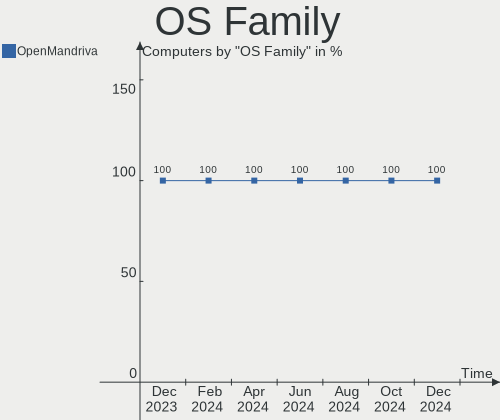
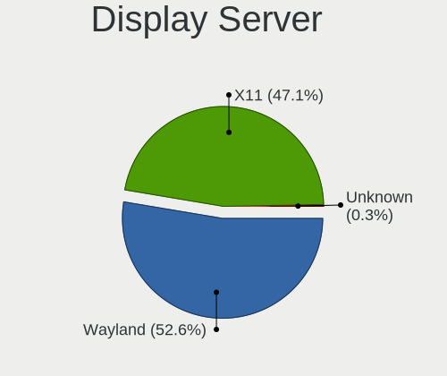
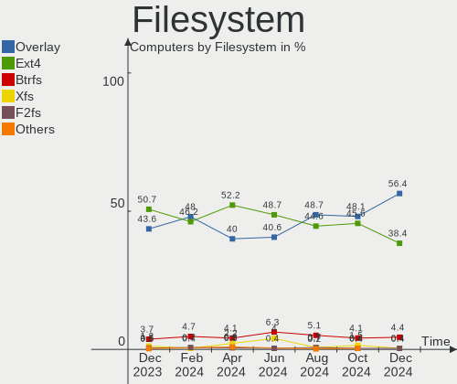
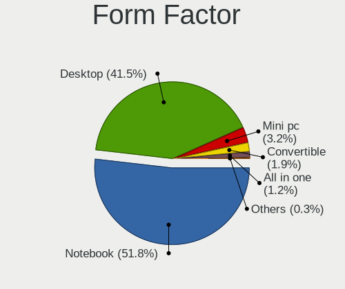
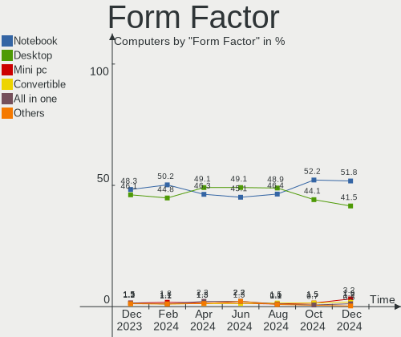
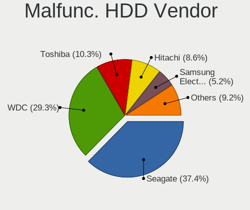
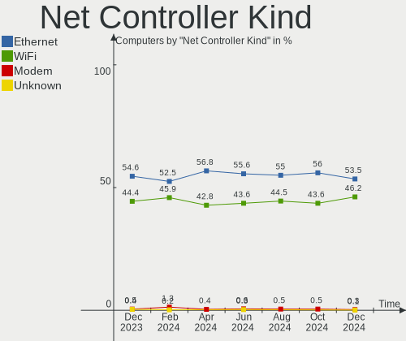

OpenMandriva - Hardware Trends
------------------------------

A project to identify most popular hardware characteristics and track their change
over time based on data collected by Linux users at https://Linux-Hardware.org.

Anyone can contribute to this report by the [hw-probe](https://github.com/linuxhw/hw-probe) tool:

    sudo -E hw-probe -all -upload

This is a report for all computer types. See also reports for [desktops](/Dist/OpenMandriva/Desktop/README.md) and [notebooks](/Dist/OpenMandriva/Notebook/README.md).

This report is for one last month. Overall report since the beginning of time: [TestCoverage](https://github.com/linuxhw/TestCoverage)

Period: Nov, 2022.

Contents
--------

* [ System ](#system)
  - [ OS                       ](#os)
  - [ OS Family                ](#os-family)
  - [ Kernel                   ](#kernel)
  - [ Kernel Family            ](#kernel-family)
  - [ Kernel Major Ver.        ](#kernel-major-ver)
  - [ Arch                     ](#arch)
  - [ DE                       ](#de)
  - [ Display Server           ](#display-server)
  - [ Display Manager          ](#display-manager)
  - [ OS Lang                  ](#os-lang)
  - [ Boot Mode                ](#boot-mode)
  - [ Filesystem               ](#filesystem)
  - [ Part. scheme             ](#part-scheme)
  - [ Dual Boot with Linux/BSD ](#dual-boot-with-linuxbsd)
  - [ Dual Boot (Win)          ](#dual-boot-win)

* [ Board ](#board)
  - [ Vendor                   ](#vendor)
  - [ Model                    ](#model)
  - [ Model Family             ](#model-family)
  - [ MFG Year                 ](#mfg-year)
  - [ Form Factor              ](#form-factor)
  - [ Secure Boot              ](#secure-boot)
  - [ Coreboot                 ](#coreboot)
  - [ RAM Size                 ](#ram-size)
  - [ RAM Used                 ](#ram-used)
  - [ Total Drives             ](#total-drives)
  - [ Has CD-ROM               ](#has-cd-rom)
  - [ Has Ethernet             ](#has-ethernet)
  - [ Has WiFi                 ](#has-wifi)
  - [ Has Bluetooth            ](#has-bluetooth)

* [ Location ](#location)
  - [ Country                  ](#country)
  - [ City                     ](#city)

* [ Drives ](#drives)
  - [ Drive Vendor             ](#drive-vendor)
  - [ Drive Model              ](#drive-model)
  - [ HDD Vendor               ](#hdd-vendor)
  - [ SSD Vendor               ](#ssd-vendor)
  - [ Drive Kind               ](#drive-kind)
  - [ Drive Connector          ](#drive-connector)
  - [ Drive Size               ](#drive-size)
  - [ Space Total              ](#space-total)
  - [ Space Used               ](#space-used)
  - [ Malfunc. Drives          ](#malfunc-drives)
  - [ Malfunc. Drive Vendor    ](#malfunc-drive-vendor)
  - [ Malfunc. HDD Vendor      ](#malfunc-hdd-vendor)
  - [ Malfunc. Drive Kind      ](#malfunc-drive-kind)
  - [ Failed Drives            ](#failed-drives)
  - [ Failed Drive Vendor      ](#failed-drive-vendor)
  - [ Drive Status             ](#drive-status)

* [ Storage controller ](#storage-controller)
  - [ Storage Vendor           ](#storage-vendor)
  - [ Storage Model            ](#storage-model)
  - [ Storage Kind             ](#storage-kind)

* [ Processor ](#processor)
  - [ CPU Vendor               ](#cpu-vendor)
  - [ CPU Model                ](#cpu-model)
  - [ CPU Model Family         ](#cpu-model-family)
  - [ CPU Cores                ](#cpu-cores)
  - [ CPU Sockets              ](#cpu-sockets)
  - [ CPU Threads              ](#cpu-threads)
  - [ CPU Op-Modes             ](#cpu-op-modes)
  - [ CPU Microcode            ](#cpu-microcode)
  - [ CPU Microarch            ](#cpu-microarch)

* [ Graphics ](#graphics)
  - [ GPU Vendor               ](#gpu-vendor)
  - [ GPU Model                ](#gpu-model)
  - [ GPU Combo                ](#gpu-combo)
  - [ GPU Driver               ](#gpu-driver)
  - [ GPU Memory               ](#gpu-memory)

* [ Monitor ](#monitor)
  - [ Monitor Vendor           ](#monitor-vendor)
  - [ Monitor Model            ](#monitor-model)
  - [ Monitor Resolution       ](#monitor-resolution)
  - [ Monitor Diagonal         ](#monitor-diagonal)
  - [ Monitor Width            ](#monitor-width)
  - [ Aspect Ratio             ](#aspect-ratio)
  - [ Monitor Area             ](#monitor-area)
  - [ Pixel Density            ](#pixel-density)
  - [ Multiple Monitors        ](#multiple-monitors)

* [ Network ](#network)
  - [ Net Controller Vendor    ](#net-controller-vendor)
  - [ Net Controller Model     ](#net-controller-model)
  - [ Wireless Vendor          ](#wireless-vendor)
  - [ Wireless Model           ](#wireless-model)
  - [ Ethernet Vendor          ](#ethernet-vendor)
  - [ Ethernet Model           ](#ethernet-model)
  - [ Net Controller Kind      ](#net-controller-kind)
  - [ Used Controller          ](#used-controller)
  - [ NICs                     ](#nics)
  - [ IPv6                     ](#ipv6)

* [ Bluetooth ](#bluetooth)
  - [ Bluetooth Vendor         ](#bluetooth-vendor)
  - [ Bluetooth Model          ](#bluetooth-model)

* [ Sound ](#sound)
  - [ Sound Vendor             ](#sound-vendor)
  - [ Sound Model              ](#sound-model)

* [ Memory ](#memory)
  - [ Memory Vendor            ](#memory-vendor)
  - [ Memory Model             ](#memory-model)
  - [ Memory Kind              ](#memory-kind)
  - [ Memory Form Factor       ](#memory-form-factor)
  - [ Memory Size              ](#memory-size)
  - [ Memory Speed             ](#memory-speed)

* [ Printers & scanners ](#printers--scanners)
  - [ Printer Vendor           ](#printer-vendor)
  - [ Printer Model            ](#printer-model)
  - [ Scanner Vendor           ](#scanner-vendor)
  - [ Scanner Model            ](#scanner-model)

* [ Camera ](#camera)
  - [ Camera Vendor            ](#camera-vendor)
  - [ Camera Model             ](#camera-model)

* [ Security ](#security)
  - [ Fingerprint Vendor       ](#fingerprint-vendor)
  - [ Fingerprint Model        ](#fingerprint-model)
  - [ Chipcard Vendor          ](#chipcard-vendor)
  - [ Chipcard Model           ](#chipcard-model)

* [ Unsupported ](#unsupported)
  - [ Unsupported Devices      ](#unsupported-devices)
  - [ Unsupported Device Types ](#unsupported-device-types)

System
------

OS
--

Installed operating systems

| Name               | Computers | Percent |
|--------------------|-----------|---------|
| OpenMandriva 4.3   | 210       | 66.88%  |
| OpenMandriva 4.50  | 77        | 24.52%  |
| OpenMandriva 4.90  | 12        | 3.82%   |
| OpenMandriva 4.2   | 11        | 3.5%    |
| OpenMandriva 22.11 | 3         | 0.96%   |
| OpenMandriva 22.90 | 1         | 0.32%   |

OS Family
---------

OS without a version

| Name         | Computers | Percent |
|--------------|-----------|---------|
| OpenMandriva | 314       | 100%    |

Kernel
------

Version of the Linux kernel

| Version                     | Computers | Percent |
|-----------------------------|-----------|---------|
| 5.16.7-desktop-1omv4003     | 200       | 63.69%  |
| 5.19.12-desktop-2omv4090    | 50        | 15.92%  |
| 5.19.5-desktop-1omv4090     | 24        | 7.64%   |
| 5.16.13-desktop-1omv4003    | 11        | 3.5%    |
| 5.10.14-desktop-1omv4002    | 10        | 3.18%   |
| 5.18.12-desktop-3omv4090    | 8         | 2.55%   |
| 6.0.2-desktop-1omv4090      | 3         | 0.96%   |
| 6.0.9-desktop-1omv22090     | 2         | 0.64%   |
| 6.0.9-desktop-gcc-1omv22090 | 1         | 0.32%   |
| 6.0.9-desktop-2.0omv4.3mjn  | 1         | 0.32%   |
| 6.0.5-desktop-1omv4090      | 1         | 0.32%   |
| 6.0.2-desktop-1omv4050      | 1         | 0.32%   |
| 5.19.11-desktop-2omv4090    | 1         | 0.32%   |
| 5.11.12-desktop-1omv4002    | 1         | 0.32%   |

Kernel Family
-------------

Linux kernel without a distro release

| Version | Computers | Percent |
|---------|-----------|---------|
| 5.16.7  | 200       | 63.69%  |
| 5.19.12 | 50        | 15.92%  |
| 5.19.5  | 24        | 7.64%   |
| 5.16.13 | 11        | 3.5%    |
| 5.10.14 | 10        | 3.18%   |
| 5.18.12 | 8         | 2.55%   |
| 6.0.9   | 4         | 1.27%   |
| 6.0.2   | 4         | 1.27%   |
| 6.0.5   | 1         | 0.32%   |
| 5.19.11 | 1         | 0.32%   |
| 5.11.12 | 1         | 0.32%   |

Kernel Major Ver.
-----------------

Linux kernel major version

| Version | Computers | Percent |
|---------|-----------|---------|
| 5.16    | 211       | 67.2%   |
| 5.19    | 75        | 23.89%  |
| 5.10    | 10        | 3.18%   |
| 6.0     | 9         | 2.87%   |
| 5.18    | 8         | 2.55%   |
| 5.11    | 1         | 0.32%   |

Arch
----

OS architecture (x86_64, i586, etc.)

| Name   | Computers | Percent |
|--------|-----------|---------|
| x86_64 | 314       | 100%    |

DE
--

Desktop Environment

| Name    | Computers | Percent |
|---------|-----------|---------|
| KDE5    | 308       | 98.09%  |
| GNOME   | 4         | 1.27%   |
| LXQt    | 1         | 0.32%   |
| Unknown | 1         | 0.32%   |

Display Server
--------------

X11 or Wayland

| Name    | Computers | Percent |
|---------|-----------|---------|
| X11     | 307       | 97.77%  |
| Wayland | 7         | 2.23%   |

Display Manager
---------------

SDDM, LightDM, etc.

| Name | Computers | Percent |
|------|-----------|---------|
| SDDM | 310       | 98.73%  |
| GDM  | 4         | 1.27%   |

OS Lang
-------

Language

| Lang  | Computers | Percent |
|-------|-----------|---------|
| en_US | 199       | 63.38%  |
| fr_FR | 20        | 6.37%   |
| ru_RU | 12        | 3.82%   |
| pl_PL | 12        | 3.82%   |
| de_DE | 12        | 3.82%   |
| pt_BR | 11        | 3.5%    |
| en_GB | 8         | 2.55%   |
| it_IT | 6         | 1.91%   |
| es_ES | 6         | 1.91%   |
| tr_TR | 4         | 1.27%   |
| cs_CZ | 4         | 1.27%   |
| hu_HU | 3         | 0.96%   |
| es_AR | 3         | 0.96%   |
| fr_BE | 2         | 0.64%   |
| es_VE | 2         | 0.64%   |
| es_UY | 2         | 0.64%   |
| nl_NL | 1         | 0.32%   |
| ja_JP | 1         | 0.32%   |
| fr_CA | 1         | 0.32%   |
| es_PE | 1         | 0.32%   |
| es_MX | 1         | 0.32%   |
| en_AU | 1         | 0.32%   |
| en_AG | 1         | 0.32%   |
| da_DK | 1         | 0.32%   |

Boot Mode
---------

EFI or BIOS

| Mode | Computers | Percent |
|------|-----------|---------|
| BIOS | 167       | 53.18%  |
| EFI  | 147       | 46.82%  |

Filesystem
----------

Type of filesystem

| Type    | Computers | Percent |
|---------|-----------|---------|
| Overlay | 255       | 81.21%  |
| Ext4    | 56        | 17.83%  |
| Btrfs   | 3         | 0.96%   |

Part. scheme
------------

Scheme of partitioning

| Type | Computers | Percent |
|------|-----------|---------|
| GPT  | 195       | 62.1%   |
| MBR  | 119       | 37.9%   |

Dual Boot with Linux/BSD
------------------------

Hosting more than one Linux/BSD

| Dual boot | Computers | Percent |
|-----------|-----------|---------|
| Yes       | 172       | 54.78%  |
| No        | 142       | 45.22%  |

Dual Boot (Win)
---------------

Hosting Linux and Windows

| Dual boot | Computers | Percent |
|-----------|-----------|---------|
| No        | 166       | 52.87%  |
| Yes       | 148       | 47.13%  |

Board
-----

Vendor
------

Motherboard manufacturer

| Name                | Computers | Percent |
|---------------------|-----------|---------|
| Hewlett-Packard     | 45        | 14.33%  |
| ASUSTek Computer    | 44        | 14.01%  |
| Lenovo              | 37        | 11.78%  |
| Dell                | 29        | 9.24%   |
| Gigabyte Technology | 24        | 7.64%   |
| Acer                | 23        | 7.32%   |
| MSI                 | 15        | 4.78%   |
| ASRock              | 13        | 4.14%   |
| Toshiba             | 11        | 3.5%    |
| Apple               | 7         | 2.23%   |
| Samsung Electronics | 6         | 1.91%   |
| Medion              | 6         | 1.91%   |
| Fujitsu             | 6         | 1.91%   |
| Sony                | 5         | 1.59%   |
| Intel               | 5         | 1.59%   |
| Pegatron            | 4         | 1.27%   |
| Packard Bell        | 3         | 0.96%   |
| Foxconn             | 3         | 0.96%   |
| Wistron             | 2         | 0.64%   |
| VS Company          | 2         | 0.64%   |
| Fujitsu Siemens     | 2         | 0.64%   |
| ECS                 | 2         | 0.64%   |
| AZW                 | 2         | 0.64%   |
| Unknown             | 2         | 0.64%   |
| TPV-INVENTA         | 1         | 0.32%   |
| Supermicro          | 1         | 0.32%   |
| Shuttle             | 1         | 0.32%   |
| Philco              | 1         | 0.32%   |
| Panasonic           | 1         | 0.32%   |
| Notebook            | 1         | 0.32%   |
| MACHINIST           | 1         | 0.32%   |
| LDLC                | 1         | 0.32%   |
| HUAWEI              | 1         | 0.32%   |
| Gateway             | 1         | 0.32%   |
| Deltron             | 1         | 0.32%   |
| Compaq              | 1         | 0.32%   |
| Chuwi               | 1         | 0.32%   |
| Biostar             | 1         | 0.32%   |
| Alienware           | 1         | 0.32%   |
| ALDO                | 1         | 0.32%   |

Model
-----

Motherboard model

| Name                                                  | Computers | Percent |
|-------------------------------------------------------|-----------|---------|
| HP Notebook                                           | 5         | 1.59%   |
| ASUS All Series                                       | 4         | 1.27%   |
| Toshiba dynabook T653/46JR                            | 3         | 0.96%   |
| Gigabyte 970A-DS3P                                    | 3         | 0.96%   |
| Pegatron AY028AA-ABA CQ5300Y                          | 2         | 0.64%   |
| Lenovo Yoga Slim 7 13ACN5 82CY                        | 2         | 0.64%   |
| Lenovo IdeaPad 3 15ADA05 81W1                         | 2         | 0.64%   |
| Gigabyte H61M-DS2 x.x                                 | 2         | 0.64%   |
| ASUS UX31E                                            | 2         | 0.64%   |
| ASRock B450M Steel Legend                             | 2         | 0.64%   |
| Apple MacBookPro12,1                                  | 2         | 0.64%   |
| Acer Aspire 7741                                      | 2         | 0.64%   |
| Unknown                                               | 2         | 0.64%   |
| Wistron ProLiant ML110 G6                             | 1         | 0.32%   |
| Wistron ProLiant ML110 G5                             | 1         | 0.32%   |
| VS Company MCP61M                                     | 1         | 0.32%   |
| VS Company G31T-M                                     | 1         | 0.32%   |
| TPV-INVENTA Pro 1005 Series All-in-One PC             | 1         | 0.32%   |
| Toshiba Satellite Pro U500                            | 1         | 0.32%   |
| Toshiba Satellite Pro A200                            | 1         | 0.32%   |
| Toshiba Satellite L875                                | 1         | 0.32%   |
| Toshiba Satellite L40                                 | 1         | 0.32%   |
| Toshiba Satellite C870-D7K                            | 1         | 0.32%   |
| Toshiba Satellite C75D-B                              | 1         | 0.32%   |
| Toshiba Satellite C660                                | 1         | 0.32%   |
| Toshiba PORTEGE Z30t-A                                | 1         | 0.32%   |
| Supermicro PDSMi                                      | 1         | 0.32%   |
| Sony VPCYB1S1E                                        | 1         | 0.32%   |
| Sony VPCEG16EG                                        | 1         | 0.32%   |
| Sony VPCEB2M1E                                        | 1         | 0.32%   |
| Sony VGN-NS150FJ                                      | 1         | 0.32%   |
| Sony SVE1411EGXB                                      | 1         | 0.32%   |
| Shuttle TERRA_PC                                      | 1         | 0.32%   |
| Samsung 550XDA                                        | 1         | 0.32%   |
| Samsung 400B2B/400B2B                                 | 1         | 0.32%   |
| Samsung 3570R/370R/470R/450R/510R/4450RV              | 1         | 0.32%   |
| Samsung 300V3A/300V4A/300V5A/200A4B/200A5B            | 1         | 0.32%   |
| Samsung 300E5K/300E5Q                                 | 1         | 0.32%   |
| Samsung 300E5EV/300E4EV/270E5EV/270E4EV/2470EV/2470EE | 1         | 0.32%   |
| Philco 14H                                            | 1         | 0.32%   |

Model Family
------------

Motherboard model prefix

| Name                  | Computers | Percent |
|-----------------------|-----------|---------|
| Acer Aspire           | 12        | 3.82%   |
| Lenovo IdeaPad        | 10        | 3.18%   |
| Lenovo ThinkPad       | 9         | 2.87%   |
| Dell Inspiron         | 9         | 2.87%   |
| Toshiba Satellite     | 7         | 2.23%   |
| HP Pavilion           | 7         | 2.23%   |
| HP Compaq             | 6         | 1.91%   |
| ASUS PRIME            | 6         | 1.91%   |
| HP ProBook            | 5         | 1.59%   |
| HP Notebook           | 5         | 1.59%   |
| Dell OptiPlex         | 5         | 1.59%   |
| Dell Latitude         | 5         | 1.59%   |
| HP EliteBook          | 4         | 1.27%   |
| Dell XPS              | 4         | 1.27%   |
| Dell PowerEdge        | 4         | 1.27%   |
| ASUS All              | 4         | 1.27%   |
| Acer Veriton          | 4         | 1.27%   |
| Toshiba dynabook      | 3         | 0.96%   |
| Lenovo Yoga           | 3         | 0.96%   |
| Lenovo IdeaCentre     | 3         | 0.96%   |
| Gigabyte 970A-DS3P    | 3         | 0.96%   |
| ASRock B450M          | 3         | 0.96%   |
| Acer TravelMate       | 3         | 0.96%   |
| Wistron ProLiant      | 2         | 0.64%   |
| Pegatron AY028AA-ABA  | 2         | 0.64%   |
| Packard Bell EasyNote | 2         | 0.64%   |
| Lenovo Legion         | 2         | 0.64%   |
| HP Stream             | 2         | 0.64%   |
| HP OMEN               | 2         | 0.64%   |
| Gigabyte H61M-DS2     | 2         | 0.64%   |
| Gigabyte B450         | 2         | 0.64%   |
| Fujitsu LIFEBOOK      | 2         | 0.64%   |
| Fujitsu ESPRIMO       | 2         | 0.64%   |
| Dell Vostro           | 2         | 0.64%   |
| ASUS VivoBook         | 2         | 0.64%   |
| ASUS UX31E            | 2         | 0.64%   |
| ASRock N68-S3         | 2         | 0.64%   |
| Apple MacBookPro12    | 2         | 0.64%   |
| Acer Nitro            | 2         | 0.64%   |
| Unknown               | 2         | 0.64%   |

MFG Year
--------

Motherboard manufacture year

| Year | Computers | Percent |
|------|-----------|---------|
| 2012 | 39        | 12.42%  |
| 2011 | 32        | 10.19%  |
| 2014 | 25        | 7.96%   |
| 2008 | 23        | 7.32%   |
| 2019 | 22        | 7.01%   |
| 2010 | 21        | 6.69%   |
| 2013 | 19        | 6.05%   |
| 2018 | 18        | 5.73%   |
| 2009 | 18        | 5.73%   |
| 2021 | 17        | 5.41%   |
| 2020 | 17        | 5.41%   |
| 2016 | 15        | 4.78%   |
| 2015 | 14        | 4.46%   |
| 2017 | 12        | 3.82%   |
| 2007 | 10        | 3.18%   |
| 2022 | 9         | 2.87%   |
| 2006 | 2         | 0.64%   |
| 2005 | 1         | 0.32%   |

Form Factor
-----------

Physical design of the computer

| Name        | Computers | Percent |
|-------------|-----------|---------|
| Notebook    | 162       | 51.59%  |
| Desktop     | 138       | 43.95%  |
| Convertible | 6         | 1.91%   |
| All in one  | 4         | 1.27%   |
| Server      | 4         | 1.27%   |

Secure Boot
-----------

Enabled or disabled

| State    | Computers | Percent |
|----------|-----------|---------|
| Disabled | 314       | 100%    |

Coreboot
--------

Have coreboot on board

| Used | Computers | Percent |
|------|-----------|---------|
| No   | 314       | 100%    |

RAM Size
--------

Total RAM memory

| Size in GB      | Computers | Percent |
|-----------------|-----------|---------|
| 3.01-4.0        | 104       | 33.12%  |
| 4.01-8.0        | 71        | 22.61%  |
| 8.01-16.0       | 54        | 17.2%   |
| 16.01-24.0      | 44        | 14.01%  |
| 32.01-64.0      | 17        | 5.41%   |
| 1.01-2.0        | 12        | 3.82%   |
| 24.01-32.0      | 4         | 1.27%   |
| 2.01-3.0        | 3         | 0.96%   |
| 64.01-256.0     | 3         | 0.96%   |
| More than 256.0 | 1         | 0.32%   |
| 0.51-1.0        | 1         | 0.32%   |

RAM Used
--------

Used RAM memory

| Used GB   | Computers | Percent |
|-----------|-----------|---------|
| 1.01-2.0  | 238       | 75.8%   |
| 0.51-1.0  | 43        | 13.69%  |
| 2.01-3.0  | 16        | 5.1%    |
| 0.01-0.5  | 12        | 3.82%   |
| 3.01-4.0  | 3         | 0.96%   |
| 4.01-8.0  | 1         | 0.32%   |
| 8.01-16.0 | 1         | 0.32%   |

Total Drives
------------

Number of drives on board

| Drives | Computers | Percent |
|--------|-----------|---------|
| 1      | 191       | 60.83%  |
| 2      | 63        | 20.06%  |
| 3      | 22        | 7.01%   |
| 4      | 19        | 6.05%   |
| 5      | 12        | 3.82%   |
| 0      | 4         | 1.27%   |
| 6      | 2         | 0.64%   |
| 11     | 1         | 0.32%   |

Has CD-ROM
----------

Has CD-ROM on board

| Presented | Computers | Percent |
|-----------|-----------|---------|
| Yes       | 173       | 55.1%   |
| No        | 141       | 44.9%   |

Has Ethernet
------------

Has Ethernet on board

| Presented | Computers | Percent |
|-----------|-----------|---------|
| Yes       | 288       | 91.72%  |
| No        | 26        | 8.28%   |

Has WiFi
--------

Has WiFi module

| Presented | Computers | Percent |
|-----------|-----------|---------|
| Yes       | 223       | 71.02%  |
| No        | 91        | 28.98%  |

Has Bluetooth
-------------

Has Bluetooth module

| Presented | Computers | Percent |
|-----------|-----------|---------|
| No        | 158       | 50.32%  |
| Yes       | 156       | 49.68%  |

Location
--------

Country
-------

Geographic location (country)

| Country        | Computers | Percent |
|----------------|-----------|---------|
| Germany        | 26        | 8.28%   |
| USA            | 25        | 7.96%   |
| France         | 24        | 7.64%   |
| Brazil         | 24        | 7.64%   |
| Russia         | 21        | 6.69%   |
| Poland         | 18        | 5.73%   |
| Italy          | 16        | 5.1%    |
| UK             | 15        | 4.78%   |
| Spain          | 11        | 3.5%    |
| Turkey         | 9         | 2.87%   |
| Romania        | 7         | 2.23%   |
| Mexico         | 7         | 2.23%   |
| Japan          | 7         | 2.23%   |
| Czechia        | 7         | 2.23%   |
| Belgium        | 7         | 2.23%   |
| Netherlands    | 6         | 1.91%   |
| Canada         | 6         | 1.91%   |
| India          | 4         | 1.27%   |
| Hungary        | 4         | 1.27%   |
| Greece         | 4         | 1.27%   |
| Chile          | 4         | 1.27%   |
| Uruguay        | 3         | 0.96%   |
| Kazakhstan     | 3         | 0.96%   |
| Argentina      | 3         | 0.96%   |
| Algeria        | 3         | 0.96%   |
| Venezuela      | 2         | 0.64%   |
| Sweden         | 2         | 0.64%   |
| Sri Lanka      | 2         | 0.64%   |
| South Korea    | 2         | 0.64%   |
| Slovakia       | 2         | 0.64%   |
| Philippines    | 2         | 0.64%   |
| Peru           | 2         | 0.64%   |
| Malaysia       | 2         | 0.64%   |
| Jamaica        | 2         | 0.64%   |
| Israel         | 2         | 0.64%   |
| Indonesia      | 2         | 0.64%   |
| Congo Republic | 2         | 0.64%   |
| Australia      | 2         | 0.64%   |
| Vietnam        | 1         | 0.32%   |
| Tunisia        | 1         | 0.32%   |

City
----

Geographic location (city)

| City             | Computers | Percent |
|------------------|-----------|---------|
| Warsaw           | 6         | 1.91%   |
| Moscow           | 6         | 1.91%   |
| Prague           | 4         | 1.27%   |
| Istanbul         | 4         | 1.27%   |
| Salzgitter       | 3         | 0.96%   |
| Montreal         | 3         | 0.96%   |
| Montevideo       | 3         | 0.96%   |
| Madison          | 3         | 0.96%   |
| Wangen           | 2         | 0.64%   |
| Ulyanovsk        | 2         | 0.64%   |
| Uiseong-gun      | 2         | 0.64%   |
| Tijuana          | 2         | 0.64%   |
| Supraśl         | 2         | 0.64%   |
| St Petersburg    | 2         | 0.64%   |
| Souillac         | 2         | 0.64%   |
| Serra            | 2         | 0.64%   |
| Sao Paulo        | 2         | 0.64%   |
| Rome             | 2         | 0.64%   |
| Rio de Janeiro   | 2         | 0.64%   |
| Pointe Noire     | 2         | 0.64%   |
| Perm             | 2         | 0.64%   |
| Nizhniy Novgorod | 2         | 0.64%   |
| Munich           | 2         | 0.64%   |
| Montpellier      | 2         | 0.64%   |
| Montego Bay      | 2         | 0.64%   |
| Milan            | 2         | 0.64%   |
| Mexico City      | 2         | 0.64%   |
| Maringá         | 2         | 0.64%   |
| Madrid           | 2         | 0.64%   |
| Köthen          | 2         | 0.64%   |
| Kagoshima        | 2         | 0.64%   |
| Herten           | 2         | 0.64%   |
| Grand Junction   | 2         | 0.64%   |
| Gorle            | 2         | 0.64%   |
| Colombo          | 2         | 0.64%   |
| Caninde          | 2         | 0.64%   |
| Bytom            | 2         | 0.64%   |
| Budapest         | 2         | 0.64%   |
| Antwerp          | 2         | 0.64%   |
| Alton            | 2         | 0.64%   |

Drives
------

Drive Vendor
------------

Hard drive vendors

| Vendor              | Computers | Drives | Percent |
|---------------------|-----------|--------|---------|
| WDC                 | 79        | 98     | 17.44%  |
| Seagate             | 77        | 95     | 17%     |
| Samsung Electronics | 52        | 64     | 11.48%  |
| Kingston            | 29        | 31     | 6.4%    |
| Toshiba             | 27        | 28     | 5.96%   |
| SanDisk             | 23        | 26     | 5.08%   |
| Hitachi             | 17        | 17     | 3.75%   |
| Unknown             | 15        | 17     | 3.31%   |
| Crucial             | 14        | 16     | 3.09%   |
| China               | 13        | 15     | 2.87%   |
| SPCC                | 7         | 7      | 1.55%   |
| SK hynix            | 6         | 6      | 1.32%   |
| Intel               | 6         | 7      | 1.32%   |
| HGST                | 6         | 6      | 1.32%   |
| GOODRAM             | 6         | 8      | 1.32%   |
| PNY                 | 5         | 5      | 1.1%    |
| Patriot             | 5         | 6      | 1.1%    |
| A-DATA Technology   | 5         | 5      | 1.1%    |
| Netac               | 4         | 4      | 0.88%   |
| Intenso             | 4         | 4      | 0.88%   |
| Team                | 3         | 3      | 0.66%   |
| SSSTC               | 3         | 3      | 0.66%   |
| Maxtor              | 3         | 3      | 0.66%   |
| FORESEE             | 3         | 3      | 0.66%   |
| Apple               | 3         | 3      | 0.66%   |
| UMIS                | 2         | 2      | 0.44%   |
| Silicon Motion      | 2         | 2      | 0.44%   |
| Gigabyte Technology | 2         | 2      | 0.44%   |
| Fujitsu             | 2         | 2      | 0.44%   |
| Unknown             | 2         | 3      | 0.44%   |
| XrayDisk            | 1         | 1      | 0.22%   |
| WDC WDS1            | 1         | 1      | 0.22%   |
| walram              | 1         | 1      | 0.22%   |
| V Series            | 1         | 1      | 0.22%   |
| USB2.0              | 1         | 1      | 0.22%   |
| USB                 | 1         | 1      | 0.22%   |
| Transcend           | 1         | 1      | 0.22%   |
| T-FORCE             | 1         | 1      | 0.22%   |
| StoreJet            | 1         | 1      | 0.22%   |
| SAGE                | 1         | 1      | 0.22%   |

Drive Model
-----------

Hard drive models

| Model                                     | Computers | Percent |
|-------------------------------------------|-----------|---------|
| Seagate ST1000DM010-2EP102 1TB            | 8         | 1.61%   |
| Seagate ST500DM002-1BD142 500GB           | 7         | 1.41%   |
| Toshiba MQ01ABD100 1TB                    | 6         | 1.21%   |
| Kingston SA400S37240G 240GB SSD           | 6         | 1.21%   |
| Unknown SD/MMC/MS PRO 8GB                 | 5         | 1.01%   |
| Samsung SSD 970 EVO Plus 1TB              | 4         | 0.8%    |
| Kingston SA400S37120G 120GB SSD           | 4         | 0.8%    |
| WDC WD3200BPVT-22JJ5T0 320GB              | 3         | 0.6%    |
| Toshiba MQ01ABD075 752GB                  | 3         | 0.6%    |
| Seagate ST3320418AS 320GB                 | 3         | 0.6%    |
| Seagate ST2000DM008-2FR102 2TB            | 3         | 0.6%    |
| Seagate ST1000LM035-1RK172 1TB            | 3         | 0.6%    |
| Seagate ST1000DM003-1ER162 1TB            | 3         | 0.6%    |
| Seagate Expansion 1TB                     | 3         | 0.6%    |
| SanDisk SSD PLUS 240GB                    | 3         | 0.6%    |
| SanDisk DF4032  32GB                      | 3         | 0.6%    |
| Samsung SSD 970 EVO Plus 250GB            | 3         | 0.6%    |
| Samsung SSD 850 EVO 250GB                 | 3         | 0.6%    |
| Samsung HD322HJ 320GB                     | 3         | 0.6%    |
| Kingston SV300S37A240G 240GB SSD          | 3         | 0.6%    |
| WDC WDS500G2B0A-00SM50 500GB SSD          | 2         | 0.4%    |
| WDC WDS240G2G0A-00JH30 240GB SSD          | 2         | 0.4%    |
| WDC WD5000AZRX-00L4HB0 500GB              | 2         | 0.4%    |
| WDC WD5000AAKX-60U6AA0 500GB              | 2         | 0.4%    |
| WDC WD5000AAKS-00UU3A0 500GB              | 2         | 0.4%    |
| WDC WD5000AADS-00S9B0 500GB               | 2         | 0.4%    |
| WDC WD4005FZBX-00K5WB0 4TB                | 2         | 0.4%    |
| WDC WD2500AAKX-753CA1 250GB               | 2         | 0.4%    |
| WDC WD10EZEX-08WN4A0 1TB                  | 2         | 0.4%    |
| WDC WD10EZEX-00BN5A0 1TB                  | 2         | 0.4%    |
| Toshiba MQ04ABF100 1TB                    | 2         | 0.4%    |
| Toshiba MK3275GSX 320GB                   | 2         | 0.4%    |
| Toshiba MK3265GSXN 320GB                  | 2         | 0.4%    |
| Toshiba DT01ACA100 1TB                    | 2         | 0.4%    |
| SSSTC CL1-4D256 256GB                     | 2         | 0.4%    |
| SPCC Solid State Disk 64GB                | 2         | 0.4%    |
| SPCC Solid State Disk 512GB               | 2         | 0.4%    |
| SPCC Solid State Disk 256GB               | 2         | 0.4%    |
| SK hynix SKHynix_HFS512GD9TNI-L2A0B 512GB | 2         | 0.4%    |
| Seagate ST500LT012-9WS142 500GB           | 2         | 0.4%    |

HDD Vendor
----------

Hard disk drive vendors

| Vendor              | Computers | Drives | Percent |
|---------------------|-----------|--------|---------|
| Seagate             | 76        | 94     | 35.19%  |
| WDC                 | 67        | 82     | 31.02%  |
| Toshiba             | 25        | 25     | 11.57%  |
| Hitachi             | 17        | 17     | 7.87%   |
| Samsung Electronics | 12        | 14     | 5.56%   |
| HGST                | 6         | 6      | 2.78%   |
| Unknown             | 5         | 5      | 2.31%   |
| Maxtor              | 3         | 3      | 1.39%   |
| Fujitsu             | 2         | 2      | 0.93%   |
| USB                 | 1         | 1      | 0.46%   |
| SAGE                | 1         | 1      | 0.46%   |
| Hewlett-Packard     | 1         | 1      | 0.46%   |

SSD Vendor
----------

Solid state drive vendors

| Vendor              | Computers | Drives | Percent |
|---------------------|-----------|--------|---------|
| Samsung Electronics | 25        | 29     | 14.62%  |
| Kingston            | 25        | 27     | 14.62%  |
| SanDisk             | 19        | 22     | 11.11%  |
| China               | 13        | 15     | 7.6%    |
| Crucial             | 12        | 14     | 7.02%   |
| WDC                 | 10        | 12     | 5.85%   |
| SPCC                | 7         | 7      | 4.09%   |
| GOODRAM             | 6         | 8      | 3.51%   |
| Patriot             | 5         | 6      | 2.92%   |
| PNY                 | 4         | 4      | 2.34%   |
| Netac               | 4         | 4      | 2.34%   |
| Intenso             | 4         | 4      | 2.34%   |
| Toshiba             | 3         | 3      | 1.75%   |
| Team                | 3         | 3      | 1.75%   |
| Apple               | 3         | 3      | 1.75%   |
| A-DATA Technology   | 3         | 3      | 1.75%   |
| Intel               | 2         | 2      | 1.17%   |
| XrayDisk            | 1         | 1      | 0.58%   |
| WDC WDS1            | 1         | 1      | 0.58%   |
| walram              | 1         | 1      | 0.58%   |
| V Series            | 1         | 1      | 0.58%   |
| Transcend           | 1         | 1      | 0.58%   |
| T-FORCE             | 1         | 1      | 0.58%   |
| StoreJet            | 1         | 1      | 0.58%   |
| Seagate             | 1         | 1      | 0.58%   |
| Phison              | 1         | 1      | 0.58%   |
| OCZ                 | 1         | 1      | 0.58%   |
| Mushkin             | 1         | 1      | 0.58%   |
| LITEONIT            | 1         | 1      | 0.58%   |
| LITEON              | 1         | 1      | 0.58%   |
| Lexar               | 1         | 1      | 0.58%   |
| KingSpec            | 1         | 1      | 0.58%   |
| KingFast            | 1         | 1      | 0.58%   |
| Integral            | 1         | 1      | 0.58%   |
| Gigabyte Technology | 1         | 1      | 0.58%   |
| FORESEE             | 1         | 1      | 0.58%   |
| EDGE SE8            | 1         | 1      | 0.58%   |
| Dahua               | 1         | 1      | 0.58%   |
| Apacer              | 1         | 1      | 0.58%   |
| AGI                 | 1         | 1      | 0.58%   |

Drive Kind
----------

HDD or SSD

| Kind    | Computers | Drives | Percent |
|---------|-----------|--------|---------|
| HDD     | 184       | 251    | 46.23%  |
| SSD     | 144       | 189    | 36.18%  |
| NVMe    | 52        | 57     | 13.07%  |
| MMC     | 14        | 16     | 3.52%   |
| Unknown | 4         | 6      | 1.01%   |

Drive Connector
---------------

SATA, SAS, NVMe, etc.

| Type | Computers | Drives | Percent |
|------|-----------|--------|---------|
| SATA | 273       | 419    | 75%     |
| NVMe | 52        | 56     | 14.29%  |
| SAS  | 25        | 28     | 6.87%   |
| MMC  | 14        | 16     | 3.85%   |

Drive Size
----------

Size of hard drive

| Size in TB | Computers | Drives | Percent |
|------------|-----------|--------|---------|
| 0.01-0.5   | 210       | 280    | 62.13%  |
| 0.51-1.0   | 100       | 118    | 29.59%  |
| 1.01-2.0   | 16        | 28     | 4.73%   |
| 4.01-10.0  | 6         | 7      | 1.78%   |
| 2.01-3.0   | 3         | 3      | 0.89%   |
| 3.01-4.0   | 2         | 3      | 0.59%   |
| 10.01-20.0 | 1         | 1      | 0.3%    |

Space Total
-----------

Amount of disk space available on the file system

| Size in GB | Computers | Percent |
|------------|-----------|---------|
| 1-20       | 168       | 53.5%   |
| 101-250    | 48        | 15.29%  |
| 251-500    | 32        | 10.19%  |
| Unknown    | 29        | 9.24%   |
| 501-1000   | 13        | 4.14%   |
| 51-100     | 12        | 3.82%   |
| 21-50      | 10        | 3.18%   |
| 1001-2000  | 2         | 0.64%   |

Space Used
----------

Amount of used disk space

| Used GB  | Computers | Percent |
|----------|-----------|---------|
| 1-20     | 257       | 81.85%  |
| Unknown  | 29        | 9.24%   |
| 21-50    | 9         | 2.87%   |
| 251-500  | 7         | 2.23%   |
| 101-250  | 6         | 1.91%   |
| 501-1000 | 3         | 0.96%   |
| 51-100   | 3         | 0.96%   |

Malfunc. Drives
---------------

Drive models with a malfunction

| Model                                 | Computers | Drives | Percent |
|---------------------------------------|-----------|--------|---------|
| Toshiba MQ01ABD075 752GB              | 3         | 3      | 3.13%   |
| Seagate ST3320418AS 320GB             | 3         | 3      | 3.13%   |
| Samsung Electronics HD322HJ 320GB     | 3         | 3      | 3.13%   |
| Toshiba MK3275GSX 320GB               | 2         | 2      | 2.08%   |
| Toshiba MK3265GSXN 320GB              | 2         | 2      | 2.08%   |
| Seagate ST500LT012-9WS142 500GB       | 2         | 2      | 2.08%   |
| Seagate ST3250820AS 250GB             | 2         | 2      | 2.08%   |
| SanDisk SSD U100 256GB                | 2         | 2      | 2.08%   |
| SanDisk SSD PLUS 240GB                | 2         | 2      | 2.08%   |
| Samsung Electronics HD502HJ 500GB     | 2         | 2      | 2.08%   |
| Hitachi HTS547575A9E384 752GB         | 2         | 2      | 2.08%   |
| HGST HTS545050A7E680 500GB            | 2         | 2      | 2.08%   |
| WDC WD800JD-75HKA1 80GB               | 1         | 1      | 1.04%   |
| WDC WD6400BPVT-60HXZT1 640GB          | 1         | 1      | 1.04%   |
| WDC WD6400BEVT-16A0RT0 640GB          | 1         | 1      | 1.04%   |
| WDC WD5000LUCT-63C26Y0 500GB          | 1         | 1      | 1.04%   |
| WDC WD5000LPCX-60VHAT0 500GB          | 1         | 1      | 1.04%   |
| WDC WD5000BEKT-60KA9T0 500GB          | 1         | 1      | 1.04%   |
| WDC WD5000AVCS-632DY1 500GB           | 1         | 2      | 1.04%   |
| WDC WD5000ABPS-01ZZB0 500GB           | 1         | 1      | 1.04%   |
| WDC WD5000AAKX-60U6AA0 500GB          | 1         | 1      | 1.04%   |
| WDC WD5000AAKX-001CA0 500GB           | 1         | 1      | 1.04%   |
| WDC WD5000AADS-00S9B0 500GB           | 1         | 1      | 1.04%   |
| WDC WD5000AADS-00L4B1 500GB           | 1         | 1      | 1.04%   |
| WDC WD3200BPVT-55JJ5T0 320GB          | 1         | 1      | 1.04%   |
| WDC WD3200BPVT-22JJ5T0 320GB          | 1         | 1      | 1.04%   |
| WDC WD2500AAKX-753CA1 250GB           | 1         | 1      | 1.04%   |
| WDC WD1600AAJS-00PSA0 160GB           | 1         | 1      | 1.04%   |
| WDC WD1200BEVS-60UST0 120GB           | 1         | 1      | 1.04%   |
| WDC WD10JPVT-60A1YT0 1TB              | 1         | 1      | 1.04%   |
| WDC WD10EZEX-00BN5A0 1TB              | 1         | 1      | 1.04%   |
| WDC WD10EARS-00Y5B1 1TB               | 1         | 2      | 1.04%   |
| WDC WD10EALX-009BA0 1TB               | 1         | 1      | 1.04%   |
| WDC WD Blue SA510 M.2 2280 1000GB SSD | 1         | 1      | 1.04%   |
| Toshiba MQ02ABD100H 1TB               | 1         | 1      | 1.04%   |
| Toshiba MQ01ABD050 500GB              | 1         | 1      | 1.04%   |
| Toshiba MQ01ABD032 320GB              | 1         | 1      | 1.04%   |
| Toshiba MK2552GSX 250GB               | 1         | 1      | 1.04%   |
| Seagate ST9750420AS 752GB             | 1         | 1      | 1.04%   |
| Seagate ST9500420ASG 500GB            | 1         | 1      | 1.04%   |

Malfunc. Drive Vendor
---------------------

Vendors of faulty drives

| Vendor              | Computers | Drives | Percent |
|---------------------|-----------|--------|---------|
| Seagate             | 25        | 28     | 27.17%  |
| WDC                 | 20        | 24     | 21.74%  |
| Toshiba             | 11        | 11     | 11.96%  |
| Hitachi             | 9         | 9      | 9.78%   |
| Samsung Electronics | 7         | 9      | 7.61%   |
| SanDisk             | 6         | 6      | 6.52%   |
| HGST                | 3         | 3      | 3.26%   |
| Maxtor              | 2         | 2      | 2.17%   |
| Intel               | 2         | 2      | 2.17%   |
| Patriot             | 1         | 1      | 1.09%   |
| OCZ                 | 1         | 1      | 1.09%   |
| Kingston            | 1         | 1      | 1.09%   |
| Crucial             | 1         | 1      | 1.09%   |
| China               | 1         | 1      | 1.09%   |
| Apple               | 1         | 1      | 1.09%   |
| AGI                 | 1         | 1      | 1.09%   |

Malfunc. HDD Vendor
-------------------

Vendors of faulty HDD drives

| Vendor              | Computers | Drives | Percent |
|---------------------|-----------|--------|---------|
| Seagate             | 25        | 28     | 32.89%  |
| WDC                 | 19        | 23     | 25%     |
| Toshiba             | 11        | 11     | 14.47%  |
| Hitachi             | 9         | 9      | 11.84%  |
| Samsung Electronics | 7         | 9      | 9.21%   |
| HGST                | 3         | 3      | 3.95%   |
| Maxtor              | 2         | 2      | 2.63%   |

Malfunc. Drive Kind
-------------------

Kinds of faulty drives

| Kind | Computers | Drives | Percent |
|------|-----------|--------|---------|
| HDD  | 75        | 85     | 82.42%  |
| SSD  | 16        | 16     | 17.58%  |

Failed Drives
-------------

Failed drive models

| Model                        | Computers | Drives | Percent |
|------------------------------|-----------|--------|---------|
| WDC WD3200BEKT-60KA9T0 320GB | 1         | 1      | 33.33%  |
| Toshiba MQ01ABD100 1TB       | 1         | 1      | 33.33%  |
| Seagate ST3250318AS 250GB    | 1         | 1      | 33.33%  |

Failed Drive Vendor
-------------------

Failed drive vendors

| Vendor  | Computers | Drives | Percent |
|---------|-----------|--------|---------|
| WDC     | 1         | 1      | 33.33%  |
| Toshiba | 1         | 1      | 33.33%  |
| Seagate | 1         | 1      | 33.33%  |

Drive Status
------------

Number of failed and malfunc. drives

| Status   | Computers | Drives | Percent |
|----------|-----------|--------|---------|
| Works    | 236       | 368    | 64.66%  |
| Malfunc  | 90        | 101    | 24.66%  |
| Detected | 36        | 47     | 9.86%   |
| Failed   | 3         | 3      | 0.82%   |

Storage controller
------------------

Storage Vendor
--------------

Storage controller vendors

| Vendor                         | Computers | Percent |
|--------------------------------|-----------|---------|
| Intel                          | 225       | 60.98%  |
| AMD                            | 60        | 16.26%  |
| Samsung Electronics            | 22        | 5.96%   |
| Nvidia                         | 11        | 2.98%   |
| SK hynix                       | 5         | 1.36%   |
| SanDisk                        | 5         | 1.36%   |
| ASMedia Technology             | 5         | 1.36%   |
| Marvell Technology Group       | 4         | 1.08%   |
| Kingston Technology Company    | 4         | 1.08%   |
| JMicron Technology             | 4         | 1.08%   |
| Solid State Storage Technology | 3         | 0.81%   |
| Phison Electronics             | 3         | 0.81%   |
| Broadcom / LSI                 | 3         | 0.81%   |
| VIA Technologies               | 2         | 0.54%   |
| Union Memory (Shenzhen)        | 2         | 0.54%   |
| Shenzhen Longsys Electronics   | 2         | 0.54%   |
| Micron/Crucial Technology      | 2         | 0.54%   |
| ADATA Technology               | 2         | 0.54%   |
| Toshiba America Info Systems   | 1         | 0.27%   |
| Silicon Motion                 | 1         | 0.27%   |
| LSI Logic / Symbios Logic      | 1         | 0.27%   |
| Adaptec                        | 1         | 0.27%   |
| 3ware                          | 1         | 0.27%   |

Storage Model
-------------

Storage controller models

| Model                                                                                   | Computers | Percent |
|-----------------------------------------------------------------------------------------|-----------|---------|
| AMD FCH SATA Controller [AHCI mode]                                                     | 31        | 7.09%   |
| Intel 6 Series/C200 Series Chipset Family 6 port Mobile SATA AHCI Controller            | 24        | 5.49%   |
| Intel 8 Series/C220 Series Chipset Family 6-port SATA Controller 1 [AHCI mode]          | 16        | 3.66%   |
| Intel 7 Series Chipset Family 6-port SATA Controller [AHCI mode]                        | 16        | 3.66%   |
| Intel Sunrise Point-LP SATA Controller [AHCI mode]                                      | 11        | 2.52%   |
| AMD SB7x0/SB8x0/SB9x0 SATA Controller [AHCI mode]                                       | 11        | 2.52%   |
| Samsung NVMe SSD Controller SM981/PM981/PM983                                           | 10        | 2.29%   |
| Intel 6 Series/C200 Series Chipset Family 6 port Desktop SATA AHCI Controller           | 10        | 2.29%   |
| AMD SB7x0/SB8x0/SB9x0 IDE Controller                                                    | 10        | 2.29%   |
| AMD 400 Series Chipset SATA Controller                                                  | 10        | 2.29%   |
| Intel NM10/ICH7 Family SATA Controller [IDE mode]                                       | 9         | 2.06%   |
| Intel 82801IBM/IEM (ICH9M/ICH9M-E) 4 port SATA Controller [AHCI mode]                   | 9         | 2.06%   |
| Intel 7 Series/C210 Series Chipset Family 6-port SATA Controller [AHCI mode]            | 9         | 2.06%   |
| Intel 82801 Mobile SATA Controller [RAID mode]                                          | 8         | 1.83%   |
| Intel Celeron/Pentium Silver Processor SATA Controller                                  | 7         | 1.6%    |
| Nvidia MCP61 SATA Controller                                                            | 6         | 1.37%   |
| Intel Wildcat Point-LP SATA Controller [AHCI Mode]                                      | 6         | 1.37%   |
| Intel 82801HM/HEM (ICH8M/ICH8M-E) IDE Controller                                        | 6         | 1.37%   |
| Intel 5 Series/3400 Series Chipset 4 port SATA AHCI Controller                          | 6         | 1.37%   |
| AMD SB7x0/SB8x0/SB9x0 SATA Controller [IDE mode]                                        | 6         | 1.37%   |
| AMD 500 Series Chipset SATA Controller                                                  | 6         | 1.37%   |
| Samsung NVMe SSD Controller PM9A1/PM9A3/980PRO                                          | 5         | 1.14%   |
| Intel Comet Lake SATA AHCI Controller                                                   | 5         | 1.14%   |
| Intel Atom Processor E3800 Series SATA AHCI Controller                                  | 5         | 1.14%   |
| Intel 82801HM/HEM (ICH8M/ICH8M-E) SATA Controller [AHCI mode]                           | 5         | 1.14%   |
| Intel 82801G (ICH7 Family) IDE Controller                                               | 5         | 1.14%   |
| Intel 8 Series SATA Controller 1 [AHCI mode]                                            | 5         | 1.14%   |
| Intel 6 Series/C200 Series Chipset Family Desktop SATA Controller (IDE mode, ports 4-5) | 5         | 1.14%   |
| Intel 6 Series/C200 Series Chipset Family Desktop SATA Controller (IDE mode, ports 0-3) | 5         | 1.14%   |
| ASMedia ASM1062 Serial ATA Controller                                                   | 5         | 1.14%   |
| Samsung NVMe SSD Controller 980                                                         | 4         | 0.92%   |
| Nvidia MCP61 IDE                                                                        | 4         | 0.92%   |
| Kingston Company Company Non-Volatile memory controller                                 | 4         | 0.92%   |
| Intel Volume Management Device NVMe RAID Controller                                     | 4         | 0.92%   |
| Intel SATA Controller [RAID mode]                                                       | 4         | 0.92%   |
| Intel Q170/Q150/B150/H170/H110/Z170/CM236 Chipset SATA Controller [AHCI Mode]           | 4         | 0.92%   |
| Intel Celeron N3350/Pentium N4200/Atom E3900 Series SATA AHCI Controller                | 4         | 0.92%   |
| Intel Alder Lake-S PCH SATA Controller [AHCI Mode]                                      | 4         | 0.92%   |
| Intel 9 Series Chipset Family SATA Controller [AHCI Mode]                               | 4         | 0.92%   |
| Intel 82801I (ICH9 Family) 2 port SATA Controller [IDE mode]                            | 4         | 0.92%   |

Storage Kind
------------

Kind of storage controller (IDE, SATA, NVMe, SAS, ...)

| Kind | Computers | Percent |
|------|-----------|---------|
| SATA | 244       | 63.71%  |
| IDE  | 62        | 16.19%  |
| NVMe | 51        | 13.32%  |
| RAID | 22        | 5.74%   |
| SCSI | 3         | 0.78%   |
| SAS  | 1         | 0.26%   |

Processor
---------

CPU Vendor
----------

Processor vendors

| Vendor | Computers | Percent |
|--------|-----------|---------|
| Intel  | 239       | 76.11%  |
| AMD    | 75        | 23.89%  |

CPU Model
---------

Processor models

| Model                                       | Computers | Percent |
|---------------------------------------------|-----------|---------|
| Intel Core i3-2310M CPU @ 2.10GHz           | 5         | 1.59%   |
| Intel Core i5-3210M CPU @ 2.50GHz           | 4         | 1.27%   |
| Intel Core i5-2520M CPU @ 2.50GHz           | 4         | 1.27%   |
| Intel Celeron CPU N2840 @ 2.16GHz           | 4         | 1.27%   |
| AMD Ryzen 5 5600G with Radeon Graphics      | 4         | 1.27%   |
| Intel Core i7-4790 CPU @ 3.60GHz            | 3         | 0.96%   |
| Intel Core i5-2450M CPU @ 2.50GHz           | 3         | 0.96%   |
| Intel Core i3-5005U CPU @ 2.00GHz           | 3         | 0.96%   |
| Intel Core i3-3240 CPU @ 3.40GHz            | 3         | 0.96%   |
| Intel Core i3-2100 CPU @ 3.10GHz            | 3         | 0.96%   |
| Intel Core 2 Duo CPU E7500 @ 2.93GHz        | 3         | 0.96%   |
| Intel Celeron CPU N3050 @ 1.60GHz           | 3         | 0.96%   |
| Intel Celeron CPU 847 @ 1.10GHz             | 3         | 0.96%   |
| AMD Phenom II X4 965 Processor              | 3         | 0.96%   |
| Intel Xeon CPU X3430 @ 2.40GHz              | 2         | 0.64%   |
| Intel Pentium Dual-Core CPU T4400 @ 2.20GHz | 2         | 0.64%   |
| Intel Pentium Dual-Core CPU E5700 @ 3.00GHz | 2         | 0.64%   |
| Intel Pentium Dual CPU T3400 @ 2.16GHz      | 2         | 0.64%   |
| Intel Pentium Dual CPU E2220 @ 2.40GHz      | 2         | 0.64%   |
| Intel Pentium CPU P6100 @ 2.00GHz           | 2         | 0.64%   |
| Intel Pentium CPU G2030 @ 3.00GHz           | 2         | 0.64%   |
| Intel Core i7-8700 CPU @ 3.20GHz            | 2         | 0.64%   |
| Intel Core i7-7500U CPU @ 2.70GHz           | 2         | 0.64%   |
| Intel Core i7-6700HQ CPU @ 2.60GHz          | 2         | 0.64%   |
| Intel Core i7-2677M CPU @ 1.80GHz           | 2         | 0.64%   |
| Intel Core i7-2670QM CPU @ 2.20GHz          | 2         | 0.64%   |
| Intel Core i5-8250U CPU @ 1.60GHz           | 2         | 0.64%   |
| Intel Core i5-7300HQ CPU @ 2.50GHz          | 2         | 0.64%   |
| Intel Core i5-7200U CPU @ 2.50GHz           | 2         | 0.64%   |
| Intel Core i5-6300U CPU @ 2.40GHz           | 2         | 0.64%   |
| Intel Core i5-6200U CPU @ 2.30GHz           | 2         | 0.64%   |
| Intel Core i5-4210U CPU @ 1.70GHz           | 2         | 0.64%   |
| Intel Core i5-3570K CPU @ 3.40GHz           | 2         | 0.64%   |
| Intel Core i5-3470S CPU @ 2.90GHz           | 2         | 0.64%   |
| Intel Core i5-3470 CPU @ 3.20GHz            | 2         | 0.64%   |
| Intel Core i5-3317U CPU @ 1.70GHz           | 2         | 0.64%   |
| Intel Core i5 CPU M 460 @ 2.53GHz           | 2         | 0.64%   |
| Intel Core i3-4130 CPU @ 3.40GHz            | 2         | 0.64%   |
| Intel Core i3-2120 CPU @ 3.30GHz            | 2         | 0.64%   |
| Intel Core i3-10110U CPU @ 2.10GHz          | 2         | 0.64%   |

CPU Model Family
----------------

Processor model prefix

| Model                   | Computers | Percent |
|-------------------------|-----------|---------|
| Intel Core i5           | 62        | 19.75%  |
| Intel Core i3           | 40        | 12.74%  |
| Intel Core i7           | 32        | 10.19%  |
| Intel Celeron           | 28        | 8.92%   |
| Intel Pentium           | 16        | 5.1%    |
| Intel Core 2 Duo        | 15        | 4.78%   |
| AMD Ryzen 5             | 15        | 4.78%   |
| Intel Xeon              | 12        | 3.82%   |
| Other                   | 8         | 2.55%   |
| Intel Pentium Dual      | 8         | 2.55%   |
| Intel Pentium Dual-Core | 7         | 2.23%   |
| AMD Ryzen 7             | 6         | 1.91%   |
| AMD FX                  | 6         | 1.91%   |
| Intel Core 2 Quad       | 4         | 1.27%   |
| AMD Ryzen 3             | 4         | 1.27%   |
| AMD Phenom II X4        | 4         | 1.27%   |
| AMD E1                  | 4         | 1.27%   |
| AMD E                   | 4         | 1.27%   |
| AMD Ryzen 9             | 3         | 0.96%   |
| AMD A8                  | 3         | 0.96%   |
| AMD A10                 | 3         | 0.96%   |
| Intel Pentium Silver    | 2         | 0.64%   |
| Intel Pentium Gold      | 2         | 0.64%   |
| Intel Atom              | 2         | 0.64%   |
| AMD Sempron             | 2         | 0.64%   |
| AMD Athlon II X3        | 2         | 0.64%   |
| AMD Athlon II X2        | 2         | 0.64%   |
| AMD Athlon              | 2         | 0.64%   |
| AMD A6                  | 2         | 0.64%   |
| Intel Pentium D         | 1         | 0.32%   |
| Intel Core i9           | 1         | 0.32%   |
| Intel Core 2            | 1         | 0.32%   |
| AMD Turion 64 X2 Mobile | 1         | 0.32%   |
| AMD Ryzen 5 PRO         | 1         | 0.32%   |
| AMD Ryzen 3 PRO         | 1         | 0.32%   |
| AMD Phenom II X2        | 1         | 0.32%   |
| AMD Phenom II           | 1         | 0.32%   |
| AMD EPYC                | 1         | 0.32%   |
| AMD E2                  | 1         | 0.32%   |
| AMD Athlon II X4        | 1         | 0.32%   |

CPU Cores
---------

Number of processor cores

| Number | Computers | Percent |
|--------|-----------|---------|
| 2      | 186       | 59.24%  |
| 4      | 86        | 27.39%  |
| 6      | 15        | 4.78%   |
| 8      | 9         | 2.87%   |
| 12     | 4         | 1.27%   |
| 1      | 4         | 1.27%   |
| 10     | 3         | 0.96%   |
| 3      | 3         | 0.96%   |
| 16     | 2         | 0.64%   |
| 128    | 1         | 0.32%   |
| 44     | 1         | 0.32%   |

CPU Sockets
-----------

Number of sockets

| Number | Computers | Percent |
|--------|-----------|---------|
| 1      | 309       | 98.41%  |
| 2      | 5         | 1.59%   |

CPU Threads
-----------

Threads per core (Hyper-Threading)

| Number | Computers | Percent |
|--------|-----------|---------|
| 2      | 172       | 54.78%  |
| 1      | 142       | 45.22%  |

CPU Op-Modes
------------

CPU Operation Modes (32-bit, 64-bit)

| Op mode        | Computers | Percent |
|----------------|-----------|---------|
| 32-bit, 64-bit | 314       | 100%    |

CPU Microcode
-------------

Microcode number

| Number     | Computers | Percent |
|------------|-----------|---------|
| 0x206a7    | 39        | 12.42%  |
| 0x306a9    | 29        | 9.24%   |
| 0x1067a    | 21        | 6.69%   |
| 0x306c3    | 20        | 6.37%   |
| 0x6fd      | 11        | 3.5%    |
| 0x306d4    | 8         | 2.55%   |
| 0x20655    | 8         | 2.55%   |
| 0x08108109 | 8         | 2.55%   |
| 0x406e3    | 7         | 2.23%   |
| Unknown    | 7         | 2.23%   |
| 0x906ea    | 6         | 1.91%   |
| 0x806e9    | 6         | 1.91%   |
| 0x806ec    | 5         | 1.59%   |
| 0x506e3    | 5         | 1.59%   |
| 0x40651    | 5         | 1.59%   |
| 0x806ea    | 4         | 1.27%   |
| 0x706a8    | 4         | 1.27%   |
| 0x506c9    | 4         | 1.27%   |
| 0x406c3    | 4         | 1.27%   |
| 0x30678    | 4         | 1.27%   |
| 0x0a50000c | 4         | 1.27%   |
| 0x07030105 | 4         | 1.27%   |
| 0x010000b6 | 4         | 1.27%   |
| 0x90672    | 3         | 0.96%   |
| 0x706a1    | 3         | 0.96%   |
| 0x106e5    | 3         | 0.96%   |
| 0x10676    | 3         | 0.96%   |
| 0x0a50000d | 3         | 0.96%   |
| 0x08101016 | 3         | 0.96%   |
| 0x06000822 | 3         | 0.96%   |
| 0x0500010d | 3         | 0.96%   |
| 0x010000c8 | 3         | 0.96%   |
| 0x00000000 | 3         | 0.96%   |
| 0xa0653    | 2         | 0.64%   |
| 0x906e9    | 2         | 0.64%   |
| 0x906c0    | 2         | 0.64%   |
| 0x6fb      | 2         | 0.64%   |
| 0x406c4    | 2         | 0.64%   |
| 0x20652    | 2         | 0.64%   |
| 0x10661    | 2         | 0.64%   |

CPU Microarch
-------------

Microarchitecture

| Name             | Computers | Percent |
|------------------|-----------|---------|
| SandyBridge      | 41        | 13.06%  |
| IvyBridge        | 30        | 9.55%   |
| Haswell          | 26        | 8.28%   |
| Penryn           | 25        | 7.96%   |
| KabyLake         | 25        | 7.96%   |
| Core             | 17        | 5.41%   |
| Skylake          | 12        | 3.82%   |
| K10              | 12        | 3.82%   |
| Zen+             | 11        | 3.5%    |
| Westmere         | 11        | 3.5%    |
| Silvermont       | 11        | 3.5%    |
| Zen 3            | 9         | 2.87%   |
| Broadwell        | 9         | 2.87%   |
| Piledriver       | 8         | 2.55%   |
| Goldmont plus    | 7         | 2.23%   |
| Zen 2            | 6         | 1.91%   |
| Zen              | 6         | 1.91%   |
| Bobcat           | 6         | 1.91%   |
| Puma             | 5         | 1.59%   |
| Alderlake Hybrid | 5         | 1.59%   |
| Nehalem          | 4         | 1.27%   |
| K8 Hammer        | 4         | 1.27%   |
| Goldmont         | 4         | 1.27%   |
| CometLake        | 4         | 1.27%   |
| K10 Llano        | 3         | 0.96%   |
| Tremont          | 2         | 0.64%   |
| Steamroller      | 2         | 0.64%   |
| Bonnell          | 2         | 0.64%   |
| Unknown          | 2         | 0.64%   |
| TigerLake        | 1         | 0.32%   |
| NetBurst         | 1         | 0.32%   |
| K8 & K10 hybrid  | 1         | 0.32%   |
| IceLake          | 1         | 0.32%   |
| Excavator        | 1         | 0.32%   |

Graphics
--------

GPU Vendor
----------

Vendors of graphics cards

| Vendor                     | Computers | Percent |
|----------------------------|-----------|---------|
| Intel                      | 184       | 53.33%  |
| Nvidia                     | 83        | 24.06%  |
| AMD                        | 74        | 21.45%  |
| Matrox Electronics Systems | 4         | 1.16%   |

GPU Model
---------

Graphics card models

| Model                                                                                    | Computers | Percent |
|------------------------------------------------------------------------------------------|-----------|---------|
| Intel 2nd Generation Core Processor Family Integrated Graphics Controller                | 34        | 9.55%   |
| Intel 3rd Gen Core processor Graphics Controller                                         | 13        | 3.65%   |
| Intel Xeon E3-1200 v3/4th Gen Core Processor Integrated Graphics Controller              | 9         | 2.53%   |
| Intel Xeon E3-1200 v2/3rd Gen Core processor Graphics Controller                         | 9         | 2.53%   |
| AMD Picasso/Raven 2 [Radeon Vega Series / Radeon Vega Mobile Series]                     | 9         | 2.53%   |
| Intel Mobile 4 Series Chipset Integrated Graphics Controller                             | 8         | 2.25%   |
| Intel Core Processor Integrated Graphics Controller                                      | 8         | 2.25%   |
| Intel Skylake GT2 [HD Graphics 520]                                                      | 6         | 1.69%   |
| Intel HD Graphics 5500                                                                   | 6         | 1.69%   |
| Intel Atom/Celeron/Pentium Processor x5-E8000/J3xxx/N3xxx Integrated Graphics Controller | 6         | 1.69%   |
| Intel 4 Series Chipset Integrated Graphics Controller                                    | 6         | 1.69%   |
| AMD Cezanne [Radeon Vega Series / Radeon Vega Mobile Series]                             | 6         | 1.69%   |
| Nvidia GP107 [GeForce GTX 1050 Ti]                                                       | 5         | 1.4%    |
| Nvidia GK208B [GeForce GT 730]                                                           | 5         | 1.4%    |
| Intel Mobile GM965/GL960 Integrated Graphics Controller (secondary)                      | 5         | 1.4%    |
| Intel Mobile GM965/GL960 Integrated Graphics Controller (primary)                        | 5         | 1.4%    |
| Intel HD Graphics 620                                                                    | 5         | 1.4%    |
| Intel Haswell-ULT Integrated Graphics Controller                                         | 5         | 1.4%    |
| Intel GeminiLake [UHD Graphics 600]                                                      | 5         | 1.4%    |
| Intel Atom Processor Z36xxx/Z37xxx Series Graphics & Display                             | 5         | 1.4%    |
| Intel CometLake-U GT2 [UHD Graphics]                                                     | 4         | 1.12%   |
| AMD Seymour [Radeon HD 6400M/7400M Series]                                               | 4         | 1.12%   |
| Nvidia GT218 [GeForce 210]                                                               | 3         | 0.84%   |
| Nvidia GK106 [GeForce GTX 660]                                                           | 3         | 0.84%   |
| Nvidia GA104 [GeForce RTX 3060 Ti Lite Hash Rate]                                        | 3         | 0.84%   |
| Nvidia C61 [GeForce 6150SE nForce 430]                                                   | 3         | 0.84%   |
| Intel UHD Graphics 620                                                                   | 3         | 0.84%   |
| Intel IvyBridge GT2 [HD Graphics 4000]                                                   | 3         | 0.84%   |
| Intel HD Graphics 530                                                                    | 3         | 0.84%   |
| Intel HD Graphics 500                                                                    | 3         | 0.84%   |
| Intel 82G33/G31 Express Integrated Graphics Controller                                   | 3         | 0.84%   |
| Intel 4th Gen Core Processor Integrated Graphics Controller                              | 3         | 0.84%   |
| AMD Wrestler [Radeon HD 6310]                                                            | 3         | 0.84%   |
| AMD Sun XT [Radeon HD 8670A/8670M/8690M / R5 M330 / M430 / Radeon 520 Mobile]            | 3         | 0.84%   |
| AMD Mullins [Radeon R2 Graphics]                                                         | 3         | 0.84%   |
| Nvidia TU117M [GeForce GTX 1650 Mobile / Max-Q]                                          | 2         | 0.56%   |
| Nvidia GP106 [GeForce GTX 1060 6GB]                                                      | 2         | 0.56%   |
| Nvidia GM107 [GeForce GTX 750 Ti]                                                        | 2         | 0.56%   |
| Nvidia GK208B [GeForce GT 710]                                                           | 2         | 0.56%   |
| Nvidia GF108 [GeForce GT 730]                                                            | 2         | 0.56%   |

GPU Combo
---------

Combinations of graphics cards

| Name           | Computers | Percent |
|----------------|-----------|---------|
| 1 x Intel      | 149       | 47.45%  |
| 1 x Nvidia     | 60        | 19.11%  |
| 1 x AMD        | 59        | 18.79%  |
| Intel + Nvidia | 18        | 5.73%   |
| Intel + AMD    | 8         | 2.55%   |
| 2 x Intel      | 7         | 2.23%   |
| 2 x AMD        | 4         | 1.27%   |
| 1 x Matrox     | 4         | 1.27%   |
| AMD + Nvidia   | 3         | 0.96%   |
| 2 x Nvidia     | 2         | 0.64%   |

GPU Driver
----------

Free vs proprietary

| Driver  | Computers | Percent |
|---------|-----------|---------|
| Free    | 302       | 96.18%  |
| Unknown | 12        | 3.82%   |

GPU Memory
----------

Total video memory

| Size in GB | Computers | Percent |
|------------|-----------|---------|
| Unknown    | 168       | 53.5%   |
| 0.01-0.5   | 43        | 13.69%  |
| 1.01-2.0   | 41        | 13.06%  |
| 0.51-1.0   | 32        | 10.19%  |
| 3.01-4.0   | 15        | 4.78%   |
| 7.01-8.0   | 6         | 1.91%   |
| 5.01-6.0   | 4         | 1.27%   |
| 2.01-3.0   | 2         | 0.64%   |
| 8.01-16.0  | 2         | 0.64%   |
| 16.01-24.0 | 1         | 0.32%   |

Monitor
-------

Monitor Vendor
--------------

Monitor vendors

| Vendor                  | Computers | Percent |
|-------------------------|-----------|---------|
| Samsung Electronics     | 50        | 16.39%  |
| AU Optronics            | 39        | 12.79%  |
| LG Display              | 26        | 8.52%   |
| Chimei Innolux          | 24        | 7.87%   |
| BOE                     | 19        | 6.23%   |
| Hewlett-Packard         | 16        | 5.25%   |
| Goldstar                | 13        | 4.26%   |
| Dell                    | 13        | 4.26%   |
| Acer                    | 12        | 3.93%   |
| Philips                 | 9         | 2.95%   |
| Apple                   | 7         | 2.3%    |
| Chi Mei Optoelectronics | 6         | 1.97%   |
| BenQ                    | 6         | 1.97%   |
| Sharp                   | 5         | 1.64%   |
| Lenovo                  | 4         | 1.31%   |
| Ancor Communications    | 4         | 1.31%   |
| ViewSonic               | 3         | 0.98%   |
| Panasonic               | 3         | 0.98%   |
| InfoVision              | 3         | 0.98%   |
| Iiyama                  | 3         | 0.98%   |
| ASUSTek Computer        | 3         | 0.98%   |
| AOC                     | 3         | 0.98%   |
| Unknown (XXX)           | 2         | 0.66%   |
| Sony                    | 2         | 0.66%   |
| PRISM+                  | 2         | 0.66%   |
| PANDA                   | 2         | 0.66%   |
| KDC                     | 2         | 0.66%   |
| HKC                     | 2         | 0.66%   |
| Hitachi                 | 2         | 0.66%   |
| eMachines               | 2         | 0.66%   |
| CPT                     | 2         | 0.66%   |
| Xiaomi                  | 1         | 0.33%   |
| Toshiba                 | 1         | 0.33%   |
| TopView                 | 1         | 0.33%   |
| Quanta Display          | 1         | 0.33%   |
| Plain Tree Systems      | 1         | 0.33%   |
| Packard Bell            | 1         | 0.33%   |
| NUL                     | 1         | 0.33%   |
| MTD                     | 1         | 0.33%   |
| MStar                   | 1         | 0.33%   |

Monitor Model
-------------

Monitor models

| Model                                                                  | Computers | Percent |
|------------------------------------------------------------------------|-----------|---------|
| LG Display LCD Monitor LGD039F 1366x768 345x194mm 15.6-inch            | 4         | 1.3%    |
| Panasonic TV MEIA296 3840x2160 698x392mm 31.5-inch                     | 3         | 0.97%   |
| Chimei Innolux LCD Monitor CMN15F5 1920x1080 344x193mm 15.5-inch       | 3         | 0.97%   |
| AU Optronics LCD Monitor AUO20EC 1366x768 344x193mm 15.5-inch          | 3         | 0.97%   |
| Samsung Electronics S24B300 SAM08B4 1920x1080 521x293mm 23.5-inch      | 2         | 0.65%   |
| Samsung Electronics LCD Monitor SEC5341 1366x768 344x193mm 15.5-inch   | 2         | 0.65%   |
| Samsung Electronics LCD Monitor SAM0A7D 1920x1080 1060x626mm 48.5-inch | 2         | 0.65%   |
| PRISM+ ULTRON 3547UC INN0035 2560x1080 820x345mm 35.0-inch             | 2         | 0.65%   |
| LG Display LCD Monitor LGD02DC 1366x768 344x194mm 15.5-inch            | 2         | 0.65%   |
| HKC 27N1 HKC2713 1920x1080 527x296mm 23.8-inch                         | 2         | 0.65%   |
| Hewlett-Packard V223 HWP334A 1920x1080 520x290mm 23.4-inch             | 2         | 0.65%   |
| Goldstar FULL HD GSM5B55 1920x1080 480x270mm 21.7-inch                 | 2         | 0.65%   |
| Dell 2208WFP DEL403C 1680x1050 473x296mm 22.0-inch                     | 2         | 0.65%   |
| CPT LCD Monitor COR17DB 1600x900 293x164mm 13.2-inch                   | 2         | 0.65%   |
| Chimei Innolux LCD Monitor CMN15E6 1366x768 344x193mm 15.5-inch        | 2         | 0.65%   |
| Chimei Innolux LCD Monitor CMN15DB 1366x768 344x193mm 15.5-inch        | 2         | 0.65%   |
| Chimei Innolux LCD Monitor CMN15CA 1366x768 344x193mm 15.5-inch        | 2         | 0.65%   |
| Chimei Innolux LCD Monitor CMN1472 1366x768 309x174mm 14.0-inch        | 2         | 0.65%   |
| Chimei Innolux LCD Monitor CMN13B0 2560x1600 286x178mm 13.3-inch       | 2         | 0.65%   |
| BOE LCD Monitor BOE0812 1920x1080 344x194mm 15.5-inch                  | 2         | 0.65%   |
| BOE LCD Monitor BOE0675 1366x768 344x194mm 15.5-inch                   | 2         | 0.65%   |
| AU Optronics LCD Monitor AUO243D 1920x1080 309x173mm 13.9-inch         | 2         | 0.65%   |
| AU Optronics LCD Monitor AUO22EC 1366x768 344x193mm 15.5-inch          | 2         | 0.65%   |
| AU Optronics LCD Monitor AUO139E 1600x900 382x214mm 17.2-inch          | 2         | 0.65%   |
| AU Optronics LCD Monitor AUO10EC 1366x768 344x193mm 15.5-inch          | 2         | 0.65%   |
| ASUSTek Computer PA279 AUS2768 3840x2160 597x336mm 27.0-inch           | 2         | 0.65%   |
| Apple Color LCD APPA02A 2560x1600 286x179mm 13.3-inch                  | 2         | 0.65%   |
| Apple Color LCD APP9CC7 1280x800 286x179mm 13.3-inch                   | 2         | 0.65%   |
| Xiaomi Mi TV XMD00E1 1440x900 708x398mm 32.0-inch                      | 1         | 0.32%   |
| ViewSonic VA703-4SERIES VSC6A1E 1280x1024 338x270mm 17.0-inch          | 1         | 0.32%   |
| ViewSonic VA2249 Series VSC7B2E 1920x1080 476x268mm 21.5-inch          | 1         | 0.32%   |
| ViewSonic VA2013wSERIES VSCF122 1600x900 443x249mm 20.0-inch           | 1         | 0.32%   |
| Unknown (XXX) Union TV XXX2841 1920x1080 1209x680mm 54.6-inch          | 1         | 0.32%   |
| Unknown (XXX) HDMI XXX0088 1920x540                                    | 1         | 0.32%   |
| Toshiba L17LCD2 LCDE780 1280x1024 340x270mm 17.1-inch                  | 1         | 0.32%   |
| TopView HD TV TOPC37E 1920x1080 700x390mm 31.5-inch                    | 1         | 0.32%   |
| Sony TV SNY4201 1360x768 710x400mm 32.1-inch                           | 1         | 0.32%   |
| Sony TV SNY3002 1920x1080 886x498mm 40.0-inch                          | 1         | 0.32%   |
| Sharp LQ133M1JW08 SHP1425 1920x1080 294x165mm 13.3-inch                | 1         | 0.32%   |
| Sharp LCD Monitor SHP1548 1920x1200 288x180mm 13.4-inch                | 1         | 0.32%   |

Monitor Resolution
------------------

Monitor screen resolution

| Resolution         | Computers | Percent |
|--------------------|-----------|---------|
| 1920x1080 (FHD)    | 110       | 36.18%  |
| 1366x768 (WXGA)    | 91        | 29.93%  |
| 1280x1024 (SXGA)   | 18        | 5.92%   |
| 1600x900 (HD+)     | 16        | 5.26%   |
| 3840x2160 (4K)     | 14        | 4.61%   |
| 1280x800 (WXGA)    | 13        | 4.28%   |
| 1440x900 (WXGA+)   | 10        | 3.29%   |
| 1680x1050 (WSXGA+) | 9         | 2.96%   |
| 2560x1600          | 5         | 1.64%   |
| 1920x1200 (WUXGA)  | 5         | 1.64%   |
| 2560x1440 (QHD)    | 3         | 0.99%   |
| 3200x1800 (QHD+)   | 2         | 0.66%   |
| 2560x1080          | 2         | 0.66%   |
| 1360x768           | 2         | 0.66%   |
| 1920x540           | 1         | 0.33%   |
| 1280x960           | 1         | 0.33%   |
| 1024x768 (XGA)     | 1         | 0.33%   |
| 1024x600           | 1         | 0.33%   |

Monitor Diagonal
----------------

Diagonal size in inches

| Inches  | Computers | Percent |
|---------|-----------|---------|
| 15      | 85        | 27.78%  |
| 13      | 34        | 11.11%  |
| 17      | 29        | 9.48%   |
| 23      | 26        | 8.5%    |
| 21      | 22        | 7.19%   |
| 14      | 19        | 6.21%   |
| 24      | 18        | 5.88%   |
| 19      | 9         | 2.94%   |
| 27      | 7         | 2.29%   |
| 22      | 7         | 2.29%   |
| 18      | 7         | 2.29%   |
| 20      | 6         | 1.96%   |
| 84      | 5         | 1.63%   |
| 31      | 5         | 1.63%   |
| 11      | 5         | 1.63%   |
| 48      | 3         | 0.98%   |
| 26      | 3         | 0.98%   |
| 54      | 2         | 0.65%   |
| 35      | 2         | 0.65%   |
| 16      | 2         | 0.65%   |
| 12      | 2         | 0.65%   |
| 10      | 2         | 0.65%   |
| Unknown | 2         | 0.65%   |
| 43      | 1         | 0.33%   |
| 40      | 1         | 0.33%   |
| 32      | 1         | 0.33%   |
| 25      | 1         | 0.33%   |

Monitor Width
-------------

Physical width

| Width in mm | Computers | Percent |
|-------------|-----------|---------|
| 301-350     | 127       | 41.64%  |
| 501-600     | 55        | 18.03%  |
| 401-500     | 44        | 14.43%  |
| 201-300     | 31        | 10.16%  |
| 351-400     | 26        | 8.52%   |
| 601-700     | 5         | 1.64%   |
| 1501-2000   | 5         | 1.64%   |
| 1001-1500   | 5         | 1.64%   |
| 801-900     | 3         | 0.98%   |
| Unknown     | 2         | 0.66%   |
| 701-800     | 1         | 0.33%   |
| 901-1000    | 1         | 0.33%   |

Aspect Ratio
------------

Proportional relationship between the width and the height

| Ratio   | Computers | Percent |
|---------|-----------|---------|
| 16/9    | 231       | 77.52%  |
| 16/10   | 43        | 14.43%  |
| 5/4     | 17        | 5.7%    |
| 4/3     | 2         | 0.67%   |
| 21/9    | 2         | 0.67%   |
| 6/5     | 1         | 0.34%   |
| 32/9    | 1         | 0.34%   |
| Unknown | 1         | 0.34%   |

Monitor Area
------------

Area in inch²

| Area in inch² | Computers | Percent |
|----------------|-----------|---------|
| 101-110        | 83        | 27.12%  |
| 201-250        | 62        | 20.26%  |
| 81-90          | 36        | 11.76%  |
| 151-200        | 23        | 7.52%   |
| 71-80          | 17        | 5.56%   |
| 141-150        | 17        | 5.56%   |
| 121-130        | 13        | 4.25%   |
| More than 1000 | 10        | 3.27%   |
| 351-500        | 8         | 2.61%   |
| 301-350        | 8         | 2.61%   |
| 251-300        | 8         | 2.61%   |
| 51-60          | 5         | 1.63%   |
| 131-140        | 4         | 1.31%   |
| 111-120        | 4         | 1.31%   |
| 61-70          | 2         | 0.65%   |
| 41-50          | 2         | 0.65%   |
| 501-1000       | 2         | 0.65%   |
| Unknown        | 2         | 0.65%   |

Pixel Density
-------------

Pixels per inch

| Density       | Computers | Percent |
|---------------|-----------|---------|
| 51-100        | 122       | 40.67%  |
| 101-120       | 110       | 36.67%  |
| 121-160       | 42        | 14%     |
| 161-240       | 14        | 4.67%   |
| 1-50          | 7         | 2.33%   |
| More than 240 | 3         | 1%      |
| Unknown       | 2         | 0.67%   |

Multiple Monitors
-----------------

Total monitors connected

| Total | Computers | Percent |
|-------|-----------|---------|
| 1     | 291       | 92.68%  |
| 2     | 15        | 4.78%   |
| 0     | 6         | 1.91%   |
| 3     | 2         | 0.64%   |

Network
-------

Net Controller Vendor
---------------------

Controller vendors

| Vendor                          | Computers | Percent |
|---------------------------------|-----------|---------|
| Realtek Semiconductor           | 198       | 42.22%  |
| Intel                           | 108       | 23.03%  |
| Qualcomm Atheros                | 63        | 13.43%  |
| Broadcom                        | 34        | 7.25%   |
| Nvidia                          | 10        | 2.13%   |
| Ralink                          | 9         | 1.92%   |
| Ralink Technology               | 8         | 1.71%   |
| Broadcom Limited                | 6         | 1.28%   |
| TP-Link                         | 5         | 1.07%   |
| Marvell Technology Group        | 5         | 1.07%   |
| Samsung Electronics             | 4         | 0.85%   |
| Qualcomm Atheros Communications | 2         | 0.43%   |
| IMC Networks                    | 2         | 0.43%   |
| Huawei Technologies             | 2         | 0.43%   |
| Belkin Components               | 2         | 0.43%   |
| VIA Technologies                | 1         | 0.21%   |
| Motorola PCS                    | 1         | 0.21%   |
| MediaTek                        | 1         | 0.21%   |
| LG Electronics                  | 1         | 0.21%   |
| JMicron Technology              | 1         | 0.21%   |
| ICS Advent                      | 1         | 0.21%   |
| Edimax Technology               | 1         | 0.21%   |
| Dell                            | 1         | 0.21%   |
| D-Link                          | 1         | 0.21%   |
| AVM                             | 1         | 0.21%   |
| ASIX Electronics                | 1         | 0.21%   |

Net Controller Model
--------------------

Controller models

| Model                                                             | Computers | Percent |
|-------------------------------------------------------------------|-----------|---------|
| Realtek RTL8111/8168/8411 PCI Express Gigabit Ethernet Controller | 135       | 24.95%  |
| Realtek RTL810xE PCI Express Fast Ethernet controller             | 33        | 6.1%    |
| Qualcomm Atheros AR9285 Wireless Network Adapter (PCI-Express)    | 13        | 2.4%    |
| Intel 82579LM Gigabit Network Connection (Lewisville)             | 10        | 1.85%   |
| Realtek RTL8153 Gigabit Ethernet Adapter                          | 8         | 1.48%   |
| Qualcomm Atheros QCA9565 / AR9565 Wireless Network Adapter        | 8         | 1.48%   |
| Qualcomm Atheros AR8151 v2.0 Gigabit Ethernet                     | 8         | 1.48%   |
| Realtek RTL8821CE 802.11ac PCIe Wireless Network Adapter          | 7         | 1.29%   |
| Qualcomm Atheros QCA9377 802.11ac Wireless Network Adapter        | 7         | 1.29%   |
| Qualcomm Atheros AR9485 Wireless Network Adapter                  | 7         | 1.29%   |
| Intel Wireless 7260                                               | 7         | 1.29%   |
| Intel Wireless 3165                                               | 7         | 1.29%   |
| Nvidia MCP61 Ethernet                                             | 6         | 1.11%   |
| Intel Wi-Fi 6 AX200                                               | 6         | 1.11%   |
| Realtek RTL8723BE PCIe Wireless Network Adapter                   | 5         | 0.92%   |
| Qualcomm Atheros AR9287 Wireless Network Adapter (PCI-Express)    | 5         | 0.92%   |
| Intel Wireless 7265                                               | 5         | 0.92%   |
| Intel Dual Band Wireless-AC 3165 Plus Bluetooth                   | 5         | 0.92%   |
| Broadcom BCM4313 802.11bgn Wireless Network Adapter               | 5         | 0.92%   |
| Samsung Galaxy series, misc. (tethering mode)                     | 4         | 0.74%   |
| Realtek RTL-8100/8101L/8139 PCI Fast Ethernet Adapter             | 4         | 0.74%   |
| Ralink MT7601U Wireless Adapter                                   | 4         | 0.74%   |
| Ralink RT5390 Wireless 802.11n 1T/1R PCIe                         | 4         | 0.74%   |
| Ralink RT3290 Wireless 802.11n 1T/1R PCIe                         | 4         | 0.74%   |
| Qualcomm Atheros AR8162 Fast Ethernet                             | 4         | 0.74%   |
| Intel Wireless 8265 / 8275                                        | 4         | 0.74%   |
| Intel Wireless 3160                                               | 4         | 0.74%   |
| Intel WiFi Link 5100                                              | 4         | 0.74%   |
| Intel Wi-Fi 6 AX210/AX211/AX411 160MHz                            | 4         | 0.74%   |
| Intel Ethernet Connection (2) I219-V                              | 4         | 0.74%   |
| Intel Comet Lake PCH-LP CNVi WiFi                                 | 4         | 0.74%   |
| Intel Centrino Advanced-N 6205 [Taylor Peak]                      | 4         | 0.74%   |
| TP-Link Archer T3U [Realtek RTL8812BU]                            | 3         | 0.55%   |
| Realtek RTL8822CE 802.11ac PCIe Wireless Network Adapter          | 3         | 0.55%   |
| Realtek RTL8125 2.5GbE Controller                                 | 3         | 0.55%   |
| Realtek 802.11ac NIC                                              | 3         | 0.55%   |
| Ralink RT5370 Wireless Adapter                                    | 3         | 0.55%   |
| Intel Wireless 8260                                               | 3         | 0.55%   |
| Intel Gemini Lake PCH CNVi WiFi                                   | 3         | 0.55%   |
| Broadcom NetLink BCM5787M Gigabit Ethernet PCI Express            | 3         | 0.55%   |

Wireless Vendor
---------------

Wireless vendors

| Vendor                          | Computers | Percent |
|---------------------------------|-----------|---------|
| Intel                           | 85        | 36.32%  |
| Qualcomm Atheros                | 51        | 21.79%  |
| Realtek Semiconductor           | 46        | 19.66%  |
| Broadcom                        | 18        | 7.69%   |
| Ralink                          | 9         | 3.85%   |
| Ralink Technology               | 8         | 3.42%   |
| TP-Link                         | 5         | 2.14%   |
| Broadcom Limited                | 3         | 1.28%   |
| Qualcomm Atheros Communications | 2         | 0.85%   |
| IMC Networks                    | 2         | 0.85%   |
| MediaTek                        | 1         | 0.43%   |
| Edimax Technology               | 1         | 0.43%   |
| D-Link                          | 1         | 0.43%   |
| Belkin Components               | 1         | 0.43%   |
| AVM                             | 1         | 0.43%   |

Wireless Model
--------------

Wireless models

| Model                                                          | Computers | Percent |
|----------------------------------------------------------------|-----------|---------|
| Qualcomm Atheros AR9285 Wireless Network Adapter (PCI-Express) | 13        | 5.56%   |
| Qualcomm Atheros QCA9565 / AR9565 Wireless Network Adapter     | 8         | 3.42%   |
| Realtek RTL8821CE 802.11ac PCIe Wireless Network Adapter       | 7         | 2.99%   |
| Qualcomm Atheros QCA9377 802.11ac Wireless Network Adapter     | 7         | 2.99%   |
| Qualcomm Atheros AR9485 Wireless Network Adapter               | 7         | 2.99%   |
| Intel Wireless 7260                                            | 7         | 2.99%   |
| Intel Wireless 3165                                            | 7         | 2.99%   |
| Intel Wi-Fi 6 AX200                                            | 6         | 2.56%   |
| Realtek RTL8723BE PCIe Wireless Network Adapter                | 5         | 2.14%   |
| Qualcomm Atheros AR9287 Wireless Network Adapter (PCI-Express) | 5         | 2.14%   |
| Intel Wireless 7265                                            | 5         | 2.14%   |
| Intel Dual Band Wireless-AC 3165 Plus Bluetooth                | 5         | 2.14%   |
| Broadcom BCM4313 802.11bgn Wireless Network Adapter            | 5         | 2.14%   |
| Ralink MT7601U Wireless Adapter                                | 4         | 1.71%   |
| Ralink RT5390 Wireless 802.11n 1T/1R PCIe                      | 4         | 1.71%   |
| Ralink RT3290 Wireless 802.11n 1T/1R PCIe                      | 4         | 1.71%   |
| Intel Wireless 8265 / 8275                                     | 4         | 1.71%   |
| Intel Wireless 3160                                            | 4         | 1.71%   |
| Intel WiFi Link 5100                                           | 4         | 1.71%   |
| Intel Wi-Fi 6 AX210/AX211/AX411 160MHz                         | 4         | 1.71%   |
| Intel Comet Lake PCH-LP CNVi WiFi                              | 4         | 1.71%   |
| Intel Centrino Advanced-N 6205 [Taylor Peak]                   | 4         | 1.71%   |
| TP-Link Archer T3U [Realtek RTL8812BU]                         | 3         | 1.28%   |
| Realtek RTL8822CE 802.11ac PCIe Wireless Network Adapter       | 3         | 1.28%   |
| Realtek 802.11ac NIC                                           | 3         | 1.28%   |
| Ralink RT5370 Wireless Adapter                                 | 3         | 1.28%   |
| Intel Wireless 8260                                            | 3         | 1.28%   |
| Intel Gemini Lake PCH CNVi WiFi                                | 3         | 1.28%   |
| Realtek RTL88x2bu [AC1200 Techkey]                             | 2         | 0.85%   |
| Realtek RTL8852AE 802.11ax PCIe Wireless Network Adapter       | 2         | 0.85%   |
| Realtek RTL8822BE 802.11a/b/g/n/ac WiFi adapter                | 2         | 0.85%   |
| Realtek RTL8821AE 802.11ac PCIe Wireless Network Adapter       | 2         | 0.85%   |
| Realtek RTL8723BU 802.11b/g/n WLAN Adapter                     | 2         | 0.85%   |
| Realtek RTL8723AE PCIe Wireless Network Adapter                | 2         | 0.85%   |
| Realtek RTL8188EUS 802.11n Wireless Network Adapter            | 2         | 0.85%   |
| Realtek RTL8188EE Wireless Network Adapter                     | 2         | 0.85%   |
| Realtek RTL8188CE 802.11b/g/n WiFi Adapter                     | 2         | 0.85%   |
| Realtek 802.11n WLAN Adapter                                   | 2         | 0.85%   |
| Qualcomm Atheros QCA6174 802.11ac Wireless Network Adapter     | 2         | 0.85%   |
| Qualcomm Atheros AR9271 802.11n                                | 2         | 0.85%   |

Ethernet Vendor
---------------

Ethernet vendors

| Vendor                   | Computers | Percent |
|--------------------------|-----------|---------|
| Realtek Semiconductor    | 183       | 61.2%   |
| Intel                    | 44        | 14.72%  |
| Qualcomm Atheros         | 21        | 7.02%   |
| Broadcom                 | 20        | 6.69%   |
| Nvidia                   | 10        | 3.34%   |
| Marvell Technology Group | 5         | 1.67%   |
| Samsung Electronics      | 4         | 1.34%   |
| Broadcom Limited         | 3         | 1%      |
| Huawei Technologies      | 2         | 0.67%   |
| VIA Technologies         | 1         | 0.33%   |
| Motorola PCS             | 1         | 0.33%   |
| LG Electronics           | 1         | 0.33%   |
| JMicron Technology       | 1         | 0.33%   |
| ICS Advent               | 1         | 0.33%   |
| Belkin Components        | 1         | 0.33%   |
| ASIX Electronics         | 1         | 0.33%   |

Ethernet Model
--------------

Ethernet models

| Model                                                                          | Computers | Percent |
|--------------------------------------------------------------------------------|-----------|---------|
| Realtek RTL8111/8168/8411 PCI Express Gigabit Ethernet Controller              | 135       | 44.12%  |
| Realtek RTL810xE PCI Express Fast Ethernet controller                          | 33        | 10.78%  |
| Intel 82579LM Gigabit Network Connection (Lewisville)                          | 10        | 3.27%   |
| Realtek RTL8153 Gigabit Ethernet Adapter                                       | 8         | 2.61%   |
| Qualcomm Atheros AR8151 v2.0 Gigabit Ethernet                                  | 8         | 2.61%   |
| Nvidia MCP61 Ethernet                                                          | 6         | 1.96%   |
| Samsung Galaxy series, misc. (tethering mode)                                  | 4         | 1.31%   |
| Realtek RTL-8100/8101L/8139 PCI Fast Ethernet Adapter                          | 4         | 1.31%   |
| Qualcomm Atheros AR8162 Fast Ethernet                                          | 4         | 1.31%   |
| Intel Ethernet Connection (2) I219-V                                           | 4         | 1.31%   |
| Realtek RTL8125 2.5GbE Controller                                              | 3         | 0.98%   |
| Broadcom NetLink BCM5787M Gigabit Ethernet PCI Express                         | 3         | 0.98%   |
| Broadcom NetLink BCM57780 Gigabit Ethernet PCIe                                | 3         | 0.98%   |
| Realtek Killer E3000 2.5GbE Controller                                         | 2         | 0.65%   |
| Qualcomm Atheros Attansic L1 Gigabit Ethernet                                  | 2         | 0.65%   |
| Qualcomm Atheros AR8131 Gigabit Ethernet                                       | 2         | 0.65%   |
| Qualcomm Atheros AR8121/AR8113/AR8114 Gigabit or Fast Ethernet                 | 2         | 0.65%   |
| Marvell Group 88E8039 PCI-E Fast Ethernet Controller                           | 2         | 0.65%   |
| Intel WiMAX Connection 2400m                                                   | 2         | 0.65%   |
| Intel Ethernet Connection I219-LM                                              | 2         | 0.65%   |
| Intel Ethernet Connection I217-LM                                              | 2         | 0.65%   |
| Intel 82579V Gigabit Network Connection                                        | 2         | 0.65%   |
| Broadcom NetXtreme BCM57765 Gigabit Ethernet PCIe                              | 2         | 0.65%   |
| Broadcom NetXtreme BCM5764M Gigabit Ethernet PCIe                              | 2         | 0.65%   |
| Broadcom NetXtreme BCM5762 Gigabit Ethernet PCIe                               | 2         | 0.65%   |
| Broadcom NetXtreme BCM5720 Gigabit Ethernet PCIe                               | 2         | 0.65%   |
| Broadcom NetLink BCM5906M Fast Ethernet PCI Express                            | 2         | 0.65%   |
| VIA VT6102/VT6103 [Rhine-II]                                                   | 1         | 0.33%   |
| Realtek Killer E2600 Gigabit Ethernet Controller                               | 1         | 0.33%   |
| Qualcomm Atheros AR8161 Gigabit Ethernet                                       | 1         | 0.33%   |
| Qualcomm Atheros AR8152 v2.0 Fast Ethernet                                     | 1         | 0.33%   |
| Qualcomm Atheros AR8152 v1.1 Fast Ethernet                                     | 1         | 0.33%   |
| Nvidia MCP79 Ethernet                                                          | 1         | 0.33%   |
| Nvidia MCP77 Ethernet                                                          | 1         | 0.33%   |
| Nvidia MCP73 Ethernet                                                          | 1         | 0.33%   |
| Nvidia MCP55 Ethernet                                                          | 1         | 0.33%   |
| Motorola PCS motorola one                                                      | 1         | 0.33%   |
| Marvell Group Yukon Optima 88E8059 [PCIe Gigabit Ethernet Controller with AVB] | 1         | 0.33%   |
| Marvell Group 88E8071 PCI-E Gigabit Ethernet Controller                        | 1         | 0.33%   |
| Marvell Group 88E8055 PCI-E Gigabit Ethernet Controller                        | 1         | 0.33%   |

Net Controller Kind
-------------------

Ethernet, WiFi or modem

| Kind     | Computers | Percent |
|----------|-----------|---------|
| Ethernet | 288       | 56.25%  |
| WiFi     | 223       | 43.55%  |
| Unknown  | 1         | 0.2%    |

Used Controller
---------------

Currently used network controller

| Kind     | Computers | Percent |
|----------|-----------|---------|
| Ethernet | 168       | 54.55%  |
| WiFi     | 139       | 45.13%  |
| Unknown  | 1         | 0.32%   |

NICs
----

Total network controllers on board

| Total | Computers | Percent |
|-------|-----------|---------|
| 2     | 173       | 55.1%   |
| 1     | 136       | 43.31%  |
| 0     | 3         | 0.96%   |
| 10    | 1         | 0.32%   |
| 3     | 1         | 0.32%   |

IPv6
----

IPv6 vs IPv4

| Used | Computers | Percent |
|------|-----------|---------|
| No   | 232       | 73.89%  |
| Yes  | 82        | 26.11%  |

Bluetooth
---------

Bluetooth Vendor
----------------

Controller vendors

| Vendor                          | Computers | Percent |
|---------------------------------|-----------|---------|
| Intel                           | 65        | 41.67%  |
| Realtek Semiconductor           | 19        | 12.18%  |
| Qualcomm Atheros Communications | 14        | 8.97%   |
| Cambridge Silicon Radio         | 11        | 7.05%   |
| Broadcom                        | 9         | 5.77%   |
| Apple                           | 7         | 4.49%   |
| IMC Networks                    | 6         | 3.85%   |
| Foxconn / Hon Hai               | 6         | 3.85%   |
| Lite-On Technology              | 5         | 3.21%   |
| Ralink                          | 4         | 2.56%   |
| Toshiba                         | 3         | 1.92%   |
| Hewlett-Packard                 | 2         | 1.28%   |
| Dell                            | 2         | 1.28%   |
| Realtek                         | 1         | 0.64%   |
| ASUSTek Computer                | 1         | 0.64%   |
| Alps Electric                   | 1         | 0.64%   |

Bluetooth Model
---------------

Controller models

| Model                                                                               | Computers | Percent |
|-------------------------------------------------------------------------------------|-----------|---------|
| Intel Bluetooth wireless interface                                                  | 31        | 19.87%  |
| Realtek Bluetooth Radio                                                             | 11        | 7.05%   |
| Cambridge Silicon Radio Bluetooth Dongle (HCI mode)                                 | 11        | 7.05%   |
| Intel Bluetooth 9460/9560 Jefferson Peak (JfP)                                      | 9         | 5.77%   |
| Intel AX200 Bluetooth                                                               | 6         | 3.85%   |
| Realtek  Bluetooth 4.2 Adapter                                                      | 5         | 3.21%   |
| Qualcomm Atheros AR3011 Bluetooth                                                   | 5         | 3.21%   |
| Ralink RT3290 Bluetooth                                                             | 4         | 2.56%   |
| Qualcomm Atheros AR3012 Bluetooth 4.0                                               | 4         | 2.56%   |
| Intel AX210 Bluetooth                                                               | 4         | 2.56%   |
| Intel AX201 Bluetooth                                                               | 4         | 2.56%   |
| Apple Bluetooth Host Controller                                                     | 4         | 2.56%   |
| Qualcomm Atheros  Bluetooth Device                                                  | 3         | 1.92%   |
| Intel Centrino Advanced-N 6230 Bluetooth adapter                                    | 3         | 1.92%   |
| Realtek RTL8821A Bluetooth                                                          | 2         | 1.28%   |
| Lite-On Qualcomm Atheros QCA9377 Bluetooth                                          | 2         | 1.28%   |
| Lite-On Bluetooth Device                                                            | 2         | 1.28%   |
| Intel Wireless-AC 9260 Bluetooth Adapter                                            | 2         | 1.28%   |
| Intel Wireless-AC 3168 Bluetooth                                                    | 2         | 1.28%   |
| Intel Centrino Bluetooth Wireless Transceiver                                       | 2         | 1.28%   |
| Intel Bluetooth Device                                                              | 2         | 1.28%   |
| IMC Networks Atheros AR3012 Bluetooth 4.0 Adapter                                   | 2         | 1.28%   |
| Foxconn / Hon Hai Foxconn T77H114 BCM2070 [Single-Chip Bluetooth 2.1 + EDR Adapter] | 2         | 1.28%   |
| Dell DW375 Bluetooth Module                                                         | 2         | 1.28%   |
| Broadcom BCM2045B (BDC-2.1)                                                         | 2         | 1.28%   |
| Toshiba RT Bluetooth Radio                                                          | 1         | 0.64%   |
| Toshiba Integrated Bluetooth HCI                                                    | 1         | 0.64%   |
| Toshiba Bluetooth Device                                                            | 1         | 0.64%   |
| Realtek RTL8723B Bluetooth                                                          | 1         | 0.64%   |
| Realtek Bluetooth Radio                                                             | 1         | 0.64%   |
| Qualcomm Atheros QCA61x4 Bluetooth 4.0                                              | 1         | 0.64%   |
| Qualcomm Atheros Bluetooth USB Host Controller                                      | 1         | 0.64%   |
| Lite-On Atheros AR3012 Bluetooth                                                    | 1         | 0.64%   |
| IMC Networks Bluetooth Radio                                                        | 1         | 0.64%   |
| IMC Networks Bluetooth Device                                                       | 1         | 0.64%   |
| IMC Networks Bluetooth                                                              | 1         | 0.64%   |
| IMC Networks Atheros AR3012 Bluetooth                                               | 1         | 0.64%   |
| HP Broadcom 2070 Bluetooth Combo                                                    | 1         | 0.64%   |
| HP Bluetooth 2.0 Interface [Broadcom BCM2045]                                       | 1         | 0.64%   |
| Foxconn / Hon Hai BT                                                                | 1         | 0.64%   |

Sound
-----

Sound Vendor
------------

Sound card vendors

| Vendor                | Computers | Percent |
|-----------------------|-----------|---------|
| Intel                 | 228       | 57.72%  |
| AMD                   | 76        | 19.24%  |
| Nvidia                | 70        | 17.72%  |
| Creative Labs         | 4         | 1.01%   |
| C-Media Electronics   | 4         | 1.01%   |
| Texas Instruments     | 2         | 0.51%   |
| Yamaha                | 1         | 0.25%   |
| VIA Technologies      | 1         | 0.25%   |
| Sonuus Limited        | 1         | 0.25%   |
| Realtek Semiconductor | 1         | 0.25%   |
| MIDITECH              | 1         | 0.25%   |
| KTMicro               | 1         | 0.25%   |
| Focusrite-Novation    | 1         | 0.25%   |
| Creative Technology   | 1         | 0.25%   |
| Audio-Technica        | 1         | 0.25%   |
| ASUSTek Computer      | 1         | 0.25%   |
| Unknown               | 1         | 0.25%   |

Sound Model
-----------

Sound card models

| Model                                                                                             | Computers | Percent |
|---------------------------------------------------------------------------------------------------|-----------|---------|
| Intel 6 Series/C200 Series Chipset Family High Definition Audio Controller                        | 38        | 8.05%   |
| Intel 7 Series/C216 Chipset Family High Definition Audio Controller                               | 30        | 6.36%   |
| AMD Family 17h/19h HD Audio Controller                                                            | 23        | 4.87%   |
| AMD SBx00 Azalia (Intel HDA)                                                                      | 18        | 3.81%   |
| Intel Sunrise Point-LP HD Audio                                                                   | 16        | 3.39%   |
| Intel 8 Series/C220 Series Chipset High Definition Audio Controller                               | 15        | 3.18%   |
| Intel Xeon E3-1200 v3/4th Gen Core Processor HD Audio Controller                                  | 14        | 2.97%   |
| Intel 82801I (ICH9 Family) HD Audio Controller                                                    | 14        | 2.97%   |
| AMD FCH Azalia Controller                                                                         | 14        | 2.97%   |
| Intel 5 Series/3400 Series Chipset High Definition Audio                                          | 11        | 2.33%   |
| AMD Raven/Raven2/Fenghuang HDMI/DP Audio Controller                                               | 11        | 2.33%   |
| Intel NM10/ICH7 Family High Definition Audio Controller                                           | 10        | 2.12%   |
| Nvidia High Definition Audio Controller                                                           | 9         | 1.91%   |
| Nvidia GP107GL High Definition Audio Controller                                                   | 8         | 1.69%   |
| Intel Wildcat Point-LP High Definition Audio Controller                                           | 8         | 1.69%   |
| Intel Broadwell-U Audio Controller                                                                | 8         | 1.69%   |
| AMD Renoir Radeon High Definition Audio Controller                                                | 8         | 1.69%   |
| Nvidia GK208 HDMI/DP Audio Controller                                                             | 7         | 1.48%   |
| Nvidia GF108 High Definition Audio Controller                                                     | 7         | 1.48%   |
| Intel Celeron/Pentium Silver Processor High Definition Audio                                      | 7         | 1.48%   |
| Intel 82801H (ICH8 Family) HD Audio Controller                                                    | 7         | 1.48%   |
| Nvidia MCP61 High Definition Audio                                                                | 6         | 1.27%   |
| Intel Atom/Celeron/Pentium Processor x5-E8000/J3xxx/N3xxx Series High Definition Audio Controller | 6         | 1.27%   |
| Intel 82801JI (ICH10 Family) HD Audio Controller                                                  | 6         | 1.27%   |
| Intel Haswell-ULT HD Audio Controller                                                             | 5         | 1.06%   |
| Intel Cannon Lake PCH cAVS                                                                        | 5         | 1.06%   |
| Intel Atom Processor Z36xxx/Z37xxx Series High Definition Audio Controller                        | 5         | 1.06%   |
| Intel 8 Series HD Audio Controller                                                                | 5         | 1.06%   |
| Intel 100 Series/C230 Series Chipset Family HD Audio Controller                                   | 5         | 1.06%   |
| AMD Starship/Matisse HD Audio Controller                                                          | 5         | 1.06%   |
| AMD Oland/Hainan/Cape Verde/Pitcairn HDMI Audio [Radeon HD 7000 Series]                           | 5         | 1.06%   |
| AMD Kabini HDMI/DP Audio                                                                          | 5         | 1.06%   |
| Nvidia GA106 High Definition Audio Controller                                                     | 4         | 0.85%   |
| Intel Comet Lake PCH-LP cAVS                                                                      | 4         | 0.85%   |
| Intel Celeron N3350/Pentium N4200/Atom E3900 Series Audio Cluster                                 | 4         | 0.85%   |
| Intel Alder Lake-S HD Audio Controller                                                            | 4         | 0.85%   |
| Intel 9 Series Chipset Family HD Audio Controller                                                 | 4         | 0.85%   |
| AMD Family 17h (Models 00h-0fh) HD Audio Controller                                               | 4         | 0.85%   |
| Nvidia GP106 High Definition Audio Controller                                                     | 3         | 0.64%   |
| Nvidia GM107 High Definition Audio Controller [GeForce 940MX]                                     | 3         | 0.64%   |

Memory
------

Memory Vendor
-------------

Memory module vendors

| Vendor              | Computers | Percent |
|---------------------|-----------|---------|
| Samsung Electronics | 74        | 19.89%  |
| Unknown             | 52        | 13.98%  |
| Kingston            | 51        | 13.71%  |
| SK hynix            | 47        | 12.63%  |
| Micron Technology   | 26        | 6.99%   |
| Crucial             | 16        | 4.3%    |
| Corsair             | 14        | 3.76%   |
| A-DATA Technology   | 14        | 3.76%   |
| Ramaxel Technology  | 11        | 2.96%   |
| Elpida              | 11        | 2.96%   |
| G.Skill             | 9         | 2.42%   |
| Unknown             | 8         | 2.15%   |
| Nanya Technology    | 7         | 1.88%   |
| Unknown (ABCD)      | 6         | 1.61%   |
| Smart               | 4         | 1.08%   |
| Team                | 3         | 0.81%   |
| Patriot             | 3         | 0.81%   |
| AMD                 | 2         | 0.54%   |
| V-GeN               | 1         | 0.27%   |
| Unknown (8ECE)      | 1         | 0.27%   |
| Transcend           | 1         | 0.27%   |
| Timetec             | 1         | 0.27%   |
| Silicon Power       | 1         | 0.27%   |
| pqi                 | 1         | 0.27%   |
| KingFast            | 1         | 0.27%   |
| High Bridge         | 1         | 0.27%   |
| Hewlett-Packard     | 1         | 0.27%   |
| GOODRAM             | 1         | 0.27%   |
| CSX                 | 1         | 0.27%   |
| Avant               | 1         | 0.27%   |
| ASint Technology    | 1         | 0.27%   |
| Apacer              | 1         | 0.27%   |

Memory Model
------------

Memory module models

| Model                                                            | Computers | Percent |
|------------------------------------------------------------------|-----------|---------|
| Unknown                                                          | 8         | 1.96%   |
| Unknown RAM Module 2GB SODIMM DDR2 667MT/s                       | 6         | 1.47%   |
| Unknown RAM Module 2GB DIMM 800MT/s                              | 5         | 1.22%   |
| Unknown (ABCD) RAM 123456789012345678 2GB SODIMM LPDDR4 2400MT/s | 5         | 1.22%   |
| Samsung RAM M471B5273CH0-CH9 4GB SODIMM DDR3 1334MT/s            | 5         | 1.22%   |
| Unknown RAM Module 2GB DIMM DDR2 800MT/s                         | 4         | 0.98%   |
| Samsung RAM M471B5273DH0-CK0 4GB SODIMM DDR3 1600MT/s            | 4         | 0.98%   |
| Samsung RAM M471B5273DH0-CH9 4GB SODIMM DDR3 1334MT/s            | 4         | 0.98%   |
| Samsung RAM M471B5173EB0-YK0 4GB SODIMM DDR3 1600MT/s            | 4         | 0.98%   |
| Samsung RAM M471A5244CB0-CRC 4GB SODIMM DDR4 2667MT/s            | 4         | 0.98%   |
| Unknown RAM Module 2GB DIMM SDRAM                                | 3         | 0.73%   |
| SK hynix RAM HMT451S6BFR8A-PB 4GB SODIMM DDR3 1600MT/s           | 3         | 0.73%   |
| SK hynix RAM HMA81GS6AFR8N-UH 8GB SODIMM DDR4 2667MT/s           | 3         | 0.73%   |
| Samsung RAM M471B5673FH0-CF8 2GB SODIMM DDR3 1067MT/s            | 3         | 0.73%   |
| Samsung RAM M471B5273CH0-CK0 4GB SODIMM DDR3 1600MT/s            | 3         | 0.73%   |
| Samsung RAM M471B5173DB0-YK0 4096MB SODIMM DDR3 1600MT/s         | 3         | 0.73%   |
| Samsung RAM M471A1K43CB1-CRC 8GB SODIMM DDR4 2667MT/s            | 3         | 0.73%   |
| Unknown RAM Module 8GB DIMM DDR3 1600MT/s                        | 2         | 0.49%   |
| Unknown RAM Module 4GB SODIMM DDR3 1067MT/s                      | 2         | 0.49%   |
| Unknown RAM Module 4GB DIMM 1333MT/s                             | 2         | 0.49%   |
| Unknown RAM Module 2GB SODIMM DDR2                               | 2         | 0.49%   |
| Unknown RAM Module 2GB DIMM DDR2 667MT/s                         | 2         | 0.49%   |
| Unknown RAM Module 2GB DIMM 533MT/s                              | 2         | 0.49%   |
| Unknown RAM Module 2GB DIMM 400MT/s                              | 2         | 0.49%   |
| Unknown RAM Module 1GB SODIMM DDR2 667MT/s                       | 2         | 0.49%   |
| Unknown RAM Module 1GB DIMM SDRAM                                | 2         | 0.49%   |
| SK hynix RAM Module 4GB SODIMM DDR3 1600MT/s                     | 2         | 0.49%   |
| SK hynix RAM HMT41GS6BFR8A-PB 8GB SODIMM DDR3 1600MT/s           | 2         | 0.49%   |
| SK hynix RAM HMT351S6CFR8C-PB 4GB SODIMM DDR3 1600MT/s           | 2         | 0.49%   |
| SK hynix RAM H9HCNNNCPMMLXR-NEE 8GB Row Of Chips LPDDR4 4266MT/s | 2         | 0.49%   |
| Samsung RAM Module 4GB SODIMM DDR3 1867MT/s                      | 2         | 0.49%   |
| Samsung RAM M471B5673EH1-CF8 2GB SODIMM DDR3 4199MT/s            | 2         | 0.49%   |
| Samsung RAM M471B5173BH0-YK0 4GB SODIMM DDR3 1600MT/s            | 2         | 0.49%   |
| Samsung RAM M471A5244CB0-CWE 4096MB SODIMM DDR4 3200MT/s         | 2         | 0.49%   |
| Samsung RAM M471A5244CB0-CTD 4GB SODIMM DDR4 3266MT/s            | 2         | 0.49%   |
| Samsung RAM M471A1K43BB1-CRC 8GB SODIMM DDR4 2667MT/s            | 2         | 0.49%   |
| Samsung RAM M378B5273DH0-CH9 4GB DIMM DDR3 2133MT/s              | 2         | 0.49%   |
| Samsung RAM M378B5173QH0-CK0 4096MB DIMM DDR3 1600MT/s           | 2         | 0.49%   |
| Samsung RAM M378A1K43CB2-CRC 8GB DIMM DDR4 3500MT/s              | 2         | 0.49%   |
| Samsung RAM M3 78T5663EH3-CF7 2GB DIMM DDR2 800MT/s              | 2         | 0.49%   |

Memory Kind
-----------

Memory module kinds

| Kind    | Computers | Percent |
|---------|-----------|---------|
| DDR3    | 166       | 51.88%  |
| DDR4    | 78        | 24.38%  |
| DDR2    | 31        | 9.69%   |
| SDRAM   | 18        | 5.63%   |
| Unknown | 13        | 4.06%   |
| LPDDR4  | 9         | 2.81%   |
| LPDDR3  | 2         | 0.63%   |
| LPDDR5  | 1         | 0.31%   |
| DRAM    | 1         | 0.31%   |
| DDR5    | 1         | 0.31%   |

Memory Form Factor
------------------

Physical design of the memory module

| Name         | Computers | Percent |
|--------------|-----------|---------|
| SODIMM       | 172       | 54.6%   |
| DIMM         | 132       | 41.9%   |
| Row Of Chips | 9         | 2.86%   |
| FB-DIMM      | 2         | 0.63%   |

Memory Size
-----------

Memory module size

| Size  | Computers | Percent |
|-------|-----------|---------|
| 4096  | 133       | 37.68%  |
| 8192  | 96        | 27.2%   |
| 2048  | 83        | 23.51%  |
| 16384 | 22        | 6.23%   |
| 1024  | 14        | 3.97%   |
| 32768 | 2         | 0.57%   |
| 512   | 2         | 0.57%   |
| 65536 | 1         | 0.28%   |

Memory Speed
------------

Memory module speed

| Speed   | Computers | Percent |
|---------|-----------|---------|
| 1600    | 99        | 27.89%  |
| 1333    | 34        | 9.58%   |
| 2667    | 28        | 7.89%   |
| 1334    | 25        | 7.04%   |
| 3200    | 21        | 5.92%   |
| 2400    | 20        | 5.63%   |
| 667     | 16        | 4.51%   |
| 800     | 14        | 3.94%   |
| 1067    | 13        | 3.66%   |
| 2133    | 11        | 3.1%    |
| Unknown | 9         | 2.54%   |
| 1867    | 8         | 2.25%   |
| 533     | 7         | 1.97%   |
| 2048    | 5         | 1.41%   |
| 3600    | 4         | 1.13%   |
| 2666    | 4         | 1.13%   |
| 4266    | 3         | 0.85%   |
| 4199    | 3         | 0.85%   |
| 400     | 3         | 0.85%   |
| 49926   | 2         | 0.56%   |
| 3500    | 2         | 0.56%   |
| 3466    | 2         | 0.56%   |
| 3266    | 2         | 0.56%   |
| 3000    | 2         | 0.56%   |
| 2933    | 2         | 0.56%   |
| 1866    | 2         | 0.56%   |
| 1066    | 2         | 0.56%   |
| 8400    | 1         | 0.28%   |
| 6400    | 1         | 0.28%   |
| 5200    | 1         | 0.28%   |
| 4800    | 1         | 0.28%   |
| 3100    | 1         | 0.28%   |
| 3066    | 1         | 0.28%   |
| 2134    | 1         | 0.28%   |
| 2000    | 1         | 0.28%   |
| 1800    | 1         | 0.28%   |
| 1776    | 1         | 0.28%   |
| 975     | 1         | 0.28%   |
| 333     | 1         | 0.28%   |

Printers & scanners
-------------------

Printer Vendor
--------------

Printer device vendors

| Vendor              | Computers | Percent |
|---------------------|-----------|---------|
| Hewlett-Packard     | 4         | 50%     |
| Canon               | 2         | 25%     |
| Samsung Electronics | 1         | 12.5%   |
| Brother Industries  | 1         | 12.5%   |

Printer Model
-------------

Printer device models

| Model                               | Computers | Percent |
|-------------------------------------|-----------|---------|
| Samsung CLP-310 Color Laser Printer | 1         | 12.5%   |
| HP LaserJet P1005                   | 1         | 12.5%   |
| HP ENVY Photo 6200 series           | 1         | 12.5%   |
| HP DeskJet 2700 series              | 1         | 12.5%   |
| HP Deskjet 2050 J510                | 1         | 12.5%   |
| Canon TS5100 series                 | 1         | 12.5%   |
| Canon LBP3000                       | 1         | 12.5%   |
| Brother Printer                     | 1         | 12.5%   |

Scanner Vendor
--------------

Scanner device vendors

Zero info for selected period =(

Scanner Model
-------------

Scanner device models

Zero info for selected period =(

Camera
------

Camera Vendor
-------------

Camera device vendors

| Vendor                                 | Computers | Percent |
|----------------------------------------|-----------|---------|
| Chicony Electronics                    | 43        | 27.74%  |
| IMC Networks                           | 14        | 9.03%   |
| Microdia                               | 12        | 7.74%   |
| Suyin                                  | 10        | 6.45%   |
| Syntek                                 | 9         | 5.81%   |
| Realtek Semiconductor                  | 9         | 5.81%   |
| Silicon Motion                         | 7         | 4.52%   |
| Cheng Uei Precision Industry (Foxlink) | 7         | 4.52%   |
| Acer                                   | 6         | 3.87%   |
| Apple                                  | 5         | 3.23%   |
| Sunplus Innovation Technology          | 4         | 2.58%   |
| Quanta                                 | 4         | 2.58%   |
| Lite-On Technology                     | 3         | 1.94%   |
| Z-Star Microelectronics                | 2         | 1.29%   |
| Primax Electronics                     | 2         | 1.29%   |
| Microsoft                              | 2         | 1.29%   |
| Logitech                               | 2         | 1.29%   |
| Cubeternet                             | 2         | 1.29%   |
| ALi                                    | 2         | 1.29%   |
| Samsung Electronics                    | 1         | 0.65%   |
| Ricoh                                  | 1         | 0.65%   |
| OYT Tech                               | 1         | 0.65%   |
| Novatek Microelectronics               | 1         | 0.65%   |
| Lenovo                                 | 1         | 0.65%   |
| Jieli Technology                       | 1         | 0.65%   |
| Importek                               | 1         | 0.65%   |
| DJKANA19IDX53W                         | 1         | 0.65%   |
| AlcorMicroCorp                         | 1         | 0.65%   |
| Alcor Micro                            | 1         | 0.65%   |

Camera Model
------------

Camera device models

| Model                                            | Computers | Percent |
|--------------------------------------------------|-----------|---------|
| Chicony Integrated Camera                        | 6         | 3.87%   |
| Syntek EasyCamera                                | 4         | 2.58%   |
| IMC Networks Integrated Camera                   | 4         | 2.58%   |
| Chicony VGA WebCam                               | 4         | 2.58%   |
| Syntek Integrated Camera                         | 3         | 1.94%   |
| Suyin HP TrueVision HD                           | 3         | 1.94%   |
| Realtek USB Camera                               | 3         | 1.94%   |
| Microdia Integrated_Webcam_HD                    | 3         | 1.94%   |
| IMC Networks UVC VGA Webcam                      | 3         | 1.94%   |
| Chicony HD User Facing                           | 3         | 1.94%   |
| Suyin Acer/HP Integrated Webcam [CN0314]         | 2         | 1.29%   |
| Suyin 1.3M HD WebCam                             | 2         | 1.29%   |
| Sunplus Integrated_Webcam_HD                     | 2         | 1.29%   |
| Silicon Motion WebCam SC-10HDD12636N             | 2         | 1.29%   |
| Realtek Integrated Webcam HD                     | 2         | 1.29%   |
| Primax HP HD Webcam [Fixed]                      | 2         | 1.29%   |
| Microdia HP Webcam                               | 2         | 1.29%   |
| Logitech Webcam C270                             | 2         | 1.29%   |
| Lite-On Integrated Camera                        | 2         | 1.29%   |
| IMC Networks USB2.0 VGA UVC WebCam               | 2         | 1.29%   |
| Chicony Webcam                                   | 2         | 1.29%   |
| Chicony USB2.0 HD UVC WebCam                     | 2         | 1.29%   |
| Chicony TOSHIBA Web Camera - HD                  | 2         | 1.29%   |
| Chicony Lenovo EasyCamera                        | 2         | 1.29%   |
| Chicony HP Webcam                                | 2         | 1.29%   |
| Chicony HP HD Camera                             | 2         | 1.29%   |
| Chicony HD WebCam                                | 2         | 1.29%   |
| Chicony FJ Camera                                | 2         | 1.29%   |
| Cheng Uei Precision Industry (Foxlink) HP Webcam | 2         | 1.29%   |
| Apple FaceTime HD Camera                         | 2         | 1.29%   |
| ALi Gateway Webcam                               | 2         | 1.29%   |
| Z-Star Vimicro USB Camera (Altair)               | 1         | 0.65%   |
| Z-Star Venus USB2.0 Camera                       | 1         | 0.65%   |
| Syntek USB 2.0 UVC PC Camera                     | 1         | 0.65%   |
| Syntek Lenovo EasyCamera                         | 1         | 0.65%   |
| Suyin VGA Webcam                                 | 1         | 0.65%   |
| Suyin UVC 1.3MPixel WebCam                       | 1         | 0.65%   |
| Suyin Integrated_Webcam_HD                       | 1         | 0.65%   |
| Sunplus MTD camera                               | 1         | 0.65%   |
| Sunplus Camera                                   | 1         | 0.65%   |

Security
--------

Fingerprint Vendor
------------------

Fingerprint sensor vendors

| Vendor                     | Computers | Percent |
|----------------------------|-----------|---------|
| Validity Sensors           | 8         | 36.36%  |
| Upek                       | 4         | 18.18%  |
| AuthenTec                  | 4         | 18.18%  |
| Synaptics                  | 3         | 13.64%  |
| Elan Microelectronics      | 2         | 9.09%   |
| Shenzhen Goodix Technology | 1         | 4.55%   |

Fingerprint Model
-----------------

Fingerprint sensor models

| Model                                                      | Computers | Percent |
|------------------------------------------------------------|-----------|---------|
| Upek Biometric Touchchip/Touchstrip Fingerprint Sensor     | 4         | 18.18%  |
| Validity Sensors Fingerprint scanner                       | 3         | 13.64%  |
| Elan ELAN:Fingerprint                                      | 2         | 9.09%   |
| AuthenTec Fingerprint Sensor                               | 2         | 9.09%   |
| Validity Sensors VFS7552 Touch Fingerprint Sensor          | 1         | 4.55%   |
| Validity Sensors VFS495 Fingerprint Reader                 | 1         | 4.55%   |
| Validity Sensors VFS471 Fingerprint Reader                 | 1         | 4.55%   |
| Validity Sensors VFS300 Fingerprint Reader                 | 1         | 4.55%   |
| Validity Sensors Synaptics WBDI                            | 1         | 4.55%   |
| Synaptics  VFS7552 Touch Fingerprint Sensor with PurePrint | 1         | 4.55%   |
| Synaptics Prometheus MIS Touch Fingerprint Reader          | 1         | 4.55%   |
| Shenzhen Goodix  Fingerprint Device                        | 1         | 4.55%   |
| AuthenTec AES2810                                          | 1         | 4.55%   |
| AuthenTec AES2501 Fingerprint Sensor                       | 1         | 4.55%   |
| Unknown                                                    | 1         | 4.55%   |

Chipcard Vendor
---------------

Chipcard module vendors

| Vendor                | Computers | Percent |
|-----------------------|-----------|---------|
| Broadcom              | 5         | 38.46%  |
| Alcor Micro           | 3         | 23.08%  |
| Lenovo                | 2         | 15.38%  |
| Upek                  | 1         | 7.69%   |
| Realtek Semiconductor | 1         | 7.69%   |
| O2 Micro              | 1         | 7.69%   |

Chipcard Model
--------------

Chipcard module models

| Model                                                      | Computers | Percent |
|------------------------------------------------------------|-----------|---------|
| Broadcom BCM5880 Secure Applications Processor             | 3         | 23.08%  |
| Alcor Micro AU9540 Smartcard Reader                        | 3         | 23.08%  |
| Lenovo Integrated Smart Card Reader                        | 2         | 15.38%  |
| Broadcom 5880                                              | 2         | 15.38%  |
| Upek TouchChip Fingerprint Coprocessor (WBF advanced mode) | 1         | 7.69%   |
| Realtek Semiconductor Smart Card Reader Interface          | 1         | 7.69%   |
| O2 Micro OZ776 CCID Smartcard Reader                       | 1         | 7.69%   |

Unsupported
-----------

Unsupported Devices
-------------------

Total unsupported devices on board

| Total | Computers | Percent |
|-------|-----------|---------|
| 0     | 237       | 75.48%  |
| 1     | 63        | 20.06%  |
| 2     | 12        | 3.82%   |
| 7     | 1         | 0.32%   |
| 3     | 1         | 0.32%   |

Unsupported Device Types
------------------------

Types of unsupported devices

| Type                     | Computers | Percent |
|--------------------------|-----------|---------|
| Fingerprint reader       | 22        | 24.72%  |
| Graphics card            | 20        | 22.47%  |
| Chipcard                 | 12        | 13.48%  |
| Net/wireless             | 11        | 12.36%  |
| Bluetooth                | 7         | 7.87%   |
| Multimedia controller    | 5         | 5.62%   |
| Communication controller | 4         | 4.49%   |
| Camera                   | 4         | 4.49%   |
| Unassigned class         | 1         | 1.12%   |
| Storage                  | 1         | 1.12%   |
| Sound                    | 1         | 1.12%   |
| Network                  | 1         | 1.12%   |

