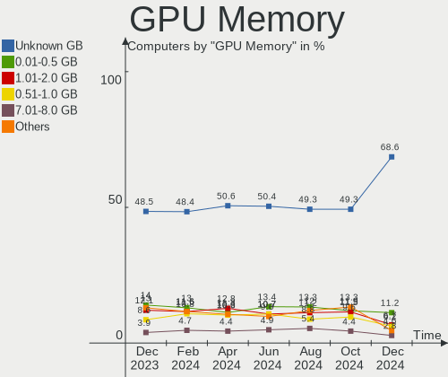
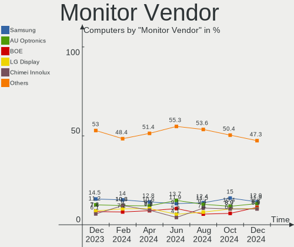
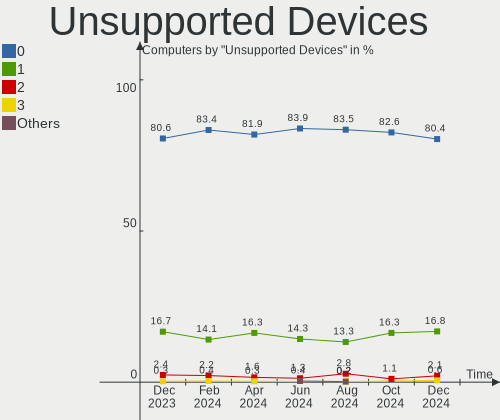

OpenMandriva - Hardware Trends
------------------------------

A project to identify most popular hardware characteristics and track their change
over time based on data collected by Linux users at https://Linux-Hardware.org.

Anyone can contribute to this report by the [hw-probe](https://github.com/linuxhw/hw-probe) tool:

    sudo -E hw-probe -all -upload

This is a report for all computer types. See also reports for [desktops](/Dist/OpenMandriva/Desktop/README.md) and [notebooks](/Dist/OpenMandriva/Notebook/README.md).

This report is for one last month. Overall report since the beginning of time: [TestCoverage](https://github.com/linuxhw/TestCoverage)

Period: Jul, 2022.

Contents
--------

* [ System ](#system)
  - [ OS                       ](#os)
  - [ OS Family                ](#os-family)
  - [ Kernel                   ](#kernel)
  - [ Kernel Family            ](#kernel-family)
  - [ Kernel Major Ver.        ](#kernel-major-ver)
  - [ Arch                     ](#arch)
  - [ DE                       ](#de)
  - [ Display Server           ](#display-server)
  - [ Display Manager          ](#display-manager)
  - [ OS Lang                  ](#os-lang)
  - [ Boot Mode                ](#boot-mode)
  - [ Filesystem               ](#filesystem)
  - [ Part. scheme             ](#part-scheme)
  - [ Dual Boot with Linux/BSD ](#dual-boot-with-linuxbsd)
  - [ Dual Boot (Win)          ](#dual-boot-win)

* [ Board ](#board)
  - [ Vendor                   ](#vendor)
  - [ Model                    ](#model)
  - [ Model Family             ](#model-family)
  - [ MFG Year                 ](#mfg-year)
  - [ Form Factor              ](#form-factor)
  - [ Secure Boot              ](#secure-boot)
  - [ Coreboot                 ](#coreboot)
  - [ RAM Size                 ](#ram-size)
  - [ RAM Used                 ](#ram-used)
  - [ Total Drives             ](#total-drives)
  - [ Has CD-ROM               ](#has-cd-rom)
  - [ Has Ethernet             ](#has-ethernet)
  - [ Has WiFi                 ](#has-wifi)
  - [ Has Bluetooth            ](#has-bluetooth)

* [ Location ](#location)
  - [ Country                  ](#country)
  - [ City                     ](#city)

* [ Drives ](#drives)
  - [ Drive Vendor             ](#drive-vendor)
  - [ Drive Model              ](#drive-model)
  - [ HDD Vendor               ](#hdd-vendor)
  - [ SSD Vendor               ](#ssd-vendor)
  - [ Drive Kind               ](#drive-kind)
  - [ Drive Connector          ](#drive-connector)
  - [ Drive Size               ](#drive-size)
  - [ Space Total              ](#space-total)
  - [ Space Used               ](#space-used)
  - [ Malfunc. Drives          ](#malfunc-drives)
  - [ Malfunc. Drive Vendor    ](#malfunc-drive-vendor)
  - [ Malfunc. HDD Vendor      ](#malfunc-hdd-vendor)
  - [ Malfunc. Drive Kind      ](#malfunc-drive-kind)
  - [ Failed Drives            ](#failed-drives)
  - [ Failed Drive Vendor      ](#failed-drive-vendor)
  - [ Drive Status             ](#drive-status)

* [ Storage controller ](#storage-controller)
  - [ Storage Vendor           ](#storage-vendor)
  - [ Storage Model            ](#storage-model)
  - [ Storage Kind             ](#storage-kind)

* [ Processor ](#processor)
  - [ CPU Vendor               ](#cpu-vendor)
  - [ CPU Model                ](#cpu-model)
  - [ CPU Model Family         ](#cpu-model-family)
  - [ CPU Cores                ](#cpu-cores)
  - [ CPU Sockets              ](#cpu-sockets)
  - [ CPU Threads              ](#cpu-threads)
  - [ CPU Op-Modes             ](#cpu-op-modes)
  - [ CPU Microcode            ](#cpu-microcode)
  - [ CPU Microarch            ](#cpu-microarch)

* [ Graphics ](#graphics)
  - [ GPU Vendor               ](#gpu-vendor)
  - [ GPU Model                ](#gpu-model)
  - [ GPU Combo                ](#gpu-combo)
  - [ GPU Driver               ](#gpu-driver)
  - [ GPU Memory               ](#gpu-memory)

* [ Monitor ](#monitor)
  - [ Monitor Vendor           ](#monitor-vendor)
  - [ Monitor Model            ](#monitor-model)
  - [ Monitor Resolution       ](#monitor-resolution)
  - [ Monitor Diagonal         ](#monitor-diagonal)
  - [ Monitor Width            ](#monitor-width)
  - [ Aspect Ratio             ](#aspect-ratio)
  - [ Monitor Area             ](#monitor-area)
  - [ Pixel Density            ](#pixel-density)
  - [ Multiple Monitors        ](#multiple-monitors)

* [ Network ](#network)
  - [ Net Controller Vendor    ](#net-controller-vendor)
  - [ Net Controller Model     ](#net-controller-model)
  - [ Wireless Vendor          ](#wireless-vendor)
  - [ Wireless Model           ](#wireless-model)
  - [ Ethernet Vendor          ](#ethernet-vendor)
  - [ Ethernet Model           ](#ethernet-model)
  - [ Net Controller Kind      ](#net-controller-kind)
  - [ Used Controller          ](#used-controller)
  - [ NICs                     ](#nics)
  - [ IPv6                     ](#ipv6)

* [ Bluetooth ](#bluetooth)
  - [ Bluetooth Vendor         ](#bluetooth-vendor)
  - [ Bluetooth Model          ](#bluetooth-model)

* [ Sound ](#sound)
  - [ Sound Vendor             ](#sound-vendor)
  - [ Sound Model              ](#sound-model)

* [ Memory ](#memory)
  - [ Memory Vendor            ](#memory-vendor)
  - [ Memory Model             ](#memory-model)
  - [ Memory Kind              ](#memory-kind)
  - [ Memory Form Factor       ](#memory-form-factor)
  - [ Memory Size              ](#memory-size)
  - [ Memory Speed             ](#memory-speed)

* [ Printers & scanners ](#printers--scanners)
  - [ Printer Vendor           ](#printer-vendor)
  - [ Printer Model            ](#printer-model)
  - [ Scanner Vendor           ](#scanner-vendor)
  - [ Scanner Model            ](#scanner-model)

* [ Camera ](#camera)
  - [ Camera Vendor            ](#camera-vendor)
  - [ Camera Model             ](#camera-model)

* [ Security ](#security)
  - [ Fingerprint Vendor       ](#fingerprint-vendor)
  - [ Fingerprint Model        ](#fingerprint-model)
  - [ Chipcard Vendor          ](#chipcard-vendor)
  - [ Chipcard Model           ](#chipcard-model)

* [ Unsupported ](#unsupported)
  - [ Unsupported Devices      ](#unsupported-devices)
  - [ Unsupported Device Types ](#unsupported-device-types)

System
------

OS
--

Installed operating systems

| Name              | Computers | Percent |
|-------------------|-----------|---------|
| OpenMandriva 4.3  | 354       | 66.79%  |
| OpenMandriva 4.90 | 155       | 29.25%  |
| OpenMandriva 4.2  | 17        | 3.21%   |
| OpenMandriva 4.50 | 4         | 0.75%   |

OS Family
---------

OS without a version

| Name         | Computers | Percent |
|--------------|-----------|---------|
| OpenMandriva | 530       | 100%    |

Kernel
------

Version of the Linux kernel

| Version                       | Computers | Percent |
|-------------------------------|-----------|---------|
| 5.16.7-desktop-1omv4003       | 327       | 61.7%   |
| 5.18.12-desktop-3omv4090      | 148       | 27.92%  |
| 5.16.13-desktop-1omv4003      | 19        | 3.58%   |
| 5.10.14-desktop-1omv4002      | 15        | 2.83%   |
| 5.17.1-desktop-2omv4050       | 5         | 0.94%   |
| 5.18.13-desktop-1omv4090      | 4         | 0.75%   |
| 5.14.7-desktop-1omv4050       | 4         | 0.75%   |
| 5.11.12-desktop-1omv4002      | 2         | 0.38%   |
| 5.18.9-desktop-gcc-1omv4090   | 1         | 0.19%   |
| 5.18.11-desktop-gcc-3omv4090  | 1         | 0.19%   |
| 5.18.11-desktop-3omv4090      | 1         | 0.19%   |
| 5.17.1-desktop-clang-2omv4050 | 1         | 0.19%   |
| 5.15.14-1-lts                 | 1         | 0.19%   |
| 5.14.14-desktop-1omv4050      | 1         | 0.19%   |

Kernel Family
-------------

Linux kernel without a distro release

| Version | Computers | Percent |
|---------|-----------|---------|
| 5.16.7  | 327       | 61.7%   |
| 5.18.12 | 148       | 27.92%  |
| 5.16.13 | 19        | 3.58%   |
| 5.10.14 | 15        | 2.83%   |
| 5.17.1  | 6         | 1.13%   |
| 5.18.13 | 4         | 0.75%   |
| 5.14.7  | 4         | 0.75%   |
| 5.18.11 | 2         | 0.38%   |
| 5.11.12 | 2         | 0.38%   |
| 5.18.9  | 1         | 0.19%   |
| 5.15.14 | 1         | 0.19%   |
| 5.14.14 | 1         | 0.19%   |

Kernel Major Ver.
-----------------

Linux kernel major version

| Version | Computers | Percent |
|---------|-----------|---------|
| 5.16    | 346       | 65.28%  |
| 5.18    | 155       | 29.25%  |
| 5.10    | 15        | 2.83%   |
| 5.17    | 6         | 1.13%   |
| 5.14    | 5         | 0.94%   |
| 5.11    | 2         | 0.38%   |
| 5.15    | 1         | 0.19%   |

Arch
----

OS architecture (x86_64, i586, etc.)

| Name   | Computers | Percent |
|--------|-----------|---------|
| x86_64 | 530       | 100%    |

DE
--

Desktop Environment

| Name    | Computers | Percent |
|---------|-----------|---------|
| KDE5    | 523       | 98.68%  |
| LXQt    | 5         | 0.94%   |
| Unknown | 2         | 0.38%   |

Display Server
--------------

X11 or Wayland

| Name    | Computers | Percent |
|---------|-----------|---------|
| X11     | 527       | 99.43%  |
| Wayland | 3         | 0.57%   |

Display Manager
---------------

SDDM, LightDM, etc.

| Name | Computers | Percent |
|------|-----------|---------|
| SDDM | 530       | 100%    |

OS Lang
-------

Language

| Lang  | Computers | Percent |
|-------|-----------|---------|
| en_US | 339       | 63.96%  |
| de_DE | 29        | 5.47%   |
| fr_FR | 27        | 5.09%   |
| ru_RU | 26        | 4.91%   |
| pt_BR | 20        | 3.77%   |
| en_GB | 14        | 2.64%   |
| it_IT | 9         | 1.7%    |
| cs_CZ | 8         | 1.51%   |
| pl_PL | 7         | 1.32%   |
| hu_HU | 6         | 1.13%   |
| es_AR | 4         | 0.75%   |
| en_AU | 4         | 0.75%   |
| de_CH | 4         | 0.75%   |
| nl_NL | 3         | 0.57%   |
| tr_TR | 2         | 0.38%   |
| pt_PT | 2         | 0.38%   |
| fr_CH | 2         | 0.38%   |
| fr_BE | 2         | 0.38%   |
| es_PE | 2         | 0.38%   |
| es_MX | 2         | 0.38%   |
| es_ES | 2         | 0.38%   |
| en_NZ | 2         | 0.38%   |
| de_LU | 2         | 0.38%   |
| de_AT | 2         | 0.38%   |
| ru_UA | 1         | 0.19%   |
| ro_RO | 1         | 0.19%   |
| nb_NO | 1         | 0.19%   |
| es_SV | 1         | 0.19%   |
| es_DO | 1         | 0.19%   |
| es_CL | 1         | 0.19%   |
| en_IN | 1         | 0.19%   |
| en_CA | 1         | 0.19%   |
| en_AG | 1         | 0.19%   |
| ar_EG | 1         | 0.19%   |

Boot Mode
---------

EFI or BIOS

| Mode | Computers | Percent |
|------|-----------|---------|
| EFI  | 286       | 53.96%  |
| BIOS | 244       | 46.04%  |

Filesystem
----------

Type of filesystem

| Type    | Computers | Percent |
|---------|-----------|---------|
| Overlay | 442       | 83.4%   |
| Ext4    | 87        | 16.42%  |
| F2fs    | 1         | 0.19%   |

Part. scheme
------------

Scheme of partitioning

| Type    | Computers | Percent |
|---------|-----------|---------|
| GPT     | 341       | 64.34%  |
| MBR     | 186       | 35.09%  |
| Unknown | 3         | 0.57%   |

Dual Boot with Linux/BSD
------------------------

Hosting more than one Linux/BSD

| Dual boot | Computers | Percent |
|-----------|-----------|---------|
| Yes       | 306       | 57.74%  |
| No        | 224       | 42.26%  |

Dual Boot (Win)
---------------

Hosting Linux and Windows

| Dual boot | Computers | Percent |
|-----------|-----------|---------|
| No        | 290       | 54.72%  |
| Yes       | 240       | 45.28%  |

Board
-----

Vendor
------

Motherboard manufacturer

| Name                | Computers | Percent |
|---------------------|-----------|---------|
| ASUSTek Computer    | 84        | 15.85%  |
| Hewlett-Packard     | 78        | 14.72%  |
| Dell                | 67        | 12.64%  |
| Lenovo              | 52        | 9.81%   |
| Acer                | 43        | 8.11%   |
| Gigabyte Technology | 42        | 7.92%   |
| MSI                 | 32        | 6.04%   |
| ASRock              | 27        | 5.09%   |
| Intel               | 13        | 2.45%   |
| Toshiba             | 11        | 2.08%   |
| Fujitsu             | 8         | 1.51%   |
| Sony                | 7         | 1.32%   |
| Pegatron            | 6         | 1.13%   |
| Apple               | 6         | 1.13%   |
| Foxconn             | 5         | 0.94%   |
| Samsung Electronics | 4         | 0.75%   |
| Notebook            | 3         | 0.57%   |
| Digibras            | 3         | 0.57%   |
| Unknown             | 3         | 0.57%   |
| Wortmann AG         | 2         | 0.38%   |
| Positivo            | 2         | 0.38%   |
| PCWare              | 2         | 0.38%   |
| Microsoft           | 2         | 0.38%   |
| LG Electronics      | 2         | 0.38%   |
| Gateway             | 2         | 0.38%   |
| eMachines           | 2         | 0.38%   |
| ECS                 | 2         | 0.38%   |
| Biostar             | 2         | 0.38%   |
| AZW                 | 2         | 0.38%   |
| Wistron             | 1         | 0.19%   |
| Purism              | 1         | 0.19%   |
| PCChips             | 1         | 0.19%   |
| Packard Bell        | 1         | 0.19%   |
| NEC Computers       | 1         | 0.19%   |
| Micro Electronics   | 1         | 0.19%   |
| METAPHYUNI          | 1         | 0.19%   |
| Medion              | 1         | 0.19%   |
| Login Informatica   | 1         | 0.19%   |
| HUAWEI              | 1         | 0.19%   |
| Google              | 1         | 0.19%   |
| Framework           | 1         | 0.19%   |
| Digiboard           | 1         | 0.19%   |
| Compaq              | 1         | 0.19%   |
| Colorful Technology | 1         | 0.19%   |
| BESSTAR Tech        | 1         | 0.19%   |

Model
-----

Motherboard model

| Name                                      | Computers | Percent |
|-------------------------------------------|-----------|---------|
| Dell Latitude 3310                        | 8         | 1.51%   |
| ASUS UX31E                                | 4         | 0.75%   |
| Unknown                                   | 4         | 0.75%   |
| MSI MS-7C02                               | 3         | 0.57%   |
| MSI MS-7A74                               | 3         | 0.57%   |
| HP Notebook                               | 3         | 0.57%   |
| HP EliteBook 8460p                        | 3         | 0.57%   |
| HP Compaq 8200 Elite SFF PC               | 3         | 0.57%   |
| Gigabyte X570 AORUS MASTER                | 3         | 0.57%   |
| Dell OptiPlex 780                         | 3         | 0.57%   |
| Dell Latitude 3190 2-in-1                 | 3         | 0.57%   |
| ASUS All Series                           | 3         | 0.57%   |
| Acer Aspire 3100                          | 3         | 0.57%   |
| MSI MS-7B79                               | 2         | 0.38%   |
| MSI MS-7592                               | 2         | 0.38%   |
| Lenovo IdeaPad Slim 1-14AST-05 81VS       | 2         | 0.38%   |
| Lenovo IdeaPad S145-15API 81UT            | 2         | 0.38%   |
| Lenovo G50-45 80E3                        | 2         | 0.38%   |
| Intel NUC8i5BEH                           | 2         | 0.38%   |
| HP ProBook 6570b                          | 2         | 0.38%   |
| HP Pavilion Notebook                      | 2         | 0.38%   |
| HP Pavilion dv6700                        | 2         | 0.38%   |
| HP Laptop 15s-eq1xxx                      | 2         | 0.38%   |
| HP EliteBook x360 830 G6                  | 2         | 0.38%   |
| HP Dev One Notebook PC                    | 2         | 0.38%   |
| Gigabyte B75M-D3H                         | 2         | 0.38%   |
| Digibras NH4CU03                          | 2         | 0.38%   |
| Dell Vostro 15-3568                       | 2         | 0.38%   |
| Dell OptiPlex 3020                        | 2         | 0.38%   |
| Dell OptiPlex 3010                        | 2         | 0.38%   |
| Dell Latitude E6540                       | 2         | 0.38%   |
| Dell Latitude E6430                       | 2         | 0.38%   |
| Dell Latitude 3120                        | 2         | 0.38%   |
| Dell Inspiron 3451                        | 2         | 0.38%   |
| ASUS VivoBook_ASUSLaptop X509JA_X509JA    | 2         | 0.38%   |
| ASUS VivoBook_ASUSLaptop X412DAP_F412DA   | 2         | 0.38%   |
| ASUS VivoBook_ASUSLaptop TP401MAR_TP401MA | 2         | 0.38%   |
| ASUS TUF Gaming B550-PLUS                 | 2         | 0.38%   |
| ASUS ROG STRIX B550-F GAMING              | 2         | 0.38%   |
| ASUS H110M-R                              | 2         | 0.38%   |
| ASRock B450M Steel Legend                 | 2         | 0.38%   |
| ASRock AB350 Pro4                         | 2         | 0.38%   |
| Acer Aspire 5742G                         | 2         | 0.38%   |
| Wortmann AG TERRA_MOBILE_1528P/1748P      | 1         | 0.19%   |
| Wortmann AG MS-1727                       | 1         | 0.19%   |
| Wistron ProLiant ML110 G5                 | 1         | 0.19%   |
| Toshiba Satellite Pro R50-C               | 1         | 0.19%   |
| Toshiba Satellite P50-B-118               | 1         | 0.19%   |
| Toshiba Satellite C870D-116               | 1         | 0.19%   |
| Toshiba Satellite C850D-11K               | 1         | 0.19%   |
| Toshiba Satellite C75D-B                  | 1         | 0.19%   |
| Toshiba Satellite C655                    | 1         | 0.19%   |
| Toshiba Portable PC                       | 1         | 0.19%   |
| Toshiba dynabook T653/46JR                | 1         | 0.19%   |
| Toshiba dynabook REGZA PC D712/T3FWD      | 1         | 0.19%   |
| Toshiba dynabook R734/K                   | 1         | 0.19%   |
| Toshiba dynabook B350/22A                 | 1         | 0.19%   |
| Sony VPCS110FL                            | 1         | 0.19%   |
| Sony VPCEB26FG                            | 1         | 0.19%   |
| Sony VPCEA45FL                            | 1         | 0.19%   |

Model Family
------------

Motherboard model prefix

| Name                | Computers | Percent |
|---------------------|-----------|---------|
| Dell Latitude       | 30        | 5.66%   |
| Acer Aspire         | 29        | 5.47%   |
| Lenovo ThinkPad     | 16        | 3.02%   |
| Dell OptiPlex       | 15        | 2.83%   |
| Lenovo IdeaPad      | 14        | 2.64%   |
| HP Pavilion         | 13        | 2.45%   |
| ASUS VivoBook       | 13        | 2.45%   |
| HP ProBook          | 10        | 1.89%   |
| HP Compaq           | 10        | 1.89%   |
| ASUS PRIME          | 9         | 1.7%    |
| HP EliteBook        | 8         | 1.51%   |
| Dell Inspiron       | 8         | 1.51%   |
| HP Laptop           | 7         | 1.32%   |
| ASUS ROG            | 7         | 1.32%   |
| Toshiba Satellite   | 6         | 1.13%   |
| Lenovo ThinkCentre  | 5         | 0.94%   |
| HP EliteDesk        | 5         | 0.94%   |
| HP 250              | 5         | 0.94%   |
| Fujitsu LIFEBOOK    | 5         | 0.94%   |
| Dell Vostro         | 5         | 0.94%   |
| ASUS TUF            | 5         | 0.94%   |
| Acer Veriton        | 5         | 0.94%   |
| Toshiba dynabook    | 4         | 0.75%   |
| Dell Precision      | 4         | 0.75%   |
| ASUS UX31E          | 4         | 0.75%   |
| Unknown             | 4         | 0.75%   |
| MSI MS-7C02         | 3         | 0.57%   |
| MSI MS-7A74         | 3         | 0.57%   |
| Lenovo IdeaCentre   | 3         | 0.57%   |
| HP Notebook         | 3         | 0.57%   |
| Gigabyte X570       | 3         | 0.57%   |
| Dell XPS            | 3         | 0.57%   |
| ASUS All            | 3         | 0.57%   |
| ASRock B450M        | 3         | 0.57%   |
| MSI MS-7B79         | 2         | 0.38%   |
| MSI MS-7592         | 2         | 0.38%   |
| Microsoft Surface   | 2         | 0.38%   |
| Lenovo Yoga         | 2         | 0.38%   |
| Lenovo G50-45       | 2         | 0.38%   |
| Intel NUC8i5BEH     | 2         | 0.38%   |
| HP Dev              | 2         | 0.38%   |
| HP All-in-One       | 2         | 0.38%   |
| Gigabyte B75M-D3H   | 2         | 0.38%   |
| Fujitsu ESPRIMO     | 2         | 0.38%   |
| Foxconn Pro         | 2         | 0.38%   |
| Digibras NH4CU03    | 2         | 0.38%   |
| Dell Studio         | 2         | 0.38%   |
| ASUS SABERTOOTH     | 2         | 0.38%   |
| ASUS MINIPC         | 2         | 0.38%   |
| ASUS M5A97          | 2         | 0.38%   |
| ASUS H110M-R        | 2         | 0.38%   |
| ASUS ASUS           | 2         | 0.38%   |
| ASRock AB350        | 2         | 0.38%   |
| ASRock A320M-HDV    | 2         | 0.38%   |
| Acer TravelMate     | 2         | 0.38%   |
| Acer Swift          | 2         | 0.38%   |
| Acer Nitro          | 2         | 0.38%   |
| Wortmann AG TERRA   | 1         | 0.19%   |
| Wortmann AG MS-1727 | 1         | 0.19%   |
| Wistron ProLiant    | 1         | 0.19%   |

MFG Year
--------

Motherboard manufacture year

| Year    | Computers | Percent |
|---------|-----------|---------|
| 2019    | 59        | 11.13%  |
| 2011    | 49        | 9.25%   |
| 2020    | 48        | 9.06%   |
| 2012    | 42        | 7.92%   |
| 2013    | 39        | 7.36%   |
| 2010    | 39        | 7.36%   |
| 2018    | 36        | 6.79%   |
| 2021    | 34        | 6.42%   |
| 2014    | 34        | 6.42%   |
| 2009    | 28        | 5.28%   |
| 2017    | 26        | 4.91%   |
| 2016    | 25        | 4.72%   |
| 2015    | 22        | 4.15%   |
| 2008    | 16        | 3.02%   |
| 2007    | 14        | 2.64%   |
| 2006    | 9         | 1.7%    |
| 2022    | 8         | 1.51%   |
| 2005    | 1         | 0.19%   |
| Unknown | 1         | 0.19%   |

Form Factor
-----------

Physical design of the computer

| Name        | Computers | Percent |
|-------------|-----------|---------|
| Notebook    | 252       | 47.55%  |
| Desktop     | 242       | 45.66%  |
| Convertible | 14        | 2.64%   |
| All in one  | 14        | 2.64%   |
| Mini pc     | 6         | 1.13%   |
| Tablet      | 2         | 0.38%   |

Secure Boot
-----------

Enabled or disabled

| State    | Computers | Percent |
|----------|-----------|---------|
| Disabled | 530       | 100%    |

Coreboot
--------

Have coreboot on board

| Used | Computers | Percent |
|------|-----------|---------|
| No   | 528       | 99.62%  |
| Yes  | 2         | 0.38%   |

RAM Size
--------

Total RAM memory

| Size in GB  | Computers | Percent |
|-------------|-----------|---------|
| 3.01-4.0    | 144       | 27.17%  |
| 4.01-8.0    | 143       | 26.98%  |
| 8.01-16.0   | 104       | 19.62%  |
| 16.01-24.0  | 70        | 13.21%  |
| 32.01-64.0  | 31        | 5.85%   |
| 1.01-2.0    | 12        | 2.26%   |
| 24.01-32.0  | 11        | 2.08%   |
| 2.01-3.0    | 7         | 1.32%   |
| 64.01-256.0 | 7         | 1.32%   |
| 0.51-1.0    | 1         | 0.19%   |

RAM Used
--------

Used RAM memory

| Used GB  | Computers | Percent |
|----------|-----------|---------|
| 1.01-2.0 | 408       | 76.98%  |
| 0.51-1.0 | 65        | 12.26%  |
| 2.01-3.0 | 43        | 8.11%   |
| 3.01-4.0 | 7         | 1.32%   |
| 0.01-0.5 | 5         | 0.94%   |
| 4.01-8.0 | 2         | 0.38%   |

Total Drives
------------

Number of drives on board

| Drives | Computers | Percent |
|--------|-----------|---------|
| 1      | 319       | 60.19%  |
| 2      | 122       | 23.02%  |
| 3      | 48        | 9.06%   |
| 4      | 19        | 3.58%   |
| 0      | 9         | 1.7%    |
| 5      | 6         | 1.13%   |
| 6      | 5         | 0.94%   |
| 9      | 1         | 0.19%   |
| 7      | 1         | 0.19%   |

Has CD-ROM
----------

Has CD-ROM on board

| Presented | Computers | Percent |
|-----------|-----------|---------|
| Yes       | 269       | 50.75%  |
| No        | 261       | 49.25%  |

Has Ethernet
------------

Has Ethernet on board

| Presented | Computers | Percent |
|-----------|-----------|---------|
| Yes       | 473       | 89.25%  |
| No        | 57        | 10.75%  |

Has WiFi
--------

Has WiFi module

| Presented | Computers | Percent |
|-----------|-----------|---------|
| Yes       | 366       | 69.06%  |
| No        | 164       | 30.94%  |

Has Bluetooth
-------------

Has Bluetooth module

| Presented | Computers | Percent |
|-----------|-----------|---------|
| Yes       | 280       | 52.83%  |
| No        | 250       | 47.17%  |

Location
--------

Country
-------

Geographic location (country)

| Country             | Computers | Percent |
|---------------------|-----------|---------|
| USA                 | 99        | 18.68%  |
| Germany             | 46        | 8.68%   |
| France              | 39        | 7.36%   |
| Brazil              | 36        | 6.79%   |
| Russia              | 35        | 6.6%    |
| UK                  | 25        | 4.72%   |
| Netherlands         | 24        | 4.53%   |
| Italy               | 16        | 3.02%   |
| Poland              | 13        | 2.45%   |
| Australia           | 13        | 2.45%   |
| Japan               | 10        | 1.89%   |
| Canada              | 10        | 1.89%   |
| Switzerland         | 9         | 1.7%    |
| Hungary             | 9         | 1.7%    |
| Belgium             | 9         | 1.7%    |
| Czechia             | 8         | 1.51%   |
| Sweden              | 7         | 1.32%   |
| India               | 7         | 1.32%   |
| Spain               | 6         | 1.13%   |
| Portugal            | 6         | 1.13%   |
| Greece              | 6         | 1.13%   |
| Peru                | 5         | 0.94%   |
| Argentina           | 5         | 0.94%   |
| New Zealand         | 4         | 0.75%   |
| Mexico              | 4         | 0.75%   |
| Colombia            | 4         | 0.75%   |
| Taiwan              | 3         | 0.57%   |
| Slovakia            | 3         | 0.57%   |
| North Macedonia     | 3         | 0.57%   |
| Kazakhstan          | 3         | 0.57%   |
| Egypt               | 3         | 0.57%   |
| China               | 3         | 0.57%   |
| Bulgaria            | 3         | 0.57%   |
| Austria             | 3         | 0.57%   |
| Turkey              | 2         | 0.38%   |
| Thailand            | 2         | 0.38%   |
| South Africa        | 2         | 0.38%   |
| Serbia              | 2         | 0.38%   |
| Romania             | 2         | 0.38%   |
| Norway              | 2         | 0.38%   |
| Luxembourg          | 2         | 0.38%   |
| Israel              | 2         | 0.38%   |
| Indonesia           | 2         | 0.38%   |
| Hong Kong           | 2         | 0.38%   |
| Dominican Republic  | 2         | 0.38%   |
| Croatia             | 2         | 0.38%   |
| Chile               | 2         | 0.38%   |
| Belarus             | 2         | 0.38%   |
| Algeria             | 2         | 0.38%   |
| Vietnam             | 1         | 0.19%   |
| Uruguay             | 1         | 0.19%   |
| Ukraine             | 1         | 0.19%   |
| U.S. Virgin Islands | 1         | 0.19%   |
| Sudan               | 1         | 0.19%   |
| St Kitts and Nevis  | 1         | 0.19%   |
| Slovenia            | 1         | 0.19%   |
| Saudi Arabia        | 1         | 0.19%   |
| Réunion            | 1         | 0.19%   |
| Qatar               | 1         | 0.19%   |
| Puerto Rico         | 1         | 0.19%   |

City
----

Geographic location (city)

| City             | Computers | Percent |
|------------------|-----------|---------|
| Schagen          | 14        | 2.64%   |
| Moscow           | 6         | 1.13%   |
| Rio de Janeiro   | 5         | 0.94%   |
| Sydney           | 4         | 0.75%   |
| San Antonio      | 4         | 0.75%   |
| Lima             | 4         | 0.75%   |
| Krakow           | 4         | 0.75%   |
| Geneva           | 4         | 0.75%   |
| Athens           | 4         | 0.75%   |
| Vienna           | 3         | 0.57%   |
| Skopje           | 3         | 0.57%   |
| Sao Paulo        | 3         | 0.57%   |
| Prague           | 3         | 0.57%   |
| Nottingham       | 3         | 0.57%   |
| Milan            | 3         | 0.57%   |
| Curitiba         | 3         | 0.57%   |
| Cairo            | 3         | 0.57%   |
| Buenos Aires     | 3         | 0.57%   |
| Brisbane         | 3         | 0.57%   |
| Berlin           | 3         | 0.57%   |
| Bengaluru        | 3         | 0.57%   |
| Ashland          | 3         | 0.57%   |
| Zagreb           | 2         | 0.38%   |
| Würzburg        | 2         | 0.38%   |
| Winchester       | 2         | 0.38%   |
| Tucson           | 2         | 0.38%   |
| Tsubame          | 2         | 0.38%   |
| The Hague        | 2         | 0.38%   |
| Strassen         | 2         | 0.38%   |
| St Petersburg    | 2         | 0.38%   |
| Sint-Amands      | 2         | 0.38%   |
| Seattle          | 2         | 0.38%   |
| Santee           | 2         | 0.38%   |
| San Jose         | 2         | 0.38%   |
| Rositz           | 2         | 0.38%   |
| Rome             | 2         | 0.38%   |
| Quincy           | 2         | 0.38%   |
| Queens           | 2         | 0.38%   |
| Prešov          | 2         | 0.38%   |
| Poznan           | 2         | 0.38%   |
| Perm             | 2         | 0.38%   |
| Perassay         | 2         | 0.38%   |
| Parkesburg       | 2         | 0.38%   |
| Paris            | 2         | 0.38%   |
| Ottawa           | 2         | 0.38%   |
| Nizhniy Novgorod | 2         | 0.38%   |
| Nîmes           | 2         | 0.38%   |
| Nieuw-Vossemeer  | 2         | 0.38%   |
| New Taipei       | 2         | 0.38%   |
| New Bern         | 2         | 0.38%   |
| Minsk            | 2         | 0.38%   |
| Mexico City      | 2         | 0.38%   |
| Manchester       | 2         | 0.38%   |
| Mako             | 2         | 0.38%   |
| Lancaster        | 2         | 0.38%   |
| Kristiansand     | 2         | 0.38%   |
| Keller           | 2         | 0.38%   |
| Kansas City      | 2         | 0.38%   |
| Indaiatuba       | 2         | 0.38%   |
| Hemet            | 2         | 0.38%   |

Drives
------

Drive Vendor
------------

Hard drive vendors

| Vendor              | Computers | Drives | Percent |
|---------------------|-----------|--------|---------|
| WDC                 | 143       | 167    | 18.72%  |
| Seagate             | 108       | 134    | 14.14%  |
| Samsung Electronics | 92        | 106    | 12.04%  |
| Toshiba             | 53        | 53     | 6.94%   |
| Crucial             | 36        | 40     | 4.71%   |
| Hitachi             | 34        | 34     | 4.45%   |
| Kingston            | 33        | 36     | 4.32%   |
| SanDisk             | 31        | 32     | 4.06%   |
| Unknown             | 25        | 27     | 3.27%   |
| SK hynix            | 24        | 24     | 3.14%   |
| A-DATA Technology   | 16        | 16     | 2.09%   |
| HGST                | 14        | 15     | 1.83%   |
| Intel               | 13        | 14     | 1.7%    |
| China               | 11        | 12     | 1.44%   |
| PNY                 | 9         | 9      | 1.18%   |
| Gigabyte Technology | 9         | 11     | 1.18%   |
| JMicron Technology  | 6         | 6      | 0.79%   |
| Unknown             | 6         | 6      | 0.79%   |
| OCZ                 | 5         | 5      | 0.65%   |
| ASMT                | 5         | 5      | 0.65%   |
| SPCC                | 4         | 4      | 0.52%   |
| Silicon Motion      | 4         | 4      | 0.52%   |
| Phison              | 4         | 4      | 0.52%   |
| Maxtor              | 4         | 4      | 0.52%   |
| GOODRAM             | 4         | 4      | 0.52%   |
| Corsair             | 4         | 4      | 0.52%   |
| SSSTC               | 3         | 3      | 0.39%   |
| Lexar               | 3         | 3      | 0.39%   |
| KIOXIA              | 3         | 3      | 0.39%   |
| Apacer              | 3         | 3      | 0.39%   |
| Zheino              | 2         | 3      | 0.26%   |
| UMIS                | 2         | 2      | 0.26%   |
| TO Exter            | 2         | 2      | 0.26%   |
| Realtek             | 2         | 2      | 0.26%   |
| Netac               | 2         | 2      | 0.26%   |
| JetFlash            | 2         | 2      | 0.26%   |
| Intenso             | 2         | 2      | 0.26%   |
| Fujitsu             | 2         | 2      | 0.26%   |
| Apple               | 2         | 2      | 0.26%   |
| ZHITAI              | 1         | 1      | 0.13%   |
| XrayDisk            | 1         | 1      | 0.13%   |
| XPG                 | 1         | 2      | 0.13%   |
| VERICO              | 1         | 1      | 0.13%   |
| Vaseky              | 1         | 1      | 0.13%   |
| V-GeN               | 1         | 1      | 0.13%   |
| Transcend           | 1         | 1      | 0.13%   |
| TEXTORM             | 1         | 1      | 0.13%   |
| Team                | 1         | 1      | 0.13%   |
| SSD 32GB            | 1         | 1      | 0.13%   |
| SSD 120G            | 1         | 1      | 0.13%   |
| SPCC M.2            | 1         | 1      | 0.13%   |
| Smartbuy            | 1         | 1      | 0.13%   |
| SATAFIRM            | 1         | 1      | 0.13%   |
| SABRENT             | 1         | 1      | 0.13%   |
| Plextor             | 1         | 1      | 0.13%   |
| Patriot             | 1         | 1      | 0.13%   |
| NGFF                | 1         | 1      | 0.13%   |
| Min Yi U            | 1         | 1      | 0.13%   |
| Micron Technology   | 1         | 1      | 0.13%   |
| LITEON              | 1         | 1      | 0.13%   |

Drive Model
-----------

Hard drive models

| Model                                | Computers | Percent |
|--------------------------------------|-----------|---------|
| Kingston SA400S37240G 240GB SSD      | 12        | 1.45%   |
| Unknown SD/MMC/MS PRO 64GB           | 9         | 1.09%   |
| Toshiba MQ01ABF050 500GB             | 9         | 1.09%   |
| Toshiba MQ01ABD100 1TB               | 9         | 1.09%   |
| Seagate ST500DM002-1BD142 500GB      | 8         | 0.97%   |
| Seagate ST500LT012-1DG142 500GB      | 7         | 0.85%   |
| Crucial CT500MX500SSD1 500GB         | 7         | 0.85%   |
| WDC WD10EZEX-08WN4A0 1TB             | 6         | 0.73%   |
| Seagate ST1000DM010-2EP102 1TB       | 6         | 0.73%   |
| Crucial CT1000MX500SSD1 1TB          | 6         | 0.73%   |
| Unknown                              | 6         | 0.73%   |
| WDC WD10EZEX-00BN5A0 1TB             | 5         | 0.61%   |
| Seagate ST1000LM035-1RK172 1TB       | 5         | 0.61%   |
| Seagate Expansion 1TB                | 5         | 0.61%   |
| Samsung SSD 860 EVO 250GB            | 5         | 0.61%   |
| Samsung SSD 850 EVO 250GB            | 5         | 0.61%   |
| HGST HTS541010A9E680 1TB             | 5         | 0.61%   |
| Toshiba DT01ACA050 500GB             | 4         | 0.48%   |
| SanDisk SSD U100 256GB               | 4         | 0.48%   |
| SanDisk SDSSDA120G 120GB             | 4         | 0.48%   |
| Samsung SSD 970 EVO Plus 500GB       | 4         | 0.48%   |
| Samsung SSD 860 EVO 500GB            | 4         | 0.48%   |
| Kingston SV300S37A120G 120GB SSD     | 4         | 0.48%   |
| HGST HTS721010A9E630 1TB             | 4         | 0.48%   |
| Crucial CT240BX500SSD1 240GB         | 4         | 0.48%   |
| A-DATA SU630 240GB SSD               | 4         | 0.48%   |
| WDC WD10JPVX-22JC3T0 1TB             | 3         | 0.36%   |
| WDC WD10EZEX-08M2NA0 1TB             | 3         | 0.36%   |
| WDC PC SN520 SDAPNUW-256G-1006 256GB | 3         | 0.36%   |
| Toshiba MQ04ABF100 1TB               | 3         | 0.36%   |
| Toshiba DT01ACA100 1TB               | 3         | 0.36%   |
| SK hynix HFM256GDJTNG-8310A 256GB    | 3         | 0.36%   |
| SK hynix BC511 NVMe 256GB            | 3         | 0.36%   |
| Seagate ST500LT012-9WS142 500GB      | 3         | 0.36%   |
| Seagate ST3500418AS 500GB            | 3         | 0.36%   |
| Seagate ST3320620AS 320GB            | 3         | 0.36%   |
| Seagate ST2000DM008-2FR102 2TB       | 3         | 0.36%   |
| Seagate ST1000DM003-1SB102 1TB       | 3         | 0.36%   |
| SanDisk SDSSDH3 1T00 1TB             | 3         | 0.36%   |
| Samsung SSD 860 QVO 1TB              | 3         | 0.36%   |
| Samsung PM991a NVMe 256GB            | 3         | 0.36%   |
| PNY CS900 120GB SSD                  | 3         | 0.36%   |
| JMicron Generic 2TB                  | 3         | 0.36%   |
| Intel SSDPEKNW512G8H 512GB           | 3         | 0.36%   |
| Hitachi HTS547575A9E384 752GB        | 3         | 0.36%   |
| Hitachi HTS545050B9A300 500GB        | 3         | 0.36%   |
| Hitachi HTS543232A7A384 320GB        | 3         | 0.36%   |
| Crucial CT480BX500SSD1 480GB         | 3         | 0.36%   |
| Crucial CT250MX500SSD1 250GB         | 3         | 0.36%   |
| China SATA SSD 120GB                 | 3         | 0.36%   |
| ASMT 2115 1TB                        | 3         | 0.36%   |
| WDC WDS500G2B0A-00SM50 500GB SSD     | 2         | 0.24%   |
| WDC WDS250G2B0B-00YS70 250GB SSD     | 2         | 0.24%   |
| WDC WD5000LPVX-22V0TT0 500GB         | 2         | 0.24%   |
| WDC WD5000BEVT-22A0RT0 500GB         | 2         | 0.24%   |
| WDC WD5000AAKS-00V1A0 500GB          | 2         | 0.24%   |
| WDC WD5000AADS-00S9B0 500GB          | 2         | 0.24%   |
| WDC WD3200BPVT-22ZEST0 320GB         | 2         | 0.24%   |
| WDC WD30EZRX-00SPEB0 3TB             | 2         | 0.24%   |
| WDC WD2002FAEX-007BA0 2TB            | 2         | 0.24%   |

HDD Vendor
----------

Hard disk drive vendors

| Vendor              | Computers | Drives | Percent |
|---------------------|-----------|--------|---------|
| WDC                 | 116       | 129    | 31.96%  |
| Seagate             | 106       | 131    | 29.2%   |
| Toshiba             | 47        | 47     | 12.95%  |
| Hitachi             | 34        | 34     | 9.37%   |
| Samsung Electronics | 21        | 22     | 5.79%   |
| HGST                | 14        | 15     | 3.86%   |
| Unknown             | 9         | 9      | 2.48%   |
| Maxtor              | 4         | 4      | 1.1%    |
| ASMT                | 4         | 4      | 1.1%    |
| SATAFIRM            | 1         | 1      | 0.28%   |
| SABRENT             | 1         | 1      | 0.28%   |
| KESU                | 1         | 1      | 0.28%   |
| Intenso             | 1         | 1      | 0.28%   |
| Fujitsu             | 1         | 1      | 0.28%   |
| Fantom              | 1         | 1      | 0.28%   |
| ASMedia             | 1         | 1      | 0.28%   |
| Unknown             | 1         | 1      | 0.28%   |

SSD Vendor
----------

Solid state drive vendors

| Vendor              | Computers | Drives | Percent |
|---------------------|-----------|--------|---------|
| Samsung Electronics | 43        | 48     | 17.77%  |
| Crucial             | 31        | 33     | 12.81%  |
| SanDisk             | 27        | 28     | 11.16%  |
| Kingston            | 25        | 28     | 10.33%  |
| WDC                 | 12        | 13     | 4.96%   |
| China               | 11        | 12     | 4.55%   |
| A-DATA Technology   | 11        | 11     | 4.55%   |
| PNY                 | 7         | 7      | 2.89%   |
| SK hynix            | 5         | 5      | 2.07%   |
| OCZ                 | 5         | 5      | 2.07%   |
| Toshiba             | 4         | 4      | 1.65%   |
| SPCC                | 4         | 4      | 1.65%   |
| GOODRAM             | 4         | 4      | 1.65%   |
| Lexar               | 3         | 3      | 1.24%   |
| Intel               | 3         | 3      | 1.24%   |
| Gigabyte Technology | 3         | 3      | 1.24%   |
| Corsair             | 3         | 3      | 1.24%   |
| Zheino              | 2         | 3      | 0.83%   |
| TO Exter            | 2         | 2      | 0.83%   |
| Netac               | 2         | 2      | 0.83%   |
| JMicron Technology  | 2         | 2      | 0.83%   |
| Apacer              | 2         | 2      | 0.83%   |
| Unknown             | 2         | 2      | 0.83%   |
| VERICO              | 1         | 1      | 0.41%   |
| Vaseky              | 1         | 1      | 0.41%   |
| V-GeN               | 1         | 1      | 0.41%   |
| Unknown             | 1         | 1      | 0.41%   |
| TEXTORM             | 1         | 1      | 0.41%   |
| Team                | 1         | 1      | 0.41%   |
| SPCC M.2            | 1         | 1      | 0.41%   |
| Smartbuy            | 1         | 1      | 0.41%   |
| Seagate             | 1         | 1      | 0.41%   |
| Plextor             | 1         | 1      | 0.41%   |
| Patriot             | 1         | 1      | 0.41%   |
| NGFF                | 1         | 1      | 0.41%   |
| Min Yi U            | 1         | 1      | 0.41%   |
| Micron Technology   | 1         | 1      | 0.41%   |
| LITEON              | 1         | 1      | 0.41%   |
| LDLC                | 1         | 1      | 0.41%   |
| KIOXIA-EXCERIA      | 1         | 1      | 0.41%   |
| KingSpec            | 1         | 1      | 0.41%   |
| Intenso             | 1         | 1      | 0.41%   |
| INNOVATION IT       | 1         | 1      | 0.41%   |
| Inateck             | 1         | 1      | 0.41%   |
| HS-SSD-C100         | 1         | 1      | 0.41%   |
| Hewlett-Packard     | 1         | 1      | 0.41%   |
| GeIL                | 1         | 1      | 0.41%   |
| Fujitsu             | 1         | 1      | 0.41%   |
| Dogfish             | 1         | 1      | 0.41%   |
| ASMT                | 1         | 1      | 0.41%   |
| Apple               | 1         | 1      | 0.41%   |
| ACPI                | 1         | 1      | 0.41%   |

Drive Kind
----------

HDD or SSD

| Kind    | Computers | Drives | Percent |
|---------|-----------|--------|---------|
| HDD     | 313       | 403    | 46.44%  |
| SSD     | 203       | 256    | 30.12%  |
| NVMe    | 134       | 159    | 19.88%  |
| MMC     | 14        | 14     | 2.08%   |
| Unknown | 10        | 13     | 1.48%   |

Drive Connector
---------------

SATA, SAS, NVMe, etc.

| Type | Computers | Drives | Percent |
|------|-----------|--------|---------|
| SATA | 433       | 617    | 68.84%  |
| NVMe | 132       | 153    | 20.99%  |
| SAS  | 50        | 61     | 7.95%   |
| MMC  | 14        | 14     | 2.23%   |

Drive Size
----------

Size of hard drive

| Size in TB | Computers | Drives | Percent |
|------------|-----------|--------|---------|
| 0.01-0.5   | 345       | 433    | 64.37%  |
| 0.51-1.0   | 144       | 170    | 26.87%  |
| 1.01-2.0   | 30        | 34     | 5.6%    |
| 2.01-3.0   | 8         | 11     | 1.49%   |
| 3.01-4.0   | 6         | 6      | 1.12%   |
| 4.01-10.0  | 3         | 5      | 0.56%   |

Space Total
-----------

Amount of disk space available on the file system

| Size in GB     | Computers | Percent |
|----------------|-----------|---------|
| 1-20           | 312       | 58.87%  |
| 101-250        | 73        | 13.77%  |
| 251-500        | 41        | 7.74%   |
| Unknown        | 33        | 6.23%   |
| 501-1000       | 25        | 4.72%   |
| 21-50          | 20        | 3.77%   |
| 51-100         | 17        | 3.21%   |
| 2001-3000      | 4         | 0.75%   |
| 1001-2000      | 3         | 0.57%   |
| More than 3000 | 2         | 0.38%   |

Space Used
----------

Amount of used disk space

| Used GB        | Computers | Percent |
|----------------|-----------|---------|
| 1-20           | 461       | 86.98%  |
| Unknown        | 33        | 6.23%   |
| 21-50          | 12        | 2.26%   |
| 101-250        | 8         | 1.51%   |
| 251-500        | 4         | 0.75%   |
| 1001-2000      | 4         | 0.75%   |
| 51-100         | 4         | 0.75%   |
| More than 3000 | 2         | 0.38%   |
| 501-1000       | 2         | 0.38%   |

Malfunc. Drives
---------------

Drive models with a malfunction

| Model                                | Computers | Drives | Percent |
|--------------------------------------|-----------|--------|---------|
| Seagate ST500DM002-1BD142 500GB      | 4         | 4      | 2.61%   |
| SanDisk SSD U100 256GB               | 4         | 4      | 2.61%   |
| Seagate ST500LT012-9WS142 500GB      | 3         | 3      | 1.96%   |
| Hitachi HTS545050B9A300 500GB        | 3         | 3      | 1.96%   |
| WDC WD5000BEVT-22A0RT0 500GB         | 2         | 2      | 1.31%   |
| WDC WD5000AADS-00S9B0 500GB          | 2         | 2      | 1.31%   |
| WDC WD2002FAEX-007BA0 2TB            | 2         | 2      | 1.31%   |
| Toshiba MQ01ABD100 1TB               | 2         | 2      | 1.31%   |
| SK hynix PC711 HFS001TDE9X073N 1TB   | 2         | 2      | 1.31%   |
| Seagate ST500LT012-1DG142 500GB      | 2         | 2      | 1.31%   |
| Seagate ST1000VM002-1CT162 1TB       | 2         | 2      | 1.31%   |
| Samsung Electronics HD160JJ/ 160GB   | 2         | 2      | 1.31%   |
| Kingston SV300S37A120G 120GB SSD     | 2         | 2      | 1.31%   |
| Hitachi HTS723232A7A364 320GB        | 2         | 2      | 1.31%   |
| Hitachi HDS721010CLA630 1TB          | 2         | 2      | 1.31%   |
| HGST HTS541010A9E680 1TB             | 2         | 2      | 1.31%   |
| WDC WDS200T2B0A-00SM50 2TB SSD       | 1         | 1      | 0.65%   |
| WDC WD800BD-00MRA1 80GB              | 1         | 1      | 0.65%   |
| WDC WD5003ABYZ-011FA0 500GB          | 1         | 1      | 0.65%   |
| WDC WD5000LPVX-22V0TT0 500GB         | 1         | 1      | 0.65%   |
| WDC WD5000LPVT-22G33T0 500GB         | 1         | 1      | 0.65%   |
| WDC WD5000BPVT-80HXZT1 500GB         | 1         | 1      | 0.65%   |
| WDC WD5000BPVT-24HXZT3 500GB         | 1         | 1      | 0.65%   |
| WDC WD5000BEVT-80A0RT1 500GB         | 1         | 1      | 0.65%   |
| WDC WD5000AVDS-63U7B1 500GB          | 1         | 1      | 0.65%   |
| WDC WD5000AURX-63UY4Y0 500GB         | 1         | 1      | 0.65%   |
| WDC WD5000AAKX-22ERMA0 500GB         | 1         | 1      | 0.65%   |
| WDC WD5000AAKX-08U6AA0 500GB         | 1         | 1      | 0.65%   |
| WDC WD5000AAKS-00V1A0 500GB          | 1         | 1      | 0.65%   |
| WDC WD5000AAKS-00A7B0 500GB          | 1         | 1      | 0.65%   |
| WDC WD400BB-23DEA0 40GB              | 1         | 1      | 0.65%   |
| WDC WD3200BEKT-60V5T1 320GB          | 1         | 1      | 0.65%   |
| WDC WD3200AAKX-073CA0 320GB          | 1         | 1      | 0.65%   |
| WDC WD3200AAJS-40VWA1 320GB          | 1         | 1      | 0.65%   |
| WDC WD3200AAJS-22L7A0 320GB          | 1         | 1      | 0.65%   |
| WDC WD2500BEVT-60A23T0 250GB         | 1         | 1      | 0.65%   |
| WDC WD2500BEKT-75A25T0 250GB         | 1         | 1      | 0.65%   |
| WDC WD1600AAJS-22L7A0 160GB          | 1         | 1      | 0.65%   |
| WDC WD10EZEX-75M2NA0 1TB             | 1         | 1      | 0.65%   |
| WDC WD10EZEX-60ZF5A0 1TB             | 1         | 1      | 0.65%   |
| WDC WD10EZEX-22MFCA0 1TB             | 1         | 1      | 0.65%   |
| WDC WD10EZEX-08M2NA0 1TB             | 1         | 1      | 0.65%   |
| WDC WD10EAVS-00D7B1 1TB              | 1         | 1      | 0.65%   |
| Toshiba THNSNK128GCS8 SATA 128GB SSD | 1         | 1      | 0.65%   |
| Toshiba MQ04ABF100 1TB               | 1         | 1      | 0.65%   |
| Toshiba MQ01ABF050 500GB             | 1         | 1      | 0.65%   |
| Toshiba MQ01ABF032 320GB             | 1         | 1      | 0.65%   |
| Toshiba MQ01ABD075 752GB             | 1         | 1      | 0.65%   |
| Toshiba MQ01ABD032 320GB             | 1         | 1      | 0.65%   |
| Toshiba MK5076GSX 500GB              | 1         | 1      | 0.65%   |
| Toshiba MK3256GSY 320GB              | 1         | 1      | 0.65%   |
| Toshiba MK3252GSX 320GB              | 1         | 1      | 0.65%   |
| Toshiba MK1665GSX 160GB              | 1         | 1      | 0.65%   |
| Toshiba MK1652GSX 160GB              | 1         | 1      | 0.65%   |
| Toshiba MK1255GSX H 120GB            | 1         | 1      | 0.65%   |
| Toshiba DT01ACA050 500GB             | 1         | 1      | 0.65%   |
| TEXTORM B5 120GB SSD                 | 1         | 1      | 0.65%   |
| SPCC 2.5" SSD 512GB                  | 1         | 1      | 0.65%   |
| Smartbuy SSD 240GB                   | 1         | 1      | 0.65%   |
| SK hynix SC210 mSATA 256GB SSD       | 1         | 1      | 0.65%   |

Malfunc. Drive Vendor
---------------------

Vendors of faulty drives

| Vendor              | Computers | Drives | Percent |
|---------------------|-----------|--------|---------|
| WDC                 | 32        | 33     | 21.19%  |
| Seagate             | 30        | 31     | 19.87%  |
| Hitachi             | 19        | 19     | 12.58%  |
| Toshiba             | 15        | 15     | 9.93%   |
| Samsung Electronics | 14        | 14     | 9.27%   |
| HGST                | 8         | 8      | 5.3%    |
| SK hynix            | 7         | 7      | 4.64%   |
| SanDisk             | 6         | 6      | 3.97%   |
| Maxtor              | 3         | 3      | 1.99%   |
| Kingston            | 3         | 3      | 1.99%   |
| Crucial             | 3         | 3      | 1.99%   |
| China               | 2         | 2      | 1.32%   |
| TEXTORM             | 1         | 1      | 0.66%   |
| SPCC                | 1         | 1      | 0.66%   |
| Smartbuy            | 1         | 1      | 0.66%   |
| Micron Technology   | 1         | 1      | 0.66%   |
| GOODRAM             | 1         | 1      | 0.66%   |
| Dogfish             | 1         | 1      | 0.66%   |
| Corsair             | 1         | 1      | 0.66%   |
| ASMedia             | 1         | 1      | 0.66%   |
| A-DATA Technology   | 1         | 1      | 0.66%   |

Malfunc. HDD Vendor
-------------------

Vendors of faulty HDD drives

| Vendor              | Computers | Drives | Percent |
|---------------------|-----------|--------|---------|
| WDC                 | 31        | 32     | 26.5%   |
| Seagate             | 30        | 31     | 25.64%  |
| Hitachi             | 19        | 19     | 16.24%  |
| Toshiba             | 14        | 14     | 11.97%  |
| Samsung Electronics | 11        | 11     | 9.4%    |
| HGST                | 8         | 8      | 6.84%   |
| Maxtor              | 3         | 3      | 2.56%   |
| ASMedia             | 1         | 1      | 0.85%   |

Malfunc. Drive Kind
-------------------

Kinds of faulty drives

| Kind | Computers | Drives | Percent |
|------|-----------|--------|---------|
| HDD  | 111       | 119    | 76.55%  |
| SSD  | 29        | 29     | 20%     |
| NVMe | 5         | 5      | 3.45%   |

Failed Drives
-------------

Failed drive models

| Model                       | Computers | Drives | Percent |
|-----------------------------|-----------|--------|---------|
| WDC WD3200BEVT-11ZCT0 320GB | 1         | 1      | 20%     |
| Toshiba MQ01ABD100 1TB      | 1         | 1      | 20%     |
| Seagate ST9500420AS 500GB   | 1         | 1      | 20%     |
| Intel SSDSA2BW160G3 160GB   | 1         | 1      | 20%     |
| External USB3.0 1TB         | 1         | 1      | 20%     |

Failed Drive Vendor
-------------------

Failed drive vendors

| Vendor   | Computers | Drives | Percent |
|----------|-----------|--------|---------|
| WDC      | 1         | 1      | 20%     |
| Toshiba  | 1         | 1      | 20%     |
| Seagate  | 1         | 1      | 20%     |
| Intel    | 1         | 1      | 20%     |
| External | 1         | 1      | 20%     |

Drive Status
------------

Number of failed and malfunc. drives

| Status   | Computers | Drives | Percent |
|----------|-----------|--------|---------|
| Works    | 413       | 618    | 66.94%  |
| Malfunc  | 141       | 153    | 22.85%  |
| Detected | 58        | 69     | 9.4%    |
| Failed   | 5         | 5      | 0.81%   |

Storage controller
------------------

Storage Vendor
--------------

Storage controller vendors

| Vendor                         | Computers | Percent |
|--------------------------------|-----------|---------|
| Intel                          | 363       | 55.76%  |
| AMD                            | 117       | 17.97%  |
| Samsung Electronics            | 34        | 5.22%   |
| SanDisk                        | 26        | 3.99%   |
| SK hynix                       | 19        | 2.92%   |
| Phison Electronics             | 15        | 2.3%    |
| Nvidia                         | 14        | 2.15%   |
| JMicron Technology             | 11        | 1.69%   |
| Kingston Technology Company    | 8         | 1.23%   |
| ASMedia Technology             | 7         | 1.08%   |
| Silicon Motion                 | 6         | 0.92%   |
| Micron/Crucial Technology      | 6         | 0.92%   |
| Marvell Technology Group       | 6         | 0.92%   |
| ADATA Technology               | 5         | 0.77%   |
| Solid State Storage Technology | 3         | 0.46%   |
| KIOXIA                         | 3         | 0.46%   |
| Union Memory (Shenzhen)        | 2         | 0.31%   |
| Toshiba America Info Systems   | 2         | 0.31%   |
| Yangtze Memory Technologies    | 1         | 0.15%   |
| Realtek Semiconductor          | 1         | 0.15%   |
| Micron Technology              | 1         | 0.15%   |
| Apple                          | 1         | 0.15%   |

Storage Model
-------------

Storage controller models

| Model                                                                                   | Computers | Percent |
|-----------------------------------------------------------------------------------------|-----------|---------|
| AMD FCH SATA Controller [AHCI mode]                                                     | 76        | 10.04%  |
| Intel 7 Series Chipset Family 6-port SATA Controller [AHCI mode]                        | 31        | 4.1%    |
| Intel 8 Series/C220 Series Chipset Family 6-port SATA Controller 1 [AHCI mode]          | 23        | 3.04%   |
| Intel Sunrise Point-LP SATA Controller [AHCI mode]                                      | 21        | 2.77%   |
| Intel 6 Series/C200 Series Chipset Family 6 port Desktop SATA AHCI Controller           | 20        | 2.64%   |
| Intel 6 Series/C200 Series Chipset Family 6 port Mobile SATA AHCI Controller            | 19        | 2.51%   |
| Intel 200 Series PCH SATA controller [AHCI mode]                                        | 19        | 2.51%   |
| Intel Celeron/Pentium Silver Processor SATA Controller                                  | 17        | 2.25%   |
| AMD 400 Series Chipset SATA Controller                                                  | 16        | 2.11%   |
| Intel NM10/ICH7 Family SATA Controller [IDE mode]                                       | 13        | 1.72%   |
| Intel 82801 Mobile SATA Controller [RAID mode]                                          | 13        | 1.72%   |
| Intel 5 Series/3400 Series Chipset 4 port SATA AHCI Controller                          | 13        | 1.72%   |
| Intel Atom Processor E3800 Series SATA AHCI Controller                                  | 12        | 1.59%   |
| Intel 7 Series/C210 Series Chipset Family 6-port SATA Controller [AHCI mode]            | 12        | 1.59%   |
| Samsung NVMe SSD Controller SM981/PM981/PM983                                           | 11        | 1.45%   |
| Samsung NVMe SSD Controller 980                                                         | 11        | 1.45%   |
| Intel SATA Controller [RAID mode]                                                       | 11        | 1.45%   |
| AMD SB7x0/SB8x0/SB9x0 SATA Controller [AHCI mode]                                       | 10        | 1.32%   |
| AMD 500 Series Chipset SATA Controller                                                  | 10        | 1.32%   |
| Intel 82801IBM/IEM (ICH9M/ICH9M-E) 4 port SATA Controller [AHCI mode]                   | 9         | 1.19%   |
| Intel 6 Series/C200 Series Chipset Family Desktop SATA Controller (IDE mode, ports 4-5) | 9         | 1.19%   |
| Intel 6 Series/C200 Series Chipset Family Desktop SATA Controller (IDE mode, ports 0-3) | 9         | 1.19%   |
| AMD SB7x0/SB8x0/SB9x0 IDE Controller                                                    | 9         | 1.19%   |
| SanDisk WD Blue SN550 NVMe SSD                                                          | 8         | 1.06%   |
| Intel Wildcat Point-LP SATA Controller [AHCI Mode]                                      | 8         | 1.06%   |
| Intel Q170/Q150/B150/H170/H110/Z170/CM236 Chipset SATA Controller [AHCI Mode]           | 8         | 1.06%   |
| Intel 82801G (ICH7 Family) IDE Controller                                               | 8         | 1.06%   |
| Intel 8 Series SATA Controller 1 [AHCI mode]                                            | 8         | 1.06%   |
| AMD SB7x0/SB8x0/SB9x0 SATA Controller [IDE mode]                                        | 8         | 1.06%   |
| SK hynix BC501 NVMe Solid State Drive                                                   | 7         | 0.92%   |
| Samsung NVMe SSD Controller PM9A1/PM9A3/980PRO                                          | 7         | 0.92%   |
| Intel Cannon Lake PCH SATA AHCI Controller                                              | 7         | 0.92%   |
| Intel 82801HM/HEM (ICH8M/ICH8M-E) SATA Controller [AHCI mode]                           | 7         | 0.92%   |
| Intel 82801HM/HEM (ICH8M/ICH8M-E) IDE Controller                                        | 7         | 0.92%   |
| SK hynix Gold P31 SSD                                                                   | 6         | 0.79%   |
| Intel 9 Series Chipset Family SATA Controller [AHCI Mode]                               | 6         | 0.79%   |
| Intel 500 Series Chipset Family SATA AHCI Controller                                    | 6         | 0.79%   |
| ASMedia ASM1062 Serial ATA Controller                                                   | 6         | 0.79%   |
| SK hynix BC511                                                                          | 5         | 0.66%   |
| Silicon Motion SM2263EN/SM2263XT SSD Controller                                         | 5         | 0.66%   |
| Phison PS5013 E13 NVMe Controller                                                       | 5         | 0.66%   |
| Phison E12 NVMe Controller                                                              | 5         | 0.66%   |
| Nvidia MCP61 SATA Controller                                                            | 5         | 0.66%   |
| JMicron JMB363 SATA/IDE Controller                                                      | 5         | 0.66%   |
| Intel Volume Management Device NVMe RAID Controller                                     | 5         | 0.66%   |
| Intel SSD 660P Series                                                                   | 5         | 0.66%   |
| Intel Cannon Point-LP SATA Controller [AHCI Mode]                                       | 5         | 0.66%   |
| Intel 82801I (ICH9 Family) 2 port SATA Controller [IDE mode]                            | 5         | 0.66%   |
| Intel 5 Series/3400 Series Chipset 6 port SATA AHCI Controller                          | 5         | 0.66%   |
| Intel 4 Series Chipset PT IDER Controller                                               | 5         | 0.66%   |
| AMD FCH IDE Controller                                                                  | 5         | 0.66%   |
| AMD 300 Series Chipset SATA Controller                                                  | 5         | 0.66%   |
| SanDisk WD Blue SN500 / PC SN520 NVMe SSD                                               | 4         | 0.53%   |
| Phison E16 PCIe4 NVMe Controller                                                        | 4         | 0.53%   |
| Nvidia MCP61 IDE                                                                        | 4         | 0.53%   |
| Intel 82801JI (ICH10 Family) SATA AHCI Controller                                       | 4         | 0.53%   |
| Intel 82801JI (ICH10 Family) 4 port SATA IDE Controller #1                              | 4         | 0.53%   |
| Intel 82801JI (ICH10 Family) 2 port SATA IDE Controller #2                              | 4         | 0.53%   |
| AMD FCH SATA Controller D                                                               | 4         | 0.53%   |
| ADATA XPG SX8200 Pro PCIe Gen3x4 M.2 2280 Solid State Drive                             | 4         | 0.53%   |

Storage Kind
------------

Kind of storage controller (IDE, SATA, NVMe, SAS, ...)

| Kind | Computers | Percent |
|------|-----------|---------|
| SATA | 400       | 60.88%  |
| NVMe | 132       | 20.09%  |
| IDE  | 91        | 13.85%  |
| RAID | 34        | 5.18%   |

Processor
---------

CPU Vendor
----------

Processor vendors

| Vendor | Computers | Percent |
|--------|-----------|---------|
| Intel  | 395       | 74.53%  |
| AMD    | 135       | 25.47%  |

CPU Model
---------

Processor models

| Model                                       | Computers | Percent |
|---------------------------------------------|-----------|---------|
| Intel Core i5-8265U CPU @ 1.60GHz           | 10        | 1.89%   |
| Intel Celeron CPU N2840 @ 2.16GHz           | 7         | 1.32%   |
| Intel Core i5-3320M CPU @ 2.60GHz           | 6         | 1.13%   |
| AMD Ryzen 7 5700G with Radeon Graphics      | 6         | 1.13%   |
| Intel Core i5-5200U CPU @ 2.20GHz           | 5         | 0.94%   |
| Intel Core i5-2400 CPU @ 3.10GHz            | 5         | 0.94%   |
| Intel 11th Gen Core i7-11800H @ 2.30GHz     | 5         | 0.94%   |
| Intel 11th Gen Core i5-1135G7 @ 2.40GHz     | 5         | 0.94%   |
| Intel Pentium CPU G4560 @ 3.50GHz           | 4         | 0.75%   |
| Intel Core i7-2677M CPU @ 1.80GHz           | 4         | 0.75%   |
| Intel Core i7-2600 CPU @ 3.40GHz            | 4         | 0.75%   |
| Intel Core i5-9400F CPU @ 2.90GHz           | 4         | 0.75%   |
| Intel Core i5-4570 CPU @ 3.20GHz            | 4         | 0.75%   |
| Intel Core i5-3230M CPU @ 2.60GHz           | 4         | 0.75%   |
| Intel Core i5-2520M CPU @ 2.50GHz           | 4         | 0.75%   |
| Intel Core 2 Duo CPU E8400 @ 3.00GHz        | 4         | 0.75%   |
| Intel Celeron N4020 CPU @ 1.10GHz           | 4         | 0.75%   |
| AMD Ryzen 5 3600 6-Core Processor           | 4         | 0.75%   |
| AMD Athlon 3000G with Radeon Vega Graphics  | 4         | 0.75%   |
| Intel Pentium Silver N6000 @ 1.10GHz        | 3         | 0.57%   |
| Intel Pentium Silver N5030 CPU @ 1.10GHz    | 3         | 0.57%   |
| Intel Pentium Dual-Core CPU T4400 @ 2.20GHz | 3         | 0.57%   |
| Intel Core i7-7700 CPU @ 3.60GHz            | 3         | 0.57%   |
| Intel Core i7-4790K CPU @ 4.00GHz           | 3         | 0.57%   |
| Intel Core i5-8259U CPU @ 2.30GHz           | 3         | 0.57%   |
| Intel Core i5-6300U CPU @ 2.40GHz           | 3         | 0.57%   |
| Intel Core i5-5300U CPU @ 2.30GHz           | 3         | 0.57%   |
| Intel Core i5-4590T CPU @ 2.00GHz           | 3         | 0.57%   |
| Intel Core i5-3470 CPU @ 3.20GHz            | 3         | 0.57%   |
| Intel Core i3-3217U CPU @ 1.80GHz           | 3         | 0.57%   |
| Intel Core i3-3110M CPU @ 2.40GHz           | 3         | 0.57%   |
| Intel Core i3-2310M CPU @ 2.10GHz           | 3         | 0.57%   |
| Intel Core i3 CPU M 380 @ 2.53GHz           | 3         | 0.57%   |
| Intel Core 2 Quad CPU Q6600 @ 2.40GHz       | 3         | 0.57%   |
| Intel Celeron CPU 847 @ 1.10GHz             | 3         | 0.57%   |
| Intel 11th Gen Core i5-11400 @ 2.60GHz      | 3         | 0.57%   |
| AMD Ryzen 7 4800H with Radeon Graphics      | 3         | 0.57%   |
| AMD Ryzen 7 2700X Eight-Core Processor      | 3         | 0.57%   |
| AMD Ryzen 5 5600X 6-Core Processor          | 3         | 0.57%   |
| AMD Ryzen 5 3400G with Radeon Vega Graphics | 3         | 0.57%   |
| AMD E1-1200 APU with Radeon HD Graphics     | 3         | 0.57%   |
| Intel Pentium Gold G5400 CPU @ 3.70GHz      | 2         | 0.38%   |
| Intel Pentium Dual-Core CPU E5300 @ 2.60GHz | 2         | 0.38%   |
| Intel Pentium Dual CPU E2220 @ 2.40GHz      | 2         | 0.38%   |
| Intel Core i7-8700K CPU @ 3.70GHz           | 2         | 0.38%   |
| Intel Core i7-8550U CPU @ 1.80GHz           | 2         | 0.38%   |
| Intel Core i7-7700HQ CPU @ 2.80GHz          | 2         | 0.38%   |
| Intel Core i7-7500U CPU @ 2.70GHz           | 2         | 0.38%   |
| Intel Core i7-4710HQ CPU @ 2.50GHz          | 2         | 0.38%   |
| Intel Core i7-3770 CPU @ 3.40GHz            | 2         | 0.38%   |
| Intel Core i7-3630QM CPU @ 2.40GHz          | 2         | 0.38%   |
| Intel Core i7-2630QM CPU @ 2.00GHz          | 2         | 0.38%   |
| Intel Core i7-1065G7 CPU @ 1.30GHz          | 2         | 0.38%   |
| Intel Core i5-8400 CPU @ 2.80GHz            | 2         | 0.38%   |
| Intel Core i5-8250U CPU @ 1.60GHz           | 2         | 0.38%   |
| Intel Core i5-7500 CPU @ 3.40GHz            | 2         | 0.38%   |
| Intel Core i5-7300U CPU @ 2.60GHz           | 2         | 0.38%   |
| Intel Core i5-7200U CPU @ 2.50GHz           | 2         | 0.38%   |
| Intel Core i5-6300HQ CPU @ 2.30GHz          | 2         | 0.38%   |
| Intel Core i5-4200U CPU @ 1.60GHz           | 2         | 0.38%   |

CPU Model Family
----------------

Processor model prefix

| Model                   | Computers | Percent |
|-------------------------|-----------|---------|
| Intel Core i5           | 122       | 23.02%  |
| Intel Core i3           | 58        | 10.94%  |
| Intel Core i7           | 57        | 10.75%  |
| Intel Celeron           | 46        | 8.68%   |
| Other                   | 25        | 4.72%   |
| AMD Ryzen 5             | 24        | 4.53%   |
| AMD Ryzen 7             | 23        | 4.34%   |
| Intel Pentium           | 22        | 4.15%   |
| Intel Core 2 Duo        | 22        | 4.15%   |
| AMD A8                  | 11        | 2.08%   |
| Intel Pentium Dual-Core | 10        | 1.89%   |
| Intel Xeon              | 9         | 1.7%    |
| Intel Core 2 Quad       | 8         | 1.51%   |
| Intel Pentium Silver    | 7         | 1.32%   |
| AMD Athlon              | 7         | 1.32%   |
| AMD Ryzen 3             | 6         | 1.13%   |
| AMD FX                  | 5         | 0.94%   |
| AMD A6                  | 5         | 0.94%   |
| AMD A10                 | 5         | 0.94%   |
| Intel Pentium Dual      | 4         | 0.75%   |
| Intel Core 2            | 4         | 0.75%   |
| AMD Turion 64 X2 Mobile | 4         | 0.75%   |
| AMD Ryzen 9             | 4         | 0.75%   |
| AMD Athlon II X2        | 4         | 0.75%   |
| AMD Ryzen 5 PRO         | 3         | 0.57%   |
| AMD E1                  | 3         | 0.57%   |
| AMD Athlon 64 X2        | 3         | 0.57%   |
| Intel Pentium Gold      | 2         | 0.38%   |
| AMD Sempron             | 2         | 0.38%   |
| AMD Ryzen 7 PRO         | 2         | 0.38%   |
| AMD Phenom II X4        | 2         | 0.38%   |
| AMD Phenom              | 2         | 0.38%   |
| AMD E                   | 2         | 0.38%   |
| AMD Athlon 64           | 2         | 0.38%   |
| AMD A4                  | 2         | 0.38%   |
| Intel Core i9           | 1         | 0.19%   |
| Intel Core 2 Solo       | 1         | 0.19%   |
| Intel Celeron M         | 1         | 0.19%   |
| Intel Celeron Dual-Core | 1         | 0.19%   |
| Intel Atom              | 1         | 0.19%   |
| AMD Phenom II X6        | 1         | 0.19%   |
| AMD Phenom II X2        | 1         | 0.19%   |
| AMD Phenom II           | 1         | 0.19%   |
| AMD Mobile Sempron      | 1         | 0.19%   |
| AMD E2                  | 1         | 0.19%   |
| AMD C-50                | 1         | 0.19%   |
| AMD Athlon X4           | 1         | 0.19%   |
| AMD Athlon II Dual-Core | 1         | 0.19%   |

CPU Cores
---------

Number of processor cores

| Number | Computers | Percent |
|--------|-----------|---------|
| 2      | 270       | 50.94%  |
| 4      | 167       | 31.51%  |
| 6      | 39        | 7.36%   |
| 8      | 34        | 6.42%   |
| 1      | 15        | 2.83%   |
| 12     | 3         | 0.57%   |
| 16     | 1         | 0.19%   |
| 3      | 1         | 0.19%   |

CPU Sockets
-----------

Number of sockets

| Number | Computers | Percent |
|--------|-----------|---------|
| 1      | 530       | 100%    |

CPU Threads
-----------

Threads per core (Hyper-Threading)

| Number | Computers | Percent |
|--------|-----------|---------|
| 2      | 303       | 57.17%  |
| 1      | 224       | 42.26%  |
| 8      | 1         | 0.19%   |
| 6      | 1         | 0.19%   |
| 4      | 1         | 0.19%   |

CPU Op-Modes
------------

CPU Operation Modes (32-bit, 64-bit)

| Op mode        | Computers | Percent |
|----------------|-----------|---------|
| 32-bit, 64-bit | 530       | 100%    |

CPU Microcode
-------------

Microcode number

| Number     | Computers | Percent |
|------------|-----------|---------|
| 0x206a7    | 52        | 9.81%   |
| 0x306a9    | 45        | 8.49%   |
| 0x1067a    | 33        | 6.23%   |
| 0x306c3    | 31        | 5.85%   |
| Unknown    | 25        | 4.72%   |
| 0x906ea    | 15        | 2.83%   |
| 0x20655    | 14        | 2.64%   |
| 0x906e9    | 12        | 2.26%   |
| 0x08108109 | 12        | 2.26%   |
| 0x806ec    | 11        | 2.08%   |
| 0x806ea    | 11        | 2.08%   |
| 0x706a8    | 11        | 2.08%   |
| 0x406e3    | 11        | 2.08%   |
| 0x30678    | 11        | 2.08%   |
| 0x806e9    | 9         | 1.7%    |
| 0x306d4    | 9         | 1.7%    |
| 0x08701021 | 9         | 1.7%    |
| 0x40651    | 8         | 1.51%   |
| 0x706e5    | 7         | 1.32%   |
| 0x6fd      | 7         | 1.32%   |
| 0x506e3    | 7         | 1.32%   |
| 0x0800820d | 7         | 1.32%   |
| 0x706a1    | 6         | 1.13%   |
| 0x0a50000c | 6         | 1.13%   |
| 0x07030105 | 6         | 1.13%   |
| 0x806c1    | 5         | 0.94%   |
| 0x6fb      | 5         | 0.94%   |
| 0x20652    | 5         | 0.94%   |
| 0x10676    | 5         | 0.94%   |
| 0x0a50000d | 5         | 0.94%   |
| 0x08600106 | 5         | 0.94%   |
| 0x06001119 | 5         | 0.94%   |
| 0xa0671    | 4         | 0.75%   |
| 0x906c0    | 4         | 0.75%   |
| 0x806eb    | 4         | 0.75%   |
| 0x106a5    | 4         | 0.75%   |
| 0x0a201016 | 4         | 0.75%   |
| 0xa0655    | 3         | 0.57%   |
| 0x906eb    | 3         | 0.57%   |
| 0x806d1    | 3         | 0.57%   |
| 0x6f6      | 3         | 0.57%   |
| 0x08108102 | 3         | 0.57%   |
| 0x08101016 | 3         | 0.57%   |
| 0x06006705 | 3         | 0.57%   |
| 0x06003106 | 3         | 0.57%   |
| 0x0500010d | 3         | 0.57%   |
| 0x010000b6 | 3         | 0.57%   |
| 0xa0653    | 2         | 0.38%   |
| 0x6fa      | 2         | 0.38%   |
| 0x506c9    | 2         | 0.38%   |
| 0x406c4    | 2         | 0.38%   |
| 0x30673    | 2         | 0.38%   |
| 0x106e5    | 2         | 0.38%   |
| 0x0600611a | 2         | 0.38%   |
| 0x0600111f | 2         | 0.38%   |
| 0x06000822 | 2         | 0.38%   |
| 0x05000101 | 2         | 0.38%   |
| 0x03000027 | 2         | 0.38%   |
| 0x010000b7 | 2         | 0.38%   |
| 0xa0660    | 1         | 0.19%   |

CPU Microarch
-------------

Microarchitecture

| Name             | Computers | Percent |
|------------------|-----------|---------|
| KabyLake         | 71        | 13.4%   |
| SandyBridge      | 52        | 9.81%   |
| IvyBridge        | 46        | 8.68%   |
| Haswell          | 40        | 7.55%   |
| Penryn           | 39        | 7.36%   |
| Zen+             | 23        | 4.34%   |
| Westmere         | 19        | 3.58%   |
| Skylake          | 19        | 3.58%   |
| Core             | 19        | 3.58%   |
| Zen 2            | 18        | 3.4%    |
| Zen 3            | 17        | 3.21%   |
| Goldmont plus    | 17        | 3.21%   |
| Silvermont       | 16        | 3.02%   |
| Piledriver       | 13        | 2.45%   |
| Icelake          | 13        | 2.45%   |
| K10              | 12        | 2.26%   |
| K8 Hammer        | 11        | 2.08%   |
| Broadwell        | 11        | 2.08%   |
| Zen              | 9         | 1.7%    |
| Puma             | 7         | 1.32%   |
| Nehalem          | 7         | 1.32%   |
| CometLake        | 7         | 1.32%   |
| Unknown          | 7         | 1.32%   |
| TigerLake        | 6         | 1.13%   |
| Excavator        | 6         | 1.13%   |
| Bobcat           | 6         | 1.13%   |
| Steamroller      | 5         | 0.94%   |
| Tremont          | 4         | 0.75%   |
| Goldmont         | 3         | 0.57%   |
| K10 Llano        | 2         | 0.38%   |
| K8 & K10 hybrid  | 1         | 0.19%   |
| Jaguar           | 1         | 0.19%   |
| Bulldozer        | 1         | 0.19%   |
| Bonnell          | 1         | 0.19%   |
| Alderlake Hybrid | 1         | 0.19%   |

Graphics
--------

GPU Vendor
----------

Vendors of graphics cards

| Vendor                     | Computers | Percent |
|----------------------------|-----------|---------|
| Intel                      | 291       | 50.09%  |
| AMD                        | 146       | 25.13%  |
| Nvidia                     | 143       | 24.61%  |
| Matrox Electronics Systems | 1         | 0.17%   |

GPU Model
---------

Graphics card models

| Model                                                                                    | Computers | Percent |
|------------------------------------------------------------------------------------------|-----------|---------|
| Intel 2nd Generation Core Processor Family Integrated Graphics Controller                | 42        | 7.11%   |
| Intel 3rd Gen Core processor Graphics Controller                                         | 25        | 4.23%   |
| AMD Picasso/Raven 2 [Radeon Vega Series / Radeon Vega Mobile Series]                     | 17        | 2.88%   |
| Intel Xeon E3-1200 v3/4th Gen Core Processor Integrated Graphics Controller              | 13        | 2.2%    |
| Intel GeminiLake [UHD Graphics 600]                                                      | 13        | 2.2%    |
| Intel Atom Processor Z36xxx/Z37xxx Series Graphics & Display                             | 13        | 2.2%    |
| Intel WhiskeyLake-U GT2 [UHD Graphics 620]                                               | 12        | 2.03%   |
| Nvidia GP107 [GeForce GTX 1050 Ti]                                                       | 10        | 1.69%   |
| Intel Skylake GT2 [HD Graphics 520]                                                      | 10        | 1.69%   |
| Intel Mobile 4 Series Chipset Integrated Graphics Controller                             | 10        | 1.69%   |
| Intel 4 Series Chipset Integrated Graphics Controller                                    | 10        | 1.69%   |
| Intel HD Graphics 5500                                                                   | 9         | 1.52%   |
| AMD Cezanne                                                                              | 9         | 1.52%   |
| Nvidia GT218 [GeForce 210]                                                               | 8         | 1.35%   |
| Nvidia GK208B [GeForce GT 710]                                                           | 8         | 1.35%   |
| Intel HD Graphics 620                                                                    | 8         | 1.35%   |
| AMD Renoir                                                                               | 8         | 1.35%   |
| AMD Ellesmere [Radeon RX 470/480/570/570X/580/580X/590]                                  | 8         | 1.35%   |
| Intel Xeon E3-1200 v2/3rd Gen Core processor Graphics Controller                         | 7         | 1.18%   |
| Intel UHD Graphics 620                                                                   | 7         | 1.18%   |
| Intel HD Graphics 630                                                                    | 7         | 1.18%   |
| Intel Haswell-ULT Integrated Graphics Controller                                         | 7         | 1.18%   |
| Intel Core Processor Integrated Graphics Controller                                      | 7         | 1.18%   |
| Intel 4th Gen Core Processor Integrated Graphics Controller                              | 7         | 1.18%   |
| Intel TigerLake-LP GT2 [Iris Xe Graphics]                                                | 6         | 1.02%   |
| Intel TigerLake-H GT1 [UHD Graphics]                                                     | 6         | 1.02%   |
| AMD Mullins [Radeon R4/R5 Graphics]                                                      | 6         | 1.02%   |
| Nvidia GP108 [GeForce GT 1030]                                                           | 5         | 0.85%   |
| Intel Mobile GM965/GL960 Integrated Graphics Controller (secondary)                      | 5         | 0.85%   |
| Intel Mobile GM965/GL960 Integrated Graphics Controller (primary)                        | 5         | 0.85%   |
| Intel CoffeeLake-S GT2 [UHD Graphics 630]                                                | 5         | 0.85%   |
| AMD Park [Mobility Radeon HD 5430/5450/5470]                                             | 5         | 0.85%   |
| Nvidia GM107 [GeForce GTX 750 Ti]                                                        | 4         | 0.68%   |
| Nvidia GK104 [GeForce GTX 760]                                                           | 4         | 0.68%   |
| Intel JasperLake [UHD Graphics]                                                          | 4         | 0.68%   |
| Intel Iris Plus Graphics G1 (Ice Lake)                                                   | 4         | 0.68%   |
| Intel HD Graphics 610                                                                    | 4         | 0.68%   |
| Intel GeminiLake [UHD Graphics 605]                                                      | 4         | 0.68%   |
| AMD Stoney [Radeon R2/R3/R4/R5 Graphics]                                                 | 4         | 0.68%   |
| AMD RS482M [Mobility Radeon Xpress 200]                                                  | 4         | 0.68%   |
| Nvidia GP106 [GeForce GTX 1060 3GB]                                                      | 3         | 0.51%   |
| Nvidia GM108M [GeForce MX110]                                                            | 3         | 0.51%   |
| Nvidia GM108M [GeForce 940M]                                                             | 3         | 0.51%   |
| Nvidia GM107M [GeForce GTX 950M]                                                         | 3         | 0.51%   |
| Nvidia GK208B [GeForce GT 730]                                                           | 3         | 0.51%   |
| Intel CoffeeLake-U GT3e [Iris Plus Graphics 655]                                         | 3         | 0.51%   |
| Intel Atom/Celeron/Pentium Processor x5-E8000/J3xxx/N3xxx Integrated Graphics Controller | 3         | 0.51%   |
| AMD Wrestler [Radeon HD 7310]                                                            | 3         | 0.51%   |
| AMD Raven Ridge [Radeon Vega Series / Radeon Vega Mobile Series]                         | 3         | 0.51%   |
| AMD Oland PRO [Radeon R7 240/340 / Radeon 520]                                           | 3         | 0.51%   |
| AMD Kaveri [Radeon R7 Graphics]                                                          | 3         | 0.51%   |
| AMD Cedar [Radeon HD 5000/6000/7350/8350 Series]                                         | 3         | 0.51%   |
| Nvidia TU117M [GeForce GTX 1650 Ti Mobile]                                               | 2         | 0.34%   |
| Nvidia TU116 [GeForce GTX 1660 Ti]                                                       | 2         | 0.34%   |
| Nvidia MCP89 [GeForce 320M]                                                              | 2         | 0.34%   |
| Nvidia GP107M [GeForce GTX 1050 Mobile]                                                  | 2         | 0.34%   |
| Nvidia GM108M [GeForce MX130]                                                            | 2         | 0.34%   |
| Nvidia GM107GLM [Quadro M2000M]                                                          | 2         | 0.34%   |
| Nvidia GK107 [GeForce GTX 650]                                                           | 2         | 0.34%   |
| Nvidia GF119 [GeForce GT 610]                                                            | 2         | 0.34%   |

GPU Combo
---------

Combinations of graphics cards

| Name           | Computers | Percent |
|----------------|-----------|---------|
| 1 x Intel      | 238       | 44.91%  |
| 1 x AMD        | 130       | 24.53%  |
| 1 x Nvidia     | 102       | 19.25%  |
| Intel + Nvidia | 36        | 6.79%   |
| Intel + AMD    | 7         | 1.32%   |
| 2 x Intel      | 6         | 1.13%   |
| 2 x AMD        | 5         | 0.94%   |
| AMD + Nvidia   | 4         | 0.75%   |
| 2 x Nvidia     | 1         | 0.19%   |
| 1 x Matrox     | 1         | 0.19%   |

GPU Driver
----------

Free vs proprietary

| Driver  | Computers | Percent |
|---------|-----------|---------|
| Free    | 517       | 97.55%  |
| Unknown | 13        | 2.45%   |

GPU Memory
----------

Total video memory

| Size in GB | Computers | Percent |
|------------|-----------|---------|
| Unknown    | 261       | 49.25%  |
| 0.01-0.5   | 77        | 14.53%  |
| 1.01-2.0   | 72        | 13.58%  |
| 0.51-1.0   | 53        | 10%     |
| 3.01-4.0   | 39        | 7.36%   |
| 7.01-8.0   | 15        | 2.83%   |
| 5.01-6.0   | 6         | 1.13%   |
| 8.01-16.0  | 4         | 0.75%   |
| 2.01-3.0   | 3         | 0.57%   |

Monitor
-------

Monitor Vendor
--------------

Monitor vendors

| Vendor                  | Computers | Percent |
|-------------------------|-----------|---------|
| Samsung Electronics     | 71        | 12.98%  |
| AU Optronics            | 55        | 10.05%  |
| BOE                     | 54        | 9.87%   |
| LG Display              | 38        | 6.95%   |
| Chimei Innolux          | 37        | 6.76%   |
| Hewlett-Packard         | 29        | 5.3%    |
| Goldstar                | 27        | 4.94%   |
| Dell                    | 25        | 4.57%   |
| Acer                    | 24        | 4.39%   |
| AOC                     | 17        | 3.11%   |
| Philips                 | 14        | 2.56%   |
| BenQ                    | 14        | 2.56%   |
| Ancor Communications    | 14        | 2.56%   |
| Lenovo                  | 11        | 2.01%   |
| Chi Mei Optoelectronics | 10        | 1.83%   |
| Sharp                   | 9         | 1.65%   |
| Iiyama                  | 9         | 1.65%   |
| ViewSonic               | 8         | 1.46%   |
| Sony                    | 7         | 1.28%   |
| InfoVision              | 6         | 1.1%    |
| Apple                   | 6         | 1.1%    |
| CPT                     | 5         | 0.91%   |
| Eizo                    | 4         | 0.73%   |
| Sceptre Tech            | 3         | 0.55%   |
| Quanta Display          | 3         | 0.55%   |
| ASUSTek Computer        | 3         | 0.55%   |
| ___                     | 2         | 0.37%   |
| Vizio                   | 2         | 0.37%   |
| Toshiba                 | 2         | 0.37%   |
| SAC                     | 2         | 0.37%   |
| RTK                     | 2         | 0.37%   |
| PANDA                   | 2         | 0.37%   |
| Panasonic               | 2         | 0.37%   |
| NEC Computers           | 2         | 0.37%   |
| LG Philips              | 2         | 0.37%   |
| HannStar                | 2         | 0.37%   |
| Viotek                  | 1         | 0.18%   |
| Vestel Elektronik       | 1         | 0.18%   |
| Unknown                 | 1         | 0.18%   |
| TCL                     | 1         | 0.18%   |
| SNC                     | 1         | 0.18%   |
| Seiki                   | 1         | 0.18%   |
| RIS                     | 1         | 0.18%   |
| PAN                     | 1         | 0.18%   |
| LOS                     | 1         | 0.18%   |
| InnoLux Display         | 1         | 0.18%   |
| IBM                     | 1         | 0.18%   |
| Huion                   | 1         | 0.18%   |
| HB@                     | 1         | 0.18%   |
| Gigabyte Technology     | 1         | 0.18%   |
| Element                 | 1         | 0.18%   |
| Denver                  | 1         | 0.18%   |
| Daewoo                  | 1         | 0.18%   |
| CTX                     | 1         | 0.18%   |
| CSO                     | 1         | 0.18%   |
| CHD                     | 1         | 0.18%   |
| Arnos Instruments       | 1         | 0.18%   |
| AOD                     | 1         | 0.18%   |
| AGO                     | 1         | 0.18%   |
| Unknown                 | 1         | 0.18%   |

Monitor Model
-------------

Monitor models

| Model                                                                 | Computers | Percent |
|-----------------------------------------------------------------------|-----------|---------|
| AU Optronics LCD Monitor AUO22EC 1366x768 344x193mm 15.5-inch         | 5         | 0.9%    |
| Eizo EV3285 ENC2979 3840x2160 698x393mm 31.5-inch                     | 4         | 0.72%   |
| CPT LCD Monitor COR17DB 1600x900 293x164mm 13.2-inch                  | 4         | 0.72%   |
| Chimei Innolux LCD Monitor CMN15DB 1366x768 344x193mm 15.5-inch       | 4         | 0.72%   |
| AU Optronics LCD Monitor AUO202D 1920x1080 293x165mm 13.2-inch        | 4         | 0.72%   |
| LG Display LCD Monitor LGD0563 1920x1080 344x194mm 15.5-inch          | 3         | 0.54%   |
| Goldstar FULL HD GSM5B55 1920x1080 480x270mm 21.7-inch                | 3         | 0.54%   |
| Chimei Innolux LCD Monitor CMN15E6 1366x768 344x193mm 15.5-inch       | 3         | 0.54%   |
| Chimei Innolux LCD Monitor CMN14D6 1366x768 309x173mm 13.9-inch       | 3         | 0.54%   |
| BOE LCD Monitor BOE07B9 1920x1080 293x165mm 13.2-inch                 | 3         | 0.54%   |
| AU Optronics LCD Monitor AUO38ED 1920x1080 344x193mm 15.5-inch        | 3         | 0.54%   |
| AU Optronics LCD Monitor AUO26EC 1366x768 344x193mm 15.5-inch         | 3         | 0.54%   |
| ViewSonic VG2448 VSC3B35 1920x1080 527x296mm 23.8-inch                | 2         | 0.36%   |
| Sony LCD Monitor SNY05FA 1366x768 310x170mm 13.9-inch                 | 2         | 0.36%   |
| Samsung Electronics Q70A SAM7140 3840x2160 1872x1053mm 84.6-inch      | 2         | 0.36%   |
| Samsung Electronics LCD Monitor SEC5441 1366x768 344x194mm 15.5-inch  | 2         | 0.36%   |
| Samsung Electronics LCD Monitor SEC3551 1366x768 344x194mm 15.5-inch  | 2         | 0.36%   |
| SAC LED MONITOR SAC952D 1920x1080 480x270mm 21.7-inch                 | 2         | 0.36%   |
| Quanta Display LCD Monitor QDS0041 1280x800 331x207mm 15.4-inch       | 2         | 0.36%   |
| Philips PHL 252B9 PHL092C 1920x1200 535x339mm 24.9-inch               | 2         | 0.36%   |
| LG Display LP156WH1-TLA3 LGD01C2 1366x768 344x194mm 15.5-inch         | 2         | 0.36%   |
| LG Display LCD Monitor LGD033E 1366x768 309x174mm 14.0-inch           | 2         | 0.36%   |
| LG Display LCD Monitor LGD033C 1366x768 309x174mm 14.0-inch           | 2         | 0.36%   |
| Lenovo LCD Monitor LEN1144 1920x1200 518x324mm 24.1-inch              | 2         | 0.36%   |
| InfoVision LCD Monitor IVO8C78 1920x1080 309x174mm 14.0-inch          | 2         | 0.36%   |
| InfoVision LCD Monitor IVO857D 1920x1080 294x165mm 13.3-inch          | 2         | 0.36%   |
| Dell U2412M DELA07B 1920x1200 518x324mm 24.1-inch                     | 2         | 0.36%   |
| Dell SE198WFP DELF003 1440x900 408x255mm 18.9-inch                    | 2         | 0.36%   |
| Chimei Innolux LCD Monitor CMN1728 1600x900 382x215mm 17.3-inch       | 2         | 0.36%   |
| BOE LCD Monitor BOE0991 1920x1080 344x194mm 15.5-inch                 | 2         | 0.36%   |
| BOE LCD Monitor BOE093D 1366x768 256x144mm 11.6-inch                  | 2         | 0.36%   |
| BOE LCD Monitor BOE0812 1920x1080 344x194mm 15.5-inch                 | 2         | 0.36%   |
| BOE LCD Monitor BOE07F6 1920x1080 309x174mm 14.0-inch                 | 2         | 0.36%   |
| BOE LCD Monitor BOE07AA 1366x768 344x194mm 15.5-inch                  | 2         | 0.36%   |
| BOE LCD Monitor BOE0696 1366x768 309x173mm 13.9-inch                  | 2         | 0.36%   |
| BOE LCD Monitor BOE0629 1366x768 309x173mm 13.9-inch                  | 2         | 0.36%   |
| AU Optronics LCD Monitor AUO71EC 1366x768 344x193mm 15.5-inch         | 2         | 0.36%   |
| AU Optronics LCD Monitor AUO61ED 1920x1080 344x193mm 15.5-inch        | 2         | 0.36%   |
| AU Optronics LCD Monitor AUO23EC 1366x768 344x193mm 15.5-inch         | 2         | 0.36%   |
| AU Optronics LCD Monitor AUO213E 1600x900 309x174mm 14.0-inch         | 2         | 0.36%   |
| AU Optronics LCD Monitor AUO20EC 1366x768 344x193mm 15.5-inch         | 2         | 0.36%   |
| AU Optronics LCD Monitor AUO203D 1920x1080 309x174mm 14.0-inch        | 2         | 0.36%   |
| AU Optronics LCD Monitor AUO162C 1366x768 293x164mm 13.2-inch         | 2         | 0.36%   |
| AOC Q3279WG5B AOC3279 2560x1440 725x428mm 33.1-inch                   | 2         | 0.36%   |
| AOC 24G1WG4 AOC2401 1920x1080 521x293mm 23.5-inch                     | 2         | 0.36%   |
| AOC 2476WM AOC2476 1920x1080 521x293mm 23.5-inch                      | 2         | 0.36%   |
| AOC 2270W AOC2270 1920x1080 477x268mm 21.5-inch                       | 2         | 0.36%   |
| AOC 2243W AOC2243 1920x1080 477x268mm 21.5-inch                       | 2         | 0.36%   |
| Ancor Communications VX238 ACI23C1 1920x1080 510x290mm 23.1-inch      | 2         | 0.36%   |
| Ancor Communications ASUS VP228 ACI22C3 1920x1080 476x268mm 21.5-inch | 2         | 0.36%   |
| ___ SMART TV ___9687 1920x1080 820x460mm 37.0-inch                    | 1         | 0.18%   |
| ___ LCD TV ___9000 1360x768                                           | 1         | 0.18%   |
| Vizio E320-A0 VIZ0095 1366x768 697x392mm 31.5-inch                    | 1         | 0.18%   |
| Vizio E240AR VIZ0089 1360x768 477x268mm 21.5-inch                     | 1         | 0.18%   |
| Viotek GFV22CB VTK0236 1920x1080 476x267mm 21.5-inch                  | 1         | 0.18%   |
| ViewSonic VX3211 SERIES VSCF534 1920x1080 698x392mm 31.5-inch         | 1         | 0.18%   |
| ViewSonic VX2778 Series VSC8432 2560x1440 597x336mm 27.0-inch         | 1         | 0.18%   |
| ViewSonic VX2457 VSCB931 1920x1080 521x293mm 23.5-inch                | 1         | 0.18%   |
| ViewSonic VX2253 Series VSC0A28 1920x1080 476x268mm 21.5-inch         | 1         | 0.18%   |
| ViewSonic VG2732 SERIES VSC2A29 1920x1080 598x336mm 27.0-inch         | 1         | 0.18%   |

Monitor Resolution
------------------

Monitor screen resolution

| Resolution         | Computers | Percent |
|--------------------|-----------|---------|
| 1920x1080 (FHD)    | 225       | 42.61%  |
| 1366x768 (WXGA)    | 129       | 24.43%  |
| 1600x900 (HD+)     | 31        | 5.87%   |
| 3840x2160 (4K)     | 25        | 4.73%   |
| 1280x1024 (SXGA)   | 23        | 4.36%   |
| 2560x1440 (QHD)    | 19        | 3.6%    |
| 1680x1050 (WSXGA+) | 13        | 2.46%   |
| 1440x900 (WXGA+)   | 12        | 2.27%   |
| 1920x1200 (WUXGA)  | 11        | 2.08%   |
| 1280x800 (WXGA)    | 11        | 2.08%   |
| 1360x768           | 10        | 1.89%   |
| 2560x1600          | 3         | 0.57%   |
| 1920x540           | 3         | 0.57%   |
| 2560x1080          | 2         | 0.38%   |
| 1024x768 (XGA)     | 2         | 0.38%   |
| 3840x2400          | 1         | 0.19%   |
| 3840x1200          | 1         | 0.19%   |
| 3840x1080          | 1         | 0.19%   |
| 2736x1824          | 1         | 0.19%   |
| 2256x1504          | 1         | 0.19%   |
| 1920x1280          | 1         | 0.19%   |
| 1600x1200          | 1         | 0.19%   |
| 1360x765           | 1         | 0.19%   |
| 1280x720 (HD)      | 1         | 0.19%   |

Monitor Diagonal
----------------

Diagonal size in inches

| Inches  | Computers | Percent |
|---------|-----------|---------|
| 15      | 128       | 23.44%  |
| 13      | 54        | 9.89%   |
| 21      | 47        | 8.61%   |
| 23      | 44        | 8.06%   |
| 27      | 36        | 6.59%   |
| 24      | 36        | 6.59%   |
| 17      | 36        | 6.59%   |
| 14      | 32        | 5.86%   |
| 31      | 20        | 3.66%   |
| 19      | 17        | 3.11%   |
| 18      | 15        | 2.75%   |
| 11      | 11        | 2.01%   |
| 22      | 10        | 1.83%   |
| 20      | 9         | 1.65%   |
| 12      | 9         | 1.65%   |
| 84      | 7         | 1.28%   |
| 26      | 5         | 0.92%   |
| 25      | 5         | 0.92%   |
| 72      | 3         | 0.55%   |
| 33      | 3         | 0.55%   |
| 32      | 3         | 0.55%   |
| 16      | 3         | 0.55%   |
| Unknown | 2         | 0.37%   |
| 65      | 1         | 0.18%   |
| 54      | 1         | 0.18%   |
| 49      | 1         | 0.18%   |
| 48      | 1         | 0.18%   |
| 46      | 1         | 0.18%   |
| 43      | 1         | 0.18%   |
| 38      | 1         | 0.18%   |
| 37      | 1         | 0.18%   |
| 36      | 1         | 0.18%   |
| 34      | 1         | 0.18%   |
| 28      | 1         | 0.18%   |

Monitor Width
-------------

Physical width

| Width in mm | Computers | Percent |
|-------------|-----------|---------|
| 301-350     | 191       | 35.5%   |
| 501-600     | 115       | 21.38%  |
| 401-500     | 87        | 16.17%  |
| 201-300     | 52        | 9.67%   |
| 351-400     | 41        | 7.62%   |
| 601-700     | 24        | 4.46%   |
| 1501-2000   | 10        | 1.86%   |
| 701-800     | 8         | 1.49%   |
| 1001-1500   | 6         | 1.12%   |
| 801-900     | 2         | 0.37%   |
| Unknown     | 2         | 0.37%   |

Aspect Ratio
------------

Proportional relationship between the width and the height

| Ratio | Computers | Percent |
|-------|-----------|---------|
| 16/9  | 423       | 82.94%  |
| 16/10 | 52        | 10.2%   |
| 5/4   | 22        | 4.31%   |
| 4/3   | 5         | 0.98%   |
| 3/2   | 5         | 0.98%   |
| 32/9  | 1         | 0.2%    |
| 3.20  | 1         | 0.2%    |
| 21/9  | 1         | 0.2%    |

Monitor Area
------------

Area in inch²

| Area in inch² | Computers | Percent |
|----------------|-----------|---------|
| 101-110        | 127       | 23.39%  |
| 201-250        | 103       | 18.97%  |
| 81-90          | 58        | 10.68%  |
| 151-200        | 49        | 9.02%   |
| 301-350        | 38        | 7%      |
| 71-80          | 30        | 5.52%   |
| 351-500        | 28        | 5.16%   |
| 141-150        | 22        | 4.05%   |
| 251-300        | 21        | 3.87%   |
| 121-130        | 21        | 3.87%   |
| More than 1000 | 13        | 2.39%   |
| 51-60          | 11        | 2.03%   |
| 61-70          | 7         | 1.29%   |
| 501-1000       | 6         | 1.1%    |
| 131-140        | 3         | 0.55%   |
| 91-100         | 3         | 0.55%   |
| Unknown        | 2         | 0.37%   |
| 111-120        | 1         | 0.18%   |

Pixel Density
-------------

Pixels per inch

| Density       | Computers | Percent |
|---------------|-----------|---------|
| 51-100        | 220       | 41.2%   |
| 101-120       | 175       | 32.77%  |
| 121-160       | 95        | 17.79%  |
| 161-240       | 29        | 5.43%   |
| 1-50          | 9         | 1.69%   |
| More than 240 | 4         | 0.75%   |
| Unknown       | 2         | 0.37%   |

Multiple Monitors
-----------------

Total monitors connected

| Total | Computers | Percent |
|-------|-----------|---------|
| 1     | 472       | 89.06%  |
| 2     | 49        | 9.25%   |
| 0     | 6         | 1.13%   |
| 3     | 2         | 0.38%   |
| 7     | 1         | 0.19%   |

Network
-------

Net Controller Vendor
---------------------

Controller vendors

| Vendor                          | Computers | Percent |
|---------------------------------|-----------|---------|
| Realtek Semiconductor           | 305       | 39.61%  |
| Intel                           | 219       | 28.44%  |
| Qualcomm Atheros                | 108       | 14.03%  |
| Broadcom                        | 36        | 4.68%   |
| Marvell Technology Group        | 14        | 1.82%   |
| Ralink Technology               | 12        | 1.56%   |
| Nvidia                          | 10        | 1.3%    |
| Broadcom Limited                | 10        | 1.3%    |
| Ralink                          | 9         | 1.17%   |
| Samsung Electronics             | 7         | 0.91%   |
| MediaTek                        | 5         | 0.65%   |
| Huawei Technologies             | 4         | 0.52%   |
| Qualcomm                        | 3         | 0.39%   |
| Xiaomi                          | 2         | 0.26%   |
| Sierra Wireless                 | 2         | 0.26%   |
| NetGear                         | 2         | 0.26%   |
| Microsoft                       | 2         | 0.26%   |
| Linksys                         | 2         | 0.26%   |
| Dell                            | 2         | 0.26%   |
| ASIX Electronics                | 2         | 0.26%   |
| Aquantia                        | 2         | 0.26%   |
| VIA Technologies                | 1         | 0.13%   |
| TP-Link                         | 1         | 0.13%   |
| T & A Mobile Phones             | 1         | 0.13%   |
| Spreadtrum Communications       | 1         | 0.13%   |
| Sigma Sport                     | 1         | 0.13%   |
| Qualcomm Atheros Communications | 1         | 0.13%   |
| Hewlett-Packard                 | 1         | 0.13%   |
| D-Link System                   | 1         | 0.13%   |
| D-Link                          | 1         | 0.13%   |
| Belkin Components               | 1         | 0.13%   |
| Adnaco Technology               | 1         | 0.13%   |
| 3Com                            | 1         | 0.13%   |

Net Controller Model
--------------------

Controller models

| Model                                                                          | Computers | Percent |
|--------------------------------------------------------------------------------|-----------|---------|
| Realtek RTL8111/8168/8411 PCI Express Gigabit Ethernet Controller              | 217       | 24.41%  |
| Realtek RTL810xE PCI Express Fast Ethernet controller                          | 34        | 3.82%   |
| Intel 82579LM Gigabit Network Connection (Lewisville)                          | 26        | 2.92%   |
| Intel Wi-Fi 6 AX200                                                            | 18        | 2.02%   |
| Realtek RTL8821CE 802.11ac PCIe Wireless Network Adapter                       | 17        | 1.91%   |
| Qualcomm Atheros QCA9377 802.11ac Wireless Network Adapter                     | 17        | 1.91%   |
| Realtek RTL8125 2.5GbE Controller                                              | 14        | 1.57%   |
| Qualcomm Atheros AR9485 Wireless Network Adapter                               | 13        | 1.46%   |
| Qualcomm Atheros AR9285 Wireless Network Adapter (PCI-Express)                 | 13        | 1.46%   |
| Intel Cannon Point-LP CNVi [Wireless-AC]                                       | 12        | 1.35%   |
| Intel Wireless 8265 / 8275                                                     | 11        | 1.24%   |
| Intel Ethernet Connection I217-LM                                              | 11        | 1.24%   |
| Intel Centrino Advanced-N 6205 [Taylor Peak]                                   | 11        | 1.24%   |
| Realtek RTL8188CE 802.11b/g/n WiFi Adapter                                     | 10        | 1.12%   |
| Qualcomm Atheros QCA9565 / AR9565 Wireless Network Adapter                     | 10        | 1.12%   |
| Realtek RTL8822CE 802.11ac PCIe Wireless Network Adapter                       | 9         | 1.01%   |
| Intel Wireless 7260                                                            | 9         | 1.01%   |
| Intel Wireless 3165                                                            | 9         | 1.01%   |
| Qualcomm Atheros AR9462 Wireless Network Adapter                               | 8         | 0.9%    |
| Intel Wireless 7265                                                            | 8         | 0.9%    |
| Samsung Galaxy series, misc. (tethering mode)                                  | 7         | 0.79%   |
| Intel Wireless 8260                                                            | 7         | 0.79%   |
| Intel Ethernet Connection (2) I219-V                                           | 7         | 0.79%   |
| Intel 82567LM-3 Gigabit Network Connection                                     | 7         | 0.79%   |
| Realtek RTL8153 Gigabit Ethernet Adapter                                       | 6         | 0.67%   |
| Realtek RTL-8100/8101L/8139 PCI Fast Ethernet Adapter                          | 6         | 0.67%   |
| Ralink MT7601U Wireless Adapter                                                | 6         | 0.67%   |
| Qualcomm Atheros QCA6174 802.11ac Wireless Network Adapter                     | 6         | 0.67%   |
| Qualcomm Atheros AR8152 v2.0 Fast Ethernet                                     | 6         | 0.67%   |
| Intel 82579V Gigabit Network Connection                                        | 6         | 0.67%   |
| Qualcomm Atheros AR9287 Wireless Network Adapter (PCI-Express)                 | 5         | 0.56%   |
| Intel Tiger Lake PCH CNVi WiFi                                                 | 5         | 0.56%   |
| Intel Ice Lake-LP PCH CNVi WiFi                                                | 5         | 0.56%   |
| Intel Ethernet Controller I225-V                                               | 5         | 0.56%   |
| Intel Dual Band Wireless-AC 3168NGW [Stone Peak]                               | 5         | 0.56%   |
| Broadcom NetLink BCM57780 Gigabit Ethernet PCIe                                | 5         | 0.56%   |
| Realtek RTL8188EE Wireless Network Adapter                                     | 4         | 0.45%   |
| Ralink RT3290 Wireless 802.11n 1T/1R PCIe                                      | 4         | 0.45%   |
| Qualcomm Atheros AR928X Wireless Network Adapter (PCI-Express)                 | 4         | 0.45%   |
| Qualcomm Atheros AR8151 v2.0 Gigabit Ethernet                                  | 4         | 0.45%   |
| Qualcomm Atheros AR242x / AR542x Wireless Network Adapter (PCI-Express)        | 4         | 0.45%   |
| Nvidia MCP61 Ethernet                                                          | 4         | 0.45%   |
| Intel Wireless 3160                                                            | 4         | 0.45%   |
| Intel Wi-Fi 6 AX210/AX211/AX411 160MHz                                         | 4         | 0.45%   |
| Intel Wi-Fi 6 AX201 160MHz                                                     | 4         | 0.45%   |
| Intel I211 Gigabit Network Connection                                          | 4         | 0.45%   |
| Intel Ethernet Connection I219-LM                                              | 4         | 0.45%   |
| Intel Ethernet Connection (7) I219-V                                           | 4         | 0.45%   |
| Broadcom BCM43142 802.11b/g/n                                                  | 4         | 0.45%   |
| Broadcom BCM4313 802.11bgn Wireless Network Adapter                            | 4         | 0.45%   |
| Realtek RTL88x2bu [AC1200 Techkey]                                             | 3         | 0.34%   |
| Realtek RTL8822BE 802.11a/b/g/n/ac WiFi adapter                                | 3         | 0.34%   |
| Realtek RTL8821AE 802.11ac PCIe Wireless Network Adapter                       | 3         | 0.34%   |
| Qualcomm BENGAL-QRD _SN:C5464635                                               | 3         | 0.34%   |
| Qualcomm Atheros QCA8171 Gigabit Ethernet                                      | 3         | 0.34%   |
| Qualcomm Atheros AR8131 Gigabit Ethernet                                       | 3         | 0.34%   |
| Qualcomm Atheros AR2413/AR2414 Wireless Network Adapter [AR5005G(S) 802.11bg]  | 3         | 0.34%   |
| Marvell Group Yukon Optima 88E8059 [PCIe Gigabit Ethernet Controller with AVB] | 3         | 0.34%   |
| Marvell Group 88E8072 PCI-E Gigabit Ethernet Controller                        | 3         | 0.34%   |
| Intel Wi-Fi 6 AX201                                                            | 3         | 0.34%   |

Wireless Vendor
---------------

Wireless vendors

| Vendor                          | Computers | Percent |
|---------------------------------|-----------|---------|
| Intel                           | 155       | 41.01%  |
| Qualcomm Atheros                | 87        | 23.02%  |
| Realtek Semiconductor           | 69        | 18.25%  |
| Broadcom                        | 22        | 5.82%   |
| Ralink Technology               | 12        | 3.17%   |
| Ralink                          | 9         | 2.38%   |
| MediaTek                        | 5         | 1.32%   |
| Sierra Wireless                 | 2         | 0.53%   |
| NetGear                         | 2         | 0.53%   |
| Microsoft                       | 2         | 0.53%   |
| Marvell Technology Group        | 2         | 0.53%   |
| Linksys                         | 2         | 0.53%   |
| Dell                            | 2         | 0.53%   |
| Broadcom Limited                | 2         | 0.53%   |
| TP-Link                         | 1         | 0.26%   |
| Qualcomm Atheros Communications | 1         | 0.26%   |
| D-Link System                   | 1         | 0.26%   |
| D-Link                          | 1         | 0.26%   |
| Belkin Components               | 1         | 0.26%   |

Wireless Model
--------------

Wireless models

| Model                                                                         | Computers | Percent |
|-------------------------------------------------------------------------------|-----------|---------|
| Intel Wi-Fi 6 AX200                                                           | 18        | 4.76%   |
| Realtek RTL8821CE 802.11ac PCIe Wireless Network Adapter                      | 17        | 4.5%    |
| Qualcomm Atheros QCA9377 802.11ac Wireless Network Adapter                    | 17        | 4.5%    |
| Qualcomm Atheros AR9485 Wireless Network Adapter                              | 13        | 3.44%   |
| Qualcomm Atheros AR9285 Wireless Network Adapter (PCI-Express)                | 13        | 3.44%   |
| Intel Cannon Point-LP CNVi [Wireless-AC]                                      | 12        | 3.17%   |
| Intel Wireless 8265 / 8275                                                    | 11        | 2.91%   |
| Intel Centrino Advanced-N 6205 [Taylor Peak]                                  | 11        | 2.91%   |
| Realtek RTL8188CE 802.11b/g/n WiFi Adapter                                    | 10        | 2.65%   |
| Qualcomm Atheros QCA9565 / AR9565 Wireless Network Adapter                    | 10        | 2.65%   |
| Realtek RTL8822CE 802.11ac PCIe Wireless Network Adapter                      | 9         | 2.38%   |
| Intel Wireless 7260                                                           | 9         | 2.38%   |
| Intel Wireless 3165                                                           | 9         | 2.38%   |
| Qualcomm Atheros AR9462 Wireless Network Adapter                              | 8         | 2.12%   |
| Intel Wireless 7265                                                           | 8         | 2.12%   |
| Intel Wireless 8260                                                           | 7         | 1.85%   |
| Ralink MT7601U Wireless Adapter                                               | 6         | 1.59%   |
| Qualcomm Atheros QCA6174 802.11ac Wireless Network Adapter                    | 6         | 1.59%   |
| Qualcomm Atheros AR9287 Wireless Network Adapter (PCI-Express)                | 5         | 1.32%   |
| Intel Tiger Lake PCH CNVi WiFi                                                | 5         | 1.32%   |
| Intel Ice Lake-LP PCH CNVi WiFi                                               | 5         | 1.32%   |
| Intel Dual Band Wireless-AC 3168NGW [Stone Peak]                              | 5         | 1.32%   |
| Realtek RTL8188EE Wireless Network Adapter                                    | 4         | 1.06%   |
| Ralink RT3290 Wireless 802.11n 1T/1R PCIe                                     | 4         | 1.06%   |
| Qualcomm Atheros AR928X Wireless Network Adapter (PCI-Express)                | 4         | 1.06%   |
| Qualcomm Atheros AR242x / AR542x Wireless Network Adapter (PCI-Express)       | 4         | 1.06%   |
| Intel Wireless 3160                                                           | 4         | 1.06%   |
| Intel Wi-Fi 6 AX210/AX211/AX411 160MHz                                        | 4         | 1.06%   |
| Intel Wi-Fi 6 AX201 160MHz                                                    | 4         | 1.06%   |
| Broadcom BCM43142 802.11b/g/n                                                 | 4         | 1.06%   |
| Broadcom BCM4313 802.11bgn Wireless Network Adapter                           | 4         | 1.06%   |
| Realtek RTL88x2bu [AC1200 Techkey]                                            | 3         | 0.79%   |
| Realtek RTL8822BE 802.11a/b/g/n/ac WiFi adapter                               | 3         | 0.79%   |
| Realtek RTL8821AE 802.11ac PCIe Wireless Network Adapter                      | 3         | 0.79%   |
| Qualcomm Atheros AR2413/AR2414 Wireless Network Adapter [AR5005G(S) 802.11bg] | 3         | 0.79%   |
| Intel Wi-Fi 6 AX201                                                           | 3         | 0.79%   |
| Intel PRO/Wireless 4965 AG or AGN [Kedron] Network Connection                 | 3         | 0.79%   |
| Intel PRO/Wireless 3945ABG [Golan] Network Connection                         | 3         | 0.79%   |
| Intel Gemini Lake PCH CNVi WiFi                                               | 3         | 0.79%   |
| Intel Dual Band Wireless-AC 3165 Plus Bluetooth                               | 3         | 0.79%   |
| Intel Centrino Wireless-N 2230                                                | 3         | 0.79%   |
| Intel Centrino Advanced-N 6235                                                | 3         | 0.79%   |
| Intel Centrino Advanced-N 6200                                                | 3         | 0.79%   |
| Intel Cannon Lake PCH CNVi WiFi                                               | 3         | 0.79%   |
| Broadcom BCM43225 802.11b/g/n                                                 | 3         | 0.79%   |
| Broadcom BCM43224 802.11a/b/g/n                                               | 3         | 0.79%   |
| Broadcom BCM4311 802.11b/g WLAN                                               | 3         | 0.79%   |
| Realtek RTL8723DE Wireless Network Adapter                                    | 2         | 0.53%   |
| Realtek RTL8723BE PCIe Wireless Network Adapter                               | 2         | 0.53%   |
| Realtek RTL8723AE PCIe Wireless Network Adapter                               | 2         | 0.53%   |
| Realtek RTL8192EU 802.11b/g/n WLAN Adapter                                    | 2         | 0.53%   |
| Realtek RTL8188EUS 802.11n Wireless Network Adapter                           | 2         | 0.53%   |
| Ralink RT5370 Wireless Adapter                                                | 2         | 0.53%   |
| Ralink MT7610U ("Archer T2U" 2.4G+5G WLAN Adapter                             | 2         | 0.53%   |
| Qualcomm Atheros AR93xx Wireless Network Adapter                              | 2         | 0.53%   |
| Microsoft Xbox 360 Wireless Adapter                                           | 2         | 0.53%   |
| MediaTek MT7612U 802.11a/b/g/n/ac Wireless Adapter                            | 2         | 0.53%   |
| Marvell Group 88W8897 [AVASTAR] 802.11ac Wireless                             | 2         | 0.53%   |
| Intel Wireless-AC 9260                                                        | 2         | 0.53%   |
| Intel WiFi Link 5100                                                          | 2         | 0.53%   |

Ethernet Vendor
---------------

Ethernet vendors

| Vendor                    | Computers | Percent |
|---------------------------|-----------|---------|
| Realtek Semiconductor     | 278       | 55.6%   |
| Intel                     | 116       | 23.2%   |
| Qualcomm Atheros          | 30        | 6%      |
| Broadcom                  | 21        | 4.2%    |
| Marvell Technology Group  | 12        | 2.4%    |
| Nvidia                    | 10        | 2%      |
| Broadcom Limited          | 8         | 1.6%    |
| Samsung Electronics       | 7         | 1.4%    |
| Huawei Technologies       | 4         | 0.8%    |
| Qualcomm                  | 3         | 0.6%    |
| Xiaomi                    | 2         | 0.4%    |
| ASIX Electronics          | 2         | 0.4%    |
| Aquantia                  | 2         | 0.4%    |
| VIA Technologies          | 1         | 0.2%    |
| T & A Mobile Phones       | 1         | 0.2%    |
| Spreadtrum Communications | 1         | 0.2%    |
| Adnaco Technology         | 1         | 0.2%    |
| 3Com                      | 1         | 0.2%    |

Ethernet Model
--------------

Ethernet models

| Model                                                                          | Computers | Percent |
|--------------------------------------------------------------------------------|-----------|---------|
| Realtek RTL8111/8168/8411 PCI Express Gigabit Ethernet Controller              | 217       | 42.72%  |
| Realtek RTL810xE PCI Express Fast Ethernet controller                          | 34        | 6.69%   |
| Intel 82579LM Gigabit Network Connection (Lewisville)                          | 26        | 5.12%   |
| Realtek RTL8125 2.5GbE Controller                                              | 14        | 2.76%   |
| Intel Ethernet Connection I217-LM                                              | 11        | 2.17%   |
| Samsung Galaxy series, misc. (tethering mode)                                  | 7         | 1.38%   |
| Intel Ethernet Connection (2) I219-V                                           | 7         | 1.38%   |
| Intel 82567LM-3 Gigabit Network Connection                                     | 7         | 1.38%   |
| Realtek RTL8153 Gigabit Ethernet Adapter                                       | 6         | 1.18%   |
| Realtek RTL-8100/8101L/8139 PCI Fast Ethernet Adapter                          | 6         | 1.18%   |
| Qualcomm Atheros AR8152 v2.0 Fast Ethernet                                     | 6         | 1.18%   |
| Intel 82579V Gigabit Network Connection                                        | 6         | 1.18%   |
| Intel Ethernet Controller I225-V                                               | 5         | 0.98%   |
| Broadcom NetLink BCM57780 Gigabit Ethernet PCIe                                | 5         | 0.98%   |
| Qualcomm Atheros AR8151 v2.0 Gigabit Ethernet                                  | 4         | 0.79%   |
| Nvidia MCP61 Ethernet                                                          | 4         | 0.79%   |
| Intel I211 Gigabit Network Connection                                          | 4         | 0.79%   |
| Intel Ethernet Connection I219-LM                                              | 4         | 0.79%   |
| Intel Ethernet Connection (7) I219-V                                           | 4         | 0.79%   |
| Qualcomm BENGAL-QRD _SN:C5464635                                               | 3         | 0.59%   |
| Qualcomm Atheros QCA8171 Gigabit Ethernet                                      | 3         | 0.59%   |
| Qualcomm Atheros AR8131 Gigabit Ethernet                                       | 3         | 0.59%   |
| Marvell Group Yukon Optima 88E8059 [PCIe Gigabit Ethernet Controller with AVB] | 3         | 0.59%   |
| Marvell Group 88E8072 PCI-E Gigabit Ethernet Controller                        | 3         | 0.59%   |
| Intel Ethernet Connection I217-V                                               | 3         | 0.59%   |
| Intel Ethernet Connection (6) I219-V                                           | 3         | 0.59%   |
| Intel Ethernet Connection (4) I219-LM                                          | 3         | 0.59%   |
| Intel Ethernet Connection (3) I218-LM                                          | 3         | 0.59%   |
| Intel Ethernet Connection (2) I219-LM                                          | 3         | 0.59%   |
| Intel Ethernet Connection (2) I218-V                                           | 3         | 0.59%   |
| Intel 82577LM Gigabit Network Connection                                       | 3         | 0.59%   |
| Huawei E353/E3131                                                              | 3         | 0.59%   |
| Broadcom Limited NetLink BCM57780 Gigabit Ethernet PCIe                        | 3         | 0.59%   |
| Xiaomi Mi/Redmi series (RNDIS)                                                 | 2         | 0.39%   |
| Realtek RTL8152 Fast Ethernet Adapter                                          | 2         | 0.39%   |
| Realtek RTL-8110SC/8169SC Gigabit Ethernet                                     | 2         | 0.39%   |
| Qualcomm Atheros Killer E2400 Gigabit Ethernet Controller                      | 2         | 0.39%   |
| Qualcomm Atheros AR8161 Gigabit Ethernet                                       | 2         | 0.39%   |
| Qualcomm Atheros AR8121/AR8113/AR8114 Gigabit or Fast Ethernet                 | 2         | 0.39%   |
| Nvidia MCP79 Ethernet                                                          | 2         | 0.39%   |
| Nvidia MCP65 Ethernet                                                          | 2         | 0.39%   |
| Marvell Group 88E8056 PCI-E Gigabit Ethernet Controller                        | 2         | 0.39%   |
| Intel Ethernet Connection I218-LM                                              | 2         | 0.39%   |
| Intel 82567LM Gigabit Network Connection                                       | 2         | 0.39%   |
| Intel 82557/8/9/0/1 Ethernet Pro 100                                           | 2         | 0.39%   |
| Broadcom NetXtreme BCM57765 Gigabit Ethernet PCIe                              | 2         | 0.39%   |
| Broadcom NetXtreme BCM5764M Gigabit Ethernet PCIe                              | 2         | 0.39%   |
| Broadcom NetXtreme BCM5761 Gigabit Ethernet PCIe                               | 2         | 0.39%   |
| Broadcom NetLink BCM5784M Gigabit Ethernet PCIe                                | 2         | 0.39%   |
| Broadcom NetLink BCM57785 Gigabit Ethernet PCIe                                | 2         | 0.39%   |
| Broadcom Limited NetXtreme BCM5722 Gigabit Ethernet PCI Express                | 2         | 0.39%   |
| VIA VT6105/VT6106S [Rhine-III]                                                 | 1         | 0.2%    |
| T & A Mobile Phones TCL 30                                                     | 1         | 0.2%    |
| Spreadtrum Spreadtrum Phone                                                    | 1         | 0.2%    |
| Realtek RTL8169 PCI Gigabit Ethernet Controller                                | 1         | 0.2%    |
| Realtek Killer E2600 Gigabit Ethernet Controller                               | 1         | 0.2%    |
| Qualcomm Atheros QCA8172 Fast Ethernet                                         | 1         | 0.2%    |
| Qualcomm Atheros Killer E2500 Gigabit Ethernet Controller                      | 1         | 0.2%    |
| Qualcomm Atheros Killer E220x Gigabit Ethernet Controller                      | 1         | 0.2%    |
| Qualcomm Atheros Attansic L1 Gigabit Ethernet                                  | 1         | 0.2%    |

Net Controller Kind
-------------------

Ethernet, WiFi or modem

| Kind     | Computers | Percent |
|----------|-----------|---------|
| Ethernet | 473       | 56.18%  |
| WiFi     | 366       | 43.47%  |
| Modem    | 2         | 0.24%   |
| Unknown  | 1         | 0.12%   |

Used Controller
---------------

Currently used network controller

| Kind     | Computers | Percent |
|----------|-----------|---------|
| Ethernet | 299       | 57.06%  |
| WiFi     | 225       | 42.94%  |

NICs
----

Total network controllers on board

| Total | Computers | Percent |
|-------|-----------|---------|
| 2     | 280       | 52.83%  |
| 1     | 238       | 44.91%  |
| 3     | 7         | 1.32%   |
| 0     | 4         | 0.75%   |
| 4     | 1         | 0.19%   |

IPv6
----

IPv6 vs IPv4

| Used | Computers | Percent |
|------|-----------|---------|
| No   | 345       | 65.09%  |
| Yes  | 185       | 34.91%  |

Bluetooth
---------

Bluetooth Vendor
----------------

Controller vendors

| Vendor                          | Computers | Percent |
|---------------------------------|-----------|---------|
| Intel                           | 121       | 42.76%  |
| Realtek Semiconductor           | 27        | 9.54%   |
| Qualcomm Atheros Communications | 25        | 8.83%   |
| IMC Networks                    | 17        | 6.01%   |
| Broadcom                        | 17        | 6.01%   |
| Cambridge Silicon Radio         | 14        | 4.95%   |
| Lite-On Technology              | 13        | 4.59%   |
| Foxconn / Hon Hai               | 12        | 4.24%   |
| Hewlett-Packard                 | 7         | 2.47%   |
| Apple                           | 5         | 1.77%   |
| Ralink                          | 4         | 1.41%   |
| Dell                            | 4         | 1.41%   |
| ASUSTek Computer                | 4         | 1.41%   |
| Toshiba                         | 3         | 1.06%   |
| MediaTek                        | 2         | 0.71%   |
| Marvell Semiconductor           | 2         | 0.71%   |
| TP-Link                         | 1         | 0.35%   |
| Ralink Technology               | 1         | 0.35%   |
| Primax Electronics              | 1         | 0.35%   |
| Micro Star International        | 1         | 0.35%   |
| Integrated System Solution      | 1         | 0.35%   |
| Foxconn International           | 1         | 0.35%   |

Bluetooth Model
---------------

Controller models

| Model                                                                               | Computers | Percent |
|-------------------------------------------------------------------------------------|-----------|---------|
| Intel Bluetooth wireless interface                                                  | 48        | 16.96%  |
| Intel Bluetooth 9460/9560 Jefferson Peak (JfP)                                      | 24        | 8.48%   |
| Qualcomm Atheros  Bluetooth Device                                                  | 18        | 6.36%   |
| Intel AX200 Bluetooth                                                               | 17        | 6.01%   |
| Realtek Bluetooth Radio                                                             | 14        | 4.95%   |
| Intel AX201 Bluetooth                                                               | 14        | 4.95%   |
| Cambridge Silicon Radio Bluetooth Dongle (HCI mode)                                 | 14        | 4.95%   |
| Realtek  Bluetooth 4.2 Adapter                                                      | 9         | 3.18%   |
| IMC Networks Bluetooth Radio                                                        | 9         | 3.18%   |
| Intel Wireless-AC 3168 Bluetooth                                                    | 5         | 1.77%   |
| Intel Centrino Bluetooth Wireless Transceiver                                       | 5         | 1.77%   |
| HP Broadcom 2070 Bluetooth Combo                                                    | 5         | 1.77%   |
| Ralink RT3290 Bluetooth                                                             | 4         | 1.41%   |
| Qualcomm Atheros AR3011 Bluetooth                                                   | 4         | 1.41%   |
| Intel Bluetooth Device                                                              | 4         | 1.41%   |
| Intel AX210 Bluetooth                                                               | 4         | 1.41%   |
| IMC Networks Bluetooth Device                                                       | 4         | 1.41%   |
| Foxconn / Hon Hai Foxconn T77H114 BCM2070 [Single-Chip Bluetooth 2.1 + EDR Adapter] | 4         | 1.41%   |
| Broadcom HP Portable SoftSailing                                                    | 4         | 1.41%   |
| Lite-On Qualcomm Atheros QCA9377 Bluetooth                                          | 3         | 1.06%   |
| Lite-On Bluetooth Radio                                                             | 3         | 1.06%   |
| Lite-On Bluetooth Device                                                            | 3         | 1.06%   |
| Lite-On Atheros AR3012 Bluetooth                                                    | 3         | 1.06%   |
| Foxconn / Hon Hai Bluetooth Device                                                  | 3         | 1.06%   |
| Dell BCM20702A0 Bluetooth Module                                                    | 3         | 1.06%   |
| Realtek RTL8723B Bluetooth                                                          | 2         | 0.71%   |
| MediaTek Wireless_Device                                                            | 2         | 0.71%   |
| Marvell Bluetooth and Wireless LAN Composite                                        | 2         | 0.71%   |
| HP Bluetooth 2.0 Interface [Broadcom BCM2045]                                       | 2         | 0.71%   |
| Foxconn / Hon Hai Bluetooth USB Host Controller                                     | 2         | 0.71%   |
| Broadcom BCM43142A0 Bluetooth 4.0                                                   | 2         | 0.71%   |
| Broadcom BCM2045B (BDC-2.1)                                                         | 2         | 0.71%   |
| ASUS Broadcom BCM20702A0 Bluetooth                                                  | 2         | 0.71%   |
| Apple Built-in Bluetooth 2.0+EDR HCI                                                | 2         | 0.71%   |
| Apple Bluetooth Host Controller                                                     | 2         | 0.71%   |
| TP-Link TP-hink UB500 Adapter                                                       | 1         | 0.35%   |
| Toshiba RT Bluetooth Radio                                                          | 1         | 0.35%   |
| Toshiba BCM43142A0                                                                  | 1         | 0.35%   |
| Toshiba Atheros AR3012 Bluetooth                                                    | 1         | 0.35%   |
| Realtek RTL8821A Bluetooth                                                          | 1         | 0.35%   |
| Realtek Bluetooth 5.1 Radio                                                         | 1         | 0.35%   |
| Ralink CSR BS8510                                                                   | 1         | 0.35%   |
| Qualcomm Atheros Bluetooth                                                          | 1         | 0.35%   |
| Qualcomm Atheros AR9462 Bluetooth                                                   | 1         | 0.35%   |
| Qualcomm Atheros AR3012 Bluetooth 4.0                                               | 1         | 0.35%   |
| Primax Rocketfish RF-FLBTAD Bluetooth Adapter                                       | 1         | 0.35%   |
| Micro Star International Motorola Bluetooth 2.1+EDR Device                          | 1         | 0.35%   |
| Lite-On Broadcom BCM43142A0 Bluetooth Device                                        | 1         | 0.35%   |
| Integrated System Solution KY-BT100 Bluetooth Adapter                               | 1         | 0.35%   |
| IMC Networks Wireless_Device                                                        | 1         | 0.35%   |
| IMC Networks Bluetooth USB Host Controller                                          | 1         | 0.35%   |
| IMC Networks Bluetooth                                                              | 1         | 0.35%   |
| IMC Networks Atheros AR3012 Bluetooth 4.0 Adapter                                   | 1         | 0.35%   |
| Foxconn International BCM43142A0 Bluetooth module                                   | 1         | 0.35%   |
| Foxconn / Hon Hai BT                                                                | 1         | 0.35%   |
| Foxconn / Hon Hai Broadcom Bluetooth 2.1 Device                                     | 1         | 0.35%   |
| Foxconn / Hon Hai Broadcom BCM20702 Bluetooth                                       | 1         | 0.35%   |
| Dell Wireless 360 Bluetooth                                                         | 1         | 0.35%   |
| Broadcom HP Portable Bumble Bee                                                     | 1         | 0.35%   |
| Broadcom Bluetooth 3.0 Device                                                       | 1         | 0.35%   |

Sound
-----

Sound Vendor
------------

Sound card vendors

| Vendor                      | Computers | Percent |
|-----------------------------|-----------|---------|
| Intel                       | 387       | 54.43%  |
| AMD                         | 165       | 23.21%  |
| Nvidia                      | 113       | 15.89%  |
| C-Media Electronics         | 12        | 1.69%   |
| Logitech                    | 5         | 0.7%    |
| Texas Instruments           | 4         | 0.56%   |
| Generalplus Technology      | 4         | 0.56%   |
| Creative Labs               | 4         | 0.56%   |
| Creative Technology         | 3         | 0.42%   |
| Tenx Technology             | 1         | 0.14%   |
| PreSonus Audio Electronics  | 1         | 0.14%   |
| KTMicro                     | 1         | 0.14%   |
| Hewlett-Packard             | 1         | 0.14%   |
| GN Netcom                   | 1         | 0.14%   |
| FiiO Electronics Technology | 1         | 0.14%   |
| Emotiva                     | 1         | 0.14%   |
| DigiTech                    | 1         | 0.14%   |
| Dell                        | 1         | 0.14%   |
| Cooler Master               | 1         | 0.14%   |
| Audient                     | 1         | 0.14%   |
| ATI Technologies            | 1         | 0.14%   |
| Apple                       | 1         | 0.14%   |
| Altec Lansing Technologies  | 1         | 0.14%   |

Sound Model
-----------

Sound card models

| Model                                                                      | Computers | Percent |
|----------------------------------------------------------------------------|-----------|---------|
| Intel 7 Series/C216 Chipset Family High Definition Audio Controller        | 49        | 5.84%   |
| Intel 6 Series/C200 Series Chipset Family High Definition Audio Controller | 49        | 5.84%   |
| AMD Family 17h/19h HD Audio Controller                                     | 43        | 5.13%   |
| Intel Sunrise Point-LP HD Audio                                            | 29        | 3.46%   |
| AMD FCH Azalia Controller                                                  | 27        | 3.22%   |
| Intel 8 Series/C220 Series Chipset High Definition Audio Controller        | 26        | 3.1%    |
| Intel Xeon E3-1200 v3/4th Gen Core Processor HD Audio Controller           | 21        | 2.5%    |
| Intel 5 Series/3400 Series Chipset High Definition Audio                   | 21        | 2.5%    |
| AMD SBx00 Azalia (Intel HDA)                                               | 20        | 2.38%   |
| AMD Renoir Radeon High Definition Audio Controller                         | 20        | 2.38%   |
| AMD Raven/Raven2/Fenghuang HDMI/DP Audio Controller                        | 20        | 2.38%   |
| Intel 200 Series PCH HD Audio                                              | 18        | 2.15%   |
| Intel Celeron/Pentium Silver Processor High Definition Audio               | 17        | 2.03%   |
| Intel Cannon Point-LP High Definition Audio Controller                     | 17        | 2.03%   |
| Intel 82801I (ICH9 Family) HD Audio Controller                             | 17        | 2.03%   |
| Intel NM10/ICH7 Family High Definition Audio Controller                    | 15        | 1.79%   |
| AMD Starship/Matisse HD Audio Controller                                   | 14        | 1.67%   |
| Nvidia GK208 HDMI/DP Audio Controller                                      | 13        | 1.55%   |
| Intel Atom Processor Z36xxx/Z37xxx Series High Definition Audio Controller | 13        | 1.55%   |
| Nvidia High Definition Audio Controller                                    | 12        | 1.43%   |
| Nvidia GP107GL High Definition Audio Controller                            | 12        | 1.43%   |
| Intel 100 Series/C230 Series Chipset Family HD Audio Controller            | 12        | 1.43%   |
| Intel Broadwell-U Audio Controller                                         | 11        | 1.31%   |
| AMD Family 17h (Models 00h-0fh) HD Audio Controller                        | 11        | 1.31%   |
| Nvidia GM107 High Definition Audio Controller [GeForce 940MX]              | 10        | 1.19%   |
| Intel Wildcat Point-LP High Definition Audio Controller                    | 10        | 1.19%   |
| Intel 82801JI (ICH10 Family) HD Audio Controller                           | 10        | 1.19%   |
| AMD Cedar HDMI Audio [Radeon HD 5400/6300/7300 Series]                     | 10        | 1.19%   |
| Intel Cannon Lake PCH cAVS                                                 | 9         | 1.07%   |
| Intel 82801H (ICH8 Family) HD Audio Controller                             | 9         | 1.07%   |
| Nvidia GF108 High Definition Audio Controller                              | 8         | 0.95%   |
| Intel Tiger Lake-H HD Audio Controller                                     | 8         | 0.95%   |
| Intel Haswell-ULT HD Audio Controller                                      | 8         | 0.95%   |
| Intel 8 Series HD Audio Controller                                         | 8         | 0.95%   |
| AMD Kabini HDMI/DP Audio                                                   | 8         | 0.95%   |
| AMD Ellesmere HDMI Audio [Radeon RX 470/480 / 570/580/590]                 | 8         | 0.95%   |
| Intel 82801JD/DO (ICH10 Family) HD Audio Controller                        | 7         | 0.83%   |
| Nvidia GK104 HDMI Audio Controller                                         | 6         | 0.72%   |
| Intel Tiger Lake-LP Smart Sound Technology Audio Controller                | 6         | 0.72%   |
| Intel Ice Lake-LP Smart Sound Technology Audio Controller                  | 6         | 0.72%   |
| Intel 9 Series Chipset Family HD Audio Controller                          | 6         | 0.72%   |
| AMD Oland/Hainan/Cape Verde/Pitcairn HDMI Audio [Radeon HD 7000 Series]    | 6         | 0.72%   |
| Nvidia TU107 GeForce GTX 1650 High Definition Audio Controller             | 5         | 0.6%    |
| Nvidia MCP61 High Definition Audio                                         | 5         | 0.6%    |
| Nvidia GP108 High Definition Audio Controller                              | 5         | 0.6%    |
| AMD Trinity HDMI Audio Controller                                          | 5         | 0.6%    |
| AMD Redwood HDMI Audio [Radeon HD 5000 Series]                             | 5         | 0.6%    |
| AMD Navi 21/23 HDMI/DP Audio Controller                                    | 5         | 0.6%    |
| AMD Family 15h (Models 60h-6fh) Audio Controller                           | 5         | 0.6%    |
| Nvidia TU116 High Definition Audio Controller                              | 4         | 0.48%   |
| Nvidia TU106 High Definition Audio Controller                              | 4         | 0.48%   |
| Nvidia GK107 HDMI Audio Controller                                         | 4         | 0.48%   |
| Nvidia GF119 HDMI Audio Controller                                         | 4         | 0.48%   |
| Intel Jasper Lake HD Audio                                                 | 4         | 0.48%   |
| Generalplus Technology USB Audio Device                                    | 4         | 0.48%   |
| C-Media Electronics Audio Adapter (Unitek Y-247A)                          | 4         | 0.48%   |
| AMD Wrestler HDMI Audio                                                    | 4         | 0.48%   |
| Texas Instruments PCM2902 Audio Codec                                      | 3         | 0.36%   |
| Nvidia MCP79 High Definition Audio                                         | 3         | 0.36%   |
| Nvidia GP106 High Definition Audio Controller                              | 3         | 0.36%   |

Memory
------

Memory Vendor
-------------

Memory module vendors

| Vendor              | Computers | Percent |
|---------------------|-----------|---------|
| Samsung Electronics | 127       | 19.91%  |
| SK hynix            | 94        | 14.73%  |
| Unknown             | 77        | 12.07%  |
| Kingston            | 73        | 11.44%  |
| Micron Technology   | 51        | 7.99%   |
| Crucial             | 39        | 6.11%   |
| G.Skill             | 33        | 5.17%   |
| Corsair             | 24        | 3.76%   |
| A-DATA Technology   | 16        | 2.51%   |
| Elpida              | 15        | 2.35%   |
| Smart               | 12        | 1.88%   |
| Ramaxel Technology  | 11        | 1.72%   |
| Team                | 9         | 1.41%   |
| Unknown             | 9         | 1.41%   |
| Transcend           | 6         | 0.94%   |
| Patriot             | 5         | 0.78%   |
| Nanya Technology    | 5         | 0.78%   |
| Teikon              | 3         | 0.47%   |
| PNY                 | 3         | 0.47%   |
| GOODRAM             | 3         | 0.47%   |
| AMD                 | 3         | 0.47%   |
| Unknown (ABCD)      | 2         | 0.31%   |
| Kingmax             | 2         | 0.31%   |
| Avant               | 2         | 0.31%   |
| Unknown (07F7)      | 1         | 0.16%   |
| Unifosa             | 1         | 0.16%   |
| Ramsta              | 1         | 0.16%   |
| Ramos Technology    | 1         | 0.16%   |
| Qumo                | 1         | 0.16%   |
| Qimonda             | 1         | 0.16%   |
| Neo Forza           | 1         | 0.16%   |
| Kllisre             | 1         | 0.16%   |
| KETECH              | 1         | 0.16%   |
| Hikvision           | 1         | 0.16%   |
| Hewlett-Packard     | 1         | 0.16%   |
| Gigabyte Technology | 1         | 0.16%   |
| Axiom               | 1         | 0.16%   |
| ASint Technology    | 1         | 0.16%   |

Memory Model
------------

Memory module models

| Model                                                            | Computers | Percent |
|------------------------------------------------------------------|-----------|---------|
| SK hynix RAM HMT451S6BFR8A-PB 4GB SODIMM DDR3 1600MT/s           | 12        | 1.76%   |
| Unknown                                                          | 9         | 1.32%   |
| Samsung RAM M471B5173QH0-YK0 4GB SODIMM DDR3 1600MT/s            | 8         | 1.17%   |
| Samsung RAM M471A5244CB0-CTD 4096MB SODIMM DDR4 3266MT/s         | 8         | 1.17%   |
| SK hynix RAM HMA851S6AFR6N-UH 4GB SODIMM DDR4 2667MT/s           | 6         | 0.88%   |
| Samsung RAM M471B5173EB0-YK0 4GB SODIMM DDR3 1600MT/s            | 6         | 0.88%   |
| Unknown RAM Module 4GB DIMM 1333MT/s                             | 5         | 0.73%   |
| Unknown RAM Module 2GB SODIMM DDR2 667MT/s                       | 5         | 0.73%   |
| Samsung RAM M471B5273DH0-CH9 4GB SODIMM DDR3 1334MT/s            | 5         | 0.73%   |
| G.Skill RAM F4-3200C16-8GVKB 8GB DIMM DDR4 3200MT/s              | 5         | 0.73%   |
| Unknown RAM Module 4GB SODIMM DDR3                               | 4         | 0.59%   |
| Unknown RAM Module 2GB SODIMM DDR2                               | 4         | 0.59%   |
| Unknown RAM Module 2GB DIMM SDRAM                                | 4         | 0.59%   |
| SK hynix RAM HMT451S6AFR8A-PB 4GB SODIMM DDR3 1600MT/s           | 4         | 0.59%   |
| SK hynix RAM HMT351U6BFR8C-H9 4GB DIMM DDR3 1333MT/s             | 4         | 0.59%   |
| SK hynix RAM HMA81GS6AFR8N-UH 8GB SODIMM DDR4 2667MT/s           | 4         | 0.59%   |
| Samsung RAM M471B5173DB0-YK0 4GB SODIMM DDR3 1600MT/s            | 4         | 0.59%   |
| Elpida RAM Module 2GB SODIMM DDR3 1333MT/s                       | 4         | 0.59%   |
| Unknown RAM Module 2GB DIMM DDR2 800MT/s                         | 3         | 0.44%   |
| Unknown RAM Module 2GB DIMM 800MT/s                              | 3         | 0.44%   |
| Unknown RAM Module 2GB DIMM                                      | 3         | 0.44%   |
| Unknown RAM Module 1GB DIMM 667MT/s                              | 3         | 0.44%   |
| Smart RAM SH564128FH8NZPHSCR 4GB SODIMM DDR3 1333MT/s            | 3         | 0.44%   |
| SK hynix RAM HMAA1GS6CJR6N-XN 8GB SODIMM DDR4 3200MT/s           | 3         | 0.44%   |
| SK hynix RAM HMA851S6JJR6N-VK 4GB SODIMM DDR4 2667MT/s           | 3         | 0.44%   |
| Samsung RAM M471B5273DH0-CK0 4GB SODIMM DDR3 1600MT/s            | 3         | 0.44%   |
| Samsung RAM M471B5273CH0-CK0 4GB SODIMM DDR3 1600MT/s            | 3         | 0.44%   |
| Samsung RAM M471B5273CH0-CH9 4GB SODIMM DDR3 1334MT/s            | 3         | 0.44%   |
| Samsung RAM M471B5173BH0-YK0 4GB SODIMM DDR3 1600MT/s            | 3         | 0.44%   |
| Samsung RAM M471B5173BH0-CK0 4GB SODIMM DDR3 1600MT/s            | 3         | 0.44%   |
| Samsung RAM M471B1G73DB0-YK0 8GB SODIMM DDR3 1600MT/s            | 3         | 0.44%   |
| Samsung RAM M471A5244CB0-CWE 4GB SODIMM DDR4 3200MT/s            | 3         | 0.44%   |
| Samsung RAM M471A5244CB0-CRC 4GB SODIMM DDR4 2667MT/s            | 3         | 0.44%   |
| Samsung RAM M471A1K43CB1-CTD 8GB SODIMM DDR4 2667MT/s            | 3         | 0.44%   |
| Samsung RAM M471A1K43CB1-CRC 8GB SODIMM DDR4 2667MT/s            | 3         | 0.44%   |
| Samsung RAM M471A1G44AB0-CWE 8192MB SODIMM DDR4 3200MT/s         | 3         | 0.44%   |
| Samsung RAM M378B5773CH0-CH9 2GB DIMM DDR3 1867MT/s              | 3         | 0.44%   |
| Samsung RAM M378B5273CH0-CH9 4GB DIMM DDR3 1867MT/s              | 3         | 0.44%   |
| Micron RAM 4ATF51264HZ-2G6E1 4GB SODIMM DDR4 2667MT/s            | 3         | 0.44%   |
| Micron RAM 4ATF1G64HZ-3G2E2 8GB SODIMM DDR4 3200MT/s             | 3         | 0.44%   |
| Micron RAM 16KTF51264HZ-1G6M1 4GB SODIMM DDR3 1600MT/s           | 3         | 0.44%   |
| Micron RAM 16JSF51264HZ-1G4D1 4GB SODIMM DDR3 1334MT/s           | 3         | 0.44%   |
| Micron RAM 0000000000-00000 8GB SODIMM DDR4 2400MT/s             | 3         | 0.44%   |
| Kingston RAM KHX1600C9D3/4GX 4GB DIMM DDR3 2400MT/s              | 3         | 0.44%   |
| G.Skill RAM F3-10666CL9-4GBNT 4GB DIMM DDR3 1400MT/s             | 3         | 0.44%   |
| Crucial RAM CT16G4SFRA32A.M16FRS 16GB SODIMM DDR4 3200MT/s       | 3         | 0.44%   |
| Corsair RAM CMK16GX4M2B3200C16 8GB DIMM DDR4 3600MT/s            | 3         | 0.44%   |
| A-DATA RAM Module 4GB SODIMM DDR3 1333MT/s                       | 3         | 0.44%   |
| A-DATA RAM AM1U16BC4P2-B19H 4GB SODIMM DDR3 1600MT/s             | 3         | 0.44%   |
| Unknown RAM Module 8GB Row Of Chips LPDDR4 4267MT/s              | 2         | 0.29%   |
| Unknown RAM Module 4GB SODIMM DDR4 2400MT/s                      | 2         | 0.29%   |
| Unknown RAM Module 4GB DIMM DDR3 1333MT/s                        | 2         | 0.29%   |
| Unknown RAM Module 4GB DIMM 1066MT/s                             | 2         | 0.29%   |
| Unknown RAM Module 2GB SODIMM DDR3                               | 2         | 0.29%   |
| Unknown RAM Module 1GB SODIMM DDR2 667MT/s                       | 2         | 0.29%   |
| Unknown RAM Module 1GB DIMM 800MT/s                              | 2         | 0.29%   |
| Unknown (ABCD) RAM 123456789012345678 4GB SODIMM LPDDR4 2400MT/s | 2         | 0.29%   |
| Team RAM TEAMGROUP-UD4-3200 16GB DIMM DDR4 3200MT/s              | 2         | 0.29%   |
| Team RAM TEAMGROUP-UD4-2666 8GB DIMM DDR4 2667MT/s               | 2         | 0.29%   |
| Smart RAM SMS4TDC3C0K0446SCG 4GB SODIMM DDR4 2667MT/s            | 2         | 0.29%   |

Memory Kind
-----------

Memory module kinds

| Kind    | Computers | Percent |
|---------|-----------|---------|
| DDR3    | 228       | 42.62%  |
| DDR4    | 197       | 36.82%  |
| DDR2    | 36        | 6.73%   |
| Unknown | 24        | 4.49%   |
| SDRAM   | 22        | 4.11%   |
| LPDDR4  | 17        | 3.18%   |
| LPDDR3  | 4         | 0.75%   |
| DDR     | 4         | 0.75%   |
| DRAM    | 2         | 0.37%   |
| DDR5    | 1         | 0.19%   |

Memory Form Factor
------------------

Physical design of the memory module

| Name         | Computers | Percent |
|--------------|-----------|---------|
| SODIMM       | 289       | 55.05%  |
| DIMM         | 219       | 41.71%  |
| Row Of Chips | 15        | 2.86%   |
| Chip         | 2         | 0.38%   |

Memory Size
-----------

Memory module size

| Size  | Computers | Percent |
|-------|-----------|---------|
| 4096  | 239       | 41.14%  |
| 8192  | 152       | 26.16%  |
| 2048  | 107       | 18.42%  |
| 16384 | 42        | 7.23%   |
| 1024  | 28        | 4.82%   |
| 32768 | 10        | 1.72%   |
| 512   | 3         | 0.52%   |

Memory Speed
------------

Memory module speed

| Speed   | Computers | Percent |
|---------|-----------|---------|
| 1600    | 130       | 21.78%  |
| 2667    | 66        | 11.06%  |
| 1333    | 59        | 9.88%   |
| 3200    | 53        | 8.88%   |
| 2400    | 40        | 6.7%    |
| 1334    | 27        | 4.52%   |
| 2133    | 22        | 3.69%   |
| 800     | 22        | 3.69%   |
| 667     | 20        | 3.35%   |
| Unknown | 19        | 3.18%   |
| 3600    | 15        | 2.51%   |
| 1867    | 15        | 2.51%   |
| 1067    | 12        | 2.01%   |
| 1866    | 10        | 1.68%   |
| 1066    | 10        | 1.68%   |
| 3466    | 8         | 1.34%   |
| 3266    | 8         | 1.34%   |
| 4267    | 5         | 0.84%   |
| 4199    | 5         | 0.84%   |
| 3000    | 5         | 0.84%   |
| 2666    | 5         | 0.84%   |
| 3733    | 4         | 0.67%   |
| 2048    | 4         | 0.67%   |
| 2933    | 3         | 0.5%    |
| 1400    | 3         | 0.5%    |
| 975     | 3         | 0.5%    |
| 333     | 3         | 0.5%    |
| 3066    | 2         | 0.34%   |
| 2000    | 2         | 0.34%   |
| 533     | 2         | 0.34%   |
| 57535   | 1         | 0.17%   |
| 49926   | 1         | 0.17%   |
| 6400    | 1         | 0.17%   |
| 4800    | 1         | 0.17%   |
| 3866    | 1         | 0.17%   |
| 3334    | 1         | 0.17%   |
| 3151    | 1         | 0.17%   |
| 3067    | 1         | 0.17%   |
| 2866    | 1         | 0.17%   |
| 2800    | 1         | 0.17%   |
| 2134    | 1         | 0.17%   |
| 1639    | 1         | 0.17%   |
| 1332    | 1         | 0.17%   |
| 400     | 1         | 0.17%   |
| 266     | 1         | 0.17%   |

Printers & scanners
-------------------

Printer Vendor
--------------

Printer device vendors

| Vendor                | Computers | Percent |
|-----------------------|-----------|---------|
| Hewlett-Packard       | 10        | 43.48%  |
| Brother Industries    | 6         | 26.09%  |
| Canon                 | 3         | 13.04%  |
| Seiko Epson           | 1         | 4.35%   |
| Samsung Electronics   | 1         | 4.35%   |
| NXP Semiconductors    | 1         | 4.35%   |
| Lexmark International | 1         | 4.35%   |

Printer Model
-------------

Printer device models

| Model                               | Computers | Percent |
|-------------------------------------|-----------|---------|
| Seiko Epson L3210 Series            | 1         | 4.35%   |
| Samsung ML-2010P Mono Laser Printer | 1         | 4.35%   |
| NXP Semiconductors Printer-80       | 1         | 4.35%   |
| Lexmark International E360d         | 1         | 4.35%   |
| HP PhotoSmart P1000                 | 1         | 4.35%   |
| HP OfficeJet Pro 8020 series        | 1         | 4.35%   |
| HP OfficeJet 6950                   | 1         | 4.35%   |
| HP LaserJet Professional P1102w     | 1         | 4.35%   |
| HP LaserJet 400 M401dne             | 1         | 4.35%   |
| HP DeskJet 5650c                    | 1         | 4.35%   |
| HP DeskJet 2620 All-in-One Printer  | 1         | 4.35%   |
| HP Deskjet 2540 series              | 1         | 4.35%   |
| HP DeskJet 2130 series              | 1         | 4.35%   |
| HP Deskjet 1050 J410                | 1         | 4.35%   |
| Canon TS3100 series                 | 1         | 4.35%   |
| Canon GX7000 series                 | 1         | 4.35%   |
| Canon G3020 series                  | 1         | 4.35%   |
| Brother Printer                     | 1         | 4.35%   |
| Brother MFC-L2710DW series          | 1         | 4.35%   |
| Brother MFC-J475DW                  | 1         | 4.35%   |
| Brother HL-5250DN Printer           | 1         | 4.35%   |
| Brother DCP-7055W                   | 1         | 4.35%   |
| Brother DCP-7010                    | 1         | 4.35%   |

Scanner Vendor
--------------

Scanner device vendors

| Vendor      | Computers | Percent |
|-------------|-----------|---------|
| Canon       | 4         | 80%     |
| Seiko Epson | 1         | 20%     |

Scanner Model
-------------

Scanner device models

| Model                                         | Computers | Percent |
|-----------------------------------------------|-----------|---------|
| Canon CanoScan LiDE 110                       | 2         | 40%     |
| Seiko Epson GT-9300UF [Perfection 2400 PHOTO] | 1         | 20%     |
| Canon CanoScan LiDE 60                        | 1         | 20%     |
| Canon CanoScan LiDE 210                       | 1         | 20%     |

Camera
------

Camera Vendor
-------------

Camera device vendors

| Vendor                                 | Computers | Percent |
|----------------------------------------|-----------|---------|
| Chicony Electronics                    | 71        | 25%     |
| Microdia                               | 29        | 10.21%  |
| Realtek Semiconductor                  | 25        | 8.8%    |
| Sunplus Innovation Technology          | 19        | 6.69%   |
| Logitech                               | 18        | 6.34%   |
| IMC Networks                           | 15        | 5.28%   |
| Acer                                   | 14        | 4.93%   |
| Quanta                                 | 13        | 4.58%   |
| Cheng Uei Precision Industry (Foxlink) | 10        | 3.52%   |
| Suyin                                  | 9         | 3.17%   |
| Syntek                                 | 7         | 2.46%   |
| Ricoh                                  | 6         | 2.11%   |
| Apple                                  | 6         | 2.11%   |
| ALi                                    | 5         | 1.76%   |
| Lite-On Technology                     | 4         | 1.41%   |
| ARC International                      | 4         | 1.41%   |
| Alcor Micro                            | 4         | 1.41%   |
| Z-Star Microelectronics                | 3         | 1.06%   |
| Sonix Technology                       | 3         | 1.06%   |
| Microsoft                              | 3         | 1.06%   |
| Luxvisions Innotech Limited            | 3         | 1.06%   |
| Silicon Motion                         | 2         | 0.7%    |
| Primax Electronics                     | 2         | 0.7%    |
| Lenovo                                 | 2         | 0.7%    |
| Importek                               | 2         | 0.7%    |
| KYE Systems (Mouse Systems)            | 1         | 0.35%   |
| Hewlett-Packard                        | 1         | 0.35%   |
| BUFFALO                                | 1         | 0.35%   |
| AVerMedia Technologies                 | 1         | 0.35%   |
| Aveo Technology                        | 1         | 0.35%   |

Camera Model
------------

Camera device models

| Model                                                   | Computers | Percent |
|---------------------------------------------------------|-----------|---------|
| Chicony Integrated Camera                               | 11        | 3.86%   |
| Microdia Integrated_Webcam_HD                           | 10        | 3.51%   |
| Chicony HD WebCam                                       | 9         | 3.16%   |
| Realtek Integrated_Webcam_HD                            | 7         | 2.46%   |
| IMC Networks USB2.0 VGA UVC WebCam                      | 7         | 2.46%   |
| Realtek Integrated_Webcam_5M                            | 5         | 1.75%   |
| Microdia Integrated Webcam                              | 5         | 1.75%   |
| IMC Networks USB2.0 HD UVC WebCam                       | 5         | 1.75%   |
| Cheng Uei Precision Industry (Foxlink) HP Truevision HD | 5         | 1.75%   |
| ALi Gateway Webcam                                      | 5         | 1.75%   |
| Sunplus Integrated_Webcam_HD                            | 4         | 1.4%    |
| Logitech Webcam C270                                    | 4         | 1.4%    |
| Chicony VGA WebCam                                      | 4         | 1.4%    |
| ARC International Camera                                | 4         | 1.4%    |
| Syntek Integrated Camera                                | 3         | 1.05%   |
| Sunplus HD WebCam                                       | 3         | 1.05%   |
| Logitech HD Webcam C525                                 | 3         | 1.05%   |
| Lite-On HP HD Camera                                    | 3         | 1.05%   |
| Chicony USB2.0 VGA UVC WebCam                           | 3         | 1.05%   |
| Chicony TOSHIBA Web Camera - HD                         | 3         | 1.05%   |
| Chicony Lenovo EasyCamera                               | 3         | 1.05%   |
| Chicony HP Truevision HD                                | 3         | 1.05%   |
| Chicony EasyCamera                                      | 3         | 1.05%   |
| Chicony 1.3M Webcam                                     | 3         | 1.05%   |
| Syntek EasyCamera                                       | 2         | 0.7%    |
| Suyin Integrated_Webcam_HD                              | 2         | 0.7%    |
| Suyin HP TrueVision HD Integrated Webcam                | 2         | 0.7%    |
| Sunplus Laptop Integrated Webcam HD                     | 2         | 0.7%    |
| Sunplus HP Universal Camera                             | 2         | 0.7%    |
| Sunplus HD 720P webcam                                  | 2         | 0.7%    |
| Silicon Motion Web Camera                               | 2         | 0.7%    |
| Ricoh USB2.0 Camera                                     | 2         | 0.7%    |
| Realtek USB Camera                                      | 2         | 0.7%    |
| Realtek EasyCamera                                      | 2         | 0.7%    |
| Quanta HP HD Camera                                     | 2         | 0.7%    |
| Quanta HD Webcam                                        | 2         | 0.7%    |
| Quanta HD User Facing                                   | 2         | 0.7%    |
| Primax HP HD Webcam [Fixed]                             | 2         | 0.7%    |
| Microdia Integrated Camera                              | 2         | 0.7%    |
| Luxvisions Innotech Limited HP TrueVision HD Camera     | 2         | 0.7%    |
| Logitech HD Pro Webcam C920                             | 2         | 0.7%    |
| Logitech BRIO Ultra HD Webcam                           | 2         | 0.7%    |
| Chicony USB2.0 Camera                                   | 2         | 0.7%    |
| Chicony Integrated HP HD Webcam                         | 2         | 0.7%    |
| Chicony Integrated Camera [ThinkPad]                    | 2         | 0.7%    |
| Chicony HP Webcam                                       | 2         | 0.7%    |
| Chicony HD User Facing                                  | 2         | 0.7%    |
| Chicony FJ Camera                                       | 2         | 0.7%    |
| Cheng Uei Precision Industry (Foxlink) HP Webcam        | 2         | 0.7%    |
| Apple Built-in iSight                                   | 2         | 0.7%    |
| Acer Lenovo Integrated Webcam                           | 2         | 0.7%    |
| Acer Lenovo EasyCamera                                  | 2         | 0.7%    |
| Acer Integrated Camera                                  | 2         | 0.7%    |
| Acer HP Webcam [2 MP Fixed]                             | 2         | 0.7%    |
| Acer HD Webcam                                          | 2         | 0.7%    |
| Z-Star Vimicro USB2.0 UVC PC Camera                     | 1         | 0.35%   |
| Z-Star Vimicro USB Camera (Altair)                      | 1         | 0.35%   |
| Z-Star Lenovo USB2.0 UVC Camera                         | 1         | 0.35%   |
| Syntek USB2.0 UVC PC Camera                             | 1         | 0.35%   |
| Syntek HP TrueVision HD                                 | 1         | 0.35%   |

Security
--------

Fingerprint Vendor
------------------

Fingerprint sensor vendors

| Vendor                     | Computers | Percent |
|----------------------------|-----------|---------|
| Validity Sensors           | 13        | 38.24%  |
| Synaptics                  | 5         | 14.71%  |
| Elan Microelectronics      | 4         | 11.76%  |
| Upek                       | 3         | 8.82%   |
| AuthenTec                  | 3         | 8.82%   |
| STMicroelectronics         | 2         | 5.88%   |
| Shenzhen Goodix Technology | 2         | 5.88%   |
| LighTuning Technology      | 2         | 5.88%   |

Fingerprint Model
-----------------

Fingerprint sensor models

| Model                                                      | Computers | Percent |
|------------------------------------------------------------|-----------|---------|
| Validity Sensors VFS5011 Fingerprint Reader                | 2         | 5.88%   |
| Validity Sensors VFS491                                    | 2         | 5.88%   |
| Validity Sensors VFS471 Fingerprint Reader                 | 2         | 5.88%   |
| Upek Biometric Touchchip/Touchstrip Fingerprint Sensor     | 2         | 5.88%   |
| Synaptics  VFS7552 Touch Fingerprint Sensor with PurePrint | 2         | 5.88%   |
| Synaptics Prometheus MIS Touch Fingerprint Reader          | 2         | 5.88%   |
| STMicroelectronics Fingerprint Reader                      | 2         | 5.88%   |
| Elan ELAN:Fingerprint                                      | 2         | 5.88%   |
| Elan ELAN:ARM-M4                                           | 2         | 5.88%   |
| AuthenTec AES2810                                          | 2         | 5.88%   |
| Validity Sensors VFS7552 Touch Fingerprint Sensor          | 1         | 2.94%   |
| Validity Sensors VFS7500 Touch Fingerprint Sensor          | 1         | 2.94%   |
| Validity Sensors VFS495 Fingerprint Reader                 | 1         | 2.94%   |
| Validity Sensors VFS451 Fingerprint Reader                 | 1         | 2.94%   |
| Validity Sensors VFS 5011 fingerprint sensor               | 1         | 2.94%   |
| Validity Sensors Swipe Fingerprint Sensor                  | 1         | 2.94%   |
| Validity Sensors Fingerprint scanner                       | 1         | 2.94%   |
| Upek TCS5B Fingerprint sensor                              | 1         | 2.94%   |
| Synaptics  FS7604 Touch Fingerprint Sensor with PurePrint  | 1         | 2.94%   |
| Shenzhen Goodix Fingerprint Reader                         | 1         | 2.94%   |
| Shenzhen Goodix FingerPrint                                | 1         | 2.94%   |
| LighTuning ES603 Swipe Fingerprint Sensor                  | 1         | 2.94%   |
| LighTuning EgisTec Touch Fingerprint Sensor                | 1         | 2.94%   |
| AuthenTec AES2501 Fingerprint Sensor                       | 1         | 2.94%   |

Chipcard Vendor
---------------

Chipcard module vendors

| Vendor                | Computers | Percent |
|-----------------------|-----------|---------|
| Broadcom              | 9         | 50%     |
| Alcor Micro           | 5         | 27.78%  |
| O2 Micro              | 2         | 11.11%  |
| Upek                  | 1         | 5.56%   |
| Gemalto (was Gemplus) | 1         | 5.56%   |

Chipcard Model
--------------

Chipcard module models

| Model                                                                        | Computers | Percent |
|------------------------------------------------------------------------------|-----------|---------|
| Alcor Micro AU9540 Smartcard Reader                                          | 5         | 27.78%  |
| Broadcom BCM5880 Secure Applications Processor with fingerprint swipe sensor | 4         | 22.22%  |
| Broadcom BCM5880 Secure Applications Processor                               | 4         | 22.22%  |
| O2 Micro OZ776 CCID Smartcard Reader                                         | 2         | 11.11%  |
| Upek TouchChip Fingerprint Coprocessor (WBF advanced mode)                   | 1         | 5.56%   |
| Gemalto (was Gemplus) GemPC Key SmartCard Reader                             | 1         | 5.56%   |
| Broadcom 5880                                                                | 1         | 5.56%   |

Unsupported
-----------

Unsupported Devices
-------------------

Total unsupported devices on board

| Total | Computers | Percent |
|-------|-----------|---------|
| 0     | 437       | 82.45%  |
| 1     | 77        | 14.53%  |
| 2     | 14        | 2.64%   |
| 6     | 1         | 0.19%   |
| 3     | 1         | 0.19%   |

Unsupported Device Types
------------------------

Types of unsupported devices

| Type                     | Computers | Percent |
|--------------------------|-----------|---------|
| Fingerprint reader       | 34        | 30.91%  |
| Graphics card            | 18        | 16.36%  |
| Chipcard                 | 18        | 16.36%  |
| Net/wireless             | 13        | 11.82%  |
| Bluetooth                | 9         | 8.18%   |
| Communication controller | 5         | 4.55%   |
| Flash memory             | 3         | 2.73%   |
| Sound                    | 2         | 1.82%   |
| Multimedia controller    | 2         | 1.82%   |
| Wireless                 | 1         | 0.91%   |
| Unassigned class         | 1         | 0.91%   |
| Storage                  | 1         | 0.91%   |
| Network                  | 1         | 0.91%   |
| Net/ethernet             | 1         | 0.91%   |
| Camera                   | 1         | 0.91%   |

