Pop!_OS - Hardware Trends
-------------------------

A project to identify most popular hardware characteristics and track their change
over time based on data collected by Linux users at https://Linux-Hardware.org.

Anyone can contribute to this report by the [hw-probe](https://github.com/linuxhw/hw-probe) tool:

    sudo -E hw-probe -all -upload

This is a report for all computer types. See also reports for [desktops](/Dist/Pop!_OS/Desktop/README.md) and [notebooks](/Dist/Pop!_OS/Notebook/README.md).

This report is for one last month. Overall report since the beginning of time: [TestDays](https://github.com/linuxhw/TestDays)

Period: Dec, 2025.

Contents
--------

* [ System ](#system)
  - [ OS                       ](#os)
  - [ OS Family                ](#os-family)
  - [ Kernel                   ](#kernel)
  - [ Kernel Family            ](#kernel-family)
  - [ Kernel Major Ver.        ](#kernel-major-ver)
  - [ Arch                     ](#arch)
  - [ DE                       ](#de)
  - [ Display Server           ](#display-server)
  - [ Display Manager          ](#display-manager)
  - [ OS Lang                  ](#os-lang)
  - [ Boot Mode                ](#boot-mode)
  - [ Filesystem               ](#filesystem)
  - [ Part. scheme             ](#part-scheme)
  - [ Dual Boot with Linux/BSD ](#dual-boot-with-linuxbsd)
  - [ Dual Boot (Win)          ](#dual-boot-win)

* [ Board ](#board)
  - [ Vendor                   ](#vendor)
  - [ Model                    ](#model)
  - [ Model Family             ](#model-family)
  - [ MFG Year                 ](#mfg-year)
  - [ Form Factor              ](#form-factor)
  - [ Secure Boot              ](#secure-boot)
  - [ Coreboot                 ](#coreboot)
  - [ RAM Size                 ](#ram-size)
  - [ RAM Used                 ](#ram-used)
  - [ Total Drives             ](#total-drives)
  - [ Has CD-ROM               ](#has-cd-rom)
  - [ Has Ethernet             ](#has-ethernet)
  - [ Has WiFi                 ](#has-wifi)
  - [ Has Bluetooth            ](#has-bluetooth)

* [ Location ](#location)
  - [ Country                  ](#country)
  - [ City                     ](#city)

* [ Drives ](#drives)
  - [ Drive Vendor             ](#drive-vendor)
  - [ Drive Model              ](#drive-model)
  - [ HDD Vendor               ](#hdd-vendor)
  - [ SSD Vendor               ](#ssd-vendor)
  - [ Drive Kind               ](#drive-kind)
  - [ Drive Connector          ](#drive-connector)
  - [ Drive Size               ](#drive-size)
  - [ Space Total              ](#space-total)
  - [ Space Used               ](#space-used)
  - [ Malfunc. Drives          ](#malfunc-drives)
  - [ Malfunc. Drive Vendor    ](#malfunc-drive-vendor)
  - [ Malfunc. HDD Vendor      ](#malfunc-hdd-vendor)
  - [ Malfunc. Drive Kind      ](#malfunc-drive-kind)
  - [ Failed Drives            ](#failed-drives)
  - [ Failed Drive Vendor      ](#failed-drive-vendor)
  - [ Drive Status             ](#drive-status)

* [ Storage controller ](#storage-controller)
  - [ Storage Vendor           ](#storage-vendor)
  - [ Storage Model            ](#storage-model)
  - [ Storage Kind             ](#storage-kind)

* [ Processor ](#processor)
  - [ CPU Vendor               ](#cpu-vendor)
  - [ CPU Model                ](#cpu-model)
  - [ CPU Model Family         ](#cpu-model-family)
  - [ CPU Cores                ](#cpu-cores)
  - [ CPU Sockets              ](#cpu-sockets)
  - [ CPU Threads              ](#cpu-threads)
  - [ CPU Op-Modes             ](#cpu-op-modes)
  - [ CPU Microcode            ](#cpu-microcode)
  - [ CPU Microarch            ](#cpu-microarch)

* [ Graphics ](#graphics)
  - [ GPU Vendor               ](#gpu-vendor)
  - [ GPU Model                ](#gpu-model)
  - [ GPU Combo                ](#gpu-combo)
  - [ GPU Driver               ](#gpu-driver)
  - [ GPU Memory               ](#gpu-memory)

* [ Monitor ](#monitor)
  - [ Monitor Vendor           ](#monitor-vendor)
  - [ Monitor Model            ](#monitor-model)
  - [ Monitor Resolution       ](#monitor-resolution)
  - [ Monitor Diagonal         ](#monitor-diagonal)
  - [ Monitor Width            ](#monitor-width)
  - [ Aspect Ratio             ](#aspect-ratio)
  - [ Monitor Area             ](#monitor-area)
  - [ Pixel Density            ](#pixel-density)
  - [ Multiple Monitors        ](#multiple-monitors)

* [ Network ](#network)
  - [ Net Controller Vendor    ](#net-controller-vendor)
  - [ Net Controller Model     ](#net-controller-model)
  - [ Wireless Vendor          ](#wireless-vendor)
  - [ Wireless Model           ](#wireless-model)
  - [ Ethernet Vendor          ](#ethernet-vendor)
  - [ Ethernet Model           ](#ethernet-model)
  - [ Net Controller Kind      ](#net-controller-kind)
  - [ Used Controller          ](#used-controller)
  - [ NICs                     ](#nics)
  - [ IPv6                     ](#ipv6)

* [ Bluetooth ](#bluetooth)
  - [ Bluetooth Vendor         ](#bluetooth-vendor)
  - [ Bluetooth Model          ](#bluetooth-model)

* [ Sound ](#sound)
  - [ Sound Vendor             ](#sound-vendor)
  - [ Sound Model              ](#sound-model)

* [ Memory ](#memory)
  - [ Memory Vendor            ](#memory-vendor)
  - [ Memory Model             ](#memory-model)
  - [ Memory Kind              ](#memory-kind)
  - [ Memory Form Factor       ](#memory-form-factor)
  - [ Memory Size              ](#memory-size)
  - [ Memory Speed             ](#memory-speed)

* [ Printers & scanners ](#printers--scanners)
  - [ Printer Vendor           ](#printer-vendor)
  - [ Printer Model            ](#printer-model)
  - [ Scanner Vendor           ](#scanner-vendor)
  - [ Scanner Model            ](#scanner-model)

* [ Camera ](#camera)
  - [ Camera Vendor            ](#camera-vendor)
  - [ Camera Model             ](#camera-model)

* [ Security ](#security)
  - [ Fingerprint Vendor       ](#fingerprint-vendor)
  - [ Fingerprint Model        ](#fingerprint-model)
  - [ Chipcard Vendor          ](#chipcard-vendor)
  - [ Chipcard Model           ](#chipcard-model)

* [ Unsupported ](#unsupported)
  - [ Unsupported Devices      ](#unsupported-devices)
  - [ Unsupported Device Types ](#unsupported-device-types)

System
------

OS
--

Installed operating systems

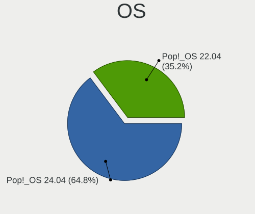

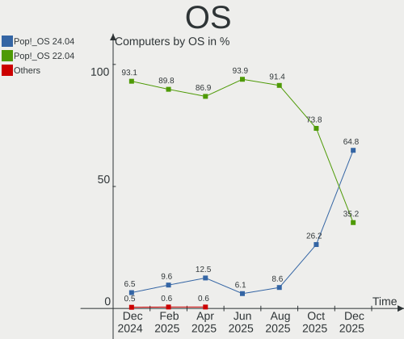

| Name          | Computers | Percent |
|---------------|-----------|---------|
| Pop!_OS 24.04 | 193       | 64.77%  |
| Pop!_OS 22.04 | 105       | 35.23%  |

OS Family
---------

OS without a version

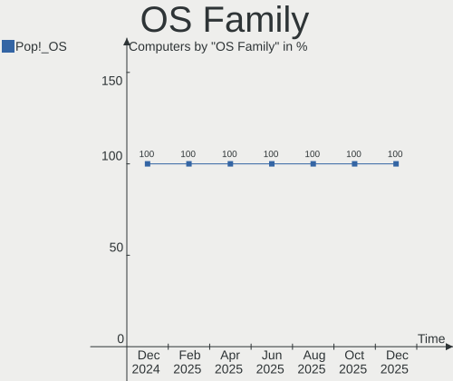

| Name    | Computers | Percent |
|---------|-----------|---------|
| Pop!_OS | 298       | 100%    |

Kernel
------

Version of the Linux kernel

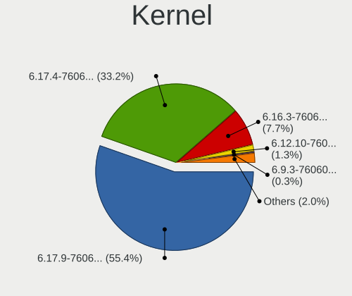

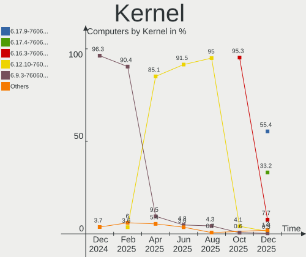

| Version                  | Computers | Percent |
|--------------------------|-----------|---------|
| 6.17.9-76061709-generic  | 165       | 55.37%  |
| 6.17.4-76061704-generic  | 99        | 33.22%  |
| 6.16.3-76061603-generic  | 23        | 7.72%   |
| 6.12.10-76061203-generic | 4         | 1.34%   |
| 6.9.3-76060903-generic   | 1         | 0.34%   |
| 6.6.10-76060610-generic  | 1         | 0.34%   |
| 6.18.2-kelexine-thevoid  | 1         | 0.34%   |
| 6.18.1-061801-generic    | 1         | 0.34%   |
| 6.17.12-1-liquorix-amd64 | 1         | 0.34%   |
| 6.0.2-76060002-generic   | 1         | 0.34%   |
| 6.0.12-76060006-generic  | 1         | 0.34%   |

Kernel Family
-------------

Linux kernel without a distro release

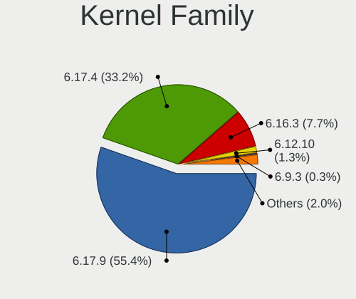

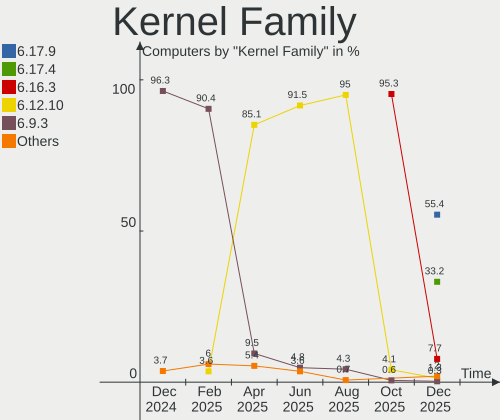

| Version | Computers | Percent |
|---------|-----------|---------|
| 6.17.9  | 165       | 55.37%  |
| 6.17.4  | 99        | 33.22%  |
| 6.16.3  | 23        | 7.72%   |
| 6.12.10 | 4         | 1.34%   |
| 6.9.3   | 1         | 0.34%   |
| 6.6.10  | 1         | 0.34%   |
| 6.18.2  | 1         | 0.34%   |
| 6.18.1  | 1         | 0.34%   |
| 6.17.12 | 1         | 0.34%   |
| 6.0.2   | 1         | 0.34%   |
| 6.0.12  | 1         | 0.34%   |

Kernel Major Ver.
-----------------

Linux kernel major version

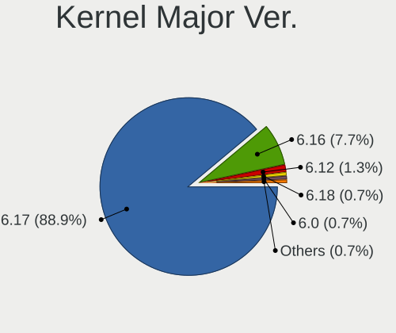

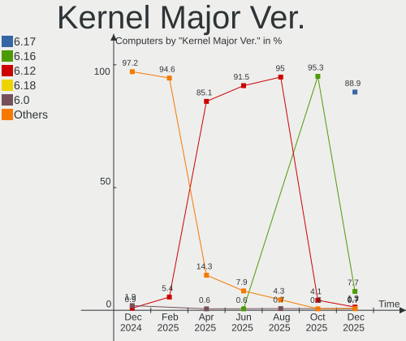

| Version | Computers | Percent |
|---------|-----------|---------|
| 6.17    | 265       | 88.93%  |
| 6.16    | 23        | 7.72%   |
| 6.12    | 4         | 1.34%   |
| 6.18    | 2         | 0.67%   |
| 6.0     | 2         | 0.67%   |
| 6.9     | 1         | 0.34%   |
| 6.6     | 1         | 0.34%   |

Arch
----

OS architecture (x86_64, i586, etc.)

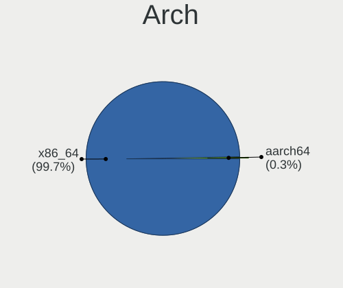

| Name   | Computers | Percent |
|--------|-----------|---------|
| x86_64 | 298       | 100%    |

DE
--

Desktop Environment

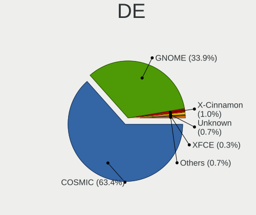

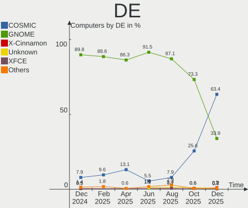

| Name       | Computers | Percent |
|------------|-----------|---------|
| COSMIC     | 189       | 63.42%  |
| GNOME      | 101       | 33.89%  |
| X-Cinnamon | 3         | 1.01%   |
| Unknown    | 2         | 0.67%   |
| XFCE       | 1         | 0.34%   |
| KDE6       | 1         | 0.34%   |
| KDE5       | 1         | 0.34%   |

Display Server
--------------

X11 or Wayland

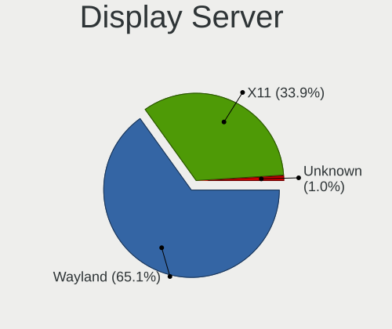

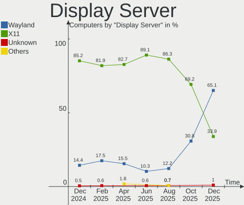

| Name    | Computers | Percent |
|---------|-----------|---------|
| Wayland | 194       | 65.1%   |
| X11     | 101       | 33.89%  |
| Unknown | 3         | 1.01%   |

Display Manager
---------------

SDDM, LightDM, etc.

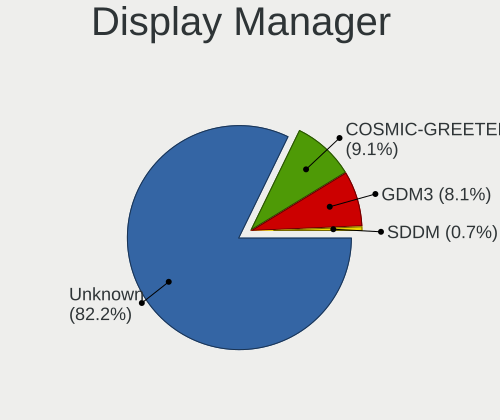

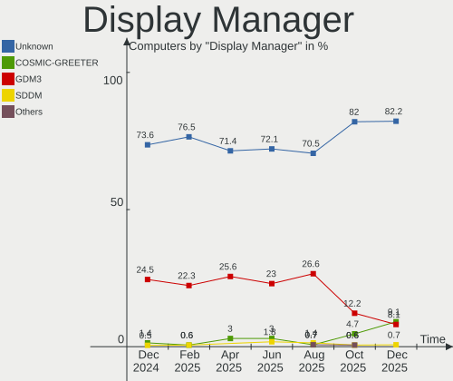

| Name           | Computers | Percent |
|----------------|-----------|---------|
| Unknown        | 245       | 82.21%  |
| COSMIC-GREETER | 27        | 9.06%   |
| GDM3           | 24        | 8.05%   |
| SDDM           | 2         | 0.67%   |

OS Lang
-------

Language

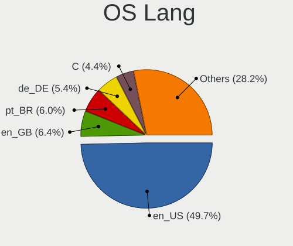

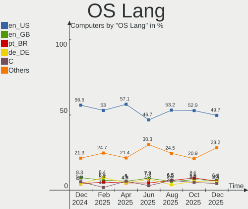

| Lang    | Computers | Percent |
|---------|-----------|---------|
| en_US   | 148       | 49.66%  |
| en_GB   | 19        | 6.38%   |
| pt_BR   | 18        | 6.04%   |
| de_DE   | 16        | 5.37%   |
| C       | 13        | 4.36%   |
| en_CA   | 12        | 4.03%   |
| en_AU   | 10        | 3.36%   |
| it_IT   | 9         | 3.02%   |
| fr_FR   | 6         | 2.01%   |
| es_ES   | 5         | 1.68%   |
| pl_PL   | 4         | 1.34%   |
| es_MX   | 4         | 1.34%   |
| hu_HU   | 3         | 1.01%   |
| sv_SE   | 2         | 0.67%   |
| sk_SK   | 2         | 0.67%   |
| ru_RU   | 2         | 0.67%   |
| nl_NL   | 2         | 0.67%   |
| es_CO   | 2         | 0.67%   |
| en_NZ   | 2         | 0.67%   |
| de_CH   | 2         | 0.67%   |
| cs_CZ   | 2         | 0.67%   |
| zh_HK   | 1         | 0.34%   |
| pt_PT   | 1         | 0.34%   |
| ko_KR   | 1         | 0.34%   |
| fr_CA   | 1         | 0.34%   |
| es_GT   | 1         | 0.34%   |
| es_CR   | 1         | 0.34%   |
| es_AR   | 1         | 0.34%   |
| en_ZA   | 1         | 0.34%   |
| en_NG   | 1         | 0.34%   |
| en_IL   | 1         | 0.34%   |
| en_DK   | 1         | 0.34%   |
| de_AT   | 1         | 0.34%   |
| da_DK   | 1         | 0.34%   |
| ar_EG   | 1         | 0.34%   |
| Unknown | 1         | 0.34%   |

Boot Mode
---------

EFI or BIOS

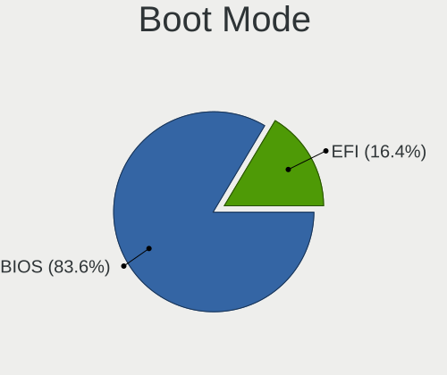

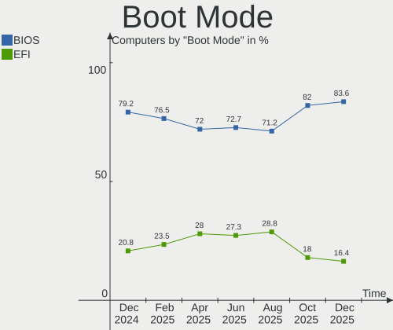

| Mode | Computers | Percent |
|------|-----------|---------|
| BIOS | 249       | 83.56%  |
| EFI  | 49        | 16.44%  |

Filesystem
----------

Type of filesystem

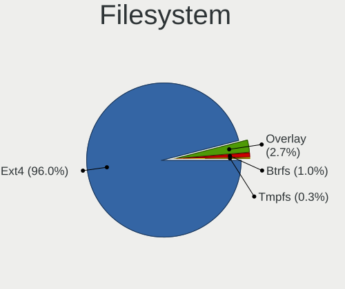

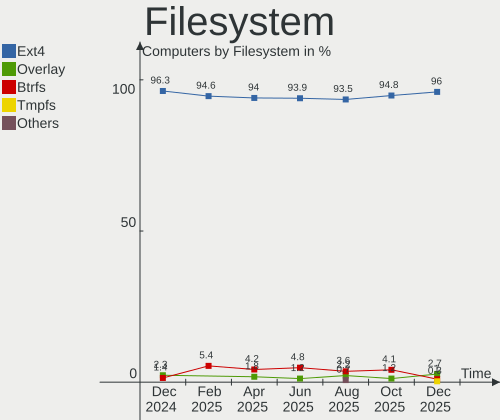

| Type    | Computers | Percent |
|---------|-----------|---------|
| Ext4    | 286       | 95.97%  |
| Overlay | 8         | 2.68%   |
| Btrfs   | 3         | 1.01%   |
| Tmpfs   | 1         | 0.34%   |

Part. scheme
------------

Scheme of partitioning

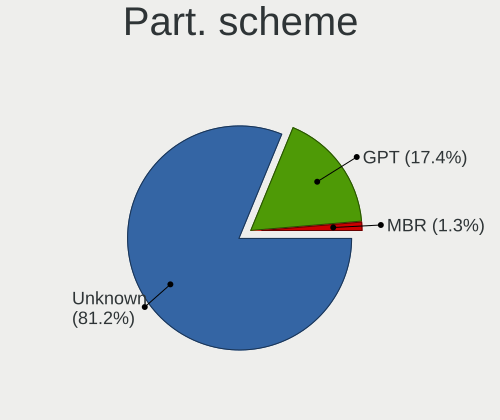

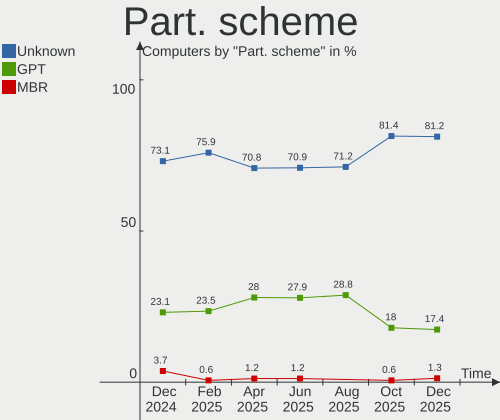

| Type    | Computers | Percent |
|---------|-----------|---------|
| Unknown | 242       | 81.21%  |
| GPT     | 52        | 17.45%  |
| MBR     | 4         | 1.34%   |

Dual Boot with Linux/BSD
------------------------

Hosting more than one Linux/BSD

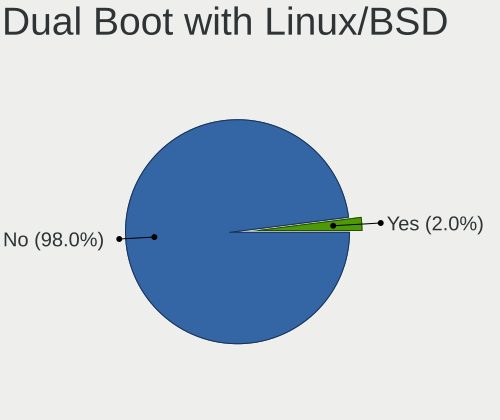

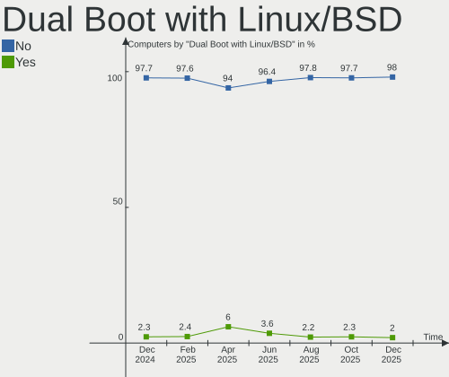

| Dual boot | Computers | Percent |
|-----------|-----------|---------|
| No        | 292       | 97.99%  |
| Yes       | 6         | 2.01%   |

Dual Boot (Win)
---------------

Hosting Linux and Windows

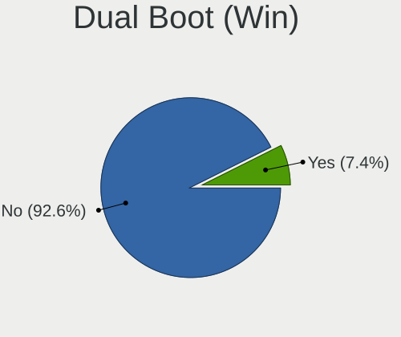

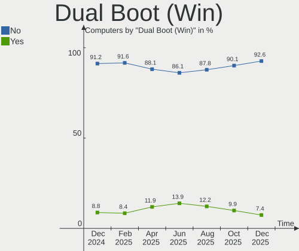

| Dual boot | Computers | Percent |
|-----------|-----------|---------|
| No        | 276       | 92.62%  |
| Yes       | 22        | 7.38%   |

Board
-----

Vendor
------

Motherboard manufacturer

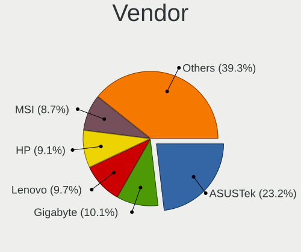

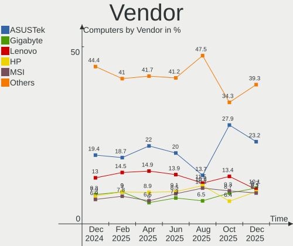

| Name                                 | Computers | Percent |
|--------------------------------------|-----------|---------|
| ASUSTek Computer                     | 69        | 23.15%  |
| Gigabyte Technology                  | 30        | 10.07%  |
| Lenovo                               | 29        | 9.73%   |
| Hewlett-Packard                      | 27        | 9.06%   |
| MSI                                  | 26        | 8.72%   |
| Dell                                 | 23        | 7.72%   |
| ASRock                               | 17        | 5.7%    |
| Apple                                | 17        | 5.7%    |
| Acer                                 | 9         | 3.02%   |
| System76                             | 8         | 2.68%   |
| Intel                                | 5         | 1.68%   |
| Samsung Electronics                  | 3         | 1.01%   |
| Microsoft                            | 3         | 1.01%   |
| Toshiba                              | 2         | 0.67%   |
| Razer                                | 2         | 0.67%   |
| HUAWEI                               | 2         | 0.67%   |
| Google                               | 2         | 0.67%   |
| Fujitsu Siemens                      | 2         | 0.67%   |
| Fujitsu                              | 2         | 0.67%   |
| Framework                            | 2         | 0.67%   |
| Biostar                              | 2         | 0.67%   |
| Unknown                              | 2         | 0.67%   |
| Unknown (150311131614538)            | 1         | 0.34%   |
| Tianbei                              | 1         | 0.34%   |
| SZQFTX                               | 1         | 0.34%   |
| Star Labs                            | 1         | 0.34%   |
| Sony                                 | 1         | 0.34%   |
| Shenzhen Meigao Electronic Equipment | 1         | 0.34%   |
| PC Specialist                        | 1         | 0.34%   |
| ORIGIMAGIC                           | 1         | 0.34%   |
| MARIUS                               | 1         | 0.34%   |
| LG Electronics                       | 1         | 0.34%   |
| Huanan                               | 1         | 0.34%   |
| CompuLab                             | 1         | 0.34%   |
| Avell                                | 1         | 0.34%   |
| Alienware                            | 1         | 0.34%   |

Model
-----

Motherboard model

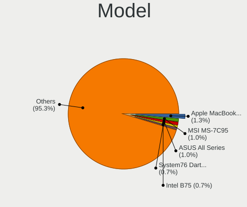

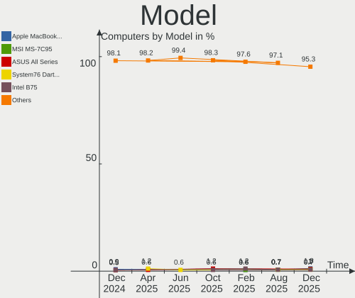

| Name                                                  | Computers | Percent |
|-------------------------------------------------------|-----------|---------|
| Apple MacBookPro9,2                                   | 4         | 1.34%   |
| MSI MS-7C95                                           | 3         | 1.01%   |
| ASUS All Series                                       | 3         | 1.01%   |
| System76 Darter Pro                                   | 2         | 0.67%   |
| Intel B75                                             | 2         | 0.67%   |
| HP Laptop 15-fc0xxx                                   | 2         | 0.67%   |
| HP EliteBook 840 G6                                   | 2         | 0.67%   |
| HP 15                                                 | 2         | 0.67%   |
| Gigabyte X870I AORUS PRO ICE                          | 2         | 0.67%   |
| Gigabyte X570 AORUS ELITE                             | 2         | 0.67%   |
| Gigabyte A520M K V2                                   | 2         | 0.67%   |
| ASUS VivoBook_ASUSLaptop M1605YA_M1605YA              | 2         | 0.67%   |
| ASUS TUF Gaming X570-PLUS                             | 2         | 0.67%   |
| ASUS TUF Gaming B650-PLUS WIFI                        | 2         | 0.67%   |
| ASUS SABERTOOTH 990FX R2.0                            | 2         | 0.67%   |
| ASUS ROG STRIX Z790-E GAMING WIFI                     | 2         | 0.67%   |
| ASUS ROG CROSSHAIR X870E HERO                         | 2         | 0.67%   |
| ASUS ASUS Zenbook 14 UX3405CA_UX3405CA                | 2         | 0.67%   |
| ASRock X870 Pro RS WiFi                               | 2         | 0.67%   |
| Apple MacBookPro11,1                                  | 2         | 0.67%   |
| Acer Nitro ANV15-41                                   | 2         | 0.67%   |
| Unknown                                               | 2         | 0.67%   |
| Unknown (150311131614538) MS-7C94                     | 1         | 0.34%   |
| Toshiba TECRA Z50-A                                   | 1         | 0.34%   |
| Toshiba Satellite A300                                | 1         | 0.34%   |
| Tianbei GEM12                                         | 1         | 0.34%   |
| SZQFTX MN56                                           | 1         | 0.34%   |
| System76 Thelio Mira                                  | 1         | 0.34%   |
| System76 Thelio                                       | 1         | 0.34%   |
| System76 Pangolin                                     | 1         | 0.34%   |
| System76 Kudu                                         | 1         | 0.34%   |
| System76 Gazelle                                      | 1         | 0.34%   |
| System76 Adder WS                                     | 1         | 0.34%   |
| Star Labs StarBook                                    | 1         | 0.34%   |
| Sony SVF15A1BCXB                                      | 1         | 0.34%   |
| Shenzhen Meigao Electronic Equipment AI Series        | 1         | 0.34%   |
| Samsung 750XDA                                        | 1         | 0.34%   |
| Samsung 750QFG                                        | 1         | 0.34%   |
| Samsung 550XDA                                        | 1         | 0.34%   |
| Razer Blade 15 Advanced Model (Early 2021) - RZ09-036 | 1         | 0.34%   |

Model Family
------------

Motherboard model prefix

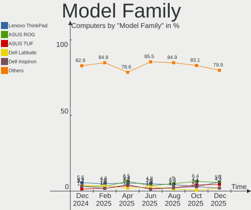

| Name               | Computers | Percent |
|--------------------|-----------|---------|
| Lenovo ThinkPad    | 18        | 6.04%   |
| ASUS ROG           | 17        | 5.7%    |
| ASUS TUF           | 13        | 4.36%   |
| Dell Latitude      | 6         | 2.01%   |
| Dell Inspiron      | 6         | 2.01%   |
| ASUS PRIME         | 6         | 2.01%   |
| Acer Aspire        | 6         | 2.01%   |
| HP Pavilion        | 5         | 1.68%   |
| ASUS VivoBook      | 5         | 1.68%   |
| Apple MacBookPro9  | 5         | 1.68%   |
| HP Laptop          | 4         | 1.34%   |
| Dell OptiPlex      | 4         | 1.34%   |
| MSI MS-7C95        | 3         | 1.01%   |
| Microsoft Surface  | 3         | 1.01%   |
| Lenovo Yoga        | 3         | 1.01%   |
| HP EliteBook       | 3         | 1.01%   |
| Gigabyte B550M     | 3         | 1.01%   |
| ASUS ASUS          | 3         | 1.01%   |
| ASUS All           | 3         | 1.01%   |
| Apple MacBookPro11 | 3         | 1.01%   |
| Acer Nitro         | 3         | 1.01%   |
| System76 Thelio    | 2         | 0.67%   |
| System76 Darter    | 2         | 0.67%   |
| Razer Blade        | 2         | 0.67%   |
| MSI US             | 2         | 0.67%   |
| Lenovo Legion      | 2         | 0.67%   |
| Lenovo IdeaPad     | 2         | 0.67%   |
| Intel B75          | 2         | 0.67%   |
| HP Victus          | 2         | 0.67%   |
| HP OMEN            | 2         | 0.67%   |
| HP Compaq          | 2         | 0.67%   |
| HP 15              | 2         | 0.67%   |
| Gigabyte X870I     | 2         | 0.67%   |
| Gigabyte X570      | 2         | 0.67%   |
| Gigabyte B450M     | 2         | 0.67%   |
| Gigabyte A520M     | 2         | 0.67%   |
| Framework Laptop   | 2         | 0.67%   |
| Dell XPS           | 2         | 0.67%   |
| Dell Pro           | 2         | 0.67%   |
| ASUS STRIX         | 2         | 0.67%   |

MFG Year
--------

Motherboard manufacture year

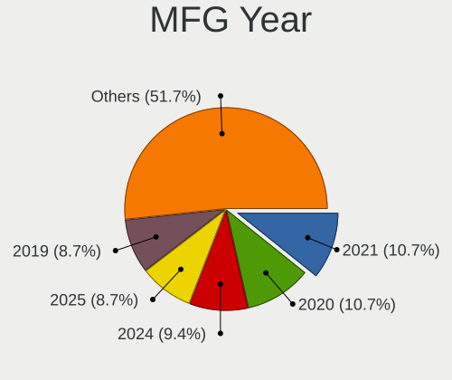

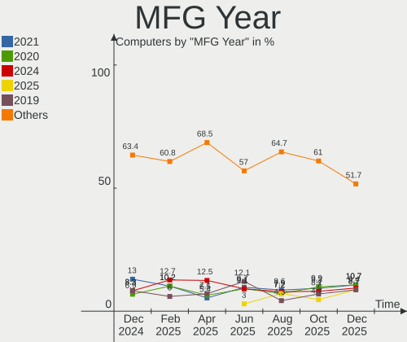

| Year | Computers | Percent |
|------|-----------|---------|
| 2021 | 32        | 10.74%  |
| 2020 | 32        | 10.74%  |
| 2024 | 28        | 9.4%    |
| 2025 | 26        | 8.72%   |
| 2019 | 26        | 8.72%   |
| 2022 | 24        | 8.05%   |
| 2018 | 19        | 6.38%   |
| 2012 | 17        | 5.7%    |
| 2013 | 16        | 5.37%   |
| 2017 | 13        | 4.36%   |
| 2016 | 13        | 4.36%   |
| 2023 | 12        | 4.03%   |
| 2014 | 12        | 4.03%   |
| 2015 | 10        | 3.36%   |
| 2011 | 6         | 2.01%   |
| 2009 | 4         | 1.34%   |
| 2008 | 4         | 1.34%   |
| 2010 | 3         | 1.01%   |
| 2007 | 1         | 0.34%   |

Form Factor
-----------

Physical design of the computer

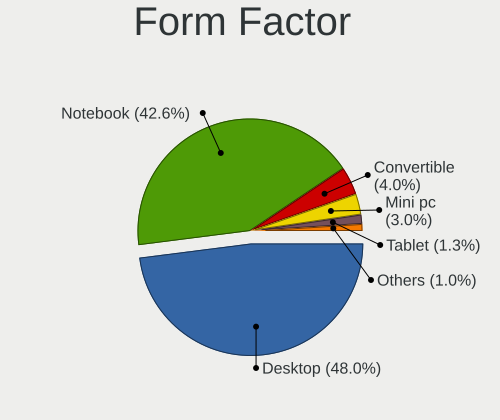

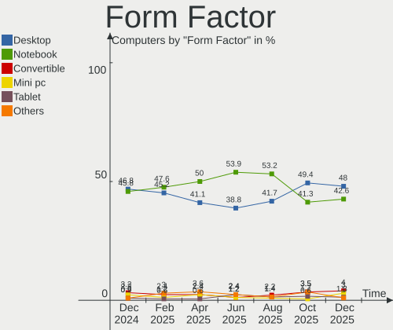

| Name        | Computers | Percent |
|-------------|-----------|---------|
| Desktop     | 143       | 47.99%  |
| Notebook    | 127       | 42.62%  |
| Convertible | 12        | 4.03%   |
| Mini pc     | 9         | 3.02%   |
| Tablet      | 4         | 1.34%   |
| All in one  | 2         | 0.67%   |
| Server      | 1         | 0.34%   |

Secure Boot
-----------

Enabled or disabled

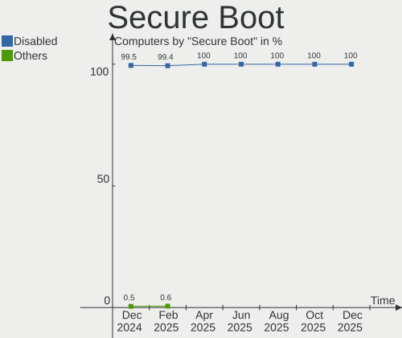

| State    | Computers | Percent |
|----------|-----------|---------|
| Disabled | 298       | 100%    |

Coreboot
--------

Have coreboot on board

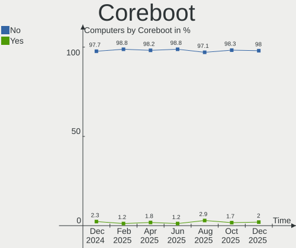

| Used | Computers | Percent |
|------|-----------|---------|
| No   | 292       | 97.99%  |
| Yes  | 6         | 2.01%   |

RAM Size
--------

Total RAM memory

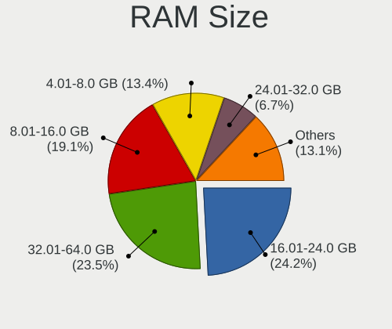

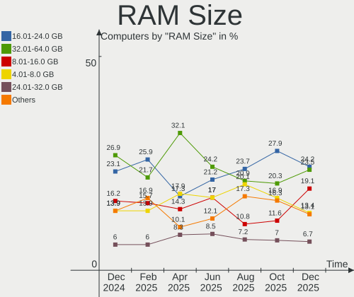

| Size in GB      | Computers | Percent |
|-----------------|-----------|---------|
| 16.01-24.0      | 72        | 24.16%  |
| 32.01-64.0      | 70        | 23.49%  |
| 8.01-16.0       | 57        | 19.13%  |
| 4.01-8.0        | 40        | 13.42%  |
| 24.01-32.0      | 20        | 6.71%   |
| 3.01-4.0        | 19        | 6.38%   |
| 64.01-256.0     | 18        | 6.04%   |
| More than 256.0 | 2         | 0.67%   |

RAM Used
--------

Used RAM memory

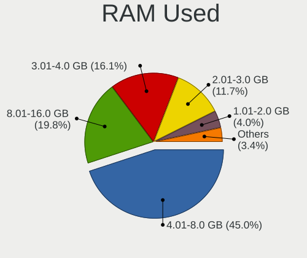

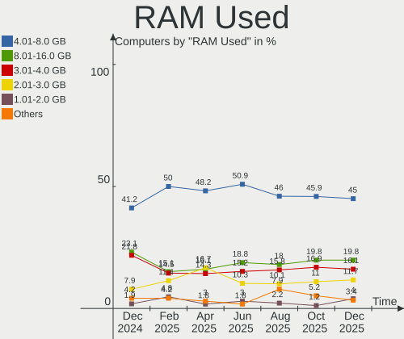

| Used GB    | Computers | Percent |
|------------|-----------|---------|
| 4.01-8.0   | 134       | 44.97%  |
| 8.01-16.0  | 59        | 19.8%   |
| 3.01-4.0   | 48        | 16.11%  |
| 2.01-3.0   | 35        | 11.74%  |
| 1.01-2.0   | 12        | 4.03%   |
| 16.01-24.0 | 7         | 2.35%   |
| 32.01-64.0 | 2         | 0.67%   |
| 24.01-32.0 | 1         | 0.34%   |

Total Drives
------------

Number of drives on board

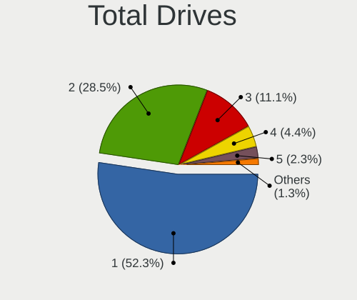

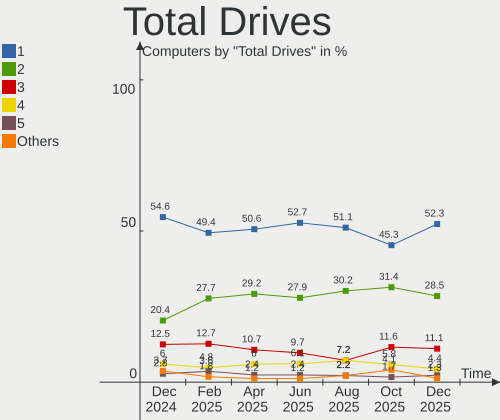

| Drives | Computers | Percent |
|--------|-----------|---------|
| 1      | 156       | 52.35%  |
| 2      | 85        | 28.52%  |
| 3      | 33        | 11.07%  |
| 4      | 13        | 4.36%   |
| 5      | 7         | 2.35%   |
| 18     | 1         | 0.34%   |
| 8      | 1         | 0.34%   |
| 7      | 1         | 0.34%   |
| 6      | 1         | 0.34%   |

Has CD-ROM
----------

Has CD-ROM on board

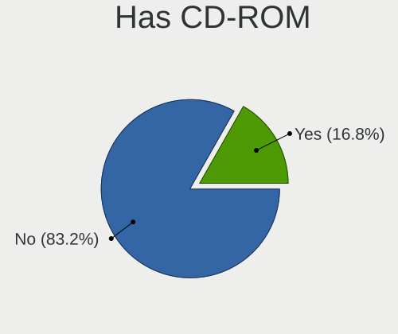

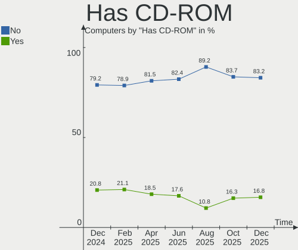

| Presented | Computers | Percent |
|-----------|-----------|---------|
| No        | 248       | 83.22%  |
| Yes       | 50        | 16.78%  |

Has Ethernet
------------

Has Ethernet on board

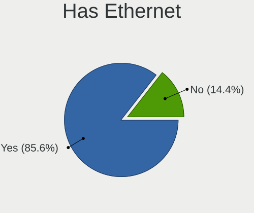

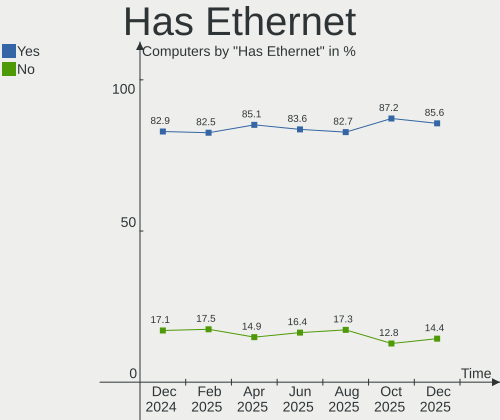

| Presented | Computers | Percent |
|-----------|-----------|---------|
| Yes       | 255       | 85.57%  |
| No        | 43        | 14.43%  |

Has WiFi
--------

Has WiFi module

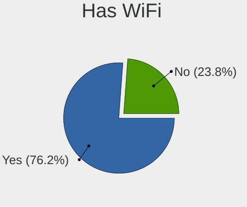

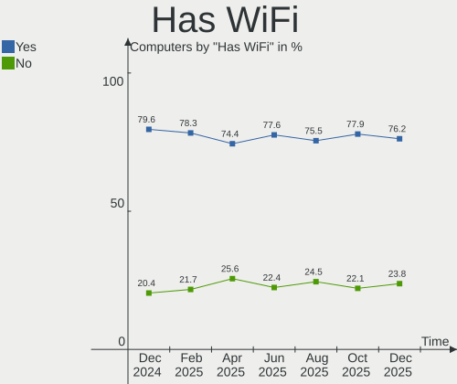

| Presented | Computers | Percent |
|-----------|-----------|---------|
| Yes       | 227       | 76.17%  |
| No        | 71        | 23.83%  |

Has Bluetooth
-------------

Has Bluetooth module

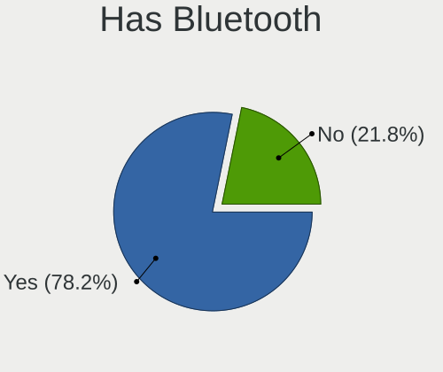

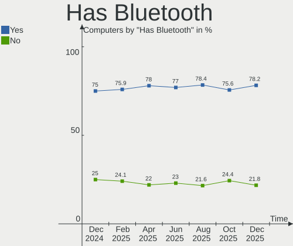

| Presented | Computers | Percent |
|-----------|-----------|---------|
| Yes       | 233       | 78.19%  |
| No        | 65        | 21.81%  |

Location
--------

Country
-------

Geographic location (country)

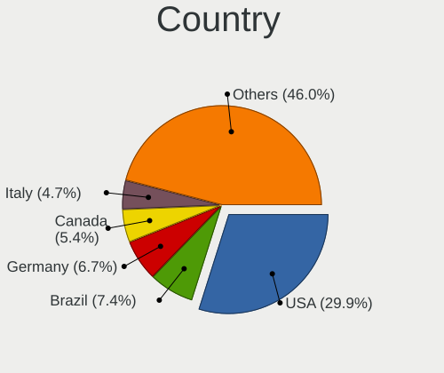

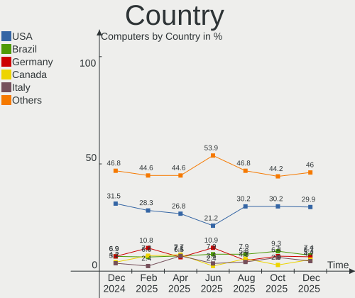

| Country      | Computers | Percent |
|--------------|-----------|---------|
| USA          | 89        | 29.87%  |
| Brazil       | 22        | 7.38%   |
| Germany      | 20        | 6.71%   |
| Canada       | 16        | 5.37%   |
| Italy        | 14        | 4.7%    |
| Australia    | 12        | 4.03%   |
| UK           | 11        | 3.69%   |
| France       | 11        | 3.69%   |
| Sweden       | 7         | 2.35%   |
| Poland       | 6         | 2.01%   |
| Spain        | 5         | 1.68%   |
| New Zealand  | 5         | 1.68%   |
| Netherlands  | 5         | 1.68%   |
| Denmark      | 5         | 1.68%   |
| Switzerland  | 4         | 1.34%   |
| Norway       | 4         | 1.34%   |
| Mexico       | 4         | 1.34%   |
| Hungary      | 4         | 1.34%   |
| Colombia     | 4         | 1.34%   |
| Slovakia     | 3         | 1.01%   |
| Romania      | 3         | 1.01%   |
| Portugal     | 3         | 1.01%   |
| India        | 3         | 1.01%   |
| Finland      | 3         | 1.01%   |
| Bulgaria     | 3         | 1.01%   |
| South Africa | 2         | 0.67%   |
| Latvia       | 2         | 0.67%   |
| Egypt        | 2         | 0.67%   |
| Czechia      | 2         | 0.67%   |
| Vietnam      | 1         | 0.34%   |
| Venezuela    | 1         | 0.34%   |
| South Korea  | 1         | 0.34%   |
| Philippines  | 1         | 0.34%   |
| Pakistan     | 1         | 0.34%   |
| Nigeria      | 1         | 0.34%   |
| Nepal        | 1         | 0.34%   |
| Lithuania    | 1         | 0.34%   |
| Kazakhstan   | 1         | 0.34%   |
| Israel       | 1         | 0.34%   |
| Ireland      | 1         | 0.34%   |

City
----

Geographic location (city)

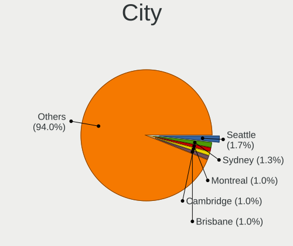

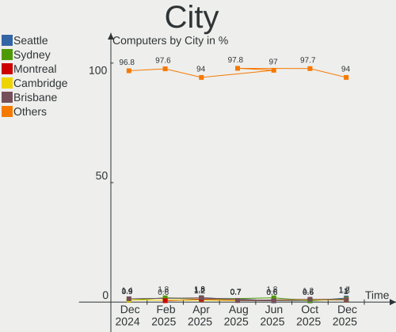

| City           | Computers | Percent |
|----------------|-----------|---------|
| Seattle        | 5         | 1.68%   |
| Sydney         | 4         | 1.34%   |
| Montreal       | 3         | 1.01%   |
| Cambridge      | 3         | 1.01%   |
| Brisbane       | 3         | 1.01%   |
| Stuttgart      | 2         | 0.67%   |
| Stockholm      | 2         | 0.67%   |
| Sarasota       | 2         | 0.67%   |
| San Francisco  | 2         | 0.67%   |
| Rio de Janeiro | 2         | 0.67%   |
| Riga           | 2         | 0.67%   |
| Portland       | 2         | 0.67%   |
| Milan          | 2         | 0.67%   |
| Mexico City    | 2         | 0.67%   |
| Melbourne      | 2         | 0.67%   |
| Los Angeles    | 2         | 0.67%   |
| Lakewood       | 2         | 0.67%   |
| Jacksonville   | 2         | 0.67%   |
| Helsinki       | 2         | 0.67%   |
| Edmonton       | 2         | 0.67%   |
| Denver         | 2         | 0.67%   |
| Copenhagen     | 2         | 0.67%   |
| Christchurch   | 2         | 0.67%   |
| Chicago        | 2         | 0.67%   |
| Budapest       | 2         | 0.67%   |
| Brooklyn       | 2         | 0.67%   |
| Bogotá        | 2         | 0.67%   |
| Żyrardów     | 1         | 0.34%   |
| Zurich         | 1         | 0.34%   |
| Zibo           | 1         | 0.34%   |
| Zeltweg        | 1         | 0.34%   |
| Zanesville     | 1         | 0.34%   |
| Wroclaw        | 1         | 0.34%   |
| Witpoortjie    | 1         | 0.34%   |
| Whittier       | 1         | 0.34%   |
| West Linn      | 1         | 0.34%   |
| West Covina    | 1         | 0.34%   |
| Wenatchee      | 1         | 0.34%   |
| Wellington     | 1         | 0.34%   |
| Webster        | 1         | 0.34%   |

Drives
------

Drive Vendor
------------

Hard drive vendors

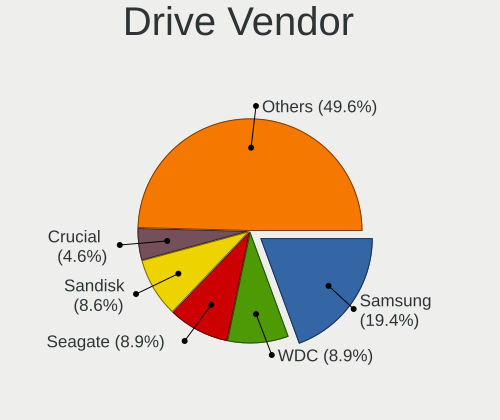

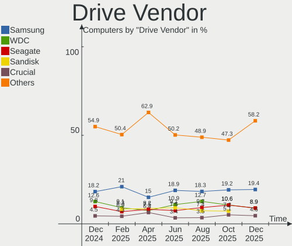

| Vendor                       | Computers | Drives | Percent |
|------------------------------|-----------|--------|---------|
| Samsung Electronics          | 92        | 120    | 19.41%  |
| WDC                          | 42        | 48     | 8.86%   |
| Seagate                      | 42        | 50     | 8.86%   |
| Sandisk                      | 41        | 47     | 8.65%   |
| Crucial                      | 22        | 22     | 4.64%   |
| Toshiba                      | 18        | 20     | 3.8%    |
| Kingston                     | 16        | 18     | 3.38%   |
| Intel                        | 16        | 24     | 3.38%   |
| SK hynix                     | 11        | 11     | 2.32%   |
| Micron Technology            | 10        | 10     | 2.11%   |
| MAXIO Technology (Hangzhou)  | 10        | 10     | 2.11%   |
| Micron/Crucial Technology    | 9         | 9      | 1.9%    |
| Kingston Technology Company  | 9         | 10     | 1.9%    |
| Unknown                      | 8         | 11     | 1.69%   |
| KIOXIA                       | 8         | 9      | 1.69%   |
| Silicon Motion               | 7         | 8      | 1.48%   |
| Phison Electronics           | 7         | 7      | 1.48%   |
| HGST                         | 7         | 7      | 1.48%   |
| Hitachi                      | 6         | 6      | 1.27%   |
| ADATA Technology             | 6         | 6      | 1.27%   |
| T-FORCE                      | 4         | 6      | 0.84%   |
| Realtek Semiconductor        | 4         | 4      | 0.84%   |
| China                        | 4         | 4      | 0.84%   |
| Apple                        | 4         | 4      | 0.84%   |
| SPCC                         | 3         | 3      | 0.63%   |
| Shenzhen Longsys Electronics | 3         | 3      | 0.63%   |
| PNY                          | 3         | 4      | 0.63%   |
| OCZ                          | 3         | 3      | 0.63%   |
| KingSpec                     | 3         | 3      | 0.63%   |
| KingFast                     | 3         | 3      | 0.63%   |
| GOODRAM                      | 3         | 3      | 0.63%   |
| AMD                          | 3         | 5      | 0.63%   |
| A-DATA Technology            | 3         | 3      | 0.63%   |
| Unknown                      | 3         | 3      | 0.63%   |
| SSSTC                        | 2         | 2      | 0.42%   |
| SABRENT                      | 2         | 2      | 0.42%   |
| Plextor                      | 2         | 2      | 0.42%   |
| Patriot                      | 2         | 2      | 0.42%   |
| Intenso                      | 2         | 2      | 0.42%   |
| HPE                          | 2         | 4      | 0.42%   |

Drive Model
-----------

Hard drive models

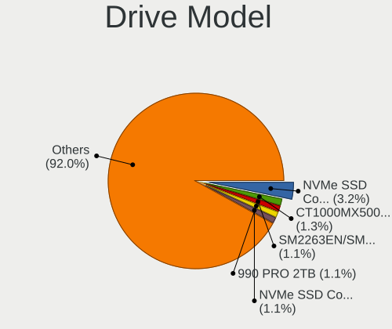

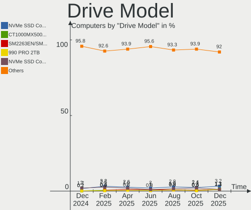

| Model                                                 | Computers | Percent |
|-------------------------------------------------------|-----------|---------|
| Samsung NVMe SSD Controller SM981/PM981/PM983 1TB     | 17        | 3.23%   |
| Crucial CT1000MX500SSD1 1TB                           | 7         | 1.33%   |
| Silicon Motion SM2263EN/SM2263XT SSD Controller 512GB | 6         | 1.14%   |
| Samsung SSD 990 PRO 2TB                               | 6         | 1.14%   |
| Samsung NVMe SSD Controller PM9A1/PM9A3/980PRO 1TB    | 6         | 1.14%   |
| SanDisk NVMe SSD Drive 1TB                            | 5         | 0.95%   |
| MAXIO (Hangzhou) NVMe SSD Controller MAP1202 2TB      | 5         | 0.95%   |
| Seagate ST2000DM008-2FR102 2TB                        | 4         | 0.76%   |
| Seagate ST2000DM006-2DM164 2TB                        | 4         | 0.76%   |
| Phison E12 NVMe Controller 1TB                        | 4         | 0.76%   |
| Micron/Crucial P2 NVMe PCIe SSD 2TB                   | 4         | 0.76%   |
| Crucial CT500MX500SSD1 500GB                          | 4         | 0.76%   |
| T-FORCE 1TB                                           | 3         | 0.57%   |
| Seagate ST4000DM004-2CV104 4TB                        | 3         | 0.57%   |
| Sandisk WD Blue SN550 NVMe SSD 1024GB                 | 3         | 0.57%   |
| Samsung SSD 990 PRO 4TB                               | 3         | 0.57%   |
| Samsung SSD 990 PRO 1TB                               | 3         | 0.57%   |
| Samsung SSD 980 1TB                                   | 3         | 0.57%   |
| Samsung SSD 870 EVO 500GB                             | 3         | 0.57%   |
| Samsung SSD 870 EVO 4TB                               | 3         | 0.57%   |
| Samsung SSD 850 EVO 250GB                             | 3         | 0.57%   |
| Samsung NVMe SSD Controller SM961/PM961/SM963 1024GB  | 3         | 0.57%   |
| Samsung NVMe SSD Controller SM951/PM951 128GB         | 3         | 0.57%   |
| Kingston Company SNV3S1000G 1TB                       | 3         | 0.57%   |
| Kingston SA400S37240G 240GB SSD                       | 3         | 0.57%   |
| HGST HTS721010A9E630 1TB                              | 3         | 0.57%   |
| Unknown                                               | 3         | 0.57%   |
| WDC WD5000LPVX-22V0TT0 500GB                          | 2         | 0.38%   |
| WDC WD10EZEX-08WN4A0 1TB                              | 2         | 0.38%   |
| Toshiba XG6 NVMe SSD Controller 1024GB                | 2         | 0.38%   |
| Toshiba HDWD110 1TB                                   | 2         | 0.38%   |
| Toshiba DT01ACA050 500GB                              | 2         | 0.38%   |
| SK hynix BC501 NVMe Solid State Drive 512GB           | 2         | 0.38%   |
| Shenzhen Longsys Lexar SSD NM620 2TB                  | 2         | 0.38%   |
| Seagate ST8000DM004-2CX188 8TB                        | 2         | 0.38%   |
| Seagate ST500DM002-1BD142 500GB                       | 2         | 0.38%   |
| Seagate ST3000DM001-1ER166 3TB                        | 2         | 0.38%   |
| Seagate ST1000LM035-1RK172 1TB                        | 2         | 0.38%   |
| Seagate ST1000DM010-2EP102 1TB                        | 2         | 0.38%   |
| Seagate ST1000DM003-1CH162 1TB                        | 2         | 0.38%   |

HDD Vendor
----------

Hard disk drive vendors

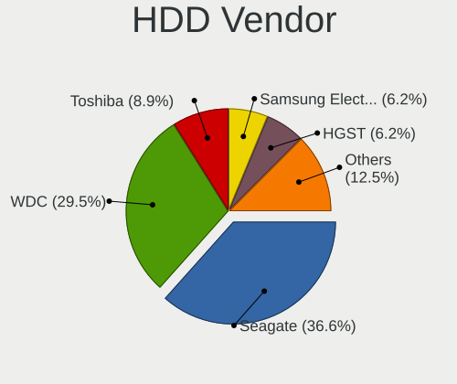

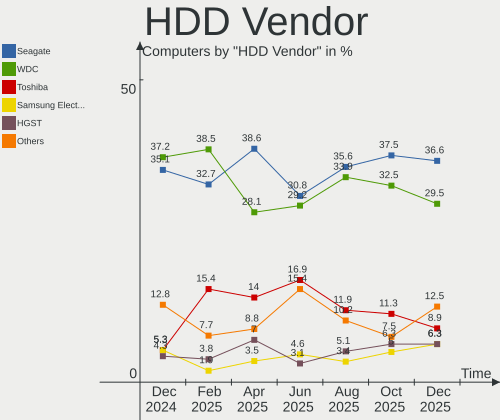

| Vendor              | Computers | Drives | Percent |
|---------------------|-----------|--------|---------|
| Seagate             | 41        | 49     | 36.61%  |
| WDC                 | 33        | 38     | 29.46%  |
| Toshiba             | 10        | 11     | 8.93%   |
| Samsung Electronics | 7         | 8      | 6.25%   |
| HGST                | 7         | 7      | 6.25%   |
| Hitachi             | 6         | 6      | 5.36%   |
| T-FORCE             | 3         | 3      | 2.68%   |
| SSK                 | 1         | 1      | 0.89%   |
| Maxtor              | 1         | 1      | 0.89%   |
| HPE                 | 1         | 3      | 0.89%   |
| Hewlett-Packard     | 1         | 7      | 0.89%   |
| ASMedia             | 1         | 1      | 0.89%   |

SSD Vendor
----------

Solid state drive vendors

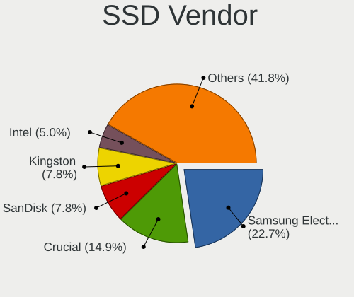

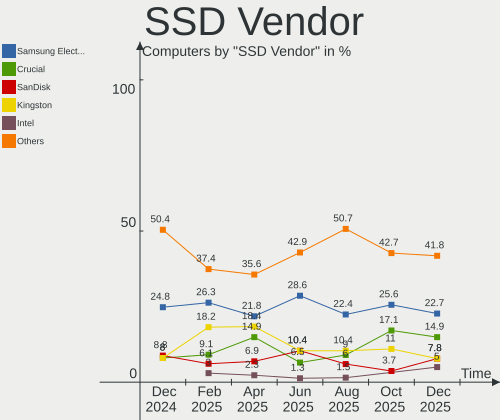

| Vendor              | Computers | Drives | Percent |
|---------------------|-----------|--------|---------|
| Samsung Electronics | 32        | 36     | 22.7%   |
| Crucial             | 21        | 21     | 14.89%  |
| SanDisk             | 11        | 11     | 7.8%    |
| Kingston            | 11        | 12     | 7.8%    |
| Intel               | 7         | 10     | 4.96%   |
| Toshiba             | 5         | 5      | 3.55%   |
| China               | 4         | 4      | 2.84%   |
| Apple               | 4         | 4      | 2.84%   |
| WDC                 | 3         | 3      | 2.13%   |
| SPCC                | 3         | 3      | 2.13%   |
| PNY                 | 3         | 4      | 2.13%   |
| OCZ                 | 3         | 3      | 2.13%   |
| GOODRAM             | 3         | 3      | 2.13%   |
| A-DATA Technology   | 3         | 3      | 2.13%   |
| T-FORCE             | 2         | 2      | 1.42%   |
| SABRENT             | 2         | 2      | 1.42%   |
| Plextor             | 2         | 2      | 1.42%   |
| Patriot             | 2         | 2      | 1.42%   |
| Micron Technology   | 2         | 2      | 1.42%   |
| KingSpec            | 2         | 2      | 1.42%   |
| Intenso             | 2         | 2      | 1.42%   |
| Verbatim            | 1         | 1      | 0.71%   |
| Vaseky              | 1         | 1      | 0.71%   |
| Team                | 1         | 1      | 0.71%   |
| SK hynix            | 1         | 1      | 0.71%   |
| Seagate             | 1         | 1      | 0.71%   |
| S930P               | 1         | 1      | 0.71%   |
| LITEONIT            | 1         | 1      | 0.71%   |
| LITEON              | 1         | 1      | 0.71%   |
| KingFast            | 1         | 1      | 0.71%   |
| KingDian            | 1         | 1      | 0.71%   |
| HPE                 | 1         | 1      | 0.71%   |
| Hewlett-Packard     | 1         | 1      | 0.71%   |
| FIKWOT              | 1         | 1      | 0.71%   |
| Dahua               | 1         | 1      | 0.71%   |

Drive Kind
----------

HDD or SSD

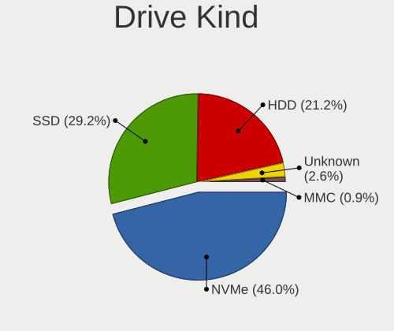

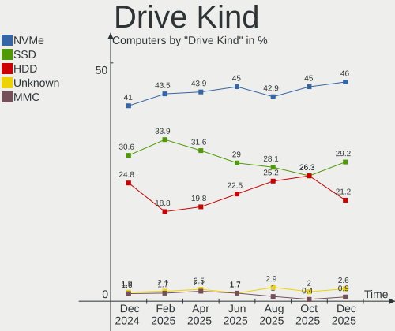

| Kind    | Computers | Drives | Percent |
|---------|-----------|--------|---------|
| NVMe    | 195       | 250    | 45.99%  |
| SSD     | 124       | 150    | 29.25%  |
| HDD     | 90        | 135    | 21.23%  |
| Unknown | 11        | 13     | 2.59%   |
| MMC     | 4         | 5      | 0.94%   |

Drive Connector
---------------

SATA, SAS, NVMe, etc.

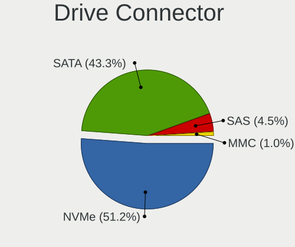

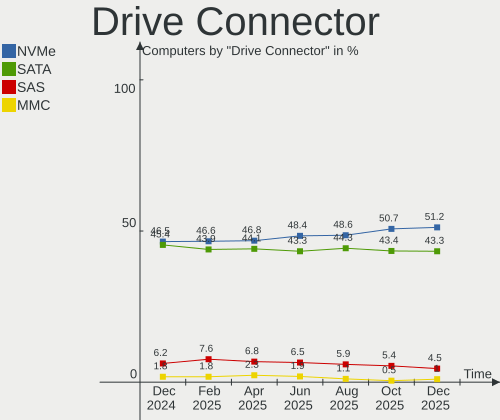

| Type | Computers | Drives | Percent |
|------|-----------|--------|---------|
| NVMe | 195       | 247    | 51.18%  |
| SATA | 165       | 280    | 43.31%  |
| SAS  | 17        | 21     | 4.46%   |
| MMC  | 4         | 5      | 1.05%   |

Drive Size
----------

Size of hard drive

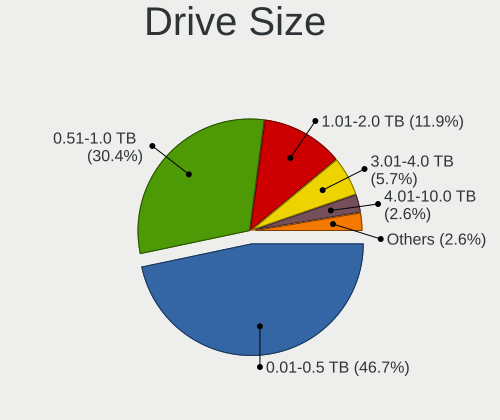

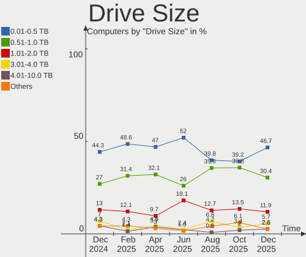

| Size in TB | Computers | Drives | Percent |
|------------|-----------|--------|---------|
| 0.01-0.5   | 106       | 143    | 46.7%   |
| 0.51-1.0   | 69        | 78     | 30.4%   |
| 1.01-2.0   | 27        | 34     | 11.89%  |
| 3.01-4.0   | 13        | 16     | 5.73%   |
| 4.01-10.0  | 6         | 6      | 2.64%   |
| 2.01-3.0   | 4         | 4      | 1.76%   |
| 10.01-20.0 | 2         | 4      | 0.88%   |

Space Total
-----------

Amount of disk space available on the file system

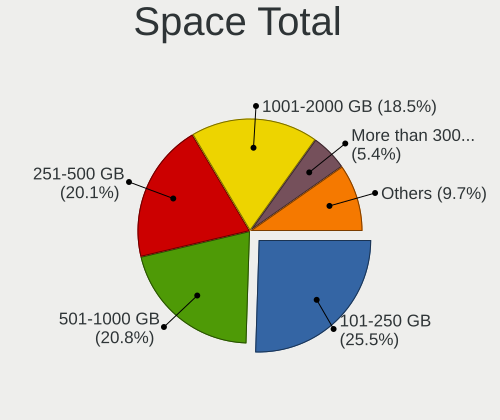

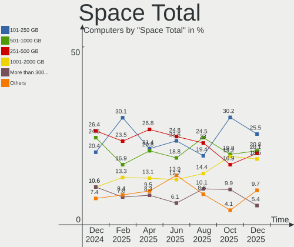

| Size in GB     | Computers | Percent |
|----------------|-----------|---------|
| 101-250        | 76        | 25.5%   |
| 501-1000       | 62        | 20.81%  |
| 251-500        | 60        | 20.13%  |
| 1001-2000      | 55        | 18.46%  |
| More than 3000 | 16        | 5.37%   |
| 1-20           | 9         | 3.02%   |
| 2001-3000      | 8         | 2.68%   |
| 51-100         | 6         | 2.01%   |
| 21-50          | 5         | 1.68%   |
| Unknown        | 1         | 0.34%   |

Space Used
----------

Amount of used disk space

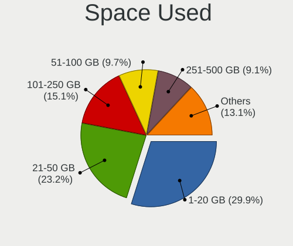

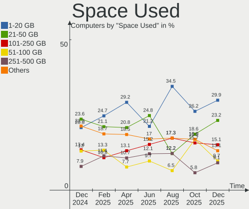

| Used GB        | Computers | Percent |
|----------------|-----------|---------|
| 1-20           | 89        | 29.87%  |
| 21-50          | 69        | 23.15%  |
| 101-250        | 45        | 15.1%   |
| 51-100         | 29        | 9.73%   |
| 251-500        | 27        | 9.06%   |
| 501-1000       | 17        | 5.7%    |
| 1001-2000      | 16        | 5.37%   |
| 2001-3000      | 3         | 1.01%   |
| More than 3000 | 2         | 0.67%   |
| Unknown        | 1         | 0.34%   |

Malfunc. Drives
---------------

Drive models with a malfunction

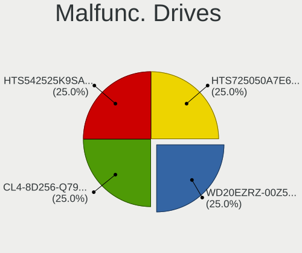

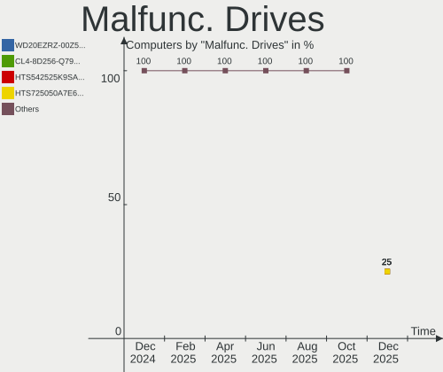

| Model                         | Computers | Drives | Percent |
|-------------------------------|-----------|--------|---------|
| WDC WD20EZRZ-00Z5HB0 2TB      | 1         | 1      | 25%     |
| SSSTC CL4-8D256-Q79 256GB     | 1         | 1      | 25%     |
| Hitachi HTS542525K9SA00 250GB | 1         | 1      | 25%     |
| HGST HTS725050A7E630 500GB    | 1         | 1      | 25%     |

Malfunc. Drive Vendor
---------------------

Vendors of faulty drives

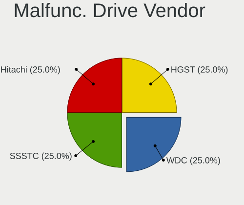

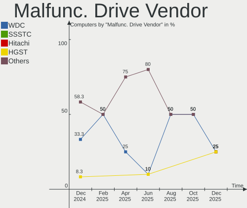

| Vendor  | Computers | Drives | Percent |
|---------|-----------|--------|---------|
| WDC     | 1         | 1      | 25%     |
| SSSTC   | 1         | 1      | 25%     |
| Hitachi | 1         | 1      | 25%     |
| HGST    | 1         | 1      | 25%     |

Malfunc. HDD Vendor
-------------------

Vendors of faulty HDD drives

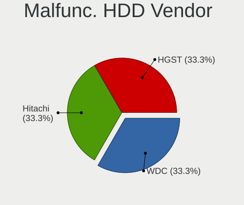

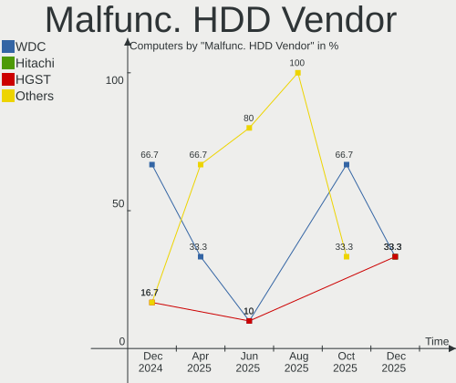

| Vendor  | Computers | Drives | Percent |
|---------|-----------|--------|---------|
| WDC     | 1         | 1      | 33.33%  |
| Hitachi | 1         | 1      | 33.33%  |
| HGST    | 1         | 1      | 33.33%  |

Malfunc. Drive Kind
-------------------

Kinds of faulty drives

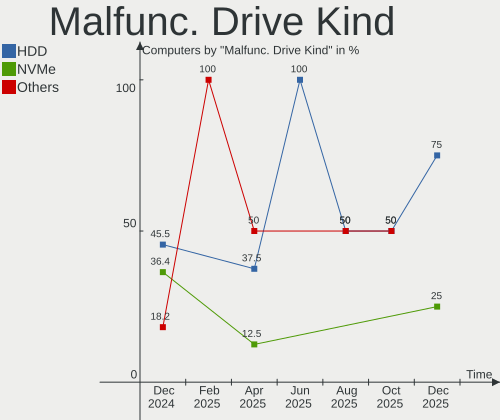

| Kind | Computers | Drives | Percent |
|------|-----------|--------|---------|
| HDD  | 3         | 3      | 75%     |
| NVMe | 1         | 1      | 25%     |

Failed Drives
-------------

Failed drive models

Zero info for selected period =(

Failed Drive Vendor
-------------------

Failed drive vendors

Zero info for selected period =(

Drive Status
------------

Number of failed and malfunc. drives

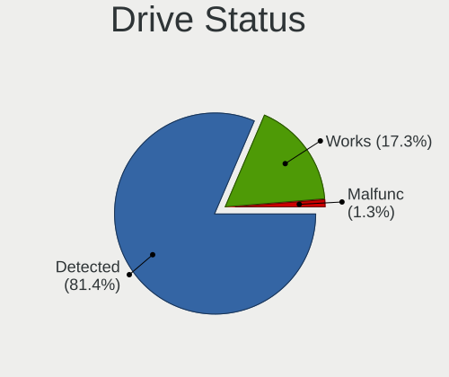

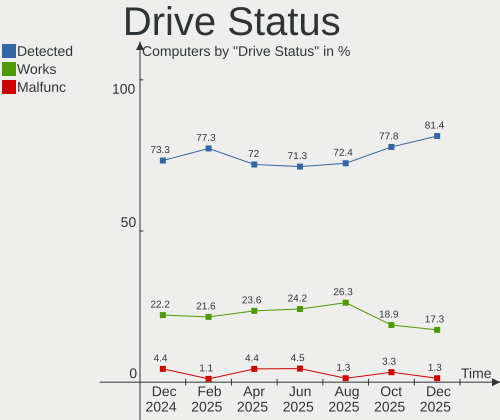

| Status   | Computers | Drives | Percent |
|----------|-----------|--------|---------|
| Detected | 250       | 458    | 81.43%  |
| Works    | 53        | 91     | 17.26%  |
| Malfunc  | 4         | 4      | 1.3%    |

Storage controller
------------------

Storage Vendor
--------------

Storage controller vendors

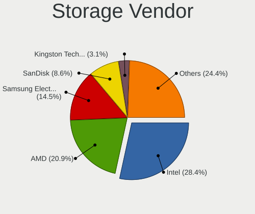

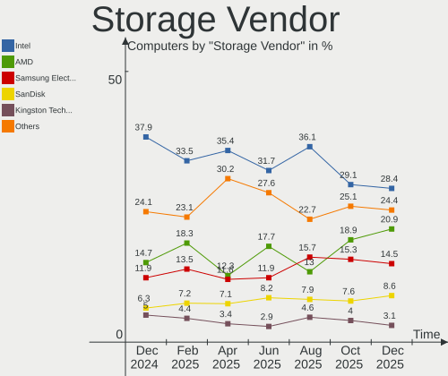

| Vendor                         | Computers | Percent |
|--------------------------------|-----------|---------|
| Intel                          | 129       | 28.41%  |
| AMD                            | 95        | 20.93%  |
| Samsung Electronics            | 66        | 14.54%  |
| SanDisk                        | 39        | 8.59%   |
| Kingston Technology Company    | 14        | 3.08%   |
| ASMedia Technology             | 12        | 2.64%   |
| MAXIO Technology (Hangzhou)    | 11        | 2.42%   |
| SK hynix                       | 10        | 2.2%    |
| Phison Electronics             | 9         | 1.98%   |
| Micron/Crucial Technology      | 9         | 1.98%   |
| Silicon Motion                 | 8         | 1.76%   |
| Micron Technology              | 8         | 1.76%   |
| KIOXIA                         | 7         | 1.54%   |
| ADATA Technology               | 6         | 1.32%   |
| Toshiba America Info Systems   | 4         | 0.88%   |
| Realtek Semiconductor          | 4         | 0.88%   |
| Nvidia                         | 4         | 0.88%   |
| Solid State Storage Technology | 3         | 0.66%   |
| Shenzhen Longsys Electronics   | 3         | 0.66%   |
| INNOGRIT                       | 3         | 0.66%   |
| Marvell Technology Group       | 2         | 0.44%   |
| Yangtze Memory Technologies    | 1         | 0.22%   |
| OCZ Technology Group           | 1         | 0.22%   |
| Nextorage                      | 1         | 0.22%   |
| Lite-On Technology             | 1         | 0.22%   |
| Lenovo                         | 1         | 0.22%   |
| Hewlett-Packard                | 1         | 0.22%   |
| Broadcom / LSI                 | 1         | 0.22%   |
| Biwin Storage Technology       | 1         | 0.22%   |

Storage Model
-------------

Storage controller models

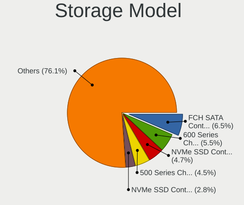

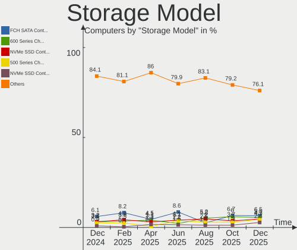

| Model                                                                          | Computers | Percent |
|--------------------------------------------------------------------------------|-----------|---------|
| AMD FCH SATA Controller [AHCI mode]                                            | 32        | 6.48%   |
| AMD 600 Series Chipset SATA Controller                                         | 27        | 5.47%   |
| Samsung NVMe SSD Controller SM981/PM981/PM983                                  | 23        | 4.66%   |
| AMD 500 Series Chipset SATA Controller                                         | 22        | 4.45%   |
| Samsung NVMe SSD Controller S4LV008[Pascal]                                    | 14        | 2.83%   |
| AMD 400 Series Chipset SATA Controller                                         | 13        | 2.63%   |
| Intel 7 Series Chipset Family 6-port SATA Controller [AHCI mode]               | 11        | 2.23%   |
| ASMedia ASM1061/ASM1062 Serial ATA Controller                                  | 11        | 2.23%   |
| Intel Q170/Q150/B150/H170/H110/Z170/CM236 Chipset SATA Controller [AHCI Mode]  | 9         | 1.82%   |
| Intel 8 Series/C220 Series Chipset Family 6-port SATA Controller 1 [AHCI mode] | 9         | 1.82%   |
| Intel 82801 Mobile SATA Controller [RAID mode]                                 | 8         | 1.62%   |
| Intel 8 Series SATA Controller 1 [AHCI mode]                                   | 8         | 1.62%   |
| Silicon Motion SM2263EN/SM2263XT (DRAM-less) NVMe SSD Controllers              | 7         | 1.42%   |
| SanDisk WD SN560/SN740/SN770/SN5000 NVMe SSD                                   | 7         | 1.42%   |
| Samsung NVMe SSD Controller 980 (DRAM-less)                                    | 7         | 1.42%   |
| Intel Comet Lake SATA AHCI Controller                                          | 7         | 1.42%   |
| Samsung NVMe SSD Controller PM9A1/PM9A3/980PRO                                 | 6         | 1.21%   |
| MAXIO (Hangzhou) NVMe SSD Controller MAP1602 (DRAM-less)                       | 6         | 1.21%   |
| Intel SATA Controller [RAID mode]                                              | 6         | 1.21%   |
| Phison E12 NVMe Controller                                                     | 5         | 1.01%   |
| MAXIO (Hangzhou) NVMe SSD Controller MAP1202 (DRAM-less)                       | 5         | 1.01%   |
| Intel Cannon Lake PCH SATA AHCI Controller                                     | 5         | 1.01%   |
| Intel 7 Series/C210 Series Chipset Family 6-port SATA Controller [AHCI mode]   | 5         | 1.01%   |
| Intel 200 Series PCH SATA controller [AHCI mode]                               | 5         | 1.01%   |
| SK hynix Gold P31/BC711/PC711 NVMe Solid State Drive                           | 4         | 0.81%   |
| SanDisk WD Green SN350 240GB (DRAM-less) / SN560E NVMe SSD                     | 4         | 0.81%   |
| Sandisk WD Black SN850X NVMe SSD                                               | 4         | 0.81%   |
| SanDisk Ultra 3D / WD PC SN530, IX SN530, Blue SN550 NVMe SSD (DRAM-less)      | 4         | 0.81%   |
| Samsung NVMe SSD Controller SM961/PM961/SM963                                  | 4         | 0.81%   |
| Samsung NVMe SSD Controller PM9C1a (DRAM-less)                                 | 4         | 0.81%   |
| Micron/Crucial P2 [Nick P2] / P3 / P3 Plus NVMe PCIe SSD (DRAM-less)           | 4         | 0.81%   |
| Intel Wildcat Point-LP SATA Controller [AHCI Mode]                             | 4         | 0.81%   |
| Intel Raptor Lake SATA AHCI Controller                                         | 4         | 0.81%   |
| Intel HM170/QM170 Chipset SATA Controller [AHCI Mode]                          | 4         | 0.81%   |
| Intel 6 Series/C200 Series Chipset Family 6 port Desktop SATA AHCI Controller  | 4         | 0.81%   |
| AMD SB7x0/SB8x0/SB9x0 SATA Controller [AHCI mode]                              | 4         | 0.81%   |
| AMD RAID Bottom Device                                                         | 4         | 0.81%   |
| AMD FCH RAID Controller                                                        | 4         | 0.81%   |
| Toshiba America Info Systems XG6 NVMe SSD Controller                           | 3         | 0.61%   |
| SK hynix BC501 NVMe Solid State Drive                                          | 3         | 0.61%   |

Storage Kind
------------

Kind of storage controller (IDE, SATA, NVMe, SAS, ...)

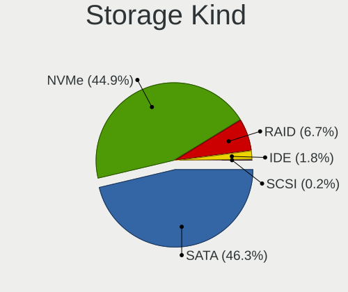

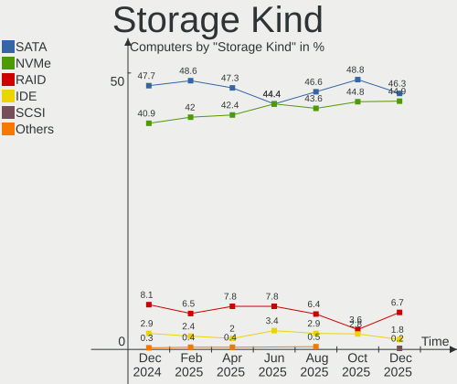

| Kind | Computers | Percent |
|------|-----------|---------|
| SATA | 201       | 46.31%  |
| NVMe | 195       | 44.93%  |
| RAID | 29        | 6.68%   |
| IDE  | 8         | 1.84%   |
| SCSI | 1         | 0.23%   |

Processor
---------

CPU Vendor
----------

Processor vendors

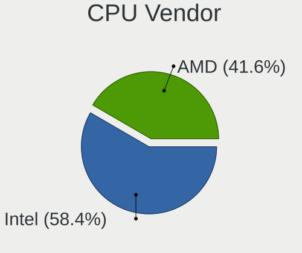

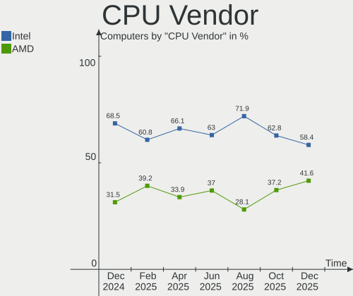

| Vendor | Computers | Percent |
|--------|-----------|---------|
| Intel  | 174       | 58.39%  |
| AMD    | 124       | 41.61%  |

CPU Model
---------

Processor models

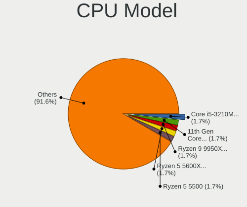

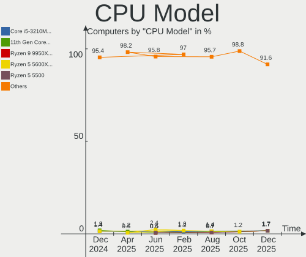

| Model                                   | Computers | Percent |
|-----------------------------------------|-----------|---------|
| Intel Core i5-3210M CPU @ 2.50GHz       | 5         | 1.68%   |
| Intel 11th Gen Core i5-1135G7 @ 2.40GHz | 5         | 1.68%   |
| AMD Ryzen 9 9950X3D 16-Core Processor   | 5         | 1.68%   |
| AMD Ryzen 5 5600X 6-Core Processor      | 5         | 1.68%   |
| AMD Ryzen 5 5500                        | 5         | 1.68%   |
| Intel Core i7-7700HQ CPU @ 2.80GHz      | 4         | 1.34%   |
| AMD Ryzen 9 5950X 16-Core Processor     | 4         | 1.34%   |
| AMD Ryzen 7 9800X3D 8-Core Processor    | 4         | 1.34%   |
| AMD Ryzen 7 5800X 8-Core Processor      | 4         | 1.34%   |
| Intel Core Ultra 9 275HX                | 3         | 1.01%   |
| Intel Core Ultra 7 255H                 | 3         | 1.01%   |
| Intel Core i7-8750H CPU @ 2.20GHz       | 3         | 1.01%   |
| Intel Core i7-10610U CPU @ 1.80GHz      | 3         | 1.01%   |
| Intel Core i7-10510U CPU @ 1.80GHz      | 3         | 1.01%   |
| Intel Core i5-8365U CPU @ 1.60GHz       | 3         | 1.01%   |
| Intel Core i5-4590 CPU @ 3.30GHz        | 3         | 1.01%   |
| Intel Core i5-2400S CPU @ 2.50GHz       | 3         | 1.01%   |
| Intel 11th Gen Core i7-1165G7 @ 2.80GHz | 3         | 1.01%   |
| AMD Ryzen 7 8700F 8-Core Processor      | 3         | 1.01%   |
| AMD Ryzen 7 7800X3D 8-Core Processor    | 3         | 1.01%   |
| AMD Ryzen 7 5700U with Radeon Graphics  | 3         | 1.01%   |
| AMD Ryzen 5 7600 6-Core Processor       | 3         | 1.01%   |
| AMD Ryzen 5 5625U with Radeon Graphics  | 3         | 1.01%   |
| AMD Ryzen 5 5600GT with Radeon Graphics | 3         | 1.01%   |
| Intel Xeon CPU E5-2680 v4 @ 2.40GHz     | 2         | 0.67%   |
| Intel Core i7-8700K CPU @ 3.70GHz       | 2         | 0.67%   |
| Intel Core i7-6700K CPU @ 4.00GHz       | 2         | 0.67%   |
| Intel Core i7-4770K CPU @ 3.50GHz       | 2         | 0.67%   |
| Intel Core i7-10700F CPU @ 2.90GHz      | 2         | 0.67%   |
| Intel Core i5-6600K CPU @ 3.50GHz       | 2         | 0.67%   |
| Intel Core i5-6500 CPU @ 3.20GHz        | 2         | 0.67%   |
| Intel Core i5-6400 CPU @ 2.70GHz        | 2         | 0.67%   |
| Intel Core i5-6300U CPU @ 2.40GHz       | 2         | 0.67%   |
| Intel Core i5-4260U CPU @ 1.40GHz       | 2         | 0.67%   |
| Intel Core i5-4258U CPU @ 2.40GHz       | 2         | 0.67%   |
| Intel Core i5-3470 CPU @ 3.20GHz        | 2         | 0.67%   |
| Intel Core i5-10300H CPU @ 2.50GHz      | 2         | 0.67%   |
| Intel Core i5 CPU M 520 @ 2.40GHz       | 2         | 0.67%   |
| Intel Core i3-4005U CPU @ 1.70GHz       | 2         | 0.67%   |
| Intel Core 2 Duo CPU P7350 @ 2.00GHz    | 2         | 0.67%   |

CPU Model Family
----------------

Processor model prefix

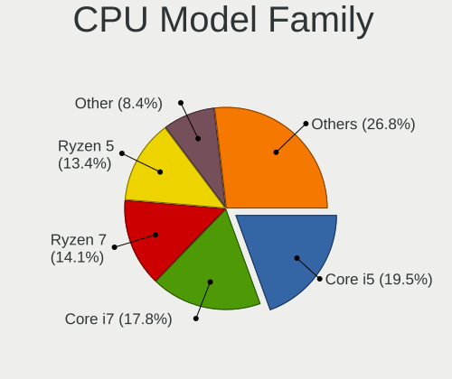

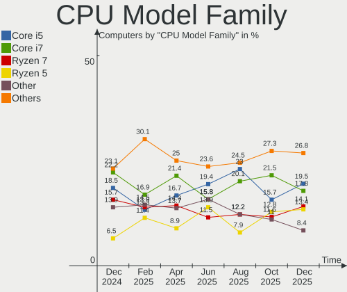

| Model                   | Computers | Percent |
|-------------------------|-----------|---------|
| Intel Core i5           | 58        | 19.46%  |
| Intel Core i7           | 53        | 17.79%  |
| AMD Ryzen 7             | 42        | 14.09%  |
| AMD Ryzen 5             | 40        | 13.42%  |
| Other                   | 25        | 8.39%   |
| AMD Ryzen 9             | 22        | 7.38%   |
| Intel Core              | 14        | 4.7%    |
| Intel Core i3           | 8         | 2.68%   |
| Intel Core 2 Duo        | 6         | 2.01%   |
| AMD Ryzen 3             | 6         | 2.01%   |
| Intel Xeon              | 5         | 1.68%   |
| AMD FX                  | 5         | 1.68%   |
| Intel Celeron           | 3         | 1.01%   |
| Intel Pentium Dual-Core | 1         | 0.34%   |
| Intel Pentium           | 1         | 0.34%   |
| Intel Core M            | 1         | 0.34%   |
| Intel Core i9           | 1         | 0.34%   |
| Intel Core 2 Quad       | 1         | 0.34%   |
| AMD Ryzen 5 PRO         | 1         | 0.34%   |
| AMD E                   | 1         | 0.34%   |
| AMD Athlon 64 X2        | 1         | 0.34%   |
| AMD A8                  | 1         | 0.34%   |
| AMD A6                  | 1         | 0.34%   |
| AMD A4                  | 1         | 0.34%   |

CPU Cores
---------

Number of processor cores

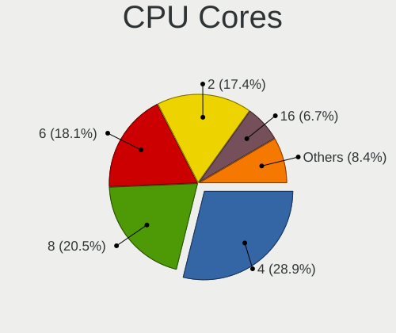

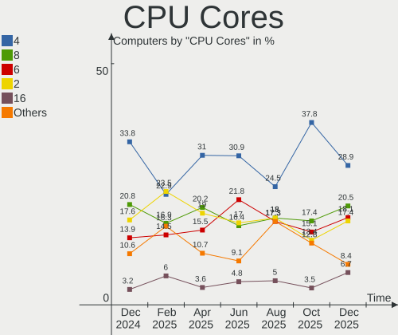

| Number | Computers | Percent |
|--------|-----------|---------|
| 4      | 86        | 28.86%  |
| 8      | 61        | 20.47%  |
| 6      | 54        | 18.12%  |
| 2      | 52        | 17.45%  |
| 16     | 20        | 6.71%   |
| 12     | 10        | 3.36%   |
| 24     | 7         | 2.35%   |
| 14     | 4         | 1.34%   |
| 20     | 2         | 0.67%   |
| 10     | 2         | 0.67%   |

CPU Sockets
-----------

Number of sockets

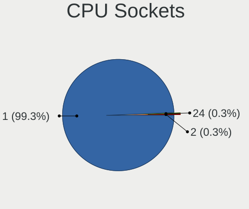

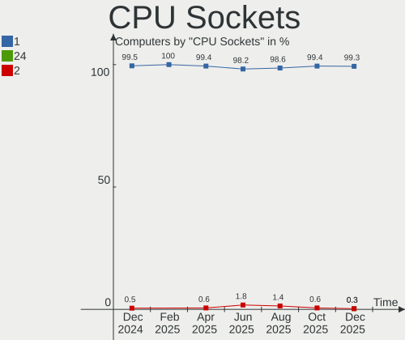

| Number | Computers | Percent |
|--------|-----------|---------|
| 1      | 296       | 99.33%  |
| 24     | 1         | 0.34%   |
| 2      | 1         | 0.34%   |

CPU Threads
-----------

Threads per core (Hyper-Threading)

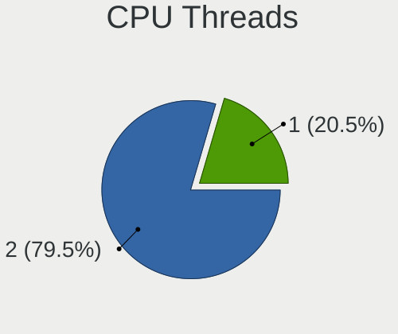

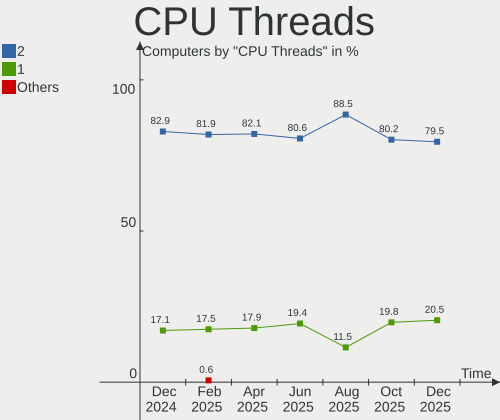

| Number | Computers | Percent |
|--------|-----------|---------|
| 2      | 237       | 79.53%  |
| 1      | 61        | 20.47%  |

CPU Op-Modes
------------

CPU Operation Modes (32-bit, 64-bit)

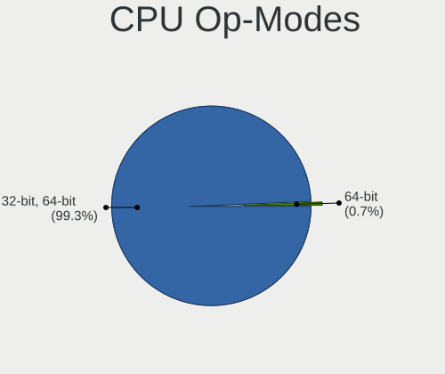

| Op mode        | Computers | Percent |
|----------------|-----------|---------|
| 32-bit, 64-bit | 298       | 100%    |

CPU Microcode
-------------

Microcode number

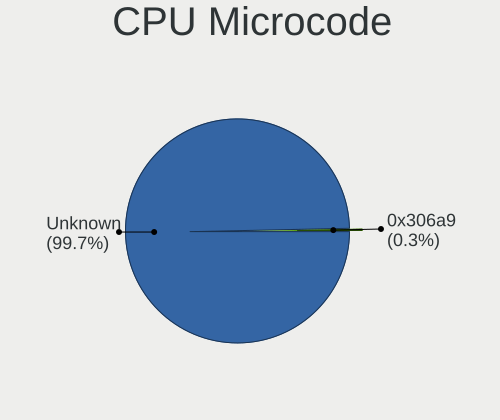

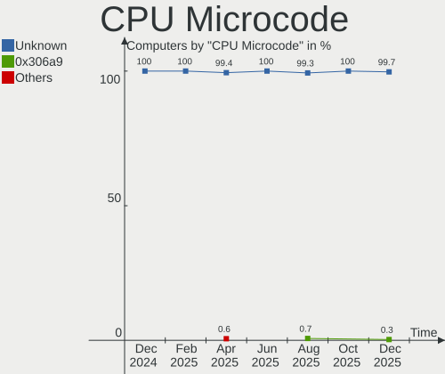

| Number  | Computers | Percent |
|---------|-----------|---------|
| Unknown | 297       | 99.66%  |
| 0x306a9 | 1         | 0.34%   |

CPU Microarch
-------------

Microarchitecture

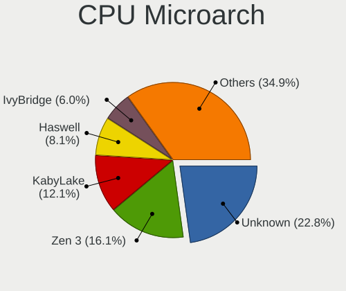

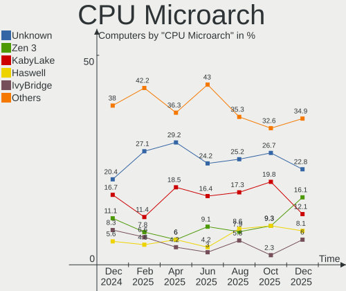

| Name              | Computers | Percent |
|-------------------|-----------|---------|
| Unknown           | 68        | 22.82%  |
| Zen 3             | 48        | 16.11%  |
| KabyLake          | 36        | 12.08%  |
| Haswell           | 24        | 8.05%   |
| IvyBridge         | 18        | 6.04%   |
| Skylake           | 14        | 4.7%    |
| CometLake         | 13        | 4.36%   |
| Zen 2             | 10        | 3.36%   |
| TigerLake         | 9         | 3.02%   |
| SandyBridge       | 8         | 2.68%   |
| Penryn            | 8         | 2.68%   |
| Broadwell         | 8         | 2.68%   |
| Zen+              | 7         | 2.35%   |
| Piledriver        | 5         | 1.68%   |
| Alderlake Hybrid  | 5         | 1.68%   |
| Zen               | 3         | 1.01%   |
| IceLake           | 3         | 1.01%   |
| Westmere          | 2         | 0.67%   |
| Puma              | 2         | 0.67%   |
| Meteorlake Hybrid | 2         | 0.67%   |
| Goldmont plus     | 2         | 0.67%   |
| Nehalem           | 1         | 0.34%   |
| K8 Hammer         | 1         | 0.34%   |
| Jaguar            | 1         | 0.34%   |

Graphics
--------

GPU Vendor
----------

Vendors of graphics cards

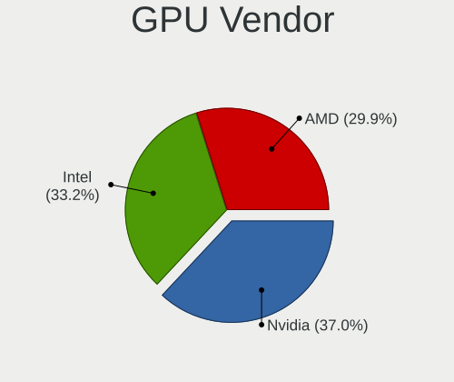

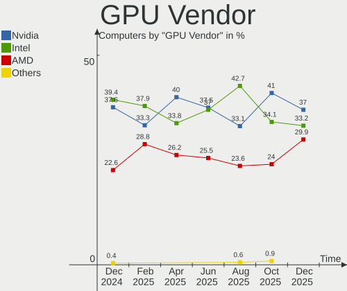

| Vendor | Computers | Percent |
|--------|-----------|---------|
| Nvidia | 135       | 36.99%  |
| Intel  | 121       | 33.15%  |
| AMD    | 109       | 29.86%  |

GPU Model
---------

Graphics card models

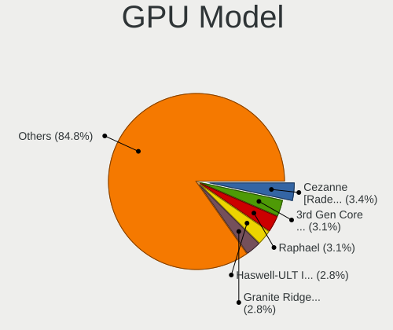

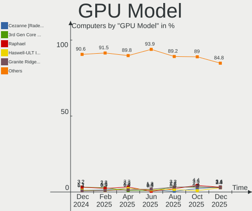

| Model                                                                       | Computers | Percent |
|-----------------------------------------------------------------------------|-----------|---------|
| AMD Cezanne [Radeon Vega Series / Radeon Vega Mobile Series]                | 13        | 3.36%   |
| Intel 3rd Gen Core processor Graphics Controller                            | 12        | 3.1%    |
| AMD Raphael                                                                 | 12        | 3.1%    |
| Intel Haswell-ULT Integrated Graphics Controller                            | 11        | 2.84%   |
| AMD Granite Ridge [Radeon Graphics]                                         | 11        | 2.84%   |
| AMD Navi 48 [Radeon RX 9070/9070 XT/9070 GRE]                               | 10        | 2.58%   |
| Intel TigerLake-LP GT2 [Iris Xe Graphics]                                   | 8         | 2.07%   |
| Intel Skylake-S GT2 [HD Graphics 530]                                       | 6         | 1.55%   |
| Intel CometLake-U GT2 [UHD Graphics]                                        | 6         | 1.55%   |
| AMD Ellesmere [Radeon RX 470/480/570/570X/580/580X/590]                     | 6         | 1.55%   |
| AMD Barcelo                                                                 | 6         | 1.55%   |
| Intel CoffeeLake-H GT2 [UHD Graphics 630]                                   | 5         | 1.29%   |
| Intel 2nd Generation Core Processor Family Integrated Graphics Controller   | 5         | 1.29%   |
| AMD Navi 33 [Radeon RX 7600/7600 XT/7600M XT/7600S/7700S / PRO W7600]       | 5         | 1.29%   |
| AMD Navi 23 [Radeon RX 6600/6600 XT/6600M]                                  | 5         | 1.29%   |
| Nvidia GB202 [GeForce RTX 5090]                                             | 4         | 1.03%   |
| Nvidia AD107M [GeForce RTX 4050 Max-Q / Mobile]                             | 4         | 1.03%   |
| Intel WhiskeyLake-U GT2 [UHD Graphics 620]                                  | 4         | 1.03%   |
| Intel Kaby Lake-H GT2 [HD Graphics 630]                                     | 4         | 1.03%   |
| Intel Arrow Lake-S [Intel Graphics]                                         | 4         | 1.03%   |
| Intel Arrow Lake-P [Arc Pro 130T/140T]                                      | 4         | 1.03%   |
| AMD Rembrandt [Radeon 680M]                                                 | 4         | 1.03%   |
| AMD Picasso/Raven 2 [Radeon Vega Series / Radeon Vega Mobile Series]        | 4         | 1.03%   |
| AMD Navi 44 [Radeon RX 9060 XT]                                             | 4         | 1.03%   |
| AMD Navi 22 [Radeon RX 6700/6700 XT/6750 XT / 6800M/6850M XT]               | 4         | 1.03%   |
| AMD Lucienne                                                                | 4         | 1.03%   |
| Nvidia GP107 [GeForce GTX 1050 Ti]                                          | 3         | 0.78%   |
| Nvidia GB206 [GeForce RTX 5060 Ti]                                          | 3         | 0.78%   |
| Nvidia GA106 [GeForce RTX 3060 Lite Hash Rate]                              | 3         | 0.78%   |
| Nvidia GA104M [GeForce RTX 3070 Mobile / Max-Q]                             | 3         | 0.78%   |
| Intel Xeon E3-1200 v3/4th Gen Core Processor Integrated Graphics Controller | 3         | 0.78%   |
| Intel Skylake-U GT2 [HD Graphics 520]                                       | 3         | 0.78%   |
| Intel Kaby Lake-R GT2 [UHD Graphics 620]                                    | 3         | 0.78%   |
| Intel CometLake-S GT2 [UHD Graphics 630]                                    | 3         | 0.78%   |
| Intel CometLake-H GT2 [UHD Graphics]                                        | 3         | 0.78%   |
| Intel Broadwell-U GT2 [HD Graphics 5500]                                    | 3         | 0.78%   |
| Intel Alder Lake-P GT2 [Iris Xe Graphics]                                   | 3         | 0.78%   |
| Intel 4th Gen Core Processor Integrated Graphics Controller                 | 3         | 0.78%   |
| AMD Renoir [Radeon Vega Series / Radeon Vega Mobile Series]                 | 3         | 0.78%   |
| AMD Mendocino [Radeon 610M]                                                 | 3         | 0.78%   |

GPU Combo
---------

Combinations of graphics cards

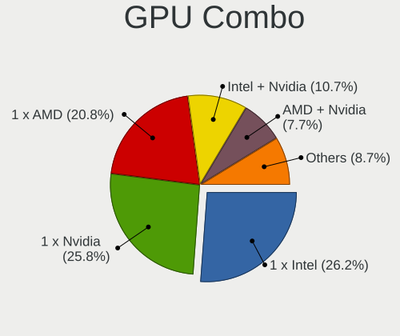

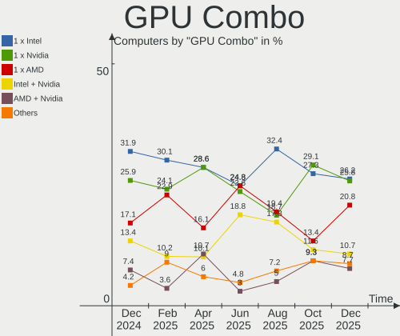

| Name               | Computers | Percent |
|--------------------|-----------|---------|
| 1 x Intel          | 78        | 26.17%  |
| 1 x Nvidia         | 77        | 25.84%  |
| 1 x AMD            | 62        | 20.81%  |
| Intel + Nvidia     | 32        | 10.74%  |
| AMD + Nvidia       | 23        | 7.72%   |
| 2 x AMD            | 19        | 6.38%   |
| Intel + AMD        | 3         | 1.01%   |
| Other              | 1         | 0.34%   |
| 2 x Nvidia         | 1         | 0.34%   |
| Intel + 2 x Nvidia | 1         | 0.34%   |
| AMD + 2 x Nvidia   | 1         | 0.34%   |

GPU Driver
----------

Free vs proprietary

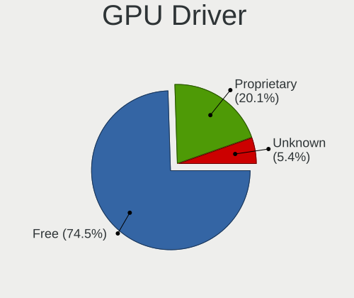

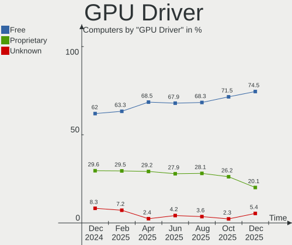

| Driver      | Computers | Percent |
|-------------|-----------|---------|
| Free        | 222       | 74.5%   |
| Proprietary | 60        | 20.13%  |
| Unknown     | 16        | 5.37%   |

GPU Memory
----------

Total video memory

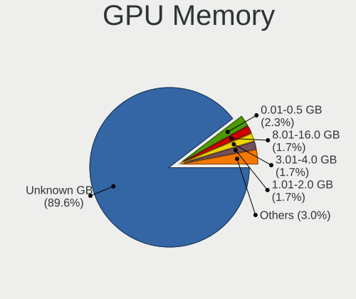

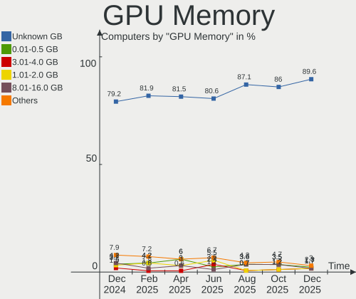

| Size in GB | Computers | Percent |
|------------|-----------|---------|
| Unknown    | 267       | 89.6%   |
| 0.01-0.5   | 7         | 2.35%   |
| 3.01-4.0   | 5         | 1.68%   |
| 1.01-2.0   | 5         | 1.68%   |
| 8.01-16.0  | 5         | 1.68%   |
| 7.01-8.0   | 3         | 1.01%   |
| 5.01-6.0   | 3         | 1.01%   |
| 24.01-32.0 | 1         | 0.34%   |
| 16.01-24.0 | 1         | 0.34%   |
| 0.51-1.0   | 1         | 0.34%   |

Monitor
-------

Monitor Vendor
--------------

Monitor vendors

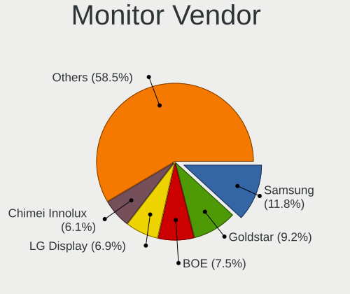

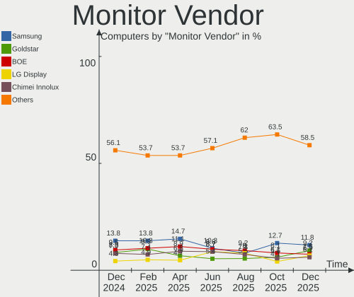

| Vendor                  | Computers | Percent |
|-------------------------|-----------|---------|
| Samsung Electronics     | 41        | 11.82%  |
| Goldstar                | 32        | 9.22%   |
| BOE                     | 26        | 7.49%   |
| LG Display              | 24        | 6.92%   |
| Chimei Innolux          | 21        | 6.05%   |
| Acer                    | 21        | 6.05%   |
| Dell                    | 19        | 5.48%   |
| AU Optronics            | 19        | 5.48%   |
| Hewlett-Packard         | 17        | 4.9%    |
| Apple                   | 15        | 4.32%   |
| AOC                     | 13        | 3.75%   |
| ASUSTek Computer        | 11        | 3.17%   |
| Lenovo                  | 7         | 2.02%   |
| MSI                     | 6         | 1.73%   |
| BenQ                    | 6         | 1.73%   |
| Toshiba                 | 4         | 1.15%   |
| PANDA                   | 4         | 1.15%   |
| Ancor Communications    | 4         | 1.15%   |
| VIE                     | 3         | 0.86%   |
| Unknown (XXX)           | 3         | 0.86%   |
| SKG                     | 3         | 0.86%   |
| CSOT                    | 3         | 0.86%   |
| CHD                     | 3         | 0.86%   |
| Wacom                   | 2         | 0.58%   |
| Vizio                   | 2         | 0.58%   |
| ViewSonic               | 2         | 0.58%   |
| Sharp                   | 2         | 0.58%   |
| RTK                     | 2         | 0.58%   |
| Philips                 | 2         | 0.58%   |
| NEC Computers           | 2         | 0.58%   |
| Iiyama                  | 2         | 0.58%   |
| Huion                   | 2         | 0.58%   |
| Gigabyte Technology     | 2         | 0.58%   |
| CSW                     | 2         | 0.58%   |
| Chi Mei Optoelectronics | 2         | 0.58%   |
| TCL                     | 1         | 0.29%   |
| SKK                     | 1         | 0.29%   |
| Sceptre Tech            | 1         | 0.29%   |
| SANYO                   | 1         | 0.29%   |
| RCA                     | 1         | 0.29%   |

Monitor Model
-------------

Monitor models

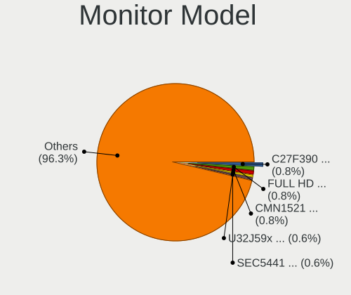

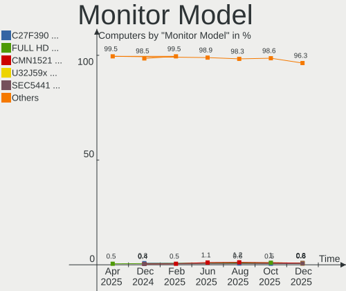

| Model                                                                     | Computers | Percent |
|---------------------------------------------------------------------------|-----------|---------|
| Samsung Electronics C27F390 SAM0D32 1920x1080 598x336mm 27.0-inch         | 3         | 0.85%   |
| Goldstar FULL HD GSM5B55 1920x1080 480x270mm 21.7-inch                    | 3         | 0.85%   |
| Chimei Innolux LCD Monitor CMN1521 1920x1080 344x193mm 15.5-inch          | 3         | 0.85%   |
| Samsung Electronics U32J59x SAM0F33 3840x2160 697x392mm 31.5-inch         | 2         | 0.56%   |
| Samsung Electronics LCD Monitor SEC5441 1280x800 331x207mm 15.4-inch      | 2         | 0.56%   |
| Goldstar LG TV SSCR2 GSMC0C8 3840x2160                                    | 2         | 0.56%   |
| Goldstar LG IPS FULLHD GSM5AB8 1920x1080 480x270mm 21.7-inch              | 2         | 0.56%   |
| Dell SE2717H/HX DELD0A1 1920x1080 598x336mm 27.0-inch                     | 2         | 0.56%   |
| CSOT LCD Monitor CSO1400 3840x2160 309x174mm 14.0-inch                    | 2         | 0.56%   |
| Chimei Innolux LCD Monitor CMN1618 1920x1200 344x215mm 16.0-inch          | 2         | 0.56%   |
| Chi Mei Optoelectronics LCD Monitor CMO1720 1920x1080 382x215mm 17.3-inch | 2         | 0.56%   |
| ASUSTek Computer VG248 AUS24AC 1920x1080 531x299mm 24.0-inch              | 2         | 0.56%   |
| Apple Color LCD APPA029 2560x1600 286x179mm 13.3-inch                     | 2         | 0.56%   |
| Apple Color LCD APP9CC7 1280x800 286x179mm 13.3-inch                      | 2         | 0.56%   |
| Ancor Communications VX238 ACI23C1 1920x1080 510x290mm 23.1-inch          | 2         | 0.56%   |
| Wacom One 13 WAC1070 1920x1080 294x166mm 13.3-inch                        | 1         | 0.28%   |
| Wacom Cintiq 22 WAC1065 1920x1080 476x268mm 21.5-inch                     | 1         | 0.28%   |
| Vizio V405-G9 VIZ1033 3840x2160 1096x616mm 49.5-inch                      | 1         | 0.28%   |
| Vizio E280i-B1 VIZ1002 1360x768 607x345mm 27.5-inch                       | 1         | 0.28%   |
| ViewSonic VX2718 series VSCE439 1920x1080 609x348mm 27.6-inch             | 1         | 0.28%   |
| ViewSonic VX2452 Series VSCDE2E 1920x1080 521x293mm 23.5-inch             | 1         | 0.28%   |
| VIE VALAK Z180H VIE2380 1920x1080 527x296mm 23.8-inch                     | 1         | 0.28%   |
| VIE J2475FFHD VIE1919 1920x1080 520x310mm 23.8-inch                       | 1         | 0.28%   |
| VIE ATHEN U2L 21 VIE2150 1920x1080 476x268mm 21.5-inch                    | 1         | 0.28%   |
| Unknown (XXX) HDMI XXX2400 1920x1080 520x320mm 24.0-inch                  | 1         | 0.28%   |
| Unknown (XXX) Beyond TV XXX9221 1920x1080 1209x680mm 54.6-inch            | 1         | 0.28%   |
| Unknown (XXX) Beyond TV XXX2851 3840x2160 1209x680mm 54.6-inch            | 1         | 0.28%   |
| Toshiba TV TSB1011 1920x1080 930x523mm 42.0-inch                          | 1         | 0.28%   |
| Toshiba TV TSB0109 1920x1080 1594x900mm 72.1-inch                         | 1         | 0.28%   |
| Toshiba TSB-TV TSB0208 1920x1080 708x398mm 32.0-inch                      | 1         | 0.28%   |
| Toshiba HisenseUS-TV TSB0030 1920x1080 800x450mm 36.1-inch                | 1         | 0.28%   |
| TCL 34R83Q TCL3401 3440x1440 797x333mm 34.0-inch                          | 1         | 0.28%   |
| SKK SKK181 SKK3130 1680x1050 708x398mm 32.0-inch                          | 1         | 0.28%   |
| SKG H34S18S SKG3403 3440x1440 797x334mm 34.0-inch                         | 1         | 0.28%   |
| SKG H27T27 SKG2752 2560x1440 531x298mm 24.0-inch                          | 1         | 0.28%   |
| SKG Android TV SKG4000 1920x1080 708x398mm 32.0-inch                      | 1         | 0.28%   |
| Sharp LQ156T1JW03 SHP1529 2560x1440 344x194mm 15.5-inch                   | 1         | 0.28%   |
| Sharp LCD Monitor SHP14D2 1920x1080 309x174mm 14.0-inch                   | 1         | 0.28%   |
| Sceptre Tech Sceptre F24 SPT09AB 1920x1080 530x290mm 23.8-inch            | 1         | 0.28%   |
| SANYO 19CE350LED SAN1900 1360x768 708x398mm 32.0-inch                     | 1         | 0.28%   |

Monitor Resolution
------------------

Monitor screen resolution

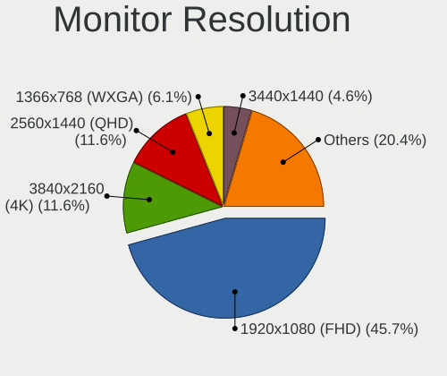

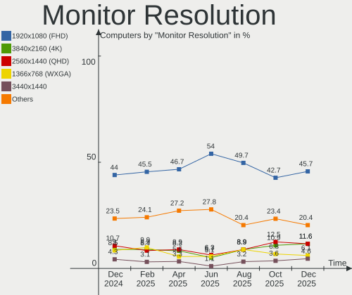

| Resolution         | Computers | Percent |
|--------------------|-----------|---------|
| 1920x1080 (FHD)    | 150       | 45.73%  |
| 3840x2160 (4K)     | 38        | 11.59%  |
| 2560x1440 (QHD)    | 38        | 11.59%  |
| 1366x768 (WXGA)    | 20        | 6.1%    |
| 3440x1440          | 15        | 4.57%   |
| 1920x1200 (WUXGA)  | 13        | 3.96%   |
| 2560x1600          | 7         | 2.13%   |
| 2880x1800          | 6         | 1.83%   |
| 1280x800 (WXGA)    | 6         | 1.83%   |
| 1440x900 (WXGA+)   | 5         | 1.52%   |
| 1600x900 (HD+)     | 4         | 1.22%   |
| 3840x2400          | 3         | 0.91%   |
| 2560x1080          | 3         | 0.91%   |
| 1280x1024 (SXGA)   | 3         | 0.91%   |
| 3840x1600          | 2         | 0.61%   |
| 3840x1080          | 2         | 0.61%   |
| 3240x2160          | 1         | 0.3%    |
| 3200x2000          | 1         | 0.3%    |
| 2880x1920          | 1         | 0.3%    |
| 2736x1824          | 1         | 0.3%    |
| 2560x682           | 1         | 0.3%    |
| 2560x2880          | 1         | 0.3%    |
| 2256x1504          | 1         | 0.3%    |
| 2160x1440          | 1         | 0.3%    |
| 1920x1280          | 1         | 0.3%    |
| 1680x1050 (WSXGA+) | 1         | 0.3%    |
| 1360x768           | 1         | 0.3%    |
| 1280x720 (HD)      | 1         | 0.3%    |
| Unknown            | 1         | 0.3%    |

Monitor Diagonal
----------------

Diagonal size in inches

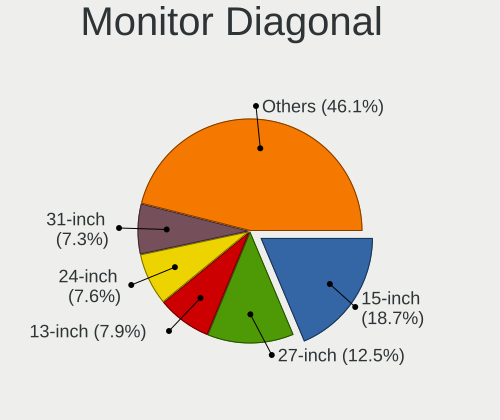

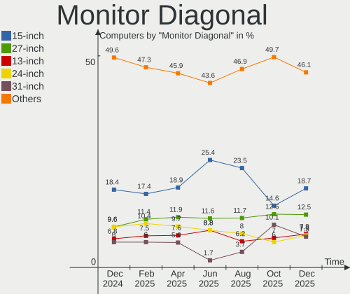

| Inches  | Computers | Percent |
|---------|-----------|---------|
| 15      | 64        | 18.66%  |
| 27      | 43        | 12.54%  |
| 13      | 27        | 7.87%   |
| 24      | 26        | 7.58%   |
| 31      | 25        | 7.29%   |
| 23      | 22        | 6.41%   |
| 14      | 20        | 5.83%   |
| 34      | 15        | 4.37%   |
| 16      | 14        | 4.08%   |
| 21      | 13        | 3.79%   |
| 17      | 10        | 2.92%   |
| 32      | 9         | 2.62%   |
| 40      | 5         | 1.46%   |
| 19      | 5         | 1.46%   |
| 72      | 4         | 1.17%   |
| Unknown | 4         | 1.17%   |
| 84      | 3         | 0.87%   |
| 48      | 3         | 0.87%   |
| 35      | 3         | 0.87%   |
| 12      | 3         | 0.87%   |
| 11      | 3         | 0.87%   |
| 63      | 2         | 0.58%   |
| 49      | 2         | 0.58%   |
| 37      | 2         | 0.58%   |
| 22      | 2         | 0.58%   |
| 20      | 2         | 0.58%   |
| 74      | 1         | 0.29%   |
| 65      | 1         | 0.29%   |
| 54      | 1         | 0.29%   |
| 47      | 1         | 0.29%   |
| 42      | 1         | 0.29%   |
| 38      | 1         | 0.29%   |
| 36      | 1         | 0.29%   |
| 29      | 1         | 0.29%   |
| 28      | 1         | 0.29%   |
| 26      | 1         | 0.29%   |
| 25      | 1         | 0.29%   |
| 18      | 1         | 0.29%   |

Monitor Width
-------------

Physical width

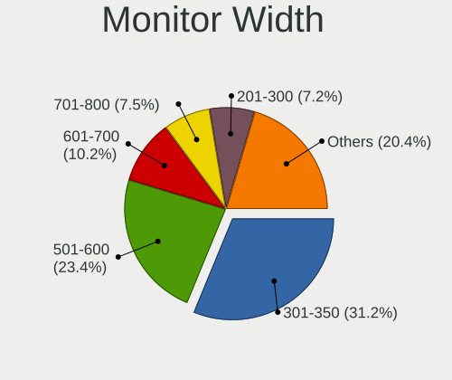

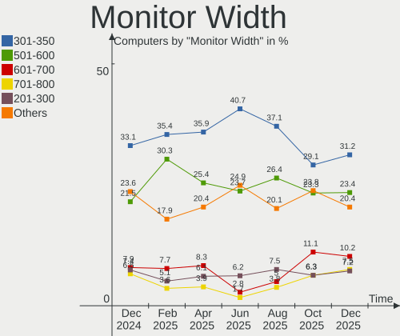

| Width in mm | Computers | Percent |
|-------------|-----------|---------|
| 301-350     | 104       | 31.23%  |
| 501-600     | 78        | 23.42%  |
| 601-700     | 34        | 10.21%  |
| 701-800     | 25        | 7.51%   |
| 201-300     | 24        | 7.21%   |
| 401-500     | 20        | 6.01%   |
| 351-400     | 15        | 4.5%    |
| 801-900     | 11        | 3.3%    |
| 1001-1500   | 9         | 2.7%    |
| 1501-2000   | 8         | 2.4%    |
| Unknown     | 4         | 1.2%    |
| 901-1000    | 1         | 0.3%    |

Aspect Ratio
------------

Proportional relationship between the width and the height

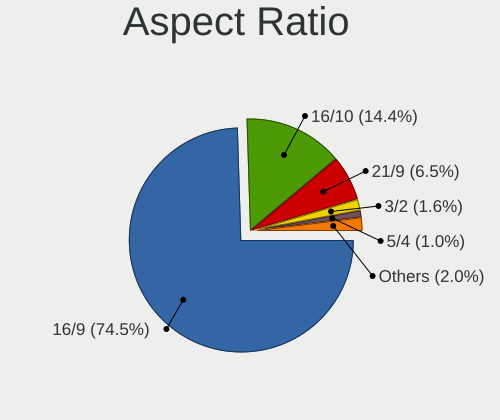

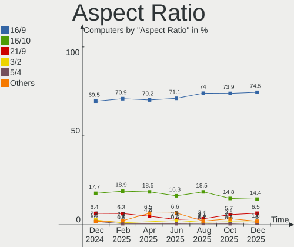

| Ratio   | Computers | Percent |
|---------|-----------|---------|
| 16/9    | 228       | 74.51%  |
| 16/10   | 44        | 14.38%  |
| 21/9    | 20        | 6.54%   |
| 3/2     | 5         | 1.63%   |
| 5/4     | 3         | 0.98%   |
| 32/9    | 3         | 0.98%   |
| 3.75    | 1         | 0.33%   |
| 0.89    | 1         | 0.33%   |
| Unknown | 1         | 0.33%   |

Monitor Area
------------

Area in inch²

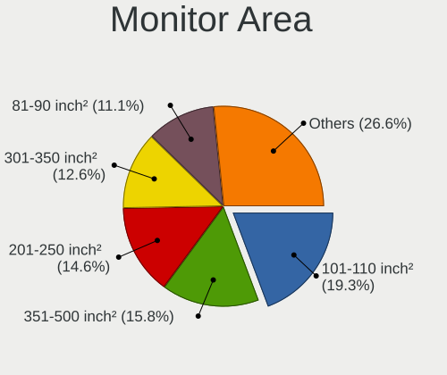

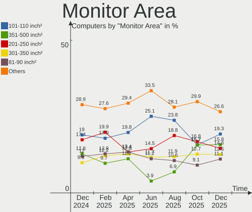

| Area in inch² | Computers | Percent |
|----------------|-----------|---------|
| 101-110        | 66        | 19.3%   |
| 351-500        | 54        | 15.79%  |
| 201-250        | 50        | 14.62%  |
| 301-350        | 43        | 12.57%  |
| 81-90          | 38        | 11.11%  |
| More than 1000 | 14        | 4.09%   |
| 501-1000       | 14        | 4.09%   |
| 251-300        | 12        | 3.51%   |
| 111-120        | 12        | 3.51%   |
| 71-80          | 9         | 2.63%   |
| 151-200        | 9         | 2.63%   |
| 121-130        | 8         | 2.34%   |
| Unknown        | 4         | 1.17%   |
| 61-70          | 3         | 0.88%   |
| 51-60          | 3         | 0.88%   |
| 141-150        | 2         | 0.58%   |
| 131-140        | 1         | 0.29%   |

Pixel Density
-------------

Pixels per inch

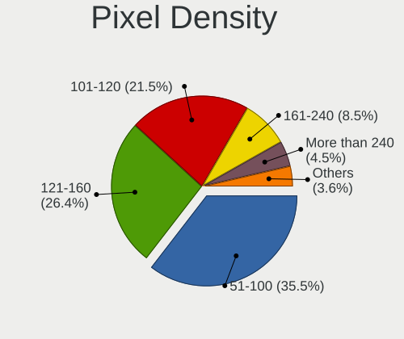

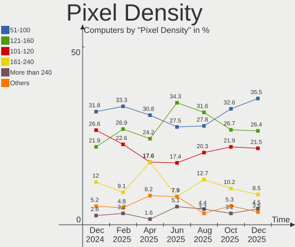

| Density       | Computers | Percent |
|---------------|-----------|---------|
| 51-100        | 117       | 35.45%  |
| 121-160       | 87        | 26.36%  |
| 101-120       | 71        | 21.52%  |
| 161-240       | 28        | 8.48%   |
| More than 240 | 15        | 4.55%   |
| 1-50          | 8         | 2.42%   |
| Unknown       | 4         | 1.21%   |

Multiple Monitors
-----------------

Total monitors connected

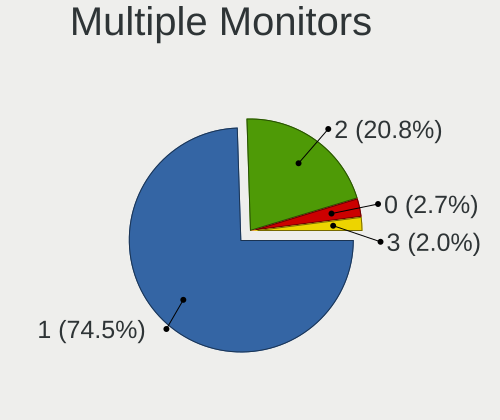

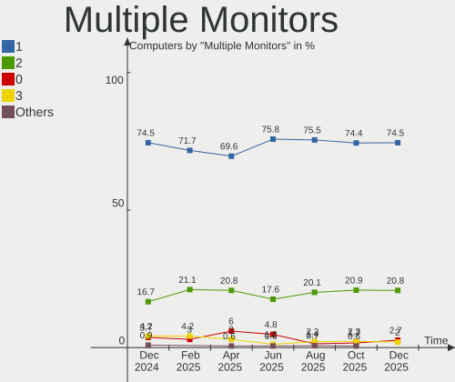

| Total | Computers | Percent |
|-------|-----------|---------|
| 1     | 222       | 74.5%   |
| 2     | 62        | 20.81%  |
| 0     | 8         | 2.68%   |
| 3     | 6         | 2.01%   |

Network
-------

Net Controller Vendor
---------------------

Controller vendors

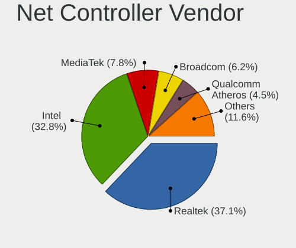

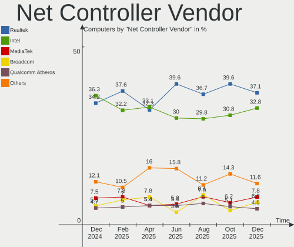

| Vendor                            | Computers | Percent |
|-----------------------------------|-----------|---------|
| Realtek Semiconductor             | 172       | 37.07%  |
| Intel                             | 152       | 32.76%  |
| MediaTek                          | 36        | 7.76%   |
| Broadcom                          | 29        | 6.25%   |
| Qualcomm Atheros                  | 21        | 4.53%   |
| TP-Link                           | 10        | 2.16%   |
| Broadcom Limited                  | 7         | 1.51%   |
| ASIX Electronics                  | 5         | 1.08%   |
| Nvidia                            | 4         | 0.86%   |
| Qualcomm Technologies             | 3         | 0.65%   |
| OPPO Electronics                  | 3         | 0.65%   |
| Realtek                           | 2         | 0.43%   |
| Marvell Technology Group          | 2         | 0.43%   |
| Lenovo                            | 2         | 0.43%   |
| InterBiometrics                   | 2         | 0.43%   |
| Aquantia                          | 2         | 0.43%   |
| Sierra Wireless                   | 1         | 0.22%   |
| Shenzhen Goodix Technology        | 1         | 0.22%   |
| Samsung Electronics               | 1         | 0.22%   |
| QinHeng Electronics               | 1         | 0.22%   |
| NetGear                           | 1         | 0.22%   |
| Mercucys                          | 1         | 0.22%   |
| HYTE                              | 1         | 0.22%   |
| Google                            | 1         | 0.22%   |
| Ericsson Business Mobile Networks | 1         | 0.22%   |
| Edimax Technology                 | 1         | 0.22%   |
| D-Link                            | 1         | 0.22%   |
| aicsemi                           | 1         | 0.22%   |

Net Controller Model
--------------------

Controller models

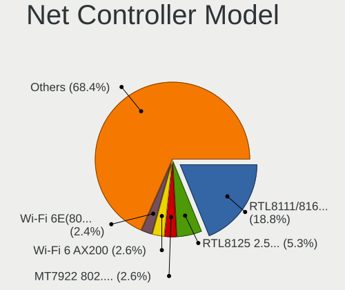

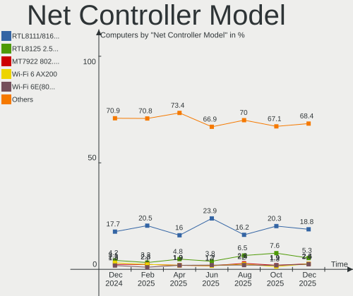

| Model                                                                           | Computers | Percent |
|---------------------------------------------------------------------------------|-----------|---------|
| Realtek RTL8111/8168/8211/8411 PCI Express Gigabit Ethernet Controller          | 103       | 18.83%  |
| Realtek RTL8125 2.5GbE Controller                                               | 29        | 5.3%    |
| MediaTek MT7922 802.11ax PCI Express Wireless Network Adapter                   | 14        | 2.56%   |
| Intel Wi-Fi 6 AX200                                                             | 14        | 2.56%   |
| Intel Wi-Fi 6E(802.11ax) AX210/AX1675* 2x2 [Typhoon Peak]                       | 13        | 2.38%   |
| Realtek RTL8852BE PCIe 802.11ax Wireless Network Controller                     | 9         | 1.65%   |
| Intel Ethernet Controller I226-V                                                | 8         | 1.46%   |
| Intel Ethernet Connection (2) I219-V                                            | 8         | 1.46%   |
| Intel Wi-Fi 6 AX201                                                             | 7         | 1.28%   |
| Intel I211 Gigabit Network Connection                                           | 7         | 1.28%   |
| Intel Ethernet Controller I225-V                                                | 7         | 1.28%   |
| Intel Comet Lake PCH-LP CNVi WiFi                                               | 7         | 1.28%   |
| Intel 82579LM Gigabit Network Connection (Lewisville)                           | 7         | 1.28%   |
| Realtek RTL8822CE 802.11ac PCIe Wireless Network Adapter                        | 6         | 1.1%    |
| Realtek RTL810xE PCI Express Fast Ethernet controller                           | 6         | 1.1%    |
| MediaTek MT7921 802.11ax PCIe Wireless Network Adapter [Filogic 330]            | 6         | 1.1%    |
| Intel Wi-Fi 7(802.11be) AX1775*/AX1790*/BE20*/BE401/BE1750* 2x2                 | 6         | 1.1%    |
| Intel Cannon Lake PCH CNVi WiFi                                                 | 6         | 1.1%    |
| Broadcom NetXtreme BCM57765 Gigabit Ethernet PCIe                               | 6         | 1.1%    |
| Broadcom BCM4331 802.11a/b/g/n                                                  | 6         | 1.1%    |
| Realtek RTL8153 Gigabit Ethernet Adapter                                        | 5         | 0.91%   |
| Realtek RTL8126 5GbE Controller                                                 | 5         | 0.91%   |
| Realtek 802.11ac NIC                                                            | 5         | 0.91%   |
| Intel Wireless 7265                                                             | 5         | 0.91%   |
| Intel Wireless 7260                                                             | 5         | 0.91%   |
| Intel Arrow Lake CNVi WiFi                                                      | 5         | 0.91%   |
| Broadcom BCM43142 802.11b/g/n                                                   | 5         | 0.91%   |
| ASIX AX88179 Gigabit Ethernet                                                   | 5         | 0.91%   |
| TP-Link AC600 wireless Realtek RTL8811AU [Archer T2U Nano]                      | 4         | 0.73%   |
| Realtek RTL8821CE 802.11ac PCIe Wireless Network Adapter                        | 4         | 0.73%   |
| Qualcomm Atheros QCA9565 / AR9565 Wireless Network Adapter                      | 4         | 0.73%   |
| Qualcomm Atheros QCA9377 802.11ac Wireless Network Adapter                      | 4         | 0.73%   |
| MediaTek MT7927 802.11be 320MHz 2x2 PCIe Wireless Network Adapter [Filogic 380] | 4         | 0.73%   |
| MediaTek MT7925 802.11be 160MHz 2x2 PCIe Wireless Network Adapter [Filogic 360] | 4         | 0.73%   |
| Intel Wi-Fi 5(802.11ac) Wireless-AC 9x6x [Thunder Peak]                         | 4         | 0.73%   |
| Intel Ethernet Connection (7) I219-V                                            | 4         | 0.73%   |
| Intel Dual Band Wireless-AC 3168NGW [Stone Peak]                                | 4         | 0.73%   |
| Intel Comet Lake PCH CNVi WiFi                                                  | 4         | 0.73%   |
| Intel Alder Lake-P PCH CNVi WiFi                                                | 4         | 0.73%   |
| Broadcom Limited BCM4360 802.11ac Dual Band Wireless Network Adapter            | 4         | 0.73%   |

Wireless Vendor
---------------

Wireless vendors

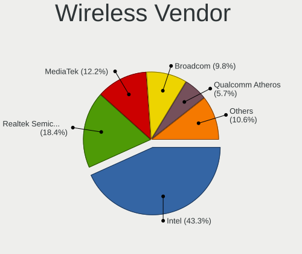

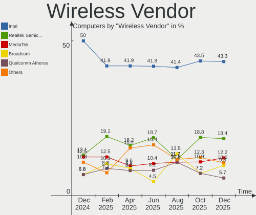

| Vendor                   | Computers | Percent |
|--------------------------|-----------|---------|
| Intel                    | 106       | 43.27%  |
| Realtek Semiconductor    | 45        | 18.37%  |
| MediaTek                 | 30        | 12.24%  |
| Broadcom                 | 24        | 9.8%    |
| Qualcomm Atheros         | 14        | 5.71%   |
| TP-Link                  | 10        | 4.08%   |
| Broadcom Limited         | 7         | 2.86%   |
| Realtek                  | 2         | 0.82%   |
| Sierra Wireless          | 1         | 0.41%   |
| Qualcomm Technologies    | 1         | 0.41%   |
| NetGear                  | 1         | 0.41%   |
| Mercucys                 | 1         | 0.41%   |
| Marvell Technology Group | 1         | 0.41%   |
| Edimax Technology        | 1         | 0.41%   |
| D-Link                   | 1         | 0.41%   |

Wireless Model
--------------

Wireless models

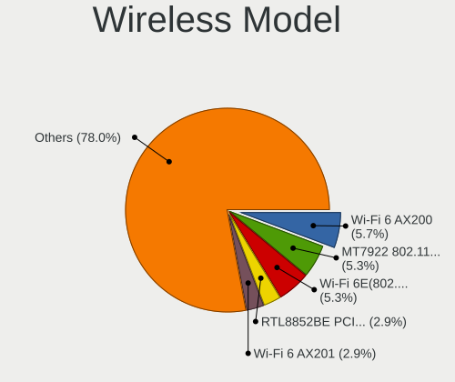

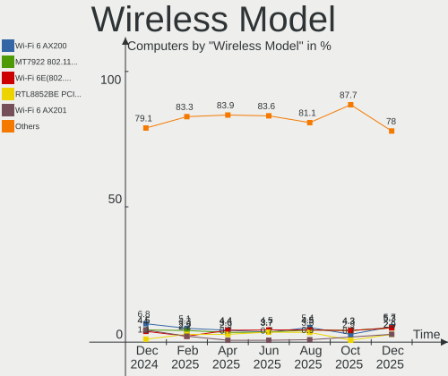

| Model                                                                           | Computers | Percent |
|---------------------------------------------------------------------------------|-----------|---------|
| Intel Wi-Fi 6 AX200                                                             | 14        | 5.71%   |
| MediaTek MT7922 802.11ax PCI Express Wireless Network Adapter                   | 13        | 5.31%   |
| Intel Wi-Fi 6E(802.11ax) AX210/AX1675* 2x2 [Typhoon Peak]                       | 13        | 5.31%   |
| Realtek RTL8852BE PCIe 802.11ax Wireless Network Controller                     | 7         | 2.86%   |
| Intel Wi-Fi 6 AX201                                                             | 7         | 2.86%   |
| Intel Comet Lake PCH-LP CNVi WiFi                                               | 7         | 2.86%   |
| Realtek RTL8822CE 802.11ac PCIe Wireless Network Adapter                        | 6         | 2.45%   |
| MediaTek MT7921 802.11ax PCIe Wireless Network Adapter [Filogic 330]            | 6         | 2.45%   |
| Intel Cannon Lake PCH CNVi WiFi                                                 | 6         | 2.45%   |
| Broadcom BCM4331 802.11a/b/g/n                                                  | 6         | 2.45%   |
| Realtek 802.11ac NIC                                                            | 5         | 2.04%   |
| Intel Wireless 7265                                                             | 5         | 2.04%   |
| Intel Wireless 7260                                                             | 5         | 2.04%   |
| Intel Wi-Fi 7(802.11be) AX1775*/AX1790*/BE20*/BE401/BE1750* 2x2                 | 5         | 2.04%   |
| Broadcom BCM43142 802.11b/g/n                                                   | 5         | 2.04%   |
| TP-Link AC600 wireless Realtek RTL8811AU [Archer T2U Nano]                      | 4         | 1.63%   |
| Realtek RTL8821CE 802.11ac PCIe Wireless Network Adapter                        | 4         | 1.63%   |
| Qualcomm Atheros QCA9565 / AR9565 Wireless Network Adapter                      | 4         | 1.63%   |
| Qualcomm Atheros QCA9377 802.11ac Wireless Network Adapter                      | 4         | 1.63%   |
| Intel Wi-Fi 5(802.11ac) Wireless-AC 9x6x [Thunder Peak]                         | 4         | 1.63%   |
| Intel Dual Band Wireless-AC 3168NGW [Stone Peak]                                | 4         | 1.63%   |
| Intel Comet Lake PCH CNVi WiFi                                                  | 4         | 1.63%   |
| Broadcom Limited BCM4360 802.11ac Dual Band Wireless Network Adapter            | 4         | 1.63%   |
| Broadcom BCM4360 802.11ac Dual Band Wireless Network Adapter                    | 4         | 1.63%   |
| TP-Link Archer T2U PLUS [RTL8821AU]                                             | 3         | 1.22%   |
| MediaTek MT7902 802.11ax PCIe Wireless Network Adapter [Filogic 310]            | 3         | 1.22%   |
| Intel Wireless 8265 / 8275                                                      | 3         | 1.22%   |
| Intel Wireless 8260                                                             | 3         | 1.22%   |
| Intel Cannon Point-LP CNVi [Wireless-AC]                                        | 3         | 1.22%   |
| Intel Alder Lake-P PCH CNVi WiFi                                                | 3         | 1.22%   |
| Broadcom Limited BCM4352 802.11ac Dual Band Wireless Network Adapter            | 3         | 1.22%   |
| TP-Link TL-WN823N v2/v3 [Realtek RTL8192EU]                                     | 2         | 0.82%   |
| Realtek RTL88x2bu [AC1200 Techkey]                                              | 2         | 0.82%   |
| Realtek RTL8852BE-VT PCIe 802.11ax Wireless Network Controller                  | 2         | 0.82%   |
| Realtek RTL8852AE 802.11ax PCIe Wireless Network Adapter                        | 2         | 0.82%   |
| Realtek RTL8851BE PCIe 802.11ax Wireless Network Controller                     | 2         | 0.82%   |
| Realtek RTL8188EUS 802.11n Wireless Network Adapter                             | 2         | 0.82%   |
| Qualcomm Atheros QCA6174 802.11ac Wireless Network Adapter                      | 2         | 0.82%   |
| Qualcomm Atheros AR93xx Wireless Network Adapter                                | 2         | 0.82%   |
| MediaTek MT7927 802.11be 320MHz 2x2 PCIe Wireless Network Adapter [Filogic 380] | 2         | 0.82%   |

Ethernet Vendor
---------------

Ethernet vendors

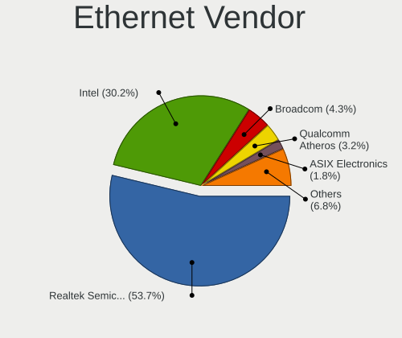

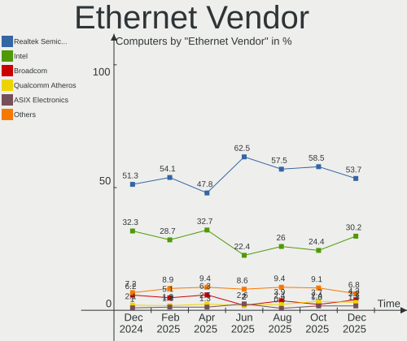

| Vendor                   | Computers | Percent |
|--------------------------|-----------|---------|
| Realtek Semiconductor    | 151       | 53.74%  |
| Intel                    | 85        | 30.25%  |
| Broadcom                 | 12        | 4.27%   |
| Qualcomm Atheros         | 9         | 3.2%    |
| ASIX Electronics         | 5         | 1.78%   |
| Nvidia                   | 4         | 1.42%   |
| OPPO Electronics         | 3         | 1.07%   |
| MediaTek                 | 3         | 1.07%   |
| Qualcomm Technologies    | 2         | 0.71%   |
| Lenovo                   | 2         | 0.71%   |
| Aquantia                 | 2         | 0.71%   |
| Samsung Electronics      | 1         | 0.36%   |
| Marvell Technology Group | 1         | 0.36%   |
| Google                   | 1         | 0.36%   |

Ethernet Model
--------------

Ethernet models

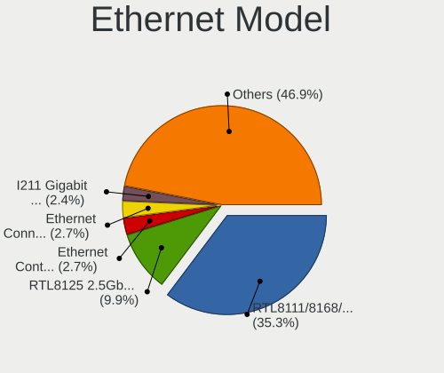

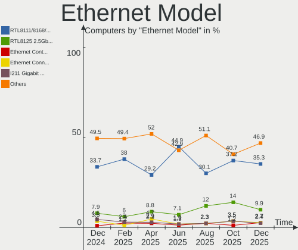

| Model                                                                           | Computers | Percent |
|---------------------------------------------------------------------------------|-----------|---------|
| Realtek RTL8111/8168/8211/8411 PCI Express Gigabit Ethernet Controller          | 103       | 35.27%  |
| Realtek RTL8125 2.5GbE Controller                                               | 29        | 9.93%   |
| Intel Ethernet Controller I226-V                                                | 8         | 2.74%   |
| Intel Ethernet Connection (2) I219-V                                            | 8         | 2.74%   |
| Intel I211 Gigabit Network Connection                                           | 7         | 2.4%    |
| Intel Ethernet Controller I225-V                                                | 7         | 2.4%    |
| Intel 82579LM Gigabit Network Connection (Lewisville)                           | 7         | 2.4%    |
| Realtek RTL810xE PCI Express Fast Ethernet controller                           | 6         | 2.05%   |
| Broadcom NetXtreme BCM57765 Gigabit Ethernet PCIe                               | 6         | 2.05%   |
| Realtek RTL8153 Gigabit Ethernet Adapter                                        | 5         | 1.71%   |
| Realtek RTL8126 5GbE Controller                                                 | 5         | 1.71%   |
| ASIX AX88179 Gigabit Ethernet                                                   | 5         | 1.71%   |
| Intel Ethernet Connection (7) I219-V                                            | 4         | 1.37%   |
| Intel Arrow Lake CNVi WiFi                                                      | 4         | 1.37%   |
| Realtek RTL8922AE 802.11be PCIe Wireless Network Adapter                        | 3         | 1.03%   |
| OPPO RMX3741                                                                    | 3         | 1.03%   |
| Nvidia MCP79 Ethernet                                                           | 3         | 1.03%   |
| Intel Ethernet Connection I217-V                                                | 3         | 1.03%   |
| Intel Ethernet Connection (6) I219-LM                                           | 3         | 1.03%   |
| Intel Ethernet Connection (18) I219-LM                                          | 3         | 1.03%   |
| Intel Ethernet Connection (10) I219-V                                           | 3         | 1.03%   |
| Realtek USB 10/100/1G/2.5 LAN                                                   | 2         | 0.68%   |
| Realtek RTL8852BE PCIe 802.11ax Wireless Network Controller                     | 2         | 0.68%   |
| Realtek RTL8152 Fast Ethernet Adapter                                           | 2         | 0.68%   |
| Qualcomm WCN785x Wi-Fi 7(802.11be) 320MHz 2x2 [FastConnect 7800]                | 2         | 0.68%   |
| Qualcomm Atheros QCA8171 Gigabit Ethernet                                       | 2         | 0.68%   |
| Qualcomm Atheros Killer E2500 Gigabit Ethernet Controller                       | 2         | 0.68%   |
| Qualcomm Atheros Killer E220x Gigabit Ethernet Controller                       | 2         | 0.68%   |
| MediaTek MT7925 802.11be 160MHz 2x2 PCIe Wireless Network Adapter [Filogic 360] | 2         | 0.68%   |
| Intel Ethernet Connection I218-LM                                               | 2         | 0.68%   |
| Intel Ethernet Connection (4) I219-LM                                           | 2         | 0.68%   |
| Intel Ethernet Connection (13) I219-V                                           | 2         | 0.68%   |
| Broadcom NetXtreme BCM57766 Gigabit Ethernet PCIe                               | 2         | 0.68%   |
| Broadcom NetXtreme BCM5764M Gigabit Ethernet PCIe                               | 2         | 0.68%   |
| Samsung Galaxy series, misc. (tethering mode)                                   | 1         | 0.34%   |
| Realtek PCIe GbE Family Controller                                              | 1         | 0.34%   |
| Realtek Killer E3000 2.5GbE Controller                                          | 1         | 0.34%   |
| Realtek Killer E2600 GbE Controller                                             | 1         | 0.34%   |
| Qualcomm Atheros QCA8172 Fast Ethernet                                          | 1         | 0.34%   |
| Qualcomm Atheros Killer E2400 Gigabit Ethernet Controller                       | 1         | 0.34%   |

Net Controller Kind
-------------------

Ethernet, WiFi or modem

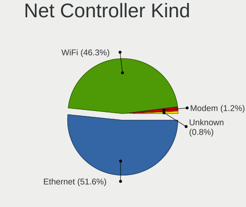

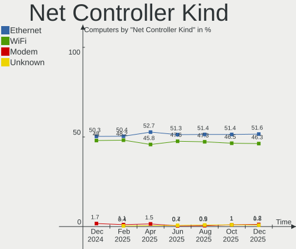

| Kind     | Computers | Percent |
|----------|-----------|---------|
| Ethernet | 253       | 51.63%  |
| WiFi     | 227       | 46.33%  |
| Modem    | 6         | 1.22%   |
| Unknown  | 4         | 0.82%   |

Used Controller
---------------

Currently used network controller

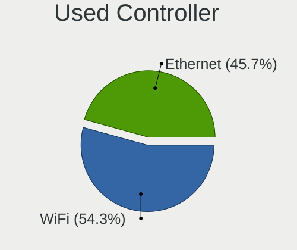

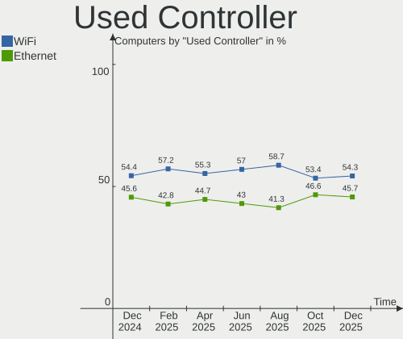

| Kind     | Computers | Percent |
|----------|-----------|---------|
| WiFi     | 165       | 54.28%  |
| Ethernet | 139       | 45.72%  |

NICs
----

Total network controllers on board

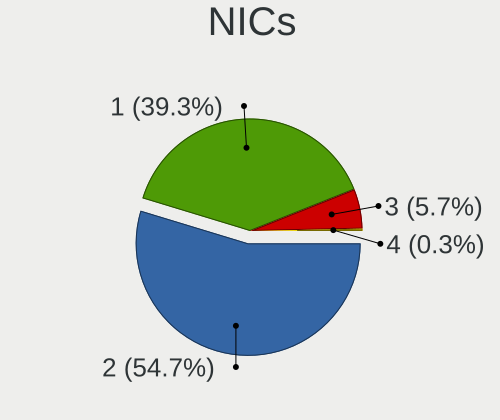

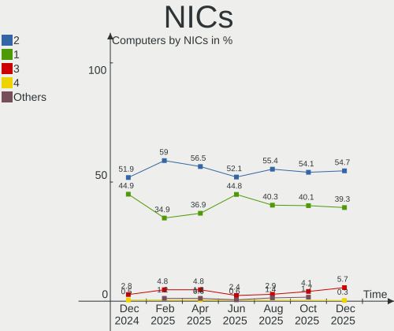

| Total | Computers | Percent |
|-------|-----------|---------|
| 2     | 163       | 54.7%   |
| 1     | 117       | 39.26%  |
| 3     | 17        | 5.7%    |
| 4     | 1         | 0.34%   |

IPv6
----

IPv6 vs IPv4

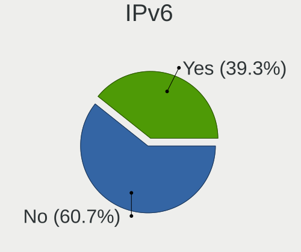

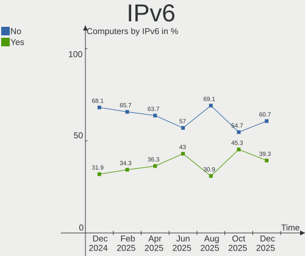

| Used | Computers | Percent |
|------|-----------|---------|
| No   | 181       | 60.74%  |
| Yes  | 117       | 39.26%  |

Bluetooth
---------

Bluetooth Vendor
----------------

Controller vendors

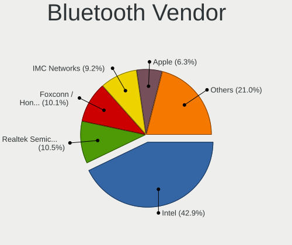

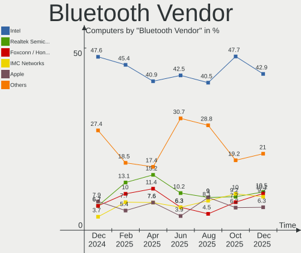

| Vendor                          | Computers | Percent |
|---------------------------------|-----------|---------|
| Intel                           | 102       | 42.86%  |
| Realtek Semiconductor           | 25        | 10.5%   |
| Foxconn / Hon Hai               | 24        | 10.08%  |
| IMC Networks                    | 22        | 9.24%   |
| Apple                           | 15        | 6.3%    |
| Cambridge Silicon Radio         | 9         | 3.78%   |
| MediaTek                        | 8         | 3.36%   |
| TP-Link                         | 5         | 2.1%    |
| Qualcomm Atheros Communications | 5         | 2.1%    |
| Broadcom                        | 5         | 2.1%    |
| Lite-On Technology              | 4         | 1.68%   |
| Dell                            | 4         | 1.68%   |
| Unknown                         | 2         | 0.84%   |
| Toshiba                         | 1         | 0.42%   |
| TDK                             | 1         | 0.42%   |
| Realtek                         | 1         | 0.42%   |
| Quectel Wireless Solutions      | 1         | 0.42%   |
| Marvell Semiconductor           | 1         | 0.42%   |
| Hewlett-Packard                 | 1         | 0.42%   |
| Foxconn International           | 1         | 0.42%   |
| ASUSTek Computer                | 1         | 0.42%   |

Bluetooth Model
---------------

Controller models

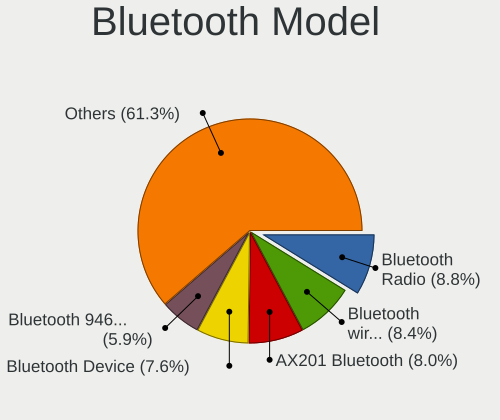

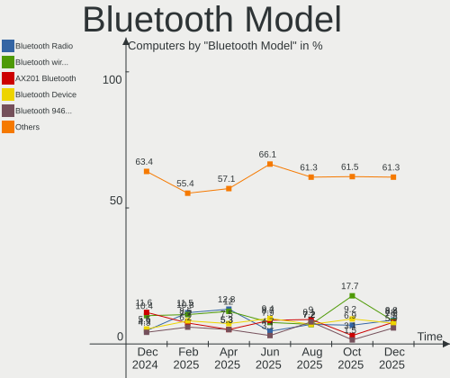

| Model                                               | Computers | Percent |
|-----------------------------------------------------|-----------|---------|
| Realtek Bluetooth Radio                             | 21        | 8.82%   |
| Intel Bluetooth wireless interface                  | 20        | 8.4%    |
| Intel AX201 Bluetooth                               | 19        | 7.98%   |
| Intel Bluetooth Device                              | 18        | 7.56%   |
| Intel Bluetooth 9460/9560 Jefferson Peak (JfP)      | 14        | 5.88%   |
| Foxconn / Hon Hai Wireless_Device                   | 14        | 5.88%   |
| Intel AX200 Bluetooth                               | 12        | 5.04%   |
| Intel AX210 Bluetooth                               | 11        | 4.62%   |
| IMC Networks Wireless_Device                        | 11        | 4.62%   |
| Cambridge Silicon Radio Bluetooth Dongle (HCI mode) | 9         | 3.78%   |
| MediaTek Wireless_Device                            | 8         | 3.36%   |
| IMC Networks Bluetooth Radio                        | 8         | 3.36%   |
| Apple Bluetooth USB Host Controller                 | 7         | 2.94%   |
| Apple Bluetooth Host Controller                     | 6         | 2.52%   |
| TP-Link TP-T@- UB500 Adapter                        | 5         | 2.1%    |
| Foxconn / Hon Hai Bluetooth Device                  | 5         | 2.1%    |
| Intel Wireless-AC 3168 Bluetooth                    | 4         | 1.68%   |
| Qualcomm Atheros  Bluetooth Device                  | 3         | 1.26%   |
| Intel Wireless-AC 9260 Bluetooth Adapter            | 3         | 1.26%   |
| IMC Networks Bluetooth Device                       | 3         | 1.26%   |
| Foxconn / Hon Hai Broadcom BCM20702A1 Bluetooth     | 3         | 1.26%   |
| Realtek Bluetooth 5.4 Radio                         | 2         | 0.84%   |
| Dell BCM20702A0 Bluetooth Module                    | 2         | 0.84%   |
| Broadcom BCM43142A0 Bluetooth Device                | 2         | 0.84%   |
| Broadcom BCM2045B (BDC-2.1)                         | 2         | 0.84%   |
| Apple Built-in Bluetooth 2.0+EDR HCI                | 2         | 0.84%   |
| Unknown                                             | 2         | 0.84%   |
| Toshiba Integrated Bluetooth HCI                    | 1         | 0.42%   |
| TDK Bluetooth Adapter                               | 1         | 0.42%   |
| Realtek  Bluetooth 4.2 Adapter                      | 1         | 0.42%   |
| Realtek 802.11ac WLAN Adapter                       | 1         | 0.42%   |
| Realtek Bluetooth Radio                             | 1         | 0.42%   |
| Quectel Wireless Solutions Wireless_Device          | 1         | 0.42%   |
| Qualcomm Atheros QCA61x4 Bluetooth 4.0              | 1         | 0.42%   |
| Qualcomm Atheros AR9462 Bluetooth                   | 1         | 0.42%   |
| Marvell Bluetooth and Wireless LAN Composite        | 1         | 0.42%   |
| Lite-On Wireless_Device                             | 1         | 0.42%   |
| Lite-On Qualcomm Atheros QCA9377 Bluetooth          | 1         | 0.42%   |
| Lite-On Broadcom BCM43142A0 Bluetooth Device        | 1         | 0.42%   |
| Lite-On Bluetooth Device                            | 1         | 0.42%   |

Sound
-----

Sound Vendor
------------

Sound card vendors

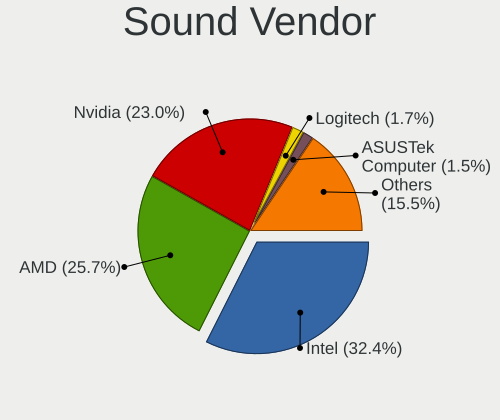

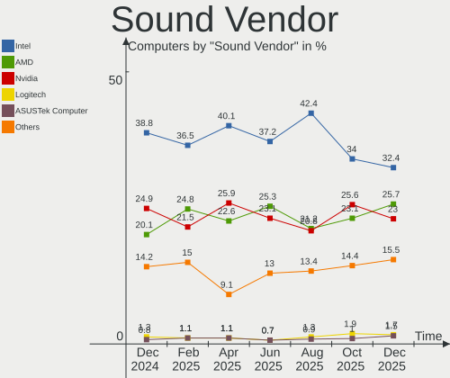

| Vendor                                       | Computers | Percent |
|----------------------------------------------|-----------|---------|
| Intel                                        | 169       | 32.44%  |
| AMD                                          | 134       | 25.72%  |
| Nvidia                                       | 120       | 23.03%  |
| Logitech                                     | 9         | 1.73%   |
| ASUSTek Computer                             | 8         | 1.54%   |
| Texas Instruments                            | 7         | 1.34%   |
| Kingston Technology                          | 7         | 1.34%   |
| Razer USA                                    | 6         | 1.15%   |
| Sony                                         | 4         | 0.77%   |
| C-Media Electronics                          | 4         | 0.77%   |
| Walmart                                      | 3         | 0.58%   |
| Realtek Semiconductor                        | 3         | 0.58%   |
| Micro Star International                     | 3         | 0.58%   |
| Hewlett-Packard                              | 3         | 0.58%   |
| GN Netcom                                    | 3         | 0.58%   |
| Mackie Designs                               | 2         | 0.38%   |
| Lenovo                                       | 2         | 0.38%   |
| Huawei Technologies                          | 2         | 0.38%   |
| Giga-Byte Technology                         | 2         | 0.38%   |
| Focusrite-Novation                           | 2         | 0.38%   |
| Creative Labs                                | 2         | 0.38%   |
| Blue Microphones                             | 2         | 0.38%   |
| BEHRINGER International                      | 2         | 0.38%   |
| Zoran Co. Personal Media Division (Nogatech) | 1         | 0.19%   |
| Weltrend Semiconductor                       | 1         | 0.19%   |
| Valve Software                               | 1         | 0.19%   |
| USB AUDIO DEVICE                             | 1         | 0.19%   |
| Universal Audio                              | 1         | 0.19%   |
| Turtle Beach                                 | 1         | 0.19%   |
| Thesycon Systemsoftware & Consulting         | 1         | 0.19%   |
| SteelSeries ApS                              | 1         | 0.19%   |
| Shure                                        | 1         | 0.19%   |
| Plantronics                                  | 1         | 0.19%   |
| Neat Microphones                             | 1         | 0.19%   |
| MCS                                          | 1         | 0.19%   |
| Maono                                        | 1         | 0.19%   |
| M-Audio                                      | 1         | 0.19%   |
| Generalplus Technology                       | 1         | 0.19%   |
| FIFINE Microphones                           | 1         | 0.19%   |
| Elgato Systems                               | 1         | 0.19%   |

Sound Model
-----------

Sound card models

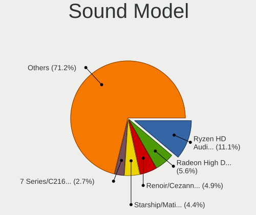

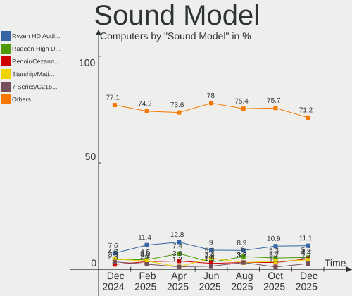

| Model                                                                      | Computers | Percent |
|----------------------------------------------------------------------------|-----------|---------|
| AMD Ryzen HD Audio Controller                                              | 73        | 11.13%  |
| AMD Radeon High Definition Audio Controller                                | 37        | 5.64%   |
| AMD Renoir/Cezanne HDMI/DP Audio Controller                                | 32        | 4.88%   |
| AMD Starship/Matisse HD Audio Controller                                   | 29        | 4.42%   |
| Intel 7 Series/C216 Chipset Family High Definition Audio Controller        | 18        | 2.74%   |
| AMD Navi 48 HDMI/DP Audio Controller                                       | 14        | 2.13%   |
| AMD Navi 21/23 HDMI/DP Audio Controller                                    | 12        | 1.83%   |
| Intel Haswell-ULT HD Audio Controller                                      | 11        | 1.68%   |
| Intel 8 Series/C220 Series Chipset High Definition Audio Controller        | 11        | 1.68%   |
| Intel 8 Series HD Audio Controller                                         | 11        | 1.68%   |
| Intel Cannon Lake PCH cAVS                                                 | 10        | 1.52%   |
| Intel 100 Series/C230 Series Chipset Family HD Audio Controller            | 10        | 1.52%   |
| Nvidia TU106 High Definition Audio Controller                              | 9         | 1.37%   |
| Intel Tiger Lake-LP Smart Sound Technology Audio Controller                | 9         | 1.37%   |
| Nvidia GA104 High Definition Audio Controller                              | 8         | 1.22%   |
| Intel Sunrise Point-LP HD Audio                                            | 8         | 1.22%   |
| Intel Comet Lake PCH cAVS                                                  | 8         | 1.22%   |
| ASUSTek Computer USB Audio                                                 | 8         | 1.22%   |
| AMD Navi 31 HDMI/DP Audio                                                  | 8         | 1.22%   |
| AMD Ellesmere HDMI Audio [Radeon RX 470/480 / 570/580/590]                 | 8         | 1.22%   |
| Nvidia GB206 High Definition Audio Controller                              | 7         | 1.07%   |
| Nvidia GA106 High Definition Audio Controller                              | 7         | 1.07%   |
| Intel Comet Lake PCH-LP cAVS                                               | 7         | 1.07%   |
| Nvidia GP104 High Definition Audio Controller                              | 6         | 0.91%   |
| Nvidia AD107 High Definition Audio Controller                              | 6         | 0.91%   |
| Intel CM238 HD Audio Controller                                            | 6         | 0.91%   |
| Intel Arrow Lake cAVS                                                      | 6         | 0.91%   |
| Intel 6 Series/C200 Series Chipset Family High Definition Audio Controller | 6         | 0.91%   |
| Nvidia GP106 High Definition Audio Controller                              | 5         | 0.76%   |
| Intel Xeon E3-1200 v3/4th Gen Core Processor HD Audio Controller           | 5         | 0.76%   |
| Intel Wildcat Point-LP High Definition Audio Controller                    | 5         | 0.76%   |
| Intel Broadwell-U Audio Controller                                         | 5         | 0.76%   |
| Intel Alder Lake PCH-P High Definition Audio Controller                    | 5         | 0.76%   |
| Intel 200 Series PCH HD Audio                                              | 5         | 0.76%   |
| AMD SBx00 Azalia (Intel HDA)                                               | 5         | 0.76%   |
| AMD Family 17h (Models 00h-0fh) HD Audio Controller                        | 5         | 0.76%   |
| Nvidia TU116 High Definition Audio Controller                              | 4         | 0.61%   |
| Nvidia TU107 GeForce GTX 1650 High Definition Audio Controller             | 4         | 0.61%   |
| Nvidia GP107GL High Definition Audio Controller                            | 4         | 0.61%   |
| Nvidia GK107 HDMI Audio Controller                                         | 4         | 0.61%   |

Memory
------

Memory Vendor
-------------

Memory module vendors

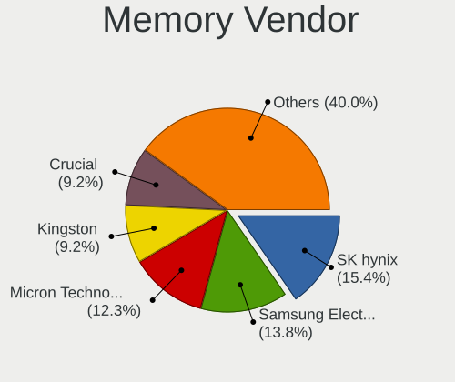

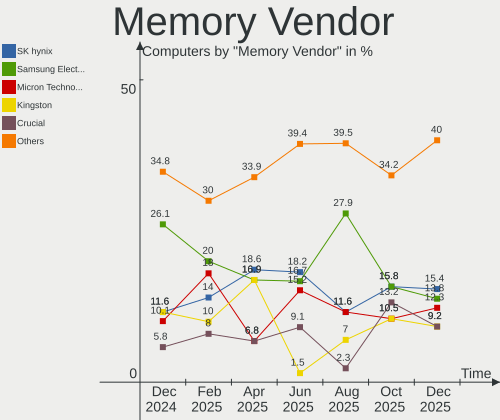

| Vendor              | Computers | Percent |
|---------------------|-----------|---------|
| SK hynix            | 10        | 15.38%  |
| Samsung Electronics | 9         | 13.85%  |
| Micron Technology   | 8         | 12.31%  |
| Kingston            | 6         | 9.23%   |
| Crucial             | 6         | 9.23%   |
| Corsair             | 4         | 6.15%   |
| Unknown             | 3         | 4.62%   |
| Team                | 3         | 4.62%   |
| Ramaxel Technology  | 3         | 4.62%   |
| G.Skill             | 3         | 4.62%   |
| Unknown             | 2         | 3.08%   |
| Thermaltake         | 1         | 1.54%   |
| TeamGroup           | 1         | 1.54%   |
| Silicon Power       | 1         | 1.54%   |
| Patriot             | 1         | 1.54%   |
| Neo Forza           | 1         | 1.54%   |
| Hewlett-Packard     | 1         | 1.54%   |
| GSkill              | 1         | 1.54%   |
| A-DATA Technology   | 1         | 1.54%   |

Memory Model
------------

Memory module models

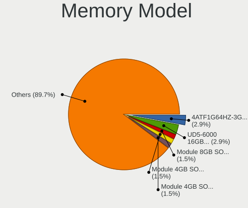

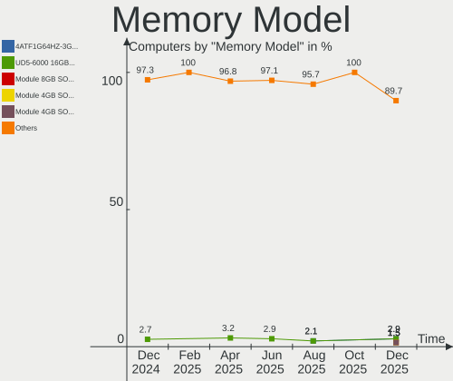

| Model                                                            | Computers | Percent |
|------------------------------------------------------------------|-----------|---------|
| Micron RAM 4ATF1G64HZ-3G2F1 8GB SODIMM DDR4 3200MT/s             | 2         | 2.94%   |
| Unknown                                                          | 2         | 2.94%   |
| Unknown RAM Module 8GB SODIMM DDR3                               | 1         | 1.47%   |
| Unknown RAM Module 4GB SODIMM DDR4 2667MT/s                      | 1         | 1.47%   |
| Unknown RAM Module 4GB SODIMM DDR3                               | 1         | 1.47%   |
| Unknown RAM MEM-DOWN 8192MB SODIMM DDR4 2400MT/s                 | 1         | 1.47%   |
| Thermaltake RAM R009D416GX2-3600C18A 16GB DIMM DDR4 2666MT/s     | 1         | 1.47%   |
| TeamGroup RAM UD5-6400 16GB DIMM DDR5 6400MT/s                   | 1         | 1.47%   |
| Team RAM UD5-6000 16GB DIMM DDR5 6000MT/s                        | 1         | 1.47%   |
| Team RAM TEAMGROUP-UD4-3600 16GB DIMM DDR4 3600MT/s              | 1         | 1.47%   |
| Team RAM TEAMGROUP-UD4-3200 8GB DIMM DDR4 3733MT/s               | 1         | 1.47%   |
| SK hynix RAM Module 1GB Row Of Chips LPDDR4 2133MT/s             | 1         | 1.47%   |
| SK hynix RAM HMT351U6CFR8C-PB 4GB DIMM DDR3 1800MT/s             | 1         | 1.47%   |
| SK hynix RAM HMT351S6CFR8C-H9 4GB SODIMM DDR3 1333MT/s           | 1         | 1.47%   |
| SK hynix RAM HMAG68EXNSA051N 8GB SODIMM DDR4 3200MT/s            | 1         | 1.47%   |
| SK hynix RAM HMAA1GS6CJR6N-XN 8GB SODIMM DDR4 3200MT/s           | 1         | 1.47%   |
| SK hynix RAM HMA81GS6DJR8N-XN 8GB SODIMM DDR4 3200MT/s           | 1         | 1.47%   |
| SK hynix RAM HMA81GS6DJR8N-VK 8GB SODIMM DDR4 2667MT/s           | 1         | 1.47%   |
| SK hynix RAM HMA81GS6AFR8N-UH 8GB SODIMM DDR4 3200MT/s           | 1         | 1.47%   |
| SK hynix RAM H9JCNNNCP3MLYR-N6E 2GB Row Of Chips LPDDR5 6400MT/s | 1         | 1.47%   |
| SK hynix RAM H58G66CK8BX147N 8GB SODIMM LPDDR5 8000MT/s          | 1         | 1.47%   |
| Silicon Power RAM Module 32GB DIMM DDR5 4800MT/s                 | 1         | 1.47%   |
| Samsung RAM U6E3S4AA-MGCR 1GB Row Of Chips LPDDR4 4267MT/s       | 1         | 1.47%   |
| Samsung RAM Module 8GB Row Of Chips LPDDR3 2133MT/s              | 1         | 1.47%   |
| Samsung RAM M471B5273CH0-CH9 4GB SODIMM DDR3 1334MT/s            | 1         | 1.47%   |
| Samsung RAM M471A2K43CB1-CRC 16GB SODIMM DDR4 2667MT/s           | 1         | 1.47%   |
| Samsung RAM M471A2G44AM0-CWE 16GB SODIMM DDR4 3200MT/s           | 1         | 1.47%   |
| Samsung RAM M471A2G43CB2-CWE 16GB SODIMM DDR4 3200MT/s           | 1         | 1.47%   |
| Samsung RAM M471A2G43AB2-CWE 16GB SODIMM DDR4 3200MT/s           | 1         | 1.47%   |
| Samsung RAM M471A1K43CB1-CWE 16GB SODIMM DDR4 3200MT/s           | 1         | 1.47%   |
| Samsung RAM M425R2GA3PB0-CWMOL 16GB SODIMM DDR5 5600MT/s         | 1         | 1.47%   |
| Samsung RAM K4EBE304EC-EGCG 8GB Row Of Chips LPDDR3 2133MT/s     | 1         | 1.47%   |
| Ramaxel RAM RMT3160ME68FAF1600 8GB SODIMM DDR3 1600MT/s          | 1         | 1.47%   |
| Ramaxel RAM RMSA3330MJ78HBF-3200 16GB SODIMM DDR4 3200MT/s       | 1         | 1.47%   |
| Ramaxel RAM RMR1870EC58E9F1333 4GB DIMM DDR3 1333MT/s            | 1         | 1.47%   |
| Patriot RAM 6000 C42 Series 24GB DIMM DDR5 6000MT/s              | 1         | 1.47%   |
| Neo Forza RAM NMSO432F82-3200E 32GB SODIMM DDR4 3200MT/s         | 1         | 1.47%   |
| Micron RAM MT62F2G32D4DS-026 4GB Row Of Chips LPDDR5 7500MT/s    | 1         | 1.47%   |
| Micron RAM MT62F1G32D4DR-031 WT 4GB SODIMM LPDDR5 6400MT/s       | 1         | 1.47%   |
| Micron RAM Module 8GB SODIMM LPDDR3 2133MT/s                     | 1         | 1.47%   |

Memory Kind
-----------

Memory module kinds

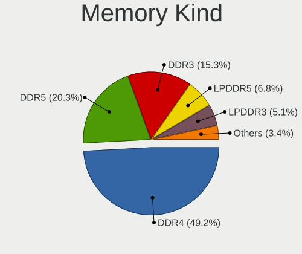

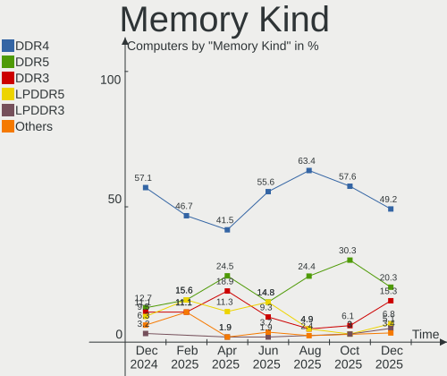

| Kind   | Computers | Percent |
|--------|-----------|---------|
| DDR4   | 29        | 49.15%  |
| DDR5   | 12        | 20.34%  |
| DDR3   | 9         | 15.25%  |
| LPDDR5 | 4         | 6.78%   |
| LPDDR3 | 3         | 5.08%   |
| LPDDR4 | 2         | 3.39%   |

Memory Form Factor
------------------

Physical design of the memory module

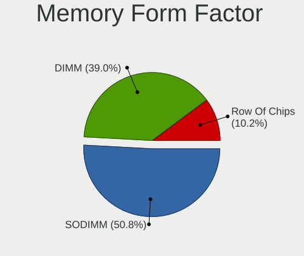

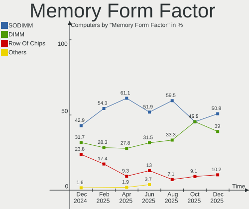

| Name         | Computers | Percent |
|--------------|-----------|---------|
| SODIMM       | 30        | 50.85%  |
| DIMM         | 23        | 38.98%  |
| Row Of Chips | 6         | 10.17%  |

Memory Size
-----------

Memory module size

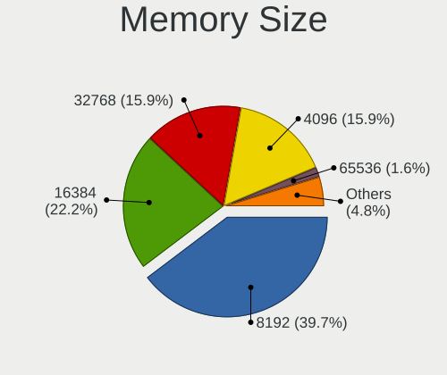

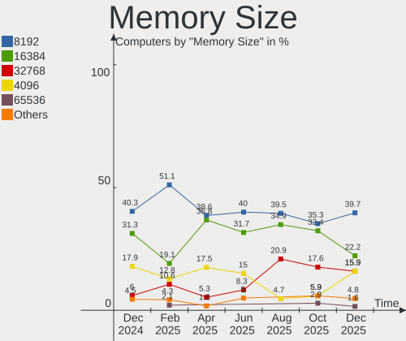

| Size  | Computers | Percent |
|-------|-----------|---------|
| 8192  | 25        | 39.68%  |
| 16384 | 14        | 22.22%  |
| 32768 | 10        | 15.87%  |
| 4096  | 10        | 15.87%  |
| 65536 | 1         | 1.59%   |
| 49152 | 1         | 1.59%   |
| 24576 | 1         | 1.59%   |
| 1024  | 1         | 1.59%   |

Memory Speed
------------

Memory module speed

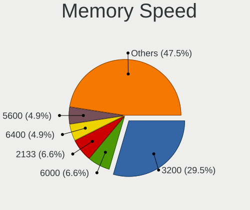

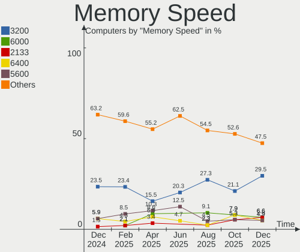

| Speed   | Computers | Percent |
|---------|-----------|---------|
| 3200    | 18        | 29.51%  |
| 6000    | 4         | 6.56%   |
| 2133    | 4         | 6.56%   |
| 6400    | 3         | 4.92%   |
| 5600    | 3         | 4.92%   |
| 3600    | 3         | 4.92%   |
| 2667    | 3         | 4.92%   |
| 1600    | 3         | 4.92%   |
| 4800    | 2         | 3.28%   |
| 2400    | 2         | 3.28%   |
| 1334    | 2         | 3.28%   |
| 1333    | 2         | 3.28%   |
| 8000    | 1         | 1.64%   |
| 7500    | 1         | 1.64%   |
| 6800    | 1         | 1.64%   |
| 6200    | 1         | 1.64%   |
| 4267    | 1         | 1.64%   |
| 4000    | 1         | 1.64%   |
| 3733    | 1         | 1.64%   |
| 3400    | 1         | 1.64%   |
| 2666    | 1         | 1.64%   |
| 1866    | 1         | 1.64%   |
| 1800    | 1         | 1.64%   |
| Unknown | 1         | 1.64%   |

Printers & scanners
-------------------

Printer Vendor
--------------

Printer device vendors

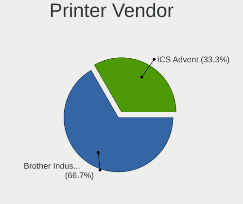

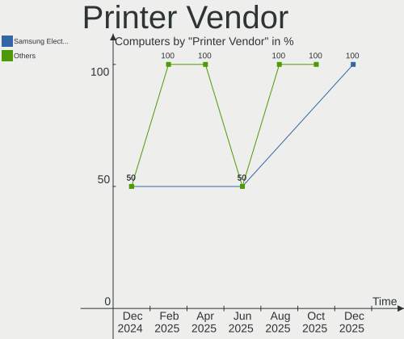

| Vendor              | Computers | Percent |
|---------------------|-----------|---------|
| Samsung Electronics | 1         | 100%    |

Printer Model
-------------

Printer device models

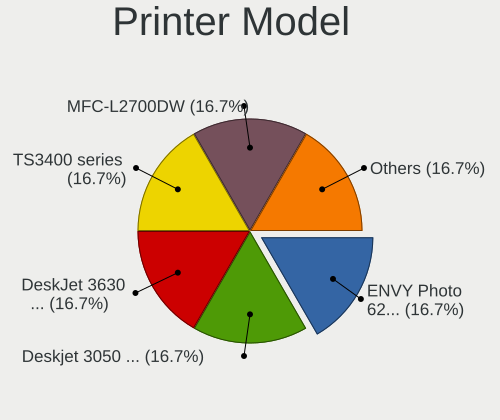

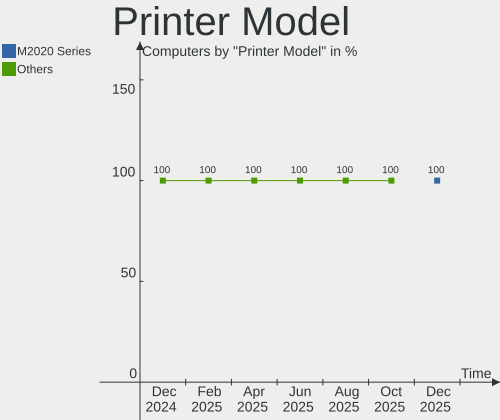

| Model                | Computers | Percent |
|----------------------|-----------|---------|
| Samsung M2020 Series | 1         | 100%    |

Scanner Vendor
--------------

Scanner device vendors

Zero info for selected period =(

Scanner Model
-------------

Scanner device models

Zero info for selected period =(

Camera
------

Camera Vendor
-------------

Camera device vendors

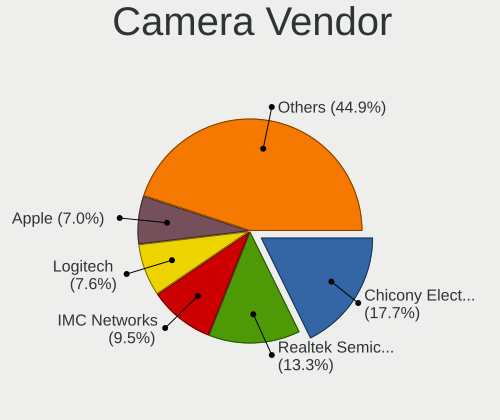

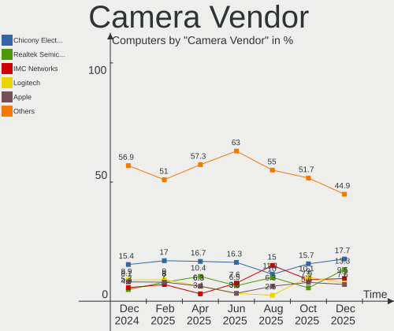

| Vendor                                 | Computers | Percent |
|----------------------------------------|-----------|---------|
| Chicony Electronics                    | 28        | 17.72%  |
| Realtek Semiconductor                  | 21        | 13.29%  |
| IMC Networks                           | 15        | 9.49%   |
| Logitech                               | 12        | 7.59%   |
| Apple                                  | 11        | 6.96%   |
| Bison Electronics                      | 10        | 6.33%   |
| Luxvisions Innotech Limited            | 9         | 5.7%    |
| Microdia                               | 8         | 5.06%   |
| Quanta                                 | 7         | 4.43%   |
| Sunplus Innovation Technology          | 4         | 2.53%   |
| Shinetech                              | 4         | 2.53%   |
| Lite-On Technology                     | 3         | 1.9%    |
| Cheng Uei Precision Industry (Foxlink) | 3         | 1.9%    |
| Syntek                                 | 2         | 1.27%   |
| SunplusIT                              | 2         | 1.27%   |
| Ricoh                                  | 2         | 1.27%   |
| Microsoft                              | 2         | 1.27%   |
| Acer                                   | 2         | 1.27%   |
| Z-Star Microelectronics                | 1         | 0.63%   |
| Valve Software                         | 1         | 0.63%   |
| Suyin                                  | 1         | 0.63%   |
| Sunplus IT                             | 1         | 0.63%   |
| ShineOptics                            | 1         | 0.63%   |
| Samsung Electronics                    | 1         | 0.63%   |
| Razer USA                              | 1         | 0.63%   |
| MacroSilicon                           | 1         | 0.63%   |
| kingcome                               | 1         | 0.63%   |
| Jieli Technology                       | 1         | 0.63%   |
| Generalplus Technology                 | 1         | 0.63%   |
| eMeet                                  | 1         | 0.63%   |
| Creative Technology                    | 1         | 0.63%   |

Camera Model
------------

Camera device models

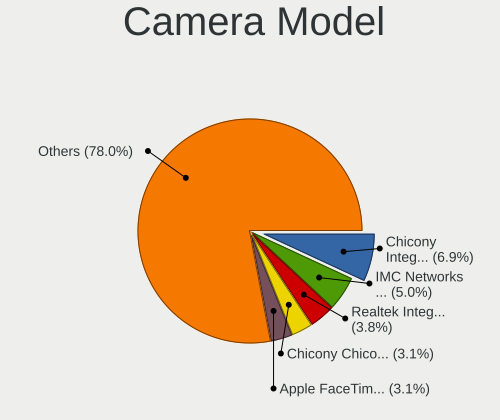

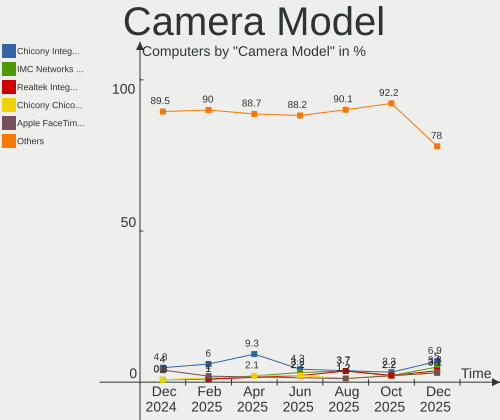

| Model                                                           | Computers | Percent |
|-----------------------------------------------------------------|-----------|---------|
| Chicony Integrated Camera                                       | 11        | 6.92%   |
| IMC Networks USB2.0 HD UVC WebCam                               | 8         | 5.03%   |
| Realtek Integrated_Webcam_HD                                    | 6         | 3.77%   |
| Chicony Chicony USB2.0 Camera                                   | 5         | 3.14%   |
| Apple FaceTime HD Camera                                        | 5         | 3.14%   |
| Shinetech USB2.0 FHD UVC WebCam                                 | 3         | 1.89%   |
| Realtek USB Camera                                              | 3         | 1.89%   |
| Realtek Integrated_Webcam_FHD                                   | 3         | 1.89%   |
| Quanta ACER HD User Facing                                      | 3         | 1.89%   |
| Microdia CyberTrack H7                                          | 3         | 1.89%   |
| Logitech Webcam C270                                            | 3         | 1.89%   |
| Apple iPhone 5/5C/5S/6/SE/7/8/X                                 | 3         | 1.89%   |
| Syntek Lenovo EasyCamera                                        | 2         | 1.26%   |
| Realtek USB2.0 HD UVC WebCam                                    | 2         | 1.26%   |
| Quanta HP HD Camera                                             | 2         | 1.26%   |
| Microdia Webcam Vitade AF                                       | 2         | 1.26%   |
| Luxvisions Innotech Limited Integrated Camera                   | 2         | 1.26%   |
| Luxvisions Innotech Limited HP True Vision HD Camera            | 2         | 1.26%   |
| Logitech HD Pro Webcam C920                                     | 2         | 1.26%   |
| Logitech C922 Pro Stream Webcam                                 | 2         | 1.26%   |
| Logitech C920 PRO HD Webcam                                     | 2         | 1.26%   |
| IMC Networks Integrated Camera                                  | 2         | 1.26%   |
| IMC Networks HD Camera                                          | 2         | 1.26%   |
| Chicony HP Truevision HD camera                                 | 2         | 1.26%   |
| Chicony HD WebCam                                               | 2         | 1.26%   |
| Cheng Uei Precision Industry (Foxlink) HP Wide Vision HD Camera | 2         | 1.26%   |
| Bison Lenovo EasyCamera                                         | 2         | 1.26%   |
| Bison FHD Camera                                                | 2         | 1.26%   |
| Apple Built-in iSight                                           | 2         | 1.26%   |
| Z-Star Full HD 1080P PC Camera                                  | 1         | 0.63%   |
| Valve Software 3D Camera                                        | 1         | 0.63%   |
| Suyin HD WebCam                                                 | 1         | 0.63%   |
| SunplusIT USB 2.0 Camera                                        | 1         | 0.63%   |
| SunplusIT 1080p FHD Camera                                      | 1         | 0.63%   |
| Sunplus IT PC Camera                                            | 1         | 0.63%   |
| Sunplus USB Camera                                              | 1         | 0.63%   |
| Sunplus UHD Capture                                             | 1         | 0.63%   |
| Sunplus Lenovo EasyCamera                                       | 1         | 0.63%   |
| Sunplus FULL HD webcam                                          | 1         | 0.63%   |
| Shinetech ASUS FHD webcam                                       | 1         | 0.63%   |

Security
--------

Fingerprint Vendor
------------------

Fingerprint sensor vendors

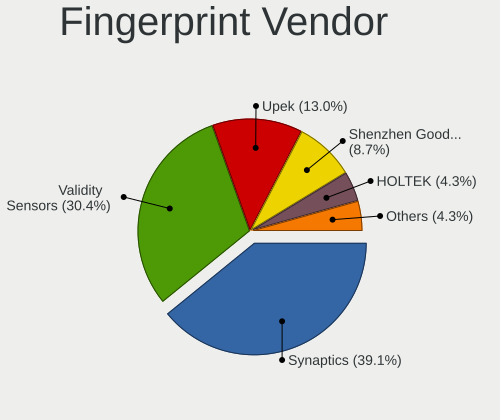

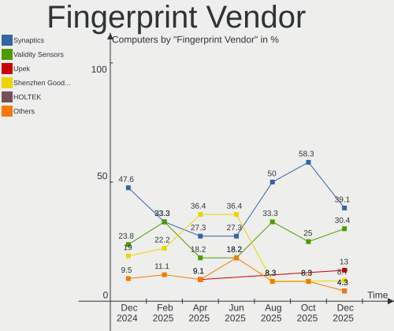

| Vendor                     | Computers | Percent |
|----------------------------|-----------|---------|
| Synaptics                  | 9         | 39.13%  |
| Validity Sensors           | 7         | 30.43%  |
| Upek                       | 3         | 13.04%  |
| Shenzhen Goodix Technology | 2         | 8.7%    |
| HOLTEK                     | 1         | 4.35%   |
| Elan Microelectronics      | 1         | 4.35%   |

Fingerprint Model
-----------------

Fingerprint sensor models

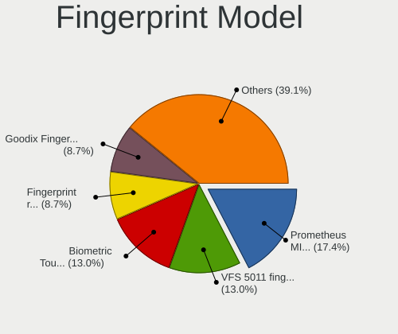

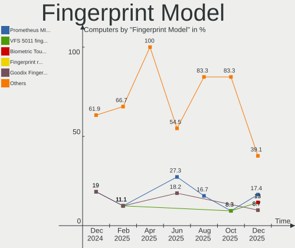

| Model                                                     | Computers | Percent |
|-----------------------------------------------------------|-----------|---------|
| Synaptics Prometheus MIS Touch Fingerprint Reader         | 4         | 17.39%  |
| Validity Sensors VFS 5011 fingerprint sensor              | 3         | 13.04%  |
| Upek Biometric Touchchip/Touchstrip Fingerprint Sensor    | 3         | 13.04%  |
| Synaptics Fingerprint reader [HP G6]                      | 2         | 8.7%    |
| Shenzhen Goodix  Fingerprint Device                       | 2         | 8.7%    |
| Validity Sensors VFS7500 Touch Fingerprint Sensor         | 1         | 4.35%   |
| Validity Sensors VFS5011 Fingerprint Reader               | 1         | 4.35%   |
| Validity Sensors VFS Fingerprint sensor                   | 1         | 4.35%   |
| Validity Sensors Synaptics WBDI                           | 1         | 4.35%   |
| Synaptics UWP WBDI Device                                 | 1         | 4.35%   |
| Synaptics  WBDI                                           | 1         | 4.35%   |
| Synaptics  FS7604 Touch Fingerprint Sensor with PurePrint | 1         | 4.35%   |
| HOLTEK FocalTech Fingerprint Device                       | 1         | 4.35%   |
| Elan ELAN:Fingerprint                                     | 1         | 4.35%   |

Chipcard Vendor
---------------

Chipcard module vendors

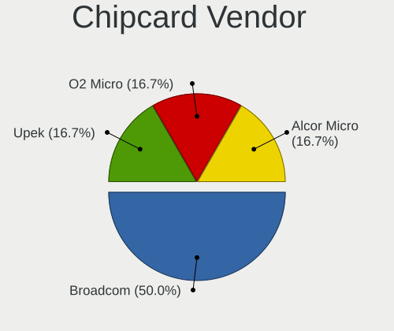

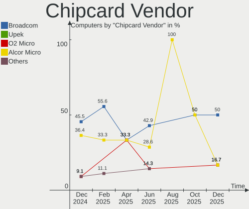

| Vendor      | Computers | Percent |
|-------------|-----------|---------|
| Broadcom    | 3         | 50%     |
| Upek        | 1         | 16.67%  |
| O2 Micro    | 1         | 16.67%  |
| Alcor Micro | 1         | 16.67%  |

Chipcard Model
--------------

Chipcard module models

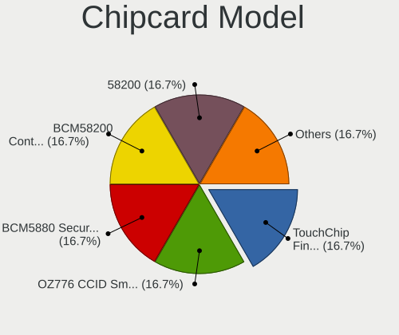

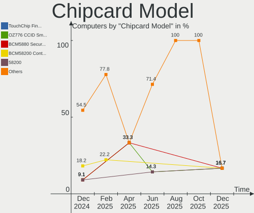

| Model                                                                       | Computers | Percent |
|-----------------------------------------------------------------------------|-----------|---------|
| Upek TouchChip Fingerprint Coprocessor (WBF advanced mode)                  | 1         | 16.67%  |
| O2 Micro OZ776 CCID Smartcard Reader                                        | 1         | 16.67%  |
| Broadcom BCM5880 Secure Applications Processor                              | 1         | 16.67%  |
| Broadcom BCM58200 ControlVault 3 (FingerPrint sensor + Contacted SmartCard) | 1         | 16.67%  |
| Broadcom 58200                                                              | 1         | 16.67%  |
| Alcor Micro AU9540 Smartcard Reader                                         | 1         | 16.67%  |

Unsupported
-----------

Unsupported Devices
-------------------

Total unsupported devices on board

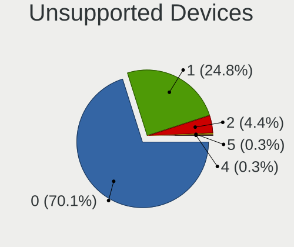

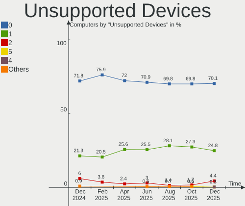

| Total | Computers | Percent |
|-------|-----------|---------|
| 0     | 209       | 70.13%  |
| 1     | 74        | 24.83%  |
| 2     | 13        | 4.36%   |
| 5     | 1         | 0.34%   |
| 4     | 1         | 0.34%   |

Unsupported Device Types
------------------------

Types of unsupported devices

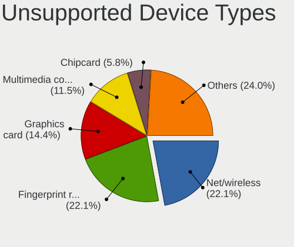

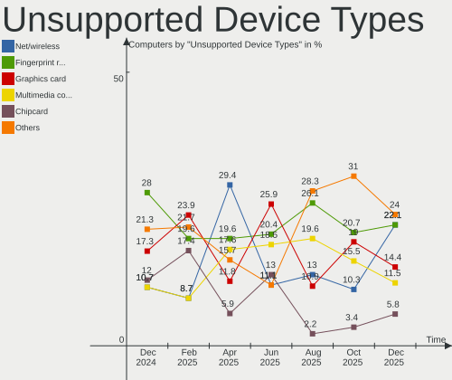

| Type                     | Computers | Percent |
|--------------------------|-----------|---------|
| Net/wireless             | 23        | 22.12%  |
| Fingerprint reader       | 23        | 22.12%  |
| Graphics card            | 15        | 14.42%  |
| Multimedia controller    | 12        | 11.54%  |
| Chipcard                 | 6         | 5.77%   |
| Network                  | 5         | 4.81%   |
| Communication controller | 5         | 4.81%   |
| Storage/raid             | 4         | 3.85%   |
| Camera                   | 4         | 3.85%   |
| Unassigned class         | 3         | 2.88%   |
| Storage                  | 1         | 0.96%   |
| Sound                    | 1         | 0.96%   |
| Card reader              | 1         | 0.96%   |
| Bluetooth                | 1         | 0.96%   |

