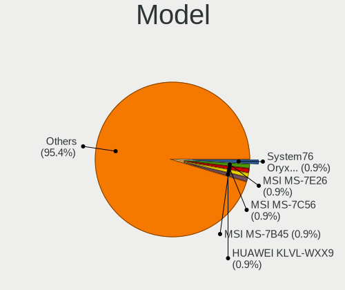
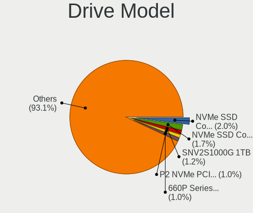
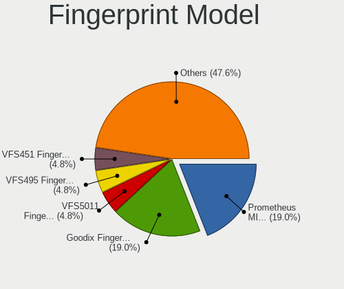

Pop!_OS Hardware Trends
-----------------------

A project to identify most popular hardware characteristics and track their change
over time based on data collected by Pop!_OS users at https://Linux-Hardware.org.

Anyone can contribute to this report by the [hw-probe](https://github.com/linuxhw/hw-probe) tool:

    sudo -E hw-probe -all -upload

This is a report for all computer types. See also reports for [desktops](/Dist/Pop!_OS/Desktop/README.md) and [notebooks](/Dist/Pop!_OS/Notebook/README.md).

Full-feature report is available here: https://linux-hardware.org/?view=trends

Period: Jul, 2021.

Contents
--------

* [ System ](#system)
  - [ OS                       ](#os)
  - [ OS Family                ](#os-family)
  - [ Kernel                   ](#kernel)
  - [ Kernel Family            ](#kernel-family)
  - [ Kernel Major Ver.        ](#kernel-major-ver)
  - [ Arch                     ](#arch)
  - [ DE                       ](#de)
  - [ Display Server           ](#display-server)
  - [ Display Manager          ](#display-manager)
  - [ OS Lang                  ](#os-lang)
  - [ Boot Mode                ](#boot-mode)
  - [ Filesystem               ](#filesystem)
  - [ Part. scheme             ](#part-scheme)
  - [ Dual Boot with Linux/BSD ](#dual-boot-with-linuxbsd)
  - [ Dual Boot (Win)          ](#dual-boot-win)

* [ Board ](#board)
  - [ Vendor                   ](#vendor)
  - [ Model                    ](#model)
  - [ Model Family             ](#model-family)
  - [ MFG Year                 ](#mfg-year)
  - [ Form Factor              ](#form-factor)
  - [ Secure Boot              ](#secure-boot)
  - [ Coreboot                 ](#coreboot)
  - [ RAM Size                 ](#ram-size)
  - [ RAM Used                 ](#ram-used)
  - [ Total Drives             ](#total-drives)
  - [ Has CD-ROM               ](#has-cd-rom)
  - [ Has Ethernet             ](#has-ethernet)
  - [ Has WiFi                 ](#has-wifi)
  - [ Has Bluetooth            ](#has-bluetooth)

* [ Location ](#location)
  - [ Country                  ](#country)
  - [ City                     ](#city)

* [ Drives ](#drives)
  - [ Drive Vendor             ](#drive-vendor)
  - [ Drive Model              ](#drive-model)
  - [ HDD Vendor               ](#hdd-vendor)
  - [ SSD Vendor               ](#ssd-vendor)
  - [ Drive Kind               ](#drive-kind)
  - [ Drive Connector          ](#drive-connector)
  - [ Drive Size               ](#drive-size)
  - [ Space Total              ](#space-total)
  - [ Space Used               ](#space-used)
  - [ Malfunc. Drives          ](#malfunc-drives)
  - [ Malfunc. Drive Vendor    ](#malfunc-drive-vendor)
  - [ Malfunc. HDD Vendor      ](#malfunc-hdd-vendor)
  - [ Malfunc. Drive Kind      ](#malfunc-drive-kind)
  - [ Failed Drives            ](#failed-drives)
  - [ Failed Drive Vendor      ](#failed-drive-vendor)
  - [ Drive Status             ](#drive-status)

* [ Storage controller ](#storage-controller)
  - [ Storage Vendor           ](#storage-vendor)
  - [ Storage Model            ](#storage-model)
  - [ Storage Kind             ](#storage-kind)

* [ Processor ](#processor)
  - [ CPU Vendor               ](#cpu-vendor)
  - [ CPU Model                ](#cpu-model)
  - [ CPU Model Family         ](#cpu-model-family)
  - [ CPU Cores                ](#cpu-cores)
  - [ CPU Sockets              ](#cpu-sockets)
  - [ CPU Threads              ](#cpu-threads)
  - [ CPU Op-Modes             ](#cpu-op-modes)
  - [ CPU Microcode            ](#cpu-microcode)
  - [ CPU Microarch            ](#cpu-microarch)

* [ Graphics ](#graphics)
  - [ GPU Vendor               ](#gpu-vendor)
  - [ GPU Model                ](#gpu-model)
  - [ GPU Combo                ](#gpu-combo)
  - [ GPU Driver               ](#gpu-driver)
  - [ GPU Memory               ](#gpu-memory)

* [ Monitor ](#monitor)
  - [ Monitor Vendor           ](#monitor-vendor)
  - [ Monitor Model            ](#monitor-model)
  - [ Monitor Resolution       ](#monitor-resolution)
  - [ Monitor Diagonal         ](#monitor-diagonal)
  - [ Monitor Width            ](#monitor-width)
  - [ Aspect Ratio             ](#aspect-ratio)
  - [ Monitor Area             ](#monitor-area)
  - [ Pixel Density            ](#pixel-density)
  - [ Multiple Monitors        ](#multiple-monitors)

* [ Network ](#network)
  - [ Net Controller Vendor    ](#net-controller-vendor)
  - [ Net Controller Model     ](#net-controller-model)
  - [ Wireless Vendor          ](#wireless-vendor)
  - [ Wireless Model           ](#wireless-model)
  - [ Ethernet Vendor          ](#ethernet-vendor)
  - [ Ethernet Model           ](#ethernet-model)
  - [ Net Controller Kind      ](#net-controller-kind)
  - [ Used Controller          ](#used-controller)
  - [ NICs                     ](#nics)
  - [ IPv6                     ](#ipv6)

* [ Bluetooth ](#bluetooth)
  - [ Bluetooth Vendor         ](#bluetooth-vendor)
  - [ Bluetooth Model          ](#bluetooth-model)

* [ Sound ](#sound)
  - [ Sound Vendor             ](#sound-vendor)
  - [ Sound Model              ](#sound-model)

* [ Memory ](#memory)
  - [ Memory Vendor            ](#memory-vendor)
  - [ Memory Model             ](#memory-model)
  - [ Memory Kind              ](#memory-kind)
  - [ Memory Form Factor       ](#memory-form-factor)
  - [ Memory Size              ](#memory-size)
  - [ Memory Speed             ](#memory-speed)

* [ Printers & scanners ](#printers--scanners)
  - [ Printer Vendor           ](#printer-vendor)
  - [ Printer Model            ](#printer-model)
  - [ Scanner Vendor           ](#scanner-vendor)
  - [ Scanner Model            ](#scanner-model)

* [ Camera ](#camera)
  - [ Camera Vendor            ](#camera-vendor)
  - [ Camera Model             ](#camera-model)

* [ Security ](#security)
  - [ Fingerprint Vendor       ](#fingerprint-vendor)
  - [ Fingerprint Model        ](#fingerprint-model)
  - [ Chipcard Vendor          ](#chipcard-vendor)
  - [ Chipcard Model           ](#chipcard-model)

* [ Unsupported ](#unsupported)
  - [ Unsupported Devices      ](#unsupported-devices)
  - [ Unsupported Device Types ](#unsupported-device-types)

System
------

OS
--

Installed operating systems

| Name          | Computers | Percent |
|---------------|-----------|---------|
| Pop!_OS 21.04 | 335       | 83.54%  |
| Pop!_OS 20.04 | 45        | 11.22%  |
| Pop!_OS 20.10 | 21        | 5.24%   |

OS Family
---------

OS without a version

| Name    | Computers | Percent |
|---------|-----------|---------|
| Pop!_OS | 401       | 100%    |

Kernel
------

Version of the Linux kernel

| Version                    | Computers | Percent |
|----------------------------|-----------|---------|
| 5.11.0-7620-generic        | 358       | 89.28%  |
| 5.11.0-7614-generic        | 19        | 4.74%   |
| 5.4.0-7634-generic         | 3         | 0.75%   |
| 5.13.0-051300-generic      | 3         | 0.75%   |
| 5.13.4-051304-generic      | 2         | 0.5%    |
| 5.8.0-7630-generic         | 1         | 0.25%   |
| 5.4.0-7626-generic         | 1         | 0.25%   |
| 5.4.0-7625-generic         | 1         | 0.25%   |
| 5.13.5-051305-generic      | 1         | 0.25%   |
| 5.13.2-051302-generic      | 1         | 0.25%   |
| 5.13.0-xanmod1-cacule      | 1         | 0.25%   |
| 5.13.0-xanmod1             | 1         | 0.25%   |
| 5.12.16-xanmod1            | 1         | 0.25%   |
| 5.12.15-xanmod1            | 1         | 0.25%   |
| 5.12.14-xanmod1            | 1         | 0.25%   |
| 5.12.14-051214-generic     | 1         | 0.25%   |
| 5.12.11-xanmod1-cacule     | 1         | 0.25%   |
| 5.12.0-14.2-liquorix-amd64 | 1         | 0.25%   |
| 5.11.7-051107-generic      | 1         | 0.25%   |
| 5.11.0-22-lowlatency       | 1         | 0.25%   |
| 5.11.0-051100-generic      | 1         | 0.25%   |

Kernel Family
-------------

Linux kernel without a distro release

| Version | Computers | Percent |
|---------|-----------|---------|
| 5.11.0  | 379       | 94.51%  |
| 5.4.0   | 5         | 1.25%   |
| 5.13.0  | 5         | 1.25%   |
| 5.13.4  | 2         | 0.5%    |
| 5.12.14 | 2         | 0.5%    |
| 5.8.0   | 1         | 0.25%   |
| 5.13.5  | 1         | 0.25%   |
| 5.13.2  | 1         | 0.25%   |
| 5.12.16 | 1         | 0.25%   |
| 5.12.15 | 1         | 0.25%   |
| 5.12.11 | 1         | 0.25%   |
| 5.12.0  | 1         | 0.25%   |
| 5.11.7  | 1         | 0.25%   |

Kernel Major Ver.
-----------------

Linux kernel major version

| Version | Computers | Percent |
|---------|-----------|---------|
| 5.11    | 380       | 94.76%  |
| 5.13    | 9         | 2.24%   |
| 5.12    | 6         | 1.5%    |
| 5.4     | 5         | 1.25%   |
| 5.8     | 1         | 0.25%   |

Arch
----

OS architecture (x86_64, i586, etc.)

| Name   | Computers | Percent |
|--------|-----------|---------|
| x86_64 | 401       | 100%    |

DE
--

Desktop Environment

| Name            | Computers | Percent |
|-----------------|-----------|---------|
| GNOME           | 386       | 96.26%  |
| Unknown         | 5         | 1.25%   |
| KDE             | 4         | 1%      |
| X-Cinnamon      | 2         | 0.5%    |
| MATE            | 2         | 0.5%    |
| GNOME Flashback | 2         | 0.5%    |

Display Server
--------------

X11 or Wayland

| Name    | Computers | Percent |
|---------|-----------|---------|
| X11     | 382       | 95.26%  |
| Wayland | 17        | 4.24%   |
| Unknown | 2         | 0.5%    |

Display Manager
---------------

SDDM, LightDM, etc.

| Name    | Computers | Percent |
|---------|-----------|---------|
| Unknown | 319       | 79.55%  |
| GDM     | 81        | 20.2%   |
| TDM     | 1         | 0.25%   |

OS Lang
-------

Language

| Lang    | Computers | Percent |
|---------|-----------|---------|
| en_US   | 233       | 58.1%   |
| en_GB   | 31        | 7.73%   |
| pt_BR   | 25        | 6.23%   |
| de_DE   | 24        | 5.99%   |
| en_AU   | 15        | 3.74%   |
| C       | 14        | 3.49%   |
| sv_SE   | 7         | 1.75%   |
| fr_FR   | 5         | 1.25%   |
| es_ES   | 5         | 1.25%   |
| ru_RU   | 4         | 1%      |
| pl_PL   | 4         | 1%      |
| Unknown | 4         | 1%      |
| hr_HR   | 3         | 0.75%   |
| es_MX   | 3         | 0.75%   |
| en_IN   | 3         | 0.75%   |
| en_CA   | 3         | 0.75%   |
| it_IT   | 2         | 0.5%    |
| el_GR   | 2         | 0.5%    |
| zh_TW   | 1         | 0.25%   |
| sk_SK   | 1         | 0.25%   |
| ro_RO   | 1         | 0.25%   |
| pt_PT   | 1         | 0.25%   |
| nb_NO   | 1         | 0.25%   |
| ja_JP   | 1         | 0.25%   |
| fr_CA   | 1         | 0.25%   |
| fi_FI   | 1         | 0.25%   |
| es_CO   | 1         | 0.25%   |
| es_AR   | 1         | 0.25%   |
| en_ZA   | 1         | 0.25%   |
| en_DK   | 1         | 0.25%   |
| de_AT   | 1         | 0.25%   |
| da_DK   | 1         | 0.25%   |

Boot Mode
---------

EFI or BIOS

| Mode | Computers | Percent |
|------|-----------|---------|
| BIOS | 325       | 81.05%  |
| EFI  | 76        | 18.95%  |

Filesystem
----------

Type of filesystem

| Type    | Computers | Percent |
|---------|-----------|---------|
| Ext4    | 383       | 95.51%  |
| Btrfs   | 10        | 2.49%   |
| Overlay | 4         | 1%      |
| Xfs     | 2         | 0.5%    |
| Zfs     | 1         | 0.25%   |
| Unknown | 1         | 0.25%   |

Part. scheme
------------

Scheme of partitioning

| Type    | Computers | Percent |
|---------|-----------|---------|
| Unknown | 315       | 78.55%  |
| GPT     | 77        | 19.2%   |
| MBR     | 9         | 2.24%   |

Dual Boot with Linux/BSD
------------------------

Hosting more than one Linux/BSD

| Dual boot | Computers | Percent |
|-----------|-----------|---------|
| No        | 389       | 97.01%  |
| Yes       | 12        | 2.99%   |

Dual Boot (Win)
---------------

Hosting Linux and Windows

| Dual boot | Computers | Percent |
|-----------|-----------|---------|
| No        | 362       | 90.27%  |
| Yes       | 39        | 9.73%   |

Board
-----

Vendor
------

Motherboard manufacturer

| Name                | Computers | Percent |
|---------------------|-----------|---------|
| ASUSTek Computer    | 78        | 19.45%  |
| Lenovo              | 57        | 14.21%  |
| Dell                | 49        | 12.22%  |
| Hewlett-Packard     | 43        | 10.72%  |
| MSI                 | 29        | 7.23%   |
| Gigabyte Technology | 27        | 6.73%   |
| ASRock              | 20        | 4.99%   |
| Apple               | 20        | 4.99%   |
| Acer                | 16        | 3.99%   |
| System76            | 12        | 2.99%   |
| Notebook            | 5         | 1.25%   |
| Fujitsu             | 4         | 1%      |
| Alienware           | 4         | 1%      |
| Sony                | 3         | 0.75%   |
| Intel               | 3         | 0.75%   |
| Samsung Electronics | 2         | 0.5%    |
| Google              | 2         | 0.5%    |
| ECS                 | 2         | 0.5%    |
| TUXEDO              | 1         | 0.25%   |
| TrekStor            | 1         | 0.25%   |
| Toshiba             | 1         | 0.25%   |
| TENKU               | 1         | 0.25%   |
| Positivo            | 1         | 0.25%   |
| Pegatron            | 1         | 0.25%   |
| Packard Bell        | 1         | 0.25%   |
| Minix               | 1         | 0.25%   |
| Microsoft           | 1         | 0.25%   |
| Medion              | 1         | 0.25%   |
| MAXSUN              | 1         | 0.25%   |
| LG Electronics      | 1         | 0.25%   |
| Koloe               | 1         | 0.25%   |
| KLLISRE             | 1         | 0.25%   |
| JGINYUE             | 1         | 0.25%   |
| HUAWEI              | 1         | 0.25%   |
| GPU Company         | 1         | 0.25%   |
| GPD                 | 1         | 0.25%   |
| Gateway             | 1         | 0.25%   |
| Foxconn             | 1         | 0.25%   |
| EVGA                | 1         | 0.25%   |
| Entroware           | 1         | 0.25%   |
| Eluktronics         | 1         | 0.25%   |
| Dynabook            | 1         | 0.25%   |
| BESSTAR Tech        | 1         | 0.25%   |

Model
-----

Motherboard model

| Name                                        | Computers | Percent |
|---------------------------------------------|-----------|---------|
| System76 Thelio                             | 4         | 1%      |
| ASUS TUF GAMING X570-PLUS                   | 3         | 0.75%   |
| System76 Serval                             | 2         | 0.5%    |
| MSI MS-7B89                                 | 2         | 0.5%    |
| MSI MS-7B85                                 | 2         | 0.5%    |
| MSI MS-7B79                                 | 2         | 0.5%    |
| Lenovo ThinkPad P15s Gen 2i 20W6000CGE      | 2         | 0.5%    |
| Intel Meerkat                               | 2         | 0.5%    |
| HP EliteBook 840 G1                         | 2         | 0.5%    |
| Gigabyte Z370M D3H                          | 2         | 0.5%    |
| Gigabyte X570 AORUS MASTER                  | 2         | 0.5%    |
| Dell Latitude E5470                         | 2         | 0.5%    |
| Dell Latitude 5580                          | 2         | 0.5%    |
| ASUS TUF GAMING X570-PRO                    | 2         | 0.5%    |
| ASUS TUF Gaming FX505DT_FX505DT             | 2         | 0.5%    |
| ASUS TUF GAMING B450M-PLUS II               | 2         | 0.5%    |
| ASUS ROG STRIX B550-F GAMING                | 2         | 0.5%    |
| ASUS ROG STRIX B450-F GAMING                | 2         | 0.5%    |
| ASUS PRIME B450M-A                          | 2         | 0.5%    |
| ASUS P8Z77-V PRO                            | 2         | 0.5%    |
| ASUS All Series                             | 2         | 0.5%    |
| ASRock X570 Taichi                          | 2         | 0.5%    |
| ASRock B450 Gaming K4                       | 2         | 0.5%    |
| Apple MacBookPro11,5                        | 2         | 0.5%    |
| Apple MacBookAir7,2                         | 2         | 0.5%    |
| Apple MacBook5,2                            | 2         | 0.5%    |
| TUXEDO InfinityBook S 14 Gen6               | 1         | 0.25%   |
| TrekStor SURFBOOK E11B                      | 1         | 0.25%   |
| Toshiba Satellite L750                      | 1         | 0.25%   |
| TENKU TENKU-SB14                            | 1         | 0.25%   |
| System76 Oryx Pro                           | 1         | 0.25%   |
| System76 Lemur Pro                          | 1         | 0.25%   |
| System76 Kudu                               | 1         | 0.25%   |
| System76 Galago Pro                         | 1         | 0.25%   |
| System76 Darter Pro                         | 1         | 0.25%   |
| System76 Adder WS                           | 1         | 0.25%   |
| Sony VPCF24C5E                              | 1         | 0.25%   |
| Sony VPCEH3D0E                              | 1         | 0.25%   |
| Sony SVF15A16CGS                            | 1         | 0.25%   |
| Samsung RF511/RF411/RF711                   | 1         | 0.25%   |
| Samsung QX310/QX410/QX510/SF310/SF410/SF510 | 1         | 0.25%   |
| Positivo POS-EIH61CR                        | 1         | 0.25%   |
| Pegatron NY806AV-ABA s5150t                 | 1         | 0.25%   |
| Packard Bell EasyNote TK37                  | 1         | 0.25%   |
| Notebook W840SN Series                      | 1         | 0.25%   |
| Notebook W54_55SU1,SUW                      | 1         | 0.25%   |
| Notebook W35xSTQ_370ST                      | 1         | 0.25%   |
| Notebook NV4XMB,ME,MZ                       | 1         | 0.25%   |
| Notebook N8xxEP6                            | 1         | 0.25%   |
| MSI MS-7C95                                 | 1         | 0.25%   |
| MSI MS-7C91                                 | 1         | 0.25%   |
| MSI MS-7C02                                 | 1         | 0.25%   |
| MSI MS-7B98                                 | 1         | 0.25%   |
| MSI MS-7B33                                 | 1         | 0.25%   |
| MSI MS-7A38                                 | 1         | 0.25%   |
| MSI MS-7A36                                 | 1         | 0.25%   |
| MSI MS-7992                                 | 1         | 0.25%   |
| MSI MS-7976                                 | 1         | 0.25%   |
| MSI MS-7970                                 | 1         | 0.25%   |
| MSI MS-7921                                 | 1         | 0.25%   |

Model Family
------------

Motherboard model prefix

| Name                | Computers | Percent |
|---------------------|-----------|---------|
| Lenovo ThinkPad     | 31        | 7.73%   |
| ASUS ROG            | 19        | 4.74%   |
| Dell Inspiron       | 17        | 4.24%   |
| ASUS TUF            | 15        | 3.74%   |
| Dell Latitude       | 13        | 3.24%   |
| ASUS PRIME          | 11        | 2.74%   |
| Lenovo IdeaPad      | 10        | 2.49%   |
| HP Pavilion         | 9         | 2.24%   |
| Acer Aspire         | 9         | 2.24%   |
| HP EliteBook        | 8         | 2%      |
| Gigabyte X570       | 5         | 1.25%   |
| Dell XPS            | 5         | 1.25%   |
| Dell Precision      | 5         | 1.25%   |
| Dell OptiPlex       | 5         | 1.25%   |
| ASUS VivoBook       | 5         | 1.25%   |
| System76 Thelio     | 4         | 1%      |
| Lenovo Legion       | 4         | 1%      |
| ASRock X570         | 4         | 1%      |
| Acer Nitro          | 4         | 1%      |
| Lenovo ThinkBook    | 3         | 0.75%   |
| HP Laptop           | 3         | 0.75%   |
| HP Compaq           | 3         | 0.75%   |
| ASUS ASUS           | 3         | 0.75%   |
| ASRock B450         | 3         | 0.75%   |
| Apple MacBookPro11  | 3         | 0.75%   |
| System76 Serval     | 2         | 0.5%    |
| MSI MS-7B89         | 2         | 0.5%    |
| MSI MS-7B85         | 2         | 0.5%    |
| MSI MS-7B79         | 2         | 0.5%    |
| Lenovo ThinkCentre  | 2         | 0.5%    |
| Intel Meerkat       | 2         | 0.5%    |
| HP ProBook          | 2         | 0.5%    |
| HP OMEN             | 2         | 0.5%    |
| HP ENVY             | 2         | 0.5%    |
| HP 250              | 2         | 0.5%    |
| Gigabyte Z370M      | 2         | 0.5%    |
| Gigabyte A320M-S2H  | 2         | 0.5%    |
| Fujitsu LIFEBOOK    | 2         | 0.5%    |
| Dell Vostro         | 2         | 0.5%    |
| ASUS ZenBook        | 2         | 0.5%    |
| ASUS P8Z77-V        | 2         | 0.5%    |
| ASUS All            | 2         | 0.5%    |
| ASRock B450M        | 2         | 0.5%    |
| Apple MacBookAir7   | 2         | 0.5%    |
| Apple MacBook5      | 2         | 0.5%    |
| Alienware Aurora    | 2         | 0.5%    |
| TUXEDO InfinityBook | 1         | 0.25%   |
| TrekStor SURFBOOK   | 1         | 0.25%   |
| Toshiba Satellite   | 1         | 0.25%   |
| TENKU TENKU-SB14    | 1         | 0.25%   |
| System76 Oryx       | 1         | 0.25%   |
| System76 Lemur      | 1         | 0.25%   |
| System76 Kudu       | 1         | 0.25%   |
| System76 Galago     | 1         | 0.25%   |
| System76 Darter     | 1         | 0.25%   |
| System76 Adder      | 1         | 0.25%   |
| Sony VPCF24C5E      | 1         | 0.25%   |
| Sony VPCEH3D0E      | 1         | 0.25%   |
| Sony SVF15A16CGS    | 1         | 0.25%   |
| Samsung RF511       | 1         | 0.25%   |

MFG Year
--------

Motherboard manufacture year

| Year | Computers | Percent |
|------|-----------|---------|
| 2020 | 91        | 22.69%  |
| 2021 | 85        | 21.2%   |
| 2019 | 56        | 13.97%  |
| 2018 | 35        | 8.73%   |
| 2017 | 19        | 4.74%   |
| 2013 | 19        | 4.74%   |
| 2015 | 17        | 4.24%   |
| 2016 | 14        | 3.49%   |
| 2014 | 13        | 3.24%   |
| 2012 | 13        | 3.24%   |
| 2010 | 13        | 3.24%   |
| 2011 | 10        | 2.49%   |
| 2009 | 8         | 2%      |
| 2008 | 6         | 1.5%    |
| 2007 | 2         | 0.5%    |

Form Factor
-----------

Physical design of the computer

| Name        | Computers | Percent |
|-------------|-----------|---------|
| Notebook    | 211       | 52.62%  |
| Desktop     | 158       | 39.4%   |
| Convertible | 14        | 3.49%   |
| All in one  | 9         | 2.24%   |
| Mini pc     | 6         | 1.5%    |
| Tablet      | 2         | 0.5%    |
| Server      | 1         | 0.25%   |

Secure Boot
-----------

Enabled or disabled

| State    | Computers | Percent |
|----------|-----------|---------|
| Disabled | 401       | 100%    |

Coreboot
--------

Have coreboot on board

| Used | Computers | Percent |
|------|-----------|---------|
| No   | 395       | 98.5%   |
| Yes  | 6         | 1.5%    |

RAM Size
--------

Total RAM memory

| Size in GB  | Computers | Percent |
|-------------|-----------|---------|
| 16.01-24.0  | 113       | 28.18%  |
| 4.01-8.0    | 89        | 22.19%  |
| 32.01-64.0  | 67        | 16.71%  |
| 8.01-16.0   | 64        | 15.96%  |
| 3.01-4.0    | 41        | 10.22%  |
| 64.01-256.0 | 17        | 4.24%   |
| 24.01-32.0  | 6         | 1.5%    |
| 1.01-2.0    | 3         | 0.75%   |
| 2.01-3.0    | 1         | 0.25%   |

RAM Used
--------

Used RAM memory

| Used GB    | Computers | Percent |
|------------|-----------|---------|
| 2.01-3.0   | 125       | 31.17%  |
| 1.01-2.0   | 117       | 29.18%  |
| 4.01-8.0   | 71        | 17.71%  |
| 3.01-4.0   | 63        | 15.71%  |
| 8.01-16.0  | 22        | 5.49%   |
| 24.01-32.0 | 1         | 0.25%   |
| 16.01-24.0 | 1         | 0.25%   |
| 0.51-1.0   | 1         | 0.25%   |

Total Drives
------------

Number of drives on board

| Drives | Computers | Percent |
|--------|-----------|---------|
| 1      | 214       | 53.37%  |
| 2      | 117       | 29.18%  |
| 3      | 38        | 9.48%   |
| 4      | 18        | 4.49%   |
| 5      | 11        | 2.74%   |
| 11     | 1         | 0.25%   |
| 9      | 1         | 0.25%   |
| 6      | 1         | 0.25%   |

Has CD-ROM
----------

Has CD-ROM on board

| Presented | Computers | Percent |
|-----------|-----------|---------|
| No        | 291       | 72.57%  |
| Yes       | 110       | 27.43%  |

Has Ethernet
------------

Has Ethernet on board

| Presented | Computers | Percent |
|-----------|-----------|---------|
| Yes       | 352       | 87.78%  |
| No        | 49        | 12.22%  |

Has WiFi
--------

Has WiFi module

| Presented | Computers | Percent |
|-----------|-----------|---------|
| Yes       | 324       | 80.8%   |
| No        | 77        | 19.2%   |

Has Bluetooth
-------------

Has Bluetooth module

| Presented | Computers | Percent |
|-----------|-----------|---------|
| Yes       | 267       | 66.58%  |
| No        | 134       | 33.42%  |

Location
--------

Country
-------

Geographic location (country)

| Country                          | Computers | Percent |
|----------------------------------|-----------|---------|
| USA                              | 140       | 34.91%  |
| Germany                          | 34        | 8.48%   |
| Brazil                           | 33        | 8.23%   |
| UK                               | 15        | 3.74%   |
| India                            | 15        | 3.74%   |
| Australia                        | 14        | 3.49%   |
| Canada                           | 13        | 3.24%   |
| Sweden                           | 10        | 2.49%   |
| Netherlands                      | 9         | 2.24%   |
| Russia                           | 8         | 2%      |
| Mexico                           | 7         | 1.75%   |
| Italy                            | 7         | 1.75%   |
| France                           | 7         | 1.75%   |
| Spain                            | 5         | 1.25%   |
| Poland                           | 5         | 1.25%   |
| Norway                           | 5         | 1.25%   |
| Malaysia                         | 5         | 1.25%   |
| Finland                          | 5         | 1.25%   |
| Romania                          | 4         | 1%      |
| Denmark                          | 4         | 1%      |
| Belgium                          | 4         | 1%      |
| Switzerland                      | 3         | 0.75%   |
| Japan                            | 3         | 0.75%   |
| Indonesia                        | 3         | 0.75%   |
| Greece                           | 3         | 0.75%   |
| Croatia                          | 3         | 0.75%   |
| Argentina                        | 3         | 0.75%   |
| Ukraine                          | 2         | 0.5%    |
| Tunisia                          | 2         | 0.5%    |
| South Africa                     | 2         | 0.5%    |
| Portugal                         | 2         | 0.5%    |
| Philippines                      | 2         | 0.5%    |
| New Zealand                      | 2         | 0.5%    |
| Ireland                          | 2         | 0.5%    |
| Hungary                          | 2         | 0.5%    |
| Austria                          | 2         | 0.5%    |
| Venezuela                        | 1         | 0.25%   |
| Thailand                         | 1         | 0.25%   |
| Taiwan                           | 1         | 0.25%   |
| Slovakia                         | 1         | 0.25%   |
| Saint Vincent and the Grenadines | 1         | 0.25%   |
| Peru                             | 1         | 0.25%   |
| Pakistan                         | 1         | 0.25%   |
| Moldova                          | 1         | 0.25%   |
| Maldives                         | 1         | 0.25%   |
| Lithuania                        | 1         | 0.25%   |
| Iraq                             | 1         | 0.25%   |
| Egypt                            | 1         | 0.25%   |
| Czechia                          | 1         | 0.25%   |
| Colombia                         | 1         | 0.25%   |
| Cambodia                         | 1         | 0.25%   |
| Bulgaria                         | 1         | 0.25%   |

City
----

Geographic location (city)

| City                  | Computers | Percent |
|-----------------------|-----------|---------|
| Dallas                | 4         | 1%      |
| Chandler              | 4         | 1%      |
| Sydney                | 3         | 0.75%   |
| Miami                 | 3         | 0.75%   |
| Helsinki              | 3         | 0.75%   |
| Fortaleza             | 3         | 0.75%   |
| Dublin                | 3         | 0.75%   |
| Columbus              | 3         | 0.75%   |
| Brisbane              | 3         | 0.75%   |
| Bras?≠lia             | 3         | 0.75%   |
| Bengaluru             | 3         | 0.75%   |
| Zagreb                | 2         | 0.5%    |
| Vienna                | 2         | 0.5%    |
| Toronto               | 2         | 0.5%    |
| S√£o Paulo            | 2         | 0.5%    |
| Stuttgart             | 2         | 0.5%    |
| Stoke-on-Trent        | 2         | 0.5%    |
| Stockholm             | 2         | 0.5%    |
| St Louis              | 2         | 0.5%    |
| Silver Spring         | 2         | 0.5%    |
| S??o Jos?© dos Campos | 2         | 0.5%    |
| Rio de Janeiro        | 2         | 0.5%    |
| Queens                | 2         | 0.5%    |
| Porto Alegre          | 2         | 0.5%    |
| Paris                 | 2         | 0.5%    |
| Ottawa                | 2         | 0.5%    |
| Oisterwijk            | 2         | 0.5%    |
| Neuss                 | 2         | 0.5%    |
| Moscow                | 2         | 0.5%    |
| Mexico City           | 2         | 0.5%    |
| Los Angeles           | 2         | 0.5%    |
| Kyiv                  | 2         | 0.5%    |
| Kuala Lumpur          | 2         | 0.5%    |
| Karlsruhe             | 2         | 0.5%    |
| Hyderabad             | 2         | 0.5%    |
| Heilbronn             | 2         | 0.5%    |
| Half Moon Bay         | 2         | 0.5%    |
| G??tersloh            | 2         | 0.5%    |
| Düsseldorf           | 2         | 0.5%    |
| Denver                | 2         | 0.5%    |
| Darmstadt             | 2         | 0.5%    |
| Cuiab√°               | 2         | 0.5%    |
| Coeur d'Alene         | 2         | 0.5%    |
| Bucharest             | 2         | 0.5%    |
| Brooklyn              | 2         | 0.5%    |
| Berlin                | 2         | 0.5%    |
| Athens                | 2         | 0.5%    |
| 's-Hertogenbosch      | 2         | 0.5%    |
| Zdunska Wola          | 1         | 0.25%   |
| Zapopan               | 1         | 0.25%   |
| Yukon                 | 1         | 0.25%   |
| Yakima                | 1         | 0.25%   |
| Wyoming               | 1         | 0.25%   |
| Wizernes              | 1         | 0.25%   |
| Winnipeg              | 1         | 0.25%   |
| Winchester            | 1         | 0.25%   |
| Whanganui             | 1         | 0.25%   |
| Westlake              | 1         | 0.25%   |
| Westford              | 1         | 0.25%   |
| West Valley City      | 1         | 0.25%   |

Drives
------

Drive Vendor
------------

Hard drive vendors

| Vendor                    | Computers | Drives | Percent |
|---------------------------|-----------|--------|---------|
| Samsung Electronics       | 116       | 161    | 18.74%  |
| WDC                       | 95        | 109    | 15.35%  |
| Seagate                   | 77        | 99     | 12.44%  |
| Sandisk                   | 46        | 53     | 7.43%   |
| Crucial                   | 30        | 32     | 4.85%   |
| Kingston                  | 29        | 29     | 4.68%   |
| Toshiba                   | 28        | 28     | 4.52%   |
| Intel                     | 23        | 27     | 3.72%   |
| Phison                    | 15        | 16     | 2.42%   |
| SK Hynix                  | 13        | 14     | 2.1%    |
| Unknown                   | 12        | 13     | 1.94%   |
| Hitachi                   | 12        | 13     | 1.94%   |
| HGST                      | 12        | 12     | 1.94%   |
| A-DATA Technology         | 10        | 10     | 1.62%   |
| Silicon Motion            | 8         | 9      | 1.29%   |
| Apple                     | 8         | 8      | 1.29%   |
| Micron Technology         | 7         | 9      | 1.13%   |
| China                     | 7         | 7      | 1.13%   |
| Micron/Crucial Technology | 6         | 7      | 0.97%   |
| LITEON                    | 5         | 5      | 0.81%   |
| Maxtor                    | 4         | 4      | 0.65%   |
| KIOXIA                    | 4         | 4      | 0.65%   |
| SABRENT                   | 3         | 3      | 0.48%   |
| PLEXTOR                   | 3         | 3      | 0.48%   |
| Zheino                    | 2         | 2      | 0.32%   |
| XPG                       | 2         | 3      | 0.32%   |
| Transcend                 | 2         | 2      | 0.32%   |
| Team                      | 2         | 2      | 0.32%   |
| PNY                       | 2         | 2      | 0.32%   |
| OCZ                       | 2         | 2      | 0.32%   |
| LaCie                     | 2         | 3      | 0.32%   |
| KingFast                  | 2         | 2      | 0.32%   |
| Fujitsu                   | 2         | 2      | 0.32%   |
| DOGFISH                   | 2         | 2      | 0.32%   |
| ASMT                      | 2         | 2      | 0.32%   |
| Verbatim                  | 1         | 1      | 0.16%   |
| V-GeN                     | 1         | 1      | 0.16%   |
| Union Memory (Shenzhen)   | 1         | 1      | 0.16%   |
| ShanDianZhe               | 1         | 1      | 0.16%   |
| PNY USB                   | 1         | 1      | 0.16%   |
| Phison Electronics        | 1         | 1      | 0.16%   |
| Patriot                   | 1         | 1      | 0.16%   |
| Mushkin                   | 1         | 1      | 0.16%   |
| LITEONIT                  | 1         | 1      | 0.16%   |
| Lenovo                    | 1         | 1      | 0.16%   |
| KingSpec                  | 1         | 1      | 0.16%   |
| KingDian                  | 1         | 1      | 0.16%   |
| JMicron                   | 1         | 1      | 0.16%   |
| Intenso                   | 1         | 1      | 0.16%   |
| inateck                   | 1         | 1      | 0.16%   |
| HS-SSD-C100               | 1         | 1      | 0.16%   |
| Hikvision                 | 1         | 1      | 0.16%   |
| Hewlett-Packard           | 1         | 1      | 0.16%   |
| GOODRAM                   | 1         | 1      | 0.16%   |
| GOLDEN                    | 1         | 1      | 0.16%   |
| FORESEE                   | 1         | 1      | 0.16%   |
| Corsair                   | 1         | 1      | 0.16%   |
| ADATA Technology          | 1         | 1      | 0.16%   |
| AARVEX                    | 1         | 1      | 0.16%   |

Drive Model
-----------

Hard drive models

| Model                               | Computers | Percent |
|-------------------------------------|-----------|---------|
| Samsung NVMe SSD Drive 500GB        | 18        | 2.6%    |
| Samsung NVMe SSD Drive 1TB          | 10        | 1.45%   |
| Seagate ST1000DM010-2EP102 1TB      | 8         | 1.16%   |
| Sandisk NVMe SSD Drive 500GB        | 7         | 1.01%   |
| Samsung SSD 860 EVO 500GB           | 7         | 1.01%   |
| Samsung SSD 850 EVO 500GB           | 7         | 1.01%   |
| Kingston SA400S37240G 240GB SSD     | 7         | 1.01%   |
| Crucial CT500MX500SSD1 500GB        | 7         | 1.01%   |
| Seagate ST1000LM024 HN-M101MBB 1TB  | 6         | 0.87%   |
| Samsung SSD 860 EVO 1TB             | 6         | 0.87%   |
| Samsung SSD 850 EVO 250GB           | 6         | 0.87%   |
| Samsung NVMe SSD Drive 512GB        | 6         | 0.87%   |
| WDC WDS500G2B0A-00SM50 500GB SSD    | 5         | 0.72%   |
| Unknown MMC Card  64GB              | 5         | 0.72%   |
| Seagate ST1000LM035-1RK172 1TB      | 5         | 0.72%   |
| Sandisk NVMe SSD Drive 256GB        | 5         | 0.72%   |
| Sandisk NVMe SSD Drive 1TB          | 5         | 0.72%   |
| Samsung NVMe SSD Drive 256GB        | 5         | 0.72%   |
| Micron/Crucial NVMe SSD Drive 1TB   | 5         | 0.72%   |
| HGST HTS721010A9E630 1TB            | 5         | 0.72%   |
| WDC WD20EARX-00PASB0 2TB            | 4         | 0.58%   |
| WDC WD10EZEX-08WN4A0 1TB            | 4         | 0.58%   |
| Seagate ST500LT012-1DG142 500GB     | 4         | 0.58%   |
| Sandisk NVMe SSD Drive 512GB        | 4         | 0.58%   |
| Samsung SSD 860 EVO 250GB           | 4         | 0.58%   |
| Samsung NVMe SSD Drive 2TB          | 4         | 0.58%   |
| Phison NVMe SSD Drive 1024GB        | 4         | 0.58%   |
| Crucial CT525MX300SSD1 528GB        | 4         | 0.58%   |
| Crucial CT1000MX500SSD1 1TB         | 4         | 0.58%   |
| WDC WDBNCE5000PNC 500GB SSD         | 3         | 0.43%   |
| WDC WD10EARS-00Y5B1 1TB             | 3         | 0.43%   |
| Unknown MMC Card  32GB              | 3         | 0.43%   |
| Toshiba HDWD130 3TB                 | 3         | 0.43%   |
| SK Hynix NVMe SSD Drive 512GB       | 3         | 0.43%   |
| SK Hynix NVMe SSD Drive 1024GB      | 3         | 0.43%   |
| Seagate ST8000DM004-2CX188 8TB      | 3         | 0.43%   |
| Seagate ST500DM002-1BD142 500GB     | 3         | 0.43%   |
| Seagate ST4000DM004-2CV104 4TB      | 3         | 0.43%   |
| Seagate ST2000LM007-1R8174 2TB      | 3         | 0.43%   |
| Seagate Backup+ Hub BK 4TB          | 3         | 0.43%   |
| SanDisk SD9SN8W256G1102 256GB SSD   | 3         | 0.43%   |
| Samsung SSD 970 EVO Plus 500GB      | 3         | 0.43%   |
| Samsung SSD 870 EVO 500GB           | 3         | 0.43%   |
| Samsung SSD 840 PRO Series 256GB    | 3         | 0.43%   |
| Samsung NVMe SSD Drive 250GB        | 3         | 0.43%   |
| Samsung NVMe SSD Drive 1024GB       | 3         | 0.43%   |
| Phison NVMe SSD Drive 1TB           | 3         | 0.43%   |
| Intel NVMe SSD Drive 1024GB         | 3         | 0.43%   |
| A-DATA SU650 120GB SSD              | 3         | 0.43%   |
| XPG NVMe SSD Drive 1024GB           | 2         | 0.29%   |
| WDC WDS240G2G0B-00EPW0 240GB SSD    | 2         | 0.29%   |
| WDC WDS120G2G0A-00JH30 120GB SSD    | 2         | 0.29%   |
| WDC WD20EARS-00MVWB0 2TB            | 2         | 0.29%   |
| WDC WD10EZEX-60ZF5A0 1TB            | 2         | 0.29%   |
| Toshiba MQ04ABF100 1TB              | 2         | 0.29%   |
| Toshiba MQ01ABF050 500GB            | 2         | 0.29%   |
| Toshiba MQ01ABD100 1TB              | 2         | 0.29%   |
| Toshiba DT01ACA100 1TB              | 2         | 0.29%   |
| SK Hynix NVMe SSD Drive 256GB       | 2         | 0.29%   |
| Silicon Motion NVMe SSD Drive 512GB | 2         | 0.29%   |

HDD Vendor
----------

Hard disk drive vendors

| Vendor              | Computers | Drives | Percent |
|---------------------|-----------|--------|---------|
| Seagate             | 71        | 89     | 36.79%  |
| WDC                 | 67        | 78     | 34.72%  |
| Toshiba             | 19        | 19     | 9.84%   |
| Hitachi             | 12        | 13     | 6.22%   |
| HGST                | 12        | 12     | 6.22%   |
| MAXTOR              | 4         | 4      | 2.07%   |
| Fujitsu             | 2         | 2      | 1.04%   |
| Apple               | 2         | 2      | 1.04%   |
| Samsung Electronics | 1         | 2      | 0.52%   |
| Sabrent             | 1         | 1      | 0.52%   |
| Intenso             | 1         | 1      | 0.52%   |
| ASMT                | 1         | 1      | 0.52%   |

SSD Vendor
----------

Solid state drive vendors

| Vendor              | Computers | Drives | Percent |
|---------------------|-----------|--------|---------|
| Samsung Electronics | 60        | 79     | 27.65%  |
| Crucial             | 27        | 29     | 12.44%  |
| SanDisk             | 24        | 28     | 11.06%  |
| Kingston            | 22        | 22     | 10.14%  |
| WDC                 | 20        | 20     | 9.22%   |
| A-DATA Technology   | 8         | 8      | 3.69%   |
| China               | 7         | 7      | 3.23%   |
| LITEON              | 5         | 5      | 2.3%    |
| Intel               | 5         | 5      | 2.3%    |
| Toshiba             | 4         | 4      | 1.84%   |
| Apple               | 4         | 4      | 1.84%   |
| PLEXTOR             | 3         | 3      | 1.38%   |
| Transcend           | 2         | 2      | 0.92%   |
| SK Hynix            | 2         | 2      | 0.92%   |
| Seagate             | 2         | 2      | 0.92%   |
| PNY                 | 2         | 2      | 0.92%   |
| OCZ                 | 2         | 2      | 0.92%   |
| Micron Technology   | 2         | 2      | 0.92%   |
| Dogfish             | 2         | 2      | 0.92%   |
| Verbatim            | 1         | 1      | 0.46%   |
| Team                | 1         | 1      | 0.46%   |
| PNY USB             | 1         | 1      | 0.46%   |
| Patriot             | 1         | 1      | 0.46%   |
| LITEONIT            | 1         | 1      | 0.46%   |
| KingDian            | 1         | 1      | 0.46%   |
| JMicron             | 1         | 1      | 0.46%   |
| Hikvision           | 1         | 1      | 0.46%   |
| Hewlett-Packard     | 1         | 1      | 0.46%   |
| GOODRAM             | 1         | 1      | 0.46%   |
| FORESEE             | 1         | 1      | 0.46%   |
| Corsair             | 1         | 1      | 0.46%   |
| ASMT                | 1         | 1      | 0.46%   |
| AARVEX              | 1         | 1      | 0.46%   |

Drive Kind
----------

HDD or SSD

| Kind    | Computers | Drives | Percent |
|---------|-----------|--------|---------|
| SSD     | 191       | 242    | 33.63%  |
| NVMe    | 174       | 224    | 30.63%  |
| HDD     | 173       | 224    | 30.46%  |
| Unknown | 19        | 21     | 3.35%   |
| MMC     | 11        | 12     | 1.94%   |

Drive Connector
---------------

SATA, SAS, NVMe, etc.

| Type | Computers | Drives | Percent |
|------|-----------|--------|---------|
| SATA | 295       | 454    | 58.65%  |
| NVMe | 174       | 222    | 34.59%  |
| SAS  | 23        | 35     | 4.57%   |
| MMC  | 11        | 12     | 2.19%   |

Drive Size
----------

Size of hard drive

| Size in TB | Computers | Drives | Percent |
|------------|-----------|--------|---------|
| 0.01-0.5   | 205       | 255    | 53.25%  |
| 0.51-1.0   | 114       | 129    | 29.61%  |
| 1.01-2.0   | 31        | 36     | 8.05%   |
| 3.01-4.0   | 13        | 18     | 3.38%   |
| 2.01-3.0   | 11        | 14     | 2.86%   |
| 4.01-10.0  | 10        | 13     | 2.6%    |
| 10.01-20.0 | 1         | 1      | 0.26%   |

Space Total
-----------

Amount of disk space available on the file system

| Size in GB     | Computers | Percent |
|----------------|-----------|---------|
| 101-250        | 114       | 28.43%  |
| 251-500        | 105       | 26.18%  |
| 501-1000       | 65        | 16.21%  |
| 1001-2000      | 41        | 10.22%  |
| More than 3000 | 26        | 6.48%   |
| 51-100         | 15        | 3.74%   |
| 1-20           | 13        | 3.24%   |
| 2001-3000      | 9         | 2.24%   |
| 21-50          | 7         | 1.75%   |
| Unknown        | 6         | 1.5%    |

Space Used
----------

Amount of used disk space

| Used GB        | Computers | Percent |
|----------------|-----------|---------|
| 1-20           | 161       | 40.15%  |
| 21-50          | 76        | 18.95%  |
| 101-250        | 47        | 11.72%  |
| 51-100         | 38        | 9.48%   |
| 251-500        | 30        | 7.48%   |
| 501-1000       | 23        | 5.74%   |
| More than 3000 | 10        | 2.49%   |
| 1001-2000      | 9         | 2.24%   |
| Unknown        | 6         | 1.5%    |
| 2001-3000      | 1         | 0.25%   |

Malfunc. Drives
---------------

Drive models with a malfunction

| Model                                   | Computers | Drives | Percent |
|-----------------------------------------|-----------|--------|---------|
| WDC WD5000BEVT-75A0RT0 500GB            | 1         | 1      | 7.14%   |
| WDC WD5000AADS-00M2B0 500GB             | 1         | 1      | 7.14%   |
| WDC WD10EZRX-00A8LB0 1TB                | 1         | 1      | 7.14%   |
| Toshiba KSG60ZMV256G M.2 2280 256GB SSD | 1         | 1      | 7.14%   |
| SK Hynix SC210 mSATA 256GB SSD          | 1         | 1      | 7.14%   |
| Seagate ST9750420AS 752GB               | 1         | 1      | 7.14%   |
| Seagate ST500LT012-1DG142 500GB         | 1         | 1      | 7.14%   |
| Seagate ST1000LM035-1RK172 1TB          | 1         | 1      | 7.14%   |
| Seagate ST1000LM024 HN-M101MBB 1TB      | 1         | 1      | 7.14%   |
| Samsung Electronics HD103UJ 1TB         | 1         | 1      | 7.14%   |
| Kingston SV300S37A120G 120GB SSD        | 1         | 1      | 7.14%   |
| Kingston SUV400S37120G 120GB SSD        | 1         | 1      | 7.14%   |
| Intel SSDPEKKW256G7 256GB               | 1         | 1      | 7.14%   |
| Crucial CT1000P1SSD8 1TB                | 1         | 1      | 7.14%   |

Malfunc. Drive Vendor
---------------------

Vendors of faulty drives

| Vendor              | Computers | Drives | Percent |
|---------------------|-----------|--------|---------|
| Seagate             | 4         | 4      | 28.57%  |
| WDC                 | 3         | 3      | 21.43%  |
| Kingston            | 2         | 2      | 14.29%  |
| Toshiba             | 1         | 1      | 7.14%   |
| SK Hynix            | 1         | 1      | 7.14%   |
| Samsung Electronics | 1         | 1      | 7.14%   |
| Intel               | 1         | 1      | 7.14%   |
| Crucial             | 1         | 1      | 7.14%   |

Malfunc. HDD Vendor
-------------------

Vendors of faulty HDD drives

| Vendor              | Computers | Drives | Percent |
|---------------------|-----------|--------|---------|
| Seagate             | 4         | 4      | 50%     |
| WDC                 | 3         | 3      | 37.5%   |
| Samsung Electronics | 1         | 1      | 12.5%   |

Malfunc. Drive Kind
-------------------

Kinds of faulty drives

| Kind | Computers | Drives | Percent |
|------|-----------|--------|---------|
| HDD  | 8         | 8      | 57.14%  |
| SSD  | 4         | 4      | 28.57%  |
| NVMe | 2         | 2      | 14.29%  |

Failed Drives
-------------

Failed drive models

Zero info for selected period =(

Failed Drive Vendor
-------------------

Failed drive vendors

Zero info for selected period =(

Drive Status
------------

Number of failed and malfunc. drives

| Status   | Computers | Drives | Percent |
|----------|-----------|--------|---------|
| Detected | 325       | 562    | 75.76%  |
| Works    | 90        | 147    | 20.98%  |
| Malfunc  | 14        | 14     | 3.26%   |

Storage controller
------------------

Storage Vendor
--------------

Storage controller vendors

| Vendor                         | Computers | Percent |
|--------------------------------|-----------|---------|
| Intel                          | 244       | 44.2%   |
| AMD                            | 103       | 18.66%  |
| Samsung Electronics            | 69        | 12.5%   |
| Sandisk                        | 30        | 5.43%   |
| Phison Electronics             | 15        | 2.72%   |
| SK Hynix                       | 11        | 1.99%   |
| Nvidia                         | 11        | 1.99%   |
| Silicon Motion                 | 10        | 1.81%   |
| ASMedia Technology             | 9         | 1.63%   |
| Micron/Crucial Technology      | 8         | 1.45%   |
| Kingston Technology Company    | 7         | 1.27%   |
| Toshiba America Info Systems   | 5         | 0.91%   |
| Micron Technology              | 5         | 0.91%   |
| KIOXIA                         | 4         | 0.72%   |
| JMicron Technology             | 4         | 0.72%   |
| ADATA Technology               | 4         | 0.72%   |
| Marvell Technology Group       | 3         | 0.54%   |
| LSI Logic / Symbios Logic      | 2         | 0.36%   |
| Apple                          | 2         | 0.36%   |
| Solid State Storage Technology | 1         | 0.18%   |
| Shenzhen Longsys Electronics   | 1         | 0.18%   |
| Seagate Technology             | 1         | 0.18%   |
| Realtek Semiconductor          | 1         | 0.18%   |
| Lenovo                         | 1         | 0.18%   |
| Broadcom / LSI                 | 1         | 0.18%   |

Storage Model
-------------

Storage controller models

| Model                                                                          | Computers | Percent |
|--------------------------------------------------------------------------------|-----------|---------|
| AMD FCH SATA Controller [AHCI mode]                                            | 79        | 12.62%  |
| Samsung NVMe SSD Controller SM981/PM981/PM983                                  | 43        | 6.87%   |
| AMD 400 Series Chipset SATA Controller                                         | 27        | 4.31%   |
| Intel Sunrise Point-LP SATA Controller [AHCI mode]                             | 25        | 3.99%   |
| Intel 8 Series/C220 Series Chipset Family 6-port SATA Controller 1 [AHCI mode] | 17        | 2.72%   |
| Intel 82801 Mobile SATA Controller [RAID mode]                                 | 15        | 2.4%    |
| Intel Comet Lake SATA AHCI Controller                                          | 13        | 2.08%   |
| Intel 7 Series Chipset Family 6-port SATA Controller [AHCI mode]               | 13        | 2.08%   |
| Intel Cannon Lake Mobile PCH SATA AHCI Controller                              | 12        | 1.92%   |
| Intel 8 Series SATA Controller 1 [AHCI mode]                                   | 12        | 1.92%   |
| Intel 200 Series PCH SATA controller [AHCI mode]                               | 12        | 1.92%   |
| Intel HM170/QM170 Chipset SATA Controller [AHCI Mode]                          | 11        | 1.76%   |
| Sandisk WD Blue SN550 NVMe SSD                                                 | 10        | 1.6%    |
| Intel SATA Controller [RAID mode]                                              | 10        | 1.6%    |
| Samsung NVMe Controller                                                        | 9         | 1.44%   |
| Intel 6 Series/C200 Series Chipset Family 6 port Mobile SATA AHCI Controller   | 9         | 1.44%   |
| ASMedia ASM1062 Serial ATA Controller                                          | 9         | 1.44%   |
| AMD Starship/Matisse Chipset SATA Controller [AHCI mode]                       | 9         | 1.44%   |
| Samsung NVMe SSD Controller SM961/PM961/SM963                                  | 8         | 1.28%   |
| Phison E12 NVMe Controller                                                     | 8         | 1.28%   |
| Intel Cannon Lake PCH SATA AHCI Controller                                     | 8         | 1.28%   |
| Samsung NVMe SSD Controller PM9A1/PM9A3/980PRO                                 | 7         | 1.12%   |
| Intel SSD 660P Series                                                          | 7         | 1.12%   |
| Intel Q170/Q150/B150/H170/H110/Z170/CM236 Chipset SATA Controller [AHCI Mode]  | 7         | 1.12%   |
| Sandisk Non-Volatile memory controller                                         | 6         | 0.96%   |
| Nvidia MCP79 AHCI Controller                                                   | 6         | 0.96%   |
| Intel 6 Series/C200 Series Chipset Family 6 port Desktop SATA AHCI Controller  | 6         | 0.96%   |
| AMD SB7x0/SB8x0/SB9x0 SATA Controller [IDE mode]                               | 6         | 0.96%   |
| AMD SB7x0/SB8x0/SB9x0 IDE Controller                                           | 6         | 0.96%   |
| Silicon Motion SM2263EN/SM2263XT SSD Controller                                | 5         | 0.8%    |
| Silicon Motion SM2262/SM2262EN SSD Controller                                  | 5         | 0.8%    |
| Sandisk WD Black SN750 / PC SN730 NVMe SSD                                     | 5         | 0.8%    |
| Micron Non-Volatile memory controller                                          | 5         | 0.8%    |
| Intel SSD 600P Series                                                          | 5         | 0.8%    |
| Intel 82801IBM/IEM (ICH9M/ICH9M-E) 4 port SATA Controller [AHCI mode]          | 5         | 0.8%    |
| Intel 7 Series/C210 Series Chipset Family 6-port SATA Controller [AHCI mode]   | 5         | 0.8%    |
| Intel 5 Series/3400 Series Chipset 6 port SATA AHCI Controller                 | 5         | 0.8%    |
| SK Hynix Non-Volatile memory controller                                        | 4         | 0.64%   |
| Sandisk WD Black 2018/SN750 / PC SN720 NVMe SSD                                | 4         | 0.64%   |
| KIOXIA Non-Volatile memory controller                                          | 4         | 0.64%   |
| Kingston Company A2000 NVMe SSD                                                | 4         | 0.64%   |
| Intel SSD Pro 7600p/760p/E 6100p Series                                        | 4         | 0.64%   |
| Intel Ice Lake-LP SATA Controller [AHCI mode]                                  | 4         | 0.64%   |
| Intel Cannon Point-LP SATA Controller [AHCI Mode]                              | 4         | 0.64%   |
| AMD FCH SATA Controller D                                                      | 4         | 0.64%   |
| SK Hynix NVMe SSD Controller                                                   | 3         | 0.48%   |
| Samsung Electronics SATA controller                                            | 3         | 0.48%   |
| Phison E16 PCIe4 NVMe Controller                                               | 3         | 0.48%   |
| Nvidia MCP61 SATA Controller                                                   | 3         | 0.48%   |
| Micron/Crucial P2 NVMe PCIe SSD                                                | 3         | 0.48%   |
| Micron/Crucial P1 NVMe PCIe SSD                                                | 3         | 0.48%   |
| Intel Wildcat Point-LP SATA Controller [AHCI Mode]                             | 3         | 0.48%   |
| Intel 9 Series Chipset Family SATA Controller [AHCI Mode]                      | 3         | 0.48%   |
| Intel 82801HM/HEM (ICH8M/ICH8M-E) SATA Controller [AHCI mode]                  | 3         | 0.48%   |
| Intel 82801HM/HEM (ICH8M/ICH8M-E) IDE Controller                               | 3         | 0.48%   |
| Intel 5 Series/3400 Series Chipset 4 port SATA AHCI Controller                 | 3         | 0.48%   |
| Intel 400 Series Chipset Family SATA AHCI Controller                           | 3         | 0.48%   |
| AMD SB7x0/SB8x0/SB9x0 SATA Controller [AHCI mode]                              | 3         | 0.48%   |
| AMD 300 Series Chipset SATA Controller                                         | 3         | 0.48%   |
| ADATA XPG SX8200 Pro PCIe Gen3x4 M.2 2280 Solid State Drive                    | 3         | 0.48%   |

Storage Kind
------------

Kind of storage controller (IDE, SATA, NVMe, SAS, ...)

| Kind | Computers | Percent |
|------|-----------|---------|
| SATA | 311       | 56.96%  |
| NVMe | 172       | 31.5%   |
| RAID | 30        | 5.49%   |
| IDE  | 30        | 5.49%   |
| SAS  | 2         | 0.37%   |
| SCSI | 1         | 0.18%   |

Processor
---------

CPU Vendor
----------

Processor vendors

| Vendor | Computers | Percent |
|--------|-----------|---------|
| Intel  | 283       | 70.57%  |
| AMD    | 118       | 29.43%  |

CPU Model
---------

Processor models

| Model                                         | Computers | Percent |
|-----------------------------------------------|-----------|---------|
| Intel 11th Gen Core i7-1165G7 @ 2.80GHz       | 9         | 2.24%   |
| Intel Core i7-7700HQ CPU @ 2.80GHz            | 8         | 2%      |
| Intel Core i5-8250U CPU @ 1.60GHz             | 7         | 1.75%   |
| AMD Ryzen 5 3600 6-Core Processor             | 7         | 1.75%   |
| Intel Core i7-7500U CPU @ 2.70GHz             | 6         | 1.5%    |
| AMD Ryzen 7 5800X 8-Core Processor            | 6         | 1.5%    |
| AMD Ryzen 7 4800H with Radeon Graphics        | 6         | 1.5%    |
| AMD Ryzen 7 3700X 8-Core Processor            | 6         | 1.5%    |
| Intel Core i7-8750H CPU @ 2.20GHz             | 5         | 1.25%   |
| Intel Core i7-8565U CPU @ 1.80GHz             | 5         | 1.25%   |
| Intel Core i7-4790 CPU @ 3.60GHz              | 4         | 1%      |
| Intel Core i7-3770 CPU @ 3.40GHz              | 4         | 1%      |
| Intel Core i7-2620M CPU @ 2.70GHz             | 4         | 1%      |
| Intel Core i5-6200U CPU @ 2.30GHz             | 4         | 1%      |
| Intel Core i5-10210U CPU @ 1.60GHz            | 4         | 1%      |
| AMD Ryzen 9 5900X 12-Core Processor           | 4         | 1%      |
| AMD Ryzen 9 5900HS with Radeon Graphics       | 4         | 1%      |
| AMD Ryzen 5 3500U with Radeon Vega Mobile Gfx | 4         | 1%      |
| AMD Ryzen 5 2600X Six-Core Processor          | 4         | 1%      |
| AMD Ryzen 5 2600 Six-Core Processor           | 4         | 1%      |
| AMD FX-8350 Eight-Core Processor              | 4         | 1%      |
| Intel Core i9-9980HK CPU @ 2.40GHz            | 3         | 0.75%   |
| Intel Core i9-9900K CPU @ 3.60GHz             | 3         | 0.75%   |
| Intel Core i7-8700K CPU @ 3.70GHz             | 3         | 0.75%   |
| Intel Core i7-8700 CPU @ 3.20GHz              | 3         | 0.75%   |
| Intel Core i7-6700HQ CPU @ 2.60GHz            | 3         | 0.75%   |
| Intel Core i7-6500U CPU @ 2.50GHz             | 3         | 0.75%   |
| Intel Core i7-1065G7 CPU @ 1.30GHz            | 3         | 0.75%   |
| Intel Core i5-9300H CPU @ 2.40GHz             | 3         | 0.75%   |
| Intel Core i5-8265U CPU @ 1.60GHz             | 3         | 0.75%   |
| Intel Core i5-5200U CPU @ 2.20GHz             | 3         | 0.75%   |
| Intel Core i5-4460 CPU @ 3.20GHz              | 3         | 0.75%   |
| Intel Core i5-4210U CPU @ 1.70GHz             | 3         | 0.75%   |
| Intel Core i3-1005G1 CPU @ 1.20GHz            | 3         | 0.75%   |
| Intel Celeron CPU N3350 @ 1.10GHz             | 3         | 0.75%   |
| AMD Ryzen 5 3400G with Radeon Vega Graphics   | 3         | 0.75%   |
| AMD Ryzen 5 1600 Six-Core Processor           | 3         | 0.75%   |
| AMD Ryzen 3 2200G with Radeon Vega Graphics   | 3         | 0.75%   |
| AMD FX-6300 Six-Core Processor                | 3         | 0.75%   |
| Intel Core i9-10900KF CPU @ 3.70GHz           | 2         | 0.5%    |
| Intel Core i9-10850K CPU @ 3.60GHz            | 2         | 0.5%    |
| Intel Core i7-9750H CPU @ 2.60GHz             | 2         | 0.5%    |
| Intel Core i7-8850H CPU @ 2.60GHz             | 2         | 0.5%    |
| Intel Core i7-8650U CPU @ 1.90GHz             | 2         | 0.5%    |
| Intel Core i7-7700K CPU @ 4.20GHz             | 2         | 0.5%    |
| Intel Core i7-4870HQ CPU @ 2.50GHz            | 2         | 0.5%    |
| Intel Core i7-4710HQ CPU @ 2.50GHz            | 2         | 0.5%    |
| Intel Core i7-4600U CPU @ 2.10GHz             | 2         | 0.5%    |
| Intel Core i7-3520M CPU @ 2.90GHz             | 2         | 0.5%    |
| Intel Core i7-2670QM CPU @ 2.20GHz            | 2         | 0.5%    |
| Intel Core i7-10750H CPU @ 2.60GHz            | 2         | 0.5%    |
| Intel Core i7-10710U CPU @ 1.10GHz            | 2         | 0.5%    |
| Intel Core i5-7440HQ CPU @ 2.80GHz            | 2         | 0.5%    |
| Intel Core i5-7200U CPU @ 2.50GHz             | 2         | 0.5%    |
| Intel Core i5-6600K CPU @ 3.50GHz             | 2         | 0.5%    |
| Intel Core i5-6500T CPU @ 2.50GHz             | 2         | 0.5%    |
| Intel Core i5-6440HQ CPU @ 2.60GHz            | 2         | 0.5%    |
| Intel Core i5-6300U CPU @ 2.40GHz             | 2         | 0.5%    |
| Intel Core i5-4570 CPU @ 3.20GHz              | 2         | 0.5%    |
| Intel Core i5-4200U CPU @ 1.60GHz             | 2         | 0.5%    |

CPU Model Family
----------------

Processor model prefix

| Model                   | Computers | Percent |
|-------------------------|-----------|---------|
| Intel Core i7           | 98        | 24.44%  |
| Intel Core i5           | 88        | 21.95%  |
| AMD Ryzen 5             | 43        | 10.72%  |
| AMD Ryzen 7             | 29        | 7.23%   |
| Intel Core i3           | 25        | 6.23%   |
| Other                   | 14        | 3.49%   |
| AMD Ryzen 9             | 13        | 3.24%   |
| Intel Core i9           | 12        | 2.99%   |
| Intel Core 2 Duo        | 11        | 2.74%   |
| Intel Xeon              | 9         | 2.24%   |
| Intel Celeron           | 7         | 1.75%   |
| AMD FX                  | 7         | 1.75%   |
| AMD Ryzen 3             | 6         | 1.5%    |
| Intel Pentium           | 5         | 1.25%   |
| Intel Core 2 Quad       | 3         | 0.75%   |
| AMD Ryzen 7 PRO         | 3         | 0.75%   |
| AMD A8                  | 3         | 0.75%   |
| Intel Pentium Dual-Core | 2         | 0.5%    |
| Intel Atom              | 2         | 0.5%    |
| AMD Athlon II X2        | 2         | 0.5%    |
| AMD Athlon 64 X2        | 2         | 0.5%    |
| AMD A6                  | 2         | 0.5%    |
| Intel Genuine           | 1         | 0.25%   |
| Intel Core m5           | 1         | 0.25%   |
| Intel Core m3           | 1         | 0.25%   |
| Intel Core M            | 1         | 0.25%   |
| Intel Core 2 Extreme    | 1         | 0.25%   |
| Intel Core 2            | 1         | 0.25%   |
| Intel Celeron Dual-Core | 1         | 0.25%   |
| AMD V120                | 1         | 0.25%   |
| AMD Sempron             | 1         | 0.25%   |
| AMD Ryzen Threadripper  | 1         | 0.25%   |
| AMD E2                  | 1         | 0.25%   |
| AMD E1                  | 1         | 0.25%   |
| AMD Athlon              | 1         | 0.25%   |
| AMD A12                 | 1         | 0.25%   |
| AMD A10                 | 1         | 0.25%   |

CPU Cores
---------

Number of processor cores

| Number | Computers | Percent |
|--------|-----------|---------|
| 4      | 147       | 36.66%  |
| 2      | 124       | 30.92%  |
| 6      | 59        | 14.71%  |
| 8      | 49        | 12.22%  |
| 12     | 7         | 1.75%   |
| 10     | 5         | 1.25%   |
| 16     | 3         | 0.75%   |
| 3      | 3         | 0.75%   |
| 1      | 2         | 0.5%    |
| 32     | 1         | 0.25%   |
| 28     | 1         | 0.25%   |

CPU Sockets
-----------

Number of sockets

| Number | Computers | Percent |
|--------|-----------|---------|
| 1      | 399       | 99.5%   |
| 2      | 2         | 0.5%    |

CPU Threads
-----------

Threads per core (Hyper-Threading)

| Number | Computers | Percent |
|--------|-----------|---------|
| 2      | 312       | 77.81%  |
| 1      | 89        | 22.19%  |

CPU Op-Modes
------------

CPU Operation Modes (32-bit, 64-bit)

| Op mode        | Computers | Percent |
|----------------|-----------|---------|
| 32-bit, 64-bit | 401       | 100%    |

CPU Microcode
-------------

Microcode number

| Number     | Computers | Percent |
|------------|-----------|---------|
| Unknown    | 303       | 75.56%  |
| 0x08701021 | 8         | 2%      |
| 0x906ea    | 7         | 1.75%   |
| 0x806ec    | 6         | 1.5%    |
| 0x806c1    | 6         | 1.5%    |
| 0x406e3    | 6         | 1.5%    |
| 0x906e9    | 5         | 1.25%   |
| 0x806ea    | 5         | 1.25%   |
| 0x306a9    | 5         | 1.25%   |
| 0x806e9    | 4         | 1%      |
| 0x306c3    | 4         | 1%      |
| 0x206a7    | 4         | 1%      |
| 0x0800820d | 4         | 1%      |
| 0x0a201009 | 3         | 0.75%   |
| 0x0810100b | 3         | 0.75%   |
| 0x906ed    | 2         | 0.5%    |
| 0x40651    | 2         | 0.5%    |
| 0x20655    | 2         | 0.5%    |
| 0x0a50000c | 2         | 0.5%    |
| 0x08600106 | 2         | 0.5%    |
| 0xa0671    | 1         | 0.25%   |
| 0xa0652    | 1         | 0.25%   |
| 0x906ec    | 1         | 0.25%   |
| 0x806eb    | 1         | 0.25%   |
| 0x706e5    | 1         | 0.25%   |
| 0x706a1    | 1         | 0.25%   |
| 0x506e3    | 1         | 0.25%   |
| 0x50657    | 1         | 0.25%   |
| 0x50654    | 1         | 0.25%   |
| 0x206c2    | 1         | 0.25%   |
| 0x106a5    | 1         | 0.25%   |
| 0x0a201006 | 1         | 0.25%   |
| 0x08600104 | 1         | 0.25%   |
| 0x08600103 | 1         | 0.25%   |
| 0x08600102 | 1         | 0.25%   |
| 0x08108109 | 1         | 0.25%   |
| 0x08001138 | 1         | 0.25%   |
| 0x08001137 | 1         | 0.25%   |

CPU Microarch
-------------

Microarchitecture

| Name          | Computers | Percent |
|---------------|-----------|---------|
| KabyLake      | 87        | 21.7%   |
| Haswell       | 41        | 10.22%  |
| Zen 2         | 36        | 8.98%   |
| Skylake       | 26        | 6.48%   |
| Zen+          | 24        | 5.99%   |
| SandyBridge   | 21        | 5.24%   |
| IvyBridge     | 21        | 5.24%   |
| Zen 3         | 18        | 4.49%   |
| CometLake     | 16        | 3.99%   |
| Zen           | 15        | 3.74%   |
| TigerLake     | 12        | 2.99%   |
| Penryn        | 12        | 2.99%   |
| Westmere      | 11        | 2.74%   |
| Piledriver    | 9         | 2.24%   |
| IceLake       | 8         | 2%      |
| Core          | 8         | 2%      |
| Broadwell     | 7         | 1.75%   |
| Silvermont    | 4         | 1%      |
| K10           | 4         | 1%      |
| Nehalem       | 3         | 0.75%   |
| K8 Hammer     | 3         | 0.75%   |
| Goldmont      | 3         | 0.75%   |
| Excavator     | 3         | 0.75%   |
| Unknown       | 3         | 0.75%   |
| Puma          | 2         | 0.5%    |
| Goldmont plus | 2         | 0.5%    |
| Jaguar        | 1         | 0.25%   |
| Bobcat        | 1         | 0.25%   |

Graphics
--------

GPU Vendor
----------

Vendors of graphics cards

| Vendor                     | Computers | Percent |
|----------------------------|-----------|---------|
| Intel                      | 197       | 41.13%  |
| Nvidia                     | 172       | 35.91%  |
| AMD                        | 109       | 22.76%  |
| Matrox Electronics Systems | 1         | 0.21%   |

GPU Model
---------

Graphics card models

| Model                                                                                    | Computers | Percent |
|------------------------------------------------------------------------------------------|-----------|---------|
| Intel CoffeeLake-H GT2 [UHD Graphics 630]                                                | 16        | 3.28%   |
| Intel Haswell-ULT Integrated Graphics Controller                                         | 14        | 2.87%   |
| Intel UHD Graphics 620                                                                   | 13        | 2.66%   |
| Intel 2nd Generation Core Processor Family Integrated Graphics Controller                | 13        | 2.66%   |
| AMD Renoir                                                                               | 13        | 2.66%   |
| Intel TigerLake-LP GT2 [Iris Xe Graphics]                                                | 12        | 2.46%   |
| AMD Ellesmere [Radeon RX 470/480/570/570X/580/580X/590]                                  | 12        | 2.46%   |
| Intel HD Graphics 630                                                                    | 11        | 2.25%   |
| Intel 3rd Gen Core processor Graphics Controller                                         | 10        | 2.05%   |
| AMD Picasso                                                                              | 10        | 2.05%   |
| Intel WhiskeyLake-U GT2 [UHD Graphics 620]                                               | 9         | 1.84%   |
| Intel Skylake GT2 [HD Graphics 520]                                                      | 9         | 1.84%   |
| Intel HD Graphics 620                                                                    | 9         | 1.84%   |
| Nvidia TU117M [GeForce GTX 1650 Mobile / Max-Q]                                          | 8         | 1.64%   |
| Nvidia GP107 [GeForce GTX 1050 Ti]                                                       | 7         | 1.43%   |
| Intel HD Graphics 530                                                                    | 7         | 1.43%   |
| Nvidia GP107M [GeForce GTX 1050 Ti Mobile]                                               | 6         | 1.23%   |
| Nvidia GP102 [GeForce GTX 1080 Ti]                                                       | 6         | 1.23%   |
| Nvidia GK208B [GeForce GT 710]                                                           | 6         | 1.23%   |
| Intel Xeon E3-1200 v3/4th Gen Core Processor Integrated Graphics Controller              | 6         | 1.23%   |
| Intel Core Processor Integrated Graphics Controller                                      | 6         | 1.23%   |
| Intel CometLake-U GT2 [UHD Graphics]                                                     | 6         | 1.23%   |
| AMD Raven Ridge [Radeon Vega Series / Radeon Vega Mobile Series]                         | 6         | 1.23%   |
| Nvidia GP107M [GeForce GTX 1050 Mobile]                                                  | 5         | 1.02%   |
| Nvidia GM204 [GeForce GTX 970]                                                           | 5         | 1.02%   |
| Intel CometLake-H GT2 [UHD Graphics]                                                     | 5         | 1.02%   |
| Intel 4th Gen Core Processor Integrated Graphics Controller                              | 5         | 1.02%   |
| AMD Cezanne                                                                              | 5         | 1.02%   |
| AMD Baffin [Radeon RX 460/560D / Pro 450/455/460/555/555X/560/560X]                      | 5         | 1.02%   |
| Nvidia TU106 [GeForce RTX 2060 SUPER]                                                    | 4         | 0.82%   |
| Nvidia GA104 [GeForce RTX 3070]                                                          | 4         | 0.82%   |
| Intel Mobile 4 Series Chipset Integrated Graphics Controller                             | 4         | 0.82%   |
| AMD Navi 21 [Radeon RX 6800/6800 XT / 6900 XT]                                           | 4         | 0.82%   |
| AMD Navi 10 [Radeon RX 5600 OEM/5600 XT / 5700/5700 XT]                                  | 4         | 0.82%   |
| Nvidia TU117M [GeForce GTX 1650 Ti Mobile]                                               | 3         | 0.61%   |
| Nvidia TU104 [GeForce RTX 2070 SUPER]                                                    | 3         | 0.61%   |
| Nvidia GM108M [GeForce 940MX]                                                            | 3         | 0.61%   |
| Nvidia GK104 [GeForce GTX 660 Ti]                                                        | 3         | 0.61%   |
| Intel Xeon E3-1200 v2/3rd Gen Core processor Graphics Controller                         | 3         | 0.61%   |
| Intel Iris Plus Graphics G7                                                              | 3         | 0.61%   |
| Intel Iris Plus Graphics G1 (Ice Lake)                                                   | 3         | 0.61%   |
| Intel HD Graphics 5500                                                                   | 3         | 0.61%   |
| Intel HD Graphics 500                                                                    | 3         | 0.61%   |
| Intel CometLake-S GT2 [UHD Graphics 630]                                                 | 3         | 0.61%   |
| Intel CoffeeLake-S GT2 [UHD Graphics 630]                                                | 3         | 0.61%   |
| Intel Atom/Celeron/Pentium Processor x5-E8000/J3xxx/N3xxx Integrated Graphics Controller | 3         | 0.61%   |
| AMD Wani [Radeon R5/R6/R7 Graphics]                                                      | 3         | 0.61%   |
| AMD Topaz XT [Radeon R7 M260/M265 / M340/M360 / M440/M445 / 530/535 / 620/625 Mobile]    | 3         | 0.61%   |
| AMD Hawaii PRO [Radeon R9 290/390]                                                       | 3         | 0.61%   |
| AMD Baffin [Radeon RX 550 640SP / RX 560/560X]                                           | 3         | 0.61%   |
| Nvidia TU117M                                                                            | 2         | 0.41%   |
| Nvidia TU117GLM [Quadro T500 Mobile]                                                     | 2         | 0.41%   |
| Nvidia TU117 [GeForce GTX 1650]                                                          | 2         | 0.41%   |
| Nvidia TU116M [GeForce GTX 1660 Ti Mobile]                                               | 2         | 0.41%   |
| Nvidia TU116 [GeForce GTX 1660]                                                          | 2         | 0.41%   |
| Nvidia TU116 [GeForce GTX 1660 SUPER]                                                    | 2         | 0.41%   |
| Nvidia TU106M [GeForce RTX 2060 Mobile]                                                  | 2         | 0.41%   |
| Nvidia TU106 [GeForce RTX 2060 Rev. A]                                                   | 2         | 0.41%   |
| Nvidia GP108M [GeForce MX230]                                                            | 2         | 0.41%   |
| Nvidia GP107 [GeForce GTX 1050]                                                          | 2         | 0.41%   |

GPU Combo
---------

Combinations of graphics cards

| Name           | Computers | Percent |
|----------------|-----------|---------|
| 1 x Intel      | 134       | 33.42%  |
| 1 x Nvidia     | 99        | 24.69%  |
| 1 x AMD        | 84        | 20.95%  |
| Intel + Nvidia | 54        | 13.47%  |
| AMD + Nvidia   | 15        | 3.74%   |
| Intel + AMD    | 6         | 1.5%    |
| 2 x AMD        | 4         | 1%      |
| 2 x Nvidia     | 3         | 0.75%   |
| 3 x Nvidia     | 1         | 0.25%   |
| 1 x Matrox     | 1         | 0.25%   |

GPU Driver
----------

Free vs proprietary

| Driver      | Computers | Percent |
|-------------|-----------|---------|
| Free        | 305       | 76.06%  |
| Proprietary | 80        | 19.95%  |
| Unknown     | 16        | 3.99%   |

GPU Memory
----------

Total video memory

| Size in GB | Computers | Percent |
|------------|-----------|---------|
| Unknown    | 261       | 65.09%  |
| 3.01-4.0   | 38        | 9.48%   |
| 1.01-2.0   | 29        | 7.23%   |
| 7.01-8.0   | 27        | 6.73%   |
| 5.01-6.0   | 17        | 4.24%   |
| 8.01-16.0  | 12        | 2.99%   |
| 0.51-1.0   | 6         | 1.5%    |
| 0.01-0.5   | 6         | 1.5%    |
| 2.01-3.0   | 3         | 0.75%   |
| 24.01-32.0 | 1         | 0.25%   |
| 16.01-24.0 | 1         | 0.25%   |

Monitor
-------

Monitor Vendor
--------------

Monitor vendors

| Vendor               | Computers | Percent |
|----------------------|-----------|---------|
| AU Optronics         | 52        | 11.98%  |
| Samsung Electronics  | 51        | 11.75%  |
| Chimei Innolux       | 42        | 9.68%   |
| LG Display           | 39        | 8.99%   |
| BOE                  | 31        | 7.14%   |
| Dell                 | 28        | 6.45%   |
| Goldstar             | 27        | 6.22%   |
| Apple                | 16        | 3.69%   |
| Acer                 | 15        | 3.46%   |
| Ancor Communications | 14        | 3.23%   |
| Hewlett-Packard      | 13        | 3%      |
| BenQ                 | 10        | 2.3%    |
| Philips              | 9         | 2.07%   |
| Lenovo               | 9         | 2.07%   |
| AOC                  | 9         | 2.07%   |
| Sharp                | 7         | 1.61%   |
| PANDA                | 7         | 1.61%   |
| ASUSTek Computer     | 6         | 1.38%   |
| ViewSonic            | 5         | 1.15%   |
| Sceptre Tech         | 4         | 0.92%   |
| Gigabyte Technology  | 4         | 0.92%   |
| Iiyama               | 3         | 0.69%   |
| Vizio                | 2         | 0.46%   |
| Sony                 | 2         | 0.46%   |
| Panasonic            | 2         | 0.46%   |
| MSI                  | 2         | 0.46%   |
| LG Philips           | 2         | 0.46%   |
| ___                  | 1         | 0.23%   |
| VFV                  | 1         | 0.23%   |
| Vestel Elektronik    | 1         | 0.23%   |
| Unknown (XXX)        | 1         | 0.23%   |
| Unknown              | 1         | 0.23%   |
| Toshiba              | 1         | 0.23%   |
| SVT                  | 1         | 0.23%   |
| Proview              | 1         | 0.23%   |
| PRISM+               | 1         | 0.23%   |
| Onkyo                | 1         | 0.23%   |
| Nvidia               | 1         | 0.23%   |
| Mitsubishi           | 1         | 0.23%   |
| Mi                   | 1         | 0.23%   |
| MAC                  | 1         | 0.23%   |
| KON                  | 1         | 0.23%   |
| KOA                  | 1         | 0.23%   |
| InfoVision           | 1         | 0.23%   |
| Huion                | 1         | 0.23%   |
| Eizo                 | 1         | 0.23%   |
| CSO                  | 1         | 0.23%   |
| CHR                  | 1         | 0.23%   |
| CHD                  | 1         | 0.23%   |
| AOpen                | 1         | 0.23%   |

Monitor Model
-------------

Monitor models

| Model                                                                                 | Computers | Percent |
|---------------------------------------------------------------------------------------|-----------|---------|
| Chimei Innolux LCD Monitor CMN1521 1920x1080 344x193mm 15.5-inch                      | 4         | 0.88%   |
| Chimei Innolux LCD Monitor CMN15F5 1920x1080 344x193mm 15.5-inch                      | 3         | 0.66%   |
| Chimei Innolux LCD Monitor CMN15E7 1920x1080 344x193mm 15.5-inch                      | 3         | 0.66%   |
| Chimei Innolux LCD Monitor CMN15C6 1366x768 340x190mm 15.3-inch                       | 3         | 0.66%   |
| Chimei Innolux LCD Monitor CMN14D5 1920x1080 309x173mm 13.9-inch                      | 3         | 0.66%   |
| Chimei Innolux LCD Monitor CMN14D4 1920x1080 309x173mm 13.9-inch                      | 3         | 0.66%   |
| Chimei Innolux LCD Monitor CMN14C3 1366x768 309x173mm 13.9-inch                       | 3         | 0.66%   |
| AU Optronics LCD Monitor AUO38ED 1920x1080 340x190mm 15.3-inch                        | 3         | 0.66%   |
| AU Optronics LCD Monitor AUO32EB 3840x2160 344x193mm 15.5-inch                        | 3         | 0.66%   |
| Sceptre Tech E275W-1920 SPT0ABF 1920x1080 443x249mm 20.0-inch                         | 2         | 0.44%   |
| Samsung Electronics S24F350 SAM0D20 1920x1080 521x293mm 23.5-inch                     | 2         | 0.44%   |
| Samsung Electronics S22F350 SAM0D1A 1920x1080 480x270mm 21.7-inch                     | 2         | 0.44%   |
| Samsung Electronics Color LCD SDCA029 2160x1440 252x168mm 11.9-inch                   | 2         | 0.44%   |
| PANDA LCD Monitor NCP0050 1920x1080 309x174mm 14.0-inch                               | 2         | 0.44%   |
| PANDA LCD Monitor NCP004D 1920x1080 344x194mm 15.5-inch                               | 2         | 0.44%   |
| Panasonic TV MEIA296 1920x1080 1280x720mm 57.8-inch                                   | 2         | 0.44%   |
| LG Display LCD Monitor LGD056D 1920x1080 380x210mm 17.1-inch                          | 2         | 0.44%   |
| LG Display LCD Monitor LGD02DC 1366x768 344x194mm 15.5-inch                           | 2         | 0.44%   |
| LG Display LCD Monitor LGD02D8 1366x768 277x156mm 12.5-inch                           | 2         | 0.44%   |
| Hewlett-Packard 2009 HWP2828 1600x900 443x250mm 20.0-inch                             | 2         | 0.44%   |
| Goldstar Ultra HD GSM5B09 3840x2160 600x340mm 27.2-inch                               | 2         | 0.44%   |
| Goldstar LG ULTRAWIDE GSM59F1 1920x1080 580x240mm 24.7-inch                           | 2         | 0.44%   |
| Gigabyte Technology G34WQC GBT3400 3440x1440 797x334mm 34.0-inch                      | 2         | 0.44%   |
| Dell P2419H DELD0DA 1920x1080 527x296mm 23.8-inch                                     | 2         | 0.44%   |
| Dell P2412H DELA07D 1920x1080 531x299mm 24.0-inch                                     | 2         | 0.44%   |
| Dell D2719HGF DELA136 1920x1080 598x336mm 27.0-inch                                   | 2         | 0.44%   |
| Chimei Innolux LCD Monitor CMN15D2 1920x1080 340x190mm 15.3-inch                      | 2         | 0.44%   |
| Chimei Innolux LCD Monitor CMN15BF 1366x768 344x193mm 15.5-inch                       | 2         | 0.44%   |
| BOE LCD Monitor BOE08C2 1920x1080 344x194mm 15.5-inch                                 | 2         | 0.44%   |
| AU Optronics LCD Monitor AUO71EC 1366x768 340x190mm 15.3-inch                         | 2         | 0.44%   |
| AU Optronics LCD Monitor AUO70ED 1920x1080 344x193mm 15.5-inch                        | 2         | 0.44%   |
| AU Optronics LCD Monitor AUO61ED 1920x1080 340x190mm 15.3-inch                        | 2         | 0.44%   |
| AU Optronics LCD Monitor AUO243D 1920x1080 309x173mm 13.9-inch                        | 2         | 0.44%   |
| AU Optronics LCD Monitor AUO21EC 1366x768 340x190mm 15.3-inch                         | 2         | 0.44%   |
| AOC 24V2W1G5 AOC2402 1920x1080 527x296mm 23.8-inch                                    | 2         | 0.44%   |
| AOC 24B1W AOC2401 1920x1080 521x293mm 23.5-inch                                       | 2         | 0.44%   |
| Ancor Communications VE248 ACI2494 1920x1080 531x299mm 24.0-inch                      | 2         | 0.44%   |
| Ancor Communications ROG PG279Q ACI27EC 2560x1440 598x336mm 27.0-inch                 | 2         | 0.44%   |
| Ancor Communications ASUS PB278 ACI27A3 2560x1440 597x336mm 27.0-inch                 | 2         | 0.44%   |
| ___ Monitor ranges (GTF): 48-62Hz V, 14-68kHz H, max dotclock 150MHz ___9000 1440x900 | 1         | 0.22%   |
| Vizio OPTOMA 1080P VIZ0401 1920x1080                                                  | 1         | 0.22%   |
| Vizio D28h-C1 VIZ0095 1360x768 607x345mm 27.5-inch                                    | 1         | 0.22%   |
| ViewSonic XG2401 SERIES VSCBB31 1920x1080 531x299mm 24.0-inch                         | 1         | 0.22%   |
| ViewSonic VX2250 SERIES VSCCB25 1920x1080 477x268mm 21.5-inch                         | 1         | 0.22%   |
| ViewSonic VP2468 Series VSCB032 1920x1080 527x296mm 23.8-inch                         | 1         | 0.22%   |
| ViewSonic VE710s VSCF518 1280x1024 338x270mm 17.0-inch                                | 1         | 0.22%   |
| ViewSonic VA1903a VSC8A31 1280x720 410x230mm 18.5-inch                                | 1         | 0.22%   |
| VFV VFV VFVBC32 1920x1080 344x193mm 15.5-inch                                         | 1         | 0.22%   |
| Vestel Elektronik 50UHD_LCD_TV VES3700 3840x2160 1872x1053mm 84.6-inch                | 1         | 0.22%   |
| Unknown LCD TV 9000 1360x768 1600x900mm 72.3-inch                                     | 1         | 0.22%   |
| Unknown (XXX) HDMI XXX1730 1920x1080 300x260mm 15.6-inch                              | 1         | 0.22%   |
| Toshiba TV TSB0205 1360x768 930x523mm 42.0-inch                                       | 1         | 0.22%   |
| SVT VA-LT002 SVT0030 1920x1080 800x450mm 36.1-inch                                    | 1         | 0.22%   |
| Sony TV SNYDB01 1920x1080 1600x900mm 72.3-inch                                        | 1         | 0.22%   |
| Sony SDM-S94 SNY1790 1280x1024 376x301mm 19.0-inch                                    | 1         | 0.22%   |
| Sharp LQ156M1JW09 SHP14D3 1920x1080 344x194mm 15.5-inch                               | 1         | 0.22%   |
| Sharp LQ140M1JW49 SHP1523 1920x1080 309x174mm 14.0-inch                               | 1         | 0.22%   |
| Sharp LQ134N1JW52 SHP151E 1920x1200 288x180mm 13.4-inch                               | 1         | 0.22%   |
| Sharp LCD Monitor SHP14D1 1920x1200 336x210mm 15.6-inch                               | 1         | 0.22%   |
| Sharp LCD Monitor SHP14B9 3840x2160 344x194mm 15.5-inch                               | 1         | 0.22%   |

Monitor Resolution
------------------

Monitor screen resolution

| Resolution         | Computers | Percent |
|--------------------|-----------|---------|
| 1920x1080 (FHD)    | 204       | 49.39%  |
| 1366x768 (WXGA)    | 67        | 16.22%  |
| 3840x2160 (4K)     | 31        | 7.51%   |
| 2560x1440 (QHD)    | 27        | 6.54%   |
| 1600x900 (HD+)     | 15        | 3.63%   |
| 1920x1200 (WUXGA)  | 12        | 2.91%   |
| 1440x900 (WXGA+)   | 10        | 2.42%   |
| 2560x1080          | 7         | 1.69%   |
| 1680x1050 (WSXGA+) | 6         | 1.45%   |
| 1280x800 (WXGA)    | 6         | 1.45%   |
| 3440x1440          | 5         | 1.21%   |
| 1280x1024 (SXGA)   | 5         | 1.21%   |
| 2880x1800          | 3         | 0.73%   |
| 3840x1600          | 2         | 0.48%   |
| 2560x1600          | 2         | 0.48%   |
| 1360x768           | 2         | 0.48%   |
| 3840x1080          | 1         | 0.24%   |
| 3200x1800 (QHD+)   | 1         | 0.24%   |
| 3000x2000          | 1         | 0.24%   |
| 2736x1824          | 1         | 0.24%   |
| 2304x1440          | 1         | 0.24%   |
| 2288x1287          | 1         | 0.24%   |
| 1792x1344          | 1         | 0.24%   |
| 1600x1200          | 1         | 0.24%   |
| 1280x720 (HD)      | 1         | 0.24%   |

Monitor Diagonal
----------------

Diagonal size in inches

| Inches  | Computers | Percent |
|---------|-----------|---------|
| 15      | 111       | 25.52%  |
| 13      | 42        | 9.66%   |
| 24      | 39        | 8.97%   |
| 27      | 36        | 8.28%   |
| 23      | 36        | 8.28%   |
| 14      | 35        | 8.05%   |
| 21      | 22        | 5.06%   |
| 17      | 21        | 4.83%   |
| 31      | 13        | 2.99%   |
| 34      | 11        | 2.53%   |
| 19      | 8         | 1.84%   |
| 12      | 8         | 1.84%   |
| 20      | 6         | 1.38%   |
| Unknown | 5         | 1.15%   |
| 84      | 4         | 0.92%   |
| 72      | 4         | 0.92%   |
| 40      | 4         | 0.92%   |
| 32      | 4         | 0.92%   |
| 22      | 4         | 0.92%   |
| 18      | 4         | 0.92%   |
| 11      | 3         | 0.69%   |
| 37      | 2         | 0.46%   |
| 26      | 2         | 0.46%   |
| 25      | 2         | 0.46%   |
| 54      | 1         | 0.23%   |
| 48      | 1         | 0.23%   |
| 43      | 1         | 0.23%   |
| 42      | 1         | 0.23%   |
| 36      | 1         | 0.23%   |
| 29      | 1         | 0.23%   |
| 28      | 1         | 0.23%   |
| 16      | 1         | 0.23%   |
| 10      | 1         | 0.23%   |

Monitor Width
-------------

Physical width

| Width in mm | Computers | Percent |
|-------------|-----------|---------|
| 301-350     | 172       | 40%     |
| 501-600     | 102       | 23.72%  |
| 401-500     | 42        | 9.77%   |
| 201-300     | 30        | 6.98%   |
| 351-400     | 23        | 5.35%   |
| 601-700     | 22        | 5.12%   |
| 701-800     | 16        | 3.72%   |
| 1501-2000   | 8         | 1.86%   |
| 801-900     | 6         | 1.4%    |
| Unknown     | 5         | 1.16%   |
| 1001-1500   | 2         | 0.47%   |
| 901-1000    | 2         | 0.47%   |

Aspect Ratio
------------

Proportional relationship between the width and the height

| Ratio   | Computers | Percent |
|---------|-----------|---------|
| 16/9    | 319       | 81.79%  |
| 16/10   | 43        | 11.03%  |
| 21/9    | 14        | 3.59%   |
| 5/4     | 5         | 1.28%   |
| 4/3     | 3         | 0.77%   |
| 3/2     | 3         | 0.77%   |
| 6/5     | 1         | 0.26%   |
| 32/9    | 1         | 0.26%   |
| Unknown | 1         | 0.26%   |

Monitor Area
------------

Area in inch²

| Area in inch² | Computers | Percent |
|----------------|-----------|---------|
| 101-110        | 111       | 25.81%  |
| 201-250        | 81        | 18.84%  |
| 81-90          | 64        | 14.88%  |
| 301-350        | 38        | 8.84%   |
| 351-500        | 28        | 6.51%   |
| 151-200        | 20        | 4.65%   |
| 121-130        | 16        | 3.72%   |
| 251-300        | 15        | 3.49%   |
| 71-80          | 14        | 3.26%   |
| More than 1000 | 9         | 2.09%   |
| 501-1000       | 9         | 2.09%   |
| 61-70          | 7         | 1.63%   |
| 141-150        | 7         | 1.63%   |
| Unknown        | 5         | 1.16%   |
| 51-60          | 3         | 0.7%    |
| 131-140        | 2         | 0.47%   |
| 41-50          | 1         | 0.23%   |

Pixel Density
-------------

Pixels per inch

| Density       | Computers | Percent |
|---------------|-----------|---------|
| 121-160       | 132       | 31.88%  |
| 51-100        | 130       | 31.4%   |
| 101-120       | 103       | 24.88%  |
| 161-240       | 23        | 5.56%   |
| More than 240 | 13        | 3.14%   |
| 1-50          | 8         | 1.93%   |
| Unknown       | 5         | 1.21%   |

Multiple Monitors
-----------------

Total monitors connected

| Total | Computers | Percent |
|-------|-----------|---------|
| 1     | 306       | 76.31%  |
| 2     | 69        | 17.21%  |
| 0     | 18        | 4.49%   |
| 3     | 7         | 1.75%   |
| 4     | 1         | 0.25%   |

Network
-------

Net Controller Vendor
---------------------

Controller vendors

| Vendor                                | Computers | Percent |
|---------------------------------------|-----------|---------|
| Intel                                 | 217       | 35%     |
| Realtek Semiconductor                 | 213       | 34.35%  |
| Qualcomm Atheros                      | 60        | 9.68%   |
| Broadcom                              | 36        | 5.81%   |
| TP-Link                               | 10        | 1.61%   |
| Nvidia                                | 9         | 1.45%   |
| Broadcom Limited                      | 9         | 1.45%   |
| Ralink Technology                     | 6         | 0.97%   |
| MEDIATEK                              | 5         | 0.81%   |
| InterBiometrics                       | 5         | 0.81%   |
| Samsung Electronics                   | 4         | 0.65%   |
| Microsoft                             | 4         | 0.65%   |
| Marvell Technology Group              | 4         | 0.65%   |
| Lenovo                                | 4         | 0.65%   |
| NetGear                               | 3         | 0.48%   |
| Google                                | 3         | 0.48%   |
| Edimax Technology                     | 3         | 0.48%   |
| Aquantia                              | 3         | 0.48%   |
| Xiaomi                                | 2         | 0.32%   |
| Ralink                                | 2         | 0.32%   |
| Huawei Technologies                   | 2         | 0.32%   |
| D-Link                                | 2         | 0.32%   |
| Arduino SA                            | 2         | 0.32%   |
| Sierra Wireless                       | 1         | 0.16%   |
| Qualcomm                              | 1         | 0.16%   |
| Mellanox Technologies                 | 1         | 0.16%   |
| Linksys                               | 1         | 0.16%   |
| Fibocom                               | 1         | 0.16%   |
| Ericsson Business Mobile Networks     | 1         | 0.16%   |
| Dell                                  | 1         | 0.16%   |
| BUFFALO                               | 1         | 0.16%   |
| ASUSTek Computer                      | 1         | 0.16%   |
| ASIX Electronics                      | 1         | 0.16%   |
| Apple                                 | 1         | 0.16%   |
| 802.11g Adapter [Linksys WUSB54GC v3] | 1         | 0.16%   |

Net Controller Model
--------------------

Controller models

| Model                                                             | Computers | Percent |
|-------------------------------------------------------------------|-----------|---------|
| Realtek RTL8111/8168/8411 PCI Express Gigabit Ethernet Controller | 155       | 21.2%   |
| Intel Wi-Fi 6 AX200                                               | 38        | 5.2%    |
| Realtek RTL810xE PCI Express Fast Ethernet controller             | 24        | 3.28%   |
| Intel I211 Gigabit Network Connection                             | 22        | 3.01%   |
| Intel Wireless 8265 / 8275                                        | 17        | 2.33%   |
| Qualcomm Atheros QCA9377 802.11ac Wireless Network Adapter        | 15        | 2.05%   |
| Intel Comet Lake PCH CNVi WiFi                                    | 11        | 1.5%    |
| Intel Wireless-AC 9260                                            | 10        | 1.37%   |
| Intel Wireless 8260                                               | 10        | 1.37%   |
| Intel Cannon Lake PCH CNVi WiFi                                   | 10        | 1.37%   |
| Intel 82579LM Gigabit Network Connection (Lewisville)             | 10        | 1.37%   |
| Realtek RTL8821CE 802.11ac PCIe Wireless Network Adapter          | 9         | 1.23%   |
| Intel Wireless 7260                                               | 9         | 1.23%   |
| Realtek RTL8153 Gigabit Ethernet Adapter                          | 8         | 1.09%   |
| Realtek RTL8125 2.5GbE Controller                                 | 8         | 1.09%   |
| Intel Wireless 7265                                               | 8         | 1.09%   |
| Intel Ethernet Connection (2) I219-V                              | 8         | 1.09%   |
| Qualcomm Atheros QCA9565 / AR9565 Wireless Network Adapter        | 7         | 0.96%   |
| Qualcomm Atheros QCA6174 802.11ac Wireless Network Adapter        | 7         | 0.96%   |
| Intel Ethernet Controller I225-V                                  | 7         | 0.96%   |
| Intel Wi-Fi 6 AX210/AX211/AX411 160MHz                            | 6         | 0.82%   |
| Intel Wi-Fi 6 AX201                                               | 6         | 0.82%   |
| Intel Ethernet Connection I217-LM                                 | 6         | 0.82%   |
| Intel Ethernet Connection (7) I219-V                              | 6         | 0.82%   |
| Intel Comet Lake PCH-LP CNVi WiFi                                 | 6         | 0.82%   |
| Realtek RTL8822BE 802.11a/b/g/n/ac WiFi adapter                   | 5         | 0.68%   |
| Qualcomm Atheros AR9485 Wireless Network Adapter                  | 5         | 0.68%   |
| Nvidia MCP79 Ethernet                                             | 5         | 0.68%   |
| Intel Wireless 3160                                               | 5         | 0.68%   |
| Intel Ethernet Connection (4) I219-LM                             | 5         | 0.68%   |
| Intel Dual Band Wireless-AC 3168NGW [Stone Peak]                  | 5         | 0.68%   |
| Intel Centrino Advanced-N 6205 [Taylor Peak]                      | 5         | 0.68%   |
| Intel Cannon Point-LP CNVi [Wireless-AC]                          | 5         | 0.68%   |
| Qualcomm Atheros Killer E2500 Gigabit Ethernet Controller         | 4         | 0.55%   |
| Qualcomm Atheros AR9287 Wireless Network Adapter (PCI-Express)    | 4         | 0.55%   |
| Qualcomm Atheros AR9285 Wireless Network Adapter (PCI-Express)    | 4         | 0.55%   |
| MEDIATEK Network controller                                       | 4         | 0.55%   |
| InterBiometrics Io                                                | 4         | 0.55%   |
| Intel Wireless 3165                                               | 4         | 0.55%   |
| Intel Ice Lake-LP PCH CNVi WiFi                                   | 4         | 0.55%   |
| Intel Ethernet Connection I218-LM                                 | 4         | 0.55%   |
| Intel Ethernet Connection (2) I219-LM                             | 4         | 0.55%   |
| Intel 82579V Gigabit Network Connection                           | 4         | 0.55%   |
| Broadcom NetXtreme BCM5764M Gigabit Ethernet PCIe                 | 4         | 0.55%   |
| Broadcom BCM43602 802.11ac Wireless LAN SoC                       | 4         | 0.55%   |
| Broadcom BCM4322 802.11a/b/g/n Wireless LAN Controller            | 4         | 0.55%   |
| Broadcom BCM43142 802.11b/g/n                                     | 4         | 0.55%   |
| TP-Link Archer T3U [Realtek RTL8812BU]                            | 3         | 0.41%   |
| Samsung GT-I9070 (network tethering, USB debugging enabled)       | 3         | 0.41%   |
| Realtek RTL88x2bu [AC1200 Techkey]                                | 3         | 0.41%   |
| Realtek RTL8822CE 802.11ac PCIe Wireless Network Adapter          | 3         | 0.41%   |
| Realtek RTL8723BE PCIe Wireless Network Adapter                   | 3         | 0.41%   |
| Ralink MT7601U Wireless Adapter                                   | 3         | 0.41%   |
| Qualcomm Atheros Killer E220x Gigabit Ethernet Controller         | 3         | 0.41%   |
| Nvidia MCP61 Ethernet                                             | 3         | 0.41%   |
| Microsoft XBOX ACC                                                | 3         | 0.41%   |
| Lenovo USB-C Dock Ethernet                                        | 3         | 0.41%   |
| Intel Ethernet Connection (7) I219-LM                             | 3         | 0.41%   |
| Intel Ethernet Connection (6) I219-V                              | 3         | 0.41%   |
| Intel Ethernet Connection (5) I219-LM                             | 3         | 0.41%   |

Wireless Vendor
---------------

Wireless vendors

| Vendor                                | Computers | Percent |
|---------------------------------------|-----------|---------|
| Intel                                 | 172       | 50%     |
| Qualcomm Atheros                      | 49        | 14.24%  |
| Realtek Semiconductor                 | 45        | 13.08%  |
| Broadcom                              | 29        | 8.43%   |
| TP-Link                               | 10        | 2.91%   |
| Broadcom Limited                      | 7         | 2.03%   |
| Ralink Technology                     | 6         | 1.74%   |
| MEDIATEK                              | 5         | 1.45%   |
| Microsoft                             | 4         | 1.16%   |
| NetGear                               | 3         | 0.87%   |
| Edimax Technology                     | 3         | 0.87%   |
| Ralink                                | 2         | 0.58%   |
| D-Link                                | 2         | 0.58%   |
| Sierra Wireless                       | 1         | 0.29%   |
| Samsung Electronics                   | 1         | 0.29%   |
| Fibocom                               | 1         | 0.29%   |
| Dell                                  | 1         | 0.29%   |
| BUFFALO                               | 1         | 0.29%   |
| ASUSTek Computer                      | 1         | 0.29%   |
| 802.11g Adapter [Linksys WUSB54GC v3] | 1         | 0.29%   |

Wireless Model
--------------

Wireless models

| Model                                                          | Computers | Percent |
|----------------------------------------------------------------|-----------|---------|
| Intel Wi-Fi 6 AX200                                            | 38        | 11.01%  |
| Intel Wireless 8265 / 8275                                     | 17        | 4.93%   |
| Qualcomm Atheros QCA9377 802.11ac Wireless Network Adapter     | 15        | 4.35%   |
| Intel Comet Lake PCH CNVi WiFi                                 | 11        | 3.19%   |
| Intel Wireless-AC 9260                                         | 10        | 2.9%    |
| Intel Wireless 8260                                            | 10        | 2.9%    |
| Intel Cannon Lake PCH CNVi WiFi                                | 10        | 2.9%    |
| Realtek RTL8821CE 802.11ac PCIe Wireless Network Adapter       | 9         | 2.61%   |
| Intel Wireless 7260                                            | 9         | 2.61%   |
| Intel Wireless 7265                                            | 8         | 2.32%   |
| Qualcomm Atheros QCA9565 / AR9565 Wireless Network Adapter     | 7         | 2.03%   |
| Qualcomm Atheros QCA6174 802.11ac Wireless Network Adapter     | 7         | 2.03%   |
| Intel Wi-Fi 6 AX210/AX211/AX411 160MHz                         | 6         | 1.74%   |
| Intel Wi-Fi 6 AX201                                            | 6         | 1.74%   |
| Intel Comet Lake PCH-LP CNVi WiFi                              | 6         | 1.74%   |
| Realtek RTL8822BE 802.11a/b/g/n/ac WiFi adapter                | 5         | 1.45%   |
| Qualcomm Atheros AR9485 Wireless Network Adapter               | 5         | 1.45%   |
| Intel Wireless 3160                                            | 5         | 1.45%   |
| Intel Dual Band Wireless-AC 3168NGW [Stone Peak]               | 5         | 1.45%   |
| Intel Centrino Advanced-N 6205 [Taylor Peak]                   | 5         | 1.45%   |
| Intel Cannon Point-LP CNVi [Wireless-AC]                       | 5         | 1.45%   |
| Qualcomm Atheros AR9287 Wireless Network Adapter (PCI-Express) | 4         | 1.16%   |
| Qualcomm Atheros AR9285 Wireless Network Adapter (PCI-Express) | 4         | 1.16%   |
| MEDIATEK Network controller                                    | 4         | 1.16%   |
| Intel Wireless 3165                                            | 4         | 1.16%   |
| Intel Ice Lake-LP PCH CNVi WiFi                                | 4         | 1.16%   |
| Broadcom BCM43602 802.11ac Wireless LAN SoC                    | 4         | 1.16%   |
| Broadcom BCM4322 802.11a/b/g/n Wireless LAN Controller         | 4         | 1.16%   |
| Broadcom BCM43142 802.11b/g/n                                  | 4         | 1.16%   |
| TP-Link Archer T3U [Realtek RTL8812BU]                         | 3         | 0.87%   |
| Realtek RTL88x2bu [AC1200 Techkey]                             | 3         | 0.87%   |
| Realtek RTL8822CE 802.11ac PCIe Wireless Network Adapter       | 3         | 0.87%   |
| Realtek RTL8723BE PCIe Wireless Network Adapter                | 3         | 0.87%   |
| Ralink MT7601U Wireless Adapter                                | 3         | 0.87%   |
| Microsoft XBOX ACC                                             | 3         | 0.87%   |
| Intel Dual Band Wireless-AC 3165 Plus Bluetooth                | 3         | 0.87%   |
| Intel Centrino Advanced-N 6200                                 | 3         | 0.87%   |
| Broadcom Limited BCM4360 802.11ac Wireless Network Adapter     | 3         | 0.87%   |
| Broadcom BCM4313 802.11bgn Wireless Network Adapter            | 3         | 0.87%   |
| TP-Link Archer T2U PLUS [RTL8821AU]                            | 2         | 0.58%   |
| TP-Link 802.11n NIC                                            | 2         | 0.58%   |
| Realtek RTL8821AE 802.11ac PCIe Wireless Network Adapter       | 2         | 0.58%   |
| Realtek RTL8192EE PCIe Wireless Network Adapter                | 2         | 0.58%   |
| Realtek RTL8192CE PCIe Wireless Network Adapter                | 2         | 0.58%   |
| Realtek RTL8188EUS 802.11n Wireless Network Adapter            | 2         | 0.58%   |
| Realtek 802.11ac NIC                                           | 2         | 0.58%   |
| Ralink RT5372 Wireless Adapter                                 | 2         | 0.58%   |
| Ralink RT3290 Wireless 802.11n 1T/1R PCIe                      | 2         | 0.58%   |
| Qualcomm Atheros AR9462 Wireless Network Adapter               | 2         | 0.58%   |
| Qualcomm Atheros AR928X Wireless Network Adapter (PCI-Express) | 2         | 0.58%   |
| Intel Centrino Advanced-N 6230 [Rainbow Peak]                  | 2         | 0.58%   |
| Edimax AC600 USB                                               | 2         | 0.58%   |
| Broadcom Limited BCM4321 802.11a/b/g/n                         | 2         | 0.58%   |
| Broadcom BCM4331 802.11a/b/g/n                                 | 2         | 0.58%   |
| Broadcom BCM4321 802.11a/b/g/n                                 | 2         | 0.58%   |
| Broadcom BCM4312 802.11b/g LP-PHY                              | 2         | 0.58%   |
| TP-Link TL-WN722N v2/v3 [Realtek RTL8188EUS]                   | 1         | 0.29%   |
| TP-Link AC600 wireless Realtek RTL8811AU [Archer T2U Nano]     | 1         | 0.29%   |
| TP-Link 802.11ac NIC                                           | 1         | 0.29%   |
| Sierra Wireless EM7345 4G LTE                                  | 1         | 0.29%   |

Ethernet Vendor
---------------

Ethernet vendors

| Vendor                   | Computers | Percent |
|--------------------------|-----------|---------|
| Realtek Semiconductor    | 198       | 53.08%  |
| Intel                    | 113       | 30.29%  |
| Qualcomm Atheros         | 13        | 3.49%   |
| Broadcom                 | 13        | 3.49%   |
| Nvidia                   | 9         | 2.41%   |
| Marvell Technology Group | 4         | 1.07%   |
| Lenovo                   | 4         | 1.07%   |
| Samsung Electronics      | 3         | 0.8%    |
| Google                   | 3         | 0.8%    |
| Broadcom Limited         | 3         | 0.8%    |
| Aquantia                 | 3         | 0.8%    |
| Xiaomi                   | 2         | 0.54%   |
| Huawei Technologies      | 2         | 0.54%   |
| Qualcomm                 | 1         | 0.27%   |
| Linksys                  | 1         | 0.27%   |
| ASIX Electronics         | 1         | 0.27%   |

Ethernet Model
--------------

Ethernet models

| Model                                                                          | Computers | Percent |
|--------------------------------------------------------------------------------|-----------|---------|
| Realtek RTL8111/8168/8411 PCI Express Gigabit Ethernet Controller              | 155       | 41.22%  |
| Realtek RTL810xE PCI Express Fast Ethernet controller                          | 24        | 6.38%   |
| Intel I211 Gigabit Network Connection                                          | 22        | 5.85%   |
| Intel 82579LM Gigabit Network Connection (Lewisville)                          | 10        | 2.66%   |
| Realtek RTL8153 Gigabit Ethernet Adapter                                       | 8         | 2.13%   |
| Realtek RTL8125 2.5GbE Controller                                              | 8         | 2.13%   |
| Intel Ethernet Connection (2) I219-V                                           | 8         | 2.13%   |
| Intel Ethernet Controller I225-V                                               | 7         | 1.86%   |
| Intel Ethernet Connection I217-LM                                              | 6         | 1.6%    |
| Intel Ethernet Connection (7) I219-V                                           | 6         | 1.6%    |
| Nvidia MCP79 Ethernet                                                          | 5         | 1.33%   |
| Intel Ethernet Connection (4) I219-LM                                          | 5         | 1.33%   |
| Qualcomm Atheros Killer E2500 Gigabit Ethernet Controller                      | 4         | 1.06%   |
| Intel Ethernet Connection I218-LM                                              | 4         | 1.06%   |
| Intel Ethernet Connection (2) I219-LM                                          | 4         | 1.06%   |
| Intel 82579V Gigabit Network Connection                                        | 4         | 1.06%   |
| Broadcom NetXtreme BCM5764M Gigabit Ethernet PCIe                              | 4         | 1.06%   |
| Samsung GT-I9070 (network tethering, USB debugging enabled)                    | 3         | 0.8%    |
| Qualcomm Atheros Killer E220x Gigabit Ethernet Controller                      | 3         | 0.8%    |
| Nvidia MCP61 Ethernet                                                          | 3         | 0.8%    |
| Lenovo USB-C Dock Ethernet                                                     | 3         | 0.8%    |
| Intel Ethernet Connection (7) I219-LM                                          | 3         | 0.8%    |
| Intel Ethernet Connection (6) I219-V                                           | 3         | 0.8%    |
| Intel Ethernet Connection (5) I219-LM                                          | 3         | 0.8%    |
| Intel Ethernet Connection (4) I219-V                                           | 3         | 0.8%    |
| Intel Ethernet Connection (10) I219-V                                          | 3         | 0.8%    |
| Intel 82577LM Gigabit Network Connection                                       | 3         | 0.8%    |
| Google Nexus/Pixel Device (tether)                                             | 3         | 0.8%    |
| Realtek Killer E3000 2.5GbE Controller                                         | 2         | 0.53%   |
| Realtek Killer E2600 Gigabit Ethernet Controller                               | 2         | 0.53%   |
| Qualcomm Atheros Killer E2400 Gigabit Ethernet Controller                      | 2         | 0.53%   |
| Qualcomm Atheros AR8152 v2.0 Fast Ethernet                                     | 2         | 0.53%   |
| Qualcomm Atheros AR8151 v2.0 Gigabit Ethernet                                  | 2         | 0.53%   |
| Marvell Group 88E8058 PCI-E Gigabit Ethernet Controller                        | 2         | 0.53%   |
| Intel I210 Gigabit Network Connection                                          | 2         | 0.53%   |
| Intel Ethernet Connection I219-V                                               | 2         | 0.53%   |
| Intel Ethernet Connection I219-LM                                              | 2         | 0.53%   |
| Intel Ethernet Connection (2) I218-V                                           | 2         | 0.53%   |
| Intel Ethernet Connection (13) I219-V                                          | 2         | 0.53%   |
| Intel Ethernet Connection (11) I219-V                                          | 2         | 0.53%   |
| Huawei PRA-LX1                                                                 | 2         | 0.53%   |
| Broadcom NetXtreme BCM57766 Gigabit Ethernet PCIe                              | 2         | 0.53%   |
| Broadcom NetXtreme BCM57765 Gigabit Ethernet PCIe                              | 2         | 0.53%   |
| Aquantia AQC107 NBase-T/IEEE 802.3bz Ethernet Controller [AQtion]              | 2         | 0.53%   |
| Xiaomi Mi/Redmi series (RNDIS)                                                 | 1         | 0.27%   |
| Xiaomi Mi/Redmi series (RNDIS + ADB)                                           | 1         | 0.27%   |
| Qualcomm Android                                                               | 1         | 0.27%   |
| Nvidia MCP67 Ethernet                                                          | 1         | 0.27%   |
| Marvell Group Yukon Optima 88E8059 [PCIe Gigabit Ethernet Controller with AVB] | 1         | 0.27%   |
| Marvell Group 88E8039 PCI-E Fast Ethernet Controller                           | 1         | 0.27%   |
| Linksys Gigabit Ethernet Adapter                                               | 1         | 0.27%   |
| Lenovo ThinkPad TBT 3 Dock                                                     | 1         | 0.27%   |
| Intel Ethernet controller                                                      | 1         | 0.27%   |
| Intel Ethernet Connection I217-V                                               | 1         | 0.27%   |
| Intel Ethernet Connection (5) I219-V                                           | 1         | 0.27%   |
| Intel Ethernet Connection (2) I218-LM                                          | 1         | 0.27%   |
| Intel Ethernet Connection (12) I219-V                                          | 1         | 0.27%   |
| Intel Centrino Advanced-N + WiMAX 6250                                         | 1         | 0.27%   |
| Intel 82567LM Gigabit Network Connection                                       | 1         | 0.27%   |
| Intel 82566DM-2 Gigabit Network Connection                                     | 1         | 0.27%   |

Net Controller Kind
-------------------

Ethernet, WiFi or modem

| Kind     | Computers | Percent |
|----------|-----------|---------|
| Ethernet | 350       | 51.17%  |
| WiFi     | 324       | 47.37%  |
| Modem    | 9         | 1.32%   |
| Unknown  | 1         | 0.15%   |

Used Controller
---------------

Currently used network controller

| Kind     | Computers | Percent |
|----------|-----------|---------|
| Ethernet | 301       | 50.67%  |
| WiFi     | 292       | 49.16%  |
| Unknown  | 1         | 0.17%   |

NICs
----

Total network controllers on board

| Total | Computers | Percent |
|-------|-----------|---------|
| 2     | 231       | 57.61%  |
| 1     | 155       | 38.65%  |
| 3     | 11        | 2.74%   |
| 0     | 3         | 0.75%   |
| 4     | 1         | 0.25%   |

IPv6
----

IPv6 vs IPv4

| Used | Computers | Percent |
|------|-----------|---------|
| No   | 306       | 76.31%  |
| Yes  | 95        | 23.69%  |

Bluetooth
---------

Bluetooth Vendor
----------------

Controller vendors

| Vendor                          | Computers | Percent |
|---------------------------------|-----------|---------|
| Intel                           | 153       | 56.04%  |
| Qualcomm Atheros Communications | 23        | 8.42%   |
| Realtek Semiconductor           | 21        | 7.69%   |
| Apple                           | 16        | 5.86%   |
| Cambridge Silicon Radio         | 15        | 5.49%   |
| IMC Networks                    | 12        | 4.4%    |
| Broadcom                        | 11        | 4.03%   |
| Lite-On Technology              | 10        | 3.66%   |
| Ralink                          | 2         | 0.73%   |
| Foxconn / Hon Hai               | 2         | 0.73%   |
| Unknown                         | 1         | 0.37%   |
| Realtek                         | 1         | 0.37%   |
| Hewlett-Packard                 | 1         | 0.37%   |
| Foxconn International           | 1         | 0.37%   |
| Dell                            | 1         | 0.37%   |
| Belkin Components               | 1         | 0.37%   |
| ASUSTek Computer                | 1         | 0.37%   |
| Askey Computer                  | 1         | 0.37%   |

Bluetooth Model
---------------

Controller models

| Model                                               | Computers | Percent |
|-----------------------------------------------------|-----------|---------|
| Intel Bluetooth wireless interface                  | 51        | 18.68%  |
| Intel AX200 Bluetooth                               | 37        | 13.55%  |
| Intel AX201 Bluetooth                               | 21        | 7.69%   |
| Intel Bluetooth 9460/9560 Jefferson Peak (JfP)      | 19        | 6.96%   |
| Cambridge Silicon Radio Bluetooth Dongle (HCI mode) | 15        | 5.49%   |
| Qualcomm Atheros  Bluetooth Device                  | 14        | 5.13%   |
| Intel Wireless-AC 9260 Bluetooth Adapter            | 10        | 3.66%   |
| Realtek  Bluetooth 4.2 Adapter                      | 9         | 3.3%    |
| Realtek Bluetooth Radio                             | 9         | 3.3%    |
| Intel Bluetooth Device                              | 6         | 2.2%    |
| IMC Networks Bluetooth Radio                        | 6         | 2.2%    |
| Apple Bluetooth Host Controller                     | 6         | 2.2%    |
| Intel Wireless-AC 3168 Bluetooth                    | 5         | 1.83%   |
| Apple Bluetooth USB Host Controller                 | 5         | 1.83%   |
| Lite-On Qualcomm Atheros QCA9377 Bluetooth          | 4         | 1.47%   |
| Qualcomm Atheros QCA61x4 Bluetooth 4.0              | 3         | 1.1%    |
| Lite-On Bluetooth Device                            | 3         | 1.1%    |
| Intel Centrino Advanced-N 6230 Bluetooth adapter    | 3         | 1.1%    |
| IMC Networks Wireless_Device                        | 3         | 1.1%    |
| IMC Networks Bluetooth Device                       | 3         | 1.1%    |
| Broadcom BCM20702 Bluetooth 4.0 [ThinkPad]          | 3         | 1.1%    |
| Apple Built-in Bluetooth 2.0+EDR HCI                | 3         | 1.1%    |
| Realtek RTL8723B Bluetooth                          | 2         | 0.73%   |
| Ralink RT3290 Bluetooth                             | 2         | 0.73%   |
| Qualcomm Atheros AR9462 Bluetooth                   | 2         | 0.73%   |
| Qualcomm Atheros AR3011 Bluetooth                   | 2         | 0.73%   |
| Broadcom BCM43142A0 Bluetooth 4.0                   | 2         | 0.73%   |
| Broadcom BCM20702A0 Bluetooth 4.0                   | 2         | 0.73%   |
| Broadcom BCM2045B (BDC-2.1)                         | 2         | 0.73%   |
| Apple Bluetooth HCI                                 | 2         | 0.73%   |
| Unknown Bluetooth Device                            | 1         | 0.37%   |
| Realtek RTL8723A Bluetooth                          | 1         | 0.37%   |
| Realtek Bluetooth Radio                             | 1         | 0.37%   |
| Qualcomm Atheros Bluetooth USB Host Controller      | 1         | 0.37%   |
| Qualcomm Atheros AR3012 Bluetooth 4.0               | 1         | 0.37%   |
| Lite-On Wireless_Device                             | 1         | 0.37%   |
| Lite-On Qualcomm Atheros Bluetooth                  | 1         | 0.37%   |
| Lite-On Bluetooth Radio                             | 1         | 0.37%   |
| Intel Centrino Bluetooth Wireless Transceiver       | 1         | 0.37%   |
| HP Broadcom 2070 Bluetooth Combo                    | 1         | 0.37%   |
| Foxconn International BCM43142A0 Bluetooth module   | 1         | 0.37%   |
| Foxconn / Hon Hai Bluetooth USB Host Controller     | 1         | 0.37%   |
| Foxconn / Hon Hai BCM20702A0                        | 1         | 0.37%   |
| Dell DW375 Bluetooth Module                         | 1         | 0.37%   |
| Broadcom BCM20702A0                                 | 1         | 0.37%   |
| Broadcom BCM2070 Bluetooth Device                   | 1         | 0.37%   |
| Belkin Components Bluetooth Mini Dongle             | 1         | 0.37%   |
| ASUS Bluetooth Radio                                | 1         | 0.37%   |
| Askey Bluetooth Device                              | 1         | 0.37%   |

Sound
-----

Sound Vendor
------------

Sound card vendors

| Vendor                    | Computers | Percent |
|---------------------------|-----------|---------|
| Intel                     | 270       | 43.13%  |
| Nvidia                    | 140       | 22.36%  |
| AMD                       | 135       | 21.57%  |
| C-Media Electronics       | 10        | 1.6%    |
| JMTek                     | 7         | 1.12%   |
| Realtek Semiconductor     | 6         | 0.96%   |
| Logitech                  | 6         | 0.96%   |
| Creative Technology       | 5         | 0.8%    |
| Lenovo                    | 4         | 0.64%   |
| Kingston Technology       | 4         | 0.64%   |
| Texas Instruments         | 3         | 0.48%   |
| Corsair                   | 3         | 0.48%   |
| Blue Microphones          | 3         | 0.48%   |
| SteelSeries ApS           | 2         | 0.32%   |
| Sennheiser Communications | 2         | 0.32%   |
| Razer USA                 | 2         | 0.32%   |
| Creative Labs             | 2         | 0.32%   |
| ASUSTek Computer          | 2         | 0.32%   |
| Apple                     | 2         | 0.32%   |
| Yamaha                    | 1         | 0.16%   |
| Vault                     | 1         | 0.16%   |
| Turtle Beach              | 1         | 0.16%   |
| TerraTec Electronic       | 1         | 0.16%   |
| Tenx Technology           | 1         | 0.16%   |
| Shure                     | 1         | 0.16%   |
| Samson Technologies       | 1         | 0.16%   |
| Plantronics               | 1         | 0.16%   |
| Pioneer DJ                | 1         | 0.16%   |
| Pioneer                   | 1         | 0.16%   |
| JBL                       | 1         | 0.16%   |
| GYROCOM C&C               | 1         | 0.16%   |
| GN Netcom                 | 1         | 0.16%   |
| Giga-Byte Technology      | 1         | 0.16%   |
| Generalplus Technology    | 1         | 0.16%   |
| Elgato Systems            | 1         | 0.16%   |
| Bose                      | 1         | 0.16%   |
| Astro Gaming              | 1         | 0.16%   |

Sound Model
-----------

Sound card models

| Model                                                                             | Computers | Percent |
|-----------------------------------------------------------------------------------|-----------|---------|
| AMD Family 17h (Models 10h-1fh) HD Audio Controller                               | 39        | 5.28%   |
| Intel Sunrise Point-LP HD Audio                                                   | 36        | 4.88%   |
| AMD Starship/Matisse HD Audio Controller                                          | 36        | 4.88%   |
| Intel Cannon Lake PCH cAVS                                                        | 25        | 3.39%   |
| Intel 7 Series/C216 Chipset Family High Definition Audio Controller               | 22        | 2.98%   |
| Intel 8 Series/C220 Series Chipset High Definition Audio Controller               | 21        | 2.85%   |
| AMD Family 17h (Models 00h-0fh) HD Audio Controller                               | 20        | 2.71%   |
| Intel 6 Series/C200 Series Chipset Family High Definition Audio Controller        | 19        | 2.57%   |
| AMD Renoir Radeon High Definition Audio Controller                                | 16        | 2.17%   |
| Nvidia GP107GL High Definition Audio Controller                                   | 15        | 2.03%   |
| Nvidia TU107 GeForce GTX 1650 High Definition Audio Controller                    | 14        | 1.9%    |
| Intel 8 Series HD Audio Controller                                                | 14        | 1.9%    |
| Intel 200 Series PCH HD Audio                                                     | 14        | 1.9%    |
| AMD Raven/Raven2/Fenghuang HDMI/DP Audio Controller                               | 14        | 1.9%    |
| Nvidia TU106 High Definition Audio Controller                                     | 13        | 1.76%   |
| Intel Haswell-ULT HD Audio Controller                                             | 13        | 1.76%   |
| Intel Xeon E3-1200 v3/4th Gen Core Processor HD Audio Controller                  | 12        | 1.63%   |
| Intel Tiger Lake-LP Smart Sound Technology Audio Controller                       | 12        | 1.63%   |
| Intel Comet Lake PCH cAVS                                                         | 12        | 1.63%   |
| Intel 100 Series/C230 Series Chipset Family HD Audio Controller                   | 12        | 1.63%   |
| AMD Ellesmere HDMI Audio [Radeon RX 470/480 / 570/580/590]                        | 12        | 1.63%   |
| Intel CM238 HD Audio Controller                                                   | 10        | 1.36%   |
| AMD SBx00 Azalia (Intel HDA)                                                      | 10        | 1.36%   |
| Intel Cannon Point-LP High Definition Audio Controller                            | 9         | 1.22%   |
| Nvidia GP104 High Definition Audio Controller                                     | 8         | 1.08%   |
| Nvidia GK208 HDMI/DP Audio Controller                                             | 8         | 1.08%   |
| Intel Comet Lake PCH-LP cAVS                                                      | 8         | 1.08%   |
| Intel 5 Series/3400 Series Chipset High Definition Audio                          | 8         | 1.08%   |
| AMD Baffin HDMI/DP Audio [Radeon RX 550 640SP / RX 560/560X]                      | 8         | 1.08%   |
| Nvidia TU104 HD Audio Controller                                                  | 7         | 0.95%   |
| Intel Ice Lake-LP Smart Sound Technology Audio Controller                         | 7         | 0.95%   |
| AMD Oland/Hainan/Cape Verde/Pitcairn HDMI Audio [Radeon HD 7000 Series]           | 7         | 0.95%   |
| Nvidia TU116 High Definition Audio Controller                                     | 6         | 0.81%   |
| Nvidia MCP79 High Definition Audio                                                | 6         | 0.81%   |
| Nvidia GP106 High Definition Audio Controller                                     | 6         | 0.81%   |
| Nvidia GP102 HDMI Audio Controller                                                | 6         | 0.81%   |
| Nvidia GM204 High Definition Audio Controller                                     | 6         | 0.81%   |
| Nvidia GA104 High Definition Audio Controller                                     | 6         | 0.81%   |
| JMTek USB PnP Audio Device                                                        | 6         | 0.81%   |
| Intel Wildcat Point-LP High Definition Audio Controller                           | 6         | 0.81%   |
| Intel Broadwell-U Audio Controller                                                | 6         | 0.81%   |
| Intel 82801I (ICH9 Family) HD Audio Controller                                    | 6         | 0.81%   |
| AMD Navi 21 HDMI Audio [Radeon RX 6800/6800 XT / 6900 XT]                         | 6         | 0.81%   |
| AMD Kabini HDMI/DP Audio                                                          | 6         | 0.81%   |
| AMD FCH Azalia Controller                                                         | 6         | 0.81%   |
| Nvidia GK104 HDMI Audio Controller                                                | 5         | 0.68%   |
| Intel 82801JI (ICH10 Family) HD Audio Controller                                  | 5         | 0.68%   |
| AMD Navi 10 HDMI Audio                                                            | 5         | 0.68%   |
| Realtek Semiconductor USB Audio                                                   | 4         | 0.54%   |
| Nvidia GM107 High Definition Audio Controller [GeForce 940MX]                     | 4         | 0.54%   |
| Nvidia GK107 HDMI Audio Controller                                                | 4         | 0.54%   |
| Nvidia Audio device                                                               | 4         | 0.54%   |
| Kingston Technology HyperX 7.1 Audio                                              | 4         | 0.54%   |
| Intel 9 Series Chipset Family HD Audio Controller                                 | 4         | 0.54%   |
| Intel 82801H (ICH8 Family) HD Audio Controller                                    | 4         | 0.54%   |
| AMD RV710/730 HDMI Audio [Radeon HD 4000 series]                                  | 4         | 0.54%   |
| AMD Caicos HDMI Audio [Radeon HD 6450 / 7450/8450/8490 OEM / R5 230/235/235X OEM] | 4         | 0.54%   |
| Texas Instruments PCM2902 Audio Codec                                             | 3         | 0.41%   |
| Nvidia MCP61 High Definition Audio                                                | 3         | 0.41%   |
| Nvidia GM206 High Definition Audio Controller                                     | 3         | 0.41%   |

Memory
------

Memory Vendor
-------------

Memory module vendors

| Vendor              | Computers | Percent |
|---------------------|-----------|---------|
| SK Hynix            | 23        | 19.01%  |
| Samsung Electronics | 23        | 19.01%  |
| Micron Technology   | 14        | 11.57%  |
| Kingston            | 13        | 10.74%  |
| Crucial             | 10        | 8.26%   |
| G.Skill             | 7         | 5.79%   |
| Corsair             | 7         | 5.79%   |
| Unknown             | 3         | 2.48%   |
| Goldkey             | 3         | 2.48%   |
| A-DATA Technology   | 3         | 2.48%   |
| Teikon              | 2         | 1.65%   |
| Smart               | 2         | 1.65%   |
| Unknown (ABCD)      | 1         | 0.83%   |
| Transcend           | 1         | 0.83%   |
| Team                | 1         | 0.83%   |
| Silicon Power       | 1         | 0.83%   |
| Ramaxel Technology  | 1         | 0.83%   |
| Patriot             | 1         | 0.83%   |
| Neo Forza           | 1         | 0.83%   |
| Nanya Technology    | 1         | 0.83%   |
| High Bridge         | 1         | 0.83%   |
| CSX                 | 1         | 0.83%   |
| Apacer              | 1         | 0.83%   |

Memory Model
------------

Memory module models

| Model                                                               | Computers | Percent |
|---------------------------------------------------------------------|-----------|---------|
| SK Hynix RAM HMA81GS6AFR8N-UH 8GB SODIMM DDR4 2667MT/s              | 4         | 3.17%   |
| Samsung RAM M471A5244CB0-CTD 4GB SODIMM DDR4 2667MT/s               | 3         | 2.38%   |
| Teikon RAM TMT451S6BFR8A-PBHC 4096MB SODIMM DDR3 1600MT/s           | 2         | 1.59%   |
| SK Hynix RAM HMA81GS6AFR8N-UH 8GB SODIMM DDR4 2400MT/s              | 2         | 1.59%   |
| Samsung RAM Module 8GB Row Of Chips LPDDR3 2133MT/s                 | 2         | 1.59%   |
| Samsung RAM M471A2K43CB1-CTD 16384MB SODIMM DDR4 2667MT/s           | 2         | 1.59%   |
| Samsung RAM M471A2G44AM0-CWE 16GB SODIMM DDR4 3200MT/s              | 2         | 1.59%   |
| Kingston RAM KHX3200C16D4/16GX 16384MB DIMM DDR4 3600MT/s           | 2         | 1.59%   |
| Goldkey RAM GKE800SO102408-2666A 8GB SODIMM DDR4 2667MT/s           | 2         | 1.59%   |
| G.Skill RAM F4-3200C16-8GVKB 8GB DIMM DDR4 3200MT/s                 | 2         | 1.59%   |
| Unknown RAM Module 2048MB DIMM DDR3 1333MT/s                        | 1         | 0.79%   |
| Unknown RAM Module 16384MB DIMM DDR4 2666MT/s                       | 1         | 0.79%   |
| Unknown RAM 4400 C19 Series 8GB DIMM DDR4 2133MT/s                  | 1         | 0.79%   |
| Unknown (ABCD) RAM 123456789012345678 1536MB SODIMM LPDDR3 2400MT/s | 1         | 0.79%   |
| Transcend RAM TS512MLK64V3H 4096MB DIMM DDR3 1333MT/s               | 1         | 0.79%   |
| Teikon RAM TMT451S6BFR8A-PBHJ 4096MB SODIMM DDR3 1600MT/s           | 1         | 0.79%   |
| Team RAM TEAMGROUP-UD4-3200 16GB DIMM DDR4 3200MT/s                 | 1         | 0.79%   |
| Smart RAM SH564128FJ8NWRNSQG 4096MB SODIMM DDR3 1600MT/s            | 1         | 0.79%   |
| Smart RAM SF4641G8CKHIWDFSDS 8GB SODIMM DDR4 2133MT/s               | 1         | 0.79%   |
| SK Hynix RAM MS4012NSE-HA3G3 00 8GB SODIMM DDR4 2400MT/s            | 1         | 0.79%   |
| SK Hynix RAM Module 8GB SODIMM DDR4 2133MT/s                        | 1         | 0.79%   |
| SK Hynix RAM Module 8GB DIMM DDR4 2933MT/s                          | 1         | 0.79%   |
| SK Hynix RAM Module 2048MB SODIMM DDR3 1333MT/s                     | 1         | 0.79%   |
| SK Hynix RAM HMT451S6BFR8A-PB 4GB SODIMM DDR3 1600MT/s              | 1         | 0.79%   |
| SK Hynix RAM HMT451S6AFR8A-PB 4GB SODIMM DDR3 1600MT/s              | 1         | 0.79%   |
| SK Hynix RAM HMT351S6CFR8C-PB 4GB SODIMM DDR3 1600MT/s              | 1         | 0.79%   |
| SK Hynix RAM HMT325S6CFR8C-PB 2048MB SODIMM DDR3 1600MT/s           | 1         | 0.79%   |
| SK Hynix RAM HMAA2GS6CJR8N-XN 16GB SODIMM DDR4 3200MT/s             | 1         | 0.79%   |
| SK Hynix RAM HMAA2GS6AJR8N-XN 16384MB SODIMM DDR4 3200MT/s          | 1         | 0.79%   |
| SK Hynix RAM HMA851S6JJR6N-VK 4GB SODIMM DDR4 2667MT/s              | 1         | 0.79%   |
| SK Hynix RAM HMA82GS6DJR8N-VK 16GB SODIMM DDR4 2667MT/s             | 1         | 0.79%   |
| SK Hynix RAM HMA82GS6AFR8N-UH 16GB SODIMM DDR4 2667MT/s             | 1         | 0.79%   |
| SK Hynix RAM HMA81GS6JJR8N-VK 8GB SODIMM DDR4 2667MT/s              | 1         | 0.79%   |
| SK Hynix RAM H9CCNNNBJTMLAR-NUD 4GB 1600MT/s                        | 1         | 0.79%   |
| SK Hynix RAM H9CCNNNBJTALAR-NUD 4GB Row Of Chips LPDDR3 1867MT/s    | 1         | 0.79%   |
| SK Hynix RAM H5AN8G6NCJR-XNC 4GB Row Of Chips DDR4 3200MT/s         | 1         | 0.79%   |
| Silicon Power RAM SP008GBSFU240B02 8GB SODIMM DDR4 2400MT/s         | 1         | 0.79%   |
| Samsung RAM UBE3D4AA-MGCR 2048MB Row Of Chips LPDDR4 4267MT/s       | 1         | 0.79%   |
| Samsung RAM Module 8GB SODIMM DDR4 2133MT/s                         | 1         | 0.79%   |
| Samsung RAM Module 2GB SODIMM DDR3 1333MT/s                         | 1         | 0.79%   |
| Samsung RAM M471B5273DH0-CH9 4GB SODIMM DDR3 1334MT/s               | 1         | 0.79%   |
| Samsung RAM M471B5273CH0-YK0 4GB SODIMM DDR3 1600MT/s               | 1         | 0.79%   |
| Samsung RAM M471B1G73DB0-YK0 8GB SODIMM DDR3 1600MT/s               | 1         | 0.79%   |
| Samsung RAM M471A5244BB0-CRC 4096MB SODIMM DDR4 2667MT/s            | 1         | 0.79%   |
| Samsung RAM M471A2G43AB2-CWE 16GB SODIMM DDR4 3200MT/s              | 1         | 0.79%   |
| Samsung RAM M471A1K43DB1-CWE 8GB SODIMM DDR4 3200MT/s               | 1         | 0.79%   |
| Samsung RAM M471A1K43DB1-CTD 8GB SODIMM DDR4 2667MT/s               | 1         | 0.79%   |
| Samsung RAM M471A1K43CB1-CTD 8192MB SODIMM DDR4 2667MT/s            | 1         | 0.79%   |
| Samsung RAM M471A1G44AB0-CWE 8GB SODIMM DDR4 3200MT/s               | 1         | 0.79%   |
| Samsung RAM M471A1G44AB0-CWE 8192MB Row Of Chips DDR4 3200MT/s      | 1         | 0.79%   |
| Samsung RAM M471A1G43DB0 8GB SODIMM DDR4 2400MT/s                   | 1         | 0.79%   |
| Samsung RAM M378A5244CB0-CTD 4GB SODIMM DDR4 2667MT/s               | 1         | 0.79%   |
| Ramaxel RAM RMSA3330MJ78HBF-3200 16GB SODIMM DDR4 3200MT/s          | 1         | 0.79%   |
| Patriot RAM PSD416G24002S 16384MB SODIMM DDR4 2667MT/s              | 1         | 0.79%   |
| Neo Forza RAM NMSO416E82-3200E 16GB SODIMM DDR4 3200MT/s            | 1         | 0.79%   |
| Nanya RAM NT4GC64B8HG0NF-DI 4096MB DIMM DDR3 1600MT/s               | 1         | 0.79%   |
| Micron RAM MT53E1G32D2NP-046 8192MB SODIMM LPDDR4 4266MT/s          | 1         | 0.79%   |
| Micron RAM MT52L256M32D1PF-10 2GB SODIMM LPDDR3 1867MT/s            | 1         | 0.79%   |
| Micron RAM MT40A1G16RC-062E:B 8GB SODIMM DDR4 3200MT/s              | 1         | 0.79%   |
| Micron RAM Module 4GB SODIMM DDR4 2400MT/s                          | 1         | 0.79%   |

Memory Kind
-----------

Memory module kinds

| Kind    | Computers | Percent |
|---------|-----------|---------|
| DDR4    | 73        | 70.87%  |
| DDR3    | 21        | 20.39%  |
| LPDDR4  | 4         | 3.88%   |
| LPDDR3  | 4         | 3.88%   |
| Unknown | 1         | 0.97%   |

Memory Form Factor
------------------

Physical design of the memory module

| Name         | Computers | Percent |
|--------------|-----------|---------|
| SODIMM       | 67        | 64.42%  |
| DIMM         | 29        | 27.88%  |
| Row Of Chips | 7         | 6.73%   |
| Unknown      | 1         | 0.96%   |

Memory Size
-----------

Memory module size

| Size  | Computers | Percent |
|-------|-----------|---------|
| 8192  | 51        | 45.54%  |
| 16384 | 26        | 23.21%  |
| 4096  | 24        | 21.43%  |
| 2048  | 9         | 8.04%   |
| 32768 | 2         | 1.79%   |

Memory Speed
------------

Memory module speed

| Speed | Computers | Percent |
|-------|-----------|---------|
| 2667  | 25        | 23.58%  |
| 3200  | 18        | 16.98%  |
| 1600  | 14        | 13.21%  |
| 2400  | 12        | 11.32%  |
| 3600  | 10        | 9.43%   |
| 2133  | 6         | 5.66%   |
| 1333  | 6         | 5.66%   |
| 4267  | 2         | 1.89%   |
| 2933  | 2         | 1.89%   |
| 1867  | 2         | 1.89%   |
| 1334  | 2         | 1.89%   |
| 4266  | 1         | 0.94%   |
| 4000  | 1         | 0.94%   |
| 3533  | 1         | 0.94%   |
| 3466  | 1         | 0.94%   |
| 3400  | 1         | 0.94%   |
| 3066  | 1         | 0.94%   |
| 2666  | 1         | 0.94%   |

Printers & scanners
-------------------

Printer Vendor
--------------

Printer device vendors

| Vendor             | Computers | Percent |
|--------------------|-----------|---------|
| Brother Industries | 3         | 42.86%  |
| Hewlett-Packard    | 2         | 28.57%  |
| Seiko Epson        | 1         | 14.29%  |
| Canon              | 1         | 14.29%  |

Printer Model
-------------

Printer device models

| Model                            | Computers | Percent |
|----------------------------------|-----------|---------|
| Seiko Epson L3110 Series         | 1         | 14.29%  |
| HP LaserJet Professional P 1102w | 1         | 14.29%  |
| HP ENVY 4500 series              | 1         | 14.29%  |
| Canon PIXMA MX450 Series         | 1         | 14.29%  |
| Brother HL-2140 series           | 1         | 14.29%  |
| Brother HL-1110 series           | 1         | 14.29%  |
| Brother DCP-8085DN               | 1         | 14.29%  |

Scanner Vendor
--------------

Scanner device vendors

| Vendor      | Computers | Percent |
|-------------|-----------|---------|
| Seiko Epson | 2         | 100%    |

Scanner Model
-------------

Scanner device models

| Model                                 | Computers | Percent |
|---------------------------------------|-----------|---------|
| Seiko Epson Scanner                   | 1         | 50%     |
| Seiko Epson GT-X700 [Perfection 4870] | 1         | 50%     |

Camera
------

Camera Vendor
-------------

Camera device vendors

| Vendor                                 | Computers | Percent |
|----------------------------------------|-----------|---------|
| Chicony Electronics                    | 55        | 24.44%  |
| IMC Networks                           | 26        | 11.56%  |
| Microdia                               | 17        | 7.56%   |
| Acer                                   | 17        | 7.56%   |
| Realtek Semiconductor                  | 14        | 6.22%   |
| Quanta                                 | 13        | 5.78%   |
| Sunplus Innovation Technology          | 12        | 5.33%   |
| Logitech                               | 11        | 4.89%   |
| Apple                                  | 11        | 4.89%   |
| Syntek                                 | 8         | 3.56%   |
| Cheng Uei Precision Industry (Foxlink) | 7         | 3.11%   |
| Suyin                                  | 6         | 2.67%   |
| Silicon Motion                         | 5         | 2.22%   |
| Samsung Electronics                    | 4         | 1.78%   |
| Lite-On Technology                     | 4         | 1.78%   |
| Intel                                  | 3         | 1.33%   |
| Unknown                                | 2         | 0.89%   |
| Ricoh                                  | 2         | 0.89%   |
| Nebraska Furniture Mart                | 1         | 0.44%   |
| Microsoft                              | 1         | 0.44%   |
| MacroSilicon                           | 1         | 0.44%   |
| Luxvisions Innotech Limited            | 1         | 0.44%   |
| Goertek Electronics                    | 1         | 0.44%   |
| Generalplus Technology                 | 1         | 0.44%   |
| ALi                                    | 1         | 0.44%   |
| Alcor Micro                            | 1         | 0.44%   |

Camera Model
------------

Camera device models

| Model                                                       | Computers | Percent |
|-------------------------------------------------------------|-----------|---------|
| Chicony Integrated Camera                                   | 15        | 6.55%   |
| Microdia Integrated_Webcam_HD                               | 10        | 4.37%   |
| IMC Networks Integrated Camera                              | 9         | 3.93%   |
| IMC Networks USB2.0 HD UVC WebCam                           | 8         | 3.49%   |
| Chicony HD Webcam                                           | 7         | 3.06%   |
| Logitech Webcam C270                                        | 6         | 2.62%   |
| IMC Networks USB2.0 VGA UVC WebCam                          | 5         | 2.18%   |
| Chicony USB2.0 Camera                                       | 5         | 2.18%   |
| Acer Integrated Camera                                      | 5         | 2.18%   |
| Syntek Integrated Camera                                    | 4         | 1.75%   |
| Sunplus Integrated_Webcam_HD                                | 4         | 1.75%   |
| Samsung Galaxy A5 (MTP)                                     | 4         | 1.75%   |
| Realtek Integrated_Webcam_HD                                | 4         | 1.75%   |
| Apple Built-in iSight                                       | 4         | 1.75%   |
| Acer BisonCam, NB Pro                                       | 4         | 1.75%   |
| Realtek Integrated Webcam HD                                | 3         | 1.31%   |
| Microdia Webcam Vitade AF                                   | 3         | 1.31%   |
| Intel RealSense 3D Camera (Front F200)                      | 3         | 1.31%   |
| Chicony HP Wide Vision HD Camera                            | 3         | 1.31%   |
| Chicony HP HD Camera                                        | 3         | 1.31%   |
| Acer BisonCam,NB Pro                                        | 3         | 1.31%   |
| Syntek Lenovo EasyCamera                                    | 2         | 0.87%   |
| Syntek EasyCamera                                           | 2         | 0.87%   |
| Suyin Integrated_Webcam_HD                                  | 2         | 0.87%   |
| Sunplus Dell E5570 integrated webcam                        | 2         | 0.87%   |
| Realtek USB2.0 VGA UVC WebCam                               | 2         | 0.87%   |
| Realtek HD WebCam                                           | 2         | 0.87%   |
| Quanta USB2.0 HD UVC WebCam                                 | 2         | 0.87%   |
| Quanta HP Wide Vision HD Camera                             | 2         | 0.87%   |
| Quanta HD Webcam                                            | 2         | 0.87%   |
| Quanta HD User Facing                                       | 2         | 0.87%   |
| Chicony USB 2.0 Camera                                      | 2         | 0.87%   |
| Chicony Integrated IR Camera                                | 2         | 0.87%   |
| Chicony Integrated Camera [ThinkPad]                        | 2         | 0.87%   |
| Cheng Uei Precision Industry (Foxlink) HP Truevision HD     | 2         | 0.87%   |
| Apple iPhone 5/5C/5S/6/SE                                   | 2         | 0.87%   |
| Apple FaceTime HD Camera (Built-in)                         | 2         | 0.87%   |
| Acer SunplusIT Integrated Camera                            | 2         | 0.87%   |
| Unknown HD camera                                           | 1         | 0.44%   |
| Unknown Avaya HC020                                         | 1         | 0.44%   |
| Suyin Laptop_Integrated_Webcam_FHD                          | 1         | 0.44%   |
| Suyin HP TrueVision HD                                      | 1         | 0.44%   |
| Suyin Acer CrystalEye Webcam                                | 1         | 0.44%   |
| Suyin 1.3M WebCam (notebook emachines E730, Acer sub-brand) | 1         | 0.44%   |
| Sunplus USB camera                                          | 1         | 0.44%   |
| Sunplus Laptop Integrated Webcam FHD                        | 1         | 0.44%   |
| Sunplus Integrated_Webcam_FHD                               | 1         | 0.44%   |
| Sunplus Integrated Webcam                                   | 1         | 0.44%   |
| Sunplus HP HD Webcam [Fixed]                                | 1         | 0.44%   |
| Sunplus Full HD webcam                                      | 1         | 0.44%   |
| Silicon Motion WebCam SCB-1100N                             | 1         | 0.44%   |
| Silicon Motion WebCam SCB-0370N                             | 1         | 0.44%   |
| Silicon Motion LG HD webcam                                 | 1         | 0.44%   |
| Silicon Motion Lenovo EasyCamera                            | 1         | 0.44%   |
| Silicon Motion 300k Pixel Camera                            | 1         | 0.44%   |
| Ricoh USB2.0 Camera                                         | 1         | 0.44%   |
| Ricoh Laptop_Integrated_Webcam_FHD                          | 1         | 0.44%   |
| Realtek USB2.0 HD UVC WebCam                                | 1         | 0.44%   |
| Realtek HD Webcam - Realtek                                 | 1         | 0.44%   |
| Realtek Front Camera                                        | 1         | 0.44%   |

Security
--------

Fingerprint Vendor
------------------

Fingerprint sensor vendors

| Vendor                     | Computers | Percent |
|----------------------------|-----------|---------|
| Synaptics                  | 18        | 39.13%  |
| Validity Sensors           | 11        | 23.91%  |
| Shenzhen Goodix Technology | 5         | 10.87%  |
| Elan Microelectronics      | 5         | 10.87%  |
| Upek                       | 4         | 8.7%    |
| LighTuning Technology      | 2         | 4.35%   |
| AuthenTec                  | 1         | 2.17%   |

Fingerprint Model
-----------------

Fingerprint sensor models

| Model                                                                      | Computers | Percent |
|----------------------------------------------------------------------------|-----------|---------|
| Synaptics Prometheus MIS Touch Fingerprint Reader                          | 5         | 10.87%  |
| Synaptics Metallica MIS Touch Fingerprint Reader                           | 5         | 10.87%  |
| Elan ELAN:Fingerprint                                                      | 5         | 10.87%  |
| Unknown                                                                    | 5         | 10.87%  |
| Upek Biometric Touchchip/Touchstrip Fingerprint Sensor                     | 4         | 8.7%    |
| Validity Sensors Synaptics WBDI                                            | 3         | 6.52%   |
| Shenzhen Goodix  FingerPrint Device                                        | 3         | 6.52%   |
| Validity Sensors VFS495 Fingerprint Reader                                 | 2         | 4.35%   |
| Validity Sensors VFS491                                                    | 2         | 4.35%   |
| Synaptics WBDI Device                                                      | 2         | 4.35%   |
| Validity Sensors VFS7552 Touch Fingerprint Sensor                          | 1         | 2.17%   |
| Validity Sensors VFS5011 Fingerprint Reader                                | 1         | 2.17%   |
| Validity Sensors VFS451 Fingerprint Reader                                 | 1         | 2.17%   |
| Validity Sensors Synaptics VFS7552 Touch Fingerprint Sensor with PurePrint | 1         | 2.17%   |
| Synaptics Metallica MOH Touch Fingerprint Reader                           | 1         | 2.17%   |
| Shenzhen Goodix Fingerprint Reader                                         | 1         | 2.17%   |
| Shenzhen Goodix FingerPrint                                                | 1         | 2.17%   |
| LighTuning ES603 Swipe Fingerprint Sensor                                  | 1         | 2.17%   |
| LighTuning EgisTec Touch Fingerprint Sensor                                | 1         | 2.17%   |
| AuthenTec AES2501 Fingerprint Sensor                                       | 1         | 2.17%   |

Chipcard Vendor
---------------

Chipcard module vendors

| Vendor      | Computers | Percent |
|-------------|-----------|---------|
| Broadcom    | 10        | 47.62%  |
| Alcor Micro | 5         | 23.81%  |
| Upek        | 3         | 14.29%  |
| Lenovo      | 2         | 9.52%   |
| O2 Micro    | 1         | 4.76%   |

Chipcard Model
--------------

Chipcard module models

| Model                                                                        | Computers | Percent |
|------------------------------------------------------------------------------|-----------|---------|
| Broadcom 5880                                                                | 6         | 28.57%  |
| Alcor Micro AU9540 Smartcard Reader                                          | 5         | 23.81%  |
| Upek TouchChip Fingerprint Coprocessor (WBF advanced mode)                   | 3         | 14.29%  |
| Lenovo Integrated Smart Card Reader                                          | 2         | 9.52%   |
| Broadcom BCM5880 Secure Applications Processor with fingerprint swipe sensor | 2         | 9.52%   |
| Broadcom 58200                                                               | 2         | 9.52%   |
| O2 Micro OZ776 CCID Smartcard Reader                                         | 1         | 4.76%   |

Unsupported
-----------

Unsupported Devices
-------------------

Total unsupported devices on board

| Total | Computers | Percent |
|-------|-----------|---------|
| 0     | 272       | 67.83%  |
| 1     | 107       | 26.68%  |
| 2     | 20        | 4.99%   |
| 3     | 2         | 0.5%    |

Unsupported Device Types
------------------------

Types of unsupported devices

| Type                     | Computers | Percent |
|--------------------------|-----------|---------|
| Fingerprint reader       | 46        | 30.46%  |
| Net/wireless             | 27        | 17.88%  |
| Multimedia controller    | 22        | 14.57%  |
| Graphics card            | 21        | 13.91%  |
| Chipcard                 | 21        | 13.91%  |
| Unassigned class         | 4         | 2.65%   |
| Card reader              | 3         | 1.99%   |
| Bluetooth                | 2         | 1.32%   |
| Storage                  | 1         | 0.66%   |
| Sound                    | 1         | 0.66%   |
| Modem                    | 1         | 0.66%   |
| Communication controller | 1         | 0.66%   |
| Camera                   | 1         | 0.66%   |

