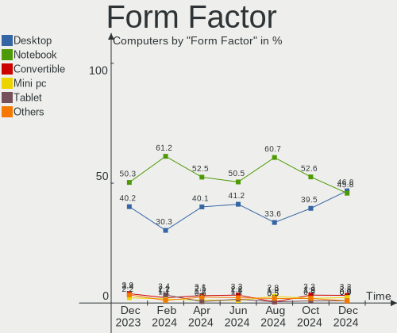

Pop!_OS Hardware Trends
-----------------------

A project to identify most popular hardware characteristics and track their change
over time based on data collected by Pop!_OS users at https://Linux-Hardware.org.

Anyone can contribute to the study by uploading probes of their computers by
the [hw-probe](https://github.com/linuxhw/hw-probe) tool:

    sudo -E hw-probe -all -upload

This is a report for all computer types. See also reports for [desktops](/Dist/Pop!_OS/Desktop/README.md) and [notebooks](/Dist/Pop!_OS/Notebook/README.md).

Full-feature report is available here: https://linux-hardware.org/?view=trends

Period: Jun, 2021.

Contents
--------

- [ OS                       ](#os)
- [ OS Family                ](#os-family)
- [ Kernel                   ](#kernel)
- [ Kernel Family            ](#kernel-family)
- [ Kernel Major Ver.        ](#kernel-major-ver)
- [ Arch                     ](#arch)
- [ DE                       ](#de)
- [ Display Server           ](#display-server)
- [ Display Manager          ](#display-manager)
- [ OS Lang                  ](#os-lang)
- [ Boot Mode                ](#boot-mode)
- [ Filesystem               ](#filesystem)
- [ Part. scheme             ](#part-scheme)
- [ Dual Boot with Linux/BSD ](#dual-boot-with-linux/bsd)
- [ Dual Boot (Win)          ](#dual-boot-win)
- [ Country                  ](#country)
- [ City                     ](#city)
- [ Vendor                   ](#vendor)
- [ Model                    ](#model)
- [ Model Family             ](#model-family)
- [ MFG Year                 ](#mfg-year)
- [ Form Factor              ](#form-factor)
- [ Secure Boot              ](#secure-boot)
- [ Coreboot                 ](#coreboot)
- [ RAM Size                 ](#ram-size)
- [ RAM Used                 ](#ram-used)
- [ Has CD-ROM               ](#has-cd-rom)
- [ Total Drives             ](#total-drives)
- [ Has Ethernet             ](#has-ethernet)
- [ Has WiFi                 ](#has-wifi)
- [ Has Bluetooth            ](#has-bluetooth)
- [ Drive Vendor             ](#drive-vendor)
- [ Drive Model              ](#drive-model)
- [ HDD Vendor               ](#hdd-vendor)
- [ SSD Vendor               ](#ssd-vendor)
- [ Drive Kind               ](#drive-kind)
- [ Drive Connector          ](#drive-connector)
- [ Drive Size               ](#drive-size)
- [ Space Total              ](#space-total)
- [ Space Used               ](#space-used)
- [ Malfunc. Drives          ](#malfunc-drives)
- [ Malfunc. Drive Vendor    ](#malfunc-drive-vendor)
- [ Malfunc. HDD Vendor      ](#malfunc-hdd-vendor)
- [ Malfunc. Drive Kind      ](#malfunc-drive-kind)
- [ Failed Drives            ](#failed-drives)
- [ Failed Drive Vendor      ](#failed-drive-vendor)
- [ Drive Status             ](#drive-status)
- [ Storage Vendor           ](#storage-vendor)
- [ Storage Model            ](#storage-model)
- [ Storage Kind             ](#storage-kind)
- [ CPU Vendor               ](#cpu-vendor)
- [ CPU Model                ](#cpu-model)
- [ CPU Model Family         ](#cpu-model-family)
- [ CPU Cores                ](#cpu-cores)
- [ CPU Sockets              ](#cpu-sockets)
- [ CPU Threads              ](#cpu-threads)
- [ CPU Op-Modes             ](#cpu-op-modes)
- [ CPU Microcode            ](#cpu-microcode)
- [ CPU Microarch            ](#cpu-microarch)
- [ GPU Vendor               ](#gpu-vendor)
- [ GPU Model                ](#gpu-model)
- [ GPU Combo                ](#gpu-combo)
- [ GPU Driver               ](#gpu-driver)
- [ GPU Memory               ](#gpu-memory)
- [ Monitor Vendor           ](#monitor-vendor)
- [ Monitor Model            ](#monitor-model)
- [ Monitor Resolution       ](#monitor-resolution)
- [ Monitor Diagonal         ](#monitor-diagonal)
- [ Monitor Width            ](#monitor-width)
- [ Aspect Ratio             ](#aspect-ratio)
- [ Monitor Area             ](#monitor-area)
- [ Pixel Density            ](#pixel-density)
- [ Multiple Monitors        ](#multiple-monitors)
- [ Net Controller Vendor    ](#net-controller-vendor)
- [ Net Controller Model     ](#net-controller-model)
- [ Wireless Vendor          ](#wireless-vendor)
- [ Wireless Model           ](#wireless-model)
- [ Ethernet Vendor          ](#ethernet-vendor)
- [ Ethernet Model           ](#ethernet-model)
- [ Net Controller Kind      ](#net-controller-kind)
- [ Used Controller          ](#used-controller)
- [ NICs                     ](#nics)
- [ IPv6                     ](#ipv6)
- [ Memory Vendor            ](#memory-vendor)
- [ Memory Model             ](#memory-model)
- [ Memory Kind              ](#memory-kind)
- [ Memory Form Factor       ](#memory-form-factor)
- [ Memory Size              ](#memory-size)
- [ Memory Speed             ](#memory-speed)
- [ Sound Vendor             ](#sound-vendor)
- [ Sound Model              ](#sound-model)
- [ Camera Vendor            ](#camera-vendor)
- [ Camera Model             ](#camera-model)
- [ Fingerprint Vendor       ](#fingerprint-vendor)
- [ Fingerprint Model        ](#fingerprint-model)
- [ Chipcard Vendor          ](#chipcard-vendor)
- [ Chipcard Model           ](#chipcard-model)
- [ Printer Vendor           ](#printer-vendor)
- [ Printer Model            ](#printer-model)
- [ Scanner Vendor           ](#scanner-vendor)
- [ Scanner Model            ](#scanner-model)
- [ Bluetooth Vendor         ](#bluetooth-vendor)
- [ Bluetooth Model          ](#bluetooth-model)
- [ Unsupported Devices      ](#unsupported-devices)
- [ Unsupported Device Types ](#unsupported-device-types)

OS
--

Installed operating systems

| Name          | Computers | Percent |
|---------------|-----------|---------|
| Pop!_OS 20.10 | 180       | 75.31%  |
| Pop!_OS 20.04 | 33        | 13.81%  |
| Pop!_OS 21.04 | 26        | 10.88%  |

OS Family
---------

OS without a version

| Name    | Computers | Percent |
|---------|-----------|---------|
| Pop!_OS | 239       | 100%    |

Kernel
------

Version of the Linux kernel

| Version                                      | Computers | Percent |
|----------------------------------------------|-----------|---------|
| 5.11.0-7614-generic                          | 209       | 87.45%  |
| 5.11.0-7620-generic                          | 13        | 5.44%   |
| 5.11.0-7612-generic                          | 3         | 1.26%   |
| 5.8.0-7642-generic                           | 2         | 0.84%   |
| 5.8.0-7625-generic                           | 1         | 0.42%   |
| 5.4.0-7634-generic                           | 1         | 0.42%   |
| 5.13.0-051300rc1drmintelnext20210519-generic | 1         | 0.42%   |
| 5.12.9-xanmod1                               | 1         | 0.42%   |
| 5.12.4-xanmod1                               | 1         | 0.42%   |
| 5.12.13-051213-generic                       | 1         | 0.42%   |
| 5.12.12-xanmod1                              | 1         | 0.42%   |
| 5.12.12-custom                               | 1         | 0.42%   |
| 5.11.8-051108-generic                        | 1         | 0.42%   |
| 5.11.3-051103-generic                        | 1         | 0.42%   |
| 5.11.16-051116-generic                       | 1         | 0.42%   |
| 5.11.0-18-generic                            | 1         | 0.42%   |

Kernel Family
-------------

Linux kernel without a distro release

| Version | Computers | Percent |
|---------|-----------|---------|
| 5.11.0  | 226       | 94.56%  |
| 5.8.0   | 3         | 1.26%   |
| 5.12.12 | 2         | 0.84%   |
| 5.4.0   | 1         | 0.42%   |
| 5.13.0  | 1         | 0.42%   |
| 5.12.9  | 1         | 0.42%   |
| 5.12.4  | 1         | 0.42%   |
| 5.12.13 | 1         | 0.42%   |
| 5.11.8  | 1         | 0.42%   |
| 5.11.3  | 1         | 0.42%   |
| 5.11.16 | 1         | 0.42%   |

Kernel Major Ver.
-----------------

Linux kernel major version

| Version | Computers | Percent |
|---------|-----------|---------|
| 5.11    | 229       | 95.82%  |
| 5.12    | 5         | 2.09%   |
| 5.8     | 3         | 1.26%   |
| 5.4     | 1         | 0.42%   |
| 5.13    | 1         | 0.42%   |

Arch
----

OS architecture (x86_64, i586, etc.)

| Name   | Computers | Percent |
|--------|-----------|---------|
| x86_64 | 239       | 100%    |

DE
--

Desktop Environment

| Name    | Computers | Percent |
|---------|-----------|---------|
| GNOME   | 230       | 96.23%  |
| KDE     | 4         | 1.67%   |
| MATE    | 2         | 0.84%   |
| XFCE    | 1         | 0.42%   |
| KDE5    | 1         | 0.42%   |
| Unknown | 1         | 0.42%   |

Display Server
--------------

X11 or Wayland

| Name    | Computers | Percent |
|---------|-----------|---------|
| X11     | 234       | 97.91%  |
| Wayland | 3         | 1.26%   |
| Tty     | 1         | 0.42%   |
| Unknown | 1         | 0.42%   |

Display Manager
---------------

SDDM, LightDM, etc.

| Name    | Computers | Percent |
|---------|-----------|---------|
| Unknown | 201       | 84.1%   |
| GDM     | 37        | 15.48%  |
| TDM     | 1         | 0.42%   |

OS Lang
-------

Language

| Lang    | Computers | Percent |
|---------|-----------|---------|
| en_US   | 148       | 61.92%  |
| en_GB   | 21        | 8.79%   |
| pt_BR   | 14        | 5.86%   |
| de_DE   | 13        | 5.44%   |
| fr_FR   | 8         | 3.35%   |
| en_CA   | 6         | 2.51%   |
| C       | 4         | 1.67%   |
| ru_RU   | 3         | 1.26%   |
| pl_PL   | 3         | 1.26%   |
| it_IT   | 3         | 1.26%   |
| es_ES   | 3         | 1.26%   |
| en_AU   | 3         | 1.26%   |
| sv_SE   | 2         | 0.84%   |
| nl_NL   | 2         | 0.84%   |
| tr_TR   | 1         | 0.42%   |
| pt_PT   | 1         | 0.42%   |
| nl_BE   | 1         | 0.42%   |
| nb_NO   | 1         | 0.42%   |
| da_DK   | 1         | 0.42%   |
| Unknown | 1         | 0.42%   |

Boot Mode
---------

EFI or BIOS

| Mode | Computers | Percent |
|------|-----------|---------|
| BIOS | 207       | 86.61%  |
| EFI  | 32        | 13.39%  |

Filesystem
----------

Type of filesystem

| Type    | Computers | Percent |
|---------|-----------|---------|
| Ext4    | 228       | 95.4%   |
| Btrfs   | 7         | 2.93%   |
| Overlay | 4         | 1.67%   |

Part. scheme
------------

Scheme of partitioning

| Type    | Computers | Percent |
|---------|-----------|---------|
| Unknown | 200       | 83.68%  |
| GPT     | 34        | 14.23%  |
| MBR     | 5         | 2.09%   |

Dual Boot with Linux/BSD
------------------------

Hosting more than one Linux/BSD

| Dual boot | Computers | Percent |
|-----------|-----------|---------|
| No        | 238       | 99.58%  |
| Yes       | 1         | 0.42%   |

Dual Boot (Win)
---------------

Hosting Linux and Windows

| Dual boot | Computers | Percent |
|-----------|-----------|---------|
| No        | 219       | 91.63%  |
| Yes       | 20        | 8.37%   |

Country
-------

Geographic location (country)

| Country      | Computers | Percent |
|--------------|-----------|---------|
| USA          | 86        | 35.98%  |
| Brazil       | 18        | 7.53%   |
| Germany      | 16        | 6.69%   |
| Canada       | 12        | 5.02%   |
| UK           | 11        | 4.6%    |
| France       | 9         | 3.77%   |
| Sweden       | 8         | 3.35%   |
| Netherlands  | 5         | 2.09%   |
| Russia       | 4         | 1.67%   |
| Romania      | 4         | 1.67%   |
| Poland       | 4         | 1.67%   |
| Italy        | 4         | 1.67%   |
| India        | 4         | 1.67%   |
| Australia    | 4         | 1.67%   |
| Portugal     | 3         | 1.26%   |
| Norway       | 3         | 1.26%   |
| Malaysia     | 3         | 1.26%   |
| Greece       | 3         | 1.26%   |
| Switzerland  | 2         | 0.84%   |
| Spain        | 2         | 0.84%   |
| South Africa | 2         | 0.84%   |
| Mexico       | 2         | 0.84%   |
| Ireland      | 2         | 0.84%   |
| Indonesia    | 2         | 0.84%   |
| Croatia      | 2         | 0.84%   |
| Argentina    | 2         | 0.84%   |
| Turkey       | 1         | 0.42%   |
| Sri Lanka    | 1         | 0.42%   |
| Serbia       | 1         | 0.42%   |
| Philippines  | 1         | 0.42%   |
| New Zealand  | 1         | 0.42%   |
| Moldova      | 1         | 0.42%   |
| Latvia       | 1         | 0.42%   |
| Kenya        | 1         | 0.42%   |
| Jamaica      | 1         | 0.42%   |
| Honduras     | 1         | 0.42%   |
| Finland      | 1         | 0.42%   |
| Denmark      | 1         | 0.42%   |
| Czechia      | 1         | 0.42%   |
| Costa Rica   | 1         | 0.42%   |
| Colombia     | 1         | 0.42%   |
| Chile        | 1         | 0.42%   |
| Cambodia     | 1         | 0.42%   |
| Bulgaria     | 1         | 0.42%   |
| Bermuda      | 1         | 0.42%   |
| Belize       | 1         | 0.42%   |
| Belgium      | 1         | 0.42%   |
| Austria      | 1         | 0.42%   |

City
----

Geographic location (city)

| City                  | Computers | Percent |
|-----------------------|-----------|---------|
| Brooklyn              | 4         | 1.67%   |
| Moscow                | 3         | 1.26%   |
| Calgary               | 3         | 1.26%   |
| Athens                | 3         | 1.26%   |
| Zagreb                | 2         | 0.84%   |
| Sibiu                 | 2         | 0.84%   |
| Sacramento            | 2         | 0.84%   |
| Rio de Janeiro        | 2         | 0.84%   |
| Portland              | 2         | 0.84%   |
| Oslo                  | 2         | 0.84%   |
| Orlando               | 2         | 0.84%   |
| Montreal              | 2         | 0.84%   |
| Melbourne             | 2         | 0.84%   |
| Hanover               | 2         | 0.84%   |
| Glendale              | 2         | 0.84%   |
| Edmonton              | 2         | 0.84%   |
| Coeur d'Alene         | 2         | 0.84%   |
| Amsterdam             | 2         | 0.84%   |
| Zurich                | 1         | 0.42%   |
| Zittau                | 1         | 0.42%   |
| Woodstock             | 1         | 0.42%   |
| Wellington            | 1         | 0.42%   |
| Waynesboro            | 1         | 0.42%   |
| Wausau                | 1         | 0.42%   |
| Waterloo              | 1         | 0.42%   |
| Waterford             | 1         | 0.42%   |
| Warsaw                | 1         | 0.42%   |
| Vigo                  | 1         | 0.42%   |
| Vienna                | 1         | 0.42%   |
| Valasske Mezirici     | 1         | 0.42%   |
| Uberlândia           | 1         | 0.42%   |
| Toulouse              | 1         | 0.42%   |
| Toronto               | 1         | 0.42%   |
| Tijuana               | 1         | 0.42%   |
| Thetford-Mines        | 1         | 0.42%   |
| The Hague             | 1         | 0.42%   |
| The Colony            | 1         | 0.42%   |
| Tegucigalpa           | 1         | 0.42%   |
| Tasikmalaya           | 1         | 0.42%   |
| Tampa                 | 1         | 0.42%   |
| São Paulo            | 1         | 0.42%   |
| São José dos Campos | 1         | 0.42%   |
| Södertälje          | 1         | 0.42%   |
| Surry Hills           | 1         | 0.42%   |
| Steubenville          | 1         | 0.42%   |
| Star                  | 1         | 0.42%   |
| St Louis              | 1         | 0.42%   |
| Sofia                 | 1         | 0.42%   |
| Smederevo             | 1         | 0.42%   |
| Singaraja             | 1         | 0.42%   |
| Shreveport            | 1         | 0.42%   |
| Sherwood Park         | 1         | 0.42%   |
| Serov                 | 1         | 0.42%   |
| Selma                 | 1         | 0.42%   |
| Schwäbisch Gmünd    | 1         | 0.42%   |
| Schenectady           | 1         | 0.42%   |
| Satu Mare             | 1         | 0.42%   |
| Sarasota              | 1         | 0.42%   |
| Sao Jose              | 1         | 0.42%   |
| Santiago              | 1         | 0.42%   |

Vendor
------

Motherboard manufacturer

| Name                                         | Computers | Percent |
|----------------------------------------------|-----------|---------|
| ASUSTek Computer                             | 44        | 18.41%  |
| Dell                                         | 33        | 13.81%  |
| Lenovo                                       | 31        | 12.97%  |
| Hewlett-Packard                              | 26        | 10.88%  |
| MSI                                          | 21        | 8.79%   |
| Gigabyte Technology                          | 21        | 8.79%   |
| System76                                     | 8         | 3.35%   |
| ASRock                                       | 8         | 3.35%   |
| Apple                                        | 7         | 2.93%   |
| Acer                                         | 5         | 2.09%   |
| Razer                                        | 3         | 1.26%   |
| Toshiba                                      | 2         | 0.84%   |
| Supermicro                                   | 2         | 0.84%   |
| Samsung Electronics                          | 2         | 0.84%   |
| Intel                                        | 2         | 0.84%   |
| HUAWEI                                       | 2         | 0.84%   |
| Huanan                                       | 2         | 0.84%   |
| Gateway                                      | 2         | 0.84%   |
| Fujitsu                                      | 2         | 0.84%   |
| Timi                                         | 1         | 0.42%   |
| SLIMBOOK                                     | 1         | 0.42%   |
| Positivo Bahia - VAIO                        | 1         | 0.42%   |
| Panasonic                                    | 1         | 0.42%   |
| ONDA                                         | 1         | 0.42%   |
| NF-M2S                                       | 1         | 0.42%   |
| MOTILE                                       | 1         | 0.42%   |
| LG Electronics                               | 1         | 0.42%   |
| Itautec                                      | 1         | 0.42%   |
| IP3 Tech                                     | 1         | 0.42%   |
| Foxconn                                      | 1         | 0.42%   |
| Dixonsxp                                     | 1         | 0.42%   |
| Clevo                                        | 1         | 0.42%   |
| CHUWI?Innovation?And?Technology(ShenZhen)co. | 1         | 0.42%   |
| Avell                                        | 1         | 0.42%   |
| Alienware                                    | 1         | 0.42%   |

Model
-----

Motherboard model

| Name                                            | Computers | Percent |
|-------------------------------------------------|-----------|---------|
| MSI MS-7C02                                     | 3         | 1.26%   |
| HP Pavilion dv7                                 | 3         | 1.26%   |
| System76 Oryx Pro                               | 2         | 0.84%   |
| System76 Adder WS                               | 2         | 0.84%   |
| Gigabyte X570 AORUS MASTER                      | 2         | 0.84%   |
| Gigabyte F2A88XM-D3H                            | 2         | 0.84%   |
| Gigabyte B450 AORUS PRO WIFI                    | 2         | 0.84%   |
| Dell XPS 15 9560                                | 2         | 0.84%   |
| Dell Precision 5540                             | 2         | 0.84%   |
| Dell Latitude E7240                             | 2         | 0.84%   |
| ASUS X555LJ                                     | 2         | 0.84%   |
| ASUS ROG Strix G512LW_G512LW                    | 2         | 0.84%   |
| ASUS ROG CROSSHAIR VIII HERO                    | 2         | 0.84%   |
| ASUS P8B75-M                                    | 2         | 0.84%   |
| ASUS All Series                                 | 2         | 0.84%   |
| ASRock X300M-STX                                | 2         | 0.84%   |
| Apple iMac10,1                                  | 2         | 0.84%   |
| Toshiba Satellite L855                          | 1         | 0.42%   |
| Toshiba Satellite C50-B                         | 1         | 0.42%   |
| Timi A35S                                       | 1         | 0.42%   |
| System76 Serval                                 | 1         | 0.42%   |
| System76 Pangolin Performance                   | 1         | 0.42%   |
| System76 Lemur Pro                              | 1         | 0.42%   |
| System76 Galago Pro                             | 1         | 0.42%   |
| Supermicro X10SLL-F                             | 1         | 0.42%   |
| Supermicro Super Server                         | 1         | 0.42%   |
| SLIMBOOK PROX15-INTEL                           | 1         | 0.42%   |
| Samsung 300E5K/300E5Q                           | 1         | 0.42%   |
| Samsung 300E4Z/300E5Z/300E7Z                    | 1         | 0.42%   |
| Razer Blade Stealth 13 (Early 2020) - RZ09-0310 | 1         | 0.42%   |
| Razer Blade 14 - RZ09-0370                      | 1         | 0.42%   |
| Razer Blade                                     | 1         | 0.42%   |
| Positivo Bahia - VAIO VJC141F11X-B0111L         | 1         | 0.42%   |
| Panasonic CF-53SALZYLM                          | 1         | 0.42%   |
| ONDA ONDA D1800 BTC V1.04                       | 1         | 0.42%   |
| NF-M2S ABIT                                     | 1         | 0.42%   |
| MSI MS-7D09                                     | 1         | 0.42%   |
| MSI MS-7C91                                     | 1         | 0.42%   |
| MSI MS-7B98                                     | 1         | 0.42%   |
| MSI MS-7B93                                     | 1         | 0.42%   |
| MSI MS-7B89                                     | 1         | 0.42%   |
| MSI MS-7B87                                     | 1         | 0.42%   |
| MSI MS-7B86                                     | 1         | 0.42%   |
| MSI MS-7B85                                     | 1         | 0.42%   |
| MSI MS-7B22                                     | 1         | 0.42%   |
| MSI MS-7B09                                     | 1         | 0.42%   |
| MSI MS-7A93                                     | 1         | 0.42%   |
| MSI MS-7A69                                     | 1         | 0.42%   |
| MSI MS-7A39                                     | 1         | 0.42%   |
| MSI MS-7A33                                     | 1         | 0.42%   |
| MSI MS-7977                                     | 1         | 0.42%   |
| MSI MS-7971                                     | 1         | 0.42%   |
| MSI MS-7851                                     | 1         | 0.42%   |
| MSI MS-7817                                     | 1         | 0.42%   |
| MOTILE M142                                     | 1         | 0.42%   |
| LG 14Z980-G.BH51P1                              | 1         | 0.42%   |
| Lenovo Yoga 730-13IWL 81JR                      | 1         | 0.42%   |
| Lenovo Yoga 6 13ARE05 82FN                      | 1         | 0.42%   |
| Lenovo Yoga 530-14ARR 81H9                      | 1         | 0.42%   |
| Lenovo Y520-15IKBN 80WK                         | 1         | 0.42%   |

Model Family
------------

Motherboard model prefix

| Name                                    | Computers | Percent |
|-----------------------------------------|-----------|---------|
| Lenovo ThinkPad                         | 17        | 7.11%   |
| ASUS ROG                                | 13        | 5.44%   |
| Dell Inspiron                           | 12        | 5.02%   |
| Dell Latitude                           | 10        | 4.18%   |
| HP Pavilion                             | 9         | 3.77%   |
| Lenovo IdeaPad                          | 8         | 3.35%   |
| Gigabyte X570                           | 4         | 1.67%   |
| Dell Precision                          | 4         | 1.67%   |
| Razer Blade                             | 3         | 1.26%   |
| MSI MS-7C02                             | 3         | 1.26%   |
| Lenovo Yoga                             | 3         | 1.26%   |
| HP ProBook                              | 3         | 1.26%   |
| HP EliteBook                            | 3         | 1.26%   |
| Dell XPS                                | 3         | 1.26%   |
| ASUS VivoBook                           | 3         | 1.26%   |
| ASUS PRIME                              | 3         | 1.26%   |
| Toshiba Satellite                       | 2         | 0.84%   |
| System76 Oryx                           | 2         | 0.84%   |
| System76 Adder                          | 2         | 0.84%   |
| Lenovo Legion                           | 2         | 0.84%   |
| HP OMEN                                 | 2         | 0.84%   |
| HP ENVY                                 | 2         | 0.84%   |
| HP Compaq                               | 2         | 0.84%   |
| Gigabyte F2A88XM-D3H                    | 2         | 0.84%   |
| Gigabyte B450                           | 2         | 0.84%   |
| ASUS X555LJ                             | 2         | 0.84%   |
| ASUS TUF                                | 2         | 0.84%   |
| ASUS P8B75-M                            | 2         | 0.84%   |
| ASUS All                                | 2         | 0.84%   |
| ASRock X300M-STX                        | 2         | 0.84%   |
| Apple iMac10                            | 2         | 0.84%   |
| Acer Nitro                              | 2         | 0.84%   |
| Acer Aspire                             | 2         | 0.84%   |
| Timi A35S                               | 1         | 0.42%   |
| System76 Serval                         | 1         | 0.42%   |
| System76 Pangolin                       | 1         | 0.42%   |
| System76 Lemur                          | 1         | 0.42%   |
| System76 Galago                         | 1         | 0.42%   |
| Supermicro X10SLL-F                     | 1         | 0.42%   |
| Supermicro Super                        | 1         | 0.42%   |
| SLIMBOOK PROX15-INTEL                   | 1         | 0.42%   |
| Samsung 300E5K                          | 1         | 0.42%   |
| Samsung 300E4Z                          | 1         | 0.42%   |
| Positivo Bahia - VAIO VJC141F11X-B0111L | 1         | 0.42%   |
| Panasonic CF-53SALZYLM                  | 1         | 0.42%   |
| ONDA ONDA                               | 1         | 0.42%   |
| NF-M2S ABIT                             | 1         | 0.42%   |
| MSI MS-7D09                             | 1         | 0.42%   |
| MSI MS-7C91                             | 1         | 0.42%   |
| MSI MS-7B98                             | 1         | 0.42%   |
| MSI MS-7B93                             | 1         | 0.42%   |
| MSI MS-7B89                             | 1         | 0.42%   |
| MSI MS-7B87                             | 1         | 0.42%   |
| MSI MS-7B86                             | 1         | 0.42%   |
| MSI MS-7B85                             | 1         | 0.42%   |
| MSI MS-7B22                             | 1         | 0.42%   |
| MSI MS-7B09                             | 1         | 0.42%   |
| MSI MS-7A93                             | 1         | 0.42%   |
| MSI MS-7A69                             | 1         | 0.42%   |
| MSI MS-7A39                             | 1         | 0.42%   |

MFG Year
--------

Motherboard manufacture year

| Year | Computers | Percent |
|------|-----------|---------|
| 2021 | 49        | 20.5%   |
| 2020 | 49        | 20.5%   |
| 2019 | 37        | 15.48%  |
| 2018 | 21        | 8.79%   |
| 2017 | 13        | 5.44%   |
| 2015 | 13        | 5.44%   |
| 2014 | 13        | 5.44%   |
| 2013 | 9         | 3.77%   |
| 2012 | 9         | 3.77%   |
| 2016 | 6         | 2.51%   |
| 2011 | 5         | 2.09%   |
| 2009 | 4         | 1.67%   |
| 2007 | 4         | 1.67%   |
| 2010 | 3         | 1.26%   |
| 2008 | 3         | 1.26%   |
| 2006 | 1         | 0.42%   |

Form Factor
-----------

Physical design of the computer

| Name        | Computers | Percent |
|-------------|-----------|---------|
| Notebook    | 129       | 53.97%  |
| Desktop     | 95        | 39.75%  |
| Convertible | 9         | 3.77%   |
| Mini pc     | 2         | 0.84%   |
| All in one  | 2         | 0.84%   |
| Server      | 2         | 0.84%   |

Secure Boot
-----------

Enabled or disabled

| State    | Computers | Percent |
|----------|-----------|---------|
| Disabled | 239       | 100%    |

Coreboot
--------

Have coreboot on board

| Used | Computers | Percent |
|------|-----------|---------|
| No   | 236       | 98.74%  |
| Yes  | 3         | 1.26%   |

RAM Size
--------

Total RAM memory

| Size in GB  | Computers | Percent |
|-------------|-----------|---------|
| 16.01-24.0  | 55        | 23.01%  |
| 8.01-16.0   | 51        | 21.34%  |
| 4.01-8.0    | 48        | 20.08%  |
| 32.01-64.0  | 40        | 16.74%  |
| 3.01-4.0    | 23        | 9.62%   |
| 64.01-256.0 | 11        | 4.6%    |
| 24.01-32.0  | 5         | 2.09%   |
| 2.01-3.0    | 3         | 1.26%   |
| 1.01-2.0    | 3         | 1.26%   |

RAM Used
--------

Used RAM memory

| Used GB    | Computers | Percent |
|------------|-----------|---------|
| 1.01-2.0   | 75        | 31.38%  |
| 2.01-3.0   | 70        | 29.29%  |
| 4.01-8.0   | 51        | 21.34%  |
| 3.01-4.0   | 36        | 15.06%  |
| 8.01-16.0  | 4         | 1.67%   |
| 24.01-32.0 | 1         | 0.42%   |
| 16.01-24.0 | 1         | 0.42%   |
| 0.51-1.0   | 1         | 0.42%   |

Has CD-ROM
----------

Has CD-ROM on board

| Presented | Computers | Percent |
|-----------|-----------|---------|
| No        | 169       | 70.71%  |
| Yes       | 70        | 29.29%  |

Total Drives
------------

Number of drives on board

| Drives | Computers | Percent |
|--------|-----------|---------|
| 1      | 131       | 54.81%  |
| 2      | 58        | 24.27%  |
| 3      | 21        | 8.79%   |
| 4      | 18        | 7.53%   |
| 5      | 5         | 2.09%   |
| 8      | 2         | 0.84%   |
| 7      | 2         | 0.84%   |
| 6      | 2         | 0.84%   |

Has Ethernet
------------

Has Ethernet on board

| Presented | Computers | Percent |
|-----------|-----------|---------|
| Yes       | 207       | 86.61%  |
| No        | 32        | 13.39%  |

Has WiFi
--------

Has WiFi module

| Presented | Computers | Percent |
|-----------|-----------|---------|
| Yes       | 187       | 78.24%  |
| No        | 52        | 21.76%  |

Has Bluetooth
-------------

Has Bluetooth module

| Presented | Computers | Percent |
|-----------|-----------|---------|
| Yes       | 161       | 67.36%  |
| No        | 78        | 32.64%  |

Drive Vendor
------------

Hard drive vendors

| Vendor                    | Computers | Drives | Percent |
|---------------------------|-----------|--------|---------|
| Samsung Electronics       | 66        | 86     | 17.41%  |
| WDC                       | 58        | 69     | 15.3%   |
| Seagate                   | 44        | 64     | 11.61%  |
| Sandisk                   | 29        | 34     | 7.65%   |
| Toshiba                   | 22        | 23     | 5.8%    |
| Kingston                  | 20        | 20     | 5.28%   |
| Crucial                   | 18        | 21     | 4.75%   |
| SK Hynix                  | 13        | 13     | 3.43%   |
| Intel                     | 12        | 16     | 3.17%   |
| Unknown                   | 10        | 11     | 2.64%   |
| HGST                      | 8         | 9      | 2.11%   |
| Phison                    | 7         | 9      | 1.85%   |
| Hitachi                   | 6         | 6      | 1.58%   |
| PNY                       | 5         | 5      | 1.32%   |
| Micron Technology         | 5         | 5      | 1.32%   |
| A-DATA Technology         | 5         | 5      | 1.32%   |
| Silicon Motion            | 4         | 4      | 1.06%   |
| Realtek Semiconductor     | 4         | 4      | 1.06%   |
| LITEON                    | 4         | 4      | 1.06%   |
| Corsair                   | 4         | 6      | 1.06%   |
| China                     | 4         | 4      | 1.06%   |
| XPG                       | 2         | 2      | 0.53%   |
| Solid State Storage       | 2         | 2      | 0.53%   |
| OCZ                       | 2         | 2      | 0.53%   |
| Micron/Crucial Technology | 2         | 2      | 0.53%   |
| KIOXIA                    | 2         | 2      | 0.53%   |
| ASMT                      | 2         | 2      | 0.53%   |
| VisionTek                 | 1         | 2      | 0.26%   |
| Vaseky                    | 1         | 1      | 0.26%   |
| Union Memory (Shenzhen)   | 1         | 1      | 0.26%   |
| Union Memory              | 1         | 1      | 0.26%   |
| Transcend                 | 1         | 1      | 0.26%   |
| Team                      | 1         | 1      | 0.26%   |
| SUNEAST                   | 1         | 1      | 0.26%   |
| SPCC                      | 1         | 1      | 0.26%   |
| ROG                       | 1         | 1      | 0.26%   |
| Realtek                   | 1         | 1      | 0.26%   |
| Netac                     | 1         | 1      | 0.26%   |
| Mushkin                   | 1         | 1      | 0.26%   |
| MiniPro                   | 1         | 2      | 0.26%   |
| LITEONIT                  | 1         | 1      | 0.26%   |
| Lexar                     | 1         | 1      | 0.26%   |
| KingSpec                  | 1         | 1      | 0.26%   |
| KingDian                  | 1         | 1      | 0.26%   |
| Hikvision                 | 1         | 1      | 0.26%   |
| Fujitsu                   | 1         | 1      | 0.26%   |

Drive Model
-----------

Hard drive models

| Model                                       | Computers | Percent |
|---------------------------------------------|-----------|---------|
| Samsung NVMe SSD Drive 500GB                | 7         | 1.66%   |
| Seagate ST2000DM008-2FR102 2TB              | 6         | 1.43%   |
| Kingston SA400S37240G 240GB SSD             | 6         | 1.43%   |
| Sandisk NVMe SSD Drive 1TB                  | 5         | 1.19%   |
| Samsung SSD 860 EVO 500GB                   | 5         | 1.19%   |
| Crucial CT240BX500SSD1 240GB                | 5         | 1.19%   |
| WDC WD10EZEX-08WN4A0 1TB                    | 4         | 0.95%   |
| Sandisk NVMe SSD Drive 256GB                | 4         | 0.95%   |
| Samsung SSD 850 EVO 250GB                   | 4         | 0.95%   |
| Samsung NVMe SSD Drive 1TB                  | 4         | 0.95%   |
| Unknown MMC Card  32GB                      | 3         | 0.71%   |
| Toshiba MQ01ABF050 500GB                    | 3         | 0.71%   |
| Seagate ST1000LM035-1RK172 1TB              | 3         | 0.71%   |
| Seagate ST1000LM024 HN-M101MBB 1TB          | 3         | 0.71%   |
| SanDisk SDSSDA240G 240GB                    | 3         | 0.71%   |
| Samsung SSD 860 EVO 2TB                     | 3         | 0.71%   |
| Samsung SSD 860 EVO 1TB                     | 3         | 0.71%   |
| Samsung SSD 850 EVO 500GB                   | 3         | 0.71%   |
| Samsung SSD 840 EVO 120GB                   | 3         | 0.71%   |
| Samsung NVMe SSD Drive 512GB                | 3         | 0.71%   |
| Samsung NVMe SSD Drive 256GB                | 3         | 0.71%   |
| Samsung NVMe SSD Drive 1024GB               | 3         | 0.71%   |
| Intel NVMe SSD Drive 512GB                  | 3         | 0.71%   |
| Intel NVMe SSD Drive 1024GB                 | 3         | 0.71%   |
| HGST HTS721010A9E630 1TB                    | 3         | 0.71%   |
| WDC WD40EZRZ-22GXCB0 4TB                    | 2         | 0.48%   |
| WDC WD30EZRZ-00GXCB0 3TB                    | 2         | 0.48%   |
| WDC WD20EFRX-68EUZN0 2TB                    | 2         | 0.48%   |
| Unknown SD/MMC/MS PRO 128GB                 | 2         | 0.48%   |
| Unknown MMC Card  64GB                      | 2         | 0.48%   |
| Toshiba NVMe SSD Drive 512GB                | 2         | 0.48%   |
| Toshiba MK5065GSXF 500GB                    | 2         | 0.48%   |
| Toshiba HDWD110 1TB                         | 2         | 0.48%   |
| Toshiba DT01ACA100 1TB                      | 2         | 0.48%   |
| Solid State Storage SSSTC CL1-4D256 256GB   | 2         | 0.48%   |
| SK Hynix NVMe SSD Drive 512GB               | 2         | 0.48%   |
| Silicon Motion NVMe SSD Drive 512GB         | 2         | 0.48%   |
| Seagate ST9500420AS 500GB                   | 2         | 0.48%   |
| Seagate ST6000DM003-2CY186 6TB              | 2         | 0.48%   |
| Seagate ST4000DM004-2CV104 4TB              | 2         | 0.48%   |
| Seagate ST3500418ASQ 500GB                  | 2         | 0.48%   |
| Seagate ST2000DM001-1ER164 2TB              | 2         | 0.48%   |
| Seagate ST1000LX015-1U7172 1TB              | 2         | 0.48%   |
| Seagate ST1000LM048-2E7172 1TB              | 2         | 0.48%   |
| Seagate ST1000DM010-2EP102 1TB              | 2         | 0.48%   |
| Seagate ST1000DM003-1ER162 1TB              | 2         | 0.48%   |
| Seagate BarraCuda Q1 SSD ZA960CV10001 960GB | 2         | 0.48%   |
| Sandisk NVMe SSD Drive 512GB                | 2         | 0.48%   |
| Sandisk NVMe SSD Drive 500GB                | 2         | 0.48%   |
| Sandisk NVMe SSD Drive 1024GB               | 2         | 0.48%   |
| Samsung SSD 870 EVO 250GB                   | 2         | 0.48%   |
| Samsung MZ7TD128HAFV-000L1 128GB SSD        | 2         | 0.48%   |
| Realtek NVMe SSD Drive 2TB                  | 2         | 0.48%   |
| PNY CS900 500GB SSD                         | 2         | 0.48%   |
| Phison NVMe SSD Drive 2TB                   | 2         | 0.48%   |
| Phison NVMe SSD Drive 1024GB                | 2         | 0.48%   |
| Kingston SUV400S37240G 240GB SSD            | 2         | 0.48%   |
| Intel SSDPEKNW512G8 512GB                   | 2         | 0.48%   |
| Hitachi HTS547575A9E384 752GB               | 2         | 0.48%   |
| HGST HTS725050A7E630 500GB                  | 2         | 0.48%   |

HDD Vendor
----------

Hard disk drive vendors

| Vendor              | Computers | Drives | Percent |
|---------------------|-----------|--------|---------|
| WDC                 | 46        | 55     | 36.8%   |
| Seagate             | 43        | 58     | 34.4%   |
| Toshiba             | 17        | 18     | 13.6%   |
| HGST                | 8         | 9      | 6.4%    |
| Hitachi             | 6         | 6      | 4.8%    |
| Samsung Electronics | 3         | 4      | 2.4%    |
| Fujitsu             | 1         | 1      | 0.8%    |
| ASMT                | 1         | 1      | 0.8%    |

SSD Vendor
----------

Solid state drive vendors

| Vendor              | Computers | Drives | Percent |
|---------------------|-----------|--------|---------|
| Samsung Electronics | 37        | 44     | 25.87%  |
| Kingston            | 18        | 18     | 12.59%  |
| Crucial             | 18        | 21     | 12.59%  |
| SanDisk             | 13        | 16     | 9.09%   |
| WDC                 | 9         | 10     | 6.29%   |
| PNY                 | 5         | 5      | 3.5%    |
| SK Hynix            | 4         | 4      | 2.8%    |
| LITEON              | 4         | 4      | 2.8%    |
| Corsair             | 4         | 6      | 2.8%    |
| China               | 4         | 4      | 2.8%    |
| A-DATA Technology   | 4         | 4      | 2.8%    |
| Seagate             | 3         | 6      | 2.1%    |
| Micron Technology   | 3         | 3      | 2.1%    |
| OCZ                 | 2         | 2      | 1.4%    |
| Intel               | 2         | 2      | 1.4%    |
| Transcend           | 1         | 1      | 0.7%    |
| Toshiba             | 1         | 1      | 0.7%    |
| Team                | 1         | 1      | 0.7%    |
| SUNEAST             | 1         | 1      | 0.7%    |
| SPCC                | 1         | 1      | 0.7%    |
| Netac               | 1         | 1      | 0.7%    |
| Mushkin             | 1         | 1      | 0.7%    |
| LITEONIT            | 1         | 1      | 0.7%    |
| Lexar               | 1         | 1      | 0.7%    |
| KingSpec            | 1         | 1      | 0.7%    |
| KingDian            | 1         | 1      | 0.7%    |
| Hikvision           | 1         | 1      | 0.7%    |
| ASMT                | 1         | 1      | 0.7%    |

Drive Kind
----------

HDD or SSD

| Kind    | Computers | Drives | Percent |
|---------|-----------|--------|---------|
| SSD     | 121       | 162    | 35.17%  |
| HDD     | 111       | 152    | 32.27%  |
| NVMe    | 97        | 120    | 28.2%   |
| MMC     | 8         | 8      | 2.33%   |
| Unknown | 7         | 9      | 2.03%   |

Drive Connector
---------------

SATA, SAS, NVMe, etc.

| Type | Computers | Drives | Percent |
|------|-----------|--------|---------|
| SATA | 179       | 314    | 61.3%   |
| NVMe | 97        | 120    | 33.22%  |
| SAS  | 8         | 9      | 2.74%   |
| MMC  | 8         | 8      | 2.74%   |

Drive Size
----------

Size of hard drive

| Size in TB | Computers | Drives | Percent |
|------------|-----------|--------|---------|
| 0.01-0.5   | 136       | 174    | 55.28%  |
| 0.51-1.0   | 64        | 79     | 26.02%  |
| 1.01-2.0   | 28        | 34     | 11.38%  |
| 3.01-4.0   | 6         | 11     | 2.44%   |
| 2.01-3.0   | 6         | 6      | 2.44%   |
| 4.01-10.0  | 5         | 9      | 2.03%   |
| 10.01-20.0 | 1         | 1      | 0.41%   |

Space Total
-----------

Amount of disk space available on the file system

| Size in GB     | Computers | Percent |
|----------------|-----------|---------|
| 101-250        | 76        | 31.8%   |
| 251-500        | 58        | 24.27%  |
| 501-1000       | 47        | 19.67%  |
| 1001-2000      | 22        | 9.21%   |
| More than 3000 | 12        | 5.02%   |
| 2001-3000      | 12        | 5.02%   |
| 51-100         | 5         | 2.09%   |
| 21-50          | 3         | 1.26%   |
| 1-20           | 2         | 0.84%   |
| Unknown        | 2         | 0.84%   |

Space Used
----------

Amount of used disk space

| Used GB        | Computers | Percent |
|----------------|-----------|---------|
| 1-20           | 89        | 37.24%  |
| 21-50          | 43        | 17.99%  |
| 101-250        | 34        | 14.23%  |
| 51-100         | 24        | 10.04%  |
| 251-500        | 18        | 7.53%   |
| 501-1000       | 14        | 5.86%   |
| 1001-2000      | 7         | 2.93%   |
| More than 3000 | 4         | 1.67%   |
| 2001-3000      | 4         | 1.67%   |
| Unknown        | 2         | 0.84%   |

Malfunc. Drives
---------------

Drive models with a malfunction

| Model                        | Computers | Drives | Percent |
|------------------------------|-----------|--------|---------|
| WDC WD5000BEVT-75A0RT0 500GB | 1         | 1      | 33.33%  |
| Intel SSDSA2M080G2GC 80GB    | 1         | 1      | 33.33%  |
| HGST HTS725050A7E630 500GB   | 1         | 1      | 33.33%  |

Malfunc. Drive Vendor
---------------------

Vendors of faulty drives

| Vendor | Computers | Drives | Percent |
|--------|-----------|--------|---------|
| WDC    | 1         | 1      | 33.33%  |
| Intel  | 1         | 1      | 33.33%  |
| HGST   | 1         | 1      | 33.33%  |

Malfunc. HDD Vendor
-------------------

Vendors of faulty HDD drives

| Vendor | Computers | Drives | Percent |
|--------|-----------|--------|---------|
| WDC    | 1         | 1      | 50%     |
| HGST   | 1         | 1      | 50%     |

Malfunc. Drive Kind
-------------------

Kinds of faulty drives

| Kind | Computers | Drives | Percent |
|------|-----------|--------|---------|
| HDD  | 2         | 2      | 66.67%  |
| SSD  | 1         | 1      | 33.33%  |

Failed Drives
-------------

Failed drive models

| Model                      | Computers | Drives | Percent |
|----------------------------|-----------|--------|---------|
| Seagate ST3500418ASQ 500GB | 1         | 1      | 100%    |

Failed Drive Vendor
-------------------

Failed drive vendors

| Vendor  | Computers | Drives | Percent |
|---------|-----------|--------|---------|
| Seagate | 1         | 1      | 100%    |

Drive Status
------------

Number of failed and malfunc. drives

| Status   | Computers | Drives | Percent |
|----------|-----------|--------|---------|
| Detected | 203       | 391    | 82.52%  |
| Works    | 39        | 56     | 15.85%  |
| Malfunc  | 3         | 3      | 1.22%   |
| Failed   | 1         | 1      | 0.41%   |

Storage Vendor
--------------

Storage controller vendors

| Vendor                           | Computers | Percent |
|----------------------------------|-----------|---------|
| Intel                            | 155       | 46.55%  |
| AMD                              | 61        | 18.32%  |
| Samsung Electronics              | 34        | 10.21%  |
| Sandisk                          | 21        | 6.31%   |
| SK Hynix                         | 9         | 2.7%    |
| Phison Electronics               | 7         | 2.1%    |
| Nvidia                           | 7         | 2.1%    |
| Realtek Semiconductor            | 5         | 1.5%    |
| Toshiba America Info Systems     | 4         | 1.2%    |
| Silicon Motion                   | 4         | 1.2%    |
| ASMedia Technology               | 4         | 1.2%    |
| Solid State Storage Technology   | 3         | 0.9%    |
| Marvell Technology Group         | 3         | 0.9%    |
| Union Memory (Shenzhen)          | 2         | 0.6%    |
| Micron/Crucial Technology        | 2         | 0.6%    |
| Micron Technology                | 2         | 0.6%    |
| KIOXIA                           | 2         | 0.6%    |
| Kingston Technology Company      | 2         | 0.6%    |
| ADATA Technology                 | 2         | 0.6%    |
| VIA Technologies                 | 1         | 0.3%    |
| Silicon Integrated Systems [SiS] | 1         | 0.3%    |
| JMicron Technology               | 1         | 0.3%    |
| Broadcom / LSI                   | 1         | 0.3%    |

Storage Model
-------------

Storage controller models

| Model                                                                          | Computers | Percent |
|--------------------------------------------------------------------------------|-----------|---------|
| AMD FCH SATA Controller [AHCI mode]                                            | 47        | 12.4%   |
| Samsung NVMe SSD Controller SM981/PM981/PM983                                  | 21        | 5.54%   |
| Intel Sunrise Point-LP SATA Controller [AHCI mode]                             | 15        | 3.96%   |
| AMD 400 Series Chipset SATA Controller                                         | 12        | 3.17%   |
| Intel 8 Series/C220 Series Chipset Family 6-port SATA Controller 1 [AHCI mode] | 11        | 2.9%    |
| Intel 6 Series/C200 Series Chipset Family 6 port Mobile SATA AHCI Controller   | 11        | 2.9%    |
| Sandisk WD Blue SN550 NVMe SSD                                                 | 9         | 2.37%   |
| Intel 6 Series/C200 Series Chipset Family 6 port Desktop SATA AHCI Controller  | 9         | 2.37%   |
| Intel Cannon Lake Mobile PCH SATA AHCI Controller                              | 8         | 2.11%   |
| Intel 82801 Mobile SATA Controller [RAID mode]                                 | 8         | 2.11%   |
| Intel 8 Series SATA Controller 1 [AHCI mode]                                   | 8         | 2.11%   |
| Intel Volume Management Device NVMe RAID Controller                            | 7         | 1.85%   |
| AMD SB7x0/SB8x0/SB9x0 IDE Controller                                           | 7         | 1.85%   |
| Intel SSD 660P Series                                                          | 6         | 1.58%   |
| Intel Q170/Q150/B150/H170/H110/Z170/CM236 Chipset SATA Controller [AHCI Mode]  | 6         | 1.58%   |
| Intel 7 Series Chipset Family 6-port SATA Controller [AHCI mode]               | 6         | 1.58%   |
| AMD SB7x0/SB8x0/SB9x0 SATA Controller [IDE mode]                               | 6         | 1.58%   |
| Samsung NVMe Controller                                                        | 5         | 1.32%   |
| Nvidia MCP79 AHCI Controller                                                   | 5         | 1.32%   |
| Intel Wildcat Point-LP SATA Controller [AHCI Mode]                             | 5         | 1.32%   |
| Intel SATA Controller [RAID mode]                                              | 5         | 1.32%   |
| Intel HM170/QM170 Chipset SATA Controller [AHCI Mode]                          | 5         | 1.32%   |
| Intel 200 Series PCH SATA controller [AHCI mode]                               | 5         | 1.32%   |
| Sandisk WD Black SN750 / PC SN730 NVMe SSD                                     | 4         | 1.06%   |
| Samsung NVMe SSD Controller PM9A1/PM9A3/980PRO                                 | 4         | 1.06%   |
| Intel Cannon Lake PCH SATA AHCI Controller                                     | 4         | 1.06%   |
| ASMedia ASM1062 Serial ATA Controller                                          | 4         | 1.06%   |
| AMD Starship/Matisse Chipset SATA Controller [AHCI mode]                       | 4         | 1.06%   |
| Solid State Storage Non-Volatile memory controller                             | 3         | 0.79%   |
| SK Hynix BC511                                                                 | 3         | 0.79%   |
| Sandisk Non-Volatile memory controller                                         | 3         | 0.79%   |
| Realtek Realtek Non-Volatile memory controller                                 | 3         | 0.79%   |
| Phison E12 NVMe Controller                                                     | 3         | 0.79%   |
| Intel C610/X99 series chipset 6-Port SATA Controller [AHCI mode]               | 3         | 0.79%   |
| Intel 5 Series/3400 Series Chipset 6 port SATA AHCI Controller                 | 3         | 0.79%   |
| Intel 400 Series Chipset Family SATA AHCI Controller                           | 3         | 0.79%   |
| AMD X370 Series Chipset SATA Controller                                        | 3         | 0.79%   |
| SK Hynix NVMe SSD Controller                                                   | 2         | 0.53%   |
| SK Hynix BC501 NVMe Solid State Drive                                          | 2         | 0.53%   |
| Silicon Motion SM2263EN/SM2263XT SSD Controller                                | 2         | 0.53%   |
| Silicon Motion SM2262/SM2262EN SSD Controller                                  | 2         | 0.53%   |
| Sandisk WD Blue SN500 / PC SN520 NVMe SSD                                      | 2         | 0.53%   |
| Sandisk WD Black 2018/SN750 / PC SN720 NVMe SSD                                | 2         | 0.53%   |
| Samsung NVMe SSD Controller SM961/PM961/SM963                                  | 2         | 0.53%   |
| Samsung NVMe SSD Controller SM951/PM951                                        | 2         | 0.53%   |
| Realtek RTS5763DL NVMe SSD Controller                                          | 2         | 0.53%   |
| Phison E18 PCIe4 NVMe Controller                                               | 2         | 0.53%   |
| Phison E16 PCIe4 NVMe Controller                                               | 2         | 0.53%   |
| Nvidia MCP61 SATA Controller                                                   | 2         | 0.53%   |
| Nvidia MCP61 IDE                                                               | 2         | 0.53%   |
| Micron Non-Volatile memory controller                                          | 2         | 0.53%   |
| Marvell Group 88SE9172 SATA 6Gb/s Controller                                   | 2         | 0.53%   |
| KIOXIA Non-Volatile memory controller                                          | 2         | 0.53%   |
| Intel Tiger Lake-LP SATA Controller [AHCI mode]                                | 2         | 0.53%   |
| Intel Ice Lake-LP SATA Controller [AHCI mode]                                  | 2         | 0.53%   |
| Intel Celeron/Pentium Silver Processor SATA Controller                         | 2         | 0.53%   |
| Intel Celeron N3350/Pentium N4200/Atom E3900 Series SATA AHCI Controller       | 2         | 0.53%   |
| Intel C610/X99 series chipset sSATA Controller [AHCI mode]                     | 2         | 0.53%   |
| Intel C600/X79 series chipset 6-Port SATA AHCI Controller                      | 2         | 0.53%   |
| Intel 82801G (ICH7 Family) IDE Controller                                      | 2         | 0.53%   |

Storage Kind
------------

Kind of storage controller (IDE, SATA, NVMe, SAS, ...)

| Kind | Computers | Percent |
|------|-----------|---------|
| SATA | 186       | 56.36%  |
| NVMe | 97        | 29.39%  |
| IDE  | 24        | 7.27%   |
| RAID | 22        | 6.67%   |
| SAS  | 1         | 0.3%    |

CPU Vendor
----------

Processor vendors

| Vendor | Computers | Percent |
|--------|-----------|---------|
| Intel  | 167       | 69.87%  |
| AMD    | 72        | 30.13%  |

CPU Model
---------

Processor models

| Model                                          | Computers | Percent |
|------------------------------------------------|-----------|---------|
| AMD Ryzen 5 3600 6-Core Processor              | 7         | 2.93%   |
| Intel Core i7-8565U CPU @ 1.80GHz              | 5         | 2.09%   |
| Intel Core i7-7700HQ CPU @ 2.80GHz             | 5         | 2.09%   |
| Intel 11th Gen Core i7-1165G7 @ 2.80GHz        | 5         | 2.09%   |
| Intel Core i7-8750H CPU @ 2.20GHz              | 4         | 1.67%   |
| Intel Core i7-3770 CPU @ 3.40GHz               | 4         | 1.67%   |
| Intel Core i7-10750H CPU @ 2.60GHz             | 4         | 1.67%   |
| AMD Ryzen 7 4800H with Radeon Graphics         | 4         | 1.67%   |
| Intel Core i7-4600U CPU @ 2.10GHz              | 3         | 1.26%   |
| Intel Core i5-8250U CPU @ 1.60GHz              | 3         | 1.26%   |
| Intel Core i5-6300U CPU @ 2.40GHz              | 3         | 1.26%   |
| Intel Core i5-5200U CPU @ 2.20GHz              | 3         | 1.26%   |
| Intel Core i5-2450M CPU @ 2.50GHz              | 3         | 1.26%   |
| AMD Ryzen 9 3900X 12-Core Processor            | 3         | 1.26%   |
| AMD Ryzen 7 3700X 8-Core Processor             | 3         | 1.26%   |
| AMD Ryzen 5 2500U with Radeon Vega Mobile Gfx  | 3         | 1.26%   |
| Intel Xeon CPU E5-2640 v3 @ 2.60GHz            | 2         | 0.84%   |
| Intel Core i9-9980HK CPU @ 2.40GHz             | 2         | 0.84%   |
| Intel Core i9-9880H CPU @ 2.30GHz              | 2         | 0.84%   |
| Intel Core i7-9750H CPU @ 2.60GHz              | 2         | 0.84%   |
| Intel Core i7-8700K CPU @ 3.70GHz              | 2         | 0.84%   |
| Intel Core i7-7500U CPU @ 2.70GHz              | 2         | 0.84%   |
| Intel Core i7-6700K CPU @ 4.00GHz              | 2         | 0.84%   |
| Intel Core i7-4790K CPU @ 4.00GHz              | 2         | 0.84%   |
| Intel Core i7-2600K CPU @ 3.40GHz              | 2         | 0.84%   |
| Intel Core i5-7200U CPU @ 2.50GHz              | 2         | 0.84%   |
| Intel Core i5-6200U CPU @ 2.30GHz              | 2         | 0.84%   |
| Intel Core i5-4300U CPU @ 1.90GHz              | 2         | 0.84%   |
| Intel Core i5-3340M CPU @ 2.70GHz              | 2         | 0.84%   |
| Intel Core i5-2520M CPU @ 2.50GHz              | 2         | 0.84%   |
| Intel Core i5-2400 CPU @ 3.10GHz               | 2         | 0.84%   |
| Intel Celeron CPU J1800 @ 2.41GHz              | 2         | 0.84%   |
| Intel 11th Gen Core i5-1135G7 @ 2.40GHz        | 2         | 0.84%   |
| AMD Ryzen Threadripper 1920X 12-Core Processor | 2         | 0.84%   |
| AMD Ryzen 9 5950X 16-Core Processor            | 2         | 0.84%   |
| AMD Ryzen 9 5900HS with Radeon Graphics        | 2         | 0.84%   |
| AMD Ryzen 7 PRO 4750G with Radeon Graphics     | 2         | 0.84%   |
| AMD Ryzen 7 3700U with Radeon Vega Mobile Gfx  | 2         | 0.84%   |
| AMD Ryzen 5 4600H with Radeon Graphics         | 2         | 0.84%   |
| AMD Ryzen 5 4500U with Radeon Graphics         | 2         | 0.84%   |
| AMD Ryzen 5 1600 Six-Core Processor            | 2         | 0.84%   |
| AMD A4-5000 APU with Radeon HD Graphics        | 2         | 0.84%   |
| Intel Xeon W-2145 CPU @ 3.70GHz                | 1         | 0.42%   |
| Intel Xeon CPU X5355 @ 2.66GHz                 | 1         | 0.42%   |
| Intel Xeon CPU E5-2690 0 @ 2.90GHz             | 1         | 0.42%   |
| Intel Xeon CPU E5-2689 0 @ 2.60GHz             | 1         | 0.42%   |
| Intel Xeon CPU E5-1650 v4 @ 3.60GHz            | 1         | 0.42%   |
| Intel Xeon CPU E5-1620 v3 @ 3.50GHz            | 1         | 0.42%   |
| Intel Xeon CPU E3-1225 v3 @ 3.20GHz            | 1         | 0.42%   |
| Intel Pentium Dual CPU T2390 @ 1.86GHz         | 1         | 0.42%   |
| Intel Pentium CPU G640 @ 2.80GHz               | 1         | 0.42%   |
| Intel Pentium CPU G4560 @ 3.50GHz              | 1         | 0.42%   |
| Intel Pentium CPU G3258 @ 3.20GHz              | 1         | 0.42%   |
| Intel Pentium CPU 2020M @ 2.40GHz              | 1         | 0.42%   |
| Intel Genuine CPU T1400 @ 1.73GHz              | 1         | 0.42%   |
| Intel Core m3-6Y30 CPU @ 0.90GHz               | 1         | 0.42%   |
| Intel Core i9-9900K CPU @ 3.60GHz              | 1         | 0.42%   |
| Intel Core i9-10900K CPU @ 3.70GHz             | 1         | 0.42%   |
| Intel Core i7-9850H CPU @ 2.60GHz              | 1         | 0.42%   |
| Intel Core i7-9700K CPU @ 3.60GHz              | 1         | 0.42%   |

CPU Model Family
----------------

Processor model prefix

| Model                  | Computers | Percent |
|------------------------|-----------|---------|
| Intel Core i7          | 59        | 24.69%  |
| Intel Core i5          | 48        | 20.08%  |
| AMD Ryzen 5            | 22        | 9.21%   |
| AMD Ryzen 7            | 15        | 6.28%   |
| Intel Core i3          | 12        | 5.02%   |
| Other                  | 10        | 4.18%   |
| Intel Xeon             | 9         | 3.77%   |
| AMD Ryzen 9            | 9         | 3.77%   |
| Intel Celeron          | 8         | 3.35%   |
| Intel Core 2 Duo       | 7         | 2.93%   |
| Intel Core i9          | 6         | 2.51%   |
| AMD Ryzen 3            | 5         | 2.09%   |
| Intel Pentium          | 4         | 1.67%   |
| AMD FX                 | 3         | 1.26%   |
| AMD Ryzen Threadripper | 2         | 0.84%   |
| AMD Ryzen 7 PRO        | 2         | 0.84%   |
| AMD Ryzen 5 PRO        | 2         | 0.84%   |
| AMD A6                 | 2         | 0.84%   |
| AMD A4                 | 2         | 0.84%   |
| AMD A10                | 2         | 0.84%   |
| Intel Pentium Dual     | 1         | 0.42%   |
| Intel Genuine          | 1         | 0.42%   |
| Intel Core m3          | 1         | 0.42%   |
| Intel Core 2           | 1         | 0.42%   |
| AMD Sempron            | 1         | 0.42%   |
| AMD Phenom II X4       | 1         | 0.42%   |
| AMD Phenom II X3       | 1         | 0.42%   |
| AMD Athlon II X3       | 1         | 0.42%   |
| AMD Athlon II X2       | 1         | 0.42%   |
| AMD Athlon 64 X2       | 1         | 0.42%   |

CPU Cores
---------

Number of processor cores

| Number | Computers | Percent |
|--------|-----------|---------|
| 4      | 79        | 33.05%  |
| 2      | 78        | 32.64%  |
| 6      | 37        | 15.48%  |
| 8      | 30        | 12.55%  |
| 12     | 6         | 2.51%   |
| 16     | 3         | 1.26%   |
| 3      | 2         | 0.84%   |
| 1      | 2         | 0.84%   |
| 10     | 1         | 0.42%   |
| 5      | 1         | 0.42%   |

CPU Sockets
-----------

Number of sockets

| Number | Computers | Percent |
|--------|-----------|---------|
| 1      | 237       | 99.16%  |
| 2      | 2         | 0.84%   |

CPU Threads
-----------

Threads per core (Hyper-Threading)

| Number | Computers | Percent |
|--------|-----------|---------|
| 2      | 189       | 79.08%  |
| 1      | 50        | 20.92%  |

CPU Op-Modes
------------

CPU Operation Modes (32-bit, 64-bit)

| Op mode        | Computers | Percent |
|----------------|-----------|---------|
| 32-bit, 64-bit | 239       | 100%    |

CPU Microcode
-------------

Microcode number

| Number     | Computers | Percent |
|------------|-----------|---------|
| Unknown    | 200       | 83.68%  |
| 0x906ed    | 3         | 1.26%   |
| 0x806c1    | 3         | 1.26%   |
| 0x08600106 | 3         | 1.26%   |
| 0xa0652    | 2         | 0.84%   |
| 0x506e3    | 2         | 0.84%   |
| 0x306a9    | 2         | 0.84%   |
| 0x08701013 | 2         | 0.84%   |
| 0x08600104 | 2         | 0.84%   |
| 0x08108109 | 2         | 0.84%   |
| 0xa0655    | 1         | 0.42%   |
| 0x906ea    | 1         | 0.42%   |
| 0x806ec    | 1         | 0.42%   |
| 0x806eb    | 1         | 0.42%   |
| 0x806e9    | 1         | 0.42%   |
| 0x706e5    | 1         | 0.42%   |
| 0x706a8    | 1         | 0.42%   |
| 0x506c9    | 1         | 0.42%   |
| 0x40651    | 1         | 0.42%   |
| 0x306f2    | 1         | 0.42%   |
| 0x306c3    | 1         | 0.42%   |
| 0x1067a    | 1         | 0.42%   |
| 0x0a50000c | 1         | 0.42%   |
| 0x0a201009 | 1         | 0.42%   |
| 0x08701021 | 1         | 0.42%   |
| 0x08600102 | 1         | 0.42%   |
| 0x07000110 | 1         | 0.42%   |
| 0x010000c8 | 1         | 0.42%   |

CPU Microarch
-------------

Microarchitecture

| Name          | Computers | Percent |
|---------------|-----------|---------|
| KabyLake      | 46        | 19.25%  |
| Zen 2         | 26        | 10.88%  |
| Haswell       | 25        | 10.46%  |
| SandyBridge   | 20        | 8.37%   |
| Skylake       | 15        | 6.28%   |
| Zen+          | 11        | 4.6%    |
| IvyBridge     | 11        | 4.6%    |
| Zen 3         | 10        | 4.18%   |
| Zen           | 10        | 4.18%   |
| TigerLake     | 9         | 3.77%   |
| CometLake     | 8         | 3.35%   |
| Core          | 7         | 2.93%   |
| Broadwell     | 7         | 2.93%   |
| Piledriver    | 5         | 2.09%   |
| Penryn        | 4         | 1.67%   |
| K10           | 4         | 1.67%   |
| Westmere      | 3         | 1.26%   |
| Silvermont    | 3         | 1.26%   |
| IceLake       | 3         | 1.26%   |
| K8 Hammer     | 2         | 0.84%   |
| Jaguar        | 2         | 0.84%   |
| Goldmont plus | 2         | 0.84%   |
| Goldmont      | 2         | 0.84%   |
| Steamroller   | 1         | 0.42%   |
| Nehalem       | 1         | 0.42%   |
| K10 Llano     | 1         | 0.42%   |
| Unknown       | 1         | 0.42%   |

GPU Vendor
----------

Vendors of graphics cards

| Vendor                           | Computers | Percent |
|----------------------------------|-----------|---------|
| Intel                            | 120       | 40.4%   |
| Nvidia                           | 107       | 36.03%  |
| AMD                              | 67        | 22.56%  |
| ASPEED Technology                | 2         | 0.67%   |
| Silicon Integrated Systems [SiS] | 1         | 0.34%   |

GPU Model
---------

Graphics card models

| Model                                                                       | Computers | Percent |
|-----------------------------------------------------------------------------|-----------|---------|
| Intel 2nd Generation Core Processor Family Integrated Graphics Controller   | 15        | 4.93%   |
| Intel CoffeeLake-H GT2 [UHD Graphics 630]                                   | 11        | 3.62%   |
| AMD Renoir                                                                  | 11        | 3.62%   |
| Intel Haswell-ULT Integrated Graphics Controller                            | 10        | 3.29%   |
| AMD Ellesmere [Radeon RX 470/480/570/570X/580/580X/590]                     | 9         | 2.96%   |
| Intel TigerLake-LP GT2 [Iris Xe Graphics]                                   | 8         | 2.63%   |
| Intel Skylake GT2 [HD Graphics 520]                                         | 7         | 2.3%    |
| AMD Picasso                                                                 | 7         | 2.3%    |
| Intel HD Graphics 630                                                       | 6         | 1.97%   |
| Intel HD Graphics 620                                                       | 6         | 1.97%   |
| Intel CometLake-H GT2 [UHD Graphics]                                        | 6         | 1.97%   |
| Nvidia GM206 [GeForce GTX 960]                                              | 5         | 1.64%   |
| Intel WhiskeyLake-U GT2 [UHD Graphics 620]                                  | 5         | 1.64%   |
| Intel HD Graphics 5500                                                      | 5         | 1.64%   |
| AMD Navi 21 [Radeon RX 6800/6800 XT / 6900 XT]                              | 5         | 1.64%   |
| AMD Cezanne                                                                 | 5         | 1.64%   |
| Nvidia GP102 [GeForce GTX 1080 Ti]                                          | 4         | 1.32%   |
| Intel 4th Gen Core Processor Integrated Graphics Controller                 | 4         | 1.32%   |
| AMD Raven Ridge [Radeon Vega Series / Radeon Vega Mobile Series]            | 4         | 1.32%   |
| Nvidia TU117M [GeForce GTX 1650 Mobile / Max-Q]                             | 3         | 0.99%   |
| Nvidia TU117M                                                               | 3         | 0.99%   |
| Nvidia TU106M [GeForce RTX 2070 Mobile]                                     | 3         | 0.99%   |
| Nvidia TU104 [GeForce RTX 2080 SUPER]                                       | 3         | 0.99%   |
| Nvidia GP107M [GeForce GTX 1050 Mobile]                                     | 3         | 0.99%   |
| Nvidia GP107 [GeForce GTX 1050 Ti]                                          | 3         | 0.99%   |
| Nvidia GP104 [GeForce GTX 1070 Ti]                                          | 3         | 0.99%   |
| Nvidia GM107 [GeForce GTX 750]                                              | 3         | 0.99%   |
| Nvidia GK208B [GeForce GT 710]                                              | 3         | 0.99%   |
| Nvidia GA104 [GeForce RTX 3070]                                             | 3         | 0.99%   |
| Intel UHD Graphics 620                                                      | 3         | 0.99%   |
| Intel CometLake-S GT2 [UHD Graphics 630]                                    | 3         | 0.99%   |
| Intel Atom Processor Z36xxx/Z37xxx Series Graphics & Display                | 3         | 0.99%   |
| Intel 3rd Gen Core processor Graphics Controller                            | 3         | 0.99%   |
| AMD Whistler [Radeon HD 6730M/6770M/7690M XT]                               | 3         | 0.99%   |
| AMD Navi 10 [Radeon RX 5600 OEM/5600 XT / 5700/5700 XT]                     | 3         | 0.99%   |
| Nvidia TU117M [GeForce GTX 1650 Ti Mobile]                                  | 2         | 0.66%   |
| Nvidia TU117 [GeForce GTX 1650]                                             | 2         | 0.66%   |
| Nvidia TU116M [GeForce GTX 1660 Ti Mobile]                                  | 2         | 0.66%   |
| Nvidia TU116 [GeForce GTX 1660 Ti]                                          | 2         | 0.66%   |
| Nvidia TU116 [GeForce GTX 1660 SUPER]                                       | 2         | 0.66%   |
| Nvidia TU106M [GeForce RTX 2070 Mobile / Max-Q Refresh]                     | 2         | 0.66%   |
| Nvidia MCP7A [GeForce 9400]                                                 | 2         | 0.66%   |
| Nvidia GP107M [GeForce MX350]                                               | 2         | 0.66%   |
| Nvidia GP107M [GeForce GTX 1050 Ti Mobile]                                  | 2         | 0.66%   |
| Nvidia GP107GL [Quadro P400]                                                | 2         | 0.66%   |
| Nvidia GP106M [GeForce GTX 1060 Mobile]                                     | 2         | 0.66%   |
| Nvidia GP106 [GeForce GTX 1060 6GB]                                         | 2         | 0.66%   |
| Nvidia GP106 [GeForce GTX 1060 3GB]                                         | 2         | 0.66%   |
| Nvidia GM107GL [Quadro K2200]                                               | 2         | 0.66%   |
| Nvidia GK208BM [GeForce 920M]                                               | 2         | 0.66%   |
| Nvidia GA106M [GeForce RTX 3060 Mobile / Max-Q]                             | 2         | 0.66%   |
| Nvidia G86 [GeForce 8500 GT]                                                | 2         | 0.66%   |
| Nvidia C79 [GeForce 9400M]                                                  | 2         | 0.66%   |
| Intel Xeon E3-1200 v3/4th Gen Core Processor Integrated Graphics Controller | 2         | 0.66%   |
| Intel Iris Plus Graphics G1 (Ice Lake)                                      | 2         | 0.66%   |
| Intel HD Graphics 500                                                       | 2         | 0.66%   |
| Intel GeminiLake [UHD Graphics 600]                                         | 2         | 0.66%   |
| Intel Core Processor Integrated Graphics Controller                         | 2         | 0.66%   |
| Intel CometLake-U GT2 [UHD Graphics]                                        | 2         | 0.66%   |
| ASPEED Technology ASPEED Graphics Family                                    | 2         | 0.66%   |

GPU Combo
---------

Combinations of graphics cards

| Name            | Computers | Percent |
|-----------------|-----------|---------|
| 1 x Intel       | 76        | 31.8%   |
| 1 x Nvidia      | 54        | 22.59%  |
| 1 x AMD         | 51        | 21.34%  |
| Intel + Nvidia  | 37        | 15.48%  |
| AMD + Nvidia    | 9         | 3.77%   |
| Intel + AMD     | 5         | 2.09%   |
| 2 x Nvidia      | 2         | 0.84%   |
| 2 x AMD         | 2         | 0.84%   |
| Nvidia + ASPEED | 2         | 0.84%   |
| 1 x SiS         | 1         | 0.42%   |

GPU Driver
----------

Free vs proprietary

| Driver      | Computers | Percent |
|-------------|-----------|---------|
| Free        | 139       | 58.16%  |
| Proprietary | 91        | 38.08%  |
| Unknown     | 9         | 3.77%   |

GPU Memory
----------

Total video memory

| Size in GB | Computers | Percent |
|------------|-----------|---------|
| Unknown    | 145       | 60.67%  |
| 3.01-4.0   | 20        | 8.37%   |
| 1.01-2.0   | 20        | 8.37%   |
| 7.01-8.0   | 19        | 7.95%   |
| 5.01-6.0   | 16        | 6.69%   |
| 8.01-16.0  | 6         | 2.51%   |
| 0.51-1.0   | 5         | 2.09%   |
| 0.01-0.5   | 5         | 2.09%   |
| 2.01-3.0   | 3         | 1.26%   |

Monitor Vendor
--------------

Monitor vendors

| Vendor                  | Computers | Percent |
|-------------------------|-----------|---------|
| Samsung Electronics     | 34        | 12.36%  |
| LG Display              | 32        | 11.64%  |
| Chimei Innolux          | 26        | 9.45%   |
| BOE                     | 20        | 7.27%   |
| AU Optronics            | 18        | 6.55%   |
| Goldstar                | 17        | 6.18%   |
| Dell                    | 14        | 5.09%   |
| Hewlett-Packard         | 11        | 4%      |
| Acer                    | 11        | 4%      |
| BenQ                    | 9         | 3.27%   |
| Sharp                   | 7         | 2.55%   |
| Ancor Communications    | 7         | 2.55%   |
| Philips                 | 6         | 2.18%   |
| ASUSTek Computer        | 6         | 2.18%   |
| AOC                     | 6         | 2.18%   |
| Sceptre Tech            | 5         | 1.82%   |
| Lenovo                  | 4         | 1.45%   |
| Chi Mei Optoelectronics | 4         | 1.45%   |
| Vizio                   | 3         | 1.09%   |
| PANDA                   | 3         | 1.09%   |
| Panasonic               | 3         | 1.09%   |
| Apple                   | 3         | 1.09%   |
| InfoVision              | 2         | 0.73%   |
| Iiyama                  | 2         | 0.73%   |
| Zoran                   | 1         | 0.36%   |
| Westinghouse            | 1         | 0.36%   |
| Viotek                  | 1         | 0.36%   |
| ViewSonic               | 1         | 0.36%   |
| Unknown                 | 1         | 0.36%   |
| Toshiba                 | 1         | 0.36%   |
| TMX                     | 1         | 0.36%   |
| Sony                    | 1         | 0.36%   |
| Seiki                   | 1         | 0.36%   |
| Sanyo                   | 1         | 0.36%   |
| SAC                     | 1         | 0.36%   |
| RTK                     | 1         | 0.36%   |
| Pixio                   | 1         | 0.36%   |
| LG Electronics          | 1         | 0.36%   |
| KTC                     | 1         | 0.36%   |
| Hyundai ImageQuest      | 1         | 0.36%   |
| Gigabyte Technology     | 1         | 0.36%   |
| eMachines               | 1         | 0.36%   |
| CSO                     | 1         | 0.36%   |
| CPT                     | 1         | 0.36%   |
| CHD                     | 1         | 0.36%   |
| Alba                    | 1         | 0.36%   |

Monitor Model
-------------

Monitor models

| Model                                                                | Computers | Percent |
|----------------------------------------------------------------------|-----------|---------|
| Goldstar LG ULTRAWIDE GSM59F1 1920x1080 580x240mm 24.7-inch          | 3         | 1.07%   |
| Goldstar 27GL850 GSM5B7F 2560x1440 597x336mm 27.0-inch               | 3         | 1.07%   |
| Chimei Innolux LCD Monitor CMN14D4 1920x1080 309x173mm 13.9-inch     | 3         | 1.07%   |
| Sharp LCD Monitor SHP1476 3840x2160 346x194mm 15.6-inch              | 2         | 0.71%   |
| Sceptre Tech E248W-1920 SPT099D 1920x1080 443x249mm 20.0-inch        | 2         | 0.71%   |
| Sceptre Tech C24 SPT09A7 1920x1080 520x320mm 24.0-inch               | 2         | 0.71%   |
| Samsung Electronics S24E650 SAM0C86 1920x1200 518x324mm 24.1-inch    | 2         | 0.71%   |
| Samsung Electronics LCD Monitor SEC324A 1366x768 344x194mm 15.5-inch | 2         | 0.71%   |
| Samsung Electronics Color LCD SDCA029 2160x1440 252x168mm 11.9-inch  | 2         | 0.71%   |
| Samsung Electronics C27F390 SAM0D32 1920x1080 600x340mm 27.2-inch    | 2         | 0.71%   |
| PANDA LCD Monitor NCP004D 1920x1080 344x194mm 15.5-inch              | 2         | 0.71%   |
| Panasonic TV MEIA296 1920x1080 1280x720mm 57.8-inch                  | 2         | 0.71%   |
| LG Display LCD Monitor LGD0521 1920x1080 309x174mm 14.0-inch         | 2         | 0.71%   |
| LG Display LCD Monitor LGD04E8 1920x1080 382x215mm 17.3-inch         | 2         | 0.71%   |
| Hewlett-Packard 2009 HWP2828 1600x900 443x250mm 20.0-inch            | 2         | 0.71%   |
| Goldstar IPS FULLHD GSM5AB8 1920x1080 480x270mm 21.7-inch            | 2         | 0.71%   |
| Chimei Innolux LCD Monitor CMN15F5 1920x1080 344x193mm 15.5-inch     | 2         | 0.71%   |
| Chimei Innolux LCD Monitor CMN15D3 1920x1080 344x193mm 15.5-inch     | 2         | 0.71%   |
| Chimei Innolux LCD Monitor CMN1521 1920x1080 344x193mm 15.5-inch     | 2         | 0.71%   |
| BOE LCD Monitor BOE0697 1366x768 309x173mm 13.9-inch                 | 2         | 0.71%   |
| BenQ ZOWIE XL LCD BNQ7F31 1920x1080 531x298mm 24.0-inch              | 2         | 0.71%   |
| BenQ GW2480 BNQ78E7 1920x1080 527x296mm 23.8-inch                    | 2         | 0.71%   |
| AOC 24V2W1G5 AOC2402 1920x1080 527x296mm 23.8-inch                   | 2         | 0.71%   |
| Ancor Communications VG248 ACI24A4 1920x1080 530x300mm 24.0-inch     | 2         | 0.71%   |
| Acer R240HY ACR046F 1920x1080 530x300mm 24.0-inch                    | 2         | 0.71%   |
| Acer K242HQL ACR042E 1920x1080 521x293mm 23.5-inch                   | 2         | 0.71%   |
| Zoran MATRIX ZRN0302 1360x768 500x281mm 22.6-inch                    | 1         | 0.36%   |
| Westinghouse LD-3265 WDT196F 1920x1080 698x392mm 31.5-inch           | 1         | 0.36%   |
| Vizio E43u-D2 VIZ1018 3840x2160 953x543mm 43.2-inch                  | 1         | 0.36%   |
| Vizio D55-D2 VIZ1004 1920x1080 477x268mm 21.5-inch                   | 1         | 0.36%   |
| Vizio D32f-F1 VIZ1027 1920x1080 698x392mm 31.5-inch                  | 1         | 0.36%   |
| Viotek GNV34DB VTK3500 3440x1440 798x342mm 34.2-inch                 | 1         | 0.36%   |
| ViewSonic VG3448 VSC0D38 3440x1440 800x330mm 34.1-inch               | 1         | 0.36%   |
| Unknown LCD Monitor XXX WXGA TV 1360x768                             | 1         | 0.36%   |
| Toshiba TV TSB0106 1280x720 1050x590mm 47.4-inch                     | 1         | 0.36%   |
| TMX TL140BDXP01-0 TMX1400 2560x1440 310x174mm 14.0-inch              | 1         | 0.36%   |
| Sony SDM-HS94P SNY1C90 1280x1024 376x301mm 19.0-inch                 | 1         | 0.36%   |
| Sharp LQ140M1JW49 SHP1523 1920x1080 309x174mm 14.0-inch              | 1         | 0.36%   |
| Sharp LQ134N1JW52 SHP151E 1920x1200 288x180mm 13.4-inch              | 1         | 0.36%   |
| Sharp LQ133M1JW46 SHP14F2 1920x1080 294x165mm 13.3-inch              | 1         | 0.36%   |
| Sharp LCD Monitor SHP14BA 1920x1080 344x194mm 15.5-inch              | 1         | 0.36%   |
| Sharp LCD Monitor SHP14B9 3840x2160 344x194mm 15.5-inch              | 1         | 0.36%   |
| Seiki SE32HY SEK0CA8 1360x768 700x400mm 31.7-inch                    | 1         | 0.36%   |
| Sceptre Tech E275W-1920 SPT0ABF 1920x1080 443x249mm 20.0-inch        | 1         | 0.36%   |
| Sanyo LCD SAN1207 1360x768                                           | 1         | 0.36%   |
| Samsung Electronics U28E590 SAM0C4C 3840x2160 608x345mm 27.5-inch    | 1         | 0.36%   |
| Samsung Electronics U28D590 SAM0B80 3840x2160 607x345mm 27.5-inch    | 1         | 0.36%   |
| Samsung Electronics SyncMaster SAM052A 1920x1080 510x287mm 23.0-inch | 1         | 0.36%   |
| Samsung Electronics SyncMaster SAM03F0 1680x1050 433x271mm 20.1-inch | 1         | 0.36%   |
| Samsung Electronics SyncMaster SAM0303 1680x1050 494x320mm 23.2-inch | 1         | 0.36%   |
| Samsung Electronics SyncMaster SAM0169 1280x1024 376x301mm 19.0-inch | 1         | 0.36%   |
| Samsung Electronics SyncMaster SAM00BB 1280x1024 376x301mm 19.0-inch | 1         | 0.36%   |
| Samsung Electronics SMS22A450 SAM0836 1680x1050 459x296mm 21.5-inch  | 1         | 0.36%   |
| Samsung Electronics S34J55x SAM0F70 3440x1440 797x333mm 34.0-inch    | 1         | 0.36%   |
| Samsung Electronics S27D390 SAM0B67 1920x1080 600x340mm 27.2-inch    | 1         | 0.36%   |
| Samsung Electronics S24F350 SAM0D20 1920x1080 521x293mm 23.5-inch    | 1         | 0.36%   |
| Samsung Electronics S24E650 SAM0CBE 1920x1200 520x320mm 24.0-inch    | 1         | 0.36%   |
| Samsung Electronics S23B550 SAM0919 1920x1080 510x287mm 23.0-inch    | 1         | 0.36%   |
| Samsung Electronics S22E390 SAM0C18 1920x1080 480x270mm 21.7-inch    | 1         | 0.36%   |
| Samsung Electronics S22B300 SAM08AC 1680x1050 480x270mm 21.7-inch    | 1         | 0.36%   |

Monitor Resolution
------------------

Monitor screen resolution

| Resolution         | Computers | Percent |
|--------------------|-----------|---------|
| 1920x1080 (FHD)    | 121       | 48.21%  |
| 1366x768 (WXGA)    | 36        | 14.34%  |
| 3840x2160 (4K)     | 23        | 9.16%   |
| 1600x900 (HD+)     | 15        | 5.98%   |
| 2560x1440 (QHD)    | 10        | 3.98%   |
| 1680x1050 (WSXGA+) | 10        | 3.98%   |
| 3440x1440          | 5         | 1.99%   |
| 2560x1080          | 4         | 1.59%   |
| 1920x1200 (WUXGA)  | 4         | 1.59%   |
| 1360x768           | 4         | 1.59%   |
| 1280x800 (WXGA)    | 4         | 1.59%   |
| 1280x1024 (SXGA)   | 3         | 1.2%    |
| 2560x1600          | 2         | 0.8%    |
| 2160x1440          | 2         | 0.8%    |
| 1440x900 (WXGA+)   | 2         | 0.8%    |
| 5120x1080          | 1         | 0.4%    |
| 3840x1600          | 1         | 0.4%    |
| 3456x2160          | 1         | 0.4%    |
| 1920x540           | 1         | 0.4%    |
| 1024x768 (XGA)     | 1         | 0.4%    |
| Unknown            | 1         | 0.4%    |

Monitor Diagonal
----------------

Diagonal size in inches

| Inches  | Computers | Percent |
|---------|-----------|---------|
| 15      | 62        | 22.55%  |
| 13      | 26        | 9.45%   |
| 24      | 25        | 9.09%   |
| 14      | 22        | 8%      |
| 27      | 20        | 7.27%   |
| 21      | 20        | 7.27%   |
| 23      | 19        | 6.91%   |
| 17      | 13        | 4.73%   |
| 34      | 8         | 2.91%   |
| 31      | 8         | 2.91%   |
| 22      | 8         | 2.91%   |
| 84      | 6         | 2.18%   |
| 20      | 6         | 2.18%   |
| 19      | 5         | 1.82%   |
| 12      | 5         | 1.82%   |
| 18      | 3         | 1.09%   |
| 11      | 3         | 1.09%   |
| Unknown | 3         | 1.09%   |
| 49      | 2         | 0.73%   |
| 32      | 2         | 0.73%   |
| 74      | 1         | 0.36%   |
| 48      | 1         | 0.36%   |
| 47      | 1         | 0.36%   |
| 39      | 1         | 0.36%   |
| 37      | 1         | 0.36%   |
| 35      | 1         | 0.36%   |
| 33      | 1         | 0.36%   |
| 26      | 1         | 0.36%   |
| 25      | 1         | 0.36%   |

Monitor Width
-------------

Physical width

| Width in mm | Computers | Percent |
|-------------|-----------|---------|
| 301-350     | 97        | 35.79%  |
| 501-600     | 57        | 21.03%  |
| 401-500     | 40        | 14.76%  |
| 201-300     | 20        | 7.38%   |
| 351-400     | 17        | 6.27%   |
| 601-700     | 12        | 4.43%   |
| 701-800     | 11        | 4.06%   |
| 1501-2000   | 7         | 2.58%   |
| 1001-1500   | 4         | 1.48%   |
| 801-900     | 3         | 1.11%   |
| Unknown     | 3         | 1.11%   |

Aspect Ratio
------------

Proportional relationship between the width and the height

| Ratio   | Computers | Percent |
|---------|-----------|---------|
| 16/9    | 192       | 82.4%   |
| 16/10   | 21        | 9.01%   |
| 21/9    | 10        | 4.29%   |
| 3/2     | 4         | 1.72%   |
| 5/4     | 3         | 1.29%   |
| Unknown | 2         | 0.86%   |
| 4/3     | 1         | 0.43%   |

Monitor Area
------------

Area in inch²

| Area in inch² | Computers | Percent |
|----------------|-----------|---------|
| 101-110        | 63        | 23.16%  |
| 201-250        | 56        | 20.59%  |
| 81-90          | 38        | 13.97%  |
| 301-350        | 21        | 7.72%   |
| 351-500        | 20        | 7.35%   |
| 151-200        | 16        | 5.88%   |
| 121-130        | 12        | 4.41%   |
| More than 1000 | 10        | 3.68%   |
| 71-80          | 9         | 3.31%   |
| 251-300        | 9         | 3.31%   |
| 61-70          | 5         | 1.84%   |
| 51-60          | 3         | 1.1%    |
| 141-150        | 3         | 1.1%    |
| 501-1000       | 3         | 1.1%    |
| Unknown        | 3         | 1.1%    |
| 131-140        | 1         | 0.37%   |

Pixel Density
-------------

Pixels per inch

| Density       | Computers | Percent |
|---------------|-----------|---------|
| 51-100        | 87        | 33.59%  |
| 121-160       | 74        | 28.57%  |
| 101-120       | 65        | 25.1%   |
| 161-240       | 14        | 5.41%   |
| More than 240 | 10        | 3.86%   |
| 1-50          | 6         | 2.32%   |
| Unknown       | 3         | 1.16%   |

Multiple Monitors
-----------------

Total monitors connected

| Total | Computers | Percent |
|-------|-----------|---------|
| 1     | 174       | 72.8%   |
| 2     | 46        | 19.25%  |
| 0     | 13        | 5.44%   |
| 3     | 6         | 2.51%   |

Net Controller Vendor
---------------------

Controller vendors

| Vendor                                | Computers | Percent |
|---------------------------------------|-----------|---------|
| Realtek Semiconductor                 | 140       | 37.14%  |
| Intel                                 | 136       | 36.07%  |
| Qualcomm Atheros                      | 35        | 9.28%   |
| Broadcom                              | 11        | 2.92%   |
| Nvidia                                | 6         | 1.59%   |
| MediaTek                              | 6         | 1.59%   |
| TP-Link                               | 5         | 1.33%   |
| Microsoft                             | 5         | 1.33%   |
| Broadcom Limited                      | 4         | 1.06%   |
| Sierra Wireless                       | 3         | 0.8%    |
| Google                                | 3         | 0.8%    |
| Samsung Electronics                   | 2         | 0.53%   |
| Ralink Technology                     | 2         | 0.53%   |
| Ralink                                | 2         | 0.53%   |
| Edimax Technology                     | 2         | 0.53%   |
| ASIX Electronics                      | 2         | 0.53%   |
| Aquantia                              | 2         | 0.53%   |
| SparkFun                              | 1         | 0.27%   |
| Sitecom Europe                        | 1         | 0.27%   |
| Silicon Integrated Systems [SiS]      | 1         | 0.27%   |
| NetGear                               | 1         | 0.27%   |
| Marvell Technology Group              | 1         | 0.27%   |
| Huawei Technologies                   | 1         | 0.27%   |
| D-Link                                | 1         | 0.27%   |
| Belkin Components                     | 1         | 0.27%   |
| Arduino SA                            | 1         | 0.27%   |
| Apple                                 | 1         | 0.27%   |
| 802.11g Adapter [Linksys WUSB54GC v3] | 1         | 0.27%   |

Net Controller Model
--------------------

Controller models

| Model                                                             | Computers | Percent |
|-------------------------------------------------------------------|-----------|---------|
| Realtek RTL8111/8168/8411 PCI Express Gigabit Ethernet Controller | 97        | 22%     |
| Intel Wi-Fi 6 AX200                                               | 17        | 3.85%   |
| Intel I211 Gigabit Network Connection                             | 16        | 3.63%   |
| Realtek RTL810xE PCI Express Fast Ethernet controller             | 12        | 2.72%   |
| Intel Wireless-AC 9260                                            | 11        | 2.49%   |
| Realtek RTL8125 2.5GbE Controller                                 | 9         | 2.04%   |
| Intel Wireless 8260                                               | 9         | 2.04%   |
| Realtek RTL8822CE 802.11ac PCIe Wireless Network Adapter          | 8         | 1.81%   |
| Intel Wireless 7260                                               | 8         | 1.81%   |
| Intel Wi-Fi 6 AX201                                               | 8         | 1.81%   |
| Intel Comet Lake PCH CNVi WiFi                                    | 7         | 1.59%   |
| Realtek RTL8153 Gigabit Ethernet Adapter                          | 6         | 1.36%   |
| Qualcomm Atheros QCA9565 / AR9565 Wireless Network Adapter        | 6         | 1.36%   |
| Qualcomm Atheros QCA9377 802.11ac Wireless Network Adapter        | 6         | 1.36%   |
| Intel Ethernet Connection I218-LM                                 | 6         | 1.36%   |
| Intel Cannon Lake PCH CNVi WiFi                                   | 6         | 1.36%   |
| Intel 82579LM Gigabit Network Connection (Lewisville)             | 6         | 1.36%   |
| Realtek RTL8821CE 802.11ac PCIe Wireless Network Adapter          | 5         | 1.13%   |
| Qualcomm Atheros QCA6174 802.11ac Wireless Network Adapter        | 5         | 1.13%   |
| Intel Wireless 8265 / 8275                                        | 5         | 1.13%   |
| Intel Wireless 3165                                               | 5         | 1.13%   |
| Intel Ethernet Connection (7) I219-V                              | 5         | 1.13%   |
| Intel Ethernet Connection (2) I219-V                              | 5         | 1.13%   |
| Intel Centrino Wireless-N 1030 [Rainbow Peak]                     | 5         | 1.13%   |
| Qualcomm Atheros AR9485 Wireless Network Adapter                  | 4         | 0.91%   |
| Nvidia MCP79 Ethernet                                             | 4         | 0.91%   |
| MEDIATEK Network controller                                       | 4         | 0.91%   |
| Intel I210 Gigabit Network Connection                             | 4         | 0.91%   |
| Intel Ethernet Connection I219-LM                                 | 4         | 0.91%   |
| Realtek RTL8188EUS 802.11n Wireless Network Adapter               | 3         | 0.68%   |
| Qualcomm Atheros Killer E2500 Gigabit Ethernet Controller         | 3         | 0.68%   |
| Microsoft Xbox 360 Wireless Adapter                               | 3         | 0.68%   |
| Intel Wireless 7265                                               | 3         | 0.68%   |
| Intel Wi-Fi 6 AX210/AX211/AX411 160MHz                            | 3         | 0.68%   |
| Intel Ethernet Connection I217-LM                                 | 3         | 0.68%   |
| Intel Ethernet Connection (2) I219-LM                             | 3         | 0.68%   |
| Intel Dual Band Wireless-AC 3168NGW [Stone Peak]                  | 3         | 0.68%   |
| Google Nexus/Pixel Device (tether)                                | 3         | 0.68%   |
| Sierra Wireless EM7455                                            | 2         | 0.45%   |
| Samsung Galaxy series, misc. (tethering mode)                     | 2         | 0.45%   |
| Realtek RTL8822BE 802.11a/b/g/n/ac WiFi adapter                   | 2         | 0.45%   |
| Realtek RTL8812AU 802.11a/b/g/n/ac 2T2R DB WLAN Adapter           | 2         | 0.45%   |
| Realtek RTL8812AE 802.11ac PCIe Wireless Network Adapter          | 2         | 0.45%   |
| Realtek RTL8187B Wireless 802.11g 54Mbps Network Adapter          | 2         | 0.45%   |
| Realtek Killer E2600 Gigabit Ethernet Controller                  | 2         | 0.45%   |
| Ralink MT7601U Wireless Adapter                                   | 2         | 0.45%   |
| Qualcomm Atheros Killer E2400 Gigabit Ethernet Controller         | 2         | 0.45%   |
| Qualcomm Atheros AR9462 Wireless Network Adapter                  | 2         | 0.45%   |
| Qualcomm Atheros AR93xx Wireless Network Adapter                  | 2         | 0.45%   |
| Qualcomm Atheros AR928X Wireless Network Adapter (PCI-Express)    | 2         | 0.45%   |
| Qualcomm Atheros AR9285 Wireless Network Adapter (PCI-Express)    | 2         | 0.45%   |
| Qualcomm Atheros AR8161 Gigabit Ethernet                          | 2         | 0.45%   |
| Nvidia MCP61 Ethernet                                             | 2         | 0.45%   |
| Microsoft XBOX ACC                                                | 2         | 0.45%   |
| Intel Wireless 3160                                               | 2         | 0.45%   |
| Intel Ice Lake-LP PCH CNVi WiFi                                   | 2         | 0.45%   |
| Intel Ethernet Controller I225-V                                  | 2         | 0.45%   |
| Intel Ethernet Connection I217-V                                  | 2         | 0.45%   |
| Intel Ethernet Connection (6) I219-V                              | 2         | 0.45%   |
| Intel Dual Band Wireless-AC 3165 Plus Bluetooth                   | 2         | 0.45%   |

Wireless Vendor
---------------

Wireless vendors

| Vendor                                | Computers | Percent |
|---------------------------------------|-----------|---------|
| Intel                                 | 108       | 52.43%  |
| Qualcomm Atheros                      | 30        | 14.56%  |
| Realtek Semiconductor                 | 29        | 14.08%  |
| Broadcom                              | 8         | 3.88%   |
| TP-Link                               | 5         | 2.43%   |
| Microsoft                             | 5         | 2.43%   |
| Broadcom Limited                      | 4         | 1.94%   |
| Sierra Wireless                       | 3         | 1.46%   |
| MEDIATEK                              | 3         | 1.46%   |
| Ralink Technology                     | 2         | 0.97%   |
| Ralink                                | 2         | 0.97%   |
| Edimax Technology                     | 2         | 0.97%   |
| Sitecom Europe                        | 1         | 0.49%   |
| NetGear                               | 1         | 0.49%   |
| D-Link                                | 1         | 0.49%   |
| Belkin Components                     | 1         | 0.49%   |
| 802.11g Adapter [Linksys WUSB54GC v3] | 1         | 0.49%   |

Wireless Model
--------------

Wireless models

| Model                                                                      | Computers | Percent |
|----------------------------------------------------------------------------|-----------|---------|
| Intel Wi-Fi 6 AX200                                                        | 17        | 8.25%   |
| Intel Wireless-AC 9260                                                     | 11        | 5.34%   |
| Intel Wireless 8260                                                        | 9         | 4.37%   |
| Realtek RTL8822CE 802.11ac PCIe Wireless Network Adapter                   | 8         | 3.88%   |
| Intel Wireless 7260                                                        | 8         | 3.88%   |
| Intel Wi-Fi 6 AX201                                                        | 8         | 3.88%   |
| Intel Comet Lake PCH CNVi WiFi                                             | 7         | 3.4%    |
| Qualcomm Atheros QCA9565 / AR9565 Wireless Network Adapter                 | 6         | 2.91%   |
| Qualcomm Atheros QCA9377 802.11ac Wireless Network Adapter                 | 6         | 2.91%   |
| Intel Cannon Lake PCH CNVi WiFi                                            | 6         | 2.91%   |
| Realtek RTL8821CE 802.11ac PCIe Wireless Network Adapter                   | 5         | 2.43%   |
| Qualcomm Atheros QCA6174 802.11ac Wireless Network Adapter                 | 5         | 2.43%   |
| Intel Wireless 8265 / 8275                                                 | 5         | 2.43%   |
| Intel Wireless 3165                                                        | 5         | 2.43%   |
| Intel Centrino Wireless-N 1030 [Rainbow Peak]                              | 5         | 2.43%   |
| Qualcomm Atheros AR9485 Wireless Network Adapter                           | 4         | 1.94%   |
| Realtek RTL8188EUS 802.11n Wireless Network Adapter                        | 3         | 1.46%   |
| Microsoft Xbox 360 Wireless Adapter                                        | 3         | 1.46%   |
| Intel Wireless 7265                                                        | 3         | 1.46%   |
| Intel Wi-Fi 6 AX210/AX211/AX411 160MHz                                     | 3         | 1.46%   |
| Intel Dual Band Wireless-AC 3168NGW [Stone Peak]                           | 3         | 1.46%   |
| Sierra Wireless EM7455                                                     | 2         | 0.97%   |
| Realtek RTL8822BE 802.11a/b/g/n/ac WiFi adapter                            | 2         | 0.97%   |
| Realtek RTL8812AU 802.11a/b/g/n/ac 2T2R DB WLAN Adapter                    | 2         | 0.97%   |
| Realtek RTL8812AE 802.11ac PCIe Wireless Network Adapter                   | 2         | 0.97%   |
| Realtek RTL8187B Wireless 802.11g 54Mbps Network Adapter                   | 2         | 0.97%   |
| Ralink MT7601U Wireless Adapter                                            | 2         | 0.97%   |
| Qualcomm Atheros AR9462 Wireless Network Adapter                           | 2         | 0.97%   |
| Qualcomm Atheros AR93xx Wireless Network Adapter                           | 2         | 0.97%   |
| Qualcomm Atheros AR928X Wireless Network Adapter (PCI-Express)             | 2         | 0.97%   |
| Qualcomm Atheros AR9285 Wireless Network Adapter (PCI-Express)             | 2         | 0.97%   |
| Microsoft XBOX ACC                                                         | 2         | 0.97%   |
| MEDIATEK Network controller                                                | 2         | 0.97%   |
| Intel Wireless 3160                                                        | 2         | 0.97%   |
| Intel Ice Lake-LP PCH CNVi WiFi                                            | 2         | 0.97%   |
| Intel Dual Band Wireless-AC 3165 Plus Bluetooth                            | 2         | 0.97%   |
| Intel Centrino Ultimate-N 6300                                             | 2         | 0.97%   |
| Intel Centrino Advanced-N 6205 [Taylor Peak]                               | 2         | 0.97%   |
| Intel Centrino Advanced-N 6200                                             | 2         | 0.97%   |
| Edimax AC1750 USB                                                          | 2         | 0.97%   |
| Broadcom Limited BCM4352 802.11ac Wireless Network Adapter                 | 2         | 0.97%   |
| Broadcom BCM4322 802.11a/b/g/n Wireless LAN Controller                     | 2         | 0.97%   |
| TP-Link TL-WN722N v2                                                       | 1         | 0.49%   |
| TP-Link Archer T4UH wireless Realtek 8812AU                                | 1         | 0.49%   |
| TP-Link Archer T4U ver.3                                                   | 1         | 0.49%   |
| TP-Link AC600 wireless Realtek RTL8811AU [Archer T2U Nano]                 | 1         | 0.49%   |
| TP-Link 802.11n NIC                                                        | 1         | 0.49%   |
| Sitecom Europe WL-349v3 Wireless Micro Adapter 150N X1 [Realtek RTL8192SU] | 1         | 0.49%   |
| Sierra Wireless EM7355 Qualcomm Gobi 4G LTE/HSPA+/EVDO                     | 1         | 0.49%   |
| Realtek RTL88x2bu [AC1200 Techkey]                                         | 1         | 0.49%   |
| Realtek RTL8821AE 802.11ac PCIe Wireless Network Adapter                   | 1         | 0.49%   |
| Realtek RTL8814AU 802.11a/b/g/n/ac Wireless Adapter                        | 1         | 0.49%   |
| Realtek RTL8723BU 802.11b/g/n WLAN Adapter                                 | 1         | 0.49%   |
| Realtek RTL8188EE Wireless Network Adapter                                 | 1         | 0.49%   |
| Ralink RT5390R 802.11bgn PCIe Wireless Network Adapter                     | 1         | 0.49%   |
| Ralink RT5390 Wireless 802.11n 1T/1R PCIe                                  | 1         | 0.49%   |
| Qualcomm Atheros AR5212/5213/2414 Wireless Network Adapter                 | 1         | 0.49%   |
| NetGear Nighthawk A7000 802.11ac Wireless Adapter AC1900 [Realtek 8814AU]  | 1         | 0.49%   |
| MediaTek MT7612U 802.11a/b/g/n/ac Wireless Adapter                         | 1         | 0.49%   |
| Intel PRO/Wireless 4965 AG or AGN [Kedron] Network Connection              | 1         | 0.49%   |

Ethernet Vendor
---------------

Ethernet vendors

| Vendor                           | Computers | Percent |
|----------------------------------|-----------|---------|
| Realtek Semiconductor            | 126       | 56.76%  |
| Intel                            | 65        | 29.28%  |
| Qualcomm Atheros                 | 7         | 3.15%   |
| Nvidia                           | 6         | 2.7%    |
| Broadcom                         | 5         | 2.25%   |
| Google                           | 3         | 1.35%   |
| Samsung Electronics              | 2         | 0.9%    |
| ASIX Electronics                 | 2         | 0.9%    |
| Aquantia                         | 2         | 0.9%    |
| Silicon Integrated Systems [SiS] | 1         | 0.45%   |
| MediaTek                         | 1         | 0.45%   |
| Marvell Technology Group         | 1         | 0.45%   |
| Huawei Technologies              | 1         | 0.45%   |

Ethernet Model
--------------

Ethernet models

| Model                                                             | Computers | Percent |
|-------------------------------------------------------------------|-----------|---------|
| Realtek RTL8111/8168/8411 PCI Express Gigabit Ethernet Controller | 97        | 42.17%  |
| Intel I211 Gigabit Network Connection                             | 16        | 6.96%   |
| Realtek RTL810xE PCI Express Fast Ethernet controller             | 12        | 5.22%   |
| Realtek RTL8125 2.5GbE Controller                                 | 9         | 3.91%   |
| Realtek RTL8153 Gigabit Ethernet Adapter                          | 6         | 2.61%   |
| Intel Ethernet Connection I218-LM                                 | 6         | 2.61%   |
| Intel 82579LM Gigabit Network Connection (Lewisville)             | 6         | 2.61%   |
| Intel Ethernet Connection (7) I219-V                              | 5         | 2.17%   |
| Intel Ethernet Connection (2) I219-V                              | 5         | 2.17%   |
| Nvidia MCP79 Ethernet                                             | 4         | 1.74%   |
| Intel I210 Gigabit Network Connection                             | 4         | 1.74%   |
| Intel Ethernet Connection I219-LM                                 | 4         | 1.74%   |
| Qualcomm Atheros Killer E2500 Gigabit Ethernet Controller         | 3         | 1.3%    |
| Intel Ethernet Connection I217-LM                                 | 3         | 1.3%    |
| Intel Ethernet Connection (2) I219-LM                             | 3         | 1.3%    |
| Google Nexus/Pixel Device (tether)                                | 3         | 1.3%    |
| Samsung Galaxy series, misc. (tethering mode)                     | 2         | 0.87%   |
| Realtek Killer E2600 Gigabit Ethernet Controller                  | 2         | 0.87%   |
| Qualcomm Atheros Killer E2400 Gigabit Ethernet Controller         | 2         | 0.87%   |
| Qualcomm Atheros AR8161 Gigabit Ethernet                          | 2         | 0.87%   |
| Nvidia MCP61 Ethernet                                             | 2         | 0.87%   |
| Intel Ethernet Controller I225-V                                  | 2         | 0.87%   |
| Intel Ethernet Connection I217-V                                  | 2         | 0.87%   |
| Intel Ethernet Connection (6) I219-V                              | 2         | 0.87%   |
| Intel 82577LM Gigabit Network Connection                          | 2         | 0.87%   |
| Broadcom NetXtreme BCM57765 Gigabit Ethernet PCIe                 | 2         | 0.87%   |
| ASIX AX88772                                                      | 2         | 0.87%   |
| Silicon Integrated Systems [SiS] 191 Gigabit Ethernet Adapter     | 1         | 0.43%   |
| Realtek RTL8152 Fast Ethernet Adapter                             | 1         | 0.43%   |
| MediaTek Phh-Treble with GApps                                    | 1         | 0.43%   |
| Marvell Group 88E8055 PCI-E Gigabit Ethernet Controller           | 1         | 0.43%   |
| Intel Ethernet Connection I219-V                                  | 1         | 0.43%   |
| Intel Ethernet Connection (7) I219-LM                             | 1         | 0.43%   |
| Intel Ethernet Connection (4) I219-V                              | 1         | 0.43%   |
| Intel Ethernet Connection (4) I219-LM                             | 1         | 0.43%   |
| Intel Ethernet Connection (3) I218-LM                             | 1         | 0.43%   |
| Intel Ethernet Connection (2) I218-LM                             | 1         | 0.43%   |
| Intel Ethernet Connection (10) I219-LM                            | 1         | 0.43%   |
| Intel 82579V Gigabit Network Connection                           | 1         | 0.43%   |
| Intel 82574L Gigabit Network Connection                           | 1         | 0.43%   |
| Intel 82573L Gigabit Ethernet Controller                          | 1         | 0.43%   |
| Intel 80003ES2LAN Gigabit Ethernet Controller (Copper)            | 1         | 0.43%   |
| Huawei MAR-LX3Bm                                                  | 1         | 0.43%   |
| Broadcom NetXtreme BCM57761 Gigabit Ethernet PCIe                 | 1         | 0.43%   |
| Broadcom NetXtreme BCM5761 Gigabit Ethernet PCIe                  | 1         | 0.43%   |
| Broadcom NetLink BCM57781 Gigabit Ethernet PCIe                   | 1         | 0.43%   |
| Broadcom BCM4401-B0 100Base-TX                                    | 1         | 0.43%   |
| Aquantia Ethernet controller                                      | 1         | 0.43%   |
| Aquantia AQC107 NBase-T/IEEE 802.3bz Ethernet Controller [AQtion] | 1         | 0.43%   |

Net Controller Kind
-------------------

Ethernet, WiFi or modem

| Kind     | Computers | Percent |
|----------|-----------|---------|
| Ethernet | 207       | 51.88%  |
| WiFi     | 187       | 46.87%  |
| Unknown  | 3         | 0.75%   |
| Modem    | 2         | 0.5%    |

Used Controller
---------------

Currently used network controller

| Kind     | Computers | Percent |
|----------|-----------|---------|
| Ethernet | 185       | 51.68%  |
| WiFi     | 173       | 48.32%  |

NICs
----

Total network controllers on board

| Total | Computers | Percent |
|-------|-----------|---------|
| 2     | 133       | 55.65%  |
| 1     | 95        | 39.75%  |
| 3     | 10        | 4.18%   |
| 0     | 1         | 0.42%   |

IPv6
----

IPv6 vs IPv4

| Used | Computers | Percent |
|------|-----------|---------|
| No   | 161       | 67.36%  |
| Yes  | 78        | 32.64%  |

Memory Vendor
-------------

Memory module vendors

| Vendor              | Computers | Percent |
|---------------------|-----------|---------|
| Samsung Electronics | 8         | 16.67%  |
| SK Hynix            | 7         | 14.58%  |
| Unknown             | 6         | 12.5%   |
| Micron Technology   | 6         | 12.5%   |
| Kingston            | 6         | 12.5%   |
| G.Skill             | 4         | 8.33%   |
| Corsair             | 4         | 8.33%   |
| Crucial             | 2         | 4.17%   |
| Unknown (ABCD)      | 1         | 2.08%   |
| Team                | 1         | 2.08%   |
| Smart Brazil        | 1         | 2.08%   |
| Elpida              | 1         | 2.08%   |
| A-DATA Technology   | 1         | 2.08%   |

Memory Model
------------

Memory module models

| Model                                                                 | Computers | Percent |
|-----------------------------------------------------------------------|-----------|---------|
| Samsung RAM M471A5244CB0-CTD 4096MB Row Of Chips DDR4 2667MT/s        | 2         | 4%      |
| Unknown RAM Module 8GB SODIMM DDR3 1600MT/s                           | 1         | 2%      |
| Unknown RAM Module 8192MB SODIMM DDR4 3200MT/s                        | 1         | 2%      |
| Unknown RAM Module 8192MB SODIMM DDR3 1600MT/s                        | 1         | 2%      |
| Unknown RAM Module 4GB DIMM DDR3 1600MT/s                             | 1         | 2%      |
| Unknown RAM Module 4096MB DIMM DDR3 1600MT/s                          | 1         | 2%      |
| Unknown RAM Module 2048MB DIMM 800MT/s                                | 1         | 2%      |
| Unknown RAM 4400 C19 Series 8GB DIMM DDR4 2133MT/s                    | 1         | 2%      |
| Unknown (ABCD) RAM 123456789012345678 1536MB SODIMM LPDDR4 2400MT/s   | 1         | 2%      |
| Team RAM TEAMGROUP-UD4-3600 8192MB DIMM DDR4 3600MT/s                 | 1         | 2%      |
| Smart Brazil RAM SMS4TDC3C0K0446SCG 4096MB Row Of Chips DDR4 2667MT/s | 1         | 2%      |
| SK Hynix RAM Module 2048MB SODIMM DDR3 1067MT/s                       | 1         | 2%      |
| SK Hynix RAM HMT451S6BFR8A-PB 4GB SODIMM DDR3 1600MT/s                | 1         | 2%      |
| SK Hynix RAM HMAA1GS6CMR6N-XN 8192MB Row Of Chips DDR4 3200MT/s       | 1         | 2%      |
| SK Hynix RAM HMA82GS6DJR8N-XN 16GB SODIMM DDR4 3200MT/s               | 1         | 2%      |
| SK Hynix RAM HMA82GS6AFR8N-UH 16384MB SODIMM DDR4 2667MT/s            | 1         | 2%      |
| SK Hynix RAM HMA81GS6AFR8N-UH 8GB SODIMM DDR4 2667MT/s                | 1         | 2%      |
| SK Hynix RAM H9CCNNNCLGALAR-NVD 8GB Row Of Chips LPDDR3 2133MT/s      | 1         | 2%      |
| Samsung RAM Module 8192MB Row Of Chips LPDDR3 2133MT/s                | 1         | 2%      |
| Samsung RAM M471B5173QH0-YK0 4096MB SODIMM DDR3 1600MT/s              | 1         | 2%      |
| Samsung RAM M471A4G43MB1-CTD 32GB SODIMM DDR4 2667MT/s                | 1         | 2%      |
| Samsung RAM M471A1K43DB1-CWE 8GB SODIMM DDR4 3200MT/s                 | 1         | 2%      |
| Samsung RAM M471A1K43CB1-CTD 8GB SODIMM DDR4 2667MT/s                 | 1         | 2%      |
| Samsung RAM M471A1G44AB0-CWE 8192MB Row Of Chips DDR4 3200MT/s        | 1         | 2%      |
| Micron RAM MT53E1G32D4NQ-046 8192MB SODIMM LPDDR4 4266MT/s            | 1         | 2%      |
| Micron RAM MT41K512M16TNA-125 4GB Chip DDR3 1600MT/s                  | 1         | 2%      |
| Micron RAM 8KTF51264HZ-1G6E1 4096MB SODIMM DDR3 1600MT/s              | 1         | 2%      |
| Micron RAM 8ATF1G64HZ-3G2J1 8GB SODIMM DDR4 3200MT/s                  | 1         | 2%      |
| Micron RAM 4ATF1G64HZ-3G2E1 8GB Row Of Chips DDR4 3200MT/s            | 1         | 2%      |
| Micron RAM 18ASF1G72PZ-2G3B1 8192MB DIMM DDR4 2400MT/s                | 1         | 2%      |
| Kingston RAM LV32D4S2S8HD-8 8GB SODIMM DDR4 3200MT/s                  | 1         | 2%      |
| Kingston RAM KKRVFX-MIE 8GB SODIMM DDR4 3200MT/s                      | 1         | 2%      |
| Kingston RAM KHX1600C9D3/4GX 4096MB DIMM DDR3 2400MT/s                | 1         | 2%      |
| Kingston RAM 99U5428-081.A00LF 8192MB SODIMM DDR3 1600MT/s            | 1         | 2%      |
| Kingston RAM 9905744-067.A00G 32GB SODIMM DDR4 2667MT/s               | 1         | 2%      |
| Kingston RAM 9905712-035.A00G 16GB SODIMM DDR4 2667MT/s               | 1         | 2%      |
| G.Skill RAM F4-3600C18-32GTZN 32GB DIMM DDR4 3600MT/s                 | 1         | 2%      |
| G.Skill RAM F4-3200C16-16GTZR 16384MB DIMM DDR4 3333MT/s              | 1         | 2%      |
| G.Skill RAM F4-3200C15-16GTZR 16384MB DIMM DDR4 3200MT/s              | 1         | 2%      |
| G.Skill RAM F4-2400C16-16GRS 16384MB SODIMM DDR4 2667MT/s             | 1         | 2%      |
| Elpida RAM EBJ40UG8EFU0-GN-F 4096MB SODIMM DDR3 1600MT/s              | 1         | 2%      |
| Crucial RAM CT16G4SFD8266.M16FE 16384MB SODIMM DDR4 2667MT/s          | 1         | 2%      |
| Crucial RAM BL8G32C16U4W.M8FE1 8192MB DIMM DDR4 3200MT/s              | 1         | 2%      |
| Corsair RAM CMW32GX4M2C3200C16 16384MB DIMM DDR4 3200MT/s             | 1         | 2%      |
| Corsair RAM CML8GX3M2A1600C9 4096MB DIMM DDR3 1867MT/s                | 1         | 2%      |
| Corsair RAM CMK8GX4M2A2400C16 4096MB DIMM DDR4 3020MT/s               | 1         | 2%      |
| Corsair RAM CMK8GX4M1A2400C16 8192MB DIMM DDR4 2800MT/s               | 1         | 2%      |
| Corsair RAM CMK16GX4M2B3200C16 8GB DIMM DDR4 3600MT/s                 | 1         | 2%      |
| A-DATA RAM AD4S2666J4G19-B 4096MB SODIMM DDR4 2667MT/s                | 1         | 2%      |

Memory Kind
-----------

Memory module kinds

| Kind    | Computers | Percent |
|---------|-----------|---------|
| DDR4    | 30        | 69.77%  |
| DDR3    | 8         | 18.6%   |
| LPDDR4  | 2         | 4.65%   |
| LPDDR3  | 2         | 4.65%   |
| Unknown | 1         | 2.33%   |

Memory Form Factor
------------------

Physical design of the memory module

| Name         | Computers | Percent |
|--------------|-----------|---------|
| SODIMM       | 23        | 51.11%  |
| DIMM         | 13        | 28.89%  |
| Row Of Chips | 8         | 17.78%  |
| Chip         | 1         | 2.22%   |

Memory Size
-----------

Memory module size

| Size  | Computers | Percent |
|-------|-----------|---------|
| 8192  | 21        | 46.67%  |
| 4096  | 10        | 22.22%  |
| 16384 | 9         | 20%     |
| 32768 | 3         | 6.67%   |
| 2048  | 2         | 4.44%   |

Memory Speed
------------

Memory module speed

| Speed | Computers | Percent |
|-------|-----------|---------|
| 3200  | 12        | 26.67%  |
| 2667  | 11        | 24.44%  |
| 1600  | 6         | 13.33%  |
| 3600  | 3         | 6.67%   |
| 2400  | 3         | 6.67%   |
| 2133  | 2         | 4.44%   |
| 4266  | 1         | 2.22%   |
| 4000  | 1         | 2.22%   |
| 3333  | 1         | 2.22%   |
| 3020  | 1         | 2.22%   |
| 2800  | 1         | 2.22%   |
| 1867  | 1         | 2.22%   |
| 1067  | 1         | 2.22%   |
| 800   | 1         | 2.22%   |

Sound Vendor
------------

Sound card vendors

| Vendor                               | Computers | Percent |
|--------------------------------------|-----------|---------|
| Intel                                | 158       | 42.13%  |
| Nvidia                               | 89        | 23.73%  |
| AMD                                  | 79        | 21.07%  |
| C-Media Electronics                  | 9         | 2.4%    |
| Logitech                             | 7         | 1.87%   |
| Creative Labs                        | 4         | 1.07%   |
| Razer USA                            | 3         | 0.8%    |
| JMTek                                | 3         | 0.8%    |
| SteelSeries ApS                      | 2         | 0.53%   |
| Samson Technologies                  | 2         | 0.53%   |
| Corsair                              | 2         | 0.53%   |
| Apple                                | 2         | 0.53%   |
| Turtle Beach                         | 1         | 0.27%   |
| Thesycon Systemsoftware & Consulting | 1         | 0.27%   |
| Texas Instruments                    | 1         | 0.27%   |
| Tenx Technology                      | 1         | 0.27%   |
| Sony                                 | 1         | 0.27%   |
| Silicon Integrated Systems [SiS]     | 1         | 0.27%   |
| Shure                                | 1         | 0.27%   |
| Sennheiser Communications            | 1         | 0.27%   |
| Realtek Semiconductor                | 1         | 0.27%   |
| Plantronics                          | 1         | 0.27%   |
| Nektar Technology                    | 1         | 0.27%   |
| Medeli Electronics                   | 1         | 0.27%   |
| Focusrite-Novation                   | 1         | 0.27%   |
| Bose                                 | 1         | 0.27%   |
| Astro Gaming                         | 1         | 0.27%   |

Sound Model
-----------

Sound card models

| Model                                                                      | Computers | Percent |
|----------------------------------------------------------------------------|-----------|---------|
| AMD Family 17h (Models 10h-1fh) HD Audio Controller                        | 28        | 6.26%   |
| Intel 6 Series/C200 Series Chipset Family High Definition Audio Controller | 19        | 4.25%   |
| AMD Starship/Matisse HD Audio Controller                                   | 18        | 4.03%   |
| Intel Sunrise Point-LP HD Audio                                            | 17        | 3.8%    |
| Intel Cannon Lake PCH cAVS                                                 | 16        | 3.58%   |
| AMD Renoir Radeon High Definition Audio Controller                         | 13        | 2.91%   |
| Intel 8 Series/C220 Series Chipset High Definition Audio Controller        | 10        | 2.24%   |
| Intel 8 Series HD Audio Controller                                         | 10        | 2.24%   |
| AMD Raven/Raven2/Fenghuang HDMI/DP Audio Controller                        | 10        | 2.24%   |
| AMD Family 17h (Models 00h-0fh) HD Audio Controller                        | 10        | 2.24%   |
| Intel Tiger Lake-LP Smart Sound Technology Audio Controller                | 9         | 2.01%   |
| Intel Haswell-ULT HD Audio Controller                                      | 9         | 2.01%   |
| Intel 7 Series/C216 Chipset Family High Definition Audio Controller        | 9         | 2.01%   |
| AMD Ellesmere HDMI Audio [Radeon RX 470/480 / 570/580/590]                 | 9         | 2.01%   |
| Nvidia TU107 GeForce GTX 1650 High Definition Audio Controller             | 8         | 1.79%   |
| Nvidia TU106 High Definition Audio Controller                              | 8         | 1.79%   |
| Nvidia TU116 High Definition Audio Controller                              | 7         | 1.57%   |
| Nvidia GP107GL High Definition Audio Controller                            | 7         | 1.57%   |
| Intel Xeon E3-1200 v3/4th Gen Core Processor HD Audio Controller           | 7         | 1.57%   |
| Intel Comet Lake PCH cAVS                                                  | 7         | 1.57%   |
| Intel 200 Series PCH HD Audio                                              | 7         | 1.57%   |
| Intel 100 Series/C230 Series Chipset Family HD Audio Controller            | 7         | 1.57%   |
| AMD SBx00 Azalia (Intel HDA)                                               | 7         | 1.57%   |
| AMD Navi 21 HDMI Audio [Radeon RX 6800/6800 XT / 6900 XT]                  | 7         | 1.57%   |
| Nvidia GP106 High Definition Audio Controller                              | 6         | 1.34%   |
| Nvidia GP104 High Definition Audio Controller                              | 6         | 1.34%   |
| Nvidia GM107 High Definition Audio Controller [GeForce 940MX]              | 6         | 1.34%   |
| Nvidia GK208 HDMI/DP Audio Controller                                      | 6         | 1.34%   |
| Intel Wildcat Point-LP High Definition Audio Controller                    | 6         | 1.34%   |
| Intel CM238 HD Audio Controller                                            | 6         | 1.34%   |
| Intel Broadwell-U Audio Controller                                         | 6         | 1.34%   |
| AMD FCH Azalia Controller                                                  | 6         | 1.34%   |
| Nvidia TU104 HD Audio Controller                                           | 5         | 1.12%   |
| Nvidia GA104 High Definition Audio Controller                              | 5         | 1.12%   |
| Intel Cannon Point-LP High Definition Audio Controller                     | 5         | 1.12%   |
| Nvidia MCP79 High Definition Audio                                         | 4         | 0.89%   |
| Nvidia GP102 HDMI Audio Controller                                         | 4         | 0.89%   |
| Nvidia GM206 High Definition Audio Controller                              | 4         | 0.89%   |
| Intel 5 Series/3400 Series Chipset High Definition Audio                   | 4         | 0.89%   |
| Intel Ice Lake-LP Smart Sound Technology Audio Controller                  | 3         | 0.67%   |
| Intel C610/X99 series chipset HD Audio Controller                          | 3         | 0.67%   |
| Intel Atom Processor Z36xxx/Z37xxx Series High Definition Audio Controller | 3         | 0.67%   |
| AMD Turks HDMI Audio [Radeon HD 6500/6600 / 6700M Series]                  | 3         | 0.67%   |
| AMD Navi 10 HDMI Audio                                                     | 3         | 0.67%   |
| Nvidia MCP61 High Definition Audio                                         | 2         | 0.45%   |
| Nvidia GM204 High Definition Audio Controller                              | 2         | 0.45%   |
| Nvidia GK107 HDMI Audio Controller                                         | 2         | 0.45%   |
| Nvidia GK104 HDMI Audio Controller                                         | 2         | 0.45%   |
| Nvidia Audio device                                                        | 2         | 0.45%   |
| Logitech [G533 Wireless Headset Dongle]                                    | 2         | 0.45%   |
| Logitech PRO X                                                             | 2         | 0.45%   |
| Intel NM10/ICH7 Family High Definition Audio Controller                    | 2         | 0.45%   |
| Intel Comet Lake PCH-LP cAVS                                               | 2         | 0.45%   |
| Intel Celeron/Pentium Silver Processor High Definition Audio               | 2         | 0.45%   |
| Intel Celeron N3350/Pentium N4200/Atom E3900 Series Audio Cluster          | 2         | 0.45%   |
| Intel C600/X79 series chipset High Definition Audio Controller             | 2         | 0.45%   |
| Intel 82801H (ICH8 Family) HD Audio Controller                             | 2         | 0.45%   |
| Creative Labs Sound Core3D [Sound Blaster Recon3D / Z-Series]              | 2         | 0.45%   |
| C-Media Electronics CM108 Audio Controller                                 | 2         | 0.45%   |
| C-Media Electronics Blue Snowball                                          | 2         | 0.45%   |

Camera Vendor
-------------

Camera device vendors

| Vendor                                 | Computers | Percent |
|----------------------------------------|-----------|---------|
| Chicony Electronics                    | 28        | 19.31%  |
| IMC Networks                           | 20        | 13.79%  |
| Microdia                               | 15        | 10.34%  |
| Acer                                   | 14        | 9.66%   |
| Sunplus Innovation Technology          | 10        | 6.9%    |
| Realtek Semiconductor                  | 10        | 6.9%    |
| Apple                                  | 10        | 6.9%    |
| Logitech                               | 9         | 6.21%   |
| Cheng Uei Precision Industry (Foxlink) | 6         | 4.14%   |
| Syntek                                 | 4         | 2.76%   |
| Quanta                                 | 4         | 2.76%   |
| Suyin                                  | 2         | 1.38%   |
| Silicon Motion                         | 2         | 1.38%   |
| Microsoft                              | 2         | 1.38%   |
| Z-Star Microelectronics                | 1         | 0.69%   |
| MACROSILICON                           | 1         | 0.69%   |
| Lite-On Technology                     | 1         | 0.69%   |
| Lenovo                                 | 1         | 0.69%   |
| Intel                                  | 1         | 0.69%   |
| Importek                               | 1         | 0.69%   |
| Huawei Technologies                    | 1         | 0.69%   |
| Generalplus Technology                 | 1         | 0.69%   |
| AVerMedia Technologies                 | 1         | 0.69%   |

Camera Model
------------

Camera device models

| Model                                                           | Computers | Percent |
|-----------------------------------------------------------------|-----------|---------|
| IMC Networks Integrated Camera                                  | 9         | 6.21%   |
| Microdia Integrated_Webcam_HD                                   | 8         | 5.52%   |
| Chicony Integrated Camera                                       | 6         | 4.14%   |
| Chicony HD Webcam                                               | 5         | 3.45%   |
| Realtek Integrated_Webcam_HD                                    | 4         | 2.76%   |
| IMC Networks USB2.0 HD UVC WebCam                               | 4         | 2.76%   |
| Apple Built-in iSight                                           | 4         | 2.76%   |
| Acer BisonCam,NB Pro                                            | 4         | 2.76%   |
| Acer BisonCam, NB Pro                                           | 4         | 2.76%   |
| Syntek Integrated Camera                                        | 3         | 2.07%   |
| Quanta HD User Facing                                           | 3         | 2.07%   |
| Microdia Integrated Webcam                                      | 3         | 2.07%   |
| Logitech HD Pro Webcam C920                                     | 3         | 2.07%   |
| Apple iPhone 5/5C/5S/6/SE                                       | 3         | 2.07%   |
| Acer Integrated Camera                                          | 3         | 2.07%   |
| Sunplus Integrated_Webcam_HD                                    | 2         | 1.38%   |
| Sunplus Integrated_Webcam_FHD                                   | 2         | 1.38%   |
| Microdia Webcam Vitade AF                                       | 2         | 1.38%   |
| Chicony HP HD Camera                                            | 2         | 1.38%   |
| Chicony EasyCamera                                              | 2         | 1.38%   |
| Cheng Uei Precision Industry (Foxlink) Webcam                   | 2         | 1.38%   |
| Cheng Uei Precision Industry (Foxlink) HP Wide Vision HD Camera | 2         | 1.38%   |
| Z-Star Venus USB2.0 Camera                                      | 1         | 0.69%   |
| Syntek EasyCamera                                               | 1         | 0.69%   |
| Suyin USB 2.0 UVC 1.3M WebCam                                   | 1         | 0.69%   |
| Suyin HP TrueVision HD                                          | 1         | 0.69%   |
| Sunplus SPCA2281 Web Camera                                     | 1         | 0.69%   |
| Sunplus Laptop_Integrated_Webcam_FHD                            | 1         | 0.69%   |
| Sunplus Integrated Webcam                                       | 1         | 0.69%   |
| Sunplus HD WebCam                                               | 1         | 0.69%   |
| Sunplus FHD Camera Microphone                                   | 1         | 0.69%   |
| Sunplus Dell E5570 integrated webcam                            | 1         | 0.69%   |
| Silicon Motion WebCam SC-0311139N                               | 1         | 0.69%   |
| Silicon Motion Web Camera                                       | 1         | 0.69%   |
| Realtek USB2.0 VGA UVC WebCam                                   | 1         | 0.69%   |
| Realtek USB2.0 HD UVC WebCam                                    | 1         | 0.69%   |
| Realtek USB Camera                                              | 1         | 0.69%   |
| Realtek LG Camera                                               | 1         | 0.69%   |
| Realtek Integrated Webcam HD                                    | 1         | 0.69%   |
| Realtek Integrated Camera                                       | 1         | 0.69%   |
| Quanta HP Webcam                                                | 1         | 0.69%   |
| Microsoft LifeCam VX-2000                                       | 1         | 0.69%   |
| Microsoft LifeCam Cinema                                        | 1         | 0.69%   |
| Microdia Laptop_Integrated_Webcam_HD                            | 1         | 0.69%   |
| Microdia Integrated HD Webcam                                   | 1         | 0.69%   |
| MACROSILICON USB Video                                          | 1         | 0.69%   |
| Logitech Webcam C270                                            | 1         | 0.69%   |
| Logitech Webcam C170                                            | 1         | 0.69%   |
| Logitech Webcam C110                                            | 1         | 0.69%   |
| Logitech Logi Webcam C920e                                      | 1         | 0.69%   |
| Logitech C922 Pro Stream Webcam                                 | 1         | 0.69%   |
| Logitech BRIO 4K Stream Edition                                 | 1         | 0.69%   |
| Lite-On Integrated Camera                                       | 1         | 0.69%   |
| Lenovo Integrated Webcam                                        | 1         | 0.69%   |
| Intel RealSense 3D Camera (Front F200)                          | 1         | 0.69%   |
| Importek TOSHIBA Web Camera - HD                                | 1         | 0.69%   |
| IMC Networks XiaoMi Webcam                                      | 1         | 0.69%   |
| IMC Networks VGA UVC WebCam                                     | 1         | 0.69%   |
| IMC Networks USB2.0 VGA UVC WebCam                              | 1         | 0.69%   |
| IMC Networks USB2.0 HD IR UVC WebCam                            | 1         | 0.69%   |

Fingerprint Vendor
------------------

Fingerprint sensor vendors

| Vendor                     | Computers | Percent |
|----------------------------|-----------|---------|
| Validity Sensors           | 11        | 36.67%  |
| Synaptics                  | 7         | 23.33%  |
| Shenzhen Goodix Technology | 6         | 20%     |
| Upek                       | 2         | 6.67%   |
| AuthenTec                  | 2         | 6.67%   |
| LighTuning Technology      | 1         | 3.33%   |
| Elan Microelectronics      | 1         | 3.33%   |

Fingerprint Model
-----------------

Fingerprint sensor models

| Model                                                  | Computers | Percent |
|--------------------------------------------------------|-----------|---------|
| Validity Sensors Fingerprint scanner                   | 4         | 13.33%  |
| Shenzhen Goodix Fingerprint Reader                     | 4         | 13.33%  |
| Validity Sensors VFS 5011 fingerprint sensor           | 2         | 6.67%   |
| Validity Sensors Synaptics WBDI                        | 2         | 6.67%   |
| Upek Biometric Touchchip/Touchstrip Fingerprint Sensor | 2         | 6.67%   |
| Synaptics WBDI Device                                  | 2         | 6.67%   |
| Synaptics Prometheus MIS Touch Fingerprint Reader      | 2         | 6.67%   |
| Shenzhen Goodix  Fingerprint Device                    | 2         | 6.67%   |
| Unknown                                                | 2         | 6.67%   |
| Validity Sensors VFS7552 Touch Fingerprint Sensor      | 1         | 3.33%   |
| Validity Sensors VFS495 Fingerprint Reader             | 1         | 3.33%   |
| Validity Sensors VFS471 Fingerprint Reader             | 1         | 3.33%   |
| Synaptics  WBDI                                        | 1         | 3.33%   |
| LighTuning ES603 Swipe Fingerprint Sensor              | 1         | 3.33%   |
| Elan ELAN:Fingerprint                                  | 1         | 3.33%   |
| AuthenTec AES2810                                      | 1         | 3.33%   |
| AuthenTec AES2501 Fingerprint Sensor                   | 1         | 3.33%   |

Chipcard Vendor
---------------

Chipcard module vendors

| Vendor      | Computers | Percent |
|-------------|-----------|---------|
| Broadcom    | 5         | 62.5%   |
| Alcor Micro | 2         | 25%     |
| O2 Micro    | 1         | 12.5%   |

Chipcard Model
--------------

Chipcard module models

| Model                                                                        | Computers | Percent |
|------------------------------------------------------------------------------|-----------|---------|
| Broadcom BCM5880 Secure Applications Processor with fingerprint swipe sensor | 3         | 37.5%   |
| Alcor Micro AU9540 Smartcard Reader                                          | 2         | 25%     |
| O2 Micro OZ776 CCID Smartcard Reader                                         | 1         | 12.5%   |
| Broadcom BCM5880 Secure Applications Processor                               | 1         | 12.5%   |
| Broadcom 5880                                                                | 1         | 12.5%   |

Printer Vendor
--------------

Printer device vendors

| Vendor             | Computers | Percent |
|--------------------|-----------|---------|
| Hewlett-Packard    | 3         | 50%     |
| Brother Industries | 2         | 33.33%  |
| Oki Data           | 1         | 16.67%  |

Printer Model
-------------

Printer device models

| Model                      | Computers | Percent |
|----------------------------|-----------|---------|
| Oki Data USB Device        | 1         | 16.67%  |
| HP PSC-1315/PSC-1317       | 1         | 16.67%  |
| HP ENVY 4500 series        | 1         | 16.67%  |
| HP Deskjet 2050 J510       | 1         | 16.67%  |
| Brother MFC-5440CN         | 1         | 16.67%  |
| Brother DCP-L2550DW series | 1         | 16.67%  |

Scanner Vendor
--------------

Scanner device vendors

| Vendor | Computers | Percent |
|--------|-----------|---------|
| Canon  | 1         | 100%    |

Scanner Model
-------------

Scanner device models

| Model                         | Computers | Percent |
|-------------------------------|-----------|---------|
| Canon CanoScan N1240U/LiDE 30 | 1         | 100%    |

Bluetooth Vendor
----------------

Controller vendors

| Vendor                          | Computers | Percent |
|---------------------------------|-----------|---------|
| Intel                           | 97        | 59.51%  |
| Qualcomm Atheros Communications | 13        | 7.98%   |
| Realtek Semiconductor           | 11        | 6.75%   |
| IMC Networks                    | 7         | 4.29%   |
| Broadcom                        | 7         | 4.29%   |
| Apple                           | 7         | 4.29%   |
| Cambridge Silicon Radio         | 5         | 3.07%   |
| ASUSTek Computer                | 4         | 2.45%   |
| Lite-On Technology              | 3         | 1.84%   |
| Toshiba                         | 2         | 1.23%   |
| Realtek                         | 2         | 1.23%   |
| Hewlett-Packard                 | 2         | 1.23%   |
| Foxconn / Hon Hai               | 1         | 0.61%   |
| Dynex                           | 1         | 0.61%   |
| Dell                            | 1         | 0.61%   |

Bluetooth Model
---------------

Controller models

| Model                                                    | Computers | Percent |
|----------------------------------------------------------|-----------|---------|
| Intel Bluetooth wireless interface                       | 34        | 20.86%  |
| Intel Bluetooth Device                                   | 19        | 11.66%  |
| Intel AX200 Bluetooth                                    | 17        | 10.43%  |
| Realtek Bluetooth Radio                                  | 11        | 6.75%   |
| Intel Bluetooth 9460/9560 Jefferson Peak (JfP)           | 10        | 6.13%   |
| Intel Wireless-AC 9260 Bluetooth Adapter                 | 9         | 5.52%   |
| Qualcomm Atheros  Bluetooth Device                       | 8         | 4.91%   |
| Intel Centrino Advanced-N 6230 Bluetooth adapter         | 5         | 3.07%   |
| Cambridge Silicon Radio Bluetooth Dongle (HCI mode)      | 5         | 3.07%   |
| Apple Bluetooth Host Controller                          | 4         | 2.45%   |
| Intel Wireless-AC 3168 Bluetooth                         | 3         | 1.84%   |
| IMC Networks Bluetooth Radio                             | 3         | 1.84%   |
| Realtek Bluetooth Radio                                  | 2         | 1.23%   |
| Qualcomm Atheros AR9462 Bluetooth                        | 2         | 1.23%   |
| Lite-On Wireless_Device                                  | 2         | 1.23%   |
| IMC Networks Wireless_Device                             | 2         | 1.23%   |
| IMC Networks Bluetooth Device                            | 2         | 1.23%   |
| HP Bluetooth 2.0 Interface [Broadcom BCM2045]            | 2         | 1.23%   |
| Broadcom BCM20702A0                                      | 2         | 1.23%   |
| ASUS Broadcom BCM20702A0 Bluetooth                       | 2         | 1.23%   |
| Apple Built-in Bluetooth 2.0+EDR HCI                     | 2         | 1.23%   |
| Toshiba Bluetooth USB Host Controller                    | 1         | 0.61%   |
| Toshiba Bluetooth Device                                 | 1         | 0.61%   |
| Qualcomm Atheros QCA61x4 Bluetooth 4.0                   | 1         | 0.61%   |
| Qualcomm Atheros AR3012 Bluetooth 4.0                    | 1         | 0.61%   |
| Qualcomm Atheros AR3011 Bluetooth                        | 1         | 0.61%   |
| Lite-On Qualcomm Atheros QCA9377 Bluetooth               | 1         | 0.61%   |
| Foxconn / Hon Hai BCM20702A0                             | 1         | 0.61%   |
| Dynex Bluetooth 4.0 Adapter [Broadcom, 1.12, BCM20702A0] | 1         | 0.61%   |
| Dell DW375 Bluetooth Module                              | 1         | 0.61%   |
| Broadcom HP Portable SoftSailing                         | 1         | 0.61%   |
| Broadcom BCM43142A0 Bluetooth Device                     | 1         | 0.61%   |
| Broadcom BCM20702A0 Bluetooth 4.0                        | 1         | 0.61%   |
| Broadcom BCM20702A0 Bluetooth                            | 1         | 0.61%   |
| Broadcom BCM2045B (BDC-2.1)                              | 1         | 0.61%   |
| ASUS Qualcomm Bluetooth 4.1                              | 1         | 0.61%   |
| ASUS Bluetooth Radio                                     | 1         | 0.61%   |
| Apple Bluetooth HCI                                      | 1         | 0.61%   |

Unsupported Devices
-------------------

Total unsupported devices on board

| Total | Computers | Percent |
|-------|-----------|---------|
| 0     | 166       | 69.46%  |
| 1     | 59        | 24.69%  |
| 2     | 10        | 4.18%   |
| 3     | 3         | 1.26%   |
| 7     | 1         | 0.42%   |

Unsupported Device Types
------------------------

Types of unsupported devices

| Type                     | Computers | Percent |
|--------------------------|-----------|---------|
| Fingerprint reader       | 30        | 32.97%  |
| Net/wireless             | 16        | 17.58%  |
| Graphics card            | 14        | 15.38%  |
| Multimedia controller    | 8         | 8.79%   |
| Chipcard                 | 8         | 8.79%   |
| Unassigned class         | 4         | 4.4%    |
| Network                  | 3         | 3.3%    |
| Storage                  | 2         | 2.2%    |
| Sound                    | 2         | 2.2%    |
| Communication controller | 2         | 2.2%    |
| Modem                    | 1         | 1.1%    |
| Card reader              | 1         | 1.1%    |

