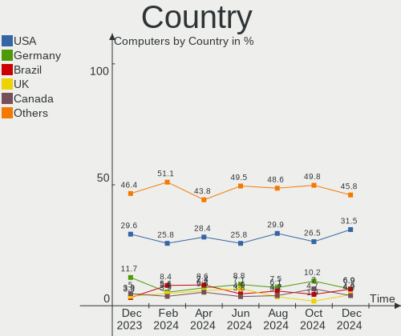
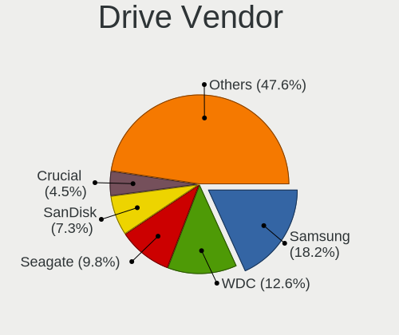
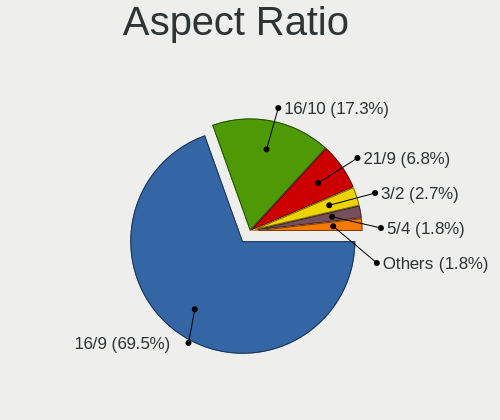

Pop!_OS Hardware Trends
-----------------------

A project to identify most popular hardware characteristics and track their change
over time based on data collected by Pop!_OS users at https://Linux-Hardware.org.

Anyone can contribute to the study by uploading probes of their computers by
the [hw-probe](https://github.com/linuxhw/hw-probe) tool:

    sudo -E hw-probe -all -upload

This is a report for all computer types. See also reports for [desktops](/Dist/Pop!_OS/Desktop/README.md) and [notebooks](/Dist/Pop!_OS/Notebook/README.md).

Full-feature report is available here: https://linux-hardware.org/?view=trends

Period: Feb, 2021.

Contents
--------

- [ OS                       ](#os)
- [ OS Family                ](#os-family)
- [ Kernel                   ](#kernel)
- [ Kernel Family            ](#kernel-family)
- [ Kernel Major Ver.        ](#kernel-major-ver)
- [ Arch                     ](#arch)
- [ DE                       ](#de)
- [ Display Server           ](#display-server)
- [ Display Manager          ](#display-manager)
- [ OS Lang                  ](#os-lang)
- [ Boot Mode                ](#boot-mode)
- [ Filesystem               ](#filesystem)
- [ Part. scheme             ](#part-scheme)
- [ Dual Boot with Linux/BSD ](#dual-boot-with-linux/bsd)
- [ Dual Boot (Win)          ](#dual-boot-win)
- [ Country                  ](#country)
- [ City                     ](#city)
- [ Vendor                   ](#vendor)
- [ Model                    ](#model)
- [ Model Family             ](#model-family)
- [ MFG Year                 ](#mfg-year)
- [ Form Factor              ](#form-factor)
- [ Secure Boot              ](#secure-boot)
- [ Coreboot                 ](#coreboot)
- [ RAM Size                 ](#ram-size)
- [ RAM Used                 ](#ram-used)
- [ Has CD-ROM               ](#has-cd-rom)
- [ Total Drives             ](#total-drives)
- [ Has Ethernet             ](#has-ethernet)
- [ Drive Vendor             ](#drive-vendor)
- [ Drive Model              ](#drive-model)
- [ HDD Vendor               ](#hdd-vendor)
- [ SSD Vendor               ](#ssd-vendor)
- [ Drive Kind               ](#drive-kind)
- [ Drive Connector          ](#drive-connector)
- [ Drive Size               ](#drive-size)
- [ Space Total              ](#space-total)
- [ Space Used               ](#space-used)
- [ Malfunc. Drives          ](#malfunc-drives)
- [ Malfunc. Drive Vendor    ](#malfunc-drive-vendor)
- [ Malfunc. HDD Vendor      ](#malfunc-hdd-vendor)
- [ Malfunc. Drive Kind      ](#malfunc-drive-kind)
- [ Failed Drives            ](#failed-drives)
- [ Failed Drive Vendor      ](#failed-drive-vendor)
- [ Drive Status             ](#drive-status)
- [ Storage Vendor           ](#storage-vendor)
- [ Storage Model            ](#storage-model)
- [ Storage Kind             ](#storage-kind)
- [ CPU Vendor               ](#cpu-vendor)
- [ CPU Model                ](#cpu-model)
- [ CPU Model Family         ](#cpu-model-family)
- [ CPU Cores                ](#cpu-cores)
- [ CPU Sockets              ](#cpu-sockets)
- [ CPU Threads              ](#cpu-threads)
- [ CPU Op-Modes             ](#cpu-op-modes)
- [ CPU Microcode            ](#cpu-microcode)
- [ CPU Microarch            ](#cpu-microarch)
- [ GPU Vendor               ](#gpu-vendor)
- [ GPU Model                ](#gpu-model)
- [ GPU Combo                ](#gpu-combo)
- [ GPU Driver               ](#gpu-driver)
- [ GPU Memory               ](#gpu-memory)
- [ Monitor Vendor           ](#monitor-vendor)
- [ Monitor Model            ](#monitor-model)
- [ Monitor Resolution       ](#monitor-resolution)
- [ Monitor Diagonal         ](#monitor-diagonal)
- [ Monitor Width            ](#monitor-width)
- [ Aspect Ratio             ](#aspect-ratio)
- [ Monitor Area             ](#monitor-area)
- [ Pixel Density            ](#pixel-density)
- [ Multiple Monitors        ](#multiple-monitors)
- [ Net Controller Vendor    ](#net-controller-vendor)
- [ Net Controller Model     ](#net-controller-model)
- [ Wireless Vendor          ](#wireless-vendor)
- [ Wireless Model           ](#wireless-model)
- [ Ethernet Vendor          ](#ethernet-vendor)
- [ Ethernet Model           ](#ethernet-model)
- [ Net Controller Kind      ](#net-controller-kind)
- [ Used Controller          ](#used-controller)
- [ NICs                     ](#nics)
- [ Memory Vendor            ](#memory-vendor)
- [ Memory Model             ](#memory-model)
- [ Memory Kind              ](#memory-kind)
- [ Memory Form Factor       ](#memory-form-factor)
- [ Memory Size              ](#memory-size)
- [ Memory Speed             ](#memory-speed)
- [ Sound Vendor             ](#sound-vendor)
- [ Sound Model              ](#sound-model)
- [ Camera Vendor            ](#camera-vendor)
- [ Camera Model             ](#camera-model)
- [ Fingerprint Vendor       ](#fingerprint-vendor)
- [ Fingerprint Model        ](#fingerprint-model)
- [ Chipcard Vendor          ](#chipcard-vendor)
- [ Chipcard Model           ](#chipcard-model)
- [ Printer Vendor           ](#printer-vendor)
- [ Printer Model            ](#printer-model)
- [ Scanner Vendor           ](#scanner-vendor)
- [ Scanner Model            ](#scanner-model)
- [ Bluetooth Vendor         ](#bluetooth-vendor)
- [ Bluetooth Model          ](#bluetooth-model)
- [ Unsupported Devices      ](#unsupported-devices)
- [ Unsupported Device Types ](#unsupported-device-types)

OS
--

Installed operating systems

| Name          | Computers | Percent |
|---------------|-----------|---------|
| Pop!_OS 20.10 | 214       | 81.37%  |
| Pop!_OS 20.04 | 49        | 18.63%  |

OS Family
---------

OS without a version

| Name    | Computers | Percent |
|---------|-----------|---------|
| Pop!_OS | 263       | 100%    |

Kernel
------

Version of the Linux kernel

| Version                  | Computers | Percent |
|--------------------------|-----------|---------|
| 5.8.0-7642-generic       | 199       | 75.67%  |
| 5.8.0-7630-generic       | 53        | 20.15%  |
| 5.4.0-7642-generic       | 3         | 1.14%   |
| 5.11.0-051100-generic    | 2         | 0.76%   |
| 5.8.11-050811-generic    | 1         | 0.38%   |
| 5.4.0-7634-generic       | 1         | 0.38%   |
| 5.11.0-051100rc3-generic | 1         | 0.38%   |
| 5.10.16-xanmod1          | 1         | 0.38%   |
| 5.10.13-051013-generic   | 1         | 0.38%   |
| 5.10.0                   | 1         | 0.38%   |

Kernel Family
-------------

Linux kernel without a distro release

| Version | Computers | Percent |
|---------|-----------|---------|
| 5.8.0   | 252       | 95.82%  |
| 5.4.0   | 4         | 1.52%   |
| 5.11.0  | 3         | 1.14%   |
| 5.8.11  | 1         | 0.38%   |
| 5.10.16 | 1         | 0.38%   |
| 5.10.13 | 1         | 0.38%   |
| 5.10.0  | 1         | 0.38%   |

Kernel Major Ver.
-----------------

Linux kernel major version

| Version | Computers | Percent |
|---------|-----------|---------|
| 5.8     | 253       | 96.2%   |
| 5.4     | 4         | 1.52%   |
| 5.11    | 3         | 1.14%   |
| 5.10    | 3         | 1.14%   |

Arch
----

OS architecture (x86_64, i586, etc.)

| Name   | Computers | Percent |
|--------|-----------|---------|
| x86_64 | 263       | 100%    |

DE
--

Desktop Environment

| Name       | Computers | Percent |
|------------|-----------|---------|
| GNOME      | 251       | 95.44%  |
| KDE        | 3         | 1.14%   |
| XFCE       | 2         | 0.76%   |
| X-Cinnamon | 2         | 0.76%   |
| MATE       | 1         | 0.38%   |
| LXQt       | 1         | 0.38%   |
| KDE5       | 1         | 0.38%   |
| i3         | 1         | 0.38%   |
| Unknown    | 1         | 0.38%   |

Display Server
--------------

X11 or Wayland

| Name    | Computers | Percent |
|---------|-----------|---------|
| X11     | 257       | 97.72%  |
| Wayland | 4         | 1.52%   |
| Tty     | 1         | 0.38%   |
| Unknown | 1         | 0.38%   |

Display Manager
---------------

SDDM, LightDM, etc.

| Name    | Computers | Percent |
|---------|-----------|---------|
| Unknown | 227       | 86.31%  |
| GDM     | 36        | 13.69%  |

OS Lang
-------

Language

| Lang    | Computers | Percent |
|---------|-----------|---------|
| en_US   | 159       | 60.46%  |
| en_GB   | 24        | 9.13%   |
| de_DE   | 16        | 6.08%   |
| pt_BR   | 15        | 5.7%    |
| es_ES   | 9         | 3.42%   |
| C       | 6         | 2.28%   |
| it_IT   | 5         | 1.9%    |
| en_CA   | 5         | 1.9%    |
| fr_FR   | 4         | 1.52%   |
| en_AU   | 4         | 1.52%   |
| sv_SE   | 3         | 1.14%   |
| ru_RU   | 3         | 1.14%   |
| pt_PT   | 3         | 1.14%   |
| pl_PL   | 1         | 0.38%   |
| nl_NL   | 1         | 0.38%   |
| nb_NO   | 1         | 0.38%   |
| hu_HU   | 1         | 0.38%   |
| fi_FI   | 1         | 0.38%   |
| da_DK   | 1         | 0.38%   |
| Unknown | 1         | 0.38%   |

Boot Mode
---------

EFI or BIOS

| Mode | Computers | Percent |
|------|-----------|---------|
| BIOS | 236       | 89.73%  |
| EFI  | 27        | 10.27%  |

Filesystem
----------

Type of filesystem

| Type  | Computers | Percent |
|-------|-----------|---------|
| Ext4  | 256       | 97.34%  |
| Btrfs | 7         | 2.66%   |

Part. scheme
------------

Scheme of partitioning

| Type    | Computers | Percent |
|---------|-----------|---------|
| Unknown | 228       | 86.69%  |
| GPT     | 27        | 10.27%  |
| MBR     | 8         | 3.04%   |

Dual Boot with Linux/BSD
------------------------

Hosting more than one Linux/BSD

| Dual boot | Computers | Percent |
|-----------|-----------|---------|
| No        | 259       | 98.48%  |
| Yes       | 4         | 1.52%   |

Dual Boot (Win)
---------------

Hosting Linux and Windows

| Dual boot | Computers | Percent |
|-----------|-----------|---------|
| No        | 251       | 95.44%  |
| Yes       | 12        | 4.56%   |

Country
-------

Geographic location (country)

| Country              | Computers | Percent |
|----------------------|-----------|---------|
| USA                  | 79        | 30.04%  |
| Brazil               | 21        | 7.98%   |
| UK                   | 18        | 6.84%   |
| Germany              | 18        | 6.84%   |
| India                | 10        | 3.8%    |
| Canada               | 10        | 3.8%    |
| Italy                | 7         | 2.66%   |
| Sweden               | 6         | 2.28%   |
| Spain                | 6         | 2.28%   |
| South Africa         | 6         | 2.28%   |
| Netherlands          | 6         | 2.28%   |
| Romania              | 5         | 1.9%    |
| Portugal             | 5         | 1.9%    |
| France               | 5         | 1.9%    |
| Poland               | 4         | 1.52%   |
| Bulgaria             | 4         | 1.52%   |
| Australia            | 4         | 1.52%   |
| Switzerland          | 3         | 1.14%   |
| Philippines          | 3         | 1.14%   |
| Russia               | 2         | 0.76%   |
| Norway               | 2         | 0.76%   |
| New Zealand          | 2         | 0.76%   |
| Mexico               | 2         | 0.76%   |
| Greece               | 2         | 0.76%   |
| Egypt                | 2         | 0.76%   |
| Cyprus               | 2         | 0.76%   |
| Belgium              | 2         | 0.76%   |
| Zambia               | 1         | 0.38%   |
| Vietnam              | 1         | 0.38%   |
| Ukraine              | 1         | 0.38%   |
| Thailand             | 1         | 0.38%   |
| Slovakia             | 1         | 0.38%   |
| Serbia               | 1         | 0.38%   |
| Saudi Arabia         | 1         | 0.38%   |
| Puerto Rico          | 1         | 0.38%   |
| Paraguay             | 1         | 0.38%   |
| Pakistan             | 1         | 0.38%   |
| Morocco              | 1         | 0.38%   |
| Moldova, Republic of | 1         | 0.38%   |
| Malaysia             | 1         | 0.38%   |
| Lithuania            | 1         | 0.38%   |
| Israel               | 1         | 0.38%   |
| Ireland              | 1         | 0.38%   |
| Indonesia            | 1         | 0.38%   |
| Hungary              | 1         | 0.38%   |
| Hong Kong            | 1         | 0.38%   |
| Finland              | 1         | 0.38%   |
| Denmark              | 1         | 0.38%   |
| Czech Republic       | 1         | 0.38%   |
| Croatia              | 1         | 0.38%   |
| Colombia             | 1         | 0.38%   |
| Bahrain              | 1         | 0.38%   |
| Austria              | 1         | 0.38%   |
| Argentina            | 1         | 0.38%   |

City
----

Geographic location (city)

| City                  | Computers | Percent |
|-----------------------|-----------|---------|
| New Delhi             | 4         | 1.52%   |
| Sofia                 | 3         | 1.14%   |
| Longmont              | 3         | 1.14%   |
| Cape Town             | 3         | 1.14%   |
| Brasília             | 3         | 1.14%   |
| Valencia              | 2         | 0.76%   |
| Untereisesheim        | 2         | 0.76%   |
| Toccoa                | 2         | 0.76%   |
| Quezon City           | 2         | 0.76%   |
| Pretoria              | 2         | 0.76%   |
| Porto Alegre          | 2         | 0.76%   |
| Minneapolis           | 2         | 0.76%   |
| Miami                 | 2         | 0.76%   |
| Lisbon                | 2         | 0.76%   |
| Jacksonville          | 2         | 0.76%   |
| Houston               | 2         | 0.76%   |
| Hamburg               | 2         | 0.76%   |
| Denver                | 2         | 0.76%   |
| Delhi                 | 2         | 0.76%   |
| Columbus              | 2         | 0.76%   |
| Cairo                 | 2         | 0.76%   |
| Bucharest             | 2         | 0.76%   |
| Berlin                | 2         | 0.76%   |
| Baia Mare             | 2         | 0.76%   |
| Ålesund              | 1         | 0.38%   |
| Zurich                | 1         | 0.38%   |
| Zele                  | 1         | 0.38%   |
| Zeiskam               | 1         | 0.38%   |
| Zanesville            | 1         | 0.38%   |
| Zagreb                | 1         | 0.38%   |
| Yeovil                | 1         | 0.38%   |
| Washington            | 1         | 0.38%   |
| Warrington            | 1         | 0.38%   |
| Warrensburg           | 1         | 0.38%   |
| Wallenstein           | 1         | 0.38%   |
| Wake Forest           | 1         | 0.38%   |
| Wageningen            | 1         | 0.38%   |
| Voluntari             | 1         | 0.38%   |
| Vienna                | 1         | 0.38%   |
| Varna                 | 1         | 0.38%   |
| Uberlândia           | 1         | 0.38%   |
| Truth or Consequences | 1         | 0.38%   |
| Trussville            | 1         | 0.38%   |
| Trondheim             | 1         | 0.38%   |
| Trivandrum            | 1         | 0.38%   |
| Torre del Mar         | 1         | 0.38%   |
| Torre del Greco       | 1         | 0.38%   |
| Toronto               | 1         | 0.38%   |
| Tigery                | 1         | 0.38%   |
| Thessaloniki          | 1         | 0.38%   |
| The Hague             | 1         | 0.38%   |
| Tauranga              | 1         | 0.38%   |
| Taguig                | 1         | 0.38%   |
| São Paulo            | 1         | 0.38%   |
| Szeged                | 1         | 0.38%   |
| Sydney                | 1         | 0.38%   |
| Stockholm             | 1         | 0.38%   |
| Stockbridge           | 1         | 0.38%   |
| Springfield           | 1         | 0.38%   |
| Skanes Fagerhult      | 1         | 0.38%   |

Vendor
------

Motherboard manufacturer

| Name                           | Computers | Percent |
|--------------------------------|-----------|---------|
| ASUSTek Computer               | 46        | 17.49%  |
| Dell                           | 32        | 12.17%  |
| Lenovo                         | 31        | 11.79%  |
| Hewlett-Packard                | 30        | 11.41%  |
| MSI                            | 24        | 9.13%   |
| Gigabyte Technology            | 24        | 9.13%   |
| Apple                          | 13        | 4.94%   |
| Acer                           | 11        | 4.18%   |
| ASRock                         | 9         | 3.42%   |
| System76                       | 8         | 3.04%   |
| Intel                          | 6         | 2.28%   |
| Samsung Electronics            | 2         | 0.76%   |
| PC Specialist                  | 2         | 0.76%   |
| Microsoft                      | 2         | 0.76%   |
| Alienware                      | 2         | 0.76%   |
| TUXEDO                         | 1         | 0.38%   |
| Toshiba                        | 1         | 0.38%   |
| Sony                           | 1         | 0.38%   |
| Pegatron                       | 1         | 0.38%   |
| Metabox                        | 1         | 0.38%   |
| Medion                         | 1         | 0.38%   |
| Matsushita Electric Industrial | 1         | 0.38%   |
| JOOYON                         | 1         | 0.38%   |
| HUAWEI                         | 1         | 0.38%   |
| Google                         | 1         | 0.38%   |
| Fusion5                        | 1         | 0.38%   |
| Fujitsu Siemens                | 1         | 0.38%   |
| Fujitsu                        | 1         | 0.38%   |
| Foxconn                        | 1         | 0.38%   |
| ECS                            | 1         | 0.38%   |
| Compal                         | 1         | 0.38%   |
| Clevo                          | 1         | 0.38%   |
| CAPTIVA                        | 1         | 0.38%   |
| BESSTAR Tech                   | 1         | 0.38%   |
| AMI                            | 1         | 0.38%   |
| Unknown                        | 1         | 0.38%   |

Model
-----

Motherboard model

| Name                                        | Computers | Percent |
|---------------------------------------------|-----------|---------|
| Gigabyte A320M-S2H                          | 3         | 1.14%   |
| ASUS TUF GAMING X570-PLUS                   | 3         | 1.14%   |
| System76 Oryx Pro                           | 2         | 0.76%   |
| System76 Lemur Pro                          | 2         | 0.76%   |
| HP 620                                      | 2         | 0.76%   |
| ASUS VivoBook_ASUSLaptop X509DA_M509DA      | 2         | 0.76%   |
| ASUS TUF Gaming FX505DV_FX505DV             | 2         | 0.76%   |
| ASUS P8Z68-V                                | 2         | 0.76%   |
| ASUS All Series                             | 2         | 0.76%   |
| Acer Aspire E1-571G                         | 2         | 0.76%   |
| Unknown                                     | 2         | 0.76%   |
| TUXEDO InfinityBook S 14 v5                 | 1         | 0.38%   |
| Toshiba Satellite S50t-B                    | 1         | 0.38%   |
| System76 Gazelle Professional               | 1         | 0.38%   |
| System76 Galago UltraPro                    | 1         | 0.38%   |
| System76 Galago Pro                         | 1         | 0.38%   |
| System76 Darter Pro                         | 1         | 0.38%   |
| Sony VPCF121FX                              | 1         | 0.38%   |
| Samsung R519/R719                           | 1         | 0.38%   |
| Samsung 270E5K/270E5Q/271E5K/2570EK         | 1         | 0.38%   |
| Pegatron 220-1150xt                         | 1         | 0.38%   |
| PC Specialist NS50MU                        | 1         | 0.38%   |
| PC Specialist N150CU                        | 1         | 0.38%   |
| MSI p7-1447c                                | 1         | 0.38%   |
| MSI MS-7C82                                 | 1         | 0.38%   |
| MSI MS-7C35                                 | 1         | 0.38%   |
| MSI MS-7C02                                 | 1         | 0.38%   |
| MSI MS-7B89                                 | 1         | 0.38%   |
| MSI MS-7B86                                 | 1         | 0.38%   |
| MSI MS-7B85                                 | 1         | 0.38%   |
| MSI MS-7B22                                 | 1         | 0.38%   |
| MSI MS-7B17                                 | 1         | 0.38%   |
| MSI MS-7A67                                 | 1         | 0.38%   |
| MSI MS-7A40                                 | 1         | 0.38%   |
| MSI MS-7A38                                 | 1         | 0.38%   |
| MSI MS-7918                                 | 1         | 0.38%   |
| MSI MS-7885                                 | 1         | 0.38%   |
| MSI MS-7821                                 | 1         | 0.38%   |
| MSI MS-7721                                 | 1         | 0.38%   |
| MSI MS-7681                                 | 1         | 0.38%   |
| MSI MS-7592                                 | 1         | 0.38%   |
| MSI GS65 Stealth Thin 8RE                   | 1         | 0.38%   |
| MSI GL62 7QF                                | 1         | 0.38%   |
| MSI GF65 Thin 10UE                          | 1         | 0.38%   |
| MSI GF63 Thin 9SCX                          | 1         | 0.38%   |
| MSI GF63 Thin 9RCX                          | 1         | 0.38%   |
| MSI GE62 6QF                                | 1         | 0.38%   |
| Microsoft Surface Pro 4                     | 1         | 0.38%   |
| Microsoft Surface Book                      | 1         | 0.38%   |
| Metabox NP50DE                              | 1         | 0.38%   |
| Medion X782X                                | 1         | 0.38%   |
| Matsushita Electric Industrial CF-30FQL55AM | 1         | 0.38%   |
| Lenovo Z710 20250                           | 1         | 0.38%   |
| Lenovo Yoga 520-14IKB 80YM                  | 1         | 0.38%   |
| Lenovo ThinkPad Yoga 11e 5th Gen 20LM0000UK | 1         | 0.38%   |
| Lenovo ThinkPad X230 2325SYU                | 1         | 0.38%   |
| Lenovo ThinkPad X200s 7470AW8               | 1         | 0.38%   |
| Lenovo ThinkPad X1 Yoga 4th 20QGS2P700      | 1         | 0.38%   |
| Lenovo ThinkPad X1 Yoga 3rd 20LES40B0R      | 1         | 0.38%   |
| Lenovo ThinkPad X1 Extreme Gen 3 20TK001EUS | 1         | 0.38%   |

Model Family
------------

Motherboard model prefix

| Name                 | Computers | Percent |
|----------------------|-----------|---------|
| Lenovo ThinkPad      | 15        | 5.7%    |
| Dell Inspiron        | 12        | 4.56%   |
| Acer Aspire          | 10        | 3.8%    |
| ASUS TUF             | 7         | 2.66%   |
| Lenovo IdeaPad       | 6         | 2.28%   |
| HP Pavilion          | 6         | 2.28%   |
| Dell XPS             | 6         | 2.28%   |
| ASUS VivoBook        | 6         | 2.28%   |
| Dell OptiPlex        | 5         | 1.9%    |
| HP Compaq            | 4         | 1.52%   |
| ASUS ROG             | 4         | 1.52%   |
| ASUS PRIME           | 4         | 1.52%   |
| Gigabyte A320M-S2H   | 3         | 1.14%   |
| Dell Precision       | 3         | 1.14%   |
| System76 Oryx        | 2         | 0.76%   |
| System76 Lemur       | 2         | 0.76%   |
| System76 Galago      | 2         | 0.76%   |
| MSI GF63             | 2         | 0.76%   |
| Microsoft Surface    | 2         | 0.76%   |
| Lenovo Legion        | 2         | 0.76%   |
| HP ProDesk           | 2         | 0.76%   |
| HP ProBook           | 2         | 0.76%   |
| HP EliteBook         | 2         | 0.76%   |
| HP 620               | 2         | 0.76%   |
| Gigabyte X570        | 2         | 0.76%   |
| Gigabyte B450        | 2         | 0.76%   |
| Dell Vostro          | 2         | 0.76%   |
| Dell Latitude        | 2         | 0.76%   |
| ASUS SABERTOOTH      | 2         | 0.76%   |
| ASUS P8Z68-V         | 2         | 0.76%   |
| ASUS All             | 2         | 0.76%   |
| Apple MacBookPro9    | 2         | 0.76%   |
| Unknown              | 2         | 0.76%   |
| TUXEDO InfinityBook  | 1         | 0.38%   |
| Toshiba Satellite    | 1         | 0.38%   |
| System76 Gazelle     | 1         | 0.38%   |
| System76 Darter      | 1         | 0.38%   |
| Sony VPCF121FX       | 1         | 0.38%   |
| Samsung R519         | 1         | 0.38%   |
| Samsung 270E5K       | 1         | 0.38%   |
| Pegatron 220-1150xt  | 1         | 0.38%   |
| PC Specialist NS50MU | 1         | 0.38%   |
| PC Specialist N150CU | 1         | 0.38%   |
| MSI p7-1447c         | 1         | 0.38%   |
| MSI MS-7C82          | 1         | 0.38%   |
| MSI MS-7C35          | 1         | 0.38%   |
| MSI MS-7C02          | 1         | 0.38%   |
| MSI MS-7B89          | 1         | 0.38%   |
| MSI MS-7B86          | 1         | 0.38%   |
| MSI MS-7B85          | 1         | 0.38%   |
| MSI MS-7B22          | 1         | 0.38%   |
| MSI MS-7B17          | 1         | 0.38%   |
| MSI MS-7A67          | 1         | 0.38%   |
| MSI MS-7A40          | 1         | 0.38%   |
| MSI MS-7A38          | 1         | 0.38%   |
| MSI MS-7918          | 1         | 0.38%   |
| MSI MS-7885          | 1         | 0.38%   |
| MSI MS-7821          | 1         | 0.38%   |
| MSI MS-7721          | 1         | 0.38%   |
| MSI MS-7681          | 1         | 0.38%   |

MFG Year
--------

Motherboard manufacture year

| Year | Computers | Percent |
|------|-----------|---------|
| 2020 | 81        | 30.8%   |
| 2019 | 36        | 13.69%  |
| 2018 | 24        | 9.13%   |
| 2015 | 16        | 6.08%   |
| 2013 | 15        | 5.7%    |
| 2016 | 14        | 5.32%   |
| 2014 | 14        | 5.32%   |
| 2011 | 12        | 4.56%   |
| 2012 | 11        | 4.18%   |
| 2010 | 11        | 4.18%   |
| 2009 | 11        | 4.18%   |
| 2021 | 8         | 3.04%   |
| 2017 | 8         | 3.04%   |
| 2008 | 1         | 0.38%   |
| 2007 | 1         | 0.38%   |

Form Factor
-----------

Physical design of the computer

| Name        | Computers | Percent |
|-------------|-----------|---------|
| Notebook    | 136       | 51.71%  |
| Desktop     | 109       | 41.44%  |
| Convertible | 6         | 2.28%   |
| Mini pc     | 6         | 2.28%   |
| Tablet      | 4         | 1.52%   |
| All in one  | 1         | 0.38%   |
| Server      | 1         | 0.38%   |

Secure Boot
-----------

Enabled or disabled

| State    | Computers | Percent |
|----------|-----------|---------|
| Disabled | 263       | 100%    |

Coreboot
--------

Have coreboot on board

| Used | Computers | Percent |
|------|-----------|---------|
| No   | 257       | 97.72%  |
| Yes  | 6         | 2.28%   |

RAM Size
--------

Total RAM memory

| Size in GB      | Computers | Percent |
|-----------------|-----------|---------|
| 16.01-24.0      | 74        | 28.14%  |
| 4.01-8.0        | 58        | 22.05%  |
| 8.01-16.0       | 52        | 19.77%  |
| 3.01-4.0        | 39        | 14.83%  |
| 32.01-64.0      | 27        | 10.27%  |
| 24.01-32.0      | 5         | 1.9%    |
| 64.01-256.0     | 3         | 1.14%   |
| 1.01-2.0        | 3         | 1.14%   |
| More than 256.0 | 1         | 0.38%   |
| 2.01-3.0        | 1         | 0.38%   |

RAM Used
--------

Used RAM memory

| Used GB     | Computers | Percent |
|-------------|-----------|---------|
| 1.01-2.0    | 102       | 38.78%  |
| 2.01-3.0    | 71        | 27%     |
| 4.01-8.0    | 45        | 17.11%  |
| 3.01-4.0    | 33        | 12.55%  |
| 8.01-16.0   | 9         | 3.42%   |
| 16.01-24.0  | 2         | 0.76%   |
| 64.01-256.0 | 1         | 0.38%   |

Has CD-ROM
----------

Has CD-ROM on board

| Presented | Computers | Percent |
|-----------|-----------|---------|
| No        | 170       | 64.64%  |
| Yes       | 93        | 35.36%  |

Total Drives
------------

Number of drives on board

| Drives | Computers | Percent |
|--------|-----------|---------|
| 1      | 143       | 54.37%  |
| 2      | 74        | 28.14%  |
| 3      | 24        | 9.13%   |
| 4      | 16        | 6.08%   |
| 7      | 2         | 0.76%   |
| 5      | 2         | 0.76%   |
| 11     | 1         | 0.38%   |
| 6      | 1         | 0.38%   |

Has Ethernet
------------

Has Ethernet on board

| Presented | Computers | Percent |
|-----------|-----------|---------|
| Yes       | 232       | 88.21%  |
| No        | 31        | 11.79%  |

Drive Vendor
------------

Hard drive vendors

| Vendor                    | Computers | Drives | Percent |
|---------------------------|-----------|--------|---------|
| Samsung Electronics       | 66        | 82     | 15.98%  |
| WDC                       | 63        | 77     | 15.25%  |
| Seagate                   | 57        | 66     | 13.8%   |
| Toshiba                   | 25        | 25     | 6.05%   |
| SanDisk                   | 22        | 22     | 5.33%   |
| Unknown                   | 21        | 23     | 5.08%   |
| Kingston                  | 17        | 17     | 4.12%   |
| Crucial                   | 16        | 19     | 3.87%   |
| Hitachi                   | 14        | 14     | 3.39%   |
| A-DATA Technology         | 11        | 12     | 2.66%   |
| Intel                     | 10        | 11     | 2.42%   |
| Micron Technology         | 9         | 9      | 2.18%   |
| SK Hynix                  | 8         | 8      | 1.94%   |
| HGST                      | 7         | 8      | 1.69%   |
| Silicon Motion            | 6         | 6      | 1.45%   |
| Phison                    | 6         | 9      | 1.45%   |
| Apple                     | 5         | 6      | 1.21%   |
| PNY                       | 4         | 4      | 0.97%   |
| Micron/Crucial Technology | 3         | 3      | 0.73%   |
| Maxtor                    | 3         | 3      | 0.73%   |
| LITEON                    | 3         | 3      | 0.73%   |
| JMicron                   | 3         | 3      | 0.73%   |
| Corsair                   | 3         | 5      | 0.73%   |
| XPG                       | 2         | 2      | 0.48%   |
| KIOXIA-E                  | 2         | 2      | 0.48%   |
| China                     | 2         | 2      | 0.48%   |
| USB                       | 1         | 1      | 0.24%   |
| Transcend                 | 1         | 1      | 0.24%   |
| Team                      | 1         | 1      | 0.24%   |
| T-FORCE                   | 1         | 2      | 0.24%   |
| SuperSSpeed               | 1         | 1      | 0.24%   |
| SPCC                      | 1         | 1      | 0.24%   |
| ROG                       | 1         | 1      | 0.24%   |
| Realtek Semiconductor     | 1         | 1      | 0.24%   |
| Quantum                   | 1         | 1      | 0.24%   |
| PNY USB                   | 1         | 1      | 0.24%   |
| Patriot                   | 1         | 2      | 0.24%   |
| OWC                       | 1         | 4      | 0.24%   |
| OCZ                       | 1         | 1      | 0.24%   |
| Magnetic Data             | 1         | 1      | 0.24%   |
| LITEONIT                  | 1         | 1      | 0.24%   |
| Lenovo                    | 1         | 1      | 0.24%   |
| Kingsand                  | 1         | 1      | 0.24%   |
| INDMEM                    | 1         | 1      | 0.24%   |
| HS-SSD-C100               | 1         | 1      | 0.24%   |
| Hewlett-Packard           | 1         | 1      | 0.24%   |
| Fujitsu                   | 1         | 1      | 0.24%   |
| DOGFISH                   | 1         | 1      | 0.24%   |
| CT480BX5                  | 1         | 1      | 0.24%   |
| Addonics                  | 1         | 1      | 0.24%   |
| ADATA Technology          | 1         | 1      | 0.24%   |

Drive Model
-----------

Hard drive models

| Model                                | Computers | Percent |
|--------------------------------------|-----------|---------|
| Unknown MMC Card  64GB               | 8         | 1.77%   |
| Samsung SSD 860 EVO 250GB            | 6         | 1.32%   |
| Samsung NVMe SSD Drive 500GB         | 6         | 1.32%   |
| Samsung NVMe SSD Drive 1TB           | 6         | 1.32%   |
| WDC WDS240G2G0A-00JH30 240GB SSD     | 5         | 1.1%    |
| Seagate ST500DM002-1BD142 500GB      | 5         | 1.1%    |
| Seagate ST2000DM008-2FR102 2TB       | 5         | 1.1%    |
| Sandisk NVMe SSD Drive 500GB         | 5         | 1.1%    |
| Kingston SA400S37240G 240GB SSD      | 5         | 1.1%    |
| Intel NVMe SSD Drive 1024GB          | 5         | 1.1%    |
| Samsung SSD 970 EVO Plus 250GB       | 4         | 0.88%   |
| Samsung SSD 860 EVO 500GB            | 4         | 0.88%   |
| Crucial CT500MX500SSD1 500GB         | 4         | 0.88%   |
| Toshiba NVMe SSD Drive 256GB         | 3         | 0.66%   |
| SK Hynix NVMe SSD Drive 256GB        | 3         | 0.66%   |
| Silicon Motion NVMe SSD Drive 1024GB | 3         | 0.66%   |
| Seagate ST31000528AS 1TB             | 3         | 0.66%   |
| Seagate ST1000LM035-1RK172 1TB       | 3         | 0.66%   |
| Seagate ST1000LM024 HN-M101MBB 1TB   | 3         | 0.66%   |
| Seagate ST1000DM010-2EP102 1TB       | 3         | 0.66%   |
| Samsung SSD 860 EVO 1TB              | 3         | 0.66%   |
| Samsung SSD 840 PRO Series 256GB     | 3         | 0.66%   |
| Samsung SSD 840 EVO 120GB            | 3         | 0.66%   |
| Micron NVMe SSD Drive 512GB          | 3         | 0.66%   |
| HGST HTS725050A7E630 500GB           | 3         | 0.66%   |
| A-DATA SU635 240GB SSD               | 3         | 0.66%   |
| WDC WDS500G2B0B-00YS70 500GB SSD     | 2         | 0.44%   |
| WDC WDS500G2B0A-00SM50 500GB SSD     | 2         | 0.44%   |
| WDC WDS100T3X0C-00SJG0 1TB           | 2         | 0.44%   |
| WDC WDBNCE5000PNC 500GB SSD          | 2         | 0.44%   |
| WDC WD10SPZX-24Z10 1TB               | 2         | 0.44%   |
| WDC WD10EZEX-08WN4A0 1TB             | 2         | 0.44%   |
| WDC WD10EZEX-00WN4A0 1TB             | 2         | 0.44%   |
| WDC WD10EZEX-00BN5A0 1TB             | 2         | 0.44%   |
| Unknown NVMe SSD Drive 256GB         | 2         | 0.44%   |
| Unknown MMC Card  32GB               | 2         | 0.44%   |
| Unknown MMC Card  128GB              | 2         | 0.44%   |
| Toshiba MQ01ABF050 500GB             | 2         | 0.44%   |
| Toshiba MQ01ABD100 1TB               | 2         | 0.44%   |
| Toshiba HDWD110 1TB                  | 2         | 0.44%   |
| Toshiba DT01ACA100 1TB               | 2         | 0.44%   |
| Seagate ST4000VN008-2DR166 4TB       | 2         | 0.44%   |
| Seagate ST3500413AS 500GB            | 2         | 0.44%   |
| Seagate ST2000LX001-1RG174 2TB       | 2         | 0.44%   |
| Seagate Expansion 500GB              | 2         | 0.44%   |
| SanDisk SDSSDA240G 240GB             | 2         | 0.44%   |
| Sandisk NVMe SSD Drive 256GB         | 2         | 0.44%   |
| Sandisk NVMe SSD Drive 1TB           | 2         | 0.44%   |
| Samsung SSD 850 EVO 500GB            | 2         | 0.44%   |
| Samsung SSD 850 EVO 250GB            | 2         | 0.44%   |
| Samsung SSD 840 EVO 500GB            | 2         | 0.44%   |
| Samsung SSD 840 EVO 250GB            | 2         | 0.44%   |
| Samsung NVMe SSD Drive 512GB         | 2         | 0.44%   |
| Samsung NVMe SSD Drive 256GB         | 2         | 0.44%   |
| Samsung NVMe SSD Drive 250GB         | 2         | 0.44%   |
| PNY CS900 120GB SSD                  | 2         | 0.44%   |
| Phison NVMe SSD Drive 500GB          | 2         | 0.44%   |
| Phison NVMe SSD Drive 1TB            | 2         | 0.44%   |
| Micron/Crucial NVMe SSD Drive 1TB    | 2         | 0.44%   |
| Micron NVMe SSD Drive 256GB          | 2         | 0.44%   |

HDD Vendor
----------

Hard disk drive vendors

| Vendor              | Computers | Drives | Percent |
|---------------------|-----------|--------|---------|
| Seagate             | 55        | 62     | 37.16%  |
| WDC                 | 41        | 48     | 27.7%   |
| Toshiba             | 17        | 17     | 11.49%  |
| Hitachi             | 14        | 14     | 9.46%   |
| Samsung Electronics | 7         | 7      | 4.73%   |
| HGST                | 7         | 8      | 4.73%   |
| MAXTOR              | 3         | 3      | 2.03%   |
| USB                 | 1         | 1      | 0.68%   |
| Quantum             | 1         | 1      | 0.68%   |
| Fujitsu             | 1         | 1      | 0.68%   |
| Apple               | 1         | 1      | 0.68%   |

SSD Vendor
----------

Solid state drive vendors

| Vendor              | Computers | Drives | Percent |
|---------------------|-----------|--------|---------|
| Samsung Electronics | 39        | 43     | 26.17%  |
| WDC                 | 19        | 20     | 12.75%  |
| Crucial             | 16        | 19     | 10.74%  |
| Kingston            | 15        | 15     | 10.07%  |
| SanDisk             | 12        | 12     | 8.05%   |
| A-DATA Technology   | 10        | 11     | 6.71%   |
| PNY                 | 4         | 4      | 2.68%   |
| Apple               | 4         | 4      | 2.68%   |
| Toshiba             | 3         | 3      | 2.01%   |
| Micron Technology   | 3         | 3      | 2.01%   |
| LITEON              | 3         | 3      | 2.01%   |
| KIOXIA-E            | 2         | 2      | 1.34%   |
| Corsair             | 2         | 2      | 1.34%   |
| China               | 2         | 2      | 1.34%   |
| Unknown             | 1         | 1      | 0.67%   |
| Transcend           | 1         | 1      | 0.67%   |
| Team                | 1         | 1      | 0.67%   |
| T-FORCE             | 1         | 1      | 0.67%   |
| SPCC                | 1         | 1      | 0.67%   |
| PNY USB             | 1         | 1      | 0.67%   |
| Patriot             | 1         | 2      | 0.67%   |
| OWC                 | 1         | 4      | 0.67%   |
| OCZ                 | 1         | 1      | 0.67%   |
| LITEONIT            | 1         | 1      | 0.67%   |
| JMicron             | 1         | 1      | 0.67%   |
| Intel               | 1         | 1      | 0.67%   |
| INDMEM              | 1         | 1      | 0.67%   |
| DOGFISH             | 1         | 1      | 0.67%   |
| CT480BX5            | 1         | 1      | 0.67%   |

Drive Kind
----------

HDD or SSD

| Kind    | Computers | Drives | Percent |
|---------|-----------|--------|---------|
| SSD     | 129       | 162    | 34.4%   |
| HDD     | 125       | 163    | 33.33%  |
| NVMe    | 93        | 117    | 24.8%   |
| MMC     | 17        | 18     | 4.53%   |
| Unknown | 11        | 11     | 2.93%   |

Drive Connector
---------------

SATA, SAS, NVMe, etc.

| Type | Computers | Drives | Percent |
|------|-----------|--------|---------|
| SATA | 199       | 314    | 60.49%  |
| NVMe | 93        | 117    | 28.27%  |
| SAS  | 20        | 22     | 6.08%   |
| MMC  | 17        | 18     | 5.17%   |

Drive Size
----------

Size of hard drive

| Size in TB | Computers | Drives | Percent |
|------------|-----------|--------|---------|
| 0.01-0.5   | 155       | 206    | 60.08%  |
| 0.51-1.0   | 76        | 90     | 29.46%  |
| 1.01-2.0   | 14        | 16     | 5.43%   |
| 2.01-3.0   | 5         | 5      | 1.94%   |
| 3.01-4.0   | 4         | 4      | 1.55%   |
| 4.01-10.0  | 3         | 3      | 1.16%   |
| 10.01-20.0 | 1         | 1      | 0.39%   |

Space Total
-----------

Amount of disk space available on the file system

| Size in GB     | Computers | Percent |
|----------------|-----------|---------|
| 101-250        | 75        | 28.52%  |
| 251-500        | 71        | 27%     |
| 501-1000       | 54        | 20.53%  |
| 51-100         | 21        | 7.98%   |
| 1001-2000      | 14        | 5.32%   |
| More than 3000 | 12        | 4.56%   |
| 2001-3000      | 7         | 2.66%   |
| 21-50          | 5         | 1.9%    |
| 1-20           | 3         | 1.14%   |
| Unknown        | 1         | 0.38%   |

Space Used
----------

Amount of used disk space

| Used GB        | Computers | Percent |
|----------------|-----------|---------|
| 1-20           | 118       | 44.87%  |
| 21-50          | 48        | 18.25%  |
| 101-250        | 30        | 11.41%  |
| 51-100         | 26        | 9.89%   |
| 251-500        | 16        | 6.08%   |
| 501-1000       | 11        | 4.18%   |
| More than 3000 | 6         | 2.28%   |
| 1001-2000      | 6         | 2.28%   |
| 2001-3000      | 1         | 0.38%   |
| Unknown        | 1         | 0.38%   |

Malfunc. Drives
---------------

Drive models with a malfunction

| Model                                 | Computers | Drives | Percent |
|---------------------------------------|-----------|--------|---------|
| WDC WD1600BJKT-75F4T0 160GB           | 1         | 1      | 25%     |
| WDC WD15EADS-11P8B1 1TB               | 1         | 1      | 25%     |
| Toshiba MQ02ABD100H 1TB               | 1         | 1      | 25%     |
| Samsung Electronics SSD 860 EVO 500GB | 1         | 2      | 25%     |

Malfunc. Drive Vendor
---------------------

Vendors of faulty drives

| Vendor              | Computers | Drives | Percent |
|---------------------|-----------|--------|---------|
| WDC                 | 2         | 2      | 50%     |
| Toshiba             | 1         | 1      | 25%     |
| Samsung Electronics | 1         | 2      | 25%     |

Malfunc. HDD Vendor
-------------------

Vendors of faulty HDD drives

| Vendor  | Computers | Drives | Percent |
|---------|-----------|--------|---------|
| WDC     | 2         | 2      | 66.67%  |
| Toshiba | 1         | 1      | 33.33%  |

Malfunc. Drive Kind
-------------------

Kinds of faulty drives

| Kind | Computers | Drives | Percent |
|------|-----------|--------|---------|
| HDD  | 3         | 3      | 75%     |
| SSD  | 1         | 2      | 25%     |

Failed Drives
-------------

Failed drive models

Zero info for selected period =(

Failed Drive Vendor
-------------------

Failed drive vendors

Zero info for selected period =(

Drive Status
------------

Number of failed and malfunc. drives

| Status   | Computers | Drives | Percent |
|----------|-----------|--------|---------|
| Detected | 231       | 408    | 85.56%  |
| Works    | 35        | 58     | 12.96%  |
| Malfunc  | 4         | 5      | 1.48%   |

Storage Vendor
--------------

Storage controller vendors

| Vendor                         | Computers | Percent |
|--------------------------------|-----------|---------|
| Intel                          | 168       | 49.12%  |
| AMD                            | 60        | 17.54%  |
| Samsung Electronics            | 29        | 8.48%   |
| Sandisk                        | 16        | 4.68%   |
| SK Hynix                       | 8         | 2.34%   |
| Silicon Motion                 | 7         | 2.05%   |
| Phison Electronics             | 6         | 1.75%   |
| Micron Technology              | 6         | 1.75%   |
| Toshiba America Info Systems   | 5         | 1.46%   |
| Nvidia                         | 5         | 1.46%   |
| JMicron Technology             | 4         | 1.17%   |
| ADATA Technology               | 4         | 1.17%   |
| Solid State Storage Technology | 3         | 0.88%   |
| Micron/Crucial Technology      | 3         | 0.88%   |
| Broadcom / LSI                 | 3         | 0.88%   |
| Seagate Technology             | 2         | 0.58%   |
| Marvell Technology Group       | 2         | 0.58%   |
| LSI Logic / Symbios Logic      | 2         | 0.58%   |
| Kingston Technology Company    | 2         | 0.58%   |
| ASMedia Technology             | 2         | 0.58%   |
| VIA Technologies               | 1         | 0.29%   |
| Realtek Semiconductor          | 1         | 0.29%   |
| Lenovo                         | 1         | 0.29%   |
| Apple                          | 1         | 0.29%   |
| Adaptec                        | 1         | 0.29%   |

Storage Model
-------------

Storage controller models

| Model                                                                            | Computers | Percent |
|----------------------------------------------------------------------------------|-----------|---------|
| AMD FCH SATA Controller [AHCI mode]                                              | 40        | 10.31%  |
| Samsung NVMe SSD Controller SM981/PM981/PM983                                    | 21        | 5.41%   |
| Intel 8 Series/C220 Series Chipset Family 6-port SATA Controller 1 [AHCI mode]   | 14        | 3.61%   |
| Intel 7 Series Chipset Family 6-port SATA Controller [AHCI mode]                 | 13        | 3.35%   |
| AMD 400 Series Chipset SATA Controller                                           | 9         | 2.32%   |
| Intel Q170/Q150/B150/H170/H110/Z170/CM236 Chipset SATA Controller [AHCI Mode]    | 8         | 2.06%   |
| Intel 7 Series/C210 Series Chipset Family 6-port SATA Controller [AHCI mode]     | 8         | 2.06%   |
| AMD SB7x0/SB8x0/SB9x0 IDE Controller                                             | 8         | 2.06%   |
| Sandisk WD Blue SN550 NVMe SSD                                                   | 7         | 1.8%    |
| Intel Sunrise Point-LP SATA Controller [AHCI mode]                               | 7         | 1.8%    |
| Intel SATA Controller [RAID mode]                                                | 7         | 1.8%    |
| Intel 6 Series/C200 Series Chipset Family 6 port Mobile SATA AHCI Controller     | 7         | 1.8%    |
| Intel 200 Series PCH SATA controller [AHCI mode]                                 | 7         | 1.8%    |
| AMD SB7x0/SB8x0/SB9x0 SATA Controller [IDE mode]                                 | 7         | 1.8%    |
| Micron Non-Volatile memory controller                                            | 6         | 1.55%   |
| Intel 8 Series SATA Controller 1 [AHCI mode]                                     | 6         | 1.55%   |
| Silicon Motion SM2263EN/SM2263XT SSD Controller                                  | 5         | 1.29%   |
| Sandisk WD Black SN750 / PC SN730 NVMe SSD                                       | 5         | 1.29%   |
| Intel Wildcat Point-LP SATA Controller [AHCI Mode]                               | 5         | 1.29%   |
| Intel SSD 660P Series                                                            | 5         | 1.29%   |
| Intel NM10/ICH7 Family SATA Controller [IDE mode]                                | 5         | 1.29%   |
| Intel HM170/QM170 Chipset SATA Controller [AHCI Mode]                            | 5         | 1.29%   |
| Intel Comet Lake SATA AHCI Controller                                            | 5         | 1.29%   |
| Intel Cannon Point-LP SATA Controller [AHCI Mode]                                | 5         | 1.29%   |
| Intel Cannon Lake Mobile PCH SATA AHCI Controller                                | 5         | 1.29%   |
| Intel 82801IBM/IEM (ICH9M/ICH9M-E) 4 port SATA Controller [AHCI mode]            | 5         | 1.29%   |
| Intel 82801 Mobile SATA Controller [RAID mode]                                   | 5         | 1.29%   |
| Intel 6 Series/C200 Series Chipset Family 6 port Desktop SATA AHCI Controller    | 5         | 1.29%   |
| AMD SB7x0/SB8x0/SB9x0 SATA Controller [AHCI mode]                                | 5         | 1.29%   |
| SK Hynix Non-Volatile memory controller                                          | 4         | 1.03%   |
| Samsung NVMe SSD Controller SM961/PM961/SM963                                    | 4         | 1.03%   |
| Intel 400 Series Chipset Family SATA AHCI Controller                             | 4         | 1.03%   |
| AMD SATA controller                                                              | 4         | 1.03%   |
| Solid State Storage Non-Volatile memory controller                               | 3         | 0.77%   |
| SK Hynix BC501 NVMe Solid State Drive 512GB                                      | 3         | 0.77%   |
| Sandisk WD Blue SN500 / PC SN520 NVMe SSD                                        | 3         | 0.77%   |
| Phison E16 PCIe4 NVMe Controller                                                 | 3         | 0.77%   |
| Intel Celeron/Pentium Silver Processor SATA Controller                           | 3         | 0.77%   |
| Intel Cannon Lake PCH SATA AHCI Controller                                       | 3         | 0.77%   |
| Intel 9 Series Chipset Family SATA Controller [AHCI Mode]                        | 3         | 0.77%   |
| Intel 82801G (ICH7 Family) IDE Controller                                        | 3         | 0.77%   |
| AMD FCH SATA Controller D                                                        | 3         | 0.77%   |
| Toshiba America Info Systems Toshiba America Info Non-Volatile memory controller | 2         | 0.52%   |
| Toshiba America Info Systems BG3 NVMe SSD Controller                             | 2         | 0.52%   |
| Silicon Motion SM2262/SM2262EN SSD Controller                                    | 2         | 0.52%   |
| Seagate Non-Volatile memory controller                                           | 2         | 0.52%   |
| Samsung Electronics SATA controller                                              | 2         | 0.52%   |
| Phison E12 NVMe Controller                                                       | 2         | 0.52%   |
| Nvidia MCP79 AHCI Controller                                                     | 2         | 0.52%   |
| Micron/Crucial Non-Volatile memory controller                                    | 2         | 0.52%   |
| Kingston Company U-SNS8154P3 NVMe SSD                                            | 2         | 0.52%   |
| JMicron JMB363 SATA/IDE Controller                                               | 2         | 0.52%   |
| JMicron JMB362 SATA Controller                                                   | 2         | 0.52%   |
| Intel Non-Volatile memory controller                                             | 2         | 0.52%   |
| Intel Celeron N3350/Pentium N4200/Atom E3900 Series SATA AHCI Controller         | 2         | 0.52%   |
| Intel 82801JD/DO (ICH10 Family) SATA AHCI Controller                             | 2         | 0.52%   |
| Intel 82801IR/IO/IH (ICH9R/DO/DH) 4 port SATA Controller [IDE mode]              | 2         | 0.52%   |
| Intel 82801I (ICH9 Family) 2 port SATA Controller [IDE mode]                     | 2         | 0.52%   |
| Intel 82801HM/HEM (ICH8M/ICH8M-E) SATA Controller [AHCI mode]                    | 2         | 0.52%   |
| Intel 82801HM/HEM (ICH8M/ICH8M-E) IDE Controller                                 | 2         | 0.52%   |

Storage Kind
------------

Kind of storage controller (IDE, SATA, NVMe, SAS, ...)

| Kind | Computers | Percent |
|------|-----------|---------|
| SATA | 198       | 57.39%  |
| NVMe | 93        | 26.96%  |
| IDE  | 32        | 9.28%   |
| RAID | 17        | 4.93%   |
| SCSI | 3         | 0.87%   |
| SAS  | 2         | 0.58%   |

CPU Vendor
----------

Processor vendors

| Vendor | Computers | Percent |
|--------|-----------|---------|
| Intel  | 195       | 74.14%  |
| AMD    | 68        | 25.86%  |

CPU Model
---------

Processor models

| Model                                         | Computers | Percent |
|-----------------------------------------------|-----------|---------|
| Intel Core i7-8565U CPU @ 1.80GHz             | 4         | 1.52%   |
| Intel Core i7-10510U CPU @ 1.80GHz            | 4         | 1.52%   |
| AMD Ryzen 5 3600 6-Core Processor             | 4         | 1.52%   |
| Intel Core i7-6700HQ CPU @ 2.60GHz            | 3         | 1.14%   |
| Intel Core i7-3770 CPU @ 3.40GHz              | 3         | 1.14%   |
| Intel Core i7-3615QM CPU @ 2.30GHz            | 3         | 1.14%   |
| Intel Core i7-2630QM CPU @ 2.00GHz            | 3         | 1.14%   |
| Intel Core i5-9300H CPU @ 2.40GHz             | 3         | 1.14%   |
| Intel Core i5-7200U CPU @ 2.50GHz             | 3         | 1.14%   |
| Intel Core i5-6500 CPU @ 3.20GHz              | 3         | 1.14%   |
| Intel Atom x5-Z8350 CPU @ 1.44GHz             | 3         | 1.14%   |
| AMD Ryzen 7 3700X 8-Core Processor            | 3         | 1.14%   |
| AMD Ryzen 5 3600X 6-Core Processor            | 3         | 1.14%   |
| AMD Ryzen 5 3500U with Radeon Vega Mobile Gfx | 3         | 1.14%   |
| AMD Ryzen 5 1600 Six-Core Processor           | 3         | 1.14%   |
| AMD Ryzen 3 3200U with Radeon Vega Mobile Gfx | 3         | 1.14%   |
| AMD FX-8350 Eight-Core Processor              | 3         | 1.14%   |
| Intel Pentium Dual-Core CPU T4300 @ 2.10GHz   | 2         | 0.76%   |
| Intel Pentium Dual-Core CPU E5300 @ 2.60GHz   | 2         | 0.76%   |
| Intel Core i7-9750H CPU @ 2.60GHz             | 2         | 0.76%   |
| Intel Core i7-7500U CPU @ 2.70GHz             | 2         | 0.76%   |
| Intel Core i7-6700K CPU @ 4.00GHz             | 2         | 0.76%   |
| Intel Core i7-6700 CPU @ 3.40GHz              | 2         | 0.76%   |
| Intel Core i7-5600U CPU @ 2.60GHz             | 2         | 0.76%   |
| Intel Core i7-5500U CPU @ 2.40GHz             | 2         | 0.76%   |
| Intel Core i7-4810MQ CPU @ 2.80GHz            | 2         | 0.76%   |
| Intel Core i7-4790K CPU @ 4.00GHz             | 2         | 0.76%   |
| Intel Core i7-4720HQ CPU @ 2.60GHz            | 2         | 0.76%   |
| Intel Core i7-4510U CPU @ 2.00GHz             | 2         | 0.76%   |
| Intel Core i7-4500U CPU @ 1.80GHz             | 2         | 0.76%   |
| Intel Core i7-3770K CPU @ 3.50GHz             | 2         | 0.76%   |
| Intel Core i7-3632QM CPU @ 2.20GHz            | 2         | 0.76%   |
| Intel Core i7-2600 CPU @ 3.40GHz              | 2         | 0.76%   |
| Intel Core i7-10750H CPU @ 2.60GHz            | 2         | 0.76%   |
| Intel Core i5-9400F CPU @ 2.90GHz             | 2         | 0.76%   |
| Intel Core i5-9300HF CPU @ 2.40GHz            | 2         | 0.76%   |
| Intel Core i5-8265U CPU @ 1.60GHz             | 2         | 0.76%   |
| Intel Core i5-6300U CPU @ 2.40GHz             | 2         | 0.76%   |
| Intel Core i5-4670K CPU @ 3.40GHz             | 2         | 0.76%   |
| Intel Core i5-4210U CPU @ 1.70GHz             | 2         | 0.76%   |
| Intel Core i5-3570 CPU @ 3.40GHz              | 2         | 0.76%   |
| Intel Core i5-3320M CPU @ 2.60GHz             | 2         | 0.76%   |
| Intel Core i5-3230M CPU @ 2.60GHz             | 2         | 0.76%   |
| Intel Core i5-3210M CPU @ 2.50GHz             | 2         | 0.76%   |
| Intel Core i5-10400 CPU @ 2.90GHz             | 2         | 0.76%   |
| Intel Core i5-10210U CPU @ 1.60GHz            | 2         | 0.76%   |
| Intel Core 2 Duo CPU E8400 @ 3.00GHz          | 2         | 0.76%   |
| Intel Celeron N4020 CPU @ 1.10GHz             | 2         | 0.76%   |
| Intel Celeron CPU N3350 @ 1.10GHz             | 2         | 0.76%   |
| Intel 11th Gen Core i7-1165G7 @ 2.80GHz       | 2         | 0.76%   |
| AMD Ryzen 7 4800H with Radeon Graphics        | 2         | 0.76%   |
| AMD Ryzen 7 2700X Eight-Core Processor        | 2         | 0.76%   |
| AMD Ryzen 5 4600H with Radeon Graphics        | 2         | 0.76%   |
| AMD Ryzen 5 3400G with Radeon Vega Graphics   | 2         | 0.76%   |
| AMD Phenom II X4 955 Processor                | 2         | 0.76%   |
| AMD FX-6300 Six-Core Processor                | 2         | 0.76%   |
| AMD A10-6800K APU with Radeon HD Graphics     | 2         | 0.76%   |
| Intel Xeon CPU X5672 @ 3.20GHz                | 1         | 0.38%   |
| Intel Xeon CPU X3470 @ 2.93GHz                | 1         | 0.38%   |
| Intel Xeon CPU X3430 @ 2.40GHz                | 1         | 0.38%   |

CPU Model Family
----------------

Processor model prefix

| Model                   | Computers | Percent |
|-------------------------|-----------|---------|
| Intel Core i7           | 82        | 31.18%  |
| Intel Core i5           | 60        | 22.81%  |
| AMD Ryzen 5             | 22        | 8.37%   |
| AMD Ryzen 7             | 11        | 4.18%   |
| Intel Core i3           | 10        | 3.8%    |
| Intel Pentium Dual-Core | 9         | 3.42%   |
| Intel Celeron           | 8         | 3.04%   |
| Intel Core 2 Duo        | 7         | 2.66%   |
| AMD FX                  | 6         | 2.28%   |
| Other                   | 5         | 1.9%    |
| Intel Xeon              | 5         | 1.9%    |
| AMD Ryzen 3             | 5         | 1.9%    |
| Intel Atom              | 4         | 1.52%   |
| AMD Phenom II X4        | 4         | 1.52%   |
| AMD A6                  | 4         | 1.52%   |
| AMD A10                 | 4         | 1.52%   |
| AMD Ryzen 9             | 3         | 1.14%   |
| Intel Core 2 Quad       | 2         | 0.76%   |
| Intel Celeron Dual-Core | 2         | 0.76%   |
| AMD A8                  | 2         | 0.76%   |
| Intel Pentium           | 1         | 0.38%   |
| Intel Core m3           | 1         | 0.38%   |
| Intel Core i9           | 1         | 0.38%   |
| AMD Ryzen Threadripper  | 1         | 0.38%   |
| AMD Phenom II X6        | 1         | 0.38%   |
| AMD C-60                | 1         | 0.38%   |
| AMD Athlon 64           | 1         | 0.38%   |
| AMD Athlon              | 1         | 0.38%   |

CPU Cores
---------

Number of processor cores

| Number | Computers | Percent |
|--------|-----------|---------|
| 4      | 122       | 46.39%  |
| 2      | 85        | 32.32%  |
| 6      | 31        | 11.79%  |
| 8      | 14        | 5.32%   |
| 1      | 5         | 1.9%    |
| 12     | 2         | 0.76%   |
| 3      | 2         | 0.76%   |
| 24     | 1         | 0.38%   |
| 16     | 1         | 0.38%   |

CPU Sockets
-----------

Number of sockets

| Number | Computers | Percent |
|--------|-----------|---------|
| 1      | 262       | 99.62%  |
| 2      | 1         | 0.38%   |

CPU Threads
-----------

Threads per core (Hyper-Threading)

| Number | Computers | Percent |
|--------|-----------|---------|
| 2      | 188       | 71.48%  |
| 1      | 75        | 28.52%  |

CPU Op-Modes
------------

CPU Operation Modes (32-bit, 64-bit)

| Op mode        | Computers | Percent |
|----------------|-----------|---------|
| 32-bit, 64-bit | 263       | 100%    |

CPU Microcode
-------------

Microcode number

| Number     | Computers | Percent |
|------------|-----------|---------|
| Unknown    | 224       | 85.17%  |
| 0x306c3    | 5         | 1.9%    |
| 0x906ea    | 3         | 1.14%   |
| 0x806ec    | 3         | 1.14%   |
| 0x1067a    | 3         | 1.14%   |
| 0x906e9    | 2         | 0.76%   |
| 0x806eb    | 2         | 0.76%   |
| 0x806e9    | 2         | 0.76%   |
| 0x706e5    | 2         | 0.76%   |
| 0x08108109 | 2         | 0.76%   |
| 0x06001119 | 2         | 0.76%   |
| 0x906ed    | 1         | 0.38%   |
| 0x806c1    | 1         | 0.38%   |
| 0x506e3    | 1         | 0.38%   |
| 0x506c9    | 1         | 0.38%   |
| 0x40651    | 1         | 0.38%   |
| 0x20655    | 1         | 0.38%   |
| 0x08600106 | 1         | 0.38%   |
| 0x08600104 | 1         | 0.38%   |
| 0x08600103 | 1         | 0.38%   |
| 0x08301039 | 1         | 0.38%   |
| 0x08108102 | 1         | 0.38%   |
| 0x0800820d | 1         | 0.38%   |
| 0x06006705 | 1         | 0.38%   |

CPU Microarch
-------------

Microarchitecture

| Name            | Computers | Percent |
|-----------------|-----------|---------|
| KabyLake        | 48        | 18.25%  |
| IvyBridge       | 26        | 9.89%   |
| Haswell         | 26        | 9.89%   |
| Zen 2           | 21        | 7.98%   |
| Penryn          | 18        | 6.84%   |
| Skylake         | 17        | 6.46%   |
| Zen+            | 15        | 5.7%    |
| SandyBridge     | 15        | 5.7%    |
| Piledriver      | 11        | 4.18%   |
| CometLake       | 9         | 3.42%   |
| Broadwell       | 7         | 2.66%   |
| Silvermont      | 6         | 2.28%   |
| K10             | 5         | 1.9%    |
| Westmere        | 4         | 1.52%   |
| Nehalem         | 4         | 1.52%   |
| Goldmont plus   | 4         | 1.52%   |
| Excavator       | 4         | 1.52%   |
| Zen             | 3         | 1.14%   |
| TigerLake       | 3         | 1.14%   |
| IceLake         | 3         | 1.14%   |
| Core            | 3         | 1.14%   |
| Unknown         | 3         | 1.14%   |
| Puma            | 2         | 0.76%   |
| Goldmont        | 2         | 0.76%   |
| K8 Hammer       | 1         | 0.38%   |
| K8 & K10 hybrid | 1         | 0.38%   |
| Bulldozer       | 1         | 0.38%   |
| Bobcat          | 1         | 0.38%   |

GPU Vendor
----------

Vendors of graphics cards

| Vendor                     | Computers | Percent |
|----------------------------|-----------|---------|
| Intel                      | 142       | 44.79%  |
| Nvidia                     | 110       | 34.7%   |
| AMD                        | 64        | 20.19%  |
| Matrox Electronics Systems | 1         | 0.32%   |

GPU Model
---------

Graphics card models

| Model                                                                                    | Computers | Percent |
|------------------------------------------------------------------------------------------|-----------|---------|
| Intel 3rd Gen Core processor Graphics Controller                                         | 15        | 4.64%   |
| AMD Picasso                                                                              | 10        | 3.1%    |
| Intel 4th Gen Core Processor Integrated Graphics Controller                              | 8         | 2.48%   |
| Intel 2nd Generation Core Processor Family Integrated Graphics Controller                | 8         | 2.48%   |
| Intel WhiskeyLake-U GT2 [UHD Graphics 620]                                               | 7         | 2.17%   |
| Intel HD Graphics 530                                                                    | 7         | 2.17%   |
| Intel CometLake-U GT2 [UHD Graphics]                                                     | 7         | 2.17%   |
| Intel HD Graphics 620                                                                    | 6         | 1.86%   |
| Intel Haswell-ULT Integrated Graphics Controller                                         | 6         | 1.86%   |
| Intel CoffeeLake-H GT2 [UHD Graphics 630]                                                | 6         | 1.86%   |
| AMD Ellesmere [Radeon RX 470/480/570/570X/580/580X/590]                                  | 6         | 1.86%   |
| Nvidia GP106 [GeForce GTX 1060 6GB]                                                      | 5         | 1.55%   |
| Intel Mobile 4 Series Chipset Integrated Graphics Controller                             | 5         | 1.55%   |
| Intel HD Graphics 630                                                                    | 5         | 1.55%   |
| Intel HD Graphics 5500                                                                   | 5         | 1.55%   |
| Intel CometLake-H GT2 [UHD Graphics]                                                     | 5         | 1.55%   |
| Intel Atom/Celeron/Pentium Processor x5-E8000/J3xxx/N3xxx Integrated Graphics Controller | 5         | 1.55%   |
| Intel 4 Series Chipset Integrated Graphics Controller                                    | 5         | 1.55%   |
| AMD Renoir                                                                               | 5         | 1.55%   |
| AMD Navi 10 [Radeon RX 5600 OEM/5600 XT / 5700/5700 XT]                                  | 5         | 1.55%   |
| Nvidia TU117M [GeForce GTX 1650 Ti Mobile]                                               | 4         | 1.24%   |
| Nvidia TU116 [GeForce GTX 1660 SUPER]                                                    | 4         | 1.24%   |
| Nvidia GT218 [GeForce 210]                                                               | 4         | 1.24%   |
| Nvidia GP104 [GeForce GTX 1080]                                                          | 4         | 1.24%   |
| Nvidia GK208B [GeForce GT 710]                                                           | 4         | 1.24%   |
| Intel Xeon E3-1200 v2/3rd Gen Core processor Graphics Controller                         | 4         | 1.24%   |
| Intel GeminiLake [UHD Graphics 600]                                                      | 4         | 1.24%   |
| Nvidia TU106 [GeForce RTX 2060 SUPER]                                                    | 3         | 0.93%   |
| Nvidia TU104 [GeForce RTX 2070 SUPER]                                                    | 3         | 0.93%   |
| Nvidia GM204 [GeForce GTX 970]                                                           | 3         | 0.93%   |
| Intel Xeon E3-1200 v3/4th Gen Core Processor Integrated Graphics Controller              | 3         | 0.93%   |
| Intel UHD Graphics 620                                                                   | 3         | 0.93%   |
| Intel TigerLake GT2 [Iris Xe Graphics]                                                   | 3         | 0.93%   |
| Intel Skylake GT2 [HD Graphics 520]                                                      | 3         | 0.93%   |
| Nvidia TU117M                                                                            | 2         | 0.62%   |
| Nvidia TU117 [GeForce GTX 1650]                                                          | 2         | 0.62%   |
| Nvidia TU106 [GeForce RTX 2060 Rev. A]                                                   | 2         | 0.62%   |
| Nvidia GT218M [GeForce 310M]                                                             | 2         | 0.62%   |
| Nvidia GP108 [GeForce GT 1030]                                                           | 2         | 0.62%   |
| Nvidia GP107 [GeForce GTX 1050]                                                          | 2         | 0.62%   |
| Nvidia GM204M [GeForce GTX 970M]                                                         | 2         | 0.62%   |
| Nvidia GM108M [GeForce 840M]                                                             | 2         | 0.62%   |
| Nvidia GM107M [GeForce GTX 960M]                                                         | 2         | 0.62%   |
| Nvidia GK107M [GeForce GT 650M Mac Edition]                                              | 2         | 0.62%   |
| Nvidia GF117M [GeForce 610M/710M/810M/820M / GT 620M/625M/630M/720M]                     | 2         | 0.62%   |
| Intel HD Graphics 615                                                                    | 2         | 0.62%   |
| Intel HD Graphics 500                                                                    | 2         | 0.62%   |
| Intel Core Processor Integrated Graphics Controller                                      | 2         | 0.62%   |
| AMD Wani [Radeon R5/R6/R7 Graphics]                                                      | 2         | 0.62%   |
| AMD Tahiti PRO [Radeon HD 7950/8950 OEM / R9 280]                                        | 2         | 0.62%   |
| AMD Sun XT [Radeon HD 8670A/8670M/8690M / R5 M330 / M430 / Radeon 520 Mobile]            | 2         | 0.62%   |
| AMD Stoney [Radeon R2/R3/R4/R5 Graphics]                                                 | 2         | 0.62%   |
| AMD Navi 14 [Radeon RX 5500/5500M / Pro 5500M]                                           | 2         | 0.62%   |
| AMD Mullins [Radeon R4/R5 Graphics]                                                      | 2         | 0.62%   |
| AMD Lexa PRO [Radeon 540/540X/550/550X / RX 540X/550/550X]                               | 2         | 0.62%   |
| Nvidia TU117M [GeForce GTX 1650 Mobile / Max-Q]                                          | 1         | 0.31%   |
| Nvidia TU116M [GeForce GTX 1660 Ti Mobile]                                               | 1         | 0.31%   |
| Nvidia TU116 [GeForce GTX 1660]                                                          | 1         | 0.31%   |
| Nvidia TU116 [GeForce GTX 1660 Ti]                                                       | 1         | 0.31%   |
| Nvidia TU116 [GeForce GTX 1650]                                                          | 1         | 0.31%   |

GPU Combo
---------

Combinations of graphics cards

| Name           | Computers | Percent |
|----------------|-----------|---------|
| 1 x Intel      | 98        | 37.26%  |
| 1 x Nvidia     | 67        | 25.48%  |
| 1 x AMD        | 46        | 17.49%  |
| Intel + Nvidia | 32        | 12.17%  |
| Intel + AMD    | 8         | 3.04%   |
| AMD + Nvidia   | 7         | 2.66%   |
| 2 x AMD        | 3         | 1.14%   |
| 2 x Nvidia     | 1         | 0.38%   |
| 1 x Matrox     | 1         | 0.38%   |

GPU Driver
----------

Free vs proprietary

| Driver      | Computers | Percent |
|-------------|-----------|---------|
| Free        | 163       | 61.98%  |
| Proprietary | 85        | 32.32%  |
| Unknown     | 15        | 5.7%    |

GPU Memory
----------

Total video memory

| Size in GB | Computers | Percent |
|------------|-----------|---------|
| Unknown    | 180       | 68.44%  |
| 1.01-2.0   | 19        | 7.22%   |
| 5.01-6.0   | 18        | 6.84%   |
| 3.01-4.0   | 17        | 6.46%   |
| 7.01-8.0   | 12        | 4.56%   |
| 0.51-1.0   | 8         | 3.04%   |
| 2.01-3.0   | 5         | 1.9%    |
| 0.01-0.5   | 4         | 1.52%   |

Monitor Vendor
--------------

Monitor vendors

| Vendor                  | Computers | Percent |
|-------------------------|-----------|---------|
| AU Optronics            | 32        | 11.27%  |
| Chimei Innolux          | 27        | 9.51%   |
| Samsung Electronics     | 26        | 9.15%   |
| Dell                    | 24        | 8.45%   |
| LG Display              | 22        | 7.75%   |
| Goldstar                | 21        | 7.39%   |
| BOE                     | 15        | 5.28%   |
| Hewlett-Packard         | 13        | 4.58%   |
| Acer                    | 12        | 4.23%   |
| Apple                   | 10        | 3.52%   |
| Chi Mei Optoelectronics | 9         | 3.17%   |
| AOC                     | 7         | 2.46%   |
| Philips                 | 6         | 2.11%   |
| Lenovo                  | 6         | 2.11%   |
| Sharp                   | 5         | 1.76%   |
| PANDA                   | 5         | 1.76%   |
| BenQ                    | 5         | 1.76%   |
| Ancor Communications    | 5         | 1.76%   |
| InfoVision              | 4         | 1.41%   |
| ASUSTek Computer        | 4         | 1.41%   |
| Panasonic               | 3         | 1.06%   |
| ViewSonic               | 2         | 0.7%    |
| Unknown                 | 2         | 0.7%    |
| MStar                   | 2         | 0.7%    |
| ___                     | 1         | 0.35%   |
| Vizio                   | 1         | 0.35%   |
| UGD                     | 1         | 0.35%   |
| Toshiba                 | 1         | 0.35%   |
| Sony                    | 1         | 0.35%   |
| RTK                     | 1         | 0.35%   |
| Positivo                | 1         | 0.35%   |
| Mi                      | 1         | 0.35%   |
| LG Philips              | 1         | 0.35%   |
| KON                     | 1         | 0.35%   |
| Insignia                | 1         | 0.35%   |
| Iiyama                  | 1         | 0.35%   |
| Huion                   | 1         | 0.35%   |
| HannStar                | 1         | 0.35%   |
| Grundig                 | 1         | 0.35%   |
| Gigabyte Technology     | 1         | 0.35%   |
| ASM                     | 1         | 0.35%   |

Monitor Model
-------------

Monitor models

| Model                                                                                 | Computers | Percent |
|---------------------------------------------------------------------------------------|-----------|---------|
| Goldstar LG ULTRAWIDE GSM59F1 1920x1080 580x240mm 24.7-inch                           | 4         | 1.36%   |
| AU Optronics LCD Monitor AUO21ED 1920x1080 344x194mm 15.5-inch                        | 4         | 1.36%   |
| Panasonic VVX13F009G00 MEI96A2 1920x1080 290x170mm 13.2-inch                          | 3         | 1.02%   |
| Chimei Innolux LCD Monitor CMN15DB 1366x768 344x193mm 15.5-inch                       | 3         | 1.02%   |
| Samsung Electronics C32F391 SAM0D34 1920x1080 698x393mm 31.5-inch                     | 2         | 0.68%   |
| Samsung Electronics C24F390 SAM0D2C 1920x1080 520x290mm 23.4-inch                     | 2         | 0.68%   |
| Philips LCD Monitor PHL0001 1920x1080 710x400mm 32.1-inch                             | 2         | 0.68%   |
| PANDA LCD Monitor NCP0036 1920x1080 344x194mm 15.5-inch                               | 2         | 0.68%   |
| MStar TV_MONITOR MST0030 1440x900 1150x650mm 52.0-inch                                | 2         | 0.68%   |
| LG Display LCD Monitor LGD05E5 1920x1080 344x194mm 15.5-inch                          | 2         | 0.68%   |
| LG Display LCD Monitor LGD046F 1920x1080 344x194mm 15.5-inch                          | 2         | 0.68%   |
| Lenovo LEN L24q-30 LEN65FB 2560x1440 527x296mm 23.8-inch                              | 2         | 0.68%   |
| Goldstar Ultra HD GSM5B09 3840x2160 600x340mm 27.2-inch                               | 2         | 0.68%   |
| Goldstar IPS FULLHD GSM5AB8 1920x1080 480x270mm 21.7-inch                             | 2         | 0.68%   |
| Goldstar 2D FHD LG TV GSM59C6 1920x1080 509x286mm 23.0-inch                           | 2         | 0.68%   |
| Dell P2214H DELA097 1920x1080 480x270mm 21.7-inch                                     | 2         | 0.68%   |
| Chimei Innolux LCD Monitor CMN15F5 1920x1080 344x193mm 15.5-inch                      | 2         | 0.68%   |
| Chimei Innolux LCD Monitor CMN15E8 1920x1080 344x193mm 15.5-inch                      | 2         | 0.68%   |
| Chimei Innolux LCD Monitor CMN1521 1920x1080 344x193mm 15.5-inch                      | 2         | 0.68%   |
| Chimei Innolux LCD Monitor CMN14D6 1366x768 309x173mm 13.9-inch                       | 2         | 0.68%   |
| Chimei Innolux LCD Monitor CMN14D5 1920x1080 309x173mm 13.9-inch                      | 2         | 0.68%   |
| Chimei Innolux LCD Monitor CMN14D4 1920x1080 309x173mm 13.9-inch                      | 2         | 0.68%   |
| Chimei Innolux LCD Monitor CMN14C3 1366x768 309x173mm 13.9-inch                       | 2         | 0.68%   |
| Chi Mei Optoelectronics LCD Monitor CMO15A7 1366x768 350x190mm 15.7-inch              | 2         | 0.68%   |
| BOE LCD Monitor BOE07F6 1920x1080 309x174mm 14.0-inch                                 | 2         | 0.68%   |
| AU Optronics LCD Monitor AUO323D 1920x1080 309x174mm 14.0-inch                        | 2         | 0.68%   |
| AU Optronics LCD Monitor AUO22EC 1366x768 344x193mm 15.5-inch                         | 2         | 0.68%   |
| Apple LCD Monitor APP9CA3 1440x900 330x210mm 15.4-inch                                | 2         | 0.68%   |
| ___ Monitor ranges (GTF): 48-62Hz V, 14-68kHz H, max dotclock 150MHz ___9000 1440x900 | 1         | 0.34%   |
| Vizio E190VA VIZ0067 1360x768 410x230mm 18.5-inch                                     | 1         | 0.34%   |
| ViewSonic VE710s VSCF518 1280x1024 338x270mm 17.0-inch                                | 1         | 0.34%   |
| ViewSonic VA2465 SERIES VSCB730 1920x1080 521x293mm 23.5-inch                         | 1         | 0.34%   |
| Unknown TV PHILCO 9000 1360x768 1600x900mm 72.3-inch                                  | 1         | 0.34%   |
| Unknown LCD Monitor SAMSUNG 1920x1080                                                 | 1         | 0.34%   |
| UGD Artist 156 UGD1501 1920x1080 293x165mm 13.2-inch                                  | 1         | 0.34%   |
| Toshiba TV TSB0106 1280x720 1050x590mm 47.4-inch                                      | 1         | 0.34%   |
| Sony TV SNY9B01 1360x768 1600x900mm 72.3-inch                                         | 1         | 0.34%   |
| Sharp LCD Monitor SHP14D1 1920x1200 336x210mm 15.6-inch                               | 1         | 0.34%   |
| Sharp LCD Monitor SHP14AD 3840x2160 294x165mm 13.3-inch                               | 1         | 0.34%   |
| Sharp LCD Monitor SHP1482 2880x1920 259x173mm 12.3-inch                               | 1         | 0.34%   |
| Sharp LCD Monitor SHP146A 1920x1080 294x165mm 13.3-inch                               | 1         | 0.34%   |
| Sharp LCD Monitor SHP1421 3200x1800 294x165mm 13.3-inch                               | 1         | 0.34%   |
| Samsung Electronics U32R59x SAM0F94 3840x2160 697x392mm 31.5-inch                     | 1         | 0.34%   |
| Samsung Electronics U28H75x SAM0E00 3840x2160 607x345mm 27.5-inch                     | 1         | 0.34%   |
| Samsung Electronics SyncMaster SAM0612 1920x1080 604x342mm 27.3-inch                  | 1         | 0.34%   |
| Samsung Electronics SyncMaster SAM060D 1920x1080 531x299mm 24.0-inch                  | 1         | 0.34%   |
| Samsung Electronics SyncMaster SAM0601 1600x900                                       | 1         | 0.34%   |
| Samsung Electronics SyncMaster SAM0593 1920x1080 477x268mm 21.5-inch                  | 1         | 0.34%   |
| Samsung Electronics SyncMaster SAM058C 1600x900 443x249mm 20.0-inch                   | 1         | 0.34%   |
| Samsung Electronics SyncMaster SAM0376 1680x1050 494x320mm 23.2-inch                  | 1         | 0.34%   |
| Samsung Electronics SMS24A450 SAM083A 1920x1200 518x324mm 24.1-inch                   | 1         | 0.34%   |
| Samsung Electronics S24D300 SAM0B43 1920x1080 531x299mm 24.0-inch                     | 1         | 0.34%   |
| Samsung Electronics S24C350 SAM0A3A 1920x1080 531x299mm 24.0-inch                     | 1         | 0.34%   |
| Samsung Electronics LS32R75 SAM0F93 3840x2160 697x392mm 31.5-inch                     | 1         | 0.34%   |
| Samsung Electronics LCD Monitor SEC315A 1366x768 344x194mm 15.5-inch                  | 1         | 0.34%   |
| Samsung Electronics LCD Monitor SDC4E51 1366x768 340x190mm 15.3-inch                  | 1         | 0.34%   |
| Samsung Electronics LCD Monitor SDC3853 2736x1824 260x173mm 12.3-inch                 | 1         | 0.34%   |
| Samsung Electronics LCD Monitor SAM0F0B 1920x1080 1872x1053mm 84.6-inch               | 1         | 0.34%   |
| Samsung Electronics LCD Monitor SAM08FC 1366x768                                      | 1         | 0.34%   |
| Samsung Electronics LCD Monitor SAM0399 1280x720                                      | 1         | 0.34%   |

Monitor Resolution
------------------

Monitor screen resolution

| Resolution         | Computers | Percent |
|--------------------|-----------|---------|
| 1920x1080 (FHD)    | 131       | 47.81%  |
| 1366x768 (WXGA)    | 46        | 16.79%  |
| 3840x2160 (4K)     | 20        | 7.3%    |
| 2560x1440 (QHD)    | 15        | 5.47%   |
| 1600x900 (HD+)     | 9         | 3.28%   |
| 1440x900 (WXGA+)   | 7         | 2.55%   |
| 2560x1080          | 6         | 2.19%   |
| 1280x1024 (SXGA)   | 6         | 2.19%   |
| 3440x1440          | 5         | 1.82%   |
| 1920x1200 (WUXGA)  | 5         | 1.82%   |
| 1360x768           | 5         | 1.82%   |
| 1680x1050 (WSXGA+) | 4         | 1.46%   |
| 1280x800 (WXGA)    | 4         | 1.46%   |
| 2880x1800          | 2         | 0.73%   |
| 2736x1824          | 2         | 0.73%   |
| 3200x1800 (QHD+)   | 1         | 0.36%   |
| 2960x1050          | 1         | 0.36%   |
| 2880x1920          | 1         | 0.36%   |
| 2560x1600          | 1         | 0.36%   |
| 2160x1440          | 1         | 0.36%   |
| 1920x540           | 1         | 0.36%   |
| Unknown            | 1         | 0.36%   |

Monitor Diagonal
----------------

Diagonal size in inches

| Inches  | Computers | Percent |
|---------|-----------|---------|
| 15      | 74        | 25.78%  |
| 27      | 27        | 9.41%   |
| 13      | 26        | 9.06%   |
| 23      | 22        | 7.67%   |
| 24      | 21        | 7.32%   |
| 21      | 20        | 6.97%   |
| 14      | 20        | 6.97%   |
| 17      | 12        | 4.18%   |
| 34      | 9         | 3.14%   |
| 31      | 9         | 3.14%   |
| 19      | 6         | 2.09%   |
| Unknown | 6         | 2.09%   |
| 12      | 5         | 1.74%   |
| 72      | 3         | 1.05%   |
| 22      | 3         | 1.05%   |
| 18      | 3         | 1.05%   |
| 11      | 3         | 1.05%   |
| 52      | 2         | 0.7%    |
| 40      | 2         | 0.7%    |
| 35      | 2         | 0.7%    |
| 29      | 2         | 0.7%    |
| 25      | 2         | 0.7%    |
| 20      | 2         | 0.7%    |
| 84      | 1         | 0.35%   |
| 47      | 1         | 0.35%   |
| 46      | 1         | 0.35%   |
| 33      | 1         | 0.35%   |
| 32      | 1         | 0.35%   |
| 16      | 1         | 0.35%   |

Monitor Width
-------------

Physical width

| Width in mm | Computers | Percent |
|-------------|-----------|---------|
| 301-350     | 110       | 39.29%  |
| 501-600     | 62        | 22.14%  |
| 401-500     | 31        | 11.07%  |
| 201-300     | 21        | 7.5%    |
| 601-700     | 14        | 5%      |
| 351-400     | 13        | 4.64%   |
| 701-800     | 11        | 3.93%   |
| Unknown     | 6         | 2.14%   |
| 801-900     | 4         | 1.43%   |
| 1501-2000   | 4         | 1.43%   |
| 1001-1500   | 4         | 1.43%   |

Aspect Ratio
------------

Proportional relationship between the width and the height

| Ratio   | Computers | Percent |
|---------|-----------|---------|
| 16/9    | 209       | 82.61%  |
| 16/10   | 20        | 7.91%   |
| 21/9    | 11        | 4.35%   |
| 5/4     | 6         | 2.37%   |
| 3/2     | 5         | 1.98%   |
| Unknown | 2         | 0.79%   |

Monitor Area
------------

Area in inch²

| Area in inch² | Computers | Percent |
|----------------|-----------|---------|
| 101-110        | 74        | 26.43%  |
| 201-250        | 50        | 17.86%  |
| 81-90          | 38        | 13.57%  |
| 301-350        | 27        | 9.64%   |
| 351-500        | 22        | 7.86%   |
| 151-200        | 13        | 4.64%   |
| 121-130        | 9         | 3.21%   |
| 71-80          | 8         | 2.86%   |
| 251-300        | 8         | 2.86%   |
| More than 1000 | 6         | 2.14%   |
| 141-150        | 6         | 2.14%   |
| Unknown        | 6         | 2.14%   |
| 61-70          | 5         | 1.79%   |
| 501-1000       | 4         | 1.43%   |
| 51-60          | 3         | 1.07%   |
| 91-100         | 1         | 0.36%   |

Pixel Density
-------------

Pixels per inch

| Density       | Computers | Percent |
|---------------|-----------|---------|
| 51-100        | 87        | 31.87%  |
| 121-160       | 85        | 31.14%  |
| 101-120       | 67        | 24.54%  |
| 161-240       | 11        | 4.03%   |
| More than 240 | 9         | 3.3%    |
| 1-50          | 8         | 2.93%   |
| Unknown       | 6         | 2.2%    |

Multiple Monitors
-----------------

Total monitors connected

| Total | Computers | Percent |
|-------|-----------|---------|
| 1     | 193       | 73.38%  |
| 2     | 42        | 15.97%  |
| 0     | 21        | 7.98%   |
| 3     | 7         | 2.66%   |

Net Controller Vendor
---------------------

Controller vendors

| Vendor                                | Computers | Percent |
|---------------------------------------|-----------|---------|
| Realtek Semiconductor                 | 145       | 34.52%  |
| Intel                                 | 138       | 32.86%  |
| Qualcomm Atheros                      | 53        | 12.62%  |
| Broadcom Inc. and subsidiaries        | 25        | 5.95%   |
| Marvell Technology Group              | 6         | 1.43%   |
| Ralink                                | 4         | 0.95%   |
| DisplayLink                           | 4         | 0.95%   |
| Broadcom Limited                      | 4         | 0.95%   |
| TP-Link                               | 3         | 0.71%   |
| Ralink Technology                     | 3         | 0.71%   |
| Nvidia                                | 3         | 0.71%   |
| NetGear                               | 3         | 0.71%   |
| Xiaomi                                | 2         | 0.48%   |
| Samsung Electronics                   | 2         | 0.48%   |
| Motorola PCS                          | 2         | 0.48%   |
| MediaTek                              | 2         | 0.48%   |
| Hewlett-Packard                       | 2         | 0.48%   |
| Google                                | 2         | 0.48%   |
| Edimax Technology                     | 2         | 0.48%   |
| Broadcom                              | 2         | 0.48%   |
| ASUSTek Computer                      | 2         | 0.48%   |
| ASIX Electronics                      | 2         | 0.48%   |
| T & A Mobile Phones                   | 1         | 0.24%   |
| Sierra Wireless                       | 1         | 0.24%   |
| Qualcomm                              | 1         | 0.24%   |
| Philips (or NXP)                      | 1         | 0.24%   |
| Microsoft                             | 1         | 0.24%   |
| Linksys                               | 1         | 0.24%   |
| Dell                                  | 1         | 0.24%   |
| Apple                                 | 1         | 0.24%   |
| 802.11g Adapter [Linksys WUSB54GC v3] | 1         | 0.24%   |

Net Controller Model
--------------------

Controller models

| Model                                                                     | Computers | Percent |
|---------------------------------------------------------------------------|-----------|---------|
| Realtek RTL8111/8168/8411 PCI Express Gigabit Ethernet Controller         | 103       | 21.37%  |
| Intel Wi-Fi 6 AX200                                                       | 20        | 4.15%   |
| Realtek RTL810xE PCI Express Fast Ethernet controller                     | 17        | 3.53%   |
| Intel Wireless 7265                                                       | 11        | 2.28%   |
| Qualcomm Atheros QCA9377 802.11ac Wireless Network Adapter                | 10        | 2.07%   |
| Intel Wireless 7260                                                       | 10        | 2.07%   |
| Intel 82579LM Gigabit Network Connection (Lewisville)                     | 10        | 2.07%   |
| Realtek RTL8153 Gigabit Ethernet Adapter                                  | 9         | 1.87%   |
| Intel Wireless-AC 9260                                                    | 9         | 1.87%   |
| Intel I211 Gigabit Network Connection                                     | 9         | 1.87%   |
| Intel Wireless 8265 / 8275                                                | 8         | 1.66%   |
| Qualcomm Atheros AR9285 Wireless Network Adapter (PCI-Express)            | 6         | 1.24%   |
| Intel Comet Lake PCH CNVi WiFi                                            | 6         | 1.24%   |
| Intel Cannon Point-LP CNVi [Wireless-AC]                                  | 6         | 1.24%   |
| Intel 82579V Gigabit Network Connection                                   | 6         | 1.24%   |
| Realtek RTL8822CE 802.11ac PCIe Wireless Network Adapter                  | 5         | 1.04%   |
| Realtek RTL8821CE 802.11ac PCIe Wireless Network Adapter                  | 5         | 1.04%   |
| Qualcomm Atheros QCA9565 / AR9565 Wireless Network Adapter                | 5         | 1.04%   |
| Qualcomm Atheros AR9485 Wireless Network Adapter                          | 5         | 1.04%   |
| Intel Wireless-AC 9560 [Jefferson Peak]                                   | 5         | 1.04%   |
| Qualcomm Atheros QCA6174 802.11ac Wireless Network Adapter                | 4         | 0.83%   |
| Qualcomm Atheros Killer E220x Gigabit Ethernet Controller                 | 4         | 0.83%   |
| Intel Wireless 8260                                                       | 4         | 0.83%   |
| Intel Wireless 3165                                                       | 4         | 0.83%   |
| Intel Ethernet Connection (7) I219-V                                      | 4         | 0.83%   |
| Intel Ethernet Connection (2) I219-V                                      | 4         | 0.83%   |
| Intel Ethernet Connection (2) I219-LM                                     | 4         | 0.83%   |
| Intel Dual Band Wireless-AC 3168NGW [Stone Peak]                          | 4         | 0.83%   |
| Broadcom Inc. and subsidiaries NetXtreme BCM57765 Gigabit Ethernet PCIe   | 4         | 0.83%   |
| Broadcom Inc. and subsidiaries BCM4331 802.11a/b/g/n                      | 4         | 0.83%   |
| Broadcom Inc. and subsidiaries BCM4313 802.11bgn Wireless Network Adapter | 4         | 0.83%   |
| Realtek RTL8188EUS 802.11n Wireless Network Adapter                       | 3         | 0.62%   |
| Realtek RTL8188EE Wireless Network Adapter                                | 3         | 0.62%   |
| Realtek RTL8125 2.5GbE Controller                                         | 3         | 0.62%   |
| Qualcomm Atheros QCA8171 Gigabit Ethernet                                 | 3         | 0.62%   |
| Qualcomm Atheros AR9462 Wireless Network Adapter                          | 3         | 0.62%   |
| Qualcomm Atheros AR9287 Wireless Network Adapter (PCI-Express)            | 3         | 0.62%   |
| Intel Ethernet Connection I217-V                                          | 3         | 0.62%   |
| Intel Ethernet Connection (2) I218-V                                      | 3         | 0.62%   |
| Intel Centrino Advanced-N 6205 [Taylor Peak]                              | 3         | 0.62%   |
| Broadcom Inc. and subsidiaries BCM43224 802.11a/b/g/n                     | 3         | 0.62%   |
| Xiaomi Mi/Redmi series (RNDIS)                                            | 2         | 0.41%   |
| Realtek RTL88x2bu [AC1200 Techkey]                                        | 2         | 0.41%   |
| Realtek RTL8822BE 802.11a/b/g/n/ac WiFi adapter                           | 2         | 0.41%   |
| Realtek RTL8821AE 802.11ac PCIe Wireless Network Adapter                  | 2         | 0.41%   |
| Realtek RTL8723BE PCIe Wireless Network Adapter                           | 2         | 0.41%   |
| Qualcomm Atheros Killer E2500 Gigabit Ethernet Controller                 | 2         | 0.41%   |
| Qualcomm Atheros AR8151 v2.0 Gigabit Ethernet                             | 2         | 0.41%   |
| Marvell Group 88W8897 [AVASTAR] 802.11ac Wireless                         | 2         | 0.41%   |
| Intel Wi-Fi 6 AX201                                                       | 2         | 0.41%   |
| Intel Killer Wi-Fi 6 AX1650i 160MHz Wireless Network Adapter (201NGW)     | 2         | 0.41%   |
| Intel Ethernet Controller I225-V                                          | 2         | 0.41%   |
| Intel Ethernet Connection I217-LM                                         | 2         | 0.41%   |
| Intel Ethernet Connection (6) I219-V                                      | 2         | 0.41%   |
| Intel Ethernet Connection (4) I219-LM                                     | 2         | 0.41%   |
| Intel Ethernet Connection (3) I218-LM                                     | 2         | 0.41%   |
| Intel Comet Lake PCH-LP CNVi WiFi                                         | 2         | 0.41%   |
| Intel 82574L Gigabit Network Connection                                   | 2         | 0.41%   |
| HP hs2350 HSPA+ MobileBroadband                                           | 2         | 0.41%   |
| Google Nexus/Pixel Device (tether)                                        | 2         | 0.41%   |

Wireless Vendor
---------------

Wireless vendors

| Vendor                                | Computers | Percent |
|---------------------------------------|-----------|---------|
| Intel                                 | 100       | 45.05%  |
| Qualcomm Atheros                      | 37        | 16.67%  |
| Realtek Semiconductor                 | 33        | 14.86%  |
| Broadcom Inc. and subsidiaries        | 20        | 9.01%   |
| Ralink                                | 4         | 1.8%    |
| TP-Link                               | 3         | 1.35%   |
| Ralink Technology                     | 3         | 1.35%   |
| NetGear                               | 3         | 1.35%   |
| Broadcom Limited                      | 3         | 1.35%   |
| Marvell Technology Group              | 2         | 0.9%    |
| Edimax Technology                     | 2         | 0.9%    |
| Broadcom                              | 2         | 0.9%    |
| ASUSTek Computer                      | 2         | 0.9%    |
| Sierra Wireless                       | 1         | 0.45%   |
| Qualcomm                              | 1         | 0.45%   |
| Philips (or NXP)                      | 1         | 0.45%   |
| Microsoft                             | 1         | 0.45%   |
| MediaTek                              | 1         | 0.45%   |
| Linksys                               | 1         | 0.45%   |
| Dell                                  | 1         | 0.45%   |
| 802.11g Adapter [Linksys WUSB54GC v3] | 1         | 0.45%   |

Wireless Model
--------------

Wireless models

| Model                                                                     | Computers | Percent |
|---------------------------------------------------------------------------|-----------|---------|
| Intel Wi-Fi 6 AX200                                                       | 20        | 8.93%   |
| Intel Wireless 7265                                                       | 11        | 4.91%   |
| Qualcomm Atheros QCA9377 802.11ac Wireless Network Adapter                | 10        | 4.46%   |
| Intel Wireless 7260                                                       | 10        | 4.46%   |
| Intel Wireless-AC 9260                                                    | 9         | 4.02%   |
| Intel Wireless 8265 / 8275                                                | 8         | 3.57%   |
| Qualcomm Atheros AR9285 Wireless Network Adapter (PCI-Express)            | 6         | 2.68%   |
| Intel Comet Lake PCH CNVi WiFi                                            | 6         | 2.68%   |
| Intel Cannon Point-LP CNVi [Wireless-AC]                                  | 6         | 2.68%   |
| Realtek RTL8822CE 802.11ac PCIe Wireless Network Adapter                  | 5         | 2.23%   |
| Realtek RTL8821CE 802.11ac PCIe Wireless Network Adapter                  | 5         | 2.23%   |
| Qualcomm Atheros QCA9565 / AR9565 Wireless Network Adapter                | 5         | 2.23%   |
| Qualcomm Atheros AR9485 Wireless Network Adapter                          | 5         | 2.23%   |
| Intel Wireless-AC 9560 [Jefferson Peak]                                   | 5         | 2.23%   |
| Qualcomm Atheros QCA6174 802.11ac Wireless Network Adapter                | 4         | 1.79%   |
| Intel Wireless 8260                                                       | 4         | 1.79%   |
| Intel Wireless 3165                                                       | 4         | 1.79%   |
| Intel Dual Band Wireless-AC 3168NGW [Stone Peak]                          | 4         | 1.79%   |
| Broadcom Inc. and subsidiaries BCM4331 802.11a/b/g/n                      | 4         | 1.79%   |
| Broadcom Inc. and subsidiaries BCM4313 802.11bgn Wireless Network Adapter | 4         | 1.79%   |
| Realtek RTL8188EUS 802.11n Wireless Network Adapter                       | 3         | 1.34%   |
| Realtek RTL8188EE Wireless Network Adapter                                | 3         | 1.34%   |
| Qualcomm Atheros AR9462 Wireless Network Adapter                          | 3         | 1.34%   |
| Qualcomm Atheros AR9287 Wireless Network Adapter (PCI-Express)            | 3         | 1.34%   |
| Intel Centrino Advanced-N 6205 [Taylor Peak]                              | 3         | 1.34%   |
| Broadcom Inc. and subsidiaries BCM43224 802.11a/b/g/n                     | 3         | 1.34%   |
| Realtek RTL88x2bu [AC1200 Techkey]                                        | 2         | 0.89%   |
| Realtek RTL8822BE 802.11a/b/g/n/ac WiFi adapter                           | 2         | 0.89%   |
| Realtek RTL8821AE 802.11ac PCIe Wireless Network Adapter                  | 2         | 0.89%   |
| Realtek RTL8723BE PCIe Wireless Network Adapter                           | 2         | 0.89%   |
| Marvell Group 88W8897 [AVASTAR] 802.11ac Wireless                         | 2         | 0.89%   |
| Intel Wi-Fi 6 AX201                                                       | 2         | 0.89%   |
| Intel Killer Wi-Fi 6 AX1650i 160MHz Wireless Network Adapter (201NGW)     | 2         | 0.89%   |
| Intel Comet Lake PCH-LP CNVi WiFi                                         | 2         | 0.89%   |
| Broadcom Inc. and subsidiaries BCM43602 802.11ac Wireless LAN SoC         | 2         | 0.89%   |
| Broadcom Inc. and subsidiaries BCM4360 802.11ac Wireless Network Adapter  | 2         | 0.89%   |
| Broadcom Inc. and subsidiaries BCM43142 802.11b/g/n                       | 2         | 0.89%   |
| Broadcom Inc. and subsidiaries BCM4312 802.11b/g LP-PHY                   | 2         | 0.89%   |
| TP-Link TL-WN722N v2/v3 [Realtek RTL8188EUS]                              | 1         | 0.45%   |
| TP-Link Archer T9UH v1 [Realtek RTL8814AU]                                | 1         | 0.45%   |
| TP-Link Archer T4UH wireless Realtek 8812AU                               | 1         | 0.45%   |
| Sierra Wireless EM7305 Modem                                              | 1         | 0.45%   |
| Realtek RTL8814AU 802.11a/b/g/n/ac Wireless Adapter                       | 1         | 0.45%   |
| Realtek RTL8813AE 802.11ac PCIe Wireless Network Adapter                  | 1         | 0.45%   |
| Realtek RTL8812AU 802.11a/b/g/n/ac 2T2R DB WLAN Adapter                   | 1         | 0.45%   |
| Realtek RTL8723BU 802.11b/g/n WLAN Adapter                                | 1         | 0.45%   |
| Realtek RTL8192EU 802.11b/g/n WLAN Adapter                                | 1         | 0.45%   |
| Realtek RTL8192CU 802.11n WLAN Adapter                                    | 1         | 0.45%   |
| Realtek RTL8191SEvA Wireless LAN Controller                               | 1         | 0.45%   |
| Realtek RTL8188CUS 802.11n WLAN Adapter                                   | 1         | 0.45%   |
| Realtek RTL8188CE 802.11b/g/n WiFi Adapter                                | 1         | 0.45%   |
| Realtek 802.11ac NIC                                                      | 1         | 0.45%   |
| Ralink RT5370 Wireless Adapter                                            | 1         | 0.45%   |
| Ralink RT2870/RT3070 Wireless Adapter                                     | 1         | 0.45%   |
| Ralink MT7601U Wireless Adapter                                           | 1         | 0.45%   |
| Ralink RT5390 Wireless 802.11n 1T/1R PCIe                                 | 1         | 0.45%   |
| Ralink RT3592 Wireless 802.11abgn 2T/2R PCIe                              | 1         | 0.45%   |
| Ralink RT3290 Wireless 802.11n 1T/1R PCIe                                 | 1         | 0.45%   |
| Ralink RT3090 Wireless 802.11n 1T/1R PCIe                                 | 1         | 0.45%   |
| Qualcomm QCA6390 Wireless Network Adapter [AX500-DBS (2x2)]               | 1         | 0.45%   |

Ethernet Vendor
---------------

Ethernet vendors

| Vendor                         | Computers | Percent |
|--------------------------------|-----------|---------|
| Realtek Semiconductor          | 131       | 52.4%   |
| Intel                          | 65        | 26%     |
| Qualcomm Atheros               | 17        | 6.8%    |
| Broadcom Inc. and subsidiaries | 13        | 5.2%    |
| Marvell Technology Group       | 4         | 1.6%    |
| DisplayLink                    | 4         | 1.6%    |
| Nvidia                         | 3         | 1.2%    |
| Xiaomi                         | 2         | 0.8%    |
| Samsung Electronics            | 2         | 0.8%    |
| Google                         | 2         | 0.8%    |
| ASIX Electronics               | 2         | 0.8%    |
| T & A Mobile Phones            | 1         | 0.4%    |
| Motorola PCS                   | 1         | 0.4%    |
| MediaTek                       | 1         | 0.4%    |
| Broadcom Limited               | 1         | 0.4%    |
| Apple                          | 1         | 0.4%    |

Ethernet Model
--------------

Ethernet models

| Model                                                                   | Computers | Percent |
|-------------------------------------------------------------------------|-----------|---------|
| Realtek RTL8111/8168/8411 PCI Express Gigabit Ethernet Controller       | 103       | 40.39%  |
| Realtek RTL810xE PCI Express Fast Ethernet controller                   | 17        | 6.67%   |
| Intel 82579LM Gigabit Network Connection (Lewisville)                   | 10        | 3.92%   |
| Realtek RTL8153 Gigabit Ethernet Adapter                                | 9         | 3.53%   |
| Intel I211 Gigabit Network Connection                                   | 9         | 3.53%   |
| Intel 82579V Gigabit Network Connection                                 | 6         | 2.35%   |
| Qualcomm Atheros Killer E220x Gigabit Ethernet Controller               | 4         | 1.57%   |
| Intel Ethernet Connection (7) I219-V                                    | 4         | 1.57%   |
| Intel Ethernet Connection (2) I219-V                                    | 4         | 1.57%   |
| Intel Ethernet Connection (2) I219-LM                                   | 4         | 1.57%   |
| Broadcom Inc. and subsidiaries NetXtreme BCM57765 Gigabit Ethernet PCIe | 4         | 1.57%   |
| Realtek RTL8125 2.5GbE Controller                                       | 3         | 1.18%   |
| Qualcomm Atheros QCA8171 Gigabit Ethernet                               | 3         | 1.18%   |
| Intel Ethernet Connection I217-V                                        | 3         | 1.18%   |
| Intel Ethernet Connection (2) I218-V                                    | 3         | 1.18%   |
| Xiaomi Mi/Redmi series (RNDIS)                                          | 2         | 0.78%   |
| Qualcomm Atheros Killer E2500 Gigabit Ethernet Controller               | 2         | 0.78%   |
| Qualcomm Atheros AR8151 v2.0 Gigabit Ethernet                           | 2         | 0.78%   |
| Intel Ethernet Controller I225-V                                        | 2         | 0.78%   |
| Intel Ethernet Connection I217-LM                                       | 2         | 0.78%   |
| Intel Ethernet Connection (6) I219-V                                    | 2         | 0.78%   |
| Intel Ethernet Connection (4) I219-LM                                   | 2         | 0.78%   |
| Intel Ethernet Connection (3) I218-LM                                   | 2         | 0.78%   |
| Intel 82574L Gigabit Network Connection                                 | 2         | 0.78%   |
| Google Nexus/Pixel Device (tether)                                      | 2         | 0.78%   |
| Broadcom Inc. and subsidiaries NetXtreme BCM57766 Gigabit Ethernet PCIe | 2         | 0.78%   |
| Broadcom Inc. and subsidiaries NetLink BCM57785 Gigabit Ethernet PCIe   | 2         | 0.78%   |
| ASIX AX88179 Gigabit Ethernet                                           | 2         | 0.78%   |
| T & A Mobile Phones Unisoc Phone                                        | 1         | 0.39%   |
| Samsung GT-I9070 (network tethering, USB debugging enabled)             | 1         | 0.39%   |
| Samsung Galaxy series, misc. (tethering mode)                           | 1         | 0.39%   |
| Realtek RTL-8100/8101L/8139 PCI Fast Ethernet Adapter                   | 1         | 0.39%   |
| Qualcomm Atheros QCA8172 Fast Ethernet                                  | 1         | 0.39%   |
| Qualcomm Atheros Killer E2400 Gigabit Ethernet Controller               | 1         | 0.39%   |
| Qualcomm Atheros Attansic L1 Gigabit Ethernet                           | 1         | 0.39%   |
| Qualcomm Atheros AR8161 Gigabit Ethernet                                | 1         | 0.39%   |
| Qualcomm Atheros AR8151 v1.0 Gigabit Ethernet                           | 1         | 0.39%   |
| Qualcomm Atheros AR8121/AR8113/AR8114 Gigabit or Fast Ethernet          | 1         | 0.39%   |
| Nvidia MCP79 Ethernet                                                   | 1         | 0.39%   |
| Nvidia MCP77 Ethernet                                                   | 1         | 0.39%   |
| Nvidia MCP61 Ethernet                                                   | 1         | 0.39%   |
| Motorola PCS Moto G (5)                                                 | 1         | 0.39%   |
| MediaTek TECNO CAMON 15 Air                                             | 1         | 0.39%   |
| Marvell Group 88E8057 PCI-E Gigabit Ethernet Controller                 | 1         | 0.39%   |
| Marvell Group 88E8055 PCI-E Gigabit Ethernet Controller                 | 1         | 0.39%   |
| Marvell Group 88E8053 PCI-E Gigabit Ethernet Controller                 | 1         | 0.39%   |
| Marvell Group 88E8040 PCI-E Fast Ethernet Controller                    | 1         | 0.39%   |
| Intel I210 Gigabit Network Connection                                   | 1         | 0.39%   |
| Intel Ethernet Connection I219-LM                                       | 1         | 0.39%   |
| Intel Ethernet Connection (6) I219-LM                                   | 1         | 0.39%   |
| Intel Ethernet Connection (11) I219-V                                   | 1         | 0.39%   |
| Intel Ethernet Connection (10) I219-LM                                  | 1         | 0.39%   |
| Intel 82578DM Gigabit Network Connection                                | 1         | 0.39%   |
| Intel 82578DC Gigabit Network Connection                                | 1         | 0.39%   |
| Intel 82567LM-3 Gigabit Network Connection                              | 1         | 0.39%   |
| Intel 82567LM Gigabit Network Connection                                | 1         | 0.39%   |
| Intel 82567LF-3 Gigabit Network Connection                              | 1         | 0.39%   |
| Intel 82562V-2 10/100 Network Connection                                | 1         | 0.39%   |
| Intel 82562GT 10/100 Network Connection                                 | 1         | 0.39%   |
| DisplayLink ThinkPad USB 3.0 Dock                                       | 1         | 0.39%   |

Net Controller Kind
-------------------

Ethernet, WiFi or modem

| Kind     | Computers | Percent |
|----------|-----------|---------|
| Ethernet | 232       | 52.37%  |
| WiFi     | 208       | 46.95%  |
| Modem    | 2         | 0.45%   |
| Unknown  | 1         | 0.23%   |

Used Controller
---------------

Currently used network controller

| Kind     | Computers | Percent |
|----------|-----------|---------|
| Ethernet | 212       | 53.27%  |
| WiFi     | 186       | 46.73%  |

NICs
----

Total network controllers on board

| Total | Computers | Percent |
|-------|-----------|---------|
| 2     | 156       | 59.32%  |
| 1     | 103       | 39.16%  |
| 3     | 2         | 0.76%   |
| 0     | 2         | 0.76%   |

Memory Vendor
-------------

Memory module vendors

| Vendor              | Computers | Percent |
|---------------------|-----------|---------|
| Samsung Electronics | 13        | 27.66%  |
| Kingston            | 8         | 17.02%  |
| SK Hynix            | 7         | 14.89%  |
| Unknown             | 5         | 10.64%  |
| Micron Technology   | 5         | 10.64%  |
| Corsair             | 3         | 6.38%   |
| Unknown (ABCD)      | 1         | 2.13%   |
| Unifosa             | 1         | 2.13%   |
| Toshiba             | 1         | 2.13%   |
| G.Skill             | 1         | 2.13%   |
| Crucial             | 1         | 2.13%   |
| A-DATA Technology   | 1         | 2.13%   |

Memory Model
------------

Memory module models

| Model                                                            | Computers | Percent |
|------------------------------------------------------------------|-----------|---------|
| Samsung RAM M471B5173QH0-YK0 4096MB SODIMM DDR3 1600MT/s         | 2         | 3.85%   |
| Samsung RAM M471A1K43CB1-CTD 8GB SODIMM DDR4 2667MT/s            | 2         | 3.85%   |
| Unknown RAM Module 8192MB SODIMM DDR4 2400MT/s                   | 1         | 1.92%   |
| Unknown RAM Module 512MB DIMM DDR 333MT/s                        | 1         | 1.92%   |
| Unknown RAM Module 32GB DIMM DDR4 3200MT/s                       | 1         | 1.92%   |
| Unknown RAM Module 2048MB DIMM 800MT/s                           | 1         | 1.92%   |
| Unknown RAM Module 1024MB DIMM DDR2                              | 1         | 1.92%   |
| Unknown RAM Module 1024MB DIMM DDR 333MT/s                       | 1         | 1.92%   |
| Unknown (ABCD) RAM 123456789012345678 2GB DIMM LPDDR4 2400MT/s   | 1         | 1.92%   |
| Unifosa RAM GU512303EP0202 2048MB DIMM DDR3 1333MT/s             | 1         | 1.92%   |
| Toshiba RAM HP669237-071-HYC 2048MB DIMM DDR3 1333MT/s           | 1         | 1.92%   |
| SK Hynix RAM HMT41GS6BFR8A-PB 8GB SODIMM DDR3 1600MT/s           | 1         | 1.92%   |
| SK Hynix RAM HMT41GS6AFR8A-PB 8GB SODIMM DDR3 1600MT/s           | 1         | 1.92%   |
| SK Hynix RAM HMA851S6JJR6N-VK 4096MB SODIMM DDR4 2667MT/s        | 1         | 1.92%   |
| SK Hynix RAM HMA851S6CJR6N-VK 4GB Row Of Chips DDR4 1866MT/s     | 1         | 1.92%   |
| SK Hynix RAM HMA81GS6JJR8N-VK 8192MB SODIMM DDR4 2667MT/s        | 1         | 1.92%   |
| SK Hynix RAM HMA81GS6DJR8N-VK 8GB SODIMM DDR4 2667MT/s           | 1         | 1.92%   |
| SK Hynix RAM H9CCNNNCLGALAR-NVD 8GB Row Of Chips LPDDR3 2133MT/s | 1         | 1.92%   |
| Samsung RAM Module 8192MB Row Of Chips LPDDR3 2133MT/s           | 1         | 1.92%   |
| Samsung RAM M471B5273CH0-CH9 4096MB SODIMM DDR3 1334MT/s         | 1         | 1.92%   |
| Samsung RAM M471B5173CB0-YK0 4096MB SODIMM DDR3 1600MT/s         | 1         | 1.92%   |
| Samsung RAM M471B1G73DB0-YK0 8GB SODIMM DDR3 1600MT/s            | 1         | 1.92%   |
| Samsung RAM M471A4G43MB1-CTD 32GB SODIMM DDR4 2667MT/s           | 1         | 1.92%   |
| Samsung RAM M471A2K43DB1-CTD 16384MB SODIMM DDR4 2667MT/s        | 1         | 1.92%   |
| Samsung RAM M471A1G44AB0-CWE 8192MB SODIMM DDR4 3200MT/s         | 1         | 1.92%   |
| Samsung RAM M471A1G44AB0-CTD 8GB SODIMM DDR4 2667MT/s            | 1         | 1.92%   |
| Samsung RAM M471A1G44AB0-CTD 8192MB Row Of Chips DDR4 2667MT/s   | 1         | 1.92%   |
| Samsung RAM K4UBE3D4AA-MGCL 8192MB Row Of Chips LPDDR4 4267MT/s  | 1         | 1.92%   |
| Samsung RAM K4EBE304EB-EGCF 8192MB Row Of Chips LPDDR3 1867MT/s  | 1         | 1.92%   |
| Samsung RAM K4AAG165WA-BCTD 8192MB SODIMM DDR4 2667MT/s          | 1         | 1.92%   |
| Micron RAM MT52L1G32D4PG-093 8GB Row Of Chips LPDDR3 2133MT/s    | 1         | 1.92%   |
| Micron RAM 9JSF12872AZ-1G4G1 1024MB DIMM DDR3 1333MT/s           | 1         | 1.92%   |
| Micron RAM 8KTF51264HZ-1G6E1 4096MB SODIMM DDR3 1600MT/s         | 1         | 1.92%   |
| Micron RAM 4ATF51264HZ-2G3E1 4096MB SODIMM DDR4 2667MT/s         | 1         | 1.92%   |
| Micron RAM 4ATF1G64HZ-3G2E2 8GB SODIMM DDR4 3200MT/s             | 1         | 1.92%   |
| Kingston RAM TSB1600D3S11ELD/4 4096MB SODIMM DDR3 800MT/s        | 1         | 1.92%   |
| Kingston RAM Module 8192MB SODIMM DDR4 2667MT/s                  | 1         | 1.92%   |
| Kingston RAM KHX2666C15S4/8G 8192MB SODIMM DDR4 2667MT/s         | 1         | 1.92%   |
| Kingston RAM KHX2400C15/8G 8192MB DIMM DDR4 2933MT/s             | 1         | 1.92%   |
| Kingston RAM KHX2133C14/8G 8192MB DIMM DDR4 2400MT/s             | 1         | 1.92%   |
| Kingston RAM KHX1600C9D3/4GX 4GB DIMM DDR3 2400MT/s              | 1         | 1.92%   |
| Kingston RAM ASU16D3LS1MNG/8G 8GB SODIMM DDR3 1600MT/s           | 1         | 1.92%   |
| Kingston RAM ACR26D4S9S8ME-8 8192MB SODIMM DDR4 2667MT/s         | 1         | 1.92%   |
| Kingston RAM ACR26D4S9S8HJ-8 8192MB SODIMM DDR4 2667MT/s         | 1         | 1.92%   |
| G.Skill RAM F4-3200C16-8GTZR 8GB DIMM DDR4 3200MT/s              | 1         | 1.92%   |
| Crucial RAM CT51264BF160BJ.M8F 4096MB SODIMM DDR3 1600MT/s       | 1         | 1.92%   |
| Corsair RAM CMZ16GX3M2A1600C10 8GB DIMM DDR3 1600MT/s            | 1         | 1.92%   |
| Corsair RAM CMK32GX4M4Z2933C16 8192MB DIMM DDR4 2933MT/s         | 1         | 1.92%   |
| Corsair RAM CM4X16GE2666C18S4 16384MB SODIMM DDR4 2667MT/s       | 1         | 1.92%   |
| A-DATA RAM Module 8192MB SODIMM DDR4 2667MT/s                    | 1         | 1.92%   |

Memory Kind
-----------

Memory module kinds

| Kind    | Computers | Percent |
|---------|-----------|---------|
| DDR4    | 20        | 51.28%  |
| DDR3    | 10        | 25.64%  |
| LPDDR3  | 4         | 10.26%  |
| LPDDR4  | 2         | 5.13%   |
| DDR2    | 1         | 2.56%   |
| DDR     | 1         | 2.56%   |
| Unknown | 1         | 2.56%   |

Memory Form Factor
------------------

Physical design of the memory module

| Name         | Computers | Percent |
|--------------|-----------|---------|
| SODIMM       | 21        | 53.85%  |
| DIMM         | 11        | 28.21%  |
| Row Of Chips | 7         | 17.95%  |

Memory Size
-----------

Memory module size

| Size  | Computers | Percent |
|-------|-----------|---------|
| 8192  | 24        | 57.14%  |
| 4096  | 7         | 16.67%  |
| 16384 | 3         | 7.14%   |
| 1024  | 3         | 7.14%   |
| 32768 | 2         | 4.76%   |
| 2048  | 2         | 4.76%   |
| 512   | 1         | 2.38%   |

Memory Speed
------------

Memory module speed

| Speed   | Computers | Percent |
|---------|-----------|---------|
| 2667    | 13        | 30.95%  |
| 1600    | 7         | 16.67%  |
| 2400    | 4         | 9.52%   |
| 3200    | 3         | 7.14%   |
| 2133    | 3         | 7.14%   |
| 2933    | 2         | 4.76%   |
| 800     | 2         | 4.76%   |
| 4267    | 1         | 2.38%   |
| 3600    | 1         | 2.38%   |
| 1867    | 1         | 2.38%   |
| 1866    | 1         | 2.38%   |
| 1334    | 1         | 2.38%   |
| 1333    | 1         | 2.38%   |
| 333     | 1         | 2.38%   |
| Unknown | 1         | 2.38%   |

Sound Vendor
------------

Sound card vendors

| Vendor                     | Computers | Percent |
|----------------------------|-----------|---------|
| Intel                      | 183       | 46.56%  |
| Nvidia                     | 88        | 22.39%  |
| AMD                        | 80        | 20.36%  |
| C-Media Electronics        | 10        | 2.54%   |
| Creative Labs              | 6         | 1.53%   |
| SteelSeries ApS            | 3         | 0.76%   |
| Razer USA                  | 2         | 0.51%   |
| Logitech                   | 2         | 0.51%   |
| Corsair                    | 2         | 0.51%   |
| Texas Instruments          | 1         | 0.25%   |
| Syntek                     | 1         | 0.25%   |
| Samson Technologies        | 1         | 0.25%   |
| Realtek Semiconductor      | 1         | 0.25%   |
| Plantronics                | 1         | 0.25%   |
| NAD Electronics            | 1         | 0.25%   |
| Kingston Technology        | 1         | 0.25%   |
| JMTek                      | 1         | 0.25%   |
| GYROCOM C&C                | 1         | 0.25%   |
| GEMBIRD                    | 1         | 0.25%   |
| EGO SYStems                | 1         | 0.25%   |
| Dell                       | 1         | 0.25%   |
| ClearOne Communications    | 1         | 0.25%   |
| Bose                       | 1         | 0.25%   |
| BlackWeb                   | 1         | 0.25%   |
| ASUSTek Computer           | 1         | 0.25%   |
| Altec Lansing Technologies | 1         | 0.25%   |

Sound Model
-----------

Sound card models

| Model                                                                      | Computers | Percent |
|----------------------------------------------------------------------------|-----------|---------|
| Intel 7 Series/C216 Chipset Family High Definition Audio Controller        | 23        | 5%      |
| AMD Starship/Matisse HD Audio Controller                                   | 17        | 3.7%    |
| AMD Family 17h (Models 10h-1fh) HD Audio Controller                        | 17        | 3.7%    |
| Intel Sunrise Point-LP HD Audio                                            | 16        | 3.48%   |
| Intel 8 Series/C220 Series Chipset High Definition Audio Controller        | 15        | 3.26%   |
| Intel 6 Series/C200 Series Chipset Family High Definition Audio Controller | 15        | 3.26%   |
| Intel 100 Series/C230 Series Chipset Family HD Audio Controller            | 13        | 2.83%   |
| Intel Cannon Lake PCH cAVS                                                 | 12        | 2.61%   |
| AMD SBx00 Azalia (Intel HDA)                                               | 12        | 2.61%   |
| Nvidia TU106 High Definition Audio Controller                              | 10        | 2.17%   |
| Nvidia TU116 High Definition Audio Controller                              | 9         | 1.96%   |
| Intel Xeon E3-1200 v3/4th Gen Core Processor HD Audio Controller           | 9         | 1.96%   |
| Nvidia TU107 GeForce GTX 1650 High Definition Audio Controller             | 8         | 1.74%   |
| Intel Cannon Point-LP High Definition Audio Controller                     | 8         | 1.74%   |
| AMD Raven/Raven2/Fenghuang HDMI/DP Audio Controller                        | 8         | 1.74%   |
| AMD FCH Azalia Controller                                                  | 8         | 1.74%   |
| AMD Family 17h (Models 00h-0fh) HD Audio Controller                        | 8         | 1.74%   |
| Nvidia High Definition Audio Controller                                    | 7         | 1.52%   |
| Nvidia GP106 High Definition Audio Controller                              | 7         | 1.52%   |
| Intel Wildcat Point-LP High Definition Audio Controller                    | 7         | 1.52%   |
| Intel Comet Lake PCH-LP cAVS                                               | 7         | 1.52%   |
| Intel Comet Lake PCH cAVS                                                  | 7         | 1.52%   |
| Intel Broadwell-U Audio Controller                                         | 7         | 1.52%   |
| Intel 82801I (ICH9 Family) HD Audio Controller                             | 7         | 1.52%   |
| AMD Navi 10 HDMI Audio                                                     | 7         | 1.52%   |
| Nvidia GK208 HDMI/DP Audio Controller                                      | 6         | 1.3%    |
| Intel Haswell-ULT HD Audio Controller                                      | 6         | 1.3%    |
| Intel 8 Series HD Audio Controller                                         | 6         | 1.3%    |
| Intel 5 Series/3400 Series Chipset High Definition Audio                   | 6         | 1.3%    |
| Intel 200 Series PCH HD Audio                                              | 6         | 1.3%    |
| AMD Ellesmere HDMI Audio [Radeon RX 470/480 / 570/580/590]                 | 6         | 1.3%    |
| Nvidia GP104 High Definition Audio Controller                              | 5         | 1.09%   |
| Intel NM10/ICH7 Family High Definition Audio Controller                    | 5         | 1.09%   |
| AMD Renoir Radeon High Definition Audio Controller                         | 5         | 1.09%   |
| AMD Oland/Hainan/Cape Verde/Pitcairn HDMI Audio [Radeon HD 7000 Series]    | 5         | 1.09%   |
| Nvidia GP107GL High Definition Audio Controller                            | 4         | 0.87%   |
| Nvidia GM204 High Definition Audio Controller                              | 4         | 0.87%   |
| Nvidia GK107 HDMI Audio Controller                                         | 4         | 0.87%   |
| Intel Celeron/Pentium Silver Processor High Definition Audio               | 4         | 0.87%   |
| Intel 9 Series Chipset Family HD Audio Controller                          | 4         | 0.87%   |
| AMD Kabini HDMI/DP Audio                                                   | 4         | 0.87%   |
| AMD Family 15h (Models 60h-6fh) Audio Controller                           | 4         | 0.87%   |
| Nvidia TU104 HD Audio Controller                                           | 3         | 0.65%   |
| Nvidia GF116 High Definition Audio Controller                              | 3         | 0.65%   |
| Intel Tiger Lake-LP Smart Sound Technology Audio Controller                | 3         | 0.65%   |
| Intel Ice Lake-LP Smart Sound Technology Audio Controller                  | 3         | 0.65%   |
| Intel 82801H (ICH8 Family) HD Audio Controller                             | 3         | 0.65%   |
| AMD Trinity HDMI Audio Controller                                          | 3         | 0.65%   |
| AMD Tahiti HDMI Audio [Radeon HD 7870 XT / 7950/7970]                      | 3         | 0.65%   |
| AMD Juniper HDMI Audio [Radeon HD 5700 Series]                             | 3         | 0.65%   |
| SteelSeries ApS SteelSeries Arctis 7                                       | 2         | 0.43%   |
| Nvidia MCP79 High Definition Audio                                         | 2         | 0.43%   |
| Nvidia GT216 HDMI Audio Controller                                         | 2         | 0.43%   |
| Nvidia GP108 High Definition Audio Controller                              | 2         | 0.43%   |
| Intel CM238 HD Audio Controller                                            | 2         | 0.43%   |
| Intel Celeron N3350/Pentium N4200/Atom E3900 Series Audio Cluster          | 2         | 0.43%   |
| Intel C600/X79 series chipset High Definition Audio Controller             | 2         | 0.43%   |
| Intel 82801JD/DO (ICH10 Family) HD Audio Controller                        | 2         | 0.43%   |
| Creative Labs CA0106/CA0111 [SB Live!/Audigy/X-Fi Series]                  | 2         | 0.43%   |
| C-Media Electronics CM108 Audio Controller                                 | 2         | 0.43%   |

Camera Vendor
-------------

Camera device vendors

| Vendor                                 | Computers | Percent |
|----------------------------------------|-----------|---------|
| Chicony Electronics                    | 30        | 20.83%  |
| Realtek Semiconductor                  | 16        | 11.11%  |
| IMC Networks                           | 16        | 11.11%  |
| Acer                                   | 12        | 8.33%   |
| Apple                                  | 9         | 6.25%   |
| Suyin                                  | 8         | 5.56%   |
| Logitech                               | 8         | 5.56%   |
| Microdia                               | 7         | 4.86%   |
| Sunplus Innovation Technology          | 6         | 4.17%   |
| Syntek                                 | 4         | 2.78%   |
| Microsoft                              | 4         | 2.78%   |
| Lite-On Technology                     | 4         | 2.78%   |
| Cheng Uei Precision Industry (Foxlink) | 4         | 2.78%   |
| Samsung Electronics                    | 2         | 1.39%   |
| Ricoh                                  | 2         | 1.39%   |
| Quanta                                 | 2         | 1.39%   |
| ARC International                      | 2         | 1.39%   |
| Z-Star Microelectronics                | 1         | 0.69%   |
| Unknown                                | 1         | 0.69%   |
| Teslong                                | 1         | 0.69%   |
| Primax Electronics                     | 1         | 0.69%   |
| Jieli Technology                       | 1         | 0.69%   |
| Asuscom Network                        | 1         | 0.69%   |
| Alcor Micro                            | 1         | 0.69%   |
| A4Tech                                 | 1         | 0.69%   |

Camera Model
------------

Camera device models

| Model                                     | Computers | Percent |
|-------------------------------------------|-----------|---------|
| Realtek Integrated_Webcam_HD              | 9         | 6.25%   |
| IMC Networks USB2.0 HD UVC WebCam         | 8         | 5.56%   |
| Chicony Integrated Camera                 | 8         | 5.56%   |
| Chicony USB2.0 Camera                     | 6         | 4.17%   |
| Chicony HD WebCam                         | 4         | 2.78%   |
| Acer BisonCam,NB Pro                      | 4         | 2.78%   |
| Logitech Webcam C270                      | 3         | 2.08%   |
| Apple FaceTime HD Camera                  | 3         | 2.08%   |
| Syntek Lenovo EasyCamera                  | 2         | 1.39%   |
| Sunplus ASUS USB2.0 Webcam                | 2         | 1.39%   |
| Realtek HP Wide Vision FHD Camera         | 2         | 1.39%   |
| Microdia Integrated_Webcam_HD             | 2         | 1.39%   |
| Lite-On Integrated Camera                 | 2         | 1.39%   |
| IMC Networks USB2.0 VGA UVC WebCam        | 2         | 1.39%   |
| ARC International Camera                  | 2         | 1.39%   |
| Apple FaceTime HD Camera (Built-in)       | 2         | 1.39%   |
| Apple Built-in iSight                     | 2         | 1.39%   |
| Acer Integrated Camera                    | 2         | 1.39%   |
| Acer BisonCam, NB Pro                     | 2         | 1.39%   |
| Z-Star WebCam SCB-0320N                   | 1         | 0.69%   |
| Unknown ATIV VGA CAMERA                   | 1         | 0.69%   |
| Teslong Endoscope Camera                  | 1         | 0.69%   |
| Syntek Integrated Camera                  | 1         | 0.69%   |
| Syntek EasyCamera                         | 1         | 0.69%   |
| Suyin USB 2.0 Camera                      | 1         | 0.69%   |
| Suyin Lenovo EasyCamera Integrated Webcam | 1         | 0.69%   |
| Suyin Laptop_Integrated_Webcam_3M         | 1         | 0.69%   |
| Suyin Integrated_Webcam_HD                | 1         | 0.69%   |
| Suyin HP TrueVision HD Integrated Webcam  | 1         | 0.69%   |
| Suyin HP Truevision HD                    | 1         | 0.69%   |
| Suyin HD WebCam                           | 1         | 0.69%   |
| Suyin Asus Integrated Webcam              | 1         | 0.69%   |
| Sunplus UHD 4K Camera                     | 1         | 0.69%   |
| Sunplus Integrated_Webcam_HD              | 1         | 0.69%   |
| Sunplus HP HD Webcam [Fixed]              | 1         | 0.69%   |
| Sunplus HD WebCam                         | 1         | 0.69%   |
| Samsung Galaxy A5 (MTP)                   | 1         | 0.69%   |
| Samsung Galaxy (PTP mode)                 | 1         | 0.69%   |
| Ricoh Sony Visual Communication Camera    | 1         | 0.69%   |
| Ricoh Integrated Webcam                   | 1         | 0.69%   |
| Realtek USB Camera                        | 1         | 0.69%   |
| Realtek Integrated Webcam HD              | 1         | 0.69%   |
| Realtek HP Truevision HD                  | 1         | 0.69%   |
| Realtek HD WebCam                         | 1         | 0.69%   |
| Realtek 2SF022                            | 1         | 0.69%   |
| Quanta VGA WebCam                         | 1         | 0.69%   |
| Quanta HD User Facing                     | 1         | 0.69%   |
| Primax HP HD Webcam [Fixed]               | 1         | 0.69%   |
| Microsoft Microsoft LifeCam Studio      | 1         | 0.69%   |
| Microsoft Microsoft LifeCam HD-5001     | 1         | 0.69%   |
| Microsoft LifeCam HD-5000                 | 1         | 0.69%   |
| Microsoft LifeCam Cinema                  | 1         | 0.69%   |
| Microdia Webcam Vitade AF                 | 1         | 0.69%   |
| Microdia Sonix USB 2.0 Camera             | 1         | 0.69%   |
| Microdia Laptop_Integrated_Webcam_HD      | 1         | 0.69%   |
| Microdia HP Webcam                        | 1         | 0.69%   |
| Microdia HP Integrated Webcam             | 1         | 0.69%   |
| Logitech Webcam C170                      | 1         | 0.69%   |
| Logitech QuickCam Pro 9000                | 1         | 0.69%   |
| Logitech HD Pro Webcam C920               | 1         | 0.69%   |

Fingerprint Vendor
------------------

Fingerprint sensor vendors

| Vendor                     | Computers | Percent |
|----------------------------|-----------|---------|
| Validity Sensors           | 10        | 33.33%  |
| Synaptics                  | 9         | 30%     |
| Shenzhen Goodix Technology | 6         | 20%     |
| LighTuning Technology      | 2         | 6.67%   |
| Elan Microelectronics      | 2         | 6.67%   |
| AuthenTec                  | 1         | 3.33%   |

Fingerprint Model
-----------------

Fingerprint sensor models

| Model                                                       | Computers | Percent |
|-------------------------------------------------------------|-----------|---------|
| Synaptics Prometheus MIS Touch Fingerprint Reader           | 3         | 10%     |
| Shenzhen Goodix  FingerPrint Device                         | 3         | 10%     |
| Validity Sensors VFS495 Fingerprint Reader                  | 2         | 6.67%   |
| Validity Sensors VFS 5011 fingerprint sensor                | 2         | 6.67%   |
| Shenzhen Goodix Fingerprint Reader                          | 2         | 6.67%   |
| Elan ELAN:Fingerprint                                       | 2         | 6.67%   |
| Unknown                                                     | 2         | 6.67%   |
| Validity Sensors VFS7552 Touch Fingerprint Sensor           | 1         | 3.33%   |
| Validity Sensors VFS491                                     | 1         | 3.33%   |
| Validity Sensors VFS Fingerprint sensor                     | 1         | 3.33%   |
| Validity Sensors Synaptics WBDI                             | 1         | 3.33%   |
| Validity Sensors Synaptics VFS7552 Touch Fingerprint Sensor | 1         | 3.33%   |
| Validity Sensors Fingerprint scanner                        | 1         | 3.33%   |
| Synaptics  WBDI Fingerprint Reader - USB 052                | 1         | 3.33%   |
| Synaptics  WBDI                                             | 1         | 3.33%   |
| Synaptics Metallica MOH Touch Fingerprint Reader            | 1         | 3.33%   |
| Synaptics Metallica MIS Touch Fingerprint Reader            | 1         | 3.33%   |
| Shenzhen Goodix FingerPrint                                 | 1         | 3.33%   |
| LighTuning ES603 Swipe Fingerprint Sensor                   | 1         | 3.33%   |
| LighTuning EgisTec Touch Fingerprint Sensor                 | 1         | 3.33%   |
| AuthenTec AES2810                                           | 1         | 3.33%   |

Chipcard Vendor
---------------

Chipcard module vendors

| Vendor      | Computers | Percent |
|-------------|-----------|---------|
| Alcor Micro | 2         | 40%     |
| Upek        | 1         | 20%     |
| O2 Micro    | 1         | 20%     |
| Broadcom    | 1         | 20%     |

Chipcard Model
--------------

Chipcard module models

| Model                                                      | Computers | Percent |
|------------------------------------------------------------|-----------|---------|
| Alcor Micro AU9540 Smartcard Reader                        | 2         | 40%     |
| Upek TouchChip Fingerprint Coprocessor (WBF advanced mode) | 1         | 20%     |
| O2 Micro OZ776 CCID Smartcard Reader                       | 1         | 20%     |
| Broadcom 5880                                              | 1         | 20%     |

Printer Vendor
--------------

Printer device vendors

| Vendor              | Computers | Percent |
|---------------------|-----------|---------|
| Brother Industries  | 2         | 40%     |
| Samsung Electronics | 1         | 20%     |
| Hewlett-Packard     | 1         | 20%     |
| Canon               | 1         | 20%     |

Printer Model
-------------

Printer device models

| Model                     | Computers | Percent |
|---------------------------|-----------|---------|
| Samsung C43x Series       | 1         | 20%     |
| HP ENVY 4510 series       | 1         | 20%     |
| Canon PIXMA MX920 Series  | 1         | 20%     |
| Brother MFC-L2700DW       | 1         | 20%     |
| Brother HL-3170CDW series | 1         | 20%     |

Scanner Vendor
--------------

Scanner device vendors

| Vendor | Computers | Percent |
|--------|-----------|---------|
| Canon  | 1         | 100%    |

Scanner Model
-------------

Scanner device models

| Model                   | Computers | Percent |
|-------------------------|-----------|---------|
| Canon CanoScan LiDE 210 | 1         | 100%    |

Bluetooth Vendor
----------------

Controller vendors

| Vendor                          | Computers | Percent |
|---------------------------------|-----------|---------|
| Intel                           | 85        | 50.6%   |
| Qualcomm Atheros Communications | 14        | 8.33%   |
| Apple                           | 13        | 7.74%   |
| IMC Networks                    | 9         | 5.36%   |
| Cambridge Silicon Radio         | 9         | 5.36%   |
| Broadcom                        | 7         | 4.17%   |
| Realtek Semiconductor           | 6         | 3.57%   |
| Lite-On Technology              | 6         | 3.57%   |
| Foxconn / Hon Hai               | 5         | 2.98%   |
| ASUSTek Computer                | 4         | 2.38%   |
| Ralink Technology               | 2         | 1.19%   |
| Marvell Semiconductor           | 2         | 1.19%   |
| Realtek                         | 1         | 0.6%    |
| Ralink                          | 1         | 0.6%    |
| Hewlett-Packard                 | 1         | 0.6%    |
| Dynex                           | 1         | 0.6%    |
| Dell                            | 1         | 0.6%    |
| Alps Electric                   | 1         | 0.6%    |

Bluetooth Model
---------------

Controller models

| Model                                                    | Computers | Percent |
|----------------------------------------------------------|-----------|---------|
| Intel Bluetooth wireless interface                       | 33        | 19.64%  |
| Intel AX200 Bluetooth                                    | 21        | 12.5%   |
| Intel Bluetooth 9460/9560 Jefferson Peak (JfP)           | 10        | 5.95%   |
| Qualcomm Atheros  Bluetooth Device                       | 9         | 5.36%   |
| Intel Bluetooth Device                                   | 9         | 5.36%   |
| Cambridge Silicon Radio Bluetooth Dongle (HCI mode)      | 9         | 5.36%   |
| Intel Wireless-AC 9260 Bluetooth Adapter                 | 8         | 4.76%   |
| IMC Networks Bluetooth Radio                             | 6         | 3.57%   |
| Apple Bluetooth USB Host Controller                      | 6         | 3.57%   |
| Apple Bluetooth Host Controller                          | 6         | 3.57%   |
| Realtek Bluetooth Radio                                  | 4         | 2.38%   |
| Intel Wireless-AC 3168 Bluetooth                         | 4         | 2.38%   |
| Foxconn / Hon Hai Bluetooth Device                       | 4         | 2.38%   |
| Lite-On Qualcomm Atheros QCA9377 Bluetooth               | 3         | 1.79%   |
| Broadcom BCM20702A0 Bluetooth 4.0                        | 3         | 1.79%   |
| Qualcomm Atheros Bluetooth USB Host Controller           | 2         | 1.19%   |
| Qualcomm Atheros AR3011 Bluetooth                        | 2         | 1.19%   |
| Marvell Bluetooth and Wireless LAN Composite             | 2         | 1.19%   |
| IMC Networks Bluetooth Device                            | 2         | 1.19%   |
| Realtek RTL8723B Bluetooth                               | 1         | 0.6%    |
| Realtek  Bluetooth 4.2 Adapter                           | 1         | 0.6%    |
| Realtek Bluetooth Radio                                  | 1         | 0.6%    |
| Ralink Motorola BC4 Bluetooth 3.0+HS Adapter             | 1         | 0.6%    |
| Ralink CSR BS8510                                        | 1         | 0.6%    |
| Ralink RT3290 Bluetooth                                  | 1         | 0.6%    |
| Qualcomm Atheros AR3012 Bluetooth 4.0                    | 1         | 0.6%    |
| Lite-On Broadcom BCM43142A0 Bluetooth Device             | 1         | 0.6%    |
| Lite-On Bluetooth Radio                                  | 1         | 0.6%    |
| Lite-On BCM43142A0                                       | 1         | 0.6%    |
| IMC Networks Atheros AR3012 Bluetooth                    | 1         | 0.6%    |
| HP Broadcom 2070 Bluetooth Combo                         | 1         | 0.6%    |
| Foxconn / Hon Hai Broadcom Bluetooth 2.1 Device          | 1         | 0.6%    |
| Dynex Bluetooth 4.0 Adapter [Broadcom, 1.12, BCM20702A0] | 1         | 0.6%    |
| Dell DW375 Bluetooth Module                              | 1         | 0.6%    |
| Broadcom HP Portable SoftSailing                         | 1         | 0.6%    |
| Broadcom BCM20702 Bluetooth 4.0 [ThinkPad]               | 1         | 0.6%    |
| Broadcom BCM2070 Bluetooth 2.1 + EDR                     | 1         | 0.6%    |
| Broadcom BCM2046 Bluetooth Device                        | 1         | 0.6%    |
| ASUS Qualcomm Bluetooth 4.1                              | 1         | 0.6%    |
| ASUS Broadcom BCM20702A0 Bluetooth                       | 1         | 0.6%    |
| ASUS Bluetooth Radio                                     | 1         | 0.6%    |
| ASUS Bluetooth Adapter                                   | 1         | 0.6%    |
| Apple Built-in Bluetooth 2.0+EDR HCI                     | 1         | 0.6%    |
| Alps Electric UGTZ4 Bluetooth                            | 1         | 0.6%    |

Unsupported Devices
-------------------

Total unsupported devices on board

| Total | Computers | Percent |
|-------|-----------|---------|
| 0     | 185       | 70.34%  |
| 1     | 69        | 26.24%  |
| 2     | 7         | 2.66%   |
| 3     | 2         | 0.76%   |

Unsupported Device Types
------------------------

Types of unsupported devices

| Type                     | Computers | Percent |
|--------------------------|-----------|---------|
| Fingerprint reader       | 30        | 34.48%  |
| Graphics card            | 17        | 19.54%  |
| Net/wireless             | 15        | 17.24%  |
| Multimedia controller    | 11        | 12.64%  |
| Chipcard                 | 5         | 5.75%   |
| Camera                   | 3         | 3.45%   |
| Communication controller | 2         | 2.3%    |
| Unassigned class         | 1         | 1.15%   |
| Sound                    | 1         | 1.15%   |
| Net/ethernet             | 1         | 1.15%   |
| Bluetooth                | 1         | 1.15%   |

